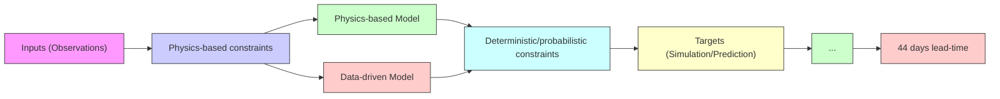
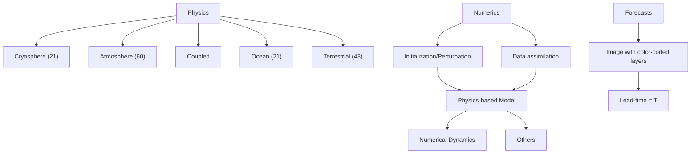
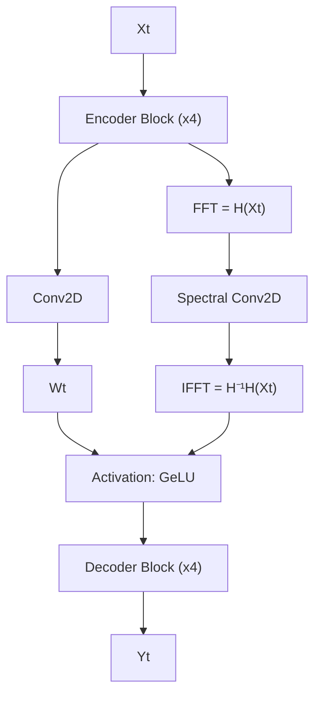

# ChaosBench: A Multi-Channel, Physics-Based Benchmark for Subseasonal-to-Seasonal Climate Prediction

Juan Nathaniel $^{1,*}$ , Yongquan Qu $^{1}$ , Tung Nguyen $^{2}$ , Sungduk Yu $^{3,5}$ , Julius Busecke $^{1,4}$ , Aditya Grover $^{2}$ , Pierre Gentine $^{1}$

$^{1}$ Columbia University, $^{2}$ UCLA, $^{3}$ UCI, $^{4}$ LDEO, $^{5}$ Intel Labs

# Abstract

Accurate prediction of climate in the subseasonal-to-seasonal scale is crucial for disaster preparedness and robust decision making amidst climate change. Yet, forecasting beyond the weather timescale is challenging because it deals with problems other than initial condition, including boundary interaction, butterfly effect, and our inherent lack of physical understanding. At present, existing benchmarks tend to have shorter forecasting range of up-to 15 days, do not include a wide range of operational baselines, and lack physics-based constraints for explainability. Thus, we propose ChaosBench, a challenging benchmark to extend the predictability range of data-driven weather emulators to S2S timescale. First, ChaosBench is comprised of variables beyond the typical surface-atmospheric ERA5 to also include ocean, ice, and land reanalysis products that span over 45 years to allow for full Earth system emulation that respects boundary conditions. We also propose physics-based, in addition to deterministic and probabilistic metrics, to ensure a physically-consistent ensemble that accounts for butterfly effect. Furthermore, we evaluate on a diverse set of physics-based forecasts from four national weather agencies as baselines to our data-driven counterpart such as ViT/ClimaX, PanguWeather, GraphCast, and FourCastNetV2. Overall, we find methods originally developed for weather-scale applications fail on S2S task: their performance simply collapse to an unskilled climatology. Nonetheless, we outline and demonstrate several strategies that can extend the predictability range of existing weather emulators, including the use of ensembles, robust control of error propagation, and the use of physics-informed models. Our benchmark, datasets, and instructions are available at https://leap-stc.github.io/ChaosBench.

# 1 Introduction

Although critical for economic planning, disaster preparedness, and policy-making, subseasonal-to-seasonal (S2S) prediction is lagging behind the more established field of short/medium-range weather, or long-range climate predictions. For instance, many natural hazards tend to manifest in the S2S scale, including the slow-onset of droughts that lead to wildfire $[1, 2]$ , heavy precipitations that lead to flooding $[3]$ , and persistent weather anomalies that lead to extremes $[4]$ . So far, current approaches to weather and climate prediction are heavily reliant on physics-based models in the form of Numerical Weather Prediction (NWP). Many NWPs are based on the discretization of governing equations that describe thermodynamics, fluid flows, etc. However, these models are expensive to run especially in high-resolution setting. For example, there are massive computational overheads to perform numerical integration at fine spatiotemporal resolutions that are operationally useful $[5]$ . Furthermore,


<details>
<summary>flowchart</summary>


</details>

Figure 1: We propose ChaosBench, a large-scale, fully-coupled, physics-based benchmark for subseasonal-to-seasonal (S2S) climate prediction. It is framed as a high-dimensional sequential regression task that consists of 45+ years, multi-system observations for validating physics-based and data-driven models, and training the latter. Physics-based forecasts are generated from four national weather agencies with 44-day lead-time and serve as baselines to data-driven forecasts. Our benchmark is one of the first to incorporate physics-based metrics to ensure physically-consistent and explainable models. The blurred image at $\Delta t = 44$ represents a challenge of long-term forecasting.

their relative inaccessibility to non-experts is a major roadblock to the broader community. As a result, there is a growing interest to apply data-driven models to emulate NWPs, as they tend to have faster inference speed, are less resource-hungry, and more accessible $[6, 7, 8, 9, 10, 11, 12]$ . Nevertheless, many data-driven benchmarks have so far been focused on the short (1-5 days), medium (5-15 days), and long (years-decades) forecasting ranges. In this work, we include S2S as a more challenging task that requires different emulation strategies: being in between two extremes, it is doubly sensitive to (1) initial conditions (IC) as in the case for short/medium-range weather, and (2) boundary conditions (BC) as in the case for long-range climate $[13, 14, 15, 16]$ .

We propose ChaosBench to bridge these gaps (Figure 1). It is comprised of variables beyond the typical surface-atmospheric ERA5 to also include ocean, ice, and land reanalysis products that span over 45 years to allow for full Earth system emulation that respects boundary processes. We also provide 44-day ahead physics-based control (deterministic) and perturbed (ensemble) forecasts from four national weather agencies over the last 8 years as baselines. In addition, we introduce physics-based and incorporate probabilistic, in addition to deterministic metrics, for a more physically-consistent ensemble that accounts for butterfly effect. As far as we know, ChaosBench is one of the first to systematically evaluate several state-of-the-art data-driven models including ViT/ClimaX [17], PanguWeather [18], GraphCast [7], and FourCastNetV2 [9] on S2S predictability.

In this work, we demonstrate that existing physics-based and data-driven models are indistinguishable from unskilled climatology as the forecasting range approaches the S2S timescale. The high spectral divergence observed in many state-of-the-art models suggests the lost of predictive accuracy of multi-scale structures. This leads to significant blurring and a tendency towards smoother predictions. For one, such averaging is of little use when one attempts to identify extreme events requiring high-fidelity forecasts on the S2S scale (e.g., regional droughts, hurricanes, etc). Also, performing comparably worse than climatology renders them operationally unusable. This highlights the urgent need for a robust and unified data-driven S2S intercomparison project.

# 2 Related Work

In recent years, several benchmarks have been introduced to push the field of data-driven weather and climate prediction $[19, 20, 21, 22, 23, 24, 25, 26, 27]$ . We analyze the limitations of existing works, and propose how ChaosBench fills in these gaps (see Table 1, more justifications in Appendix C).

Gap in forecast lead-time. Many existing benchmarks are built for short/medium-range weather (up to 15 days) [22, 19, 20], and long-term climate (annual to decadal scale) [26]. As discussed earlier, these problems tend to be easier due to the lack of combined sensitivities to IC and BC [13, 14].

Limited spatiotemporal extent. Many S2S benchmarks tend to focus on regional forecasts, such as the US [23, 24]. In addition, the temporal extent of observation with common interval is more varied,

Table 1: Comparison with other benchmark datasets: ChaosBench (ours) is evaluated on the largest set of global variables, benchmarked against large number of operational NWPs (four national agencies in the US, Europe, UK, and Asia), and incorporates both physics-based and probabilistic metrics for a more physically-consistent S2S ensemble forecast. 

<table><tr><td>Datasets</td><td># input variables</td><td># target variables</td><td>forecast lead (days)</td><td>physics-based metrics</td><td>probabilistic metrics</td><td>spatial extent</td></tr><tr><td>WeatherBench [22]</td><td>110</td><td>110</td><td>15</td><td>√</td><td>√</td><td>global</td></tr><tr><td>SubseasonalRodeo [23]</td><td>&lt;30</td><td>2</td><td>44</td><td>✗</td><td>✗</td><td>western US</td></tr><tr><td>SubseasonalClimateUSA [24]</td><td>&lt;30</td><td>2</td><td>44</td><td>✗</td><td>√</td><td>contiguous US</td></tr><tr><td>CliMetLab [25]</td><td>&lt;30</td><td>2</td><td>44</td><td>✗</td><td>√</td><td>global</td></tr><tr><td>ChaosBench (ours)</td><td>124</td><td>124</td><td>44</td><td>√</td><td>√</td><td>global</td></tr></table>

with some less than 20 years [19, 25]. ChaosBench has the most extensive overlapping temporal coverage yet, extending to $45+$ years of inputs covering multiple reanalysis products beyond ERA5.

Limited diversity of baseline models. Having a large set of physics-based forecasts as baselines is key to reducing bias and diversifying the target goal-posts. Previous benchmarks are mostly focused on increasing the number of data-driven models for baselines $[22, 23]$ . In contrast, ChaosBench also places weights on expanding the diversity of physics-based models, including those operated by leading national weather agencies in the US, Europe, UK, and Asia.

Lack of physics-based constraints. So far, limited number of benchmarks have explicitly incorporated physical principles to improve or constrain forecasts. ChaosBench introduces physics-based metrics that can be used for comparison (scalar) and integrated into ML pipeline (differentiable).

# 3 ChaosBench

# 3.1 Observations

We discuss the components of ChaosBench, including the global reanalysis products of surface-atmosphere (ERA5), sea-ice (ORAS5), and terrestrial (LRA5), as well as simulations from physics-based models. The spatiotemporal resolutions of the former are matched with the latter's daily forecasts at $1.5^{\circ}$ to allow for consistent evaluation and integration e.g., hybrid physics-based emulator. However, we provide a one-liner script to process higher e.g., $0.25^{\circ}$ resolution input in Section B.4.

ERA5 Reanalysis provides a comprehensive record of the global atmosphere combining physics and observations for correction $[28]$ . We processed their hourly data from 1979 to present and selected measurements at the 00UTC step. The variables include temperature $(t)$ , specific humidity $(q)$ , geopotential height $(z)$ , and 3D wind speed $(u, v, w)$ at 10 pressure levels: 1000, 925, 850, 700, 500, 300, 200, 100, 50, 10 hpa, totalling 60 variables (full list in D.1.1).

ORAS5 or the Ocean Reanalysis System 5 provides an extensive record of sea-ice variables that incorporate multiple depth levels [29]. Since the public data is available on a monthly basis, we replicate them for daily compatibility with temporal extent from 1979 to present, for a total of 21 variables, including sst and ssh (full list in D.1.2).

LRA5 or ERA5-Land Reanalysis provides a detailed record of variables governing global terrestrial processes with specific corrections tailored for land surface applications such as flood forecasting $[30]$ or carbon fluxes $[21, 31]$ . We processed hourly data from 1979 to present and selected measurements at the 00UTC step, for a total of 43 variables, including t2m, u10, v10, and tp (full list in D.1.3).

# 3.2 Simulations

We briefly describe the forecast generation process from physics-based models (Figure 2), including details on forecast frequency and the number of ensemble members. More details are provided in


<details>
<summary>heatmap</summary>

| Time | Truth | Prediction | Residual |
|------|-------|------------|----------|
| t = 1 | -2    | -2         | -1       |
| t = 1 | -0    | 0          | 0        |
| t = 1 | 2     | 2          | 1        |
| t = 44| -2    | -2         | -1       |
| t = 44| -0    | 0          | 0        |
| t = 44| 2     | 2          | 1        |
</details>

(a) Normalized humidity@700-hpa label, forecast, and residual at the first $t = 1$ and final $t = 44$ step with ClimaX


<details>
<summary>contour</summary>

| Wavenumber, k | Number of days ahead | Power, S(k) |
| ------------- | -------------------- | ----------- |
| 10^0          | 0                    | 10^7        |
| 10^1          | 10                   | 10^6        |
| 10^2          | 20                   | 10^5        |
| 10^3          | 30                   | 10^4        |
| 10^4          | 40                   | 10^3        |
</details>

(b) Power spectrum $S(k)$ vs. wavenumber k plot as a function of prediction step of normalized humidity@700-hpa with ClimaX   
Figure 3: Motivating problem: as we perform longer rollouts, the (a) residual error becomes larger and prediction becomes blurry. This behavior is captured in the Fourier frequency domain where the (b) power spectra $S(k)$ at low wavenumber k (i.e., low frequency signal) remains consistent at long rollouts, but not for higher k (i.e., high frequency signal). This phenomenon explains why long-term forecasts excel at capturing large-scale pattern but not fine-grained details i.e., smooth.

Appendix D.2. The list of available variables for physics-based forecast are similar to ERA5 but missing $\{q10,q50,q100\}$ and $w \notin \{w500\}$ for a total of 48 variables. In all, we process control (deterministic) and perturbed (ensemble) forecasts from 2016 to present [32].

UKMO. The UK Meteorological Office uses the Global Seasonal Forecast System Version 6 (GloSea6) model [33] to generate daily 3+1 ensemble/control forecasts for 60-day lead time.

NCEP. The National Centers for Environmental Prediction uses the Climate Forecast System 2 (CFSv2) model [34] to generate daily 15+1 ensemble/control forecast for 45-day lead time.

CMA. The China Meteorological Administration uses the Beijing Climate Center (BCC) fully-coupled BCC-CSM2-HR model [35] to generate 3+1 ensemble/control forecasts at 3-day interval for 60-day lead time.

ECMWF. The European Centre for Medium-Range Weather Forecasts uses the operational Integrated Forecasting System (IFS) that includes advanced data assimilation strategies and global numerical model of the Earth system [36]. In particular, we use the CY41R1 version of the IFS to generate 50+1 ensemble/control forecasts twice weekly for 46-day lead time.


<details>
<summary>flowchart</summary>


</details>

Figure 2: Physics-based simulations that couple different parts of the Earth system along with their operational choices such as data assimilation. The brackets are the number of variables provided in ChaosBench.

# 3.3 Auxiliary

In addition to baseline forecasts from physics-based and data-driven models, we provide additional aux-

iliary data and baselines. This includes climatology, the long-term weather-state statistics, and persistence, which uses initial observation for subsequent rollouts.

# 4 Benchmark Metrics

We provide an assortment of metrics, which we divide into deterministic, probabilistic, and several proposed physics-based criteria, for increased explainability. For each metric, unless otherwise noted, we apply a weighting scheme at each latitude $\theta_{i}$ as defined by Equation 1.

$$
w (\theta_ {i}) = \frac {\cos (\theta_ {i})}{\frac {1}{| \boldsymbol {\theta} |} \sum_ {a = 1} ^ {| \boldsymbol {\theta} |} \cos (\theta_ {a})} \tag {1}
$$

where $\theta$ is the set of all latitudes in our data, and $|\theta|$ is its cardinality. We denote the input at time t as $X_{t} \in R^{h \times w \times p}$ , where h, w, p represent the height (i.e., latitude), width (i.e., longitude), and parameter (e.g., temperature) with its associated vertical level (e.g., 1000-hpa or surface). In addition, we denote $\{Y_{t}, \hat{Y}_{t}\} \in R^{h \times w \times p}$ as the ground-truth label and prediction respectively. Finally, we denote each element of latitude and longitude as $\theta_{i} \in \theta$ and $\gamma_{j} \in \gamma$ .

# 4.1 Deterministic Metrics

We provide popular deterministic metrics in the machine learning and climate science literature alike, including RMSE, Bias, ACC, and MS-SSIM.

Root Mean Squared Error (RMSE) is useful to penalize outliers, which are especially critical for weather and climate applications such as extreme event prediction (Equation S1).

Bias assists us to identify misspecification and systematic errors present in the model (Equation S2).

Anomaly Correlation Coefficient (ACC) measures the correlation between predicted and observed anomalies. This metric is especially useful in weather and climate applications, where deviations from the norm (e.g., temperature anomalies) often reveal interesting insights (Equation S3).

Multi-Scale Structural Similarity (MS-SSIM) [37] compares structural similarity between forecast and ground-truth label across scales (refer to Appendix F.1.4 for more details). This is especially useful in weather systems because they occur at multiple scales, from large systems like cyclones, to smaller features like localized rain thunderstorms.

# 4.2 Physics Metrics

As illustrated in Figure 3, we find that in general, data-driven forecasts tend to become blurry (Figure 3a) due to power divergence in the spectral domain (Figure 3b + S10). This motivates us to propose two physics-based metrics that measure the deviation or difference between the power spectra of prediction $\hat{S}(k)$ and target $S(k)$ , where $k \in \mathbf{K}$ , and $\mathbf{K}$ is the set of all scalar wavenumbers from 2D Fourier transform. Focusing on high-frequency components, we introduce $\mathbf{K}_q = \{k \in \mathbf{K} \mid k \geq Q(q)\}$ , where $Q$ is the quantile function of $\mathbf{K}$ and $q \in [0,1]$ . We set $q = 0$ or $q = 0.9$ for training and evaluation respectively. We denote $S_q = \{S(k) \mid k \in \mathbf{K}_q\}$ as the corresponding power spectra on $\mathbf{K}_q$ , and we normalize the distribution to $S'(k)$ such that it sums up to 1. Similarly we use $\hat{S}'(k)$ to denote the normalized power for predictions.

Spectral Divergence (SpecDiv) follows principles from Kullback–Leibler (KL) divergence [38] where we compute the expectation of the log ratio between target $S'(k)$ and prediction $\hat{S}'(k)$ spectra, and is defined in Equation 2 (see Listing S1 for PYTORCH psuedocode).

$$
\mathcal {M} _ {\text { SpecDiv }} = \sum_ {k} S ^ {\prime} (k) \cdot \log (S ^ {\prime} (k) / \hat {S} ^ {\prime} (k)) \tag {2}
$$

Spectral Residual (SpecRes) follows principles from RMSE and adapted from $[39]$ where we compute the root of the expected squared residual, and is defined in Equation 3 (see Listing S2 for PYTORCH psuedocode).

$$
\mathcal {M} _ {\text { SpecRes }} = \sqrt {\mathbb {E} _ {k} [ (\hat {S} ^ {\prime} (k) - S ^ {\prime} (k)) ^ {2} ]} \tag {3}
$$


<details>
<summary>line</summary>

| Number of days ahead | Climatology | ECMWF | CMA | UKMO | NCEP |
| --------------------- | ----------- | ----- | --- | ---- | ---- |
| 0                     | 3.0         | 1.0   | 1.5 | 1.2  | 1.3  |
| 10                    | 3.5         | 3.8   | 4.5 | 4.2  | 4.3  |
| 20                    | 4.0         | 4.5   | 5.0 | 4.8  | 4.9  |
| 30                    | 4.5         | 4.7   | 5.2 | 5.0  | 5.1  |
| 40                    | 4.8         | 4.8   | 5.3 | 5.1  | 5.2  |
</details>


<details>
<summary>line</summary>

| Number of days ahead | Climatology | ECMWF | CMA | UKMO | NCEP |
| --- | --- | --- | --- | --- | --- |
| 0 | 0.0 | 0.0 | 0.0 | 0.0 | 0.0 |
| 10 | 0.8 | 0.8 | 0.8 | 0.8 | 0.8 |
| 20 | 1.1 | 1.1 | 1.1 | 1.1 | 1.1 |
| 30 | 1.2 | 1.2 | 1.2 | 1.2 | 1.2 |
| 40 | 1.2 | 1.2 | 1.2 | 1.2 | 1.2 |
</details>


<details>
<summary>line</summary>

| Number of days ahead | Climatology | ECMWF | CMA | UKMO | NCEP |
| --- | --- | --- | --- | --- | --- |
| 0 | 1.6e-3 | 0.8e-3 | 1.2e-3 | 1.1e-3 | 1.3e-3 |
| 10 | 2.2e-3 | 2.0e-3 | 2.4e-3 | 2.2e-3 | 2.1e-3 |
| 20 | 2.3e-3 | 2.2e-3 | 2.5e-3 | 2.3e-3 | 2.2e-3 |
| 30 | 2.3e-3 | 2.3e-3 | 2.5e-3 | 2.3e-3 | 2.3e-3 |
| 40 | 2.3e-3 | 2.3e-3 | 2.5e-3 | 2.3e-3 | 2.3e-3 |
</details>


<details>
<summary>line</summary>

| Number of days ahead | Climatology | ECMWF | CMA | UKMO | NCEP |
| --- | --- | --- | --- | --- | --- |
| 0 | 1.0 | 1.0 | 1.0 | 1.0 | 1.0 |
| 10 | 0.2 | 0.3 | 0.25 | 0.35 | 0.2 |
| 20 | 0.05 | 0.1 | 0.08 | 0.12 | 0.05 |
| 30 | 0.02 | 0.05 | 0.03 | 0.06 | 0.02 |
| 40 | 0.01 | 0.02 | 0.01 | 0.03 | 0.01 |
</details>


<details>
<summary>line</summary>

| Number of days ahead | Climatology | ECMWF | CMA | UKMO | NCEP |
| --- | --- | --- | --- | --- | --- |
| 0 | 1.0 | 1.0 | 1.0 | 1.0 | 1.0 |
| 10 | 0.4 | 0.4 | 0.4 | 0.4 | 0.4 |
| 20 | 0.1 | 0.1 | 0.1 | 0.1 | 0.1 |
| 30 | 0.0 | 0.0 | 0.0 | 0.0 | 0.0 |
| 40 | 0.0 | 0.0 | 0.0 | 0.0 | 0.0 |
</details>


<details>
<summary>line</summary>

| Number of days ahead | Climatology | ECMWF | CMA | UKMO | NCEP |
| --- | --- | --- | --- | --- | --- |
| 0 | 0.0 | 0.9 | 0.8 | 0.85 | 0.75 |
| 10 | 0.0 | 0.3 | 0.25 | 0.35 | 0.2 |
| 20 | 0.0 | 0.1 | 0.05 | 0.15 | 0.05 |
| 30 | 0.0 | 0.05 | 0.02 | 0.05 | 0.02 |
| 40 | 0.0 | 0.02 | 0.01 | 0.02 | 0.01 |
</details>


<details>
<summary>line</summary>

| Number of days ahead | Climatology | ECMWF | CMA | UKMO | NCEP |
| --- | --- | --- | --- | --- | --- |
| 0 | 0.85 | 1.00 | 0.95 | 0.87 | 0.95 |
| 10 | 0.85 | 0.85 | 0.80 | 0.70 | 0.80 |
| 20 | 0.85 | 0.78 | 0.75 | 0.65 | 0.75 |
| 30 | 0.85 | 0.76 | 0.74 | 0.64 | 0.74 |
| 40 | 0.85 | 0.75 | 0.74 | 0.64 | 0.74 |
</details>


<details>
<summary>line</summary>

| Number of days ahead | Climatology | ECMWF | CMA | UKMO | NCEP |
| --- | --- | --- | --- | --- | --- |
| 0 | 1.00 | 1.00 | 1.00 | 1.00 | 1.00 |
| 10 | 0.83 | 0.83 | 0.83 | 0.83 | 0.83 |
| 20 | 0.73 | 0.73 | 0.73 | 0.73 | 0.73 |
| 30 | 0.72 | 0.72 | 0.72 | 0.72 | 0.72 |
| 40 | 0.72 | 0.72 | 0.72 | 0.72 | 0.72 |
</details>


<details>
<summary>line</summary>

| Number of days ahead | Climatology | ECMWF | CMA | UKMO | NCEP |
| --- | --- | --- | --- | --- | --- |
| 0 | 0.6 | 0.95 | 0.95 | 0.95 | 0.95 |
| 10 | 0.6 | 0.55 | 0.55 | 0.55 | 0.55 |
| 20 | 0.6 | 0.48 | 0.48 | 0.48 | 0.48 |
| 30 | 0.6 | 0.45 | 0.45 | 0.45 | 0.45 |
| 40 | 0.6 | 0.43 | 0.43 | 0.43 | 0.43 |
</details>

(c) MS-SSIM ( $\uparrow$ is better)   
Figure 4: Evaluation results between baseline climatology (black line) and physics-based control/deterministic forecasts. At longer forecasting horizon, most physics-based control/deterministic forecasts perform worse than climatology.

The expectations are calculated over $K_{q}$ . For both physics-based metrics, the value will be zero if the power spectra of the forecast is identical to the target, but will increase as discrepancy emerges. Essentially, both metrics measure how well the forecasts preserve signals across the frequency spectrum.

# 4.3 Probabilistic Metrics

In addition to the probabilistic version of RMSE, Bias, ACC, MS-SSIM, SpecDiv, and SpecRes where we take their expectation with respect to the ensemble members (Equations S14-S19), we also use several probabilistic metrics to evaluate ensemble forecasts critical for long-range S2S prediction.

Continuous Ranked Probability Score (CRPS) evaluates the accuracy of the ensemble distribution against the target. Low CRPS values require forecasts to be reliable, where the predicted uncertainty aligns with the actual uncertainty, and a smaller uncertainty is preferable (Equation S20).


<details>
<summary>line</summary>

| Number of days ahead | Climatology | PW   | GC   | FCN2 |
| -------------------- | ----------- | ---- | ---- | ---- |
| 0                    | 3.3         | 1.0  | 1.0  | 1.0  |
| 10                   | 3.3         | 4.5  | 4.5  | 4.5  |
| 20                   | 3.3         | 4.8  | 4.8  | 4.7  |
| 30                   | 3.3         | 5.0  | 5.0  | 4.8  |
| 40                   | 3.3         | 5.1  | 5.1  | 4.9  |
</details>


<details>
<summary>line</summary>

| Number of days ahead | Climatology | PW    | GC    | FCN2  |
| -------------------- | ----------- | ----- | ----- | ----- |
| 0                    | 0.8         | 0.8   | 0.8   | 0.8   |
| 10                   | 0.9         | 1.0   | 1.0   | 1.0   |
| 20                   | 1.1         | 1.2   | 1.1   | 1.1   |
| 30                   | 1.2         | 1.2   | 1.2   | 1.2   |
| 40                   | 1.2         | 1.3   | 1.2   | 1.1   |
</details>


<details>
<summary>line</summary>

| Number of days ahead | Climatology | PW     | GC     |
| -------------------- | ----------- | ------ | ------ |
| 0                    | 1.6e-3      | 0.8e-3 | 0.8e-3 |
| 10                   | 1.6e-3      | 2.0e-3 | 1.9e-3 |
| 20                   | 1.6e-3      | 2.1e-3 | 2.0e-3 |
| 30                   | 1.6e-3      | 2.2e-3 | 2.2e-3 |
| 40                   | 1.6e-3      | 2.2e-3 | 2.3e-3 |
</details>


<details>
<summary>line</summary>

| Number of days ahead | Climatology | PW    | GC    | FCN2  |
| -------------------- | ----------- | ----- | ----- | ----- |
| 0                    | 1.0         | 1.0   | 1.0   | 1.0   |
| 10                   | 0.2         | 0.3   | 0.4   | 0.3   |
| 20                   | 0.05        | 0.05  | 0.05  | 0.05  |
| 30                   | 0.0         | 0.0   | 0.0   | 0.0   |
| 40                   | 0.0         | 0.0   | 0.0   | 0.0   |
</details>


<details>
<summary>line</summary>

| Number of days ahead | Climatology | PW    | GC    | FCN2  |
| -------------------- | ----------- | ----- | ----- | ----- |
| 0                    | 1.0         | 1.0   | 1.0   | 1.0   |
| 10                   | 0.5         | 0.6   | 0.7   | 0.8   |
| 20                   | 0.1         | 0.2   | 0.3   | 0.4   |
| 30                   | 0.0         | -0.1  | 0.0   | -0.1  |
| 40                   | 0.0         | 0.0   | 0.0   | 0.0   |
</details>


<details>
<summary>line</summary>

| Number of days ahead | Climatology | PW    | GC    |
| -------------------- | ----------- | ----- | ----- |
| 0                    | 0.0         | 0.9   | 0.9   |
| 10                   | 0.0         | 0.4   | 0.3   |
| 20                   | 0.0         | 0.1   | 0.1   |
| 30                   | 0.0         | 0.05  | 0.05  |
| 40                   | 0.0         | 0.05  | 0.05  |
</details>


<details>
<summary>line</summary>

| Number of days ahead | Climatology | PW    | GC    | FCN2  |
| -------------------- | ----------- | ----- | ----- | ----- |
| 0                    | 0.85        | 0.99  | 0.99  | 0.99  |
| 10                   | 0.85        | 0.85  | 0.85  | 0.85  |
| 20                   | 0.85        | 0.78  | 0.78  | 0.78  |
| 30                   | 0.85        | 0.74  | 0.74  | 0.76  |
| 40                   | 0.85        | 0.73  | 0.73  | 0.76  |
</details>


<details>
<summary>line</summary>

| Number of days ahead | Climatology | PW    | GC    | FCN2  |
| -------------------- | ----------- | ----- | ----- | ----- |
| 0                    | 1.00        | 1.00  | 1.00  | 1.00  |
| 10                   | 0.82        | 0.82  | 0.82  | 0.82  |
| 20                   | 0.75        | 0.73  | 0.74  | 0.76  |
| 30                   | 0.72        | 0.71  | 0.72  | 0.74  |
| 40                   | 0.70        | 0.69  | 0.70  | 0.73  |
</details>


<details>
<summary>line</summary>

| Number of days ahead | Climatology | PW    | GC    |
| -------------------- | ----------- | ----- | ----- |
| 0                    | 0.6         | 0.95  | 0.95  |
| 10                   | 0.6         | 0.55  | 0.55  |
| 20                   | 0.6         | 0.45  | 0.45  |
| 30                   | 0.6         | 0.43  | 0.43  |
| 40                   | 0.6         | 0.42  | 0.41  |
| 45                   | 0.6         | 0.43  | 0.40  |
</details>

(c) MS-SSIM ( $\uparrow$ is better)   
Figure 5: Evaluation results between baseline climatology (black line) and data-driven models including PanguWeather (PW), GraphCast (GC), and FourCastNetV2 (FCN2). We find that deterministic ML models perform worse than climatology on S2S timescale. Note: FCN2 lacks q-700.

Continuous Ranked Probability Skill Score (CRPSS) evaluates the skill of probabilistic forecast relative to climatology variability; CRPSS > 0 suggests skillfulness and vice versa (Equation S21).

Spread quantifies the uncertainty in ensemble forecasts by measuring the variability among ensemble members, which helps to understand the range of possible outcomes and confidence (Equation S22).

Spread/Skill Ratio balances the ensemble spread with the forecast skill (e.g., RMSE); ideally, a well-calibrated ensemble should have a spread that matches the forecast skill (Equation S23).

# 5 Benchmark Results

Throughout this section, we report headline results on $\hat{X} \in \{t-850, z-500, q-700\}$ , following Weatherbench v2 [40]. The full benchmark scores are available at https://leap-stc.github.io/ChaosBench. We primarily use four state-of-the-art models for comparison including ViT/ClimaX [17], PanguWeather [18], GraphCast, and FourCastNetV2 [9] [7]. However, whenever ablation is performed, we use popular baselines including Lagged Autoencoder [41], ResNet [42], UNet [22], and FNO [43] trained


<details>
<summary>bar</summary>

| Category     | SDIV  |
| ------------ | ----- |
| Climatology   | 0.05  |
| ECMWF        | 0.05  |
| CMA          | 0.06  |
| UKMO         | 0.07  |
| NCEP         | 0.50  |
</details>


<details>
<summary>bar</summary>

| Category     | SDIV  |
| ------------ | ----- |
| Climatology   | 0.06  |
| ECMWF        | 0.04  |
| CMA          | 0.08  |
| UKMO         | 0.09  |
| NCEP         | 0.50  |
</details>


<details>
<summary>bar</summary>

| Category     | SDIV  |
| ------------ | ----- |
| Climatology  | 0.02  |
| ECMWF        | 0.06  |
| CMA          | 0.06  |
| UKMO         | 0.07  |
| NCEP         | 0.13  |
</details>

(a) SpecDiv (↓ is better) for physics-based models   


<details>
<summary>bar</summary>

| Category     | SDIV  |
| ------------ | ----- |
| Climatology  | 0.00  |
| PW           | 0.20  |
| GC           | 0.13  |
| FCN2         | 0.29  |
</details>


<details>
<summary>bar</summary>

| Category     | SDIV  |
| ------------ | ----- |
| Climatology  | 0.00  |
| PW           | 0.17  |
| GC           | 0.08  |
| FCN2         | 0.18  |
</details>


<details>
<summary>bar</summary>

| Category     | SDIV  |
| ------------ | ----- |
| Climatology  | 0.03  |
| PW           | 0.34  |
| GC           | 0.30  |
| FCN2         | 0.00  |
</details>

(b) SpecDiv (↓ is better) for data-driven models   
Figure 6: Spectral divergence between (a) physics-based, and (b) data-driven models. Overall, we observe that the latter perform worse than their physics-based counterpart (barring NCEP) on time-averaged spectral divergence. Note: FCN2 lacks q-700.

on 1979-2015 data and validated on 2016-2021 data. All evaluations presented here are done on the held-out 2022 data. The full implementation details are discussed in Appendix E.

Table 2: Performance metrics for SoTAs with different training strategies, at $\Delta t = 44$ 

<table><tr><td rowspan="2">Metrics</td><td rowspan="2">Variables</td><td>Reference</td><td colspan="3">Autoregressive</td><td>Direct</td></tr><tr><td>Climatology</td><td>PW</td><td>GC</td><td>FCN2</td><td>ViT/ClimaX</td></tr><tr><td rowspan="3">RMSE ↓</td><td>t-850 (K)</td><td>3.39</td><td>5.85</td><td>5.87</td><td>5.11</td><td>3.56</td></tr><tr><td>z-500 (gpm)</td><td>81.0</td><td>120.9</td><td>136.0</td><td>112.4</td><td>83.1</td></tr><tr><td>q-700 ( $\times 10^{-3}$ )</td><td>1.62</td><td>2.35</td><td>2.28</td><td>-</td><td>1.66</td></tr><tr><td rowspan="3">MS-SSIM ↑</td><td>t-850</td><td>0.85</td><td>0.70</td><td>0.70</td><td>0.74</td><td>0.83</td></tr><tr><td>z-500</td><td>0.82</td><td>0.68</td><td>0.66</td><td>0.72</td><td>0.81</td></tr><tr><td>q-700</td><td>0.62</td><td>0.43</td><td>0.45</td><td>-</td><td>0.59</td></tr><tr><td rowspan="3">SpecDiv ↓</td><td>t-850</td><td>0.01</td><td>0.25</td><td>0.05</td><td>0.28</td><td>0.20</td></tr><tr><td>z-500</td><td>0.01</td><td>0.33</td><td>0.03</td><td>0.11</td><td>0.13</td></tr><tr><td>q-700</td><td>0.03</td><td>0.23</td><td>0.27</td><td>-</td><td>0.28</td></tr></table>

Collapse in Predictive Skill. As shown in Figure 4 (+ S2), control forecasts from various operational centers perform worse than climatology at the S2S scale beyond 15 days. A similar phenomenon of skill collapse is evident in data-driven models, as depicted in Figure 5 (+ S3). Unlike their physics-based counterparts, these forecasts exhibit significantly higher spectral divergence as evidenced in Figure 6, indicating low predictive skill for multi-scale structures over long rollouts. This leads to the blurring artifacts previously discussed. The pervasive lack of predictive skill underscores the notoriously difficult challenge of S2S forecasting and highlights huge potential for improvement.


<details>
<summary>line</summary>

| Number of days ahead | ECMWF (n=50) | CMA (n=3) | UKMO (n=3) | NCEP (n=15) |
| -------------------- | ------------ | --------- | ---------- | ----------- |
| 0                    | 1.00         | 1.00      | 1.00       | 1.00        |
| 10                   | 0.75         | 0.90      | 0.85       | 0.80        |
| 20                   | 0.73         | 0.85      | 0.82       | 0.78        |
| 30                   | 0.72         | 0.84      | 0.81       | 0.77        |
| 40                   | 0.73         | 0.84      | 0.82       | 0.76        |
</details>


<details>
<summary>line</summary>

| Number of days ahead | ECMWF (n=50) | CMA (n=3) | UKMO (n=3) | NCEP (n=15) |
| -------------------- | ------------ | --------- | ---------- | ----------- |
| 0                    | 1.0          | 1.0       | 1.0        | 1.2         |
| 10                   | 0.8          | 0.9       | 0.85       | 0.8         |
| 20                   | 0.75         | 0.85      | 0.8        | 0.75        |
| 30                   | 0.73         | 0.82      | 0.8        | 0.73        |
| 40                   | 0.72         | 0.81      | 0.8        | 0.72        |
</details>


<details>
<summary>line</summary>

| Number of days ahead | ECMWF (n=50) | CMA (n=3) | UKMO (n=3) | NCEP (n=15) |
| -------------------- | ------------ | --------- | ---------- | ----------- |
| 0                    | 0.87         | 0.95      | 0.98       | 1.00        |
| 10                   | 0.75         | 0.92      | 0.90       | 0.85        |
| 20                   | 0.73         | 0.88      | 0.86       | 0.80        |
| 30                   | 0.72         | 0.87      | 0.85       | 0.78        |
| 40                   | 0.72         | 0.87      | 0.85       | 0.78        |
</details>

(a) RMSE: ensemble improves deterministic forecasts if ratio $< 1$   


<details>
<summary>line</summary>

| Number of days ahead | ECMWF (n=50) | CMA (n=3) | UKMO (n=3) | NCEP (n=15) |
| -------------------- | ------------ | --------- | ---------- | ----------- |
| 0                    | 1.00         | 1.00      | 1.00       | 1.00        |
| 10                   | 1.08         | 1.04      | 1.06       | 1.07        |
| 20                   | 1.11         | 1.06      | 1.08       | 1.10        |
| 30                   | 1.12         | 1.07      | 1.08       | 1.11        |
| 40                   | 1.12         | 1.07      | 1.08       | 1.11        |
</details>


<details>
<summary>line</summary>

| Number of days ahead | ECMWF (n=50) | CMA (n=3) | UKMO (n=3) | NCEP (n=15) |
| -------------------- | ------------ | --------- | ---------- | ----------- |
| 0                    | 1.00         | 1.00      | 1.00       | 1.00        |
| 10                   | 1.06         | 1.04      | 1.05       | 1.07        |
| 20                   | 1.12         | 1.07      | 1.08       | 1.11        |
| 30                   | 1.13         | 1.08      | 1.09       | 1.12        |
| 40                   | 1.12         | 1.08      | 1.09       | 1.12        |
</details>


<details>
<summary>line</summary>

| Number of days ahead | ECMWF (n=50) | CMA (n=3) | UKMO (n=3) | NCEP (n=15) |
| -------------------- | ------------ | --------- | ---------- | ----------- |
| 0                    | 1.0          | 1.0       | 1.0        | 1.0         |
| 10                   | 1.25         | 1.1       | 1.15       | 1.2         |
| 20                   | 1.3          | 1.15      | 1.18       | 1.25        |
| 30                   | 1.32         | 1.16      | 1.19       | 1.27        |
| 40                   | 1.33         | 1.17      | 1.2        | 1.28        |
</details>

(b) MS-SSIM: ensemble improves deterministic forecasts if ratio > 1   
Figure 7: Metrics ratio e.g., $RMSE_{ens}/RMSE_{det}$ between ensemble and deterministic forecasts, where the former improves the latter by accounting for IC uncertainty that can lead to trajectory divergences. Note: n represents the number of ensemble members.

Ensemble Forecasts Account for IC Uncertainty. Despite the underperformance of deterministic models, many studies have highlighted the potential of ensemble forecasts to account for trajectory divergences caused by IC uncertainties $[44, 45, 46]$ , also known as the butterfly effect $[15]$ . Figure S4 shows that the performance of ensembles across physics-based models improves relative to their deterministic counterparts. For instance, when we take the metrics ratio between ensemble and deterministic forecasts as in Figure 7 (+ S5), the ratio of RMSE decreases with lead time, while the ratio of MS-SSIM improves over time with little significant changes in SpecDiv. The extent of improvement also appears to be affected by the number of ensemble members i.e., higher ensemble size n appears to improve skillfulness. We also note similar insights from data-driven ensembling strategy as discussed in Section G.3. This highlights the importance of building a well-dispersed ensemble that accounts for long-range divergences for improved S2S predictability.

Minimizing Error Propagation Promotes Stability. Different training and inference strategies have been proposed to improve the accuracy and stability of data-driven weather emulators. Chief among these are the autoregressive and direct approaches $[47]$ . The former iteratively cycles through small interval to reach the target lead-time i.e., $\Delta t = N\delta t$ where $N \in Z^{+}$ is the number of such compositions, while the latter directly outputs $\Delta t$ . As summarized in Table 2, we find models trained directly (e.g., ViT/ClimaX) have better performance than those used autoregressively (e.g., PW, GC, FCN2). This suggests that error propagation is a significant source of error, and controlling for stability is key to extend the predictability range of weather emulators. Once stability is achieved, the remaining sources of errors including uncertainties in observation and/or modeling framework can be improved through more data, better model, or both through data assimilation for instance $[48]$ .

Physical Constraints Yield Improved Performance. We find models that explicitly incorporate physical knowledge (e.g., learning spectral signals beyond pixel information) have better performance across metrics, such as FNO, as summarized in Table S8 given identical parameter budget of $10^{6}$ . This phenomena is unsurprising and has been repeatedly demonstrated in many real-world applications of physics-informed deep learning, for instance.


<details>
<summary>line</summary>

| Number of days ahead | ECMWF (n=50) | CMA (n=3) | UKMO (n=3) | NCEP (n=15) |
| -------------------- | ------------ | --------- | ---------- | ----------- |
| 0                    | 0.7          | 0.4       | 0.5        | 0.4         |
| 10                   | 0.2          | -0.4      | -0.3       | -0.1        |
| 20                   | 0.0          | -0.4      | -0.4       | -0.2        |
| 30                   | 0.0          | -0.4      | -0.4       | -0.2        |
| 40                   | 0.0          | -0.4      | -0.4       | -0.2        |
</details>


<details>
<summary>line</summary>

| Number of days ahead | ECMWF (n=50) | CMA (n=3) | UKMO (n=3) | NCEP (n=15) |
| -------------------- | ------------ | --------- | ---------- | ----------- |
| 0                    | 0.8          | 0.8       | 0.8        | 0.8         |
| 10                   | 0.2          | -0.2      | -0.1       | -0.1        |
| 20                   | 0.0          | -0.4      | -0.3       | -0.2        |
| 30                   | 0.0          | -0.4      | -0.3       | -0.2        |
| 40                   | 0.0          | -0.4      | -0.3       | -0.2        |
</details>


<details>
<summary>line</summary>

| Number of days ahead | ECMWF (n=50) | CMA (n=3) | UKMO (n=3) | NCEP (n=15) |
| -------------------- | ------------ | --------- | ---------- | ----------- |
| 0                    | 0.6          | 0.2       | 0.4        | 0.2         |
| 10                   | 0.1          | -0.6      | -0.2       | -0.2        |
| 20                   | 0.0          | -0.6      | -0.4       | -0.2        |
| 30                   | 0.0          | -0.6      | -0.4       | -0.2        |
| 40                   | 0.0          | -0.6      | -0.4       | -0.2        |
</details>

Figure 8: Probabilistic evaluation on ensemble forecasts indicating current skill limits of 15-20 days; CRPSS > 0 suggests skills better than climatology variability. Note: n represents the number of ensemble members.

Current Limits of S2S Predictability. Given our best models, we evaluate the extent of predictability in order to base our next steps. As illustrated in Figure 8 (+ S6), we find that ECMWF high-resolution ensemble, dubbed as the gold standard, still has the best performance in terms of CRPSS (vs ERA5 climatology), with a predictability range of around 15-20 days ahead before its skill collapses to climatology (i.e., CRPSS → 0). However, the resurgence of data-driven models are rapidly transforming the field as they are able to efficiently distil knowledge and automatically discover emergent patterns from large-scale, high-dimensional dataset, instead of first reducing them to physical functions with limited set of variables requiring constant calibration as is traditionally done in NWPs. The challenge, therefore, is to extend the predictability range of weather system as a representation of large-scale chaos, and we welcome the machine learning communities to take part in this open effort.

# 6 Conclusion

We present ChaosBench, a challenging benchmark to extend the predictability range of weather emulators into the S2S timescale where many processes with significant socioeconomic repercussions tend to occur, including extreme events. In addition to providing diverse datasets beyond ERA5 for a full Earth system emulation, we also perform extensive benchmarking on state-of-the-art data-driven and physics-based models alike. Through various ablation, we systematically find that skillfulness can be extended by ensemble forecasting, controlling for exponential error growth, and incorporating physical knowledge in our modeling approaches.

Future Work. Our input datasets have relatively coarse spatiotemporal resolution to match that of physics-based S2S forecasts. Nevertheless, we make the data processing pipeline open-source, allowing users to easily process inputs of the desired resolution (see Section B.4 for more details). We are planning for a multi-source reanalysis products (e.g., MERRA-2 [49]), leveraging diverse dataset strengths, such as the assimilation of different set of observations. As always, we welcome any contribution from the open-source community to solve this important yet understudied problem. And any comments, feedback, and/or future feature requests can be directed to the corresponding author or through the Github issue tracker at https://github.com/leap-stc/ChaosBench.

# Acknowledgments and Disclosure of Funding

We would like to thank Matthew Wilson, Tom Andersson, and Dale Durran for the insightful discussion during the earlier version of the manuscript. The authors also acknowledge funding, computing, and storage resources from the NSF Science and Technology Center (STC) Learning the Earth with Artificial Intelligence and Physics (LEAP) (Award #2019625) and the Department of Energy (DOE) Advanced Scientific Computing Research (ASCR) program (DE-SC0022255). AG would like to acknowledge support from Google and Schmidt Sciences. Last but definitely not least, we acknowledge the comprehensive S2S database emerging from the joint initiative of the World Weather Research Programme (WWRP) and the World Climate Research Programme (WCRP). The original S2S database is hosted at ECMWF as an extension of the TIGGE database.

# References

[1] Angeline G Pendergrass, Gerald A Meehl, Roger Pulwarty, Mike Hobbins, Andrew Hoell, Amir AghaKouchak, Céline JW Bonfils, Ailie JE Gallant, Martin Hoerling, David Hoffmann, et al. Flash droughts present a new challenge for subseasonal-to-seasonal prediction. Nature Climate Change, 10(3):191–199, 2020.   
[2] Jatan Buch, A Park Williams, Caroline S Juang, Winslow D Hansen, and Pierre Gentine. Smlfire1.0: a stochastic machine learning (sml) model for wildfire activity in the western united states. Geoscientific Model Development, 16(12):3407–3433, 2023.   
[3] Sara Shamekh, Kara D Lamb, Yu Huang, and Pierre Gentine. Implicit learning of convective organization explains precipitation stochasticity. Proceedings of the National Academy of Sciences, 120(20):e2216158120, 2023.   
[4] Lucas R Vargas Zeppetello, David S Battisti, and Marcia B Baker. The physics of heat waves: What causes extremely high summertime temperatures? Journal of Climate, 35(7):2231–2251, 2022.   
[5] Tapio Schneider, Swadhin Behera, Giulio Boccaletti, Clara Deser, Kerry Emanuel, Raffaele Ferrari, L Ruby Leung, Ning Lin, Thomas Müller, Antonio Navarra, et al. Harnessing ai and computing to advance climate modelling and prediction. Nature Climate Change, 13(9):887–889, 2023.   
[6] Kaifeng Bi, Lingxi Xie, Hengheng Zhang, Xin Chen, Xiaotao Gu, and Qi Tian. Accurate medium-range global weather forecasting with 3d neural networks. Nature, 619(7970):533–538, 2023.   
[7] Remi Lam, Alvaro Sanchez-Gonzalez, Matthew Willson, Peter Wirnsberger, Meire Fortunato, Alexander Pritzel, Suman Ravuri, Timo Ewalds, Ferran Alet, Zach Eaton-Rosen, et al. Graphcast: Learning skillful medium-range global weather forecasting. arXiv preprint arXiv:2212.12794, 2022.   
[8] S Karthik Mukkavilli, Daniel Salles Civitarese, Johannes Schmude, Johannes Jakubik, Anne Jones, Nam Nguyen, Christopher Phillips, Sujit Roy, Shraddha Singh, Campbell Watson, et al. Ai foundation models for weather and climate: Applications, design, and implementation. arXiv preprint arXiv:2309.10808, 2023.   
[9] Jaideep Pathak, Shashank Subramanian, Peter Harrington, Sanjeev Raja, Ashesh Chattopadhyay, Morteza Mardani, Thorsten Kurth, David Hall, Zongyi Li, Kamyar Azizzadenesheli, et al. Fourcastnet: A global data-driven high-resolution weather model using adaptive fourier neural operators. arXiv preprint arXiv:2202.11214, 2022.   
[10] Yongquan Qu and Xiaoming Shi. Can a machine learning–enabled numerical model help extend effective forecast range through consistently trained subgrid-scale models? Artificial Intelligence for the Earth Systems, 2(1):e220050, 2023.   
[11] Yongquan Qu, Mohamed Aziz Bhouri, and Pierre Gentine. Joint parameter and parameterization inference with uncertainty quantification through differentiable programming. In ICLR 2024 Workshop on AI4DifferentialEquations In Science.   
[12] Sungduk Yu, Walter M Hannah, Liran Peng, Mohamed Aziz Bhouri, Ritwik Gupta, Jerry Lin, Björn Lütjens, Justus C Will, Tom Beucler, Bryce E Harrop, et al. Climsim: An open large-scale dataset for training high-resolution physics emulators in hybrid multi-scale climate simulators. arXiv preprint arXiv:2306.08754, 2023.   
[13] Nikki C Privé and Ronald M Errico. The role of model and initial condition error in numerical weather forecasting investigated with an observing system simulation experiment. Tellus A: Dynamic Meteorology and Oceanography, 65(1):21740, 2013.   
[14] Wanli Wu, Amanda H Lynch, and Aaron Rivers. Estimating the uncertainty in a regional climate model related to initial and lateral boundary conditions. Journal of climate, 18(7):917–933, 2005.   
[15] Edward N Lorenz. Deterministic nonperiodic flow. Journal of atmospheric sciences, 20(2):130-141, 1963.   
[16] Nathaniel Cresswell-Clay, Bowen Liu, Dale Durran, Andy Liu, Zachary I Espinosa, Raul Moreno, and Matthias Karlbauer. A deep learning earth system model for stable and efficient simulation of the current climate. arXiv preprint arXiv:2409.16247, 2024.

[17] Tung Nguyen, Johannes Brandstetter, Ashish Kapoor, Jayesh K Gupta, and Aditya Grover. Climax: A foundation model for weather and climate. arXiv preprint arXiv:2301.10343, 2023.   
[18] Kaifeng Bi, Lingxi Xie, Hengheng Zhang, Xin Chen, Xiaotao Gu, and Qi Tian. Pangu-weather: A 3d high-resolution model for fast and accurate global weather forecast. arXiv preprint arXiv:2211.02556, 2022.   
[19] Karthik Kashinath, Mayur Mudigonda, Sol Kim, Lukas Kapp-Schwoerer, Andre Graubner, Ege Karaismailoglu, Leo Von Kleist, Thorsten Kurth, Annette Greiner, Ankur Mahesh, et al. Climatenet: An expert-labeled open dataset and deep learning architecture for enabling high-precision analyses of extreme weather. Geoscientific Model Development, 14(1):107–124, 2021.   
[20] Evan Racah, Christopher Beckham, Tegan Maharaj, Samira Ebrahimi Kahou, Mr Prabhat, and Chris Pal. Extremeweather: A large-scale climate dataset for semi-supervised detection, localization, and understanding of extreme weather events. Advances in neural information processing systems, 30, 2017.   
[21] Juan Nathaniel, Jiangong Liu, and Pierre Gentine. Metaflux: Meta-learning global carbon fluxes from sparse spatiotemporal observations. Scientific Data, 10(1):440, 2023.   
[22] Stephan Rasp, Peter D Dueben, Sebastian Scher, Jonathan A Weyn, Soukayna Mouatadid, and Nils Thuerey. Weatherbench: a benchmark data set for data-driven weather forecasting. Journal of Advances in Modeling Earth Systems, 12(11):e2020MS002203, 2020.   
[23] Jessica Hwang, Paulo Orenstein, Judah Cohen, Karl Pfeiffer, and Lester Mackey. Improving subseasonal forecasting in the western us with machine learning. In Proceedings of the 25th ACM SIGKDD International Conference on Knowledge Discovery & Data Mining, pages 2325–2335, 2019.   
[24] Soukayna Mouatadid, Paulo Orenstein, Genevieve Elaine Flaspohler, Miruna Oprescu, Judah Cohen, Franklyn Wang, Sean Edward Knight, Maria Geogdzhayeva, Samuel James Levang, Ernest Fraenkel, et al. Subseasonalclimateusa: A dataset for subseasonal forecasting and benchmarking. In Thirty-seventh Conference on Neural Information Processing Systems Datasets and Benchmarks Track, 2023.   
[25] Frederic Vitart, Andrew W Robertson, Aaron Spring, Florian Pinault, Rok Roškar, W Cao, S Bech, A Bienkowski, N Caltabiano, E De Coning, et al. Outcomes of the wmo prize challenge to improve subseasonal to seasonal predictions using artificial intelligence. Bulletin of the American Meteorological Society, 103(12):E2878–E2886, 2022.   
[26] Duncan Watson-Parris, Yuhan Rao, Dirk Olivie, ∅yvind Seland, Peer Nowack, Gustau Camps-Valls, Philip Stier, Shahine Bouabid, Maura Dewey, Emilie Fons, et al. Climatebench v1. 0: A benchmark for data-driven climate projections. Journal of Advances in Modeling Earth Systems, 14(10):e2021MS002954, 2022.   
[27] Julia Kaltenborn, Charlotte Lange, Venkatesh Ramesh, Philippe Brouillard, Yaniv Gurwicz, Chandni Nagda, Jakob Runge, Peer Nowack, and David Rolnick. Climateset: A large-scale climate model dataset for machine learning. Advances in Neural Information Processing Systems, 36:21757–21792, 2023.   
[28] Hans Hersbach, Bill Bell, Paul Berrisford, Shoji Hirahara, András Horányi, Joaquín Muñoz-Sabater, Julien Nicolas, Carole Peubey, Raluca Radu, Dinand Schepers, et al. The era5 global reanalysis. Quarterly Journal of the Royal Meteorological Society, 146(730):1999–2049, 2020.   
[29] Hao Zuo, Magdalena Alonso Balmaseda, Steffen Tietsche, Kristian Mogensen, and Michael Mayer. The ecmwf operational ensemble reanalysis—analysis system for ocean and sea ice: a description of the system and assessment. Ocean science, 15(3):779–808, 2019.   
[30] Joaquín Muñoz-Sabater, Emanuel Dutra, Anna Agustí-Panareda, Clément Albergel, Gabriele Arduini, Gianpaolo Balsamo, Souhail Boussetta, Margarita Choulga, Shaun Harrigan, Hans Hersbach, et al. Era5-land: A state-of-the-art global reanalysis dataset for land applications. Earth system science data, 13(9):4349–4383, 2021.   
[31] Juan Nathaniel, Gabrielle Nyirjesy, Campbell D Watson, Conrad M Albrecht, and Levente J Klein. Above ground carbon biomass estimate with physics-informed deep network. In IGARSS 2023-2023 IEEE International Geoscience and Remote Sensing Symposium, pages 1297–1300. IEEE, 2023.

[32] Frederic Vitart, Constantin Ardilouze, Axel Bonet, Anca Brookshaw, M Chen, C Codorean, M Déqué, L Ferranti, E Fucile, M Fuentes, et al. The subseasonal to seasonal (s2s) prediction project database. Bulletin of the American Meteorological Society, 98(1):163–173, 2017.   
[33] KD Williams, CM Harris, A Bodas-Salcedo, J Camp, RE Comer, D Copsey, D Fereday, T Graham, R Hill, T Hinton, et al. The met office global coupled model 2.0 (gc2) configuration. Geoscientific Model Development, 88(55):1509–1524, 2015.   
[34] Suranjana Saha, Shrinivas Moorthi, Xingren Wu, Jiande Wang, Sudhir Nadiga, Patrick Tripp, David Behringer, Yu-Tai Hou, Hui-ya Chuang, Mark Iredell, et al. The ncep climate forecast system version 2. Journal of climate, 27(6):2185–2208, 2014.   
[35] Tongwen Wu, Yixiong Lu, Yongjie Fang, Xiaoge Xin, Laurent Li, Weiping Li, Weihua Jie, Jie Zhang, Yiming Liu, Li Zhang, et al. The beijing climate center climate system model (bcc-csm): The main progress from cmip5 to cmip6. Geoscientific Model Development, 12(4):1573–1600, 2019.   
[36] IFS DOCUMENTATION. Part v: The ensemble prediction.   
[37] Zhou Wang, Eero P Simoncelli, and Alan C Bovik. Multiscale structural similarity for image quality assessment. In The Thirty-Seventh Asilomar Conference on Signals, Systems & Computers, 2003, volume 2, pages 1398–1402. Ieee, 2003.   
[38] Solomon Kullback and Richard A Leibler. On information and sufficiency. The annals of mathematical statistics, 22(1):79–86, 1951.   
[39] Makoto Takamoto, Timothy Praditia, Raphael Leiteritz, Daniel MacKinlay, Francesco Alesiani, Dirk Pflüger, and Mathias Niepert. Pdebench: An extensive benchmark for scientific machine learning. Advances in Neural Information Processing Systems, 35:1596–1611, 2022.   
[40] Stephan Rasp, Stephan Hoyer, Alexander Merose, Ian Langmore, Peter Battaglia, Tyler Russel, Alvaro Sanchez-Gonzalez, Vivian Yang, Rob Carver, Shreya Agrawal, et al. Weatherbench 2: A benchmark for the next generation of data-driven global weather models. arXiv preprint arXiv:2308.15560, 2023.   
[41] Bethany Lusch, J Nathan Kutz, and Steven L Brunton. Deep learning for universal linear embeddings of nonlinear dynamics. Nature communications, 9(1):4950, 2018.   
[42] Stephan Rasp and Nils Thuerey. Data-driven medium-range weather prediction with a resnet pretrained on climate simulations: A new model for weatherbench. Journal of Advances in Modeling Earth Systems, 13(2):e2020MS002405, 2021.   
[43] Zongyi Li, Nikola Kovachki, Kamyar Azizzadenesheli, Burigede Liu, Kaushik Bhattacharya, Andrew Stuart, and Anima Anandkumar. Fourier neural operator for parametric partial differential equations. arXiv preprint arXiv:2010.08895, 2020.   
[44] Cecil E Leith. Theoretical skill of monte carlo forecasts. Monthly weather review, 102(6):409-418, 1974.   
[45] Jonathan A Weyn, Dale R Durran, Rich Caruana, and Nathaniel Cresswell-Clay. Sub-seasonal forecasting with a large ensemble of deep-learning weather prediction models. Journal of Advances in Modeling Earth Systems, 13(7):e2021MS002502, 2021.   
[46] Lei Chen, Xiaohui Zhong, Hao Li, Jie Wu, Bo Lu, Deliang Chen, Shang-Ping Xie, Libo Wu, Qingchen Chao, Chensen Lin, et al. A machine learning model that outperforms conventional global subseasonal forecast models. Nature Communications, 15(1):6425, 2024.   
[47] Tung Nguyen, Rohan Shah, Hritik Bansal, Troy Arcomano, Sandeep Madireddy, Romit Maulik, Veerabhadra Kotamarthi, Ian Foster, and Aditya Grover. Scaling transformer neural networks for skillful and reliable medium-range weather forecasting. arXiv preprint arXiv:2312.03876, 2023.   
[48] Yongquan Qu, Juan Nathaniel, Shuolin Li, and Pierre Gentine. Deep generative data assimilation in multimodal setting. arXiv preprint arXiv:2404.06665, 2024.   
[49] Ronald Gelaro, Will McCarty, Max J Suárez, Ricardo Todling, Andrea Molod, Lawrence Takacs, Cynthia A Randles, Anton Darmenov, Michael G Bosilovich, Rolf Reichle, et al. The modern-era retrospective analysis for research and applications, version 2 (merra-2). Journal of climate, 30(14):5419–5454, 2017.

[50] Soukayna Mouatadid, Paulo Orenstein, Genevieve Flaspohler, Judah Cohen, Miruna Oprescu, Ernest Fraenkel, and Lester Mackey. Adaptive bias correction for improved subseasonal forecasting. Nature Communications, 14(1):3482, 2023.   
[51] David Storkey, Adam T Blaker, Pierre Mathiot, Alex Megann, Yevgeny Aksenov, Edward W Blockley, Daley Calvert, Tim Graham, Helene T Hewitt, Patrick Hyder, et al. Uk global ocean go6 and go7: A traceable hierarchy of model resolutions. Geoscientific Model Development, 11(8):3187–3213, 2018.   
[52] Pierre Mathiot, Adrian Jenkins, Christopher Harris, and Gurvan Madec. Explicit representation and parametrised impacts of under ice shelf seas in the z coordinate ocean model nemo 3.6. Geoscientific Model Development, 10(7):2849–2874, 2017.   
[53] Kristian Mogensen, Magdalena Alonso Balmaseda, Anthony Weaver, et al. The nemovar ocean data assimilation system as implemented in the ecmwf ocean analysis for system 4. 2012.   
[54] Hiroyuki Tsujino, L Shogo Urakawa, Stephen M Griffies, Gokhan Danabasoglu, Alistair J Adcroft, Arthur E Amaral, Thomas Arsouze, Mats Bentsen, Raffaele Bernardello, Claus W Böning, et al. Evaluation of global ocean–sea-ice model simulations based on the experimental protocols of the ocean model intercomparison project phase 2 (omip-2). Geoscientific Model Development, 13(8):3643–3708, 2020.   
[55] Martin J Best, M Pryor, DB Clark, Gabriel G Rooney, R Essery, CB Ménard, JM Edwards, MA Hendry, A Porson, N Gedney, et al. The joint uk land environment simulator (jules), model description–part 1: energy and water fluxes. Geoscientific Model Development, 4(3):677–699, 2011.   
[56] Shinya Kobayashi, Yukinari Ota, Yayoi Harada, Ayataka Ebita, Masami Moriya, Hirokatsu Onoda, Kazutoshi Onogi, Hirotaka Kamahori, Chiaki Kobayashi, Hirokazu Endo, et al. The jra-55 reanalysis: General specifications and basic characteristics. Journal of the Meteorological Society of Japan. Ser. II, 93(1):5–48, 2015.   
[57] Yuhong Tian, Curtis E Woodcock, Yujie Wang, Jeff L Privette, Nikolay V Shabanov, Liming Zhou, Yu Zhang, Wolfgang Buermann, Jiarui Dong, Brita Veikkanen, et al. Multiscale analysis and validation of the modis lai product: I. uncertainty assessment. Remote Sensing of Environment, 83(3):414–430, 2002.   
[58] Thomas R Loveland, Bradley C Reed, Jesslyn F Brown, Donald O Ohlen, Zhiliang Zhu, LWMJ Yang, and James W Merchant. Development of a global land cover characteristics database and igbp discover from 1 km avhrr data. International journal of remote sensing, 21(6-7):1303–1330, 2000.   
[59] WR Wieder, J Boehnert, GB Bonan, and M Langseth. Regridded harmonized world soil database v1. 2. ORNL DAAC, 2014.   
[60] Akio Arakawa. Computational design for long-term numerical integration of the equations of fluid motion: Two-dimensional incompressible flow. part i. Journal of computational physics, 135(2):103–114, 1997.   
[61] Suranjana Saha, Shrinivas Moorthi, Hua-Lu Pan, Xingren Wu, Jie Wang, Sudhir Nadiga, Patrick Tripp, Robert Kistler, John Woollen, David Behringer, et al. Ncep climate forecast system reanalysis (cfsr) monthly products, january 1979 to december 2010. 2010.   
[62] Stephen M Griffies, Matthew J Harrison, Ronald C Pacanowski, Anthony Rosati, et al. A technical guide to mom4. GFDL Ocean Group Tech. Rep, 5(5):371, 2004.   
[63] MB Ek, KE Mitchell, Ying Lin, Eric Rogers, Pablo Grunmann, Victor Koren, George Gayno, and JD Tarpley. Implementation of noah land surface model advances in the national centers for environmental prediction operational mesoscale eta model. Journal of Geophysical Research: Atmospheres, 108(D22), 2003.   
[64] Jesse Meng, Rongqian Yang, Helin Wei, Michael Ek, George Gayno, Pingping Xie, and Kenneth Mitchell. The land surface analysis in the ncep climate forecast system reanalysis. Journal of Hydrometeorology, 13(5):1621–1630, 2012.   
[65] Leonard Zobler. A world soil file global climate modeling. NASA Tech. memo, 32, 1986.   
[66] Mariano Hortal and AJ Simmons. Use of reduced gaussian grids in spectral models. Monthly Weather Review, 119(4):1057–1074, 1991.

[67] Tongwen Wu, Lianchun Song, Weiping Li, Zaizhi Wang, Hua Zhang, Xiaoge Xin, Yanwu Zhang, Li Zhang, Jianglong Li, Fanghua Wu, et al. An overview of bcc climate system model development and application for climate change studies. Journal of Meteorological Research, 28:34–56, 2014.   
[68] Peter J Lawrence and Thomas N Chase. Representing a new modis consistent land surface in the community land model (clm 3.0). Journal of Geophysical Research: Biogeosciences, 112(G1), 2007.   
[69] Peter Janssen, Jean-Raymond Bidlot, Saleh Abdalla, and Hans Hersbach. Progress in ocean wave forecasting at ECMWF. ECMWF Reading, UK, 2005.   
[70] M Th Van Genuchten. A closed-form equation for predicting the hydraulic conductivity of unsaturated soils. Soil science society of America journal, 44(5):892–898, 1980.   
[71] Sylvie Malardel, Nils Wedi, Willem Deconinck, Michail Diamantakis, Christian Kühnlein, George Mozdzynski, Mats Hamrud, and Piotr Smolarkiewicz. A new grid for the ifs. ECMWF newsletter, 146(23-28):321, 2016.   
[72] Boyuan Chen, Kuang Huang, Sunand Raghupathi, Ishaan Chandratreya, Qiang Du, and Hod Lipson. Automated discovery of fundamental variables hidden in experimental data. Nature Computational Science, 2(7):433–442, 2022.   
[73] Ilya Loshchilov and Frank Hutter. Decoupled weight decay regularization. arXiv preprint arXiv:1711.05101, 2017.   
[74] Dan Hendrycks and Kevin Gimpel. Gaussian error linear units (gelus). arXiv preprint arXiv:1606.08415, 2016.   
[75] Alexey Dosovitskiy, Lucas Beyer, Alexander Kolesnikov, Dirk Weissenborn, Xiaohua Zhai, Thomas Unterthiner, Mostafa Dehghani, Matthias Minderer, Georg Heigold, Sylvain Gelly, et al. An image is worth 16x16 words: Transformers for image recognition at scale. arXiv preprint arXiv:2010.11929, 2020.

# ChaosBench: A Multi-Channel, Physics-Based Benchmark for Subseasonal-to-Seasonal Climate Prediction

Supplementary Material

Juan Nathaniel $^{1,*}$ , Yongquan Qu $^{1}$ , Tung Nguyen $^{2}$ , Sungduk Yu $^{3,5}$ , Julius Busecke $^{1,4}$ , Aditya Grover $^{2}$ , Pierre Gentine $^{1}$

$^{1}$ Columbia University, $^{2}$ UCLA, $^{3}$ UCI, $^{4}$ LDEO, $^{5}$ Intel Labs

# A Accountability and Reproducibility Statement

ChaosBench is published under the open source GNU General Public License. Further development and potential updates discussed in the limitations section will take place on the ChaosBench page. Furthermore, we are committed to maintaining and preserving the ChaosBench benchmark. Ongoing maintenance also includes tracking and resolving issues identified by the broader community after release. User feedback will be closely monitored via the GitHub issue tracker. All assets are hosted on GitHub and HuggingFace, which guarantees reliable and stable storage.

Dataset: All our dataset, present and future (e.g., with more years, multi-resolution support, etc) are available at https://huggingface.co/datasets/LEAP/ChaosBench.

Model Checkpoints: All of our model checkpoints used for the purposes of ablation in this work are available at https://huggingface.co/datasets/LEAP/ChaosBench/tree/main/logs.

Code: Our code and its future extension based on community feedback is accessible at https://github.com/leap-stc/ChaosBench.

Documentation: Finally, our main webpage will keep track of all important updates and latest documentation, and is accessible at https://leap-stc.github.io/ChaosBench.

# B Getting Started

Here, we provide a detailed description on how to prepare the necessary data, perform training, and benchmark your own model. However, we refer users to our webpage https://leap-stc.github.io/ChaosBench for the most updated how-to guides.

The following sections assume successful cloning of our Github repository https://github.com/leap-stc/ChaosBench. If you find any problems, feel free to contact us or raise an issue.

# B.1 Data Preparation

First, navigate to the repository directory and install the necessary dependencies.

```batch
cd ChaosBench
pip install -r requirements.txt 
```

Second, download the dataset using the following commands.

```shell
cd data/
wget https://huggingface.co/datasets/LEAP/ChaosBench/resolve/main/process.sh
chmod +x process.sh 
```

Third, process the following required and optional dataset.

```txt
# Required for inputs and climatology (e.g., normalization)
$ ./process.sh era5
$ ./process.sh lra5
$ ./process.sh oras5
$ ./process.sh climatology

# Optional: control (deterministic) forecasts
$ ./process.sh ukmo
$ ./process.sh ncep
$ ./process.sh cma
$ ./process.sh ecmwf

# Optional: perturbed (ensemble) forecasts
$ ./process.sh ukmo_ensemble
$ ./process.sh ncep_ensemble
$ ./process.sh cma_ensemble
$ ./process.sh ecmwf_ensemble

# Optional: SoTa (deterministic) forecasts
$ ./process.sh panguweather
$ ./process.sh graphcast
$ ./process.sh fourcastnetv2 
```

# B.2 Training

We will cover how training can generally be performed, followed by how one can switch between different training strategies by manipulating the config .yaml file.

First, define your model class.

```txt
# An example can be found for e.g. <YOUR_MODEL> == fno
$ touch chaosbench/models/<YOUR_MODEL>.py 
```

Second, import and initialize your model in the main chaosbench/models/model.py file, given the pseudocode below.

```python
# Examples for lagged_ae, fno, resnet, unet are provided
import lightning.pytorch as pl
from chaosbench.models import YOUR_MODEL
class S2SBenchmarkModel(pl.LightningModule):
    def __init._
    self,
    ...
    ):
    super(S2SBenchmarkModel, self).__init__()
    # Initialize your model
    self.model = YOUR_MODEL.BEST_MODEL(...)
    # The rest of model construction logic 
```

Third, run the train.py script. We recommend using GPUs for training.

```shell
# The _s2s suffix identifies data-driven models
$ python train.py --config_filepath chaosbench/configs/<YOUR_MODEL>
_s2s.yaml 
```

Now you will notice that there is a .yaml file. We define the definition of each field, allowing for greater control over different training strategies.

```txt
# The .yaml file always has two sections: model_args and data_args

model_args:
    model_name: <str>    # Name of your model e.g., 'unet_s2s'
    input_size: <int>    # Input size, default: 60 (ERA5)
    output_size: <int>    # Output size, default: 60 (ERA5)
    learning_rate: <float>    # Learning rate
    num_workers: <int>    # Number of workers
    epochs: <int>    # Number of epochs
    t_max: <int>    # Learning rate scheduler
    only_headline: <bool>    # Only optimized for config.HEADLINE_VARS

data_args:
    batch_size: <int>    # Batch size
    train_years: [...]    # Train years e.g., [1979, ...]
    val_years: [...]    # Val years e.g., [2016, ...]
    n_step: <int, 1>    # Number of autoregressive training steps
    lead_time: <int, 1>    # N-day ahead forecast (for direct scheme)
    land_vars: [...]    # Extra LRA5 vars e.g., ['t2m', ...]
    ocean_vars: [...]    # Extra ORAS5 vars e.g., ['sosstsst', ...] 
```

Note,

1. If only\_headline is set to True, then the model is optimized only for a subset of variables defined in config.HEADLINE\_VARS (default: False).   
2. If $n\_step$ is set to values greater than 1, the models will train over $n$ -autoregressive steps (default: 1).   
3. If lead\_time is set to values greater than 1, the models will be able to forecast n-days ahead. For example, in our direct forecasts, if lead\_time is set to 4, our model will predict the states 4 days into the future (default: 1).   
4. If land\_vars and/or ocean\_vars are set with entries from the acronyms in Tables S3 and S2, these will be used as additional inputs and targets, on top of ERA5 variables (default: []).

# B.3 Evaluation

Once training is done, we can perform evaluation depending on the use case. We recommend using GPUs for evaluation.

First, if we have an autoregressive model, we can simply run:

```shell
# Evaluating autoregressive model, e.g.,
# --model_name 'unet_s2s'
# --eval_years 2022
# --version_num 0    ## Checkpoint versions autogenerated in logs/
# --lra5 't2m' 'tp'    ## Additional LRA5 vars to be evaluated
# --oras5 'sosstsst'    ## Additional ORAS5 vars to be evaluated

$ python eval_iter.py --model_name <str> --eval_years <int> --
    version_num <int> --lra5 [...] --oras5 [...] 
```

Second, if we have a collection of models trained specifically for unique lead\_time, we can run:

```perl
# Evaluating direct model with the default sequence of
# lead_time = [1, 5, 10, 15, 20, 25, 30, 35, 40, 44] e.g.,
# --model_name 'unet_s2s'
# --eval_years 2022
# --version_nums 0 4 5 6 7 8 9 10 11 12
# --lra5 't2m' 'tp'    ## Additional LRA5 vars to be evaluated
# --oras5 'sosstsst'    ## Additional ORAS5 vars to be evaluated

$ python eval_direct.py --model_name <str> --eval_years <int> --
version_nums [...] --lra5 [...] --oras5 [...] 
```

Third, if we have a probabilistic model that generates ensemble forecasts (e.g., one checkpoint represents one ensemble member) and are supposed to be evaluated with additional probabilistic metrics, we can run:

```perl
# Evaluating ensembles with additional probabilistic metrics e.g.,
# --model_name 'unet_ensemble_s2s'
# --eval_years 2022
# --version_nums 0 1 2 ## One ensemble member per version
# --lra5 't2m' 'tp' ## Additional LRA5 vars to be evaluated
# --oras5 'sosstsst' ## Additional ORAS5 vars to be evaluated
$ python eval_ensemble.py --model_name <str> --eval_years <int> --
version_nums [...] --lra5 [...] --oras5 [...] 
```

# B.4 Optional: Processing Multi-Resolution Input

We open-source the data processing script to allow users to process the inputs given different resolution (highest is 0.25-degree):

```txt
# Process inputs with e.g., 0.25-degree resolution
$ python scripts/process_atmos.py --resolution 0.25 # ERA5
$ python scripts/process_ocean.py --resolution 0.25 # ORAS5
$ python scripts/process_land.py --resolution 0.25 # LRA5 
```

# C Related Work

Here we discuss the criteria used to compare different S2S benchmark. This list is by no means exhaustive and there exists many ways to interpret the different contribution, strength, and scope of each. We refer interested reader to the respective benchmark paper and website.

On Input Variables. The number of input channels indicates the number of unique variables used for training data-driven models. For instance, in the case of SubseasonalClimateUSA, these include tmin, tmax, tmean, precip\_agg, precip\_mean, SST, SIC, z-10, z100, z500, z850, u-250, u-925, v-250, v-925, surface\_P, RH, SSP, precipitable water, PE, DEM, KG, MJO-phase, MJO-amp, ENSO-I, despite them having similar (25) variables across data sources.

On Target Variables and Agencies. Similarly, the number of target channels represent the variables these benchmarks are aiming for. This is closely related to the number of benchmark agencies, which refers to the number of physics-based simulations used as target, rather than inputs. In the case for SubseasonalClimateUSA, for instance, the number of target channels correspond to two: precipitation and surface temperature, while the number of benchmark agencies is also two: CFSv2 (NCEP) and IFS (ECMWF), despite them using multiple other simulations generated from agencies but as inputs; though evaluated on all in their follow-up work $[50]$ despite not initially described in the dataset paper.

On Physics Metrics. The flag for physics-based metrics indicates whether these benchmarks incorporate not just physical explanation, but also formulate them as scalar and differentiable metrics for future optimization problem.

On Probabilistic Metrics. The flag for probabilistic metrics indicates whether these benchmarks incorporate probabilistic (e.g., CRPS, CRPSS, Spread, SSR), in addition to deterministic metrics.

On Spatial Extent. Furthermore, the spatial extent indicates the extent of the target benchmark, rather than of the input dataset. This is because some of the more challenging S2S forecasting task is to get the correct global space-time correlation, and having a full global coverage provides a more complete evaluation.

# D ChaosBench

# D.1 Observations from Reanalysis Products

# D.1.1 ERA5

The following table indicates the 48 variables that are inferred by physics-based models. Note that the Input ERA5 observations contains ALL fields, including the unchecked boxes:

Table S1: List of ERA5 reanalysis variables 

<table><tr><td>Parameters/Levels (hPa)</td><td>1000</td><td>925</td><td>850</td><td>700</td><td>500</td><td>300</td><td>200</td><td>100</td><td>50</td><td>10</td></tr><tr><td>Geopotential height, z (gpm)</td><td>√</td><td>√</td><td>√</td><td>√</td><td>√</td><td>√</td><td>√</td><td>√</td><td>√</td><td>√</td></tr><tr><td>Specific humidity, q (kg kg $^{-1}$ )</td><td>√</td><td>√</td><td>√</td><td>√</td><td>√</td><td>√</td><td>√</td><td></td><td></td><td></td></tr><tr><td>Temperature, t (K)</td><td>√</td><td>√</td><td>√</td><td>√</td><td>√</td><td>√</td><td>√</td><td>√</td><td>√</td><td>√</td></tr><tr><td>U component of wind, u (ms $^{-1}$ )</td><td>√</td><td>√</td><td>√</td><td>√</td><td>√</td><td>√</td><td>√</td><td>√</td><td>√</td><td>√</td></tr><tr><td>V component of wind, v (ms $^{-1}$ )</td><td>√</td><td>√</td><td>√</td><td>√</td><td>√</td><td>√</td><td>√</td><td>√</td><td>√</td><td>√</td></tr><tr><td>Vertical velocity, w (Pas $^{-1}$ )</td><td></td><td></td><td></td><td></td><td>√</td><td></td><td></td><td></td><td></td><td></td></tr></table>

# D.1.2 ORAS5

The variables for ORAS5 consist of the following as described in Table S2.

Table S2: List of ORAS5 reanalysis variables 

<table><tr><td>Acronyms</td><td>Long Name</td><td>Units</td></tr><tr><td>iicethic</td><td>sea ice thickness</td><td>m</td></tr><tr><td>iicevelu</td><td>sea ice zonal velocity</td><td> $ms^{-1}$ </td></tr><tr><td>iicevelv</td><td>sea ice meridional velocity</td><td> $ms^{-1}$ </td></tr><tr><td>ileadfra</td><td>sea ice concentration</td><td>(0-1)</td></tr><tr><td>so14chgt</td><td>depth of 14° isotherm</td><td>m</td></tr><tr><td>so17chgt</td><td>depth of 17° isotherm</td><td>m</td></tr><tr><td>so20chgt</td><td>depth of 20° isotherm</td><td>m</td></tr><tr><td>so26chgt</td><td>depth of 26° isotherm</td><td>m</td></tr><tr><td>so28chgt</td><td>depth of 28° isotherm</td><td>m</td></tr><tr><td>sohefldo</td><td>net downward heat flux</td><td> $Wm^{-2}$ </td></tr><tr><td>sohtc300</td><td>heat content at upper 300m</td><td> $Jm^{-2}$ </td></tr><tr><td>sohtc700</td><td>heat content at upper 700m</td><td> $Jm^{-2}$ </td></tr><tr><td>sohtcbtm</td><td>heat content for total water column</td><td> $Jm^{-2}$ </td></tr><tr><td>sometauy</td><td>meridional wind stress</td><td> $Nm^{-2}$ </td></tr><tr><td>somxl010</td><td>mixed layer depth 0.01</td><td>m</td></tr><tr><td>somxl030</td><td>mixed layer depth 0.03</td><td>m</td></tr><tr><td>sosaline</td><td>salinity</td><td>PSU</td></tr><tr><td>sossheig</td><td>sea surface height</td><td>m</td></tr><tr><td>sosstsst</td><td>sea surface temperature</td><td>°C</td></tr><tr><td>sowaflup</td><td>net upward water flux</td><td> $kg/m^{2}/s$ </td></tr><tr><td>sozotaux</td><td>zonal wind stress</td><td> $Nm^{-2}$ </td></tr></table>

# D.1.3 LRA5

The variables for LRA5 consist of the following as described in Table S3.

Table S3: List of LRA5 reanalysis variables 

<table><tr><td>Acronyms</td><td>Long Name</td><td>Units</td></tr><tr><td>asn</td><td>snow albedo</td><td>(0 - 1)</td></tr><tr><td>d2m</td><td>2-meter dewpoint temperature</td><td>K</td></tr><tr><td>e</td><td>total evaporation</td><td>m of water equivalent</td></tr><tr><td>es</td><td>snow evaporation</td><td>m of water equivalent</td></tr><tr><td>evabs</td><td>evaporation from bare soil</td><td>m of water equivalent</td></tr><tr><td>evaow</td><td>evaporation from open water</td><td>m of water equivalent</td></tr><tr><td>evatc</td><td>evaporation from top of canopy</td><td>m of water equivalent</td></tr><tr><td>evavt</td><td>evaporation from vegetation transpiration</td><td>m of water equivalent</td></tr><tr><td>fal</td><td>forecaste albedo</td><td>(0 - 1)</td></tr><tr><td>lai_hv</td><td>leaf area index, high vegetation</td><td> $m^{2}m^{-2}$ </td></tr><tr><td>lai_lv</td><td>leaf area index, low vegetation</td><td> $m^{2}m^{-2}$ </td></tr><tr><td>pev</td><td>potential evaporation</td><td>m</td></tr><tr><td>ro</td><td>runoff</td><td>m</td></tr><tr><td>rsn</td><td>snow density</td><td> $kgm^{-3}$ </td></tr><tr><td>sd</td><td>snow depth</td><td>m of water equivalent</td></tr><tr><td>sde</td><td>snow depth water equivalent</td><td>m</td></tr><tr><td>sf</td><td>snowfall</td><td>m of water equivalent</td></tr><tr><td>skt</td><td>skin temperature</td><td>K</td></tr><tr><td>slhf</td><td>surface latent heat flux</td><td> $Jm^{-2}$ </td></tr><tr><td>smlt</td><td>snowmelt</td><td>m of water equivalent</td></tr><tr><td>snowc</td><td>snowcover</td><td>%</td></tr><tr><td>sp</td><td>surface pressure</td><td>Pa</td></tr><tr><td>src</td><td>skin reservoir content</td><td>m of water equivalent</td></tr><tr><td>sro</td><td>surface runoff</td><td>m</td></tr><tr><td>sshf</td><td>surface sensible heat flux</td><td> $Jm^{-2}$ </td></tr><tr><td>ssr</td><td>net solar radiation</td><td> $Jm^{-2}$ </td></tr><tr><td>ssrd</td><td>download solar radiation</td><td> $Jm^{-2}$ </td></tr><tr><td>ssro</td><td>sub-surface runoff</td><td>m</td></tr><tr><td>stl1</td><td>soil temperature level 1</td><td>K</td></tr><tr><td>stl2</td><td>soil temperature level 2</td><td>K</td></tr><tr><td>stl3</td><td>soil temperature level 3</td><td>K</td></tr><tr><td>stl4</td><td>soil temperature level 4</td><td>K</td></tr><tr><td>str</td><td>net thermal radiation</td><td> $Jm^{-2}$ </td></tr><tr><td>strd</td><td>downward thermal radiation</td><td> $Jm^{-2}$ </td></tr><tr><td>swvl1</td><td>volumetric soil water layer 1</td><td> $m^{3}m^{-3}$ </td></tr><tr><td>swvl2</td><td>volumetric soil water layer 2</td><td> $m^{3}m^{-3}$ </td></tr><tr><td>swvl3</td><td>volumetric soil water layer 3</td><td> $m^{3}m^{-3}$ </td></tr><tr><td>swvl4</td><td>volumetric soil water layer 4</td><td> $m^{3}m^{-3}$ </td></tr><tr><td>t2m</td><td>2-meter temperature</td><td>K</td></tr><tr><td>tp</td><td>total precipitation</td><td>m</td></tr><tr><td>tsn</td><td>temperature of snow layer</td><td>K</td></tr><tr><td>u10</td><td>10-meter u-wind</td><td> $ms^{-1}$ </td></tr><tr><td>v10</td><td>10-meter v-wind</td><td> $ms^{-1}$ </td></tr></table>

# D.2 Physics-Based Simulations

In this section, we describe in detail the physics-based models used as baselines in ChaosBench. Wherever possible, we discuss specific strategies regarding coupling to the ocean, sea ice, wave, land, initialization and perturbation strategies, specifications of initial/boundary conditions, as well as other numerical considerations to generate forecast.

# D.2.1 The UK Meteorological Office (UKMO) [33]

- Initialization and Ensemble. The UKMO model employs the lagged initialization strategy to generate an ensemble of forecasts (4 in this case) at different initialization time to improve prediction stability.   
- Coupling with ocean is performed with the Global Ocean 6.0 model [51], based on NEMO3.6 [52] with 0.25 degree horizontal resolution and 75 vertical pressure levels. The ocean model is initialized and calibrated using Nonlinear Evolutionary Model VARiation (NEMOVAR) [53], a specific data assimilation strategy that uses temperature, salinity profiles, altimeter-derived sea level anomalies to calibrate forecasts. Frequency of coupling is 1-hourly.   
- Coupling with sea ice is performed with the Global Sea Ice 8.1 (CICE5.1.2) model [54], and again initialized from NEMOVAR.   
- Coupling with wave model is not yet operational.   
- Coupling with land surface is performed with the Joint UK Land Environment Simulator (JULES) [55]. Soil moisture, soil temperature, and snow are initialized using JULES and forced using the the Japanese 55-year Reanalysis (JRA-55) data [56]. The land surface model is paramaterized by land cover type from a combination of satellite (e.g., MODIS LAI [57]) and radiometer data (e.g., AVHRR [58]). In addition, another parameterization in the form of soil characteristics is derived from the Harmonized World Soil Database [59].   
- Model grid uses the Arakawa C-grid [60] to solve partial differential equations on a spherical surface. In particular, the velocity components (such as zonal and meridional wind) are defined at the center of each face of the grid cells (in the case of a rectilinear grid) or along cell edges (in the case of a curvilinear grid). The scalar quantities such as pressure or temperature are computed at the corners of the grid cells.   
- Large-scale dynamics uses the Semi-Lagrangian approach. It does not strictly follow fluid parcels (i.e., Lagrangian), but it does calculate the value of a field, such as temperature (i.e., Eulerian) by tracing back along the trajectory that a fluid parcel would have taken to reach a specific point at the current time step. This backward trajectory is used to find the origin of the fluid parcel and determine its properties, which are then used to update the model fields. This hybrid approach is therefore termed Semi-Lagrangian.

# D.2.2 National Centers for Environmental Prediction (NCEP) [61]

- Initialization and Ensemble. The NCEP model adds small perturbation to the atmospheric, oceanic and land analysis at each cycle across 4 ensemble to reduce sensitivity to initial conditions.   
- Coupling with ocean is performed with the GFDL Modular Ocean Model version 4 (MOM4) model that has a spatial resolution of 0.5-degree and 0.25-degree in the longitude-latitude directions [62]. There are 40 vertical pressure levels.

\- Coupling with sea ice is also performed with the GFDL Sea Ice Simulator (SIS), which models the thermodynamics and overall dynamics of sea ice [62].

\- Coupling with wave model is not yet operational.

\- Coupling with land surface is performed with 4-layer Noah Land surface model 2.7.1 [63]. Soil moisture, soil temperature, and snow are initialized using Noah and forced using the Climate Forecast System [61] and the Global Land Data Assimilation System [64] reanalysis data. The land surface model is parameterized by land cover type AVHRR data. In addition, another paramaterization in the form of soil characteristics is derived from the world soil climate database [65].

\- Model grid uses the Gaussian grid [66], where the longitude (x-axis) are evenly spaced while the latitudes (y-axis) are not. Instead, they are determined by the roots of the associated Legendre polynomials, which correspond to the Gaussian quadrature points for the sphere. This ensures that the actual area represented by each grid cell is more uniform.

\- Large-scale dynamics uses the Spectral approach. It solves partial differential equations by transforming them from the physical space into the spectral domain. In the latter case, the equations are transformed into a series of coefficients that represent the amplitude of waves across scales. The transformations are usually done using Fourier series for periodic domains or spherical harmonics when dealing with the whole Earth's surface [66]. This method is especially beneficial for smooth functions and for representing large-scale wave phenomena, such as the Rossby waves, which are important for understanding weather and climate.

# D.2.3 China Meteorological Administration (CMA) [35]

\- Initialization and Ensemble. The CMA model uses the lagged average forecasting (LAF) method across 4 ensemble members to ensure that the mean forecast is less sensitive to initial conditions.

\- Coupling with ocean is performed with the GFDL MOM4 model, which has 40 vertical pressure levels [62]. Frequency of coupling is 2-hourly.

\- Coupling with sea ice is performed with the GFDL Sea Ice Simulator (SIS), similar to that used by NCEP [62].

\- Coupling with wave model is not yet operational.

\- Coupling with land surface is performed with the Atmosphere-Vegetation Interaction Model version 2 (AVIM2) model [67] and the NCAR NCAR Community Land Model version 3.0 (CLMv3) [68]. Soil moisture, soil temperature, and snow are not initialized directly using reanalysis data, as used by other land surface models. Rather, air-sea-land-ice coupled model is forced by near-surface atmospheric and ocean reanalysis in a long-term integration, and the land initial conditions are produced as a by-product. As a result, the parameterization of land cover type is done by this process, while soil characteristics is derived from the Harmonized World Soil Database [59].

\- Model grid uses the Gaussian grid [66], similar to that used by the NCEP.

\- Large-scale dynamics uses a mixture of Spectral approach for the vorticity, temperature, and surface pressure, as well as Semi-Lagrangian for specific humidity and cloud waters other tracers.

# D.2.4 European Center for Medium-Range Weather Forecasts (ECMWF) [36]

- Initialization and Ensemble. The operational IFS forecast is generated through Singular Vectors (SV) method: it creates a variety of initial conditions by adjusting certain parameters slightly, thus generating different starting points.   
- Coupling with ocean is performed with NEMO3.4.1 with 1-degree resolution and 42 vertical pressure levels. Frequency of coupling is 3-hourly.   
- Coupling with sea ice is not operational for this model's version (but it is in the newer generation, though the forecast start-date is much later than 2016). As a result, sea ice initial conditions are persisted up to day 15 and then relaxed to climatology up to day 45.   
- Coupling with wave model is performed with ECMWF wave model with 0.5-degree resolution [69].   
- Coupling with land surface is relatively more complex than the rest, and we refer readers to their documentation. Regardless, it is based on Land Data Assimilation System (LDAS) that combines heterogenous high-quality dataset from satellite to ground sensors, and integrated with the operational IFS model. The parameterization for land cover type is primarily based on MODIS collection 5 [57] and soil characteristics from the FAO dominant soil texture class [70].   
- Model grid uses the Cubic Octohedral grid [71], where the Earth's surface is projected onto a cube. Then, the cube is further subdivided to form an octahedron, where the faces represent finer grid cells. This multi-scale gridding scheme allows for parallelization where processes at different scales could be solved simultaneously.   
- Large-scale dynamics uses a mixture of Spectral and Semi-Lagrangian approach, similar to that used by CMA.

# E Data-Driven Baseline Models

In this section, we describe in detail implementation and hyperparemeter selections of our data-driven models used as baselines to ChaosBench. Most of the choices are based on the original works that are adapted to weather and climate applications using similar input dataset. All training are performed using 2x NVIDIA A100 GPUs.

# E.1 Lagged Autoencoder (AE)

We implement lagged AE from [72] with 5 encoder blocks and 5 decoder block, with detailed specification in Table S4. Each encoder block is comprised of MAXPOOL2D $\circ$ (CONV2D $\rightarrow$ BATCHNORM2D $\rightarrow$ RELU $\rightarrow$ CONV2D $\rightarrow$ BATCHNORM2D $\rightarrow$ RELU). Similarly, the decoder block is comprised of CONVTRANSPOSE2D $\rightarrow$ BACTNORM2D $\rightarrow$ RELU) $\bigoplus$ (CONVTRANSPOSE2D $\rightarrow$ BACTNORM2D $\rightarrow$ SIGMOID) $\circ$ (CONV2D).

Table S4: Hyperparameters for Lagged AE 

<table><tr><td>Hyperparameters</td><td>Values</td></tr><tr><td>Channels</td><td>[64, 128, 256, 512, 1024]</td></tr><tr><td>Encoder Kernel</td><td>3 × 3</td></tr><tr><td>Decoder Kernel</td><td>2 × 2</td></tr><tr><td>Max Pooling Window</td><td>2 × 2</td></tr><tr><td>Batch Normalization</td><td>TRUE</td></tr><tr><td>Optimizer</td><td>ADAMW [73]</td></tr><tr><td>Learning Rate</td><td>COSINEANNEALING( $10^{-2}$  →  $10^{-3}$ )</td></tr><tr><td>Batch Size</td><td>32</td></tr><tr><td>Epochs</td><td>500</td></tr><tr><td>Tmax</td><td>500</td></tr></table>

# E.2 ResNet

We adapt ResNet implementation from [42] using ResNet-50 as feature extractor and 5 decoder blocks, following specification in Table S5. Each decoder block is composed of CONVTRANSPOSE2D → BACTNORM2D → LEAKYRELU.

Table S5: Hyperparameters for ResNet 

<table><tr><td>Hyperparameters</td><td>Values</td></tr><tr><td>Backbone</td><td>RESNET-50</td></tr><tr><td>Decoder Channels</td><td>[1024, 512, 256, 128, 64]</td></tr><tr><td>Decoder Activation</td><td>LEAKYRELU(0.15)</td></tr><tr><td>Optimizer</td><td>ADAMW</td></tr><tr><td>Learning Rate</td><td>COSINEANNEALING( $10^{-2} \rightarrow 10^{-3}$ )</td></tr><tr><td>Batch Size</td><td>32</td></tr><tr><td>Epochs</td><td>500</td></tr><tr><td>Tmax</td><td>500</td></tr></table>

# E.3 UNet

We adapt UNet implementation from $[22]$ using 5 encoder and 5 decoder blocks, with skip connections, following specification in Table S6. The composition of the encoder and decoder components are similar to those described for Lagged Autoencoder, with the addition of SKIP connection between each corresponding contracting-expansive path.

Table S6: Hyperparameters for UNet 

<table><tr><td>Hyperparameters</td><td>Values</td></tr><tr><td>Channels</td><td>[64, 128, 256, 512, 1024]</td></tr><tr><td>Activation</td><td>LEAKYRELU(0.15)</td></tr><tr><td>Encoder Kernel</td><td>3 × 3</td></tr><tr><td>Decoder Kernel</td><td>2 × 2</td></tr><tr><td>Max Pooling Window</td><td>2 × 2</td></tr><tr><td>Optimizer</td><td>ADAMW</td></tr><tr><td>Learning Rate</td><td>COSINEANNEALING( $10^{-2} \rightarrow 10^{-3}$ )</td></tr><tr><td>Batch Size</td><td>32</td></tr><tr><td>Epochs</td><td>500</td></tr><tr><td>Tmax</td><td>500</td></tr></table>

# E.4 Fourier Neural Operator (FNO)

We adapt FNO implementation from [43], following specification in Table S7 and illustrated in S1. We implement the encoder-decoder structure, where we (1) first transform our input $X_{t}$ by convolutional layers both in the Fourier (applying fast fourier transform; FFT) and physical domains, before we concatenate both (applying inverse FFT for the former convolved features), and apply non-linear GELU activation function [74]. We select only the first 4 main Fourier modes to make the number of trainable parameters comparable with the other data-driven baseline models. The (2) decoder block then applies deconvolutional operation to the latent features to generate output $Y_{t}$ .

Table S7: Hyperparameters for FNO 

<table><tr><td>Hyperparameters</td><td>Values</td></tr><tr><td>Non-Spectral Channels</td><td>[64, 128, 256, 512, 1024]</td></tr><tr><td>Spectral Channel</td><td>[64, 128, 256, 512, 1024]</td></tr><tr><td>Activation</td><td>GELU</td></tr><tr><td>Fourier Modes</td><td>(4,4)</td></tr><tr><td>Optimizer</td><td>ADAMW</td></tr><tr><td>Learning Rate</td><td> $COSINEANNEALING(10^{-2} \rightarrow 10^{-3})$ </td></tr><tr><td>Batch Size</td><td>32</td></tr><tr><td>Epochs</td><td>500</td></tr><tr><td>Tmax</td><td>500</td></tr></table>


<details>
<summary>flowchart</summary>


</details>

Figure S1: FNO architecture: (1) in the encoder block, we transform our input $X_{t}$ by convolutional layers both in the Fourier and physical domains, before we concatenate and apply non-linear GELU activation function. The (2) decoder block is then applying deconvolutional operation to the latent features to generate forecast $Y_{t}$ .

# E.5 ClimaX

ClimaX is based on the ViT model $[75]$ with variational positional embedding in variable-time space. We use ClimaX model as is described and implemented in the original paper and is pre-trained using CMIP6 $[17]$ . We fine-tune the original pre-trained model given our training setup.

# E.6 PanguWeather, FourCastNetV2, GraphCast

We perform inference using their latest checkpoints using the API provided here: https://github.com/ecmwf-lab/ai-models.

For this work, we process the forecasts at biweekly temporal resolution. In the codebase, we provide the script for further flexibility, for instance:

```shell
# Process biweekly, 1.5-degree forecasts for the year 2022
## Panguweather
$ python scripts/process_sota.py --model_name panguweather --years 2022
## Graphcast
$ python scripts/process_sota.py --model_name graphcast --years 2022
## FourCastNetV2
$ python scripts/process_sota.py --model_name fourcastnetv2 --years 2022 
```

# F Evaluation Metrics

# F.1 Deterministic Metrics

We describe in detail the four primary vision-based metrics used for this benchmark, including RMSE, Bias, ACC, and MS-SSIM.

# F.1.1 Root Mean-Squared Error (RMSE)

As described in the main text, we apply latitude-adjustment to RMSE computation.

$$
\mathcal {M} _ {R M S E} = \sqrt {\frac {1}{| \boldsymbol {\theta} | | \boldsymbol {\gamma} |} \sum_ {i = 1} ^ {| \boldsymbol {\theta} |} \sum_ {j = 1} ^ {| \boldsymbol {\gamma} |} w (\theta_ {i}) (\hat {\mathbf {Y}} _ {i , j} - \mathbf {Y} _ {i , j}) ^ {2}} \tag {S1}
$$

# F.1.2 Bias

Similarly, we apply latitude-adjustment to Bias computation.

$$
\mathcal {M} _ {\text { Bias }} = \frac {1}{| \boldsymbol {\theta} | | \boldsymbol {\gamma} |} \sum_ {i = 1} ^ {| \boldsymbol {\theta} |} \sum_ {j = 1} ^ {| \boldsymbol {\gamma} |} w (\theta_ {i}) (\hat {\mathbf {Y}} _ {i, j} - \mathbf {Y} _ {i, j}) \tag {S2}
$$

# F.1.3 Anomaly Correlation Coefficient (ACC)

We remove the indexing for a more compact representation where the summation is performed over each grid cell $(i,j)$ . The predicted and observed anomalies at each grid-cell are denoted by $A_{\hat{Y}_{i,j}} = \hat{Y}_{i,j} - C$ and $A_{Y_{i,j}} = Y_{i,j} - C$ , where C is the observational climatology. We apply latitude-adjustment to ACC computation.

$$
\mathcal {M} _ {A C C} = \frac {\sum w (\theta) [ A _ {\hat {\mathbf {Y}}} \cdot A _ {\mathbf {Y}} ]}{\sqrt {\sum w (\theta) A _ {\hat {\mathbf {Y}}} ^ {2} \sum w (\theta) A _ {\mathbf {Y}} ^ {2}}} \tag {S3}
$$

# F.1.4 Multi-scale Structural Similarity Index Measure (MS-SSIM)

Let Y and $\hat{Y}$ be two images to be compared, and let $\mu_{Y}$ , $\sigma_{Y}^{2}$ and $\sigma_{Y\hat{Y}}$ be the mean of Y, the variance of Y, and the covariance of Y and $\hat{Y}$ , respectively. The luminance, contrast and structure comparison measures are defined as follows:

$$
l (\mathbf {Y}, \hat {\mathbf {Y}}) = \frac {2 \mu_ {\mathbf {Y}} \mu_ {\hat {\mathbf {Y}}} + C _ {1}}{\mu_ {\mathbf {Y}} ^ {2} + \mu_ {\hat {\mathbf {Y}}} ^ {2} + C _ {1}}, \tag {S4}
$$

$$
c (\mathbf {Y}, \hat {\mathbf {Y}}) = \frac {2 \sigma_ {\mathbf {Y}} \sigma_ {\hat {\mathbf {Y}}} + C _ {2}}{\sigma_ {\hat {\mathbf {Y}}} ^ {2} + \sigma_ {\hat {\mathbf {Y}}} ^ {2} + C _ {2}}, \tag {S5}
$$

$$
s (\mathbf {Y}, \hat {\mathbf {Y}}) = \frac {\sigma_ {\mathbf {Y} \hat {\mathbf {Y}}} + C _ {3}}{\sigma_ {\mathbf {Y}} \sigma_ {\hat {\mathbf {Y}}} + C _ {3}}, \tag {S6}
$$

where $C_1, C_2$ and $C_3$ are constants given by

$$
C _ {1} = (K _ {1} L) ^ {2}, C _ {2} = (K _ {2} L) ^ {2}, \text {   and   } C _ {3} = C _ {2} / 2. \tag {S7}
$$

L = 255 is the dynamic range of the gray scale images, and $K_{1} \ll 1$ and $K_{2} \ll 1$ are two small constants. To compute the MS-SSIM metric across multiple scales, the images are successively low-pass filtered and down-sampled by a factor of 2. We index the original image as scale 1, and the desired highest scale as scale M. At each scale, the contrast comparison and structure comparison

are computed and denoted as $c_{j}(\mathbf{Y},\hat{\mathbf{Y}})$ and $s_j(\mathbf{Y},\hat{\mathbf{Y}})$ respectively. The luminance comparison is only calculated at the last scale $M$ , denoted by $l_{M}(\mathbf{Y},\hat{\mathbf{Y}})$ . Then, the MS-SSIM metric is defined by

$$
\mathcal {M} _ {M S - S S I M} = [ l _ {M} (\mathbf {Y}, \hat {\mathbf {Y}}) ] ^ {\alpha_ {M}} \cdot \prod_ {j = 1} ^ {M} [ c _ {j} (\mathbf {Y}, \hat {\mathbf {Y}}) ] ^ {\beta_ {j}} [ s _ {j} (\mathbf {Y}, \hat {\mathbf {Y}}) ] ^ {\gamma_ {j}} \tag {S8}
$$

where $\alpha_{M}$ , $\beta_{j}$ and $\gamma_{j}$ are parameters. We use the same set of parameters as in [37]: $K_{1}=0.01$ , $K_{2}=0.03$ , M=5, $\alpha_{5}=\beta_{5}=\gamma_{5}=0.1333$ , $\beta_{4}=\gamma_{4}=0.2363$ , $\beta_{3}=\gamma_{3}=0.3001$ , $\beta_{2}=\gamma_{2}=0.2856$ , $\beta_{1}=\gamma=0.0448$ . The predicted and ground truth images of physical variables are re-scaled to 0-255 prior to the calculation of their MS-SSIM values.

# F.2 Physics-Based Metrics

In this section, we describe in detail the definition and implementation of our physics-based metrics, including PYTORCH psuedocode implementation.

Let Y be a 2D image of size $h \times w$ for a physical variables at a specific time, variable, and level. Let $f(x,y)$ be the intensity of the pixel at position $(x,y)$ . First, we compute the 2D Fourier transform of the image by

$$
F (k _ {x}, k _ {y}) = \sum_ {x = 0} ^ {w - 1} \sum_ {y = 0} ^ {h - 1} f (x, y) \cdot e ^ {- 2 \pi i (k _ {x} x / w + k _ {y} y / h)}, \tag {S9}
$$

where $k_{x}$ and $k_{y}$ correspond to the wavenumber components in the horizontal and vertical directions, respectively, and i is the imaginary unit. The power at each wavenumber component ( $k_{x}, k_{y}$ ) is given by the square of the magnitude spectrum of $F(k_{x}, k_{y})$ , that is,

$$
S (k _ {x}, k _ {y}) = | F (k _ {x}, k _ {y}) | ^ {2} = \mathrm{Re} [ F (k _ {x}, k _ {y}) ] ^ {2} + \mathrm{Im} [ F (k _ {x}, k _ {y}) ] ^ {2}. \tag {S10}
$$

The scalar wavenumber is defined as:

$$
k = \sqrt {k _ {x} ^ {2} + k _ {y} ^ {2}}, \tag {S11}
$$

which represents the magnitude of the spatial frequency vector, indicating how rapidly features change spatially regardless of direction. Then, the energy distribution at a spatial frequency corresponding to k is defined as

$$
S (k) = \sum_ {(k _ {x}, k _ {y}): \sqrt {k _ {x} ^ {2} + k _ {y} ^ {2}} = k} S (k _ {x}, k _ {y}). \tag {S12}
$$

Given the spatial energy frequency distribution for observations $E(k)$ and predictions $\hat{S}(k)$ , we perform normalization for each over $\mathbf{K}_q$ , the set of wavenumbers corresponding to high-frequency components of energy distribution, as defined in Equation S13. This is to ensure that the sum of the component sums up to 1 which exhibits pdf-like property.

$$
S ^ {\prime} (k) = \frac {S (k)}{\sum_ {k \in \mathbf {K} _ {q}} S (k)}, \quad \hat {S} ^ {\prime} (k) = \frac {\hat {S} (k)}{\sum_ {k \in \mathbf {K} _ {q}} \hat {S} (k)}, \quad k \in \mathbf {K} _ {q} \tag {S13}
$$

```python
import torch
import torch.nn as nn

class SpectralDiv(nn.Module):
    """
    Compute Spectral divergence given the top-k percentile wavenumber (higher k means higher frequency)
    """
    def __init__(self,
    percentile=0.9,
    input_shape=(121,240)
): 
    super(SpectralDiv, self).__init__()
    self.percentile = percentile

    # Compute the discrete Fourier Transform sample frequencies for a signal of size
    nx, ny = input_shape
    kx = torch.fft.fftfreq(nx) * nx
    ky = torch.fft.fftfreq(ny) * ny
    kx, ky = torch.meshgrid(kx, ky)

    #Construct discretized k-bins
    self.k = specify_k_bins(...)
    #Get k-percentile index
    self.k_percentile_idx = int(len(self.k) * self.percentile)

def forward(self, predictions, targets):
    #Preprocess data, including handling of missing values, etc
    predictions = preprocess_data(...)
    targets = preprocess_data(...)
    #Compute along mini-batch
    predictions, targets = torch.nanmean(predictions, dim=0), torch.nanmean(targets, dim=0)

    #Transform prediction and targets onto the Fourier space and compute the power
    predictions_power = torch.fft.fft2(predictions)
    predictions_power = torch.abs(predictions_power)**2

    targets_power = torch.fft.fft2(targets)
    targets_power = torch.abs(targets_power)**2

    #Normalize as pdf
    predictions_Sk = predictions_power / torch.nansum(predictions_power)
    targets_Sk = targets_power / torch.nansum(targets_power)

    #Compute spectral Sk divergence
    div = torch.nansum(targets_Sk * torch.log(torch.clamp(targets_Sk / predictions_Sk, min=1e-9))

    return div 
```  
Listing S1: Psuedocode for computing SpecDiv using PYTORCH

```python
import torch
import torch.nn as nn

class SpectralRes(nn.Module):
    """
    Compute Spectral residual given the top-k percentile wavenumber (higher k means higher frequency)
    """
    def __init__(self,
    percentile=0.9,
    input_shape=(121,240)
): 
    super(SpectralRes, self).__init__()
    self.percentile = percentile

    # Compute the discrete Fourier Transform sample frequencies for a signal of size
    nx, ny = input_shape
    kx = torch.fft.fftfreq(nx) * nx
    ky = torch.fft.fftfreq(ny) * ny
    kx, ky = torch.meshgrid(kx, ky)

    #Construct discretized k-bins
    self.k = specify_k_bins(...)
    #Get k-percentile index
    self.k_percentile_idx = int(len(self.k) * self.percentile)

def forward(self, predictions, targets):
    #Preprocess data, including handling of missing values, etc
    predictions = preprocess_data(...)
    targets = preprocess_data(...)
    #Compute along mini-batch
    predictions, targets = torch.nanmean(predictions, dim=0), torch.nanmean(targets, dim=0)

    #Transform prediction and targets onto the Fourier space and compute the power
    predictions_power = torch.fft.fft2(predictions)
    predictions_power = torch.abs(predictions_power)**2

    targets_power = torch.fft.fft2(targets)
    targets_power = torch.abs(targets_power)**2

    #Normalize as pdf
    predictions_Sk = predictions_power / torch.nansum(predictions_power)
    targets_Sk = targets_power / torch.nansum(targets_power)

    #Compute spectral Sk residual
    res = torch.sqrt(torch.nanmean(torch.square(predictions_Sk -targets_Sk)))
    return res 
```  
Listing S2: Psuedocode for computing SpecRes using PYTORCH

# F.3 Probabilistic Metrics

Here, we broadly define $n \in N$ as an ensemble member, and $N \in \mathbb{R}$ the total number of ensemble members.

# F.3.1 Deterministic Extension

This includes the ensemble version of deterministic and physics-based metrics, including RMSE, Bias, ACC, MS-SSIM, SpecDiv, and SpecRes.

$$
\mathcal {M} _ {R M S E} ^ {\text { ens }} = \frac {1}{N} \sum_ {n = 1} ^ {N} \mathcal {M} _ {R M S E} ^ {n} \tag {S14}
$$

$$
\mathcal {M} _ {\text { Bias }} ^ {\text { ens }} = \frac {1}{N} \sum_ {n = 1} ^ {N} \mathcal {M} _ {\text { Bias }} ^ {n} \tag {S15}
$$

$$
\mathcal {M} _ {A C C} ^ {e n s} = \frac {1}{N} \sum_ {n = 1} ^ {N} \mathcal {M} _ {A C C} ^ {n} \tag {S16}
$$

$$
\mathcal {M} _ {M S - S S I M} ^ {\text { ens }} = \frac {1}{N} \sum_ {n = 1} ^ {N} \mathcal {M} _ {M S - S S I M} ^ {n} \tag {S17}
$$

$$
\mathcal {M} _ {\text { SpecDiv }} ^ {\text { ens }} = \frac {1}{N} \sum_ {n = 1} ^ {N} \mathcal {M} _ {\text { SpecDiv }} ^ {n} \tag {S18}
$$

$$
\mathcal {M} _ {\text { SpecRes }} ^ {\text { ens }} = \frac {1}{N} \sum_ {n = 1} ^ {N} \mathcal {M} _ {\text { SpecRes }} ^ {n} \tag {S19}
$$

# F.3.2 CRPS

CRPS measures the accuracy of probabilistic forecasts by integrating the square of the difference between the cumulative distribution function (CDF) of the forecast and the CDF of the observed data over all possible outcomes. It can be thought of as probabilistic MAE, where a smaller value is desirable and a deterministic forecast reduces to MAE. We first apply latitude-adjustments for the forecasts and target fields.

$$
\mathcal {M} _ {C R P S} (F, x) = \int_ {- \infty} ^ {\infty} (F (y) - H (y - x)) ^ {2} d y \tag {S20}
$$

where $F(y)$ is the CDF of the forecast, $H(y - x)$ is the Heaviside step function at the observed value $x$ , and $y$ ranges over all possible outcomes.

# F.3.3 CRPSS

CRPSS measures the skillfulness of an ensemble forecasts, with positive being skillful, zero unskilled, and negative being worse than baseline climatology.

$$
\mathcal {M} _ {C R P S S} = 1 - \frac {C R P S _ {\text { forecast }}}{C R P S _ {\text { climatology }}} \tag {S21}
$$

# F.3.4 Spread

We apply latitude-adjusted spread of the ensemble members, and std is the standard deviation operator.

$$
\mathcal {M} _ {\text { Spread }} = \frac {1}{| \boldsymbol {\theta} | | \boldsymbol {\gamma} |} \sum_ {i = 1} ^ {| \boldsymbol {\theta} |} \sum_ {j = 1} ^ {| \boldsymbol {\gamma} |} \operatorname{std} \left(\left\{w (\theta_ {i}) \hat {\mathbf {Y}} _ {i, j} ^ {n} \right\} _ {n = 1} ^ {N}\right) \tag {S22}
$$

# F.3.5 Spread/Skill Ratio (SSR)

We use ensemble RMSE as the skill in the SSR computation.

$$
\mathcal {M} _ {S S R} = \frac {\mathcal {M} _ {S p r e a d}}{\mathcal {M} _ {R M S E} ^ {e n s}} \tag {S23}
$$

# G Extended Results

We provide extended results accompanying the main text.


<details>
<summary>line</summary>

| Number of days ahead | Climatology | ECMWF | CMA | UKMO | NCEP |
| --------------------- | ----------- | ----- | --- | ---- | ---- |
| 0                     | 3.0         | 1.0   | 1.0 | 1.0  | 1.0  |
| 10                    | 4.5         | 3.5   | 3.5 | 3.5  | 3.5  |
| 20                    | 4.8         | 4.0   | 4.0 | 4.0  | 4.0  |
| 30                    | 4.9         | 4.5   | 4.5 | 4.5  | 4.5  |
| 40                    | 5.0         | 4.8   | 4.8 | 4.8  | 4.8  |
</details>


<details>
<summary>line</summary>

| Number of days ahead | Climatology | ECMWF | CMA | UKMO | NCEP |
| --------------------- | ----------- | ----- | --- | ---- | ---- |
| 0                     | 0.0         | 0.0   | 0.0 | 0.0  | 0.0  |
| 10                    | 1.0         | 1.0   | 1.0 | 1.0  | 1.0  |
| 20                    | 1.2         | 1.2   | 1.2 | 1.2  | 1.2  |
| 30                    | 1.2         | 1.2   | 1.2 | 1.2  | 1.2  |
| 40                    | 1.2         | 1.2   | 1.2 | 1.2  | 1.2  |
</details>


<details>
<summary>line</summary>

| Number of days ahead | Climatology | ECMWF | CMA | UKMO | NCEP |
| --- | --- | --- | --- | --- | --- |
| 0 | 1.5e-3 | 1.5e-3 | 1.5e-3 | 1.5e-3 | 1.5e-3 |
| 10 | 2.2e-3 | 2.2e-3 | 2.3e-3 | 2.2e-3 | 2.2e-3 |
| 20 | 2.4e-3 | 2.4e-3 | 2.5e-3 | 2.4e-3 | 2.4e-3 |
| 30 | 2.5e-3 | 2.5e-3 | 2.6e-3 | 2.5e-3 | 2.5e-3 |
| 40 | 2.5e-3 | 2.5e-3 | 2.6e-3 | 2.5e-3 | 2.5e-3 |
</details>


<details>
<summary>line</summary>

| Number of days ahead | Climatology | ECMWF | CMA | UKMO | NCEP |
| --------------------- | ----------- | ----- | --- | ---- | ---- |
| 0                     | 1.0         | 1.0   | 1.0 | 1.0  | 1.0  |
| 10                    | 0.6         | 0.7   | 0.8 | 0.9  | 0.8  |
| 20                    | 0.2         | 0.3   | 0.4 | 0.5  | 0.4  |
| 30                    | 0.0         | 0.1   | 0.2 | 0.3  | 0.2  |
| 40                    | 0.0         | 0.0   | 0.1 | 0.1  | 0.1  |
</details>


<details>
<summary>line</summary>

| Number of days ahead | Climatology | ECMWF | CMA | UKMO | NCEP |
| --- | --- | --- | --- | --- | --- |
| 0 | 1.0 | 1.0 | 1.0 | 1.0 | 1.0 |
| 10 | 0.6 | 0.55 | 0.5 | 0.45 | 0.4 |
| 20 | 0.2 | 0.15 | 0.1 | 0.05 | 0.0 |
| 30 | 0.05 | 0.0 | 0.0 | 0.0 | 0.0 |
| 40 | 0.0 | 0.0 | 0.0 | 0.0 | 0.0 |
</details>


<details>
<summary>line</summary>

| Number of days ahead | Climatology | ECMWF | CMA | UKMO | NCEP |
| --------------------- | ----------- | ----- | --- | ---- | ---- |
| 0                     | 1.0         | 1.0   | 1.0 | 1.0  | 1.0  |
| 10                    | 0.2         | 0.3   | 0.2 | 0.3  | 0.2  |
| 20                    | 0.1         | 0.1   | 0.1 | 0.1  | 0.1  |
| 30                    | 0.05        | 0.05  | 0.05| 0.05 | 0.05 |
| 40                    | 0.0         | 0.0   | 0.0 | 0.0  | 0.0  |
</details>


<details>
<summary>line</summary>

| Number of days ahead | Climatology | ECMWF | CMA | UKMO | NCEP |
| --------------------- | ----------- | ----- | --- | ---- | ---- |
| 0                     | 0.0         | 0.0   | 0.0 | 0.0  | 0.0  |
| 10                    | -0.1        | -0.2  | 0.3 | 0.1  | -0.6 |
| 20                    | -0.1        | -0.1  | 0.4 | 0.1  | -0.7 |
| 30                    | -0.1        | -0.1  | 0.5 | 0.1  | -0.8 |
| 40                    | -0.1        | -0.1  | 0.5 | 0.1  | -0.8 |
| 50                    | -0.1        | -0.1  | 0.5 | 0.1  | -0.8 |
</details>


<details>
<summary>line</summary>

| Number of days ahead | Climatology | ECMWF | CMA  | UKMO | NCEP |
| -------------------- | ----------- | ----- | ---- | ---- | ---- |
| 0                    | 0           | 0     | 0    | 0    | 0    |
| 10                   | 5           | 5     | 5    | 5    | -5   |
| 20                   | 10          | 10    | 10   | 10   | -10  |
| 30                   | 15          | 15    | 15   | 15   | -15  |
| 40                   | 20          | 20    | 20   | 20   | -20  |
</details>


<details>
<summary>line</summary>

| Number of days ahead | Climatology | ECMWF | CMA | UKMO | NCEP |
| --- | --- | --- | --- | --- | --- |
| 0 | 0 | 0 | 0 | 0 | 0 |
| 10 | 0 | 0 | 2.5e-4 | 2.0e-4 | 3.5e-4 |
| 20 | 0 | 0 | 3.0e-4 | 2.0e-4 | 3.0e-4 |
| 30 | 0 | 0 | 3.0e-4 | 2.0e-4 | 2.5e-4 |
| 40 | 0 | 0 | 3.0e-4 | 2.0e-4 | 2.5e-4 |
</details>


<details>
<summary>line</summary>

| Number of days ahead | Climatology | ECMWF | CMA | UKMO | NCEP |
| --------------------- | ----------- | ----- | --- | ---- | ---- |
| 0                     | 0.85        | 1.00  | 0.95 | 0.85 | 0.95 |
| 10                    | 0.85        | 0.85  | 0.75 | 0.65 | 0.80 |
| 20                    | 0.85        | 0.75  | 0.75 | 0.65 | 0.75 |
| 30                    | 0.85        | 0.75  | 0.75 | 0.65 | 0.75 |
| 40                    | 0.85        | 0.75  | 0.75 | 0.65 | 0.75 |
</details>


<details>
<summary>line</summary>

| Number of days ahead | Climatology | ECMWF | CMA | UKMO | NCEP |
| --- | --- | --- | --- | --- | --- |
| 0 | 1.00 | 1.00 | 1.00 | 1.00 | 1.00 |
| 10 | 0.82 | 0.83 | 0.84 | 0.85 | 0.86 |
| 20 | 0.75 | 0.76 | 0.77 | 0.78 | 0.79 |
| 30 | 0.72 | 0.73 | 0.74 | 0.75 | 0.76 |
| 40 | 0.71 | 0.72 | 0.73 | 0.74 | 0.75 |
</details>


<details>
<summary>line</summary>

| Number of days ahead | Climatology | ECMWF | CMA | UKMO | NCEP |
| -------------------- | ----------- | ----- | --- | ---- | ---- |
| 0                    | 1.0         | 1.0   | 1.0 | 1.0  | 1.0  |
| 10                   | 0.6         | 0.6   | 0.6 | 0.6  | 0.6  |
| 20                   | 0.45        | 0.45  | 0.45| 0.45 | 0.45 |
| 30                   | 0.42        | 0.42  | 0.42| 0.42 | 0.42 |
| 40                   | 0.41        | 0.41  | 0.41| 0.41 | 0.41 |
</details>


<details>
<summary>bar</summary>

| Category     | SDIV  |
| ------------ | ----- |
| Climatology  | 0.05  |
| ECMWF        | 0.05  |
| CMA          | 0.06  |
| UKMO         | 0.07  |
| NCEP         | 0.50  |
</details>


<details>
<summary>bar</summary>

| Method     | SDIV  |
| ---------- | ----- |
| Climatology | 0.06  |
| ECMWF      | 0.04  |
| CMA        | 0.08  |
| UKMO       | 0.09  |
| NCEP       | 0.50  |
</details>


<details>
<summary>bar</summary>

| Category     | SDIV  |
| ------------ | ----- |
| Climatology  | 0.02  |
| ECMWF        | 0.06  |
| CMA          | 0.06  |
| UKMO         | 0.07  |
| NCEP         | 0.13  |
</details>

(e) SpecDiv (↓ is better)   
Figure S2: Evaluation results between baseline climatology (black line) and physics-based control (deterministic) forecasts. At longer forecasting horizon, most physics-based deterministic forecasts perform worse than climatology while maintaining structures as evidenced from their low SpecDiv (barring NCEP).


<details>
<summary>line</summary>

| Number of days ahead | Climatology | PW   | GC   | FCN2 |
| -------------------- | ----------- | ---- | ---- | ---- |
| 0                    | 3.0         | 1.0  | 1.0  | 1.0  |
| 10                   | 3.0         | 4.0  | 4.0  | 4.0  |
| 20                   | 3.0         | 4.5  | 4.5  | 4.5  |
| 30                   | 3.0         | 4.8  | 4.8  | 4.7  |
| 40                   | 3.0         | 5.0  | 5.0  | 4.8  |
</details>


<details>
<summary>line</summary>

| Number of days ahead | Climatology | PW    | GC    | FCN2  |
| -------------------- | ----------- | ----- | ----- | ----- |
| 0                    | 0.8         | 0.8   | 0.8   | 0.8   |
| 10                   | 1.0         | 1.0   | 1.0   | 1.0   |
| 20                   | 1.1         | 1.1   | 1.1   | 1.1   |
| 30                   | 1.2         | 1.2   | 1.2   | 1.2   |
| 40                   | 1.2         | 1.2   | 1.2   | 1.2   |
</details>


<details>
<summary>line</summary>

| Number of days ahead | Climatology | PW     | GC     |
| -------------------- | ----------- | ------ | ------ |
| 0                    | 1.6e-3      | 1.6e-3 | 0.8e-3 |
| 10                   | 1.6e-3      | 1.8e-3 | 1.6e-3 |
| 20                   | 1.6e-3      | 2.1e-3 | 2.0e-3 |
| 30                   | 1.6e-3      | 2.2e-3 | 2.2e-3 |
| 40                   | 1.6e-3      | 2.2e-3 | 2.2e-3 |
</details>

(a) RMSE (↓ is better)   


<details>
<summary>line</summary>

| Number of days ahead | Climatology | PW    | GC    | FCN2  |
| -------------------- | ----------- | ----- | ----- | ----- |
| 0                    | 1.0         | 1.0   | 1.0   | 1.0   |
| 10                   | 0.2         | 0.3   | 0.3   | 0.3   |
| 20                   | 0.05        | 0.1   | 0.1   | 0.1   |
| 30                   | 0.0         | 0.0   | 0.0   | 0.0   |
| 40                   | 0.0         | 0.0   | 0.0   | 0.0   |
</details>


<details>
<summary>line</summary>

| Number of days ahead | Climatology | PW    | GC    | FCN2  |
| -------------------- | ----------- | ----- | ----- | ----- |
| 0                    | 1.0         | 1.0   | 1.0   | 1.0   |
| 10                   | 0.6         | 0.6   | 0.6   | 0.6   |
| 20                   | 0.2         | 0.2   | 0.2   | 0.2   |
| 30                   | 0.0         | 0.0   | 0.0   | 0.0   |
| 40                   | 0.0         | 0.0   | 0.0   | 0.0   |
</details>


<details>
<summary>line</summary>

| Number of days ahead | Climatology | PW    | GC    |
| -------------------- | ----------- | ----- | ----- |
| 0                    | 1.0         | 1.0   | 1.0   |
| 10                   | 0.4         | 0.4   | 0.4   |
| 20                   | 0.1         | 0.1   | 0.1   |
| 30                   | 0.0         | 0.0   | 0.0   |
| 40                   | 0.0         | 0.0   | 0.0   |
</details>

(b) ACC ( $\uparrow$ is better)   


<details>
<summary>line</summary>

| Number of days ahead | Climatology | PW    | GC    | FCN2  |
| -------------------- | ----------- | ----- | ----- | ----- |
| 0                    | 0.0         | 0.0   | 0.0   | 0.0   |
| 10                   | -0.1        | -0.3  | -0.1  | -0.1  |
| 20                   | -0.2        | -0.6  | -0.3  | -0.2  |
| 30                   | -0.3        | -0.9  | -0.5  | -0.3  |
| 40                   | -0.4        | -1.5  | -0.7  | -0.4  |
</details>


<details>
<summary>line</summary>

| Number of days ahead | Climatology | PW    | GC    | FCN2  |
| -------------------- | ----------- | ----- | ----- | ----- |
| 0                    | 0           | 0     | 0     | 0     |
| 10                   | -5          | -5    | -5    | -5    |
| 20                   | -10         | -15   | -10   | -10   |
| 30                   | -15         | -25   | -15   | -15   |
| 40                   | -20         | -35   | -20   | -20   |
</details>


<details>
<summary>line</summary>

| Number of days ahead | Climatology | PW     | GC     |
| -------------------- | ----------- | ------ | ------ |
| 0                    | 0           | 0      | 0      |
| 10                   | 0           | -1     | -0.5   |
| 20                   | 0           | -2     | -1     |
| 30                   | 0           | -3     | -1.5   |
| 40                   | 0           | -4     | -2     |
</details>

(c) Bias ( $\rightarrow$ 0 is better)   


<details>
<summary>line</summary>

| Number of days ahead | Climatology | PW    | GC    | FCN2  |
| -------------------- | ----------- | ----- | ----- | ----- |
| 0                    | 0.85        | 0.99  | 0.99  | 0.99  |
| 10                   | 0.85        | 0.80  | 0.80  | 0.80  |
| 20                   | 0.85        | 0.76  | 0.76  | 0.76  |
| 30                   | 0.85        | 0.74  | 0.74  | 0.74  |
| 40                   | 0.85        | 0.73  | 0.73  | 0.73  |
</details>


<details>
<summary>line</summary>

| Number of days ahead | Climatology | PW    | GC    | FCN2  |
| -------------------- | ----------- | ----- | ----- | ----- |
| 0                    | 1.00        | 1.00  | 1.00  | 1.00  |
| 10                   | 0.85        | 0.85  | 0.85  | 0.85  |
| 20                   | 0.75        | 0.75  | 0.75  | 0.75  |
| 30                   | 0.70        | 0.70  | 0.70  | 0.75  |
| 40                   | 0.68        | 0.68  | 0.68  | 0.72  |
</details>


<details>
<summary>line</summary>

| Number of days ahead | Climatology | PW    | GC    |
| -------------------- | ----------- | ----- | ----- |
| 0                    | 0.6         | 0.9   | 0.9   |
| 10                   | 0.6         | 0.5   | 0.5   |
| 20                   | 0.6         | 0.45  | 0.45  |
| 30                   | 0.6         | 0.43  | 0.43  |
| 40                   | 0.6         | 0.42  | 0.41  |
</details>

(d) MS-SSIM ( $\uparrow$ is better)   


<details>
<summary>bar</summary>

| Category     | SDV  |
| ------------ | ---- |
| Climatology  | 0.20 |
| PW           | 0.13 |
| GC           | 0.13 |
| FCN2         | 0.29 |
</details>


<details>
<summary>bar</summary>

| Category     | SDIV  |
| ------------ | ----- |
| Climatology  | 0.17  |
| PW           | 0.17  |
| GC           | 0.08  |
| FCN2         | 0.18  |
</details>


<details>
<summary>bar</summary>

| Category     | SDIV  |
| ------------ | ----- |
| Climatology  | 0.02  |
| PW           | 0.34  |
| GC           | 0.30  |
| FCN2         | 0.01  |
</details>

(e) SpecDiv (↓ is better)   
Figure S3: Evaluation results between baseline climatology (black line) and data-driven models including PanguWeather (PW), FourCastNetV2 (FCN2), and GraphCast (GC). Overall, we observe that data-driven models perform significantly worse than climatology on S2S timescale. They also perform poorly on physics-based metrics indicating the lack of predictive power on multi-scale structures. Note: FCN2 lacks q-700 and climatology naturally has low SpecDiv (direct observations).


<details>
<summary>line</summary>

| Number of days ahead | Climatology | ECMWF (n=50) | CMA (n=3) | UKMO (n=3) | NCEP (n=15) |
| -------------------- | ----------- | ------------ | --------- | ---------- | ----------- |
| 0                    | 3.4         | 1.0          | 1.5       | 1.0        | 1.5         |
| 10                   | 3.4         | 2.5          | 4.0       | 3.5        | 3.7         |
| 20                   | 3.4         | 3.2          | 4.1       | 3.8        | 3.8         |
| 30                   | 3.4         | 3.3          | 4.1       | 3.9        | 3.8         |
| 40                   | 3.4         | 3.4          | 4.1       | 4.0        | 3.8         |
</details>


<details>
<summary>line</summary>

| Number of days ahead | Climatology | ECMWF (n=50) | CMA (n=3) | UKMO (n=3) | NCEP (n=15) |
| --------------------- | ----------- | ------------ | --------- | ---------- | ----------- |
| 0                     | 0.8         | 0.8          | 0.8       | 0.8        | 0.8         |
| 10                    | 0.8         | 0.7          | 0.9       | 0.8        | 0.8         |
| 20                    | 0.8         | 0.8          | 0.95      | 0.9        | 0.85        |
| 30                    | 0.8         | 0.85         | 0.95      | 0.95       | 0.85        |
| 40                    | 0.8         | 0.85         | 0.95      | 0.95       | 0.85        |
</details>


<details>
<summary>line</summary>

| Number of days ahead | Climatology | ECMWF (n=50) | CMA (n=3) | UKMO (n=3) | NCEP (n=15) |
| ------------------- | ----------- | ------------ | --------- | ---------- | ----------- |
| 0                   | 1.5         | 0.75         | 1.25      | 1.25       | 1.25        |
| 10                  | 1.6         | 1.5          | 2.0       | 1.8        | 1.75        |
| 20                  | 1.6         | 1.6          | 2.0       | 1.9        | 1.8         |
| 30                  | 1.6         | 1.6          | 2.0       | 1.95       | 1.8         |
| 40                  | 1.6         | 1.6          | 2.0       | 2.0        | 1.8         |
</details>

(a) RMSE (↓ is better)   


<details>
<summary>line</summary>

| Number of days ahead | Climatology | ECMWF (n=50) | CMA (n=3) | UKMO (n=3) | NCEP (n=15) |
| -------------------- | ----------- | ------------ | --------- | ---------- | ----------- |
| 0                    | 1.0         | 1.0          | 1.0       | 1.0        | 1.0         |
| 10                   | 0.2         | 0.4          | 0.3       | 0.3        | 0.2         |
| 20                   | 0.1         | 0.2          | 0.15      | 0.15       | 0.1         |
| 30                   | 0.05        | 0.1          | 0.08      | 0.08       | 0.05        |
| 40                   | 0.02        | 0.05         | 0.04      | 0.04       | 0.02        |
</details>


<details>
<summary>line</summary>

| Number of days ahead | Climatology | ECMWF (n=50) | CMA (n=3) | UKMO (n=3) | NCEP (n=15) |
| --------------------- | ----------- | ------------ | --------- | ---------- | ----------- |
| 0                     | 1.0         | 1.0          | 1.0       | 1.0        | 1.0         |
| 10                    | 0.6         | 0.7          | 0.65      | 0.75       | 0.68        |
| 20                    | 0.2         | 0.3          | 0.25      | 0.35       | 0.28        |
| 30                    | 0.1         | 0.15         | 0.12      | 0.18       | 0.14        |
| 40                    | 0.05        | 0.08         | 0.06      | 0.10       | 0.07        |
</details>


<details>
<summary>line</summary>

| Number of days ahead | Climatology | ECMWF (n=50) | CMA (n=3) | UKMO (n=3) | NCEP (n=15) |
| -------------------- | ---------- | ------------ | --------- | ---------- | ----------- |
| 0                    | 0.8        | 0.9          | 0.7       | 0.8        | 0.7         |
| 10                   | 0.2        | 0.4          | 0.3       | 0.4        | 0.3         |
| 20                   | 0.1        | 0.2          | 0.1       | 0.2        | 0.1         |
| 30                   | 0.05       | 0.1          | 0.05      | 0.1        | 0.05        |
| 40                   | 0.02       | 0.05         | 0.02      | 0.05       | 0.02        |
</details>

(b) ACC ( $\uparrow$ is better)   


<details>
<summary>line</summary>

| Number of days ahead | Climatology | ECMWF (n=50) | CMA (n=3) | UKMO (n=3) | NCEP (n=15) |
| --------------------- | ----------- | ------------ | --------- | ---------- | ----------- |
| 0                     | 0.85        | 0.98         | 0.98      | 0.87       | 0.98        |
| 10                    | 0.85        | 0.88         | 0.80      | 0.75       | 0.85        |
| 20                    | 0.85        | 0.86         | 0.80      | 0.70       | 0.84        |
| 30                    | 0.85        | 0.85         | 0.80      | 0.70       | 0.84        |
| 40                    | 0.85        | 0.85         | 0.80      | 0.70       | 0.84        |
</details>


<details>
<summary>line</summary>

| Number of days ahead | Climatology | ECMWF (n=50) | CMA (n=3) | UKMO (n=3) | NCEP (n=15) |
| -------------------- | ----------- | ------------ | --------- | ---------- | ----------- |
| 0                    | 1.00        | 1.00         | 1.00      | 1.00       | 1.00        |
| 10                   | 0.85        | 0.90         | 0.85      | 0.85       | 0.85        |
| 20                   | 0.82        | 0.85         | 0.75      | 0.80       | 0.82        |
| 30                   | 0.81        | 0.83         | 0.72      | 0.78       | 0.81        |
| 40                   | 0.80        | 0.82         | 0.70      | 0.76       | 0.80        |
</details>


<details>
<summary>line</summary>

| Number of days ahead | Climatology | ECMWF (n=50) | CMA (n=3) | UKMO (n=3) | NCEP (n=15) |
| -------------------- | ----------- | ------------ | --------- | ---------- | ----------- |
| 0                    | 0.9         | 0.9          | 0.9       | 0.9        | 0.9         |
| 10                   | 0.6         | 0.65         | 0.6       | 0.6        | 0.55        |
| 20                   | 0.6         | 0.6          | 0.55      | 0.55       | 0.5         |
| 40                   | 0.6         | 0.6          | 0.55      | 0.55       | 0.5         |
</details>

(c) MS-SSIM ( $\uparrow$ is better)   


<details>
<summary>bar</summary>

| Category       | SDIV  |
| -------------- | ----- |
| Climatology     | 0.05  |
| ECMWF (n=50)   | 0.05  |
| CMA (n=3)      | 0.06  |
| UKMO (n=3)     | 0.06  |
| NCEP (n=15)    | 0.52  |
</details>


<details>
<summary>bar</summary>

| Category       | SDIV  |
| -------------- | ----- |
| Climatology    | 0.05  |
| ECMWF (n=50)   | 0.05  |
| CMA (n=3)      | 0.07  |
| UKMO (n=3)     | 0.55  |
| NCEP (n=15)    | 0.55  |
</details>


<details>
<summary>bar</summary>

| Method       | SDIV  |
| ------------ | ----- |
| Climatology  | 0.03  |
| ECMWF (n=50) | 0.065 |
| CMA (n=3)    | 0.065 |
| UKMO (n=3)   | 0.07  |
| NCEP (n=15)  | 0.16  |
</details>

(d) SpecDiv (↓ is better)   
Figure S4: Evaluation results between baseline climatology (black line) and physics-based ensembles from ECMWF, CMA, UKMO, NCEP. Overall, we observe that ensemble forecasts perform better than their deterministic counterparts.


<details>
<summary>line</summary>

| Number of days ahead | ECMWF (n=50) | CMA (n=3) | UKMO (n=3) | NCEP (n=15) |
| -------------------- | ------------ | --------- | ---------- | ----------- |
| 0                    | 1.00         | 1.00      | 1.00       | 1.00        |
| 10                   | 0.90         | 0.95      | 0.92       | 0.88        |
| 20                   | 0.75         | 0.85      | 0.83       | 0.78        |
| 30                   | 0.74         | 0.84      | 0.82       | 0.77        |
| 40                   | 0.73         | 0.83      | 0.81       | 0.76        |
</details>


<details>
<summary>line</summary>

| Number of days ahead | ECMWF (n=50) | CMA (n=3) | UKMO (n=3) | NCEP (n=15) |
| -------------------- | ------------ | --------- | ---------- | ----------- |
| 0                    | 1.0          | 1.0       | 1.0        | 1.2         |
| 10                   | 0.8          | 0.9       | 0.9        | 0.8         |
| 20                   | 0.75         | 0.85      | 0.85       | 0.75        |
| 30                   | 0.73         | 0.83      | 0.83       | 0.73        |
| 40                   | 0.72         | 0.82      | 0.82       | 0.72        |
</details>


<details>
<summary>line</summary>

| Number of days ahead | ECMWF (n=50) | CMA (n=3) | UKMO (n=3) | NCEP (n=15) |
| -------------------- | ------------ | --------- | ---------- | ----------- |
| 0                    | 0.95         | 0.95      | 0.95       | 1.00        |
| 10                   | 0.75         | 0.90      | 0.88       | 0.85        |
| 20                   | 0.73         | 0.88      | 0.86       | 0.82        |
| 30                   | 0.72         | 0.87      | 0.85       | 0.80        |
| 40                   | 0.72         | 0.87      | 0.85       | 0.79        |
</details>

(a) RMSE: ensemble improves deterministic forecasts if ratio < 1   


<details>
<summary>line</summary>

| Number of days ahead | ECMWF (n=50) | CMA (n=3) | UKMO (n=3) | NCEP (n=15) |
| --------------------- | ------------ | --------- | ---------- | ----------- |
| 0                     | 0            | 0         | 0          | 0           |
| 10                    | 0            | 0         | 0          | 0           |
| 20                    | 0            | 0         | 0          | 0           |
| 30                    | 5            | 5         | 5          | 5           |
| 40                    | 5            | 5         | 5          | 25          |
| 50                    | 5            | 5         | 5          | -5          |
</details>


<details>
<summary>line</summary>

| Number of days ahead | ECMWF (n=50) | CMA (n=3) | UKMO (n=3) | NCEP (n=15) |
| ------------------- | ------------ | --------- | ---------- | ----------- |
| 0                   | 0            | 0         | 0          | 0           |
| 10                  | 0            | 0         | 0          | 0           |
| 20                  | 0            | 0         | 0          | 0           |
| 30                  | 0            | 0         | 0          | 0           |
| 40                  | 0            | 0         | 0          | -80         |
</details>


<details>
<summary>line</summary>

| Number of days ahead | ECMWF (n=50) | CMA (n=3) | UKMO (n=3) | NCEP (n=15) |
| -------------------- | ------------ | --------- | ---------- | ----------- |
| 0                    | 1.0          | 1.0       | 1.0        | 1.0         |
| 10                   | 2.0          | 1.2       | 1.3        | 1.5         |
| 20                   | 2.5          | 1.4       | 1.5        | 1.8         |
| 30                   | 2.8          | 1.6       | 1.7        | 2.0         |
| 40                   | 3.5          | 1.8       | 1.9        | 2.2         |
</details>

(b) ACC: ensemble improves deterministic forecasts if ratio $>1$   


<details>
<summary>line</summary>

| Number of days ahead | ECMWF (n=50) | CMA (n=3) | UKMO (n=3) | NCEP (n=15) |
| -------------------- | ------------ | --------- | ---------- | ----------- |
| 0                    | 1.00         | 1.00      | 1.00       | 1.00        |
| 10                   | 1.08         | 1.06      | 1.07       | 1.09        |
| 20                   | 1.11         | 1.07      | 1.08       | 1.10        |
| 30                   | 1.12         | 1.07      | 1.08       | 1.11        |
| 40                   | 1.12         | 1.07      | 1.08       | 1.11        |
</details>


<details>
<summary>line</summary>

| Number of days ahead | ECMWF (n=50) | CMA (n=3) | UKMO (n=3) | NCEP (n=15) |
| ------------------- | ------------ | --------- | ---------- | ----------- |
| 0                   | 1.00         | 1.00      | 1.00       | 1.00        |
| 10                  | 1.06         | 1.04      | 1.05       | 1.07        |
| 20                  | 1.12         | 1.08      | 1.09       | 1.11        |
| 30                  | 1.13         | 1.09      | 1.10       | 1.12        |
| 40                  | 1.12         | 1.08      | 1.09       | 1.12        |
</details>


<details>
<summary>line</summary>

| Number of days ahead | ECMWF (n=50) | CMA (n=3) | UKMO (n=3) | NCEP (n=15) |
| --------------------- | ------------ | --------- | ---------- | ----------- |
| 0                     | 1.0          | 1.0       | 1.0        | 1.0         |
| 10                    | 1.2          | 1.1       | 1.1        | 1.2         |
| 20                    | 1.3          | 1.2       | 1.2        | 1.25        |
| 30                    | 1.35         | 1.25      | 1.2        | 1.28        |
| 40                    | 1.3          | 1.28      | 1.2        | 1.3         |
</details>

(c) MS-SSIM: ensemble improves deterministic forecasts if ratio > 1   


<details>
<summary>bar</summary>

| Method       | SDIV [ens/det] |
| ------------ | -------------- |
| ECMWF (n=50) | 1.0            |
| CMA (n=3)    | 1.05           |
| UKMO (n=3)   | 0.9            |
| NCEP (n=15)  | 1.0            |
</details>


<details>
<summary>bar</summary>

| Method       | SDIV (ens/det) |
| ------------ | -------------- |
| ECMWF (n=50) | 0.85           |
| CMA (n=3)    | 1.10           |
| UKMO (n=3)   | 0.90           |
| NCEP (n=15)  | 1.00           |
</details>


<details>
<summary>bar</summary>

| Method | SDIV (ens/det) |
| ------ | -------------- |
| ECMWF (n=50) | 1.20 |
| CMA (n=3) | 1.15 |
| UKMO (n=3) | 1.05 |
| NCEP (n=15) | 1.20 |
</details>

(d) SpecDiv: ensemble improves deterministic forecasts if ratio < 1   
Figure S5: Metrics ratio e.g., $RMSE_{ens}/RMSE_{det}$ between ensemble and deterministic forecasts, where the former improves the latter by accounting for IC uncertainty that can lead to long-range instability and trajectory divergences. Note: n represents the number of ensemble members. The ratio for ACC fluctuates as the scalar value approaches 0.


<details>
<summary>line</summary>

| Number of days ahead | ECMWF (n=50) | CMA (n=3) | UKMO (n=3) | NCEP (n=15) |
| -------------------- | ------------ | --------- | ---------- | ----------- |
| 0                    | 0.5          | 1.0       | 1.0        | 1.0         |
| 10                   | 1.5          | 2.5       | 2.0        | 1.8         |
| 20                   | 1.7          | 2.5       | 2.4        | 1.9         |
| 30                   | 1.75         | 2.5       | 2.45       | 2.0         |
| 40                   | 1.8          | 2.5       | 2.5        | 2.0         |
</details>


<details>
<summary>line</summary>

| Number of days ahead | ECMWF (n=50) | CMA (n=3) | UKMO (n=3) | NCEP (n=15) |
| ------------------- | ------------ | --------- | ---------- | ----------- |
| 0                   | 5            | 5         | 5          | 5           |
| 10                  | 30           | 50        | 45         | 40          |
| 20                  | 35           | 50        | 48         | 42          |
| 30                  | 36           | 50        | 49         | 43          |
| 40                  | 37           | 50        | 50         | 44          |
</details>


<details>
<summary>line</summary>

| Number of days ahead | ECMWF (n=50) | CMA (n=3) | UKMO (n=3) | NCEP (n=15) |
| ------------------- | ------------ | --------- | ---------- | ----------- |
| 0                   | 0.4          | 0.8       | 0.6        | 0.7         |
| 10                  | 0.8          | 1.4       | 1.0        | 0.9         |
| 20                  | 0.85         | 1.35      | 1.1        | 0.9         |
| 30                  | 0.85         | 1.35      | 1.15       | 0.9         |
| 40                  | 0.85         | 1.35      | 1.15       | 0.9         |
</details>

(a) CRPS (↓ is better)   


<details>
<summary>line</summary>

| Number of days ahead | ECMWF (n=50) | CMA (n=3) | UKMO (n=3) | NCEP (n=15) |
| -------------------- | ------------ | --------- | ---------- | ----------- |
| 0                    | 0.6          | 0.4       | 0.5        | 0.4         |
| 10                   | 0.2          | -0.4      | -0.2       | -0.1        |
| 20                   | 0.0          | -0.4      | -0.4       | -0.2        |
| 30                   | 0.0          | -0.4      | -0.4       | -0.2        |
| 40                   | 0.0          | -0.4      | -0.4       | -0.2        |
</details>


<details>
<summary>line</summary>

| Number of days ahead | ECMWF (n=50) | CMA (n=3) | UKMO (n=3) | NCEP (n=15) |
| -------------------- | ------------ | --------- | ---------- | ----------- |
| 0                    | 0.8          | 0.8       | 0.8        | 0.8         |
| 10                   | 0.2          | -0.2      | -0.1       | -0.1        |
| 20                   | 0.0          | -0.4      | -0.2       | -0.2        |
| 30                   | 0.0          | -0.4      | -0.3       | -0.2        |
| 40                   | 0.0          | -0.4      | -0.3       | -0.2        |
</details>


<details>
<summary>line</summary>

| Number of days ahead | ECMWF (n=50) | CMA (n=3) | UKMO (n=3) | NCEP (n=15) |
| -------------------- | ------------ | --------- | ---------- | ----------- |
| 0                    | 0.6          | 0.1       | 0.4        | 0.2         |
| 10                   | 0.1          | -0.6      | -0.2       | -0.1        |
| 20                   | 0.0          | -0.6      | -0.4       | -0.1        |
| 30                   | 0.0          | -0.6      | -0.4       | -0.1        |
| 40                   | 0.0          | -0.6      | -0.4       | -0.1        |
</details>

(b) CRPSS (> 0 is better)


<details>
<summary>line</summary>

| Number of days ahead | ECMWF (n=50) | CMA (n=3) | UKMO (n=3) | NCEP (n=15) |
| ------------------- | ------------ | --------- | ---------- | ----------- |
| 0                   | 0.0          | 0.0       | 0.0        | 0.0         |
| 10                  | 2.5          | 2.0       | 2.2        | 2.3         |
| 20                  | 2.8          | 2.4       | 2.6        | 2.7         |
| 30                  | 2.9          | 2.6       | 2.7        | 2.8         |
| 40                  | 2.95         | 2.7       | 2.8        | 2.85        |
</details>


<details>
<summary>line</summary>

| Number of days ahead | ECMWF (n=50) | CMA (n=3) | UKMO (n=3) | NCEP (n=15) |
| --------------------- | ------------ | --------- | ---------- | ----------- |
| 0                     | 0            | 0         | 0          | 0           |
| 10                    | 40           | 30        | 25         | 20          |
| 20                    | 60           | 50        | 45         | 40          |
| 30                    | 65           | 55        | 50         | 45          |
| 40                    | 68           | 58        | 52         | 48          |
</details>


<details>
<summary>line</summary>

| Number of days ahead | ECMWF (n=50) | CMA (n=3) | UKMO (n=3) | NCEP (n=15) |
| ------------------- | ------------ | --------- | ---------- | ----------- |
| 0                   | 0.0000       | 0.0000    | 0.0000     | 0.0000      |
| 10                  | 1.2500       | 0.8000    | 1.0000     | 1.1000      |
| 20                  | 1.4500       | 1.0500    | 1.2500     | 1.3500      |
| 30                  | 1.5000       | 1.1500    | 1.3500     | 1.4500      |
| 40                  | 1.5250       | 1.2000    | 1.4000     | 1.5000      |
</details>

(c) Spread   


<details>
<summary>line</summary>

| Number of days ahead | ECMWF (n=50) | CMA (n=3) | UKMO (n=3) | NCEP (n=15) |
| --------------------- | ------------ | --------- | ---------- | ----------- |
| 0                     | 0.6          | 0.0       | 0.2        | 0.3         |
| 10                    | 0.8          | 0.4       | 0.5        | 0.6         |
| 20                    | 0.85         | 0.55      | 0.65       | 0.7         |
| 30                    | 0.85         | 0.6       | 0.7        | 0.7         |
| 40                    | 0.85         | 0.6       | 0.7        | 0.7         |
</details>


<details>
<summary>line</summary>

| Number of days ahead | ECMWF (n=50) | CMA (n=3) | UKMO (n=3) | NCEP (n=15) |
| --------------------- | ------------ | --------- | ---------- | ----------- |
| 0                     | 0.4          | 0.0       | 0.2        | 0.5         |
| 10                    | 0.7          | 0.4       | 0.5        | 0.6         |
| 20                    | 0.75         | 0.55      | 0.6        | 0.65        |
| 30                    | 0.78         | 0.58      | 0.62       | 0.68        |
| 40                    | 0.79         | 0.59      | 0.63       | 0.7         |
</details>


<details>
<summary>line</summary>

| Number of days ahead | ECMWF (n=50) | CMA (n=3) | UKMO (n=3) | NCEP (n=15) |
| ------------------- | ------------ | --------- | ---------- | ----------- |
| 0                   | 0.7          | 0.0       | 0.2        | 0.3         |
| 10                  | 0.9          | 0.4       | 0.6        | 0.7         |
| 20                  | 0.9          | 0.5       | 0.65       | 0.75        |
| 30                  | 0.9          | 0.5       | 0.65       | 0.75        |
| 40                  | 0.9          | 0.5       | 0.65       | 0.75        |
</details>

(d) SSR (> 0 is better)   
Figure S6: Probabilistic evaluation on ensemble forecasts indicating current skill limits of 15 days. Note: n represents the number of ensemble members.

# G.1 Effects of Different Autoregressive Training Steps; lead\_time

We showcased more results for autoregressive training strategy. In this case, we performed autoregressive training using either 1 or 5 iterative steps (n\_step; s). As illustrated in Figure S7, we observe that incorporating temporal information improve the vision-based metrics even at longer forecasting timesteps, with lower RMSE, higher MS-SSIM. However, the converse trend is true incorporating temporal context makes S2S forecast worse off in some physics-based scores. The modified loss function for training a model with multiple autoregressive steps is:

$$
\mathcal {L} = \frac {1}{| S |} \sum_ {i = 1} ^ {s} \mathcal {L} (\hat {\mathbf {Y}} _ {\mathbf {t} + \mathbf {s} _ {\mathrm{i}}} \mathbf {Y} _ {\mathbf {t} + \mathbf {s} _ {\mathrm{i}}}), \forall s _ {i} \in S \tag {S24}
$$

Here $S = \{1, \cdots, s\}$ and $s \in N^{+}$ is the autoregressive steps. For this work, we set s = 5.


<details>
<summary>line</summary>

| Number of days ahead | S=1 RMSE [K] | S=5 RMSE [K] |
| -------------------- | ------------ | ------------ |
| 0                    | 2.0          | 2.0          |
| 10                   | 4.5          | 4.0          |
| 20                   | 5.0          | 4.8          |
| 30                   | 5.5          | 5.0          |
| 40                   | 6.0          | 5.5          |
</details>


<details>
<summary>line</summary>

| Number of days ahead | S=1   | S=5   |
| -------------------- | ----- | ----- |
| 0                    | 25    | 25    |
| 10                   | 125   | 100   |
| 20                   | 125   | 110   |
| 30                   | 125   | 115   |
| 40                   | 125   | 120   |
</details>


<details>
<summary>line</summary>

| Number of days ahead | S=1 RMSE [10⁻³ kgkg⁻¹] | S=5 RMSE [10⁻³ kgkg⁻¹] |
| --------------------- | ---------------------- | ---------------------- |
| 0                     | 1.0                    | 1.0                    |
| 10                    | 2.0                    | 1.8                    |
| 20                    | 2.2                    | 2.0                    |
| 30                    | 2.3                    | 2.1                    |
| 40                    | 2.4                    | 2.1                    |
</details>

(a) RMSE (↓ is better)   


<details>
<summary>line</summary>

| Number of days ahead | S=1  | S=5  |
| -------------------- | ---- | ---- |
| 0                    | 1.0  | 1.0  |
| 10                   | 0.75 | 0.8  |
| 20                   | 0.7  | 0.75 |
| 30                   | 0.65 | 0.75 |
| 40                   | 0.6  | 0.75 |
</details>


<details>
<summary>line</summary>

| Number of days ahead | S=1   | S=5   |
| -------------------- | ----- | ----- |
| 0                    | 1.0   | 1.0   |
| 10                   | 0.75  | 0.8   |
| 20                   | 0.7   | 0.75  |
| 30                   | 0.65  | 0.7   |
| 40                   | 0.6   | 0.7   |
</details>


<details>
<summary>line</summary>

| Number of days ahead | S=1   | S=5   |
| -------------------- | ----- | ----- |
| 0                    | 0.9   | 0.9   |
| 10                   | 0.5   | 0.55  |
| 20                   | 0.45  | 0.5   |
| 30                   | 0.4   | 0.48  |
| 40                   | 0.38  | 0.47  |
</details>

(b) MS-SSIM ( $\uparrow$ is better)   


<details>
<summary>line</summary>

| Number of days ahead | S=1   | S=5   |
| -------------------- | ----- | ----- |
| 0                    | 0.8   | 0.45  |
| 10                   | 0.82  | 0.35  |
| 20                   | 0.83  | 0.32  |
| 30                   | 0.82  | 0.3   |
| 40                   | 0.81  | 0.28  |
</details>


<details>
<summary>line</summary>

| Number of days ahead | S=1   | S=5   |
| -------------------- | ----- | ----- |
| 0                    | 1.45  | 1.15  |
| 10                   | 1.35  | 1.00  |
| 20                   | 1.30  | 1.05  |
| 30                   | 1.35  | 1.10  |
| 40                   | 1.40  | 1.15  |
</details>


<details>
<summary>line</summary>

| Number of days ahead | S=1  | S=5  |
| -------------------- | ---- | ---- |
| 0                    | 0.5  | 2.2  |
| 10                   | 0.5  | 2.1  |
| 20                   | 0.5  | 2.1  |
| 30                   | 0.5  | 2.1  |
| 40                   | 0.5  | 2.1  |
</details>

(c) SpecDiv (↓ is better)   
Figure S7: Ablation results for incorporating temporal information in an autoregressive scheme for long-range forecast using UNet models. The x-axis represents the number of forecasting days for t-850, z-500, q-700 representative tasks. Blue and orange lines illustrate autoregressive scheme with s = 1 and s = 5 respectively. Overall we observe that incorporating temporal information improve the vision-based metrics even at longer forecasting timesteps. However, the converse trend is true where incorporating temporal context makes S2S forecast worse off in some physics-based scores.

# G.2 Effects of Subset Optimization; headline\_vars

In many cases, we seek to train data-driven models so that they are able to perform well on all states by optimizing for the full state of the next forecasting timestep $t + 1$ , that is,

$$
\phi^ {*} = \underset {\phi} {\operatorname{argmin}} \mathcal {L} (\hat {\mathbf {Y}} _ {t + 1}, \mathbf {Y} _ {t + 1})
$$

where L is any loss function. This task is especially useful for building emulators that act as surrogates for the more expensive physics-based NWP models [17].

Although the first task is useful for learning the full complex interaction between variables, it is relatively difficult due to the intrinsic high-dimensionality of the data. As a result, we introduce a second task that allows for the optimization on a subset of variables of interest $(\mathbf{Y}^{\prime} \in \mathbf{Y})$ :

$$
\phi^ {*} = \underset {\phi} {\operatorname{argmin}} \mathcal {L} (\hat {\mathbf {Y}} _ {t + 1} ^ {\prime}, \mathbf {Y} _ {t + 1} ^ {\prime})
$$

Here $Y'_{t+1} = \{t-850, z-500, q-700\}$ , and we train them using 5 autoregressive steps i.e., n\_step = 5.

Table S8: Long-range forecasting ( $\Delta t = 44$ ) results on select metrics and target variables between physics-based and data-driven models. Results are for Task 1 (full) and Task 2 (sparse). (\*) Baseline model that uses privileged information (observations) to make prediction. 

<table><tr><td></td><td colspan="3">RMSE ↓</td><td colspan="3">MS-SSIM ↑</td><td colspan="3">SpecDiv ↓</td></tr><tr><td>Models</td><td>T850 (K)</td><td>Z500 (gpm)</td><td>Q700 ( $\times 10^{-3}$ )</td><td>T850</td><td>Z500</td><td>Q700</td><td>T850</td><td>Z500</td><td>Q700</td></tr><tr><td>Climatology*</td><td>3.39</td><td>81.0</td><td>1.62</td><td>0.85</td><td>0.82</td><td>0.62</td><td>0.01</td><td>0.01</td><td>0.03</td></tr><tr><td>Persistence*</td><td>5.88</td><td>127.8</td><td>2.47</td><td>0.71</td><td>0.69</td><td>0.41</td><td>0.02</td><td>0.03</td><td>0.05</td></tr><tr><td>UKMO</td><td>5.00</td><td>116.2</td><td>2.32</td><td>0.64</td><td>0.71</td><td>0.43</td><td>0.06</td><td>0.09</td><td>0.07</td></tr><tr><td>NCEP</td><td>4.90</td><td>116.7</td><td>2.30</td><td>0.75</td><td>0.71</td><td>0.43</td><td>0.53</td><td>0.55</td><td>0.10</td></tr><tr><td>CMA</td><td>5.08</td><td>118.7</td><td>2.49</td><td>0.75</td><td>0.72</td><td>0.45</td><td>0.05</td><td>0.04</td><td>0.06</td></tr><tr><td>ECMWF</td><td>4.72</td><td>115.1</td><td>2.30</td><td>0.75</td><td>0.72</td><td>0.44</td><td>0.06</td><td>0.07</td><td>0.06</td></tr><tr><td></td><td colspan="9">Task 1: Full Dynamics Prediction</td></tr><tr><td>Lagged AE</td><td>5.55</td><td>122.4</td><td>2.03</td><td>0.74</td><td>0.71</td><td>0.47</td><td>0.18</td><td>2.44</td><td>0.21</td></tr><tr><td>ResNet</td><td>5.67</td><td>125.3</td><td>2.07</td><td>0.73</td><td>0.70</td><td>0.47</td><td>0.21</td><td>0.37</td><td>0.26</td></tr><tr><td>UNet</td><td>5.47</td><td>121.5</td><td>2.13</td><td>0.73</td><td>0.71</td><td>0.45</td><td>0.30</td><td>1.16</td><td>2.20</td></tr><tr><td>FNO</td><td>5.06</td><td>112.5</td><td>1.95</td><td>0.75</td><td>0.73</td><td>0.51</td><td>0.18</td><td>0.11</td><td>0.10</td></tr><tr><td></td><td colspan="9">Task 2: Sparse Dynamics Prediction</td></tr><tr><td>Lagged AE</td><td>5.39</td><td>119.0</td><td>2.12</td><td>0.75</td><td>0.73</td><td>0.48</td><td>0.52</td><td>1.41</td><td>0.29</td></tr><tr><td>ResNet</td><td>5.80</td><td>124.1</td><td>2.18</td><td>0.74</td><td>0.72</td><td>0.46</td><td>0.33</td><td>1.22</td><td>0.09</td></tr><tr><td>UNet</td><td>5.57</td><td>120.2</td><td>2.18</td><td>0.74</td><td>0.71</td><td>0.45</td><td>1.20</td><td>1.08</td><td>0.07</td></tr><tr><td>FNO</td><td>4.73</td><td>101.8</td><td>1.91</td><td>0.79</td><td>0.76</td><td>0.52</td><td>0.18</td><td>0.23</td><td>0.21</td></tr></table>

Overall, we find models that attempt to preserve spectral structures (e.g., FNO) perform better on all metrics, deterministic and physics-based. Also, Task 2 (sparse) appears to be easier than Task 1 (full). Nonetheless, they are still performing worse than climatology.

# G.3 Effects of Ensemble Forecasts

This section provides additional results for data-driven ensemble approach, and follows similar evaluation process as the physics-based counterpart.


<details>
<summary>line</summary>

| Number of days ahead | UNet (n=5) | ResNet (n=5) |
| -------------------- | ---------- | ------------ |
| 0                    | 0.8        | 0.9          |
| 10                   | 0.78       | 0.85         |
| 20                   | 0.76       | 0.95         |
| 30                   | 0.74       | 1.05         |
| 40                   | 0.72       | 1.1          |
</details>


<details>
<summary>line</summary>

| Number of days ahead | UNet (n=5) | ResNet (n=5) |
| -------------------- | ---------- | ------------ |
| 0                    | 0.83       | 0.90         |
| 5                    | 0.78       | 0.82         |
| 10                   | 0.76       | 0.80         |
| 15                   | 0.74       | 0.81         |
| 20                   | 0.73       | 0.83         |
| 25                   | 0.72       | 0.86         |
| 30                   | 0.71       | 0.90         |
| 35                   | 0.70       | 0.93         |
| 40                   | 0.69       | 0.96         |
| 45                   | 0.68       | 0.97         |
</details>


<details>
<summary>line</summary>

| Number of days ahead | UNet (n=5) | ResNet (n=5) |
| -------------------- | ---------- | ------------ |
| 0                    | 1.00       | 1.00         |
| 10                   | 0.82       | 0.86         |
| 20                   | 0.83       | 0.88         |
| 30                   | 0.86       | 0.90         |
| 40                   | 0.89       | 0.91         |
</details>

(a) RMSE: ensemble improves deterministic forecasts if ratio < 1   


<details>
<summary>line</summary>

| Number of days ahead | UNet (n=5) | ResNet (n=5) |
| -------------------- | ---------- | ------------ |
| 0                    | 0.0        | 0.0          |
| 10                   | 0.0        | 0.0          |
| 20                   | -0.2       | 0.1          |
| 30                   | 0.1        | 0.4          |
| 40                   | 0.0        | -1.5         |
</details>


<details>
<summary>line</summary>

| Number of days ahead | UNet (n=5) | ResNet (n=5) |
| -------------------- | ---------- | ------------ |
| 0                    | 0.0        | 0.0          |
| 10                   | 0.0        | 0.0          |
| 20                   | 0.0        | 0.0          |
| 30                   | 1.2×10³    | 0.0          |
| 40                   | 0.0        | 0.0          |
</details>


<details>
<summary>line</summary>

| Number of days ahead | UNet (n=5) | ResNet (n=5) |
| -------------------- | ---------- | ------------ |
| 0                    | 0          | 0            |
| 10                   | 0          | -40          |
| 20                   | -5         | 5            |
| 30                   | -10        | 0            |
| 40                   | -15        | 0            |
</details>

(b) ACC: ensemble improves deterministic forecasts if ratio > 1   


<details>
<summary>line</summary>

| Number of days ahead | UNet (n=5) | ResNet (n=5) |
| -------------------- | ---------- | ------------ |
| 0                    | 1.000      | 1.000        |
| 10                   | 1.100      | 1.075        |
| 20                   | 1.125      | 1.060        |
| 30                   | 1.135      | 1.045        |
| 40                   | 1.150      | 1.025        |
</details>


<details>
<summary>line</summary>

| Number of days ahead | UNet (n=5) | ResNet (n=5) |
| -------------------- | ---------- | ------------ |
| 0                    | 1.00       | 1.00         |
| 10                   | 1.10       | 1.08         |
| 20                   | 1.15       | 1.12         |
| 30                   | 1.18       | 1.10         |
| 40                   | 1.20       | 1.09         |
</details>


<details>
<summary>line</summary>

| Number of days ahead | UNet (n=5) | ResNet (n=5) |
| -------------------- | ---------- | ------------ |
| 0                    | 1.00       | 1.00         |
| 10                   | 1.25       | 1.15         |
| 20                   | 1.30       | 1.18         |
| 30                   | 1.30       | 1.17         |
| 40                   | 1.28       | 1.16         |
</details>

(c) MS-SSIM: ensemble improves deterministic forecasts if ratio $>1$   


<details>
<summary>bar</summary>

| Model       | SDIV [ens/det] |
| ----------- | -------------- |
| UNet (n=5)  | 0.7            |
| ResNet (n=5)| 1.2            |
</details>


<details>
<summary>bar</summary>

| Model       | SDIV [ens/det] |
| ----------- | -------------- |
| UNet (n=5)  | 0.7            |
| ResNet (n=5)| 0.4            |
</details>


<details>
<summary>bar</summary>

| Model       | SDIV (ens/det) |
| ----------- | -------------- |
| UNet (n=5)  | 1.7            |
| ResNet (n=5)| 1.3            |
</details>

(d) SpecDiv: ensemble improves deterministic forecasts if ratio < 1   
Figure S8: Metrics ratio e.g., $RMSE_{ens}/RMSE_{det}$ between ensemble and deterministic forecasts, where the former improves the latter by accounting for IC uncertainty that can lead to long-range instability and trajectory divergences. Note: n represents the number of ensemble members.


<details>
<summary>line</summary>

| Number of days ahead | UNet (n=5) | ResNet (n=5) |
| -------------------- | ---------- | ------------ |
| 0                    | 1.0        | 1.2          |
| 10                   | 2.0        | 2.3          |
| 20                   | 2.4        | 2.7          |
| 30                   | 2.7        | 3.0          |
| 40                   | 3.0        | 3.4          |
</details>


<details>
<summary>line</summary>

| Number of days ahead | UNet (n=5) | ResNet (n=5) |
| ------------------- | ---------- | ------------ |
| 0                   | 10         | 10           |
| 10                  | 45         | 50           |
| 20                  | 50         | 55           |
| 30                  | 55         | 60           |
| 40                  | 58         | 65           |
</details>


<details>
<summary>line</summary>

| Number of days ahead | UNet (n=5) | ResNet (n=5) |
| -------------------- | ---------- | ------------ |
| 0                    | 0.6        | 0.8          |
| 10                   | 0.9        | 1.0          |
| 20                   | 1.0        | 1.1          |
| 30                   | 1.1        | 1.2          |
| 40                   | 1.2        | 1.25         |
</details>


<details>
<summary>line</summary>

| Number of days ahead | UNet (n=5) | ResNet (n=5) |
| --------------------- | ---------- | ------------ |
| 0                     | 0.50       | 0.25         |
| 10                    | -0.25      | -0.50        |
| 20                    | -0.75      | -0.75        |
| 30                    | -0.75      | -1.00        |
| 40                    | -0.75      | -1.00        |
</details>


<details>
<summary>line</summary>

| Number of days ahead | UNet (n=5) | ResNet (n=5) |
| -------------------- | ---------- | ------------ |
| 0                    | 0.75       | 0.75         |
| 10                   | -0.25      | -0.25        |
| 20                   | -0.50      | -0.50        |
| 30                   | -0.60      | -0.60        |
| 40                   | -0.70      | -0.70        |
</details>


<details>
<summary>line</summary>

| Number of days ahead | UNet (n=5) | ResNet (n=5) |
| -------------------- | ---------- | ------------ |
| 0                    | 0.2        | 0.0          |
| 10                   | -0.1       | -0.2         |
| 20                   | -0.2       | -0.3         |
| 30                   | -0.3       | -0.4         |
| 40                   | -0.4       | -0.5         |
</details>


<details>
<summary>line</summary>

| Number of days ahead | UNet (n=5) | ResNet (n=5) |
| --------------------- | ---------- | ------------ |
| 0                     | 1.0        | 1.0          |
| 10                    | 3.0        | 1.8          |
| 20                    | 4.5        | 2.2          |
| 30                    | 5.5        | 2.4          |
| 40                    | 6.5        | 2.5          |
</details>


<details>
<summary>line</summary>

| Number of days ahead | UNet (n=5) | ResNet (n=5) |
| -------------------- | ---------- | ------------ |
| 0                    | 0.2        | 0.2          |
| 10                   | 0.6        | 0.4          |
| 20                   | 0.8        | 0.45         |
| 30                   | 1.0        | 0.5          |
| 40                   | 1.1        | 0.52         |
</details>


<details>
<summary>line</summary>

| Number of days ahead | UNet (n=5) | ResNet (n=5) |
| -------------------- | ---------- | ------------ |
| 0                    | 0.25       | 0.25         |
| 10                   | 1.00       | 0.60         |
| 20                   | 1.30       | 0.70         |
| 30                   | 1.50       | 0.75         |
| 40                   | 1.75       | 0.78         |
</details>


<details>
<summary>line</summary>

| Number of days ahead | UNet (n=5) | ResNet (n=5) |
| -------------------- | ---------- | ------------ |
| 0                    | 0.5        | 0.4          |
| 10                   | 0.8        | 0.45         |
| 20                   | 1.0        | 0.47         |
| 30                   | 1.2        | 0.46         |
| 40                   | 1.4        | 0.44         |
</details>


<details>
<summary>line</summary>

| Number of days ahead | UNet (n=5) | ResNet (n=5) |
| ------------------- | ---------- | ------------ |
| 0                   | 0.7        | 0.6          |
| 10                  | 0.5        | 0.4          |
| 20                  | 0.8        | 0.45         |
| 30                  | 1.0        | 0.43         |
| 40                  | 1.2        | 0.42         |
</details>


<details>
<summary>line</summary>

| Number of days ahead | UNet (n=5) | ResNet (n=5) |
| -------------------- | ---------- | ------------ |
| 0                    | 0.25       | 0.25         |
| 10                   | 0.55       | 0.38         |
| 20                   | 0.68       | 0.40         |
| 30                   | 0.75       | 0.40         |
| 40                   | 0.82       | 0.40         |
</details>

(d) SSR (> 0 is better)   
Figure S9: Probabilistic evaluation on ensemble forecasts. Note: n represents the number of ensemble members.

G.4 Power Spectra   
  
Figure S10: Power spectra for ViT/ClimaX demonstrating energy decay/divergence especially for high k as lead time grows.

# G.5 Qualitative Evaluation


<details>
<summary>heatmap</summary>

| Metric     | Time Point | Value |
|------------|----------|-------|
| Truth      | t = 1    | -2    |
| Truth      | t = 44   | -2    |
| Prediction | t = 1   | -2    |
| Prediction | t = 44   | -2    |
| Residual   | t = 1   | -1    |
| Residual   | t = 44   | -1    |
</details>

(a) Task 1


<details>
<summary>heatmap</summary>

| Metric     | Time Point | S   | norm-t850 |
|------------|------------|-----|-----------|
| Truth      | t = 1      | 5   | 1         |
| Truth      | t = 1      | 5   | 1         |
| Truth      | t = 1      | 44  | 1         |
| Truth      | t = 1      | 44  | 1         |
| Truth      | t = 1      | 44  | 1         |
| Truth      | t = 1      | 44  | 1         |
| Truth      | t = 1      | 44  | 1         |
| Truth      | t = 1      | 44  | 1         |
</details>

(b) Task 2

Figure S11: Normalized t@850-hpa qualitative results for UNet-autoregressive (S=5).   


<details>
<summary>heatmap</summary>

| Metric     | Time Point | S   | norm   |
|------------|------------|-----|--------|
| Truth      | t = 1      | 5   | z500   |
| Truth      | t = 1      | 44  | z500   |
| Prediction | t = 1      | 5   | z500   |
| Prediction | t = 1      | 44  | z500   |
| Residual   | t = 1      | 5   | z500   |
| Residual   | t = 1      | 44  | z500   |
</details>

(a) Task 1


<details>
<summary>heatmap</summary>

| Metric     | Time Point | S   | norm-z500 |
|------------|------------|-----|-----------|
| Truth      | t=1        | 5   | 1         |
| Truth      | t=1        | 5   | 44        |
| Prediction | t=1        | 5   | 1         |
| Prediction | t=1        | 5   | 44        |
| Residual   | t=1        | 5   | 1         |
| Residual   | t=1        | 5   | 44        |
| Truth      | t=44       | 5   | 1         |
| Truth      | t=44       | 5   | 44        |
| Prediction | t=44       | 5   | 1         |
| Prediction | t=44       | 5   | 44        |
| Residual   | t=44       | 5   | 1         |
| Residual   | t=44       | 5   | 44        |
</details>

(b) Task 2

Figure S12: Normalized z@500-hpa qualitative results for UNet-autoregressive (S=5).   


<details>
<summary>heatmap</summary>

| Metric     | Time Point | S   | norm-q700 |
|------------|------------|-----|-----------|
| Truth      | t = 1      | 5   | 1         |
| Truth      | t = 1      | 5   | 1         |
| Truth      | t = 1      | 5   | 1         |
| Truth      | t = 1      | 5   | 1         |
| Truth      | t = 1      | 5   | 1         |
| Truth      | t = 1      | 5   | 1         |
| Truth      | t = 1      (top) | 5   | 1         |
| Truth      | t = 1      (top) | 5   | 1         |
| Truth      | t = 1      (top) | 5   | 1         |
| Truth      | t = 1      (top) | 5   | 1         |
| Truth      | t = 1      (top) | 5   | 1         |
| Truth      | t = -1      | 5   | 1         |
| Truth      | t = -1      | 5   | 1         |
| Truth      | t = -1      | 5   | 1         |
| Truth      | t = -1      | 5   | 1         |
| Truth      | t = -1      | 5   | 1         |
| Truth      | t = -2      | 5   | 1         |
| Truth      | t = -2      | 5   | 1         |
| Truth      | t = -2      | 5   | 1         |
| Truth      | t = -2      | 5   | 1         |
| Truth      | t = -2      | 5   | 1         |
| Truth      | t = -2      | 5   | 1         |
</details>

(a) Task 1


<details>
<summary>heatmap</summary>

| Metric     | Time Point | Value |
|------------|------------|-------|
| Truth      | t=1        | -2    |
| Truth      | t=44       | -2    |
| Prediction | t=1        | -2    |
| Prediction | t=44       | -2    |
| Residual   | t=1        | -1    |
| Residual   | t=44       | -1    |
</details>

(b) Task 2   
Figure S13: Normalized q@700-hpa qualitative results for UNet-autoregressive (S=5).


<details>
<summary>heatmap</summary>

| Metric     | Time Point | Direct Norm-T850 | Prediction Norm-T850 | Residual Norm-T850 |
|------------|------------|------------------|----------------------|--------------------|
| Truth      | t = 1      | 2                | 2                    | 1                  |
| Truth      | t = 44     | -2               | -2                   | -1                 |
| Prediction | t = 1      | 2                | 2                    | 1                  |
| Prediction | t = 44     | -2               | -2                   | -1                 |
| Residual   | t = 1      | 2                | 2                    | 1                  |
| Residual   | t = 44     | -2               | -2                   | -1                 |
</details>

(a) Task 1


<details>
<summary>heatmap</summary>

| Metric     | Time Point | Direct Norm-T850 | Direct Norm-T850 |
|------------|------------|------------------|------------------|
| Truth      | t = 1      | -2               | -2               |
| Truth      | t = 44     | 2                | 2                |
| Prediction | t = 1      | -2               | -2               |
| Prediction | t = 44     | 2                | 2                |
| Residual   | t = 1      | -1               | -1               |
| Residual   | t = 44     | 1                | 1                |
</details>

(b) Task 2

Figure S14: Normalized t@850-hpa qualitative results for UNet-direct.   


<details>
<summary>heatmap</summary>

| Metric     | t    | Value |
|------------|------|-------|
| Truth      | 1    | 2     |
| Truth      | 1    | 0     |
| Truth      | 1    | -2    |
| Prediction | 1    | 2     |
| Prediction | 1    | 0     |
| Prediction | 1    | -2    |
| Residual   | 1    | 1     |
| Residual   | 1    | 0     |
| Residual   | 1    | -1    |
| Truth      | 44   | 2     |
| Truth      | 44   | 0     |
| Truth      | 44   | -2    |
| Prediction | 44   | 2     |
| Prediction | 44   | 0     |
| Prediction | 44   | -2    |
| Residual   | 44   | 1     |
| Residual   | 44   | 0     |
| Residual   | 44   | -1    |
</details>

(a) Task 1


<details>
<summary>heatmap</summary>

| Metric     | Time Point | Value |
|------------|------------|-------|
| Truth      | t = 1      | 2     |
| Truth      | t = 44     | 2     |
| Prediction | t = 1      | 2     |
| Prediction | t = 44     | 2     |
| Residual   | t = 1      | 1     |
| Residual   | t = 44     | 1     |
</details>

(b) Task 2

Figure S15: Normalized z@500-hpa qualitative results for UNet-direct.   


<details>
<summary>heatmap</summary>

| Metric     | t    | Value |
|------------|------|-------|
| Truth      | 1    | 2     |
| Truth      | 1    | 0     |
| Truth      | 1    | -2    |
| Prediction | 1    | 2     |
| Prediction | 1    | 0     |
| Prediction | 1    | -2    |
| Residual   | 1    | 1     |
| Residual   | 1    | 0     |
| Residual   | 1    | -1    |
| Truth      | 44   | 2     |
| Truth      | 44   | 0     |
| Truth      | 44   | -2    |
| Prediction | 44   | 2     |
| Prediction | 44   | 0     |
| Prediction | 44   | -2    |
| Residual   | 44   | 1     |
| Residual   | 44   | 0     |
| Residual   | 44   | -1    |
</details>

(a) Task 1


<details>
<summary>heatmap</summary>

| Category   | Time Point | Value |
| ---------- | ---------- | ----- |
| Truth      | t = 1      | 2     |
| Truth      | t = 44     | 2     |
| Prediction | t = 1      | 2     |
| Prediction | t = 44     | 2     |
| Residual   | t = 1      | 1     |
| Residual   | t = 44     | 1     |
</details>

(b) Task 2   
Figure S16: Normalized q@700-hpa qualitative results for UNet-direct.


<details>
<summary>heatmap</summary>

| Metric     | Time Point | Value |
|------------|------------|-------|
| Truth      | t = 1      | -2    |
| Truth      | t = 44     | -2    |
| Prediction | t = 1      | -2    |
| Prediction | t = 44     | -2    |
| Residual   | t = 1      | -1    |
| Residual   | t = 44     | -1    |
</details>

(a) Task 1


<details>
<summary>heatmap</summary>

| Metric     | Time Point | Direct Norm | Direct Norm |
|------------|------------|-------------|-------------|
| Truth      | t = 1      | -2          | -2          |
| Truth      | t = 1      | 0           | 0           |
| Truth      | t = 1      | 2           | 2           |
| Prediction | t = 1     | -2          | -2          |
| Prediction | t = 1     | 0           | 0           |
| Prediction | t = 1     | 2           | 2           |
| Residual   | t = 1     | -1          | -1          |
| Residual   | t = 1     | 0           | 0           |
| Residual   | t = 1     | 2           | 2           |
| Truth      | t = 44     | -2          | -2          |
| Truth      | t = 44     | 0           | 0           |
| Truth      | t = 44     | 2           | 2           |
| Predict    | t = 44     | -2          | -2          |
| Predict    | t = 44     | 0           | 0           |
| Predict    | t = 44     | 2           | 2           |
| Residual   | t = 44     | -1          | -1          |
| Residual   | t = 44     | 0           | 0           |
| Residual   | t = 44     | 2           | 2           |
</details>

(b) Task 2   
Figure S17: Normalized t@850-hpa qualitative results for ClimaX-direct.


<details>
<summary>heatmap</summary>

| Metric     | Time Point | Direct Norm Z500 | t    |
|------------|------------|------------------|------|
| Truth      | t=1        | -2               | 2    |
| Truth      | t=1        | 0                | 0    |
| Truth      | t=1        | -2               | -2   |
| Prediction | t=1        | -2               | 2    |
| Prediction | t=1        | 0                | 0    |
| Prediction | t=1        | -2               | -2   |
| Residual   | t=1        | -1               | 1    |
| Residual   | t=1        | 0                | 0    |
| Residual   | t=1        | -1               | -1   |
| Truth      | t=44       | -2               | 2    |
| Truth      | t=44       | 0                | 0    |
| Truth      | t=44       | -2               | -2   |
| Prediction | t=44       | -2               | 2    |
| Prediction | t=44       | 0                | 0    |
| Prediction | t=44       | -2               | -2   |
| Residual   | t=44       | -1               | 1    |
| Residual   | t=44       | 0                | 0    |
| Residual   | t=44       | -1               | -1   |
</details>

(a) Task 1


<details>
<summary>heatmap</summary>

| Metric     | Time Point | Value |
|------------|------------|-------|
| Truth      | t = 1      | -2    |
| Truth      | t = 44     | -2    |
| Prediction | t = 1      | -2    |
| Prediction | t = 44     | -2    |
| Residual   | t = 1      | -1    |
| Residual   | t = 44     | -1    |
</details>

(b) Task 2   
Figure S18: Normalized z@500-hpa qualitative results for ClimaX-direct.


<details>
<summary>heatmap</summary>

| Metric     | Timeframe | Value |
|------------|-----------|-------|
| Truth      | t = 1     | -2    |
| Truth      | t = 44    | -2    |
| Prediction | t = 1     | -2    |
| Prediction | t = 44    | -2    |
| Residual   | t = 1     | -1    |
| Residual   | t = 44    | -1    |
</details>

(a) Task 1


<details>
<summary>heatmap</summary>

| Metric     | Timeframe | Value |
|------------|-----------|-------|
| Truth      | t = 1     | -2    |
| Truth      | t = 44    | -2    |
| Prediction | t = 1     | -2    |
| Prediction | t = 44    | -2    |
| Residual   | t = 1     | -1    |
| Residual   | t = 44    | -1    |
</details>

(b) Task 2   
Figure S19: Normalized q@700-hpa qualitative results for ClimaX-direct.