# Dream the Impossible: Outlier Imagination with Diffusion Models

Xuefeng Du, Yiyou Sun, Xiaojin Zhu, Yixuan Li

Department of Computer Sciences

University of Wisconsin, Madison

{xfdu,sunyiyou,jerryzhu,sharonli}@cs.wisc.edu

# Abstract

Utilizing auxiliary outlier datasets to regularize the machine learning model has demonstrated promise for out-of-distribution (OOD) detection and safe prediction. Due to the labor intensity in data collection and cleaning, automating outlier data generation has been a long-desired alternative. Despite the appeal, generating photorealistic outliers in the high dimensional pixel space has been an open challenge for the field. To tackle the problem, this paper proposes a new framework DREAM-OOD, which enables imagining photo-realistic outliers by way of diffusion models, provided with only the in-distribution (ID) data and classes. Specifically, DREAM-OOD learns a text-conditioned latent space based on ID data, and then samples outliers in the low-likelihood region via the latent, which can be decoded into images by the diffusion model. Different from prior works $[18, 98]$ , DREAM-OOD enables visualizing and understanding the imagined outliers, directly in the pixel space. We conduct comprehensive quantitative and qualitative studies to understand the efficacy of DREAM-OOD, and show that training with the samples generated by DREAM-OOD can benefit OOD detection performance. Code is publicly available at https://github.com/deeplearning-wisc/dream-ood.

# 1 Introduction

Out-of-distribution (OOD) detection is critical for deploying machine learning models in the wild, where samples from novel classes can naturally emerge and should be flagged for caution. Concerningly, modern neural networks are shown to produce overconfident and therefore untrustworthy predictions for unknown OOD inputs $[68]$ . To mitigate the issue, recent works have explored training with an auxiliary outlier dataset, where the model is regularized to learn a more conservative decision boundary around in-distribution (ID) data $[34, 45, 56, 64]$ . These methods have demonstrated encouraging OOD detection performance over the counterparts without auxiliary data.

Despite the promise, preparing auxiliary data can be labor-intensive and inflexible, and necessitates careful human intervention, such as data cleaning, to ensure the auxiliary outlier data does not overlap with the ID data. Automating outlier data generation has thus been a long-desired alternative. Despite the appeal, generating photo-realistic outliers has been extremely challenging due to the high dimensional space. Recent works including VOS and NPOS $[18, 98]$ proposed sampling outliers in the low-dimensional feature space and directly employed the latent-space outliers to regularize the model. However, these latent-space methods do not allow us to understand the outliers in a human-compatible way. Today, the field still lacks an automatic mechanism to generate high-resolution outliers in the pixel space.

In this paper, we propose a new framework DREAM-OOD that enables imagining photo-realistic outliers by way of diffusion models, provided with only ID data and classes (see Figure 1). Harnessing the power of diffusion models for outlier imagination is non-trivial, since one cannot easily describe

text_image

ID data
Strawberry
Jellyfish
Ladybug
Imagined OOD

Figure 1: Top: Original ID training data in IMAGENET [13]. Bottom: Samples generated by our method DREAM-OOD, which deviate from the ID data.

the exponentially many possibilities of outliers using text prompts. It can be particularly challenging to characterize informative outliers that lie on the boundary of ID data, which have been shown to be the most effective in regularizing the ID classifier and its decision boundary $[64]$ . After all, it is almost impossible to describe something in words without knowing what it looks like.

Our framework circumvents the above challenges by: (1) learning compact visual representations for the ID data, conditioned on the textual latent space of the diffusion model (Section 3.1), and (2) sampling new visual embeddings in the text-conditioned latent space, which are then decoded to pixel-space images by the diffusion model (Section 3.2). Concretely, to learn the text-conditioned latent space, we train an image classifier to produce image embeddings that have a higher probability to be aligned with the corresponding class token embedding. The resulting feature embeddings thus form a compact and informative distribution that encodes the ID data. Equipped with the text-conditioned latent space, we sample new embeddings from the low-likelihood region, which can be decoded into the images via the diffusion model. The rationale is if the sampled embedding is distributionally far away from the in-distribution embeddings, the generated image will have a large semantic discrepancy from the ID images and vice versa.

We demonstrate that our proposed framework creatively imagines OOD samples conditioned on a given dataset, and as a result, helps improve the OOD detection performance. On IMAGENET dataset, training with samples generated by DREAM-OOD improves the OOD detection on a comprehensive suite of OOD datasets. Different from $[18, 98]$ , our method allows visualizing and understanding the imagined outliers, covering a wide spectrum of near-OOD and far-OOD. Note that DREAM-OOD enables leveraging off-the-shelf diffusion models for OOD detection, rather than modifying the diffusion model (which is an actively studied area on its own $[71]$ ). In other words, this work's core contribution is to leverage generative modeling to improve discriminative learning, establishing innovative connections between the diffusion model and outlier data generation.

Our key contributions are summarized as follows:

1. To the best of our knowledge, DREAM-OOD is the first to enable the generation of photorealistic high-resolution outliers for OOD detection. DREAM-OOD establishes promising performance on common benchmarks and can benefit OOD detection.   
2. We conduct comprehensive analyses to understand the efficacy of DREAM-OOD, both quantitatively and qualitatively. The results provide insights into outlier imagination with diffusion models.   
3. As an extension, we show that our synthesis method can be used to automatically generate ID samples, and as a result, improves the generalization performance of the ID task itself.

# 2 Preliminaries

We consider a training set $\mathcal{D}=\left\{\left(\mathbf{x}_{i},y_{i}\right)\right\}_{i=1}^{n}$ , drawn i.i.d. from the joint data distribution $P_{XY}$ . X denotes the input space and $Y\in\{1,2,...,C\}$ denotes the label space. Let $P_{in}$ denote the marginal distribution on X, which is also referred to as the in-distribution. Let $f_{\theta}:X\mapsto R^{C}$ denote a multi-class classifier, which predicts the label of an input sample with parameter $\theta$ . To obtain an

```mermaid
graph TD
    A["Input X"] --> B["Class token embedding T(y)"]
    B --> C["Feature encoder hθ : X ↦ ℝᵐ"]
    C --> D["ID embeddings Z"]
    D --> E["Text-conditioned Latent Space"]
    E --> F["Diffusion model"]
    F --> G["Downstream model"]
    H["Synthetic image Xood"] --> I["Text-conditioning loss"]
    J["Text-conditioned Latent Space"] --> K["Synthetic embedding V"]
    L["Text-conditioned Latent Space"] --> M["Text-conditioning loss"]
    N["Text-conditioned Latent Space"] --> O["Text-conditioning loss"]
    P["Text-conditioned Latent Space"] --> Q["Text-conditioning loss"]
    R["Text-conditioned Latent Space"] --> S["Text-conditioning loss"]
    T["Text-conditioned Latent Space"] --> U["Text-conditioning loss"]
    V["Text-conditioned Latent Space"] --> W["Text-conditioning loss"]
    X["Text-conditioned Latent Space"] --> Y["Text-conditioning loss"]
    Z["Text-conditioned Latent Space"] --> AA["Text-conditioning loss"]
    AB["Text-conditioned Latent Space"] --> AC["Text-conditioning loss"]
    AD["Text-conditioned Latent Space"] --> AE["Text-conditioning loss"]
    AF["Text-conditioned Latent Space"] --> AG["Text-conditioning loss"]
    AH["Text-conditioned Latent Space"] --> AI["Text-conditioning loss"]
    AJ["Text-conditioned Latent Space"] --> AK["Text-conditioning loss"]
    AL["Text-conditioned Latent Space"] --> AM["Text-conditioning loss"]
    AN["Text-conditioned Latent Space"] --> AO["Text-conditioning loss"]
    AP["Text-conditioned Latent Space"] --> AQ["Text-conditioning loss"]
    AR["Text-conditioned Latent Space"] --> AS["Text-conditioning loss"]
    AT["Text-conditioned Latent Space"] --> AU["Text-conditioning loss"]
    AV["Text-conditioned Latent Space"] --> AW["Text-conditioning loss"]
    AX["Text-conditioned Latent Space"] --> AY["Text-conditioning loss"]
    AZ["Text-conditioned Latent Space"] --> BA["Text-conditioning loss"]
    BB["Text-conditioned Latent Space"] --> BC["Text-conditioning loss"]
    BD["Text-conditioned Latent Space"] --> BE["Text-conditioning loss"]
    BF["Text-conditioned Latent Space"] --> BG["Text-conditioning loss"]
    BH["Text-conditioned Latent Space"] --> BI["Text-conditioning loss"]
    BJ["Text-conditioned Latent Space"] --> BK["Text-conditioning loss"]
    BL["Text-conditioned Latent Space"] --> BM["Text-conditioning loss"]
    BN["Text-conditioned Latent Space"] --> BO["Text-conditioning loss"]
    BP["Text-conditioned Latent Space"] --> BQ["Text-conditioning loss"]
    BR["Text-conditioned Latent Space"] --> BS["Text-conditioning loss"]
    BT["Text-conditioned Latent Space"] --> BU["Text-conditioning loss"]
    BV["Text-conditioned Latent Space"] --> BW["Text-conditioning loss"]
    BX["Text-conditioned Latent Space"] --> BY["Text-conditioning loss"]
    BZ["Xood"] --> BQ
    BZ["Xood"] --> BQ
    BZ["Xood"] --> BQ
    BZ["Xood"] --> BQ
    BZ["Xood"] --> BQ
    BZ["Xood"] --> BQ
    BZ["Xood"] --> BQ
    BZ["Xood"] --> BQ
```

flowchart

Figure 2: Illustration of our proposed outlier imagination framework DREAM-OOD. DREAM-OOD first learns a text-conditioned space to produce compact image embeddings aligned with the token embedding $\mathcal{T}(y)$ of the diffusion model. It then samples new embeddings in the latent space, which can be decoded into pixel-space outlier images $x_{ood}$ by diffusion model. The newly generated samples can help improve OOD detection. Best viewed in color.

optimal classifier $f^{*}$ , a standard approach is to perform empirical risk minimization (ERM) [102]: $f^{*} = \arg\min_{f \in \mathcal{F}} \frac{1}{n} \sum_{i=1}^{n} \ell(f(\mathbf{x}_{i}), y_{i})$ where $\ell$ is the loss function and F is the hypothesis space.

Out-of-distribution detection. When deploying a machine model in the real world, a reliable classifier should not only accurately classify known in-distribution samples, but also identify OOD input from unknown class $y \notin Y$ . This can be achieved by having an OOD detector, in tandem with the classification model $f_{\theta}$ . At its core, OOD detection can be formulated as a binary classification problem. At test time, the goal is to decide whether a test-time input is from ID or not (OOD). We denote $g_{\theta}: X \mapsto \{in, out\}$ as the function mapping for OOD detection.

Denoising diffusion models have emerged as a promising generative modeling framework, pushing the state-of-the-art in image generation $[77, 84]$ . Inspired by non-equilibrium thermodynamics, diffusion probabilistic models $[90, 91, 38]$ define a forward Gaussian Markov transition kernel of diffusion steps to gradually corrupt training data until the data distribution is transformed into a simple noisy distribution. The model then learns to reverse this process by learning a denoising transition kernel parameterized by a neural network.

Diffusion models can be conditional, for example, on class labels or text descriptions $[77, 70, 85]$ . In particular, Stable Diffusion $[80]$ is a text-to-image model that enables synthesizing new images guided by the text prompt. The model was trained on 5 billion pairs of images and captions taken from LAION-5B $[87]$ , a publicly available dataset derived from Common Crawl data scraped from the web. Given a class name y, the generation process can be mathematically denoted by:

$$
\mathbf {x} \sim P (\mathbf {x} | \mathbf {z} _ {y}), \tag {1}
$$

where $\mathbf{z}_{y} = \mathcal{T}(y)$ is the textual representation of label y with prompting (e.g., “A high-quality photo of a [y]”). In Stable Diffusion, $\mathcal{T}(\cdot)$ is the text encoder of the CLIP model [76].

# 3 DREAM-OOD: Outlier Imagination with Diffusion Models

In this paper, we propose a novel framework that enables synthesizing photo-realistic outliers with respect to a given ID dataset (see Figure 1). The synthesized outliers can be useful for regularizing the ID classifier to be less confident in the OOD region. Recall that the vanilla diffusion generation takes as input the textual representation. While it is easy to encode the ID classes $y \in \mathcal{Y}$ into textual latent space via $\mathcal{T}(y)$ , one cannot trivially generate text prompts for outliers. It can be particularly challenging to characterize informative outliers that lie on the boundary of ID data, which have been shown to be most effective in regularizing the ID classifier and its decision boundary [64]. After all, it is almost impossible to concretely describe something in words without knowing what it looks like.

Overview. As illustrated in Figure 2, our framework circumvents the challenge by: (1) learning compact visual representations for the ID data, conditioned on the textual latent space of the diffusion model (Section 3.1), and (2) sampling new visual embeddings in the text-conditioned latent space, which are then decoded into the images by diffusion model (Section 3.2). We demonstrate in Section 4 that, our proposed outlier synthesis framework produces meaningful out-of-distribution samples conditioned on a given dataset, and as a result, significantly improves the OOD detection performance.

# 3.1 Learning the Text-Conditioned Latent Space

Our key idea is to first train a classifier on ID data $\mathcal{D}$ that produces image embeddings, conditioned on the token embeddings $\mathcal{T}(y)$ , with $y \in \mathcal{Y}$ . To learn the text-conditioned visual latent space, we train the image classifier to produce image embeddings that have a higher probability of being aligned with the corresponding class token embedding, and vice versa.

Specifically, denote $h_{\theta}: X \mapsto R^{m}$ as a feature encoder that maps an input $x \in X$ to the image embedding $h_{\theta}(x)$ , and $T: Y \mapsto R^{m}$ as the text encoder that takes a class name y and outputs its token embedding $\mathcal{T}(y)$ . Here $\mathcal{T}(\cdot)$ is a fixed text encoder of the diffusion model. Only the image feature encoder needs to be trained, with learnable parameters $\theta$ . Mathematically, the loss function for learning the visual representations is formulated as follows:

$$
\mathcal {L} = \mathbb {E} _ {(\mathbf {x}, y) \sim \mathcal {D}} [ - \log \frac {\exp (\mathcal {T} (y) ^ {\top} \mathbf {z} / t)}{\sum_ {j = 1} ^ {C} \exp (\mathcal {T} (y _ {j}) ^ {\top} \mathbf {z} / t)} ], \tag {2}
$$

where $\mathbf{z} = h_{\theta}(\mathbf{x}) / \| h_{\theta}(\mathbf{x})\| _2$ is the $L_{2}$ -normalized image embedding, and $t$ is temperature.

Theoretical interpretation of loss. Formally, our loss function directly promotes the class-conditional von Mises Fisher (vMF) distribution [16, 62, 65]. vMF is analogous to spherical Gaussian distributions for features with unit

norms ( $\| \mathbf{z} \|^{2} = 1$ ). The probability density function of $\mathbf{z} \in \mathbb{R}^{m}$ in class $c$ is:

scatter

| Point | X Coordinate | Y Coordinate |
|-------|--------------|--------------|
| 1     | 0.1          | 0.9          |
| 2     | 0.2          | 0.85         |
| 3     | 0.3          | 0.75         |
| 4     | 0.4          | 0.65         |
| 5     | 0.5          | 0.55         |
| 6     | 0.6          | 0.45         |
| 7     | 0.7          | 0.35         |
| 8     | 0.8          | 0.25         |
| 9     | 0.9          | 0.15         |
| 10    | 0.15         | 0.8          |
| 11    | 0.25         | 0.7          |
| 12    | 0.35         | 0.6          |
| 13    | 0.45         | 0.5          |
| 14    | 0.55         | 0.4          |
| 15    | 0.65         | 0.3          |
| 16    | 0.75         | 0.2          |
| 17    | 0.85         | 0.1          |
| 18    | 0.95         | 0.05         |
| 19    | 0.12         | 0.75         |
| 20    | 0.22         | 0.65         |
| 21    | 0.32         | 0.55         |
| 22    | 0.42         | 0.45         |
| 23    | 0.52         | 0.35         |
| 24    | 0.62         | 0.25         |
| 25    | 0.72         | 0.15         |
| 26    | 0.82         | 0.05         |
| 27    | 0.92         | -0.05        |
| 28    | 0.18         | -0.1         |
| 29    | 0.28         | -0.2         |
| 30    | 0.38         | -0.3         |
| 31    | 0.48         | -0.4         |
| 32    | 0.58         | -0.5         |
| 33    | 0.68         | -0.6         |
| 34    | 0.78         | -0.7         |
| 35    | 0.88         | -0.8         |
| 36    | 0.98         | -0.9         |
| 37    | 0.14         | -0.75        |
| 38    | 0.24         | -0.65        |
| 39    | 0.34         | -0.55        |
| 40    | 0.44         | -0.45        |
| 41    | 0.54         | -0.35        |
| 42    | 0.64         | -0.25        |
| 43    | 0.74         | -0.15        |
| 44    | 0.84         | -0.05        |
| 45    | 0.94         | -0.1         |
| 46    | 0.16         | -0.65        |
| 47    | 0.26         | -0.75        |
| 48    | 0.36         | -0.85        |
| 49    | 0.46         | -0.95        |
| 50    | 0.56         | -1.05        |
| 51    | 0.66         | -1.15        |
| 52    | 0.76         | -1.25        |
| 53    | 0.86         | -1.35        |
| 54    | 0.96         | -1.45        |
| 55    | 1.06         | -1.55        |
| 56    | 1.16         | -1.65        |
| 57    | 1.26         | -1.75        |
| 58    | 1.36         | -1.85        |
| 59    | 1.46         | -1.95        |
| 60    | 1.56         | -2.05        |
| 61    | 1.66         | -2.15        |
| 62    | 1.76         | -2.25        |
| 63    | 1.86         | -2.35        |
| 64    | 1.96         | -2.45        |
| 65    | 2.06         | -2.55        |
| 66    | 2.16         | -2.65        |
| 67    | 2.26         | -2.75        |
| 68    | 2.36         | -2.85        |
| 69    | 2.46         | -2.95        |
| 70    | 2.56         | -3.05        |
| 71    | 2.66         | -3.15        |
| 72    | 2.76         | -3.25        |
| 73    | 2.86         | -3.35        |
| 74    | 2.96         | -3.45        |
| 75    | 3.06         | -3.55        |
| 76    | 3.16         | -3.65        |
| 77    | 3.26         | -3.75        |
| 78    | 3.36         | -3.85        |
| 79    | 3.46         | -3.95        |
| 80    | 3.56         | -4.05        |
| 81    | 3.66         | -4.15        |
| 82    | 3.76         | -4.25        |
| 83    | 3.86         | -4.35        |
| 84    | 3.96         | -4.45        |
| 85    | 4.06         | -4.55        |
| 86    | 4.16         | -4.65        |
| 87    | 4.26         | -4.75        |
| 88    | 4.36         | -4.85        |
| 89    | 4.46         | -4.95        |
| 90    | 4.56         | -5.05        |
| 91    | 4.66         | -5.15        |
| 92    | 4.76         | -5.25        |
| 93    | 4.86         | -5.35        |
| 94    | 4.96         | -5.45        |
| 95    | 5.06         | -5.55        |
| 96    | 5.16         | -5.65        |
| 97    | 5.26         | -5.75        |
| 98    | 5.36         | -5.85        |
| 99    | 5.46         | -5.95        |
| Note: The data is randomly generated and may vary each time the code is run due to the use of random number generation (e.g., `x`). The values provided in the code are placeholders and do not correspond to the actual values from the `data` array.

Figure 3: TSNE visualization of learned feature embeddings using L. Black dots indicate token embeddings, one for each class.

$$
p _ {m} (\mathbf {z}; \boldsymbol {\mu} _ {c}, \kappa) = Z _ {m} (\kappa) \exp \left(\kappa \boldsymbol {\mu} _ {c} ^ {\top} \mathbf {z}\right), \tag {3}
$$

where $\mu_{c}$ is the class centroid with unit norm, $\kappa \geq 0$ controls the extent of class concentration, and $Z_{m}(\kappa)$ is the normalization factor detailed in the Appendix B. The probability of the feature vector $\mathbf{z}$ belonging to class $c$ is:

$$
P (y = c | \mathbf {z}; \{\kappa , \boldsymbol {\mu} _ {j} \} _ {j = 1} ^ {C}) = \frac {Z _ {m} (\kappa) \exp (\kappa \boldsymbol {\mu} _ {c} ^ {\top} \mathbf {z})}{\sum_ {j = 1} ^ {C} Z _ {m} (\kappa) \exp (\kappa \boldsymbol {\mu} _ {j} ^ {\top} \mathbf {z})}
$$

$$
= \frac {\exp \left(\boldsymbol {\mu} _ {c} ^ {\top} \mathbf {z} / t\right)}{\sum_ {j = 1} ^ {C} \exp \left(\boldsymbol {\mu} _ {j} ^ {\top} \mathbf {z} / t\right)}, \tag {4}
$$

where $\kappa=\frac{1}{t}$ . Therefore, by encouraging features to be aligned with its class token embedding, our loss function L (Equation (2)) maximizes the log-likelihood of the class-conditional vMF distributions and promotes compact clusters on the hypersphere (see Figure 3). The highly compact representations can benefit the sampling of new embeddings, as we introduce next in Section 3.2.

# 3.2 Outlier Imagination via Text-Conditioned Latent

Given the well-trained compact representation space that encodes the information of $P_{in}$ , we propose to generate outliers by sampling new embeddings in the text-conditioned latent space, and then decoding via diffusion model. The rationale is that if the sampled embeddings are distributionally far away from the ID embeddings, the decoded images will have a large semantic discrepancy with the ID images and vice versa.

Recent works $[18, 98]$ proposed sampling outlier embeddings and directly employed the latent-space outliers to regularize the model. In contrast, our method focuses on generating pixel-space photo-realistic images, which allows us to directly inspect the generated outliers in a human-compatible way. Despite the appeal, generating high-resolution outliers has been extremely challenging due to the high dimensional space. To tackle the issue, our generation procedure constitutes two steps:

1. Sample OOD in the latent space: draw new embeddings v that are in the low-likelihood region of the text-conditioned latent space.   
2. Image generation: decode v into a pixel-space OOD image via diffusion model.

# Algorithm 1 DREAM-OOD: Outlier Imagination with Diffusion Models

Input: In-distribution training data $\mathcal{D} = \{(\mathbf{x}_i, y_i)\}_{i=1}^n$ , initial model parameters $\theta$ for learning the text-conditioned latent space, diffusion model.

Output: Synthetic images $x_{ood}$ .

Phases: Phase 1: Learning the Text-conditioned Latent Space. Phase 2: Outlier Imagination via Text-Conditioned Latent.

# while Phase 1 do

1. Extract token embeddings $\mathcal{T}(y)$ of the ID label $y\in \mathcal{Y}$ .   
2. Learn the text-conditioned latent representation space by Equation (2).

# end

# while Phase 2 do

1. Sample a set of outlier embeddings $V_{i}$ in the low-likelihood region of the text-conditioned latent space as in Section 3.2.   
2. Decode the outlier embeddings into the pixel-space OOD images via diffusion model by Equation (6).

# end

Sampling OOD embedding. Our goal here is to sample low-likelihood embeddings based on the learned feature representations (see Figure 4). The sampling procedure can be instantiated by different approaches. For example, a recent work by Tao et.al. [98] proposed a latent non-parametric sampling method, which does not make any distributional assumption on the ID embeddings and offers stronger flexibility compared to the parametric sampling approach [18]. Concretely, we can select the boundary ID anchors by leveraging the non-parametric nearest neighbor distance, and then draw new embeddings around that boundary point.

Denote the $L_{2}$ -normalized embedding set of training data as $\mathbb{Z} = (\mathbf{z}_1, \mathbf{z}_2, ..., \mathbf{z}_n)$ , where $\mathbf{z}_i = h_\theta(\mathbf{x}_i) / \|h_\theta(\mathbf{x}_i)\|_2$ . For any embedding $\mathbf{z}' \in \mathbb{Z}$ , we calculate the $k$ -NN distance w.r.t. $\mathbb{Z}$ :

$$
d _ {k} (\mathbf {z} ^ {\prime}, \mathbb {Z}) = \| \mathbf {z} ^ {\prime} - \mathbf {z} _ {(k)} \| _ {2}, \tag {5}
$$

where $\mathbf{z}_{(k)}$ is the k-th nearest neighbor in Z. If an embedding has a large k-NN distance, it is likely to be on the boundary of the ID data and vice versa.

Given a boundary ID point, we then draw new embedding sample $v \in R^{m}$ from a Gaussian kernel $^{1}$ centered at $z_{i}$ with covariance $\sigma^{2}I$ : $\mathbf{v} \sim \mathcal{N}(\mathbf{z}_{i}, \sigma^{2}\mathbf{I})$ . In addition, to ensure that the outliers are sufficiently far away from the ID data, we repeatedly sample multiple outlier embeddings from the Gaussian kernel $\mathcal{N}(\mathbf{z}_{i}, \sigma^{2}\mathbf{I})$ , which produces a set $V_{i}$ , and further perform a filtering process by selecting the outlier embedding in $V_{i}$ with the largest k-NN distance w.r.t. Z. Detailed ablations on the sampling parameters are provided in Section 4.2.

scatter

| Embedding Type       | Count |
| -------------------- | ----- |
| ID embedding         | 120   |
| Synthesized embedding | 85    |

Figure 4: TSNE visualization of ID embeddings (purple) and the sampled outlier embeddings (orange), for the class "hen" in IMAGENET.

Outlier image generation. Lastly, to obtain the outlier images in the pixel space, we decode the sampled outlier embeddings $\mathbf{v}$ via the diffusion model. In practice, this can be done by replacing the original token embedding $\mathcal{T}(y)$ with the sampled new embedding $\mathbf{v}^2$ . Different from the vanilla prompt-based generation (c.f. Equation (1)), our outlier imagination is mathematically reflected by:

$$
\mathbf {x} _ {\text { ood }} \sim P (\mathbf {x} | \mathbf {v}), \tag {6}
$$

where $x_{ood}$ denotes the generated outliers in the pixel space. Importantly, $v \sim S \circ h_{\theta} \circ (\mathbb{P}_{\mathrm{in}})$ is dependent on the in-distribution data, which enables generating images that deviate from $P_{in}$ . $S(\cdot)$ denotes the sampling procedure. Our framework DREAM-OOD is summarized in Algorithm 1.

<table><tr><td rowspan="3">Methods</td><td colspan="10">OOD Datasets</td><td rowspan="3">ID ACC</td></tr><tr><td colspan="2">INATURALIST</td><td colspan="2">PLACES</td><td colspan="2">SUN</td><td colspan="2">TEXTURES</td><td colspan="2">Average</td></tr><tr><td>FPR95↓</td><td>AUROC↑</td><td>FPR95↓</td><td>AUROC↑</td><td>FPR95↓</td><td>AUROC↑</td><td>FPR95↓</td><td>AUROC↑</td><td>FPR95↓</td><td>AUROC↑</td></tr><tr><td>MSP [33]</td><td>31.80</td><td>94.98</td><td>47.10</td><td>90.84</td><td>47.60</td><td>90.86</td><td>65.80</td><td>83.34</td><td>48.08</td><td>90.01</td><td>87.64</td></tr><tr><td>ODIN [52]</td><td>24.40</td><td>95.92</td><td>50.30</td><td>90.20</td><td>44.90</td><td>91.55</td><td>61.00</td><td>81.37</td><td>45.15</td><td>89.76</td><td>87.64</td></tr><tr><td>Mahalanobis [51]</td><td>91.60</td><td>75.16</td><td>96.70</td><td>60.87</td><td>97.40</td><td>62.23</td><td>36.50</td><td>91.43</td><td>80.55</td><td>72.42</td><td>87.64</td></tr><tr><td>Energy [56]</td><td>32.50</td><td>94.82</td><td>50.80</td><td>90.76</td><td>47.60</td><td>91.71</td><td>63.80</td><td>80.54</td><td>48.68</td><td>89.46</td><td>87.64</td></tr><tr><td>GODIN [40]</td><td>39.90</td><td>93.94</td><td>59.70</td><td>89.20</td><td>58.70</td><td>90.65</td><td>39.90</td><td>92.71</td><td>49.55</td><td>91.62</td><td>87.38</td></tr><tr><td>KNN [96]</td><td>28.67</td><td>95.57</td><td>65.83</td><td>88.72</td><td>58.08</td><td>90.17</td><td>12.92</td><td>90.37</td><td>41.38</td><td>91.20</td><td>87.64</td></tr><tr><td>ViM [103]</td><td>75.50</td><td>87.18</td><td>88.30</td><td>81.25</td><td>88.70</td><td>81.37</td><td>15.60</td><td>96.63</td><td>67.03</td><td>86.61</td><td>87.64</td></tr><tr><td>ReAct [94]</td><td>22.40</td><td>96.05</td><td>45.10</td><td>92.28</td><td>37.90</td><td>93.04</td><td>59.30</td><td>85.19</td><td>41.17</td><td>91.64</td><td>87.64</td></tr><tr><td>DICE [95]</td><td>37.30</td><td>92.51</td><td>53.80</td><td>87.75</td><td>45.60</td><td>89.21</td><td>50.00</td><td>83.27</td><td>46.67</td><td>88.19</td><td>87.64</td></tr><tr><td colspan="12">Synthesis-based methods</td></tr><tr><td>GAN [50]</td><td>83.10</td><td>71.35</td><td>83.20</td><td>69.85</td><td>84.40</td><td>67.56</td><td>91.00</td><td>59.16</td><td>85.42</td><td>66.98</td><td>79.52</td></tr><tr><td>VOS [18]</td><td>43.00</td><td>93.77</td><td>47.60</td><td>91.77</td><td>39.40</td><td>93.17</td><td>66.10</td><td>81.42</td><td>49.02</td><td>90.03</td><td>87.50</td></tr><tr><td>NPOS [98]</td><td>53.84</td><td>86.52</td><td>59.66</td><td>83.50</td><td>53.54</td><td>87.99</td><td>8.98</td><td>98.13</td><td>44.00</td><td>89.04</td><td>85.37</td></tr><tr><td>DREAM-OOD (Ours)</td><td> $24.10 \pm 0.2$ </td><td> $96.10 \pm 0.1$ </td><td> $39.87 \pm 0.1$ </td><td> $93.11 \pm 0.3$ </td><td> $36.88 \pm 0.4$ </td><td> $93.31 \pm 0.4$ </td><td> $53.99 \pm 0.6$ </td><td> $85.56 \pm 0.9$ </td><td> $38.76 \pm 0.2$ </td><td> $92.02 \pm 0.4$ </td><td> $87.54 \pm 0.1$ </td></tr></table>

Table 1: OOD detection results for IMAGENET-100 as the in-distribution data. We report standard deviations estimated across 3 runs. Bold numbers are superior results.

Learning with imagined outlier images. The generated synthetic OOD images $x_{ood}$ can be used for regularizing the training of the classification model [18]:

$$
\mathcal {L} _ {\mathrm{ood}} = \mathbb {E} _ {\mathbf {x} _ {\mathrm{ood}}} \left[ - \log \frac {1}{1 + \exp^ {\phi (E (f _ {\theta} (\mathbf {x} _ {\mathrm{ood}})))}} \right] + \mathbb {E} _ {\mathbf {x} \sim \mathbb {P} _ {\mathrm{in}}} \left[ - \log \frac {\exp^ {\phi (E (f _ {\theta} (\mathbf {x})))}}{1 + \exp^ {\phi (E (f _ {\theta} (\mathbf {x})))}} \right], \tag {7}
$$

where $\phi(\cdot)$ is a three-layer nonlinear MLP function with the same architecture as VOS [18], $E(\cdot)$ denotes the energy function, and $f_{\theta}(\mathbf{x})$ denotes the logit output of the classification model. In other words, the loss function takes both the ID and generated OOD images, and learns to separate them explicitly. The overall training objective combines the standard cross-entropy loss, along with an additional loss in terms of OOD regularization $L_{CE} + \beta \cdot L_{ood}$ , where $\beta$ is the weight of the OOD regularization. $L_{CE}$ denotes the cross-entropy loss on the ID training data. In testing, we use the output of the binary logistic classifier for OOD detection.

# 4 Experiments and Analysis

In this section, we present empirical evidence to validate the effectiveness of our proposed outlier imagination framework. In what follows, we show that DREAM-OOD produces meaningful OOD images, and as a result, significantly improves OOD detection (Section 4.1) performance. We provide comprehensive ablations and qualitative studies in Section 4.2. In addition, we showcase an extension of our framework for improving generalization by leveraging the synthesized inliers (Section 4.3).

# 4.1 Evaluation on OOD Detection Performance

Datasets. Following [98], we use the CIFAR-100 and the large-scale IMAGENET dataset [13] as the ID training data. For CIFAR-100, we use a suite of natural image datasets as OOD including TEXTURES [10], SVHN [67], PLACES365 [121], ISUN [113] & LSUN [116]. For IMAGENET-100, we adopt the OOD test data as in [42], including subsets of INATURALIST [101], SUN [112], PLACES [121], and TEXTURES [10]. For each OOD dataset, the categories are disjoint from the ID dataset. We provide the details of the datasets and categories in Appendix A.

Training details. We use ResNet-34 $[29]$ as the network architecture for both CIFAR-100 and IMAGENET-100 datasets. We train the model using stochastic gradient descent for 100 epochs with the cosine learning rate decay schedule, a momentum of 0.9, and a weight decay of $5e^{-4}$ . The initial learning rate is set to 0.1 and the batch size is set to 160. We generate 1,000 OOD samples per class using Stable Diffusion v1.4, which results in 100,000 synthetic images in total. $\beta$ is set to 1.0 for IMAGENET-100 and 2.5 for CIFAR-100. To learn the feature encoder $h_{\theta}$ , we set the temperature t in Equation (2) to 0.1. Extensive ablations on hyperparameters $\sigma$ , k and $\beta$ are provided in Section 4.2.

Evaluation metrics. We report the following metrics: (1) the false positive rate (FPR95) of OOD samples when the true positive rate of ID samples is 95%, (2) the area under the receiver operating characteristic curve (AUROC), and (3) ID accuracy (ID ACC).

DREAM-OOD significantly improves the OOD detection performance. As shown in Table 1 and Table 3, we compare our method with the competitive baselines, including Maximum Softmax Probability [33], ODIN score [52], Mahalanobis score [51], Energy score [56], Generalized ODIN [40],

<table><tr><td rowspan="3">Methods</td><td colspan="12">OOD Datasets</td><td rowspan="3">ID ACC</td></tr><tr><td colspan="2">SVHN</td><td colspan="2">PLACES365</td><td colspan="2">LSUN</td><td colspan="2">ISUN</td><td colspan="2">TEXTURES</td><td colspan="2">Average</td></tr><tr><td>FPR95↓</td><td>AUROC↑</td><td>FPR95↓</td><td>AUROC↑</td><td>FPR95↓</td><td>AUROC↑</td><td>FPR95↓</td><td>AUROC↑</td><td>FPR95↓</td><td>AUROC↑</td><td>FPR95↓</td><td>AUROC↑</td></tr><tr><td>MSP [33]</td><td>87.35</td><td>69.08</td><td>81.65</td><td>76.71</td><td>76.40</td><td>80.12</td><td>76.00</td><td>78.90</td><td>79.35</td><td>77.43</td><td>80.15</td><td>76.45</td><td>79.04</td></tr><tr><td>ODIN [52]</td><td>90.95</td><td>64.36</td><td>79.30</td><td>74.87</td><td>75.60</td><td>78.04</td><td>53.10</td><td>87.40</td><td>72.60</td><td>79.82</td><td>74.31</td><td>76.90</td><td>79.04</td></tr><tr><td>Mahalanobis [51]</td><td>87.80</td><td>69.98</td><td>76.00</td><td>77.90</td><td>56.80</td><td>85.83</td><td>59.20</td><td>86.46</td><td>62.45</td><td>84.43</td><td>68.45</td><td>80.92</td><td>79.04</td></tr><tr><td>Energy [56]</td><td>84.90</td><td>70.90</td><td>82.05</td><td>76.00</td><td>81.75</td><td>78.36</td><td>73.55</td><td>81.20</td><td>78.70</td><td>78.87</td><td>80.19</td><td>77.07</td><td>79.04</td></tr><tr><td>GODIN [40]</td><td>63.95</td><td>88.98</td><td>80.65</td><td>77.19</td><td>60.65</td><td>88.36</td><td>51.60</td><td>92.07</td><td>71.75</td><td>85.02</td><td>65.72</td><td>86.32</td><td>76.34</td></tr><tr><td>KNN [96]</td><td>81.12</td><td>73.65</td><td>79.62</td><td>78.21</td><td>63.29</td><td>85.56</td><td>73.92</td><td>79.77</td><td>73.29</td><td>80.35</td><td>74.25</td><td>79.51</td><td>79.04</td></tr><tr><td>ViM [103]</td><td>81.20</td><td>77.24</td><td>79.20</td><td>77.81</td><td>43.10</td><td>90.43</td><td>74.55</td><td>83.02</td><td>61.85</td><td>85.57</td><td>67.98</td><td>82.81</td><td>79.04</td></tr><tr><td>ReAct [94]</td><td>82.85</td><td>70.12</td><td>81.75</td><td>76.25</td><td>80.70</td><td>83.03</td><td>67.40</td><td>83.28</td><td>74.60</td><td>81.61</td><td>77.46</td><td>78.86</td><td>79.04</td></tr><tr><td>DICE [95]</td><td>83.55</td><td>72.49</td><td>85.05</td><td>75.92</td><td>94.05</td><td>73.59</td><td>75.20</td><td>80.90</td><td>79.80</td><td>77.83</td><td>83.53</td><td>76.15</td><td>79.04</td></tr><tr><td colspan="14">Synthesis-based methods</td></tr><tr><td>GAN [50]</td><td>89.45</td><td>66.95</td><td>88.75</td><td>66.76</td><td>82.35</td><td>75.87</td><td>83.45</td><td>73.49</td><td>92.80</td><td>62.99</td><td>87.36</td><td>69.21</td><td>70.12</td></tr><tr><td>VOS [18]</td><td>78.50</td><td>73.11</td><td>84.55</td><td>75.85</td><td>59.05</td><td>85.72</td><td>72.45</td><td>82.66</td><td>75.35</td><td>80.08</td><td>73.98</td><td>79.48</td><td>78.56</td></tr><tr><td>NPOS [98]</td><td>11.14</td><td>97.84</td><td>79.08</td><td>71.30</td><td>56.27</td><td>82.43</td><td>51.72</td><td>85.48</td><td>35.20</td><td>92.44</td><td>46.68</td><td>85.90</td><td>78.23</td></tr><tr><td>DREAM-OOD (Ours)</td><td> $58.75 \pm 0.6$ </td><td> $87.01 \pm 0.1$ </td><td> $70.85 \pm 1.6$ </td><td> $79.94 \pm 0.2$ </td><td> $24.25 \pm 1.1$ </td><td> $95.23 \pm 0.2$ </td><td> $1.10 \pm 0.2$ </td><td> $99.73 \pm 0.4$ </td><td> $46.60 \pm 0.4$ </td><td> $88.82 \pm 0.7$ </td><td> $40.31 \pm 0.8$ </td><td> $90.15 \pm 0.3$ </td><td>78.94</td></tr></table>

Table 3: OOD detection results for CIFAR-100 as the in-distribution data. We report standard deviations estimated across 3 runs. Bold numbers are superior results.

KNN distance [96], ViM score [103], ReAct [94], and DICE [95]. Closely related to ours, we contrast with three synthesis-based methods, including latent-based outlier synthesis (VOS [18] & NPOS [98]), and GAN-based synthesis [50], showcasing the effectiveness of our approach. For example, DREAM-OOD achieves an FPR95 of 39.87% on PLACES with the ID data of IMAGENET-100, which is a 19.79% improvement from the best baseline NPOS.

In particular, DREAM-OOD advances both VOS and NPOS by allowing us to understand the synthesized outliers in a human-compatible way, which was infeasible for the feature-based outlier sampling in VOS and NPOS. Compared with the feature-based synthesis approaches, DREAM-OOD can generate high-resolution outliers in the pixel space. The higher-dimensional pixel space offers much more knowledge about the unknowns, which provides the model with high variability and fine-grained details for the unknowns that are missing in VOS and NPOS. Since DREAM-OOD is more photo-realistic and better for humans, the generated images can be naturally better constrained for neural networks (for example, things may be more on the natural image manifolds). We provide comprehensive qualitative results (Section 4.2) to facilitate the understanding of generated outliers. As we will show in Figure 5, the generated outliers are more precise in characterizing OOD data and thus improve the empirical performance.

Comparison with other outlier synthesis approaches. We compare DREAM-OOD with different outlier embedding synthesis approaches in Table 2: (I) synthesizing outlier embeddings by adding multivariate Gaussian noise $\mathcal{N}(\mathbf{0},\sigma_1^2\mathbf{I})$ to the token embeddings, (II) adding learnable noise to the token embeddings where the

<table><tr><td>Method</td><td>FPR95 ↓</td><td>AUROC ↑</td><td>FPR95 ↓</td><td>AUROC ↑</td></tr><tr><td></td><td colspan="2">IMAGENET-100 as ID</td><td colspan="2">CIFAR-100 as ID</td></tr><tr><td>(I) Add gaussian noise</td><td>41.35</td><td>89.91</td><td>45.33</td><td>88.83</td></tr><tr><td>(II) Add learnable noise</td><td>42.48</td><td>91.45</td><td>48.05</td><td>87.72</td></tr><tr><td>(III) Interpolate embeddings</td><td>41.35</td><td>90.82</td><td>43.36</td><td>87.09</td></tr><tr><td>(IV) Disjont class names</td><td>43.55</td><td>87.84</td><td>49.89</td><td>85.87</td></tr><tr><td>DREAM-OOD (ours)</td><td>38.76</td><td>92.02</td><td>40.31</td><td>90.15</td></tr></table>

Table 2: Comparison of DREAM-OOD with different outlier embedding synthesis methods using diffusion models.

noise is trained to push the outliers away from ID features, (III) interpolating token embeddings from different classes by $\alpha\mathcal{T}(y_{1})+(1-\alpha)\mathcal{T}(y_{2})$ , and (IV) generating outlier images by using embeddings of new class names outside ID classes. For (I), we set the optimal variance values $\sigma_{1}^{2}$ to 0.03 by sweeping from $\{0.01,0.02,0.03,...,0.10\}$ . For (III), we choose the interpolation factor $\alpha$ to be 0.5 from $\{0.1,0.2,...,0.9\}$ . For (IV), we use the remaining 900 classes in IMAGENET-1K (exclude the 100 classes in IMAGENET-100) as the disjoint class names for outlier generation. We generate the same amount of images as ours for all the variants to ensure a fair comparison.

The result shows that DREAM-OOD outperforms all the alternative synthesis approaches by a considerable margin. Though adding noise to the token embedding is relatively simple, it cannot explicitly sample textual embeddings from the low-likelihood region as DREAM-OOD does, which are near the ID boundary and thus demonstrate stronger effectiveness to regularize the model (Section 3.2). Visualization is provided in Appendix E. Interpolating the token embeddings will easily generate images that are still ID (Appendix D), which is also observed in Liew et.al. [53].

# 4.2 Ablation Studies

In this section, we provide additional ablations to understand DREAM-OOD for OOD generation. For all the ablations, we use the high resolution IMAGENET-100 dataset as the ID data.

text_image

σ²=0.02
σ²=0.03
σ²=0.04
σ²=0.05
σ²=0.2
σ²=0.02
σ²=0.03
σ²=0.04
σ²=0.05
σ²=0.2

(a) Imagined outliers for ID class Jellyfish

natural_image

Grid of 20 diverse images showing various insect and animal categories including beetles, butterflies, birds, plants, insects, and a red car (no text or symbols)

(b) Imagined outliers for ID class Ladybug   
Figure 5: Visualization of the imagined outliers w.r.t. jellyfish, ladybug class under different variance $\sigma^2$ .

Ablation on the regularization weight $\beta$ . In Figure 7 (a), we ablate the effect of weight $\beta$ of the regularization loss $L_{ood}$ for OOD detection (Section 3.2) on the OOD detection performance. Using a mild weighting, such as $\beta = 1.0$ , achieves the best OOD detection performance. Too excessive regularization using synthesized OOD images ultimately degrades the performance.

Ablation on the variance value $\sigma^{2}$ . We show in Figure 7 (b) the effect of $\sigma^{2}$ — the number of the variance value for the Gaussian kernel (Section 3.2). We vary $\sigma^{2} \in \{0.02, 0.03, 0.04, 0.05, 0.06, 0.2\}$ . Using a mild variance value $\sigma^{2}$ generates meaningful synthetic OOD images for model regularization. Too large of variance (e.g., $\sigma^{2} = 0.2$ ) produces far-OOD, which does not help learn a compact decision boundary between ID and OOD.

Ablation on k in calculating k-NN distance. In Figure 7 (c), we analyze the effect of k, i.e., the number of nearest neighbors for non-parametric sampling in the latent space. We vary $k = \{100, 200, 300, 400, 500\}$ and observe that our method is not sensitive to this hyperparameter.

Visualization of the generated outliers. Figure 5 illustrates the generated outlier images under different variance $\sigma^{2}$ . Mathematically, a larger variance translates into outliers that are more deviated from ID data. We confirm this in our visualization too. The synthetic OOD images gradually become semantically different from ID classes “jellyfish” and “ladybug”, as the variance increases. More visualization results are in Appendix C.

# 4.3 Extension: from DREAM-OOD to DREAM-ID

Our framework can be easily extended to generate ID data. Specifically, we can select the ID point with small k-NN distances w.r.t. the training data (Equation (5)) and sample inliers from the Gaussian kernel with small variance $\sigma^{2}$ in the text-conditioned embedding space (Figure 6). Then we decode the inlier embeddings via the diffusion model for ID generation (Visualization provided in Appendix G). For the synthesized ID images, we let the semantic label be the same as the anchor ID point. Here we term our extension as DREAM-ID instead.

Datasets. We use the same IMAGENET-100 as the training data. We measure the generalization performance on both the original IMAGENET test data (for ID generalization) and variants with distribution shifts (for OOD generalization). For OOD generalization, we evaluate on (1) IMAGENET-A [36] consisting of real-world, unmodified, and naturally occurring examples that are misclassified by ResNet models; (2) IMAGENET-V2 [78], which is created from the

Flickr dataset with natural distribution shifts. We provide the experimental details in Appendix H.

scatter

| Embedding Type       | Count |
| -------------------- | ----- |
| ID embedding         | 120   |
| Synthesized embedding | 115   |

Figure 6: TSNE visualization of ID embeddings (purple) and the synthesized inlier embeddings (orange), for class “hen” in IMAGENET.

bar

| Regularization weight | AUROC  |
| --------------------- | ------ |
| 0.5                   | 91.93  |
| 1.0                   | 92.02  |
| 2.0                   | 91.85  |
| 2.5                   | 91.89  |
| 3.0                   | 91.67  |

bar

(b) Different variance σ² for outlier synthesis
| Variance | Value |
|---|---|
| 0.02 | 91.76 |
| 0.03 | 92.02 |
| 0.04 | 91.77 |
| 0.05 | 91.51 |
| 0.06 | 91.03 |
| 0.2 | 89.8 |

bar

(c) Different K in KNN distance
| K in KNN distance | Difference |
| :--- | :--- |
| 100 | 91.35 |
| 200 | 91.71 |
| 300 | 92.02 |
| 400 | 91.3 |
| 500 | 91.23 |

Figure 7: (a) Ablation study on the regularization weight $\beta$ on $L_{ood}$ . (b) Ablation on the variance $\sigma^{2}$ for synthesizing outliers in Section 3.2. (c) Ablation on the k for the k-NN distance. The numbers are AUROC. The ID training dataset is IMAGENET-100.

DREAM-ID improves the generalization performance. As shown in Table 4, we compare DREAM-ID with competitive data augmentation and test-time adaptation methods. For a fair comparison, all the methods are trained using the same network architecture, under the same configuration. Specifically, our baselines include: the original model without any data augmentation, RandAugment [12], AutoAugment [11], CutMix [118], AugMix [35], DeepAugment [32] and MEMO [119]. These methods are shown in the literature to help improve generalization. The results demonstrate that our approach outperforms all the baselines that use data augmentation for training in both ID generalization and generalization under natural distribution shifts ( $\uparrow0.74\%$ vs. the best on IMAGENET-A, $\uparrow0.70\%$ vs. the best on IMAGENET-V2). Implementation details of the baselines are in Appendix I.

In addition, we compare our method with using generic prompts (i.e., “A high-quality photo of a $[y]$ ”) for data generation. For a fair comparison, we synthesize the same amount of images (i.e., 1000 per class) for both methods. The result shows that DREAM-ID outperforms the baseline by 0.72% on IMAGENET test set and 0.95%, 1.20% on IMAGENET-A and IMAGENET-V2, respectively.

<table><tr><td>Methods</td><td>IMAGENET</td><td>IMAGENET-A</td><td>IMAGENET-V2</td></tr><tr><td>Original (no aug)</td><td>87.28</td><td>8.69</td><td>77.80</td></tr><tr><td>RandAugment</td><td>88.10</td><td>11.39</td><td>78.90</td></tr><tr><td>AutoAugment</td><td>88.00</td><td>10.85</td><td>79.70</td></tr><tr><td>CutMix</td><td>87.98</td><td>9.67</td><td>79.70</td></tr><tr><td>AugMix</td><td>87.74</td><td>10.96</td><td>79.20</td></tr><tr><td>DeepAugment</td><td>86.86</td><td>10.79</td><td>78.30</td></tr><tr><td>MEMO</td><td>88.00</td><td>10.85</td><td>78.60</td></tr><tr><td>Generic Prompts</td><td>87.74</td><td>11.18</td><td>79.20</td></tr><tr><td>DREAM-ID (Ours)</td><td> $88.46 \pm 0.1$ </td><td> $12.13 \pm 0.1$ </td><td> $80.40 \pm 0.1$ </td></tr></table>

Table 4: Model generalization performance (accuracy, in %), using IMAGENET-100 as the training data. We report standard deviations estimated across 3 runs.

# 5 Related Work

Diffusion models have recently seen wide success in image generation $[71, 39, 83, 37]$ , which can outperform GANs in fidelity and diversity, without training instability and mode collapse issues $[14]$ . Recent research efforts have mostly focused on efficient sampling schedulers $[91, 58, 55]$ , architecture design $[72]$ , score-based modeling $[92, 93]$ , large-scale text-to-image generation $[84, 77]$ , diffusion personalization $[21, 81, 48]$ , and extensions to other domains $[75, 9, 106]$ .

Recent research efforts mainly utilized diffusion models for data augmentation, such as for image classification $[3, 27, 30, 117, 99, 120, 2, 8, 86]$ , object detection $[24, 25, 69]$ , spurious correlation $[43]$ and medical image analysis $[1, 74, 82]$ while we focus on synthesizing outliers for OOD detection. Graham et.al. $[28]$ and Liu et.al. $[57]$ utilized diffusion models for OOD detection, which applied the reconstruction error as the OOD score, and therefore is different from the discriminative approach in our paper. Liu et.al. $[54]$ jointly trained a small-scale diffusion model and a classifier while regarding the interpolation between the ID data and its noisy version as outliers, which is different from the synthesis approach in DREAM-OOD. Meanwhile, our method does not require training the diffusion model at all. Kirchheim et.al. $[46]$ modulated the variance in BigGAN $[7]$ to generate outliers rather than using diffusion models. Franco et.al. $[20]$ proposed denoising diffusion smoothing for certifying the robustness of OOD detection. Sehwag et.al. $[89]$ modified the sampling process to guide the diffusion models towards low-density regions but simultaneously maintained the fidelity of synthetic data belonging to the ID classes. Several works employed diffusion models for anomaly segmentation on medical data $[109, 73, 111]$ , which is different from the task considered in our paper.

OOD detection has attracted a surge of interest in recent years  \( [19, 115, 23, 15] \) . One line of work performed OOD detection by devising scoring functions, including confidence-based methods  \( [4,

[33, 52], energy-based score [56, 104, 110], distance-based approaches [51, 97, 88, 96, 79], gradient-based score [41], and Bayesian approaches [22, 49, 59, 61, 108, 47]. Another promising line of work addressed OOD detection by training-time regularization [5, 60, 26, 31, 63, 66, 44, 100, 114, 107]. For example, the model is regularized to produce lower confidence [50, 34] or higher energy [17, 56, 45] on the outlier data. Most regularization methods require the availability of auxiliary OOD data. [6, 122] enhanced OOD detection from the perspective of ID distribution. Several recent works [18, 98] synthesized virtual outliers in the feature space, and regularizes the model's decision boundary between ID and OOD data during training. In contrast, DREAM-OOD synthesizes photo-realistic outliers in the pixel space, which enables visually inspecting and understanding the synthesized outliers in a human-compatible way.

# 6 Conclusion

In this paper, we propose a novel learning framework DREAM-OOD, which imagines photo-realistic outliers in the pixel space by way of diffusion models. DREAM-OOD mitigates the key shortcomings of training with auxiliary outlier datasets, which typically require label-intensive human intervention for data preparation. DREAM-OOD learns a text-conditioned latent space based on ID data, and then samples outliers in the low-likelihood region via the latent. We then generate outlier images by decoding the outlier embeddings with the diffusion model. The empirical result shows that training with the outlier images helps establish competitive performance on common OOD detection benchmarks. Our in-depth quantitative and qualitative ablations provide further insights on the efficacy of DREAM-OOD. We hope our work will inspire future research on automatic outlier synthesis in the pixel space.

# 7 Broader Impact

Our project aims to improve the reliability and safety of modern machine learning models. Our study on using diffusion models to synthesize outliers can lead to direct benefits and societal impacts, particularly when auxiliary outlier datasets are costly to obtain, such as in safety-critical applications i.e., autonomous driving and healthcare data analysis. Nowadays, research on diffusion models is prevalent, which provides various promising opportunities for exploring the off-the-shelf large models for our research. Our study does not involve any violation of legal compliance. Through our study and releasing our code, we hope to raise stronger research and societal awareness towards the problem of data synthesis for out-of-distribution detection in real-world settings.

# 8 Acknowledgement

We thank Yifei Ming for his valuable suggestions on the draft. The authors would also like to thank NeurIPS anonymous reviewers for their helpful feedback. Research is supported by the AFOSR Young Investigator Program under award number FA9550-23-1-0184, National Science Foundation (NSF) Award No. IIS-2237037 & IIS-2331669, Office of Naval Research under grant number N00014-23-1-2643, Philanthropic Fund from SFF, and faculty research awards/gifts from Google and Meta.

# References

[1] Hazrat Ali, Shafaq Murad, and Zubair Shah. Spot the fake lungs: Generating synthetic medical images using neural diffusion models. arXiv preprint arXiv:2211.00902, 2022.   
[2] Shekoofeh Azizi, Simon Kornblith, Chitwan Saharia, Mohammad Norouzi, and David J Fleet. Synthetic data from diffusion models improves imagenet classification. arXiv preprint arXiv:2304.08466, 2023.   
[3] Hritik Bansal and Aditya Grover. Leaving reality to imagination: Robust classification via generated datasets. arXiv preprint arXiv:2302.02503, 2023.   
[4] Abhijit Bendale and Terrance E Boult. Towards open set deep networks. In Proceedings of the IEEE/CVF Conference on Computer Vision and Pattern Recognition, pages 1563–1572, 2016.

[5] Petra Bevandić, Ivan Krešo, Marin Oršić, and Siniša Šegvić. Discriminative out-of-distribution detection for semantic segmentation. arXiv preprint arXiv:1808.07703, 2018.   
[6] Julian Bitterwolf, Maximilian Müller, and Matthias Hein. In or out? fixing imagenet out-of-distribution detection evaluation. In International Conference on Machine Learning, pages 2471–2506, 2023.   
[7] Andrew Brock, Jeff Donahue, and Karen Simonyan. Large scale GAN training for high fidelity natural image synthesis. In International Conference on Learning Representations, 2019.   
[8] Max F Burg, Florian Wenzel, Dominik Zietlow, Max Horn, Osama Makansi, Francesco Locatello, and Chris Russell. A data augmentation perspective on diffusion models and retrieval. arXiv preprint arXiv:2304.10253, 2023.   
[9] Shoufa Chen, Peize Sun, Yibing Song, and Ping Luo. Diffusiondet: Diffusion model for object detection. arXiv preprint arXiv:2211.09788, 2022.   
[10] Mircea Cimpoi, Subhransu Maji, Iasonas Kokkinos, Sammy Mohamed, and Andrea Vedaldi. Describing textures in the wild. In Proceedings of the IEEE/CVF Conference on Computer Vision and Pattern Recognition, pages 3606–3613, 2014.   
[11] Ekin D. Cubuk, Barret Zoph, Dandelion Mane, Vijay Vasudevan, and Quoc V. Le. Autoaugment: Learning augmentation strategies from data. In Proceedings of the IEEE/CVF Conference on Computer Vision and Pattern Recognition, 2019.   
[12] Ekin D Cubuk, Barret Zoph, Jonathon Shlens, and Quoc V Le. Randaugment: Practical automated data augmentation with a reduced search space. In Proceedings of the IEEE/CVF conference on computer vision and pattern recognition workshops, pages 702–703, 2020.   
[13] Jia Deng, Wei Dong, Richard Socher, Li-Jia Li, Kai Li, and Li Fei-Fei. Imagenet: A large-scale hierarchical image database. In Proceedings of the IEEE/CVF Conference on Computer Vision and Pattern Recognition, pages 248–255, 2009.   
[14] Prafulla Dhariwal and Alexander Nichol. Diffusion models beat gans on image synthesis. Advances in Neural Information Processing Systems, 34:8780–8794, 2021.   
[15] Andrija Djurisic, Nebojsa Bozanic, Arjun Ashok, and Rosanne Liu. Extremely simple activation shaping for out-of-distribution detection. In International Conference on Learning Representations, 2023.   
[16] Xuefeng Du, Gabriel Gozum, Yifei Ming, and Yixuan Li. Siren: Shaping representations for detecting out-of-distribution objects. In Advances in Neural Information Processing Systems, 2022.   
[17] Xuefeng Du, Xin Wang, Gabriel Gozum, and Yixuan Li. Unknown-aware object detection: Learning what you don't know from videos in the wild. In Proceedings of the IEEE/CVF Conference on Computer Vision and Pattern Recognition, 2022.   
[18] Xuefeng Du, Zhaoning Wang, Mu Cai, and Yixuan Li. Vos: Learning what you don't know by virtual outlier synthesis. In Proceedings of the International Conference on Learning Representations, 2022.   
[19] Zhen Fang, Yixuan Li, Jie Lu, Jiahua Dong, Bo Han, and Feng Liu. Is out-of-distribution detection learnable? In Advances in Neural Information Processing Systems, 2022.   
[20] Nicola Franco, Daniel Korth, Jeanette Miriam Lorenz, Karsten Roscher, and Stephan Guennemann. Diffusion denoised smoothing for certified and adversarial robust out-of-distribution detection. arXiv preprint arXiv:2303.14961, 2023.   
[21] Rinon Gal, Yuval Alaluf, Yuval Atzmon, Or Patashnik, Amit Haim Bermano, Gal Chechik, and Daniel Cohen-or. An image is worth one word: Personalizing text-to-image generation using textual inversion. In International Conference on Learning Representations, 2023.

[22] Yarin Gal and Zoubin Ghahramani. Dropout as a bayesian approximation: Representing model uncertainty in deep learning. In Proceedings of the International Conference on Machine Learning, pages 1050–1059, 2016.   
[23] Ido Galil, Mohammed Dabbah, and Ran El-Yaniv. A framework for benchmarking class-out-of-distribution detection and its application to imagenet. In International Conference on Learning Representations, 2023.   
[24] Yunhao Ge, Jiashu Xu, Brian Nlong Zhao, Laurent Itti, and Vibhav Vineet. Dall-e for detection: Language-driven context image synthesis for object detection. arXiv preprint arXiv:2206.09592, 2022.   
[25] Yunhao Ge, Jiashu Xu, Brian Nlong Zhao, Laurent Itti, and Vibhav Vineet. Em-paste: Em-guided cut-paste with dall-e augmentation for image-level weakly supervised instance segmentation. arXiv preprint arXiv:2212.07629, 2022.   
[26] Yonatan Geifman and Ran El-Yaniv. Selectivenet: A deep neural network with an integrated reject option. In Proceedings of the International Conference on Machine Learning, pages 2151–2159, 2019.   
[27] Sven Gowal, Sylvestre-Alvise Rebuffi, Olivia Wiles, Florian Stimberg, Dan Andrei Calian, and Timothy A Mann. Improving robustness using generated data. Advances in Neural Information Processing Systems, 34:4218–4233, 2021.   
[28] Mark S Graham, Walter HL Pinaya, Petru-Daniel Tudosiu, Parashkev Nachev, Sebastien Ourselin, and M Jorge Cardoso. Denoising diffusion models for out-of-distribution detection. arXiv preprint arXiv:2211.07740, 2022.   
[29] Kaiming He, Xiangyu Zhang, Shaoqing Ren, and Jian Sun. Deep residual learning for image recognition. In Proceedings of the IEEE conference on computer vision and pattern recognition, pages 770–778, 2016.   
[30] Ruifei He, Shuyang Sun, Xin Yu, Chuhui Xue, Wenqing Zhang, Philip Torr, Song Bai, and Xiaojuan Qi. Is synthetic data from generative models ready for image recognition? In International Conference on Learning Representations, 2023.   
[31] Matthias Hein, Maksym Andriushchenko, and Julian Bitterwolf. Why relu networks yield high-confidence predictions far away from the training data and how to mitigate the problem. In Proceedings of the IEEE/CVF Conference on Computer Vision and Pattern Recognition, pages 41–50, 2019.   
[32] Dan Hendrycks, Steven Basart, Norman Mu, Saurav Kadavath, Frank Wang, Evan Dorundo, Rahul Desai, Tyler Zhu, Samyak Parajuli, Mike Guo, et al. The many faces of robustness: A critical analysis of out-of-distribution generalization. In Proceedings of the IEEE/CVF International Conference on Computer Vision, pages 8340–8349, 2021.   
[33] Dan Hendrycks and Kevin Gimpel. A baseline for detecting misclassified and out-of-distribution examples in neural networks. Proceedings of the International Conference on Learning Representations, 2017.   
[34] Dan Hendrycks, Mantas Mazeika, and Thomas Dietterich. Deep anomaly detection with outlier exposure. In Proceedings of the International Conference on Learning Representations, 2019.   
[35] Dan Hendrycks\*, Norman Mu\*, Ekin Dogus Cubuk, Barret Zoph, Justin Gilmer, and Balaji Lakshminarayanan. Augmix: A simple method to improve robustness and uncertainty under data shift. In International Conference on Learning Representations, 2020.   
[36] Dan Hendrycks, Kevin Zhao, Steven Basart, Jacob Steinhardt, and Dawn Song. Natural adversarial examples. In Proceedings of the IEEE/CVF Conference on Computer Vision and Pattern Recognition, pages 15262–15271, 2021.

[37] Jonathan Ho, William Chan, Chitwan Saharia, Jay Whang, Ruiqi Gao, Alexey Gritsenko, Diederik P Kingma, Ben Poole, Mohammad Norouzi, David J Fleet, et al. Imagen video: High definition video generation with diffusion models. arXiv preprint arXiv:2210.02303, 2022.   
[38] Jonathan Ho, Ajay Jain, and Pieter Abbeel. Denoising diffusion probabilistic models. Advances in Neural Information Processing Systems, 33:6840–6851, 2020.   
[39] Jonathan Ho, Chitwan Saharia, William Chan, David J Fleet, Mohammad Norouzi, and Tim Salimans. Cascaded diffusion models for high fidelity image generation. J. Mach. Learn. Res., 23:47–1, 2022.   
[40] Yen-Chang Hsu, Yilin Shen, Hongxia Jin, and Zsolt Kira. Generalized odin: Detecting out-of-distribution image without learning from out-of-distribution data. In Proceedings of the IEEE/CVF Conference on Computer Vision and Pattern Recognition, pages 10951–10960, 2020.   
[41] Rui Huang, Andrew Geng, and Yixuan Li. On the importance of gradients for detecting distributional shifts in the wild. In Advances in Neural Information Processing Systems, 2021.   
[42] Rui Huang and Yixuan Li. Mos: Towards scaling out-of-distribution detection for large semantic space. In Proceedings of the IEEE/CVF Conference on Computer Vision and Pattern Recognition, pages 8710–8719, 2021.   
[43] Saachi Jain, Hannah Lawrence, Ankur Moitra, and Aleksander Madry. Distilling model failures as directions in latent space. In International Conference on Learning Representations, 2023.   
[44] Taewon Jeong and Heeyoung Kim. Ood-maml: Meta-learning for few-shot out-of-distribution detection and classification. Advances in Neural Information Processing Systems, 33:3907–3916, 2020.   
[45] Julian Katz-Samuels, Julia B. Nakhleh, Robert D. Nowak, and Yixuan Li. Training OOD detectors in their natural habitats. In Proceedings of the International Conference on Machine Learning, pages 10848–10865, 2022.   
[46] Konstantin Kirchheim and Frank Ortmeier. On outlier exposure with generative models. In NeurIPS ML Safety Workshop, 2022.   
[47] Agustinus Kristiadi, Matthias Hein, and Philipp Hennig. Being bayesian, even just a bit, fixes overconfidence in relu networks. In International conference on machine learning, pages 5436–5446, 2020.   
[48] Nupur Kumari, Bingliang Zhang, Richard Zhang, Eli Shechtman, and Jun-Yan Zhu. Multi-concept customization of text-to-image diffusion. In Proceedings of the IEEE/CVF Conference on Computer Vision and Pattern Recognition, 2023.   
[49] Balaji Lakshminarayanan, Alexander Pritzel, and Charles Blundell. Simple and scalable predictive uncertainty estimation using deep ensembles. In Advances in Neural Information Processing Systems, volume 30, pages 6402–6413, 2017.   
[50] Kimin Lee, Honglak Lee, Kibok Lee, and Jinwoo Shin. Training confidence-calibrated classifiers for detecting out-of-distribution samples. In Proceedings of the International Conference on Learning Representations, 2018.   
[51] Kimin Lee, Kibok Lee, Honglak Lee, and Jinwoo Shin. A simple unified framework for detecting out-of-distribution samples and adversarial attacks. Advances in Neural Information Processing Systems, 31, 2018.   
[52] Shiyu Liang, Yixuan Li, and Rayadurgam Srikant. Enhancing the reliability of out-of-distribution image detection in neural networks. In Proceedings of the International Conference on Learning Representations, 2018.   
[53] Jun Hao Liew, Hanshu Yan, Daquan Zhou, and Jiashi Feng. Magicmix: Semantic mixing with diffusion models. arXiv preprint arXiv:2210.16056, 2022.

[54] Luping Liu, Yi Ren, Xize Cheng, and Zhou Zhao. Diffusion denoising process for perceptron bias in out-of-distribution detection. arXiv preprint arXiv:2211.11255, 2022.   
[55] Luping Liu, Yi Ren, Zhijie Lin, and Zhou Zhao. Pseudo numerical methods for diffusion models on manifolds. In International Conference on Learning Representations, 2022.   
[56] Weitang Liu, Xiaoyun Wang, John Owens, and Yixuan Li. Energy-based out-of-distribution detection. Advances in Neural Information Processing Systems, 33:21464–21475, 2020.   
[57] Zhenzhen Liu, Jin Peng Zhou, Yufan Wang, and Kilian Q Weinberger. Unsupervised out-of-distribution detection with diffusion inpainting. In Proceedings of the International Conference on Machine Learning, 2023.   
[58] Cheng Lu, Yuhao Zhou, Fan Bao, Jianfei Chen, Chongxuan Li, and Jun Zhu. Dpm-solver: A fast ode solver for diffusion probabilistic model sampling in around 10 steps. Advances in Neural Information Processing Systems, 2022.   
[59] Wesley J Maddox, Pavel Izmailov, Timur Garipov, Dmitry P Vetrov, and Andrew Gordon Wilson. A simple baseline for bayesian uncertainty in deep learning. Advances in Neural Information Processing Systems, 32:13153–13164, 2019.   
[60] Andrey Malinin and Mark Gales. Predictive uncertainty estimation via prior networks. Advances in Neural Information Processing Systems, 31, 2018.   
[61] Andrey Malinin and Mark Gales. Reverse kl-divergence training of prior networks: Improved uncertainty and adversarial robustness. In Advances in Neural Information Processing Systems, 2019.   
[62] Kanti V Mardia, Peter E Jupp, and KV Mardia. Directional statistics, volume 2. Wiley Online Library, 2000.   
[63] Alexander Meinke and Matthias Hein. Towards neural networks that provably know when they don't know. In Proceedings of the International Conference on Learning Representations, 2020.   
[64] Yifei Ming, Ying Fan, and Yixuan Li. POEM: out-of-distribution detection with posterior sampling. In Proceedings of the International Conference on Machine Learning, pages 15650–15665, 2022.   
[65] Yifei Ming, Yiyou Sun, Ousmane Dia, and Yixuan Li. How to exploit hyperspherical embeddings for out-of-distribution detection? In Proceedings of the International Conference on Learning Representations, 2023.   
[66] Sina Mohseni, Mandar Pitale, JBS Yadawa, and Zhangyang Wang. Self-supervised learning for generalizable out-of-distribution detection. In Proceedings of the AAAI Conference on Artificial Intelligence, volume 34, pages 5216–5223, 2020.   
[67] Yuval Netzer, Tao Wang, Adam Coates, Alessandro Bissacco, Bo Wu, and Andrew Y Ng. Reading digits in natural images with unsupervised feature learning. 2011.   
[68] Anh Nguyen, Jason Yosinski, and Jeff Clune. Deep neural networks are easily fooled: High confidence predictions for unrecognizable images. In Proceedings of the IEEE/CVF Conference on Computer Vision and Pattern Recognition, pages 427–436, 2015.   
[69] Minheng Ni, Zitong Huang, Kailai Feng, and Wangmeng Zuo. Imaginarynet: Learning object detectors without real images and annotations. In International Conference on Learning Representations, 2023.   
[70] Alex Nichol, Prafulla Dhariwal, Aditya Ramesh, Pranav Shyam, Pamela Mishkin, Bob McGrew, Ilya Sutskever, and Mark Chen. Glide: Towards photorealistic image generation and editing with text-guided diffusion models. International Conference on Machine Learning, 2022.   
[71] Alexander Quinn Nichol and Prafulla Dhariwal. Improved denoising diffusion probabilistic models. In International Conference on Machine Learning, pages 8162–8171, 2021.

[72] William Peebles and Saining Xie. Scalable diffusion models with transformers. arXiv preprint arXiv:2212.09748, 2022.   
[73] Walter HL Pinaya, Mark S Graham, Robert Gray, Pedro F Da Costa, Petru-Daniel Tudosiu, Paul Wright, Yee H Mah, Andrew D MacKinnon, James T Teo, Rolf Jager, et al. Fast unsupervised brain anomaly detection and segmentation with diffusion models. arXiv preprint arXiv:2206.03461, 2022.   
[74] Walter HL Pinaya, Petru-Daniel Tudosiu, Jessica Dafflon, Pedro F Da Costa, Virginia Fernandez, Parashkev Nachev, Sebastien Ourselin, and M Jorge Cardoso. Brain imaging generation with latent diffusion models. In MICCAI Workshop on Deep Generative Models, pages 117–126, 2022.   
[75] Ben Poole, Ajay Jain, Jonathan T Barron, and Ben Mildenhall. Dreamfusion: Text-to-3d using 2d diffusion. arXiv preprint arXiv:2209.14988, 2022.   
[76] Alec Radford, Jong Wook Kim, Chris Hallacy, Aditya Ramesh, Gabriel Goh, Sandhini Agarwal, Girish Sastry, Amanda Askell, Pamela Mishkin, Jack Clark, et al. Learning transferable visual models from natural language supervision. In Proceedings of the International Conference on Machine Learning, pages 8748–8763, 2021.   
[77] Aditya Ramesh, Prafulla Dhariwal, Alex Nichol, Casey Chu, and Mark Chen. Hierarchical text-conditional image generation with clip latents. arXiv preprint arXiv:2204.06125, 2022.   
[78] Benjamin Recht, Rebecca Roelofs, Ludwig Schmidt, and Vaishaal Shankar. Do imagenet classifiers generalize to imagenet? In International Conference on Machine Learning, pages 5389–5400, 2019.   
[79] Jie Ren, Jiaming Luo, Yao Zhao, Kundan Krishna, Mohammad Saleh, Balaji Lakshminarayanan, and Peter J Liu. Out-of-distribution detection and selective generation for conditional language models. In International Conference on Learning Representations, 2023.   
[80] Robin Rombach, Andreas Blattmann, Dominik Lorenz, Patrick Esser, and Björn Ommer. High-resolution image synthesis with latent diffusion models. In Proceedings of the IEEE/CVF Conference on Computer Vision and Pattern Recognition, pages 10684–10695, 2022.   
[81] Nataniel Ruiz, Yuanzhen Li, Varun Jampani, Yael Pritch, Michael Rubinstein, and Kfir Aberman. Dreambooth: Fine tuning text-to-image diffusion models for subject-driven generation. arXiv preprint arXiv:2208.12242, 2022.   
[82] Luke W Sagers, James A Diao, Matthew Groh, Pranav Rajpurkar, Adewole S Adamson, and Arjun K Manrai. Improving dermatology classifiers across populations using images generated by large diffusion models. arXiv preprint arXiv:2211.13352, 2022.   
[83] Chitwan Saharia, William Chan, Huiwen Chang, Chris Lee, Jonathan Ho, Tim Salimans, David Fleet, and Mohammad Norouzi. Palette: Image-to-image diffusion models. In ACM SIGGRAPH 2022 Conference Proceedings, pages 1–10, 2022.   
[84] Chitwan Saharia, William Chan, Saurabh Saxena, Lala Li, Jay Whang, Emily Denton, Seyed Kamyar Seyed Ghasemipour, Raphael Gontijo-Lopes, Burcu Karagol Ayan, Tim Salimans, Jonathan Ho, David J. Fleet, and Mohammad Norouzi. Photorealistic text-to-image diffusion models with deep language understanding. In Advances in Neural Information Processing Systems, 2022.   
[85] Chitwan Saharia, Jonathan Ho, William Chan, Tim Salimans, David J Fleet, and Mohammad Norouzi. Image super-resolution via iterative refinement. IEEE Transactions on Pattern Analysis and Machine Intelligence, 2022.   
[86] Mert Bulent Sariyildiz, Karteek Alahari, Diane Larlus, and Yannis Kalantidis. Fake it till you make it: Learning transferable representations from synthetic imagenet clones. In IEEE/CVF Conference on Computer Vision and Pattern Recognition, 2023.

[87] Christoph Schuhmann, Romain Beaumont, Richard Vencu, Cade W Gordon, Ross Wightman, Mehdi Cherti, Theo Coombes, Aarush Katta, Clayton Mullis, Mitchell Wortsman, Patrick Schramowski, Srivatsa R Kundurthy, Katherine Crowson, Ludwig Schmidt, Robert Kaczmarczyk, and Jenia Jitsev. LAION-5b: An open large-scale dataset for training next generation image-text models. In Advances in Neural Information Processing Systems, Datasets and Benchmarks Track, 2022.   
[88] Vikash Sehwag, Mung Chiang, and Prateek Mittal. Ssd: A unified framework for self-supervised outlier detection. In International Conference on Learning Representations, 2021.   
[89] Vikash Sehwag, Caner Hazirbas, Albert Gordo, Firat Ozgenel, and Cristian Canton. Generating high fidelity data from low-density regions using diffusion models. In Proceedings of the IEEE/CVF Conference on Computer Vision and Pattern Recognition, pages 11492-11501, 2022.   
[90] Jascha Sohl-Dickstein, Eric Weiss, Niru Maheswaranathan, and Surya Ganguli. Deep unsupervised learning using nonequilibrium thermodynamics. In International Conference on Machine Learning, pages 2256–2265, 2015.   
[91] Jiaming Song, Chenlin Meng, and Stefano Ermon. Denoising diffusion implicit models. In International Conference on Learning Representations, 2021.   
[92] Yang Song, Conor Durkan, Iain Murray, and Stefano Ermon. Maximum likelihood training of score-based diffusion models. Advances in Neural Information Processing Systems, 34:1415-1428, 2021.   
[93] Yang Song, Jascha Sohl-Dickstein, Diederik P Kingma, Abhishek Kumar, Stefano Ermon, and Ben Poole. Score-based generative modeling through stochastic differential equations. In International Conference on Learning Representations, 2021.   
[94] Yiyou Sun, Chuan Guo, and Yixuan Li. React: Out-of-distribution detection with rectified activations. In Advances in Neural Information Processing Systems, volume 34, 2021.   
[95] Yiyou Sun and Yixuan Li. Dice: Leveraging sparsification for out-of-distribution detection. In Proceedings of European Conference on Computer Vision, 2022.   
[96] Yiyou Sun, Yifei Ming, Xiaojin Zhu, and Yixuan Li. Out-of-distribution detection with deep nearest neighbors. In Proceedings of the International Conference on Machine Learning, pages 20827–20840, 2022.   
[97] Jihoon Tack, Sangwoo Mo, Jongheon Jeong, and Jinwoo Shin. Csi: Novelty detection via contrastive learning on distributionally shifted instances. In Advances in Neural Information Processing Systems, 2020.   
[98] Leitian Tao, Xuefeng Du, Xiaojin Zhu, and Yixuan Li. Non-parametric outlier synthesis. In Proceedings of the International Conference on Learning Representations, 2023.   
[99] Brandon Trabucco, Kyle Doherty, Max Gurinas, and Ruslan Salakhutdinov. Effective data augmentation with diffusion models. arXiv preprint arXiv:2302.07944, 2023.   
[100] Joost van Amersfoort, Lewis Smith, Yee Whye Teh, and Yarin Gal. Uncertainty estimation using a single deep deterministic neural network. In Proceedings of the International Conference on Machine Learning, pages 9690–9700, 2020.   
[101] Grant Van Horn, Oisin Mac Aodha, Yang Song, Yin Cui, Chen Sun, Alex Shepard, Hartwig Adam, Pietro Perona, and Serge Belongie. The inaturalist species classification and detection dataset. In Proceedings of the IEEE/CVF Conference on Computer Vision and Pattern Recognition, pages 8769–8778, 2018.   
[102] Vladimir Vapnik. The nature of statistical learning theory. Springer science & business media, 1999.   
[103] Haoqi Wang, Zhizhong Li, Litong Feng, and Wayne Zhang. Vim: Out-of-distribution with virtual-logit matching. In Proceedings of the IEEE/CVF Conference on Computer Vision and Pattern Recognition, pages 4921–4930, 2022.

[104] Haoran Wang, Weitang Liu, Alex Bocchieri, and Yixuan Li. Can multi-label classification networks know what they don't know? Proceedings of the Advances in Neural Information Processing Systems, 2021.   
[105] Larry Wasserman. Lecture notes of statistical methods for machine learning. 2019.   
[106] Daniel Watson, William Chan, Ricardo Martin Brualla, Jonathan Ho, Andrea Tagliasacchi, and Mohammad Norouzi. Novel view synthesis with diffusion models. In International Conference on Learning Representations, 2023.   
[107] Hongxin Wei, Renchunzi Xie, Hao Cheng, Lei Feng, Bo An, and Yixuan Li. Mitigating neural network overconfidence with logit normalization. In Proceedings of the International Conference on Machine Learning, pages 23631–23644, 2022.   
[108] Yeming Wen, Dustin Tran, and Jimmy Ba. Batchensemble: an alternative approach to efficient ensemble and lifelong learning. In International Conference on Learning Representations, 2020.   
[109] Julia Wolleb, Florentin Bieder, Robin Sandkühler, and Philippe C Cattin. Diffusion models for medical anomaly detection. arXiv preprint arXiv:2203.04306, 2022.   
[110] Qitian Wu, Yiting Chen, Chenxiao Yang, and Junchi Yan. Energy-based out-of-distribution detection for graph neural networks. In International Conference on Learning Representations, 2023.   
[111] Julian Wyatt, Adam Leach, Sebastian M. Schmon, and Chris G. Willcocks. Anoddpm: Anomaly detection with denoising diffusion probabilistic models using simplex noise. In Proceedings of the IEEE/CVF Conference on Computer Vision and Pattern Recognition (CVPR) Workshops, pages 650–656, 2022.   
[112] Jianxiong Xiao, James Hays, Krista A Ehinger, Aude Oliva, and Antonio Torralba. Sun database: Large-scale scene recognition from abbey to zoo. In Proceedings of the IEEE/CVF Conference on Computer Vision and Pattern Recognition, pages 3485–3492, 2010.   
[113] Pingmei Xu, Krista A Ehinger, Yinda Zhang, Adam Finkelstein, Sanjeev R Kulkarni, and Jianxiong Xiao. Turkergaze: Crowdsourcing saliency with webcam based eye tracking. arXiv preprint arXiv:1504.06755, 2015.   
[114] Jingkang Yang, Haoqi Wang, Litong Feng, Xiaopeng Yan, Huabin Zheng, Wayne Zhang, and Ziwei Liu. Semantically coherent out-of-distribution detection. In Proceedings of the International Conference on Computer Vision, pages 8281–8289, 2021.   
[115] Jingkang Yang, Kaiyang Zhou, Yixuan Li, and Ziwei Liu. Generalized out-of-distribution detection: A survey. arXiv preprint arXiv:2110.11334, 2021.   
[116] Fisher Yu, Ari Seff, Yinda Zhang, Shuran Song, Thomas Funkhouser, and Jianxiong Xiao. Lsun: Construction of a large-scale image dataset using deep learning with humans in the loop. arXiv preprint arXiv:1506.03365, 2015.   
[117] Jianhao Yuan, Francesco Pinto, Adam Davies, Aarushi Gupta, and Philip Torr. Not just pretty pictures: Text-to-image generators enable interpretable interventions for robust representations. arXiv preprint arXiv:2212.11237, 2022.   
[118] Sangdoo Yun, Dongyoon Han, Seong Joon Oh, Sanghyuk Chun, Junsuk Choe, and Youngjoon Yoo. Cutmix: Regularization strategy to train strong classifiers with localizable features. In Proceedings of the IEEE/CVF international conference on computer vision, pages 6023–6032, 2019.   
[119] Marvin Zhang, Sergey Levine, and Chelsea Finn. Memo: Test time robustness via adaptation and augmentation. Advances in Neural Information Processing Systems, 2022.   
[120] Yifan Zhang, Daquan Zhou, Bryan Hooi, Kai Wang, and Jiashi Feng. Expanding small-scale datasets with guided imagination. arXiv preprint arXiv:2211.13976, 2022.

[121] Bolei Zhou, Agata Lapedriza, Aditya Khosla, Aude Oliva, and Antonio Torralba. Places: A 10 million image database for scene recognition. IEEE transactions on pattern analysis and machine intelligence, 40(6):1452–1464, 2017.   
[122] Jianing Zhu, Hengzhuang Li, Jiangchao Yao, Tongliang Liu, Jianliang Xu, and Bo Han. Unleashing mask: Explore the intrinsic out-of-distribution detection capability. arXiv preprint arXiv:2306.03715, 2023.

# Dream the Impossible: Outlier Imagination with Diffusion Models (Appendix)

# A Details of datasets

ImageNet-100. We randomly sample 100 classes from IMAGENET-1K [13] to create IMAGENET-100. The dataset contains the following categories: n01498041, n01514859, n01582220, n01608432, n01616318, n01687978, n01776313, n01806567, n01833805, n01882714, n01910747, n01944390, n01985128, n02007558, n02071294, n02085620, n02114855, n02123045, n02128385, n02129165, n02129604, n02165456, n02190166, n02219486, n02226429, n02279972, n02317335, n02326432, n02342885, n02363005, n02391049, n02395406, n02403003, n02422699, n02442845, n02444819, n02480855, n02510455, n02640242, n02672831, n02687172, n02701002, n02730930, n02769748, n02782093, n02787622, n02793495, n02799071, n02802426, n02814860, n02840245, n02906734, n02948072, n02980441, n02999410, n03014705, n03028079, n03032252, n03125729, n03160309, n03179701, n03220513, n03249569, n03291819, n03384352, n03388043, n03450230, n03481172, n03594734, n03594945, n03627232, n03642806, n03649909, n03661043, n03676483, n03724870, n03733281, n03759954, n03761084, n03773504, n03804744, n03916031, n03938244, n04004767, n04026417, n04090263, n04133789, n04153751, n04296562, n04330267, n04371774, n04404412, n04465501, n04485082, n04507155, n04536866, n04579432, n04606251, n07714990, n07745940.

OOD datasets. Huang et.al. [42] curated a diverse collection of subsets from iNaturalist [101], SUN [112], Places [121], and Texture [10] as large-scale OOD datasets for IMAGENET-1K, where the classes of the test sets do not overlap with IMAGENET-1K. We provide a brief introduction for each dataset as follows.

iNaturalist contains images of natural world $[101]$ . It has 13 super-categories and 5,089 sub-categories covering plants, insects, birds, mammals, and so on. We use the subset that contains 110 plant classes which do not overlap with IMAGENET-1K.

SUN stands for the Scene UNderstanding Dataset $[112]$ . SUN contains 899 categories that cover more than indoor, urban, and natural places with or without human beings appearing in them. We use the subset which contains 50 natural objects not in IMAGENET-1K.

Places is a large scene photographs dataset $[121]$ . It contains photos that are labeled with scene semantic categories from three macro-classes: Indoor, Nature, and Urban. The subset we use contains 50 categories that are not present in IMAGENET-1K.

Texture stands for the Describable Textures Dataset $[10]$ . It contains images of textures and abstracted patterns. As no categories overlap with IMAGENET-1K, we use the entire dataset as in $[42]$ .

ImageNet-A contains 7,501 images from 200 classes, which are obtained by collecting new data and keeping only those images that ResNet-50 models fail to correctly classify [36]. In our paper, we evaluate on the 41 overlapping classes with IMAGENET-100 which consist of a total of 1,852 images.

ImageNet-v2 used in our paper is sampled to match the MTurk selection frequency distribution of the original IMAGENET validation set for each class $[78]$ . The dataset contains 10,000 images from 1,000 classes. During testing, we evaluate on the 100 overlapping classes with a total of 1,000 images.

# B Formulation of $Z_{m}(\kappa)$

The normalization factor $Z_{m}(\kappa)$ in Equation (3) is defined as:

$$
Z _ {m} (\kappa) = \frac {\kappa^ {m / 2 - 1}}{(2 \pi) ^ {m / 2} I _ {m / 2 - 1} (\kappa)}, \tag {8}
$$

where $I_{v}$ is the modified Bessel function of the first kind with order v. $Z_{m}(\kappa)$ can be calculated in closed form based on $\kappa$ and the feature dimensionality m.

# C Additional Visualization of the Imagined Outliers

In addition to Section 4.2, we provide additional visualizations on the imagined outliers under different variance $\sigma^{2}$ in Figure 8. We observe that a larger variance consistently translates into outliers that are more deviated from ID data. Using a mild variance value $\sigma^{2}=0.03$ generates both empirically (Figure 7 (b)) and visually meaningful outliers for model regularization on IMAGENET-100.

natural_image

Grid of 20 nature and wildlife photos including fox, deer, sheep, rocks, and a panda, each labeled with σ² values (0.02 to 0.2), alongside a photo of a woman in a village setting.

(a) Imagined outliers for ID class Beaver

$\sigma^{2} = 0.02$   
$\sigma^{2} = 0.03$   
$\sigma^{2} = 0.04$   
$\sigma^{2} = 0.05$   
$\sigma^{2}=0.2$   

natural_image

Collage of fashion and lifestyle product images including jeans, dresses, shirts, accessories, and people (no text or symbols)

(b) Imagined outliers for ID class Apron   
$\sigma^{2} = 0.0$   
$\sigma^{2} = 0.03$   
$\sigma^{2}=0.04$   
$\sigma^{2} = 0.05$   
$\sigma^{2}=0.3$

(c) Imagined outliers for ID class Strawberry   

natural_image

Collage of diverse scenic and agricultural scenes including strawberries, red peppers, mushrooms, flowers, landscapes, and water features (no text or symbols)

Figure 8: Visualization of the imageined outliers for the beaver, apron, strawberry class with different variance values $\sigma^{2}$ .

# D Visualization of Outlier Generation by Embedding Interpolation

We visualize the generated outlier images by interpolating token embeddings from different classes in Figure 9. The result shows that interpolating different class token embeddings tends to generate images that are still in-distribution rather than images with semantically mixed or novel concepts, which is aligned with the observations in Liew et. al. [53]. Therefore, regularizing the model using such images is not effective for OOD detection (Table 2).

  
Figure 9: Visualization of the generated outlier images by interpolating token embeddings from different classes. We show the results with different interpolation weights $\alpha$ .

# E Visualization of the Outlier Generation by Adding Noise

As in Table 2 in the main paper, we visualize the generated outlier images by adding Gaussian and learnable noise to the token embeddings in Figure 10. We observe that adding Gaussian noise tends to generate either ID images or images that are far away from the given ID class. In addition, adding learnable noise to the token embeddings will generate images that completely deviate from the ID data. Both of them are less effective in regularizing the model's decision boundary.

# F Comparison with Training w/ real Outlier Data.

We compare with training using real outlier data on CIFAR-100, i.e., 300K Random Images [34], which contains 300K preprocessed images that do not belong to CIFAR-100 classes. The result shows that DREAM-OOD (FPR95: 40.31%, AUROC: 90.15%) can match or even outperform outlier exposure with real OOD images (FPR95: 54.32%, AUROC: 91.34%) under the same training configuration while using fewer synthetic OOD images for OOD regularization (100K in total).

natural_image

Collage of nine nature and seafood images including a bear, boat, whale, sea turtle, potted plant, and bird (no text or symbols)

(a) Generated outliers by adding Gaussian noise for ID class Beaver

natural_image

Collage of eight photos showing different scenes: a woman in a coat, a mural of a house with greenery, a food platter, a colorful mural of a garden, a stadium with red signage, a woman in a dress, and a woman walking (no visible text or symbols)

(b) Generated outliers by adding Gaussian noise for ID class Apron

natural_image

Collage of nine photos showing a farmer, house, milk cup, strawberry harvests, and various fruit varieties (no text or symbols)

(c) Generated outliers by adding Gaussian noise for ID class Strawberry

text_image

CHE EN'BEM
ORL EA—H'ASV
HGAGHA
A'S
ORAI T

(d) Generated outliers by adding learnable noise for ID class Beaver

natural_image

Collage of eight photos including wedding couples, a bear, car, rural landscape, group photos, and a tiger (no visible text or symbols)

(e) Generated outliers by adding learnable noise for ID class Apron

text_image

A CH Thalc
HILL OAL
A High Hiyay
DLLLE YIRR
HIGH RICATT Hille
HIGH ORG
CAIB

(f) Generated outliers by adding learnable noise for ID class Strawberry   
Figure 10: Visualization of the generated outlier images by adding Gaussian and learnable noise to the token embeddings from different classes.

# G Visualization of Generated Inlier Images

We show in Figure 11 the visual comparison among the original IMAGENET images, the generated images by our DREAM-ID, and the generated ID images using generic prompts "A high-quality photo of a [cls]" where "[cls]" denotes the class name. Interestingly, we observe that the prompt-based generation produces object-centric and distributionally dissimilar images from the original dataset. In contrast, our approach DREAM-ID generates inlier images that can resemble the original ID data, which helps model generalization.

# H Experimental Details for Model Generalization

We provide experimental details for Section 4.3 in the main paper. We use ResNet-34 [29] as the network architecture, trained with the standard cross-entropy loss. For both the CIFAR-100 and IMAGENET-100 datasets, we train the model for 100 epochs, using stochastic gradient descent with the cosine learning rate decay schedule, a momentum of 0.9, and a weight decay of $5e^{-4}$ . The initial learning rate is set to 0.1 and the batch size is set to 160. We generate 1,000 new ID samples per class using Stable Diffusion v1.4, which result in 100,000 synthetic images. For both the baselines and our method, we train on a combination of the original IMAGENET/CIFAR samples and synthesized ones. To learn the feature encoder $h_\theta$ , we set the temperature $t$ in Equation (2) to 0.1. Extensive ablations on hyperparameters $\sigma$ and $k$ are provided in Appendix J.

# I Implementation Details of Baselines for Model Generalization

For a fair comparison, we implement all the data augmentation baselines by appending the original IMAGENET-100 dataset with the same amount of augmented images (i.e., 100k) generated from different augmentation techniques. We follow the default hyperparameter setting as in their original papers.

text_image

"Hen"
ImageNet
Generic Prompts
Ours
"Balloon"
ImageNet
Generic Prompts
Ours
"Basketball"
ImageNet
Generic Prompts
Ours
"Strawberry"
ImageNet
Generic Prompts
Ours

Figure 11: Visual comparison between our DREAM-ID vs. prompt-based image generation on four different classes.

- For RandAugment [12], we set the number of augmentation transformations to apply sequentially to 2. The magnitude for all the transformations is set to 9.   
- For AutoAugment [11], we set the augmentation policy as the best one searched on IMAGENET.   
- For CutMix [118], we use a CutMix probability of 1.0 and set $\beta$ in the Beta distribution to 1.0 for the label mixup.   
- For AugMix [35], we randomly sample 3 augmentation chains and set $\alpha = 1$ for the Dirichlet distribution to mix the images.

- For DeepAugment [32], we directly use the corrupted images for data augmentation provided in their Github repo $^{4}$ .   
- For MEMO [119], we follow the original paper and use the marginal entropy objective for test-time adaptation, which disentangles two distinct self-supervised learning signals: encouraging invariant predictions across different augmentations of the test point and encouraging confidence via entropy minimization.

<table><tr><td>Methods</td><td>IMAGENET</td><td>IMAGENET-A</td><td>IMAGENET-V2</td></tr><tr><td>Original (no aug)</td><td>87.28</td><td>8.69</td><td>77.80</td></tr><tr><td>RandAugment</td><td>87.56</td><td>11.07</td><td>79.20</td></tr><tr><td>AutoAugment</td><td>87.40</td><td>10.37</td><td>79.00</td></tr><tr><td>CutMix</td><td>87.64</td><td>11.33</td><td>79.70</td></tr><tr><td>AugMix</td><td>87.22</td><td>9.39</td><td>77.80</td></tr><tr><td>DREAM-ID (Ours)</td><td> $88.46 \pm 0.1$ </td><td> $12.13 \pm 0.1$ </td><td> $80.40 \pm 0.1$ </td></tr></table>

Table 5: Model generalization performance (accuracy, in %), using IMAGENET-100 as the training data. The baselines are implemented by directly applying the augmentations on IMAGENET-100.

We also provide the comparison in Table 5 with baselines that are directly trained by applying the augmentations on IMAGENET without appending the original images. The model trained with the images generated by DREAM-ID can still outperform all the baselines by a considerable margin.

# J Ablation Studies on Model Generalization

In this section, we provide additional analysis of the hyperparameters and designs of DREAM-ID for ID generation and data augmentation. For all the ablations, we use the IMAGENET-100 dataset as the in-distribution training data.

Ablation on the variance value $\sigma^{2}$ . We show in Table 6 the effect of $\sigma^{2}$ — the number of the variance value for the Gaussian kernel (Section 3.2). We vary $\sigma^{2} \in \{0.005, 0.01, 0.02, 0.03\}$ . A small-mild variance value $\sigma^{2}$ is more beneficial for model generalization.

<table><tr><td> $\sigma^2$ </td><td>IMAGENET</td><td>IMAGENET-A</td><td>IMAGENET-V2</td></tr><tr><td>0.005</td><td>87.62</td><td>11.39</td><td>78.50</td></tr><tr><td>0.01</td><td>88.46</td><td>12.13</td><td>80.40</td></tr><tr><td>0.02</td><td>87.72</td><td>10.85</td><td>77.70</td></tr><tr><td>0.03</td><td>87.28</td><td>10.91</td><td>78.20</td></tr></table>

Table 6: Ablation study on the variance value $\sigma^{2}$ in the Gaussian kernel for model generalization.

Ablation on k in calculating k-NN distance. In Table 7, we analyze the effect of k, i.e., the number of nearest neighbors for non-parametric sampling in the latent space. In particular, we vary $k = \{100, 200, 300, 400, 500\}$ . We observe that our method is not sensitive to this hyperparameter, as k varies from 100 to 500.

<table><tr><td>k</td><td>IMAGENET</td><td>IMAGENET-A</td><td>IMAGENET-V2</td></tr><tr><td>100</td><td>88.51</td><td>12.11</td><td>79.92</td></tr><tr><td>200</td><td>88.35</td><td>12.04</td><td>80.01</td></tr><tr><td>300</td><td>88.46</td><td>12.13</td><td>80.40</td></tr><tr><td>400</td><td>88.43</td><td>12.01</td><td>80.12</td></tr><tr><td>500</td><td>87.72</td><td>11.78</td><td>80.29</td></tr></table>

Table 7: Ablation study on the k for k-NN distance for model generalization.

# K Computational Cost

We summarize the computational cost of DREAM-OOD and different baselines on IMAGENET-100 as follows. The post hoc OOD detection methods require training a classification model on the ID data ( $\sim$ 8.2 h). The outlier synthesis baselines, such as VOS ( $\sim$ 8.2 h), NPOS ( $\sim$ 8.4 h), and GAN ( $\sim$ 13.4 h) incorporate the training-time regularization with the synthetic outliers. Our DREAM-OOD involves learning the text-conditioned latent space ( $\sim$ 8.2 h), image generation with diffusion models ( $\sim$ 10.1 h for 100K images), and training with the generated outliers ( $\sim$ 8.5 h).

# L Software and hardware

We run all experiments with Python 3.8.5 and PyTorch 1.13.1, using NVIDIA GeForce RTX 2080Ti GPUs.