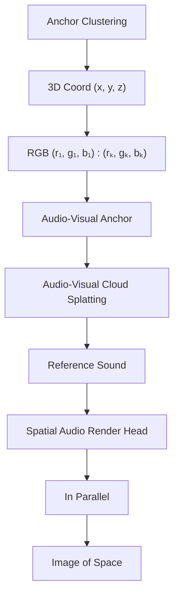
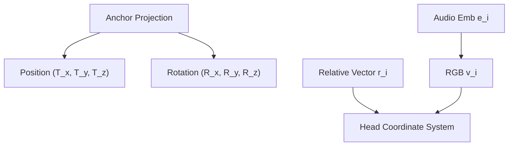
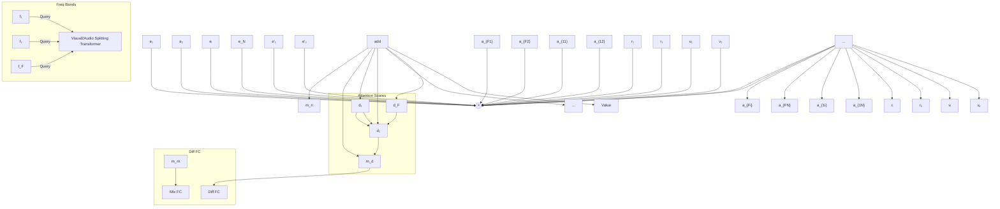
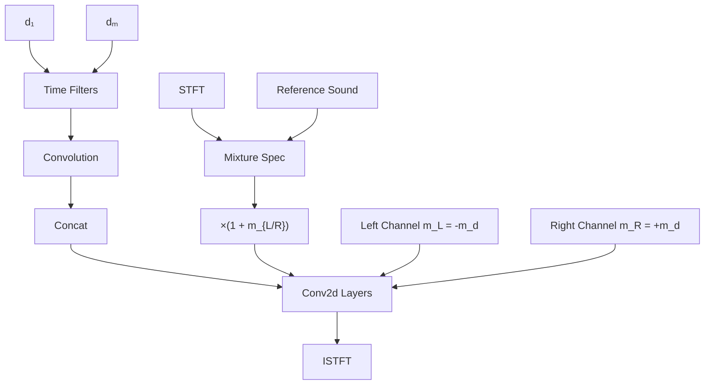

# AV-Cloud: Spatial Audio Rendering Through Audio-Visual Cloud Splatting

Mingfei Chen \*

Eli Shlizerman

# Abstract

We propose a novel approach for rendering high-quality spatial audio for 3D scenes that is in synchrony with the visual stream but does not rely or explicitly conditioned on the visual rendering. We demonstrate that such an approach enables the experience of immersive virtual tourism - performing a real-time dynamic navigation within the scene, experiencing both audio and visual content. Current audio-visual rendering approaches typically rely on visual cues, such as images, and thus visual artifacts could cause inconsistency in the audio quality. Furthermore, when such approaches are incorporated with visual rendering, audio generation at each viewpoint occurs after the rendering of the image of the viewpoint and thus could lead to audio lag that affects the integration of audio and visual streams. Our proposed approach, AV-Cloud, overcomes these challenges by learning the representation of the audio-visual scene based on a set of sparse AV anchor points, that constitute the Audio-Visual Cloud, and are derived from the camera calibration. The Audio-Visual Cloud serves as an audio-visual representation from which the generation of spatial audio for arbitrary listener location can be generated. In particular, we propose a novel module Audio-Visual Cloud Splatting which decodes AV anchor points into a spatial audio transfer function for the arbitrary viewpoint of the target listener. This function, applied through the Spatial Audio Render Head module, transforms monaural input into viewpoint-specific spatial audio. As a result, AV-Cloud efficiently renders the spatial audio aligned with any visual viewpoint and eliminates the need for pre-rendered images. We show that AV-Cloud surpasses current state-of-the-art accuracy on audio reconstruction, perceptive quality, and acoustic effects on two real-world datasets. AV-Cloud also outperforms previous methods when tested on scenes “in the wild”.

# 1 Introduction

With the advent of visual rendering for 3D scenes, it is now possible to reconstruct a scene as a set of cloud points from a collection of real-world images or videos $[1, 2, 3]$ . It is then possible to embark on virtual tourism through the scene, which would traverse it through novel paths and various viewpoints in real-time, where in each frame, the scene is rendered with remarkable photo realism. While visual realism and visual perception of current virtual tourism methods are striking $[3, 4, 5, 6, 7]$ , additional modalities such as sound could enhance and contribute to a fuller, more dynamic, and more immersive experience. Imagine attending a virtual tour of the Trevi Fountain in Rome, where you can not only view the fountain from different locations but also hear its magical sounds. Furthermore, these sounds would adapt based on your view perspectives while exploring the scene.

Indeed, as visual rendering creates 3D scenes, audio rendering produces dynamic spatial sounds, adding the natural auditory perception to the perception of the scene. Combined together, visual and

flowchart

Figure 1: AV-Cloud is an audio rendering framework synchronic with the visual perspective. Given video collections, it constructs Audio-Visual Anchors for scene representation and transforms monaural reference sound into spatial audio.

audio components provide a cohesive, immersive experience that allows to explore and interact within virtual spaces. The creation of such an experience requires the rendering of high-quality spatial audio which is synchronized with the visual rendering. In addition to real-time speed requirements, this task is challenging since such audio rendering requires careful modeling of comprehensive factors such as magnitude changes and spatial effects (e.g., left-right channel energy ratios for stereo audio) that match with view perspectives and reverberation that enhances the sound's situational presence within a scene. While, in principle, the spatial audio can be rendered in a scene by comprehensive modeling of the Room Impulse Response (RIR) $[8, 9, 10, 11, 12, 13, 14, 15, 16, 17, 18, 19, 20, 21]$ that will be convolved with sounds emitted from emitters, achieving high fidelity modeling of RIR is reserved for synthetic scenes with simulated RIR or scenes that have been thoroughly scanned for such purpose. Indeed, accurate modeling of RIR demands a thorough understanding of the scene properties such as the scene geometry and surface materials, all of which are challenging to estimate for scenes reconstructed from “in-the-wild” sparse collections of images or videos. Furthermore, knowledge of the locations of the emitters will need to be known to reconstruct the spatial sound.

To address the challenges of RIR reconstruction for various real scenes, alternative methods propose to reconstruct spatial audio based on images $[22, 23, 24, 25, 26, 27, 28, 29]$ at the target viewpoint. Such an approach could be advantageous since could apply to in-the-wild reconstructed scenes with an easier setup and set a suitable audio renderer which follows visual rendering. While such image-based approaches pave the way to audio-visual rendering, their accuracy relies on the visual accuracy of rendered images such that visual artifacts will impact the sound quality. Additionally, by design, such audio rendering is sequential and occurs after visual rendering. These factors create a lag that needs to be constantly addressed to achieve synchrony in audio-visual rendering, affecting real-time audio-visual rendering by preventing the seamless integration of audio and visual streams.

In this work, we propose to address the above described challenges by introducing a novel framework, AV-Cloud, which is a point-based audio-visual rendering framework that supports high-quality spatial audio rendering from any viewpoint. AV-Cloud does not rely on pre-rendered visual cues (e.g. rendered images) and thus enables spatial audio rendering simultaneously with visual rendering.

Specifically, as illustrated in Figure 1, AV-Cloud approach starts from a sparse set of Structure-from-Motion (SfM) points [1], derived from camera calibration and estimated from a collection of real-world videos. SfM points provide detailed 3D scene geometry for accurate spatial rendering and serving as consistent initial inputs for synchronizing visual and audio rendering processes. AV-Cloud then establishes clusters of these points and initializes representative Audio-Visual Anchors (AV anchors), each bound with 3D coordinates, RGB visual features, and audio effect latent features for a point-based audio-visual scene representation. AV anchors then undergo splatting by the Audio-Visual Cloud Splatting (AVCS) module, which decodes them into spatial audio transfer function by dynamically adjusting the contribution of each anchor based on the viewpoint pose of the listener. Together with the Spatial Audio Render Head (SARH), AV-Cloud converts monaural reference sound into viewpoint-specific stereo audio, effectively adjusting the acoustic effects. Optimization of the reusable AV-Cloud across all training samples allows for effective generalization of spatial audio rendering to accommodate novel viewpoints while using a minimal set of parameters.

In summary, our main contributions in this work are as follows: 1) We introduce a novel point-based audio-visual rendering framework, AV-Cloud, which enables high-quality audio rendering from any

viewpoint without reliance on pre-rendered cues and thus better preserves synchrony with visual rendering. 2) We define Audio-Visual Anchors for scene representation and propose the Audio-Visual Cloud Splatting module. This module, along with a Spatial Audio Render Head, dynamically adjusts AV anchor contributions based on view perspectives to render high-quality stereo sound with accurate acoustic effects. 3) Our framework surpasses state-of-the-art(SOTA) accuracy in spatial audio reconstruction, perceptual quality, and acoustic effects on two common real-world benchmarks. It also outperforms existing methods in experiments “in the wild” at a real-time inference speed.

# 2 Related Works

Spatial Audio Scene Reconstruction. Most traditional audio scene reconstruction methods reconstruct spatial sound at arbitrary listener locations by convolving the sound waveform of each emitter with corresponding Room Impulse Response (RIR) and then perform summation of the outcomes of each emitter. Conventional RIR modeling methods were based on solving the acoustic wave equation $[8, 9, 10, 11]$ or treat sound propagation as optic rays $[12, 13, 14, 15, 16, 17]$ . Recent methods utilize deep learning approaches to generate spatial RIRs for emitter-receiver pairs. Particularly, in $[18, 19, 20, 21]$ , a deep generative model is learned, while alternative methods $[30, 31, 32]$ learn an implicit neural function to represent RIR. Since RIR is the complex outcome of sound propagation through the scene geometry and interaction with surfaces, the aforementioned RIR generators are conditioned on the locations of the emitters and scene properties such as geometry $[31, 32, 19]$ , mesh $[20]$ and visual at target viewpoint $[21]$ .

In real-world applications, the explicit emitter location and detailed scene geometry information are challenging to capture without special setups. To overcome this requirement, it was proposed to reconstruct spatial audio scenes from images, giving rise to methods such as visual acoustic matching $[22, 23, 27]$ and visual-guided audio spatialization $[24, 25, 26]$ . These methods primarily focused on matching environmental levels, that could introduce inaccuracies in learning acoustic effect difference during continuous viewpoint changes. To address these limitations, the study in $[28]$ introduced a novel-view acoustic synthesis task and a neural rendering approach that learns to synthesize the sound of an arbitrary perspective in the space guided by visual images. This was followed by the study in $[29]$ which utilized NeRF-based rendering method $[33]$ to synthesize novel videos with spatial sound from arbitrary camera poses. Both $[28]$ and $[29]$ rely on viewpoint information rather than uniform scene representations for audio rendering which may result in inaccuracies when tested on novel camera poses. Furthermore, the requirement of view images as input, could reduce the audio rendering quality due to visual artifacts and introduce rendering delays. Our method renders spatial audio in synchrony with the visual rendering for any viewpoint since audio is rendered directly from the learned scene representation.

Point-based Neural Rendering for Audio-Visual Scenes. Point-based methods were shown to render disconnected and unstructured geometry samples such as point clouds in an efficient way $[34]$ . Points capture the underlying data of a 3D scene, and hold essential physical information critical for precise depiction in both visual and audio rendering. In some instances, point sample rendering for visual content could lead to holes due to the extreme discontinuity of points. Traditionally, this issue was addressed by splatting the points to extents larger than a pixel $[35, 36, 37, 38]$ . This approach helps in mitigating discontinuities. Notably, a recent method 3D-GS $[3]$ utilizes 3D Gaussians for a flexible and expressive scene representation, leveraging explicit representation and differential point-based splatting methods for real-time rendering of novel views. In contrast to traditional point-based methods that require Multi-View Stereo (MVS) data $[39, 40, 41]$ , 3D-GS achieves high-quality results from Structure-from-Motion (SfM) points only $[1]$ from camera calibration as input, optimizing properties such as position, opacity, anisotropic covariance at each point.

For spatial audio rendering, the mapping of 3D points to audio signals is more complex than projecting points from 3D to 2D for visual rendering. Therefore, implicit neural field representations are popular for point-based neural audio rendering $[32, 42, 43, 44]$ . Specifically, in $[42]$ , distinct local feature grids were used for the emitter and the receiver as an inductive bias to generalize to novel inputs, while in $[32]$ , scene geometry features were disentangled with three modules to generate independent features for the emitter, the boundary points, and the listener, respectively, enhancing feature reuse. These methods rely on knowledge of the locations of the emitter and the listener, and they do not adapt to the orientation of the viewer. Such property is key for realistic spatial effects. In contrast, AV-Cloud dynamically weighs the points based on target perspectives to support view-based audio rendering.

# 3 Methods

Given a collection of videos, we aim to render spatial audio synchronized with arbitrary listener viewpoint given monaural reference sound. As shown in Figure 1, for each scene, SfM points are estimated from training videos and camera calibration [1]. We define N Audio-Visual Anchors after clustering the SfM points, initializing their features on 3D coordinates, RGB and audio effect to construct point-based audio-visual representation for the 3D scene. We then introduce the Audio-Visual Cloud Splatting (AVCS) module to decode spatial audio transfer function conditioned on the listener viewpoint. The transfer function together with the Spatial Audio Render Head (SARH) will transfer the input reference sound to target stereo audio at that viewpoint. Our method renders spatial audio directly from Audio-Visual Anchors without the need for pre-rendered images or specified locations of the emitters.

# 3.1 Structure from Motion

Structure from Motion (SfM) is a technique that is used to reconstruct a three-dimensional structure of the environment from a sequence of images [1]. SfM points represent distinct, recognizable features in the scene, which are detected and used to estimate the viewpoint of the camera. This process results in a detailed 3D point cloud that captures the spatial configuration of the scene.

SfM points are particularly beneficial for Audio-Visual (AV) reconstruction due to two key factors: 1) They provide detailed 3D scene geometry, which is essential for spatial information in both visual and audio rendering. The points capture physical boundaries and surfaces in the scene from which sound waves can reflect, diffract, or be absorbed. This geometric data is critical for creating realistic audio-visual scenes and can be reused by any emitter or listener within the environment. 2) SfM points can also be used as starting points for visual renderer such as 3D-GS [3], facilitating the parallel synchronization of audio and visual rendering. In our work, given training videos, we employ COLMAP [1, 2] to estimate the SfM points together with the camera calibration.

# 3.2 Audio-Visual Anchors

We use Audio-Visual Anchors as basic units for construction of point-based audio-visual scene representation. The anchors are clustered from SfM points described in Section 3.1. However, there are often multiple (tens of thousands) of raw SfM points with less than $0.5\mathrm{m}$ of each other. This density is too high given that grid resolutions for room acoustic tasks are usually larger than $0.5\mathrm{m}$ [32, 45, 42]. For efficiency, we first merge points within every $0.25\mathrm{m}$ , averaging their RGB values to form a single grid. We then select representative $N$ anchors from the initial SfM points using K-Means based on their location distribution. After clustering, we initialize the anchor features as follows: 1) 3D coordinates: Each cluster center $(x_{i},y_{i},z_{i})$ is taken as the 3D coordinate of the corresponding anchor; 2) RGB feature: The RGB values of the $K$ nearest points are concatenated to form the initial RGB feature, with a dimension of $\mathbb{R}^{N\times K\times 3}$ ; and 3) Latent Audio Embedding: A latent audio embedding $\mathbf{e}_i\in \mathbb{R}^C$ is used to represent audio effects. This embedding captures how the anchor region contributes to sound propagation from different listener viewpoints.

# 3.3 Audio-Visual Cloud Splatting (AVCS)

We introduce the Audio-Visual Cloud Splatting (AVCS) module for decoding audio spatial effect transfer function from a point-based scene representation given any listener viewpoint. As illustrated in Figure 2, AVCS involves two primary components: 1) Anchor Projection and 2) Visual-to-Audio Splatting Transformer. At the onset, each Audio-Visual Anchor is projected to the head coordinate system of the target listener, followed by the integration of anchor features for each audio frequency band using a Visual-to-Audio Splatting Transformer. The transformer outputs two acoustic masks: a mixture mask $m_{m}$ and a difference mask $m_{d}$ . The masks act as transfer functions to convert the monaural reference sound into stereo audio at the viewpoint of the listener.

# Anchor Projection

We define the viewpoint pose as $\{\mathbf{R}=(R_{x},R_{y},R_{z}),\mathbf{T}=(T_{x},T_{y},T_{z})\}$ , where R and T represent the rotation matrix and translation vector in the 3D world coordinate system, respectively. Given Anchor i located at $\mathbf{p}_{i}=(x_{i},y_{i},z_{i})$ in the world coordinate system, we calculate the projected Relative Vector $r_{i}\in R^{C}$ in the listener head coordinate system:

$$
r _ {i} = \Phi (\mathbf {R} \cdot (\mathbf {p} _ {i} - \mathbf {T})), \tag {1}
$$

where $\Phi$ represents positional encoding applied to obtain the higher-dimensional embedding of $r_{i}$ .

flowchart

flowchart

Figure 2: AVCS consists of two components: Anchor Projection (left) and Visual-to-Audio Splatting Transformer (right). Audio-Visual Anchors are projected into the coordinate system of the listener head, and the transformer decodes features for each audio frequency band, outputting two acoustic masks to convert the monaural reference sound into stereo audio at the target viewpoint.

# Visual-to-Audio Splatting Transformer

Given the emitter, sound effects can vary with viewpoint poses and sound frequencies due to differences in sound propagation process. Considering this, we propose the Visual-to-Audio Splatting Transformer to dynamically weigh the contribution of each anchor by frequencies and view poses.

The input to the transformer consists of key, query, and value sequences. Specifically, the queries are embedded indices $f_{k} \in R^{F \times C} | k = 1, 2, ..., F$ corresponding to F frequency bands. The keys consist of a combination of the RGB visual features of each anchor and its relative vector $r_{i}$ in the listener's head coordinate system, shaped as $R^{N \times C}$ . These visual features are to enhance scene understanding and distinguish between anchors at different locations. A two-layer multi-layer perceptron (MLP) is used to reduce the dimensionality of initial RGB features from $R^{K \times 3}$ to $v_{i} \in R^{C}$ of each anchor. The values are also composed of the relative vector $r_{i}$ , similarly shaped as $R^{N \times C}$ .

As depicted in Figure 2 (right), for frequency band $k = \{1,2,\dots,F\}$ , the decoding process of the Visual-to-Audio Splatting Transformer layer is formulated as

$$
a _ {k i} = \text { softmax } (\frac {\mathbf {f} _ {k} \cdot (\mathbf {r} _ {i} + \mathbf {v} _ {i}) ^ {T}}{\sqrt {C}}) (i = 1, 2,..., N), \quad \mathbf {d} _ {k} = \sum_ {i = 1} ^ {N} a _ {k i} \mathbf {r} _ {i}, \quad \mathbf {e} _ {k} ^ {\prime} = \sum_ {i = 1} ^ {N} a _ {k i} \mathbf {e} _ {i}, \tag {2}
$$

where the softmax function normalizes the contribution of each anchor.

The output of the transformer consists of: 1) An Attention Mask $a_{ki}, \in \mathbb{R}^{F \times N}$ , which indicates the contribution weight of each anchor and represents the influence of each anchor on the spatial audio effect across frequency bands (higher weights indicate greater influence, examples shown in Figure 6); and 2) integrated Relative Vector embedding of the anchors for each frequency band w.r.t the target viewpoint pose, shaped as $\mathbb{R}^{F \times C}$ , which is closely related to the target head orientation.

The decoding process dynamically “enhances” anchors into the frequency domain for varying viewpoints by applying the attention score $a_{ki}$ as weights to the audio embedding $e_{i}$ (obtaining the mixture Audio Embedding $e'$ ) and the Relative Vector embedding $r_{i}$ (obtaining integrated Relative Vector embedding d), as depicted in Equation 2. This results in a transfer function to manipulate spatial sound effects through two acoustic masks. The first mask, the mixture mask $m_{m} \in R^{F}$ , is derived from the mixture Audio Embedding $e' \in R^{F \times C}$ and reflects changes in the audio magnitude of the output mixture sound. The second mask, the difference mask $m_{d} \in R^{F}$ , is computed from the integrated Relative Vector embedding $d \in R^{F \times C}$ . The difference mask is sensitive to the head orientation of the listener and affects the energy distribution difference of stereo channels.

$$
\mathbf {m} _ {m} = F C _ {m} (\mathbf {e} ^ {\prime}), \quad \mathbf {m} _ {d} = 2 * \sigma (F C _ {d} (\mathbf {d})) - 1, \tag {3}
$$

where $FC_{m}$ and $FC_{d}$ indicate the Fully Connected Layers, $\sigma$ represents the sigmoid function used to constrain the range of the left-right spectrogram magnitude difference.

flowchart

Figure 3: SARH implements a single-layer residual structure to transform monaural reference sound into stereo audio. It contains two convolution modules: Time Filters and Conv2D layers to adjust energy distribution in both the time and frequency domain and enhance the stereo output.

# 3.4 Spatial Audio Render Head (SARH)

After obtaining the acoustic masks from the Visual-to-Audio Splatting Transformer, we design the Spatial Audio Render Head (SARH) as illustrated in Figure 3. SARH transfers the input monaural reference sound into stereo audio. We first apply the Short-Time Fourier Transform (STFT) to the reference sound, extracting its spectrogram $\mathbf{S} \in \mathbb{R}^{F \times T}$ . To generate stereo audio, we calculate the left $\mathbf{S}_L \in \mathbb{R}^{F \times T}$ and right channel spectrogram outputs $\mathbf{S}_R \in \mathbb{R}^{F \times T}$ as follows:

$$
\mathbf {S} _ {m} = \mathbf {m} _ {m} \mathbf {S}, \quad \mathbf {S} _ {L} = (1 - \mathbf {m} _ {d}) \mathbf {S} _ {m}, \quad \mathbf {S} _ {R} = (1 + \mathbf {m} _ {d}) \mathbf {S} _ {m} \tag {4}
$$

SARH utilizes a single-layer residual structure, which contains two convolution modules in the residual unit: Time Filters and Conv2D Layers. These modules adjust the energy distribution across both the time and frequency domains to enhance the stereo output.

Time Filters. Given that the reference sound may have distinct acoustic properties, such as reverberation time, the first convolution module, Time Filters, adjusts the energy distribution of the mixture output spectrogram $S_{m}$ across the time domain, for more accurate acoustic effects and higher sound quality. We condition on the integrated Relative Vector embedding d to generate convolution kernels and biases of the filters, where the input and output channel dimension of filters are both the time window number T of the spectrogram. An alternative approach utilizes an attention decoder layer, similar to that described in Section 3.3. Here, the query consists of embedded indices $\{t_{k} \in R^{T \times C} | k = 1, 2, ..., T\}$ of T time windows. The key is determined by Spherical Harmonics parameters, which are based on the vector from each anchor to the viewpoint in the world coordinate system (head orientation is not considered for these time domain adjustments on the mixture spectrogram). The value is latent Time Filter Embedding of each anchor which decodes into a convolution filter kernel with the shape of $R^{T \times T}$ and bias $R^{F \times T}$ . This setting reduces parameters while still keeps competitive accuracy, as detailed in the experiments in Section 4.2.

Conv2D Layers. After processing through the Time Filters, Conv2D Layers smooth and enhance the time-frequency domain energy distribution. To obtain the inputs, the new mixture output spectrogram $S^{\prime}_{m}$ is concatenated with $\{m_{m}, -m_{d}$ and $S_{L}\}$ for the left channel, $\{m_{m}, m_{d}$ and $S_{R}\}$ for the right channel, respectively. A lightweight stacked Conv2D layer network then processes these inputs to refine the time-frequency energy distribution and generates $S^{\prime}_{L}$ and $S^{\prime}_{R}$ . At the final stage, the original stereo output spectrograms $S_{L}$ and $S_{R}$ are added to $S^{\prime}_{L}$ and $S^{\prime}_{R}$ via skip connections respectively to obtain final output $\tilde{S}_{L}$ and $\tilde{S}_{R}$ , as shown in Equation 4.

# 3.5 Training

We implement an end-to-end training strategy to minimize the discrepancy between the rendered and target stereo spectrograms. To calculate the loss, we first encode the ground truth stereo audio using the Short-Time Fourier Transform (STFT) to spectrograms and then apply the Mean Squared Error (MSE) loss between the logarithm of the predicted spectrogram and the ground-truth (GT) spectrogram magnitudes on both the left and right channels. The loss function is of the form

$$
\mathcal {L} = \frac {1}{2} \left(\mathrm{MSE} (\log | \tilde {\mathbf {S}} _ {L} |, \log | \hat {\mathbf {S}} _ {L} |) + \mathrm{MSE} (\log | \tilde {\mathbf {S}} _ {R} |, \log | \hat {\mathbf {S}} _ {R} |)\right), \tag {5}
$$

where $\tilde{S}_{L}$ and $\tilde{S}_{R}$ are predicted stereo spectrograms, $\hat{S}_{L}$ and $\hat{S}_{R}$ are GT stereo spectrograms. As in [46, 29], we exclusively focus on the distance of the magnitude values and do not supervise exact phase values in order to preserve higher audio quality of the output.

# 4 Experiments

# 4.1 Datasets and Metrics

Datasets This work focuses on audio-visual synthesis for real-world scenes. Real-world data present challenges such as background noise and discrepancies in sound propagation compared to simulated environments. We have conducted experiments on the following two real-world datasets.

1) RWAVS Dataset [29]: RWAVS includes audio-visual data from 13 everyday indoor and outdoor settings featuring multiple viewpoints across diverse environments. Each recording captures both visual and auditory data with key frames captured at 1 frame per second (FPS). Camera poses are estimated using COLMAP [47], and each key frame is paired with 1 sec of binaural audio and source audio. The dataset is considered particularly challenging due to its diverse environments and varying camera poses. As in [29], we split 80% data as training samples and the rest for validation, with all audio resampled to a frequency of 22050 Hz. We optimize a single model per scene for all methods and report the average results across all scenes in Table 1.

2) Replay-NVAS Dataset [46]: Replay-NVAS consists of multi-view recordings of scenes within a single apartment, capturing 46 different daily scenarios such as conversations, dinners and yoga sessions from 8 viewpoints with captured stereo sounds. Each human participant wears a near-range microphone to record their clean speech audio which serves as reference sound in our experiments. This dataset is challenging due to its wide range of social activities, ambient noise, room reverberations, overlapping speech and dynamic human performers. As in [46], we apply bandpass filtering to cut frequencies below 150 Hz to reduce acoustic variations among viewpoints and resample the audio samples to a frequency of 16000 Hz. 28/6/7 multi-view videos are used for training, validation and testing, respectively. We use COLMAP to estimate camera poses together for all videos.

Metrics We evaluate audio reconstruction performance using five key metrics (the lower the better). 1) Magnitude Spectrogram Distance (MAG) [46] assesses the closeness of the reconstructed audio to the ground truth by measuring the distance in the magnitude spectrogram. 2) Left-Right Energy Ratio Error (LRE) [46] evaluates the accuracy of spatial sound by calculating the difference of ratio of the energy between left and right channels. 3) Energy Envelope Error (ENV) [24] assesses the Euclidean distance between the energy envelopes of the groundtruth and predicted left and right audio waveform channels. 4) RT60 Error (RTE) [22, 23] quantifies inaccuracies in the predicted reverberation time as it decays by 60dB using a pretrained model for estimation. 5) Deep Perceptual Audio Metric (DPAM) [48], a deep learning-based perceptual quality metric aligned with human judgments. These metrics span various aspects, from spectrogram accuracy to spatial and acoustic properties, integrating both technical and perceptual elements of sound quality. Furthermore, we report the speed results in FPS in Tables 1. Speed tests are conducted on a GeForce RTX 2080 Ti, with results averaged over 1000 samples.

# 4.2 Comparison with Baselines

We compare our method with the following baseline approaches: 1) MonoMono [29]: Duplicates the source audio to synthesize binaural audio. 2) Mono-Energy [29]: Scales input audio to match the known average energy of the target audio and duplicates it to stereo channels. 3) Stereo-Energy [29]: Scales the energy of the input audio for each channel based on the known energy levels of the target audio. 4) Digital Signal Processing (DSP) [49, 46]: Utilizes digital signal processing to adjust audio based on the distance of the source, azimuth, and elevation, applying head-related transfer functions (HRTFs) to estimate the spatial audio at the target microphone location. 5) ViGAS [46]: Transforms the sound to the target viewpoint by reasoning about the observed audio and visual stream. 6) VAM [22]: Matches the acoustics of input audio with a target image that is adapted by incorporating the image from the source viewpoint with the target viewpoint pose. 7) AV-NeRF [29]: A NeRF-based system that synthesizes binaural audio for a given camera pose by first rendering a pair of RGB and depth images from the same camera position. 8) NACF [43]: Neural Acoustic Context Field that parameterizes an audio scene by incorporating multiple acoustic contexts such as geometry, material properties, and spatial information, adapted here to predict waveform masks to render target audio. 9) INRAS [32]: Uses implicit neural fields to disentangle and represent audio scenes for waveform masks prediction. 10) NAF [42]: Employs local feature grids and an implicit decoder to model sound propagation in physical scenes, modified to predict magnitude masks on time-frequency domain. For NACF, INRAS and NAF we employ the same set of Audio-Visual Anchors in place of the grids that has been traditionally used in these methods for fair comparison. We report main

<table><tr><td>Dataset</td><td>Methods</td><td># Params</td><td>FPS</td><td>Image</td><td>MAG</td><td>LRE</td><td>ENV</td><td>RTE</td><td>DPAM</td></tr><tr><td rowspan="13">RWAVS [29]</td><td>Mono-Mono</td><td>-</td><td>-</td><td>✘</td><td>1.460</td><td>1.328</td><td>0.445</td><td>0.132</td><td>0.756</td></tr><tr><td>Mono-Energy</td><td>-</td><td>-</td><td>✘</td><td>0.532</td><td>1.328</td><td>0.156</td><td>0.145</td><td>0.510</td></tr><tr><td>Stereo-Energy</td><td>-</td><td>-</td><td>✘</td><td>0.560</td><td>-</td><td>0.160</td><td>0.143</td><td>0.535</td></tr><tr><td>DSP [50]</td><td>163M</td><td>-</td><td>✘</td><td>1.016</td><td>3.468</td><td>0.274</td><td>0.119</td><td>0.588</td></tr><tr><td>VAM [51]</td><td>46.7M</td><td>66</td><td>✓</td><td>0.390</td><td>0.996</td><td>0.156</td><td>0.079</td><td>0.459</td></tr><tr><td>ViGAS [28]</td><td>13.1M</td><td>34</td><td>✓</td><td>0.370</td><td>1.089</td><td>0.147</td><td>0.094</td><td>0.357</td></tr><tr><td>AVNeRF [29]</td><td>12.0M</td><td>119</td><td>✓</td><td>0.370</td><td>1.013</td><td>0.145</td><td>0.098</td><td>0.381</td></tr><tr><td>NACF [43]</td><td>0.44M</td><td>41</td><td>✘</td><td>0.459</td><td>1.364</td><td>0.176</td><td>0.138</td><td>0.506</td></tr><tr><td>INRAS [32]</td><td>0.31M</td><td>180</td><td>✘</td><td>0.455</td><td>1.503</td><td>0.179</td><td>0.148</td><td>0.485</td></tr><tr><td>NAF [42]</td><td>0.22M</td><td>99</td><td>✘</td><td>0.448</td><td>1.204</td><td>0.522</td><td>0.138</td><td>0.353</td></tr><tr><td>AV-Cloud (Ours)</td><td>3.91M</td><td>83</td><td>✘</td><td>0.351</td><td>0.936</td><td>0.145</td><td>0.074</td><td>0.276</td></tr><tr><td>AV-Cloud-SH</td><td>1.29M</td><td>171</td><td>✘</td><td>0.355</td><td>0.983</td><td>0.147</td><td>0.073</td><td>0.276</td></tr><tr><td>AV-Cloud-sim-SH</td><td>0.51M</td><td>301</td><td>✘</td><td>0.359</td><td>0.996</td><td>0.147</td><td>0.076</td><td>0.291</td></tr><tr><td rowspan="13">Replay-NVAS [28]</td><td>Mono-Mono</td><td>-</td><td>-</td><td>✘</td><td>0.313</td><td>0.934</td><td>0.127</td><td>0.366</td><td>0.521</td></tr><tr><td>Mono-Energy</td><td>-</td><td>-</td><td>✘</td><td>0.191</td><td>0.934</td><td>0.050</td><td>0.356</td><td>0.496</td></tr><tr><td>Stereo-Energy</td><td>-</td><td>-</td><td>✘</td><td>0.196</td><td>-</td><td>0.054</td><td>0.357</td><td>0.473</td></tr><tr><td>DSP [50]</td><td>163M</td><td>-</td><td>✘</td><td>0.228</td><td>6.186</td><td>0.066</td><td>0.338</td><td>0.482</td></tr><tr><td>VAM [51]</td><td>46.5M</td><td>66</td><td>✓</td><td>0.239</td><td>0.824</td><td>0.062</td><td>0.147</td><td>0.458</td></tr><tr><td>ViGAS[28]</td><td>12.7M</td><td>34</td><td>✓</td><td>0.193</td><td>0.698</td><td>0.054</td><td>0.137</td><td>1.177</td></tr><tr><td>AVNeRF [29]</td><td>11.8M</td><td>119</td><td>✓</td><td>0.214</td><td>0.773</td><td>0.055</td><td>0.159</td><td>0.290</td></tr><tr><td>NACF [43]</td><td>0.54M</td><td>45</td><td>✘</td><td>0.298</td><td>0.722</td><td>0.079</td><td>0.332</td><td>0.544</td></tr><tr><td>INRAS [32]</td><td>0.32M</td><td>162</td><td>✘</td><td>0.211</td><td>0.928</td><td>0.058</td><td>0.340</td><td>0.807</td></tr><tr><td>NAF [42]</td><td>0.23M</td><td>100</td><td>✘</td><td>0.208</td><td>0.820</td><td>0.059</td><td>0.388</td><td>0.565</td></tr><tr><td>AV-Cloud (Ours)</td><td>2.47M</td><td>103</td><td>✘</td><td>0.180</td><td>0.600</td><td>0.052</td><td>0.065</td><td>0.234</td></tr><tr><td>AV-Cloud-SH</td><td>1.24M</td><td>133</td><td>✘</td><td>0.181</td><td>0.673</td><td>0.053</td><td>0.065</td><td>0.244</td></tr><tr><td>AV-Cloud-sim-SH</td><td>0.48M</td><td>207</td><td>✘</td><td>0.180</td><td>0.689</td><td>0.052</td><td>0.062</td><td>0.231</td></tr></table>

Table 1: Comparison of AV-Cloud with state-of-the-art methods. For each metric, the top1 value is highlighted in bold, the second best is underlined, lower is better.

comparison results on the RWAVS and Replay-NVAS datasets in Table 1. The implementation details of AV-Cloud are introduced in Appendix A.1.

Our experiments results summarized in Table 1 show that AV-Cloud significantly surpasses baselines across the acoustic metrics, even with relatively fewer model parameters and higher inference speed. Non-learning methods such as Mono-Energy and Stereo-Energy, that assume prior knowledge of the target sound energy distribution, perform well on metrics such as ENV and LRE, but are impractical for real-world applications due to their reliance on unavailable data. The DSP struggles due to difficulties in estimating precise distances and scene-specific variations in HRTF functions. Image-based methods such as VAM [22], ViGAS [46] and AVNeRF [29] necessitate extensive model parameters and depend on the visual rendering results. Point-based methods such as NACF [43], INRAS [32] and NAF [42] construct implicit neural representations of scenes but do not account for how points contribute across viewpoints. This results in less effective representation and generalization capabilities. In contrast, AV-Cloud leverages Audio-Visual Anchors clustered from sparse SfM points and dynamically reweighs them to enhance spatial audio accuracy. AV-Cloud enhances the audio rendering metrics such as MAG ( $>5\%$ ), LRE ( $>6\%$ ), and perceptual quality DPAM ( $>19\%$ ), outperforming even image-based methods. Additionally, our Spatial Render Head adjusts reverberation effects through Time Filters and achieves more accurate outcomes on the acoustics represented by the metric RTE. Specifically for the challenging indoor scenario Replay-NVAS set, AV-Cloud reduces RTE by 53% relative to the second best method ViGAS.

As outlined in Section 3.4, we also propose an alternative approach (AV-Cloud-SH) with an attention decoder layer to derive Time Filters, with keys based on Spherical Harmonics (SH) parameters. This strategy cuts parameter count by $>50\%$ and at the same time it maintains competitive accuracy. To reduce the complexity of the model, we developed the Visual-to-Audio Splatting Transformer (Section 3.3) using a single attention decoder layer (AV-Cloud-sim-SH), resulting in 0.51M parameters. This is comparable to other point-based methods such as NACF, INRAS and NAF but achieves inference speeds approximately 30% faster. When AV-Cloud-sim-SH is compared to these three methods on RWAVS validation set, it enhances the accuracy of MAG and LRE by 20% and 17% respectively, and significantly reduces the acoustic reverberation error RTE by 45%, and improves perceptual quality, DPAM, by 18%.

<table><tr><td>Methods</td><td>MAG</td><td>LRE</td><td>ENV</td><td>RTE</td><td>DPAM</td></tr><tr><td>AV-Cloud</td><td>0.351</td><td>0.936</td><td>0.145</td><td>0.074</td><td>0.276</td></tr><tr><td>baseline</td><td>0.488</td><td>1.329</td><td>0.240</td><td>0.130</td><td>0.357</td></tr><tr><td>w/o AVCS</td><td>0.368</td><td>1.124</td><td>0.150</td><td>0.080</td><td>0.318</td></tr><tr><td>w/o time</td><td>0.356</td><td>0.984</td><td>0.146</td><td>0.084</td><td>0.281</td></tr><tr><td>w/o a_emb</td><td>0.354</td><td>0.975</td><td>0.146</td><td>0.072</td><td>0.282</td></tr><tr><td>w/o rgb</td><td>0.361</td><td>1.014</td><td>0.148</td><td>0.077</td><td>0.291</td></tr><tr><td>w/o 2 masks</td><td>0.357</td><td>0.983</td><td>0.147</td><td>0.070</td><td>0.280</td></tr><tr><td>w/o conv2d</td><td>0.359</td><td>1.019</td><td>0.148</td><td>0.074</td><td>0.280</td></tr></table>

<table><tr><td>Methods</td><td>NAF</td><td>AVNeRF</td><td>AV-Cloud</td></tr><tr><td>Votes</td><td>15%</td><td>37%</td><td>48%</td></tr></table>

Table 3: Human Study for In-the-Wild Experiments. AV-Cloud is preferred over the other two methods by a large margin.   
Table 2: Ablations on RWAVS validation set.

# 4.3 Ablation Studies

We conducted ablation studies on RWAVS validation set to verify the contribution of key components.

Baseline. We use an MLP to predict mixture and difference masks across all frequency bands, based on the viewpoint pose, and render the target spatial sound using Equation 4 as our baseline. Compared to the full AV-Cloud and other variants in Table 2, the baseline does not perform well across all metrics. This indicates limited generalization to novel views when solely considering viewpoint poses.

Audio-Visual Cloud Splatting (AVCS). To verify the contribution of AVCS module in Section 3.3, we implement a variant w/o AVCS that replaces the AVCS module with an MLP as baseline to generate the mixture and difference masks directly from viewpoint poses. It appears that w/o AVCS struggles to capture the relationship between left-right channel energy and viewpoint poses, reducing the LRE accuracy by 20% comparing to full AV-Cloud. The AVCS module dynamically adjusts anchor contributions for audio rendering based on the viewpoint of the listener which results in more accurate spatial audio effects. Example attention weights of AV anchors are visualized in Figure 6.

Visual Feature Contribution. To evaluate the impact of visual features, we remove the RGB features from the Visual-to-Audio Splatting Transformer, as reported in Section 3.3 as w/o rgb. This change decreases perceptual quality by 5%, spatial effect accuracy LRE by 8%, and increases the MAG error from 0.351 to 0.361. It demonstrates that RGB features can enhance anchor distinction and improve the ability of the attention mechanism to weigh contributions based on scene understanding.

Audio Embedding. The latent Audio Embedding $e_{i}$ for each Audio-Visual Anchor adjusts the audio mix based on distance and acoustic effects between the emitters and the listener. Removing $e_{i}$ (w/o a\_emb in Table 2) and using only the Relative Vector embedding d to predict the mixture mask $m_{m}$ , similarly to the difference mask $m_{d}$ , decreases audio rendering accuracy. While this variant slightly improves the RTE accuracy (error -0.002) it reduces the accuracy of the spatial effect metric LRE by 4%. The difference mask and mixture mask target distinct audio factors, with the mixture mask emphasizing scene properties and listener-emitter locations. The difference mask focuses on the head orientation. Thus decoupling the prediction with two masks and Audio Embedding is more effective.

Spatial Audio Render Head (SARH). Our results of comparing the baseline and w/o AVCS demonstrate that the use of the residual convolution module of SARH significantly improves rendering accuracy: MAG by 25%, ENV by 38%, RTE by 38%, and DPAM by 11% (Table 2). In the w/o time variant, where only the 2D convolutional layer is retained, reverberation time error increases from 0.074 to 0.084, and LRE error increases by 5%, demonstrating the key role of Time Filters in adjusting the time domain energy distribution, which in turn impacts reverberation time and overall acoustic quality. The w/o 2 masks variant, where a direct prediction of the two-channel spatial effect transfer mask is utilized instead of predicting the difference and mixture masks separately, results in an increase in error metrics, particularly notable for LRE. Similarly, for the w/o conv2d variant, where the Conv2D layers are removed, relying solely on Time Filters, the error metrics also show an increase. These ablations highlight the significant contribution of the SARH module, emphasizing the significant roles of its key components, Time Filters and Conv2D layers. SARH along with the residual module improve rendering accuracy and overall audio quality.

# 4.4 Qualitative Results Comparison

In Figure 4, we illustrate the rendered spectrogram (for mixture sound) and stereo waveforms compared across the methods along with input and GT. The region circled in blue on the spectrogram highlights the location of the reverberation effect in the spectrogram. For indoor scenes reverberation

  
Figure 4: Qualitative Results Comparisons. Left: output spectrogram and stereo waveforms; Bottom Right: LRE error bar chart. The blue-circled region on the spectrogram highlights the reverberation effect, demonstrating ability of AV-Cloud to capture prolonged energy decay.

indeed has a longer energy decay due to wall reflections. As can be observed from comparing the spectrogram and GT, methods significantly vary in their ability to reproduce the reverberation. Specifically, NAF does not convey reverberation from input to target sound, AVNeRF shows better rendering but is not accurate enough in reverberation and spectrogram magnitude. Both methods produce waveforms that differ significantly from GT. ViGAS renders a more accurate waveform but lacks precision in reverberation and perceptual quality. AV-Cloud turns out to reproduce the effect closer to GT. This can be also seen from the barchart depicting the LRE error (bottom right) which indicates such spatial effect as reverberation. LRE value for AV-Cloud is significantly lower in comparison to other methods.

# 4.5 In-the-Wild Experiments

We tested our method in a real-world virtual tourism scenario in a scene which includes a fountain. We generated audio samples for five different routes and conducted a human study with 76 participants, who watched navigation videos featuring changing viewpoints and spatial audio rendered by NAF, AVNeRF, and our AV-Cloud, and then chose the video which sound best matched the visual perspectives. Participants were instructed to select the video where spatial audio matches the visual content, focusing on left-right ear effects and overall synchronization. As shown in Table 3, AV-Cloud received a majority vote of 48%, outperforming AVNeRF and NAF. Furthermore, we developed a WebGL-based platform that enables real-time audio-visual rendering based on view perspectives with an Apple M2 chip. More details can be found in the Appendix A.2.

# 5 Conclusion

In this work, we introduced a novel point-based audio-visual rendering framework, AV-Cloud, which allows for high-quality audio rendering from any viewpoint without the need for pre-rendered images and is synchronized with visual rendering. AV-Cloud is based on Audio-Visual Anchors that enhance scene representation. The Audio-Visual Cloud Splatting module dynamically adjusts anchor contributions conditioned on the target viewpoint. Experiments show that AV-Cloud achieves higher accuracy and reliability in spatial audio rendering and outperforms existing methods in real-world experiments. We also discuss the limitations and broader impacts of our work in Section A.9 and A.10 respectively.

# Acknowledgments and Disclosure of Funding

We acknowledge the support of HDR Institute: Accelerated AI Algorithms for Data-Driven Discovery (A3D3) National Science Foundation grant PHY-2117997 and the departments of Applied Mathematics and Electrical and Computer Engineering at the University of Washington.

# References

[1] Noah Snavely, Steven M. Seitz, and Richard Szeliski. Photo tourism: exploring photo collections in 3d. ACM Transactions on Graphics (ToG), 25(3):835–846, jul 2006.   
[2] Johannes L Schonberger and Jan-Michael Frahm. Structure-from-motion revisited. In CVPR, pages 4104-4113, 2016.   
[3] Bernhard Kerbl, Georgios Kopanas, Thomas Leimkühler, and George Drettakis. 3d gaussian splatting for real-time radiance field rendering. ACM Transactions on Graphics (ToG), 42(4):1–14, 2023.   
[4] Anh-Quan Cao and Raoul de Charette. Scenerf: Self-supervised monocular 3d scene reconstruction with radiance fields, 2023.   
[5] Ricardo Martin-Brualla, Noha Radwan, Mehdi S. M. Sajjadi, Jonathan T. Barron, Alexey Dosovitskiy, and Daniel Duckworth. Nerf in the wild: Neural radiance fields for unconstrained photo collections. In CVPR, 2021.   
[6] Guangcong Wang, Zhaoxi Chen, Chen Change Loy, and Ziwei Liu. Sparsenerf: Distilling depth ranking for few-shot novel view synthesis, 2023.   
[7] Linning Xu, Vasu Agrawal, William Laney, Tony Garcia, Aayush Bansal, Changil Kim, Samuel Rota Bulò, Lorenzo Porzi, Peter Kontschieder, Aljaž Božič, Dahua Lin, Michael Zollhöfer, and Christian Richardt. VR-NeRF: High-fidelity virtualized walkable spaces. In SIGGRAPH Asia Conference Proceedings, 2023.   
[8] Brian Hamilton and Stefan Bilbao. Fdtd methods for 3-d room acoustics simulation with high-order accuracy in space and time. IEEE/ACM Transactions on Audio, Speech, and Language Processing, 25(11):2112–2124, 2017.   
[9] Lonny L Thompson. A review of finite-element methods for time-harmonic acoustics. The Journal of the Acoustical Society of America, 119(3):1315–1330, 2006.   
[10] Nail A Gumerov and Ramani Duraiswami. A broadband fast multipole accelerated boundary element method for the three dimensional helmholtz equation. The Journal of the Acoustical Society of America, 125(1):191–205, 2009.   
[11] Nikunj Raghuvanshi, Rahul Narain, and Ming C Lin. Efficient and accurate sound propagation using adaptive rectangular decomposition. IEEE Transactions on Visualization and Computer Graphics, 15(5):789–801, 2009.   
[12] Jont B Allen and David A Berkley. Image method for efficiently simulating small-room acoustics. The Journal of the Acoustical Society of America, 65(4):943–950, 1979.   
[13] Jeffrey Borish. Extension of the image model to arbitrary polyhedra. The Journal of the Acoustical Society of America, 75(6):1827–1836, 1984.   
[14] Asbjørn Krokstad, Staffan Strom, and Svein Sørsdal. Calculating the acoustical room response by the use of a ray tracing technique. Journal of Sound and Vibration, 8(1):118–125, 1968.   
[15] Michael Vorländer. Simulation of the transient and steady-state sound propagation in rooms using a new combined ray-tracing/image-source algorithm. The Journal of the Acoustical Society of America, 86(1):172–178, 1989.   
[16] Chunxiao Cao, Zhong Ren, Carl Schissler, Dinesh Manocha, and Kun Zhou. Interactive sound propagation with bidirectional path tracing. ACM TOG, 35(6):1–11, 2016.   
[17] Eva-Marie Nosal, Murray Hodgson, and Ian Ashdown. Improved algorithms and methods for room sound-field prediction by acoustical radiosity in arbitrary polyhedral rooms. The Journal of the Acoustical Society of America, 116(2):970–980, 2004.   
[18] Anton Ratnarajah, Zhenyu Tang, and Dinesh Manocha. Ir-gan: Room impulse response generator for far-field speech recognition. arXiv preprint arXiv:2010.13219, 2020.   
[19] Anton Ratnarajah, Shi-Xiong Zhang, Meng Yu, Zhenyu Tang, Dinesh Manocha, and Dong Yu. Fast-rir: Fast neural diffuse room impulse response generator. arXiv preprint arXiv:2110.04057, 2021.   
[20] Anton Ratnarajah, Zhenyu Tang, Rohith Aralikatti, and Dinesh Manocha. Mesh2ir: Neural acoustic impulse response generator for complex 3d scenes. In Proceedings of the 30th ACM International Conference on Multimedia, MM '22, page 924–933, New York, NY, USA, 2022. Association for Computing Machinery.

[21] Sagnik Majumder, Changan Chen, Ziad Al-Halah, and Kristen Grauman. Few-shot audio-visual learning of environment acoustics, 2022.   
[22] Changan Chen, Ruohan Gao, Paul Calamia, and Kristen Grauman. Visual acoustic matching. In Proceedings of the IEEE/CVF Conference on Computer Vision and Pattern Recognition, pages 18858–18868, 2022.   
[23] Nikhil Singh, Jeff Mentch, Jerry Ng, Matthew Beveridge, and Iddo Drori. Image2reverb: Cross-modal reverb impulse response synthesis. In ICCV, pages 286–295, 2021.   
[24] Ruohan Gao and Kristen Grauman. 2.5d visual sound. In CVPR, 2019.   
[25] Xudong Xu, Hang Zhou, Ziwei Liu, Bo Dai, Xiaogang Wang, and Dahua Lin. Visually informed binaural audio generation without binaural audios. In CVPR, 2021.   
[26] Hang Zhou, Xudong Xu, Dahua Lin, Xiaogang Wang, and Ziwei Liu. Sep-stereo: Visually guided stereophonic audio generation by associating source separation. In Computer Vision–ECCV 2020: 16th European Conference, Glasgow, UK, August 23–28, 2020, Proceedings, Part XII 16, pages 52–69. Springer, 2020.   
[27] Changan Chen, Wei Sun, David Harwath, and Kristen Grauman. Learning audio-visual dereverberation. In ICASSP, 2023.   
[28] Changan Chen, Alexander Richard, Roman Shapovalov, Vamsi Krishna Ithapu, Natalia Neverova, Kristen Grauman, and Andrea Vedaldi. Novel-view acoustic synthesis. arXiv preprint arXiv:2301.08730, 2023.   
[29] Susan Liang, Chao Huang, Yapeng Tian, Anurag Kumar, and Chenliang Xu. Av-nerf: Learning neural fields for real-world audio-visual scene synthesis. In Conference on Neural Information Processing Systems (NeurIPS), 2023.   
[30] Alexander Richard, Peter Dodds, and Vamsi Krishna Ithapu. Deep impulse responses: Estimating and parameterizing filters with deep networks. In ICASSP, pages 3209-3213, 2022.   
[31] Andrew Luo, Yilun Du, Michael J Tarr, Joshua B Tenenbaum, Antonio Torralba, and Chuang Gan. Learning neural acoustic fields. arXiv preprint arXiv:, 2021.   
[32] Kun Su, Mingfei Chen, and Eli Shlizerman. Inras: Implicit neural representation for audio scenes. In NeurIPS, 2022.   
[33] Ben Mildenhall, Pratul P. Srinivasan, Matthew Tancik, Jonathan T. Barron, Ravi Ramamoorthi, and Ren Ng. Nerf: Representing scenes as neural radiance fields for view synthesis. In ECCV, 2020.   
[34] Markus Gross and Hanspeter Pfister. Point-based graphics. Elsevier, 2011.   
[35] M. Botsch, A. Hornung, M. Zwicker, and L. Kobbelt. High-quality surface splatting on today's gpus. In Proceedings Eurographics/IEEE VGTC Symposium Point-Based Graphics, 2005., pages 17-141, 2005.   
[36] Hanspeter Pfister, Matthias Zwicker, Jeroen van Baar, and Markus Gross. Surfels: surface elements as rendering primitives. In Proceedings of the 27th Annual Conference on Computer Graphics and Interactive Techniques, page 335–342, USA, 2000. ACM Press/Addison-Wesley Publishing Co.   
[37] Liu Ren, Hanspeter Pfister, and Matthias Zwicker. Object space ewa surface splatting: A hardware accelerated approach to high quality point rendering. In Computer Graphics Forum, volume 21, pages 461–470. Wiley Online Library, 2002.   
[38] Matthias Zwicker, Hanspeter Pfister, Jeroen Van Baar, and Markus Gross. Surface splatting. In Proceedings of the 28th annual conference on Computer graphics and interactive techniques, pages 371–378, 2001.   
[39] Kara-Ali Aliev, Artem Sevastopolsky, Maria Kolos, Dmitry Ulyanov, and Victor Lempitsky. Neural point-based graphics. In Computer Vision–ECCV 2020: 16th European Conference, Glasgow, UK, August 23–28, 2020, Proceedings, Part XXII 16, pages 696–712. Springer, 2020.   
[40] Georgios Kopanas, Julien Philip, Thomas Leimkühler, and George Drettakis. Point-based neural rendering with per-view optimization. In Computer Graphics Forum, volume 40, pages 29–43. Wiley Online Library, 2021.   
[41] Darius Rückert, Linus Franke, and Marc Stamminger. Adop: Approximate differentiable one-pixel point rendering. ACM Transactions on Graphics (ToG), 41(4):1–14, 2022.

[42] Andrew Luo, Yilun Du, Michael J Tarr, Joshua B Tenenbaum, Antonio Torralba, and Chuang Gan. Learning neural acoustic fields. NeurIPS, 2022.   
[43] Susan Liang, Chao Huang, Yapeng Tian, Anurag Kumar, and Chenliang Xu. Neural acoustic context field: Rendering realistic room impulse response with neural fields. ArXiv, 2023.   
[44] Ziyang Chen, Israel D. Gebru, Christian Richardt, Anurag Kumar, William Laney, Andrew Owens, and Alexander Richard. Real acoustic fields: An audio-visual room acoustics dataset and benchmark. 2024.   
[45] Changan Chen, Unnat Jain, Carl Schissler, Sebastia Vicenc Amengual Gari, Ziad Al-Halah, Vamsi Krishna Ithapu, Philip Robinson, and Kristen Grauman. Soundspaces: Audio-visual navigation in 3d environments. In ECCV, 2020.   
[46] Changan Chen, Wei Sun, David Harwath, and Kristen Grauman. Learning audio-visual dereverberation. In ICASSP, pages 1–5, 2023.   
[47] Johannes L Schonberger and Jan-Michael Frahm. Structure-from-motion revisited. In Proceedings of the IEEE conference on computer vision and pattern recognition, pages 4104-4113, 2016.   
[48] Pranay Manocha, Adam Finkelstein, Richard Zhang, Nicholas J. Bryan, Gautham J. Mysore, and Zeyu Jin. A differentiable perceptual audio metric learned from just noticeable differences. In Interspeech, October 2020.   
[49] Corey I Cheng and Gregory H Wakefield. Introduction to head-related transfer functions (hrtfs): Representations of hrtfs in time, frequency, and space. In Audio Engineering Society Convention 107. Audio Engineering Society, 1999.   
[50] Corey I. Cheng and Gregory H. Wakefield. Introduction to head-related transfer functions (hrtfs): representations of hrtfs in time, frequency, and space. journal of the audio engineering society, 49(4):231–249, april 2001.   
[51] Changan Chen, Ruohan Gao, Paul Calamia, and Kristen Grauman. Visual acoustic matching. In CVPR, 2022.   
[52] Kevin Kwok. Splat. https://github.com/antimatter15/splat, 2023.

# A Appendix

# A.1 Implementation Details

For all experiments, we utilize COLMAP [47] to derive initial SfM points and camera pose estimation from the provided videos for each scene. We set the K-Means cluster number $N$ to 256, and initialize each of these anchors with RGB values of the nearest $K = 50$ points in Section 3.2. We utilize the Short-Time Fourier Transform (STFT) to convert waveform audio into the time-frequency domain, setting the FFT size, window length, and hop length to 512, 512, and 128 respectively, and applying a Hanning window with it. For the Visual-to-Audio Splatting Transformer (Section 3.3), we deploy a 3-layer attention module, set the frequency band number $F$ and embedding dimension $C$ to 257 and 128, respectively. Time Filters (Section 3.4) are developed using distinct 2-layer 1D convolution modules that generate filter kernels and biases, conditioned on the integrated Relative Vector. The convolution for time distribution adjustments has a kernel size of 3 on the frequency domain. For implementation of Spherical Harmonics (SH) parameters, we use 1-degree SH to create Time Filters with a convolution kernel size of 1 in the frequency domain. The Conv2d Layers in the render head's residual unit (Section 3.4) which comprise three stacked Conv2d modules with kernel sizes of 7, 3, and 3, and a hidden channel size of 16. We employ the Adam optimizer for optimization, using an exponentially decaying rate starting from 0.01 and spanning over 100 epochs, with a batch size of 6.

For the RWAVS dataset, AVNeRF [29] utilizes explicit emitter locations for coordinate transformations [29], while emitter locations are not given as input for the remaining methods. For Replay-NVAS dataset, for image-based methods, bounding boxes are used to identify active speakers when multiple sources are present [22, 28, 29]. For methods that do not utilize image data such as [32, 42] and ours, the intrinsic matrix is used to derive view vectors in the world coordinate system. These vectors provide clues about which participant is currently speaking, and are used in our method to enhance the Relative Vector for each anchor.

# A.2 Details of In-the-Wild Experiments

We conducted in-the-wild virtual tourism scenario experiments using videos collected across four different routes around a fountain, captured with an iPhone 14 Pro camera. Our model was trained on the combined 1-minute-long video collection, using a 44,100 Hz audio sampling rate and 0.5-second audio-visual clips per training sample with 5% overlap. Following the same settings as in Section A.1, the model was trained for 100 epochs. Testing was conducted on five unseen routes with continuously changing viewpoints. Generic overlap-add with linear fade-in/fade-out between adjacent test samples was used to smooth the output spatial audio during viewpoint transitions. Please refer to our attached videos to see samples of the testing results.

To facilitate navigation of rendered 3D audio-visual scenes, we developed a WebGL-based audio-visual navigation platform using JavaScript and HTML based on $[52]$ . $[52]$ is a WebGL implementation of a real-time renderer for 3D Gaussian Splatting $[3]$ for Real-Time Radiance Field Rendering. We utilize $[52]$ to render the 3D visual scene, while audio was generated directly from the Audio-Visual Anchors (defined in Section 3.2) in parallel with visual rendering, enabling real-time rendering of audio-visual scenes according to viewpoint and perspective. To our knowledge, this is the first deep learning-based 3D audio-visual navigation platform that can run real-time with WebGL. Deployed in our navigation platform, AV-Cloud can achieve over 25 FPS on audio rendering (each sample with 257 spectrogram frequencies and 182 time frames i.e. 0.5s of audio sampled in 44,100 Hz for our experiments) on an Apple M2 chip.

natural_image

Fountain with water jets in a park under clear blue sky, surrounded by trees and a building (no visible text or symbols)

(a) Training Sample for Fountain Scenario.

natural_image

Outdoor fountain display in a park with trees and buildings in the background (no visible text or symbols)

(b) Figure of our Audio-Visual Navigation Platform.   
Figure 5: Example of training sample for the fountain scenario (a) and a screenshot of our WebGL-based Audio-Visual Navigation Platform (b). The platform enables navigating the scene while the spatial audio adapts to viewpoint perspective changes.

# A.3 Generated Samples

Please refer to the attached videos in the supplementary demo\_videos folder for samples of video clips generated by our model. Please ensure that your audio is turned on and use headphones or speakers with stereo audio capability for the best experience. For the RWAVS samples, we show the visualization of navigation route and Audio-Visual Anchors (anchor radius expands linearly with the attention weights) in the right. Please see more details about visualization and interpretation in Section A.7.

# A.4 Detailed Performance Results on RWAVS Scenes

<table><tr><td rowspan="2">Methods</td><td colspan="5">Office</td><td colspan="5">House</td></tr><tr><td>MAG</td><td>LRE</td><td>ENV</td><td>RTE</td><td>DPAM</td><td>MAG</td><td>LRE</td><td>ENV</td><td>RTE</td><td>DPAM</td></tr><tr><td>Mono-Mono</td><td>1.400</td><td>1.901</td><td>0.415</td><td>0.126</td><td>0.750</td><td>1.430</td><td>0.886</td><td>0.422</td><td>0.144</td><td>0.855</td></tr><tr><td>Mono-Energy</td><td>0.465</td><td>1.901</td><td>0.140</td><td>0.129</td><td>0.534</td><td>0.599</td><td>0.886</td><td>0.174</td><td>0.148</td><td>0.629</td></tr><tr><td>Stereo-Energy</td><td>0.479</td><td>-</td><td>0.142</td><td>0.128</td><td>0.558</td><td>0.632</td><td>-</td><td>0.179</td><td>0.147</td><td>0.656</td></tr><tr><td>DSP [50]</td><td>0.670</td><td>4.379</td><td>0.196</td><td>0.110</td><td>0.531</td><td>0.959</td><td>3.913</td><td>0.262</td><td>0.117</td><td>0.703</td></tr><tr><td>VAM [51]</td><td>0.364</td><td>1.477</td><td>0.142</td><td>0.087</td><td>0.461</td><td>0.392</td><td>0.822</td><td>0.161</td><td>0.063</td><td>0.511</td></tr><tr><td>INRAS [32]</td><td>0.369</td><td>1.916</td><td>0.156</td><td>0.146</td><td>0.385</td><td>0.498</td><td>1.356</td><td>0.194</td><td>0.167</td><td>0.601</td></tr><tr><td>NAF [42]</td><td>0.331</td><td>1.669</td><td>0.178</td><td>0.120</td><td>0.271</td><td>0.520</td><td>0.941</td><td>0.475</td><td>0.160</td><td>0.426</td></tr><tr><td>ViGAS [28]</td><td>0.308</td><td>1.548</td><td>0.128</td><td>0.109</td><td>0.344</td><td>0.394</td><td>0.957</td><td>0.160</td><td>0.071</td><td>0.461</td></tr><tr><td>AVNeRF [29]</td><td>0.305</td><td>1.430</td><td>0.130</td><td>0.125</td><td>0.293</td><td>0.401</td><td>0.889</td><td>0.154</td><td>0.071</td><td>0.463</td></tr><tr><td>AV-Cloud (Ours)</td><td>0.300</td><td>1.388</td><td>0.131</td><td>0.093</td><td>0.281</td><td>0.382</td><td>0.797</td><td>0.156</td><td>0.059</td><td>0.289</td></tr><tr><td>AV-Cloud-SH</td><td>0.302</td><td>1.506</td><td>0.131</td><td>0.095</td><td>0.275</td><td>0.386</td><td>0.830</td><td>0.160</td><td>0.061</td><td>0.302</td></tr><tr><td>AV-Cloud-sim-SH</td><td>0.303</td><td>1.471</td><td>0.130</td><td>0.092</td><td>0.277</td><td>0.388</td><td>0.818</td><td>0.159</td><td>0.062</td><td>0.325</td></tr><tr><td></td><td colspan="5">Apartment</td><td colspan="5">Outdoor</td></tr><tr><td>Methods</td><td>MAG</td><td>LRE</td><td>ENV</td><td>RTE</td><td>DPAM</td><td>MAG</td><td>LRE</td><td>ENV</td><td>RTE</td><td>DPAM</td></tr><tr><td>Mono-Mono</td><td>1.476</td><td>0.863</td><td>0.472</td><td>0.142</td><td>0.595</td><td>1.535</td><td>1.663</td><td>0.470</td><td>0.115</td><td>0.824</td></tr><tr><td>Mono-Energy</td><td>0.657</td><td>0.863</td><td>0.188</td><td>0.181</td><td>0.331</td><td>0.409</td><td>1.663</td><td>0.121</td><td>0.121</td><td>0.545</td></tr><tr><td>Stereo-Energy</td><td>0.690</td><td>-</td><td>0.194</td><td>0.177</td><td>0.352</td><td>0.438</td><td>-</td><td>0.124</td><td>0.121</td><td>0.573</td></tr><tr><td>DSP [50]</td><td>0.917</td><td>3.344</td><td>0.253</td><td>0.128</td><td>0.400</td><td>1.519</td><td>2.235</td><td>0.386</td><td>0.120</td><td>0.718</td></tr><tr><td>VAM [51]</td><td>0.504</td><td>0.768</td><td>0.198</td><td>0.076</td><td>0.352</td><td>0.298</td><td>0.919</td><td>0.124</td><td>0.090</td><td>0.512</td></tr><tr><td>INRAS [32]</td><td>0.614</td><td>0.830</td><td>0.220</td><td>0.154</td><td>0.419</td><td>0.338</td><td>1.911</td><td>0.147</td><td>0.124</td><td>0.534</td></tr><tr><td>NAF [42]</td><td>0.645</td><td>1.003</td><td>1.058</td><td>0.171</td><td>0.313</td><td>0.297</td><td>1.201</td><td>0.377</td><td>0.100</td><td>0.403</td></tr><tr><td>ViGAS [28]</td><td>0.524</td><td>0.942</td><td>0.190</td><td>0.109</td><td>0.257</td><td>0.254</td><td>0.908</td><td>0.111</td><td>0.089</td><td>0.368</td></tr><tr><td>AVNeRF [29]</td><td>0.514</td><td>0.832</td><td>0.188</td><td>0.110</td><td>0.377</td><td>0.258</td><td>0.900</td><td>0.108</td><td>0.084</td><td>0.391</td></tr><tr><td>AV-Cloud (Ours)</td><td>0.483</td><td>0.751</td><td>0.185</td><td>0.065</td><td>0.228</td><td>0.238</td><td>0.809</td><td>0.107</td><td>0.079</td><td>0.305</td></tr><tr><td>AV-Cloud-SH</td><td>0.489</td><td>0.804</td><td>0.187</td><td>0.065</td><td>0.228</td><td>0.242</td><td>0.793</td><td>0.109</td><td>0.071</td><td>0.301</td></tr><tr><td>AV-Cloud-sim-SH</td><td>0.489</td><td>0.781</td><td>0.187</td><td>0.071</td><td>0.238</td><td>0.256</td><td>0.915</td><td>0.110</td><td>0.077</td><td>0.324</td></tr></table>

Table 4: Detailed Comparison with state-of-the-art methods on scenes of RWAVS validation set. For each metric on each scene, the top 1 value is highlighted in bold, the second best value is underlined.

In Table 4, we compare our results to state-of-the-art methods and provide detailed results across the four scenarios - Office, House, Apartment and Outdoor included in the RWAVS dataset [29]. We average the values across five acoustic metrics (explained as Section 4.1) for each scene. Overall, our method achieves higher accuracy across various scenarios, particularly in challenging environments like Apartment, House, and Outdoor, where the reference sound features distinctive reverberation effects and the scene exhibits complex geometry. Our approach shows significant advantages in metrics like perceptual quality (DPAM), reverberation effect (RTE), and binaural spatial effect (LRE), demonstrating its superior ability to capture acoustic properties and spatial effects through our point-based representation and point-based rendering pipeline.

# A.5 Spherical Harmonics Degree

Time filters are crucial for adjusting the energy distribution on the time domain for the output audio, adapting the reverberation effect, and rendering a more accurate spatial effect. By implementing the time filters with Spherical Harmonics parameters as outlined in Section 4, we are able to reduce the parameter count by over $50\%$ while maintaining competitive accuracy, as shown in the experiments in Section 4.2. For our main experiments, the SH-based model variants AV-Cloud-SH and AV-Cloud-sim-SH use Spherical Harmonics degree 1.

In this section, we explore how varying the SH degree impacts model performance. We adjust the degree from 1 to 3 for the AV-Cloud-sim-SH model, and the results are shown in Table 5. Increasing the SH degree improves the accuracy of reverberation effect (RTE) and perceptual quality (DPAM), while with similar performance

on ENV and MAG. SH with degree 2 achieves the best LRE accuracy, which shows that stereo spatial effect accuracy does not necessarily improve with a higher SH degree.

<table><tr><td>SH-Deg</td><td># Params</td><td>MAG</td><td>LRE</td><td>ENV</td><td>RTE</td><td>DPAM</td></tr><tr><td>SH-1</td><td>0.51M</td><td>0.359</td><td>0.996</td><td>0.147</td><td>0.076</td><td>0.291</td></tr><tr><td>SH-2</td><td>0.84M</td><td>0.361</td><td>0.983</td><td>0.147</td><td>0.072</td><td>0.292</td></tr><tr><td>SH-3</td><td>1.30M</td><td>0.359</td><td>0.993</td><td>0.147</td><td>0.072</td><td>0.282</td></tr></table>

Table 5: Ablation studies of Spherical Harmonics (SH) degree on RWAVS validation set.

# A.6 Audio-Visual Anchor Density Analysis

<table><tr><td>#Anchors</td><td>MAG</td><td>LRE</td><td>ENV</td><td>RTE</td><td>DPAM</td></tr><tr><td>N = 64</td><td>0.354</td><td>0.978</td><td>0.146</td><td>0.078</td><td>0.280</td></tr><tr><td>N = 128</td><td>0.354</td><td>0.963</td><td>0.146</td><td>0.074</td><td>0.281</td></tr><tr><td>N = 256</td><td>0.351</td><td>0.936</td><td>0.145</td><td>0.074</td><td>0.276</td></tr><tr><td>N = 512</td><td>0.354</td><td>0.958</td><td>0.146</td><td>0.075</td><td>0.275</td></tr></table>

Table 6: Robustness analysis of Audio-Visual Anchor density on RWAVS validation set.

To assess the impact of Audio-Visual Anchor density on system robustness, we conducted a density analysis experiment detailed in Table 6. We varied the K-Means cluster number (Section 3.2) from 64 to 25 to adjust the number of Audio-Visual Anchors. Most metrics remained stable, however, the spatial effect metric LRE improved by 4% when the anchor count increases from 64 to 256. Increasing the count to 512 slightly decreased accuracy of most metrics, except the perceptual quality DPAM, indicating that more anchors do not necessarily yield better results. Excessive anchors may complicate the re-weighting process and reduce accuracy.

# A.7 Visualization for Interpretation

To better understand how Audio-Visual Anchors contributes to the Visual-to-Audio Splatting process (as Section 3.3) in audio rendering, we visualize the attention weights of the Visual-to-Audio Splatting Transformer for some samples. As shown in Figure 6, we present three samples from different scenes in the RWAVS dataset. For each row, the sample includes a viewpoint image on the left and a plot of the SfM point clouds on the right. In the plot, the point clouds are shown in blue, and the Audio-Visual Anchor is visualized with a red point whose radius expands linearly with the attention weights: higher weights result in larger radii. The black triangle indicates the emitter, the green cross represents the listener, and the green divergent perspective starting from the listener shows the head orientation of the listener. The visualization typically shows anchors closer to the listener, key anchors along the boundary, and the anchor nearest to the emitter contributing more to the splatting process. This shows besides aware of listener's location in the 3D world coordinate system, our splatting transformer is able to localize the emitter and assign the anchor closest to it higher attention weights for spatial audio effect learning. Based on these capability, it is possible to extend our point-based scene representation to facilitate other 3D audio-visual cross-modal downstream tasks like scene understanding, object localization, tracking, generation for 3D scenes and more.

# A.8 Discussion: AVCS vs AV-Mapper

Both AV-Mapper, proposed in AVNeRF [29], and AVCS bridge the visual modality with spatial audio rendering. AV-Mapper relies on RGB and depth images, making it dependent on image data for viewpoint adaptation. In contrast, AVCS decouples the transfer function from images by using point-based (AV anchors) scene representation. Through anchor projection and the Visual-to-Audio Splatting Transformer, AVCS adapts to view poses using a view-independent 3D scene representation, converting monaural reference sound into stereo audio at the listener's viewpoint. Each query in AVCS corresponds to a frequency band, and the output is an integrated Relative Vector embedding the viewpoint's pose relative to the 3D anchor representation. AVCS involves explicit projection logic that adapts to the viewpoint pose in the 3D world.

The advantages of AVCS include: 1) Reusable anchor representation for all viewpoints, improving generalization to novel viewpoints with greater accuracy, fewer parameters, and faster inference as shown in Table 4.2. 2) Explicit adaptation to the 3D coordinate system, eliminating the need for visual rendering to obtain cues, resulting in more efficient and accurate audio-visual synchronization.

text_image

Composite image showing a brain scan with red dots labeled 'AV Anchor', green arrows indicating 'Listener', and black triangles marking 'Emitter' positions, alongside three interior photos of a room with visible objects.

Figure 6: Visualization for AV-Cloud Interpretation. The black triangle indicates the emitter, the green cross represents the listener, and the green divergent perspective starting from the listener shows the listener's head orientation. Point clouds are shown in blue, and the Audio-Visual Anchor is visualized with a red point whose radius is proportional to attention weights. Our splatting transformer is able to localize the emitter and assign higher attention weights to the anchor closest to it for spatial audio effect learning.

# A.9 Limitations

Our system depends on camera calibration to obtain SfM points. In environments with limited visual data or inconsistent calibration spatial audio rendering quality may be of lower quality. In addition, noisy real-world audio captures could present a challenge. In such scenarios ambient noise can be present and reduce the fidelity of rendered audio. Our current system is designed for real-time processing and its components are thus of lightweight nature and are not designed to cope with extreme noisy cases. While our demo successfully managed sounds like wind and bird chirping, noisy environments remain a limitation especially when the reference sound is clean but the GT upon which the model was trained contains noise. Future solutions could include additional pre-processing or processing techniques such as noise reduction, sound separation, design of a higher-capacity model, or using generative models to compensate for reconstruction results.

# A.10 Broader Impacts

This work could contribute broadly to the next generation of spatial media applications such as virtual reality, gaming, and telepresence. In these applications, high-fidelity spatial audio could enhance immersion and realism,

and complement the visuals. While many broad aspects are possible for enhancement of the experience of spatial media, care should be taken to ensure that such immersive technologies are used responsibly and do not negatively affect the well-being of users. Also, there might be risks involved in using this methodology not for the intent it was designed, i.e. rendering fake outputs that may represent false interpretation of the scene or scam users. These risks are general risks and applicable to most typical generative rendering approaches.

# NeurIPS Paper Checklist

# 1. Claims

Question: Do the main claims made in the abstract and introduction accurately reflect the paper's contributions and scope?

Answer: [Yes]

Justification: The sections of Methods and Experiments clearly describe the claims we made.

Guidelines:

- The answer NA means that the abstract and introduction do not include the claims made in the paper.   
- The abstract and/or introduction should clearly state the claims made, including the contributions made in the paper and important assumptions and limitations. A No or NA answer to this question will not be perceived well by the reviewers.   
- The claims made should match theoretical and experimental results, and reflect how much the results can be expected to generalize to other settings.   
- It is fine to include aspirational goals as motivation as long as it is clear that these goals are not attained by the paper.

# 2. Limitations

Question: Does the paper discuss the limitations of the work performed by the authors?

Answer: [Yes]

Justification: We have described the limitations of our work in the Limitations section.

Guidelines:

- The answer NA means that the paper has no limitation while the answer No means that the paper has limitations, but those are not discussed in the paper.   
- The authors are encouraged to create a separate "Limitations" section in their paper.   
- The paper should point out any strong assumptions and how robust the results are to violations of these assumptions (e.g., independence assumptions, noiseless settings, model well-specification, asymptotic approximations only holding locally). The authors should reflect on how these assumptions might be violated in practice and what the implications would be.   
- The authors should reflect on the scope of the claims made, e.g., if the approach was only tested on a few datasets or with a few runs. In general, empirical results often depend on implicit assumptions, which should be articulated.   
- The authors should reflect on the factors that influence the performance of the approach. For example, a facial recognition algorithm may perform poorly when image resolution is low or images are taken in low lighting. Or a speech-to-text system might not be used reliably to provide closed captions for online lectures because it fails to handle technical jargon.   
- The authors should discuss the computational efficiency of the proposed algorithms and how they scale with dataset size.   
- If applicable, the authors should discuss possible limitations of their approach to address problems of privacy and fairness.   
- While the authors might fear that complete honesty about limitations might be used by reviewers as grounds for rejection, a worse outcome might be that reviewers discover limitations that aren't acknowledged in the paper. The authors should use their best judgment and recognize that individual actions in favor of transparency play an important role in developing norms that preserve the integrity of the community. Reviewers will be specifically instructed to not penalize honesty concerning limitations.

# 3. Theory Assumptions and Proofs

Question: For each theoretical result, does the paper provide the full set of assumptions and a complete (and correct) proof?

Answer: [NA]

Justification: The paper does not include theoretical results.

Guidelines:

- The answer NA means that the paper does not include theoretical results.   
- All the theorems, formulas, and proofs in the paper should be numbered and cross-referenced.   
- All assumptions should be clearly stated or referenced in the statement of any theorems.

- The proofs can either appear in the main paper or the supplemental material, but if they appear in the supplemental material, the authors are encouraged to provide a short proof sketch to provide intuition.   
- Inversely, any informal proof provided in the core of the paper should be complemented by formal proofs provided in appendix or supplemental material.   
- Theorems and Lemmas that the proof relies upon should be properly referenced.

# 4. Experimental Result Reproducibility

Question: Does the paper fully disclose all the information needed to reproduce the main experimental results of the paper to the extent that it affects the main claims and/or conclusions of the paper (regardless of whether the code and data are provided or not)?

Answer: [Yes]

Justification: We explained all implementation details for model design and all experiments in the Method, Experiments section and Appendix.

Guidelines:

- The answer NA means that the paper does not include experiments.   
- If the paper includes experiments, a No answer to this question will not be perceived well by the reviewers: Making the paper reproducible is important, regardless of whether the code and data are provided or not.   
- If the contribution is a dataset and/or model, the authors should describe the steps taken to make their results reproducible or verifiable.   
- Depending on the contribution, reproducibility can be accomplished in various ways. For example, if the contribution is a novel architecture, describing the architecture fully might suffice, or if the contribution is a specific model and empirical evaluation, it may be necessary to either make it possible for others to replicate the model with the same dataset, or provide access to the model. In general, releasing code and data is often one good way to accomplish this, but reproducibility can also be provided via detailed instructions for how to replicate the results, access to a hosted model (e.g., in the case of a large language model), releasing of a model checkpoint, or other means that are appropriate to the research performed.   
- While NeurIPS does not require releasing code, the conference does require all submissions to provide some reasonable avenue for reproducibility, which may depend on the nature of the contribution. For example   
(a) If the contribution is primarily a new algorithm, the paper should make it clear how to reproduce that algorithm.   
(b) If the contribution is primarily a new model architecture, the paper should describe the architecture clearly and fully.   
(c) If the contribution is a new model (e.g., a large language model), then there should either be a way to access this model for reproducing the results or a way to reproduce the model (e.g., with an open-source dataset or instructions for how to construct the dataset).   
(d) We recognize that reproducibility may be tricky in some cases, in which case authors are welcome to describe the particular way they provide for reproducibility. In the case of closed-source models, it may be that access to the model is limited in some way (e.g., to registered users), but it should be possible for other researchers to have some path to reproducing or verifying the results.

# 5. Open access to data and code

Question: Does the paper provide open access to the data and code, with sufficient instructions to faithfully reproduce the main experimental results, as described in supplemental material?

Answer: [Yes]

Justification: We explained all implementation details for model design and all experiments in the Method, Experiments section and Appendix. We use public benchmarks for main experiments. Code can be obtained for limited use upon request from the corresponding author. We also aim to release of the code as public repository on the Github upon obtaining involved approvals.

Guidelines:

- The answer NA means that paper does not include experiments requiring code.   
- Please see the NeurIPS code and data submission guidelines (https://nips.cc/public/guides/CodeSubmissionPolicy) for more details.   
- While we encourage the release of code and data, we understand that this might not be possible, so “No” is an acceptable answer. Papers cannot be rejected simply for not including code, unless this is central to the contribution (e.g., for a new open-source benchmark).

- The instructions should contain the exact command and environment needed to run to reproduce the results. See the NeurIPS code and data submission guidelines (https://nips.cc/public/guides/CodeSubmissionPolicy) for more details.   
- The authors should provide instructions on data access and preparation, including how to access the raw data, preprocessed data, intermediate data, and generated data, etc.   
- The authors should provide scripts to reproduce all experimental results for the new proposed method and baselines. If only a subset of experiments are reproducible, they should state which ones are omitted from the script and why.   
- At submission time, to preserve anonymity, the authors should release anonymized versions (if applicable).   
- Providing as much information as possible in supplemental material (appended to the paper) is recommended, but including URLs to data and code is permitted.

# 6. Experimental Setting/Details

Question: Does the paper specify all the training and test details (e.g., data splits, hyperparameters, how they were chosen, type of optimizer, etc.) necessary to understand the results?

Answer: [Yes]

Justification: We have specified the training and test details in the Experiments section and Appendix.

Guidelines:

- The answer NA means that the paper does not include experiments.   
- The experimental setting should be presented in the core of the paper to a level of detail that is necessary to appreciate the results and make sense of them.   
- The full details can be provided either with the code, in appendix, or as supplemental material.

# 7. Experiment Statistical Significance

Question: Does the paper report error bars suitably and correctly defined or other appropriate information about the statistical significance of the experiments?

Answer: [No]

Justification: We fixed the random seed for reproduction purpose. The errors bars are not reported because it would be too computationally expensive.

Guidelines:

- The answer NA means that the paper does not include experiments.   
- The authors should answer "Yes" if the results are accompanied by error bars, confidence intervals, or statistical significance tests, at least for the experiments that support the main claims of the paper.   
- The factors of variability that the error bars are capturing should be clearly stated (for example, train/test split, initialization, random drawing of some parameter, or overall run with given experimental conditions).   
- The method for calculating the error bars should be explained (closed form formula, call to a library function, bootstrap, etc.)   
- The assumptions made should be given (e.g., Normally distributed errors).   
- It should be clear whether the error bar is the standard deviation or the standard error of the mean.   
- It is OK to report 1-sigma error bars, but one should state it. The authors should preferably report a 2-sigma error bar than state that they have a $96\%$ CI, if the hypothesis of Normality of errors is not verified.   
- For asymmetric distributions, the authors should be careful not to show in tables or figures symmetric error bars that would yield results that are out of range (e.g. negative error rates).   
- If error bars are reported in tables or plots, The authors should explain in the text how they were calculated and reference the corresponding figures or tables in the text.

# 8. Experiments Compute Resources

Question: For each experiment, does the paper provide sufficient information on the computer resources (type of compute workers, memory, time of execution) needed to reproduce the experiments?

Answer: [Yes]

Justification: We have reported the time of model inference execution, model parameter amount and computational resources (GPU) type in the Experiments section.

Guidelines:

- The answer NA means that the paper does not include experiments.   
- The paper should indicate the type of compute workers CPU or GPU, internal cluster, or cloud provider, including relevant memory and storage.   
- The paper should provide the amount of compute required for each of the individual experimental runs as well as estimate the total compute.   
- The paper should disclose whether the full research project required more compute than the experiments reported in the paper (e.g., preliminary or failed experiments that didn't make it into the paper).

# 9. Code Of Ethics

Question: Does the research conducted in the paper conform, in every respect, with the NeurIPS Code of Ethics https://neurips.cc/public/EthicsGuidelines?

Answer: [Yes]

Justification: We strictly follow the NeurIPS Code of Ethics, and stay anonymous for the review process.

Guidelines:

- The answer NA means that the authors have not reviewed the NeurIPS Code of Ethics.   
- If the authors answer No, they should explain the special circumstances that require a deviation from the Code of Ethics.   
- The authors should make sure to preserve anonymity (e.g., if there is a special consideration due to laws or regulations in their jurisdiction).

# 10. Broader Impacts

Question: Does the paper discuss both potential positive societal impacts and negative societal impacts of the work performed?

Answer: [Yes]

Justification: We discussed both potential positive societal impacts and negative societal impacts of the work in the Broader Impacts section.

Guidelines:

- The answer NA means that there is no societal impact of the work performed.   
- If the authors answer NA or No, they should explain why their work has no societal impact or why the paper does not address societal impact.   
- Examples of negative societal impacts include potential malicious or unintended uses (e.g., disinformation, generating fake profiles, surveillance), fairness considerations (e.g., deployment of technologies that could make decisions that unfairly impact specific groups), privacy considerations, and security considerations.   
- The conference expects that many papers will be foundational research and not tied to particular applications, let alone deployments. However, if there is a direct path to any negative applications, the authors should point it out. For example, it is legitimate to point out that an improvement in the quality of generative models could be used to generate deepfakes for disinformation. On the other hand, it is not needed to point out that a generic algorithm for optimizing neural networks could enable people to train models that generate Deepfakes faster.   
- The authors should consider possible harms that could arise when the technology is being used as intended and functioning correctly, harms that could arise when the technology is being used as intended but gives incorrect results, and harms following from (intentional or unintentional) misuse of the technology.   
- If there are negative societal impacts, the authors could also discuss possible mitigation strategies (e.g., gated release of models, providing defenses in addition to attacks, mechanisms for monitoring misuse, mechanisms to monitor how a system learns from feedback over time, improving the efficiency and accessibility of ML).

# 11. Safeguards

Question: Does the paper describe safeguards that have been put in place for responsible release of data or models that have a high risk for misuse (e.g., pretrained language models, image generators, or scraped datasets)?

Answer: [NA]

Justification: We expect the relative risk from directly misusing an input audio in an application or the spatially generated version of the input audio by our method AV-Cloud to be of relatively similar impact.

# Guidelines:

- The answer NA means that the paper poses no such risks.   
- Released models that have a high risk for misuse or dual-use should be released with necessary safeguards to allow for controlled use of the model, for example by requiring that users adhere to usage guidelines or restrictions to access the model or implementing safety filters.   
- Datasets that have been scraped from the Internet could pose safety risks. The authors should describe how they avoided releasing unsafe images.   
- We recognize that providing effective safeguards is challenging, and many papers do not require this, but we encourage authors to take this into account and make a best faith effort.

# 12. Licenses for existing assets

Question: Are the creators or original owners of assets (e.g., code, data, models), used in the paper, properly credited and are the license and terms of use explicitly mentioned and properly respected?

Answer: [Yes]

Justification: We have cited all reference works.

# Guidelines:

- The answer NA means that the paper does not use existing assets.   
- The authors should cite the original paper that produced the code package or dataset.   
- The authors should state which version of the asset is used and, if possible, include a URL.   
- The name of the license (e.g., CC-BY 4.0) should be included for each asset.   
- For scraped data from a particular source (e.g., website), the copyright and terms of service of that source should be provided.   
- If assets are released, the license, copyright information, and terms of use in the package should be provided. For popular datasets, paperswithcode.com/datasets has curated licenses for some datasets. Their licensing guide can help determine the license of a dataset.   
- For existing datasets that are re-packaged, both the original license and the license of the derived asset (if it has changed) should be provided.   
- If this information is not available online, the authors are encouraged to reach out to the asset's creators.

# 13. New Assets

Question: Are new assets introduced in the paper well documented and is the documentation provided alongside the assets?

Answer: [Yes]

Justification: We introduced the details of our model design, implementation and 3D audio-visual navigation platform in the Method, Experiments section and Appendix. We have also cited all assets from others.

# Guidelines:

- The answer NA means that the paper does not release new assets.   
- Researchers should communicate the details of the dataset/code/model as part of their submissions via structured templates. This includes details about training, license, limitations, etc.   
- The paper should discuss whether and how consent was obtained from people whose asset is used.   
- At submission time, remember to anonymize your assets (if applicable). You can either create an anonymized URL or include an anonymized zip file.

# 14. Crowdsourcing and Research with Human Subjects

Question: For crowdsourcing experiments and research with human subjects, does the paper include the full text of instructions given to participants and screenshots, if applicable, as well as details about compensation (if any)?

Answer: [Yes]

Justification: We have described our human subject study in details with the instruction given to the participants in the Experiments: In-the-Wild Experiments section. We used Amazon Mechanical Turk platform for user study which paid at least the minimum wage in the country of the data collector, satisfying the requirements of NeurIPS Code of Ethic.

Guidelines:

- The answer NA means that the paper does not involve crowdsourcing nor research with human subjects.   
- Including this information in the supplemental material is fine, but if the main contribution of the paper involves human subjects, then as much detail as possible should be included in the main paper.   
- According to the NeurIPS Code of Ethics, workers involved in data collection, curation, or other labor should be paid at least the minimum wage in the country of the data collector.

# 15. Institutional Review Board (IRB) Approvals or Equivalent for Research with Human Subjects

Question: Does the paper describe potential risks incurred by study participants, whether such risks were disclosed to the subjects, and whether Institutional Review Board (IRB) approvals (or an equivalent approval/review based on the requirements of your country or institution) were obtained?

Answer: [Yes]

Justification: We submitted IRB approval request to our institution for review and it was approved. In the request, we described the study in detail and listed potential risks that could occur (i.e.: hearing unpleasant generated sounds).

Guidelines:

- The answer NA means that the paper does not involve crowdsourcing nor research with human subjects.   
- Depending on the country in which research is conducted, IRB approval (or equivalent) may be required for any human subjects research. If you obtained IRB approval, you should clearly state this in the paper.   
- We recognize that the procedures for this may vary significantly between institutions and locations, and we expect authors to adhere to the NeurIPS Code of Ethics and the guidelines for their institution.   
- For initial submissions, do not include any information that would break anonymity (if applicable), such as the institution conducting the review.