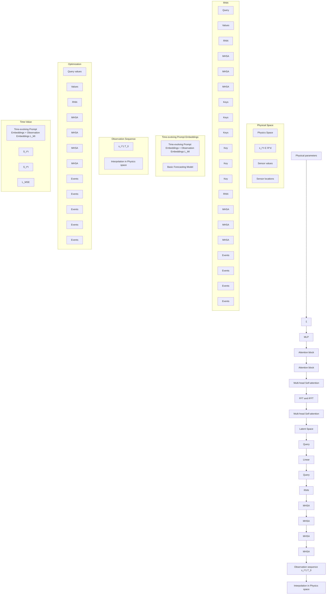

# PURE: Prompt Evolution with Graph ODE for Out-of-distribution Fluid Dynamics Modeling

Hao Wu $^{1,3}$ , Changhu Wang $^{2}$ , Fan Xu $^{1}$ , Jinbao Xue $^{3}$ , Chong Chen $^{4}$ , Xian-Sheng Hua $^{4}$ , Xiao Luo $^{2,*}$

$^{1}$ University of Science and Technology of China, $^{2}$ University of California, Los Angeles, $^{3}$ Tencent, $^{4}$ Terminus Group

wuhao2022@mail.ustc.edu.cn, wangch156@g.ucla.edu, markxu@mail.ustc.edu.cn
markxu@mail.ustc.edu.cn, jinbaoxue@tencent.com, chenchong.cz@gmail.com,
huaxiansheng@gmail.com, xiaoluo@cs.ucla.edu

# Abstract

This work studies the problem of out-of-distribution fluid dynamics modeling. Previous works usually design effective neural operators to learn from mesh-based data structures. However, in real-world applications, they would suffer from distribution shifts from the variance of system parameters and temporal evolution of the dynamical system. In this paper, we propose a novel approach named Prompt Evolution with Graph ODE (PURE) for out-of-distribution fluid dynamics modeling. The core of our PURE is to learn time-evolving prompts using a graph ODE to adapt spatio-temporal forecasting models to different scenarios. In particular, our PURE first learns from historical observations and system parameters in the frequency domain to explore multi-view context information, which could effectively initialize prompt embeddings. More importantly, we incorporate the interpolation of observation sequences into a graph ODE, which can capture the temporal evolution of prompt embeddings for model adaptation. These time-evolving prompt embeddings are then incorporated into basic forecasting models to overcome temporal distribution shifts. We also minimize the mutual information between prompt embeddings and observation embeddings to enhance the robustness of our model to different distributions. Extensive experiments on various benchmark datasets validate the superiority of the proposed PURE in comparison to various baselines. Our codes are available at https://github.com/easylearningscores/PURE\_main.

# 1 Introduction

Fluid dynamics $[44, 89]$ is a critical area in the field of mechanics and computational fluid dynamics has emerged as a powerful tool to understanding fluid flow $[32, 58, 67, 45]$ . Recently, various machine learning approaches have been widely adopted to solve the problem in a data-driven manner $[59, 46, 66, 65, 18, 7, 81]$ , which can achieve high efficiency in comparison to previous traditional numerical solvers. Moreover, they enjoy strong applicability when the underlying rules are not explicit, such as real-world weather forecasting $[4]$ and disease transmission $[68]$ .

In literature, existing data-driven fluid dynamics modeling approaches can be roughly divided into grid-based approaches $[12, 17]$ and geometry-based approaches $[59, 66, 65, 20]$ . Grid-based approaches construct regular meshes and then utilize neural operators to explore spatio-temporal relationships. In contrast, geometry-based approaches focus on irregular point clouds and then utilize graph neural networks (GNNs) $[30, 70]$ to learn from the interaction between mesh points.

Despite their great success, existing approaches $[88, 25]$ generally assume that training and test data share the same data distribution $[59, 66, 65, 47]$ , which could be not the case in real-world applications. In particular, there are two typical types of distribution shifts in dynamical systems, i.e., parameter-based shifts, and temporal distribution shifts. Firstly, different dynamical systems could involve different parameters in underlying rules, such as coefficients in PDEs and pressures in fluid systems $[3, 65]$ . Secondly, during long-term auto-regressive forecasting, the input data distribution could vary hugely during the temporal evolution $[91]$ . As in previous works $[22, 33]$ , machine learning approaches usually suffer from huge performance degradation when it comes to distribution shifts. Therefore, in this paper, we focus on the problem of out-of-distribution fluid dynamics modeling to enhance the performance under potential distribution shifts.

In this paper, we propose a new approach named Prompt Evolution with Graph ODE (PURE) for out-of-distribution fluid dynamics modeling. The high-level idea of our proposed PURE is to adapt well-trained forecasting approaches to different out-of-distribution scenarios by learning time-evolving prompts $[51, 84, 9]$ . To begin, we extract multi-view context signals from both historical observations and system parameters in the frequency domain using the attention mechanism, which can effectively initialize prompt embeddings under parameter-based shifts. More importantly, to capture temporal distribution shifts, we combine the interpolation of observation sequences into a graph ODE framework, which can utilize the interaction between prompt embeddings and observation embeddings for high-quality time-evolving prompt embeddings. Then, we concatenate our prompt embeddings and observation embeddings for model adaptation and enhance the robustness of our PURE to distribution variance by minimizing their mutual information using adversarial learning. Extensive experiments on a range of fluid dynamics datasets validate the superiority of the proposed PURE in comparison to various state-of-the-art approaches.

In summary, the contribution of our paper can be summarized as follows: (1) Problem Connection. We are the first to connect prompt learning with dynamical system modeling to solve the issue of out-of-distribution shifts. (2) Novel Methodology. Our PURE first learns from historical observations and system parameters to initialize prompt embeddings and then adopts a graph ODE with the interpolation of observation sequences to capture their continuous evolution for model adaptation under out-of-distribution shifts. (3) Superior Performance. Comprehensive experiments validate the effectiveness of our PURE in different challenging settings.

# 2 Problem Setup

Given a fluid dynamical system, we have N sensors within the domain $\Omega$ , with their locations denoted as $x_{1},\cdots,x_{N}$ , where $x_{i}\in R^{d_{l}}$ . The observations at time step t are represented as $s_{1}^{t},\cdots,s_{N}^{t}$ , where $s_{i}^{t}\in R^{d_{o}}$ and $d_{o}$ indicates the number of observation channels. Dynamical systems are governed by underlying system rules, such as PDEs with coefficient $\xi$ . Variations in system parameters may lead to different environments, potentially resulting in distribution shifts [54, 80, 6, 27]. In our study, we are provided with historical observation sequences $\{s_{i}^{1:T_{0}}\}_{i=1}^{N}$ and physical parameters $\xi$ (e.g., coefficients in the PDEs). Our goal is to predict the future observations of each sensor $s_{i}^{T_{0}+1:T_{0}+T}$ . In dynamical systems, the out-of-distribution problem examines model performance when predicting under unseen parameter distributions or environments. Let $u^{t}=[s_{1}^{t},\cdots,s_{N}^{t}]$ , these systems evolve according to $\frac{du}{dt}=F(\boldsymbol{u},\boldsymbol{\xi})$ , where u represents the observations and $\xi$ denotes the system parameters. When $\xi\sim P(\boldsymbol{\xi})$ , the state trajectory $u^{1:T_{0}}$ follows the distribution $P(\boldsymbol{u}^{1:T_{0}}|\boldsymbol{\xi})$ . Assume we learn a learned mapping function f from $u^{1:T_{0}}$ to $u^{T_{0}+1:T_{0}+T}$ , i.e., $u^{T_{0}+1:T_{0}+T}=f(\boldsymbol{u}^{1:T_{0}})$ and there could be different distributions across training and test datasets, i.e., $P_{\mathrm{train}}(\boldsymbol{\xi})\neq P_{\mathrm{test}}(\boldsymbol{\xi})$ , which results in $P_{\mathrm{train}}(\boldsymbol{u}^{1:T_{0}})\neq P_{\mathrm{test}}(\boldsymbol{u}^{1:T_{0}})$ . Moreover, when conducting rollout prediction, we are required to feed the output back to the model, i.e., $u^{T_{start}:T_{start}+T-1}=f(\boldsymbol{u}^{T_{start}-T_{0}:T_{start}-1})$ , with $P(\boldsymbol{u}^{1:T_{0}}|\boldsymbol{\xi})\neq P(\boldsymbol{u}^{T_{start}-T_{0}:T_{start}-1}|\boldsymbol{\xi},T_{start})$ .

# 3 The Proposed PURE

# 3.1 Motivation and Framework Overview

This paper addresses the challenge of out-of-distribution fluid system modeling, which is complicated by parameter-based and temporal distribution shifts. Specifically, our function $f(\cdot)$ can suffer from

flowchart

Figure 1: Overview of the PURE framework.

a serious distribution shift result from different $\xi$ and $T_{start}$ , i.e., $P(\boldsymbol{u}_{input}|\boldsymbol{\xi},T_{start})$ . To reduce the impact of distribution shift, we aim to learn invariant observation embeddings $\mu^{t}$ to different environments, i.e., $\xi$ and $T_{start}$ for better generalization and utilize prompt embeddings $z^{t}$ to indicate the current environment for final prediction. In formulation, we have:

$$
\boldsymbol {z} ^ {t} \perp \boldsymbol {\mu} ^ {t}, u _ {\text { output }} = \phi ([ \boldsymbol {\mu} ^ {t}, \boldsymbol {z} ^ {t} ]). \tag {1}
$$

The first term ensures the invariance of observation embeddings by decoupling observation embeddings and prompt embeddings. The second term aims to combine both two embeddings to generate the future predictions. Therefore, we propose a novel approach named PURE as:

$$
\boldsymbol {\mu} ^ {t} = \operatorname{BasicModel} (\boldsymbol {u} _ {\text {input}}), \quad \boldsymbol {z} ^ {0} = \operatorname{ContextMining} (\boldsymbol {u} _ {\text {input}}), \quad \boldsymbol {z} ^ {t} = \operatorname{GraphODE} (\boldsymbol {z} ^ {0}, t). \tag {2}
$$

where a basic model is adopted to generate observation, and we adopt context mining and graph ODE to learn time-varying prompt embeddings. Given a basic forecasting model (Eqn. 2), our PURE contains three key modules: (1) Multi-view Context Exploration, which explores spatio-temporal data using both the attention mechanism and the frequency domain to initialize prompt embeddings (Eqn. 2). (2) Time-evolving Prompt Learning, which incorporates the interpolation of observation sequences into a graph ODE to learn the evolution of prompt embeddings (Eqn. 2). (3) Model Adaptation with Prompt Embeddings, which leverages the time-evolving prompts to mitigate the temporal distribution shifts in fluid dynamics models (Eqn. 1). More details are in Figure 1.

# 3.2 Multi-view Context Exploration from Spatio-temporal Data

The main idea of our PURE is to utilize prompt learning to solve the issue of out-of-distribution shifts $[54, 80, 6, 27]$ in fluid dynamical systems. Prompt learning $[51, 84, 9]$ is an effective manner to adapt language models to various downstream tasks. In our scenarios, we aim to learn from both historical spatio-temporal information and system parameters to initialize our prompt embeddings, which can effectively solve the parameter-based distribution shifts. Here, we first follow the attention mechanism $[69, 86, 10, 50]$ to reconstruct the field value and then adopt the Fourier neural operator $[45]$ to integrate multi-view context information.

In particular, given each location, we map each location $x_{i}$ and each initial observation $s_{i}^{0}$ into a position embedding $p_{i}$ and an observation embedding $q_{i}$ using two feed-forwarding networks (FFNs) $\phi^{PE}(\cdot)$ and $\phi^{OE}(\cdot)$ , and then aggregate $p_{i}$ and $q_{i}$ using the Hadamard product followed by stacking L self-attention blocks for representation learning. In formulation,

$$
\boldsymbol {e} _ {i} = \boldsymbol {p} _ {i} \odot \boldsymbol {q} _ {i}, \boldsymbol {E} ^ {l + 1} = \phi^ {S A, (l)} (\boldsymbol {E} ^ {l}), \tag {3}
$$

where $\odot$ denotes the Hadamard product, $E^0$ is constructed by stacking $\{\pmb{e}_i\}_{i=1}^N$ , and $\phi^{SA,(l)}$ is the self-attention block at the layer $l$ . Afterward, we adopt the attention mechanism [69] to retrieve the representations for each query position $\pmb{x}_q$ as:

$$
\boldsymbol {u} ^ {q} = \operatorname{softmax} \left(\frac {\left[ \boldsymbol {W} ^ {Q} \phi^ {P E} \left(\boldsymbol {x} ^ {q}\right) \right] ^ {T} \cdot \left[ \boldsymbol {W} ^ {K} \boldsymbol {E} ^ {L} \right]}{\sqrt {d}}\right) \cdot \boldsymbol {W} ^ {V} \boldsymbol {E} ^ {L}, \tag {4}
$$

where $W^{*}$ is a learnable weight matrix for feature transformation and d is the hidden dimension. By retrieving the representations at each regular grid, we generate the 3D representation tensor U. Each tensor would be concatenated with the parameter embedding $\boldsymbol{u}^{p} = \phi^{PA}(\boldsymbol{\xi})$ for multi-view information integration, which results in the final tensor $\tilde{U}$ . Then, we utilize the frequency domain for representation enhancement to generate a prompt tensor H. Here, we first transfer the tensor into the frequency domain using a Fast Fourier Transformer (FFT) operator [45] and then adopt an FFN for feature transformation. Lastly, an inverse Fast Fourier Transformer (iFFT) operator is adopted to convert the features back to the spatial domain. Formally,

$$
\boldsymbol {H} = \text { iFFT } (\text { FFN } (\text { FFT } (\tilde {\boldsymbol {U}}))), \tag {5}
$$

where $FFT(\cdot)$ and $iFFT(\cdot)$ denote the FFT and iFFT operators, respectively. Since the input of spatio-temporal models would be irregular, we flatten the tensor H, and retrieve prompts for each sensor from the prompt tensor using:

$$
\boldsymbol {z} _ {i} ^ {0} = \operatorname{softmax} \left(\frac {\left[ \boldsymbol {W} ^ {Q ^ {\prime}} \phi^ {P E} (\boldsymbol {x} _ {i}) \right] ^ {T} \cdot \left[ \boldsymbol {W} ^ {K ^ {\prime}} f l a t t e n (\boldsymbol {H}) \right]}{\sqrt {d}}\right) \cdot \boldsymbol {W} ^ {V ^ {\prime}} f l a t t e n (\boldsymbol {H}), \tag {6}
$$

where $flatten(\cdot)$ is a flattening operator to transform 3D tensors to 2D matrices. Through the frame reconstruction, we can extract important spatio-temporal signals from the frequency domain, which is effective in initializing the prompt embedding for each sensor.

# 3.3 Time-evolving Prompt Learning with Graph ODE

To capture temporal distribution shifts within one system, static prompt embeddings [51] from context exploration are far from satisfactory. Our solution is to obtain continuous time-evolving prompts at any timestamp. To achieve this, we view the output of Eqn. 6 as the initial prompt embeddings and then incorporate the attention mechanism into a continuous graph ODE, which combines the interpolations of observations with the graph structure to learn the evolution of prompt embeddings.

In particular, given the initial prompt embeddings, we introduce two functions $\psi_{a}(\cdot)$ and $\psi_{r}(\cdot)$ for relation mining and feature aggregation. $\psi_{r}(\cdot)$ calculates the interaction between the centroid node and each of its neighboring nodes and $\psi_{a}(\cdot)$ aggregates all the neighborhood interactions to determine the evolution. Therefore, a graph ODE can be formulated by the following formulation:

$$
\frac {d \boldsymbol {z} _ {i} ^ {t}}{d t} = \psi_ {a} (\sum_ {j \in \mathcal {S} ^ {t} (i)} \psi_ {r} ([ \boldsymbol {z} _ {i} ^ {t}, \boldsymbol {z} _ {j} ^ {t} ])), \tag {7}
$$

where $\mathcal{S}^{t}(i)$ collects the sensors from the neighbours of i at timestamp t. However, Eqn. 7 neglects observations themselves during evolution, which are directly related to temporal distribution shifts in dynamical systems. Thus, it could generate suboptimal prompt embeddings. To tackle the issue, we conduct the interpolations of observation sequence $s_{i}^{1:T_{0}}$ , which results in $s_{i}^{t}$ at any timestamp. Then, we incorporate them into our graph ODE using the attention mechanism by rewriting Eqn. 7 into:

$$
\frac {d \boldsymbol {z} _ {i} ^ {t}}{d t} = \psi_ {a} (\sum_ {j \in \mathcal {S} ^ {t} (i)} \operatorname{softmax} \left(\frac {[ \tilde {\boldsymbol {W}} ^ {Q} \boldsymbol {z} _ {i} ^ {t} ] ^ {T} \cdot [ \tilde {\boldsymbol {W}} ^ {K} \boldsymbol {s} _ {j} ^ {t} ]}{\sqrt {d}}\right) \cdot \psi_ {r} ([ \boldsymbol {z} _ {i} ^ {t}, \boldsymbol {z} _ {j} ^ {t} ])). \tag {8}
$$

where $\tilde{W}^{Q}$ and $\tilde{W}^{K}$ are two matrices to generate the query and key, respectively. Here, we utilize the prompt embeddings and interpolated observations to serve as the query and the key. In this way, we effectively model their interaction to adjust the derivative in the graph ODE, which can help generate proper prompt embeddings for our model adaptation under temporal distribution shifts.

# 3.4 Model Adaptation with Prompt Embeddings

Finally, we incorporate our prompt embedding into our basic spatio-temporal forecasting model, and then introduce the optimization objective for the end-to-end training.

Basic Forecasting Model. Our time-evolving prompt embeddings can be easily incorporated into any spatio-temporal forecasting model. To make the best of our efficacy, we utilize a simple yet powerful basic model as our default model and also explore the performance of our PURE on more existing forecasting models. The input of our model is the observations of sensors from between the interval $[1, T_{0}]$ and output the predictions in $[T_{0} + 1, T_{0} + T]$ , i.e., $S^{1:T_{0}} \to S^{T_{0}, T_{0}+T}$ where $S^{*}$ is stacked by $s_{i}^{*}$ . In particular, our basic model first generates the embeddings of different observations, and then reconstructs the irregular observations into frames on grids using the reconstruction modules in Sec. 3.2. More importantly, we introduce two parallel modules, i.e., a Fourier neural operator [45] and a ViT-based convolution [19] and extract complementary feature maps [81], which would be fused to generate the predicted frames in the future. More details of our basis forecasting model can be found in Appendix B. Additionally, we also use other basic models.

Adaptation and Optimization. Note that we generate observation embeddings in our basic module, i.e., $\boldsymbol{\mu}_{i}^{t} = \phi^{enc}(\boldsymbol{s}_{i}^{t})$ . To adapt our model under distribution shifts, we concatenate the observation embeddings and prompt embeddings into updated embeddings $\tilde{\mu}_{i}^{t}$ as follows:

$$
\tilde {\boldsymbol {\mu}} _ {i} ^ {t} = \left[ \boldsymbol {\mu} _ {i} ^ {t}, \boldsymbol {z} _ {i} ^ {t} \right], \tag {9}
$$

which will be fed into the subsequent modules in the basic model. To optimize the whole framework, we first minimize the mean squared error (MSE) between the predicted observation and the ground truth as follows:

$$
\mathcal {L} _ {M S E} = \sum_ {t = T _ {0} + 1} ^ {T _ {0} + T} | | \hat {\boldsymbol {S}} ^ {t} - \boldsymbol {S} ^ {t} | |, \tag {10}
$$

where $\hat{S}^{t}$ denotes our predicted observation for every node and $S^{t}$ denotes the ground truth observations. Moreover, to enhance the invariance of our model to different scenarios, we turn to invariant learning [72, 42, 77] to decouple various prompt embeddings and observation embeddings, which promotes the observation embeddings to be less sensible to different distributions. To achieve this, we minimize the mutual information between observation embeddings and observation embeddings, i.e., $I(\boldsymbol{\mu}_{i}^{t};\boldsymbol{z}_{i}^{t})$ . In our work, we adopt a Jensen-Shannon mutual information estimator [40, 53] $T_{\gamma}(\cdot,\cdot)$ where $\gamma$ denotes the parameters to estimate their mutual information. Then, we collect all the corresponding pairs of $(\boldsymbol{\mu}_{i}^{t},\boldsymbol{z}_{i}^{t})$ using P and all the possible pairs of $(\boldsymbol{\mu}_{i}^{t},\boldsymbol{z}_{j}^{t})$ using N. The adversarial learning objective can be written as:

$$
\mathcal {L} _ {M I} = \max _ {\gamma^ {\prime}} \left\{\frac {1}{| \mathcal {P} |} \sum_ {\left(\boldsymbol {\mu} _ {i} ^ {t}, \boldsymbol {z} _ {i} ^ {t}\right) \in \mathcal {P}} s p \left(- T _ {\gamma^ {\prime}} \left(\boldsymbol {\mu} _ {i} ^ {t}, \boldsymbol {z} _ {i} ^ {t}\right)\right) + \frac {1}{| \mathcal {N} | | \mathcal {P} |} \sum_ {\left(\boldsymbol {\mu} _ {i} ^ {t}, \boldsymbol {z} _ {j} ^ {t}\right) \notin \mathcal {P}} - s p \left(- T _ {\gamma^ {\prime}} \left(\boldsymbol {\mu} _ {i} ^ {t}, \boldsymbol {z} _ {j} ^ {t}\right)\right) \right\}, \tag {11}
$$

in which $sp(\pmb{x}) = \log (1 + e^{\pmb{x}})$ represents the softplus function. In summary, the overall objective can be written as:

$$
\mathcal {L} = \mathcal {L} _ {M S E} + \lambda \mathcal {L} _ {M I}, \tag {12}
$$

where $\lambda$ is a coefficient to balance two loss objectives. The algorithm is summarized in Appendix D.

# 3.5 Theoretical Analysis

In this part, we provide a theoretical analysis to demonstrate how PURE works. Our focus is primarily on theoretically showing the necessity of incorporating the observations themselves during evolution. For simplicity of analysis, we assume that Eqn. 7 can be rewritten as:

$$
\frac {d \boldsymbol {z} _ {i} ^ {t}}{d t} = \frac {1}{\# (\mathcal {S} ^ {t} (i))} \sum_ {j \in \mathcal {S} ^ {t} (i)} (M _ {1} \boldsymbol {z} _ {i} ^ {t} + M _ {2} \boldsymbol {z} _ {j} ^ {t}) = M _ {1} \boldsymbol {z} _ {i} ^ {t} + \frac {1}{\# (\mathcal {S} ^ {t} (i))} \sum_ {j \in \mathcal {S} ^ {t} (i)} M _ {2} \boldsymbol {z} _ {j} ^ {t}, \tag {13}
$$

where $\#\left(\cdot\right)$ calicates the size of the set. For the sake of simplicity in the proof, we assume that $z_{i}^{t}$ is one-dimensional and consider only the ODE above for i (not the entire system of ODEs). Then, Eqn. 13 can be rewritten as:

$$
\frac {d z _ {i} ^ {t}}{d t} = \frac {1}{\# (\mathcal {S} ^ {t} (i))} \sum_ {j \in \mathcal {S} ^ {t} (i)} (M _ {1} z _ {i} ^ {t} + M _ {2} z _ {j} ^ {t}) = M _ {1} z _ {i} ^ {t} + b (t), \tag {14}
$$

where $b(t)$ is a function. To characterize temporal distribution shifts, we assume that a portion of the corresponding true $z_{j}^{t}$ has a constant shift. With the potential environmental change, Eqn. 13 can be rewritten as:

$$
\frac {d z _ {i} ^ {t}}{d t} = \frac {1}{\# (\mathcal {S} ^ {t} (i))} \sum_ {j \in \mathcal {S} ^ {t} (i)} (M _ {1} z _ {i} ^ {t} + M _ {2} z _ {j} ^ {t}) = M _ {1} z _ {i} ^ {t} + b ^ {\prime} (t), \tag {15}
$$

where $|b(t) - b'(t)| \geq c_{0}$ , suggesting the constant shift $c_{0}$ .

Theorem 3.1. Given the following ODEs in $\mathbb{R}$ ,

$$
\begin{array}{l l} \dot {x} = M _ {1} x + b (t), & x (0) = x _ {0}, \\ \dot {y} = M _ {1} y + b ^ {\prime} (t), & y (0) = x _ {0}, \end{array} \tag {16}
$$

where $|b(t) - b'(t)| \geq c_0$ , there exists a positive constant $c_1$ such that

$$
\left| x (t) - y (t) \right| \geq c _ {1} (e ^ {M _ {1} t} - 1), \text {   for   all   } t > 0. \tag {17}
$$

The proof of Theorem 3.1 can be found in Appendix A. Theorem 3.1 suggests that even with the simplest one-dimensional linear ODE, significant differences in the solutions will arise if temporal distribution shifts are neglected. Next, we will focus on how Eqn. 8 addresses this issue. In this case, we assume that

$$
\psi_ {r} ([ z _ {i} ^ {t}, z _ {j} ^ {t} ]) = M _ {1} z _ {i} ^ {t} + M _ {2} z _ {j} ^ {t}. \tag {18}
$$

Then, Eqn. 7 can be written as:

$$
\frac {d z _ {i} ^ {t}}{d t} = \psi_ {\alpha} \left(\sum_ {j \in \mathcal {S} ^ {t} (i)} \left(M _ {1} z _ {i} ^ {t} + M _ {2} z _ {j} ^ {t}\right)\right) = \psi_ {\alpha} \left(M _ {1} z _ {i} ^ {t} + \frac {1}{\# (\mathcal {S} ^ {t} (i))} \sum_ {j \in \mathcal {S} ^ {t} (i)} M _ {2} z _ {j} ^ {t}\right) = \psi_ {\alpha} \left(M _ {1} z _ {i} ^ {t} + b (t)\right), \tag {19}
$$

where

$$
b (t) = \frac {1}{\# (\mathcal {S} ^ {t} (i))} \sum_ {j \in \mathcal {S} ^ {t} (i)} M _ {2} z _ {j} ^ {t}. \tag {20}
$$

Similarly, Eqn. 8 can be written as:

$$
\frac {d z _ {i} ^ {t}}{d t} = \psi_ {\alpha} \big (M _ {1} z _ {i} ^ {t} + b ^ {\prime} (t) \big), \tag {21}
$$

where

$$
b ^ {\prime} (t) = \sum_ {j \in \mathcal {S} ^ {t} (i)} \operatorname{softmax} \left(\frac {[ \tilde {\boldsymbol {W}} ^ {Q} \boldsymbol {z} _ {i} ^ {t} ] ^ {T} \cdot [ \tilde {\boldsymbol {W}} ^ {K} \boldsymbol {s} _ {j} ^ {t} ]}{\sqrt {d}}\right) \cdot M _ {2} z _ {j} ^ {t}. \tag {22}
$$

For simplicity of notation, we omit the superscript i. Write $F(z,t)=\psi_{\alpha}\big(M_{1}z+b(t)\big)$ and $G(z,t)=\psi_{\alpha}\big(M_{1}z^{t}+b'(t)\big)$ . Then, we have the following theorem with the proof in Appendix A.

Theorem 3.2. Assume that the attention mechanism satisfies that $|b'(t) - b(t)| \leq \epsilon$ , for all $t > 0$ , and the function $\phi_{\alpha}$ is L-Lipschitz. Given the following ODEs in $\mathbb{R}$ ,

$$
\begin{array}{l l} \dot {x} = \psi_ {\alpha} (M _ {1} x + b (t)) = F (x, t), & x (0) = x _ {0}, \\ \dot {y} = \psi_ {\alpha} (M _ {1} y + b ^ {\prime} (t)) = G (y, t), & y (0) = x _ {0}, \end{array} \tag {23}
$$

there exists two constants $c_{2}$ and $c_{3}$ such that

$$
\left| x (t) - y (t) \right| \leq \epsilon c _ {2} (e ^ {c _ {3} t} - 1), \text {   for   all   } t > 0. \tag {24}
$$

Thoerem 3.2 shows that as long as the attention mechanism is sufficiently good, we can approximate the true ODE with arbitrary precision using Eqn. 8, even in the presence of environmental change.

Table 1: We compare our study's performance with 10 baselines. We magnify the MSE of 3D-Reaction-Diffusion by 100 times. Green Yellow Red mean best, second, worst MSE. 

<table><tr><td rowspan="3">MODEL</td><td colspan="10">BENCHMARKS</td></tr><tr><td colspan="2">PROMETHEUS</td><td colspan="2">NAVIER-STOKES</td><td colspan="2">SPHERICAL-SWE</td><td colspan="2">3D REACTION-DIFF</td><td colspan="2">ERA5</td></tr><tr><td>w/o OOD</td><td>w/ OOD</td><td>w/o OOD</td><td>w/ OOD</td><td>w/o OOD</td><td>w/ OOD</td><td>w/o OOD</td><td>w/ OOD</td><td>w/o OOD</td><td>w/ OOD</td></tr><tr><td>U-NET [64]</td><td>0.0931</td><td>0.1067</td><td>0.1982</td><td>0.2243</td><td>0.0083</td><td>0.0087</td><td>0.0148</td><td>0.0183</td><td>0.0843</td><td>0.0932</td></tr><tr><td>RESNET [21]</td><td>0.0674</td><td>0.0696</td><td>0.1823</td><td>0.2301</td><td>0.0081</td><td>0.0192</td><td>0.0151</td><td>0.0186</td><td>0.0921</td><td>0.0977</td></tr><tr><td>ViT [10]</td><td>0.0632</td><td>0.0691</td><td>0.2342</td><td>0.2621</td><td>0.0065</td><td>0.0072</td><td>0.0157</td><td>0.0192</td><td>0.0762</td><td>0.0786</td></tr><tr><td>SWINT [49]</td><td>0.0652</td><td>0.0729</td><td>0.2248</td><td>0.2554</td><td>0.0062</td><td>0.0068</td><td>0.0155</td><td>0.0190</td><td>0.0782</td><td>0.0832</td></tr><tr><td>FNO [45]</td><td>0.0447</td><td>0.0506</td><td>0.1556</td><td>0.1712</td><td>0.0038</td><td>0.0045</td><td>0.0132</td><td>0.0179</td><td>0.7233</td><td>0.9821</td></tr><tr><td>UNO [1]</td><td>0.0532</td><td>0.0643</td><td>0.1764</td><td>0.1984</td><td>0.0034</td><td>0.0041</td><td>0.0121</td><td>0.0164</td><td>0.6652</td><td>0.7621</td></tr><tr><td>CNO [63]</td><td>0.0542</td><td>0.0655</td><td>0.1473</td><td>0.1522</td><td>0.0037</td><td>0.0038</td><td>0.0145</td><td>0.0182</td><td>0.5243</td><td>0.7821</td></tr><tr><td>NMO [82]</td><td>0.0397</td><td>0.0483</td><td>0.1021</td><td>0.1032</td><td>0.0026</td><td>0.0031</td><td>0.0129</td><td>0.0168</td><td>0.0432</td><td>0.0563</td></tr><tr><td>CGODE [26]</td><td>0.0761</td><td>0.0843</td><td>0.2035</td><td>0.2243</td><td>0.0873</td><td>0.0987</td><td>0.8371</td><td>0.9261</td><td>0.8721</td><td>0.9872</td></tr><tr><td>DGODE [80]</td><td>0.0344</td><td>0.0359</td><td>0.0805</td><td>0.0925</td><td>0.0022</td><td>0.0028</td><td>0.0122</td><td>0.0156</td><td>0.0543</td><td>0.0635</td></tr><tr><td>OURS + PURE</td><td>0.0323</td><td>0.0328</td><td>0.0752</td><td>0.0763</td><td>0.0022</td><td>0.0024</td><td>0.0119</td><td>0.0127</td><td>0.0398</td><td>0.0401</td></tr><tr><td>PROMOTION</td><td>6.10%</td><td>8.63%</td><td>6.58%</td><td>26.07%</td><td>0.00%</td><td>16.67%</td><td>1.65%</td><td>22.56%</td><td>7.87%</td><td>28.77%</td></tr></table>

Table 2: This table shows the performance of the PURE framework across different benchmarks.

<table><tr><td rowspan="3">MODEL</td><td colspan="10">BENCHMARKS</td></tr><tr><td colspan="2">PROMETHEUS</td><td colspan="2">NAVIER-STOKES</td><td colspan="2">SPHERICAL-SWE</td><td colspan="2">3D REACTION-DIFF</td><td colspan="2">ERA5</td></tr><tr><td>ORI</td><td>+PURE</td><td>ORI</td><td>+PURE</td><td>ORI</td><td>+PURE</td><td>ORI</td><td>+PURE</td><td>ORI</td><td>+PURE</td></tr><tr><td>RESNet [21]</td><td>0.0674</td><td>0.0542</td><td>0.1823</td><td>0.1492</td><td>0.0081</td><td>0.0067</td><td>0.0151</td><td>0.0141</td><td>0.0921</td><td>0.0896</td></tr><tr><td>NMO [10]</td><td>0.0397</td><td>0.0281</td><td>0.1021</td><td>0.0876</td><td>0.0026</td><td>0.0012</td><td>0.0129</td><td>0.0123</td><td>0.0432</td><td>0.0389</td></tr><tr><td>DGODE [49]</td><td>0.0344</td><td>0.0201</td><td>0.0805</td><td>0.0792</td><td>0.0022</td><td>0.0020</td><td>0.0122</td><td>0.0110</td><td>0.0543</td><td>0.0462</td></tr></table>

# 4 Experiment

# 4.1 Experimental Settings

Benchmarks. We study Benchmarks from three domains, as shown in Table 5. ▷ Computational Fluid Dynamics. We use Prometheus [80] and follow the original setup for environment segmentation. ▷ Real-world Data. We employ the ERA5 [23], using different combinations of variables as the environment. In detail, we use ERA5 data with variables such as surface pressure (Sp), sea surface temperature (SST), sea surface height (SSH), and two-meter temperature (T2m) to predict temperature. ▷ Partial Differential Equations. The 2D Navier-Stokes equations [45] describe fluid motion, with the primary variable being the viscosity coefficient ν, which quantifies internal friction in the fluid, simulating vorticity values under ten different viscosity coefficients. The spherical shallow water equations [14] simulate large-scale atmospheric and oceanic fluid motion on Earth's surface, also with viscosity coefficient ν as the main variable, involving tangential vorticity (w) and fluid thickness (h) on a spherical surface. The 3D reaction-diffusion equations describe the diffusion and reaction of chemicals in space [62], with the primary variable being the diffusion coefficient D, representing the rate of chemical diffusion in space, including u, v velocity components. More details see Appendix E.

Baselines. We select representative models from three domains as baselines. ▷ Visual Backbone Networks. We include ResNet [21], U-Net [64], Vision Transformer(ViT) [10], and Swin Transformer(SWINT) [49]. ▷ Neural Operator Architectures. We cover FNO [45], UNO [1], CNO [63], and NMO [82]. ▷ Graph-ODE Architectures. We feature CG-ODE [26], and DGODE [80].

Tasks. We evaluate model performance for various prediction tasks through the following scenarios and use MSE as metrics. The specific tasks are as follows:

▷ Generalization Experiments: • Out-of-Distribution Generalization: We train the model In-Domain environment and test it in Adaptation environment to verify its generalization ability. • Spatial Generalization & Temporal Generalization: In the Prometheus, we train the model at 75% sparsity and test it at $s \in \{5\%, 25\%, 50\%, 75\%\}$ sparsity. The experiment evaluates performance with equal input and output lengths ( $In_{t}$ ) and with output 10 times the input length ( $Out_{t}$ ).

$\triangleright$ Zero-shot Experiments. Specifically, we follow the setup from [45] and conduct two experiments. In the Prometheus, we train the model In-Domain environments $b_{1}, b_{2}, \ldots, b_{20}$ and evaluate its generalization ability in new environments $b_{11}, b_{12}$ , using MSE as the evaluation metric. In the

Table 3: Comparison of Spatial & Temporal Generalization in the Prometheus benchmark. 

<table><tr><td>SPARSITY</td><td>TEST→</td><td colspan="2"> $s_{\text{TS}} = 5\%$ </td><td colspan="2"> $s_{\text{TS}} = 25\%$ </td><td colspan="2"> $s_{\text{TS}} = 50\%$ </td><td colspan="2"> $s_{\text{TS}} = 75\%$ </td></tr><tr><td>TRAIN ↓</td><td></td><td>IN-T</td><td>OUT-T</td><td>IN-T</td><td>OUT-T</td><td>IN-T</td><td>OUT-T</td><td>IN-T</td><td>OUT-T</td></tr><tr><td rowspan="4"> $s_{\text{TR}} = 75\%$ </td><td>U-NET</td><td>0.1847</td><td>0.2103</td><td>0.2345</td><td>0.2877</td><td>0.2654</td><td>0.3018</td><td>0.2273</td><td>0.3391</td></tr><tr><td>+ PURE</td><td>0.1622</td><td>0.1854</td><td>0.2079</td><td>0.2581</td><td>0.2365</td><td>0.2710</td><td>0.1998</td><td>0.3024</td></tr><tr><td>FNO</td><td>0.0659</td><td>0.0872</td><td>0.0921</td><td>0.1232</td><td>0.1109</td><td>0.1821</td><td>0.2109</td><td>0.2455</td></tr><tr><td>+ PURE</td><td>0.0504</td><td>0.0654</td><td>0.0689</td><td>0.0946</td><td>0.0805</td><td>0.1417</td><td>0.1582</td><td>0.1883</td></tr></table>

heatmap

| Error Type           | Temperature Field | Smoke Field |
|----------------------|-------------------|-------------|
| Sparse Input         | 75%               | 75%         |
| Ground Truth         | 75%               | 75%         |
| Ours+PURE Error      | 75%               | 75%         |
| DGODE Error          | 75%               | 75%         |
| FNO Error            | 75%               | 75%         |
| U-Net Error          | 75%               | 75%         |

Figure 2: The top row shows the sparse input data used for predictions. The second row displays the true data for both fields. Red boxes highlight areas of significant error.

Navier-Stokes equations, we train the model on a $64 \times 64 \times 20$ dataset and evaluate it on a higher resolution $512 \times 512 \times 20$ dataset, focusing on the fluid dynamics details in the last five time steps and the handling of complex flow patterns and boundary layers.

# 4.2 Generalization Experiment Results

In this section, we focus on the issue of generalization. Based on our experimental findings, we make the following observations. Out-of-Distribution Generalization. The results as shown in Table 1. On the Prometheus dataset, PURE outperforms all benchmark models with an MSE of 0.0323 in-distribution and 0.0328 OOD. It improves over the second-best model, DGODE (MSE 0.0344 in-distribution, 0.0359 OOD), by 6.10% and 8.63%, respectively. On the Navier-Stokes dataset, PURE achieves the best performance with an MSE of 0.0752 in-distribution and 0.0763 OOD, improving by 6.58% and 26.07% over the second-best model. On the Spherical-SWE dataset, PURE has an MSE of 0.0022 both in-distribution and OOD, which is 41.46% better than the second-best model. Additionally, in Table 2, the performance of various benchmark models significantly improves when using PURE, in summary, the PURE framework performs excellently in handling OOD fluid dynamics modeling.

Spatial & Temporal Generalization. Table 3 shows that PURE excels in the Prometheus benchmark, notably reducing errors with sparse data. For instance, in the $75\%$ sparsity test, U-Net's MSE drops from 0.2273 to 0.1998, and FNO from 0.2109 to 0.1582. Figure 2 highlights PURE's lower errors in temperature and smoke fields compared to DGODE, FNO, and U-Net, especially in red-boxed areas, showcasing its advantage in capturing complex dynamics. Additionally, PURE performs consistently across different prediction lengths; for example, U-Net's MSE decreases from 0.1847 to 0.1622 for in-time prediction (In-t) and from 0.2103 to 0.1854 for out-of-time prediction (Out-t). Overall, PURE excels with sparse and out-of-distribution data and enhances performance across prediction lengths, demonstrating strong spatial and temporal generalization.

Visualization and Analysis. Figure 3 compares the performance of different methods in fluid dynamics modeling, including the Prometheus dataset, Navier-Stokes equations, and the 3D Reaction-Diffusion Equation. In the Prometheus dataset, using PURE significantly reduces DGODE's prediction error, especially in complex dynamic regions. For the Navier-Stokes and Spherical Shallow Water equations, FNO and NMO models combined with PURE excel in capturing complex flow features. In the 3D Reaction-Diffusion Equation, DGODE with PURE significantly reduces prediction errors. Overall, PURE greatly enhances the prediction accuracy of models in fluid dynamics, allowing for better capture of complex dynamic evolution.

# 4.3 Zero-shot Super-resolution and Environment Generalization

As shown in Figure 4, the PURE framework performs excellently in zero-shot super-resolution and environmental generalization experiments. In the Prometheus benchmark, the FNO model using

text_image

Ground-Truth
Prediction
DGODE + PURE Error
DGODE Error
Ground-Truth
Prediction
DGODE + PURE Error
DGODE Error
Prometheus

text_image

Ground-Truth FNO + PURE FNO
Navier-Stokes
Ground-Truth DGODE + PURE 3D Reaction-I

text_image

Ground-Truth
NMO + PURE
NMO
Spherical shallow water equations
DGODE
UNO
Diffusion equations

Figure 3: The Figure compares the performance of various methods in fluid dynamics modeling, including Prometheus, Navier-Stokes equations, and 3D reaction-diffusion equations. Models with PURE significantly reduce prediction errors in fluid dynamics, capturing complex dynamic evolutions.

heatmap

| Grid Size | Ground Truth | Prediction (x2) | Prediction (x4) |
|-----------|--------------|-----------------|-----------------|
| 64x128    | 0.0465915    | 0.0436781       | 0.0471655       |

heatmap

| Method | Top row | Bottom row | Middle row | FNO+PURE |
|--------|---------|------------|------------|----------|
| Truth  | 512x512 | 64x64      | 512x512    | 64x64    |
| Ours   | 512x512 | 64x64      | 512x512    | 64x64    |
| FNO    | 512x512 | 64x64      | 512x512    | 64x64    |

Figure 4: Left. Zero-shot super-resolution and environment generalization experiments on Prometheus. Right. Zero-shot super-resolution experiments on the Navier-Stokes equations.

PURE significantly reduces prediction errors at different resolutions, with an MSE of 0.0471655 at a $256 \times 512$ resolution. For the Navier-Stokes equations, the FNO model combined with PURE significantly reduces prediction errors on high-resolution datasets and performs better in handling complex flow patterns and boundary layers, especially in capturing details in the last five time steps. Overall, PURE significantly improves model prediction accuracy and generalization ability in zero-shot super-resolution and environmental generalization tasks.

# 4.4 Qualitative Analysis & Ablation Study

In this section, we evaluate the effectiveness of the PURE method and the importance of its components through qualitative analysis and ablation studies.

Qualitative Analysis. The Figure 5 uses t-SNE to perform clustering analysis on FNO prediction results. (a) represents the ground truth, (b) shows the predictions of the original FNO, and (c) shows the predictions of FNO combined with PURE. It is evident that the FNO combined with PURE is closer to the labels in clustering effect, with a more tightly distributed data point cluster. This demonstrates that PURE significantly improves the prediction accuracy of the FNO model.

Ablation Study. To evaluate the contribution and importance of each component in the proposed PURE, we design ablation experiments based on the default backbone model in this paper, and we use Relative L2 error as metric. Our model variants are as follows: (1) PURE w/o Graph ODE, we

scatter

| x  | y  | value |
|----|----|-------|
| -5 | 10 | 150   |
| -4 | 8  | 120   |
| -3 | 6  | 90    |
| -2 | 4  | 60    |
| -1 | 2  | 30    |
| 0  | 0  | 10    |
| 1  | -2 | 5     |
| 2  | -4 | 2     |
| 3  | -6 | 1     |
| 4  | -8 | 0.5   |
| 5  | -10| 0.2   |
| 6  | -8 | 0.1   |
| 7  | -6 | 0.05  |
| 8  | -4 | 0.02  |
| 9  | -2 | 0.01  |
| 10 | 0  | 0.005 |
| 11 | 2  | 0.002 |
| 12 | 4  | 0.001 |
| 13 | 6  | 0.0005|
| 14 | 8  | 0.0002|
| 15 | 10 | 0.0001|
| 16 | 8  | 0.00005|
| 17 | 6  | 0.00002|
| 18 | 4  | 0.00001|
| 19 | 2  | 0.000005|
| 20 | 0  | 0.000002|
| 21 | -2 | 0.000001|
| 22 | -4 | 0.0000005|
| 23 | -6 | 0.0000002|
| 24 | -8 | 0.0000001|
| 25 | -10| 0.00000005|
| 26 | -8 | 5     |
| 27 | -6 | 2     |
| 28 | -4 | 1     |
| 29 | -2 | 0.5   |
| 30 | 0  | 0     |
| 31 | -2 | -1    |
| 32 | -4 | -2    |
| 33 | -6 | -3    |
| 34 | -8 | -4    |
| 35 | -10| -5    |
| 36 | -8 | -6    |
| 37 | -6 | -7    |
| 38 | -4 | -8    |
| 39 | -2 | -9    |
| 40 | 0  | -10   |
| 41 | -2 | -11   |
| 42 | -4 | -12   |
| 43 | -6 | -13   |
| 44 | -8 | -14   |
| 45 | -10| -15   |
| 46 | -8 | -16   |
| 47 | -6 | -17   |
| 48 | -4 | -18   |
| 49 | -2 | -19   |
| 50 | 0  | -20   |
| 51 | -2 | -21   |
| 52 | -4 | -22   |
| 53 | -6 | -23   |
| 54 | -8 | -24   |
| 55 | -10| -25   |
| 56 | -8 | -26   |
| 57 | -6 | -27   |
| 58 | -4 | -28   |
| 59 | -2 | -29   |
| 60 | 0  | -30   |
| 61 | -2 | -31   |
| 62 | -4 | -32   |
| 63 | -6 | -33   |
| 64 | -8 | -34   |
| 65 | -10| -35   |
| 66 | -8 | -36   |
| 67 | -6 | -37   |
| 68 | -4 | -38   |
| 69 | -2 | -39   |
| 70 | 0  | -40   |
| 71 | -2 | -41   |
| 72 | -4 | -42   |
| 73 | -6 | -43   |
| 74 | -8 | -44   |
| 75 | -10| -45   |
| 76 | -8 | -46   |
| 77 | -6 | -47   |
| 78 | -4 | -48   |
| 79 | -2 | -49   |
| 80 | 0  | -50   |
| 81 | -2 | -51   |
| 82 | -4 | -52   |
| 83 | -6 | -53   |
| 84 | -8 | -54   |
| 85 | -10| -55   |
| 86 | -8 | -56   |
| 87 | -6 | -57   |
| 88 | -4 | -58   |
| 89 | -2 | -59   |
| 90 | 0  | -60   |
| 91 | -2 | -61   |
| 92 | -4 | -62   |
| 93 | -6 | -63   |
| 94 | -8 | -64   |
| 95 | -10| -65   |
| 96 | -8 | -66   |
| 97 | -6 | -67   |
| 98 | -4 | -68   |
| 99 | -2 | -69   |
|         (c)

Figure 5: t-SNE clustering. (a) Ground truth, (b) FNO predictions, (c) FNO +PURE predictions.

Table 4: Ablation Studies on S-SWE. 

<table><tr><td>VARIANTS</td><td>S-SWE</td></tr><tr><td>PURE w/o GRAPH ODE</td><td>0.1882</td></tr><tr><td>PURE w/o INTERPOLATION</td><td>0.1696</td></tr><tr><td>PURE w/o MI</td><td>0.1588</td></tr><tr><td>PURE w/o FFT</td><td>0.1602</td></tr><tr><td>PURE</td><td>0.1357</td></tr></table>

remove the Graph ODE module and use static prompt embeddings. (2) PURE w/o Interpolation, we remove interpolation and use only Eqn. 7. (3) PURE w/o MI, we remove the mutual information minimization. (4) PURE w/o FFT, we remove the frequency domain enhancement (FFT). Table 4 shows the results of our ablation study. Removing Graph ODE, interpolation, mutual information minimization, and FFT results in Relative L2 errors of 0.1882, 0.1696, 0.1588, and 0.1602, respectively. The complete PURE method has an error of 0.1357. The results of the ablation experiments show that removing any component results in a decrease in predictive performance, further proving the critical role of these components in the PURE method. More results in Appendix H.

# 5 Conclusion

In this paper, we study a practical problem of out-of-distribution fluid dynamics modeling and propose a novel approach named PURE for this problem. The high-level idea of our PURE is to learn time-evolving prompts using graph ODEs, which can effectively adapt spatio-temporal forecasting models to different scenarios. Our PURE first initializes prompt embeddings by exploring multi-view context information from spatio-temporal data and system parameters. Then, PURE incorporates the interpolation of observation sequences into the graph ODE, which helps capture the temporal evolution of prompt embeddings to mitigate temporal distribution shifts. In future works, we will extend our PURE to more real-world scenarios such as rigid dynamics modeling and traffic flow forecasting.

# References

[1] Md Ashiqur Rahman, Zachary E Ross, and Kamyar Azizzadenesheli. U-no: U-shaped neural operators. arXiv e-prints, pages arXiv–2204, 2022.   
[2] Ainesh Bakshi, Allen Liu, Ankur Moitra, and Morris Yau. Tensor decompositions meet control theory: learning general mixtures of linear dynamical systems. In International Conference on Machine Learning, pages 1549–1563. PMLR, 2023.   
[3] Fabien Baradel, Natalia Neverova, Julien Mille, Greg Mori, and Christian Wolf. Cophy: Counterfactual learning of physical dynamics. arXiv preprint arXiv:1909.12000, 2019.   
[4] Kaifeng Bi, Lingxi Xie, Hengheng Zhang, Xin Chen, Xiaotao Gu, and Qi Tian. Accurate medium-range global weather forecasting with 3d neural networks. Nature, 619(7970):533–538, 2023.   
[5] Michael S Branicky. Continuity of ode solutions. Applied Mathematics Letters, 7(5):57-60, 1994.   
[6] Lanlan Chen, Kai Wu, Jian Lou, and Jing Liu. Signed graph neural ordinary differential equation for modeling continuous-time dynamics. In Proceedings of the AAAI Conference on Artificial Intelligence, volume 38, pages 8292–8301, 2024.   
[7] Ailin Deng and Bryan Hooi. Graph neural network-based anomaly detection in multivariate time series. AAAI, 2021.   
[8] Xun Deng, Wenjie Wang, Fuli Feng, Hanwang Zhang, Xiangnan He, and Yong Liao. Counterfactual active learning for out-of-distribution generalization. In Proceedings of the 61st Annual Meeting of the Association for Computational Linguistics (Volume 1: Long Papers), pages 11362–11377, 2023.   
[9] Ning Ding, Shengding Hu, Weilin Zhao, Yulin Chen, Zhiyuan Liu, Hai-Tao Zheng, and Maosong Sun. Openprompt: An open-source framework for prompt-learning. arXiv preprint arXiv:2111.01998, 2021.   
[10] Alexey Dosovitskiy, Lucas Beyer, Alexander Kolesnikov, Dirk Weissenborn, Xiaohua Zhai, Thomas Unterthiner, Mostafa Dehghani, Matthias Minderer, Georg Heigold, Sylvain Gelly, Jakob Uszkoreit, and Neil Houlsby. An image is worth 16x16 words: Transformers for image recognition at scale. In International Conference on Learning Representations, 2021.

[11] Huawei Fan, Junjie Jiang, Chun Zhang, Xingang Wang, and Ying-Cheng Lai. Long-term prediction of chaotic systems with machine learning. Physical Review Research, 2(1):012080, 2020.   
[12] Zhiwei Fang. A high-efficient hybrid physics-informed neural networks based on convolutional neural network. IEEE Transactions on Neural Networks and Learning Systems, 33(10):5514-5526, 2021.   
[13] Stathi Fotiadis, Mario Lino Valencia, Shunlong Hu, Stef Garasto, Chris D Cantwell, and Anil Anthony Bharath. Disentangled generative models for robust prediction of system dynamics. In International Conference on Machine Learning, pages 10222–10248. PMLR, 2023.   
[14] Joseph Galewsky, Richard K Scott, and Lorenzo M Polvani. An initial-value problem for testing numerical models of the global shallow-water equations. Tellus A: Dynamic Meteorology and Oceanography, 56(5):429–440, 2004.   
[15] Saurabh Garg, Sivaraman Balakrishnan, and Zachary Lipton. Domain adaptation under open set label shift. Advances in Neural Information Processing Systems, 35:22531–22546, 2022.   
[16] Yuxian Gu, Xu Han, Zhiyuan Liu, and Minlie Huang. Ppt: Pre-trained prompt tuning for few-shot learning. arXiv preprint arXiv:2109.04332, 2021.   
[17] Xiaoxiao Guo, Wei Li, and Francesco Iorio. Convolutional neural networks for steady flow approximation. In KDD, pages 481-490, 2016.   
[18] Jiaqi Han, Wenbing Huang, Hengbo Ma, Jiachen Li, Joshua B Tenenbaum, and Chuang Gan. Learning physical dynamics with subequivariant graph neural networks. arXiv preprint arXiv:2210.06876, 2022.   
[19] Kai Han, Yunhe Wang, Hanting Chen, Xinghao Chen, Jianyuan Guo, Zhenhua Liu, Yehui Tang, An Xiao, Chunjing Xu, Yixing Xu, et al. A survey on vision transformer. IEEE transactions on pattern analysis and machine intelligence, 45(1):87–110, 2022.   
[20] Xu Han, Han Gao, Tobias Pffaf, Jian-Xun Wang, and Li-Ping Liu. Predicting physics in mesh-reduced space with temporal attention. arXiv preprint arXiv:2201.09113, 2022.   
[21] Kaiming He, Xiangyu Zhang, Shaoqing Ren, and Jian Sun. Deep residual learning for image recognition. In Proceedings of the IEEE conference on computer vision and pattern recognition, pages 770–778, 2016.   
[22] Dan Hendrycks, Steven Basart, Norman Mu, Saurav Kadavath, Frank Wang, Evan Dorundo, Rahul Desai, Tyler Zhu, Samyak Parajuli, Mike Guo, et al. The many faces of robustness: A critical analysis of out-of-distribution generalization. In Proceedings of the IEEE/CVF International Conference on Computer Vision, pages 8340–8349, 2021.   
[23] Hans Hersbach, Bill Bell, Paul Berrisford, Shoji Hirahara, András Horányi, Joaquín Muñoz-Sabater, Julien Nicolas, Carole Peubey, Raluca Radu, Dinand Schepers, et al. The era5 global reanalysis. Quarterly Journal of the Royal Meteorological Society, 146(730):1999–2049, 2020.   
[24] Tony Huang, Jack Chu, and Fangyun Wei. Unsupervised prompt learning for vision-language models. arXiv preprint arXiv:2204.03649, 2022.   
[25] Xinquan Huang, Wenlei Shi, Qi Meng, Yue Wang, Xiaotian Gao, Jia Zhang, and Tie-Yan Liu. Neuralstagger: accelerating physics-constrained neural pde solver with spatial-temporal decomposition. In ICML, 2023.   
[26] Zijie Huang, Yizhou Sun, and Wei Wang. Coupled graph ode for learning interacting system dynamics. In Proceedings of the 27th ACM SIGKDD conference on knowledge discovery & data mining, pages 705–715, 2021.   
[27] Zijie Huang, Yizhou Sun, and Wei Wang. Generalizing graph ode for learning complex system dynamics across environments. In Proceedings of the 29th ACM SIGKDD Conference on Knowledge Discovery and Data Mining, pages 798–809, 2023.

[28] Woojeong Jin, Yu Cheng, Yelong Shen, Weizhu Chen, and Xiang Ren. A good prompt is worth millions of parameters: Low-resource prompt-based learning for vision-language models. arXiv preprint arXiv:2110.08484, 2021.   
[29] Muhammad Uzair Khattak, Hanoona Rasheed, Muhammad Maaz, Salman Khan, and Fahad Shahbaz Khan. Maple: Multi-modal prompt learning. In Proceedings of the IEEE/CVF Conference on Computer Vision and Pattern Recognition, pages 19113–19122, 2023.   
[30] Thomas N Kipf and Max Welling. Semi-supervised classification with graph convolutional networks. In ICLR, 2017.   
[31] Matthieu Kirchmeyer, Yuan Yin, Jérémie Donà, Nicolas Baskiotis, Alain Rakotomamonjy, and Patrick Gallinari. Generalizing to new physical systems via context-informed dynamics model. In International Conference on Machine Learning, pages 11283–11301. PMLR, 2022.   
[32] Dmitrii Kochkov, Jamie A Smith, Ayya Alieva, Qing Wang, Michael P Brenner, and Stephan Hoyer. Machine learning–accelerated computational fluid dynamics. Proceedings of the National Academy of Sciences, 118(21):e2101784118, 2021.   
[33] Pang Wei Koh, Shiori Sagawa, Henrik Marklund, Sang Michael Xie, Marvin Zhang, Akshay Balsubramani, Weihua Hu, Michihiro Yasunaga, Richard Lanas Phillips, Irena Gao, et al. Wilds: A benchmark of in-the-wild distribution shifts. In International conference on machine learning, pages 5637–5664. PMLR, 2021.   
[34] Aditi Krishnapriyan, Amir Gholami, Shandian Zhe, Robert Kirby, and Michael W Mahoney. Characterizing possible failure modes in physics-informed neural networks. Advances in Neural Information Processing Systems, 34:26548–26560, 2021.   
[35] Jogendra Nath Kundu, Naveen Venkat, Ambareesh Revanur, R Venkatesh Babu, et al. Towards inheritable models for open-set domain adaptation. In Proceedings of the IEEE/CVF conference on computer vision and pattern recognition, pages 12376–12385, 2020.   
[36] Thorsten Kurth, Shashank Subramanian, Peter Harrington, Jaideep Pathak, Morteza Mardani, David Hall, Andrea Miele, Karthik Kashinath, and Anima Anandkumar. Fourcastnet: Accelerating global high-resolution weather forecasting using adaptive fourier neural operators. In Proceedings of the platform for advanced scientific computing conference, pages 1–11, 2023.   
[37] Vangipuram Lakshmikantham. Method of variation of parameters for dynamic systems. Routledge, 2019.   
[38] Remi Lam, Alvaro Sanchez-Gonzalez, Matthew Willson, Peter Wirnsberger, Meire Fortunato, Ferran Alet, Suman Ravuri, Timo Ewalds, Zach Eaton-Rosen, Weihua Hu, et al. Learning skillful medium-range global weather forecasting. Science, 382(6677):1416–1421, 2023.   
[39] Soledad Le Clainche, Esteban Ferrer, Sam Gibson, Elisabeth Cross, Alessandro Parente, and Ricardo Vinuesa. Improving aircraft performance using machine learning: a review. Aerospace Science and Technology, page 108354, 2023.   
[40] Ang Li, Yixiao Duan, Huanrui Yang, Yiran Chen, and Jianlei Yang. Tiprdc: task-independent privacy-respecting data crowdsourcing framework for deep learning with anonymized intermediate representations. In Proceedings of the 26th ACM SIGKDD international conference on knowledge discovery & data mining, pages 824–832, 2020.   
[41] Haoliang Li, Sinno Jialin Pan, Shiqi Wang, and Alex C Kot. Domain generalization with adversarial feature learning. In CVPR, pages 5400-5409, 2018.   
[42] Haoliang Li, YuFei Wang, Renjie Wan, Shiqi Wang, Tie-Qiang Li, and Alex Kot. Domain generalization for medical imaging classification with linear-dependency regularization. In NeurIPS, pages 3118–3129, 2020.   
[43] Haoyang Li and Lei Chen. Cache-based gnn system for dynamic graphs. In Proceedings of the 30th ACM International Conference on Information & Knowledge Management, pages 937-946, 2021.

[44] Jinxi Li, Ziyang Song, and Bo Yang. Nvfi: Neural velocity fields for 3d physics learning from dynamic videos. In NeurIPS, 2023.   
[45] Zongyi Li, Nikola Kovachki, Kamyar Azizzadenesheli, Burigede Liu, Kaushik Bhattacharya, Andrew Stuart, and Anima Anandkumar. Fourier neural operator for parametric partial differential equations. arXiv preprint arXiv:2010.08895, 2020.   
[46] Zongyi Li, Nikola Borislavov Kovachki, Chris Choy, Boyi Li, Jean Kossaifi, Shourya Prakash Otta, Mohammad Amin Nabian, Maximilian Stadler, Christian Hundt, Kamyar Azizzadenesheli, et al. Geometry-informed neural operator for large-scale 3d pdes. In NeurIPS, 2023.   
[47] Phillip Lippe, Bastiaan S Veeling, Paris Perdikaris, Richard E Turner, and Johannes Brandstetter. Pde-refiner: Achieving accurate long rollouts with neural pde solvers. In NeurIPS, 2023.   
[48] Yajing Liu, Yuning Lu, Hao Liu, Yaozu An, Zhuoran Xu, Zhuokun Yao, Baofeng Zhang, Zhiwei Xiong, and Chenguang Gui. Hierarchical prompt learning for multi-task learning. In Proceedings of the IEEE/CVF Conference on Computer Vision and Pattern Recognition, pages 10888–10898, 2023.   
[49] Ze Liu, Yutong Lin, Yue Cao, Han Hu, Yixuan Wei, Zheng Zhang, Stephen Lin, and Baining Guo. Swin transformer: Hierarchical vision transformer using shifted windows. In Proceedings of the IEEE/CVF international conference on computer vision, pages 10012–10022, 2021.   
[50] Xinwei Long, Shuzi Niu, and Yucheng Li. Position enhanced mention graph attention network for dialogue relation extraction. In Proceedings of the 44th International ACM SIGIR Conference on Research and Development in Information Retrieval, pages 1985–1989, 2021.   
[51] Renze Lou, Kai Zhang, and Wenpeng Yin. Is prompt all you need? no. a comprehensive and broader view of instruction learning. arXiv preprint arXiv:2303.10475, 2023.   
[52] Yuning Lu, Jianzhuang Liu, Yonggang Zhang, Yajing Liu, and Xinmei Tian. Prompt distribution learning. In Proceedings of the IEEE/CVF Conference on Computer Vision and Pattern Recognition, pages 5206–5215, 2022.   
[53] Xiao Luo, Yiyang Gu, Huiyu Jiang, Hang Zhou, Jinsheng Huang, Wei Ju, Zhiping Xiao, Ming Zhang, and Yizhou Sun. Pgode: Towards high-quality system dynamics modeling. In Forty-first International Conference on Machine Learning, 2024.   
[54] Xiao Luo, Haixin Wang, Zijie Huang, Huiyu Jiang, Abhijeet Gangan, Song Jiang, and Yizhou Sun. Care: Modeling interacting dynamics under temporal environmental variation. Advances in Neural Information Processing Systems, 36, 2024.   
[55] Xiao Luo, Jingyang Yuan, Zijie Huang, Huiyu Jiang, Yifang Qin, Wei Ju, Ming Zhang, and Yizhou Sun. Hope: High-order graph ode for modeling interacting dynamics. In International Conference on Machine Learning, pages 23124–23139. PMLR, 2023.   
[56] Xihaier Luo, Wei Xu, Balu Nadiga, Yihui Ren, and Shinjae Yoo. Continuous field reconstruction from sparse observations with implicit neural networks. In The Twelfth International Conference on Learning Representations, 2024.   
[57] Nima Mohajerin and Steven L Waslander. Multistep prediction of dynamic systems with recurrent neural networks. IEEE transactions on neural networks and learning systems, 30(11):3370-3383, 2019.   
[58] Octavi Obiols-Sales, Abhinav Vishnu, Nicholas Malaya, and Aparna Chandramowliswharan. Cfdnet: A deep learning-based accelerator for fluid simulations. In Proceedings of the 34th ACM international conference on supercomputing, pages 1–12, 2020.   
[59] Tobias Pfaff, Meire Fortunato, Alvaro Sanchez-Gonzalez, and Peter W Battaglia. Learning mesh-based simulation with graph networks. arXiv preprint arXiv:2010.03409, 2020.   
[60] Maziar Raissi, Paris Perdikaris, and George E Karniadakis. Physics-informed neural networks: A deep learning framework for solving forward and inverse problems involving nonlinear partial differential equations. Journal of Computational physics, 378:686–707, 2019.

[61] Maziar Raissi, Paris Perdikaris, and George Em Karniadakis. Multistep neural networks for data-driven discovery of nonlinear dynamical systems. arXiv preprint arXiv:1801.01236, 2018.   
[62] Chengping Rao, Pu Ren, Qi Wang, Oral Buyukozturk, Hao Sun, and Yang Liu. Encoding physics to learn reaction–diffusion processes. Nature Machine Intelligence, 5(7):765–779, 2023.   
[63] Bogdan Raonic, Roberto Molinaro, Tim De Ryck, Tobias Rohner, Francesca Bartolucci, Rima Alaifari, Siddhartha Mishra, and Emmanuel de Bézenac. Convolutional neural operators for robust and accurate learning of pdes. Advances in Neural Information Processing Systems, 36, 2024.   
[64] Olaf Ronneberger, Philipp Fischer, and Thomas Brox. U-net: Convolutional networks for biomedical image segmentation. In Medical image computing and computer-assisted intervention–MICCAI 2015: 18th international conference, Munich, Germany, October 5-9, 2015, proceedings, part III 18, pages 234–241. Springer, 2015.   
[65] Alvaro Sanchez-Gonzalez, Jonathan Godwin, Tobias Pfaff, Rex Ying, Jure Leskovec, and Peter Battaglia. Learning to simulate complex physics with graph networks. In ICML, pages 8459-8468, 2020.   
[66] Yidi Shao, Chen Change Loy, and Bo Dai. Transformer with implicit edges for particle-based physics simulation. In ECCV, pages 549-564, 2022.   
[67] Janny Steeven, Nadri Madiha, Digne Julie, and Wolf Christian. Space and time continuous physics simulation from partial observations. In ICLR, 2024.   
[68] Onder Tutsoy. Graph theory based large-scale machine learning with multi-dimensional constrained optimization approaches for exact epidemiological modelling of pandemic diseases. IEEE Transactions on Pattern Analysis and Machine Intelligence, 2023.   
[69] Ashish Vaswani, Noam Shazeer, Niki Parmar, Jakob Uszkoreit, Llion Jones, Aidan N Gomez, Łukasz Kaiser, and Illia Polosukhin. Attention is all you need. In NeurIPS, 2017.   
[70] Petar Veličković, Guillem Cucurull, Arantxa Casanova, Adriana Romero, Pietro Lio, and Yoshua Bengio. Graph attention networks. In ICLR, 2018.   
[71] Riccardo Volpi, Hongseok Namkoong, Ozan Sener, John C Duchi, Vittorio Murino, and Silvio Savarese. Generalizing to unseen domains via adversarial data augmentation. In NeurIPS, 2018.   
[72] Haixin Wang, Hao Wu, Jinan Sun, Shikun Zhang, Chong Chen, Xian-Sheng Hua, and Xiao Luo. Idea: An invariant perspective for efficient domain adaptive image retrieval. Advances in Neural Information Processing Systems, 36:57256–57275, 2023.   
[73] Kun Wang, Yuxuan Liang, Xinglin Li, Guohao Li, Bernard Ghanem, Roger Zimmermann, Huahui Yi, Yudong Zhang, Yang Wang, et al. Brave the wind and the waves: Discovering robust and generalizable graph lottery tickets. IEEE Transactions on Pattern Analysis and Machine Intelligence, 2023.   
[74] Kun Wang, Hao Wu, Yifan Duan, Guibin Zhang, Kai Wang, Xiaojiang Peng, Yu Zheng, Yuxuan Liang, and Yang Wang. Nuwadynamics: Discovering and updating in causal spatio-temporal modeling.   
[75] Yuqing Wang, Xiangxian Li, Zhuang Qi, Jingyu Li, Xuelong Li, Xiangxu Meng, and Lei Meng. Meta-causal feature learning for out-of-distribution generalization. In ECCV, pages 530–545, 2022.   
[76] Zifeng Wang, Zizhao Zhang, Chen-Yu Lee, Han Zhang, Ruoxi Sun, Xiaoqi Ren, Guolong Su, Vincent Perot, Jennifer Dy, and Tomas Pfister. Learning to prompt for continual learning. In Proceedings of the IEEE/CVF Conference on Computer Vision and Pattern Recognition, pages 139–149, 2022.   
[77] Ziqi Wang, Marco Loog, and Jan van Gemert. Respecting domain relations: Hypothesis invariance for domain generalization. In ICPR, pages 9756-9763, 2021.

[78] Haixu Wu, Tengge Hu, Huakun Luo, Jianmin Wang, and Mingsheng Long. Solving high-dimensional pdes with latent spectral models. arXiv preprint arXiv:2301.12664, 2023.   
[79] Hao Wu, Yuxuan Liang, Wei Xiong, Zhengyang Zhou, Wei Huang, Shilong Wang, and Kun Wang. Earthfarsser: Versatile spatio-temporal dynamical systems modeling in one model. In Proceedings of the AAAI Conference on Artificial Intelligence, volume 38, pages 15906–15914, 2024.   
[80] Hao Wu, Huiyuan Wang, Kun Wang, Weiyan Wang, Changan Ye, Yangyu Tao, Chong Chen, Xian-Sheng Hua, and Xiao Luo. Prometheus: Out-of-distribution fluid dynamics modeling with disentangled graph ode. In Proceedings of the 41st International Conference on Machine Learning, page PMLR 235, Vienna, Austria, 2024. PMLR.   
[81] Hao Wu, Wei Xion, Fan Xu, Xiao Luo, Chong Chen, Xian-Sheng Hua, and Haixin Wang. Pastnet: Introducing physical inductive biases for spatio-temporal video prediction. arXiv preprint arXiv:2305.11421, 2023.   
[82] Hao Wu, Shuyi Zhou, Xiaomeng Huang, and Wei Xiong. Neural manifold operators for learning the evolution of physical dynamics, 2024.   
[83] Qitian Wu, Hengrui Zhang, Junchi Yan, and David Wipf. Handling distribution shifts on graphs: An invariance perspective. arXiv preprint arXiv:2202.02466, 2022.   
[84] JiaLu Xing, JianPing Liu, Jian Wang, LuLu Sun, Xi Chen, XunXun Gu, and YingFei Wang. A survey of efficient fine-tuning methods for vision-language models—prompt and adapter. Computers & Graphics, 2024.   
[85] Chenxiao Yang, Qitian Wu, Qingsong Wen, Zhiqiang Zhou, Liang Sun, and Junchi Yan. Towards out-of-distribution sequential event prediction: A causal treatment. arXiv preprint arXiv:2210.13005, 2022.   
[86] Sixuan Yang, Pengjie Tang, Hanli Wang, and Qinyu Li. Position embedding fusion on transformer for dense video captioning. In Developments of Artificial Intelligence Technologies in Computation and Robotics: Proceedings of the 14th International FLINS Conference (FLINS 2020), pages 792–799. World Scientific, 2020.   
[87] Yuan Yin, Ibrahim Ayed, Emmanuel de Bézenac, Nicolas Baskiotis, and Patrick Gallinari. Leads: Learning dynamical systems that generalize across environments. Advances in Neural Information Processing Systems, 34:7561–7573, 2021.   
[88] Hong-Xing Yu, Yang Zheng, Yuan Gao, Yitong Deng, Bo Zhu, and Jiajun Wu. Inferring hybrid neural fluid fields from videos. In NeurIPS, 2023.   
[89] Youn-Yeol Yu, Jeongwhan Choi, Woojin Cho, Kookjin Lee, Nayong Kim, Kiseok Chang, ChangSeung Woo, Ilho Kim, SeokWoo Lee, Joon Young Yang, et al. Learning flexible body collision dynamics with hierarchical contact mesh transformer. In ICLR, 2024.   
[90] Yaohua Zha, Jinpeng Wang, Tao Dai, Bin Chen, Zhi Wang, and Shu-Tao Xia. Instance-aware dynamic prompt tuning for pre-trained point cloud models. In Proceedings of the IEEE/CVF International Conference on Computer Vision, pages 14161–14170, 2023.   
[91] Zeyang Zhang, Xin Wang, Ziwei Zhang, Haoyang Li, Zhou Qin, and Wenwu Zhu. Dynamic graph neural networks under spatio-temporal distribution shift. Advances in neural information processing systems, 35:6074–6089, 2022.   
[92] Zizhuo Zhang and Bang Wang. Prompt learning for news recommendation. In Proceedings of the 46th International ACM SIGIR Conference on Research and Development in Information Retrieval, pages 227–237, 2023.   
[93] Xi Zhao, Linghsuan Meng, Xu Tong, Xiaotong Xu, Wenxin Wang, Zhongrong Miao, Dapeng Mo, et al. A novel computational fluid dynamic method and validation for assessing distal cerebrovascular microcirculatory resistance. Computer Methods and Programs in Biomedicine, 230:107338, 2023.

[94] Kaiyang Zhou, Jingkang Yang, Chen Change Loy, and Ziwei Liu. Conditional prompt learning for vision-language models. In Proceedings of the IEEE/CVF conference on computer vision and pattern recognition, pages 16816–16825, 2022.

# A Proofs of Theorem 3.1 and Theorem 3.2

Proof of Theorem 3.1. We first introduce a lemma as follows.

Lemma A.1. Suppose that $\dot{x} = M_{1}x + b(t)$ , $x(0) = x_{0}$ . Then, the solution can be written as

$$
x (t) = x _ {0} e ^ {M _ {1} t} + \int_ {0} ^ {t} b (s) e ^ {M _ {1} (t - s)} d s. \tag {25}
$$

The proof of Lemma A.1 is from Method of Variation of Parameters [37]. With Lemma A.1, we can prove Theorem 3.1.

By Lemma A.1, we have

$$
x (t) = x _ {0} e ^ {M _ {1} t} + \int_ {0} ^ {t} b (s) e ^ {M _ {1} (t - s)} d s, \tag {26}
$$

and

$$
y (t) = x _ {0} e ^ {M _ {1} t} + \int_ {0} ^ {t} b ^ {\prime} (s) e ^ {M _ {1} (t - s)} d s. \tag {27}
$$

It follows that

$$
x (t) - y (t) = \int_ {0} ^ {t} (b (s) - b ^ {\prime} (s)) e ^ {M _ {1} (t - s)} d s. \tag {28}
$$

By the Mean Value Theorem for Integrals, we have

$$
x (t) - y (t) = \left(b (s ^ {\prime}) - b ^ {\prime} (s ^ {\prime})\right) \int_ {0} ^ {t} e ^ {M _ {1} (t - s)} d s. \tag {29}
$$

Thus, we obtain that

$$
\left| x (t) - y (t) \right| \geq c _ {0} (e ^ {M _ {1} t} - 1) / M _ {1}, \tag {30}
$$

which we complete the proof.

Proof of Theorem 3.2. To prove the theorem, we need the following lemma, which can be found in [5].

Lemma A.2. Given the following ODEs in $\mathbb{R}^n$ ,

$$
\begin{array}{l l} \dot {x} = A (t) x + F (x, t), & x (0) = x _ {0}, \\ \dot {y} = A (t) y + C (y, t), & y (0) = x. \end{array} \tag {31}
$$

assume that $F$ is globally Lipschitz continuous and "close to $G$ . In other words, there exist $L \geq 0$ and $\epsilon \geq 0$ such that

$$
\begin{array}{l l} \| F (x, t) - F (y, t) \| \leq L: \| x - y \|, & \text { for   all } x, y \in \mathbb {R} ^ {n} \text { and } t \in [ 0, T), \\ \| F (x, t) - G (x, t) \| \leq \epsilon , & \text { for   all } x \in \mathbb {R} ^ {n} \text { and } t \in [ 0, T), \end{array} \tag {32}
$$

and assume that

$$
\left\| \Phi (t, s) \right\| _ {i} \leq c e ^ {\eta (t - s)}, \quad \text { for   all } 0 \leq s \leq t <   T, \tag {33}
$$

in which $\|\cdot\|_{i}$ denotes the induced matrix norm associated with vector norm $\|\cdot\|$ , $\Phi(t,s)$ denotes the transition matrix for $A(t)$ , and $c\geq1$ . Then for all $t\in[0,T)$ , if $\eta+cL\neq0$

$$
\left\| x (t) - y (t) \right\| \leq \frac {\epsilon c}{\eta + c L} \left(e ^ {(\eta + c L) t} - 1\right). \tag {34}
$$

In this case, we set $c = 1, \eta = 0$ . Then, Theorem 3.2 is clear from the Lemma A.2.

# B Our Basic Forecasting Mode Details

Our base forecasting model combines two parallel modules $[81]$ : the Fourier Neural Operator (FNO) $[45]$ and a Vision Transformer (ViT)-based convolution $[10]$ . The FNO processes the input observation embeddings in the frequency domain with Fast Fourier Transform (FFT) and inverse FFT (iFFT), capturing frequency features. The ViT module uses a multi-head attention mechanism to process the spatial features of the input data. The PURE framework generates time-evolving prompt embeddings using a Graph ODE, capturing dynamic changes in spatio-temporal features. These embeddings, along with the features from the FNO and ViT modules, are integrated using skip connections and a Multi-Layer Perceptron (MLP) to produce the final predictions. The model optimizes by reducing the mean squared error (MSE) between predictions and the ground truth, and by enhancing robustness through reducing mutual information between prompt and observation embeddings. This approach ensures high accuracy in out-of-distribution fluid dynamics forecasting.

# C Related work

Dynamical System Modeling. The field combining machine learning with dynamical systems aims to use machine learning methods to model, predict, and control the behavior of dynamical systems $[45, 80, 59, 55, 2, 54, 81]$ . Key techniques include using neural networks to extract patterns from spatiotemporal data, such as Convolutional Neural Networks (CNN) $[63, 61]$ , Graph Neural Networks (GNN) $[59, 43, 38]$ , and Transformer models $[79, 4, 36]$ . Additionally, Physics-Informed Neural Networks (PINN) $[34, 60]$ embed physical laws into neural networks to enhance the model's physical consistency. These methods apply to both short-term and long-term predictions of dynamical systems and optimize control strategies in areas like robotics and autonomous driving $[11, 57]$ . To address the challenge of out-of-distribution data, researchers develop new datasets and benchmarks to evaluate model performance under different data distributions $[80]$ . This field finds wide applications in aerospace, biomedical, and meteorological domains $[93, 39]$ . In this work, we propose a framework named PURE, which uses prompt learning and graph neural ODE to address complex distribution shifts in fluid dynamics due to parameter and temporal changes.

Out-of-distribution Generalization Out-of-distribution (OOD) $[71, 73, 83, 85, 27]$ generalization means a model performs well on new, unseen data. The core goal in this field is to improve model performance when training and test data come from different distributions. Models that excel in OOD scenarios should be robust and adaptable. Researchers have proposed several methods, such as data augmentation $[74, 8]$ , invariant feature learning $[42, 77, 41, 72]$ , adversarial training $[75, 8]$ , and domain adaptation $[35, 15]$ . These methods are widely used in areas like autonomous vehicles, medical diagnosis, financial forecasting, and dynamical systems modeling $[80, 13, 53]$ . In this work, we propose PURE, which uses prompt learning and graph neural ODE to adapt spatio-temporal forecasting models to address distribution shifts in fluid dynamics.

Prompt Learning. Prompt learning $[48, 16, 24]$ has recently gained significant attention as a strategy for adapting pre-trained models to various downstream tasks by leveraging the power of prompt-based fine-tuning $[9, 29, 94, 76, 52]$ . In the domain of large language models, prompt learning aims to incorporate optimal tokens into the input sequence, which can effectively improve performance without extensive retraining $[28, 92, 90]$ . In the context of fluid dynamics modeling, prompt learning means a supplementary hint to indicate the context, which is incorporated into the input (observation embedding) for better generalization. Although it shares a similar meaning as prompt tuning in language models, our prompt refers to the current environment, which determines the future evolution with better generalization.

# D The Proposed PURE Algorithm

The whole learning algorithm of PURE is summarized in Algorithm 1.

# E Detailed description of datasets

We evaluate our proposed PURE on five physical benchmarks.

Algorithm 1 PURE Framework   
Require: Historical observations $\{s_{i}^{1:T_{0}}\}_{i=1}^{N}$ , physical parameters $\xi$ Ensure: Future observations $\{s_{i}^{T_{0}+1:T_{0}+T}\}_{i=1}^{N}$ 1: Initialize prompt embeddings using Multi-view Context Exploration
2: for each sensor i do
3:    Map location $x_{i}$ and initial observation $s_{i}^{0}$ to embeddings $p_{i}$ and $q_{i}$ using FFNs $\phi^{PE}(\cdot)$ and $\phi^{OE}(\cdot)$ 4: Aggregate embeddings: $e_{i}=p_{i}\odot q_{i}$ 5: end for
6: Stack initial embeddings $E^{0}=\{e_{i}\}_{i=1}^{N}$ and apply self-attention blocks $\phi^{SA,(l)}$ 7: Retrieve representations $u^{q}$ for each query position $x_{q}$ using attention mechanism
8: Generate 3D representation tensor U and integrate with parameter embedding $u^{p}=\phi^{PA}(\xi)$ to obtain $\tilde{U}$ 9: Enhance representation in frequency domain: H=iFFT(FFN(FFT( $\tilde{U}$ ))
10: Flatten tensor H and retrieve initial prompt embeddings $z_{i}^{0}$ 11: Learn Time-evolving Prompts with Graph ODE
12: for each timestamp t do
13:    Interpolate observations $s_{i}^{t}$ from historical sequences
14:    Update prompt embeddings $z_{i}^{t}$ using continuous graph ODE
15:    Incorporate interpolated observations into graph ODE with attention mechanism
16: end for
17: Model Adaptation with Prompt Embeddings
18: for each sensor i do
19:    Concatenate observation embeddings $\mu_{i}^{t}$ and prompt embeddings $z_{i}^{t}$ to obtain $\tilde{\mu}_{i}^{t}$ 20: end for
21: Incorporate $\tilde{\mu}_{i}^{t}$ into spatio-temporal forecasting model
22: Optimize framework by minimizing MSE loss $L_{MSE}$ and mutual information loss $L_{MI}$ 23: return Predicted future observations $\{s_{i}^{T_{0}+1:T_{0}+T}\}_{i=1}^{N}=0$

Prometheus [80] is a large-scale fluid dynamics dataset focused on studying out-of-distribution (OOD) generalization. This dataset simulates tunnel and pool fire scenarios, generating 4.8TB of raw data compressed to 340GB. The tunnel fire simulation takes place in a tunnel 100 meters long, 6 meters wide, and 6 meters high. It adjusts the heat release rate (HRR) and ventilation speed to create 30 different environmental combinations. The pool fire simulation occurs in a 150x100 meter area with tanks and buildings, creating 25 different environmental combinations by adjusting HRR and ventilation speed. Each scenario includes a high-density sensor network to measure temperature and gas concentration. The dataset integrates advanced engineering methods, focusing on precise and efficient data analysis and inference on irregular grid structures. Prometheus provides rich data resources and benchmarks for OOD generalization research in fluid dynamics.

Navier-Stokes equations [45] depict the motion of a viscous, incompressible fluid. The equations are as follows in vorticity form on the unit torus:

$$
\partial_ {t} w (x, t) + u (x, t) \cdot \nabla w (x, t) = \nu \Delta w (x, t) + f (x), \quad x \in (0, 1) ^ {2}, \quad t \in (0, T ]
$$

$$
\nabla \cdot u (x, t) = 0, \quad x \in (0, 1) ^ {2}, \quad t \in [ 0, T ] \tag {35}
$$

$$
w (x, 0) = w _ {0} (x), \quad x \in (0, 1) ^ {2}
$$

We solve these equations using the stream function formulation and a pseudo-spectral approach. In particular, we first solve the Poisson equation in order to identify the velocity field. Afterward, we differentiate vorticity, compute the nonlinear terms, and apply de-aliasing. We use the Crank-Nicolson scheme for time-stepping, recording the solution at time intervals of t = 1 on a $256 \times 256$ grid followed by downsampling. For the Bayesian inverse problem, the timestep during data generation is 1e-4, and in MCMC, it is 2e-2. We simulate the Navier-Stokes equations with varying viscosity coefficients, adjusting $\nu$ to study its impact on fluid flow and vorticity distribution.

Spherical Shallow Water Equations (Spherical-SWE) [14] describe the large-scale atmospheric and oceanic fluid motion on Earth's surface. The equations are:

$$
\begin{array}{l} \partial_ {t} h + \nabla \cdot (h \mathbf {u}) = 0 \\ \partial_ {t} h + (\dots , \nabla) + f \mathbf {u} + \dots + \nabla h + \Lambda \end{array} \tag {36}
$$

$$
\partial_ {t} \mathbf {u} + (\mathbf {u} \cdot \nabla) \mathbf {u} + f \mathbf {k} \times \mathbf {u} = - g \nabla h + \nu \Delta \mathbf {u}
$$

Here, h represents fluid thickness, u is the fluid velocity vector, f represents the Coriolis parameter, k represents the unit vertical vector, g represents the gravitational acceleration, $\nu$ represents the viscosity coefficient, and $\Delta$ represents the Laplacian operator. The first equation (continuity equation) represents mass conservation, describing changes in fluid thickness. The second equation (momentum equation) represents momentum conservation, including advection, Coriolis force, pressure gradient force, and viscous diffusion. We simulate the Spherical Shallow Water Equations with different viscosity coefficients $\nu$ , adjusting $\nu$ to study its effects on fluid motion.

3D Reaction-Diffusion Equations [62] describe the diffusion and reaction of chemical substances in space. The general form of these equations is:

$$
\begin{array}{l} \partial_ {t} u = D _ {u} \Delta u + R _ {u} (u, v) \\ \partial_ {t} u = D _ {u} \Delta u + R _ {u} (u, v) \end{array} \tag {37}
$$

$$
\partial_ {t} v = D _ {v} \Delta v + R _ {v} (u, v)
$$

Here, u and v represent the concentrations of the chemical substances, $D_{u}$ and $D_{v}$ represent the diffusion coefficients for u and v, respectively, $\Delta$ is the Laplacian operator, and $R_{u}(u,v)$ and $R_{v}(u,v)$ denote the reaction terms that represent the reaction rates between u and v. Diffusion terms, i.e., $\Delta u$ and $\Delta v$ denote the diffusion process of the chemicals in space. The diffusion coefficients $D_{u}$ and $D_{v}$ determine the rate of diffusion. Reaction terms, i.e., $R_{u}(u,v)$ and $R_{v}(u,v)$ describe the reaction rates of the chemical substances. These terms depend on the concentrations of u and v, and can include linear reactions, nonlinear reactions, and complex dynamic processes. We simulate the 3D reaction-diffusion equations with different diffusion coefficients $D_{u}$ and $D_{v}$ to study the effects of diffusion rates on the distribution and reaction rates of the chemical substances.

ERA5 [23] is a global atmospheric reanalysis dataset produced by ECMWF, providing weather data from 1979 to the present with high spatial (31 km) and temporal (hourly) resolution. It includes variables like surface pressure, sea surface temperature, sea surface height, and two-meter temperature. ERA5 data supports applications in weather forecasting, climate research, environmental monitoring, energy management, and agriculture. Accessible via the Copernicus Climate Data Store, ERA5 is crucial for analyzing and predicting meteorological and climate phenomena.

Table 5: The table presents the In-Domain and Adaptation environments for various benchmarks. Training and testing in the In-Domain environment is called w/o OOD experiment, while training in the In-Domain environment and testing in the Adaptation environment is called w/ OOD experiment. 

<table><tr><td>BENCHMARKS</td><td>IN-DOMAIN ENVIRONMENTS</td><td>ADAPTATION ENVIRONMENTS</td></tr><tr><td>PROMETHEUS</td><td> $\{a_1, a_2, ..., a_{25}\}, \{b_1, b_2, ..., b_{20}\}$ </td><td> $\{a_{26}, a_{27}, ..., a_{30}\}, \{b_{21}, b_{22}, ..., b_{25}\}$ </td></tr><tr><td>2D NAVIER-STOKES EQUATION</td><td> $\nu = \{1e^{-1}, 1e^{-2}, ..., 1e^{-9}, 1e^{-10}\}$ </td><td> $\nu = \{1e^{-11}, 1e^{-12}\}$ </td></tr><tr><td>SPHERICAL SHALLOW WATER EQUATION</td><td> $\nu = \{1e^{-1}, 1e^{-2}, ..., 1e^{-9}, 1e^{-10}\}$ </td><td> $\nu_t = \{1e^{-11}, 1e^{-12}\}$ </td></tr><tr><td>3D REACTION-DIFFUSION EQUATIONS</td><td> $D = \{2.1 \times 10^{-5}, 1.6 \times 10^{-5}, 6.1 \times 10^{-5}\}$ </td><td> $D = \{2.03 \times 10^{-9}, 1.96 \times 10^{-9}\}$ </td></tr><tr><td>ERA5</td><td> $V = \{Sp, SST, SSH, T2m\}$ </td><td> $V = \{SSR, SSS\}$ </td></tr></table>

# F Details of Compared Approaches

The compared approaches involved in this study is as follows:

- U-Net [64] is a convolutional neural network initially used for biomedical image segmentation. It has a symmetric U-shaped structure and uses skip connections to link the encoder and decoder, enabling efficient feature fusion.   
- ResNet [21] introduces residual blocks to solve the degradation problem in deep networks. It allows the network to be deeper and easier to train by using skip connections to directly pass information.   
- ViT [10] applies the Transformer model to image recognition. It divides the image sample into patches and uses self-attention mechanisms to process these patches, balancing computational efficiency and performance.

- SwinT [49] introduces a sliding window mechanism for effective local and global feature extraction. It is suitable for various computer vision tasks.   
- FNO [45] uses Fourier transforms for global feature extraction, suitable for processing continuous field data and efficiently solving PDEs.   
- UNO [1] combines the U-Net architecture with optimization methods to enhance feature extraction and fusion capabilities, improving model performance.   
- CNO [63] combines convolution operations with operator learning, focusing on high-dimensional continuous data and modeling complex dynamic systems.   
- NMO [82] enhances the modeling capability for multi-scale dynamic systems by combining neural networks with manifold learning algorithms.   
- CGODE [26] is a neural ODE model that aims to capture the dynamics of both nodes and edges jointly.   
- DGODE [80] addresses the challenge of out-of-distribution (OOD) generalization in fluid dynamics modeling by learning disentangled representations using a temporal GNN and a frequency network. It minimizes mutual information between node and environment representations to mitigate distribution shifts and employs a coupled graph ODE framework for robust modeling.

# G Metrics details

Mean Squared Error (MSE). Mean Squared Error measures the gap between the predicted and ground truth. The formula is:

$$
\mathrm{MSE} = \frac {1}{n} \sum_ {i = 1} ^ {n} (y _ {i} - \hat {y} _ {i}) ^ {2}, \tag {38}
$$

in which $y_{i}$ denotes the actual value, $\hat{y}_i$ denotes the predicted value, and $n$ denotes the number of data points.

Relative L2 Error. Relative L2 Error evaluates the relative accuracy of the model's predictions. The formula is:

$$
\text { Relative   L2   Error } = \frac {\| \mathbf {y} - \hat {\mathbf {y}} \| _ {2}}{\| \mathbf {y} \| _ {2}}, \tag {39}
$$

where $\|\cdot\|_{2}$ denotes the L2 norm, y is the vector of actual values, and $\hat{y}$ is predicted values.

# H More experiment results

$\triangleright$ Sparse Reconstruction Experiments. The experimental setup includes sparse reconstruction experiments on the Prometheus and ERA5 datasets. For the Prometheus dataset, the sparsity rates are set to $25\%$ , $50\%$ , and $75\%$ . For the ERA5 dataset, the sparsity rates are set to $5\%$ and $25\%$ . Each set of experimental results includes the original data, sparse input data, results from our method, and results from MMGNet [56]. The experiments evaluate the performance of each method by comparing the reconstruction results at different sparsity rates.

Figure 6 shows two sets of sparse reconstruction experiment results from the Prometheus and ERA5 datasets. The sparsity rates for Prometheus are $25\%$ , $50\%$ , and $75\%$ , while for ERA5, they are $5\%$ and $25\%$ . Each set displays the Ground Truth, Sparse Input, our reconstruction method (Ours), and MMGNet's results in order. As the sparsity rate increases, the quality of the reconstruction decreases. At low sparsity rates, both our method and MMGNet effectively restore image details. At high sparsity rates, our method performs better in preserving details and recovering overall structure.

$\triangleright$ More Ablation Experiments. Table 6 show the ablation study outcomes on the Navier-Stokes equations. We use MSE to assess the contribution of each component. We remove different components from the PURE method and compare them with the original FNO model and the complete FNO + PURE method. The complete FNO + PURE method achieves the lowest MSE of 0.0987, while the original FNO model has an error of 0.1567. Removing Graph ODE, interpolation, mutual information minimization, and FFT increases the error to 0.1282, 0.1097, 0.1182, and 0.1266, respectively. These results clearly show that each component of the PURE method significantly improves

text_image

Sparse rate S 25%
Input
Ours
MMGNet
U	V	T
Sparse rate S 50%
U	V	T
Sparse rate S 75%
U	V	T
S 5%
S 25%
Ground Truth
Sparse Input S 25%
Ours
MMGNet
Ours Error
MMGNet Error
T

Figure 6: The figure shows sparse reconstruction results using the Prometheus and ERA5 datasets at various sparsity rates. Each group displays the ground truth, sparse input, our reconstruction method, and MMGNet's results. As the sparsity rate increases, the quality of the reconstruction decreases. U and V represent velocity components, and T represents temperature.

Table 6: Ablation Studies on Navier-Stokes equations (with a viscosity coefficient of $\nu=\{1e^{-3}\}$ ). 

<table><tr><td>VARIANTS</td><td>NAVIER-STOKES EQUATIONS</td></tr><tr><td>FNO + PURE w/o GRAPH ODE</td><td>0.1282</td></tr><tr><td>FNO + PURE w/o INTERPOLATION</td><td>0.1097</td></tr><tr><td>FNO + PURE w/o MI</td><td>0.1182</td></tr><tr><td>FNO + PURE w/o FFT</td><td>0.1266</td></tr><tr><td>FNO</td><td>0.1567</td></tr><tr><td>FNO + PURE</td><td>0.0987</td></tr></table>

the model's predictive performance. Removing any component leads to performance degradation, proving the importance of these components in enhancing prediction accuracy.

$\triangleright$ Performance with respect to Different Difficulty Levels. Here, we demonstrate the performance of our PURE with varying difficulty levels. In particular, we measure the difficulty levels based on the distance between $P_{\mathrm{train}}(\xi)$ and $P_{\mathrm{test}}(\xi)$ and generate three levels on the Prometheus dataset. The compared results are shown in Table 7. From the results, we can observe that all the model performs worse in hard scenarios and our method has consistently outperformed these baselines. The potential reason is that (1) our model enhances model invariance across different distributions through decoupling prompt embeddings and observation embeddings via mutual information which results in high generalizationability to different environments; (2) our model utilizes multi-view context mining and graph ODE to extract prompt embeddings, which capture environment information accurately.

Table 7: Performance comparison across varying levels of OOD generalization difficulty. The values represent the Mean Squared Error (MSE) for each method. 

<table><tr><td>METHOD</td><td>U-NET</td><td>RESNET</td><td>VIT</td><td>SWIN-T</td><td>FNO</td><td>CGODE</td><td>PURE</td></tr><tr><td>EASY</td><td>0.0945</td><td>0.0682</td><td>0.0654</td><td>0.0676</td><td>0.0452</td><td>0.0772</td><td>0.0325</td></tr><tr><td>MID</td><td>0.1063</td><td>0.0922</td><td>0.0902</td><td>0.0912</td><td>0.0544</td><td>0.0863</td><td>0.0341</td></tr><tr><td>HARD</td><td>0.1432</td><td>0.1234</td><td>0.1076</td><td>0.1123</td><td>0.0623</td><td>0.0921</td><td>0.0354</td></tr></table>

▶ Robustness to Noisy Data. We have also experimented with noisy data to evaluate the robustness of our method. The results are shown in Table 8. From the results, the performance of both ResNet and NMO models degrades significantly when noise is introduced. However, the integration of our PURE with these models substantially mitigates the impact of noise, leading to much lower MSE values compared to their baselines.   
▶ Expanded Evaluation of OOD Generalization in Dynamical Systems. To further validate the effectiveness of our PURE, we include three additional models specifically designed for out-of-distribution generalization in dynamical systems: LEADS [87], CODA [31], and NUWA [74]. Table 9 shows the performance of each method across different datasets in both in-distribution (ID) and out-of-distribution (OOD) scenarios. The results indicate that our proposed method outperforms these baselines on all datasets, especially in OOD scenarios.

Table 8: Performance comparison under noisy data conditions. The values represent the Mean Squared Error (MSE) for each method with and without noise. 

<table><tr><td>Dataset</td><td>ResNet/Noise</td><td>ResNet+PURE/Noise</td><td>NMO/Noise</td><td>NMO+PURE/Noise</td></tr><tr><td>PROMETHEUS</td><td>0.0674 / 0.3422</td><td>0.0542 / 0.0586</td><td>0.0397 / 0.1287</td><td>0.0281 / 0.0309</td></tr><tr><td>NS</td><td>0.1823 / 0.6572</td><td>0.1492 / 0.1537</td><td>0.1021 / 0.2542</td><td>0.0876 / 0.0892</td></tr></table>

Table 9: Performance comparison of our method (PURE) against additional baselines on various datasets. The values represent Mean Squared Error (MSE) in in-distribution (ID) and out-of-distribution (OOD) scenarios. 

<table><tr><td rowspan="2">Dataset</td><td colspan="2">Prometheus</td><td colspan="2">ERA5</td><td colspan="2">SSWE</td></tr><tr><td>ID</td><td>OOD</td><td>ID</td><td>OOD</td><td>ID</td><td>OOD</td></tr><tr><td>LEADS</td><td>0.0374</td><td>0.0403</td><td>0.2367</td><td>0.4233</td><td>0.0038</td><td>0.0047</td></tr><tr><td>CODA</td><td>0.0353</td><td>0.0372</td><td>0.1233</td><td>0.2367</td><td>0.0034</td><td>0.0043</td></tr><tr><td>NUWA</td><td>0.0359</td><td>0.0398</td><td>0.0645</td><td>0.0987</td><td>0.0032</td><td>0.0039</td></tr><tr><td>PURE (Ours)</td><td>0.0323</td><td>0.0328</td><td>0.0398</td><td>0.0401</td><td>0.0022</td><td>0.0024</td></tr></table>

# I Limitations of This Study

Although the PURE method shows superiority on multiple benchmark datasets, it has some limitations. First, we assume that training and test data are independent and identically distributed (IID). This may be not true in some extreme physical scenarios due to environmental changes causing significant data distribution shifts. Second, while the PURE method performs well in addressing distribution shifts, it may still face challenges when dealing with high-dimensional and complex fluid dynamics systems. Additionally, the PURE method has high computational complexity, requiring more computational resources and time in practical applications. Future research can focus on optimizing the algorithm to improve computational efficiency and extending it to more real-world scenarios such as rigid dynamics modeling and traffic flow forecasting.

# J Borader Impact

The PURE method significantly impacts out-of-distribution fluid dynamics modeling. It adapts to different scenarios, improving the model's performance in handling distribution changes. This is helpful for climate prediction, epidemic spread, aerospace, and biomedical fields. In future works, we will extend our PURE to more real-world scenarios such as rigid dynamics modeling and traffic flow forecasting.

# NeurIPS Paper Checklist

The checklist is designed to encourage best practices for responsible machine learning research, addressing issues of reproducibility, transparency, research ethics, and societal impact. Do not remove the checklist: The papers not including the checklist will be desk rejected. The checklist should follow the references and follow the (optional) supplemental material. The checklist does NOT count towards the page limit.

Please read the checklist guidelines carefully for information on how to answer these questions. For each question in the checklist:

- You should answer [Yes], [No], or [NA].   
- [NA] means either that the question is Not Applicable for that particular paper or the relevant information is Not Available.   
- Please provide a short (1–2 sentence) justification right after your answer (even for NA).

The checklist answers are an integral part of your paper submission. They are visible to the reviewers, area chairs, senior area chairs, and ethics reviewers. You will be asked to also include it (after eventual revisions) with the final version of your paper, and its final version will be published with the paper.

The reviewers of your paper will be asked to use the checklist as one of the factors in their evaluation. While "[Yes]" is generally preferable to "[No]", it is perfectly acceptable to answer "[No]" provided a proper justification is given (e.g., "error bars are not reported because it would be too computationally expensive" or "we were unable to find the license for the dataset we used"). In general, answering "[No]" or "[NA]" is not grounds for rejection. While the questions are phrased in a binary way, we acknowledge that the true answer is often more nuanced, so please just use your best judgment and write a justification to elaborate. All supporting evidence can appear either in the main paper or the supplemental material, provided in appendix. If you answer [Yes] to a question, in the justification please point to the section(s) where related material for the question can be found.

IMPORTANT, please:

- Delete this instruction block, but keep the section heading "NeurIPS paper checklist",   
- Keep the checklist subsection headings, questions/answers and guidelines below.   
- Do not modify the questions and only use the provided macros for your answers.

# 1. Claims

Question: Do the main claims made in the abstract and introduction accurately reflect the paper's contributions and scope?

Answer: [Yes]

Justification: We have made clear claims about contributions and scopes in the abstract and introduction.

Guidelines:

- The answer NA means that the abstract and introduction do not include the claims made in the paper.   
- The abstract and/or introduction should clearly state the claims made, including the contributions made in the paper and important assumptions and limitations. A No or NA answer to this question will not be perceived well by the reviewers.   
- The claims made should match theoretical and experimental results, and reflect how much the results can be expected to generalize to other settings.   
- It is fine to include aspirational goals as motivation as long as it is clear that these goals are not attained by the paper.

# 2. Limitations

Question: Does the paper discuss the limitations of the work performed by the authors?

Answer: [Yes]

Justification: We have the seperated limitation section in the appendix.

# Guidelines:

- The answer NA means that the paper has no limitation while the answer No means that the paper has limitations, but those are not discussed in the paper.   
- The authors are encouraged to create a separate "Limitations" section in their paper.   
- The paper should point out any strong assumptions and how robust the results are to violations of these assumptions (e.g., independence assumptions, noiseless settings, model well-specification, asymptotic approximations only holding locally). The authors should reflect on how these assumptions might be violated in practice and what the implications would be.   
- The authors should reflect on the scope of the claims made, e.g., if the approach was only tested on a few datasets or with a few runs. In general, empirical results often depend on implicit assumptions, which should be articulated.   
- The authors should reflect on the factors that influence the performance of the approach. For example, a facial recognition algorithm may perform poorly when image resolution is low or images are taken in low lighting. Or a speech-to-text system might not be used reliably to provide closed captions for online lectures because it fails to handle technical jargon.   
- The authors should discuss the computational efficiency of the proposed algorithms and how they scale with dataset size.   
- If applicable, the authors should discuss possible limitations of their approach to address problems of privacy and fairness.   
- While the authors might fear that complete honesty about limitations might be used by reviewers as grounds for rejection, a worse outcome might be that reviewers discover limitations that aren't acknowledged in the paper. The authors should use their best judgment and recognize that individual actions in favor of transparency play an important role in developing norms that preserve the integrity of the community. Reviewers will be specifically instructed to not penalize honesty concerning limitations.

# 3. Theory Assumptions and Proofs

Question: For each theoretical result, does the paper provide the full set of assumptions and a complete (and correct) proof?

Answer: [Yes]

Justification: We provide detailed theoretical proofs in the main paper and appendix.

# Guidelines:

- The answer NA means that the paper does not include theoretical results.   
- All the theorems, formulas, and proofs in the paper should be numbered and cross-referenced.   
- All assumptions should be clearly stated or referenced in the statement of any theorems.   
- The proofs can either appear in the main paper or the supplemental material, but if they appear in the supplemental material, the authors are encouraged to provide a short proof sketch to provide intuition.   
- Inversely, any informal proof provided in the core of the paper should be complemented by formal proofs provided in appendix or supplemental material.   
- Theorems and Lemmas that the proof relies upon should be properly referenced.

# 4. Experimental Result Reproducibility

Question: Does the paper fully disclose all the information needed to reproduce the main experimental results of the paper to the extent that it affects the main claims and/or conclusions of the paper (regardless of whether the code and data are provided or not)?

Answer: [Yes]

Justification: We describe the details of our model and training strategy in the paper for reproduction.

Guidelines:

\- The answer NA means that the paper does not include experiments.

\- If the paper includes experiments, a No answer to this question will not be perceived well by the reviewers: Making the paper reproducible is important, regardless of whether the code and data are provided or not.

\- If the contribution is a dataset and/or model, the authors should describe the steps taken to make their results reproducible or verifiable.

\- Depending on the contribution, reproducibility can be accomplished in various ways. For example, if the contribution is a novel architecture, describing the architecture fully might suffice, or if the contribution is a specific model and empirical evaluation, it may be necessary to either make it possible for others to replicate the model with the same dataset, or provide access to the model. In general, releasing code and data is often one good way to accomplish this, but reproducibility can also be provided via detailed instructions for how to replicate the results, access to a hosted model (e.g., in the case of a large language model), releasing of a model checkpoint, or other means that are appropriate to the research performed.

\- While NeurIPS does not require releasing code, the conference does require all submissions to provide some reasonable avenue for reproducibility, which may depend on the nature of the contribution. For example

(a) If the contribution is primarily a new algorithm, the paper should make it clear how to reproduce that algorithm.

(b) If the contribution is primarily a new model architecture, the paper should describe the architecture clearly and fully.

(c) If the contribution is a new model (e.g., a large language model), then there should either be a way to access this model for reproducing the results or a way to reproduce the model (e.g., with an open-source dataset or instructions for how to construct the dataset).

(d) We recognize that reproducibility may be tricky in some cases, in which case authors are welcome to describe the particular way they provide for reproducibility. In the case of closed-source models, it may be that access to the model is limited in some way (e.g., to registered users), but it should be possible for other researchers to have some path to reproducing or verifying the results.

# 5. Open access to data and code

Question: Does the paper provide open access to the data and code, with sufficient instructions to faithfully reproduce the main experimental results, as described in supplemental material?

Answer: [Yes]

Justification: We offer the implementation code to reproduce our work.

Guidelines:

\- The answer NA means that paper does not include experiments requiring code.

\- Please see the NeurIPS code and data submission guidelines (https://nips.cc/public/guides/CodeSubmissionPolicy) for more details.

\- While we encourage the release of code and data, we understand that this might not be possible, so “No” is an acceptable answer. Papers cannot be rejected simply for not including code, unless this is central to the contribution (e.g., for a new open-source benchmark).

\- The instructions should contain the exact command and environment needed to run to reproduce the results. See the NeurIPS code and data submission guidelines (https://nips.cc/public/guides/CodeSubmissionPolicy) for more details.

\- The authors should provide instructions on data access and preparation, including how to access the raw data, preprocessed data, intermediate data, and generated data, etc.

\- The authors should provide scripts to reproduce all experimental results for the new proposed method and baselines. If only a subset of experiments are reproducible, they should state which ones are omitted from the script and why.

\- At submission time, to preserve anonymity, the authors should release anonymized versions (if applicable).

\- Providing as much information as possible in supplemental material (appended to the paper) is recommended, but including URLs to data and code is permitted.

# 6. Experimental Setting/Details

Question: Does the paper specify all the training and test details (e.g., data splits, hyperparameters, how they were chosen, type of optimizer, etc.) necessary to understand the results?

Answer: [Yes]

Justification: we have introduced experiment settings and details, and even add more details in the appendix.

Guidelines:

- The answer NA means that the paper does not include experiments.   
- The experimental setting should be presented in the core of the paper to a level of detail that is necessary to appreciate the results and make sense of them.   
- The full details can be provided either with the code, in appendix, or as supplemental material.

# 7. Experiment Statistical Significance

Question: Does the paper report error bars suitably and correctly defined or other appropriate information about the statistical significance of the experiments?

Answer:[No]

Justification: We do not report specific error bars for the following reasons:

(a) In fluid dynamics modeling, using a fixed random seed shows consistent performance, and the performance difference with different seeds is small [78, 45].   
(b) Related work [45, 80, 55] in this field does not report error bars.   
(c) To ensure fairness, we fix all random seeds and conduct experiments on the same machine.

Guidelines:

- The answer NA means that the paper does not include experiments.   
- The authors should answer "Yes" if the results are accompanied by error bars, confidence intervals, or statistical significance tests, at least for the experiments that support the main claims of the paper.   
- The factors of variability that the error bars are capturing should be clearly stated (for example, train/test split, initialization, random drawing of some parameter, or overall run with given experimental conditions).   
- The method for calculating the error bars should be explained (closed form formula, call to a library function, bootstrap, etc.)   
- The assumptions made should be given (e.g., Normally distributed errors).   
- It should be clear whether the error bar is the standard deviation or the standard error of the mean.   
- It is OK to report 1-sigma error bars, but one should state it. The authors should preferably report a 2-sigma error bar than state that they have a $96\%$ CI, if the hypothesis of Normality of errors is not verified.   
- For asymmetric distributions, the authors should be careful not to show in tables or figures symmetric error bars that would yield results that are out of range (e.g. negative error rates).   
- If error bars are reported in tables or plots, The authors should explain in the text how they were calculated and reference the corresponding figures or tables in the text.

# 8. Experiments Compute Resources

Question: For each experiment, does the paper provide sufficient information on the computer resources (type of compute workers, memory, time of execution) needed to reproduce the experiments?

Answer: [Yes]

Justification: we have discussed the information about computer resources.

# Guidelines:

- The answer NA means that the paper does not include experiments.   
- The paper should indicate the type of compute workers CPU or GPU, internal cluster, or cloud provider, including relevant memory and storage.   
- The paper should provide the amount of compute required for each of the individual experimental runs as well as estimate the total compute.   
- The paper should disclose whether the full research project required more compute than the experiments reported in the paper (e.g., preliminary or failed experiments that didn't make it into the paper).

# 9. Code Of Ethics

Question: Does the research conducted in the paper conform, in every respect, with the NeurIPS Code of Ethics https://neurips.cc/public/EthicsGuidelines?

Answer: [Yes]

Justification: We follow the NeurIPS Code of Ethics in every respect.

# Guidelines:

- The answer NA means that the authors have not reviewed the NeurIPS Code of Ethics.   
- If the authors answer No, they should explain the special circumstances that require a deviation from the Code of Ethics.   
- The authors should make sure to preserve anonymity (e.g., if there is a special consideration due to laws or regulations in their jurisdiction).

# 10. Broader Impacts

Question: Does the paper discuss both potential positive societal impacts and negative societal impacts of the work performed?

Answer: [Yes]

Justification: The PURE method not only makes significant contributions to academic research but also shows broad potential in practical applications. It helps address distribution changes in complex dynamic systems.

# Guidelines:

- The answer NA means that there is no societal impact of the work performed.   
- If the authors answer NA or No, they should explain why their work has no societal impact or why the paper does not address societal impact.   
- Examples of negative societal impacts include potential malicious or unintended uses (e.g., disinformation, generating fake profiles, surveillance), fairness considerations (e.g., deployment of technologies that could make decisions that unfairly impact specific groups), privacy considerations, and security considerations.   
- The conference expects that many papers will be foundational research and not tied to particular applications, let alone deployments. However, if there is a direct path to any negative applications, the authors should point it out. For example, it is legitimate to point out that an improvement in the quality of generative models could be used to generate deepfakes for disinformation. On the other hand, it is not needed to point out that a generic algorithm for optimizing neural networks could enable people to train models that generate Deepfakes faster.   
- The authors should consider possible harms that could arise when the technology is being used as intended and functioning correctly, harms that could arise when the technology is being used as intended but gives incorrect results, and harms following from (intentional or unintentional) misuse of the technology.   
- If there are negative societal impacts, the authors could also discuss possible mitigation strategies (e.g., gated release of models, providing defenses in addition to attacks, mechanisms for monitoring misuse, mechanisms to monitor how a system learns from feedback over time, improving the efficiency and accessibility of ML).

# 11. Safeguards

Question: Does the paper describe safeguards that have been put in place for responsible release of data or models that have a high risk for misuse (e.g., pretrained language models, image generators, or scraped datasets)?

Answer: [NA]

Justification: We do not release any data or model that has high risks for misuse.

# Guidelines:

- The answer NA means that the paper poses no such risks.   
- Released models that have a high risk for misuse or dual-use should be released with necessary safeguards to allow for controlled use of the model, for example by requiring that users adhere to usage guidelines or restrictions to access the model or implementing safety filters.   
- Datasets that have been scraped from the Internet could pose safety risks. The authors should describe how they avoided releasing unsafe images.   
- We recognize that providing effective safeguards is challenging, and many papers do not require this, but we encourage authors to take this into account and make a best faith effort.

# 12. Licenses for existing assets

Question: Are the creators or original owners of assets (e.g., code, data, models), used in the paper, properly credited and are the license and terms of use explicitly mentioned and properly respected?

Answer: [Yes]

Justification: We have cited the original paper that produced the code package and dataset.

# Guidelines:

- The answer NA means that the paper does not use existing assets.   
- The authors should cite the original paper that produced the code package or dataset.   
- The authors should state which version of the asset is used and, if possible, include a URL.   
- The name of the license (e.g., CC-BY 4.0) should be included for each asset.   
- For scraped data from a particular source (e.g., website), the copyright and terms of service of that source should be provided.   
- If assets are released, the license, copyright information, and terms of use in the package should be provided. For popular datasets, paperswithcode.com/datasets has curated licenses for some datasets. Their licensing guide can help determine the license of a dataset.   
- For existing datasets that are re-packaged, both the original license and the license of the derived asset (if it has changed) should be provided.   
- If this information is not available online, the authors are encouraged to reach out to the asset's creators.

# 13. New Assets

Question: Are new assets introduced in the paper well documented and is the documentation provided alongside the assets?

Answer: [Yes]

Justification: We provide documentation with our code.

# Guidelines:

- The answer NA means that the paper does not release new assets.   
- Researchers should communicate the details of the dataset/code/model as part of their submissions via structured templates. This includes details about training, license, limitations, etc.   
- The paper should discuss whether and how consent was obtained from people whose asset is used.   
- At submission time, remember to anonymize your assets (if applicable). You can either create an anonymized URL or include an anonymized zip file.

# 14. Crowdsourcing and Research with Human Subjects

Question: For crowdsourcing experiments and research with human subjects, does the paper include the full text of instructions given to participants and screenshots, if applicable, as well as details about compensation (if any)?

Answer: [NA]

Justification: Our work does not involve crowdsourcing nor research with human subjects

# Guidelines:

- The answer NA means that the paper does not involve crowdsourcing nor research with human subjects.   
- Including this information in the supplemental material is fine, but if the main contribution of the paper involves human subjects, then as much detail as possible should be included in the main paper.   
- According to the NeurIPS Code of Ethics, workers involved in data collection, curation, or other labor should be paid at least the minimum wage in the country of the data collector.

# 15. Institutional Review Board (IRB) Approvals or Equivalent for Research with Human Subjects

Question: Does the paper describe potential risks incurred by study participants, whether such risks were disclosed to the subjects, and whether Institutional Review Board (IRB) approvals (or an equivalent approval/review based on the requirements of your country or institution) were obtained?

Answer: [NA]

Justification: Our work does not involve crowdsourcing nor research with human subjects

# Guidelines:

- The answer NA means that the paper does not involve crowdsourcing nor research with human subjects.   
- Depending on the country in which research is conducted, IRB approval (or equivalent) may be required for any human subjects research. If you obtained IRB approval, you should clearly state this in the paper.   
- We recognize that the procedures for this may vary significantly between institutions and locations, and we expect authors to adhere to the NeurIPS Code of Ethics and the guidelines for their institution.   
- For initial submissions, do not include any information that would break anonymity (if applicable), such as the institution conducting the review.