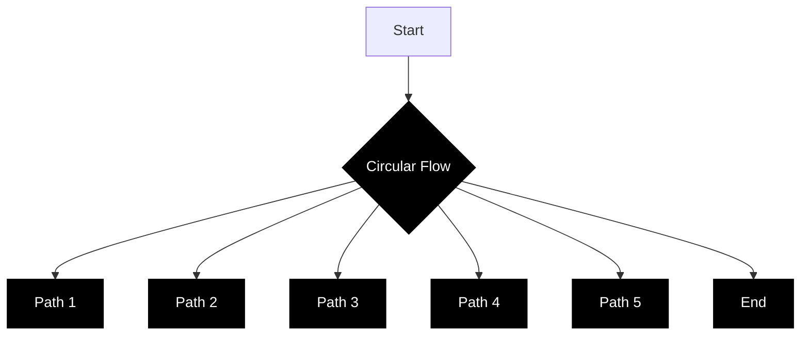

# Stabilized Neural Differential Equations for Learning Dynamics with Explicit Constraints

Alistair White

Technical University of Munich

Potsdam Institute for Climate Impact Research

Niki Kilbertus

Technical University of Munich

Hemholtz AI, Munich

Maximilian Gelbrecht

Technical University of Munich

Potsdam Institute for Climate Impact Research

Niklas Boers

Technical University of Munich

Potsdam Institute for Climate Impact Research

University of Exeter

{alistair.white, niki.kilbertus, maximilian.gelbrecht, n.boers}@tum.de

# Abstract

Many successful methods to learn dynamical systems from data have recently been introduced. However, ensuring that the inferred dynamics preserve known constraints, such as conservation laws or restrictions on the allowed system states, remains challenging. We propose stabilized neural differential equations (SNDEs), a method to enforce arbitrary manifold constraints for neural differential equations. Our approach is based on a stabilization term that, when added to the original dynamics, renders the constraint manifold provably asymptotically stable. Due to its simplicity, our method is compatible with all common neural differential equation (NDE) models and broadly applicable. In extensive empirical evaluations, we demonstrate that SNDEs outperform existing methods while broadening the types of constraints that can be incorporated into NDE training.

# 1 Introduction

Advances in machine learning have recently spurred hopes of displacing or at least enhancing the process of scientific discovery by inferring natural laws directly from observational data. In particular, there has been a surge of interest in data-driven methods for learning dynamical laws in the form of differential equations directly from data $[18, 67, 16, 23, 3, 11]$ . Assuming there is a ground truth system with dynamics governed by an ordinary differential equation

$$
\frac {d u (t)}{d t} = f (u (t), t) \quad (\text { with   initial   condition } u (0) = u _ {0}) \tag {1}
$$

with $u : R \to R^{n}$ and $f : R^{n} \times R \to R^{n}$ , the question is whether we can learn f from (potentially noisy and irregularly sampled) observations $(t_{i}, u(t_{i}))_{i=1}^{N}$ .

Neural ordinary differential equations (NODEs) provide a prominent and successful method for this task, which leverages machine learning by directly parameterizing the vector field $f$ of the ODE as a

(a)   

natural_image

Grid pattern with blue arrows pointing in various directions (no text or symbols)

(b)   

flowchart

(c)   

```mermaid
graph TD
    A["Start"] --> B{Circular Flow}
    B --> C["Black Circle"]
    C --> D["Green Arrows"]
    D --> E["Orange Arrows"]
    E --> F["Orange Arrows"]
    F --> G["Orange Arrows"]
    G --> H["Orange Arrows"]
    H --> I["Orange Arrows"]
    I --> J["Orange Arrows"]
    J --> K["Orange Arrows"]
    K --> L["Orange Arrows"]
    L --> M["Orange Arrows"]
    M --> N["Orange Arrows"]
    N --> O["Orange Arrows"]
    O --> P["Orange Arrows"]
    P --> Q["Orange Arrows"]
    Q --> R["Orange Arrows"]
    R --> S["Orange Arrows"]
    S --> T["Orange Arrows"]
    T --> U["Orange Arrows"]
    U --> V["Orange Arrows"]
    V --> W["Orange Arrows"]
    W --> X["Orange Arrows"]
    X --> Y["Orange Arrows"]
    Y --> Z["Orange Arrows"]
```

flowchart

text_image

NDE
Constraint Manifold
Stabilization
SNDE
SNDE Trajectory

Figure 1: Sketch of the basic idea behind stabilized neural differential equations (SNDEs). (a) An idealized, unstabilized NDE vector field (blue arrows). (b) A constraint manifold (black circle) and the corresponding stabilization of the vector field (pink arrows). (c) The overall, stabilized vector field of the SNDE (orange arrows) and a stabilized trajectory (green). The stabilization pushes any trajectory starting away from (but near) the manifold to converge to it at a rate $\gamma$ (see Section 4).

neural network [18] (see also Kidger [49] for an overview). A related approach, termed universal differential equations (UDEs) [67], combines mechanistic or process-based model components with universal function approximators, typically also neural networks. In this paper, we will refer to these methods collectively as neural differential equations (NDEs), meaning any ordinary differential equation model in explicit form, where the right-hand side is either partially or entirely parameterized by a neural network. Due to the use of flexible neural networks, NDEs have certain universal approximation properties [72, 75], which are often interpreted as “in principle an NDE can learn any vector field f” [30]. While this can be a desirable property in terms of applicability, in typical settings one often has prior knowledge about the dynamical system that should be incorporated.

As in other areas of machine learning – particularly deep learning – inductive biases can substantially aid generalization, learning speed, and stability, especially in the low data regime. Learning dynamics from data is no exception $[4]$ . In scientific applications, physical priors are often not only a natural source of inductive biases, but can even impose hard constraints on the allowed dynamics. For instance, when observing mechanical systems, a popular approach is to directly parameterize either the Lagrangian or Hamiltonian via a neural network $[39, 58, 24]$ . Constraints such as energy conservation can then be “baked into the model”, in the sense that the parameterization of the vector field is designed to only represent functions that satisfy the constraints. Finzi et al. $[32]$ build upon these works and demonstrate how to impose explicit constraints in the Hamiltonian and Lagrangian settings.

In this work, we propose a stabilization technique to enforce arbitrary, even time-dependent manifold constraints for any class of NDEs, not limited to second order mechanical systems and not requiring observations in particular (canonical) coordinates. Our method is compatible with all common differential equation solvers as well as adjoint sensitivity methods. All code is publicly available at https://github.com/white-alistair/Stabilized-Neural-Differential-Equations.

# 2 Background

A first order neural differential equation is typically given as

$$
\frac {d u (t)}{d t} = f _ {\theta} (u (t), t) \quad u (0) = u _ {0}, \tag {2}
$$

where $u : R \to R^{n}$ and the vector field $f_{\theta} : R^{n} \times R \to R^{n}$ is at least partially parameterized by a neural network with parameters $\theta \in R^{d}$ . We restrict our attention to ground truth dynamics f in Equation (1) that are continuous in t and Lipschitz continuous in u such that the existence of a unique (local) solution to the initial value problem is guaranteed by the Picard-Lindelöf theorem. As universal function approximators [44, 25], neural networks $f_{\theta}$ can in principle approximate any such f to arbitrary precision, that is to say, the problem of learning f is realizable.

In practice, the parameters $\theta$ are typically optimized via stochastic gradient descent by integrating a trajectory $\hat{u}(t)=\mathrm{ODESolve}(u_{0},f_{\theta},t)$ and taking gradients of the loss $\mathcal{L}(u,\hat{u})$ with respect to $\theta$ . Gradients of trajectories can be computed using adjoint sensitivity analysis (optimize-then-discretize) or automatic differentiation of the solver operations (discretize-then-optimize) [18, 49]. While these approaches have different (dis)advantages [59, 49], we use the adjoint sensitivity method due to reportedly improved stability [18]. We use the standard squared error loss $\mathcal{L}(u,\hat{u})=\|u-\hat{u}\|_{2}^{2}$ throughout.

We focus on NODEs as they can handle arbitrary nonlinear vector fields f and outperform traditional ODE parameter estimation techniques. In particular, they do not require a pre-specified parameterization of f in terms of a small set of semantically meaningful parameters. The original NODE model $[18]$ has quickly been extended to augmented neural ODEs (ANODEs), with improved universal approximation properties $[30]$ and performance on second order systems $[62]$ . Further extensions of NODEs include support for irregularly-sampled observations $[70]$ and partial differential equations $[35]$ , Bayesian NODEs $[26]$ , universal differential equations $[67]$ , and more–see, e.g., Kidger $[49]$ for an overview. All such variants fall under our definition of neural differential equations and can in principle be stabilized using our method. We demonstrate this empirically by stabilizing both standard NODEs as well as ANODEs and UDEs in this paper. Finally, we note that all experiments with second order structure are implemented as second order neural ODEs due to reportedly improved generalization compared to first order NODEs $[62, 40]$ .

NODEs were originally introduced as the infinite depth limit of residual neural networks (typically for classification), where there is no single true underlying dynamic law, but rather “some” vector field f is learned that allows subsequent (linear) separation of the inputs into different classes. A number of techniques have been introduced to restrict the number of function evaluations needed during training in order to improve efficiency, which also typically results in relatively simple learned dynamics $[31, 38, 47, 63, 50]$ . These are orthogonal to our method and are mentioned here for completeness, as they could also be viewed as “regularized” or “stabilized” NODEs from a different perspective.

# 3 Related Work

Hamiltonian and Lagrangian Neural Networks. A large body of related work has focused on learning Hamiltonian or Lagrangian dynamics via architectural constraints. By directly parameterizing and learning the underlying Hamiltonian or Lagrangian, rather than the equations of motion, first integrals corresponding to symmetries of the Hamiltonian or Lagrangian may be (approximately) conserved automatically.

Hamiltonian Neural Networks (HNNs) [39] assume second order Hamiltonian dynamics $u(t)$ , where $u(t) = (q(t), p(t))$ is measured in canonical coordinates, and directly parameterize the Hamiltonian H (instead of f) from which the vector field can then be derived via $f(q, p) = (\frac{\partial\mathcal{H}}{\partial p}, -\frac{\partial\mathcal{H}}{\partial q})$ . Symplectic ODE-Net (SymODEN) [76] takes a similar approach but makes the learned dynamics symplectic by construction, as well as allowing more general coordinate systems such as angles or velocities (instead of conjugate momenta). HNNs have also been made agnostic to the coordinate system altogether by modeling the underlying coordinate-free symplectic two-form directly [19], studied extensively with respect to the importance of symplectic integrators [77], and adapted specifically to robotic systems measured in terms of their SE(3) pose and generalized velocity [29]. Recently, Gruver et al. [40] showed that what makes HNNs effective in practice is not so much their built-in energy conservation or symplectic structure, but rather that they inherently assume that the system is governed by a single second order differential equation (“second order bias”). Chen et al. [20] provide a recent overview of learning Hamiltonian dynamics using neural architectures.

A related line of work is Lagrangian Neural Networks (LNNs), which instead assume second order Lagrangian dynamics and parameterize the inertia matrix and divergence of the potential $[58]$ , or indeed any generic Lagrangian function $[24]$ , with the dynamics f then uniquely determined via the Euler-Lagrange equations. While our own work is related to HNNs and LNNs in purpose, it is more general, being applicable to any system governed by a differential equation. In addition, where we consider fundamental conservation laws as constraints, e.g. conservation of energy, we assume the conservation law is known in closed-form.

The work most closely related to ours is by Finzi et al. [32], who demonstrate how to impose explicit constraints on HNNs and LNNs. The present work differs in a number of ways with the key advances of our approach being that SNDEs (a) are applicable to any type of ODE, allowing us to go beyond second order systems with primarily Hamiltonian or Lagrangian type constraints, (b) are compatible with hybrid models, i.e., the UDE approach where part of the dynamics is assumed to be known and only the remaining unknown part is learned while still constraining the overall dynamics, and (c) can incorporate any type of manifold constraint. Regarding (c), we can for instance also enforce time-dependent first integrals, which do not correspond to constants of motion or conserved quantities arising directly from symmetries in the Lagrangian.

Continuous Normalizing Flows on Riemannian Manifolds. Another large body of related work aims to learn continuous normalizing flows (CNFs) on Riemannian manifolds. Since CNFs transform probability densities via a NODE, many of these methods work in practice by constraining NODE trajectories to a pre-specified Riemannian manifold. For example, Lou et al. [57] propose “Neural Manifold ODE”, a method that directly adjusts the forward mode integration and backward mode adjoint gradient computation to ensure that the trajectory is confined to a given manifold. This approach requires a new training procedure and relies on an explicit chart representation of the manifold. The authors limit their attention to the hyperbolic space $H^{2}$ and the sphere $S^{2}$ , both of which are prototypical Riemannian manifolds with easily derived closed-form expressions for the chart. Many similar works have been proposed [37, 14, 68, 60], but all are typically limited in scope to model Riemannian manifolds such as spheres, hyperbola, and tori. Extending these approaches to the manifolds studied by us, which can possess nontrivial geometries arising from arbitrary constraints, is not straightforward. Nonetheless, we consider this an interesting opportunity for further work.

Riemannian Optimization. A vast literature exists for optimization on Riemannian manifolds $[2, 53, 61]$ . In deep learning, in particular, orthogonality constraints have been used to avoid the vanishing and exploding gradients problem in recurrent neural networks $[5, 54, 1, 48]$ and as a form of regularization for convolutional neural networks $[9]$ . Where these methods differ crucially from this paper is that they seek to constrain neural network weights to a given matrix manifold, while our aim is to constrain trajectories of an NDE, the weights of which are not themselves directly constrained.

Constraints via Regularization. Instead of adapting the neural network architecture to satisfy certain properties by design, Lim and Kasim [55] instead manually craft different types of regularization terms that, when added to the loss function, aim to enforce different constraints or conservation laws. While similar to our approach, in that no special architecture is required for different constraints, the key difference is that their approach requires crafting specific loss terms for different types of dynamics. Moreover, tuning the regularization parameter can be rather difficult in practice.

In this work, we vastly broaden the scope of learning constrained dynamics by demonstrating the effectiveness of our approach on both first and second order systems, including chaotic and non-chaotic as well as autonomous and non-autonomous examples. We cover constraints arising from holonomic restrictions on system states, conservation laws, and constraints imposed by controls.

# 4 Stabilized Neural Differential Equations

General approach. Given $m < n$ explicit constraints, we require that solution trajectories of the NDE in Equation (2) are confined to an $(n - m)$ -dimensional submanifold of $\mathbb{R}^n$ defined by

$$
\mathcal {M} = \{(u, t) \in \mathbb {R} ^ {n} \times \mathbb {R}; g (u, t) = 0 \}, \tag {3}
$$

where $g \colon \mathbb{R}^n \times \mathbb{R} \to \mathbb{R}^m$ is a smooth function with $0 \in \mathbb{R}^m$ being a regular value of $g$ . In other words, we have an NDE on a manifold

$$
\dot {u} = f _ {\theta} (u, t) \quad \text { with } \quad g (u, t) = 0. \tag {4}
$$

Any non-autonomous system can equivalently be represented as an autonomous system by adding time as an additional coordinate with constant derivative 1 and initial condition $t_{0}=0$ . For ease of notation, and without loss of generality, we will only consider autonomous systems in the rest of this section. However, we stress that our method applies equally to autonomous and non-autonomous systems.

While methods exist for constraining neural network outputs to lie on a pre-specified manifold, the added difficulty in our setting is that we learn the vector field f but constrain the solution trajectory u that solves a given initial value problem for the ODE defined by f. Inspired by Chin [21], we propose the following stabilization of the vector field in Equation (4)

$$
\boxed {\dot {u} = f _ {\theta} (u) - \gamma F (u) g (u),} \quad [ \text { general   SNDE } ] \tag {5}
$$

where $\gamma \geq 0$ is a scalar parameter of our method and $F:\mathbb{R}^n\to \mathbb{R}^{n\times m}$ is a so-called stabilization matrix. We call Equation (5) a stabilized neural differential equation (SNDE) and say that it is

stabilized with respect to the invariant manifold M. We illustrate the main idea in Figure 1; while even small deviations in the unstabilized vector field (left) can lead to (potentially accumulating) constraint violations, our stabilization (right) adjusts the vector field near the invariant manifold to render it asymptotically stable, all the while leaving the vector field on M unaffected.

Our stabilization approach is related to the practice of index reduction of differential algebraic equations (DAEs). We refer the interested reader to Appendix A for a brief overview of these connections.

Theoretical guarantees. First, note that ultimately we still want $f_{\theta}$ to approximate the assumed ground truth dynamics f. However, Equation (5) explicitly modifies the right-hand side of the NDE. The following theorem provides necessary and sufficient conditions under which $f_{\theta}$ can still learn the correct dynamics when using a different right-hand side.

Theorem 1 (adapted from Chin [21]). Consider an NDE

$$
\dot {u} = f _ {\theta} (u) \tag {6}
$$

on an invariant manifold $\mathcal{M} = \{u\in \mathbb{R}^n;g(u) = 0\}$ . A vector field $\dot{u} = h_{\theta}(u)$ admits all solutions of Equation (6) on $\mathcal{M}$ if and only if $h_\theta |_{\mathcal{M}} = f_\theta |_{\mathcal{M}}$ .

Since $g(u) = 0$ on M, the second term on the right-hand side of Equation (5) vanishes on M. Therefore the SNDE Equation (5) admits all solutions of the constrained NDE Equation (4). Next, we will show that, under mild conditions, the additional stabilization term in Equation (5) “nudges” the solution trajectory to lie on the constraint manifold such that M is asymptotically stable.

Theorem 2 (adapted from Chin [21] $^{2}$ ). Suppose the stabilization matrix $F(u)$ is chosen such that the matrix $G(u)F(u)$ , where $G(u) = g_u$ is the Jacobian of $g$ at $u$ , is symmetric positive definite with the smallest eigenvalue $\lambda(u)$ satisfying $\lambda(u) > \lambda_0 > 0$ for all $u$ . Assume further that there is a positive number $\gamma_0$ such that

$$
\| G (u) f _ {\theta} (u) \| \leq \gamma_ {0} \| g (u) \| \tag {7}
$$

for all $u$ near $\mathcal{M}$ . Then the invariant manifold $\mathcal{M}$ is asymptotically stable in the SNDE Equation (5) if $\gamma \geq \gamma_0 / \lambda_0$ .

Proof. Consider the Lyapunov function $V(u) = \frac{1}{2} g^T (u)g(u)$ . Then (omitting arguments)

$$
\frac {d}{d t} V (t) = \frac {1}{2} \frac {d}{d t} \| g (u (t)) \| ^ {2} = g ^ {T} \frac {d g}{d t} = g ^ {T} \frac {d g}{d u} \dot {u} = g ^ {T} G \left(f _ {\theta} - \gamma F g\right), \tag {8}
$$

where we substitute Equation (5) for $\dot{u}$ . With Equation (7), we have $g^{T}Gf_{\theta} \leq \gamma_{0}g^{T}g$ , and since the eigenvalues of $GF$ are assumed to be at least $\lambda_0 > 0$ , we have $g^{T}GFg \geq \lambda_{0}g^{T}g$ . Hence

$$
\frac {d}{d t} V \leq (\gamma_ {0} - \gamma \lambda_ {0}) \| g \| ^ {2}, \tag {9}
$$

so the manifold $\mathcal{M}$ is asymptotically stable whenever $\gamma_0 - \gamma \lambda_0 \leq 0$ .

When $f_{\theta}(u)$ and $g(u)$ are given, $\mathcal{M}$ is asymptotically stable in the SNDE Equation (5) as long as

$$
\gamma \geq \frac {\| G (u) f _ {\theta} (u) \|}{\lambda_ {0} \| g (u) \|}. \tag {10}
$$

To summarize, the general form of the SNDE in Equation (5) has the following important properties:

1. The SNDE admits all solutions of the constrained NDE Equation (4) on $\mathcal{M}$ .   
2. $\mathcal{M}$ is asymptotically stable in the SNDE for sufficiently large values of $\gamma$ .

The stabilization parameter $\gamma$ , with units of inverse time, determines the rate of relaxation to the invariant manifold; intuitively, it is the strength of the “nudge towards M” experienced by a trajectory. Here, $\gamma$ is neither a Lagrangian parameter (corresponding to a constraint on $\theta$ ), nor a regularization parameter (to overcome an ill-posedness by regularization). Therefore, there is no “correct” value for $\gamma$ . In particular, Theorem 1 holds for all $\gamma$ , while Theorem 2 only requires $\gamma$ to be “sufficiently large”.

In the limit $\gamma \to \infty$ , the SNDE in Equation (5) is equivalent to a Hessenberg index-2 DAE (see Appendix A for more details).

Practical implementation. This leaves us to find a concrete instantiation of the stabilization matrix $F(u)$ that should (a) satisfy that $F(u)G(u)$ is symmetric positive definite with the smallest eigenvalue bounded away from zero near M, (b) be efficiently computable, and (c) be compatible with gradient-based optimization of $\theta$ as part of an NDE. In our experiments, we use the Moore-Penrose pseudoinverse of the Jacobian of g at u as the stabilization matrix,

$$
F (u) = G ^ {+} (u) = G ^ {T} (u) \big (G (u) G ^ {T} (u) \big) ^ {- 1} \in \mathbb {R} ^ {n \times m}. \tag {11}
$$

Let us analyze the properties of this choice. Regarding the requirements (b) and (c), the pseudoinverse can be computed efficiently via a singular value decomposition with highly optimized implementations in all common numerical linear algebra libraries (including deep learning frameworks) and does not interfere with gradient-based optimization. In particular, the computational cost for the pseudoinverse is $\mathcal{O}(m^{2}n)$ , i.e., it scales well with the problem size. The quadratic scaling in the number of constraints is often tolerable in practice, since the number of constraints is typically small (in Appendix B, we discuss faster alternatives to the pseudoinverse that can be used, for example, when there are many constraints). Moreover, the Jacobian $G(u)$ of g can be obtained via automatic differentiation in the respective frameworks.

Regarding requirement (a), the pseudoinverse $G^{+}(u)$ is an orthogonal projection onto the tangent space $T_{u}M$ of the manifold at u. Hence, locally in a neighborhood of $u \in M$ , we consider the stabilization matrix as a projection back onto the invariant manifold M (see Figure 1). In particular, $G(u)$ has full rank for $u \in M$ and $G^{+}G = G^{T}(GG^{T})^{-1}G$ is symmetric and positive definite near M. From here on, we thus consider the following specific form for the SNDE in Equation (5),

$$
\boxed {\dot {u} = f _ {\theta} (u) - \gamma G ^ {+} (u) g (u).} \quad [ \text { practical   SNDE } ] \tag {12}
$$

# 5 Results

We now demonstrate the effectiveness of SNDEs on examples that cover autonomous first and second order systems with either a conserved first integral of motion or holonomic constraints, a non-autonomous first order system with a conserved quantity, a non-autonomous controlled first order system with a time-dependent constraint stemming from the control, and a chaotic second order system with a conservation law. To demonstrate the flexibility of our approach with respect to the variant of underlying NDE model, for the first three experiments we include both vanilla NODEs and augmented NODEs as baselines and apply stabilization to both (with the stabilized variants labeled SNODE and SANODE, respectively).

As a metric for the predicted state $\hat{u}(t)$ versus ground truth $u(t)$ , we use the relative error $\|u(t)-\hat{u}(t)\|_{2}/\|u(t)\|_{2}$ , averaged over many trajectories with independent initial conditions. As a metric for the constraints, we compute analogous relative errors for $g(u)$ .

In Appendix C, we further demonstrate empirically that SNDEs are insensitive to the specific choice of $\gamma$ over a large range (beyond a minimum value, consistent with Theorem 2). We also provide more intuition about choosing $\gamma$ and the computational implications of this choice. In practice, we find that SNDEs are easy to use across a wide variety of settings with minimal tuning and incur only moderate training overhead compared to vanilla NDEs. In some cases, SNDEs are even computationally cheaper than vanilla NDEs at inference time despite the cost of computing the pseudoinverse. Finally, Appendix D provides results of additional experiments not included here due to space constraints.

# 5.1 Two-Body Problem [second order, autonomous, non-chaotic, conservation law]

The motion of two bodies attracting each other with a force inversely proportional to their squared distance (e.g., gravitational interaction in the non-relativistic limit) can be written as

$$
\ddot {x} = - \frac {x}{(x ^ {2} + y ^ {2}) ^ {3 / 2}}, \quad \ddot {y} = - \frac {y}{(x ^ {2} + y ^ {2}) ^ {3 / 2}}, \tag {13}
$$

where one body is fixed at the origin and x, y are the (normalized) Cartesian coordinates of the other body in the plane of its orbit [43]. We stabilize the dynamics with respect to the conserved angular momentum L, yielding

$$
\mathcal {M} = \{(x, y) \in \mathbb {R} ^ {2}; x \dot {y} + y \dot {x} - L _ {0} = 0 \}, \tag {14}
$$

text_image

Ground Truth
NODE
ANODE
SNODE
SANODE

contour

| x     | y     |
|-------|-------|
| -1.5  | 0.0   |
| -1.0  | 0.5   |
| -0.5  | 0.8   |
| 0.0   | 0.9   |
| 0.5   | 0.8   |
| 0.0   | 0.5   |
| -0.5  | 0.0   |
| -1.0  | -0.5  |
| -1.5  | -0.8  |

line

| Time (seconds) | Relative Error (State) |
| -------------- | ---------------------- |
| 0              | ~10⁻⁵                  |
| 50             | ~10⁰                   |
| 100            | ~10⁰                   |

line

| Time (seconds) | Relative Error (Ang. Mom.) |
| -------------- | -------------------------- |
| 0              | ~10^-5                     |
| 50             | ~10^0                      |
| 100            | ~10^5                      |

contour

| y1    | y2    | y3    |
|-------|-------|-------|
| -0.2  | 0.0   | 0.97  |
| -0.2  | 0.2   | 0.99  |
| 0.0   | 0.0   | 1.01  |

line

| Time (seconds) | Relative Error (State) - Blue | Relative Error (State) - Green | Relative Error (State) - Red |
| -------------- | ----------------------------- | ------------------------------ | ---------------------------- |
| 0              | ~10⁻⁵                         | ~10⁻⁵                          | ~10⁻⁵                        |
| 400            | ~10⁰                          | ~10⁰                           | ~10⁰                         |
| 800            | ~10⁵                          | ~10⁴                           | ~10⁰                         |

line

| Time (seconds) | Relative Error (Casimir) |
| -------------- | ------------------------ |
| 0              | ~10⁻⁵                    |
| 400            | ~10⁰                     |
| 800            | ~10⁵                     |

line

| Time (seconds) | v₁ [V] |
| -------------- | ------ |
| 0              | 0.0    |
| 1              | 1.8    |
| 2              | -1.5   |
| 3              | 0.8    |
| 4              | 1.0    |
| 5              | -1.2   |
| 6              | 1.2    |
| 7              | -1.8   |
| 8              | 1.9    |
| 9              | 0.5    |
| 10             | -0.8   |
| 11             | 0.3    |
| 12             | -0.2   |
| 13             | 2.0    |
| 14             | -2.5   |
| 15             | 1.0    |

line

| Time (seconds) | Relative Error (State) |
| -------------- | ---------------------- |
| 0              | ~10⁻⁵                  |
| 40             | ~10⁵                   |
| 80             | ~10⁰                   |

line

| Time (seconds) | Relative Error (Energy) |
| -------------- | ------------------------ |
| 0              | ~10⁻⁵                    |
| 20             | ~10⁰                     |
| 40             | ~10¹                     |
| 60             | ~10²                     |
| 80             | ~10³                     |

Figure 2: Top row: Results for the two-body problem experiment, showing a single test trajectory in (a) and averages over 100 test trajectories in (b-c). Middle row: Results for the rigid body rotation experiment, showing a single test trajectory in (d) and averages over 100 test trajectories in (e-f). Bottom row: Results for the DC-to-DC converter experiment, showing the voltage $v_{1}$ across the first capacitor during a single test trajectory in (g), and averages over 100 test trajectories in (h-i). The vanilla NODE (blue) is unstable in all settings, quickly drifting from the constraint manifold and subsequently diverging exponentially, while the vanilla ANODE (green) is unstable for the rigid body and DC-to-DC converter experiments. In contrast, the SNODE (red) and SANODE (purple) are constrained to the manifold with accurate predictions over a long horizon in all settings. Confidence intervals are not shown as they diverge along with the unstabilized trajectories.

where $L_{0}$ is the initial value of L. We train on 40 trajectories with initial conditions $(x, y, \dot{x}, \dot{y}) = (1 - e, 0, 0, \sqrt{1 - e/1 + e})$ , where the eccentricity e is sampled uniformly via $e \sim U(0.5, 0.7)$ . Each trajectory consists of a single period of the orbit sampled with a timestep of $\Delta t = 0.1$ .

The top row of Figure 2 shows that SNODEs, ANODEs and SANODEs all achieve stable long-term prediction over multiple orbits, while unstabilized NODEs diverge exponentially from the correct orbit.

# 5.2 Motion of a Rigid Body [first order, autonomous, non-chaotic, holonomic constraint]

The angular momentum vector $y = (y_{1}, y_{2}, y_{3})^{T}$ of a rigid body with arbitrary shape and mass distribution satisfies Euler's equations of motion,

$$
\left( \begin{array}{c} \dot {y} _ {1} \\ \dot {y} _ {2} \\ \dot {y} _ {3} \end{array} \right) = \left( \begin{array}{c c c} 0 & - y _ {3} & y _ {2} \\ y _ {3} & 0 & - y _ {1} \\ - y _ {2} & y _ {1} & 0 \end{array} \right) \left( \begin{array}{c} y _ {1} / I _ {1} \\ y _ {2} / I _ {2} \\ y _ {3} / I _ {3} \end{array} \right), \tag {15}
$$

where the coordinate axes are the principal axes of the body, $I_{1}, I_{2}, I_{3}$ are the principal moments of inertia, and the origin of the coordinate system is fixed at the body's centre of mass [43]. The motion of y conserves the Casimir function $C(y) = \frac{1}{2} \left( y_{1}^{2} + y_{2}^{2} + y_{3}^{2} \right)$ , which is equivalent to conservation of angular momentum in the orthogonal body frame and constitutes a holonomic constraint on the allowed states of the system. We therefore have the manifold

$$
\mathcal {M} = \{(y _ {1}, y _ {2}, y _ {3}) \in \mathbb {R} ^ {3};   y _ {1} ^ {2} + y _ {3} ^ {2} + y _ {3} ^ {2} - C _ {0} = 0 \}. \tag {16}
$$

We train on 40 trajectories with initial conditions $(y_{1}, y_{2}, y_{3}) = (\cos(\phi), 0, \sin(\phi))$ , where $\phi$ is drawn from a uniform distribution $\phi \sim U(0.5, 1.5)$ . Each trajectory consists of a 15 second sample with a timestep of $\Delta t = 0.1$ seconds.

The middle row of Figure 2 demonstrates that, unlike vanilla NODEs and ANODEs, SNODEs and SANODEs are constrained to the sphere and stabilize the predicted dynamics over a long time horizon in this first order system.

# 5.3 DC-to-DC Converter [first order, non-autonomous, non-chaotic, conservation law]

We now consider an idealized DC-to-DC converter [52, 33], illustrated in Figure 3, with dynamics

$$
C _ {1} \dot {v} _ {1} = (1 - u) i _ {3}, \quad C _ {2} \dot {v} _ {2} = u i _ {3}, \quad L _ {3} \dot {i} _ {3} = - (1 - u) v _ {1} - u v _ {2}, \tag {17}
$$

where $v_{1}, v_{2}$ are the state voltages across capacitors $C_{1}, C_{2}$ , respectively, $i_{3}$ is the state current across an inductor $L_{3}$ , and $u \in \{0, 1\}$ is a control input (a switch) that can be used to transfer energy between the two capacitors via the inductor. The total energy in the circuit, $E = \frac{1}{2}(C_{1}v_{1}^{2} + C_{2}v_{2}^{2} + L_{3}i_{3}^{2})$ , is conserved, yielding the manifold

$$
\mathcal {M} = \{(v _ {1}, v _ {2}, i _ {3}) \in \mathbb {R} ^ {3};   C _ {1} v _ {1} ^ {2} + C _ {2} v _ {2} ^ {2} + L _ {3} i _ {3} ^ {2} - E _ {0} = 0 \}. \tag {18}
$$

chemical

Simple electrical circuit diagram with capacitors, inductor, and switch

Figure 3: Idealized schematic of a DC-to-DC converter.

We train on 40 trajectories integrated over 10 seconds with a timestep of $\Delta t = 0.1$ seconds, where $C_1 = 0.1$ , $C_2 = 0.2$ , $L_3 = 0.5$ , and a switching period of 3 seconds, i.e., the switch is toggled every 1.5 seconds. The initial conditions for $(v_{1}, v_{2}, i_{3})$ are each drawn independently from a uniform distribution $U(0,1)$ .

The bottom row of Figure 2 shows the voltage across $C_{1}$ over multiple switching events (g), with the NODE and ANODE quickly accumulating errors every time the switch is applied, while the SNODE and SANODE remain accurate for longer. Panels (h,i) show the familiar exponentially accumulating errors for vanilla NODE and ANODE, versus stable relative errors for SNODE and SANODE.

# 5.4 Controlled Robot Arm [first order, non-autonomous, non-chaotic, time-dependent control]

Next, we apply SNDEs to solve a data-driven inverse kinematics problem [64], that is, learning the dynamics of a robot arm that satisfy a prescribed path $p(t)$ . We consider an articulated robot arm consisting of three connected segments of fixed length 1, illustrated in Figure 4(a). Assuming one end of the first segment is fixed at the origin and the robot arm is restricted to move in a plane, the endpoint $e(\theta)$ of the last segment is given by

$$
e (\theta) = \binom {\cos (\theta_ {1}) + \cos (\theta_ {2}) + \cos (\theta_ {3})} {\sin (\theta_ {1}) + \sin (\theta_ {2}) + \sin (\theta_ {3})}, \tag {19}
$$

where $\theta_{j}$ is the angle of the j-th segment with respect to the horizontal and $\theta = (\theta_{1}, \theta_{2}, \theta_{3})$ . The problem consists of finding the motion of the three segments $\theta(t)$ such that the endpoint $e(\theta)$ follows

  
Figure 4: Controlled robot arm. (a) Schematic of the robot arm. (b) Snapshot of a single test trajectory. After 100 seconds the NODE (blue) has drifted significantly from the prescribed control while the SNODE (red) accurately captures the ground truth dynamics (black). (c) Relative error in the endpoint $e(\theta)$ averaged over 100 test trajectories. The NODE (blue) accumulates errors and leaves the prescribed path, while the SNODE (red) remains accurate. Shadings in (c) are $95\%$ confidence intervals.

a prescribed path $p(t)$ in the plane, i.e., $e(\theta) = p(t)$ . Minimizing $||\dot{\theta}(t)||$ , it can be shown [42] that the optimal path satisfies

$$
\dot {\theta} = e ^ {\prime} (\theta) ^ {T} \big (e ^ {\prime} (\theta) e ^ {\prime} (\theta) ^ {T} \big) ^ {- 1} \dot {p} (t), \tag {20}
$$

where $e'$ is the Jacobian of $e$ . These will be our ground truth equations of motion.

We stabilize the SNODE with respect to the (time-dependent) manifold

$$
\mathcal {M} = \{(\theta , t) \in \mathbb {S} \times \mathbb {R}; e (\theta) - p (t) = 0 \}. \tag {21}
$$

In particular, we prescribe the path

$$
p (t) = e _ {0} - \binom {\sin (2 \pi t) / 2 \pi} {0}, \tag {22}
$$

where $e_{0}$ is the initial position of the endpoint, such that $e(\theta)$ traces a line back and forth on the x-axis. We train on 40 trajectories of duration 5 seconds, with timestep $\Delta t = 0.1$ and initial conditions $(\theta_{1}, \theta_{2}, \theta_{3}) = (\theta_{0}, -\theta_{0}, \theta_{0})$ , where $\theta_{0}$ is drawn from a uniform distribution $\theta_{0} \sim U(\pi/4, 3\pi/8)$ . Additionally, we provide the network with $\dot{p}$ , the time derivative of the prescribed control.

Figure 4 shows that the unconstrained NODE drifts substantially from the prescribed path during a long integration, while the SNODE implements the control to a high degree of accuracy and without drift.

# 5.5 Double Pendulum [second order, autonomous, chaotic, conservation law]

Finally, we apply stabilization to the chaotic dynamics of the frictionless double pendulum system. The total energy $E$ of the system is conserved [7], yielding the manifold,

$$
\mathcal {M} = \{(\theta_ {1}, \theta_ {2}, \omega_ {1}, \omega_ {2}) \in \mathbb {S} ^ {2} \times \mathbb {R} ^ {2}; E (\theta_ {1}, \theta_ {2}, \omega_ {1}, \omega_ {2}) - E _ {0} = 0 \}, \tag {23}
$$

where $\theta_{i}$ is the angle of the i-th arm with the vertical and $\omega_{i} = \dot{\theta}_{i}$ . We refer the reader to Arnold [7] (or the excellent Wikipedia entry) for the lengthy equations of motion and an expression for the total energy. For simplicity we take $m_{1} = m_{2} = 1 \, kg$ , $l_{1} = l_{2} = 1 \, m$ , and $g = 9.81 \, ms^{-2}$ . We train on 40 trajectories, each consisting of 10 seconds equally sampled with $\Delta t = 0.05$ , and with initial conditions $(\theta_{1}, \theta_{2}, \omega_{1}, \omega_{2}) = (\phi, \phi, 0, 0)$ , where $\phi$ is drawn randomly from a uniform distribution $\phi \sim U(\pi/4, 3\pi/4)$ . We emphasize that this is a highly limited amount of data when it comes to describing the chaotic motion of the double pendulum system, intended to highlight the effect of stabilization in the low-data regime.

Figure 5(a-b) shows that, while initially the SNODE only marginally outperforms the vanilla NODE in terms of the relative error of the state, the longer term relative error in energy is substantially

  
Figure 5: Results for the double pendulum. (a) Relative error in the state over 300 short test trials, shown with $95\%$ confidence intervals (shaded). Compared to the SNODE, the NODE diverges rapidly as it begins to accumulate errors in the energy. (b) Relative error in the energy averaged over 5 long test trials. (c) Comparison of the double pendulum's invariant measure estimated by the (hybrid) UDE, with and without stabilization, versus ground truth, with $95\%$ confidence intervals.

larger for NODE than for SNODE. A certain relative error in state is indeed unavoidable for chaotic systems.

In addition to predicting individual trajectories of the double pendulum, we also consider an additional important task: learning the invariant measure of this chaotic system. This can be motivated by analogy with climate predictions, where one also focuses on long-term prediction of the invariant measure of the system, as opposed to predicting individual trajectories in the sense of weather forecasting, which must break down after a short time due to the highly chaotic underlying dynamics. Motivated by hybrid models of the Earth's climate [36, 71], we choose a slightly different training strategy than before, namely a hybrid setup in line with the UDE approach mentioned above. In particular, the dynamics of the first arm $\ddot{\theta}_{1}$ are assumed known, while the dynamics of the second arm $\ddot{\theta}_{2}$ are learned from data. We train on a single trajectory of duration 60 seconds with $\Delta t = 0.05$ . For each trained model, we then integrate ten trajectories of duration one hour – far longer than the observed data. An invariant measure is estimated from each long trajectory (see Appendix E) and compared with the ground truth using the Hellinger distance.

Figure 5(c) shows that, as $\gamma$ is increased, our ability to accurately learn the double pendulum's invariant measure increases dramatically due to stabilization, demonstrating that the "climate" of this system is captured much more accurately by the SNDE than by the NDE baseline.

# 6 Conclusion

We have introduced stabilized neural differential equations (SNDEs), a method for learning dynamical systems from observational data subject to arbitrary explicit constraints. Our approach is based on a stabilization term that is cheap to compute and provably renders the invariant manifold asymptotically stable while still admitting all solutions of the vanilla NDE on the invariant manifold. Key benefits of our method are its simplicity and generality, making it compatible with all common NDE methods without requiring further architectural changes. Crucially, SNDEs allow entirely new types of constraints, such as those arising from known conservation laws and controls, to be incorporated into neural differential equation models. We demonstrate their effectiveness across a range of settings, including first and second order systems, autonomous and non-autonomous systems, with constraints stemming from holonomic constraints, conserved first integrals of motion, as well as time-dependent restrictions on the system state. SNDEs are robust with respect to the only tuneable parameter and incur only moderate computational overhead compared to vanilla NDEs.

The current key limitations and simultaneously interesting directions for future work include adapting existing methods for NODEs on Riemannian manifolds to our setting, generalizations to partial differential equations, allowing observations and constraints to be provided in different coordinates, and scaling the method to high-dimensional settings such as learning dynamics from pixel observations, for example in fluid dynamics or climate modeling. Finally, we emphasize that high-dimensional, nonlinear dynamics may not be identifiable from just a small number of solution trajectories. Hence, care must be taken when using learned dynamics in high-stakes scenarios (e.g., human robot interactions), especially when going beyond the training distribution.

# Acknowledgments

This work was funded by the Volkswagen Foundation. The authors would like to thank Christof Schötz, Philipp Hess and Michael Lindner for many insightful discussions while preparing this work, as well as the anonymous reviewers whose thoughtful feedback significantly improved the paper. The authors also thank the creators and maintainers of the Julia programming language $[13]$ and the open-source packages DifferentialEquations.jl $[66]$ , Flux.jl $[46]$ , Zygote.jl $[45]$ , ComplexityMeasures.jl $[41]$ and Makie.jl $[27]$ , all of which were essential in preparing this work. The authors gratefully acknowledge the European Regional Development Fund (ERDF), the German Federal Ministry of Education and Research and the Land Brandenburg for supporting this project by providing resources on the high performance computer system at the Potsdam Institute for Climate Impact Research.

# References

[1] Pierre Ablin and Gabriel Peyré. Fast and accurate optimization on the orthogonal manifold without retraction. In Proceedings of The 25th International Conference on Artificial Intelligence and Statistics, pages 5636–5657. PMLR, 2022.   
[2] Pierre-Antoine Absil, Robert Mahony, and Rodolphe Sepulchre. Optimization Algorithms on Matrix Manifolds. Princeton University Press, 2008.   
[3] Hananeh Aliee, Fabian J. Theis, and Niki Kilbertus. Beyond predictions in neural ODEs: Identification and interventions. arXiv preprint arXiv:2106.12430, 2021.   
[4] Hananeh Aliee, Till Richter, Mikhail Solonin, Ignacio Ibarra, Fabian J. Theis, and Niki Kilbertus. Sparsity in continuous-depth neural networks. In Advances in Neural Information Processing Systems, pages 901–914, 2022.   
[5] Martin Arjovsky, Amar Shah, and Yoshua Bengio. Unitary evolution recurrent neural networks. In Proceedings of The 33rd International Conference on Machine Learning, pages 1120–1128. PMLR, 2016.   
[6] Ludwig Arnold, Christopher K.R.T. Jones, Konstantin Mischaikow, Geneviève Raugel, and Ludwig Arnold. Random Dynamical Systems. Springer, 1995.   
[7] Vladimir Igorevich Arnold. Mathematical Methods of Classical Mechanics. Springer New York, 2nd edition, 1989.   
[8] Uri M. Ascher and Linda R. Petzold. Computer Methods for Ordinary Differential Equations and Differential-Algebraic Equations. Society for Industrial and Applied Mathematics, 1998.   
[9] Nitin Bansal, Xiaohan Chen, and Zhangyang Wang. Can we gain more from orthogonality regularizations in training deep networks? In Advances in Neural Information Processing Systems, pages 4261–4271, 2018.   
[10] J. Baumgarte. Stabilization of constraints and integrals of motion in dynamical systems. Computer Methods in Applied Mechanics and Engineering, 1(1):1–16, 1972.   
[11] Sören Becker, Michal Klein, Alexander Neitz, Giambattista Parascandolo, and Niki Kilbertus. Predicting ordinary differential equations with transformers. In Proceedings of the 40th International Conference on Machine Learning, pages 1978–2002. PMLR, 2023.   
[12] Heli Ben-Hamu, Samuel Cohen, Joey Bose, Brandon Amos, Maximillian Nickel, Aditya Grover, Ricky T. Q. Chen, and Yaron Lipman. Matching normalizing flows and probability paths on manifolds. In Proceedings of the 39th International Conference on Machine Learning, pages 1749–1763. PMLR, 2022.   
[13] Jeff Bezanson, Alan Edelman, Stefan Karpinski, and Viral B Shah. Julia: A fresh approach to numerical computing. SIAM Review, 59(1):65–98, 2017.   
[14] Joey Bose, Ariella Smofsky, Renjie Liao, Prakash Panangaden, and Will Hamilton. Latent variable modelling with hyperbolic normalizing flows. In Proceedings of the 37th International Conference on Machine Learning, pages 1045–1055. PMLR, 2020.

[15] Kathryn E. Brenan, Stephen L. Campbell, and Linda R. Petzold. Numerical Solution of Initial-Value Problems in Differential-Algebraic Equations. Society for Industrial and Applied Mathematics, 1995.   
[16] Steven L. Brunton, Joshua L. Proctor, and J. Nathan Kutz. Discovering governing equations from data by sparse identification of nonlinear dynamical systems. Proceedings of the National Academy of Sciences, 113(15):3932–3937, 2016.   
[17] Mickaël D. Chekroun, Eric Simonnet, and Michael Ghil. Stochastic climate dynamics: Random attractors and time-dependent invariant measures. Physica D: Nonlinear Phenomena, 240(21):1685–1700, 2011.   
[18] Ricky T.Q. Chen, Yulia Rubanova, Jesse Bettencourt, and David K. Duvenaud. Neural ordinary differential equations. In Advances in Neural Information Processing Systems, pages 6571–6583, 2018.   
[19] Yuhan Chen, Takashi Matsubara, and Takaharu Yaguchi. Neural symplectic form: learning Hamiltonian equations on general coordinate systems. pages 16659–16670, 2021.   
[20] Zhijie Chen, Mingquan Feng, Junchi Yan, and Hongyuan Zha. Learning neural Hamiltonian dynamics: A methodological overview. arXiv preprint arXiv:2203.00128, 2022.   
[21] Hong Sheng Chin. Stabilization Methods for Simulations of Constrained Multibody Dynamics. PhD thesis, University of British Columbia, 1995. URL https://open.library.ubc.ca/collections/ubctheses/831/items/1.0080031.   
[22] Harald Cramer. Mathematical Methods of Statistics. Princeton University Press, 1999.   
[23] Miles Cranmer. Interpretable machine learning for science with PySR and SymbolicRegression.jl. arXiv preprint arXiv:2305.01582, 2023.   
[24] Miles Cranmer, Sam Greydanus, Stephan Hoyer, Peter Battaglia, David Spergel, and Shirley Ho. Lagrangian neural networks. arXiv preprint arXiv:2003.04630, 2020.   
[25] George Cybenko. Approximation by superpositions of a sigmoidal function. Mathematics of Control, Signals and Systems, 2(4):303-314, 1989.   
[26] Raj Dandekar, Karen Chung, Vaibhav Dixit, Mohamed Tarek, Aslan Garcia-Valadez, Krishna Vishal Vemula, and Christopher Rackauckas. Bayesian neural ordinary differential equations. arXiv preprint arXiv:2012.07244, 2020.   
[27] Simon Danisch and Julius Krumbiegel. Makie.jl: Flexible high-performance data visualization for Julia. Journal of Open Source Software, 6(65):3349, 2021.   
[28] David Diego, Kristian Agasøster Haaga, and Bjarte Hannisdal. Transfer entropy computation using the Perron-Frobenius operator. Phys. Rev. E, 99:042212, 2019.   
[29] Thai P. Duong and Nikolay A. Atanasov. Hamiltonian-based neural ODE networks on the SE(3) manifold for dynamics learning and control. In Proceedings of Robotics: Science and Systems, 2021.   
[30] Emilien Dupont, Arnaud Doucet, and Yee Whye Teh. Augmented neural ODEs. In Advances in Neural Information Processing Systems, pages 3140–3150, 2019.   
[31] Chris Finlay, Joern-Henrik Jacobsen, Levon Nurbekyan, and Adam Oberman. How to train your neural ODE: the world of Jacobian and kinetic regularization. In Proceedings of the 37th International Conference on Machine Learning, pages 3154–3164. PMLR, 2020.   
[32] Marc Finzi, Ke Alexander Wang, and Andrew G Wilson. Simplifying Hamiltonian and Lagrangian neural networks via explicit constraints. In Advances in Neural Information Processing Systems, pages 13880–13889, 2020.   
[33] Simone Fiori. Manifold calculus in system theory and control—fundamentals and first-order systems. Symmetry, 13(11), 2021.

[34] C. William Gear. Differential-algebraic equation index transformations. SIAM Journal on Scientific and Statistical Computing, 9(1):39–47, 1988.   
[35] Maximilian Gelbrecht, Niklas Boers, and Jürgen Kurths. Neural partial differential equations for chaotic systems. New Journal of Physics, 23(4):043005, 2021.   
[36] Maximilian Gelbrecht, Alistair White, Sebastian Bathiany, and Niklas Boers. Differentiable programming for earth system modeling. Geoscientific Model Development, 16(11):3123–3135, 2023.   
[37] Mevlana C. Gemici, Danilo Rezende, and Shakir Mohamed. Normalizing flows on Riemannian manifolds. arXiv preprint arXiv:1611.02304, 2016.   
[38] Arnab Ghosh, Harkirat Behl, Emilien Dupont, Philip Torr, and Vinay Namboodiri. STEER: Simple temporal regularization for neural ODEs. In Advances in Neural Information Processing Systems, pages 14831–14843, 2020.   
[39] Samuel Greydanus, Misko Dzamba, and Jason Yosinski. Hamiltonian neural networks. In Advances in Neural Information Processing Systems, pages 15379–15389, 2019.   
[40] Nate Gruver, Marc Anton Finzi, Samuel Don Stanton, and Andrew Gordon Wilson. Deconstructing the inductive biases of Hamiltonian neural networks. In The Tenth International Conference on Learning Representations, 2022.   
[41] Kristian Agasøster Haaga and George Datseris. ComplexityMeasures.jl. Zenodo.   
[42] Ernst Hairer. Solving differential equations on manifolds. 2011. URL https://www.unige.ch/\~hairer/poly-sde-mani.pdf.   
[43] Ernst Hairer, Christian Lubich, and Gerhard Wanner. Geometric Numerical Integration. Springer-Verlag, Berlin, 2nd edition, 2006.   
[44] Kurt Hornik, Maxwell Stinchcombe, and Halbert White. Multilayer feedforward networks are universal approximators. Neural Networks, 2(5):359–366, 1989.   
[45] Michael Innes. Don't unroll adjoint: Differentiating SSA-form programs. CoRR, abs/1810.07951, 2018.   
[46] Michael Innes, Elliot Saba, Keno Fischer, Dhairya Gandhi, Marco Concetto Rudilosso, Neethu Mariya Joy, Tejan Karmali, Avik Pal, and Viral Shah. Fashionable modelling with Flux. CoRR, abs/1811.01457, 2018.   
[47] Jacob Kelly, Jesse Bettencourt, Matthew J. Johnson, and David K. Duvenaud. Learning differential equations that are easy to solve. In Advances in Neural Information Processing Systems, pages 4370-4380, 2020.   
[48] Bobak Kiani, Randall Balestriero, Yann LeCun, and Seth Lloyd. projUNN: efficient method for training deep networks with unitary matrices. In Advances in Neural Information Processing Systems, pages 14448–14463, 2022.   
[49] Patrick Kidger. On Neural Differential Equations. PhD thesis, University of Oxford, 2021.   
[50] Patrick Kidger, Ricky T.Q. Chen, and Terry J Lyons. "Hey, that's not an ODE": Faster ODE adjoints via seminorms. In Proceedings of the 38th International Conference on Machine Learning, pages 5443–5452. PMLR, 2021.   
[51] Suyong Kim, Weiqi Ji, Sili Deng, Yingbo Ma, and Christopher Rackauckas. Stiff neural ordinary differential equations. Chaos: An Interdisciplinary Journal of Nonlinear Science, 31(9), 2021.   
[52] Naomi E. Leonard and P.S. Krishnaprasad. Control of switched electrical networks using averaging on Lie groups. In Proceedings of 1994 33rd IEEE Conference on Decision and Control, pages 1919–1924, 1994.   
[53] Mario Lezcano Casado. Trivializations for gradient-based optimization on manifolds. In Advances in Neural Information Processing Systems, pages 9157-9168, 2019.

[54] Mario Lezcano-Casado and David Martínez-Rubio. Cheap orthogonal constraints in neural networks: A simple parametrization of the orthogonal and unitary group. In Proceedings of the 36th International Conference on Machine Learning, pages 3794–3803. PMLR, 2019.   
[55] Yi Heng Lim and Muhammad Firmansyah Kasim. Unifying physical systems' inductive biases in neural ODE using dynamics constraints. arXiv preprint arXiv:2208.02632, 2022.   
[56] Ilya Loshchilov and Frank Hutter. Decoupled weight decay regularization. In 7th International Conference on Learning Representations, 2019.   
[57] Aaron Lou, Derek Lim, Isay Katsman, Leo Huang, Qingxuan Jiang, Ser Nam Lim, and Christopher M. De Sa. Neural manifold ordinary differential equations. In Advances in Neural Information Processing Systems, pages 17548–17558, 2020.   
[58] Michael Lutter, Christian Ritter, and Jan Peters. Deep Lagrangian networks: Using physics as model prior for deep learning. In 7th International Conference on Learning Representations, 2019.   
[59] Yingbo Ma, Vaibhav Dixit, Michael J Innes, Xingjian Guo, and Christopher Rackauckas. A comparison of automatic differentiation and continuous sensitivity analysis for derivatives of differential equation solutions. In 2021 IEEE High Performance Extreme Computing Conference (HPEC), pages 1–9. IEEE, 2021.   
[60] Emile Mathieu and Maximilian Nickel. Riemannian continuous normalizing flows. In Advances in Neural Information Processing Systems, pages 2503-2515, 2020.   
[61] Y. Nishimori. Learning algorithm for independent component analysis by geodesic flows on orthogonal group. In IJCNN'99. International Joint Conference on Neural Networks. Proceedings (Cat. No.99CH36339), volume 2, pages 933–938 vol.2, 1999. doi: 10.1109/IJCNN.1999.831078.   
[62] Alexander Norcliffe, Cristian Bodnar, Ben Day, Nikola Simidjievski, and Pietro Liò. On second order behaviour in augmented neural ODEs. In Advances in Neural Information Processing Systems, pages 5911–5921, 2020.   
[63] Avik Pal, Yingbo Ma, Viral Shah, and Christopher Rackauckas. Opening the blackbox: Accelerating neural differential equations by regularizing internal solver heuristics. In Proceedings of the 38th International Conference on Machine Learning, pages 8325–8335. PMLR, 2021.   
[64] Suhan Park, Mathew Schwartz, and Jaeheung Park. NODE IK: Solving inverse kinematics with neural ordinary differential equations for path planning. arXiv preprint arXiv:2209.00498, 2022.   
[65] Linda Petzold. Differential/algebraic equations are not ODE's. SIAM Journal on Scientific and Statistical Computing, 3(3):367–384, 1982.   
[66] Christopher Rackauckas and Qing Nie. Differential Equations. jl-a performant and feature-rich ecosystem for solving differential equations in Julia. Journal of Open Research Software, 5(1), 2017.   
[67] Christopher Rackauckas, Yingbo Ma, Julius Martensen, Collin Warner, Kirill Zubov, Rohit Supekar, Dominic Skinner, Ali Ramadhan, and Alan Edelman. Universal differential equations for scientific machine learning. arXiv preprint arXiv:2001.04385, 2020.   
[68] Danilo Jimenez Rezende, George Papamakarios, Sebastien Racaniere, Michael Albergo, Gurtej Kanwar, Phiala Shanahan, and Kyle Cranmer. Normalizing flows on tori and spheres. In Proceedings of the 37th International Conference on Machine Learning, pages 8083–8092. PMLR, 2020.   
[69] Noam Rozen, Aditya Grover, Maximilian Nickel, and Yaron Lipman. Moser flow: Divergence-based generative modeling on manifolds. In Advances in Neural Information Processing Systems, pages 17669–17680, 2021.

[70] Yulia Rubanova, Ricky T.Q. Chen, and David K. Duvenaud. Latent ordinary differential equations for irregularly-sampled time series. In Advances in Neural Information Processing Systems, pages 5320-5330, 2019.   
[71] Chaopeng Shen, Alison P. Appling, Pierre Gentine, Toshiyuki Bandai, Hoshin Gupta, Alexandre Tartakovsky, Marco Baity-Jesi, Fabrizio Fenicia, Daniel Kifer, Li Li, Xiaofeng Liu, Wei Ren, Yi Zheng, Ciaran J. Harman, Martyn Clark, Matthew Farthing, Dapeng Feng, Praveen Kumar, Doaa Aboelyazeed, Farshid Rahmani, Yalan Song, Hylke E. Beck, Tadd Bindas, Dipankar Dwivedi, Kuai Fang, Marvin Höge, Chris Rackauckas, Binayak Mohanty, Tirthankar Roy, Chonggang Xu, and Kathryn Lawson. Differentiable modelling to unify machine learning and physical models for geosciences. Nature Reviews Earth & Environment, 4(8):552–567, 2023.   
[72] Takeshi Teshima, Koichi Tojo, Masahiro Ikeda, Isao Ishikawa, and Kenta Oono. Universal approximation property of neural ordinary differential equations. arXiv preprint arXiv:2012.02414, 2020.   
[73] Ch. Tsitouras. Runge–Kutta pairs of order 5 (4) satisfying only the first column simplifying assumption. Computers & Mathematics with Applications, 62(2):770–775, 2011.   
[74] James H. Verner. Numerically optimal Runge–Kutta pairs with interpolants. Numerical Algorithms, 53(2-3):383–396, 2010.   
[75] Han Zhang, Xi Gao, Jacob Unterman, and Tom Arodz. Approximation capabilities of neural ODEs and invertible residual networks. In Proceedings of the 37th International Conference on Machine Learning, pages 11086–11095. PMLR, 2020.   
[76] Yaofeng Desmond Zhong, Biswadip Dey, and Amit Chakraborty. Symplectic ODE-Net: Learning Hamiltonian dynamics with control. In 8th International Conference on Learning Representations, 2020.   
[77] Aiqing Zhu, Pengzhan Jin, and Yifa Tang. Deep Hamiltonian networks based on symplectic integrators. arXiv preprint arXiv:2004.13830, 2020.

# A Differential Algebraic Equations

A differential algebraic equation (DAE) in its most general, implicit form is

$$
F (t, x, \dot {x}) = 0, \tag {24}
$$

where $x \in \mathbb{R}^n$ and $F: \mathbb{R} \times \mathbb{R}^n \times \mathbb{R}^n \to \mathbb{R}^n$ . When $\partial F / \partial \dot{x}$ is nonsingular, Equation (24) is an implicit ODE and by the implicit function theorem may be written as an explicit ODE in the form $\dot{x} = f(x,t)$ [34]. In the more interesting case of singular $\partial F / \partial \dot{x}$ , an important special case of Equation (24) is given by semi-explicit DAEs in Hessenberg form, for example,

$$
\dot {y} = f (t, y, z) \tag {25a}
$$

$$
0 = g (t, y, z), \tag {25b}
$$

where $x = (y, z)$ . We call y the differential variables, since their derivatives appear in the equations, and z the algebraic variables, since their derivatives do not. The semi-explicit form of Equation (25) highlights the connection between certain classes of DAEs and ODEs subject to constraints.

It is generally possible to differentiate the constraints in Equation (25b) a number of times and substitute the result into Equation (25a) to obtain a mathematically equivalent ODE. The number of differentiations required to do so is the differential index of the DAE, and corresponds loosely to the “distance” of the DAE from an equivalent ODE. The differential index – and related measures of index not directly based on differentiation – is used extensively to classify DAEs, especially in the context of numerical methods for their solution [15]. Each differentiation of the constraints reduces the index of the system by one (ODEs have index 0).

Of particular interest in the context of this paper are constrained ODEs of the form

$$
\dot {u} = f (t, u) \tag {26a}
$$

$$
0 = g (t, u), \tag {26b}
$$

where $u \in R^{n}$ , $f: R \times R^{n} \to R^{n}$ , and $g: R \times R^{n} \to R^{m}$ . Equation (26) can be written as a semi-explicit Hessenberg index-2 DAE, with u as the differential variables and m Lagrange multipliers as the algebraic variables, for example,

$$
\dot {u} = f (t, u) - D (u) \lambda \tag {27a}
$$

$$
0 = g (t, u), \tag {27b}
$$

where $\lambda\in\mathbb{R}^{m}$ and $D(u)$ is any bounded matrix function such that GD, where $G=g_{u}$ is the Jacobian of g, is boundedly invertible for all t [8]. We can therefore approach the task of solving the constrained ODE Equation (26) from the perspective of solving the Hessenberg index-2 DAE Equation (27).

DAEs are not ODEs, however, and a number of additional complications arise when we seek numerical solutions $[65]$ . Generally, the higher the index, the harder it is to solve a given DAE. For this reason, it is common to first perform an index reduction (i.e. differentiate the constraints) before applying numerical methods. However, the numerical solution of the resulting index-reduced system may exhibit drift off from the invariant manifold defined by the original constraints. For this reason, Baumgarte $[10]$ proposed a stabilization procedure for index-reduced DAEs that renders the invariant manifold asymptotically stable. Baumgarte's stabilization is, in turn, a special case of the stabilization procedure later proposed by Chin $[21]$ and adopted by us in this paper. We emphasize, however, that our stabilization procedure addresses a different application and problem than these related methods; while Baumgarte and Chin sought to stabilize drift off from the invariant manifold due to discretization error in the numerical solution of an index-reduced DAE, we seek to constrain some learned dynamics imperfectly approximated by a neural network.

Finally, one may ask why a neural network could not be incorporated directly into Equation (27) and the resulting index-2 DAE solved directly. While possible in principle, DAEs require implicit numerical methods, with the result that the computational complexity of computing gradients of solutions – whether via automatic differentiation or adjoint sensitivity analysis – scales with the cube of the system size [51]. In contrast, backpropagating through explicit solvers has linear complexity.

line

| Time (seconds) | e(θ) Green Line | e(θ) Blue Line |
| -------------- | --------------- | -------------- |
| 100            | ~0.82           | ~0.79          |
| 101            | ~0.83           | ~0.80          |
| 102            | ~0.82           | ~0.79          |
| 103            | ~0.83           | ~0.80          |
| 104            | ~0.84           | ~0.81          |

line

| Time (seconds) | Relative Error (Endpoint) |
| -------------- | ------------------------- |
| 0              | 1e-4                      |
| 250            | 1e-3                      |
| 500            | 1e-2                      |

text_image

Ground Truth
NODE
SNODE
SNODE (fast)

Figure 6: Comparison of the alternative, faster SNDE formulation in Equation (29) with the standard SNDE formulation in Equation (12), applied to the controlled robot arm experiment. (a) After 100 seconds, both the fast SNODE (green) and the standard SNODE (orange, not visible behind green) continue to implement the prescribed path exactly, while the NODE (blue) has drifted significantly. (b) Relative errors in the position of the endpoint, averaged over 10 test trajectories. The fast SNODE (green) admits slightly larger errors than the standard SNODE (orange), although the difference is negligible in this setting.

# B Faster Alternatives to the Pseudoinverse

The computational cost of the pseudoinverse is $\mathcal{O}(m^{2}n)$ , where m is the number of constraints and n is the dimension of the problem. While cheap to compute for the systems studied in this paper, the pseudoinverse may become prohibitively expensive for applications with a large number of constraints. As an alternative choice for the stabilization matrix $F(u)$ in Equation (5), we recommend using the transpose of the Jacobian $G(u)=g_{u}$ , i.e.,

$$
F (u) = G ^ {T} (u), \tag {28}
$$

which is instead $\mathcal{O}(1)$ . Since $G^T(u)G(u)$ is symmetric positive definite, the theoretical guarantees of Theorem 1 and Theorem 2 still apply, such that

$$
\boxed {\dot {u} = f _ {\theta} (u) - \gamma G ^ {T} (u) g (u)} \quad [ \text { alternative   SNDE } ] \tag {29}
$$

is a valid SNDE.

We apply an SNDE in the form of Equation (29) to the controlled robot arm experiment, in which the Jacobian has dimensions $2 \times 3$ . In this instance, a single evaluation of $G^{T}(u)$ is approximately 10 times faster than the pseudoinverse $G^{+}(u)$ , which translates to a 10% speedup when evaluating the entire right-hand side of the SNDE (the cost of evaluating of the neural network still dominates in this setting).

Figure 6 shows that the alternative SNDE formulation implements the control effectively and illustrates the tradeoff when choosing the stabilization matrix $F(u)$ . The pseudoinverse $G^{+}$ can be expensive to compute but, as an orthogonal projection, yields the most “direct” stabilization to the constraint manifold and therefore the most accurate implementation of the constraint. The transpose $G^{T}$ , on the other hand, is always cheap to compute and yields a valid stabilization, at the cost of only slightly larger errors in the constraint.

# C The Stabilization Parameter $\gamma$

# C.1 Runtime Implications

We assess the computational cost of SNODEs compared to vanilla NODEs. SNODEs require the computation of (and backpropagation through) the pseudoinverse of the Jacobian of the constraint

Table 1: Training time of NODEs vs SNODEs. All experiments are trained for 1,000 epochs on an Intel(R) Xeon(R) CPU E5-2667 v3 @ 3.20GHz. Statistics are calculated over 5 random seeds. 

<table><tr><td rowspan="3">Model</td><td rowspan="3"> $\gamma$ </td><td colspan="6">Training Time (seconds)</td></tr><tr><td colspan="2">Two-Body Problem</td><td colspan="2">Rigid Body</td><td colspan="2">DC-to-DC Converter</td></tr><tr><td>Mean</td><td>Std. Dev.</td><td>Mean</td><td>Std. Dev.</td><td>Mean</td><td>Std. Dev.</td></tr><tr><td>NODE</td><td>-</td><td>10,580</td><td>271</td><td>9,730</td><td>71</td><td>14,000</td><td>316</td></tr><tr><td rowspan="7">SNODE</td><td>0.1</td><td>12,060</td><td>206</td><td>12,000</td><td>283</td><td>18,060</td><td>524</td></tr><tr><td>1</td><td>12,180</td><td>194</td><td>12,500</td><td>126</td><td>18,020</td><td>549</td></tr><tr><td>2</td><td>12,160</td><td>102</td><td>12,340</td><td>301</td><td>18,280</td><td>240</td></tr><tr><td>4</td><td>12,980</td><td>147</td><td>14,160</td><td>280</td><td>18,020</td><td>354</td></tr><tr><td>8</td><td>14,000</td><td>268</td><td>15,320</td><td>376</td><td>18,200</td><td>482</td></tr><tr><td>16</td><td>14,260</td><td>162</td><td>15,680</td><td>519</td><td>-</td><td>-</td></tr><tr><td>32</td><td>15,300</td><td>167</td><td>17,140</td><td>680</td><td>-</td><td>-</td></tr></table>

function g. Additionally, as $\gamma$ is increased, SNODEs may require more solver steps at a given error tolerance, with the SNODE eventually becoming stiff for sufficiently large $\gamma$ . Naively, one may thus expect a noticeable increase in runtime. However, as described in Section 2, the computational cost of training NODEs also depends on the “complexity” of the learned dynamics, which in turn determines how many function evaluations are required by the solver. This leads to nontrivial interactions between the added computation of enforcing constraints and the thereby potentially regularized “simpler” dynamics, which may require fewer function evaluations by the solver.

In Table 1, we report comparisons of training times between SNODEs and NODEs for different values of $\gamma$ for three settings. SNODEs take roughly 1.2 to 1.8 times longer to train, with smaller values of $\gamma$ incurring less overhead. Overall, this is a manageable increase for most relevant scenarios.

We also show inference times in Table 2. Here, the trend reverses and larger values of $\gamma$ lead to lower inference times. This is because the solver requires fewer steps (has higher acceptance rates of proposed step sizes) for stronger stabilization. Hence, while predictive performance is largely unaffected, one can use the specific choice of $\gamma$ as a tuning knob that trades off training time versus inference time.

# C.2 Constraint Implications

To complement these results, Figure 7 shows that the relative error remains almost unchanged for a large range of $\gamma$ values, that is, beyond a certain minimum value, SNODEs are not sensitive to the specific choice of $\gamma$ . Even a value of $\gamma = 1$ works well in the settings we have considered, indicating that we can typically get away with runtime increases of a factor of 1.2. However, larger values of $\gamma$ only lead to slightly increased training times, while generally enforcing the constraints to a higher degree of accuracy.

# C.3 A Practical Guide to Choosing $\gamma$

As described in the previous sections, choosing the optimal value of $\gamma$ requires a tradeoff between accuracy and training time; larger values of $\gamma$ will enforce the constraints more accurately, at the cost of (mildly) additional training time. Our experience with the systems in this paper is that stabilization begins to work around $\gamma \sim 1$ and remains effective as $\gamma$ is increased, until the system becomes stiff around $\gamma \sim 100$ . Within those limits, we suggest experimenting with a range of values, for example, powers of two.

Finally, we note that the stabilization term can be switched “on and off” at any time during training. For example, if computing the pseudoinverse is expensive, it may be beneficial to start training without stabilization, before switching the stabilization on once $f_{\theta}$ is close to f.

line

| x    | Relative Error (State) |
| ---- | ---------------------- |
| 0    | 0.001                  |
| 10   | 0.01                   |
| 20   | 0.1                    |
| 30   | 0.01                   |
| 40   | 0.1                    |
| 50   | 0.01                   |
| 60   | 0.1                    |
| 70   | 0.01                   |
| 80   | 0.1                    |
| 90   | 0.01                   |
| 100  | 0.1                    |

line

| Step | Relative Error (Ang. Mom.) |
| ---- | -------------------------- |
| 0    | ~10⁻³                      |
| 50   | ~10⁻²                      |
| 100  | ~10⁻²                      |

line

| Step | Relative Error (State) |
| ---- | ---------------------- |
| 0    | ~10⁻⁴                  |
| 400  | ~10⁻¹                  |
| 800  | ~10⁰                   |

line

| Step | γ=0.1 | γ=1 | γ=2 | γ=4 | γ=8 | γ=16 | γ=32 |
|------|-------|-----|-----|-----|-----|------|------|
| 0    | ~10⁻² | ~10⁻³ | ~10⁻³ | ~10⁻⁴ | ~10⁻⁵ | ~10⁻⁴ | ~10⁻⁵ |
| 800  | ~10⁻¹ | ~10⁻³ | ~10⁻³ | ~10⁻⁴ | ~10⁻⁵ | ~10⁻⁴ | ~10⁻⁵ |

line

| Time (seconds) | Relative Error (State) - Series 1 | Relative Error (State) - Series 2 | Relative Error (State) - Series 3 | Relative Error (State) - Series 4 |
| -------------- | --------------------------------- | --------------------------------- | --------------------------------- | --------------------------------- |
| 0              | ~10⁻³                             | ~10⁻³                             | ~10⁻³                             | ~10⁻³                             |
| 20             | ~10⁻¹                             | ~10⁻¹                             | ~10⁻¹                             | ~10⁻¹                             |
| 40             | ~10⁰                              | ~10⁰                              | ~10⁰                              | ~10⁰                              |
| 60             | ~10⁰                              | ~10⁰                              | ~10⁰                              | ~10⁰                              |
| 80             | ~10⁰                              | ~10⁰                              | ~10⁰                              | ~10⁰                              |

line

| Time (seconds) | Relative Error (Energy) |
| -------------- | ------------------------ |
| 0              | ~10⁻³                    |
| 20             | ~10⁻¹                    |
| 40             | ~10⁰                     |
| 60             | ~10¹                     |
| 80             | ~10²                     |

Figure 7: Effect of $\gamma$ on relative errors. Top row: Two-body problem (a-b). Middle row: Rigid body (c-d). Bottom row: DC-to-DC converter (e-f). Beyond a certain value, SNDEs are not highly sensitive to the choice of $\gamma$ , although larger values may enforce the constraints more accurately.

Table 2: Inference time and (adaptive) solver statistics of SNODEs vs NODEs for the two-body problem experiment. Inference time statistics are calculated using 100 test initial conditions, each of which is integrated for 20 seconds (short enough so that the NODE solution does not diverge). Solver step statistics are reported for a single test trial, intended to illustrate the observed trends in inference time. SNODEs are cheaper at inference time due to significantly fewer rejected solver steps. 

<table><tr><td colspan="2">Model</td><td colspan="2">Inference Time (seconds)</td><td colspan="3">Solver Steps</td></tr><tr><td>Type</td><td> $\gamma$ </td><td>Median</td><td>Mean</td><td>Accepted</td><td>Rejected</td><td>RHS Evaluations</td></tr><tr><td>NODE</td><td>-</td><td>2.44</td><td> $2.51 \pm 0.04$ </td><td>2,379</td><td>3,343</td><td>34,335</td></tr><tr><td rowspan="7">SNODE</td><td>0.1</td><td>2.14</td><td> $2.17 \pm 0.03$ </td><td>2,040</td><td>2,874</td><td>29,487</td></tr><tr><td>1</td><td>2.19</td><td> $2.19 \pm 0.03$ </td><td>2,054</td><td>2,704</td><td>28,551</td></tr><tr><td>2</td><td>2.22</td><td> $2.27 \pm 0.04$ </td><td>2,061</td><td>2,541</td><td>27,615</td></tr><tr><td>4</td><td>2.07</td><td> $2.15 \pm 0.05$ </td><td>2,180</td><td>2,382</td><td>27,375</td></tr><tr><td>8</td><td>2.05</td><td> $2.07 \pm 0.04$ </td><td>2,355</td><td>1,877</td><td>25,395</td></tr><tr><td>16</td><td>1.98</td><td> $2.03 \pm 0.05$ </td><td>2,677</td><td>1,437</td><td>24,687</td></tr><tr><td>32</td><td>1.96</td><td> $1.99 \pm 0.04$ </td><td>3,219</td><td>1,029</td><td>25,491</td></tr></table>

Table 3: Stable time of NODEs for the same 100 test trials as shown in Figure 2. SNODE models (not shown) did not not diverge during any trial. 

<table><tr><td rowspan="2">Experiment</td><td rowspan="2">Trial Length (seconds)</td><td colspan="5">NODE Stable Time (seconds)</td></tr><tr><td>Min.</td><td>Max.</td><td>Median</td><td>Mean</td><td>Std. Dev.</td></tr><tr><td>Two-Body Problem</td><td>200.0</td><td>52.0</td><td>182.8</td><td>121.7</td><td>117.3</td><td>30.3</td></tr><tr><td>Rigid Body</td><td>1600.0</td><td>341.7</td><td>1600.0</td><td>1600.0</td><td>1349.9</td><td>468.4</td></tr><tr><td>DC-to-DC Converter</td><td>160.0</td><td>19.3</td><td>160.0</td><td>113.9</td><td>110.49</td><td>45.6</td></tr></table>

# D Additional Experiments

# D.1 Hamiltonian Neural Networks

We train a Hamiltonian neural network (HNN) on the two-body problem, which is a Hamiltonian system (Figure 8). The HNN initially conserves angular momentum, suggesting that it has learned a reasonable approximation of the true Hamiltonina. However, it becomes unstable after approximately 50 seconds, highlighting the benefits of stabilization when data is limited and conservation laws are known.

# D.2 Tangent Projection Operator

The invariant manifold of the rigid body experiment is a sphere. To constrain trajectories to the sphere, we can follow an approach similar to Rozen et al. [69] and Ben-Hamu et al. [12] and define a tangent projection operator (TPO),

$$
P (u) = I - \frac {u u ^ {T}}{| | u | | ^ {2}}, \tag {30}
$$

where $I$ is the identity matrix. $P(u)$ projects velocities at $u$ to the tangent space of the sphere $T_{u}\mathbb{S}^{2}$ . Applying the tangent projection operator of Equation (30) to the standard NDE model $f_{\theta}$ for rigid body dynamics, we obtain

$$
\dot {u} = P (u) f _ {\theta} (u) \in T _ {u} \mathbb {S} ^ {2}. \tag {31}
$$

Equation (31) is a manifold ODE. In general, specialized numerical methods must be used when integrating manifold ODEs to guarantee the numerical solution remains on the manifold [43]. However, for the sake of this comparison, we find regular ODE solvers to be sufficient in practice.

Figure 8(d) shows that the TPO satisfies the constraint exactly, with relative errors of $\sim 10^{-10}$ , compared to $\sim 10^{-4}$ for the SNODE and SANODE. However, this does not translate to improved prediction of the system state (Figure 8(c)), suggesting that, in this setting, there is little practical benefit to the additional accuracy in the constraint.

# D.3 Stable Time

The unstabilized, vanilla NODEs of Figure 2 are characterized by an initial drift from the invariant manifold that gives way to a subsequent rapid divergence. In practice, however, certain test trials may remain stable for significantly longer than others. In this section, we characterize the stable time $T_{stab}$ of an individual test trial as the time elapsed until the relative error $E(t)$ in the predicted system state $\hat{u}(t)$ exceeds a given threshold value $E_{stab}$ , i.e.

$$
T _ {\mathrm{stab}} = \max \left\{t \mid E (t) <   E _ {\mathrm{stab}} \right\}. \tag {32}
$$

Taking $E_{stab} = 10^{3}$ , Table 3 shows $T_{stab}$ for the two-body problem, rigid body, and DC-to-DC converter experiments. Across several thousand test trials in this paper, not one stabilized NDE model diverged.

# E Invariant Measure

Given that the double pendulum is a chaotic system, predictions of individual trajectories will break down after short times. We therefore also quantify the performance of NODEs and SNDEs in terms

text_image

NODE ANODE SNODE SANODE HNN TPO

line

| Time (seconds) | Relative Error (State) |
| -------------- | ---------------------- |
| 0              | ~10⁻⁵                  |
| 50             | ~10⁰                   |
| 100            | ~10⁰                   |

line

| Time (seconds) | Relative Error (Ang. Mom.) |
| -------------- | -------------------------- |
| 0              | ~10^-5                     |
| 50             | ~10^0                      |
| 100            | ~10^5                      |

line

| Time (seconds) | Relative Error (State) |
| -------------- | ---------------------- |
| 0              | 1e-5                   |
| 400            | 1e0                    |
| 800            | 1e5                    |

line

| Time (seconds) | Relative Error (Casimir) - Blue | Relative Error (Casimir) - Green | Relative Error (Casimir) - Red | Relative Error (Casimir) - Dark Blue |
| -------------- | ------------------------------- | --------------------------------- | ------------------------------ | ------------------------------------ |
| 0              | ~10^-5                          | ~10^-5                            | ~10^-5                         | ~10^-10                              |
| 400            | ~10^5                           | ~10^0                             | ~10^-5                         | ~10^-10                              |
| 800            | ~10^5                           | ~10^5                             | ~10^-5                         | ~10^-10                              |

Figure 8: Top row: Comparison with a Hamiltonian neural network (HNN) for the two-body problem experiment. Bottom row: Comparison with a tangent projection operator (TPO) for the rigid body experiment. Relative errors are calculated using the same 100 test initial conditions as in Figure 2. The HNN (a-b, pink) initially conserves angular momentum but is unstable for some initial conditions. The TPO (c-d, navy blue) conserves the Casimir function exactly. However, this does not translate to better prediction of the system state.

of their ability to capture the double pendulum's invariant measure. We refer to Arnold et al. [6] and Chekroun et al. [17] for detailed definitions of invariant measures; in short, a measure $\mu$ is said to be invariant under some flow $\Phi$ if $\mu (\Phi^{-1}(t)(\mathcal{A})) = \mu (\mathcal{A})$ for all measurable sets $\mathcal{A}$ . Invariant measures are commonly used to characterize the long-term dynamical characteristics of chaotic dynamical systems (see, for example, Arnold et al. [6] or Chekroun et al. [17] for a discussion of the invariant measure of the paradigmatic Lorenz-63 system). Since the double pendulum is an ergodic system, averages over long times approximate ensemble averages. We can therefore obtain a sample of the invariant measure numerically by integrating the system for a very long time. Concretely, we estimate the invariant measure from a single long trajectory using an algorithm due to Diego et al. [28], implemented in ComplexityMeasures.jl [41], based on a numerical estimate of the transfer operator. We then use the Hellinger distance [22] to compare the resulting probability distribution with the ground truth value for the double pendulum.

Table 4: Additional hyperparameters. 

<table><tr><td rowspan="2"></td><td colspan="5">Experiment</td></tr><tr><td>Two-Body Problem</td><td>Rigid Body</td><td>DC-to-DC Converter</td><td>Robot Arm</td><td>Double Pendulum</td></tr><tr><td> $\gamma$ </td><td>8</td><td>32</td><td>8</td><td>16</td><td>16</td></tr><tr><td>Hidden Layers</td><td>2</td><td>2</td><td>2</td><td>2</td><td>2</td></tr><tr><td>Hidden Width</td><td>128</td><td>64</td><td>64</td><td>128</td><td>128</td></tr><tr><td>Max LR</td><td> $10^{-3}$ </td><td> $10^{-4}$ </td><td> $5 \times 10^{-3}$ </td><td> $10^{-3}$ </td><td> $10^{-2}$ </td></tr><tr><td>Min LR</td><td> $10^{-5}$ </td><td> $10^{-5}$ </td><td> $10^{-5}$ </td><td> $10^{-5}$ </td><td> $10^{-4}$ </td></tr><tr><td>Augmented Dimension</td><td>2</td><td>2</td><td>1</td><td>-</td><td>-</td></tr></table>

# F Architecture and Training

Trajectories are generated using the 9(8) explicit Runge-Kutta algorithm due to Verner [74], implemented in DifferentialEquations.jl [66] as Vern9. To ensure that invariants are satisfied exactly in the training data, we use absolute and relative solver tolerances of $10^{-24}$ in conjunction with Julia's BigFloat number type. Trajectories for training and validation are independent, that is, a given trajectory is used exclusively either for training or validation. Each trajectory is split using a multiple-shooting approach into non-overlapping chunks of 3 timesteps each.

Networks are implemented using Flux.jl [46] and consist of fully-connected dense layers with ReLU activation functions. All experiments are trained for 1,000 epochs using the AdamW optimizer [56] with weight decay of $10^{-6}$ and an exponentially decaying learning rate schedule. During training, trajectories are integrated using the 5(4) explicit Runge-Kutta algorithm due to Tsitouras [73], implemented in DifferentialEquations.jl [66] as Tsit5, with absolute and relative tolerances of $10^{-6}$

The stabilization hyperparameter $\gamma$ as well as network sizes, learning rates, and the number of additional dimensions for ANODEs are optimized for each experiment and are summarized in Table 4.