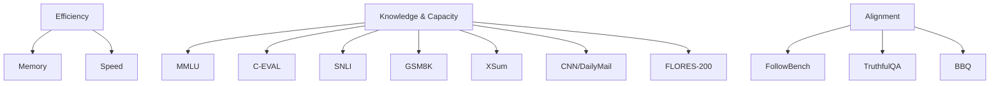

# A Comprehensive Evaluation of Quantization Strategies for Large Language Models

Renren Jin $^{1*†}$ , Jiangcun Du $^{1*}$ , Wuwei Huang $^{2}$ , Wei Liu $^{2}$ , Jian Luan $^{2}$ , Bin Wang $^{2}$ , Deyi Xiong $^{1‡}$

$^{1}$ College of Intelligence and Computing, Tianjin University, Tianjin, China

$^{2}$ Xiaomi AI Lab, Beijing, China

{rrjin, d2000, dyxiong}@tju.edu.cn

{huangwuwei, liuwei40, luanjian, wangbin11}@xiaomi.com

# Abstract

Increasing the number of parameters in large language models (LLMs) usually improves performance in downstream tasks but raises compute and memory costs, making deployment difficult in resource-limited settings. Quantization techniques, which reduce the bits needed for model weights or activations with minimal performance loss, have become popular due to the rise of LLMs. However, most quantization studies use pre-trained LLMs, and the impact of quantization on instruction-tuned LLMs and the relationship between perplexity and benchmark performance of quantized LLMs are not well understood. Evaluation of quantized LLMs is often limited to language modeling and a few classification tasks, leaving their performance on other benchmarks unclear. To address these gaps, we propose a structured evaluation framework consisting of three critical dimensions: (1) knowledge & capacity, (2) alignment, and (3) efficiency, and conduct extensive experiments across ten diverse benchmarks. Our experimental results indicate that LLMs with 4-bit quantization can retain performance comparable to their non-quantized counterparts, and perplexity can serve as a proxy metric for quantized LLMs on most benchmarks. Furthermore, quantized LLMs with larger parameter scales can outperform smaller LLMs. Despite the memory savings achieved through quantization, it can also slow down the inference speed of LLMs. Consequently, substantial engineering efforts and hardware support are imperative to achieve a balanced optimization of decoding speed and memory consumption in the context of quantized LLMs.

# 1 Introduction

In recent years, LLMs have seen substantial growth in the number of parameters, scaling up to billions

flowchart

Figure 1: The evaluation framework employed in our study to assess the quantized LLMs from three key dimensions: efficiency, knowledge & capacity and alignment.

or even trillions (Brown et al., 2020; Du et al., 2022; Scao et al., 2022; Touvron et al., 2023a,b; Ren et al., 2023), yielding exceptional performance across various tasks and real-world applications (Zhao et al., 2023; Laskar et al., 2023; Bang et al., 2023; Lai et al., 2023; Mao et al., 2023; Liang et al., 2022; Zhu et al., 2024; Guo et al., 2023). However, the huge number of parameters also results in significant compute and memory requirements, hindering their deployment on devices with limited resources. To mitigate these challenges, researchers have proposed various approaches to model quantization, which aim to optimize model inference and memory usage while minimizing performance degradation.

The central idea of model quantization is representing the weights or activations of a model in a lower-precision format (such as 8-bit integers) rather than their original high-precision floating-point format (typically 16-bit or 32-bit) (Gholami et al., 2021; Zhu et al., 2023). Quantization approaches can be broadly classified into two primary categories: quantization-aware training (QAT) and

<table><tr><td>Category</td><td>Benchmarks</td><td>Split</td><td>#Samples</td><td>Languages</td><td>Evaluation Dimension</td><td>Metrics</td><td>Evaluation Methods</td></tr><tr><td rowspan="7">Knowledge &amp; Capacity</td><td>MMLU (Hendrycks et al., 2021)</td><td>Test</td><td>14,042</td><td>English</td><td>Knowledge</td><td>Accuracy ↑</td><td>Rule-based</td></tr><tr><td>C-EVAL (Huang et al., 2023)</td><td>Test</td><td>12,342</td><td>Chinese</td><td>Knowledge</td><td>Accuracy ↑</td><td>Rule-based</td></tr><tr><td>FLORES-200 (Costa-jussà et al., 2022)</td><td>Test</td><td>1,012</td><td>English, Chinese</td><td>Translation</td><td>BLEU ↑</td><td>Rule-based</td></tr><tr><td>CNN/DailyMail (See et al., 2017)</td><td>Test</td><td>11,490</td><td>English</td><td>Summarization</td><td>ROUGE ↑</td><td>Rule-based</td></tr><tr><td>XSum (Narayan et al., 2018)</td><td>Test</td><td>11,334</td><td>English</td><td>Summarization</td><td>ROUGE ↑</td><td>Rule-based</td></tr><tr><td>GSM8K (Cobbe et al., 2021)</td><td>Test</td><td>1,319</td><td>English</td><td>Mathematical Reasoning</td><td>Accuracy ↑</td><td>Rule-based</td></tr><tr><td>SNLI (Bowman et al., 2015)</td><td>Test</td><td>10,000</td><td>English</td><td>Language Understanding</td><td>Accuracy ↑</td><td>Rule-based</td></tr><tr><td rowspan="3">Alignment</td><td>FollowBench (Jiang et al., 2023)</td><td>Test</td><td>820</td><td>English</td><td>Instruction Following</td><td>Hard Satisfaction Rate (HSR) ↑Soft Satisfaction Rate (SSR) ↑Consistent Satisfaction Levels (CSL) ↑</td><td>Rule-basedGPT-4-as-a-judge</td></tr><tr><td>TruthfulQA (Lin et al., 2022)</td><td>Test</td><td>817</td><td>English</td><td>Truthfulness</td><td>Accuracy ↑</td><td>Rule-based</td></tr><tr><td>BBQ (Parrish et al., 2022)</td><td>Test</td><td>58,492</td><td>English</td><td>Social biases</td><td>Bias Score → 0 ←</td><td>Rule-based</td></tr></table>

Table 1: Comprehensive overview of benchmarks used in our evaluation experiments.

post-training quantization (PTQ). QAT incorporates the quantization process into the training phase of the model, thereby allowing the model to adapt to lower-precision representations (Liu et al., 2023e; Dettmers et al., 2023a; Kim et al., 2023). Conversely, PTQ applies quantization techniques after the training phase has finished (Dettmers et al., 2022; Frantar et al., 2022; Lin et al., 2023; Lee et al., 2023; Dettmers et al., 2023b; Xiao et al., 2023; Yao et al., 2022).

Despite the risk of performance degradation, PTQ is more prevalent due to the prohibitive training costs associated with QAT. However, several aspects pertaining to the evaluation of PTQ require further exploration. Firstly, the majority of PTQ methods are evaluated solely by assessing the performance of the quantized pre-trained LLMs on benchmarks, leaving the performance of quantized LLMs that have undergone instruction tuning unclear - despite the latter being more commonly used in real-world scenarios (Ouyang et al., 2022; Bai et al., 2022; Peng et al., 2023). Secondly, the evaluation of quantized models is limited to the language modeling task and a few classification tasks. This restricts our understanding of their performance on other benchmarks that are more closely related to real-world applications. Lastly, while perplexity is predominantly employed as the evaluation metric for verifying the effectiveness of quantization methods and has been demonstrated as an indicator of the performance of LLMs on other benchmarks in previous studies (Xia et al., 2023), the correlation between the perplexity of quantized LLMs and their performance on other benchmarks remains poorly understood.

In this paper, we conduct a comprehensive evaluation of the quantized LLMs that undergo instruction tuning, utilizing a diverse range of publicly available benchmarks. These benchmarks cover language understanding and generation, as well as two critical dimensions of LLMs: knowledge & capacity and alignment. Additionally, we evaluate various quantization strategies for their efficiency in terms of generation speed and memory consumption. The comprehensive framework for this evaluation is illustrated in Figure 1, while Table 1 provides a detailed summary of the benchmarks employed in our experiments. $^{1}$

Our contributions can be summarized as follows:

- We propose a structured evaluation framework and conduct extensive experiments to evaluate instruction-tuned LLMs and their quantized counterparts employing various quantization strategies across different parameter scales (7B, 14B, 72B).   
- Our empirical findings suggest that LLMs utilizing 4-bit quantization can maintain performance comparable to their non-quantized counterparts on the evaluated benchmarks. Additionally, quantized LLMs with a larger parameter scale demonstrate superior performance compared to their non-quantized counterparts with smaller parameter sizes. Furthermore, we find that perplexity serves as a reliable performance indicator for quantized LLMs across the majority of the benchmarks.   
- We identify isolating outlier weights as a key factor enabling SpQR to effectively quantize LLMs to an extreme 2-bit level, significantly outperforming GPTQ at the same level.   
- Despite the impressive performance of contemporary quantization approaches, our further analysis reveals substantial engineering

challenges. Specifically, these approaches require significant engineering effort and hardware support to be effectively applied in practical scenarios, particularly in terms of memory and speed requirements.

# 2 Related Work

LLMs Quantization There are currently two main formalisms of model quantization: QAT (Jacob et al., 2018) and PTQ.

PTQ applies quantization after model training, while QAT considers the effects of quantization during the training process, necessitating considerable resources and expertise, thereby restricting its broader application. Consequently, our research primarily concentrates on PTQ.

Concerning the identification and protection of outlier values, GPT3.int8() (Dettmers et al., 2022) (also known as LLM.int8()) identifies outliers by magnitude while SpQR (Dettmers et al., 2023b) employs Hessian matrix to identify outlier values. By equivalently scaling weights and activation values, SmoothQuant (Xiao et al., 2023) greatly reduces quantization error of activation and thus results in a great reduction in the quantization loss of the model. Outlier Suppression+ (Wei et al., 2023) suppresses the outlier of weights by performing channel-wise shift and scale. QLoRA (Dettmers et al., 2023a) proposes to use the NF4 data format to reduce quantization rounding errors further. OPTQ (Frantar et al., 2023) (generally known as GPTQ) adjusting the weights during the quantization process to reduce quantization errors.

LLMs Evaluation As the technology behind LLMs continues to advance, these models have shown remarkable performance in many tasks (Bang et al., 2023; Mao et al., 2023), sometimes surpassing human proficiency (Srivastava et al., 2022; Laskar et al., 2023). Additionally, as the number of parameters in these models increases, they exhibit emergent abilities (Wei et al., 2022; Schaeffer et al., 2023; Liu et al., 2023b; Lu et al., 2023; Hu et al., 2023), making it challenging to compare their performance to that of other models and understand their behavior. As a result, numerous benchmarks have been curated to rigorously assess the performance of LLMs (Chang et al., 2024; Ziyu et al., 2023; Liu et al., 2023d; Yu et al., 2024). These benchmarks can be divided into two primary categories: (1) knowledge & capacity evaluation (Hendrycks et al., 2021; Li et al., 2023; Zeng, 2023; Huang et al., 2023; Qin et al., 2023; Liu et al., 2024b,a; Shen et al., 2023; Liu et al., 2023a; Shi et al., 2024), which examines the model's ability to understand and generate correct responses; and (2) alignment evaluation, which measures how well the model's outputs align with human preference and values (Gehman et al., 2020; Lin et al., 2022; Parrish et al., 2022; Huang and Xiong, 2023; Liu et al., 2023c; Yin et al., 2023; Zhou et al., 2023). Although these benchmarks are commonly employed to assess LLMs, their quantized counterparts are often excluded from these evaluations. As a result, it can be challenging to comprehend the behavior of quantized LLMs and determine the extent of the performance gap between them and their non-quantized counterparts.

In addressing these challenges, our research primarily focuses on evaluating quantized LLMs. Our goal is to conduct a thorough examination of the performance of LLMs that have been quantized using various methods. In doing so, we hope to yield valuable insights that will inform and enhance future advancements in quantization methodologies.

# 3 Evaluation Protocol

The comprehensive evaluation of LLMs presents a long-standing challenge due to their versatility, widespread application, and poor explainability. To address this, we propose a structured evaluation framework that encompasses three critical dimensions: (1) knowledge and capacity, (2) alignment, and (3) efficiency.

For the evaluation of knowledge and capacity, we consider two types of benchmarks: (i) those requiring LLMs to demonstrate extensive knowledge across various domains to achieve satisfactory performance, and (ii) those assessing the ability of LLMs to perform specific tasks such as language generation and understanding. In this context, we employ the MMLU (Hendrycks et al., 2021) and C-EVAL (Huang et al., 2023) benchmarks for the former, covering diverse subjects including but not limited to history, chemistry, and economics. For the latter, we select the FLORES-200 (Costa-jussà et al., 2022), CNN/DailyMail (See et al., 2017), and XSum (Narayan et al., 2018) benchmarks, which focus on essential language generation tasks like translation and summarization, and the GSM8K (Cobbe et al., 2021) and SNLI (Bowman et al., 2015) benchmarks for evaluating language understanding and reasoning capabilities.

<table><tr><td>Model</td><td>Datatype</td><td>Quantization Method</td><td>Average Accuracy</td><td>Average BLEU</td><td>Average ROUGE-1/ROUGE-2/ROUGE-3</td><td>Average HSR/SSR/CSL</td><td>Average Bias Score</td><td>Average Perplexity</td><td>Memory</td><td>Speed</td></tr><tr><td rowspan="10">Qwen-7B-Chat</td><td>BFloat16</td><td>-</td><td>57.10</td><td>29.63</td><td>0.257/0.086/0.168</td><td>40.23/51.71/1.57</td><td>6.20/3.87</td><td>11.76</td><td>15.14</td><td>37.67</td></tr><tr><td rowspan="3">INT-8</td><td>LLM.int8()</td><td>56.67</td><td>28.97</td><td>0.256/0.086/0.168</td><td>40.52/52.38/1.62</td><td>6.41/3.49</td><td>11.77</td><td>9.23</td><td>7.19</td></tr><tr><td>GPTQ</td><td>57.21</td><td>29.52</td><td>0.257/0.087/0.169</td><td>40.78/53.00/1.52</td><td>5.98/3.76</td><td>11.76</td><td>10.91</td><td>13.57</td></tr><tr><td>SpQR</td><td>56.49</td><td>29.51</td><td>0.257/0.086/0.168</td><td>40.20/52.10/1.62</td><td>6.36/3.95</td><td>11.83</td><td>15.60</td><td>37.65</td></tr><tr><td rowspan="2">INT-4</td><td>GPTQ</td><td>54.86</td><td>28.43</td><td>0.254/0.084/0.167</td><td>39.84/52.13/1.38</td><td>5.49/3.69</td><td>12.31</td><td>7.83</td><td>37.43</td></tr><tr><td>SpQR</td><td>56.41</td><td>29.59</td><td>0.256/0.086/0.168</td><td>40.26/51.59/1.48</td><td>6.34/3.77</td><td>11.97</td><td>15.60</td><td>37.73</td></tr><tr><td rowspan="2">INT-3</td><td>GPTQ</td><td>51.42</td><td>24.22</td><td>0.228/0.067/0.149</td><td>35.82/47.77/1.27</td><td>4.21/4.90</td><td>15.10</td><td>7.12</td><td>8.21</td></tr><tr><td>SpQR</td><td>55.45</td><td>28.39</td><td>0.253/0.083/0.166</td><td>36.03/49.44/1.30</td><td>6.31/4.08</td><td>13.40</td><td>15.61</td><td>37.73</td></tr><tr><td rowspan="2">INT-2</td><td>GPTQ</td><td>16.52</td><td>0.01</td><td>0.042/0.000/0.029</td><td>0.24/0.64/0.00</td><td>-0.54/-0.97</td><td>84396.73</td><td>6.26</td><td>19.36</td></tr><tr><td>SpQR</td><td>53.18</td><td>27.22</td><td>0.242/0.077/0.158</td><td>37.52/49.69/1.55</td><td>4.13/5.76</td><td>13.77</td><td>15.66</td><td>37.51</td></tr><tr><td rowspan="10">Qwen-14B-Chat</td><td>BFloat16</td><td>-</td><td>62.92</td><td>31.13</td><td>0.254/0.085/0.196</td><td>53.16/62.25/2.15</td><td>8.35/3.69</td><td>9.84</td><td>27.60</td><td>25.15</td></tr><tr><td rowspan="3">INT-8</td><td>LLM.int8()</td><td>62.48</td><td>31.63</td><td>0.254/0.084/0.166</td><td>48.35/57.69/1.75</td><td>7.92/3.89</td><td>9.86</td><td>15.91</td><td>5.85</td></tr><tr><td>GPTQ</td><td>62.67</td><td>31.84</td><td>0.254/0.084/0.196</td><td>49.22/58.76/1.90</td><td>8.22/3.70</td><td>9.85</td><td>17.92</td><td>14.37</td></tr><tr><td>SpQR</td><td>62.86</td><td>31.97</td><td>0.255/0.085/0.167</td><td>47.53/57.59/1.87</td><td>8.60/3.65</td><td>9.85</td><td>27.95</td><td>25.42</td></tr><tr><td rowspan="2">INT-4</td><td>GPTQ</td><td>61.53</td><td>31.40</td><td>0.252/0.082/0.165</td><td>48.66/57.47/1.90</td><td>7.82/4.11</td><td>10.29</td><td>12.03</td><td>24.38</td></tr><tr><td>SpQR</td><td>62.66</td><td>31.47</td><td>0.252/0.083/0.165</td><td>46.84/56.27/1.78</td><td>7.96/3.86</td><td>9.94</td><td>27.95</td><td>24.62</td></tr><tr><td rowspan="2">INT-3</td><td>GPTQ</td><td>58.34</td><td>28.92</td><td>0.237/0.073/0.155</td><td>43.91/53.38/1.62</td><td>8.41/3.88</td><td>13.94</td><td>10.77</td><td>4.71</td></tr><tr><td>SpQR</td><td>61.43</td><td>31.09</td><td>0.253/0.082/0.165</td><td>47.83/57.65/1.85</td><td>8.03/3.11</td><td>10.19</td><td>29.97</td><td>25.20</td></tr><tr><td rowspan="2">INT-2</td><td>GPTQ</td><td>16.78</td><td>0.01</td><td>0.044/0.000/0.030</td><td>0.54/1.12/0.02</td><td>-0.17/-0.81</td><td>192872.47</td><td>8.99</td><td>18.26</td></tr><tr><td>SpQR</td><td>59.82</td><td>29.20</td><td>0.247/0.080/0.162</td><td>47.76/57.47/1.82</td><td>8.08/5.33</td><td>11.00</td><td>28.04</td><td>24.82</td></tr><tr><td rowspan="10">Qwen-72B-Chat</td><td>BFloat16</td><td>-</td><td>71.76</td><td>34.81</td><td>0.300/0.114/0.203</td><td>53.16/62.25/2.15</td><td>9.07/1.57</td><td>8.52</td><td>138.44</td><td>8.97</td></tr><tr><td rowspan="3">INT-8</td><td>LLM.int8()</td><td>71.74</td><td>34.39</td><td>0.301/0.115/0.204</td><td>56.00/64.03/2.28</td><td>8.81/1.68</td><td>8.51</td><td>74.96</td><td>3.07</td></tr><tr><td>GPTQ</td><td>71.20</td><td>34.82</td><td>0.300/0.114/0.204</td><td>54.66/63.28/2.08</td><td>8.95/1.31</td><td>8.71</td><td>77.85</td><td>1.43</td></tr><tr><td>SpQR</td><td>71.90</td><td>34.67</td><td>0.300/0.115/0.203</td><td>54.27/62.67/2.33</td><td>9.07/1.51</td><td>8.54</td><td>143.20</td><td>6.57</td></tr><tr><td rowspan="2">INT-4</td><td>GPTQ</td><td>71.38</td><td>34.03</td><td>0.298/0.112/0.201</td><td>52.81/61.43/2.13</td><td>10.11/1.76</td><td>8.77</td><td>44.11</td><td>14.88</td></tr><tr><td>SpQR</td><td>71.76</td><td>34.72</td><td>0.299/0.114/0.201</td><td>53.81/62.14/2.10</td><td>8.73/1.52</td><td>8.64</td><td>143.21</td><td>6.56</td></tr><tr><td rowspan="2">INT-3</td><td>GPTQ</td><td>66.89</td><td>30.98</td><td>0.269/0.096/0.178</td><td>52.73/61.38/2.02</td><td>8.77/3.11</td><td>10.19</td><td>35.93</td><td>0.84</td></tr><tr><td>SpQR</td><td>70.67</td><td>34.08</td><td>0.292/0.109/0.196</td><td>52.82/61.42/2.22</td><td>8.24/1.97</td><td>8.84</td><td>143.37</td><td>6.57</td></tr><tr><td rowspan="2">INT-2</td><td>GPTQ</td><td>18.40</td><td>0.01</td><td>0.021/0.000/0.017</td><td>0.08/0.48/0.00</td><td>-0.36/0.89</td><td>48714.04</td><td>27.74</td><td>2.23</td></tr><tr><td>SpQR</td><td>67.07</td><td>32.74</td><td>0.278/0.100/0.186</td><td>53.48/61.76/2.20</td><td>7.67/1.69</td><td>9.57</td><td>144.59</td><td>6.56</td></tr></table>

Table 2: Evaluation results of the Qwen-Chat series models and their quantized counterparts across ten benchmarks designed to evaluate LLMs in terms of knowledge & capacity and alignment, as well as metrics for memory consumption and decoding speed during inference. The benchmarks are grouped by the type of metrics used, and the average score for each metric within its respective group is presented. The “Average Accuracy” represents the mean accuracy of LLMs across the MMLU (Hendrycks et al., 2021), C-EVAL (Huang et al., 2023), GSM8K (Cobbe et al., 2021), SNLI (Bowman et al., 2015), and TruthfulQA (Lin et al., 2022) benchmarks. The “Average BLEU” indicates the mean BLEU score for Chinese-English and English-Chinese translations on the FLORES-200 benchmark (Costajussà et al., 2022). The “Average ROUGE-1/ROUGE-2/ROUGE-L” displays the mean ROUGE-1, ROUGE-2, and ROUGE-L scores on the XSum (Narayan et al., 2018) and CNN/DailyMail (See et al., 2017) benchmarks. The “Average HSR/SSR/CSL” represents the mean hard satisfaction rates (HSR), soft satisfaction rates (SSR) across five difficulty levels, and consistent satisfaction levels (CSL) across five constraints on the FollowBench benchmark (Jiang et al., 2023). The “Average Bias Score” is shown as x/y, where x and y represent the mean bias score across various categories in ambiguous and unambiguous contexts, respectively, on the BBQ benchmark (Parrish et al., 2022). The “Average Perplexity” indicates the mean perplexity on WikiText2 (Merity et al., 2017), C4 (Raffel et al., 2020), and PTB (Marcus et al., 1994). The “Memory” refers to the memory consumed (in GB) during inference when the input consists of 256 tokens and the output contains 512 tokens. The “Speed” represents the number of tokens generated per second when the input consists of 256 tokens and the output contains 512 tokens.

For the evaluation of alignment, we adopt the HHH criteria proposed by Askell et al. (2021), which assess LLMs from three distinct perspectives: helpfulness, honesty, and harmlessness. Accordingly, we have chosen the FollowBench (Jiang et al., 2023), TruthfulQA (Lin et al., 2022), and BBQ (Parrish et al., 2022) benchmarks to assess these aspects, respectively.

For the evaluation of efficiency, we consider metrics such as memory usage and generation speed during inference, which are crucial for the practical application of LLMs in real-world scenarios.

It is important to note that while these three dimensions provide a comprehensive framework for evaluating LLMs, other benchmarks or metrics can also be employed as long as they align with these dimensions.

# 4 Evaluation Setup

# 4.1 LLMs

We predominantly employ quantization techniques on the Qwen-Chat series of models (Bai et al., 2023), which have undergone instruction tuning, taking into account the following considerations: (1) The Qwen-Chat models have demonstrated exceptional performance across a variety of tasks. (2) The Qwen-Chat series includes LLMs of varying parameter scales, specifically models with 7 billion, 14 billion, and 72 billion parameters. (3) The models in the Qwen-Chat series have been pre-trained on an extensive corpus of multilingual data, with a particular focus on Chinese and English. This extensive pre-training enables the models to support a multitude of languages beyond English.

line

| Model | BFloat16 | INT8 | INT4 | INT3 | INT2 |
| --- | --- | --- | --- | --- | --- |
| Qwen-7B-Chat | 56.2 | 65.25 | 64.75 | 74.75 | 73.50 |
| Qwen-14B-Chat | 56.0 | 65.00 | 64.50 | 74.50 | 73.25 |
| Qwen-72B-Chat | 55.8 | 64.50 | 64.25 | 74.25 | 73.00 |
| Qwen-7B-Chat-LLM.IntR) | 55.6 | 64.25 | 64.00 | 74.00 | 72.80 |
| Qwen-72B-Chat-LLM.IntR) | 55.4 | 63.75 | 63.50 | 73.75 | 72.60 |
| Qwen-7B-Chat-GPTQ | 55.2 | 63.50 | 63.25 | 73.50 | 72.40 |
| Qwen-14B-Chat-GPTQ | 55.0 | 63.25 | 63.00 | 73.25 | 72.20 |
| Qwen-72B-Chat-GPTQ | 54.8 | 63.00 | 62.80 | 73.00 | 72.00 |
| Qwen-7B-Chat-SPTR | 54.6 | 62.80 | 62.60 | 72.80 | 71.80 |
| Qwen-14H-Chat-SPTR | 54.4 | 62.60 | 62.40 | 72.60 | 71.60 |
| Qwen-72H-Chat-SPTR | 54.2 | 62.40 | 62.20 | 72.40 | 71.40 |
| Random | 54.0 | 62.20 | 62.00 | 72.20 | 71.20 |

(a) MMLU

line

| Model | BLEU |
| --- | --- |
| BFloat16 | 32 |
| INT8 | 35 |
| INT4 | 30 |
| INT3 | 25 |
| INT2 | 0 |

(b) En → Zh

Figure 2: Performance of the Qwen-Chat series models and their quantized counterparts on the MMLU (Hendrycks et al., 2021) benchmark (a) and the English-to-Chinese $(\mathrm{En} \rightarrow \mathrm{Zh})$ translation task of the FLORES-200 (Costa-jussà et al., 2022) (b) benchmark. The x-axis represents the data format of the model's weight, where $x$ in INT $x$ denotes the number of integer bits used for weight representations. To highlight the nuanced differences between LLM.int8() and other methodologies, a magnified view is integrated into the figure.   

line

| Method          | BFLOAT16 | INT8   | INT4   | INT3   | INT2   |
| --------------- | --------- | ------ | ------ | ------ | ------ |
| Qbox-TB-Cat     | 0.192     | 0.182  | 0.175  | 0.178  | 0.175  |
| Qbox-TB-Cat      | 0.190     | 0.180  | 0.175  | 0.175  | 0.175  |
| Qbox-TB-Cat+LLMMoM | 0.250    | 0.250  | 0.250  | 0.250  | 0.250  |
| Qbox-TB-Cat+LLMMoM | 0.250    | 0.250  | 0.250  | 0.250  | 0.250  |
| Qbox-TB-Cat+GPTQ   | 0.250     | 0.250  | 0.250  | 0.250  | 0.250  |
| Qbox-TB-Cat+GPTQ   | 0.250     | 0.250  | 0.250  | 0.250  | 0.250  |
| Qbox-TB-Cat+SQR   | 0.250     | 0.250  | 0.250  | 0.250  | 0.250  |
| Qbox-TB-Cat+SQR   | 0.250     | 0.250  | 0.250  | 0.250  | 0.250  |

(a) ROUGE-1

line

| Model          | BFloat16 | INT8   | INT4   | INT3   | INT2   |
| -------------- | -------- | ------ | ------ | ------ | ------ |
| Qeon-78-Chat   | 0.05     | 0.05   | 0.05   | 0.05   | 0.05   |
| Qeon-148-Chat  | 0.05     | 0.05   | 0.05   | 0.05   | 0.05   |
| Qeon-728-Chat  | 0.05     | 0.05   | 0.05   | 0.05   | 0.05   |
| Qeon-78-Chat-LLMark1 | 0.05    | 0.05   | 0.05   | 0.05   | 0.05   |
| Qeon-78-Chat-LLMark2 | 0.05    | 0.05   | 0.05   | 0.05   | 0.05   |
| Qeon-78-Chat-GPTQ | 0.05    | 0.05   | 0.05   | 0.05   | 0.05   |
| Qeon-78-Chat-GPT3 | 0.05    | 0.05   | 0.05   | 0.05   | 0.05   |
| Qeon-78-Chat-GPTQ | 0.05    | 0.05   | 0.05   | 0.05   | 0.05   |
| Qeon-78-Chat-SPOR | 0.05    | 0.05   | 0.05   | 0.05   | 0.05   |
| Qeon-728-Chat-SPOR | 0.05    | 0.05   | 0.05   | 0.05   | 0.05   |
| Qeon-728-Chat-SPOQ | 0.05    | 0.05   | 0.05   | 0.05   | 0.05   |

(b) ROUGE-2

line

| Model              | BFloat16 | INT8   | INT4   | INT3   | INT2   |
| ------------------ | -------- | ------ | ------ | ------ | ------ |
| Open-78-CSwt       | 0.175    | 0.125  | 0.125  | 0.125  | 0.125  |
| Open-108-CSwt      | 0.175    | 0.125  | 0.125  | 0.125  | 0.125  |
| Open-728-CSwt      | 0.175    | 0.125  | 0.125  | 0.125  | 0.125  |
| Open-78-CSwt-LLMarki | 0.175    | 0.125  | 0.125  | 0.125  | 0.125  |
| Open-108-CSwt-LLMarki | 0.175    | 0.125  | 0.125  | 0.125  | 0.125  |
| Open-728-CSwt-LLMarki | 0.175    | 0.125  | 0.125  | 0.125  | 0.125  |
| Open-78-CSwt-GFI    | 0.175    | 0.125  | 0.125  | 0.125  | 0.125  |
| Open-108-CSwt-GFI   | 0.175    | 0.125  | 0.125  | 0.125  | 0.125  |
| Open-728-CSwt-GFI   | 0.175    | 0.125  | 0.125  | 0.125  | 0.125  |
| Open-78-CSwt-SQR     | 0.175    | 0.125  | 0.125  | 0.125  | 0.125  |
| Open-108-CSwt-SQR   | 0.175    | 0.125  | 0.125  | 0.125  | 0.125  |
| Open-728-CSwt-SQR   | 0.175    | 0.125  | 0.125  | 0.125  | 0.125  |
| Open-78-CSwt-GFI    | 0.175    | 0.125  | 0.125  | 0.125  | 0.125  |
| Open-108-SW          | 0.175    | 0.125  | 0.125  | 0.125  | 0.125  |
| Open-78-CSwt-GFI    | 0.175    | 0.125  | 0.125  | 0.125  | 0.125  |
| Open-78-CSwt-SQR    | 0.175    | 0.125  | 0.125  | 0.125  | 0.125  |
| Open-78-CSwt-SQR     | 0.175    | 0.125  | 0.125  | 0.125  | 0.125  |
| Open-78-CSwt-SQR-SR   | 0.175    | 0.125  | 0.125  | 0.125  | 0.125  |
| Open-78-CSwt-SQR-SR   | 0.175    | 0.125  | 0.125  | 0.125  | 0.125<nl>

(c) ROUGE-L   
Figure 3: ROUGE-1 (a), ROUGE-2 (b), and ROUGE-L (c) scores for the Qwen-Chat series models and their quantized counterparts on the test sets of XSum (Narayan et al., 2018).

# 4.2 Quantization Strategies

We select three prominent quantization approaches accompanied by dedicated open-source implementations for evaluation: LLM.int8() (Dettmers et al., 2022), GPTQ (Frantar et al., 2023), and SpQR (Dettmers et al., 2023b). These approaches have been either deeply integrated into the Hugging Face Transformers $^{2}$ library (Wolf et al., 2020) or widely used, thereby enabling them to support a variety of open-source LLMs. Specifically, we employ GPTQ and SpQR to quantize the LLMs to 8, 4, 3, and 2 bits, respectively, except LLM.int8(), which exclusively quantizes them to 8 bits. For the calibration data required by SpQR and GPTQ, we randomly sampled 128 examples from the dataset collected by Taori et al. (2023) and Peng et al. (2023). For a detailed introduction to these quantization approaches, please refer to Appendix A.

# 4.3 Benchmarks

We utilize ten distinct benchmarks to facilitate a comprehensive assessment of LLMs and their quantized counterparts. These benchmarks encompass knowledge & capacity evaluation, as well as alignment evaluation. By leveraging this broad spectrum of benchmarks, we aim to gain a holistic understanding of the models' performance across various dimensions, thereby enabling a detailed comparison between the original and quantized versions of LLMs. For a comprehensive overview these benchmarks and the associated prompts employed in our study, please see Appendix B and Appendix C.

# 5 Experiment Results and Discussion

Table 2 presents a comprehensive performance summary of the Qwen-Chat series models and their quantized counterparts across ten benchmarks designed to evaluate LLMs in terms of knowledge & capacity and alignment. It also includes metrics for memory consumption and decoding speed during inference. Detailed experimental results for each benchmark and metric are illustrated in Figures 2 through 8 and Figures 15 through 17 in Appendix D.

Overall, the experimental results indicate that

line

| Model | Qwen-TB Chat | Qwen-14B Chat | Qwen-TB Chat-LLMnity | Qwen-14B Chat-LLMnity | Qwen-72B Chat-GPTQ | Qwen-72B Chat-GPTQ | Qwen-72B Chat-PSPQ | Qwen-72B Chat-PSPQ |
|---|---|---|---|---|---|---|---|---|
| BFloat16 | 50 | 48 | 52 | 50 | 50 | 50 | 50 | 50 |
| INT8 | 40 | 40 | 48 | 48 | 48 | 48 | 48 | 48 |
| INT4 | 35 | 35 | 45 | 45 | 45 | 45 | 45 | 45 |
| INT3 | 30 | 30 | 40 | 40 | 40 | 40 | 40 | 40 |
| INT2 | 25 | 25 | 35 | 35 | 35 | 35 | 35 | 35 |

(a) Hard Satisfaction Rate (HSR)

  
(b) Soft Satisfaction Rate (SSR)

line

| Model | Consistent Satisfaction Level |
| --- | --- |
| Qwen-78-Cat | 1.912 |
| Qwen-140-Cat | 1.879 |
| Qwen-728-Cat | 1.858 |
| Qwen-78-Cat LLM(methyl) | 1.825 |
| Qwen-140-Cat LLM(methyl) | 1.808 |
| Qwen-728-Cat LLM(PPTQ) | 1.775 |
| Qwen-728-Cat GPTQ | 1.753 |
| Qwen-78-Cat SPQR | 1.739 |
| Qwen-728-Cat SPQR | 1.717 |
| Qwen-78-Cat GPTQ | 1.695 |
| Qwen-728-Cat GPTQ | 1.673 |
| Qwen-140-Cat SPQR | 1.652 |
| Qwen-728-Cat SPQR | 1.631 |

(c) Consistent Satisfaction Levels (CSL)

Figure 4: Average hard satisfaction rates (a), soft satisfaction rates (b), and consistent satisfaction levels (c) across five difficulty levels for the Qwen-Chat series models and their quantized counterparts on the FollowBench benchmark (Jiang et al., 2023).   
  
(a) TruthfulQA

line

| Model          | BFloat16 | INT8  | INT4  | INT3  |
| -------------- | -------- | ----- | ----- | ----- |
| Qwen-78 Chat   | 54       | 59    | 60    | 58    |
| Qwen-728 Chat  | 54       | 59    | 60    | 58    |
| Qwen-78 Chat-LLM(Martt) | 54     | 59    | 60    | 58    |
| Qwen-728 Chat-LLM(Martt) | 54     | 59    | 60    | 58    |
| Qwen-78 Chat-GPTQ | 54     | 59    | 60    | 58    |
| Qwen-728 Chat-GPTQ | 54     | 59    | 60    | 58    |
| Qwen-78 Chat-SNPQR | 54     | 59    | 60    | 58    |
| Qwen-728 Chat-SNPQR | 54     | 59    | 60    | 58    |

(b) GSM8K

  
(c) SNLI   
Figure 5: Performance of Qwen-Chat series models and their quantized counterparts on the TruthfulQA benchmark (Lin et al., 2022) (a), as well as the test sets of GSM8K (Cobbe et al., 2021) (b) and SNLI (Bowman et al., 2015) (c).

LLMs with a greater number of parameters generally outperform those with fewer parameters across most benchmarks. Furthermore, we observe a downward trend in the performance of these LLMs across most benchmarks when they are quantized to fewer bits. Here are the detailed observations:

4-bit quantization offers a trade-off between the LLMs' capacity and the number of bits in the low-precision format. As the number of quantized bits decreases to 3 bits or lower, there is a noticeable performance discrepancy between the LLMs and their quantized counterparts. Experimental results suggest that when the LLMs are quantized to 8 bits, the majority of LLMs, irrespective of their parameter scales, can maintain a performance level comparable to their non-quantized equivalents. Moreover, LLMs that are quantized to 4 bits can also uphold similar performance to their non-quantized versions across most benchmarks. However, if these LLMs are further quantized to 3 bits or lower, the capacity of these models begins to deteriorate. Notably, our investigation reveals that when the LLMs are quantized to 2 bits using GPTQ, they lose their ability to comprehend and follow user instructions, resulting in the generation of incoherent text.

Perplexity is a reliable performance indicator for quantized LLMs on evaluation benchmarks.

Figure 7 illustrates the perplexity for both the original LLMs and their quantized versions on WikiText2 (Merity et al., 2017). For more experimental results of perplexity on the C4 (Raffel et al., 2020) and PTB (Marcus et al., 1994) datasets, please refer to Figure 17 in Appendix D. It is evident that the perplexity of 8-bit quantized models closely matches that of their non-quantized counterparts. Moreover, as the LLMs are further quantized to 4 and 3 bits, there's a slight increase in perplexity. However, perplexity sharply increases, exceeding 38,000, when the models are quantized to 2 bits using GPTQ. This sharp increase in perplexity aligns with our observation that models quantized to 2 bits with GPTQ struggle to generate coherent text. In summary, as LLMs are quantized to fewer bits, there is an upward trend in perplexity, which corresponds to a decline in their performance on evaluated benchmarks. Interestingly, despite a noticeable increase in perplexity, 4-bit quantized models still perform comparably to their non-quantized counterparts on these benchmarks. We speculate that this could be due to the nonlinear or discontinuous metrics used by these benchmarks, which may not reflect minor changes in perplexity. Furthermore, as demonstrated in Table 3, there is a strong

  
(a) Bias scores in ambiguous context.

  
(b) Bias scores in disambiguated context.

Figure 6: Bias scores of the Qwen-Chat series models and their quantized counterparts in ambiguous and disambiguated contexts on the BBQ benchmark (Parrish et al., 2022).   

line

| Model              | BFloat16 | INT8  | INT4  | INT3  | INT2  |
| ------------------ | -------- | ----- | ----- | ----- | ----- |
| Qwen-7B-Chat       | 8.5      | 9.0   | 9.0   | 11.0  | 10.0  |
| Qwen-14B-Chat      | 7.0      | 7.0   | 7.0   | 9.5   | 8.0   |
| Qwen-72B-Chat      | 6.5      | 6.5   | 6.5   | 7.0   | 6.5   |
| Qwen-7B-Chat-LLMint8 | 6.5     | 6.5   | 6.5   | 7.0   | 6.5   |
| Qwen-14B-Chat-LLMint8 | 6.5    | 6.5   | 6.5   | 7.0   | 6.5   |
| Qwen-72B-Chat-GPTQ  | 6.5      | 6.5   | 6.5   | 7.0   | 6.5   |
| Qwen-14B-Chat-GPTQ  | 6.5      | 6.5   | 6.5   | 7.0   | 6.5   |
| Qwen-72B-Chat-GPTQ  | 6.5      | 6.5   | 6.5   | 7.0   | 6.5   |
| Qwen-7B-Chat-SFQR  | 6.5      | 6.5   | 6.5   | 7.0   | 6.5   |
| Qwen-14B-Chat-SFQR | 6.5      | 6.5   | 6.5   | 7.0   | 6.5   |
| Qwen-72B-Chat-SFQR | 6.5      | 6.5   | 6.5   | 7.0   | 6.5   |

Figure 7: Perplexity of Qwen-Chat Series models and their quantized counterparts on the WikiText2 dataset (Merity et al., 2017).

correlation between perplexity and the performance of quantized LLMs. The average absolute value of the Pearson correlation coefficient is notably high at 0.7895. This evidence reinforces our claim that perplexity serves as a reliable performance indicator for quantized LLMs on evaluation benchmarks.

Identifying and isolating outlier weights is crucial for SpQR to effectively quantize LLMs to an extreme level of 2 bits. Experimental results indicate a sharp decline in the performance of LLMs quantized to 2 bits by GPTQ, to the extent that they fail to produce coherent text. In contrast, LLMs quantized to 2 bits by SpQR exhibit a relatively moderate performance across all evaluated benchmarks. SpQR introduces two innovative strategies to enhance the performance of quantized LLMs, distinguishing it from GPTQ: (1) the adoption of an extremely small group size coupled with bilevel quantization, and (2) the isolation of unstructured outlier weights, maintaining these weights at a higher precision (16-bit) during computations. To study the impact of these strategies, we conducted two controlled experiments: (1) increasing the group size of SpQR from 16 to 128, matching the group size utilized by GPTQ, while still isolating the outlier weights. (2) keeping the small group size but not isolating outlier weights. Experimental results are shown in Table 4. We observe a significant increase in perplexity across three benchmarks when the outlier weights are not isolated, even with a small group size. Conversely, increasing the group size resulted in only a marginal increase in perplexity. Furthermore, we analyzed the proportion of outlier weights stored in high precision for the quantized LLMs, with the results presented in Table 5. These findings indicate an inverse relationship between the number of quantized bits and the percentage of outlier weights, with a consis-

<table><tr><td>Benchmark</td><td>Metric</td><td>Pearson Correlation Coefficient</td></tr><tr><td>MMUL</td><td>Accuracy</td><td>-0.892</td></tr><tr><td>C-EVAL</td><td>Accuracy</td><td>-0.930</td></tr><tr><td rowspan="2">FLORES-200</td><td>BLEU (English to Chinese)</td><td>-0.884</td></tr><tr><td>BLEU (Chinese to English)</td><td>-0.904</td></tr><tr><td rowspan="3">XSum</td><td>ROUGE-1</td><td>-0.768</td></tr><tr><td>ROUGE-2</td><td>-0.493</td></tr><tr><td>ROUGE-L</td><td>-0.222</td></tr><tr><td rowspan="3">CNN/DailyMail</td><td>ROUGE-1</td><td>-0.890</td></tr><tr><td>ROUGE-2</td><td>-0.849</td></tr><tr><td>ROUGE-L</td><td>-0.885</td></tr><tr><td>GSM8K</td><td>Accuracy</td><td>-0.911</td></tr><tr><td>SNLI</td><td>Accuracy</td><td>-0.583</td></tr><tr><td rowspan="3">FollowBench</td><td>HSR (hard satisfaction rates)</td><td>-0.864</td></tr><tr><td>SSR (soft satisfaction rates)</td><td>-0.899</td></tr><tr><td>CSL (consistent satisfaction levels)</td><td>-0.877</td></tr><tr><td>TruthfulQA</td><td>MC1 Accuracy</td><td>-0.789</td></tr><tr><td rowspan="2">BBQ</td><td>Bias scores in ambiguous context</td><td>-0.765</td></tr><tr><td>Bias scores in disambiguated context</td><td>0.806</td></tr></table>

Table 3: The Pearson correlation coefficient between the average perplexity on the WikiText2, C4, and PTB datasets of both 4-bit and 3-bit quantized LLMs (quantized with GPTQ and SpQR) and their performance across various benchmarks.

line

| Model              | BFloat16 | INT8 | INT4 | INT3 | INT2 |
| ------------------ | -------- | ---- | ---- | ---- | ---- |
| Qwen-7B-Chat       | 15       | 10   | 8    | 15   | 15   |
| Qwen-14B-Chat      | 29       | 18   | 12   | 15   | 15   |
| Qwen-72B-Chat      | 140      | 75   | 45   | 30   | 9    |
| Qwen-7B-Chat-LLMInt8 | 29       | 15   | 12   | 15   | 9    |
| Qwen-14B-Chat-LLMInt8 | 29       | 15   | 12   | 15   | 9    |
| Qwen-72B-Chat-GPTQ | 15       | 10   | 8    | 15   | 9    |
| Qwen-14B-Chat-GPTQ | 15       | 10   | 8    | 15   | 9    |
| Qwen-7B-Chat-SPQR  | 15       | 10   | 8    | 15   | 9    |
| Qwen-14B-Chat-SPQR | 15       | 10   | 8    | 15   | 9    |
| Qwen-72B-Chat-SPQR | 15       | 10   | 8    | 15   | 9    |

(a) Memory

line

| Model              | BFloat16 | INT8 | INT4 | INT3 | INT2 |
| ------------------ | -------- | ---- | ---- | ---- | ---- |
| Qwen-7B-Chat       | 37       | 7    | 37   | 8    | 19   |
| Qwen-14B-Chat      | 25       | 14   | 25   | 6    | 18   |
| Qwen-72B-Chat      | 9        | 6    | 15   | 0    | 2    |
| Qwen-7B-Chat-LLMint8 | 25     | 14   | 25   | 6    | 0    |
| Qwen-14B-Chat-LLMint8 | 25     | 14   | 25   | 6    | 0    |
| Qwen-72B-Chat-GPTQ | 25     | 14   | 25   | 6    | 0    |
| Qwen-14B-Chat-GPTQ | 25     | 14   | 25   | 6    | 0    |
| Qwen-72B-Chat-SPQR | 25     | 14   | 25   | 6    | 0    |
| Qwen-14B-Chat-SPQR | 25     | 14   | 25   | 6    | 0    |
| Qwen-72B-Chat-SPQR | 25     | 14   | 25   | 6    | 0    |

(b) Speed

Figure 8: Left: memory consumption comparison between Qwen-Chat series models and their quantized counterparts. The y-axis is presented on a logarithmic scale to clearly demonstrate the variation in memory consumption for LLMs with smaller parameter scales (7B, 14B) as the number of quantized bits decreases. Right: comparison of inference speed between Qwen-Chat series models and their quantized counterparts. These experiments are conducted with an input of 256 tokens and a generation of 512 tokens on A100 80GB SXM GPUs. 

<table><tr><td>Model</td><td>Quantization Config</td><td>WikiText</td><td>C4</td><td>PTB</td></tr><tr><td rowspan="3">Qwen-7B-Chat</td><td>w2g16 w/ outlier</td><td>10.05</td><td>14.19</td><td>17.07</td></tr><tr><td>w2g16 w/o outlier</td><td>17.96</td><td>21.86</td><td>27.98</td></tr><tr><td>w2g128 w/ outlier</td><td>10.58</td><td>14.48</td><td>17.40</td></tr><tr><td rowspan="3">Qwen-14B-Chat</td><td>w2g16 w/ outlier</td><td>7.94</td><td>11.74</td><td>13.31</td></tr><tr><td>w2g16 w/o outlier</td><td>140.22</td><td>115.07</td><td>170.48</td></tr><tr><td>w2g128 w/ outlier</td><td>8.16</td><td>12.14</td><td>13.78</td></tr><tr><td rowspan="3">Qwen-72B-Chat</td><td>w2g16 w/ outlier</td><td>7.01</td><td>9.78</td><td>11.92</td></tr><tr><td>w2g16 w/o outlier</td><td>10.49</td><td>14.07</td><td>16.11</td></tr><tr><td>w2g128 w/ outlier</td><td>7.44</td><td>10.34</td><td>12.27</td></tr></table>

Table 4: Perplexity on WikiText2 (Merity et al., 2017), C4 (Raffel et al., 2020), and PTB (Marcus et al., 1994) under different quantization configurations. “w2g16” denotes that weights are quantized to 2-bit with a group size of 16. “w/ outlier” indicates identifying outlier values which are not quantized while “w/o outlier” means not identifying outliers and the whole weight matrix is quantized. All experiments used bilevel 3-bit quantization, which quantizes the model’s weights first and then quantizes group-wise statistics (scales and zeros).

tent percentage of outlier weights across different model scales at the same quantization level. Consequently, it is concluded that the isolation of outlier weights and their preservation in high precision is indispensable for SpQR to effectively quantize LLMs to an extreme level of 2 bits.

In practical scenarios, the application of low-bit quantization necessitates substantial engineering effort and hardware support. As illustrated in Figure 8a, both the GPTQ and LLM.int8() can effectively reduce memory consumption during LLMs inference, with the memory requirement diminishing as the number of quantized bits decreases. Conversely, despite the impressive performance of SpQR, it does not contribute to reducing memory consumption during LLMs infer-

<table><tr><td>Model</td><td>Quantized Bit</td><td>Outlier Proportion</td></tr><tr><td rowspan="4">Qwen-7B-Chat</td><td>8</td><td>0.003%</td></tr><tr><td>4</td><td>0.033%</td></tr><tr><td>3</td><td>1.676%</td></tr><tr><td>2</td><td>11.336%</td></tr><tr><td rowspan="4">Qwen-14B-Chat</td><td>8</td><td>0.004%</td></tr><tr><td>4</td><td>0.036%</td></tr><tr><td>3</td><td>1.648%</td></tr><tr><td>2</td><td>11.148%</td></tr><tr><td rowspan="4">Qwen-72B-Chat</td><td>8</td><td>0.003%</td></tr><tr><td>4</td><td>0.044%</td></tr><tr><td>3</td><td>1.682%</td></tr><tr><td>2</td><td>11.838%</td></tr></table>

Table 5: The proportion of outliers keeping high precision in LLMs quantized by SpQR.

ence. This is attributable to the implementation of SpQR employed in our study, which utilizes a high-precision format to represent quantized weights. It merely restricts the range of quantized weights to match that of the low-precision format, thereby mimicking the effect of representing quantized weights with low precision. Consequently, computations are executed under a high-precision format, resulting in no reduction in memory consumption. Furthermore, the efficient implementation of parallel computation in low-precision format is not yet supported by most computing libraries, such as PyTorch. This implies that the implementation of operators associated with low-precision format must be done manually, demanding a thorough understanding of computing hardware (e.g., GPU, TPU, etc.) and the dedication of considerable engineering effort to achieve efficient execution.

Beyond memory consumption, Figure 8b reveals that while GPTQ and LLM.int8(), whose underlying implementation used in our study perform computation in low-precision format, lead to notable

memory savings compared to their non-quantized counterparts, the inference speed of LLMs quantized by GPTQ and LLM.int8() is slower compared to their non-quantized counterparts, except in the case of 4-bit quantization. This slowdown is primarily due to the fact that only the weights of the LLMs use the low-precision format representation, while activations still employ the high-precision format representation. The acceleration of computation between this mixed precision format is not supported by the hardware used in our experiments. However, in the case of 4-bit quantization, only the LLM with 72B parameters exhibits a significant speed-up compared to its non-quantized counterpart, while others show similar inference speeds to their non-quantized counterparts. We hypothesize that this may be due to characteristics of the hardware, such as memory bandwidth (Shazeer, 2019). In summary, both the efficient implementation of parallel computation in low-precision format, which requires considerable engineering effort, and the acceleration of computation supported by associated hardware are essential for quantization techniques to effectively reduce memory usage and accelerate decoding during inference.

At similar levels of memory consumption, LLMs quantized to lower bit precision with a larger parameter scale can be preferred over LLMs with a smaller parameter scale, considering their performance capabilities. As illustrated in Figure 8a, the memory consumption during inference for Qwen-14B-Chat with 8-bit or 4-bit quantization by GPTQ is similar to that of Qwen-7B-Chat. However, the former outperforms the latter in most of the benchmarks evaluated. Additionally, Qwen-14B-Chat with 4-bit or 3-bit quantization can be competitive with Qwen-7B-Chat with 8-bit quantization. Nonetheless, while quantized LLMs offer advantages in terms of memory efficiency, quantization can also result in reduced inference speed. Therefore, these quantization approaches are most suitable for scenarios where memory is limited and inference speed is a secondary consideration.

# 6 Conclusion

We have presented a comprehensive evaluation of quantization strategies for LLMs, demonstrating the trade-offs between model efficiency and performance degradation across various benchmarks. By employing a structured evaluation framework that assesses models in terms of knowledge & capacity, alignment, and efficiency, we aim to offer valuable insights into the scalability and practical application of quantized LLMs. Experimental findings indicate that while 4-bit quantization maintains performance close to non-quantized counterparts, a notable performance discrepancy emerges as quantization decreases to 3 bits or lower. Moreover, the results suggest that perplexity can be a reliable performance indicator for quantized LLMs on various evaluation benchmarks. SpQR effectively quantizes LLMs to an extreme level of 2 bits by isolating outlier weights and maintaining high precision during computation. When memory constraints exist and inference speed is a secondary concern, LLMs quantized to lower bit precision with a larger parameter scale can be preferred over smaller models. Additionally, we highlight the need for engineering effort and hardware support to efficiently deploy quantized LLMs in real-world scenarios.

# Limitations

We have utilized ten distinct benchmarks, encompassing knowledge & capacity and alignment, for our evaluation. However, LLMs are pre-trained on vast amounts of data. This could potentially lead to the contamination of some test examples in the benchmarks we used with pre-training data, possibly resulting in an overestimation of the LLMs' performance (Yang et al., 2023; Li, 2023; Oren et al., 2023). Consequently, it remains unclear whether the evaluated experimental results on these benchmarks could be generalized to other benchmarks. Identifying and eliminating these contaminated examples poses a significant challenge, and we leave it as our further work. Furthermore, due to limited computational resources, our experiments were confined to the Qwen-Chat series of models (Bai et al., 2023), which have diverse parameter scales and are trained on an extensive multilingual corpus that is dominated by both English and Chinese. The experimental results and findings from the Qwen series of models may not necessarily generalize to other LLMs, owing to various factors such as differences in training data, hyperparameters, and architectures.

# Ethical Considerations

In this study, we employ the BBQ (Parrish et al., 2022) and TruthfulQA (Lin et al., 2022) benchmarks to investigate the potential impact of quantization on the alignment of LLMs with human val-

ues. Our focus is on assessing the social bias and truthfulness of both quantized and non-quantized versions of these models.

The experimental results, as illustrated in Figure 6, reveal no consistent trend of increase or decrease in social bias when LLMs are quantized to fewer bits. However, it is noteworthy that quantization can either exacerbate or alleviate the social bias of the quantized LLMs in comparison to their non-quantized counterparts. Furthermore, Figure 5a demonstrates that the truthfulness of LLMs can also be influenced by quantization. Specifically, when LLMs are quantized to 2 bits using GPTQ, there is a significant decrease in the truthfulness of the quantized LLMs.

In conclusion, our findings suggest that in addition to commonly evaluated dimensions such as knowledge & capacity and efficiency, the alignment of LLMs with human values, which is a dimension often overlooked in previous studies of LLM quantization, deserves greater attention.

# Acknowledgements

The present research was supported by the National Key Research and Development Program of China (Grant No. 2023YFE0116400). We would like to thank the anonymous reviewers for their insightful comments.

# References

Amanda Askell, Yuntao Bai, Anna Chen, Dawn Drain, Deep Ganguli, Tom Henighan, Andy Jones, Nicholas Joseph, Benjamin Mann, Nova DasSarma, Nelson Elhage, Zac Hatfield-Dodds, Danny Hernandez, Jackson Kernion, Kamal Ndousse, Catherine Olsson, Dario Amodei, Tom B. Brown, Jack Clark, Sam McCandlish, Chris Olah, and Jared Kaplan. 2021. A general language assistant as a laboratory for alignment. CoRR, abs/2112.00861.   
Jinze Bai, Shuai Bai, Yunfei Chu, Zeyu Cui, Kai Dang, Xiaodong Deng, Yang Fan, Wenbin Ge, Yu Han, Fei Huang, Binyuan Hui, Luo Ji, Mei Li, Junyang Lin, Runji Lin, Dayiheng Liu, Gao Liu, Chengqiang Lu, Keming Lu, Jianxin Ma, Rui Men, Xingzhang Ren, Xuancheng Ren, Chuanqi Tan, Sinan Tan, Jianhong Tu, Peng Wang, Shijie Wang, Wei Wang, Shengguang Wu, Benfeng Xu, Jin Xu, An Yang, Hao Yang, Jian Yang, Shusheng Yang, Yang Yao, Bowen Yu, Hongyi Yuan, Zheng Yuan, Jianwei Zhang, Xingxuan Zhang, Yichang Zhang, Zhenru Zhang, Chang Zhou, Jingren Zhou, Xiaohuan Zhou, and Tianhang Zhu. 2023. Qwen technical report. CoRR, abs/2309.16609.   
Yuntao Bai, Andy Jones, Kamal Ndousse, Amanda Askell, Anna Chen, Nova DasSarma, Dawn Drain,

Stanislav Fort, Deep Ganguli, Tom Henighan, Nicholas Joseph, Saurav Kadavath, Jackson Kernion, Tom Conerly, Sheer El Showk, Nelson Elhage, Zac Hatfield-Dodds, Danny Hernandez, Tristan Hume, Scott Johnston, Shauna Kravec, Liane Lovitt, Neel Nanda, Catherine Olsson, Dario Amodei, Tom B. Brown, Jack Clark, Sam McCandlish, Chris Olah, Benjamin Mann, and Jared Kaplan. 2022. Training a helpful and harmless assistant with reinforcement learning from human feedback. CoRR, abs/2204.05862.

Yejin Bang, Samuel Cahyawijaya, Nayeon Lee, Wenliang Dai, Dan Su, Bryan Wilie, Holy Lovenia, Ziwei Ji, Tiezheng Yu, Willy Chung, Quyet V. Do, Yan Xu, and Pascale Fung. 2023. A multitask, multilingual, multimodal evaluation of chatgpt on reasoning, hallucination, and interactivity. CoRR, abs/2302.04023.

Samuel R. Bowman, Gabor Angeli, Christopher Potts, and Christopher D. Manning. 2015. A large annotated corpus for learning natural language inference. In Proceedings of the 2015 Conference on Empirical Methods in Natural Language Processing, EMNLP 2015, Lisbon, Portugal, September 17-21, 2015, pages 632–642. The Association for Computational Linguistics.

Tom B. Brown, Benjamin Mann, Nick Ryder, Melanie Subbiah, Jared Kaplan, Prafulla Dhariwal, Arvind Neelakantan, Pranav Shyam, Girish Sastry, Amanda Askell, Sandhini Agarwal, Ariel Herbert-Voss, Gretchen Krueger, Tom Henighan, Rewon Child, Aditya Ramesh, Daniel M. Ziegler, Jeffrey Wu, Clemens Winter, Christopher Hesse, Mark Chen, Eric Sigler, Mateusz Litwin, Scott Gray, Benjamin Chess, Jack Clark, Christopher Berner, Sam McCandlish, Alec Radford, Ilya Sutskever, and Dario Amodei. 2020. Language models are few-shot learners. In Advances in Neural Information Processing Systems 33: Annual Conference on Neural Information Processing Systems 2020, NeurIPS 2020, December 6-12, 2020, virtual.

Yupeng Chang, Xu Wang, Jindong Wang, Yuan Wu, Linyi Yang, Kaijie Zhu, Hao Chen, Xiaoyuan Yi, Cunxiang Wang, Yidong Wang, Wei Ye, Yue Zhang, Yi Chang, Philip S. Yu, Qiang Yang, and Xing Xie. 2024. A survey on evaluation of large language models. ACM Trans. Intell. Syst. Technol. Just Accepted.

Karl Cobbe, Vineet Kosaraju, Mohammad Bavarian, Mark Chen, Heewoo Jun, Lukasz Kaiser, Matthias Plappert, Jerry Tworek, Jacob Hilton, Reiichiro Nakano, Christopher Hesse, and John Schulman. 2021. Training verifiers to solve math word problems. CoRR, abs/2110.14168.

Marta R. Costa-jussà, James Cross, Onur Çelebi, Maha Elbayad, Kenneth Heafield, Kevin Heffernan, Elahe Kalbassi, Janice Lam, Daniel Licht, Jean Maillard, Anna Sun, Skyler Wang, Guillaume Wenzek, Al Youngblood, Bapi Akula, Loïc Barrault, Gabriel Mejia Gonzalez, Prangthip Hansanti, John Hoffman, Semarley Jarrett, Kaushik Ram

Sadagopan, Dirk Rowe, Shannon Spruit, Chau Tran, Pierre Andrews, Necip Fazil Ayan, Shruti Bhosale, Sergey Edunov, Angela Fan, Cynthia Gao, Vedanuj Goswami, Francisco Guzmán, Philipp Koehn, Alexandre Mourachko, Christophe Ropers, Safiyyah Saleem, Holger Schwenk, and Jeff Wang. 2022. No language left behind: Scaling human-centered machine translation. CoRR, abs/2207.04672.   
Tim Dettmers, Mike Lewis, Younes Belkada, and Luke Zettlemoyer. 2022. Gpt3.int8(): 8-bit matrix multiplication for transformers at scale. In Advances in Neural Information Processing Systems 35: Annual Conference on Neural Information Processing Systems 2022, NeurIPS 2022, New Orleans, LA, USA, November 28 - December 9, 2022.   
Tim Dettmers, Artidoro Pagnoni, Ari Holtzman, and Luke Zettlemoyer. 2023a. Qlora: Efficient finetuning of quantized llms. CoRR, abs/2305.14314.   
Tim Dettmers, Ruslan Svirschevski, Vage Egiazarian, Denis Kuznedelev, Elias Frantar, Saleh Ashkboos, Alexander Borzunov, Torsten Hoefler, and Dan Alistarh. 2023b. Spqr: A sparse-quantized representation for near-lossless LLM weight compression. CoRR, abs/2306.03078.   
Nan Du, Yanping Huang, Andrew M. Dai, Simon Tong, Dmitry Lepikhin, Yuanzhong Xu, Maxim Krikun, Yanqi Zhou, Adams Wei Yu, Orhan Firat, Barret Zoph, Liam Fedus, Maarten P. Bosma, Zongwei Zhou, Tao Wang, Yu Emma Wang, Kellie Webster, Marie Pellat, Kevin Robinson, Kathleen S. Meier-Hellstern, Toju Duke, Lucas Dixon, Kun Zhang, Quoc V. Le, Yonghui Wu, Zhifeng Chen, and Claire Cui. 2022. Glam: Efficient scaling of language models with mixture-of-experts. In International Conference on Machine Learning, ICML 2022, 17-23 July 2022, Baltimore, Maryland, USA, volume 162 of Proceedings of Machine Learning Research, pages 5547–5569. PMLR.   
Elias Frantar, Saleh Ashkboos, Torsten Hoefler, and Dan Alistarh. 2022. GPTQ: accurate post-training quantization for generative pre-trained transformers. CoRR, abs/2210.17323.   
Elias Frantar, Saleh Ashkboos, Torsten Hoefler, and Dan Alistarh. 2023. OPTQ: accurate quantization for generative pre-trained transformers. In The Eleventh International Conference on Learning Representations, ICLR 2023, Kigali, Rwanda, May 1-5, 2023. OpenReview.net.   
Samuel Gehman, Suchin Gururangan, Maarten Sap, Yejin Choi, and Noah A. Smith. 2020. Realtoxicity prompts: Evaluating neural toxic degeneration in language models. In Findings of the Association for Computational Linguistics: EMNLP 2020, Online Event, 16-20 November 2020, volume EMNLP 2020 of Findings of ACL, pages 3356–3369. Association for Computational Linguistics.

Amir Gholami, Sehoon Kim, Zhen Dong, Zhewei Yao, Michael W. Mahoney, and Kurt Keutzer. 2021. A survey of quantization methods for efficient neural network inference. CoRR, abs/2103.13630.   
Naman Goyal, Cynthia Gao, Vishrav Chaudhary, Peng-Jen Chen, Guillaume Wenzek, Da Ju, Sanjana Krishnan, Marc'Aurelio Ranzato, Francisco Guzmán, and Angela Fan. 2022. The flores-101 evaluation benchmark for low-resource and multilingual machine translation. Trans. Assoc. Comput. Linguistics, 10:522–538.   
Zishan Guo, Renren Jin, Chuang Liu, Yufei Huang, Dan Shi, Supryadi, Linhao Yu, Yan Liu, Jiaxuan Li, Bojian Xiong, and Deyi Xiong. 2023. Evaluating large language models: A comprehensive survey. CoRR, abs/2310.19736.   
Dan Hendrycks, Collin Burns, Steven Basart, Andy Zou, Mantas Mazeika, Dawn Song, and Jacob Steinhardt. 2021. Measuring massive multitask language understanding. In 9th International Conference on Learning Representations, ICLR 2021, Virtual Event, Austria, May 3-7, 2021. OpenReview.net.   
Karl Moritz Hermann, Tomás Kociský, Edward Grefenstette, Lasse Espeholt, Will Kay, Mustafa Suleyman, and Phil Blunsom. 2015. Teaching machines to read and comprehend. In Advances in Neural Information Processing Systems 28: Annual Conference on Neural Information Processing Systems 2015, December 7-12, 2015, Montreal, Quebec, Canada, pages 1693–1701.   
Shengding Hu, Xin Liu, Xu Han, Xinrong Zhang, Chao-qun He, Weilin Zhao, Yankai Lin, Ning Ding, Zebin Ou, Guoyang Zeng, Zhiyuan Liu, and Maosong Sun. 2023. Unlock predictable scaling from emergent abilities. CoRR, abs/2310.03262.   
Yufei Huang and Deyi Xiong. 2023. CBBQ: A chinese bias benchmark dataset curated with human-ai collaboration for large language models. CoRR, abs/2306.16244.   
Yuzhen Huang, Yuzhuo Bai, Zhihao Zhu, Junlei Zhang, Jinghan Zhang, Tangjun Su, Junteng Liu, Chuancheng Lv, Yikai Zhang, jiayi lei, Yao Fu, Maosong Sun, and Junxian He. 2023. C-eval: A multi-level multi-discipline chinese evaluation suite for foundation models. In Thirty-seventh Conference on Neural Information Processing Systems Datasets and Benchmarks Track.   
Benoit Jacob, Skirmantas Kligys, Bo Chen, Menglong Zhu, Matthew Tang, Andrew G. Howard, Hartwig Adam, and Dmitry Kalenichenko. 2018. Quantization and training of neural networks for efficient integer-arithmetic-only inference. In 2018 IEEE Conference on Computer Vision and Pattern Recognition, CVPR 2018, Salt Lake City, UT, USA, June 18-22, 2018, pages 2704–2713. Computer Vision Foundation / IEEE Computer Society.

Yuxin Jiang, Yufei Wang, Xingshan Zeng, Wanjun Zhong, Liangyou Li, Fei Mi, Lifeng Shang, Xin Jiang, Qun Liu, and Wei Wang. 2023. Followbench: A multi-level fine-grained constraints following benchmark for large language models. CoRR, abs/2310.20410.   
Jeonghoon Kim, Jung Hyun Lee, Sungdong Kim, Joonsuk Park, Kang Min Yoo, Se Jung Kwon, and Dongsoo Lee. 2023. Memory-efficient fine-tuning of compressed large language models via sub-4-bit integer quantization. CoRR, abs/2305.14152.   
Viet Dac Lai, Nghia Trung Ngo, Amir Pouran Ben Veyseh, Hieu Man, Franck Dernoncourt, Trung Bui, and Thien Huu Nguyen. 2023. Chatgpt beyond english: Towards a comprehensive evaluation of large language models in multilingual learning. In Findings of the Association for Computational Linguistics: EMNLP 2023, Singapore, December 6-10, 2023, pages 13171–13189. Association for Computational Linguistics.   
Md. Tahmid Rahman Laskar, M. Saiful Bari, Mizanur Rahman, Md Amran Hossen Bhuiyan, Shafiq Joty, and Jimmy X. Huang. 2023. A systematic study and comprehensive evaluation of chatgpt on benchmark datasets. In Findings of the Association for Computational Linguistics: ACL 2023, Toronto, Canada, July 9-14, 2023, pages 431–469. Association for Computational Linguistics.   
Changhun Lee, Jungyu Jin, Taesu Kim, Hyungjun Kim, and Eunhyeok Park. 2023. OWQ: lessons learned from activation outliers for weight quantization in large language models. CoRR, abs/2306.02272.   
Haonan Li, Yixuan Zhang, Fajri Koto, Yifei Yang, Hai Zhao, Yeyun Gong, Nan Duan, and Timothy Baldwin. 2023. CMMLU: measuring massive multitask language understanding in chinese. CoRR, abs/2306.09212.   
Yucheng Li. 2023. Estimating contamination via perplexity: Quantifying memorisation in language model evaluation. CoRR, abs/2309.10677.   
Percy Liang, Rishi Bommasani, Tony Lee, Dimitris Tsipras, Dilara Soylu, Michihiro Yasunaga, Yian Zhang, Deepak Narayanan, Yuhuai Wu, Ananya Kumar, Benjamin Newman, Binhang Yuan, Bobby Yan, Ce Zhang, Christian Cosgrove, Christopher D. Manning, Christopher Ré, Diana Acosta-Navas, Drew A. Hudson, Eric Zelikman, Esin Durmus, Faisal Ladhak, Frieda Rong, Hongyu Ren, Huaxiu Yao, Jue Wang, Keshav Santhanam, Laurel J. Orr, Lucia Zheng, Mert Yüksekgönül, Mirac Suzgun, Nathan Kim, Neel Guha, Niladri S. Chatterji, Omar Khattab, Peter Henderson, Qian Huang, Ryan Chi, Sang Michael Xie, Shibani Santurkar, Surya Ganguli, Tatsunori Hashimoto, Thomas Icard, Tianyi Zhang, Vishrav Chaudhary, William Wang, Xuechen Li, Yifan Mai, Yuhui Zhang, and Yuta Koreeda. 2022. Holistic evaluation of language models. CoRR, abs/2211.09110.

Ji Lin, Jiaming Tang, Haotian Tang, Shang Yang, Xingyu Dang, and Song Han. 2023. AWQ: activation-aware weight quantization for LLM compression and acceleration. CoRR, abs/2306.00978.   
Stephanie Lin, Jacob Hilton, and Owain Evans. 2022. Truthfulqa: Measuring how models mimic human falsehoods. In Proceedings of the 60th Annual Meeting of the Association for Computational Linguistics (Volume 1: Long Papers), ACL 2022, Dublin, Ireland, May 22-27, 2022, pages 3214–3252. Association for Computational Linguistics.   
Chuang Liu, Renren Jin, Yuqi Ren, and Deyi Xiong. 2024a. LHMKE: A large-scale holistic multi-subject knowledge evaluation benchmark for chinese large language models. In Proceedings of the 2024 Joint International Conference on Computational Linguistics, Language Resources and Evaluation, LREC/COLING 2024, 20-25 May, 2024, Torino, Italy, pages 10476–10487. ELRA and ICCL.   
Chuang Liu, Renren Jin, Yuqi Ren, Linhao Yu, Tianyu Dong, Xiaohan Peng, Shuting Zhang, Jianxiang Peng, Peiyi Zhang, Qingqing Lyu, Xiaowen Su, Qun Liu, and Deyi Xiong. 2023a. M3KE: A massive multi-level multi-subject knowledge evaluation benchmark for chinese large language models. CoRR, abs/2305.10263.   
Peiyu Liu, Zikang Liu, Ze-Feng Gao, Dawei Gao, Wayne Xin Zhao, Yaliang Li, Bolin Ding, and Ji-Rong Wen. 2023b. Do emergent abilities exist in quantized large language models: An empirical study. CoRR, abs/2307.08072.   
Xiao Liu, Xuanyu Lei, Shengyuan Wang, Yue Huang, Zhuoer Feng, Bosi Wen, Jiale Cheng, Pei Ke, Yifan Xu, Weng Lam Tam, Xiaohan Zhang, Lichao Sun, Hongning Wang, Jing Zhang, Minlie Huang, Yuxiao Dong, and Jie Tang. 2023c. Alignbench: Benchmarking chinese alignment of large language models. CoRR, abs/2311.18743.   
Yan Liu, Renren Jin, Lin Shi, Zheng Yao, and Deyi Xiong. 2024b. Finemath: A fine-grained mathematical evaluation benchmark for chinese large language models. CoRR, abs/2403.07747.   
Yang Liu, Yuanshun Yao, Jean-Francois Ton, Xiaoying Zhang, Ruocheng Guo, Hao Cheng, Yegor Klochkov, Muhammad Faaiz Taufiq, and Hang Li. 2023d. Trustworthy llms: a survey and guideline for evaluating large language models' alignment. CoRR, abs/2308.05374.   
Zechun Liu, Barlas Oguz, Changsheng Zhao, Ernie Chang, Pierre Stock, Yashar Mehdad, Yangyang Shi, Raghuraman Krishnamoorthi, and Vikas Chandra. 2023e. LLM-QAT: data-free quantization aware training for large language models. CoRR, abs/2305.17888.   
Sheng Lu, Irina Bigoulaeva, Rachneet Sachdeva, Harish Tayyar Madabushi, and Iryna Gurevych. 2023. Are emergent abilities in large language models just in-context learning? CoRR, abs/2309.01809.

Rui Mao, Guanyi Chen, Xulang Zhang, Frank Guerin, and Erik Cambria. 2023. Gpteval: A survey on assessments of chatgpt and GPT-4. CoRR, abs/2308.12488.   
Mitchell P. Marcus, Grace Kim, Mary Ann Marcinkiewicz, Robert MacIntyre, Ann Bies, Mark Ferguson, Karen Katz, and Britta Schasberger. 1994. The penn treebank: Annotating predicate argument structure. In Human Language Technology, Proceedings of a Workshop held at Plainsboro, New Jerey, USA, March 8-11, 1994. Morgan Kaufmann.   
Stephen Merity, Caiming Xiong, James Bradbury, and Richard Socher. 2017. Pointer sentinel mixture models. In 5th International Conference on Learning Representations, ICLR 2017, Toulon, France, April 24-26, 2017, Conference Track Proceedings. OpenReview.net.   
Ramesh Nallapati, Bowen Zhou, Cícero Nogueira dos Santos, Çaglar Gülçehre, and Bing Xiang. 2016. Abstractive text summarization using sequence-to-sequence rnns and beyond. In Proceedings of the 20th SIGNLL Conference on Computational Natural Language Learning, CoNLL 2016, Berlin, Germany, August 11-12, 2016, pages 280–290. ACL.   
Shashi Narayan, Shay B. Cohen, and Mirella Lapata. 2018. Don't give me the details, just the summary! topic-aware convolutional neural networks for extreme summarization. In Proceedings of the 2018 Conference on Empirical Methods in Natural Language Processing, Brussels, Belgium, October 31 - November 4, 2018, pages 1797–1807. Association for Computational Linguistics.   
Yonatan Oren, Nicole Meister, Niladri S. Chatterji, Faisal Ladhak, and Tatsunori B. Hashimoto. 2023. Proving test set contamination in black box language models. CoRR, abs/2310.17623.   
Long Ouyang, Jeffrey Wu, Xu Jiang, Diogo Almeida, Carroll L. Wainwright, Pamela Mishkin, Chong Zhang, Sandhini Agarwal, Katarina Slama, Alex Ray, John Schulman, Jacob Hilton, Fraser Kelton, Luke Miller, Maddie Simens, Amanda Askell, Peter Welinder, Paul F. Christiano, Jan Leike, and Ryan Lowe. 2022. Training language models to follow instructions with human feedback. In Advances in Neural Information Processing Systems 35: Annual Conference on Neural Information Processing Systems 2022, NeurIPS 2022, New Orleans, LA, USA, November 28 - December 9, 2022.   
Alicia Parrish, Angelica Chen, Nikita Nangia, Vishakh Padmakumar, Jason Phang, Jana Thompson, Phu Mon Htut, and Samuel R. Bowman. 2022. BBQ: A hand-built bias benchmark for question answering. In Findings of the Association for Computational Linguistics: ACL 2022, Dublin, Ireland, May 22-27, 2022, pages 2086–2105. Association for Computational Linguistics.

Baolin Peng, Chunyuan Li, Pengcheng He, Michel Galley, and Jianfeng Gao. 2023. Instruction tuning with GPT-4. CoRR, abs/2304.03277.   
Yujia Qin, Shihao Liang, Yining Ye, Kunlun Zhu, Lan Yan, Yaxi Lu, Yankai Lin, Xin Cong, Xiangru Tang, Bill Qian, Sihan Zhao, Runchu Tian, Ruobing Xie, Jie Zhou, Mark Gerstein, Dahai Li, Zhiyuan Liu, and Maosong Sun. 2023. Toolllm: Facilitating large language models to master 16000+ real-world apis. CoRR, abs/2307.16789.   
Colin Raffel, Noam Shazeer, Adam Roberts, Katherine Lee, Sharan Narang, Michael Matena, Yanqi Zhou, Wei Li, and Peter J. Liu. 2020. Exploring the limits of transfer learning with a unified text-to-text transformer. J. Mach. Learn. Res., 21:140:1–140:67.   
Xiaozhe Ren, Pingyi Zhou, Xinfan Meng, Xinjing Huang, Yadao Wang, Weichao Wang, Pengfei Li, Xiaoda Zhang, Alexander Podolskiy, Grigory Arshinov, Andrey Bout, Irina Piontkovskaya, Jiansheng Wei, Xin Jiang, Teng Su, Qun Liu, and Jun Yao. 2023. Pangu- $\Sigma$ : Towards trillion parameter language model with sparse heterogeneous computing. CoRR, abs/2303.10845.   
Teven Le Scao, Angela Fan, Christopher Akiki, Ellie Pavlick, Suzana Ilic, Daniel Hesslow, Roman Castagné, Alexandra Sasha Luccioni, François Yvon, Matthias Gallé, Jonathan Tow, Alexander M. Rush, Stella Biderman, Albert Webson, Pawan Sasanka Ammanamanchi, Thomas Wang, Benoît Sagot, Niklas Muennighoff, Albert Villanova del Moral, Olatunji Ruwase, Rachel Bawden, Stas Bekman, Angelina McMillan-Major, Iz Beltagy, Huu Nguyen, Lucile Saulnier, Samson Tan, Pedro Ortiz Suarez, Victor Sanh, Hugo Laurençon, Yacine Jernite, Julien Launay, Margaret Mitchell, Colin Raffel, Aaron Gokaslan, Adi Simhi, Aitor Soroa, Alham Fikri Aji, Amit Alfassy, Anna Rogers, Ariel Kreisberg Nitzav, Canwen Xu, Chenghao Mou, Chris Emezue, Christopher Klamm, Colin Leong, Daniel van Strien, David Ifeoluwa Adelani, and et al. 2022. BLOOM: A 176b-parameter open-access multilingual language model. CoRR, abs/2211.05100.   
Rylan Schaeffer, Brando Miranda, and Sanmi Koyejo. 2023. Are emergent abilities of large language models a mirage? In Thirty-seventh Conference on Neural Information Processing Systems.   
Abigail See, Peter J. Liu, and Christopher D. Manning. 2017. Get to the point: Summarization with pointer-generator networks. In Proceedings of the 55th Annual Meeting of the Association for Computational Linguistics, ACL 2017, Vancouver, Canada, July 30 - August 4, Volume 1: Long Papers, pages 1073–1083. Association for Computational Linguistics.   
Noam Shazeer. 2019. Fast transformer decoding: One write-head is all you need. CoRR, abs/1911.02150.   
Tianhao Shen, Sun Li, and Deyi Xiong. 2023. Roleeval: A bilingual role evaluation benchmark for large language models. CoRR, abs/2312.16132.

Dan Shi, Chaobin You, Jiantao Huang, Taihao Li, and Deyi Xiong. 2024. CORECODE: A common sense annotated dialogue dataset with benchmark tasks for chinese large language models. In Thirty-Eighth AAAI Conference on Artificial Intelligence, AAAI 2024, Thirty-Sixth Conference on Innovative Applications of Artificial Intelligence, IAAI 2024, Fourteenth Symposium on Educational Advances in Artificial Intelligence, EAAI 2014, February 20-27, 2024, Vancouver, Canada, pages 18952–18960. AAAI Press.   
Aarohi Srivastava, Abhinav Rastogi, Abhishek Rao, Abu Awal Md Shoeb, Abubakar Abid, Adam Fisch, Adam R. Brown, Adam Santoro, Aditya Gupta, Adrià Garriga-Alonso, Agnieszka Kluska, Aitor Lewkowycz, Akshat Agarwal, Alethea Power, Alex Ray, Alex Warstadt, Alexander W. Kocurek, Ali Safaya, Ali Tazarv, Alice Xiang, Alicia Parrish, Allen Nie, Aman Hussain, Amanda Askell, Amanda Dsouza, Ameet Rahane, Anantharaman S. Iyer, Anders Andreassen, Andrea Santilli, Andreas Stuhlmüller, Andrew M. Dai, Andrew La, Andrew K. Lampinen, Andy Zou, Angela Jiang, Angelica Chen, Anh Vuong, Animesh Gupta, Anna Gottardi, Antonio Norelli, Anu Venkatesh, Arash Gholamidavoodi, Arfa Tabassum, Arul Menezes, Arun Kirubarajan, Asher Mullokandov, Ashish Sabharwal, Austin Herrick, Avia Efrat, Aykut Erdem, Ayla Karakas, and et al. 2022. Beyond the imitation game: Quantifying and extrapolating the capabilities of language models. CoRR, abs/2206.04615.   
Rohan Taori, Ishaan Gulrajani, Tianyi Zhang, Yann Dubois, Xuechen Li, Carlos Guestrin, Percy Liang, and Tatsunori B. Hashimoto. 2023. Stanford alpaca: An instruction-following llama model. https://github.com/tatsu-lab/stanford\_alpaca.   
Hugo Touvron, Thibaut Lavril, Gautier Izacard, Xavier Martinet, Marie-Anne Lachaux, Timothée Lacroix, Baptiste Rozière, Naman Goyal, Eric Hambro, Faisal Azhar, Aurélien Rodriguez, Armand Joulin, Edouard Grave, and Guillaume Lample. 2023a. Llama: Open and efficient foundation language models. CoRR, abs/2302.13971.   
Hugo Touvron, Louis Martin, Kevin Stone, Peter Albert, Amjad Almahairi, Yasmine Babaei, Nikolay Bashlykov, Soumya Batra, Prajjwal Bhargava, Shruti Bhosale, Dan Bikel, Lukas Blecher, Cristian Canton-Ferrer, Moya Chen, Guillem Cucurull, David Esiobu, Jude Fernandes, Jeremy Fu, Wenyin Fu, Brian Fuller, Cynthia Gao, Vedanuj Goswami, Naman Goyal, Anthony Hartshorn, Saghar Hosseini, Rui Hou, Hakan Inan, Marcin Kardas, Viktor Kerkez, Madian Khabsa, Isabel Kloumann, Artem Korenev, Punit Singh Koura, Marie-Anne Lachaux, Thibaut Lavril, Jenya Lee, Diana Liskovich, Yinghai Lu, Yuning Mao, Xavier Martinet, Todor Mihaylov, Pushkar Mishra, Igor Molybog, Yixin Nie, Andrew Poulton, Jeremy Reizenstein, Rashi Rungta, Kalyan Saladi, Alan Schelten, Ruan Silva, Eric Michael Smith, Ranjan Subramanian, Xiaoqing Ellen Tan, Binh Tang, Ross Taylor, Adina Williams, Jian Xiang Kuan, Puxin Xu, Zheng Yan, Iliyan Zarov, Yuchen Zhang, Angela Fan,

Melanie Kambadur, Sharan Narang, Aurélien Rodriguez, Robert Stojnic, Sergey Edunov, and Thomas Scialom. 2023b. Llama 2: Open foundation and fine-tuned chat models. CoRR, abs/2307.09288.

Jason Wei, Yi Tay, Rishi Bommasani, Colin Raffel, Barret Zoph, Sebastian Borgeaud, Dani Yogatama, Maarten Bosma, Denny Zhou, Donald Metzler, Ed H. Chi, Tatsunori Hashimoto, Oriol Vinyals, Percy Liang, Jeff Dean, and William Fedus. 2022. Emergent abilities of large language models. Trans. Mach. Learn. Res., 2022.

Xiuying Wei, Yunchen Zhang, Yuhang Li, Xiangguo Zhang, Ruihao Gong, Jinyang Guo, and Xianglong Liu. 2023. Outlier suppression+: Accurate quantization of large language models by equivalent and effective shifting and scaling. In Proceedings of the 2023 Conference on Empirical Methods in Natural Language Processing, EMNLP 2023, Singapore, December 6-10, 2023, pages 1648–1665. Association for Computational Linguistics.

Thomas Wolf, Lysandre Debut, Victor Sanh, Julien Chaumond, Clement Delangue, Anthony Moi, Pierric Cistac, Tim Rault, Rémi Louf, Morgan Funtowicz, Joe Davison, Sam Shleifer, Patrick von Platen, Clara Ma, Yacine Jernite, Julien Plu, Canwen Xu, Teven Le Scao, Sylvain Gugger, Mariama Drame, Quentin Lhoest, and Alexander M. Rush. 2020. Transformers: State-of-the-art natural language processing. In Proceedings of the 2020 Conference on Empirical Methods in Natural Language Processing: System Demonstrations, EMNLP 2020 - Demos, Online, November 16-20, 2020, pages 38–45. Association for Computational Linguistics.

Mengzhou Xia, Mikel Artetxe, Chunting Zhou, Xi Victoria Lin, Ramakanth Pasunuru, Danqi Chen, Luke Zettlemoyer, and Veselin Stoyanov. 2023. Training trajectories of language models across scales. In Proceedings of the 61st Annual Meeting of the Association for Computational Linguistics (Volume 1: Long Papers), ACL 2023, Toronto, Canada, July 9-14, 2023, pages 13711–13738. Association for Computational Linguistics.

Guangxuan Xiao, Ji Lin, Mickaël Seznec, Hao Wu, Julien Demouth, and Song Han. 2023. Smoothquant: Accurate and efficient post-training quantization for large language models. In International Conference on Machine Learning, ICML 2023, 23-29 July 2023, Honolulu, Hawaii, USA, volume 202 of Proceedings of Machine Learning Research, pages 38087–38099. PMLR.

Shuo Yang, Wei-Lin Chiang, Lianmin Zheng, Joseph E. Gonzalez, and Ion Stoica. 2023. Rethinking benchmark and contamination for language models with rephrased samples. CoRR, abs/2311.04850.

Zhewei Yao, Reza Yazdani Aminabadi, Minjia Zhang, Xiaoxia Wu, Conglong Li, and Yuxiong He. 2022. Zeroquant: Efficient and affordable post-training quantization for large-scale transformers. In Advances in Neural Information Processing Systems

35: Annual Conference on Neural Information Processing Systems 2022, NeurIPS 2022, New Orleans, LA, USA, November 28 - December 9, 2022.   
Zhangyue Yin, Qiushi Sun, Qipeng Guo, Jiawen Wu, Xipeng Qiu, and Xuanjing Huang. 2023. Do large language models know what they don't know? In Findings of the Association for Computational Linguistics: ACL 2023, Toronto, Canada, July 9-14, 2023, pages 8653–8665. Association for Computational Linguistics.   
Linhao Yu, Qun Liu, and Deyi Xiong. 2024. LFED: A literary fiction evaluation dataset for large language models. In Proceedings of the 2024 Joint International Conference on Computational Linguistics, Language Resources and Evaluation, LREC/COLING 2024, 20-25 May, 2024, Torino, Italy, pages 10466–10475. ELRA and ICCL.   
Hui Zeng. 2023. Measuring massive multitask chinese understanding. CoRR, abs/2304.12986.   
Wayne Xin Zhao, Kun Zhou, Junyi Li, Tianyi Tang, Xiaolei Wang, Yupeng Hou, Yingqian Min, Beichen Zhang, Junjie Zhang, Zican Dong, Yifan Du, Chen Yang, Yushuo Chen, Zhipeng Chen, Jinhao Jiang, Ruiyang Ren, Yifan Li, Xinyu Tang, Zikang Liu, Peiyu Liu, Jian-Yun Nie, and Ji-Rong Wen. 2023. A survey of large language models. CoRR, abs/2303.18223.   
Jeffrey Zhou, Tianjian Lu, Swaroop Mishra, Siddhartha Brahma, Sujoy Basu, Yi Luan, Denny Zhou, and Le Hou. 2023. Instruction-following evaluation for large language models. CoRR, abs/2311.07911.   
Shaolin Zhu, Menglong Cui, and Deyi Xiong. 2024. Towards robust in-context learning for machine translation with large language models. In Proceedings of the 2024 Joint International Conference on Computational Linguistics, Language Resources and Evaluation, LREC/COLING 2024, 20-25 May, 2024, Torino, Italy, pages 16619–16629. ELRA and ICCL.   
Xunyu Zhu, Jian Li, Yong Liu, Can Ma, and Weiping Wang. 2023. A survey on model compression for large language models. CoRR, abs/2308.07633.   
Zhuang Ziyu, Chen Qiguang, Ma Longxuan, Li Mingda, Han Yi, Qian Yushan, Bai Haopeng, Zhang Weinan, and Ting Liu. 2023. Through the lens of core competency: Survey on evaluation of large language models. In Proceedings of the 22nd Chinese National Conference on Computational Linguistics (Volume 2: Frontier Forum), pages 88–109, Harbin, China. Chinese Information Processing Society of China.   
Andy Zou, Long Phan, Sarah Chen, James Campbell, Phillip Guo, Richard Ren, Alexander Pan, Xuwang Yin, Mantas Mazeika, Ann-Kathrin Dombrowski, Shashwat Goel, Nathaniel Li, Michael J. Byun, Zifan Wang, Alex Mallen, Steven Basart, Sanmi Koyejo, Dawn Song, Matt Fredrikson, J. Zico Kolter, and Dan Hendrycks. 2023. Representation engineering: A top-down approach to AI transparency. CoRR, abs/2310.01405.

# A Quantization Strategies

LLM.int8() Dettmers et al. (2022) is the earliest proposed method among the methods we use. It was implemented in bitsandbytes $^{3}$ and deeply integrated with Huggingface Transformers. LLM.int8() proposes a vector-wise quantization approach, and stores the outlier submatrices in FP16 format while regular submatrices are in int8. In the matrix multiplication operation, the FP16 submatrix and the int8 submatrix are computed separately. This protects the outlier value, but the inference speed will decrease.

GPTQ Frantar et al. (2023) is a popular quantization method. Due to the outstanding contribution of the third-party library AutoGPTQ, $^{4}$ which provides CUDA implementation of quantization operators, it can also be easily applied to the model. GPTQ quantizes a weight matrix column by column and uses the Hessian matrix to adjust the unquantized parts of a weight matrix to minimize the loss caused by quantizing some parameters.

SpQR Dettmers et al. (2023b) cleverly combines GPTQ (Frantar et al., 2023) and outlier value protection to further improve quantization performance. It uses a smaller group size and saves outliers through a sparse matrix. Currently, this method has not yet implemented the CUDA operator. So we need to use floating point numbers to simulate the integer quantization, which is called fake quantization. The code used in our experiments was modified from the official code $^{5}$ and adapted to Qwen.

# B Benchmarks

MMLU Hendrycks et al. (2021) serves as a comprehensive benchmark to measure the knowledge acquired by LLMs during their pretraining phase through zero- and few-shot learning. It encompasses 57 disciplines that cover diverse areas including STEM, humanities, social sciences, law, and ethics. These disciplines collectively evaluate the breadth and depth of a model's understanding across numerous academic and professional domains.

C-EVAL Huang et al. (2023) is a comprehensive Chinese evaluation suite specifically tailored to assess the advanced knowledge and reasoning capabilities of LLMs within the Chinese context. Analogous to MMLU (Hendrycks et al., 2021), it comprises 52 disciplines, ranging from humanities to science and engineering, categorized within four difficulty levels: middle school, high school, college, and professional.

FLORES-200 Costa-jussà et al. (2022) is a high-quality benchmark for machine translation that encompasses 204 languages, doubling the language coverage of its predecessor, FLORES-101 (Goyal et al., 2022). Every sentence in each language has been translated into the others by professional translators. This unique feature establishes FLORES-200 as a many-to-many translation benchmark. Consequently, it is particularly well-suited for the evaluation of translation directions in which both the source and target languages are involved in the FLORES-200 benchmark.

CNN/DailyMail Nallapati et al. (2016); See et al. (2017) is a valuable resource for abstractive multi-sentence summarization. It is derived from a previous dataset created by Hermann et al. (2015) for passage-based question-answering, using human-generated abstractive summary bullets from news stories on the CNN and Daily Mail websites. These summaries are originally used as questions with a masked entity, paired with corresponding passages from which systems are expected to generate answers. CNN/DailyMail is constructed by restoring all the original summary bullets for each story, treating them as separate sentences to form coherent, multi-sentence summaries. CNN/DailyMail consists of a large number of instances, including 286,817 training instances, 13,368 validation instances, and 11,487 test instances. The test instances are utilized in our evaluation experiments.

XSum Narayan et al. (2018) is a fundamental resource for the development and assessment of abstractive single-document summarization systems. It is derived from online articles sourced from the British Broadcasting Corporation (BBC), which typically include professionally written introductory sentences serving as concise one-sentence summaries that encapsulate the essence of the entire article. XSum covers a wide range of domains, including news, politics, sports, weather, and more. Notably, the documents and summaries in XSum are shorter compared to CNN/DailyMail. Furthermore, the summaries in XSum are significantly

more abstractive, as evidenced by a notable percentage of novel n-grams that are not present within the source documents. The dataset has been randomly partitioned into training (90%), validation (5%), and test (5%) splits. The evaluation experiments in our work are conducted using the test set.

GSM8K Cobbe et al. (2021) is a collection of 8,500 high-quality grade school math word problems designed to evaluate the multi-step mathematical reasoning abilities of LLMs. The dataset has been meticulously curated to ensure high linguistic diversity. The problems included in GSM8K only involve relatively simple math concepts that a bright middle school student can solve using basic arithmetic operations such as addition, subtraction, multiplication, and division over a sequence of 2 to 8 steps.

SNLI Bowman et al. (2015) is a large-scale, human-annotated collection of sentence pairs specifically designed for training and evaluating machine learning models on the task of natural language inference (NLI). All sentences in SNLI are written by human contributors within a grounded context based on image captioning, ensuring that they reflect naturalistic language use rather than being algorithmically generated. Each sentence pair within the dataset is labeled as either an entailment, a contradiction, or neutral. SNLI has been partitioned into training, development, and test splits. Both the development and test splits encompass 10,000 examples each. The test split, in particular, is utilized in our evaluation experiments.

FollowBench Jiang et al. (2023) is a comprehensive benchmark that focuses on evaluating the instruction-following capabilities of LLMs through a variety of fine-grained constraints. It encompasses five distinct fine-grained constraints: content, situation, style, format, and example. This benchmark is specifically designed to address the limitations of existing evaluation benchmarks, which primarily assess the quality of responses without measuring their adherence to specific instruction constraints. FollowBench is available in two language splits, English and Chinese, with the English split used in our evaluation experiments.

TruthfulQA Lin et al. (2022) is a benchmark designed to assess the truthfulness of LLMs. It is composed of 817 questions across 38 categories, including health, law, finance, and politics. These questions are crafted in such a way that they can elicit false answers based on common misconceptions or false beliefs that some humans might also give. TruthfulQA incorporates two distinct tasks, namely, generation and multiple-choice. Both tasks utilize the same sets of questions and reference answers, thereby ensuring consistency in evaluation. Following Zou et al. (2023), we assess models on the multiple-choice task.

BBQ Parrish et al. (2022) is a benchmark for evaluating the degree of social biases present in LLMs, specifically about question-answering tasks. It assesses biases towards protected groups across nine social dimensions that are particularly relevant in US English-speaking contexts. This benchmark includes a variety of question sets, including ambiguous contexts where the answer is not clear, and disambiguated ones where a correct response can be determined with great certainty. Each example within the dataset comprises clusters of four multiple-choice questions, encompassing both negative and non-negative variants, and is presented with or without a disambiguating context. Negative questions aim to test stereotypes that reflect societal prejudices, while non-negative questions complement this by assessing whether model responses show a bias towards particular labels.

# C Prompts

The prompts employed in our evaluation experiments across various benchmarks are illustrated in Figures 9 to 14. Notably, for the GSM8K and TruthfulQA benchmarks, the questions are used directly as input for the LLMs. Furthermore, for the FollowBench benchmark, we utilized the official implementation, resulting in prompts that are consistent with those described in Jiang et al. (2023).

# D Detailed Experimental Results

The performance of the Qwen-Chat series models, along with their quantized counterparts, is depicted in the following figures: CNN/DailyMail test sets (See et al., 2017) (Figure 15), C-EVAL benchmark (Huang et al., 2023) (Figure 16a), Chinese to English translation on the FLORES-200 benchmark (Costa-jussà et al., 2022) (Figure 16b), and perplexity on the C4 (Raffel et al., 2020) and PTB (Marcus et al., 1994) datasets (Figure 17). Detailed experimental results for all evaluated benchmarks, as well as data on memory consumption and decoding speed during inference, are provided in Table 6 through 15. In these tables, the best results

achieved by the quantized models are highlighted in bold, while underlined results indicate that the performance of the quantized model surpasses that of the BFloat16 baseline.

# MMLU

The following is a multiple-choice question. Please choose the most suitable one among A, B, C and D as the answer to this question.

{question}

A. {choice\_A}   
B. {choice\_B}   
C. {choice\_C}   
D. {choice\_D}

Figure 9: Prompt used for MMLU (Hendrycks et al., 2021) benchmark.

# C-EVAL

{question}

A. {choice\_A}   
B. {choice\_B}   
C. {choice\_C}   
D. {choice\_D}

Figure 10: Prompt used for C-EVAL (Huang et al., 2023) benchmark.

# FLORES-200

Please translate the following {source\_lang} text into {target\_lang}. {source\_lang} text: {text}

Figure 11: Prompt used for FLORES-200 (Costa-jussà et al., 2022) benchmark.

# XSum & CNN/DailyMail

Please summarize the following document.
{document}

Figure 12: Prompt used for XSum (Narayan et al., 2018) and CNN/DailyMail (See et al., 2017) benchmarks.

# SNLI

{premise}

Question: Does this imply that " {hypothesis}"? Yes, no, or maybe?

Figure 13: Prompt used for SNLI (Bowman et al., 2015) benchmark.

# BBQ

Please answer the question provided below by considering the given context.

Context: {context}

Question: {question}

Figure 14: Prompt used for BBQ (Parrish et al., 2022) benchmark.   

line

| Model | Qbox-TB-Cat | Qbox-TB-Cat+LLM | Qbox-TB-Cat+LLM+MM | Qbox-TB-Cat+PTQ | Qbox-TB-Cat+PTQ | Qbox-TB-Cat+SPQ | Qbox-TB-Cat+SPQ |
|-------|-------------|-----------------|--------------------|-----------------|-----------------|-----------------|-----------------|
| BFloalt16 | 0.32 | 0.32 | 0.32 | 0.32 | 0.32 | 0.32 | 0.32 |
| INT8 | 0.32 | 0.32 | 0.32 | 0.32 | 0.32 | 0.32 | 0.32 |
| INT4 | 0.32 | 0.32 | 0.32 | 0.32 | 0.32 | 0.32 | 0.32 |
| INT3 | 0.32 | 0.32 | 0.32 | 0.32 | 0.32 | 0.32 | 0.32 |
| INT2 | 0.32 | 0.32 | 0.32 | 0.32 | 0.32 | 0.32 | 0.32 |

(a) ROUGE-1

line

| Model              | ROUGE-2 |
| ------------------ | ------- |
| BFloat16           | 0.125   |
| INT8               | 0.125   |
| INT4               | 0.135   |
| INT3               | 0.135   |
| INT2               | 0.135   |

(b) ROUGE-2

  
(c) ROUGE-L   
Figure 15: ROUGE-1 (a), ROUGE-2 (b), and ROUGE-L (c) scores for the Qwen-Chat series models and their quantized counterparts on the test sets of CNN/DailyMail (See et al., 2017).

line

| Model              | BFloat16 | INT8  | INT4  | INT3  | INT2  |
| ------------------ | -------- | ----- | ----- | ----- | ----- |
| Qwen-7B-Chat       | 59.75    | 59.00 | 69.50 | 69.25 | 67.50 |
| Qwen-14B-Chat      | 59.50    | 58.75 | 68.50 | 68.25 | 67.00 |
| Qwen-72B-Chat      | 59.50    | 58.50 | 68.25 | 68.00 | 66.50 |
| Qwen-7B-Chat-LLM.IntR(I) | 59.25   | 58.25 | 68.00 | 67.50 | 66.00 |
| Qwen-14B-Chat-LLM.IntR(O) | 59.25   | 58.25 | 68.00 | 67.50 | 66.00 |
| Qwen-72B-Chat-LLM.IntR(Q) | 59.00   | 58.00 | 68.00 | 67.50 | 66.00 |
| Qwen-7B-Chat-GPTQ   | 59.00    | 58.00 | 68.00 | 67.50 | 66.00 |
| Qwen-14B-Chat-GPTQ  | 59.00    | 58.00 | 68.00 | 67.50 | 66.00 |
| Qwen-72B-Chat-SPTQ  | 58.75    | 58.00 | 68.00 | 67.50 | 66.00 |
| Qwen-7B-Chat-SPTQR  | 58.75    | 58.00 | 68.00 | 67.50 | 66.00 |
| Qwen-14B-Chat-SPTQR(I) | 58.75   | 58.00 | 68.00 | 67.50 | 66.00 |
| Qwen-72B-Chat-SPTQR(S) | 58.75   | 58.00 | 68.00 | 67.50 | 66.00 |
| Random             | 59.75    | 59.25 | 69.25 | 79.50 | 77.00 |

(a) C-EVAL

line

| Model               | BFloat16 | INT8  | INT4  | INT3  | INT2  |
| ------------------- | -------- | ----- | ----- | ----- | ----- |
| Qwen-7B-Chat        | 29       | 27    | 28    | 26    | 25    |
| Qwen-14B-Chat       | 34       | 30    | 30    | 30    | 28    |
| Qwen-72B-Chat       | 34       | 34    | 34    | 34    | 32    |
| Qwen-7B-Chat+LLM.Int8| 31      | 27    | 28    | 26    | 26    |
| Qwen-14B-Chat+LLM.Int8| 31     | 27    | 28    | 26    | 26    |
| Qwen-72B-Chat+LLM.Int8| 31     | 27    | 28    | 26    | 26    |
| Qwen-7B-Chat-GPTQ   | 30      | 27    | 28    | 26    | 26    |
| Qwen-14B-Chat-GPTQ  | 30      | 27    | 28    | 26    | 26    |
| Qwen-72B-Chat-GPTQ  | 30      | 27    | 28    | 26    | 26    |
| Qwen-7B-Chat-SPQR   | 30      | 27    | 28    | 26    | 26    |
| Qwen-14B-Chat-SPQR  | 30      | 27    | 28    | 26    | 26    |
| Qwen-72B-Chat-SPQR  | 30      | 27    | 28    | 26    | 26    |

(b) Zh → En   
Figure 16: Performance of the Qwen-Chat series models and their quantized counterparts on the C-EVAL (Huang et al., 2023) benchmark (a) and Chinese-to-English (Zh → En) translation task of the FLORES-200 (Costa-jussà et al., 2022) (b) benchmark.

line

| Model              | BFloat16 | INT8  | INT4  | INT3  | INT2  |
| ------------------ | -------- | ----- | ----- | ----- | ----- |
| Qwen-7B-Chat       | 12.0     | 12.0  | 12.0  | 12.0  | 12.0  |
| Qwen-14B-Chat      | 10.5     | 10.5  | 10.5  | 10.5  | 10.5  |
| Qwen-72B-Chat      | 8.5      | 8.5   | 8.5   | 8.5   | 8.5   |
| Qwen-7B-Chat-LLMintR | 10.5     | 10.5  | 10.5  | 10.5  | 10.5  |
| Qwen-14B-Chat-LLMintR | 10.5    | 10.5  | 10.5  | 10.5  | 10.5  |
| Qwen-72B-Chat-LLMintR | 10.5    | 10.5  | 10.5  | 10.5  | 10.5  |
| Qwen-7B-Chat-GPTQ   | 12.0     | 12.0  | 12.0  | 12.0  | 12.0  |
| Qwen-14B-Chat-GPTQ | 10.5     | 10.5  | 10.5  | 10.5  | 10.5  |
| Qwen-72B-Chat-GPTQ | 8.5      | 8.5   | 8.5   | 8.5   | 8.5   |
| Qwen-7B-Chat-SFQR   | 12.0     | 12.0  | 12.0  | 12.0  | 12.0  |
| Qwen-14B-Chat-SFQR | 10.5     | 10.5  | 10.5  | 10.5  | 10.5  |
| Qwen-72B-Chat-SFQR | 8.5      | 8.5   | 8.5   | 8.5   | 8.5   |

(a) C4

  
(b) PTB   
Figure 17: Perplexity of Qwen-Chat Series models and their quantized counterparts on the C4 (Raffel et al., 2020) and PTB datasets (Marcus et al., 1994).

<table><tr><td>Model</td><td>Datatype</td><td>Quantization Method</td><td>BLEU (En → Zh)</td><td>BLEU (Zh → En)</td></tr><tr><td rowspan="10">Qwen-7B-Chat</td><td>BFloat16</td><td>-</td><td>32.02</td><td>27.24</td></tr><tr><td rowspan="3">INT-8</td><td>LLM.int8()</td><td>31.56</td><td>26.37*</td></tr><tr><td>GPTQ</td><td>32.30</td><td>26.74</td></tr><tr><td>SpQR</td><td>32.13</td><td>26.88</td></tr><tr><td rowspan="2">INT-4</td><td>GPTQ</td><td>30.79*</td><td>26.07*</td></tr><tr><td>SpQR</td><td>31.96</td><td>27.22</td></tr><tr><td rowspan="2">INT-3</td><td>GPTQ</td><td>25.91*</td><td>22.52*</td></tr><tr><td>SpQR</td><td>30.73*</td><td>26.04*</td></tr><tr><td rowspan="2">INT-2</td><td>GPTQ</td><td>0.01*</td><td>0.00*</td></tr><tr><td>SpQR</td><td>29.04*</td><td>25.39*</td></tr><tr><td rowspan="10">Qwen-14B-Chat</td><td>BFloat16</td><td>-</td><td>32.87</td><td>29.39</td></tr><tr><td rowspan="3">INT-8</td><td>LLM.int8()</td><td>32.78</td><td>30.48</td></tr><tr><td>GPTQ</td><td>33.18</td><td>30.50</td></tr><tr><td>SpQR</td><td>33.35</td><td>30.59</td></tr><tr><td rowspan="2">INT-4</td><td>GPTQ</td><td>31.95*</td><td>30.85*</td></tr><tr><td>SpQR</td><td>33.18</td><td>29.76</td></tr><tr><td rowspan="2">INT-3</td><td>GPTQ</td><td>29.23*</td><td>28.61</td></tr><tr><td>SpQR</td><td>31.84*</td><td>30.34</td></tr><tr><td rowspan="2">INT-2</td><td>GPTQ</td><td>0.01*</td><td>0.00*</td></tr><tr><td>SpQR</td><td>30.10*</td><td>28.29*</td></tr><tr><td rowspan="10">Qwen-72B-Chat</td><td>BFloat16</td><td>-</td><td>36.08</td><td>33.54</td></tr><tr><td rowspan="3">INT-8</td><td>LLM.int8()</td><td>35.26*</td><td>33.52</td></tr><tr><td>GPTQ</td><td>35.15*</td><td>34.49*</td></tr><tr><td>SpQR</td><td>35.87</td><td>33.46</td></tr><tr><td rowspan="2">INT-4</td><td>GPTQ</td><td>34.93*</td><td>33.13</td></tr><tr><td>SpQR</td><td>35.73</td><td>33.71</td></tr><tr><td rowspan="2">INT-3</td><td>GPTQ</td><td>30.73*</td><td>31.23*</td></tr><tr><td>SpQR</td><td>34.79*</td><td>33.37*</td></tr><tr><td rowspan="2">INT-2</td><td>GPTQ</td><td>0.01*</td><td>0.01*</td></tr><tr><td>SpQR</td><td>33.41*</td><td>32.07*</td></tr></table>

Table 6: BLEU scores of Qwen-Chat series models and their quantized counterparts for English-to-Chinese and Chinese-to-English translation tasks of the FLORES-200 benchmark (Costa-jussà et al., 2022). The highest BLEU scores obtained by the quantized models are highlighted in bold. Underlined results denote instances where the quantized model outperforms the BFloat16 baseline. Statistically significant differences between quantized LLMs and their non-quantized equivalents are indicated by $^{*}p < 0.05$ .

<table><tr><td>Model</td><td>Datatype</td><td>Quantization Method</td><td>Perplexity (WikiText2)</td><td>Perplexity (C4)</td><td>Perplexity (PTB)</td></tr><tr><td rowspan="10">Qwen-7B-Chat</td><td>BFloat16</td><td>-</td><td>8.67</td><td>12.09</td><td>14.51</td></tr><tr><td rowspan="3">INT-8</td><td>LLM.int8()</td><td>8.68</td><td>12.11</td><td>14.52</td></tr><tr><td>GPTQ</td><td>8.68</td><td>12.09</td><td>14.51</td></tr><tr><td>SpQR</td><td>8.71</td><td>12.17</td><td>14.60</td></tr><tr><td rowspan="2">INT-4</td><td>GPTQ</td><td>9.04</td><td>12.72</td><td>15.16</td></tr><tr><td>SpQR</td><td>8.82</td><td>12.31</td><td>14.80</td></tr><tr><td rowspan="2">INT-3</td><td>GPTQ</td><td>11.17</td><td>15.47</td><td>18.67</td></tr><tr><td>SpQR</td><td>9.17</td><td>12.75</td><td>15.27</td></tr><tr><td rowspan="2">INT-2</td><td>GPTQ</td><td>123030.34</td><td>41936.28</td><td>88223.58</td></tr><tr><td>SpQR</td><td>10.05</td><td>14.19</td><td>17.07</td></tr><tr><td rowspan="10">Qwen-14B-Chat</td><td>BFloat16</td><td>-</td><td>6.99</td><td>10.52</td><td>12.00</td></tr><tr><td rowspan="3">INT-8</td><td>LLM.int8()</td><td>7.00</td><td>10.54</td><td>12.03</td></tr><tr><td>GPTQ</td><td>7.00</td><td>10.53</td><td>12.01</td></tr><tr><td>SpQR</td><td>6.99</td><td>10.56</td><td>12.01</td></tr><tr><td rowspan="2">INT-4</td><td>GPTQ</td><td>7.35</td><td>10.99</td><td>12.54</td></tr><tr><td>SpQR</td><td>7.07</td><td>10.64</td><td>12.10</td></tr><tr><td rowspan="2">INT-3</td><td>GPTQ</td><td>9.68</td><td>14.59</td><td>17.54</td></tr><tr><td>SpQR</td><td>7.31</td><td>10.92</td><td>12.36</td></tr><tr><td rowspan="2">INT-2</td><td>GPTQ</td><td>200643.66</td><td>153141.75</td><td>224832.00</td></tr><tr><td>SpQR</td><td>7.94</td><td>11.74</td><td>13.31</td></tr><tr><td rowspan="10">Qwen-72B-Chat</td><td>BFloat16</td><td>-</td><td>6.15</td><td>8.68</td><td>10.75</td></tr><tr><td rowspan="3">INT-8</td><td>LLM.int8()</td><td>6.14</td><td>8.67</td><td>10.73</td></tr><tr><td>GPTQ</td><td>6.28</td><td>8.90</td><td>10.93</td></tr><tr><td>SpQR</td><td>6.16</td><td>8.71</td><td>10.76</td></tr><tr><td rowspan="2">INT-4</td><td>GPTQ</td><td>6.37</td><td>8.97</td><td>10.97</td></tr><tr><td>SpQR</td><td>6.23</td><td>8.77</td><td>10.91</td></tr><tr><td rowspan="2">INT-3</td><td>GPTQ</td><td>7.58</td><td>10.51</td><td>12.48</td></tr><tr><td>SpQR</td><td>6.43</td><td>9.00</td><td>11.08</td></tr><tr><td rowspan="2">INT-2</td><td>GPTQ</td><td>52688.75</td><td>38123.23</td><td>55330.14</td></tr><tr><td>SpQR</td><td>7.01</td><td>9.78</td><td>11.92</td></tr></table>

Table 7: The perplexity of the Qwen-Chat series models and their quantized counterparts on WikiText2 (Merity et al., 2017), C4 (Raffel et al., 2020), and PTB (Marcus et al., 1994). The best results achieved by the quantized models are highlighted in bold, while underlined results indicate that the performance of the quantized model surpasses that of the BFloat16 baseline.

<table><tr><td>Model</td><td>Datatype</td><td>Quantization Method</td><td>Memory</td><td>Speed</td></tr><tr><td rowspan="10">Qwen-7B-Chat</td><td>BFloat16</td><td>-</td><td>15.14</td><td>37.67</td></tr><tr><td rowspan="3">INT-8</td><td>LLM.int8</td><td>9.23</td><td>7.19</td></tr><tr><td>GPTQ</td><td>10.91</td><td>13.57</td></tr><tr><td>SpQR</td><td>15.60</td><td>37.65</td></tr><tr><td rowspan="2">INT-4</td><td>GPTQ</td><td>7.83</td><td>37.43</td></tr><tr><td>SpQR</td><td>15.60</td><td>37.73</td></tr><tr><td rowspan="2">INT-3</td><td>GPTQ</td><td>7.12</td><td>8.21</td></tr><tr><td>SpQR</td><td>15.61</td><td>37.73</td></tr><tr><td rowspan="2">INT-2</td><td>GPTQ</td><td>6.26</td><td>19.36</td></tr><tr><td>SpQR</td><td>15.66</td><td>37.51</td></tr><tr><td rowspan="10">Qwen-14B-Chat</td><td>BFloat16</td><td>-</td><td>27.60</td><td>25.15</td></tr><tr><td rowspan="3">INT-8</td><td>LLM.int8</td><td>15.91</td><td>5.85</td></tr><tr><td>GPTQ</td><td>17.92</td><td>14.37</td></tr><tr><td>SpQR</td><td>27.95</td><td>25.42</td></tr><tr><td rowspan="2">INT-4</td><td>GPTQ</td><td>12.03</td><td>24.38</td></tr><tr><td>SpQR</td><td>27.95</td><td>24.62</td></tr><tr><td rowspan="2">INT-3</td><td>GPTQ</td><td>10.77</td><td>4.71</td></tr><tr><td>SpQR</td><td>27.97</td><td>25.20</td></tr><tr><td rowspan="2">INT-2</td><td>GPTQ</td><td>8.99</td><td>18.26</td></tr><tr><td>SpQR</td><td>28.04</td><td>24.82</td></tr><tr><td rowspan="10">Qwen-72B-Chat</td><td>BFloat16</td><td>-</td><td>138.44</td><td>8.97</td></tr><tr><td rowspan="3">INT-8</td><td>LLM.int8</td><td>74.96</td><td>3.07</td></tr><tr><td>GPTQ</td><td>77.85</td><td>1.43</td></tr><tr><td>SpQR</td><td>143.20</td><td>6.57</td></tr><tr><td rowspan="2">INT-4</td><td>GPTQ</td><td>44.11</td><td>14.88</td></tr><tr><td>SpQR</td><td>143.21</td><td>6.56</td></tr><tr><td rowspan="2">INT-3</td><td>GPTQ</td><td>35.93</td><td>0.84</td></tr><tr><td>SpQR</td><td>143.37</td><td>6.57</td></tr><tr><td rowspan="2">INT-2</td><td>GPTQ</td><td>27.74</td><td>2.23</td></tr><tr><td>SpQR</td><td>144.59</td><td>6.56</td></tr></table>

Table 8: Memory consumption (in GB) and decoding speed (tokens generated per second) of Qwen-Chat series models and their quantized counterparts during inference. The best results achieved by the quantized models are highlighted in bold.

<table><tr><td>Model</td><td>Datatype</td><td>Quantization Method</td><td>Accuracy (STEM)</td><td>Accuracy (Humanities)</td><td>Accuracy (Other)</td><td>Accuracy (Social Science)</td><td>Accuracy (Average)</td></tr><tr><td rowspan="10">Qwen-7B-Chat</td><td>BFloat16</td><td>-</td><td>50.84</td><td>48.44</td><td>63.57</td><td>64.28</td><td>55.80</td></tr><tr><td rowspan="3">INT-8</td><td>LLM.int8</td><td>49.79</td><td>47.91</td><td>63.18</td><td>63.86</td><td>55.21</td></tr><tr><td>GPTQ</td><td>50.49</td><td>48.03</td><td>63.60</td><td>64.02</td><td>55.53</td></tr><tr><td>SpQR</td><td>50.94</td><td>47.97</td><td>62.99</td><td>63.96</td><td>55.46</td></tr><tr><td rowspan="2">INT-4</td><td>GPTQ</td><td>49.44</td><td>47.29</td><td>61.47</td><td>62.63</td><td>54.27*</td></tr><tr><td>SpQR</td><td>51.00</td><td>48.20</td><td>62.86</td><td>63.57</td><td>55.44</td></tr><tr><td rowspan="2">INT-3</td><td>GPTQ</td><td>46.46</td><td>44.55</td><td>57.39</td><td>60.51</td><td>51.32*</td></tr><tr><td>SpQR</td><td>48.68</td><td>47.25</td><td>62.70</td><td>63.54</td><td>54.56*</td></tr><tr><td rowspan="2">INT-2</td><td>GPTQ</td><td>22.80</td><td>24.51</td><td>25.43</td><td>21.81</td><td>23.74*</td></tr><tr><td>SpQR</td><td>46.75</td><td>45.55</td><td>60.35</td><td>61.07</td><td>52.49*</td></tr><tr><td rowspan="10">Qwen-14B-Chat</td><td>BFloat16</td><td>-</td><td>61.62</td><td>56.43</td><td>71.36</td><td>73.32</td><td>64.60</td></tr><tr><td rowspan="3">INT-8</td><td>LLM.int8</td><td>61.50</td><td>56.20</td><td>71.03</td><td>73.68</td><td>64.50</td></tr><tr><td>GPTQ</td><td>61.02</td><td>56.13</td><td>70.87</td><td>73.58</td><td>64.31</td></tr><tr><td>SpQR</td><td>60.99</td><td>55.94</td><td>70.68</td><td>73.38</td><td>64.16</td></tr><tr><td rowspan="2">INT-4</td><td>GPTQ</td><td>60.32</td><td>55.71</td><td>69.13</td><td>72.64</td><td>63.42*</td></tr><tr><td>SpQR</td><td>60.70</td><td>56.43</td><td>70.23</td><td>72.99</td><td>64.07</td></tr><tr><td rowspan="2">INT-3</td><td>GPTQ</td><td>56.42</td><td>52.14</td><td>65.24</td><td>68.96</td><td>59.69*</td></tr><tr><td>SpQR</td><td>59.78</td><td>55.81</td><td>68.88</td><td>72.86</td><td>63.33*</td></tr><tr><td rowspan="2">INT-2</td><td>GPTQ</td><td>22.42</td><td>24.87</td><td>24.04</td><td>23.95</td><td>23.94*</td></tr><tr><td>SpQR</td><td>57.41</td><td>54.43</td><td>67.98</td><td>69.81</td><td>61.47*</td></tr><tr><td rowspan="10">Qwen-72B-Chat</td><td>BFloat16</td><td>-</td><td>70.25</td><td>68.50</td><td>79.98</td><td>81.74</td><td>74.33</td></tr><tr><td rowspan="3">INT-8</td><td>LLM.int8</td><td>70.06</td><td>68.42</td><td>79.47</td><td>81.64</td><td>74.13</td></tr><tr><td>GPTQ</td><td>69.46</td><td>67.38</td><td>79.40</td><td>81.51</td><td>73.60</td></tr><tr><td>SpQR</td><td>69.77</td><td>68.52</td><td>80.14</td><td>81.67</td><td>74.26</td></tr><tr><td rowspan="2">INT-4</td><td>GPTQ</td><td>70.19</td><td>67.91</td><td>79.11</td><td>81.22</td><td>73.81</td></tr><tr><td>SpQR</td><td>70.98</td><td>68.18</td><td>79.95</td><td>81.80</td><td>74.40</td></tr><tr><td rowspan="2">INT-3</td><td>GPTQ</td><td>65.68</td><td>63.72</td><td>76.21</td><td>76.44</td><td>69.71*</td></tr><tr><td>SpQR</td><td>68.41</td><td>68.31</td><td>79.47</td><td>81.90</td><td>73.78</td></tr><tr><td rowspan="2">INT-2</td><td>GPTQ</td><td>23.25</td><td>27.01</td><td>24.65</td><td>23.24</td><td>24.82*</td></tr><tr><td>SpQR</td><td>66.10</td><td>65.06</td><td>76.25</td><td>79.56</td><td>70.94*</td></tr></table>

Table 9: Accuracy of Qwen-Chat series models and their quantized counterparts across four broad disciplines (STEM, Humanities, Social Science, and Other) on the MMLU benchmark (Hendrycks et al., 2021), including overall average accuracy. The best results achieved by the quantized models are highlighted in bold, while underlined results indicate that the performance of the quantized model surpasses that of the BFloat16 baseline. Statistically significant differences in the Accuracy (Average) column between quantized LLMs and their non-quantized equivalents are indicated $^{*}p < 0.05$ .

<table><tr><td>Model</td><td>Datatype</td><td>Quantization Method</td><td>Accuracy (STEM)</td><td>Accuracy (Social Science)</td><td>Accuracy (Humanities)</td><td>Accuracy (Other)</td><td>Accuracy (Hard)</td><td>Accuracy (Average)</td></tr><tr><td rowspan="10">Qwen-7B-Chat</td><td>BFloat16</td><td>-</td><td>54.4</td><td>71.9</td><td>63</td><td>52.3</td><td>40.4</td><td>59.1</td></tr><tr><td rowspan="3">INT-8</td><td>LLM.int8</td><td>54.2</td><td>71.7</td><td>62.2</td><td>53</td><td>41.2</td><td>59</td></tr><tr><td>GPTQ</td><td>53.8</td><td>71.8</td><td>61.8</td><td>52.2</td><td>39.6</td><td>58.6</td></tr><tr><td>SpQR</td><td>53.4</td><td>71.3</td><td>62.6</td><td>52.3</td><td>40.2</td><td>58.5</td></tr><tr><td rowspan="2">INT-4</td><td>GPTQ</td><td>52</td><td>70.6</td><td>61.4</td><td>50.7</td><td>39.2</td><td>57.3</td></tr><tr><td>SpQR</td><td>53.3</td><td>71.5</td><td>61.3</td><td>51.9</td><td>38.4</td><td>58.2</td></tr><tr><td rowspan="2">INT-3</td><td>GPTQ</td><td>44.8</td><td>64.1</td><td>54.1</td><td>45.4</td><td>32.8</td><td>50.6</td></tr><tr><td>SpQR</td><td>51.8</td><td>70.2</td><td>60.7</td><td>50.5</td><td>38.4</td><td>57</td></tr><tr><td rowspan="2">INT-2</td><td>GPTQ</td><td>22.9</td><td>22.7</td><td>23.6</td><td>24.1</td><td>21.1</td><td>23.2</td></tr><tr><td>SpQR</td><td>47.4</td><td>66.8</td><td>56.9</td><td>48</td><td>33.1</td><td>53.3</td></tr><tr><td rowspan="10">Qwen-14B-Chat</td><td>BFloat16</td><td>-</td><td>64.4</td><td>80.7</td><td>71.2</td><td>63.5</td><td>52.7</td><td>68.8</td></tr><tr><td rowspan="3">INT-8</td><td>LLM.int8</td><td>64.4</td><td>80.9</td><td>71</td><td>63.4</td><td>52.2</td><td>68.8</td></tr><tr><td>GPTQ</td><td>64.6</td><td>81</td><td>71.2</td><td>63.1</td><td>52.4</td><td>68.8</td></tr><tr><td>SpQR</td><td>63.7</td><td>80.6</td><td>70.9</td><td>62.5</td><td>52.1</td><td>68.2</td></tr><tr><td rowspan="2">INT-4</td><td>GPTQ</td><td>62.6</td><td>80</td><td>69.3</td><td>61.8</td><td>50.4</td><td>67.2</td></tr><tr><td>SpQR</td><td>64.4</td><td>80.2</td><td>70.4</td><td>62.1</td><td>51.9</td><td>68.2</td></tr><tr><td rowspan="2">INT-3</td><td>GPTQ</td><td>56.1</td><td>74.2</td><td>64</td><td>56.3</td><td>43.9</td><td>61.3</td></tr><tr><td>SpQR</td><td>63.2</td><td>79.7</td><td>69.7</td><td>62.3</td><td>50.4</td><td>67.6</td></tr><tr><td rowspan="2">INT-2</td><td>GPTQ</td><td>22.9</td><td>23.9</td><td>22.6</td><td>23.5</td><td>21.8</td><td>23.2</td></tr><tr><td>SpQR</td><td>58.6</td><td>77.6</td><td>67.3</td><td>56.9</td><td>46.5</td><td>63.7</td></tr><tr><td rowspan="10">Qwen-72B-Chat</td><td>BFloat16</td><td>-</td><td>74.4</td><td>89.5</td><td>80.7</td><td>78.2</td><td>61.6</td><td>79.4</td></tr><tr><td rowspan="3">INT-8</td><td>LLM.int8</td><td>73.9</td><td>89.8</td><td>80.5</td><td>77.8</td><td>60.6</td><td>79.2</td></tr><tr><td>GPTQ</td><td>71.6</td><td>89.2</td><td>80</td><td>75.5</td><td>57.7</td><td>77.6</td></tr><tr><td>SpQR</td><td>74</td><td>89.3</td><td>80.7</td><td>77.4</td><td>61.6</td><td>79.1</td></tr><tr><td rowspan="2">INT-4</td><td>GPTQ</td><td>72.5</td><td>89.1</td><td>80</td><td>76.6</td><td>58.9</td><td>78.1</td></tr><tr><td>SpQR</td><td>72.5</td><td>89.6</td><td>80.3</td><td>77.7</td><td>59</td><td>78.5</td></tr><tr><td rowspan="2">INT-3</td><td>GPTQ</td><td>65.3</td><td>82.5</td><td>72</td><td>65.5</td><td>51.7</td><td>70.1</td></tr><tr><td>SpQR</td><td>72</td><td>87.1</td><td>79.2</td><td>74.6</td><td>57.9</td><td>76.9</td></tr><tr><td rowspan="2">INT-2</td><td>GPTQ</td><td>25.3</td><td>25.7</td><td>25.8</td><td>25.2</td><td>25.2</td><td>25.4</td></tr><tr><td>SpQR</td><td>66.7</td><td>84.5</td><td>74.4</td><td>67.9</td><td>52.7</td><td>72</td></tr></table>

Table 10: Accuracy of Qwen-Chat series models and their quantized counterparts Across four broad disciplines (STEM, Social Sciences, Humanities, and Other) on the C-EVAL Benchmark (Huang et al., 2023), including the C-EVAL Hard Subset and the average accuracy across all disciplines. The best results achieved by the quantized models are highlighted in bold, while underlined results indicate that the performance of the quantized model surpasses that of the BFloat16 baseline.

<table><tr><td>Model</td><td>Datatype</td><td>Quantization Method</td><td>ROUGE-1</td><td>ROUGE-2</td><td>ROUGE-L</td></tr><tr><td rowspan="10">Qwen-7B-Chat</td><td>BFloat16</td><td>-</td><td>0.19</td><td>0.05</td><td>0.13</td></tr><tr><td rowspan="3">INT-8</td><td>LLM.int8</td><td>0.19</td><td> $\underline{0.05}$ </td><td> $\underline{0.13}$ </td></tr><tr><td>GPTQ</td><td> $\underline{0.19}$ </td><td> $\underline{0.05}$ </td><td> $\underline{0.13}$ </td></tr><tr><td>SpQR</td><td>0.19</td><td> $0.05^*$ </td><td>0.13</td></tr><tr><td rowspan="2">INT-4</td><td>GPTQ</td><td> $\underline{0.19^*}$ </td><td> $\underline{0.05^*}$ </td><td> $\underline{0.13}$ </td></tr><tr><td>SpQR</td><td> $0.19^*$ </td><td> $0.05^*$ </td><td> $0.13^*$ </td></tr><tr><td rowspan="2">INT-3</td><td>GPTQ</td><td> $0.17^*$ </td><td> $0.04^*$ </td><td> $0.12^*$ </td></tr><tr><td>SpQR</td><td> $\underline{0.19}$ </td><td> $\underline{0.05}$ </td><td> $\underline{0.13^*}$ </td></tr><tr><td rowspan="2">INT-2</td><td>GPTQ</td><td> $0.04^*$ </td><td> $0.00^*$ </td><td> $0.03^*$ </td></tr><tr><td>SpQR</td><td> $\underline{0.17^*}$ </td><td> $\underline{0.04^*}$ </td><td> $\underline{0.12^*}$ </td></tr><tr><td rowspan="10">Qwen-14B-Chat</td><td>BFloat16</td><td>-</td><td>0.18</td><td>0.05</td><td>0.13</td></tr><tr><td rowspan="3">INT-8</td><td>LLM.int8</td><td> $\underline{0.18}$ </td><td>0.05</td><td>0.13</td></tr><tr><td>GPTQ</td><td>0.18</td><td> $\underline{0.05}$ </td><td>0.13</td></tr><tr><td>SpQR</td><td> $\underline{0.18}$ </td><td>0.05</td><td> $\underline{0.13}$ </td></tr><tr><td rowspan="2">INT-4</td><td>GPTQ</td><td> $\underline{0.18^*}$ </td><td> $\underline{0.05^*}$ </td><td> $\underline{0.13^*}$ </td></tr><tr><td>SpQR</td><td> $0.18^*$ </td><td> $0.05^*$ </td><td> $0.13^*$ </td></tr><tr><td rowspan="2">INT-3</td><td>GPTQ</td><td> $0.17^*$ </td><td> $0.04^*$ </td><td> $0.12^*$ </td></tr><tr><td>SpQR</td><td> $\underline{0.18^*}$ </td><td> $\underline{0.05^*}$ </td><td> $\underline{0.13^*}$ </td></tr><tr><td rowspan="2">INT-2</td><td>GPTQ</td><td> $0.04^*$ </td><td> $0.00^*$ </td><td> $0.03^*$ </td></tr><tr><td>SpQR</td><td> $\underline{0.18^*}$ </td><td> $\underline{0.05^*}$ </td><td> $\underline{0.12^*}$ </td></tr><tr><td rowspan="10">Qwen-72B-Chat</td><td>BFloat16</td><td>-</td><td>0.25</td><td>0.09</td><td>0.18</td></tr><tr><td rowspan="3">INT-8</td><td>LLM.int8</td><td> $\underline{0.25}$ </td><td> $\underline{0.10}$ </td><td> $\underline{0.19}$ </td></tr><tr><td>GPTQ</td><td> $\underline{0.26}$ </td><td> $\underline{0.09}$ </td><td> $\underline{0.19^*}$ </td></tr><tr><td>SpQR</td><td>0.25</td><td> $\underline{0.09}$ </td><td> $\underline{0.19}$ </td></tr><tr><td rowspan="2">INT-4</td><td>GPTQ</td><td> $0.25^*$ </td><td> $0.09^*$ </td><td> $0.18^*$ </td></tr><tr><td>SpQR</td><td> $\underline{0.25^*}$ </td><td> $\underline{0.09}$ </td><td> $\underline{0.18^*}$ </td></tr><tr><td rowspan="2">INT-3</td><td>GPTQ</td><td> $0.20^*$ </td><td> $0.06^*$ </td><td> $0.14^*$ </td></tr><tr><td>SpQR</td><td> $\underline{0.24^*}$ </td><td> $\underline{0.08^*}$ </td><td> $\underline{0.17^*}$ </td></tr><tr><td rowspan="2">INT-2</td><td>GPTQ</td><td> $0.02^*$ </td><td> $0.00^*$ </td><td> $0.01^*$ </td></tr><tr><td>SpQR</td><td> $\underline{0.22^*}$ </td><td> $\underline{0.07^*}$ </td><td> $\underline{0.16^*}$ </td></tr></table>

Table 11: ROUGE-1, ROUGE-2, and ROUGE-L scores for the Qwen-Chat series models and their quantized counterparts on the test sets of XSum (Narayan et al., 2018). The best results achieved by the quantized models are highlighted in bold, while underlined results indicate that the performance of the quantized model surpasses that of the BFloat16 baseline. Statistically significant differences between quantized LLMs and their non-quantized equivalents are indicated by $^{*}p < 0.05$ .

<table><tr><td>Model</td><td>Datatype</td><td>Quantization Method</td><td>ROUGE-1</td><td>ROUGE-2</td><td>ROUGE-L</td></tr><tr><td rowspan="10">Qwen-7B-Chat</td><td>BFloat16</td><td>-</td><td>0.33</td><td>0.12</td><td>0.21</td></tr><tr><td rowspan="3">INT-8</td><td>LLM.int8</td><td>0.32</td><td>0.12</td><td>0.21</td></tr><tr><td>GPTQ</td><td> $\underline{0.33}$ </td><td> $\underline{0.12^*}$ </td><td> $\underline{0.21}$ </td></tr><tr><td>SpQR</td><td> $\underline{0.33^*}$ </td><td> $\underline{0.12^*}$ </td><td> $\underline{0.21^*}$ </td></tr><tr><td rowspan="2">INT-4</td><td>GPTQ</td><td> $0.32^*$ </td><td> $0.12^*$ </td><td> $0.20^*$ </td></tr><tr><td>SpQR</td><td> $\underline{0.33}$ </td><td> $\underline{0.12}$ </td><td> $\underline{0.21}$ </td></tr><tr><td rowspan="2">INT-3</td><td>GPTQ</td><td> $0.29^*$ </td><td> $0.10^*$ </td><td> $0.18^*$ </td></tr><tr><td>SpQR</td><td> $\underline{0.32^*}$ </td><td> $\underline{0.11^*}$ </td><td> $\underline{0.20^*}$ </td></tr><tr><td rowspan="2">INT-2</td><td>GPTQ</td><td> $0.05^*$ </td><td> $0.00^*$ </td><td> $0.03^*$ </td></tr><tr><td>SpQR</td><td> $\underline{0.31^*}$ </td><td> $\underline{0.11^*}$ </td><td> $\underline{0.20^*}$ </td></tr><tr><td rowspan="10">Qwen-14B-Chat</td><td>BFloat16</td><td>-</td><td>0.32</td><td>0.12</td><td>0.21</td></tr><tr><td rowspan="3">INT-8</td><td>LLM.int8</td><td>0.32</td><td>0.12</td><td>0.21</td></tr><tr><td>GPTQ</td><td> $\underline{0.32}$ </td><td>0.12</td><td> $\underline{0.21}$ </td></tr><tr><td>SpQR</td><td> $\underline{0.33^*}$ </td><td> $\underline{0.12}$ </td><td> $\underline{0.21^*}$ </td></tr><tr><td rowspan="2">INT-4</td><td>GPTQ</td><td> $0.32^*$ </td><td> $0.11^*$ </td><td> $0.20^*$ </td></tr><tr><td>SpQR</td><td> $\underline{0.32}$ </td><td> $\underline{0.12}$ </td><td> $\underline{0.21}$ </td></tr><tr><td rowspan="2">INT-3</td><td>GPTQ</td><td> $0.30^*$ </td><td> $0.10^*$ </td><td> $0.19^*$ </td></tr><tr><td>SpQR</td><td> $\underline{0.32}$ </td><td> $\underline{0.12^*}$ </td><td> $\underline{0.21}$ </td></tr><tr><td rowspan="2">INT-2</td><td>GPTQ</td><td> $0.05^*$ </td><td> $0.00^*$ </td><td> $0.03^*$ </td></tr><tr><td>SpQR</td><td> $\underline{0.32^*}$ </td><td> $\underline{0.11^*}$ </td><td> $\underline{0.20^*}$ </td></tr><tr><td rowspan="10">Qwen-72B-Chat</td><td>BFloat16</td><td>-</td><td>0.35</td><td>0.13</td><td>0.22</td></tr><tr><td rowspan="3">INT-8</td><td>LLM.int8</td><td>0.35</td><td> $\underline{0.13}$ </td><td>0.22</td></tr><tr><td>GPTQ</td><td> $0.34^*$ </td><td> $0.13^*$ </td><td> $0.22^*$ </td></tr><tr><td>SpQR</td><td> $\underline{0.35}$ </td><td> $\underline{0.13}$ </td><td> $\underline{0.22}$ </td></tr><tr><td rowspan="2">INT-4</td><td>GPTQ</td><td> $\underline{0.35}$ </td><td> $\underline{0.14}$ </td><td> $\underline{0.22}$ </td></tr><tr><td>SpQR</td><td> $\underline{0.35}$ </td><td> $\underline{0.14}$ </td><td>0.22</td></tr><tr><td rowspan="2">INT-3</td><td>GPTQ</td><td> $0.33^*$ </td><td> $0.13^*$ </td><td> $0.21^*$ </td></tr><tr><td>SpQR</td><td> $\underline{0.35^*}$ </td><td> $\underline{0.13}$ </td><td> $\underline{0.22}$ </td></tr><tr><td rowspan="2">INT-2</td><td>GPTQ</td><td> $0.02^*$ </td><td> $0.00^*$ </td><td> $0.02^*$ </td></tr><tr><td>SpQR</td><td> $\underline{0.33^*}$ </td><td> $\underline{0.13^*}$ </td><td> $\underline{0.21^*}$ </td></tr><tr><td>Model</td><td>Datatype</td><td>Quantization Method</td><td>Accuracy (GSM8K)</td><td>Accuracy (SNLI)</td><td>MC1 Accuracy (TruthfulQA)</td></tr><tr><td rowspan="10">Qwen-7B-Chat</td><td>BFloat16</td><td>-</td><td>0.51</td><td>0.82</td><td>0.38</td></tr><tr><td rowspan="3">INT-8</td><td>LLM.int8</td><td>0.52</td><td>0.81*</td><td>0.37</td></tr><tr><td>GPTQ</td><td>0.54</td><td>0.81</td><td>0.38</td></tr><tr><td>SpQR</td><td>0.51</td><td>0.80*</td><td>0.38</td></tr><tr><td rowspan="2">INT-4</td><td>GPTQ</td><td>0.47</td><td>0.80*</td><td>0.36</td></tr><tr><td>SpQR</td><td>0.52</td><td>0.80*</td><td>0.37</td></tr><tr><td rowspan="2">INT-3</td><td>GPTQ</td><td>0.39*</td><td>0.80*</td><td>0.36</td></tr><tr><td>SpQR</td><td>0.49</td><td>0.80*</td><td>0.37</td></tr><tr><td rowspan="2">INT-2</td><td>GPTQ</td><td>0.04*</td><td>0.02*</td><td>0.30*</td></tr><tr><td>SpQR</td><td>0.44*</td><td>0.80*</td><td>0.36</td></tr><tr><td rowspan="10">Qwen-14B-Chat</td><td>BFloat16</td><td>-</td><td>0.62</td><td>0.80</td><td>0.39</td></tr><tr><td rowspan="3">INT-8</td><td>LLM.int8</td><td>0.60</td><td>0.80</td><td>0.40</td></tr><tr><td>GPTQ</td><td>0.61</td><td>0.80</td><td>0.39</td></tr><tr><td>SpQR</td><td>0.62</td><td>0.81</td><td>0.39</td></tr><tr><td rowspan="2">INT-4</td><td>GPTQ</td><td>0.60</td><td>0.79*</td><td>0.38</td></tr><tr><td>SpQR</td><td>0.61</td><td>0.81</td><td>0.39</td></tr><tr><td rowspan="2">INT-3</td><td>GPTQ</td><td>0.51*</td><td>0.81*</td><td>0.39</td></tr><tr><td>SpQR</td><td>0.59</td><td>0.79</td><td>0.38</td></tr><tr><td rowspan="2">INT-2</td><td>GPTQ</td><td>0.06*</td><td>0.03*</td><td>0.29</td></tr><tr><td>SpQR</td><td>0.56*</td><td>0.78*</td><td>0.39</td></tr><tr><td rowspan="10">Qwen-72B-Chat</td><td>BFloat16</td><td>-</td><td>0.78</td><td>0.84</td><td>0.43</td></tr><tr><td rowspan="3">INT-8</td><td>LLM.int8</td><td>0.79</td><td>0.83</td><td>0.43</td></tr><tr><td>GPTQ</td><td>0.77</td><td>0.85*</td><td>0.42</td></tr><tr><td>SpQR</td><td>0.79</td><td>0.84</td><td>0.43</td></tr><tr><td rowspan="2">INT-4</td><td>GPTQ</td><td>0.79</td><td>0.83</td><td>0.43</td></tr><tr><td>SpQR</td><td>0.78</td><td>0.84</td><td>0.44</td></tr><tr><td rowspan="2">INT-3</td><td>GPTQ</td><td>0.71*</td><td>0.82*</td><td>0.41</td></tr><tr><td>SpQR</td><td>0.76</td><td>0.84</td><td>0.42</td></tr><tr><td rowspan="2">INT-2</td><td>GPTQ</td><td>0.13*</td><td>0.01*</td><td>0.28*</td></tr><tr><td>SpQR</td><td>0.72*</td><td>0.79*</td><td>0.41</td></tr><tr><td>Models</td><td>Datatypes</td><td>Quantization Methods</td><td>Hard Satisfaction Rate</td><td>Soft Satisfaction Rate</td><td>Consistent Satisfaction Levels</td></tr><tr><td rowspan="10">Qwen-7B-Chat</td><td>BFloat16</td><td>-</td><td>0.40</td><td>0.52</td><td>1.57</td></tr><tr><td rowspan="3">INT-8</td><td>LLM.int8</td><td>0.41</td><td>0.52</td><td>1.62</td></tr><tr><td>GPTQ</td><td>0.41</td><td>0.53</td><td>1.52</td></tr><tr><td>SpQR</td><td>0.40</td><td>0.52</td><td>1.62</td></tr><tr><td rowspan="2">INT-4</td><td>GPTQ</td><td>0.40</td><td>0.52</td><td>1.38</td></tr><tr><td>SpQR</td><td>0.40</td><td>0.52</td><td>1.48</td></tr><tr><td rowspan="2">INT-3</td><td>GPTQ</td><td>0.36</td><td>0.48</td><td>1.27</td></tr><tr><td>SpQR</td><td>0.36</td><td>0.49</td><td>1.30</td></tr><tr><td rowspan="2">INT-2</td><td>GPTQ</td><td>0.00</td><td>0.01</td><td>0.00</td></tr><tr><td>SpQR</td><td>0.38</td><td>0.50</td><td>1.55</td></tr><tr><td rowspan="10">Qwen-14B-Chat</td><td>BFloat16</td><td>-</td><td>0.47</td><td>0.57</td><td>1.73</td></tr><tr><td rowspan="3">INT-8</td><td>LLM.int8</td><td>0.48</td><td>0.58</td><td>1.75</td></tr><tr><td>GPTQ</td><td>0.49</td><td>0.59</td><td>1.90</td></tr><tr><td>SpQR</td><td>0.48</td><td>0.58</td><td>1.87</td></tr><tr><td rowspan="2">INT-4</td><td>GPTQ</td><td>0.49</td><td>0.57</td><td>1.90</td></tr><tr><td>SpQR</td><td>0.47</td><td>0.56</td><td>1.78</td></tr><tr><td rowspan="2">INT-3</td><td>GPTQ</td><td>0.44</td><td>0.53</td><td>1.62</td></tr><tr><td>SpQR</td><td>0.48</td><td>0.58</td><td>1.85</td></tr><tr><td rowspan="2">INT-2</td><td>GPTQ</td><td>0.01</td><td>0.01</td><td>0.02</td></tr><tr><td>SpQR</td><td>0.48</td><td>0.57</td><td>1.82</td></tr><tr><td rowspan="10">Qwen-72B-Chat</td><td>BFloat16</td><td>-</td><td>0.53</td><td>0.62</td><td>2.15</td></tr><tr><td rowspan="3">INT-8</td><td>LLM.int8</td><td>0.56</td><td>0.64</td><td>2.28</td></tr><tr><td>GPTQ</td><td>0.55</td><td>0.63</td><td>2.08</td></tr><tr><td>SpQR</td><td>0.54</td><td>0.63</td><td>2.33</td></tr><tr><td rowspan="2">INT-4</td><td>GPTQ</td><td>0.53</td><td>0.61</td><td>2.13</td></tr><tr><td>SpQR</td><td>0.54</td><td>0.62</td><td>2.10</td></tr><tr><td rowspan="2">INT-3</td><td>GPTQ</td><td>0.53</td><td>0.61</td><td>2.02</td></tr><tr><td>SpQR</td><td>0.53</td><td>0.61</td><td>2.22</td></tr><tr><td rowspan="2">INT-2</td><td>GPTQ</td><td>0.00</td><td>0.00</td><td>0.00</td></tr><tr><td>SpQR</td><td>0.53</td><td>0.62</td><td>2.20</td></tr></table>

Table 12: ROUGE-1, ROUGE-2, and ROUGE-L scores of the Qwen-Chat series models and their quantized counterparts on the test sets of CNN/DailyMail (See et al., 2017). The best results achieved by the quantized models are highlighted in bold, while underlined results indicate that the performance of the quantized model surpasses that of the BFloat16 baseline. Statistically significant differences between quantized LLMs and their non-quantized equivalents are indicated by $^{*}p < 0.05$ .

Table 13: Performance of Qwen-Chat series models and their quantized counterparts on the TruthfulQA benchmark (Lin et al., 2022), as well as the test sets of GSM8K (Cobbe et al., 2021) and SNLI (Bowman et al., 2015). The best results achieved by the quantized models are highlighted in bold, while underlined results indicate that the performance of the quantized model surpasses that of the BFloat16 baseline. Statistically significant differences between quantized LLMs and their non-quantized equivalents are indicated by $^{*}p < 0.05$ .

Table 14: Average hard satisfaction rates, soft satisfaction rates, and consistent satisfaction levels across five difficulty levels for the Qwen-Chat series models and their quantized counterparts on the FollowBench (Jiang et al., 2023) benchmark. The best results achieved by the quantized models are highlighted in bold, while underlined results indicate that the performance of the quantized model surpasses that of the BFloat16 baseline.

<table><tr><td>Model</td><td>Datatype</td><td>Quantization Method</td><td>Bias Score (Ambiguous Context)</td><td>Bias Score (Disambiguated Context)</td></tr><tr><td rowspan="10">Qwen-7B-Chat</td><td>BFloat16</td><td>-</td><td>6.20</td><td>3.87</td></tr><tr><td rowspan="3">INT-8</td><td>LLM.int8</td><td>6.41</td><td>3.49</td></tr><tr><td>GPTQ</td><td>5.98</td><td>3.76</td></tr><tr><td>SpQR</td><td>6.36</td><td>3.95</td></tr><tr><td rowspan="2">INT-4</td><td>GPTQ</td><td>5.49</td><td>3.69</td></tr><tr><td>SpQR</td><td>6.34</td><td>3.77</td></tr><tr><td rowspan="2">INT-3</td><td>GPTQ</td><td>4.21</td><td>4.90</td></tr><tr><td>SpQR</td><td>6.31</td><td>4.08</td></tr><tr><td rowspan="2">INT-2</td><td>GPTQ</td><td>-0.54</td><td>-0.97</td></tr><tr><td>SpQR</td><td>4.13</td><td>5.76</td></tr><tr><td rowspan="10">Qwen-14B-Chat</td><td>BFloat16</td><td>-</td><td>8.35</td><td>3.69</td></tr><tr><td rowspan="3">INT-8</td><td>LLM.int8</td><td>7.92</td><td>3.89</td></tr><tr><td>GPTQ</td><td>8.22</td><td>3.70</td></tr><tr><td>SpQR</td><td>8.60</td><td>3.65</td></tr><tr><td rowspan="2">INT-4</td><td>GPTQ</td><td>7.82</td><td>4.11</td></tr><tr><td>SpQR</td><td>7.96</td><td>3.86</td></tr><tr><td rowspan="2">INT-3</td><td>GPTQ</td><td>8.41</td><td>3.88</td></tr><tr><td>SpQR</td><td>8.03</td><td>3.11</td></tr><tr><td rowspan="2">INT-2</td><td>GPTQ</td><td>-0.17</td><td>-0.81</td></tr><tr><td>SpQR</td><td>8.08</td><td>5.33</td></tr><tr><td rowspan="10">Qwen-72B-Chat</td><td>BFloat16</td><td>-</td><td>9.07</td><td>1.57</td></tr><tr><td rowspan="3">INT-8</td><td>LLM.int8</td><td>8.81</td><td>1.68</td></tr><tr><td>GPTQ</td><td>8.95</td><td>1.31</td></tr><tr><td>SpQR</td><td>9.07</td><td>1.51</td></tr><tr><td rowspan="2">INT-4</td><td>GPTQ</td><td>10.11</td><td>1.76</td></tr><tr><td>SpQR</td><td>8.73</td><td>1.52</td></tr><tr><td rowspan="2">INT-3</td><td>GPTQ</td><td>8.77</td><td>3.11</td></tr><tr><td>SpQR</td><td>8.24</td><td>1.97</td></tr><tr><td rowspan="2">INT-2</td><td>GPTQ</td><td>-0.36</td><td>0.89</td></tr><tr><td>SpQR</td><td>7.67</td><td>1.69</td></tr></table>

Table 15: Bias scores of the Qwen-Chat series models and their quantized counterparts in ambiguous and disambiguated contexts on the BBQ benchmark (Parrish et al., 2022). The best results achieved by the quantized models are highlighted in bold, while underlined results indicate that the performance of the quantized model surpasses that of the BFloat16 baseline.