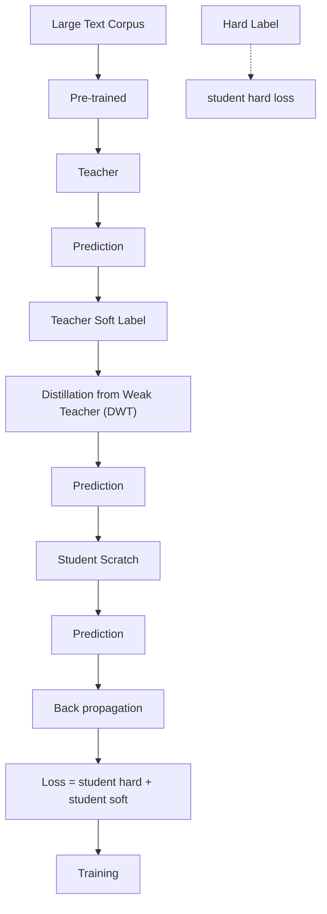

# A Study on Knowledge Distillation from Weak Teacher for Scaling Up Pre-trained Language Models

Hayeon Lee $^{1*}$ Rui Hou $^{2}$ Jongpil Kim $^{2}$ Davis Liang $^{2}$ Sung Ju Hwang $^{1}$ Alexander Min $^{2}$ KAIST $^{1}$ Meta AI $^{2}$

hayeon926@kaist.ac.kr rayhou@meta.com jpkim.ad@gmail.com davis@abridge.com sjhwang82@kaist.ac.kr alexmin@meta.com

# Abstract

Distillation from Weak Teacher (DWT) is a method of transferring knowledge from a smaller, weaker teacher model to a larger student model to improve its performance. Previous studies have shown that DWT can be effective in the vision domain and natural language processing (NLP) pre-training stage. Specifically, DWT shows promise in practical scenarios, such as enhancing new generation or larger models using pre-trained yet older or smaller models and lacking a resource budget. However, the optimal conditions for using DWT have yet to be fully investigated in NLP pre-training. Therefore, this study examines three key factors to optimize DWT, distinct from those used in the vision domain or traditional knowledge distillation. These factors are: (i) the impact of teacher model quality on DWT effectiveness, (ii) guidelines for adjusting the weighting value for DWT loss, and (iii) the impact of parameter remapping as a student model initialization technique for DWT.

# 1 Introduction

Recently, Distillation from Weak Teacher (DWT) (Yuan et al., 2020; Qin et al., 2022), a reversed Knowledge Distillation (KD) technique, has gained attention from researchers. Unlike the traditional KD (Sanh et al., 2019; Wang et al., 2020b,a; Sun et al., 2019; Jiao et al., 2020), which compresses a pre-trained model by transferring its knowledge to a smaller model, DWT distills knowledge from a smaller (or weaker) pre-trained model to a larger model to improve its quality during training.

DWT is well-suited for practical real-world scenarios such as:

\- Train a larger (scaled-up) model with an existing (smaller) pre-trained model to improve model quality using the same dataset.

\- Train a new, large-scale model with an old, smaller model to improve performance using the same dataset.

\- It is not feasible to use a large teacher model during KD training due to training resource constraints.

For the above cases, DWT can utilize the existing pre-trained models and improve the learning of new (larger) models.

Studies (Yuan et al., 2020; Qin et al., 2022) have shown that DWT allows a larger student model to leverage the knowledge of a weaker, smaller pre-trained teacher model in both the computer vision and NLP pre-training stages. While previous research by Qin et al. (2022) has demonstrated the potential of DWT in the NLP domain, it did not fully explore the key aspects of DWT such as the impact of teacher model quality and a student model initialization technique for DWT.

However, to truly unlock the potential of DWT for real-world applications, we need a deeper understanding of the key conditions and factors that contribute to its performance. For example, the effect of DWT might differ from traditional KD and potentially harm the student model, depending on the quality of its teacher.

Therefore, this work conducts in-depth studies and uncovers crucial insights to optimize DWT in the pre-training stage of NLP as follows:

\- First, we investigate the effectiveness of DWT in relation to the quality of the teacher model. We find that an extremely weak teacher can negatively impact the student model's quality, which is different from the vision domain where even an extremely weak teacher still improves performance (Yuan et al., 2020).

\- Second, we examine the impact of distillation by adjusting the weighting value of the soft loss. We demonstrate that adjusting the weighting value for the DWT loss (soft loss)

flowchart

Figure 1: Illustration of DWT Framework. During the pre-training stage, the larger student model can learn from the knowledge and expertise of the small or weak teacher model, enabling it to achieve better performance on various downstream tasks compared to training it standalone.

can improve training speed but may lead to suboptimal performance. To mitigate this issue, we recommend starting with a large weighting value and gradually decaying it during training.

\- Lastly, we study the effectiveness of Parameter Remapping (PR) (Chen et al., 2015; Cai et al., 2018; Fang et al., 2020a; Lee et al., 2022), which is a popular student parameter initialization technique for conventional KD, as an initialization technique for DWT. We observe that PR leads to suboptimal solutions, contrary to its effectiveness in conventional KD scenarios. Random initialization is better than PR for DWT.

We believe that these observations provide useful guidelines to better utilize DWT techniques for real-world applications.

# 2 Distillation from Weak Teacher

In this section, we formulate the Distillation from Weak Teacher (DWT) strategy, which involves training the target (student) model using both the teacher's predictions (soft labels) and the ground truth (hard labels).

Task Given a classification task with c classes, for each training instance x and its corresponding ground truth label y, the ground truth distribution over the labels is denoted as $q(c|x)$ (abbreviated as $q(c)$ ) where for each label c in the set $\{1...C\}$ , $q(y)=1$ and $q(c)=0$ for all c not equal to y.

Model The teacher model, with learnable parameters $\omega$ , and the student model, with learnable parameters $\theta$ , are utilized to predict the probability of each label c for a given instance x. The probability predicted by the teacher model, denoted as $p_{\omega}^{\tau}(c|x)$ , and the probability predicted by the student model, denoted as $p_{\theta}^{\tau}(c|x)$ , are expressed as follows:

$$
p _ {\omega} ^ {\tau} (c | x) = \text {softmax} (\boldsymbol {z} ^ {\omega}) = \frac {\exp (z _ {c} ^ {\omega} / \tau)}{\sum_ {i = 1} ^ {C} \exp (z _ {i} ^ {\omega} / \tau)}
$$

$$
p _ {\pmb {\theta}} ^ {\tau} (c | x) = s o f t m a x (\pmb {z} ^ {\pmb {\theta}}) = \frac {\exp (z _ {c} ^ {\pmb {\theta}} / \tau)}{\sum_ {i = 1} ^ {C} \exp (z _ {i} ^ {\pmb {\theta}} / \tau)}
$$

where $z^{\omega} = \{z_{i}^{\omega}\}_{i=1}^{C}$ is the output logit of the teacher model, $z^{\theta} = \{z_{i}^{\theta}\}_{i=1}^{C}$ is the output logit of the student model, and $\tau$ is the temperature used to soften the probabilities $p_{\omega}(c)$ and $p_{\theta}(c)$ .

Weak (Small) Teacher We assume that the parameter of the teacher model is pre-trained as $\omega^{*}$ . While conventional KD typically assumes that the size of the teacher model is larger than or equal to the size of the student model, i.e., $|\omega^{*}| \geq |\theta|$ , DWT considers the case where the size of the teacher model is smaller than the size of the student model, i.e., $|\omega^{*}| < |\theta|$ , or the quality of the pre-trained teacher model with parameters $\omega^{*}$ is inferior to the quality of the pre-trained student model with parameters $\theta^{*}$ obtained through stand-alone training.

Hard Loss is the cross-entropy loss $H(q, p_{\theta})$ between the ground truth $q$ and student's prediction $p_{\theta}$ , used to train the student model:

$$
H (q, p _ {\boldsymbol {\theta}}) = - \sum_ {c = 1} ^ {C} q (c) \log (p _ {\boldsymbol {\theta}} (c)) \tag {1}
$$

Following BERT (Devlin et al., 2019), $H(q, p_{\theta})$ is the Masked Language Modeling loss (MLM loss).

Soft Loss is the Kullback-Leibler divergence (KL divergence) $S(p_{\omega}^{\tau}, p_{\theta}^{\tau})$ between the predictions of the student and the teacher models, and is given by:

$$
S (p _ {\boldsymbol {\omega}} ^ {\tau}, p _ {\boldsymbol {\theta}} ^ {\tau}) = \sum_ {c = 1} ^ {C} p _ {\boldsymbol {\omega}} ^ {\tau} (c) \cdot \log \frac {p _ {\boldsymbol {\omega}} ^ {\tau} (c)}{p _ {\boldsymbol {\theta}} ^ {\tau} (c)}, \tag {2}
$$

bar_line

| Teacher Model Size (M) | Performance GAP w/ stand-alone | Performance GAP w/ stand-alone | Stand-alone (baseline) |
| :--- | :--- | :--- | :--- |
| Extremely Weak | 54.0 | -2.76 | 80.0 |
| Very Weak | 66.0 | -1.37 | 79.0 |
| Weak | 77.0 | 1.44 | 81.33 |
| Red Box | 77.66 | 79.89 | 79.0 |

Figure 2: Impact of Teacher Quality [Red Box] The Weak teacher model significantly improves the performance of the student model by 1.44, increasing from 79.89 to 81.33. However, distillation from Very Weak or Extremely Weak teachers has a negative impact on the performance of the student.

Final Objective The objective function $\mathcal{L}(\theta)$ aims to train the student model by minimizing a weighted sum of the hard loss and the soft loss:

$$
\mathcal {L} (\boldsymbol {\theta}) = \alpha_ {h} \cdot H (q, p _ {\boldsymbol {\theta}}) + \alpha_ {s} \cdot S (p _ {\boldsymbol {\omega}} ^ {\tau}, p _ {\boldsymbol {\theta}} ^ {\tau}) \tag {3}
$$

where the weighting hyperparameters for the hard loss and the soft loss are denoted by $\alpha_{h}$ and $\alpha_{s}$ , respectively.

# 3 Experiment

We conducted a study to analyze the efficacy of the DWT method and present key observations for optimizing its impact in three core elements: (i) the quality of the teacher model, (ii) the degree of soft knowledge transfer, and (iii) the initialization type (parameter remapping) of the student model.

Training setting we use a default loss weight ratio of $\alpha_{h} : \alpha_{s} = 1:1$ for the hard loss and soft loss during distillation. The learning rate is set to 5e-4, and the models are trained for 20 epochs with the application of quantization, linear warm-up (5%), the Adam optimizer (Kingma and Ba, 2014), 16 batch sizes per GPU, and 8 A100 GPUs per run. In the pre-training stage, we utilize a reduced dataset of 30 million sentences generated by uniformly selecting one sentence out of every four sentences from the original dataset, which consists of a combination of BookCorpus (Zhu et al., 2015) and Wikipedia (Foundation). The performance of the distilled models is evaluated on the dev sets of the GLUE benchmark (Wang et al., 2019), comprising nine sentence-level classification tasks (Please see the supplementary file for more details.).

# 3.1 Impact of Teacher Model Quality

In Figure 2, we examine the performance of distilled student models based on the quality of the teacher model. We conduct a distillation from a teacher model during the pre-training stage and fine-tune the distilled student models on the dev sets of the GLUE benchmark. We report the average performance and the performance gap between the distilled student and a student trained standalone. We categorize the weak teacher quality into three levels compared to the standalone student model, which has a model size of 67M and achieves an average performance of 79.89 on the GLUE benchmark dev sets.

1) Weak: 0.78× smaller size, -2.23 lower performance   
2) Very Weak: 0.57× smaller size, -13.44 lower performance   
3) Extremely Weak: 0.46× smaller size, -26.02 lower performance.

While distillation from weak teachers, even extremely weak ones, consistently improves the performance of the student model in the vision field due to the regularization effect (Yuan et al., 2020), we found that in language model pre-training, the effectiveness of DWT on the student model heavily depends on the quality of the teacher model. The student model (the red mark) clearly benefits from the Weak teacher model (score is 77.66), represented by the blue mark in the red box, as it shows an improvement of 1.44 points, from 79.89 to 81.33. However, when the performance gap between the teacher and student is too large, such as in the cases of Very Weak and Extremely Weak teachers, distillation from these teachers may negatively impact the student's performance by -1.37 and -2.76, respectively. Our observations provide valuable guidance for researchers aiming to utilize existing pre-trained models in training new models.

# 3.2 The Impact of Soft Loss

In Figure 3, we investigate the impact of the soft loss in DWT during the pre-training stage by adjusting the weights in the following two versions: (1) Strong: We fix the weight for the hard loss at 1 and multiply the weight for the soft loss by 4 to increase the intensity of distillation. (2) Normal: The ratio between the hard loss and soft loss is equal, with the soft loss weight set to 1. Finally, we fine-tune the models pre-trained with different soft loss weights on the GLUE benchmark tasks.

line

| Pretraining Epoch | Strong | Normal |
| ----------------- | ------ | ------ |
| 0                 | 77.0   | 76.5   |
| 2                 | 79.5   | 78.0   |
| 4                 | 79.3   | 78.5   |
| 6                 | 79.2   | 78.8   |
| 8                 | 79.0   | 78.6   |
| 10                | 79.1   | 78.9   |
| 12                | 78.9   | 79.0   |
| 14                | 78.8   | 79.1   |
| 16                | 78.9   | 79.2   |
| 18                | 79.0   | 79.3   |

line

| Pretraining Epoch | Strong | Normal |
| ----------------- | ------ | ------ |
| 0                 | 36     | 34     |
| 2                 | 40     | 42     |
| 4                 | 40     | 42     |
| 6                 | 40     | 42     |
| 8                 | 38     | 42     |
| 10                | 40     | 42     |
| 12                | 40     | 44     |
| 14                | 40     | 46     |
| 16                | 40     | 47     |
| 18                | 41     | 47     |

line

| Pretraining Epoch | Strong | Normal |
| ----------------- | ------ | ------ |
| 0                 | 88.7   | 88.6   |
| 2                 | 89.4   | 89.3   |
| 4                 | 89.6   | 89.4   |
| 6                 | 89.4   | 89.3   |
| 8                 | 89.5   | 89.4   |
| 10                | 89.4   | 89.5   |
| 12                | 89.5   | 89.6   |
| 14                | 89.5   | 89.6   |
| 16                | 89.5   | 89.6   |
| 18                | 89.4   | 89.6   |

line

| Pretraining Epoch | Strong | Normal |
| ----------------- | ------ | ------ |
| 0                 | 88.0   | 88.0   |
| 2                 | 89.0   | 90.0   |
| 4                 | 88.5   | 91.0   |
| 6                 | 90.5   | 90.5   |
| 8                 | 89.5   | 90.0   |
| 10                | 89.0   | 90.5   |
| 12                | 89.5   | 90.0   |
| 14                | 89.0   | 90.5   |
| 16                | 88.5   | 90.0   |
| 18                | 89.0   | 89.5   |

Figure 3: Adjusting Soft Loss Weight Unlike conventional KD, where using large weights for the soft loss improves training convergence speed and performance, DWT requires careful tuning of the loss weight. Using a large weight leads to faster convergence, but a small weight leads to better fine-tuning performance.

line

| Pretraining Epoch | PR (X) | PR (O) |
| ----------------- | ------ | ------ |
| 0                 | 76.5   | 77.0   |
| 2                 | 78.0   | 77.5   |
| 4                 | 78.5   | 77.8   |
| 6                 | 78.8   | 77.6   |
| 8                 | 79.0   | 77.4   |
| 10                | 79.2   | 77.3   |
| 12                | 79.3   | 77.5   |
| 14                | 79.4   | 77.6   |
| 16                | 79.5   | 77.4   |
| 18                | 79.6   | 77.3   |

line

| Pretraining Epoch | PR (X) | PR (O) |
| ----------------- | ------ | ------ |
| 0                 | 35     | 36     |
| 2                 | 42     | 35     |
| 4                 | 43     | 37     |
| 6                 | 42     | 37     |
| 8                 | 43     | 37     |
| 10                | 44     | 38     |
| 12                | 45     | 39     |
| 14                | 46     | 39     |
| 16                | 47     | 39     |
| 18                | 48     | 40     |

line

| Pretraining Epoch | PR (X) | PR (O) |
| ----------------- | ------ | ------ |
| 0                 | 88.6   | 88.9   |
| 2                 | 89.4   | 89.0   |
| 4                 | 89.3   | 89.0   |
| 6                 | 89.2   | 89.0   |
| 8                 | 89.3   | 89.0   |
| 10                | 89.4   | 89.0   |
| 12                | 89.5   | 89.1   |
| 14                | 89.6   | 89.2   |
| 16                | 89.6   | 89.0   |
| 18                | 89.6   | 89.0   |

line

| Pretraining Epoch | PR (X) | PR (O) |
| ----------------- | ------ | ------ |
| 0                 | 88.0   | 89.5   |
| 2                 | 90.5   | 89.0   |
| 4                 | 91.0   | 89.5   |
| 6                 | 90.5   | 89.0   |
| 8                 | 90.0   | 89.5   |
| 10                | 90.5   | 89.0   |
| 12                | 90.0   | 89.5   |
| 14                | 90.5   | 89.0   |
| 16                | 90.0   | 89.5   |
| 18                | 90.5   | 89.0   |

Figure 4: Impact of Parameter Remapping Unlike in conventional KD training, where parameter remapping (PR) (PR(O)) is effective, we found that PR hinders DWT training, leading to local optima. Even with continued pre-training, the fine-tuning performance does not improve. Therefore, random initialization (PR(X)) appears to be more beneficial for DWT.

Conventional KD has shown that using large weights for the soft loss can improve both training convergence and model performance (Sanh et al., 2019). However, we reveal that DWT requires careful tuning of the soft weights. Our observations show that using a large weight for the soft loss (Strong) leads to faster convergence in most downstream tasks (e.g., MNLI (Williams et al., 2018), COLA (Warstadt et al., 2019), QQP (Iyer et al., 2017), SST2 (Socher et al., 2013)) compared to using a small weight (Normal). However, as training continues, using a small weight for the soft loss (Normal) leads to better fine-tuning performance than using a large weight (Strong). Therefore, we believe that gradually decreasing the soft loss weights (e.g., from 4 to 1) during training would benefit both convergence and performance.

# 3.3 Impact of Parameter Remapping

Parameter remapping (PR) (Chen et al., 2015; Cai et al., 2018; Fang et al., 2020a,b) is a popular technique used in conventional KD methods. It involves copying the parameters of a pre-trained teacher model and initializing the student model with these parameters before starting KD training (See the supplementary file for more details.). PR can accelerate convergence speed and improve the final performance of the distilled model. For example, DistilBERT (Sanh et al., 2019) uniformly samples six layers out of twelve from the BERT model (teacher) and initializes the corresponding layers in DistilBERT (student) with the copied parameters.

In Figure 4, we investigate the effectiveness of PR for knowledge transfer from a smaller model to a larger model. Before DWT training, we copy parameters from the first four layers of the teacher model and paste them into the corresponding layers of the student model. Following the approach of Fang et al. (2020a,b), we also use the parameters of the last layer in the teacher model for the remaining fifth and sixth layers of the student model.

We initialize student models with PR (PR(O)) or randomly (PR(X)), train them with distillation on a large text corpus, and fine-tune the distilled student models on various downstream tasks. Experimental results show that, unlike in conventional KD training, PR (PR(O)) hinders DWT training, leading to local optima. With PR, the performance of the fine-tuned models does not improve even with continued pre-training. Therefore, random initialization (PR(X)) is more beneficial for DWT.

# 4 Conclusion

Distillation from Weak Teacher (DWT) is a technique that improves the performance of a larger student model by transferring knowledge from a weaker, smaller teacher model. Despite the potential of DWT, the optimal conditions to use DWT have yet to be fully investigated in NLP pre-training. This study investigated three crucial factors for optimizing DWT in NLP pre-training, which differ from those in vision or traditional KD. These factors include the impact of teacher model quality, the use of parameter remapping as an initialization technique for DWT, and guidelines for adjusting the weighting value of the DWT loss.

# Limitations

In this section, we faithfully discuss the current limitations and potential avenues for future research. First of all, in the analysis, we observed that giving heavy weight to the soft loss at initial training epochs improves the convergence speed. Yet, continuing training with such heavy weight to the soft loss could hinder the further performance improvement of the student. Therefore, adjusting soft loss weights depending on the training phase from a larger value to a small value (e.g., using the time function) would be helpful for both convergence speed and improving the model's quality.

Secondly, it has been demonstrated in the visual recognition domain that adjusting the temperature of distillation loss for poorly performed teachers can improve the student model quality due to the regularization effect. Following them, increasing the temperature to smooth the soft labels from poorly performed teachers, such as 1-layer or 2-layer teachers, would help improve the quality of distillation via the regularization effect.

# Ethics Statement

Our Distillation from Weak Teacher (DWT) framework facilitates enhancing larger student models through knowledge transfer from smaller, weaker teacher models. However, our research findings indicate that the effectiveness of the teacher model, particularly when it is extremely weak, can have a negative impact on the quality of the student model. Consequently, the utilization of our DWT framework should be approached with caution, particularly in high-risk domains like biomedicine. Evaluating performance prior to making critical decisions may be necessary.

# References

Han Cai, Tianyao Chen, Weinan Zhang, Yong Yu, and Jun Wang. 2018. Efficient architecture search by network transformation. In Proceedings of the AAAI Conference on Artificial Intelligence.   
Tianqi Chen, Ian Goodfellow, and Jonathon Shlens. 2015. Net2net: Accelerating learning via knowledge transfer. arXiv preprint arXiv:1511.05641.   
Jacob Devlin, Ming-Wei Chang, Kenton Lee, and Kristina Toutanova. 2019. BERT: pre-training of deep bidirectional transformers for language understanding. In Proceedings of the Conference of the

North American Chapter of the Association for Computational Linguistics: Human Language Technologies.   
Jiemin Fang, Yuzhu Sun, Kangjian Peng, Qian Zhang, Yuan Li, Wenyu Liu, and Xinggang Wang. 2020a. Fast neural network adaptation via parameter remapping and architecture search. In International Conference on Learning Representations.   
Jiemin Fang, Yuzhu Sun, Qian Zhang, Kangjian Peng, Yuan Li, Wenyu Liu, and Xinggang Wang. 2020b. Fna++: Fast network adaptation via parameter remapping and architecture search. IEEE Transactions on Pattern Analysis and Machine Intelligence.   
Wikimedia Foundation. Wikimedia downloads.   
Shankar Iyer, Nikhil Dandekar, and Kornel Csernai. 2017. First quora dataset release: Question pairs.   
Xiaoqi Jiao, Yichun Yin, Lifeng Shang, Xin Jiang, Xiao Chen, Linlin Li, Fang Wang, and Qun Liu. 2020. TinyBERT: Distilling BERT for natural language understanding. In Findings of Proceedings of the Conference on Empirical Methods in Natural Language Processing.   
Diederik P Kingma and Jimmy Ba. 2014. Adam: A method for stochastic optimization. arXiv preprint arXiv:1412.6980.   
Hayeon Lee, Sohyun An, Minseon Kim, and Sung Ju Hwang. 2022. Lightweight neural architecture search with parameter remapping and knowledge distillation. In First Conference on Automated Machine Learning (Late-Breaking Workshop).   
Yujia Qin, Yankai Lin, Jing Yi, Jiajie Zhang, Xu Han, Zhengyan Zhang, Yusheng Su, Zhiyuan Liu, Peng Li, Maosong Sun, and Jie Zhou. 2022. Knowledge inheritance for pre-trained language models. In Proceedings of the Conference of the North American Chapter of the Association for Computational Linguistics: Human Language Technologies.   
Victor Sanh, Lysandre Debut, Julien Chaumond, and Thomas Wolf. 2019. Distilbert, a distilled version of bert: smaller, faster, cheaper and lighter. arXiv preprint arXiv:1910.01108.   
Richard Socher, Alex Perelygin, Jean Wu, Jason Chuang, Christopher D Manning, Andrew Ng, and Christopher Potts. 2013. Recursive deep models for semantic compositionality over a sentiment treebank. In Proceedings of the Conference on Empirical Methods in Natural Language Processing.   
Siqi Sun, Yu Cheng, Zhe Gan, and Jingjing Liu. 2019. Patient knowledge distillation for BERT model compression. In Proceedings of the Conference on Empirical Methods in Natural Language Processing and the International Joint Conference on Natural Language Processing.

Alex Wang, Amanpreet Singh, Julian Michael, Felix Hill, Omer Levy, and Samuel R. Bowman. 2019. GLUE: A multi-task benchmark and analysis platform for natural language understanding. In International Conference on Learning Representations.   
Wenhui Wang, Hangbo Bao, Shaohan Huang, Li Dong, and Furu Wei. 2020a. Minilmv2: Multi-head self-attention relation distillation for compressing pretrained transformers. arXiv preprint arXiv:2012.15828.   
Wenhui Wang, Furu Wei, Li Dong, Hangbo Bao, Nan Yang, and Ming Zhou. 2020b. Minilm: Deep self-attention distillation for task-agnostic compression of pre-trained transformers. Advances in Neural Information Processing Systems.   
Alex Warstadt, Amanpreet Singh, and Samuel R. Bowman. 2019. Neural network acceptability judgments. Transactions of the Association for Computational Linguistics.   
Adina Williams, Nikita Nangia, and Samuel R Bowman. 2018. A broad-coverage challenge corpus for sentence understanding through inference. In Association for Computational Linguistics.   
Li Yuan, Francis EH Tay, Guilin Li, Tao Wang, and Jiashi Feng. 2020. Revisiting knowledge distillation via label smoothing regularization. In Proceedings of the IEEE/CVF Conference on Computer Vision and Pattern Recognition.   
Yukun Zhu, Ryan Kiros, Rich Zemel, Ruslan Salakhutdinov, Raquel Urtasun, Antonio Torralba, and Sanja Fidler. 2015. Aligning books and movies: Towards story-like visual explanations by watching movies and reading books. In Proceedings of the IEEE international conference on computer vision.

# A For every submission:

A1. Did you describe the limitations of your work?

Please refer to the Limitations Section (5page).

A2. Did you discuss any potential risks of your work?

We discussed it in the Limitations Section.

A3. Do the abstract and introduction summarize the paper's main claims?

Please refer to the Abstract and Introduction Sections (page 12).

√ A4. Have you used AI writing assistants when working on this paper?

We used ChatGPT. Since conclusion is too long, we revise it shortly by using ChatGPT.

# B ☑ Did you use or create scientific artifacts?

Section 3. Experiments.

B1. Did you cite the creators of artifacts you used?

Section 3. Experiments - training setting.

☐ B2. Did you discuss the license or terms for use and / or distribution of any artifacts?

Not applicable. Left blank.

B3. Did you discuss if your use of existing artifact(s) was consistent with their intended use, provided that it was specified? For the artifacts you create, do you specify intended use and whether that is compatible with the original access conditions (in particular, derivatives of data accessed for research purposes should not be used outside of research contexts)?

Section 3. Experiments - training setting.

☐ B4. Did you discuss the steps taken to check whether the data that was collected / used contains any information that names or uniquely identifies individual people or offensive content, and the steps taken to protect / anonymize it?

Not applicable. Left blank.

B5. Did you provide documentation of the artifacts, e.g., coverage of domains, languages, and linguistic phenomena, demographic groups represented, etc.?

Section 3. Experiments - training setting.

B6. Did you report relevant statistics like the number of examples, details of train / test / dev splits, etc. for the data that you used / created? Even for commonly-used benchmark datasets, include the number of examples in train / validation / test splits, as these provide necessary context for a reader to understand experimental results. For example, small differences in accuracy on large test sets may be significant, while on small test sets they may not be.

Section 3. Experiments - training setting.

# C ☑ Did you run computational experiments?

Section 3. Experiments - training setting

☑ C1. Did you report the number of parameters in the models used, the total computational budget (e.g., GPU hours), and computing infrastructure used?

Section 3. Experiments - training setting, Section 3.1

C2. Did you discuss the experimental setup, including hyperparameter search and best-found hyperparameter values?

Section 3. Experiments - training setting, Section 3.1, 3.2, 3.3

☑ C3. Did you report descriptive statistics about your results (e.g., error bars around results, summary statistics from sets of experiments), and is it transparent whether you are reporting the max, mean, etc. or just a single run?

It is a single run due to the large time of training.

☐ C4. If you used existing packages (e.g., for preprocessing, for normalization, or for evaluation), did you report the implementation, model, and parameter settings used (e.g., NLTK, Spacy, ROUGE, etc.)?

Not applicable. Left blank.

D ☒ Did you use human annotators (e.g., crowdworkers) or research with human participants?

Left blank.

☐ D1. Did you report the full text of instructions given to participants, including e.g., screenshots, disclaimers of any risks to participants or annotators, etc.?

No response.

☐ D2. Did you report information about how you recruited (e.g., crowdsourcing platform, students) and paid participants, and discuss if such payment is adequate given the participants' demographic (e.g., country of residence)?

No response.

D3. Did you discuss whether and how consent was obtained from people whose data you're using/curating? For example, if you collected data via crowdsourcing, did your instructions to crowdworkers explain how the data would be used?

No response.

☐ D4. Was the data collection protocol approved (or determined exempt) by an ethics review board?

No response.

☐ D5. Did you report the basic demographic and geographic characteristics of the annotator population that is the source of the data?

No response.