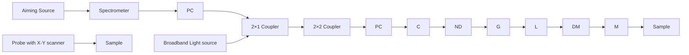

A practical approach to eliminate autocorrelation artefacts for volume-rate spectral domain optical coherence tomography

This content has been downloaded from IOPscience. Please scroll down to see the full text.

2006 Phys. Med. Biol. 51 3231

(http://iopscience.iop.org/0031-9155/51/12/015)

View the table of contents for this issue, or go to the journal homepage for more

Download details:

IP Address: 66.194.72.152

This content was downloaded on 05/01/2015 at 01:54

Please note that terms and conditions apply.

# A practical approach to eliminate autocorrelation artefacts for volume-rate spectral domain optical coherence tomography

Ruikang K Wang $^{1,2}$ and Zhenhe Ma $^{1,2}$

$^{1}$ Department of Biomedical Engineering, Oregon Health & Science University, Beaverton, OR 97006, USA $^{2}$ Institute of Lasers and Optoelectronics, College of Precision Instrument and Opto-Electronics Engineering, Tianjin University, Tianjin 300072, People's Republic of China

E-mail: r.k.wang@bme.ogi.edu

Received 23 February 2006

Published 6 June 2006

Online at stacks.iop.org/PMB/51/3231

# Abstract

A simple method is introduced to eliminate the autocorrelation artefacts in ultrafast spectral domain optical coherence tomography (SOCT) by use of the ensemble average of spectra within an individual B scan as the background signal, and then subtracting this from all the A scans within that B scan before performing the FFTs. This is updated continuously frame by frame. The method is tested on a volume-rate (C-mode) SOCT system to image the human fingertip in vivo with a volume rate at 8 s.

(Some figures in this article are in colour only in the electronic version)

# 1. Introduction

Fourier domain techniques in optical coherence tomography (OCT) (Tomolins and Wang 2005, Fercher et al 1995, Chinn et al 1997) have recently received a great deal of interest in the biomedical imaging research community due to their significant sensitivity and imaging speed advantages (Leitgeb et al 2003, Choma et al 2003) over time domain OCT (Wang et al 2001, Wang and Elder 2002). Fourier domain OCT acquires the optical spectrum of the interferometric signal between sample and reference lights to achieve the depth range in a sample, biological tissue for example, without a need to perform the scanning of optical delay in the reference arm. Based on the type of light source and detector combination used, there are two primary, but fundamentally identical, implementations in the Fourier domain OCT, i.e. spectral domain OCT (SOCT) (Fercher et al 1995) and frequency domain OCT (Chinn et al 1997). SOCT utilizes the low coherence light source standard in the time domain OCT systems, but in the detector arm employs an optical dispersion element to disperse the interferometric spectrum that is then impinged onto an array detector, for example a CCD

array (Tomolins and Wang 2005, Fercher et al 1995). Recent progress in SOCT has seen a readout rate of $29\mathrm{kHz}$ using a line-scan CCD camera, providing an A-scan rate equivalent to hundreds of metres per second (Nassif et al 2004a, 2004b) and making the volume-rate OCT imaging possible. Such a scan rate is however difficult, if not impossible, to be realized by a high-speed time domain OCT that employs the rapid grating-based optical delay line (Tearney et al 1997).

However, SOCT has a disadvantage in that it possesses the inherent autocorrelation noise and complex conjugate image (or mirror image) in the final results that undoubtedly make the interpretation of image difficult and degrade the system performance. To solve this problem, methods have been proposed to develop full range complex OCT by obtaining the complex field of the object elementary waves through retrieving the phase information. This can be achieved by modulating the phase delay in the reference arm through either a phase modulator to shift the interference frequency (Zhang et al 2005) or a piezo-actuator to induce phase changes in the interferogram by a number of phase steps (Wojtkowski et al 2002, Ma et al 2005, 2006). While these methods are efficient in eliminating the imaging artefacts in SOCT, the requirement of long data-processing time in the phase modulation approach or the extra measurement time needed to step the phases for the phase shifting method prohibits the usage of these methods in ultrafast scanning and real-time display, e.g. volume-rate OCT imaging.

In this paper, we introduce a simple but practical approach to eliminate the autocorrelation artefacts in the SOCT suitable for volume-rate SOCT imaging and screen displaying. The theoretical aspects relevant to this approach are first described based on the theory of SOCT. We then experimentally demonstrate the feasibility of the proposed approach by in vivo imaging of a fingertip with an imaging area of $3 \times 3 \, mm^{2}$ at a volume rate of 8 s using a home-built SOCT system.

# 2. Theoretical aspects

In SOCT, a low coherence light beam originating from a broadband light source is split into two beams in a Michelson interferometer. One beam acts as the reference beam, and another penetrates the object along the z-axis that is subsequently backscattered from the layers located at different depths (z-axis). In other words, this backscattering light from the object consists of many elementary waves emanating from different depths. It is then superimposed with the quasi-plane wave from the reference beam. At the exit of the interferometer, a spectrometer locally disperses the interferometric signal because the signal consists of different wavelengths $\lambda$ within a specified optical frequency band $\Delta\lambda$ , which are subsequently captured by an array detector, usually a line-scan CCD camera. The light intensity incident upon each element of the line-scan camera is proportional to the spectral density $I(\lambda)$ of the combined reference and sample light. The interference signal $I(\lambda)$ in k space can be written as

$$
I (k) = \left| E _ {r} (k) + \int_ {- \infty} ^ {\infty} a (z) \exp (\mathrm{i} 2 k n z) \mathrm{d} z \right| ^ {2} = I ^ {\prime} (k) + E _ {r} \int_ {- \infty} ^ {+ \infty} a (z) \cos (2 k n z) \mathrm{d} z \tag {1}
$$

where $E_r$ is the amplitude of reference light, $n$ is the refractive index of the sample, $a(z)$ is the scattering amplitude of elementary waves versus depth $z$ and

$$
I ^ {\prime} (k) = E _ {r} ^ {2} (k) + \int_ {- \infty} ^ {\infty} \int_ {- \infty} ^ {\infty} a (z) a (z ^ {\prime}) \cos [ 2 k (n z - n z ^ {\prime}) ]   \mathrm{d} z   \mathrm{d} z ^ {\prime}. \tag {2}
$$

It can be seen that $I(k)$ in equation (1) is a sum of three terms. The first two terms are represented by equation (2) consisting of a constant dc offset, $E_r^2$ , which is the autocorrelation

of the spectrum of the light source, and the mutual interference of all elementary waves backscattered from the object. These are the artefacts appearing in the final OCT image. The last term in equation (1) contains the interference between the reference light and the scattered sample light from which an OCT A scan is calculated by Fourier transformation. Note that the Fourier transformation requires even sampling in k space. In a spectrometer, however, the spectrum is evenly spaced in the wavelength domain. Thus the raw spectra acquired by the CCD camera have to be interpolated into the even k space so that the undistorted A-scan OCT signal is retrieved.

From equation (1), the simplest method to eliminate the artefacts in the OCT image is to acquire the signals from the system by blocking the sample beam and reference beam sequentially, and then subtract these from the interferogram formed between reference and sampling lights. This method would require such a procedure to be performed at each A scan, and is thus not realistic in the real-time imaging and display. To achieve real-time display of the acquired OCT image, researchers usually capture the light source spectrum as the background signal at the beginning of performing the OCT scanning by blocking the sample beam only. This light source spectrum is then subtracted from every spectrum captured during imaging. This simple approach is efficient and fast, but assumes that (1) the light spectral density incident on the detector is stable over the whole imaging period, (2) the CCD camera itself does not introduce any artefacts in the OCT image, and (3) the backscattering light intensity is much weaker than the reference light so that the interferogram is dominated by the interference between the reference and backscattering sample lights. Normally, the third condition can be easily fulfilled if the reference light energy is adjusted to be much stronger than that backscattered from the biological sample. Because in the spectral domain OCT, the light is dispersed onto an array detector of N pixels, each detector only receives I/N light energy in the interferometer. In this case, the shot noise and detector noise will dominate in the signal noise rather than in the time domain system where the light intensity noise dominates. Therefore, it is practical that the third condition is satisfied in experiments.

The first and second conditions are however practically difficult to achieve, particularly condition (1) because it is highly dependent on the experimental conditions, for example the room temperature fluctuation, system vibrations etc, that would affect the light delivery in the fibre-based OCT system. Therefore, such a simple approach is often problematic in practice for real-time in vivo imaging applications.

Let us look closely at equations (1) and (2), both the equations have the cosine terms. Because the biological tissue is usually heterogeneous at microscopic scale, the cosine terms will fluctuate randomly from one A scan to another in every B scan (an OCT cross-sectional image). This fluctuation of the cosine term can be assumed as a random signal over the entire span of one B scan (by assuming heterogeneity of the sample). Thus, if an ensemble average of all the A scans in the individual B scan is performed, the summation of the cosine terms would approach to zero, leaving only the constant term. As a result, when we sum all the A scans in the B scan, we have

$$
I _ {\mathrm{av}} \sim E _ {r} ^ {2} (k). \tag {3}
$$

Thus, the autocorrelation noise term in equation (1) can be eliminated by simply subtracting equation (3) from all the captured A-scan spectra before performing the interpolation and FFT operations. Note that the fixed noise induced by the CCD itself is embedded in equation (3) also because the CCD fixed noise is constant; thus the subtraction operation can successfully remove this noise from the final OCT image. Note also that in the volume-rate imaging, the time spent on obtaining a B scan is relatively short, around 17 ms in the system described below. As such, the light source spectral density incident upon the detector can reasonably be

flowchart

Figure 1. Schematic of the ultrafast SOCT system used in the study, where PC denotes the polarization controller, C is the collimator, ND is the neutral density filter, G is the grating, DM is the double pass mirror, L is the lens, and M is the reflection mirror. The spectrometer consists of a collimating lens of 30 mm focal length, 1200 lines mm $^{-1}$ diffraction grating, a focusing lens of 150 mm focal length, and a line-scan camera of 2048 pixel array.

considered as a constant in each individual B scan. Therefore, conditions (1) and (2) described in section 2 are met.

As can be seen from the above, this approach only requires the summation and subtraction operations, thus the computation time involved would be at the minimum. This is particularly important because the computation time is critical in successfully retrieving B scan images for displaying in the volume-rate OCT imaging.

# 3. Experimental set-up

A schematic of the experimental system used in this investigation is illustrated in figure 1. A superluminescent diode (SLD 371-HP, Superlum Diodes Ltd, Moscow, Russia) with a central wavelength of 842 nm and FWHM bandwidth of 50 nm was used as the low coherence broadband light source to illuminate the system. This light source results in a measured axial resolution of 9 $\mu$ m in air. After passing through an isolator (not shown in the figure) and 1 × 2 fibre coupler, the light was coupled into a fibre-based Michelson interferometer. The light was split into the sample and reference arms by a 3 dB 2 × 2 coupler. The reference light was coupled into a double pass grating-based rapid scanning system (Tearney et al 1997). However, unlike the time domain OCT system, the reference mirror in the scanning system was kept stationary in the current system. This double pass grating-based system was solely used to efficiently compensate the second-order dispersion in the system. The sample light was coupled into a probe, consisting of an X–Y scanner and the optics to deliver the sample light onto and collect the light backscattered from the sample. The X–Y scanner was driven by a triangular wave (30 Hz) in the X direction and a sawtooth wave (1/8 Hz) in the Y direction. The lateral resolution of imaging was approximately 20 $\mu$ m determined by the focusing optics.

Light returning from the reference and sample arms was recombined and sent to a home-built high-speed spectrometer, consisting of a 30 mm focal length collimator, a 1200 lines mm $^{-1}$ diffracting grating (Edmund Optics Ltd) and an achromatic focusing lens with 150 mm focal length. The focused light spectrum was impinged onto a line-scan CCD camera (Basler Vision Tech Germany) consisting of 2048 pixels, each $10 \times 10 \mu m^{2}$ in size

and 10 bits in digital depth. Polarization controllers were used in the reference, sampling and detection arms in order to maximize the interference fringe contrast at the detector. The light energy in the reference arm was controlled by a variable neutral density filter before reaching the detection arm, so that the maximum intensity on the linear array detector achieved approximately $85\%$ of the camera's saturation level of $4.6\mathrm{nW / pixel}$ . The remaining $15\%$ of the dynamic range of the camera was available to fill up the interference fringes. This arrangement would satisfy condition (3) described in section 2. The spectrometer has a designed spectral resolution of $0.055\mathrm{nm}$ , resulting in an imaging depth of approximately $3.2\mathrm{mm}$ in air. The signal sensitivity was measured at $95\mathrm{dB}$ when the camera integration time was set at $34.1~\mu \mathrm{s}$ . Due to the finite size of pixels in the camera, the signal drop off at $z = 2\mathrm{mm}$ was measured at $16\mathrm{dB}$ , and at $3\mathrm{mm}$ this amounted to $33\mathrm{dB}$ for the current system. Note that these quantitative performance indicators were obtained without performing averaging of a number of A scan profiles and using the zero padding method as described in other papers (Nassif et al 2004a, 2004b).

The camera captures the interference spectrum at a line rate of 29.2 kHz (i.e. 29.2k A scans per second). The B scan OCT image consists of 500 consecutive spectra at a span of 3 mm lateral distance, controlled by the X scanner, enabling a frame rate of 58 frames per second (fps). The excursion of the beam spot in the Y direction on the sample was 3 mm controlled by the Y scanner but synchronized with the X scanning. The C scan rate (volume rate) achieved was approximately 8 s in the current system.

The spectral data were downloaded to the host computer memory from the CCD camera via CameraLink $^{TM}$ and a high-speed frame grabber board (PCI 1428, National Instruments). The data handling and processing was controlled by two separate programming threads under the Labview environment. The data handling thread consists of controlling the data acquisition and downloading the data from the camera into the buffer in real time, which are subsequently continuously saved into the hard disk of the host computer. The data-processing thread ran independently and consists of downloading the spectra data from the buffer and performing FFTs to display them in a B-mode imaging format onto the screen. The ensemble spectral average and subtraction operations were performed immediately after downloading each B-scan spectrum (500 A scans) from the buffer. Before the FFT, the processed spectra data were re-sampled into the k space evenly distributed. Due to the heavy computation load for data re-sampling, the data-processing thread processed and displayed the frames at an update rate of 5 fps. Notwithstanding this, continuously streaming the data into the hard disk at a rate of 58 fps was not disrupted because the individual threads were run independently.

# 4. Results

A glass slide with a thickness of approximately 1.5 mm was first used to demonstrate the approach described in section 2. The slide was mounted at a slight angle with respect to the plane perpendicular to the incident beam. To simulate the in vivo situation, an area of $3 \times 3 \, mm^2$ was scanned, consisting of 500 B scans, each consisting of 500 A scans. Before the scanning, one spectrum was acquired by blocking the sampling beam and then stored in the computer as the background signal for later data processing. One profile of a depth scan (A scan) was randomly selected from the above. Figure 2 illustrates such a profile, where (a) resulted from the approach without any subtraction operations, (b) from the method by subtracting the background signal from the selected spectrum, and (c) from the method described in section 2, i.e. subtracting the selected spectrum by the ensemble average of the spectra in the B scan which this A scan belongs to. It can be seen that the proposed method is efficient in eliminating the autocorrelation noise terms. However, due to the camera fixed

line

| Depth (mm) | OCT signal |
| ---------- | ---------- |
| 0.0        | ~10^4      |
| 0.5        | ~10^3      |
| 1.0        | ~10^2      |
| 1.5        | ~10^2      |
| 2.0        | ~10^1      |

(a)

line

| Depth (mm) | OCT signal |
| ---------- | ---------- |
| 0.0        | ~10^2      |
| 0.5        | ~10^3      |
| 1.0        | ~10^2      |
| 1.5        | ~10^2      |
| 2.0        | ~10^1      |

(b)

line

| Depth (mm) | OCT signal |
| ---------- | ---------- |
| 0.0        | ~10^3      |
| 0.5        | ~10^2      |
| 1.0        | ~10^2      |
| 1.5        | ~10^2      |
| 2.0        | ~10^2      |

(c)   
Figure 2. SOCT A scan profile of a glass slide computed (a) without any subtraction operations, (b) with the subtraction of background signal captured by blocking the sampling beam before the scanning takes place, and (c) with the approach described in section 2. Note that the vertical axis represents the value of interference amplitude.

term noise and light energy fluctuation on the detector, the conventional subtraction method by blocking the sampling beam before the imaging took place was not so efficient in eliminating the autocorrelation noise, as shown in figure 2(b).

Next, we tested the method on a volunteer's fingertip in vivo. Figure 3 shows a typical B scan OCT image. Figure 3(a) resulted from the conventional SOCT method, i.e. without any subtraction operations, where the noise terms at the bottom are severe due to the autocorrelation and other noises. With the application of subtraction of background signal stored before the imaging took place, the result is given in figure 3(b) where it can be seen that most of the noise terms are greatly attenuated but not eliminated. This is probably due to the light intensity fluctuation impinged onto the detector caused by room temperature changes and system vibration that affect the light transmission in the optical fibres used. Particularly, the fixed term noise near the depth at $1.5\mathrm{mm}$ is very strong, which may result from the CCD fixed pattern noise. Figure 3(c) shows the result from the method described in section 2, where it is clear that the autocorrelation noise and camera fixed noise terms are efficiently eliminated. This further demonstrates that the proposed approach is efficient and practical.

Figure 4 gives a three-dimensional (3D) volume representation of the OCT image captured by the system. Due to the computer memory limitation, the image was re-sampled down to

heatmap

| B scan span (mm) | A scan depth (mm) |
| ---------------- | ----------------- |
| 0                | 0                 |
| 0.5              | 0.5               |
| 1                | 1                 |
| 1.5              | 1.5               |

(a)

scatter

| B scan span (mm) | A scan depth (mm) |
| ---------------- | ----------------- |
| 0                | 0                 |
| 1                | 0.5               |
| 2                | 1                 |
| 3                | 1.5               |

(b)

heatmap

| A scan depth (mm) | B scan span (mm) | Value |
| ----------------- | ---------------- | ----- |
| 0.5               | 1                | 0     |
| 0.5               | 2                | 0     |
| 0.5               | 3                | 0     |
| 1                 | 1                | 0     |
| 1                 | 2                | 0     |
| 1                 | 3                | 0     |
| 1.5               | 1                | 0     |
| 1.5               | 2                | 0     |
| 1.5               | 3                | 0     |

(c)

Figure 3. The same as in figure 2, but with a human fingertip in vivo.   

surface_3d

| X (B scan) | Y (C scan) | Z (A scan) |
| ---------- | ---------- | ---------- |
| 150        | 100        | 50         |
| 100        | 150        | 100        |
| 50         | 200        | 150        |

(a)

text_image

200
150 X
100
50
100
150 Y
200
100
150 Y
z
100
150
200

(b)   
Figure 4. 3D volume representation of SOCT volume image scanned from a human fingertip in vivo: (a) the B scan view and (b) the en face view. The volume size shown is $3 \times 3 \times 1.3 \mathrm{~mm}^3$ in X, Y and Z directions.

$220 \times 250 \times 512$ from $500 \times 500 \times 1024$ pixel arrays ( $X \times Y \times Z$ ), and the images were cropped to remove the autocorrelation peak at zero position and also the upper portion of the image that is not used. The final image size shown is $220 \times 250 \times 210$ pixel arrays, equivalent to a physical volume dimension of $3 \times 3 \times 1.3 \text{ mm}^3$ . The 3D image was displayed as greyscale coded over 50 dB where the minimum was set at 25 dB and the maximum at 50 dB. Figure 4(a) clearly shows the anatomically important layers of human skin, such as stratum corneum, epidermis and dermal layers in 3D, in addition the sweat glands are also visualized. Figure 4(b) gives another view of this 3D volume representation by looking into the skin (en face view) from left to right, where it shows clearly the stratified epidermal–dermal junction in the middle of the frames given.

By collapsing the depth signal together, it has been demonstrated that the SOCT integrated image can be used to perfectly mimic the fund camera image in the retinal imaging (Jiao et al 2005). We have also adopted this method in viewing the SOCT integrated skin images, and found that it can be used to visualize the sweat gland pore size and density in the scanned areas. Figure 5 shows such an image derived from figure 4 by integrating the depth signal to form an integrated X–Y view of the SOCT image, where one can see that the sweat gland pores and their density can be easily determined for the area of $3 \times 3 \, mm^2$ of the skin scanned,

natural_image

Microscopic texture with diagonal striations and scattered dark spots (no text or symbols)

Figure 5. En face view by integrating the SOCT signal along the depth. The image has a size of $3 \times 3 \mathrm{~mm}^2$ .

in addition the ridges of the epidermal–dermal junction can also be visualized. Such a method may find applications in dermatology.

# 5. Conclusions

We have demonstrated a simple but practical approach to eliminate the autocorrelation noise terms in an OCT image suitable for ultrafast and volume-rate OCT imaging and displaying. This approach takes the ensemble average of all the A scans in the individual B scan as the background signal for that B scan, and then subtracts this from the A scans before performing the interpolation and FFT to form the final B scan image. This operation is continuously updated one frame after another. The method has been tested on a home-built ultrafast SOCT system that has the capabilities of capturing an OCT image at a volume rate of 8 s with each volume consisting of 500 B scans and each B scan of 500 A scans, and the sensitivity measured at approximately 95 dB with the camera integration time set at 34.1 $\mu$ s. The system updating rate for displaying the image on the screen was 5 fps, while this did not disrupt the data streaming into the hard disk at 58 fps.

# References

Chinn S R, Swanson E and Fujimoto J G 1997 Optical coherence tomography using a frequency-tunable optical source Opt. Lett. 22 340–2   
Choma M A, Sarunic M V, Yang C and Izatt J A 2003 Sensitivity advantage of swept source and Fourier domain optical coherence tomography Opt. Express 11 2183–9   
Fercher A F, Hitzenberger C K, Kamp G and Elzaiat S Y 1995 Measurement of intraocular distances by backscattering spectral interferometry Opt. Commun. 117 43–8   
Jiao S L, Knighton R, Huang X R, Gregori G and Puliafito C A 2005 Simultaneous acquisition of sectional and fundus ophthalmic images with spectral-domain optical coherence tomography Opt. Express 13 444–52   
Leitgeb R A, Hitzenberger C K and Fercher A F 2003 Performance of Fourier domain vs. time domain optical coherence tomography Opt. Express 11 889–94   
Ma Z, Wang R K, Zhang F and Yao J 2005 Spectral optical coherence tomography using two-phase shifting method. Chin. Phys. Lett. 22 1909–12   
Ma Z, Wang R K, Zhang F and Yao J 2006 Arbitrary three-phase shifting algorithm to achieve full range spectral optical coherence tomography Chin. Phys. Lett. 23 366–9   
Nassif N A, Cense B, Park B H, Pierce M C, Yun S H, Bouma B E, Tearney G J, Chen T C and de Boer J F 2004a In vivo high-resolution video-rate spectral-domain optical coherence tomography of the human retina and optic nerve Opt. Express 12 367–76   
Nassif N, Cense B, Park B H, Yun S H, Chen T C, Bouma B E, Tearney G J and de Boer J F 2004b In vivo human retinal imaging by ultrahigh-speed spectral domain optical coherence tomography Opt. Lett. 29 480–2

Tearney G J, Bouma B E and Fujimoto J G 1997 High-speed phase- and group-delay scanning with a grating-based phase control delay line Opt. Lett. 22 1811–3   
Tomolins P H and Wang R K 2005 Theory, development and applications of optical coherence tomography J. Phys. D: Appl. Phys. 38 2519–35   
Wang R K and Elder J B 2002 Propylene glycol as a contrasting medium for optical coherence tomography to image gastrointestinal tissues Lasers Surg. Med. 30 201–8   
Wang R K, Tuchin V V, Xu X and Elder J B 2001 Concurrent enhancement of imaging depth and contrast for optical coherence tomography by hyperosmotic agents J. Opt. Soc. Am. B 18 948–53   
Wojtkowski M, Kowalczyk A, Leitgeb R and Fercher A F 2002 Full range complex spectral optical coherence tomography technique in eye imaging Opt. Lett. 27 1415–7   
Zhang J, Nelson J S and Chen Z P 2005 Removal of a mirror image and enhancement of the signal-to-noise ratio in Fourier-domain optical coherence tomography using an electro-optic phase modulator Opt. Lett. 30 147–9