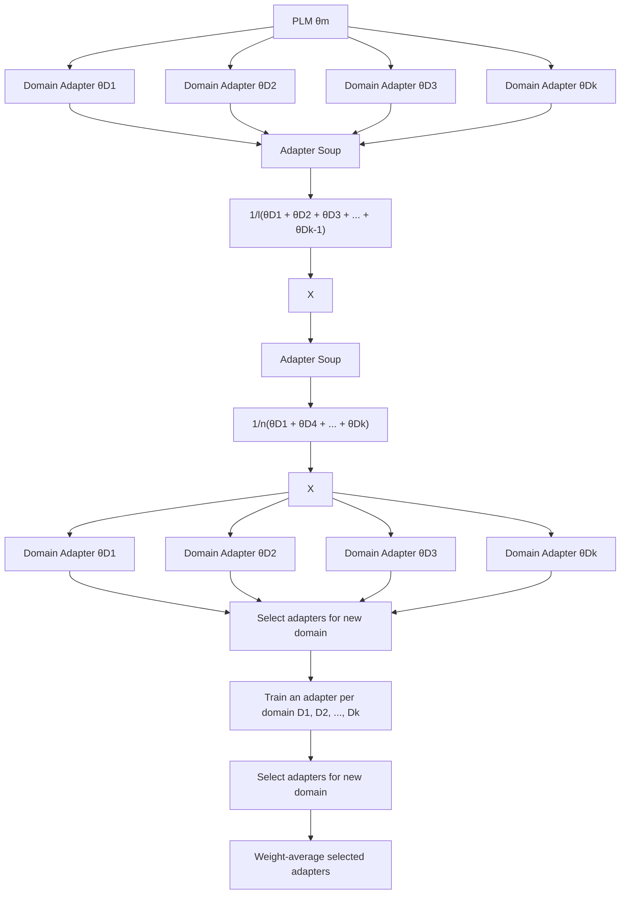

# AdapterSoup: Weight Averaging to Improve Generalization of Pretrained Language Models

Alexandra Chronopoulou $^{\star\dagger\nabla}$ Matthew E. Peters $^{\ddagger}$ Alexander Fraser $^{\nabla}$ Jesse Dodge $^{\star\ddagger}$

$^{\nabla}$ Center for Information and Language Processing, LMU Munich, Germany

$^{\nabla}$ Munich Center for Machine Learning, Germany

$^{\ddagger}$ Allen Institute for Artificial Intelligence, Seattle, WA

# Abstract

Pretrained language models (PLMs) are trained on massive corpora, but often need to specialize to specific domains. A parameter-efficient adaptation method suggests training an adapter for each domain on the task of language modeling. This leads to good in-domain scores but can be impractical for domain- or resource-restricted settings. A solution is to use a related-domain adapter for the novel domain at test time. In this paper, we introduce AdapterSoup, an approach that performs weight-space averaging of adapters trained on different domains. Our approach is embarrassingly parallel: first, we train a set of domain-specific adapters; then, for each novel domain, we determine which adapters should be averaged at test time. We present extensive experiments showing that AdapterSoup consistently improves performance to new domains without extra training. We also explore weight averaging of adapters trained on the same domain with different hyper-parameters, and show that it preserves the performance of a PLM on new domains while obtaining strong in-domain results. We explore various approaches for choosing which adapters to combine, such as text clustering and semantic similarity. We find that using clustering leads to the most competitive results on novel domains.

# 1 Introduction

Large LMs are pre-trained using massive amounts of data in a self-supervised way (Peters et al., 2018; Devlin et al., 2019; Liu et al., 2019; Radford et al., 2019) and obtain general-domain knowledge. In order to adapt them to a new domain, continuing training using in-domain data has been shown to be helpful (Han and Eisenstein, 2019; Lee et al., 2020; Gururangan et al., 2020). To avoid fine-tuning all parameters, efficient methods such as domain-specific mixtures-of-experts (Gururangan et al., 2022) and

flowchart

Figure 1: Illustration of AdapterSoup. Starting from the same random seed, an adapter is trained for each domain (domain adapter) on top of a PLM. AdapterSoup averages the weights of the adapters that are most related to the new domain to improve out-of-domain performance of a PLM at test time. The inference cost is independent of the number of adapters (l or n) used.

hierarchical domain adapters (Chronopoulou et al., 2022) have been proposed. Additional in-domain gains can be obtained using weight-space averaging (Wortsman et al., 2022a; Matena and Raffel, 2021). Motivated by this, we propose using weight-space averaging at test time to improve performance on novel domains without extra training.

Our approach, AdapterSoup, ensembles adapters in the weight space to improve performance on novel domains at test time without parameter updates. To this end, we train adapters on top of a PLM, each in a different domain. We compare several methods for selecting which adapters to

use for each novel domain at test time and propose weight-space averaging models selected using text clustering. We find that AdapterSoup improves performance on novel domains. We also explore weight averaging adapters trained in the same domain, each with a different hyper-parameter configuration, and find that combining models trained with a low learning rate provides competitive in-domain scores, while averaging models trained with high learning rates performs similarly to a general-purpose PLM on novel domains.

Our contributions are the following: 1) We propose combining domain-adapted PLMs at inference time using adapters. Our approach leads to consistent gains in novel domains. We compare several methods for choosing the models of the AdapterSoup, concluding that text clustering provides the best performance across all domains. 2) We perform weight-space averaging of PLMs adapted to the same domain with varied hyper-parameters using adapters. We find that we can obtain competitive in-domain scores but also preserve the generalization ability of a PLM.

# 2 Proposed Approach

Problem Statement. Assuming we have a PLM adapted to k domains $D_{1}, \ldots, D_{k}$ , we want a model that performs well in a novel domain $D_{k+1}$ without training more parameters. We use the provenance of a piece of text (that is, the website from which the text was scraped) as a proxy for textual domain. This follows Chronopoulou et al. (2022); Gururangan et al. (2022).

If we assume that we have a PLM fine-tuned on a single domain $D_{i}$ with different hyper-parameters, we want to combine the fine-tuned models in order to both obtain good in-domain performance and preserve the generalization ability of the PLM to novel domains.

# 2.1 Cross-Domain AdapterSoup

An illustration of the cross-domain AdapterSoup is provided in Figure 1. Let $f(x, \theta_m)$ be a PLM with input data $x$ and parameters $\theta_m \in \mathbb{R}^d$ . We add adapters with a parameter initialization $\theta_\alpha$ . While in this work we parameterize $\theta_\alpha$ with adapters, our method is general and could be extended to other efficient fine-tuning methods. We only fine-tune the adapters, without updating the parameters $\theta_m$ of the PLM, for language modeling using cross-entropy loss. Let us assume that $\theta =$ FineTune( $\theta_{m},\theta_{\alpha},\phi,D$ ) denote the parameters obtained by fine-tuning a PLM with adapters in a domain D, using hyper-parameters $\phi$ .

Let $\phi$ be a fixed hyper-parameter configuration. We vary only the textual domain. We first train k different adapters, one for each of the training domains. Then, we combine their weights:

$$
\text { AdapterSoup } (x) = f (x, \frac {1}{l} \sum_ {i = 1} ^ {l} \theta_ {i}), \tag {1}
$$

i.e., we use the average of the parameters of $l$ fine-tuned models, selected by one of the methods described in §2.3 ( $l <= k$ ). If $l = k$ , this model is a uniform soup (Wortsman et al., 2022a).

# 2.2 Single-Domain AdapterSoup

In this setup, we want to learn an LM that performs well in a single training domain D, while maintaining the performance of the initial PLM $\theta_{m}$ in novel domains. To this end, we train adapters on the same domain, varying the hyper-parameter configuration. Each of the n models is optimized with different hyper-parameters $\phi_{i}$ , with $i \in 1, \ldots, n$ . We then compute the weight-space average following Equation 1, with l = 3. This is similar to logit ensembling, but only adds to the PLM the inference cost of a single adapter, while the added inference cost of logit ensembling scales linearly with the number of adapters.

# 2.3 Model Selection for AdapterSoup

In this section we describe two methods for selecting the combination of models to create our AdapterSoup (by weight-space averaging) which will be evaluated on a novel domain $D_{k+1}$ . Following standard practice (Gururangan et al., 2022; Li et al., 2022) we use a small amount of validation data from the novel domain $D_{k+1}$ for each of the below approaches. We note that we keep the test data unseen and only use it to perform our test-set evaluations.

Sentence similarity. We use pretrained sentence-BERT (Reimers and Gurevych, 2019), an approach that modifies BERT (Devlin et al., 2019) using siamese and triplet networks (Schroff et al., 2015) to obtain sentence embeddings. We compute the embeddings for 100 sentences from each of the training domains $D_1, \ldots, D_k$ , plus the novel domain $D_{k+1}$ . Then we compute the average cosine similarity between each of $D_1, \ldots, D_k$ and $D_{k+1}$ . We add up to 5 adapters to the AdapterSoup in order of highest cosine similarity (only considering models

<table><tr><td rowspan="2">Method</td><td colspan="11">10 Evaluation Domains</td></tr><tr><td>reuters</td><td>techcrunch</td><td>fastco</td><td>nme</td><td>fool</td><td>inquisitr</td><td>mashable</td><td>tripadv</td><td>ncbi</td><td>yelp</td><td>Avg.</td></tr><tr><td>GPT-2 (zero-shot)</td><td>21.5</td><td>27.7</td><td>27.9</td><td>28.2</td><td>23.8</td><td>22.4</td><td>27.1</td><td>40.4</td><td>20.7</td><td>36.2</td><td>27.6</td></tr><tr><td>Single Adapter Chosen Using:</td><td></td><td></td><td></td><td></td><td></td><td></td><td></td><td></td><td></td><td></td><td></td></tr><tr><td>- Sentence similarity</td><td>18.9</td><td>22.0</td><td>22.0</td><td>23.1</td><td>22.9</td><td>18.4</td><td>25.3</td><td>37.0</td><td>18.2</td><td>49.4</td><td>24.4</td></tr><tr><td>- Clustering</td><td>17.6</td><td>22.4</td><td>24.0</td><td>21.1</td><td>23.3</td><td>18.7</td><td>23.6</td><td>37.7</td><td>18.2</td><td>44.3</td><td>24.0</td></tr><tr><td>AdapterSoup (Weight-space average):</td><td></td><td></td><td></td><td></td><td></td><td></td><td></td><td></td><td></td><td></td><td></td></tr><tr><td>- Uniform</td><td>18.2</td><td>23.1</td><td>22.9</td><td>22.2</td><td>22.4</td><td>18.4</td><td>23.1</td><td>37.0</td><td>19.1</td><td>36.2</td><td>24.3</td></tr><tr><td>- Sentence similarity</td><td>17.6</td><td>22.0</td><td>21.3</td><td>20.7</td><td>22.2</td><td>18.4</td><td>22.4</td><td>36.2</td><td>17.6</td><td>35.2</td><td>23.4</td></tr><tr><td>- Clustering</td><td>17.3</td><td>21.8</td><td>21.3</td><td>21.1</td><td>22.2</td><td>17.8</td><td>22.2</td><td>34.8</td><td>17.6</td><td>34.8</td><td>23.1</td></tr><tr><td>Oracle</td><td></td><td></td><td></td><td></td><td></td><td></td><td></td><td></td><td></td><td></td><td></td></tr><tr><td>- Best adapter per domain</td><td>17.6</td><td>22.0</td><td>21.5</td><td>21.1</td><td>22.9</td><td>17.8</td><td>22.2</td><td>37.0</td><td>18.2</td><td>35.9</td><td>23.6</td></tr><tr><td>- Clustering + 2 best</td><td>17.3</td><td>21.8</td><td>21.3</td><td>20.7</td><td>22.0</td><td>17.6</td><td>22.0</td><td>33.4</td><td>17.6</td><td>33.4</td><td>22.7</td></tr><tr><td>Hierarchy adapter</td><td>16.4</td><td>20.1</td><td>20.1</td><td>20.1</td><td>22.2</td><td>16.4</td><td>22.2</td><td>33.1</td><td>18.2</td><td>34.5</td><td>22.3</td></tr></table>

Table 1: Perplexity ( $\downarrow$ ) scores on 10 evaluation domains. All single adapter and AdapterSoup experiments have the same inference cost; bold indicates the best perplexity for each novel domain and best average. We find that AdapterSoup using clustering as a selection method on average leads to the best out-of-domain performance.

trained on domains with cosine similarity greater than 0.15 to $D_{k+1}$ . We experimented with several values to define the threshold (3, 5, 10, 15). We did not observe significant improvement when scaling up from 5 to 10 adapters and for that reason, we used up to 5 adapters in each AdapterSoup.

Domain clustering. Our domain clustering approach follows Aharoni and Goldberg (2020). We encode 100 sequences from each of the training domains using a PLM and fit a Gaussian Mixture Model (GMM) with 21 components (equal to the number of training domains), which gives us a domain clustering. We then use 100 sequences from our held-out set (not used for test-set evaluation) and find which clusters they are closest to. We add up to 5 adapters to the AdapterSoup in order of which clusters the most held-out domain text is mapped to. If at least 10% of the sequences of the $D_{k+1}$ is mapped to the cluster of $D_{i}$ , we add the model trained on $D_{i}$ to the AdapterSoup.

In-domain. To select the models that perform best in-domain, we exhaustively combine all models trained on a single textual domain (in this case, text found in the website booking.com), using combinations of size 3. Each model has been trained with a different hyper-parameter configuration. Specifically, we vary the learning rate and data order. We compare them to the best-performing single model per domain and to a uniform soup.

# 3 Experimental Setup

Datasets. We assume that text found in a specific website (e.g., tripadvisor) can be used as a proxy of a textual domain. We use 21 training domains and 10 evaluation domains (text from 21 and 10 websites accordingly) from the released version (Dodge et al., 2021) of C4 (Raffel et al., 2020) (details in the Appendix). We hypothesize that the variety of training domains plays an important role in this setting. We randomly sampled domains that belong to the 100 high-resource domains of C4, but further work could consider using M2D2 (Reid et al., 2022), a multi-domain language modeling dataset released concurrently to this work.

Model Architecture. We use GPT-2 (Radford et al., 2019); specifically, we use a publicly available pretrained checkpoint of the small version, i.e., gpt2 from the HuggingFace library (Wolf et al., 2020). We add an adapter to each Transformer (Vaswani et al., 2017) layer after the feed-forward layer. We train only the adapters for language modeling in each training domain. The adapters follow the Bapna and Firat (2019) architecture and have bottleneck size 64. For the cross-domain AdapterSoup, we train all models with an initial learning rate 1e-4. For the single-domain AdapterSoup, we use different learning rates and data seeds shown in the Appendix.

# 4 Results

Results are presented in Table 1. For each experiment, we evaluate both perplexity and efficiency.

# 4.1 Cross-domain

As a first baseline, we use GPT-2 (zero-shot), without further training or additional parameters. This has worse perplexity than all other approaches but is most efficient at inference.

Single Adapters. We then evaluate Sentence similarity and Clustering in the scenario where only a single adapter is chosen using each approach (this can be thought of as a soup of size 1). This is an

evaluation of how well these two approaches measure similarity between the novel domain $D_{k+1}$ and the training domains; this baseline shows the performance of a single model which can be directly compared to AdapterSoups. Both approaches are significantly better than GPT-2 (zero-shot), and Clustering outperforms Sentence similarity, suggesting it is better at identifying related domains.

AdapterSoup. We evaluate three types of AdapterSoup which differ only in how the models added to the soup are selected. All three are equally as efficient at inference as using a single adapter. Uniform is a uniform soup (weight-averaging all trained models). This performs worse than all approaches except GPT-2 (zero-shot); we hypothesize that it performs worse due to negative interference between adapters trained on unrelated domains. Using Sentence similarity as described in §2.3 leads to marginally better scores than the single-best adapter per domain, indicating even relatively naively-created soups can outperform the best (oracle) single model. On 8/10 novel domains, the sentence similarity AdapterSoup outperforms the single adapter chosen by Sentence similarity, indicating that the soup leads to better performance. Next, using Clustering as described in §2.3 leads to perplexity improvements in 8/10 novel domains compared to sentence similarity, indicating that the method for selecting models for the soup has a large impact. On 9/10 novel domains, the Clustering AdapterSoup outperforms the single adapter chosen by clustering, indicating that our approach leads to better performance.

Oracle Experiments and Larger Models. Best adapter per domain shows the performance of the single-best adapter on each novel domain. This is the upper bound for a single adapter, and we see that our Single Adapter Chosen Using Clustering matches these scores on 3/10 novel domains, and is close on the rest, suggesting the clustering approach is reasonably good. Clustering + 2 best shows the performance of adding the two (oracle) best models to our AdapterSoup made by clustering; our clustering approach is close to these scores, but there is room for future work on better choosing models for the AdapterSoup. Hierarchy adapter is taken from Chronopoulou et al. (2022), and is less efficient in terms of both data and parameters.

Selecting Models for the Soup. We qualitatively compare the selection methods for choosing adapters to include in the AdapterSoup for 3 novel domains in Table 2. In the case of tripadvisor, 2/3 domains Sentence similarity and Clustering select are identical, while for ncbi (science domain) both methods select the same domains. When selecting domains similar to reuters (news), clustering seems to find a good match, choosing news domains. However, Sentence similarity selects domains that are not quite as related to the novel domain. Reuters contains heterogeneous data, so the average cosine similarity on the sentence level is not a suitable metric to find related domains.

<table><tr><td>Novel Domain i</td><td>Sentence Sim.</td><td>Clustering</td></tr><tr><td>tripadvisor</td><td>bookinginsiderpages</td><td>bookinginsiderpageslonelyplanet</td></tr><tr><td>ncbi</td><td>journalsfrontiersinspringer</td><td>journalsfrontiersinspringer</td></tr><tr><td>reuters</td><td>csmonitorwiredentrepreneur</td><td>dailymailexpress</td></tr></table>

Table 2: Domains of models selected for the Adapter-Soup using either sentence similarity or clustering. The clustering method seems to more accurately match each novel domain to training domains that are similar to it.

<table><tr><td></td><td>booking ID</td><td>frontiers OOD</td><td>journals OOD</td><td>yelp OOD</td></tr><tr><td>GPT-2 (zero-shot)</td><td>29.7</td><td>22.2</td><td>24.5</td><td>36.2</td></tr><tr><td>Best single adapter AdapterSoup:</td><td>10.2</td><td>27.7</td><td>30.3</td><td>49.4</td></tr><tr><td>- lr 7e-3</td><td>27.7</td><td>23.3</td><td>24.8</td><td>37.7</td></tr><tr><td>- lr 4e-3</td><td>24.5</td><td>23.8</td><td>25.5</td><td>39.6</td></tr><tr><td>- lr 1e-3</td><td>11.5</td><td>24.0</td><td>26.3</td><td>42.5</td></tr><tr><td>- lr 5e-4</td><td>10.0</td><td>26.3</td><td>29.1</td><td>47.5</td></tr><tr><td>- lr 1e-4</td><td>10.4</td><td>27.4</td><td>30.0</td><td>48.9</td></tr><tr><td>Best AdapterSoup:</td><td></td><td></td><td></td><td></td></tr><tr><td>- in-domain</td><td>10.0</td><td>26.3</td><td>29.1</td><td>47.5</td></tr><tr><td>- out-of-domain</td><td>26.8</td><td>22.9</td><td>24.5</td><td>37.3</td></tr><tr><td>Logit ensemble</td><td>9.2</td><td>25.0</td><td>27.7</td><td>47.7</td></tr></table>

Table 3: Perplexity scores in- and out-of-domain (respectively ID and OOD) of models trained on booking.com. Low learning rates lead to good in-domain scores, while high learning rates improve the out-of-domain performance.

# 4.2 Single-domain

In this section we evaluate how models trained on the same domain can be combined into an AdapterSoup. We train a set of models using adapters on booking.com by varying the data order and the learning rate (see Appendix A.3, note our experiments kept the initialization of each adapter fixed), then evaluate all combinations of adapters of size 3, and evaluate the performance of the AdapterSoup both in-domain (booking.com) and on 3 held-out domains. We explore this controlled setting to bet-

ter understand the setup described in Wortsman et al. (2022a), who also noted that the learning rate is important; their experiments indicated that smaller learning rates led to better model soups.

Our experiments in Table 3 show a more nuanced result: AdapterSoups made from adapters trained with small learning rates (5e-4) performed best in-domain (confirming the result from Wortsman et al., 2022b), but AdapterSoups made from adapters trained with larger learning rates (7e-3, 4e-3, and 7e-4) generalize better to novel domains. The number of updates for each adapter is the same, and they all have the same initialization, so we hypothesize that AdapterSoups made from small learning rates act similarly to averaging across steps in gradient descent, leading to a model that is closer to a local optimum. As for why larger learning rates leads to better generalization to novel domains, we hypothesize that each model in the AdapterSoup travels a farther distance from the initialization, leading to learning somewhat more diverse representations. We leave further exploration to future work.

# 5 Related Work

As training large models from scratch has a severe computational and environmental cost (Strubell et al., 2019; Dodge et al., 2022), efficient methods such as mixtures-of-experts (MoE) (Shazeer et al., 2017; Fedus et al., 2021; Artetxe et al., 2022), adapters (Rebuffi et al., 2017; Houlsby et al., 2019; Pfeiffer et al., 2020), and LoRA layers (Hu et al., 2022) have recently been proposed. Both adapters and MoEs have shown to work well for domain adaptation (Cooper Stickland et al., 2021; Gururangan et al., 2022; Chronopoulou et al., 2022). The hierarchy adapter (Chronopoulou et al., 2022) outperforms our approach but is significantly more expensive. It adds a training cost of $4Ld_{model}dT$ (following Kaplan et al., 2020) over the cost of running GPT-2 for a model with $L$ layers, dimension $d_{model}$ , adapter bottleneck size $d$ , average tree depth $T$ ( $T = 8$ in the hierarchy adapter paper), while AdapterSoup needs $4Ld_{model}d$ flops. As a result, training the hierarchy adapter is a factor of $T$ slower than our approach. At inference time, the hierarchy adapter activates 2 paths in the tree and invokes a cost $4Ld_{model}dT \times 2$ , i.e., inference is a factor of $2T$ slower than our approach.

Averaging weights of models independently fine-tuned on the same task (Wortsman et al., 2022a) has shown to improve in-domain performance. Matena and Raffel (2021) weight-average fine-tuned PLM models using Fisher merging to avoid intermediate task training and then perform downstream fine-tuning. Wang et al. (2022) fine-tune MoEs using adapters on a downstream task and average their weights at test time. Our paper, however, focuses on improving test-time scores of a model on novel domains.

Wang et al. (2021) improve performance in an unseen (target) language by ensembling the source language adapter and language adapters similar to the target language. This approach uses weighted ensembling of the outputs of adapters, whereas we ensemble the weights of the adapters. AdapterSoup has the inference cost of a single adapter, while Wang et al. (2021) require inference time that scales linearly to the number of adapters.

Contemporaneous work (Li et al., 2022) also explores performance in novel domains using weight averaging, but uses MoEs instead of adapters.

# 6 Conclusion

A PLM can be adapted to new domains using adapters. However, this requires training a new set of adapters for each domain. We propose a method based on weight-space averaging of adapters selected using text clustering. Our approach improves performance on novel domains without updating parameters or increasing the inference cost. Future work could explore more sophisticated selection methods to try to match the performance of the oracle experiments.

# Limitations

The conclusions we draw in this work about how our approach compares to other approaches (e.g., our baselines) are only supported by evidence on the task of language modeling, with textual domains taken from the C4 dataset. We expect such results to hold more generally, but do not have experimental evidence to support any other scenarios. As with all work on language modeling, the models we have trained could be used to generate language, but we do not have evaluations of generated text (e.g., on fluency, factuality, or other common metrics used to evaluate generated language). Our paper focuses on using adapters; while we expect similar approaches to work for other types of models, we only have evidence to support AdapterSoup working for adapters.

# Acknowledgements

We thank Ayyoob Imani for feedback on the final version of the paper and Jonas Pfeiffer for helpful discussions. We also thank Mitchell Wortsman and Ludwig Schmidt for preliminary comments on the first version of this idea.

# References

Roee Aharoni and Yoav Goldberg. 2020. Unsupervised domain clusters in pretrained language models. In Proceedings of the 58th Annual Meeting of the Association for Computational Linguistics, pages 7747–7763, Online. Association for Computational Linguistics.   
Mikel Artetxe, Shruti Bhosale, Naman Goyal, Todor Mihaylov, Myle Ott, Sam Shleifer, Xi Victoria Lin, Jingfei Du, Srinivasan Iyer, Ramakanth Pasunuru, Giridharan Anantharaman, Xian Li, Shuohui Chen, Halil Akin, Mandeep Baines, Louis Martin, Xing Zhou, Punit Singh Koura, Brian O'Horo, Jeffrey Wang, Luke Zettlemoyer, Mona Diab, Zornitsa Kozareva, and Veselin Stoyanov. 2022. Efficient large scale language modeling with mixtures of experts. In Proceedings of the 2022 Conference on Empirical Methods in Natural Language Processing, pages 11699–11732, Abu Dhabi, United Arab Emirates. Association for Computational Linguistics.   
Ankur Bapna and Orhan Firat. 2019. Simple, scalable adaptation for neural machine translation. In Proceedings of the 2019 Conference on Empirical Methods in Natural Language Processing and the 9th International Joint Conference on Natural Language Processing (EMNLP-IJCNLP), pages 1538–1548, Hong Kong, China. Association for Computational Linguistics.   
Alexandra Chronopoulou, Matthew Peters, and Jesse Dodge. 2022. Efficient hierarchical domain adaptation for pretrained language models. In Proceedings of the 2022 Conference of the North American Chapter of the Association for Computational Linguistics: Human Language Technologies, pages 1336–1351, Seattle, United States. Association for Computational Linguistics.   
Asa Cooper Stickland, Alexandre Berard, and Vassilina Nikoulina. 2021. Multilingual domain adaptation for NMT: Decoupling language and domain information with adapters. In Proceedings of the Sixth Conference on Machine Translation, pages 578–598, Online. Association for Computational Linguistics.   
Jacob Devlin, Ming-Wei Chang, Kenton Lee, and Kristina Toutanova. 2019. BERT: Pre-training of deep bidirectional transformers for language understanding. In Proceedings of the 2019 Conference of the North American Chapter of the Association for Computational Linguistics: Human Language Technologies, Volume 1 (Long and Short Papers), pages

4171-4186, Minneapolis, Minnesota. Association for Computational Linguistics.   
Jesse Dodge, Taylor Prewitt, Remi Tachet des Combes, Erika Odmark, Roy Schwartz, Emma Strubell, Alexandra Sasha Luccioni, Noah A. Smith, Nicole DeCario, and Will Buchanan. 2022. Measuring the carbon intensity of ai in cloud instances. In 2022 ACM Conference on Fairness, Accountability, and Transparency, FAccT '22, page 1877–1894, New York, NY, USA. Association for Computing Machinery.   
Jesse Dodge, Maarten Sap, Ana Marasović, William Agnew, Gabriel Ilharco, Dirk Groeneveld, Margaret Mitchell, and Matt Gardner. 2021. Documenting large webtext corpora: A case study on the colossal clean crawled corpus. In Proceedings of the 2021 Conference on Empirical Methods in Natural Language Processing, pages 1286–1305, Online and Punta Cana, Dominican Republic. Association for Computational Linguistics.   
William Fedus, Barret Zoph, and Noam Shazeer. 2021. Switch transformers: Scaling to trillion parameter models with simple and efficient sparsity.   
Suchin Gururangan, Mike Lewis, Ari Holtzman, Noah A. Smith, and Luke Zettlemoyer. 2022. DEMix layers: Disentangling domains for modular language modeling. In Proceedings of the 2022 Conference of the North American Chapter of the Association for Computational Linguistics: Human Language Technologies, pages 5557–5576, Seattle, United States. Association for Computational Linguistics.   
Suchin Gururangan, Ana Marasović, Swabha Swayamdipta, Kyle Lo, Iz Beltagy, Doug Downey, and Noah A. Smith. 2020. Don't stop pretraining: Adapt language models to domains and tasks. In Proceedings of the 58th Annual Meeting of the Association for Computational Linguistics, pages 8342–8360, Online. Association for Computational Linguistics.   
Xiaochuang Han and Jacob Eisenstein. 2019. Unsupervised domain adaptation of contextualized embeddings for sequence labeling. In Proceedings of the 2019 Conference on Empirical Methods in Natural Language Processing and the 9th International Joint Conference on Natural Language Processing (EMNLP-IJCNLP), pages 4238–4248, Hong Kong, China. Association for Computational Linguistics.   
Neil Houlsby, Andrei Giurgiu, Stanislaw Jastrzebski, Bruna Morrone, Quentin De Laroussilhe, Andrea Gesmundo, Mona Attariyan, and Sylvain Gelly. 2019. Parameter-efficient transfer learning for NLP. In Proceedings of the International Conference on Machine Learning, Proceedings of Machine Learning Research, pages 2790–2799.   
Edward J Hu, yelong shen, Phillip Wallis, Zeyuan Allen-Zhu, Yuanzhi Li, Shean Wang, Lu Wang, and Weizhu Chen. 2022. LoRA: Low-rank adaptation of large

language models. In International Conference on Learning Representations.   
Jared Kaplan, Sam McCandlish, T. J. Henighan, Tom B. Brown, Benjamin Chess, Rewon Child, Scott Gray, Alec Radford, Jeff Wu, and Dario Amodei. 2020. Scaling laws for neural language models. ArXiv, abs/2001.08361.   
Jinhyuk Lee, Wonjin Yoon, Sungdong Kim, Donghyeon Kim, Sunkyu Kim, Chan Ho So, and Jaewoo Kang. 2020. Biobert: a pre-trained biomedical language representation model for biomedical text mining. Bioinformatics, 36(4):1234–1240.   
Margaret Li, Suchin Gururangan, Tim Dettmers, Mike Lewis, Tim Althoff, Noah A. Smith, and Luke Zettle-moyer. 2022. Branch-train-merge: Embarrassingly parallel training of expert language models.   
Yinhan Liu, Myle Ott, Naman Goyal, Jingfei Du, Mandar Joshi, Danqi Chen, Omer Levy, Mike Lewis, Luke Zettlemoyer, and Veselin Stoyanov. 2019. Roberta: A robustly optimized bert pretraining approach.   
Michael Matena and Colin Raffel. 2021. Merging models with fisher-weighted averaging.   
Adam Paszke, Sam Gross, Francisco Massa, Adam Lerer, James Bradbury, Gregory Chanan, Trevor Killeen, Zeming Lin, Natalia Gimelshein, Luca Antiga, Alban Desmaison, Andreas Kopf, Edward Yang, Zachary DeVito, Martin Raison, Alykhan Tejani, Sasank Chilamkurthy, Benoit Steiner, Lu Fang, Junjie Bai, and Soumith Chintala. 2019. Pytorch: An imperative style, high-performance deep learning library. In Advances in Neural Information Processing Systems, volume 32. Curran Associates, Inc.   
Matthew E. Peters, Mark Neumann, Mohit Iyyer, Matt Gardner, Christopher Clark, Kenton Lee, and Luke Zettlemoyer. 2018. Deep contextualized word representations. In Proceedings of the 2018 Conference of the North American Chapter of the Association for Computational Linguistics: Human Language Technologies, Volume 1 (Long Papers), pages 2227–2237, New Orleans, Louisiana. Association for Computational Linguistics.   
Jonas Pfeiffer, Ivan Vulić, Iryna Gurevych, and Sebastian Ruder. 2020. MAD-X: An Adapter-Based Framework for Multi-Task Cross-Lingual Transfer. In Proceedings of the 2020 Conference on Empirical Methods in Natural Language Processing (EMNLP), pages 7654–7673, Online. Association for Computational Linguistics.   
Alec Radford, Jeff Wu, Rewon Child, David Luan, Dario Amodei, and Ilya Sutskever. 2019. Language models are unsupervised multitask learners. OpenAI Blog.   
Colin Raffel, Noam Shazeer, Adam Roberts, Katherine Lee, Sharan Narang, Michael Matena, Yanqi Zhou, Wei Li, and Peter J. Liu. 2020. Exploring the limits

of transfer learning with a unified text-to-text transformer. Journal of Machine Learning Research.   
Sylvestre-Alvise Rebuffi, Hakan Bilen, and Andrea Vedaldi. 2017. Learning multiple visual domains with residual adapters. In Advances in Neural Information Processing Systems.   
Machel Reid, Victor Zhong, Suchin Gururangan, and Luke Zettlemoyer. 2022. M2D2: A massively multidomain language modeling dataset. In Proceedings of the 2022 Conference on Empirical Methods in Natural Language Processing, pages 964–975, Abu Dhabi, United Arab Emirates. Association for Computational Linguistics.   
Nils Reimers and Iryna Gurevych. 2019. Sentence-BERT: Sentence embeddings using Siamese BERT networks. In Proceedings of the 2019 Conference on Empirical Methods in Natural Language Processing and the 9th International Joint Conference on Natural Language Processing (EMNLP-IJCNLP), pages 3982–3992, Hong Kong, China. Association for Computational Linguistics.   
Florian Schroff, Dmitry Kalenichenko, and James Philbin. 2015. Facenet: A unified embedding for face recognition and clustering. In 2015 IEEE Conference on Computer Vision and Pattern Recognition (CVPR), pages 815–823.   
Noam Shazeer, Azalia Mirhoseini, Krzysztof Maziarz, Andy Davis, Quoc Le, Geoffrey Hinton, and Jeff Dean. 2017. Outrageously large neural networks: The sparsely-gated mixture-of-experts layer.   
Emma Strubell, Ananya Ganesh, and Andrew McCallum. 2019. Energy and policy considerations for deep learning in NLP. In Proceedings of the 57th Annual Meeting of the Association for Computational Linguistics, pages 3645–3650, Florence, Italy. Association for Computational Linguistics.   
Ashish Vaswani, Noam Shazeer, Niki Parmar, Jakob Uszkoreit, Llion Jones, Aidan N Gomez, Łukasz Kaiser, and Illia Polosukhin. 2017. Attention is all you need. In Advances in Neural Information Processing Systems.   
Xinyi Wang, Yulia Tsvetkov, Sebastian Ruder, and Graham Neubig. 2021. Efficient test time adapter ensembling for low-resource language varieties. In Findings of the Association for Computational Linguistics: EMNLP 2021, pages 730–737, Punta Cana, Dominican Republic. Association for Computational Linguistics.   
Yaqing Wang, Subhabrata Mukherjee, Xiaodong Liu, Jing Gao, Ahmed Hassan Awadallah, and Jianfeng Gao. 2022. Adamix: Mixture-of-adapter for parameter-efficient tuning of large language models. In Proceedings of the 2022 Conference on Empirical Methods in Natural Language Processing, Abu Dhabi, United Arab Emirates. Association for Computational Linguistics.

Thomas Wolf, Lysandre Debut, Victor Sanh, Julien Chaumond, Clement Delangue, Anthony Moi, Pierric Cistac, Tim Rault, Remi Louf, Morgan Funtowicz, Joe Davison, Sam Shleifer, Patrick von Platen, Clara Ma, Yacine Jernite, Julien Plu, Canwen Xu, Teven Le Scao, Sylvain Gugger, Mariama Drame, Quentin Lhoest, and Alexander Rush. 2020. Transformers: State-of-the-art natural language processing. In Proceedings of the 2020 Conference on Empirical Methods in Natural Language Processing: System Demonstrations, pages 38–45, Online. Association for Computational Linguistics.   
Mitchell Wortsman, Gabriel Ilharco, Samir Ya Gadre, Rebecca Roelofs, Raphael Gontijo-Lopes, Ari S Morcos, Hongseok Namkoong, Ali Farhadi, Yair Carmon, Simon Kornblith, and Ludwig Schmidt. 2022a. Model soups: averaging weights of multiple fine-tuned models improves accuracy without increasing inference time. In Proceedings of the 39th International Conference on Machine Learning.   
Mitchell Wortsman, Gabriel Ilharco, Jong Wook Kim, Mike Li, Simon Kornblith, Rebecca Roelofs, Raphael Gontijo Lopes, Hannaneh Hajishirzi, Ali Farhadi, Hongseok Namkoong, and Ludwig Schmidt. 2022b. Robust fine-tuning of zero-shot models. In Proceedings of the IEEE/CVF Conference on Computer Vision and Pattern Recognition (CVPR), pages 7959–7971.

# A Appendix

# A.1 Training details

We build our code using PyTorch (Paszke et al., 2019) and the HuggingFace library (Wolf et al., 2020). Each model is trained on a single NVIDIA A100 GPU with 40GB of RAM, batch size 64 and gradient accumulation over 5 steps. We train each model for 20 epochs, without using early stopping. We compute semantic similarity using sentence-transformers $^{1}$ and a publicly available pretrained model. $^{2}$

We noticed from preliminary experiments that the choice of random seed is important when averaging weights of domain adapters. We empirically found that averaging domain adapters initialized from different random seeds led to poor performance of AdapterSoup. We suggest initializing the adapters from the same random seed in order to effectively combine adapters trained on various domains.

# A.2 Dataset sizes

We use textual corpora from 31 of the 100 most high-resource internet domains of C4. The sizes of the training domains are shown in Table 4, while the sizes of the evaluation domains are shown in Table 5.

# A.3 Single-domain AdapterSoup

We present the hyper-parameters we tried in Table 6. In this setup, we computed in- and out-of-domain scores for 455 different combinations (there are 15 models and computed all AdapterSoups of size 3). The trend we observed is that higher learning rates improved results out-of-domain, while lower learning rates provided the best in-domain scores.

# A.4 Cross-domain AdapterSoup

We present in Table 7 the evaluation scores of each of the single adapter models. Each adapter has been trained in a different training domain (column 1), and evaluated in 10 novel domains.

<table><tr><td>Ind</td><td>Training Domain</td><td>Train (Eval.) Tokens</td></tr><tr><td>1</td><td>dailymail.co.uk</td><td>25M (3M)</td></tr><tr><td>2</td><td>wired.com</td><td>18M (2M)</td></tr><tr><td>3</td><td>express.co.uk</td><td>16M (2M)</td></tr><tr><td>4</td><td>npr.org</td><td>25M (3M)</td></tr><tr><td>5</td><td>librarything.com</td><td>3M (500K)</td></tr><tr><td>6</td><td>instructables.com</td><td>25M (3M)</td></tr><tr><td>7</td><td>entrepreneur.com</td><td>16M (2M)</td></tr><tr><td>8</td><td>link.springer.com</td><td>28M (4M)</td></tr><tr><td>9</td><td>insiderpages.com</td><td>8M (1M)</td></tr><tr><td>10</td><td>ign.com</td><td>10M (1M)</td></tr><tr><td>11</td><td>eventbrite.com</td><td>11M (1M)</td></tr><tr><td>12</td><td>forums.macrumors.com</td><td>22M (3M)</td></tr><tr><td>13</td><td>androidheadlines.com</td><td>14M (2M)</td></tr><tr><td>14</td><td>glassdoor.com</td><td>4M (500K)</td></tr><tr><td>15</td><td>pcworld.com</td><td>14M (2M)</td></tr><tr><td>16</td><td>csmonitor.com</td><td>23M (3M)</td></tr><tr><td>17</td><td>lonelyplanet.com</td><td>6M (1M)</td></tr><tr><td>18</td><td>booking.com</td><td>30M (4M)</td></tr><tr><td>19</td><td>journals.plos.org</td><td>53M (6M)</td></tr><tr><td>20</td><td>frontiersin.org</td><td>38M (6M)</td></tr><tr><td>21</td><td>medium</td><td>22M (3M)</td></tr></table>

Table 4: Sizes of training corpora. We fine-tune GPT-2 using adapters on each of these domains. We perform weight-averaging of these 21 domain-adapted LMs.

<table><tr><td>Ind</td><td>Novel Domain</td><td>Train (Eval.) Tokens</td></tr><tr><td>1</td><td>reuters.com</td><td>17M (2M)</td></tr><tr><td>2</td><td>techcrunch.com</td><td>13M (2M)</td></tr><tr><td>3</td><td>fastcompany.com</td><td>14M (2M)</td></tr><tr><td>4</td><td>nme.com</td><td>5M (1M)</td></tr><tr><td>5</td><td>fool.com</td><td>34M (4M)</td></tr><tr><td>6</td><td>inquisitr.com</td><td>13M (2M)</td></tr><tr><td>7</td><td>mashable.com</td><td>14M (2M)</td></tr><tr><td>8</td><td>tripadvisor.com</td><td>7M (1M)</td></tr><tr><td>9</td><td>ncbi.nlm.nih.gov</td><td>23M (3M)</td></tr><tr><td>10</td><td>yelp.com</td><td>68M (6M)</td></tr></table>

Table 5: Sizes of held-out corpora.

<table><tr><td>Hyper-parameter</td><td>Value</td></tr><tr><td rowspan="2">learning rates</td><td>7e-3, 4e-3</td></tr><tr><td>1e-3, 5e-4, 1e-4</td></tr><tr><td>random seed</td><td>1, 2, 3</td></tr></table>

Table 6: Hyper-parameters for single-domain AdapterSoups. We exhaustively compute the AdapterSoup for every combination of 3 models in this set.

<table><tr><td rowspan="2">Training Domain</td><td rowspan="2">reuters</td><td rowspan="2">techcrunch</td><td rowspan="2">fastco</td><td colspan="8">Evaluation Domains</td></tr><tr><td>nme</td><td>fool</td><td>inquisitr</td><td>mashable</td><td>tripadv.</td><td>ncbi</td><td>yelp</td><td>Avg</td></tr><tr><td>dailymail</td><td>17.6</td><td>23.6</td><td>24.0</td><td>21.1</td><td>23.3</td><td>18.4</td><td>23.6</td><td>39.6</td><td>20.5</td><td>44.3</td><td>25.6</td></tr><tr><td>wired</td><td>18.0</td><td>22.0</td><td>21.5</td><td>22.0</td><td>22.9</td><td>18.2</td><td>22.2</td><td>40.0</td><td>19.9</td><td>41.3</td><td>24.8</td></tr><tr><td>express</td><td>19.5</td><td>25.8</td><td>26.0</td><td>22.6</td><td>25.8</td><td>20.1</td><td>26.3</td><td>42.9</td><td>23.3</td><td>48.9</td><td>28.1</td></tr><tr><td>npr</td><td>20.1</td><td>25.5</td><td>25.0</td><td>27.7</td><td>23.3</td><td>20.5</td><td>23.6</td><td>42.1</td><td>21.1</td><td>42.9</td><td>27.2</td></tr><tr><td>librarything</td><td>19.5</td><td>24.5</td><td>24.0</td><td>24.8</td><td>23.6</td><td>19.7</td><td>24.8</td><td>38.9</td><td>21.1</td><td>39.3</td><td>26.0</td></tr><tr><td>instructables</td><td>20.5</td><td>25.5</td><td>25.5</td><td>25.5</td><td>24.5</td><td>20.5</td><td>25.5</td><td>40.0</td><td>21.1</td><td>41.7</td><td>27.0</td></tr><tr><td>entrepreneur</td><td>18.2</td><td>22.4</td><td>22.0</td><td>22.6</td><td>22.9</td><td>18.4</td><td>23.1</td><td>40.9</td><td>21.1</td><td>43.4</td><td>25.5</td></tr><tr><td>springer</td><td>19.7</td><td>25.0</td><td>24.5</td><td>24.5</td><td>25.3</td><td>19.9</td><td>26.8</td><td>42.9</td><td>18.4</td><td>43.8</td><td>27.1</td></tr><tr><td>insiderpages</td><td>23.1</td><td>28.8</td><td>29.1</td><td>32.1</td><td>25.5</td><td>23.1</td><td>27.9</td><td>37.7</td><td>23.3</td><td>35.9</td><td>28.7</td></tr><tr><td>ign</td><td>18.9</td><td>23.8</td><td>23.6</td><td>22.6</td><td>23.3</td><td>18.7</td><td>23.6</td><td>40.9</td><td>21.1</td><td>39.6</td><td>25.6</td></tr><tr><td>eventbrite</td><td>19.1</td><td>24.3</td><td>23.8</td><td>23.1</td><td>24.3</td><td>19.3</td><td>25.0</td><td>39.6</td><td>20.9</td><td>41.7</td><td>26.1</td></tr><tr><td>macrumors</td><td>20.3</td><td>26.0</td><td>26.3</td><td>26.3</td><td>24.5</td><td>20.9</td><td>25.5</td><td>41.3</td><td>22.4</td><td>43.4</td><td>27.7</td></tr><tr><td>androidheadlines</td><td>20.7</td><td>24.8</td><td>25.8</td><td>26.0</td><td>24.5</td><td>20.1</td><td>25.3</td><td>44.7</td><td>22.6</td><td>42.9</td><td>27.8</td></tr><tr><td>glassdoor</td><td>20.7</td><td>26.0</td><td>25.8</td><td>27.7</td><td>24.8</td><td>21.1</td><td>26.8</td><td>42.5</td><td>22.0</td><td>42.5</td><td>28.0</td></tr><tr><td>pcworld</td><td>18.7</td><td>22.6</td><td>22.9</td><td>23.6</td><td>23.1</td><td>18.7</td><td>23.1</td><td>42.1</td><td>21.5</td><td>42.9</td><td>25.0</td></tr><tr><td>csmonitor</td><td>18.9</td><td>24.0</td><td>23.8</td><td>24.0</td><td>23.6</td><td>18.9</td><td>23.8</td><td>41.3</td><td>21.5</td><td>43.4</td><td>26.3</td></tr><tr><td>lonelyplanet</td><td>20.7</td><td>26.0</td><td>25.8</td><td>25.0</td><td>25.3</td><td>20.7</td><td>26.6</td><td>40.4</td><td>22.6</td><td>42.9</td><td>27.6</td></tr><tr><td>booking</td><td>27.4</td><td>33.4</td><td>33.1</td><td>35.9</td><td>31.5</td><td>27.4</td><td>35.5</td><td>37.0</td><td>30.6</td><td>49.4</td><td>34.1</td></tr><tr><td>journals</td><td>21.3</td><td>26.8</td><td>26.0</td><td>27.4</td><td>26.0</td><td>21.5</td><td>28.2</td><td>46.1</td><td>18.2</td><td>46.5</td><td>28.8</td></tr><tr><td>frontiersin</td><td>21.1</td><td>26.8</td><td>25.5</td><td>27.7</td><td>26.0</td><td>27.7</td><td>26.0</td><td>45.6</td><td>19.3</td><td>46.5</td><td>29.2</td></tr><tr><td>medium</td><td>17.8</td><td>22.2</td><td>21.8</td><td>21.3</td><td>25.0</td><td>17.8</td><td>25.3</td><td>39.3</td><td>19.9</td><td>43.4</td><td>25.4</td></tr></table>

Table 7: We show the performance of each trained adapter (for the cross-domain setting) on the 10 evaluation domains. Each model has been trained for language modeling with an initial learning rate $1e - 4$ for 20 epochs.