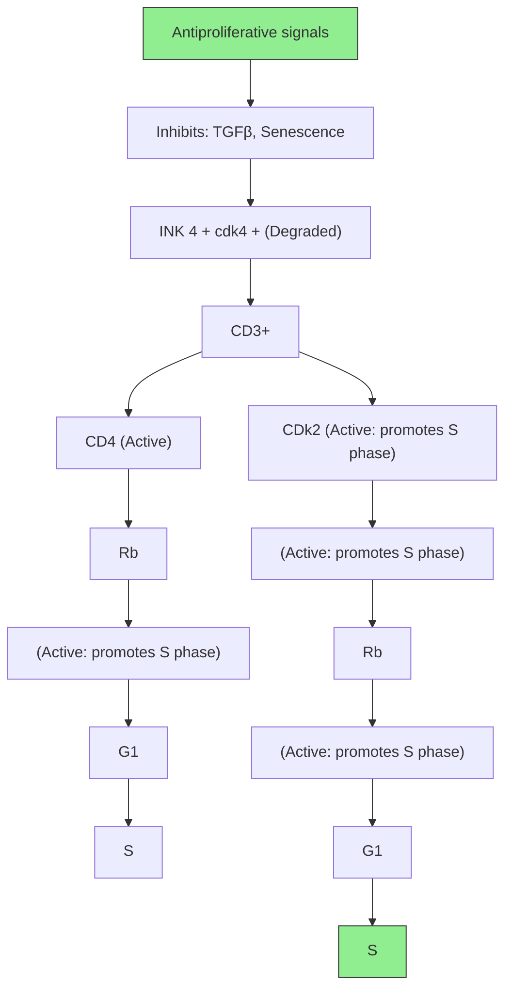
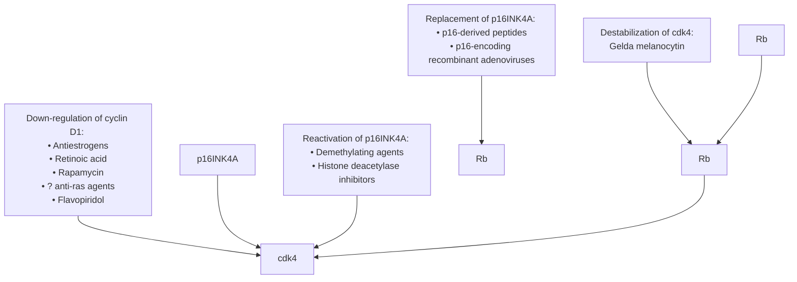
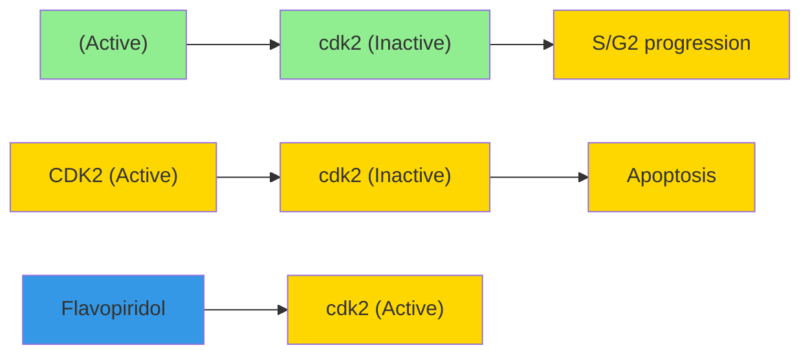
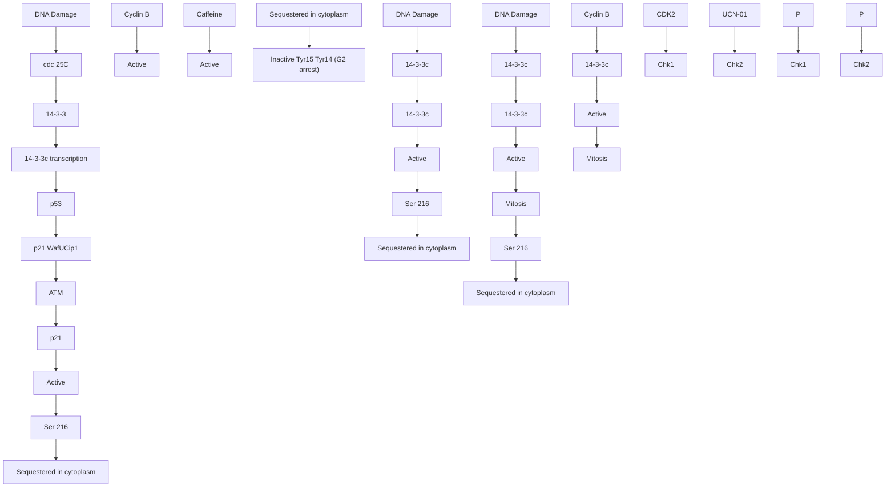

# Anticancer drug targets: cell cycle and checkpoint control

Geoffrey I. Shapiro $^{1}$ and J. Wade Harper $^{2}$

$^{1}$ Department of Adult Oncology and Lowe Center for Thoracic Oncology, Dana-Farber Cancer Institute, and Department of Medicine, Brigham and Women's Hospital, Harvard Medical School, Boston, Massachusetts 02115, USA

$^{2}$ Verna and Marrs McLean Department of Biochemistry and Molecular Biology, Baylor College of Medicine, One Baylor Plaza, Houston, Texas 77030, USA

Address correspondence to: Geoffrey Shapiro, Mayer 422, Dana-Farber Cancer Institute, 44 Binney Street, Boston, Massachusetts 02115, USA. Phone: (617) 632-4942; Fax: (617) 632-5998; E-mail: geoffrey\_shapiro@dfci.harvard.edu.

text_image

Perspective
SERIES
on targets for
cancer therapy
William G. Kaelin, Jr.,
Editor

Components of the cell cycle machinery are frequently altered in human cancer. Central players are the cyclin-dependent kinases (cdks), which govern the initiation, progression, and completion of cell cycle events. The scheduled activity of the cdks, which allows orderly transition between cell cycle phases, is controlled by their association with cyclins and cdk inhibitors, by their state of phosphorylation, and by ubiquitin-mediated proteolysis. As malignant cells evolve, both genetic and epigenetic mechanisms commonly affect the expression of cell cycle regulatory proteins, causing overexpression of cyclins and loss of expression of cdk inhibitors. A major consequence is deregulated cdk activity, providing cells with a selective growth advantage. The crucial role of the cdks has prompted great interest in the development of specific kinase inhibitors that would be expected to block cell cycle progression and induce growth arrest.

Another hallmark of the transformed state is incompetent checkpoint control, resulting in aberrant responses to cellular damage. For example, damage to DNA or the spindle apparatus normally triggers cell cycle arrest or apoptosis, depending on the degree of damage and the cellular context. Cell cycle arrest most frequently occurs at the G1/S or G2/M boundaries. When checkpoint arrest control is compromised, initiation of S phase or mitosis occurs despite cellular damage, and the ensuing genetic instability may lead to the eventual emergence of a malignant clone. However, this failure of cell cycle arrest responses in malignant cells can also be exploited therapeutically. Cells in which checkpoint control is disrupted are more sensitive to additional genotoxic or microtubular damage. Unbridled cell cycle progression in the presence of such damage is usually lethal, which may explain the selective sensitivity of some cancer cells to DNA-damaging treatments. For this reason, intact components of cell cycle arrest checkpoints are also potential targets for novel antineoplastics, and their inhibition may increase the sensitivity of tumor cells to standard chemotherapy and radiation (1).

Many of the compounds under study as anti-tumor agents act at multiple steps in the cell cycle, and their effects may be cytostatic or cytotoxic, depending on the cell cycle status of the target cells. Hence, an understanding of the molecular interactions involved may suggest ways to sensitize cells to the effects of these compounds. In particular, combinations of drugs, applied in a specific sequence, may be used to maneuver a tumor cell population into a state where it is most susceptible to the cytotoxic effects of novel, or indeed traditional, chemotherapeutic agents. Here, we review key aspects of cell cycle and checkpoint control, as well as exploitable abnormalities commonly found in cancer, in order to focus on promising targets of new agents presently in clinical trial or under development.

# Inhibition of cdk activity during the G1 phase

The G1/S transition. The product of the retinoblastoma susceptibility gene, Rb, plays a central role in the G1/S transition. In its un- or hypophosphorylated state, Rb prevents progression from G1 to S phase through its interaction with members of the E2F transcription factor family. This interaction not only blocks transcriptional activation by E2F but also actively represses transcription by recruiting histone deacetylase to the promoters of genes required for S phase entry.

During cell cycle progression, Rb is inactivated by phosphorylation, which occurs through the sequential actions of D-type cyclins, acting with cdks 4 and 6, and of cyclin E-cdk2 complexes. In response to mitogenic activation, cells synthesize D-type cyclins. The assembly of these proteins with cdks 4 and 6 requires a member of the Cip/Kip family of proteins – p21 $^{Waf1/Cip1}$ , p27 $^{Kip1}$ , or p57 $^{Kip2}$ . The Cip/Kip proteins act in stoichiometric amounts to promote the activity of cyclin D-dependent kinases, and they also serve as potent inhibitors of cdk2. Therefore, cyclin D-dependent kinases facilitate G1 progression in 2 ways (Figure 1). First, they participate in Rb phosphorylation, which relieves transcriptional repression by the Rb-E2F complex (2). Second, they sequester Cip/Kip proteins, which facilitates the activation of cyclin E-cdk2 (3). Cyclin E-cdk2-mediated Rb phosphorylation disrupts the binding of Rb to E2F (2), allowing E2F activation and the transcription of genes necessary for S phase entry and progression. While Rb is the primary target of cyclin D-dependent kinases, cyclin E-cdk2 phosphorylates other targets as well,

and, even in Rb-deficient cells, this complex is indispensable for S phase entry.

G1 progression is also regulated by members of the INK4 family, which act as specific inhibitors of cdks 4 and 6. For example, treating cells with TGF- $\beta$ induces p15 $^{INK4B}$ , which associates with cdks 4 and 6 and promotes the release of cyclin D. The subsequent destabilization of cyclin D and the redistribution of Cip/Kip proteins to cdk2 both contribute to G1 arrest (3). Another family member, p16 $^{INK4A}$ , accumulates as cells age and induces G1 arrest during senescence by a similar mechanism (Figure 1).

As depicted in Figure 2, Rb represents the focal point of an axis that is universally disrupted in human cancer. The other components of this axis are the cyclin D-dependent kinases, which participate in the phosphorylation and inactivation of Rb, and p16 $^{INK4A}$ , which inhibits the phosphorylation of Rb by these kinases. The disruption of 1 or another of these interacting molecules helps establish the selective growth advantage that transformed cells enjoy relative to normal cells. Although Rb loss occurs commonly in some tumor types, the majority of human cancers retain wild-type Rb. The most common class of alterations in tumors expressing wild-type Rb is the inactivation of p16 $^{INK4A}$ by gene deletion, point mutation, or transcriptional silencing by methylation, but in other tumors, CDK4 may be amplified or cyclin D1 may be overexpressed. Loss of Rb, inactivation of p16 $^{INK4A}$ , and amplification of CDK4 are usually mutually exclusive events, but overexpression of cyclin D1 often accompanies p16 $^{INK4A}$ loss, suggesting that these 2 events do have some nonoverlapping effects and may cooperate in promoting transformation.

Loss of p16 $^{INK4A}$ or overexpression of CDK4 or cyclin D1 would be expected to increase the amount of CDK4 available for assembly with cyclin D and Cip/Kip proteins. The sequestration of Cip/Kip proteins in cyclin D-dependent kinase complexes would promote activation of cyclin E-cdk2 and, hence, augment the phosphorylation of Rb, inactivating its growth-suppressive properties. Therefore, the increased activity of cyclin E-cdk2 is a critical consequence of Rb-axis alterations (3). Low levels of p27 $^{Kip1}$ also contribute to increased cyclin E-cdk2 activity in transformed cells. Tumors with the lowest p27 $^{Kip1}$ levels tend to be more aggressive and carry a worse prognosis. Such tumors might express enough p27 $^{Kip1}$ to participate in the activation of cyclin D-cdk4 but insufficient amounts to inhibit cdk2.

The universal involvement of the Rb-axis in human tumors has motivated the development of compounds specific for cdk4, in the hope of achieving selectivity for transformed cells (see Figure 2). For example, in cells that retain Rb, an inhibitor that blocks the ATP-binding site of cdk4 should maintain Rb-E2F as an active transcriptional repressor and would be expected to promote G1 arrest. In tumors lacking Rb, however, where p16 $^{INKA}$ is present at high levels and already associated with cdk4, such an agent would be ineffective. It is therefore surprising that expression in an Rb-positive osteosarcoma cell line of a dominant negative cdk4 mutant that fails to bind ATP inhibits D1-cdk4 kinase activity but does not cause G1 arrest (4). On the other hand, inducible expression of p16 $^{INK4A}$ causes potent G1 arrest in these cells. It has recently been shown that expression of p16 $^{INK4A}$ , but not of the dominant-negative cdk4, results in redistribution of Cip/Kip proteins and inhibition of cdk2, as well as cdk4 (5). These results suggest that direct inhibition of cyclin D-dependent kinase activity by itself may not be sufficient to arrest all actively cycling tumor cells.

Figure 1
Cell cycle arrest at G1/S, mediated by cdk inhibitors. Cyclin D-dependent kinases, assembled with a Cip/Kip protein, and cyclin E-cdk2 complexes are principal holoenzymes that phosphorylate Rb, allowing E2F activation and S phase entry. The induction of INK4 proteins (by TGF-β or during senescence) and their association with cdks 4 and 6 result in decreased affinity for cyclin D, which is ultimately degraded. Displaced Cip/Kip proteins, now free to complex with cyclin E-cdk2, promote cdk2 inhibition and G1 arrest. Replacement of p16 $^{INK4A}$ in a tumor cell lacking it only leads to G1 arrest in cells expressing Rb. Antiproliferative signals, including serum starvation, differentiation signals, or DNA damage (which stabilizes p53, resulting in transcriptional induction of p21 $^{Waf1/Cip1}$ ) can induce high levels of Cip/Kip proteins, which also cause cdk2 inhibition. Ectopic expression of Cip/Kip proteins causes G1 arrest independent of Rb.   

flowchart

Strategies designed to reduce cdk4 activity that would also cause Cip/Kip proteins to be redistributed into complexes with cyclin E and cdk 2 may be preferable to the use of drugs that simply block the ATP-binding site of cdk4. Such strategies include altering cdk4 stability, reducing cyclin D levels, replacing p16 $^{INK4A}$ expression using adenovirus vectors, or reactivating methylated p16 $^{INK4A}$ (Figure 2).

In contrast to compounds designed to inhibit cdk4 or to cause Cip/Kip redistribution, drugs that target cdk2 should be useful in Rb-negative, as well as Rb-positive, tumor cells. Overexpression of Cip/Kip proteins induces cell cycle arrest via cdk2 inhibition even in tumor cells that lack Rb, and a dominant negative cdk2 mutant that affects ATP binding causes Rb-independent G1 arrest (4). Compounds that block the ATP-binding site of cdk2 would be expected to have a similar effect and may be particularly efficacious in arresting the growth of tumor cells.

Ectopic cdk inhibitor replacement and growth arrest. In animal models, cell cycle arrest resulting from ectopic cdk inhibitor expression has translated into therapeutic benefit. For example, injection of a recombinant adenovirus expressing p21 $^{Waf1/Cip1}$ into an established p53-negative tumor caused significant growth inhibition (6). Similarly, adenovirus vector-mediated expression of p16 $^{INK4A}$ in non-small cell lung cancer cell lines lacking p16 $^{INK4A}$ potentially inhibits their growth when they are injected as xenografts into nude mice and also slows tumor growth when injected into established

xenografts (7). Pharmacologic cdk inhibition would therefore be expected to produce cell cycle arrest, as well as at least a cytostatic effect on tumor growth. Such an effect may be selective for tumor cells in which pathways allowing normal levels of cdk inhibitors have been compromised.

Cdk inhibitor replacement and cytotoxicity. In addition to the expected cytostatic growth arrest, cdk inhibitors can also produce apoptosis. For example, while expression of p16 $^{INK4A}$ and p21 $^{Waf1/Cip1}$ can protect cells from chemotherapy-induced apoptosis in some model systems, apoptosis has been reported in others in response to infection with p16 $^{INK4A}$ -encoding adenoviruses. In some studies, cooperation with p53 appeared necessary for the apoptotic response (8), although p16 $^{INK4A}$ -mediated apoptosis has also been reported in HeLa cells, which are functionally p53-negative (9). In vivo, repeated injection of a p16 $^{INK4A}$ -expressing adenovirus into an established subcutaneous mesothelioma xenograft resulted in tumor regression (10). Furthermore, ectopic p16 $^{INK4A}$ expression has been reported to increase the sensitivity of lung cancer cells to topoisomerase I inhibitors and radiation (11). Therefore, it is possible that a specific cdk4/6 inhibitor could induce apoptosis either alone or in concert with DNA-damaging agents. Adenoviruses encoding p27 $^{Kip1}$ have also been reported to induce apoptosis; in 1 report, this occurred following G1 arrest, in a p53-independent fashion (12). Although it is not clear whether cdk inhibition by p27 $^{Kip1}$ contributes to induction of apoptosis, these results raise the possibility that pharmacologic cdk inhibitors will be not only cytostatic but also cytotoxic.

flowchart

Figure 2   
Strategies to reduce cdk4 activity in transformed cells. Downregulation of cyclin D1: Compounds that downregulate cyclin D1 levels include antiestrogens and retinoic acid. Rapamycin decreases the stability of both cyclin D1 mRNA and protein. Ras pathways have been linked to both the synthesis of cyclin D1 and its assembly with cdk4, events that may contribute to the mechanism of action of agents affecting these pathways. The cdk inhibitor flavopiridol also transcriptionally represses cyclin D1 expression. Destabilization of cdk4: Prior to its assembly with cyclin D, newly synthesized cdk4 first associates with a cytoplasmic chaperone complex containing cdc37/Hsp 90 to ensure its stabilization and proper folding (44). Geldanamycin binds and inactivates Hsp 90, causing the degradation of its substrates, including newly synthesized cdk4. Reactivation of p16 $^{INK4A}$ : Demethylating agents, such as 5-aza 2'doxycytidine, as well as histone deacetylase inhibitors, can cause re-expression of p16 $^{INK4A}$ in cell lines in which the gene is transcriptionally silenced by methylation. Short p16 $^{INK4A}$ -derived peptides can induce G1 arrest when introduced into cells expressing wild-type Rb and may serve as a model for small molecule design.

Pharmacologic CDK inhibitors. The first generation of cdk inhibitors includes several classes of drugs, all derived from microbial and plant sources (extensively reviewed in 13, 14). Of these agents, flavopiridol (15) and UCN-01 (7-hydroxystaurosporine) are currently in clinical trials. UCN-01, initially developed as a potent inhibitor of protein kinase C, is 1 of several such compounds that do not display great specificity for cdks. On the other hand, L86 8276, a nonchlorinated form of flavopiridol, is 1 of several of these drugs that are relatively specific for cdks and that have been co-crystallized with cdk2. Although these inhibitors are structurally dissimilar, they all bind to the ATP-binding pocket of the kinase. Several residues that occur on a surface outside of the ATP-binding pocket in cdk2 and that contact the phenyl ring of L86 8276 are almost

Figure 3

Transformed cells are sensitized to a cdk2 inhibitor during S phase. During normal cell cycle progression (top), cyclin A-cdk2 phosphorylates E2F-bound DP-1 in order to downregulate E2F at the appropriate time and allow orderly S phase progression. Following recruitment to S phase by chemotherapy agents (bottom), inhibition of cyclin A-cdk2 prevents E2F-1/DP-1 phosphorylation, resulting in inappropriately persistent E2F-1 activity and eventual apoptosis.

flowchart

completely conserved in cdc2. Interestingly, these residues are not conserved in protein kinases that are more weakly inhibited, which may account for the specificity of these drugs for the cdks (16).

Pharmacologic inhibitors of cdks have been shown to block cell cycle progression and inhibit the growth in vitro of a large variety of cell types. Cell cycle arrest induced by these inhibitors is independent of p53, as it occurs in cell lines in which p53 is inactivated by mutation or deletion. For example, when MDA-MB-468 breast cancer cells are released from an aphidicolin block (at the G1/S boundary) in the presence of flavopiridol, their progression into S phase is retarded and they ultimately arrest in G2, as a result of cdc2 inhibition. When the same cells are released from a nocodazole-induced mitotic block in the presence of flavopiridol, they complete mitosis but arrest in G1. Because G1 cdk activity is diminished and Rb is hypophosphorylated in these cells, it appears that flavopiridol treatment in this context blocks both cdk2 and cdk4 (17, 18), although cdk4 inhibition may be indirect: Flavopiridol has recently been shown to cause transcriptional repression of the cyclin D1 promoter in MCF-7 breast cancer cells, resulting in the depletion of cyclin D1 from treated cells. This effect on cyclin D1 appears to precede the inhibition of cdk4 activity (19). Decreased cyclin D1 would permit redistribution of p27 $^{Kip1}$ to cdk2 and may contribute to cdk2 inhibition following flavopiridol treatment. Such an effect would be specific for cells expressing wild-type Rb. Because flavopiridol can cause potent G1 arrest in Rb-negative cells, direct cdk2 inhibition must also be an important mechanism of drug-induced G1 arrest in intact cells.

Like flavopiridol, UCN-01 effects G1 arrest by its direct effects on cdks, but unlike the former drug, it also acts by changing the levels and distribution of endogenous cdk inhibitors. UCN-01 can cause p53-independent induction of p21 $^{Waf1/Cip1}$ and p27 $^{Kip1}$ , and it can cause reduction of cdk4 expression levels with subsequent redistribution of p27 $^{Kip1}$ from cdk4 to cdk2 (20, 21). In human cells, G1 arrest is most pronounced in cells expressing wild-type Rb (21–23); this partial dependence on Rb suggests that the drug's effects on cdk4 may largely be the basis for its cytostatic activity.

In the case of flavopiridol, cell cycle arrest in epithelial cancer cell types can be followed by apoptosis, in a delayed, p53-independent fashion. Flavopiridol has also been found to be cytotoxic to noncycling cells (24), and UCN-01 also produces cytotoxic responses in vitro (25), but it is not yet clear whether these responses arise from cdk inhibition. If cdks are indeed the critical targets, it will be important to determine whether inhibition of 1 or several is necessary for apoptosis. The answer to these questions will require the generation of resistant cell lines as well as cell lines overexpressing various wild-type or mutant cdks.

Beyond the question of cdk-dependence of these agents is the practical issue of their selectivity for tumor cells. Following flavopiridol treatment, non-transformed cells can undergo cell cycle arrest followed by cell death in vitro, and in animal models, apoptosis in normal hematopoietic organs has been reported. Therefore, while the low levels of endogenous cdk inhibitors in tumor cells might predict selectivity, non-transformed dividing cells may be similarly sensitive.

Phase I and II clinical trials of flavopiridol have largely employed a 3-day continuous infusion of the drug every 14 days, because its cytostatic effect in animals requires frequent dosing. In patients, flavopiridol does not cause significant hematologic toxicity (26), but it has also only occasionally produced cytotoxic tumor responses. In the case of lung cancer, although the nanomolar concentrations achieved in vivo are frequently at levels adequate for cell cycle arrest, they are below the levels required for apoptosis in model in vitro systems; the drug used alone at the current dose and schedule may only be cytostatic. New bolus dosing schedules are being explored with the hope of achiev-

ing higher steady state levels, and it will be interesting to determine whether more responses occur and whether there is toxicity for normally dividing cells. Plasma concentrations of UCN-01 are also critical and need to exceed levels of $\alpha_{1}$ -acid glycoprotein to which the drug is bound with high affinity (27). It is encouraging that both flavopiridol and UCN-01 have reasonable toxicity profiles and can be administered over extended periods of time.

Second generation cdk inhibitors. Combinatorial chemistry and structure-based design have been used to generate novel classes of cdk inhibitors with which to target the ATP-binding site. Several new inhibitors have been generated from a small molecule library of substituted purines, a strategy motivated by structural studies of the purine olomoucine. This first-generation drug displayed good selectivity for cdks but only caused moderate inhibition of their activity (28). Because the purine ring of olomoucine is significantly rotated within the cdk2 ATP-binding site compared to the conformation of the adenosine ring of bound ATP, drug designers sought new substituents in the purine ring that might enhance both binding affinity and selectivity. This approach led to the discovery of purvalanol B, which is more potent than both olomoucine and flavopiridol and which shows a high degree of selectivity for cdks. Related analogs inhibit the growth of many tumor cell lines, with arrest at the G1 and G2 phases. IC $_{50}$ values for most tumor cell lines and non-transformed cell types are similar, requiring low micro-

flowchart

by Ken Boauchamp, J. Clin. Invest.   
G2/M checkpoint control. DNA damage induces the ATM-mediated phosphorylation of chk2 as well as phosphorylation of chk1, both of which phosphorylate cdc25C, promoting its interaction with 14-3-3 proteins and its cytoplasmic sequestration. As a consequence, cdc25C cannot dephosphorylate cdc2, which remains in an inactive state, resulting in G2 arrest. p53 is also activated following DNA damage, inducing both 14-3-3σ and p21 $^{Waf1/Cip1}$ , both of which are important in the maintenance of cdc2 inhibition and G2 arrest. In cells lacking p53, disruption of cdc25C cytoplasmic sequestration facilitates mitotic entrance of damaged cells, resulting in cell death. Therefore, caffeine, which inhibits ATM-mediated kinase activity, and UCN-01, which targets chk1, limit phosphorylation of cdc25C, allowing activation of cdc2 and mitotic entry and selectively sensitizing p53-deficient cells to DNA-damaging agents. ATM contributes to p53 phosphorylation following DNA damage. This phosphorylation event is inhibited by high doses of caffeine, perhaps explaining why, at high caffeine concentration, some sensitization to DNA damage is also observed in cells expressing wild-type p53, although effects are still more pronounced in cells lacking p53. Low doses of caffeine specifically sensitize p53-deficient cells.

Figure 4

molar concentrations of drug, although at least 1 colon cancer and 1 non-small cell lung cancer cell line appear significantly more sensitive (28).

In addition to substituted purines and pyrimidines, other novel classes of cdk inhibitors have been reported, including those equipotent for cdk4, cdk2, and cdc2, and those that demonstrate over 100-fold selectivity for cdk4 (29, 30). Several of these compounds display low nanomolar-binding affinities to cdks and only inhibit other protein kinases in the micromolar range. Treatment of tumor cell lines at low and submicromolar concentrations causes accumulation of hypophosphorylated Rb as well as arrest in G1 and G2. In clonogenic survival assays, colony formation is irreversibly inhibited, and in vivo, these compounds can inhibit the growth of colon carcinoma cells grown as xenografts in nude mice. Importantly, selectivity for transformed cells has also been reported, with IC $_{50}$ values for cell killing significantly lower for some tumor cells than for nontransformed cells. In vitro, it is possible to kill colon carcinoma cells under the same conditions that only slow proliferation of human diploid fibroblasts (30).

# Targeting S phase events

G1 arrest by pharmacologic cdk inhibitors is not always predictable. For example, some epithelial tumor cell lines expressing wild-type Rb appear incapable of G1 arrest in response to UCN-01. The same is true of some Rb-positive and Rb-negative epithelial cell lines exposed to flavopiridol. In all of these cases, the molecular determinants permitting S phase entry in the presence of these agents have not been identified. Following flavopiridol treatment, cell lines that do not arrest in G1 demonstrate delay in S phase, and they undergo apoptosis earlier and more efficiently than do cells that first arrest in G1. It thus appears that cells' failure to undergo G1 arrest in response to a cdk inhibitor enhances their apoptotic response. Similarly, after non-small cell lung cancer cells are grown for long periods in medium containing low concentrations of UCN-01, they undergo enhanced G1 arrest and are resistant to apoptosis when challenged with doses of UCN-01 that induce S phase delay and apoptosis in parental cells (31). The consequences of cdk inhibition during S phase may therefore be particularly important in generating abrupt cytotoxic responses in epithelial tumor cells, which are not usually prone to apoptosis.

S phase progression. E2F proteins interact with members of the DP family of proteins and bind to DNA in this heterodimeric form. Following cdk-mediated Rb phosphorylation, these E2F-DP heterodimers direct transcription of genes required for S phase (Figure 3). Importantly, however, this transcription is activated only transiently. Appropriately timed deactivation of E2F is critical for proper S phase progression and is in part mediated by cyclin A-cdk2. E2F-1 forms stable complexes with cyclin A-cdk2, which phosphorylates E2F-1-bound DP-1, leading to the suppression of E2F-1 DNA binding activity. If E2F-DP-1 is not inactivated by cyclin A-cdk2, then E2F-1 activity persists inappropriately during S phase, resulting in S phase arrest or delay, followed by apoptosis. Thus, ectopic expression of either an E2F-1 mutant incapable of binding to cyclin A or of a nonphosphorylatable DP-1 mutant causes S phase delay and apoptosis (32).

Consequences of cyclin A–cdk2 inhibition. These data suggest that inhibition of cyclin A–cdk2 during S phase would lead to S phase arrest, inappropriately persistent E2F-1 activity, and apoptosis. In addition, transformed cells may be more sensitive to such a strategy. The disrupted Rb axis in tumor cells produces higher levels of active E2Fs, so a small reduction in cyclin A–cdk2 activity, which would have no effect on normal cells, may leave tumor cells vulnerable to the effects of persistent E2F activity and result in cell death.

This concept has recently been investigated using short peptides that block the interaction of cyclin A-cdk2 with substrates such as E2F1. In several tumor cell lines, these inhibitory peptides induced S phase arrest and caused abrupt apoptosis. In addition, cell death was selective for transformed cells. For example, while a normal human fibroblast cell line did not undergo apoptosis when exposed to these peptides, a T antigen-transformed subclone derived from it was killed. T antigen disrupts the interaction of Rb with E2F-1, resulting in higher levels of deregulated E2F-1 in these transformed cells. Following cyclin A-cdk2 inhibition, the inappropriate persistence of E2F-1 activity may be significantly more marked in the latter cells, resulting in a transformation-dependent apoptotic response. Similarly, rat fibroblasts that expressed E2F-1 in an inducible fashion underwent apoptosis following peptide treatment only when the transgene was induced, confirming that elevated E2F-1 sensitizes cells to apoptosis following inhibition of cyclin A-cdk2 (33).

These results suggest that a pharmacologic cdk inhibitor such as flavopiridol may have particular therapeutic benefit if used during S phase. Simple use of flavopiridol alone will arrest many cell types in G1; however flavopiridol-mediated cyclin A-cdk2 inhibition by treatment of cells during S phase may recapitulate the effect of the cdk2 antagonist peptides, resulting in the same inappropriately persistent E2F-1 activity that causes apoptosis of transformed cells (Figure 3). In this regard, it has been reported that flavopiridol-mediated cytotoxicity can be increased if NSCLC cells are treated during S phase, following release from a Hydroxyurea-induced block at the G1/S boundary.

Combinations of cdk inhibitors and standard chemotherapy. It is quite possible that cdk inhibitor drugs, when used alone, will be primarily cytostatic to tumor cells in vivo, despite some of the cytotoxic responses seen in vitro. Solid tumors, derived from epithelial and mesenchymal cells, are not typically predisposed to apoptotic responses and may be particularly prone to cytostatic responses to these drugs. However, these agents may be of greater benefit when used together with standard chemotherapy. In fact, additive and synergistic cyto-

toxicity have been observed when flavopiridol follows treatment with many standard chemotherapy agents, such as cisplatin, topoisomerase I and II inhibitors, and alkylating agents (34, 35). These agents may effectively recruit cycling cells to S phase by imposing an S phase delay. Flavopiridol-mediated cyclin A-cdk2 inhibition during such a delay may account for enhanced cytotoxicity. Whether this approach will enhance selectivity of pharmacologic cdk inhibitors for tumor cells remains to be investigated.

The sequence of drugs administered in such combinations is critical. The considerations detailed above suggest that it is important for the DNA-damaging agent, which causes S phase delay, to precede cdk inhibition. Use of the cdk inhibitor before or concomitant with a DNA-damaging agent would be expected to cause G1 arrest and therefore to decrease the cytotoxicity of such drugs. For this reason, most combination clinical trials currently in progress and under development employ standard chemotherapy prior to flavopiridol. However, a cdk inhibitor might be used first to synchronize tumor cells at the G1/S boundary. After a sufficient interval to allow cdk activity to resume and for the cells to enter S phase en masse, administration of an S phase-specific agent is predicted to cause greater cytotoxicity than when used on an asynchronous tumor cell population. This strategy has been investigated in vitro, with favorable results: A549 lung cancer cells were treated for 24 hours with flavopiridol to cause G1 arrest. After the removal of this drug, cells were allowed to reenter the cell cycle, after which antimetabolite drugs — 5-Fluorouracil or Cytarabine — were introduced. Under these conditions, antimetabolite treatment resulted in increased cytotoxicity. This strategy has not yet been explored in a clinical trial.

# Abrogation of the G2 checkpoint

The cytostatic and cytotoxic antitumor strategies related to cell cycle events during G1 and S involve inhibition of cdk activity and cell cycle progression. Similarly, many of the drugs under development also inhibit cdc2 and induce G2 arrest. However, the most promising approaches that exploit events at the G2/M boundary may evolve from inappropriate cdc2 activation.

Regulators of cdc2 play a central role in the DNA damage-induced G2 checkpoint, a cellular response to DNA damage that allows time for repair and prevents mitosis of damaged cells. Following DNA damage, activation of cdc2 would permit mitotic entry of damaged cells, resulting in cell death in most cases. However, these regulators inhibit cdc2 kinase activity and induce G2 arrest. Drugs that facilitate mitotic entry following DNA damage – G2 checkpoint abrogators – therefore sensitize cells to chemotherapy and radiation. Furthermore, this sensitization is selective for p53-deficient cells, making such drugs particularly attractive as novel antineoplastics.

The G2/M transition. During the normal cell cycle, negative regulation of cyclin B-cdc2 prevents premature mitotic entry prior to the completion of S phase. Cdc2 is negatively regulated by phosphorylation on threonine-14 (T14) and tyrosine-15 (Y15). The dephosphorylation of cdc2, which is necessary for entry into mitosis, is controlled by cdc25C, a dual-specificity phosphatase that is, in turn, regulated by cell cycle-dependent phosphorylation events.

Following DNA damage, a cascade of events is activated in order to maintain the phosphorylation of cdc2 at Thr-14 and Tyr-15. (Figure 4). In eukaryotic cells, the ATM protein, a member of the PIKK family (phosphatidylinositol 3-kinase-related kinase), is a pivotal, proximal component of this cascade. After exposure to damage-induced double-strand DNA breaks, the ATM kinase is activated. As a result, the chk2 protein is phosphorylated; a related kinase, chk1, is also modified. Activation of chk1 and chk2 results in phosphorylation of cdc25C at S216, which promotes the binding of cdc25C to 14-3-3 proteins. Thus bound, cdc25C is sequestered in the cytoplasm, unable to dephosphorylate and activate cdc2. With cdc2's inhibitory phosphorylation intact, cells undergo G2 arrest (36). However, while these events are necessary to initiate G2 arrest following DNA damage, they do not provide tight control of the G2 checkpoint. In order to sustain G2 arrest, p53 is required, as demonstrated in epithelial cells in which p53 has been disrupted by homologous recombination (37).

Following DNA damage, p53 undergoes post-translational modifications, including phosphorylation and acetylation, resulting in its stabilization and activation as a transcription factor. p53 directs the transcriptional induction of the $p21^{Waf1/Cip1}$ and $14-3-3\sigma$ genes. $14-3-3\sigma$ , a 14-3-3 family member that does not bind to cdc25C, sequesters cyclin B–cdc2 complexes in the cytoplasm (38). $p21^{Waf1/Cip1}$ prevents any cdc2 that enters the nucleus from becoming activated. Without the p53-mediated induction of $p21^{Waf1/Cip1}$ and $14-3-3\sigma$ , inhibition of cyclin B–cdc2 is not maintained following DNA damage, and cells are capable of entering mitosis (37, 38).

The compromise of p53 function in many epithelial tumor cell types allows malignant cells to enter mitosis following DNA-damaging treatments. Mitotic entry prior to repair of genotoxic damage leads to cell death. Cell death can occur by mitotic catastrophe, or cells may reenter S phase without completing mitosis; such endoreduplication is followed by apoptosis. These responses may in part explain the selectivity of chemotherapy and radiation for some p53-deficient tumor cells (39).

Although sustained G2 arrest following exposure to DNA damage is already compromised in many epithelial tumor types that lack p53, DNA-damage checkpoint components regulating the initial, transient G2 arrest – those that work through regulation of cdc25C – are intact. These components are attractive targets for novel therapeutics since their inhibition will facilitate mitotic entry following other DNA-damaging treatments, resulting in cell death. Therefore, G2 checkpoint inhibitors should enhance cytotoxicity mediated by standard

chemotherapy and radiation. In cells expressing wild-type p53, such inhibitors may have little effect, since p53-mediated events, such as the induction of p21 $^{Waf1/Cip1}$ , still result in G2 arrest. However, in cells lacking p53, such inhibitors may abolish DNA damage-induced G2 arrest. Therefore, the response of p53-deficient cells to DNA-damaging treatments will be selectively enhanced.

G2 checkpoint inhibitors. Several methylxanthine-derived drugs, including caffeine and pentoxifylline, are known to sensitize cells to radiation. In the case of caffeine, this most likely occurs by the inhibition of ATM kinase activity (40). ATM inhibition by caffeine disrupts the pathway maintaining inhibitory cdc2 phosphorylation following DNA damage, severely compromising the G2 checkpoint and promoting cell death. This effect is significantly more potent in cells lacking p53. For example, in mouse embryo fibroblasts and thymocytes treated with $\gamma$ -irradiation, caffeine abrogates the G2 checkpoint and selectively sensitizes p53-deficient cells derived from knockout animals (41).

Toxicity has limited the ability to administer safe therapeutic concentrations of caffeine and pentoxifylline. However, UCN-01 has also been shown to abrogate G2 arrest induced by ionizing radiation and several chemotherapy agents including cisplatin and camptothecin (42). In vitro, UCN-01 potently inhibits the chk1-mediated phosphorylation of cdc25C (43). In DNA-damaged cells, UCN-01 prevents the phosphorylation at Ser216 and the cytoplasmic sequestration of cdc25C, allowing cdc2 dephosphorylation and mitotic entry. In addition, UCN-01 bypasses G2 arrest primarily in DNA-damaged cells lacking p53. For these reasons, the antitumor effects of UCN-01 depend on whether the drug is used alone or in combination with other DNA-damaging treatments. As a single agent, UCN-01-mediated cdk inhibition may cause cell cycle arrest in cells expressing wild-type Rb. When UCN-01 treatment directly follows exposure to $\gamma$ -irradiation or chemotherapy, G2 checkpoint abrogation may enhance cell death in cells lacking p53.

The strategy of G2 checkpoint abrogation suggests that p53 gene replacement could be contraindicated. However, ectopic expression of p53 at high levels in tumor cells that have lost expression of endogenous p53 frequently activates apoptotic pathways (see the Perspective by Sellers and Fisher in this series), rather than promoting cell cycle arrest, as might have been anticipated because of the induction of p21 $^{Waf1/Cip1}$ . Activation of apoptotic pathways following p53 replacement depends heavily on the levels of p53 expressed and the cellular context. DNA damage activates several of these pathways, which may explain how cells prone to apoptosis, rather than arrest, may become chemoresistant upon loss of p53.

# Conclusion

The cell cycle machinery and components of checkpoint pathways have already provided a wealth of targets for novel antineoplastics. Chief among these are the small molecule cyclin-dependent kinase inhibitors. As new inhibitors are developed, it will be important for their medical application that their potency extend to the subnanomolar range. Additional checkpoint abrogators, aimed at various targets such as ATM and chk1, may emerge as a new class that can enhance cytotoxic responses to existing chemotherapy drugs. In evaluating these drugs, it will be critical to confirm their intended targets in vivo. In this regard, trials in leukemias and lymphomas, head and neck cancer, and melanomas may be particularly important, as tumor cells may be more easily accessible for analysis. The development of surrogate markers for in vivo activity will also be helpful; in the case of cdk inhibitors, phospho-specific Rb antibodies may help define the effects mediated individually by inhibitors of cdk4 and cdk2.

Many compounds designed to interrupt cell cycle progression or checkpoint control may at most have cyto-static effects when used alone. Once toxicity profiles are defined, it will be important to test them not only alone but also together with standard chemotherapy drugs. Both cdk inhibitors and checkpoint abrogators have the potential for significant synergism with DNA-damaging agents. Such combination regimens may be very sequence-dependent, requiring exposure to DNA damage prior to cdk or checkpoint inhibition; in other combinations, including those involving antimetabolites, synchronization by a cdk inhibitor first may be preferable.

Finally, the selectivity of new compounds for transformed cells needs to be carefully assessed. Whether more potent cdk inhibitors will alone be selective for transformed cells over nontransformed dividing cells remains to be seen. Thus far, strategies of inappropriately increasing E2F-1 activity during S phase and of abrogating G2 checkpoint control appear to have demonstrated selectivity in vitro. This issue will be critical in order to avoid undue toxicity as cell cycle and checkpoint modulators are combined with genotoxic treatments.

# Acknowledgments

We thank Barrett Rollins for critical reading of the manuscript.

1. Hartwell, L.H., and Kastan, M.B. 1994. Cell cycle control and cancer. Science. 266:1821–1828.   
2. Harbour, J.W., Luo, R.X., DeiSanti, A., Postigo, A.A., and Dean, D.C. 1999. Cdk phosphorylation triggers sequential intramolecular interactions that progressively block Rb functions as cells move through G1. Cell. 98:859–869.   
3. Sherr, C.J., and Roberts, J.M. 1999. CDK inhibitors: positive and negative regulators of G1-phase progression. Genes Dev. 13:1501–1512.   
4. van den Heuvel, S., and Harlow, E. 1993. Distinct roles for cyclin-dependent kinases in cell cycle control. Science. 262:2050–2054.   
5. Jiang, H., Chou, H.S., and Zhu, L. 1998. Requirement of cyclinE-cdk2 inhibition in p16 $^{INK4a}$ -mediated growth suppression. Mol. Cell Biol. 18:5284–5290.   
6. Eastham, J.A., et al. 1995. In vivo gene therapy with p53 or p21 adenovirus for prostate cancer. Cancer Res. 55:5151–5155.   
7. Jin, X., Nguyen, D., Zhang, W.W., Kyritsis, A.P., and Roth, J.A. 1995. Cell cycle arrest and inhibition of tumor cell proliferation the p16 $^{INK4}$ gene mediated by an adenovirus vector. Cancer Res. 55:3250–3253.   
8. Sandig, V., et al. 1997. Adenovirally transferred p16 $^{INK4/CDKN2}$ and p53 genes cooperate to induce apoptotic tumor cell death. Nat. Med. 3:313–319.   
9. Schreiber, M., Muller, W.J., Singh, G., and Graham, F.L. 1999. Compari-

son of the effectiveness of adenovirus vectors expressing cyclin kinase inhibitors p16 $^{INK4A}$ , p18 $^{INK4C}$ , p19 $^{INK4D}$ , p21 $^{Waf/Cip1}$ and p27 $^{Kip1}$ in inducing cell cycle arrest, apoptosis and inhibition of tumorigenicity. Oncogene. 18:1663–1676.   
10. Frizelle, S.P., et al. 1998. Re-expression of p16 $^{INK4a}$ in mesothelioma cells results in cell cycle arrest, cell death, tumor suppression and tumor regression. Oncogene. 16:3087–3095.   
11. Fukuoka, K., et al. 1997. p16 $^{INK4}$ expression is associated with increased sensitivity of human non-small cell lung cancer cells to DNA topoisomerase I inhibitors. Jpn. J. Cancer Res. 88:1009–1016.   
12. Katayose, Y., et al. 1997. Promoting apoptosis: a novel activity associated with the cyclin-dependent kinase inhibitor p27. Cancer Res. 57:5441–5445.   
13. Meijer, L. 1996. Chemical inhibitors of cyclin-dependent kinases. Trends Cell Biol. 6:393–397.   
14. Meijer, L., and Kim, S.H. 1997. Chemical inhibitors of CDKs. Methods Enzymol. 283:113–128.   
15. Sedlacek, H.H., et al. 1996. Flavopiridol (L86 8275; NSC 649890), a new kinase inhibitor for tumor therapy. Int. J. Oncol. 9:1143–1168.   
16. De Azevedo, W.F., et al. 1996. Structural basis for specificity and potency of a flavonoid inhibitor of human CDK2, a cell cycle kinase. Proc. Natl. Acad. Sci. USA. 93:2735–2740.   
17. Kaur, G., et al. 1992. Growth inhibition with reversible cell cycle arrest of carcinoma cells by Flavone L86-8275. J. Natl. Cancer Inst. 84:1736–1740.   
18. Carlson, B.A., Dubay, M.M., Sausville, E.A., Brizuela, L., and Worland, P.J. 1996. Flavopiridol induces G1 arrest with inhibition of cyclin-dependent kinase (CDK)2 and CDK4 in human breast carcinoma cells. Cancer Res. 56:2973–2978.   
19. Carlson, B., et al. 1999. Down-regulation of cyclin D1 by transcriptional repression in MCF-7 human breast carcinoma cells induced by Flavopiridol. Cancer Res. 59:4634–4641.   
20. Akiyama, T., et al. 1997. G1 phase accumulation induced by UCN-01 is associated with dephosphorylation of Rb and CDK2 proteins as well as induction of Cdk inhibitor p21/Cip1/WAF1/Sdi1 in p53-mutated human epidermoid carcinoma A431 cells. Cancer Res. 57:1495–1501.   
21. Chen, X., Lowe, M., and Keyomarsi, K. 1999. UCN-01-mediated G1 arrest in normal but not tumor breast cells is pRb-dependent and p53-independent. Oncogene. 18:5691–5702.   
22. Seynaeve, C.M., et al. 1993. Cell cycle arrest and growth inhibition by the protein kinase antagonist UCN-01 in human breast carcinoma cells. Cancer Res. 53:2081–2086.   
23. Mack, P.C., et al. 1999. RB status as a determinant of response to UCN-01 in non-small cell lung carcinoma. Clin. Cancer Res. 5:2596–2604.   
24. Bible, K.C., and Kaufmann, S.H. 1996. Flavopiridol: a cytotoxic flavone that induces cell death in noncycling A549 human lung carcinoma cells. Cancer Res. 56:4856–4861.   
25. Shao, R.G., Shimizu, T., and Pommier, Y. 1997. 7-hydroxystaurosporine (UCN-01) induces apoptosis in human colon carcinoma and leukemia cells independently of p53. Exp. Cell Res. 234:388–397.   
26. Senderowicz, A.M., et al. 1998. Phase I trial of continuous infusion flavopiridol, a novel cyclin-dependent kinase inhibitor, in patients with

refractory neoplasms. J. Clin. Oncol. 16:2986–2999.   
27. Sausville, E.A., et al. 1998. Clinical pharmacology of UCN-01: initial observations and comparison to preclinical models. Cancer Chemother. Pharmacol. 42:S54–59.   
28. Gray, N.S., et al. 1998. Exploiting chemical libraries, structure, and genomics in the search for kinase inhibitors. Science. 281:533–538.   
29. Lundgren, K., et al. 1999. Novel cyclin-dependent kinase inhibitors with potent growth-inhibitory action. Proc. Am. Assoc. Cancer Res. 40:A2022. (Abstr.)   
30. Walker, D.H., et al. 1999. The novel cyclin dependent kinase inhibitors, GW5181 and GW9499 regulate cell cycle progression and induce tumor-selective cell death. Proc. Am. Assoc. Cancer Res. 40:A4783. (Abstr.)   
31. Sugiyama, K., et al. 1999. Decrease in susceptibility toward induction of apoptosis and alteration in G1 checkpoint function as determinants of resistance of human lung cancer cells against the antisignaling drug UCN-01 (7-hydroxystaurosporine). Cancer Res. 59:4406–4412.   
32. Krek, W., Xu, G., and Livingston, D.M. 1995. Cyclin A-kinase regulation of E2F-1 DNA binding function underlies suppression of an S phase checkpoint. Cell. 83:1149–1158.   
33. Chen, Y.N.P., et al. 1999. Selective killing of transformed cells by cyclin/cyclin-dependent kinase 2 antagonists. Proc. Natl. Acad. Sci. USA. 96:4325–4329.   
34. Bible, K.C., and Kaufmann, S.H. 1997. Cytotoxic synergy between Flavopiridol and various antineoplastic agents: the importance of sequence of administration. Cancer Res. 57:3375–3380.   
35. Schwartz, G.K., Farsi, K., Maslak, P., Kelsen, D.P., and Spriggs, D. 1997. Potentiation of apoptosis by Flavopiridol in Mitomycin-C-treated gastric and breast cancer cells. Clin. Cancer Res. 3:1467–1472.   
36. Weinert, T. 1997. A DNA damage checkpoint meets the cell cycle engine. Science. 277:1450–1451.   
37. Bunz, F., et al. 1998. Requirement for p53 and p21 to sustain G2 arrest after DNA damage. Science. 282:1497–1501.   
38. Chan, T.A., Hermeking, H., Lengauer, C., Kinzler, K.W., and Vogelstein, B. 1999. 14-3-3- $\sigma$ is required to prevent mitotic catastrophe after DNA damage. Nature. 401:616–620.   
39. Waldman, T., Lengauer, C., Kinzler, K.W., and Vogelstein, B. 1996. Uncoupling of S phase and mitosis induced by anticancer agents in cells lacking p21. Nature. 381:713–716.   
40. Sarkaria, J.N., et al. 1999. Inhibition of ATM and ATR kinase activities by the radiosensitizing agent, caffeine. Cancer Res. 59:4375–4382.   
41. Powell, S.N., et al. 1995. Differential sensitivity of p53- and p53+ cells to caffeine-induced radiosensitization and override of G2 delay. Cancer Res. 55:1643–1648.   
42. Wang, Q., et al. 1996. UCN-01: a potent abrogator of G2 checkpoint function in cancer cells with disrupted p53. J. Natl. Cancer Inst. 88:956–965.   
43. Yu, L., et al. 1999. The checkpoint kinase Chk1 is a target of the anticancer agent UCN-01. Proc. Am. Assoc. Cancer Res. 40:A2019. (Abstr.)   
44. Stepanova, L., Leng, X., Parker, S.B., and Harper, J.W. 1996. Mammalian p50cdc37 is a protein-kinase targeting subunit of Hsp90 that binds and stabilizes Cdk4. Genes Dev. 10:1491–1502.