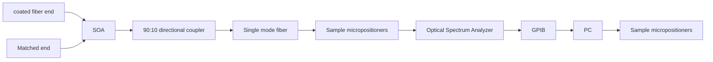
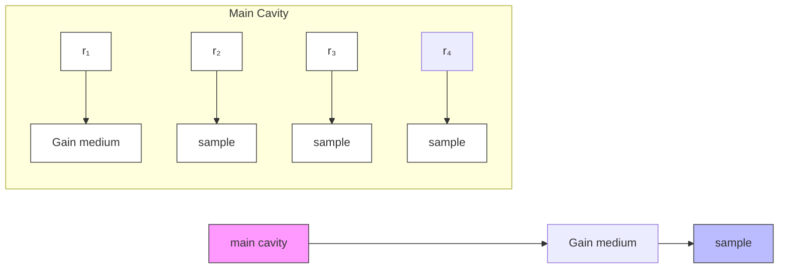

# RESEARCH

# Open Access

# Autocorrelation noise free Optical Coherence Tomography using the novel concept of resonant OCT (ROCT)

CrossMark

M. Shalaby $^{1,2*}$ and Sulaiman S. Al-Sowayan $^{1}$

# Abstract

Background: Optical Coherence Tomography OCT is a noninvasive imaging technique that takes pictures of cross sections of human body tissues with a great resolution compared to other techniques. Fourier Domain OCT method provides significant improvement of imaging speed and detection sensitivity but suffers from autocorrelation noise arising as interference signals from reflections of sample layers that tends to obscure some of sample structure details.

Methods: We present in this paper a new implementation of Common Path Optical Coherence Tomography, based on a resonant structure. The structure employs a semiconductor optical amplifier SOA and uses two mirrors, one coated fiber end and the other is the sample under test. Amplified multiple reflections between the laser cavity high reflection mirror and the sample layers along with SOA gain behavior results in the reduction of autocorrelation noise.

Results: Autocorrelation noise is greatly reduced by a factor of 5 dB compared to an ordinary FDOCT system.

Conclusion: This new structure, with the absence of autocorrelation noise that covers some of the details of the sample under test in OCT setups, is capable practically of attaining images with higher resolution.

# Background

Optical Coherence Tomography has become a powerful imaging technique which started in ophthalmological domain in the 1990's. Since then it is widely applied in many other medical areas where it is used in diagnosis of diseases, and in technical fields. Nowadays there are many diseases as cancer which require a resolution in the micron and sub-micron range, so improvements in resolution are required to detect such diseases.

There are two variants of OCT techniques depending on the detection system: Time-domain (TDOCT) and Frequency-domain (FDOCT). TDOCT was proposed by Huang et al. in 1991 [1] and is based on a scanning optical delay line (mechanical displacement of a reference arm). FDOCT provides significant improvement of imaging speed and detection sensitivity as compared to TDOCT [2, 3]. FDOCT is based on analyzing a signal caused by interference of light beams and can be performed in two ways: The first technique is called Spectral OCT (SOCT) where a light source with broad spectral bandwidth ( $\sim$ 100 nm) is used in combination with a spectrometer and a line or array of photo-sensitive detectors [4, 5].

SOCT instruments achieve a speed up to 50 k Ascans/s and an axial resolution as high as 2 $\mu$ m in tissue [6, 7].

The second technique is called Swept source OCT (SSOCT) where a tunable laser is used in conjunction with a photodetector $[8, 9]$ . This second method usually operates at speeds comparable to SOCT employing a rapidly tunable laser $[10, 11]$ .

The axial resolution of most SS-OCT systems is on the order of $10\mu \mathrm{m}$ in tissue and doesn't match high resolution SOCT systems. Due to the high imaging speed, FDOCT systems enable the acquisition of three dimensional image data in-vivo which is especially beneficial for numerous ophthalmic imaging applications [12].

Despite its superiority over TD-OCT, FD-OCT implementation exhibit drawbacks in terms of autocorrelation noise artifacts, which obscure details of the image and degrade the system sensitivity. The autocorrelation terms arise from the interference occurring between different sample reflectors within the target. Jun Ai, et.al proposed the

text_image

Mirror
d_r
Beam Splitter
Sample
Broadband Light Source
d_s
Spectrometer

Fig. 1 FD-OCT system based on a Michelson interferometer

elimination of autocorrelation noise through asynchronous acquisition of two interferograms using an optical switch and attaining an axial resolution of $15 \mu m$ in air [13].

FD-OCT bases itself upon low coherence interferometry. Optical Coherence interferometry combines two or more light waves in an optical instrument in such a way that interference occurs between them.

As shown in Fig. 1; Michelson interferometer, the single incoming beam of coherent light will be split into two identical beams by a beam splitter. Each of these beams will travel a different path, and then the reflected beams from the two paths are recombined at the beam splitter before arriving at a detector (a spectrometer). The difference in the distance traveled by each beam, path difference, creates a phase difference between them. This phase difference is what creates the interference pattern between the initially identical waves.

The OCT main concept is the same as the simple Michelson interferometer but by replacing one of its mirrors by the sample under investigation. Axial (depth) resolution is inversely proportional to light bandwidth and is given by;

flowchart

Fig. 2 Experimental setup used to examine the proposed Resonant Optical Coherence Tomography ROCT technique

flowchart

Fig. 3 Modelled setup

$$
\Delta \mathrm{L} = \frac {2 \ln (2)}{\pi} \frac {\lambda \mathrm{o} ^ {2}}{\Delta \lambda}
$$

Where $\lambda_{0}$ is the central wavelength of the light and $\Delta\lambda$ is its spectral full width at half maximum (FWHM). Thus, if we increase BW of light used (using a source of shorter coherence length), we can increase axial resolution. The advantage of increased resolution is lost by the autocorrelation noise that covers required signals of the sample structure.

In this paper we present a novel implementation of a common path OCT setup that is free from autocorrelation noise signals that may overlap the desired image of the object layers. This is achieved through establishing a laser cavity composed of a semiconductor optical amplifier SOA, a 90:10 fiber coupler, and two mirrors at the two ends. One mirror has a reflection coefficient of $99.9\%$ and is attained by coating the fiber end with a multilayered structure. The other mirror is simply a cleaved fiber end facing the sample under test at a very small distance. The output from this low finesse and low quality factor laser cavity represents the measured interferogram. The Fast Fourier Transform of the obtained interferogram gives the detailed structure of the sample layers. The obtained axial resolution, due to the absence of undesired signals, shows an enhancement over the OCT technique employing a wide band source. The reduction in autocorrelation noise is attributed to amplified multiple reflections between the laser cavity high reflection mirror and the sample layers.

text_image

I₁
Gain medium
r₁
rₑq
main cavity

Fig. 4 Reduced modelled setup

# Methods

# Experimental setup of a resonant OCT

Figure 2 shows the structure of ROCT system. The optical cavity consists of the semiconductor optical amplifier SOA operating around 1300 nm acting as a gain medium and connected by single mode fiber patch chords to a 90:10 fiber coupler and the cavity is ended from one side by a coated fiber and the other side by a cleaved fiber end adjusted very near to the sample under test. The 10 % output from the directional coupler is connected to an Agilent optical spectrum analyzer which is interfaced to a computer through a GPIB cable (General Purpose Interface Bus) where an algorithm performs data manipulation, and FFT (Fast Fourier Transform) to obtain the final results. To test the proposed idea we have chosen a well-known sample structure in advance. The sample under test is a glass microscope slide held close to fiber tip. The glass sheet or slide was about 1.1 mm in thickness.

# Modeling of the system

The main laser cavity of the actual setup, of length $l_{1}$ , consists of a coated fiber end with reflectivity $r_{1}$ , a semiconductor optical amplifier SOA, and a cleaved fiber end with reflectivity $r_{2}$ . The extended cavity includes the sample under test. Figures 3 and 4 show the simulation model we used to study the operation of the proposed OCT system. Lasing is not established except between the coated end and the assembly to the right of the SOA (lasing between $r_{3}$ and $r_{4}$ for example is not expected). The equivalent complex reflectivity $r_{eq1}$ of the sample layers is given as;

$$
r _ {e q 1} = \frac {(r _ {3} - r _ {4} e ^ {- 2 i \theta})}{1 - r _ {3} r _ {4} e ^ {- 2 i \theta}} \mathrm{with} \theta = \frac {2 \pi n l _ {3}}{\lambda}
$$

Where $r_{3}$ and $r_{4}$ are the reflectivities of the sample surfaces, n is the refractive index of the sample medium, and $l_{3}$ is the sample thickness. The overall complex reflectivity of the laser cavity right mirror and the sample is given as;

$$
r _ {e q} = \frac {\left(r _ {2} - r _ {e q 1} e ^ {- 2 i \theta_ {1}}\right)}{1 - r _ {2} r _ {e q 1} e ^ {- 2 i \theta_ {1}}} \text {with} \theta_ {1} = \frac {2 \pi l _ {2}}{\lambda}
$$

Where $l_{2}$ is the distance between the cavity right mirror and the first surface of the sample.

The SOA gain per unit length is modeled using the following equations;

line

| Layers positions measured from fiber tip in mm | Reflectivity of sample layers |
| ---------------------------------------------- | ----------------------------- |
| 0.0                                            | 120                           |
| 0.2                                            | 30                            |
| 2.0                                            | 0                             |
| 2.2                                            | 5                             |
| 2.4                                            | 0                             |

Fig. 5 The layers positions of the studied sample with their reflectivities in arbitrary units

$$
g (\lambda) = g _ {\mathrm{max}} e ^ {- 2 \left[ \frac {(\lambda - \lambda_ {c})}{\Delta \lambda} \right] ^ {2}}
$$

With

$$
g _ {m a x} = \frac {1}{L _ {a}} \ln \frac {1}{\sqrt {r _ {1}}}
$$

where $\Delta\lambda$ is the gain bandwidth of the used SOA, $L_{a}$ is the SOA length and $\lambda c$ is the central wavelength. Gain saturation of the used SOA limits the laser output power to a safe level according to the tissues studied. $r_{eq}$ represents the signal reflected from the sample under test including the reference signal. $r_{eq}$ is the measured signal in the case of ordinary OCT systems. The active optical cavity containing the semiconductor optical amplifier “SOA” is assumed of length “ $l_{1}$ ”. The output of this cavity is given as;

$$
\frac {r _ {1} - r _ {e q} e ^ {j \emptyset} e ^ {g L _ {a}}}{1 - r _ {1} r _ {e q} e ^ {j \emptyset} e ^ {g L _ {a}}} \text {with} \emptyset = \frac {2 \pi n}{\lambda} l _ {1}
$$

line

| Wavelength (nm) | Power (dbm) |
| --------------- | ----------- |
| 1280            | -75         |
| 1290            | -70         |
| 1300            | -65         |
| 1310            | -60         |
| 1320            | -65         |
| 1330            | -70         |
| 1340            | -75         |

Fig. 6 The interferogram obtained using common path FD-OCT technique

line

| Wavelength (nm) | Power (dBm) |
| --------------- | ----------- |
| 1540            | -82.0       |
| 1545            | -83.5       |
| 1550            | -79.0       |
| 1555            | -77.5       |
| 1560            | -76.0       |
| 1565            | -74.5       |
| 1570            | -73.0       |
| 1575            | -74.0       |
| 1580            | -75.5       |
| 1585            | -76.5       |
| 1590            | -78.0       |
| 1595            | -76.0       |
| 1600            | -77.0       |

Fig. 7 The interferogram obtained using the proposed resonant OCT technique

Signals reflected of sample layers undergo multiple round trips inside the laser cavity. Repeated amplification of these signals play a major role in reducing autocorrelation noise as we will show.

# Results and Discussions

# Simulation results

The simulation is carried out for a sample of thickness 2 mm held at 0.2 mm from the cavity right mirror. The reflectivities of the two surfaces $r_{3}=0.05$ , $r_{4}=0.01$ . Figure 5 shows the FFT of the laser output spectrum. The sample layers displayed as a result of this study are referred to the main cavity right mirror position, therefore the main cavity length $l_{1}$ will not affect the results and is not shown in Fig. 5. We notice in Fig. 5 three peaks, the second peak represents the sample first layer positioned at 0.2 mm and the third peak represents the sample second surface positioned at 2.2 mm. The autocorrelation noise signal appears much attenuated at 2 mm.

# Experimental results of ROCT vs. OCT

In what follows we show the results of our proposed experimental setup compared to the same results obtained using a conventional common path FD-OCT. The studied sample is a glass microscope slide of thickness

line

| distance(mm) | normalized power |
| ------------ | ---------------- |
| 0.0          | 1.0              |
| 0.5          | 0.7              |
| 1.0          | 0.2              |
| 1.5          | 0.2              |
| 2.0          | 0.0              |
| 3.0          | 0.0              |
| 4.0          | 0.0              |
| 5.0          | 0.1              |
| 6.0          | 0.1              |

Fig. 8 Layers positions of the glass sheet as measured using the ROCT method showing the autocorrelation noise signal highly reduced

line

| distance(mm) | normalized power |
| ------------ | ---------------- |
| 0.0          | 1.0              |
| 0.5          | 0.0              |
| 1.0          | 0.0              |
| 1.5          | 0.1              |
| 2.0          | 0.0              |
| 2.5          | 0.0              |
| 3.0          | 0.0              |
| 3.5          | 0.0              |
| 4.0          | 0.0              |
| 4.5          | 0.0              |

Fig. 9 Layers positions of the same sample as Fig. 7a when measured using the OCT method showing the relatively high level of the autocorrelation noise signal

1.1 mm approximately. Figure 6 shows the interferogram obtained by a conventional Common Path FD-OCT system. The light source used is a super luminescent diode with a wavelength spectrum bandwidth of 60 nm centered at 1550 nm. The Agilent Optical Spectrum Analyzer used has a spectral resolution of 0.07 nm. Figure 7 shows the interferogram obtained for the same sample and the same spectrum bandwidth obtained using our proposed setup of Fig. 2. We cannot depict any improvements only by comparing the two interferograms therefore we apply Fast Fourier Transform for both interferograms to attain the detailed layers structure of the studied sample.

The Fourier transform of the laser output is given in Fig. 8. Coherence noise term is expected to appear at the position of 1.1 mm (the glass sheet thickness). The signal level at this position is very weak. This emphasizes our expectation of getting a much reduced coherence noise. The same sample is tested with an ordinary OCT setup and Fig. 9 shows the relatively higher level of coherence noise. We notice that, gain saturation increased the level of the weak signal produced by the sample second surface relative to that of the first surface by about 3 dB when compared to ordinary OCT and hence acting against the effect of diffraction. Moreover, amplification of sample reflectivities inside the laser cavity enhances system sensitivity. The overall reduction in autocorrelation noise signal level is nearly 5 dB.

# Conclusion

We analyzed and implemented experimentally a resonant common path OCT setup. The new proposed scheme shows an enhancement over the ordinary OCT system where the level of autocorrelation noise signal is greatly reduced. These signals obscure some of the details of the sample under test in ordinary OCT setups. Therefore, this promising result is expected to increase the system axial resolution.

# Acknowledgements

The authors would like to thank the Deanship of Scientific Research at Al Imam Mohammad Ibn Saud Islamic University for the financial support of the project: No 351403/1435H, and for the continuous help during this work by providing the space and equipment required to carry out the experimental measurements.

# Authors' contributions

Both authors contributed equally in all the sections of this work.

# Competing interests

Both authors contributed equally in all the sections of this work.

Received: 21 January 2016 Accepted: 31 May 2016

Published online: 25 July 2016

# References

1. Huang, D, Swanson, EA, Lin, CP, Schuman, JS, Stinson, WG, Chang, W, Hee, MR, Flotte, T, Gregory, K, Puliafito, CA, Fujimoto, JG: Optical coherence tomography. Science 254, 1178–1181 (1991)

2. Leitgeb, R, Hitzenberger, CK, Fercher, AF: Performance of Fourier domain vs. time domain optical coherence tomography. Opt. Express 11, 889–894 (2003)   
3. de Boer, JF, Cense, B, Park, BH, Pierce, MC, Tearney, GJ, Bouma, BE: Improved signal-to noise ratio in spectral-domain compared with time domain optical coherence tomography. Opt. Lett. 28, 2067–2069 (2003)   
4. Wang, Z, Yuan, Z, Wang, H, Pan, Y: Increasing the imaging depth of spectral-domain OCT by using interpixel shift technique. Opt. Express 14(16), 7014 (2006)   
5. Wojtkowski, M, Leitgeb, R, Kowalczyk, A, Bajraszewski, T, Fercher, AF: In vivo human retinal imaging by Fourier domain optical coherence tomography. J. Biomed. Opt. 7, 457–463 (2002)   
6. Wojtkowski, M, Srinivasan, VJ, Ko, TH, Fujimoto, JG, Kowalczyk, A, Duker, JS: Ultrahigh resolution, high-speed, Fourier domain optical coherence tomography and methods for dispersion compensation. Opt. Express 12, 2404–2422 (2004)   
7. Nassif, NA, et al: In vivo high-resolution video-rate spectral-domain optical coherence tomography of the human retina and optic nerve. Opt. Express 12(3), 367 (2004)   
8. Chinn, SR, Swanson, EA, Fujimoto, JG: Optical coherence tomography using a frequency tunable optical source. Opt. Lett. 22, 340–342 (1997)   
9. Lexer, F, Hitzenberger, CK, Fercher, AF, Kulhavy, M: Wavelength-tuning interferometry of intraocular distances. Appl. Opt. 36, 6548–6553 (1997)   
10. Choma, MA, Sarunic, MV, Yang, CH, Izatt, JA: Sensitivity advantage of swept source and Fourier domain optical coherence tomography. Opt. Express 11, 2183–2189 (2003)   
11. Yun, SH, Tearney, GJ, de Boer, JF, Bouma, BE: Pulsed-source and swept-source spectral domain optical coherence tomography with reduced motion artifacts. Opt. Express 12, 5614–5624 (2004)   
12. Cense, B, Nassif, NA, Chen, TC, Pierce, MC, Yun, S-H, Park, BH, Bouma, BE, Tearney, GJ, de Boer, JF: Ultrahigh-resolution high-speed retinal imaging using spectral-domain optical coherence tomography. Opt. Express 12, 2435–2447 (2004)   
13. Ai, J, Wang, LV: Spectral-domain optical coherence tomography: Removal of autocorrelation using an optical switch. Appl. Phys. Lett. 88, 111115 (2006)

# Submit your manuscript to a SpringerOpen journal and benefit from:

▶ Convenient online submission   
▶ Rigorous peer review   
▶ Immediate publication on acceptance   
▶ Open access: articles freely available online   
▶ High visibility within the field   
▶ Retaining the copyright to your article

Submit your next manuscript at ▶ springeropen.com