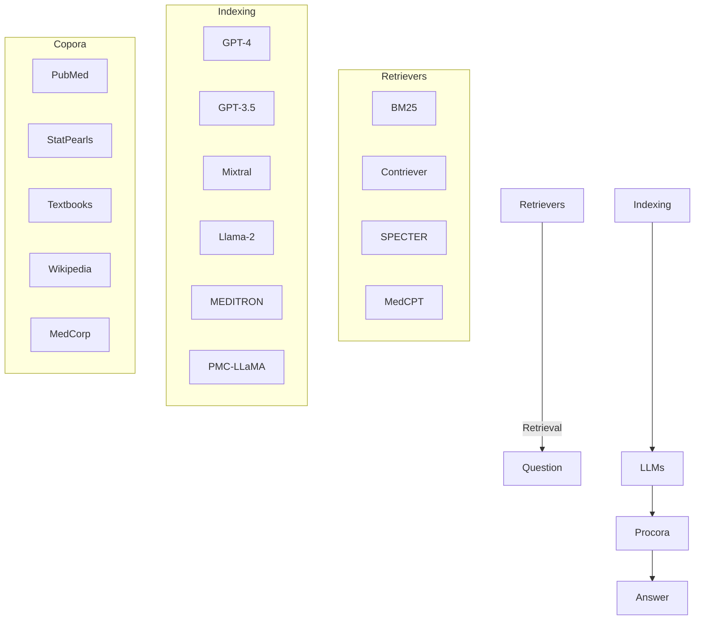

# Benchmarking Retrieval-Augmented Generation for Medicine

Guangzhi Xiong $^{♣†}$ , Qiao Jin $^{\heartsuit\dagger}$ , Zhiyong Lu $^{\heartsuit§}$ , Aidong Zhang $^{♣§}$

♣ Univeristy of Virginia

♥ National Library of Medicine, National Institutes of Health

{hhu4zu, aidong}@virginia.edu

{qiao.jin, zhiyong.lu}@nih.gov

# Abstract

While large language models (LLMs) have achieved state-of-the-art performance on a wide range of medical question answering (QA) tasks, they still face challenges with hallucinations and outdated knowledge. Retrieval-augmented generation (RAG) is a promising solution and has been widely adopted. However, a RAG system can involve multiple flexible components, and there is a lack of best practices regarding the optimal RAG setting for various medical purposes. To systematically evaluate such systems, we propose the Medical Information Retrieval-Augmented Generation Evaluation (MIRAGE), a first-of-its-kind benchmark including 7,663 questions from five medical QA datasets. Using MIRAGE, we conducted large-scale experiments with over 1.8 trillion prompt tokens on 41 combinations of different corpora, retrievers, and backbone LLMs through the MEDRAG toolkit introduced in this work. Overall, MEDRAG improves the accuracy of six different LLMs by up to 18% over chain-of-thought prompting, elevating the performance of GPT-3.5 and Mixtral to GPT-4-level. Our results show that the combination of various medical corpora and retrievers achieves the best performance. In addition, we discovered a log-linear scaling property and the “lost-in-the-middle” effects in medical RAG. We believe our comprehensive evaluations can serve as practical guidelines for implementing RAG systems for medicine $^{1}$ .

# 1 Introduction

Large Language Models (LLMs) have revolutionized the way people seek information online, from searching to directly asking chatbots for answers. Although recent studies have shown their state-of-the-art capabilities of question answering (QA) in both general and medical domains (OpenAI et al., 2023; Anil et al., 2023; Touvron et al., 2023b; Singhal et al., 2023a; Nori et al., 2023a), LLMs often generate plausible-sounding but factually incorrect responses, commonly known as hallucination (Ji et al., 2023). Also, the training corpora of LLMs might not include the latest knowledge, such as recent updates of clinical guidelines. These issues can be especially dangerous in high-stakes domains such as healthcare (Tian et al., 2024; Hersh, 2024), and will affect the overall performance of LLMs on domain-specific QA tasks.

By providing LLMs with relevant documents retrieved from up-to-date and trustworthy collections, Retrieval-Augmented Generation (RAG) has the potential to address the above challenges (Lewis et al., 2020; Gao et al., 2023). RAG also improves the transparency of LLMs by grounding their reasoning on the retrieved documents. As such, RAG has already been quickly implemented in various scientific and clinical QA systems (Lála et al., 2023; Zakka et al., 2024). However, a complete RAG system contains several flexible modules, such as document collections (corpora), retrieval algorithms (retrievers), and backbone LLMs, but the best practices for tuning these components are still unclear, hindering their optimal adoption in medicine.

To systematically evaluate how different components in RAG affect its performance, we first compile an evaluation benchmark termed MIRAGE, representing Medical Information Retrieval-Augmented Generation Evaluation. MIRAGE includes 7,663 questions from five commonly used QA datasets in biomedicine. To evaluate RAG in realistic medical settings, MIRAGE focuses on the zero-shot ability in RAG systems where no demonstrations are provided. We also employ a question-only setting for the retrieval phase of RAG, as in real-world cases where no options are given. For a comprehensive comparison on MIRAGE, we provide MEDRAG, an easy-to-use toolkit that covers

five corpora, four retrievers, and six LLMs including both general and domain-specific models.

Based on the MIRAGE benchmark, we systematically evaluated different MEDRAG solutions and studied the effects of each component on overall performance from a multidimensional perspective. For various LLMs, there is a 1% to 18% relative performance increase using MEDRAG compared to chain-of-thought prompting (Wei et al., 2022). Notably, with MEDRAG, GPT-3.5 and Mixtral (Jiang et al., 2024) can achieve comparable performance to GPT-4 (OpenAI et al., 2023) on MIRAGE. On the corpus dimension, we found different tasks have a preference over the retrieval corpus. While point-of-care articles and textbooks are solely helpful for examination questions, PubMed is a robust choice for all MIRAGE tasks. Our results also show that a combination of all corpora can be a more comprehensive choice. On the retriever dimension, BM25 (Robertson et al., 2009) and the domain-specific MedCPT (Jin et al., 2023a) retriever display superior performance on our MIRAGE benchmark. The performance can be further enhanced by combining multiple retrievers. Beyond the evaluation results on MIRAGE, we found a log-linear scaling relationship between model performance and the number of retrieved snippets. We also observed a “lost-in-the-middle” phenomenon (Liu et al., 2023) between model performance and the position of the ground-truth snippet. Finally, we provide several practical recommendations based on the results and analyses, which can guide the application and future research of RAG in the biomedical domain.

In summary, our contributions are three-fold:

- We introduce the MIRAGE $^{2}$ , a first-of-its-kind benchmark for systematically comparing different medical RAG systems.   
- We provide MEDRAG $^{3}$ , a RAG toolkit for medical QA that incorporates various domain-specific corpora, retrievers, and LLMs. MEDRAG significantly improves the performance of LLMs on MIRAGE.   
- We recommend a set of best practices for research and deployments of medical RAG systems based on our comprehensive results and analyses on MIRAGE with MEDRAG.

# 2 Related Work

# 2.1 Retrieval-augmented Generation

Retrieval-Augmented Generation (RAG) was proposed by Lewis et al. (2020) to enhance the generation performance on knowledge-intensive tasks by integrating retrieved relevant information. RAG not only mitigates the problem of hallucinations as LLMs are grounded on given contexts, but can also provide up-to-date knowledge that might not be encoded by the LLMs. Many follow-up studies have been carried out to improve over the vanilla RAG (Borgeaud et al., 2022; Ram et al., 2023; Gao et al., 2023; Jiang et al., 2023; Mialon et al., 2023).

In biomedicine, there have also been various explorations on how LLMs can improve literature information-seeking and clinical decision-making with RAG (Frisoni et al., 2022; Naik et al., 2022; Jin et al., 2023b; Lála et al., 2023; Zakka et al., 2024; Jeong et al., 2024; Wang et al., 2023b), but their evaluations are not comprehensive. Nevertheless, current systematic evaluations in biomedicine typically focus on the vanilla LLMs without RAG (Chen et al., 2023a; Nori et al., 2023a). Our study provides the first systematic evaluations of RAG systems in medicine.

# 2.2 Biomedical Question Answering

Biomedical or medical question answering (QA) is a widely studied task since various information needs are expressed by natural language questions in biomedicine (Zweigenbaum, 2003; Athenikos and Han, 2010; Jin et al., 2022). While BERT-based (Devlin et al., 2019) models used to be the state-of-the-art methods of medical QA (Abacha et al., 2019; Lee et al., 2020; Soni and Roberts, 2020; Gu et al., 2021; Yasunaga et al., 2022), they are outperformed by LLMs with large margins (Singhal et al., 2023b; Chen et al., 2023b; Nori et al., 2023b). Due to their knowledge-intensive nature, QA datasets are commonly used to evaluate the biomedical capabilities of both general LLMs (Nori et al., 2023a,b) and domain-specific LLMs (Luo et al., 2022; Chen et al., 2023b; Wu et al., 2023; Singhal et al., 2023a,b). Following these studies, we also use medical QA datasets to test if a RAG system can retrieve and leverage relevant contexts. Unlike prior efforts, our evaluation employs both RAG and question-only retrieval settings, a more realistic evaluation for medical QA.

# 3 The MIRAGE Benchmark

# 3.1 Evaluation Settings

The main objective of this work is to evaluate RAG systems in a setting that reflects real-world medical information needs as much as possible while being practically scalable. As such, our MIRAGE benchmark adopts four key evaluation settings:

Zero-Shot Learning (ZSL). As real-world medical questions are often posed without similar exemplars available, in our benchmark, the RAG systems should be evaluated in a zero-shot setting where in-context few-shot learning is not permitted.

Multi-Choice Evaluation (MCE). Evaluating medical QA systems using multi-choice questions is a widely adopted method that can be practically implemented for large-scale evaluation (Nori et al., 2023a,b; Singhal et al., 2023a; Liévin et al., 2022; Lála et al., 2023). To be consistent with existing research, we also use a multi-choice setting in our benchmark to compare different systems.

Retrieval-Augmented Generation (RAG). The medical questions used in MIRAGE are knowledge-intensive, which are difficult to answer without external knowledge. Moreover, due to the problem of hallucination, letting LLMs be reasoning engines instead of knowledge databases could be a better practice in medicine (Truhn et al., 2023). Thus, RAG is needed to collect external information for accurate and reliable answer generation.

Question-Only Retrieval (QOR). To align with real-world cases of medical QA, answer options should not be provided as input during retrieval. This is a more realistic setting for evaluating RAG systems. While Liévin et al. (2022) and Lála et al. (2023) evaluated LLMs with RAG on medical QA, options were used for retrieval in their work, which is not a realistic setting. To the best of our knowledge, we are the first to propose and employ this setting for medical QA evaluation.

<table><tr><td>Study</td><td>ZSL</td><td>MCE</td><td>RAG</td><td>QOR</td></tr><tr><td>Nori et al. (2023a)</td><td>√</td><td>√</td><td></td><td></td></tr><tr><td>Singhal et al. (2023a)</td><td>√</td><td>√</td><td></td><td></td></tr><tr><td>Liévin et al. (2022)</td><td>√</td><td>√</td><td>√</td><td></td></tr><tr><td>Lála et al. (2023)</td><td>√</td><td>√</td><td>√</td><td></td></tr><tr><td>MIRAGE (Ours)</td><td>√</td><td>√</td><td>√</td><td>√</td></tr></table>

Table 1: Comparison of related work for using the different evaluation settings adopted in MIRAGE.

Table 1 lists related work on the evaluation settings. Only MIRAGE adopts all four considerations.

# 3.2 Component Datasets

text_image

5 Datasets	7,663 Questions	2-4 Choices
MMLU-Med	Which of the following best describes ... ?
MedQA-US	A 72-year-old man comes to the physicians ... ?
MedMCQA	Axonal transport is:	A / B / C / D
PubMedQA*:Is anorectal endosonography valuable ... ?
BioASQ-Y/N(Is medical hydrology the same as Spa ...?
Yes / No

Figure 1: Composition of the MIRAGE benchmark.

As shown in Figure 1, MIRAGE contains five commonly used datasets for medical QA for the evaluation of RAG systems (Hendrycks et al., 2020; Jin et al., 2021; Pal et al., 2022; Jin et al., 2019; Tsatsaronis et al., 2015), including three medical examination QA datasets (MMLU-Med, MedQA-US, MedMCQA) and two biomedical research QA datasets (PubMedQA\*, BioASQ-Y/N). Specifically, we only include multi-choice questions that are related to biomedicine and exclude all ground-truth supporting contexts for the questions. For example, we remove the contexts of PubMedQA and only use the questions, resulting in PubMedQA\*. More details are described in the appendix. Table 2 presents the statistics of the datasets in MIRAGE.

<table><tr><td>Dataset</td><td>Size</td><td>#O.</td><td>Avg. L</td><td>Source</td></tr><tr><td>MMLU-Med</td><td>1,089</td><td>4</td><td>63</td><td>Examination</td></tr><tr><td>MedQA-US</td><td>1,273</td><td>4</td><td>177</td><td>Examination</td></tr><tr><td>MedMCQA</td><td>4,183</td><td>4</td><td>26</td><td>Examination</td></tr><tr><td>PubMedQA*</td><td>500</td><td>3</td><td>24</td><td>Literature</td></tr><tr><td>BioASQ-Y/N</td><td>618</td><td>2</td><td>17</td><td>Literature</td></tr></table>

Table 2: Statistics of MIRAGE tasks. #O.: numbers of options; Avg. L: average token counts in each question.

As the tasks in MIRAGE are all composed of multi-choice questions, we evaluate a given RAG system by testing its performance in predicting the correct answer choices. For each specific task, we compute the accuracy of model predictions as the evaluation metric, as well as the standard deviation for the proportion of correctly answered questions, reflecting the error bound of the results. Across

all five tasks in MIRAGE, an average score of the accuracies will be measured to show how a given system performs on medical QA in general.

# 4 The MEDRAG Toolkit

flowchart

Figure 2: Component overview of the MEDRAG toolkit.

To comprehensively evaluate how different RAG systems perform on our MIRAGE benchmark, we propose MEDRAG, a toolkit with systematic implementations of RAG for medical QA. As shown in Figure 2, MEDRAG consists of three major components: Corpora, Retrievers, and LLMs, which are briefly introduced in this section. More details of each component can be found in the appendix.

<table><tr><td>Corpus</td><td>#Doc.</td><td>#Snippets</td><td>Avg. L</td><td>Domain</td></tr><tr><td>PubMed</td><td>23.9M</td><td>23.9M</td><td>296</td><td>Biomed.</td></tr><tr><td>StatPearls</td><td>9.3k</td><td>301.2k</td><td>119</td><td>Clinics</td></tr><tr><td>Textbooks</td><td>18</td><td>125.8k</td><td>182</td><td>Medicine</td></tr><tr><td>Wikipedia</td><td>6.5M</td><td>29.9M</td><td>162</td><td>General</td></tr><tr><td>MedCorp</td><td>30.4M</td><td>54.2M</td><td>221</td><td>Mixed</td></tr></table>

Table 3: Statistics of corpora in MEDRAG. #Doc.: numbers of raw documents; #Snippets: numbers of snippets (chunks); Avg. L: average length of snippets.

For corpora used in MEDRAG, we collect raw data from four different sources, including the commonly used PubMed $^{4}$ for all biomedical abstracts, StatPearls $^{5}$ for clinical decision support, medical Textbooks (Jin et al., 2021) for domain-specific knowledge, and Wikipedia for general knowledge. To the best of our knowledge, this is the first work that evaluates new corpora like StatPearls. We also provide a MedCorp corpus by combining all four corpora, facilitating cross-source retrieval. Each corpus is chunked into short snippets. Statistics of used corpora are shown in Table 3.

<table><tr><td>Retriever</td><td>Type</td><td>Size</td><td>Metric</td><td>Domain</td></tr><tr><td>BM25</td><td>Lexical</td><td>-</td><td>BM25</td><td>General</td></tr><tr><td>Contriever</td><td>Semantic</td><td>110M</td><td>IP</td><td>General</td></tr><tr><td>SPECTER</td><td>Semantic</td><td>110M</td><td>L2</td><td>Scientific</td></tr><tr><td>MedCPT</td><td>Semantic</td><td>109M</td><td>IP</td><td>Biomed.</td></tr></table>

Table 4: Statistics of Retrievers in MEDRAG, where IP stands for inner product and L2 stands for L2 norm.

For the retrieval algorithms, while many general and domain-specific retrievers have been proposed (Remy et al., 2022; Ostendorff et al., 2022; Karpukhin et al., 2020; Xiong et al., 2020), we only select some representative ones in MEDRAG due to limited resources, including a lexical retriever (BM25, Robertson et al., 2009), a general-domain semantic retriever (Contriever, Izacard et al., 2022), a scientific-domain retriever (SPECTER, Cohan et al., 2020), and a biomedical-domain retriever (MedCPT, Jin et al., 2023a). Their statistics are presented in Table 4. In our experiments, 32 snippets are retrieved by default. Additionally, we utilize Reciprocal Rank Fusion (RRF, Cormack et al., 2009) to combine results from different retrievers, including RRF-2 (fusion of BM25 and MedCPT), and RRF-4 (fusion of all four retrievers).

<table><tr><td>LLM</td><td>Size</td><td>Context</td><td>Open</td><td>Domain</td></tr><tr><td>GPT-4</td><td>N/A</td><td>32,768</td><td>No</td><td>General</td></tr><tr><td>GPT-3.5</td><td>N/A</td><td>16,384</td><td>No</td><td>General</td></tr><tr><td>Mixtral</td><td> $8 \times 7B$ </td><td>32,768</td><td>Yes</td><td>General</td></tr><tr><td>Llama-2</td><td>70B</td><td>4,096</td><td>Yes</td><td>General</td></tr><tr><td>MEDITRON</td><td>70B</td><td>4,096</td><td>Yes</td><td>Biomed.</td></tr><tr><td>PMC-LLaMA</td><td>13B</td><td>2,048</td><td>Yes</td><td>Biomed.</td></tr></table>

Table 5: Statistics of LLMs used in MEDRAG. Context: context length of the LLM; Open: Open-source.

Similarly, although various LLMs have emerged in recent years (Singhal et al., 2023a,b; Taylor et al., 2022; Luo et al., 2022; Yang et al., 2022), we select several frequently used ones in MEDRAG, including the commercial GPT-3.5 and GPT-4 (OpenAI et al., 2023), the open-source Mixtral (Jiang et al., 2024) and Llama-2 (Touvron et al., 2023b), and the biomedical domain-specific MEDITRON (Chen et al., 2023b) and PMC-LLaMA (Wu et al., 2023). Statistics of the used LLMs are in Table 5. For all LLMs, we concatenate and prepend retrieved snippets to the input, and perform chain-of-thought (CoT) prompting (Wei et al., 2022) in MEDRAG to fully leverage the reasoning capability of the models. Temperatures are set to 0 for deterministic outputs. CoT without RAG is used as the baseline.

<table><tr><td rowspan="2">LLM</td><td rowspan="2">Method</td><td colspan="5">MIRAGE Benchmark Dataset</td><td rowspan="2">Avg.</td></tr><tr><td>MMLU-Med</td><td>MedQA-US</td><td>MedMCQA</td><td>PubMedQA*</td><td>BioASQ-Y/N</td></tr><tr><td rowspan="2">GPT-4(-32k-0613)</td><td>CoT</td><td> $89.44 \pm 0.93$ </td><td> $83.97 \pm 1.03$ </td><td> $69.88 \pm 0.71$ </td><td> $39.60 \pm 2.19$ </td><td> $84.30 \pm 1.46$ </td><td>73.44</td></tr><tr><td>MEDRAG</td><td> $87.24 \pm 1.01$ </td><td> $82.80 \pm 1.06$ </td><td> $66.65 \pm 0.73$ </td><td> $70.60 \pm 2.04$ </td><td> $92.56 \pm 1.06$ </td><td>79.97</td></tr><tr><td rowspan="2">GPT-3.5(-16k-0613)</td><td>CoT</td><td> $72.91 \pm 1.35$ </td><td> $65.04 \pm 1.34$ </td><td> $55.25 \pm 0.77$ </td><td> $36.00 \pm 2.15$ </td><td> $74.27 \pm 1.76$ </td><td>60.69</td></tr><tr><td>MEDRAG</td><td> $75.48 \pm 1.30$ </td><td> $66.61 \pm 1.32$ </td><td> $58.04 \pm 0.76$ </td><td> $67.40 \pm 2.10$ </td><td> $90.29 \pm 1.19$ </td><td>71.57</td></tr><tr><td rowspan="2">Mixtral(8×7B)</td><td>CoT</td><td> $74.01 \pm 1.33$ </td><td> $64.10 \pm 1.34$ </td><td> $56.28 \pm 0.77$ </td><td> $35.20 \pm 2.14$ </td><td> $77.51 \pm 1.68$ </td><td>61.42</td></tr><tr><td>MEDRAG</td><td> $75.85 \pm 1.30$ </td><td> $60.02 \pm 1.37$ </td><td> $56.42 \pm 0.77$ </td><td> $67.60 \pm 2.09$ </td><td> $87.54 \pm 1.33$ </td><td>69.48</td></tr><tr><td rowspan="2">Llama-2(70B)</td><td>CoT</td><td> $57.39 \pm 1.50$ </td><td> $47.84 \pm 1.40$ </td><td> $42.60 \pm 0.76$ </td><td> $42.20 \pm 2.21$ </td><td> $61.17 \pm 1.96$ </td><td>50.24</td></tr><tr><td>MEDRAG</td><td> $54.55 \pm 1.51$ </td><td> $44.93 \pm 1.39$ </td><td> $43.08 \pm 0.77$ </td><td> $50.40 \pm 2.24$ </td><td> $73.95 \pm 1.77$ </td><td>53.38</td></tr><tr><td rowspan="2">MEDI TRON(70B)</td><td>CoT</td><td> $64.92 \pm 1.45$ </td><td> $51.69 \pm 1.40$ </td><td> $46.74 \pm 0.77$ </td><td> $53.40 \pm 2.23$ </td><td> $68.45 \pm 1.87$ </td><td>57.04</td></tr><tr><td>MEDRAG</td><td> $65.38 \pm 1.44$ </td><td> $49.57 \pm 1.40$ </td><td> $52.67 \pm 0.77$ </td><td> $56.40 \pm 2.22$ </td><td> $76.86 \pm 1.70$ </td><td>60.18</td></tr><tr><td rowspan="2">PMC-LLaMA(13B)</td><td>CoT</td><td> $52.16 \pm 1.51$ </td><td> $44.38 \pm 1.39$ </td><td> $46.55 \pm 0.77$ </td><td> $55.80 \pm 2.22$ </td><td> $63.11 \pm 1.94$ </td><td>52.40</td></tr><tr><td>MEDRAG</td><td> $52.53 \pm 1.51$ </td><td> $42.58 \pm 1.39$ </td><td> $48.29 \pm 0.77$ </td><td> $56.00 \pm 2.22$ </td><td> $65.21 \pm 1.92$ </td><td>52.92</td></tr></table>

Table 6: Benchmark results of different backbone LLMs on MIRAGE. All numbers are accuracy in percentages.

# 5 Results

We systematically evaluate MEDRAG on our MIRAGE benchmark, which provides us with a multidimensional analysis of different components in RAG for medicine $^{6}$ . Section 5.1 presents the results for different LLMs, and Section 5.2 includes the results of different corpora and retrievers. Based on the results, we provide practical recommendations for RAG implementations in Section 6.4.

# 5.1 Comparison of Backbone LLMs

We first benchmark various LLMs on MIRAGE under both the CoT and the MEDRAG settings. For different LLMs, we use the same MedCorp corpus and the RRF-4 retriever and prepend 32 retrieved snippets for RAG. Results are shown in Table 6.

Under the CoT setting, GPT-4 significantly outperforms other competitors, with an average score of 73.44% on MIRAGE. While the best average score of other backbone LLMs can only achieve about 61% (GPT-3.5 and Mixtral) in the CoT setting, their performance can be significantly improved to around 70% with MEDRAG, which is comparable to GPT-4 (CoT). These results suggest the great potential of RAG as a way to enhance the zero-shot capability of LLMs to answer medical questions, which can be a more efficient choice than performing larger-scale pre-training. On all five tasks in MIRAGE, Mixtral shows an accuracy of 61.42% on average in the CoT setting, which slightly surpasses the performance of GPT-3.5. However, Mixtral is still outperformed by GPT-3.5 with MEDRAG by 3.0%, indicating the advantage of GPT-3.5 in following MEDRAG instructions.

Our results also demonstrate that domain-specific LLMs can exhibit advantages in certain cases. For example, in the CoT setting for PubMedQA\*, MEDITRON and PMC-LLaMA present significantly higher accuracies than all other models, including GPT-4 (+34.8% & +40.9%). Additionally, MEDITRON shows a better performance in both CoT (+13.5%) and MEDRAG (+12.7%) than its base Llama-2 model. The comparison of Llama-2 (MEDRAG) and MEDITRON (CoT) reflects the differences between RAG (+6.3%) and supervised fine-tuning (SFT, +13.5%) in improving the performance of LLMs on medical QA. While SFT is better at fusing medical knowledge into LLMs, RAG remains a more flexible and cost-efficient way to improve medical QA. For questions in PubMedQA\* and BioASQ-Y/N where the closely related literature can be found from PubMed, MEDRAG greatly improves the ability of Llama-2 to answer medical questions (+19.4% & +20.9%), leading to a comparable or even better performance than MEDITRON (CoT). However, for examination questions in MIRAGE that are carefully designed to differentiate between medical students, MEDRAG does not always improve over SFT since the helpful snippets might be difficult to retrieve. The performance gap between these two types of questions suggests that there is still much room for improvement.

<table><tr><td rowspan="2">Corpus</td><td rowspan="2">Retriever</td><td colspan="5">MIRAGE Benchmark Dataset</td><td rowspan="2">Average</td></tr><tr><td>MMLU-Med</td><td>MedQA-US</td><td>MedMCQA</td><td>PubMedQA*</td><td>BioASQ-Y/N</td></tr><tr><td>None</td><td>None</td><td>72.91 ± 1.35</td><td>65.04 ± 1.34</td><td>55.25 ± 0.77</td><td>36.00 ± 2.15</td><td>74.27 ± 1.76</td><td>60.69</td></tr><tr><td rowspan="6">PubMed(23.9M)</td><td>BM25</td><td>72.27 ± 1.36</td><td>63.71 ± 1.35</td><td>55.49 ± 0.77</td><td>66.20 ± 2.12</td><td>88.51 ± 1.28</td><td>69.23</td></tr><tr><td>Contriever</td><td>71.72 ± 1.36</td><td>63.94 ± 1.35</td><td>54.29 ± 0.77</td><td>65.60 ± 2.12</td><td>85.44 ± 1.42</td><td>68.20</td></tr><tr><td>SPECTER</td><td>73.19 ± 1.34</td><td>65.20 ± 1.34</td><td>53.12 ± 0.77</td><td>54.80 ± 2.23</td><td>75.73 ± 1.72</td><td>64.41</td></tr><tr><td>MedCPT</td><td>73.09 ± 1.34</td><td>66.69 ± 1.32</td><td>54.94 ± 0.77</td><td>66.40 ± 2.11</td><td>85.76 ± 1.41</td><td>69.38</td></tr><tr><td>RRF-2</td><td>75.57 ± 1.30</td><td>64.34 ± 1.34</td><td>55.34 ± 0.77</td><td>69.00 ± 2.07</td><td>87.06 ± 1.35</td><td>70.26</td></tr><tr><td>RRF-4</td><td>73.37 ± 1.34</td><td>64.73 ± 1.34</td><td>54.75 ± 0.77</td><td>67.20 ± 2.10</td><td>88.51 ± 1.28</td><td>69.71</td></tr><tr><td rowspan="6">StatPearls(301.2k)</td><td>BM25</td><td>71.63 ± 1.37</td><td>65.67 ± 1.33</td><td>54.89 ± 0.77</td><td>27.60 ± 2.00</td><td>60.36 ± 1.97</td><td>56.03</td></tr><tr><td>Contriever</td><td>73.28 ± 1.34</td><td>67.48 ± 1.31</td><td>54.24 ± 0.77</td><td>28.80 ± 2.03</td><td>58.41 ± 1.98</td><td>56.44</td></tr><tr><td>SPECTER</td><td>73.74 ± 1.33</td><td>64.73 ± 1.34</td><td>52.83 ± 0.77</td><td>23.20 ± 1.89</td><td>57.77 ± 1.99</td><td>54.45</td></tr><tr><td>MedCPT</td><td>72.82 ± 1.35</td><td>64.89 ± 1.34</td><td>54.17 ± 0.77</td><td>27.60 ± 2.00</td><td>60.68 ± 1.96</td><td>56.03</td></tr><tr><td>RRF-2</td><td>72.64 ± 1.35</td><td>65.67 ± 1.33</td><td>54.63 ± 0.77</td><td>30.00 ± 2.05</td><td>61.17 ± 1.96</td><td>56.82</td></tr><tr><td>RRF-4</td><td>73.83 ± 1.33</td><td>65.12 ± 1.34</td><td>53.81 ± 0.77</td><td>30.60 ± 2.06</td><td>59.71 ± 1.97</td><td>56.61</td></tr><tr><td rowspan="6">Textbooks(125.8k)</td><td>BM25</td><td>74.66 ± 1.32</td><td>66.54 ± 1.32</td><td>54.05 ± 0.77</td><td>30.20 ± 2.05</td><td>60.03 ± 1.97</td><td>57.10</td></tr><tr><td>Contriever</td><td>74.10 ± 1.33</td><td>67.16 ± 1.32</td><td>54.53 ± 0.77</td><td>26.60 ± 1.98</td><td>60.19 ± 1.97</td><td>56.52</td></tr><tr><td>SPECTER</td><td>72.82 ± 1.35</td><td>67.40 ± 1.31</td><td>53.29 ± 0.77</td><td>25.60 ± 1.95</td><td>55.50 ± 2.00</td><td>54.92</td></tr><tr><td>MedCPT</td><td>74.93 ± 1.31</td><td>66.22 ± 1.33</td><td>54.41 ± 0.77</td><td>29.20 ± 2.03</td><td>61.33 ± 1.96</td><td>57.22</td></tr><tr><td>RRF-2</td><td>76.68 ± 1.28</td><td>65.91 ± 1.33</td><td>54.79 ± 0.77</td><td>31.00 ± 2.07</td><td>59.39 ± 1.98</td><td>57.55</td></tr><tr><td>RRF-4</td><td>75.76 ± 1.30</td><td>66.06 ± 1.33</td><td>55.56 ± 0.77</td><td>30.40 ± 2.06</td><td>60.68 ± 1.96</td><td>57.69</td></tr><tr><td rowspan="6">Wikipedia(29.9M)</td><td>BM25</td><td>73.37 ± 1.34</td><td>63.47 ± 1.35</td><td>54.10 ± 0.77</td><td>26.40 ± 1.97</td><td>71.36 ± 1.82</td><td>57.74</td></tr><tr><td>Contriever</td><td>74.10 ± 1.33</td><td>65.99 ± 1.33</td><td>54.03 ± 0.77</td><td>26.40 ± 1.97</td><td>69.90 ± 1.85</td><td>58.08</td></tr><tr><td>SPECTER</td><td>72.18 ± 1.36</td><td>63.63 ± 1.35</td><td>52.71 ± 0.77</td><td>22.20 ± 1.86</td><td>66.83 ± 1.89</td><td>55.51</td></tr><tr><td>MedCPT</td><td>71.99 ± 1.36</td><td>65.12 ± 1.34</td><td>55.15 ± 0.77</td><td>29.00 ± 2.03</td><td>73.46 ± 1.78</td><td>58.95</td></tr><tr><td>RRF-2</td><td>74.20 ± 1.33</td><td>64.57 ± 1.34</td><td>54.72 ± 0.77</td><td>31.00 ± 2.07</td><td>76.21 ± 1.71</td><td>60.14</td></tr><tr><td>RRF-4</td><td>73.19 ± 1.34</td><td>64.96 ± 1.34</td><td>54.53 ± 0.77</td><td>31.00 ± 2.07</td><td>72.01 ± 1.81</td><td>59.14</td></tr><tr><td rowspan="6">MedCorp(65.3M)</td><td>BM25</td><td>73.65 ± 1.34</td><td>65.91 ± 1.33</td><td>56.78 ± 0.77</td><td>66.20 ± 2.12</td><td>87.70 ± 1.32</td><td>70.05</td></tr><tr><td>Contriever</td><td>75.48 ± 1.30</td><td>64.10 ± 1.34</td><td>56.11 ± 0.77</td><td>62.40 ± 2.17</td><td>84.95 ± 1.44</td><td>68.61</td></tr><tr><td>SPECTER</td><td>74.38 ± 1.32</td><td>65.44 ± 1.33</td><td>54.41 ± 0.77</td><td>55.80 ± 2.22</td><td>73.14 ± 1.78</td><td>64.63</td></tr><tr><td>MedCPT</td><td>74.75 ± 1.32</td><td>67.40 ± 1.31</td><td>55.85 ± 0.77</td><td>66.40 ± 2.11</td><td>85.92 ± 1.40</td><td>70.06</td></tr><tr><td>RRF-2</td><td>73.74 ± 1.33</td><td>67.24 ± 1.32</td><td>56.08 ± 0.77</td><td>67.80 ± 2.09</td><td>88.19 ± 1.30</td><td>70.61</td></tr><tr><td>RRF-4</td><td>75.48 ± 1.30</td><td>66.61 ± 1.32</td><td>58.04 ± 0.76</td><td>67.40 ± 2.10</td><td>90.29 ± 1.19</td><td>71.57</td></tr></table>

Table 7: Accuracy (%) of GPT-3.5 (MEDRAG) with different corpora and retrievers on MIRAGE. Red and green denote performance decreases and increases compared to CoT (first row). The shade reflects the relative change.

# 5.2 Comparison of Corpora and Retrievers

We also compare how different corpora and retrievers affect the MIRAGE performance with MEDRAG. Based on the results in Table 6, we conduct the following experiments with GPT-3.5 as it benefits the most from MEDRAG (+17.9%).

As shown in Table 7, the performance of one RAG system is strongly related to the corpus it selects. MEDRAG with Textbooks achieves the highest accuracy on MMLU-Med (76.68%) and the one with StatPearls performs the best on MedQA-US (67.48%). However, these two corpora provide little assistance in answering questions from PubMedQA\* and BioASQ-Y/N, which almost solely benefit from the PubMed corpus. This is expected due to the design of these two datasets. Overall, PubMed is the only corpus that provides improvement for all MIRAGE tasks, probably due to its large scale and domain-specificity. Therefore, selecting a suitable corpus for the task should be the first key step in RAG for medicine. While choosing task-specific corpora may require expert knowledge, we find MedCorp, a simple combination of all corpora, that performs robustly across various tasks, to be a satisfactory solution. As for the four tasks mentioned above, MEDRAG can always find useful snippets from the MedCorp corpus. Even on MedMCQA, where MEDRAG does not benefit from any single corpus, MedCorp still improves almost all retrievers (-1.5% \~ +5.0%).

The selection of retrievers is another flexibility in MEDRAG that affects overall performance, which decides whether relevant information can be found from corpora. Table 7 shows the variable performance of different retrievers, which can be explained by the data and strategy differences in their training. For example, MedCPT is a biomedical retriever that has been trained on PubMed user logs. Thus, compared with other retrievers, it has

  
Figure 3: MEDRAG accuracy with different numbers of retrieved snippets. Red dotted lines denote CoT performance.

a better performance when PubMed is used as the corpus in MEDRAG (+0.2% \~ +7.7%). Similarly, with Wikipedia as part of the training data, Contriever shows better performance than other retrievers in tasks with the Wikipedia corpus, especially on MMLU-Med and MedQA-US. Moreover, during the training of SPECTER, the retriever is tuned to regularize pairwise article distances rather than query-to-article distances. As such, it has an inferior average performance to other individual retrievers (-7.8% \~ -6.8%) on MedCorp as its training setting mismatches the cases in medical QA.

Table 7 also shows that the fusion of retrieval results with RRF effectively improves the performance on MIRAGE. Using MedCorp, MEDRAG with RRF-4 have a 1.4% to 10.7% increase in the average performance compared to individual retrievers. However, the fusion of more retrievers may not always lead to a better performance. For example, on Wikipedia where SPECTER has a poor performance across all tasks, RRF-2 shows a better average performance than RRF-4 on MIRAGE (+1.7%). Specifically, for tasks like BioASQ-Y/N where both Contriever and SPECTER perform poorly, RRF-2 can significantly improve the performance of MEDRAG, which is better than RRF-4 (+5.8%) and all other individual retrievers (+3.7% \~ +14.0%). In contrast, on MedQA-US where Contriever achieves the best score (65.99%), RRF-2 underperforms RRF-4 (-0.6%). On the MedCorp corpus where MEDRAG can benefit from all retrievers, RRF-4 brings a larger improvement than RRF-2, with a state-of-the-art average score of 71.57% on our MIRAGE benchmark.

# 6 Discussions

# 6.1 Performance Scaling

We explore how the performance of MEDRAG scales with the increase in the number of snippets used for medical QA. To study the scaling properties, we use GPT-3.5 as the backbone LLM, RRF-4 as the retriever, and MedCorp as the corpus.

Figure 3 shows the scaling curves of MEDRAG on each task in MIRAGE with different numbers of snippets $k \in \{1, 2, 4, ..., 64\}$ . On MMLU-Med, MedQA-US, and MedMCQA, we see roughly log-linear curves in the scaling plots for $k \leq 32$ . The results show that when k is small ( $k \leq 8$ in this case), MEDRAG cannot provide enough useful information, which even hinders the LLM from using its inherent knowledge to derive the correct answer. In general, the RAG performance improves as k increases, indicating the existence of helpful knowledge from the retrieved snippets. However, the RAG performance can drop when k is too large and the signal-noise-ratio begins to decrease.

Compared with the three examination tasks, PubMedQA\* and BioASQ-Y/N can be relatively easier for MEDRAG since the ground-truth supporting information can be found in PubMed. Figure 3 reveals that MEDRAG can achieve high accuracy on PubMedQA\* with just $k = 1$ , and its performance drops with the increase of $k$ as more irrelevant snippets are entered, which corresponds to the fact that $79.6\%$ ground-truth snippets are successfully identified as the top-1 related context by the retrieval system. MEDRAG also shows a dramatic increase in accuracy on BioASQ-Y/N when $k = 1$ , whose performance continues to grow as $k$ gets larger.

# 6.2 Position of Ground-truth Snippet

Liu et al. (2023) found the RAG performance is lowest when the relevant information is placed in the middle, a phenomenon known as “lost-in-the-middle”. In our MIRAGE benchmark, PubMedQA\* and BioASQ-Y/N are the tasks that have ground-truth labels of the supporting snippets for each question. Here we use PubMed as the corpus, and take GPT-3.5 and RRF-4 as the LLM and retriever, respectively. For each dataset, we group the positions of ground-truth snippets into several bins, on which we evaluate how accurate MEDRAG is in answering questions whose ground-truth snippets are in

bar_line

| Position of Ground Truth | PubMedQA* Accuracy | BioASQ-Y/N Accuracy |
| ------------------------ | ------------------ | ------------------- |
| 1-6                      | 67                 | 90                  |
| 7-12                     | 65                 | 89                  |
| 13-18                    | 80                 | 93                  |
| 1-8                      | -                  | -                   |
| 9-16                     | -                  | -                   |
| 17-24                    | -                  | 92                  |
| 25-32                    | -                  | 93                  |

Figure 4: The relations between QA accuracy and the position of the ground-truth snippet in the LLM context.

corresponding bins. For PubMedQA\*, we only show the results of the first 18 positions, since no ground-truth snippets have been placed after it.

Figure 4 shows the changes in model accuracy corresponding to different parts of context locations. From the figure, we can see a clear U-shaped decreasing-then-increasing pattern in the accuracy change concerning the position of ground-truth snippets, which sheds light on the arrangement of snippets for medical RAG in future research.

# 6.3 Proportion in the MedCorp Corpus

We also examine the proportion of different sources in the retrieved snippets from MedCorp, and explore how this proportion changes across different tasks. Figure 5 displays the proportions of four different sources in MedCorp and the actually retrieved sources in the top 64 retrieved snippets for each task in MIRAGE. It can be observed from the figure that, in general, the proportion of Wikipedia drops in the retrieved snippets for medical questions, which is expected as many snippets in Wikipedia are not related to biomedicine.

Comparing the distributions for different tasks, there is a task-specific preference pattern. Medical examination tasks (MMLU-Med, MedQA-US, and MedMCQA) tend to have a larger proportion of retrieved snippets from Textbooks and StatPearls. PubMedQA\* and BioASQ-Y/N with research-related questions have more relevant snippets from PubMed. The Textbooks corpus has a larger proportion in MedQA-US than in other datasets, which can be explained the fact that this corpus is composed of frequently used textbooks for the US medical licensing examination.

# 6.4 Practical Recommendations

In this section, we discuss the practical indications and recommendations based on our evaluation results of different MEDRAG settings on MIRAGE. Corpus selection. Results in Table 7 indicate that PubMed and the MedCorp corpus are the only corpora with which MEDRAG can outperform CoT on all tasks in MIRAGE. As a large-scale corpus, PubMed serves as a suitable document collection for various kinds of medical questions. If resources permit, the MedCorp corpus could be a more comprehensive and reliable choice: Nearly all MEDRAG settings using the MedCorp Corpus show improved performance (green-coded cells) compared to the CoT prompting baseline. In general, single corpora other than PubMed are not recommended for medical QA due to their limited volumes of medical knowledge, but they can also be beneficial in specific tasks such as question answering for medical examinations.

bar_stacked

| Dataset       | PubMed | StatPearls | Textbooks | Wikipedia |
| ------------- | ------ | ---------- | --------- | --------- |
| MedCorp       | 0.43   | 0.00       | 0.00      | 0.58      |
| MMLU-Med      | 0.57   | 0.05       | 0.02      | 0.19      |
| MedQA-US      | 0.79   | 0.03       | 0.03      | 0.06      |
| MedMCQA       | 0.62   | 0.04       | 0.01      | 0.23      |
| PubMedQA*     | 0.87   | 0.01       | 0.01      | 0.05      |
| BioASQ-Y/N    | 0.77   | 0.01       | 0.01      | 0.16      |

Figure 5: The overall corpus composition of MedCorp and the actually retrieved proportion in different tasks.

Retriever selection. Among the four individual retrievers used in MEDRAG, MedCPT is the most reliable one which constantly outperforms other candidates with a higher average score on MIRAGE. BM25 is a strong retriever as well, which is also supported by other evaluations (Thakur et al., 2021). The fusion of retrievers can provide robust performance but must be utilized with caution for the retrievers included. As for the PubMed corpus recommended above, a RRF-2 retriever that combines the results from BM25 and MedCPT can be a good selection, since they perform better than the other two with snippets from PubMed. For the MedCorp corpus, both RRF-2 and RRF-4 can be reliable choices, as the corpus can benefit all four individual retrievers in MEDRAG.

LLM selection. Currently, GPT-4 is the best model with about 80% accuracy on MIRAGE. However, it is much more expensive than other backbone LLMs. GPT-3.5 can be a more cost-efficient choice than GPT-4, which shows great capabili-

ties of following MEDRAG instructions. For high-stakes scenarios such as medical diagnoses where patient privacy should be a key concern, the best open-source Mixtral model, which can be deployed locally and run offline, could be a viable option.

# 7 Conclusion

To evaluate RAG systems in medicine, we introduced the MIRAGE benchmark and the MEDRAG toolkit. Based on our comprehensive evaluations, we presented many novel observations and practical recommendations to guide the research and real-world deployments of medical RAG systems.

# Limitations

While our study provides systematic evaluations and practical recommendations for medical RAG systems, there are several limitations that need to be acknowledged. First, there have been novel developments in the architecture of RAG (e.g., active RAG, Jiang et al., 2023). However, we mainly evaluate the vanilla RAG architecture where the retrieved documents are directly prepended in the LLM context because this is the most widely implemented architecture. Evaluating new RAG system designs remains an important direction to explore. Second, while the coverage of corpora, retrievers, and LLMs in MEDRAG is reasonably comprehensive, there are other potentially useful resources that can also be incorporated into MEDRAG in future work, such as the full-text articles from PubMed Central (PMC) $^{7}$ and Frequently Asked Questions (FAQs) from trustworthy sources (Ben Abacha and Demner-Fushman, 2019). Third, we only evaluate the retrieval component for PubMedQA\* and BioASQ-Y/N since the other three examination datasets lack labels of ground-truth supporting documents. Further research should also evaluate whether the retrieved snippets are actually helpful for the examination datasets, and explore the use of cross-encoder re-rankers to improve the retrieval performance for relevant information. Fourth, while QA is the most commonly used task for evaluating biomedical LLMs, there are also other knowledge-intensive tasks that might benefit from MEDRAG, such as claim verification (Wadden et al., 2020; Liu et al., 2024). Following most other studies, we use the format of multi-choice questions for large-scale and automatic evaluation of medical QA. Although we restrict the retrieval phase to having no access to the choices, LLMs still need to use them as input for the final prediction. The rationales generated by MEDRAG remain to be evaluated as well. As the goal of this study is to systematically benchmark the most commonly used medical RAG settings, we leave the potential solutions of the above-mentioned limitations to future work.

# Acknowledgements

Guangzhi Xiong and Aidong Zhang are supported by NIH grant 1R01LM014012 and NSF grant 2333740. Qiao Jin and Zhiyong Lu are supported by the NIH Intramural Research Program, National Library of Medicine.

# References

Asma Ben Abacha, Chaitanya Shivade, and Dina Demner-Fushman. 2019. Overview of the mediqa 2019 shared task on textual inference, question entailment and question answering. In Proceedings of the 18th BioNLP Workshop and Shared Task, pages 370–379.   
Waleed Ammar, Dirk Groeneveld, Chandra Bhagavatula, Iz Beltagy, Miles Crawford, Doug Downey, Jason Dunkelberger, Ahmed Elgohary, Sergey Feldman, Vu Ha, et al. 2018. Construction of the literature graph in semantic scholar. In Proceedings of the 2018 Conference of the North American Chapter of the Association for Computational Linguistics: Human Language Technologies, Volume 3 (Industry Papers), pages 84–91.   
Rohan Anil, Andrew M Dai, Orhan Firat, Melvin Johnson, Dmitry Lepikhin, Alexandre Passos, Siamak Shakeri, Emanuel Taropa, Paige Bailey, Zhifeng Chen, et al. 2023. Palm 2 technical report. arXiv preprint arXiv:2305.10403.   
Sofia J Athenikos and Hyoil Han. 2010. Biomedical question answering: A survey. Computer methods and programs in biomedicine, 99(1):1–24.   
Asma Ben Abacha and Dina Demner-Fushman. 2019. A question-entailment approach to question answering. BMC bioinformatics, 20(1):1–23.   
Sebastian Borgeaud, Arthur Mensch, Jordan Hoffmann, Trevor Cai, Eliza Rutherford, Katie Millican, George Bm Van Den Driessche, Jean-Baptiste Lespiau, Bogdan Damoc, Aidan Clark, et al. 2022. Improving language models by retrieving from trillions of tokens. In International conference on machine learning, pages 2206–2240. PMLR.   
Qingyu Chen, Jingcheng Du, Yan Hu, Vipina Kuttichi Keloth, Xueqing Peng, Kalpana Raja, Rui Zhang, Zhiyong Lu, and Hua Xu. 2023a. Large language

models in biomedical natural language processing: benchmarks, baselines, and recommendations. arXiv preprint arXiv:2305.16326.   
Zeming Chen, Alejandro Hernández Cano, Angelika Romanou, Antoine Bonnet, Kyle Matoba, Francesco Salvi, Matteo Pagliardini, Simin Fan, Andreas Köpf, Amirkeivan Mohtashami, et al. 2023b. Meditron-70b: Scaling medical pretraining for large language models. arXiv preprint arXiv:2311.16079.   
Arman Cohan, Sergey Feldman, Iz Beltagy, Doug Downey, and Daniel S Weld. 2020. Specter: Document-level representation learning using citation-informed transformers. In Proceedings of the 58th Annual Meeting of the Association for Computational Linguistics, pages 2270–2282.   
Gordon V Cormack, Charles LA Clarke, and Stefan Buettcher. 2009. Reciprocal rank fusion outperforms condorcet and individual rank learning methods. In Proceedings of the 32nd international ACM SIGIR conference on Research and development in information retrieval, pages 758–759.   
Jacob Devlin, Ming-Wei Chang, Kenton Lee, and Kristina Toutanova. 2019. BERT: Pre-training of deep bidirectional transformers for language understanding. In Proceedings of the 2019 Conference of the North American Chapter of the Association for Computational Linguistics: Human Language Technologies, Volume 1 (Long and Short Papers), pages 4171–4186, Minneapolis, Minnesota. Association for Computational Linguistics.   
Alexander R Fabbri, Wojciech Kryściński, Bryan McCann, Caiming Xiong, Richard Socher, and Dragomir Radev. 2021. Summeval: Re-evaluating summarization evaluation. Transactions of the Association for Computational Linguistics, 9:391–409.   
Nicolas Fiorini, Robert Leaman, David J Lipman, and Zhiyong Lu. 2018. How user intelligence is improving pubmed. Nature biotechnology, 36(10):937–945.   
Giacomo Frisoni, Miki Mizutani, Gianluca Moro, and Lorenzo Valgimigli. 2022. Bioreader: a retrieval-enhanced text-to-text transformer for biomedical literature. In Proceedings of the 2022 conference on empirical methods in natural language processing, pages 5770–5793.   
Yunfan Gao, Yun Xiong, Xinyu Gao, Kangxiang Jia, Jinliu Pan, Yuxi Bi, Yi Dai, Jiawei Sun, and Haofen Wang. 2023. Retrieval-augmented generation for large language models: A survey. arXiv preprint arXiv:2312.10997.   
Yu Gu, Robert Tinn, Hao Cheng, Michael Lucas, Naoto Usuyama, Xiaodong Liu, Tristan Naumann, Jianfeng Gao, and Hoifung Poon. 2021. Domain-specific language model pretraining for biomedical natural language processing. ACM Transactions on Computing for Healthcare (HEALTH), 3(1):1–23.

Jian Guan, Zhexin Zhang, Zhuoer Feng, Zitao Liu, Wenbiao Ding, Xiaoxi Mao, Changjie Fan, and Minlie Huang. 2021. Openmeva: A benchmark for evaluating open-ended story generation metrics. arXiv preprint arXiv:2105.08920.   
Dan Hendrycks, Collin Burns, Steven Basart, Andy Zou, Mantas Mazeika, Dawn Song, and Jacob Steinhardt. 2020. Measuring massive multitask language understanding. In International Conference on Learning Representations.   
William Hersh. 2024. Search still matters: information retrieval in the era of generative ai. Journal of the American Medical Informatics Association, page ocae014.   
Gautier Izacard, Mathilde Caron, Lucas Hosseini, Sebastian Riedel, Piotr Bojanowski, Armand Joulin, and Edouard Grave. 2022. Unsupervised dense information retrieval with contrastive learning. Transactions on Machine Learning Research.   
Minbyul Jeong, Jiwoong Sohn, Mujeen Sung, and Jaewoo Kang. 2024. Improving medical reasoning through retrieval and self-reflection with retrieval-augmented large language models. arXiv preprint arXiv:2401.15269.   
Ziwei Ji, Nayeon Lee, Rita Frieske, Tiezheng Yu, Dan Su, Yan Xu, Etsuko Ishii, Ye Jin Bang, Andrea Madotto, and Pascale Fung. 2023. Survey of hallucination in natural language generation. ACM Computing Surveys, 55(12):1–38.   
Albert Q Jiang, Alexandre Sablayrolles, Antoine Roux, Arthur Mensch, Blanche Savary, Chris Bamford, Devendra Singh Chaplot, Diego de las Casas, Emma Bou Hanna, Florian Bressand, et al. 2024. Mixtral of experts. arXiv preprint arXiv:2401.04088.   
Zhengbao Jiang, Frank F Xu, Luyu Gao, Zhiqing Sun, Qian Liu, Jane Dwivedi-Yu, Yiming Yang, Jamie Callan, and Graham Neubig. 2023. Active retrieval augmented generation. arXiv preprint arXiv:2305.06983.   
Di Jin, Eileen Pan, Nassim Oufattole, Wei-Hung Weng, Hanyi Fang, and Peter Szolovits. 2021. What disease does this patient have? a large-scale open domain question answering dataset from medical exams. Applied Sciences, 11(14):6421.   
Qiao Jin, Bhuwan Dhingra, Zhengping Liu, William Cohen, and Xinghua Lu. 2019. Pubmedqa: A dataset for biomedical research question answering. In Proceedings of the 2019 Conference on Empirical Methods in Natural Language Processing and the 9th International Joint Conference on Natural Language Processing (EMNLP-IJCNLP), pages 2567–2577.   
Qiao Jin, Won Kim, Qingyu Chen, Donald C Comeau, Lana Yeganova, W John Wilbur, and Zhiyong Lu. 2023a. Medcpt: Contrastive pre-trained transformers with large-scale pubmed search logs for zero-shot biomedical information retrieval. Bioinformatics, 39(11):btad651.

Qiao Jin, Robert Leaman, and Zhiyong Lu. 2023b. Retrieve, summarize, and verify: How will chatgpt impact information seeking from the medical literature? Journal of the American Society of Nephrology, pages 10–1681.   
Qiao Jin, Robert Leaman, and Zhiyong Lu. 2024. Pubmed and beyond: biomedical literature search in the age of artificial intelligence. EBioMedicine, 100.   
Qiao Jin, Zheng Yuan, Guangzhi Xiong, Qianlan Yu, Huaiyuan Ying, Chuanqi Tan, Mosha Chen, Songfang Huang, Xiaozhong Liu, and Sheng Yu. 2022. Biomedical question answering: a survey of approaches and challenges. ACM Computing Surveys (CSUR), 55(2):1–36.   
Vladimir Karpukhin, Barlas Oguz, Sewon Min, Patrick Lewis, Ledell Wu, Sergey Edunov, Danqi Chen, and Wen-tau Yih. 2020. Dense passage retrieval for open-domain question answering. In Proceedings of the 2020 Conference on Empirical Methods in Natural Language Processing (EMNLP), pages 6769–6781.   
Anastasia Krithara, Anastasios Nentidis, Konstantinos Bougiatiotis, and Georgios Paliouras. 2023. Bioasqqa: A manually curated corpus for biomedical question answering. Scientific Data, 10(1):170.   
Jakub Lála, Odhran O'Donoghue, Aleksandar Shtedritski, Sam Cox, Samuel G Rodriques, and Andrew D White. 2023. Paperqa: Retrieval-augmented generative agent for scientific research. arXiv preprint arXiv:2312.07559.   
Jinhyuk Lee, Wonjin Yoon, Sungdong Kim, Donghyeon Kim, Sunkyu Kim, Chan Ho So, and Jaewoo Kang. 2020. Biobert: a pre-trained biomedical language representation model for biomedical text mining. Bioinformatics, 36(4):1234–1240.   
Patrick Lewis, Ethan Perez, Aleksandra Piktus, Fabio Petroni, Vladimir Karpukhin, Naman Goyal, Heinrich Küttler, Mike Lewis, Wen-tau Yih, Tim Rocktäschel, et al. 2020. Retrieval-augmented generation for knowledge-intensive nlp tasks. Advances in Neural Information Processing Systems, 33:9459–9474.   
Valentin Liévin, Christoffer Egeberg Hother, and Ole Winther. 2022. Can large language models reason about medical questions? arXiv preprint arXiv:2207.08143.   
Jimmy Lin, Xueguang Ma, Sheng-Chieh Lin, Jheng-Hong Yang, Ronak Pradeep, and Rodrigo Nogueira. 2021. Pyserini: A python toolkit for reproducible information retrieval research with sparse and dense representations. In Proceedings of the 44th International ACM SIGIR Conference on Research and Development in Information Retrieval, pages 2356–2362.   
Hao Liu, Ali Soroush, Jordan G Nestor, Elizabeth Park, Betina Idnay, Yilu Fang, Jane Pan, Stan Liao, Marguerite Bernard, Yifan Peng, and Chunhua Weng.

2024. Retrieval augmented scientific claim verification. JAMIA Open, page ooae021.   
Nelson F Liu, Kevin Lin, John Hewitt, Ashwin Paranjape, Michele Bevilacqua, Fabio Petroni, and Percy Liang. 2023. Lost in the middle: How language models use long contexts. arXiv preprint arXiv:2307.03172.   
Zhiyong Lu. 2011. Pubmed and beyond: a survey of web tools for searching biomedical literature. Database, 2011:baq036.   
Renqian Luo, Liai Sun, Yingce Xia, Tao Qin, Sheng Zhang, Hoifung Poon, and Tie-Yan Liu. 2022. Biogpt: generative pre-trained transformer for biomedical text generation and mining. Briefings in Bioinformatics, 23(6):bbac409.   
Grégoire Mialon, Roberto Dessì, Maria Lomeli, Christoforos Nalmpantis, Ram Pasunuru, Roberta Raileanu, Baptiste Rozière, Timo Schick, Jane Dwivedi-Yu, Asli Celikyilmaz, et al. 2023. Augmented language models: a survey. arXiv preprint arXiv:2302.07842.   
Aakanksha Naik, Sravanthi Parasa, Sergey Feldman, Lucy Wang, and Tom Hope. 2022. Literature-augmented clinical outcome prediction. In Findings of the Association for Computational Linguistics: NAACL 2022, pages 438–453.   
Harsha Nori, Nicholas King, Scott Mayer McKinney, Dean Carignan, and Eric Horvitz. 2023a. Capabilities of gpt-4 on medical challenge problems. arXiv preprint arXiv:2303.13375.   
Harsha Nori, Yin Tat Lee, Sheng Zhang, Dean Carignan, Richard Edgar, Nicolo Fusi, Nicholas King, Jonathan Larson, Yuanzhi Li, Weishung Liu, et al. 2023b. Can generalist foundation models outcompete special-purpose tuning? case study in medicine. arXiv preprint arXiv:2311.16452.   
OpenAI, :, Josh Achiam, Steven Adler, Sandhini Agarwal, Lama Ahmad, Ilge Akkaya, Florencia Leoni Aleman, Diogo Almeida, Janko Altenschmidt, Sam Altman, Shyamal Anadkat, Red Avila, Igor Babuschkin, Suchir Balaji, Valerie Balcom, Paul Baltescu, Haiming Bao, Mo Bavarian, Jeff Belgum, Irwan Bello, Jake Berdine, Gabriel Bernadett-Shapiro, Christopher Berner, Lenny Bogdonoff, Oleg Boiko, Madelaine Boyd, Anna-Luisa Brakman, Greg Brockman, Tim Brooks, Miles Brundage, Kevin Button, Trevor Cai, Rosie Campbell, Andrew Cann, Brittany Carey, Chelsea Carlson, Rory Carmichael, Brooke Chan, Che Chang, Fotis Chantzis, Derek Chen, Sully Chen, Ruby Chen, Jason Chen, Mark Chen, Ben Chess, Chester Cho, Casey Chu, Hyung Won Chung, Dave Cummings, Jeremiah Currier, Yunxing Dai, Cory Decareaux, Thomas Degry, Noah Deutsch, Damien Deville, Arka Dhar, David Dohan, Steve Dowling, Sheila Dunning, Adrien Ecoffet, Atty Eleti, Tyna Eloundou, David Farhi, Liam Fedus, Niko Felix, Simón Posada Fishman, Juston Forte, Isabella Fulford, Leo Gao, Elie Georges, Christian

Gibson, Vik Goel, Tarun Gogineni, Gabriel Goh, Rapha Gontijo-Lopes, Jonathan Gordon, Morgan Grafstein, Scott Gray, Ryan Greene, Joshua Gross, Shixiang Shane Gu, Yufei Guo, Chris Hallacy, Jesse Han, Jeff Harris, Yuchen He, Mike Heaton, Johannes Heidecke, Chris Hesse, Alan Hickey, Wade Hickey, Peter Hoeschele, Brandon Houghton, Kenny Hsu, Shengli Hu, Xin Hu, Joost Huizinga, Shantanu Jain, Shawn Jain, Joanne Jang, Angela Jiang, Roger Jiang, Haozhun Jin, Denny Jin, Shino Jomoto, Billie Jonn, Heewoo Jun, Tomer Kaftan, Lukasz Kaiser, Ali Kamali, Ingmar Kanitscheider, Nitish Shirish Keskar, Tabarak Khan, Logan Kilpatrick, Jong Wook Kim, Christina Kim, Yongjik Kim, Hendrik Kirchner, Jamie Kiros, Matt Knight, Daniel Kokotajlo, Lukasz Kondraciuk, Andrew Kondrich, Aris Konstantinidis, Kyle Kosic, Gretchen Krueger, Vishal Kuo, Michael Lampe, Ikai Lan, Teddy Lee, Jan Leike, Jade Leung, Daniel Levy, Chak Ming Li, Rachel Lim, Molly Lin, Stephanie Lin, Mateusz Litwin, Theresa Lopez, Ryan Lowe, Patricia Lue, Anna Makanju, Kim Malfacini, Sam Manning, Todor Markov, Yaniv Markovski, Bianca Martin, Katie Mayer, Andrew Mayne, Bob McGrew, Scott Mayer McKinney, Christine McLeavey, Paul McMillan, Jake McNeil, David Medina, Aalok Mehta, Jacob Menick, Luke Metz, Andrey Mishchenko, Pamela Mishkin, Vinnie Monaco, Evan Morikawa, Daniel Mossing, Tong Mu, Mira Murati, Oleg Murk, David Mély, Ashvin Nair, Reiichiro Nakano, Rajeev Nayak, Arvind Neelakantan, Richard Ngo, Hyeonwoo Noh, Long Ouyang, Cullen O'Keefe, Jakub Pachocki, Alex Paino, Joe Palermo, Ashley Pantuliano, Giambattista Parascandolo, Joel Parish, Emy Parparita, Alex Passos, Mikhail Pavlov, Andrew Peng, Adam Perelman, Filipe de Avila Belbute Peres, Michael Petrov, Henrique Ponde de Oliveira Pinto, Michael Pokorny, Michelle Pokrass, Vitchyr Pong, Tolly Powell, Alethea Power, Boris Power, Elizabeth Proehl, Raul Puri, Alec Radford, Jack Rae, Aditya Ramesh, Cameron Raymond, Francis Real, Kendra Rimbach, Carl Ross, Bob Rotsted, Henri Roussez, Nick Ryder, Mario Saltarelli, Ted Sanders, Shibani Santurkar, Girish Sastry, Heather Schmidt, David Schnurr, John Schulman, Daniel Selsam, Kyla Sheppard, Toki Sherbakov, Jessica Shieh, Sarah Shoker, Pranav Shyam, Szymon Sidor, Eric Sigler, Maddie Simens, Jordan Sitkin, Katarina Slama, Ian Sohl, Benjamin Sokolowsky, Yang Song, Natalie Staudacher, Felipe Petroski Such, Natalie Summers, Ilya Sutskever, Jie Tang, Nikolas Tezak, Madeleine Thompson, Phil Tillet, Amin Tootoonchian, Elizabeth Tseng, Preston Tuggle, Nick Turley, Jerry Tworek, Juan Felipe Cerón Uribe, Andrea Vallone, Arun Vijayvergiya, Chelsea Voss, Carroll Wainwright, Justin Jay Wang, Alvin Wang, Ben Wang, Jonathan Ward, Jason Wei, CJ Weinmann, Akila Welihinda, Peter Welinder, Jiayi Weng, Lilian Weng, Matt Wiethoff, Dave Willner, Clemens Winter, Samuel Wolrich, Hannah Wong, Lauren Workman, Sherwin Wu, Jeff Wu, Michael Wu, Kai Xiao, Tao Xu, Sarah Yoo, Kevin Yu, Qiming Yuan, Wojciech Zaremba, Rowan Zellers, Chong Zhang, Marvin Zhang, Shengjia Zhao, Tianhao

Zheng, Juntang Zhuang, William Zhuk, and Barrett Zoph. 2023. Gpt-4 technical report.   
Malte Ostendorff, Nils Rethmeier, Isabelle Augenstein, Bela Gipp, and Georg Rehm. 2022. Neighborhood contrastive learning for scientific document representations with citation embeddings. In Proceedings of the 2022 Conference on Empirical Methods in Natural Language Processing, pages 11670–11688.   
Ankit Pal, Logesh Kumar Umapathi, and Malaikan-nan Sankarasubbu. 2022. Medmcqa: A large-scale multi-subject multi-choice dataset for medical domain question answering. In Conference on Health, Inference, and Learning, pages 248–260. PMLR.   
Ori Ram, Yoav Levine, Itay Dalmedigos, Dor Muhlgay, Amnon Shashua, Kevin Leyton-Brown, and Yoav Shoham. 2023. In-context retrieval-augmented language models. arXiv preprint arXiv:2302.00083.   
François Remy, Kris Demuynck, and Thomas Demeester. 2022. Biolord: Learning ontological representations from definitions for biomedical concepts and their textual descriptions. In Findings of the Association for Computational Linguistics: EMNLP 2022, pages 1454–1465.   
Stephen Robertson, Hugo Zaragoza, et al. 2009. The probabilistic relevance framework: Bm25 and beyond. Foundations and Trends® in Information Retrieval, 3(4):333–389.   
Karan Singhal, Shekoofeh Azizi, Tao Tu, S Sara Mahdavi, Jason Wei, Hyung Won Chung, Nathan Scales, Ajay Tanwani, Heather Cole-Lewis, Stephen Pfohl, et al. 2023a. Large language models encode clinical knowledge. Nature, 620(7972):172–180.   
Karan Singhal, Tao Tu, Juraj Gottweis, Rory Sayres, Ellery Wulczyn, Le Hou, Kevin Clark, Stephen Pfohl, Heather Cole-Lewis, Darlene Neal, et al. 2023b. Towards expert-level medical question answering with large language models. arXiv preprint arXiv:2305.09617.   
Sarvesh Soni and Kirk Roberts. 2020. Evaluation of dataset selection for pre-training and fine-tuning transformer language models for clinical question answering. In Proceedings of the Twelfth Language Resources and Evaluation Conference, pages 5532–5538.   
Ross Taylor, Marcin Kardas, Guillem Cucurull, Thomas Scialom, Anthony Hartshorn, Elvis Saravia, Andrew Poulton, Viktor Kerkez, and Robert Stojnic. 2022. Galactica: A large language model for science. arXiv preprint arXiv:2211.09085.   
Nandan Thakur, Nils Reimers, Andreas Rücklé, Abhishek Srivastava, and Iryna Gurevych. 2021. BEIR: A heterogeneous benchmark for zero-shot evaluation of information retrieval models. In Thirty-fifth Conference on Neural Information Processing Systems Datasets and Benchmarks Track (Round 2).

Shubo Tian, Qiao Jin, Lana Yeganova, Po-Ting Lai, Qingqing Zhu, Xiuying Chen, Yifan Yang, Qingyu Chen, Won Kim, Donald C Comeau, et al. 2024. Opportunities and challenges for chatgpt and large language models in biomedicine and health. Briefings in Bioinformatics, 25(1):bbad493.   
Hugo Touvron, Thibaut Lavril, Gautier Izacard, Xavier Martinet, Marie-Anne Lachaux, Timothée Lacroix, Baptiste Rozière, Naman Goyal, Eric Hambro, Faisal Azhar, et al. 2023a. Llama: Open and efficient foundation language models. arXiv preprint arXiv:2302.13971.   
Hugo Touvron, Louis Martin, Kevin Stone, Peter Albert, Amjad Almahairi, Yasmine Babaei, Nikolay Bashlykov, Soumya Batra, Prajjwal Bhargava, Shruti Bhosale, et al. 2023b. Llama 2: Open foundation and fine-tuned chat models. arXiv preprint arXiv:2307.09288.   
Daniel Truhn, Jorge S Reis-Filho, and Jakob Nikolas Kather. 2023. Large language models should be used as scientific reasoning engines, not knowledge databases. Nature medicine, 29(12):2983–2984.   
George Tsatsaronis, Georgios Balikas, Prodromos Malakasiotis, Ioannis Partalas, Matthias Zschunke, Michael R Alvers, Dirk Weissenborn, Anastasia Krithara, Sergios Petridis, Dimitris Polychronopoulos, et al. 2015. An overview of the bioasq large-scale biomedical semantic indexing and question answering competition. BMC bioinformatics, 16(1):1–28.   
David Wadden, Shanchuan Lin, Kyle Lo, Lucy Lu Wang, Madeleine van Zuylen, Arman Cohan, and Hannaneh Hajishirzi. 2020. Fact or fiction: Verifying scientific claims. In Proceedings of the 2020 Conference on Empirical Methods in Natural Language Processing (EMNLP), pages 7534–7550.   
Lucy Lu Wang, Julia Otmakhova, Jay DeYoung, Thinh Hung Truong, Bailey Kuehl, Erin Bransom, and Byron C Wallace. 2023a. Automated metrics for medical multi-document summarization disagree with human evaluations. In Proceedings of the 61st Annual Meeting of the Association for Computational Linguistics (Volume 1: Long Papers), pages 9871–9889.   
Yubo Wang, Xueguang Ma, and Wenhu Chen. 2023b. Augmenting black-box llms with medical textbooks for clinical question answering. arXiv preprint arXiv:2309.02233.   
Jason Wei, Xuezhi Wang, Dale Schuurmans, Maarten Bosma, Fei Xia, Ed Chi, Quoc V Le, Denny Zhou, et al. 2022. Chain-of-thought prompting elicits reasoning in large language models. Advances in Neural Information Processing Systems, 35:24824–24837.   
Guillaume Wenzek, Marie-Anne Lachaux, Alexis Conneau, Vishrav Chaudhary, Francisco Guzmán, Armand Joulin, and Édouard Grave. 2020. Ccnet: Extracting high quality monolingual datasets from web

crawl data. In Proceedings of the Twelfth Language Resources and Evaluation Conference, pages 4003-4012.   
Chaoyi Wu, Xiaoman Zhang, Ya Zhang, Yanfeng Wang, and Weidi Xie. 2023. Pmc-llama: Further fine-tuning llama on medical papers. arXiv preprint arXiv:2304.14454.   
Lee Xiong, Chenyan Xiong, Ye Li, Kwok-Fung Tang, Jialin Liu, Paul N Bennett, Junaid Ahmed, and Arnold Overwijk. 2020. Approximate nearest neighbor negative contrastive learning for dense text retrieval. In International Conference on Learning Representations.   
Xi Yang, Aokun Chen, Nima PourNejatian, Hoo Chang Shin, Kaleb E Smith, Christopher Parisien, Colin Compas, Cheryl Martin, Mona G Flores, Ying Zhang, et al. 2022. Gatortron: A large clinical language model to unlock patient information from unstructured electronic health records. arXiv preprint arXiv:2203.03540.   
Michihiro Yasunaga, Antoine Bosselut, Hongyu Ren, Xikun Zhang, Christopher D Manning, Percy S Liang, and Jure Leskovec. 2022. Deep bidirectional language-knowledge graph pretraining. Advances in Neural Information Processing Systems, 35:37309–37323.   
Cyril Zakka, Rohan Shad, Akash Chaurasia, Alex R Dalal, Jennifer L Kim, Michael Moor, Robyn Fong, Curran Phillips, Kevin Alexander, Euan Ashley, et al. 2024. Almanac—retrieval-augmented language models for clinical medicine. NEJM AI, 1(2):AIoa2300068.   
Pierre Zweigenbaum. 2003. Question answering in biomedicine. In Proceedings Workshop on Natural Language Processing for Question Answering, EACL, volume 2005, pages 1–4. Citeseer.

# Appendix

# A Details of MIRAGE Datasets

The selection of datasets in a crucial step for constructing our MIRAGE benchmark. Our study requires large-scale experiments to comprehensively evaluate various RAG settings in medicine. While open-ended questions, as compared to multi-choice questions, offer a closer simulation of real-world settings, their evaluation presents significant challenges. On the one hand, manual evaluation is often considered the gold standard but is prohibitively expensive. On the other hand, although automatic metrics are scalable, they do not correlate well with human judgments (Guan et al., 2021; Wang et al., 2023a; Fabbri et al., 2021), further complicating the evaluation. As such, studies that evaluate open-ended QA in medicine are typically limited in scale, using only hundreds of questions (for example, Singhal et al. (2023a); Zakka et al. (2024)). In addition to the evaluation issue, another practical reason for not including such questions is the lack of commonly used open-ended QA datasets for LLM evaluation in medicine.

Therefore, we adopted a multiple-choice format as it is suitable for scalable evaluation of medical knowledge. This format allows us to assess the medical knowledge of RAG systems directly in an objective manner without introducing additional information, which is commonly used to evaluate the ability of LLMs to solve medical tasks (Singhal et al., 2023a,b; Nori et al., 2023b,a; Liévin et al., 2022). Despite focusing on multi-choice questions, our methodology is designed to mirror real-world applications as closely as possible. By adopting question-only retrieval, we simulate scenarios where answer options are not available for retrieval, thus requiring the system to rely solely on its comprehension of the medical questions. Moreover, our use of a zero-shot learning setting further ensures that our medical RAG system evaluation reflects real-world constraints that no training or demonstration data are provided for user queries.

Here are the descriptions of the five datasets used in MIRAGE.

MMLU-Med. Massive Multitask Language Understanding (MMLU) $^{8}$ is a benchmark for the evaluation of the multitask learning capability of language models. The benchmark contains a variety of 57 different tasks (Hendrycks et al., 2020). To measure the performance of medical RAG systems, we select a subset of six tasks that are related to biomedicine following (Singhal et al., 2023a), including anatomy, clinical knowledge, professional medicine, human genetics, college medicine, and college biology. The subset is collectively denoted as MMLU-Med. Only the test set of each task is used in our benchmark, which contains 1089 questions in total.

MedQA-US. MedQA $^{9}$ (Jin et al., 2021) is a multi-choice QA dataset collected from professional medical board exams. Specifically, we focus on the English part, which includes real-world questions from the US Medical Licensing Examination (MedQA-US). The 1273 four-option test questions are included in our MIRAGE benchmark.

MedMCQA. MedMCQA $^{10}$ (Pal et al., 2022) contains 194k multi-choice questions collected from Indian medical entrance exams. The questions cover a wide range of 2.4k healthcare topics and 21 medical subjects. Since the ground truth of its test set is not provided, the dev set of the original MedMCQA is chosen for MIRAGE, including 4183 medical questions.

PubMedQA\*. PubMedQA $^{11}$ (Jin et al., 2019) is a biomedical research QA dataset. It has 1k manually annotated questions constructed from PubMed abstracts. Different from the datasets above, PubMedQA also provides a relevant context for each question to evaluate the reasoning ability of language models. To test the capability of RAG systems to find related documents and answer the question accordingly, we build PubMedQA\* by removing given contexts in the 500 expert-annotated test samples of PubMedQA following (Lála et al., 2023). The possible answer to a PubMedQA\* question can be yes/no/maybe, reflecting the authenticity of the question statement based on scientific literature. As the relevant knowledge of questions in PubMedQA\* can often be covered by a small number of PubMed articles, it simplifies the retrieval of sufficient information and makes PubMedQA\* a less challenging dataset compared with other tasks, However, PubMedQA\* functions as a basic and indispensable evaluation task to test if the given RAG system works in relatively simple cases.

BioASQ-Y/N. BioASQ $^{12}$ (Tsatsaronis et al., 2015; Krithara et al., 2023) is an annual competition for biomedical QA, which includes both the information retrieval track (Task A) and machine reading comprehension track (Task B). To leverage the resources of BioASQ for our medical RAG benchmark, we select the Yes/No questions in the ground truth test set of Task B from the most recent five years (2019-2023), including 618 questions in total. In the original task, questions are constructed based on biomedical literature, and the ground truth snippets are provided as a basis for machine reading comprehension. Similar to PubMedQA\*, BioASQ-Y/N is also a modified version on which RAG systems are supposed to answer the questions without the ground-truth snippet provided.

# B Detailed Descriptions of MEDRAG

# B.1 Document Collections

PubMed. PubMed $^{13}$ is the most widely used literature resource (Lu, 2011; Jin et al., 2024), containing over 36 million biomedical articles. Many relevant studies solely use PubMed as the retrieval corpus (Frisoni et al., 2022; Naik et al., 2022). For MEDRAG, we use a PubMed subset of 23.9 million articles with valid titles and abstracts.

StatPearls. StatPearls $^{14}$ is a point-of-the-care clinical decision support tool similar to UpToDate $^{15}$ . We use the 9,330 publicly available StatPearl articles through NCBI Bookshelf $^{16}$ to construct the StatPearls corpus. We chunked StatPearls according to the hierarchical structure, treating each paragraph in an article as a snippet and splicing all the relevant hierarchical headings as the corresponding title. To the best of our knowledge, our work presents the first evaluation of StatPearls in the biomedical NLP community.

Textbooks. Textbooks $^{17}$ (Jin et al., 2021) is a collection of 18 widely used medical textbooks, which are important references for students taking the United States Medical Licensing Examination (USLME). In MEDRAG, the textbooks are processed as chunks with no more than 1000 characters. We used the RecursiveCharacterTextSplitter from LangChain $^{18}$ to perform the chunking.

Wikipedia. As a large-scale open-source encyclopedia, Wikipedia is frequently used as a corpus in information retrieval tasks (Thakur et al., 2021). We select Wikipedia as one of the corpora to see if the general domain database can be used to improve the ability of medical QA. We downloaded the processed Wikipedia data from HuggingFace $^{19}$ and also chunked the text with LangChain.

# B.2 Retrieval Systems

BM25. BM25 (Robertson et al., 2009) is a commonly used baseline retriever which use bag-of-words and TF-IDF to perform lexical retrieval. In MEDRAG, BM25 is implemented with Pyserini (Lin et al., 2021) $^{20}$ using the default hyperparameters to index snippets from all corpora.

Contriever. Contriever $^{21}$ (Izacard et al., 2022) is a dense retriever pre-trained on Wikipedia and CCNet (Wenzek et al., 2020) with contrastive learning. It is shown to be competitive with BM25 on retrieval tasks in the general domain (Thakur et al., 2021).

SPECTER. SPECTER $^{22}$ (Cohan et al., 2020) is a document-level scientific dense retriever which was pre-trained on the Semantic Scholar corpus (Ammar et al., 2018) to encode similar documents with close embeddings.

MedCPT. MedCPT (Jin et al., 2023a) is a biomedical embedding model that is contrastively pre-trained by 255 million user clicks from PubMed search logs (Fiorini et al., 2018). It achieved state-of-the-art performance on several biomedical IR tasks. We use the MedCPT Query Encoder $^{23}$ and Article Encoder $^{24}$ to encode the questions and corpus snippets, respectively.

RRF. Cormack et al. (2009) proposed to merge results from different retrievers with Reciprocal Rank Fusion (RRF), which effectively fuses the

information from different sources by selecting shared predictions. In MEDRAG, we provide two versions of RRF systems, RRF-2 and RRF-4. RRF-2 is the fusion of results from BM25 and MedCPT, which appear to be the optimal lexical and dense retrievers in our experiments. RRF-4 is a more comprehensive system which fuses the information from all individual retrievers used.

# B.3 Backbone LLMs

GPT-3.5 & GPT-4. GPT-3.5 and GPT-4 (OpenAI et al., 2023) are two popular commercial LLMs developed by OpenAI, which have already shown great capabilities in answering medical questions (Nori et al., 2023b; Liévin et al., 2022). In MEDRAG, we use the specific version of GPT-3.5-turbo-16k-0613 and GPT-4-32k-0613 accessed through Microsoft Azure OpenAI Services $^{25}$ .

Mixtral. In MEDRAG, we use Mixtral-7×8B $^{26}$ , which is an open-source sparse mixture of expert models. Compared with existing open-source models, Mixtral-7×8B can achieve both good task performance and fast inference speed (Jiang et al., 2024).

Llama-2. Llama-2 (Touvron et al., 2023b) is a series of open-source models that are pre-trained on large-scale data and fine-tuned with human instructions. In MEDRAG, we use Llama-2-70B $^{27}$ , which is the largest model in the Llama-2 series.

MEDITRON. MEDITRON (Chen et al., 2023b) is a series of biomedical LLMs that are built based on Llama-2 and fine-tuned on open-source biomedical literature. Its 70B $^{28}$ version model is contained in MEDRAG.

PMC-LLaMA. PMC-LLaMA (Wu et al., 2023) is fine-tuned based on LLaMA (Touvron et al., 2023a) using PubMed Central (PMC) papers. Its largest version, PMC-LLaMA-13B $^{29}$ , is included in MEDRAG.

# C Prompt Templates

Here are the prompt templates used in our experiments. Figures 6 and 7 show the template for all

LLMs except MEDITRON. Since the officially released checkpoint of MEDITRON $^{30}$ is only the pretrained version without any instruction tuning, it cannot follow the given system prompt well. Therefore, we provide a pseudo one-shot demonstration in the prompt for MEDITRON, where the demonstration does not contain any information of real examples. The templates for MEDITRON are provided in Figures 8 and 9.

# Prompt template for medical QA with CoT

You are a helpful medical expert, and your task is to answer a multi-choice medical question. Please first think step-by-step and then choose the answer from the provided options. Organize your output in a json formatted as Dict{"step\_by\_step\_thinking": Str(explanation), "answer\_choice": Str{A/B/C/...}}. Your responses will be used for research purposes only, so please have a definite answer.

Here is the question: {{question}}

Here are the potential choices: {{options}}

Please think step-by-step and generate your output in json:

Figure 6: Template used to generate prompts for medical QA with CoT.

# Prompt template for medical QA with MEDRAG

You are a helpful medical expert, and your task is to answer a multi-choice medical question using the relevant documents. Please first think step-by-step and then choose the answer from the provided options. Organize your output in a json formatted as Dict{"step\_by\_step\_thinking": Str(explanation), "answer\_choice": Str{A/B/C/...}}. Your responses will be used for research purposes only, so please have a definite answer.

Here are the relevant documents: {{context}}

Here is the question: {{question}}

Here are the potential choices: {{options}}

Please think step-by-step and generate your output in json:

Figure 7: Template used to generate prompts for medical QA with MEDRAG.

# Prompt template for medical QA with CoT on MEDITRON

You are a helpful medical expert, and your task is to answer a multi-choice medical question. Please first think step-by-step and then choose the answer from the provided options. Organize your output in a json formatted as Dict{"step\_by\_step\_thinking": Str(explanation), "answer\_choice": Str{A/B/C/...}}. Your responses will be used for research purposes only, so please have a definite answer.

\### User: Here is the question:

...

Here are the potential choices:

A. ...   
B. ...   
C. ...   
D. ...   
X. ...

Please think step-by-step and generate your output in json.

\### Assistant:

{"step\_by\_step\_thinking": ..., "answer\_choice": "X"}

\### User:

Here is the question:

{{question}}

Here are the potential choices:

{{options}}

Please think step-by-step and generate your output in json.

\### Assistant:

Figure 8: Template used to generate prompts for medical QA with CoT on MEDITRON.

# Prompt template for medical QA with MEDRAG on MEDITRON

You are a helpful medical expert, and your task is to answer a multi-choice medical question using the relevant documents. Please first think step-by-step and then choose the answer from the provided options. Organize your output in a json formatted as Dict{"step\_by\_step\_thinking": Str(explanation), "answer\_choice": Str{A/B/C/...}. Your responses will be used for research purposes only, so please have a definite answer.

Here are the relevant documents: {{context}}

\### User:

Here is the question:

...

Here are the potential choices:

A. ...

B. ...

C. ...

D. ...

X. ...

Please think step-by-step and generate your output in json.

\### Assistant:

{"step\_by\_step\_thinking": ..., "answer\_choice": "X"}

\### User:

Here is the question:

{{question}}

Here are the potential choices:

{{options}}

Please think step-by-step and generate your output in json.

\### Assistant:

Figure 9: Template used to generate prompts for medical QA with MEDRAG on MEDITRON.