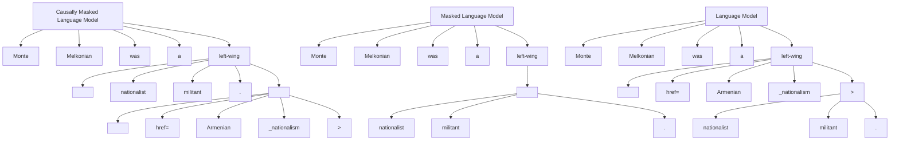

# CM3: A CAUSAL MASKED MULTIMODAL MODEL OF THE INTERNET

Armen Aghajanyan, Bernie Huang\*, Candace Ross\*, Vlad Karpukhin\*, Hu Xu\*, Naman Goyal, Dmytro Okhonko, Mandar Joshi, Gargi Ghosh, Mike Lewis, Luke Zettlemoyer

Facebook AI Research

{armenag,berniehuang,ccross,vladk,huxu,naman}@fb.com

{oxo,mandarj,gghosh,mikelewis,lsz}@fb.com

# ABSTRACT

We introduce CM3, a family of causally masked generative models trained over a large corpus of structured multi-modal documents that can contain both text and image tokens. Our new causally masked approach generates tokens left to right while also masking out a small number of long token spans that are generated at the end of the string, instead of their original positions. The casual masking object provides a type of hybrid of the more common causal and masked language models, by enabling full generative modeling while also providing bidirectional context when generating the masked spans. We train causally masked language-image models on large-scale web and Wikipedia articles, where each document contains all of the text, hypertext markup, hyperlinks, and image tokens (from a VQVAE-GAN), provided in the order they appear in the original HTML source (before masking). The resulting CM3 models can generate rich structured, multimodal outputs while conditioning on arbitrary masked document contexts, and thereby implicitly learn a wide range of text, image, and cross modal tasks. They can be prompted to recover, in a zero-shot fashion, the functionality of models such as DALL-E, GENRE, and HTLM (Ramesh et al., 2021; De Cao et al., 2020; Aghajanyan et al., 2021). We set the new state-of-the-art in zero-shot summarization, entity linking, and entity disambiguation while maintaining competitive performance in the fine-tuning setting. We can generate images unconditionally, conditioned on text (like DALL-E) and do captioning all in a zero-shot setting with a single model.

# 1 INTRODUCTION

Recent advancements in large-scale generative sequence modeling have significantly improved zero-shot performance on multiple modalities, including text Brown et al. (2020); Fabbri et al. (2020); Aghajanyan et al. (2021) and images Ramesh et al. (2021). Recent work has also shown how to use document structure, e.g., as provided by HTML web markup, to enable more effective zero-shot prompting for text-only tasks (Aghajanyan et al., 2021). In this paper, we show it is possible to learn multi-modal document-structured generative models, to jointly represent formatted hypertext and images as they naturally co-occur within full document contexts.

We introduce CM3, a family of causally masked generative models trained over a large corpus of structured multi-modal documents. Causally masked models generate tokens left to right, just like a causal language model, but also mask out a small number of long token spans, which are then generated at the end of the string instead of their original positions. This provides a new hybrid of causal and masked language models, enabling full generative modeling with bidirectional context. For example, it can also be used in our setting to infill complete images or larger structured text sections, conditioned on the rest of the document.

We train CM3 models on close to a terabyte of web-based data following Aghajanyan et al. (2021), extended to include images through VQVAE-GAN tokens (Esser et al., 2021) and additional hypertext link structure. This data is in strong contrast to previous methods that were either uni-modal or

carefully curated the image-text alignment (e.g., for image captioning Radford et al. (2021); Ramesh et al. (2021)). We train a 2.7 billion and 13 billion causally masked model on this data which we call CM3-Medium and CM3-Large respectively.

Extensive experiments demonstrate that these models are able to perform a wide range of zero-shot uni- and cross-modal tasks. We show both qualitatively and quantitatively that CM3 can be prompted for non-trivial image generation, similar to that of DALL-E. We also show that CM3 models are capable of improving over state-of-the-art zero-shot summarization, entity linking, entity disambiguation, highlighting the structure that comes from the hypertext during training. Finally, we show that by fine-tuning CM3 we set the new state-of-the-art for entity linking and entity disambiguation in general.

To summarize, our contributions include:

- We present the first hyper-text language-image model, trained on close to a Terabyte of multi-modal simplified HTML data from the common crawl.   
- We present the causally masked objective, a hybrid of causal and masked language models that allows for bidirectional context control during generative mask infilling.   
- We demonstrate consistently strong transfer from CM3 to a range of uni-modal and multimodal tasks at differing supervision levels, including stating state-of-the-art on entity disambiguation and zero-shot summarization.   
- We release all code and models to support future CM3 research.

# 2 CAUSALLY MASKED OBJECTIVE

Traditional approaches to pre-training have focused on mixing the architectural choices (i.e., encoder-only, decoder-only, encoder-decoder) with objective choices (i.e., masking, causal language modeling). For example, masked encoder-only models such as BERT (Devlin et al., 2018) and RoBERTa (Liu et al., 2019) excel in non-generative fine-tuning tasks. Masked encoder-decoder models such as BART (Lewis et al., 2019) and T5 (Raffel et al., 2019) excel in both discriminative and generative fine-tuning. Brown et al. (2020) on the other hand, showed that causal language models (de-facto, decoder only) are capable of non-trivial performance without the need of fine-tuning by simply prompting with appropriate string to control the generated outputs Radford et al. (2019); Brown et al. (2020); Artetxe et al. (2021).

There are pros and cons to both masked and causal language modeling in the context of prompting. Masking offers the critical ability to encode bi-directionality within the prompts at the cost of only decoding roughly 15% of the tokens of the input sequence during training (Devlin et al., 2018; Liu et al., 2019; Lewis et al., 2019). Conversely, decoder-only causal language models decode every token in the input sequence in the training but are typically limited to left-only contexts. Empirically, more work has also been done on scaling causal decoder-only rather than their counterparts.

In an effort to get most of the best of both worlds, we introduce a novel objective that combines the benefit of per-token generation with optional bi-directionality specifically tailored to prompting. For a document of size s we select $n \sim \text{Clamp}(\text{Poisson}(1), 1, 16)$ masks and for each of those masks we select span $m \sim (\text{Uniform}(0, s), \text{Uniform}(0, s))$ which does not intersect with any other m. These values are chosen to, on average, select relatively few relatively long spans, which we expect will allow the model to learn to infill long spans. We then order these masks by the order that they appear in the source document, replace the span of the mask in the source document with an enumerated mask token (i.e., <mask:0>, <mask:1>), and move the masked spans to the end of the document followed by a unique end of document token.

# Figure 1 shows the complete process.

We also augment the standard cross-entropy loss to weigh the loss of predicting mask tokens as 0, as they are placed at random locations which carry no information to the underlying sequence modeling objective.

The complete array of benefits will become more apparent when designing prompts for uni/cross-modal tasks in § 4. However, at the core, the causally masked objective can do causal language modeling while optionally allowing for bidirectionality when needed.


<details>
<summary>flowchart</summary>


</details>

Figure 1: A visual representation of various language modeling objectives as well as our proposed causal language modeling objective with a single mask (n = 1). Given the left-to-right nature of causal language models (bottom row) we would not be able to generate the Wikipedia entity link highlighted in orange.

# 3 CM3

Aghajanyan et al. (2021) used structured documents for text-only pre-training with strong zero-shot performance. Causally-Masked Multimodal Modeling (CM3) extends this work by modeling full document structure including images and hypertext links. Furthermore, we move away from the BART-like objective of Aghajanyan et al. (2021) to use our new causally masked objective with decoder-only models.

# 3.1 DATA

Following Aghajanyan et al. (2021) we aim to implement a transform over HTML documents to extract out to minimal-HTML, i.e., the minimal set of text that is semantically relevant for end tasks.

Birhane et al. (2021) gave in-depth criticisms of Common Crawl based multi-modal datasets and showed the existence of highly problematic examples (i.e., explicit images and text pairs of rape, pornography, and ethnic slurs). Given these severe ethical concerns, we opt-out of processing all of Common Crawl and instead opt into using a subset of the Common Crawl News (CC-NEWS) dataset and all of English Wikipedia.

Given a valid HTML DOM $^{1}$ per document, we run several passes to strip down the DOM to the elements of maximal semantic value. We first remove all elements which do not contain textual elements. We also filter out all headers, footers, copyrights, forms, dialog boxes and iFrames. We fold consecutive <div> elements into a singular <div> element with merged attributes. Furthermore we strip all the attributes from every element which are not derived from structured graphs such as OpenGraph, Schema and Twitter.

For every  tag in the document with a valid src attribute URL, we download the image, resize to 256x256 pixels with random cropping and then tokenize it with VQVAE-GAN from Esser et al. (2021). This amounts to 256 tokens for every image. We then insert the string value of the tokens joined with a space back into the src attribute.

We do not place any restrictions on the number of images or their locations. We present a set of high-level statistics in Table 1.

<table><tr><td></td><td>Documents (Million)</td><td>Size (GB)</td><td>Unique Images (Million)</td><td>Tokens (Billion)</td></tr><tr><td>CC-NEWS</td><td>45</td><td>460</td><td>18</td><td>121</td></tr><tr><td>En-Wikipedia</td><td>16</td><td>383</td><td>7</td><td>102</td></tr><tr><td>Total</td><td>61</td><td>843</td><td>25</td><td>223</td></tr></table>

Table 1: High level statistics of the data used to train CM3.

For experimentation, we create two test sets from each data source with 10,000 unique documents for each. We de-duplicated our test sets to ensure no overlap between test and train sets to the best of our abilities.

# 3.2 SIZE HINTS

Aghajanyan et al. (2021) introduced the concept of size hints which allows the user to guide the model during sample generation through token conditioning. Specifically, HTLM inserts a probabilistic estimate of the size of the mask as a token post the mask token (e.g., <mask>12 for a probabilistic size of 12). For CM3, we noticed that size-hints degraded not only end-perplexity but also the zero-shot performance on a significant set of evaluation tests.

We also note that we can implicitly give a size hint during mask generation for a single mask by asking the model to generate causally max\_sequence\_length - size\_hint tokens before placing the secondary <mask:0> token.

# 3.3 TRAINING

We train 4 models; 125M, 800M, 2.7B, and 13B parameters. The purpose of the two smaller models was to establish basic hyper-parameters that are viable for the causally masked language modeling objective and therefore were under-trained. However, all downstream tasks will be evaluated with our 2.7B model (CM3-Medium) and our 13B model (CM3-Large). HTLM-Medium was trained on 240 V100 GPU for 28 days, while HTLM-Large was trained on 384 A100 GPU for 24 days. Our implementation was in PyTorch (Paszke et al., 2019) using fairseq (Ott et al., 2019) and fairscale (Baines et al., 2021). For every model, our per GPU batch size was 8, with a maximum token sequence length of 2048. We use the polynomial decay learning rate scheduler available in Paszke et al. (2019) with 1500 warmup updates. We clipped the gradient norms to 1.0 and used the Adam optimizer with $\beta_{1} = 0.9$ , $\beta_{2} = 0.98$ (Kingma & Ba, 2014). We defer our model architecture description to § A.1.

# 3.4 SCALING LAWS

Our training setting has a couple of new parameters that can impact the traditional scaling laws of causal language models. The multi-modal nature of our proposed model breaks the standard assumptions of token distributionality. Traditionally language tokens are said to follow a Zipfian distribution (Piantadosi, 2014), while image tokens are strictly uniform (see § A.2). Furthermore, the unrestricted locations of the images and text introduce unpredictable complexity. Lastly, although we are still computing the joint probability of the document, we do so in a roundabout way through shuffling of the document via the causally masked objective. These fundamental differences warrant a quick look into the scaling laws of CM3.

  
Figure 2: Basic perplexity based scaling laws for the proposed CM3 objective and training set-up.

We present the various perplexity curves for the four models of varying sizes we trained. Given that our models were trained on various hardware set-ups, we normalize the training time by linearly scaling each experiment timing to 256 GPU. Most importantly, we see healthy scaling, similar to

Kaplan et al. (2020) without any pathological cases, implying there is still a good amount of gains to be achieved with further scaling. An in-depth analysis of the scaling laws of the causally masked objective is outside this current work's scope and will be considered for future work.

# 4 ZERO/FEW-SHOT PROMPTING

# 4.1 IMAGE MODALITY

Although we do not train on pure image documents, CM3 can still operate over image tasks. To do so, we must cleverly describe the task through a textual prompt, using the  tag.

# 4.1.1 UNCONDITIONAL IMAGE GENERATION

To sample from the distribution of images available to CM3, we can simply ask the model to produce the next set of tokens after the following prompt: .

Interestingly enough, CM3 prefers to first generate a short description of the image through the alt attribute and then generate the image tokens via the src attribute. We can force the model to directly generate image tokens without first giving a description with the following prompt: 
<summary>natural_image</summary>

Mountain range with snow-capped peaks under a clear blue sky (no text or symbols visible)
</details>

(a) A mountain of olive trees on the way to Cabo de la Vela


<details>
<summary>natural_image</summary>

Exterior view of a modern glass skyscraper with a bus in front (no visible text or signage)
</details>

(b) Spain Europa Amenacer Winter

  
(c) blog TIGI Bed Head Tie Dye Spray Hair Spray Hairspray ml

  
(d) birthday invitation printable christmas gift for birthday party Printable Template


<summary>text_image</summary>

INTECNOVATO
ECCUMBER
</details>


<details>
<summary>natural_image</summary>

Close-up of a wooden scoop filled with dark material next to a textured brown surface (no visible text or symbols)
</details>


<details>
<summary>natural_image</summary>

Illustration of a penguin with a leaf and body, shown in grayscale against a solid blue background (no text or symbols)
</details>


<details>
<summary>natural_image</summary>

Illustration of a penguin with a leaf and body, shown in grayscale against a solid blue background (no text or symbols)
</details>


<details>
<summary>natural_image</summary>

Interior scene of a vehicle with passengers and a car, no visible text or symbols
</details>


<details>
<summary>natural_image</summary>

Group of people gathered outdoors, some holding objects, possibly in a public setting (no visible text or symbols)
</details>

Figure 3: Four samples for two of the prompts we proposed for unconditional image generation for CM3-Large. For the self-captioned images we place the respective caption under the image. Results were selected at random, with no cherry picking.

The model is more than capable of generating coherent images. We note that via this prompting, we can recover the full functionality of the DALL-E model proposed in Ramesh et al. (2021). Interestingly enough, we see qualitative improvements with allowing the model to free generate a caption prior to generating.

We continue by doing an empirical study of the unconditional generation of CM3, by generating 30k samples without textual conditioning and calculating the Fréchet Inception Distance (FID, Heusel et al. (2017)) over MS-COCO, following the methodology proposed in Nichol et al. (2021) (Lin et al., 2014). We present our results in the unified table showing FID calculations in Table 2. Without any textual conditioning and without explicitly optimizing for either MS-COCO or generation

(unlike other benchmarks in the table) CM3 Large approaches the FID performance of modern Generative Adversarial Networks (GAN).

# 4.1.2 IMAGE IN-FILLING

Unlike DALL-E, which leverages left-to-right language modeling objective to model language-image tokens, CM3 with the proposed causally masked language modeling makes it possible to condition contiguous sections of an image on the surrounding context for image in-filling. Specifically, CM3 can infill images with the following prompt:

```txt
Infilling Prompt: {postfix}"><mask:0> 
```

Using the same decoding strategies described in § 4.1.1 we generate unconditional infilled images with only CM3-Large and present qualitative results in Figure 4. Overall we see that CM3-Large is capable of generating semantically coherent infills even without grounding in text.

# 4.2 TEXT-IMAGE MODALITY

# 4.2.1 CONDITIONAL IMAGE IN-FILLING

Additionally, CM3 can further perform image in-filling condition on the additional text context. This can be achieved by slightly augmenting the prompt as follows:

# Conditional Infilling Prompt:

```twig
{postfix}"><mask:0> 
```

We show qualitative results in Figure 4. Immediately we notice the substantial improvement in the generated image when grounded in ground truth text vs. unconditional image-infilling.

# 4.2.2 CONDITIONAL IMAGE GENERATION

We can do conditional text generation using CM3 similar to DALL-E by using a proper prompt. Specifically by conditioning using the alt attribute of the img tag.

```txt
Conditional Generation Prompt:  tag. Due to attributes always appearing in alphabetical order in order to generate alt attribute (which appears before src), we need to use the masking capabilities of CM3.

Captioning Masked Prompt #1: " src="{image}">

Captioning Causal Prompt #1: <tr><td>Model</td><td>FID</td><td>Zero-shot FID</td></tr><tr><td>AttnGAN (Xu et al., 2017)</td><td>35.49</td><td></td></tr><tr><td>DM-GAN (Zhu et al., 2019)</td><td>32.64</td><td></td></tr><tr><td>DF-GAN (Tao et al., 2020)</td><td>21.42</td><td></td></tr><tr><td>DM-GAN + CL (Ye et al., 2021)</td><td>20.79</td><td></td></tr><tr><td>XMC-GAN (Zhang et al., 2021)</td><td>9.33</td><td></td></tr><tr><td>LAFITE (Zhou et al., 2021)</td><td>8.12</td><td></td></tr><tr><td>DALL-E (Ramesh et al., 2021)</td><td></td><td>~ 28</td></tr><tr><td>LAFITE (Zhou et al., 2021)</td><td></td><td>26.94</td></tr><tr><td>GLIDE (Nichol et al., 2021)</td><td></td><td>12.24</td></tr><tr><td>Unconditional CM3-Medium</td><td></td><td>40.65</td></tr><tr><td>Unconditional CM3-Medium</td><td></td><td>36.51</td></tr><tr><td>Conditional CM3-Medium</td><td></td><td>36.78</td></tr><tr><td>Conditional CM3-Large</td><td></td><td>29.56</td></tr></table>

Table 2: We compare FID on MS-COCO $256 \times 256$ . Following Nichol et al. (2021) we sample roughly 30k conditioned samples for our models, and compare against the entire validation set. We use a temperature of 0.85 for both CM3 models. We use the implementation available from Seitzer (2020).

to the loss of texture from representing images through discrete tokens (e.g., the text of the train station is blurred, as is the text on the bus).

  
the main
entrance of the
U.S. Department
of State in
Washington, D.C.   
the white marble
exterior
standing atop of
its façade.   
outside of a train station building from across the street.   
a pickup truck
parked in a
layby on a
highway.   
a large bus
parked in a
layby   
a tall red bus
is coming down
some tracks   
a man posing for
a photo.   
a man next to a large horse.   
a man standing
next to a horse
on a beach   
a U.S. Air Force
B-52H
Stratofortress
on the flight
line at
Barksdale Air
Force Base,
Louisiana   
the Austrian Airbus A321 aircraft with its Austrian registration   
a jet airliner
flying with a
cloudy sky in
the background.   
Source Image   
Tokenized Image   
CM3-Caption-Beam   
CM3-Caption-CLIP   
Ground Truth

Figure 6: We provide qualitative samples for zero-shot image-captioning using the CM3-Large model. Caption-Beam refers to generating caption using beam over prompts, while Caption-CLIP uses CLIP to get the top-ranked caption from a 128 candidate set (64 from masked prompt, 64 from causal prompt).

Quantitatively we measure the quality of CM3 zero-shot captioning by evaluating using BERT-Score $^{2}$ (Zhang et al., 2019) with the RoBERTa-Large models (Liu et al., 2019) on the validation set from MS-COCO. We opt for the use of semantic evaluation versus classical metrics such as BLEU/METEOR because we notice that the vocabulary and sentence structure of zero-shot captioning with CM3 is not compatible with MS-COCO ground truth labels, although the generated content is semantically similar. We present our quantitative result in Table 3. CM3-Large is capable of achieving reasonable zero-shot captioning performance on the MS-COCO dataset.

<table><tr><td></td><td>Precision</td><td>Recall</td><td>F1</td></tr><tr><td>CM3-Caption-Beam</td><td>0.781</td><td>0.789</td><td>0.785</td></tr><tr><td>CM3-Caption-CLIP</td><td>0.863</td><td>0.866</td><td>0.864</td></tr></table>

Table 3: BERTScore numbers for zero-shot captioning with CM3.

# 4.3 TEXT MODALITY

CM3 is not only a cross-modal model but is fully capable of acting as a stand-alone language model. This is even reflected in our data, where we do not enforce every document to have images; therefore, pure language modeling will also occur during training. We evaluate our CM3 models on a wide set of varying language tasks.

# 4.3.1 ENTITY DISAMBIGUATION

We reproduce the evaluation setting described by De Cao et al. (2020) and Le & Titov (2018) using the same candidate sets, datasets and evaluating using the InKB micro-F1 metric.

We aim to find a prompt capable of representing the more general end-to-end entity linking task in the CM3 model. From there, a proper sequence scoring of the candidate set will provide us with an approach to zero-shot entity disambiguation. Luckily HTML based Wikipedia contains very rich annotations. Specifically below, we show an example of naturally occurring entity linking that would occur in our Wikipedia subset of CM3 training data.

Original: Manetho writes that these kings ruled from <a title="Memphis, Egypt">Memphis</a>

Prompt: Manetho writes that these kings ruled from <a title="<mask:0>"Memphis</a>...<mask:0>

Target: Manetho writes that these kings ruled from <a title="<mask:0>">Memphis</a>...<mask:0> Memphis, Egypt

Using our scoring approach we can simply score the Target while swapping out the postfix after <mask:0>.

<table><tr><td rowspan="2">Model Type</td><td rowspan="2">Method</td><td colspan="2">In-domain</td><td colspan="4">Out-of-domain</td><td rowspan="2">Avg.</td></tr><tr><td>AIDA</td><td>MSNBC</td><td>AQUAINT</td><td>ACE2004</td><td>CWEB</td><td>WIKI*</td></tr><tr><td rowspan="8">Direct Supervision</td><td>Ganea &amp; Hofmann (2017)</td><td>92.2</td><td>93.7</td><td>88.5</td><td>88.5</td><td>77.9</td><td>77.5</td><td>86.4</td></tr><tr><td>Guo &amp; Barbosa (2018)</td><td>89</td><td>92</td><td>87</td><td>88</td><td>77</td><td>84.5</td><td>86.2</td></tr><tr><td>Yang et al. (2018)</td><td>95.9</td><td>92.6</td><td>89.9</td><td>88.5</td><td>81.8</td><td>79.2</td><td>88.0</td></tr><tr><td>Shahbazi et al. (2019)</td><td>93.5</td><td>92.3</td><td>90.1</td><td>88.7</td><td>78.4</td><td>79.8</td><td>87.1</td></tr><tr><td>Yang et al. (2019)</td><td>93.7</td><td>93.8</td><td>88.2</td><td>90.1</td><td>75.6</td><td>78.8</td><td>86.7</td></tr><tr><td>Le &amp; Titov (2019)</td><td>89.6</td><td>92.2</td><td>90.7</td><td>88.1</td><td>78.2</td><td>81.7</td><td>86.8</td></tr><tr><td>Fang et al. (2019)</td><td>94.3</td><td>92.8</td><td>87.5</td><td>91.2</td><td>78.5</td><td>82.8</td><td>87.9</td></tr><tr><td>De Cao et al. (2020)</td><td>93.3</td><td>94.3</td><td>89.9</td><td>90.1</td><td>77.3</td><td>87.4</td><td>88.8</td></tr><tr><td rowspan="2">Direct Supervision</td><td>CM3-Medium</td><td>93.5</td><td>94.2</td><td>90.1</td><td>90.4</td><td>76.5</td><td>86.9</td><td>88.6</td></tr><tr><td>CM3-Large</td><td>94.8</td><td>94.8</td><td>91.1</td><td>91.4</td><td>78.4</td><td>88.7</td><td>89.8</td></tr><tr><td rowspan="2">Self Supervision (0-Shot)</td><td>CM3-Medium</td><td>78.0</td><td>80.1</td><td>75.4</td><td>81.4</td><td>68.5</td><td>76.2</td><td>76.6</td></tr><tr><td>CM3-Large</td><td>80.1</td><td>80.8</td><td>77.7</td><td>82.8</td><td>72.4</td><td>80.2</td><td>79.0</td></tr></table>

Table 4: Aligned with GENRE's evaluation, we use Micro $F_{1}$ (InKB) for the named entity disambiguation task. Bold indicates best model. We note that although \*WIKI can be thought of as being out-of-domain, given that English Wikipedia was used to pre-train CM3, it can be considered in-domain as well.

As an additional datapoint for the representations learned from CM3 we completely replicate the training and evaluation for the GENRE model (De Cao et al., 2020). $^{3}$ . Specifically we first fine-tune CM3 on the BLINK data (Wu et al., 2019). For the in-domain scenario, we fine-tune CM3 on the AIDA-CoNLL dataset (Hoffart et al., 2011). We evaluate on the AIDA-CoNLL dataset for the in-domain scenario and the MSNBC, AQUAINT, ACE2004, WNED-CWEB (CWEB) and WNED-WIKI (WIKI) for the out-of-domain scenario (De Cao et al., 2020; Guo & Barbosa, 2018). We present our results in Figure 4.

Given the strong supervision naturally available in Wikipedia HTML, it is unsurprising that CM3 shows strong, non-trivial zero-shot performance on the named entity disambiguation across a wide array of named entity disambiguation tasks.

Furthermore, the fine-tuned HTLM-Large model outperforms previous entity linking specific models to achieve a new SOTA over the benchmarked datasets.

# 4.3.2 ENTITY LINKING

We next consider the more general entity linking task. We experiment with two settings zero-shot assuming we know the location of the entities and the full fine-tuning setting following the exact methodology proposed in De Cao et al. (2020). Specifically for the end-to-end Entity Linking, we aim to reproduce the setting of Kolitsas et al. (2018). We evaluate using the aforementioned InKB micro- $F_{1}$ with the same defined in-domain and out-of-domain datasets as described by De Cao et al. (2020). We use the exact same in-domain and out-of-domain datasets as well as evaluating the InKB micro- $F_{1}$ on the GERBIL benchmark platform (Röder et al., 2018). Furthermore, we use the same decoding strategy for the zero-shot case by limiting the generative tokens to only available candidate entities. Please refer to De Cao et al. (2020) for the full fine-tuning setup.

For both setting we evaluate on seven test sets: MSNBC, Derczynski (Der) (Derczynski et al., 2015), KORE 50 (K50) (Hoffart et al., 2012), N3-Reuters-128 (R128), N3-RSS-500 (R500) (Röder et al., 2014), and OKE challenge 2015 and 2016 (OKE15 and OKE16) (Nuzzolese et al., 2015).

<table><tr><td rowspan="2" colspan="2"></td><td colspan="3">In-domain</td><td colspan="6">Out-of-domain</td></tr><tr><td>Method</td><td>AIDA</td><td>MSNBC</td><td>Der</td><td>K50</td><td>R128</td><td>R500</td><td>OKE15*</td><td>OKE16*</td></tr><tr><td rowspan="8">Direct Supervision</td><td rowspan="8">{</td><td>Hoffart et al. (2011)</td><td>72.8</td><td>65.1</td><td>32.6</td><td>55.4</td><td>46.4</td><td>42.4</td><td>63.1</td><td>0.0</td></tr><tr><td>Steinmetz &amp; Sack (2013)</td><td>42.3</td><td>30.9</td><td>26.5</td><td>46.8</td><td>18.1</td><td>20.5</td><td>46.2</td><td>46.4</td></tr><tr><td>Moro et al. (2014)</td><td>48.5</td><td>39.7</td><td>29.8</td><td>55.9</td><td>23.0</td><td>29.1</td><td>41.9</td><td>37.7</td></tr><tr><td>Kolitsas et al. (2018)</td><td>82.4</td><td>72.4</td><td>34.1</td><td>35.2</td><td>50.3</td><td>38.2</td><td>61.9</td><td>52.7</td></tr><tr><td>Broscheit (2020)</td><td>79.3</td><td>-</td><td>-</td><td>-</td><td>-</td><td>-</td><td>-</td><td>-</td></tr><tr><td>Martins et al. (2019)</td><td>81.9</td><td>-</td><td>-</td><td>-</td><td>-</td><td>-</td><td>-</td><td>-</td></tr><tr><td>van Hulst et al. (2020) $^{\dagger}$ </td><td>80.5</td><td>72.4</td><td>41.1</td><td>50.7</td><td>49.9</td><td>35.0</td><td>63.1</td><td>58.3</td></tr><tr><td>De Cao et al. (2020)</td><td>83.7</td><td>73.7</td><td>54.1</td><td>60.7</td><td>46.7</td><td>40.3</td><td>56.1</td><td>50.0</td></tr><tr><td rowspan="2">Direct Supervision</td><td rowspan="2">{</td><td>CM3-Medium</td><td>71.4</td><td>68.5</td><td>48.6</td><td>58.3</td><td>44.9</td><td>41.1</td><td>61.9</td><td>37.7</td></tr><tr><td>CM3-Large</td><td>79.9</td><td>74.8</td><td>53.2</td><td>62.4</td><td>47.1</td><td>42.8</td><td>61.9</td><td>52.7</td></tr><tr><td rowspan="2">Self Supervision (0-Shot)</td><td rowspan="2">{</td><td>CM3-Medium</td><td>20.4</td><td>18.6</td><td>20.1</td><td>35.1</td><td>30.6</td><td>32.1</td><td>36.6</td><td>0.0</td></tr><tr><td>CM3-Large</td><td>24.8</td><td>21.4</td><td>25.6</td><td>39.0</td><td>31.1</td><td>34.9</td><td>37.1</td><td>0.0</td></tr></table>

Table 5: We report Micro $F_{1}$ on our test sets for our entity linking task. Bold indicates best model. Following De Cao et al. (2020) we use a $\dagger$ to indicate results from the Wikipedia 2019 setting as opposed to the 2014 setting (which has older dump and fewer entities).

We present our results in Table 5. We see that our CM3 are extremely competitive with entity-linking specific models and that our CM3-Large model sets a new state-of-the-art. Furthermore, although our zero-shot numbers are substantially worse, they are still non-trivial, implying that CM3 learns a significant amount of implicit entity linking through our training setting.

# 4.3.3 SUMMARIZATION

We next look at CM3 performance on the zero-shot summarization task, specifically we replicate the zero-shot evaluation methodology of Aghajanyan et al. (2021). For all summarization benchmarks, we use ROUGE-1/2/L as our primary metrics to stay consistent with other literature (Lin, 2004). We look at the same datasets as HTLM.

Gigaword consists of headlines from news articles (Napoles et al., 2012). The target summaries are relatively short, consisting roughly on average of 10 BPE tokens.

CNN/Dailymail (Hermann et al., 2015) provides multi-sentence target summaries close to 3 sentences, or roughly 50 tokens.

Reddit TIFU (Kim et al., 2018) contains summaries of Reddit posts. Specifically, we use the short subset of data. Compared to our other summarization datasets, this dataset is highly abstractive and not based on news articles.

XSum (Narayan et al., 2018) provides abstractive single sentence summaries of news articles.

We utilize the same prompts as available in Aghajanyan et al. (2021). We use the same available size hints but using the implicit size-hint methodology described in § 3.2. Most prompts follow the

same theme of infilling either a title element or an element describing a headline (either through attributes or using the meta tag). For completeness, below is an example of a prompt that can do basic summarization.

<table><tr><td>Model</td><td>Gigaword</td><td>CNN/DM</td><td>Reddit TIFU</td><td>XSum</td></tr><tr><td>PEGASUS-0S</td><td>23.39/07.59/20.20</td><td>32.90/13.28/29.38</td><td>14.66/3.06/10.17</td><td>19.27/3.00/12.72</td></tr><tr><td>HTLM-Auto-NS</td><td>27.56/10.17/24.57</td><td>33.40/13.45/30.10</td><td>06.71/1.98/07.86</td><td>15.15/2.54/10.91</td></tr><tr><td>HTLM-Auto-S</td><td>28.73/11.31/26.49</td><td>34.65/14.54/32.15</td><td>08.15/2.92/09.75</td><td>17.14/3.41/13.43</td></tr><tr><td>HTLM-Manual-S</td><td>31.61/10.80/28.60</td><td>38.51/16.10/33.89</td><td>15.81/2.98/10.54</td><td>22.34/4.12/14.56</td></tr><tr><td>CM3-M-Manual</td><td>29.15/09.70/27.87</td><td>37.16/14.75/31.42</td><td>09.56/2.65/07.48</td><td>20.14/3.15/13.89</td></tr><tr><td>CM3-L-Manual</td><td>32.12/10.95/28.78</td><td>38.88/16.27/34.16</td><td>12.14/2.12/07.98</td><td>24.86/6.08/16.32</td></tr></table>

Table 6: CM3 results on zero-shot summarization. HTLM-Manual denotes manually engineered prompts with size hints, while HTLM-Auto-S and HTLM-Auto-NS indicate auto-prompting with and without size hints, respectively. The metrics shown are ROUGE-1/ROUGE-2/ROUGE-L, respectively. CM3-Large sets a new state-of-the-art on three news-based summarization datasets.

We present our results in Table 6. Both CM3 models saw significantly less text than the HTLM model, with 2.7TB of text. Furthermore, the prompts being used were tuned specifically for the HTLM model and are being used with no changes for CM3. With these challenges, we still see that CM3-Large sets new state-of-the-art zero-shot summarization for three datasets. We attribute the performance degradation in Reddit-TIFU data to CM3 pre-training data only containing CC-NEWS and Wikipedia, which will not contain the type of summarizations needed for Reddit-TIFU.

# 5 FINE-TUNING

We next want to measure the quality of internal representations for the end goal of fine-tuning. We compare CM3 with a wide array of masked language model derived models such as T5 (Raffel et al., 2019), RoBERTa (Liu et al., 2019), HTLM (Aghajanyan et al., 2021) tested on the standard GLUE benchmark (Wang et al., 2018). For CM3 we look at three settings for fine-tuning; standard fine-tuning, better fine-tuning using adversarial methods (Aghajanyan et al., 2020), and better fine-tuning over prompts derived from Aghajanyan et al. (2021). We delegate the specifics hyper-parameters of the fine-tuning experiments to § A.3

<table><tr><td></td><td>MNLI Acc-m/mm</td><td>QQP Acc</td><td>RTE Acc</td><td>QNLI Acc</td><td>MRPC Acc</td><td>CoLA Mcc</td><td>SST-2 Acc</td><td># Params</td></tr><tr><td>T5-Base</td><td>87.1/86.2</td><td>89.4</td><td>80.1</td><td>93.7</td><td>87.5</td><td>51.1</td><td>95.2</td><td>220M</td></tr><tr><td>RoBERTA</td><td>90.2/-</td><td>92.2</td><td>86.6</td><td>94.7</td><td>89.1</td><td>68.0</td><td>96.4</td><td>330M</td></tr><tr><td>RoBERTa-R3F</td><td>91.1/91.3</td><td>92.4</td><td>88.5</td><td>95.3</td><td>91.6</td><td>71.2</td><td>97.0</td><td>330M</td></tr><tr><td>BART-Large</td><td>89.9/90.1</td><td>92.5</td><td>87.0</td><td>94.9</td><td>90.4</td><td>62.8</td><td>96.6</td><td>400M</td></tr><tr><td>HTLM</td><td>90.3/91.4</td><td>92.6</td><td>87.1</td><td>95.1</td><td>90.8</td><td>64.3</td><td>96.9</td><td>400M</td></tr><tr><td>HTLM-R3F</td><td>91.4/92.1</td><td>92.8</td><td>89.1</td><td>95.4</td><td>91.5</td><td>69.4</td><td>97.1</td><td>400M</td></tr><tr><td>HTLM-R3F-Prompt</td><td>91.6/91.2</td><td>92.9</td><td>89.4</td><td>95.7</td><td>91.7</td><td>69.8</td><td>97.3</td><td>400M</td></tr><tr><td>T5-Large</td><td>89.9/89.6</td><td>89.9</td><td>87.2</td><td>94.8</td><td>89.9</td><td>61.2</td><td>96.3</td><td>770M</td></tr><tr><td>T5-3B</td><td>91.4/91.2</td><td>89.7</td><td>91.1</td><td>96.3</td><td>90.0</td><td>67.1</td><td>97.4</td><td>3B</td></tr><tr><td>T5-11B</td><td>92.2/91.9</td><td>90.6</td><td>92.8</td><td>96.9</td><td>90.4</td><td>71.6</td><td>97.5</td><td>11B</td></tr><tr><td>CM3-Medium</td><td>89.9/89.7</td><td>89.6</td><td>89.1</td><td>93.1</td><td>86.5</td><td>63.1</td><td>94.9</td><td>2.7B</td></tr><tr><td>CM3-Medium-Prompt</td><td>90.8/91.0</td><td>89.9</td><td>90.5</td><td>95.1</td><td>89.9</td><td>66.2</td><td>96.3</td><td>2.7B</td></tr><tr><td>CM3-Medium-RXF-Prompt</td><td>90.9/91.1</td><td>90.0</td><td>90.7</td><td>95.3</td><td>90.0</td><td>67.1</td><td>96.9</td><td>2.7B</td></tr><tr><td>CM3-Large</td><td>91.1/91.0</td><td>89.9</td><td>91.9</td><td>95.6</td><td>89.6</td><td>64.6</td><td>94.2</td><td>13B</td></tr><tr><td>CM3-Large-Prompt</td><td>91.5/91.4</td><td>90.1</td><td>92.4</td><td>96.2</td><td>90.1</td><td>70.9</td><td>97.1</td><td>13B</td></tr><tr><td>CM3-Large-RXF-Prompt</td><td>91.9/91.5</td><td>91.1</td><td>92.5</td><td>96.4</td><td>90.3</td><td>70.8</td><td>97.3</td><td>13B</td></tr></table>

Table 7: Results on the GLUE development set for various fine-tuning methods applied to CM3.

We present our results in Table 7. Overall we see that both CM3 models are competitive against T5 given the same parameter setting. Furthermore, aligning with the results from Aghajanyan et al.

(2021) we see that placing the natural language utterances of the various GLUE tasks into an HTML prompt while fine-tuning non-trivially improves end-finetuning performance. The following experiments show that the causally masked language modeling approach is not detrimental to learning fine-tunable representations, and neither is jointly modeling image tokens.

# 6 ETHICAL CONSIDERATIONS

Prior work has explored the extent to which language models encode harmful gender and racial biases that parallel humans through the Word Embedding Association Test (WEAT) (Caliskan et al., 2017), the Sentence Encoder Association Test (SEAT) (May et al., 2019) and the Grounded-WEAT/Grounded-SEAT (Ross et al., 2021) metrics for multimodal language models (Tan & Celis, 2019). Given the generative nature of CM3 in both the language and visual modalities, we used GWEAT/GSEAT to probe our model. Overall, we evaluated six bias tests for gender and seven bias tests for race and found that our family of CM3 models show significantly less bias than other models, specifically VisualBERT (Li et al., 2019) and ViLBert (Lu et al., 2019).

<table><tr><td></td><td>Level</td><td>VisualBert</td><td>ViLBert</td><td>CM3-Medium</td><td>CM3-Large</td></tr><tr><td rowspan="2">C6: M/W, Career/Family</td><td>S</td><td>1.05</td><td>1.14</td><td>0.00</td><td>0.98</td></tr><tr><td>W</td><td>0.54</td><td>0.51</td><td>0.10</td><td>0.12</td></tr><tr><td rowspan="2">C8: Science/Arts, M/W</td><td>S</td><td>0.86</td><td>1.05</td><td>-0.09</td><td>0.42</td></tr><tr><td>W</td><td>0.62</td><td>0.14</td><td>0.08</td><td>0.07</td></tr><tr><td rowspan="2">C11: M/W, Pleasant/Unpleasant</td><td>S</td><td>-0.74</td><td>-0.84</td><td>0.00</td><td>-0.64</td></tr><tr><td>W</td><td>-0.66</td><td>-0.31</td><td>-0.20</td><td>-0.48</td></tr><tr><td rowspan="2">Double Bind: M/W, Competent</td><td>S</td><td>-0.10</td><td>-0.04</td><td>0.01</td><td>-0.01</td></tr><tr><td>W</td><td>-0.23</td><td>0.30</td><td>-0.07</td><td>-0.27</td></tr><tr><td rowspan="2">Double Bind: M/W, Likeable</td><td>S</td><td>-0.11</td><td>-1.12</td><td>-0.24</td><td>-0.59</td></tr><tr><td>W</td><td>-0.60</td><td>0.09</td><td>0.00</td><td>0.10</td></tr><tr><td rowspan="2">Occupations: M/W, Occupation</td><td>S</td><td>0.98</td><td>1.82</td><td>0.03</td><td>0.62</td></tr><tr><td>W</td><td>0.91</td><td>1.80</td><td>0.00</td><td>0.58</td></tr><tr><td>Total Significant Bias Count</td><td>-</td><td>5</td><td>6</td><td>0</td><td>2</td></tr></table>

Table 8: Following Ross et al. (2021) we present the results for all gender bias classes on answering the question: “Do joint embeddings contain biases”? The numbers in our table represent effect sizes, and are underlined if their respective p-values are below 0.05. Each bias type and model are tested three times against Word embeddings (W) and Sentence embeddings (S).

We present our empirical results for gender and race bias in Table 8 and Table 9 respectively. Overall, both CM3 have significantly less bias than other competing models, most likely due to our choice to use only Wikipedia and CC-NEWS articles as training sources (and recent CC-NEWS articles at that). Furthermore, we believe the fact that CM3-Medium shows no to very little signs of bias can be an indicator of under-fitting as the large model is, unfortunately, able to show some bias from our training data.

We also qualitatively experiment with whether CM3 can be prompted to produce harmful or objectionable images. In general, we noticed it was incredibly hard to produce such content, additionally the lack of the ability to generate distinctive features of VQVAE-GAN acts to our benefit in terms of preserving privacy.

# 7 RELATED WORK

Fundamentally our work is an extension of the HTLM work proposed by Aghajanyan et al. (2021) to using the newly proposed causally masked objective, integrating images through VQVAE-GAN tokens, and scaling up over an order of magnitude. From there, the individual capabilities of our models are comparable to individual approaches.

<table><tr><td></td><td>Level</td><td>VisualBert</td><td>ViLBert</td><td>CM3-Medium</td><td>CM3-Large</td></tr><tr><td rowspan="2">C3: EA/AA, Pleasant/Unpleasant</td><td>W</td><td>0.23</td><td>0.14</td><td>-0.44</td><td>0.10</td></tr><tr><td>S</td><td>0.31</td><td>-0.14</td><td>-0.057</td><td>0.05</td></tr><tr><td rowspan="2">C12: EA/AA, Career/Family</td><td>W</td><td>-0.29</td><td>0.43</td><td>0.117</td><td>0..23</td></tr><tr><td>S</td><td>-0.54</td><td>0.34</td><td>-0.049</td><td>0.28</td></tr><tr><td rowspan="2">C13: EA/AA, Science/Arts</td><td>W</td><td>0.04</td><td>0.21</td><td>0.325</td><td>0.12</td></tr><tr><td>S</td><td>0.12</td><td>0.68</td><td>0.169</td><td>0.465</td></tr><tr><td rowspan="2">Double Bind: EA/AA, Competent</td><td>W</td><td>0.61</td><td>0.87</td><td>-0.535</td><td>0.42</td></tr><tr><td>S</td><td>0.24</td><td>0.25</td><td>0.0</td><td>0.18</td></tr><tr><td rowspan="2">Double Bind: EA/AA, Likeable</td><td>W</td><td>0.21</td><td>-0.23</td><td>-0.535</td><td>0.19</td></tr><tr><td>S</td><td>0.27</td><td>-0.74</td><td>-0.535</td><td>0.21</td></tr><tr><td rowspan="2">Occupations: EA/AA, Occupation</td><td>W</td><td>-0.40</td><td>0.02</td><td>-0.51</td><td>0.01</td></tr><tr><td>S</td><td>-0.41</td><td>0.46</td><td>-0.17</td><td>0.38</td></tr><tr><td rowspan="2">Angry Black Woman Stereotype</td><td>W</td><td>-0.07</td><td>0.26</td><td>-1.89</td><td>0.21</td></tr><tr><td>S</td><td>-0.50</td><td>0.47</td><td>0.0</td><td>-0.10</td></tr><tr><td>Total Significant Bias Count</td><td>-</td><td>4</td><td>5</td><td>1</td><td>3</td></tr></table>

Table 9: Following Ross et al. (2021) we present the results for all racial bias classes on answering the question: “Do joint embeddings contain biases”? Our table uses the same annotations as Table 8.

For example, the conditional and unconditional image generation capabilities of our model are most similar in approach to DALL-E, which trains a left-to-right causal model over the concatenation of textual tokens and VQ-VAE visual tokens (Ramesh et al., 2021). At the same time, the use of auto-regressive modeling in entity linking and disambiguation was proposed by the GENRE in De Cao et al. (2020).

The method of tokenizing non-discrete modalities to use standard sequence modeling approaches have been extensively explored with DALL-E for images, Jukebox for Music (Dhariwal et al., 2020) and vq-wav2vec for Speech (Baevski et al., 2019).

# 8 CONCLUSION

In this paper, we present the CM3 model, a causally masked trained language model that is capable of non-trivial zero-shot performance on a wide range of zero-shot uni- and cross-modal tasks. We first describe a new sequence modeling objective we call causally masked, enabling both full generative modeling with bidirectional context.

Through extensive experimentation, we show that as a single model CM3 can be prompted to recover the functionality of many other models being able to do image generation, image captioning, unconditional image generation, and more. Empirically we improve over state-of-the-art zero-shot summarization, entity linking, entity disambiguation, highlighting the structure from the hypertext during training. We show that representations learned by CM3 are not only useful for zero-shot prompting but for fine-tuning by fine-tuning CM3 and state-of-the-art for entity linking and entity disambiguation in general, all while staying highly competitive with T5 models on the GLUE benchmark.

# REFERENCES

Armen Aghajanyan, Akshat Shrivastava, Anchit Gupta, Naman Goyal, Luke Zettlemoyer, and Sonal Gupta. Better fine-tuning by reducing representational collapse. arXiv preprint arXiv:2008.03156, 2020.   
Armen Aghajanyan, Dmytro Okhonko, Mike Lewis, Mandar Joshi, Hu Xu, Gargi Ghosh, and Luke Zettlemoyer. Htlm: Hyper-text pre-training and prompting of language models. arXiv preprint arXiv:2107.06955, 2021.

Mikel Artetxe, Shruti Bhosale, Naman Goyal, Todor Mihaylov, Myle Ott, Sam Shleifer, Xi Victoria Lin, Jingfei Du, Srinivasan Iyer, Ramakanth Pasunuru, et al. Efficient large scale language modeling with mixtures of experts. arXiv preprint arXiv:2112.10684, 2021.   
Alexei Baevski, Steffen Schneider, and Michael Auli. vq-wav2vec: Self-supervised learning of discrete speech representations. arXiv preprint arXiv:1910.05453, 2019.   
Mandeep Baines, Shruti Bhosale, Vittorio Caggiano, Naman Goyal, Siddharth Goyal, Myle Ott, Benjamin Lefaudeux, Vitaliy Liptchinsky, Mike Rabbat, Sam Sheiffer, Anjali Sridhar, and Min Xu. Fairscale: A general purpose modular pytorch library for high performance and large scale training. https://github.com/facebookresearch/fairscale, 2021.   
Abeba Birhane, Vinay Uday Prabhu, and Emmanuel Kahembwe. Multimodal datasets: misogyny, pornography, and malignant stereotypes. arXiv preprint arXiv:2110.01963, 2021.   
Samuel Broscheit. Investigating entity knowledge in bert with simple neural end-to-end entity linking. arXiv preprint arXiv:2003.05473, 2020.   
Tom B Brown, Benjamin Mann, Nick Ryder, Melanie Subbiah, Jared Kaplan, Prafulla Dhariwal, Arvind Neelakantan, Pranav Shyam, Girish Sastry, Amanda Askell, et al. Language models are few-shot learners. arXiv preprint arXiv:2005.14165, 2020.   
Aylin Caliskan, Joanna J. Bryson, and Arvind Narayanan. Semantics derived automatically from language corpora contain human-like biases. Science, 356:183 - 186, 2017.   
Nicola De Cao, Gautier Izacard, Sebastian Riedel, and Fabio Petroni. Autoregressive entity retrieval. arXiv preprint arXiv:2010.00904, 2020.   
Leon Derczynski, Diana Maynard, Giuseppe Rizzo, Marieke Van Erp, Genevieve Gorrell, Raphaël Troncy, Johann Petrak, and Kalina Bontcheva. Analysis of named entity recognition and linking for tweets. Information Processing & Management, 51(2):32–49, 2015.   
Jacob Devlin, Ming-Wei Chang, Kenton Lee, and Kristina Toutanova. Bert: Pre-training of deep bidirectional transformers for language understanding. arXiv preprint arXiv:1810.04805, 2018.   
Prafulla Dhariwal, Heewoo Jun, Christine Payne, Jong Wook Kim, Alec Radford, and Ilya Sutskever. Jukebox: A generative model for music. arXiv preprint arXiv:2005.00341, 2020.   
Patrick Esser, Robin Rombach, and Bjorn Ommer. Taming transformers for high-resolution image synthesis. In Proceedings of the IEEE/CVF Conference on Computer Vision and Pattern Recognition, pp. 12873–12883, 2021.   
Alexander R Fabbri, Simeng Han, Haoyuan Li, Haoran Li, Marjan Ghazvininejad, Shafiq Joty, Dragomir Radev, and Yashar Mehdad. Improving zero and few-shot abstractive summarization with intermediate fine-tuning and data augmentation. arXiv preprint arXiv:2010.12836, 2020.   
Zheng Fang, Yanan Cao, Qian Li, Dongjie Zhang, Zhenyu Zhang, and Yanbing Liu. Joint entity linking with deep reinforcement learning. In The World Wide Web Conference, pp. 438–447, 2019.   
Octavian-Eugen Ganea and Thomas Hofmann. Deep joint entity disambiguation with local neural attention. arXiv preprint arXiv:1704.04920, 2017.   
Zhaochen Guo and Denilson Barbosa. Robust named entity disambiguation with random walks. Semantic Web, 9(4):459–479, 2018.   
Karl Moritz Hermann, Tomas Kocisky, Edward Grefenstette, Lasse Espeholt, Will Kay, Mustafa Suleyman, and Phil Blunsom. Teaching machines to read and comprehend. In Advances in neural information processing systems, pp. 1693–1701, 2015.   
Martin Heusel, Hubert Ramsauer, Thomas Unterthiner, Bernhard Nessler, and Sepp Hochreiter. Gans trained by a two time-scale update rule converge to a local nash equilibrium. Advances in neural information processing systems, 30, 2017.

Johannes Hoffart, Mohamed Amir Yosef, Ilaria Bordino, Hagen Fürstenau, Manfred Pinkal, Marc Spaniol, Bilyana Taneva, Stefan Thater, and Gerhard Weikum. Robust disambiguation of named entities in text. In Proceedings of the 2011 Conference on Empirical Methods in Natural Language Processing, pp. 782–792, 2011.   
Johannes Hoffart, Stephan Seufert, Dat Ba Nguyen, Martin Theobald, and Gerhard Weikum. Kore: keyphrase overlap relatedness for entity disambiguation. In Proceedings of the 21st ACM international conference on Information and knowledge management, pp. 545–554, 2012.   
Jared Kaplan, Sam McCandlish, Tom Henighan, Tom B Brown, Benjamin Chess, Rewon Child, Scott Gray, Alec Radford, Jeffrey Wu, and Dario Amodei. Scaling laws for neural language models. arXiv preprint arXiv:2001.08361, 2020.   
Byeongchang Kim, Hyunwoo Kim, and Gunhee Kim. Abstractive summarization of reddit posts with multi-level memory networks. arXiv preprint arXiv:1811.00783, 2018.   
Diederik P Kingma and Jimmy Ba. Adam: A method for stochastic optimization. arXiv preprint arXiv:1412.6980, 2014.   
Nikolaos Kolitsas, Octavian-Eugen Ganea, and Thomas Hofmann. End-to-end neural entity linking. arXiv preprint arXiv:1808.07699, 2018.   
Phong Le and Ivan Titov. Improving entity linking by modeling latent relations between mentions. arXiv preprint arXiv:1804.10637, 2018.   
Phong Le and Ivan Titov. Boosting entity linking performance by leveraging unlabeled documents. arXiv preprint arXiv:1906.01250, 2019.   
Mike Lewis, Yinhan Liu, Naman Goyal, Marjan Ghazvininejad, Abdelrahman Mohamed, Omer Levy, Ves Stoyanov, and Luke Zettlemoyer. Bart: Denoising sequence-to-sequence pre-training for natural language generation, translation, and comprehension. arXiv preprint arXiv:1910.13461, 2019.   
Liunian Harold Li, Mark Yatskar, Da Yin, Cho-Jui Hsieh, and Kai-Wei Chang. Visualbert: A simple and performant baseline for vision and language. arXiv preprint arXiv:1908.03557, 2019.   
Chin-Yew Lin. Rouge: A package for automatic evaluation of summaries. In Text summarization branches out, pp. 74–81, 2004.   
Tsung-Yi Lin, Michael Maire, Serge Belongie, James Hays, Pietro Perona, Deva Ramanan, Piotr Dollár, and C Lawrence Zitnick. Microsoft coco: Common objects in context. In European conference on computer vision, pp. 740–755. Springer, 2014.   
Yinhan Liu, Myle Ott, Naman Goyal, Jingfei Du, Mandar Joshi, Danqi Chen, Omer Levy, Mike Lewis, Luke Zettlemoyer, and Veselin Stoyanov. Roberta: A robustly optimized bert pretraining approach. arXiv preprint arXiv:1907.11692, 2019.   
Jiasen Lu, Dhruv Batra, Devi Parikh, and Stefan Lee. Vilbert: Pretraining task-agnostic visiolinguistic representations for vision-and-language tasks. arXiv preprint arXiv:1908.02265, 2019.   
Pedro Henrique Martins, Zita Marinho, and André FT Martins. Joint learning of named entity recognition and entity linking. arXiv preprint arXiv:1907.08243, 2019.   
Chandler May, Alex Wang, Shikha Bordia, Samuel R. Bowman, and Rachel Rudinger. On measuring social biases in sentence encoders. ArXiv, abs/1903.10561, 2019.   
Andrea Moro, Alessandro Raganato, and Roberto Navigli. Entity linking meets word sense disambiguation: a unified approach. Transactions of the Association for Computational Linguistics, 2:231–244, 2014.   
Courtney Napoles, Matthew R Gormley, and Benjamin Van Durme. Annotated gigaword. In Proceedings of the Joint Workshop on Automatic Knowledge Base Construction and Web-scale Knowledge Extraction (AKBC-WEKEX), pp. 95–100, 2012.

Shashi Narayan, Shay B Cohen, and Mirella Lapata. Don't give me the details, just the summary! topic-aware convolutional neural networks for extreme summarization. arXiv preprint arXiv:1808.08745, 2018.   
Alex Nichol, Prafulla Dhariwal, Aditya Ramesh, Pranav Shyam, Pamela Mishkin, Bob McGrew, Ilya Sutskever, and Mark Chen. Glide: Towards photorealistic image generation and editing with text-guided diffusion models. arXiv preprint arXiv:2112.10741, 2021.   
Andrea Giovanni Nuzzolese, Anna Lisa Gentile, Valentina Presutti, Aldo Gangemi, Darío Garigliotti, and Roberto Navigli. Open knowledge extraction challenge. In Semantic Web Evaluation Challenges, pp. 3–15. Springer, 2015.   
Myle Ott, Sergey Edunov, Alexei Baevski, Angela Fan, Sam Gross, Nathan Ng, David Grangier, and Michael Auli. fairseq: A fast, extensible toolkit for sequence modeling. arXiv preprint arXiv:1904.01038, 2019.   
Adam Paszke, Sam Gross, Francisco Massa, Adam Lerer, James Bradbury, Gregory Chanan, Trevor Killeen, Zeming Lin, Natalia Gimelshein, Luca Antiga, et al. Pytorch: An imperative style, high-performance deep learning library. Advances in neural information processing systems, 32:8026–8037, 2019.   
Steven T Piantadosi. Zipf's word frequency law in natural language: A critical review and future directions. Psychonomic bulletin & review, 21(5):1112–1130, 2014.   
Alec Radford, Jeffrey Wu, Rewon Child, David Luan, Dario Amodei, and Ilya Sutskever. Language models are unsupervised multitask learners. OpenAI Blog, 1(8):9, 2019.   
Alec Radford, Jong Wook Kim, Chris Hallacy, Aditya Ramesh, Gabriel Goh, Sandhini Agarwal, Girish Sastry, Amanda Askell, Pamela Mishkin, Jack Clark, et al. Learning transferable visual models from natural language supervision. arXiv preprint arXiv:2103.00020, 2021.   
Colin Raffel, Noam Shazeer, Adam Roberts, Katherine Lee, Sharan Narang, Michael Matena, Yanqi Zhou, Wei Li, and Peter J Liu. Exploring the limits of transfer learning with a unified text-to-text transformer. arXiv preprint arXiv:1910.10683, 2019.   
Aditya Ramesh, Mikhail Pavlov, Gabriel Goh, Scott Gray, Chelsea Voss, Alec Radford, Mark Chen, and Ilya Sutskever. Zero-shot text-to-image generation. arXiv preprint arXiv:2102.12092, 2021.   
Michael Röder, Ricardo Usbeck, Sebastian Hellmann, Daniel Gerber, and Andreas Both. N $^{3}$ -a collection of datasets for named entity recognition and disambiguation in the nlp interchange format. In LREC, pp. 3529–3533, 2014.   
Michael Röder, Ricardo Usbeck, and Axel-Cyrille Ngonga Ngomo. Gerbil–benchmarking named entity recognition and linking consistently. Semantic Web, 9(5):605–625, 2018.   
Candace Ross, Boris Katz, and Andrei Barbu. Measuring social biases in grounded vision and language embeddings. ArXiv, abs/2002.08911, 2021.   
Maximilian Seitzer. pytorch-fid: FID Score for PyTorch. https://github.com/mseitzer/pytorch-fid, August 2020. Version 0.2.1.   
Hamed Shahbazi, Xiaoli Z Fern, Reza Ghaeini, Rasha Obeidat, and Prasad Tadepalli. Entity-aware elmo: Learning contextual entity representation for entity disambiguation. arXiv preprint arXiv:1908.05762, 2019.   
Nadine Steinmetz and Harald Sack. Semantic multimedia information retrieval based on contextual descriptions. In Extended Semantic Web Conference, pp. 382–396. Springer, 2013.   
Yi Chern Tan and L. Elisa Celis. Assessing social and intersectional biases in contextualized word representations. In NeurIPS, 2019.   
Ming Tao, Hao Tang, Songsong Wu, Nicu Sebe, Xiao-Yuan Jing, Fei Wu, and Bingkun Bao. Df-gan: Deep fusion generative adversarial networks for text-to-image synthesis. arXiv:2008.05865, 2020.

Johannes M van Hulst, Faegheh Hasibi, Koen Dercksen, Krisztian Balog, and Arjen P de Vries. Rel: An entity linker standing on the shoulders of giants. In Proceedings of the 43rd International ACM SIGIR Conference on Research and Development in Information Retrieval, pp. 2197–2200, 2020.   
Alex Wang, Amanpreet Singh, Julian Michael, Felix Hill, Omer Levy, and Samuel Bowman. GLUE: A multi-task benchmark and analysis platform for natural language understanding. In Proceedings of the 2018 EMNLP Workshop BlackboxNLP: Analyzing and Interpreting Neural Networks for NLP, pp. 353–355, Brussels, Belgium, November 2018. Association for Computational Linguistics. doi: 10.18653/v1/W18-5446. URL https://www.aclweb.org/anthology/W18-5446.   
Ledell Wu, Fabio Petroni, Martin Josifoski, Sebastian Riedel, and Luke Zettlemoyer. Scalable zero-shot entity linking with dense entity retrieval. arXiv preprint arXiv:1911.03814, 2019.   
Tao Xu, Pengchuan Zhang, Qiuyuan Huang, Han Zhang, Zhe Gan, Xiaolei Huang, and Xiaodong He. Attngan: Fine-grained text to image generation with attentional generative adversarial networks. arXiv:1711.10485, 2017.   
Xiyuan Yang, Xiaotao Gu, Sheng Lin, Siliang Tang, Yueting Zhuang, Fei Wu, Zhigang Chen, Guoping Hu, and Xiang Ren. Learning dynamic context augmentation for global entity linking. arXiv preprint arXiv:1909.02117, 2019.   
Yi Yang, Ozan Irsoy, and Kazi Shefaet Rahman. Collective entity disambiguation with structured gradient tree boosting. arXiv preprint arXiv:1802.10229, 2018.   
Hui Ye, Xiulong Yang, Martin Takac, Rajshekhar Sunderraman, and Shihao Ji. Improving text-to-image synthesis using contrastive learning. arXiv:2107.02423, 2021.   
Han Zhang, Jing Yu Koh, Jason Baldridge, Honglak Lee, and Yinfei Yang. Cross-modal contrastive learning for text-to-image generation. arXiv:2101.04702, 2021.   
Tianyi Zhang, Varsha Kishore, Felix Wu, Kilian Q Weinberger, and Yoav Artzi. Bertscore: Evaluating text generation with bert. arXiv preprint arXiv:1904.09675, 2019.   
Yufan Zhou, Ruiyi Zhang, Changyou Chen, Chunyuan Li, Chris Tensmeyer, Tong Yu, Jiuxiang Gu, Jinhui Xu, and Tong Sun. Lafite: Towards language-free training for text-to-image generation. arXiv:2111.13792, 2021.   
Minfeng Zhu, Pingbo Pan, Wei Chen, and Yi Yang. Dm-gan: Dynamic memory generative adversarial networks for text-to-image synthesis. arXiv:1904.01310, 2019.

# A APPENDIX

# A.1 MODEL ARCHITECTURE

For model architecture we use the same exact architecture for CM3-Medium and CM3-Large as the dense 2.7B and 13B models described in Artetxe et al. (2021).

<table><tr><td></td><td>CM3-Large</td><td>CM3-Medium</td></tr><tr><td>-decoder-embed-dim</td><td>5120</td><td>2560</td></tr><tr><td>-decoder-output-dim</td><td>5120</td><td>2560</td></tr><tr><td>-decoder-input-dim</td><td>5120</td><td>2560</td></tr><tr><td>-decoder-ffn-embed-dim</td><td>20480</td><td>10240</td></tr><tr><td>-decoder-layers</td><td>40</td><td>32</td></tr><tr><td>-decoder-normalize-before</td><td>True</td><td>True</td></tr><tr><td>-decoder-attention-heads</td><td>40</td><td>32</td></tr><tr><td>-share-decoder-input-output-embed</td><td>True</td><td>True</td></tr><tr><td>-decoder-learned-pos</td><td>False</td><td>False</td></tr></table>

Table 10: FairSeq architecture designation for CM3 models

# A.2 UNIFORMITY OF VQVAE-GAN TOKENS

We plot a histogram of all image tokens in a subset of our data spanning 100k tokens. We see a somewhat clear uniformity in tokens used.


<details>
<summary>area</summary>

| VOVAE-GAN Token | Count |
| --------------- | ----- |
| 0               | 90    |
| 100             | 105   |
| 200             | 110   |
| 300             | 125   |
| 400             | 115   |
| 500             | 110   |
| 600             | 105   |
| 700             | 115   |
| 800             | 120   |
| 900             | 110   |
| 1000            | 105   |
</details>

Figure 7: Histogram of VQ-VAE-GAN Tokens in the CM3 Training Dataset.

# A.3 FINETUNING GLUE HYPER-PARAMETERS

For our fine-tuning GLUE related experiments with the RXF method we use the following hyperparameters.

<table><tr><td>Hyper Parameter</td><td>MNLI</td><td>QNLI</td><td>QQP</td><td>SST-2</td><td>RTE</td><td>MRPC</td><td>CoLA</td></tr><tr><td>Learning Rate</td><td>5e-6</td><td>5e-6</td><td>5e-6</td><td>5e-6</td><td>1e-5</td><td>1e-5</td><td>1e-5</td></tr><tr><td>Max Updates</td><td>123873</td><td>33112</td><td>113272</td><td>20935</td><td>3120</td><td>2296</td><td>5336</td></tr><tr><td>Max Sentences</td><td>8</td><td>8</td><td>32</td><td>32</td><td>8</td><td>16</td><td>16</td></tr></table>

Table 11: Task specific hyper parameters for GLUE experiments

<table><tr><td>Hyper parameter</td><td>Value</td></tr><tr><td>Optimizer</td><td>Adam</td></tr><tr><td>Adam-betas</td><td>(0.9, 0.98)</td></tr><tr><td>Adam-eps</td><td>1e-6</td></tr><tr><td>LR Scheduler</td><td>polynomial decay</td></tr><tr><td>Dropout</td><td>0.1</td></tr><tr><td>Weight Decay</td><td>0.01</td></tr><tr><td>Warmup Updates</td><td>0.06 * max updates</td></tr></table>

<table><tr><td>Hyper parameter</td><td>Value</td></tr><tr><td> $\lambda$ </td><td>[0.1, 0.5, 1.0, 5.0]</td></tr><tr><td>Noise Types</td><td> $[U, N]$ </td></tr><tr><td> $\sigma$ </td><td> $1e-5$ </td></tr></table>

Table 12: Hyper parameters for fine-tuning experiments on GLUE