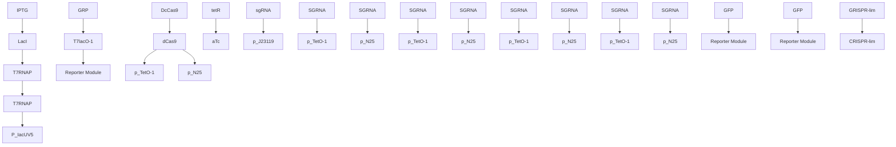
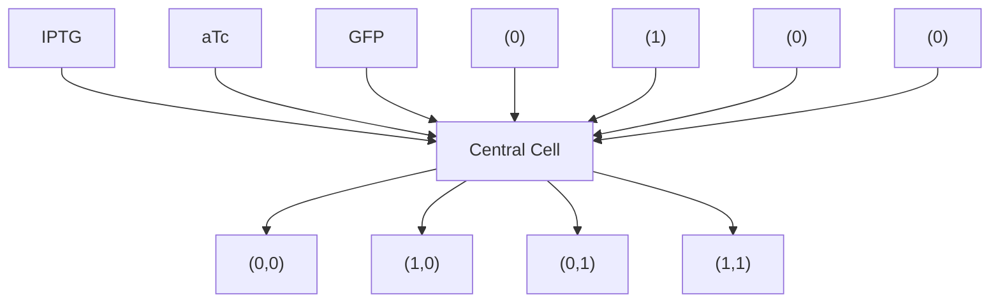

# Research Article

CRIPSR-Cas expands dynamic range of gene expression from T7RNAP promoters $^{†}$

Sean R. McCutcheon $^{1,+}$ , Kwan Lun Chiu $^{1,+}$ , Daniel D. Lewis $^{1,2}$ , Cheemeng Tan $^{1,*}$

$^{1}$ Department of Biomedical Engineering, University of California, Davis, CA, 95616

$^{2}$ Integrative Genetics and Genomics, University of California, Davis, CA, 95616

\* Corresponding author: cmtan@ucdavis.edu

\+ Authors contributed equally to the manuscript

Keywords: CRISPR-Cas / Dynamic Range / Leaky Expression / T7 Promoter

Abbreviations: T7RNAP, T7 RNA Polymerase; sgRNA, single-guide RNA; RBS, ribosomal binding site; IPTG, isopropyl $\beta$ -D-1-thiogalactopyranoside; LacO, Lac operator; aTc, anhydrotetracycline; CRISPR, Clustered Regularly Interspaced Short Palindromic Repeats; CRISPRi, CRISPR interference; dCas9, catalytically inactive Cas9; CRISPR-lim, CRISPR-dCas9-based leaky-expression inhibition module

$^{\dagger}$ This article has been accepted for publication and undergone full peer review but has not been through the copyediting, typesetting, pagination and proofreading process, which may lead to differences between this version and the Version of Record. Please cite this article as doi: [10.1002/biot.201700167].

This article is protected by copyright. All rights reserved

Received: August 31, 2017 / Revised: November 2, 2017 / Accepted: November 15, 2017

# Abstract

Background: Reducing leaky gene expression is critical for improving protein yield of recombinant bacteria and stability of engineered cellular circuits in synthetic biology. Leaky gene expression occurs when a genetic promoter is not fully repressed, leading to unintended protein synthesis in the absence of stimuli. Existing work has devised specific molecular strategies for reducing leaky gene expression of each promoter.

Main Method and Results: In contrast, we describe a repurposed, modular CRISPRi system that attenuates leaky gene expression using a series of single-guide RNAs targeting the $P_{T7/LacO1}$ . Furthermore, we demonstrate the efficacy of CRISPRi to significantly increase the dynamic range of T7 RNA Polymerase (T7RNAP) promoters. In addition, we demonstrate that the CRISPRi system can be applied to enhance growth of bacteria that suffer from leaky expression of a toxic protein.

Conclusions and implications: Our work establishes a new application of CRISPRi in genomic engineering to improve the control of recombinant gene expression. The approach is potentially generalizable to other gene expression system by changing the single-guide RNAs.

# 1 Introduction

The majority of recombinant protein-expression systems in synthetic biology are induced by stimuli including temperature [1], light [2], quorum-sensing molecules [3], and supplemented chemicals [4]. An overarching goal of each expression systems is to expand the dynamic range of gene expression by fully repressing gene expression in the OFF state and increasing gene expression in the ON state [5,6]. Expression systems tend to suffer from incomplete repression of gene expression in the OFF state (in the absence of a stimulus), also known as basal transcription or “leaky” expression. Leaky expression is the main underlying cause of adverse effects in recombinant protein expression, including plasmid instability [6,7], metabolic burden [6,8,9], and cell death in the case of toxic proteins [6]. Even leaky expression of non-toxic recombinant proteins can lead to deleterious mutations in the promoter driving expression of the proteins [8]. Collectively, these adverse effects can reduce protein yield and lead to complete loss of recombinant gene expression from a culture. Leaky expression also limits the ability to construct complex genetic circuits in synthetic biology because the control of synthetic genetic circuits requires careful parameterization of many variables, including promoter strengths, degradation rates, plasmid copy numbers, and RBS strengths [10]. Leaky expression of key regulators in synthetic genetic circuits increases the complexity of fine-tuning interactions between each part of synthetic gene circuits and prevents a circuit from functioning properly [5].

Indeed, an extensive amount of research has been invested into resolving the problem of leaky expression. In T7 RNA Polymerase (T7 RNAP)-based systems, isopropyl $\beta$ -D-1-thiogalactopyranoside (IPTG) induces the expression of the efficient and highly specific T7 RNA polymerase $^{[11]}$ , which activates gene expression from a $P_{T7}$ promoter $^{[9]}$ . For this system, a widely applied strategy to reduce leaky expression involves placing an operator, such as a lac

operator (LacO), downstream of the promoter. With this strategy, the LacI repressor competes with T7 RNAP for binding to $P_{T7}$ , which reduces leaky expression $[12]$ . Other approaches have been designed to directly repress the activity or expression of T7 RNAP. These approaches include constitutively expressing a T7 polymerase-inhibiting protein at low levels (pLysS system) $[13]$ and integrating terminator sequences between the promoter and the gene encoding T7 RNAP in conjunction with an anti-termination system $[7]$ . Alternative and more general strategies include fine-tuning the ratio between repressor and operator $[14]$ , reducing the promoter strength $[15]$ , and controlling translation initiation using ribozymes $[16]$ .

The existing methods to reduce leaky expression typically require the redesign of synthetic promoters to include additional operator sites, while making sure that the RNA polymerase can still recognize and bind to the synthetic promoter. Some of the strategies cannot be readily applied to other expression systems since they involve specific molecular systems, such as LysS that represses T7 RNAP. The termination/anti-termination system will also have to be redesigned for different promoter-polymerase pairs. Additional modular strategies such as increasing the repressor to operator ratio and reducing promoter strength tend to reduce maximal expression levels in the presence of an inducer. For example, attenuating promoter strength reduces the affinity between a free promoter and polymerase, thereby decreasing maximal expression levels $[15]$ .

To overcome these limitations, a modular and simple control mechanism of reducing leaky expression while retaining maximal expression is highly desirable. In addition, it would be preferable if this control mechanism does not require modification of the promoter sequence. Here, we exploit the easily programmable and highly versatile CRISPR interference (CRISPRi) system $^{[17]}$ . Briefly, CRISPRi operates through an RNA-mediated interaction between DNA and

a catalytically inactive Cas9 protein (dCas9). With mutations in its endonuclease domains, dCas9 cannot produce double stranded breaks in DNA, but still retains the ability to bind to DNA.

In the CRISPRi type II system, a single-guide RNA (sgRNA) directs dCas9 to the targeted DNA sequence through Watson-Crick base pairing rules. The CRISPRi-based strategy is more versatile than strategies that require modification of the promoter, because CRISPRi can target any DNA sequence that contains a protospacer adjacent motifs (PAM) sequence. In essence, the CRISPRi system acts as a programmable repressor, where the design of the single-guide RNA dictates the targeted regions. The CRISPRi also allows for multiplex targeting of DNA regions through simple sgRNA design. As a result, this system can be used to interfere with transcriptional elongation, transcription factor binding, and RNA polymerase binding $[18]$ . The CRISPRi system has been applied to repress transcription in C. beijerinckii by targeting specific promoter regions $[19]$ . Based on the CRISPRi system, we demonstrate a new approach to increase the dynamic range of gene expression from T7 RNAP systems in Escherichia coli.

# 2 Methods

# 2.1 Construction of Plasmids and Bacterial Strains

The Escherichia coli strain BL21(DE3) was cultured in Lysogeny Broth (LB) and was the host cell for all plasmids. Competent E. coli cells were prepared using the Mix and Go E. Coli Transformation Kit (Zymo Research, California). Competent cells were transformed through heat shock at 42°C followed by an hour-long incubation in SOC media. A double transformation followed by a single transformation was required to generate bacterial strains

carrying a pET vector, pdCas9-bacteria (Addgene, Plasmid #44249), and pSG4k5 (Addgene, Plasmid #74492).

The pET vector carries an ampicillin selection marker, pBR322 replication origin, and $P_{T7/lacO1}$ driving expression of GFP or LL-37. The pdCas9-bacteria vector carries a chloramphenicol selection marker, p15A replication origin, and dCas9 under an anhydrotetracycline (aTc) sensitive promoter. The specific sgRNAs were cloned into the pSG4k5 vector. This vector carries a pSC101 replication origin, kanamycin selection marker, and a constitutive J23119 promoter. Bacterial strains were always cultured with 50 $\mu$ g/mL carbenicillin, 33 $\mu$ g/mL chloramphenicol, and 30 $\mu$ g/mL kanamycin.

# 2.2 Design and Cloning of sgRNAs

A MATLAB script was written to identify protospacer adjacent motifs (PAM) in the $P_{T7/lacO1}$ and generate potential 20 base pair sgRNA sequences. These sgRNA sequences were screened for efficacy using a Support Vector Machine (SVM) algorithm. The written MATLAB script was a modified version of an existing SVM algorithm $[20]$ . Only sgRNAs classified as successful were cloned into pSG4k5 using traditional digestion ligation cloning.

The pSG5k4 vector was digested with SapI and dephosphorylated using antarctic phosphatase (New England BioLabs, Massachusetts). Oligonucleotide pairs were synthesized (Integrated DNA Technologies, Iowa) to contain 20 base pairs of overlap and 3 base pairs of overhang complementary to the digested plasmid. A phosphate was incorporated on the 5' ends of the oligonucleotides using T4 PNK (New England Bio Labs, Massachusetts) and each pair was slowly cooled in a thermal cycler (Bio-Techne, Minnesota) to anneal oligonucleotides. A 3:1 molar ratio of insert to vector was used for ligation into pSG4k5.

# 2.3 In-vitro Fluorescence Measurements

For all induction tests, individual colonies were selected from LB agar plates and incubated in 3 mL of LB overnight at $37\ °C$ and 200 rpm. The overnight culture was diluted by 200-fold into fresh LB media, followed by incubation in a shaker for two hours at $37\ °C$ . After this growth period, cells were supplemented with the indicated concentration of IPTG. Plate-reader data and quantitative western blots were used to quantify protein expression.

# Plate Reader

An m1000Pro plate reader (Tecan, Switzerland) incubated cells at $37^{\circ}$ C with cycles of 3 mm orbital rotations at 216 rpm for 20 seconds, followed by 40 seconds without rotation. The plate reader measured the optical density (600 nm) and emission of green fluorescence from each well every 15 minutes. Each well held $199\mu L$ of cell culture and $1\mu L$ of a specified concentration (0 - 0.5mM) of IPTG. BL21(DE3) samples were included in plate reader runs to calibrate the auto-fluorescence of Bl21(DE3). The background fluorescence was subtracted from raw fluorescence values. Lastly, adjusted fluorescent measurements were normalized by cell density before analysis.

# Western Blots

Cells strains were harvested using centrifugation (17,000 g, 10 minutes). Each gram of cells was re-suspended in 5ml of sonication buffer. Bacterial cells were lysed through sonication (QSonica Q125, 67% amplitude; 8 cycles of 15 seconds “ON” and 45 seconds “OFF”), and whole cell extract (WCE) was collected through centrifugation (17,000 g, 1 hour).

A Bradford Assay Kit (Thermo Fisher, Massachusetts) with protein standards was used to measure the total protein concentrations of WCE samples. Equal amounts of protein were loaded into a pre-cast polyacrylamide protein gel (BioRad, California), separated by SDS-PAGE, and transferred to a nitrocellulose membrane. After incubating in 5% nonfat milk in 1x TBS-T (0.1% Tween-20) for 45 minutes with continuous shaking, the membrane was washed with 0.5% nonfat milk in TBS-T and incubated against anti-GFP (1:500) diluted in 3% BSA for 2 hours. Membranes were washed with 0.1% BSA in 1x TBS-T and incubated with a 1:10,000 dilution of horseradish peroxidase-conjugated anti-mouse in 3% BSA for 1 hour. Membranes were washed in 1x TBS-T and then developed using Clarity™ Western ECL Substrate (BioRad, California). A calibration curve of purified GFP via ImageJ was used to extrapolate the amount of GFP in WCE samples.

# 2.4 Calculation of Dynamic Range, Fold-Increase, and Fold-Repression

Dynamic range refers to the maximal expression level when a promoter is induced divided by the leaky expression level when the promoter is repressed. Fold-increase or fold-repression refers to relative changes in leaky expression, maximal expression, or dynamic range either within a promoter or across promoters.

# 2.5 LL37 Colony Fitness Analysis

An equal amount of pET-LL37 vector was transformed into freshly competent cell strains carrying pdCas9-bacteria and pSG4k5. The resulting solution was diluted 1:20 in fresh SOC media and incubated at $37^{\circ}\mathrm{C}$ on an LB agar plate for 18 hours. All LB agar plates were prepared on the same day. Plates were then imaged with PXi gel imaging system (Syngene, India). Using ImageJ, 8-bit images were converted into binary images through an auto-local threshold script

(Bernsen) and then analyzed using the analyze particle tool. A stringent criterion of 0.9-1.0 circularity was chosen to exclude irregular specks and water droplets from analysis. The analyze particle tool measured the area of individual cell colonies and displayed representative masks of colonies.

# 3 Results

# 3.1 Design and validation of a CRISPR-dCas9-based leaky-expression inhibition module (CRISPR-lim)

Here, we exploited the CRISPRi system to suppress leaky expression of recombinant proteins in the E. coli strain BL21(DE3). These cells carried T7 RNAP under the lactose operon and were induced by isopropyl $\beta$ -D-1-thiogalactopyranoside (IPTG). IPTG inactivated the suppression ability of the LacI repressor protein at the LacO1 operator, which led to expression of T7 RNAP and initiated transcription of a reporter protein from the $P_{T7/lacO1}$ .

To suppress leaky expression from the $P_{T7/lacO1}$ , we integrated a CRISPR-dCas9-based leaky-expression inhibition module (CRISPR-lim) that consisted of two plasmids: one plasmid constitutively expressing a single-guide RNA targeting the $P_{T7/lacO1}$ and the other plasmid expressing dCas9 from $P_{Tet}$ (Fig. 1A). Gene expression of this synthetic genetic circuit was activated by IPTG and suppressed by aTc (Fig 1B). Each sgRNA was designed to target the template strand of the $P_{T7/lacO1}$ due to the lack of PAM sequences in the template strand (Fig. 1C).

We first examined the functions of CRISPR-lim with respect to the inducer concentrations as cells entered the exponential growth phase. The CRISPR-lim system was indeed sensitive to aTc. Despite a saturating amount of IPTG at 0.5mM, 0.05 $\mu$ M of aTc led to 13, 9, and 24 fold-repression of GFP levels for sgRNAs 1, 2, and 3 respectively (Fig. 2A). The fold-repression for each sgRNA was calculated by dividing the averaged fluorescence intensity of the strain with an empty sgRNA vector (Fig. 2A, sgRNA-, grey bar) with the averaged fluorescence intensity of each strain with a sgRNA (Fig. 2A, sgRNA 1, 2, and 3, grey bar). The results also verified that the drop in maximal levels was due to specific inhibition by CRISPR-lim. As expected, there was no significant reduction in maximal levels for CRISPR-lim with an empty sgRNA vector. In addition, the maximal levels were retained for CRISPR-lim carrying sgRNAs in the absence of aTc (Fig. 2A, sgRNA 1, 2, and 3, black bars).

Based on the sensitivity of CRISPR-lim to aTc, we further investigated the capability of CRISPR-lim to suppress leaky expression from the $P_{T7/lacO1}$ . We supplemented only IPTG to the bacteria and assessed whether constitutive expression of dCas9 could reduce leaky expression of GFP. Indeed, sgRNA 1, 2, and 3 repressed leaky expression by 3.1, 3.3, and 2.5 fold (Fig. 2B, sgRNA 1, 2, 3, grey bars) relative to the negative control (Fig. 2B, sgRNA-, dCas9-, grey bar). Next, we calculated dynamic range as the ratio between maximal expression induced with 0.5 mM IPTG and leaky expression levels without IPTG. All sgRNAs (Fig. 2C, grey shapes) consistently outperformed the negative control (Fig. 2C, (-)) with respect to dynamic range for the entire experimental duration (5.5 hours) before cells reached the stationary phase. The control had a maximum dynamic range of 55 (Fig. 2C, black circles) because its leaky expression of GFP was more than double that of strains with CRISPR-lim (Fig. 2B, grey bars). In contrast, the CRISPR-lim generated maximum dynamic range of 137, 149, and 99 with

sgRNA 1, 2, and 3 respectively (Fig. 2C, grey squares, dark grey triangles, and light grey triangles).

The measurement of leaky GFP expression was at the limit of detection of our plate-reader. Therefore, these results likely underestimated the capacity of the CRISPR-lim to reduce leaky GFP expression. We further investigated the performance of CRISPR-lim using quantitative western blots with a detection limit of 15 nanograms GFP in our protocol. The western blots revealed that \~150 nanograms of leaky GFP were synthesized in the negative control (Fig. 2D, black bar). In contrast, there was no detectable amount of GFP from the strains with CRISPR-lim. The western-blotting results suggested that leaky expression levels of CRISPR-lim were at least 10-fold lower than that of the control. Based on the fold-decrease in leaky expression using western blotting, we adjusted the dynamic ranges from our plate-reader data to 350-fold for the most effective sgRNA (i.e. sgRNA 2). The 350-fold dynamic range represented a significant improvement of the original system, which could only reach a dynamic range of 50 (Fig. 2B, sgRNA- dCas9-, black bar).

# 3.2 Mathematical models of CRISPR-lim

A Michaelis-Menten kinetics based mathematical model was constructed to simulate the influence of CRISPR-lim on GFP expression from the $P_{T7/lacO1}$ . Three ordinary differential equations were derived to describe the dynamical behavior of T7RNAP, dCas9, and GFP (Eq. 1, 2, 3). It is known that dCas9 can bind competitively to DNA regions against other endogenous DNA-binding factors $[21]$ . Under this assumption, an ODE for GFP was formulated based on the competitive inhibition model. Therefore, the concentrations of IPTG, T7 RNAP, and dCas9 modulated GFP expression.

$$
\frac {d [ T 7 R N A P ]}{d t} = \frac {k _ {\text {leak-} T 7 R N A P} + v _ {1} [ I P T G ]}{k _ {t} + [ I P T G ]} - k _ {d} [ T 7 R N A P ] \tag {Eq.1}
$$

$$
\frac {d [ d C a s 9 ]}{d t} = \frac {k _ {\text {leak- } d C a s 9} + v _ {2} [ a T c ]}{k _ {j} + [ a T c ]} - k _ {d} [ d C a s 9 ] \tag {Eq.2}
$$

$$
\frac {d [ G F P ]}{d t} = \frac {k _ {\text {leak - GFP}} + v _ {3} [ I P T G ] [ T 7 R N A P ]}{k _ {m} \left(1 + \frac {[ d C a s 9 ]}{k _ {i}}\right) + [ I P T G ] [ T 7 R N A P ]} - k _ {d} [ G F P ] \tag {Eq.3}
$$

IPTG induces expression of T7 RNAP and GFP (mM). In equation 1, $k_{leak-T7RNAP}$ is the leaky expression rate constant of T7 RNAP ( $\mathrm{mM}^2\ \mathrm{s}^{-1}$ ), $v_1$ is the synthesis rate constant for the production of T7 RNAP ( $\mathrm{mM}\ \mathrm{s}^{-1}$ ), $k_t$ is the dissociation constant of IPTG for the production of T7 RNAP (mM), $k_d$ is the degradation rate constant ( $\mathrm{s}^{-1}$ ). In equation 2, $k_{leak-dCas9}$ is the leaky expression rate constant of dCas9 ( $\mathrm{mM}^2\ \mathrm{s}^{-1}$ ), aTc is the inducer of dCas9 (mM), $v_2$ is the synthesis rate constant of dCas9 ( $\mathrm{mM}\ \mathrm{s}^{-1}$ ), $k_j$ is the dissociation constant of aTc for the production of dCas9 (mM). In equation 3, $k_{leak-GFP}$ is the leaky expression rate constant of GFP ( $\mathrm{mM}^3\ \mathrm{s}^{-1}$ ), $v_3$ is the synthesis rate constant for the production of GFP ( $\mathrm{mM}\ \mathrm{s}^{-1}$ ), $k_m$ is the dissociation constant of T7 RNAP and IPTG for the production of GFP ( $\mathrm{mM}^2$ ), $k_i$ is the dissociation constant of dCas9 for the production of GFP (mM).

A simpler model was developed for the expression system without CRISPR-lim, in which only IPTG and T7 RNAP modulated GFP expression (Eq. 4, 5).

$$
\frac {d [ T 7 R N A P ]}{d t} = \frac {k _ {\text {leakT7RNAP}} + v _ {1} [ I P T G ]}{k _ {t} + [ I P T G ]} - k _ {d} [ T 7 R N A P ] \tag {Eq.4}
$$

$$
\frac {d [ G F P ]}{d t} = \frac {k _ {\text {leakGFP}} + v _ {3} [ I P T G ] [ T 7 R N A P ]}{k _ {m} + [ I P T G ] [ T 7 R N A P ]} - k _ {d} [ G F P ] \tag {Eq.5}
$$

As depicted in Fig. 3A, each model was then fitted into a dosage response curve by estimating the kinetic constants (Table 1) using a Markov chain Monte Carlo based algorithm in MATLAB, which minimized the sum-of-squares through a least-squares regression. The fitted

model explained the optimized dynamic range of the CRISPR-lim system: GFP expression was heavily suppressed by dCas9 at low IPTG concentrations, which decreased the $k_{leak-GFP}$ term for CRISPR-lim in comparison to the system without CRISPR-lim. At higher IPTG concentrations, the suppression effect of dCas9 was alleviated by the term $k_{m}$ .

# 3.3 CRISPR-lim increased dynamic range of a mutant $P_{T7/lacO1}$ that exhibited higher maximal expression level than the original $P_{T7/lacO1}$

Before this point, we had focused on expanding the dynamic range of $P_{T7/lacO1}$ by reducing leaky expression levels and retaining maximal expression. Increasing maximal expression levels when cells were fully induced with IPTG could further expand the dynamic range. Without altering the circuit topology, we enhanced the affinity between T7RNAP and $P_{T7/lacO1}$ by introducing a thymine to guanine point mutation in the +25 position of $P_{T7/lacO1}$ (Fig. 3B). The mutant $P_{T7/lacO1}$ strain without CRISPR-lim, with sgRNA 2, and with sgRNA 3 increased maximal expression level (relative to the WT $P_{T7/lacO1}$ ) by 1.2, 1.6, and 1.4 -fold respectively (Fig. 3C, ratio of each grey bar over the corresponding black bar). However, increasing the strength of T7 RNAP and $P_{T7/lacO1}$ interaction also elevated leaky expression level of the mutant $P_{T7/lacO1}$ (Fig. 3D, (-), grey bar) by 4.2-fold relative to the WT $P_{T7/lacO1}$ (Fig. 2B, sgRNA- dCas9-, grey bar,). Without sgRNAs, the mutant $P_{T7/lacO1}$ system (Fig. 3D, black bar, (-)) generated a dynamic range of 8.6, which was significantly less than that of the wild-type $P_{T7/lacO1}$ (Fig. 2B, sgRNA- dCas9-, black bar).

We integrated CRISPR-lim with the original sgRNAs to repress leaky expression from the mutant $P_{T7/lacO1}$ . As a result of the single nucleotide mismatches between the sgRNAs and the mutant $P_{T7/lacO1}$ , leaky expression levels were not entirely repressed (Fig. 3D, 1bp mismatch, grey bars). Overall, the performance of the non-complementary sgRNAs was underwhelming because

the dynamic range of the mutant $P_{T7/lacO1}$ system was still unable to surpass the dynamic range of the wild-type $P_{T7/lacO1}$ , despite exhibiting higher maximal expression levels.

To improve this system, we altered the sgRNAs such that they were fully complementary to the mutant $P_{T7/lacO1}$ . The CRISPR-lim system with sgRNA 2 and sgRNA 3 fully complementary to the mutant $P_{T7/lacO1}$ reduced leaky expression by 33 and 24 fold (Fig. 3D, sgRNA 2 and sgRNA 3 – fully complementary, grey bars) relative to the negative control (Fig. 3D, (-), grey bar). With this significant reduction in leaky expression, the dynamic range of gene expression from the mutant $P_{T7/lacO1}$ was increased over 20-fold from 8.6 (Fig. 3D, (-), black bar) to 176 (Fig. 3D, fully complementary sgRNA 2, black bar). Furthermore, the dynamic range of the mutant $P_{T7/lacO1}$ with CRISPR-lim (Fig. 3D, fully complementary sgRNA 2 and 3, black bars) surpassed the dynamic range of the wild-type $P_{T7/lacO1}$ with CRISPR-lim (Fig. 2B, sgRNA 2 and 3, black bars). Irrespective of leaky expression levels in the original systems, CRISPR-lim repressed expression of GFP in the absence of IPTG. In literature data, increasing the dynamic range of gene expression required simultaneously optimizing leaky and maximal levels [22]. It is inherently challenging to increase maximal expression without increasing leaky expression, and similarly, to reduce leaky expression without reducing maximal expression. In contrast, CRISPR-lim effectively decoupled the leaky and maximal expression of the $P_{T7/lacO1}$ , thereby enabling us to optimize the dynamic range by exclusively focusing on maximal expression. This unique property will need to be validated in future work using other expression systems.

# 3.4 CRISPR-lim improves fitness of strains suffering from leaky expression of a toxic protein

Finally, we applied CRISPR-lim to repress leaky expression of a toxic protein. When unimpeded, leaky expression of toxic proteins tends to reduce cell fitness or led to cell death. We placed an antimicrobial peptide LL-37 under the control of the wild type $\mathrm{P_{T7 / lacO1}}$ with (Fig. 4A, right panels) and without CRISPR-lim (Fig. 4A, left panels). Antimicrobial peptides are small cationic peptides [23,24] that insert into lipid bilayers, leading to cell death [25]. Colony growth of freshly transformed bacteria carrying an empty sgRNA plasmid indicated that leaky expression levels of LL-37 was beneath the minimum bactericidal concentration (MBC) required to kill the host cells. However, there was a significant difference in colony size between the negative control and CRISPR-lim. The average surface area of bacterial colony was $37\%$ and $23\%$ larger for bacteria carrying CRISPR-lim with sgRNA 2 and 3 respectively (Fig. 4B, grey bars) than without sgRNA (Fig. 4B, black bar). A larger colony area of E. coli has been linked to cell fitness because larger colonies arise from cells with faster growth rates and less stress from leaky expression [26]. Combining the literature and our results, CRISPR-lim indeed enhanced fitness of bacteria expressing LL37.

Lastly, we compared leaky GFP expression with the CRISPR-lim and pLysS system. In the exponential phase of growth (Fig. 4C, before OD600 of 0.2), raw fluorescence values of both systems (Fig. 4C, solid black lines) were beneath the limit of detection (LOD) and limit of quantification (LOQ) (Fig. 4C, dashed grey lines). The LOD was the lowest quantity of analyte that can be distinguished from the blank (Fig. 4C, dotted black line), while the LOQ indicated when two different values could be reasonably discerned. Mathematically, the LOD and LOQ were calculated with $LOD = \mu_{blank} + 3\sigma_{blank}$ and $LOQ = \mu_{blank} + 10\sigma_{blank}$ with BL21(DE3)

serving as the blank $^{[27]}$ . Here, $\mu_{blank}$ and $\sigma_{blank}$ represent the average auto-fluorescence and standard deviation of auto-fluorescence from BL21(DE3), respectively. In the stationary phase of growth, there was a slight deviation between both systems. This stage of cell growth was characterized by a reduction in gene expression and protein synthesis $^{[28]}$ . Therefore, CRISPR-lim that depended on the expression of a sgRNA and dCas9 was likely more susceptible to the growth reduction in stationary phase than the pLysS system that depended on a single LysS repressor.

# 4 Discussion

CRISPRi has been used extensively to explore functional genomics by modulation of gene expression at the transcriptional level. Here, we have repurposed CRISPRi as a versatile tool, referred to as CRISPR-lim in this work, for expanding the dynamic range of gene expression. A major advantage of this CRISPR-lim approach is its potential modularity. Current molecular strategies for reducing leaky expression are confined to specific operons and polymerases. Theoretically, CRISPR-lim can be easily programmed to reduce leaky expression from any promoter by designing promoter specific sgRNAs.

In addition, we have demonstrated CRISPR-lim expands the dynamic range of $P_{T7/lacO1}$ with a single-guide RNA. Future work could include additional screening of sgRNAs and multiplex targeting – designing dual sgRNAs that target the promoter of both the polymerase and recombinant protein, designing multiple sgRNAs that target the same promoter, or including sgRNAs that target coding regions. Once optimized, CRISPR-lim could be integrated into the genome of the host cell to reduce the metabolic burden of maintaining plasmid DNA. In

conclusion, we have demonstrated that CRISPR-lim is an effective tool for suppressing leaky gene expression with untapped potential in terms of viable optimizations and modular applications.

Acknowledgements: We thank Fan Wu, Luis Eduardo Contreras-Llano, and Fernando Villarreal for their advice and guidance regarding our research. The work is supported by the Society-in-Science: Branco-Weiss Fellowship and Human Frontier Science Program (RGY0080/2015).

Conflict-of-Interest Statement: The authors declare no financial conflict of interest.

# References

[1] Boorsma, M., Nieba, L., Koller, D., Bachmann, M. F., Bailey, J. E., Renner, W. A., Nature biotechnology 2000, 18, 429-432.   
[2] Wang, X., Chen, X., Yang, Y., Nature methods 2012, 9, 266-269.   
[3] Shong, J., Collins, C. H., ACS synthetic biology 2013, 2, 568-575.   
[4] Lutz, R., Bujard, H., Nucleic acids research 1997, 25, 1203-1210.   
[5] Westbrook, A. M., Lucks, J. B., Nucleic acids research 2017, 45, 5614-5624.   
[6] Makrides, S. C., Microbiological reviews 1996, 60, 512-538.   
[7] Mertens, N., Remaut, E., Fiers, W., Nature Biotechnology 1995, 13, 175-179.

[8] Kawe, M., Horn, U., Plückthun, A., Microbial cell factories 2009, 8, 8.   
[9] Vethanayagam, J. G., Flower, A. M., Microbial cell factories 2005, 4, 3.   
[10] Gardner, T. S., Cantor, C. R., Collins, J. J., Nature 2000, 403, 339-342.   
[11] Kesik-Brodacka, M., Romanik, A., Mikiewicz-Sygula, D., Plucienniczak, G., Plucienniczak, A., Microbial cell factories 2012, 11, 109.   
[12] Dubendorf, J. W., Studier, F. W., Journal of molecular biology 1991, 219, 45-59.   
[13] Studier, F. W., Journal of molecular biology 1991, 219, 37-44.   
[14] Müller-Hill, B., Crapo, L., Gilbert, W., Proceedings of the National Academy of Sciences 1968, 59, 1259-1264.   
[15] Warne, S. R., Thomas, C. M., Nugent, M. E., Tacon, W. C., Gene 1986, 46, 103-112.   
[16] Klauser, B., Hartig, J. S., Nucleic acids research 2013, 41, 5542-5552.   
[17] Puchta, H., Genome biology 2016, 17, 51.   
[18] Qi, L. S., Larson, M. H., Gilbert, L. A., Doudna, J. A., Weissman, J. S., Arkin, A. P., Lim, W. A., Cell 2013, 152, 1173-1183.   
[19] Wang, Y., Zhang, Z. T., Seo, S. O., Lynn, P., Lu, T., Jin, Y. S., Blaschek, H. P., Biotechnology and bioengineering 2016, 113, 2739-2743.   
[20] Wong, N., Liu, W., Wang, X., Genome biology 2015, 16, 218.   
[21] Mali, P., Esvelt, K. M., Church, G. M., Nature methods 2013, 10, 957-963.   
[22] Rosano, G. L., Ceccarelli, E. A., Frontiers in microbiology 2014, 5.

[23] Cole, J. N., Nizet, V., Microbiology spectrum 2016, 4.   
[24] Nizet, V., Ohtake, T., Lauth, X., Trowbridge, J., Rudisill, J., Dorschner, R. A.,   
Pestonjamasp, V., Piraino, J., Huttner, K., Gallo, R. L., Nature 2001, 414, 454-457.   
[25] Teixeira, V., Feio, M. J., Bastos, M., Progress in lipid research 2012, 51, 149-177.   
[26] Tavichakorntrakool, R., Boonsiri, P., Prasongwatana, V., Lulitanond, A., Wongkham, C.,   
Thongboonkerd, V., Clinica Chimica Acta 2017, 466, 112-119.   
[27] MacDougall, D., Crummett, W. B., Analytical Chemistry 1980, 52, 2242-2249.   
[28] Gefen, O., Fridman, O., Ronin, I., Balaban, N. Q., Proceedings of the National Academy of   
Sciences 2014, 111, 556-561.

Table 1 Estimated parameters used for dosage response curve fitting 

<table><tr><td>Parameters</td><td>sgRNA 1</td><td>sgRNA 2</td><td>sgRNA 3</td><td>CRISPR-lim(-)</td></tr><tr><td> $k_{leak-T7RNAP}$  (mM $^{2}$  s $^{-1}$ )</td><td>0.52</td><td>0.54</td><td>0.58</td><td>0.55</td></tr><tr><td> $v_1$  (mM s $^{-1}$ )</td><td>254.7</td><td>255</td><td>254.83</td><td>335.63</td></tr><tr><td> $k_t$  (mM)</td><td>1.6</td><td>1.64</td><td>1.58</td><td>1.4</td></tr><tr><td> $k_d$  (s $^{-1}$ )</td><td>0.37</td><td>0.39</td><td>0.33</td><td>0.24</td></tr><tr><td> $k_{leak-dCas9}$  (mM $^{2}$  s $^{-1}$ )</td><td>2.25</td><td>2.24</td><td>2.26</td><td>-</td></tr><tr><td> $v_2$  (mM s $^{-1}$ )</td><td>-</td><td>-</td><td>-</td><td>-</td></tr><tr><td> $k_{j}$  (mM)</td><td>0.08</td><td>0.08</td><td>0.09</td><td>-</td></tr><tr><td> $k_{leak-GFP}$  (mM3s−1)</td><td>60.05</td><td>67.86</td><td>82.38</td><td>219.33</td></tr><tr><td> $v_{3}$  (mM s−1)</td><td>1407.04</td><td>1180.16</td><td>1233.7</td><td>1005.03</td></tr><tr><td> $k_{m}$  (mM2)</td><td>3.32</td><td>2.62</td><td>2.23</td><td>3.45</td></tr><tr><td> $k_{i}$  (mM)</td><td>46.5</td><td>31.12</td><td>40.1</td><td>-</td></tr></table>

# Figure legends

# Figure 1 Circuit Schematic of CRISPR-lim

(A) The schematic of the activation, CRISPR-lim, and reporter modules in the synthetic genetic circuit. The activation module consists of IPTG that activates a $P_{lacUV5}$ driving expression of T7 RNA polymerase. CRIPSR-lim consists of constitutively expressed sgRNAs that direct dCas9 to the $P_{T7/lacO1}$ that controls GFP expression of the reporter module.   
(B) A logic-gate diagram showing the input-output behavior of the circuit. GFP (grey star) is only expressed in the presence of IPTG (dark grey circles) and absence of aTc (light grey circles).

(C) Design of three sgRNAs targeting specific regions of the $P_{T7/lacO1}$ . A representative PAM sequence is highlighted in green.

# Figure 2 CRISPR-lim expands dynamic range of $\mathrm{P_{T7 / lacO1}}$ by reducing its leaky expression

(A) Bar plot illustrating the response of CRISPR-lim circuit to aTc and repression activity of sgRNAs. The numbers 1,2,3 in the sgRNA row correspond to the specific sgRNA sequence shown in Fig. 1C.   
(B) A bar plot with dynamic range on the left y-axis and leaky expression on the right y-axis. Dynamic range (black bars) is a dimensionless ratio between maximal and leaky expression levels. Leaky expression (grey bars) is reported as normalized GFP/OD600.   
(C) Time series of dynamic range illustrating the performance of CRISPR-lim relative to the negative control lacking CRISPR-lim. The black dashed line indicates the time point of presented data for all subsequent figures.   
(D) A quantitative western blot of negative control (1x PBS-SDS), WCE from samples (lane 2-5), and purified GFP (lane 6-10). Black dashed line represents the limit of detection of western blot. n = 3 for (A), n = 8 - 11 for (B, C), and n = 2 for (D). Asterisks in (A, B, D) represent statistical significance (\* p ≤ 0.05, \*\* p ≤ 0.01, \*\*\* p ≤ 0.001, \*\*\*\* p ≤ 0.0001) relative to the cell strain only carrying the pET vector (unpaired student t-test, mean + s.e.m for all figures).

# Figure 3 Mathematical models of CRISPR-lim, and combining CRISPR-lim with a mutant $\mathrm{P_{T7 / lacO_1}}$ to further expand the dynamic range.

(A) Dosage response generated by modeling and experimental results. Bar graph in bottom right compares the dynamic range predicted by the model and the experimental results. The negative control (-) indicates BL21(DE3) carrying only the pET vector.   
(B) A mutant $P_{T7/lacO1}$ with a single base-pair mutation of the wild-type (WT) sequence. Nucleotides in red are unique to the mutant $P_{T7/lacO1}$   
(C) A bar plot comparing maximal expression (normalized GFP/OD600) of cells between the WT (black bars) and mutant promoter (grey bars). The bacteria were induced with 0.5 mM of IPTG.   
(D) A bar plot depicting the dynamic range (black bars) and leaky expression level (grey bars) of strains with the mutant $P_{T7/lacO1}$ . The original sgRNAs with single base-pair mismatches and fully complementary sgRNAs relative to the mutant promoter were tested. Asterisks in (C,D) represent statistical significance ( $^{*}p \leq 0.05$ , $^{**}p \leq 0.01$ , $^{***}p \leq 0.001$ , $^{****}p \leq 0.0001$ ). Unpaired t-test with mean + s.e.m for (C, D). Reported statistical significance in (C) is relative to the negative control (sgRNA-, dCas9-). Reported statistical significance of the single base-pair mismatch for sgRNA 2 and sgRNA 3 in (D) is relative to (-), while the statistical significance of the fully complementary sgRNAs is relative to their respective 1bp mismatched sgRNA.

# Figure 4 CRISPR-lim improves fitness of strains suffering from leaky expression of a toxic protein.

(A) Circuit schematic depicting the expression of the antimicrobial peptide, LL-37, from WT $P_{T7/lacO1}$ . The left panel depicts a strain with an empty sgRNA plasmid. The right panel depicts a strain that expresses sgRNA 2. Bottom panels: Representative ImageJ processed binary-images of colony formation on an LB agar plate. White circles represent individual colonies. Each white oval indicates the region of the LB agar plate where a 3x magnification image (upper right of agar plate) is shown.   
(B) Average surface area of individual colonies for cell strains with an empty sgRNA, sgRNA 2, and sgRNA 3. Asterisks represent statistical significance ( $***p \leq 0.001$ , $****p \leq 0.0001$ ) relative to the negative control (unpaired student t-test, n = 2, mean + s.e.m).   
(C) Scatter plot of raw fluorescence intensities vs. OD600 for CRISPR-lim and pLysS strains. The dotted black line indicates background noise from autofluorescence of BL21(DE3). The dashed light grey and dark grey lines are the LOD and LOQ, respectively.

A   

flowchart

B   

flowchart

C

5'-cgagtaatacgactcactataggggaattgtgagcgg-3'

3'-gctcattatgctgagtgatatccccttaacactcgcc-5'

text_image

sgRNA 1
sgRNA 2
sgRNA 3

Figure 1

A   

bar

| sgRNA | dCas9 | 0 µM aTc, 0.5 mM IPTG | 0.05 µM aTc, 0.5 mM IPTG |
|-------|-------|------------------------|--------------------------|
| -     | -     | 4000                   | 3200                     |
| +     | -     | 5000                   | 200                      |
| +     | +     | 4500                   | 300                      |
| +     | +     | 3500                   | 100                      |

B   

bar

| sgRNA | dCas9 | Dynamic Range | Leaky Expression |
|-------|-------|---------------|------------------|
| -     | -     | 50            | 120              |
| 1     | +     | 110           | 40               |
| 2     | +     | 115           | 35               |
| 3     | +     | 80            | 50               |

C   

line

| Time (hours) | (-)   | sgRNA 1 | sgRNA 2 | sgRNA 3 |
| ------------ | ----- | ------- | ------- | ------- |
| 0            | 0     | 0       | 0       | 0       |
| 1            | 30    | 80      | 70      | 60      |
| 2            | 50    | 130     | 140     | 100     |
| 3            | 40    | 135     | 130     | 90      |
| 4            | 20    | 120     | 110     | 70      |
| 5            | 10    | 100     | 80      | 50      |

D   

bar

| Condition | Leaky Expression (ng) |
| --------- | --------------------- |
| (-)       | 150                   |
| sgRNA 1   | ~10                   |
| sgRNA 2   | ~5                    |

Figure 2

A   

line

| IPTG (mM) | GFP/OD600 (-) | GFP/OD600 (sgRNA 1) | GFP/OD600 (sgRNA 2) | GFP/OD600 (sgRNA 3) |
| --------- | ------------- | ------------------- | ------------------- | ------------------- |
| 0.001     | ~10           | ~5                  | ~3                  | ~2                  |
| 0.01      | ~100          | ~50                 | ~30                 | ~20                 |
| 0.1       | ~1000         | ~500                | ~500                | ~300                |
| 1         | ~10000        | ~5000               | ~5000               | ~3000               |

B

chemical

Genetic variant diagram showing wild-type (WT) and mutant P_T7lacO1 with genetic variants and mutagenesis site

C   

bar

| sgRNA | dCas9 | WT P_T7lacO1 | Mutant P_T7lacO1 |
|-------|-------|--------------|------------------|
| -     | -     | 3800         | 4600             |
| 2     | +     | 2500         | 4000             |
| 3     | +     | 3300         | 4500             |

D   

bar

| Condition | sgRNA | Dynamic Range | Leaky Expression |
| --------- | ----- | ------------- | ---------------- |
| (-) 1 bp mismatch | -     | ~5            | ~135             |
| sgRNA 2 1 bp mismatch | sgRNA 2 | ~35          | ~25              |
| sgRNA 2 1 bp mismatch | sgRNA 3 | ~20          | ~65              |
| sgRNA 2 fully complementary | sgRNA 2 | ~175         | ~10              |
| sgRNA 2 fully complementary | sgRNA 3 | ~160         | ~5               |
| sgRNA 3 fully complementary | sgRNA 3 | ~160         | ~5               |

Figure 3

text_image

A
LL-37
LL-37
P T7lacO-1
dCas9
no sgRNA
3x

text_image

LL-37
LL-37
P T7lacO-1
dCas9
sgRNA 2
3x

bar

| sgRNA | dCas9 | Area (pixels^2) |
| ----- | ----- | --------------- |
| -     | -     | 130             |
| 2     | +     | 175             |
| 3     | +     | 160             |

line

| OD600 | gRNA 2 | pLysS | LOQ | gRNA 3 | BI21(DE3) | LOD |
|-------|--------|-------|-----|--------|-----------|-----|
| 0.1   | 60     | 50    | 90  | 65     | 55        | 60  |
| 0.15  | 62     | 52    | 85  | 64     | 54        | 62  |
| 0.2   | 61     | 51    | 75  | 63     | 53        | 61  |
| 0.25  | 63     | 53    | 70  | 65     | 55        | 63  |
| 0.3   | 68     | 55    | 65  | 70     | 58        | 68  |
| 0.35  | 75     | 60    | 60  | 80     | 60        | 75  |
| 0.4   | 80     | 70    | 75  | 85     | 65        | 80  |

Figure 4