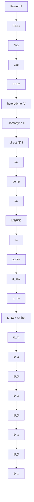

# Cavity Cooling of a Levitated Nanosphere by Coherent Scattering

Uroš Delić, $^{1,2,*}$ Manuel Reisenbauer, $^{1}$ David Grass, $^{1,\dagger}$ Nikolai Kiesel, $^{1}$ Vladan Vuletić, $^{3}$ and Markus Aspelmeyer $^{1,2}$

$^{1}$ Vienna Center for Quantum Science and Technology (VCQ), Faculty of Physics, University of Vienna, Boltzmanngasse 5, A-1090 Vienna, Austria

$^{2}$ Institute for Quantum Optics and Quantum Information (IQOQI), Boltzmanngasse 3, A-1090 Vienna, Austria

$^{3}$ Department of Physics and Research Laboratory of Electronics, Massachusetts Institute of Technology, Cambridge, Massachusetts 02139, USA

(Received 21 December 2018; published 27 March 2019)

We report three-dimensional (3D) cooling of a levitated nanoparticle inside an optical cavity. The cooling mechanism is provided by cavity-enhanced coherent scattering off an optical tweezer. The observed 3D dynamics and cooling rates are as theoretically expected from the presence of both linear and quadratic terms in the interaction between the particle motion and the cavity field. By achieving nanometer-level control over the particle location we optimize the position-dependent coupling and demonstrate axial cooling by two orders of magnitude at background pressures of $6 \times 10^{-2}$ mbar. We also estimate a significant ( $>40$ dB) suppression of laser phase noise heating, which is a specific feature of the coherent scattering scheme. The observed performance implies that quantum ground state cavity cooling of levitated nanoparticles can be achieved for background pressures below $1 \times 10^{-7}$ mbar.

DOI: 10.1103/PhysRevLett.122.123602

Laser cooling and trapping is at the heart of modern atomic physics. In its most basic form, motional cooling of atoms $[1-6]$ or molecules $[7-11]$ is provided by the total recoil from both absorption of Doppler-shifted laser photons and the subsequent spontaneous emission. In contrast, coupling the motion of a particle to an optical cavity field can be used for cooling schemes that do not rely on the internal structure of the particle $[12,13]$ . This is of particular importance for increasingly complex or massive particles, for which transitions between internal energy levels become inaccessible. One highly successful method is to exploit dispersive coupling inside a driven cavity, where the position-dependent cavity frequency shift induced by the particle provides an optomechanical interaction. Demonstrations of this effect include cavity cooling of atomic systems $[14-17]$ , as well as recent experiments in cavity optomechanics that explore the quantum regime of solid state mechanical resonators $[18-24]$ . For levitated nanoparticles $[25-28]$ , this cooling scheme is inherently limited by the laser field driving the cavity. Specifically, large drive powers induce cotrapping by the cavity field and deteriorate cooling rates $[29]$ , while laser phase noise prohibits ground state cooling at the relevant nanoparticle trap frequencies $[30-33]$ .

A promising alternative is cavity cooling by coherent scattering from an optical trapping field (Fig. 1). In this case, a driven dipole (here: the nanosphere) produces scattering that is coherent with the drive field (here: the optical trap laser). Scattering of these photons into an initially empty cavity provides a cooling mechanism [38]. As is usual in cavity cooling, the proper red detuning of the drive field from the cavity allows us to resonantly enhance the scattering processes that remove energy from the particle motion. Dispersive coupling schemes also originate in coherent scattering, where the drive field is the externally pumped cavity field. There, the interaction with the cavity field is determined by the scattering cross section with an independently populated cavity mode, which is typically very small for levitated nanoparticles. In contrast, in coherent scattering, a photon can only enter the cavity via the scattering process that cools the particle motion. Efficient cooling does not require an additional strong intracavity field, which has the immediate advantage of lifting the limitations on drive laser power by cotrapping.

In this Letter, we demonstrate cavity cooling by coherent scattering for a levitated dielectric nanoparticle along with its unique features. We report genuine three-dimensional (3D) cavity cooling, an effect that has thus far only been

text_image

(a)
cavity
MO
ω_tw ≈ ω_cav
particle

text_image

(b)
ω ≈ ω_cav
ω_tw ≠ ω_cav
MO

FIG. 1. Different paradigms for cavity cooling of a levitated nanosphere. (a) Cavity cooling by coherent scattering from an optical tweezer is based on dipole radiation being emitted into an empty cavity, giving the best performance for a particle placed at the intensity minimum of the cavity mode. (b) In standard dispersive optomechanics, an external laser drives both the cavity and the scattering. Optimal cooling is at the largest intensity gradient of the cavity mode.

demonstrated in one dimension with atoms $[39,40]$ . By positioning the particle with 8 nm precision along the cavity axis $[29]$ , we can optimize coherent scattering rates. For a particle placed at a node of the cavity field, we observe axial cooling factors beyond 100, well described by a simple theory based on linear and quadratic optomechanical interactions. We estimate that laser phase noise of the coherently scattered radiation is suppressed by four orders of magnitude, removing a major obstacle for motional ground state cooling.

Theory.—Consider a nanoparticle that is trapped with an optical tweezer of waists $W_{x,y}$ inside an empty optical cavity of mode volume $V_{cav}$ (waist $w_{0}$ ) and at position $x_{0}$ along the cavity axis (Fig. 2). The interaction of the induced dipole with the local electric field is then to the first approximation described by the Hamiltonian:

$$
\begin{array}{l} H _ {\mathrm{dip}} = - \frac {\alpha}{2} | \vec {E} _ {t w} | ^ {2} - \frac {\alpha}{2} | \vec {E} _ {\mathrm{cav}} | ^ {2} - \alpha \Re (\vec {E} _ {t w} \cdot \vec {E} _ {\mathrm{cav}} ^ {*}) \\ \vec {E} _ {t w} \approx \frac {1}{2} \frac {\epsilon_ {t w}}{\sqrt {1 + (z / z _ {R}) ^ {2}}} e ^ {- (x ^ {2} / W _ {x} ^ {2})} e ^ {- (y ^ {2} / W _ {y} ^ {2})} e ^ {i k z} e ^ {i \omega_ {t w} t} \vec {e} _ {y} + H. c. \\ \vec {E} _ {\mathrm{cav}} \approx \epsilon_ {\mathrm{cav}} (\hat {a} ^ {\dagger} e ^ {- i \omega_ {\mathrm{cav}} t} + \hat {a} e ^ {i \omega_ {\mathrm{cav}} t}) \cos k (x _ {0} + x) \vec {e} _ {y _ {\mathrm{cav}}}. \tag {1} \\ \end{array}
$$

Here, $E_{tw}$ and $E_{cav}$ are the electric fields of the tweezer and the cavity mode, respectively (with: $\epsilon_{\mathrm{cav}} = \sqrt{\hbar\omega_{\mathrm{cav}}/(2\varepsilon_{0}V_{\mathrm{cav}})}$ and $\epsilon_{\mathrm{tw}} = \sqrt{4P_{\mathrm{tw}}/(W_{x}W_{y}\pi\varepsilon_{0}c)}$ , the tweezer frequency: $\omega_{tw}$ , the cavity resonance frequency

flowchart

FIG. 2. Setup for cooling by coherent scattering. An optical tweezer is formed by a laser at frequency $\omega_{\mathrm{tw}}$ that is tightly focussed by a microscope objective (MO) inside a vacuum chamber (vac). It levitates a nanoparticle at the center of a high-finesse Fabry-Pérot cavity. Its linear polarization is set by a half wave plate ( $\lambda/2$ ). A weak locking beam is derived from the tweezer laser and drives the cavity resonantly at frequency $\omega_2$ , allowing $\omega_{\mathrm{tw}}$ and $\omega_2$ to be stably locked relative to the cavity frequency. Four independent detection schemes (I)-(IV) monitor the particle motion and the cavity field (see main text for details; PBS: polarizing beam splitter; $\omega_{\mathrm{het}}$ : heterodyne demodulation frequency). Inset: The particle is trapped at a position $x_0$ relative to a cavity antinode. Maximal cavity cooling of the $x$ motion by coherent scattering occurs for $x_0 = \lambda/4$ , i.e., at a cavity node.

$\omega_{cav}$ , particle polarizability $\alpha$ , cavity field operators $\hat{a}^{\dagger}$ and $\hat{a}$ , vacuum permittivity $\varepsilon_{0}$ , speed of light c, wave number k, and Rayleigh length $z_{R}$ ).

The first term corresponds to the potential energy of the particle in the optical tweezer. The second term describes the dispersive interaction of conventional cavity optomechanics that couples the particle to the intensity distribution of the cavity field. It is maximized at cavity positions of maximal intensity gradient $[24,41–43]$ . The third term is the interference term between the tweezer and cavity field, and it represents the coherent scattering interaction $[39,40]$ . When the tweezer frequency approaches a cavity resonance, the cavity mode density alters the emission spectrum of the dipole radiation and cavity-enhanced coherent scattering can occur $[38]$ . It has several unique features. First, due to the directionality of the scattered dipole radiation, the interaction strength strongly depends on the polarization of the trap laser. Coherent scattering is driving the cavity through $E_{d}(\theta)=\alpha\epsilon_{\mathrm{cav}}\epsilon_{\mathrm{tw}}\sin\theta/(2\hbar)$ , where $\theta$ is the angle between the polarization vector and the cavity axis. A linearly polarized trap laser with $\theta=\pi/2$ maximizes the overlap of the dipole radiation pattern with the cavity mode. Second, the interaction scales with the local field strengths of both optical trap and cavity. For cavities with a large mode volume, the focused trap laser significantly boosts the interaction strength, specifically with $\epsilon_{tw}/\epsilon_{cav}\propto w_{0}/W_{x,y}$ when compared to dispersive coupling. Finally, the interaction is linear in the cavity electric field, which to the first order yields the optomechanical interaction $[33]$ :

$$
\begin{array}{l} \frac {H _ {C S}}{\hbar} = E _ {d} (\theta) \cos k x _ {0} \left(\hat {a} ^ {\dagger} + \hat {a}\right) - i E _ {d} (\theta) k \cos k x _ {0} \left(\hat {a} ^ {\dagger} - \hat {a}\right) \hat {z} \\ + E _ {d} (\theta) k \sin k x _ {0} (\hat {a} ^ {\dagger} + \hat {a}) (\hat {x} \sin \theta + \hat {y} \cos \theta). \tag {2} \\ \end{array}
$$

Here, $\hat{x}$ and $\hat{y}$ refer to the particle motion relative to the trap laser polarization. The coupling rates $g_{\{j = x,y,z\}} \propto E_d(\theta)kj_{zpf}$ formed from Eq. (2) depend on polarization ( $\theta$ ) and particle position ( $x_0$ ). The optimal position for cavity cooling of the $x/y$ motion is at the cavity node ( $|\sin kx_0| = 1$ ), which is well known for the light-atom interaction inside a standing wave [17,40,44,45], and it is in stark contrast to cooling via the dispersive coupling of standard cavity optomechanics. Intuitively, the particle acts as an intracavity emitter. At the cavity node, i.e., the intensity minimum of the cavity standing wave, no emission can occur due to the destructive interference of the scattered light. The intracavity photon number $n_\mathrm{phot} = E_d^2(\theta)\cos^2 kx_0 / ((\kappa/2)^2 + (\omega_\mathrm{tw} - \omega_\mathrm{cav})^2)$ is accordingly zero ( $\kappa$ : cavity linewidth). The particle motion along the cavity axis, however, results in directional photon scattering into Doppler-shifted (Stokes and anti-Stokes) motional sidebands, which do not interfere. As a consequence, the light scattered into the cavity will consist only of Stokes (heating) and anti-Stokes (cooling) photons, with

an imbalance in the scattering rates created by the cavity, and leading to cooling of the x motion [40].

On the other hand, due to the z motion along the tweezer axis, the particle experiences a phase-modulated drive field. In other words, the motional sidebands for the z direction are already imprinted in the spectrum of our coherent emitter, with a maximum emission and hence a scattering rate at the cavity antinode ( $|\cos kx_{0}| = 1$ ). A proper choice of both particle position and tweezer polarization therefore allows us to achieve genuine 3D cavity cooling.

Experiment.—The experimental setup is shown in Fig. 2. A microscope objective (NA 0.8) and a near-confocal high-finesse Fabry-Pérot cavity (Finesse $\mathcal{F} = 73.000$ , linewidth $\kappa = 2\pi \times 193\mathrm{kHz}$ , length $L = 1.07\mathrm{cm}$ , waist $w_{0} = 41.1~\mu \mathrm{m}$ , and resonance frequency $\omega_{\mathrm{cav}}$ are mounted inside a vacuum chamber. The microscope objective focuses a $1064~\mathrm{nm}$ laser (frequency $\omega_{\mathrm{tw}} = \omega_{\mathrm{cav}} - \Delta$ , power $P_{\mathrm{tw}} \approx 0.17\mathrm{W}$ ) to a waist of $W_{x} \approx 0.67~\mu \mathrm{m}$ and $W_{y} \approx 0.77~\mu \mathrm{m}$ , forming an optical tweezer that traps silica nanospheres (specified radius $71.5~\mathrm{nm}$ ). The trap is elliptical in the transverse plane with non-degenerate mechanical frequencies ( $\Omega_x, \Omega_y, \Omega_z$ )/ $2\pi = (190, 170, 38)$ kHz. The microscope objective is mounted on a three-axis nanopositioner with a step size of approximately $8~\mathrm{nm}$ . To control the detuning $\Delta$ between the optical trap laser and the cavity resonance frequency, a part of the trap light is frequency shifted to $\omega_2 = \omega_{\mathrm{cav}} - \mathrm{FSR} - \Delta$ , and it weakly pumps the optical cavity [free spectral range (FSR) = $2\pi \times 14\mathrm{GHz}$ ]. It provides a locking signal that enables the source laser for the optical tweezer to follow the freely drifting Fabry-Pérot cavity. The locking laser and the optical tweezer address different cavity resonances such that the mode populated via coherent scattering is initially empty.

The experiment has four detection channels [Fig. 2(b)]. Direct detection of the particle motion in all three directions (I) is obtained in forward scattering of the optical tweezer [46]. Homodyne detection of the locking laser in cavity transmission (II) allows for a standard optomechanical position detection along the cavity axis. This is used to align the particle with respect to the cavity field without relying on the coherently scattered light. We also directly measure the power of the coherently scattered photons into the optical cavity (III) by monitoring the field leaking out of the left cavity mirror. Finally, a spectrally resolved characterization of these photons is enabled by a heterodyne detection of the emission from the right cavity mirror (IV).

Polarization dependent cavity cooling.—The effect of cavity-enhanced coherent scattering depends on the polarization of the optical tweezer. We investigate cooling by coherent scattering for three linear polarization angles $\theta=0$ , $\theta=\pi/4$ and $\theta=\pi/2$ . We record the particle motion using direct detection [Fig. 2, (I)]. For these measurements the particle is positioned at the maximum intensity gradient of the empty cavity mode ( $x_{0}=\lambda/8$ ) [33] such that cooling by coherent scattering affects all motional axes. For each polarization, we compare the cooled motion obtained at a trap laser detuning $\Delta/2\pi=300kHz$ to an uncooled motion obtained at a far detuning $\Delta/2\pi=4MHz$ .

Initially, we set the trap laser polarization along the cavity axis $(\theta = 0)$ by minimizing the scattering into the empty cavity mode [Fig. 3(a)]. For perfect polarization alignment, a complete suppression of this scattering would be expected. We achieve a suppression by a factor of 100, limited by the alignment between tweezer and cavity axes [33]. The resulting coherent scattering is responsible for modest cavity cooling of the y and z motion. For $\theta = \pi/4$ [Fig. 3(b)], all directions of motion are coupled to the cavity mode with rates $g_{j}/2\pi = (20, 30, 71)$ kHz, and we observe genuine 3D cooling by coherent scattering. Rotating the polarization to $\theta = \pi/2$ [Fig. 3(c)] optimizes cooling of the x and z motion. Cooling of the y motion is explained by a slightly elliptical trap polarization, with inferred coupling rates $g_{j}/2\pi = (42, 16, 94)$ kHz.

line

| Panel | x₀=λ/8, θ=0 | x₀=λ/8, θ=π/4 | x₀=λ/8, θ=π/2 |
|-------|-------------|---------------|---------------|
| (a)   | ~10⁻¹⁹      | ~10⁻²¹        | ~10⁻²¹        |
| (b)   | ~10⁻¹⁹      | ~10⁻²¹        | ~10⁻²¹        |
| (c)   | ~10⁻¹⁹      | ~10⁻²¹        | ~10⁻²¹        |

FIG. 3. Polarization dependent cavity cooling. Shown are the noise power spectra (NPS) measured with direct detection (I) for a particle located at $x_{0} = \lambda/8$ , to couple all three directions of motion, and for three different tweezer polarizations as illustrated on the right panel. The red arrow indicates the polarization. The sketch also indicates the transverse optical tweezer potential (grey ellipse) and the dipole emission (red ellipses). NPS in each panel have been obtained along the tweezer axis (z, blue) and in its transverse directions (x, red; y, green). Cooling measurements are performed with a tweezer detuning close to the mechanical frequency ( $\Delta = 2\pi \times 300$ kHz, bright color). Measurements at large detuning ( $\Delta = 2\pi \times 4$ MHz, dark color) serve as reference for no cooling (see main text). (a) At $\theta = 0$ no cooling is observed, because polarization along the cavity axis suppresses scattering into the cavity. (b) At $\theta = \pi/4$ full 3D cavity cooling by coherent scattering is observed, since the cavity axis does not coincide with a principal axis of the optical tweezer. Cooling both broadens the spectra and reduces the overall area, while the mechanical frequency is shifted due to an optical spring. (c) For $\theta = \pi/2$ scattering into the cavity is maximal, as is the cooling along the cavity axis (x) and the tweezer axis (z).

line

| x0/λ   | P/P0 (a) | γeff/2π [kHz] (b) | γeff/2π [kHz] (c) | Teff/T0 (a) | Teff/T0 (c) |
|--------|----------|-------------------|-------------------|-------------|-------------|
| -0.1   | 0.5      | 12.0              | 0.8               | 0.6         | 0.7         |
| 0.0    | 1.0      | 8.0               | 0.9               | 0.5         | 0.6         |
| 0.1    | 0.8      | 10.0              | 0.7               | 0.6         | 0.5         |
| 0.2    | 0.5      | 13.0              | 0.6               | 0.7         | 0.6         |
| 0.3    | 0.3      | 14.0              | 0.5               | 0.8         | 0.7         |
| 0.4    | 0.7      | 10.0              | 0.6               | 0.6         | 0.5         |

line

| x₀/λ   | P/P₀ (d) | γ_eff/2π [kHz] (e) | γ_eff/2π [kHz] (f) | T_eff/T₀ (e) | T_eff/T₀ (f) |
|--------|----------|---------------------|---------------------|--------------|--------------|
| -0.35  | ~0.5     | ~8                  | ~0.01               | ~0.01        | ~0.01        |
| -0.3   | ~0.4     | ~9                  | ~0.01               | ~0.01        | ~0.01        |
| -0.25  | ~0.3     | ~10                 | ~0.01               | ~0.01        | ~0.01        |
| -0.2   | ~0.2     | ~10                 | ~0.01               | ~0.01        | ~0.01        |
| -0.15  | ~0.3     | ~9                  | ~0.01               | ~0.01        | ~0.01        |
| -0.1   | ~0.5     | ~8                  | ~0.01               | ~0.01        | ~0.01        |
| -0.05  | ~0.7     | ~7                  | ~0.01               | ~0.01        | ~0.01        |
| 0      | ~1.0     | ~6                  | ~0.01               | ~0.01        | ~0.01        |
| 0.05   | ~1.0     | ~7                  | ~0.01               | ~0.01        | ~0.01        |
| 0.1    | ~1.0     | ~8                  | ~0.01               | ~0.01        | ~0.01        |
| 0.15   | ~1.0     | ~9                  | ~0.01               | ~0.01        | ~0.01        |
| 0.2    | ~1.0     | ~10                 | ~0.01               | ~0.01        | ~0.01        |
| 0.25   | ~1.0     | ~9                  | ~0.01               | ~0.01        | ~0.01        |
| 0.3    | ~1.0     | ~8                  | ~0.01               | ~0.01        | ~0.01        |
| 0.35   | ~1.0     | ~7                  | ~0.01               | ~0.01        | ~0.01        |
| 0.4    | ~1.0     | ~6                  | ~0.01               | ~0.01        | ~0.01        |
| 0.45   | ~1.0     | ~5                  | ~0.01               | ~0.01        | ~0.01        |
| 0.5    | ~1.0     | ~4                  | ~0.01               | ~0.01        | ~0.01        |
| 0.55   | ~1.0     | ~3                  | ~0.01               | ~0.01        | ~0.01        |
| 0.6    | ~1.0     | ~2                  | ~0.01               | ~0.01        | ~0.01        |
| 0.65   | ~1.0     | ~1                  | ~0.01               | ~0.01        | ~0.01        |
| 0.7    | ~1.0     | ~1                  | ~0.01               | ~0.01        | ~0.01        |
| 0.75   | ~1.0     | ~2                  | ~0.01               | ~0.01        | ~0.01        |
| 0.8    | ~1.0     | ~3                  | ~0.01               | ~0.01        | ~0.01        |
| 0.85   | ~1.0     | ~4                  | ~0.01               | ~0.01        | ~0.01        |
| 0.9    | ~1.0     | ~5                  | ~0.01               | ~0.01        | ~0.01        |
| 0.95   | ~1.0     | ~6                  | ~0.01               | ~0.01        | ~0.01        |
| 1.0    | ~1.0     | ~7                  | ~0.01               | ~0.01        | ~0.01        |
| 1.05   | ~1.5     | ~8                  | ~-                   | ~-           | -            |
| 1.1    | ~2       | ~9                  | -                   | -           | -            |
| 1.15   | ~2       | ~9                  | -                   | -           | -            |
| 1.2    | ~2       | ~9                  | -                   | -           | -            |
| 1.25   | ~2       | ~9                  | -                   | -           | -            |
| 1.3    | ~2       | ~9                  | -                   | -           | -            |
| 1.35   | ~2       | ~9                  | -                   | -           | -            |
| 1.4    | ~2       | ~9                  | -                   | -           | -            |
| 1.45   | ~2       | ~9                  | -                   | -           | -            |
| 1.5    | ~2       | ~9                  | -                   | -           | -            |
| 1.55   | ~2       | ~9                  | -                   | -           | -            |
| 1.6    | ~2       | ~9                  | -                   | -           | -            |
| 1.65   | ~2       | ~9                  | -                   | -           | -            |
| 1.7    | ~2       | ~9                  | -                   | -           | -            |
| 1.75   | ~2       | ~9                  | -                   | -           | -            |
| 1.8    | ~2       | ~9                  | -                   | -           | -            |
| 1.85   | ~2       | ~9                  | -                   | -           | -            |
| 1.9    | ~2       | ~9                  | -                   | -           | -            |
| 1.95   | ~2       | ~9                  | -                   | -           | -            |
| 2.0    | ~2       | ~9                  | -                   | -           | -            |
| 2.3    | —        | —                   | —                   | —            | —            |
| 2.4    | —        | —                   | —                   | —            | —            |
| 2.5    | —        | —                   | —                   | —            | —            |
| 2.6    | —        | —                   | —                   | —            | —            |
| 2.7    | —        | —                   | —                   | —            | —            |
| 2.8    | —        | —                   | —                   | —            | —            |
| 2.9    | —        | —                   | —                   | —            | —            |
| 3      | —        | —                   | —                   | —            | —            |
| 3      (final)| —        / (final)| —                   / (final)| —                   / (final)| —            / (final)| —            / (final)|

FIG. 4. Position dependent cavity cooling. Shown are relative coherent scattering powers $P / P_0$ (top), mechanical damping rates $\gamma_{\mathrm{eff}}$ (middle) and inverse cooling factors $T_{\mathrm{eff}} / T_0$ (bottom) for different particle positions $x_0$ along the cavity axis and at background pressures of $p = 4$ mbar (left) and 0.06 mbar (right). Top panel (a),(d): Coherent scattering into the cavity mode. The black line is a fit to the data following the cavity standing wave. The scattering is minimal (maximal) for a particle placed at the node $x_0 = \lambda / 4$ (antinode $x_0 = 0$ ) of the cavity field. Middle panel (b),(e): The damping $\gamma_{\mathrm{eff}}$ of the nanoparticle motion is obtained via the width (FWHM) of the NPS for the $x$ axis (red) and $z$ axis (blue). Bright colors indicate measurements with cavity cooling ( $\Delta / 2\pi = 400$ kHz), dark colors without cooling ( $\Delta / 2\pi = 4$ MHz). The grey line shows the theoretically predicted gas damping $\gamma_{\mathrm{gas}}$ , which agrees with the damping observed in the absence of cooling. As expected, maximal damping along the $x$ ( $z$ ) direction is obtained for minimal (maximal) coherent scattering powers at $x_0 = \lambda / 4$ ( $x_0 = 0$ ), as predicted by our theoretical model (solid line; see main text). Bottom panel (c),(f): The effective mode temperatures $T_{\mathrm{eff}}$ are obtained by NPS integration (see main text). As expected for both directions, maximum damping implies maximal cooling. Purely linear coupling would result in a maximum temperature of $T_{\mathrm{eff}} / T_0 = 1$ (grey line). A theoretical model that also includes quadratic coupling matches the data very well without free parameters (dashed lines).

Position dependent cavity cooling.—We set the polarization angle $\theta = \pi/2$ to maximize the scattering into the cavity mode. The cooling performance is now measured at a detuning of $\Delta/2\pi = 400$ kHz. We move the particle in steps of $\sim20$ nm along the cavity axis at pressures of p = 4 mbar [Figs. 4(a)–4(c)] and p = 0.06 mbar [Figs. 4(d)–4(f)]. The particle position is deduced from the scattered power [detector III, Figs. 4(a), 4(d)] and independently confirmed by the homodyne (II) and heterodyne detection (IV) [33]. The maximal effective damping $\gamma_{eff}^{x} (\gamma_{eff}^{z})$ of the particle motion is observed at the cavity node (antinode), in agreement with theory [Figs. 4(b), 4(e)]. This is a unique signature of cooling by coherent scattering. We fit the mechanical damping by a simple model $\gamma_{eff}^{x[z]} = \gamma_{\min} + (\gamma_{\max} - \gamma_{\min}) \times \sin^{2} kx_{0}[\cos^{2} kx_{0}]$ , yielding the optical linear damping rate $(\gamma_{\max}^{x[z]} - \gamma_{\mathrm{gas}})/2\pi = 10[6.2]$ kHz. From this we are able to extract the maximal coupling rates $g_{x} = 2\pi \times 60$ kHz and $g_{z} = 2\pi \times 120$ kHz for the respective optimal particle positions, yielding a cavity drive $E_{d}/2\pi = 2.5 \times 10^{9}$ Hz. For comparison, the cavity drive required to reach the same coupling rate $g_{x}$ in the dispersive regime is $E_{d}^{disp}/2\pi = 4.2 \times 10^{10}$ Hz, which corresponds to an intracavity photon number that is larger by a factor of $(E_{d}^{\mathrm{disp}}/E_{d})^{2} \approx 280$ . The position dependent coupling of coherent scattering provides an additional suppression of $n_{phot}$ . At the optimal position for axial coupling, i.e., in the proximity of the cavity node, we observe a reduction of $n_{phot}$ by a factor of $\sim50$ [Figs. 4(a), 4(d)]. As a direct consequence, our coherent scattering scheme suppresses phase noise heating of the particle motion by a factor of $1.4 \times 10^{4}$ compared to a driven cavity. In a 3D cooling configuration, the suppression factor is still on the order of 60 [33].

We obtain the effective mode temperatures of the x and z motion $T_{eff}^{x}$ and $T_{eff}^{z}$ from the area underneath the noise power spectra and normalized to the bath temperature $T_{0}$ measured without cooling [Figs. 4(c),4(f)]. At p=0.06 mbar, we observe temperatures below $T_{0}$ even where no cooling is expected according with the model discussed so far. For the x motion, including a quadratic interaction with an average temperature $T_{eff}^{x}/T_{0}^{x}|_{quad}=0.11$ [33,47] yields good agreement with the experimental data. The strong cooling of the z motion is mostly due to a small angle between the tweezer axis and the $z_{cav}$ -axis, resulting in a projection of the z motion onto the cavity axis. For comparison, the dashed line in Figs. 4(c),4(f) is based on a theoretical model that includes the linear and, in case of the x motion, quadratic interaction [33].

Conclusion.—We have conducted a systematic experimental study of cavity cooling by coherent scattering and demonstrated genuine 3D cavity cooling, making cavity cooling self-sufficient for experiments in ultrahigh vacuum.

Maximizing the cooling along the cavity axis, we obtain coupling rates of $g_{x}=2\pi\times60kHz$ and $g_{z}=2\pi\times120kHz$ . The position of optimal axial cooling comes with more than 4 orders of magnitude suppression of laser phase noise heating, thus removing the major obstacles for motional ground state cooling in levitated cavity optomechanics. Currently, we achieve a minimal temperature of $T_{eff}^{x[z]}\approx1~K$ , mainly limited by the modest vacuum pressure of $p=6\times10^{-2}~mbar$ . Given our sideband resolution we expect an axial phonon number of $\bar{n}_{x}^{\min}=(\kappa/(4\Omega_{x}))^{2}+\kappa\Gamma_{\mathrm{rec}}/(4g_{x}^{2})=0.16$ when operating the experiment in the recoil-limited regime ( $p\approx10^{-7}~mbar$ ) [33,48]. As a new method for levitated particles, the coherent scattering as presented here can enable still stronger coupling rates using higher power in the optical tweezer and larger particles. This opens the path to the regime of ultrastrong coupling where the coupling rate exceeds both mechanical frequency and cavity decay rate, giving rise to novel quantum optomechanical effects [49,50].

This project was supported by the European Research Council (ERC CoG QLev4G), by the ERA-NET programme QuantERA, QuaSeRT (Project No. 11299191; via the EC, the Austrian ministries BMDW and BMBWF and research promotion agency FFG), by the Austrian Science Fund (FWF, Project TheLO, AY0095221, START) and the doctoral school CoQuS (Project W1210), and the Austrian Marshall Plan Foundation. We thank Helmut Ritsch, Pablo Solano and Lorenzo Magrini for valuable discussions. We thank the team of Martin Weitz (Tobias Damm) for their help with cutting the cavity mirrors.

Note Added.—We recently became aware of similar work done by Windey et al. [51] and Gonzalez-Ballestero et al. [52].

\* uros.delic@univie.ac.at   
$^{\dagger}$ Present address: Department of Chemistry, Duke University, Durham, North Carolina 27708, United States   
[1] W. D. Phillips, Rev. Mod. Phys. 70, 721 (1998).   
[2] H. J. Metcalf and P. van der Straten, Laser Cooling and Trapping, Graduate Texts in Contemporary Physics (Springer, New York, New York, NY, 1999).   
[3] C. Cohen-Tannoudji and D. Guery-Odelin, Advances in Atomic Physics, 1st ed. (World Scientific Publishing Company, Singapore, 2011), p. 794.   
[4] C. J. Hood, T. W. Lynn, A. C. Doherty, A. S. Parkins, and H. J. Kimble, Science 287, 1447 (2000).   
[5] P. Domokos, P. Horak, and H. Ritsch, J. Phys. B 34, 187 (2001).   
[6] A. D. Boozer, A. Boca, R. Miller, T. E. Northup, and H. J. Kimble, Phys. Rev. Lett. 97, 083602 (2006).   
[7] E. S. Shuman, J. F. Barry, and D. Demille, Nature (London) 467, 820 (2010).   
[8] M. T. Hummon, M. Yeo, B. K. Stuhl, A. L. Collopy, Y. Xia, and J. Ye, Phys. Rev. Lett. 110, 143001 (2013).

[9] J. Lim, J. R. Almond, M. A. Trigatzis, J. A. Devlin, N. J. Fitch, B. E. Sauer, M. R. Tarbutt, and E. A. Hinds, Phys. Rev. Lett. 120, 123201 (2018).   
[10] L. Anderegg, B. L. Augenbraun, Y. Bao, S. Burchesky, L. W. Cheuk, W. Ketterle, and J. M. Doyle, Nat. Phys. 14, 890 (2018).   
[11] D. McCarron, J. Phys. B 51, 212001 (2018).   
[12] V. Vuletić and S. Chu, Phys. Rev. Lett. 84, 3787 (2000).   
[13] P. Horak, G. Hechenblaikner, K. M. Gheri, H. Stecher, and H. Ritsch, Phys. Rev. Lett. 79, 4974 (1997).   
[14] H. W. Chan, A. T. Black, and V. Vuletić, Phys. Rev. Lett. 90, 063003 (2003).   
[15] P. Maunz, T. Puppe, I. Schuster, N. Syassen, P. W. H. Pinkse, and G. Rempe, Nature (London) 428, 50 (2004).   
[16] S. Nußmann, K. Murr, M. Hijlkema, B. Weber, A. Kuhn, and G. Rempe, Nat. Phys. 1, 122 (2005).   
[17] K. M. Fortier, S. Y. Kim, M. J. Gibbons, P. Ahmadi, and M. S. Chapman, Phys. Rev. Lett. 98, 233601 (2007).   
[18] S. Gigan, H. R. Böhm, M. Paternostro, F. Blaser, G. Langer, J. B. Hertzberg, K. C. Schwab, D. Bäuerle, M. Aspelmeyer, and A. Zeilinger, Nature (London) 444, 67 (2006).   
[19] O. Arcizet, P.-F. F. Cohadon, T. Briant, M. Pinard, and A. Heidmann, Nature (London) 444, 71 (2006).   
[20] A. Schliesser, P. Del'Haye, N. Nooshi, K. J. Vahala, and T. J. Kippenberg, Phys. Rev. Lett. 97, 243905 (2006).   
[21] J. D. Thompson, B. M. Zwickl, A. M. Jayich, F. Marquardt, S. M. Girvin, and J. G. E. Harris, Nature (London) 452, 72 (2008).   
[22] J. D. Teufel, T. Donner, D. Li, J. W. Harlow, M. S. Allman, K. Cicak, a. J. Sirois, J. D. Whittaker, K. W. Lehnert, and R. W. Simmonds, Nature (London) 475, 359 (2011).   
[23] J. Chan, T. P. M. Alegre, A. H. Safavi-Naeini, J. T. Hill, A. Krause, S. Gröblacher, M. Aspelmeyer, and O. Painter, Nature (London) 478, 89 (2011).   
[24] M. Aspelmeyer, T. J. Kippenberg, and F. Marquardt, Rev. Mod. Phys. 86, 1391 (2014).   
[25] N. Kiesel, F. Blaser, U. Delić, D. Grass, R. Kaltenbaek, and M. Aspelmeyer, Proc. Natl. Acad. Sci. U.S.A. 110, 14180 (2013).   
[26] P. Asenbaum, S. Kuhn, S. Nimmrichter, U. Sezer, and M. Arndt, Nat. Commun. 4, 2743 (2013).   
[27] J. Millen, P. Z. G. Fonseca, T. Mavrogordatos, T. S. Monteiro, and P. F. Barker, Phys. Rev. Lett. 114, 123602 (2015).   
[28] P. Z. G. Fonseca, E. B. Aranas, J. Millen, T. S. Monteiro, and P. F. Barker, Phys. Rev. Lett. 117, 173602 (2016).   
[29] U. Delić, D. Grass, M. Reisenbauer, T. Damm, M. Weitz, N. Kiesel, and M. Aspelmeyer, arXiv:1902.06605.   
[30] P. Rabl, C. Genes, K. Hammerer, and M. Aspelmeyer, Phys. Rev. A 80, 063819 (2009).   
[31] A. M. Jayich, J. C. Sankey, K. Børkje, D. Lee, C. Yang, M. Underwood, L. Childress, A. Petrenko, S. M. Girvin, and J. G. E. Harris, New J. Phys. 14, 115018 (2012).   
[32] A. H. Safavi-Naeini, J. Chan, J. T. Hill, S. Gröblacher, H. Miao, Y. Chen, M. Aspelmeyer, and O. Painter, New J. Phys. 15, 035007 (2013).   
[33] See Supplemental Material at http://link.aps.org/supplemental/10.1103/PhysRevLett.122.123602 for the full theoretical description of the three-dimensional cavity cooling by coherent scattering, as well as further information on the particle positioning, estimated suppression of the phase

noise heating and the quadratic optomechanical interaction, which includes Refs. [34-37].   
[34] L. Novotny and B. Hecht, Principles of Nano-Optics (Cambridge University Press, Cambridge, England, 2012).   
[35] H. Tanji-Suzuki, I. D. Leroux, M. H. Schleier-Smith, M. Cetina, A. T. Grier, J. Simon, and V. Vuletić, Adv. At. Mol. Opt. Phys. 60, 201 (2011).   
[36] M. Motsch, M. Zeppenfeld, P. W. H. Pinkse, and G. Rempe, New J. Phys. 12, 063022 (2010).   
[37] C. Genes, D. Vitali, P. Tombesi, S. Gigan, and M. Aspelmeyer, Phys. Rev. A 77, 033804 (2008).   
[38] V. Vuletić, H. W. Chan, and A. T. Black, Phys. Rev. A 64, 033405 (2001).   
[39] M. Hosseini, Y. Duan, K. M. Beck, Y.-T. Chen, and V. Vuletić, Phys. Rev. Lett. 118, 183601 (2017).   
[40] D. R. Leibrandt, J. Labaziewicz, V. Vuletić, and I. L. Chuang, Phys. Rev. Lett. 103, 103001 (2009).   
[41] O. Romero-Isart, A. C. Pflanzer, M. L. Juan, R. Quidant, N. Kiesel, M. Aspelmeyer, and J. I. Cirac, Phys. Rev. A 83, 013803 (2011).   
[42] D. E. Chang, C. A. Regal, S. B. Papp, D. J. Wilson, J. Ye, O. Painter, H. J. Kimble, and P. Zoller, Proc. Natl. Acad. Sci. U.S.A. 107, 1005 (2010).

[43] S. Nimmrichter, K. Hammerer, P. Asenbaum, H. Ritsch, and M. Arndt, New J. Phys. 12, 083003 (2010).   
[44] C. Russo, H. G. Barros, A. Stute, F. Dubin, E. S. Phillips, T. Monz, T. E. Northup, C. Becher, T. Salzburger, H. Ritsch, P. O. Schmidt, and R. Blatt, Appl. Phys. B 95, 205 (2009).   
[45] J. I. Cirac, R. Blatt, P. Zoller, and W. D. Phillips, Phys. Rev. A 46, 2668 (1992).   
[46] J. Gieseler, B. Deutsch, R. Quidant, and L. Novotny, Phys. Rev. Lett. 109, 103603 (2012).   
[47] A. Nunnenkamp, K. Børkje, J. G. E. Harris, and S. M. Girvin, Phys. Rev. A 82, 021806 (2010).   
[48] V. Jain, J. Gieseler, C. Moritz, C. Dellago, R. Quidant, and L. Novotny, Phys. Rev. Lett. 116, 243601 (2016).   
[49] C. Genes, A. Mari, P. Tombesi, and D. Vitali, Phys. Rev. A 78, 032316 (2008).   
[50] S. G. Hofer, Ph. D. thesis, University of Vienna, 2015.   
[51] D. Windey, C. Gonzalez-Ballestero, P. Maurer, L. Novotny, O. Romero-Isart, and R. Reimann, preceding Letter, Phys. Rev. Lett. 122, 123601 (2019).   
[52] C. Gonzalez-Ballestero, P. Maurer, D. Windey, L. Novotny, R. Reimann, and O. Romero-Isart, arXiv:1902.01282.