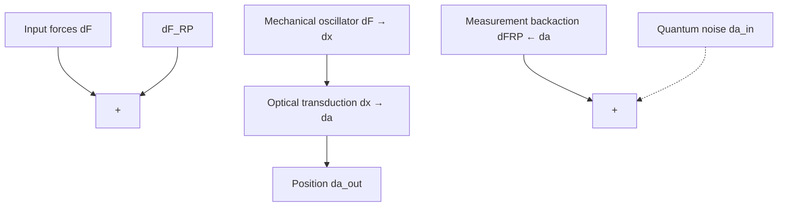
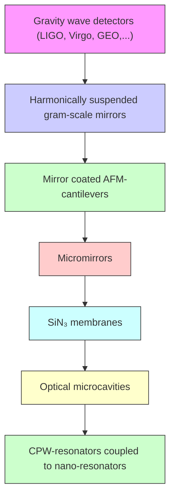

This copy is for your personal, non-commercial use only.

If you wish to distribute this article to others, you can order high-quality copies for your colleagues, clients, or customers by clicking here.

Permission to republish or repurpose articles or portions of articles can be obtained by following the guidelines here.

The following resources related to this article are available online at www.sciencemag.org (this information is current as of November 22, 2012):

Updated information and services, including high-resolution figures, can be found in the online version of this article at:

http://www.sciencemag.org/content/321/5893/1172.full.html

This article cites 59 articles, 4 of which can be accessed free:

http://www.sciencemag.org/content/321/5893/1172.full.html#ref-list-1

This article has been cited by 70 article(s) on the ISI Web of Science

This article has been cited by 6 articles hosted by HighWire Press; see:

http://www.sciencemag.org/content/321/5893/1172.full.html#related-urls

This article appears in the following subject collections:

Physics, Applied

http://www.sciencemag.org/cgi/collection/app\_physics

# Cavity Optomechanics: Back-Action at the Mesoscale

# T. J. Kippenberg $^{1*}$ † and K. J. Vahala $^{2*}$

The coupling of optical and mechanical degrees of freedom is the underlying principle of many techniques to measure mechanical displacement, from macroscale gravitational wave detectors to microscale cantilevers used in scanning probe microscopy. Recent experiments have reached a regime where the back-action of photons caused by radiation pressure can influence the optomechanical dynamics, giving rise to a host of long-anticipated phenomena. Here we review these developments and discuss the opportunities for innovative technology as well as for fundamental science.

The reflection of a photon entails momentum transfer, generally referred to as “radiation pressure,” with the resulting force called the scattering force. Besides this scattering force, the spatial variation of an intensity distribution can give rise to a gradient or dipole force. Interest in radiation pressure was first generated by the trapping of dielectric particles using laser radiation (1). This technique is widely adapted today in the biological and biophysical sciences and is known as the “optical tweezer.” In atomic physics, the ability to cool atoms with the use of radiation pressure (2, 3) has enabled many advances (4), including the realization of exotic quantum states such as Bose-Einstein condensates.

Radiation pressure can also have an effect on macroscale mechanical masses (such as on an optical interferometer's mirror) and has been considered theoretically for decades $(5, 6)$ . The mutual coupling of optical and mechanical degrees of freedom in an optical resonator (or optical cavity) has been explored in laser-based gravitational wave interferometers, in which radiation pressure imposes limits on continuous position detection. Beyond setting detection limits, radiation pressure can also influence the dynamics of a harmonically bound mirror. A discernable effect on mirror motion was first demonstrated in the optical bistability resulting from the static elongation of cavity length caused by radiation pressure $(7)$ , and later, in work demonstrating the optical spring effect (a radiation-pressure-induced change in stiffness of the “mirror spring”) $(8)$ . These phenomena, however, do not rely on the cavity delay; rather, each results from an adiabatic response of the cavity field to mechanical motion. Phenomena of a purely dynamical nature were predicted $(5, 9)$ to arise when the decay time of the photons inside the cavity is comparable to or longer than the mechanical oscillator period. Creating such delays through an electro-optic hybrid system was later proposed and demonstrated to induce radiation-pressure “feedback cooling” of a cavity mirror (10, 11), also known as cold damping. Whereas in subsequent attempts dynamic radiation-pressure phenomena were masked by thermal effects (12), recent advances in micro- and nanofabrication

made it possible to access the regime where the effects of cavity-enhanced radiation pressure alone dominate the mechanical dynamics. Demonstrations of mechanical amplification (13, 14) and cooling (14–16) via dynamical back-action signal that a paradigm shift (17) in the ability to manipulate mechanical degrees of freedom is now under way, which has long been anticipated (18, 19). Central to all current work is the role of back-action in setting dynamical control and performance limits. This review is intended to provide context for these recent accomplishments and also to present an overview of possible and anticipated future research directions.

# Dynamical Back-Action Versus Quantum Back-Action

Photons at optical frequencies are uniquely suited to measure mechanical displacement for several reasons. First, because of the high energy of optical photons ( $\sim$ 1 eV), thermal occupation is negligible at room temperature. Moreover, present-day laser sources are available that offer noise performance that is limited only by quantum noise. To measure displacement, a commonly used experimental apparatus is a Fabry-Perot interferometer,

text_image

A
Input
laser
Cavity
Mechanical
oscillator
Phase/amplitude detector
dx

line

| Change in cavity length | Amplitude | Phase | Frequency |
| ----------------------- | --------- | ----- | --------- |
| 0                       | 0         | 0     | 0         |
| Peak 1                  | λ/2F      | π     | ~1.5      |
| Peak 2                  | 0         | dφ    | ~1.5      |
| Peak 3                  | 0         | dx    | ~1.5      |
| Peak 4                  | 0         | 0     | ~1.5      |
| Delta (Δ)               | 0         | 0     | 0         |
| Delta (Δ)               | 0         | π     | ~1.5      |
| Delta (Δ)               | 0         | dφ    | ~1.5      |
| Delta (Δ)               | 0         | dx    | ~1.5      |
| Delta (Δ)               | 0         | 0     | ~1.5      |
| Delta (Δ)               | 0         | π     | ~1.5      |
| Delta (Δ)               | 0         | dφ    | ~1.5      |
| Delta (Δ)               | 0         | dx    | ~1.5      |
| Delta (Δ)               | 0         | 0     | ~1.5      |
| Delta (Δ)               | 0         | π     | ~1        |
| Delta (Δ)               | 0         | dφ    | ~1        |
| Delta (Δ)               | 0         | dx    | ~1        |
| Delta (Δ)               | 0         | 0     | ~1        |
| Delta (Δ)               | 0         | π     | ~1        |
| Delta (Δ)               | 0         | dφ    | ~1        |
| Delta (Δ)               | 0         | dx    | ~1        |
| Delta (Δ)               | 0         | 0     | ~1        |
| Delta (Δ)               | 0         | π     | ~1        |
| Delta (Δ)               |
| Delta (Δ)               | 0         | dφ    | ~1        |
| Delta (Δ)               | 0         | dx    | ~1        |
| Delta (Δ)               | 0         | 0     | ~1        |
| Delta (Δ)               | 0         | π     | ~1        |
| Delta (Δ)               | 0         | dφ    | ~1        |
| Delta (Δ) (Δ)           | 0         | 0     | ~1        |
| Delta (Δ) (Δ)           | 0         | π     | ~1        |
| Delta (Δ) (Δ)           | 0         | dφ    | ~1        |
| Delta (Δ) (Δ)           | 0         | dx    | ~1        |
| Delta (Δ) (Δ)           | 0         | 0     | ~1        |
| Delta (Δ) (Δ)           | 0         | π     | ~1        |
| Delta (Δ) (Δ)           | 0         | dφ    | ~1        |
| Delta (Δ) (Δ)           | 0         | dx    | ~1        |
| Delta (Δ) (Δ)| 0         | 0     | ~1        |
| Delta (Δ) (Δ)| 0         | π     | ~1        |
| Delta (Δ) (Δ)| 0         | dφ    | ~1        |
| Delta (Δ) (Δ)| 0         | dx    | ~1        |
| Delta (Δ) (Δ)| 0         | 0     | ~1        |
| Delta (Δ) (Δ)| 0         | π     | ~1        |
| Delta (Δ) (Δ)| 0         | dφ    | ~1        |
| Delta (Δ) (Δ)| 0         | dx    | ~1        |
| Delta (Δ) (Δ)| 0.5       | 0     | ~1        |
| Delta (Δ) (Δ)| 0.5       | π     | ~1        |
| Delta (Δ) (Δ)| 0.5       | dφ    | ~1        |
| Delta (Δ) (Δ)| 0.5       | dx    | ~1        |
| Delta (Δ) (Δ)| 0.5       | 0     | ~1        |
| Delta (Δ) (Δ)| 0.5       | π     | ~1        |
| Delta (Δ) (Δ)| 0.5       | dφ    | ~1        |
| Delta (Δ) (Δ)| 0.5       | dx    | ~1        |
| Delta (Δ)             | 0.5       | 0     | ~1        |
| Delta (Δ)             | 0.5       | π     | ~1        |
| Delta (Δ)             | 0.5       | dφ    | ~1        |
| Delta (Δ)             | 0.5       | dx    | ~1        |
| Delta (Δ)             | 0.5       | 0     | ~1        |
| Delta (Δ)             | 0.5       | π     | ~1        |
| Delta (Δ)             | 0.5       | dφ    | ~1        |
| Delta (Δ)             | 0.5       | dx    | ~1        |
| Delta (Δ)| 0.5       | 0     | ~1        |
| Delta (Δ)| 0.5       | π     | ~1        |
| Delta (Δ)| 0.5       | dφ    | ~1        |
| Delta (Δ)| 0.5       | dx    | ~1        |
| Delta (Δ)| 0.5       | 0     | ~1        |
| Delta (Δ)| 0.5       | π     | ~1        |
| Delta (Δ)| 0.5       | dφ    | ~1        |
| Delta (Δ)| 0.5       | dx    | ~1        |
| Delta (Δ)| 0.5       / Δ          | Δ       / Δ   | -         |
| Delta (Δ)| Δ/2F              | Δ       / Δ   | -         |
| Delta (Δ)| Δ/2F              | Δ       / Δ   | -         |
| Delta (Δ)| Δ/2F              | Δ       / Δ   | -         |
| Delta (Δ)| Δ/2F              | Δ       / Δ   | -         |
| Delta (Δ)| Δ/2F              | Δ       / Δ   | -         |
| Delta (Δ)| Δ/2F            / Δ          | Δ       / Δ   / Δ| -         |
| Delta (Δ)| Δ/2F            / Δ          / Δ   / Δ   / Δ   / Δ   / Δ   / Δ   / Δ   / Δ   / Δ   / Δ   / Δ   / Δ   / Δ   / Δ   / Δ   / Δ   / Δ   / Δ   / Δ   / Δ   / Δ   / Δ   / Δ   / Δ   / Δ   / Δ   / Δ   / Δ   / Δ   / Δ   / Δ   / Δ   / Δ   / Δ   = -          |
| Delta (Δ)/ Δ          | -         | -     | -         |
| Delta (Δ)/ Δ          / Δ   / Δ   / Δ   / Δ   / Δ   / Δ   / Δ   / Δ   / Δ   / Δ   / Δ   / Δ   / Δ   / Δ   / Δ   / Δ   / Δ   / Δ   / Δ   / Δ   / Δ   / Δ   / Δ   / Δ   / Δ   / Δ   / Δ   / Δ   / Δ   / Δ   / Δ   / Δ   / □          |
| Delta (Δ)/ Δ          / Δ   / Δ       / Δ       / Δ       / Δ       / Δ       / Δ       / Δ       / Δ       / Δ       / Δ       / Δ       / Δ       / Δ       / Δ       / Δ       / Δ       / Δ       / Δ       / □          |
| Delta (Δ)/ Δ          / Δ       / Δ       / Δ       / Δ       / Δ       / Δ       / Δ       / Δ       / Δ       / Δ       / Δ       / Δ       / □          |
| Delta (Δ)/ Δ          / Δ       / □       / □       / □       / □       / □       / □       / □       / □       / □       / □           |
| Delta (Δ)/ □            : -              : -              : -              : -              : -              : -              : -              : -              : -              : -              : -              : -              : -              : -              : -              : -              : -              : -              : -              : -              : -              : -              : -              : -              : -              : -              : -              : -              : -              : -              : -              : -              : -              : -              .            , 
                ∞          , × kBTeff, ∞kBTeff, ∞kBTeff, ∞kBTeff, ∞kBTeff, ∞kBTeff, ∞kBTeff, ∞kBTeff, ∞kBTeff, ∞kBTeff, ∞kBTeff, ∞kBTeff, ∞kBTeff, ∞kBTeff, ∞kBTeff, ∞kBTeff, ∞kBTeff, ∞kBTeff, □          , ∞kBTeff, ∞kBTeff, ∞kBTeff, ∞kBTeff, ∞kBTeff, ∞kBTeff, ∞kBTeff, ∞kBTeff, □          , □          , □          , □          , □          , □          , □          , □          , □          , □          , □          , □          , □          , □          , □          , □          , □          , □          , □          , □          , □          , □          , □          , □          , □          , □          .            .            .            .            .            .            .            .            .            .            .            .            .            .            .            .            .            .            .            .            .            .            .            .            .            .            .            .            .            .            .            .            .            .            .            .            .            .            .            .            .            .            .            .            .            .            .            .            .            .            .             .            .
                Displacement spectral density
                Displacement spectral density
                Displacement spectral density
                Displacement spectral density
                Displacement spectral density
                Displacement spectral density
                Displacement spectral density
                Displacement spectral density
                Displacement spectral density
                Displacement spectral density
                Displacement spectral density
                Displacement spectral density
                Displacement spectral density
                Displacement spectral density
                Displacement spectral density
                Displacement spectral density
                Displacement spectral density
                Displacement spectrum density
                Displacement spectrum density
                Displacement spectrum density
                Displacement spectrum density
                Displacement spectrum density
                Displacement spectrum density
                Displacement spectrum density
                Displacement spectrum density
                Displacement spectrum density
                Displacement spectrum density
                Displacement spectrum density
                Displacement spectrum density
                Displacement spectrum density
                Displacement spectrum density
                Displacement spectrum density
                Displacement spectrum density
                Displacement spectrum density
                Unlabeled on the left side of the chart: 'Amplitude' vs 'Change in cavity length' and 'Displacement spectral density' vs 'Frequency'. The values for the right-side series are estimated based on the provided code.

line

| Input power | Displacement sensitivity |
| ----------- | ------------------------ |
| Standard quantum limit | T=0 |
| Quantum back-action noise | T=0 |
| Detector noise | T=0 |

Fig. 1. (A) Schematic of the cavity optomechanical interaction of a cavity field (red) and a moveable mirror. (B) Transduction mechanism for the laser resonantly probing the cavity. The mechanical motion (green) causes the reflected field to be phase modulated around its steady-state value. This occurs because the mirror motion changes the total cavity length and thereby changes the resonance frequency of the cavity by $\omega_0\frac{dx}{L}$ , where $L$ is the separation between the two mirrors and $dx$ is the mirror displacement. Owing to the high Finesse of the cavity ( $\mathcal{F}_{\pi}$ , which describes the number of reflections a photon undergoes on average before escaping the cavity), the conversion of mechanical amplitude to the phase of the field is enhanced (i.e., $d\varphi \approx \frac{F}{\lambda} \cdot dx$ , where $d\varphi$ is the change in the phase of the reflected laser field and $\lambda$ is the incident wavelength of the laser), allowing minute mirror displacements to be detected. The reflected amplitude is left unchanged. (Right) Fourier analysis of the reflected phase reveals the mechanical spectrum of the mirror motion. Mechanical resonance frequency ( $\Omega_{\mathrm{m}}$ ), quality factor ( $Q_{\mathrm{m}}$ ), and temperature ( $T_{\mathrm{eff}}$ ) can be determined using this spectrum. (C) Sensitivity of the

interferometer measurement process for the case of a zero-temperature mechanical oscillator mirror and for finite temperature T. For low-input laser power, detector noise due to the quantum shot noise of the laser field dominates, whereas at higher laser power the quantum fluctuations of the light field cause the mirror to undergo random fluctuations (quantum back-action). At the optimum power, the two sources of fluctuation contribute equally to the measurement imprecision, constituting the SQL. At finite temperature, the mechanical zero-point motion is masked by the presence of thermal noise.

whose purpose is to determine differential changes in distance between the two end mirrors (Fig. 1A). To account for the mirror suspension or the internal mechanical modes of a mirror, it is assumed that the end mirror is free to oscillate. This harmonic confinement can be either intentional or intrinsic, as we will discuss later. The high-reflectivity end mirrors enhance the number of roundtrips photons undergo (by a factor $\mathcal{F}/\pi$ , where $\mathcal{F}$ is the cavity Finesse) and enable very sensitive measurement of the end mirror position (Fig. 1B). For a laser resonant with the cavity, small changes in cavity length shift the cavity resonance frequency and, enhanced by the cavity Finesse, imprint large changes in the reflected phase of the laser field. To date, the best displacement sensitivities attained with optical interferometers [such as those at the Laser Interferometer Gravitational Wave Observatory (LIGO) or Fabry-Perot cavities (20)] are already exceeding $10^{-19}$ m/ $\sqrt{\text{Hz}}$ , which implies that a displacement equivalent to 1/1000 of the radius of a proton can be measured in 1 s.

This extremely high sensitivity, however, also requires that the disturbances of the measurement process itself must be taken into account. The ultimate sensitivity of an interferometer depends on the back-action that photons exert onto the mechanically compliant mirror, caused by radiation pressure. In terms of mirror-displacement measurement, two fundamental sources of imprecision exist (Fig. 1C). First, there is the detector noise that, for an ideal laser source (emitting a coherent state) and an ideal detector, is given by the random arrival of photons at the detector; i.e., shot noise. The detector signal-to-noise ratio increases with laser power, thereby improving the measurement precision. Increasing power, however, comes at the expense of increased intracavity optical power, causing a back-action onto the mirror. This leads to a second source of imprecision: The resulting random momentum kicks of reflected photons create a mirror-displacement noise. This random force causes the mechanical oscillator to be driven and thus effectively heated. Although this noise can also contain a contribution due to classical sources of noise (excess phase or amplitude noise), it is ultimately, under ideal circumstances, bound by the quantum nature of light and is termed quantum back-action (21, 22). Taking into account both contributions, the optimum sensitivity of an interferometer is achieved at the standard quantum limit (SQL). At the SQL, detector noise and quantum back-action noise contribute each a position uncertainty equal to half of the zero-point motion of the mirror, where the latter is given by $x_{0} = \sqrt{\hbar/2m\Omega_{m}}$ [ $\hbar$ is Planck's constant divided by $2\pi$ , m is the effective mass (23) of the mirror, and $\Omega_{m}$ is the mirror's har-

monic frequency]. Much research in the past decade has also focused on ways of circumventing this limit. For example, the use of squeezed light (24) can enable surpassing this limit. So far, however, experiments with mechanical mirrors have not observed the radiation-pressure quantum back-action because it is masked by the random, thermal motion of the mirror (Fig. 1C). Fluctua-

line

| Parameter | Value |
| --------- | ----- |
| Amplitude | dα    |
| Cavity length | dx    |
| Spectrum     | ω - Ωm |
| Spectrum     | ω + Ωm |

flowchart

text_image

C
Laser cooling of ions
Cavity optomechanical cooling
V(x)
ω0
Ωm
ω < ω0
x
ω < ω0
Ωm
ω0
x
m
V(x)

Fig. 2. (A) Dynamic back-action results from the coupling of the mechanical motion to the fluctuations of the intracavity field amplitude ( $d\alpha$ ), which occurs when the cavity is excited in a detuned manner. In the frequency domain, the amplitude modulation at $\Omega_{\mathrm{m}}$ can be interpreted as sidebands around the optical laser frequency (shown at right). The sideband amplitudes are asymmetric because of the density of states of the cavity. This photon imbalance results in work on the mechanical oscillator (either amplification or cooling), as is further detailed in Fig. 4. (B) Basic elements of a feedback loop describing the measurement process and its back-action on the mirror. The mechanical oscillator is subject to a force $dF$ (e.g., because of the thermal force or an externally applied signal force) that induces a mechanical response ( $dx$ ). The latter causes a change in the optical field (either in amplitude $d\alpha$ or in phase, depending on the detuning), allowing measurement of mechanical position. This transduction is not instantaneous on account of the finite cavity lifetime. For a detuned laser, the amplitude change caused by this measurement process feeds back to the mechanical oscillator through the radiation-pressure force, closing the feedback loop. The sign of the feedback depends on the cavity detuning and can produce either damping (red-detuned pump) or amplification (blue-detuned pump). In a quantum description, this feedback branch is not noiseless but is subjected to quantum noise of the optical field ( $d\alpha_{\mathrm{in}}$ ), which yields a random force due to the quantum fluctuations of the field (i.e., the quantum back-action). Although dynamic back-action can be prevented by probing the cavity on resonance (causing $d\alpha = 0$ and thereby preventing feedback), the quantum back-action nevertheless feeds into the mechanical oscillators' input (and thereby reinforces the SQL. $d\alpha_{\mathrm{out}}$ are the amplitude fluctuations of the reflected laser field; $dF_{\mathrm{RP}}$ are the fluctuations in the radiation pressure force. (C) Analogy of dynamical back-action cooling to the laser cooling of harmonically bound ions. In both the case of a harmonically trapped ion and a harmonically oscillating end mirror of a cavity, a dissipative force arises because of the Doppler effect. $V(x)$ denotes the trapping potential of the mirror and ion.

tions of the radiation-pressure force have been observed in the field of atomic laser cooling (25), where they are responsible for a temperature limit (the Doppler limit).

The optical cavity mode not only measures the position of the mechanical mode, but the dynamics of these two modes can also be mutually coupled. This coupling arises when the mechanical motion changes the intracavity field amplitude, which thereby changes the radiation-pressure force experienced by the mirror. For small displacements, this occurs when the laser is detuned with respect to the cavity resonance (Fig. 2A). This mutual coupling of optical and mechanical degrees of freedom can produce an effect called dynamic back-action that arises from the finite cavity delay. This delay leads to a component of the radiation-pressure force that is in quadrature (out of phase) with respect to the mechanical motion. The component is substantial when the cavity photon lifetime is comparable to, or larger than, the mechanical oscillator period and creates an effective mechanical damping of electromagnetic origin. This is the essence of dynamic back-action (5), which, like quantum back-action, modifies the motion of the object being measured (the mirror). Unlike quantum back-action, which effectively sets a measurement precision (by causing the mirror to be subjected to a stochastic force resulting from quantum fluctuations of the field), the effect of dynamic back-action is to modify the dynamical behavior of the mirror in a predictable manner. Two consequences of this form of back-action in the context of gravitational wave detection have been identified. With a laser field blue-detuned relative to the optical cavity mode, the mirror motion can be destabilized (5) as a result of mechanical amplification (13). Similar to the operation of a laser, the onset of this instability occurs when the mechanical gain equals the mechanical loss rate and could thus create an effective limit to boosting detection sen-

sitivity by increasing optical power in interferometers. On the other hand, a red-detuned pump wave can create a radiation component of mechanical damping that leads to cooling of the mechanical mode; i.e., a reduction of the mechanical mode's Brownian motion (9, 26).

One description of this process is given in Fig. 2B, wherein a feedback loop that is inherent to the cavity optomechanical system is described. The elements of this loop include the mechanical and optical oscillators coupled through two distinct paths. Along the upper path, a force acting on the mechanical oscillator (for instance, the thermal Langevin force or a signal force) causes a mechanical displacement, which (for a detuned laser) changes the cavity field due to the optomechanical coupling (the interferometric measurement process). However, the amplitude fluctuations, which contain information on the mirror position, are also coupled back to the mechanical oscillator via radiation pressure (lower path), resulting in a back-action. A blue-detuned pump wave sets up positive feedback (the instability), whereas red detuning introduces negative feedback. Resonant optical probing (where the excitation frequency equals the cavity resonance frequency, $\omega = \omega_0$ ) interrupts the feedback loop because changes in position only change the phase, not the amplitude, of the field. As described below, this feedback circuit also clarifies the relation between “feedback cooling” and cooling by dynamic back-action.

# Experimental Systems

Systems that exhibit radiation-pressure dynamic back-action must address a range of design considerations, including physical size as well as dissipation. Dynamic back-action relies on optical retardation; i.e., is most prominent for photon lifetimes comparable to or exceeding the mechanical oscillation period. Very low optical dissipation also means that photons are recycled many times, thereby enhancing the weak photon pressure on the mirror. On the other hand, the mechanical dissipation rate governs the rate of heating of the mechanical mirror mode by the environment, limiting the effectiveness of optomechanical cooling. It also sets the required amplification level necessary to induce regenerative oscillations. These considerations illustrate the importance of high optical Finesse and mechanical Q in system design.

It is only in the past 3 years that a series of innovative geometries (shown in Fig. 3) has reached a regime where the observation of radiation-pressure dynamic back-action could be observed. These advances have relied on the availability and improvements in high-Finesse mirror coatings (as used in gravity wave detectors) and also on micro- and nanofabrication techniques [which are the underlying enabling technology for nano- and micro-electromechanical systems (27)]. A commonly used hybrid system consists of a conventional-input mirror made with a high-reflectivity coating and an end mirror whose dimensions are mesoscopic and which is harmonically suspended. This end mirror has been realized in multiple ways, such as from an etched, high-reflectivity mirror substrate (14, 15), a miniaturized and harmonically suspended gram-scale mirror (28), or an atomic force cantilever on which a high-reflectivity and micron-sized mirror coating has been transferred (29). A natural optomechanical coupling can occur in optical microcavities, such as microtoroidal cavities (13) or microspheres, which contain co-existing high-Q, optical whispering gallery modes, and radio-frequency mechanical modes. This coupling can also be optimized for high optical and mechanical Q (30). In the case of hybrid systems,

Many more structures exist that should also realize an optomechanical interaction in an efficient manner. In particular, nanophotonic devices such as photonic crystal membrane cavities or silicon ring resonators might be ideal candidates owing to their small mode volume, high-Finesse, and finite rigidity. Owing to their small length scale, these devices exhibit fundamental flexural frequencies well into the gigahertz regime, but their mechanical quality factors have so far not been studied, nor has optomechanical coupling been observed. As described in the next section, such high frequencies are interesting in the context

of regenerative oscillation and ground state cooling.

flowchart

Fig. 3. Experimental cavity optomechanical systems. (Top to Bottom) Gravitational wave detectors [photo credit LIGO Laboratory], harmonically suspended gram-scale mirrors (28), coated atomic force microscopy cantilevers (29), coated micromirrors (14, 15), SiN₃ membranes dispersively coupled to an optical cavity (31), optical microcavities (13, 16), and superconducting microwave resonators coupled to a nanomechanical beam (33). The masses range from kilograms to picograms, whereas frequencies range from tens of megahertz down to the hertz level. CPW, coplanar waveguide.

yet another approach has separated optical and mechanical degrees of freedom by using a miniature high-Finesse optical cavity and a separate nanometric membrane (31). Whereas the aforementioned embodiments have been in the optical domain, devices in the micro- and radiowave domain have also been fabricated (22, 32), such as a nanomechanical resonator coupled to a superconducting microwave resonator (33).

# Cooling and Amplification Using Dynamical Back-Action

The cooling of atoms or ions using radiation pressure has received substantial attention and has been a successful tool in atomic and molecular physics. Dynamical back-action allows laser cooling of mechanical oscillators in a similar manner. The resemblance between atomic laser cooling and the cooling of a mechanical oscillator coupled to an optical (or electronic) resonator is a rigorous one (34). In both cases, the motion (of the ion, atom, or mirror) induces a change in the resonance frequency, thereby coupling the motion to the optical (or cavity) resonance (Fig. 2C). Indeed, early work has exploited this coupling to sense the atomic trajectories of single atoms in Fabry-Perot cavities (35, 36) and, more recently, in the context of collective atomic motion (37, 38). This coupling is not only restricted to atoms or cavities but also has been predicted for a variety of other systems. For example, the cooling of a mechanical oscillator can be achieved using coupling to a quantum dot (39), a trapped ion (40), a Cooper pair box (41), an LC circuit (5, 32), or a microwave stripline cavity (33). Although the feedback loop of Fig. 2B explains how damping and instability can be introduced into the cavity optomechanical system, the origins of cooling and mechanical amplification are better understood with the use of a motional sideband approach, as described in Fig. 4 (13).

Cooling has been first demonstrated for micromechanical oscillators coupled to optical cavities (14–16) and, using an electromechanical analog, for a Cooper pair box coupled to a nanomechanical beam (41). Because the mechanical modes in experiments are high Q (and are thus very well isolated from the reservoir), they are easily resolved in the spectra of detected probe light reflected from the optical cavity (Fig. 1B). Furthermore, their effective temperature can be inferred from the thermal energy $k_{B}T$ (where $k_{B}$ is

the Boltzman constant), which is directly proportional to the area of detected mechanical spectral peak (Fig. 1B). In the first back-action cooling experiments, a temperature of $\sim 10\mathrm{K}$ was achieved for a single mechanical mode. The bath and all other modes in these experiments were at room temperature, owing to the highly targeted nature of cooling (Fig. 4). Since the completion of this work, cooling of a wide variety of experimental embodiments ranging from nanomembranes (31) and gram-scale mirrors (28) to the modes of kilogram-scale gravitational bar detectors (such as Aurega) has been demonstrated. At this stage, temperatures are rapidly approaching a regime of low phonon number, where quantum effects of the mechanical oscillator become important. To this end, cooling with the use of a combination of conventional cryogenic technology with dynamical back-action cooling is being investigated. Technical hurdles include collateral reheating of the mechanical mode, exacerbated by the very high mechanical $Q$ , which leads to relatively long equilibration times.

Quantum back-action sets a fundamental limit of radiation-pressure cooling (34, 42) that is equivalent to the Doppler temperature in atomic laser cooling (25). It may also be viewed as a consequence of the Heisenberg uncertainty relation in that a photon decaying from the resonator has an uncertainty in energy given by $\Delta E = \hbar \kappa$ (where $\kappa$ is the cavity decay rate), implying that the mechanical oscillator cannot be cooled to a temperature lower than this limit. It has been theoretically shown (34, 42) that ground state cooling is nevertheless possible in the resolved sideband regime (also called the good-cavity limit), in analogy to atomic laser cooling, where this technique has led to ground state cooling of ions (43). This regime is characterized by mechanical sidebands that fall well outside the cavity bandwidth and has recently been demonstrated experimentally (44). Detection of the ground state could probably prove to be as challenging as its preparation. Proposals to measure the occupancy are diverse, but one method is to measure the weights of the motional sidebands generated by the mechanical motion (34).

It is important to note that cooling of mechanical oscillators is also possible using electronic (active) feedback $(10, 11, 29, 45)$ . This scheme is similar to “stochastic cooling” $(46)$ of ions in storage rings and uses a “pick-up” (in the form of an optical cavity interferometer) to measure the mechanical motion and a “kicker” (a radiation-pressure force exerted by a laser on the mirror) to provide a viscous (feedback) force. The idea can also be understood in terms of the feedback loop in Fig. 2B, wherein the lower right optical-feedback branch is replaced by an electrical path driving a second pump laser, which acts as a force actuator on the mirror.

line

| Mode          | Frequency (a.u.) |
| ------------- | ---------------- |
| Mechanical mode | Ω_m              |
| Cavity mode   | ω_0              |
| Laser         | ω                |

line

| Mode | Frequency (ω) | Mode Density (a.u.) |
|------|----------------|---------------------|
| Ωm   | 0              | Low                 |
| ω0   | 0              | High                |

line

| Frequency | Mode density (a.u.) |
| --------- | ------------------- |
| Ωm        | Peak                |
| ω        | Low                 |
| ω₀        | Peak                |

Fig. 4. Frequency domain interpretation of optomechanical interactions in terms of motional sidebands. These sidebands are created on the optical probe wave as photons are Doppler shifted from the mirror surface (which undergoes harmonic motion driven by its thermal energy). Doppler scattering rates into the red (Stokes) and blue (anti-Stokes) sidebands are imbalanced when the probe wave resides to one side of the optical resonance, which can be viewed as a consequence of the asymmetric density of electromagnetic states (Fig. 2A). This imbalance favors the Stokes sideband for a blue-detuned pump and the anti-Stokes sideband for the red-detuned pump, thereby creating a net imbalance in electromagnetic power upon scattering. This imbalance is the origin of mechanical amplification (blue detuning) and cooling (red detuning). (Cooling in this fashion is similar to cavity cooling of atoms.) Only mechanical modes that produce appreciable sideband asymmetry will experience significant gain or cooling. Moreover, the degree of asymmetry can be controlled in an experiment so that a particular mechanical mode can be selected for amplification or cooling. (A) Dynamic back-action amplification of mechanical motion via a blue-detuned laser field. The laser scatters pump photons into the cavity, thus creating phonons and leading to amplification. (B) Dynamic back-action cooling via a red-detuned laser. Pump photons are scattered into the cavity resonance, thereby removing thermal mechanical quanta from the mechanical oscillator. (C) Two-transducer scheme. By symmetrically pumping the cavity on both upper and lower sideband, only one of the quadratures of the mechanical motion is measured with a precision that can exceed the standard limit, thus providing a route to preparing a mechanical oscillator in a squeezed state of mechanical motion via measurement-induced squeezing. a.u., arbitrary units.

Finally, although originally conceived as a potential limitation in gravitational wave detection, the parametric instability (blue detuned operation of the pump wave) can also be understood as the result of amplification (negative damping) of the mechanical motion (13, 17, 47). In this sense, the instability is simply the threshold condition in which intrinsic mechanical loss is compensated by amplification. This threshold phenomenon and the subsequent regenerative mechanical oscillation have been studied as a new type of optomechanical oscillator (48). Above threshold, the oscillator is regenerative, and oscillation at microwave rates (49) has been demonstrated. Additionally, the phase noise of the oscillator has been characterized and observed to obey an inverse power dependence, characteristic of fundamental, Brownian noise (48). Quantum back-action is also predicted to set a fundamental low-temperature limit to this linewidth (50). The ability to amplify mechanical motion is potentially useful as a means to boost displacements and forces sensitivity (51). Finally, returning to the analogy with atomic physics, it is interesting to note that regenerative oscillation (i.e., amplification of mechanical motion) would be expected to occur for trapped ions under blue-detuned excitation.

# Cavity Quantum Optomechanics

A mechanical oscillator has a set of quantum states with energies $E_{\mathrm{N}} = (N + \frac{1}{2})\hbar\Omega_{\mathrm{m}}$ , where N is the number of mechanical quanta, and N = 0 denotes the quantum ground state. For a mechanical oscillator in the ground state, the ground state energy, $E_{0} = \hbar\Omega_{m}/2$ , gives rise to the zero-point motion, characterized by the length scale $x_{0} = \sqrt{\hbar/2m\Omega_{m}}$ . As noted earlier, this length scale sets the SQL of mirror position uncertainty in an interferometer such as in Fig. 1. The zero-point motion for structures shown in Fig. 3 ranges from $\sim10^{-17}$ m for a macroscopic mirror to $\sim10^{-12}$ m for the nanomechanical beam. Such small motions are masked by the thermal motion of the mechanical oscillator, and to enter the regime where quantum fluctuations become dominant and observable requires that the mechanical mode's temperature satisfy $k_{B}T \ll \hbar\Omega_{m}$ , equivalently a thermal occupation less than unity. Over the past decade, cryogenically cooled nanomechanical oscillators coupled to an electronic readout have been steadily approaching the quantum regime (19, 52, 53). Cavity optomechanical systems exhibit high readout sensitivity, in principle already sufficient to detect the minute zero-point motion of a mesoscopic system. The main challenge toward

observing quantum phenomena in cavity optomechanical systems lies in reducing the mechanical mode thermal occupation. Using conventional cryogenic cooling, the latter is challenging (1 MHz, corresponding to a temperature of only 50 $\mu$ K). However, in principle, cooling to these temperatures and even lower is possible with the use of optomechanical back-action cooling.

If a sufficiently low occupancy of the mechanical oscillator is reached (using, for instance, a combination of cryogenic precooling and back-action laser cooling), quantum phenomena of a mesoscopic mechanical object may arise. For example, the quantum back-action by photons could become observable (54) or signatures of the quantum ground state. Moreover, the interaction of cold mechanics and a light field can give rise to squeezing of the optical field (55). This can be understood by noting that the mechanical oscillator couples the amplitude and phase quadrature of the photons. Moreover, the optomechanical coupling Hamiltonian has been predicted to allow quantum nondemolition measurement of the intracavity photon number (56, 57). The coupling afforded by radiation pressure might even allow the production of squeezed states of mechanical motion. These highly nonintuitive quantum states have been produced for electromagnetic fields over the past decades, and producing them in the mechanical realm would be a notable achievement. Such highly nonclassical states may be possible to generate using measurement-induced squeezing. In this method (22), one quadrature component of the mechanical oscillator motion is measured (and no information of the complementary variable is gained) so as to project the mechanical oscillator into a squeezed state of motion. This method (Fig. 4C) involves two incident waves and moreover requires that the mechanical frequency exceeds the cavity decay rate (the resolved sideband regime). A great deal of theoretical work has also been devoted to the question of entangling mechanical motion with an electromagnetic field, or even entangling two mechanical modes. Examples include proposals to achieve quantum super-positions of a single photon and a mirror via a “which path” experiment (58) or entangling two mirrors via radiation pressure (59).

# Emerging Cavity Optomechanical Technologies

Cavity optomechanics may also enable advances in several other areas. First, the ability to provide targeted cooling of nano- and micromechanical oscillators (which are otherwise part of devices at room temperature) bodes well for practical applications because, in principle, conventional cryogenics are unnecessary. Beyond providing a better understanding of fluctuation and dissipative mechanisms, the fact that high displacement sensing is an important element of cavity optomechanics will have collateral benefits in other areas of physics and technology, ranging from scanning probe techniques (60) to gravitational-wave detection. Moreover, the ability to create all-optical photonic oscillators on a chip with narrow linewidth and at microwave oscillation frequencies may have applications in radio frequency–photonics. Equally important, cavity optomechanical systems already exhibit strong nonlinearity at small driving amplitudes, which offer new functions related to optical mixing (61). Finally, although all current interest is focused on radiation-pressure coupling, cavity optomechanical systems based on gradient forces are also possible. Although aimed at a separate set of applications, there has been substantial progress directed toward gradient-force control of mechanical structures using cavity optomechanical effects (62–64).

# Summary

The interaction of mechanical and optical degrees of freedom by radiation pressure is experiencing a paradigm shift in control and measurement of mechanical motion. Radiation-pressure coupling has opened an extremely broad scope of possibilities, both applied and fundamental in nature. With the continued trends toward miniaturization and dissipation reduction, radiation pressure can become an increasingly important phenomenon that will probably allow advances, both in terms of technology as well as in fundamental science. It may well provide a way to probe the quantum regime of mechanical systems and give rise to entirely new ways of controlling mechanics, light, or both. It also seems likely that beyond precision measurement, there will be new technologies that leverage cooling and amplification.

# References and Notes

1. A. Ashkin, Phys. Rev. Lett. 24, 156 (1970).   
2. T. W. Hänsch, A. L. Schawlow, Opt. Commun. 13, 68 (1975).   
3. D. Wineland, H. Dehmelt, Bull. Am. Phys. Soc. 20, 637 (1975).   
4. A. Ashkin, Proc. Natl. Acad. Sci. U.S.A. 94, 4853 (1997).   
5. V. B. Braginsky, Measurement of Weak Forces in Physics Experiments (Univ. of Chicago Press, Chicago, 1977).   
6. C. M. Caves, Phys. Rev. D Part. Fields 23, 1693 (1981).   
7. A. Dorsel, J. D. McCullen, P. Meystre, E. Vignes, H. Walther, Phys. Rev. Lett. 51, 1550 (1983).   
8. B. S. Sheard, M. B. Gray, C. M. Mow-Lowry, D. E. McClelland, S. E. Whitcomb, Phys. Rev. A 69, 051801 (2004).   
9. M. I. Dykman, Sov. Phys. Solid State 20, 1306 (1978).   
10. S. Mancini, D. Vitali, P. Tombesi, Phys. Rev. Lett. 80, 688 (1998).   
11. P. F. Cohadon, A. Heidmann, M. Pinard, Phys. Rev. Lett. 83, 3174 (1999).   
12. C. H. Metzger, K. Karrai, Nature 432, 1002 (2004).   
13. T. J. Kippenberg, H. Rokhsari, T. Carmon, A. Scherer, K. J. Vahala, Phys. Rev. Lett. 95, 033901 (2005).   
14. O. Arcizet, P. F. Cohadon, T. Briant, M. Pinard, A. Heidmann, Nature 444, 71 (2006).   
15. S. Gigan et al., Nature 444, 67 (2006).   
16. A. Schliesser, P. Del'Haye, N. Nooshi, K. J. Vahala, T. J. Kippenberg, Phys. Rev. Lett. 97, 243905 (2006).   
17. T. J. Kippenberg, K. J. Vahala, Opt. Express 15, 17172 (2007).   
18. K. Jacobs, I. Tittonen, H. M. Wiseman, S. Schiller, Phys. Rev. A 60, 538 (1999).   
19. K. C. Schwab, M. L. Roukes, Phys. Today 58, 36 (2005).   
20. O. Arcizet et al., Phys. Rev. Lett. 97, 133601 (2006).   
21. C. M. Caves, K. S. Thorne, R. W. P. Drever, V. D. Sandberg, M. Zimmermann, Rev. Mod. Phys. 52, 341 (1980).   
22. V. B. Braginsky, F. Y. Khalili, Quantum Measurement (Cambridge Univ. Press, Cambridge, 1992).

23. M. Pinard, Y. Hadjar, A. Heidmann, Eur. Phys. J. D 7, 107 (1999).   
24. H. J. Kimble, Y. Levin, A. B. Matsko, K. S. Thorne, S. P. Vyatchanin, Phys. Rev. D Part. Fields 65, 022002 (2002).   
25. S. Stenholm, Rev. Mod. Phys. 58, 699 (1986).   
26. V. B. Braginsky, S. P. Vyatchanin, Phys. Lett. A 293, 228 (2002).   
27. H. G. Craighead, Science 290, 1532 (2000).   
28. T. Corbitt et al., Phys. Rev. Lett. 98, 150802 (2007).   
29. D. Kleckner, D. Bouwmeester, Nature 444, 75 (2006).   
30. G. Anetsberger, R. Riviere, A. Schliesser, O. Arcizet, T. J. Kippenberg, Nat. Photonics, in press; preprint available at http://arxiv.org/abs/0802.4384 (2008).   
31. J. D. Thompson et al., Nature 452, 72 (2008).   
32. K. R. Brown et al., Phys. Rev. Lett. 99, 137205 (2007).   
33. C. A. Regal, J. D. Teufel, K. W. Lehnert, preprint available at http://arxiv.org/abs/0801.1827 (2008).   
34. I. Wilson-Rae, N. Nooshi, W. Zwerger, T. J. Kippenberg, Phys. Rev. Lett. 99, 093902 (2007).   
35. C. J. Hood, T. W. Lynn, A. C. Doherty, A. S. Parkins, H. J. Kimble, Science 287, 1447 (2000).   
36. P. Maunz et al., Nature 428, 50 (2004).   
37. K. W. Murch, K. L. Moore, S. Gupta, D. M. Stamper-Kurn, Nat. Phys. 4, 561 (2008).   
38. F. Brennecke, S. Ritter, T. Donner, T. Esslinger, preprint available at http://arxiv.org/abs/0807.2347 (2008).   
39. I. Wilson-Rae, P. Zoller, A. Imamoglu, Phys. Rev. Lett. 92, 075507 (2004).   
40. L. Tian, P. Zoller, Phys. Rev. Lett. 93, 266403 (2004).   
41. A. Naik et al., Nature 443, 193 (2006).   
42. F. Marquardt, J. P. Chen, A. A. Clerk, S. M. Girvin, Phys. Rev. Lett. 99, 093902 (2007).   
43. D. Leibfried, R. Blatt, C. Monroe, D. Wineland, Rev. Mod. Phys. 75, 281 (2003).   
44. A. Schliesser, R. Riviere, G. Anetsberger, O. Arcizet, T. J. Kippenberg, Nat. Phys. 4, 415 (2008).   
45. M. Poggio, C. L. Degen, H. J. Mamin, D. Rugar, Phys. Rev. Lett. 99, 017201 (2007).   
46. S. Vandermeer, Rev. Mod. Phys. 57, 689 (1985).   
47. H. Rokhsari, T. J. Kippenberg, T. Carmon, K. J. Vahala, Opt. Express 13, 5293 (2005).   
48. M. Hossein-Zadeh, H. Rokhsari, A. Hajimiri, K. J. Vahala, Phys. Rev. A 74, 023813 (2006).   
49. T. Carmon, K. J. Vahala, Phys. Rev. Lett. 98, 123901 (2007).   
50. K. J. Vahala, Phys. Rev. A 78, 2 (2008).   
51. O. Arcizet, T. Briant, A. Heidmann, M. Pinard, Phys. Rev. A 73, 033819 (2006).   
52. R. G. Knobel, A. N. Cleland, Nature 424, 291 (2003).   
53. M. D. LaHaye, O. Buu, B. Camarota, K. C. Schwab, Science 304, 74 (2004).   
54. I. Tittonen et al., Phys. Rev. A 59, 1038 (1999).   
55. C. Fabre et al., Phys. Rev. A 49, 1337 (1994).   
56. P. Alsing, G. J. Milburn, D. F. Walls, Phys. Rev. A 37, 2970 (1988).   
57. A. Heidmann, Y. Hadjar, M. Pinard, Appl. Phys. B 64, 173 (1997).   
58. W. Marshall, C. Simon, R. Penrose, D. Bouwmeester, Phys. Rev. Lett. 91, 173901 (2003).   
59. S. Mancini, V. Giovannetti, D. Vitali, P. Tombesi, Phys. Rev. Lett. 88, 120401 (2002).   
60. D. Rugar, R. Budakian, H. J. Mamin, B. W. Chui, Nature 430, 329 (2004).   
61. M. Hossein-Zadeh, K. J. Vahala, Photonics Technol. Lett. 20, 4 (2007).   
62. M. L. Povinelli et al., Opt. Express 13, 8286 (2005).   
63. P. T. Rakich, M. A. Popovic, M. Soljacic, E. P. Ippen, Nat. Photonics 1, 658 (2007).   
64. M. Eichenfield, C. P. Michael, R. Perahia, O. Painter, Nat. Photonics 1, 416 (2007).   
65. K.J.V. acknowledges support from the Alexander von Humboldt Foundation. T.J.K. gratefully acknowledges support via a Max Planck Independent Junior Research Group, a Marie Curie Excellence Grant, the Deutsche Forschungsgemeinschaft (DFG project Ground State Cooling), and Nanosystems Initiative Munich. The authors thank T. W. Hänsch for discussions.

10.1126/science.1156032