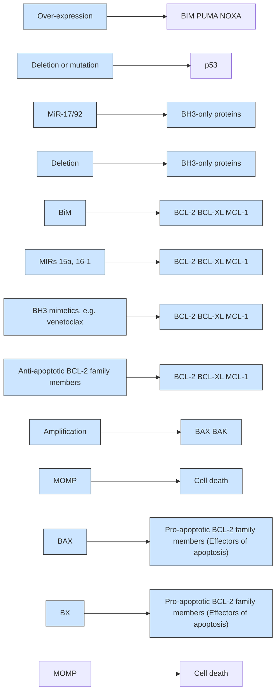
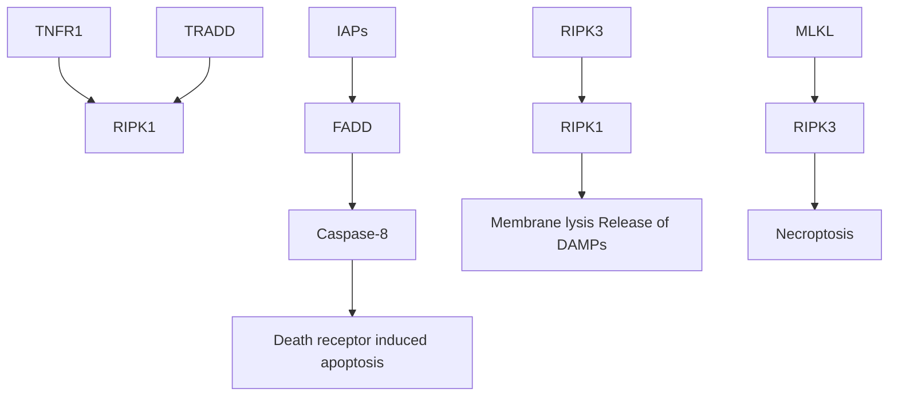
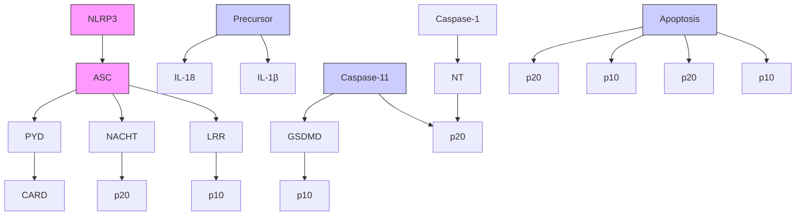
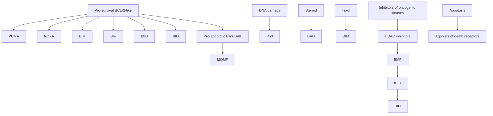

# Review

# Cell Death in the Origin and Treatment of Cancer

Andreas Strasser $^{1,2,*}$ and David L. Vaux $^{1,2,*}$

$^{1}$ The Walter and Eliza Hall Institute of Medical Research, 1G Royal Parade, Parkville, VIC 3052, Australia

$^{2}$ Department of Medical Biology, The University of Melbourne, Melbourne, VIC 3052, Australia

\*Correspondence: strasser@wehi.edu.au (A.S.), vaux@wehi.edu.au (D.L.V.)

https://doi.org/10.1016/j.molcel.2020.05.014

Cell death, or, more specifically, cell suicide, is a process of fundamental importance to human health. Throughout our lives, over a million cells are produced every second. When organismal growth has stopped, to balance cell division, a similar number of cells must be removed. This is achieved by activation of molecular mechanisms that have evolved so that cells can destroy themselves. The first clues regarding the nature of one of these mechanisms came from studying genes associated with cancer, in particular the gene for BCL-2. Subsequent studies revealed that mutations or other defects that inhibit cell death allow cells to accumulate, prevent removal of cells with damaged DNA, and increase the resistance of malignant cells to chemotherapy. Knowledge of this mechanism has allowed development of drugs that kill cancer cells by directly activating the cell death machinery and by synergizing with conventional chemotherapy as well as targeted agents to achieve improved outcomes for cancer patients.

The cell theory, first established in the 1800s, posits that all organisms are composed of cells and that all cells are derived from cells (reviewed in Mazzarello, 1999). Since then, it became apparent that only multicellular organisms can get cancer and that cancers can only expand when the rate at which cancer cells divide is greater than the rate at which they die. What is surprising is that when cells die, whether they are normal cells or cancer cells, it is seldom because they are injured or killed by other cells. Rather, most cells die because they activate programmed cell death mechanisms that have evolved for this purpose (Kerr et al., 1972; Vaux et al., 1994).

Cell death has been observed in cancers for a long time, but was initially largely reported in the context of necrosis observed in hypoxic areas in growing tumors (Thomlinson and Gray, 1955). Cell death has also long been associated with cancer therapy because radiation and chemotherapy were designed to cause the death of malignant cells, but this comes at the cost of also causing death of many normal cells (Ballantyne, 1975; Katz and Glick, 1979; O'Connor, 2015).

Kerr et al. (1972) proposed using the term “apoptosis” to refer to cells that die as a result of a physiological suicide process rather than because of some catastrophic event (e.g., freezing or burning). The latter undergo the morphologically different process of necrosis (Kerr et al., 1972). They also looked at apoptosis and necrosis in the context of cancer, noting that cell death had long been known to be a characteristic of malignant neoplasms. They wrote: “Both apoptotic bodies and mitotic figures are sometimes numerous in rapidly growing tumors; it is the balance of the two that determines the rate of enlargement.” They fore-saw induction of apoptosis to treat cancer by observing that radiation increased the rate of apoptosis in squamous cell carcinomas and that oophorectomy increased the rate of apoptosis in mammary cancers in rats (Kerr et al., 1972). Initially, few researchers took notice of their work, but in the late 1980s, things changed. The current enormous interest in cell death is due to elucidation of its molecular mechanisms, the recognition that apoptosis is a fundamental part of life for metazoans, and that the way in which cells undergo apoptosis is conserved from worms to mammals. In addition, the inability of cells to kill themselves has been directly linked to development of cancer in humans and can promote its resistance to therapy (reviewed in Kreeger, 1996).

# How Can Failure of Cell Death Promote Cancer?

Although, on their own, mutations that prevent a cell from killing itself are insufficient to cause a normal cell to become fully malignant, when such mutations are passed on to the cell's progeny, they can promote neoplasia. Normally, cells that detect irreparable damage to their DNA can kill themselves; for example, by activation of the tumor suppressor p53, which can directly transcriptionally activate the apoptosis inducers Puma and Noxa (Nakano and Vousden, 2001; Yu et al., 2001; Jeffers et al., 2003; Villunger et al., 2003). Therefore, cells that are incapable of killing themselves, such as those overexpressing the apoptosis inhibitor BCL-2 or those with defects in p53, may accumulate further genetic damage that advances neoplastic transformation. Loss-of-function mutations to p53 would not only prevent it from inducing apoptosis but also affect its other tumor-suppressive functions, including its ability to activate DNA repair pathways, and cause cell cycle arrest and cell senescence (Vousden and Lane, 2007; Janic et al., 2018). If a cell that is incapable of killing itself receives another mutation that promotes aberrant cell proliferation (for example, a chromosome translocation that causes overexpression of c-MYC), then the combined effect will be to cause rapid growth of the nascent malignant clone. This explains the potent synergy of defects in apoptosis (e.g., because of BCL-2 overexpression) and deregulated cell proliferation (e.g., because of c-MYC overexpression) in lymphoma development (Vaux et al., 1988; Strasser et al., 1990; Fanidi et al., 1992; Bissonnette et al., 1992).

flowchart

Figure 1. The BAX/BAK-Dependent Apoptotic Pathway   
This figure illustrates some of the key regulators of cell survival in lymphocytes and gives examples of genetic lesions that have been implicated in driving the development of human chronic lymphocytic leukemia (CLL). Drugs that mimic the effect of pro-apoptotic BH3-only proteins (navitoclax and venetoclax) are powerful new weapons to treat CLL. Proteins and processes generally implicated in promoting cancer are shown in red; those implicated in suppressing cancer are shown in green.

As a cancer grows, genetic instability increases the diversity among the malignant cells. Treatment with chemotherapy or radiation selects malignant cells that happen to have a higher threshold for triggering their intrinsic cell death mechanism. This process of Darwinian selection can facilitate the emergence of resistance to treatment (Turajlic et al., 2019).

# Mechanisms of Cell Suicide

Elucidation of the molecular mechanisms cells use to kill themselves has provided new insights into the origins of malignancy, the sensitivity of normal and malignant cells to treatment, and development of resistance to therapy. Importantly, these discoveries identified targets for new anti-cancer therapies.

# BAX/BAK-Dependent Cell Death

The cell suicide process that is most thoroughly understood is variously known as the “intrinsic,” “mitochondrial,” “BCL-2-regulated,” or “Bcl-2-associated X protein (BAX)/Bcl-2 homologous antagonist killer (BAK)-dependent” mechanism of apoptosis (Figure 1). In this pathway, activation of BAX and/or BAK allows these effectors of apoptosis to permeabilize the outer mitochondrial membrane (MOMP [mitochondrial outer membrane permeabilization]) (Cosentino and García-Sáez, 2018). This causes release of cytochrome c into the cytoplasm, where it binds to APAF-1 and triggers formation of the apoptosome that first activates caspase-9 and, consequently, a cascade of proteolytic effector caspases (Tait and Green, 2010). MOMP also facilitates release of additional apoptogenic factors from the mitochondria, such as second mitochondria-derived activator of caspases (SMAC)/direct IAP bindong protein with low pI (DIABLO) and HTRA2. These factors promote apoptosis by inhibiting the E3 ubiquitin ligase X-linked inhibitor of apoptosis protein (XIAP), which can inhibit caspase-3, a critical effector of apoptosis (Du et al., 2000; Verhagen et al., 2000; Deveraux et al., 1997).

Triggering of BAX and BAK is inhibited by anti-apoptotic BCL-2 family members, including BCL-2 itself, B cell lymphoma-extra large (BCL-XL), MCL-1, BCL-2-like WEHI (BCL-W), and A1/BFL-1. Apoptosis is initiated when these anti-apoptotic proteins are bound by the BH3-only proteins (i.e., pro-apoptotic BIM, BID, PUMA, NOXA, BMF, BAD, BLK, and HRK), stopping them from keeping BAX and BAK in check (Huang et al., 2019; Singh et al., 2019). Expression and/or activity of the BH3-only proteins is induced in response to developmental cues and stress stimuli through a variety of transcriptional and post-transcriptional processes (Puthalakath and Strasser, 2002). For example, PUMA and NOXA are critical for DNA damage-induced apoptosis (Jeffers et al., 2003; Villunger et al., 2003; Shibue et al., 2006), and their genes are direct transcriptional targets of the tumor suppressor p53 (Nakano and Vousden, 2001; Yu et al., 2001). BIM is required for a full apoptotic response for cells experiencing a variety of stresses, such as endoplasmic reticulum (ER) stress, cytokine deprivation, and glucocorticoid treatment (Bouillet et al., 1999; Puthalakath et al., 2007). Induction of BIM can be regulated by the microRNA cluster mir-17-92 (Ventura et al., 2008; Xiao et al., 2008).

The strongest evidence that inability of cells to kill themselves is oncogenic in humans comes from the discovery of recurrent mutations in genes encoding regulators of apoptosis in diverse cancers. This includes mutations in p53, an upstream initiator of apoptosis but also other tumor-suppressive processes, in $\sim$ 50% of cancers (Lane, 1992), association of t14:18 chromosomal translocations that lead to overexpression of BCL-2 with follicular lymphoma (Rowley, 1988; Tsujimoto et al., 1985), high expression of BCL-2 in chronic lymphocytic leukemias because of deletion of the microRNAs miR-15/16 (reviewed in Pekarsky et al., 2018), and somatically acquired amplifications of the genomic regions containing the genes for anti-apoptotic MCL-1 or BCL-XL in 10%–15% of diverse human cancers (Beroukhim et al., 2010). In addition to the BAX/BAK-dependent apoptosis pathway, there are several other cell death mechanisms, but, to date, the evidence implicating them in development of cancer or the response of malignant cells to anti-cancer therapeutic agents is considerably weaker.

# Death-Receptor-Triggered Cell Death

Mammalian cells can be induced to undergo caspase-dependent apoptosis by a mechanism that is not inhibited by BCL-2

flowchart

Figure 2. Necroptosis: A Mechanism of Programmed Cell Death Induced When TNFR1 or TLR Signaling Is Affected by Inhibitors of IAPs and Caspase-8

Stimulation of so-called death receptors (members of the tumor necrosis factor receptor (TNFR) family with an intra-cellular death domain, such as TNFR1 or FAS) by their ligands (TNF or FAS ligand) normally induces nuclear factor $\kappa$ B (NF- $\kappa$ B) activation with cell proliferation and survival for the former or apoptosis for the latter via FADD adaptor protein-mediated activation of caspase-8, which then activates the effector caspases (caspase-3 and caspase-7). The death-receptor-activated apoptotic pathway can also engage the BAX/BAK-dependent apoptotic pathway (Figure 1) via proteolytic activation of the pro-apoptotic BH3-only protein BID. When caspase-8 is blocked (e.g., by viral inhibitors such as vFLIP) and inhibitors of apoptosis proteins (IAPs) are inhibited, necroptotic cell death is instead activated through RIPK1 and RIPK3, leading to activation of the membrane pore-forming protein MLKL, a pseudo-kinase.

but were killing themselves. When death-receptor-, Toll-like receptor (TLR)-, or Z-DNA binding protein 1 (ZBP1)-induced activation of caspase-8 is abrogated (e.g., because of genetic loss or drug-mediated inhibition of caspase-8), and cIAP1/2 \*E2 ubiquitin ligases that promote pro-survival signaling from TNFR1 and other receptors are also genetically lost

(Strasser et al., 1995) and does not require BAX or BAK. This pathway can be activated by certain tumor necrosis factor (TNF) receptor family members (so-called death receptors), such as TNFR1, FAS, and TNF-related apoptosis-inducing ligand (TRAIL) receptors (Nagata 1997), that, upon ligation, transmit signals via FAS-associated death domain (FADD) that active caspase-8 (Kischkel et al., 1995; Muzio et al., 1996). In so-called type 1 cells, mostly lymphoid cells, active caspase-8 can cause sufficient activation of the effector caspases, in particular caspases-3 and -7, to effectively kill cells in the absence of BAX and BAK. In type 2 cells, such as hepatocytes and pancreatic islet β cells, cell killing requires signal amplification that is achieved by caspase-8-mediated proteolytic activation of the BH3-only protein BID, which then engages the BAX/BAK-mediated apoptotic pathway (Li et al., 1998; Luo et al., 1998; Scaffidi et al., 1999; Jost et al., 2009; Figure 1). Humans with autoimmune lympho-proliferative syndrome (ALPS), caused by defects in FAS-induced apoptosis (mostly mutations in the gene for FAS itself), have increased predisposition to develop B lymphoid malignancies (Straus et al., 2001). This demonstrates that the death-receptor-triggered apoptotic pathway has tumor-suppressive action.

# Necroptosis

Degterev et al (2005) showed that, in addition to activating caspase-dependent apoptosis, TNF could also cause cells to die by a caspase-independent mechanism they termed “necroptosis.” They chose this term because the morphology of the dying cells resembled necrotic cells rather than apoptotic cells, but unlike cells undergoing necrosis, necroptotic cells were not being killed or inhibited by drugs, cells undergo necroptosis (Festjens et al., 2006; Yuan et al., 2016). This cell killing is mediated by the kinases RIPK1 and RIPK3 (Degterev et al., 2008; Kaiser et al., 2011), which activate the pseudo-kinase mixed lineage kinase domain-like (MLKL), which causes lytic pores in the plasma membrane (Sun et al., 2012; Murphy et al., 2013; Grootjans et al., 2017; Figure 2). RIPK1, a critical inducer of necroptosis, is normally neutralized by caspase-8-mediated proteolysis (Newton et al., 2019). Necroptosis probably serves as a defense against viruses that carry inhibitors of caspase-8, such as viral Fas-associated death domain-like interleukin-1β (IL-1β)-converting enzyme-inhibitory protein (vFLIP) (Thome et al., 1997).

# Pyroptosis

Pyroptosis is a form of programmed cell death that is activated by intra-cellular bacteria, such as Salmonella. It is mediated by caspase-1, which is activated within the so-called inflammasome by a range of adaptors (reviewed in Schroder and Tschopp, 2010) or by caspase-11, which has been reported to be activated directly by intra-cellular lipopolysaccharide (LPS) (Shi et al., 2014). These caspases activate the plasma membrane pore-forming protein gasdermin D and the effector caspases caspases-3 and -7 to cause cell death (Kayagaki et al., 2015; Shi et al., 2015; Liu et al., 2016; Figure 3).

# CTL-Induced Killing of Target Cells

Cytotoxic T lymphocytes (CTLs) and natural killer (NK) cells are able to kill other cells, such as those that are infected, and thereby protect the host. CTLs and NK cells can sometimes also be enlisted to kill malignant cells (Khavari, 1987). Although this cell killing is not a cell-autonomous mechanism of cell death,

flowchart

Figure 3. Pyroptosis: A Mechanism of Cell Death Induced in Response to Intra-cellular Bacterial Infection (Pathogen-Associated Molecular Patterns [PAMPs])   
PAMPs (e.g., LPS from intra-cellular bacteria) can activate caspase-1 and caspase-11 (in humans, caspase-1, caspase-4, and caspase-5) with the help of adaptor proteins (e.g., NLRP3 and ASC). Active caspase-1 and caspase-11 can cleave pro-interleukin (IL)-1β and pro-IL-18 to generate their bioactive forms, which are secreted from the cell to drive inflammation. Active caspase-1 and caspase-11 can also proteolytically activate the pore-forming protein gasdermin D (GSDMD) to kill cells. The canonical pathway involves adaptor protein-mediated activation of caspase-1 within so-called “inflammasomes,” whereas the non-canonical pathway is thought to involve direct activation of caspase-11 by LPS.

it is an adaptive process that has evolved to cause death of the host's own cells. CTLs and NK cells can kill tumor cells by a granule-dependent pathway that uses perforin to allow a family of proteases called granzymes access to the target cell cytosol (Cullen and Martin, 2008; Chowdhury and Lieberman, 2008). Much of the current excitement in enlisting CTL-mediated killing as a cancer therapy involves drugs called “checkpoint inhibitors” that block signals that would otherwise limit T cell activity (Amaravadi et al., 2016; Pardoll, 2012) or by infusing expanded populations of T cells from the patient that are been genetically engineered to target malignant cells (so-called chimeric antigen receptor [CAR] T cell therapy) (Kalos et al., 2011).

# Autophagy

Autophagy is a process cells use to recycle intracellular macromolecules or even entire organelles (e.g., damaged mitochondria) to allow survival when nutrients are scarce (Mizushima et al., 2004). This process involves tagging of the targeted macro-molecules or organelles for incorporation into vesicles that subsequently fuse with lysosomes for degradation; this provides the starving cell with metabolites and energy. Although autophagy normally promotes cell survival, it has been proposed to also be a mechanism by which cells, including malignant cells, can kill themselves through self-digestion (Bursch et al., 1996).

Regardless of which cell death mechanism is debilitated, the inability of cells to kill themselves promotes development of cancer, and this was recognized as one of the original six “hallmarks of cancer” (Hanahan and Weinberg, 2000). Understanding the molecular mechanisms of apoptotic cell death has already provided new avenues for treatment of cancer and for enhancing the efficacy of existing therapies.

# Induction of Cell Death as Cancer Therapy Conventional Chemotherapy and Radiation

Most of the empirically discovered cancer therapies, including alkylating agents, anti-metabolites, topoisomerase inhibitors, anti-microtubule alkaloids, and radiation, act by blocking DNA synthesis, damaging DNA, or inhibiting DNA replication (DeVita and Chu, 2008). If a cancer cell is exposed to sufficient concentrations of these agents for long enough, even if it is not killed outright, it will no longer be capable of copying its DNA and dividing. Unfortunately, these treatments have the same direct toxic effects on normal cells, especially those that are rapidly proliferating, such as progenitor cells in the bone marrow or intestines. As a consequence, conventional chemotherapy and radiation typically have a narrow therapeutic index with severe dose-limiting side effects. Therefore, in many types of cancer, these agents cannot be given in doses sufficient to eradicate all malignant cells and cure the patient.

Over the past 30 years, it has become apparent that chemotherapy and radiation cause some tumor cells to die even at doses that are not sufficient to kill them directly. Instead, some cells respond to changes caused by the drugs by undergoing apoptosis as a stress response (reviewed in Vaux and Häcker, 1995; Xu et al., 2005; Kültz, 2005). Research on apoptosis has revealed some of the pathways by which this occurs. Stress responses, such as the DNA damage response (Vousden and Lane, 2007) and the ER stress response (Herr and Debatin, 2001), can trigger apoptosis; for example, by transcriptional and post-transcriptional processes that increase pro-apoptotic BH3-only proteins (Figure 3). Accordingly, overexpression of pro-survival BCL-2 proteins (e.g., BCL-2 itself) (Tsujimoto, 1989; McDonnell et al., 1989; Strasser et al., 1991), combined loss of BAX and BAK (Lindsten et al., 2000), or loss of BH3-only proteins (particularly PUMA, BIM, or NOXA), can render malignant as well as non-transformed cells resistant to diverse anticancer agents, including conventional chemotherapeutic agents (e.g., glucocorticoids, cyclophosphamide, and taxenes) as well as targeted inhibitors of oncogenic kinases (e.g., imatinib to inhibit BCR-ABL in chronic myelogenous leukemia [CML]) (Bouillet et al., 1999; Villunger et al., 2003; Kuroda et al., 2006; Jeffers et al., 2003; Shibue et al., 2003; Figure 4).

Many cancer cells carry defects, such as mutations in p53, that impair expression of the BH3-only proteins that are critical for initiation of apoptosis in response to anti-cancer agents (Roos and Kaina, 2006; Vo and Letai, 2010). Unfortunately, not only malignant cells but also some normal cells, particularly intestinal epithelial cells and certain hematopoietic cell subsets

# Molecular Cell

# Review

# CellPress

and their progenitors, undergo apoptosis in response to stresses caused by cytotoxic anti-cancer agents (Yu, 2013). This is, at least in part, responsible for the damage to normal tissues (e.g., mucosal layers and the hematopoietic system) experienced by cancer patients during chemotherapy and radiation therapy. Indeed, the key mechanism by which these treatments work is by killing dividing cells, both normal and malignant ones. This is why they work best in tissues, such as the bone marrow, that have a population of non-dividing, quiescent stem cells that are resistant to the treatment and can subsequently be mobilized and proliferate to allow recovery. Finding a way to inhibit apoptosis specifically in healthy tissues during cancer therapy would be a significant advance. This may allow patients to be administered higher-intensity regimens, offering greater chances of remission.

# Direct Activation of BAX and BAK to Induce Apoptosis of Cancer Cells

Given that most cells, including cancer cells, harbor cell suicide machineries, therapies that could directly activate them would provide a novel treatment strategy. Malignant cells that have lost upstream activators of the stress-induced apoptotic pathway, such as p53 or the pro-apoptotic BH3-only proteins, or overexpress inhibitors of apoptosis, such as BCL-2, would be resistant to lower doses of chemotherapy or radiation. To overcome this mechanism of therapy resistance, small-molecule compounds mimicking the action of the pro-apoptotic BH3-only proteins (so-called BH3 mimetics, which bind to anti-apoptotic BCL-2 family members) would seem to be ideal for cancer therapy.

However, because apoptosis that is controlled by BCL-2 family members involves protein-protein interactions, BCL-2 and its pro-survival relatives had widely been considered to be un-druggable. Rising to the challenge, a team at Abbott developed an NMR-based small-molecule screening approach that resulted in production of ABT-737 and then an orally active variant, ABT-263/navitoclax, both compounds targeting BCL-2, BCL-XL, and BCL-W (Oltersdorf et al., 2005; Tse et al., 2008). Subsequently, newer-generation drugs that specifically target BCL-2 (ABT-199/venetoclax) or other family members, such as BCL-XL or MCL-1, have been developed (reviewed in Ni Chonghaile and Letai, 2008; Merino et al., 2018; Figure 1).

Navitoclax/ABT-263, which targets BCL-XL, BCL-2, and BCL-W, has entered clinical trials but is progressing slowly because of the on-target killing of platelets (thrombocytopenia), which depend on BCL-XL for survival (Mason et al., 2007; Zhang et al., 2007). Venetoclax/ABT-199, which is specific for BCL-2, was produced to avoid thrombocytopenia caused by inhibition of BCL-XL. Venetoclax has been approved for treatment of chronic lymphocytic leukemia (CLL), in which it can produce extraordinarily rapid responses, even in cases that re-occur after multiple rounds of chemotherapy (Roberts et al., 2016; Stilgenbauer et al., 2016). Further trials in CLL and mantle cell lymphoma are being conducted, in which Venetoclax is combined with other drugs, such as Bruton's tyrosine kinase (BTK) inhibitors or anti-CD20 antibodies. Venetoclax is also showing promise for treatment of some forms of multiple myeloma (Vaxman et al., 2018) as well as acute myeloid leukemia (AML) (Pan et al., 2014; DiNardo et al., 2019).

Genetic experiments using inducible gene deletion showed that many cancer cells, including c-MYC- or BCR-ABL-driven pre-B/B lymphomas (Kelly et al., 2014; Koss et al., 2013), AMLs (Glaser et al., 2012), and multiple myeloma driven by diverse oncogenes (Gong et al., 2016), are critically dependent on anti-apoptotic MCL-1 to sustain their expansion. Therefore, several MCL-1-specific BH3 mimetics have been developed (Kotschy et al., 2016; Tron et al., 2018; Caenepeel et al., 2018), and three such drugs have entered clinical trials. Finding a therapeutic window for these compounds will be a key challenge, given that inducible genetic loss of MCL-1 causes severe (sometimes fatal) damage to the heart, liver, intestines, and nervous system (Arbour et al., 2008; Thomas et al., 2013; Wang et al., 2013; Vick et al., 2009; Healy et al., 2020). Perhaps coupling of MCL-1 inhibitors (and possibly also BCL-XL inhibitors) to antibodies against tumor-specific antigens, such as mutant epidermal growth factor receptor (EGFR), will allow preferential delivery of these compounds to malignant cells, making them both effective and tolerable.

# Death-Receptor-Induced Apoptosis as an Anti-cancer Therapy

Genetic experiments have shown that loss or inhibition of essential mediators of TNFR family death-receptor-induced apoptosis do not afford protection against radiation or chemotherapeutic drugs (Newton and Strasser, 2000). Nevertheless, death-receptor-induced cell killing may contribute to the overall response to chemotherapeutic agents in vivo, given that some drugs can increase the expression of death receptors and sensitize malignant cells to their ligands (e.g., TRAIL and FAS ligand) (Friesen et al., 1996; Green, 2003). However, this process could conceivably also cause unwanted killing of healthy cells. Although agonists of the TRAIL receptors DR3 and DR4 (i.e., TRAIL itself or receptor-activating antibodies) have been shown to kill certain cancer cells in culture and in vivo (Yang et al., 2010), the clinical trials of these agents have not progressed substantially. Perhaps such agents would be able to synergize with BH3-mimetic drugs in killing cancer cells by activating both apoptotic pathways.

# The Roles of Non-apoptotic Programmed Cell Death Pathways in Tumor Development and Anti-cancer Therapy

The role of autophagy in cancer continues to be debated. The gene for the autophagy gene BECLIN was found to be deleted in a large number of breast cancers, prompting the hypothesis that inability of cells to commit autophagic suicide might promote their malignant transformation (Aita et al., 1999). However, because the BECN1 locus is tightly linked to that of the well-known breast cancer gene BRAC1, it appears that BECN1 mutations are not independently increased in human cancer and that BECLIN is not a tumor suppressor (Laddha et al., 2014). To date, scant further evidence has emerged for autophagy as a mechanism by which mammalian cells kill themselves or of a correlation of mutations with autophagy genes with cancer (Amaravadi et al., 2016). On the contrary, some studies have shown that autophagy can promote tumor growth; for example, by helping malignant cells adapt their metabolism when nutrients are scarce (reviewed in Poillet-Perez and White, 2019).

flowchart

Figure 4. Pro-apoptotic BH3-Only Proteins Are Critical Initiators of Killing of Tumor Cells by Diverse Anti-cancer Agents   
Different cytotoxic insults, such as DNA damage, cause an increase in distinct pro-apoptotic BH3-only proteins through diverse transcriptional and/or post-transcriptional processes. BH3-only proteins bind with very high affinity (sub-nanomolar) to the anti-apoptotic BCL-2 family members (e.g., BCL-2), and this unleashes the apoptosis effectors BAX and BAK. Some BH3-only proteins (e.g., BIM and PUMA) have been reported to also be able to activate BAX and BAK by binding to them directly (see also Figure 1).

that exchanges extracellular cystine with intracellular glutamate (System $x_{c}^{-}$ ) (Dixon et al., 2012). Although it is indisputably a process that can result in cell death, it has not yet been settled whether cells dying by ferroptosis kill themselves by a physiological mechanism that evolved for that purpose or whether the cells succumb because a vital process needed for their ongoing metabolism and survival has been blocked. If only the latter is true, defects in ferroptosis would not be expected to contribute to the development of cancer. Proper regulation of SLC7A11 expression has been reported to be critical for the tumor suppressor function of p53 (Jiang et al., 2015), but this was subsequently The role of defects in necroptosis in tumor development and the response of malignant cells to anti-cancer agents is currently also controversial. There have been reports suggesting that necroptosis of cells in the tumor microenvironment (rather than necroptosis of nascent neoplastic cells) promotes development and progression of pancreatic and liver cancer by modulating the host immune response against the malignant cells (Seifert et al., 2016; Seehawer et al., 2018; Wang et al., 2018). However, these findings have since been challenged (Patel et al., 2020), and a previous study found no role of necroptosis in tumorigenesis (Najafov et al., 2017).

Inflammation, which can involve pyroptotic cell death, is recognized as a potent driver of neoplastic transformation in diverse cancers, including those of the liver, colon, and stomach (reviewed in Todoric and Karin, 2019). However, little is known about the role, if any, of pyroptotic cell death in tumorigenesis and the response of cancer cells to chemotherapy. To our knowledge, gasdermin D, the essential mediator of pyroptosis, has so far not been identified in whole cancer genome studies as a tumor suppressor or resistance factor in anti-cancer therapy. However, gasdermin E, a relative of gasdermin D that is also able to perforate the plasma membrane, has been shown to be activated by effector caspases in tumor cells treated with chemotherapeutic drugs. This changed the morphology of the dying tumor cells from apoptosis into a pyroptosis-like death (Wang et al., 2017).

Ferroptosis is a form of cell death mediated by oxygen free radicals. It depends on the presence of Fe ions and is induced by blockade of an antiporter composed of SLC7A11 and SLC3A2 challenged (Tarangelo et al., 2018). Regardless of whether ferroptosis is a physiological mechanism of cell suicide or a novel way of killing cells, if a drug can be developed that can induce ferroptosis in cancer cells but leaves normal cells unaffected, then it may have relevance for cancer treatment.

# Immunotherapy, Immune Checkpoint Inhibitors, and CAR T Cell Therapy

CTLs and NK cells play critical roles in killing virus-infected cells. This activity can also be triggered to kill cancer cells, either spontaneously or through use of immune checkpoint inhibitors, such as antibodies that block CTLA4, PD1, or its ligand PD-L1 (Wei et al., 2018). CTLs and NK cells kill target cells through the action of perforin, a pore-forming protein, and certain granzymes and also through FAS ligand-induced FAS-mediated apoptosis (Lowin et al., 1994). Perforin plus granzyme-mediated cell killing has been reported to involve activation of caspases in target cells, but non-apoptotic processes are likely to contribute as well (Voskoboinik et al., 2015). Of note, CTL-induced killing of tumor cells has been reported to be mediated in part by granzyme B-driven activation of gasdermin E, indicating that this killing could be “pyroptosis like.” Of note, the levels of gasdermin E in cancers has been shown to correlate with more favorable therapeutic responses (Zhang et al., 2020).

# Conclusions

Cell death research has come a long way in the last $\sim 30$ years, and in addition to revealing mechanisms of a fundamental

# Molecular Cell

# Review

# CellPress

biological process, it has now led to new treatments for cancer and possibly other diseases, such as certain autoimmune pathologies or infectious diseases, which may also benefit from killing of pathogenic cells (i.e., auto-antibody-producing plasma cells or infected cells) by BH3-mimetic drugs.

Although a lot has been discovered, basic research continues into the BAX/BAK-dependent mechanism of cell death to determine the finer details of how they form pores or channels in the outer mitochondrial membrane and how their activation is regulated by anti-apoptotic BCL-2 family members. Much more remains to be learned about other programmed cell death mechanisms, such as necroptosis, pyroptosis, and ferroptosis, in particular the roles of these processes in the development or treatment of cancer.

Clinically, the BCL-2-specific inhibitor venetoclax has provided an excellent case study of the importance of basic research in identifying novel targets for the treatment of cancer. Research on venetoclax is continuing at break-neck pace, with nearly 200 registered clinical trials planned or underway. These will reveal which malignancies are sensitive to venetoclax, how it is best administered, how resistance might develop, and with which drugs it can best be combined. Reports of some patients with CLL becoming minimal residual disease negative after receiving venetoclax and remaining disease free after ceasing this therapy are enormously encouraging (Kater et al., 2019). The BCL-2/BCL-XL/BCL-W inhibitor navitoclax is mentioned in only 10 clinical trials that are planned or underway, presumably because of its dose-limiting effects on platelets. Trials of the more recently developed MCL-1 inhibitors are ramping up, with 18 registered trials planned or underway. There is hope that these endeavors, which are built on many years of basic research on cell death, will lead to substantial improvements for cancer patients.

# ACKNOWLEDGMENTS

We thank C. McLean for editing the manuscript and our many colleagues for insightful discussions. A.S. was supported by fellowships and grants from the NHMRC (1116937, 1113133, and 1143105), the Cancer Council Victoria (1102104), and the Leukemia & Lymphoma Society Special Center of Research (SCOR 7015-18) and bequests from the Estate of Anthony Redstone and the Craig Perkins Cancer Research Foundation. D.L.V. was supported by grants and fellowships from the NHMRC (1113133 and 1135864). Research in our laboratories was made possible by Victorian State Government Operational Infrastructure Support and the Independent Research Institutes Infrastructure Support Scheme of the Australian Government National Health and Medical Research Council.

# DECLARATION OF INTERESTS

D.L.V. and A.S. are employees of The Walter and Eliza Hall Institute. This institute had a collaboration with Genentech and AbbVie to develop BH3-mimetic drugs for cancer therapy and is receiving milestone payments and royalties from the sale of venetoclax. The Walter and Eliza Hall Institute also has an ongoing collaboration with Servier to develop inhibitors of MCL-1 for cancer therapy. A.S. is an advisor and received research funding from Servier.

# REFERENCES

Aita, V.M., Liang, X.H., Murty, V.V., Pincus, D.L., Yu, W., Cayanis, E., Kalachikov, S., Gilliam, T.C., and Levine, B. (1999). Cloning and genomic organization of beclin 1, a candidate tumor suppressor gene on chromosome 17q21. Genomics 59, 59–65.

Amaravadi, R., Kimmelman, A.C., and White, E. (2016). Recent insights into the function of autophagy in cancer. Genes Dev. 30, 1913–1930.

Arbour, N., Vanderluit, J.L., Le Grand, J.N., Jahani-Asl, A., Ruzhynsky, V.A., Cheung, E.C., Kelly, M.A., MacKenzie, A.E., Park, D.S., Opferman, J.T., and Slack, R.S. (2008). Mcl-1 is a key regulator of apoptosis during CNS development and after DNA damage. J. Neurosci. 28, 6068–6078.

Ballantyne, A.J. (1975). Late sequelae of radiation therapy in cancer of the head and neck with particular reference to the nasopharynx. Am. J. Surg. 130, 433–436.

Beroukhim, R., Mermel, C.H., Porter, D., Wei, G., Raychaudhuri, S., Donovan, J., Barretina, J., Boehm, J.S., Dobson, J., Urashima, M., et al. (2010). The landscape of somatic copy-number alteration across human cancers. Nature 463, 899–905.

Bissonnette, R.P., Echeverri, F., Mahboubi, A., and Green, D.R. (1992). Apoptotic cell death induced by c-myc is inhibited by bcl-2. Nature 359, 552–554.

Bouillet, P., Metcalf, D., Huang, D.C., Tarlinton, D.M., Kay, T.W., Köntgen, F., Adams, J.M., and Strasser, A. (1999). Proapoptotic Bcl-2 relative Bim required for certain apoptotic responses, leukocyte homeostasis, and to preclude autoimmunity. Science 286, 1735–1738.

Bursch, W., Ellinger, A., Kienzl, H., Török, L., Pandey, S., Sikorska, M., Walker, R., and Hermann, R.S. (1996). Active cell death induced by the anti-estrogens tamoxifen and ICI 164 384 in human mammary carcinoma cells (MCF-7) in culture: the role of autophagy. Carcinogenesis 17, 1595–1607.

Caenepeel, S., Brown, S.P., Belmontes, B., Moody, G., Keegan, K.S., Chui, D., Whittington, D.A., Huang, X., Poppe, L., Cheng, A.C., et al. (2018). AMG 176, a Selective MCL1 Inhibitor, Is Effective in Hematologic Cancer Models Alone and in Combination with Established Therapies. Cancer Discov. 8, 1582–1597.

Chowdhury, D., and Lieberman, J. (2008). Death by a thousand cuts: granzyme pathways of programmed cell death. Annu. Rev. Immunol. 26, 389–420.

Cosentino, K., and García-Sáez, A.J. (2018). MIM through MOM: the awakening of Bax and Bak pores. EMBO J. 37, e100340.

Cullen, S.P., and Martin, S.J. (2008). Mechanisms of granule-dependent killing. Cell Death Differ. 15, 251–262.

Degterev, A., Huang, Z., Boyce, M., Li, Y., Jagtap, P., Mizushima, N., Cuny, G.D., Mitchison, T.J., Moskowitz, M.A., and Yuan, J. (2005). Chemical inhibitor of nonapoptotic cell death with therapeutic potential for ischemic brain injury. Nat. Chem. Biol. 1, 112–119.

Degterev, A., Hitomi, J., Germscheid, M., Ch'en, I.L., Korkina, O., Teng, X., Abbott, D., Cuny, G.D., Yuan, C., Wagner, G., et al. (2008). Identification of RIP1 kinase as a specific cellular target of necrostatins. Nat. Chem. Biol. 4, 313–321.

Deveraux, Q.L., Takahashi, R., Salvesen, G.S., and Reed, J.C. (1997). X-linked IAP is a direct inhibitor of cell-death proteases. Nature 388, 300–304.

DeVita, V.T., Jr., and Chu, E. (2008). A history of cancer chemotherapy. Cancer Res. 68, 8643–8653.

DiNardo, C.D., Pratz, K., Pullarkat, V., Jonas, B.A., Arellano, M., Becker, P.S., Frankfurt, O., Konopleva, M., Wei, A.H., Kantarjian, H.M., et al. (2019). Venetoclax combined with decitabine or azacitidine in treatment-naive, elderly patients with acute myeloid leukemia. Blood 133, 7–17.

Dixon, S.J., Lemberg, K.M., Lamprecht, M.R., Skouta, R., Zaitsev, E.M., Gleason, C.E., Patel, D.N., Bauer, A.J., Cantley, A.M., Yang, W.S., et al. (2012). Ferroptosis: an iron-dependent form of nonapoptotic cell death. Cell 149, 1060–1072.

Du, C., Fang, M., Li, Y., Li, L., and Wang, X. (2000). Smac, a mitochondrial protein that promotes cytochrome c-dependent caspase activation by eliminating IAP inhibition. Cell 102, 33–42.

Fanidi, A., Harrington, E.A., and Evan, G.I. (1992). Cooperative interaction between c-myc and bcl-2 proto-oncogenes. Nature 359, 554–556.

Festjens, N., Vanden Berghe, T., and Vandenabeele, P. (2006). Necrosis, a well-orchestrated form of cell demise: signalling cascades, important mediators and concomitant immune response. Biochim. Biophys. Acta 1757, 1371–1387.

Friesen, C., Herr, I., Krammer, P.H., and Debatin, K.M. (1996). Involvement of the CD95 (APO-1/FAS) receptor/ligand system in drug-induced apoptosis in leukemia cells. Nat. Med. 2, 574–577.   
Glaser, S.P., Lee, E.F., Trounson, E., Bouillet, P., Wei, A., Fairlie, W.D., Izon, D.J., Zuber, J., Rappaport, A.R., Herold, M.J., et al. (2012). Anti-apoptotic Mcl-1 is essential for the development and sustained growth of acute myeloid leukemia. Genes Dev. 26, 120–125.   
Gong, J.N., Khong, T., Segal, D., Yao, Y., Riffkin, C.D., Garnier, J.M., Khaw, S.L., Lessene, G., Spencer, A., Herold, M.J., et al. (2016). Hierarchy for targeting prosurvival BCL2 family proteins in multiple myeloma: pivotal role of MCL1. Blood 128, 1834–1844.   
Green, D.R. (2003). The suicide in the thymus, a twisted trail. Nat. Immunol. 4, 207–208.   
Grootjans, S., Vanden Berghe, T., and Vandenabeele, P. (2017). Initiation and execution mechanisms of necroptosis: an overview. Cell Death Differ. 24, 1184–1195.   
Hanahan, D., and Weinberg, R.A. (2000). The hallmarks of cancer. Cell 100, 57–70.   
Healy, M.E., Boege, Y., Hodder, M.C., Böhm, F., Malehmir, M., Scherr, A.L., Jetzer, J., Chan, L.K., Parrotta, R., Jacob, K., et al. (2020). MCL1 is Required for Maintenance of Intestinal Homeostasis and Prevention of Carcinogenesis in Mice. Gastroenterology, S0016-5085(20)30338-3.   
Herr, I., and Debatin, K.M. (2001). Cellular stress response and apoptosis in cancer therapy. Blood 98, 2603–2614.   
Huang, K., O'Neill, K.L., Li, J., Zhou, W., Han, N., Pang, X., Wu, W., Struble, L., Borgstahl, G., Liu, Z., et al. (2019). BH3-only proteins target BCL-xL/MCL-1, not BAX/BAK, to initiate apoptosis. Cell Res. 29, 942–952.   
Janic, A., Valente, L.J., Wakefield, M.J., Di Stefano, L., Milla, L., Wilcox, S., Yang, H., Tai, L., Vandenberg, C.J., Kueh, A.J., et al. (2018). DNA repair processes are critical mediators of p53-dependent tumor suppression. Nat. Med. 24, 947–953.   
Jeffers, J.R., Parganas, E., Lee, Y., Yang, C., Wang, J., Brennan, J., MacLean, K.H., Han, J., Chittenden, T., Ihle, J.N., et al. (2003). Puma is an essential mediator of p53-dependent and -independent apoptotic pathways. Cancer Cell 4, 321–328.   
Jiang, L., Kon, N., Li, T., Wang, S.J., Su, T., Hibshoosh, H., Baer, R., and Gu, W. (2015). Ferroptosis as a p53-mediated activity during tumour suppression. Nature 520, 57–62.   
Jost, P.J., Grabow, S., Gray, D., McKenzie, M.D., Nachbur, U., Huang, D.C., Bouillet, P., Thomas, H.E., Borner, C., Silke, J., et al. (2009). XIAP discriminates between type I and type II FAS-induced apoptosis. Nature 460, 1035–1039.   
Kaiser, W.J., Upton, J.W., Long, A.B., Livingston-Rosanoff, D., Daley-Bauer, L.P., Hakem, R., Caspary, T., and Mocarski, E.S. (2011). RIP3 mediates the embryonic lethality of caspase-8-deficient mice. Nature 471, 368–372.   
Kalos, M., Levine, B.L., Porter, D.L., Katz, S., Grupp, S.A., Bagg, A., and June, C.H. (2011). T cells with chimeric antigen receptors have potent antitumor effects and can establish memory in patients with advanced leukemia. Sci. Transl. Med. 3, 95ra73.   
Kater, A.P., Seymour, J.F., Hillmen, P., Eichhorst, B., Langerak, A.W., Owen, C., Verdugo, M., Wu, J., Punnoose, E.A., Jiang, Y., et al. (2019). Fixed Duration of Venetoclax-Rituximab in Relapsed/Refractory Chronic Lymphocytic Leukemia Eradicates Minimal Residual Disease and Prolongs Survival: Post-Treatment Follow-Up of the MURANO Phase III Study. J. Clin. Oncol. 37, 269–277.   
Katz, M.E., and Glick, J.H. (1979). Nitrosoureas: a reappraisal of clinical trials. Cancer Clin. Trials 2, 297–316.   
Kayagaki, N., Stowe, I.B., Lee, B.L., O'Rourke, K., Anderson, K., Warming, S., Cuellar, T., Haley, B., Roose-Girma, M., Phung, Q.T., et al. (2015). Caspase-11 cleaves gasdermin D for non-canonical inflammasome signalling. Nature 526, 666–671.   
Kelly, G.L., Grabow, S., Glaser, S.P., Fitzsimmons, L., Aubrey, B.J., Okamoto, T., Valente, L.J., Robati, M., Tai, L., Fairlie, W.D., et al. (2014). Targeting of MCL-1 kills MYC-driven mouse and human lymphomas even when they bear mutations in p53. Genes Dev. 28, 58–70.

Kerr, J.F., Wyllie, A.H., and Currie, A.R. (1972). Apoptosis: a basic biological phenomenon with wide-ranging implications in tissue kinetics. Br. J. Cancer 26, 239–257.   
Khavari, P. (1987). Cytotoxic cellular mediators of the immune response to neoplasia: a review. Yale J. Biol. Med. 60, 409–419.   
Kischkel, F.C., Hellbardt, S., Behrmann, I., Germer, M., Pawlita, M., Krammer, P.H., and Peter, M.E. (1995). Cytotoxicity-dependent APO-1 (Fas/CD95)-associated proteins form a death-inducing signaling complex (DISC) with the receptor. EMBO J. 14, 5579–5588.   
Koss, B., Morrison, J., Perciavalle, R.M., Singh, H., Rehg, J.E., Williams, R.T., and Opferman, J.T. (2013). Requirement for antiapoptotic MCL-1 in the survival of BCR-ABL B-lineage acute lymphoblastic leukemia. Blood 122, 1587–1598.   
Kotschy, A., Szlavik, Z., Murray, J., Davidson, J., Maragno, A.L., Le Toumelin-Braizat, G., Chanrion, M., Kelly, G.L., Gong, J.N., Moujalled, D.M., et al. (2016). The MCL1 inhibitor S63845 is tolerable and effective in diverse cancer models. Nature 538, 477–482.   
Kreeger, K.Y. (1996). Hot papers: Programmed cell death. Scientist 10, 1.   
Kültz, D. (2005). Molecular and evolutionary basis of the cellular stress response. Annu. Rev. Physiol. 67, 225–257.   
Kuroda, J., Puthalakath, H., Cragg, M.S., Kelly, P.N., Bouillet, P., Huang, D.C., Kimura, S., Ottmann, O.G., Druker, B.J., Villunger, A., et al. (2006). Bim and Bad mediate imatinib-induced killing of Bcr/Abl+ leukemic cells, and resistance due to their loss is overcome by a BH3 mimetic. Proc. Natl. Acad. Sci. USA 103, 14907–14912.   
Laddha, S.V., Ganesan, S., Chan, C.S., and White, E. (2014). Mutational landscape of the essential autophagy gene BECN1 in human cancers. Mol. Cancer Res. 12, 485–490.   
Lane, D.P. (1992). Cancer. p53, guardian of the genome. Nature 358, 15–16.   
Li, H., Zhu, H., Xu, C.J., and Yuan, J. (1998). Cleavage of BID by caspase 8 mediates the mitochondrial damage in the Fas pathway of apoptosis. Cell 94, 491–501.   
Lindsten, T., Ross, A.J., King, A., Zong, W.-X., Rathmell, J.C., Shiels, H.A., Ulrich, E., Waymire, K.G., Mahar, P., Frauwirth, K., et al. (2000). The Combined Functions of Proapoptotic Bcl-2 Family Members Bak and Bax Are Essential for Normal Development of Multiple Tissues. Molecular Cell 6, 1389–1399.   
Liu, X., Zhang, Z., Ruan, J., Pan, Y., Magupalli, V.G., Wu, H., and Lieberman, J. (2016). Inflammasome-activated gasdermin D causes pyroptosis by forming membrane pores. Nature 535, 153–158.   
Lowin, B., Hahne, M., Mattmann, C., and Tschopp, J. (1994). Cytolytic T-cell cytotoxicity is mediated through perforin and Fas lytic pathways. Nature 370, 650–652.   
Luo, X., Budihardjo, I., Zou, H., Slaughter, C., and Wang, X. (1998). Bid, a Bcl2 interacting protein, mediates cytochrome c release from mitochondria in response to activation of cell surface death receptors. Cell 94, 481–490.   
Mason, K.D., Carpinelli, M.R., Fletcher, J.I., Collinge, J.E., Hilton, A.A., Ellis, S., Kelly, P.N., Ekert, P.G., Metcalf, D., Roberts, A.W., et al. (2007). Programmed anuclear cell death delimits platelet life span. Cell 128, 1173–1186.   
Mazzarello, P. (1999). A unifying concept: the history of cell theory. Nat. Cell Biol. 1, E13–E15.   
McDonnell, T.J., Deane, N., Platt, F.M., Nunez, G., Jaeger, U., McKearn, J.P., and Korsmeyer, S.J. (1989). bcl-2-immunoglobulin transgenic mice demonstrate extended B cell survival and follicular lymphoproliferation. Cell 57, 79–88.   
Merino, D., Kelly, G.L., Lessene, G., Wei, A.H., Roberts, A.W., and Strasser, A. (2018). BH3-mimetic drugs – blazing the trail for new cancer medicines. Cancer Cell 34, 879–891.   
Mizushima, N., Yamamoto, A., Matsui, M., Yoshimori, T., and Ohsumi, Y. (2004). In vivo analysis of autophagy in response to nutrient starvation using transgenic mice expressing a fluorescent autophagosome marker. Mol. Biol. Cell 15, 1101–1111.

# Molecular Cell

# Review

Murphy, J.M., Czabotar, P.E., Hildebrand, J.M., Lucet, I.S., Zhang, J.G., Alvarez-Diaz, S., Lewis, R., Lalaoui, N., Metcalf, D., Webb, A.I., et al. (2013). The pseudokinase MLKL mediates necroptosis via a molecular switch mechanism. Immunity 39, 443–453.   
Muzio, M., Chinnaiyan, A.M., Kischkel, F.C., O'Rourke, K., Shevchenko, A., Ni, J., Scaffidi, C., Bretz, J.D., Zhang, M., Gentz, R., et al. (1996). FLICE, a novel FADD-homologous ICE/CED-3-like protease, is recruited to the CD95 (Fas/APO-1) death-inducing signaling complex. Cell 85, 817–827.   
Nagata, S. (1997). Apoptosis by death factor. Cell 88, 355–365.   
Najafov, A., Chen, H., and Yuan, J. (2017). Necroptosis and Cancer. Trends Cancer 3, 294–301.   
Nakano, K., and Vousden, K.H. (2001). PUMA, a novel proapoptotic gene, is induced by p53. Mol. Cell 7, 683–694.   
Newton, K., and Strasser, A. (2000). Ionizing radiation and chemotherapeutic drugs induce apoptosis in lymphocytes in the absence of Fas or FADD/MORT1 signaling. Implications for cancer therapy. J. Exp. Med. 191, 195–200.   
Newton, K., Wickliffe, K.E., Dugger, D.L., Maltzman, A., Roose-Girma, M., Dohse, M., Kómüves, L., Webster, J.D., and Dixit, V.M. (2019). Cleavage of RIPK1 by caspase-8 is crucial for limiting apoptosis and necroptosis. Nature 574, 428–431.   
Ni Chonghaile, T., and Letai, A. (2008). Mimicking the BH3 domain to kill cancer cells. Oncogene 27 (Suppl 1), S149–S157.   
O'Connor, M.J. (2015). Targeting the DNA Damage Response in Cancer. Mol. Cell 60, 547–560.   
Oltersdorf, T., Elmore, S.W., Shoemaker, A.R., Armstrong, R.C., Augeri, D.J., Belli, B.A., Bruncko, M., Deckwerth, T.L., Dinges, J., Hajduk, P.J., et al. (2005). An inhibitor of Bcl-2 family proteins induces regression of solid tumours. Nature 435, 677–681.   
Pan, R., Hogdal, L.J., Benito, J.M., Bucci, D., Han, L., Borthakur, G., Cortes, J., DeAngelo, D.J., Debose, L., Mu, H., et al. (2014). Selective BCL-2 inhibition by ABT-199 causes on-target cell death in acute myeloid leukemia. Cancer Discov. 4, 362–375.   
Pardoll, D.M. (2012). The blockade of immune checkpoints in cancer immunotherapy. Nat. Rev. Cancer 12, 252–264.   
Patel, S., Webster, J.D., Varfolomeev, E., Kwon, Y.C., Cheng, J.H., Zhang, J., Dugger, D.L., Wickliffe, K.E., Maltzman, A., Sujatha-Bhaskar, S., et al. (2020). RIP1 inhibition blocks inflammatory diseases but not tumor growth or metastases. Cell Death Differ. 27, 161–175.   
Pekarsky, Y., Balatti, V., and Croce, C.M. (2018). BCL2 and miR-15/16: from gene discovery to treatment. Cell Death Differ. 25, 21–26.   
Poillet-Perez, L., and White, E. (2019). Role of tumor and host autophagy in cancer metabolism. Genes Dev. 33, 610–619.   
Puthalakath, H., and Strasser, A. (2002). Keeping killers on a tight leash: transcriptional and post-translational control of the pro-apoptotic activity of BH3-only proteins. Cell Death Differ. 9, 505–512.   
Puthalakath, H., O'Reilly, L.A., Gunn, P., Lee, L., Kelly, P.N., Huntington, N.D., Hughes, P.D., Michalak, E.M., McKimm-Breschkin, J., Motoyama, N., et al. (2007). ER stress triggers apoptosis by activating BH3-only protein Bim. Cell 129, 1337–1349.   
Roberts, A.W., Davids, M.S., Pagel, J.M., Kahl, B.S., Puvvada, S.D., Gerecitano, J.F., Kipps, T.J., Anderson, M.A., Brown, J.R., Gressick, L., et al. (2016). Targeting BCL2 with Venetoclax in Relapsed Chronic Lymphocytic Leukemia. N. Engl. J. Med. 374, 311–322.   
Roos, W.P., and Kaina, B. (2006). DNA damage-induced cell death by apoptosis. Trends Mol. Med. 12, 440–450.   
Rowley, J.D. (1988). Chromosome studies in the non-Hodgkin's lymphomas: the role of the 14;18 translocation. J. Clin. Oncol. 6, 919–925.   
Scaffidi, C., Schmitz, I., Zha, J., Korsmeyer, S.J., Krammer, P.H., and Peter, M.E. (1999). Differential modulation of apoptosis sensitivity in CD95 type I and type II cells. J. Biol. Chem. 274, 22532–22538.   
Schroder, K., and Tschopp, J. (2010). The inflammasomes. Cell 140, 821–832.

Seehawer, M., Heinzmann, F., D'Artista, L., Harbig, J., Roux, P.F., Hoenicke, L., Dang, H., Klotz, S., Robinson, L., Doré, G., et al. (2018). Necroptosis microenvironment directs lineage commitment in liver cancer. Nature 562, 69–75.

Seifert, L., Werba, G., Tiwari, S., Giao Ly, N.N., Alothman, S., Alqunaibit, D., Avanzi, A., Barilla, R., Daley, D., Greco, S.H., et al. (2016). The necrosome promotes pancreatic oncogenesis via CXCL1 and Mincle-induced immune suppression. Nature 532, 245–249.

Shi, J., Zhao, Y., Wang, Y., Gao, W., Ding, J., Li, P., Hu, L., and Shao, F. (2014). Inflammatory caspases are innate immune receptors for intracellular LPS. Nature 514, 187–192.

Shi, J., Zhao, Y., Wang, K., Shi, X., Wang, Y., Huang, H., Zhuang, Y., Cai, T., Wang, F., and Shao, F. (2015). Cleavage of GSDMD by inflammatory caspases determines pyroptotic cell death. Nature 526, 660–665.

Shibue, T., Takeda, K., Oda, E., Tanaka, H., Murasawa, H., Takaoka, A., Morishita, Y., Akira, S., Taniguchi, T., and Tanaka, N. (2003). Integral role of Noxa in p53-mediated apoptotic response. Genes Dev. 17, 2233–2238.

Shibue, T., Suzuki, S., Okamoto, H., Yoshida, H., Ohba, Y., Takaoka, A., and Taniguchi, T. (2006). Differential contribution of Puma and Noxa in dual regulation of p53-mediated apoptotic pathways. EMBO J. 25, 4952–4962.

Singh, R., Letai, A., and Sarosiek, K. (2019). Regulation of apoptosis in health and disease: the balancing act of BCL-2 family proteins. Nat. Rev. Mol. Cell Biol. 20, 175–193.

Stilgenbauer, S., Eichhorst, B., Schetelig, J., Coutre, S., Seymour, J.F., Munir, T., Puvvada, S.D., Wendtner, C.M., Roberts, A.W., Jurczak, W., et al. (2016). Venetoclax in relapsed or refractory chronic lymphocytic leukaemia with 17p deletion: a multicentre, open-label, phase 2 study. Lancet Oncol. 17, 768–778.

Strasser, A., Harris, A.W., Bath, M.L., and Cory, S. (1990). Novel primitive lymphoid tumours induced in transgenic mice by cooperation between myc and bcl-2. Nature 348, 331–333.

Strasser, A., Harris, A.W., and Cory, S. (1991). bcl-2 transgene inhibits T cell death and perturbs thymic self-censorship. Cell 67, 889–899.

Strasser, A., Harris, A.W., Huang, D.C.S., Krammer, P.H., and Cory, S. (1995). Bcl-2 and Fas/APO-1 regulate distinct pathways to lymphocyte apoptosis. EMBO J 14, 6136–6147.

Straus, S.E., Jaffe, E.S., Puck, J.M., Dale, J.K., Elkon, K.B., Rösen-Wolff, A., Peters, A.M., Sneller, M.C., Hallahan, C.W., Wang, J., et al. (2001). The development of lymphomas in families with autoimmune lymphoproliferative syndrome with germline Fas mutations and defective lymphocyte apoptosis. Blood 98, 194–200.

Sun, L., Wang, H., Wang, Z., He, S., Chen, S., Liao, D., Wang, L., Yan, J., Liu, W., Lei, X., and Wang, X. (2012). Mixed lineage kinase domain-like protein mediates necrosis signaling downstream of RIP3 kinase. Cell 148, 213–227.

Tait, S.W., and Green, D.R. (2010). Mitochondria and cell death: outer membrane permeabilization and beyond. Nat. Rev. Mol. Cell Biol. 11, 621–632.

Tarangelo, A., Magtanong, L., Bieging-Rolett, K.T., Li, Y., Ye, J., Attardi, L.D., and Dixon, S.J. (2018). p53 Suppresses Metabolic Stress-Induced Ferroptosis in Cancer Cells. Cell Rep. 22, 569–575.

Thomas, R.L., Roberts, D.J., Kubli, D.A., Lee, Y., Quinsay, M.N., Owens, J.B., Fischer, K.M., Sussman, M.A., Miyamoto, S., and Gustafsson, A.B. (2013). Loss of MCL-1 leads to impaired autophagy and rapid development of heart failure. Genes Dev. 27, 1365–1377.

Thome, M., Schneider, P., Hofmann, K., Fickenscher, H., Meinl, E., Neipel, F., Mattmann, C., Burns, K., Bodmer, J.L., Schröter, M., et al. (1997). Viral FLICE-inhibitory proteins (FLIPs) prevent apoptosis induced by death receptors. Nature 386, 517–521.

Thomlinson, R.H., and Gray, L.H. (1955). The histological structure of some human lung cancers and the possible implications for radiotherapy. Br. J. Cancer 9, 539–549.

Todoric, J., and Karin, M. (2019). The Fire within: Cell-Autonomous Mechanisms in Inflammation-Driven Cancer. Cancer Cell 35, 714–720.

Tron, A.E., Belmonte, M.A., Adam, A., Aquila, B.M., Boise, L.H., Chiarparin, E., Cidado, J., Embrey, K.J., Gangl, E., Gibbons, F.D., et al. (2018). Discovery of

Mcl-1-specific inhibitor AZD5991 and preclinical activity in multiple myeloma and acute myeloid leukemia. Nat. Commun. 9, 5341.   
Tse, C., Shoemaker, A.R., Adickes, J., Anderson, M.G., Chen, J., Jin, S., Johnson, E.F., Marsh, K.C., Mitten, M.J., Nimmer, P., et al. (2008). ABT-263: a potent and orally bioavailable Bcl-2 family inhibitor. Cancer Res. 68, 3421–3428.   
Tsujimoto, Y. (1989). Stress-resistance conferred by high level of bcl-2 alpha protein in human B lymphoblastoid cell. Oncogene 4, 1331–1336.   
Tsujimoto, Y., Cossman, J., Jaffe, E., and Croce, C.M. (1985). Involvement of the bcl-2 gene in human follicular lymphoma. Science 228, 1440–1443.   
Turajlic, S., Sottoriva, A., Graham, T., and Swanton, C. (2019). Resolving genetic heterogeneity in cancer. Nat. Rev. Genet. 20, 404–416.   
Vaux, D.L., and Häcker, G. (1995). Hypothesis: apoptosis caused by cytotoxins represents a defensive response that evolved to combat intracellular pathogens. Clin. Exp. Pharmacol. Physiol. 22, 861–863.   
Vaux, D.L., Cory, S., and Adams, J.M. (1988). Bcl-2 gene promotes haemopoietic cell survival and cooperates with c-myc to immortalize pre-B cells. Nature 335, 440–442.   
Vaux, D.L., Haecker, G., and Strasser, A. (1994). An evolutionary perspective on apoptosis. Cell 76, 777–779.   
Vaxman, I., Sidiqi, M.H., and Gertz, M. (2018). Venetoclax for the treatment of multiple myeloma. Expert Rev. Hematol. 11, 915–920.   
Ventura, A., Young, A.G., Winslow, M.M., Lintault, L., Meissner, A., Erkeland, S.J., Newman, J., Bronson, R.T., Crowley, D., Stone, J.R., et al. (2008). Targeted deletion reveals essential and overlapping functions of the miR-17 through 92 family of miRNA clusters. Cell 132, 875–886.   
Verhagen, A.M., Ekert, P.G., Pakusch, M., Silke, J., Connolly, L.M., Reid, G.E., Moritz, R.L., Simpson, R.J., and Vaux, D.L. (2000). Identification of DIABLO, a mammalian protein that promotes apoptosis by binding to and antagonizing IAP proteins. Cell 102, 43–53.   
Vick, B., Weber, A., Urbanik, T., Maass, T., Teufel, A., Krammer, P.H., Opferman, J.T., Schuchmann, M., Galle, P.R., and Schulze-Bergkamen, H. (2009). Knockout of myeloid cell leukemia-1 induces liver damage and increases apoptosis susceptibility of murine hepatocytes. Hepatology 49, 627–636.   
Villunger, A., Michalak, E.M., Coultas, L., Müllauer, F., Böck, G., Ausserlechner, M.J., Adams, J.M., and Strasser, A. (2003). p53- and drug-induced apoptotic responses mediated by BH3-only proteins puma and noxa. Science 302, 1036–1038.   
Vo, T.T., and Letai, A. (2010). BH3-only proteins and their effects on cancer. Adv. Exp. Med. Biol. 687, 49–63.

Voskoboinik, I., Whisstock, J.C., and Trapani, J.A. (2015). Perforin and granzymes: function, dysfunction and human pathology. Nat. Rev. Immunol. 15, 388–400.   
Vousden, K.H., and Lane, D.P. (2007). p53 in health and disease. Nat. Rev. Mol. Cell Biol. 8, 275–283.   
Wang, X., Bathina, M., Lynch, J., Koss, B., Calabrese, C., Frase, S., Schuetz, J.D., Rehg, J.E., and Opferman, J.T. (2013). Deletion of MCL-1 causes lethal cardiac failure and mitochondrial dysfunction. Genes Dev. 27, 1351–1364.   
Wang, Y., Gao, W., Shi, X., Ding, J., Liu, W., He, H., Wang, K., and Shao, F. (2017). Chemotherapy drugs induce pyroptosis through caspase-3 cleavage of a gasdermin. Nature 547, 99–103.   
Wang, W., Marinis, J.M., Beal, A.M., Savadkar, S., Wu, Y., Khan, M., Taunk, P.S., Wu, N., Su, W., Wu, J., et al. (2018). RIP1 Kinase Drives Macrophage-Mediated Adaptive Immune Tolerance in Pancreatic Cancer. Cancer Cell 34, 757–774.e7.   
Wei, S.C., Duffy, C.R., and Allison, J.P. (2018). Fundamental Mechanisms of Immune Checkpoint Blockade Therapy. Cancer Discov. 8, 1069–1086.   
Xiao, C., Srinivasan, L., Calado, D.P., Patterson, H.C., Zhang, B., Wang, J., Henderson, J.M., Kutok, J.L., and Rajewsky, K. (2008). Lymphoproliferative disease and autoimmunity in mice with increased miR-17-92 expression in lymphocytes. Nat. Immunol. 9, 405–414.   
Xu, C., Bailly-Maitre, B., and Reed, J.C. (2005). Endoplasmic reticulum stress: cell life and death decisions. J. Clin. Invest. 115, 2656–2664.   
Yang, A., Wilson, N.S., and Ashkenazi, A. (2010). Proapoptotic DR4 and DR5 signaling in cancer cells: toward clinical translation. Curr. Opin. Cell Biol. 22, 837–844.   
Yu, J. (2013). Intestinal stem cell injury and protection during cancer therapy. Transl. Cancer Res. 2, 384–396.   
Yu, J., Zhang, L., Hwang, P.M., Kinzler, K.W., and Vogelstein, B. (2001). PUMA induces the rapid apoptosis of colorectal cancer cells. Mol. Cell 7, 673–682.   
Yuan, J., Najafov, A., and Py, B.F. (2016). Roles of Caspases in Necrotic Cell Death. Cell 167, 1693–1704.   
Zhang, H., Nimmer, P.M., Tahir, S.K., Chen, J., Fryer, R.M., Hahn, K.R., Iciek, L.A., Morgan, S.J., Nasarre, M.C., Nelson, R., et al. (2007). Bcl-2 family proteins are essential for platelet survival. Cell Death Differ. 14, 943–951.   
Zhang, Z., Zhang, Y., Xia, S., Kong, Q., Li, S., Liu, X., Junqueira, C., Meza-Sosa, K.F., Mok, T.M.Y., Ansara, J., et al. (2020). Gasdermin E suppresses tumour growth by activating anti-tumour immunity. Nature 579, 415–420.