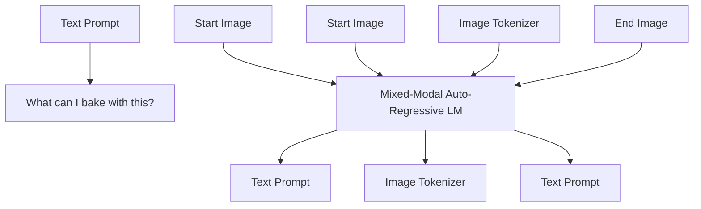
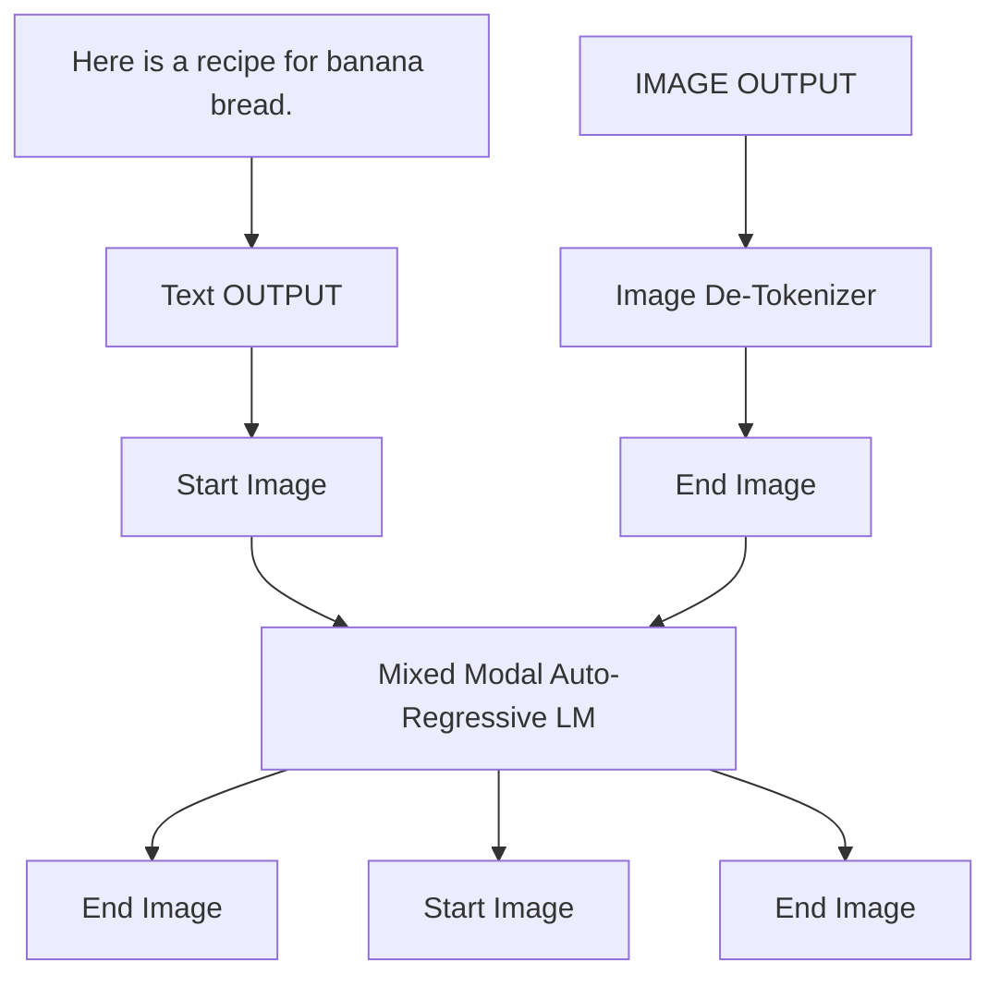

# Chameleon: Mixed-Modal Early-Fusion Foundation Models

Chameleon Team $^{1,*}$

$^{1}$ FAIR at Meta

\*See Contributions section for full author list.

We present Chameleon, a family of early-fusion token-based mixed-modal models capable of understanding and generating images and text in any arbitrary sequence. We outline a stable training approach from inception, an alignment recipe, and an architectural parameterization tailored for the early-fusion, token-based, mixed-modal setting. The models are evaluated on a comprehensive range of tasks, including visual question answering, image captioning, text generation, image generation, and long-form mixed modal generation. Chameleon demonstrates broad and general capabilities, including state-of-the-art performance in image captioning tasks, outperforms Llama-2 in text-only tasks while being competitive with models such as Mixtral 8x7B and Gemini-Pro, and performs non-trivial image generation, all in a single model. It also matches or exceeds the performance of much larger models, including Gemini Pro and GPT-4V, according to human judgments on a new long-form mixed-modal generation evaluation, where either the prompt or outputs contain mixed sequences of both images and text. Chameleon marks a significant step forward in a unified modeling of full multimodal documents.

Date: May 17, 2024

# 1 Introduction

Recent multimodal foundation models are very widely adopted but still model different modalities separately, often using modality specific encoders or decoders. This can limit their ability to integrate information across modalities and generate multimodal documents that can contain arbitrary sequences of images and text. In this paper, we present Chameleon, a family of mixed-modal foundation models capable of generating and reasoning with mixed sequences of arbitrarily interleaved textual and image content (Figures 2-4). This allows for full multimodal document modeling, which is a direct generalization of standard multimodal tasks such as image generation, understanding and reasoning over images, and text-only LLMs. Chameleon is instead designed to be mixed-modal from inception and uses a uniform architecture trained from scratch in an end-to-end fashion on an interleaved mixture of all modalities, i.e., images, text, and code.

Our unified approach uses fully token-based representations for both image and textual modalities (Figure 1). By quantizing images into discrete tokens, analogous to words in text, we can apply the same transformer architecture to sequences of both image and text tokens, without the need for separate image/text encoders (Alayrac et al., 2022; Liu et al., 2023b; Laurençon et al., 2023) or domain-specific decoders (Ramesh et al., 2022; Jin et al., 2023; Betker et al., 2023). This early-fusion approach, where all modalities are projected into a shared representational space from the start, allows for seamless reasoning and generation across modalities. However, it also presents significant technical challenges, particularly in terms of optimization stability and scaling.

We address these challenges through a combination of architectural innovations and training techniques. We introduce novel modifications to the transformer architecture, such as query-key normalization and revised placement of layer norms, which we find to be crucial for stable training in the mixed-modal setting (Section 2.3). We further show how to adapt the supervised finetuning approaches used for text-only LLMs to the mixed-modal setting, enabling strong alignment at scale (Section 3). Using these techniques, we successfully train Chameleon-34B on 5x the number of tokens as Llama-2 – enabling new mixed-modal applications while still matching or even outperforming existing LLMs on unimodal benchmarks.

flowchart

(a) Mixed-Modal Pre-Training

flowchart

(b) Mixed-Modal Generation   
Figure 1 Chameleon represents all modalities — images, text, and code, as discrete tokens and uses a uniform transformer-based architecture that is trained from scratch in an end-to-end fashion on $\sim$ 10T tokens of interleaved mixed-modal data. As a result, Chameleon can both reason over, as well as generate, arbitrary mixed-modal documents. Text tokens are represented in green and image tokens are represented in blue.

Extensive evaluations demonstrate that Chameleon is a broadly capable model on a diverse set of tasks. On visual question answering and image captioning benchmarks, Chameleon-34B achieves state-of-the-art performance, outperforming models like Flamingo, IDEFICS and Llava-1.5 (Section 5.2). At the same time, it maintains competitive performance on text-only benchmarks, matching models like Mixtral 8x7B and Gemini-Pro on commonsense reasoning and reading comprehension tasks (Section 5.1). But perhaps most impressively, Chameleon unlocks entirely new capabilities in terms of mixed-modal reasoning and generation.

As using only static, public benchmarks to evaluate model performance could be limited (Schaeffer, 2023), we also conduct a carefully designed human evaluation experiment by measuring the quality of mixed-modal long form responses to open-ended prompts. Chameleon-34B substantially outperforms strong baselines like Gemini-Pro and GPT-4V (Section 4), achieving a $60.4\%$ preference rate against Gemini-Pro and a $51.6\%$ preference rate against GPT-4V in pairwise comparisons.

In summary, we present the following contributions:

- We present Chameleon, a family of early-fusion token-based mixed-modal models capable of reasoning over and generating interleaved image-text documents, setting a new bar for open multimodal foundation models.   
- We introduce architectural innovations and training techniques that enable the stable and scalable training of early-fusion token-based models, addressing key challenges in mixed-modal learning.   
- Through extensive evaluations, we demonstrate state-of-the-art performance across a diverse set of vision-language benchmarks, while maintaining competitive performance on text-only tasks, and high quality image generation, all in the same model.   
- We conduct the first large-scale human evaluation on open-ended mixed-modal reasoning and generation, demonstrating the unique capabilities of Chameleon in this new setting.

Chameleon represents a significant step towards realizing the vision of unified foundation models capable of flexibly reasoning over and generating multimodal content.

Prompt: I'm bored. Could you show me some cool, quirky-looking birds? Also tell me about them in 2–3 sentences.

natural_image

Close-up of a toucan perched on a bamboo branch, with vibrant yellow and black plumage (no text or symbols visible)

Response: Absolutely! Here are three birds with some unique features that you might find interesting:

Keel-Billed Toucan The Keel-Billed Toucan is a brightly colored bird native to South American rainforests and woodlands. Its most distinctive feature is its colorful beak, which can grow up to seven inches long and has a distinctive, curved shape. The beak is used for plucking fruit from trees and for social displays. Despite its large size, the Keel-Billed Toucan is a skilled flyer and can often be seen flitting through the treetops. Here is an image of this vibrant bird: 

Puffin Puffins are small, aquatic birds that are found in the northern hemisphere. They have distinctive black and white feathers, as well as a brightly colored beak that is used for attracting mates and defending their territory. Puffins are known for their distinctive "puffin" call, which sounds like a loud, guttural chuckle. They feed on fish, which they catch by diving into the water from the air. Puffins are colonial birds, and they breed in large colonies on rocky cliffs and islands. Here is an image of this adorable bird: 

natural_image

Close-up of a bird standing on a grassy hillside with blue sky background (no text or symbols)

natural_image

Close-up portrait of a colorful bird with yellow and red feathers (no text or symbols visible)

Golden Pheasant The Golden Pheasant is a brightly colored bird native to the forests of China. It is a member of the pheasant family and is known for its striking plumage, which features a golden-yellow body, red face, and green tail feathers. The Golden Pheasant is a ground-dwelling bird, and it feeds on a diet of insects, seeds, and fruits. It is a popular game bird, and is often hunted for its meat and feathers. In captivity, the Golden Pheasant is sometimes kept as an ornamental bird, due to its striking appearance. Here is an image of this beautiful bird: 

I hope these images and descriptions have helped to brighten your day! If you have any other questions or requests, please don't hesitate to ask.

Figure 2 Sample interleaved image and text generation from Chameleon. The corresponding images are generated in locations marked by .

# 2 Pre-Training

Chameleon represents images, in addition to text, as a series of discrete tokens and takes advantage of the scaling properties of auto-regressive Transformers (Ramesh et al., 2021; Aghajanyan et al., 2022, 2023; Yu et al., 2023). We present any ordering of images and text during training ranging from text-only, to single text/image pairs to full interleaved text-image documents.

text_image

STOP

Prompt:  While chameleons are masters of camouflage in the natural world, let's see how they might fare in a man-made setting.

1. Analyze the colors, patterns, and textures in this image and identify the most challenging spot for a chameleon to blend in.   
2. Then generate an image of a chameleon with the optimal pattern to camouflage itself.   
3. Then, rate and explain how successful each attempt is on a scale from 1-10.

Response: The image is of a stop sign in a forested area, with some sunlight filtering through the trees. The sign has a red octagonal shape with a white border and the word "STOP" written in white letters. In the background, there are green leaves and trees.

Challenging Spot for a Chameleon: The stop sign would be the most challenging spot for a chameleon to blend in due to its bright red color and bold white letters, which would stand out in the forested environment.

Optimal Pattern for Camouflage: To camouflage itself on the stop sign, a chameleon would need to have a pattern that would break up its outline and make it less conspicuous. A pattern with shades

natural_image

A chameleon perched on a tree branch, with green foliage and no visible text or symbols.

of brown and red would help the chameleon blend in more effectively. Additionally, a mottled or dappled pattern would help to scatter light and further reduce the chameleon's visibility.

# 

Rating and Explanation: A rating of 2/10 would be given for the chameleon's ability to blend in on the stop sign. While the chameleon's green and brown pattern helps to break up its outline, the bright red color of the stop sign will still make it stand out in the forested environment.

Figure 3 Sample generation from Chameleon.

# 2.1 Tokenization

Image Tokenization We train a new image tokenizer based on Gafni et al. (2022), which encodes a $512 \times 512$ image into 1024 discrete tokens from a codebook of size 8192. For training this tokenizer, we use only licensed images. Given the importance of generating human faces, we up-sample the percentage of images with faces during pre-training by 2 times. A core weakness of our tokenizer is in reconstructing images with a large amount of text, therefore upper bounding the capability of our models, when it comes to heavy OCR-related tasks.

Tokenizer We train a new BPE tokenizer (Sennrich et al., 2016) over a subset of the training data outlined below with a vocabulary size of 65,536, which includes the 8192 image codebook tokens, using the sentencepiece library (Kudo and Richardson, 2018).

natural_image

White bowl filled with sliced bananas, accompanied by a bunch of yellow bananas on a green textured surface (no text or symbols visible)

Prompt: What can I bake with this? Give me the full recipe and show me an image with the final dish. 

Response: Bananas are a versatile fruit that can be used in various baked goods, such as muffins, bread, cakes, and cookies. They add natural sweetness, moisture, and a subtle banana flavor to the finished product. Additionally, bananas are rich in potassium, fiber, and other nutrients, making them a healthy addition to your baking repertoire.

Here is a simple recipe for banana bread that uses 3 ripe bananas:

# Ingredients:

• 3 ripe bananas, mashed   
• 1 1/2 cups all-purpose flour   
- 1 tsp baking powder   
• 1/2 tsp baking soda   
- 1/2 tsp salt   
• 1/4 cup unsalted butter, softened   
• 1 cup granulated sugar   
- 2 large eggs   
- 1 tsp vanilla extract   
- 1/2 cup chopped walnuts (optional)

# Instructions:

- Preheat your oven to $350^{\circ}\mathrm{F}$ (180°C). Grease a 9x5-inch loaf pan and set it aside.   
- In a medium bowl, whisk together the flour, baking powder, baking soda, and salt. Set aside.   
- In a large mixing bowl, use an electric mixer to cream together the butter and sugar until light and fluffy, about 2-3 minutes.   
- Beat in the eggs one at a time, followed by the mashed bananas and vanilla extract.

natural_image

Sliced bread slice on a white plate, no visible text or symbols

- Gradually mix in the dry ingredients until just combined, being careful not to overmix.   
- If using walnuts, fold them into the batter.   
- Pour the batter into the prepared loaf pan and smooth the top.   
- Bake for 50-60 minutes, or until a toothpick inserted into the center of the bread comes out clean.   
- Remove the bread from the oven and let it cool in the pan for 10 minutes before transferring it to a wire rack to cool completely. 

Figure 4 Sample Chameleon outputs.

# 2.2 Pre-Training Data

We delineate the pre-training stage into two separate stages. The first stage takes up the first 80% of training while the second stage takes the last 20%. For all Text-To-Image pairs we rotate so that 50% of the time the image comes before the text (i.e., captioning).

# 2.2.1 First Stage

In the first stage we use a data mixture consisting of the following very large scale completely unsupervised datasets.

Text-Only: We use a variety of textual datasets, including a combination of the pre-training data used to train LLaMa-2 (Touvron et al., 2023) and CodeLLaMa (Roziere et al., 2023) for a total of 2.9 trillion text-only tokens.

line

| Step | w/ QK-norm and dropout | w/o dropout | w/o QK-norm or dropout |
| ---- | ---------------------- | ----------- | ---------------------- |
| 0k   | 0.0                    | 0.0         | 0.0                    |
| 5k   | 2.5                    | 4.0         | 6.0                    |
| 10k  | 3.0                    | 7.0         | 12.0                   |
| 15k  | 3.5                    | 10.0        | 18.0                   |
| 20k  | 4.0                    | 13.0        | 24.0                   |
| 25k  | 4.5                    | 18.0        | 30.0                   |
| 30k  | 5.0                    | 25.0        | 35.0                   |

(a) Uncontrolled growth of output norms is a strong indicator of future training divergence.

line

| Step  | w/o QK-norm | w/ QK-norm |
| ----- | ----------- | ---------- |
| 0k    | 3.7         | 3.7        |
| 25k   | 3.6         | 3.6        |
| 50k   | 3.5         | 3.5        |
| 75k   | 3.45        | 3.45       |
| 100k  | 3.45        | 3.45       |
| 125k  | 3.45        | 3.45       |
| 150k  | 3.45        | 3.45       |
| 175k  | 3.4         | 3.4        |

(b) An ablation with Chameleon-7B with and without QK-Norm.

line

| Step | w/o dropout | w/ dropout |
| ---- | ----------- | ---------- |
| 0k   | 3.9         | 3.9        |
| 20k  | 3.55        | 3.6        |
| 40k  | 3.48        | 3.5        |
| 60k  | 3.45        | 3.48       |
| 80k  | 3.44        | 3.45       |

(c) An ablation with Chameleon-7B with and without dropout.   
Figure 5 Output norm and training loss curves for Chameleon models under various settings.

Text-Image: The text-image data for pre-training is a combination of publicly available data sources and licensed data. The images are then resized and center cropped into $512 \times 512$ images for tokenization. In total, we include 1.4 billion text-image pairs, which produces 1.5 trillion text-image tokens.

Text/Image Interleaved: We procure data from publicly available web sources, not including data from Meta's products or services, for a total of 400 billion tokens of interleaved text and image data similar to Laurençon et al. (2023). We apply the same filtering for images, as was applied in Text-To-Image.

# 2.2.2 Second Stage

In the second stage, we lower the weight of the first stage data by 50% and mix in higher quality datasets while maintaining a similar proportion of image text tokens.

We additionally include a filtered subset of the train sets from a large collection of instruction tuning sets.

# 2.3 Stability

It was challenging to maintain stable training when scaling the Chameleon models above 8B parameters and 1T tokens, with instabilities often only arising very late in training. We adopted to following recipe for architecture and optimization to achieve stability.

Architecture Our architecture largely follows LLaMa-2 (Touvron et al., 2023). For normalization, we continue to use RMSNorm (Zhang and Sennrich, 2019); we use the SwiGLU (Shazeer, 2020) activation function and rotary positional embeddings (RoPE) (Su et al., 2021).

We found that the standard LLaMa architecture showed complex divergences due to slow norm growth in the mid-to-late stages of training. We narrowed down the cause of the divergence to the softmax operation being problematic when training with multiple modalities of significantly varying entropy due to the translation invariant property of softmax (i.e., $softmax(z) = softmax(z + c)$ ). Because we share all weights of the model across modalities, each modality will try to “compete” with the other by increasing its norms slightly; while not problematic at the beginning of training, it manifests in divergences once we get outside the effective representation range of bf16 (In Figure 6b, we show that ablations without image generation did not diverge). In a unimodal setting, this problem has also been named the logit drift problem (Wortsman et al., 2023). In Figure 5a, we plot the norms of the output of the last transformer layer as training progresses and we find that although training divergences can manifest after as much as even 20-30% of training progress, monitoring uncontrolled growth of output norms is strongly correlated with predicting future loss divergence.

The softmax operation appears in two places in transformers: the core attention mechanism and the softmax over the logits. As inspired by Dehghani et al. (2023) and Wortsman et al. (2023), we first deviate from the Llama architecture by using query-key normalization (QK-Norm). QK-Norm directly controls the norm growth of input to the softmax by applying layer norm to the query and key vectors within the attention.

line

| Step   | 7b    | 34b   |
| ------ | ----- | ----- |
| 0k     | 3.2   | 3.2   |
| 100k   | 3.05  | 2.95  |
| 200k   | 3.02  | 2.88  |
| 300k   | 3.01  | 2.85  |
| 400k   | 3.0   | 2.83  |
| 500k   | 3.0   | 2.82  |
| 600k   | 3.0   | 2.8   |

(a) Training Curves for 600k steps for Chameleon-7B and Chameleon-34B over Mixed-Modal Data.

line

| Step   | Training Loss |
| ------ | ------------- |
| 0k     | 1.15          |
| 50k    | 1.00          |
| 100k   | 0.98          |
| 150k   | 0.96          |
| 200k   | 0.94          |
| 250k   | 0.93          |

(b) Training loss curve with image generation disabled does not suffer from instability issues.

line

| Step | w/o norm reordering | w/ norm reordering |
| ---- | ------------------- | ------------------ |
| 0k   | 6.0                 | 6.0                |
| 2k   | 4.0                 | 4.0                |
| 4k   | 3.5                 | 3.8                |
| 6k   | 3.5                 | 3.7                |
| 8k   | 3.5                 | 3.7                |
| 10k  | 3.5                 | 3.7                |

(c) For Chameleon-34B, using dropout does not fix divergences, both with and without norm-reordering.   
Figure 6 Training loss curves for Chameleon models under various settings.

In Figure 5b, we show training loss curves for Chameleon-7B with and without QK-Norm, and the latter diverges after approximately 20% of a training epoch.

We found that to stabilize Chameleon-7B by controlling norm growth, it was necessary to introduce dropout after the attention and feed-forward layers, in addition to QK-norm (see Figure 5c). However, this recipe was not enough to stabilize, Chameleon-34B, which required an additional re-ordering of the norms. Specifically, we use the strategy of normalization proposed in Liu et al. (2021, 2022), within the transformer block. The benefit of the Swin transformer normalization strategy is that it bounds the norm growth of the feedforward block, which can become additionally problematic given the multiplicate nature of the SwiGLU activation function. If h represents the hidden vector at time-step t after self-attention is applied to input x,

Chameleon-34B: $h = x + attention\_norm(attention(x))$

$$
\text { output } = h + \text {   ffn\_norm(feed\_forward } (h))
$$

Llama2: $h = x + \text{attention}(\text{attention\_norm}(x))$

$$
\text { output } = h + \text { feed\_forward } (\text { ffn\_norm } (h))
$$

There was no difference in perplexity when training a model from scratch with and without the normalization re-ordering until the divergence of the LLaMa-2 parameterization. Additionally, we found that this type of normalization did not work well in combination with dropout and therefore, we train Chameleon-34B without dropout (Figure 6c). Furthermore, we retroactively found that Chameleon-7B can also be stably trained without dropout, when using norm-reordering, but QK-norm is essential in both cases. We plot training curves for the first 600k steps for both Chameleon-7B and Chameleon-34B in Figure 6a. We note that similar attempts at stabilizing multi-modal trainings were concurrently discovered in (Lu et al., 2023).

Optimization Our training process uses the AdamW optimizer (Loshchilov and Hutter, 2017), with $\beta_{1}$ set to 0.9 and $\beta_{2}$ to 0.95, with an $\epsilon = 10^{-5}$ . We use a linear warm-up of 4000 steps with an exponential decay schedule of the learning rate to 0. Additionally, we apply a weight decay of 0.1 and global gradient clipping at a threshold of 1.0. We use a dropout of 0.1 (Srivastava et al., 2014) for Chameleon-7B for training stability, but not for Chameleon-34B (see Figure 5c and 6c).

The application of QK-Norm while helping the inner softmaxes within the Transformer does not solve the problem of logit shift in the final softmax. Following Chowdhery et al. (2022); Wortsman et al. (2023), we apply z-loss regularization. Specifically, we regularize the partition function Z of the softmax function $\sigma(x)_{i} = \frac{e^{x_{i}}}{Z}$ where $Z = \sum_{i} e^{x_{i}}$ by adding $10^{-5} \log^{2} Z$ to our loss function.

For Chameleon-7B it was important to use both dropout and z-loss to achieve stability, while Chameleon-34B only required z-loss (Figure 6c).

Chameleon-7B was trained with a global batch size of $2^{23}(\sim 8\mathrm{M})$ tokens and Chameleon-34B was trained with a global batch size of $3\times 2^{22}(\sim 12\mathrm{M})$ tokens. We do 2.1 epochs over our full training dataset for a total

of 9.2 trillion tokens seen during training. We show the first 600k steps of training (55% for Chameleon-7B and 80% for Chameleon-34B) in Figure 6a.

Table 1 Summary of core architecture and optimization decisions made in Chameleon in contrast to LLaMa-1 and LLaMa-2. 

<table><tr><td>Model</td><td>Params</td><td>Context Length</td><td>GQA</td><td>Tokens</td><td>LR</td><td>Epochs</td><td>Dropout</td><td>Zloss</td><td>Qknorm</td></tr><tr><td rowspan="2">LLaMa-1</td><td>7B</td><td>2k</td><td>×</td><td>1.0T</td><td> $3.0 \times 10^{-4}$ </td><td>1.0</td><td>0.0</td><td>0.0</td><td>×</td></tr><tr><td>33B</td><td>2k</td><td>×</td><td>1.4T</td><td> $1.5 \times 10^{-4}$ </td><td>1.0</td><td>0.0</td><td>0.0</td><td>×</td></tr><tr><td rowspan="2">LLaMa-2</td><td>7B</td><td>4k</td><td>×</td><td>2.0T</td><td> $3.0 \times 10^{-4}$ </td><td>1.0</td><td>0.0</td><td>0.0</td><td>×</td></tr><tr><td>34B</td><td>4k</td><td>√</td><td>2.0T</td><td> $1.5 \times 10^{-4}$ </td><td>1.0</td><td>0.0</td><td>0.0</td><td>×</td></tr><tr><td rowspan="2">Chameleon</td><td>7B</td><td>4k</td><td>×</td><td>4.4T</td><td> $1.0 \times 10^{-4}$ </td><td>2.1</td><td>0.1</td><td> $10^{-5}$ </td><td>√</td></tr><tr><td>34B</td><td>4k</td><td>√</td><td>4.4T</td><td> $1.0 \times 10^{-4}$ </td><td>2.1</td><td>0.0</td><td> $10^{-5}$ </td><td>√</td></tr></table>

Pre-Training Hardware Our model pretraining was conducted on Meta's Research Super Cluster (RSC) (Lee and Sengupta, 2022), and our alignment was done on other internal research clusters. NVIDIA A100 80 GB GPUs power both environments. The primary distinction is the interconnect technology: RSC employs NVIDIA Quantum InfiniBand, whereas our research cluster utilizes Elastic Fabric. We report our GPU usage for pre-training in Table 2.

Table 2 Chameleon Model Pre-Training Resource Usage 

<table><tr><td>Chameleon</td><td>Concurrent GPUs</td><td>GPU Hours</td></tr><tr><td>7B</td><td>1024</td><td>856481</td></tr><tr><td>34B</td><td>3072</td><td>4282407</td></tr></table>

# 2.4 Inference

To support alignment and evaluation, both automated and human, and to demonstrate the application-readiness of our approach, we augment the inference strategy with respect to interleaved generation to improve throughput and reduce latency.

Autoregressive, mixed-modal generation introduces unique performance-related challenges at inference time. These include:

- Data-dependencies per-step — given that our decoding formulation changes depending on whether the model is generating images or text at a particular step, tokens must be inspected at each step (i.e. copied from the GPU to the CPU in a blocking fashion) to guide control flow.   
- Masking for modality-constrained generation — to facilitate exclusive generation for a particular modality (e.g. image-only generation), tokens that do not fall in a particular modality space must be masked and ignored when de-tokenizing.   
- Fixed-sized text units — unlike text-only generation, which is inherently variable-length, token-based image generation produces fixed-size blocks of tokens corresponding to an image.

Given these unique challenges, we built a standalone inference pipeline based on PyTorch (Paszke et al., 2019) supported with GPU kernels from xformers (Lefaudeux et al., 2022).

Our inference implementation supports streaming for both text and images. When generating in a streaming fashion, token-dependent conditional logic is needed at each generation step. Without streaming, however, blocks of image tokens can be generated in a fused fashion without conditional computation. In all cases, token masking removes branching on the GPU. Even in the non-streaming setting, however, while generating text, each output token must be inspected for image-start tokens to condition image-specific decoding augmentations.

Table 3 Supervised Fine-Tuning Dataset Statistics 

<table><tr><td></td><td>Category</td><td># of Samples</td><td># of Tokens</td><td># of Images</td></tr><tr><td rowspan="6">Chameleon-SFT</td><td>Text</td><td>1.6M</td><td>940.0M</td><td>-</td></tr><tr><td>Code</td><td>14.1K</td><td>1.1M</td><td>-</td></tr><tr><td>Visual Chat</td><td>15.6K</td><td>19.4M</td><td>16.7K</td></tr><tr><td>Image Generation</td><td>64.3K</td><td>68.0M</td><td>64.3K</td></tr><tr><td>Interleaved Generation</td><td>16.9K</td><td>35.8M</td><td>30.7K</td></tr><tr><td>Safety</td><td>95.3K</td><td>38.6M</td><td>1.6K</td></tr></table>

# 3 Alignment

We follow recent work in using a light weight alignment stage based on supervised fine tuning on carefully curated high quality datasets (Zhou et al., 2023). We include a range of different types of data, targeting both exposing model capabilities and improving safety.

# 3.1 Data

We separate our supervised fine-tuning (SFT) dataset into the following categories: Text, Code, Visual Chat, Image Generation, Interleaved Text/Image Generation, and Safety. We include examples from each category from the Chameleon-SFT dataset in Figure 7.

We inherit the Text SFT dataset from LLaMa-2 (Touvron et al., 2023) and the Code SFT from CodeLLaMa (Roziere et al., 2023). For the Image Generation SFT dataset, we curate highly aesthetic images by applying and filtering each image in our licensed data, with an aesthetic classifier from Schuhmann et al. (2022). We first select images rated as at least six from the aesthetic classifier and then select the top 64K images closest in size and aspect ratio to $512 \times 512$ (the native resolution of our image tokenizer).

For both Visual Chat and Interleaved Text/Image Generation SFT data, we focused on very high-quality data collection using third-party vendors following a similar strategy recommended by Touvron et al. (2023); Zhou et al. (2023). We do not include any Meta user data. We present our dataset's statistics in Table 3.

Safety Data We include a collection of prompts that can potentially provoke the model to produce unsafe content, and match them with a refusal response (e.g. “I can’t help with that.”). These prompts cover a wide variety of sensitive topics, such as violence, controlled substances, privacy, and sexual content. Our collection of safety tuning data includes examples from LLaMa-2-Chat (Touvron et al., 2023), synthetic text-based examples generated with Rainbow Teaming (Samvelyan et al., 2024), image generation prompts manually selected from Pick-A-Pic (Kirstain et al., 2023) for safety testing, examples for cyber security safety (Roziere et al., 2023), as well as mixed-modal prompts collected internally through manual annotation and automatic expansion (Honovich et al., 2022). Collecting mixed-modal prompts is of particular importance, since it addresses potential multi-modal attack vectors, which are outside the distribution of text-only and text-to-image safety tuning datasets.

# 3.2 Fine-Tuning Strategy

Data Balancing We found that balancing modalities within the SFT stage is important for high quality alignment. Specifically during the SFT stage, if there is a severe imbalance between pairings of modalities (or when a specific modality should trigger), the model learns an unconditional prior of generating that modality which can either mute or over exaggerate the generation of a single modality.

Optimization Our supervised fine-tuning strategy incorporates a cosine learning rate schedule, starting at an initial rate of 1e-5, combined with a weight decay set at 0.1. We maintain a batch size of 128, accommodating sequences up to 4096 tokens. During fine-tuning, each dataset instance comprises a paired prompt and its corresponding answer. To improve efficiency, we pack as many prompts and answers as possible into each

Prompt: Can you write a poem using rhyming couplets?

Response: Sure, here's a short poem using rhyming couplets:

The sun sets in the sky,

A beautiful sight to the eye.

The stars come out to play,

A magical sight to behold.

The wind whispers through the trees,

A gentle breeze that brings ease.

The birds sing their sweet melodies,

A soothing sound that calms the soul.

The world is full of wonder,

A place of beauty and thunder.

So let us cherish every moment,

And bask in the beauty all around us.

(a) Text

Prompt: Given a list of integers, find the first number that appears at least twice.

Response:

def find\_duplicate(my\_list):

$$
\text { seen } = \text { set } ()
$$

for num in my list:

if num in seen:

return num

seen.add(num)

return None

(b) Code

Prompt: Renaissance square of Stepanakert

Response:   

natural_image

Black-and-white exterior view of a historic building complex under a dramatic cloudy sky, with pedestrians walking in front (no visible text or signage)

(c) Image Generation

natural_image

Garden scene featuring a red and purple flower in a decorative vase with autumn leaves (no text or symbols)

Prompt: Which elements contribute to this flower arrangement's distinctiveness, and what sets its surroundings apart?

Response: The image features an autumnal-themed floral arrangement in a classically designed vase. The arrangement stands out with its striking combination of red maple leaves, purple flowers, and pink-red roses. The vase's rosettes give it an antique design. In the background, blurry green vegetation is visible, creating a contrast to the autumnal theme of the bouquet. The red maple leaves, both in the arrangement and scattered around the vase, evoke autumn, while the green vegetation suggests a more summer-like setting. The outdoor setting is bright and sunny, adding to the contrast between the arrangement and its settings.

(d) Visual Chat

Gyumri is an urban municipal community and the second-largest city in Armenia, serving as the administrative center of Shirak Province in the north-western part of the country.

natural_image

Street view of a cobblestone town with old brick buildings and a blue sky (no visible text or signage)

Archaeological excavations conducted throughout the Soviet period have shown that the area of modern-day Gyumri has been populated since at least the third millennium BC.

natural_image

Exterior view of a stone earthen structure in an open field under a partly cloudy sky (no signage or text visible)

(e) Interleaved Text/Image Generation   
Figure 7 Example alignment data for different categories.

sequence, inserting a distinct token to delineate the end of a prompt and the beginning of an answer. We use an autoregressive training objective, selectively masking the loss for the prompt tokens. This targeted approach allows us to optimize the model exclusively based on the answer tokens, which provides slight gains overall. We also apply a dropout of 0.05. Additionally, we maintain the same zloss that was used during

# Advice: 10.2%

What does a meningitis rash look like? What are the other symptoms I should be on the lookout for?

# How-to: 12.5%

How do I properly clean my TV screen? I used Windex and now there are towel fibers and wipe marks all over. Show me some reference photos.

# Explanation: 14.4%

I've been studying classical French art, and my favorite so far is his painting seen here:  Could you please give me a few image contemporary artwork this same aesthetic?

# Hypothetical: 5.6%

What would the modern-day vehicle look like if oil had never been discovered?

# Brainstorming: 18.6%

Show me a Middle Eastern alternative to these dishes. <img1> <img2>

# Article: 3.1%

Write me an introduction to a story about knick-knacks, and finish the story by shifting the focus with an image.

# Story: 3.9%

Can you create and illustrate a short story for children about an octopus that can't stop eating pizza?

# Identification: 9.3 %

Is the below image a Shetland Pony? If not, what is it, and can you show me a Shetland Pony?

# Comparison: 9.6%

Please tell me what the difference between these two creatures is, and show me some more examples. <img1> <img2>

# Report: 5.4%

Who designed the church in and what's the name of the Church?  Can you please provide me with additional photos of famous landmarks designed by the same architect?

# Other: 5.2%

Create a decal for my truck that features running horses as well as the TRD insignia. Use black to gray gradients.

# Reasoning: 2.1%

What is typically found at a construction site? Show me a construction site that has a crane.

Figure 8 Task categories and examples of prompts. Image attributions: Seguin (2010); Agriflanders (2009); Tuszyński (2015); Sokolov (2022).

pre-training. During supervised fine-tuning, images in the prompt are resized with border padding to ensure that all the information is available in the image, whereas images in the answer are center-cropped to ensure visually good image generation quality.

# 4 Human Evaluations and Safety Testing

Chameleon has significant new mixed modal understanding and generation abilities that cannot be measured with existing benchmarks. In this section, we detail how we conduct human evaluations on large multi-modal language models' responses to a set of diverse prompts that regular users may ask daily. We first introduce how we collect the prompts and then describe our baselines and evaluation methods, along with the evaluation results and analysis. A safety study is also included in this section.

# 4.1 Prompts for Evaluation

We work with a third-party crowdsourcing vendor to collect a set of diverse and natural prompts from human annotators. Specifically, we ask annotators to creatively think about what they want a multi-modal model to generate for different real-life scenarios. For example, for the scenario of “imagine you are in a kitchen”, annotators may come up with prompts like “How to cook pasta?” or “How should I design the layout of my island? Show me some examples.” The prompts can be text-only or text with some images, and the expected responses should be mixed-modal, containing both text and images.

After collecting an initial set of prompts, we ask three random annotators to evaluate whether the prompts are clear and whether they expect the responses to contain images. We use a majority vote to filter unclear prompts and prompts that don't expect mixed-modal responses. In the end, our final evaluation set contains 1,048 prompts: 441 (42.1%) are mixed-modal (i.e., containing both text and images), and the remaining 607 (57.9%) are text-only.

To better understand the tasks users would like a multi-modal AI system to fulfill, we manually examine

bar

| Task Fulfillment Rate | Chameleon | Gemini+ | GPT-4V+ | Gemini | GPT-4V |
| --------------------- | --------- | ------- | ------- | ------ | ------ |
| Fulfills              | 57        | 38      | 45      | 19     | 24     |
| Partially fulfills   | 39        | 57      | 47      | 74     | 72     |
| Does not fulfill      | 6         | 6       | 9       | 7      | 4      |

(a) The prompt task fulfillment rates.

bar_stacked

| Model | Wins (%) | Ties (%) | Loses (%) |
| :--- | :--- | :--- | :--- |
| Gemini+ | 41.5 | 34.5 | 24.0 |
| GPT-4V+ | 35.8 | 31.6 | 32.6 |
| Gemini | 53.5 | 31.2 | 15.3 |
| GPT-4V- | 46.0 | 31.4 | 22.6 |

(b) Chameleon vs. the baselines: Gemini+, GPT-4V+, Gemini, GPT-4V.   
Figure 9 Performance of Chameleon vs baselines, on mixed-modal understanding and generation on a set of diverse and natural prompts from human annotators.

the prompts and classify them into 12 categories. The description of these task categories $^{1}$ , as well as their example prompts, can be found in Figure 8.

# 4.2 Baselines and Evaluations

We compare Chameleon 34B with OpenAI GPT-4V and Google Gemini Pro by calling their APIs. While these models can take mixed-modal prompts as input, their responses are text-only. We create additional baselines by augmenting GPT-4V and Gemini responses with images to have even stronger baselines. Specifically, we instruct these models to generate image captions by adding the following sentence at the end of each original input prompt: "If the question requires an image to be generated, then generate an image caption instead and enclose the caption in a pair of $\langle\text{caption}\rangle\langle/\text{caption}\rangle$ tags." We then use OpenAI DALL-E 3 to generate images conditioned on these captions and replace the captions in the original responses with those generated images. We denote the enhanced responses as GPT-4V+ and Gemini+ in this section. Working with the same third-party crowdsourcing vendor, we conduct two types of evaluations to measure the model performance: absolute and relative.

# 4.2.1 Absolute Evaluation

For absolute evaluations, the output of each model is judged separately by asking three different annotators a set of questions regarding the relevance and quality of the responses. Below, we give detailed results and analysis on the most critical question, whether the response fulfills the task described in the prompt.

On task fulfillment, we ask annotators whether the response fulfills, partially fulfills, or does not fulfill the task described in the prompt. As shown in Figure 9a, much more of Chameleon's responses are considered to have completely fulfilled the tasks: $55.2\%$ for Chameleon vs. $37.6\%$ of Gemini+ and $44.7\%$ of GPT-4V+. When judging the original responses of Gemini and GPT-4V, the annotators consider much fewer prompts to be fully fulfilled: Gemini completely fulfills $17.6\%$ of the tasks and GPT-4V $23.1\%$ . We suspect that because all the prompts expect mixed-modal output, the text-only responses from Gemini and GPT-4V might be viewed as only partially completing the tasks by the annotators.

The task fulfillment rates in each category and in each input modality can be found in Appendix B. The task categories that Chameleon performs well include Brainstorming, Comparison, and Hypothetical, and the

categories Chameleon needs to improve include Identification and Reasoning. On the other hand, we don't see that the model performance differs a lot when comparing mixed-modality and text-only prompts, although Chameleon seems to perform slightly better on text-only prompts, while Gemini+ and GPT-4V+ are slightly better on mixed-modal ones. Figure 2 shows an example of Chameleon's response to a brainstorming prompt.

# 4.2.2 Relative Evaluation

For relative evaluations, we directly compare Chameleon with each baseline model by presenting their responses to the same prompt in random order and asking human annotators which response they prefer. The options include the first response, the second response, and about the same. Figure 9b shows Chameleon's win rates $^{2}$ over the baselines. Compared with Gemini+, Chameleon's responses are better in 41.5% of the cases, 34.5% are tie, and 24.0% are inferior. Annotators also think that Chameleon's responses are slightly more often better than GPT-4V+, with 35.8% win, 31.6% tie, and 32.6% loss. Overall, Chameleon has win rates of 60.4% and 51.6% over Gemini+ and GPT-4V+, respectively. When compared with the original responses from Gemini without the augmented images, Chameleon's responses are considered better in 53.5% of the cases, 31.2% are tied, and 15.3% are inferior. Chameleon's responses are also considered better than GPT-4V more frequently, with 46.0% win, 31.4% tie, and 22.6% loss. Chameleon's win rates over Gemini and GPT-4V are 69.1% and 61.7%, respectively.

# 4.3 Inter-annotator Agreement

Every question in our evaluation is answered by three different human annotators, and we take the majority votes as the final answer. To understand the quality of the human annotators and whether the questions we asked are reasonably designed, we examine the level of agreement between different annotators.

The levels of agreement on each question in the absolute evaluation are shown in Figure 10.

bar

| Category | All | Two | None |
| :--- | :--- | :--- | :--- |
| Containing images | 3000 | 150 | 0 |
| Image quality | 2500 | 550 | 50 |
| Image relevance | 2550 | 500 | 50 |
| Language quality | 3050 | 100 | 0 |
| Objectionable content | 3100 | 0 | 0 |
| Relevance | 2300 | 800 | 50 |
| Task fulfillment | 1350 | 1650 | 100 |
| Accuracy | 2150 | 950 | 50 |

Figure 10 The inter-annotator agreement on the questions in the absolute evaluation.

For questions about simple, objective properties of the responses, we very rarely see three annotators disagree with each other. For example, annotators have unanimous judgments on whether the model responses contain objectionable content (e.g., hate speech); in this case, all models produce safe responses. For some questions, such as whether the response fulfills the task or whether the model interprets the prompt correctly, when one

annotator's judgment differs from the other two's, the decision is usually still close (e.g., fulfills vs. partially fulfills) rather than opposite (e.g., fulfills vs. does not fulfill). $^{3}$

Table 4 The inter-annotator agreement on relative evaluations. 

<table><tr><td></td><td>All 3 annotators agree</td><td>2 of 3 annotators agree</td><td>No Agreement</td></tr><tr><td>Chameleon vs. Gemini+</td><td>331 (31.5%)</td><td>609 (58.1%)</td><td>108 (10.3%)</td></tr><tr><td>Chameleon vs. GPT-4V+</td><td>371 (35.4%)</td><td>579 (55.2%)</td><td>98 (9.3%)</td></tr><tr><td>Chameleon vs. Gemini</td><td>317 (30.2%)</td><td>621 (59.3%)</td><td>110 (10.5%)</td></tr><tr><td>Chameleon vs. GPT-4V</td><td>300 (28.6%)</td><td>611 (58.3%)</td><td>137 (13.1%)</td></tr></table>

For the relative evaluation, Table 4 shows the numbers of cases where all three annotators agree, two annotators agree, and there is no agreement. For each model pair, we have a bit higher than 10% of the cases where there is no agreement among the three annotators (considered as a tie in our evaluation.) On about 28% to 35% of the pairs, all annotators have unanimous judgments, and in about 55% to 60% of the pairs, one annotator differs from other two. This may be interpreted as Chameleon performing similarly to other baselines in many cases, making the relative evaluation challenging. $^{4}$

# 4.4 Safety Testing

We crowdsource prompts that provoke the model to create unsafe content in predefined categories such as self-harm, violence and hate, and criminal planning. These prompts cover both text and mixed-modal inputs, as well as intents to produce unsafe text, images, or mixed-modal outputs. We generate the model's response to each prompt, and ask annotators to label whether the response is safe or unsafe with respect to each category's definition of safety; an unsure option is also provided for borderline responses. Table 5 shows that an overwhelming majority of Chameleon's responses are considered safe, with only 78 (0.39%) unsafe responses for the 7B model and 19 (0.095%) for the 30B model.

We also evaluate the model's ability to withstand adversarial prompting in an interactive session. For that purpose, an internal red team probed the 30B model over 445 prompt-response interactions, including multi-turn interactions. Table 5 shows that of those responses, 7 (1.6%) were considered unsafe and 20 (4.5%) were labeled as unsure. While further safety tuning using RLHF/RLAIF has been shown to further harden the model against jailbreaking and intentional malicious attacks, these results demonstrate that our current safety tuning approach provides significant protection for reasonable, benign usage of this research artifact.

# 4.5 Discussion

Compared to Gemini and GPT-4V, Chameleon is very competitive when handling prompts that expect interleaving, mixed-modal responses. The images generated by Chameleon are usually relevant to the context, making the documents with interleaving text and images very appealing to users. However, readers should be aware of the limitations of human evaluation. First, the prompts used in the evaluation came from crowdsourcing instead of real users who interact with a model. While we certainly have a diverse set of prompts, the coverage may still be limited, given the size of the dataset. Second, partially because our prompts focus on the mixed-modal output, certain visual understanding tasks, such as OCR or Infographics (i.e., interpreting a given chart or plot), are naturally excluded from our evaluation. Finally, at this moment, the APIs of existing multi-modal LLMs provide only textual responses. While we strengthen the baselines by augmenting their output with separately generated images, it is still preferred if we can compare Chameleon to other native mixed-modal models.

Table 5 Safety testing on 20,000 crowdsourced prompts and 445 red team interactions provoking the model to produce unsafe content. 

<table><tr><td>Dataset</td><td>Params</td><td>Safe</td><td>Unsafe</td><td>Unsure</td></tr><tr><td rowspan="2">Crowdsourced</td><td>7B</td><td>99.2%</td><td>0.4%</td><td>0.4%</td></tr><tr><td>34B</td><td>99.7%</td><td>0.1%</td><td>0.2%</td></tr><tr><td>Red Team</td><td>34B</td><td>93.9%</td><td>1.6%</td><td>4.5%</td></tr></table>

# 5 Benchmark Evaluations

Given the general capabilities of Chameleon, there is not a single model that we can directly evaluate against; therefore, we evaluate against the best models in every category within our capabilities.

# 5.1 Text

We evaluate the general text-only capabilities of our pre-trained (not SFT'd) model against other state-of-the-art text-only large language models. We follow the evaluation protocol outlined by Touvron et al. (2023). Specifically we evaluate all models, using an in-house evaluation platform on the areas of commonsense reasoning, reading comprehension, math problems, and world knowledge. We report our results in Table 6.

Table 6 Comparison of overall performance on collective academic benchmarks against open-source foundational models.  
\* Evaluated using our framework/using API. For GSM8k/MATH, we report maj@1 unless mentioned otherwise.  
\*\* From Gemini et al. (2023). 

<table><tr><td></td><td colspan="2">Chameleon</td><td colspan="3">Llama-2</td><td colspan="2">Mistral</td><td>Gemini Pro</td><td>GPT-4</td></tr><tr><td></td><td>7B</td><td>34B</td><td>7B</td><td>34B</td><td>70B</td><td>7B</td><td>8x7B</td><td>—</td><td>—</td></tr><tr><td colspan="10">Commonsense Reasoning and Reading Comprehension</td></tr><tr><td>PIQA</td><td>79.6</td><td>83.3</td><td>78.8</td><td>81.9</td><td>82.8</td><td>83.0</td><td>83.6</td><td>—</td><td>—</td></tr><tr><td>SIQA</td><td>57.0</td><td>63.3</td><td>48.3</td><td>50.9</td><td>50.7</td><td>—</td><td>—</td><td>—</td><td>—</td></tr><tr><td>HellaSwag</td><td>74.2</td><td>82.7</td><td>77.2</td><td>83.3</td><td>85.3</td><td>81.3</td><td>84.4</td><td>—</td><td>—</td></tr><tr><td></td><td>75.6</td><td>85.1</td><td>—</td><td>—</td><td>87.1</td><td>83.9</td><td>86.7</td><td>84.7</td><td>95.3</td></tr><tr><td></td><td>10-shot</td><td>10-shot</td><td></td><td></td><td>10-shot</td><td>10-shot</td><td>10-shot</td><td>10-shot</td><td>10-shot</td></tr><tr><td>WinoGrande</td><td>70.4</td><td>78.5</td><td>69.2</td><td>76.7</td><td>80.2</td><td>75.3</td><td>77.2</td><td>—</td><td>—</td></tr><tr><td>Arc-E</td><td>76.1</td><td>84.1</td><td>75.2</td><td>79.4</td><td>80.2</td><td>80.0</td><td>83.1</td><td>—</td><td>—</td></tr><tr><td>Arc-C</td><td>46.5</td><td>59.7</td><td>45.9</td><td>54.5</td><td>57.4</td><td>55.5</td><td>59.7</td><td>—</td><td>—</td></tr><tr><td>OBQA</td><td>51.0</td><td>54.0</td><td>58.6</td><td>58.2</td><td>60.2</td><td>—</td><td>—</td><td>—</td><td>—</td></tr><tr><td>BoolQ</td><td>81.4</td><td>86.0</td><td>77.4</td><td>83.7</td><td>85.0</td><td>84.7*</td><td>—</td><td>—</td><td>—</td></tr><tr><td colspan="10">Math and World Knowledge</td></tr><tr><td>GSM8k</td><td>41.6</td><td>61.4</td><td>14.6</td><td>42.2</td><td>56.8</td><td>52.1maj@8</td><td>74.4maj@8</td><td>86.5maj@32CoT</td><td>92.0SFTCoT</td></tr><tr><td></td><td>50.9maj@8</td><td>77.0maj@32</td><td>—</td><td>—</td><td>—</td><td>—</td><td>75.1*maj@32</td><td>—</td><td>—</td></tr><tr><td>MATH</td><td>11.5maj@1</td><td>22.5maj@1</td><td>2.5</td><td>6.24</td><td>13.5</td><td>13.1maj@4</td><td>28.4maj@4</td><td>32.6</td><td>52.9**</td></tr><tr><td></td><td>12.9maj@4</td><td>24.7maj@4</td><td>—</td><td>—</td><td>—</td><td>—</td><td>—</td><td>—</td><td>—</td></tr><tr><td>MMLU</td><td>52.1</td><td>65.8</td><td>45.3</td><td>62.6</td><td>68.9</td><td>60.1</td><td>70.6</td><td>71.8</td><td>86.4</td></tr></table>

\- Commonsense Reasoning and Reading Comprehension: We report 0-shot performance on the following benchmarks that measure commonsense reasoning and reading comprehension capabilities: PIQA (Bisk et al., 2020), SIQA (Sap et al., 2019), HellaSwag (Zellers et al., 2019), WinoGrande (Sakaguchi et al., 2021), ARC-Easy (Clark et al., 2018), ARC-Challenge (Clark et al., 2018), OpenBookQA (Mihaylov et al., 2018), and BoolQ (Clark et al., 2019). We score the prompt with each candidate answer and compute accuracy using the candidate with the highest score. All baseline model performances except a few are taken directly from the reported sources. We observe that Chameleon-7B and Chameleon-34B

are competitive with the corresponding Llama-2 models, with Chameleon-34B even outperforming Llama-2 70B on 5/8 tasks and performing on par with Mixtral 8x7B.

\- MATH and World Knowledge We report 8-shot performance on GSM8K (Cobbe et al., 2021) i.e., grade school math word problems and 4-shot performance on the MATH (Hendrycks et al., 2021) benchmark. We report maj@N exact match accuracy for both benchmarks by sampling N generations from the model (greedy sampling for N=1) and choosing the answer via majority voting. Despite training for additional modalities, both Chameleon models demonstrate strong math capabilities. On GSM8k, Chameleon-7B outperforms the corresponding Llama-2 models, with performance comparable to Mistral 7B (50.9 vs 52.1 maj@8). Furthermore, Chameleon-34B can outperform Llama2-70B on maj@1 (61.4 vs 56.8) and Mixtral 8x7B on maj@32 (77.0 vs 75.1). Similarly, on MATH, Chameleon-7B outperforms Llama-2 and matches Mistral 7B on maj@4, while Chameleon-34B outperforms Llama2-70B, approaching the performance of Mixtral 8x7B on maj@4 (24.7 vs 28.4).

We also report performance on MMLU (Hendrycks et al., 2020), which measures world/in-domain knowledge and problem-solving abilities using 57 subjects, including elementary mathematics, US history, computer science, and law. Both Chameleon models outperform their Llama-2 counterparts with Chameleon-34B approaching the performance of Mixtral 8x7B/Gemini-Pro (65.8 vs 70.6/71.8).

Overall, Chameleon outperforms LLaMa-2 across the board, with performance approaching Mistral 7B/Mixtral 8x7B (Jiang et al., 2023, 2024) on some tasks. These gains are likely due to multiple factors. First, we do two epochs over the LLaMa-2 pre-training data, and in general use more compute for pretraining. Second, including code data significantly improves performance on text-only reasoning tasks. Lastly, having higher quality data in the last $20\%$ of pre-training significantly improves performance.

# 5.2 Image-To-Text

We next evaluate Chameleon on the segment of tasks that requires text generation conditioned on an image, specifically on image captioning and visual question-answering tasks, and present results of Chameleon-34B in Table 7. Together with our pre-trained model, we also present results with a model fine-tuned on all tasks together (Chameleon-34B-MultiTask), as well as models exclusively fine-tuned for the specific evaluation tasks (Chameleon-34B-SFT).

We evaluate against available open-source late-fusion models: specifically Flamingo 80B (Alayrac et al., 2022), IDEFICS 80B (Laurençon et al., 2023), and Llava-1.5 (Liu et al., 2023a), as well as recent closed-source models, such as Gemini (Gemini et al., 2023) and GPT4-V (OpenAI, 2023). We note that we did not take any special care when formatting the pre-training data to ensure that 0-shot inference can be effectively done. Therefore, we augment the input images or questions with the published prompts used by other models. This was purposefully done to maintain the fidelity of the pre-training data.

\- Image Captioning: For image captioning evaluations we report CiDER (Vedantam et al., 2015) scores on the Karpathy test split of MS-COCO (Lin et al., 2014), and the Karpathy test split of Flickr30k (Plummer et al., 2015) using the pycocoevalcap (Chen et al., 2020) package. For Chameleon models, we restrict captions to 30 tokens. We evaluated GPT-4V and Gemini models using several prompts and generation lengths via their APIs and report the best performance that we were able to achieve.

In the open-source pre-trained category, Chameleon-34B (2-shot) outperforms the larger 80B models of both Flamingo and IDEFICS on COCO with 32-shots, while matching their performance on Flickr30k. With respect to fine-tuned/closed-source models, both multi-task and SFT variants of Chameleon-34B outperform all other models on COCO, while for Flickr30k, the SFT model outperforms other models with the multitask model being a close competitor.

\- Visual Question Answering: For visual question answering (VQA) we report performance on the test-dev split of VQA-v2 (Goyal et al., 2017). For VQA-v2, the pre-trained Chameleon-34B model with 2-shots matches the 32-shot performance of the larger Flamingo and IDEFICS models, while for fine-tuned/closed models, Chameleon-34B-Multitask approaches the performance of IDEFICS-80B-Instruct and Gemini Pro, but trails larger models such as Flamingo-80B-FT, GPT-4V, and Gemini Ultra. Llava-1.5 outperforms Chameleon-34B on VQAv2 potentially owing to its additional fine-tuning on

Table 7 Model Performances on Image-to-Text Capabilities. \* Evaluated using API. 

<table><tr><td></td><td>Model</td><td>Model Size</td><td>COCO</td><td>Flickr30k</td><td>VQAv2</td></tr><tr><td rowspan="2">Pre-trained</td><td>Flamingo-80B</td><td>80B</td><td>113.832-shot</td><td>75.14-shot</td><td>67.632-shot</td></tr><tr><td>IDEFICS-80B</td><td>80B</td><td>116.632-shot</td><td>73.74-shot</td><td>65.932-shot</td></tr><tr><td rowspan="3">Chameleon</td><td>Chameleon</td><td>34B</td><td>120.22-shot</td><td>74.72-shot</td><td>66.02-shot</td></tr><tr><td>Chameleon-SFT</td><td>34B</td><td>140.80-shot</td><td>82.32-shot</td><td>—</td></tr><tr><td>Chameleon-MultiTask</td><td>34B</td><td>139.12-shot</td><td>76.22-shot</td><td>69.6</td></tr><tr><td rowspan="2">Fine-tuned</td><td>Flamingo-80B-FT</td><td>80B</td><td>138.1</td><td>—</td><td>82.0</td></tr><tr><td>IDEFICS-80B-Instruct</td><td>80B</td><td>123.232-shot</td><td>78.432-shot</td><td>68.832-shot</td></tr><tr><td rowspan="4">Closed Source (finetuning status unknown)</td><td>GPT-4V</td><td>—</td><td>78.5*8-shot</td><td>55.3*8-shot</td><td>77.2</td></tr><tr><td>Gemini Nano 2</td><td>—</td><td>—</td><td>—</td><td>67.5</td></tr><tr><td>Gemini Pro</td><td>—</td><td>99.8*2-shot</td><td>82.2*4-shot</td><td>71.2</td></tr><tr><td>Gemini Ultra</td><td>—</td><td>—</td><td>—</td><td>77.8</td></tr></table>

conversations from GPT-4, ShareGPT (ShareGPT, 2023), GQA (Hudson and Manning, 2019), and region-level VQA datasets, but significantly trails behind on the other tasks.

In general, we find Chameleon is fairly competitive on both image captioning and VQA tasks. It rivals other models by using much fewer in-context training examples and with smaller model sizes, in both pre-trained and fine-tuned model evaluations.

# 6 Related Work

Chameleon builds upon the lineage of works exploring token-based approaches for multimodal learning. The idea of using discrete tokens to represent continuous modalities like images was first explored in works like BEiT (Bao et al., 2021), which proposed a self-supervised vision representation learning method based on tokenized image patches. Aghajanyan et al. (2022) extended this idea to learning from mixed-modal documents through interleaved image and text tokens, allowing for joint reasoning over both modalities within a unified architecture. CM3Leon (Yu et al., 2023) further scaled up this approach to autoregressive text-to-image generation, building on the initial proposal of token-based image generation in DALL-E (Ramesh et al., 2021).

As a fully token-based early-fusion model, Chameleon differs from late-fusion approaches like Flamingo (Alayrac et al., 2022) which encode images and text separately before combining them at a later stage. Other models like LLaVA (Liu et al., 2023a), IDEFICS (Laurençon et al., 2023), and VisualGPT (Chen et al., 2022) also maintain separate image and text encoders. In contrast, Chameleon's unified token space allows it to seamlessly reason over and generate interleaved image and text sequences, without the need for modality-specific components. This early-fusion approach, however, comes with significant challenges in terms of representation learning and alignment, as discussed in Baltrušaitis et al. (2018).

The most similar model to Chameleon is Gemini (Gemini et al., 2023), which also uses an early-fusion token-based approach. However, a key difference is that Gemini uses separate image decoders, whereas Chameleon is an end-to-end dense model without any routing components. This makes Chameleon a more general-purpose model for both multimodal understanding and generation tasks, similar in spirit to the Perceiver (Jaegle et al., 2021) architecture which also aims for a unified model across modalities and tasks.

In summary, Chameleon builds on a rich history of work in multimodal learning and token-based architectures, while pushing the boundaries in terms of model scale and architecture design. By demonstrating strong performance across a wide range of vision-language tasks and enabling new capabilities in mixed-modal reasoning and generation, Chameleon represents a significant step towards realizing the vision of general-

purpose multimodal foundation models.

# 7 Conclusion

In this paper, we introduced Chameleon, a new family of early-fusion token-based foundation models that set a new bar for multimodal machine learning. By learning a unified representation space over interleaved image and text tokens, Chameleon is a single model that achieves strong performance across a wide range of vision-language benchmarks while enabling new mixed-modal reasoning and generation capabilities.

The key to Chameleon's success is its fully token-based architecture, which allows for seamless information integration across modalities. By quantizing images into discrete tokens and training on mixed-modal data from scratch, Chameleon learns to jointly reason over image and text in a way that is impossible with late-fusion architectures or models that maintain separate encoders for each modality. At the same time, Chameleon introduces novel techniques for stable and scalable training of early-fusion models, addressing key optimization and architectural design challenges that have previously limited the scale of such approaches. On tasks such as image captioning and visual question answering, Chameleon-34B outperforms models such as Flamingo and IDEFICS, while maintaining competitive performance on text-only benchmarks. Chameleon also unlocks entirely new possibilities for multimodal interaction, as demonstrated by its strong performance on our new benchmark for mixed-modal open-ended QA.

# Acknowledgements

We thank Naren Briar for her invaluable contribution to manually curating safety prompts, which were crucial for our safety tuning efforts. We also thank Pierre Fernandez for his indispensable support with the Chameleon release, Shelly Sheynin for her work on the Chameleon image tokenizer, Puxin Xu and David for helping us with datasets. Additionally, we thank Mitchell Wortsman for engaging in insightful discussions about stability in large-scale language models and Mike Lewis for general discussions and advice throughout the project. We thank Aaron Grattafiori, Firat Ozgenel, Divya Shah, Danny Livshits, Cristian Canton Ferrer, Saghar Hosseini, Ramon Calderer, Joshua Saxe, Daniel Song and Manish Bhatt for their help with the safety and red teaming efforts.

# Contributors

We attribute credit separated by bucket of work. Additionally, $^{*}$ indicates joint first authors, $\dagger$ indicates key contributors, $\ddagger$ indicates workstream leads, and $\sharp$ indicates project leads.

Pre-Training: Srinivasan Iyer\*, Bernie Huang\*, Lili Yu†, Arun Babu†, Chunting Zhou†, Kushal Tirumala, Xi Victoria Lin, Hu Xu, Xian Li, Akshat Shrivastava, Omer Levy‡, Armen Aghajanyan\*‡

Alignment and Safety: Ram Pasunuru $^{*}$ , Andrew Cohen $^{\dagger}$ , Aram H. Markosyan $^{\dagger}$ , Koustuv Sinha $^{\dagger}$ , Xiaoqing Ellen Tan $^{\dagger}$ , Ivan Evtimov, Ping Yu, Tianlu Wang, Olga Golovneva, Asli Celikyilmaz $^{\ddagger}$

Inference and Evaluation: Pedro Rodriguez $^{\dagger}$ , Leonid Shamis $^{\dagger}$ , Vasu Sharma $^{\dagger}$ , Christine Jou, Karthik Padthe $^{\dagger}$ , Ching-Feng Yeh, Mingda Chen, Bapi Akula, Jacob Kahn $^{\ddagger}$ , Daniel Li $^{\ddagger}$ , Scott Yih $^{\ddagger}$

Overall Project: Barlas Oguz, Morteza Behrooz, Benjamin Muller, Carleigh Wood, Mary Williamson, Ramya Raghavendra, Barbara Usher, Emanuele Aiello, William Ngan, Nikolay Bashlykov, Lukas Blecher, Sony Theakanath (Lead PM), Ammar Rizvi (Lead TPM), Gargi Ghosh $^{\sharp}$ , Luke Zettlemoyer $^{\sharp}$

# References

Armen Aghajanyan, Bernie Huang, Candace Ross, Vladimir Karpukhin, Hu Xu, Naman Goyal, Dmytro Okhonko, Mandar Joshi, Gargi Ghosh, Mike Lewis, et al. Cm3: A causal masked multimodal model of the internet. arXiv preprint arXiv:2201.07520, 2022.   
Armen Aghajanyan, Lili Yu, Alexis Conneau, Wei-Ning Hsu, Karen Hambardzumyan, Susan Zhang, Stephen Roller, Naman Goyal, Omer Levy, and Luke Zettlemoyer. Scaling laws for generative mixed-modal language models. arXiv preprint arXiv:2301.03728, 2023.   
Agriflanders. Miniatuurpaardjes prijskamp - Agriflanders 2009, 2009. https://en.wikipedia.org/wiki/File:Miniatuurpaardje.jpg. CC-BY-SA 2.0, https://creativecommons.org/licenses/by/2.0/deed.en.   
Jean-Baptiste Alayrac, Jeff Donahue, Pauline Luc, Antoine Miech, Iain Barr, Yana Hasson, Karel Lenc, Arthur Mensch, Katherine Millican, Malcolm Reynolds, et al. Flamingo: a visual language model for few-shot learning. Advances in Neural Information Processing Systems, 35:23716–23736, 2022.   
Tadas Baltrušaitis, Chaitanya Ahuja, and Louis-Philippe Morency. Multimodal machine learning: A survey and taxonomy. IEEE transactions on pattern analysis and machine intelligence, 41(2):423–443, 2018.   
Hangbo Bao, Li Dong, Songhao Piao, and Furu Wei. Beit: Bert pre-training of image transformers. arXiv preprint arXiv:2106.08254, 2021.   
James Betker, Gabriel Goh, Li Jing, Tim Brooks, Jianfeng Wang, Linjie Li, Long Ouyang, Juntang Zhuang, Joyce Lee, Yufei Guo, et al. Improving image generation with better captions. Computer Science. https://cdn.openai.com/papers/dall-e-3.pdf, 2(3):8, 2023.   
Yonatan Bisk, Rowan Zellers, Jianfeng Gao, Yejin Choi, et al. Piqa: Reasoning about physical commonsense in natural language. In Proceedings of the AAAI conference on artificial intelligence, pages 7432–7439, 2020.   
Jun Chen, Han Guo, Kai Yi, Boyang Li, and Mohamed Elhoseiny. Visualgpt: Data-efficient adaptation of pretrained language models for image captioning. In Proceedings of the IEEE/CVF Conference on Computer Vision and Pattern Recognition, pages 18030–18040, 2022.   
Xinlei Chen, Hao Fang, Tsung-Yi Lin, and Ramakrishna Vedantam. https://github.com/salaniz/pycocoevalcap, 2020.   
Aakanksha Chowdhery, Sharan Narang, Jacob Devlin, Maarten Bosma, Gaurav Mishra, Adam Roberts, Paul Barham, Hyung Won Chung, Charles Sutton, Sebastian Gehrmann, et al. PaLM: Scaling language modeling with pathways. arXiv preprint arXiv:2204.02311, 2022.   
Christopher Clark, Kenton Lee, Ming-Wei Chang, Tom Kwiatkowski, Michael Collins, and Kristina Toutanova. Boolq: Exploring the surprising difficulty of natural yes/no questions. arXiv preprint arXiv:1905.10044, 2019.   
Peter Clark, Isaac Cowhey, Oren Etzioni, Tushar Khot, Ashish Sabharwal, Carissa Schoenick, and Oyvind Tafjord. Think you have solved question answering? try arc, the ai2 reasoning challenge. arXiv preprint arXiv:1803.05457, 2018.   
Karl Cobbe, Vineet Kosaraju, Mohammad Bavarian, Mark Chen, Heewoo Jun, Lukasz Kaiser, Matthias Plappert, Jerry Tworek, Jacob Hilton, Reiichiro Nakano, et al. Training verifiers to solve math word problems. arXiv preprint arXiv:2110.14168, 2021.   
Mostafa Dehghani, Josip Djolonga, Basil Mustafa, Piotr Padlewski, Jonathan Heek, Justin Gilmer, Andreas Peter Steiner, Mathilde Caron, Robert Geirhos, Ibrahim Alabdulmohsin, et al. Scaling vision transformers to 22 billion parameters. In International Conference on Machine Learning, pages 7480–7512. PMLR, 2023.   
Oran Gafni, Adam Polyak, Oron Ashual, Shelly Sheynin, Devi Parikh, and Yaniv Taigman. Make-a-scene: Scene-based text-to-image generation with human priors. arXiv preprint arXiv:2203.13131, 2022.   
Gemini, Rohan Anil, Sebastian Borgeaud, Yonghui Wu, Jean-Baptiste Alayrac, Jiahui Yu, Radu Soricut, Johan Schalkwyk, Andrew M Dai, Anja Hauth, et al. Gemini: a family of highly capable multimodal models. arXiv preprint arXiv:2312.11805, 2023.   
Yash Goyal, Tejas Khot, Douglas Summers-Stay, Dhruv Batra, and Devi Parikh. Making the V in VQA matter: Elevating the role of image understanding in visual question answering. In Proceedings of the IEEE conference on computer vision and pattern recognition, pages 6904–6913, 2017.

Dan Hendrycks, Collin Burns, Steven Basart, Andy Zou, Mantas Mazeika, Dawn Song, and Jacob Steinhardt. Measuring massive multitask language understanding. In International Conference on Learning Representations, 2020.   
Dan Hendrycks, Collin Burns, Saurav Kadavath, Akul Arora, Steven Basart, Eric Tang, Dawn Song, and Jacob Steinhardt. Measuring mathematical problem solving with the math dataset. arXiv preprint arXiv:2103.03874, 2021.   
Or Honovich, Thomas Scialom, Omer Levy, and Timo Schick. Unnatural instructions: Tuning language models with (almost) no human labor, 2022.   
Drew A Hudson and Christopher D Manning. Gqa: A new dataset for real-world visual reasoning and compositional question answering. In Proceedings of the IEEE/CVF conference on computer vision and pattern recognition, pages 6700–6709, 2019.   
Andrew Jaegle, Sebastian Borgeaud, Jean-Baptiste Alayrac, Carl Doersch, Catalin Ionescu, David Ding, Skanda Koppula, Daniel Zoran, Andrew Brock, Evan Shelhamer, et al. Perceiver io: A general architecture for structured inputs & outputs. arXiv preprint arXiv:2107.14795, 2021.   
Albert Q Jiang, Alexandre Sablayrolles, Arthur Mensch, Chris Bamford, Devendra Singh Chaplot, Diego de las Casas, Florian Bressand, Gianna Lengyel, Guillaume Lample, Lucile Saulnier, et al. Mistral 7b. arXiv preprint arXiv:2310.06825, 2023.   
Albert Q Jiang, Alexandre Sablayrolles, Antoine Roux, Arthur Mensch, Blanche Savary, Chris Bamford, Devendra Singh Chaplot, Diego de las Casas, Emma Bou Hanna, Florian Bressand, et al. Mixtral of experts. arXiv preprint arXiv:2401.04088, 2024.   
Yang Jin, Kun Xu, Liwei Chen, Chao Liao, Jianchao Tan, Bin Chen, Chenyi Lei, An Liu, Chengru Song, Xiaoqiang Lei, et al. Unified language-vision pretraining with dynamic discrete visual tokenization. arXiv preprint arXiv:2309.04669, 2023.   
Yuval Kirstain, Adam Polyak, Uriel Singer, Shahbuland Matiana, Joe Penna, and Omer Levy. Pick-a-pic: An open dataset of user preferences for text-to-image generation, 2023.   
Klaus Krippendorff. Content analysis: An introduction to its methodology. Sage publications, 2018.   
Taku Kudo and John Richardson. Sentencepiece: A simple and language independent subword tokenizer and detokenizer for neural text processing. arXiv preprint arXiv:1808.06226, 2018.   
Hugo Laurençon, Lucile Saulnier, Léo Tronchon, Stas Bekman, Amanpreet Singh, Anton Lozhkov, Thomas Wang, Siddharth Karamcheti, Alexander M Rush, Douwe Kiela, et al. Obelisc: An open web-scale filtered dataset of interleaved image-text documents. arXiv preprint arXiv:2306.16527, 2023.   
Kevin Lee and Shubho Sengupta. Introducing the ai research supercluster — meta's cutting-edge ai supercomputer for ai research. https://ai.facebook.com/blog/ai-rsc/, 2022.   
Benjamin Lefaudeux, Francisco Massa, Diana Liskovich, Wenhan Xiong, Vittorio Caggiano, Sean Naren, Min Xu, Jieru Hu, Marta Tintore, Susan Zhang, Patrick Labatut, Daniel Haziza, Luca Wehrstedt, Jeremy Reizenstein, and Grigory Sizov. xformers: A modular and hackable transformer modelling library. https://github.com/facebookresearch/xformers, 2022.   
Tsung-Yi Lin, Michael Maire, Serge Belongie, James Hays, Pietro Perona, Deva Ramanan, Piotr Dollár, and C Lawrence Zitnick. Microsoft coco: Common objects in context. In European conference on computer vision, pages 740–755. Springer, 2014.   
Haotian Liu, Chunyuan Li, Yuheng Li, and Yong Jae Lee. Improved baselines with visual instruction tuning. arXiv preprint arXiv:2310.03744, 2023a.   
Haotian Liu, Chunyuan Li, Qingyang Wu, and Yong Jae Lee. Visual instruction tuning. arXiv preprint arXiv:2304.08485, 2023b.   
Ze Liu, Yutong Lin, Yue Cao, Han Hu, Yixuan Wei, Zheng Zhang, Stephen Lin, and Baining Guo. Swin transformer: Hierarchical vision transformer using shifted windows. In Proceedings of the IEEE/CVF international conference on computer vision, pages 10012-10022, 2021.   
Ze Liu, Han Hu, Yutong Lin, Zhuliang Yao, Zhenda Xie, Yixuan Wei, Jia Ning, Yue Cao, Zheng Zhang, Li Dong, Furu Wei, and Baining Guo. Swin transformer v2: Scaling up capacity and resolution, 2022. https://arxiv.org/abs/2111.09883.   
Ilya Loshchilov and Frank Hutter. Decoupled weight decay regularization. arXiv preprint arXiv:1711.05101, 2017.

Jiasen Lu, Christopher Clark, Sangho Lee, Zichen Zhang, Savya Khosla, Ryan Marten, Derek Hoiem, and Aniruddha Kembhavi. Unified-io 2: Scaling autoregressive multimodal models with vision, language, audio, and action, 2023. https://arxiv.org/abs/2312.17172.   
Giacomo Marzi, Marco Balzano, and Davide Marchiori. K-alpha calculator–krippendorff's alpha calculator: A user-friendly tool for computing krippendorff's alpha inter-rater reliability coefficient. MethodsX, 12:102545, 2024. ISSN 2215-0161. doi: https://doi.org/10.1016/j.mex.2023.102545. https://www.sciencedirect.com/science/article/pii/S2215016123005411.   
Todor Mihaylov, Peter Clark, Tushar Khot, and Ashish Sabharwal. Can a suit of armor conduct electricity? a new dataset for open book question answering. arXiv preprint arXiv:1809.02789, 2018.   
OpenAI. GPTV System Card. https://cdn.openai.com/papers/GPTV\_System\_Card.pdf, 2023.   
Adam Paszke, Sam Gross, Francisco Massa, Adam Lerer, James Bradbury, Gregory Chanan, Trevor Killeen, Zeming Lin, Natalia Gimelshein, Luca Antiga, et al. PyTorch: An imperative style, high-performance deep learning library. In NeurIPS, 2019.   
Bryan A Plummer, Liwei Wang, Chris M Cervantes, Juan C Caicedo, Julia Hockenmaier, and Svetlana Lazebnik. Flickr30k entities: Collecting region-to-phrase correspondences for richer image-to-sentence models. In Proceedings of the IEEE international conference on computer vision, pages 2641–2649, 2015.   
Aditya Ramesh, Mikhail Pavlov, Gabriel Goh, Scott Gray, Chelsea Voss, Alec Radford, Mark Chen, and Ilya Sutskever. Zero-shot text-to-image generation. arXiv preprint arXiv:2102.12092, 2021.   
Aditya Ramesh, Prafulla Dhariwal, Alex Nichol, Casey Chu, and Mark Chen. Hierarchical text-conditional image generation with clip latents. arXiv preprint arXiv:2204.06125, 2022.   
Baptiste Roziere, Jonas Gehring, Fabian Gloeckle, Sten Sootla, Itai Gat, Xiaoqing Ellen Tan, Yossi Adi, Jingyu Liu, Tal Remez, Jérémy Rapin, et al. Code llama: Open foundation models for code. arXiv preprint arXiv:2308.12950, 2023.   
Keisuke Sakaguchi, Ronan Le Bras, Chandra Bhagavatula, and Yejin Choi. Winogrande: An adversarial winograd schema challenge at scale. Communications of the ACM, 64(9):99–106, 2021.   
Mikayel Samvelyan, Sharath Chandra Raparthy, Andrei Lupu, Eric Hambro, Aram H. Markosyan, Manish Bhatt, Yuning Mao, Minqi Jiang, Jack Parker-Holder, Jakob Foerster, Tim Rocktäschel, and Roberta Raileanu. Rainbow teaming: Open-ended generation of diverse adversarial prompts, 2024.   
Maarten Sap, Hannah Rashkin, Derek Chen, Ronan LeBras, and Yejin Choi. Socialiqa: Commonsense reasoning about social interactions. arXiv preprint arXiv:1904.09728, 2019.   
Rylan Schaeffer. Pretraining on the test set is all you need. arXiv preprint arXiv:2309.08632, 2023.   
Christoph Schuhmann, Romain Beaumont, Richard Vencu, Cade Gordon, Ross Wightman, Mehdi Cherti, Theo Coombes, Aarush Katta, Clayton Mullis, Mitchell Wortsman, et al. Laion-5b: An open large-scale dataset for training next generation image-text models. arXiv preprint arXiv:2210.08402, 2022.   
Georges Seguin. Mille-feuille, 2010. https://en.wikipedia.org/wiki/File:Mille-feuille\_20100916.jpg. CC-BY-SA 3.0, https://creativecommons.org/licenses/by-sa/3.0/deed.en.   
Rico Sennrich, Barry Haddow, and Alexandra Birch. Neural machine translation of rare words with subword units. In ACL, Berlin, Germany, 2016. https://aclanthology.org/P16-1162.   
ShareGPT. GPTV System Card. https://sharegpt.com/, 2023.   
Noam Shazeer. Glu variants improve transformer. arXiv preprint arXiv:2002.05202, 2020.   
Maksim Sokolov. Sagrada Familia July 2022, 2022. https://en.wikipedia.org/wiki/File:Sagrada\_Familia\_%28July\_2022%29\_08.jpg. CC-BY-SA-4.0, https://creativecommons.org/licenses/by-sa/4.0/deed.en.   
Nitish Srivastava, Geoffrey Hinton, Alex Krizhevsky, Ilya Sutskever, and Ruslan Salakhutdinov. Dropout: a simple way to prevent neural networks from overfitting. The journal of machine learning research, 15(1):1929–1958, 2014.   
Jianlin Su, Yu Lu, Shengfeng Pan, Ahmed Murtadha, Bo Wen, and Yunfeng Liu. Roformer: Enhanced transformer with rotary position embedding. arxiv e-prints, art. arXiv preprint arXiv:2104.09864, 2021.

Hugo Touvron, Louis Martin, Kevin Stone, Peter Albert, Amjad Almahairi, Yasmine Babaei, Nikolay Bashlykov, Soumya Batra, Prajjwal Bhargava, Shruti Bhosale, et al. Llama 2: Open foundation and fine-tuned chat models. arXiv preprint arXiv:2307.09288, 2023.   
Jarek Tuszyński. American toad (Bufo americanus) found in Fairfax, Virginia, 2015. https://en.wikipedia.org/wiki/File:Miniaturpaardje.jpg. CC-BY-SA-4.0, https://creativecommons.org/licenses/by-sa/4.0/deed.en.   
Ramakrishna Vedantam, C Lawrence Zitnick, and Devi Parikh. Cider: Consensus-based image description evaluation. In Proceedings of the IEEE conference on computer vision and pattern recognition, pages 4566–4575, 2015.   
Mitchell Wortsman, Peter J Liu, Lechao Xiao, Katie Everett, Alex Alemi, Ben Adlam, John D Co-Reyes, Izzeddin Gur, Abhishek Kumar, Roman Novak, et al. Small-scale proxies for large-scale transformer training instabilities. arXiv preprint arXiv:2309.14322, 2023.   
Lili Yu, Bowen Shi, Ramakanth Pasunuru, Benjamin Muller, Olga Golovneva, Tianlu Wang, Arun Babu, Binh Tang, Brian Karrer, Shelly Sheynin, et al. Scaling autoregressive multi-modal models: Pretraining and instruction tuning. arXiv preprint arXiv:2309.02591, 2023.   
Rowan Zellers, Ari Holtzman, Yonatan Bisk, Ali Farhadi, and Yejin Choi. Hellaswag: Can a machine really finish your sentence? arXiv preprint arXiv:1905.07830, 2019.   
Biao Zhang and Rico Sennrich. Root mean square layer normalization. Advances in Neural Information Processing Systems, 32, 2019.   
Chunting Zhou, Pengfei Liu, Puxin Xu, Srini Iyer, Jiao Sun, Yuning Mao, Xuezhe Ma, Avia Efrat, Ping Yu, Lili Yu, et al. Lima: Less is more for alignment. arXiv preprint arXiv:2305.11206, 2023.

# Appendix

# A Samples

natural_image

Close-up of a black and white dog with a red collar, set against a green grass background (no text or symbols visible)

Prompt: My mom just adopted a dog called a mountain cur. I thought I knew a lot about dogs but I have never heard of this breed. Can you give me some basic information as well as show me a few pictures of what they look like?

Response: Sure! Mountain Cur dogs are a type of hunting dog that originated in the Appalachian Mountains. They are known for their intelligence, loyalty, and strong prey drive. They are typically medium-sized dogs, with a muscular build and a short, easy-to-maintain coat that comes in a variety of colors including black, brown, tan, red, and white. Here is an image of a black and white mountain cur dog: 

natural_image

Black and brown dog sitting on grass in a forest setting, no visible text or symbols on the dog or background.

They have a long muzzle, floppy ears, and a bushy tail. They are generally friendly and outgoing, but can be wary of strangers if not socialized properly. They are highly energetic dogs that require regular exercise and mental stimulation to prevent boredom and destructive behavior.

Here is another image of a mountain cur dog in the forest: 

Mountain Cur dogs are often used for hunting, particularly for small game such as squirrels, raccoons, and rabbits. They are also popular family pets due to their loyal and affectionate nature. However, they do require regular exercise and training to ensure they remain happy and healthy. With proper care and attention, Mountain Cur dogs can make wonderful companions for active families or individuals who enjoy the outdoors.

natural_image

White polar bear standing on ice with blue water background (no text or symbols visible)

Prompt: What color is a polar bear's fur? Show me a photograph of the polar bear in the wild.

Response: Polar bears have white fur, which helps them blend in with their snowy and icy surroundings. This camouflage allows them to hunt more effectively, as they can sneak up on their prey without being detected. Additionally, the white fur reflects sunlight, keeping the polar bear cool in the harsh Arctic environment. Here is an image of a polar bear in the wild:

natural_image

Potted green plant with variegated green leaves, placed on a ceramic pot (no text or symbols visible)

Prompt:  My plant looks like this... Is this a problem? If so, how do I fix it?

Response: The image you provided shows a pothos plant with yellowing leaves, which can be caused by a variety of factors, including overwatering, underwatering, lack of nutrients, too much direct sunlight, or pests. Here are some steps you can take to troubleshoot and potentially fix the issue:

- Check the soil: Pothos plants prefer well-draining soil that is neither too wet nor too dry. If the soil feels soggy or waterlogged, stop watering for a while. Conversely, if the soil feels dry to the touch, it's time to water.   
- Adjust watering: Overwatering is a common cause of yellowing leaves on pothos plants. Reduce the frequency of watering and allow the soil to dry out slightly between waterings.

- Provide adequate light: Pothos plants prefer bright, indirect light but can tolerate low light conditions. If your plant is not getting enough light, move it to a brighter location.   
- Fertilize: Pothos plants benefit from regular fertilization. Use a balanced, water-soluble fertilizer and follow the instructions on the label.   
- Prune: Yellow leaves can be removed to improve the appearance of the plant. Cut back any yellow leaves to the nearest healthy stem using clean pruning shears.   
- Check for pests: Inspect the plant for pests such as mealybugs, spider mites, or scale. If present, treat the plant with insecticidal soap or neem oil according to the product's instructions.   
- Repot: If the plant is pot-bound (meaning the roots have filled the container), consider repotting it in a larger container with fresh, well-draining soil.

By following these steps, you may be able to identify and address the underlying cause of the yellowing leaves on your pothos plant.

# B Additional Information of Human Evaluations

Table 8 Descriptions of the prompt task categories. 

<table><tr><td>Task category</td><td>Description</td></tr><tr><td>How-to</td><td>Instructions on how to complete a task or accomplish a goal.</td></tr><tr><td>Advice</td><td>Informed problem-solving.</td></tr><tr><td>Explanation</td><td>A more detailed exposition of a topic, e.g., how batteries work, why animals hibernate, or how to apply rules of composition to photography.</td></tr><tr><td>Hypothetical</td><td>Responses to imaginative, “what if” questions.</td></tr><tr><td>Brainstorming</td><td>Generating ideas, options, or possibilities.</td></tr><tr><td>Reasoning</td><td>Deducing the answer to a question using commonsense or information provided in the prompt.</td></tr><tr><td>Comparison</td><td>Describes the similarities / differences between multiple things, like products, places, foods, etc.</td></tr><tr><td>Identification</td><td>Identifying objects in the input image.</td></tr><tr><td>Article</td><td>Asking for the creation of content such as blog posts.</td></tr><tr><td>Report</td><td>Generating a summary of real events.</td></tr><tr><td>Story</td><td>Creating fictional narratives.</td></tr><tr><td>Other</td><td>Other miscellaneous requests.</td></tr></table>

For the twelve task categories of the prompts we collected for human evaluation, a short description of each category can be found in Table 8.

The task fulfillment rates, broken down by each task category and modality are shown in Table 9 and Table 10.

Chameleon's win rates, broken down by task category and modality, are shown in Table 11, Table 12, Table 13 and Table 14.

Table 9 Task fulfillment breakdown. 

<table><tr><td rowspan="2">Task Type</td><td rowspan="2">Fulfills</td><td colspan="2">Chameleon</td><td rowspan="2">Fulfills</td><td colspan="2">Gemini+</td><td colspan="3">GPT-4V+</td></tr><tr><td>Partially fulfills</td><td>Does not fulfill</td><td>Partially fulfills</td><td>Does not fulfill</td><td>Fulfills</td><td>Partially fulfills</td><td>Does not fulfill</td></tr><tr><td>Advice</td><td>69.2%</td><td>26.2%</td><td>4.7%</td><td>42.1%</td><td>56.1%</td><td>1.9%</td><td>43.9%</td><td>48.6%</td><td>7.5%</td></tr><tr><td>Article</td><td>59.4%</td><td>37.5%</td><td>3.1%</td><td>40.6%</td><td>53.1%</td><td>6.3%</td><td>62.5%</td><td>37.5%</td><td>0.0%</td></tr><tr><td>Brainstorming</td><td>57.9%</td><td>36.4%</td><td>5.6%</td><td>33.3%</td><td>61.5%</td><td>5.1%</td><td>47.7%</td><td>47.2%</td><td>5.1%</td></tr><tr><td>Comparison</td><td>60.4%</td><td>34.7%</td><td>5.0%</td><td>47.5%</td><td>46.5%</td><td>5.9%</td><td>43.6%</td><td>44.6%</td><td>11.9%</td></tr><tr><td>Explanation</td><td>53.0%</td><td>37.7%</td><td>9.3%</td><td>33.8%</td><td>61.6%</td><td>4.6%</td><td>41.7%</td><td>50.3%</td><td>7.9%</td></tr><tr><td>How-to</td><td>52.7%</td><td>40.5%</td><td>6.9%</td><td>43.5%</td><td>52.7%</td><td>3.8%</td><td>48.1%</td><td>41.2%</td><td>10.7%</td></tr><tr><td>Hypothetical</td><td>55.9%</td><td>39.0%</td><td>5.1%</td><td>39.0%</td><td>47.5%</td><td>13.6%</td><td>42.4%</td><td>44.1%</td><td>13.6%</td></tr><tr><td>Identification</td><td>55.7%</td><td>33.0%</td><td>11.3%</td><td>33.0%</td><td>66.0%</td><td>1.0%</td><td>35.1%</td><td>55.7%</td><td>9.3%</td></tr><tr><td>Other</td><td>41.8%</td><td>40.0%</td><td>18.2%</td><td>38.2%</td><td>41.8%</td><td>20.0%</td><td>50.9%</td><td>40.0%</td><td>9.1%</td></tr><tr><td>Reasoning</td><td>50.0%</td><td>13.6%</td><td>36.4%</td><td>27.3%</td><td>59.1%</td><td>13.6%</td><td>31.8%</td><td>54.5%</td><td>13.6%</td></tr><tr><td>Report</td><td>49.1%</td><td>40.4%</td><td>10.5%</td><td>29.8%</td><td>61.4%</td><td>8.8%</td><td>38.6%</td><td>47.4%</td><td>14.0%</td></tr><tr><td>Story</td><td>31.7%</td><td>63.4%</td><td>4.9%</td><td>39.0%</td><td>56.1%</td><td>4.9%</td><td>53.7%</td><td>43.9%</td><td>2.4%</td></tr></table>

<table><tr><td>Task Type</td><td>Fulfills</td><td>Gemini Partially fulfills</td><td>Does not fulfill</td><td>Fulfills</td><td>GPT-4V Partially fulfills</td><td>Does not fulfill</td></tr><tr><td>Advice</td><td>21.5%</td><td>70.1%</td><td>8.4%</td><td>23.4%</td><td>75.7%</td><td>0.9%</td></tr><tr><td>Article</td><td>12.5%</td><td>84.4%</td><td>3.1%</td><td>9.4%</td><td>90.6%</td><td>0.0%</td></tr><tr><td>Brainstorming</td><td>18.5%</td><td>71.8%</td><td>9.7%</td><td>27.2%</td><td>66.7%</td><td>6.2%</td></tr><tr><td>Comparison</td><td>14.9%</td><td>76.2%</td><td>8.9%</td><td>19.8%</td><td>72.3%</td><td>7.9%</td></tr><tr><td>Explanation</td><td>15.2%</td><td>78.1%</td><td>6.6%</td><td>19.9%</td><td>77.5%</td><td>2.6%</td></tr><tr><td>How-to</td><td>19.8%</td><td>74.0%</td><td>6.1%</td><td>31.3%</td><td>67.2%</td><td>1.5%</td></tr><tr><td>Hypothetical</td><td>30.5%</td><td>49.2%</td><td>20.3%</td><td>32.2%</td><td>61.0%</td><td>6.8%</td></tr><tr><td>Identification</td><td>18.6%</td><td>75.3%</td><td>6.2%</td><td>22.7%</td><td>68.0%</td><td>9.3%</td></tr><tr><td>Other</td><td>14.5%</td><td>60.0%</td><td>25.5%</td><td>18.2%</td><td>67.3%</td><td>14.5%</td></tr><tr><td>Reasoning</td><td>9.1%</td><td>77.3%</td><td>13.6%</td><td>13.6%</td><td>81.8%</td><td>4.5%</td></tr><tr><td>Report</td><td>12.3%</td><td>77.2%</td><td>10.5%</td><td>22.8%</td><td>68.4%</td><td>8.8%</td></tr><tr><td>Story</td><td>9.8%</td><td>82.9%</td><td>7.3%</td><td>7.3%</td><td>90.2%</td><td>2.4%</td></tr></table>

Table 10 Modality fulfillment breakdown. 

<table><tr><td rowspan="2"></td><td rowspan="2">Fulfills</td><td colspan="3">Chameleon</td><td colspan="3">Gemini+</td><td colspan="2">GPT-4V+</td></tr><tr><td>Partially fulfills</td><td>Does not fulfill</td><td>Fulfills</td><td>Partially fulfills</td><td>Does not fulfill</td><td>Fulfills</td><td>Partially fulfills</td><td>Does not fulfill</td></tr><tr><td>Mixed-modality</td><td>55.3%</td><td>36.7%</td><td>7.9%</td><td>39.2%</td><td>57.8%</td><td>2.9%</td><td>42.6%</td><td>52.4%</td><td>5.0%</td></tr><tr><td>Text-only</td><td>57.7%</td><td>38.4%</td><td>4.0%</td><td>36.4%</td><td>55.5%</td><td>8.1%</td><td>46.1%</td><td>42.7%</td><td>11.2%</td></tr><tr><td rowspan="2"></td><td rowspan="2">Fulfills</td><td colspan="3">Gemini</td><td colspan="3">GPT-4V</td><td></td><td></td></tr><tr><td>Partially fulfills</td><td>Does not fulfill</td><td>Fulfills</td><td>Partially fulfills</td><td>Does not fulfill</td><td></td><td></td><td></td></tr><tr><td>Mixed-modality</td><td>19.7%</td><td>76.0%</td><td>4.3%</td><td>24.3%</td><td>72.6%</td><td>3.2%</td><td></td><td></td><td></td></tr><tr><td>Text-only</td><td>18.3%</td><td>72.7%</td><td>9.1%</td><td>23.6%</td><td>72.0%</td><td>4.4%</td><td></td><td></td><td></td></tr></table>

Table 11 Complete Win Rates: Chameleon vs. Gemini+. 

<table><tr><td></td><td>Wins</td><td>Ties</td><td>Losses</td><td>Win rate</td></tr><tr><td>Overall</td><td>435</td><td>362</td><td>251</td><td>58.8%</td></tr><tr><td>Advice</td><td>48</td><td>35</td><td>24</td><td>61.2%</td></tr><tr><td>Article</td><td>14</td><td>14</td><td>4</td><td>65.6%</td></tr><tr><td>Brainstorming</td><td>101</td><td>60</td><td>34</td><td>67.2%</td></tr><tr><td>Comparison</td><td>41</td><td>38</td><td>22</td><td>59.4%</td></tr><tr><td>Explanation</td><td>65</td><td>46</td><td>40</td><td>58.3%</td></tr><tr><td>How-to</td><td>53</td><td>51</td><td>27</td><td>59.9%</td></tr><tr><td>Hypothetical</td><td>17</td><td>24</td><td>18</td><td>49.2%</td></tr><tr><td>Identification</td><td>39</td><td>33</td><td>25</td><td>57.2%</td></tr><tr><td>Other</td><td>24</td><td>17</td><td>14</td><td>59.1%</td></tr><tr><td>Reasoning</td><td>7</td><td>8</td><td>7</td><td>50.0%</td></tr><tr><td>Report</td><td>16</td><td>22</td><td>19</td><td>47.4%</td></tr><tr><td>Story</td><td>10</td><td>14</td><td>17</td><td>41.5%</td></tr><tr><td>Mixed-modal Prompts</td><td>194</td><td>145</td><td>102</td><td>60.4%</td></tr><tr><td>Text-only Prompts</td><td>241</td><td>217</td><td>149</td><td>57.6%</td></tr></table>

Table 12 Complete Win Rates: Chameleon vs. GPT-4V+. 

<table><tr><td></td><td>Wins</td><td>Ties</td><td>Losses</td><td>Win rate</td></tr><tr><td>Overall</td><td>375</td><td>331</td><td>342</td><td>51.6%</td></tr><tr><td>Advice</td><td>54</td><td>27</td><td>26</td><td>63.1%</td></tr><tr><td>Article</td><td>9</td><td>11</td><td>12</td><td>45.3%</td></tr><tr><td>Brainstorming</td><td>78</td><td>57</td><td>60</td><td>54.6%</td></tr><tr><td>Comparison</td><td>35</td><td>35</td><td>31</td><td>52.0%</td></tr><tr><td>Explanation</td><td>53</td><td>56</td><td>42</td><td>53.6%</td></tr><tr><td>How-to</td><td>49</td><td>46</td><td>36</td><td>55.0%</td></tr><tr><td>Hypothetical</td><td>23</td><td>19</td><td>17</td><td>55.1%</td></tr><tr><td>Identification</td><td>31</td><td>26</td><td>40</td><td>45.4%</td></tr><tr><td>Other</td><td>16</td><td>13</td><td>26</td><td>40.9%</td></tr><tr><td>Reasoning</td><td>11</td><td>5</td><td>6</td><td>61.4%</td></tr><tr><td>Report</td><td>16</td><td>21</td><td>20</td><td>46.5%</td></tr><tr><td>Story</td><td>0</td><td>15</td><td>26</td><td>18.3%</td></tr><tr><td>Mixed-modal Prompts</td><td>149</td><td>119</td><td>173</td><td>47.3%</td></tr><tr><td>Text-only Prompts</td><td>226</td><td>212</td><td>169</td><td>54.7%</td></tr></table>

Table 13 Complete Win Rates: Chameleon vs. Gemini. 

<table><tr><td></td><td>Wins</td><td>Ties</td><td>Losses</td><td>Win rate</td></tr><tr><td>Overall</td><td>561</td><td>327</td><td>160</td><td>69.1%</td></tr><tr><td>Advice</td><td>59</td><td>25</td><td>23</td><td>66.8%</td></tr><tr><td>Article</td><td>18</td><td>11</td><td>3</td><td>73.4%</td></tr><tr><td>Brainstorming</td><td>133</td><td>42</td><td>20</td><td>79.0%</td></tr><tr><td>Comparison</td><td>54</td><td>29</td><td>18</td><td>67.8%</td></tr><tr><td>Explanation</td><td>78</td><td>51</td><td>22</td><td>68.5%</td></tr><tr><td>How-to</td><td>65</td><td>42</td><td>24</td><td>65.6%</td></tr><tr><td>Hypothetical</td><td>27</td><td>26</td><td>6</td><td>67.8%</td></tr><tr><td>Identification</td><td>45</td><td>30</td><td>22</td><td>61.9%</td></tr><tr><td>Other</td><td>27</td><td>23</td><td>5</td><td>70.0%</td></tr><tr><td>Reasoning</td><td>11</td><td>6</td><td>5</td><td>63.6%</td></tr><tr><td>Report</td><td>30</td><td>21</td><td>6</td><td>71.1%</td></tr><tr><td>Story</td><td>14</td><td>21</td><td>6</td><td>59.8%</td></tr><tr><td>Mixed-modal Prompts</td><td>240</td><td>123</td><td>78</td><td>68.4%</td></tr><tr><td>Text-only Prompts</td><td>321</td><td>204</td><td>82</td><td>69.7%</td></tr></table>

Table 14 Complete Win Rates: Chameleon vs. GPT-4V. 

<table><tr><td></td><td>Wins</td><td>Ties</td><td>Losses</td><td>Win rate</td></tr><tr><td>Overall</td><td>482</td><td>329</td><td>237</td><td>61.7%</td></tr><tr><td>Advice</td><td>53</td><td>30</td><td>24</td><td>63.6%</td></tr><tr><td>Article</td><td>18</td><td>9</td><td>5</td><td>70.3%</td></tr><tr><td>Brainstorming</td><td>107</td><td>53</td><td>35</td><td>68.5%</td></tr><tr><td>Comparison</td><td>44</td><td>35</td><td>22</td><td>60.9%</td></tr><tr><td>Explanation</td><td>75</td><td>36</td><td>40</td><td>61.6%</td></tr><tr><td>How-to</td><td>51</td><td>49</td><td>31</td><td>57.6%</td></tr><tr><td>Hypothetical</td><td>20</td><td>25</td><td>14</td><td>55.1%</td></tr><tr><td>Identification</td><td>40</td><td>29</td><td>28</td><td>56.2%</td></tr><tr><td>Other</td><td>20</td><td>22</td><td>13</td><td>56.4%</td></tr><tr><td>Reasoning</td><td>10</td><td>6</td><td>6</td><td>59.1%</td></tr><tr><td>Report</td><td>25</td><td>18</td><td>14</td><td>59.6%</td></tr><tr><td>Story</td><td>19</td><td>17</td><td>5</td><td>67.1%</td></tr><tr><td>Mixed-modal Prompts</td><td>191</td><td>125</td><td>125</td><td>57.5%</td></tr><tr><td>Text-only Prompts</td><td>291</td><td>204</td><td>112</td><td>64.7%</td></tr></table>