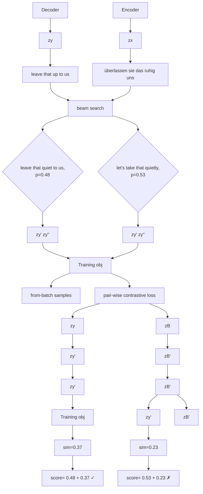
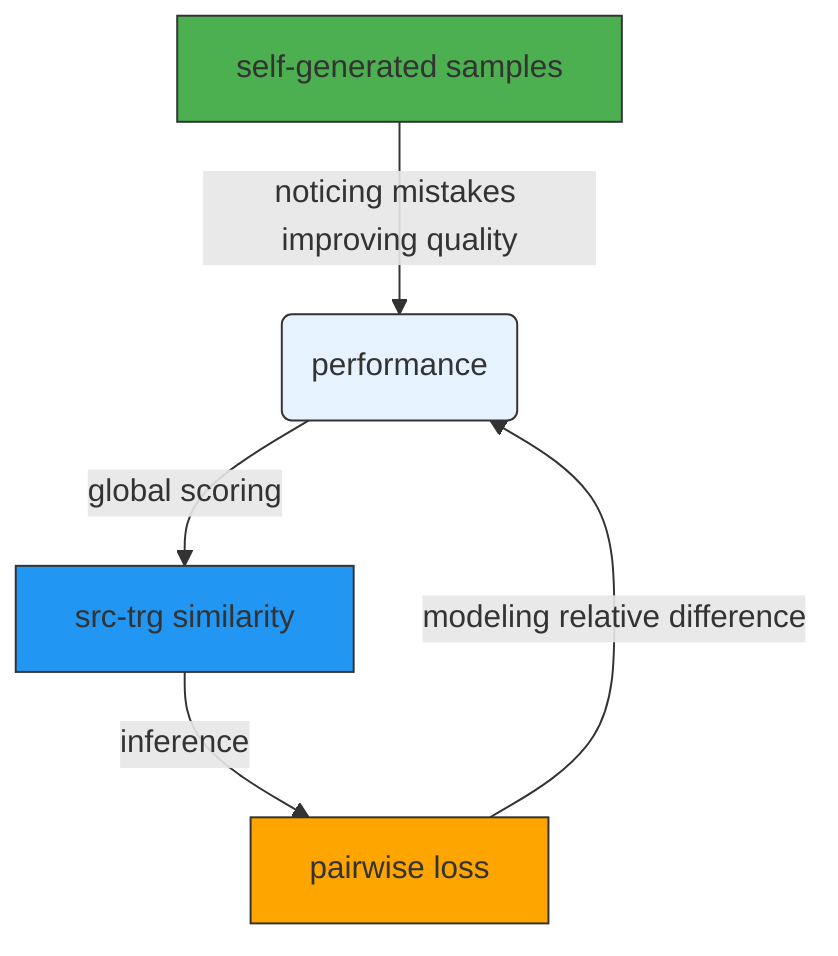

# CoNT: Contrastive Neural Text Generation

Chenxin An $^{1,2,*}$ , Jiangtao Feng $^{2}$ , Kai Lv $^{1}$ , Lingpeng Kong $^{2,3}$ , Xipeng Qiu $^{1}$ , Xuanjing Huang $^{1,4}$

$^{1}$ Fudan University, $^{2}$ Shark-NLP Shanghai AI Laboratory

$^{3}$ The University of Hong Kong

$^{4}$ Shanghai Collaborative Innovation Center of Intelligent Visual Computing

{cxan20, klv21, xpqiu, xjhuang}@fudan.edu.cn

fengjiangtao@pjlab.org.cn, lpk@cs.hku.hk

# Abstract

Recently, contrastive learning attracts increasing interests in neural text generation as a new solution to alleviate the exposure bias problem. It introduces a sequence-level training signal which is crucial to generation tasks that always rely on autoregressive decoding. However, previous methods using contrastive learning in neural text generation usually lead to inferior performance. In this paper, we analyse the underlying reasons and propose a new Contrastive Neural Text generation framework, CoNT. CoNT addresses bottlenecks that prevent contrastive learning from being widely adopted in generation tasks from three aspects – the construction of contrastive examples, the choice of the contrastive loss, and the strategy in decoding. We validate CoNT on five generation tasks with ten benchmarks, including machine translation, summarization, code comment generation, data-to-text generation and commonsense generation. Experimental results show that CoNT clearly outperforms the conventional training framework on all the ten benchmarks with a convincing margin. Especially, CoNT surpasses previous the most competitive contrastive learning method for text generation, by 1.50 BLEU on machine translation and 1.77 ROUGE-1 on summarization, respectively. It achieves new state-of-the-art on summarization, code comment generation (without external data) and data-to-text generation. $^{2}$

# 1 Introduction

Contrastive learning has achieved great success in representation learning $[6, 44, 45]$ . It also attracts enormous interests in neural text generation recently. By creating positive and negative examples in response to unseen (or erroneous) inputs $[23]$ , contrastive learning offers a new solution to alleviate the exposure bias problem $[3, 35]$ – an autoregressive model trained only using the ground truths exhibits inferior generalization performance. Apart from that, contrastive learning also introduces a sequence-level loss in addition to the conventional token-level language model loss with maximum likelihood estimation (MLE). This is crucial to most conditional text generation tasks (e.g., machine translation and summarization) which are evaluated on sequence-level metrics (e.g., BLEU $[32]$ ).

However, it is non-trivial to get contrastive learning working on neural text generation. If we simply use from-batch positive-negative samples following simCLR [6], and adopt the InfoNCE loss [13, 45] which ignores the difference between negative samples ( $\S2.2$ ; Naive CL), the improvement over non-contrastive baselines on generation tasks is rather marginal. Previous work attempts to build better contrastive samples by disturbing the ground truth [10, 23, 30] in the discrete space or the continuous embedding space, but when it comes to text generation tasks, their performance gains are still far from satisfactory.

flowchart

Figure 1: A case study from IWSLT'14 De-En translation task. The naive setting uses from-batch samples following SimCLR [6]. Compared with the naive method, CONT both incorporates self-generated samples and from-batch samples. The border color indicates the acutual distance between the ground truth and the contrastive example.

In this work, we propose a new contrastive neural text generation framework, CoNT. CoNT does three different things from previous frameworks that make suboptimal use of contrastive learning. First, CoNT samples contrastive examples from its own predictions (e.g., through beam search algorithm). This training procedure exposes the model to its mistakes in the inference stage and effectively alleviate the exposure bias problem. We show a comparison between negative samples in CoNT and in Naive CL in Figure 1. Second, we use a N-pairs contrastive loss which gives a fine-grained treatment to the contrastive examples based on their sequence-level scores (e.g., BLEU). It allows the model to fully leverage the supervision from the ground truth example (and its own generated examples) to learn a better sequence-level distance function between the source and the target representation. Third, we directly incorporate the learned sequence similarity score from the distance function into the inference stage. This helps the model to find a better global configuration, than merely follows the language model likelihood objective in decoding.

We validate CoNT on various important conditional language generation tasks ( $\S4.2$ ), including machine translation, summarization, code comment generation, data-to-text generation, and commonsense generation. Extensive experiments demonstrate that CoNT greatly improve the conventional MLE baselines and significantly outperforms all previous contrastive generation models. CoNT establishes new state-of-the-art results on summarization, code comment generation (without external data), and data-to-text generation. Particularly, on data-to-text generation and commonsense generation, CoNT achieves on-par performance with the powerful large pre-trained models: T5-large, T5-3B [36] with only the base version of T5 while maintaining the efficiency of lightweight models.

# 2 Background

# 2.1 Neural Conditional Text Generation

A neural sequence-to-sequence model [43] $\mathcal{M} = (f, g)$ generates the target sequence conditioning on a source sequence, where f and g denote the encoder and decoder, respectively. It is typically trained using the language model objective with the maximum likelihood estimation (MLE). Given a source sequence $x = \{x_i\}_{i=0}^M$ and its target sequence $y = \{y_i\}_{i=0}^N$ , we minimize the following negative log likelihood (NLL) loss:

$$
\mathcal {L} _ {\mathrm{NLL}} = - \sum_ {t = 1} ^ {N} \log p _ {\theta} (y _ {t} | \boldsymbol {x}, \boldsymbol {y} _ {<   t}). \tag {1}
$$

At training stage, it predict the next word based on previous ground truth input $y_{<t} \in y$ , but at inference stage, tokens of $y_{<t}$ are predicted by itself, this introduces the exposure bias.

# 2.2 Naive Contrastive Learning for Text Generation

Contrastive text generation introduces a contrastive term in addition to the original NLL loss. In Naive CL, we simply follows SimCLR [6] and use from-batch negative samples B in the InfoNCE loss [13, 45]:

flowchart

Figure 2: An overview of CoNT. $z_{x}$ , $z_{y}$ is the representation of source sequence x and its target sequence y. $y'$ and $y''$ with their representations $z_{y'}$ , $z_{y''}$ are returned by beam search algorithm. The feature representations come from pooling the output of the encoder (source sequence) or decoder (target sequence). Our training objective is obtained by comparing by all contrastive samples in pair. The decoding objective not only considers the likelihood of each sequence, but also the sequence similarity score modeled in training.

$$
\mathcal {L} _ {\mathrm{NCE}} = - \log \frac {\exp (\cos (\mathbf {z} _ {x} , \mathbf {z} _ {y}) / \tau)}{\sum_ {\mathbf {y} ^ {\prime} \in \mathcal {B}} \exp (\cos (\mathbf {z} _ {x} , \mathbf {z} _ {y ^ {\prime}}) / \tau)}, \tag {2}
$$

where $z_{x}, z_{y}, z_{y'} \in R^{d}$ denote the vector representation of input x, ground truth y and negative sample $y' \in B$ , respectively. $\tau$ is the temperature and $\cos(\cdot, \cdot)$ defines the cosine similarity. Intuitively, the contrastive loss $L_{NCE}$ seeks to learn a similarity function that drives the distance between the source sequence representation $z_{x}$ and its ground-truth target sequence representation $z_{y}$ closer.

# 3 Method

In this section, we present our new contrastive neural text generation framework, CoNT. CoNT advances the Naive CL ( $§2.2$ ) in three aspects. First, CoNT uses negative examples from its own predictions ( $§3.1$ ) to construct the set B. Second, CoNT replaces the InfoNCE loss (Eq.2) with a N-pairs contrastive loss (Eq.3) which leverages a finer-grained supervision given by the sequence-level scores of all pairs ( $§3.2$ ). Third, CoNT incorporates the learned similarity function into its inference score directly ( $§3.3$ ). An overview of our approach can be found in Figure 2.

# 3.1 Contrastive Examples from Predictions

Instead of only using contrastive examples from the same batch [6], we propose to add new contrastive examples from the model's own predictions. Kalkstein et al. [18] point that using diverse contrastive samples helps the generalization ability of the model. Therefore, we use the diverse beam search algorithm [49] to create contrastive examples from the top-K list of the model's lastest predictions and then append them to the from-batch samples to form the contrastive examples. A warm-up stage where the model is only supervised by $\mathcal{L}_{\mathrm{NLL}}$ is recommended as it guarantees the quality of the examples from the model's prediction. These self-generated contrastive examples alleviate the model's exposure bias. Besides, with the model's performance improving gradually, this approach creates high-quality hard negative examples that is known to be important in contrastive learning [16, 37].

# 3.2 N-Pairs Contrastive Loss

One major drawback of the InfoNCE loss is that it has the same treatment for all negative samples. In text generation, this means that the relative difference between the ground truth and the contrastive examples is ignored, while this can be easily quantified using a sequence level score (e.g. BLEU) and the quality of these contrastive examples varies. To mitigate this problem, we propose to employ a pair-wise margin loss. We first rank all the contrastive examples based on an oracle function $o(\cdot, \mathbf{y})$ , which computes a sequence-level score with the ground truth y. Given a input sequence x, the ground truth y, and a set of K contrastive samples $B = \{y_{1}, y_{2}, \cdots, y_{K}\}$ , we can create a series

Algorithm 1 Inference algorithm: Given an input sequence $\pmb{x}$ , a contrastive generation model $\hat{\mathcal{M}} = (\hat{f},\hat{g})$ ; return the output sequence.   
1: procedure BEAMSEARCH(g, H_x, b) ▷ beam search algorithm
2: return Text, likelihood, logits of the b hypotheses
1: procedure INFERENCE(ˆG, x)
2: H_x ←ˆf(x), b ← beam size, α ← balance factor ∈ (0, 1)
3: y^{1:b}, P_{y}^{1:b}, H_{y}^{1:b} = BEAMSEARCH(ˆg, H_x, b) ▷ Get b candidates with beam search
4: z_x, z_y^{1:b} ← Avg(H_x), Avg(H_y^{1:b}) ▷ Avg(·) is an average pooling function
5: D_y^{1:b} ← Cosine distance between z_x and representation of hypotheses z_y^{1:b}
6: P_y^{1:b} ← Likelihood of hypotheses returned by beam search
7: k = arg max_{i=1..b} {α * D_y^i + (1 - α) * P_y^i}
8: return y^k

of example pairs $(\boldsymbol{y}^{+},\boldsymbol{y}^{-})\in\mathcal{P}$ , where + and - are determined by their ranks. $^{3}$ The contrastive learning objective is formulated as a margin loss according to their cosine similarity to the source representation $z_{x}$ :

$$
\mathcal {L} _ {\mathrm{N-Pairs}} = \sum_ {(\boldsymbol {y} ^ {+}, \boldsymbol {y} ^ {-}) \in \mathcal {P}} \mathcal {L} (\boldsymbol {y} ^ {+}, \boldsymbol {y} ^ {-}) = \sum_ {(\boldsymbol {y} ^ {+}, \boldsymbol {y} ^ {-}) \in \mathcal {P}} \max \{0, \cos (\mathbf {z} _ {\boldsymbol {x}}, \mathbf {z} _ {\boldsymbol {y} ^ {-}}) - \cos (\mathbf {z} _ {\boldsymbol {x}}, \mathbf {z} _ {\boldsymbol {y} ^ {+}}) + \xi \}. \tag {3}
$$

We further set $\xi = \gamma * (\mathrm{rank}(\pmb{y}^{-}) - \mathrm{rank}(\pmb{y}^{+}))$ following Zhong et al. [57] to reflect the quality difference in these pairs, where $\gamma$ is a hyperparameter controlling the the strength. Full details of the training algorithm can be found in Algorithm 2, Appendix B.

# 3.3 Inference with Learned Similarity Function

Previous inference algorithm for contrastive text generation method $[23]$ usually remains the same with non-contrastive approaches. In CoNT, we incorporate the similarity function learned in the N-pairs contrastive loss into the decoding stage. Despite such a inference objective can be generalized to other contrastive learning methods as long as the vector representations for source and target sequence pair exist, the design of CoNT can better make use of the learned similarity function ( $\S4.3$ ). The decoding objective in CoNT is to find the sequence $y^{*}$ that maximizes both the learned similarity score and the conventional language model likelihood:

$$
\boldsymbol {y} ^ {*} = \arg \max _ {\hat {\boldsymbol {y}}} \left\{\alpha \cdot \cos \left(\mathbf {z} _ {\boldsymbol {x}}, \mathbf {z} _ {\hat {\boldsymbol {y}}}\right) + (1 - \alpha) \prod_ {t = 0} ^ {n} p \left(\hat {y} _ {t} \mid \boldsymbol {x}, \hat {\boldsymbol {y}} _ {<   t}\right) \right\}, \tag {4}
$$

where $z_{x}, z_{\hat{y}} \in R^{d}$ is the vector representation of x, $\hat{y}$ , and $\alpha$ is the hyperparameter that balances the contribution of each term. In most cases, $\alpha$ can be directly set to 0.5, tuning $\alpha$ on the validation set will usually get better results. Algorithm 1 illustrates the inference stage in CoNT in details.

The relationship between different modules of CoNT is summarized in Figure 3.

flowchart

Figure 3: Relationship between different modules in CONT. Both the design of the pairwise loss function and self-generated samples could contribute the source-target similarity function that computes the sequence-level score at inference stage. With the performance improved, self-generated contrastive samples tend to be more indistinguishable.

# 4 Experiments

We experiment CoNT on 5 downstream tasks with 10 different benchmarks. Our contrastive learning framework supports most sequence-to-sequence models at multiple scales. Concretely, we experiment CoNT on 4 kinds of base models: (a) Transformer-samll (60M) [47] and transformer-base (220M), (b) T5-small (60M) and T5-base (220M) [36], (c) CodeT5-base (220M) [51], (d) PEGASUS-large (560M) [55]. Details of our experimental setup for each benchmarks can be found in Appendix C.

On WMT'16 Ro-En (machine translation) and XSum (summarization) which are also used in previous contrastive text generation frameworks $[23]$ , results show that CoNT is able to substantially improve the MLE baseline and clearly outperform all previous contrastive baselines by a large margin. We also build CoNT on state-of-the-art (SOTA) baselines: PEGASUS-large (summarization), CodeT5-base (code comment generation) and achieve new SOTA. Moreover, on data-to-text generation and commonsense generation, CoNT also shows its superior performance over strong MLE baselines.

# 4.1 Baselines

1. Naïve CL [6]: Naive CL denotes the naive contrastive learning approach that treats the ground truth as the positive sample and the target sequences from the same mini-batch as the negative examples. The training object of naive CL takes the form of Eq. 2. We also implement Naive CL with N-Pairs contrastive loss, it can be viewed as an ablation study when setting beam size of CoNT to 0 during training.   
2. SSMBA CL [30]: Compared with naive CL, SSMBA builds more positive samples via disturbing the ground truth in the discrete space. Concretely, SSMBA first randomly masks 25% tokens in the target sequence and then reconstructs the ground truth with a masked language model BERT.   
3. Dropout CL [10]: Dropout CL enhances the positive samples by using dropout mechanism on the target sequence. We use the default dropout rate of standard transformer decoder [47] and input the ground truth to the decoder twice.   
4. CLAPS [23]: CLAPS is previous the best contrastive learning framework for conditional text generation task. In order to provide more challenging contrastive examples, CLAPS propose to simultaneously create extra positive and negative pairs by adding perturbations to the ground truth sequence in the continuous embedding space.   
5. CoNT (this work): CoNT is the contrastive neural text generation framework proposed in this work. We implement its InfoNCE version by treating ground truth as positive sample and self-generated samples are also treated as negative samples.

# 4.2 Quantitative Results

Machine Translation For machine translation, we evaluate CoNT on WMT 2016 Romanian-to-English translation task (WMT'16 Ro-En), WMT 2014 English-to-German translation task (WMT'14 En-De) and IWSLT 2014 German-to-English translation task (IWSLT'14 De-En). We use BLEU as the evaluation metric. Results in Table 1 (rows with gray background) indicates our model CoNT significantly improves the traditional maximum likelihood estimation training and inference framework. On WMT'16 Ro-En, CoNT outperforms previous the best contrastive learning approach CLAPS by 1.50 BLEU and exceeds the MLE baseline by 2.70 BLEU with the same base model T5-small. We also compare the infoNCE loss used in previous methods with the N-Pairs margin loss described in Eq. 3. Results show that the N-pairs contrasting samples generally works better than dividing all samples into predefined positive-negative categories. Similar to CLAPS and Naive CL, only incorporating contrastive learning into training improves the performance of T5-small baseline on WMT'16 Ro-En to 30.55 (+2.34) BLEU. If we further add learned target-source similarity as decoding target as Eq. 4, the result is further boosted to 30.91 BLEU. We observe that the benefits of introducing sequence similarity into inference is more obvious on IWSLT'14 De-En – the additional decoding target improves the vanilla beam search algorithm up to 0.86 BLEU.

Summarization For summarization, we use the XSum [28] dataset collected from BBC News whose reference summaries are provided by human writers. We also evaluate CONT on a multi-document summarization dataset multi-news [9] consisting of news articles from the site newser.com. Compared with the common summarization task, multi-document is more challenging where the model need to automatically summarize several articles and usually has to handle long input sequence

Table 1: BLEU on WMT'16 Ro-En, IWSLT'14 De-En and WMT'14 En-De translation tasks. For IWSLT'14 De-En and WMT'14 En-De, we use Transformer-small (Tr-small) and Transformer-base (Tr-base) as baselines. For WMT'16 Ro-En, we add a pre-trained baseline T5-small. w/o seq sim means we use the origin beam search without target-source representation similarity. The best results in each block are underlined and the best results are in bold. Rows in gray denotes the contrastive learning based model strongly outperforms its MLE version. Results with $\dagger$ are token from [23]. 

<table><tr><td rowspan="2">Model</td><td colspan="2">WMT&#x27;16 Ro-En</td><td>IWSLT&#x27;14 De-En</td><td>WMT&#x27;14 En-De</td></tr><tr><td>Tr-small</td><td>T5-small</td><td>Tr-small</td><td>Tr-base</td></tr><tr><td>MLE</td><td>25.78</td><td>28.21</td><td>34.18</td><td>27.30</td></tr><tr><td colspan="5">Contrastive loss: InfoNCE loss</td></tr><tr><td>Naive CL</td><td>25.49</td><td>27.79</td><td>34.45</td><td>27.28</td></tr><tr><td>SSMBA CL</td><td>25.98</td><td>28.48</td><td>34.32</td><td>27.16</td></tr><tr><td>Dropout CL</td><td>26.01</td><td>29.10</td><td>34.41</td><td>27.34</td></tr><tr><td>CLAPS $^{\dagger}$ </td><td>23.59</td><td>29.41</td><td>-</td><td>-</td></tr><tr><td>CoNT</td><td>25.74</td><td>29.64</td><td>34.46</td><td>27.35</td></tr><tr><td colspan="5">Contrastive loss: N-Pairs loss</td></tr><tr><td>Naive CL</td><td>26.15</td><td>29.86</td><td>34.47</td><td>27.41</td></tr><tr><td>w/o seq sim</td><td>26.27</td><td>29.74</td><td>34.26</td><td>27.45</td></tr><tr><td>CoNT</td><td>27.70</td><td>30.91</td><td>35.55</td><td>28.04</td></tr><tr><td>w/o seq sim</td><td>27.42</td><td>30.54</td><td>34.69</td><td>27.77</td></tr></table>

Table 2: ROUGE score on Summarization datasets. Results with $\dagger$ are token from [23] and results with \* are from [55]. Current state-of-the-art models and the best results are in bold. Previous SOTA means the best results before CoNT. 

<table><tr><td rowspan="2">Model</td><td colspan="3">XSum</td><td colspan="3">Multi-News</td></tr><tr><td>R-1</td><td>R-2</td><td>R-L</td><td>R-1</td><td>R-2</td><td>R-L</td></tr><tr><td>T5-small</td><td>36.10</td><td>14.72</td><td>29.16</td><td>42.36</td><td>15.34</td><td>21.91</td></tr><tr><td>T5-SSMBA CL</td><td>36.58</td><td>14.81</td><td>29.68</td><td>42.06</td><td>14.98</td><td>21.73</td></tr><tr><td>T5-Dropout CL</td><td>36.82</td><td>14.93</td><td>29.26</td><td>42.43</td><td>15.32</td><td>21.95</td></tr><tr><td> $T5-CLAPS^†$ </td><td>37.89</td><td>15.78</td><td>30.59</td><td>-</td><td>-</td><td>-</td></tr><tr><td>T5-Naive CL</td><td>36.34</td><td>14.81</td><td>29.41</td><td>42.20</td><td>15.18</td><td>21.78</td></tr><tr><td>T5-Naive CL (N-Pairs)</td><td>37.76</td><td>15.48</td><td>30.15</td><td>43.04</td><td>15.83</td><td>22.03</td></tr><tr><td>T5-CoNT</td><td>39.66</td><td>16.96</td><td>31.86</td><td>44.08</td><td>16.39</td><td>22.58</td></tr><tr><td>Previous SOTA*</td><td>47.61</td><td>24.57</td><td>39.44</td><td>47.52</td><td>18.72</td><td>24.91</td></tr><tr><td>PEGASUS (base)*</td><td>39.79</td><td>16.58</td><td>31.70</td><td>42.24</td><td>13.27</td><td>21.44</td></tr><tr><td>PEGASUS (large)*</td><td>47.21</td><td>24.56</td><td>39.25</td><td>47.52</td><td>18.72</td><td>24.91</td></tr><tr><td>PEGA-CoNT</td><td>47.76</td><td>24.69</td><td>39.46</td><td>48.68</td><td>19.29</td><td>24.58</td></tr></table>

and target sequence. Experimental results are in Table 2. The first block includes the performance of different contrastive frameworks with T5-small. On XSum, it shows that our proposed model strongly outperform previous contrastive frameworks by about 2.0 ROUGE-1 score. We also illustrate our method is not restricted to the small model. By employing CoNT on state-of-the-art base model PEGASUS, it is able to establish new state-of-the-art on the two summarization benchmarks.

Code Comment Generation Code comment generation aims to generate an English description for a function-level code snippet. We test our method on two widely used datasets Java and Python from the CodeXGLUE benchmark [27]. Results are shown in Table 3. Our model is built upon state-of-the-art pre-trained model on program language model CodeT5-base. CodeT5-Dual-Gen means they further involve a comment-to-code task which is the best model on Python and Java without using external data. We also include the results of earlier strong pre-trained baselines: PLBART

Table 3: BLEU on two code comment generation datasets Java and Python. Results with $\dagger$ and $*$ are from [51] 

<table><tr><td>Model</td><td>Python</td><td>Java</td></tr><tr><td> $CodeBERT^\dagger$ </td><td>19.06</td><td>17.65</td></tr><tr><td> $PLBART^\dagger$ </td><td>19.30</td><td>18.45</td></tr><tr><td> $CodeT5^\dagger$ </td><td>20.01</td><td>20.31</td></tr><tr><td> $CodeT5-Dual-Gen^\dagger$ </td><td>20.11</td><td>20.41</td></tr><tr><td colspan="3">With N-Pairs CL</td></tr><tr><td>CodeT5-Naive CL</td><td>20.26</td><td>20.31</td></tr><tr><td>CodeT5-CoNT</td><td>20.43</td><td>20.56</td></tr><tr><td colspan="3">With External Training Data</td></tr><tr><td> $CodeT5-Multi-Task^\dagger$ </td><td>20.36</td><td>20.46</td></tr><tr><td> $REDCODER^*$ </td><td>21.01</td><td>22.94</td></tr></table>

Table 4: BLEU on data-to-text generation dataset WikiBio. We run our model three times and report the mean and variance of the BLEU metric. Results with $\dagger$ are token from [25] and results with \* are from [2]. 

<table><tr><td>Model</td><td>BLEU</td></tr><tr><td>Table NLM $^{\dagger}$ </td><td>34.70 ±0.36</td></tr><tr><td>vanilla Seq2Seq $^{\dagger}$ </td><td>42.06 ±0.32</td></tr><tr><td>StructureAware $^{\dagger}$ </td><td>44.89±0.33</td></tr><tr><td>R2D2*</td><td>46.23±0.15</td></tr><tr><td>T5-small $^{\dagger}$ </td><td>46.02±0.36</td></tr><tr><td colspan="2">With N-Pairs CL</td></tr><tr><td>T5-small-Naive CL</td><td>46.50±0.24</td></tr><tr><td>T5-small-CONT</td><td>47.17±0.19</td></tr></table>

Table 5: Results on the dev set and test set Totto. PAR is short for PARENT score. Dev Set (Non) means the non-overlap subset of the dev set. results with $\dagger$ are reported in [17]. 

<table><tr><td rowspan="2">Model</td><td colspan="2">Dev Set (All)</td><td colspan="2">Dev Set (Non)</td><td colspan="3">Test Set (All)</td></tr><tr><td>BLEU</td><td>PAR</td><td>BLEU</td><td>PAR</td><td>BLEU</td><td>PAR</td><td>BLEURT</td></tr><tr><td>BERT-to-BERT $^{\dagger}$ </td><td>44.0</td><td>52.6</td><td>34.8</td><td>46.7</td><td>44.0</td><td>52.6</td><td>0.121</td></tr><tr><td>T5-large $^{\dagger}$ </td><td>48.1</td><td>57.3</td><td>39.8</td><td>52.8</td><td>-</td><td>-</td><td>-</td></tr><tr><td>T5-3B $^{\dagger}$ </td><td>48.4</td><td>57.8</td><td>40.4</td><td>53.3</td><td>49.5</td><td>58.4</td><td>0.230</td></tr><tr><td>T5-base $^{\dagger}$ </td><td>47.7</td><td>57.1</td><td>39.6</td><td>52.6</td><td>-</td><td>-</td><td>-</td></tr><tr><td>T5-base-CONT</td><td>49.2</td><td>59.4</td><td>41.5</td><td>55.0</td><td>49.1</td><td>58.9</td><td>0.238</td></tr></table>

and CodeBERT. We also report some data augmentation methods in the third block of Table 3. CodeT5-Multi-Task makes use of training datasets of other program languages. REDCODER [34] uses retrieval to enhance the task with open-source code base and achieve the bset results on this task. Our model is orthogonal to these methods and clearly outperforms all baselines without external data.

Data-to-text Generation Data-to-text generation aims to produce text from non-linguistic input. The first benchmark we use is WikiBio [22] consisting of biography pairs from English Wikipedia where the infobox is treated as input sequence, and the target sequence is the first sentence of the biography. Totto [33] is also collected from Wikipedia whose input is a table with its highlighted cells and target sequences are professionally annotated by human. Results on WikiBio is shown in Table 4, the performance of some popular baselines (first block) are token from [25]. R2D2 [2], using XLNet [53]-large as base model, is previous state-of-the-art model on WikiBio. We experiment CoNT on T5-small, and results show that we exceed R2D2 by about 0.94 BLEU. The test set and dev set of Totto are both split into two parts - overlap and non-overlap. The non-overlap part contains out-of-domain samples from the training set. The test set of Totto is invisible and we report the results on dev set and test set by the feedback of the Totto authors. We also add PARENT [8] and BLEURT [40] as evaluation metrics. PARENT is a word-overlap based metric that designed to evaluate the factual accuracy of generation results. BLEURT is trained under human supervision and correlates well with human judgement. As we can see from Table 5, by comparing our model with different T5 variants, we show that CoNT is able to greatly outperform the large version of T5 even built on a T5-base model. Compared with previous state-of-the-art model T5-3B, our model still show advantage in PARENT and BLEURT.

Commonsense Generation The task of commonsense generation aims to explicitly test the ability of machines on commonsense reasoning. The source sequence consists of a set of concepts and the target sequence is a fluent sentence mentioning all the input concepts. We evaluate CONT

Table 6: Results on CommonGen. Results with $\dagger$ are reported in [24]. The metrics used in the official leaderboard are in bold. Human performance is also reported as an upper bound. 

<table><tr><td>Model</td><td colspan="2">ROUGE-2/L</td><td colspan="2">BLEU-3/4</td><td>METEOR</td><td>CIDEr</td><td>SPICE</td><td>Coverage</td></tr><tr><td>GPT-2 $^{\dagger}$ </td><td>16.85</td><td>39.01</td><td>33.92</td><td>23.73</td><td>26.83</td><td>12.19</td><td>23.57</td><td>79.09</td></tr><tr><td>BART $^{\dagger}$ </td><td>22.02</td><td>41.78</td><td>39.52</td><td>29.01</td><td>31.83</td><td>13.98</td><td>28.00</td><td>97.35</td></tr><tr><td>T5-large $^{\dagger}$ </td><td>21.74</td><td>42.75</td><td>43.01</td><td>31.96</td><td>31.12</td><td>15.13</td><td>28.86</td><td>92.29</td></tr><tr><td>T5-base $^{\dagger}$ </td><td>14.63</td><td>34.56</td><td>28.76</td><td>18.54</td><td>23.94</td><td>9.40</td><td>19.87</td><td>76.67</td></tr><tr><td>T5-base-Cont</td><td>20.96</td><td>43.15</td><td>42.60</td><td>31.42</td><td>32.05</td><td>15.96</td><td>28.95</td><td>96.55</td></tr><tr><td>Human</td><td>36.72</td><td>54.45</td><td>52.55</td><td>46.49</td><td>38.79</td><td>37.64</td><td>52.43</td><td>99.33</td></tr></table>

Table 7: BLEURT and BERTScore on the test set of 4 translation and summarization datasets. The first column of each dataset represents BLURT and the second column is BERTScore. 

<table><tr><td>Model</td><td colspan="2">IWSLT&#x27;14 De-En</td><td colspan="2">WMT&#x27;16 Ro-En</td><td colspan="2">XSum</td><td colspan="2">Multi-News</td></tr><tr><td>MLE</td><td>0.137</td><td>62.28</td><td>0.272</td><td>69.09</td><td>-0.552</td><td>44.10</td><td>-0.568</td><td>17.21</td></tr><tr><td>CoNT</td><td>0.167</td><td>63.38</td><td>0.281</td><td>69.33</td><td>-0.462</td><td>46.78</td><td>-0.505</td><td>17.47</td></tr></table>

on the CommonGen [24] benchmark with a hidden test set and the final results is obtained with the help of the authors of CommonGen. In addition to the mostly used metrics, CIDEr [48] and SPICE [1], concerning to evaluating semantic faithfulness, are highlighted by the leaderboard of commonGen. In Table 6, we demonstrate that the lightweight T5-base model is able to greatly benefit from our contrastive learning framework. Moreover, CoNT not only surprisingly outperforms its MLE baseline but also surpass the large version of T5 in terms of CIDEr and SPICE metrics.

Advanced Evaluation Metrics Considering the training efficiency of CoNT, we mainly select the lexical matching metrics as oracle measurement function. To verify that the improvement brought by CoNT is not due to the over-fitting of lexical matching metrics, we further evaluate generated text with advanced metrics based on neural models: BERTScore [56] and BLEURT [40]. For BERTScore, we use their roberta-large\_L17\_no-idf\_version and for BLEURT we use the default setting provided on their github $^{4}$ . Results are shown in Table 7. The base model used on IWSLT'14 De-En is transformer small and on the other datasets we select T5 as the base model. For all datasets CoNT also make non-trivial improvements in terms of the two neural metrics. Particularly, CoNT improve the results of MLE model on IWSLT'14 De-En by 0.03 BLEURT and improve the results of MLE model on XSum by 2.68 BERTScore.

To get more accurate and convincing results, we also conduct a ranking based human evaluation on two mainstream tasks: machine translation (IWSLT'14 De-En) and text summarization (XSum) with 60 samples for each tasks. Following Cheng and Lapata [7], we hired 2 annotators asking them to rank the given candidate output based on fluency, coherence, and their personal preference (rank these systems 1st, 2nd, and so on) and we calculate the average ranking. For each sample, there are four candidates consist of a human-written reference, a sequence from MLE model, a sequence from Naive CL, and a sequence from CONT. Table 8 shows the results of our human evaluation. Generally CoNT outperform all baseline systems according to the average ranking.

# 4.3 Discussion

Discrimination of Hard Negative Samples To deeply look into the learnt representations, we visualize target sequences, that is trained by MLE, naive CL and CONT on IWSLT'14 De-En, with the t-SNE algorithm [46]. The visualized sequences consist of three groups of target sequence: a) batch targets that is mostly unrelated to ground -truth target; b) beam search hypothesis that could be of high/low quality; c) ground truth target. As can be seen in Figure 4a, the representations trained by MLE are distributed almost uniformly in the vector space, and there are no clear boundary between one group to another. With naive CL, we find there is clear boundary between batch tokens and

Table 8: Results of human evaluation on the test sets of translation and summarization. 

<table><tr><td rowspan="2">Model</td><td colspan="5">Machine translation</td><td colspan="5">Summarization</td></tr><tr><td>1st</td><td>2nd</td><td>3rd</td><td>4th</td><td>avg rank</td><td>1st</td><td>2nd</td><td>3rd</td><td>4th</td><td>avg rank</td></tr><tr><td>Ground truth</td><td>0.88</td><td>0.08</td><td>0.0</td><td>0.04</td><td>1.2</td><td>0.52</td><td>0.25</td><td>0.12</td><td>0.12</td><td>1.86</td></tr><tr><td>CoNT</td><td>0.07</td><td>0.5</td><td>0.31</td><td>0.12</td><td>2.48</td><td>0.27</td><td>0.4</td><td>0.2</td><td>0.13</td><td>2.2</td></tr><tr><td>Naive CL</td><td>0.02</td><td>0.25</td><td>0.4</td><td>0.33</td><td>3.04</td><td>0.12</td><td>0.22</td><td>0.38</td><td>0.28</td><td>2.82</td></tr><tr><td>MLE</td><td>0.03</td><td>0.17</td><td>0.28</td><td>0.52</td><td>3.29</td><td>0.1</td><td>0.13</td><td>0.3</td><td>0.47</td><td>3.13</td></tr></table>

scatter

| x     | y     | Category       |
|-------|-------|----------------|
| -60   | 25    | Batch Targets  |
| -55   | 28    | Batch Targets  |
| -50   | 22    | Batch Targets  |
| -45   | 20    | Batch Targets  |
| -40   | 18    | Ground Truth   |
| -35   | 17    | Ground Truth   |
| -60   | 20    | Beam Search    |
| -55   | 23    | Beam Search    |
| -50   | 21    | Beam Search    |
| -45   | 19    | Beam Search    |
| -40   | 16    | Beam Search    |
| -35   | 15    | Beam Search    |

(a) MLE

scatter

| x    | y    | Category       |
| ---- | ---- | -------------- |
| -20  | 45   | Batch Targets  |
| -15  | 60   | Batch Targets  |
| -10  | 65   | Batch Targets  |
| -5   | 70   | Batch Targets  |
| 0    | 75   | Batch Targets  |
| 5    | 70   | Beam Search    |
| 10   | 68   | Beam Search    |
| 15   | 65   | Ground Truth   |
| 10   | 70   | Ground Truth   |
| 5    | 68   | Ground Truth   |
| 0    | 65   | Ground Truth   |
| -5   | 60   | Ground Truth   |
| -10  | 55   | Ground Truth   |
| -15  | 50   | Ground Truth   |
| -20  | 45   | Ground Truth   |

(b) Naive CL

scatter

| x       | y       | Category        |
| ------- | ------- | --------------- |
| -65     | -10     | Ground Truth    |
| -60     | -8      | Ground Truth    |
| -55     | -6      | Ground Truth    |
| -50     | -4      | Ground Truth    |
| -45     | -2      | Ground Truth    |
| -40     | 0       | Ground Truth    |
| -35     | 2       | Ground Truth    |
| -65     | 10      | Batch Targets   |
| -60     | 15      | Batch Targets   |
| -55     | 20      | Batch Targets   |
| -50     | 25      | Batch Targets   |
| -45     | 20      | Batch Targets   |
| -40     | 15      | Batch Targets   |
| -35     | 10      | Batch Targets   |
| -65     | 5       | Beam Search     |
| -60     | 10      | Beam Search     |
| -55     | 15      | Beam Search     |
| -50     | 20      | Beam Search     |
| -45     | 25      | Beam Search     |
| -40     | 20      | Beam Search     |
| -35     | 15      | Beam Search     |

(c) CoNT   
Figure 4: T-SNE experiments on IWSLT'14 De-En. Each point represents a target sequence. Batch target is blue; beam search hypothesis is orange; ground-truth sequence is green. Darker points indicate sequences with higher BLEU.

others. Naive CL does contribute to discriminating related sequences with unrelated ones, but it still cannot distinguish hypothesis of high quality from the others. Even without contrastive learning, the generation model trained has already pulled from-batch samples away from the ground truth and the naive contrastive learning procedure is only to make the margin more obvious. As for CONT, a set of hypotheses of low quality are excluded from the neighborhoods of the ground-truth targets. The experimental results verify that CONT enables better representations in sequence generation.

Sequence Likelihood and Sequence Similarity We also perform ablation study on our ranking objective and self-generated negative samples on IWSLT'14 De-En with Transformer-small as base model. For the ranking objective, we compare our N-pairs contrastive objective with InfoNCE with increasing $\alpha$ . Figure 5a that N-pairs contrastive loss consistently outperform InfoNCE. With $\alpha \in [0.3, 0.7]$ , N-pairs contrastive loss can benefit target-source representation similarity, a sequence-level score in inference process, while InfoNCE cannot. For the sampling strategy, we compare CoNT with naive CL and vanilla MLE. CoNT use self-generated hypotheses as negatives while

line

| α    | Pair-wise | InfoNCE |
| ---- | --------- | ------- |
| 0.0  | 34.7      | 34.5    |
| 0.3  | 35.5      | 34.5    |
| 0.5  | 35.6      | 34.3    |
| 0.7  | 35.5      | 34.0    |
| 0.9  | 35.2      | 33.2    |
| 1.0  | 34.9      | 32.8    |

(a) Relationship between $\alpha$ and BLEU with different contrastive loss.

line

| α    | CoNT  | Naive CL | MLE   |
| ---- | ----- | -------- | ----- |
| 0.0  | 34.8  | 34.2     | 34.2  |
| 0.3  | 35.5  | 34.4     | 34.2  |
| 0.5  | 35.6  | 34.5     | 34.1  |
| 0.7  | 35.5  | 34.4     | 34.0  |
| 0.9  | 35.2  | 34.0     | 33.0  |
| 1.0  | 34.9  | 33.3     | 32.1  |

(b) Relationship between $\alpha$ and BLEU with different training methods.   
Figure 5: Ablation study on the balance factor $\alpha$ on the test set of IWSLT'14 De-En where $\alpha = 0.0$ means selecting output only relying on likelihood and $\alpha = 1.0$ means choosing output with only sequence similarity.

naive CL only use samples within the same mini-batch. Figure 5b shows that contrastive learning with self-generated hypotheses is more effective than using batch samples. With $\alpha \in [0.3, 0.7]$ , CONT gains about 1.0 BLEU improvements, while naive CL is only improved with less than 0.5 BLEU.

# 5 Related Work

Contrastive Learning Contrastive learning [6, 13, 39] aims to learn a better representation via contrasting positive and negative samples. It also has been widely used in the field of natural language processing [10, 14, 20, 21, 59]. Jiang et al. [15] show that contrastive learning helps learn a robust pre-trained model and Lee et al. [23] first introduce contrastive learning into text generation to mitigate the exposure bias problem. They propose an adversarial method to build more challenging positive-negative samples in additional to the from-batch samples. SimCTG [42] is also a contrastive framework on text generation. Our work differs from SimCTG from motivation and method. They introduce contrastive learning mainly to encourage diversity which is important in dialogue systems. And they perform token-level contrastive learning while our method focuses on sequence-level contrastive examples.

Adopting binary supervision in contrastive loss is originally proposed in FaceNet [39] which helps learn the face recognition of the same person in various positions and angles. Given an anchor face image x, a positive sample $x^{+}$ (usually the same person) and a negative sample $x^{-}$ from other people, the triplet loss makes $x^{+}$ become close to x and maximize the distance between x and $x^{-}$ . The pair-wise contrastive loss has also been widely used in metric learning Chen and Deng [5], Kim et al. [19], Wang et al. [50]. Sohn [41] extend the triplet loss to multi-class and multi-pair. Recent work thinks the margin value between samples should not be fixed. Zhou et al. [58] divide the sample set into multiple subsets and assign different margin value to different subsets. Ha and Blanz [12], Zhong et al. [57] suggests dynamically adjust the margin value via a determination metric.

Post-generation Re-ranking Models Post-generation re-ranking re-score the multiple output sequences via training another re-ranking module. Noisy Channel Modeling (NCM) [29, 54] is a widely-used re-ranking scheme for neural machine translation. NCM parameterizes the noisy channel probability with a sequence-to-sequence model. There also various structures to instantiate the re-ranking module: Gulcehre et al. [11] select the candidate with a language model, Bhattacharyya et al. [4] leverage an energy-based model in NMT and Liu and Liu [26], Salazar et al. [38] re-score candidates with masked language models such as BERT. Despite this paradigm achieves impressive results while having a large size of candidate sequences, most of post-generation re-ranking systems trade efficiency and simplicity for accuracy.

# 6 Conclusion

We introduce a new contrastive neural text generation framework called CONT. It models an additional contrastive learning objective to provide a sequence-level supervision for auto-regressive neural text generation models. We explore three shortcomings that limit the development of contrastive learning on text generation tasks. Results on five generation tasks with ten different benchmarks show that CONT not only clearly beats all previous contrastive generation models, but also boosts the performance of state-of-the-art large models to a new level. CONT practically does not have a negative impact on decoding speed. Nevertheless, CONT suffers from the training inefficiency problem. In general, the total training time of CONT is about 2\~4 times more than that of a MLE based model. A detailed discussion and some speed-accuracy trade-off tricks can be found in Appendix B. Speeding up the training stage without losing accuracy is the next important step to improve CONT.

# Acknowledgement

We would like to thank the anonymous reviewers for their valuable advice. This research was supported in part by the joint research scheme of the National Natural Science Foundation of China (NSFC) and the Research Grants Council (RGC) under grant number N HKU714/21.

# References

[1] Peter Anderson, Basura Fernando, Mark Johnson, and Stephen Gould. Spice: Semantic propositional image caption evaluation. In European conference on computer vision, pages 382–398. Springer, 2016.   
[2] Aryan Arbabi, Mingqiu Wang, Laurent El Shafey, Nan Du, and Izhak Shafran. R2d2: Relational text decoding with transformers. arXiv preprint arXiv:2105.04645, 2021.   
[3] Samy Bengio, Oriol Vinyals, Navdeep Jaitly, and Noam Shazeer. Scheduled sampling for sequence prediction with recurrent neural networks. Advances in neural information processing systems, 28, 2015.   
[4] Sumanta Bhattacharyya, Amirmohammad Rooshenas, Subhajit Naskar, Simeng Sun, Mohit Iyyer, and Andrew McCallum. Energy-based reranking: Improving neural machine translation using energy-based models. arXiv preprint arXiv:2009.13267, 2020.   
[5] Binghui Chen and Weihong Deng. Energy confused adversarial metric learning for zero-shot image retrieval and clustering. In Proceedings of the AAAI Conference on Artificial Intelligence, volume 33, pages 8134–8141, 2019.   
[6] Ting Chen, Simon Kornblith, Mohammad Norouzi, and Geoffrey Hinton. A simple framework for contrastive learning of visual representations. In International conference on machine learning, pages 1597–1607. PMLR, 2020.   
[7] Jianpeng Cheng and Mirella Lapata. Neural summarization by extracting sentences and words. arXiv preprint arXiv:1603.07252, 2016.   
[8] Bhuwan Dhingra, Manaal Faruqui, Ankur Parikh, Ming-Wei Chang, Dipanjan Das, and William W Cohen. Handling divergent reference texts when evaluating table-to-text generation. arXiv preprint arXiv:1906.01081, 2019.   
[9] Alexander Richard Fabbri, Irene Li, Tianwei She, Suyi Li, and Dragomir Radev. Multi-news: A large-scale multi-document summarization dataset and abstractive hierarchical model. In Proceedings of the 57th Annual Meeting of the Association for Computational Linguistics, pages 1074–1084, 2019.   
[10] Tianyu Gao, Xingcheng Yao, and Danqi Chen. Simcse: Simple contrastive learning of sentence embeddings. arXiv preprint arXiv:2104.08821, 2021.   
[11] Caglar Gulcehre, Orhan Firat, Kelvin Xu, Kyunghyun Cho, and Yoshua Bengio. On integrating a language model into neural machine translation. Computer Speech & Language, 45:137–148, 2017.   
[12] Mai Lan Ha and Volker Blanz. Deep ranking with adaptive margin triplet loss. arXiv preprint arXiv:2107.06187, 2021.   
[13] Kaiming He, Haoqi Fan, Yuxin Wu, Saining Xie, and Ross Girshick. Momentum contrast for unsupervised visual representation learning. In Proceedings of the IEEE/CVF conference on computer vision and pattern recognition, pages 9729–9738, 2020.   
[14] R Devon Hjelm, Alex Fedorov, Samuel Lavoie-Marchildon, Karan Grewal, Philip Bachman, Adam Trischler, and Yoshua Bengio. Learning deep representations by mutual information estimation and maximization. In International Conference on Learning Representations, 2018.   
[15] Ziyu Jiang, Tianlong Chen, Ting Chen, and Zhangyang Wang. Robust pre-training by adversarial contrastive learning. Advances in Neural Information Processing Systems, 33:16199–16210, 2020.   
[16] Yannis Kalantidis, Mert Bulent Sariyildiz, Noe Pion, Philippe Weinzaepfel, and Diane Larlus. Hard negative mixing for contrastive learning. Advances in Neural Information Processing Systems, 33:21798–21809, 2020.   
[17] Mihir Kale and Abhinav Rastogi. Text-to-text pre-training for data-to-text tasks. arXiv preprint arXiv:2005.10433, 2020.   
[18] David A Kalkstein, David A Bosch, and Tali Kleiman. The contrast diversity effect: Increasing the diversity of contrast examples increases generalization from a single item. Journal of Experimental Psychology: Learning, Memory, and Cognition, 46(2):296, 2020.   
[19] Sungyeon Kim, Minkyo Seo, Ivan Laptev, Minsu Cho, and Suha Kwak. Deep metric learning beyond binary supervision. In Proceedings of the IEEE/CVF Conference on Computer Vision and Pattern Recognition, pages 2288–2297, 2019.

[20] Lingpeng Kong, Cyprien de Masson d'Autume, Lei Yu, Wang Ling, Zihang Dai, and Dani Yogatama. A mutual information maximization perspective of language representation learning. In 8th International Conference on Learning Representations, ICLR 2020, Addis Ababa, Ethiopia, April 26-30, 2020. OpenReview.net, 2020. URL https://openreview.net/forum?id=Syx79eBKwr.   
[21] Kalpesh Krishna, Yapei Chang, John Wieting, and Mohit Iyyer. Rankgen: Improving text generation with large ranking models. arXiv preprint arXiv:2205.09726, 2022.   
[22] Rémi Lebret, David Grangier, and Michael Auli. Neural text generation from structured data with application to the biography domain. In Proceedings of the 2016 Conference on Empirical Methods in Natural Language Processing, pages 1203–1213, 2016.   
[23] Seanie Lee, Dong Bok Lee, and Sung Ju Hwang. Contrastive learning with adversarial perturbations for conditional text generation. In International Conference on Learning Representations, 2020.   
[24] Bill Yuchen Lin, Wangchunshu Zhou, Ming Shen, Pei Zhou, Chandra Bhagavatula, Yejin Choi, and Xiang Ren. Commongen: A constrained text generation challenge for generative commonsense reasoning. In Findings of the Association for Computational Linguistics: EMNLP 2020, pages 1823–1840, 2020.   
[25] Tianyu Liu, Kexiang Wang, Lei Sha, Baobao Chang, and Zhifang Sui. Table-to-text generation by structure-aware seq2seq learning. In Thirty-Second AAAI Conference on Artificial Intelligence, 2018.   
[26] Yixin Liu and Pengfei Liu. Simcls: A simple framework for contrastive learning of abstractive summarization. arXiv preprint arXiv:2106.01890, 2021.   
[27] Shuai Lu, Daya Guo, Shuo Ren, Junjie Huang, Alexey Svyatkovskiy, Ambrosio Blanco, Colin Clement, Dawn Drain, Daxin Jiang, Duyu Tang, et al. Codexglue: A machine learning benchmark dataset for code understanding and generation. arXiv preprint arXiv:2102.04664, 2021.   
[28] Shashi Narayan, Shay B Cohen, and Mirella Lapata. Don't give me the details, just the summary! topic-aware convolutional neural networks for extreme summarization. In Proceedings of the 2018 Conference on Empirical Methods in Natural Language Processing, pages 1797-1807, 2018.   
[29] Nathan Ng, Kyra Yee, Alexei Baevski, Myle Ott, Michael Auli, and Sergey Edunov. Facebook fair's wmt19 news translation task submission. arXiv preprint arXiv:1907.06616, 2019.   
[30] Nathan Ng, Kyunghyun Cho, and Marzyeh Ghassemi. Ssmba: Self-supervised manifold based data augmentation for improving out-of-domain robustness. Empirical Methods in Natural Language Processing, EMNLP, 2020.   
[31] Myle Ott, Sergey Edunov, Alexei Baevski, Angela Fan, Sam Gross, Nathan Ng, David Grangier, and Michael Auli. fairseq: A fast, extensible toolkit for sequence modeling. In Proceedings of the 2019 Conference of the North American Chapter of the Association for Computational Linguistics (Demonstrations), pages 48–53, Minneapolis, Minnesota, June 2019. Association for Computational Linguistics. doi:10.18653/v1/N19-4009. URL https://aclanthology.org/N19-4009.   
[32] Kishore Papineni, Salim Roukos, Todd Ward, and Wei-Jing Zhu. Bleu: a method for automatic evaluation of machine translation. In Proceedings of the 40th annual meeting of the Association for Computational Linguistics, pages 311–318, 2002.   
[33] Ankur Parikh, Xuezhi Wang, Sebastian Gehrmann, Manaal Faruqui, Bhuwan Dhingra, Diyi Yang, and Dipanjan Das. Totto: A controlled table-to-text generation dataset. In Proceedings of the 2020 Conference on Empirical Methods in Natural Language Processing (EMNLP), pages 1173–1186, 2020.   
[34] Md Rizwan Parvez, Wasi Uddin Ahmad, Saikat Chakraborty, Baishakhi Ray, and Kai-Wei Chang. Retrieval augmented code generation and summarization. arXiv preprint arXiv:2108.11601, 2021.   
[35] Romain Paulus, Caiming Xiong, and Richard Socher. A deep reinforced model for abstractive summarization. arXiv preprint arXiv:1705.04304, 2017.   
[36] Colin Raffel, Noam Shazeer, Adam Roberts, Katherine Lee, Sharan Narang, Michael Matena, Yanqi Zhou, Wei Li, and Peter J Liu. Exploring the limits of transfer learning with a unified text-to-text transformer. arXiv preprint arXiv:1910.10683, 2019.   
[37] Joshua Robinson, Ching-Yao Chuang, Suvrit Sra, and Stefanie Jegelka. Contrastive learning with hard negative samples. arXiv preprint arXiv:2010.04592, 2020.   
[38] Julian Salazar, Davis Liang, Toan Q Nguyen, and Katrin Kirchhoff. Masked language model scoring. arXiv preprint arXiv:1910.14659, 2019.

[39] Florian Schroff, Dmitry Kalenichenko, and James Philbin. Facenet: A unified embedding for face recognition and clustering. In Proceedings of the IEEE conference on computer vision and pattern recognition, pages 815–823, 2015.   
[40] Thibault Sellam, Dipanjan Das, and Ankur P Parikh. Bleurt: Learning robust metrics for text generation. arXiv preprint arXiv:2004.04696, 2020.   
[41] Kihyuk Sohn. Improved deep metric learning with multi-class n-pair loss objective. Advances in neural information processing systems, 29, 2016.   
[42] Yixuan Su, Tian Lan, Yan Wang, Dani Yogatama, Lingpeng Kong, and Nigel Collier. A contrastive framework for neural text generation. arXiv preprint arXiv:2202.06417, 2022.   
[43] Ilya Sutskever, Oriol Vinyals, and Quoc V. Le. Sequence to sequence learning with neural networks, 2014. URL https://arxiv.org/abs/1409.3215.   
[44] Aaron Van Den Oord, Oriol Vinyals, et al. Neural discrete representation learning. Advances in neural information processing systems, 30, 2017.   
[45] Aaron Van den Oord, Yazhe Li, and Oriol Vinyals. Representation learning with contrastive predictive coding. arXiv e-prints, pages arXiv–1807, 2018.   
[46] Laurens Van der Maaten and Geoffrey Hinton. Visualizing data using t-sne. Journal of machine learning research, 9(11), 2008.   
[47] Ashish Vaswani, Noam Shazeer, Niki Parmar, Jakob Uszkoreit, Llion Jones, Aidan N Gomez, Łukasz Kaiser, and Illia Polosukhin. Attention is all you need. Advances in neural information processing systems, 30, 2017.   
[48] Ramakrishna Vedantam, C Lawrence Zitnick, and Devi Parikh. Cider: Consensus-based image description evaluation. In Proceedings of the IEEE conference on computer vision and pattern recognition, pages 4566–4575, 2015.   
[49] Ashwin K Vijayakumar, Michael Cogswell, Ramprasath R Selvaraju, Qing Sun, Stefan Lee, David Crandall, and Dhruv Batra. Diverse beam search: Decoding diverse solutions from neural sequence models. arXiv preprint arXiv:1610.02424, 2016.   
[50] Jiang Wang, Yang Song, Thomas Leung, Chuck Rosenberg, Jingbin Wang, James Philbin, Bo Chen, and Ying Wu. Learning fine-grained image similarity with deep ranking. In Proceedings of the IEEE conference on computer vision and pattern recognition, pages 1386–1393, 2014.   
[51] Yue Wang, Weishi Wang, Shafiq Joty, and Steven CH Hoi. Codet5: Identifier-aware unified pre-trained encoder-decoder models for code understanding and generation. In Proceedings of the 2021 Conference on Empirical Methods in Natural Language Processing, pages 8696–8708, 2021.   
[52] Thomas Wolf, Lysandre Debut, Victor Sanh, Julien Chaumond, Clement Delangue, Anthony Moi, Pierric Cistac, Tim Rault, Rémi Louf, Morgan Funtowicz, et al. Huggingface's transformers: State-of-the-art natural language processing. arXiv preprint arXiv:1910.03771, 2019.   
[53] Zhilin Yang, Zihang Dai, Yiming Yang, Jaime Carbonell, Russ R Salakhutdinov, and Quoc V Le. Xlnet: Generalized autoregressive pretraining for language understanding. Advances in neural information processing systems, 32, 2019.   
[54] Kyra Yee, Yann Dauphin, and Michael Auli. Simple and effective noisy channel modeling for neural machine translation. In Proceedings of the 2019 Conference on Empirical Methods in Natural Language Processing and the 9th International Joint Conference on Natural Language Processing (EMNLP-IJCNLP), pages 5696–5701, Hong Kong, China, November 2019. Association for Computational Linguistics. doi:10.18653/v1/D19-1571. URL https://aclanthology.org/D19-1571.   
[55] Jingqing Zhang, Yao Zhao, Mohammad Saleh, and Peter Liu. Pegasus: Pre-training with extracted gap-sentences for abstractive summarization. In International Conference on Machine Learning, pages 11328–11339. PMLR, 2020.   
[56] Tianyi Zhang, Varsha Kishore, Felix Wu, Kilian Q Weinberger, and Yoav Artzi. Bertscore: Evaluating text generation with bert. arXiv preprint arXiv:1904.09675, 2019.   
[57] Ming Zhong, Pengfei Liu, Yiran Chen, Danqing Wang, Xipeng Qiu, and Xuanjing Huang. Extractive summarization as text matching. arXiv preprint arXiv:2004.08795, 2020.

[58] Mo Zhou, Zhenxing Niu, Le Wang, Zhanning Gao, Qilin Zhang, and Gang Hua. Ladder loss for coherent visual-semantic embedding. In Proceedings of the AAAI Conference on Artificial Intelligence, volume 34, pages 13050–13057, 2020.   
[59] Yunhua Zhou, Peiju Liu, and Xipeng Qiu. KNN-contrastive learning for out-of-domain intent classification. In Proceedings of the 60th Annual Meeting of the Association for Computational Linguistics (Volume 1: Long Papers), pages 5129–5141, Dublin, Ireland, May 2022. Association for Computational Linguistics. doi: 10.18653/v1/2022.acl-long.352. URL https://aclanthology.org/2022.acl-long.352.

# A Overview

In the supplementary materials of this work, we first discuss the main limitation of CONT. After that, we describe the detailed experimental setup for the 10 different benchmarks. Finally, we randomly present some generation examples of CONT on machine translation and summarization.

# B Limitation

CoNT practically does not have a negative impact on decoding speed. Compared with the decoding algorithm used in the inference stage of conventional generation models, the additional operations brought by CoNT are reflected in line 4 and line 5, Algorithm 1. The two operations can be efficiently calculated on GPUs. However, an obvious disadvantage of CoNT is the sacrifice of training efficiency. In general, the total training time of CoNT is about 2\~4 times more than that of a MLE based model.

We show the pseudo code of our training procedure in Algorithm 2. As can be seen from this algorithm, there are three main factors that harm the training speed of CONT: (i) a pre-train stage to ensure meaningful contrastive samples (line 3 in Algorithm 2), (ii) the involvement of token-by-token decoding in training (line 7 in Algorithm 2) which can hardly benefit from the parallel computing power of GPU, and (iii) the calculation of oracle measurement (the nested loop in line 9\~11 Algorithm 2). Regrading the last issue, if we use some lexical matching metrics such as BLEU or ROUGE that always need calculated on CPU, the training speed will be obviously slowed down. During waiting for the results from CPU, the GPU utilization will decrease to 0. We solve the problem with by placing the nested loop on GPU where candidate samples and the ground truth are represented by a long type tensor and the similarity between two sequences are calculated by matrix multiplication which significantly improve the efficiency. The GPU version of getting oracle measurement will also be released along with our source code. As for the first issue and the second issue, we haven't found good alternatives yet so that we advise two ways to make a speed-accuracy trade-off at the following parts.

Algorithm 2 Contrastive Text Generation: Given a generation dataset $<\mathcal{X}, \mathcal{Y}>$ , a randomly initialized encoder-decoder model $\mathcal{M} = (f, g)$ ; return a contrastive generation model.   
1: procedure WARMUP(M)
2: Update the parameters of randomly initialized M with $\nabla_{\theta}L_{nll}$ until convergence
1: procedure BEAMSEARCH(g, $H_{X}$ , b) ▷ beam search algorithm
2: return Text, likelihood, logits of the b hypotheses
1: procedure TRAIN(M, <X, Y>)
2: $\theta \leftarrow$ Parameters of M, $b \leftarrow$ beam size
3: WARMUP(M)
4: while not convergence do
5: $X^{1:k}, Y^{1:k} \leftarrow$ A minibatch of k datapoints from <X, Y>
6: $H_{X}^{1:k} \leftarrow f(X^{1:k}), H_{Y}^{1:k} \leftarrow g(H_{X}^{1:k}, Y^{1:k})$ ▷ outputs from the encoder and decoder
7: $Y'^{1:k,1:b}, P_{Y'}^{1:k,1:b}, H_{Y'}^{1:k,1:b} = \text{BEAMSEARCH}(g, H_{X}^{1:k}, b)$ 8: $Y'^{1:k,1:(b+k)} \leftarrow$ Append b self-generated samples to $Y^{1:k}$ 9: for $i \in 1, 2, \ldots, k$ do
10: for $j \in 1, 2, \ldots, b + k$ do
11: Do oracle measurement $o(Y'^{i,j}, Y^i)$ for each element $Y'^{i,j}$ in $Y'^{1:k,1:(b+k)} L_{ctr} \leftarrow$ Get pair-wise contrastive loss
12: update parameters using $\nabla_{\theta}(L_{nll} + L_{ctr})$ 13: return M

Small Beam Size The first trick is to reduce the proportion of self-generated samples. With the increase of beam size, the time consumed by beam search will increase significantly. Remaining the maximum number of contrastive examples for each input unchanged, we can adjust the ratio of self-generated samples and from-batch samples. For IWSLT'14 En-De benchmark with transformer small, the default maximum number of contrastive samples is set to 32 and the proportion of self-generated samples is $75\%$ (settings of other benchmarks are shown in Table 10). Relationship between the

bar_line

| The proportion of samples from beam search | GPU seconds | BLEU score |
|---|---|---|
| 0% | 1.9 | 34.2 |
| 25% | 2.1 | 34.7 |
| 50% | 2.4 | 35.0 |
| 75% | 2.7 | 35.6 |
| 100% | 2.7 | 35.9 |

(a) Relationship of GPU seconds (left axis) and BLEU (right axis) with the proportion of self-generated samples on the test set of IWSLT'14 De-En. We set the maximum size of candidate samples to 32.

line

| Training steps (×10³) | Avg valid loss |
| --------------------- | -------------- |
| (0,5)                 | 1.17           |
| (5,10)                | 1.14           |
| (10,15)               | 1.135          |
| (15,20)               | 1.13           |
| (20,25)               | 1.128          |
| (25,30)               | 1.125          |

(b) Relationship between the contrastive loss on IWSLT'14 De-En validation set and training steps. We calculate the validation loss every 1k steps and report the average results every 5k steps.   
Figure 6: Analysis on using speed-accuracy trade-off tricks

training time of each iteration and the proportion of samples returned by beam search on IWSLT'14 De-En benchmark can be seen in Figure 6a $^{5}$ . Totally using self-generated samples will double the training speed of the naive contrastive text generation method and will do not further boost the improvement in performance. Reducing the rate of self-generated samples to 50% still resulting in 1.0 BLEU superior to the baseline while saving about 1.0 GPU seconds per iteration compared with totally using self-generated samples.

Early Stop Another way to save training time is early stop. We can see in Figure 6b, on IWSLT'14 De-En, the declining trend of the contrastive loss on validation set allowing us to perform early stop in training. The contrastive loss on validation set drop rapidly at the first 10k steps, and this decline will slow down in the following steps. In our experiments we train this model for about 40k steps, and early stop after 10k steps is also enough to improve the MLE baseline by 0.8 BLEU but saving 3/4 training time.

# C Experimental Setup

In this section, we will introduce more details about experiments and datasets. Our experiments on IWSLT'14 De-En and WMT'14 En-De use fairseq [31] framework. Experiments on other datasets are run with transformers [52]. Table 9 gives an overview of the number of instances in train/validation/test set and its source. The test set of Totto [33] and CommonGen [24] is invisible. We get these results by submitting our generation results to the leaderboards $^{67}$ .

Table 9: The statistics of datasets we use in experiments. 

<table><tr><td>Datasets</td><td>Train(#)</td><td>Validation(#)</td><td>Test(#)</td><td>Source(#)</td></tr><tr><td>WMT&#x27;16 Ro-En</td><td>610k</td><td>2k</td><td>2k</td><td>Romanian-to-English translation</td></tr><tr><td>IWSLT&#x27;14 De-En</td><td>160k</td><td>7k</td><td>7k</td><td>Germanish-to-English translation</td></tr><tr><td>WMT&#x27;14 En-De</td><td>4.5M</td><td>3k</td><td>3k</td><td>English-to-Germanish translation</td></tr><tr><td>XSum [28]</td><td>204k</td><td>11k</td><td>11k</td><td>One-sentence summary of BBC news articles</td></tr><tr><td>Multi-News [9]</td><td>45k</td><td>5.6k</td><td>5.6k</td><td>Long summary of multiple news articles</td></tr><tr><td>Java [27]</td><td>165k</td><td>5k</td><td>11k</td><td>Code comment for java</td></tr><tr><td>Python [9]</td><td>252k</td><td>14k</td><td>15k</td><td>Code comment for Python</td></tr><tr><td>WikiBio [22]</td><td>582k</td><td>73k</td><td>73k</td><td>Description of a table from Wiki</td></tr><tr><td>Totto [33]</td><td>121k</td><td>7.7k</td><td>7.7k</td><td>Description of a table from Wiki</td></tr><tr><td>CommonGen [24]</td><td>67k</td><td>4k</td><td>1.5k</td><td>A sentence containing all required concepts</td></tr></table>

Table 10: Hyperparameters brought by contrastive learning at training and inference stage. 'scratch' means the transformer model without pre-training. 'α' is the balance factor between likelihood and sequence similarity and m means the maximum number of contrastive samples during training. 

<table><tr><td rowspan="2">Datasets</td><td rowspan="2">model</td><td colspan="2">Inference</td><td colspan="2">Training</td></tr><tr><td>α</td><td>beam size</td><td>m</td><td>beam size</td></tr><tr><td colspan="6">Small-scale model</td></tr><tr><td>WMT&#x27;16 Ro-En</td><td>scratch</td><td>0.5</td><td>12</td><td>16</td><td>12</td></tr><tr><td>WMT&#x27;16 Ro-En</td><td>T5</td><td>0.5</td><td>12</td><td>16</td><td>12</td></tr><tr><td>IWSLT&#x27;14 De-En</td><td>scratch</td><td>0.5</td><td>12</td><td>32</td><td>24</td></tr><tr><td>XSum [28]</td><td>T5</td><td>0.5</td><td>8</td><td>16</td><td>12</td></tr><tr><td>Multi-News [9]</td><td>T5</td><td>0.5</td><td>8</td><td>16</td><td>12</td></tr><tr><td>WikiBio [22]</td><td>T5</td><td>0.3</td><td>8</td><td>16</td><td>12</td></tr><tr><td colspan="6">Base-scale model</td></tr><tr><td>WMT&#x27;14 En-De</td><td>scratch</td><td>0.2</td><td>8</td><td>16</td><td>12</td></tr><tr><td>Java [27]</td><td>CodeT5</td><td>0.2</td><td>8</td><td>16</td><td>12</td></tr><tr><td>Python [27]</td><td>CodeT5</td><td>0.2</td><td>8</td><td>16</td><td>12</td></tr><tr><td>Totto [33]</td><td>T5</td><td>0.3</td><td>8</td><td>16</td><td>12</td></tr><tr><td>CommonGen [24]</td><td>T5</td><td>0.2</td><td>4</td><td>16</td><td>12</td></tr><tr><td colspan="6">Large-scale model</td></tr><tr><td>XSum [28]</td><td>Pegasus</td><td>0.3</td><td>12</td><td>16</td><td>12</td></tr><tr><td>Multi-News [9]</td><td>Pegasus</td><td>0.5</td><td>4</td><td>16</td><td>12</td></tr></table>

# C.1 Hyperparameters Brought by Contrastive Learning

Compared with MLE based models, there are three additional hyperparameters introduced by CoNT. The first one is the maximum number of contrastive samples m for an input sequence, the second one is margin strength $\gamma$ (defined in Section 3.2) and the third one is the balance factor $\alpha$ . $\gamma$ is set to 0.01 for all datasets. We tune $\alpha$ on the validation set from [0.2, 0.3, 0.5, 0.7]. We set the m to 32 on IWSLT'14 and set m to 16 on other benchmarks considering of efficiency. Actually, increasing the number of contrastive samples will continuously boost the performance. On all benchmarks, the beam size for diverse beam search [49] used in training is $0.75 * m$ and the number of groups of diverse beam search is the same with beam size. Details can be found in Table 10. Before adding contrastive learning, we pretrain the generation model with only negative log likelihood loss until the validation loss no longer decreases. All experiments are done on 4 NVIDIA Tesla A100 GPUs.

# C.2 Machine Translation

For WMT'16 Ro-En, We use the Adafactor optimizer following [36] to finetune transformer-small and T5-small with learning rate = $1 \times 10^{-3}$ . The pre-trained checkpoints of T5 are provided by transformers $^{8}$ . We limit the maximum input/output length to 128. Validation step is performed every 2000 training steps. We train our model for 2 epochs and get the best model at step 8000. It takes about 2 hours on 4 NVIDIA Tesla A100 GPUs with a batch size of 32. The dimension of hidden state of small-scale model is 512. So the dimension of representations from the encoder and decoder z is as the same. At inference stage we set the length penalty to 1.0.

Previous work mainly report their results on IWSLT'14 De-En and WMT'14 En-De based on fairseq [31] library $^{9}$ . We also implement CONT on the two datasets with fairseq. For IWSLT'14 De-En, we use the small setup of the Transformer model. The model has 6 layers where model dimension for each layer is 512 and feed-forward dimension is set to 1024. The batch size is up to

4000 tokens and we update our model every 4 backwards. On WMT'14 En-De, we use the base setup of the Transformer model where the dimension of feed-forward layer is set to 2048. The embedding for decoder input and output is shared. The batch size is also set to 4000 tokens but we update every 20 backwards to simulate large batch size which is very crucial to WMT'14 benchmark. In addition, we find that open the dropout module in decoder during inference will help the performance for CoNT on WMT'14 En-De.

We train our model for 20 epochs on IWSLT'14 De-En and 10 epochs on WMT'14 En-De. We use 4 GPUs for the model training. The average running time for IWSLT is about 8 hours and for WMT is around 32 hours. We use FP16 to accelerate our training. Other settings are the same with the default settings recommended by the instruction of fairseq official site to re-produce the neural machine translation results $^{10}$ . For both IWSLT'14 De-En and WMT'14 En-De, we use Adam optimizer with learning rate $5 \times 10^{-4}$ with the inverse sqrt learning rate scheduler to optimize the models.

# C.3 Summarization

We use the Adafactor optimizer with learning rate $=1 \times 10^{-3}$ to finetune T5-small model and Pegasus-large [55] model. For XSum [28], we limit the input length to 512 and output length to 64. The input length is extended to 1024 and the output length is extended to 300 for multi-document summarization benchmark multi-news. The length penalty for XSum is set to 0.8 while for multi-news, which has longer target sequence, the length penalty is set to 2.0 We use a batch size of 32 for small-scale model and 4 for large-scale model. We train our model until the validation loss do not decrease. The total training hours using 4 GPUs is about 6 hours for small model and 12 hours for large model.

# C.4 Code Comment Generation

We use the state-of-the-art code comment generation model CodeT5 [51] as our base model. We download their pre-trained checkpoint from transformers. we truncate the input length to 512 and output length to 64. The two benchmark is sensitive to batch size and learning rate. Therefore, we use a smaller learning rate $1 \times 10^{-4}$ with Adafactor optimizer. The batch size is set to 8 and other settings are the same with the origin paper of CodeT5 $^{11}$ . We train CONT on the two benchmark for about 4 hours on 4 GPUs. The length penalty is set to 0.6 during decoding.

# C.5 Data-to-text Generation

The input of data-to-text generation tasks is structured data (e.g., table, graph). To input the structured data into a sequence-to-sequence model, we should first the linear the input. We linear the input for WikiBio following Liu et al. $[25]^{12}$ . For toto, we use preprocess the dataset following the instruction of the official site $^{13}$ . We use the T5-small model as base model for WikiBio and T5-base for Totto. We limit the input length to 512 and output length to 128. The length penalty for WikiBio and Totto is set to 2.0. We train our model for about 24 hours on 4 GPUs with a batch size of 32.

# C.6 Commonsense Generation

For commonsense generation task, we use the popular benchmark CommonGen Lin et al. [24]. The input of CommonGen is a set of concepts and the output is a fluency sentence mentioning all concepts in the source side. We concatenate these concepts with ', ' as separator. We use the base setup of the T5 model for CommonGen [24]. The maximum input length for source and target is limited to 64. Other settings are the same with the settings of Totto. We train our model for 1 epoch upon the checkpoint pre-trained with negative log likelihood loss. Since the scale of the dataset is samll, it only takes about 0.5 hours training to convergence on 4 GPUs.

# D Case Study

We show some randomly selected examples from IWSLT'14 Germanish-to-English translation task and XSum which aims to summarize a news article in table 11,12,13.

Table 11: Generation results of IWSLT'14 Germanish-to-English translation task (base model: Transformer-small). 

<table><tr><td>Germanish:</td><td>dann kann ich das ganze übertragen.</td></tr><tr><td>Ground Truth:</td><td>and then i can transfer the whole thing.</td></tr><tr><td>CoNT:</td><td>and then i can translate the whole thing.</td></tr><tr><td>MLE:</td><td>then i can transmit this whole thing.</td></tr><tr><td>Germanish:</td><td>sie machen sich immer sorgen, dass sie regalfläche verlieren.</td></tr><tr><td>Ground Truth:</td><td>they&#x27;re always worried they&#x27;re going to lose shelf space.</td></tr><tr><td>CoNT:</td><td>they&#x27;re always worried that they&#x27;re losing the shelf.</td></tr><tr><td>MLE:</td><td>they always worry that they lose real galleries.</td></tr><tr><td>Germanish:</td><td>gewissermassen überflügelt uns die technik also.</td></tr><tr><td>Ground Truth:</td><td>so in a sense, it&#x27;s getting ahead of us.</td></tr><tr><td>CoNT:</td><td>so, in a sense, technology overwhelms us.</td></tr><tr><td>MLE:</td><td>so, to some extent, technology overrivers us.</td></tr><tr><td>Germanish:</td><td>erzählen sie mir über die &quot;warum&quot; phase-was bringt sie uns?</td></tr><tr><td>Ground Truth:</td><td>tell me about the &quot;why&quot; phase - what does that do for us?</td></tr><tr><td>CoNT:</td><td>tell me about the &quot;why&quot; phase - what does it bring us?</td></tr><tr><td>MLE:</td><td>tell me about why - what does it bring us?</td></tr><tr><td>Germanish:</td><td>und wir können auf diese sehr einfache weise navigieren.</td></tr><tr><td>Ground Truth:</td><td>and we can just navigate in this very simple way.</td></tr><tr><td>CoNT:</td><td>and we can navigate in this very simple way.</td></tr><tr><td>MLE:</td><td>and we can navigate this very simple way.</td></tr><tr><td>Germanish:</td><td>und wenn ich jemandem sage, gib mir mal salz oder pfeffer, dann wird er beim rechten erstmal überlegen, wo ist was drin.</td></tr><tr><td>Ground Truth:</td><td>and if i say to someone, pass me the salt or the pepper, they&#x27;d have to first think about what&#x27;s in what with the right one.</td></tr><tr><td>CoNT:</td><td>and when i say to someone, i&#x27;ll give me salt or pepper, they&#x27;ll put it on the right for the first time, where is it in.</td></tr><tr><td>MLE:</td><td>and when i tell someone, give me salt or pepper, they&#x27;ll be thinking about where is there?</td></tr><tr><td>Germanish:</td><td>und problem , das ist nicht nur ein technisches problem, es kann auch ein gesellschaftliches problem sein, es kann auch einfach ein zugangsproblem sein , was wie dinge vereinfachen, also eine beliebige problemstellung , eine frage aufzuwerfen, und wie kann man das anders oder wie kann man das besser machen.</td></tr><tr><td>Ground Truth:</td><td>and a problem, so not only a technical problem, it can also be a social problem, it can also just be an access problem that simplifying things, so any way of looking at a problem, of posing a question, asking how you could do something differently or better.</td></tr><tr><td>CoNT:</td><td>and the problem is, it&#x27;s not just a technical problem, it can also be a social problem, it can be a problem as well as a problem of accessing how things simplify, which is an arbitrary problem of asking a question, and how do you do it differently, or how do you do it better.</td></tr><tr><td>MLE:</td><td>and the problem is, it&#x27;s not just a technical problem, it can also be a social problem, it can be a problem as well as a problem of accessing how things simplify, which is an arbitrary problem of asking a question, and how do you do it differently, or better.</td></tr></table>

Table 12: Generation results of XSum (base model: T5-small). 

<table><tr><td>Document:</td><td>The 23-year-old from Guernsey appointed Veronelli in December 2013, but he is no longer able to commit to spending up to 40 weeks a year on the road. Veronelli, 36, moved from Florida back to Buenos Aires earlier this year to be with his young family. Watson, the world number 55, won her second WTA tour title at the Hobart International in January. Veronelli, a former world number 150, had notable success in guiding Watson back inside the world&#x27;s top 50 for a time, after she had slipped down the rankings following a bout of glandular fever in 2013.</td></tr><tr><td>Ground Truth:</td><td>British number two Heather Watson has parted company with her Argentine coach Diego Veronelli.</td></tr><tr><td>CoNT:</td><td>British number two Tom Watson has withdrawn from the WTA Tour due to illness.</td></tr><tr><td>MLE:</td><td>World number one Laura Watson has been reunited with his wife, Veronelli, after a long illness.</td></tr><tr><td>Document:</td><td>The 26-year-old was released by York City after failing to score in 14 appearances last season. However, he netted 26 times in 69 appearances in a two-season spell at Barnet between 2012 and 2014. Hyde is the Boro&#x27;s fourth signing of the summer, following left-back Andrew Fox and forwards Matt Godden and Rowan Liburd. &quot;I know this league inside out now and any team can go on a run, but it&#x27;s who does it for the longest period that counts. &quot;It&#x27;s about winning games and fingers crossed I can help Stevenage do that this season,&quot; he told the club website. Details of his contract with Stevenage have not been disclosed. Find all the latest football transfers on our dedicated page.</td></tr><tr><td>Ground Truth:</td><td>League Two side Stevenage have signed their third striker of the summer by bringing in free agent Jake Hyde.</td></tr><tr><td>CoNT:</td><td>League Two side Stevenage have signed striker Jordan Hyde on a two-year contract.</td></tr><tr><td>MLE:</td><td>Stevenage have signed forward Ryan Hyde on a two-year deal. Accrington Stanley loan deal.</td></tr><tr><td>Document:</td><td>Both sides had chances before the Pars&#x27; Ryan Wallace drilled a low shot into the bottom corner with 15 minutes left. The lead last just two minutes as Ross Davidson got the last touch on a free-kick into the area. The home side dominated the closing stages but could could not deny Rovers, who remain in fifth place. Rovers remain level with Airdrieonians, who drew at home with Forfar Athletic.</td></tr><tr><td>Ground Truth:</td><td>Scottish League One leaders Dunfermline Athletic were held at home by Albion Rovers but still moved 11 points clear at the top of the table.</td></tr><tr><td>CoNT:</td><td>Tranmere Rovers slipped to the bottom of Scottish League One as they were held to a draw by play-off chasing Pars.</td></tr><tr><td>MLE:</td><td>Dundee Rovers dominated the Scottish Championships with a 2-0 win over Forfar Athletic.</td></tr><tr><td>Document:</td><td>Reports in France suggest Toulon coach Diego Dominguez&#x27;s job is under threat, and Lancaster, 46, is viewed as a potential successor. He left his role with England after their exit from the 2015 World Cup. Since his departure, Lancaster has been an adviser to the Football Association, the NFL and British Cycling. He is interested in the Toulon job, but is understood to still be keen on a role in the southern hemisphere, with posts in Australia at the Queensland Reds and the Western Force both available.</td></tr><tr><td>Ground Truth:</td><td>Former England boss Stuart Lancaster is meeting Toulon president Mourad Boudjellal this week as he seeks a return to full-time coaching.</td></tr><tr><td>CoNT:</td><td>Former England coach Stuart Lancaster is interested in a role in the southern hemisphere, according to the Football Association.</td></tr><tr><td>MLE:</td><td>England&#x27;s Chris Lancaster has been appointed as the new head coach of the Toulon Football Association.</td></tr></table>

Table 13: Generation results of XSum (base model: T5-small). 

<table><tr><td>Document:</td><td>The men were believed to have been working on the northbound carriageway of the A361 at Gornhay Cross, Tiverton, when they were hit. One was flown to Plymouth&#x27;s Derriford Hospital, while a second Devon Air Ambulance flew the other man to the Royal Devon and Exeter Hospital. The van driver has been arrested on suspicion of dangerous driving. The condition of the two injured men, who are both in their 40s, is not known. Devon and Cornwall Police said a third man was hurt in the incident, but he is described as the &quot;walking wounded&quot;. The Barnstaple-bound carriageway is expected to remain closed for several hours and diversions have been put in place.</td></tr><tr><td>Ground Truth:</td><td>ref: Two road workers have been seriously hurt in an accident involving a van in mid Devon.</td></tr><tr><td>CoNT:</td><td>Two men have been seriously injured in a collision involving a van in Devon.</td></tr><tr><td>MLE:</td><td>A man has been arrested on suspicion of dangerous driving after two men were hit by a van on the M4 in Devon.</td></tr><tr><td>Document:</td><td>Officers were called at about 02:30 BST following reports that a man in his 30s had been attacked in Greenbrow Road, Wythenshawe. He was taken to hospital but he died from his injuries. Supt Steve Howard, from Greater Manchester Police, said: &quot;We are working hard to piece together what happened to the man.&quot;</td></tr><tr><td>Ground Truth:</td><td>A murder investigation has been launched after a man was found stabbed in Manchester, police have said.</td></tr><tr><td>CoNT:</td><td>A murder inquiry has been launched after a man was stabbed to death in Manchester.</td></tr><tr><td>MLE:</td><td>An 81-year-old man has died after being attacked in a street in Greater Manchester.</td></tr><tr><td>Document:</td><td>Damage to to overhead wires meant the line is blocked north of Morpeth. Virgin East Coast, Northern Rail, and Cross Country services were affected, with reports of large queues at Newcastle Central Station. Buses were organised to take passengers between Newcastle and Edinburgh, with people advised to avoid travelling if possible. Services resumed late on Friday.</td></tr><tr><td>Ground Truth:</td><td>Rail passengers travelling between Newcastle and Scotland faced severe disruption on Friday.</td></tr><tr><td>CoNT:</td><td>Rail services between Newcastle and Edinburgh have been disrupted after a power cut led to delays.</td></tr><tr><td>MLE:</td><td>Trains across the UK have been cancelled due to a disruption to the main line in the Highlands.</td></tr><tr><td>Document:</td><td>Rashan Charles, 20, was wrestled to the ground in Dalston, east London, on 22 July, and died about an hour later. On Friday, clashes broke out in Hackney as protesters blocked part of Kingsland Road and set mattresses alight. A spokesman for Mr Charles&#x27;s family said they understood the anger but called for &quot;dignified&quot; protest. &quot;Burning down homes will not give justice,&quot; he said. Mr Charles was pursued by officers and became ill after trying to swallow an object, the Met has said. He died soon after in hospital. The Independent Police Complaints Commission is investigating. Police warned that anyone using Mr Charles&#x27;s death &quot;as an excuse to commit crime&quot; would be &quot;dealt with robustly&quot;. Appealing for calm, family spokesman Stafford Scott said: &quot;We understand your frustration, we understand your anger - don&#x27;t feel that the family doesn&#x27;t feel the anger and the frustration too. &quot;But what the family knows is taking it to the streets doesn&#x27;t give you justice. &quot;Burning down your own homes, burning down your neighbourhood is not going to give you justice.&quot; Mr Scott, who runs race advocacy group Tottenham Rights...</td></tr><tr><td>Ground Truth:</td><td>The family of a black man who died after being apprehended by police has appealed for peace after violent protests in the wake of his death.</td></tr><tr><td>CoNT:</td><td>The family of a man who died after he was attacked by anti-racism protesters have appealed for calm.</td></tr><tr><td>MLE:</td><td>nll: Thousands of black people have protested against the death of a man who was killed in a street attack.</td></tr></table>