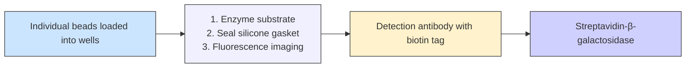
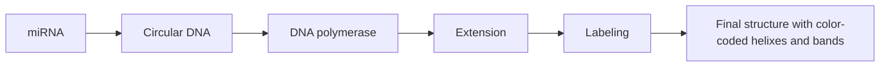
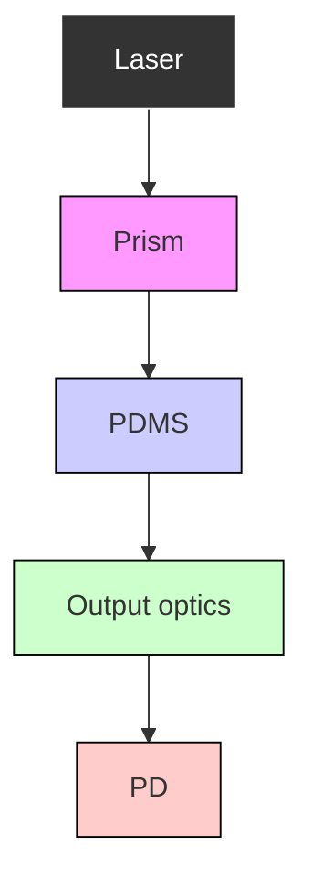

Check for updates

Cite this: DOI: 10.1039/d0lc00506a

# Critical Review: digital resolution biomolecular sensing for diagnostics and life science research

Qinglan Huang, iD $^{ab}$ Nantao Li, $^{ab}$ Hanyuan Zhang, iD $^{b}$ Congnyu Che, iD $^{bc}$ Fu Sun, iD $^{ab}$ Yanyu Xiong, $^{ab}$ Taylor D. Canady $^{*bd}$ and Brian T. Cunningham $^{*abcde}$

Received 15th May 2020,

Accepted 13th July 2020

DOI: 10.1039/d0lc00506a

rsc.li/loc

One of the frontiers in the field of biosensors is the ability to quantify specific target molecules with enough precision to count individual units in a test sample, and to observe the characteristics of individual biomolecular interactions. Technologies that enable observation of molecules with “digital precision” have applications for in vitro diagnostics with ultra-sensitive limits of detection, characterization of biomolecular binding kinetics with a greater degree of precision, and gaining deeper insights into biological processes through quantification of molecules in complex specimens that would otherwise be unobservable. In this review, we seek to capture the current state-of-the-art in the field of digital resolution biosensing. We describe the capabilities of commercially available technology platforms, as well as capabilities that have been described in published literature. We highlight approaches that utilize enzymatic amplification, nanoparticle tags, chemical tags, as well as label-free biosensing methods.

# 1. Introduction

In the earliest examples of label-free biosensor transducers such as surface plasmon resonance (SPR), $^{1}$ photonic crystals (PC) $^{2}$ and quartz crystal microbalances (QCM), $^{3}$ the measured signal is produced by the accumulation of large numbers of target molecules upon the active region of the sensor, where analytes are captured and concentrated by the presence of transducer-attached molecules (such as antibodies, aptamers, or nucleic acids with a target-specific base sequence). Likewise, for biomolecular detection methods that utilize a chemical label, such as a fluorescent dye, a printed spot of a capture molecule, a surface-immobilized coating in a microplate well, or a surface coating applied to the external surface of a bead is used to selectively gather and concentrate target molecules from a larger volume from where they originally had a much lower concentration. A characteristic that all these methods share in common is that generation of a signal above the level

of background noise requires aggregating the effects of large numbers of target molecules. For example, in the context of SPR optical biosensors, the illuminated evanescent field volume above the gold surface must accumulate a sufficient number of analyte molecules so as to generate a shift in the SPR coupling angle that exceeds the standard deviation of making SPR resonant angle measurements that is limited by the detection instrument, the sensitivity to surface-based refractive index changes, and common mode noise sources such as temperature drift and bulk refractive index variability in the test sample. Likewise, in the context of fluorescent-tagged microarray spots, for a single spot to be observed, it must accumulate enough fluorescent dye to appear brighter than the background fluorescence of the substrate material, surface chemistry layers, and dark noise of the sensor that detects photon emission. $^{4}$ In both cases, as the number of accumulated target molecules decreases, we reach a regime in which the captured molecules no longer resemble a semi-continuous thin film, but rather become a sparse population of individual molecules, separated by large distances and dispersed over a surface area that can be tens to hundreds of square micrometers. In the case of bead-based detection, the lowest analyte concentrations result in beads that can gather either zero or only one analyte per bead. $^{5}$ For each scenario, detection requires accumulating aggregates of analyte with sufficient quantity to overcome the inherent noise of the detection method, and individual analyte molecules cannot be detected as individual binding events.

Several innovations in molecular biology methods partially address this limitation, and demonstrate the ability to detect

analytes with reduced detection limits, but not the ability to count analytes with digital resolution. For example, enzymatic chemical amplification of the analyte molecule may be used to convert a single molecule into large numbers of molecules that carry a tag that facilitates detection with an inexpensive instrument. For example, enzyme linked immunosorbent assays (ELISAs) represent a powerful approach through which an analyte molecule is selectively captured by an antibody to a surface, and is subsequently tagged with a second antibody that carries an enzyme tag. $^{6}$ After tagging, an enzyme–substrate interaction is used to convert every tag molecule into large numbers of product molecules that change the color of the surrounding liquid. Likewise, methods such as the polymerase chain reaction (PCR) for detecting specific nucleic acid sequences use an analyte-recognizing primer, DNA polymerase enzyme, and thermal cycling to generate millions of fluorophore-tagged copies of the original analyte, so as to generate an easily measured signal. $^{7}$

Innovative approaches in biosensor engineering have utilized the strategy of strictly limiting the active area of a sensor, so as to enable detection of individual molecules, but may not have the capability for ultrasensitive limits of detection. For example, a biosensor comprised of a nanometer-scale resistor (comprised of silicon, graphene, or carbon nanotubes for example) can be built with a width that is similar to the dimension of a single protein molecule. $^{8}$ The attachment of one protein on the transducer can perturb the conductivity of the resistor sufficiently that a change in the current–voltage characteristic of the resistor can be measured, thus achieving single-analyte resolution. The difficulty of also achieving low limits of detection with such a system is related to the active sensing area of the transducer in relation to the rest of the system. Only analyte molecules that are fortunate enough to come into contact with the sensor and not become bound elsewhere (in a non-sensing region) have the opportunity to be detected, so only a small fraction of all the potentially-available molecules can be sensed. In a similar fashion, nanopore-based sensors are capable of measuring one molecule at a time as they pass through the pore and transiently block the current flow, although large numbers of molecules must be present in the sample volume to increase the likelihood that one will diffuse to the pore and pass through. $^{9}$

In this review, we seek to summarize the state-of-the-art for technologies that are simultaneously capable of digital resolution detection of biomolecule analytes and ultrasensitive limits of detection. To help narrow the focus of our review, we will define “biosensing” to be understood as “detection of a specifically targeted biomolecular analyte to characterize either its concentration or its biomolecular binding properties”. We will review approaches that seek to count individual target molecules. The technologies we have chosen to include all incorporate an element of selective capture of a specifically-recognized molecule, such as would be used for quantifying a specific nucleic acid sequence or a protein antigen. To further limit our scope, we include only technologies that can be used for detection of biomolecules, and exclude methods that have only demonstrated detection of larger structures such as nanoparticles, viruses, or exosomes.

The applications of technologies with these capabilities are highly impactful for next-generation in vitro molecular diagnostics, and as tools that can be used to understand biomolecular interactions at a more fundamental level. In the diagnostics field, ultrasensitive and ultraselective detection applications are motivated in part by the desire to develop “liquid biopsies” for molecules that include circulating tumor DNA (ctDNA) and micro RNA (miRNA) with specific sequences that represent the presence of genetic mutations that underlie cancer. $^{10}$ Studies have shown, for example, that because ctDNA molecules originate from cancer cells, their concentration correlates with tumor burden, and the potential exists for utilizing detection of specific ctDNA sequences for early disease detection. $^{11}$ Likewise, the concentration of specific miRNA sequences derived from exosomes have been shown to correlate with clinical outcomes in cancer, and thus have the potential to serve as a guide for therapy selection and therapeutic efficacy monitoring. The liquid biopsy concept not only applies to detection of nucleic acid-based biomarkers for cancer, but also to genomic or proteomic biomarkers that are being discovered for a wide variety of disease states, in addition to characterization of states of health/wellness in contexts that include psychological stress, inflammation, environment, and nutrition. In the life science field, the ability to measure biomolecular interactions at the level of individual units enables elimination of the averaging effects of measuring aggregates of many molecules, so that biomolecular binding constants, association/dissociation rates, conformational modifications, and chirality can be measured at the most fundamental level. In this field, the ability to measure large numbers of individual interactions is especially desirable, so as to gather statistical information with a high degree of throughput. Due to the commercial importance of these capabilities, several technology platforms have been taken forward to products and services, and thus our review will include several products in addition to technology that is described in the scientific literature.

Our review is organized around the technological approach that is used to achieve digital resolution detection. First, we consider approaches that use chemical or enzymatic amplification to generate large fluorescent signals that originate from a digitally-quantifiable set of target molecules. We describe approaches that are used for both nucleic acid and protein-based target molecules. Second, electrochemical biosensing techniques at individual-molecule level are respectively discussed. Third, we describe approaches that use a nanoparticle tag to signal the presence of a specific target molecule. Next, we summarize the state-of-the-art digital resolution approaches that use fluorescent molecules as tags without chemical amplification with sub-sections that utilize instruments that are based on either microscopy or flow cytometry. Finally, we discuss the approaches that can

be considered “label-free” in which an intrinsic characteristic of the target biomolecule (such as its dielectric permittivity or height) is used to detect it.

# 2. Single molecule detection by enzymatic amplification

Single molecule detection represents the ultimate biosensing, which can reveal direct information and fundamental mechanism of considerable biological processes, multiple sensing technologies have extensively explored this regime. $^{12,13}$ However, the efficacy of single biomolecule detection is often sacrificed due to a complex noise reduction process that influences the sensitivity and multiplexing ability. $^{14,15}$ Digital resolution detection has been achieved through chemical or enzymatic amplification approaches, where the fluorescent signals originated from a digitally-quantifiable set of target molecules are amplified.

In conjugation with the amplification approaches, a wide range of partitioning methods (microfluidics, microwells, and microbeads) based on Poisson statistics $^{16}$ have been developed to quantitate low-volume and low-concentration samples. The milliliter or microliter samples are divided into subvolumes in the nanoliter to picoliter range, and then encapsulate these subvolumes in microdroplets or microcompartments for measurements. $^{17}$ When the concentration of the target is low, the number of target molecules collected on each compartment follows the Poisson distribution. $^{18}$ The very low expected number of target per partition leads to an extremely narrowed Poisson distribution, and hence each compartment contains either a single target molecule or none. After encapsulation, the target molecules, such as proteins and DNA, are amplified with chemical or enzymatic approaches, and generate fluorescence signals. The presence of target molecules in each compartment is detected with a binary fluorescence readout of “positive” or “negative”. Then, the absolute quantitative count of the target molecule in the sample can be determined from the fraction of positive compartments, according to eqn (1), $^{19}$

$$
\lambda = - \ln (1 - p) \tag {1}
$$

where $\lambda$ is the average number of target biomolecules per compartment, and p is the fraction of positive compartments. The product of $\lambda$ and the number of compartments is an estimate of the absolute number of target molecules.

One commonly used amplification approach is the enzyme-linked immunosorbent assay for protein analysis, which first non-specifically (via adsorption to the surface) or specifically (via capture by another antibody in a “sandwich” assay) attach target antigens onto a surface. Sequentially, detection antibodies covalently linked with enzymes are captured by target antigen, followed by adding a substrate to react with enzymes and produce an amplified signal. $^{6}$ Polymerase chain reaction (PCR) is another well-established tool for nucleic acid analysis by rapidly amplifying the number of a specific target sequence with thermal cycles. Initially, the DNA double helix is denatured into two single strands by a high temperature. Then, a lower annealing temperature allows the hybridization between target sequences of DNA and primers. Eventually, DNA polymerase enables binding free nucleotides to the annealed primer based on the two target single-stranded DNA (ssDNA) templates, resulting in an exponential amplification of target strands, and production of fluorescence signals. $^{7}$

For example, the droplet microfluidics approach based on the amplification of individual target biomolecules in monodisperse nano-liter sized droplets has been a useful tool for quantitative and high-throughput single-molecule analysis. $^{20}$ For the quantification of target nucleic acids, droplet digital PCR (ddPCR) has been developed and commercialized recently, such as QX200 from Bio-Rad and RainDrop from RainDance. $^{21}$ The QX200 ddPCR divides a 20 $\mu$ L mixture of sample and reagents into $\sim$ 20 000 water-in-oil nanoliter-sized partitions based on droplet microfluidics, resulting in encapsulation of individual DNA/RNA molecules within droplet partitions. After the PCR amplification cycles take place in each partition, droplets containing mutant or wild-type allele(s) are distinguished by fluorescence, followed by a quantification of the target DNA copies based on Poisson statistics. $^{22}$

More recently, there has been an increasing focus on the development of low-cost, rapid, easy-to-use, and point-of-care (POC) compatible detection methods. To precisely and efficiently control the droplet generation, fusion, mixing, analysis, and sorting, many technologies have been developed with variations in the droplet materials or the microfluidic structures. For single protein detection, pursuing an idea similar to ddPCR, Shim et al. demonstrated a multilayered microfluidics platform to ultra-rapidly generate femtodroplets that encapsulate a biomolecular complex tagged with a reporter enzyme (Fig. 1a). These femtodroplets are stored and isolated in micron-scale traps while the enzymatic reaction occurs. Finally, the droplets containing biomolecules exhibit a positive fluorescence signal that provides a digital readout in 10 minutes. $^{23}$

Other than the droplet microfluidics approach, microfluidic implementation methods have also been developed. In 2009, Ismagilov et al. first described the “SlipChip” technology, where two glass substrates with microcompartments are simply “slipped” together for handling and manipulating samples or reagents. $^{24}$ The SlipChip technology has been applied for the ultrasensitive quantification of $\lambda$ DNA and hepatitis C viral RNA in nanoliter volumes with isothermal amplification by unmodified camera phones. $^{25}$ Furthermore, a multi-step SlipChip has been developed and applied for generating serial dilutions with a series of simple sliding motions to extend the dynamic range of viral load quantification. $^{26}$ More recently, Yeh et al. reported a self-powered integrated microfluidic POC low-cost enabling (SIMPLE) chip technology as a lab-on-chip alternative for the digital PCR technique, which integrates

a   

text_image

substrate
protein
for bead
oil
femto-
droplets
flow channel
(25 µm
deep)
valve for traps
nozzle
stream path-1
storage
flow channel
aqueous
aqueous
aqueous
oil
50 µm
1 mm
trap (300 µm x 300 µm)
main
valve
exit
stream path-2
pressure
inlet
i)
femtodroplet
FDG
(ii)
antigen
Biotinylated
detection antibody
Streptavidin
conjugated enzyme

text_image

(i) Digital micro-
patterning
Digital isothermal
amplification
25 mm
Inlet
Vout
Vout
Silicone
Air diffusion Amplification initiator
Plasma Channel
Microwell Channel
(iii) Vacuum battery system

C   

flowchart

Fig. 1 (a) The multilayered droplet microfluidic device used for single-molecule-counting immunoassay. The microfluidic device consists of the nozzle for femtodroplet generation, flow channels, and storage compartments with a capacity for $\sim 2 \times 10^{5}$ femtodroplets. (i)-(iii) After the on-chip incubation, three populations of femtodroplets are observed, and only (iii) exhibits positive fluorescence signal because of the enzymatic activity. Figure reproduced from ref. 23 with permission from American Chemical Society, copyright 2013. (b) The self-powered integrated microfluidic POC low-cost enabling (SIMPLE) chip for nucleic acid testing. Red shows fluidic channels. Blue shows the main vacuum battery system. Green shows the auxiliary vacuum battery system. (i) Digital micro-patterning allows amplification initiator reagent patterning. (ii) Side view of the digital plasma separation design, which removes blood cells and skims plasma into dead-end wells for digital amplification. (iii) The vacuum battery system slowly releases the pre-stored vacuum potential via air diffusion through lung-like structures. Figure reproduced from ref. 4 with permission from AAAS copyright 2017. (c) Digital ELISA based on arrays of femtoliter-sized wells. Single protein molecules are captured and labeled on beads using standard ELISA reagents, and beads with or without a labeled immunoconjugate are loaded into femtoliter-volume well arrays. Fluorescence image of the femtoliter-volume well array after enzymatic amplification provides a digital readout. Figure reproduced from ref. 5 with permission from Springer Nature publications copyright 2010.

sample processing, fluid handling, signal amplification and digital detection (Fig. 1b). With amplification initiator patterned on the chip, the plasma is separated automatically with a defined microcliff structure, and fluids are pumped by a vacuum battery. The SIMPLE chip demonstrated an on-site 30-minute quantitative nucleic acid detection using whole blood samples without sample preparation. $^{4}$ Another recent notable example is a multiplexed digital-analog microfluidic diagnostic developed by Maerkl et al., which is based on standard ELISA and mechanically induced trapping of molecular interactions (MITOMI). $^{27}$ The hybrid detection mode enables a broader dynamic range and a lower limit of detection (LOD), and achieves highly sensitive detection of 3–4 protein biomarkers in quadruplicate in 16 independent microfluidics unit cells with a single 5 $\mu$ L whole blood sample. $^{28}$

The single-molecule array (SiMoA) initially developed by Walt et al. represents another promising approach for measuring subfemtomolar concentrations of biomarkers (Fig. 1c). $^{18,29-31}$ Here, single biomolecules in patient samples are captured by magnetic microscopic beads (one or zero target molecules per bead), then the complexes are labelled with a fluorescent enzymatic reporter. Next, the beads are distributed into 40-femtoliter well arrays (one bead per well) for isolation, and fluorescence signals generated by single enzymatic amplification are detected and counted. The number of the molecules in the sample can be determined by the counts of fluorescent wells based on Poisson statistics. The SiMoA approach has been applied for the detection of proteins in serum at subfemtomolar concentrations, $^{5}$ and for use in HIV diagnosis, $^{32}$ cytokine detection, $^{33}$ and protein expression tracking in single cells. $^{34}$ The strategy was also utilized to detect DNA and microRNA at femtomolar concentrations, $^{35,36}$ and bacterial DNA at attomolar concentrations. $^{37}$ More recently, a multiplexed SiMoA has

been utilized for detecting six cytokines in blood, $^{38}$ and was later integrated into a rapid and fully automated laboratory instrument capable of multiplexed detection of up to ten different proteins with an average sensitivity more than 1200-fold higher than that of conventional ELISA. $^{39}$ Other than SiMoA, Levene et al. studied single-molecule dynamics at micromolar concentration using arrays of zero-mode waveguides with subwavelength holes in a metal film, which allowed optically efficient, and highly parallel analysis. $^{40}$ To directly observe single-molecule enzymatic activity, enzymes were immobilized onto the bottom of the waveguides, and solutions containing fluorescently tagged ligand molecules were introduced to create bursts of fluorescence. Zero-mode waveguides have been applied to observe the enzymatic synthesis of double-stranded DNA by DNA polymerase and can be a powerful tool for wide variety of enzyme analysis at single-molecule levels.

Meanwhile, extensive efforts have been made in developing high-throughput and ultrasensitive flow cytometry technology with enhanced single molecule detection $^{41,42}$ and multiplex fluorescent analysis. $^{43}$

Flow cytometry can also be combined with enzymatic amplification for digital resolution biomolecular sensing. The abcam Fireplex technology for miRNA detection $^{44}$ has a multiplexing capability through barcode identification using labelled hydrogel particles. First, target RNA analyte is captured and then ligated to labelled adaptors through an enzymatic reaction. After rinsing and eluding the unligated adaptors, the labelled target strands are further conjugated with biotin tags at the end through another round of enzymatic reactions and then recaptured by the hydrogel particles for signal readout on the flow cytometer. Finally, both barcode information on the hydrogel particles and positive/negative report of the target molecules are acquired. This method has achieved a sensitivity $\sim$ 1 nM of up to 75 targets from a single well. Recently, an upgraded technology by abcam called Firefly particle technology has increased the detection limit to the femtomolar range. This method uses an amplification method without extra labelling and recapturing steps to significantly reduce the assay time compared to Fireplex particles. $^{45}$

Several flow cytometry-based approaches using enzyme or chemical based fluorescent amplification have also demonstrated digital resolution detection of biomolecules. Examples include the application of traditional DNA amplification methods based on rolling circle amplification, $^{46,47}$ or enzyme-free methods (e.g., hybridization chain reaction $^{48}$ and toehold strand exchange $^{49}$ ).

Recently, Smith et al. reported using commercial-grade flow cytometers to detect single short-stranded miRNA-375 at 47 femtomolar concentration by labelling RCA extended analytes with multiple distinct fluorophores (Fig. 2(a)). $^{50}$ Such a labelling strategy provided a 1600-fold signal-to-noise ratio across 4 orders of magnitude, which is 100-fold greater than PCR. In addition, this technology demonstrated high-dimensional multiplex detection of multiple miRNA sequences in one pot by

a   

flowchart

b   

chemical

Molecular interaction diagram showing dTTP and laser dynamics with plasma, ion, and fluorescence response curves

c   

chemical

Molecular structure diagram of H2C@3b-Biodo-SA composite with FRET and cHCR product, showing molecular interactions and structural details

d   

text_image

Mn
H1
Bm (cytosine)
Flu
Bm
HTR
Flu
Bm
HTR
Flu
Bm
HTR
Flu
Bm
HTR
Flu
Bm
HTR
Flu
Bm
HTR
Flu
Bm
HTR
Flu
Bm
HTR
Flu
Bm
HTR
Flu
Bm
HTR
Flu
Bm
HTR
Flu
Bm
HTR
FLU Intensity
Count
200x
300x
400x
500x
600x
700x
800x
900x
1000x
1100x
1200x
1300x
1400x
1500x
1600x
1700x
1800x
1900x
2000x
2100x
2200x
2300x
2400x
2500x
2600x
2700x
2800x
2900x
3000x
3100x
3200x
3300x
3400x
3500x
3600x
3700x
3800x
3900x
4000x
4100x
4200x
4300x
4400x
4500x
4600x
4700x
4800x
4900x
5000x
5100x
5200x
5300x
5400x
5500x
5600x
5700x
5800x
5900x
6000x
6100x
6200x
6300x
6400x
6500x
6600x
6700x
6800x
6900x
7000x
7100x
7200x
7300x
7400x
7500x
7600x
7700x
7800x
7900x
8000x
8100x
8200x
8300x
8400x
8500x
8600x
8700x
8800x
8900x
9000x
9100x
9200x
9300x
9400x
9500x
9600x
9700x
9800x
9900x
100

Fig. 2 Illustration of (a) multiplex microRNA rolling circle amplification method. Figure reproduced from ref. 50 with permission from American Chemical Society, copyright 2020. (b) PSA protein detection using template-free poly(T) extension. Figure reproduced from ref. 52 with permission from Royal Society of Chemistry, copyright 2018. (c) microRNA detection using crosslinking hybridization chain reaction of nanotetrad structures. Figure reproduced from ref. 53 with permission from Royal Society of Chemistry, copyright 2018. (d) hTR protein detection via enzyme-free toehold exchange amplification. Figure reproduced from ref. 54 with permission from Elsevier, copyright 2017.

multispectral fluorescence. Similarly, Gao et al. developed a sandwich-type immunoassay using suspended beads to detect multiple tumor biomarkers via the rolling circle amplification. $^{51}$ Detection antibodies conjugated with DNA primers triggered rolling circle reactions once bound to the immunocomplex where long single-stranded DNAs were generated by a closed circular DNA template, and thousands copies of fluorescent molecules were captured. This method achieved a femtomolar detection limit for multiple biomarkers (e.g., $\alpha$ -fetoprotein, prostate specific antigen and carcinoembryonic antigen) and a significantly enhanced dynamic range ( $\sim$ 5 orders of magnitude increase) compared to traditional bead assays.

Another representative work using elongated DNA tags (Fig. 2(b), by Zhu et al.) in sandwich-type immunoassays applied a deoxynucleotidyl transferase (TdT)-initiated template-free DNA extension method to detect prostate specific antigen (PSA) protein at a concentration in the femtomolar range. $^{52}$ In this work, PSA antigens are first captured by detection antibodies on both magnetic beads (MBs) and gold nanoparticles via the sandwich-type immunoreaction. Afterwards, TdT recognizes the immobilized gold nanoparticles which carry large amounts of oligonucleotides with 3'-OH termini and then induces the template-free poly(T) DNA chains. These long polymerized tails on the bead thus can hybridize fluorescently labeled poly(A) sequences, resulting in a high fluorophore accumulation and signal amplification. It is worth noting that by using a template-free and sequence-independent extension of DNA tags, the simplified DNA amplification process can greatly enhance the efficiency of flow cytometry analysis. However, this method requires enzymes to catalyze the amplification of DNA tags, which prevents the application for multiplex and high-throughput detection.

In contrast, a crosslinking hybridization chain reaction (HCR) method based on Foster resonance energy transfer (FRET) detection has been applied in flow cytometry for intracellular imaging of a miRNA biomarker shown in Fig. 2(c). $^{53}$ In this method, a streptavidin scaffold was used to form a well-expanded DNA nanotetrad structure to enable in situ HCR, where two biotinylated hairpin probes crosslinked to each other to induce FRET reaction. Once bound to the target miRNA, one hairpin probe (H1) extends and initializes a hybridization cascade that crosslinks both hairpin probes (H1 and H2) to form 3-dimensional hydrogel networks. In such crosslinked network, Cy3 fluorescence donors on H1 probe and Cy5 acceptors on H2 probe are pulled close enough to activate the FRET signal, which indicates the presentation of the target miRNA. It is worth noting that such HCR amplification improves the accuracy of imaging due to the precise control of nanotetrad structure and probe concentrations. The crosslinking of two hairpin probes with high spatial resolution for imaging further avoids false signal reports and provides enhanced sensitivity. Thus, this method has advantages in ultrafine intracellular imaging using flow cytometry in comparison with enzyme-based DNA imaging due to fast initiation of crosslinking hybridization networks and precise spatial resolution.

In addition to nanotetrad structures incorporating hairpin probes for ultrasensitive flow cytometric imaging, another enzyme-free example of crosslinking DNA hairpin probes on biotin-streptavidin beads via toehold strand displacement has demonstrated highly selective and sub-femtomolar detection of human telomerase (hTR) via toehold strand displacement. In Fig. 2(d), Xu et al. prepared two types of hairpin DNA probes that can hybridize the target hTR DNA. In the presence of hTR, the first type of hairpin DNA probe (H1) on the bead unfolds and hybridizes with hTR. $^{54}$ This hybridized complex served as a toehold strand to unfold and hybridize the second type of hairpin DNA probe (H2), resulting in the sequential toehold replacement of hTR. The released hTR further catalyzed the replacement of the H1 probes with the H2 probes through toehold exchange until the bead was fully covered with double stranded H2 DNA molecules. The second type of hairpin DNA was pre-conjugated with fluorophores and thus the accumulated fluorophores on the bead can be detected by the flow cytometer.

# 3. Single-molecule detection by electrochemistry

# 3.1. Nanopores

Inspired by the Coulter counter $^{55,56}$ and molecular transport across biological pores, $^{57,58}$ the idea of recording transient ionic current changes to detect individual charged biological molecules that are driven electrically through a nanoscale electrolyte-filled aperture (nanopore) dated back to the 1990s. $^{59}$ A single molecule traversing a nanopore partially blocks the channel and causes a transient decrease in the ionic current across the nanopore. Biological $^{9,60}$ and solid-state $^{9,61,62}$ nanopores have since been developed for singlemolecule detection of nucleic acids, $^{63-71}$ proteins, $^{72-82}$ peptides, $^{83-87}$ among which sequencing $^{63,88,89}$ is the most well-known application. The properties of a target molecule, such as its size, $^{85,90,91}$ structure $^{75,79,86,92}$ and kinetics, $^{74,77,83}$ can be extracted from statistical analysis of the amplitudes, durations, frequencies and shapes of the signals. $^{9,66,81,93}$

Although nanopore biosensors were initially conceived as a label-free ionic current sensing technique, nanopores can also be integrated with tunnelling current detection, $^{87,94-97}$ optical detection, $^{98-109}$ force measurement, $^{110,111}$ and field effect transistors (FETs). $^{112-115}$ The first electrode-free nanopore DNA sensor based on passive diffusion and fluorescence readout emerged recently as well. $^{116}$

Sze et al. performed single-molecule multiplexed direct screening of proteins in human serum, using aptamer-modified DNA carriers that bound to specific target proteins and produced unique ionic current signatures in a quartz nanopore, without the need for expensive labelling methods and extensive sample pre-treatment. $^{80}$ The use of DNA as a carrier enables efficient transport of proteins through the nanopore and better control of the transport rate. However, this method requires that the corresponding biomarker must be sufficiently large to ensure the imposed signal from a bound target can be distinguished from that of the carrier. To address the challenge, Cai et al. integrated nanopore sensing with a single-molecule fluorescence microscope. $^{105}$ Molecular beacons (MBs) were designed and incorporated into the DNA carrier to screen for proteins and complementary DNA (cDNA) much smaller than the size of the nanopore. A MB remains in its quenched state until binding to the target restores its fluorescence. Both the ionic current and fluorescence intensity time traces for single molecules were collected in a synchronized manner while the carriers translocated through the nanopore. The electro-optical detection helps to distinguish between signals of bound targets and false positives from folds or knots in the DNA carrier. The hybrid platform can detect 1 pM cDNA in 10% urine and 0.1 nM thrombin in 5% human serum.

Nanopore sequencing of proteins is still a challenge, as proteins with 20 amino acids are more complex than DNA with four bases and proteins are heterogeneously charged. $^{73}$ Ionic current detection of amino acids in an aerolysin nanopore with a short polycationic carrier was reported recently, which may pave the way to single-molecules protein sequencing. $^{117}$ The aerolysin nanopore slows down and fully confines a carrier-bound amino acid inside its sensing region ( $\sim$ 2 nm), which makes each amino acid spend sufficient time in the nanopore for single-molecule measurement. The authors linked each amino acid to a carrier peptide comprising seven arginines, whose net positive charge ensures unidirectional electrophoretic transport of amino acids across the nanopore. Distinct ionic current signals have been observed directly in the nanopore for 13 of the 20 amino acids from a mixture. The authors further proposed to use chemical modifications of amino acids and nanopore engineering to identify the remaining seven amino acids.

With progress on controlling molecular transport through nanopores $^{69,77,118-123}$ and fabrication $^{124-126}$ that improve selectivity, sensitivity and robustness, the capacity of nanopore technology is expanding for both basic research and clinical applications. $^{127,128}$ Oxford Nanopore Technologies released the first commercial nanopore sequencer (MinION) in 2014. $^{129}$ The pocket-sized devices enable long reads and rapid in situ detection, $^{130,131}$ even at remote areas with limited resources. $^{132,133}$ The MinION device has been used to detect bacteria, $^{134,135}$ viruses, $^{134,136}$ and antibiotic resistance genes $^{135,137}$ in clinical samples. In 2015, blood samples of 142 Ebola patients were sequenced using a MinION field sequencing kit in Guinea, providing real-time genomic surveillance of the Ebola epidemic. $^{132}$

# 3.2. Carbon nanomaterials-based biosensors

Carbon nanomaterials (1–100 nm) offer larger surface-to-volume ratio, faster electron transfer kinetics, enhanced interfacial adsorption and electrocatalytic activity, compared to traditional electrochemical sensor materials. $^{8,138}$ These advantages make carbon nanomaterials helpful for addressing some of the key challenges in biosensing. For example, carbon nanomaterials with high conductivity and enhanced interfacial adsorption can be used on the biosensing interface to improve the sensitivity of detecting biorecognition events. Fast electron transfer in carbon nanomaterials can also decrease the sensor response time. There is increasing interest in incorporating carbon nanomaterials, such as graphene and carbon nanotubes (CNTs), $^{139}$ into advanced biosensors. When target biomolecules approach a carbon nanomaterial-based sensor, they can modify the sensor conductance to generate an output electric signal. For example, the surface charge of the target molecule can introduce a gating potential on the CNT; the charge transfer between carbon nanomaterials and biomolecules leads to a change in current; or the molecule can introduce a scattering potential across carbon nanomaterials, or modify the Schottky barrier between carbon nanomaterials and metal electrodes. $^{140}$

CNTs are hollow cylindrical tubes made of graphene sheets, which are classified as singled-walled (SWNTs) or multi-walled carbon nanotubes (MWNTs) depending on the number of graphene layers in a tube. $^{141}$ The unique properties of CNTs have been intensively studied for biomedical applications, $^{142}$ including CNT-based electrochemical biosensors. $^{8,143-147}$ Following the early integration of CNTs into FETs, $^{148-150}$ CNT-FETs were adapted for biosensing $^{151}$ and realized single-molecule detection of DNA-hybridization dynamics, $^{152}$ enzymatic turnover of glucose oxidase $^{153}$ and lysozyme. $^{154-156}$ Apart from electrochemical sensing, CNTs have been used as optical biosensors $^{142,157}$ and enabled detection of chemical reactions, $^{158}$ protein, $^{159}$ hydrogen peroxide, $^{160,161}$ nitroaromatics $^{162}$ and nitric oxide $^{163}$ at the single-molecule level. Furthermore, real-time label-free detection of single proteins secreted from individual bacteria and yeast cells has been achieved by fluorescent SWNT sensor arrays. $^{164}$

# 4. Single molecule detection by nanoparticle tags

Nanoparticle (NP) tagging is a burgeoning direction in quantitative single molecule detection, due to the unique physical/chemical properties and flexibility offered by nanomaterials. For instance, the nanometer-scale dimensions of noble metal nanoparticles, in combination with their abundance of free electrons, offers light confinement smaller than the diffraction limit and thus high sensitivity assisted by surface plasmons. $^{165}$ Nanoscale light emitters such as quantum dots and upconverting nanoparticles, on the other hand, provide a robust luminescent platform for biosensing with excellent contrast of signal to background noise. Apart from providing unique optical properties, nanoparticle tags can also address the challenge of diffusion-limited assay times. For example, magnetic nanoparticles can be dispersed in the liquid sample for rapid scavenging of scarce analytes, and subsequently manipulated by an external magnetic field to move towards the transducer for rapid detection. $^{166-168}$ In addition, recent advances in nanofabrication and synthesis not only allows for precise control of the dimension and morphology of nanoparticles, but also for precise engineering of core-shell structures as well as particles with anisotropic surfaces (also known as Janus particles). As a result, nanoparticles of heterogeneous composition can integrate the advantages of various materials and yield innovative biosensing strategies featuring both high sensitivity and fast response time.

One of the new frontiers in single molecule biosensing is to break down the ensemble signal from the sensor/transducer into individual signals. As long as the target molecule is sparsely populated in the sample volume, the “digital” technique provides insights into the quantitative analysis on the distribution as well as the dynamics of the target molecules. In order to achieve parallel monitoring over a large sensing area, widefield microscopy is often utilized for digital biosensing where nanoparticles are used as individual reporters. Here, the nanoparticles not only provide clear signal contrast above the background, but also open up the opportunity for multiplex sensing by varying the material composition or the particle morphology. Here we provide a brief summary on the various contrast modalities offered in nanoparticle-based non-amplification (meaning non-enzyme) biosensing, followed by several biosensing strategies enabling single molecule detection.

# 4.1. Contrast mechanisms

A clear contrast between the target signal and the non-specific background noise is essential for providing the accuracy and reproducibility in single molecule biosensing. As discussed in previous sections, several label-free optical sensing methods can reach the single-molecule level of sensitivity. However, these sensing methods usually have stringent requirements for the environment of the detection

system, such as removal of mechanical vibrations and mitigation of temperature drift. The incorporation of nanoparticles as contrast agents into the detection system significantly reduces the complexity of the transducer in comparison to label-free techniques, as the nanoparticle signals are usually orders of magnitude higher than background noise. Taking the throughput efficiency into account, a conventional wide-field optical microscopy system is an excellent sensing platform in which both a large sensing area and single-nanoparticle resolution can be achieved. In this section, the principles of various optical contrast modalities offered by nanoparticles will be briefly discussed, along with their respective applications in biosensing at the single-molecule level.

4.1.1 Elastic scattering. Scattering is one of the most prevalent contrast modalities used in single molecule detection for both label-free and labelled technologies. To visualize individual nanoparticles, dark-field microscopy is commonly utilized where the background is removed by a dark-field condenser $^{169}$ or total internal reflection excitation, $^{170}$ leaving only the scattered light from the nanoparticles captured by the camera.

While the complete removal of the background by dark-field microscopy yields excellent signal contrast from nanoparticles, observation of particles smaller than 40 nm in general remains challenging due to the diminishing scattering intensity. $^{171}$ For most nanoparticles, the scattered light signal can be characterized by the scattering cross sections, which is given by

$$
\sigma_ {\mathrm{sc}} = 8 \pi^ {2} | \alpha | ^ {2} \lambda^ {- 4} / 3 \tag {2}
$$

where $\alpha$ denotes the complex particle polarizability and follows

$$
\alpha = 4 \pi \epsilon_ {\mathrm{m}} R ^ {3} \left(\frac {\epsilon_ {\mathrm{p}} - \epsilon_ {\mathrm{m}}}{\epsilon_ {\mathrm{p}} + 2 \epsilon_ {\mathrm{m}}}\right) \tag {3}
$$

where $\lambda$ is the wavelength of excitation light in the surrounding medium, R is the radius of the nanoparticle, $\epsilon_{m}$ and $\epsilon_{p}$ are respectively the permittivities of the particle and its surrounding medium. Here it can be observed that the scattering cross section of a nanoparticle diminishes in proportion to the sixth power of its radius.

A direct solution is to increase the optical excitation and therefore the scattered intensity, which can be achieved by confining light with surface plasmons. Such an imaging method, also known as surface plasmon resonance imaging (SPRI), was first demonstrated by Zybin and Tao in 2010, $^{172-174}$ where the travelling surface plasmon polaritons interact with individual nanoparticles on the gold surface to create point diffraction patterns, as shown in Fig. 3b. The real-time, high contrast plasmonic imaging method allows for the rapid digital detection of peptides, $^{175,176}$ DNA strands $^{177}$ as well as polymers. $^{178}$ However, the extended point diffraction patterns of SPRI hinders the ability to discern individual nanoparticles especially when they are densely populated. Complex algorithms can be required to pinpoint the location of each nanoparticle. $^{179}$ As an alternative approach, nanohole array (NHA) can support a narrow transmission peak (EOT, extraordinary optical transmission) by the hybridization of the propagating and localized SPR (LSPR). Such EOT can be effectively attenuated at the presence of gold nanoparticles, resulting in the digitalized signal as shown in Fig. 3c. Without the need for additional coupler and the presence of parabolic diffraction patterns, such NHA-based SPRI modality can be easily integrated into a point-of-care device for the detection of biomarkers like procalcitonin, with gold nanoparticle as the label (Fig. 3d). $^{180,181}$

text_image

a
Gold nanoparticles
Procalcitonin
Gold coated glass chip
Objective
p polarized light
Camera

line

| PCT concentration (pg/mL) | Particle counts |
| ------------------------- | --------------- |
| 1                         | 200             |
| 10                        | 400             |
| 100                       | 600             |
| 1000                      | 800             |
| 10000                     | 1000            |

natural_image

Microscopic image showing a grid pattern with inset of circular features, scale bars at 200 nm and 2 μm (no text or symbols)

scatter

| Group      | Plasmonic Signal (a.u.) |
| ---------- | ------------------------ |
| Healthy    | ~0                       |
| ni-SIRS    | ~20                      |

Fig. 3 Digital immunoassay for procalcitonin with gold nanoparticles as the scattering contrast labels. (a) Schematic for experimental setup and the SPR sensor chip functionalized with capture antibody for procalcitonin. (b) Standard response curve for procalcitonin detection, with the shaded area indicating the dynamic range. Inset: Typical scattering image of a gold nanoparticle. Scale bar: 10 $\mu$ m. Figure reproduced from ref. 175 with permission from American Chemical Society, copyright 2019. (c) A merged image of SEM and plasmonic microscopy of gold nanoparticles on a nanohole array, where individual nanoparticles are represented as localized attenuation on the reflection. (d) Procalcitonin detection results using portable microscopy with nanohole array as the imaging substrate. Figure reproduced with permission from ref. 181 with permission from Wiley, copyright 2020.

To address the weak scattering signals from nanoparticles, interferometric detection measures the scattered light amplitude instead of directly detecting scattered light intensity. This is achieved by the virtue of a reference light beam, which when superposed onto the scattered light from the nanoparticles yields contrast signals that signify the scattered light amplitude. The scattering amplitude only scales with the third power of the nanoparticle radius, allowing direct observation of particles as small as 5 nm in diameter. $^{182}$ Based on this modality, plasmonic nanorod labels were used in digital protein microarrays featuring high throughput and high sensitivity, $^{183,184}$ with the microscopy schematic and results shown in Fig. 4. Moreover, the recent advancements in interferometric scattering microscopy have demonstrated the direct observation of individual biomolecules as small as 20 kDa, $^{185}$ and therefore offers the capability to detect biomarkers

  
Fig. 4 Interferometric detection for DNA with gold nanorod labels. (a) Experimental instrumentation for interferometric reflectance microscopy. (b) Scatter signal normalization for gold nanorods of various orientations. (c) DNA array spot images after 4 h incubation of complementary sequence and (d) the dose response curve. Figure reproduced from ref. 183 with permission from American Chemical Society, copyright 2018.

in a real-time label-free fashion. Kukura et al. recently measured the binding affinity between IgG and IgG Fc receptor, by individually counting and distinguishing them by the respective molecular mass via interferometric scattering mass spectrometry (iSCAMS). $^{186,187}$

4.1.2 Absorption. While the scattering cross section scales with the sixth power of the nanoparticle radius, the absorption cross section follows the form

$$
\sigma_ {\mathrm{abs}} = 2 \pi I m (\alpha) / \lambda \tag {4}
$$

In combination with eqn (3), it is suggested that the absorption cross section scales only with the third power of the nanoparticle radius. In other words, the absorption signal is in principle a more robust modality for small particle detection than the scattering signal. Photothermal microscopy exploits the absorption characteristics of plasmonic nanoparticles. A time-modulated laser beam tuned close to the LSPR wavelength is used to slightly heat the nanorod and the surrounding liquid. This causes a temporal modulation of the RI of the probed volume, which can be picked up by the detection laser beam using a sensitive lock-in technique. $^{171}$ A photothermal image of nanoparticles as small as 5 nm in diameter is shown in Fig. 5(a). $^{188}$

While photothermal microscopy can resolve very small nanoparticles, the power density to resolve these particles is generally very high (Fig. 5(b)), ranging from tens of kW cm $^{-2}$ to several MW cm $^{-2}$ thus imposing the risk of denaturing biomolecules. This challenge can be addressed by amplifying the nanoparticle absorption cross section through the cooperative plasmonic–photonic coupling effect. Among all of the photonic resonators, photonic crystals (PCs) are a category of extended resonators that hold extraordinary promise for digital resolution biosensing and microscopy. $^{189}$ A photonic crystal is a periodic arrangement of dielectric permittivity which can produce many of the same phenomena for photons that the atomic potential produces for electrons. $^{190}$ By adjusting the parameters/materials of the PC, the flow of light can be manipulated to enhance light-matter interactions. Specifically, the interference of light in a periodic lattice can result in the exclusion of some frequencies (photonic bandgap), but the propagation of others. By utilizing the surrounding PC structure for light confinement, gold nanoparticles that spatially and spectrally overlap with the PC substrate yields a 10-fold amplification in the absorption efficiency, $^{191}$ as shown in Fig. 6(a). The synergistic coupling between the gold nanoparticle and the PC substrate leads to the capability to observe individual gold nanoparticles using a conventional inverted optical microscope, as the enhanced NP absorption can attenuate more reflected light into the objective while causing a bathochromic shift in the PC resonance frequency (Fig. 6(b)). By using resonantly matched plasmonic nanoparticle tags, the quantification of microRNA sequences as well as other biomarkers such as p24 proteins can be obtained by counting the captured nanoparticles within the field of view (Fig. 6(c)). $^{192,193}$

scatter

| heating power (mW) | photothermal (a.u.) |
| ------------------ | ------------------- |
| 0.001              | 0.01                |
| 0.01               | 0.1                 |
| 0.1                | 1                   |
| 1                  | 10                  |
| 10                 | 100                 |

Fig. 5 (a) Photothermal images of 10 nm (yellow) and 5 nm (red) diameter gold nanoparticles. (b) Linear scaling of photothermal signal with heating and probe power. Figure reproduced from ref. 188 with permission from AAAS, copyright 2010.

4.1.3 Emission. Nanocrystals such as quantum dots (QDs) and upconversion nanoparticles (UCNPs) are a unique type of optical nanomaterial due to their capability to convert excitation photon energy, which yields excellent signal contrast and allows for a wide range of applications like super-resolution microscopy $^{194}$ and background-free biosensing. $^{195-197}$ Compared to conventional chemical fluorescent labels, nanocrystals have superior performances in regard to quantum yield and resistance against photobleaching.

QDs are nanoscale semiconductor crystal particles, whose free electrons can be excited by external photons and produce photons with specific energy through interband radiative recombination. With advantages such as size-tunable photoluminescence, wide absorption spectrum and sharp

text_image

a
Einc
Reflection
k
θinc
Plane of incidence
AuNS
Absorption
PCGR-coupled AuNS
θ1 θ2 θ3 θ4 θ5 θ6
Wavelength (nm)
Solitary AuNS
TiO2
Pf1
d
t
Pf2
d'
P
SiO2 substrate
Transmission
y
z
x
Diclectric PC slab

surface_3d

| x(μm) | y(μm) | Wavelength(nm) |
|-------|-------|----------------|
| 0     | 0     | 625.1          |
| 0     | 20    | 625.3          |
| 0     | 40    | 625.2          |
| 0     | 60    | 625.1          |
| 0     | 80    | 625.3          |
| 0     | 100   | 625.2          |
| 0     | 120   | 625.1          |
| 0     | 140   | 625.3          |
| 0     | 160   | 625.2          |
| 0     | 180   | 625.1          |
| 0     | 200   | 625.3          |
| 0     | 220   | 625.2          |
| 0     | 240   | 625.1          |
| 0     | 260   | 625.3          |
| 0     | 280   | 625.2          |
| 0     | 300   | 625.1          |
| 0     | 320   | 625.3          |
| 0     | 340   | 625.2          |
| 0     | 360   | 625.1          |
| 0     | 380   | 625.3          |
| 0     | 400   | 625.2          |
| 0     | 420   | 625.1          |
| 0     | 440   | 625.3          |
| 0     | 460   | 625.2          |
| 0     | 480   | 625.1          |
| 0     | 500   | 625.3          |
| 0     | 520   | 625.2          |
| 0     | 540   | 625.1          |
| 0     | 560   | 625.3          |
| 0     | 580   | 625.2          |
| 0     | 600   | 625.1          |
| 0     | 620   | 625.3          |
| 0     | 640   | 625.2          |
| 0     | 660   | 625.1          |
| 0     | 680   | 625.3          |
| 0     | 700   | 625.2          |
| 0     | 720   | 625.1          |
| 0     | 740   | 625.3          |
| 0     | 760   | 625.2          |
| 0     | 780   | 625.1          |
| 0     | 800   | 625.3          |
| 0     | 820   | 625.2          |
| 0     | 840   | 625.1          |
| 0     | 860   | 625.3          |
| 0     | 880   | 625.2          |
| 0     | 900   | 625.1          |
| 0     | 920   | 625.3          |
| 0     | 940   | 625.2          |
| 0     | 960   | 625.1          |
| 0     | 980   | 625.3          |
| 0     | 1000  | 625.2          |
| y(μm) | -1    | -625.1         |
| y(μm) | +1    | -625.3         |
| y(μm) | +3    | -625.2         |
| y(μm) | +5    | -625.1         |
| y(μm) | +7    | -625.3         |
| y(μm) | +9    | -625.2         |
| y(μm) | +11   | -625.1         |
| y(μm) | +13   | -625.3         |
| y(μm) | +15   | -625.2         |
| y(μm) | +17   | -625.1         |
| y(μm) | +19   | -625.3         |
| y(μm) | +21   | -625.2         |
| y(μm) | +23   | -625.1         |
| y(μm) | +25   | -625.3         |
| y(μm) | +27   | -625.2         |
| y(μm) | +29   | -625.1         |
| y(μm) | +31   | -625.3         |
| y(μm) | +33   | -625.2         |
| y(μm) | +35   | -625.1         |
| y(μm) | +37   | -625.3         |
| y(μm) | +39   | -625.2         |
| y(μm) | +41   | -625.1         |
| y(μm) | +43   | -625.3         |
| y(μm) | +45   | -625.2         |
| y(μm) | +47   | -625.1         |
| y(μm) | +49   | -625.3         |
| y(μm) | +51   | -625.2         |
| y(μm) | +53   | -625.1         |
| y(μm) | +55   | -625.3         |
| y(μm) | +57   | -625.2         |
| y(μm) | +59   | -625.1         |
| y(μm) | +61   | -625.3         |
| y(μm) | +63   | -625.2         |
| y(μm) | +65   | -625.1         |
| y(μm) | +67   | -625.3         |
| y(μm) | +69   | -625.2         |
| y(μm) | +71   | -625.1         |
| y(μm) | +73   | -625.3         |
| y(μm) | +75   | -625.2         |
| y(μm) | +77   | -625.1         |
| y(μm) | +79   | -625.3         |
| y(μm) | +81   | -625.2         |
| y(μm) | +83   | -625.1         |
| y(μm) | +85   | -625.3         |
| y(μm) | +87   | -625.2         |
| y(μm) | +89   | -625.1         |
| y(μm) | +91   | -625.3         |
| y(μm) | +93   | -625.2         |
| y(μm) | +95   | -625.1         |
| y(μm) | +97   | -625.3         |
| y(μm) | +99   | -625.2         |
| y(μm)       | -1    | -625.1         |
| y(μm)       | +1    | -625.3         |
| y(μm)       | +3    | -625.2         |
| y(μm)       | +5    | -625.1         |
| y(μm)       | +7    | -625.3         |
| y(μm)       | +9    | -625.2         |
| y(μm)       | +11   | -625.1         |
| y(μm)       | +13   | -625.3         |
| y(μm)       | +15   | -625.2         |
| y(μm)       | +17   | -625.1         |
| y(μm)       | +19   | -625.3         |
| y(μm)       | +21   | -625.2         |
| y(μm)       | +23   | -625.1         |
| y(μm)       | +25   | -625.3         |
| y(μm)       | +27   | -625.2         |
| y(μm)       | +29   | -625.1         |
| y(μm)       | +31   | -625.3         |
| y(μm)       | +33   | -625.2         |
| y(μm)       | +35   | -625.1         |
| y(μm)       | +37   | -625.3         |
| y(μm)       | +39   | -625.2         |
| y(μm)       | +41   | -625.1         |
| y(μm)       | +43   | -625.3         |
| y(μm)       | +45   | -625.2         |
| y(μm)       | +47   | -625.1         |
| y(μm)       | +49   | -625.3         |
| y(μm)       | +51   | -625.2         |
| y(μm)       | +53   | -625.1         |
| y(μm)       | +55   | -625.3         |
| y(μm)       | +57   | -625.2         |
| y(μm)       | +59   | -625.1         |
| y(μm)       | +61   | -625.3         |
| y(μm)       | +63   | -625.2         |
| y(μm)       | +65   | -625.1         |
| y(μm)       | +67   | -625.3         |
| y(μm)       | +69   | -625.2         |
| y(μm)       | +71   | -625.1         |
| y(μm)       | +73   | -625.3         |
| y(μm)       | +75   | -625.2         |
| y(μm)       | +77   | -625.1         |
| y(μm)       | +79   | -625.3         |
| y(μm)       | +81   | -625.2         |
| y(μm)       | +83   | -625.1         |
| y(μm)       | +85   | -625.3         |
| y(μm)       | +87   | -6        nanum      |

The chart displays the spatial distribution of dielectric components (PC slab). The x-axis represents position in nanometers (x), and the y-axis represents wavelength in nanometers (nm). The color of the waveforms indicates the direction of the dielectric component.

text_image

C
Particle Counts (#)
Blank
miR-375 Concentration (fM)
Bound AuNP
Wavelength (nm)
625.4
624.9

Fig. 6 Digital detection of miRNA based on photonic crystal enhanced nanoparticle absorption. (a) 10-Fold nanoparticle absorption enhancement can be observed from photonic–plasmonic hybrids. Figure reproduced from ref. 191 with permission from American Chemical Society, copyright 2019. (b) 3D contour plot and gray-scale image (insert) of gold nanoparticles on a photonic crystal substrate. (c) miRNA detection scheme through toehold displacement and the corresponding dose response curve (insert). Figure reproduced from ref. 192 with permission from National Academy of Sciences, copyright 2019.

emission linewidth, QD are widely used reporters in the field of single molecule detection. For example, in 2006 Nie and co-workers successfully detected individual proteins and nucleic acids pinpointed by the dual-color fluorescence coincidences based on two-sided sandwich assays. $^{198}$

Apart from color-coded methods, fluorescence resonance energy transfer (FRET) has also been extensively used for the study of single molecule interactions. In FRET-based assays, non-radiative energy transfer between two fluorescent dye molecules (termed donor and acceptor) and reports the intervening distance, based on energy transfer efficiency. The donor dye is first pumped by an excitation laser and raised to a higher energy state. Depending upon the proximity, the donor dye either transfers energy to an acceptor dye and allows the acceptor to emit a photon (close proximity dye, FRET) or directly emits low intensity fluorescence by itself though spontaneous emission (distance dye, No FRET). The ratio of acceptor intensity and the total emission intensity depends on the proximity between the two fluorophores. Single-molecule FRET (smFRET) has been widely used to detect small molecules, $^{199}$ proteins, $^{200}$ and nucleic acids. $^{201-204}$ Zhang et al. demonstrated a QD-FRET DNA nanosensor at the single molecule level, where the target DNA is sandwiched between the 605 QD/Cy5 FRET pair, therefore allowing the non-radiative excitation of Cy5 fluorophore. $^{205}$ This approach also allows for multiplex DNA assays by selection of spectrally distinguishable fluorophores. $^{206}$

Doped with lanthanide ions, UCNPs can up-convert two or more photons into one higher-energy photon. Unlike other non-linear optical processes, up-conversion by UCNPs can be efficiently achieved at low excitation density and near-infrared wavelength, ameliorating photodamage and autofluorescence effects. $^{207}$ Most UCNP-based biosensing assays are based on FRET interactions, where plasmonic gold nanoparticles $^{208}$ or graphene $^{209}$ are used as up-converted photon energy quenchers. The presence of the target molecules, such as nucleic acid sequences, $^{210,211}$ proteins $^{208}$ or other biomarkers, $^{212-215}$ can either form or separate a UCNP-quencher pair, which can be monitored via spectroscopy. Recently, UCNPs were also used as luminescent labels in so-called upconversion-linked immunosorbent assays (ULISAs), where individual UCNPs indicate single analyte molecules. $^{216}$ Through this approach, a limit of detection in the femtomolar range concentration was achieved for the cancer biomarker prostate-specific antigen $^{217}$ and serine protease thrombin. $^{215}$

4.1.4 Surface plasmonic resonance. Plasmonic biosensors, with their optical properties that include high extinction coefficient and enhancement in Raman and fluorescence signals, are widely applied for single molecule biodetection. As mentioned in the previous sections, contrast mechanisms like scattering and absorption are compatible with plasmonic resonators. The light-stimulated surface plasmons of plasmonic biosensors are highly sensitive to external perturbations such as the attachment of a biomolecule or another plasmonic nanoparticle. $^{218}$ Surface plasmon resonators in general can be categorized into either propagating SPR (PSPR) $^{219}$ or localized SPR (LSPR), $^{220}$ both of which have recently gained attraction in single molecule detection.

For detection of individual molecules, their signals are usually overwhelmed by noise in direct detection methods. In this case, the most conventional approach is the sandwich immunoassay, in which the target analytes are captured by the antibodies on the sensor surface and then labelled by reporters such as plasmonic nanoparticles. Another innovative single molecule detection technique exploits the coupling phenomenon between two plasmonic nanoparticles tethered by a probe molecule, also known as the plasmonic ruler. $^{221}$ Upon the arrival of the target molecule, the interparticle separation can be altered as a result of analyte binding, $^{222}$ DNA hybridization $^{223,224}$ and other deformation effects. $^{225,226}$ As illustrated in Fig. 7, since the scattering spectrum of the dual-particle system is a function of interparticle distance, real-time high-throughput single

molecule detection can be achieved by monitoring the colorimetric shift (or scattered light intensity by monochromatic excitation) of each plasmonic ruler using a dark-field microscope. The plasmonic ruler approach has been applied to the detection of nucleic acids $^{224,227}$ and their interaction with proteins, $^{225,228}$ as well as conformational dynamics of complex-structured protein molecules. $^{229,230}$

# 4.2. Sensing principles

Assisted by nanoparticle labels, the requirements of throughput and temporal response can be simultaneously satisfied especially in comparison with most label-free techniques. The requirements are essential for single molecule biosensors to perform massively parallel detection under a reasonable time-span. Recently, attempts in single molecule assays have been focused on digital readout by breaking down the conventional ensemble (or “analog”) measurements into individual indicators, or on the binding kinetics of target molecules in pursuit of higher specificity.

4.2.1 Spatial detection. One of the most prominent advantages of digital assays is outstanding sensitivity and wide dynamic range of detection. As demonstrated by Smith and co-workers, by combining ensemble signal measurement and counting individual fluorophores under TIRF microscopy, a 1000000-fold dynamic range of molecular quantification down to the femtomolar level can be achieved for cancer associated miRNA biomarkers. $^{231}$ Another benefit brought by digital detection is the potential for in situ multiplex detection by using nanoparticles with distinguishable properties as labels for different target molecules. Besides previously mentioned color-coded QDs, plasmonic nanoparticles of different compositions (and therefore different scattered colors) can also be used for labels in multiplexed single molecule detection. $^{232}$ Finally, by tracking the kinetics of each nanoparticle label over time, digital assays can effectively remove nonspecific background binding and redundant signals. $^{184}$

  
Fig. 7 Detection principles and results for plasmonic detection of individual DNA molecules. (a) Scattering spectrum of a plasmonic nanoruler in the proximal and distal state. (b) Time trace of the scattering signal from a plasmonic nanoruler with a three-state DNA hairpin structure. The colorbar on top of the diagram represents the three states of the DNA hairpin: open state (blue), intermediate state (green) and closed state (red). Figure reproduced from ref. 230 with permission from American Chemical Society, copyright 2018.

4.2.2 Dynamic detection. Spatial detection on individual labels provides ultrasensitive detection mostly by probing the “end-points value” when reactions reach equilibrium. The incubation time for assays to provide such readouts is limited by diffusion-driven mass transport, which usually ranges from 2–12 hours. For example, the NanoString assay requires overnight incubation for the capture-target-probe complex binding reaction. In contrast, sampling the transient interaction of a fluorescent probe with the surface-bound target also can generate the specific time-dependent digital signals of fluctuations in fluorescence for various targets with different energy stability.

A recent new approach called single-molecule recognition through equilibrium Poisson sampling (SiMREPS) $^{233,234}$ has been developed: by monitoring the repetitive interactions of a fluorescent probe with surface-immobilized targets, the SiMREPS technique can provide ultra-specific detection with single-molecule and single-nucleotide sensitivity. $^{235}$ In SiMREPS, instead of detecting the total fluorescence originating from the irreversible binding event of a fluorescent probe to target DNA, the repeated transient interaction has been measured through time. The small differences in the free energy of different binding events can be distinguished by their unique “kinetic fingerprint” during dynamic association and dissociation. Even more, this type of characterization provides a solution to practical biosensing challenges that quantitatively discriminate between the specific binding signal and non-specific binding background signal, and in turns, to achieve high specificity for SNVs (single-nucleotide variants). $^{233,235,236}$

# 5. Label-free optical biosensing

In the previous sections we described technologies in which labelling a target molecule with fluorescent or nanoparticle tags can significantly increase signal contrast over the background fluctuations and offer ultrahigh sensitivity. However, in the study of intrinsic molecular dynamics, an exogenous tag can be a nuisance. For example, tethering a tag of a commensurate size can influence the free motion of molecules, occlude binding sites, or alter the native states of the molecule. Also, fluorescent tags often suffer from photobleaching and hence limit the observation time length. In contrast, in the absence of tags, a label-free biosensor offers an alternative to investigate native molecular biophysical interactions or biochemical reactions, in real time and with improved stability. In general, when target molecules bind to the receptors immobilized on a label-free

sensor, they induce a small change of the dielectric permittivity in the vicinity of the sensor, mass loaded on the sensor, or electric potential applied to the sensor, which can in turn trigger an optical, mechanical, or electrical response of the sensor. Trace numbers of molecules gathered on the sensor can be detected when they generate a signal above the background noise. For instance, initial concentration of amplified DNA molecules ranging from 1 fM to 1pM can be detected using a nanofluidic diffraction grating. $^{237}$ The nanochannels embedded in the microfluidics diffract an incident laser beam as a function of the local refractive index profile. $^{238,239}$ As molecules accumulate on the grating, the refractive index changes and results in a change in the diffracted light intensity at the photodiode detector. $^{240}$

Recently advances in label-free sensing have pushed the sensitivity to the digital-resolution level, in which an individual molecule produces a discrete jump in the time-dependent signal, or a digitalized signal in a microscopy image. Importantly, different from counting the multi-valent conjugated tags and inferring molecule concentration based on Poisson statistics, $^{18}$ the label-free technology allows for a direct quantification of individual target molecules, and offers an unprecedented opportunity to observe the intrinsic molecular reactions with single-molecule resolution. By exploiting the strong interaction between light and matter, nanoscale/microscale optical sensors have demonstrated excellent sensitivity and hold important promise for diagnostic applications. In this section, we will focus on the label-free optical sensing technologies.

The perturbation to the optical field induced by a molecule can be captured by an optical resonator in the form of resonant frequency detuning or mode splitting. The dramatic mismatch between the wavelength of light (400–700 nanometers in the visible range) and the size of a molecule (a few nanometers) implies that light–molecule interaction is inherently weak. To boost their interactions and increase the molecule backaction on the electromagnetic field, two routes have been intensively pursued. First, surface plasmon resonance (SPR) in noble metals can shrink the wavelength of light down to molecular length scales. As a nanoparticle concentrates and amplifies the optical field in a nanometre-sized “hotspot”, the spatial overlap between the light and molecule can be significantly increased. $^{241}$ Second, a dielectric microcavity can trap light and extend the time it interacts with a molecule. The temporal confinement of light is characterized by the quality factor (Q-factor) of a microcavity, defined by the ratio of resonance frequency and linewidth. $^{242}$ For example, a photon in a microsphere resonator with a Q-factor of $10^{8}$ (at wavelength 600 nm) can be trapped for $\sim30$ ns and travel 10 m before it is lost. If the round trip of the microsphere is 100 $\mu$ m, then the photon can interact with the target molecule $10^{5}$ times. Based on these plasmonic or high-Q sensing principles, or a hybridization of both schemes, $^{243-246}$ various optical sensors have been developed recently that realized single-molecule or digital resolution biosensing.

# 5.1. Plasmonic nanosensors

Noble metal nanostructures that support LSPR enabled surface enhanced Raman spectroscopy (SERS) of single molecules, $^{247}$ surface enhanced infrared absorption (SEIRA) spectroscopy of a monolayer of molecules, $^{248}$ and enhanced fluorescent biosensing. $^{249}$ The readers are referred to recent review on plasmonics for biosensing. $^{1}$ A metal particle with a diameter of a few tens of nanometres that is excited at its SPR wavelength can function as an optical nanoantenna, which amplifies and focuses light to molecular dimensions in much the same way as a television antenna is able to couple radio frequency electromagnetic waves to a receiver. $^{250,251}$ In label-free sensing, the intense LSPR field is tuned by biomolecule-induced refractive index (RI) changes. As a molecule binds to the receptor functionalized on a gold nanorod (AuNR), it perturbs the local RI and consequently induces a red shift in the LSPR wavelength. $^{252}$

Orrit and colleagues utilized an ingenious photothermal measurement scheme $^{171}$ as discussed in section 4.1.2 to resolve the miniscule LSPR shift caused by the binding of single biomolecules through their effect on the optical absorption spectrum. The AuNR is coated with biotin receptors and is used to detect the binding of single proteins of various sizes (Fig. 8(a)). The recorded photothermal time-traces exhibit clear steps at distinct time points, which strongly indicate discrete single-molecule binding and unbinding events (Fig. 8(b)). $^{253}$ This interpretation is further evidenced by a linear dependence of the average step size and the molecular weight of the probed proteins, as well as an excellent agreement between the experiments and electrodynamics simulations.

Alternatively, Sönnichsen et al. utilized optical dark-field microscopy to rapidly track the scattering signals of individual AuNRs, and demonstrated single protein binding

line

| Wavelength (nm) | σ_abs (t₀) | σ_abs (t > t₀) |
| --------------- | ---------- | -------------- |
| 600             | ~0         | ~0             |
| 700             | ~0.5       | ~0.3           |
| 800             | ~1.0       | ~0.8           |
| 900             | ~0.2       | ~0.1           |

line

| Time (s) | Normalized signal (100 nM) | Normalized signal (10 nM) | Normalized signal (0 nM) | -ASPR (nm) (100 nM) | -ASPR (nm) (10 nM) | -ASPR (nm) (0 nM) |
| -------- | -------------------------- | ------------------------- | ------------------------ | -------------------- | ------------------- | ------------------ |
| 0        | ~1.0                       | ~1.0                      | ~1.0                     | ~6                   | ~2                  | ~-2                |
| 100      | ~1.2                       | ~1.0                      | ~1.0                     | ~7                   | ~3                  | ~-2                |
| 200      | ~1.3                       | ~1.0                      | ~1.0                     | ~7                   | ~3                  | ~-2                |
| 300      | ~1.3                       | ~1.0                      | ~1.0                     | ~7                   | ~3                  | ~-2                |
| 400      | ~1.3                       | ~1.0                      | ~1.0                     | ~7                   | ~3                  | ~-2                |
| 500      | ~1.3                       | ~1.0                      | ~1.0                     | ~7                   | ~3                  | ~-2                |
| 600      | ~1.3                       | ~1.0                      | ~1.0                     | ~7                   | ~3                  | ~-2                |
| 700      | ~1.4                       | ~1.0                      | ~1.0                     | ~7                   | ~3                  | ~-2                |
| 800      | ~1.4                       | ~1.0                      | ~1.0                     | ~7                   | ~3                  | ~-2                |

Fig. 8 Detecting single proteins using LSPR of a gold nanorod. (a) A single gold nanorod functionalized with biotin is introduced into an environment with the protein of interest. Binding of the analyte molecules to the receptors induces a redshift of the LSPR. (b) Photothermal time trace showing single-molecule binding events. Figure reproduced with permission from ref. 253 with permission from Nature Publishing Group, copyright 2012.

dynamics on a millisecond timescale. $^{254}$ Similarly, total-internal-reflection microscopy was utilized to simultaneously monitor hundreds of AuNRs with single molecule sensitivity, in which the plasmon shifts are observed as stepwise changes in the NP scattering intensity. Zijlstra et al. studied an antibody–antigen interaction and find that the waiting-time distribution is concentration-dependent and obeys Poisson statistics. The ability to probe hundreds of nanoparticles simultaneously will provide a sensor with a dynamic range of seven orders of magnitude in concentration and will enable the study of heterogeneity in molecular interactions. $^{255}$

In addition to RI sensing, the dramatically strong field gradients and large local intensities associated with a plasmonic nanostructure give rise to the nano-optical trapping effect. $^{256}$ Nanoscale objects can be confined to subwavelength regions using nanostructured plasmonic traps. $^{257}$ Gordon et al. used an double-nanohole (DNH) aperture milled using a focused ion beam in a 100 nm Au film to measure label-free single-molecule dynamics. $^{258,259}$ The trapping of an individual protein to the DNH registers an abrupt increase in the transmission intensity due to dielectric loading on the metal aperture. The authors studied the binding dynamics of human serum albumin (HAS) to tolbutamide and phenytoin. As a ligand induces a conformation change in the target protein molecule and consequently alter its polarizability, the protein–small molecule binding events can be identified from the discrete jumps in the transmission intensity. $^{260}$ The dissociation constants of the protein–small molecule interaction were extracted from the residence times of the HAS molecule in the bound and unbound states, $^{261}$ and were in good agreements with literature reports.

# 5.2. High-Q dielectric resonator

High-Q dielectric optical microcavities $^{262}$ represent another category of biosensors with extreme precision. Light can be guided on the circumference of microspheres, $^{263}$ microtorioids, $^{264}$ bottles, $^{265}$ and microdisks $^{266}$ through total internal reflection, forming a whispering gallery mode (WGM) resonance characterized by a standing wave electric field profile. WGM Q-factors of $10^{6}-10^{7}$ are common in biosensing applications. $^{267}$ The WGM resonance is typically excited and probed by a tapered-fibre or prism. $^{268}$ A WGM resonator can detect nanomaterials based on the following three mechanisms. First, the WGM frequency detunes to the red in response to the refractive index change, known as the reactive sensing principle. $^{263}$ Second, a NP lifts the degeneracy between the clockwise (CW) and counter-clockwise (CCW) WGMs and generates double peaks in the transmission spectrum. $^{268}$ Third, the NP-induced scattering or absorption can broaden the WGM resonance linewidth. $^{269}$ Sensing of biomolecules, $^{270}$ single plasmonic NPs, $^{271}$ and sizing of individual dielectric NPs $^{268}$ and virus particles $^{272}$ have been reported. However, direct detection of single molecule binding has not been available on a pristine WGM cavity to date.

By introducing a receptor-linked plasmonic NP onto the circumference of a microsphere, resonance wavelength shift induced by subsequent analyte conjugation onto the NP can be amplified by orders of magnitude. The spatial and spectral overlap between the LSPR of a AuNR and the WGM give rise to a WGM-LSPR hybridization. $^{191,273}$ Utilizing the microsphere for light confinement, a WGM-NP sensor can trap an oscillating mode and form a localized resonance that is highly sensitive to the refractive index change at the sensor surface. The NP significantly enhances the local field intensity at the binding site $^{274,275}$ and leads to a greater resonant frequency shift. Vollmer et al. demonstrated unprecedented sensitivity of the hybrid resonator (Fig. 9), including the detection of single proteins, $^{276}$ single nucleic acids, $^{277}$ single atomic ions, $^{278}$ observation of different single-molecular surface reaction kinetics, $^{279}$ and real-time observation of single enzyme-reactant reactions and associated conformational changes. $^{280}$

The photonic–plasmonic hybrid approach has also been adapted to improve the sensitivity of a photonic crystal (PC) nanobeam cavity. $^{281}$ By trapping a gold NP inside a PC cavity, Quan et al. simultaneously obtained a deep subwavelength mode volume $(V = 3.5 \times 10^{-4} \lambda^{3})$ and a high Q-factor $(Q = 8.2 \times 10^{3} \text{ in buffer})$ in the hybrid system. They observed DNA–protein interaction dynamics with single-molecule resolution. $^{282}$

Alternatively, cavity optomechanics was explored to dramatically enhance the resolution of WGM sensors without compromising the effective detection area. $^{283}$ The optical wave cycling inside the microcavity produces a radiation pressure that interacts with the mechanical motion of the device. When the excitation laser is blue-detuned to the cavity resonance, the optical wave can efficiently boost the mechanical motion above the threshold, resulting in highly coherent optomechanical oscillation (OMO) with a narrow mechanical linewidth. $^{284,285}$ The OMO frequency is in the microwave range and is directly dependent on the laser-cavity detuning. Therefore, any perturbation to the cavity optical resonance frequency induced by molecules binding will be

flowchart

line

| Time (s) | Δλ (fm) |
| -------- | ------- |
| ~10      | ~0      |
| ~20      | ~30     |
| ~30      | ~0      |
| ~40      | ~30     |
| ~50      | ~0      |
| ~60      | ~0      |

  
Fig. 9 (a) Experimental setup of WGM sensing platform. A gold nanorod enables detection of single oligonucleotides and their interactions. Figure reproduced from ref. 277 with permission from Nature Publishing Group, copyright 2014. (b) In the low-affinity regime, the ligand molecule reacts transiently with the gold surface (adsorption–desorption), causing s spike like pattern. (c) In the high-affinity regime, the ligand covalently binds to gold, causing a step pattern. Figure reproduced with permission from ref. 279 with permission from Wiley, copyright 2016.

readily transferred to the frequency shift of the mechanical motion. The sensing resolution scales not only with optical Q of the cavity as in conventional microcavity sensors, but also with the effective mechanical Q of the OMO. Consequently, the cavity optomechanical spring sensing is able to enhance the sensing resolution by six orders of magnitude, sufficient for single-molecule detection. Lu et al. injected bovine serum albumin (BSA) in Dulbecco's phosphate-buffered saline (DPBS) around the microsphere sensor. The discrete increase (decrease) steps of oscillation frequency in the recorded spectrogram corresponds to the binding (unbinding) of a single BSA (molecular weight 66 kDa) with a signal-to-noise ratio of 16.8 (Fig. 10).

# 5.3. Exceptional points for exceptional sensitivities

In a ring-shaped optical cavity, clockwise (CW) and counterclockwise (CCW) propagating waves resonate at the same frequency. When a particle approaches the surface of the sensor silica ring, it couples to the resonator's evanescent field. As a result, some photons are scattered out of the cavity entirely, while others remain in the cavity but with reversed direction, from CW to CCW or vice versa. The scattering breaks the symmetry and lifts the degeneracy of the resonator's eigenmodes. Typically, the resonant frequency splitting is proportional to the strength of the perturbation, as illustrated in Fig. 11(a and c) for a hypothetical complex-valued perturbation $\varepsilon$ . Because the shape of the topology resembles a yo-yo-like toy called a diabolo, the degeneracy is termed a diabolic point (DP).

It has been demonstrated recently that the sensitivity can be enhanced by a new sensing scheme based on the non-Hermitian spectral degeneracies known as exceptional points (EPs). $^{286-289}$ At EPs, not only do resonant frequencies (eigenvalues of the Hamiltonian) coincide but their resonant modes (corresponding eigenvectors) are also matched. Perturbing a system about an EP splits the degenerate mode in two, and the frequency splitting scales with the square root of the strength of the perturbation, $^{290}$ as shown in Fig. 11(b). Therefore, the frequency splitting is larger than (for sufficiently small perturbations) that observed in traditional non-EP sensing schemes.

text_image

a
BSA
molecule
Tapered fiber
Laser
Photo
detector
Optical mode
Optical transmission
λ
δL
δLm
Time
δLm
δLm
Binding
Mechanical spectrum
fm

heatmap

| Frequency (MHz) | Time (s) |
| --------------- | -------- |
| 0.772           | 0        |
| 0.774           | 0        |
| 0.776           | 0        |
| 0.778           | 0        |
| 0.780           | 0        |
| 0.782           | 0        |

heatmap

| Frequency (MHz) | Time (s) |
| --------------- | -------- |
| 0.895           | 38       |
| 0.89            | 42       |

Fig. 10 (a) Mechanism of cavity optomechanical spring sensing of single molecules. (b) Mechanical spectrograms recorded with bare DPBS environment without proteins. (c) With 10 nM BSA molecules injected, the spectrogram captures the event of a BSA protein detaching from the silica microsphere surface. Figure reproduced with permission from ref. 283 from Nature Publishing Group, copyright 2016.

line

| Frequency detuning (MHz) | Normalized transmission |
| ------------------------ | ----------------------- |
| -100                     | 1.0                     |
| 0                        | 0.9                     |
| 100                      | 1.0                     |

natural_image

3D rendering of a grid of rectangular blocks arranged in rows on a plain background (no text or symbols)

bar

| Anti-IgG concentration (uM) | DP sensor (Δε in THz) | EP sensor (Δε in THz) |
|---|---|---|
| 30 | 2.5 | 4.8 |
| 50 | 2.8 | 5.2 |
| 100 | 4.0 | 6.5 |
| 250 | 6.0 | 8.5 |
| 500 | 9.0 | 11.0 |
| 750 | 11.0 | 12.5 |
| 1,000 | 13.0 | 13.5 |
| 1,250 | 14.5 | 14.0 |
| 1,500 | 16.0 | 15.5 |
f
Anti-IgG (ng μl⁻¹)
Anti-mouse IgG
Linear
Sodium
SO₄
Linker limited
4.5, 7.5, 15.0, 37.5, 75.0, 113.0, 150.0, 188.0, 225.0 x10⁻⁹

Fig. 11 Around a diabolic point (a) the resonant frequencies are split by an amount proportional to the perturbation $\varepsilon$ . Near an exceptional point (b) the splitting scale with $\sqrt{\varepsilon}$ . Transmission of a diabolic WGM sensor (c) and an exceptional point WGM sensor (c) after adsorption of a target scatter on the surface of the cavity. Figures (a–d) reproduced from ref. 291 with permission from Nature Publishing Group, copyright 2017. (e) Multilayered periodic plasmonic sensor supporting EPs. (f) Immuno-assay nanosensing with the plasmonic EP and DP. Figures (e and f) reproduced from ref. 292 with permission from Nature Publishing Group, copyright 2020.

Yang and colleagues have used a WGM sensor tuned to an EP to detect a polystyrene NP with twice the sensitivity of a DP sensor. $^{291}$ The sensor was prepared into the EP by bringing two silica nanotips close to the microtoroids with fine placement, such that they could scatter light from the CW wave into the CCW wave but not the other way around (Fig. 11(c)). Therefore, the system exhibits fully asymmetric internal backscattering that does not lead to frequency splitting. The intrinsic backscattering together with the backscattering induced by the target NP results in the enhanced complex frequency splitting, proportional to $\sqrt{\varepsilon}$ . The EP sensor hence produces a larger frequency split than the DP sensor does subject to the same NPs.

Kanté and colleagues recently reported EPs in plasmonics and demonstrated that the plasmonic EP enables enhanced sensing of anti-immunoglobulin G (IgG), $^{292}$ as shown in Fig. 11(e and f). Their system consists of a bilayer plasmonic structure made of two optically dissimilar plasmonic resonators array with detuned resonances. The hybridization of detuned resonators leads to two hybrid modes with crossing and avoided crossing of both the resonance frequencies and loss rates, signalling the existence of a plasmonic EP. Resonance splitting for different concentration

of anti-mouse IgG for DP and EP sensors obey a linear and square-root law, respectively. Larger splitting of resonances was observed for the EP sensor compared with the DP sensor for IgG concentrations smaller than 1 fM.

# 5.4. Digital resolution with imaging-based data acquisition

Traditionally, spectrometers are used to monitor resonance frequency from spatially limited regions and to quantify analyte mass accumulation using ensemble averaging. This presents a major challenge in that low concentration signals are commonly masked by the background noise. Conjugating the highly sensitive nanophotonic resonators with imaging-based, high-content data acquisition and processing can be leveraged to launch advanced digital resolution biosensors.

As illustrated in Fig. 12, Altug and colleagues recently introduced a hyperspectral imaging technology that enabled high-throughput digital biosensing on dielectric metasurfaces at a level of less than three molecules per $\mu m^{2}$ . $^{293}$ The sensor is a dielectric metasurface comprised of arrays of silicon metaunits with broken in-plane inversion symmetry. It exhibits high-Q resonances inspired by bound states in the continuum (BIC), $^{294}$ and localizes the electric fields in the surrounding outer volume of the nanostructures, ideal for sensing applications. They employed a wavelength tunable laser and a CMOS image sensor to record the spatially-resolved transmission spectra over the dielectric metasurface biosensor. The hyperspectral image was essentially a data cube I (x, y, $\lambda$ ), where each xy-cross section corresponds to a transmission intensity map for a specific laser wavelength $\lambda$ . Leveraging the spatial information and employing a pixel-based thresholding method, the detection limit can be improved by three orders of magnitude compared to ensemble averaging (from 1500 molecules to \~3 molecules). Furthermore, high-resolution spectra data can be retrieved from a single image captured at a fixed wavelength by using a data science technique called “hyperspectral decoder”. The spectrometer-free scheme eliminates the need for bulky and expensive instrumentation, which is critical for point-of-care applications.

  
Fig. 12 (a) Principle of hyperspectral imaging-based biomolecule detection using all-dielectric metasurfaces. (b) The sensing and reference resonance maps are combined to create the resonance shift map. (c) Resonant shift maps of a sample set with different concentration of IgG molecules. Figure reproduced with permission from ref. 293 with permission from Nature Publishing Group, copyright 2019.

# Perspectives and conclusions

The capability for observing biomolecules and biomolecular binding events at the digital resolution scale represents one of the current frontiers in the field of biosensing. Observation of the characteristics of individual biomolecular entities opens up a new level of detail in which statistical distributions of distinct binding/unbinding events can reveal the mechanisms underlying measurements that previously were only obtained using aggregates of many molecules. In this way, digital resolution biomolecular analysis is similar to the tools developed recently for characterizing the properties and behaviour of individual cells, where each cell is unique from others, even within the same cell line and exposed to the same environment. The ability for detecting and quantifying molecules with single-unit resolution also paves the way toward ultrasensitive diagnostics, to address the most challenging detection scenarios in which only a small number of target molecules are available, within a limited sample volume. However, as several technologies reviewed here have shown, detection of individual molecules is not by itself sufficient for ultrasensitive detection, if the detection method is not ultra-selective against non-target molecules. Thus, the most impactful technology platforms will combine a high signal/noise ratio transduction method with highly selective biochemistry methods, representing a “hybrid” of engineering and biochemistry. The ability for any technology to selectively detect a lone target molecule with the ultimate low concentration of 1 unit/sample is still a goal for the field, particularly when the sample has microliter-scale volume and large numbers of interfering molecules.

Our review highlights the state of the field in which no single detection method meets the needs of all sensing situations, and several transduction approaches are being intensely explored. While approaches based upon optical and electromagnetic principles receive the greatest share of attention (plasmonics, microscopies, photon emitting tags, scattering, WGM resonators), impedance-based approaches (nanopores, nanowires) and electrochemical approaches offer unique advantages for some applications. In the case of optomechanical resonators, in fact multiple modalities can be effectively combined together.

The choice of a digital resolution technology is often guided by the desired application. In the case of molecular diagnostics, a simple workflow, robust detection instrument, and a manufacturable sensor have been combined to offer

commercial products. For laboratory-based diagnostics, instrument cost is not necessarily a constraint, and enzymatic chemical reactions for signal amplification are not a limitation. Point of care diagnostics, on the other hand, require a very simple assay procedure and a compact/inexpensive instrument that would be compatible with usage in environments like health clinics. For digital resolution biosensing tools whose main objective is to elucidate biomolecular binding interactions, instrument complexity is not a driving consideration, while assay methods that do not interfere with binding sites are preferred. In such cases, quantifying the number of target molecules is less interesting than being able to observe the kinetic characteristics of a binding interaction or conformational change taking place, for example, on the perimeter of a ring resonator.

A further differentiating characteristic of the technologies presented in this review is multiplexing capability. While several technologies achieve multiplexing by means that are already well established (such as differentiating emission wavelengths of photon emitters), others utilize distinct features of nanoparticle tags or the ability to partition a single sample into large numbers of individual sample volumes.

Judging by the rapid progress achieved in just the past ten years and the success of several notable commercial products in this space, the capabilities and applications for digital resolution biomolecular sensing approaches appear poised for continued advancement.

# Author contribution

All co-authors contributed to literature review, drafting assigned sections, and reviewing the entire manuscript. All co-authors also participated in discussions regarding the scope of the review and the technologies to be considered in detail. In addition, Q. H., N. L., and T. C. took lead roles in organizing the review contents, editing the entire document for consistency across sections, responding to review critiques, and supervision. B. T. C. led discussions regarding the scope of the review, wrote specific sections, and participated in overall editing.

# Conflicts of interest

There are no conflicts to declare.

# Acknowledgements

This work is supported by National Science Foundation, Award Number PFI 19-19015; National Science Foundation, Award Number (NSF)CBET 19-00277; National Institute of Health, Award Number R01 AI139401, R01 CA227699, and R21 AI130562.

# Notes and references

1 G. A. Lopez, M.-C. Estevez, M. Soler and L. M. Lechuga, Recent advances in nanoplasmonic biosensors: applications

and lab-on-a-chip integration, Nanophotonics., 2017, 6(1), 123–136.   
2 H. Inan, M. Poyraz, F. Inci, M. A. Lifson, M. Baday and B. T. Cunningham, et al. Photonic crystals: emerging biosensors and their promise for point-of-care applications, Chem. Soc. Rev., 2017, 46(2), 366–388.   
3 M. Rodahl, F. Höök, A. Krozer, P. Brzezinski and B. Kasemo, Quartz crystal microbalance setup for frequency and Q-factor measurements in gaseous and liquid environments, Rev. Sci. Instrum., 1995, 66(7), 3924–3930.   
4 E. C. Yeh, C. C. Fu, L. Hu, R. Thakur, J. Feng and L. P. Lee, Self-powered integrated microfluidic point-of-care low-cost enabling (SIMPLE) chip, Sci. Adv., 2017, 3(3), e1501645. Epub 2017/03/28.   
5 D. M. Rissin, C. W. Kan, T. G. Campbell, S. C. Howes, D. R. Fournier and L. Song, et al. Single-molecule enzyme-linked immunosorbent assay detects serum proteins at subfemtomolar concentrations, Nat. Biotechnol., 2010, 28(6), 595–599, Epub 2010/05/25.   
6 E. Engvall and P. Perlmann, Enzyme-linked immunosorbent assay (ELISA), Protides Biol. Fluids, 1971, 553–556.   
7 R. K. Saiki, S. Scharf, F. Faloona, K. B. Mullis, G. T. Horn and H. A. Erlich, et al. Enzymatic amplification of beta-globin genomic sequences and restriction site analysis for diagnosis of sickle cell anemia, Science, 1985, 230(4732), 1350.   
8 C. Yang, M. E. Denno, P. Pyakurel and B. J. Venton, Recent trends in carbon nanomaterial-based electrochemical sensors for biomolecules: A review, Anal. Chim. Acta, 2015, 887, 17–37.   
9 S. Howorka and Z. Siwy, Nanopore analytics: sensing of single molecules, Chem. Soc. Rev., 2009, 38(8), 2360–2384.   
10 E. Crowley, F. Di Nicolantonio, F. Loupakis and A. Bardelli, Liquid biopsy: monitoring cancer-genetics in the blood, Nat. Rev. Clin. Oncol., 2013, 10(8), 472.   
11 C. Alix-Panabières and K. Pantel, Clinical applications of circulating tumor cells and circulating tumor DNA as liquid biopsy, Cancer Discovery, 2016, 6(5), 479–491.   
12 S. Shashkova and M. C. Leake, Single-molecule fluorescence microscopy review: shedding new light on old problems, Biosci. Rep., 2017, 37(4), BSR20170031.   
13 D. R. Walt, Optical Methods for Single Molecule Detection and Analysis, Anal. Chem., 2013, 85(3), 1258–1263.   
14 P. Holzmeister, G. P. Acuna, D. Grohmann and P. Tinnefeld, Breaking the concentration limit of optical single-molecule detection, Chem. Soc. Rev., 2014, 43(4), 1014–1028.   
15 H. Shen, L. J. Tauzin, R. Baiyasi, W. Wang, N. Moringo and B. Shuang, et al. Single Particle Tracking: From Theory to Biophysical Applications, Chem. Rev., 2017, 117(11), 7331–7376.   
16 P.-L. Quan, M. Sauzade and E. Brouzes, dPCR: A Technology Review, Sensors, 2018, 18(4), 1271.   
17 S. O. Kelley, C. A. Mirkin, D. R. Walt, R. F. Ismagilov, M. Toner and E. H. Sargent, Advancing the speed, sensitivity and accuracy of biomolecular detection using multi-length-scale engineering, Nat. Nanotechnol., 2014, 9(12), 969–980. Epub 2014/12/04.

18 D. M. Rissin and D. R. Walt, Digital Concentration Readout of Single Enzyme Molecules Using Femtoliter Arrays and Poisson Statistics, Nano Lett., 2006, 6(3), 520–523.   
19 M. Baker, Digital PCR hits its stride, Nat. Methods, 2012, 9(6), 541–544.   
20 L. Shang, Y. Cheng and Y. Zhao, Emerging Droplet Microfluidics, Chem. Rev., 2017, 117(12), 7964–8040. Epub 2017/05/26.   
21 L. Dong, Y. Meng, Z. Sui, J. Wang, L. Wu and B. Fu, Comparison of four digital PCR platforms for accurate quantification of DNA copy number of a certified plasmid DNA reference material, Sci. Rep., 2015, 5, 13174. Epub 2015/08/26.   
22 L. B. Pinheiro, V. A. Coleman, C. M. Hindson, J. Herrmann, B. J. Hindson and S. Bhat, et al. Evaluation of a Droplet Digital Polymerase Chain Reaction Format for DNA Copy Number Quantification, Anal. Chem., 2012, 84(2), 1003–1011.   
23 J.-u. Shim, R. T. Ranasinghe, C. A. Smith, S. M. Ibrahim, F. Hollfelder and W. T. S. Huck, et al. Ultrarapid Generation of Femtoliter Microfluidic Droplets for Single-Molecule-Counting Immunoassays, ACS Nano, 2013, 7(7), 5955–5964.   
24 W. Du, L. Li, K. P. Nichols and R. F. Ismagilov, SlipChip, Lab Chip, 2009, 9(16), 2286–2292.   
25 J. Rodriguez-Manzano, M. A. Karymov, S. Begolo, D. A. Selck, D. V. Zhukov and E. Jue, et al. Reading Out Single-Molecule Digital RNA and DNA Isothermal Amplification in Nanoliter Volumes with Unmodified Camera Phones, ACS Nano, 2016, 10(3), 3102–3113. Epub 2016/02/24.   
26 M. Yu, X. Chen, H. Qu, L. Ma, L. Xu and W. Lv, et al. Multistep SlipChip for the Generation of Serial Dilution Nanoliter Arrays and Hepatitis B Viral Load Quantification by Digital Loop Mediated Isothermal Amplification, Anal. Chem., 2019, 91(14), 8751–8755. Epub 2019/05/24.   
27 J. L. Garcia-Cordero and S. J. Maerkl, Mechanically Induced Trapping of Molecular Interactions and Its Applications, J. Lab. Autom., 2016, 21(3), 356–367. Epub 2015/03/26.   
28 F. Piraino, F. Volpetti, C. Watson and S. J. Maerkl, A Digital-Analog Microfluidic Platform for Patient-Centric Multiplexed Biomarker Diagnostics of Ultralow Volume Samples, ACS Nano, 2016, 10(1), 1699–1710. Epub 2016/01/08.   
29 D. M. Rissin, H. H. Gorris and D. R. Walt, Distinct and Long-Lived Activity States of Single Enzyme Molecules, J. Am. Chem. Soc., 2008, 130(15), 5349–5353.   
30 H. H. Gorris, D. M. Rissin and D. R. Walt, Stochastic inhibitor release and binding from single-enzyme molecules, Proc. Natl. Acad. Sci. U. S. A., 2007, 104(45), 17680–17685.   
31 D. M. Rissin and D. R. Walt, Digital Readout of Target Binding with Attomole Detection Limits via Enzyme Amplification in Femtoliter Arrays, J. Am. Chem. Soc., 2006, 128(19), 6286–6287.   
32 L. Chang, L. Song, D. R. Fournier, C. W. Kan, P. P. Patel and E. P. Ferrell, et al. Simple diffusion-constrained immunoassay for p24 protein with the sensitivity of nucleic acid amplification for detecting acute HIV infection, J. Virol. Methods, 2013, 188(1-2), 153–160. Epub 2012/10/06.

33 D. Wu, M. D. Milutinovic and D. R. Walt, Single molecule array (Simoa) assay with optimal antibody pairs for cytokine detection in human serum samples, Analyst, 2015, 140(18), 6277–6282. Epub 2015/08/14.   
34 S. M. Schubert, S. R. Walter, M. Manesse and D. R. Walt, Protein Counting in Single Cancer Cells, Anal. Chem., 2016, 88(5), 2952–2957. Epub 2016/01/28.   
35 Z. Li, R. B. Hayman and D. R. Walt, Detection of Single-Molecule DNA Hybridization Using Enzymatic Amplification in an Array of Femtoliter-Sized Reaction Vessels, J. Am. Chem. Soc., 2008, 130(38), 12622–12623.   
36 D. M. Rissin, B. Lopez-Longarela, S. Pernagallo, H. Ilyine, A. D. B. Vliegenthart and J. W. Dear, et al. Polymerase-free measurement of microRNA-122 with single base specificity using single molecule arrays: Detection of drug-induced liver injury, PLoS One, 2017, 12(7), e0179669. Epub 2017/07/06.   
37 L. Song, D. Shan, M. Zhao, B. A. Pink, K. A. Minnehan and L. York, et al. Direct detection of bacterial genomic DNA at sub-femtomolar concentrations using single molecule arrays, Anal. Chem., 2013, 85(3), 1932–1939. Epub 2013/01/22.   
38 A. J. Rivnak, D. M. Rissin, C. W. Kan, L. Song, M. W. Fishburn and T. Piech, et al. A fully-automated, six-plex single molecule immunoassay for measuring cytokines in blood, J. Immunol. Methods, 2015, 424, 20–27. Epub 2015/05/12.   
39 D. H. Wilson, D. M. Rissin, C. W. Kan, D. R. Fournier, T. Piech and T. G. Campbell, et al. The Simoa HD-1 Analyzer: A Novel Fully Automated Digital Immunoassay Analyzer with Single-Molecule Sensitivity and Multiplexing, J. Lab. Autom., 2016, 21(4), 533–547. Epub 2015/06/17.   
40 M. J. Levene, J. Korlach, S. W. Turner, M. Foquet, H. G. Craighead and W. W. Webb, Zero-mode waveguides for single-molecule analysis at high concentrations, Science, 2003, 299(5607), 682–686.   
41 G. Goddard, J. C. Martin, M. Naivar, P. M. Goodwin, S. W. Graves and R. Habbersett, et al. Single particle high resolution spectral analysis flow cytometry, Cytometry, Part A, 2006, 69(8), 842–851.   
42 J. P. Houston, M. A. Naivar and J. P. Freyer, Digital analysis and sorting of fluorescence lifetime by flow cytometry, Cytometry, Part A, 2010, 77(9), 861–872.   
43 V. Rodrigues, J. B. Baudier and I. Chantal, Development of a bead-based multiplexed assay for simultaneous quantification of five bovine cytokines by flow cytometry, Cytometry, Part A, 2017, 91(9), 901–907.   
44 FirePlex miRNA Assay, https://docs.abcam.com/pdf/fireplex/FirePlex-microRNA-profiling.pdf, abcam, 2017, [cited 2020 February 27], Multiplex microRNA profiling from low sample inputssss.   
45 S. C. Chapin and P. S. Doyle, Ultrasensitive Multiplexed MicroRNA Quantification on Encoded Gel Microparticles Using Rolling Circle Amplification, Anal. Chem., 2011, 83(18), 7179–7185.   
46 Y. Gusev, J. Sparkowski, A. Raghunathan, H. Ferguson, J. Montano and N. Bogdan, et al. Rolling Circle Amplification: A New Approach to Increase Sensitivity for Immunohistochemistry and Flow Cytometry, Am. J. Pathol., 2001, 159(1), 63–69.

47 H. Wu, X. Zhou, W. Cheng, T. Yuan, M. Zhao and X. Duan, et al. A simple fluorescence biosensing strategy for ultrasensitive detection of the BCR-ABL1 fusion gene based on a DNA machine and multiple primer-like rolling circle amplification, Analyst, 2018, 143(20), 4974-4980.   
48 Y. Zhang, C. Liu, S. Sun, Y. Tang and Z. Li, Phosphorylation-induced hybridization chain reaction on beads: an ultrasensitive flow cytometric assay for the detection of T4 polynucleotide kinase activity, Chem. Commun., 2015, 51(27), 5832–5835.   
49 L. R. Wu, J. S. Wang, J. Z. Fang, E. R. Evans, A. Pinto and I. Pekker, et al. Continuously tunable nucleic acid hybridization probes, Nat. Methods, 2015, 12(12), 1191–1196.   
50 L. D. Smith, Y. Liu, M. U. Zahid, T. D. Canady, L. Wang and M. Kohli, et al. High-Fidelity Single Molecule Quantification in a Flow Cytometer Using Multiparametric Optical Analysis, ACS Nano, 2020, 14(2), 2324–2335.   
51 M. Gao, H. Lian, L. Yu, M. Gong, L. Ma and Y. Zhou, et al. Rolling circle amplification integrated with suspension bead array for ultrasensitive multiplex immunodetection of tumor markers, Anal. Chim. Acta, 2019, 1048, 75–84.   
52 L. Zhu, D. Chen, X. Lu, Y. Qi, P. He and C. Liu, et al. An ultrasensitive flow cytometric immunoassay based on bead surface-initiated template-free DNA extension, Chem. Sci., 2018, 9(32), 6605–6613.   
53 D.-J. Huang, Z.-M. Huang, H.-Y. Xiao, Z.-K. Wu, L.-J. Tang and J.-H. Jiang, Protein scaffolded DNA tetrads enable efficient delivery and ultrasensitive imaging of miRNA through crosslinking hybridization chain reaction, Chem. Sci., 2018, 9(21), 4892–4897.   
54 J. Xu, Y. Wang, L. Yang, Y. Gao, B. Li and Y. Jin, A cytometric assay for ultrasensitive and robust detection of human telomerase RNA based on toehold strand displacement, Biosens. Bioelectron., 2017, 87, 1071–1076.   
55 W. H. Coulter, Means for counting particles suspended in a fluid, US Pat., 2656508, 1953.   
56 R. DeBlois and C. Bean, Counting and sizing of submicron particles by the resistive pulse technique, Rev. Sci. Instrum., 1970, 41(7), 909–916.   
57 H. Bayley and P. S. Cremer, Stochastic sensors inspired by biology, Nature, 2001, 413(6852), 226.   
58 L. Song, M. R. Hobaugh, C. Shustak, S. Cheley, H. Bayley and J. E. Gouaux, Structure of staphylococcal $\alpha$ -hemolysin, a heptameric transmembrane pore, Science, 1996, 274(5294), 1859–1865.   
59 J. J. Kasianowicz, E. Brandin, D. Branton and D. W. Deamer, Characterization of individual polynucleotide molecules using a membrane channel, Proc. Natl. Acad. Sci. U. S. A., 1996, 93(24), 13770–13773.   
60 C. Cao and Y.-T. Long, Biological nanopores: confined spaces for electrochemical single-molecule analysis, Acc. Chem. Res., 2018, 51(2), 331–341.   
61 C. Dekker, Solid-state nanopores, Nat. Nanotechnol., 2007, 2(4), 209.

62 B. N. Miles, A. P. Ivanov, K. A. Wilson, F. Doğan, D. Japrung and J. B. Edel, Single molecule sensing with solid-state nanopores: novel materials, methods, and applications, Chem. Soc. Rev., 2013, 42(1), 15–28.   
63 J. Clarke, H.-C. Wu, L. Jayasinghe, A. Patel, S. Reid and H. Bayley, Continuous base identification for single-molecule nanopore DNA sequencing, Nat. Nanotechnol., 2009, 4(4), 265–270.   
64 Y. Wang, D. Zheng, Q. Tan, M. X. Wang and L.-Q. Gu, Nanopore-based detection of circulating microRNAs in lung cancer patients, Nat. Nanotechnol., 2011, 6(10), 668.   
65 T. Z. Butler, M. Pavlenok, I. M. Derrington, M. Niederweis and J. H. Gundlach, Single-molecule DNA detection with an engineered MspA protein nanopore, Proc. Natl. Acad. Sci. U. S. A., 2008, 105(52), 20647–20652.   
66 C. Cao, D.-F. Liao, J. Yu, H. Tian and Y.-T. Long, Construction of an aerolysin nanopore in a lipid bilayer for single-oligonucleotide analysis, Nat. Protoc., 2017, 12(9), 1901.   
67 B. M. Venkatesan and R. Bashir, Nanopore sensors for nucleic acid analysis, Nat. Nanotechnol., 2011, 6(10), 615.   
68 M. Wanunu, T. Dadosh, V. Ray, J. Jin, L. McReynolds and M. Drndić, Rapid electronic detection of probe-specific microRNAs using thin nanopore sensors, Nat. Nanotechnol., 2010, 5(11), 807.   
69 K. J. Freedman, L. M. Otto, A. P. Ivanov, A. Barik, S.-H. Oh and J. B. Edel, Nanopore sensing at ultra-low concentrations using single-molecule dielectrophoretic trapping, Nat. Commun., 2016, 7, 10217.   
70 E. A. Manrao, I. M. Derrington, A. H. Laszlo, K. W. Langford, M. K. Hopper and N. Gillgren, et al. Reading DNA at single-nucleotide resolution with a mutant MspA nanopore and phi29 DNA polymerase, Nat. Biotechnol., 2012, 30(4), 349.   
71 S. Howorka, S. Cheley and H. Bayley, Sequence-specific detection of individual DNA strands using engineered nanopores, Nat. Biotechnol., 2001, 19(7), 636.   
72 N. A. Bell and U. F. Keyser, Digitally encoded DNA nanostructures for multiplexed, single-molecule protein sensing with nanopores, Nat. Nanotechnol., 2016, 11(7), 645.   
73 L. Restrepo-Pérez, C. Joo and C. Dekker, Paving the way to single-molecule protein sequencing, Nat. Nanotechnol., 2018, 13(9), 786–796.   
74 L. Movileanu, S. Howorka, O. Braha and H. Bayley, Detecting protein analytes that modulate transmembrane movement of a polymer chain within a single protein pore, Nat. Biotechnol., 2000, 18(10), 1091.   
75 G. Oukhaled, J. Mathe, A.-L. Biance, L. Bacri, J.-M. Betton and D. Lairez, et al. Unfolding of proteins and long transient conformations detected by single nanopore recording, Phys. Rev. Lett., 2007, 98(15), 158101.   
76 E. C. Yusko, J. M. Johnson, S. Majd, P. Prangkio, R. C. Rollings and J. Li, et al. Controlling protein translocation through nanopores with bio-inspired fluid walls, Nat. Nanotechnol., 2011, 6(4), 253.   
77 R. Wei, V. Gatterdam, R. Wieneke, R. Tampé and U. Rant, Stochastic sensing of proteins with receptor-modified solid-state nanopores, Nat. Nanotechnol., 2012, 7(4), 257.

78 D. Rotem, L. Jayasinghe, M. Salichou and H. Bayley, Protein detection by nanopores equipped with aptamers, J. Am. Chem. Soc., 2012, 134(5), 2781–2787.   
79 C. B. Rosen, D. Rodriguez-Larrea and H. Bayley, Single-molecule site-specific detection of protein phosphorylation with a nanopore, Nat. Biotechnol., 2014, 32(2), 179.   
80 J. Y. Sze, A. P. Ivanov, A. E. Cass and J. B. Edel, Single molecule multiplexed nanopore protein screening in human serum using aptamer modified DNA carriers, Nat. Commun., 2017, 8(1), 1552.   
81 E. C. Yusko, B. R. Bruhn, O. M. Eggenberger, J. Houghtaling, R. C. Rollings and N. C. Walsh, et al. Real-time shape approximation and fingerprinting of single proteins using a nanopore, Nat. Nanotechnol., 2017, 12(4), 360.   
82 K. Chuah, Y. Wu, S. Vivekchand, K. Gaus, P. J. Reece and A. P. Micolich, et al. Nanopore blockade sensors for ultrasensitive detection of proteins in complex biological samples, Nat. Commun., 2019, 10(1), 2109.   
83 L. Movileanu, J. P. Schmittschmitt, J. M. Scholtz and H. Bayley, Interactions of peptides with a protein pore, Biophys. J., 2005, 89(2), 1030–1045.   
84 G. Huang, K. Willems, M. Soskine, C. Wloka and G. Maglia, Electro-osmotic capture and ionic discrimination of peptide and protein biomarkers with FraC nanopores, Nat. Commun., 2017, 8(1), 935.   
85 F. Piguet, H. Ouldali, M. Pastoriza-Gallego, P. Manivet, J. Pelta and A. Oukhaled, Identification of single amino acid differences in uniformly charged homopolymeric peptides with aerolysin nanopore, Nat. Commun., 2018, 9(1), 966.   
86 T. C. Sutherland, Y.-T. Long, R.-I. Stefureac, I. Bediako-Amoa, H.-B. Kraatz and J. S. Lee, Structure of peptides investigated by nanopore analysis, Nano Lett., 2004, 4(7), 1273–1277.   
87 Y. Zhao, B. Ashcroft, P. Zhang, H. Liu, S. Sen and W. Song, et al. Single-molecule spectroscopy of amino acids and peptides by recognition tunnelling, Nat. Nanotechnol., 2014, 9(6), 466.   
88 D. Branton, D. W. Deamer, A. Marziali, H. Bayley, S. A. Benner and T. Butler, et al. The potential and challenges of nanopore sequencing, Nat. Biotechnol., 2008, 26(10), 1146–1153.   
89 D. Deamer, M. Akeson and D. Branton, Three decades of nanopore sequencing, Nat. Biotechnol., 2016, 34(5), 518.   
90 C. Cao, Y.-L. Ying, Z.-L. Hu, D.-F. Liao, H. Tian and Y.-T. Long, Discrimination of oligonucleotides of different lengths with a wild-type aerolysin nanopore, Nat. Nanotechnol., 2016, 11(8), 713.   
91 D. Fologea, B. Ledden, D. S. McNabb and J. Li, Electrical characterization of protein molecules by a solid-state nanopore, Appl. Phys. Lett., 2007, 91(5), 053901.   
92 J. Li, M. Gershow, D. Stein, E. Brandin and J. A. Golovchenko, DNA molecules and configurations in a solid-state nanopore microscope, Nat. Mater., 2003, 2(9), 611.   
93 P. Waduge, R. Hu, P. Bandarkar, H. Yamazaki, B. Cressiot and Q. Zhao, et al. Nanopore-based measurements of protein size, fluctuations, and conformational changes, ACS Nano, 2017, 11(6), 5706–5716.

94 A. P. Ivanov, E. Instuli, C. M. McGilvery, G. Baldwin, D. W. McComb and T. Albrecht, et al. DNA tunneling detector embedded in a nanopore, Nano Lett., 2010, 11(1), 279–285.   
95 S. Huang, J. He, S. Chang, P. Zhang, F. Liang and S. Li, et al. Identifying single bases in a DNA oligomer with electron tunnelling, Nat. Nanotechnol., 2010, 5(12), 868.   
96 M. Tsutsui, M. Taniguchi, K. Yokota and T. Kawai, Identifying single nucleotides by tunnelling current, Nat. Nanotechnol., 2010, 5(4), 286.   
97 M. Di Ventra and M. Taniguchi, Decoding DNA, RNA and peptides with quantum tunnelling, Nat. Nanotechnol., 2016, 11(2), 117.   
98 B. McNally, A. Singer, Z. Yu, Y. Sun, Z. Weng and A. Meller, Optical recognition of converted DNA nucleotides for single-molecule DNA sequencing using nanopore arrays, Nano Lett., 2010, 10(6), 2237–2244.   
99 A. Ivankin, R. Y. Henley, J. Larkin, S. Carson, M. L. Toscano and M. Wanunu, Label-free optical detection of biomolecular translocation through nanopore arrays, ACS Nano, 2014, 8(10), 10774–10781.   
100 S. Huang, M. Romero-Ruiz, O. K. Castell, H. Bayley and M. I. Wallace, High-throughput optical sensing of nucleic acids in a nanopore array, Nat. Nanotechnol., 2015, 10(11), 986.   
101 D. V. Verschueren, S. Pud, X. Shi, L. De Angelis, L. Kuipers and C. Dekker, Label-Free Optical Detection of DNA Translocations Through Plasmonic Nanopores, ACS Nano, 2018, 13(1), 61–70.   
102 S. Liu, Y. Zhao, J. W. Parks, D. W. Deamer, A. R. Hawkins and H. Schmidt, Correlated electrical and optical analysis of single nanoparticles and biomolecules on a nanopore-gated optofluidic chip, Nano Lett., 2014, 14(8), 4816–4820.   
103 T. Gilboa, C. Torfstein, M. Juhasz, A. Grunwald, Y. Ebenstein and E. Weinhold, et al. Single-molecule DNA methylation quantification using electro-optical sensing in solid-state nanopores, ACS Nano, 2016, 10(9), 8861–8870.   
104 G. A. Chansin, R. Mulero, J. Hong, M. J. Kim, A. J. Demello and J. B. Edel, Single-molecule spectroscopy using nanoporous membranes, Nano Lett., 2007, 7(9), 2901–2906.   
105 S. Cai, J. Y. Sze, A. P. Ivanov and J. B. Edel, Small molecule electro-optical binding assay using nanopores, Nat. Commun., 2019, 10(1), 1797.   
106 M. P. Cecchini, A. Wiener, V. A. Turek, H. Chon, S. Lee and A. P. Ivanov, et al. Rapid ultrasensitive single particle surface-enhanced raman spectroscopy using metallic nanopores, Nano Lett., 2013, 13(10), 4602–4609.   
107 J. D. Spitzberg, A. Zrehen, X. F. van Kooten and A. Meller, Plasmonic-Nanopore Biosensors for Superior Single-Molecule Detection, Adv. Mater., 2019, 1900422.   
108 T. Gilboa and A. Meller, Optical sensing and analyte manipulation in solid-state nanopores, Analyst, 2015, 140(14), 4733–4747.   
109 D. Garoli, H. Yamazaki, N. Maccaferri and M. Wanunu, Plasmonic nanopores for Single-Molecule detection and manipulation: Towards sequencing applications, Nano Lett., 2019, 19(11), 7553–7562.

110 U. F. Keyser, B. N. Koeleman, S. Van Dorp, D. Krapf, R. M. Smeets and S. G. Lemay, et al. Direct force measurements on DNA in a solid-state nanopore, Nat. Phys., 2006, 2(7), 473.   
111 B. Hornblower, A. Coombs, R. D. Whitaker, A. Kolomeisky, S. J. Picone and A. Meller, et al. Single-molecule analysis of DNA-protein complexes using nanopores, Nat. Methods, 2007, 4(4), 315.   
112 S.-W. Nam, M. J. Rooks, K.-B. Kim and S. M. Rossnagel, Ionic field effect transistors with sub-10 nm multiple nanopores, Nano Lett., 2009, 9(5), 2044–2048.   
113 P. Xie, Q. Xiong, Y. Fang, Q. Qing and C. M. Lieber, Local electrical potential detection of DNA by nanowire-nanopore sensors, Nat. Nanotechnol., 2012, 7(2), 119.   
114 R. Ren, Y. Zhang, B. P. Nadappuram, B. Akpinar, D. Klenerman and A. P. Ivanov, et al. Nanopore extended field-effect transistor for selective single-molecule biosensing, Nat. Commun., 2017, 8(1), 586.   
115 F. Traversi, C. Raillon, S. Benameur, K. Liu, S. Khlybov and M. Tosun, et al. Detecting the translocation of DNA through a nanopore using graphene nanoribbons, Nat. Nanotechnol., 2013, 8(12), 939.   
116 Y. Wang, Y. Wang, X. Du, S. Yan, P. Zhang and H.-Y. Chen, et al. Electrode-free nanopore sensing by DiffusiOptoPhysiology, Sci. Adv., 2019, 5(9), eaar3309.   
117 H. Ouldali, K. Sarthak, T. Ensslen, F. Piguet, P. Manivet and J. Pelta, et al. Electrical recognition of the twenty proteinogenic amino acids using an aerolysin nanopore, Nat. Biotechnol., 2019, 1–6.   
118 M. Wanunu, W. Morrison, Y. Rabin, A. Y. Grosberg and A. Meller, Electrostatic focusing of unlabelled DNA into nanoscale pores using a salt gradient, Nat. Nanotechnol., 2010, 5(2), 160.   
119 U. F. Keyser, Controlling molecular transport through nanopores, J. R. Soc., Interface, 2011, 8(63), 1369–1378.   
120 J. Nivala, D. B. Marks and M. Akeson, Unfoldase-mediated protein translocation through an $\alpha$ -hemolysin nanopore, Nat. Biotechnol., 2013, 31(3), 247.   
121 S. W. Kowalczyk, L. Kapinos, T. R. Blosser, T. Magalhães, P. Van Nies and R. Y. Lim, et al. Single-molecule transport across an individual biomimetic nuclear pore complex, Nat. Nanotechnol., 2011, 6(7), 433.   
122 D. Fologea, J. Uplinger, B. Thomas, D. S. McNabb and J. Li, Slowing DNA translocation in a solid-state nanopore, Nano Lett., 2005, 5(9), 1734–1737.   
123 S. W. Kowalczyk, D. B. Wells, A. Aksimentiev and C. Dekker, Slowing down DNA translocation through a nanopore in lithium chloride, Nano Lett., 2012, 12(2), 1038–1044.   
124 A. Storm, J. Chen, X. Ling, H. Zandbergen and C. Dekker, Fabrication of solid-state nanopores with single-nanometre precision, Nat. Mater., 2003, 2(8), 537.   
125 N. A. Bell, C. R. Engst, M. Ablay, G. Divitini, C. Ducati and T. Liedl, et al. DNA origami nanopores, Nano Lett., 2011, 12(1), 512–517.   
126 K. Liu, J. Feng, A. Kis and A. Radenovic, Atomically thin molybdenum disulfide nanopores with high sensitivity for DNA translocation, ACS Nano, 2014, 8(3), 2504–2511.

127 M. Taniguchi and T. Ohshiro, Nanopore Device for Single-Molecule Sensing Method and Its Application, in Applications of Microfluidic Systems in Biology and Medicine, ed. M. Tokeshi, Springer Singapore, Singapore, 2019, pp. 301–324.   
128 A. Ameur, W. P. Kloosterman and M. S. Hestand, Single-molecule sequencing: towards clinical applications, Trends Biotechnol., 2019, 37(1), 72–85.   
129 M. Jain, I. T. Fiddes, K. H. Miga, H. E. Olsen, B. Paten and M. Akeson, Improved data analysis for the MinION nanopore sequencer, Nat. Methods, 2015, 12(4), 351.   
130 M. Jain, H. E. Olsen, B. Paten and M. Akeson, The Oxford Nanopore MinION: delivery of nanopore sequencing to the genomics community, Genome Biol., 2016, 17(1), 239.   
131 M. Jain, S. Koren, K. H. Miga, J. Quick, A. C. Rand and T. A. Sasani, et al. Nanopore sequencing and assembly of a human genome with ultra-long reads, Nat. Biotechnol., 2018, 36(4), 338.   
132 J. Quick, N. J. Loman, S. Duraffour, J. T. Simpson, E. Severi and L. Cowley, et al. Real-time, portable genome sequencing for Ebola surveillance, Nature, 2016, 530(7589), 228.   
133 S. L. Castro-Wallace, C. Y. Chiu, K. K. John, S. E. Stahl, K. H. Rubins and A. B. McIntyre, et al. Nanopore DNA sequencing and genome assembly on the International Space Station, Sci. Rep., 2017, 7(1), 18022.   
134 J. Quick, P. Ashton, S. Calus, C. Chatt, S. Gossain and J. Hawker, et al. Rapid draft sequencing and real-time nanopore sequencing in a hospital outbreak of Salmonella, Genome Biol., 2015, 16(1), 114.   
135 T. Charalampous, G. L. Kay, H. Richardson, A. Aydin, R. Baldan and C. Jeanes, et al. Nanopore metagenomics enables rapid clinical diagnosis of bacterial lower respiratory infection, Nat. Biotechnol., 2019, 37(7), 783–792.   
136 A. Peserico, M. Marcacci, D. Malatesta, M. Di Domenico, A. Pratelli and I. Mangone, et al. Diagnosis and characterization of canine distemper virus through sequencing by MinION nanopore technology, Sci. Rep., 2019, 9(1), 1–9.   
137 P. M. Ashton, S. Nair, T. Dallman, S. Rubino, W. Rabsch and S. Mwaigwisya, et al. MinION nanopore sequencing identifies the position and structure of a bacterial antibiotic resistance island, Nat. Biotechnol., 2015, 33(3), 296.   
138 R. L. McCreery, Advanced carbon electrode materials for molecular electrochemistry, Chem. Rev., 2008, 108(7), 2646–2687.   
139 W. Yang, K. R. Ratinac, S. P. Ringer, P. Thordarson, J. J. Gooding and F. Braet, Carbon nanomaterials in biosensors: should you use nanotubes or graphene?, Angew. Chem., Int. Ed., 2010, 49(12), 2114–2138.   
140 S. Liu and X. Guo, Carbon nanomaterials field-effect-transistor-based biosensors, NPG Asia Mater., 2012, 4(8), e23.   
141 R. H. Baughman, A. A. Zakhidov and W. A. De Heer, Carbon nanotubes—the route toward applications, Science, 2002, 297(5582), 787–792.   
142 Z. Liu, S. Tabakman, K. Welsher and H. Dai, Carbon nanotubes in biology and medicine: in vitro and in vivo detection, imaging and drug delivery, Nano Res., 2009, 2(2), 85–120.

143 J. Wang, Carbon-nanotube based electrochemical biosensors: A review, Electroanalysis, 2005, 17(1), 7–14.   
144 C. B. Jacobs, M. J. Peairs and B. J. Venton, Carbon nanotube based electrochemical sensors for biomolecules, Anal. Chim. Acta, 2010, 662(2), 105–127.   
145 J. N. Tiwari, V. Vij, K. C. Kemp and K. S. Kim, Engineered carbon-nanomaterial-based electrochemical sensors for biomolecules, ACS Nano, 2015, 10(1), 46–80.   
146 M. M. Barsan, M. E. Ghica and C. M. Brett, Electrochemical sensors and biosensors based on redox polymer/carbon nanotube modified electrodes: a review, Anal. Chim. Acta, 2015, 881, 1–23.   
147 N. Yang, X. Chen, T. Ren, P. Zhang and D. Yang, Carbon nanotube based biosensors, Sens. Actuators, B, 2015, 207, 690–715.   
148 S. J. Tans, A. R. Verschueren and C. Dekker, Room-temperature transistor based on a single carbon nanotube, Nature, 1998, 393(6680), 49.   
149 R. Martel, T. Schmidt, H. Shea, T. Hertel and P. Avouris, Single-and multi-wall carbon nanotube field-effect transistors, Appl. Phys. Lett., 1998, 73(17), 2447–2449.   
150 A. Javey, J. Guo, Q. Wang, M. Lundstrom and H. Dai, Ballistic carbon nanotube field-effect transistors, Nature, 2003, 424(6949), 654.   
151 B. L. Allen, P. D. Kichambare and A. Star, Carbon nanotube field-effect-transistor-based biosensors, Adv. Mater., 2007, 19(11), 1439–1451.   
152 S. Sorgenfrei, C.-y. Chiu, R. L. Gonzalez Jr., Y.-J. Yu, P. Kim and C. Nuckolls, et al. Label-free single-molecule detection of DNA-hybridization kinetics with a carbon nanotube field-effect transistor, Nat. Nanotechnol., 2011, 6(2), 126.   
153 K. Besteman, J.-O. Lee, F. G. Wiertz, H. A. Heering and C. Dekker, Enzyme-coated carbon nanotubes as single-molecule biosensors, Nano Lett., 2003, 3(6), 727–730.   
154 Y. Choi, I. S. Moody, P. C. Sims, S. R. Hunt, B. L. Corso and I. Perez, et al. Single-molecule lysozyme dynamics monitored by an electronic circuit, Science, 2012, 335(6066), 319–324.   
155 Y. Choi, I. S. Moody, P. C. Sims, S. R. Hunt, B. L. Corso and D. E. Seitz, et al. Single-molecule dynamics of lysozyme processing distinguishes linear and cross-linked peptidoglycan substrates, J. Am. Chem. Soc., 2012, 134(4), 2032–2035.   
156 Y. Choi, T. J. Olsen, P. C. Sims, I. S. Moody, B. L. Corso and M. N. Dang, et al. Dissecting single-molecule signal transduction in carbon nanotube circuits with protein engineering, Nano Lett., 2013, 13(2), 625–631.   
157 A. Jain, A. Homayoun, C. W. Bannister and K. Yum, Single-walled carbon nanotubes as near-infrared optical biosensors for life sciences and biomedicine, Biotechnol. J., 2015, 10(3), 447–459.   
158 L. Cognet, D. A. Tsyboulski, J.-D. R. Rocha, C. D. Doyle, J. M. Tour and R. B. Weisman, Stepwise quenching of exciton fluorescence in carbon nanotubes by single-molecule reactions, Science, 2007, 316(5830), 1465–1468.

159 J.-H. Ahn, J.-H. Kim, N. F. Reuel, P. W. Barone, A. A. Boghossian and J. Zhang, et al. Label-free, single protein detection on a near-infrared fluorescent single-walled carbon nanotube/protein microarray fabricated by cell-free synthesis, Nano Lett., 2011, 11(7), 2743–2752.   
160 H. Jin, D. A. Heller, M. Kalbacova, J.-H. Kim, J. Zhang and A. A. Boghossian, et al. Detection of single-molecule H 2 O 2 signalling from epidermal growth factor receptor using fluorescent single-walled carbon nanotubes, Nat. Nanotechnol., 2010, 5(4), 302.   
161 D. A. Heller, H. Jin, B. M. Martinez, D. Patel, B. M. Miller and T.-K. Yeung, et al. Multimodal optical sensing and analyte specificity using single-walled carbon nanotubes, Nat. Nanotechnol., 2009, 4(2), 114.   
162 D. A. Heller, G. W. Pratt, J. Zhang, N. Nair, A. J. Hansborough and A. A. Boghossian, et al. Peptide secondary structure modulates single-walled carbon nanotube fluorescence as a chaperone sensor for nitroaromatics, Proc. Natl. Acad. Sci. U. S. A., 2011, 108(21), 8544–8549.   
163 J. Zhang, A. A. Boghossian, P. W. Barone, A. Rwei, J.-H. Kim and D. Lin, et al. Single molecule detection of nitric oxide enabled by d (AT) 15 DNA adsorbed to near infrared fluorescent single-walled carbon nanotubes, J. Am. Chem. Soc., 2010, 133(3), 567–581.   
164 M. P. Landry, H. Ando, A. Y. Chen, J. Cao, V. I. Kottadiel and L. Chio, et al. Single-molecule detection of protein efflux from microorganisms using fluorescent single-walled carbon nanotube sensor arrays, Nat. Nanotechnol., 2017, 12(4), 368.   
165 A. J. Haes, S. Zou, G. C. Schatz and R. P. Van Duyne, A nanoscale optical biosensor: the long range distance dependence of the localized surface plasmon resonance of noble metal nanoparticles, J. Phys. Chem. B, 2004, 108(1), 109–116.   
166 M. Labib, R. M. Mohamadi, M. Poudineh, S. U. Ahmed, I. Ivanov and C.-L. Huang, et al. Single-cell mRNA cytometry via sequence-specific nanoparticle clustering and trapping, Nat. Chem., 2018, 10(5), 489.   
167 Y. Wang, J. Dostalek and W. Knoll, Magnetic nanoparticle-enhanced biosensor based on grating-coupled surface plasmon resonance, Anal. Chem., 2011, 83(16), 6202–6207.   
168 J. M. Perez, L. Josephson, T. O'Loughlin, D. Högemann and R. Weissleder, Magnetic relaxation switches capable of sensing molecular interactions, Nat. Biotechnol., 2002, 20(8), 816–820.   
169 G. J. Nusz, S. M. Marinakos, A. C. Curry, A. Dahlin, F. Höök and A. Wax, et al. Label-free plasmonic detection of biomolecular binding by a single gold nanorod, Anal. Chem., 2008, 80(4), 984–989.   
170 N. Gao, Y. Chen, L. Li, Z. Guan, T. Zhao and N. Zhou, et al. Shape-dependent two-photon photoluminescence of single gold nanoparticles, J. Phys. Chem. C, 2014, 118(25), 13904–13911.   
171 D. Boyer, P. Tamarat, A. Maali, B. Lounis and M. Orrit, Photothermal Imaging of Nanometer-Sized Metal Particles Among Scatterers, Science, 2002, 297(5584), 1160.

172 A. Zybin, Y. A. Kuritsyn, E. L. Gurevich, V. V. Temchura, K. Überla and K. Niemax, Real-time detection of single immobilized nanoparticles by surface plasmon resonance imaging, Plasmonics, 2010, 5(1), 31–35.   
173 F. Weichert, M. Gaspar, C. Timm, A. Zybin, E. Gurevich and M. Engel, et al. Signal analysis and classification for surface plasmon assisted microscopy of nanoobjects, Sens. Actuators, B, 2010, 151(1), 281–290.   
174 S. Wang, X. Shan, U. Patel, X. Huang, J. Lu and J. Li, et al. Label-free imaging, detection, and mass measurement of single viruses by surface plasmon resonance, Proc. Natl. Acad. Sci. U. S. A., 2010, 107(37), 16028–16032.   
175 W. Jing, Y. Wang, Y. Yang, Y. Wang, G. Ma and S. Wang, et al. Time-resolved digital immunoassay for rapid and sensitive quantitation of procalcitonin with plasmonic imaging, ACS Nano, 2019, 13(8), 8609–8617.   
176 H. Wang, Z. Tang, Y. Wang, G. Ma and N. Tao, Probing Single Molecule Binding and Free Energy Profile with Plasmonic Imaging of Nanoparticles, J. Am. Chem. Soc., 2019, 141(40), 16071–16078.   
177 A. R. Halpern, J. B. Wood, Y. Wang and R. M. Corn, Single-nanoparticle near-infrared surface plasmon resonance microscopy for real-time measurements of DNA hybridization adsorption, ACS Nano, 2014, 8(1), 1022–1030.   
178 A. M. Maley, G. J. Lu, M. G. Shapiro and R. M. Corn, Characterizing single polymeric and protein nanoparticles with surface plasmon resonance imaging measurements, ACS Nano, 2017, 11(7), 7447–7456.   
179 H. Yu, X. Shan, S. Wang and N. Tao, Achieving high spatial resolution surface plasmon resonance microscopy with image reconstruction, Anal. Chem., 2017, 89(5), 2704–2707.   
180 A. Belushkin, F. Yesilkoy and H. Altug, Nanoparticle-enhanced plasmonic biosensor for digital biomarker detection in a microarray, ACS Nano, 2018, 12(5), 4453–4461.   
181 A. Belushkin, F. Yesilkoy, J. J. González-López, J. C. Ruiz-Rodríguez, R. Ferrer and A. Fàbrega, et al. Rapid and digital detection of inflammatory biomarkers enabled by a novel portable nanoplasmonic imager, Small, 2020, 16(3), 1906108.   
182 S. Spindler, J. Ehrig, K. König, T. Nowak, M. Piliarik and H. E. Stein, et al. Visualization of lipids and proteins at high spatial and temporal resolution via interferometric scattering (iSCAT) microscopy, J. Phys. D: Appl. Phys., 2016, 49(27), 274002.   
183 D. Sevenler, G. G. Daaboul, F. Ekiz Kanik, N. E. L. Ünlü and M. S. Ünlü, Digital microarrays: Single-molecule readout with interferometric detection of plasmonic nanorod labels, ACS Nano, 2018, 12(6), 5880–5887.   
184 D. Sevenler, J. Trueb and M. S. Ünlü, Beating the reaction limits of biosensor sensitivity with dynamic tracking of single binding events, Proc. Natl. Acad. Sci. U. S. A., 2019, 116(10), 4129–4134.   
185 G. Young, N. Hundt, D. Cole, A. Fineberg, J. Andrecka and A. Tyler, et al. Quantitative mass imaging of single biological macromolecules, Science, 2018, 360(6387), 423–427.

186 A. Sonn-Segev, K. Belacic, T. Bodrug, G. Young, R. T. VanderLinden and B. A. Schulman, et al. Quantifying the heterogeneity of macromolecular machines by mass photometry, Nat. Commun., 2020, 11(1), 1–10.   
187 F. Soltermann, E. D. Foley, V. Pagnoni, M. Galpin, J. L. Benesch and P. Kukura, et al. Quantifying Protein–Protein Interactions by Molecular Counting with Mass Photometry, Angew. Chem., 2020, 132(27), 10866–10871.   
188 A. Gaiduk, M. Yorulmaz, P. Ruijgrok and M. Orrit, Room-temperature detection of a single molecule's absorption by photothermal contrast, Science, 2010, 330(6002), 353–356.   
189 Y.-n. Zhang, Y. Zhao and R.-q. Lv, A review for optical sensors based on photonic crystal cavities, Sens. Actuators, A, 2015, 233, 374–389.   
190 R. Meade, J. N. Winn and J. Joannopoulos, Photonic crystals: Molding the flow of light, Princeton, 1995.   
191 Q. Huang and B. T. Cunningham, Microcavity-Mediated Spectrally Tunable Amplification of Absorption in Plasmonic Nanoantennas, Nano Lett., 2019, 19(8), 5297–5303.   
192 T. D. Canady, N. Li, L. D. Smith, Y. Lu, M. Kohli and A. M. Smith, et al. Digital-resolution detection of microRNA with single-base selectivity by photonic resonator absorption microscopy, Proc. Natl. Acad. Sci. U. S. A., 2019, 116(39), 19362–19367.   
193 C. Che, N. Li, K. D. Long, M. Á. Aguirre, T. D. Canady and Q. Huang, et al. Activate capture and digital counting (AC+ DC) assay for protein biomarker detection integrated with a self-powered microfluidic cartridge, Lab Chip, 2019, 19(23), 3943–3953.   
194 K. A. Lidke, B. Rieger, T. M. Jovin and R. Heintzmann, Superresolution by localization of quantum dots using blinking statistics, Opt. Express, 2005, 13(18), 7052–7062.   
195 E. M. Chan, Combinatorial approaches for developing upconverting nanomaterials: high-throughput screening, modeling, and applications, Chem. Soc. Rev., 2015, 44(6), 1653–1679.   
196 I. L. Medintz, A. R. Clapp, H. Mattoussi, E. R. Goldman, B. Fisher and J. M. Mauro, Self-assembled nanoscale biosensors based on quantum dot FRET donors, Nat. Mater., 2003, 2(9), 630–638.   
197 P. Wu and X.-P. Yan, Doped quantum dots for chemo/biosensing and bioimaging, Chem. Soc. Rev., 2013, 42(12), 5489–5521.   
198 A. Agrawal, C. Zhang, T. Byassee, R. A. Tripp and S. Nie, Counting single native biomolecules and intact viruses with color-coded nanoparticles, Anal. Chem., 2006, 78(4), 1061–1070.   
199 N. R. Chereddy, S. Thennarasu and A. B. Mandal, A highly selective and efficient single molecular FRET based sensor for ratiometric detection of Fe 3+ ions, Analyst, 2013, 138(5), 1334–1337.   
200 E. Lerner, G. Hilzenrat, D. Amir, E. Tauber, Y. Garini and E. Haas, Preparation of homogeneous samples of double-labelled protein suitable for single-molecule FRET measurements, Anal. Bioanal. Chem., 2013, 405(18), 5983–5991.

201 T.-H. Wang, Y. Peng, C. Zhang, P. K. Wong and C.-M. Ho, Single-molecule tracing on a fluidic microchip for quantitative detection of low-abundance nucleic acids, J. Am. Chem. Soc., 2005, 127(15), 5354–5359.   
202 C.-Y. Zhang, S.-Y. Chao and T.-H. Wang, Comparative quantification of nucleic acids using single-molecule detection and molecular beacons, Analyst, 2005, 130(4), 483–488.   
203 M. B. Wabuyele, H. Farquar, W. Stryjewski, R. P. Hammer, S. A. Soper and Y.-W. Cheng, et al. Approaching real-time molecular diagnostics: single-pair fluorescence resonance energy transfer (spFRET) detection for the analysis of low abundant point mutations in K-ras oncogenes, J. Am. Chem. Soc., 2003, 125(23), 6937–6945.   
204 J.-P. Knemeyer, N. Marmé and M. Sauer, Probes for detection of specific DNA sequences at the single-molecule level, Anal. Chem., 2000, 72(16), 3717–3724.   
205 C.-Y. Zhang, H.-C. Yeh, M. T. Kuroki and T.-H. Wang, Single-quantum-dot-based DNA nanosensor, Nat. Mater., 2005, 4(11), 826–831.   
206 C.-y. Zhang and J. Hu, Single quantum dot-based nanosensor for multiple DNA detection, Anal. Chem., 2010, 82(5), 1921–1927.   
207 W. Zheng, P. Huang, D. Tu, E. Ma, H. Zhu and X. Chen, Lanthanide-doped upconversion nano-bioprobes: electronic structures, optical properties, and biodetection, Chem. Soc. Rev., 2015, 44(6), 1379–1415.   
208 L. Wang, R. Yan, Z. Huo, L. Wang, J. Zeng and J. Bao, et al. Fluorescence resonant energy transfer biosensor based on upconversion-luminescent nanoparticles, Angew. Chem., Int. Ed., 2005, 44(37), 6054–6057.   
209 C. Zhang, Y. Yuan, S. Zhang, Y. Wang and Z. Liu, Biosensing platform based on fluorescence resonance energy transfer from upconverting nanocrystals to graphene oxide, Angew. Chem., Int. Ed., 2011, 50(30), 6851–6854.   
210 L. Wang and Y. Li, Green upconversion nanocrystals for DNA detection, Chem. Commun., 2006, 2557–2559.   
211 Y. Wang, Z. Wu and Z. Liu, Upconversion fluorescence resonance energy transfer biosensor with aromatic polymer nanospheres as the lable-free energy acceptor, Anal. Chem., 2013, 85(1), 258–264.   
212 K. Kim, E.-J. Jo, K. Joong Lee, J. Park, G. Y. Jung and Y.-B. Shin, et al. Gold nanocap-supported upconversion nanoparticles for fabrication of a solid-phase aptasensor to detect ochratoxin A, Biosens. Bioelectron., 2020, 150, 111885.   
213 R. Deng, X. Xie, M. Vendrell, Y.-T. Chang and X. Liu, Intracellular glutathione detection using MnO2-nanosheet-modified upconversion nanoparticles, J. Am. Chem. Soc., 2011, 133(50), 20168–20171.   
214 E.-J. Jo, J.-Y. Byun, H. Mun, D. Bang, J. H. Son and J. Y. Lee, et al. Single-step LRET aptasensor for rapid mycotoxin detection, Anal. Chem., 2018, 90(1), 716–722.   
215 Y. Wang, L. Bao, Z. Liu and D.-W. Pang, Aptamer biosensor based on fluorescence resonance energy transfer from upconverting phosphors to carbon nanoparticles for thrombin detection in human plasma, Anal. Chem., 2011, 83(21), 8130–8137.

216 H. H. Gorris and U. Resch-Genger, Perspectives and challenges of photon-upconversion nanoparticles-Part II: bioanalytical applications, Anal. Bioanal. Chem., 2017, 409(25), 5875–5890.   
217 M. J. Mickert, F. Zk, U. Kostiv, H. An, D. Horák and P. Skládal, et al. Measurement of Sub-femtomolar Concentrations of Prostate-Specific Antigen through Single-Molecule Counting with an Upconversion-Linked Immunosorbent Assay, Anal. Chem., 2019, 91(15), 9435–9441.   
218 X. Guo, Surface plasmon resonance based biosensor technique: a review, J. Biophotonics, 2012, 5(7), 483–501.   
219 E. Wijaya, C. Lenaerts, S. Maricot, J. Hastanin, S. Habraken and J.-P. Vilcot, et al. Surface plasmon resonance-based biosensors: From the development of different SPR structures to novel surface functionalization strategies, Curr. Opin. Solid State Mater. Sci., 2011, 15(5), 208–224.   
220 M. E. Stewart, C. R. Anderton, L. B. Thompson, J. Maria, S. K. Gray and J. A. Rogers, et al. Nanostructured plasmonic sensors, Chem. Rev., 2008, 108(2), 494–521.   
221 C. Sönnichsen, B. M. Reinhard, J. Liphardt and A. P. Alivisatos, A molecular ruler based on plasmon coupling of single gold and silver nanoparticles, Nat. Biotechnol., 2005, 23(6), 741–745.   
222 B. M. Reinhard, S. Sheikholeslami, A. Mastroianni, A. P. Alivisatos and J. Liphardt, Use of plasmon coupling to reveal the dynamics of DNA bending and cleavage by single EcoRV restriction enzymes, Proc. Natl. Acad. Sci. U. S. A., 2007, 104(8), 2667–2672.   
223 H. Wang and B. R. M. Reinhard, Monitoring simultaneous distance and orientation changes in discrete dimers of DNA linked gold nanoparticles, J. Phys. Chem. C, 2009, 113(26), 11215–11222.   
224 J. I. Chen, Y. Chen and D. S. Ginger, Plasmonic nanoparticle dimers for optical sensing of DNA in complex media, J. Am. Chem. Soc., 2010, 132(28), 9600–9601.   
225 S. E. Lee, Q. Chen, R. Bhat, S. Petkiewicz, J. M. Smith and V. E. Ferry, et al. Reversible aptamer-Au plasmon rulers for secreted single molecules, Nano Lett., 2015, 15(7), 4564–4570.   
226 J. Y-w, S. Sheikholeslami, D. R. Hostetter, C. Tajon, C. S. Craik and A. P. Alivisatos, Continuous imaging of plasmon rulers in live cells reveals early-stage caspase-3 activation at the single-molecule level, Proc. Natl. Acad. Sci. U. S. A., 2009, 106(42), 17735–17740.   
227 T. Chen, Y. Hong and B. R. M. Reinhard, Probing DNA stiffness through optical fluctuation analysis of plasmon rulers, Nano Lett., 2015, 15(8), 5349–5357.   
228 T. Plenat, C. Tardin, P. Rousseau and L. Salome, High-throughput single-molecule analysis of DNA-protein interactions by tethered particle motion, Nucleic Acids Res., 2012, 40(12), e89.   
229 W. Ye, M. Götz, S. Celiksoy, L. TÜting, C. Ratzke and J. Prasad, et al. Conformational dynamics of a single protein monitored for 24 h at video rate, Nano Lett., 2018, 18(10), 6633–6637.

230 E. W. Visser, M. J. Horáček and P. Zijlstra, Plasmon rulers as a probe for real-time microsecond conformational dynamics of single molecules, Nano Lett., 2018, 18(12), 7927–7934.   
231 L. Smith, M. Kohli and A. M. Smith, Expanding the dynamic range of fluorescence assays through single-molecule counting and intensity calibration, J. Am. Chem. Soc., 2018, 140(42), 13904–13912.   
232 L. Xiao, L. Wei, Y. He and E. S. Yeung, Single molecule biosensing using color coded plasmon resonant metal nanoparticles, Anal. Chem., 2010, 82(14), 6308–6314.   
233 A. Johnson-Buck, J. Li, M. Tewari and N. G. Walter, A guide to nucleic acid detection by single-molecule kinetic fingerprinting, Methods, 2019, 153, 3–12.   
234 A. Chauvier, J. Cabello-Villegas and N. G. Walter, Probing RNA structure and interaction dynamics at the single molecule level, Methods, 2019, 162, 3–11.   
235 T. Chatterjee, Z. Li, K. Khanna, K. Montoya, M. Tewari and N. G. Walter, et al. Ultraspecific analyte detection by direct kinetic fingerprinting of single molecules, TrAC, Trends Anal. Chem., 2019, 115764.   
236 A. Johnson-Buck, X. Su, M. D. Giraldez, M. Zhao, M. Tewari and N. G. Walter, Kinetic fingerprinting to identify and count single nucleic acids, Nat. Biotechnol., 2015, 33(7), 730.   
237 T. Yasui, K. Ogawa, N. Kaji, M. Nilsson, T. Ajiri and M. Tokeshi, et al. Label-free detection of real-time DNA amplification using a nanofluidic diffraction grating, Sci. Rep., 2016, 6(1), 31642.   
238 Y. Tsuyama and K. Mawatari, Nonfluorescent Molecule Detection in 102 nm Nanofluidic Channels by Photothermal Optical Diffraction, Anal. Chem., 2019, 91(15), 9741–9746.   
239 Y. Tsuyama and K. Mawatari, Detection and Characterization of Individual Nanoparticles in a Liquid by Photothermal Optical Diffraction and Nanofluidics, Anal. Chem., 2020, 92(4), 3434–3439.   
240 T. Ajiri, T. Yasui, M. Maeki, A. Ishida, H. Tani and Y. Baba, et al. Optimization of the nanofluidic design for label-free detection of biomolecules using a nanowall array, Sens. Actuators, B, 2017, 250, 39–43.   
241 J. A. Schuller, E. S. Barnard, W. Cai, Y. C. Jun, J. S. White and M. L. Brongersma, Plasmonics for extreme light concentration and manipulation, Nat. Mater., 2010, 9(3), 193–204.   
242 H. A. Haus, Waves and fields in optoelectronics, Prentice-Hall, 1984.   
243 J.-N. Liu, Q. Huang, K.-K. Liu, S. Singamaneni and B. T. Cunningham, Nanoantenna-Microcavity Hybrids with Highly Cooperative Plasmonic-Photonic Coupling, Nano Lett., 2017, 17(12), 7569–7577.   
244 D. Chanda, K. Shigeta, T. Truong, E. Lui, A. Mihi and M. Schulmerich, et al. Coupling of plasmonic and optical cavity modes in quasi-three-dimensional plasmonic crystals, Nat. Commun., 2011, 2, 479. Epub 2011/09/22.   
245 F. De Angelis, M. Patrini, G. Das, I. Maksymov, M. Galli and L. Businaro, et al. A Hybrid Plasmonic–Photonic Nanodevice for Label-Free Detection of a Few Molecules, Nano Lett., 2008, 8(8), 2321–2327.

246 L. V. Brown, X. Yang, K. Zhao, B. Y. Zheng, P. Nordlander and N. J. Halas, Fan-Shaped Gold Nanoantennas above Reflective Substrates for Surface-Enhanced Infrared Absorption (SEIRA), Nano Lett., 2015, 15(2), 1272–1280.   
247 P. L. Stiles, J. A. Dieringer, N. C. Shah and R. P. Van Duyne, Surface-Enhanced Raman Spectroscopy, Annu. Rev. Anal. Chem., 2008, 1(1), 601–626.   
248 F. Neubrech, C. Huck, K. Weber, A. Pucci and H. Giessen, Surface-Enhanced Infrared Spectroscopy Using Resonant Nanoantennas, Chem. Rev., 2017, 117(7), 5110–5145.   
249 M. Bauch, K. Toma, M. Toma, Q. Zhang and J. Dostalek, Plasmon-Enhanced Fluorescence Biosensors: a Review, Plasmonics, 2014, 9(4), 781–799.   
250 S. A. Maier, Plasmonics: fundamentals and applications, Springer Science & Business Media, 2007.   
251 L. Novotny and N. van Hulst, Antennas for light, Nat. Photonics, 2011, 5(2), 83–90.   
252 A. G. Brolo, Plasmonics for future biosensors, Nat. Photonics, 2012, 6(11), 709–713.   
253 P. Zijlstra, P. M. R. Paulo and M. Orrit, Optical detection of single non-absorbing molecules using the surface plasmon resonance of a gold nanorod, Nat. Nanotechnol., 2012, 7(6), 379–382.   
254 I. Ament, J. Prasad, A. Henkel, S. Schmachtel and C. Sönnichsen, Single Unlabeled Protein Detection on Individual Plasmonic Nanoparticles, Nano Lett., 2012, 12(2), 1092–1095.   
255 M. A. Beuwer, M. W. J. Prins and P. Zijlstra, Stochastic Protein Interactions Monitored by Hundreds of Single-Molecule Plasmonic Biosensors, Nano Lett., 2015, 15(5), 3507–3511.   
256 M. L. Juan, M. Righini and R. Quidant, Plasmon nanooptical tweezers, Nat. Photonics, 2011, 5(6), 349–356.   
257 M. L. Juan, R. Gordon, Y. Pang, F. Eftekhari and R. Quidant, Self-induced back-action optical trapping of dielectric nanoparticles, Nat. Phys., 2009, 5(12), 915–919.   
258 A. A. Al Balushi and R. Gordon, A Label-Free Untethered Approach to Single-Molecule Protein Binding Kinetics, Nano Lett., 2014, 14(10), 5787–5791.   
259 G. M. Lee and C. S. Craik, Trapping Moving Targets with Small Molecules, Science, 2009, 324(5924), 213.   
260 A. A. Al Balushi and R. Gordon, Label-Free Free-Solution Single-Molecule Protein-Small Molecule Interaction Observed by Double-Nanohole Plasmonic Trapping, ACS Photonics, 2014, 1(5), 389–393.   
261 A. A. Al Balushi, A. Kotnala, S. Wheaton, R. M. Gelfand, Y. Rajashekara and R. Gordon, Label-free free-solution nanoaperture optical tweezers for single molecule protein studies, Analyst, 2015, 140(14), 4760–4778.   
262 F. Vollmer and L. Yang, Review Label-free detection with high-Q microcavities: a review of biosensing mechanisms for integrated devices, Nanophotonics, 2012, 267.   
263 S. Arnold, M. Khoshsima, I. Teraoka, S. Holler and F. Vollmer, Shift of whispering-gallery modes in microspheres by protein adsorption, Opt. Lett., 2003, 28(4), 272–274.

264 J. Su, A. F. G. Goldberg and B. M. Stoltz, Label-free detection of single nanoparticles and biological molecules using microtoroid optical resonators, Light: Sci. Appl., 2016, 5(1), e16001.   
265 G. Senthil Murugan, M. N. Petrovich, Y. Jung, J. S. Wilkinson and M. N. Zervas, Hollow-bottle optical microresonators, Opt. Express, 2011, 19(21), 20773–20784.   
266 J.-F. Ku, Q.-D. Chen, R. Zhang and H.-B. Sun, Whispering-gallery-mode microdisk lasers produced by femtosecond laser direct writing, Opt. Lett., 2011, 36(15), 2871–2873.   
267 S. Subramanian, H.-Y. Wu, T. Constant, J. Xavier and F. Vollmer, Label-Free Optical Single-Molecule Micro- and Nanosensors, Adv. Mater., 2018, 30(51), 1801246.   
268 J. Zhu, S. K. Ozdemir, Y.-F. Xiao, L. Li, L. He and D.-R. Chen, et al. On-chip single nanoparticle detection and sizing by mode splitting in an ultrahigh-Q microresonator, Nat. Photonics, 2010, 4(1), 46–49.   
269 B.-Q. Shen, X.-C. Yu, Y. Zhi, L. Wang, D. Kim and Q. Gong, et al. Detection of Single Nanoparticles Using the Dissipative Interaction in a High-QMicrocavity, Phys. Rev. Appl., 2016, 5(2), 024011.   
270 H. Zhu, I. M. White, J. D. Suter, P. S. Dale and X. Fan, Analysis of biomolecule detection with optofluidic ring resonator sensors, Opt. Express, 2007, 15(15), 9139–9146.   
271 L. Shao, X.-F. Jiang, X.-C. Yu, B.-B. Li, W. R. Clements and F. Vollmer, et al. Detection of Single Nanoparticles and Lentiviruses Using Microcavity Resonance Broadening, Adv. Mater., 2013, 25(39), 5616–5620.   
272 J. Zhu, Ş. K. Özdemir, L. He, D.-R. Chen and L. Yang, Single virus and nanoparticle size spectrometry by whispering-gallery-mode microcavities, Opt. Express, 2011, 19(17), 16195–16206.   
273 Y.-F. Xiao, Y.-C. Liu, B.-B. Li, Y.-L. Chen, Y. Li and Q. Gong, Strongly enhanced light-matter interaction in a hybrid photonic-plasmonic resonator, Phys. Rev. A, 2012, 85(3), 031805.   
274 J. D. Swaim, J. Knittel and W. P. Bowen, Detection limits in whispering gallery biosensors with plasmonic enhancement, Appl. Phys. Lett., 2011, 99(24), 243109.   
275 M. A. Santiago-Cordoba, S. V. Boriskina, F. Vollmer and M. C. Demirel, Nanoparticle-based protein detection by optical shift of a resonant microcavity, Appl. Phys. Lett., 2011, 99(7), 073701.   
276 V. R. Dantham, S. Holler, C. Barbre, D. Keng, V. Kolchenko and S. Arnold, Label-Free Detection of Single Protein Using a Nanoplasmonic-Photonic Hybrid Microcavity, Nano Lett., 2013, 13(7), 3347–3351.   
277 M. D. Baaske, M. R. Foreman and F. Vollmer, Single-molecule nucleic acid interactions monitored on a label-free microcavity biosensor platform, Nat. Nanotechnol., 2014, 9(11), 933–939.   
278 M. D. Baaske and F. Vollmer, Optical observation of single atomic ions interacting with plasmonic nanorods in aqueous solution, Nat. Photonics, 2016, 10(11), 733–739.

279 E. Kim, M. D. Baaske and F. Vollmer, In Situ Observation of Single-Molecule Surface Reactions from Low to High Affinities, Adv. Mater., 2016, 28(45), 9941–9948.   
280 E. Kim, M. D. Baaske, I. Schuldes, P. S. Wilsch and F. Vollmer, Label-free optical detection of single enzyme-reactant reactions and associated conformational changes, Sci. Adv., 2017, 3(3), e1603044.   
281 B.-S. Song, S. Noda, T. Asano and Y. Akahane, Ultra-high-Q photonic double-heterostructure nanocavity, Nat. Mater., 2005, 4(3), 207–210.   
282 F. Liang, Y. Guo, S. Hou and Q. Quan, Photonic-plasmonic hybrid single-molecule nanosensor measures the effect of fluorescent labels on DNA-protein dynamics, Sci. Adv., 2017, 3(5), e1602991.   
283 W. Yu, W. C. Jiang, Q. Lin and T. Lu, Cavity optomechanical spring sensing of single molecules, Nat. Commun., 2016, 7(1), 12311.   
284 T. J. Kippenberg and K. J. Vahala, Cavity Optomechanics: Back-Action at the Mesoscale, Science, 2008, 321(5893), 1172.   
285 M. Aspelmeyer, T. J. Kippenberg and F. Marquardt, Cavity optomechanics: nano-and micromechanical resonators interacting with light, Springer, 2014.   
286 C. Dembowski, H. D. Gräf, H. L. Harney, A. Heine, W. D. Heiss and H. Rehfeld, et al. Experimental Observation of the Topological Structure of Exceptional Points, Phys. Rev. Lett., 2001, 86(5), 787–790.   
287 S.-B. Lee, J. Yang, S. Moon, S.-Y. Lee, J.-B. Shim and S. W. Kim, et al. Observation of an Exceptional Point in a Chaotic Optical Microcavity, Phys. Rev. Lett., 2009, 103(13), 134101.   
288 B. Peng, Ş. K. Özdemir, M. Liertzer, W. Chen, J. Kramer and H. Yılmaz, et al. Chiral modes and directional lasing at exceptional points, Proc. Natl. Acad. Sci. U. S. A., 2016, 113(25), 6845.   
289 B. Zhen, C. W. Hsu, Y. Igarashi, L. Lu, I. Kaminer and A. Pick, et al. Spawning rings of exceptional points out of Dirac cones, Nature, 2015, 525(7569), 354–358.   
290 J. Wiersig, Enhancing the Sensitivity of Frequency and Energy Splitting Detection by Using Exceptional Points: Application to Microcavity Sensors for Single-Particle Detection, Phys. Rev. Lett., 2014, 112(20), 203901.   
291 W. Chen, S. Kaya Özdemir, G. Zhao, J. Wiersig and L. Yang, Exceptional points enhance sensing in an optical microcavity, Nature, 2017, 548(7666), 192–196.   
292 J.-H. Park, A. Ndao, W. Cai, L. Hsu, A. Kodigala and T. Lepetit, et al. Symmetry-breaking-induced plasmonic exceptional points and nanoscale sensing, Nat. Phys., 2020, 16(4), 462–468.   
293 F. Yesilkoy, E. R. Arvelo, Y. Jahani, M. Liu, A. Tittl and V. Cevher, et al. Ultrasensitive hyperspectral imaging and biodetection enabled by dielectric metasurfaces, Nat. Photonics, 2019, 13(6), 390–396.   
294 C. W. Hsu, B. Zhen, A. D. Stone, J. D. Joannopoulos and M. Soljačić, Bound states in the continuum, Nat. Rev. Mater., 2016, 1(9), 16048.