# Electrochemical Methods for the Analysis of Clinically Relevant Biomolecules

Mahmoud Labib, $^{\dagger}$ Edward H. Sargent, $^{\ddagger}$ and Shana O. Kelley $^{*,\dagger,\parallel,\S}$

$^{\dagger}$ Department of Pharmaceutical Sciences, University of Toronto, Toronto, Ontario M5S 3M2, Canada   
$^{\ddagger}$ Department of Electrical & Computer Engineering, and $^{\S}$ Department of Biochemistry, University of Toronto, Toronto, Ontario M5S 1A8, Canada   
$^{II}$ Institute of Biomaterials and Biomedical Engineering, University of Toronto, Toronto, Ontario M5S 3G4, Canada

ABSTRACT: Rapid progress in identifying biomarkers that are hallmarks of disease has increased demand for high-performance detection technologies. Implementation of electrochemical methods in clinical analysis may provide an effective answer to the growing need for rapid, specific, inexpensive, and fully automated means of biomarker analysis. This Review summarizes advances from the past 5 years in the development of electrochemical sensors for clinically relevant biomolecules, including small molecules, nucleic acids, and proteins. Various sensing strategies are assessed according to their potential for reaching relevant limits of sensitivity, specificity, and degrees of multiplexing. Furthermore, we address the remaining challenges and opportunities to integrate electrochemical sensing platforms into point-of-care solutions.


<details>
<summary>flowchart</summary>

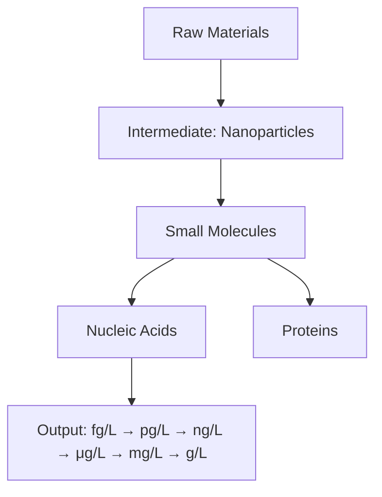
</details>

# CONTENTS

1. Introduction B   
2. Electrochemical Biosensors C   
2.1. Types of Electrochemical Biosensors C   
2.1.1. Voltammetric/Amperometric Biosensors D   
2.1.2. Impedimetric Biosensors D   
2.1.3. Conductometric and Capacitive Biosensors E   
2.1.4. Potentiometric Biosensors E   
2.1.5. Field-Effect Transistor-Based Biosensors E

2.2. Biosensor Recognition Elements E

2.2.1. Antibodies E   
2.2.2. Antibody Fragments E   
2.2.3. Enzymes E   
2.2.4. Receptors E   
2.2.5. Lectins E

2.2.6. Whole Cells E

2.2.7. Peptides/Proteins E

2.2.8. Nucleic Acids E

2.2.9. Aptamers F

2.2.10. Peptide Nucleic Acids (PNAs) F

2.2.11. Locked Nucleic Acids (LNAs) F

2.2.12. Molecularly Imprinted Polymers (MIPs) F

2.3. Integrated Electrochemical Assays F   
2.3.1. PDMS-Based Microfluidic Devices G   
2.3.2. PMMA-Based Microfluidic Devices G   
2.3.3. Paper-Based Microfluidic Devices G

3. Electrochemical Analysis of Small Molecules G

3.1. Neurotransmitters G   
3.1.1. Dopamine (DA) G

3.1.2. Acetylcholine (ACh)   
3.1.3.Serotonin J   
3.1.4. Epinephrine (Ep) J   
3.1.5. Norepinephrine (NE) J   
3.1.6. Nitric Oxide (NO) J   
3.1.7. Glutamate (Glu) K   
3.1.8. Tryptamine K   
3.2. Metabolites K   
3.2.1. Glucose K   
3.2.2. Lactose L   
3.2.3. Uric Acid (UA) L   
3.2.4. Urea L   
3.2.5. Cholesterol M   
3.2.6. Lactate M   
3.2.7. Hydrogen Peroxide (HP) N   
3.2.8. Creatine O   
3.2.9. Creatinine O   
3.2.10. Ketone Bodies O   
3.2.11. Xanthine O   
3.2.12. Hypoxanthine O   
3.3. Vitamins O   
3.4. Amino Acids P   
3.5. Dietary Minerals Q   
3.6. Other Small Molecules R   
3.6.1. Nicotinamide Adenine Dinucleotide (NAD) R   
3.6.2. Adenosine Monophosphate (AMP) R   
3.6.3. Adenosine Triphosphate (ATP) S

Received: April 6, 2016

3.6.4. Glutathione T

3.6.5. Heparin U

3.6.6. Levodopa (L-DOPA) U

3.7. Electrochemical Small Molecule Analysis in Present-Day Clinical Medicine

4. Electrochemical Analysis of Nucleic Acids V

4.1. Application of Nucleic Acid Analysis in Diagnostic Medicine V

4.2. Electrochemical Detection of Clinically Relevant Nucleic Acids W

4.2.1. DNA Detection Strategies W

4.2.2. RNA Detection Strategies AD

4.3. Sensitivity Challenges for Electrochemical Nucleic Acid Detection Systems

5. Electrochemical Analysis of Proteins AJ

5.1. Tumor Markers AJ

5.1.1. Prostate-Specific Antigen (PSA) AJ

5.1.2. Carcinoembryonic Antigen (CEA) AK

5.1.3. $\alpha$ -Fetoprotein (AFP) AL

5.1.4. Cancer Antigen (CA) AM

5.1.5. Squamous Cell Carcinoma Antigen (SCCA) AN

5.1.6. Neuron-Specific Enolase (NSE) AN

5.1.7. Human Epididymis-Specific Protein 4 (HE4) AN

5.1.8. Ferritin AO

5.1.9. Calcitonin (Ct) AO

5.1.10. Human Chorionic Gonadotropin (hCG) AO

5.1.11. Urokinase Plasminogen Activator (uPA) AO

5.1.12. Glutathione-S-transferase (GST) AO

5.1.13. Alkaline Phosphatase (ALP) AO

5.1.14. Lactate Dehydrogenase (LDH) AP

5.1.15. Vascular Endothelial Growth Factor (VEGF) AP

5.1.16. Vascular Endothelial Growth Factor Receptor (VEGFR) AQ

5.1.17. Epidermal Growth Factor Receptor (EGFR) AQ

5.1.18. Human Epidermal Growth Factor Receptor 2 (HER2) AQ

5.1.19. Human Epidermal Growth Factor Receptor 3 (HER3) AQ

5.1.20. Mucin 1 (MUC 1) AR

5.1.21. Platelet-Derived Growth Factor B Chain Dimer (PDGF-BB) AR

5.1.22. Nuclear Matrix Protein 22 (NMP22) AS

5.1.23. Tenascin-C (TN-C) AS

5.1.24. p53 Tumor Suppressor Protein (p53) AS

5.1.25. Fibrinogen (Fib) AT

5.1.26. Cluster of Differentiation 146 Antigen (CD146) AT

5.1.27. Cluster of Differentiation 105 Antigen (CD105) AT

5.1.28. Estrogen Receptor (ER) AT

5.1.29. Interleukin 6 (IL-6) AT

5.1.30. Interleukin 8 (IL-8) AU

5.1.31. Matrix Metallopeptidase 9 (MMP-9) AU

5.1.32. Cyclin-Dependent Kinase Inhibitor (p16 $^{INK4a}$ ) AU

5.1.33. Murine Double Minute 2 (MDM2) AU

5.1.34. Nuclear Factor Kappa B (NF- $\kappa$ B) AU

5.1.35. Apurinic/Apyrimidinic Endonuclease 1 (APE1) AU

5.1.36. Breast Cancer Type 1 and 2 Susceptibility Proteins (BRCA1 and BRCA2) AU

5.1.37. Telomerase AV

5.1.38. Protein Kinase AV

5.1.39. DNA Methyltransferase (DNA-MTase) AY

5.2. Cardiac Markers AY

5.2.1. Troponin I (cTnI) AY

5.2.2. Troponin T (cTnT) AZ

5.2.3. Myoglobin (Mb) AZ

5.2.4. Amino-Terminal Pro-B-type Natriuretic Peptide (NT-proBNP) BA

5.2.5. Creatine Kinase-Myocardial Band (CK-MB) BA

5.2.6. Apolipoprotein B-100 (ApoB-100) BA

5.2.7. P-Selectin BB

5.2.8. Heart Fatty Acid-Binding Protein (H-FABP) BB

5.2.9. Aspartate Transaminase (AST) BB

5.3. Hepatic Markers BC

5.3.1. Alanine Transaminase (ALT) BC

5.3.2. γ-Glutamyl Transpeptidase (GGT) BC

5.3.3. Bilirubin (BR) BC

5.3.4. Human Serum Albumin (HSA) BC

5.4. Inflammatory Markers BC

5.4.1. C-Reactive Protein (CRP) BC

5.4.2. Tumor Necrosis Factor- $\alpha$ (TNF- $\alpha$ ) BD

5.4.3. Haptoglobin (Hp) BD

5.4.4. Transferrin (TSF) BD

5.4.5. Transthyretin (TTR) BD

5.4.6. Insulin-Like Growth Factor-1 (IGF-1) BE

5.4.7. $\alpha$ -Amylase BE

5.5. Other Protein Markers BE

5.5.1. Antibodies BE

5.5.2. Hemoglobin (Hb) BG

5.5.3. Glycated Hemoglobin (HbA $_{1c}$ ) BG

5.5.4. Interferon- $\gamma$ (IFN- $\gamma$ ) BH

5.5.5. Retinol-Binding Protein (RBP) BH

5.5.6. Trypsin BH

5.5.7. Endotheline-1 (ET-1) BH

5.5.8. Thrombin (TB) BH

5.5.9. $\beta$ -Amyloid Peptide (A $\beta$ ) BI

5.5.10. Tau Protein BJ

5.5.11. Caspase-3 BJ

5.5.12. Hormones BK

5.6. Sensitivity and Specificity Challenges for Electrochemical Protein Analysis Systems BK

6. Summary and Prospects BK

Author Information BK

Corresponding Author BK

Notes BK

Biographies
BK

Acknowledgments BL

Abbreviations BL

References BM

# 1. INTRODUCTION

The detection of clinically relevant molecules, including small molecules, nucleic acids, and proteins, is fundamental to understanding their biological and physiological functions and to developing clinical diagnostics. $^{1}$ These molecules carry out many biological functions, including storing and transmitting genetic information, regulating biological activities, transporting

  
Figure 1. Reference ranges for clinically relevant small molecules, nucleic acids, and proteins sorted by mass. The value for bacterial nucleic acids corresponds to levels observed in clinical swab and urine specimens. The value for viral nucleic acids corresponds to levels observed in clinical swab and urine specimens.

small molecules, and catalyzing reactions. Moreover, they can be used as biomarkers in the diagnosis of many diseases. Clinical analysis is no longer performed exclusively in clinical laboratories. $^{2}$ Instead, it is routinely carried out in several settings, including hospital point-of-care settings, by caregivers in nonhospital settings, and by patients at home. $^{3}$ Electrochemical detection systems are ideally suited for these new applications. $^{4}$

Electrochemical sensing strategies have the potential to achieve rapid, sensitive, selective, and low-cost detection of biomolecular analytes relevant to clinical diagnosis and monitoring treatment of disease. $^{5}$ A variety of strategies for target recognition and signal transduction have allowed the development of a vast array of electrochemical assays. Electrochemical sensing platforms have been successfully transitioned from the central lab to the point-of-care for the detection of small molecules, such as glucose and lactate, using enzymatic approaches. $^{6,7}$ In contrast, detection of larger biomolecules, such as nucleic acids and proteins, requires further innovation to overcome challenging problems related to nonspecific adsorption of nontarget molecules and lack of enzyme/analyte pairs for many analytes.

This Review will acquaint the reader with recently developed electrochemical approaches that can be deployed for analysis of clinically relevant biomolecules. Examples of the biomolecular analytes of interest as well as their reference values are provided in Figure 1. This is a large and rapidly advancing field, and this Review attempts to provide comprehensive coverage of the last five years of progress to inform the selection of targets for future work. Overviews of different sensors are presented combined with important performance metrics including dynamic range and limit of detection (LOD). We also discuss the new frontiers in the field and the challenges to be addressed.

# 2. ELECTROCHEMICAL BIOSENSORS

An electrochemical biosensor is an integrated device that provides analytical information, either quantitative or semi-quantitative, using a biorecognition strategy involving an electrochemical transducer (e.g., an electrode or field-effect transistor). $^{8}$

# 2.1. Types of Electrochemical Biosensors

Electrochemical techniques discussed in this Review can be organized into five main types, including voltammetric/amperometric, impedimetric, conductometric, potentiometric,

and field-effect transistor-based biosensors. The principles behind each approach are outlined below.

2.1.1. Voltammetric/Amperometric Biosensors. Voltammetric and amperometric biosensors apply a potential to a working electrode versus a reference electrode and measure the current. The current arises from electrolysis by means of an electrochemical oxidation or reduction at the working electrode and is limited by the mass transport rate of the reactant molecules from the bulk solution to the electrode interface. Voltammetric biosensors measure current as the potential is ramped at a given rate, and the current response is usually a peak or a plateau that is proportional to the concentration of analyte. Amperometric biosensors allow the detection of an analyte by measuring the current at a constant applied potential at the working electrode with respect to the reference electrode. In this technique, the potential is stepped directly to the desired value and the current is then measured. Amperometric biosensors offer additional selectivity because their oxidation or reduction potential used in analysis is typically characteristic of the analyte species. $^{9}$ The different combinations of parameters, including potential (E), current (I), charge (Q), and time (t), make for a long list of electrochemical techniques. In this section, we will provide a brief summary of the techniques that were used throughout this Review.

2.1.1.1. Linear Sweep Voltammetry (LSV). In LSV, the electrode potential is varied at a constant rate throughout the scan, and the resulting current is measured.

2.1.1.2. Alternating Current Voltammetry (ACV). During ACV an alternating potential is added to the DC potential ramp used for LSV. Only the AC portion of the total current is measured and plotted versus the DC potential portion of the potential ramp.

2.1.1.3. Cyclic Voltammetry (CV). In CV, the applied potential is varied at a working electrode in both forward and reverse directions while monitoring the current. Depending on the analysis, a partial cycle, one full cycle, or a series of cycles can be carried out. CV is widely used for the study of redox processes, monitoring reaction intermediates, and stability assessment of reaction products.

2.1.1.4. Chronoamperometry (CA). In CA, the current response is studied as a function of time after a potential step large enough to initiate a chemical reaction is applied to an electrode.

2.1.1.5. Chronocoulometry (CC). In a CC experiment, the charge used in an oxidation or reduction reaction is measured and plotted versus to time. The excitation waveform used in CC is similar to that used in CA, but the resulting curve shows an increase of charge with time, rather than the decrease of current with time that can be observed in CA. In addition, CC allows for more accurate determination of a kinetic rate constant.

2.1.1.6. Chronopotentiometry (CP). CP is a technique in which a constant current, or a current step, is applied to the electrode and the resulting potential change is monitored over time.

2.1.1.7. Pulse Methods. To improve the speed and sensitivity, many forms of potential modulation have been developed. Two of these pulse techniques, including differential pulse voltammetry and square wave voltammetry, are widely used.

2.1.1.8. Differential Pulse Voltammetry (DPV). In this technique, the potential is scanned with a series of pulses with fixed small amplitude (10–100 mV) and superimposed on a slowly changing base potential. The current is determined at two points for each pulse; the first point is registered before the pulse

application, and the second is taken at the end of the pulse. These sampling points are selected to allow for the decay of the nonfaradic (charging) current. The difference between current measurements at these points is determined for each pulse and plotted as a function of the base potential.

2.1.1.9. Square Wave Voltammetry (SWV). In SWV, the excitation signal consists of a symmetrical square-wave pulse of amplitude $E_{sw}$ superimposed on a staircase waveform of step height $\Delta E$ , where the forward pulse of the waveform coincides with the staircase step. The net current is centered on the redox potential and is determined by measuring the difference between the forward and reverse currents. SWV has several advantages, including its excellent sensitivity, speed, and discrimination against nonfaradic current.

2.1.1.10. Preconcentration and Stripping Techniques. These techniques have the lowest detection limits of any of the commonly used electrochemical techniques. The three most commonly used preconcentration and stripping techniques include anodic stripping voltammetry, cathodic stripping voltammetry, and adsorptive stripping voltammetry. Even though each technique has its own unique features, all have two steps in common. First, the target analyte in the sample solution is concentrated onto the working electrode. In the second step, the preconcentrated analyte is stripped from the electrode surface by the application of potential and measured. Potential waveforms can be used in the stripping step, such as linear sweep, differential pulse, and square wave. The most common are the differential pulse or square wave due to their abilities to discriminate against charging current. In addition, square wave has the added advantages of rapid scan rate and enhanced sensitivity as compared to differential pulse.

2.1.1.11. Anodic Stripping Voltammetry (ASV). In ASV, the metal ions in a sample are concentrated onto the electrode surface by application of a negative potential. The metals are then oxidized and stripped off of the electrode surface by scanning to positive potentials. The peak currents that result are correlated to the concentration of each metal in the sample solution. In addition, the position of the peak potential is characteristic for each metal. ASV is widely used for the determination of trace metals and has a detection limit of parts per trillion.

2.1.1.12. Cathodic Stripping Voltammetry (CSV). In CSV, the anions in a sample are concentrated on the electrode surface by applying a positive potential. A negative potential scan will then strip out the deposited film. This method has been used to analyze inorganic anions and halides.

2.1.1.13. Adsorptive Stripping Voltammetry (AdSV). AdSV is similar to anodic and cathodic stripping techniques. The main difference is that preconcentration occurs via adsorption on the electrode surface or by a specific reaction at a chemically modified electrode rather than by accumulation via electrolysis. The adsorbed species is quantified by measuring a voltammetric response, the amplitude of which is proportional to the concentration of the species. Many organic and inorganic species can be analyzed using AdSV.

2.1.2. Impedimetric Biosensors. Electrochemical impedance spectroscopy (EIS) determines the resistive and capacitive properties of materials upon perturbation of the system by a small amplitude sinusoidal AC excitation signal ( $\sim$ 2–10 mV). The frequency is changed over a wide range to obtain an impedance spectrum. The in-phase and out-of-phase current responses are then measured to determine the resistive and capacitive components of the circuit. At high frequency, the migration rate of the redox species to the electrode surface

becomes rate limiting, and thus analytes that block access to the electrode surface can generate a frequency-dependent phase lag between the AC voltage and current. $^{9}$

2.1.3. Conductometric and Capacitive Biosensors. Conductometric biosensors measure changes in the electrical conductivity of a sample solution as the composition of the solution changes during a chemical reaction. Conductometric biosensors often include enzymes whose charged products cause changes in the ionic strength of the sample solution. $^{10}$ In general, capacitive biosensors have the advantage that capacitance measurements are more indicative of the insulating properties of the biosensor. $^{11}$ Even minor desorption of the sensing layer is usually translated into an increase in the capacitance baseline. $^{12}$ In addition, capacitive sensors are less prone to nonspecific binding.

2.1.4. Potentiometric Biosensors. Potentiometric biosensors measure the potential of an electrochemical cell while drawing negligible current. These sensors usually contain an electrochemical cell with two reference electrodes capable of measuring the potential across an ion-selective membrane that reacts with the charged ion of interest. Biological elements such as enzymes are commonly integrated into potentiometric sensors to catalyze the reaction that forms the ion, which can be detected by the underlying electrode. $^{9}$

2.1.5. Field-Effect Transistor-Based Biosensors. Field-effect transistor (FET)-based biosensors detect a change in source-drain channel conductivity arising from the electric field of its environment. The electrical conductance of the channel is proportional to its carrier density, and this is readily sensed via the change in the source-drain voltage–current. $^{13}$

Of all of these methods, voltammetric approaches are the most widely deployed. This type of measurement strategy has the most flexibility, and the signals that are generated are straightforward to interpret.

# 2.2. Biosensor Recognition Elements

Molecular recognition is central to biosensing. Initially, biosensor recognition elements were obtained from living systems. However, many recognition elements are synthetic and have been prepared in the laboratory. The recognition element plays a crucial role in the overall biosensor performance and selectivity toward a particular analyte. Recognition elements currently used in the preparation of electrochemical sensors for clinically relevant biomolecules include antibodies, antibody fragments, enzymes, receptors, lectins, whole cells, peptides/proteins, nucleic acids, aptamers, peptide nucleic acids, locked nucleic acids, and molecularly imprinted polymers.

2.2.1. Antibodies. Antibodies are proteins produced by the immune system. They feature antigen recognition sites, which can bind to their respective antigens by noncovalent interactions with relatively high affinity. The antigen-binding fragments of the molecules comprise the heavy chain variable region ( $V_{H}$ ) and the light chain variable region ( $V_{L}$ ). Both fragments fold to provide a perfect fit for the specific antigen. Frequently, sensor design makes use of antibody sandwiches, where capture antibodies are immobilized onto the surface of the sensor, while labeled reporter antibodies bind to the analyte to provide a signal. Antibodies could be either polyclonal or monoclonal. In contrast to polyclonal antibodies, which are produced by different immune cells, monoclonal antibodies are produced by identical immune cells that are all clones of a unique parent cell. In addition, they have monovalent affinity and bind to the same epitope within the antigen. $^{14}$

2.2.2. Antibody Fragments. For sensing applications, only the antigen-binding fragment of the antibody is required for biomolecular recognition, while the crystallizable fraction is not involved in target binding. Smaller antibody fragments have more defined immobilization sites through thiol groups liberated after cleavage of the whole antibody molecule. In addition, these small fragments could be more densely packed onto the sensor surface, thus improving the interaction with the target analyte. Enzymatic cleavage of antibodies is one way to produce antigen-binding fragments. Phage display and ribosome display techniques for antibody gene cloning and expression are other alternatives to produce single chain variable fragments. These fragments feature the $V_{H}$ and $V_{L}$ domains connected by a flexible polypeptide linker that can be designed to have desirable properties for immobilization. $^{15}$

2.2.3. Enzymes. Enzymes are catalytic proteins with an active site that has some features similar to those of antigen-binding fragment of antibodies, that is, exquisite specificity for certain molecules, known as their substrates. Enzymes are not only used as recognition elements per se, but are commonly conjugated to a secondary recognition element to allow for signal amplification. Of all enzyme recognition element-based biosensors, glucose biosensors are the most widely studied and used. $^{16}$

2.2.4. Receptors. Receptors are transmembrane and soluble proteins that bind to specific molecules called ligands to initiate a specific cellular response. Receptor preparations are attractive recognition elements because they can bind to their ligands with high affinity and selectivity. Nevertheless, their low yield, relative instability, tedious isolation methods, and transduction difficulties have significantly impeded the pursuit of receptor-based sensing. However, recombinant techniques are currently used to generate large amounts of receptor proteins, thus alleviating many of the earlier logistical issues.

2.2.5. Lectins. Lectins represent a broad family of proteins involved in many biological processes. They generally exhibit strong binding affinities to specific carbohydrates, known as glycans. Their specific binding has been exploited in biosensor design. $^{17}$ Although there are a variety of ligand-specific lectins available, Concanavalin A remains one of the most widely used lectins for carbohydrate detection.

2.2.6. Whole Cells. The term whole cells often refers to microbial cells. In whole cell-based sensors, the whole cellular machinery functions as a recognition system for the target analyte. For instance, bacterial cells can be induced to produce amino acid metabolizing enzymes that can be used in the detection of that particular amino acid. $^{18}$

2.2.7. Peptides/Proteins. Using techniques such as phage, bacterial, and ribosome display, it is now possible to produce peptides/proteins with strong binding affinities to specific ligands. In each technique, iterative rounds of affinity purification are employed to produce proteins/peptides with desired binding properties. $^{19}$ The unique feature of phage display is that the production of $10^{7}-10^{8}$ short peptides on the surface of filamentous phages can be achieved via the fusion of an epitope library of DNA sequences and one of several coat proteins. These peptides are screened, and candidates exhibiting specific binding properties can be integrated into many analytical platforms. For example, a number of peptide- and protein-based electrochemical sensors have been described in the literature, many of which feature impressive sensitivity and selectivity. $^{20-26}$

2.2.8. Nucleic Acids. In classical nucleic acid-based sensors, often referred to as genosensors, the biorecognition process involves noncovalent interactions between bases of comple-

mentary nucleic acid strands and is manifested by hybridization between an immobilized capture probe and a complementary target sequence. $^{27,28}$ The immobilized nucleic acid could be either a stem-loop probe (SLP) or linear probe (LP). $^{29-31}$ In SLP sensors, the probe is usually tagged with a redox label that is positioned in proximity to the electrode surface in absence of the target sequence. Upon hybridization with the target sequence, the flexibility of redox-labeled probe is hindered, diminishing the electron transfer efficiency (signal-OFF). $^{32}$ In LP sensors, the redox-labeled probe is highly flexible in the absence of the target sequence. Target hybridization induces a change in probe dynamics, leading to a reduction of the redox current (signal-OFF). $^{33}$ A signal-ON sensor is fabricated using a redox-labeled linear DNA probe containing a flexible linker. Target hybridization induces the formation of “close” structure, positioning the redox label close to the sensor surface and subsequently resulting in an increase in the redox current. $^{34,35}$ Displacement-based genosensors represent another class of signal-ON sensors in which the capture probe is partially hybridized with a redox-labeled DNA. In the presence of the target sequence, a new hybrid is formed and the redox-labeled DNA is released to form a hairpin structure, thus bringing the redox label close to the electrode surface and consequently resulting in an increase in redox current. $^{36-38}$ interestingly, nucleic acids are used as recognition elements to develop electrochemical ion sensors. In the absence of the target ion, the redox-labeled thymine-containing DNA probes are highly flexible, enabling efficient electron transfer between the electrode and redox label. Binding of Hg(II) or Au(III) rigidifies the probe, resulting in a decrease in the redox current (signal-OFF). $^{39,40}$

2.2.9. Aptamers. Aptamers are nucleic acid ligands that are isolated from libraries of oligonucleotides by an in vitro selection process called systematic evolution of ligands by exponential enrichments (SELEX). $^{41,42}$ In contrast to base pairing exhibited by nucleic acids, aptamers can fold to form highly specific three-dimensional structures due to their self-annealing properties. The selectivity and binding affinity of aptamers can be similar to those of the corresponding antibodies. However, the selectivity $^{43,44}$ and binding affinity $^{45}$ of aptamers can be tailored during the selection process. Another advantage of aptamers over antibodies is that they are inherently stable, so that they can be subjected to numerous rounds of denaturation and renaturation, thus allowing for an easy regeneration of the sensor surface. Aptamers are produced by chemical synthesis after selection and sequencing, and so they can be readily modified to enhance their affinity and stability. A variety of electrochemical aptamer-based sensors (aptasensors) have been fabricated to detect a plethora of analytes ranging from small molecules $^{46}$ to large microorganisms $^{47-50}$ and cells. $^{51,52}$ Many signal-ON aptasensors rely on the formation of a layer of partially unfolded redox-labeled aptamer probe on the electrode surface. Upon binding to the target, the probe forms a “close” structure $^{53}$ or a “three-way junction”, $^{54,55}$ thus bringing the redox label in proximity to the electrode surface and subsequently increasing the redox current.

Catalytic aptamers called aptazymes (RNAzymes and DNAzymes) are aptamers possessing allosteric properties that convert the recognition of target analytes into catalytically generated signals. DNAzymes can be easily engineered to detect many classes of biological molecules. In addition, DNAzymes can be repeatedly denatured without losing their catalytic or binding properties. $^{56-58}$

2.2.10. Peptide Nucleic Acids (PNAs). PNAs are synthetic DNA analogues with a polyamide backbone instead of the sugar phosphate backbone. The uncharged nature of PNAs is mainly responsible for the thermal stability of PNA–DNA hybrids as compared to DNA–DNA equivalents. Hence, single-base mismatches in PNA/DNA hybrids have a considerable more destabilizing effect that can be easily interrogated. PNAs are resistant to nucleases and proteases. In addition, PNAs can form higher order complexes (3- and 4-stranded) with DNA. Hence, they can be used for the detection of double-stranded DNA (dsDNA) directly without thermal denaturation. $^{59}$

2.2.11. Locked Nucleic Acids (LNAs). LNAs are modified RNA nucleotides. The ribose moiety of an LNA nucleotide is modified with a methylene linkage connecting the 2' oxygen and 4' carbon. The bridge locks the ribose in the 3'-endo conformation. LNAs can hybridize with DNAs and RNAs according to Watson–Crick base-pairing rules to form highly stable hybrids that are compatible with most enzymes. $^{60}$

2.2.12. Molecularly Imprinted Polymers (MIPs). Molecular imprinting is a method for making selective binding sites in synthetic polymers using molecular templates. Following polymerization, the template molecule is extracted from the polymeric matrix using a suitable solvent or by chemical cleavage, leaving a cavity within the polymeric matrix, which can be used to capture the target analyte. MIPs offer great promise for the production of stable “solid-state like” synthetic recognition elements. $^{61,62}$ MIPs have been successfully utilized to develop sensing platforms for small molecules (200–1200 Da range). Detection of larger biomolecules remains challenging because the formation of the template cavity to conform to the three-dimensional image of the biomolecule may be difficult. Nevertheless, recent studies have shown that MIPs can be fabricated using biomolecular templates such as presented by a protein cancer marker, cancer antigen 125 (CA-125, molecular weight 200 kDa), enabling a subsequent binding of those targets. $^{63}$

# 2.3. Integrated Electrochemical Assays

As compared to carrying out electrochemical analysis in bulk solution, microfluidics can speed up the interaction between the recognition element and the target analyte by reducing the distance required for interaction. Smaller channel dimensions lead to smaller sample volumes, which can subsequently reduce the amount of sample and reagents required for analysis. Reduced dimensions can also lead to miniaturized portable devices that can enable on-site analysis. Finally, integration of multiple processes, such as labeling, separation, and detection, in a microfluidic device is highly amenable for many applications. $^{64-66}$

Microfluidic platforms are fabricated from inorganic materials (e.g., silicon, $^{67}$ glass, $^{68}$ and ceramics $^{69}$ ), polymers (e.g., elastomers $^{70}$ and thermoplastics $^{71}$ ), and paper. $^{72}$ The choice of material depends on the application, detection system, fabrication facility, cost, and other factors including thermal conductivity, sealing properties, and resistance to different chemicals. Silicon, glass, and ceramics are more expensive and less flexible to work with, as compared to polymers. Fabrication of polymer-based microfluidics does not have stringent requirement on clean room facility. Within the past few years, paper-based microfluidic devices have been widely used as a lower-cost microfluidic platform. $^{73}$

The majority of single-step electrochemical assays are based on microfluidic devices integrated with embedded electrodes or electrode arrays. $^{46,74-78}$ These devices were predominantly made from elastomers (e.g., polydimethylsiloxane, PDMS),

thermoplastics (e.g., poly(methyl methacrylate), PMMA), and paper.

2.3.1. PDMS-Based Microfluidic Devices. PDMS is one of the most widely used elastomers as it is cheap, elastic, and cures at low temperature. In contrast to other polymers, PDMS is gas permeable, which can be advantageous for $O_{2}$ and $CO_{2}$ transport in cellular studies. However, bubble formation caused by passage of gas through PDMS can cause technical problems. Because of its hydrophobicity, PDMS is prone to nonspecific adsorption and permeation by hydrophobic molecules. $^{79}$ Chemical modification of PDMS can often address these problems. In addition, plasma exposure can hydrophilize the exposed PDMS surface but only lasts for a short period. $^{80}$ Although PDMS is one of the most widely used materials to fabricate cost-effective microfluidic platforms, the fabricated devices have some limitations as well. PDMS swells in organic solvents and low molecular weight organic solutes. It cannot withstand high temperature, and its mechanical stability is quite low. There are several methods available for the fabrication of PDMS devices including soft lithography, casting, imprinting, injection molding, hot embossing, and laser ablation. $^{81,82}$ Importantly, multiple layers can be stacked to create complex microfluidic designs. $^{83}$ In recent years, several PDMS-based microfluidic devices were designed to allow for efficient capture of circulating tumor cells. $^{84-88}$ Several PDMS-based microfluidic devices integrated with electrochemical sensors have been developed for the analysis of clinically relevant proteins, such as prostate-specific antigen, $^{89}$ interleukin 6, $^{89}$ C-reactive protein, $^{90}$ and apolipoprotein E. $^{91}$

2.3.2. PMMA-Based Microfluidic Devices. PMMA, formed through the polymerization of methyl methacrylate, is widely known under the name lucite and Plexiglas. PMMA patterns can be formed by injection molding or hot embossing. Several advantages of this material include gas impermeability, biological compatibility, and ease of micromachining at relatively low temperatures ( $\sim$ 100 °C). $^{92}$ PMMA offers better performance than PDMS under mechanical stress. In addition, it does not require long fabrication and curing time. PMMA-based multilayered devices can be completely fabricated in few hours. PMMA-based microfluidic devices integrated with electrochemical sensors have been employed for the analysis of clinically relevant proteins, such as $\alpha$ -fetoprotein $^{93}$ and aminoterminal pro-B-type natriuretic peptide. $^{94}$

2.3.3. Paper-Based Microfluidic Devices. Paper is a flexible, cellulose-based material that has recently emerged as a promising microfluidic substrate for several reasons: (1) paper can transport liquids via the capillary effect without the assistance of an external force; (2) inkjet and solid wax printing enable facile functionalization and pattern definition; (3) paper is biologically compatible and can be chemically modified; (4) the high surface to volume ratio provided by the macroporous structures in paper improves the immobilization of recognition elements, allowing for rapid detection; (5) paper-based microfluidic devices can be fabricated both in 2D and in 3D for either horizontal and vertical flow; and (6) the material can be easily disposed by natural degradation. Electrochemical detection in paper microfluidics was first demonstrated using a three-electrode design to analyze clinically relevant small molecules, such as glucose, lactate, and uric acid in human serum. $^{72}$

Integration of electrochemical detection into paper-based microfluidic devices has led to the development of several low-cost, easy-to-use portable diagnostic devices. Microfluidic channels can be fabricated on cellulose paper and wax-patterned paper using photolithography. Electrodes can be fabricated by several methods, including screen-printing, direct writing with a pen dispensing conductive material, spraying conductive inks through stencils, and physical deposition of metals. However, screen-printing remains the most convenient method for electrode fabrication. $^{95}$ Paper-based microfluidic devices integrated with electrochemical sensors have been used in the analysis of clinically relevant small molecules, such as glucose, lactate, and uric acid, $^{96}$ and proteins, such as carcinoembryonic antigen, $^{97,98}$ $\alpha$ -fetoprotein, $^{97}$ cancer antigen 125, $^{97}$ and immunoglobulins. $^{99}$

# 3. ELECTROCHEMICAL ANALYSIS OF SMALL MOLECULES

Clinically relevant endogenous small molecules and ions include neurotransmitters, metabolites, vitamins, amino acids, dietary minerals, and other small biomolecules. In this section, we review several approaches adopted for the selective detection of small molecules and ions, including: (i) using specific biorecognition elements such as antibodies, biological receptors, aptamers, MIPs, enzymes, enzyme-mimicking metalloproteins, coenzymes, whole cells, affinity ligands, double-stranded nucleic acids, DNAzymes, and ionophores in case of ion detection; (ii) the use of conducting films and electrocatalytic electrode-coating materials to enhance the response current and reduce the overpotential to minimize the interference caused by other electrochemical analogues; (iii) using nanostructured interfaces to amplify the signal and subsequently improve the temporal resolution of the sensor; and (iv) chemometrics that resolve the overlapping signals of the target small molecules and other interfering species. Combinations of two or more of these approaches have also been pursued to improve the analytical performance of biosensors.

# 3.1. Neurotransmitters

Neurotransmitters are endogenous chemical messengers that transmit, enhance, and convert specific signals between neurons and other cells. Neurotransmitters include dopamine, acetylcholine, serotonin, epinephrine, norepinephrine, nitric oxide, glutamate, and tryptamine. A variety of electrochemical methods are available for the measurement of these analytes both in vitro and in vivo.

3.1.1. Dopamine (DA). DA is a catecholamine neurotransmitter widely present in the central nervous system. It influences a variety of motivated behaviors, attention span, and neuronal plasticity and plays a critical role in memory and learning. Altered levels of DA have been implicated in several neurological disorders including Parkinson's disease and schizophrenia. $^{100}$ The normal values of DA in blood range from 10 to 480 pM. $^{101}$ Monitoring of DA, in the presence of other chemical analogues such as epinephrine, norepinephrine, serotonin, ascorbic acid, uric acid, catechol, phenethylamine, tyramine, and tyrosine, is crucial in the diagnosis and mechanistic understanding of human neuropathology.

A voltammetric immunosensor for DA was designed on the basis of magnetic particles (MPs) coated with anti-DA monoclonal antibody. $^{102}$ Carbon nanotubes (CNTs) were adsorbed on the surface of the MPs. The magnetic entrapment of the CNT/MP hybrids onto a gold screen-printed electrode placed on top of a magnet allowed for straightforward electrochemical sensing of DA by exploiting CNTs as a wiring tool. Cyclic voltammetry (CV) permitted the determination of DA level in the linear range from 780 pM to 50 $\mu$ M, with a limit of detection (LOD) of 120 nM.

An amperometric aptasensor for DA was fabricated on the basis of the electrostatic interactions between a negatively charged DA-specific aptamer and a positively charged cysteamine-modified gold electrode. $^{103}$ The sensor allowed for quantification of DA over the range from 100 nM to 5 $\mu$ M. In addition, interference from ascorbic and uric acid was rendered negligible by coating the sensor surface with a Nafion-coated membrane.

Recently, the aptamer affinity to DA was enhanced by 1 order of magnitude via regulating the electrostatic immobilization of the aptamer. $^{[104]}$ Under optimal conditions, the dissociation constant of the aptamer was $0.12 \pm 0.01 \mu M$ as compared to $1.6 \pm 0.17 \mu M$ in solution. Remarkably, the amperometric sensor demonstrated more robustness and allowed for a more selective determination of DA level in the range from 100 nM to $2 \mu M$ , with negligible interference from structurally related catecholamines.

A FET-based aptasensor for DA was recently developed in which a multiple-parallel-connected silicon nanowire field-effect transistor (MPC/SiNW-FET) was modified using a DA-specific aptamer (Figure 2). $^{105}$ As compared to conventional electrochemical methods, the nanoelectronic device lowered the LOD of DA to 100 pM and did so even in the presence of other chemical analogues.


<details>
<summary>text_image</summary>

15 - 20 µm
Hypoxic buffer
PC12 cell
Dopamines
Ca²⁺
Nu
DAQ
Lock-in
amplifier
S
D
3 µm
MPC aptamer/SiNW-FET
S
D
</details>

Figure 2. Illustration of an aptamer-modified silicon nanowire field-effect transistor (FET) device for detecting exocytotic DA under hypoxic stimulation from living PC12 cells (left). Optical microscopy image of the device (right). S, source; D, drain. Reprinted with permission from ref 105. Copyright 2013 American Chemical Society.

A MIP-based voltammetric sensor for DA was prepared using a core–shell composite of gold nanoparticles (GNPs) and biocompatible porous sol–gel $SiO_{2}$ preformed on the surface of a glassy carbon electrode (GCE). $^{106}$ The template DA molecules were first adsorbed on the GNPs surface; then they were further assembled onto the polymer membrane via hydrogen bonding and $\pi-\pi$ interactions between the template molecules and the silane monomers. Subsequently, CV was carried out to strip out the DA molecules from the imprinted membrane. Differential pulse voltammetry (DPV) permitted the measurement of DA in the linear range from 48 nM to 50 $\mu$ M, with a LOD of 20 nM.

To enhance further the selectivity of MIP-based detection of DA, a combination of boronic acid functional groups and molecularly imprinted cavities of poly(aniline-co-anthranilic acid) (PANANA) was utilized as the support material. $^{107}$ This receptor, which bore a covalent ester linkage to DA via boronic acid, was employed as a recognition element for DA. The double recognition through the boronic acid and the shape of the cavities endowed the sensor with high selectivity toward DA. DPV measurements revealed a linear relationship between the peak current and DA concentration in the range from 10 nM to 10 $\mu$ M, with a LOD of 3.3 nM.

An enzymatic implantable microbiosensor is also available for in vivo monitoring of DA. $^{108}$ The biosensor was fabricated using tyrosinase enzyme immobilized in a biocompatible matrix comprising chitosan and ceria-based metal oxides, and was deposited onto the surface of a carbon fiber microelectrode. Tyrosinase catalyzed the conversion of DA to o-dopaquinone, and the reduction of the product was detected at low potential. This amperometric sensor demonstrated a linear range of 5 orders of magnitude between 10 nM and 220 $\mu$ M, with a LOD of 1 nM.

Another DA specific enzyme, laccase, was utilized to construct an amperometric sensing platform for DA via laccase-catalyzed oxidation and intramolecular cyclization of DA. $^{109}$ In this approach, the enzyme was immobilized onto magnetite nanoparticles confined in a fused-silica capillary using an external magnetic field. The resultant magnetic bioreactor was then placed upstream relative to an electrochemical flow cell. Laccase catalyzed the oxidation of DA into a quinonoid form and thereby initiated a series of sequential reactions, including deprotonation, intramolecular cyclization, and oxidation to yield 5,6-dihydroxyindoline quinone. The electrochemical reduction of the product on the surface of a GCE provided the readout for DA measurement, as shown in Figure 3. The amperometric sensor allowed for the detection of 2 $\mu$ M of DA in the brain


<details>
<summary>flowchart</summary>

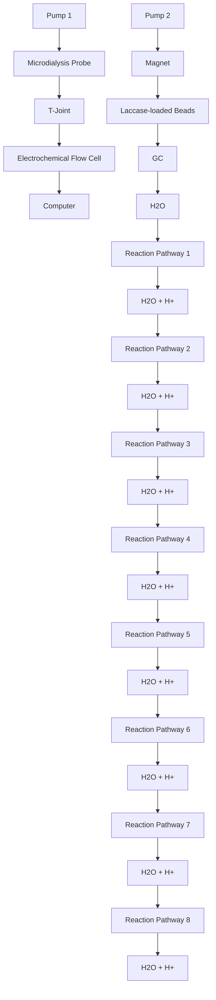
</details>

Figure 3. Schematic illustration of online measurements of dopamine based on a nonoxidative electrochemical approach integrated with in vivo microdialysis and laccase-immobilized magnetic microreactor. Reprinted with permission from ref 109. Copyright 2010 Elsevier.

microdialysate, without significant interference from uric acid and 5-hydroxytryptamine.

Another enzyme-based sensing platform for DA was constructed on the basis of a mixture of horseradish peroxidase (HRP) and multiwalled carbon nanotubes (MWCNTs). The latter were immobilized onto the surface of a carbon paste electrode coated with a polymerized film of glycine through silica sol–gel entrapment. $^{110}$ Using DPV, a calibration curve of DA was obtained in the range from 15 to 865 $\mu$ M, with a LOD of 6 $\mu$ M.

Sensors coated with conducting films have also been employed for selective detection of DA. $^{111}$ In one study, the aromatic $\pi-\pi$ stacking and electrostatic attraction between the positively charged DA and negatively charged porphyrin-functionalized graphene electrode were found to accelerate electron transfer between the DA and the electrode surface. In contrast, oxidation of anionic interferents, such as ascorbic acid and uric acid, was inhibited at the negatively charged porphyrin-modified surface. DPV permitted the analysis of DA level, with a LOD of 10 nM.

In a related approach, a screen-printed carbon electrode was pretreated with an anionic surfactant, sodium dodecyl sulfate, for DA analysis. $^{[112]}$ It was observed that the sodium dodecyl sulfate pretreatment had caused the DA oxidation peak to shift cathodically and became clearly distinguishable from the oxidation peaks of ascorbic and uric acid. Using square wave voltammetry (SWV), a calibration curve of DA was obtained in the range from 1 to 100 $\mu$ M, with a LOD of 370 nM.

Silicon carbide-coated GCEs have also been utilized for selective detection of DA in the presence of interferents. $^{113}$ SWV permitted the interrogation of the DA level in the linear range from 0.2 to 35 $\mu$ M, with a LOD of 50 nM.

Nanomaterial-based interfaces have also been utilized for selective DA analysis. $^{[114]}$ In one study, single-walled carbon nanotubes (SWCNTs) were functionalized with carboxylic groups and assembled onto a carbon-fiber disk electrode modified with a thin, iron hydroxide-decorated, Nafion film. The surface modification allowed for a 9-fold increase in temporal resolution as compared to the bare electrode. Fast-scan cyclic voltammetry (FSCV) permitted a sensitive dopamine analysis, with a LOD of 17 nM.

In another approach to enhance the selectivity of DA analysis using nanostructured surfaces, the electrooxidation of DA was investigated on the surface of five different classes of carbon electrodes. $^{[115]}$ These included a GCE, oxygen-terminated polycrystalline boron-doped diamond, edge plane pyrolitic graphite, basal plane pyrolitic graphite, and the basal surface of highly oriented pyrolitic graphite, encompassing five distinct grades and coverage varying by more than 2 orders of magnitude. Of all of the five carbon electrode types, the highly oriented pyrolitic graphite showed the clearest signal at a low concentration of DA (10 $\mu$ M). Interestingly, repetitive voltammetry caused the products of ascorbic acid oxidation to adsorb onto the surface, forming a perm-selective layer that allowed an unimpeded electrochemical oxidation of DA, while significantly inhibiting the electrochemical response of ascorbic acid.

Using nanostructured interfaces coated with electroactive materials, the selectivity of DA sensors has been enhanced significantly. A sensor coated with a three-layered film, consisting of poly(3,4-ethylenedioxythiophene) as the internal and external layer and poly(N-methylpyrrole) as the intermediate layer, was utilized for voltammetric analysis of DA. $^{116}$ The sensitivity of the three-layered electrode was further enhanced by coating its surface with GNPs. Using CV, the level of DA was determined, with a LOD of $10 \mu M$ and $2-3 \mu M$ in the presence and absence of interferents, respectively.

Chemometrics represents an alternative means to improve the selectivity of assays using mathematical and statistical methods rather than interfacial design techniques. Mutivariate curve resolution using a least-squares approach has been used for selective determination of DA in the presence of other catecholamines. $^{117}$ Chemometrical analysis of the DPV data using an alogarithm to correct the potential drift in the voltammetric response allowed for the analysis of a wide concentration range of DA extending from 0.1 to 205 $\mu$ M, with a LOD of 35.5 nM.

3.1.2. Acetylcholine (ACh). ACh is a neurotransmitter that acts as a key link in the communication between the neurons in the spinal cord and the nerve skeletal junctions in vertebrates. ACh is found in the preganglionic and motor neurons that affect cognition, learning, memory, and muscle tone. A variety of neuropsychiatric disorders such as Parkinson's disease, myasthenia gravis, and Alzheimer's disease are correlated with dysfunctional ACh regulation. The normal values of ACh in blood range between 7.6 and 9.7 nM. $^{118}$ The release of this neurotransmitter occurs at the millisecond time scale, thus requiring a rapid and sensitive method for its detection.

One approach for ACh detection that is available relies on M1 muscarinic ACh receptor expressed in E. coli and subsequently immobilized onto the surface of a SWCNTs-based FET, thus enabling sensitive and selective detection of ACh. $^{119}$ This sensor system provided the first demonstration of real-time detection of ACh. The sensor allowed highly sensitive detection of ACh, with a LOD of 100 pM.

An enzymatic microbiosensor for choline (Ch) and ACh was constructed using an electropolymerized film of poly(o-phenylenediamine). $^{120}$ Two ACh-specific enzymes, including acetylcholine esterase (AChE) and choline oxidase (ChO), were coimmobilized onto the surface of a poly(o-phenylenediamine)-modified carbon fiber microelectrode. The electrode assembly was completed by depositing MWCNTs and Nafion. This amperometric sensor permitted the analysis of ACh and Ch levels, with a LOD of 45 nM.

To enhance the sensitivity of enzyme-based ACh sensors, an enzymatic sensor was designed to work at near monolayer coverage. $^{121}$ Reducing the enzyme layer thickness was found to improve the temporal resolution of the sensor by reducing the diffusion time of the enzyme product. In this work, two enzymes, AChE and ChO, were coimmobilized onto the surface of a GNPs-modified carbon fiber microelectrode at an optimized ratio of 1:10 AChE/ChO for most efficient sequential enzymatic activity. Amperometric detection of ACh was linear over the range from 10 $\mu$ M to 4 mM, with a LOD of 10 $\mu$ M.

Another enzyme-based sensing platform relied on two enzymes, ChO and catalase coimmobilized onto magnetite nanoparticles and confined within a fused-silica capillary using an external magnet. $^{122}$ The bienzyme microreactor was placed between an in vivo microdialysis system and an electrochemical detector to suppress the interference of Ch toward ACh detection. Selective detection of ACh was achieved using AChE and ChO as the recognition units for ACh and Prussian blue as the electrocatalyst for $H_{2}O_{2}$ reduction. Electrochemical measurements revealed a linear relationship between the amperometric current and ACh concentration in the range from 5 to 100 $\mu$ M, with a LOD of 1 $\mu$ M.

The use of nanostructured electrodes for ACh detection has also been reported. An amperometric sensor was fabricated using nanopipette electrodes with diameters ranging from 14 and 70 nm. $^{123}$ The sensor distinguished between ACh, tryptamine, and serotonin at half wave transfer potentials ( $E_{1/2}$ ) of -0.11, -0.25, and -0.47 V, respectively. When amperometry was used, the current was proportional to ACh concentration in the range from 250 $\mu$ M to 6 mM, with a LOD of 205 $\mu$ M.

3.1.3. Serotonin. Also known as 5-hydroxytryptamine (5-HT), serotonin is a major monoamine neurotransmitter and neuromodulator that contributes to a variety of biological and psychopathological processes, including sleep regulation, depression, eating disorders, autism, alcoholism, anxiety disorders, obsessive-compulsive disorder, and psychosis. The normal values of 5-HT in blood range between 0.6 and 1.6 $\mu$ M. $^{101}$

A variety of electrochemical sensing platforms for 5-HT have relied on $\beta$ -cyclodextrin as a recognition element, leveraging its ability to form a stable inclusion complex with 5-HT. A carbon paste electrode was modified with a composite of $\beta$ -cyclodextrin, N-acetylaniline, and MWCNTs to construct an electrochemical sensor for 5-HT. $^{124}$ Using amperometry, the 5-HT level was determined in the linear range from 4 to 200 $\mu$ M, with a LOD down to the sub-micromolar level.

The use of specific ligands for 5-HT has also been pursued, including in an electrochemical sensor based on a mixed layer of captopril and thiophenol self-assembled onto the surface of a gold electrode. $^{125}$ The 5-HT molecules were selectively captured via the formation of a strong complex with the layer, providing an anodic stripping current upon anodic scan or increase in the charge-transfer resistance to a redox probe due to the blocking effect of the formed complex. Differential pulse anodic stripping voltammetry (DPASV) and EIS were successfully used for 5-HT detection with LOD values of 28 and 1.2 nM, respectively.

Real-time analysis of 5-HT in biological samples was also demonstrated using a carbon fiber microelectrode for the quantification of 5-HT secreted from a platelets suspension. $^{126}$ Notably, this electrode was chosen due to its excellent temporal resolution, high sensitivity, and ability to provide a cyclic voltammographic signature for 5-HT identification. Using FSCV, the sensor allowed for a sensitive detection of 5-HT, with a LOD of 360 pmol/10 $^{7}$ platelets.

In a closely related approach, a Wireless Instantaneous Neurotransmitter Concentration System (WINCS) was produced to support FSCV at a carbon fiber microelectrode for real-time measurement of 5-HT. $^{127}$ Optimized for 5-HT detection, FSCV consisted of an N-shaped waveform scanned linearly from a resting potential of +0.2 to +0.1 V then to -0.1 V and back to +0.2 V at a rate of 1000 V s $^{-1}$ . The sensor permitted the detection of 10 $\mu$ M of 5-HT in the dorsal raphe nucleus of rat brain slices after neurotransmitter release was provoked electrically.

3.1.4. Epinephrine (Ep). Ep, also known as adrenalin, is a hormone and neurotransmitter secreted by the medulla of the adrenal glands. It is also produced at the ends of sympathetic nerve fibers and serves as a chemical mediator for conveying nerve impulses to the effector organs. Ep is mainly responsible for activating the sympathetic system associated with the energy and excitement of the fight-or-flight response. The influence of Ep is mainly limited to metabolic and bronchodilation effects on organs devoid of direct sympathetic innervations. The normal values of Ep in blood range from 20 and 460 pM. $^{101}$

A MIP-based sensor for Ep was constructed using CNTs bearing a terminal monomeric unit and entailing N-hydroxyphenyl maleimide functionality as a polymeric network with simultaneous imprinting of Ep as a template molecule. $^{128}$ The MIP was cast onto a pencil graphite electrode (PGE). Using DPASV, the Ep level was determined in the linear range from 0.5 to 32 nM, with a LOD of 10.9 nM.

In another nanomaterial-based approach, an electrochemical sensor for Ep was made on the basis of oxidized single-wall carbon nanohorns. $^{129}$ DPV permitted the analysis of Ep level in the linear range from 2 to 2.5 $\mu$ M, with a LOD of 0.1 $\mu$ M.

A similar strategy was adopted using a GCE modified with nickel oxide nanoparticles and CNTs within a dihexadecylphosphate film for selective Ep analysis. $^{130}$ DPV measurements allowed for the quantification of Ep within the linear range from 0.3 to 9.5 $\mu$ M, with a LOD of 82 nM.

Selective detection of Ep was also achieved with porous diamond-like carbon electrodes. $^{131}$ Using CV, interrogation of Ep levels was achieved in the linear range from 10 to 100 $\mu$ M, with a LOD of 4.5 $\mu$ M.

3.1.5. Norepinephrine (NE). NE, also known as noradrenalin, is a hormone and neurotransmitter released from the sympathetic neurons to affect the heart. As a stress hormone, NE affects the amygdala in the brain where attention and vigilant concentration are controlled. $^{132}$ In addition, NE also underlies the fight-or-flight response along with Ep by directly increasing the heart rate, triggering the release of glucose from energy stores and increasing the blood flow to skeletal muscles. The normal values of NE in blood range from 0.45 and 2.49 nM. $^{101}$

A MIP-based sensor for NE was constructed by electropolymerizing o-aminophenol on the surface of a GCE in the presence of NE. $^{133}$ Using SWV, a linear increase in the peak current was observed in the range from 50 nM to 10 $\mu$ M, with a LOD of 490 pM.

An enzymatic amperometric sensor for NE was fabricated using a mixture of phenylethanolamine N-methyl transferase enzyme and S-(5'-adenosyl)-L-methionine chloride cofactor coimmobilized onto the surface of a mesoporous carbon electrode. $^{134}$ The sensor permitted the linear determination of NE level up to 2995 $\mu$ M, with a LOD of 591 $\mu$ M.

The use of electrode materials coated with poly(acrylic acid) represents a means to enhance the selectivity of the underlying sensors, because the negatively charged film can inhibit anionic interferents, such as ascorbic acid and uric acid. A sensing platform for NE was designed utilizing a screen-printed carbon electrode modified with poly(acrylic acid) coated-MWCNTs. $^{135}$ DPV permitted linear quantification of the NE level up to 10 $\mu$ M, with a LOD of 131 nM.

3.1.6. Nitric Oxide (NO). NO is a transcellular messenger molecule that mediates various physiological and pathological events in the biological system. NO is released by most cancer cells and normal cells under drug stimulation and in the course of disease development. Nevertheless, it is very challenging to detect NO in real-time due to its low concentration, high diffusivity, and fast decay. $^{136}$

An enzymatic electrochemical assay for NO was developed using a microperoxidase enzyme immobilized onto a nanocomposite of MWCNTs and poly-5,2':5',2-terthiophene-3'-carboxylic acid preformed on the surface of a GCE. $^{137}$ Catalase and superoxide dismutase enzymes were coimmobilized onto the probe surface to prevent any interference from $H_{2}O_{2}$ and $O_{2}$ during NO detection. Using amperometry, a linear relationship was established between the current and NO concentration in the range from 1 to 40 $\mu$ M, with a LOD of 4.3 nM.

Another enzymatic approach was described for NO detection in biological fluids, which usually contain a mixture of NO and its oxidation products, nitrite and nitrate. $^{138}$ In this method, nitrate was enzymatically converted to nitrite, which was then chemically converted to equimolar NO in acidic iodide bath. The total NO was directly detected using an amperometric sensor. The method permitted a sensitive detection of NO, with a LOD of 0.1 nM.

Hemin is an iron protoporphyrin that has a high binding affinity and selectivity toward NO. A NO sensor was fabricated using a hemin-functionalized graphene-based FET. $^{139}$ An efficient immobilization of hemin molecules on graphene, without damaging the graphene lattice, was attained through $\pi-\pi$ stacking interactions. The sensor allowed for the linear determination of NO level up to 1 $\mu$ M, with a LOD of 0.3 nM.

Direct oxidation of NO using nanomaterials-based sensors has also been reported. $^{140}$ A nanocomposite of GNPs was deposited on a three-dimensional graphene hydrogel to fabricate an amperometric sensor for NO. The relation between the oxidation peak current and NO level was linear over the range from 0.2 to 6 $\mu$ M, with a LOD of 9 nM.

Direct real-time monitoring of NO was demonstrated using a thin amperometric sensor that can be embedded into a microfluidic device. $^{[141]}$ A gold/indium–tin oxide (Au/ITO) patterned electrode was directly positioned on a porous polymer membrane as the base working electrode. An electrochemically deposited Au-hexacyanoferrate layer on the surface of Au/ITO was used to catalyze NO oxidation to nitrite at lower potential. In addition, a gas-permeable membrane was used to enhance the selectivity of the sensor. The sensor enabled NO detection, with a LOD of 1 nM.

3.1.7. Glutamate (Glu). Glu is a major excitatory neurotransmitter in the central nervous system. It is involved in the main aspects of brain functions and plays a principal role in neural activation. Excessive glutamate in brain fluids is indicative of acute brain insults such as traumatic brain injury and stroke. $^{142}$

An enzymatic amperometric sensor for Glu was constructed using glutamate oxidase immobilized onto a composite film of carboxylated MWCNTs, GNPs, and chitosan, preformed on the surface of a gold electrode. $^{143}$ A linear relationship was obtained between the amperometric current and Glu concentration over the range of 5–500 $\mu$ M, with a LOD of 1.6 $\mu$ M.

Another enzymatic sensor was based on glutamate dehydrogenase enzyme covalently attached to the tips of vertically aligned CNTs grown on the surface of a silicon substrate using direct current plasma enhanced chemical vapor deposition. $^{144}$ Using DPV, two linear calibration curves of Glu were obtained in the range from 0.1 to 20 $\mu$ M and 20 to 300 $\mu$ M, with a LOD of 57 nM.

An enzyme-free electrochemical platform for Glu analysis was developed using vertically aligned arrays of nickel nanowires and platinum-coated nickel nanowires. $^{145}$ The amperometric sensor allowed for the analysis of glutamate level up to 8 mM, with a LOD of 68 and 83 $\mu$ M for nickel nanowire array and platinum-coated nickel nanowire array, respectively.

3.1.8. Tryptamine. This monoamine alkaloid found in trace amounts in the brains of mammals is believed to play a role as a neurotransmitter or neuromodulator. Tryptamine acts as a nonselective serotonergic receptor agonist and releasing agent for 5-HT and DA. $^{146}$

A MIP specific for tryptamine was synthesized by electropolymerizing p-aminobenzoic acid in the presence of the template, tryptamine. $^{147}$ The MIP was deposited onto a graphene electrode modified with polypyrrole-sulfonated graphene and hyaluronic acid-modified MWCNTs. Amperometric measurements permitted the quantification of tryptamine in the linear range from 90 nM to 70 $\mu$ M, with a LOD of 74 nM.

# 3.2. Metabolites

Metabolites are the intermediates and products of metabolism. They include glucose, uric acid, urea, cholesterol, lactates, hydrogen peroxide, creatine, creatinine, ketone bodies, xanthine, and hypoxanthine. One member of this molecular class, glucose, is perhaps the largest success story in the application of electrochemical sensing methods to clinical applications. The widespread use of electrochemical glucometers is a clear example of how the cost-effectiveness and robustness of electrochemical sensors can be leveraged in commercial products.

3.2.1. Glucose. Diabetes mellitus is a worldwide public health problem. This metabolic disorder is caused by insulin deficiency and is reflected by blood glucose concentrations higher or lower than the normal range (4.4–6.6 mM). $^{148}$ The first and second generations of commercial glucose sensors were based on the immobilization of glucose oxidase enzyme onto an electrode surface. Mediators were employed for electron shuttling between the enzyme and electrode surface. $^{149}$ Direct electron transfer between the enzyme and the electrode surface was introduced in third generation glucose sensors. $^{150}$ The selectivity of these sensors is excellent; however, problems such as enzyme denaturation and subsequent reduction in reproducibility after storage can arise. $^{151}$ Alternative nonenzymatic glucose sensors are therefore of considerable interest; however, these require alkaline aqueous conditions during measurement, and this is not suitable for in vivo glucose sensing applications.

To facilitate glucose monitoring without the need for blood sampling, an enzymatic amperometric sensor was designed to facilitate glucose measurement in tears. $^{152}$ The sensor relied on immobilized glucose oxidase onto the surface of a 0.25 mm platinum/iridium wire and anodic detection of the liberated $H_{2}O_{2}$ from the enzymatic reaction. Inner layers of Nafion and an electropolymerized film of 1,3-diaminobenzene/resorcinol greatly enhanced the selectivity of the sensor in the presence of interferents in tear fluids. Using only 4–5 $\mu$ L of tear fluid, the sensor had a LOD of 1.5 $\mu$ M glucose.

A microfluidic paper-based electrochemical device ( $\mu$ PED) was developed to quantify the glucose level in various biological fluids such as serum, blood, and urine. The $\mu$ PED comprised paper-based microfluidic channels patterned using photolithography or wax-printing and electrodes directly screen-printed from conducting inks (e.g., carbon or Ag/AgCl). $^{153}$ A solution of glucose oxidase was spotted on top of the paper microchannel. Using chronoamperometry (CA), a linear quantification of glucose level up to 22.2 mM was accomplished.

Another version of the paper-based electrochemical system was made to facilitate flow-injection analysis of glucose. $^{154}$ In this design, capillary wicking was used to allow for a gravity-driven flow of buffer solution continuously through paper from a buffer reservoir placed at the higher end of the device to a sink at the lower end. Glucose oxidase was immobilized onto a nitrocellulose membrane coating a thin platinum electrode positioned on a solid support. The counter and reference electrodes were positioned upstream in the buffer reservoir. CA allowed glucose level determination up to 26 mM, with a LOD of 0.2 mM. This method did not require disposable test strips.

A universal mobile electrochemical detector (uMED) was developed for use in resource-limited applications. $^{155}$ The device

was designed to operate with a wide range of electrode formats coupled directly to the mobile Internet using a cellular device, as shown in Figure 4. The uMED allowed for direct glucose sensing in blood, using glucose oxidase-modified test strips. CA was employed for glucose measurement within the linear range from 2.8 to 27.8 mM.


<details>
<summary>flowchart</summary>

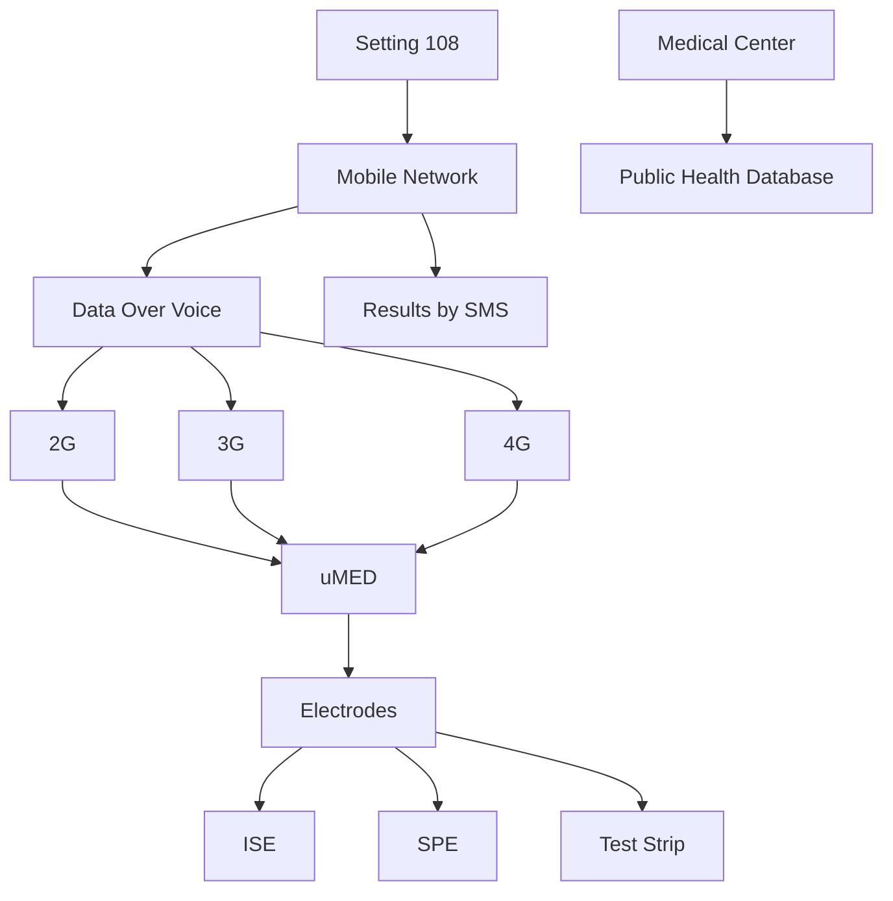
</details>

Figure 4. An image of the uMED interfaced to a commercial glucose test strip and a cellular device through an audio cable, for transmission of data over voice (left). A schematic of the connections and data flow from the electrodes through the uMED to the remote back end (right). Reprinted with permission from ref 155. Copyright 2014 National Academy of Sciences of the United States of America.

An enzymatic-ink-based roller pen was produced to allow for direct incorporation of the sensing element into renewable glucose sensor strips. $^{156}$ The resulting enzymatic-ink-pen permitted facile fabrication of high-quality inexpensive amperometric sensors of any design using a wide variety of surfaces. The renewable sensor strips allowed for up to 20 measurements of 2 mM glucose in blood without any appreciable change in sensitivity.

Intense research efforts to develop affinity sensors for glucose have focused on the plant lectin Concanavalin A (Con A) due to its inherent stability and activity in physiological pH. $^{157}$ For example, a competitive capacitive glucose sensor was fabricated using Con A-coated GNPs assembled on a polytyramine-modified gold electrode. $^{158}$ Experimental results demonstrated that the biosensor responded linearly to glucose concentrations in the range from 1 $\mu$ M to 10 mM under optimized conditions.

Another nonenzymatic glucose sensor was based on localized modulation of pH within a symmetric gold–gold junction electrode. $^{[159]}$ In this work, a paired gold–gold junction electrode (average gap size ca. 500 nm) was formed by simultaneous electrodeposition of gold onto two closely spaced platinum disk electrodes. The potential of the working electrode was set to -1.5 V vs saturated calomel electrode (SCE) to increase the pH locally. CV and SWV data demonstrated the linearity of the sensor response within the clinically relevant glucose range of 1–10 mM.

3.2.2. Lactose. Lactose is a disaccharide hydrolyzed by the lactase enzyme in the digestive system into the monosaccharides, glucose and galactose. The lactose level in blood can be used in the diagnosis of gastrointestinal malignancies. $^{160}$

An enzymatic-based amperometric sensor for lactose was prepared by immobilizing $\beta$ -galactosidase enzyme in a layer-by-layer film of poly(ethylene imine) and poly(vinyl sulfonate) followed by film deposition onto a Prussian blue-coated ITO electrode. $^{161}$ The sensor responded linearly to increasing lactose concentrations and had a LOD of 1.1 mM.

Another lactose-specific enzyme, cellobiose dehydrogenase, was utilized to construct an amperometric sensor for lactose. $^{162}$ Here, the enzyme was immobilized onto a nanohybrid of poly(3-amino-4-methoxybenzoic acid-co-aniline) and MWCNTs followed by the deposition of the nanohybrid on the surface of a gold electrode. The sensor responded linearly to lactose concentrations up to 30 mM.

3.2.3. Uric Acid (UA). UA is the major nitrogenous molecule in urine and has been associated with a variety of clinical disorders. Elevated UA level in blood, also called hyperuricemia or Lesch–Nyhan syndrome, may result in gout and other pathological conditions, including obesity, diabetes, high blood pressure, and kidney and heart diseases. The normal values of UA in blood range between 200 and 400 $\mu$ M. $^{163}$ One of the major problems inherent in direct biological determination of UA results from the interference caused by other biomolecules of close oxidation potential such as ascorbic acid. $^{164}$

An enzymatic amperometric sensor for UA was fabricated using ferrocene-induced electroactivated uricase enzyme deposited within a Nafion film onto a GCE. $^{165}$ Electro-activation of uricase was achieved using CV through the electrostatic interaction between the Fc molecules and tryptophan residues within the hydrophobic pockets in the enzyme. The sensor system generated a linear response over a range from 500 nM to 600 $\mu$ M UA, with a LOD of 230 nM.

A nonenzymatic assay for UA in urine was developed using boron-doped diamond microelectrodes. $^{166}$ The approach relied on the superior properties of BDD, such as low background current, low nonspecific adsorption of other species, long-term stability, and antifouling capabilities upon electrochemical reactivation. Direct estimation of UA concentrations down to 1 mM was feasible in the presence of ascorbic acid.

In a related system, a sulfur-adlayer-coated gold electrode was utilized for UA analysis. The sensor facilitated UA oxidation at a significantly lower overpotential with a higher current density as compared to an unmodified electrode. $^{167}$ The proposed electrochemical sensor showed a linear amperometric response to UA in the concentration range from 2.5 $\mu$ M to 5 mM, with a LOD of 0.4 $\mu$ M.

A dendrimer-modified sensor was used for selective determination of UA in the presence of ascorbic acid. $^{168}$ In this work, a GCE was sequentially modified by cysteamine-capped GNPs and poly(amidoamine) (PAMAM) dendrimers generation 4.5 bearing 128-COOH peripheral groups. The concentration of UA was determined using CV, with a LOD of 34.5 nM.

3.2.4. Urea. Because urea is the final product of protein metabolism, its level often provides critical information on the nutritional status of the human body. The normal concentration range of urea is 2.5–6.6 mM, depending on the patient's age and sex. The blood urea nitrogen (BUN) and urine urea nitrogen (UUN) tests are often used to assess kidney disorders such as acute kidney failure or end-stage renal diseases. However, alteration of the urea level is not highly specific for kidney diseases, but instead may reflect dehydration or increased protein intake. $^{169}$

Using a pH-switchable electrochemical sensing platform, both urea and glucose can be analyzed. $^{170}$ The detection relies on in situ pH-switchable enzyme-catalyzed reactions in which the hydroxylation of urea catalyzed by urease or oxidation of glucose catalyzed by glucose oxidase resulted in a pH change in the electrolyte solution, leading to a different electrochemical

response toward $[\mathrm{Fe}(\mathrm{CN})_{6}]^{3-}$ . Using CV, DPV, and EIS, urea analysis was achieved in the linear range from 1 to 7 mM.

In another enzymatic approach, an amperometric sensor for urea was constructed using a multilayered graphene-coated ITO electrode. $^{[171]}$ Notably, multilayered graphene was used because of its large 2D surface area and high electrical conductivity. Urease and glutamate dehydrogenase enzymes were coimmobilized onto the sensor surface. The assay permitted the interrogation of urea level in the linear range from 1.7 to 16.7 mM, with a LOD of 0.6 mM.

A urease-based potentiometric sensor for urea was also reported. $^{[172]}$ The enzyme was either physisorbed onto an electrodeposited polyaniline film or immobilized on a layer-by-layer film of alternating carboxymethylpullulan and chitosan assembled on the polyaniline film. The potentiometric response was proportional to urea concentration in the range from 1 $\mu$ M to 100 mM. The sensor based on the enzyme-grafted layer-by-layer film has exhibited higher stability, a finding attributed to the protective nature of the polysaccharide coating.

A MIP-based voltammetric sensor for urea was developed using a gold electrode coated with cadmium sulfide quantum dots (QDs) doped chitosan as the functional matrix. $^{173}$ Using DPV, two linear ranges for urea analysis were demonstrated between 5 pM and 0.4 nM and between 0.5 and 70 nM, with a LOD of 1 pM.

3.2.5. Cholesterol. Monitoring cholesterol is of great importance, especially for people with a high risk of developing heart diseases. Determination of blood cholesterol is required for the diagnosis of atherosclerosis and for estimation of the risk of thrombosis and cardiovascular disorders. The normal concentration of total cholesterol in blood should be less than 5.17 mM, but the value can vary from person to person depending on age, weight, and gender. The threshold level for total cholesterol concentration in human blood to be classified as high is defined as 5.17–6.18 mM. $^{174}$

A MIP-based voltammetric sensor for cholesterol was fabricated by mixing MIP-coated MWCNTs, graphite powder, and silicon alkoxide, followed by packing the formed mixture into the electrode cavity of a Teflon sleeve. $^{175}$ Linear sweep voltammetry (LSV) allowed for the quantification of cholesterol in the linear range of 10–300 nM, with a LOD of 1 nM.

An enzymatic amperometric sensor for cholesterol was constructed using a composite of glutaraldehyde-functionalized magnetic ferrite nanoparticles (GA-MNPs) and poly(diallyldimethylammonium chloride)-coated MWCNTs (PDDA/MWCNTs). $^{176}$ This was achieved by wrapping the carboxylated MWCNTs with the positively charged PDDA prior to the addition of GA-MNPs. Cholesterol oxidase and HRP enzymes were coimmobilized onto the composite cast and deposited on a GCE. The sensor allowed for the calibration of cholesterol level in the linear range from 0.01 to 0.95 mM, with a LOD of 0.85 $\mu$ M.

A reagentless self-powered cholesterol sensing platform was prepared using the same substrate to power both the anodic and cathodic electrocatalytic reactions. $^{177}$ Cholesterol oxidase was immobilized in a sol–gel matrix, coating both the cathode and the anode. Cholesterol oxidation catalyzed by cholesterol oxidase occurred at the anode, whereas hydrogen peroxide, a product of the enzymatic conversion of cholesterol, was electrocatalytically reduced by Prussian blue at the cathode (Figure 5). The resulting self-powered amperometric sensor enabled the analysis of cholesterol concentrations up to 4.1 mM.


<details>
<summary>chemical</summary>

Diagram of a photosensitizer system showing A/D converter and display with ion transport between cathode and anode membranes
</details>

Figure 5. Scheme of a self-powered membrane-free cholesterol biosensor. Reprinted with permission from ref 177. Copyright 2014 American Chemical Society.

In another enzymatic approach, an amperometric triglyceride sensor was fabricated using a mixture of four enzymes, including lipase, glycerol kinase, glycerol-3-phosphate oxidase, and HRP coimmobilized onto the surface of a platinum electrode coated with a poly(vinyl alcohol) membrane. $^{178}$ The current response was proportional to triglyceride concentration in the range from 560 $\mu$ M to 2.3 mM, with a LOD of 210 $\mu$ M.

An interesting approach for cholesterol analysis combined a simple electrochemical micropaper-based analytical device (EμPADs) and a commercially available glucometer. $^{73}$ Each EμPAD contained printed wax barriers to define the sample and reference zones, whereas the test strips were made from plastic or a single layer of paper. In the enzyme-catalyzed step, cholesterol oxidase catalyzed the oxidation of cholesterol to cholest-4-en-3-one, with concomitant reduction of Fe(III) to Fe(II), and the Fe(II) (CN) $_{6}^{4-}$ ions generated were subsequently detected electrochemically. Amperometric analysis of cholesterol in human plasma yielded a linear calibration plot in the concentration range from 0.5–5.2 mM, with a LOD of 340 μM.

A nonenzymatic voltammetric sensing platform for cholesterol has also been reported. $^{[179]}$ In this work, a hydrophilic and electroactive cholesterol sensing interface was formed by modifying a chemically converted graphene with $\beta$ -cyclodextrin and methylene blue. In the presence of cholesterol, the methylene blue molecules were displaced from the inclusion complex and moved into the buffer solution and subsequently detected electrochemically. Using DPV, a cholesterol calibration curve was obtained in the range of 5–100 $\mu$ M, with a LOD of 1 $\mu$ M.

3.2.6. Lactate. The level of lactate in blood is used in the clinical diagnosis of respiratory insufficiency, shock, and acute cardiac disorders. In addition, lactic acidosis is known to accompany tissue hypoxia, left ventricular failure, and drug toxicity. The normal values of lactate in blood range between 0.5 and 2.2 mM. $^{180}$

An amperometric lactate biosensor was constructed using lactate oxidase enzyme immobilized in a mucin/albumin hydrogel matrix preformed onto the surface of a platinum electrode. $^{[181]}$ Typical interference caused by anionic species was minimized by coating the electrode with a Nafion membrane. A linear dependence of the catalytic current on lactate concentration was demonstrated in the range from 2 and 1000 $\mu$ M, with a LOD of 0.8 $\mu$ M.

Another enzymatic approach was based on lactate dehydrogenase enzyme and $NAD^{+}$ coimmobilized onto the surface of a GCE precoated with a nanocomposite of $Fe_{3}O_{4}$ magnetic nanoparticles and MWCNTs. $^{182}$ DPV analysis of lactate yielded a linear response over the concentration range of 50–500 $\mu$ M, with a LOD of 5 $\mu$ M.

An interesting approach was developed for real-time non-invasive lactate sensing in sweat during exercise events using a printed amperometric sensor “tattoo” that conforms to the wearer’s skin. $^{183}$ The wearable lactate oxidase-based sensor exhibited chemical selectivity toward lactate with linearity up to 20 mM and demonstrated resiliency against the mechanical deformation expected from epidermal wear. The device was tested on human subjects, and it was observed that the lactate profiles successfully reflected the production of lactates in sweat at varying exercise intensities.

The use of whole cells as a sensing element for lactate analysis was demonstrated using mixed bacterial cultures of Lactobacillus bulgaricus and Streptococcus thermophilus and palygorskite, a stabilizing matrix for bacteria, coimmobilized onto the surface of an $O_{2}$ electrode. $^{184}$ The amperometric response of the sensor was found linear in the concentration range from 0 to 300 $\mu$ M.

A FET-based sensor for lactate analysis was developed on the basis of two elements: (i) a pH-sensitive chemical field-effect transistor and (ii) a metallic microelectrode deposited around a sensitive gate. $^{185}$ The coexistence of these two elements combined potentiometric and amperometric effects at the microscale. This sensor permitted the quantification of lactate in the linear range from 1 to 6 mM.

3.2.7. Hydrogen Peroxide (HP). Reactive oxygen species (ROS) are important intracellular signaling molecules, mainly regulating DNA damage and cell apoptosis. However, accumulation of ROS in cells leads to oxidative stress that may be linked with a variety of pathological conditions such as neurodegenerative disorders, Alzheimer's disease, autoimmune diseases, and cancer. HP is the most common type of ROS studied in the cell as it induces numerous deleterious biological modifications. Hence, selective detection of HP in cells and assessment of its dynamic release process is essential to fully understand the roles of the reactive species in cellular physiology. $^{186}$

An enzymatic voltammetric biosensor for HP was engineered by embedding a HRP enzyme in a cross-linked 3D polymer matrix bearing a mobile osmium redox (Os $^{+/+2}$ ) and permitting the diffusion of the substrate. $^{187}$ Electrons, which reduced the analyte, were transferred from the electrode surface to the enzyme by step-by-step collisions of the redox mediators. CV measurements of HP demonstrated a linear dynamic range extending from 1 to 100 $\mu$ M. In addition, CA measurements of HP exhibited a linear response in the range from 1 to 10 nM, with a LOD of 1 nM.

In a closely related approach, mesoporous carbon nanoparticles (pore dimension $\sim6.3$ nm) were utilized to fabricate electrically contacted enzyme electrodes for HP sensing. $^{188}$ The pores of the carbon nanoparticles were filled with methylene blue and capped with HRP, and then immobilized onto the surface of a GCE. Using CV, this sensor permitted the determination of HP levels up to 25 mM.

Another enzymatic amperometric sensor for HP was engineered using a microperoxidase-11 enzyme immobilized onto MWCNTs-functionalized bacterial cellulose. $^{189}$ Modification of bacterial cellulose with MWCNTs was carried out to provide a flexible conductive film with high biocompatibility. The proposed sensor allowed for the interrogation of HP levels over the linear range of 0.1–257.6 $\mu$ M, with a LOD of 0.1 $\mu$ M.

An enzymatic amperometric sensor was fabricated using a catalase enzyme immobilized onto a film of L-lysine and MWCNTs-modified GCE. $^{190}$ This sensor exhibited a linear current response to HP in the concentration range from $1 \mu M$ to 3.6 mM, with a LOD of 8 nM.

Metalloproteins are frequently utilized as a sensing element for HP due to the inherent enzymatic activity of the metal center in the enzyme molecule. For instance, a protein microarray was prepared on hydrophilic micropatterns of L-cysteine-modified Au-TiO $_{2}$ , followed by immobilization of the metalloprotein, Cytochrome c. $^{191}$ Using amperometry, a broad linear range of HP from 1 nM to 10 mM was quantified, with a LOD of 2 nM. Recently, an amperometric sensor for HP was developed by direct wiring of the heme center of Cytochrome c to a gold ultra microelectrode surface via the use of an imidazole-terminated self-assembled monolayer. $^{192}$ This sensor allowed for the determination of HP level, with a LOD of 3 $\mu$ M.

Using another metalloprotein, hemoglobin, an amperometric HP sensor was engineered by the electrospinning of hemoglobin microbelts onto a GCE surface. $^{193}$ Subsequently, hemoglobin catalyzed the reduction of HP within the dynamic range extending from 10 to 230 $\mu$ M, with a LOD of 0.6 $\mu$ M.

Another metalloprotein-based HP sensing platform relied on myoglobin immobilized onto an ITO substrate coated with a film of nanostructured porous cerium dioxide. $^{194}$ This sensor was capable of detecting HP with linearity up to 3 mM and a LOD of 0.6 $\mu$ M.

Also, an amperometric sensor for HP was constructed using a heme peptide immobilized onto a conductive 3D hybrid film of CNTs grown on a graphene surface. $^{195}$ The microvoids in the film contributed to the diffusion of HP to the modified heme peptide, resulting in an enhanced catalytic cathodic current. The cathodic current increased linearly with HP concentration over the range of 1–30 $\mu$ M.

Another amperometric sensing platform for HP was prepared using a zinc porphyrin-fullerene (C60) derivative, entrapped in tetraoctylammonium bromide film and deposited onto the surface of a GCE. $^{196}$ The electrocatalytic reduction of HP showed a broad dynamic range extending from 35 $\mu$ M to 3.4 mM and a LOD of 810 nM.

The electrocatalytic activity of nanomaterials has also been exploited to develop a sensing platform for HP. Here, core/shell Au/MnO nanoparticles were prepared by hydride reduction of manganese acetylacetonate in the presence of GNPs, and further utilized to construct an amperometric sensor for HP. $^{197}$ This sensor permitted the electrocatalytic reduction of HP in the linear range from 20 nM to 15.1 mM, with a LOD of 8 nM.

In a closely related approach, an electrochemical sensing platform for HP was engineered using nitrogen-doped carbon nanotubes (NCNTs). $^{198}$ In contrast to MWCNTs, NCNTs possess a marked electrocatalytic activity toward $O_{2}$ reduction using an efficient four-electron transfer process, whereas a two-electron transfer process is involved in MWCNTs-mediated electrocatalysis. This amperometric sensor allowed for the interrogation of HP level in the linear range from 1.8 to 139 $\mu$ M, with a LOD of 370 nM.

Another nanomaterial-based assay for HP relied on a 3D graphene network (3DGN) that was preformed using chemical vapor deposition. $^{199}$ The 3DGN was used as a template to synthesize various composites, including Pt nanoparticles/3DGN, MWCNTs/3DGN, Pt/MWCNTs/3DGN, and $MnO_{2}/3DGN$ . Experimental results revealed that among the four synthesized composites, the Pt/MWCNTs/3DGN-based amperometric sensor permitted highly sensitive analysis of HP in the linear range from 25 nM to 6.3 $\mu$ M, with a LOD of 8.6 nM.

3.2.8. Creatine. Creatine is an amino acid derivative synthesized from L-arginine, glycine, and S-adenosylmethionine in the kidneys, liver, and pancreas. Most of the stored creatine is converted to phosphocreatine in muscle tissues in a reversible reaction with adenosine triphosphate (ATP), which is catalyzed by creatine kinase enzyme. Phosphocreatine represents a major energy storage form in the body. The creatine level in blood and urine is clinically used as an indicator of muscle damage. $^{200}$

An enzymatic amperometric sensor for creatine was fabricated using a mixture of creatinase and sarcosine oxidase coimmobilized onto the surface of a carbon paste electrode modified with $Fe_{3}O_{4}$ nanoparticles. $^{201}$ This sensor exhibited two linear dynamic ranges extending from 0.2 to 3.8 $\mu$ M and from 9 to 1200 $\mu$ M, with a LOD of 0.2 $\mu$ M.

3.2.9. Creatinine. Creatinine is a byproduct of muscle metabolism and represents an important indicator of renal functions. Creatinine is produced via a biological pathway involving creatine, phosphocreatine, and ATP. The normal values of creatinine in blood range between 53 and 115 $\mu$ M.

An enzymatic amperometric sensor for creatinine was prepared using a mixture of three enzymes, including creatinine aminohydrolase, creatine aminohydrolase, and sarcosine oxidase, coimmobilized onto a composite film of ZnO nanoparticles/chitosan/carboxylated MWCNTs/polyaniline, deposited on the surface of a platinum electrode. $^{202}$ The sensor possessed a working range extending from 10 to 650 $\mu$ M, with a LOD of 0.5 $\mu$ M.

A MIP-based voltammetric sensor for creatinine has also been reported. $^{203}$ In this work, the template molecule, creatinine, was self-assembled onto the surface of $Fe_{3}O_{4}$ polyaniline nanoparticles in the presence of the functional monomer, aniline. After magnetically guided preassembly via a magnetic GCE, the ordered structure of the MIP was established by electropolymerization onto the electrode surface. The DPV response showed a linear correlation with creatinine concentration in the range from 20 nm to 1 $\mu$ M, with a LOD of 350 pM.

A competitive MIP-based amperometric sensor for creatinine was also constructed by coating an array of gold electrodes with creatinine embedded in pyrrole via electropolymerization. $^{204}$ The creatinine sample was subsequently mixed with a HRP-labeled anticreatinine antibody, and the mixture was transferred onto the electrode surface to allow for a competitive reaction with the creatinine embedded in the electrode surface. Amperometric measurements were carried out in the presence of 3,3',5,5'-tertamethylbenzidine (TMB) and $H_{2}O_{2}$ . By applying a circular square wave, the creatinine level was measured up to 1 mM.

An enzymeless electrochemical method for creatinine relied on the measurement of consumed picrate anions upon reaction with creatinine molecules, using an edge plane pyrolitic graphite electrode. $^{205}$ Amperometric analysis of the consumed picrate anions permitted the determination of creatinine level over two linear dynamic ranges of 0–6 and 6–11 mM, with a LOD of 720 $\mu$ M.

3.2.10. Ketone Bodies. Ketone bodies including acetone, 3-hydroxybutyrate, and acetoacetate are biomarkers for diabetes that has progressed to severe ketoacidosis.

An enzymatic voltammetric sensor for 3-hydroxybutyrate was prepared using the 3-hydroxybutyrate dehydrogenase enzyme immobilized onto the surface of SWCNTs-coated screen-printed electrode. $^{206}$ CV was used for 3-hydroxybutyrate analysis on the basis of the signal produced by 3-nicotinamide adenine dinucleotide (NADH), one of the products of the enzymatic reaction. Electrochemical measurements demonstrated that the response was linear with increasing 3-hydroxybutyrate concentrations in the range from 0.1 to 2 mM, with a LOD of 9 $\mu$ M.

A nonenzymatic voltammetric sensor for acetone was fabricated using a ZnO nanoparticles-coated GCE. $^{207}$ It was observed that the current increased linearly with increasing acetone concentration in the range from 130 $\mu$ M to 1330 mM, with a LOD of 68 $\mu$ M.

3.2.11. Xanthine. Xanthine is an intermediate of the purine nucleotide and deoxynucleotide metabolism. As the metabolic precursor of uric acid, xanthine is the first indicator of an abnormal purine profile and thus can serve as a marker for many diseases, including hyperuricemia, gout, xanthinuria, and cerebral ischemia. $^{208}$ The normal values of xanthine in urine range between 40 and 160 $\mu$ M. $^{209}$

An enzymatic amperometric sensor for xanthine was reported elsewhere. $^{[210]}$ In this work, a GCE was modified with SWCNTs and a 3D network of electropolymerized GNPs capped with 2-mercaptoethanesulfonic acid, p-aminothiphenol, and 1-adamantanethiol. The hybrid was utilized for supramolecular immobilization of xanthine oxidase and $\beta$ -cyclodextrin through host–guest interactions. This sensor allowed for the measurement of xanthine in the linear range from 50 nM to 9.5 $\mu$ M, with a LOD of 40 nM.

A nonenzymatic xanthine sensor was engineered using a reduced graphene oxide-modified GCE that was coated with an electropolymerized film of poly(o-aminophenol-co-pyrogallol) (PAP). $^{211}$ PAP was synthesized via the electrochemical copolymerization of o-aminophenol and pyrogallol in acidic solution. Notably, reduced graphene oxide played a significant role in increasing the amount of electropolymerized PAP as compared to that formed on the bare GCE due to the large surface area of reduced graphene oxide. Amperometric analysis of xanthine showed a linear dynamic range from 1 to 120 $\mu$ M, with a LOD of 0.5 $\mu$ M.

3.2.12. Hypoxanthine. Hypoxanthine is the precursor of xanthine, and its normal values in blood range between 10 and 30 $\mu$ M. $^{212}$ Hypoxanthine plays a role in posthypoxic reoxygenation cell injury through oxygen radical production and serves as an indicator of hypoxia. $^{213}$

A low-potential enzymatic amperometric sensor for hypoxanthine and xanthine was developed using xanthine dehydrogenase enzyme immobilized onto an edge plane pyrolytic graphite. $^{[214]}$ The enzyme catalyzed the oxidation of hypoxanthine to xanthine and also xanthine to uric acid via an oxidative hydroxylation mechanism. The electrocatalytic oxidation response showed a linear dependence on the total concentration of xanthine and hypoxanthine ranging from 10 $\mu$ M to 1.8 mM, with a LOD of 0.25 nM.

# 3.3. Vitamins

Vitamins are organic compounds and vital nutrients required by living organisms in limited amounts to perform diverse biological functions. In the last five years, several electrochemical sensors have been developed for the analysis of a variety of vitamins such as biotin (vitamin B7 or H), ascorbic acid (AA, vitamin C), folic acid (vitamin B9), riboflavin (vitamin B2), pyridoxine (vitamin B6), and 25-hydroxyvitamin D.

A voltammetric immunosensor for biotin was developed using an antibiotin antibody immobilized onto the surface of a boronic acid-modified screen-printed gold electrode via the interaction between boronic acid and the carbohydrate moiety of the antibody. $^{215}$ This approach was adopted to improve the

orientation of the antibody on the surface and subsequently maximize its interaction with biotin. Using SWV, the level of biotin was interrogated over the range from 100 pM to 1 mM. Notably, the normal values of biotin in blood range between 0.9 and 3.1 $\mu$ M. $^{216}$

An enzymatic amperometric sensor for AA was fabricated using an ascorbate oxidase enzyme immobilized between an inner and outer film of poly(3,4-ethylenedioxythiophene) and MWCNTs-coated Nafion, respectively. $^{217}$ The relationship between AA concentration and the response current was linear in the range from 400 nM to 1 mM, with a LOD of 87 nM. Notably, the normal values of AA in blood range between 34 and 114 $\mu$ M. $^{218}$

A MIP-based voltammetric sensor for AA was prepared by incorporating AA as a template molecule during the electrochemical copolymerization of o-phenylenediamine and o-aminophenol followed by electrochemical reduction in ammonium aqueous solution. $^{219}$ Using DPV, quantification of AA was attainable in the linear range from 0.1 to 10 mM, with a LOD of 36.4 $\mu$ M.

MIP-based sensors have also been used for folic acid analysis. $^{220}$ In this system, a MIP/carbon composite was prepared via in situ free radical polymerization of 2,4,6-trisacrylamido-1,3,5-trizine and subsequent cross-linking with ethylene glycol dimethacrylate, in the presence of carbon powder and the template, folic acid. Differential pulse cathodic stripping voltammetry (DPCSV) permitted the quantification of folic acid in the linear range from 1.4 to 8.6 nM, with a LOD of 0.5 nM. Normal values of folic acid in blood range between 4.5 and 45.3 nM. $^{221}$

In a self-powered nonenzymatic sensing platform for AA, the oxidation of AA was carried out on a nanocarbon-based anode leading to reduction of Prussian blue at the cathode into Prussian white. $^{222}$ The rate of color change from blue to colorless is dependent on AA concentration. Using CA, the current–concentration dependency was linear over the range of 10–350 $\mu$ M, with a LOD of 4 $\mu$ M.

A nonenzymatic sensor for riboflavin was engineered using a carbon ionic liquid electrode. DPV measurements of riboflavin demonstrated two linear dynamic ranges of 0.8–110 and 110–1000 nM, with a LOD of 0.1 nM. $^{223}$ Notably, the normal values of riboflavin in blood range between 69.1 and 98.3 nM $^{224}$

A functionalized poly(3,4-ethylenedioxythiophene) (PEDOT) film was prepared by incorporating two electroactive species, ferrocenecarboxylic acid and ferricyanide, as doping anions during the electropolymerization of PEDOT onto the surface of a GCE. $^{225}$ This sensing platform was employed for pyridoxine analysis within the linear working range of 1–1500 $\mu$ M, with a LOD of 0.5 $\mu$ M. Importantly, the normal values of pyridoxine in blood range between 30 and 144 nM, $^{226}$ so this sensor will require optimization to measure physiological levels of pyridoxine.

A nonenzymatic voltammetric sensor for 25-hydroxyvitamin D, 25(OH)D was fabricated using 4-ferrocenylmethyl-1,2,4-triazoline-3,5-dione (FMTAD)-modified screen-printed gold electrode. $^{227}$ FMTAD is able to bind 25OHD through a Diels–Alder reaction between the conjugated diene of the vitamin and triazoline-3,5-dionic group of FMTAD, thus allowing a voltammetric transduction due to the electroactive properties of ferrocene. Using DPV, linear quantification of 25(OH)D was feasible in the range from 49.9 to 495 nM, with a LOD of 24.8 nM. Notably, the level of 25(OH)D reflects accurately the level of vitamin D in the body. The normal values of 25(OH)D in blood range between 80 and 248 nM. $^{228}$

# 3.4. Amino Acids

Amino acids are the building blocks of proteins and are essential for cell function. They play a variety of roles in nutrition and whole-body homeostasis, including nucleic acid synthesis, metabolic regulation, cell signaling, osmoregulation, acid–base balance, and reproduction. Several amino acids are involved in the synthesis of neurotransmitters, such as tryptophan and tyrosine, and in the synthesis of serotonin and epinephrine. Also, arginine has a cardioprotective function because it acts as a precursor for the synthesis of nitric oxide, a vasodilator with a hypotensive effect. $^{229}$

The normal amino acid level in plasma is in the micromolar range and can be as low as 2–11 $\mu$ M for aspartic acid and as high as 352–689 $\mu$ M for glutamine. Analysis of amino acids is required for the diagnosis and management of inherited metabolic disorders affecting more or one amino acids, such as tyrosinaemia, cystine-lysinuria, homocystinuria, hyperglycinaemia, phenylketonuria, and citrullinaemia. An increase in the total level of plasma amino acids can be a sign of kidney failure, Reye syndrome, ketoacidosis, and fructose intolerance. A decrease in the total level of plasma amino acids might be caused by malnutrition, rheumatoid arthritis, nephrotic syndrome, Huntington's disease, and fever. $^{230}$ In the last five years, a variety of electrochemical sensors have been developed for the analysis of amino acids such as arginine, cysteine, glutamic acid, histidine, homocysteine, leucine, lysine, methionine, phenylalanine, tryptophan, and tyrosine.

An enzymatic amperometric sensor for L-lysine was designed on the basis of the impregnation of L-lysine oxidase in a diamond paste. $^{231}$ This sensor exhibited a linear response toward L-lysine in the range from 1 to 100 nM, with a LOD of 4 pM. Also, several enzymatic sensors were reported for the detection of leucine $^{232}$ and D-methionine. $^{233}$

A voltammetric aptasensor for phenylalanine was constructed using a phenylalanine-specific aptamer immobilized onto a gold electrode. $^{234}$ Using DPV, phenylalanine was analyzed in the linear range from 1 to 10 nM, with a LOD of 1 nM.

A voltammetric sensor for L-histidine was fabricated using a specific L-histidine-dependent DNAzyme modified with a ferrocene tag at the distal end. $^{235}$ In the presence of L-histidine, the DNA probe with a single ribo-adenine was self-cleaved, bringing the ferrocene tag close to the electrode surface, which subsequently enhanced the electron transfer to the electrode surface. Using SWV, linear interrogation of the L-histidine level was allowed in the range from 0.1 pM to 50 nM, with a LOD of 0.1 pM.

A MIP-based voltammetric sensor for L-histidine was developed using a combination of a MIP and MWCNTs. The sensing interface was prepared on an ITO electrode via stepwise modification with MWCNTs and a thin film of MIP via sol–gel technology. $^{236}$ DPV measurements revealed a linear relationship between the current and L-histidine concentration in the range from 2 $\mu$ M to 1 mM, with a LOD of 5.8 nM. In addition, several MIP-based sensors were reported for the detection of arginine, $^{237}$ tyrosine, $^{238}$ phenylalanine, $^{239}$ and tryptophan. $^{240}$

Cyclotricatechylene, a redox-active tris-catechol analogue, was recently utilized to fabricate a voltammetric sensor for cysteine using a cyclotricatechylene-modified carbon electrode. $^{241}$ CV measurements revealed the ability of the sensor to determine


<details>
<summary>flowchart</summary>

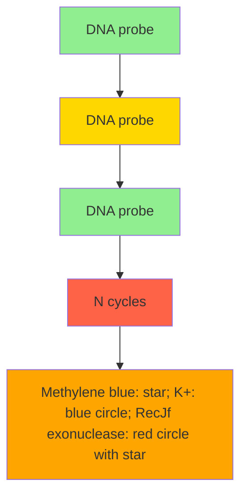
</details>

Figure 6. Illustration of the electrochemical aptasensor for $K^{+}$ using $RecJ_{f}$ exonuclease-mediated signal amplification. Reprinted with permission from ref 272. Copyright 2014 Royal Society of Chemistry.

cysteine concentration up to 40 $\mu$ M, with a LOD of 0.6 and 0.9 $\mu$ M in buffer solution and tissue extracts, respectively.

Many sensors for amino acids can distinguish between the D and L enantiomers of amino acids. Enantiomeric discrimination can be achieved using (i) stereoselective enzymes such as D-methionine oxidase, $^{233}$ D-leucine oxidase, $^{233}$ and L-lysine oxidase; $^{231}$ (ii) MIPs for selective detection of L-histidine $^{236,242}$ and L-tryptophan; $^{240}$ and (iii) stereoselective electrode coating materials such as β-cyclodextrin at an optimized temperature for selective detection of L-tryptophan $^{243}$ and dsDNA probes in the presence of Cu(II) for detection of L-tryptophan. $^{244}$

A variety of electrocatalytic electrode coating materials have been utilized to construct amino acid biosensors, including cobalt phthalocyanine, $^{245}$ poly epichrome black T, $^{246}$ cobalt-exchanged zeolite Y, $^{247}$ iron oxide/hexacyanoferrate core-shell, $^{248}$ and poly(o-aminophenol), $^{249}$ for cysteine analysis; a composite of nickel oxide nanoparticles, DNA, and osmium(III) complex for homocysteine analysis; $^{250}$ overoxidized polyimidazole, $^{251}$ salicylaldehyde modified chitosan, $^{252}$ acetaminophen, $^{253}$ poly glutamic acid, $^{254}$ and 3,4-dihydroxybenzaldehyde-2,4-dinitrophenylhydrazone, $^{255}$ for tryptophan analysis; and an electropolymerized film of 1,8,15,22-tetraaminophthalocyanato-Cu (II) for methionine analysis, $^{256}$ and $\mathrm{ZnO / Zn_3[Fe(CN)_6]^{2-}}$ for tyrosine analysis. $^{257}$

In addition, the use of nanostructured surfaces provides a means to achieve sensitive analysis of amino acids, including gold nanorods/MWCNTs, $^{258}$ gold nanoclusters, $^{259}$ graphene nanoribbons, $^{260}$ graphene oxide/gold nanoclusters, $^{261}$ hybrid gold atomic cluster/cobalt oxide scaffold, $^{262}$ caterpillar-like manganese dioxide/carbon nanocomposites, $^{263}$ and gallium nitride nanowires, $^{264}$ for cysteine analysis; MWCNTs bridged mesocellular graphene foam, $^{265}$ silver nanoparticles/graphene oxide, $^{266}$ silver/carbon core–shell nanostructures, $^{267}$ and carbon nanofibers, $^{268}$ for tryptophan analysis; and graphene oxide nanoribbons, $^{269}$ and graphene-like $C_{3}N_{4}$ nanosheets, $^{270}$ for tyrosine analysis.

# 3.5. Dietary Minerals

Dietary minerals are chemical elements required by living organisms other than the four essential elements, including carbon, hydrogen, nitrogen, and oxygen present in common organic molecules. Dietary minerals have key roles in several biological functions such as energy production, bone mineralization, nerve and muscle functions, and immunity. Dietary minerals are classified as major minerals (macrominerals) and trace minerals (microminerals). Both macro- and microminerals are equally important for the body; however, microminerals are needed in smaller amounts as compared to macrominerals. Examples of macrominerals include sodium, potassium, calcium, magnesium, phosphorus, sulfur, and chloride. On the other hand, microminerals include iron, zinc, iodine, copper, manganese, selenium, chromium, molybdenum, and fluoride. In addition, some minerals are required in trace amounts, including cobalt, silicon, nickel, and vanadium.

The use of aptamers for the detection of dietary minerals was demonstrated in a nanochannel-based amperometric aptasensor for potassium. $^{271}$ A potassium specific G-quadruplex aptamer was covalently assembled onto the inner walls of porous anodic alumina nanochannels via a Schiff reaction between the aptamer and alumina nanochannels. Conformational switching of the aptamers within the nanochannels occurred in the presence of potassium molecules, which resulted in increased steric hindrance and subsequently reduction in the anodic current. Quantitative detection of potassium was realized in the linear range from 5 to 200 $\mu$ M, with a LOD of 0.4 $\mu$ M.

Another aptamer-based voltammetric sensor for potassium was developed by combining the binding ability of a potassium-specific aptamer and the RecJ $_{f}$ exonuclease-mediated signal amplification. $^{272}$ A DNA probe, with a stem-loop structure containing the potassium-specific aptameric sequence, was synthesized with a thiol group at the proximal end and methylene blue at the distal end. In the presence of potassium ions, the G-rich single-stranded aptamer was transformed to a G-quadruplex via intramolecular hydrogen bonding. Subsequently, the stem part of the probe was broken, releasing the single stranded 5' end. Because RecJ $_{f}$ is a single-stranded DNA specific exonuclease, the DNA was digested and the potassium ions were released into solution and became recognized by another DNA probe on the electrode surface, thus initiating a new RecJ $_{f}$ cleavage cycle, as shown in Figure 6. Because of the departure of the methylene blue molecules, a significant reduction in the peak current was

observed. SWV measurements permitted the quantification of potassium ions in the linear range from 50 nM to 1 mM, with a LOD of 50 nM.

A protein-based impedimetric sensor for calcium ions was constructed using porcine S100A12 protein immobilized onto a polyvinyl butyral-coated gold electrode. $^{273}$ The biosensor exhibited a linear response to calcium ions concentrations ranging from 12.5 to 200 mM.

A MIP-based sensor for cadmium and copper ions was fabricated by modifying a PGE with a dual-ion imprinted polymer in a sol–gel matrix. $^{274}$ Using DPASV, this sensor allowed for the analysis of cadmium and copper ions in the linear ranges from 3.8 to 38.3 nM and 2.3 to 21.5 nM, respectively. The LOD values were 0.4 and 0.5 nM for cadmium and copper ions, respectively.

Ion-sensing electrochemical paper-based analytical devices (EPADs) were also utilized for the analysis of several ions such as chloride, potassium, sodium, and calcium. $^{275}$ An EPAD for sensing chloride ions comprised wax-defined sample and reference zones; each incorporated an Ag/AgCl reference electrode. EPADs developed for other electrolytes comprised a polyvinyl chloride ion-selective membrane to separate the sample zone from a paper indicator electrode. The ion-selective EPADs exhibited a linear response over 3 orders of magnitude over the range from 1 mM to 1 M, for chloride and sodium ions, and 0.1–100 mM for potassium and calcium ions.

A potentiometric sensor for magnesium was designed on the basis of the magnesium selective ionophore, 4,5-bis-(benzoylthio)-1,3-dithiole-2-thione, formed within a polymeric membrane of polyvinyl chloride. $^{[276]}$ This ionophore-containing polymer was formed on a silver-coated tip of a borosilicate glass capillary modified with ZnO nanorods. The potentiometric sensor exhibited a concentration-dependent potential difference versus Ag/AgCl reference electrode within the concentration range from 500 nM to 100 mM.

A volatmmetric sensor for calcium ions was engineered using a gold microparticle-modified GCE. $^{277}$ This sensor catalyzed the electrochemical reduction of alizarin red after complexation with calcium in alkaline solution. DPV measurements permitted the linear quantification of calcium ions over the linear range from 0.6 $\mu$ M to 0.1 mM, with a LOD of 0.5 $\mu$ M.

Anodic stripping voltammetry (ASV) was used for zinc analysis. $^{[278]}$ The analysis involved a preconcentration step to accumulate the metal ions onto the surface of a copper electrode by reducing them into ions, followed by a stripping step at a positive potential to reoxidize the metal back to its ionic form. This sensor performed reliably in acetate buffer and allowed for zinc analysis with a LOD of 6 $\mu$ M.

# 3.6. Other Small Molecules

Other biologically relevant small molecules have been detected using electrochemical methods include nicotinamide adenine dinucleotide, adenosine monophosphate, adenosine triphosphate, glutathione, heparin, and 3,4-dihydroxy-o-phenylalanine (levodopa).

3.6.1. Nicotinamide Adenine Dinucleotide (NAD). NAD is an important coenzyme found in all living cells. It exists in two forms, including an oxidized $\left(\mathrm{NAD}^{+}\right)$ and a reduced form (NADH). It plays a key role in a variety of metabolic redox reactions as an electron carrier, as well as in cell signaling. $^{279}$ Also, it participates in posttranslational modification of proteins. NADH dysfunction is associated with many pathological conditions such as reduced respiratory capacity and increased oxidative stress. $^{280}$ In addition, the rate of NADH turnover in cancer cells is higher than that in normal cells, and thus it can be used as a biochemical marker in the analysis of new cancer therapeutics. Because of its role in the synthesis of tyrosine hydroxylase and endogenous dopamine, NADH levels can provide information that enables the selection of appropriate drugs for Parkinson's disease, Alzheimer's disease, and major depression diseases. $^{281}$

While NADH is a redox-active molecule, the oxidation of NADH at bare metal electrodes exhibits significant irreversibility and requires overpotentials up to 1 V. The use of such a high overpotential with unmodified electrodes leads to rapid fouling of the electrode surface and causes problems arising from nonspecific oxidation of other species, such as ascorbates and urates. $^{282}$

A nonenzymatic amperometric sensor for NADH was fabricated using a platinum microwire modified with hierarchically driven iridium oxide nanowires. $^{282}$ Iridium oxide is an exceptionally biocompatible metal oxide with high catalytic activity, low resistivity, and superior chemical and thermal stability. $^{283}$ A platinum microwire coated with iridium oxide exhibited remarkably enhanced current signals in response to NADH oxidation as compared to the bare platinum electrode due to its smaller oxidation overpotential. This enhanced the selectivity of the sensor and reduced its surface fouling. The sensor permitted the determination of NADH level up to 1 mM, with a LOD of 5 $\mu$ M.

An assay based on NADH oxidation was developed using a screen-printed carbon electrode modified with polythionine. $^{284}$ The system allowed for the quantification of NADH in the linear range from 20 $\mu$ M to 1 mM, with a LOD of 1.7 $\mu$ M.

Another sensing platform for NADH was developed using a FET modified with 1-methoxy-5-methylphenazinium methyl sulfate functionalized-SWCNTs. $^{285}$ In the presence of NADH, electrons were transferred to the phenazine derivative through the SWCNTs, allowing for a sensitive analysis in the linear range between 10 pM and 500 nM, with a LOD of 1 pM.

3.6.2. Adenosine Monophosphate (AMP). AMP is a purine nucleoside produced during ATP synthesis by the enzyme adenylate kinase. The variation of AMP levels in body fluids may be indicative of some diseases such as liver diseases and cancer. AMP can also exist as a cyclic structure known as cyclic AMP (cAMP). cAMP is an intracellular second messenger that regulates intracellular functions and physiological processes through the protein kinase A (PKA) signal transduction system. Several studies have demonstrated that changes of cAMP concentration are closely related to pathological conditions. Plasma cAMP concentrations fluctuate in patients with type-2 diabetes and chronic hepatitis. In addition, cAMP levels in urine were found to increase in humoral hypercalcemia malignancy, hyperparathyroidism, and vitamin D deficiency. $^{286}$

An aptamer-based impedimetric sensor for cAMP has also been reported. $^{287}$ The aptasensor had a wide effective dynamic range extending from 50 to 250 pM, with a LOD of 50 pM in buffer, and from 50 nM to 1 $\mu$ M, with a LOD of 50 nM in serum.

An amperometric sensor for AMP was designed, taking advantage of the electrocatalytic properties of hemin/G-quadruplex HRP-mimicking DNAzyme. $^{288}$ In this work, a hairpin nucleic acid structure consisting of an AMP-specific aptamer sequence and a G-quadruplex sequence was immobilized onto the surface of a gold electrode. In the presence of AMP, the hairpin structure was opened and the hemin/G-quadruplex HRP-mimicking DNAzyme was generated on the

  
Figure 7. Schematic representation of an electrochemical ATP detection approach (top). DPVs for ATP-binding aptamer-modified nanostructured microelectrode (i), after neutralizer binding to the aptamer (ii) and after treatment with ATP (iii) (bottom left). Concentration-dependent signal changes for ATP detection. The dashed line indicates the average signal change in the absence of ATP or the presence of a noncognate analyte (bottom middle). Time-dependent signal change after the addition of 100 $\mu$ M (purple line) and 0 $\mu$ M (black line) ATP (bottom right). Reprinted with permission from ref 297. Copyright 2012 Nature Publishing Group.

surface. This sensor allowed for AMP analysis with a LOD of 1 $\mu$ M.

A direct AMP oxidation-based amperometric sensor was constructed using a carbon molecular wire electrode modified with a composite of a graphene ionic liquid (1-octyl-3-methylimidazolium hexafluorophosphate) and chitosan. $^{289}$ The oxidation peak current of AMP was proportional to its concentration in the range from 10 nM to 80 $\mu$ M, with a LOD of 3.4 nM.

3.6.3. Adenosine Triphosphate (ATP). ATP, the major energy currency of the cell, plays a crucial role in the regulation of cellular metabolism and biochemical pathways. It is also used as an indicator of cell viability and injury. Therefore, the determination of ATP is essential in biochemical studies and clinical research. The normal values of ATP in serum range between 0.1 and 3 mM. $^{290}$

An ATP-specific aptamer $^{291}$ was reengineered and implemented into an electrochemical aptasensor for detection of ATP. $^{292}$ Reengineering allowed the aptamer to undergo a significant conformational change upon target binding and thereby enhanced the efficiency with which terminal redox tags exchange electrons with the electrode surface, leading to improved sensitivity. SWV measurements revealed that the dynamic range of the sensor spanned $\sim5$ orders of magnitude, including the physiological range (0.1–3 mM), and the sensor did not appear to become saturated at the highest ATP concentration tested (250 mM).

Another aptamer-based approach toward the detection of ATP was developed using a dual-signaling amplification strategy. $^{293}$ The sensor featured both signal-ON and -OFF sensing pathways. The sensor design comprised a ferrocene-labeled aptamer probe hybridized with a methylene blue-tagged DNA probe thiolated at the proximal end. The interaction between ATP and the aptamer led to dissociation of the duplex DNA structure and released the ferrocene-tagged aptamer from the sensing interface. In addition, the methylene blue-labeled DNA formed a hairpin structure through the hybridization of the complementary sequences at both ends. These conformational changes resulted in decreased peak currents for ferrocene (signal-OFF) and increased methylene blue currents (signal-ON). The changes of the dual signals were linear with ATP concentration in the range from 10 nM to 100 $\mu$ M, with a LOD of 1.9 nM.

A displacement-based electrochemical aptasensor for ATP detection was developed utilizing a recognition surface based on an ATP-specific aptamer prebound to electroactive flavin adenine dinucleotide (FAD) molecules and immobilized onto the surface of a carbon-paste electrode modified with graphene and GNPs. $^{294}$ Binding of ATP to the aptamer caused a release of an equivalent concentration of FAD molecules that were quantitatively monitored in real-time at the sensing interface. Using adsorptive stripping SWV, a wide linear working range of ATP was obtained from 0.1 nM to 30 $\mu$ M, with a LOD of 20.1 pM.

Another aptamer-based sensing platform for ATP was adopted to enhance the detection sensitivity via a current rectification strategy. Here, a ferrocene-tagged ATP-specific aptamer was self-assembled onto a gold electrode surface. $^{295}$ Without signal amplification, the resulting current response was relatively small and limited by the amount of probe molecules on surface. A solution-phase redox probe, hexachloroiridate, was used to replenish continuously the ferrocene tag with charge carriers. Unidirectional electron transfer from the electrode via the ferrocene group to the solution-phase charge carrier amplified the cathodic current response. In the reverse direction, the electron transfer process was thermodynamically unfavorable because the electrons could not be transferred from the hexachloroiridate to ferrocene molecules. Alternating current voltammetry (ACV) permitted the determination of ATP level up to 5 $\mu$ M, with a LOD of 114 nM.

An aptamer-based potentiometric sensor for ATP was fabricated using an ATP-specific aptamer electrostatically bound to a protamine binding domain. $^{296}$ Binding of the aptamer to ATP caused a conformational change in the aptamer, and the released protamine was monitored by a conventional


<details>
<summary>chemical</summary>

Chemical reaction diagram showing Biotin-mediated ligation of Fe[CN]6 under ligase-AMP, with labeled intermediates and reagents
</details>

Figure 8. Schematic illustration of a hairpin-mediated ATP detection approach. The designed molecular beacon (MB)-like DNA, a 5'-SH, and 3'-biotin were immobilized onto a gold electrode surface in a stem-loop structure via gold–sulfur affinity. The oligo A and oligo B, which are complementary to the loop of MB-like DNA, were hybridized to form a ligatable nick, while no ligation occurred in the absence of ATP. In the presence of ATP, T4 DNA ligase was activated, and the two nucleotide fragments were ligated to open the MB-like DNA completely, which subsequently pushed the biotin away from the electrode surface and induced the change of the DNA from a stem-loop to an extended structure. The ferricyanide ions were allowed to easily access the surface, providing a detectable electrochemical signal. Reprinted with permission from ref 301. Copyright 2010 Elsevier.

polycation-sensitive membrane electrode. Potentiometric titration of ATP exhibited a linear dynamic range extending from 0.5 to 4 $\mu$ M, with a LOD of 0.3 $\mu$ M.

An ultrasensitive universal approach applicable to a variety of clinically relevant biomolecules, including ATP, was recently described. $^{297}$ In this system, a probe molecule was tethered to the electrode surface and bound to a neutralizer, which is a conjugate of PNA that contains cationic amino acids at the proximal and distal termini to neutralize the negative charge of a DNA probe. The probe-neutralizer was designed to contain mismatches such that the analyte of interest could bind more strongly to the probe and displace the neutralizer. When an ATP-specific aptamer was used as the probe molecule, ATP successfully displaced the neutralizer from the aptamer-neutralizer hybrid and caused a significant increase in the current. DPV measurements performed in the presence of an electrocatalytic redox pair, $[\mathrm{Ru}(\mathrm{NH}_{3})_{6}]^{3+}/[\mathrm{Fe}(\mathrm{CN})_{6}]^{3-}$ , revealed the ability of the sensor to detect low concentrations of ATP down to 1 $\mu$ M, as shown in Figure 7.

Another aptamer-mediated ATP assay relied on signal amplification by exonuclease III (Exo III)-assisted target recycling. $^{298}$ Here, a hairpin-aptamer probe was designed, which consisted of an aptamer sequence for ATP that is caged in the duplex structure of the stem and a ferrocene tag. In the absence of ATP, the hairpin-aptamer probe could resist the cleavage activity of Exo III, because the 3'-end existed in a single-strand configuration and exhibited a negligible electrochemical response on the sensing electrode, due to its diffusion suppression toward a negatively charged ITO electrode. In the presence of ATP, the hairpin-aptamer probe reverted to the active G-quadruplex structure where the 3' end nucleic acid, carrying the ferrocene tag, formed a duplex with the stem region. As a result, Exo III hydrolytically digested the 3' end strand, resulting in the release of ferrocene-labeled mononucleotide and subsequently the dissociation of ATP. The ferrocene-labeled mononucleotide, cleaved off by Exo III, possessed much higher diffusivity toward the negatively charged ITO electrode due to its less negative charge and small size, leading to a distinct increase in the electrochemical signal. Using DPV, the level of ATP was interrogated over the linear range from 1 to 20 nM, with a LOD of 1 nM.

A related approach featured a redox-active Au(III)-assisted core-shell iron oxide, and poly(o-phenylenediamine) nanostructure was designed as a sensing platform for ATP. $^{299}$ An ATP-specific aptamer was immobilized onto the surface of the nanostructures via the hydrophobic and $\pi$ -stacking interactions with the nucleobases. The aptamers acted as an inert layer and thus hindered electron transfer. In the presence of ATP, the aptamer dissociated from the surface of the nanostructures and were cleaved by DNase I. The released ATP then recomplexed other aptamers on the surface and triggered another round of target recycling. SWV measurements permitted the quantification of ATP in the range from 0.5 pM to 5 nM, with a LOD of 50 fM.

Another aptamer-based impedimetric sensor for ATP was fabricated using an array of pyramidal gold nanotips. $^{300}$ This sensor allowed for a highly sensitive analysis of ATP within the linear range from 1 pM to 2 $\mu$ M, with a LOD of 1 pM.

A ligase-based sensing strategy for ATP was developed using a molecular beacon-like DNA. $^{301}$ In this approach, a biotin-tagged molecular beacon-like DNA was self-assembled onto a gold electrode to form a stem-loop structure, which blocked electron transfer. In the presence of ATP, two nucleotide fragments complementary to the loop of the capture probe became ligated by the ATP-dependent T4 DNA ligase. Hybridization of the ligated DNA with the capture probe induced a conformational change in the surface-confined DNA structure, which subsequently released the biotin from the surface and allowed for free exchange of electrons with the electrode surface (signal-ON), as shown in Figure 8. Using DPV, ATP analysis was achieved in the linear range from 0.1 nM to 1 $\mu$ M, with a LOD of 50 pM.

3.6.4. Glutathione. Glutathione, an important thiol tripeptide antioxidant ( $\gamma$ -glutamylcysteinylglycine) in cells, exists in two forms: one is a reduced form (GSH), and the other is an oxidized form (GSSG). In healthy cells, more than 90% of glutathione is found as GSH. However, certain pathological conditions causing oxidative stress result in the conversion of GSH to GSSG. High levels of GSSG are associated with asthma, chronic renal failure, diabetes, Alzheimer's disease, Parkinson's disease, and macular degeneration. $^{302,303}$ The analysis of the GSSG concentration in the body is therefore critical because it provides a sensitive index of the whole body oxidative stress, as well as being useful in the diagnosis of certain clinical disorders. The normal values of GSH and GSSG in blood are 3.8–5.5 and 0.2–0.5 $\mu$ M, respectively. $^{304}$

An amperometric sensor for GSSG was fabricated using the glutathione reductase enzyme and NADPH coimmobilized onto the surface of poly[2,2':5',2'-terthiophene-3'-(p-benzoic acid)]-coated GNPs preformed on the surface of a GCE. $^{305}$ A linear calibration plot was obtained using CA in the dynamic range between 0.1 $\mu$ M and 2.5 mM, with a LOD of 12.5 nM.

The coenzyme Q10 (CoQ10, Ubiquinone) was used as a sensing element to construct a voltammetric sensor for GSH based on a GCE modified with a mixture of an ionic liquid (1-butyl-3-methylimidazolium hexafluorophosphate) and

MWCNTs. $^{306}$ Using DPV, the interrogation of GSH level was permissible in the linear range from 4 to 200 nM, with a LOD of 0.3 nM.

A DNA-based voltammetric sensor for GSH was designed on the basis of the ability of GSH to chelate Hg(II) and displace it from the thymine-Hg(II)-thymine complex formed between methylene blue tagged DNA probes immobilized onto a gold electrode surface. $^{307}$ In the presence of GSH, a complex between GSH and Hg(II) is formed, liberating Hg(II) from its complex with thymine. The increase in the DNA probe flexibility and methylene blue signal is shown in Figure 9. Unlike other GSH


<details>
<summary>chemical</summary>

Diagram illustrating the mechanism of regeneration involving Hg²⁺, glutathione, and on/off states
</details>

Figure 9. Design and signaling mechanism of the Hg(II)-mediated GSH sensor. In the presence of GSH, a complex between GSH and Hg(II) was formed, liberating Hg(II) from its complex with thymine. Subsequently, there was an increase in the DNA probe flexibility and methylene blue signal. Reprinted with permission from ref 307. Copyright 2014 Royal Society of Chemistry.

sensors, the signaling mechanism of this sensor did not require direct oxidation of GSH. ACV measurements permitted the quantification of GSH in the linear range from 5 nM to 1.3 $\mu$ M.

3.6.5. Heparin. Heparin is a highly sulfated anionic polysaccharide that is widely used as an anticoagulant/antithrombotic agent during clinical procedures. Heparin is usually stored within the secretory granules of mast cells and released into the vasculature only at sites of tissue injury. It has been suggested that the main purpose of heparin is to guard against invading bacteria and other foreign materials, rather than to facilitate anticoagulation. $^{308}$ The molecular weight of native heparin ranges from 3 to 30 kDa. The normal values of heparin in serum range between 1.2 and 1.8 mg L $^{-1}$ . $^{309}$

A MIP-based potentiometric sensor for heparin was engineered using an ITO electrode. $^{310}$ In this work, an acrylamide-based MIP was grafted on the electrode surface in the presence of heparin, as a template molecule. It was observed that the electrochemical signal behaved linearly with heparin concentration over the range from 10 to 300 ng L $^{-1}$ , with a LOD of 10 ng L $^{-1}$ .

Also, a polymeric membrane-based potentiometric sensor for heparin has been described. $^{311}$ The membrane contained a lipophilic inert salt of tridodecylmethylammonium cation and dinonylnaphthalenesulfonate anion. The sensor provided an electromotive force in response to heparin concentration in the linear range of 5.6–111.1 $\mu$ g mL $^{-1}$ .

3.6.6. Levodopa (L-DOPA). L-DOPA is a chemical precursor for catecholamines. It is biosynthesized from L-tyrosine in a reaction catalyzed by dopadecarboxylase enzyme. Also, L-DOPA can be administered to treat Parkinson's disease because it can cross the blood–brain barrier and become converted into the active form, DA, which cannot cross the blood–brain barrier. $^{312}$

A voltammetric sensor for L-DOPA was fabricated using a carbon paste electrode modified with meso-tetrakis(3-methylphenyl) cobalt porphyrin and titanium oxide nanoparticles. $^{313}$

Using DPV, the oxidation current intensity of L-DOPA was proportional to its concentration in the range from 0.1 to 100 $\mu$ M, with a LOD of 2 nM.

# 3.7. Electrochemical Small Molecule Analysis in Present-Day Clinical Medicine

Thirty years ago, the total world market of biosensors was less than \$5 million (USD) per year. Today, the worldwide sales of

Table 1. Commercially Available Electrochemical Biosensor for Clinically Relevant Small Molecules and Their Characteristics 

<table><tr><td>company</td><td>model</td><td>analyte</td><td>measuring range</td></tr><tr><td>Abbott, U.S.</td><td>FreeStyle Precision Blood</td><td>ketone</td><td></td></tr><tr><td rowspan="6">Yellow Springs Instruments, U.S.</td><td>2300 STAT Plus</td><td>lactate</td><td>0–30 mM</td></tr><tr><td rowspan="5">2900 D and 2950D biochemistry analyzer, 2900 M online monitor and control system</td><td>lactate</td><td>0.6–30 mM</td></tr><tr><td>hydrogen peroxide</td><td>88–882 μM</td></tr><tr><td>glutamate</td><td>0.1–9.9 mM</td></tr><tr><td>choline</td><td>48–4320 μM</td></tr><tr><td>lactose</td><td>0.1–73 mM</td></tr><tr><td rowspan="3">Nova Biomedical, U.S.</td><td rowspan="3">StatStrip and StatStrip Xpress</td><td>lactate</td><td>0.3–20 mM</td></tr><tr><td>ketone</td><td>0–8 mM</td></tr><tr><td>creatinine</td><td>27–1056 μM</td></tr><tr><td>American Screening Corp., U.S.</td><td>QSteps</td><td>cholesterol</td><td>2.6–10.3 mM</td></tr><tr><td>Nova Diabetes Care, U.S.</td><td>Nova Max Plus</td><td>ketone</td><td></td></tr><tr><td>Lifestream Technologies, U.S.</td><td>LSP5000</td><td>cholesterol</td><td></td></tr><tr><td>Roche, Switzerland</td><td>LA 640</td><td>lactate</td><td>0.5–12 mM</td></tr><tr><td>Eppendorf, Germany</td><td>ECA 20 (ESTAT 660)</td><td>lactate</td><td>1–30 mM</td></tr><tr><td>EKF Diagnostics, Germany</td><td>Biosen S-Line, Biosen C-Line, Lactate Scout+</td><td>lactate</td><td>0.5–25 mM</td></tr><tr><td>Zentrum für Wissenschaftlichen Geratebau, Germany</td><td>GKM</td><td>uric acid</td><td>0.1–1.2 mM</td></tr><tr><td>Pts Diagnostics, China</td><td>CardioChek, CardioChek P, CardioChek PA</td><td>cholesterol</td><td></td></tr><tr><td rowspan="2">ApexBio, Taiwan</td><td>UASure, MultiSure</td><td>uric acid</td><td>178–1190 μM</td></tr><tr><td>The Edge</td><td>lactate</td><td>0.7–22 mM</td></tr></table>

biosensor-based devices are worth about 13 billion (USD) with around 4500 papers published on biosensors every year. $^{314}$ Currently, 85%–90% of this market is associated with glucose monitoring. Several commercial biosensors are currently available for a variety of clinically relevant small molecules, including choline, lactose, ketone, lactate, uric acid, cholesterol, and creatinine. $^{315}$ A summary of these commercially available biosensors is provided in Table 1. The disparity between the systems that have been developed versus those that are commercially available signifies the significant challenges inherent in developing robust and cost-effective devices for clinical use.

# 4. ELECTROCHEMICAL ANALYSIS OF NUCLEIC ACIDS

# 4.1. Application of Nucleic Acid Analysis in Diagnostic Medicine

The analysis of specific nucleic acids sequences is of central importance in clinical medicine. Pathogens responsible for infectious disease can be rapidly and specifically identified via their nucleic acids (NAs), and molecular-level information can be collected on cancer and other diseases through sequence-level analysis. This is a challenging area, however, as NAs are typically present in clinical samples at low levels (Figure 1) and a very high level of specificity is required to distinguish specific sequences from related molecules.

The presence of pathogen-specific NAs is routinely used for rapid diagnosis of infectious diseases. By looking for molecular-level evidence of a bacterial, fungal, or viral pathogen, the lengthy timelines typically associated with culture-based methods can be avoided. Gene-based analysis usually includes a nucleic acid amplification step. While PCR is the most commonly used method for amplification, a number of other amplification methods have been recently used, such as nucleic acid sequence-based amplification, loop-mediated isothermal amplification, and displacement amplification. $^{316}$ However, a variety of electrochemical sensing techniques have been developed that are achieving levels of sensitivity that make amplification unnecessary.

The formation and growth of cancerous tumors involves an accumulation of genetic and epigenetic changes in DNA, such as point mutations, chromosomal rearrangements, microsatellite instability, and promoter hypermethylation. At the molecular level, a cancer cell can be distinguished from a healthy cell by abnormalities in structure or expression of certain genes. While leukemia and lymphomas are associated with relatively few but highly specific genetic abnormalities, solid tumors frequently comprise multiple specific and nonspecific abnormalities. Molecular alterations that have been used for cancer diagnosis could occur at the DNA level and include gene replication, rearrangements/translocations, point mutations/deletions, or insertions. $^{317}$ The bcr-abl oncogene was the first chromosomal abnormality reported to be related to a specific human malignancy, the chronic myelogenous leukemia (CML), which results from a reciprocal t(9;22) translocation. This translocation is characterized by the formation of a shortened chromosome, named Philadelphia chromosome (Ph), in which the tyrosine kinase of c-abl is constitutively activated. The BCR-ABL fusion genes that are generated are translated into three oncoproteins, p190, p210, p230, associated with three different malignancies in humans, including acute lymphoblastic leukemia, CML, and chronic neutrophilic leukemia, respectively. The relative quantification of the BCR-ABL fusion transcripts is used for cancer diagnosis and monitoring relapse and drug resistance. $^{318,319}$ Alterations of the FLT3, NPM1, CEBPA, and PRAM1 genes are used for the detection of hematological malignancies, such as acute myeloid leukemia. In addition, alterations of JAK2 gene are associated with polycythemia vera, primary myelofibrosis, and essential thrombocythemia. Recent studies have shown the significance of ALK, EGFR, KRAS, and BRAF alterations in lung cancer $^{320}$ and BRAF, KIT, and NRAS alterations in melanomas. $^{321}$ At the RNA level, alterations occur in transcription and post-transcriptional modifications. $^{322}$

Circulating cell-free NAs in plasma have been correlated with the severity of injury in stroke $^{323}$ and trauma patients. $^{324}$ Ten times higher plasma DNA concentration was also observed in myocardial infarction patients. $^{325}$ Thus, detection of cfNAs in blood could provide a means to perform liquid biopsy, which would be beneficial for many diagnostic applications and would avoid the need for tissue biopsies.

The discovery of fetal cfNAs in maternal plasma and serum has opened new venues for parental diagnosis of neurological disorders, $^{326}$ preterm labor, $^{327}$ fetal-maternal hemorrhage, $^{328}$ preeclampsia, $^{329,330}$ polyhydramnios, $^{331}$ invasive placentation, $^{332}$ sex-linked disorders, $^{333}$ fetal rhesus-D (RhD) status, $^{334}$ and fetal chromosomal aneuploidies. $^{335,336}$ Also, fetal RhD genotyping is routinely used for parental diagnosis. $^{337}$ Furthermore, placental-derived mRNA species, such as human placental lactogen (hPL), corticotrophin-releasing hormone (CRH), and the $\beta$ -subunit of human chorionic gonadotropin ( $\beta$ hCG), can be detected in maternal plasma, and their expression is correlated with the corresponding protein product levels. $^{338}$

In addition to cfNAs in plasma and serum, DNA in urine represents another tool for molecular analysis. For example, microsatellite alterations have been detected in the urine of patients suffering from renal cancer, $^{339}$ prostate cancer, $^{340,341}$ and bladder cancer. $^{342}$ It was shown that the kidney is permeable to cfDNA by detecting male-specific sequences in the urine of females receiving male blood transfusion or carrying a male fetus. $^{343}$ The potential use of cfDNA in organ transplant monitoring was described in a study in which donor-specific DNA was detected in the plasma of kidney and liver transplant recipients. $^{344}$ Increase in urinary cfDNA level was observed during acute rejection and was followed by a rapid return to normal level after administration of antirejection drugs. $^{345}$ The donor genetic material was also detected in circulation after bone allotransplantation. $^{346}$

Tumor-associated mRNA was first detected in the plasma or serum of cancer patients with nasopharyngeal carcinoma $^{347}$ and melanoma. $^{348}$ In addition, mRNAs of various telomerase components have been detected in plasma or serum of patients with breast cancer, $^{349}$ follicular lymphoma, $^{350}$ and hepatocellular carcinoma. $^{351}$ Cytokeratin 19 (CK19) and mammaglobin mRNAs have been detected in the plasma of breast cancer patients, $^{352}$ whereas $\beta$ -catenin mRNA was observed in the plasma of patients with adenoma and colorectal carcinoma. $^{353}$

The expression levels of miRNAs are tumor-specific and can be used for early cancer diagnosis. $^{354}$ Depending on their downstream signaling effect on genes and gene products, miRNAs can be up- or down-regulated in cancers. Up-regulated miRNAs are proposed to have an oncogenic effect, whereas down-regulated miRNAs are suggested to have a tumor suppressor effect.

There are clearly many nucleic acid-based targets of interest for sensor development. A variety of electrochemical methods have been investigated for this application that either covalently or

noncovalently labels NAs analytes with redox-active reagents. Furthermore, several systems that are essentially “reagentless” are also available for this application. The key challenges in this area relate to attaining high levels of sensitivity, specificity, and the validation of performance levels in clinical samples.

# 4.2. Electrochemical Detection of Clinically Relevant Nucleic Acids

Electrochemistry of NAs is a key area within the field of biomolecular electrochemistry, defined by Saveant as “molecules for electrochemistry and electrochemistry for molecules”. $^{355}$ The ability of the stacked base pairs of DNA to provide a pathway for efficient charge-transfer was recognized in 1962. $^{356}$ This interesting finding has stimulated numerous studies, $^{357-366}$ resulting in three theories underlying the mechanism of long-distance charge-transfer in DNA: (1) one-step charge transport by long-distance tunneling from donor to acceptor via the DNA bases; $^{367}$ (2) multistep random movement from donor to acceptor involving short-distance tunneling intervals connected by nucleotides which serve as charge resting sites; $^{368}$ and (3) classical hopping in which the charge resides on one base or several adjacent bases then thermal fluctuations activate the charge migration along the DNA duplex. $^{369}$ It has been demonstrated that the dominant mechanism for charge-transfer in DNA is multistep hopping. $^{370}$ This mechanism involves a complex process in which the charge migrates by hopping through the double helix until it is irreversibly captured in a reaction that damages DNA bases. $^{371}$

Several approaches exist for the detection of nucleic acids, including (i) sensors modified with a MIP specific to a nucleic acid sequence; $^{372}$ (ii) label-free hybridization between either a neutral PNA or negatively charged DNA or RNA capture probe and the target nucleic acid; an external redox mediator is usually included in the detection solution to monitor the change in the interfacial resistance resulting from altering either the surface net charge or the compactness of the surface-immobilized probe/hybrid; $^{373,374}$ (iii) hybridization between a capture probe and a prelabeled nucleic acid with a redox probe or an enzyme; $^{375}$ (iv) hybridization between the capture probe and the target nucleic acid only in the presence of adaptor strands that are complementary to both of them; $^{376,377}$ (v) hybridization between the capture probe and the nucleic acid, followed by the capture of a protein $^{378}$ or antibody $^{379}$ specific to the formed hybrid; (vi) sandwich-based hybridization assay in which the target nucleic acid is hybridized to an immobilized capture probe and a signaling probe modified with a redox label, $^{380}$ an enzyme, $^{381,382}$ or a carrier of primers to initiate a hybridization chain reaction (HCA) $^{383}$ or rolling cycle amplification (RCA); $^{384}$ (vii) displacement-based hybridization assays in which the target nucleic acid displaces a redox-labeled secondary strand from its hybrid with the capture probe, causing a modulation of the electrochemical signal; $^{385}$ in another format, the target nucleic acid binds to the secondary strand, causing the redox-labeled capture probe to regain its original conformation; $^{386}$ (viii) hybridization between a redox-labeled hairpin capture probe and a target nucleic acid, which is accompanied by either bringing the redox label close to the electrode surface (signal-ON) $^{34}$ or forcing it away (signal-OFF); $^{387}$ (ix) hybridization between the target nucleic acid and capture probe that contains a restriction site for endonucleases; in the absence of the target nucleic acid, the capture probe is digested; $^{388}$ and (x) hybridization between the capture probe and target nucleic acid is followed by target recycling by digesting the capture probe in the formed duplex by duplex-specific nucleases $^{389}$ or T7 exonuclease, to create an isothermal amplification cycle. $^{390}$

In general, MIP-based sensing strategies are tedious and lack the sensitivity required for clinical analysis. However, the use of nanostructured transducers could enhance the sensitivity significantly by improving the interaction between the recognition element and the target analyte. The use of adaptor strands in nucleic acid analysis was found to enhance the selectivity of detection. However, the adaptor strands should be designed on the basis of the target sequence, which could complicate the assay. An alternative strategy is to use hairpin capture probes over 25 nucleotides in length. Remarkably, hairpin probes can enhance the selectivity of the sensor, particularly in SNP recognition, because they allow as much as 10–14 °C difference in $T_{m}$ between perfectly matched and SNP-containing double helices as compared to 1–6 °C often observed for linear probes. $^{391}$

Prelabeling of the target sequence is advantageous due to the signal-ON sensing mode of the sensor. However, the tedious and expensive procedure for target sequence labeling restricts its real-time application. An efficient alternative to produce signal-ON sensors is to utilize hairpin capture probes and fine-tune the experimental conditions, such as the probe length $^{392}$ and density $^{393}$ and electrochemical parameters, such as the frequency in SWV $^{394}$ and potential scan rate in CV. $^{395}$ In addition, a simple truncation of the DNA hairpin sequence can allow reversal of the sensing mode from “ON-OFF” to the more attractive “OFF-ON”. $^{395}$

Displacement-based methods are considered promising for clinical analysis due to their simplicity and versatility. However, the sensitivities of these methods are often low and insufficient for clinical analysis. On the contrary, sandwich-based hybridization assays often result in ultrasensitive analysis of nucleic acids. In such assays, the capture probe specifically hybridizes with one portion of the target sequence, and the signaling probe hybridizes with the other portion of the target. These three components form a capture probe–target oligonucleotide–signaling probe sandwich format. Like sandwich assays for proteins, sandwich assays for nucleic acids do not require prelabeling of the target sequence. In addition, the capture and signal probes have minimal interaction in the absence of the target, which ensures a high signal change upon target binding and relatively low background signals.

Methods based on enzymatic amplification may allow nucleic acid analysis down to the subattomolar level. $^{382}$ However, the cost of the enzymes and the multiple steps involved in the analysis often restrict their use in clinical analysis. Replacing enzymes by nanoparticles or quantum dots often results in significantly amplified signals. In addition, sacrificial mediators can be used as electron sinks to favor the catalytic recycling of a redox label. For example, amplification of the signal of a ferrocene or methylene blue label can be achieved by including ferricyanide in the analysis buffer. Similarly, redox cations such as $[\mathrm{Ru}(\mathrm{NH}_{3})_{6}]^{3+}$ (RuHex) electostatically associated with nucleotide phosphate residues can be electrocatalytically recycled using ferricyanide, resulting in higher detection sensitivity.

4.2.1. DNA Detection Strategies. 4.2.1.1. Genomic DNA. The analysis of disease-specific gene mutations in DNA, such as those in KRAS, p53, BRCA1, BRAF, APC, and EGFR, is desired because these genes have high mutation frequency in many tumor types and are associated with cancer progression. $^{396,397}$ The presence of these mutated genetic sequences in the plasma/

serum is generally associated with larger tumors and advanced staging. $^{398}$

A sequence-specific MIP-based amperometric sensor for the p53 gene point mutation was fabricated by electropolymerizing o-phenylenediamine and single-stranded oligodeoxyribonucleotide (ssODN) on the surface of ITO-coated glass substrate. $^{372}$ The 17-mer ssODN template is associated with the point mutation of human prostate cancer susceptibility gene p53. The sensor showed a linear current response to the target ss-ODN concentration ranging from 10 aM to 300 fM.

An amperometric sensing platform was reported for the detection of EGFR gene mutation in the saliva of NSCLC patients. $^{399}$ In this method, a capture probe for the mutant was copolymerized with pyrrole on the surface of an array of gold electrodes. A fluorescently labeled signaling probe for the mutant was incubated with the saliva sample. Hybridization was performed using a cyclic-square wave electric field at -200 mV for 1 s and +500 mV for 1 s for 5 cycles of 10 s each. The continuous variation of the electrical field facilitated the hybridization exclusively of the perfectly matched sequence. A HRP-conjugated antifluorescein antibody was added followed by a mixture of TMB and $H_{2}O_{2}$ . This sensor allowed for the detection of the L858R point mutation and exon 19 deletion in the EGFR gene.

An amperometric sensor for single nucleotide polymorphisms (SNPs) was constructed using a DNA tetrahedron structure, displaying a pendant capture probe at one vertex and three thiol groups at the other three vertices. $^{400}$ This 3D nanostructure was strongly anchored on a gold electrode by the three thiol-modified 55-mer DNA strands at the base of the “pyramid”, leaving a freestanding 80-mer capture probe at the top. The tetrahedron assembly process was extremely fast (within 2 min) with a yield of over 85%, as shown in Figure 10. Subsequent to target hybridization, a biotin-tagged reporter probe was hybridized with the capture probe followed by modification with streptavidin-conjugated HRP enzyme. After incubation with a mixture of TMB and $H_{2}O_{2}$ , the SNP discrimination factors between a perfectly matched and three SNP-containing sequences were 150, 1000, and 10 000, respectively.


<details>
<summary>chemical</summary>

Diagram illustrating aneal reaction mechanism involving SH, 55nt, and 55nt chains leading to a target DNA assembly with H2O2 and Avidin-HRP residues.
</details>

Figure 10. Schematic representation of the preparation of tetrahedron-structured probes for electrochemical nucleic acids analysis. The probe was hierarchically assembled from three thiolated 55-nt DNA fragments and one 80-nt DNA fragment carrying the probe sequence, mixed in stoichiometric equivalents in buffer. The nanostructure was anchored to the gold surface through three thiols at the base of the "pyramid", leaving a free-standing probe at the top. Reprinted with permission from ref 400. Copyright 2010 John Wiley & Sons, Inc.

In a closely related approach, a streptavidin-conjugated HRP enzyme was utilized as a signaling tag. $^{401}$ Upon the addition of TMB and $H_{2}O_{2}$ , amperometric measurements permitted SNP detection with complete discrimination between the perfectly matched and the G → A mutated p53 gene sequence. Remarkably, the sensitivity of nucleic acid-based sensors was significantly enhanced by coating the sensor surface with a ternary self-assembled monolayer. This was achieved by coupling the cyclic and linear configuration of the backfiller. $^{402}$ For example, coimmobilization of the thiolated capture probe and $\alpha,\omega$ -alkanedithiol dithiothreitol, followed by the assembly of mercaptohexanol, was shown to reduce the LOD of a DNA target to the zeptomolar level.

A nonenzymatic voltammetric clamp assay for SNPs was developed using a PNA probe (complementary to the mutated target) immobilized onto the surface of a gold nanostructured microelectrode. $^{403}$ PNA probes, which carry no molecular charge at neutral pH, enhance the binding affinity to target nucleic acid and consequently improve the detection sensitivity. $^{404}$ A collection of oligonucleotides was utilized to sequester closely related sequences in solution, thus allowing only the mutated sequence to bind to the sensor surface. This sensor was employed for the detection of KRAS gene mutation, which is associated with lung, colorectal, and ovarian cancers, $^{405}$ as shown in Figure 11. In addition, the sensor was utilized to detect BRAF gene mutation, which is associated with melanoma. $^{406}$ Remarkably, DPV measurements indicated that the signal increase was dependent on the target concentration over 6 orders of magnitude with a LOD of 0.1 pM.

A signal-ON voltammetric sensor for p53 gene mutation was fabricated using a biotin-labeled capture probe with a hairpin structure immobilized onto the surface of a gold electrode, with a stem designed to contain a restriction site for endonuclease enzyme EcoR1. $^{388}$ In the absence of target DNA, the probe was cleaved by EcoRI and the biotin tag dissociated. In contrast, the capture probe was opened by the target hybridization, deforming the restriction site and moving the biotin tag away from the electrode. Afterward, streptavidin-conjugated gold nanoparticles capped with multiple ferrocene signaling probes were introduced into the stem region to generate the signal. DPV measurements were used to demonstrate that the currents generated for SNP-containing DNA were significantly lower than those generated by a perfectly matched sequence.

An electrochemical sensor for the KRAS gene mutations was constructed using a LNA probe immobilized onto the surface of a GNPs-coated gold electrode. $^{407}$ The probe was cleaved by EcoRI in the wild-type DNA but could not be cleaved in the presence of mutations. The difference before and after enzymatic cleavage was then monitored by chronocoulometry (CC) in the presence of $\mathrm{Ru(NH_{3})_{6}^{3+}}$ , with a LOD of 0.5 fM.

Another voltammetric sensor for KRAS gene mutations was developed using a hairpin capture probe modified with a thiolated methylene blue at the 3' terminus and ferrocene in the middle of the loop, immobilized onto the surface of a gold electrode. $^{408}$ In the presence of the target DNA, a duplex with a blunt end was formed, which triggered the Exo III cleavage process accompanied by the release of the target DNA. As a result, the methylene blue tags were forced away from the gold electrode surface, and the ferrcoene tags were brought close to the electrode surface, as shown in Figure 12. These changes led to the decrease of the oxidation peak current of methylene blue, accompanied by the increase of that of ferrocene. The values of $I_{Fc}/I_{MB}$ for SNP-containing sequences were only 43% and 24% of that for a perfectly matched sequence.

A voltammetric sensor for the Janus Kinase 2 (JAK2) gene mutations, a marker for myeloproliferative disorders, was constructed using a DNA capture probe immobilized onto the surface of a PGE. $^{409}$ Using DPV, well-defined guanine oxidation


<details>
<summary>flowchart</summary>

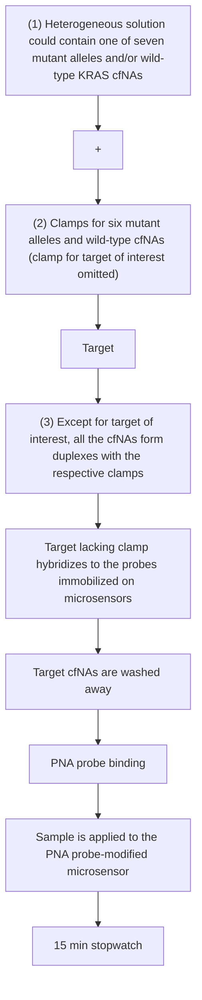
</details>

Figure 11. Schematic representation of the clamp assay to detecting KRAS mutations. The sample (1) was mixed with clamp sequences (2) to sequester the wild-type sequence and all of the mutants except the target sequence. All of the mutants and the wild-type sequence were hybridized to the respective complementary clamps in solution (3), except the target sequence, for example, 134A (green). The sample was then incubated with the PNA probe-modified microsensor, and only the target mutant nucleic acids hybridized to an immobilized PNA probe. The other six mutants and wild-type nucleic acids were not able to bind and were washed away. Reprinted with permission from ref 403. Copyright 2015 Nature Publishing Group.


<details>
<summary>flowchart</summary>

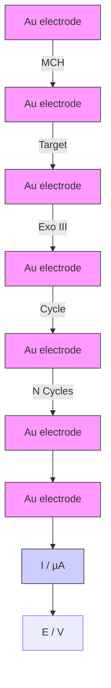
</details>

Figure 12. Schematic illustration of the voltammetric approach developed for detection of KRAS gene mutation using a hairpin capture probe modified with a thiolated methylene blue at the 3' terminus and ferrocene in the middle of the loop, immobilized onto the surface of a gold electrode. In the presence of target DNA, a duplex with a blunt end was formed, which triggered the Exo III cleavage process accompanied by the release of target DNA. As a result, the methylene blue tags were forced away from the gold electrode surface, and the ferrocene tags were brought close to the electrode surface. Reprinted with permission from ref 408. Copyright 2015 American Chemical Society.

peaks for complementary and noncomplementary targets were obtained with a temperature of $68\ °C$ .

A voltammetric sensor for BRCA1 gene mutations was fabricated using a PNA probe immobilized onto the surface of a gold electrode. $^{373}$ Because the PNA-modified electrode surface is electrically neutral, no electrostatic interaction took place between the electrode surface and the negatively charged redox mediator, $[\mathrm{Fe}(\mathrm{CN})_{6}]^{3-/4-}$ . After hybridization with the target DNA, the redox mediator was prevented from freely accessing the electrode surface, due to the electrostatic repulsion between the mediator and the formed hybrid. Nuclease S1 was then applied to the PNA/DNA duplex on the electrode surface where perfectly matched PNA/DNA duplex could not be hydrolyzed.

by the nuclease. CV experiments demonstrated that nuclease S1 treatment of the mismatched PNA/DNA duplex led to recovery of the current signal approaching a value close to that before target hybridization.

A voltammetric sensor for SNPs was fabricated using a DNA capture probe immobilized onto the surface of a polymer-induced wrinkled electrode. $^{374}$ A combination of craft cutting and prestressed polystyrene substrate-induced wrinkling was employed to fabricate a multiplexed array of wrinkled nanostructured microelectrodes. Using DPV, distinguishing between perfectly matched and SNP-containing sequence was permissible in the presence of an electrocatalytic mediator, $\mathrm{Ru(NH_{3})_{6}}^{3+}$ .

A polarity-switching voltammetric sensor for SNPs utilized a DNA capture probe modified with centrally located methylene blue and immobilized onto the surface of a gold electrode. $^{387}$ In the absence of target, the double-stranded stem of the probe created proximal rigidity, while the centrally located methylene blue did not interact with the single-stranded DNA loop. In the perfectly matched hybrid, a decreased SWV current was observed presumably due to the confinement of the methylene blue tag within the DNA duplex, which lowered the probability of the methylene blue approaching the electrode (signal-OFF). In the mismatched hybrid, the interaction was disrupted, giving rise to the opposite signal polarity (signal-ON), as shown in Figure 13.


<details>
<summary>flowchart</summary>

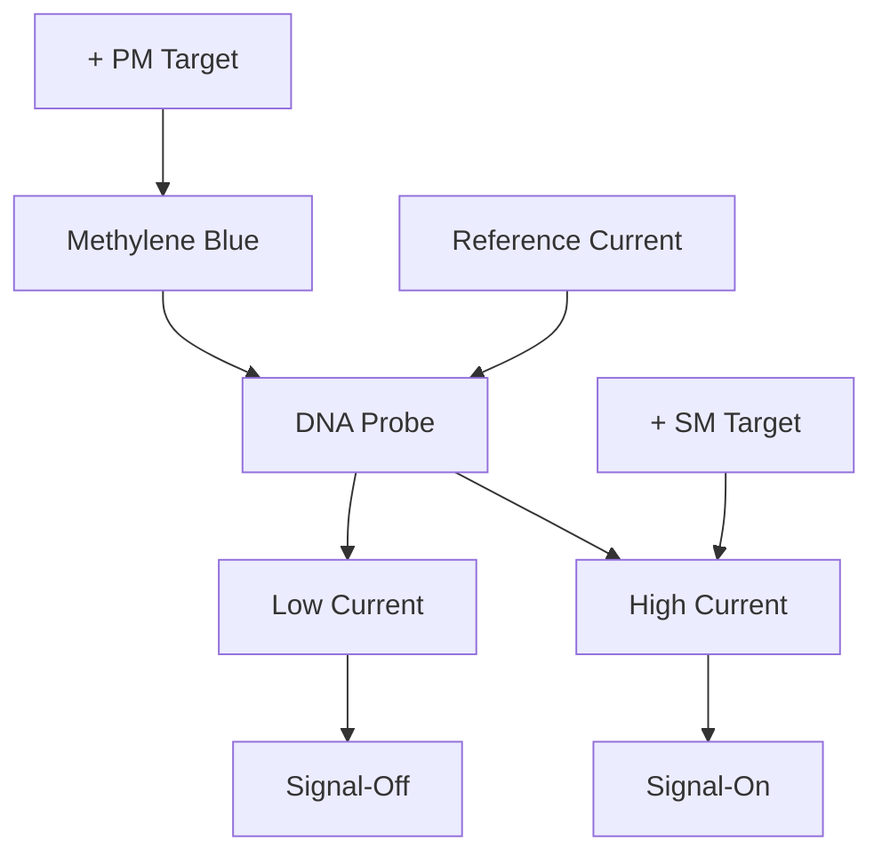
</details>

Figure 13. Polarity-switching sensor exploited the probe flexibility and the interaction between the methylene blue label and dsDNA to tune the electron transfer between the methylene blue molecules and the electrode, so that the sensor reported a “signal-OFF” response from the perfectly matched target, but an opposite “signal-ON” response from the SNP-containing target. Reprinted with permission from ref 387. Copyright 2011 John Wiley & Sons, Inc.

Other reports have demonstrated enhanced flexibility for bulge-containing duplexes as compared to perfectly matched analogues using ferrocene-modified PNA probes and voltammetric measurements. $^{410,411}$

A voltammetric sensor for SNPs was constructed using a methylene blue-labeled DNA probe immobilized onto the surface of a gold electrode. $^{34}$ The capture probe comprised a 9-base target recognition region at the 3'-end and an 8-base target recognition region at the 5'-end. The two regions were attached through a 10-T spacer. Target hybridization brought together the two domains to form a “closed” structure, which confined the methylene blue label close to the electrode surface for efficient electron transfer, as shown in Figure 14. Using ACV, a LOD of 200 fM was obtained. In addition, SNP-containing sequences did not cause a significant change in the current.

A clamp-like voltammetric sensing strategy for SNPs was developed using a methylene-labeled DNA probe immobilized onto the surface of a gold electrode. $^{412}$ The clamp-like probe could bind to a target sequence through two distinct complementary regions to form a triplex DNA structure, thus bringing the methylene blue label close to the electrode surface, as shown in Figure 15. This approach provided over 2000-fold discrimination efficiency between perfectly matched and SNP-containing sequences.

Another voltammetric sensor for SNPs featured a hairpin DNA probe as the recognition and signaling probe, the shorter arm of which was labeled with methylene blue at its free end. $^{413}$ The recognition probe was immobilized onto the surface of a gold electrode using a thiol group located internally, in the turn region of the hairpin. Hybridization of a target DNA with the longer arm of the hairpin displaced the shorter arm, allowing the redox probe to approach the electrode surface and transfer electrons, as shown in Figure 16. SWV measurements revealed 800% signal increase at the saturating target level with a LOD of 50 pM. Also, the sensor can readily discriminate between perfectly matched sequences and those containing SNPs.


<details>
<summary>text_image</summary>

Off
Target
Regeneration
On
</details>

Figure 14. Schematic representation of signal-ON nucleic acid sensor architecture and signaling mechanism. The capture probe comprised a 9-base target recognition site at the 3'-end and an 8-base target recognition site at the 5'-end. The two sites were connected through a 10-T spacer. Target hybridization brought together the two domains to form a "closed" structure, which confined the methylene blue label in proximity to the electrode surface for efficient electron transfer. Reprinted with permission from ref 34. Copyright 2013 Royal Society of Chemistry.   


<details>
<summary>text_image</summary>

Gold Electrode
Target
+Target
Buffer
V vs Ag/AgCl
</details>

Figure 15. Clamp-switch sensor comprised a DNA probe modified at its 3'-end with a methylene blue redox tag. The probe was designed with a first recognition element, a 15-base polypyrimidine portion (green portion) that can recognize a complementary target sequence via Watson–Crick base pairing. The second recognition element, a polypyrimidine sequence (red portion), was then folded back to form a triplex structure through Hoogsteen base pairing. This brought the redox label close to the electrode surface, increasing electron transfer efficiency and resulting in an increase in the current. Reprinted with permission from ref 412. Copyright 2014 American Chemical Society.

A voltammetric sensor integrated within a microfluidic device was designed to perform electrochemical melting curve measurements and subsequently discriminate between homozygous and heterozygous SNPs in the apolipoprotein E (ApoE) gene. $^{414}$ Noteworthy is that specific alleles of ApoE strongly affect individual risk of late-onset Alzheimer's disease. The device employs methylene blue-labeled surface-bound DNA probes complementary to the SNP-containing target sequence. The probe was modified at the other end with trithiol to ensure the probe stability at higher temperatures. $^{415}$ To distinguish between perfectly matched and SNP-containing sequences, the chip was heated until the formed duplex completely melted. Because of its higher hybridization energy, the perfectly matched target melted at a higher temperature, bringing the methylene blue group close to the electrode surface and leading to an increase in the ACV


<details>
<summary>text_image</summary>

Gold Electrode
Target DNA
DMSO
Gold Electrode
</details>

Figure 16. A signal-ON sensor employing an asymmetric hairpin probe. The sensor operated via a strand displacement mechanism. Hybridization of the target DNA with the longer arm of a probe molecule led to the liberation of the shorter arm, increasing the efficiency with which the methylene blue redox reporter at its end approaches the electrode surface. This resulted in a readily measurable increase in Faradaic current. Reprinted with permission from ref 413. Copyright 2011 American Chemical Society.

current. On the other hand, SNP-containing sequences showed an increase in current at lower melting temperature. Also, impedimetric monitoring of DNA denaturation by NaOH was performed using a DNA probe immobilized onto a nanocrystalline-diamond electrode. $^{416}$ This approach allowed for fast localization and identification of SNPs.

An impedimetric sensor for SNP was fabricated using a PNA capture probe immobilized onto the surface of a gold electrode. $^{417}$ The interaction of metal ions with the DNA/PNA hybrid was studied in the presence of $[\mathrm{Fe}(\mathrm{CN})_{6}]^{3-/4-}$ , and the charge-transfer resistance was found to decrease in the order of $Ni^{2+} > Co^{2+} > Zn^{2+} > Mg^{2+}$ . This was ascribed to the strong interaction of $Ni^{2+}$ with the N7 of purines or N3 of pyrimidines on the PNA/DNA film. Using $Ni^{2+}$ , it was possible to detect a single C–T mismatch. This approach was further utilized to detect SNPs in the ApoE gene with target DNA levels down to 10 fM. $^{418}$ In a closely related approach, a DNA capture probe was utilized instead of PNA in the presence of $Zn^{2+}$ .⁴¹⁹ The effect of the SNP position on the electrochemical signal was studied in 25-mer DNA sequences. A large difference in the charge-transfer resistance between perfectly matched and SNP-containing sequences was observed in middle mismatches as compared to terminal ones.

A gap electrical sensor for SNP leveraged the self-catalytic growth of unmodified GNPs as conductive bridges. $^{420}$ In the presence of target DNA, the formed dsDNA product could not adsorb onto the surface of GNPs due to electrostatic repulsion, which made the GNPs exhibit excellent glucose oxidase-like catalytic activity. Such catalytic activity enlarged the diameters of GNPs in the glucose and HAuCl $_{4}$ solution and resulted in a dramatically increased conductance. In the absence of the target DNA, the catalytic activity sites of GNPs were fully blocked by ssDNA due to the noncovalent interaction between nucleotide bases and GNPs, as shown in Figure 17. Conductance change measurements revealed the ability of the sensor to discriminate between perfectly matched and SNP-containing sequences.

4.2.1.2. Epigenetic Alterations. Heritable changes in gene expression that do not depend on the DNA sequence are referred to as “epigenetic”. Genomic DNA methylation is frequently observed at the cytosine base in the CG-rich region, called CpG islands, located in the promoter and the first exon of genes. $^{421}$ Cytosine methylation occurs at the 5' position of cytosine replacing a hydrogen atom with a methyl group without interfering with CG pairing. $^{422}$ In normal cells, most CpG islands spanning the promoter regions are nonmethylated, and their downstream genes are transcriptionally active. On the other hand, when CpG island promoters in cancer cells are methylated, their downstream genes become subsequently silenced. $^{423}$ Hypermethylation of these CpG islands is associated with diseases as a result of the transcriptional inactivation of classic tumor suppressor genes. Hypermethylation has been linked to leukemia, lung, thyroid, pancreas, and prostate tumors, among many other diseases including male sterility. $^{424,425}$ Several studies have revealed the presence of methylated DNA in the plasma/serum of cancer patients. Hence, detection of methylated DNA may represent a means to monitor cancer progression and


<details>
<summary>flowchart</summary>

```mermaid
graph TD
    A["(1) APTES"] --> B["(2) AuNPs"]
    B --> C["(3) Probe 1 + Target DNA"]
    C --> D["(4) Rinsing"]
    D --> E["(5) HAuCl4 + Glucose"]
    E --> F["(6) AuCl4-"]
    F --> G["(7) AuO2"]
    G --> H["glucose"]
    H --> I["(8) O2"]
    I --> J["(9) AuCl4-"]
    J --> K["(10) AuO2 SiO2 Si"]
    K --> L["(11) AuCl4+ Glucose"]
    L --> M["(12) AuO2 SiO2 Si"]
    M --> N["(13) AuCl4-"]
    N --> O["(14) Rinsing"]
    O --> P["(15) HAuCl4 + Glucose"]
    P --> Q["(16) AuO2 SiO2 Si"]
    Q --> R["(17) AuCl4-"]
    R --> S["(18) AuO2 SiO2 Si"]
    S --> T["(19) AuCl4-"]
    T --> U["(20) AuO2 SiO2 Si"]
    U --> V["(21) AuCl4-"]
    V --> W["(22) AuO2 SiO2 Si"]
    W --> X["(23) AuCl4-"]
    X --> Y["(24) AuO2 SiO2 Si"]
    Y --> Z["(25) AuCl4-"]
    Z --> AA["(26) AuO2 SiO2 Si"]
    AA --> AB["(27) AuCl4-"]
    AB --> AC["(28) AuO2 SiO2 Si"]
    AC --> AD["(29) AuCl4-"]
    AD --> AE["(30) AuO2 SiO2 Si"]
    AE --> AF["(31) AuCl4-"]
    AF --> AG["(32) AuO2 SiO2 Si"]
    AG --> AH["(33) AuCl4-"]
    AH --> AI["(34) AuO2 SiO2 Si"]
    AI --> AJ["(35) AuCl4-"]
    AJ --> AK["(36) AuO2 SiO2 Si"]
    AK --> AL["(37) AuCl4-"]
    AL --> AM["(38) AuO2 SiO2 Si"]
    AM --> AN["(39) AuCl4-"]
    AN --> AO["(40) AuO2 SiO2 Si"]
    AO --> AP["(41) AuCl4-"]
    AP --> AQ["(42) AuO2 SiO2 Si"]
    AQ --> AR["(43) AuCl4-"]
    AR --> AS["(44) AuO2 SiO2 Si"]
    AS --> AT["(45) AuCl4-"]
    AT --> AU["(46) AuO2 SiO2 Si"]
    AU --> AV["(47) AuCl4-"]
    AV --> AW["(48) AuO2 SiO2 Si"]
    AW --> AX["(49) AuCl4-"]
    AX --> AY["(50) AuO2 SiO2 Si"]
```
</details>

Figure 17. Schematic diagram of the gap sensing strategy based on self-catalytic growth of unmodified GNPs as conductive bridges for DNA hybridization analysis. Reprinted with permission from ref 420. Copyright 2014 American Chemical Society.

perform risk assessment in cancer patients. Genes that are frequently hypermethylated in tumors include p15, p16, APC, BRCA1, BRCA2, CDH1, RASSF1A, RARB, SEPT9, ESR1, CDKN2A, LKB1, VHL, hMLH1, MGMT, GSTP1, and DAP-kinase. $^{426}$

Conventional sequencing cannot be used to study methylation because both bases exhibit identical Watson–Crick base-pair behavior. Thus, current DNA methylation assays involve methods designed to distinguish between C and methylcytosine (mC) in oligonucleotides. Bisulfite treatment, $^{427,428}$ restriction enzymes, $^{429}$ and molecules with chemical/biological affinity have been used to readout methylation patterns. $^{430,431}$ In bisulfite-based assays, the unmethylated C is deaminated and then converted to U, whereas mC remains almost unchanged due to its low reactivity. $^{432}$ Restriction enzymes catalyze the scission reaction of a specific base sequence. When the C in the specific sequence is methylated, the scission is inhibited. Several studies have also revealed the use of antibodies, $^{431}$ binding proteins, $^{433}$ and metal complexes with high affinity for mC. $^{434}$

A voltammetric sensor was constructed for direct oxidations of mC and C in the 5'-CG-3' sequence using a sputtered nanocarbon film electrode after digesting longer CpG oligonucleotides with endonuclease P1. $^{435}$ Importantly, direct oxidation of the longer CpG oligonucleotides was insufficient for obtaining the oxidation currents of these bases because the CG-rich sequence inhibited the direct oxidation of each base due to the native conformation and its very low diffusion coefficient. Using SWV after P1 treatment allowed for 4.4 times higher sensitivity and a wider concentration range for mC detection with a resolution capable of detecting a subtle methylation differences in the 60-mer CpG oligonucleotides. Another study studied the CV and SWV responses of 250 $\mu$ M C, mC, and 6-mer oligonucleotides using screen-printed graphite electrodes. $^{436}$ Good reproducibility of the electrochemical behavior of C and mC was observed with a potential separation of about 100 mV, which allowed for a clear discrimination between C and mC.

Another voltammetric method for methylated DNA relied on the conversion of C into U using sodium bisulfite. $^{437}$ The sensor was prepared using a complementary DNA probe to 27- or 33-mer ssDNA from the GSTP1 promoter region, immobilized onto the surface of a platinum microelectrode precoated with a polypyrrole bilayer film. After bisulfite treatment, the sites where the U base is present in the non methylated DNA were no longer a base pair match to the G bases on the complementary probe DNA. Using CV, 0.1 $\mu$ M methylated DNA sequences were successfully measured with an average percent difference of 25.4% as compared to nonmethylated respective sequences. Using EIS in another study permitted the detection of methylated GSTP1 sequences down to 29 nM. $^{438}$

In a closely related approach, a voltammetric sensor was prepared using a PNA probe immobilized onto the surface of a GNPs-modified GCE, precoated with a choline monolayer. $^{439}$ The purpose of using choline was to provide a stable monolayer with positively charged $-\mathrm{N}^{+}(\mathrm{CH}_{3})_{3}$ polar head groups, which could increase the density of edge-plane-like active sites of the GCE for the assembly of GNPs, as shown in Figure 18. DPV measurements permitted the profiling of the methylation status of p53 after bisulfite treatment, and the peak current was found proportional to the logarithm of target concentration in the range from 50 pM to 96 nM, with a LOD of 18 pM.

Another voltammetric sensing platform referred to as “eMethylsorb” relied on the base-dependent affinity interaction of DNA with a gold electrode. $^{440}$ Briefly, DNA samples extracted from cell lines were treated with bisulphite to convert nonmethylated C into U. These samples were then converted to ssDNA amplicons by an asymmetric PCR step, where mC was copied into G, and U into A. The resulting ssDNA amplicons were directly adsorbed onto a gold electrode, and their amount was determined using DPV, as shown in Figure 19. It was noted that the relative current response decreased linearly with increasing methylation percentage in the mixture.


<details>
<summary>flowchart</summary>

```mermaid
graph LR
    A["bisulfite"] --> B["PNA probe"]
    C["mC"] --> D["PNA probe"]
    E["c"] --> F["bisulfite"]
    G["①"] --> H["②"]
    I["mC"] --> J["③"]
    K["④"] --> L["⑤"]
    M["⑥"] --> N["⑦"]
    O["⑧"] --> P["⑨"]
    Q["⑩"] --> R["⑪"]
    S["⑫"] --> T["⑬"]
    U["⑭"] --> V["⑮"]
    W["⑯"] --> X["⑰"]
    Y["⑱"] --> Z["⑲"]
    AA["⑳"] --> AB["㉑"]
    AC["㉒"] --> AD["㉔"]
    AE["㉕"] --> AF["㉖"]
    AG["㉗"] --> AH["㉙"]
    AI["㉚"] --> AJ["㉛"]
    AK["㉜"] --> AL["㉝"]
    AM["㉟"] --> AN["㉞"]
    AO["㉟c"] --> AP["㉟c"]
    AQ["㉟d"] --> AR["㉟d"]
    AS["㉟e"] --> AT["㉟e"]
    AU["㉟f"] --> AV["㉟f"]
    AW["㉟g"] --> AX["㉟g"]
    AY["a"] --> AZ["[Ru(NH₃)₆"]³⁺]
    AZ --> BA["a"]
    AZ --> BB["b"]
    AZ --> BC["a"]
    AZ --> BD["b"]
    AZ --> BE["b"]
    AZ --> BF["b"]
    AZ --> BG["b"]
```
</details>

Figure 18. Schematic illustration of the electrochemical recognition method of p53 gene methylation. Reprinted with permission from ref 439. Copyright 2012 Royal Society of Chemistry.


<details>
<summary>flowchart</summary>

```mermaid
graph TD
    A["(1) DNA Extraction"] --> B["(2) Bisulphite treatment and asymmetric PCR"]
    B --> C["(3) Adsorption on gold surface"]
    C --> D["(4) Electrochemical Detection"]
    D --> E["Unmethylated DNA"]
    E --> F["Methylated DNA"]
    F --> G["Current (μA) Potential (V)"]
    
    subgraph (1)
        A
        B
        C
        D
        E
        F
    end
    
    subgraph (2)
        B
        C
        D
        E
        F
    end
    
    subgraph (3)
        G
        H
        I
        J
        K
        L
        M
        N
        O
        P
        Q
        R
        S
        T
        U
        V
        W
        X
        Y
        Z
    end
    
    subgraph (4)
        G
        H
        I
        J
        K
        L
        M
        N
        O
        P
        Q
        R
        S
        T
        U
        V
        W
        X
        Y
        Z
    end
    
    subgraph (5)
        G
        H
        I
        J
        K
        L
        M
        N
        O
        P
        Q
        R
        S
        T
        U
        V
        W
        X
        Y
        Z
    end
    
    subgraph (6)
        G
        H
        I
        J
        K
        L
        M
        N
        O
        P
        Q
        R
        S
        T
        U
        V
        W
    end
    
    subgraph (7)
        G
        H
        I
        J
        K
        L
        M
        N
        O
        P
        Q
        R
        S
        T
        U
        V
        W
    end
    
    subgraph (8)
        G
        H
        I
        J
        K
        L
        M
        N
        O
        P
        Q
        R
        S
    end
    
    subgraph (9)
        G
        H
        I
        J
        K
        L
        M
        N
        O
        P
        Q
    end
    
    subgraph (10)
        G
        H
        I
        J
        K
        L
        M
        N
        O
        P
    end
    
    subgraph (11)
        G
        H
        I
        J
        K
        L
        M
        N
        O
        P
    end
    
    subgraph (12)
        G
        H
        I
        J
        K
        L
        M
        N
        O
    end
    
    subgraph (13)
        G
        H
        I
        J
        K
        L
        M
        N
    end
    
    subgraph (14)
        G
        H
        I
        J
        K
        L
        M
    end
    
    subgraph (15)
      Legend: 
      - Methylated: Blue circle, Unmethylated: Red circle; Current (μA) Potential (V) indicated by curve; Potential (V) indicated by red curve)
```
</details>

Figure 19. Schematic representation of the eMethylsorb approach for the detection of DNA methylation. Inset: The DPV current generated at the electrode modified with methylated and unmethylated DNA samples. The columbic repulsion between $[\mathrm{Fe}(\mathrm{CN})_{6}]^{3-}$ and negatively charged DNA strands for unmethylated samples (i.e., adenine enriched) was much stronger than that of the methylated one, and hence generated lower current for unmethylated samples. Reprinted with permission from ref 440. Copyright 2014 Royal Society of Chemistry.

A voltammetric sensor array integrated with a microfluidic device was constructed for the detection of oxidation in intact DNA. $^{441}$ DNA can be oxidatively damaged by reactive oxygen species, which may lead to carcinogenesis. $^{442,443}$ The device featured osmium bipyridyl poly(vinylpyridine) chloride films assembled layer-by-layer with polyions onto gold sensors. Using SWV, the device was successfully utilized to detect one molecule of oxidized guanosine, 8-oxodG, per 6600 nucleobases.

4.2.1.3. Microsatellites. Microsatellites, often referred to as short tandem repeats (STRs), are repetitive DNA triplets ranging in size from 2 to 6 bp that form variable-length stretches of DNA.

They can be found at many loci within the human genome. The biology of microsatellites has been studied extensively, and their analysis has seen application in several fields including forensic analysis, paternity/kinship testing, and disease-related linkage analysis. $^{444}$ The first reports about microsatellites involved patients with lung cancer $^{445}$ and head and neck cancer. $^{446}$ To date, more than 12 human genetic diseases including Huntington disease (triplets CAG-CTG), myotonic dystrophy (CTG-CAG), fragile X syndrome (CGG-CCG), and Friedreich ataxia (GAA-TTC) have been found to be associated with the expansion of trinucleotide repetitive sequences such as CTG, CGG, or GAA repeats. $^{447,448}$ The $d(\mathrm{CGG})_{n}$ trinucleotide expansion in the coding sequence of the Fragile X mental retardation 1 gene leads to the gradual damage of the brain. $^{449}$

An impedimetric sensor was developed for the detection of XCG trinucleotide repeats (X: C, T) using a naphthyridine carbamate dimer (NCD) of nucleic acids immobilized onto the surface of a gold electrode. $^{450}$ The selective binding of naphthyridine dimer to guanine-rich special DNA sequences was ascribed to the hydrogen bonding between the naphthyridine group and G base. $^{451}$ After the sensor was incubated with trinucleotide repeats, the relationship between the charge-transfer resistance and the logarithm of tandem repeats concentration was linear from 1 nM to 1 $\mu$ M.

A voltammetric sensor for CGG repeats was constructed using a complementary DNA probe immobilized onto the surface of a gold electrode. $^{452}$ Subsequent to capturing the tandem repeat, the sensor was incubated with a bifunctional electrochemical probe, ferrocene-labeled NCD2. SWV measurements revealed the ability of the sensor to detect trinucleotide repeats down to 50 $\mu$ M.

4.2.1.4. Viral DNA. A DNA virus is a virus in which the genetic material is DNA and replicates using a DNA-dependent DNA polymerase. The DNA can be either double- or single-stranded. Viruses, such as Epstein–Barr virus (EBV), hepatitis B virus (HBV), and human papillomavirus (HPV), are etiological factors in several malignancies, including nasopharyngeal carcinoma, $^{453}$ cervical cancer, $^{454}$ head and neck squamous cell carcinoma, $^{455}$ Hodgkin's disease, $^{456}$ and lymphoid malignancies. $^{457}$

A voltammetric sensor for the HPV DNA sequence HPV16E7p was fabricated using an anthraquinone-labeled pyrrolidinyl PNA probe immobilized onto the surface of a chitosan-modified screen-printed carbon electrode. $^{458}$ Hybridization with the viral DNA was studied by measuring the electrochemical signal of the anthraquinone label using SWV. The calibration curve exhibited a linear range from 20 nM to 12 $\mu$ M, with a LOD of 4 nM.

A sandwich-based amperometric sensor for HPV DNA sequences $HPV16E7p$ and $HPV45E6$ was constructed using a capture DNA probe immobilized onto the surface of an array of gold electrodes. $^{381}$ Subsequent to viral DNA capture, a second hybridization was carried out between the terminal part of the viral DNA and a HRP-modified reporter DNA. After incubation with TMB, the levels of $HPV16E7p$ and $HPV45E6$ were determined in the linear ranges of 0.1–10 and 0.1–1 nM, with LOD values of 490 and 110 pM, respectively.

A sandwich-based voltammetric sensor for HBV DNA was fabricated using a capture DNA probe immobilized onto the surface of an array of gold electrodes. $^{459}$ Silver nanoparticles were modified with an oligo(d)A and the reporting probe, followed by hybridization with silver nanoparticles modified with oligo(d)T. The formed tag was found to show an aggregated nanostructure 10 times larger than the individual nanoparticle, as shown in Figure 20. In the presence of HBV DNA, the sandwich was formed and the target was subsequently analyzed using DPV in the linear range from 10 aM to 100 fM, with a LOD of 5 aM.


<details>
<summary>flowchart</summary>

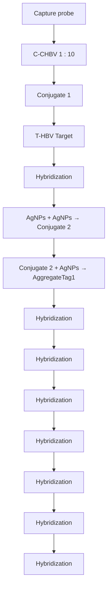
</details>

Figure 20. Schematic illustration of an electrochemical assay for viral DNA targets based on silver nanoparticle conjugates. Preparation of the aggregates is shown in the inset. Reprinted with permission from ref 459. Copyright 2010 American Chemical Society.

A sandwich-based voltammetric assay utilized DNA-wrapped CNTs as electrochemical labels for detection of HBV DNA. $^{460}$ The presence of target DNA mediated the formation of a sandwiched complex between the DNA-wrapped CNT and a hairpin DNA capture probe immobilized on magnetic beads. After treatment with N,N-dimethylformamide, the collected sandwiched complex released the bare CNTs and facilitated the removal of magnetic beads from the electrode surface. The bare CNTs were then assembled on the electrode surface and mediated efficient electron transfer between the electrode and the electroactive species, ferrocenecarboxylic acid. Using DPV, the target DNA was measured in the linear range from 1 pM to 100 nM, with a LOD of 0.9 pM.

An electrocatalytic fluid displacement method for HCV detection was designed and tested using a PNA capture probe immobilized onto the surface of a nanostructured microelectrode. $^{461}$ After hybridization with the viral DNA, the electrocatalytic solution, which comprised ruthenium hexamine, ferricyanide, mercaptopropionic acid, cysteamine, and potassium tetrachloroplatinate, was introduced into the sensing chamber. On the application of a potential, $\mathrm{Ru(NH_{3})_{6}^{3+}}$ attracted to the negatively charged backbone of the formed hybrid, was oxidized at the sensing electrode, and platinum was simultaneously electrodeposited at a mesh electrode in the read-out chamber. The current was further amplified by two additional reducing agents in the electrocatalytic solution, including mercaptopropionic acid and cysteamine. After the application of the potential, $H_{2}O_{2}$ was introduced into the read-out chamber. The deposited platinum catalyzed the decomposition of $H_{2}O_{2}$ into $O_{2}$ , and the formed bubbles displaced a fluid to reveal a color change, as shown in Figure 21. This sensor allowed for viral DNA detection with a LOD of 100 fM.

A paper-based voltammetric sensor for HBV was fabricated using a hollow-channel paper analytical device to accommodate micrometer-scale particles, and a convenient slip layer for timing the incubation steps. $^{462}$ The capture DNA probe was modified at one end with magnetic microbeads and with silver nanoparticles at the other end. Hybridization between the capture probe and


<details>
<summary>text_image</summary>

a
Introduce
sample
Sensor
Metallic
bridge
Platinum
solution
Metallic
bridge
Read-out
electrode
</details>


<details>
<summary>flowchart</summary>

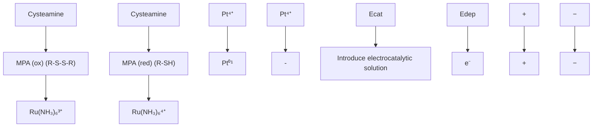
</details>


<details>
<summary>chemical</summary>

Diagram illustrating hydrogen peroxide formation and Pt oxidation process on a surface, showing molecular structures and reaction steps
</details>


<details>
<summary>text_image</summary>

d
Sensor
Metallic bridge
Readout electrode
Coloured spot
PDMS
Opaque liquid/air
</details>


<details>
<summary>text_image</summary>

e
Sensor
Metallic bridge
Readout electrode
PDMS diffraction grating
Hydrogen peroxide/air
</details>

Figure 21. Coupling electrochemical detection of nucleic acids with visual readout. (a) Target hybridization. The target was hybridized to a complementary PNA probe. (b) Signal transduction. A potential was applied to the nanostructured microelectrode which oxidized $\left[\mathrm{Ru}(\mathrm{NH}_{3})_{6}\right]^{3+}$ . The current was amplified using an electrochemical–chemical–chemical (ECC) reporter system. (c) Colorimetric read-out. After the addition of peroxide, the platinum catalyzed the decomposition of peroxide, leading to the formation of a bubble. The growing bubble resulted in a color change through a change in either the optical density or structural color. (d) Optical density change. A cross-section of the electrocatalytic fluid displacement method with read-out based on dye displacement. (e) Structural color change. A cross-section of the electrocatalytic fluid displacement method with read-out based on a structural color change. Reprinted with permission from ref 461. Copyright 2015 Nature Publishing Group.

target DNA was carried out off chip and then transferred to the screen-printed electrode integrated with the paper device. Using ASV, the level of viral DNA was quantified in the linear range up to 500 pM, with a LOD of 85 pM.

4.2.1.5. Mitochondrial DNA. Human cells contain several hundreds of copies of mitochondrial DNA (mtDNA) that encodes respiratory chain subunits, tRNAs, and rRNAs. Over 150 mutations with documented pathogenicity have been identified within the human mtDNA. $^{463}$ Several mutations have been observed in patients with lung cancer, bladder cancer, head and neck cancer, and colorectal carcinoma. $^{464}$ These mutations have been detected in bodily fluids, including saliva, urine, and bronchoalveolar lavage. $^{465}$ For instance, the mitochondrially encoded NADH dehydrogenase 6 (MT-ND6) is translated into NADH dehydrogenase 6. This protein is part of a large multienzyme assembly known as complex I, which is one of the enzyme complexes necessary for oxidative phosphorylation within mitochondria. Several mutations in the MT-ND6 gene have been identified in patients with Leber hereditary optic neuropathy $^{466}$ and Leigh syndrome. $^{467}$ Mutations in mitochondrial isoleucine tRNA are associated with cardiomyopathy and ophthalmoplegia. $^{468,469}$ The U3271C mutation affecting the human mitochondrial tRNA $^{(Leu(UUR))}$ is correlated with diabetes and mitochondrial encephalopathies. $^{470-472}$

A voltammetric sensor for MT-ND6 was constructed using a complementary DNA probe immobilized onto the surface of GNPs-modified GCE. $^{473}$ The hybrid formed was subsequently digested with BamHI, a restriction enzyme that cleaves after the 5'-G. The electrode was then immersed in methylene blue or neutral red for electroactivation followed by signal detection using DPV.

An impedimetric sensor was fabricated to monitor the PCR amplification of mitochondrial Cytochrome c oxidase gene using a forward primer immobilized onto the surface of a GCE precoated with a polymerized film of pyrrole and pyrrolylacrylic acid. $^{474}$ This sensor permitted the detection of as few as 2 copies $\mu L^{-1}$ .

4.2.2. RNA Detection Strategies. The analysis of messenger RNAs and microRNAs is the focal point of the electrochemical RNA analysis area. RNA sequences that are important targets for cancer monitoring, infectious disease diagnosis, and organ transplant assessment have all been analyzed electrochemically using a variety of approaches.

4.2.2.1. Messenger RNA (mRNA). mRNA is the intermediate between genes encoded by DNA and the final protein products. Hence, the mRNA level usually reflects the concentration of the corresponding protein. The copy number of a specific mRNA in a particular cell type can vary significantly from one mRNA to another, and depends on a series of factors related to the function of the corresponding protein. Tumors typically exhibit aberrant mRNA expression, and hence mRNA can be used as a marker for cancer monitoring. $^{475}$ In breast cancer patients, the level of CCND1 mRNA has been identified in patients with poor survival and who were nonresponsive to tamoxifen. $^{476}$ In addition, the levels of TERT mRNA and EGFR mRNA in lung cancer patients have been correlated with tumor size, metastasis, and disease recurrence. $^{477}$ Furthermore, the presence of tyrosinase mRNA has been demonstrated in the serum of one-third of patients with malignant melanoma. $^{348}$

A displacement-based voltammetric signal-ON sensor for survivin mRNA was constructed using a ferrocene-labeled stem-loop DNA probe immobilized onto the surface of a gold electrode. $^{386}$ Survivin is an apoptosis inhibition protein found in most cancer cells, such as breast, ovarian, cervical, and hepatocellular carcinomas. $^{478}$ In this report, the immobilized probe was then hybridized with a partial complementary survivin antisense oligonucleotide to open the stem-loop structure and reduce the electron transfer. SMMC-7221 cells were incubated

with the sensor, lysed with Triton, and the released mRNA subsequently displaced the antisense strand and retrieved the stem-loop structure. DPV experiments revealed that the peak current exhibited a linear correlation with the logarithm of mRNA concentration ranging from 50 pM to 50 nM.

A voltammetric sensing platform was developed for detection of the BCR-ABL mRNA, which is associated with chronic myeloid leukemia. $^{479}$ This platform was based on amino acid/nucleic acid chimeras (ANAs) immobilized onto the surface of an array of nanostructured gold microelectrodes. The ANAs were designed to specifically bind to the junction region between the two fused genes, bcr and abl in the BCR-ABL gene fusion. Using a catalytic redox probe, $[\mathrm{Ru}(\mathrm{NH}_{3})_{6}]^{3+}/[\mathrm{Fe}(\mathrm{CN})_{6}]^{3-}$ , DPV allowed for the detection of BCR-ABL mRNA in as few as 10 K562 cells after lysis.

Chip-based voltammetric sensors referred to as fractal circuit sensors (FraCS) were applied to the multiplexed analysis of preimplantation IL-6, IL-10, and ATP11B mRNAs that correlate with the development of primary graft dysfunction in recipients after transplant. $^{480}$ The sensors made from electrodeposited gold were templated in apertures created in an SU-8 layer patterned over gold contacts on a glass chip. Electrodeposition was carried out using conditions that facilitate rapid growth and generation of fractal structures extending into solution. Afterward, the sensors were modified with the complementary PNA sequences for the target mRNAs. The donor lung tissue extracted by a transplant surgeon was chemically lysed in 5 min using nonionic detergents compatible with the sensor. The electrochemical currents were generated by a label-free, redox-active, $[\mathrm{Ru}(\mathrm{NH}_{3})_{6}]^{3+}/[\mathrm{Fe}(\mathrm{CN})_{6}]^{3-}$ reporter system. The $[\mathrm{Ru}(\mathrm{NH}_{3})_{6}]^{3+}$ electron acceptor complex is positively charged and binds to the sensors at levels that correspond to the amount of negatively charged nucleic acid bound to the sensor. The $[\mathrm{Fe}(\mathrm{CN})_{6}]^{3-}$ electron acceptor complex is negatively charged, and so it remains in solution to accept the electrons from $[\mathrm{Ru}(\mathrm{NH}_{3})_{6}]^{3+}$ to induce multiple turnovers and current amplification, $^{481,482}$ as shown in Figure 22. This sensor system exhibited a 335% signal gain using FraCS when challenged with solutions of 1 to 10 nM mRNA versus 52% using conventional electrodes. In addition, a significant up-regulation of IL-6, IL-6/IL-10, and ATP11B mRNAs was observed in the donor lungs with poor outcomes.

An integrated voltammetric sensor with a microfluidic device was fabricated to allow the capture of circulating tumor cells (CTCs), cell lysis, and profiling of PSA mRNA. $^{483}$ In this work, a velocity valley chip was utilized to capture magnetic nanoparticle-bound CTCs, which were then electrochemically lysed, and the in situ released mRNA was analyzed using nanostructured microelectrodes. Using DPV, CTCs as few as 2 cells per mL of blood were captured with 97% efficiency within 1 h, and the level of PSA mRNA was determined, as shown in Figure 23. Furthermore, integrated electrochemical lysis and mRNA detection was previously reported using a variety of optimized templates for bottom-up growth of nanostructured electrodes. $^{484-486}$

Nanogap sensors were fabricated for multiplexed analysis of histone H4 (His4), glyceraldehyde 3-phosphate dehydrogenase (GAPDH), and BRCA1 mRNAs using complementary DNA probes immobilized onto the surface of vertically aligned gold microband electrode/SiO $_{2}$ /gold microband electrode sandwich structures in orthogonal configurations. $^{487}$ The target mRNA was first hybridized with its specific capture probe on the bottom side of the nanogap, followed by annealing of its poly(A) tail with poly(T) annealing probes on the top side of the nanogap, thus holding the hybridized mRNA strands vertically across the nanogap, as shown in Figure 24. A subsequent deposition of silver nanowires, using $AgNO_{3}/hydroquinone$ , alongside the mRNA strands bridged the nanogap and consequently produced a substantial change in conductance, allowing for the detection of mRNA within the linear range from 0.5 fM to 1 pM, with a LOD of 0.1 fM.


<details>
<summary>flowchart</summary>

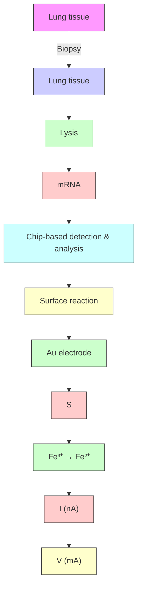
</details>

Figure 22. Lung tissue mRNA assessment assay. A biopsy was taken from a donated lung, and the cells were lysed. The mRNA released from the cells was analyzed using a chip-based method that can deliver a gene expression profile (top). FraCS sensor chip (middle-left) and SEM images of sensors after electrochemical deposition (middle-right). Assay readout: PNA probe (black) and resulting DPV signal (bottom-right, shown in dark blue), target mRNA (light blue) hybridization, and resulting DPV signal (bottom-right, shown in red). Reprinted with permission from ref 480. Copyright 2015 American Association for the Advancement of Science.

A sandwich hybridization assay for human acute lymphocytic leukemia-related p185 BCR-ABL fusion transcript was designed using a DNA capture probe immobilized onto the surface of magnetic beads. $^{488}$ Subsequent to mRNA capture, the terminal end of the captured strand was hybridized with a complementary signal DNA probe immobilized onto the surface of CNTs functionalized with an HRP enzyme. The activity of enzyme was monitored by measuring the electroactive enzymatic product in the presence of 2-aminophenol and $H_{2}O_{2}$ substrate solution. Using SWV, the level of the 491bp target oncogene was measured down to 1.7 pM.

4.2.2.2. MicroRNA (miRNA). miRNAs are a class of small noncoding RNA molecules that regulate the expression of target genes at the post-transcriptional level by either translational repression or degradation of mRNAs. $^{489}$ Mature miRNAs consist of $\sim$ 22 nucleotides and are derived from hairpin precursor molecules of 70–100 nucleotides. It has been estimated that the human genome may encode for over 1000 miRNAs, which can regulate up to 60% of the mammalian genes. $^{490}$ The miRNAs

A   


<details>
<summary>text_image</summary>

1.5 cm
1 cm
CTC
Capture & lysis
Sensing
</details>

B   


<details>
<summary>text_image</summary>

5 mm
Low velocity region
</details>

C   


<details>
<summary>chemical</summary>

Diagram illustrating the synthesis of CTCs nanoparticles from superparamagnetic nanoparticles-Ab and CTCs, showing stepwise transformation.
</details>

D


<details>
<summary>text_image</summary>

CTC
mRNA
</details>

E   


<details>
<summary>natural_image</summary>

Diagram showing a device interacting with a plant structure, no text or symbols present
</details>


<details>
<summary>flowchart</summary>


</details>

Figure 23. Design of an integrated microfluidic chip for the capture and electrochemical analysis of CTCs. (A) Schematic of the chip featuring capture structures, electrochemical lysis electrodes, and nanostructured microelectrode sensors. (B) Photograph of the microfluidic capture device (left) and the flow velocity profile within the capture chamber (right). (C) Target CTCs were labeled with superparamagnetic nanoparticles coated with anti-EpCAM. The labeled cells were then captured in the vicinity of the trapping structures. (D) Electrochemical lysis of the trapped cells using the lysis electrodes. (E) Schematic showing electrochemical sensing of mRNA released from captured CTCs in 1D. Released mRNA was hybridized to PNA probes immobilized onto the surface of nanostructured microelectrodes. This led to an increase in current after hybridization as measured by DPV. Reprinted with permission from ref 483. Copyright 2015 American Chemical Society.


<details>
<summary>flowchart</summary>

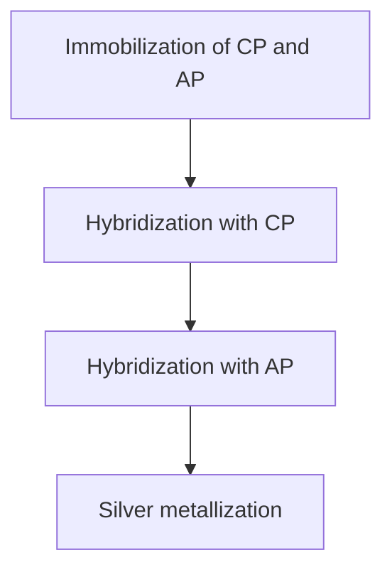
</details>

Figure 24. Schematic illustration of the hybridization and electrochemical sensing mechanism of a nanogap sensor. Reprinted with permission from ref 487. Copyright 2010 American Chemical Society.

levels often vary diversely in cells ranging from 10 to 50 000 copies/cell. $^{491}$ Typical levels of circulating miRNAs in serum were estimated to range from 200 aM to 20 pM. $^{492}$ Altered expression patterns of miRNAs have been observed in many diseases, including cancer, $^{493}$ cardiovascular diseases, $^{494}$ diabetes, $^{495}$ rheumatic diseases, $^{496}$ and neurological disorders. $^{497}$ Profiling of miRNAs in clinical samples can help in the prognosis and provision of personalized treatments. $^{498}$ A variety of electrochemical sensors have been developed for miRNA detection, which were recently reviewed elsewhere. $^{499}$

A hybridization-based voltammetric sensor for miRNA was fabricated using a DNA capture probe immobilized onto the surface of MWCNTs-PAMAM dendrimer-coated GCE. $^{500}$ The presence of PAMAM was found to minimize the undesired

adsorption of the redox mediator, methylene blue. Using DPV, interrogation of the miRNA level was permissible up to 100 nM, with a LOD of 0.5 fM. Another hybridization-based voltammetric assay was designed on the basis of a previously reported $^{501}$ methylene blue-labeled three-stem loop structure DNA sequence immobilized onto the surface of a gold microelectrode. $^{502}$ Subsequent to miRNA capture, the methylene blue label was cyclically oxidized electrochemically and reduced chemically using tris(2-carboxyethyl) phosphine hydrochloride (TCEP) in the detection solution to amplify the current. Using SWV, a linear relationship was achieved between the current and miRNA concentration in the range from 0.1 fM to 500 pM, with a LOD of 0.1 fM.

Hybridization-based impedimetric sensors for miRNA were constructed by coimmobilization of the capture probe and 4-mercaptoaniline onto the surface of a gold electrode. $^{375}$ Following hybridization with a ruthenium oxide nanoparticle-tagged target miRNA, a mixture of 3,3'-dimethoxybenzidine and $H_{2}O_{2}$ was added. The ruthenium oxide served as a polymerization initiator for 3,3'-dimethoxybenzidine. The amount of the deposited poly(3,3'-dimethoxybenzidine) (PDB) and its insulating power directly correlated to the concentration of the target miRNA in the range from 6 fM to 2 pM, with a LOD of 3 fM. In another approach, a neutral morpholino capture probe was immobilized onto the surface of an ITO-coated glass slide. $^{503}$ Upon hybridization, the neutral surface of the biosensor became anionic by the hybridized miRNA strands. Subsequently, a mixture of HRP and $H_{2}O_{2}$ catalyzed the formation of an insulating film of PDB. A linear relationship was established between the charge-transfer resistance and miRNA concentration in the range from 5 fM to 2 pM, with a LOD of 2 fM.

An impedimetric sensor for miRNA based on target recycling was fabricated using a DNA capture probe immobilized onto the surface of a gold electrode. $^{389}$ After hybridization with miRNA, the capture probe was simultaneously digested by a duplex-specific nuclease, releasing the miRNA strands back to hybridize


<details>
<summary>flowchart</summary>

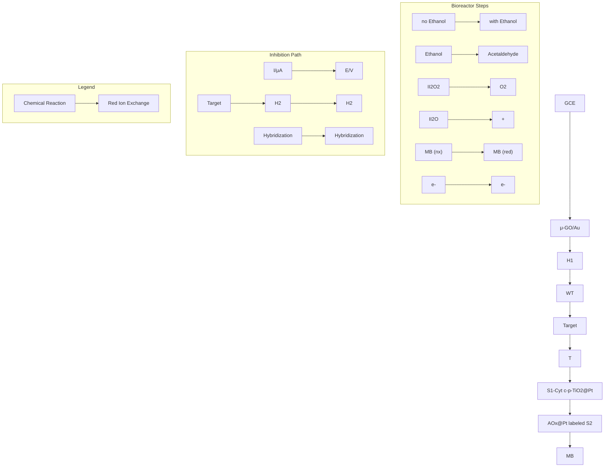
</details>

Figure 25. Preparation process for biobarcode conjugate labels and the proposed strategy for miRNA detection. Reprinted with permission from ref 504. Copyright 2015 American Chemical Society.

with the remaining capture probe, thus forming an isothermal amplification cycle. A linear relationship was obtained between the charge-transfer resistance and the concentration of the target miRNA in the linear range from 2 fM to 2 pM, with a LOD of 1.0 fM. In another approach, T7 exonuclease was utilized instead of duplex-specific nuclease. $^{390}$ Using DPV, linear quantification of miRNA was permitted in the range from 0.5 to 100 fM, with a LOD of 0.2 fM.

Another target recycling approach relied on target miRNA displacement instead of capture probe digestion. In this approach, a capture hairpin probe (H1) was immobilized onto the surface of a GCE coated with porous graphene oxide/gold composite. $^{504}$ The target miRNA that had been hybridized with the capture probe was subsequently displaced from the hybrid in the presence of another stable hairpin DNA (H2). The released miRNA became available for initiating another cycle. The hybrid formed on the sensor surface was then hybridized with a DNA probe modified with Cytochrome c-conjugated nanoporous $TiO_{2}/Pt$ nanoparticles (S1) through the unhybridized terminal part. Another DNA strand modified with alcohol oxidase-conjugated Pt nanoparticles (S2) was then hybridized to S1. Afterward, methylene blue was intercalated into the DNA duplex. Subsequently, a catalysis cascade was initiated in which alcohol oxidase catalyzed the oxidation of ethanol to acetaldehyde, accompanied by the generation of $H_{2}O_{2}$ . Cytochrome c and platinum nanoparticles then cooperatively catalyzed the reduction of $H_{2}O_{2}$ , as shown in Figure 25. Using DPV, a LOD of 0.4 fM was achieved.

A voltammetric sandwich-based hybridization assay for miRNA used a molecular beacon capture probe immobilized onto the surface of a gold electrode. $^{505}$ After hybridization with the target miRNA, silver nanoclusters encapsulated with a signaling probe were attracted to the electrode surface and produced a current signal, in response to $H_{2}O_{2}$ reduction. Using DPV, the current intensity versus the logarithm of miRNA concentration displayed a linear relationship in the range from 100 fM to 10 nM, with a LOD of 67 fM. In another approach, a signaling probe modified with $Cd^{2+}$ -functionalized titanium phosphate nanosphere and $\mathrm{Ru(NH_{3})_{6}^{3+}}$ molecules was utilized to produce an electrochemical signal. $^{506}$ Using SWV, the assay displayed a dynamic linear range extending from 1 aM to 10 pM, with a LOD of 0.8 aM. In another approach, a signaling probe tagged with alkaline phosphatase-conjugated gold nanoclusters was utilized. $^{507}$ Both the capture and the signaling probes were ligated using a DNA ligase to increase the bearing strength. The alkaline phosphatase-conjugated gold nanoclusters catalyzed a substrate dephosphorylation reaction and accelerated silver deposition from $AgNO_{3}$ solution. Using LSV, the sensor displayed a linear dynamic range extending from 14 aM to 20 fM, with a LOD of 4.6 aM.

A gap hybridization assay for miRNA was designed using a DNA capture probe, helper DNA, and esterase 2-labeled signaling probe. $^{508}$ In the absence of miRNA, the gap between capture and detection DNA is not filled, and missing base stacking energy destabilized the hybridization complex. In the presence of miRNA, the reporter enzyme was brought to the proximity of the electrode to catalyze the hydrolysis of p-aminophenyl butyrate to p-aminophenol, which is electrochemically active. This assay allowed for miRNA analysis in the range from 2 pM to 200 nM, with a LOD of 2 pM.

Displacement voltammetric sensing of miRNA was achieved using a DNA capture probe immobilized onto the surface of a gold electrode. $^{385}$ The capture probe was hybridized with a miRNA labeled with ferrocene-capped GNPs. In the presence of the target miRNA, the labeled miRNA was forced to dissociate from the electrode surface, resulting in a decrease in the ferrocene oxidation current. Using CV, the miRNA level was quantified down to 10 fM.

An amperometric sensor for miRNA was constructed using a DNA tetrahedron structure displaying a capture probe at one vertex and three thiol groups at the other three vertices, which was immobilized onto the surface of a gold electrode. $^{509}$ After hybridization with the target miRNA, a biotin-tagged reporter probe was hybridized with the capture probe followed by


<details>
<summary>flowchart</summary>

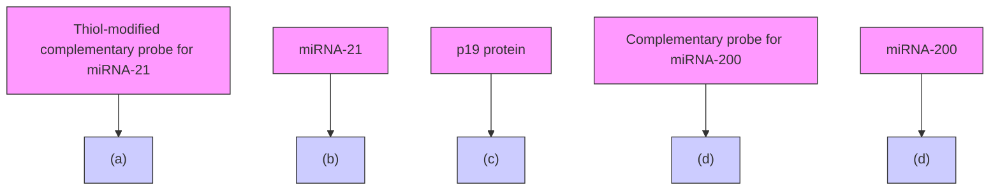
</details>

Figure 26. Schematic representation of the three-mode electrochemical sensor for detection of miRNAs. (a) A thiol-modified probe for miR-21 was immobilized onto the surface of a gold nanoparticles-modified screen-printed carbon electrode. (b) A hybridization-based sensor (H-SENS) in which the binding of the target miR-21 caused an increase in the current intensity. (c) A p19 protein-based sensor (P-SENS) in which the binding of the p19 protein caused a large decrease in current density, thus improving the detection range. (d) A displacement-based sensor (D-SENS) in which the hybridization product of miR-200 and its nonthiolated complementary probe forced the p19 protein to dissociate from electrode surface, causing a shift-back in the signal. Reprinted with permission from ref 378. Copyright 2013 American Chemical Society.

modification with streptavidin-conjugated HRP enzyme. After incubation with a mixture of TMB and $H_{2}O_{2}$ , the target miRNA was detected with a LOD of 10 aM. In a closely related approach, a combination of the tetrahedral approach and hybridization chain reaction was utilized for miRNA detection. $^{126}$ Subsequent to target hybridization, two biotin-modified signaling probes were used to amplify the hybridization signal by adding an amplified chain on each target. Afterward, a streptavidin-conjugated HRP enzyme was attached to the chain reaction product followed by incubation with the TMB and $H_{2}O_{2}$ mixture. Also, a LOD of 10 aM was achieved.

In another approach, the target miRNA triggered the hybridization chain reaction of two species of metastable DNA hairpin probes, resulting in the formation of multiple G-quadruplex-incorporated long duplex DNA chains. Consequently, methylene blue selectively intercalated into the duplex DNA chain and the multiple G-quadruplexes, causing a significant electrochemical signal drop. $^{383}$ Using DPV, a linear relationship was established between the current signal and miRNA concentration in the range from 1 to 800 pM, with a LOD of 1 pM.

A three-mode voltammetric sensor for miRNA was developed on the basis of the unique binding properties of the p19 protein (a component of the Carnation Italian Ringspot Virus), to small dsRNAs. $^{378}$ In this work, an RNA capture probe was immobilized onto the surface of a GNPs-modified screen-printed carbon electrode. In the hybridization modality referred to as H-SENS, hybridization between the target miRNA and its complementary immobilized probe caused an increase in the current signal due to

an increase in the number of Ru $^{III}$ cations electrostatically attracted to the phosphate backbone of RNA. Binding of the p19 protein to the hybrid caused a large decrease in current density by blocking the electron transfer to the electrode surface, thus amplifying the signal (P-SENS). In the displacement modality (D-SENS), the hybrid-p19 complex attached to the sensor surface was incubated with a mixture of another miRNA and a nonthiolated complementary RNA probe. The a newly formed hybrid subsequently forced the p19 to dissociate from the surface and bind to the newly added hybrid, thus causing a shift in the signal, as shown in Figure 26. Using SWV, a broad range of miRNA concentrations could be analyzed with a LOD of 5 aM. Another three-mode voltammetric sensor for miRNA was designed on the basis of the previous concept. $^{379}$ However, a DNA capture probe was used instead of RNA. In addition, an RNA/DNA specific antibody was utilized instead of p19. Using SWV, a wide range of miRNA concentrations were determined, with a LOD of 8 fM.

A DNA four-way junction-based voltammetric sensor for miRNA was also reported $^{376}$ . This assay comprised a hairpin DNA capture probe and two DNA adaptor strands, which cooperatively hybridize with both the capture probe and the target miRNA. Each adaptor strand has a fragment complementary to the capture probe and a fragment complementary to the target miRNA. In the presence of the target miRNA, the two adaptor strands could hybridize to the capture probe and miRNA, thus resulting in the formation of a quadripartite complex with a four-way junction structure. The formed complex subsequently captured a streptavidin molecule to cause a


<details>
<summary>flowchart</summary>

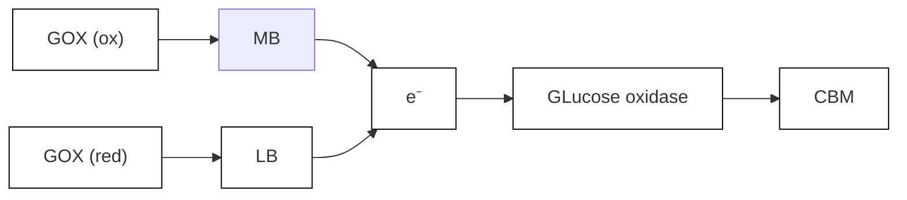
</details>

Figure 27. Schematic representation of an electrocatalytic quadroprobe sensor for detection of microRNAs. (a) Thiol-modified universal interfacial probe (UIP) was immobilized onto the electrode surface. (b) Incubation of the sensor with a mixture of the target microRNA and the methylene blue-labeled adaptor strands, C (from cooperative) and H (from hybridization) strands, resulted in the formation of a characteristic redox peak. (c) Electrocatalysis in the presence of glucose oxidase resulted in the amplification of the methylene blue reductive peak. Reprinted with permission from ref 377. Copyright 2015 American Chemical Society.

significant decrease in the current (signal-OFF). Using SWV, the miRNA level could be determined down to 2 aM. On the basis of the previous approach, a signal-ON voltammetric sensor was developed by incorporating 1 methylene blue molecule at each end of the two adaptor strands. Electrochemical measurements were performed in the presence of glucose oxidase, which amplified the methylene blue reductive peak as a result of electrocatalysis, $^{377}$ as shown in Figure 27. SWV measurements revealed the ability of the sensor to quantify several miRNAs with concentrations down to 100 fM.

A potentiometric sensor was constructed for the detection of encapsulated miRNAs in exosomes after a reverse transcription polymerase chain reaction (RT-PCR). $^{510}$ In this work, the PCR amplicons were captured via hybridization with a capture probe immobilized onto the surface of an array of gold electrodes. This assay allowed for the detection of miRNA levels down to 20 pM.

A FET-based sensor for miRNA was fabricated using a DNA capture probe immobilized onto the surface of hafnium oxide-based dielectric-based silicon nanowires precoated with poly-L-lysine. By optimizing the surface fabrication and functionalization, a LOD of 1 fM was achieved. $^{511}$ Another FET-based sensor relied on the formation of a tripartite hybridization complex and subsequent both-sided ligation of the target miRNA to a reporter and capture probe on the surface of a complementary metal-oxide semiconductor (CMOS) chip with interdigitated gold electrodes. $^{512}$ The assay achieved a LOD below 1 pM. Also, CNTs-based FET functionalized with p19 protein was utilized for miRNA detection. $^{513}$ After hybridization between the target miRNA and the capture probe, the formed hybrid was quantified by measuring the change in the interfacial resistance caused by its binding to the surface p19. A LOD of 1 aM was reported.

# 4.3. Sensitivity Challenges for Electrochemical Nucleic Acid Detection Systems

Despite so many developments in the field of electrochemical nucleic acid analysis, only few systems have successfully become commercialized. For instance, GenMark Diagnostics (USA) offers the eSensor Technology, integrating microfluidics and electrochemical detection. The voltammetric sensing platform is based on the hybridization between the target sequence and a ferrocene-labeled probe. CombiMatrix Diagnostics (USA) has advanced an oligonucleotide microarray platform containing >12 000 individually addressable microelectrodes in a semiconductor matrix. The approach is based on labeling the target sequence with biotin, which, subsequent to hybridization with the capture probe, binds to streptavidin-conjugated HRP. The HRP enzyme subsequently catalyzes the oxidation of TMB, followed by amperometric measurement of the product. Another strategy for DNA base analysis was introduced by Nanopore Technologies (UK) and relies on passing a single DNA strand through a nanopore of a chemically engineered membrane protein, $\alpha$ -hemolysin.

The sensitivity of nucleic acid detection methods is mainly driven by the efficiency of target capture by the sensor surface combined with the translation of a modest change in the interfacial layer into a large change in the electrical current. To date, several approaches were sought to enhance the sensitivity of detection. Electrocatalytic reporters have been used over three decades to amplify the signal and leverage the detection sensitivity. $^{514}$ Optimization of the probe monolayer on the electrode surface has also been pursued by controlling the probe linker length and structure. However, it was noted that differing linkers did not alter the electrochemical properties of the attached reporter and that the choice of the linker had no effect on the sensor sensitivity. $^{515}$ The use of neutral PNAs as capture probes instead of DNAs or RNAs has provided a considerable enhancement in sensitivity. $^{516}$ Because PNA lacks the phosphate backbone, it forms more thermally stable complexes with DNA and RNA. In addition, the number of electrocatalytic reporters bound to the unhybridized PNA strand is usually small. Consequently, the background current in electrocatalytic sensors

is usually minimized, which could increase the overall sensitivity of the reporter system by more than 2000% as compared to conventional DNA probe-based systems. Also, DNA tetrahedral nanostructures provided another means to enhance the detection sensitivity by improving the accessibility of target nucleic acids, leading to attomolar detection levels. $^{517,518}$ In addition, nanomaterials $^{519}$ and enzyme amplification strategies $^{382}$ were commonly utilized to enhance the detection sensitivity.

Eliminating amplification in nucleic acid sensing strategies may provide a better solution to speed up the analysis and also to simplify the assay workflow to enable automation. For example, several integrated circuit strategies were adopted on the basis of electronic transduction schemes that monitor the change in the properties of an underlying electronic material, such as FETs. $^{520}$ These devices combine superior performance with ease of manufacture using the same infrastructure leveraged by the electronics industry. Direct electrochemical readout of nucleic acids represents an alternative solution for rapid molecular detection challenges. In designing electrode-based detectors, it is crucial to miniaturize the electrodes to minimize signal-to-noise; however, electrodes that are too small will not permit sufficient collisions between the slow-moving analytes and the capture probe to attain high sensitivity. $^{521}$

The fact that the hybridization efficiency between a target nucleic acid and a capture probe immobilized onto the electrode surface is much lower than that observed for solution-based probes raises the question of whether the structure of the probe monolayer, and its accessibility to the target molecules, is convenient for target capture. Poor hybridization efficiency could be attributed to the electrode surface used for capture, which essentially lays flat on the molecular length scale. In addition, high surface probe densities or probe–probe interactions could hinder the efficient capture of target nucleic acids. $^{522}$ The use of nanorough electrodes provided a means to improve the probe orientation by increasing the angle of deflection among the nearby probe molecules. For example, the use of 3D nano-electrode ensembles (NEEs) was found to improve the detection limit of the 23S rRNA of Helicobacter pylori by a factor of $10^{6}$ when tested alongside the macroelectrodes made of bulk gold. $^{523}$

Although NEEs had a significant impact on the detection sensitivity, the material chemistry involved in their fabrication made the mass production of robust devices a challenge. To address this problem, a combination of top-down and bottom-up fabrication was employed, allowing for the rapid fabrication of sensing electrodes with nanoscale features on a single planar integrated circuit. $^{524}$ It was demonstrated that nanostructured microelectrodes (NMEs) with finer nanostructures had higher probe density than smooth electrodes, which subsequently enhanced the hybridization efficiency by several orders of magnitude. $^{525}$ The performance of NMEs was impressive, and they allowed for the detection of clinically relevant levels of nucleic acids. Nevertheless, analyzing slow-diffusing large mRNAs necessitates long incubation times to ensure that a sufficient number of these molecules will reach the sensor surface. $^{526}$ To increase the interaction of target nucleic acids with NMEs, longer plating times were used to deposit gold structures with large footprints (100 $\mu$ m) and subsequently permit rapid accumulation of the slowly diffusing molecules. $^{527}$

Although NMEs could be successfully used in multiplexed analysis, there was a need to contact each electrode individually. To address this drawback, a solution-based electronic switch was developed to allow for the interrogation of more than 100 different analytes using a small number of electrical contacts. $^{528}$

Another important step in the development of nucleic acid sensing platforms involved introduction into user-friendly devices with integrated sample processing units that can handle crude and complex sample matrices. A sample-processing unit based on electrical lysis was successfully coupled to NMEs integrated chip to allow for the release of nucleic acids after cell lysis followed by their rapid capture on the surface of NMEs for detection. $^{529,530}$ This strategy showed promise in the analysis of gene expression in rare cancer cells isolated from the bloodstream of cancer patients. $^{531,532}$

# 5. ELECTROCHEMICAL ANALYSIS OF PROTEINS

The contents of human plasma represent secretions coming from all body tissues and may feature markers of physiological and pathological processes. Plasma contains tens of thousands of core proteins, which span 10–11 orders of magnitude in abundance, from albumin to cytokines (Figure 1). Proteins are the biological molecules most ubiquitously affected in diseases. $^{533}$ However, since 1998, the rate of introduction of new protein biomarkers approved by the FDA has fallen to an average of one per year. This reflects the long path from biomarker discovery to clinical assay and the lack of coherent processes for assay development. $^{534}$ Clinically relevant protein markers include tumor, cardiac, hepatic, inflammatory, and other biomarkers that do not fall into the previous categories.

# 5.1. Tumor Markers

The National Cancer Institute defines a biomarker as “a biological molecule found in blood, other body fluids, or tissues that is a sign of a normal or abnormal process or of a condition or disease.” Tumor markers are one of the most valuable tools of early cancer detection, classification, staging, progression monitoring, and assessment of resistance to chemotherapy. There are more than 200 distinct diseases associated with cancer affecting different parts of the body. $^{535}$ In the absence of a tumor, the tumor markers usually exist at low levels. Upon tumor formation, the level changes, and hence clinical assays of cancer markers must be rapid, selective, and sensitive enough to detect small changes in the level of the markers in complex biological fluids. $^{536}$

5.1.1. Prostate-Specific Antigen (PSA). PSA is one of the first tumor markers that has been used for screening and diagnosis of prostate cancer. PSA is a peptide that exists in either a free form (fPSA) or a complex with a-1-antichymotrypsin (PSA-ACT). The total PSA level in healthy males is usually less than $4 \mu g L^{-1}$ and increases in prostate cancer patients. $^{537}$

A displacement-based voltammetric immunosensor for PSA was developed using an anti-PSA antibody immobilized onto the surface of a MWCNTs-modified GCE, $^{538}$ where the antibody was coupled with polytyrosine-tagged PSA. Notably, polytyrosine is an electroactive polymer, which can liberate a large number of electrons upon electrochemical oxidation and subsequently enhance the detection sensitivity. In the presence of the target PSA, the labeled PSA was forced to dissociate from the sensor surface, and the current was reduced in a concentration-dependent manner. Using DPV, a LOD of 2.2 ng L $^{-1}$ was achieved.

A sandwich-based amperometric immunosensor for PSA was fabricated using a DNA nanostructure as a scaffold to precisely control the assembly of the antibody monolayer on the surface of a gold electrode. $^{539}$ It was demonstrated that the detection sensitivity was dependent on the nanoscale spacing of the

immobilized antibodies provided by the DNA scaffold. Subsequent to PSA capture, the immunosensor was incubated with HRP-conjugated anti-PSA-GNPs to further amplify the signal. Amperometric analysis permitted a linear quantification of PSA with a LOD of 1 ng L $^{-1}$ . In addition, several sandwich-based electrochemical immunoassays for PSA were reported in which the capture antibody was coupled either directly to the electrode surface $^{540}$ or through iron oxide nanoparticles, $^{541}$ nanoporous gold foils, $^{542}$ or magnetic beads, $^{543}$ with LOD values of 5, 4, 6, and 100 ng L $^{-1}$ , respectively.

Also, gold-coated magnetic nanoparticles were modified with an anti-PSA antibody and dispersed in a PSA sample solution to capture the PSA present in the sample. After binding to a HRP-conjugated anti-PSA antibody, a magnetic field was applied to capture the target on a transducing electrode for electrochemical interrogation. $^{544}$ Amperometric analysis of $H_{2}O_{2}$ reduction, catalyzed by peroxidase, permitted detection of PSA levels down to 100 pg L $^{-1}$ .

Impedimetric aptasensors for PSA were fabricated using thiolated single-stranded DNA (ssDNA) and 3-mercapto-1-propanol coimmobilized onto the surface of a gold electrode, as a scaffold for PSA-specific aptamer attachment. $^{545}$ The ssDNA was either directly hybridized with a DNA extension (primer) of the aptamer on the electrode surface or in solution prior to immobilization onto the electrode surface. A dsDNA intercalator with a ferrocenyl redox label was synthesized to evaluate the feasibility of the strategy. Impedimetric analysis permitted linear interrogation of PSA level in the range from 50 ng L $^{-1}$ to 50 $\mu$ g L $^{-1}$ , with a LOD of 0.5 ng L $^{-1}$ .

Also, a label-free aptasensor was designed by using a quinone-containing conducting polymer as a redox transducer and matrix to immobilize a PSA-specific aptamer. $^{546}$ SWV allowed for a linear quantification of PSA with a LOD in the $\mu g\ L^{-1}$ range. Furthermore, modification of the reporter antibody with CdSe/ZnS quantum dots via biotin/streptavidin coupling was sought to amplify the detection sensitivity. $^{547}$ Quantification of PSA was performed through acidic dissolution of the quantum dots and stripping voltammetric detection of the $Cd^{2+}$ released. This assay permitted the linear quantification of PSA level up to $20\ \mu g\ L^{-1}$ , with a LOD of $120\ ng\ L^{-1}$ .

A MIP-based sensing platform for PSA used MWCNTs decorated with manganese nanoparticles and functionalized with a thio-group to produce a nanoiniferter. $^{548}$ The iniferter is a chemical compound that simultaneously acts as initiator, transfer agent, and terminator and hence the name ini-fer-ter. The nanoiniferter was subsequently utilized as a platform to synthesize a 3D MIP for PSA via a controlled-radical polymerization technique. Both SWV and DPSV were employed for PSA analysis with LOD values of 250 fg L $^{-1}$ and 3 pg L $^{-1}$ , respectively. Also, a MIP-based capacitive biosensor for PSA was fabricated by copolymerizing methacrylic acid and ethylene glycol dimethacrylate on the surface of a gold electrode. $^{549}$ A linear relationship was established between the capacitance change and the logarithm of PSA concentration in the range from 100 pg L $^{-1}$ to 10 $\mu$ g L $^{-1}$ , with a LOD of 80 pg L $^{-1}$ .

Recently, specific peptides selected using the phase display technique were presented as an alternative to antibodies in bioassays. These peptides are more stable, economic, resistant to harsh conditions, and amenable to engineering at the molecular level. $^{550}$ A “signal-ON” impedimetric sensor was based on the PSA ability to cleave a specific peptide labeled with GNPs as a signal enhancer. $^{551}$ The peptide was immobilized onto a dithiobis(succinimidyl propionate)-modified electrode. Subsequently, GNPs were attached to the peptide and further treated with a positively charged surfactant, cetyltrimethylammonium bromide, to adsorb a negatively charged redox probe. In the presence of PSA, the serine protease specifically cleaved and hydrolyzed the peptide, releasing the GNPs from the electrode surface and subsequently increasing the interfacial resistance. The charge-transfer resistance was linear with PSA concentrations ranging from 0.2 ng L $^{-1}$ to 45 $\mu$ g L $^{-1}$ , with a LOD of 60 pg L $^{-1}$ .

Another impedimetric peptide-based impedimetric sensor was reported for PSA analysis. $^{552}$ The presence of PSA was accompanied by a decrease in the interfacial resistance due to the peptide cleavage. This protein sensor had the ability to monitor PSA in the range from 1 ng L $^{-1}$ to 1 mg L $^{-1}$ , with a LOD of 1 ng L $^{-1}$ .

Gold nanowires have also been employed to facilitate ultrasensitive detection of PSA. $^{553,554}$ A FET-based sensing platform for PSA was developed using an anti-PSA antibody immobilized onto the surface of CMOS-compatible silicon nanowire FET. $^{555}$ Experimental results revealed the ability of the sensor to detect low concentrations of PSA down to 1 pg L $^{-1}$ .

Reducing the sample volume using microfluidics was also sought as a means to enhance the sensitivity of PSA detection. A voltammetric sensor for PSA was fabricated using a microfluidic sensor chip with a gold nanoelectrode array modified with metalized PNA-anti-PSA antibody conjugate. $^{5S6}$ Using CV, the level of PSA was quantified with a LOD of 10 ng L $^{-1}$ . In a different study, PSA was mixed offline with paramagnetic beads coated with anti-PSA antibodies and HRP enzymes, followed by capture of the formed complex on the surface of an anti-PSA-modified gold array electrode within a microfluidic device. $^{89}$ A linear relationship was exhibited between the amperometric current and PSA concentration with a LOD of 5 ng L $^{-1}$ . Another microfluidic chip-based sensing platform distinguished between prostate cancer and benign prostatic conditions via the determination of the fPSA to total PSA ratio. $^{5S7}$ The biochip comprised two arrays of gold microelectrodes functionalized with anti-fPSA and antitotal PSA antibodies. This impedimetric sensor had a LOD of 1 $\mu$ g L $^{-1}$ .

5.1.2. Carcinoembryonic Antigen (CEA). CEA is a cell surface glycoprotein that has been used for the clinical diagnosis of breast, lung, pancreatic, gastric, colon, and ovarian tumors. The level of CEA is $2.5 \mu g L^{-1}$ among nonsmokers and $5 \mu g L^{-1}$ among smokers. A rising CEA level indicates the progression or recurrence of cancer. $^{558}$

A displacement-based voltammetric immunosensor for CEA featured an anti-CEA antibody-modified graphene sensing platform. $^{559}$ The immobilized antibody was coupled with multiarmed star-like platinum nanowires modified with CEA and HRP. The enzyme was utilized to catalyze the reduction of $H_{2}O_{2}$ . In the presence of the target CEA, the nanowires/enzyme complex was displaced from the sensing interface, causing a reduction in the generated current. The relationship between the DPV peak current and CEA concentration was linear in the range from 10 ng $L^{-1}$ to 60 $\mu$ g $L^{-1}$ , with a LOD of 5 ng $L^{-1}$ . Another displacement-based sensing platform relied on the ability of the CEA to displace TMB-conjugated CEA from the surface of immobilized anti-CEA antibody. $^{560}$ Using DPV, the level of CEA was quantified, with a LOD of 10 ng $L^{-1}$ .

A noncompetitive sandwich-based immunosensor for CEA was designed using anti-CEA antibody immobilized onto the surface of magnetic graphene nanosheets. $^{561}$ A reverse-micelle method was used to encapsulate HRP-thionine within nanogold


<details>
<summary>chemical</summary>

Chemical reaction scheme showing DNA conjugation with mAb1 and mAb2-AuNP-S0, producing DNA concatamers and DNAzyme via methylene blue coupling
</details>

Figure 28. Nanogold-functionalized DNAzyme concatamers with redox-active intercalators for sensitive analysis of CEA. Reprinted with permission from ref 563. Copyright 2013 American Chemical Society.

hollow microspheres, which were subsequently utilized as a label for the secondary anti-CEA antibody. A flow-through immunoassay coupled the detection cell to an external magnet. In the presence of CEA, a sandwich was formed followed by the catalytic reduction of $H_{2}O_{2}$ . DPV permitted a linear interrogation of the CEA level in the range from 10 ng $L^{-1}$ to 80 $\mu$ g $L^{-1}$ , with a LOD of 1 ng $L^{-1}$ .

Another sandwich-based platform relied on an anti-CEA antibody and thionine coimmobilized onto the surface of GNPs-encapsulated dendrimer. $^{562}$ The secondary antibody conjugated with two enzymes, HRP and glucose oxidase, was immobilized onto the surface of MWCNTs. Notably, the bienzyme system was utilized to enhance the electrocatalysis. CV and SWV were used to monitor the electrocatalytic reduction of $H_{2}O_{2}$ . The linear dynamic range and LOD were determined to be 10 ng $L^{-1}$ to 50 $\mu$ g $L^{-1}$ and 4.4 ng $L^{-1}$ , respectively.

In addition, DNAzyme concatamers were utilized as a signaling tag to develop a sandwich immunoassay for CEA. $^{563}$ In this work, an anti-CEA antibody was immobilized onto the surface of a gold electrode. The DNAzyme concatamer was synthesized by coupling an anti-CEA antibody to GNPs using biotin/streptavidin coupling. In addition, two auxiliary DNA strands were attached to the GNPs to initiate the in situ propagation of the concatamer. Upon addition of hemin, a DNAzyme was formed followed by the intercalation of the double helix with methylene blue, as shown in Figure 28. The formed DNAzyme catalyzed the reduction of $H_{2}O_{2}$ in solution to amplify the redox signal of methylene blue. DPV allowed for a linear quantification of CEA in the range from 1 pg L $^{-1}$ to 20 $\mu$ g L $^{-1}$ , with a LOD of 0.5 pg L $^{-1}$ .

A fully automated microfluidics-based amperometric sensing platform was fabricated using an anti-CEA antibody immobilized onto the surface of a gold electrode array via cross-linking to a bipodal dithiol chemisorbed on the electrode surface. $^{564}$ After target recognition, an amperometric signal was generated via the interaction between a HRP-conjugated secondary antibody and a mixture of $H_{2}O_{2}$ and hydroquinone. A LOD of 200 ng $L^{-1}$ was achieved.

A fast Fourier transform admittance biosensor for CEA was developed using an anti-CEA antibody immobilized onto the surface of a gold electrode coated with a bilayer film of ZnO and GNPs. $^{565}$ The positively charged HRP enzyme was used to block the active sites of the sensing interface to prevent nonspecific binding. In the absence of CEA, the enzyme catalyzed the reduction of $H_{2}O_{2}$ and subsequently the oxidation of ferrocyanide to generate a current. In the presence of CEA, the turnover rate of the enzyme was reduced presumably due to blocking the active center of the enzyme, leading to a decrease in the current signal. Using fast Fourier transform SWV, the reduction current was proportional to CEA level within two concentration ranges of 0.1–70 and 70–200 $\mu$ g L $^{-1}$ , with a LOD of 10 ng L $^{-1}$ .

Recently, a volatmmetric sensing platform for CEA was designed using a $Mg^{2+}$ -dependent MNAzyme. $^{566}$ The MNAzyme assembly was achieved via the simultaneous recognition of CEA with three DNA-labeled anti-CEA antibodies (via biotin/streptavidin coupling), in the presence of $Mg^{2+}$ . The formed MNAzyme subsequently cleaved a methylene blue-labeled hairpin probe immobilized onto the surface of a gold electrode, causing a decrease in the redox current, as shown in Figure 29.


<details>
<summary>flowchart</summary>

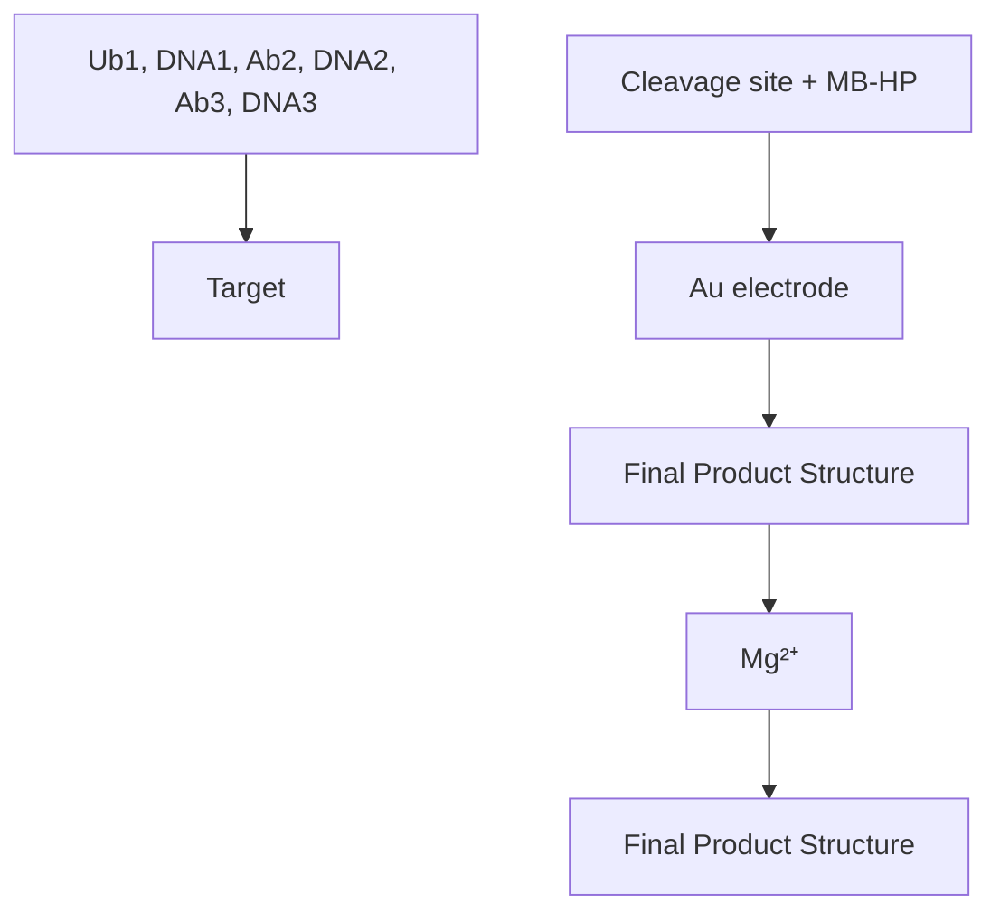
</details>

Figure 29. Schematic illustration of the triple-binder assembly of $Mg^{2+}$ -dependent MNAzyme along with autocatalytic cleavage of methylene blue-labeled hairpin on the sensor surface. Reprinted with permission from ref 566. Copyright 2015 American Chemical Society.

Using DPV, it was demonstrated that the current suppression was linearly dependent on the logarithm of CEA concentration in the range from 2 ng L $^{-1}$ to 500 $\mu$ g L $^{-1}$ , with a LOD of 1.5 ng L $^{-1}$ .

5.1.3. $\alpha$ -Fetoprotein (AFP). AFP is an oncofetal glycoprotein that has been used for the clinical diagnosis of hepatocellular carcinoma, teroblastoma, and liver carcinoma. The level of AFP is 10 ng L $^{-1}$ , and it increases during cancer progression. $^{567}$

A voltammetric immunosensor for AFP was fabricated using an anti-AFP antibody immobilized onto the surface of gold nanowires-functionalized MWCNTs via the interaction of the thiol groups of the cysteine residues in the antibody and the gold


<details>
<summary>chemical</summary>

Chemical reaction pathway showing G-Au complex formation via rApo-Cd and rApo-Pb reactions with anti-AFP and BSA reagents
</details>


<details>
<summary>flowchart</summary>

```mermaid
graph LR
    A["Fe₃O₄"] -->| (a) | B["Aluminum Complex"]
    B -->| (b) | C["Elute Complex"]
    C -->| (c) | D["Final Elute Complex"]
    D -->| (d) | E["BSA Complex"]
    
    subgraph Reaction Pathway
        F["Legend: Blue circle = AFP, Red diamond = CEA, Purple circle = CEA"] --> G["Arrow: DA → (e)"]
        H["Arrow: (e) → (f) Swv"] --> I["Arrow: (f) Swv → (e)"]
    end
    
    subgraph Legend
        J["Current /h axis: Cd, Pb"]
    end
```
</details>

Figure 30. A simultaneous electrochemical immunoassay for CEA and AFP. (A) Preparation of the signaling tags: (a) in situ reducing HAuCl $_4$ on graphene (G) to form G–GNPs; (b) immobilization labels (apoferritin metal, rApo-M); (c) labeling with anti-AFP and anti-CEA and blocking unbound sites with BSA to form signaling tags. (B) Synthesis of the MIPs and electrochemical detection: (a) using AFP and CEA as template proteins, self-polymerization of dopamine to form a polydopamine coating on Fe $_3$ O $_4$ ; (b) washing with SDS to obtain MMIP and remove template proteins; (c) recognition of target analytes (AFP and CEA); (d) blocking with BSA; (e) antigen–antibody specific reaction with above signal tags; (f) magnetic separation and electrochemical analysis using SWV. Reprinted with permission from ref 572. Copyright 2014 Elsevier.

surface. $^{568}$ CV enabled the analysis of AFP with a LOD of $0.1 \mu g L^{-1}$ .

A sandwich-based immunosensor for AFP and CEA was designed using anti-AFP and anti-CEA antibodies coimmobilized onto the surface of GNPs-modified GCE using an L-cysteine chitosan derivative. $^{569}$ The signaling tags were synthesized using platinum nanoparticles modified with thionine and ferrocene-tagged anti-AFP and anti-CEA antibodies, respectively. In addition, the platinum nanoparticles were modified with HRP. In the presence of AFP and CEA, electrocatalytic reduction of $H_{2}O_{2}$ was carried out. DPV allowed for the linear quantification of AFP and CEA over the ranges 500 ng $L^{-1}$ to 50 $\mu$ g $L^{-1}$ and 300 ng $L^{-1}$ to 45 $\mu$ g $L^{-1}$ , with LOD values of 80 and 50 ng $L^{-1}$ , respectively.

Other sandwich-based immunosensors relied on the electrocatalytic properties of nanoparticles instead of enzymes. For instance, palladium nanoparticles anchored to the surface of carbon decorated iron oxide microspheres were utilized to immobilize the reporter anti-AFP. $^{570}$ Reduction of $H_{2}O_{2}$ yielded amperometric currents proportional to AFP concentrations in the range from 0.5 ng L $^{-1}$ to 10 $\mu$ g L $^{-1}$ , with a LOD of 160 pg L $^{-1}$ .

In another study, patterned gold–iridium oxide nanospheres were used for labeling the secondary anti-AFP antibody and water oxidation. $^{571}$ A primary antibody was immobilized onto the gold–iridium oxide assemblies preformed on a Prussian blue-functionalized GCE. In the presence of AFP, a sandwich immunoreaction occurred in the presence of p-aminophenol, which became oxidized into p-quinone imine by Prussian blue. The generated p-quinone imine was reduced back to p-aminophenol subsequent to water oxidation. This catalytic recycling reaction amplified the DPV currents and allowed for AFP measurements in the linear range from 5 ng L $^{-1}$ to 200 $\mu$ g L $^{-1}$ , with a LOD of 0.5 ng L $^{-1}$ .

Also, a dual template-based MIP was utilized as a capture probe to develop a sandwich assay for AFP and CEA. $^{572}$ The MIP was synthesized by self-polymerization of dopamine on iron oxide nanoparticles, using CEA and AFP as template proteins. The reporter was produced by coimmobilization of anti-AFP or anti-CEA antibody and apoferritin–metal (cadmium for AFP, lead for CEA) onto the surface GNPs-modified graphene. Subsequent to the sandwich immunoreaction in the presence of AFP or CEA, stripping analysis of the metal component of the immunocomplex provided a means for quantification of the target, as shown in Figure 30. Using SWV, dynamic measurements of AFP and CEA were permissible in the range from 1 ng L $^{-1}$ to 5 $\mu$ g L $^{-1}$ , with LOD values of 300 and 350 pg L $^{-1}$ , respectively.

5.1.4. Cancer Antigen (CA). A variety of cancer-related antigens are currently being explored for the clinical diagnosis of cancer, including CA50, CA125, CA15-3, CA19-9, CA27.29, CA72-4, CA242, and CA549. CA50 is a cancer-associated carbohydrate marker, and its elevated level ( $>17\ kU\ L^{-1}$ ) is observed in pancreatic and gastrointestinal malignancies. $^{573}$ CA125 is a membrane mucin-like glycoprotein, and its elevated level ( $>35\ kU\ L^{-1}$ ) is used for monitoring of epithelial ovarian tumors. $^{574}$ CA15-3, a breast-associated mucin, is often elevated ( $>25\ kU\ L^{-1}$ ) in the majority of breast carcinoma with distant metastases. $^{575}$ CA19-9 is a vital carbohydrate tumor marker. Elevated levels of CA19-9 ( $>37\ kU\ L^{-1}$ ) can be observed in many malignancies, including pancreatic, biliary, gastrointestinal, colorectal, and hepatic cancer. $^{576}$ CA27.29 is a soluble form of the glycoprotein MUC1. It is overexpressed ( $>38\ kU\ L^{-1}$ ) in tumors involving glandular epithelial cells, such as breast tumors. $^{577}$ CA72-4 is a glycoprotein, which increases ( $>7\ kU\ L^{-1}$ ) in breast, gastric, and ovarian adenocarcinoma $^{578}$ CA242 is a tumor marker for sialylated Lewis carbohydrates, and its elevated level ( $>20\ kU\ L^{-1}$ ) is associated with adenocarcinomas. $^{579}$ CA549, a high molecular weight glycoprotein, is overexpressed ( $>10\ kU\ L^{-1}$ ) in breast tumors. $^{580}$

A voltammetric immunosensor for CA125 was fabricated using an anti-CA125 antibody immobilized onto the surface of cystamine-modified gold microelectrodes array chip, as shown in Figure 31. $^{581}$ Using DPV, the level of CA125 was quantified down to 0.1 kU L $^{-1}$ .


<details>
<summary>chemical</summary>

Chemical reaction scheme showing the synthesis of [Fe(CN)6]4-3- via CA-125, with electrochemical potential graph below
</details>

Figure 31. Schematic of electrochemical sensor preparation and CA125 analysis. A self-assembled monolayer of cystamine was formed on the surface of a gold electrode and subsequently modified with glutaraldehyde to introduce aldehyde groups. The sensor surface was incubated with an anti-CA125 antibody to prepare the immunosensor. The antigen–antibody binding hindered the electron transfer reaction of $[\mathrm{Fe}(\mathrm{CN})_{6}]^{3-/4-}$ . DPV measurements showing the decrease in the current observed after incubation with CA125. Reprinted with permission from ref 581. Copyright 2011 American Chemical Society.

A MIP-based voltammetric sensor for CA125 was prepared by electropolymerizing a polyphenol film on the surface of a gold nanoelectrode, in the presence of CA125 as a template. $^{63}$ This was followed by extraction of CA125 using a mixture of acetic acid and sodium dodecyl sulfate. DPV measurements revealed the linearity of the sensor response in the concentration range from 0.5 to 400 kU L $^{-1}$ , with a LOD of 0.5 kU L $^{-1}$ .

An electrochemical ELISA for CA125 analysis used an anti-125 antibody adsorbed onto the wells of a microtiter plate. $^{[582]}$ Subsequent to CA125 capture by the immobilized antibody, an alkaline phosphatase-labeled anti-CA125 antibody was added. The enzyme converted p-aminophenylphosphate into p-aminophenol, which is electrochemically active. Using amperometry, CA125 was determined within the linear range of 5–1000 kU L $^{-1}$ , with a LOD of 1.3 kU L $^{-1}$ .

A sandwich-based electrochemical sensor for CA15-3 was designed using an anti-CA15-3 antibody immobilized onto the surface of a graphene oxide-modified ITO electrode. $^{583}$ A mixture of two secondary antibodies conjugated with tyrosinase and $\beta$ -galactosidase was utilized to amplify the signal via redox cycling. In the presence of CA15-3, phenyl $\beta$ -D-galactopyranoside was converted into phenol by $\beta$ -galactosidase; phenol was converted into catechol and then o-benzoquinone by tyrosinase; and o-benzoquinone was reduced onto the electrode surface. Chronocouolometric analysis allowed for the detection of CA15-3 concentrations down to 0.1 kU L $^{-1}$ .

To overcome the limitations of enzymatic-based assays, a signaling tag was prepared using an anti-CA72-4 antibody conjugated with polyaniline-coated GNPs, which could catalyze the reduction of $H_{2}O_{2}$ . $^{584}$ The primary antibody was immobilized onto the surface of a nanoporous gold electrode. Using amperometry, quantification of CA72-4 was permissible in the range from 2 to 200 kU L $^{-1}$ , with a LOD of 0.1 kU L $^{-1}$ .

A multiplexed stripping voltammetric immunoassay protocol was designed for simultaneous detection of CA125, CA15-3, and CA19-9 by coimmobilization of the respective antibodies onto the surface of magnetic beads. $^{585}$ The signaling tags were synthesized using the respective antibodies labeled with PAMAM dendrimer-metal sulfide (ZnS for CA125, CdS for CA15-3, PbS for CA19-9) quantum dots. In the presence of the target, a sandwich immunocomplex was formed followed by ASV analysis of the metal components released by acid treatment of the quantum dots. Experimental results indicated that the multiplexed assay enabled the detection of the cancer markers in the range from 0.01 to 50 kU L $^{-1}$ , with a LOD of 0.005 kU L $^{-1}$ .

5.1.5. Squamous Cell Carcinoma Antigen (SCCA). SCCA is a glycoprotein that has been used for the clinical diagnosis of cervical cancer. Elevated levels of SCCA ( $>1.5 \mu g L^{-1}$ ) are also associated with other types of cancer with epithelial or endodermal origins, including lung cancer, head and neck cancer, melanomas, and hepatocellular carcinoma. $^{586}$

A sandwich-based voltammetric immunoassay for SCCA was performed in a magnetically controlled microfluidic device. $^{587}$ The assay was designed using an anti-SCCA antibody-functionalized magnetic mesoporous nanogold/thionine/NiCo $_{2}$ O $_{4}$ hybrid as a capture probe and a HRP-conjugated anti-SCCA antibody conjugated with nanogold/graphene nanosheets as a signaling tag. After sandwich formation in the presence of SCCA, the formed immunocomplex was captured within the microfluidic device with the aid of an external magnet. DPV allowed for the linear quantification of SCCA in the range from 2.5 ng L $^{-1}$ to 15 $\mu$ g L $^{-1}$ , with a LOD 1 ng L $^{-1}$ .

5.1.6. Neuron-Specific Enolase (NSE). NSE is a dimeric $\gamma$ -isoenzyme of the glycolytic enzyme enolase, localized predominantly in the cytoplasm of the neurons. NSE is up-regulated subsequent to axon damage to maintain homeostasis. NSE level increases ( $>12.3 \mu g L^{-1}$ ) in small cell lung cancer (SCLC) and neuroblastoma. $^{588}$

A sandwich-based electrochemical sensing platform for NSE was developed using an anti-NSE antibody immobilized onto the surface of nitrogen-doped MWCNTs. $^{589}$ Gold nanoclusters were incorporated into porous calcium carbonate spheres via electrostatic interactions, and the formed hybrid material was further utilized to assemble a HRP-conjugated anti-NSE antibody. In the presence of NSE, the enzyme catalyzed the oxidation of o-phenylenediamine by $H_{2}O_{2}$ . DPV measurements revealed that the current intensity was proportional to the concentration of NSE in the range from 0.5 ng $L^{-1}$ to 2 $\mu$ g $L^{-1}$ , with a LOD of 0.1 ng $L^{-1}$ .

5.1.7. Human Epididymis-Specific Protein 4 (HE4). HE4 is an ovarian biomarker initially identified in the epithelium of the distal epididymis and predicted to be a protease inhibitor involved in sperm maturation. Elevated levels of HE4 ( $>0.6 \mu g L^{-1}$ ) are associated with lung cancer and ovarian cancer. $^{590}$

A sandwich-based electrochemical sensor was adopted for HE4 sensing using rolling cycle amplification. $^{591}$ An anti-HE4 antibody was immobilized onto the surface of a tin-doped ITO electrode precoated with a chitosan/titanium carbide film. After capture of HE4, a biotinylated anti-HE4 antibody was added followed by streptavidin. Subsequently, the sensor was incubated with biotinylated DNA primers to initiate the rolling cycle amplification, in the presence of a circular DNA template and phi29 DNA polymerase. Doxorubicin hydrochloride intercalated between the rolling cycle amplification products, which was subsequently monitored by DPV. This sensor enabled quantification of HE4 in the linear range from 75 ng L $^{-1}$ to 7.5 $\mu$ g L $^{-1}$ , with a LOD of 1.5 ng L $^{-1}$ .

5.1.8. Ferritin. Ferritin is the oldest known protein involved in iron metabolism. Generally, the range of ferritin in human serum is 7–158 $\mu$ g L $^{-1}$ for men and 4–56 $\mu$ g L $^{-1}$ for women. $^{592}$ Ferritin is differentially overexpressed in several malignancies, including breast cancer, pancreatic cancer, hepatocellular carcinoma, and Hodgkin's lymphoma. $^{593}$ In addition, serum ferritin is elevated during acute and chronic inflammation. $^{594}$

A MIP-based impedimetric sensing platform for ferritin was fabricated by electropolymerizing nonconductive polyphenol on the tips of a nanotube array preformed on a titanium-coated glass, in the presence of the template ferritin, as shown in Figure 32. $^{595}$


<details>
<summary>flowchart</summary>

```mermaid
graph TD
    A["Grow nanotube array"] --> B["Embed the array"]
    B --> C["Polish the array"]
    C --> D["Deposit PPn"]
    
    E["Protein Entrapment"] --> F["Template Removal"]
    F --> G["Protein Rebinding"]
    
    style A fill:#cce5ff,stroke:#333
    style B fill:#cce5ff,stroke:#333
    style C fill:#cce5ff,stroke:#333
    style D fill:#cce5ff,stroke:#333
    
    subgraph Legend
        H["Glass substrate"]
        I["Supporting polymer"]
        J["Nanotube"]
        K["Ti"]
        L["PPn coating"]
        M["Protein template"]
    end
    
    H -.-> G
    I -.-> G
    J -.-> G
    K -.-> G
    L -.-> G
    M -.-> G
```
</details>

Figure 32. Protein nanosensor fabrication and template protein detection. The supporting polymer (SU8-2002) was spin-coated on a glass substrate containing nanotube arrays. Template proteins trapped in the polyphenol (PPn) coating were extracted to reveal the surface imprints. Inset meter shows sensor impedimetric responses during the different stages of fabrication and detection. Reprinted with permission from ref 595. Copyright 2010 Nature Publishing Group.

The deposition was self-limiting and yielded a highly conformal nanocoating that is beneficial for low-noise recordings. The impedance change in response to ferritin occurred in the linear concentration range from $10 \, pg \, L^{-1}$ to $100 \, ng \, L^{-1}$ , with a LOD of $10 \, pg \, L^{-1}$ .

A sandwich-based voltammetric sensor for ferritin was developed by coimmobilizing an antiferritin antibody, thionine, and bovine serum albumin (BSA) onto the surface of a screen-printed carbon electrode. $^{596}$ The signaling tag was synthesized by reverse micelle method using glucose oxidase-doped magnetic silica nanostructures. Subsequently, the nanostructures were used to label the secondary antibody. A sandwich immunocomplex was formed in the presence of ferritin followed by the conversion of glucose into gluconolactone by the enzyme label. DPV permitted linear quantification of ferritin in the range from 0.1 to 400 $\mu$ g L $^{-1}$ , with a LOD of 10 ng L $^{-1}$ .

5.1.9. Calcitonin (Ct). Ct is a linear polypeptide secreted mainly by the parafollicular cells of the thyroid gland. Elevated levels of calcitonin ( $>8.5 \mu g L^{-1}$ ) are associated with medullary thyroid carcinoma. $^{597}$

A MIP-based sensor for Ct was prepared by grafting 2-acrylylamino-3-(4-hydroxyphenyl)-propionic acid onto the surface of zinc oxide nanostructures followed by Ct-templated polymerization on the surface of a vinyl-functionalized PGE. $^{598}$ The calibration curve for the DPSV peak current observed versus the Ct level showed linearity over a concentration range from 9.9 ng L $^{-1}$ to 7.9 mg L $^{-1}$ , with a LOD of 3.1 ng L $^{-1}$ .

5.1.10. Human Chorionic Gonadotropin (hCG). hCG is a hormone produced by the syncytiotrophoblast in the placenta. It increases during pregnancy and abnormal placental invasion. In addition, its level is also elevated (>2.2 IU L $^{-1}$ ) in germ cell tumors, choriocarcinoma, and testicular cancer. $^{599}$

A sandwich-based voltammetric immunoassay for hCG was designed using an anti-hCG antibody immobilized onto the surface of an array of SWCNTs microelectrodes. $^{600}$ The signaling tag consisted of GNPs coated with the secondary antibody. In the presence of hCG, a sandwich immunocomplex was formed followed by the oxidation of GNPs at a constant potential of 1.2 V. Using DPV, this sensor permitted the linear interrogation of hCG level in the range from 0.1 to 20 IU L $^{-1}$ , with a LOD of 0.024 IU L $^{-1}$ .

5.1.11. Urokinase Plasminogen Activator (uPA). uPA is a serine protease secreted in its inactive pro-uPA form that binds to the cell surface and becomes activated to uPA, which regulates the action of other proteases. It also catalyzes the cleavage of plasminogen to plasmin, leading to extracellular proteolysis. Elevated uPA levels are correlated with breast, prostate, ovarian, and squamous cell carcinoma. The normal values of uPA range between 198 and 511 $\mu$ g L $^{-1}$ . $^{601}$

A voltammetric aptasensor for uPA was constructed using a uPA-specific aptamer attached to the surface of a gold electrode. $^{602}$ DPV permitted linear quantification of uPA in the range from 48.5 ng L $^{-1}$ to 48.5 $\mu$ g L $^{-1}$ , with a LOD of 48.5 ng L $^{-1}$ .

5.1.12. Glutathione-S-transferase (GST). GST is a metabolic isozyme that catalyzes the conjugation of reduced glutathione (GSH) to xenobiotic substrates for the purpose of detoxification. GST can be grouped into seven gene-independent classes (alpha, mu, pi, sigma, theta, omega, and zeta) on the basis of the amino acid sequence. The isoform GST-Pi is overexpressed in cancer cells. Elevated serum GST-pi levels (>3.2 U L $^{-1}$ ) were observed in patients with various gastrointestinal malignancies, including gastric, esophageal, colonic, pancreatic, hepatocellular, and biliary tract cancer. $^{603}$

Using the interaction between GST and ferrocene-labeled glutathione in solution, a voltammetric approach was developed for GST analysis. $^{604}$ DPV voltammograms displayed a progressive decrease in the ferrocene peak current intensity as the GST concentration increased, reporting on the binding interaction between the electroactive ferrocene-labeled glutathione and GST. This sensor successfully detected GST concentrations down to 286 mg L $^{-1}$ .

5.1.13. Alkaline Phosphatase (ALP). ALP is a hydrolase enzyme responsible for removing phosphate groups from many molecules, including nucleotides, proteins, and alkaloids. As its name suggests, ALP is more effective in alkaline environment. The level of ALP rises ( $>140\ U\ L^{-1}$ ) in leukemia, lymphomas of B cell origin, and osteoblastic bone tumors. $^{605}$ In addition, ALP level increases when renal, intestinal, or placental damage occurs. Also, skeletal diseases such as Paget's disease, osteomalacia, and fractures may cause an increase in serum ALP level. $^{606}$ Furthermore, the ALP level increases in liver disorders, such as bile duct obstruction, hepatitis, liver cirrhosis, and cholecystitis. $^{607}$

A voltammetric method for detecting ALP activity in droplets was reported. $^{608}$ In this system, the difference in water and oil solubility between the enzyme's substrate, ferrocene ethyl phosphate ester, and the product, ferroceneethanol, was utilized for analysis. Water droplets containing ALP and ferrocene ethyl

phosphate ester were placed on a platinum microelectrode and surrounded by a mineral oil. The ester was hydrolyzed into ferroceneethanol, which was partitioned into the mineral oil layer, and the remaining ester was detected by CV to determine the ALP activity. In addition, a microfluidic device integrated with comb-type interdigitated ring array electrodes was fabricated to permit the detection of an array of droplets. $^{609}$ The device was successfully applied for the detection of ALP activity of HeLa cells in single droplets.

An amperometric sensing platform for ALP was designed using a synthetic ferrocene-labeled substrate for ALP. $^{610}$ It was proposed that in the presence of ALP, the synthetic substrate ferrocenylphenyl phosphate would be dephosphorylated into ferrocenylamine, which would be oxidized at a lower potential than that of the substrate. As a result, ALP activity was monitored ratiometrically due to the ability of the assay to distinguish between the substrate and product. Electrochemical analysis was carried out using a screen-printed carbon electrode, and a LOD of $0.4 \, U L^{-1}$ was determined.

Another substrate, 1-naphthyl phosphate, was utilized for ALP analysis using a screen-printed carbon electrode. $^{611}$ In addition, nanoceria particles were involved in the assay as redox active catalytic amplifiers of the ALP signal by facilitating the conversion of the enzymatically generated naphthol into napthoquinone. Using DPV, the ALP activity was determined with a LOD of 20 U L $^{-1}$ .

An electrochemical sensing platform for ALP used two complementary DNA probes (DNA1 and DNA2) coupled with $\lambda$ exonuclease, a 5'-3' exonuclease that degrades one DNA strand with a phosphate moiety at the 5' end in the dsDNA. $^{612}$ In this work, ALP dephosphorylated the 5'-phosphoryl-terminated DNA1, which was subsequently hybridized with the DNA2, and attached to a gold electrode surface via a thiol group. The dsDNA formed was cleaved with $\lambda$ exonuclease, and DNA1 was released after digestion of the 5'-phosphoryl-terminated DNA2, as shown in Figure 33. Continuous removal of DNA2 from the electrode surface subsequently reduced the electrochemical signal of the DNA-bound redox probe, $(\mathrm{Ru}[\mathrm{NH}_{3}]_{6})^{3+}$ . Using CC, the ALP level was quantified within the linear range from 1 to 20 kU L $^{-1}$ , with a LOD of 0.1 kU L $^{-1}$ .

5.1.14. Lactate Dehydrogenase (LDH). LDH is an enzyme that catalyzes the conversion of pyruvate to lactate as well as the reverse reaction; NADH/NAD $^{+}$ is used as a cofactor in these reactions. LDH is involved in tumor initiation and metabolism. Thus, LDH is utilized as a general marker in the prognosis of cancer. Elevated levels of LDH ( $>236\ U\ L^{-1}$ ) are associated with lymphoma, melanoma, acute leukemia, and germ cell tumors. In addition, LDH level can be elevated in noncancerous conditions such as heart failure, hypothyroidism, meningitis, and liver and lung diseases. $^{613}$

An internally calibrated electrochemical continuous enzyme assay was developed for the determination of the enzyme activity. $^{614}$ This assay was performed in a constant-potential amperometric mode in a stirred solution of the enzyme's substrate. After a baseline current was recorded, aliquots of the product (or reactant) of the enzymatic reaction were added to the solution to calibrate the assay. This was carried out using a GCE modified with a CNTs/chitosan hybrid. Subsequently, the assayed enzyme was added to trigger the enzymatic reaction and record the current–time segment, which was used to calculate the enzyme activity. Using a mixture of sodium pyruvate, NADH, and LDH, this assay enabled the determination of LDH level, with a LOD of 0.14 U L $^{-1}$ .


<details>
<summary>flowchart</summary>

```mermaid
graph TD
    A["Au electrode"] --> B["Aluminum phosphatase"]
    B --> C["Aluminum exonuclease"]
    C --> D["Aluminum nanocomposite"]
    D --> E["Final product: N cycles of DNA 1 release & DNA 2 digestion"]
    E --> F["Final product: [Ru(NH₃)₆"]⁺]
    F --> G["Final product: [Ru(NH₃)₆"]³⁺]
    G --> H["Final product: [Ru(NH₃)₆"]³⁺]
    H --> I["Final product: [Ru(NH₃)₆"]³⁺]
    I --> J["Final product: [Ru(NH₃)₆"]³⁺]
    J --> K["Final product: [Ru(NH₃)₆"]³⁺]
    K --> L["Final product: [Ru(NH₃)₆"]³⁺]
    L --> M["Final product: [Ru(NH₃)₆"]³⁺]
    M --> N["Final product: [Ru(NH₃)₆"]³⁺]
    N --> O["Final product: [Ru(NH₃)₆"]³⁺]
    O --> P["Final product: [Ru(NH₃)₆"]³⁺]
    P --> Q["Final product: [Ru(NH₃)₆"]³⁺]
    Q --> R["Final product: [Ru(NH₃)₆"]³⁺]
    R --> S["Final product: [Ru(NH₃)₆"]³⁺]
    S --> T["Final product: [Ru(NH₃)₆"]³⁺]
    T --> U["Final product: [Ru(NH₃)₆"]³⁺]
    U --> V["Final product: [Ru(NH₃)₆"]³⁺]
    V --> W["Final product: [Ru(NH₃)₆"]³⁺]
    W --> X["Final product: [Ru(NH₃)₆"]³⁺]
    X --> Y["Final product: [Ru(NH₃)₆"]³⁺]
    Y --> Z["Final product: [Ru(NH₃)₆"]³⁺]
    Z --> AA["Final product: [Ru(NH₃)₆"]³⁺]
    AA --> AB["Final product: [Ru(NH₃)₆"]³⁺]
    AB --> AC["Final product: [Ru(NH₃)₆"]³⁺]
    AC --> AD["Final product: [Ru(NH₃)₆"]³⁺]
    AD --> AE["Final product: [Ru(NH₃)₆"]³⁺]
    AE --> AF["Final product: [Ru(NH₃)₆"]³⁺]
    AF --> AG["Final product: [Ru(NH₃)₆"]³⁺]
    AG --> AH["Final product: [Ru(NH₃)₆"]³⁺]
    AH --> AI["Final product: [Ru(NH₃)₆"]³⁺]
    AI --> AJ["Final product: [Ru(NH₃)₆"]³⁺]
    AJ --> AK["Final product: [Ru(NH₃)₆"]³⁺]
    AK --> AL["Final product: [Ru(NH₃)₆"]³⁺]
    AL --> AM["Final product: [Ru(NH₃)₆"]³⁺]
    AM --> AN["Final product: [Ru(NH₃)₆"]³⁺]
    AN --> AO["Final product: [Ru(NH₃)₆"]³⁺]
    AO --> AP["Final product: [Ru(NH₃)₆"]³⁺]
    AP --> AQ["Final product: [Ru(NH₃)₆"]³⁺]
    AQ --> AR["Final product: [Ru(NH₃)₆"]³⁺]
    AR --> AS["Final product: [Ru(NH₃)₆"]³⁺]
    AS --> AT["Final product: [Ru(NH₃)₆"]³⁺]
    AT --> AU["Final product: [Ru(NH₃)₆"]³⁺]
    AU --> AV["Final product: [Ru(NH₃)₆"]³⁺]
    AV --> AW["Final product: [Ru(NH₃)₆"]³⁺]
    AW --> AX["Final product: [Ru(NH₃)₆"]³⁺]
    AX --> AY["Final product: [Ru(NH₃)₆"]³⁺]
```
</details>

Figure 33. Schematic illustration of the electrochemical detection of alkaline phosphatase using two DNA probes coupled with $\lambda$ exonuclease. Reprinted with permission from ref 612. Copyright 2011 Elsevier.

5.1.15. Vascular Endothelial Growth Factor (VEGF). VEGF is a signaling protein that regulates both physiologic and pathologic angiogenesis. As its name suggests, VEGF stimulates vascular endothelial cell growth, survival, and proliferation. $^{615}$ The VEGF family in mammals comprises five members: VEGF-A, VEGF-B, VEGF-C, VEGF-D, and placenta growth factor (PGF). There are multiple isoforms of VEGF-A, including $VEGF_{121}$ , $VEGF_{121b}$ , $VEGF_{145}$ , $VEGF_{165}$ , $VEGF_{165b}$ , $VEGF_{189}$ , and $VEGF_{206}$ . Elevation of circulating levels of VEGF ( $>256$ ng L $^{-1}$ ) $^{616}$ has shown to be of prognostic value in many solid tumors such as head and neck squamous cell carcinoma and hematological malignancies such as non-Hodgkin's lymphomas, myeloid, and lymphoid leukemias. $^{617}$

An impedimetric sensor for VEGF was fabricated using a vascular endothelial growth factor receptor-1 (VEGFR-1) immobilized onto the surface of a gold electrode. $^{618}$ The obtained results revealed a linear response to VEGF concentrations in the range from 10 to 70 ng L $^{-1}$ .

A voltammetric aptasensor for VEGF was designed using a methylene blue-labeled aptamer immobilized onto the surface of a gold-plated screen-printed electrode via a thiol moiety and terminating with methylene blue label. $^{53}$ The unique folding motif of the aptamer allowed the sensor to translate the target-induced folding into a signal gain. Using ACV, VEGF was quantified with a LOD of 190 ng L $^{-1}$ .

An electrochemical microfluidic array analyzed four clinically relevant proteins, including VEGF. $^{619}$ In this approach, VEGF was captured offline using paramagnetic beads modified with an anti-VEGF antibody and HRP enzyme. Subsequently, the captured VEGF was introduced into the microfluidic device, which contained a GNPs-based immunoarray in a microchannel interfaced with a syringe pump and sample injector. A mixture of hydroquinone and $H_{2}O_{2}$ was injected to enhance the signal. Amperometric measurements permitted the interrogation of the VEGF level, with a LOD of 0.8 ng L $^{-1}$ .


<details>
<summary>chemical</summary>

Chemical reaction diagram showing the formation of AuNPs from a precursor via intermediate steps
</details>


<details>
<summary>flowchart</summary>

```mermaid
graph TD
    A["Red MWCNTs"] -->|RNA replication| B["Red MWCNTs"]
    B --> C["Blue DNA Amplification"]
    C --> D["Signal peak a"]
    D --> E["Output: HS-HO-Biotin, HRP, dATP, Streptavidin, MUC1"]
    style A fill:#f9f,stroke:#333
    style B fill:#f9f,stroke:#333
    style C fill:#f9f,stroke:#333
    style D fill:#ccf,stroke:#333
    style E fill:#cfc,stroke:#333
```
</details>

Figure 34. A MUC1 detection scheme. (A) In the absence of MUC1, the biotin was shielded and inaccessible to the streptavidin, and thus a very limited background current was observed (curve a). (B) Upon target binding, the disruption of the stem-loop made the biotin exposed. The biotin, along with the dual-labeled aptamers, was easily captured by the streptavidin-modified electrode (curve b). Reprinted with permission from ref 638. Copyright 2014 Elsevier.

5.1.16. Vascular Endothelial Growth Factor Receptor (VEGFR). VEGFRs are receptors for VEGF. There are three main subtypes of VEGFR, numbered 1, 2, and 3. Among these specific tyrosine kinase receptors, VEGFR2 mediates most of the angiogenic functions. The expression VEGFR2 protein is up-regulated ( $>15 \, ng \, L^{-1}$ ) $^{620}$ in chronic lymphocytic leukemia (CLL) and ovarian and breast cancer. $^{621}$

A sandwich-based voltammetric immunoassay for VEGFR2 was designed using an anti-VEGFR2 antibody immobilized onto the surface of a GCE modified with a chitosan/reduced graphene oxide/thionine composite. $^{622}$ After capture of the target VEGFR2, the immunosensor was incubated with a HRP-conjugated anti-VEGFR2 antibody. The enzyme catalyzed the oxidation of thionine by $H_{2}O_{2}$ . Using DPV, the level of VEGFR2 was quantified in the linear range from 60.6 ng L $^{-1}$ to 13 $\mu$ g L $^{-1}$ , with a LOD of 42.4 ng L $^{-1}$ .

5.1.17. Epidermal Growth Factor Receptor (EGFR). EGFR or HER1 is a cell trans-membrane glycoprotein located on the cell surface. Upon binding with its ligands such as the epidermal growth factor and transforming growth factor (TGF $\alpha$ ), the tyrosine kinase activates and induces cell differentiation and proliferation. $^{623}$ EGFR is overexpressed ( $>75.3 \mu g L^{-1}$ ) in many tumors of epithelial origin, such NSCLC, breast, head and neck, gastric, colorectal, esophageal, prostate, renal, bladder, pancreatic, and ovarian cancer. $^{624}$

A label-free impedimetric sensor for EGFR was fabricated using an anti-EGFR antibody immobilized onto the surface of GNPs-modified gold electrode. $^{625}$ Protein G was used as a scaffold to allow the proper orientation of immobilized antibodies. The impedance changes were proportional to EGFR concentrations in the range from 1 ng L $^{-1}$ to 1 mg L $^{-1}$ , with a LOD of 0.3 ng L $^{-1}$ .

An electrochemical aptamer/antibody sandwich-based sensing platform for EGFR was developed using a biotinylated EGFR-specific aptamer immobilized onto streptavidin-coated magnetic beads. $^{626}$ An anti-EGFR antibody was conjugated to citrate-coated GNPs and used as a signaling probe. In the presence of EGFR, an immunocomplex was formed, and the extent of complexation was determined using DPV. This sensor permitted the linear quantification of EGFR in the range from 1 to $40\mu \mathrm{g}\mathrm{L}^{-1}$ , with a LOD of $50\mathrm{ng}\mathrm{L}^{-1}$ .

5.1.18. Human Epidermal Growth Factor Receptor 2 (HER2). HER2 is a key prognostic marker that is overexpressed in approximately 30% of invasive breast cancers. $^{627}$ It is a particularly important marker because HER2-positive cancers can be treated with targeted therapies. Normal individuals have HER2 levels in the range between 2 and 15 $\mu$ g L $^{-1}$ in blood. $^{628}$

A voltammetric immunosensor for HER2 was fabricated using anti-HER2 antibody attached to iron oxide nanoparticles, which were deposited on a gold electrode surface. $^{629}$ Using DPV, this sensor was shown to be responsive to HER2 concentrations over the linear ranges from 10 ng L $^{-1}$ to 10 $\mu$ g L $^{-1}$ and 10 $\mu$ g L $^{-1}$ to 100 $\mu$ g L $^{-1}$ , with a LOD of 995 pg L $^{-1}$ .

Affibodies were recently utilized to develop sensing platforms for clinical markers. Affibodies are small proteins engineered to bind to a large number of target proteins or peptides with high affinity, imitating monoclonal antibodies. For instance, an impedimetric affisensor for HER2 was fabricated using a HER2-specific affibody immobilized onto a GNPs-modified screen-printed graphite electrode. $^{630}$ This protein sensor allowed for the linear interrogation of HER2 level up to $40 \mu g L^{-1}$ , with a LOD of $6 \mu g L^{-1}$ .

A sandwich-based voltammetric sensor for HER2 was designed using an anti-HER2 antibody immobilized onto GNPs, modified with 2,5-bis(2-thienyl)-1H-pyrrole-1-(p-benzoic acid), and deposited on a GCE. $^{631}$ A HER2-specific aptamer was conjugated with GNPs modified with hydrazine and used as a signaling probe. Following the immunoreaction, the sensor was immersed in a silver nitrate solution. Subsequently, the silver ions were reduced by hydrazine into silver metal and deposited onto the aptamer-GNPs conjugate. Using square wave stripping voltammetry (SWSV), the level of HER2 was determined over the range from 0.1 ng L $^{-1}$ to 10 $\mu$ g L $^{-1}$ , with a LOD of 37 pg L $^{-1}$ .

5.1.19. Human Epidermal Growth Factor Receptor 3 (HER3). HER3 is a membrane-bound protein encoded by the ERBB3 gene. HER3 is highly expressed in melanomas, childhood


<details>
<summary>flowchart</summary>

```mermaid
graph TD
    A["without target"] -->|target| B["Target"]
    B --> C["endonuclease"]
    C --> D["digest"]
    D --> E["ACV"]
    F["PDGF-BB"] --> G["Target"]
    G --> H["endonuclease"]
    H --> I["digest"]
    I --> J["ACV"]
    K["Endonuclease"] --> L["Target"]
    M["ferrocene"] --> N["Target"]
    O["FCs"] --> P["Graph: ACV vs. Target"]
```
</details>

Figure 35. Schematic diagram of the principle underlying PDGF-BB detection. In the absence of PDGF-BB, the EcoRI endonuclease cleaved the recognition site of palindrome, resulting in the removal of the redox-active ferrocene from the electrode surface (upper half). On the contrary, the target binding event deformed the EcoRI recognition site and subsequently protected it from endonuclease. As a result, a peak current was observed as shown in the lower half. Reprinted with permission from ref 641. Copyright 2015 Elsevier.

glioma, and breast, prostate, colorectal, and ovarian cancer. Normal individuals have a HER3 concentration in the range between 0.06 and 2.5 $\mu$ g L $^{-1}$ in blood. $^{632}$

An impedimetric immunosensor for HER3 was designed with a self-assembled monolayer of 4-aminothiophenol preformed on the surface of a gold electrode. $^{633}$ An anti-HER3 antibody was immobilized onto the electrode surface. The immunosensor exhibited a linear dynamic range of 0.4–2.4 ng L $^{-1}$ and a LOD of 0.28 ng L $^{-1}$ .

5.1.20. Mucin 1 (MUC 1). MUC1 is a membrane-associated glycoprotein of the mucin family and represents the major constituent of the mucous layer found in most human epithelia. It serves to lubricate and protects the surface against mechanical, chemical, and biological damage. It is commonly overexpressed in a broad range of different malignancies, including breast, lung, gastric, colorectal, bladder, pancreatic, prostate, and ovarian carcinomas. $^{634}$ Normal individuals have a MUC1 concentration in the range between 0.7 and 39.8 kU L $^{-1}$ in blood. $^{635}$

A voltammetric aptasensor was designed for simultaneous determination of two markers, MUC1 and VEGF $_{165}$ , using a ferrocene-labeled aptamer-complementary DNA hybrid immobilized onto the surface of a gold electrode. $^{636}$ The presence of the target forced the complementary strand to dissociate from its complex with the immobilized aptamer, thus bringing the ferrocene group closer to the electrode surface. This was accompanied by an increase in the peak current “signal-ON”. Using SWV, the peak current increased linearly in the ranges from 122.1 $\mu$ g L $^{-1}$ to 2.4 mg L $^{-1}$ and 38.2 to 764 $\mu$ g L $^{-1}$ , for MUC1 and VEGF $_{165}$ , respectively. In addition, a MUC1-specific aptamer was immobilized onto the surface of polypyrrole-modified nanowires within a microfluidic device. $^{637}$ A significant increase in the current was demonstrated in the presence of low concentrations of MUC1 down to 324.8 $\mu$ g L $^{-1}$ .

Another aptamer-based sensing platform for MUC1 was developed using a MUC1-specific hairpin aptamer modified with a thiol moiety at one end and biotin label at the other end. $^{638}$ The aptamer was immobilized onto the surface of GNPs, which were further modified with a HRP enzyme. After the binding between the aptamer and MUC1, the biotin was exposed and subsequently captured by streptavidin-modified MWCNTs preformed on the surface of a GCE, as shown in Figure 34. The enzyme catalyzed the oxidation of o-phenylenediamine by $H_{2}O_{2}$ into 2,3-diaminophenazine, which became reduced at -0.56 V on the surface of the electrode. DPV results revealed a linear relationship between the peak current and MUC1 concentration in the range from 1.1 to 43.1 mg L $^{-1}$ , with a LOD of 268.6 $\mu$ g L $^{-1}$ .

5.1.21. Platelet-Derived Growth Factor B Chain Dimer (PDGF-BB). PDGF-BB, one of three isoforms of PDGF, is a cytokine that plays a significant role in vascular proliferation and cell transformation, which is closely related to tumor growth and progression. $^{639}$ The normal serum level of PDGF-BB (8.5 $\mu$ g L $^{-1}$ ) usually increases sharply in glioma and sarcoma patients. $^{640}$

An aptamer-based sensing platform for PDGF-BB was constructed using a ferrocene-labeled DNA probe, which contained the aptamer sequence for PDGF-BB and the recognition sequence for EcoR1 endonuclease, immobilized onto the surface of a gold electrode. $^{641}$ In the absence of PDGF-BB, the probe folded into a hairpin structure and formed a recognition site for endonuclease. Subsequently, the specific and cleavable double-stranded region was cleaved and the redox-active ferrocene molecule was removed from the electrode surface. When bound to the target protein, the probe changed its configuration and the recognition strand was dissociated, resulting in a peak current (signal-ON), as shown in Figure 35. ACV enabled the interrogation of the PDGF-BB level over the linear range from 20 ng L $^{-1}$ to 200 $\mu$ g L $^{-1}$ , with a LOD of 10 ng L $^{-1}$ .

Another aptamer-based voltammetric sensor for PDGF-BB was designed using rolling circle amplification for signal transduction. $^{642}$ First, a PDGF-BB specific aptamer was hybridized with a thiolated complementary DNA strand immobilized onto a gold electrode surface. The electrode was held at 300 mV to accelerate the hybridization process and enhance its efficiency. In the presence of the target, an aptamer-PDGF-BB complex was formed in lieu of the DNA-aptamer complex, resulting in the departure of the aptamer from the electrode surface. The free cDNA was subsequently hybridized with the terminal regions of a padlock probe, generating a circular configuration in the presence of DNA ligase. The first primer, primer 1, was hybridized with the padlock probe, and extended isothermally by Bst DNA polymerase to generate a multimeric ssDNA, which served as a template for primer 2 binding. Primer 2 was further extended by the polymerase enzyme to displace the

downstream growing DNA strands. Subsequently, methylene blue molecules intercalated into the formed dsDNA. DPV data demonstrated a linear correlation between the DPV current and the logarithm of PDGF-BB concentration in the range from 123 pg L $^{-1}$ to 196.8 ng L $^{-1}$ , with a LOD of 39.4 pg L $^{-1}$ .

In another approach, aptamer-based recognition and rolling cycle amplification were also carried out externally, and the amplification products were subsequently deposited onto the electrode surface prior to hybridization and methylene blue intercalation. $^{643}$ Using ACV, this assay offered a linear response to the target over a concentration range from 2.1 to 206.6 $\mu$ g L $^{-1}$ , with a LOD of 1.5 $\mu$ g L $^{-1}$ .

A sandwich-based immunosensor for PDGF-BB was fabricated using an anti-PDGF-BB antibody immobilized onto the surface of a gold electrode. $^{644}$ PDGF-BB was subsequently sandwiched between the primary antibody and a secondary antibody immobilized onto the surface of graphene oxide. The electrode was then immersed into a silver enhancer solution containing silver ions and hydroquinone. Experimental results revealed that the SWV response of the immunosensor was proportional to the logarithm of PDGF-BB concentration in the range from 10 ng L $^{-1}$ to 100 $\mu$ g L $^{-1}$ , with a LOD of 5 ng L $^{-1}$ .

A sandwich-based voltammetric aptasensor for PDGF-BB was constructed using a chitosan-coated GCE modified with GNPs and molybdenum disulfide/carbon aerogel composites. $^{645}$ A thiol-terminated PDGF-BB specific aptamer 1 was immobilized onto the electrode surface. The signaling tag was prepared by coimmobilizing a thiol-terminated PDGF-BB specific aptamer 2 and ferrocenehexanethiol onto the surface of GNPs. DPV measurements were carried out in the presence of PDGF-BB and permitted its linear quantification in the range from 24.6 ng L $^{-1}$ to 246 $\mu$ g L $^{-1}$ , with a LOD of 7.4 ng L $^{-1}$ .

Another sandwich-based electrochemical aptasensor for PDGF-BB was designed using a PDGF-BB specific aptamer immobilized onto the surface of GNPs-modified screen-printed carbon electrode. $^{646}$ Silver nanoparticles were used as signaling tags through modification with a PDGF-BB specific aptamer and hybrid probes (hybrid-A and hybrid-B). Silver aggregates were formed on the electrode through the in situ hybridization of the aptamer/hybrid-A and aptamer/hybrid-B, which were detected by DPSV after peroxidation, as shown in Figure 36. This approach facilitated the linear analysis of PDGF-BB in the range from 5 ng L $^{-1}$ to 1 mg L $^{-1}$ , with a LOD of 1.6 ng L $^{-1}$ .

5.1.22. Nuclear Matrix Protein 22 (NMP22). NMP22 is a tumor marker for bladder cancer. The level of NMP22 in healthy individuals is less than 10 kU L $^{-1}$ , and it increases among 80% of bladder cancer patients. $^{647}$

A voltammetric immunosensor for NMP22 was fabricated using reduced graphene oxide-tetraethylene pentamine modified with trimetallic Au/Pt/Pd nanoparticles. $^{648}$ Subsequently, an anti-NMP22 antibody was anchored to the surface of the nanoparticles. It was demonstrated that the trimetallic nanoparticles could accelerate the electron transfer and enhance the signal response by the synergistic effect of the three different metals. The immunosensor exhibited a wide linear dynamic range (0.04–20 kU L $^{-1}$ ) and a low LOD of 0.01 kU L $^{-1}$ .

An amperometric immunosensor for NMP22 was constructed using Au–Pt bimetallic nanostructures, which were prepared by dealloying a commercial Au/Ag alloy into nanoporous gold. $^{649}$ After deposition of the nanoporous gold onto the surface of GCE, Pt nanoparticles were deposited on top of the surface of nanoporous gold by bottom-up electrodeposition. An anti-MMP22 antibody was subsequently immobilized onto the surface of the Au–Pt nanostructures. In the presence of MMP22, it was observed that the electrocatalytic reduction of $H_{2}O_{2}$ was diminished as a result of its blocked access to the Au–Pt nanostructures. Using amperometry, a linear range from 10 ng $L^{-1}$ to 10 $\mu$ g $L^{-1}$ and a LOD of 3.3 ng $L^{-1}$ were obtained.


<details>
<summary>flowchart</summary>

```mermaid
graph TD
    A["SPE"] --> B["Electrodeposition of Au"]
    B --> C["Immobilization of aptamer"]
    C --> D["In situ hybridization"]
    D --> E["Apt-PD"]
    D --> F["hybrid-A"]
    D --> G["hybrid-B"]
    D --> H["MCH"]
    D --> I["AgNPs"]
    D --> J["Tag-PD-A"]
    D --> K["Tag-PD-B"]
```
</details>

Figure 36. Illustration of an electrochemical assay for PDGF-BB with signal amplification through silver nanoparticles aggregation induced by in situ hybridization of the PDGF-BB specific aptamer and hybrid probes. Reprinted with permission from ref 646. Copyright 2014 American Chemical Society.

5.1.23. Tenascin-C (TN-C). TN-C is an extracellular matrix glycoprotein that is transiently expressed during fetal development and is absent or greatly reduced in most adult tissues. However, TN-C is overexpressed ( $>13.6 \mu g L^{-1}$ ) in many solid tumors, such as brain, lung, breast, pancreatic, colon, liver, kidney, bladder, skin, bone, prostate, ovarian, and soft tissue cancer. $^{650}$

A competitive impedimetric assay for TN-C was developed using an anti-TN-C antibody immobilized onto the surface of an array of gold electrodes. $^{651}$ TN-C was captured by the immobilized antibody, and the nonoccupied binding sites were identified using a secondary HRP-conjugated antibody specific to the antigen-binding fragment (Fab). The enzyme catalyzed the conversion of soluble 3-amino-9-ethyl carbazole into insoluble 3-azo-9-ethyl carbazole, which was precipitated on the electrode surface and significantly increased the interfacial resistance. This antibody-based assay had a LOD of 7 mg L $^{-1}$ .

5.1.24. p53 Tumor Suppressor Protein (p53). p53 is a potent transcription factor that plays an important role in controlling cellular responses to stress factors such as ionizing radiation and UV induction. Loss of p53 function results in tumor formation and gene mutation, which is caused by the conformational changes in p53 protein structure. $^{652}$ It was observed that the expression of p53 protein phosphorylated at serine 20 (p53(20)) and serine 392 (p53(392)) is involved in ovarian neoplasms. $^{653}$ In addition, p53(392) may regulate the oncogenic function of mutant forms of p53 protein in breast cancer. The typical mean value of p53 protein in the serum is 150 ng L $^{-1}$ . $^{654}$

A sandwich-based voltammetric sensor for p53(392) was constructed using an anti-p53(392) antibody immobilized onto the surface of a GNPs-modified screen-printed carbon electrode. $^{655}$ The signaling tag was produced using graphene oxide functionalized with an anti-p53(392) antibody and HRP enzyme. After a sandwich immunoreaction, the captured signaling tag produced an amplified electrocatalytic response through the reduction of enzymatically oxidized thionine in the presence of $H_{2}O_{2}$ . Using SWV, the level of p53(392) was linearly

quantified in the range from 1.1 to 106 $\mu$ g L $^{-1}$ , with a LOD of 0.5 $\mu$ g L $^{-1}$ . To further enhance the sensitivity and reduce the analysis time, gold nanorods were used instead of GNPs and a positive driving potential (+0.4 V for 3 min) was applied to accelerate the transport of negatively charged analytes, including p53(392), p53(15), p53(46), and p53. $^{656}$ In addition, a negatively charged potential of $-0.2$ V was applied for 1.5 min to accelerate the binding of the signaling tag to the captured analyte. SWV measurements allowed for the linear analyses of p53(392), p53(15), p53(46), and p53 ranging from 0.5 $\mu$ g L $^{-1}$ to 1.1 mg L $^{-1}$ , 2.7 $\mu$ g L $^{-1}$ to 1.1 mg L $^{-1}$ , 5.3 $\mu$ g L $^{-1}$ to 2.7 mg L $^{-1}$ , and 2.7 $\mu$ g L $^{-1}$ to 1.1 mg L $^{-1}$ , with LOD values of 0.3, 1.1, 1.6, and 0.5 $\mu$ g L $^{-1}$ , respectively.

A biofuel-cell-based self-powered biosensor for p53 was reported, in which bilirubin oxidase/DNA-modified graphene/platinum nanoparticles hybrid nanosheet worked as a biocathode to control the capture of p53, and thus tune the electron transfer process of $O_{2}$ reduction for signal amplification. $^{657}$ It was observed that the strong interaction between p53 and its consensus DNA sequence on the electrode surface could block the electron transfer from bilirubin oxidase to the electrode, thus reducing the electrocatalytic activity of $O_{2}$ reduction at the biocathode. In combination with glucose oxidation at the CNTs/Meldola's blue/glucose dehydrogenase bioanode, a current or power decrease of the biofuel cell was observed in the presence of p53. The designed BFC-based sensor showed a wide linear range extending from 53 ng L $^{-1}$ to 53 mg L $^{-1}$ , with a LOD of 53 ng L $^{-1}$ .

5.1.25. Fibrinogen (Fib). Fib is a glycoprotein produced by the liver and plays a key role in the hemostatic system. Normal levels of Fib in human plasma lie within the range between 1.5 and 4.5 g L $^{-1}$ . $^{658}$ Plasma levels of Fib can be used as a biomarker for gastric and ovarian cancer. $^{659}$ The determination of Fib and its degradation products has also a great value in the detection of bladder cancer. $^{660}$ Fib is also an important determinant of the metastatic potential of circulating tumor cells. $^{661}$ In addition, elevated Fib levels are associated with cardiovascular diseases $^{662}$ and inflammatory diseases such as periodontal disease. $^{663}$

A sandwich immunosensing platform for Fib was constructed using an anti-Fib antibody immobilized onto the surface of a carbon nanohorns-modified screen-printed carbon electrode. $^{664}$ After Fib capture, a HRP-conjugated anti-Fib antibody was added, and the enzyme catalyzed the oxidation of thionine by $H_{2}O_{2}$ . Amperometric measurements revealed a linear relationship between the amperometric current and Fib concentration in the range from 0.1 to 100 mg $L^{-1}$ , with a LOD of 58 $\mu$ g $L^{-1}$ .

Two competitive electrochemical assays exist for the sensing of Fib. $^{665}$ In the direct competitive format, Fib-specific nanobodies were immobilized onto magnetic beads attached to the surface of a screen-printed carbon electrode positioned on top of a magnet. The target Fib competed with biotin-labeled Fib for binding to immobilized nanobodies. In the indirect competitive format, Fib was immobilized onto the surface of the magnetic beads. Subsequently, the target Fib competed with immobilized Fib for binding to biotin-labeled nanobodies. In both assays, a streptavidin-labeled HRP enzyme was added followed by addition of a mixture of $H_{2}O_{2}$ and hydroquinone. Remarkably, better analytical performance was achieved using the indirect competitive immunoassay with a LOD of $44 \mu g L^{-1}$ .

5.1.26. Cluster of Differentiation 146 Antigen (CD146). CD146 is a cell adhesion molecule that belongs to the immunoglobulin superfamily. It was originally identified as a melanoma and breast cancer progression marker, $^{666,667}$ and later recognized as an endothelial marker. $^{668}$ Previous studies demonstrated that endothelial CD146 is involved in neovascular formation, especially tumor angiogenesis. $^{669}$ The normal serum level of CD146 in healthy individuals is $309 \mu g L^{-1}$ . $^{670}$

A sandwich-based amperometric sensor for CD146 was constructed using an anti-CD156 antibody immobilized onto the surface of a reduced graphene oxide-tetraethylene pentamine-modified GCE. $^{671}$ This surface modification provided a large number of amino groups to enhance the loading capacity of antibodies. The secondary antibody was modified with $TiO_{2}$ colloidal sphere laden Au/Pd nanoparticles, to permit the electrocatalytic reduction of $H_{2}O_{2}$ . This approach allowed for the linear quantification of CD146 in the range from 5 ng $L^{-1}$ to 20 $\mu$ g $L^{-1}$ , with a LOD of 1.6 ng $L^{-1}$ .

5.1.27. Cluster of Differentiation 105 Antigen (CD105). CD105, a receptor for transforming growth factor (TGF) $\beta 1$ and $\beta 3$ in vascular endothelial cells, is highly upregulated ( $>0.9\mu \mathrm{g}$ $\mathrm{L}^{-1}$ ) in patients affected with colorectal cancer and metastatic breast cancer. $^{672,673}$

A sandwich-based voltammetric sensor was fabricated using an anti-CD105 antibody immobilized onto the surface of a GNPs-modified gold electrode. $^{674}$ The signaling tag was prepared by immobilizing a thionine acetate-modified anti-CD105 antibody onto platinum nanoparticles. CV permitted a linear interrogation of the CD105 level in the range from 1.3 to 200 $\mu$ g L $^{-1}$ , with a LOD of 0.9 $\mu$ g L $^{-1}$ .

5.1.28. Estrogen Receptor (ER). ER, a ligand-dependent transcription factor, is a member of the nuclear hormone receptor superfamily. $^{675}$ The biological effects of ER are mediated by its binding to estrogen. Emerging findings suggest that elevated levels of ER ( $>0.6 \mu g/g$ cytosol protein) can be used for the diagnosis of breast cancer. $^{676}$

An exonuclease III protection-based voltammetric assay for ER was designed using a DNA duplex, incorporating an ER-specific sequence, immobilized onto the surface of a gold electrode. $^{677}$ The second strand was labeled with methylene blue at the proximal end. The presence of ER protected the duplex DNA molecules from exonuclease III digestion, resulting in an electrochemical signal. Experimental results revealed the ability of SWV to quantify ER in the range from $33.1 \mu g L^{-1}$ to $6.6 mg L^{-1}$ , with a LOD of $25.2 \mu g L^{-1}$ .

5.1.29. Interleukin 6 (IL-6). IL-6, a pleiotropic cytokine that has a key role in the inflammatory response, has been implicated in the pathogenesis of a number of inflammatory conditions, such as arthritis, psoriasis, and inflammatory bowel diseases. $^{678}$ High levels of IL-6 have also been correlated with prostate, breast, and head and neck squamous cell carcinoma. $^{679}$ The normal values of IL-6 in a healthy individual range between 10 and 75 ng L $^{-1}$ . $^{680}$

A sandwich-based voltammetric sensor for IL-6 was constructed using a magnetic beads-labeled anti-IL-6 antibody captured within the wells of a microtiter plate positioned on top of a magnet. $^{681}$ Silver nanoparticle-titanium phosphate spheres (AgNP-TiP) were synthesized and used to label the secondary antibody. In the presence of IL-6, an immunocomplex was formed, and the silver ions were subsequently released using $HNO_{3}$ . DPV permitted the interrogation of IL-6 level in the linear range from 0.5 ng $L^{-1}$ to 10 $\mu$ g $L^{-1}$ , with a LOD of 0.1 ng $L^{-1}$ . In a related approach, a signaling tag comprising the secondary antibody and poly-HRP-streptavidin conjugate was utilized. $^{682}$ The immunoreaction was monitored amperometrically after addition of a mixture of hydroquinone and $H_{2}O_{2}$ . A linear calibration plot was achieved between the measured

steady-state current and the logarithm of IL-6 concentration in the range from 1.8 to 500 ng L $^{-1}$ , with a LOD of 0.4 ng L $^{-1}$ .

Another sandwich-based amperometric assay was developed using an array of 8 gold compact discs integrated into a microfluidic device to reduce the sample volume. $^{683}$ The capture anti-IL-6 antibody was immobilized onto the surface of the gold electrodes. After incubation with IL-6, a biotinylated detection antibody was added followed by streptavidin-labeled HRP enzyme. A mixture of hydroquinone and $H_{2}O_{2}$ was then injected into the microfluidic device to generate the amperometric response. This sensing system exhibited a linear response toward the logarithm of IL-6 concentration in the range from 10 pg L $^{-1}$ to 1.3 ng L $^{-1}$ , with a LOD of 10 pg L $^{-1}$ . Also, a boron nitride–gold nanocluster composite was synthesized and used to label the secondary antibody. $^{684}$ After immunocomplex formation, SWV permitted the linear quantification of IL-6 in the range from 5 ng L $^{-1}$ to 100 $\mu$ g L $^{-1}$ , with a LOD of 1.3 ng L $^{-1}$ .

5.1.30. Interleukin 8 (IL-8). IL-8 or CXCL8 is an important mediator of host response to injury and inflammation. It possesses diverse functions as neutrophil activator and chemotactant for neutrophils, T cells, and basophiles. $^{685}$ Emerging findings suggest that elevated levels of IL-8 ( $>13\ ng\ L^{-1}$ ) can be used for the diagnosis of NSCLC, breast, and ovarian cancers. $^{686}$

A sandwich-based amperometric sensing platform was constructed for the simultaneous detection of IL-8 and PSA, using a primary antibody immobilized onto the surface of a disposable 16-channel screen-printed carbon electrode. $^{540}$ The signaling tag was fabricated by loading the secondary antibody and HRP enzyme onto the surface of MWCNTs. Using amperometry, this approach sensor facilitated measurements of IL-8 and PSA within the linear ranges of 8–1000 and 5–4000 ng L $^{-1}$ , with LOD values of 8 and 5 ng L $^{-1}$ , respectively.

5.1.31. Matrix Metallopeptidase 9 (MMP-9). MMP-9 is a gelatinase subgroup of the matrix metalloproteinases that degrades type IV collagen, the main material in the basement membrane, thus helping to separate the epithelial cells from the underlying stroma. $^{687}$ Increased expression of MMP-9 in tumors lead to the degradation of the basement membranes, a critical step in tumor invasion. $^{688}$ Elevation of the serum level of MMP-9 ( $>189 \mu g L^{-1}$ ) has been observed in NSCLC and breast cancer patients. $^{689}$

A peptide-based voltammetric sensor for MMP-9 used a methylene blue-labeled MMP-9 specific peptide, which was designed to contain a terminal cysteine for assembly on a gold electrode. $^{690}$ The sensing electrode was packaged in polyethylene glycol hydrogel and integrated with a microfluidic device. The MMP-9 cleaved the redox-labeled peptides and caused a decrease in the electrochemical signal. SWV allowed for the quantification of the MMP-9 level, with a LOD of 5.5 pg L $^{-1}$ .

A sandwich-based voltammetric sensing platform for MMP-9 was constructed using an anti-MMP-9 antibody immobilized onto the surface of a graphene nanoribbon-modified heated screen-printed carbon electrode. $^{691}$ Polystyrene spheres/polydopamine/cadmium nanohybrid was utilized to label the secondary antibody. After immunocomplex formation, SWV was employed to determine the level of MMP-9 in the linear range from 10 to 1000 pg L $^{-1}$ , with a LOD of 5 pg L $^{-1}$ .

5.1.32. Cyclin-Dependent Kinase Inhibitor (p16 $^{INK4a}$ ). p16 $^{INK4a}$ is a tumor suppressor protein that is implicated in the prevention of cancer. It is currently used as a biomarker for cervical cancer and oropharyngeal squamous cell carcinoma. $^{692}$

A sandwich-based voltammetric sensor for p16 $^{INK4a}$ was developed using an anti-p16 antibody immobilized onto the surface of a CNTs-modified screen-printed carbon electrode. $^{693}$ The signaling tag consisted of GNPs coated with the secondary antibody. In the presence of glutathione-S-transferase-p16 recombinant protein, sandwich immnoreaction occurred followed by the deposition of metallic silver on the surface of GNPs. LSV enabled a linear quantification of p16 in the range from 15.6 $\mu$ g L $^{-1}$ to 0.3 mg L $^{-1}$ , with a LOD of 1.3 $\mu$ g L $^{-1}$ .

5.1.33. Murine Double Minute 2 (MDM2). MDM2 is a protein, encoded by the MDM2 gene, which acts as a negative regulator for the p53 tumor suppressor. MDM2 is overexpressed in a wide variety of tumors, such as breast and lung cancer, germ cell tumors, sarcomas, lymphomas, glioblastomas, and oral squamous carcinomas. $^{694}$

An impedimetric immunosensor for MDM2 was constructed using an anti-MDM2 antibody immobilized onto the surface of a cysteamine-modified gold electrode, using 1,4-phenylene diisothiocyanate as a linker. $^{695}$ This approach enabled a linear quantification of MDM2 in the range from 1 ng L $^{-1}$ to 1 mg L $^{-1}$ , with a LOD of 0.3 ng L $^{-1}$ .

5.1.34. Nuclear Factor Kappa B (NF- $\kappa$ B). NF- $\kappa$ B is a protein complex that controls the transcription of DNA, cytokine production, and cell survival. Defects in NF- $\kappa$ B production result in increased susceptibility to apoptosis, leading to cell death because it regulates the antiapoptotic genes. The level of NF- $\kappa$ B has been shown to increase in estrogen receptor negative (ER−) breast and lung cancer patients. $^{696}$

A voltammetric nucleic acid-based sensing platform for NF- $\kappa$ B was constructed using dsDNA containing a protein-binding site for NF- $\kappa$ B that was self-assembled onto a GCE. $^{697}$ In the absence of the target, the dsDNA probe was digested with exonuclease III. In the presence of NF- $\kappa$ B, it could bind to the probe and hinder its digestion with exonuclease III. An acridone derivative, 10-methyl-3-nitro-acridone, was bound via intercalation to the dsDNA, leading to an electrochemical signal. A small signal was observed in the absence of the target due to the weak binding affinity of the redox mediator to ssDNAs. Using SWV, the NF- $\kappa$ B level was linearly determined in the range from 10 to 50 $\mu$ g L $^{-1}$ , with a LOD of 2 $\mu$ g L $^{-1}$ .

5.1.35. Apurinic/Apyrimidinic Endonuclease 1 (APE1). APE1 is a multifunctional protein in the DNA base excision/repair pathway. Many studies have demonstrated high APE1 levels in various types of cancer, such as NSCLC, breast, thyroid, pancreatic, colorectal, cervical, and ovarian cancer, suggesting a prognostic relevance APE1 as a tumor marker. $^{698}$

A sandwich-based voltammetric sensor for APE1 featured an anti-APE1 antibody immobilized onto a gold nanochains-modified GCE, precoated with graphene. $^{699}$ GNPs decorated graphene nanosheets were prepared as nanocarriers using an ionic liquid as a linker. Alkaline phosphatase and ferrocene-tagged anti-APE1 antibody were loaded onto the nanocarriers and used as a signaling tag. A sandwich immunocomplex was formed in the presence of APE1 and CV was subsequently utilized for the linear determination of the target in the range from 0.1 to 80 ng L $^{-1}$ , with a LOD of 40 pg L $^{-1}$ . In a related approach, the alkaline phosphatase enzyme was utilized to convert ascorbic acid 2-phosphate into ascorbic acid, which was further oxidized electrochemically to amplify the signal. $^{700}$ DPV measurements revealed a linear correlation between the current signal and APE1 level in the range from 10 pg L $^{-1}$ to 100 ng L $^{-1}$ , with a LOD of 3.9 pg L $^{-1}$ .

5.1.36. Breast Cancer Type 1 and 2 Susceptibility Proteins (BRCA1 and BRCA2). BRCA1 and BRCA2 are antioncogenes in women, who are genetically predisposed to

breast cancer. It is normally expressed in the cells of breast and other tissues, where they are involved in the repair of chromosomal damage with a key role in the error-free repair of DNA double helix breaks. Malfunction of BRCA1 and BRCA2, due to mutation of the corresponding gene, increases the risk of breast cancer. $^{701}$

A sandwich-based amperometric sensor for BRCA1 was explored using an anti-BRCA1 antibody immobilized onto the surface of a GCE modified with thionine and polyvinylpyrrolidone-protected graphene. $^{702}$ The secondary antibody was anchored to the surface of SBA-15, one of mesoporous silicas with uniform tubular channels. In addition, an HRP enzyme was entrapped in the pores of the SBA-15. The signaling tag was subsequently treated with the ionic liquid, BMIM·BF $_{4}$ , to enhance the electrochemical activity of the enzyme and promote electron transport. Subsequent to BRCA1 capture, the sensor was incubated with H $_{2}$ O $_{2}$ . The assay exhibited a linear dynamic range extending from 10 ng L $^{-1}$ to 15 $\mu$ g L $^{-1}$ , with a LOD of 4.9 ng L $^{-1}$ .

5.1.37. Telomerase. As a ribonucleoprotein complex containing both an essential RNA template and a protein reverse transcriptase unit, telomerase can add the telomere repeating units (TTAGGG) $_{n}$ to the 3' end of chromosomal DNA using its endogenous RNA template. $^{703}$ Telomeres cap and protect the eukaryotic chromosomal ends from undesired degradation, recombination, or end-to-end fusion. Indeed, in over 85% of different cancer types, elevated levels of telomerase are detected. $^{704}$ This renders the enzyme an important therapeutic target and a valuable marker for malignancy and tumor progression. $^{705}$ Although the telomeric repeat amplification protocol (TRAP) has been used as a powerful method for monitoring telomerase activity, $^{706,707}$ its use has been limited because it is susceptible to PCR-derived artifacts. $^{708}$ Several electrochemical sensing formats were developed to replace the traditional TRAP assay.

An electrochemical method based on CC coupled with hexamineruthenium chloride was proposed as a simple and rapid assay of telomerase activity. $^{709}$ Briefly, a telomerase primer was immobilized onto the surface of a gold electrode, and the primer was extended by the telomerase extract obtained from of 5–1000 HeLa cells. Subsequently, the amount of $[\mathrm{Ru}(\mathrm{NH}_{3})_{6}]^{3+}$ electrostatically bound to the growing DNA increased, resulting in a higher electrochemical signal. In a closely related approach, ferrocenylnaphthalene diimide was utilized instead of hexamineruthenium chloride to electrochemically interrogate the telomerase activity. $^{710}$ Using SWV, the telomerase activity was detectable in 10 Ca9-22 cells.

An impedimetric sensing platform was designed on the basis of the ability of the elongated DNA to block the transfer of $[\mathrm{Fe}(\mathrm{CN})_{6}]^{3-}/[\mathrm{Fe}(\mathrm{CN})_{6}]^{4-}$ electrons to the electrode surface, resulting in an increase in the impedance. $^{711}$ It was found that the impedance has a linear dependence on the logarithm of the number of HeLa cells in the range of $10^{3}-10^{5}$ cells.

A FET-based sensor was fabricated using a telomerase primer immobilized onto the $Al_{2}O_{3}$ gate surface of an ion-sensitive FET (ISFET). $^{712}$ The telomerase-induced extension of the telomerase primer altered the gate potential and allowed for the detection of telomerase extracted from $65 \pm 10\ 293T$ (transformed human embryonic kidney) cell $\mu L^{-1}$ .

A voltammetric sensing platform for telomerase activity was recently reported using a telomerase primer immobilized onto the surface of a gold electrode. $^{713}$ The primer was extended by telomerase in cell extracts to form telomeric repeats, which were subsequently hybridized with spherical nucleic acids on the surface of GNPs. Thereafter, two hairpin probes were hybridized with the unoccupied spherical nucleic acids to initiate a cascade of hybridization events forming a double-helix, as shown in Figure 37. After incubation with hexamineruthenium chloride, the telomerase activity was detected by DPV from as low as 2 HeLa cells.


<details>
<summary>flowchart</summary>

```mermaid
graph TD
    A["AuNP"] -->|signal a 10 cells| B["RDPS"]
    B --> C["DPV b peak"]
    C --> D["H1 H2"]
    D --> E["AuNP"]
    E --> F["Telomerase dNTPs"]
    F --> G["Final product"]
    
    subgraph A
        H["(1) SH-TS"] --> I["(2) MCH"]
        I --> J["Au"]
        J --> K["Telomerase dNTPs"]
        K --> L["Au"]
    end
    
    subgraph B
        M["RuHeX"] --> N["Signal Blank"]
        N --> O["Signal a"]
        O --> P["Signal b"]
        P --> Q["Signal b 10 cells"]
        Q --> R["H1 H2"]
    end
    
    subgraph C
        S["AuNP"] --> T["H1"]
        T --> U["H2"]
    end
    
    subgraph D
        V["AuNP"] --> W["H1"]
        W --> X["H2"]
    end
    
    subgraph E
        Y["AuNP"] --> Z["H1"]
        Z --> AA["H2"]
    end
    
    subgraph F
        AB["AuNP"] --> AC["H1"]
        AC --> AD["H2"]
    end
```
</details>

Figure 37. Schematic illustration of the spherical nucleic acids/GNPs-triggered signal amplification for electrochemical analysis of telomerase. Reprinted with permission from ref 713. Copyright 2015 American Chemical Society.

A homogeneous electrochemical strategy for telomerase activity analysis was recently adopted based on a TS-primer, methylene blue-labeled hairpin DNA probe, and T7 exonuclease. $^{[714]}$ In the absence of telomerase, the DNA probe remained in the hairpin conformation and gave a weak electrochemical signal due to the electrostatic repulsion between the negatively charged ITO electrode and hairpin probe. In the presence of telomerase, elongation of the TS-primer took place and the extended telomeric repeats hybridized with the DNA probe forming a duplex strand. The formed duplex was subsequently digested by the T7 exonuclease, leading to the accumulation of the methylene blue-labeled mononucleotides, which have higher diffusivity toward the ITO electrode due to their smaller size and less negative charge. It was observed that the DPV peak current was linearly dependent on the logarithm of the number of HeLa cells over the range of 2–200 cells, with a LOD of 1 cell.

5.1.38. Protein Kinase. Protein kinase catalyzes the phosphorylation of serine, threonine, and tyrosine residues in peptides and proteins by transferring phosphate groups from ATP to amino acids, a reaction that plays critical roles in intracellular signal transduction and regulation of cellular functions, such as gene expression, metabolism, apoptosis, and cell differentiation. $^{715}$ Aberrant protein phosphorylation and kinase activity are associated with a variety of diseases, such as diabetes, various forms of cancer, and neurodegenerative disorders. $^{716-718}$ Among the >500 protein kinases discovered, the enzymes of greatest interest are those involved directly in the cell cycle, such as casein kinase II (CK2), $^{719}$ PKA, $^{720,721}$ cyclin-dependent kinases (CDK2), $^{722}$ and those related to the mitogen-


<details>
<summary>flowchart</summary>

```mermaid
graph TD
    A["AuNPs/GCE"] --> B["S"]
    B --> C["MCH"]
    C --> D["S"]
    D --> E["Exonuclease"]
    E --> F["Monoclonal anti-5-methylcytosine"]
    F --> G["Horseradish peroxidase labeled goat anti-mouse IgG"]
    G --> H["H2O2 Hydroquinone"]
    H --> I["Potential Current Profile"]
    
    subgraph Methylation Pathway
        J["Methylation site"] --> K["Restriction Enzyme cutting site"]
        L["Hypt1"] --> M
        M --> N["Endonuclease"]
        O["DNA methylation"] --> P["Exonuclease"]
        Q["Exonuclease"] --> R["Monoclonal anti-5-methylcytosine"]
        S["Hydroquinone"] --> T["Current"]
    end
    
    subgraph Current Profile
        U["Current"] --> V["Potential"]
    end
```
</details>

Figure 38. Schematic representation of a method for detection of M.SssI MTase activity. Reprinted with permission from ref 743. Copyright 2012 American Chemical Society.

activated protein kinase (MAPK) signaling pathway, such as sarcoma-related (Src) kinase $^{723}$ and extracellular signal-regulated kinase 1 (Erk1). $^{724}$ The identification of protein kinase activity as well as its inhibition is not only an important research topic in basic biology, but also crucial for early diagnosis and drug discovery. $^{725}$

A voltammetric sensing platform was constructed for three protein kinases, including Src kinase, Erk1 kinase, and CDK2/cyclin A. $^{726}$ The assay relied on the ability of the protein kinase to transfer a ferrocene-labeled phosphoryl group from a synthesized 5'-γ-ferrocenoyl-ATP to a specific peptide immobilized onto the surface of a gold electrode. CV and SWV allowed for the detection of 1 mg L $^{-1}$ of each kinase. The role of the linker in ferrocene-ATP conjugate was assessed by testing linkers with different number of carbon atoms. $^{727}$ An optimal analytical response was obtained with ferrocene-ATP conjugates containing more than six CH $_{2}$ groups. In an attempt to improve the assay sensitivity, analysis of Src kinase was performed using a gold array chip, which resulted in LOD values of 0.1 mg L $^{-1}$ and 50 ng L $^{-1}$ , respectively. $^{728}$

A homogeneous voltammetric assay for PKA was designed using a synthetic receptor immobilized onto the surface of a gold electrode. $^{729}$ Subsequently, PKA phosphorylated a ferrocene-labeled PKA-specific peptide, and the reaction solution was introduced into the modified electrode surface. The enzymatic product, bound to the surface through the binuclear $Zn^{2+}$ complex, generated an electrochemical signal. Using DPV, the LOD of PKA was estimated to be 0.1 kU $L^{-1}$ with a relatively linear increase from 5 to 50 kU $L^{-1}$ .

A label-free voltammetric sensor for PKA was constructed using a PKA-specific peptide immobilized onto the surface of a gold electrode. $^{730}$ The substrate peptide formed a compact positively charged film on the electrode surface, and thus it blocked the positively charged $[\mathrm{Ru}(\mathrm{NH}_{3})_{6}]^{3+}$ probe from reaching the electrode. After the PKA-catalyzed phosphorylation of the immobilized peptide, the electrochemical probe became electrostatically attracted to the electrode surface, resulting in an electrochemical signal. DPV enabled the quantification of PKA activity in the linear range from 0.1 to 10 U L $^{-1}$ , with a LOD of 0.1 U L $^{-1}$ .

Another voltammetric sensing platform for CK2 was fabricated using a CK2-specific peptide immobilized onto the surface of a gold electrode. $^{731}$ In the absence of CK2, the peptide was digested with carboxypeptidase Y, resulting in a low interfacial resistance to the electron transfer from $[\mathrm{Fe}(\mathrm{CN})_{6}]^{3-}/[\mathrm{Fe}(\mathrm{CN})_{6}]^{4-}$ . In the presence of CK2, the peptide was phosphorylated and subsequently resisted digestion by carboxypeptidase Y, resulting in a small redox current. Using DPV, the CK2 activity was determined with a LOD of $47\ U\ L^{-1}$ .

An amperometric sensor for PKA was fabricated using a PKA-specific peptide immobilized onto the surface of a gold electrode. $^{732}$ After peptide phosphorylation catalyzed by PKA, ferric ions were immobilized on the phosphorylated peptide by coordination interactions. The electrocatalytic reduction of $H_{2}O_{2}$ caused by the immobilized ferric ions led to the amplification of the electrochemical signal of ferric ions and provided a higher sensitivity for PKA detection. The method enabled the analysis of PKA with a LOD of $3\ kU\ L^{-1}$ .

Table 2. Common Tumor Markers Utilized in Cancer Diagnosis 

<table><tr><td>tumor marker</td><td>cancers associated with elevated levels</td><td>normal values</td></tr><tr><td>prostate-specific antigen (PSA) $^{537}$ </td><td>prostate</td><td>4 μg L $^{-1}$ </td></tr><tr><td>carcinoembryonic antigen (CEA) $^{558}$ </td><td>breast, lung, pancreas, stomach, colon, ovaries</td><td>2.5 μg L $^{-1}$  in nonsmokers, 5 μg L $^{-1}$  in smokers</td></tr><tr><td>α-fetoprotein (AFP) $^{567}$ </td><td>liver, teroblastoma, hepatocellular carcinoma</td><td>10 μg L $^{-1}$ </td></tr><tr><td>cancer antigen 50 (CA50) $^{573}$ </td><td>pancreas, gastrointestinal</td><td>17 kU L $^{-1}$ </td></tr><tr><td>cancer antigen 125 (CA125) $^{574}$ </td><td>ovaries</td><td>35 kU L $^{-1}$ </td></tr><tr><td>cancer antigen 15-3 (CA15-3) $^{575}$ </td><td>breast cancer with distant metastases</td><td>25 kU L $^{-1}$ </td></tr><tr><td>cancer antigen 19-9 (CA19-9) $^{576}$ </td><td>pancreas, bile duct, stomach, colorectal, liver</td><td>37 kU L $^{-1}$ </td></tr><tr><td>cancer antigen 27.29 (CA27.29) $^{577}$ </td><td>breast</td><td>38 kU L $^{-1}$ </td></tr><tr><td>cancer antigen 72-4 (CA72-4) $^{578}$ </td><td>breast, stomach, ovaries</td><td>7 kU L $^{-1}$ </td></tr><tr><td>cancer antigen 242 (CA242) $^{579}$ </td><td>adenocarcinoma</td><td>20 kU L $^{-1}$ </td></tr><tr><td>cancer antigen 549 (CA549) $^{580}$ </td><td>breast</td><td>10 kU L $^{-1}$ </td></tr><tr><td>squamous cell carcinoma antigen (SCCA) $^{586}$ </td><td>cervix, lung, head and neck, melanomas, hepatocellular carcinoma</td><td>1.5 μg L $^{-1}$ </td></tr><tr><td>neuron-specific enolase (NSE) $^{588}$ </td><td>small cell lung cancer (SCLC), neuroblastoma</td><td>12.3 μg L $^{-1}$ </td></tr><tr><td>human epididymis-specific protein 4 (HE4) $^{590}$ </td><td>lung, ovaries</td><td>0.6 μg L $^{-1}$ </td></tr><tr><td>ferritin $^{592}$ </td><td>breast, pancreas, hepatocellular carcinoma, Hodgkin&#x27;s lymphoma</td><td>7–158 μg L $^{-1}$  for men and 4–56 μg L $^{-1}$  for women</td></tr><tr><td>calcitonin (Ct) $^{597}$ </td><td>medullary thyroid carcinoma (MTC)</td><td>8.5 μg L $^{-1}$ </td></tr><tr><td>human chorionic gonadotropin (hCG) $^{599}$ </td><td>germ cell tumors, choriocarcinoma, testicles</td><td>2.2 IU L $^{-1}$ </td></tr><tr><td>urokinase plasminogen activator (uPA) $^{601}$ </td><td>breast, prostate, ovaries, squamous cell carcinoma</td><td>198–511 μg L $^{-1}$ </td></tr><tr><td>glutathione-S-transferase (GST) $^{603}$ </td><td>esophagus, stomach, colon, pancreas, biliary tract, hepatocellular carcinoma</td><td>3.2 U L $^{-1}$ </td></tr><tr><td>alkaline phosphatase (ALP) $^{605}$ </td><td>leukemia, lymphomas of B cell origin, osteoblastic bone tumors</td><td>20–140 IU L $^{-1}$ </td></tr><tr><td>lactate dehydrogenase (LDH) $^{613}$ </td><td>lymphoma, melanoma, acute leukemia, germ cell tumors</td><td>104–236 U L $^{-1}$ </td></tr><tr><td>vascular endothelial growth factor (VEGF) $^{616}$ </td><td>head and neck squamous cell carcinoma, non-Hodgkin&#x27;s lymphomas, myeloid leukemia, lymphoid leukemia</td><td>256 ng L $^{-1}$ </td></tr><tr><td>vascular endothelial growth factor receptor (VEGFR) $^{620}$ </td><td>chronic lymphocytic leukemia (CLL), breast, ovaries</td><td>15 ng L $^{-1}$ </td></tr><tr><td>epidermal growth factor receptor (EGFR or HER1) $^{625}$ </td><td>nonsmall cell lung cancer (NSCLC), breast, head and neck, stomach, colorectal, esophagus, prostate, bladder, kidney, pancreas, ovaries</td><td>75.3 μg L $^{-1}$ </td></tr><tr><td>human epidermal growth factor receptor 2 (HER2) $^{628}$ </td><td>breast, stomach, uterus, ovaries, endometrial carcinoma</td><td>2–15 μg L $^{-1}$ </td></tr><tr><td>human epidermal growth factor receptor 3 (HER3) $^{632}$ </td><td>breast, prostate, colorectal, ovaries, melanoma, childhood glioma</td><td>0.06–2.5 μg L $^{-1}$ </td></tr><tr><td>mucin 1 (MUC1) $^{635}$ </td><td>breast, lung, pancreas, ovaries</td><td>0.7–39.8 kU L $^{-1}$ </td></tr><tr><td>platelet-derived growth factor BB (PDGF-BB) $^{640}$ </td><td>glioma, sarcoma</td><td>8.5 μg L $^{-1}$ </td></tr><tr><td>nuclear matrix protein 22 (NMP22) $^{647}$ </td><td>bladder</td><td>10 kU L $^{-1}$ </td></tr><tr><td>tenascin-C (TN-C) $^{650}$ </td><td>brain, lung, breast, pancreas, colon, liver, kidney, bladder, skin, bone, prostate, ovaries, soft tissue</td><td>13.6 μg L $^{-1}$ </td></tr><tr><td>p53 tumor suppressor protein $^{654}$ </td><td>breast, ovaries</td><td>150 ng L $^{-1}$ </td></tr><tr><td>fibrinogen $^{658}$ </td><td>bladder, ovaries, stomach</td><td>1.5–4.5 g L $^{-1}$ </td></tr><tr><td>cluster of differentiation 146 antigen (CD146) $^{670}$ </td><td>breast, melanoma</td><td>309 μg L $^{-1}$ </td></tr><tr><td>cluster of differentiation 105 antigen (CD105) $^{672}$ </td><td>breast, colorectal</td><td>0.9 μg L $^{-1}$ </td></tr><tr><td>estrogen receptor $^{676}$ </td><td>breast</td><td>0.6 μg/g cytosol</td></tr><tr><td>interleukin 6 (IL-6) $^{680}$ </td><td>breast, prostate, head and neck squamous cell carcinoma</td><td>10–75 ng L $^{-1}$ </td></tr><tr><td>interleukin 8 (IL-8) $^{686}$ </td><td>NSCLC, breast, ovaries</td><td>13 ng L $^{-1}$ </td></tr><tr><td>matrix metallopeptidase 9 (MMP-9) $^{689}$ </td><td>NSCLC, breast</td><td>189 μg L $^{-1}$ </td></tr><tr><td>cyclin-dependent kinase inhibitor (p16 $^{INK4a}$ ) $^{692}$ </td><td>cervix, oropharyngeal squamous cell carcinoma</td><td>NA</td></tr><tr><td>murine double minute 2 (MDM2) $^{694}$ </td><td>breast, lung, testicular germ cell tumors, sarcomas, lymphomas, glioblastoma, oral squamous cell carcinoma</td><td>NA</td></tr><tr><td>nuclear factor kappa B (NF-κB) $^{696}$ </td><td>breast, lung</td><td>NA</td></tr><tr><td>apurinic/apyrimidinic endonuclease 1 (APE1) $^{698}$ </td><td>breast, NSCLC, thyroid, pancreas, colorectal, cervix, ovaries</td><td>NA</td></tr><tr><td>breast cancer type 1 and 2 susceptibility proteins (BRCA1 and BRCA2) $^{701}$ </td><td>breast cancer type 1 and type 2</td><td>NA</td></tr><tr><td>telomerase $^{705}$ </td><td>many types of cancer</td><td>NA</td></tr><tr><td>protein kinase $^{716–718}$ </td><td>many types of cancer</td><td>NA</td></tr><tr><td>DNA methyltransferase (DNA-MTase) $^{742}$ </td><td>thyroid, colon, lung, prostate, breast</td><td>NA</td></tr><tr><td>progesterone receptor (PR) $^{676}$ </td><td>breast</td><td>0.6 μg/g cytosol</td></tr><tr><td>prostatic acid phosphatase (PAcP) $^{748}$ </td><td>metastatic prostate cancer, myeloma, lung, osteogenic sarcoma</td><td>1–3 μg L $^{-1}$ </td></tr><tr><td>thyroglobulin (Tg) $^{749}$ </td><td>thyroid</td><td>3–40 μg L $^{-1}$ </td></tr></table>

Table 2. continued 

<table><tr><td>tumor marker</td><td>cancers associated with elevated levels</td><td>normal values</td></tr><tr><td> $chromogranin A (CgA)^{750}$ </td><td>neuroendocrine, neuroblastoma, SCLC, carcinoid tumors</td><td>36.4 ng  $L^{-1}$ </td></tr><tr><td> $\beta-2$  microglobulin ( $B2M)^{751}$ </td><td>chronic lymphocytic leukemia (CLL), multiple myeloma, Waldenstrom&#x27;s macroglobulinemia</td><td>3 mg  $L^{-1}$ </td></tr><tr><td> $cancer-associated serum antigen (CASA)^{752}$ </td><td>ovaries</td><td>4 kU  $L^{-1}$ </td></tr><tr><td> $mucin-like carcinoma-associated antigen (MCA)^{753}$ </td><td>breast</td><td>11 kU  $L^{-1}$ </td></tr><tr><td> $tumor-associated glycoprotein-72 (TAG-72)^{754}$ </td><td>prostate, colorectal</td><td>1.4–8 kU  $g^{-1}$ </td></tr><tr><td> $cluster of differentiation 20 antigen (CD20)^{755}$ </td><td>non-Hodgkin&#x27;s lymphoma</td><td>NA</td></tr><tr><td> $bladder tumor antigen (BTA)^{756}$ </td><td>bladder, kidney</td><td>NA</td></tr><tr><td> $Bence-Jones protein (BJP)^{757}$ </td><td>CLL, multiple myeloma, Waldenstrom&#x27;s macroglobulinemia</td><td>NA</td></tr><tr><td>cytokeratin fragments  $21-1^{758}$ </td><td>lung, oral</td><td>NA</td></tr><tr><td> $NY-BR-1^{759}$ </td><td>breast</td><td>NA</td></tr><tr><td> $survivin^{760}$ </td><td>NSCLC, breast, ovaries, pancreas, colorectal, melanoma</td><td>NA</td></tr></table>

An electrochemical strategy for PKA analysis was adopted on the basis $Zr^{4+}$ -mediated signal transduction and rolling cycle amplification. $^{733}$ First, the substrate peptide immobilized onto the surface of a gold electrode was phosphorylated by PKA. Then, $Zr^{4+}$ linked the phosphorylated peptide and DNA primer probe through interaction with the phosphate groups. After the introduction of the padlock probe and phi29 DNA polymerase, rolling cycle amplification was initiated on the electrode surface. The long DNA strand adsorbed a large number of the electrochemical species, $[\mathrm{Ru}(\mathrm{NH}_{3})_{6}]^{3+}$ , leading to an electrochemical signal. CC enabled the analysis of PKA activity in the linear range from 5 to 500 kU L $^{-1}$ , with a LOD of 0.5 kU L $^{-1}$ . In an alternative approach, the DNA primer attached to the phosphorylated peptide was hybridized with DNA-coated GNPs to form a polymeric network. $^{734}$ The kinase activity was determined by the amperometric response of $[\mathrm{Ru}(\mathrm{NH}_{3})_{6}]^{3+}$ , adsorbed on the polymeric block by electrostatic interaction. The proposed sensor presented a low LOD of 30 U L $^{-1}$ for PKA activity and a linear range extending from 30 U L $^{-1}$ to 40 kU L $^{-1}$ .

5.1.39. DNA Methyltransferase (DNA-MTase). DNA-MTase is an enzyme that catalyzes methyl group transfer from the donor S-adenosyl-L-methionine (SAM) to the target adenine or cytosine, producing S-adenosyl-L-homocysteine and methylated DNA. $^{735}$ Methylation in higher eukaryotic cells has frequently been observed at carbon 5 position of cytosine (C) in the 5'-CG-3' sequence (CpG). $^{736,737}$ Overexpression of DNA-MTase has been found in many cancers, such as thyroid, $^{738}$ colon, $^{739}$ lung, $^{740}$ prostate, $^{741}$ and breast cancer. $^{742}$

A voltammetric sensing platform for DNA-MTase activity was reported that used a DNA double helix assembled onto the surface of GNPs-modified GCE. $^{743}$ The DNA was first methylated by M.SssI MTase and then digested by restriction endonuclease Hpall, which could not recognize the methylated CpG site. Subsequently, anti-5-methylcytosine was attached to the CpG methylation site, and the antibody was attached to a HRP-labeled anti-IgG, as shown in Figure 38. After incubation with a mixture of hydroquinone and $H_{2}O_{2}$ , DPV was utilized for the determination of DNA-MTase activity in the linear range from 0.5 to 50 kU L $^{-1}$ , with a LOD of 0.1 kU L $^{-1}$ . In a closely related approach, the labeled antibody step was replaced by incubation with a threading intercalator (N,N'-bis(3-propylimidazole)-1,4,5,8-naphthalene diimide (PIND) functionalized with Os(bpy) $_{2}$ Cl $^{+}$ redox moieties (PIND-Os)). $^{744}$ PIND-Os specifically intercalated between the base pairs of dsDNA and catalyzed electrooxidation of ascorbic acid. CV measurement revealed a

linear correlation between the catalytic oxidation current of ascorbic and M.SssI MTase activity ranging from 0 to 120 kU L $^{-1}$ . An alternative assay relied on using a dsDNA probe modified at the 3' terminus with thionine via graphene oxide. $^{745}$ After methylation with M.SssI MTase and cleavage with Hpall, DPV was employed to determine the M.SssI activity in the linear range from 0.1 to 450 kU L $^{-1}$ , with a LOD of 0.05 kU L $^{-1}$ .

A voltammetric sensor for DNA MTase activity was fabricated using a methylene blue-labeled dsDNA immobilized onto the surface of an ITO electrode. $^{746}$ In the presence of DNA adenine methylation (Dam) methyltransferase (MTase), the DNA probe was methylated and subsequently recognized and cleaved by Dpn I endonuclease, which triggered an exonuclease III-catalyzed autonomous cycling cleavage processes. Subsequently, methylene blue-labeled mononucleotides were released. Experimental results showed a linear correlation between the DPV peak current and the logarithm of Dam MTase concentration ranging from 4 U L $^{-1}$ to 4 kU L $^{-1}$ , with a LOD of 4 U L $^{-1}$ . In another approach, the dsDNA probe was labeled with CdSe/ZnS quantum dots. $^{747}$ After treatment with HNO $_{3}$ , SWASV was employed to determine the Dam MTase activity within the range from 1 to 128 kU L $^{-1}$ , with a LOD of 0.8 kU L $^{-1}$ .

There are other important tumor markers, such as progesterone receptor (PR), $^{676}$ prostatic acid phosphatase (PAcP), $^{748}$ thyroglobulin (Tg), $^{749}$ chromogranin A (CgA), $^{750}$ $\beta$ -2 microglobulin (B2M), $^{751}$ cancer-associated serum antigen (CASA), $^{752}$ mucin-like carcinoma-associated antigen (MCA), $^{753}$ Tumor-associated glycoprotein-72 (TAG-72), $^{754}$ cluster of differentiation 20 antigen (CD20), $^{755}$ bladder tumor antigen (BTA), $^{756}$ Bence-Jones protein (BJP), $^{757}$ cytokeratin fragments 21-1, $^{758}$ NY-BR-1, $^{759}$ and survivin. $^{760}$ To date, these markers have not been targets of electrochemical biosensors. A summary of the cancer markers is provided in Table 2.

# 5.2. Cardiac Markers

5.2.1. Troponin I (cTnI). cTnI has been recognized as the "gold standard" cardiac marker for diagnosis of myocardial infarction. $^{761}$ It is a cardiac muscle regulatory protein located on the actin filament of normal monocyte. cTnI is released into the bloodstream upon injury to cardiac muscles (e.g., myocardial infarction). The normal level of cTnI in serum is $0.4 \mu g L^{-1}$ . $^{762}$

A peptide-based impedimetric sensor for cTnI was constructed using a small peptide, previously identified from a polyvalent phage displayed library, immobilized onto the surface of a gold electrode. $^{763}$ An increase in the charge-transfer

resistance was observed with increasing cTnI concentrations up to 10 mg L $^{-1}$ , with a LOD of 0.3 mg L $^{-1}$ .

A sandwich-based voltammetric sensor for cTnI was reported, in which the secondary antibody was modified with CdTe quantum dots and the primary antibody was immobilized onto the surface of a GNPs/poly(dimethoxysilane) composite within a microfluidic device. $^{90}$ Subsequent to the immunoreaction, the quantum dots were dissolved in $HNO_{3}$ and the metal ions were released and detected using SWASV. The reported assay allowed for the determination of cTnI level within the linear range from 10 ng $L^{-1}$ to 50 $\mu$ g $L^{-1}$ .

Another sandwich-based voltammetric sensing platform was reported in which an alkaline phosphatase-conjugated secondary antibody was utilized. $^{764}$ Among several phosphatase substrates and products tested, L-ascorbic acid 2-phosphate and ascorbic acid have met the requirements for obtaining a high signal-to-background ratio. Using CV, the LOD of the immunosensor was 100 and 10 pg L $^{-1}$ without and with redox cycling of ascorbic acid with TCEP, respectively. In a sandwich-based lateral-flow immunoassay format, a combination of $\beta$ -galactosidase-conjugated secondary antibody, 4-amino-1-naphthyl $\beta$ -D-galactopyranoside (substrate), and 4-amino-1-naphthol (product), was utilized for fast and selective electrochemical-chemical-chemical (ECC) redox cycling of the enzyme product in the presence of $[\mathrm{Ru}(\mathrm{NH}_{3})_{6}]^{3+}$ and TCEP, as shown in Figure 39. $^{765}$ A LOD of 0.1 ng L $^{-1}$ for cTnI was obtained after serum dropping without the use of any additional solutions.

5.2.2. Troponin T (cTnT). cTnT is a part of the troponin complex. It binds to tropomyosin and helps in its positioning on actin, with the rest of the troponin complex modulating the contraction of striated muscles. During acute myocardial infarction, cTnT is immediately released into the bloodstream. $^{766}$ The normal value of cTnT in blood is less than 10 $\mu g L^{-1}$ . $^{767}$


<details>
<summary>flowchart</summary>

```mermaid
graph TD
    A["Sample pad"] --> B["Substrate pad"]
    B --> C["Plastic backing"]
    C --> D["Membrane"]
    D --> E["Absorbent pad"]
    F["Detection IgG"] --> G["(AN-GP) NH2-O-GP"]
    G --> H["(AN) NH2-NQI NH2-OH"]
    H --> I["2Ru(III) 2Ru(II)"]
    I --> J["ITO"]
    J --> K["2e-"]
    L["Troponin I"] --> M["(AN) NH2-NQI NH2-OH"]
    M --> N["2Ru(III) 2Ru(II)"]
    N --> O["2e-"]
    P["Potentiostat"] --> Q["WE RE CE"]
    Q --> R["Slow at 0.05 V"]
    R --> S["Slow at 0.05 V"]
    T["(i)"] --> U["(ii)"]
    U --> V["(iii)"]
    V --> W["(iv)"]
    X["(v)"] --> Y["(iv)"]
    Y --> Z["(iv)"]
    style A fill:#ffcccc,stroke:#333
    style B fill:#ffcccc,stroke:#333
    style C fill:#ffcccc,stroke:#333
    style D fill:#cccccc,stroke:#333
    style E fill:#ffffff,stroke:#333
    style F fill:#ffffff,stroke:#333
    style G fill:#ffffff,stroke:#333
    style H fill:#ffffff,stroke:#333
    style I fill:#ffffff,stroke:#333
    style J fill:#ffffff,stroke:#333
    style K fill:#ffffff,stroke:#333
    style L fill:#ffffff,stroke:#333
    style M fill:#ffffff,stroke:#333
    style N fill:#ffffff,stroke:#333
    style O fill:#ffffff,stroke:#333
    style Q fill:#ffffff,stroke:#333
    style R fill:#ffffff,stroke:#333
    style S fill:#ffffff,stroke:#333
```
</details>

Figure 39. Schematic representation of an electrochemical immunoassay, based on (i) fast electrochemical–chemical redox cycling of AN and (ii and iii) slow electrochemical–chemical and electrochemical redox cycling of AA (interfering species), respectively (top). An electrochemical lateral-flow immunostrip (bottom). The annotations: Gal, AN-GP, Ru(III), Ru(II), AN, NQI, AA, TCEP, and TCEP=O represent β-galactosidase, 4-amino-1-naphthyl β-D-galactopyranoside, Ru(NH₃)₆³⁺, Ru(NH₃)₆²⁺, 4-amino-1-naphthol, naphthoquinone imine, L-ascorbic acid, tris(2-carboxyethyl)phosphine, and the oxidized form of TCEP, respectively. WE, RE, and CE refer to working electrode, reference electrode, and counter electrode, respectively. Reprinted with permission from ref 765. Copyright 2014 Royal Society of Chemistry.

A voltammetric immunosensor for cTnT was built on the basis of a GCE modified with liquid crystal (E)-1-decyl-4-[(4-decyloxyphenyl)diazenyl]pyridinium bromide and GNPs supported by a water-soluble 3-n-propyl-4-picolinium silsesquioxane chloride. $^{768}$ The functionalized surface was used to attach an anti-cTnT antibody through electrostatic interactions. Using SWV, analysis of cTnT was permissible in the linear range from 0.1 to 0.9 $\mu$ g L $^{-1}$ , with a LOD of 76 ng L $^{-1}$ . In another approach, the GCE electrode was modified with chitosan-stabilized GNPs, and a liquid crystal (E)-1-decyl-4-[(4-decyloxyphenyl)diazenyl]pyridinium iodide was employed as a redox probe. $^{769}$ Using SWV, the current signal was proportional to cTnT concentration in the range of 0.2–1 $\mu$ g L $^{-1}$ , with a LOD of 0.1 $\mu$ g L $^{-1}$ .

A sandwich-based voltammetric sensing platform was constructed using a biotinylated anti-cTnT antibody immobilized onto the surface of screen-printed electrode modified with streptavidin polystyrene microspheres. $^{770}$ The target analyte was sandwiched between the immobilized antibody and a HRP-conjugated secondary antibody. The prosthetic group in the enzyme molecule became oxidized ( $Fe^{3+} \rightarrow Fe^{5+}$ ) in the presence of $H_{2}O_{2}$ , and its redox center was successively regenerated by the electron donor, tetracyanoquinodimethane, generating a cathodic peak through silver reduction. CV measurements exhibited a linear response to cTnT concentrations in the range between 0.1 and 10 $\mu$ g L $^{-1}$ .

Another sandwich-based electrochemical assay was developed using a cyclo-olefin polymer microfluidic device with integrated channel gold microband electrodes and a capture zone in which functionalized magnetic particles are captured. $^{771}$ Subsequent to loading cTnT into the device, a sandwich immunocomplex was formed between cTnT, HRP-conjugated anti-cTnT antibody, and magnetic beads-labeled primary antibody. CA measurements of the enzymatic reduction of $H_{2}O_{2}$ , mediated by TMB, permitted the quantification of cTnT level in the linear range from 50 ng L $^{-1}$ to 1 10 $\mu$ g L $^{-1}$ , with a LOD of 17 ng L $^{-1}$ .

5.2.3. Myoglobin (Mb). Mb is a heme-containing protein found in all muscle cells, including smooth, skeletal, and cardiac cells. Because of its small size (17.8 kDa), Mb is quickly released into the bloodstream (as early as 1–3 h) upon muscle injury, and thus it acts as a valuable marker for acute myocardial infarction. $^{772}$ The normal Mb level in human blood ranges between 6 and 85 $\mu$ g L $^{-1}$ . $^{772}$

A voltammetric aptasensor for Mb was constructed using a Mb-specific aptamer immobilized onto the surface of a reduced graphene oxide/CNTs-functionalized screen-printed electrode. $^{773}$ Mb contains the heme group as an active site where heme-iron is in its oxidation state ( $Fe^{3+}$ ), which can be reduced directly at the electrode surface to its ferrous state ( $Fe^{2+}$ ). Using CV, a linear interrogation of the Mb level was obtained in the range between 1 $\mu$ g L $^{-1}$ and 4 mg L $^{-1}$ , with a LOD of 34 ng L $^{-1}$ .

Another aptasensing platform for Mb was based on a gold electrode modified with a hybrid of a thiolated capture DNA probe and Mb-specific aptamer. $^{774}$ In the absence of Mb, a supersandwich was formed on the electrode surface after introduction of two reporter DNAs, DNA 1 and DNA 2. In the presence of Mb, the aptamer was displaced from the electrode surface, resulting in a reduction of the amount of RuHex on the electrode and subsequently lowered electrochemical signal. Using CC, the Mb level was measured down to 167 ng L $^{-1}$ .

A peptide-based voltammetric sensor for Mb was fabricated using a Mb-specific peptide (CPSTLGASC), identified by phage display and immobilized onto the surface of a gold electrode. $^{75}$ CV measurements permitted the quantification of Mb level in the linear range from $17.8 \mu g L^{-1}$ to $1.8 mg L^{-1}$ , with a LOD of $9.8 \mu g L^{-1}$ .

A MIP-based sensing platform for Mb was constructed by copolymerizing acrylamide, $N,N'$ -methylenebis(acrylamide), 2-acrylamido-2-methyl-1-propanesulfonic acid sodium salt, and 2-aminoethyl methacrylate hydrochloride on the surface of a screen-printed gold electrode in the presence of Mb, as a template. $^{776}$ This MIP-based sensor displayed linear responses to Mb in EIS and SWV measurements with LOD values of 1.5 and 0.3 mg L $^{-1}$ , respectively.

An impedimetric immunosensor for Mb was fabricated using an anti-Mb antibody immobilized onto the surface of an ITO electrode modified with a hybrid film of ZnS nanocrystals decorated reduced graphene oxide. $^{777}$ A linear EIS response to Mb was obtained in the range from $10 \mu g L^{-1}$ to $1 mg L^{-1}$ .

A single polyaniline nanowire-based conductometric immunosensor was produced using an anti-Mb antibody immobilized onto the surface of single nanowires formed between a pair of patterned electrodes. $^{778}$ The conductance change was directly proportional to Mb concentration in the linear range from $5 \mu g L^{-1}$ to $2.5 mg L^{-1}$ , with a LOD of $1.4 \mu g L^{-1}$ .

A sandwich-based voltammetric sensor for Mb was based on an immunoreaction between a magnetic beads-labeled primary antibody, Mb, and silver nanoparticles-labeled secondary antibody. $^{779}$ The magnetic beads enabled Mb captured from a test sample to be deposited on the surface of a screen-printed carbon electrode. Silver nanoparticles were dissolved by oxidation on the electrode surface into silver ions followed by reduction into silver metal to accumulate on the electrode surface and finally oxidation to give a quantifiable stripping charge within the dynamic range spanning $0.2-20\ \mu g\ L^{-1}$ .

5.2.4. Amino-Terminal Pro-B-type Natriuretic Peptide (NT-proBNP). NT-proBNP is an inactive peptide that plays important roles in the natriuretic, diuretic, and vasodilator systems, as well as in the inhibition of the renin-angiotensin-aldosterone and sympathetic nervous system. $^{780}$ Its level in the blood reflects ventricular volume expansion and ventricular overload, and thus it is used for diagnosis of congestive heart failure and prognosis of heart failure. $^{781}$ Moreover, an elevated level of NT-proBNP (>200–300 ng L $^{-1}$ ) is also a useful marker of the rejection after heart transplantation. $^{782}$

A voltammetric immunosensor for NT-proBNP was fabricated using the Fab fragment of a NT-proBNP-specific monoclonal antibody modified with magnetic nanoparticles and captured by a magnet placed under the surface of a gold electrode. $^{783}$ Using CV, the sensor detected NT-proBNP in the linear range from 40 ng L $^{-1}$ to 2.5 $\mu$ g L $^{-1}$ , with a LOD 30 ng L $^{-1}$ . The proposed system was integrated into a microfluidic device, which enabled a continuous measurement of NT-proBNP level within two linear dynamic ranges from 5 ng L $^{-1}$ to 1.7 $\mu$ g L $^{-1}$ and 1.7 to 4 $\mu$ g L $^{-1}$ , with a LOD of 3 ng L $^{-1}$ . $^{94}$

A sandwich-based voltammetric sensor for NT-proBNP was developed using an anti-NT-proBNP antibody immobilized onto the surface of a gold electrode functionalized with gold nanostructures/CNTs composite. $^{784}$ After capture of NT-proBNP, a HRP-conjugated secondary antibody labeled with gold nanochains was added followed by a mixture of $H_{2}O_{2}$ and hydroquinone to develop a signal, as shown in Figure 40. CV measurements revealed a linear correlation between the signal and NT-proBNP concentration in the range from 20 ng L $^{-1}$ to 100 $\mu$ g L $^{-1}$ , with a LOD of 6 ng L $^{-1}$ .


<details>
<summary>flowchart</summary>

```mermaid
graph TD
    A["(a) CNTs coating"] --> B["(b) Deposition of HAuCl₄"]
    B --> C["(c) Loading Ab₁"]
    C --> D["(d) Blocking with BSA"]
    E["(e) Immunoreaction with antigen"] --> F["(f) Loading Ab₂-HRP-AuNCs bioconjugates"]
    F --> G["(f) Loading Ab₂-HRP-AuNCs bioconjugates"]
    H["Legend: AuNCs + Y + Ag₂ + HRP"] --> I["H₂O₂, HQ, H₂O, Q"]
```
</details>

Figure 40. Fabrication of a CNT-based immunosensor. (a) Dropping of bovine serum albumin-CNTs membrane; (b) electrochemical deposition of HAuCl $_{4}$ ; (c and d) immobilization of primary antibody and surface blocking with bovine serum albumin; (e) immunoreaction of NT-proBNP; (f) incubation in a solution containing gold nanochains-HRP-secondary antibody bioconjugates resulted in an amplified signal. Reprinted with permission from ref 784. Copyright 2011 Elsevier.

A competitive amperometric magneto-immunosensor for NT-proBNP was designed by immobilizing the antigen onto magnetic beads. $^{785}$ The target NT-proBNP in the sample and that immobilized on the magnetic beads competed for binding to a fixed amount of a HRP-labeled secondary antibody. The immunoconjugate-bearing magnetic beads were captured by a magnet positioned beneath the surface of a screen-printed gold electrode. The amperometric response was generated upon addition of a mixture of TMB and $H_{2}O_{2}$ , and a linear range of detection was observed (0.12–42.9 $\mu$ g L $^{-1}$ ) with a LOD of 20 ng L $^{-1}$ .

5.2.5. Creatine Kinase-Myocardial Band (CK-MB). CK-MB is one of three isoenzymes of creatine kinase. The primary source of CK-MB is myocardium, although it is also found in skeletal muscles. $^{786}$ The cardiac isoenzyme CK-MB is highly specific to cardiac injury, and its level in serum $(0-3\ \mu g\ L^{-1})$ increases within 4–6 h after onset of acute myocardial infarction. $^{787}$

A voltammetric sensing platform for CK-MB was constructed using the electrochemically active phosphorylated form of creatine immobilized onto the surface of a screen-printed gold electrode. $^{788}$ A reduction in the SWV signal was observed upon incubation with CK-MB in the linear range from $190 \mu g L^{-1}$ to $28.8 mg L^{-1}$ , with a LOD of $110 \mu g L^{-1}$ .

5.2.6. Apolipoprotein B-100 (ApoB-100). ApoB-100 is the major protein in low density lipoprotein (LDL), and it acts as a ligand for LDL receptors in various cell types throughout the body. $^{789}$ The apolipoprotein-related mortality risk (AMORIS) study has indicated that high levels of ApoB-100 are significantly correlated with coronary artery disease. $^{790}$ The normal values of ApoB-100 in blood range between 0.4 and 1.3 g L $^{-1}$ . $^{791}$

An impedimetric sensor for ApoB-100 was fabricated using an anti-ApoB-100 antibody immobilized onto the surface of a highly ordered macroporous gold film. $^{792}$ Subsequently, a mixture of an ionic liquid (BMIm $^{+}$ BF4 $^{-}$ ) and silica sol was dropped onto the electrode to entrap the adsorbed antibodies firmly. A linear relationship was established between the charge-transfer resistance and the logarithm of ApoB-100 concentration in the range from 5 pg L $^{-1}$ to 50 ng L $^{-1}$ , with a LOD of 5 pg L $^{-1}$ .

Another impedimetric immunosensor for ApoB-100 used nanobodies, generated by an immunized phage display library, and immobilized onto the surface of a GCE modified with

polyethylenimine-functionalized graphene nanosheets. $^{793}$ This sensor permitted linear determination of ApoB-100 in the range from 50 ng L $^{-1}$ to 5 $\mu$ g L $^{-1}$ , with a LOD of 30 ng L $^{-1}$ .

5.2.7. P-Selectin. This protein plays a physiological role in modulating the adhesive interactions between the blood cells and the endothelium during inflammatory processes at the sites of injury. The concentration of soluble P-selectin in plasma can be measured and used as a clinical predictor for cardiovascular disorders, resulting in the presumption that it is secreted, shed, or cleaved from the cell membrane in the course of the disease. $^{794}$ Increased levels of soluble P-selectin in the plasma ( $>140 \mu g L^{-1}$ ) $^{795}$ have been associated with a range of cardiovascular diseases, including hypertension, coronary artery disease, and atrial fibrillation. $^{796}$

A sandwich-based voltammetric sensing platform for P-selectin was constructed using an anti-P-selectin antibody immobilized onto the surface of a screen-printed carbon electrode modified with a nanocomposite of CNTs/GNPs. $^{797}$ A potassium ferrocyanide-encapsulated, anti-P-selectin-tagged liposome was utilized as a signaling tag. Using SWV, the resulting dose–response curve possessed a linear analytical range from 0.1 ng L $^{-1}$ to 10 mg L $^{-1}$ .

5.2.8. Heart Fatty Acid-Binding Protein (H-FABP). H-FABP is a cytosolic protein mainly expressed by myocytes. $^{798}$ It is elevated in plasma ( $>5.3 \mu g L^{-1}$ ) after cardiac damage and may be the earliest available plasma marker of acute myocardial injury. $^{799}$ It may have better diagnostic accuracy than other cardiac markers in the early stages after onset of symptoms. $^{800}$

A sandwich-based voltammetric sensor for H-FABP was fabricated using an anti-H-FABP antibody immobilized onto the surface of a GCE. $^{801}$ The signaling tag was prepared using zinc ions-functionalized titanium phosphate nanospheres modified with the secondary antibody. The metal ions in the bioconjugate were detected directly using SWV without acid dissolution or preconcentration, and H-FABP analysis was demonstrated with a linear range from 50 pg L $^{-1}$ to 50 $\mu$ g L $^{-1}$ , and a LOD of 3 pg L $^{-1}$ .

A capacitive immunosensor for H-FABP was constructed using an anti-H-FABP antibody immobilized onto the surface of a gold interdigitated microelectrode integrated within a microfluidic device. $^{802}$ This sensor allowed for the detection of H-FABP in the linear range from 98 ng L $^{-1}$ to 100 $\mu$ g L $^{-1}$ .

5.2.9. Aspartate Transaminase (AST). AST catalyzes the reversible transfer of an $\alpha$ -amino group between aspartate and glutamate, and thus it plays a significant role in amino acid metabolism. $^{803}$ AST was first used as a biochemical marker for the diagnosis of acute myocardial infarction in 1954. However, the use of AST as a cardiac marker is currently redundant and has been superseded by cardiac troponins. $^{804}$ The normal values of AST in blood range between 5 and 40 U L $^{-1}$ . $^{805}$ In addition, the AST level increases in hepatic disorders, such as hepatitis and liver cirrhosis. $^{806}$

A multienzyme-based voltammetric sensor for AST was fabricated using pyruvate oxidase and oxaloacetate decarboxylase coimmobilized onto the surface of a gold electrode using layer-by-layer deposition technique. $^{807}$ Subsequently, L-glutamate and oxaloacetate were generated by the enzyme reaction in the presence of $\alpha$ -ketoglutarate and L-aspartate. The oxaloacetate generated was converted to pyruvate by oxaloacetate decarboxylase, as shown in Figure 41. CV analysis of pyruvate was conducted using pyruvate oxidase and ferrocenemethanol electron shuttle. Anodically generated oxidative currents were proportional to AST levels in the range from 7.5 to 720 U L $^{-1}$ .


<details>
<summary>flowchart</summary>

```mermaid
graph TD
    A["Glutamate"] --> B["AST"]
    C["Aspartate"] --> B
    B --> D["Oxaloacetate"]
    E["α-Ketoglutarate"] --> F["Pyruvate"]
    G["α-Ketoglutarate"] --> F
    F --> H["ALT"]
    I["Glutamate"] --> H
    J["Alanine"] --> H
    K["Acetyl phosphate"] --> L["POX (FAD)"]
    L --> M["POX (FADH₂)"]
    M --> N["Fc⁺"]
    N --> O["e⁻"]
    O --> P["Fc"]
    P --> Q["ELECTRODE"]
    R["OAC"] --> F
    S["Oxaloacetate"] --> B
```
</details>

Figure 41. Pyruvate oxidase (POX)-oxaloacetate decarboxylase (OAC) catalytic cycles employed in aspartate transaminase (AST) and alanine transaminase (ALT) analysis, with ferrocenemethanol (Fc) in solution as a redox mediator between the enzyme and the gold electrode surface. Pyruvate generation via reactions of AST and ALT with substrate (left). The bioelectrocatalytic oxidation of pyruvate catalyzed by POX and Fc (right). Reprinted with permission from ref 807. Copyright 2011 Springer.

Also, an internally calibrated electrochemical continuous enzyme assay was developed for AST analysis. $^{808}$ This assay was described in detail in the LDH section. The assay permitted linear interrogation of AST level up to 70 U L $^{-1}$ , with a LOD of 0.1 U L $^{-1}$ .

There are other important cardiac markers that have not yet been targeted with electrochemical sensing approaches, including ischemia-modified albumin (IMA), $^{809}$ glycogen phosphorylase isoenzyme BB (GPBB), $^{810}$ and soluble lectin-like oxidized LDL receptor-1 (sLOX-1). A summary of the cardiac markers is provided in Table 3.

Table 3. Common Cardiac Biomarkers Utilized for Diagnosis of Cardiovascular Diseases 

<table><tr><td>cardiac marker</td><td>cardiovascular disease associated with altered levels</td><td>normal values</td></tr><tr><td>troponin I (cTnI) $^{762}$ </td><td>acute myocardial infarction</td><td> $0.4 \, \mu g \, L^{-1}$ </td></tr><tr><td>troponin T (cTnT) $^{767}$ </td><td>acute myocardial infarction</td><td> $<10 \, \mu g \, L^{-1}$ </td></tr><tr><td>myoglobin (Mb) $^{811}$ </td><td>acute myocardial infarction</td><td> $6-85 \, \mu g \, L^{-1}$ </td></tr><tr><td>amino-terminal pro-B-type natriuretic peptide (NT-proBNP) $^{782}$ </td><td>congestive heart failure, rejection after heart transplantation</td><td> $(200-300 \, ng \, L^{-1})$ </td></tr><tr><td>creatine kinase-myocardial band (CK-MB) $^{787}$ </td><td>acute myocardial infarction</td><td> $0-3 \, \mu g \, L^{-1}$ </td></tr><tr><td>apolipoprotein B-100 (ApoB-100) $^{791}$ </td><td>coronary artery disease</td><td> $0.4-1.3 \, g \, L^{-1}$ </td></tr><tr><td>P-selectin $^{795}$ </td><td>coronary artery disease, hypertension, atrial fibrillation</td><td> $140 \, \mu g \, L^{-1}$ </td></tr><tr><td>heart fatty acid-binding protein (H-FABP) $^{799}$ </td><td>acute myocardial injury</td><td> $5.3 \, \mu g \, L^{-1}$ </td></tr><tr><td>aspartate transaminase (AST) $^{805}$ </td><td>myocardial infarction</td><td> $5-40 \, U \, L^{-1}$ </td></tr><tr><td>lactate dehydrogenase (LDH) $^{613}$ </td><td>myocardial infarction</td><td> $104-236 \, U \, L^{-1}$ </td></tr><tr><td>interleukin 6 (IL-6) $^{680}$ </td><td>cardiac risk factor</td><td> $10-75 \, ng \, L^{-1}$ </td></tr><tr><td>ischemia-modified albumin (IMA) $^{809}$ </td><td>myocardial ischemia</td><td> $52-116 \, kU \, L^{-1}$ </td></tr><tr><td>glycogen phosphorylase isoenzyme BB (GPBB) $^{810}$ </td><td>acute myocardial infarction, unstable angina</td><td> $3-4 \, \mu g \, L^{-1}$ </td></tr><tr><td>soluble lectin-like oxidized LDL receptor-1 (sLOX-1) $^{812}$ </td><td>acute coronary syndrome</td><td> $113 \, ng \, L^{-1}$ </td></tr></table>

Table 4. Common Hepatic Biomarkers Utilized for Diagnosis of Hepatic Disorders 

<table><tr><td>hepatic marker</td><td>hepatic disorder associated with altered levels</td><td>normal values</td></tr><tr><td>alanine transaminase (ALT) $^{814}$ </td><td>hepatitis, liver cancer, alcohol toxicity</td><td> $40 \text{ U L}^{-1}$ </td></tr><tr><td> $\gamma$ -glutamyl transpeptidase (GGT) $^{829}$ </td><td>bile duct obstruction, alcohol consumption</td><td> $0-40 \text{ U L}^{-1}$ </td></tr><tr><td>bilirubin (BR) $^{821}$ </td><td>jaundice, liver cirrhosis</td><td>direct bilirubin,  $0-3 \text{ mg L}^{-1}$ ; and total bilirubin,  $3-19 \text{ mg L}^{-1}$ </td></tr><tr><td>human serum albumin (HSA) $^{825}$ </td><td>liver cirrhosis</td><td> $35-50 \text{ mg L}^{-1}$ </td></tr><tr><td>alkaline phosphatase (ALP) $^{605}$ </td><td>bile duct obstruction, hepatitis, cirrhosis, cholecystitis</td><td> $20-140 \text{ IU L}^{-1}$ </td></tr><tr><td>aspartate transaminase (AST) $^{805}$ </td><td>hepatitis, liver cirrhosis</td><td> $5-40 \text{ U L}^{-1}$ </td></tr><tr><td>lactate dehydrogenase (LDH) $^{613}$ </td><td>liver cirrhosis</td><td> $104-236 \text{ U L}^{-1}$ </td></tr></table>

# 5.3. Hepatic Markers

5.3.1. Alanine Transaminase (ALT). ALT catalyzes the transfer of an amino group from L-alanine to $\alpha$ -ketoglutarate, which is a critical process within the tricarboxylic acid cycle. $^{813}$ When liver injury occurs, ALT is released from injured liver cells into the bloodstream. Elevated levels of ALT in serum ( $>40\ U\ L^{-1}$ ) have been associated with a range of hepatic disorders, including hepatitis, liver cancer, and alcohol toxicity. $^{814}$ ALT is one of many important hepatic markers (Table 4).

A peptide-based impedimetric sensor for ALT was constructed using an ALT-specific peptide, selected from an M13 phage displayed peptide library, modified with a C-terminal cysteine and immobilized onto the surface of a gold electrode. $^{815}$ This approach facilitated the determination of ALT levels down to 92 $\mu$ g L $^{-1}$ .

5.3.2. $\gamma$ -Glutamyl Transpeptidase (GGT). GGT is a cell membrane-bound enzyme that catalyzes the transfer of the $\gamma$ -glutamyl moiety of glutathione to an amino acid, a peptide, or water. $^{816}$ Elevated serum GGT ( $>40\ U\ L^{-1}$ ) is generally used as an indicator of liver disorders, such as biliary obstruction, alcohol toxicity, and exposure to certain drugs. $^{817}$ Recently, several studies have demonstrated that higher serum GGT levels are associated with cardiovascular risk factors and certain types of cancer. $^{818}$

A voltammetric sensor for GGT was fabricated using a glutathione substrate immobilized onto the surface of a gold electrode through interaction between the thiol group of glutathione and the gold surface. $^{819}$ After complexation with copper ions, the glutathione-modified electrode exhibited a clear redox peak of the $Cu^{2+}/Cu^{+}$ couple. After incubation with GGT, the glutamic acid moiety of glutathione was cut off, leaving the cysteinylglycine moiety on the electrode, which could not form a complex with $Cu^{2+}$ , leading to a reduced current. Using CV, GGT levels were determined down to 5 kU L $^{-1}$ .

5.3.3. Bilirubin (BR). BR is the tetrapyrrole end product of the heme moiety found in hemoglobin, myoglobin, and respiratory enzymes, such as cytochromes. The production of BR occurs in reticuloendothelial cells in the liver and spleen. It is converted into urobilinogens by bacteria in the intestine, which are excreted partly in the urine. Hence, the BR concentration can be used to assess liver functions and identify various liver diseases, such as jaundice and cirrhosis. $^{820}$ The normal levels of serum BR are as follows: direct (also called conjugated) BR, 0–3 mg L $^{-1}$ ; and total BR, 3–19 mg L $^{-1}$ . $^{821}$

An enzyme-based amperometric sensor for BR was fabricated using bilirubin oxidase enzyme immobilized on the surface of zirconia-coated silica nanoparticles/chitosan composite predeposited onto a gold electrode. $^{822}$ This sensor exhibited a linear range extending from $11.7 \mu g L^{-1}$ to $146.2 mg L^{-1}$ , with a LOD of $58.5 ng L^{-1}$ .

BR contains an active site moiety, dipyrrromethane, that is oxidized to form biliverdin. However, a nonenzymatic catalyst for BR oxidation has not been elucidated. $^{823}$ A nonenzymatic amperometric sensor for BR was constructed using a Mn–Cu bimetallic crystal electrode coated with a Nafion membrane. Using CA, the BR levels in the range from 0.7 to 245.6 mg L $^{-1}$ were measured, with a LOD of 14.6 $\mu$ g L $^{-1}$ . In addition, an alternative nonenzymatic approach was adopted using nanographite grown on the surface of platinum microelectrodes. $^{824}$ SWV measurements allowed for the determination of BR levels down to 32.7 mg L $^{-1}$ .

5.3.4. Human Serum Albumin (HSA). HSA is the most abundant protein in human serum. It is essential for maintaining the osmotic pressure, and its level in human urine is a key reference for clinical assays and diagnosis. The reference range for HSA concentrations in serum is 35–50 mg L $^{-1}$ . $^{825}$ An increased HSA level is widely established as one of the earliest prognostic markers for liver diseases, such as liver cirrhosis as well as kidney and cardiovascular disorders. $^{826}$

An impedimetric immunosensor for HSA was constructed using an anti-HSA antibody immobilized onto the surface of a screen-printed gold electrode. $^{827}$ The LOD was 0.2 mg L $^{-1}$ for this albumin sensor.

A MIP-based voltammetric sensor for HSA featured graft copolymerization of acrylamide with $N,N'$ -methylenebis(acrylamide) on chitosan-coated gold electrode, using HSA as the template. $^{828}$ The subzero polymerization allowed the solvent to form ice crystals, leaving a macroporous cryogel structure after thawing. After extraction of the template molecules, the specific imprinted surface was used to detect HSA using ferrocene entrapped in the cryogel, as shown in Figure 42. Using DPV, the relationship between oxidation current and the logarithm of the HSA concentration was linear in the range from 100 ng L $^{-1}$ to 1 mg L $^{-1}$ , with a LOD of 50 ng L $^{-1}$ .

# 5.4. Inflammatory Markers

5.4.1. C-Reactive Protein (CRP). CRP is a pentameric complex of identical protomers synthesized in the liver and named after its reaction with the somatic C-polysaccharide of Streptococcus pneumonia. $^{830}$ It is found in the blood of healthy individuals at levels below 3 mg L $^{-1}$ , rising by 2 or more orders of magnitude in response to inflammation or infection. More recently, subtle changes between 0.1 and 10 mg L $^{-1}$ have been strongly correlated with predictions of future coronary events. $^{831}$ Similar subtle changes occur during early responses to bacterial and fungal infection or malignancy, while larger increases are associated with chronic inflammatory diseases and physiological trauma. $^{832}$

An impedimetric sensing platform for CRP used an anti-CRP antibody or affimer immobilized onto the surface of a gold electrode. $^{833}$ Notably, an affimer is a small, highly stable engineered nonantibody probe molecule based on the thioredoxin $^{834}$ or stefin A $^{835}$ scaffold that can replace antibodies in many detection platforms. A linear correlation was demonstrated between the resistance to charge transfer and


<details>
<summary>flowchart</summary>

```mermaid
graph TD
    A["Monomer Solvent"] --> B["Cryogelation"]
    B --> C["Thawing"]
    C --> D["Gold electrode"]
    D --> E["Template Removing Acetate, SDS"]
    E --> F["MIP"]
    F --> G["HSA"]
    G --> H["Removing"]
    H --> I["Rebinding"]
    I --> J["NH2"]
    J --> K["COOH"]
    K --> L["APS"]
    L --> M["CS, AM, BAM Graphene Ferocene HSA"]
    M --> N["APS"]
```
</details>

Figure 42. Chitosan-grafted polyacrylamide MIP cryogel with graphene and entrapped ferrocene using a human serum albumin template. The -COOH groups of HSA molecules formed a hydrogen bond with the $-\mathrm{NH}_2$ group of the polymer. CS, chitosan; AM, acrylamide; BAM, $N,N'$ -methylenebis(acrylamide); APS, ammonium peroxodisulfate; HSA, human serum albumin; SDS, sodium dodecyl sulfate. Reprinted with permission from ref 828. Copyright 2014 Royal Society of Chemistry.

the logarithm of CRP concentration within the range from 251.1 $\mu \mathrm{g} \, \mathrm{L}^{-1}$ to $25.1 \, \mathrm{mg} \, \mathrm{L}^{-1}$ .

A sandwich-based amperometric sensor for CRP was constructed using an anti-CRP antibody immobilized onto the surface of a screen-printed gold electrode. $^{836}$ Subsequent to CRP capture, a HRP-conjugated secondary antibody was added. After incubation with a mixture of TMB and $H_{2}O_{2}$ , CA permitted the quantification of CRP level up to $100 \mu g L^{-1}$ , with a LOD of $2.6 \mu g L^{-1}$ . The same approach was adopted using a centrifugal microfluidic device, which allowed for the detection of CRP level down to $4.9 ng L^{-1}$ . $^{837}$

Another sandwich-type immunoassay involved the physisorption of an anti-CRP antibody on the surface of the sensor, sequential immunoreactions with CRP and biotinylated CRP reporter antibody, and finally reaction with streptavidin-conjugated PbS QDs. $^{838}$ The quantification of the target protein was performed after acidic dissolution of the PbS QDs and ASV measurement of the released Pb(II). It was observed that the response was linear over the range 0.2–100 $\mu$ g L $^{-1}$ CRP, with a LOD of 50 ng L $^{-1}$ . In another approach, an alkaline phosphatase-conjugated secondary antibody was utilized, and the analysis was carried out within a microfluidic device. $^{839}$ Linear analysis of CRP was permissible in the range from 0.1 to 10 mg L $^{-1}$ .

5.4.2. Tumor Necrosis Factor- $\alpha$ (TNF- $\alpha$ ). TNF- $\alpha$ is an extremely potent inflammatory peptide cytokine produced by the cells of the immune system. $^{840}$ Generally, the concentration of TNF- $\alpha$ in blood is very low (3.9–18.5 ng L $^{-1}$ ). $^{841}$ When overproduced, the TNF- $\alpha$ plays a major role in chronic inflammatory diseases, such as atherosclerosis, rheumatoid arthritis, psoriasis, inflammatory bowel disease, Alzheimer's disease, and ankylosing spondylitis. $^{842}$

A voltammetric aptasensor for TNF- $\alpha$ was fabricated using a methylene blue-labeled TNF- $\alpha$ specific aptamer immobilized onto the surface of a gold electrode. $^{843}$ SWV measurements revealed the ability of the aptasensor to determine the TNF- $\alpha$ level up to 100 $\mu$ g L $^{-1}$ , with a LOD of 10 $\mu$ g L $^{-1}$ .

An impedimetric immunosensor for TNF- $\alpha$ was constructed using an anti-TNF- $\alpha$ antibody immobilized onto the surface of an array of gold microelectrodes within a microfluidic device. $^{844}$ The analytical system revealed a linear relationship with increasing TNF- $\alpha$ concentrations in the range of 1–1000 ng L $^{-1}$ , with a LOD of 1 ng L $^{-1}$ .

A sandwich-based voltammetric sensor for TNF- $\alpha$ was developed using GNPs-labeled primary antibodies immobilized onto the surface of a GCE modified with ferrocene monocarboxylic acid-functionalized peptide nanowire. $^{845}$ The signaling tag was prepared using gold nanorods as carriers for the secondary antibody and glucose oxidase. After capture of TNF- $\alpha$ , the enzyme catalyzed the oxidation of glucose in the presence of ferrocene as a mediator for signal transduction. Using SWV as a measurement approach, this sensor exhibited a linear range extending from 5 ng L $^{-1}$ to 10 $\mu$ g L $^{-1}$ , with a LOD of 2 ng L $^{-1}$ . In another approach, the secondary antibody was immobilized onto the surface of silica nanospheres functionalized with CdTe quantum dots. $^{846}$ The cadmium ions were released after treatment with an acidic solution and subsequently oxidized. Stripping voltammetric analysis allowed for the quantification of TNF- $\alpha$ in the linear range from 10 ng L $^{-1}$ to 1 mg L $^{-1}$ , with a LOD of 3 ng L $^{-1}$ .

5.4.3. Haptoglobin (Hp). Hp is an acute phase protein that binds free hemoglobin to prevent its oxidative damage in the vascular system. $^{847}$ Hp level could be used as an index factor for certain diseases. For example, a low concentration of plasma Hp can be used as an index for hemolytic diseases, $^{848}$ whereas Hp concentration is markedly increased in patients with inflammatory diseases. The normal serum Hp level ranges between 0.36 and 1.95 g L $^{-1}$ . $^{849}$

An impedimetric immunosensor for Hp was fabricated using an anti-Hp antibody immobilized onto the surface of a gold electrode. $^{850}$ This sensor permitted the analysis of Hp levels with a LOD of 90 ng L $^{-1}$ .

5.4.4. Transferrin (TSF). TSF is an iron-binding plasma glycoprotein that controls the level of free iron in biological fluids. $^{851}$ An increased plasma TSF level is often observed in patients suffering from iron deficiency. $^{852}$ In contrast, low levels of TSF are associated with inflammation and protein malnutrition. $^{853}$ The reference range of TSF is 1.75–3.13 g L $^{-1}$ . $^{854}$

A volatmmetric sensing platform for TSF was constructed using an alkaline phosphatase-conjugated concanavalin A immobilized onto the surface of a nanoporous gold electrode. $^{855}$ It was observed that the binding between the TSF and immobilized concanavalin A has reduced the enzymatic conversion rate of p-aminophenyl phosphate by the conjugated enzyme. Using SWV, the level of TSF was determined down to 11.2 mg L $^{-1}$ .

5.4.5. Transthyretin (TTR). TTR is a serum and cerebrospinal fluid carrier of the thyroid hormone thyroxin and retinol-binding protein bound to retinol. The liver secretes TTR into the blood, whereas it is secreted by the choroid plexus into the cerebrospinal fluid. $^{856}$ Many circumstances are associated with reduced serum levels of TTR such as acute phase response due to inflammation, rheumatoid arthritis, malignancy, and trauma. $^{857}$ The normal values of TTR range between 235 and 293 mg L $^{-1}$ . $^{858}$

A voltammetric sensing platform for naphthalene-2,3-dicarboxyaldehyde-labeled TTR was fabricated using a two-electrode system integrated in a microfluidic device. $^{859}$ The LOD of the assay was 1.4 mg L $^{-1}$ .

Table 5. Inflammatory Biomarkers Utilized for Diagnosis of Inflammatory Diseases 

<table><tr><td>inflammatory marker</td><td>inflammatory disease associated with altered levels</td><td>normal values</td></tr><tr><td>C-reactive protein (CRP) $^{831}$ </td><td>chronic inflammatory disease, infection, malignancy</td><td>&lt;3 mg L $^{-1}$ </td></tr><tr><td>tumor necrosis factor- $\alpha$ (TNF- $\alpha$ ) $^{841}$ </td><td>atherosclerosis, rheumatoid arthritis, psoriasis, inflammatory bowel disease, Alzheimer&#x27;s disease, ankylosing spondylitis</td><td>3.9–18.5 ng L $^{-1}$ </td></tr><tr><td>haptoglobin (Hp) $^{849}$ </td><td>acute and chronic inflammation</td><td>0.36–1.95 g L $^{-1}$ </td></tr><tr><td>transferrin (TSF) $^{854}$ </td><td>inflammation</td><td>1.75–3.13 g L $^{-1}$ </td></tr><tr><td>transthyretin (TTR) $^{858}$ </td><td>inflammation, rheumatoid arthritis</td><td>235–293 mg L $^{-1}$ </td></tr><tr><td>insulin-like growth factor-1(IGF-1) $^{861}$ </td><td>chronic inflammation</td><td>1–1096  $\mu$ g L $^{-1}$ </td></tr><tr><td> $\alpha$ -amylase $^{865}$ </td><td>pancreatitis, salivary gland inflammation</td><td>31–107 U L $^{-1}$ </td></tr><tr><td>fibrinogen $^{658}$ </td><td>inflammation, periodontal disease</td><td>1.5–4.5 g L $^{-1}$ </td></tr><tr><td>ferritin $^{592}$ </td><td>acute and chronic inflammation</td><td>7–158  $\mu$ g L $^{-1}$  for men and 4–56  $\mu$ g L $^{-1}$  for women</td></tr><tr><td>interleukin 6 (IL-6) $^{868}$ </td><td>chronic inflammation</td><td>10–75 ng L $^{-1}$ </td></tr><tr><td>interleukin 8 (IL-8) $^{869}$ </td><td>acute inflammation</td><td>13 ng L $^{-1}$ </td></tr></table>


<details>
<summary>chemical</summary>

Diagram illustrating IgE binding site and electron transport mechanisms in a DNA sequence, including SWV and eT signals with target and without target conditions.
</details>

Figure 43. Conformational change of a pseudoknot structure of the aptamer upon binding to IgE (left). Illustration of the reagentless and single-step electronic detection of IgE on the screen-printed carbon electrode (right). Reprinted with permission from ref 877. Copyright 2015 American Chemical Society.

5.4.6. Insulin-Like Growth Factor-1 (IGF-1). IGF-1 is a peptide hormone secreted by the liver as a result of stimulation by the growth hormone. $^{860}$ The normal range of IGF-1 is different in various ages, and it varies from 1 to $1096 \mu g L^{-1}$ . $^{861}$ Lower IGF-1 levels reduce the protection against inflammation and may have a role in metabolic syndrome development caused by an imbalance between proinflammatory and anti-inflammatory proteins. $^{862}$

An impedimetric immunosensor for IGF-1 featured an anti-IGF-1 antibody immobilized onto the surface of a GNPs-modified gold electrode. $^{863}$ The immunosensor showed linearity over 1–180 ng L $^{-1}$ , and the LOD was 0.2 ng L $^{-1}$ .

A sandwich-type amperometric sensor for IGF-1 was designed using a primary antibody immobilized onto the surface of a MWCNTs-modified GCE precoated with electropolymerized poly(pyrrole propionic acid). $^{864}$ After capture of the target IGF-1 and incubation with a HRP-conjugated secondary antibody, the sensor was incubated with the substrate $H_{2}O_{2}$ and catechol as a redox mediator. Using amperometry, the calibration graph for IGF-1 showed a linearity range extending from 0.5 to 1000 ng $L^{-1}$ , with a LOD of 0.3 ng $L^{-1}$ .

5.4.7. $\alpha$ -Amylase. This is an enzyme produced by the pancreas that catalyzes the hydrolysis of $\alpha$ -1,4 glycosidic bonds present in starch, glycogen, and other related carbohydrates. In healthy humans, there is only a relatively small amount of amylase in blood (31–107 U L $^{-1}$ ); $^{865}$ however, the level of the enzyme is elevated during pancreatitis and salivary gland inflammation. $^{866}$

An electrochemical sensor for $\alpha$ -amylase was fabricated using maltopentose substrate immobilized onto the surface of a gold

electrode. $^{867}$ The enzyme level was determined by analyzing the electrochemical signal obtained from the electro-active molecule $[\mathrm{Ru}(\mathrm{NH}_{3})_{5}\mathrm{Cl}]^{2+}$ during the hydrolysis of maltopentose. Using CC, a linear relationship was established between the surface charge density of the electrode and the enzyme concentration within the range from $30\ U\ L^{-1}$ to $3\ kU\ L^{-1}$ , with a LOD of $22\ U\ L^{-1}$ .

There are other inflammatory markers, such as fibrinogen, $^{658}$ ferritin, $^{592}$ IL-6, $^{868}$ and IL-8, $^{869}$ which were discussed in details in the Tumor Markers section. A summary of the inflammatory markers is provided in Table 5.

# 5.5. Other Protein Markers

5.5.1. Antibodies. In the past few years, an explosion in the number of electrochemical sensors targeting antibodies that are present in blood or at the surface of cells has occurred. For example, analysis of diagnostically relevant antibodies is the central core for the detection active pathogens and monitoring of disease progression and responsiveness to therapy. $^{870}$ Also, human immunoglobulin E (IgE) is a mediator in allergic reactions because it can bind to basophils and mast cells to trigger the release of chemicals like histamine, leukotrienes, and certain interleukins that can cause symptoms associated with allergies. $^{871}$ Total serum IgE levels <300 kU L $^{-1}$ are considered in the normal or borderline range. $^{872}$ In addition, anti-DNA antibodies are important markers for the diagnosis of several autoimmune diseases, such as systemic lupus erythematosus, a chronic autoimmune connective tissue disease characterized by the production of an array of IgM and IgG autoantibodies directed against nuclear components. $^{873,874}$ Furthermore, the determi-

nation of antigliadin antibodies from human serum samples is of vital importance for the diagnosis of celiac disease, an autoimmune disease associated with the ingestion of gluten by susceptible individuals causing histological changes in the small intestine mucosa and leading to a malabsorption. $^{875}$

An impedimetric immunosensor for the antibiotin antibody was fabricated by modifying a gold electrode with 4-thiophenol passivating layers via diazonium salt chemistry. $^{876}$ Subsequently, the attachment of GNPs followed by a biotin derivative was carried out. The increase in charge-transfer resistance was linearly proportional to the concentration of antibiotin IgG in the range of 5–500 $\mu$ g L $^{-1}$ , with a LOD of 5 $\mu$ g L $^{-1}$ .

A peptide-based voltammetric sensor for anti-HIV-1-p24 capsid protein antibody was fabricated using a methylene blue-modified peptide immobilized onto the surface of a gold electrode. $^{[21]}$ Using ACV, the antibody level was quantified within the linear range from $750 \mu g L^{-1}$ to $15 mg L^{-1}$ , with a LOD of $750 \mu g L^{-1}$ .

A voltammetric aptasensor for IgE was constructed using a methylene blue-labeled pseudoknot aptamer probe immobilized onto the surface of a gold electrode. $^{877}$ The binding of IgE to the aptamer probes led to conformational changes of the pseudoknot aptamer structure and subsequently brought the redox-tag in close proximity to the electrode, resulting in an amplified signal, as shown in Figure 43. Using SWV, the level of IgE was quantified down to $9 \mu g L^{-1}$ . In addition, aptamers specific to the antigen binding fragment of antivesicular stomatitis virus antibodies were developed to shield the oncolytic virus from neutralizing antibodies and enhance its in vivo survival. $^{878}$ EIS measurements demonstrated the ability of some aptamer clones to retain more than 50% of viral infection in the presence of neutralizing antibodies in serum.

A nucleic acid-based voltammetric sensor for anti-DNA antibody was fabricated using methylene blue-labeled ssDNA and ds-DNA immobilized onto the surface of a gold electrode. $^{879}$ SWV measurements revealed the ability of the sensor to determine the antibody level down to 1.5 mg L $^{-1}$ .

Also, a nucleic acid-based electrochemical switch for antibody detection was designed, taking advantage of the concurrence of two antigen-binding sites, separated by $\sim$ 12 nm, on each antibody. $^{880}$ The switch comprised a single-stranded DNA probe containing two identical, covalently linked antigens that were modified at one terminus with a thiol group and at the other terminus with methylene blue. In the absence of a target antibody, the DNA adopted a stem-loop conformation, bringing the two antigens together and the redox label near the gold electrode surface, which facilitated fast electron transfer. Upon binding of the target antibody, the DNA probe opened and moved the redox label away from the electrode surface, thus resulting in a slower electron transfer, as shown in Figure 44. SWV measurements allowed for the detection of anti-HIV antibody AF5 level down to 1.5 mg L $^{-1}$ .

Another nucleic acid-based voltammetric sensing platform for antibodies relied on a peptide epitope coupled to the distal end of a gold electrode-bound nucleic acid “scaffold” tagged with methylene blue. $^{881}$ The binding of the target antibody to the epitope reduced the efficiency with which the redox reporter exchanges electrons with the underlying sensor electrode, causing a change in current, as shown in Figure 45. Using SWV, the level of anti-FLAG antibody was quantified down to 75 $\mu$ g L $^{-1}$ .

A sandwich-based voltammetric sensor for HIV antibody was fabricated using antigenic peptides from HIV-1 gp41 or HIV-2 gp36 covalently attached to an SU-8 substrate, which presented a template for the deposition of three-dimensional microelectrodes. $^{882}$ The detection of HIV antibodies was achieved using an alkaline phosphatase-conjugated secondary antibody, which reacted with p-aminophenyl phosphate to produce an electrochemically active product, p-aminophenol, as shown in Figure 46. Using DPV, the current derived from the oxidation of the reporter correlated linearly with antibody concentrations in the range from $1 \mu g L^{-1}$ to $1 mg L^{-1}$ , with a LOD of $1 \mu g L^{-1}$ , for both HIV-1 and HIV-2 antibodies.


<details>
<summary>chemical</summary>

Diagram illustrating the interaction between antigen/epitope and Redox label on a gold electrode, showing electron transfer and antibioselectivity.
</details>

Figure 44. An antibody (Ab)-activated electrochemical “switch”. The switch is composed of a single-stranded DNA probe containing two identical, covalently linked antigens (black crosses) and modified at one terminus with a thiol group and at the other terminus with methylene blue. Reprinted with permission from ref 880. Copyright 2012 American Chemical Society.


<details>
<summary>text_image</summary>

peptide epitope
methylene blue
anchor strand
(DNA)
eT
recognition strand
(PNA)
+ antibody
eT'
</details>

Figure 45. A biosensor comprised an electrode-bound, methylene blue-modified DNA strand, termed the “anchor strand”, that formed a duplex with a complementary “recognition strand” (here composed of PNA) to which the relevant recognition element is covalently attached. In the absence of antibody binding (left), the flexibility of the surface attachment chemistry supported relatively efficient electron transfer between the redox reporter and the electrode surface. Binding to the relevant target antibody (right) decreased electron transfer, presumably by reducing the efficiency with which the reporter collides with the electrode. Reprinted with permission from ref 881. Copyright 2012 American Chemical Society.

An electrochemical steric-hindrance hybridization assay (eSHHA) was recently reported for the detection of antibodies. $^{883}$ In this approach, a signaling DNA probe was modified with methylene blue at the proximal end and with digoxigenin at the terminal end. A complementary DNA capture probe was immobilized onto the surface of a gold electrode. In the absence of antidigoxigenin antibody, the two strands were hybridized (signal-ON). However, the presence of the antibody sterically hindered the hybridization between the two probes and


<details>
<summary>flowchart</summary>

```mermaid
graph TD
    A["SU-8 Layer"] --> B["Aluminum Nanon"]
    B --> C["pAPP Formation"]
    C --> D["Aluminum Nanon"]
    D --> E["Current Response Curve: +HIV, -HIV"]
```
</details>

Figure 46. An electrochemical ELISA assay relying on surface functionalization of SU-8. Schematic illustration of the generation of gold microelectrodes by electrodeposition in the 5- $\mu$ m apertures (top). Schematic of immunoassay. HIV-1 antigens were covalently immobilized on the SU-8 layer, after which target HIV-1 antibodies were allowed to bind. Secondary ALP-conjugated anti-IgG antibodies bound to the target HIV-1 antibody, and p-aminophenyl phosphate (pAPP) was subsequently added (middle). ALP-labeled antibody converted pAPP to p-aminophenol, which was electrochemically oxidized to generate a current (bottom). Reprinted with permission from ref 882. Copyright 2013 American Chemical Society.

subsequently reduced the current signal (signal-OFF). Using SWV, the level of antibody was determined down to 1.5 mg L $^{-1}$ .

A voltammetric sensing platform for a model hapten, 2,4-dinitrophenyl group, was designed using poly(propylene glycol)methacrylate-modified gold electrode, which was further modified with the hapten. $^{884}$ The assay relied on the electrochemical detection of $H_{2}O_{2}$ , generated through the intrinsic catalytic activity of all antibodies, in the presence of singlet oxygen ( $^{1}O_{2}^{*}$ ), which can be generated by a photosensitizer. The mole ratio of $H_{2}O_{2}$ per antibody was 640–1200. Using SWV, the antibody level was determined down to 300 ng L $^{-1}$ .

An amperometric supramolecular platform for antigliadin IgA and IgG autoantibodies was developed on the basis of the interfacial self-assembly of a bifunctionalized carboxymethylcellulose bearing adamantane units and an antigenic fragment onto cyclodextrin-modified gold electrode. $^{885}$ The calibration plot was linear up to $750 \mu g L^{-1}$ , with a LOD of $20 \mu g L^{-1}$ .

5.5.2. Hemoglobin (Hb). Hb is a metalloprotein that contains four polypeptide subunits (two $\alpha$ and two $\beta$ subunits) of similar structure, each of which has an iron-bearing heme within molecularly accessible crevices. $^{886}$ Hb deficiency can be caused either by a decreased amount of hemoglobin molecules, as in anemia, or by the reduced ability of Hb to bind $O_{2}$ . Other common causes of low hemoglobin include nutritional deficiency, bone marrow diseases, kidney failure, and Hb defects (such as that of sickle-cell disease). In nonpregnant women, normal hemoglobin ranges from 120 to 160 g L $^{-1}$ . In men, normal hemoglobin levels range from 140 to 180 g L $^{-1}$ . $^{887}$

A voltammetric sensing platform for Hb was presented on the basis of red blood cells or raw blood cells immobilized onto the surface of a GCE coated with a Nafion film. $^{888}$ CV analyses revealed a well-defined reduction peak for hemoglobin at about -0.30 V (vs Ag/AgCl) in a pH 3.5 buffer solution. The linear dynamic range of the sensor extended from 0 to 1.45 g L $^{-1}$ of red blood cells.

A woven fabric-based voltammetric sensor for Hb was prepared using silk yarns coated with conducting inks before being woven into patches of fabric to create an array of sensors. Using DPV, a good correlation was observed between the Hb concentration and the corresponding peak current with a LOD of $23 \, g \, L^{-1}$ .

5.5.3. Glycated Hemoglobin (HbA $_{1c}$ ). HbA $_{1c}$ is the main form of glycohemoglobin. It is generated from the Amadori rearrangement reaction of glucose with the N-terminal valine of one or both hemoglobin $\beta$ -chains. $^{889}$ Glycation is a dynamic process because red blood cells are turned over approximately every 90–120 days; thus HbA $_{1c}$ levels approximate the average blood glucose for the past 2–3 months. Determination of HbA $_{1c}$ level is a very useful tool for the long-term glycemic control of diabetes without the influence of short-term fluctuations of blood glucose. The clinical reference range of HbA $_{1c}$ , as a relative content of total hemoglobin (Hb), is 5–20%, and the range within 4–6% is considered as normal. Furthermore, the 2010 American Diabetes Association Standards of Medical Care in Diabetes has included % HbA $_{1c}$ $\geq$ 6.5% as a criterion for the diagnosis of diabetes mellitus. $^{890}$

A competitive voltammetric sensor for $HbA_{1c}$ used a GCE modified with a mixed layer of an oligo(phenylethynylene) molecular wire and an oligo(ethylene glycol) formed via in situ-generated aryl diazonium cations. $^{891}$ To the terminal end of the

molecular wire, a redox probe 1,1'-di(aminomethyl)ferrocene was attached followed by covalent attachment of an epitope N-glycosylated pentapeptide (GPP), to which an anti- $\mathrm{HbA_{1c}}$ monoclonal antibody could selectively bind. $\mathrm{HbA_{1c}}$ analysis relied on the competition for binding to anti- $\mathrm{HbA_{1c}}$ antibodies between the analyte and the surface bound GPP. The presence of $\mathrm{HbA_{1c}}$ resulted in the attenuation of ferrocene redox current. SWV measurements revealed a linear relationship between the current and $\mathrm{HbA_{1c}}$ level ranging from $4.5\%$ to $15.1\%$ of total hemoglobin in serum.

A competitive potentiometric method for measuring $HbA_{1c}$ and Hb in blood hemolysate was reported. $^{892}$ The method relied on the competitive binding between $HbA_{1c}$ and the alizarin red to phenylboronic acid via diol-boronic acid complexation. It was observed that the solution potential shifted positively in the presence of $HbA_{1c}$ . In addition, the total Hb concentration was determined by oxidizing Hb using $\mathrm{Fe(CN)_6^{3-}}$ and measuring the potential shift arising from the reduction of $\mathrm{Fe(CN)_6^{3-}}$ . A linear correlation between the potential shift and the logarithm of the Hb concentration was observed up to $100~g~L^{-1}$ . In an alternative approach, competitive binding between $HbA_{1c}$ and glucose oxidase was utilized for voltammetric analysis of $HbA_{1c}$ . $^{893}$ The system permitted the quantification of $HbA_{1c}$ level within the linear range of 4.5–15%.

5.5.4. Interferon- $\gamma$ (IFN- $\gamma$ ). IFN- $\gamma$ is an inflammatory cytokine produced primarily by natural killer cells and thymus-derived (T) cells in response to various pathogens and possesses many physiological roles in immune systems and inflammatory stimuli. $^{894}$ Abnormal levels of IFN- $\gamma$ are related to many infectious diseases such as tuberculosis. $^{895}$ The normal levels of IFN- $\gamma$ in serum range between 0.8 and 1.4 kU L $^{-1}$ . $^{896}$

A voltammetric sensor for IFN- $\gamma$ was fabricated using a methylene blue-labeled specific IFN- $\gamma$ aptamer immobilized onto the surface of a gold electrode. $^{897}$ Binding of IFN- $\gamma$ caused the aptamer hairpin to unfold, pushing methylene blue molecules away from the electrode and reducing electron transfer efficiency. SWV measurements demonstrated a linear relationship between the current signal and IFN- $\gamma$ level up to 171.5 $\mu$ g L $^{-1}$ , with a LOD of 1 $\mu$ g L $^{-1}$ . A similar LOD was obtained upon integration of the sensor into a microfluidic device. $^{898}$ In addition, the device was incubated with T-cell-specific antibodies (anti-CD4). Upon injection of blood, leukocytes were captured, and IFN- $\gamma$ release was triggered by mitogenic activation and detected at the aptamer-modified electrodes using SWV. The observed IFN- $\gamma$ release profiles were used to calculate an initial IFN- $\gamma$ production rate of 7.9 ng cell $^{-1}$ h $^{-1}$ upon activation.

A FET-based sensor for IFN- $\gamma$ was constructed using an IFN- $\gamma$ specific aptamer attached to graphene. $^{899}$ Incubation with IFN- $\gamma$ induced a change in the charge distribution in the electrolyte, leading to an increase in electron transfer efficiency monitored by the device. This sensor allowed for the linear quantification of IFN- $\gamma$ up to 171.5 mg L $^{-1}$ , with a LOD of 1.4 $\mu$ g L $^{-1}$ .

An amperometric sensing platform for IFN- $\gamma$ was developed using an IFN- $\gamma$ specific aptamer immobilized onto the surface of magnetic beads. $^{900}$ An invertase-conjugated complementary DNA was hybridized with the immobilized capture probe. In the presence of IFN- $\gamma$ , the enzyme conjugate was released to catalyze the hydrolysis of sucrose into glucose and fructose. Using an amperometric glucose sensor, the level of IFN- $\gamma$ was determined up to 6.9 mg L $^{-1}$ , with a LOD of 44 $\mu$ g L $^{-1}$ . This method was also employed for monitoring of other analytes, including adenosine, cocaine, and uranium. $^{901}$

5.5.5. Retinol-Binding Protein (RBP). RBP is a low-molecular-weight protein found in human plasma and urine. $^{902}$ Urinary RBP is an important marker for the early detection of proximal tubular dysfunction, which is closely associated with some serious diseases, such as diabetes mellitus and hypertension. $^{903}$ During proximal tubular dysfunction, the level of urinary RBP is usually elevated ( $>40-130\ \mu g\ L^{-1}$ ). $^{904}$

A voltammetric immunosensor for urinary RBP was fabricated using an anti-RBP antibody immobilized onto the surface of a gold electrode modified with Ag/bovine serum albumin composite microsphere. $^{905}$ EIS and DPV were utilized for the analysis of RBP within the linear range from $50 \mu g L^{-1}$ to 4.5 mg $L^{-1}$ , with a LOD of $18 \mu g L^{-1}$ .

5.5.6. Trypsin. Trypsin is a digestive enzyme produced in the pancreas; it cleaves proteins on the C-terminal side of arginine and lysine residues. It is produced initially as the proenzyme trypsinogen, which then self-cleaves to yield the more active form. $^{906}$ This self-regulating process is altered by inflammatory conditions, such as pancreatitis, which results in the release of enzyme into the bloodstream. Healthy individuals have a trypsin level of $250 \mu g L^{-1}$ in serum. $^{907}$

An electrochemical sensing platform for trypsin was designed on the basis of the proteolytic generation of an electroactive species (P) by trypsin followed by a signal-amplified electrochemical measurement of P using ECC redox cycling. $^{908}$ The detection was performed using a bare ITO electrode. P was generated by the cleavage of an amide bond between P and oligopeptide (Gly-Pro-Arg) at the C-terminal of Gly-Pro-Arg-P. Among four trypsin substrates tested, Gly-Pro-Arg-4-amino-1-naphthol was found to produce the highest signal-to-noise ratio. Using CC, the trypsin level was determined in the linear range from 1 to 1000 $\mu$ g L $^{-1}$ , with a LOD of 1 $\mu$ g L $^{-1}$ .

Flash chronopotentiometry (CP) was used for the detection of trypsin by applying an appropriate current pulse across a polycation-selective polymer membrane electrode formulated with tridodecylmethylammonium-dinonylnaphthalenesulfonate, where dinonylnaphthalenesulfonate served as a polycationic peptide recognition element. $^{909}$ The current pulse induced a strong flux of the polycationic peptides from the sample phase into the organic membrane of the electrode, which yielded a drastic potential change in the observed chronopotentiogram at the transition time ( $\tau$ ). The activity of trypsin was subsequently determined in the linear range from $20 \mu g L^{-1}$ to $6.1 mg L^{-1}$ , in the presence of protamine as a substrate.

5.5.7. Endotheline-1 (ET-1). ET-1 is a chemokine that plays a key role in vasoconstriction and fibroblast proliferation. $^{910}$ Elevated ET-1 expression levels have been implicated as a significant risk factor for both acute and chronic lung injury. In addition, recent research has demonstrated a strong correlation between ET-1 levels and the development of primary graft dysfunction. $^{911}$ The normal values of ET-1 in plasma range between 0.9 and 1.9 ng L $^{-1}$ . $^{912}$

A competitive voltammetric sensing platform for ET-1 used an ET-1 peptide with an N-terminal cysteine residue immobilized onto the surface of a gold microelectrode predeposited on a glass microchip. $^{913}$ The target ET-1 subsequently competed with immobilized ET-1 for anti-ET-1 antibodies bound to the sensor surface. Using DPV, the sensor was successfully employed for the detection of ET-1 concentrations down to 0.3 ng L $^{-1}$ in lung perfusate.

5.5.8. Thrombin (TB). TB is a serine protease in the bloodstream that converts soluble fibrinogen into insoluble fibrin. It also catalyzes many other coagulation-related reactions


<details>
<summary>flowchart</summary>

```mermaid
graph TD
    A["Modified with aptamer"] --> B["magnified ion channel"]
    B --> C["PT Membrane"]
    C --> D["Electrolytic tank"]
    D --> E["Thrombin"]
    E --> F["sprayed with AuNPs"]
    F --> G["Working electrode"]
    F --> H["Counter electrode"]
    F --> I["I[Ru(NH₃)₆"]³⁺]
    G --> J["Ion channel"]
    H --> K["Reference electrode"]
    I --> L["AuNPs"]
    J --> M["fabricated from 1 to 6"]
    K --> N["electrolytic solution"]
    L --> N
    M --> N
    N --> O["Working electrode"]
    N --> P["Counter electrode"]
```
</details>

Figure 47. Protein detection using ion channels. Steps 1–6 show the fabrication steps starting from the polymeric membrane and ultimately producing multiple ion channel thrombin sensors. The inner wall of each ion channel was first modified with thrombin-specific aptamers. Next, one side of the membrane was sprayed with GNPs to create a working electrode. $\left[\mathrm{Ru}(\mathrm{NH}_{3})_{6}\right]^{3+}$ was then electrostatically attached to the aptamer backbone. Finally, the repulsion between the added thrombin and $\left[\mathrm{Ru}(\mathrm{NH}_{3})_{6}\right]^{3+}$ has led to an enhanced redox signal. Reprinted with permission from ref 916. Copyright 2012 American Chemical Society.

associated with thromboembolic diseases. $^{914}$ Also, TB is a potent vasoconstrictor that is implicated as a major factor in vasospasm following hemorrhage. Generally, the normal concentration of TB in blood during coagulation process ranges from nanomolar to low micromolar. $^{915}$

A voltammetric signal-ON aptasensor for TB was fabricated using multiple ion channels embedded within a polymeric membrane, with the TB-specific aptamer immobilized onto the inner walls of each ion channel. $^{916}$ In the presence of TB, $[\mathrm{Ru}(\mathrm{NH}_{3})_{6}]^{3+}$ , which was electrostatically absorbed onto the negatively charged phosphate backbones of aptamers beforehand, was displaced and moved into the ion channels, leading to an increase in the current signal, as shown in Figure 47. CV measurements demonstrated that the current was linearly related to the logarithm of TB concentration from $110.1 \mu g L^{-1}$ to $1.8 mg L^{-1}$ .

A voltammetric aptasensor for TB was developed using a methylene blue-labeled TB-specific aptamer immobilized onto the surface of a carbon electrode printed on the surface of a double wax-patterned paper. $^{917}$ SWV measurements revealed the ability of the sensor to detect TB concentrations down to 587.2 $\mu$ g L $^{-1}$ . Also, several chemically modified graphene platforms, including graphite oxide, graphene oxide, thermally reduced graphene, and electrochemically reduced graphene, were tested to develop an impedimetric aptasensor for TB. $^{918}$ Graphene oxide was the most suitable sensor material, and this sensor permitted linear quantification of TB in the range from 367 $\mu$ g L $^{-1}$ to 1.8 mg L $^{-1}$ . Also, an antifouling impedimetric aptasensor for TB was constructed by coassembling the TB-specific aptamer, dithiothreitol, and mercaptohexanol onto the surface of a gold electrode. $^{919}$ The increase in the electron-transfer resistance was directly proportional to the TB concentration within the range from 1 to 20 $\mu$ g L $^{-1}$ , with a LOD of 0.3 $\mu$ g L $^{-1}$ .

A voltammetric proximity assay for TB was developed using two TB-specific aptamers, which formed a cooperative complex only in the presence of TB, moving a methylene blue-conjugated oligonucleotide to the proximity of the gold electrode surface, as shown in Figure 48. $^{920}$ TB levels as low as $1.8 \mu g L^{-1}$ were detected using direct electrochemical readout, with a dynamic range up to $367 \mu g L^{-1}$ .


<details>
<summary>chemical</summary>

Diagram illustrating the synthesis of target proteins using gold electrode and 9-base competitor, showing structural changes from Ab1/Ab2 to Ab1/Ab2 and MB-DNA.
</details>

Figure 48. Principle of the electrochemical proximity assay. In the presence of the target protein, this five-part complex moved the redox-active methylene blue (MB) close to the gold surface, thus increasing current in proportion to the protein analyte (top). The stepwise operation of the assay, in which the electrode with a preassembled DNA/competitor monolayer was immersed into a solution of the probes (two antibody-oligos and MB-DNA) and target protein to generate current. Reprinted with permission from ref 920. Copyright 2012 American Chemical Society.

5.5.9. $\beta$ -Amyloid Peptide (A $\beta$ ). A $\beta$ is a peptide cleaved from the amyloid precursor protein that is present in the brain and cerebrospinal fluid. $^{921}$ In its native form, A $\beta$ is unfolded, but it aggregates into a $\beta$ -sheet structure of ordered fibrils under various conditions. $^{922}$ The amount of extracellular soluble A $\beta$ in the brain has been considered as a key predictor of cognitive impairment associated with Alzheimer's disease. $^{923}$ Two major C-terminal variants of A $\beta$ , A $\beta_{(1-40)}$ and A $\beta_{(1-42)}$ , have been identified in amyloid deposits from the brains of patients with Alzheimer's disease. Although A $\beta_{(1-40)}$ is natively present in higher quantities, A $\beta_{(1-42)}$ exhibits faster rates of aggregation, generates more free radical damage, and is considered the more neurotoxic of the two species. $^{924}$

An impedimetric immunosensor for $A\beta_{(1-42)}$ was made using a conformation-specific Aβ antibody immobilized onto the surface of a gold electrode via a 3,3'-dithiobis (sulfosuccinimidyl)

Table 6. Other Protein Biomarkers Utilized for Clinical Analysis 

<table><tr><td>biomarker</td><td>disease associated with altered levels</td><td>normal values</td></tr><tr><td>antibodies872</td><td>pathogenic diseases, autoimmune diseases, allergy</td><td>for IgE: &lt;300 kU L-1</td></tr><tr><td>hemoglobin (Hb)887</td><td>anemia, nutritional deficiency, bone marrow diseases, kidney failure, Hb defects</td><td>non pregnant women, 120–160 g L-1; men, 140–180 g L-1</td></tr><tr><td>glycated hemoglobin (HbA1c)</td><td>diabetes</td><td>4–6%</td></tr><tr><td>interferon-gamma (IFN-γ)896</td><td>infectious diseases</td><td>0.8–1.4 kU L-1</td></tr><tr><td>retinol-binding protein (RBP)904</td><td>proximal tubular dysfunction</td><td>40–130 μg L-1</td></tr><tr><td>trypsin907</td><td>pancreatitis</td><td>250 μg L-1</td></tr><tr><td>endothelin-1 (ET-1)912</td><td>acute and chronic lung injury, primary graft dysfunction</td><td>0.9–1.9 ng L-1</td></tr><tr><td>thrombin (TB)914</td><td>thromboembolic disease</td><td>NA</td></tr><tr><td>β-amyloid peptide (Aβ)923</td><td>Alzheimer&#x27;s disease</td><td>NA</td></tr><tr><td>tau protein581</td><td>Alzheimer&#x27;s disease</td><td>NA</td></tr><tr><td>caspase-3937</td><td>apoptosis, neurological disorders, atherosclerosis, myocardial infarction, autoimmune diseases</td><td>NA</td></tr><tr><td>hormones957</td><td>hormonal imbalance and associated disorders</td><td>NA</td></tr></table>

propionate linker. $^{925}$ The binding between $A\beta_{(1-42)}$ and the immobilized antibody was accompanied by an increase in the charge-transfer resistance over time.

A voltammetric sensor for Aβ42 was reported on the basis of the oxidation of the tyrosine moiety of Aβ42 adsorbed on a basal plane graphite electrode followed by DPV. $^{926}$ The dependence of the tyrosine oxidation current on the concentration of adsorbed Aβ42 followed a Langmuir isotherm with a saturation level reached at peptide concentrations exceeding 450 μM.

A signal-ON voltammetric sensor for $A\beta_{(12-28)}$ was fabricated using $A\beta_{(12-28)}$ -Cys immobilized onto the surface of a gold electrode. $^{927}$ Ferrocene bioconjugates, bearing a podant (Lys)-Leu-Val-Phe-Phe motif, interacted with the immobilized $A\beta_{(12-28)}$ -Cys film on the gold surface followed by measuring the current response of the ferrocene redox process.

A sandwich-based voltammetric sensor for $A\beta_{(1-40)/(1-42)}$ was constructed using gelsolin, a secretory protein specific to $A\beta$ , immobilized onto the surface of MWCNTs/GNPs-modified screen-printed carbon electrode. $^{928}$ The signaling probe featured gelsolin and thionine attached to the surface of GNPs. After immunocomplex formation, electrochemical reduction of thionine was used to interrogate the $A\beta$ level. Using DPV, the peak current showed a linear relationship with $A\beta_{(1-40/1-42)}$ in the concentration range of 0.2–40 nM, with a LOD of 50 pM.

5.5.10. Tau Protein. Tau protein stabilizes microtubules in neuronal cells; however, upon hyperphosphorylation, tau dissociates from the microtubules and forms neurofibrillary tangles (NFTs) and paired helical filaments (PHFs), which alongside Aβ plaques are associated with neurodegenerative disorders such as Alzheimer's disease. $^{929,930}$

A voltammetric sensing platform was designed to monitor the conformational changes of tau protein immobilized onto the surface of a gold electrode upon hyperphosphorylation. $^{931}$ The method relied on 5'-γ-ferrocenyl adenosine triphosphate derivative as a cosubstrate to probe the role of the following protein kinases: Src kinase, Abelson tyrosine kinase (Abl), tau-tubulin kinase (TTBK), proto-oncogene tyrosine kinase (Fyn), and glycogen synthase kinase-3β (Gsk-3β). Phosphorylation of the tau protein was accompanied by a characteristic ferrocene redox signal detected via CV and SWV. In addition, the phosphorylation reaction introduced the electrostatic charges in tau, and triggered the changes in the ferrocene-tau film orientation and conformation on the surface. The kinetic parameters of the biochemical process ( $K_{M}$ and $V_{max}$ ) were determined. $^{932}$

Also, EIS was employed to monitor the conformational changes of immobilized tau protein upon phosphorylation, which in turn enabled its interaction with peptidyl-prolyl cis/trans isomerase, Pin1, through the phospho-Ser and phospho-Thr residues of phosphorylated tau protein. $^{933}$ Experimental results demonstrated an increase in the interfacial resistance upon binding between Pin1 and phosphorylated tau protein. Several reports have pointed out that the Cu(II) ion may play an important role in tau biochemistry. An electrochemical study was carried out to probe the interactions between the full-length tau-410 and Cu(II) ions. $^{934}$ The study revealed that a greater Cu(II) uptake by phosphorylated tau over nonphosphorylated protein was observed at low pH by virtue of the characteristic Cu(II)/Cu(I) redox couple at $140 \pm 5$ mV versus Ag/AgCl. In addition, EIS was recently utilized to monitor tau–tau binding and misfolding during the early stage of tau oligomerization. $^{935}$ It was observed that the interaction between solution tau protein and immobilized tau protein on the surface of a gold electrode was accompanied by a reduction in the interfacial resistance, which suggested conformational and electrostatic changes induced by tau–tau binding.

5.5.11. Caspase-3. Caspase-3 is the most frequently activated cysteine protease during apoptosis, and has been established as a key mediator and cellular marker of apoptosis. $^{936}$ Deregulation of apoptosis is usually associated with a variety of diseases such as neurological disorders, atherosclerosis, myocardial infarction, and autoimmune diseases. $^{937}$

A voltammetric sensing platform for caspase-3 was designed on the basis of the ability of the enzyme to cleave a p-nitroaniline labeled tetra-peptide substrate, Asp-Glu-Val-Asp. $^{938}$ In this method, p-nitroaniline released from the peptide was measured by DPV using a GCE, which allowed for the determination of the enzyme level in the linear range from 0.01 to 4 U.

Another voltammetric sensor was prepared using a biotin-labeled specific peptide immobilized onto the surface of a gold electrode. $^{939}$ In the absence of caspase-3, a signaling probe composed of streptavidin-coated CNTs/CdTe quantum dots became bound to the immobilized peptide, and the cadmium ions were quantified by ASV after dissolving the quantum dots in $HNO_{3}$ . In the presence of the enzyme, the peptide was cleaved and the biotin molecules subsequently diffused away from the

electrode surface, causing a reduction in the electrochemical signal.

5.5.12. Hormones. A variety of electrochemical sensors have been developed for the detection of many hormones, such as testosterone, $^{940}$ androsterone, $^{941}$ cortisol, $^{942}$ 17- $\alpha$ -ethinyl estradiol, $^{943}$ 17- $\beta$ -estradiol, $^{944}$ estrogen, $^{945}$ progesterone, $^{946}$ norethisterone, $^{947}$ human growth hormone, $^{948}$ parathyroid hormone, $^{949}$ thyroxine, $^{950}$ thyroid-stimulating hormone, $^{951}$ adrenocorticotropic hormone, $^{952}$ prolactin, $^{953}$ vasopressin, $^{954}$ procalcitonin, $^{955}$ insulin, $^{956}$ epinephrine, $^{128}$ norepinephrine, $^{133}$ human chorionic gonadotropin, $^{600}$ insulin-like growth factor, $^{863}$ and B-type natriuretic peptide. $^{94}$ However, the last five hormones were discussed in the Neurotransmitters and Tumor Markers and Inflammatory Markers sections. In addition, electrochemical analysis of hormones was recently reviewed elsewhere. $^{957}$ A summary of these protein markers is provided in Table 6.

# 5.6. Sensitivity and Specificity Challenges for Electrochemical Protein Analysis Systems

Although electrochemical assays of small molecules have proven most successful in making the transition from the central lab to the point-of-care, detection of larger molecules, such as proteins, is a more challenging problem. This is due to the nonspecific adsorption of biological fluid components at transducing sensor surfaces, and the lack of enzyme/analyte pairs for many protein targets. Additionally, stringent specificity is desirable to ensure accurate discrimination among a variety of biomolecules encountered in clinical samples. Furthermore, to enable routine use of diagnostics, rapid turnaround on the time scale of a physician visit ( $\sim$ 20 min) is required. As we have demonstrated in this section, many protein markers are present at very low levels (femtomolar to attmolar) in the patients. Hence, a major challenge for electrochemical protein sensing technologies has been to improve the sensitivity dramatically.

Achieving a clinically relevant combination of sensitivity, specificity, and speed in protein detection has witnessed rapid progress through the use of materials of different length scales. For instance, microscale materials that possess a large core of active material are better suited for utilization as capture agents. On the other hand, nanoscale materials with high surface-to-volume ratios are better carriers for signaling tags in protein analysis. Combining these materials enables efficient capture of target proteins while facilitating ultrasensitive analysis. This capability will be useful in detecting biomarkers that are present at very low levels and subsequently monitoring disease recurrence more efficiently. Because most biomarker detection techniques utilize small samples, it is possible that rare biomarkers might not be identified. Hence, electrochemical sensing technologies will be required to continue to analyze larger samples at lower detection limits.

# 6. SUMMARY AND PROSPECTS

Electrochemical sensors offer many attractive analytical features and represent promising candidates for future clinical diagnostics. Many of the electrochemical methods discussed in this Review allow rapid, selective, and highly sensitive analysis of clinically relevant molecules, without involving preconcentration steps. However, there are still several issues that must be addressed before they are implemented into point-of-care diagnostics. For example, progress at the sampling stage lags behind the assay chemistry and detection technologies in terms of research output and perceived significance. Given that the blood volume is 5 L and the interstitial fluid volume is 17 L, there is a high probability that small samples will not contain any target analytes. This would result in a stochastic distribution of false negatives and necessitates addressing the limitations of bulk fluid sampling. It is thus becoming obvious that significant research efforts are needed to develop innovative sampling approaches to simplify the downstream operations of electrochemical diagnostics. Furthermore, designing biosensors capable of continuously monitoring the biomolecules in real-time would reduce the need for frequent sample collection and open new venues for simple end point testing applications.

Also, the design of sensing platforms based on nanoscaled transducers creates a need for developing techniques to overcome mass-transfer limitations by actuating the fluid motion at the nanoscale level. Additionally, incorporating nanomaterials into these sensors highlights the necessity to assess the biocompatibility and environmental friendliness of these nanomaterials.

Although some progress has been made in multiplexed electrochemical sensing, further advances are still needed. It is expected that research into genetic profiling of diseases will create a demand for sensors with high multiplexing capabilities that can handle hundreds of biomarkers in short turnaround times. In addition, simultaneous detection of multiple targets requires minimum or no cross-reaction between the affinity ligands and target biomolecules. Thus, better selection of affinity ligands and rational design of nucleic acid probes should improve the performance of electrochemical sensors. A newly developed technique for the selection of slow off-rate modified aptamers (SOMAmers) for 813 proteins with high binding affinity and specificity highlights that continued progress will be made in this area. Also, application of modified SELEX techniques could accelerate the generation of aptamers for more clinical biomolecules. $^{958-960}$

Integration of electrochemical sensors into fully automated systems that can relay results with no human intervention is essential to achieve a widespread use of the point-of-care devices. The analytical methods discussed in this Review were mainly concerned with the automation of key elements of the assay, such as sample processing or readout, but still include manual steps. However, full automation of electrochemical assays will facilitate the generation of accurate results even in the absence of trained personnel.

In summary, there are major challenges to be addressed before electrochemical sensors become approved in clinical laboratories. Nevertheless, the unprecedented efforts devoted by the scientific community allow for great optimism that this goal will be accomplished in the near future.

# AUTHOR INFORMATION

# Corresponding Author

\*Phone: (416) 978-8641. E-mail: shana.kelley@utoronto.ca.

# Notes

The authors declare no competing financial interest.

# Biographies

Mahmoud Labib received his Ph.D. in 2009 from Lund University, Sweden. He subsequently undertook postdoctoral studies at the University of Western Ontario and the University of Ottawa before joining the Kelley group at the University of Toronto.

Edward Sargent is the Canada Research Chair in Nanotechnology at the University of Toronto in the Edward S. Rogers Sr. Department of

Electrical & Computer Engineering (ECE) and the Vice Dean, Research, for the Faculty of Applied Science & Engineering.

Shana Kelley is a Distinguished Professor of Pharmaceutical Sciences, Chemistry, Biochemistry, and Biomedical Engineering at the University of Toronto. She received her Ph.D. from the California Institute of Technology and was a NIH postdoctoral fellow at the Scripps Research Institute.

# ACKNOWLEDGMENTS

We thank the Genome Canada Genomics Applied Partnerships Program Grant cofunded by the Ontario Research Fund through the Ministry of Research and Innovation (S.O.K.), the Canadian Institutes for Health Research (Emerging Team Grant to S.O.K.), the Canadian Cancer Society Research Institute (Innovation Grant no. 702414 to S.O.K.), the Ontario Research Fund (Research Excellence Award to S.O.K.), and the Natural Sciences and Engineering Council of Canada (Discovery Grant to S.O.K.) for support of this work.

ABBREVIATIONS 

<table><tr><td>AA</td><td>ascorbic acid</td></tr><tr><td>Aβ</td><td>β-amyloid peptide</td></tr><tr><td>Abl</td><td>Abelson tyrosine kinase</td></tr><tr><td>ACh</td><td>acetylcholine</td></tr><tr><td>AChE</td><td>acetylcholine esterase</td></tr><tr><td>ACT</td><td>a-1-antichymotrypsin</td></tr><tr><td>ACV</td><td>alternating current voltammetry</td></tr><tr><td>AFP</td><td>α-fetoprotein</td></tr><tr><td>ALP</td><td>alkaline phosphatase</td></tr><tr><td>ALT</td><td>alanine transaminase</td></tr><tr><td>AMP</td><td>adenosine monophosphate</td></tr><tr><td>ANA</td><td>amino acid/nucleic acid chimera</td></tr><tr><td>APE</td><td>apolipoprotein</td></tr><tr><td>APE1</td><td>apurinic/apyrimidinic endonuclease 1</td></tr><tr><td>ApoB-100</td><td>apolipoprotein B-100</td></tr><tr><td>AST</td><td>aspartate transaminase</td></tr><tr><td>ASV</td><td>anodic stripping voltammetry</td></tr><tr><td>ATP</td><td>adenosine triphosphate</td></tr><tr><td>BJP</td><td>Bence-Jones protein</td></tr><tr><td>B2M</td><td>β-2 micorglobulin</td></tr><tr><td>BR</td><td>bilirubin</td></tr><tr><td>BRCA1</td><td>breast cancer type 1 susceptibility protein</td></tr><tr><td>BSA</td><td>bovine serum albumin</td></tr><tr><td>BTA</td><td>bladder tumor antigen</td></tr><tr><td>BUN</td><td>blood urea nitrogen</td></tr><tr><td>CA</td><td>chronoamperometry</td></tr><tr><td>cAMP</td><td>cyclic adenosine monophosphate</td></tr><tr><td>CASA</td><td>cancer-associated serum antigen</td></tr><tr><td>CC</td><td>chronocoulometry</td></tr><tr><td>CD105</td><td>cluster of differentiation 105</td></tr><tr><td>CDK2</td><td>cyclin-dependent kinase</td></tr><tr><td>CEA</td><td>carcinoembryonic antigen</td></tr><tr><td>cfNA</td><td>cell-free nucleic acid</td></tr><tr><td>CgA</td><td>chromogranin A</td></tr><tr><td>ChO</td><td>choline oxidase</td></tr><tr><td>CIRV</td><td>Carnation Italian Ringspot virus</td></tr><tr><td>CK</td><td>cytokeratin</td></tr><tr><td>CK2</td><td>casein kinase II</td></tr><tr><td>CK-MB</td><td>creatine kinase-myocardial band</td></tr><tr><td>CML</td><td>chronic myelogenous leukemia</td></tr><tr><td>CMOS</td><td>complementary metal oxide semiconductor</td></tr><tr><td>CNT</td><td>carbon nanotube</td></tr></table>

<table><tr><td>ConA</td><td>concanavalin A</td></tr><tr><td>CoQ10</td><td>coenzyme Q10</td></tr><tr><td>CP</td><td>chronopotentiometry</td></tr><tr><td>CRH</td><td>corticotrophin-releasing hormone</td></tr><tr><td>CRP</td><td>C-reactive protein</td></tr><tr><td>Ct</td><td>calcitonin</td></tr><tr><td>CTC</td><td>circulating tumor cell</td></tr><tr><td>cTnI</td><td>troponin I</td></tr><tr><td>cTnT</td><td>troponin T</td></tr><tr><td>CV</td><td>cyclic voltammetry</td></tr><tr><td>DA</td><td>dopamine</td></tr><tr><td>3DGN</td><td>3D graphene network</td></tr><tr><td>DNA-MTase</td><td>DNA methyltransferase</td></tr><tr><td>DPASV</td><td>differential pulse anodic stripping voltammetry</td></tr><tr><td>DPCSV</td><td>differential pulse cathodic stripping voltammetry</td></tr><tr><td>DPV</td><td>differential pulse voltammetry</td></tr><tr><td>dsDNA</td><td>double-stranded DNA</td></tr><tr><td>ECC</td><td>electrochemical-chemical-chemical</td></tr><tr><td>EGFR</td><td>epidermal growth factor receptor</td></tr><tr><td>EIS</td><td>electrochemical impedance spectroscopy</td></tr><tr><td>Ep</td><td>epinephrine</td></tr><tr><td>EPAD</td><td>electrochemical paper-based analytical device</td></tr><tr><td> $E\mu$ PAD</td><td>electrochemical micropaper-based analytical device</td></tr><tr><td>EPV</td><td>Epstein-Barr virus</td></tr><tr><td>ER</td><td>estrogen receptor</td></tr><tr><td>Erk1</td><td>extracellular signal-regulated kinase 1</td></tr><tr><td>ET-1</td><td>endotheline-1</td></tr><tr><td>Exo III</td><td>exonuclease III</td></tr><tr><td>FAD</td><td>flavin adenine dinucleotide</td></tr><tr><td>FET</td><td>field-effect transistor</td></tr><tr><td>Fib</td><td>fibrinogen</td></tr><tr><td>FMTAD</td><td>4-ferrocenylmethyl-1,2,4-triazoline-3,5-dione</td></tr><tr><td>FraCS</td><td>fractal circuit sensor</td></tr><tr><td>FSCV</td><td>fast-scan cyclic voltammetry</td></tr><tr><td>Fyn</td><td>proto-oncogene tyrosine kinase</td></tr><tr><td>GAPDH</td><td>glyceraldehyde 3-phosphate dehydrogenase</td></tr><tr><td>GCE</td><td>glassy carbon electrode</td></tr><tr><td>GGT</td><td>gamma-glutamyl transpeptidase</td></tr><tr><td>Glu</td><td>glutamate</td></tr><tr><td>GNP</td><td>gold nanoparticle</td></tr><tr><td>GPBB</td><td>glycogen phosphorylase isoenzyme BB</td></tr><tr><td>GPP</td><td>N-glycosylated pentapeptide</td></tr><tr><td>GSH</td><td>reduced glutathione</td></tr><tr><td>Gsk-3β</td><td>glycogen synthase-3β</td></tr><tr><td>GSSG</td><td>oxidized glutathione</td></tr><tr><td>GST</td><td>glutathione-S-transferase</td></tr><tr><td>Hb</td><td>hemoglobin</td></tr><tr><td> $HbA_{1c}$ </td><td>glycated hemoglobin</td></tr><tr><td>HBV</td><td>hepatitis B virus</td></tr><tr><td>HCA</td><td>hybridization chain reaction</td></tr><tr><td>hCG</td><td>human chorionic gonadotropin</td></tr><tr><td>HE4</td><td>human epididymis-specific protein 4</td></tr><tr><td>HER2</td><td>human epidermal growth factor receptor 2</td></tr><tr><td>H-FABP</td><td>heart fatty acid-binding protein</td></tr><tr><td>HP</td><td>hydrogen peroxide</td></tr><tr><td>Hp</td><td>heptoglobin</td></tr><tr><td>hPL</td><td>human placental lactogen</td></tr><tr><td>HPV</td><td>human papillomavirus</td></tr><tr><td>HRP</td><td>horseradish peroxidase</td></tr><tr><td>HSA</td><td>human serum albumin</td></tr><tr><td>5-HT</td><td>5-hydroxytryptamine (serotonin)</td></tr><tr><td>IFN-γ</td><td>interferon-gamma</td></tr><tr><td>IgE</td><td>immunoglobulin E</td></tr><tr><td>IGF-1</td><td>insulin-like growth factor-1</td></tr><tr><td>IL-6</td><td>interleukin 6</td></tr><tr><td>IMA</td><td>ischemia-modified albumin</td></tr><tr><td>ISFET</td><td>ion-selective field-effect transistor</td></tr><tr><td>ITO</td><td>indium-tin oxide</td></tr><tr><td>LDH</td><td>lactate dehydrogenase</td></tr><tr><td>L-DOPA</td><td>levodopa</td></tr><tr><td>LNA</td><td>locked nucleic acid</td></tr><tr><td>LOD</td><td>limit of detection</td></tr><tr><td>LOH</td><td>loss of heterozygosity</td></tr><tr><td>LP</td><td>linear probe</td></tr><tr><td>LSV</td><td>linear sweep voltammetry</td></tr><tr><td>MAPK</td><td>mitogen-activated protein kinase</td></tr><tr><td>Mb</td><td>myoglobin</td></tr><tr><td>mC</td><td>methylcytosine</td></tr><tr><td>MCA</td><td>mucin-like carcinoma-associated antigen</td></tr><tr><td>MDM2</td><td>murine double minute 2</td></tr><tr><td>MIP</td><td>molecularly imprinted polymer</td></tr><tr><td>miRNA</td><td>microRNA</td></tr><tr><td>MMP-9</td><td>matrix metallopeptidase 9</td></tr><tr><td>MNP</td><td>magnetic nanoparticle</td></tr><tr><td>mt-DNA</td><td>mitochondrial DNA</td></tr><tr><td>MT-ND6</td><td>mitochondrially encoded NADH dehydrogenase 6</td></tr><tr><td>MUC1</td><td>mucin 1</td></tr><tr><td>MWCNT</td><td>multiwalled carbon nanotube</td></tr><tr><td>NAD</td><td>nicotinamide adenine dinucleotide</td></tr><tr><td>NCD</td><td>naphthrydine carbamate dimer</td></tr><tr><td>NCNT</td><td>nitrogen-doped carbon nanotube</td></tr><tr><td>NE</td><td>norepinephrine</td></tr><tr><td>NEE</td><td>nanoelectrode ensemble</td></tr><tr><td>NF-κB</td><td>nuclear factor kappa</td></tr><tr><td>NFT</td><td>neurofibrillary tangle</td></tr><tr><td>NME</td><td>nanostructured microelectrode</td></tr><tr><td>NMP22</td><td>nuclear matrix protein 22</td></tr><tr><td>NO</td><td>nitric oxide</td></tr><tr><td>NSCLC</td><td>nonsmall cell lung cancer</td></tr><tr><td>NSE</td><td>neuron-specific enolase</td></tr><tr><td>NT-proBNP</td><td>amino-terminal pro-B-type natriuretic peptide</td></tr><tr><td>25(OH)D</td><td>25-hydroxyvitamin D</td></tr><tr><td>p16INK4a</td><td>cyclin-dependent kinase inhibitor</td></tr><tr><td>PAcP</td><td>prostatic acid phosphatase</td></tr><tr><td>PAMAM</td><td>poly(amidoamine)</td></tr><tr><td>PANANA</td><td>poly(aniline-co-anthranilic acid)</td></tr><tr><td>PAP</td><td>poly(o-aminophenol-co-pyrogallol)</td></tr><tr><td>PCR</td><td>polymerase chain reaction</td></tr><tr><td>PDB</td><td>poly(3,3'-dimethoxybenzidine)</td></tr><tr><td>PDGF-BB</td><td>platelet-derived growth factor B chain dimer</td></tr><tr><td>PDMS</td><td>polydimethylsiloxane</td></tr><tr><td>PED</td><td>paper-based electrochemical device</td></tr><tr><td>PEDOT</td><td>poly(3,4-ethylenedioxythiophene)</td></tr><tr><td>PGF</td><td>placenta growth factor</td></tr><tr><td>PHF</td><td>paired helical filament</td></tr><tr><td>PIND</td><td>N,N'-bis(3-propylimidazole)-1,4,5,8-naphthalene diimide</td></tr><tr><td>PKA</td><td>protein kinase A</td></tr><tr><td>PMMA</td><td>poly(methyl methacrylate)</td></tr><tr><td>PNA</td><td>peptide nucleic acid</td></tr><tr><td>PR</td><td>progesterone receptor</td></tr><tr><td>PSA</td><td>prostate-specific antigen</td></tr><tr><td>QD</td><td>quantum dot</td></tr><tr><td>RBP</td><td>retinol-binding protein</td></tr></table>

<table><tr><td>RCA</td><td>rolling cycle amplification</td></tr><tr><td>RhD</td><td>rhesus-D</td></tr><tr><td>ROS</td><td>reactive oxygen species</td></tr><tr><td>RT-PCR</td><td>reverse transcription polymerase chain reaction</td></tr><tr><td>SCCA</td><td>squamous cell carcinoma antigen</td></tr><tr><td>SCE</td><td>saturated calomel electrode</td></tr><tr><td>SCLC</td><td>small cell lung cancer</td></tr><tr><td>SiNW</td><td>silicon nanowire</td></tr><tr><td>sLOX-1</td><td>soluble lectin-like oxidized LDL receptor-1</td></tr><tr><td>SLP</td><td>stem-loop probe</td></tr><tr><td>SNP</td><td>single nucleotide polymorphism</td></tr><tr><td>SOMAmer</td><td>slow off-rate modified aptamer</td></tr><tr><td>Src</td><td>sarcoma-related</td></tr><tr><td>ssODN</td><td>single-stranded oligodeoxyribonucleotide</td></tr><tr><td>SWCNT</td><td>single-walled carbon nanotube</td></tr><tr><td>SWV</td><td>square wave voltammetry</td></tr><tr><td>TAG-72</td><td>tumor-associated glycoprotein-72</td></tr><tr><td>TB</td><td>thrombin</td></tr><tr><td>TCEP</td><td>tris(2-carboxyethyl) phosphine hydrochloride</td></tr><tr><td>Tg</td><td>thyroglobulin</td></tr><tr><td>TMB</td><td>3,3&#x27;,5,5&#x27;-tetramethylbenzidine</td></tr><tr><td>TN-C</td><td>tenascin-C</td></tr><tr><td>TNF- $\alpha$ </td><td>tumor necrosis factor- $\alpha$ </td></tr><tr><td>TRAP</td><td>telomeric repeat amplification protocol</td></tr><tr><td>TSF</td><td>transferrin</td></tr><tr><td>TTBK</td><td>tau-tubulin kinase</td></tr><tr><td>TTR</td><td>transthyretin</td></tr><tr><td>UA</td><td>uric acid</td></tr><tr><td>uMED</td><td>universal mobile electrochemical detector</td></tr><tr><td>uPA</td><td>urokinase plasminogen activator</td></tr><tr><td>UUN</td><td>urine urea nitrogen</td></tr><tr><td>VEGF</td><td>vascular endothelial growth factor</td></tr><tr><td>VEGFR</td><td>vascular endothelial growth factor receptor</td></tr></table>

# REFERENCES

(1) Hood, L.; Heath, J. R.; Phelps, M. E.; Lin, B. Systems biology and new technologies enable predictive and preventative medicine. Science 2004, 306, 640–643.   
(2) Pabo, C. O.; Sauer, R. T. Protein-DNA recognition. Annu. Rev. Biochem. 1984, 53, 293–321.   
(3) D'Orazio, P. Biosensors in clinical chemistry. Clin. Chim. Acta 2003, 334, 41–69.   
(4) Urdea, M.; Penny, L. A.; Olmsted, S. S.; Giovanni, M. Y.; Kaspar, P.; Shepherd, A.; Wilson, P.; Dahl, C. A.; Buchsbaum, S.; Moeller, G.; et al. Requirements for high impact diagnostics in the developing world. Nature 2006, 444 (Suppl 1), 73–79.   
(5) Kelley, S. O. Disease Detector. Sci. Am. 2015, 313, 48–51.   
(6) Turner, A. P. Biosensors: sense and sensibility. Chem. Soc. Rev. 2013, 42, 3184–3196.   
(7) Turner, A. P. Tech.Sight. Biochemistry. Biosensors-sense and sensitivity. Science 2000, 290, 1315–1317.   
(8) Thevenot, D. R.; Toth, K.; Durst, R. A.; Wilson, G. S. Electrochemical biosensors: recommended definitions and classification. Biosens. Bioelectron. 2001, 16, 121–131.   
(9) Eggins, B. R. Chemical Sensors and Biosensors; John Wiles & Sons: New York, 2002.   
(10) Ronkainen, N. J.; Halsall, H. B.; Heineman, W. R. Electrochemical biosensors. Chem. Soc. Rev. 2010, 39, 1747–1763.   
(11) Labib, M.; Hedström, M.; Amin, M.; Mattiasson, B. A capacitive immunosensor for detection of cholera toxin. Anal. Chim. Acta 2009, 634, 255–261.   
(12) Labib, M.; Hedström, M.; Amin, M.; Mattiasson, B. A capacitive biosensor for detection of staphylococcal enterotoxin B. Anal. Bioanal. Chem. 2009, 393, 1539–1544.

(13) Matsumoto, A.; Miyahara, Y. Current and emerging challenges of field effect transistor based bio-sensing. Nanoscale 2013, 5, 10702–10718.   
(14) Conroy, P. J.; Hearty, S.; Leonard, P.; O'Kennedy, R. J. Antibody production, design and use for biosensor-based applications. Semin. Cell Dev. Biol. 2009, 20, 10–26.   
(15) Crivianu-Gaita, V.; Thompson, M. Aptamers, antibody scFv, and antibody Fab' fragments: An overview and comparison of three of the most versatile biosensor biorecognition elements. Biosens. Bioelectron. 2016, 85, 32–45.   
(16) Harper, A.; Anderson, M. R. Electrochemical glucose sensors-developments using electrostatic assembly and carbon nanotubes for biosensor construction. Sensors 2010, 10, 8248–8274.   
(17) Kim, B.; Cha, G. S.; Meyerhoff, M. E. Homogeneous enzyme-linked binding assay for studying the interaction of lectins with carbohydrates and glycoproteins. Anal. Chem. 1990, 62, 2663–2668.   
(18) Park, M.; Tsai, S. L.; Chen, W. Microbial biosensors: engineered microorganisms as the sensing machinery. Sensors 2013, 13, 5777–5795.   
(19) Pavan, S.; Berti, F. Short peptides as biosensor transducers. Anal. Bioanal. Chem. 2012, 402, 3055–3070.   
(20) Gerasimov, J. Y.; Lai, R. Y. An electrochemical peptide-based biosensing platform for HIV detection. Chem. Commun. 2010, 46, 395–397.   
(21) Gerasimov, J. Y.; Lai, R. Y. Design and characterization of an electrochemical peptide-based sensor fabricated via "click" chemistry. Chem. Commun. 2011, 47, 8688–8690.   
(22) Labib, M.; Martić, S.; Shipman, P. O.; Kraatz, H. B. Electrochemical analysis of HIV-1 reverse transcriptase serum level: exploiting protein binding to a functionalized nanostructured surface. Talanta 2011, 85, 770–778.   
(23) Labib, M.; Shipman, P. O.; Martić, S.; Kraatz, H.-B. A bioorganometallic approach for rapid electrochemical analysis of human immunodeficiency virus type-1 reverse transcriptase in serum. Electrochim. Acta 2011, 56, 5122–5128.   
(24) Labib, M.; Shipman, P. O.; Martić, S.; Kraatz, H. B. Towards an early diagnosis of HIV infection: an electrochemical approach for detection of HIV-1 reverse transcriptase enzyme. Analyst 2011, 136, 708–715.   
(25) Martić, S.; Labib, M.; Shipman, P. O.; Kraatz, H. B. Ferrocene-peptido conjugates: from synthesis to sensory applications. Dalton Trans. 2011, 40, 7264–7290.   
(26) Zaitouna, A. J.; Lai, R. Y. An electrochemical peptide-based Ara h 2 antibody sensor fabricated on a nickel(II)-nitriloacetic acid self-assembled monolayer using a His-tagged peptide. Anal. Chim. Acta 2014, 828, 85–91.   
(27) Fan, C.; Plaxco, K. W.; Heeger, A. J. Electrochemical interrogation of conformational changes as a reagentless method for the sequence-specific detection of DNA. Proc. Natl. Acad. Sci. U. S. A. 2003, 100, 9134–9137.   
(28) Lubin, A. A.; Lai, R. Y.; Baker, B. R.; Heeger, A. J.; Plaxco, K. W. Sequence-specific, electronic detection of oligonucleotides in blood, soil, and foodstuffs with the reagentless, reusable E-DNA sensor. Anal. Chem. 2006, 78, 5671–5677.   
(29) Lai, R. Y.; Walker, B.; Stormberg, K.; Zaitouna, A. J.; Yang, W. Electrochemical techniques for characterization of stem-loop probe and linear probe-based DNA sensors. Methods 2013, 64, 267–275.   
(30) Yang, W.; Lai, R. Y. Comparison of the stem-loop and linear probe-based electrochemical DNA sensors by alternating current voltammetry and cyclic voltammetry. Langmuir 2011, 27, 14669–14677.   
(31) Yu, Z. G.; Lai, R. Y. Effect of signaling probe conformation on sensor performance of a displacement-based electrochemical DNA sensor. Anal. Chem. 2013, 85, 3340–3346.   
(32) Yang, W.; Gerasimov, J. Y.; Lai, R. Y. Folding-based electrochemical DNA sensor fabricated on a gold-plated screen-printed carbon electrode. Chem. Commun. 2009, 2902–2904.   
(33) Ricci, F.; Lai, R. Y.; Plaxco, K. W. Linear, redox modified DNA probes as electrochemical DNA sensors. Chem. Commun. 2007, 3768–3770.

(34) Wu, Y.; Lai, R. Y. Development of a "signal-on" electrochemical DNA sensor with an oligo-thymine spacer for point mutation detection. Chem. Commun. 2013, 49, 3422–3424.   
(35) Wu, Y.; Lai, R. Y. Effects of DNA probe and target flexibility on the performance of a "signal-on" electrochemical DNA sensor. Anal. Chem. 2014, 86, 8888–8895.   
(36) Yang, W.; Lai, R. Y. A dual-signalling electrochemical DNA sensor based on target hybridization-induced change in DNA probe flexibility. Chem. Commun. 2012, 48, 8703–8705.   
(37) Yu, Z. G.; Lai, R. Y. A reagentless and reusable electrochemical DNA sensor based on target hybridization-induced stem-loop probe formation. Chem. Commun. 2012, 48, 10523–10525.   
(38) Yu, Z. G.; Zaitouna, A. J.; Lai, R. Y. Effect of redox label tether length and flexibility on sensor performance of displacement-based electrochemical DNA sensors. Anal. Chim. Acta 2014, 812, 176–183.   
(39) Guerreiro, G. V.; Zaitouna, A. J.; Lai, R. Y. Characterization of an electrochemical mercury sensor using alternating current, cyclic, square wave and differential pulse voltammetry. Anal. Chim. Acta 2014, 810, 79–85.   
(40) Wu, Y.; Lai, R. Y. Electrochemical gold(III) sensor with high sensitivity and tunable dynamic range. Anal. Chem. 2016, 88, 2227–2233.   
(41) Tuerk, C.; Gold, L. Systematic evolution of ligands by exponential enrichment: RNA ligands to bacteriophage T4 DNA polymerase. Science 1990, 249, 505–510.   
(42) Ellington, A. D.; Szostak, J. W. In vitro selection of RNA molecules that bind specific ligands. Nature 1990, 346, 818–822.   
(43) Labib, M.; Zamay, A. S.; Kolovskaya, O. S.; Reshetneva, I. T.; Zamay, G. S.; Kibbee, R. J.; Sattar, S. A.; Zamay, T. N.; Berezovski, M. V. Aptamer-based viability impedimetric sensor for bacteria. Anal. Chem. 2012, 84, 8966–8969.   
(44) Labib, M.; Zamay, A. S.; Muharemagic, D.; Chechik, A. V.; Bell, J. C.; Berezovski, M. V. Aptamer-based viability impedimetric sensor for viruses. Anal. Chem. 2012, 84, 1813–1816.   
(45) Wehbe, M.; Labib, M.; Muharemagic, D.; Zamay, A. S.; Berezovski, M. V. Switchable aptamers for biosensing and bioseparation of viruses (SwAps-V). Biosens. Bioelectron. 2015, 67, 280–286.   
(46) Swensen, J. S.; Xiao, Y.; Ferguson, B. S.; Lubin, A. A.; Lai, R. Y.; Heeger, A. J.; Plaxco, K. W.; Soh, H. T. Continuous, real-time monitoring of cocaine in undiluted blood serum via a microfluidic, electrochemical aptamer-based sensor. J. Am. Chem. Soc. 2009, 131, 4262–4266.   
(47) Labib, M.; Zamay, A. S.; Berezovski, M. V. Multifunctional electrochemical aptasensor for aptamer clones screening, virus quantitation in blood and viability assessment. Analyst 2013, 138, 1865–1875.   
(48) Giamberardino, A.; Labib, M.; Hassan, E. M.; Tetro, J. A.; Springthorpe, S.; Sattar, S. A.; Berezovski, M. V.; DeRosa, M. C. Ultrasensitive norovirus detection using DNA aptasensor technology. PLoS One 2013, 8, e79087.   
(49) Iqbal, A.; Labib, M.; Muharemagic, D.; Sattar, S.; Dixon, B. R.; Berezovski, M. V. Detection of Cryptosporidium parvum oocysts on fresh produce using DNA aptamers. PLoS One 2015, 10, e0137455.   
(50) Labib, M.; Berezovski, M. Biosensors Based on Aptamers and Enzymes; Springer: Berlin, Heidelberg, 2014; Vol. 140.   
(51) Wan, Y.; Zhou, Y. G.; Poudineh, M.; Safaei, T. S.; Mohamadi, R. M.; Sargent, E. H.; Kelley, S. O. Highly specific electrochemical analysis of cancer cells using multi-nanoparticle labeling. Angew. Chem., Int. Ed. 2014, 53, 13145–13149.   
(52) Moscovici, M.; Bhimji, A.; Kelley, S. O. Rapid and specific electrochemical detection of prostate cancer cells using an aperture sensor array. Lab Chip 2013, 13, 940–946.   
(53) Zhao, S.; Yang, W.; Lai, R. Y. A folding-based electrochemical aptasensor for detection of vascular endothelial growth factor in human whole blood. Biosens. Bioelectron. 2011, 26, 2442–2447.   
(54) Baker, B. R.; Lai, R. Y.; Wood, M. S.; Doctor, E. H.; Heeger, A. J.; Plaxco, K. W. An electronic, aptamer-based small-molecule sensor for the rapid, label-free detection of cocaine in adulterated samples and biological fluids. J. Am. Chem. Soc. 2006, 128, 3138–3139.

(55) Lai, R. Y.; Plaxco, K. W.; Heeger, A. J. Aptamer-based electrochemical detection of picomolar platelet-derived growth factor directly in blood serum. Anal. Chem. 2007, 79, 229–233.   
(56) Sassolas, A.; Blum, L. J.; Leca-Bouvier, B. D. Homogeneous assays using aptamers. Analyst 2011, 136, 257–274.   
(57) Tan, L. H.; Xing, H.; Lu, Y. DNA as a powerful tool for morphology control, spatial positioning, and dynamic assembly of nanoparticles. Acc. Chem. Res. 2014, 47, 1881–1890.   
(58) Sefah, K.; Phillips, J. A.; Xiong, X.; Meng, L.; Van Simaeys, D.; Chen, H.; Martin, J.; Tan, W. Nucleic acid aptamers for biosensors and bio-analytical applications. Analyst 2009, 134, 1765–1775.   
(59) Shi, H.; Yang, F.; Li, W.; Zhao, W.; Nie, K.; Dong, B.; Liu, Z. A review: fabrications, detections and applications of peptide nucleic acids (PNAs) microarray. Biosens. Bioelectron. 2015, 66, 481–489.   
(60) Campbell, M. A.; Wengel, J. Locked vs. unlocked nucleic acids (LNA vs. UNA): contrasting structures work towards common therapeutic goals. Chem. Soc. Rev. 2011, 40, 5680–5689.   
(61) Mattiasson, B. MIPs as Tools in Environmental Biotechnology. Adv. Biochem. Eng./Biotechnol. 2015, 150, 183–205.   
(62) Schirhagl, R. Bioapplications for molecularly imprinted polymers. Anal. Chem. 2014, 86, 250–261.   
(63) Viswanathan, S.; Rani, C.; Ribeiro, S.; Delerue-Matos, C. Molecular imprinted nanoelectrodes for ultra sensitive detection of ovarian cancer marker. Biosens. Bioelectron. 2012, 33, 179–183.   
(64) Han, K. N.; Li, C. A.; Seong, G. H. Microfluidic chips for immunoassays. Annu. Rev. Anal. Chem. 2013, 6, 119–141.   
(65) Nge, P. N.; Rogers, C. I.; Woolley, A. T. Advances in microfluidic materials, functions, integration, and applications. Chem. Rev. 2013, 113, 2550–2583.   
(66) Whitesides, G. M. The origins and the future of microfluidics. Nature 2006, 442, 368–373.   
(67) Iliescu, C.; Taylor, H.; Avram, M.; Miao, J.; Franssila, S. A practical guide for the fabrication of microfluidic devices using glass and silicon. \*Biomicrofluidics\* 2012, 6, 16505–1650516.   
(68) Mellors, J. S.; Gorbounov, V.; Ramsey, R. S.; Ramsey, J. M. Fully integrated glass microfluidic device for performing high-efficiency capillary electrophoresis and electrospray ionization mass spectrometry. Anal. Chem. 2008, 80, 6881–6887.   
(69) Fakunle, E. S.; Fritsch, I. Low-temperature co-fired ceramic microchannels with individually addressable screen-printed gold electrodes on four walls for self-contained electrochemical immunoassays. Anal. Bioanal. Chem. 2010, 398, 2605–2615.   
(70) Effenhauser, C. S.; Bruin, G. J.; Paulus, A.; Ehrat, M. Integrated capillary electrophoresis on flexible silicone microdevices: analysis of DNA restriction fragments and detection of single DNA molecules on microchips. Anal. Chem. 1997, 69, 3451–3457.   
(71) Cassano, C. L.; Simon, A. J.; Liu, W.; Fredrickson, C.; Fan, Z. H. Use of vacuum bagging for fabricating thermoplastic microfluidic devices. Lab Chip 2015, 15, 62–66.   
(72) Dungchai, W.; Chailapakul, O.; Henry, C. S. Electrochemical detection for paper-based microfluidics. Anal. Chem. 2009, 81, 5821–5826.   
(73) Nie, Z.; Deiss, F.; Liu, X.; Akbulut, O.; Whitesides, G. M. Integration of paper-based microfluidic devices with commercial electrochemical readers. Lab Chip 2010, 10, 3163–3169.   
(74) Rackus, D. G.; Dryden, M. D.; Lamanna, J.; Zaragoza, A.; Lam, B.; Kelley, S. O.; Wheeler, A. R. A digital microfluidic device with integrated nanostructured microelectrodes for electrochemical immunoassays. Lab Chip 2015, 15, 3776–3784.   
(75) Safaei, T. S.; Mohamadi, R. M.; Sargent, E. H.; Kelley, S. O. In Situ Electrochemical ELISA for Specific Identification of Captured Cancer Cells. ACS Appl. Mater. Interfaces 2015, 7, 14165–14169.   
(76) Besant, J. D.; Sargent, E. H.; Kelley, S. O. Rapid electrochemical phenotypic profiling of antibiotic-resistant bacteria. Lab Chip 2015, 15, 2799–2807.   
(77) Zhou, Y. G.; Mohamadi, R. M.; Poudineh, M.; Kermanshah, L.; Ahmed, S.; Safaei, T. S.; Stojcic, J.; Nam, R. K.; Sargent, E. H.; Kelley, S. O. Interrogating Circulating Microsomes and Exosomes Using Metal Nanoparticles. Small 2016, 12, 727–732.

(78) Triroj, N.; Lapierre-Devlin, M. A.; Kelley, S. O.; Beresford, R. Microfluidic three-electrode cell array for low-current electrochemical detection. IEEE Sens. J. 2006, 6, 1395–1402.   
(79) Roman, G. T.; Hlaus, T.; Bass, K. J.; Seelhammer, T. G.; Culbertson, C. T. Sol-gel modified poly(dimethylsiloxane) microfluidic devices with high electroosmotic mobilities and hydrophilic channel wall characteristics. Anal. Chem. 2005, 77, 1414–1422.   
(80) Hillborg, H.; Tomczak, N.; Olah, A.; Schonherr, H.; Vancso, G. J. Nanoscale hydrophobic recovery: A chemical force microscopy study of UV/ozone-treated cross-linked poly(dimethylsiloxane). Langmuir 2004, 20, 785–794.   
(81) Ashley, J. F.; Cramer, N. B.; Davis, R. H.; Bowman, C. N. Soft-lithography fabrication of microfluidic features using thiol-ene formulations. Lab Chip 2011, 11, 2772–2778.   
(82) Devaraju, N. S.; Unger, M. A. Multilayer soft lithography of perfluoropolyether based elastomer for microfluidic device fabrication. Lab Chip 2011, 11, 1962–1967.   
(83) Araci, I. E.; Quake, S. R. Microfluidic very large scale integration (mVLSI) with integrated micromechanical valves. Lab Chip 2012, 12, 2803–2806.   
(84) Labib, M.; Green, B.; Mohamadi, R. M.; Mepham, A.; Ahmed, S. U.; Mahmoudian, L.; Chang, I. H.; Sargent, E. H.; Kelley, S. O. Aptamer and antisense-mediated two-dimensional isolation of specific cancer cell subpopulations. J. Am. Chem. Soc. 2016, 138, 2476–2479.   
(85) Muhanna, N.; Mepham, A.; Mohamadi, R. M.; Chan, H.; Khan, T.; Akens, M.; Besant, J. D.; Irish, J.; Kelley, S. O. Nanoparticle-based sorting of circulating tumor cells by epithelial antigen expression during disease progression in an animal model. Nanomedicine 2015, 11, 1613–1620.   
(86) Besant, J. D.; Mohamadi, R. M.; Aldridge, P. M.; Li, Y.; Sargent, E. H.; Kelley, S. O. Velocity valleys enable efficient capture and spatial sorting of nanoparticle-bound cancer cells. Nanoscale 2015, 7, 6278–6285.   
(87) Mohamadi, R. M.; Besant, J. D.; Mepham, A.; Green, B.; Mahmoudian, L.; Gibbs, T.; Ivanov, I.; Malvea, A.; Stojcic, J.; Allan, A. L.; et al. Nanoparticle-mediated binning and profiling of heterogeneous circulating tumor cell subpopulations. Angew. Chem., Int. Ed. 2015, 54, 139–143.   
(88) Green, B. J.; Saberi Safaei, T.; Mepham, A.; Labib, M.; Mohamadi, R. M.; Kelley, S. O. Beyond the Capture of Circulating Tumor Cells: Next-Generation Devices and Materials. Angew. Chem., Int. Ed. 2016, 55, 1252–1265.   
(89) Chikkaveeraiah, B. V.; Mani, V.; Patel, V.; Gutkind, J. S.; Rusling, J. F. Microfluidic electrochemical immunoarray for ultrasensitive detection of two cancer biomarker proteins in serum. Biosens. Bioelectron. 2011, 26, 4477–4483.   
(90) Zhou, F.; Lu, M.; Wang, W.; Bian, Z. P.; Zhang, J. R.; Zhu, J. J. Electrochemical immunosensor for simultaneous detection of dual cardiac markers based on a poly(dimethylsiloxane)-gold nanoparticles composite microfluidic chip: a proof of principle. Clin. Chem. 2010, 56, 1701–1707.   
(91) Medina-Sanchez, M.; Miserere, S.; Morales-Narvaez, E.; Merkoci, A. On-chip magneto-immunoassay for Alzheimer's biomarker electrochemical detection by using quantum dots as labels. Biosens. Bioelectron. 2014, 54, 279–284.   
(92) Tsao, C. W.; Hromada, L.; Liu, J.; Kumar, P.; DeVoe, D. L. Low temperature bonding of PMMA and COC microfluidic substrates using UV/ozone surface treatment. Lab Chip 2007, 7, 499–505.   
(93) Liu, Y.; Wang, H.; Huang, J.; Yang, J.; Liu, B.; Yang, P. Microchip-based ELISA strategy for the detection of low-level disease biomarker in serum. Anal. Chim. Acta 2009, 650, 77–82.   
(94) Liang, W.; Li, Y.; Zhang, B.; Zhang, Z.; Chen, A.; Qi, D.; Yi, W.; Hu, C. A novel microfluidic immunoassay system based on electrochemical immunosensors: an application for the detection of NT-proBNP in whole blood. Biosens. Bioelectron. 2012, 31, 480–485.   
(95) Ahmed, M. U.; Hossain, M. M.; Safavieh, M.; Wong, Y. L.; Rahman, I. A.; Zourob, M.; Tamiya, E. Toward the development of smart and low cost point-of-care biosensors based on screen printed electrodes. Crit. Rev. Biotechnol. 2016, 36, 495–505.

(96) Zhao, C.; Thuo, M. M.; Liu, X. A microfluidic paper-based electrochemical biosensor array for multiplexed detection of metabolic biomarkers. Sci. Technol. Adv. Mater. 2013, 14, 054402.   
(97) Wu, Y.; Xue, P.; Hui, K. M.; Kang, Y. A paper-based microfluidic electrochemical immunodevice integrated with amplification-by-polymerization for the ultrasensitive multiplexed detection of cancer biomarkers. Biosens. Bioelectron. 2014, 52, 180–187.   
(98) Wang, P.; Ge, L.; Yan, M.; Song, X.; Ge, S.; Yu, J. Paper-based three-dimensional electrochemical immunodevice based on multi-walled carbon nanotubes functionalized paper for sensitive point-of-care testing. Biosens. Bioelectron. 2012, 32, 238–243.   
(99) Li, X. J.; Nie, Z. H.; Cheng, C. M.; Goodale, A. B.; Whitesides, G. M. Paper-based electrochemical ELISA. Proc. Micro Total Analysis Systems 2010, 14, 1487–1489.   
(100) Robinson, D. L.; Venton, B. J.; Heien, M. L.; Wightman, R. M. Detecting subsecond dopamine release with fast-scan cyclic voltammetry in vivo. Clin. Chem. 2003, 49, 1763–1773.   
(101) Peaston, R. T.; Weinkove, C. Measurement of catecholamines and their metabolites. Ann. Clin. Biochem. 2004, 41, 17–38.   
(102) Baldrich, E.; Munoz, F. X. Carbon nanotube wiring: a tool for straightforward electrochemical biosensing at magnetic particles. Anal. Chem. 2011, 83, 9244–9250.   
(103) Farjami, E.; Campos, R.; Nielsen, J. S.; Gothelf, K. V.; Kjems, J.; Ferapontova, E. E. RNA aptamer-based electrochemical biosensor for selective and label-free analysis of dopamine. Anal. Chem. 2013, 85, 121–128.   
(104) Alvarez-Martos, I.; Campos, R.; Ferapontova, E. E. Surface state of the dopamine RNA aptamer affects specific recognition and binding of dopamine by the aptamer-modified electrodes. Analyst 2015, 140, 4089–4096.   
(105) Li, B. R.; Hsieh, Y. J.; Chen, Y. X.; Chung, Y. T.; Pan, C. Y.; Chen, Y. T. An ultrasensitive nanowire-transistor biosensor for detecting dopamine release from living PC12 cells under hypoxic stimulation. J. Am. Chem. Soc. 2013, 135, 16034–16037.   
(106) Yu, D.; Zeng, Y.; Qi, Y.; Zhou, T.; Shi, G. A novel electrochemical sensor for determination of dopamine based on AuNPs@SiO2 core-shell imprinted composite. Biosens. Bioelectron. 2012, 38, 270–277.   
(107) Gu, L.; Jiang, X.; Liang, Y.; Zhou, T.; Shi, G. Double recognition of dopamine based on a boronic acid functionalized poly(aniline-co-anthranilic acid)-molecularly imprinted polymer composite. Analyst 2013, 138, 5461–5469.   
(108) Njagi, J.; Chernov, M. M.; Leiter, J. C.; Andreescu, S. Amperometric detection of dopamine in vivo with an enzyme based carbon fiber microbiosensor. Anal. Chem. 2010, 82, 989–996.   
(109) Lin, Y.; Zhang, Z.; Zhao, L.; Wang, X.; Yu, P.; Su, L.; Mao, L. A non-oxidative electrochemical approach to online measurements of dopamine release through laccase-catalyzed oxidation and intramolecular cyclization of dopamine. Biosens. Bioelectron. 2010, 25, 1350–1355.   
(110) Raghu, P.; Reddy, T. M.; Gopal, P.; Reddaiah, K.; Sreedhar, N. Y. A novel horseradish peroxidase biosensor towards the detection of dopamine: a voltammetric study. Enzyme Microb. Technol. 2014, 57, 8–15.   
(111) Wu, L.; Feng, L.; Ren, J.; Qu, X. Electrochemical detection of dopamine using porphyrin-functionalized graphene. Biosens. Bioelectron. 2012, 34, 57–62.   
(112) Rattanarat, P.; Dungchai, W.; Siangproh, W.; Chailapakul, O.; Henry, C. S. Sodium dodecyl sulfate-modified electrochemical paper-based analytical device for determination of dopamine levels in biological samples. Anal. Chim. Acta 2012, 744, 1–7.   
(113) Wu, W. C.; Chang, H. W.; Tsai, Y. C. Electrocatalytic detection of dopamine in the presence of ascorbic acid and uric acid at silicon carbide coated electrodes. Chem. Commun. 2011, 47, 6458–6460.   
(114) Xiao, N.; Venton, B. J. Rapid, sensitive detection of neurotransmitters at microelectrodes modified with self-assembled SWCNT forests. Anal. Chem. 2012, 84, 7816–7822.   
(115) Patel, A. N.; Tan, S. Y.; Miller, T. S.; Macpherson, J. V.; Unwin, P. R. Comparison and reappraisal of carbon electrodes for the

voltammetric detection of dopamine. Anal. Chem. 2013, 85, 11755–11764.   
(116) Fabregat, G.; Armelin, E.; Aleman, C. Selective detection of dopamine combining multilayers of conducting polymers with gold nanoparticles. J. Phys. Chem. B 2014, 118, 4669–4682.   
(117) Khoobi, A.; Ghoreishi, S. M.; Behpour, M.; Masoum, S. Three-dimensional voltammetry: a chemometrical analysis of electrochemical data for determination of dopamine in the presence of unexpected interference by a biosensor based on gold nanoparticles. Anal. Chem. 2014, 86, 8967–8973.   
(118) Lin, S.; Liu, C. C.; Chou, T. C. Amperometric acetylcholine sensor catalyzed by nickel anode electrode. Biosens. Bioelectron. 2004, 20, 9–14.   
(119) Kim, B.; Song, H. S.; Jin, H. J.; Park, E. J.; Lee, S. H.; Lee, B. Y.; Park, T. H.; Hong, S. Highly selective and sensitive detection of neurotransmitters using receptor-modified single-walled carbon nanotube sensors. Nanotechnology 2013, 24, 285501.   
(120) Khan, A.; Ab Ghani, S. Multienzyme microbiosensor based on electropolymerized o-phenylenediamine for simultaneous in vitro determination of acetylcholine and choline. Biosens. Bioelectron. 2012, 31, 433–438.   
(121) Keighron, J. D.; Wigstrom, J.; Kurczy, M. E.; Bergman, J.; Wang, Y.; Cans, A. S. Amperometric detection of single vesicle acetylcholine release events from an artificial cell. ACS Chem. Neurosci. 2015, 6, 181–188.   
(122) Lin, Y.; Yu, P.; Mao, L. A multi-enzyme microreactor-based online electrochemical system for selective and continuous monitoring of acetylcholine. Analyst 2015, 140, 3781–3787.   
(123) Colombo, M. L.; Sweedler, J. V.; Shen, M. Nanopipet-based liquid-liquid interface probes for the electrochemical detection of acetylcholine, tryptamine, and serotonin via ionic transfer. Anal. Chem. 2015, 87, 5095–5100.   
(124) Abbaspour, A.; Noori, A. A cyclodextrin host-guest recognition approach to an electrochemical sensor for simultaneous quantification of serotonin and dopamine. Biosens. Bioelectron. 2011, 26, 4674–4680.   
(125) Mozaffari, S. A.; Chang, T.; Park, S. M. Self-assembled monolayer as a pre-concentrating receptor for selective serotonin sensing. Biosens. Bioelectron. 2010, 26, 74–79.   
(126) Ge, S.; Woo, E.; White, J. G.; Haynes, C. L. Electrochemical measurement of endogenous serotonin release from human blood platelets. Anal. Chem. 2011, 83, 2598–2604.   
(127) Griessenauer, C. J.; Chang, S. Y.; Tye, S. J.; Kimble, C. J.; Bennet, K. E.; Garris, P. A.; Lee, K. H. Wireless Instantaneous Neurotransmitter Concentration System: electrochemical monitoring of serotonin using fast-scan cyclic voltammetry-a proof-of-principle study. J. Neurosurg. 2010, 113, 656–665.   
(128) Prasad, B. B.; Prasad, A.; Tiwari, M. P.; Madhuri, R. Multiwalled carbon nanotubes bearing 'terminal monomeric unit' for the fabrication of epinephrine imprinted polymer-based electrochemical sensor. Biosens. Bioelectron. 2013, 45, 114–122.   
(129) Valentini, F.; Ciambella, E.; Conte, V.; Sabatini, L.; Ditaranto, N.; Cataldo, F.; Palleschi, G.; Bonchio, M.; Giacalone, F.; Syrgiannis, Z.; et al. Highly selective detection of epinephrine at oxidized single-wall carbon nanohorns modified screen printed electrodes (SPEs). Biosens. Bioelectron. 2014, 59, 94–98.   
(130) Figueiredo-Filho, L. C. S.; Silva, T. A.; Vicentini, F. C.; Fatibello-Filho, O. Simultaneous voltammetric determination of dopamine and epinephrine in human body fluid samples using a glassy carbon electrode modified with nickel oxide nanoparticles and carbon nanotubes within a dihexadecylphosphate film. Analyst 2014, 139, 2842–2849.   
(131) Silva, T. A.; Zanin, H.; May, P. W.; Corat, E. J.; Fatibello-Filho, O. Electrochemical performance of porous diamond-like carbon electrodes for sensing hormones, neurotransmitters, and endocrine disruptors. ACS Appl. Mater. Interfaces 2014, 6, 21086–21092.   
(132) Tanaka, M.; Yoshida, M.; Emoto, H.; Ishii, H. Noradrenaline systems in the hypothalamus, amygdala and locus coeruleus are involved in the provocation of anxiety: basic studies. Eur. J. Pharmacol. 2000, 405, 397–406.

(133) Rosy; Chasta, H.; Goyal, R. N. Molecularly imprinted sensor based on o-aminophenol for the selective determination of norepinephrine in pharmaceutical and biological samples. Talanta 2014, 125, 167–173.   
(134) Dai, M.; Haselwood, B.; Vogt, B. D.; La Belle, J. T. Amperometric sensing of norepinephrine at picomolar concentrations using screen printed, high surface area mesoporous carbon. Anal. Chim. Acta 2013, 788, 32–38.   
(135) Huang, S. H.; Liao, H. H.; Chen, D. H. Simultaneous determination of norepinephrine, uric acid, and ascorbic acid at a screen printed carbon electrode modified with polyacrylic acid-coated multi-wall carbon nanotubes. Biosens. Bioelectron. 2010, 25, 2351–2355.   
(136) Lim, M. H.; Wong, B. A.; Pitcock, W. H., Jr.; Mokshagundam, D.; Baik, M. H.; Lippard, S. J. Direct nitric oxide detection in aqueous solution by copper(II) fluorescein complexes. J. Am. Chem. Soc. 2006, 128, 14364–14373.   
(137) Abdelwahab, A. A.; Koh, W. C.; Noh, H. B.; Shim, Y. B. A selective nitric oxide nanocomposite biosensor based on direct electron transfer of microperoxidase: removal of interferences by co-immobilized enzymes. Biosens. Bioelectron. 2010, 26, 1080–1086.   
(138) Boo, Y. C.; Mun, G. I.; Tressel, S. L.; Jo, H. Detection of low levels of nitric oxide using an electrochemical sensor. Methods Mol. Biol. 2011, 704, 81–89.   
(139) Jiang, S.; Cheng, R.; Wang, X.; Xue, T.; Liu, Y.; Nel, A.; Huang, Y.; Duan, X. Real-time electrical detection of nitric oxide in biological systems with sub-nanomolar sensitivity. Nat. Commun. 2013, 4, 1–7.   
(140) Li, J.; Xie, J.; Gao, L.; Li, C. M. Au nanoparticles-3D graphene hydrogel nanocomposite to boost synergistically in situ detection sensitivity toward cell-released nitric oxide. ACS Appl. Mater. Interfaces 2015, 7, 2726–2734.   
(141) Cha, W.; Tung, Y. C.; Meyerhoff, M. E.; Takayama, S. Patterned electrode-based amperometric gas sensor for direct nitric oxide detection within microfluidic devices. Anal. Chem. 2010, 82, 3300–3305.   
(142) Zlotnik, A.; Gurevich, B.; Tkachov, S.; Maoz, I.; Shapira, Y.; Teichberg, V. I. Brain neuroprotection by scavenging blood glutamate. Exp. Neurol. 2007, 203, 213–220.   
(143) Batra, B.; Pundir, C. S. An amperometric glutamate biosensor based on immobilization of glutamate oxidase onto carboxylated multiwalled carbon nanotubes/gold nanoparticles/chitosan composite film modified Au electrode. Biosens. Bioelectron. 2013, 47, 496–501.   
(144) Gholizadeh, A.; Shahrokhian, S.; zad, A. I.; Mohajerzadeh, S.; Vosoughi, M.; Darbari, S.; Sanaee, Z. Mediator-less highly sensitive voltammetric detection of glutamate using glutamate dehydrogenase/vertically aligned CNTs grown on silicon substrate. Biosens. Bioelectron. 2012, 31, 110–115.   
(145) Jamal, M.; Hasan, M.; Mathewson, A.; Razeeb, K. M. Disposable sensor based on enzyme-free Ni nanowire array electrode to detect glutamate. Biosens. Bioelectron. 2013, 40, 213–218.   
(146) Blough, B. E.; Landavazo, A.; Partilla, J. S.; Decker, A. M.; Page, K. M.; Baumann, M. H.; Rothman, R. B. Alpha-ethyltryptamines as dual dopamine-serotonin releasers. Bioorg. Med. Chem. Lett. 2014, 24, 4754–4758.   
(147) Xing, X.; Liu, S.; Yu, J.; Lian, W.; Huang, J. Electrochemical sensor based on molecularly imprinted film at polypyrrole-sulfonated graphene/hyaluronic acid-multiwalled carbon nanotubes modified electrode for determination of tryptamine. Biosens. Bioelectron. 2012, 31, 277–283.   
(148) Wang, J. Electrochemical glucose biosensors. Chem. Rev. 2008, 108, 814–825.   
(149) Heller, A.; Feldman, B. Electrochemical glucose sensors and their applications in diabetes management. Chem. Rev. 2008, 108, 2482–2505.   
(150) Vaddiraju, S.; Tomazos, I.; Burgess, D. J.; Jain, F. C.; Papadimitrakopoulos, F. Emerging synergy between nanotechnology and implantable biosensors: a review. Biosens. Bioelectron. 2010, 25, 1553–1565.   
(151) Labib, M.; Hedström, M.; Amin, M.; Mattiasson, B. Competitive capacitive biosensing technique (CCBT): a novel technique for

monitoring low molecular mass analytes using glucose assay as a model study. Anal. Bioanal. Chem. 2010, 397, 1217–1224.

(152) Yan, Q.; Peng, B.; Su, G.; Cohan, B. E.; Major, T. C.; Meyerhoff, M. E. Measurement of tear glucose levels with amperometric glucose biosensor/capillary tube configuration. Anal. Chem. 2011, 83, 8341–8346.

(153) Nie, Z.; Nijhuis, C. A.; Gong, J.; Chen, X.; Kumachev, A.; Martinez, A. W.; Narovlyansky, M.; Whitesides, G. M. Electrochemical sensing in paper-based microfluidic devices. Lab Chip 2010, 10, 477–483.

(154) Lankelma, J.; Nie, Z.; Carrilho, E.; Whitesides, G. M. Paper-based analytical device for electrochemical flow-injection analysis of glucose in urine. Anal. Chem. 2012, 84, 4147–4152.

(155) Nemiroski, A.; Christodouleas, D. C.; Hennek, J. W.; Kumar, A. A.; Maxwell, E. J.; Fernandez-Abedul, M. T.; Whitesides, G. M. Universal mobile electrochemical detector designed for use in resource-limited applications. Proc. Natl. Acad. Sci. U. S. A. 2014, 111, 11984–11989.

(156) Bandodkar, A. J.; Jia, W.; Ramirez, J.; Wang, J. Biocompatible Enzymatic Roller Pens for Direct Writing of Biocatalytic Materials: "Do-it-Yourself" Electrochemical Biosensors. Adv. Healthcare Mater. 2015, 4, 1215–1224.

(157) Schultz, J. S.; Mansouri, S.; Goldstein, I. J. Affinity sensor: a new technique for developing implantable sensors for glucose and other metabolites. Diabetes Care 1982, 5, 245–253.

(158) Labib, M.; Hedström, M.; Amin, M.; Mattiasson, B. A novel competitive capacitive glucose biosensor based on concanavalin A-labeled nanogold colloids assembled on a polytyramine-modified gold electrode. Anal. Chim. Acta 2010, 659, 194–200.

(159) Rassaei, L.; Marken, F. Pulse-voltammetric glucose detection at gold junction electrodes. Anal. Chem. 2010, 82, 7063–7067.

(160) Conzuelo, F.; Gamella, M.; Campuzano, S.; Ruiz, M. A.; Reviejo, A. J.; Pingarron, J. M. An integrated amperometric biosensor for the determination of lactose in milk and dairy products. J. Agric. Food Chem. 2010, 58, 7141–7148.

(161) Campos, P. P.; Moraes, M. L.; Volpati, D.; Miranda, P. B.; Oliveira, O. N., Jr.; Ferreira, M. Amperometric detection of lactose using beta-galactosidase immobilized in layer-by-layer films. ACS Appl. Mater. Interfaces 2014, 6, 11657–11664.

(162) Tanne, J.; Kracher, D.; Dietzel, B.; Schulz, B.; Ludwig, R.; Lisdat, F.; Scheller, F. W.; Bier, F. F. Carboxylated or aminated polyaniline-multiwalled carbon nanotubes nanohybrids for immobilization of cellobiose dehydrogenase on gold electrodes. Biosensors 2014, 4, 370–386.

(163) Kojima, T.; Nishina, T.; Kitamura, M.; Kamatani, N.; Nishioka, K. Reversed-phase liquid-chromatographic determination of purine compounds in serum applied to studies of hypouricemia. Clin. Chem. 1986, 32, 287–290.

(164) Bravo, R.; Hsueh, C.; Brajter-Toth, A.; Jaramillo, A. Possibilities and limitations in miniaturized sensor design for uric acid. Analyst 1998, 123, 1625–1630.

(165) Ghosh, T.; Sarkar, P.; Turner, A. P. F. A novel third generation uric acid biosensor using uricase electro-activated with ferrocene on a Nafion coated glassy carbon electrode. Bioelectrochemistry 2015, 102, 1–9.

(166) Kiran, R.; Scorsone, E.; Mailley, P.; Bergonzo, P. Quasi-real time quantification of uric acid in urine using boron doped diamond microelectrode with in situ cleaning. Anal. Chem. 2012, 84, 10207–10213.

(167) Miah, M. R.; Alam, M. T.; Ohsaka, T. Sulfur-adlayer-coated gold electrode for the in vitro electrochemical detection of uric acid in urine. Anal. Chim. Acta 2010, 669, 75–80.

(168) Ramirez-Segovia, A. S.; Banda-Aleman, J. A.; Gutierrez-Granados, S.; Rodriguez, A.; Rodriguez, F. J.; Godinez, L. A.; Bustos, E.; Manriquez, J. Glassy carbon electrodes sequentially modified by cysteamine-capped gold nanoparticles and poly(amidoamine) dendrimers generation 4.5 for detecting uric acid in human serum without ascorbic acid interference. Anal. Chim. Acta 2014, 812, 18–25.

(169) Monosik, R.; Stred'ansky, M.; Sturdik, E. Application of electrochemical biosensors in clinical diagnosis. J. Clin. Lab. Anal. 2012, 26, 22–34.   
(170) Song, Y.; Liu, H.; Tan, H.; Xu, F.; Jia, J.; Zhang, L.; Li, Z.; Wang, L. pH-switchable electrochemical sensing platform based on chitosan-reduced graphene oxide/concanavalin a layer for assay of glucose and urea. Anal. Chem. 2014, 86, 1980–1987.   
(171) Srivastava, R. K.; Srivastava, S.; Narayanan, T. N.; Mahlotra, B. D.; Vajtai, R.; Ajayan, P. M.; Srivastava, A. Functionalized multilayered graphene platform for urea sensor. ACS Nano 2012, 6, 168–175.   
(172) Lakard, B.; Magnin, D.; Deschaume, O.; Vanlancker, G.; Glinel, K.; Demoustier-Champagne, S.; Nysten, B.; Jonas, A. M.; Bertrand, P.; Yunus, S. Urea potentiometric enzymatic biosensor based on charged biopolymers and electrodeposited polyaniline. Biosens. Bioelectron. 2011, 26, 4139–4145.   
(173) Lian, H. T.; Liu, B.; Chen, Y. P.; Sun, X. Y. A urea electrochemical sensor based on molecularly imprinted chitosan film doping with CdS quantum dots. Anal. Biochem. 2012, 426, 40–46.   
(174) Calabresi, L.; Gomaraschi, M.; Simonelli, S.; Bernini, F.; Franceschini, G. HDL and atherosclerosis: Insights from inherited HDL disorders. Biochim. Biophys. Acta, Mol. Cell Biol. Lipids 2015, 1851, 13–18.   
(175) Tong, Y.; Li, H.; Guan, H.; Zhao, J.; Majeed, S.; Anjum, S.; Liang, F.; Xu, G. Electrochemical cholesterol sensor based on carbon nanotube@molecularly imprinted polymer modified ceramic carbon electrode. Biosens. Bioelectron. 2013, 47, 553–558.   
(176) Eguilaz, M.; Villalonga, R.; Yanez-Sedeno, P.; Pingarron, J. M. Designing electrochemical interfaces with functionalized magnetic nanoparticles and wrapped carbon nanotubes as platforms for the construction of high-performance bienzyme biosensors. Anal. Chem. 2011, 83, 7807–7814.   
(177) Sekretaryova, A. N.; Beni, V.; Eriksson, M.; Karyakin, A. A.; Turner, A. P.; Vagin, M. Y. Cholesterol self-powered biosensor. Anal. Chem. 2014, 86, 9540–9547.   
(178) Pundir, C. S.; Sandeep Singh, B.; Narang, J. Construction of an amperometric triglyceride biosensor using PVA membrane bound enzymes. Clin. Biochem. 2010, 43, 467–472.   
(179) Agnihotri, N.; Chowdhury, A. D.; De, A. Non-enzymatic electrochemical detection of cholesterol using beta-cyclodextrin functionalized graphene. Biosens. Bioelectron. 2015, 63, 212–217.   
(180) Bakker, J.; Gris, P.; Coffernils, M.; Kahn, R. J.; Vincent, J. L. Serial blood lactate levels can predict the development of multiple organ failure following septic shock. Am. J. Surg. 1996, 171, 221–226.   
(181) Romero, M. R.; Ahumada, F.; Garay, F.; Baruzzi, A. M. Amperometric biosensor for direct blood lactate detection. Anal. Chem. 2010, 82, 5568–5572.   
(182) Teymourian, H.; Salimi, A.; Hallaj, R. Low potential detection of NADH based on Fe(3)O(4) nanoparticles/multiwalled carbon nanotubes composite: fabrication of integrated dehydrogenase-based lactate biosensor. Biosens. Bioelectron. 2012, 33, 60–68.   
(183) Jia, W.; Bandodkar, A. J.; Valdes-Ramirez, G.; Windmiller, J. R.; Yang, Z.; Ramirez, J.; Chan, G.; Wang, J. Electrochemical tattoo biosensors for real-time noninvasive lactate monitoring in human perspiration. Anal. Chem. 2013, 85, 6553–6560.   
(184) Chen, J.; Jin, Y. Sensitive lactate determination based on acclimated mixed bacteria and palygorskite co-modified oxygen electrode. Bioelectrochemistry 2011, 80, 151–154.   
(185) Diallo, A. K.; Djeghlaf, L.; Mazenq, L.; Launay, J.; Sant, W.; Temple-Boyer, P. Development of pH-based ElecFET biosensors for lactate ion detection. Biosens. Bioelectron. 2013, 40, 291–296.   
(186) Trachootham, D.; Alexandre, J.; Huang, P. Targeting cancer cells by ROS-mediated mechanisms: a radical therapeutic approach? Nat. Rev. Drug Discovery 2009, 8, 579–591.   
(187) Suraniti, E.; Ben-Amor, S.; Landry, P.; Rigoulet, M.; Fontaine, E.; Bottari, S.; Devin, A.; Sojic, N.; Mano, N.; Arbault, S. Electrochemical monitoring of the early events of hydrogen peroxide production by mitochondria. Angew. Chem., Int. Ed. 2014, 53, 6655–6658.   
(188) Trifonov, A.; Herkendell, K.; Tel-Vered, R.; Yehezkeli, O.; Woerner, M.; Willner, I. Enzyme-Capped Relay-Functionalized

Mesoporous Carbon Nanoparticles: Effective Bioelectrocatalytic Matrices for Sensing and Biofuel Cell Applications. ACS Nano 2013, 7, 11358–11368.   
(189) Zhang, B.; Zhou, J.; Li, S.; Zhang, X.; Huang, D.; He, Y.; Wang, M.; Yang, G.; Shen, Y. Hydrogen peroxide biosensor based on microperoxidase-11 immobilized on flexible MWCNTs-BC nanocomposite film. Talanta 2015, 131, 243–248.   
(190) Ezhil Vilian, A. T.; Chen, S. M.; Lou, B. S. A simple strategy for the immobilization of catalase on multi-walled carbon nanotube/poly(L-lysine) biocomposite for the detection of H2O2 and iodate. Biosens. Bioelectron. 2014, 61, 639–647.   
(191) Li, X.; Liu, Y.; Zhu, A.; Luo, Y.; Deng, Z.; Tian, Y. Real-time electrochemical monitoring of cellular H2O2 integrated with in situ selective cultivation of living cells based on dual functional protein microarrays at Au-TiO2 surfaces. Anal. Chem. 2010, 82, 6512–6518.   
(192) Salamifar, S. E.; Lee, S.; Lai, R. Y. Electrochemical hydrogen peroxide sensors fabricated using cytochrome c immobilized on macroelectrodes and ultramicroelectrodes. Colloids Surf., B 2014, 123, 866–869.   
(193) Ding, Y.; Wang, Y.; Li, B.; Lei, Y. Electrospun hemoglobin microbelts based biosensor for sensitive detection of hydrogen peroxide and nitrite. Biosens. Bioelectron. 2010, 25, 2009–2015.   
(194) Yagati, A. K.; Lee, T.; Min, J.; Choi, J. W. An enzymatic biosensor for hydrogen peroxide based on CeO2 nanostructure electrodeposited on ITO surface. Biosens. Bioelectron. 2013, 47, 385–390.   
(195) Komori, K.; Terse-Thakoor, T.; Mulchandani, A. Bioelectrochemistry of heme peptide at seamless three-dimensional carbon nanotubes/graphene hybrid films for highly sensitive electrochemical biosensing. ACS Appl. Mater. Interfaces 2015, 7, 3647–3654.   
(196) Wu, H.; Fan, S.; Jin, X.; Zhang, H.; Chen, H.; Dai, Z.; Zou, X. Construction of a zinc porphyrin-fullerene-derivative based non-enzymatic electrochemical sensor for sensitive sensing of hydrogen peroxide and nitrite. Anal. Chem. 2014, 86, 6285–6290.   
(197) Zhu, H.; Sigdel, A.; Zhang, S.; Su, D.; Xi, Z.; Li, Q.; Sun, S. Core/shell Au/MnO nanoparticles prepared through controlled oxidation of AuMn as an electrocatalyst for sensitive H2O2 detection. Angew. Chem., Int. Ed. 2014, 53, 12508–12512.   
(198) Xu, X.; Jiang, S.; Hu, Z.; Liu, S. Nitrogen-doped carbon nanotubes: High electrocatalytic activity toward the oxidation of hydrogen peroxide and Its application for biosensing. ACS Nano 2010, 4, 4292–4298.   
(199) Cao, X.; Zeng, Z.; Shi, W.; Yep, P.; Yan, Q.; Zhang, H. Three-dimensional graphene network composites for detection of hydrogen peroxide. Small 2013, 9, 1703–1707.   
(200) Stefan, R.-I.; Bokretson, R. G.; van Staden, J. F.; Aboul-Enein, H. Y. Simultaneous determination of creatine and creatinine using amperometric biosensors. Talanta 2003, 60, 1223–1228.   
(201) Kacar, C.; Erden, P. E.; Pekyardimci, S.; Kilic, E. An Fe3O4-nanoparticles-based amperometric biosensor for creatine determination. Artif. Cells, Nanomed., Biotechnol. 2013, 41, 2–7.   
(202) Yadav, S.; Devi, R.; Kumar, A.; Pundir, C. S. Tri-enzyme functionalized ZnO-NPs/CHIT/c-MWCNT/PANI composite film for amperometric determination of creatinine. Biosens. Bioelectron. 2011, 28, 64–70.   
(203) Wen, T.; Zhu, W.; Xue, C.; Wu, J.; Han, Q.; Wang, X.; Zhou, X.; Jiang, H. Novel electrochemical sensing platform based on magnetic field-induced self-assembly of Fe3O4@Polyaniline nanoparticles for clinical detection of creatinine. Biosens. Bioelectron. 2014, 56, 180–185.   
(204) Wei, F.; Cheng, S.; Korin, Y.; Reed, E. F.; Gjertson, D.; Ho, C. M.; Gritsch, H. A.; Veale, J. Serum creatinine detection by a conducting-polymer-based electrochemical sensor to identify allograft dysfunction. Anal. Chem. 2012, 84, 7933–7937.   
(205) Randviir, E. P.; Kampouris, D. K.; Banks, C. E. An improved electrochemical creatinine detection method via a Jaffe-based procedure. Analyst 2013, 138, 6565–6572.   
(206) Khorsand, F.; Riahi, S.; Fard, S. E.; Kashanian, S.; Naeemy, A.; Larijani, B.; Omidfar, K. Development of 3-hydroxybutyrate dehydrogenase enzyme biosensor based on carbon nanotube-modified screen-printed electrode. IET Nanobiotechnol. 2013, 7, 1–6.

(207) Khan, S. B.; Faisal, M.; Rahman, M. M.; Jamal, A. Low-temperature growth of ZnO nanoparticles: Photocatalyst and acetone sensor. Talanta 2011, 85, 943–949.   
(208) Kim, K. Y.; Ralph Schumacher, H.; Hunsche, E.; Wertheimer, A. I.; Kong, S. X. A literature review of the epidemiology and treatment of acute gout. Clin. Ther. 2003, 25, 1593–1617.   
(209) Boulieu, R.; Bory, C.; Baltassat, P.; Gonnet, C. Hypoxanthine and xanthine levels determined by high-performance liquid chromatography in plasma, erythrocyte, and urine samples from healthy subjects: the problem of hypoxanthine level evolution as a function of time. Anal. Biochem. 1983, 129, 398–404.   
(210) Villalonga, R.; Diez, P.; Eguilaz, M.; Martinez, P.; Pingarron, J. M. Supramolecular immobilization of xanthine oxidase on electropolymerized matrix of functionalized hybrid gold nanoparticles/single-walled carbon nanotubes for the preparation of electrochemical biosensors. ACS Appl. Mater. Interfaces 2012, 4, 4312–4319.   
(211) Mu, S.; Shi, Q. Xanthine biosensor based on the direct oxidation of xanthine at an electrogenerated oligomer film. Biosens. Bioelectron. 2013, 47, 429–435.   
(212) Caussé, E.; Pradelles, A.; Dirat, B.; Negre-Salvayre, A.; Salvayre, R.; Couderc, F. Simultaneous determination of allantoin, hypoxanthine, xanthine, and uric acid in serum/plasma by CE. Electrophoresis 2007, 28, 381–387.   
(213) Saugstad, O. D. Hypoxanthine as an indicator of hypoxia: its role in health and disease through free radical production. Pediatr. Res. 1988, 23, 143–150.   
(214) Kalimuthu, P.; Leimkuhler, S.; Bernhardt, P. V. Low-potential amperometric enzyme biosensor for xanthine and hypoxanthine. Anal. Chem. 2012, 84, 10359–10365.   
(215) Ho, J. A.; Hsu, W. L.; Liao, W. C.; Chiu, J. K.; Chen, M. L.; Chang, H. C.; Li, C. C. Ultrasensitive electrochemical detection of biotin using electrically addressable site-oriented antibody immobilization approach via aminophenyl boronic acid. Biosens. Bioelectron. 2010, 26, 1021–1027.   
(216) Seki, M. Biological significance and development of practical synthesis of biotin. Med. Res. Rev. 2006, 26, 434–482.   
(217) Wen, Y.; Xu, J.; Liu, M.; Li, D.; He, H. Amperometric vitamin C biosensor based on the immobilization of ascorbate oxidase into the biocompatible sandwich-type composite film. Appl. Biochem. Biotechnol. 2012, 167, 2023–2038.   
(218) Lindblad, M.; Tveden-Nyborg, P.; Lykkesfeldt, J. Regulation of vitamin C homeostasis during deficiency. Nutrients 2013, 5, 2860–2879.   
(219) Kong, Y.; Shan, X.; Ma, J.; Chen, M.; Chen, Z. A novel voltammetric sensor for ascorbic acid based on molecularly imprinted poly(o-phenylenediamine-co-o-aminophenol). Anal. Chim. Acta 2014, 809, 54–60.   
(220) Prasad, B. B.; Madhuri, R.; Tiwari, M. P.; Sharma, P. S. Imprinted polymer-carbon consolidated composite fiber sensor for substrate-selective electrochemical sensing of folic acid. Biosens. Bioelectron. 2010, 25, 2140–2148.   
(221) Weinstein, S. J.; Hartman, T. J.; Stolzenberg-Solomon, R.; Pietinen, P.; Barrett, M. J.; Taylor, P. R.; Virtamo, J.; Albanes, D. Null association between prostate cancer and serum folate, vitamin B(6), vitamin B(12), and homocysteine. Cancer Epidemiol. Biomarkers Prev. 2003, 12, 1271–1272.   
(222) Zloczewska, A.; Celebanska, A.; Szot, K.; Tomaszewska, D.; Opallo, M.; Jonsson-Niedziolka, M. Self-powered biosensor for ascorbic acid with a Prussian blue electrochromic display. Biosens. Bioelectron. 2014, 54, 455–461.   
(223) Safavi, A.; Maleki, N.; Ershadifar, H.; Tajabadi, F. Development of a sensitive and selective Riboflavin sensor based on carbon ionic liquid electrode. Anal. Chim. Acta 2010, 674, 176–181.   
(224) Levin, S. B.; John, S. A. Simultaneous determination of vitamins B2, B9 and C using a heterocyclic conducting polymer modified electrode. Electrochim. Acta 2012, 75, 35–41.   
(225) Nie, T.; Xu, J. K.; Lu, L. M.; Zhang, K. X.; Bai, L.; Wen, Y. P. Electroactive species-doped poly(3,4-ethylenedioxythiophene) films: enhanced sensitivity for electrochemical simultaneous determination of vitamins B2, B6 and C. Biosens. Bioelectron. 2013, 50, 244–250.

(226) Qu, W.; Wu, K.; Hu, S. Voltammetric determination of pyridoxine (vitamin B6) by use of a chemically-modified glassy carbon electrode. J. Pharm. Biomed. Anal. 2004, 36, 631–635.   
(227) Carlucci, L.; Favero, G.; Tortolini, C.; Di Fusco, M.; Romagnoli, E.; Minisola, S.; Mazzei, F. Several approaches for vitamin D determination by surface plasmon resonance and electrochemical affinity biosensors. Biosens. Bioelectron. 2013, 40, 350–355.   
(228) Holick, M. F. Resurrection of vitamin D deficiency and rickets. J. Clin. Invest. 2006, 116, 2062–2072.   
(229) Wu, G. Functional amino acids in growth, reproduction, and health. Adv. Nutr. 2010, 1, 31–37.   
(230) Tan, I. K.; Gajra, B. Plasma and urine amino acid profiles in a healthy adult population of Singapore. Ann. Acad. Med. Singapore 2006, 35, 468–475.   
(231) Stefan-van Staden, R. I.; Nejem, R. M.; van Staden, J. F.; Aboul-Enein, H. Y. Amperometric biosensor based on diamond paste for the enantioanalysis of L-lysine. Biosens. Bioelectron. 2012, 35, 439–442.   
(232) Labroo, P.; Cui, Y. Amperometric bienzyme screen-printed biosensor for the determination of leucine. Anal. Bioanal. Chem. 2014, 406, 367–372.   
(233) Batalla, P.; Martin, A.; Lopez, M. A.; Gonzalez, M. C.; Escarpa, A. Enzyme-based microfluidic chip coupled to graphene electrodes for the detection of D-amino acid enantiomer-biomarkers. Anal. Chem. 2015, 87, 5074–5078.   
(234) Omidinia, E.; Shadjou, N.; Hasanzadeh, M. Aptamer-based biosensor for detection of phenylalanine at physiological pH. Appl. Biochem. Biotechnol. 2014, 172, 2070–2080.   
(235) Li, L. D.; Chen, Z. B.; Zhao, H. T.; Guo, L. Electrochemical real-time detection of L-histidine via self-cleavage of DNAzymes. Biosens. Bioelectron. 2011, 26, 2781–2785.   
(236) Zhang, Z.; Hu, Y.; Zhang, H.; Luo, L.; Yao, S. Layer-by-layer assembly sensitive electrochemical sensor for selectively probing L-histidine based on molecular imprinting sol-gel at functionalized indium tin oxide electrode. Biosens. Bioelectron. 2010, 26, 696–702.   
(237) Roy, E.; Patra, S.; Madhuri, R.; Sharma, P. K. Development of an imprinted polymeric sensor with dual sensing property for trace level estimation of zinc and arginine. Mater. Sci. Eng., C 2015, 49, 25–33.   
(238) Saumya, V.; Prathish, K. P.; Rao, T. P. In situ copper oxide modified molecularly imprinted polypyrrole film based voltammetric sensor for selective recognition of tyrosine. Talanta 2011, 85, 1056–1062.   
(239) Hu, Y.-f.; Zhang, Z.-h.; Zhang, H.-b.; Luo, L.-j.; Yao, S.-z. Electrochemical determination of L-phenylalanine at polyaniline modified carbon electrode based on B-cyclodextrin incorporated carbon nanotube composite material and imprinted sol-gel film. Talanta 2011, 84, 305–313.   
(240) Prasad, B. B.; Madhuri, R.; Tiwari, M. P.; Sharma, P. S. Enantioselective recognition of d- and l-tryptophan by imprinted polymer-carbon composite fiber sensor. Talanta 2010, 81, 187–196.   
(241) Lee, P. T.; Thomson, J. E.; Karina, A.; Salter, C.; Johnston, C.; Davies, S. G.; Compton, R. G. Selective electrochemical determination of cysteine with a cyclotricatechylene modified carbon electrode. Analyst 2015, 140, 236–242.   
(242) Prasad, B. B.; Kumar, D.; Madhuri, R.; Tiwari, M. P. Metal ion mediated imprinting for electrochemical enantioselective sensing of L-histidine at trace level. Biosens. Bioelectron. 2011, 28, 117–126.   
(243) Tao, Y.; Dai, J.; Kong, Y.; Sha, Y. Temperature-sensitive electrochemical recognition of tryptophan enantiomers based on beta-cyclodextrin self-assembled on poly(L-glutamic acid). Anal. Chem. 2014, 86, 2633–2639.   
(244) Guo, L.; Zhang, Q.; Huang, Y.; Han, Q.; Wang, Y.; Fu, Y. The application of thionine-graphene nanocomposite in chiral sensing for Tryptophan enantiomers. Bioelectrochemistry 2013, 94, 87–93.   
(245) Xu, H.; Xiao, J.; Liu, B.; Griveau, S.; Bedioui, F. Enhanced electrochemical sensing of thiols based on cobalt phthalocyanine immobilized on nitrogen-doped graphene. Biosens. Bioelectron. 2015, 66, 438–444.   
(246) Liu, X.; Luo, L.; Ding, Y.; Kang, Z.; Ye, D. Simultaneous determination of L-cysteine and L-tyrosine using Au-nanoparticles/

poly-eriochrome black T film modified glassy carbon electrode. Bioelectrochemistry 2012, 86, 38–45.   
(247) Nezamzadeh-Ejhieh, A.; Hashemi, H.-S. Voltammetric determination of cysteine using carbon paste electrode modified with Co(II)-Y zeolite. Talanta 2012, 88, 201–208.   
(248) Sattarahmady, N.; Heli, H. An electrocatalytic transducer for L-cysteine detection based on cobalt hexacyanoferrate nanoparticles with a core-shell structure. Anal. Biochem. 2011, 409, 74–80.   
(249) Liu, L.-P.; Yin, Z.-J.; Yang, Z.-S. A l-cysteine sensor based on Pt nanoparticles/poly(o-aminophenol) film on glassy carbon electrode. Bioelectrochemistry 2010, 79, 84–89.   
(250) Sharifi, E.; Salimi, A.; Shams, E. DNA/nickel oxide nanoparticles/osmium(III)-complex modified electrode toward selective oxidation of l-cysteine and simultaneous detection of l-cysteine and homocysteine. Bioelectrochemistry 2012, 86, 9–21.   
(251) Wang, C.; Yuan, R.; Chai, Y.; Chen, S.; Hu, F.; Zhang, M. Simultaneous determination of ascorbic acid, dopamine, uric acid and tryptophan on gold nanoparticles/overoxidized-polyimidazole composite modified glassy carbon electrode. Anal. Chim. Acta 2012, 741, 15–20.   
(252) Deng, P.; Fei, J.; Feng, Y. Sensitive voltammetric determination of tryptophan using an acetylene black paste electrode modified with a Schiff's base derivative of chitosan. Analyst 2011, 136, 5211–5217.   
(253) Chatraei, F.; Zare, H. R. Electrodeposited acetaminophen as a bifunctional electrocatalyst for simultaneous determination of ascorbic acid, glutathione, adrenaline and tryptophan. Analyst 2011, 136, 4595–4602.   
(254) Liu, X.; Luo, L.; Ding, Y.; Ye, D. Poly-glutamic acid modified carbon nanotube-doped carbon paste electrode for sensitive detection of L-tryptophan. Bioelectrochemistry 2011, 82, 38–45.   
(255) Mazloum-Ardakani, M.; Beitollahi, H.; Amini, M. K.; Mirkhalaf, F.; Mirjalili, B. F. A highly sensitive nanostructure-based electrochemical sensor for electrocatalytic determination of norepinephrine in the presence of acetaminophen and tryptophan. Biosens. Bioelectron. 2011, 26, 2102–2106.   
(256) Jeevagan, A. J.; John, S. A. Electrochemical determination of L-methionine using the electropolymerized film of non-peripheral amine substituted Cu(II) phthalocyanine on glassy carbon electrode. Bioelectrochemistry 2012, 85, 50–55.   
(257) Narang, J.; Chauhan, N.; Pundir, S.; Pundir, C. S. A magnetic nanoparticles-zinc oxide/zinc hexacyanoferrate hybrid film for amperometric determination of tyrosine. Bioprocess Biosyst. Eng. 2013, 36, 1545–1554.   
(258) Silva Fde, A.; da Silva, M. G.; Lima, P. R.; Meneghetti, M. R.; Kubota, L. T.; Goulart, M. O. A very low potential electrochemical detection of L-cysteine based on a glassy carbon electrode modified with multi-walled carbon nanotubes/gold nanorods. Biosens. Bioelectron. 2013, 50, 202–209.   
(259) Cui, M.-L.; Liu, J.-M.; Wang, X.-X.; Lin, L.-P.; Jiao, L.; Zhang, L.-H.; Zheng, Z.-Y.; Lin, S.-Q. Selective determination of cysteine using BSA-stabilized gold nanoclusters with red emission. Analyst 2012, 137, 5346–5351.   
(260) Wu, S.; Lan, X.; Huang, F.; Luo, Z.; Ju, H.; Meng, C.; Duan, C. Selective electrochemical detection of cysteine in complex serum by graphene nanoribbon. Biosens. Bioelectron. 2012, 32, 293–296.   
(261) Ge, S.; Yan, M.; Lu, J.; Zhang, M.; Yu, F.; Yu, J.; Song, X.; Yu, S. Electrochemical biosensor based on graphene oxide-Au nanoclusters composites for L-cysteine analysis. Biosens. Bioelectron. 2012, 31, 49–54.   
(262) Nambiar, S. R.; Prathish, K. P.; Karthik, G.; Rao, T. P. Hybrid gold atomic cluster-cobalt oxide scaffolds for dual tandem electrocatalytic sensing of cysteine. Biosens. Bioelectron. 2011, 26, 3920–3926.   
(263) Xiao, C.; Chen, J.; Liu, B.; Chu, X.; Wu, L.; Yao, S. Sensitive and selective electrochemical sensing of L-cysteine based on a caterpillar-like manganese dioxide-carbon nanocomposite. Phys. Chem. Chem. Phys. 2011, 13, 1568–1574.   
(264) Lai, Y. T.; Ganguly, A.; Chen, L. C.; Chen, K. H. Direct voltammetric sensing of L-cysteine at pristine GaN nanowires electrode. Biosens. Bioelectron. 2010, 26, 1688–1691.

(265) Li, H.; Wang, Y.; Ye, D.; Luo, J.; Su, B.; Zhang, S.; Kong, J. An electrochemical sensor for simultaneous determination of ascorbic acid, dopamine, uric acid and tryptophan based on MWNTs bridged mesocellular graphene foam nanocomposite. Talanta 2014, 127, 255–261.   
(266) Li, J.; Kuang, D.; Feng, Y.; Zhang, F.; Xu, Z.; Liu, M.; Wang, D. Green synthesis of silver nanoparticles-graphene oxide nanocomposite and its application in electrochemical sensing of tryptophan. Biosens. Bioelectron. 2013, 42, 198–206.   
(267) Mao, S.; Li, W.; Long, Y.; Tu, Y.; Deng, A. Sensitive electrochemical sensor of tryptophan based on Ag@C core-shell nanocomposite modified glassy carbon electrode. Anal. Chim. Acta 2012, 738, 35–40.   
(268) Tang, X.; Liu, Y.; Hou, H.; You, T. Electrochemical determination of L-Tryptophan, L-Tyrosine and L-Cysteine using electrospun carbon nanofibers modified electrode. Talanta 2010, 80, 2182–2186.   
(269) Martin, A.; Batalla, P.; Hernandez-Ferrer, J.; Martinez, M. T.; Escarpa, A. Graphene oxide nanoribbon-based sensors for the simultaneous bio-electrochemical enantiomeric resolution and analysis of amino acid biomarkers. Biosens. Bioelectron. 2015, 68, 163–167.   
(270) Gu, H.; Zhou, T.; Shi, G. Synthesis of graphene supported graphene-like C3N4 metal-free layered nanosheets for enhanced electrochemical performance and their biosensing for biomolecules. Talanta 2015, 132, 871–876.   
(271) Yu, J.; Zhang, L.; Xu, X.; Liu, S. Quantitative detection of potassium ions and adenosine triphosphate via a nanochannel-based electrochemical platform coupled with G-quadruplex aptamers. Anal. Chem. 2014, 86, 10741–10748.   
(272) Miao, P.; Tang, Y.; Wang, B.; Han, K.; Chen, X.; Sun, H. An aptasensor for detection of potassium ions based on RecJf exonuclease mediated signal amplification. Analyst 2014, 139, 5695–5699.   
(273) Oliveira, M. D.; de Melo, C. P.; Oliva, G.; Andrade, C. A. Development of impedimetric and optical calcium biosensor by using modified gold electrode with porcine S100A12 protein. Colloids Surf., B 2011, 82, 365–370.   
(274) Bali Prasad, B.; Jauhari, D.; Verma, A. A dual-ion imprinted polymer embedded in sol-gel matrix for the ultra trace simultaneous analysis of cadmium and copper. Talanta 2014, 120, 398–407.   
(275) Lan, W. J.; Zou, X. U.; Hamedi, M. M.; Hu, J.; Parolo, C.; Maxwell, E. J.; Buhlmann, P.; Whitesides, G. M. Paper-based potentiometric ion sensing. Anal. Chem. 2014, 86, 9548–9553.   
(276) Asif, M. H.; Ali, S. M.; Nur, O.; Willander, M.; Englund, U. H.; Elinder, F. Functionalized ZnO nanorod-based selective magnesium ion sensor for intracellular measurements. Biosens. Bioelectron. 2010, 26, 1118–1123.   
(277) Yang, J. X.; He, Y. B.; Lai, L. N.; Li, J. B.; Song, X. L. Electrochemical sensors using gold submicron particles modified electrodes based on calcium complexes formed with alizarin red S for determination of $\mathrm{Ca}(2+)$ in isolated rat heart mitochondria. Biosens. Bioelectron. 2015, 66, 417–422.   
(278) Pei, X.; Kang, W.; Yue, W.; Bange, A.; Heineman, W. R.; Papautsky, I. Disposable copper-based electrochemical sensor for anodic stripping voltammetry. Anal. Chem. 2014, 86, 4893–4900.   
(279) Belenky, P.; Bogan, K. L.; Brenner, C. NAD+ metabolism in health and disease. Trends Biochem. Sci. 2007, 32, 12–19.   
(280) DiMauro, S.; Schon, E. A. Mitochondrial respiratory-chain diseases. N. Engl. J. Med. 2003, 348, 2656–2668.   
(281) Blinova, K.; Carroll, S.; Bose, S.; Smirnov, A. V.; Harvey, J. J.; Knutson, J. R.; Balaban, R. S. Distribution of mitochondrial NADH fluorescence lifetimes: Steady-state kinetics of matrix NADH interactions. Biochemistry 2005, 44, 2585–2594.   
(282) Shim, J. H.; Lee, Y.; Kang, M.; Lee, J.; Baik, J. M.; Lee, C.; Kim, M. H. Hierarchically driven IrO2 nanowire electrocatalysts for direct sensing of biomolecules. Anal. Chem. 2012, 84, 3827–3832.   
(283) Kwon, S. J.; Fan, F. R.; Bard, A. J. Observing iridium oxide (IrO(x)) single nanoparticle collisions at ultramicroelectrodes. J. Am. Chem. Soc. 2010, 132, 13165–13167.

(284) Baskar, S.; Chang, J. L.; Zen, J. M. Simultaneous detection of NADH and H2O2 using flow injection analysis based on a bifunctional poly(thionine)-modified electrode. Biosens. Bioelectron. 2012, 33, 95–99.   
(285) Ma, X.; Sim, S. J. Ultrasensitive detection of the reduced form of nicotinamide adenine dinucleotide based on carbon nanotube field effect transistor. Analyst 2012, 137, 3328–3334.   
(286) Seki, T.; Yamamoto, M.; Kimura, H.; Tsuiki, M.; Ono, M.; Miki, N.; Takano, K.; Sato, K. Vitamin D deficiency in two young adults with biochemical findings resembling pseudohypoparathyroidism type I and type II. Endocr. J. 2010, 57, 735–744.   
(287) Zhao, F.; Xie, Q.; Xu, M.; Wang, S.; Zhou, J.; Liu, F. RNA aptamer based electrochemical biosensor for sensitive and selective detection of cAMP. Biosens. Bioelectron. 2015, 66, 238–243.   
(288) Pelossof, G.; Tel-Vered, R.; Elbaz, J.; Willner, I. Amplified biosensing using the horseradish peroxidase-mimicking DNAzyme as an electrocatalyst. Anal. Chem. 2010, 82, 4396–4402.   
(289) Shi, F.; Gong, S.; Xu, L.; Zhu, H.; Sun, Z.; Sun, W. Application of graphene-ionic liquid-chitosan composite-modified carbon molecular wire electrode for the sensitive determination of adenosine-5'-monophosphate. Mater. Sci. Eng., C 2013, 33, 4527–4532.   
(290) Llaudet, E.; Hatz, S.; Droniou, M.; Dale, N. Microelectrode biosensor for real-time measurement of ATP in biological tissue. Anal. Chem. 2005, 77, 3267–3273.   
(291) Huizenga, D. E.; Szostak, J. W. A DNA aptamer that binds adenosine and ATP. Biochemistry 1995, 34, 656–665.   
(292) White, R. J.; Rowe, A. A.; Plaxco, K. W. Re-engineering aptamers to support reagentless, self-reporting electrochemical sensors. Analyst 2010, 135, 589–594.   
(293) Wu, L.; Zhang, X.; Liu, W.; Xiong, E.; Chen, J. Sensitive electrochemical aptasensor by coupling "signal-on" and "signal-off" strategies. Anal. Chem. 2013, 85, 8397–8402.   
(294) Sanghavi, B. J.; Sitaula, S.; Griep, M. H.; Karna, S. P.; Ali, M. F.; Swami, N. S. Real-time electrochemical monitoring of adenosine triphosphate in the picomolar to micromolar range using graphene-modified electrodes. Anal. Chem. 2013, 85, 8158–8165.   
(295) Feng, L.; Sivanesan, A.; Lyu, Z.; Offenhausser, A.; Mayer, D. Electrochemical current rectification-a novel signal amplification strategy for highly sensitive and selective aptamer-based biosensor. Biosens. Bioelectron. 2015, 66, 62–68.   
(296) Ding, J.; Chen, Y.; Wang, X.; Qin, W. Label-free and substrate-free potentiometric aptasensing using polycation-sensitive membrane electrodes. Anal. Chem. 2012, 84, 2055–2061.   
(297) Das, J.; Cederquist, K. B.; Zaragoza, A. A.; Lee, P. E.; Sargent, E. H.; Kelley, S. O. An ultrasensitive universal detector based on neutralizer displacement. Nat. Chem. 2012, 4, 642–648.   
(298) Liu, S.; Wang, Y.; Zhang, C.; Lin, Y.; Li, F. Homogeneous electrochemical aptamer-based ATP assay with signal amplification by exonuclease III assisted target recycling. Chem. Commun. 2013, 49, 2335–2337.   
(299) Liu, B.; Cui, Y.; Tang, D.; Yang, H.; Chen, G. Au(III)-assisted core-shell iron oxide@poly(o-phenylenediamine) nanostructures for ultrasensitive electrochemical aptasensors based on DNase I-catalyzed target recycling. Chem. Commun. 2012, 48, 2624–2626.   
(300) Jiang, Y.; Meng, F.; Qi, D.; Cai, P.; Yin, Z.; Shao, F.; Zhang, H.; Boey, F.; Chen, X. Gold nanotip array for ultrasensitive electrochemical sensing and spectroscopic monitoring. Small 2013, 9, 2260–2265.   
(301) Wang, Y.; He, X.; Wang, K.; Ni, X. A sensitive ligase-based ATP electrochemical assay using molecular beacon-like DNA. Biosens. Bioelectron. 2010, 25, 2101–2106.   
(302) Huang, G. G.; Han, X. X.; Hossain, M. K.; Ozaki, Y. Development of a heat-induced surface-enhanced Raman scattering sensing method for rapid detection of glutathione in aqueous solutions. Anal. Chem. 2009, 81, 5881–5888.   
(303) Kelly, F. J.; Mudway, I.; Blomberg, A.; Frew, A.; Sandstrom, T. Altered lung antioxidant status in patients with mild asthma. Lancet 1999, 354, 482–483.   
(304) Meister, A.; Anderson, M. E. Glutathione. Annu. Rev. Biochem. 1983, 52, 711–760.

(305) Noh, H.-B.; Chandra, P.; Moon, J. O.; Shim, Y.-B. In vivo detection of glutathione disulfide and oxidative stress monitoring using a biosensor. Biomaterials 2012, 33, 2600–2607.   
(306) Ru, J.; Du, J.; Qin, D.-D.; Huang, B.-M.; Xue, Z.-H.; Zhou, X.-B.; Lu, X.-Q. An electrochemical glutathione biosensor: Ubiquinone as a transducer. Talanta 2013, 110, 15–20.   
(307) Lotfi Zadeh Zhad, H. R.; Lai, R. Y. A Hg(II)-mediated "signal-on" electrochemical glutathione sensor. Chem. Commun. 2014, 50, 8385–8387.   
(308) Marcum, J. A.; McKenney, J. B.; Galli, S. J.; Jackman, R. W.; Rosenberg, R. D. Anticoagulantly active heparin-like molecules from mast cell-deficient mice. Am. J. Physiol. 1986, 250, H879–888.   
(309) Engelberg, H.; Dudley, A. Plasma Heparin Levels in Normal Man. Circulation 1961, 23, 578–581.   
(310) Yoshimi, Y.; Sato, K.; Ohshima, M.; Piletska, E. Application of the 'gate effect' of a molecularly imprinted polymer grafted on an electrode for the real-time sensing of heparin in blood. Analyst 2013, 138, 5121–5128.   
(311) Gemene, K. L.; Meyerhoff, M. E. Reversible detection of heparin and other polyanions by pulsed chronopotentiometric polymer membrane electrode. Anal. Chem. 2010, 82, 1612–1615.   
(312) Nutt, J. G.; Fellman, J. H. Pharmacokinetics of levodopa. Clin. Neuropharmacol. 1984, 7, 35–49.   
(313) Mazloum-Ardakani, M.; Taleat, Z.; Khoshroo, A.; Beitollahi, H.; Dehghani, H. Electrocatalytic oxidation and voltammetric determination of levodopa in the presence of carbidopa at the surface of a nanostructure based electrochemical sensor. Biosens. Bioelectron. 2012, 35, 75–81.   
(314) Turner, A. Biosensors: then and now. Trends Biotechnol. 2013, 31, 119–120.   
(315) Bahadir, E. B.; Sezginturk, M. K. Applications of commercial biosensors in clinical, food, environmental, and biothreat/biowarfare analyses. Anal. Biochem. 2015, 478, 107–120.   
(316) Yu, A. C.; Vatcher, G.; Yue, X.; Dong, Y.; Li, M. H.; Tam, P. H.; Tsang, P. Y.; Wong, A. K.; Hui, M. H.; Yang, B.; et al. Nucleic acid-based diagnostics for infectious diseases in public health affairs. Front. Med. 2012, 6, 173–186.   
(317) Sethi, S.; Kong, D.; Land, S.; Dyson, G.; Sakr, W. A.; Sarkar, F. H. Comprehensive molecular oncogenomic profiling and miRNA analysis of prostate cancer. Am. J. Transl. Res. 2013, 5, 200–211.   
(318) Alonso, C. N.; Gallego, M. S.; Rossi, J. G.; Medina, A.; Rubio, P. L.; Bernasconi, A. R.; Zubizarreta, P. A.; Felice, M. S. RT-PCR diagnosis of recurrent rearrangements in pediatric acute lymphoblastic leukemia in Argentina. Leuk. Res. 2012, 36, 704–708.   
(319) Chapman, P. B.; Hauschild, A.; Robert, C.; Haanen, J. B.; Ascierto, P.; Larkin, J.; Dummer, R.; Garbe, C.; Testori, A.; Maio, M.; et al. Improved survival with vemurafenib in melanoma with BRAF V600E mutation. N. Engl. J. Med. 2011, 364, 2507–2516.   
(320) Fan, Y. S. Companion diagnostic testing for targeted cancer therapies: an overview. Genet. Test. Mol. Biomarkers 2013, 17, 515–523.   
(321) Lovly, C. M.; Dahlman, K. B.; Fohn, L. E.; Su, Z.; Dias-Santagata, D.; Hicks, D. J.; Hicks, D.; Berry, E.; Terry, C.; Duke, M.; et al. Routine multiplex mutational profiling of melanomas enables enrollment in genotype-driven therapeutic trials. PLoS One 2012, 7, e35309.   
(322) Ali, S.; Almhanna, K.; Chen, W.; Philip, P. A.; Sarkar, F. H. Differentially expressed miRNAs in the plasma may provide a molecular signature for aggressive pancreatic cancer. Cancer Res. 2010, 3, 28–47.   
(323) Rainer, T. H.; Wong, L. K.; Lam, W.; Yuen, E.; Lam, N. Y.; Metreweli, C.; Lo, Y. M. Prognostic use of circulating plasma nucleic acid concentrations in patients with acute stroke. Clin. Chem. 2003, 49, 562–569.   
(324) Lo, Y. M.; Rainer, T. H.; Chan, L. Y.; Hjelm, N. M.; Cocks, R. A. Plasma DNA as a prognostic marker in trauma patients. Clin. Chem. 2000, 46, 319–323.   
(325) Chang, C. P.; Chia, R. H.; Wu, T. L.; Tsao, K. C.; Sun, C. F.; Wu, J. T. Elevated cell-free serum DNA detected in patients with myocardial infarction. Clin. Chim. Acta 2003, 327, 95–101.

(326) Amicucci, P.; Gennarelli, M.; Novelli, G.; Dallapiccola, B. Prenatal diagnosis of myotonic dystrophy using fetal DNA obtained from maternal plasma. Clin. Chem. 2000, 46, 301–302.   
(327) Leung, T. N.; Zhang, J.; Lau, T. K.; Hjelm, N. M.; Lo, Y. M. Maternal plasma fetal DNA as a marker for preterm labour. Lancet 1998, 352, 1904–1905.   
(328) Lau, T. K.; Lo, K. W.; Chan, L. Y.; Leung, T. Y.; Lo, Y. M. Cell-free fetal deoxyribonucleic acid in maternal circulation as a marker of fetal-maternal hemorrhage in patients undergoing external cephalic version near term. Am. J. Obstet. Gynecol. 2000, 183, 712–716.   
(329) Leung, T. N.; Zhang, J.; Lau, T. K.; Chan, L. Y.; Lo, Y. M. Increased maternal plasma fetal DNA concentrations in women who eventually develop preeclampsia. Clin. Chem. 2001, 47, 137–139.   
(330) Sekizawa, A.; Jimbo, M.; Saito, H.; Iwasaki, M.; Matsuoka, R.; Okai, T.; Farina, A. Cell-free fetal DNA in the plasma of pregnant women with severe fetal growth restriction. Am. J. Obstet. Gynecol. 2003, 188, 480–484.   
(331) Zhong, X. Y.; Holzgreve, W.; Li, J. C.; Aydinli, K.; Hahn, S. High levels of fetal erythroblasts and fetal extracellular DNA in the peripheral blood of a pregnant woman with idiopathic polyhydramnios: case report. Prenatal Diagn. 2000, 20, 838–841.   
(332) Sekizawa, A.; Jimbo, M.; Saito, H.; Iwasaki, M.; Sugito, Y.; Yukimoto, Y.; Otsuka, J.; Okai, T. Increased cell-free fetal DNA in plasma of two women with invasive placenta. Clin. Chem. 2002, 48, 353–354.   
(333) Costa, J. M.; Benachi, A.; Gautier, E. New strategy for prenatal diagnosis of X-linked disorders. N. Engl. J. Med. 2002, 346, 1502.   
(334) Finning, K. M.; Martin, P. G.; Soothill, P. W.; Avent, N. D. Prediction of fetal D status from maternal plasma: introduction of a new noninvasive fetal RHD genotyping service. Transfusion (Malden, MA, U.S.) 2002, 42, 1079–1085.   
(335) Chen, C. P.; Chern, S. R.; Wang, W. Fetal DNA analyzed in plasma from a mother's three consecutive pregnancies to detect paternally inherited aneuploidy. Clin. Chem. 2001, 47, 937–939.   
(336) Wataganara, T.; LeShane, E. S.; Farina, A.; Messerlian, G. M.; Lee, T.; Canick, J. A.; Bianchi, D. W. Maternal serum cell-free fetal DNA levels are increased in cases of trisomy 13 but not trisomy 18. Hum. Genet. 2003, 112, 204–208.   
(337) Lo, Y. M.; Hjelm, N. M.; Fidler, C.; Sargent, I. L.; Murphy, M. F.; Chamberlain, P. F.; Poon, P. M.; Redman, C. W.; Wainscoat, J. S. Prenatal diagnosis of fetal RhD status by molecular analysis of maternal plasma. N. Engl. J. Med. 1998, 339, 1734–1738.   
(338) Ng, E. K.; Tsui, N. B.; Lau, T. K.; Leung, T. N.; Chiu, R. W.; Panesar, N. S.; Lit, L. C.; Chan, K. W.; Lo, Y. M. mRNA of placental origin is readily detectable in maternal plasma. Proc. Natl. Acad. Sci. U. S. A. 2003, 100, 4748–4753.   
(339) Eisenberger, C. F.; Schoenberg, M.; Enger, C.; Hortopan, S.; Shah, S.; Chow, N. H.; Marshall, F. F.; Sidransky, D. Diagnosis of renal cancer by molecular urinalysis. J. Natl. Cancer Inst. 1999, 91, 2028–2032.   
(340) Goessl, C.; Krause, H.; Muller, M.; Heicappell, R.; Schrader, M.; Sachsinger, J.; Miller, K. Fluorescent methylation-specific polymerase chain reaction for DNA-based detection of prostate cancer in bodily fluids. Cancer Res. 2000, 60, 5941–5945.   
(341) Jeronimo, C.; Usadel, H.; Henrique, R.; Silva, C.; Oliveira, J.; Lopes, C.; Sidransky, D. Quantitative GSTP1 hypermethylation in bodily fluids of patients with prostate cancer. Urology 2002, 60, 1131–1135.   
(342) Utting, M.; Werner, W.; Dahse, R.; Schubert, J.; Junker, K. Microsatellite analysis of free tumor DNA in urine, serum, and plasma of patients: a minimally invasive method for the detection of bladder cancer. Clin. Cancer Res. 2002, 8, 35–40.   
(343) Botezatu, I.; Serdyuk, O.; Potapova, G.; Shelepov, V.; Alechina, R.; Molyaka, Y.; Ananev, V.; Bazin, I.; Garin, A.; Narimanov, M.; et al. Genetic analysis of DNA excreted in urine: a new approach for detecting specific genomic DNA sequences from cells dying in an organism. Clin. Chem. 2000, 46, 1078–1084.   
(344) Lo, Y. M.; Tein, M. S.; Pang, C. C.; Yeung, C. K.; Tong, K. L.; Hjelm, N. M. Presence of donor-specific DNA in plasma of kidney and liver-transplant recipients. Lancet 1998, 351, 1329–1330.

(345) Zhong, X. Y.; Hahn, D.; Troeger, C.; Klemm, A.; Stein, G.; Thomson, P.; Holzgreve, W.; Hahn, S. Cell-free DNA in urine: a marker for kidney graft rejection, but not for prenatal diagnosis? Ann. N. Y. Acad. Sci. 2001, 945, 250–257.   
(346) Partsalis, T.; Chan, L. Y.; Hurworth, M.; Willers, C.; Pavlos, N.; Kumta, N.; Wood, D.; Xu, J.; Kumta, S.; Lo, Y. M.; et al. Evidence of circulating donor genetic material in bone allotransplantation. Int. J. Mol. Med. 2006, 17, 1151–1155.   
(347) Lo, K. W.; Lo, Y. M.; Leung, S. F.; Tsang, Y. S.; Chan, L. Y.; Johnson, P. J.; Hjelm, N. M.; Lee, J. C.; Huang, D. P. Analysis of cell-free Epstein-Barr virus associated RNA in the plasma of patients with nasopharyngeal carcinoma. Clin. Chem. 1999, 45, 1292–1294.   
(348) Kopreski, M. S.; Benko, F. A.; Kwak, L. W.; Gocke, C. D. Detection of tumor messenger RNA in the serum of patients with malignant melanoma. Clin. Cancer Res. 1999, 5, 1961–1965.   
(349) Chen, X. Q.; Bonnefoi, H.; Pelte, M. F.; Lyautey, J.; Lederrey, C.; Movarekhi, S.; Schaeffer, P.; Mulcahy, H. E.; Meyer, P.; Stroun, M.; et al. Telomerase RNA as a detection marker in the serum of breast cancer patients. Clin. Cancer Res. 2000, 6, 3823–3826.   
(350) Dasi, F.; Lledo, S.; Garcia-Granero, E.; Ripoll, R.; Marugan, M.; Tormo, M.; Garcia-Conde, J.; Alino, S. F. Real-time quantification in plasma of human telomerase reverse transcriptase (hTERT) mRNA: a simple blood test to monitor disease in cancer patients. Lab. Invest. 2001, 81, 767–769.   
(351) Miura, N.; Shiota, G.; Nakagawa, T.; Maeda, Y.; Sano, A.; Marumoto, A.; Kishimoto, Y.; Murawaki, Y.; Hasegawa, J. Sensitive detection of human telomerase reverse transcriptase mRNA in the serum of patients with hepatocellular carcinoma. Oncology 2003, 64, 430–434.   
(352) Silva, J. M.; Dominguez, G.; Silva, J.; Garcia, J. M.; Sanchez, A.; Rodriguez, O.; Provencio, M.; Espana, P.; Bonilla, F. Detection of epithelial messenger RNA in the plasma of breast cancer patients is associated with poor prognosis tumor characteristics. Clin. Cancer Res. 2001, 7, 2821–2825.   
(353) Wong, S. C.; Lo, S. F.; Cheung, M. T.; Ng, K. O.; Tse, C. W.; Lai, B. S.; Lee, K. C.; Lo, Y. M. Quantification of plasma beta-catenin mRNA in colorectal cancer and adenoma patients. Clin. Cancer Res. 2004, 10, 1613–1617.   
(354) Lu, J.; Getz, G.; Miska, E. A.; Alvarez-Saavedra, E.; Lamb, J.; Peck, D.; Sweet-Cordero, A.; Ebert, B. L.; Mak, R. H.; Ferrando, A. A.; et al. MicroRNA expression profiles classify human cancers. Nature 2005, 435, 834–838.   
(355) Saveant, J. M. Introduction: molecular and biomolecular electrochemistry. Chem. Rev. 2008, 108, 2111–2112.   
(356) Eley, D. D.; Spivey, D. I. Semiconductivity of organic substances. Part 8.—Porphyrins and dipyromethenes. Trans. Faraday Soc. 1962, 58, 405–410.   
(357) Kelley, S. O.; Holmlin, R. E.; Stemp, E. D. A.; Barton, J. K. Photoinduced electron transfer in ethidium-modified DNA duplexes: Dependence on distance and base stacking. J. Am. Chem. Soc. 1997, 119, 9861–9870.   
(358) Kelley, S. O.; Barton, J. K. Radical migration through the DNA helix: chemistry at a distance. Met. Ions Biol. Syst. 1999, 36, 211–249.   
(359) Kelley, S. O.; Barton, J. K. DNA-mediated electron transfer from a modified base to ethidium: pi-stacking as modulator of reactivity. Chem. Biol. 1998, 5, 413–425.   
(360) Kelley, S. O.; Boon, E. M.; Barton, J. K.; Jackson, N. M.; Hill, M. G. Single-base mismatch detection based on charge transduction through DNA. \*Nucleic Acids Res.\* 1999, 27, 4830–4837.   
(361) Fiebig, T.; Wan, C.; Kelley, S. O.; Barton, J. K.; Zewail, A. H. Femtosecond dynamics of the DNA intercalator ethidium and electron transfer with mononucleotides in water. Proc. Natl. Acad. Sci. U. S. A. 1999, 96, 1187–1192.   
(362) Wan, C.; Fiebig, T.; Kelley, S. O.; Treadway, C. R.; Barton, J. K.; Zewail, A. H. Femtosecond dynamics of DNA-mediated electron transfer. Proc. Natl. Acad. Sci. U. S. A. 1999, 96, 6014–6019.   
(363) Kelley, S. O.; Barton, J. K. Electron transfer between bases in double helical DNA. Science 1999, 283, 375–381.

(364) Kelley, S. O.; Jackson, N. M.; Hill, M. G.; Barton, J. K. Long-range electron transfer through DNA films. Angew. Chem., Int. Ed. 1999, 38, 941–945.   
(365) Kelley, S. O.; Barton, J. K.; Jackson, N. M.; Hill, M. G. Electrochemistry of methylene blue bound to a DNA-modified electrode. Bioconjugate Chem. 1997, 8, 31–37.   
(366) Boon, E. M.; Jackson, N. M.; Wightman, M. D.; Kelley, S. O.; Hill, M. G.; Barton, J. K. Intercalative stacking: A critical feature of DNA charge-transport electrochemistry. J. Phys. Chem. B 2003, 107, 11805–11812.   
(367) Jortner, J.; Bixon, M.; Voityuk, A. A.; Rösch, N. Superexchange mediated charge hopping in DNA. J. Phys. Chem. A 2002, 106, 7599–7606.   
(368) Giese, B.; Amaudrut, J.; Kohler, A. K.; Spormann, M.; Wessely, S. Direct observation of hole transfer through DNA by hopping between adenine bases and by tunnelling. Nature 2001, 412, 318–320.   
(369) Kawai, K.; Kodera, H.; Osakada, Y.; Majima, T. Sequence-independent and rapid long-range charge transfer through DNA. Nat. Chem. 2009, 1, 156–159.   
(370) Triberis, G. P.; Dimakogianni, M. Correlated small polaron hopping transport in 1D disordered systems at high temperatures: a possible charge transport mechanism in DNA. J. Phys.: Condens. Matter 2009, 21, 035114.   
(371) Kanvah, S.; Joseph, J.; Schuster, G. B.; Barnett, R. N.; Cleveland, C. L.; Landman, U. Oxidation of DNA: damage to nucleobases. Acc. Chem. Res. 2010, 43, 280–287.   
(372) Tiwari, A.; Deshpande, S. R.; Kobayashi, H.; Turner, A. P. Detection of p53 gene point mutation using sequence-specific molecularly imprinted PoPD electrode. Biosens. Bioelectron. 2012, 35, 224–229.   
(373) Shin, S.; Won, B. Y.; Jung, C.; Shin, S. C.; Cho, D. Y.; Lee, S. S.; Park, H. G. Electrochemical detection of DNA mutations on a PNA-modified electrode utilizing a single-stranded DNA specific endonuclease. Chem. Commun. 2011, 47, 6611–6613.   
(374) Woo, S. M.; Gabardo, C. M.; Soleymani, L. Prototyping of wrinkled nano-/microstructured electrodes for electrochemical DNA detection. Anal. Chem. 2014, 86, 12341–12347.   
(375) Peng, Y.; Gao, Z. Amplified detection of microRNA based on ruthenium oxide nanoparticle-initiated deposition of an insulating film. Anal. Chem. 2011, 83, 820–827.   
(376) Labib, M.; Ghobadloo, S. M.; Khan, N.; Kolpashchikov, D. M.; Berezovski, M. V. Four-way junction formation promoting ultrasensitive electrochemical detection of microRNA. Anal. Chem. 2013, 85, 9422–9427.   
(377) Labib, M.; Khan, N.; Berezovski, M. V. Protein electrocatalysis for direct sensing of circulating microRNAs. Anal. Chem. 2015, 87, 1395–1403.   
(378) Labib, M.; Khan, N.; Ghobadloo, S. M.; Cheng, J.; Pezacki, J. P.; Berezovski, M. V. Three-mode electrochemical sensing of ultralow microRNA levels. J. Am. Chem. Soc. 2013, 135, 3027–3038.   
(379) Tran, H. V.; Piro, B.; Reisberg, S.; Duc, H. T.; Pham, M. C. Antibodies directed to RNA/DNA hybrids: an electrochemical immunosensor for microRNAs detection using graphene-composite electrodes. Anal. Chem. 2013, 85, 8469–8474.   
(380) Xia, F.; White, R. J.; Zuo, X.; Patterson, A.; Xiao, Y.; Kang, D.; Gong, X.; Plaxco, K. W.; Heeger, A. J. An electrochemical supersandwich assay for sensitive and selective DNA detection in complex matrices. J. Am. Chem. Soc. 2010, 132, 14346–14348.   
(381) Civit, L.; Fragoso, A.; O'Sullivan, C. K. Electrochemical biosensor for the multiplexed detection of human papillomavirus genes. Biosens. Bioelectron. 2010, 26, 1684–1687.   
(382) Patolsky, F.; Lichtenstein, A.; Willner, I. Detection of single-base DNA mutations by enzyme-amplified electronic transduction. Nat. Biotechnol. 2001, 19, 253–257.   
(383) Hou, T.; Li, W.; Liu, X.; Li, F. Label-free and enzyme-free homogeneous electrochemical biosensing strategy based on hybridization chain reaction: A facile, sensitive, and highly specific microRNA assay. Anal. Chem. 2015, 87, 11368–11374.

(384) Wang, Q.; Yang, C.; Xiang, Y.; Yuan, R.; Chai, Y. Dual amplified and ultrasensitive electrochemical detection of mutant DNA Biomarkers based on nuclease-assisted target recycling and rolling circle amplifications. Biosens. Bioelectron. 2014, 55, 266–271.   
(385) Wang, J.; Yi, X.; Tang, H.; Han, H.; Wu, M.; Zhou, F. Direct quantification of microRNA at low picomolar level in sera of glioma patients using a competitive hybridization followed by amplified voltammetric detection. Anal. Chem. 2012, 84, 6400–6406.   
(386) Liu, J.; Zhou, H.; Xu, J. J.; Chen, H. Y. Switchable 'on-off-on' electrochemical technique for direct detection of survivin mRNA in living cells. Analyst 2012, 137, 3940–3945.   
(387) Hsieh, K.; White, R. J.; Ferguson, B. S.; Plaxco, K. W.; Xiao, Y.; Soh, H. T. Polarity-switching electrochemical sensor for specific detection of single-nucleotide mismatches. Angew. Chem., Int. Ed. 2011, 50, 11176–11180.   
(388) Qiu, L.; Wu, Z. S.; Shen, G.; Yu, R. Q. Cooperative amplification-based electrochemical sensor for the zeptomole detection of nucleic acids. Anal. Chem. 2013, 85, 8225–8231.   
(389) Ren, Y.; Deng, H.; Shen, W.; Gao, Z. A highly sensitive and selective electrochemical biosensor for direct detection of microRNAs in serum. Anal. Chem. 2013, 85, 4784–4789.   
(390) Wang, M.; Fu, Z.; Li, B.; Zhou, Y.; Yin, H.; Ai, S. One-step, ultrasensitive, and electrochemical assay of microRNAs based on T7 exonuclease assisted cyclic enzymatic amplification. Anal. Chem. 2014, 86, 5606–5610.   
(391) Tsourkas, A.; Behlke, M. A.; Rose, S. D.; Bao, G. Hybridization kinetics and thermodynamics of molecular beacons. \*Nucleic Acids Res.\* 2003, 31, 1319–1330.   
(392) Farjami, E.; Campos, R.; Ferapontova, E. E. Effect of the DNA end of tethering to electrodes on electron transfer in methylene blue-labeled DNA duplexes. Langmuir 2012, 28, 16218–16226.   
(393) Ricci, F.; Lai, R. Y.; Heeger, A. J.; Plaxco, K. W.; Sumner, J. J. Effect of molecular crowding on the response of an electrochemical DNA sensor. Langmuir 2007, 23, 6827–6834.   
(394) White, R. J.; Plaxco, K. W. Exploiting binding-induced changes in probe flexibility for the optimization of electrochemical biosensors. Anal. Chem. 2010, 82, 73–76.   
(395) Farjami, E.; Clima, L.; Gothelf, K.; Ferapontova, E. E. "Off-on" electrochemical hairpin-DNA-based genosensor for cancer diagnostics. Anal. Chem. 2011, 83, 1594–1602.   
(396) Downward, J. Targeting RAS signalling pathways in cancer therapy. Nat. Rev. Cancer 2003, 3, 11–22.   
(397) Levine, A. J.; Oren, M. The first 30 years of p53: growing ever more complex. Nat. Rev. Cancer 2009, 9, 749–758.   
(398) Shao, Z. M.; Wu, J.; Shen, Z. Z.; Nguyen, M. p53 mutation in plasma DNA and its prognostic value in breast cancer patients. Clin. Cancer Res. 2001, 7, 2222–2227.   
(399) Wei, F.; Lin, C. C.; Joon, A.; Feng, Z.; Troche, G.; Lira, M. E.; Chia, D.; Mao, M.; Ho, C. L.; Su, W. C.; et al. Noninvasive saliva-based EGFR gene mutation detection in patients with lung cancer. Am. J. Respir. Crit. Care Med. 2014, 190, 1117–1126.   
(400) Pei, H.; Lu, N.; Wen, Y.; Song, S.; Liu, Y.; Yan, H.; Fan, C. A DNA nanostructure-based biomolecular probe carrier platform for electrochemical biosensing. Adv. Mater. 2010, 22, 4754–4758.   
(401) Esteban-Fernandez de Avila, B.; Araque, E.; Campuzano, S.; Pedrero, M.; Dalkiran, B.; Barderas, R.; Villalonga, R.; Kilic, E.; Pingarron, J. M. Dual functional graphene derivative-based electrochemical platforms for detection of the TP53 gene with single nucleotide polymorphism selectivity in biological samples. Anal. Chem. 2015, 87, 2290–2298.   
(402) Wu, J.; Campuzano, S.; Halford, C.; Haake, D. A.; Wang, J. Ternary surface monolayers for ultrasensitive (zeptomole) amperometric detection of nucleic acid hybridization without signal amplification. Anal. Chem. 2010, 82, 8830–8837.   
(403) Das, J.; Ivanov, I.; Montermini, L.; Rak, J.; Sargent, E. H.; Kelley, S. O. An electrochemical clamp assay for direct, rapid analysis of circulating nucleic acids in serum. Nat. Chem. 2015, 7, 569–575.   
(404) Yang, H.; Hui, A.; Pampalakis, G.; Soleymani, L.; Liu, F. F.; Sargent, E. H.; Kelley, S. O. Direct, electronic microRNA detection for

the rapid determination of differential expression profiles. Angew. Chem., Int. Ed. 2009, 48, 8461–8464.   
(405) Thierry, A. R.; Mouliere, F.; El Messaoudi, S.; Mollevi, C.; Lopez-Crapez, E.; Rolet, F.; Gillet, B.; Gongora, C.; Dechelotte, P.; Robert, B.; et al. Clinical validation of the detection of KRAS and BRAF mutations from circulating tumor DNA. Nat. Med. 2014, 20, 430–435.   
(406) Huber, F.; Lang, H. P.; Backmann, N.; Rimoldi, D.; Gerber, C. Direct detection of a BRAF mutation in total RNA from melanoma cells using cantilever arrays. Nat. Nanotechnol. 2013, 8, 125–129.   
(407) Lin, L.; Liu, A.; Zhao, C.; Weng, S.; Lei, Y.; Liu, Q.; Lin, X.; Chen, Y. A chronocoulometric LNA sensor for amplified detection of K-ras mutation based on site-specific DNA cleavage of restriction endonuclease. Biosens. Bioelectron. 2013, 42, 409–414.   
(408) Xiong, E.; Zhang, X.; Liu, Y.; Zhou, J.; Yu, P.; Li, X.; Chen, J. Ultrasensitive electrochemical detection of nucleic acids based on the dual-signaling electrochemical ratiometric method and exonuclease III-assisted target recycling amplification strategy. Anal. Chem. 2015, 87, 7291–7296.   
(409) Topkaya, S. N.; Kosova, B.; Ozsoz, M. Detection of Janus Kinase 2 gene single point mutation in real samples with electrochemical DNA biosensor. Clin. Chim. Acta 2014, 429, 134–139.   
(410) Husken, N.; Gebala, M.; Battistel, A.; La Mantia, F.; Schuhmann, W.; Metzler-Nolte, N. Impact of single basepair mismatches on electron-transfer processes at Fc-PNADNA modified gold surfaces. ChemPhysChem 2012, 13, 131–139.   
(411) Husken, N.; Gebala, M.; Schuhmann, W.; Metzler-Nolte, N. A single-electrode, dual-potential ferrocene-PNA biosensor for the detection of DNA. ChemBioChem 2010, 11, 1754–1761.   
(412) Idili, A.; Amodio, A.; Vidonis, M.; Feinberg-Somerson, J.; Castronovo, M.; Ricci, F. Folding-upon-binding and signal-on electrochemical DNA sensor with high affinity and specificity. Anal. Chem. 2014, 86, 9013–9019.   
(413) Rowe, A. A.; Chuh, K. N.; Lubin, A. A.; Miller, E. A.; Cook, B.; Hollis, D.; Plaxco, K. W. Electrochemical biosensors employing an internal electrode attachment site and achieving reversible, high gain detection of specific nucleic acid sequences. Anal. Chem. 2011, 83, 9462–9466.   
(414) Yang, A. H.; Hsieh, K.; Patterson, A. S.; Ferguson, B. S.; Eisenstein, M.; Plaxco, K. W.; Soh, H. T. Accurate zygote-specific discrimination of single-nucleotide polymorphisms using microfluidic electrochemical DNA melting curves. Angew. Chem., Int. Ed. 2014, 53, 3163–3167.   
(415) Phares, N.; White, R. J.; Plaxco, K. W. Improving the stability and sensing of electrochemical biosensors by employing trithiol-anchoring groups in a six-carbon self-assembled monolayer. Anal. Chem. 2009, 81, 1095–1100.   
(416) van Grinsven, B.; Vanden Bon, N.; Grieten, L.; Murib, M.; Janssens, S. D.; Haenen, K.; Schneider, E.; Ingebrandt, S.; Schoning, M. J.; Vermeeren, V.; et al. Rapid assessment of the stability of DNA duplexes by impedimetric real-time monitoring of chemically induced denaturation. Lab Chip 2011, 11, 1656–1663.   
(417) Li, C.; Li, X.; Liu, X.; Kraatz, H. B. Exploiting the interaction of metal ions and peptide nucleic acids-DNA duplexes for the detection of a single nucleotide mismatch by electrochemical impedance spectroscopy. Anal. Chem. 2010, 82, 1166–1169.   
(418) Guo, K.; Li, X.; Kraatz, H. B. Exploiting the interactions of PNA-DNA films with Ni2+ ions: detection of nucleobase mismatches and electrochemical genotyping of the single-nucleotide mismatch in apoE 4 related to Alzheimer's disease. Biosens. Bioelectron. 2011, 27, 187–191.   
(419) Alam, M. N.; Shamsi, M. H.; Kraatz, H. B. Scanning positional variations in single-nucleotide polymorphism of DNA: an electrochemical study. Analyst 2012, 137, 4220–4225.   
(420) Zhang, J.; Nie, H.; Wu, Z.; Yang, Z.; Zhang, L.; Xu, X.; Huang, S. Self-catalytic growth of unmodified gold nanoparticles as conductive bridges mediated gap-electrical signal transduction for DNA hybridization detection. Anal. Chem. 2014, 86, 1178–1185.   
(421) Baylin, S. B.; Herman, J. G.; Graff, J. R.; Vertino, P. M.; Issa, J. P. Alterations in DNA methylation: a fundamental aspect of neoplasia. Adv. Cancer Res. 1998, 72, 141–196.

(422) van Eijk, K. R.; de Jong, S.; Boks, M. P.; Langeveld, T.; Colas, F.; Veldink, J. H.; de Kovel, C. G.; Janson, E.; Strengman, E.; Langfelder, P.; et al. Genetic analysis of DNA methylation and gene expression levels in whole blood of healthy human subjects. BMC Genomics 2012, 13, 636.   
(423) Frigola, J.; Song, J.; Stirzaker, C.; Hinshelwood, R. A.; Peinado, M. A.; Clark, S. J. Epigenetic remodeling in colorectal cancer results in coordinate gene suppression across an entire chromosome band. Nat. Genet. 2006, 38, 540–549.   
(424) Chen, J.; Odenike, O.; Rowley, J. D. Leukaemogenesis: more than mutant genes. Nat. Rev. Cancer 2010, 10, 23–36.   
(425) Navarro-Costa, P.; Nogueira, P.; Carvalho, M.; Leal, F.; Cordeiro, I.; Calhaz-Jorge, C.; Goncalves, J.; Plancha, C. E. Incorrect DNA methylation of the DAZL promoter CpG island associates with defective human sperm. Hum. Reprod. 2010, 25, 2647–2654.   
(426) Baylin, S. B.; Herman, J. G. DNA hypermethylation in tumorigenesis: epigenetics joins genetics. Trends Genet. 2000, 16, 168–174.   
(427) Chen, R. Z.; Pettersson, U.; Beard, C.; Jackson-Grusby, L.; Jaenisch, R. DNA hypomethylation leads to elevated mutation rates. Nature 1998, 395, 89–93.   
(428) Herman, J. G.; Graff, J. R.; Myohanen, S.; Nelkin, B. D.; Baylin, S. B. Methylation-specific PCR: a novel PCR assay for methylation status of CpG islands. Proc. Natl. Acad. Sci. U. S. A. 1996, 93, 9821–9826.   
(429) Toyota, M.; Ho, C.; Ahuja, N.; Jair, K. W.; Li, Q.; Ohe-Toyota, M.; Baylin, S. B.; Issa, J. P. Identification of differentially methylated sequences in colorectal cancer by methylated CpG island amplification. Cancer Res. 1999, 59, 2307–2312.   
(430) Tanaka, K.; Tainaka, K.; Umemoto, T.; Nomura, A.; Okamoto, A. An osmium-DNA interstrand complex: application to facile DNA methylation analysis. J. Am. Chem. Soc. 2007, 129, 14511–14517.   
(431) Weber, M.; Davies, J. J.; Wittig, D.; Oakeley, E. J.; Haase, M.; Lam, W. L.; Schubeler, D. Chromosome-wide and promoter-specific analyses identify sites of differential DNA methylation in normal and transformed human cells. Nat. Genet. 2005, 37, 853–862.   
(432) Frommer, M.; McDonald, L. E.; Millar, D. S.; Collis, C. M.; Watt, F.; Grigg, G. W.; Molloy, P. L.; Paul, C. L. A genomic sequencing protocol that yields a positive display of 5-methylcytosine residues in individual DNA strands. Proc. Natl. Acad. Sci. U. S. A. 1992, 89, 1827–1831.   
(433) Rauch, T.; Li, H.; Wu, X.; Pfeifer, G. P. MIRA-assisted microarray analysis, a new technology for the determination of DNA methylation patterns, identifies frequent methylation of homeodomain-containing genes in lung cancer cells. Cancer Res. 2006, 66, 7939–7947.   
(434) Tanaka, K.; Tainaka, K.; Kamei, T.; Okamoto, A. Direct labeling of 5-methylcytosine and its applications. J. Am. Chem. Soc. 2007, 129, 5612–5620.   
(435) Kato, D.; Goto, K.; Fujii, S.; Takatsu, A.; Hirono, S.; Niwa, O. Electrochemical DNA methylation detection for enzymatically digested CpG oligonucleotides. Anal. Chem. 2011, 83, 7595–7599.   
(436) Brotons, A.; Mas, L. A.; Metters, J. P.; Banks, C. E.; Iniesta, J. Voltammetric behaviour of free DNA bases, methylcytosine and oligonucleotides at disposable screen printed graphite electrode platforms. Analyst 2013, 138, 5239–5249.   
(437) Saheb, A.; Patterson, S.; Josowicz, M. Probing for DNA methylation with a voltammetric DNA detector. Analyst 2014, 139, 786–792.   
(438) Topkaya, S. N.; Ozkan-Ariksoysal, D.; Kosova, B.; Ozel, R.; Ozsoz, M. Electrochemical DNA biosensor for detecting cancer biomarker related to glutathione S-transferase P1 (GSTP1) hypermethylation in real samples. Biosens. Bioelectron. 2012, 31, 516–522.   
(439) Wang, P.; Wu, H.; Dai, Z.; Zou, X. Picomolar level profiling of the methylation status of the p53 tumor suppressor gene by a label-free electrochemical biosensor. Chem. Commun. 2012, 48, 10754–10756.   
(440) Sina, A. A.; Howell, S.; Carrascosa, L. G.; Rauf, S.; Shiddiky, M. J.; Trau, M. eMethylsorb: electrochemical quantification of DNA methylation at CpG resolution using DNA-gold affinity interactions. Chem. Commun. 2014, 50, 13153–13156.

(441) Song, B.; Pan, S.; Tang, C.; Li, D.; Rusling, J. F. Voltammetric microwell array for oxidized guanosine in intact ds-DNA. Anal. Chem. 2013, 85, 11061–11067.   
(442) Hall, D. B.; Kelley, S. O.; Barton, J. K. Long-range and short-range oxidative damage to DNA: photoinduced damage to guanines in ethidium-DNA assemblies. Biochemistry 1998, 37, 15933–15940.   
(443) Prestwich, E. G.; Roy, M. D.; Rego, J.; Kelley, S. O. Oxidative DNA strand scission induced by peptides. Chem. Biol. 2005, 12, 695–701.   
(444) Ruitberg, C. M.; Reeder, D. J.; Butler, J. M. STRBase: a short tandem repeat DNA database for the human identity testing community. Nucleic Acids Res. 2001, 29, 320–322.   
(445) Chen, X. Q.; Stroun, M.; Magnenat, J. L.; Nicod, L. P.; Kurt, A. M.; Lyautey, J.; Lederrey, C.; Anker, P. Microsatellite alterations in plasma DNA of small cell lung cancer patients. Nat. Med. 1996, 2, 1033–1035.   
(446) Nawroz, H.; Koch, W.; Anker, P.; Stroun, M.; Sidransky, D. Microsatellite alterations in serum DNA of head and neck cancer patients. Nat. Med. 1996, 2, 1035–1037.   
(447) Campuzano, V.; Montermini, L.; Molto, M. D.; Pianese, L.; Cossee, M.; Cavalcanti, F.; Monros, E.; Rodius, F.; Duclos, F.; Monticelli, A.; et al. Friedreich's ataxia: autosomal recessive disease caused by an intronic GAA triplet repeat expansion. Science 1996, 271, 1423–1427.   
(448) Sutherland, G. R.; Richards, R. I. Simple tandem DNA repeats and human genetic disease. Proc. Natl. Acad. Sci. U. S. A. 1995, 92, 3636–3641.   
(449) Fu, Y. H.; Kuhl, D. P.; Pizzuti, A.; Pieretti, M.; Sutcliffe, J. S.; Richards, S.; Verkerk, A. J.; Holden, J. J.; Fenwick, R. G., Jr.; Warren, S. T.; et al. Variation of the CGG repeat at the fragile X site results in genetic instability: resolution of the Sherman paradox. Cell 1991, 67, 1047–1058.   
(450) He, H.; Peng, X.; Huang, M.; Chang, G.; Zhang, X.; Wang, S. An electrochemical impedance sensor based on a small molecule modified Au electrode for the recognition of a trinucleotide repeat. Analyst 2014, 139, 5482–5487.   
(451) Peng, T.; Nakatani, K. Binding of naphthyridine carbamate dimer to the (CGG)n repeat results in the disruption of the G-C base pairing. Angew. Chem., Int. Ed. 2005, 44, 7280–7283.   
(452) He, H.; Xia, J.; Peng, X.; Chang, G.; Zhang, X.; Wang, Y.; Nakatani, K.; Lou, Z.; Wang, S. Facile electrochemical biosensor based on a new bifunctional probe for label-free detection of CGG trinucleotide repeat. Biosens. Bioelectron. 2013, 49, 282–289.   
(453) Mutirangura, A.; Pornthanakasem, W.; Theamboonlers, A.; Sriuranpong, V.; Lertsanguansinchi, P.; Yenrudi, S.; Voravud, N.; Supiyaphun, P.; Poovorawan, Y. Epstein-Barr viral DNA in serum of patients with nasopharyngeal carcinoma. Clin. Cancer Res. 1998, 4, 665–669.   
(454) Pornthanakasem, W.; Shotelersuk, K.; Termrungruanglert, W.; Voravud, N.; Niruthisard, S.; Mutirangura, A. Human papillomavirus DNA in plasma of patients with cervical cancer. BMC Cancer 2001, 1, 2.   
(455) Capone, R. B.; Pai, S. I.; Koch, W. M.; Gillison, M. L.; Danish, H. N.; Westra, W. H.; Daniel, R.; Shah, K. V.; Sidransky, D. Detection and quantitation of human papillomavirus (HPV) DNA in the sera of patients with HPV-associated head and neck squamous cell carcinoma. Clin. Cancer Res. 2000, 6, 4171–4175.   
(456) Drouet, E.; Brousset, P.; Fares, F.; Icart, J.; Verniol, C.; Meggetto, F.; Schlaifer, D.; Desmorat-Coat, H.; Rigal-Huguet, F.; Niveleau, A.; et al. High Epstein-Barr virus serum load and elevated titers of anti-ZEBRA antibodies in patients with EBV-harboring tumor cells of Hodgkin's disease. J. Med. Virol. 1999, 57, 383–389.   
(457) Lei, K. I.; Chan, L. Y.; Chan, W. Y.; Johnson, P. J.; Lo, Y. M. Quantitative analysis of circulating cell-free Epstein-Barr virus (EBV) DNA levels in patients with EBV-associated lymphoid malignancies. Br. J. Haematol. 2000, 111, 239–246.   
(458) Jampasa, S.; Wonsawat, W.; Rodthongkum, N.; Siangproh, W.; Yanatatsaneejit, P.; Vilaivan, T.; Chailapakul, O. Electrochemical detection of human papillomavirus DNA type 16 using a pyrrolidinyl

peptide nucleic acid probe immobilized on screen-printed carbon electrodes. Biosens. Bioelectron. 2014, 54, 428–434.

(459) Li, H.; Sun, Z.; Zhong, W.; Hao, N.; Xu, D.; Chen, H. Y. Ultrasensitive electrochemical detection for DNA arrays based on silver nanoparticle aggregates. Anal. Chem. 2010, 82, 5477–5483.

(460) Nie, H.; Yang, Z.; Huang, S.; Wu, Z.; Wang, H.; Yu, R.; Jiang, J. DNA-wrapped carbon nanotubes as sensitive electrochemical labels in controlled-assembly-mediated signal transduction for the detection of sequence-specific DNA. Small 2012, 8, 1407–1414.

(461) Besant, J. D.; Das, J.; Burgess, I. B.; Liu, W.; Sargent, E. H.; Kelley, S. O. Ultrasensitive visual read-out of nucleic acids using electrocatalytic fluid displacement. Nat. Commun. 2015, 6, 6978.

(462) Li, X.; Scida, K.; Crooks, R. M. Detection of hepatitis B virus DNA with a paper electrochemical sensor. Anal. Chem. 2015, 87, 9009–9015.

(463) Wittenhagen, L. M.; Kelley, S. O. Impact of disease-related mitochondrial mutations on tRNA structure and function. Trends Biochem. Sci. 2003, 28, 605–611.

(464) Polyak, K.; Li, Y.; Zhu, H.; Lengauer, C.; Willson, J. K.; Markowitz, S. D.; Trush, M. A.; Kinzler, K. W.; Vogelstein, B. Somatic mutations of the mitochondrial genome in human colorectal tumours. Nat. Genet. 1998, 20, 291–293.

(465) Fliss, M. S.; Usadel, H.; Caballero, O. L.; Wu, L.; Buta, M. R.; Eleff, S. M.; Jen, J.; Sidransky, D. Facile detection of mitochondrial DNA mutations in tumors and bodily fluids. Science 2000, 287, 2017–2019.

(466) Wallace, D. C.; Singh, G.; Lott, M. T.; Hodge, J. A.; Schurr, T. G.; Lezza, A. M.; Elsas, L. J., 2nd; Nikoskelainen, E. K. Mitochondrial DNA mutation associated with Leber's hereditary optic neuropathy. Science 1988, 242, 1427–1430.

(467) Ugalde, C.; Triepels, R. H.; Coenen, M. J.; van den Heuvel, L. P.; Smeets, R.; Uusimaa, J.; Briones, P.; Campistol, J.; Majamaa, K.; Smeitink, J. A.; et al. Impaired complex I assembly in a Leigh syndrome patient with a novel missense mutation in the ND6 gene. Ann. Neurol. 2003, 54, 665–669.

(468) Kelley, S. O.; Steinberg, S. V.; Schimmel, P. Fragile T-stem in disease-associated human mitochondrial tRNA sensitizes structure to local and distant mutations. J. Biol. Chem. 2001, 276, 10607–10611.

(469) Kelley, S. O.; Steinberg, S. V.; Schimmel, P. Functional defects of pathogenic human mitochondrial tRNAs related to structural fragility. Nat. Struct. Biol. 2000, 7, 862–865.

(470) Wittenhagen, L. M.; Roy, M. D.; Kelley, S. O. The pathogenic U3271C human mitochondrial tRNA(Leu(UUR)) mutation disrupts a fragile anticodon stem. Nucleic Acids Res. 2003, 31, 596–601.

(471) Wittenhagen, L. M.; Kelley, S. O. Dimerization of a pathogenic human mitochondrial tRNA. Nat. Struct. Biol. 2002, 9, 586–590.

(472) Roy, M. D.; Wittenhagen, L. M.; Vozzella, B. E.; Kelley, S. O. Interdomain communication between weak structural elements within a disease-related human tRNA. Biochemistry 2004, 43, 384–392.

(473) Mazloum-Ardakani, M.; Ahmadi, R.; Heidari, M. M.; Sheikh-Mohseni, M. A. Electrochemical detection of the MT-ND6 gene and its enzymatic digestion: application in human genomic sample. Anal. Biochem. 2014, 455, 60–64.

(474) Aydemir, N.; McArdle, H.; Patel, S.; Whitford, W.; Evans, C. W.; Travas-Sejdic, J.; Williams, D. E. A Label-free, sensitive, real-time, semiquantitative electrochemical measurement method for DNA polymerase amplification (ePCR). Anal. Chem. 2015, 87, 5189–5197.

(475) Orozco, A. F.; Lewis, D. E. Flow cytometric analysis of circulating microparticles in plasma. Cytometry, Part A 2010, 77, 502–514.

(476) Garcia, V.; Garcia, J. M.; Pena, C.; Silva, J.; Dominguez, G.; Lorenzo, Y.; Diaz, R.; Espinosa, P.; de Sola, J. G.; Cantos, B.; et al. Free circulating mRNA in plasma from breast cancer patients and clinical outcome. Cancer Lett. 2008, 263, 312–320.

(477) Miura, N.; Nakamura, H.; Sato, R.; Tsukamoto, T.; Harada, T.; Takahashi, S.; Adachi, Y.; Shomori, K.; Sano, A.; Kishimoto, Y.; et al. Clinical usefulness of serum telomerase reverse transcriptase (hTERT) mRNA and epidermal growth factor receptor (EGFR) mRNA as a novel tumor marker for lung cancer. Cancer Sci. 2006, 97, 1366–1373.

(478) Ambrosini, G.; Adida, C.; Altieri, D. C. A novel anti-apoptosis gene, survivin, expressed in cancer and lymphoma. Nat. Med. 1997, 3, 917–921.   
(479) Vasilyeva, E.; Lam, B.; Fang, Z.; Minden, M. D.; Sargent, E. H.; Kelley, S. O. Direct genetic analysis of ten cancer cells: tuning sensor structure and molecular probe design for efficient mRNA capture. Angew. Chem., Int. Ed. 2011, 50, 4137–4141.   
(480) Sage, A. T.; Besant, J. D.; Mahmoudian, L.; Poudineh, M.; Bai, X.; Zamel, R.; Hsin, M.; Sargent, E. H.; Cypel, M.; Liu, M.; et al. Fractal circuit sensors enable rapid quantification of biomarkers for donor lung assessment for transplantation. Sci. Adv. 2015, 1, e1500417.   
(481) Gasparac, R.; Taft, B. J.; Lapierre-Devlin, M. A.; Lazareck, A. D.; Xu, J. M.; Kelley, S. O. Ultrasensitive electrocatalytic DNA detection at two- and three-dimensional nanoelectrodes. J. Am. Chem. Soc. 2004, 126, 12270–12271.   
(482) Lapierre-Devlin, M. A.; Asher, C. L.; Taft, B. J.; Gasparac, R.; Roberts, M. A.; Kelley, S. O. Amplified electrocatalysis at DNA-modified nanowires. Nano Lett. 2005, 5, 1051–1055.   
(483) Mohamadi, R. M.; Ivanov, I.; Stojcic, J.; Nam, R. K.; Sargent, E. H.; Kelley, S. O. Sample-to-Answer Isolation and mRNA Profiling of Circulating Tumor Cells. Anal. Chem. 2015, 87, 6258–6264.   
(484) Lam, B.; Holmes, R. D.; Das, J.; Poudineh, M.; Sage, A.; Sargent, E. H.; Kelley, S. O. Optimized templates for bottom-up growth of high-performance integrated biomolecular detectors. Lab Chip 2013, 13, 2569–2575.   
(485) Besant, J. D.; Das, J.; Sargent, E. H.; Kelley, S. O. Proximal bacterial lysis and detection in nanoliter wells using electrochemistry. ACS Nano 2013, 7, 8183–8189.   
(486) Das, J.; Kelley, S. O. Tuning the bacterial detection sensitivity of nanostructured microelectrodes. Anal. Chem. 2013, 85, 7333–7338.   
(487) Chen, X.; Roy, S.; Peng, Y.; Gao, Z. Electrical sensor array for polymerase chain reaction-free messenger RNA expression profiling. Anal. Chem. 2010, 82, 5958–5964.   
(488) Lee, A. C.; Du, D.; Chen, B.; Heng, C. K.; Lim, T. M.; Lin, Y. Electrochemical detection of leukemia oncogenes using enzyme-loaded carbon nanotube labels. Analyst 2014, 139, 4223–4230.   
(489) Ambros, V. The functions of animal microRNAs. Nature 2004, 431, 350–355.   
(490) Friedman, R. C.; Farh, K. K.; Burge, C. B.; Bartel, D. P. Most mammalian mRNAs are conserved targets of microRNAs. Genome Res. 2008, 19, 92–105.   
(491) Chen, C.; Ridzon, D. A.; Broomer, A. J.; Zhou, Z.; Lee, D. H.; Nguyen, J. T.; Barbisin, M.; Xu, N. L.; Mahuvakar, V. R.; Andersen, M. R.; et al. Real-time quantification of microRNAs by stem-loop RT-PCR. \*Nucleic Acids Res.\* 2005, 33, e179.   
(492) Tsujiura, M.; Ichikawa, D.; Komatsu, S.; Shiozaki, A.; Takeshita, H.; Kosuga, T.; Konishi, H.; Morimura, R.; Deguchi, K.; Fujiwara, H.; et al. Circulating microRNAs in plasma of patients with gastric cancers. Br. J. Cancer 2010, 102, 1174–1179.   
(493) Lawrie, C. H.; Gal, S.; Dunlop, H. M.; Pushkaran, B.; Liggins, A. P.; Pulford, K.; Banham, A. H.; Pezzella, F.; Boultwood, J.; Wainscoat, J. S.; et al. Detection of elevated levels of tumour-associated microRNAs in serum of patients with diffuse large B-cell lymphoma. Br. J. Haematol. 2008, 141, 672–675.   
(494) Edwards, J. K.; Pasqualini, R.; Arap, W.; Calin, G. A. MicroRNAs and ultraconserved genes as diagnostic markers and therapeutic targets in cancer and cardiovascular diseases. J. Cardiovasc. Transl. Res. 2010, 3, 271–279.   
(495) Nielsen, L. B.; Wang, C.; Sorensen, K.; Bang-Berthelsen, C. H.; Hansen, L.; Andersen, M. L.; Hougaard, P.; Juul, A.; Zhang, C. Y.; Pociot, F.; et al. Circulating levels of microRNA from children with newly diagnosed type 1 diabetes and healthy controls: evidence that miR-25 associates to residual beta-cell function and glycaemic control during disease progression. Exp. Diabetes Res. 2012, 2012, 896362.   
(496) Alevizos, I.; Illei, G. G. MicroRNAs as biomarkers in rheumatic diseases. Nat. Rev. Rheumatol. 2010, 6, 391–398.   
(497) Miller, B. H.; Wahlestedt, C. MicroRNA dysregulation in psychiatric disease. Brain Res. 2010, 1338, 89–99.

(498) Soleymani, L.; Fang, Z.; Sun, X.; Yang, H.; Taft, B. J.; Sargent, E. H.; Kelley, S. O. Nanostructuring of patterned microelectrodes to enhance the sensitivity of electrochemical nucleic acids detection. Angew. Chem., Int. Ed. 2009, 48, 8457–8460.   
(499) Labib, M.; Berezovski, M. V. Electrochemical sensing of microRNAs: avenues and paradigms. Biosens. Bioelectron. 2015, 68, 83–94.   
(500) Li, F.; Peng, J.; Zheng, Q.; Guo, X.; Tang, H.; Yao, S. Carbon nanotube-polyamidoamine dendrimer hybrid-modified electrodes for highly sensitive electrochemical detection of microRNA24. Anal. Chem. 2015, 87, 4806–4813.   
(501) Xiao, Y.; Lou, X.; Uzawa, T.; Plakos, K. J.; Plaxco, K. W.; Soh, H. T. An electrochemical sensor for single nucleotide polymorphism detection in serum based on a triple-stem DNA probe. J. Am. Chem. Soc. 2009, 131, 15311–15316.   
(502) Wang, T.; Viennois, E.; Merlin, D.; Wang, G. Microelectrode miRNA sensors enabled by enzymeless electrochemical signal amplification. Anal. Chem. 2015, 87, 8173–8180.   
(503) Gao, Z.; Deng, H.; Shen, W.; Ren, Y. A label-free biosensor for electrochemical detection of femtomolar microRNAs. Anal. Chem. 2013, 85, 1624–1630.   
(504) Wu, X.; Chai, Y.; Zhang, P.; Yuan, R. An electrochemical biosensor for sensitive detection of microRNA-15S: combining target recycling with cascade catalysis for signal amplification. ACS Appl. Mater. Interfaces 2015, 7, 713–720.   
(505) Dong, H.; Jin, S.; Ju, H.; Hao, K.; Xu, L. P.; Lu, H.; Zhang, X. Trace and label-free microRNA detection using oligonucleotide encapsulated silver nanoclusters as probes. Anal. Chem. 2012, 84, 8670–8674.   
(506) Cheng, F. F.; He, T. T.; Miao, H. T.; Shi, J. J.; Jiang, L. P.; Zhu, J. J. Electron transfer mediated electrochemical biosensor for microRNAs detection based on metal ion functionalized titanium phosphate nanospheres at attomole level. ACS Appl. Mater. Interfaces 2015, 7, 2979–2985.   
(507) Si, Y.; Sun, Z.; Zhang, N.; Qi, W.; Li, S.; Chen, L.; Wang, H. Ultrasensitive electroanalysis of low-level free microRNAs in blood by maximum signal amplification of catalytic silver deposition using alkaline phosphatase-incorporated gold nanoclusters. Anal. Chem. 2014, 86, 10406–10414.   
(508) Pohlmann, C.; Sprinzl, M. Electrochemical detection of microRNAs via gap hybridization assay. Anal. Chem. 2010, 82, 4434–4440.   
(509) Wen, Y.; Pei, H.; Shen, Y.; Xi, J.; Lin, M.; Lu, N.; Shen, X.; Li, J.; Fan, C. DNA nanostructure-based interfacial engineering for PCR-free ultrasensitive electrochemical analysis of microRNA. Sci. Rep. 2012, 2, 867.   
(510) Goda, T.; Masuno, K.; Nishida, J.; Kosaka, N.; Ochiya, T.; Matsumoto, A.; Miyahara, Y. A label-free electrical detection of exosomal microRNAs using microelectrode array. Chem. Commun. 2012, 48, 11942–11944.   
(511) Dorvel, B. R.; Reddy, B., Jr.; Go, J.; Duarte Guevara, C.; Salm, E.; Alam, M. A.; Bashir, R. Silicon nanowires with high-k hafnium oxide dielectrics for sensitive detection of small nucleic acid oligomers. ACS Nano 2012, 6, 6150–6164.   
(512) Hofmann, S.; Huang, Y.; Paulicka, P.; Kappel, A.; Katus, H. A.; Keller, A.; Meder, B.; Stahler, C. F.; Gumbrecht, W. Double-Stranded Ligation Assay for the Rapid Multiplex Quantification of MicroRNAs. Anal. Chem. 2015, 87, 12104–12111.   
(513) Ramnani, P.; Gao, Y.; Ozsoz, M.; Mulchandani, A. Electronic detection of microRNA at attomolar level with high specificity. Anal. Chem. 2013, 85, 8061–8064.   
(514) Lapierre, M. A.; O'Keefe, M.; Taft, B. J.; Kelley, S. O. Electrocatalytic detection of pathogenic DNA sequences and antibiotic resistance markers. Anal. Chem. 2003, 75, 6327–6333.   
(515) Taft, B. J.; O'Keefe, M.; Fourkas, J. T.; Kelley, S. O. Engineering DNA-electrode connectivities: manipulation of linker length and structure. Anal. Chim. Acta 2003, 496, 81–91.   
(516) Fang, Z.; Kelley, S. O. Direct electrocatalytic mRNA detection using PNA-nanowire sensors. Anal. Chem. 2009, 81, 612–617.

(517) Lu, N.; Pei, H.; Ge, Z.; Simmons, C. R.; Yan, H.; Fan, C. Charge transport within a three-dimensional DNA nanostructure framework. J. Am. Chem. Soc. 2012, 134, 13148–13151.   
(518) Ge, Z.; Lin, M.; Wang, P.; Pei, H.; Yan, J.; Shi, J.; Huang, Q.; He, D.; Fan, C.; Zuo, X. Hybridization chain reaction amplification of microRNA detection with a tetrahedral DNA nanostructure-based electrochemical biosensor. Anal. Chem. 2014, 86, 2124–2130.   
(519) Lord, H.; Kelley, S. O. Nanomaterials for ultrasensitive electrochemical biosensing. J. Mater. Chem. 2009, 19, 3127–3134.   
(520) Bunimovich, Y. L.; Shin, Y. S.; Yeo, W. S.; Amori, M.; Kwong, G.; Heath, J. R. Quantitative real-time measurements of DNA hybridization with alkylated nonoxidized silicon nanowires in electrolyte solution. J. Am. Chem. Soc. 2006, 128, 16323–16331.   
(521) Cederquist, K. B.; Kelley, S. O. Nanostructured biomolecular detectors: pushing performance at the nanoscale. Curr. Opin. Chem. Biol. 2012, 16, 415–421.   
(522) Sage, A. T.; Besant, J. D.; Lam, B.; Sargent, E. H.; Kelley, S. O. Ultrasensitive electrochemical biomolecular detection using nanostructured microelectrodes. Acc. Chem. Res. 2014, 47, 2417–2425.   
(523) Menon, V. P.; Martin, C. M. Fabrication and evaluation of nanoelectrode ensembles. Anal. Chem. 1995, 67, 1920–1928.   
(524) Soleymani, L.; Fang, Z.; Sargent, E. H.; Kelley, S. O. Programming the detection limits of biosensors through controlled nanostructuring. Nat. Nanotechnol. 2009, 4, 844–848.   
(525) Bin, X.; Sargent, E. H.; Kelley, S. O. Nanostructuring of sensors determines the efficiency of biomolecular capture. Anal. Chem. 2010, 82, 5928–5931.   
(526) Zhou, Y. G.; Wan, Y.; Sage, A. T.; Poudineh, M.; Kelley, S. O. Effect of microelectrode structure on electrocatalysis at nucleic acid-modified sensors. Langmuir 2014, 30, 14322–14328.   
(527) Soleymani, L.; Fang, Z.; Lam, B.; Bin, X.; Vasilyeva, E.; Ross, A. J.; Sargent, E. H.; Kelley, S. O. Hierarchical nanotextured microelectrodes overcome the molecular transport barrier to achieve rapid, direct bacterial detection. ACS Nano 2011, 5, 3360–3366.   
(528) Lam, B.; Das, J.; Holmes, R. D.; Live, L.; Sage, A.; Sargent, E. H.; Kelley, S. O. Solution-based circuits enable rapid and multiplexed pathogen detection. Nat. Commun. 2013, 4, 2001.   
(529) Lam, B.; Fang, Z.; Sargent, E. H.; Kelley, S. O. Polymerase chain reaction-free, sample-to-answer bacterial detection in 30 minutes with integrated cell lysis. Anal. Chem. 2012, 84, 21–25.   
(530) Poudineh, M.; Mohamadi, R. M.; Sage, A.; Mahmoudian, L.; Sargent, E. H.; Kelley, S. O. Three-dimensional, sharp-tipped electrodes concentrate applied fields to enable direct electrical release of intact biomarkers from cells. Lab Chip 2014, 14, 1785–1790.   
(531) Ivanov, I.; Stojcic, J.; Stanimirovic, A.; Sargent, E.; Nam, R. K.; Kelley, S. O. Chip-based nanostructured sensors enable accurate identification and classification of circulating tumor cells in prostate cancer patient blood samples. Anal. Chem. 2013, 85, 398–403.   
(532) Fang, Z.; Soleymani, L.; Pampalakis, G.; Yoshimoto, M.; Squire, J. A.; Sargent, E. H.; Kelley, S. O. Direct profiling of cancer biomarkers in tumor tissue using a multiplexed nanostructured microelectrode integrated circuit. ACS Nano 2009, 3, 3207–3213.   
(533) Anderson, N. L.; Anderson, N. G. The human plasma proteome: history, character, and diagnostic prospects. Mol. Cell. Proteomics 2002, 1, 845–867.   
(534) Rifai, N.; Gillette, M. A.; Carr, S. A. Protein biomarker discovery and validation: the long and uncertain path to clinical utility. Nat. Biotechnol. 2006, 24, 971–983.   
(535) Tothill, I. E. Biosensors for cancer markers diagnosis. Semin. Cell Dev. Biol. 2009, 20, 55–62.   
(536) Kelley, S. O.; Mirkin, C. A.; Walt, D. R.; Ismagilov, R. F.; Toner, M.; Sargent, E. H. Advancing the speed, sensitivity and accuracy of biomolecular detection using multi-length-scale engineering. Nat. Nanotechnol. 2014, 9, 969–980.   
(537) Attard, G.; Parker, C.; Eeles, R. A.; Schroder, F.; Tomlins, S. A.; Tannock, I.; Drake, C. G.; de Bono, J. S. Prostate cancer. Lancet 2016, 387, 70–82.

(538) Gao, Y.; Cranston, R. Polytyrosine as an electroactive label for signal amplification in electrochemical immunosensors. Anal. Chim. Acta 2010, 659, 109–114.   
(539) Chen, X.; Zhou, G.; Song, P.; Wang, J.; Gao, J.; Lu, J.; Fan, C.; Zuo, X. Ultrasensitive electrochemical detection of prostate-specific antigen by using antibodies anchored on a DNA nanostructural scaffold. Anal. Chem. 2014, 86, 7337–7342.   
(540) Wan, Y.; Deng, W.; Su, Y.; Zhu, X.; Peng, C.; Hu, H.; Peng, H.; Song, S.; Fan, C. Carbon nanotube-based ultrasensitive multiplexing electrochemical immunosensor for cancer biomarkers. Biosens. Bioelectron. 2011, 30, 93–99.   
(541) Li, H.; Wei, Q.; Wang, G.; Yang, M.; Qu, F.; Qian, Z. Sensitive electrochemical immunosensor for cancer biomarker with signal enhancement based on nitrodopamine-functionalized iron oxide nanoparticles. Biosens. Bioelectron. 2011, 26, 3044–3049.   
(542) Wu, D.; Li, R.; Wang, H.; Liu, S.; Wei, Q.; Du, B. Hollow mesoporous silica microspheres as sensitive labels for immunoassay of prostate-specific antigen. Analyst 2012, 137, 608–613.   
(543) Liu, J.; Lu, C. Y.; Zhou, H.; Xu, J. J.; Chen, H. Y. Flexible gold electrode array for multiplexed immunoelectrochemical measurement of three protein biomarkers for prostate cancer. ACS Appl. Mater. Interfaces 2014, 6, 20137–20143.   
(544) Chuah, K.; Lai, L. M.; Goon, I. Y.; Parker, S. G.; Amal, R.; Justin Gooding, J. Ultrasensitive electrochemical detection of prostate-specific antigen (PSA) using gold-coated magnetic nanoparticles as 'dispersible electrodes'. Chem. Commun. 2012, 48, 3503–3505.   
(545) Yang, Z.; Kasprzyk-Hordern, B.; Goggins, S.; Frost, C. G.; Estrela, P. A novel immobilization strategy for electrochemical detection of cancer biomarkers: DNA-directed immobilization of aptamer sensors for sensitive detection of prostate specific antigens. Analyst 2015, 140, 2628–2633.   
(546) Souada, M.; Piro, B.; Reisberg, S.; Anquetin, G.; Noel, V.; Pham, M. C. Label-free electrochemical detection of prostate-specific antigen based on nucleic acid aptamer. Biosens. Bioelectron. 2015, 68, 49–54.   
(547) Kokkinos, C.; Economou, A.; Petrou, P. S.; Kakabakos, S. E. Microfabricated tin-film electrodes for protein and DNA sensing based on stripping voltammetric detection of Cd(II) released from quantum dots labels. Anal. Chem. 2013, 85, 10686–10691.   
(548) Patra, S.; Roy, E.; Madhuri, R.; Sharma, P. K. Nano-iniferter based imprinted sensor for ultra trace level detection of prostate-specific antigen in both men and women. Biosens. Bioelectron. 2015, 66, 1–10.   
(549) Erturk, G.; Hedstrom, M.; Tumer, M. A.; Denizli, A.; Mattiasson, B. Real-time prostate-specific antigen detection with prostate-specific antigen imprinted capacitive biosensors. Anal. Chim. Acta 2015, 891, 120–129.   
(550) Qi, H.; Qiu, X.; Xie, D.; Ling, C.; Gao, Q.; Zhang, C. Ultrasensitive electrogenerated chemiluminescence peptide-based method for the determination of cardiac troponin I incorporating amplification of signal reagent-encapsulated liposomes. Anal. Chem. 2013, 85, 3886–3894.   
(551) Wang, D.; Zheng, Y.; Chai, Y.; Yuan, Y.; Yuan, R. Target protein induced cleavage of a specific peptide for prostate-specific antigen detection with positively charged gold nanoparticles as signal enhancer. Chem. Commun. 2015, 51, 10521–10523.   
(552) Suaifan, G. A.; Esseghaier, C.; Ng, A.; Zourob, M. Wash-less and highly sensitive assay for prostate specific antigen detection. Analyst 2012, 137, 5614–5619.   
(553) Roberts, M. A.; Kelley, S. O. Ultrasensitive detection of enzymatic activity with nanowire electrodes. J. Am. Chem. Soc. 2007, 129, 11356–11357.   
(554) Pampalakis, G.; Kelley, S. O. An electrochemical immunosensor based on antibody-nanowire conjugates. Analyst 2009, 134, 447–449.   
(555) Gao, A.; Lu, N.; Dai, P.; Fan, C.; Wang, Y.; Li, T. Direct ultrasensitive electrical detection of prostate cancer biomarkers with CMOS-compatible n- and p-type silicon nanowire sensor arrays. Nanoscale 2014, 6, 13036–13042.   
(556) Triroj, N.; Jaroenapibal, P.; Shi, H.; Yeh, J. I.; Beresford, R. Microfluidic chip-based nanoelectrode array as miniaturized biochem-

ical sensing platform for prostate-specific antigen detection. Biosens. Bioelectron. 2011, 26, 2927–2933.   
(557) Chiriaco, M. S.; Primiceri, E.; Montanaro, A.; de Feo, F.; Leone, L.; Rinaldi, R.; Maruccio, G. On-chip screening for prostate cancer: an EIS microfluidic platform for contemporary detection of free and total PSA. Analyst 2013, 138, 5404–5410.   
(558) Zhu, L.; Xu, L.; Jia, N.; Huang, B.; Tan, L.; Yang, S.; Yao, S. Electrochemical immunoassay for carcinoembryonic antigen using gold nanoparticle-graphene composite modified glassy carbon electrode. Talanta 2013, 116, 809–815.   
(559) Su, B.; Tang, D.; Tang, J.; Cui, Y.; Chen, G. Multiarmed star-like platinum nanowires with multienzyme assembly for direct electronic determination of carcinoembryonic antigen in serum. Biosens. Bioelectron. 2011, 30, 229–234.   
(560) Akter, R.; Kyun Rhee, C.; Rahman, M. A. A stable and sensitive voltammetric immunosensor based on a new non-enzymatic label. Biosens. Bioelectron. 2013, 50, 118–124.   
(561) Tang, J.; Tang, D.; Niessner, R.; Chen, G.; Knopp, D. Magneto-controlled graphene immunosensing platform for simultaneous multiplexed electrochemical immunoassay using distinguishable signal tags. Anal. Chem. 2011, 83, 5407–5414.   
(562) Jeong, B.; Akter, R.; Han, O. H.; Rhee, C. K.; Rahman, M. A. Increased electrocatalyzed performance through dendrimer-encapsulated gold nanoparticles and carbon nanotube-assisted multiple bienzymatic labels: highly sensitive electrochemical immunosensor for protein detection. Anal. Chem. 2013, 85, 1784–1791.   
(563) Zhou, J.; Lai, W.; Zhuang, J.; Tang, J.; Tang, D. Nanogold-functionalized DNAzyme concatamers with redox-active intercalators for quadruple signal amplification of electrochemical immunoassay. ACS Appl. Mater. Interfaces 2013, 5, 2773–2781.   
(564) Kellner, C.; Botero, M. L.; Latta, D.; Drese, K.; Fragoso, A.; O'Sullivan, C. K. Automated microsystem for electrochemical detection of cancer markers. Electrophoresis 2011, 32, 926–930.   
(565) Norouzi, P.; Gupta, V. K.; Faridbod, F.; Pirali-Hamedani, M.; Larijani, B.; Ganjali, M. R. Carcinoembryonic antigen admittance biosensor based on Au and ZnO nanoparticles using FFT admittance voltammetry. Anal. Chem. 2011, 83, 1564–1570.   
(566) Ren, K.; Wu, J.; Ju, H.; Yan, F. Target-driven triple-binder assembly of MNAzyme for amplified electrochemical immunosensing of protein biomarker. Anal. Chem. 2015, 87, 1694–1700.   
(567) Chen, T. M.; Huang, P. T.; Tsai, M. H.; Lin, L. F.; Liu, C. C.; Ho, K. S.; Siauw, C. P.; Chao, P. L.; Tung, J. N. Predictors of alpha-fetoprotein elevation in patients with chronic hepatitis C, but not hepatocellular carcinoma, and its normalization after pegylated interferon alfa 2a-ribavirin combination therapy. J. Gastroenterol. Hepatol. 2007, 22, 669–675.   
(568) Cui, H.; Hong, C.; Ying, A.; Yang, X.; Ren, S. Ultrathin gold nanowire-functionalized carbon nanotubes for hybrid molecular sensing. ACS Nano 2013, 7, 7805–7811.   
(569) Song, Z.; Yuan, R.; Chai, Y.; Zhuo, Y.; Jiang, W.; Su, H.; Che, X.; Li, J. Horseradish peroxidase-functionalized Pt hollow nanospheres and multiple redox probes as trace labels for a sensitive simultaneous multianalyte electrochemical immunoassay. Chem. Commun. 2010, 46, 6750–6752.   
(570) Ji, L.; Guo, Z.; Yan, T.; Ma, H.; Du, B.; Li, Y.; Wei, Q. Ultrasensitive sandwich-type electrochemical immunosensor based on a novel signal amplification strategy using highly loaded palladium nanoparticles/carbon decorated magnetic microspheres as signal labels. Biosens. Bioelectron. 2015, 68, 757–762.   
(571) Tang, J.; Tang, D.; Niessner, R.; Knopp, D. A novel strategy for ultra-sensitive electrochemical immunoassay of biomarkers by coupling multifunctional iridium oxide (IrO(x)) nanospheres with catalytic recycling of self-produced reactants. Anal. Bioanal. Chem. 2011, 400, 2041–2051.   
(572) Wang, D.; Gan, N.; Zhang, H.; Li, T.; Qiao, L.; Cao, Y.; Su, X.; Jiang, S. Simultaneous electrochemical immunoassay using graphene-Au grafted recombinant apoferritin-encoded metallic labels as signal tags and dual-template magnetic molecular imprinted polymer as capture probes. Biosens. Bioelectron. 2015, 65, 78–82.

(573) Pasquali, C.; Sperti, C.; D'Andrea, A. A.; Costantino, V.; Filipponi, C.; Pedrazzoli, S. CA50 as a serum marker for pancreatic carcinoma: comparison with CA19–9. Eur. J. Cancer 1994, 30A, 1042–1043.   
(574) Felder, M.; Kapur, A.; Gonzalez-Bosquet, J.; Horibata, S.; Heintz, J.; Albrecht, R.; Fass, L.; Kaur, J.; Hu, K.; Shojaei, H.; et al. MUC16 (CA125): tumor biomarker to cancer therapy, a work in progress. Mol. Cancer 2014, 13, 129.   
(575) Duffy, M. J. Serum tumor markers in breast cancer: are they of clinical value? Clin. Chem. 2006, 52, 345–351.   
(576) Poruk, K. E.; Gay, D. Z.; Brown, K.; Mulvihill, J. D.; Boucher, K. M.; Scaife, C. L.; Firpo, M. A.; Mulvihill, S. J. The clinical utility of CA 19–9 in pancreatic adenocarcinoma: diagnostic and prognostic updates. Curr. Mol. Med. 2013, 13, 340–351.   
(577) Kurian, S.; Khan, M.; Grant, M. CA 27–29 in patients with breast cancer with pulmonary fibrosis. Clin. Breast Cancer 2008, 8, 538–540.   
(578) Ayude, D.; Rodriguez-Berrocal, F. J.; Ayude, J.; Blanco-Prieto, S.; Vazquez-Iglesias, L.; Vazquez-Cedeira, M.; Paez de la Cadena, M. Preoperative serum CA 72.4 as prognostic factor of recurrence and death, especially at TNM stage II, for colorectal cancer. BMC Cancer 2013, 13, 543.   
(579) Ni, X. G.; Bai, X. F.; Mao, Y. L.; Shao, Y. F.; Wu, J. X.; Shan, Y.; Wang, C. F.; Wang, J.; Tian, Y. T.; Liu, Q.; et al. The clinical value of serum CEA, CA19–9, and CA242 in the diagnosis and prognosis of pancreatic cancer. Eur. J. Surg. Oncol. 2005, 31, 164–169.   
(580) Vibert, H. G.; Houston, A. S.; Wilkins, G. P.; Kemp, P. M.; Macleod, M. A. CA549 and TPS patterns in the diagnosis and staging of patients with breast carcinoma. Int. J. Biol. Markers 1996, 11, 198–202.   
(581) Das, J.; Kelley, S. O. Protein detection using arrayed microsensor chips: tuning sensor footprint to achieve ultrasensitive readout of CA-125 in serum and whole blood. Anal. Chem. 2011, 83, 1167–1172.   
(582) Al-Ogaidi, I.; Aguilar, Z. P.; Suri, S.; Gou, H.; Wu, N. Dual detection of cancer biomarker CA125 using absorbance and electrochemical methods. Analyst 2013, 138, 5647–5653.   
(583) Park, S.; Singh, A.; Kim, S.; Yang, H. Electroreduction-based electrochemical-enzymatic redox cycling for the detection of cancer antigen 15–3 using graphene oxide-modified indium-tin oxide electrodes. Anal. Chem. 2014, 86, 1560–1566.   
(584) Fan, H.; Guo, Z.; Gao, L.; Zhang, Y.; Fan, D.; Ji, G.; Du, B.; Wei, Q. Ultrasensitive electrochemical immunosensor for carbohydrate antigen 72–4 based on dual signal amplification strategy of nanoporous gold and polyaniline-Au asymmetric multicomponent nanoparticles. Biosens. Bioelectron. 2015, 64, 51–56.   
(585) Tang, D.; Hou, L.; Niessner, R.; Xu, M.; Gao, Z.; Knopp, D. Multiplexed electrochemical immunoassay of biomarkers using metal sulfide quantum dot nanolabels and trifunctionalized magnetic beads. Biosens. Bioelectron. 2013, 46, 37–43.   
(586) Li, X.; Zhou, J.; Huang, K.; Tang, F.; Zhou, H.; Wang, S.; Jia, Y.; Sun, H.; Ma, D.; Li, S. The predictive value of serum squamous cell carcinoma antigen in patients with cervical cancer who receive neoadjuvant chemotherapy followed by radical surgery: a single-institute study. PLoS One 2015, 10, e0122361.   
(587) Li, Q.; Tang, D.; Tang, J.; Su, B.; Chen, G.; Wei, M. Magneto-controlled electrochemical immunosensor for direct detection of squamous cell carcinoma antigen by using serum as supporting electrolyte. Biosens. Bioelectron. 2011, 27, 153–159.   
(588) Burghuber, O. C.; Worofka, B.; Schernthaner, G.; Vetter, N.; Neumann, M.; Dudczak, R.; Kuzmits, R. Serum neuron-specific enolase is a useful tumor marker for small cell lung cancer. Cancer 1990, 65, 1386–1390.   
(589) Peng, J.; Feng, L. N.; Zhang, K.; Li, X. H.; Jiang, L. P.; Zhu, J. J. Calcium carbonate-gold nanocluster hybrid spheres: synthesis and versatile application in immunoassays. Chem. - Eur. J. 2012, 18, 5261–5268.   
(590) Moore, R. G.; McMeekin, D. S.; Brown, A. K.; DiSilvestro, P.; Miller, M. C.; Allard, W. J.; Gajewski, W.; Kurman, R.; Bast, R. C., Jr.; Skates, S. J. A novel multiple marker bioassay utilizing HE4 and CA125

for the prediction of ovarian cancer in patients with a pelvic mass. Gynecol. Oncol. 2009, 112, 40–46.   
(591) Lu, L.; Liu, B.; Zhao, Z.; Ma, C.; Luo, P.; Liu, C.; Xie, G. Ultrasensitive electrochemical immunosensor for HE4 based on rolling circle amplification. Biosens. Bioelectron. 2012, 33, 216–221.   
(592) van Oost, B. A.; van den Beld, B.; Cloin, L. G.; Marx, J. J. Measurement of ferritin in serum: application in diagnostic use. Clin. Biochem. 1984, 17, 263–269.   
(593) Alkhateeb, A. A.; Connor, J. R. The significance of ferritin in cancer: anti-oxidation, inflammation and tumorigenesis. Biochim. Biophys. Acta, Rev. Cancer 2013, 1836, 245–254.   
(594) Kalantar-Zadeh, K.; Rodriguez, R. A.; Humphreys, M. H. Association between serum ferritin and measures of inflammation, nutrition and iron in haemodialysis patients. Nephrol., Dial., Transplant. 2004, 19, 141–149.   
(595) Cai, D.; Ren, L.; Zhao, H.; Xu, C.; Zhang, L.; Yu, Y.; Wang, H.; Lan, Y.; Roberts, M. F.; Chuang, J. H.; et al. A molecular-imprint nanosensor for ultrasensitive detection of proteins. Nat. Nanotechnol. 2010, 5, 597–601.   
(596) Ren, J.; Tang, D.; Su, B.; Tang, J.; Chen, G. Glucose oxidase-doped magnetic silica nanostructures as labels for localized signal amplification of electrochemical immunosensors. Nanoscale 2010, 2, 1244–1249.   
(597) Toledo, S. P.; Lourenco, D. M., Jr.; Santos, M. A.; Tavares, M. R.; Toledo, R. A.; Correia-Deur, J. E. Hypercalcitoninemia is not pathognomonic of medullary thyroid carcinoma. Clinics (Sao Paulo) 2009, 64, 699–706.   
(598) Patra, S.; Roy, E.; Madhuri, R.; Sharma, P. K. Imprinted ZnO nanostructure-based electrochemical sensing of calcitonin: a clinical marker for medullary thyroid carcinoma. Anal. Chim. Acta 2015, 853, 271–284.   
(599) Gallagher, D. J.; Riches, J.; Bajorin, D. F. False elevation of human chorionic gonadotropin in a patient with testicular cancer. Nat. Rev. Urol. 2010, 7, 230–233.   
(600) Xuan Viet, N.; Chikae, M.; Ukita, Y.; Maehashi, K.; Matsumoto, K.; Tamiya, E.; Hung Viet, P.; Takamura, Y. Gold-linked electrochemical immunoassay on single-walled carbon nanotube for highly sensitive detection of human chorionic gonadotropin hormone. Biosens. Bioelectron. 2013, 42, 592–597.   
(601) Miyake, H.; Hara, I.; Yamanaka, K.; Gohji, K.; Arakawa, S.; Kamidono, S. Elevation of serum levels of urokinase-type plasminogen activator and its receptor is associated with disease progression and prognosis in patients with prostate cancer. Prostate 1999, 39, 123–129.   
(602) Jarczewska, M.; Kekedy-Nagy, L.; Nielsen, J. S.; Campos, R.; Kjems, J.; Malinowska, E.; Ferapontova, E. E. Electroanalysis of pM-levels of urokinase plasminogen activator in serum by phosphorothioated RNA aptamer. Analyst 2015, 140, 3794–3802.   
(603) Severini, G. Glutathione S-transferase activity in patients with cancer of the digestive tract. J. Cancer Res. Clin. Oncol. 1993, 120, 112–114.   
(604) Martos-Maldonado, M. C.; Casas-Solvas, J. M.; Vargas-Berenguel, A.; Garcia-Fuentes, L. Electrochemical detection of glutathione S-transferase: an important enzyme in the cell protective mechanism against oxidative stress. Methods Mol. Biol. 2015, 1208, 123–138.   
(605) Saif, M. W.; Alexander, D.; Wicox, C. M. Serum alkaline phosphatase level as a prognostic tool in colorectal cancer: A study of 105 patients. J. Appl. Res. 2005, 5, 88–95.   
(606) Drexler, H. G.; Gignac, S. M. Characterization and expression of tartrate-resistant acid phosphatase (TRAP) in hematopoietic cells. Leukemia 1994, 8, 359–368.   
(607) Poupon, R. Liver alkaline phosphatase: a missing link between choleresis and biliary inflammation. Hepatology 2015, 61, 2080–2090.   
(608) Ino, K.; Kanno, Y.; Arai, T.; Inoue, K. Y.; Takahashi, Y.; Shiku, H.; Matsue, T. Novel electrochemical methodology for activity estimation of alkaline phosphatase based on solubility difference. Anal. Chem. 2012, 84, 7593–7598.

(609) Ino, K.; Goto, T.; Kanno, Y.; Inoue, K. Y.; Takahashi, Y.; Shiku, H.; Matsue, T. Droplet array on local redox cycling-based electrochemical (LRC-EC) chip device. Lab Chip 2014, 14, 787–794.   
(610) Goggins, S.; Naz, C.; Marsh, B. J.; Frost, C. G. Ratiometric electrochemical detection of alkaline phosphatase. Chem. Commun. 2015, 51, 561–564.   
(611) Hayat, A.; Andreescu, S. Nanoceria particles as catalytic amplifiers for alkaline phosphatase assays. Anal. Chem. 2013, 85, 10028–10032.   
(612) Miao, P.; Ning, L.; Li, X.; Shu, Y.; Li, G. An electrochemical alkaline phosphatase biosensor fabricated with two DNA probes coupled with lambda exonuclease. Biosens. Bioelectron. 2011, 27, 178–182.   
(613) Steensma, D. P.; Witzig, T. E. Elevated serum LDH in patients with non-Hodgkin's lymphoma: not always an ominous sign. Br. J. Haematol. 1999, 107, 463–464.   
(614) Zhang, M.; Karra, S.; Gorski, W. Rapid electrochemical enzyme assay with enzyme-free calibration. Anal. Chem. 2013, 85, 6026–6032.   
(615) Ferrara, N. Vascular endothelial growth factor: basic science and clinical progress. Endocr. Rev. 2004, 25, 581–611.   
(616) Mahner, S.; Woelber, L.; Eulenburg, C.; Schwarz, J.; Carney, W.; Jaenicke, F.; Milde-Langosch, K.; Mueller, V. TIMP-1 and VEGF-165 serum concentration during first-line therapy of ovarian cancer patients. BMC Cancer 2010, 10, 139.   
(617) Aguayo, A.; Estey, E.; Kantarjian, H.; Mansouri, T.; Gidel, C.; Keating, M.; Giles, F.; Estrov, Z.; Barlogie, B.; Albitar, M. Cellular vascular endothelial growth factor is a predictor of outcome in patients with acute myeloid leukemia. Blood 1999, 94, 3717–3721.   
(618) Sezginturk, M. K. A new impedimetric biosensor utilizing VEGF receptor-1 (Flt-1): early diagnosis of vascular endothelial growth factor in breast cancer. Biosens. Bioelectron. 2011, 26, 4032–4039.   
(619) Malhotra, R.; Patel, V.; Chikkaveeraiah, B. V.; Munge, B. S.; Cheong, S. C.; Zain, R. B.; Abraham, M. T.; Dey, D. K.; Gutkind, J. S.; Rusling, J. F. Ultrasensitive detection of cancer biomarkers in the clinic by use of a nanostructured microfluidic array. Anal. Chem. 2012, 84, 6249–6255.   
(620) Hyodo, I.; Doi, T.; Endo, H.; Hosokawa, Y.; Nishikawa, Y.; Tanimizu, M.; Jinno, K.; Kotani, Y. Clinical significance of plasma vascular endothelial growth factor in gastrointestinal cancer. Eur. J. Cancer 1998, 34, 2041–2045.   
(621) Taylor, M.; Rossler, J.; Geoerger, B.; Laplanche, A.; Hartmann, O.; Vassal, G.; Farace, F. High levels of circulating VEGFR2+ Bone marrow-derived progenitor cells correlate with metastatic disease in patients with pediatric solid malignancies. Clin. Cancer Res. 2009, 15, 4561–4571.   
(622) Wei, T.; Tu, W.; Zhao, B.; Lan, Y.; Bao, J.; Dai, Z. Electrochemical monitoring of an important biomarker and target protein: VEGFR2 in cell lysates. Sci. Rep. 2014, 4, 3982.   
(623) Bethune, G.; Bethune, D.; Ridgway, N.; Xu, Z. Epidermal growth factor receptor (EGFR) in lung cancer: an overview and update. J. Thorac. Dis. 2010, 2, 48–51.   
(624) Asgeirsson, K. S.; Agrawal, A.; Allen, C.; Hitch, A.; Ellis, I. O.; Chapman, C.; Cheung, K. L.; Robertson, J. F. Serum epidermal growth factor receptor and HER2 expression in primary and metastatic breast cancer patients. Breast Cancer Res. 2007, 9, R75.   
(625) Elshafey, R.; Tavares, A. C.; Siaj, M.; Zourob, M. Electrochemical impedance immunosensor based on gold nanoparticles-protein G for the detection of cancer marker epidermal growth factor receptor in human plasma and brain tissue. Biosens. Bioelectron. 2013, 50, 143–149.   
(626) Ilkhani, H.; Sarparast, M.; Noori, A.; Zahra Bathaie, S.; Mousavi, M. F. Electrochemical aptamer/antibody based sandwich immunosensor for the detection of EGFR, a cancer biomarker, using gold nanoparticles as a signaling probe. Biosens. Bioelectron. 2015, 74, 491–497.   
(627) Mitri, Z.; Constantine, T.; O'Regan, R. The HER2 receptor in breast cancer: Pathophysiology, clinical use, and new advances in therapy. Chemother. Res. Pract. 2012, 2012, 743193.   
(628) Gutierrez, C.; Schiff, R. HER2: biology, detection, and clinical implications. Arch. Pathol. Lab. Med. 2011, 135, 55–62.

(629) Emami, M.; Shamsipur, M.; Saber, R.; Irajirad, R. An electrochemical immunosensor for detection of a breast cancer biomarker based on antiHER2-iron oxide nanoparticle bioconjugates. Analyst 2014, 139, 2858–2866.   
(630) Ravalli, A.; da Rocha, C. G.; Yamanaka, H.; Marrazza, G. A label-free electrochemical affisensor for cancer marker detection: The case of HER2. Bioelectrochemistry 2015, 106, 268–275.   
(631) Zhu, Y.; Chandra, P.; Shim, Y. B. Ultrasensitive and selective electrochemical diagnosis of breast cancer based on a hydrazine-Au nanoparticle-aptamer bioconjugate. Anal. Chem. 2013, 85, 1058–1064.   
(632) Lin, S. H.; Lee, Y. C.; Choueiri, M. B.; Wen, S.; Mathew, P.; Ye, X.; Do, K. A.; Navone, N. M.; Kim, J.; Tu, S. M.; et al. Soluble ErbB3 levels in bone marrow and plasma of men with prostate cancer. Clin. Cancer Res. 2008, 14, 3729–3736.   
(633) Sonuc, M. N.; Sezginturk, M. K. Ultrasensitive electrochemical detection of cancer associated biomarker HER3 based on anti-HER3 biosensor. Talanta 2014, 120, 355–361.   
(634) He, Y.; Lin, Y.; Tang, H.; Pang, D. A graphene oxide-based fluorescent aptasensor for the turn-on detection of epithelial tumor marker mucin 1. Nanoscale 2012, 4, 2054–2059.   
(635) Treon, S. P.; Maimonis, P.; Bua, D.; Young, G.; Raje, N.; Mollick, J.; Chauhan, D.; Tai, Y. T.; Hideshima, T.; Shima, Y.; et al. Elevated soluble MUC1 levels and decreased anti-MUC1 antibody levels in patients with multiple myeloma. Blood 2000, 96, 3147–3153.   
(636) Zhao, J.; He, X.; Bo, B.; Liu, X.; Yin, Y.; Li, G. A "signal-on" electrochemical aptasensor for simultaneous detection of two tumor markers. Biosens. Bioelectron. 2012, 34, 249–252.   
(637) Huang, J.; Luo, X.; Lee, I.; Hu, Y.; Cui, X. T.; Yun, M. Rapid real-time electrical detection of proteins using single conducting polymer nanowire-based microfluidic aptasensor. Biosens. Bioelectron. 2011, 30, 306–309.   
(638) Hu, R.; Wen, W.; Wang, Q.; Xiong, H.; Zhang, X.; Gu, H.; Wang, S. Novel electrochemical aptamer biosensor based on an enzyme-gold nanoparticle dual label for the ultrasensitive detection of epithelial tumour marker MUC1. Biosens. Bioelectron. 2014, 53, 384–389.   
(639) Doolittle, R. F.; Hunkapiller, M. W.; Hood, L. E.; Devare, S. G.; Robbins, K. C.; Aaronson, S. A.; Antoniades, H. N. Simian sarcoma virus onc gene, v-sis, is derived from the gene (or genes) encoding a platelet-derived growth factor. Science 1983, 221, 275–277.   
(640) Takayama, H.; Miyake, Y.; Nouso, K.; Ikeda, F.; Shiraha, H.; Takaki, A.; Kobashi, H.; Yamamoto, K. Serum levels of platelet-derived growth factor-BB and vascular endothelial growth factor as prognostic factors for patients with fulminant hepatic failure. J. Gastroenterol. Hepatol. 2011, 26, 116–121.   
(641) Zhang, S.; Hu, X.; Yang, X.; Sun, Q.; Xu, X.; Liu, X.; Shen, G.; Lu, J.; Yu, R. Background eliminated signal-on electrochemical aptasensing platform for highly sensitive detection of protein. Biosens. Bioelectron. 2015, 66, 363–369.   
(642) Wang, Q.; Zheng, H.; Gao, X.; Lin, Z.; Chen, G. A label-free ultrasensitive electrochemical aptameric recognition system for protein assay based on hyperbranched rolling circle amplification. Chem. Commun. 2013, 49, 11418–11420.   
(643) Wu, Z. S.; Zhou, H.; Zhang, S.; Shen, G.; Yu, R. Electrochemical aptameric recognition system for a sensitive protein assay based on specific target binding-induced rolling circle amplification. Anal. Chem. 2010, 82, 2282–2289.   
(644) Qu, F.; Lu, H.; Yang, M.; Deng, C. Electrochemical immunosensor based on electron transfer mediated by graphene oxide initiated silver enhancement. Biosens. Bioelectron. 2011, 26, 4810–4814.   
(645) Fang, L. X.; Huang, K. J.; Liu, Y. Novel electrochemical dual-aptamer-based sandwich biosensor using molybdenum disulfide/carbon aerogel composites and Au nanoparticles for signal amplification. Biosens. Bioelectron. 2015, 71, 171–178.   
(646) Song, W.; Li, H.; Liang, H.; Qiang, W.; Xu, D. Disposable electrochemical aptasensor array by using in situ DNA hybridization inducing silver nanoparticles aggregate for signal amplification. Anal. Chem. 2014, 86, 2775–2783.   
(647) Zink, D.; Fischer, A. H.; Nickerson, J. A. Nuclear structure in cancer cells. Nat. Rev. Cancer 2004, 4, 677–687.

(648) Ma, H.; Zhang, X.; Li, X.; Li, R.; Du, B.; Wei, Q. Electrochemical immunosensor for detecting typical bladder cancer biomarker based on reduced graphene oxide-tetraethylene pentamine and trimetallic AuPdPt nanoparticles. Talanta 2015, 143, 77–82.   
(649) Jia, H.; Gao, P.; Ma, H.; Wu, D.; Du, B.; Wei, Q. Preparation of Au-Pt nanostructures by combining top-down with bottom-up strategies and application in label-free electrochemical immunosensor for detection of NMP22. Bioelectrochemistry 2015, 101, 22–27.   
(650) Inoue, K.; Jinnin, M.; Hara, Y.; Makino, K.; Kajihara, I.; Makino, T.; Sakai, K.; Fukushima, S.; Inoue, Y.; Ihn, H. Serum levels of tenascin-C in collagen diseases. J. Dermatol. 2013, 40, 715–719.   
(651) Steude, A.; Schmidt, S.; Robitzki, A. A.; Panke, O. An electrode array for electrochemical immuno-sensing using the example of impedimetric tenascin C detection. Lab Chip 2011, 11, 2884–2892.   
(652) Bode, A. M.; Dong, Z. Post-translational modification of p53 in tumorigenesis. Nat. Rev. Cancer 2004, 4, 793–805.   
(653) Bar, J. K.; Slomska, I.; Rabczynki, J.; Noga, L.; Grybos, M. Expression of p53 protein phosphorylated at serine 20 and serine 392 in malignant and benign ovarian neoplasms: correlation with clinicopathological parameters of tumors. Int. J. Gynecol. Cancer 2009, 19, 1322–1328.   
(654) Yu, G. Q.; Zhou, Q.; Ivan, D.; Gao, S. S.; Zheng, Z. Y.; Zou, J. X.; Li, Y. X.; Wang, L. D. Changes of p53 protein blood level in esophageal cancer patients and normal subjects from a high incidence area in Henan, China. World J. Gastroenterol. 1998, 4, 365–366.   
(655) Du, D.; Wang, L.; Shao, Y.; Wang, J.; Engelhard, M. H.; Lin, Y. Functionalized graphene oxide as a nanocarrier in a multienzyme labeling amplification strategy for ultrasensitive electrochemical immunoassay of phosphorylated p53 (S392). Anal. Chem. 2011, 83, 746–752.   
(656) Du, D.; Wang, J.; Lu, D.; Dohnalkova, A.; Lin, Y. Multiplexed electrochemical immunoassay of phosphorylated proteins based on enzyme-functionalized gold nanorod labels and electric field-driven acceleration. Anal. Chem. 2011, 83, 6580–6585.   
(657) Han, Y.; Chabu, J. M.; Hu, S.; Deng, L.; Liu, Y. N.; Guo, S. Rational tuning of the electrocatalytic nanobiointerface for a "Turn-Off" biofuel-cell-based self-powered biosensor for p53 Protein. Chem. - Eur. J. 2015, 21, 13045–13051.   
(658) Polterauer, S.; Grimm, C.; Seebacher, V.; Concin, N.; Marth, C.; Tomovski, C.; Husslein, H.; Leipold, H.; Hefler-Frischmuth, K.; Tempfer, C.; et al. Plasma fibrinogen levels and prognosis in patients with ovarian cancer: a multicenter study. Oncologist 2009, 14, 979–985.   
(659) Ma, Y.; Qian, Y.; Lv, W. The correlation between plasma fibrinogen levels and the clinical features of patients with ovarian carcinoma. J. Int. Med. Res. 2007, 35, 678–684.   
(660) Lei, T.; Zhao, X.; Jin, S.; Meng, Q.; Zhou, H.; Zhang, M. Discovery of potential bladder cancer biomarkers by comparative urine proteomics and analysis. Clin. Genitourin. Cancer 2013, 11, 56–62.   
(661) Palumbo, J. S.; Kombrinck, K. W.; Drew, A. F.; Grimes, T. S.; Kiser, J. H.; Degen, J. L.; Bugge, T. H. Fibrinogen is an important determinant of the metastatic potential of circulating tumor cells. Blood 2000, 96, 3302–3309.   
(662) Smith, F. B.; Rumley, A.; Lee, A. J.; Leng, G. C.; Fowkes, F. G.; Lowe, G. D. Haemostatic factors and prediction of ischaemic heart disease and stroke in claudicants. Br. J. Haematol. 1998, 100, 758–763.   
(663) Pink, C.; Kocher, T.; Meisel, P.; Dorr, M.; Markus, M. R.; Jablonowski, L.; Grotevendt, A.; Nauck, M.; Holtfreter, B. Longitudinal effects of systemic inflammation markers on periodontitis. J. Clin. Periodontol. 2015, 42, 988–997.   
(664) Ojeda, I.; Garcinuno, B.; Moreno-Guzman, M.; Gonzalez-Cortes, A.; Yudasaka, M.; Iijima, S.; Langa, F.; Yanez-Sedeno, P.; Pingarron, J. M. Carbon nanohorns as a scaffold for the construction of disposable electrochemical immunosensing platforms. Application to the determination of fibrinogen in human plasma and urine. Anal. Chem. 2014, 86, 7749–7756.   
(665) Campuzano, S.; Salema, V.; Moreno-Guzman, M.; Gamella, M.; Yanez-Sedeno, P.; Fernandez, L. A.; Pingarron, J. M. Disposable amperometric magnetoimmunosensors using nanobodies as biorecog-

nition element. Determination of fibrinogen in plasma. Biosens. Bioelectron. 2014, 52, 255–260.   
(666) Shih, I. M.; Elder, D. E.; Speicher, D.; Johnson, J. P.; Herlyn, M. Isolation and functional characterization of the A32 melanoma-associated antigen. Cancer Res. 1994, 54, 2514–2520.   
(667) Zeng, Q.; Li, W.; Lu, D.; Wu, Z.; Duan, H.; Luo, Y.; Feng, J.; Yang, D.; Fu, L.; Yan, X. CD146, an epithelial-mesenchymal transition inducer, is associated with triple-negative breast cancer. Proc. Natl. Acad. Sci. U. S. A. 2012, 109, 1127–1132.   
(668) Yan, X.; Lin, Y.; Yang, D.; Shen, Y.; Yuan, M.; Zhang, Z.; Li, P.; Xia, H.; Li, L.; Luo, D.; et al. A novel anti-CD146 monoclonal antibody, AA98, inhibits angiogenesis and tumor growth. Blood 2003, 102, 184–191.   
(669) Lin, Y.; Wu, X.; Shen, Y.; Bu, P.; Yang, D.; Yan, X. A novel antibody AA98 V(H)/L directed against CD146 efficiently inhibits angiogenesis. Anticancer Res. 2007, 27, 4219–4224.   
(670) Zhang, B.; Li, L.; Feng, L.; Zhang, Y.; Zeng, X.; Feng, J.; Yang, D.; Zheng, C.; Yan, X. Elevated Levels of Soluble and Neutrophil CD146 in Active Systemic Vasculitis. Lab. Med. 2009, 40, 351–356.   
(671) Wang, Y.; Li, Y.; Ma, H.; Guo, A.; Du, B.; Yan, T.; Wei, Q. An ultrasensitive electrochemical immunosensor for the detection of CD146 based on TiO2 colloidal sphere laden Au/Pd nanoparticles. Analyst 2015, 140, 3557–3564.   
(672) Li, C.; Guo, B.; Wilson, P. B.; Stewart, A.; Byrne, G.; Bundred, N.; Kumar, S. Plasma levels of soluble CD105 correlate with metastasis in patients with breast cancer. Int. J. Cancer 2000, 89, 122–126.   
(673) Saad, R. S.; Liu, Y. L.; Nathan, G.; Celebrezze, J.; Medich, D.; Silverman, J. F. Endoglin (CD105) and vascular endothelial growth factor as prognostic markers in colorectal cancer. Mod. Pathol. 2004, 17, 197–203.   
(674) Zeng, S.; Wang, S.; Wang, L.; Yang, L.; Chen, Z.; Liang, Z. A novel CD105 determination system based on an ultrasensitive bioelectrochemical strategy with Pt nanoparticles. Sensors 2012, 12, 13471–13479.   
(675) Saha Roy, S.; Vadlamudi, R. K. Role of estrogen receptor signaling in breast cancer metastasis. Int. J. Breast Cancer 2012, 2012, 654698.   
(676) Woolcott, C. G.; SenGupta, S. K.; Hanna, W. M.; Aronson, K. J. Estrogen and progesterone receptor levels in nonneoplastic breast epithelium of breast cancer cases versus benign breast biopsy controls. BMC Cancer 2008, 8, 130.   
(677) Zhu, S.; Cao, Y.; Xu, Y.; Yin, Y.; Li, G. An Exonuclease III Protection-Based Electrochemical Method for Estrogen Receptor Assay. Int. J. Mol. Sci. 2013, 14, 10298–10306.   
(678) Naugler, W. E.; Karin, M. The wolf in sheep's clothing: the role of interleukin-6 in immunity, inflammation and cancer. Trends Mol. Med. 2008, 14, 109–119.   
(679) May, L. T.; Viguet, H.; Kenney, J. S.; Ida, N.; Allison, A. C.; Sehgal, P. B. High levels of "complexed" interleukin-6 in human blood. J. Biol. Chem. 1992, 267, 19698–19704.   
(680) Liang, K. Z.; Qi, J. S.; Mu, W. J.; Liu, Z. X. Conductometric immunoassay for interleukin-6 in human serum based on organic/inorganic hybrid membrane-functionalized interface. Bioprocess Biosyst. Eng. 2009, 32, 353–359.   
(681) Peng, J.; Feng, L. N.; Ren, Z. J.; Jiang, L. P.; Zhu, J. J. Synthesis of silver nanoparticle-hollow titanium phosphate sphere hybrid as a label for ultrasensitive electrochemical detection of human interleukin-6. Small 2011, 7, 2921–2928.   
(682) Ojeda, I.; Moreno-Guzman, M.; Gonzalez-Cortes, A.; Yanez-Sedeno, P.; Pingarron, J. M. Electrochemical magnetoimmunosensor for the ultrasensitive determination of interleukin-6 in saliva and urine using poly-HRP streptavidin conjugates as labels for signal amplification. Anal. Bioanal. Chem. 2014, 406, 6363–6371.   
(683) Tang, C. K.; Vaze, A.; Rusling, J. F. Fabrication of immunosensor microwell arrays from gold compact discs for detection of cancer biomarker proteins. Lab Chip 2012, 12, 281–286.   
(684) Yang, G. H.; Shi, J. J.; Wang, S.; Xiong, W. W.; Jiang, L. P.; Burda, C.; Zhu, J. J. Fabrication of a boron nitride-gold nanocluster composite

and its versatile application for immunoassays. Chem. Commun. 2013, 49, 10757–10759.   
(685) al-Dalaan, A.; al-Sedairy, S.; al-Balaa, S.; al-Janadi, M.; Elramahi, K.; Bahabri, S.; Siddiqui, S. Enhanced interleukin 8 secretion in circulation of patients with Behcet's disease. J. Rheumatol. 1995, 22, 904–907.   
(686) Gokhale, A. S.; Haddad, R. I.; Cavacini, L. A.; Wirth, L.; Weeks, L.; Hallar, M.; Faucher, J.; Posner, M. R. Serum concentrations of interleukin-8, vascular endothelial growth factor, and epidermal growth factor receptor in patients with squamous cell cancer of the head and neck. Oral Oncol. 2005, 41, 70–76.   
(687) Kohrmann, A.; Kammerer, U.; Kapp, M.; Dietl, J.; Anacker, J. Expression of matrix metalloproteinases (MMPs) in primary human breast cancer and breast cancer cell lines: New findings and review of the literature. BMC Cancer 2009, 9, 188.   
(688) Di Nezza, L. A.; Misajon, A.; Zhang, J.; Jobling, T.; Quinn, M. A.; Ostor, A. G.; Nie, G.; Lopata, A.; Salamonsen, L. A. Presence of active gelatinases in endometrial carcinoma and correlation of matrix metalloproteinase expression with increasing tumor grade and invasion. Cancer 2002, 94, 1466–1475.   
(689) Riedel, F.; Gotte, K.; Schwalb, J.; Hormann, K. Serum levels of matrix metalloproteinase-2 and -9 in patients with head and neck squamous cell carcinoma. Anticancer Res. 2000, 20, 3045–3049.   
(690) Shin, D. S.; Liu, Y.; Gao, Y.; Kwa, T.; Matharu, Z.; Revzin, A. Micropatterned surfaces functionalized with electroactive peptides for detecting protease release from cells. Anal. Chem. 2013, 85, 220–227.   
(691) Shi, J. J.; He, T. T.; Jiang, F.; Abdel-Halim, E. S.; Zhu, J. J. Ultrasensitive multi-analyte electrochemical immunoassay based on GNR-modified heated screen-printed carbon electrodes and PS@PDA-metal labels for rapid detection of MMP-9 and IL-6. Biosens. Bioelectron. 2014, 55, 51–56.   
(692) Scholpa, N. E.; Briggs, S. B.; Wagner, J. J.; Cummings, B. S. Cyclin-Dependent Kinase Inhibitor 1a (p21) Modulates Response to Cocaine and Motivated Behaviors. J. Pharmacol. Exp. Ther. 2016, 357, 56–65.   
(693) Duangkaew, P.; Tapaneeyakorn, S.; Apiwat, C.; Dharakul, T.; Laiwejpithaya, S.; Kanatharana, P.; Laocharoensuk, R. Ultrasensitive electrochemical immunosensor based on dual signal amplification process for p16(INK4a) cervical cancer detection in clinical samples. Biosens. Bioelectron. 2015, 74, 673–679.   
(694) Wade, M.; Li, Y. C.; Wahl, G. M. MDM2, MDMX and p53 in oncogenesis and cancer therapy. Nat. Rev. Cancer 2013, 13, 83–96.   
(695) Elshafey, R.; Tlili, C.; Abulrob, A.; Tavares, A. C.; Zourob, M. Label-free impedimetric immunosensor for ultrasensitive detection of cancer marker Murine double minute 2 in brain tissue. Biosens. Bioelectron. 2013, 39, 220–225.   
(696) Biswas, D. K.; Dai, S. C.; Cruz, A.; Weiser, B.; Graner, E.; Pardee, A. B. The nuclear factor kappa B (NF-kappa B): a potential therapeutic target for estrogen receptor negative breast cancers. Proc. Natl. Acad. Sci. U. S. A. 2001, 98, 10386–10391.   
(697) Chen, J. H.; Zhang, X.; Cai, S.; Wu, D.; Lin, J.; Li, C.; Zhang, J. Label-free electrochemical biosensor using home-made 10-methyl-3-nitro-acridone as indicator for picomolar detection of nuclear factor kappa B. Biosens. Bioelectron. 2014, 53, 12–17.   
(698) Jiricny, J. An APE that proofreads. Nature 2002, 415, 593–594.   
(699) Zhong, Z.; Li, M.; Qing, Y.; Dai, N.; Guan, W.; Liang, W.; Wang, D. Signal-on electrochemical immunoassay for APE1 using ionic liquid doped Au nanoparticle/graphene as a nanocarrier and alkaline phosphatase as enhancer. Analyst 2014, 139, 6563–6568.   
(700) Han, J.; Zhuo, Y.; Chai, Y.; Xiang, Y.; Yuan, R.; Yuan, Y.; Liao, N. Ultrasensitive electrochemical strategy for trace detection of APE-1 via triple signal amplification strategy. Biosens. Bioelectron. 2013, 41, 116–122.   
(701) Friedenson, B. The BRCA1/2 pathway prevents hematologic cancers in addition to breast and ovarian cancers. BMC Cancer 2007, 7, 152.   
(702) Cai, Y.; Li, H.; Du, B.; Yang, M.; Li, Y.; Wu, D.; Zhao, Y.; Dai, Y.; Wei, Q. Ultrasensitive electrochemical immunoassay for BRCA1 using

BMIM.BF(4)-coated SBA-15 as labels and functionalized graphene as enhancer. Biomaterials 2011, 32, 2117–2123.   
(703) Moyzis, R. K.; Buckingham, J. M.; Cram, L. S.; Dani, M.; Deaven, L. L.; Jones, M. D.; Meyne, J.; Ratliff, R. L.; Wu, J. R. A highly conserved repetitive DNA sequence, (TTAGGG)n, present at the telomeres of human chromosomes. Proc. Natl. Acad. Sci. U. S. A. 1988, 85, 6622–6626.   
(704) Shay, J. W.; Wright, W. E. Telomerase activity in human cancer. Curr. Opin. Oncol. 1996, 8, 66–71.   
(705) Davis, A. J.; Siu, L. L. Telomerase: therapeutic potential in cancer. Cancer Invest. 2000, 18, 269–277.   
(706) Kim, N. W.; Piatyszek, M. A.; Prowse, K. R.; Harley, C. B.; West, M. D.; Ho, P. L.; Coviello, G. M.; Wright, W. E.; Weinrich, S. L.; Shay, J. W. Specific association of human telomerase activity with immortal cells and cancer. Science 1994, 266, 2011–2015.   
(707) Zuo, X.; Xia, F.; Patterson, A.; Soh, H. T.; Xiao, Y.; Plaxco, K. W. Two-step, PCR-free telomerase detection by using exonuclease III-aided target recycling. ChemBioChem 2011, 12, 2745–2747.   
(708) Xiao, Y.; Dane, K. Y.; Uzawa, T.; Csordas, A.; Qian, J.; Soh, H. T.; Daugherty, P. S.; Lagally, E. T.; Heeger, A. J.; Plaxco, K. W. Detection of telomerase activity in high concentration of cell lysates using primer-modified gold nanoparticles. J. Am. Chem. Soc. 2010, 132, 15299–15307.   
(709) Sato, S.; Takenaka, S. PCR-free telomerase assay using chronocoulometry coupled with hexaammineruthenium(III) chloride. Anal. Chem. 2012, 84, 1772–1775.   
(710) Mori, K.; Sato, S.; Kodama, M.; Habu, M.; Takahashi, O.; Nishihara, T.; Tominaga, K.; Takenaka, S. Oral cancer diagnosis via a ferrocenylnaphthalene diimide-based electrochemical telomerase assay. Clin. Chem. 2013, 59, 289–295.   
(711) Yang, W.; Zhu, X.; Liu, Q.; Lin, Z.; Qiu, B.; Chen, G. Label-free detection of telomerase activity in HeLa cells using electrochemical impedance spectroscopy. Chem. Commun. 2011, 47, 3129–3131.   
(712) Sharon, E.; Freeman, R.; Riskin, M.; Gil, N.; Tzfati, Y.; Willner, I. Optical, electrical and surface plasmon resonance methods for detecting telomerase activity. Anal. Chem. 2010, 82, 8390–8397.   
(713) Wang, W. J.; Li, J. J.; Rui, K.; Gai, P. P.; Zhang, J. R.; Zhu, J. J. Sensitive electrochemical detection of telomerase activity using spherical nucleic acids gold nanoparticles triggered mimic-hybridization chain reaction enzyme-free dual signal amplification. Anal. Chem. 2015, 87, 3019–3026.   
(714) Liu, X.; Li, W.; Hou, T.; Dong, S.; Yu, G.; Li, F. Homogeneous electrochemical strategy for human telomerase activity assay at single-cell level based on T7 exonuclease-aided target recycling amplification. Anal. Chem. 2015, 87, 4030–4036.   
(715) Manning, G.; Whyte, D. B.; Martinez, R.; Hunter, T.; Sudarsanam, S. The protein kinase complement of the human genome. Science 2002, 298, 1912–1934.   
(716) Sebolt-Leopold, J. S.; English, J. M. Mechanisms of drug inhibition of signalling molecules. Nature 2006, 441, 457–462.   
(717) Cohen, P. Protein kinases—the major drug targets of the twenty-first century? Nat. Rev. Drug Discovery 2002, 1, 309–315.   
(718) Griner, E. M.; Kazanietz, M. G. Protein kinase C and other diacylglycerol effectors in cancer. Nat. Rev. Cancer 2007, 7, 281–294.   
(719) Martic, S.; Gabriel, M.; Turowec, J. P.; Litchfield, D. W.; Kraatz, H. B. Versatile strategy for biochemical, electrochemical and immunoarray detection of protein phosphorylations. J. Am. Chem. Soc. 2012, 134, 17036–17045.   
(720) Aberg, E.; Lund, B.; Pflug, A.; Gani, O. A.; Rothweiler, U.; de Oliveira, T. M.; Engh, R. A. Structural origins of AGC protein kinase inhibitor selectivities: PKA as a drug discovery tool. Biol. Chem. 2012, 393, 1121–1129.   
(721) Martic, S.; Rains, M. K.; Freeman, D.; Kraatz, H. B. Use of 5'-gamma-ferrocenyl adenosine triphosphate (Fc-ATP) bioconjugates having poly(ethylene glycol) spacers in kinase-catalyzed phosphorylations. Bioconjugate Chem. 2011, 22, 1663–1672.   
(722) Malumbres, M.; Barbacid, M. Cell cycle, CDKs and cancer: a changing paradigm. Nat. Rev. Cancer 2009, 9, 153–166.

(723) Martić, S.; Labib, M.; Kraatz, H. B. Electrochemical investigations of sarcoma-related protein kinase inhibition. Electrochim. Acta 2011, 56, 10676–10682.   
(724) Kisielewska, J.; Philipova, R.; Huang, J. Y.; Whitaker, M. MAP kinase dependent cyclinE/cdk2 activity promotes DNA replication in early sea urchin embryos. Dev. Biol. 2009, 334, 383–394.   
(725) Hanif, M.; Henke, H.; Meier, S. M.; Martic, S.; Labib, M.; Kandioller, W.; Jakupec, M. A.; Arion, V. B.; Kraatz, H. B.; Keppler, B. K.; et al. Is the reactivity of M(II)-arene complexes of 3-hydroxy-2(1H)-pyridones to biomolecules the anticancer activity determining parameter? Inorg. Chem. 2010, 49, 7953–7963.   
(726) Martic, S.; Labib, M.; Kraatz, H. B. Enzymatically modified peptide surfaces: towards general electrochemical sensor platform for protein kinase catalyzed phosphorylations. Analyst 2011, 136, 107–112.   
(727) Martić, S.; Labib, M.; Freeman, D.; Kraatz, P. H. Probing the role of the linker in ferrocene-ATP conjugates: monitoring protein kinase catalyzed phosphorylations electrochemically. Chem. - Eur. J. 2011, 17, 6744–6752.   
(728) Martić, S.; Labib, M.; Kraatz, H. B. On chip electrochemical detection of sarcoma protein kinase and HIV-1 reverse transcriptase. Talanta 2011, 85, 2430–2436.   
(729) Shin, I. S.; Chand, R.; Lee, S. W.; Rhee, H. W.; Kim, Y. S.; Hong, J. I. Homogeneous electrochemical assay for protein kinase activity. Anal. Chem. 2014, 86, 10992–10995.   
(730) Wang, J.; Shen, M.; Cao, Y.; Li, G. Switchable "On-Off" electrochemical technique for detection of phosphorylation. Biosens. Bioelectron. 2010, 26, 638–642.   
(731) Yin, H.; Wang, X.; Guo, Y.; Zhou, Y.; Ai, S. Electrochemical detection of protein kinase activity based on carboxypeptidase Y digestion triggered signal amplification. Biosens. Bioelectron. 2015, 66, 77–83.   
(732) Wang, M.; Wang, G. X.; Xiao, F. N.; Zhao, Y.; Wang, K.; Xia, X. H. Sensitive label-free monitoring of protein kinase activity and inhibition using ferric ions coordinated to phosphorylated sites as electrocatalysts. Chem. Commun. 2013, 49, 8788–8790.   
(733) Miao, P.; Ning, L.; Li, X.; Li, P.; Li, G. Electrochemical strategy for sensing protein phosphorylation. Bioconjugate Chem. 2012, 23, 141–145.   
(734) Wang, Z.; Sun, N.; He, Y.; Liu, Y.; Li, J. DNA assembled gold nanoparticles polymeric network blocks modular highly sensitive electrochemical biosensors for protein kinase activity analysis and inhibition. Anal. Chem. 2014, 86, 6153–6159.   
(735) Robertson, K. D.; Wolffe, A. P. DNA methylation in health and disease. Nat. Rev. Genet. 2000, 1, 11–19.   
(736) Stains, C. I.; Furman, J. L.; Segal, D. J.; Ghosh, I. Site-specific detection of DNA methylation utilizing mCpG-SEER. J. Am. Chem. Soc. 2006, 128, 9761–9765.   
(737) Branciamore, S.; Chen, Z. X.; Riggs, A. D.; Rodin, S. N. CpG island clusters and pro-epigenetic selection for CpGs in protein-coding exons of HOX and other transcription factors. Proc. Natl. Acad. Sci. U. S. A. 2010, 107, 15485–15490.   
(738) Hoque, M. O.; Rosenbaum, E.; Westra, W. H.; Xing, M.; Ladenson, P.; Zeiger, M. A.; Sidransky, D.; Umbricht, C. B. Quantitative assessment of promoter methylation profiles in thyroid neoplasms. J. Clin. Endocrinol. Metab. 2005, 90, 4011–4018.   
(739) Issa, J. P.; Vertino, P. M.; Wu, J.; Sazawal, S.; Celano, P.; Nelkin, B. D.; Hamilton, S. R.; Baylin, S. B. Increased cytosine DNA-methyltransferase activity during colon cancer progression. J. Natl. Cancer Inst. 1993, 85, 1235–1240.   
(740) Belinsky, S. A.; Nikula, K. J.; Baylin, S. B.; Issa, J. P. Increased cytosine DNA-methyltransferase activity is target-cell-specific and an early event in lung cancer. Proc. Natl. Acad. Sci. U. S. A. 1996, 93, 4045–4050.   
(741) Kobayashi, Y.; Absher, D. M.; Gulzar, Z. G.; Young, S. R.; McKenney, J. K.; Peehl, D. M.; Brooks, J. D.; Myers, R. M.; Sherlock, G. DNA methylation profiling reveals novel biomarkers and important roles for DNA methyltransferases in prostate cancer. Genome Res. 2011, 21, 1017–1027.

(742) Miyamoto, K.; Fukutomi, T.; Akashi-Tanaka, S.; Hasegawa, T.; Asahara, T.; Sugimura, T.; Ushijima, T. Identification of 20 genes aberrantly methylated in human breast cancers. Int. J. Cancer 2005, 116, 407–414.   
(743) Wang, M.; Xu, Z.; Chen, L.; Yin, H.; Ai, S. Electrochemical immunosensing platform for DNA methyltransferase activity analysis and inhibitor screening. Anal. Chem. 2012, 84, 9072–9078.   
(744) Deng, H.; Yang, X.; Yeo, S. P.; Gao, Z. Highly sensitive electrochemical methyltransferase activity assay. Anal. Chem. 2014, 86, 2117–2123.   
(745) Li, W.; Wu, P.; Zhang, H.; Cai, C. Signal amplification of graphene oxide combining with restriction endonuclease for site-specific determination of DNA methylation and assay of methyltransferase activity. Anal. Chem. 2012, 84, 7583–7590.   
(746) Li, W.; Liu, X.; Hou, T.; Li, H.; Li, F. Ultrasensitive homogeneous electrochemical strategy for DNA methyltransferase activity assay based on autonomous exonuclease III-assisted isothermal cycling signal amplification. Biosens. Bioelectron. 2015, 70, 304–309.   
(747) Baek, S.; Won, B. Y.; Park, K. S.; Park, H. G. An electrochemical one-step system for assaying methyltransferase activity based on transport of a quantum dot signaling tracer. Biosens. Bioelectron. 2013, 49, 542–546.   
(748) Muniyan, S.; Chaturvedi, N. K.; Dwyer, J. G.; Lagrange, C. A.; Chaney, W. G.; Lin, M. F. Human prostatic Acid phosphatase: structure, function and regulation. Int. J. Mol. Sci. 2013, 14, 10438–10464.   
(749) Zimmermann, M. B.; Aeberli, I.; Andersson, M.; Assey, V.; Yorg, J. A.; Jooste, P.; Jukic, T.; Kartono, D.; Kusic, Z.; Pretell, E.; et al. Thyroglobulin is a sensitive measure of both deficient and excess iodine intakes in children and indicates no adverse effects on thyroid function in the UIC range of 100–299 mug/L: a UNICEF/ICCIDD study group report. J. Clin. Endocrinol. Metab. 2013, 98, 1271–1280.   
(750) Korse, C. M.; Taal, B. G.; de Groot, C. A.; Bakker, R. H.; Bonfrer, J. M. Chromogranin-A and N-terminal pro-brain natriuretic peptide: an excellent pair of biomarkers for diagnostics in patients with neuroendocrine tumor. J. Clin. Oncol. 2009, 27, 4293–4299.   
(751) Durie, B. G.; Stock-Novack, D.; Salmon, S. E.; Finley, P.; Beckord, J.; Crowley, J.; Coltman, C. A. Prognostic value of pretreatment serum beta 2 microglobulin in myeloma: a Southwest Oncology Group Study. Blood 1990, 75, 823–830.   
(752) Meisel, M.; Weise, J.; Schwesinger, G.; Straube, W. Cancer associated serum antigen (CASA) levels in patients with breast carcinoma and in 3 control groups without breast cancer. Arch. Gynecol. Obstet. 1998, 261, 159–162.   
(753) Nicolini, A.; Tartarelli, G.; Carpi, A.; Metelli, M. R.; Ferrari, P.; Anselmi, L.; Conte, M.; Berti, P.; Miccoli, P. Intensive post-operative follow-up of breast cancer patients with tumour markers: CEA, TPA or CA15.3 vs MCA and MCA-CA15.3 vs CEA-TPA-CA15.3 panel in the early detection of distant metastases. BMC Cancer 2006, 6, 269.   
(754) Guadagni, F.; Roselli, M.; Cosimelli, M.; Spila, A.; Cavaliere, F.; Tedesco, M.; Arcuri, R.; Abbolito, M. R.; Casale, V.; Pericoli, M. N.; et al. Correlation between tumor-associated glycoprotein 72 mucin levels in tumor and serum of colorectal patients as measured by the quantitative CA 72–4 immunoassay. Cancer Res. 1996, 56, 5293–5298.   
(755) Maloney, D. G. Anti-CD20 antibody therapy for B-cell lymphomas. N. Engl. J. Med. 2012, 366, 2008–2016.   
(756) Kirollos, M. M.; McDermott, S.; Bradbrook, R. A. Bladder tumor markers: need, nature and application. 2. Tumor and tumor-associated antigens. Int. Urogynecol. J. Pelvic Floor Dysfunct. 1998, 9, 228–235.   
(757) Virji, M. A.; Mercer, D. W.; Herberman, R. B. Tumor markers in cancer diagnosis and prognosis. Ca-Cancer J. Clin. 1988, 38, 104–126.   
(758) Lai, R. S.; Chen, C. C.; Lee, P. C.; Lu, J. Y. Evaluation of cytokeratin 19 fragment (CYFRA 21–1) as a tumor marker in malignant pleural effusion. Jpn. J. Clin. Oncol. 1999, 29, 421–424.   
(759) Balafoutas, D.; zur Hausen, A.; Mayer, S.; Hirschfeld, M.; Jaeger, M.; Denschlag, D.; Gitsch, G.; Jungbluth, A.; Stickeler, E. Cancer testis antigens and NY-BR-1 expression in primary breast cancer: prognostic and therapeutic implications. BMC Cancer 2013, 13, 271.   
(760) Kapellos, G.; Polonifi, K.; Farmakis, D.; Spartalis, E.; Tomos, P.; Aessopos, A.; Polizos, A.; Mantzourani, M. Overexpression of survivin

levels in circulation and tissue samples of lung cancer patients. Anticancer Res. 2013, 33, 3475–3480.

(761) Gaze, D. C.; Collinson, P. O. High-sensitivity cardiac troponin: seeing the wood from the trees. Clin. Chem. 2010, 56, 1197–1198.

(762) Boriani, G.; Biffi, M.; Bronzetti, G.; Ayers, G. M.; Zannoli, R.; Branzi, A.; Capucci, A.; Magnani, B. Efficacy and tolerability in fully conscious patients of transvenous low-energy internal atrial cardioversion for atrial fibrillation. Am. J. Cardiol. 1998, 81, 241–244.

(763) Wu, J.; Cropek, D. M.; West, A. C.; Banta, S. Development of a troponin I biosensor using a peptide obtained through phage display. Anal. Chem. 2010, 82, 8235–8243.

(764) Akanda, M. R.; Aziz, M. A.; Jo, K.; Tamilavan, V.; Hyun, M. H.; Kim, S.; Yang, H. Optimization of phosphatase- and redox cycling-based immunosensors and its application to ultrasensitive detection of troponin I. Anal. Chem. 2011, 83, 3926–3933.

(765) Akanda, M. R.; Joung, H. A.; Tamilavan, V.; Park, S.; Kim, S.; Hyun, M. H.; Kim, M. G.; Yang, H. An interference-free and rapid electrochemical lateral-flow immunoassay for one-step ultrasensitive detection with serum. Analyst 2014, 139, 1420–1425.

(766) Alpert, J. S.; Thygesen, K.; Antman, E.; Bassand, J. P. Myocardial infarction redefined—a consensus document of The Joint European Society of Cardiology/American College of Cardiology Committee for the redefinition of myocardial infarction. J. Am. Coll. Cardiol. 2000, 36, 959–969.

(767) Jaffe, A. S. 2001—a biomarker odyssey. Clin. Chim. Acta 1999, 284, 197–211.

(768) Zapp, E.; da Silva, P. S.; Westphal, E.; Gallardo, H.; Spinelli, A.; Vieira, I. C. Troponin T immunosensor based on liquid crystal and silsesquioxane-supported gold nanoparticles. Bioconjugate Chem. 2014, 25, 1638–1643.

(769) Brondani, D.; Piovesan, J. V.; Westphal, E.; Gallardo, H.; Fireman Dutra, R. A.; Spinelli, A.; Vieira, I. C. A label-free electrochemical immunosensor based on an ionic organic molecule and chitosan-stabilized gold nanoparticles for the detection of cardiac troponin T. Analyst 2014, 139, 5200–5208.

(770) Silva, B. V.; Cavalcanti, I. T.; Mattos, A. B.; Moura, P.; Sotomayor Mdel, P.; Dutra, R. F. Disposable immunosensor for human cardiac troponin T based on streptavidin-microsphere modified screen-printed electrode. Biosens. Bioelectron. 2010, 26, 1062–1067.

(771) Abad, L.; Javier del Campo, F.; Munoz, F. X.; Fernandez, L. J.; Calavia, D.; Colom, G.; Salvador, J. P.; Marco, M. P.; Escamilla-Gomez, V.; Esteban-Fernandez de Avila, B.; et al. Design and fabrication of a COP-based microfluidic chip: chronoamperometric detection of Troponin T. Electrophoresis 2012, 33, 3187–3194.

(772) Jaffe, A. S.; Babuin, L.; Apple, F. S. Biomarkers in acute cardiac disease: the present and the future. J. Am. Coll. Cardiol. 2006, 48, 1–11.

(773) Kumar, V.; Shorie, M.; Ganguli, A. K.; Sabherwal, P. Graphene-CNT nanohybrid aptasensor for label free detection of cardiac biomarker myoglobin. Biosens. Bioelectron. 2015, 72, 56–60.

(774) Wang, Q.; Liu, W.; Xing, Y.; Yang, X.; Wang, K.; Jiang, R.; Wang, P.; Zhao, Q. Screening of DNA aptamers against myoglobin using a positive and negative selection units integrated microfluidic chip and its biosensing application. Anal. Chem. 2014, 86, 6572–6579.

(775) Lee, H. Y.; Choi, J. S.; Guruprasath, P.; Lee, B. H.; Cho, Y. W. An Electrochemical Biosensor Based on a Myoglobin-specific Binding Peptide for Early Diagnosis of Acute Myocardial Infarction. Anal. Sci. 2015, 31, 699–704.

(776) Moreira, F. T.; Sharma, S.; Dutra, R. A.; Noronha, J. P.; Cass, A. E.; Sales, M. G. Smart plastic antibody material (SPAM) tailored on disposable screen printed electrodes for protein recognition: application to myoglobin detection. Biosens. Bioelectron. 2013, 45, 237–244.

(777) Mishra, S. K.; Srivastava, A. K.; Kumar, D.; Biradar, A. M.; Rajesh. Microstructural and electrochemical impedance characterization of bio-functionalized ultrafine ZnS nanocrystals-reduced graphene oxide hybrid for immunosensor applications. Nanoscale 2013, 5, 10494–10503.

(778) Lee, I.; Luo, X.; Cui, X. T.; Yun, M. Highly sensitive single polyaniline nanowire biosensor for the detection of immunoglobulin G and myoglobin. Biosens. Bioelectron. 2011, 26, 3297–3302.

(779) Szymanski, M.; Porter, R.; Dep, G. V.; Wang, Y.; Haggett, B. G. Silver nanoparticles and magnetic beads with electrochemical measurement as a platform for immunosensing devices. Phys. Chem. Chem. Phys. 2011, 13, 5383–5387.   
(780) Jernberg, T.; James, S.; Lindahl, B.; Stridsberg, M.; Venge, P.; Wallentin, L. NT-proBNP in unstable coronary artery disease-experiences from the FAST, GUSTO IV and FRISC II trials. Eur. J. Heart Failure 2004, 6, 319–325.   
(781) Fonseca, C.; Sarmento, P. M.; Minez, A.; Goncalves, E.; Covas, R.; Dias, A. R.; Pina, M. J.; Ceia, F. Comparative value of BNP and NT-proBNP in diagnosis of heart failure. Rev. Port. Cardiol. 2004, 23, 979–991.   
(782) Clark, M.; Kaufman, V.; Fulks, M.; Dolan, V. F.; Stout, R. L. NT-proBNP as a predictor of all-cause mortality in a population of insurance applicants. J. Insur. Med. 2014, 44, 7–16.   
(783) Yi, W.; Liang, W.; Li, P.; Li, S.; Zhang, Z.; Yang, M.; Chen, A.; Zhang, B.; Hu, C. Application of a Fab fragment of monoclonal antibody specific to N-terminal pro-brain natriuretic peptide for the detection based on regeneration-free electrochemical immunosensor. Biotechnol. Lett. 2011, 33, 1539–1543.   
(784) Zhuo, Y.; Yi, W. J.; Lian, W. B.; Yuan, R.; Chai, Y. Q.; Chen, A.; Hu, C. M. Ultrasensitive electrochemical strategy for NT-proBNP detection with gold nanochains and horseradish peroxidase complex amplification. Biosens. Bioelectron. 2011, 26, 2188–2193.   
(785) de Avila, B. E.; Escamilla-Gomez, V.; Campuzano, S.; Pedrero, M.; Pingarron, J. M. Disposable amperometric magnetoimmunosensor for the sensitive detection of the cardiac biomarker amino-terminal pro-B-type natriuretic peptide in human serum. Anal. Chim. Acta 2013, 784, 18–24.   
(786) Aldous, S. J. Cardiac biomarkers in acute myocardial infarction. Int. J. Cardiol. 2013, 164, 282–294.   
(787) Yang, Z.; Min Zhou, D. Cardiac markers and their point-of-care testing for diagnosis of acute myocardial infarction. Clin. Biochem. 2006, 39, 771–780.   
(788) Moreira, F. T.; Dutra, R. A.; Noronha, J. P.; Sales, M. G. Novel sensory surface for creatine kinase electrochemical detection. Biosens. Bioelectron. 2014, 56, 217–222.   
(789) Blasiole, D. A.; Oler, A. T.; Attie, A. D. Regulation of ApoB secretion by the low density lipoprotein receptor requires exit from the endoplasmic reticulum and interaction with ApoE or ApoB. J. Biol. Chem. 2008, 283, 11374–11381.   
(790) Walldius, G.; Jungner, I.; Holme, I.; Aastveit, A. H.; Kolar, W.; Steiner, E. High apolipoprotein B, low apolipoprotein A-I, and improvement in the prediction of fatal myocardial infarction (AMORIS study): a prospective study. Lancet 2001, 358, 2026–2033.   
(791) Robinson, J. G. What is the role of advanced lipoprotein analysis in practice? J. Am. Coll. Cardiol. 2012, 60, 2607–2615.   
(792) Chen, X.; Zhou, J.; Xuan, J.; Yan, W.; Jiang, L. P.; Zhu, J. J. Room-temperature ionic liquid assisted fabrication of sensitive electrochemical immunosensor based on ordered macroporous gold film. Analyst 2010, 135, 2629–2636.   
(793) Li, H.; Yan, J.; Ou, W.; Liu, H.; Liu, S.; Wan, Y. Construction of a biotinylated cameloid-like antibody for lable-free detection of apolipoprotein B-100. Biosens. Bioelectron. 2015, 64, 111–118.   
(794) McEver, R. P. Selectins: initiators of leucocyte adhesion and signalling at the vascular wall. Cardiovasc. Res. 2015, 107, 331–339.   
(795) Caine, G. J.; Blann, A. D. Soluble p-selectin should be measured in citrated plasma, not in serum. Br. J. Haematol. 2003, 121, 530–532.   
(796) Blann, A. D.; Nadar, S. K.; Lip, G. Y. The adhesion molecule P-selectin and cardiovascular disease. Eur. Heart J. 2003, 24, 2166–2179.   
(797) Ho, J. A.; Jou, A. F.; Wu, L. C.; Hsu, S. L. Development of an immunopredictor for the evaluation of the risk of cardiovascular diseases based on the level of soluble P-selectin. Methods 2012, 56, 223–229.   
(798) Alhadi, H. A.; Fox, K. A. Do we need additional markers of myocyte necrosis: the potential value of heart fatty-acid-binding protein. QJM 2004, 97, 187–198.   
(799) Willemsen, R. T.; van Severen, E.; Vandervoort, P. M.; Grieten, L.; Buntinx, F.; Glatz, J. F.; Dinant, G. J. Heart-type fatty acid binding protein (H-FABP) in patients in an emergency department setting,

suspected of acute coronary syndrome: Optimal cut-off point, diagnostic value and future opportunities in primary care. Eur. J. Gen. Pract. 2015, 21, 156–163.   
(800) Nakata, T.; Hashimoto, A.; Hase, M.; Tsuchihashi, K.; Shimamoto, K. Human heart-type fatty acid-binding protein as an early diagnostic and prognostic marker in acute coronary syndrome. Cardiology 2003, 99, 96–104.   
(801) Feng, L. N.; Bian, Z. P.; Peng, J.; Jiang, F.; Yang, G. H.; Zhu, Y. D.; Yang, D.; Jiang, L. P.; Zhu, J. J. Ultrasensitive multianalyte electrochemical immunoassay based on metal ion functionalized titanium phosphate nanospheres. Anal. Chem. 2012, 84, 7810–7815.   
(802) Mihailescu, C. M.; Stan, D.; Iosub, R.; Moldovan, C.; Savin, M. A sensitive capacitive immunosensor for direct detection of human heart fatty acid-binding protein (h-FABP). Talanta 2015, 132, 37–43.   
(803) Dufour, D. R.; Lott, J. A.; Nolte, F. S.; Gretch, D. R.; Koff, R. S.; Seeff, L. B. Diagnosis and monitoring of hepatic injury. I. Performance characteristics of laboratory tests. Clin. Chem. 2000, 46, 2027–2049.   
(804) Grande, P.; Christiansen, C.; Pedersen, A.; Christensen, M. S. Optimal diagnosis in acute myocardial infarction. A cost-effectiveness study. Circulation 1980, 61, 723–728.   
(805) Hung, K. Y.; Lee, K. C.; Yen, C. J.; Wu, K. D.; Tsai, T. J.; Chen, W. Y. Revised cutoff values of serum aminotransferase in detecting viral hepatitis among CAPD patients: experience from Taiwan, an endemic area for hepatitis B. Nephrol., Dial., Transplant. 1997, 12, 180–183.   
(806) Torok, N. J. Recent advances in the pathogenesis and diagnosis of liver fibrosis. J. Gastroenterol. 2008, 43, 315–321.   
(807) Han, Y. D.; Song, S. Y.; Lee, J. H.; Lee, D. S.; Yoon, H. C. Multienzyme-modified biosensing surface for the electrochemical analysis of aspartate transaminase and alanine transaminase in human plasma. Anal. Bioanal. Chem. 2011, 400, 797–805.   
(808) Zhang, M.; Karra, S.; Gorski, W. Electrochemical coupled-enzyme assays at carbon nanotubes. Anal. Chem. 2014, 86, 9330–9334.   
(809) Sbarouni, E.; Georgiadou, P.; Theodorakis, G. N.; Kremastinos, D. T. Ischemia-modified albumin in relation to exercise stress testing. J. Am. Coll. Cardiol. 2006, 48, 2482–2484.   
(810) Bozkurt, S.; Kaya, E. B.; Okutucu, S.; Aytemir, K.; Coskun, F.; Oto, A. The diagnostic and prognostic value of first hour glycogen phosphorylase isoenzyme BB level in acute coronary syndrome. Cardiol. J. 2011, 18, 496–502.   
(811) Laurence, A. S. Serum myoglobin and creatine kinase following surgery. Br. J. Anaesth. 2000, 84, 763–766.   
(812) Sugiyama, D.; Higashiyama, A.; Wakabayashi, I.; Kubota, Y.; Adachi, Y.; Hayashibe, A.; Kawamura, K.; Kuwabara, K.; Nishimura, K.; Kadota, A.; et al. The Relationship between Lectin-Like Oxidized Low-Density Lipoprotein Receptor-1 Ligands Containing Apolipoprotein B and the Cardio-Ankle Vascular Index in Healthy Community Inhabitants: The KOBE Study. J. Atheroscler. Thromb. 2015, 22, 499–508.   
(813) Sherman, K. E. Alanine aminotransferase in clinical practice. A review. Arch. Intern. Med. 1991, 151, 260–265.   
(814) Gong, X.; Yang, J.; Tang, J.; Gu, C.; Huang, L.; Zheng, Y.; Liang, H.; Wang, M.; Wu, C.; Chen, Y.; et al. A mechanistic assessment of the discordance between normal serum alanine aminotransferase levels and altered liver histology in chronic hepatitis B. PLoS One 2015, 10, e0134532.   
(815) Wu, J.; Park, J. P.; Dooley, K.; Cropek, D. M.; West, A. C.; Banta, S. Rapid development of new protein biosensors utilizing peptides obtained via phage display. PLoS One 2011, 6, e24948.   
(816) Griffith, O. W.; Bridges, R. J.; Meister, A. Transport of gamma-glutamyl amino acids: role of glutathione and gamma-glutamyl transpeptidase. Proc. Natl. Acad. Sci. U. S. A. 1979, 76, 6319–6322.   
(817) Alkozai, E. M.; Lisman, T.; Porte, R. J.; Nijsten, M. W. Early elevated serum gamma glutamyl transpeptidase after liver transplantation is associated with better survival. F1000Research 2014, 3, 85.   
(818) Ruttmann, E.; Brant, L. J.; Concin, H.; Diem, G.; Rapp, K.; Ulmer, H. Gamma-glutamyltransferase as a risk factor for cardiovascular disease mortality: an epidemiological investigation in a cohort of 163,944 Austrian adults. Circulation 2005, 112, 2130–2137.

(819) Chen, G.; Ni, S.; Zhu, S.; Yang, J.; Yin, Y. An electrochemical method to detect gamma glutamyl transpeptidase. Int. J. Mol. Sci. 2012, 13, 2801–2809.   
(820) Brodersen, R. Bilirubin. Solubility and interaction with albumin and phospholipid. J. Biol. Chem. 1979, 254, 2364–2369.   
(821) Baranano, D. E.; Rao, M.; Ferris, C. D.; Snyder, S. H. Biliverdin reductase: a major physiologic cytoprotectant. Proc. Natl. Acad. Sci. U. S. A. 2002, 99, 16093–16098.   
(822) Batra, B.; Lata, S.; Sunny; Rana, J. S.; Pundir, C. S. Construction of an amperometric bilirubin biosensor based on covalent immobilization of bilirubin oxidase onto zirconia coated silica nanoparticles/chitosan hybrid film. Biosens. Bioelectron. 2013, 44, 64–69.   
(823) Groves, B. R.; Crawford, S. M.; Lundrigan, T.; Matta, C. F.; Sowlati-Hashjin, S.; Thompson, A. Synthesis and characterisation of the unsubstituted dipyrrin and 4,4-dichloro-4-bora-3a,4a-diaza-s-indacene: improved synthesis and functionalisation of the simplest BODIPY framework. Chem. Commun. 2013, 49, 816–818.   
(824) Taurino, I.; Van Hoof, V.; Magrez, A.; Forro, L.; De Micheli, G.; Carrara, S. Efficient voltammetric discrimination of free bilirubin from uric acid and ascorbic acid by a CVD nanographite-based microelectrode. Talanta 2014, 130, 423–426.   
(825) Jin, Y.; Zhao, L.; Peng, F. Prognostic impact of serum albumin levels on the recurrence of stage I non-small cell lung cancer. Clinics (Sao Paulo) 2013, 68, 686–693.   
(826) Weir, M. R. Microalbuminuria in type 2 diabetics: an important, overlooked cardiovascular risk factor. J. Clin. Hypertens. 2004, 6, 134–141 quiz 142–133.   
(827) Chuang, Y. H.; Chang, Y. T.; Liu, K. L.; Chang, H. Y.; Yew, T. R. Electrical impedimetric biosensors for liver function detection. Biosens. Bioelectron. 2011, 28, 368–372.   
(828) Fatoni, A.; Numnuam, A.; Kanatharana, P.; Limbut, W.; Thavarungkul, P. A novel molecularly imprinted chitosan-acrylamide, graphene, ferrocene composite cryogel biosensor used to detect microalbumin. Analyst 2014, 139, 6160–6167.   
(829) Whitfield, J. B. Gamma glutamyl transferase. Crit. Rev. Clin. Lab. Sci. 2001, 38, 263–355.   
(830) Oliveira, E. B.; Gotschlich, C.; Liu, T. Y. Primary structure of human C-reactive protein. J. Biol. Chem. 1979, 254, 489–502.   
(831) Pepys, M. B.; Hirschfield, G. M. C-reactive protein: a critical update. J. Clin. Invest. 2003, 111, 1805–1812.   
(832) Wilkins, J.; Gallimore, J. R.; Moore, E. G.; Pepys, M. B. Rapid automated high sensitivity enzyme immunoassay of C-reactive protein. Clin. Chem. 1998, 44, 1358–1361.   
(833) Johnson, A.; Song, Q.; Ko Ferrigno, P.; Bueno, P. R.; Davis, J. J. Sensitive affimer and antibody based impedimetric label-free assays for C-reactive protein. Anal. Chem. 2012, 84, 6553–6560.   
(834) Laurenson, S.; Pett, M. R.; Hoppe-Seyler, K.; Denk, C.; Hoppe-Seyler, F.; Coleman, N.; Ko Ferrigno, P. Development of peptide aptamer microarrays for detection of HPV16 oncoproteins in cell extracts. Anal. Biochem. 2011, 410, 161–170.   
(835) Song, Q.; Stadler, L. K.; Peng, J.; Ko Ferrigno, P. Peptide aptamer microarrays: bridging the bio-detector interface. Faraday Discuss. 2011, 149, 79–92.   
(836) Fakanya, W. M.; Tothill, I. E. Detection of the inflammation biomarker C-reactive protein in serum samples: towards an optimal biosensor formula. Biosensors 2014, 4, 340–357.   
(837) Kim, T. H.; Abi-Samra, K.; Sunkara, V.; Park, D. K.; Amasia, M.; Kim, N.; Kim, J.; Kim, H.; Madou, M.; Cho, Y. K. Flow-enhanced electrochemical immunosensors on centrifugal microfluidic platforms. Lab Chip 2013, 13, 3747–3754.   
(838) Kokkinos, C.; Prodromidis, M.; Economou, A.; Petrou, P.; Kakabakos, S. Disposable integrated bismuth citrate-modified screen-printed immunosensor for ultrasensitive quantum dot-based electrochemical assay of C-reactive protein in human serum. Anal. Chim. Acta 2015, 886, 29–36.   
(839) Lee, G.; Park, I.; Kwon, K.; Kwon, T.; Seo, J.; Chang, W. J.; Nam, H.; Cha, G. S.; Choi, M. H.; Yoon, D. S.; et al. Electrochemical detection of high-sensitivity CRP inside a microfluidic device by numerical and experimental studies. Biomed. Microdevices 2012, 14, 375–384.

(840) Old, L. J. Tumor necrosis factor (TNF). Science 1985, 230, 630–632.   
(841) Arican, O.; Aral, M.; Sasmaz, S.; Ciragil, P. Serum levels of TNF-alpha, IFN-gamma, IL-6, IL-8, IL-12, IL-17, and IL-18 in patients with active psoriasis and correlation with disease severity. Mediators Inflammation 2005, 2005, 273–279.   
(842) Tetta, C.; Camussi, G.; Modena, V.; Di Vittorio, C.; Baglioni, C. Tumour necrosis factor in serum and synovial fluid of patients with active and severe rheumatoid arthritis. Ann. Rheum. Dis. 1990, 49, 665–667.   
(843) Liu, Y.; Zhou, Q.; Revzin, A. An aptasensor for electrochemical detection of tumor necrosis factor in human blood. Analyst 2013, 138, 4321–4326.   
(844) Kongsuphol, P.; Ng, H. H.; Pursey, J. P.; Arya, S. K.; Wong, C. C.; Stulz, E.; Park, M. K. EIS-based biosensor for ultra-sensitive detection of TNF-alpha from non-diluted human serum. Biosens. Bioelectron. 2014, 61, 274–279.   
(845) Sun, Z.; Deng, L.; Gan, H.; Shen, R.; Yang, M.; Zhang, Y. Sensitive immunosensor for tumor necrosis factor alpha based on dual signal amplification of ferrocene modified self-assembled peptide nanowire and glucose oxidase functionalized gold nanorod. Biosens. Bioelectron. 2013, 39, 215–219.   
(846) Yuan, L.; Hua, X.; Wu, Y.; Pan, X.; Liu, S. Polymer-functionalized silica nanosphere labels for ultrasensitive detection of tumor necrosis factor-alpha. Anal. Chem. 2011, 83, 6800–6809.   
(847) Kristiansen, M.; Graversen, J. H.; Jacobsen, C.; Sonne, O.; Hoffman, H. J.; Law, S. K.; Moestrup, S. K. Identification of the haemoglobin scavenger receptor. Nature 2001, 409, 198–201.   
(848) Hot, A.; Toh, M. L.; Coppere, B.; Perard, L.; Madoux, M. H.; Mausservey, C.; Desmurs-Clavel, H.; Ffrench, M.; Ninet, J. Reactive hemophagocytic syndrome in adult-onset Still disease: clinical features and long-term outcome: a case-control study of 8 patients. Medicine (Philadelphia, PA, U. S.) 2010, 89, 37–46.   
(849) Gupta, S.; Ahern, K.; Nakhl, F.; Forte, F. Clinical usefulness of haptoglobin levels to evaluate hemolysis in recently transfused patients. Adv. Hematol. 2011, 2011, 389854.   
(850) Cheng, T. M.; Lee, T. C.; Tseng, S. H.; Chu, H. L.; Pan, J. P.; Chang, C. C. Human haptoglobin phenotypes and concentration determination by nanogold-enhanced electrochemical impedance spectroscopy. Nanotechnology 2011, 22, 245105.   
(851) Crichton, R. R.; Charloteaux-Wauters, M. Iron transport and storage. Eur. J. Biochem. 1987, 164, 485–506.   
(852) Macedo, M. F.; de Sousa, M. Transferrin and the transferrin receptor: of magic bullets and other concerns. Inflammation Allergy: Drug Targets 2008, 7, 41–52.   
(853) Jain, S.; Gautam, V.; Naseem, S. Acute-phase proteins: As diagnostic tool. J. Pharm. BioAllied Sci. 2011, 3, 118–127.   
(854) Suominen, P.; Punnonen, K.; Rajamaki, A.; Irjala, K. Serum transferrin receptor and transferrin receptor-ferritin index identify healthy subjects with subclinical iron deficits. Blood 1998, 92, 2934–2939.   
(855) Pandey, B.; Bhattarai, J. K.; Pornsuriyasak, P.; Fujikawa, K.; Catania, R.; Demchenko, A. V.; Stine, K. J. Square-wave voltammetry assays for glycoproteins on nanoporous gold. J. Electroanal. Chem. 2014, 717–718, 47–60.   
(856) Sharma, S.; Ghosh, S.; Singh, L. K.; Sarkar, A.; Malhotra, R.; Garg, O. P.; Singh, Y.; Sharma, R. S.; Bhakuni, D. S.; Das, T. K.; et al. Identification of autoantibodies against transthyretin for the screening and diagnosis of rheumatoid arthritis. PLoS One 2014, 9, e93905.   
(857) Myron Johnson, A.; Merlini, G.; Sheldon, J.; Ichihara, K. Clinical indications for plasma protein assays: transthyretin (prealbumin) in inflammation and malnutrition. Clin. Chem. Lab. Med. 2007, 45, 419–426.   
(858) Sousa, M. M.; Berglund, L.; Saraiva, M. J. Transthyretin in high density lipoproteins: association with apolipoprotein A-I. J. Lipid Res. 2000, 41, 58–65.   
(859) Faure, M.; Pallandre, A.; Chebil, S.; Le Potier, I.; Taverna, M.; Tribollet, B.; Deslouis, C.; Haghiri-Gosnet, A. M.; Gamby, J. Improved electrochemical detection of a transthyretin synthetic peptide in the

nanomolar range with a two-electrode system integrated in a glass/PDMS microchip. Lab Chip 2014, 14, 2800–2805.   
(860) Ibrahim, Y. H.; Yee, D. Insulin-like growth factor-I and cancer risk. Growth Horm. IGF Res. 2004, 14, 261–269.   
(861) Darnaudery, M.; Perez-Martin, M.; Belizaire, G.; Maccari, S.; Garcia-Segura, L. M. Insulin-like growth factor 1 reduces age-related disorders induced by prenatal stress in female rats. Neurobiol. Aging 2006, 27, 119–127.   
(862) Beberashvili, I.; Sinuani, I.; Azar, A.; Kadoshi, H.; Shapiro, G.; Feldman, L.; Sandbank, J.; Averbukh, Z. Decreased IGF-1 levels potentiate association of inflammation with all-cause and cardiovascular mortality in prevalent hemodialysis patients. Growth Horm. IGF Res. 2013, 23, 209–214.   
(863) Rezaei, B.; Majidi, N.; Rahmani, H.; Khayamian, T. Electrochemical impedimetric immunosensor for insulin like growth factor-1 using specific monoclonal antibody-nanogold modified electrode. Biosens. Bioelectron. 2011, 26, 2130–2134.   
(864) Serafin, V.; Agui, L.; Yanez-Sedeno, P.; Pingarron, J. M. Electrochemical immunosensor for the determination of insulin-like growth factor-1 using electrodes modified with carbon nanotubes-poly(pyrrole propionic acid) hybrids. Biosens. Bioelectron. 2014, 52, 98–104.   
(865) Schumann, G.; Aoki, R.; Ferrero, C. A.; Ehlers, G.; Ferard, G.; Gella, F. J.; Jorgensen, P. J.; Kanno, T.; Kessner, A.; Klauke, R.; et al. IFCC primary reference procedures for the measurement of catalytic activity concentrations of enzymes at 37 degrees C. Clin. Chem. Lab. Med. 2006, 44, 1146–1155.   
(866) Swaroop, V. S.; Chari, S. T.; Clain, J. E. Severe acute pancreatitis. JAMA 2004, 291, 2865–2868.   
(867) Zhang, J.; Cui, J.; Liu, Y.; Chen, Y.; Li, G. A novel electrochemical method to determine alpha-amylase activity. Analyst 2014, 139, 3429–3433.   
(868) Scheller, J.; Chalaris, A.; Schmidt-Arras, D.; Rose-John, S. The pro- and anti-inflammatory properties of the cytokine interleukin-6. Biochim. Biophys. Acta, Mol. Cell Res. 2011, 1813, 878–888.   
(869) Skov, L.; Beurskens, F. J.; Zachariae, C. O.; Reitamo, S.; Teeling, J.; Satijn, D.; Knudsen, K. M.; Boot, E. P.; Hudson, D.; Baadsgaard, O.; et al. IL-8 as antibody therapeutic target in inflammatory diseases: reduction of clinical activity in palmoplantar pustulosis. J. Immunol. 2008, 181, 669–679.   
(870) Labib, M.; Hedström, M.; Amin, M.; Mattiasson, B. A multipurpose capacitive biosensor for assay and quality control of human immunoglobulin G. Biotechnol. Bioeng. 2009, 104, 312–320.   
(871) Jackola, D. R.; Blumenthal, M. N.; Rosenberg, A. Evidence for two independent distributions of serum immunoglobulin E in atopic families: cognate and non-cognate IgE. Hum. Immunol. 2004, 65, 20–30.   
(872) Mediaty, A.; Neuber, K. Total and specific serum IgE decreases with age in patients with allergic rhinitis, asthma and insect allergy but not in patients with atopic dermatitis. Immun. Ageing 2005, 2, 9.   
(873) Munoz, L. E.; Gaipl, U. S.; Herrmann, M. Predictive value of anti-dsDNA autoantibodies: importance of the assay. Autoimmun. Rev. 2008, 7, 594–597.   
(874) Arbuckle, M. R.; McClain, M. T.; Rubertone, M. V.; Scofield, R. H.; Dennis, G. J.; James, J. A.; Harley, J. B. Development of autoantibodies before the clinical onset of systemic lupus erythematosus. N. Engl. J. Med. 2003, 349, 1526–1533.   
(875) Maki, M.; Collin, P. Coeliac disease. Lancet 1997, 349, 1755–1759.   
(876) Liu, G.; Liu, J.; Davis, T. P.; Gooding, J. J. Electrochemical impedance immunosensor based on gold nanoparticles and aryl diazonium salt functionalized gold electrodes for the detection of antibody. Biosens. Bioelectron. 2011, 26, 3660–3665.   
(877) Jiang, B.; Li, F.; Yang, C.; Xie, J.; Xiang, Y.; Yuan, R. Aptamer pseudoknot-functionalized electronic sensor for reagentless and single-step detection of immunoglobulin E in human serum. Anal. Chem. 2015, 87, 3094–3098.   
(878) Muharemagic, D.; Labib, M.; Ghobadloo, S. M.; Zamay, A. S.; Bell, J. C.; Berezovski, M. V. Anti-fab aptamers for shielding virus from neutralizing antibodies. J. Am. Chem. Soc. 2012, 134, 17168–17177.

(879) Ricci, F.; Adornetto, G.; Moscone, D.; Plaxco, K. W.; Palleschi, G. Quantitative, reagentless, single-step electrochemical detection of anti-DNA antibodies directly in blood serum. Chem. Commun. 2010, 46, 1742–1744.

(880) Vallee-Belisle, A.; Ricci, F.; Uzawa, T.; Xia, F.; Plaxco, K. W. Bioelectrochemical switches for the quantitative detection of antibodies directly in whole blood. J. Am. Chem. Soc. 2012, 134, 15197–15200.

(881) White, R. J.; Kallewaard, H. M.; Hsieh, W.; Patterson, A. S.; Kasehagen, J. B.; Cash, K. J.; Uzawa, T.; Soh, H. T.; Plaxco, K. W. Wash-free, electrochemical platform for the quantitative, multiplexed detection of specific antibodies. Anal. Chem. 2012, 84, 1098–1103.

(882) Bhimji, A.; Zaragoza, A. A.; Live, L. S.; Kelley, S. O. Electrochemical enzyme-linked immunosorbent assay featuring proximal reagent generation: detection of human immunodeficiency virus antibodies in clinical samples. Anal. Chem. 2013, 85, 6813–6819.

(883) Mahshid, S. S.; Camire, S.; Ricci, F.; Vallee-Belisle, A. A highly selective electrochemical DNA-based sensor that employs steric hindrance effects to detect proteins directly in whole blood. J. Am. Chem. Soc. 2015, 137, 15596–15599.

(884) Welch, M. E.; Ritzert, N. L.; Chen, H.; Smith, N. L.; Tague, M. E.; Xu, Y.; Baird, B. A.; Abruna, H. D.; Ober, C. K. Generalized platform for antibody detection using the antibody catalyzed water oxidation pathway. J. Am. Chem. Soc. 2014, 136, 1879–1883.

(885) Ortiz, M.; Fragoso, A.; O'Sullivan, C. K. Detection of antigliadin autoantibodies in celiac patient samples using a cyclodextrin-based supramolecular biosensor. Anal. Chem. 2011, 83, 2931–2938.

(886) Lei, C.; Wollenberger, U.; Bistolas, N.; Guiseppi-Elie, A.; Scheller, F. W. Electron transfer of hemoglobin at electrodes modified with colloidal clay nanoparticles. Anal. Bioanal. Chem. 2002, 372, 235–239.

(887) Beresford, M. J.; Burcombe, R.; Ah-See, M. L.; Stott, D.; Makris, A. Pre-treatment haemoglobin levels and the prediction of response to neoadjuvant chemotherapy in breast cancer. Clin. Oncol. (R. Coll. Radiol) 2006, 18, 453–458.

(888) Toh, R. J.; Peng, W. K.; Han, J.; Pumera, M. Direct in vivo electrochemical detection of haemoglobin in red blood cells. Sci. Rep. 2014, 4, 6209.

(889) Adamczyk, M.; Chen, Y. Y.; Johnson, D. D.; Mattingly, P. G.; Moore, J. A.; Pan, Y.; Reddy, R. E. Chemiluminescent acridinium-9-carboxamide boronic acid probes: application to a homogeneous glycated hemoglobin assay. Bioorg. Med. Chem. Lett. 2006, 16, 1324–1328.

(890) Thevarajah, M.; Nadzimah, M. N.; Chew, Y. Y. Interference of hemoglobinA1c (HbA1c) detection using ion-exchange high performance liquid chromatography (HPLC) method by clinically silent hemoglobin variant in University Malaya Medical Centre (UMMC)-a case report. Clin. Biochem. 2009, 42, 430–434.

(891) Liu, G.; Khor, S. M.; Iyengar, S. G.; Gooding, J. J. Development of an electrochemical immunosensor for the detection of HbA1c in serum. Analyst 2012, 137, 829–832.

(892) Liu, H.; Crooks, R. M. Determination of percent hemoglobin A1c using a potentiometric method. Anal. Chem. 2013, 85, 1834–1839.

(893) Song, S. Y.; Han, Y. D.; Park, Y. M.; Jeong, C. Y.; Yang, Y. J.; Kim, M. S.; Ku, Y.; Yoon, H. C. Bioelectrocatalytic detection of glycated hemoglobin (HbA1c) based on the competitive binding of target and signaling glycoproteins to a boronate-modified surface. Biosens. Bioelectron. 2012, 35, 355–362.

(894) Seder, R. A.; Gazzinelli, R.; Sher, A.; Paul, W. E. Interleukin 12 acts directly on CD4+ T cells to enhance priming for interferon gamma production and diminishes interleukin 4 inhibition of such priming. Proc. Natl. Acad. Sci. U. S. A. 1993, 90, 10188–10192.

(895) Pai, M.; Riley, L. W.; Colford, J. M., Jr. Interferon-gamma assays in the immunodiagnosis of tuberculosis: a systematic review. Lancet Infect. Dis. 2004, 4, 761–776.

(896) Matsubayashi, S.; Kasuga, Y.; Sakatsume, Y.; Akasu, F.; Volpe, R. Serum interferon gamma levels in autoimmune thyroid disease. Clin. Invest. Med. 1990, 13, 271–274.

(897) Liu, Y.; Tuleouva, N.; Ramanculov, E.; Revzin, A. Aptamer-based electrochemical biosensor for interferon gamma detection. Anal. Chem. 2010, 82, 8131–8136.   
(898) Liu, Y.; Yan, J.; Howland, M. C.; Kwa, T.; Revzin, A. Micropatterned aptasensors for continuous monitoring of cytokine release from human leukocytes. Anal. Chem. 2011, 83, 8286–8292.   
(899) Farid, S.; Meshik, X.; Choi, M.; Mukherjee, S.; Lan, Y.; Parikh, D.; Poduri, S.; Baterdene, U.; Huang, C. E.; Wang, Y. Y.; et al. Detection of Interferon gamma using graphene and aptamer based FET-like electrochemical biosensor. Biosens. Bioelectron. 2015, 71, 294–299.   
(900) Xiang, Y.; Lu, Y. Using personal glucose meters and functional DNA sensors to quantify a variety of analytical targets. Nat. Chem. 2011, 3, 697–703.   
(901) Lan, T.; Xiang, Y.; Lu, Y. Detection of protein biomarker using a blood glucose meter. Methods Mol. Biol. 2015, 1256, 99–109.   
(902) von Eynatten, M.; Humpert, P. M. Retinol-binding protein-4 in experimental and clinical metabolic disease. Expert Rev. Mol. Diagn. 2008, 8, 289–299.   
(903) Kirsztajn, G. M.; Nishida, S. K.; Silva, M. S.; Ajzen, H.; Moura, L. A.; Pereira, A. B. Urinary retinol-binding protein as a prognostic marker in glomerulopathies. Nephron 2002, 90, 424–431.   
(904) Bosin, E.; Monji, N. Quantitation of serum retinol-binding protein by an enzyme-linked immunosorbent assay. Anal. Biochem. 1983, 133, 283–287.   
(905) Hu, C.; Yang, D. P.; Xu, K.; Cao, H.; Wu, B.; Cui, D.; Jia, N. Ag@BSA core/shell microspheres as an electrochemical interface for sensitive detection of urinary retinal-binding protein. Anal. Chem. 2012, 84, 10324–10331.   
(906) Jeohn, G. H.; Serizawa, S.; Iwamatsu, A.; Takahashi, K. Isolation and characterization of gastric trypsin from the microsomal fraction of porcine gastric antral mucosa. J. Biol. Chem. 1995, 270, 14748–14755.   
(907) Hirota, M.; Ohmuraya, M.; Baba, H. The role of trypsin, trypsin inhibitor, and trypsin receptor in the onset and aggravation of pancreatitis. J. Gastroenterol. 2006, 41, 832–836.   
(908) Park, S.; Yang, H. Sensitive and selective trypsin detection using redox cycling in the presence of L-ascorbic acid. Analyst 2014, 139, 4051–4055.   
(909) Gemene, K. L.; Meyerhoff, M. E. Detection of protease activities by flash chronopotentiometry using a reversible polycation-sensitive polymeric membrane electrode. Anal. Biochem. 2011, 416, 67–73.   
(910) Chester, A. H.; Yacoub, M. H. The role of endothelin-1 in pulmonary arterial hypertension. Glob. Cardiol. Sci. Pract. 2014, 2014, 62–78.   
(911) Machuca, T. N.; Cypel, M.; Zhao, Y.; Grasemann, H.; Tavasoli, F.; Yeung, J. C.; Bonato, R.; Chen, M.; Zamel, R.; Chun, Y. M.; et al. The role of the endothelin-1 pathway as a biomarker for donor lung assessment in clinical ex vivo lung perfusion. J. Heart Lung Transplant. 2015, 34, 849–857.   
(912) Shichiri, M.; Hirata, Y.; Ando, K.; Emori, T.; Ohta, K.; Kimoto, S.; Ogura, M.; Inoue, A.; Marumo, F. Plasma endothelin levels in hypertension and chronic renal failure. Hypertension 1990, 15, 493–496.   
(913) Sage, A. T.; Bai, X.; Cypel, M.; Liu, M.; Keshavjee, S.; Kelley, S. O. Using the inherent chemistry of the endothelin-1 peptide to develop a rapid assay for pre-transplant donor lung assessment. Analyst 2015, 140, 8092–8096.   
(914) Holland, C. A.; Henry, A. T.; Whinna, H. C.; Church, F. C. Effect of oligodeoxynucleotide thrombin aptamer on thrombin inhibition by heparin cofactor II and antithrombin. FEBS Lett. 2000, 484, 87–91.   
(915) Serruys, P. W.; Vranckx, P.; Allikmets, K. Clinical development of bivalirudin (Angiox): rationale for thrombin-specific anticoagulation in percutaneous coronary intervention and acute coronary syndromes. Int. J. Clin. Pract. 2006, 60, 344–350.   
(916) Li, L. D.; Mu, X. J.; Peng, Y.; Chen, Z. B.; Guo, L.; Jiang, L. Signal-on architecture for electrochemical aptasensors based on multiple ion channels. Anal. Chem. 2012, 84, 10554–10559.   
(917) Cunningham, J. C.; Brenes, N. J.; Crooks, R. M. Paper electrochemical device for detection of DNA and thrombin by target-induced conformational switching. Anal. Chem. 2014, 86, 6166–6170.

(918) Loo, A. H.; Bonanni, A.; Pumera, M. Impedimetric thrombin aptasensor based on chemically modified graphenes. Nanoscale 2012, 4, 143–147.   
(919) Qi, H.; Shangguan, L.; Li, C.; Li, X.; Gao, Q.; Zhang, C. Sensitive and antifouling impedimetric aptasensor for the determination of thrombin in undiluted serum sample. Biosens. Bioelectron. 2013, 39, 324–328.   
(920) Hu, J.; Wang, T.; Kim, J.; Shannon, C.; Easley, C. J. Quantitation of femtomolar protein levels via direct readout with the electrochemical proximity assay. J. Am. Chem. Soc. 2012, 134, 7066–7072.   
(921) Masters, C. L.; Simms, G.; Weinman, N. A.; Multhaup, G.; McDonald, B. L.; Beyreuther, K. Amyloid plaque core protein in Alzheimer disease and Down syndrome. Proc. Natl. Acad. Sci. U. S. A. 1985, 82, 4245–4249.   
(922) Stine, W. B., Jr.; Dahlgren, K. N.; Krafft, G. A.; LaDu, M. J. In vitro characterization of conditions for amyloid-beta peptide oligomerization and fibrillogenesis. J. Biol. Chem. 2003, 278, 11612–11622.   
(923) Nordberg, A. Amyloid imaging in Alzheimer's disease. Neuropsychologia 2008, 46, 1636–1641.   
(924) Meyer-Luehmann, M.; Spires-Jones, T. L.; Prada, C.; Garcia-Alloza, M.; de Calignon, A.; Rozkalne, A.; Koenigsknecht-Talboo, J.; Holtzman, D. M.; Bacskai, B. J.; Hyman, B. T. Rapid appearance and local toxicity of amyloid-beta plaques in a mouse model of Alzheimer's disease. Nature 2008, 451, 720–724.   
(925) Veloso, A. J.; Chow, A. M.; Ganesh, H. V.; Li, N.; Dhar, D.; Wu, D. C.; Mikhaylichenko, S.; Brown, I. R.; Kerman, K. Electrochemical immunosensors for effective evaluation of amyloid-beta modulators on oligomeric and fibrillar aggregation processes. Anal. Chem. 2014, 86, 4901–4909.   
(926) Lopes, P.; Xu, M.; Zhang, M.; Zhou, T.; Yang, Y.; Wang, C.; Ferapontova, E. E. Direct electrochemical and AFM detection of amyloid-beta peptide aggregation on basal plane HOPG. Nanoscale 2014, 6, 7853–7857.   
(927) Beheshti, S.; Martic, S.; Kraatz, H. B. Electrochemical "signal-on" reporter for amyloid aggregates. ChemPhysChem 2012, 13, 542–548.   
(928) Yu, Y.; Zhang, L.; Li, C.; Sun, X.; Tang, D.; Shi, G. A method for evaluating the level of soluble beta-amyloid(1–40/1–42) in Alzheimer's disease based on the binding of gelsolin to beta-amyloid peptides. Angew. Chem., Int. Ed. 2014, 53, 12832–12835.   
(929) Grundke-Iqbal, I.; Iqbal, K.; Tung, Y. C.; Quinlan, M.; Wisniewski, H. M.; Binder, L. I. Abnormal phosphorylation of the microtubule-associated protein tau (tau) in Alzheimer cytoskeletal pathology. Proc. Natl. Acad. Sci. U. S. A. 1986, 83, 4913–4917.   
(930) Lewis, J.; McGowan, E.; Rockwood, J.; Melrose, H.; Nacharaju, P.; Van Slegtenhorst, M.; Gwinn-Hardy, K.; Paul Murphy, M.; Baker, M.; Yu, X.; et al. Neurofibrillary tangles, amyotrophy and progressive motor disturbance in mice expressing mutant (P301L) tau protein. Nat. Genet. 2000, 25, 402–405.   
(931) Rains, M. K.; Martic, S.; Freeman, D.; Kraatz, H. B. Electrochemical investigations into kinase-catalyzed transformations of tau protein. ACS Chem. Neurosci. 2013, 4, 1194–1203.   
(932) Martic, S.; Beheshti, S.; Rains, M. K.; Kraatz, H. B. Electrochemical investigations into Tau protein phosphorylations. Analyst 2012, 137, 2042–2046.   
(933) Martic, S.; Beheshti, S.; Kraatz, H. B.; Litchfield, D. W. Electrochemical investigations of Tau protein phosphorylations and interactions with Pin1. Chem. Biodiversity 2012, 9, 1693–1702.   
(934) Martic, S.; Rains, M. K.; Kraatz, H. B. Probing copper/tau protein interactions electrochemically. Anal. Biochem. 2013, 442, 130–137.   
(935) Esteves-Villanueva, J. O.; Trzeciakiewicz, H.; Martic, S. A protein-based electrochemical biosensor for detection of tau protein, a neurodegenerative disease biomarker. Analyst 2014, 139, 2823–2831.   
(936) Konstantinidou, A. E.; Givalos, N.; Gakiopoulou, H.; Korkolopoulou, P.; Kotsiakis, X.; Boviatsis, E.; Agrogiannis, G.; Mahera, H.; Patsouris, E. Caspase-3 immunohistochemical expression is a marker of apoptosis, increased grade and early recurrence in intracranial meningiomas. Apoptosis 2007, 12, 695–705.

(937) Favaloro, B.; Allocati, N.; Graziano, V.; Di Ilio, C.; De Laurenzi, V. Role of apoptosis in disease. Aging 2012, 4, 330–349.   
(938) Takano, S.; Shiomoto, S.; Inoue, K. Y.; Ino, K.; Shiku, H.; Matsue, T. Electrochemical approach for the development of a simple method for detecting cell apoptosis based on caspase-3 activity. Anal. Chem. 2014, 86, 4723–4728.   
(939) Zhang, J. J.; Zheng, T. T.; Cheng, F. F.; Zhu, J. J. Electrochemical sensing for caspase 3 activity and inhibition using quantum dot functionalized carbon nanotube labels. Chem. Commun. 2011, 47, 1178–1180.   
(940) Liang, K. Z.; Qi, J. S.; Mu, W. J.; Chen, Z. G. Biomolecules/gold nanowires-doped sol-gel film for label-free electrochemical immunoassay of testosterone. J. Biochem. Biophys. Methods 2008, 70, 1156–1162.   
(941) Mundaca, R. A.; Moreno-Guzman, M.; Eguilaz, M.; Yanez-Sedeno, P.; Pingarron, J. M. Enzyme biosensor for androsterone based on 3alpha-hydroxysteroid dehydrogenase immobilized onto a carbon nanotubes/ionic liquid/NAD+ composite electrode. Talanta 2012, 99, 697–702.   
(942) Tlili, C.; Myung, N. V.; Shetty, V.; Mulchandani, A. Label-free, chemiresistor immunosensor for stress biomarker cortisol in saliva. Biosens. Bioelectron. 2011, 26, 4382–4386.   
(943) Martinez, N. A.; Schneider, R. J.; Messina, G. A.; Raba, J. Modified paramagnetic beads in a microfluidic system for the determination of ethinylestradiol (EE2) in river water samples. Biosens. Bioelectron. 2010, 25, 1376–1381.   
(944) Volpe, G.; Fares, G.; delli Quadri, F.; Draisci, R.; Ferretti, G.; Marchiafava, C.; Moscone, D.; Palleschi, G. A disposable immunosensor for detection of 17beta-estradiol in non-extracted bovine serum. Anal. Chim. Acta 2006, 572, 11–16.   
(945) Chelikani, V.; Rawson, F. J.; Downard, A. J.; Gooneratne, R.; Kunze, G.; Pasco, N.; Baronian, K. H. Electrochemical detection of oestrogen binding protein interaction with oestrogen in Candida albicans cell lysate. Biosens. Bioelectron. 2011, 26, 3737–3741.   
(946) Contreras Jimenez, G.; Eissa, S.; Ng, A.; Alhadrami, H.; Zourob, M.; Siaj, M. Aptamer-based label-free impedimetric biosensor for detection of progesterone. Anal. Chem. 2015, 87, 1075–1082.   
(947) Wei, Q.; Xin, X.; Du, B.; Wu, D.; Han, Y.; Zhao, Y.; Cai, Y.; Li, R.; Yang, M.; Li, H. Electrochemical immunosensor for norethisterone based on signal amplification strategy of graphene sheets and multienzyme functionalized mesoporous silica nanoparticles. Biosens. Bioelectron. 2010, 26, 723–729.   
(948) Ramanaviciene, A.; German, N.; Kausaite-Minkstimiene, A.; Voronovic, J.; Kirlyte, J.; Ramanavicius, A. Comparative study of surface plasmon resonance, electrochemical and electroassisted chemiluminescence methods based immunosensor for the determination of antibodies against human growth hormone. Biosens. Bioelectron. 2012, 36, 48–55.   
(949) Ozcan, H. M.; Yildiz, K.; Cakar, C.; Aydin, T.; Asav, E.; Sagiroglu, A.; Sezginturk, M. K. Ultrasensitive impedimetric biosensor fabricated by a new immobilisation technique for parathyroid hormone. Appl. Biochem. Biotechnol. 2015, 176, 1251–1262.   
(950) Zhang, Q.; Chen, X.; Tu, F.; Yao, C. Ultrasensitive enzyme-free electrochemical immunoassay for free thyroxine based on three dimensionally ordered macroporous chitosan-Au nanoparticles hybrid film. Biosens. Bioelectron. 2014, 59, 377–383.   
(951) Cui, Y.; Chen, H.; Hou, L.; Zhang, B.; Liu, B.; Chen, G.; Tang, D. Nanogold-polyaniline-nanogold microspheres-functionalized molecular tags for sensitive electrochemical immunoassay of thyroid-stimulating hormone. Anal. Chim. Acta 2012, 738, 76–84.   
(952) Moreno-Guzman, M.; Ojeda, I.; Villalonga, R.; Gonzalez-Cortes, A.; Yanez-Sedeno, P.; Pingarron, J. M. Ultrasensitive detection of adrenocorticotropin hormone (ACTH) using disposable phenylboronic-modified electrochemical immunosensors. Biosens. Bioelectron. 2012, 35, 82–86.   
(953) Serafin, V.; Martinez-Garcia, G.; Agui, L.; Yanez-Sedeno, P.; Pingarron, J. M. Multiplexed determination of human growth hormone and prolactin at a label free electrochemical immunosensor using dual carbon nanotube-screen printed electrodes modified with gold and PEDOT nanoparticles. Analyst 2014, 139, 4556–4563.

(954) He, P.; Oncescu, V.; Lee, S.; Choi, I.; Erickson, D. Label-free electrochemical monitoring of vasopressin in aptamer-based microfluidic biosensors. Anal. Chim. Acta 2013, 759, 74–80.   
(955) Shen, W. J.; Zhuo, Y.; Chai, Y. Q.; Yang, Z. H.; Han, J.; Yuan, R. Enzyme-free electrochemical immunosensor based on host-guest nanonets catalyzing amplification for procalcitonin detection. ACS Appl. Mater. Interfaces 2015, 7, 4127–4134.   
(956) Xu, M.; Luo, X.; Davis, J. J. The label free picomolar detection of insulin in blood serum. Biosens. Bioelectron. 2013, 39, 21–25.   
(957) Bahadir, E. B.; Sezginturk, M. K. Electrochemical biosensors for hormone analyses. Biosens. Bioelectron. 2015, 68, 62–71.   
(958) Labib, M.; Zamay, A. S.; Muharemagic, D.; Chechik, A. V.; Bell, J. C.; Berezovski, M. V. Electrochemical differentiation of epitope-specific aptamers. Anal. Chem. 2012, 84, 2548–2556.   
(959) Labib, M.; Zamay, A. S.; Muharemagic, D.; Chechik, A.; Bell, J. C.; Berezovski, M. V. Electrochemical sensing of aptamer-facilitated virus immunoshielding. Anal. Chem. 2012, 84, 1677–1686.   
(960) Labib, M.; Zamay, A. S.; Kolovskaya, O. S.; Reshetneva, I. T.; Zamay, G. S.; Kibbee, R. J.; Sattar, S. A.; Zamay, T. N.; Berezovski, M. V. Aptamer-based impedimetric sensor for bacterial typing. Anal. Chem. 2012, 84, 8114–8117.