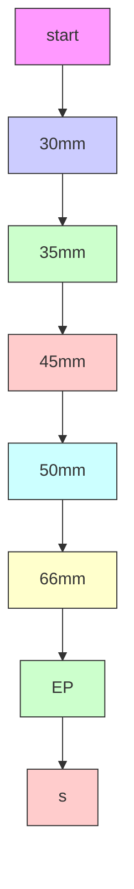
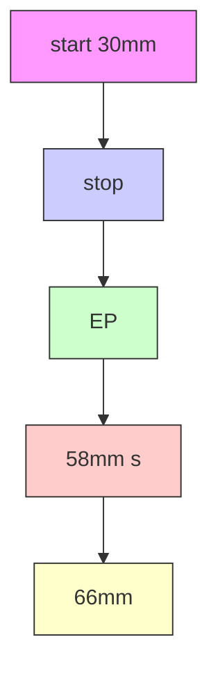

# Experimental Observation of the Topological Structure of Exceptional Points

C. Dembowski, $^{1}$ H.-D. Gräf, $^{1}$ H. L. Harney, $^{2}$ A. Heine, $^{1}$ W. D. Heiss, $^{3}$ H. Rehfeld, $^{1}$ and A. Richter $^{1}$

$^{1}$ Institut für Kernphysik, Technische Universität Darmstadt, D-64289 Darmstadt, Germany

$^{2}$ Max-Planck-Institut für Kernphysik, D-69029 Heidelberg, Germany

$^{3}$ Department of Physics, University of Witwatersrand, P.O. Wits 2050, Johannesburg, South Africa

(Received 26 April 2000)

We report on a microwave cavity experiment where exceptional points (EPs), which are square root singularities of the eigenvalues as function of a complex interaction parameter, are encircled in the laboratory. The real and imaginary parts of an eigenvalue are given by the frequency and width of a resonance and the eigenvectors by the field distributions. Repulsion of eigenvalues—always associated with EPs—implies frequency anticrossing (crossing) whenever width crossing (anticrossing) is present. The eigenvalues and eigenvectors are interchanged while encircling an EP, but one of the eigenvectors undergoes a sign change which can be discerned in the field patterns.

DOI: 10.1103/PhysRevLett.86.787

The mathematical description of physical phenomena often gives rise to singularities which are associated with specific effects. There is an abundance of examples: in scattering theory we mention for the S matrix an essential singularity at E = 0 for Coulomb scattering signaling the long range of the Coulomb potential, the poles of the S matrix producing observable resonances, and branch points in the complex energy plane associated with elastic and inelastic thresholds [1]. More recently topological singularities such as diabolic points (DPs) [2] associated with a specific phase behavior of the wave functions have attracted attention. Exceptional points [3] are singularities associated with level repulsions which occur in general when the spectrum of a Hermitian Hamilton operator is changed under variation of a parameter. This parameter can be the strength $\lambda$ of an interaction term of a Hamiltonian of the form $H_{0} + \lambda H_{1}$ , but other dependencies are possible. While it is established knowledge [4] that interacting levels do not cross but avoid each other when the real parameter $\lambda$ is varied, the levels do coalesce when continued analytically into the complex $\lambda$ plane [5]. The point of coalescence is in general a square root singularity of the energy spectrum as a function of the complex parameter $\lambda$ ; these singularities are in general denoted exceptional points (EPs). We present in this paper for the first time experimental evidence that such particular singularities can be encircled in the laboratory. In this way, the topological structure associated with these branch points is shown directly to be a physical reality. For the convenience of the reader we briefly recapitulate the essential aspects of the EP [6]. Even though EPs occur generically whenever there is level repulsion—a nice example is given in [7]—their particular features can be demonstrated in a two-level problem, since we address here a local phenomenon. A general real two-dimensional Hamilton matrix has the form

$$
H = \left( \begin{array}{c c} \epsilon_ {1} & 0 \\ 0 & \epsilon_ {2} \end{array} \right) + \lambda U \left( \begin{array}{c c} \omega_ {1} & 0 \\ 0 & \omega_ {2} \end{array} \right) U ^ {\dagger}, \tag {1}
$$

PACS numbers: 05.45.Mt, 03.65.Vf, 41.20.Jb

where the rotation matrix $U(\phi)$ provides for the coupling of the two levels. The eigenvalues are given by

$$
E _ {1, 2} (\lambda) = \frac {\epsilon_ {1} + \epsilon_ {2} + \lambda (\omega_ {1} + \omega_ {2})}{2} \pm R \tag {2}
$$

with

$$
\begin{array}{l} R = \left\{\left(\frac {\epsilon_ {1} - \epsilon_ {2}}{2}\right) ^ {2} + \left(\frac {\lambda \left(\omega_ {1} - \omega_ {2}\right)}{2}\right) ^ {2} \right. \\ \left. + \frac {1}{2} \lambda (\epsilon_ {1} - \epsilon_ {2}) (\omega_ {1} - \omega_ {2}) \cos 2 \phi \right\} ^ {1 / 2}. \tag {3} \\ \end{array}
$$

For $\phi = 0$ there is a degeneracy of the two levels at $\lambda = -(\epsilon_1 - \epsilon_2) / (\omega_1 - \omega_2)$ . When the coupling between the two levels is turned on by setting $\phi \neq 0$ , the degeneracy is lifted and an avoided level crossing occurs. Now the two levels coalesce in the complex $\lambda$ plane where $R$ vanishes (Fig. 1). This happens at the complex conjugate points $\lambda_c = -(\epsilon_1 - \epsilon_2) / (\omega_1 - \omega_2) \exp(\pm 2i\phi)$ . At these points, the two levels $E_k(\lambda)$ are connected by a square root branch point; in fact, the two levels are the values of one analytic function on two different Riemann sheets. Obviously, this connection is not of the type encountered at a DP, where a genuine degeneracy implies a two dimensional subspace. At the EP the two wave functions

line

| Re{E_i} | Im{E_i} |
| ------- | ------- |
| 0       | 0       |
| Peak    | EP      |
| End     | 0       |

FIG. 1. Complex energy trajectories for $E_{1}$ and $E_{2}$ if $\epsilon_{1}$ is varied. Two neighboring values of the complex coupling $\lambda$ with the EP in between are shown. The symbols ● and ■ denote the respective starting points.

coalesce into one which implies a defect of the underlying Hilbert space. Even though this operator singularity can be illustrated in a two level model we stress the universality of this mathematical feature in a general problem of higher dimensions [6]. For Hermitian operators $H_{0}$ and $H_{1}$ the EP can occur only at complex values of $\lambda$ . In other words, the full problem $H_{0} + \lambda H_{1}$ is no longer Hermitian at the EP. To get access to and encircle an EP in an experiment, an absorptive system must therefore be used. A variety of possibilities to achieve this has been discussed in [6]. Three major results have been reported when an EP is encircled in the complex $\lambda$ plane [6].

(i) A complete loop in the parameter plane, spanned by the real and imaginary parts of $\lambda$ , invokes half a loop in the energy plane, spanned by the real and imaginary parts of the eigenvalues [6,7]. The two energy levels $E_{k}$ and $E_{k+1}$ connected at the EP are interchanged when the loop in the $\lambda$ plane is closing in on itself. Only a double loop in the parameter plane yields a complete loop in the energy plane for each level.

(ii) The two wave functions $\psi_{k}$ and $\psi_{k+1}$ are not just interchanged as their corresponding energies but one of them undergoes a phase change. In other words, a complete loop in the $\lambda$ plane invokes $\{\psi_{k},\psi_{k+1}\}\to\{\psi_{k+1},-\psi_{k}\}$ . As an immediate consequence we conclude (i) the EP is a fourth order branch point for the wave functions and (ii) a different orientation of the loop in the $\lambda$ plane yields a different phase behavior. In fact, encircling the EP a second time completely with the same orientation we now obtain $\{-\psi_{k},-\psi_{k+1}\}$ while the next complete loop yields $\{-\psi_{k+1},\psi_{k}\}$ and only the fourth loop restores fully the original pair $\{\psi_{k},\psi_{k+1}\}$ . It follows that the opposite orientation yields after the first completion what is obtained after three loops in the former case.

(iii) The behavior of the two energy levels is distinctly different when the path in the $\lambda$ plane is moving below or above the EP. In the one case the two real parts of the energy levels cross while their imaginary parts avoid each other while the situation is reversed in the other case (Fig. 1).

Encircling an EP in an experiment requires a system with a Hamiltonian that has to resemble the one given in Eq. (1) while all the external parameters have to be adjustable with high precision and over a wide range of values. Furthermore, the complex eigenvalues and the eigenfunctions of the system have to be accessible to measurements. Flat microwave cavities (billiards), set up as an analog system (see, e.g., [8,9]), are an excellent tool which meets all the requirements. With an appropriately shaped cavity complex eigenvalues translate into resonance frequencies (the real part) and resonance widths (the imaginary parts), while the eigenfunctions are given by the field distributions inside the cavity. We used a copper cavity with a height of d = 5 mm and a geometry which is sketched on the left side of Fig. 2. It consists of two semicircular cavities of slightly different size which can be

text_image

δ
S
0.1m

text_image

antenna
d
indium wire

FIG. 2. Sketch of the microwave cavity as seen from top (left) and from the side (right). In the side view the indium wire which is used to establish the electrical contact between the different parts is enlarged.

coupled by adjusting the opening of a slit s between them. A Teflon ( $\epsilon_{r} \approx 2.1$ ) semicircle is placed on one side of the cavity which yields the second parameter $\delta$ , namely, the distance between the centers of the cavity and the semicircle. To assure a uniform electrical contact even at higher frequencies between bottom, inset, and lid of the cavity, indium wires with a diameter of 1 mm have been placed close to the inner edge of the cavity as sketched in Fig. 2. The cavity resonances were identified as described in [9], while the field patterns were measured with a field perturbation method suggested by Maier and Slater [10] which has been successfully applied to microwave billiards before (see, e.g., [11–13]). For two isolated resonances of the microwave cavity we can, in analogy to [6], set up a simple $2 \times 2$ non-Hermitian matrix model

$$
H ^ {\exp} = \left( \begin{array}{c c} \delta f _ {1} + i \Gamma_ {1} & s \\ s & f _ {2} + i \Gamma_ {2} \end{array} \right), \tag {4}
$$

where $\delta f_{1}$ and $f_{2}$ denote the frequencies and $\Gamma_{1}$ and $\Gamma_{2}$ denote the widths of the uncoupled resonances. This is just a special form of Eq. (1) with $\phi = \pi/4$ and $\omega_{1} = -\omega_{2} = s$ . Exceptional points occur at a complex coupling

$$
\tilde {s} ^ {\mathrm{EP}} = \pm \left[ \frac {\Gamma_ {1} - \Gamma_ {2}}{2} + i \left(\frac {f _ {2} - \delta f _ {1}}{2}\right) \right]. \tag {5}
$$

If the EP is to be encircled $\delta$ will have to be adjusted in a way that the imaginary part of the EP changes its sign, since the actual observation of the system is restricted to the real axis of the complex $\tilde{s}$ plane. In this simple model $\tilde{s}^{EP}$ does not depend on the coupling s and encircling the EP requires four steps: (i) Assuming in the first step that $s < \Gamma_{1} - \Gamma_{2}/2$ and looking at the EP with $\operatorname{Im}\{\tilde{s}^{\mathrm{EP}}\} > 0$ we first vary $\delta$ so that the imaginary part of $\tilde{s}^{EP}$ will be less than zero. During this process a frequency crossing and a widths anticrossing should be observed [6]. (ii) In the second step the coupling s is varied to $s > \Gamma_{1} - \Gamma_{2}/2$ . This changes the position of the system in the $\tilde{s}$ plane but leaves the position of the EP fixed. (iii) Now $\delta$ is set back to its original value, i.e., $\operatorname{Im}\{\tilde{s}^{\mathrm{EP}}\} > 0$ . Because of the enhanced coupling we will now observe a frequency anticrossing and a widths crossing [6]. (iv) The last step is again moving the position of the system in the $\tilde{s}$ plane to the initial reduced coupling thus closing the path in the parameter plane. After the EP is encircled the complex eigenvalues will be interchanged, but they never cross each other during the

process. To verify this it is crucial to observe both, real and imaginary parts of the eigenvalues, given by the frequencies $f_{1,2}$ and widths $\Gamma_{1,2}$ (see also [14]).

In the following we discuss measurements of the eighth and ninth modes of the cavity which are sufficiently isolated to be described by Eq. (4) and for which numerical simulations with the program MAFIA [15] suggested an EP that can be encircled. To ensure that $f_{1,2}$ and $\Gamma_{1,2}$ depend only on $\delta$ and s, each measurement of the resonance parameters was repeated up to 40 times effectively reducing any fluctuations due to the variable contact between lid, inset, and bottom of the cavity so that no error bars are visible in Figs. 3 and 4. The parameters were determined by sweeping the range between 2.7 and 2.8 GHz and measuring the reflected power which was then fitted with the expression given in [16]. In Fig. 3 we present the data for s = 58 mm. Consistent with [6] we found a crossing of $f_{1}$ and $f_{2}$ , yet the complex eigenvalues do not cross which can be seen when looking at $\Gamma_{1}$ and $\Gamma_{2}$ which show an avoided crossing. For an enhanced coupling (s = 66 mm) the situation is reversed: The crossing of $\Gamma_{1,2}$ now implies an avoided crossing of $f_{1,2}$ which again ensures that the complex eigenvalues do not cross (Fig. 4). The two cases considered constitute steps (i) and (iii) of the closed path in the parameter plane. The eigenvalues depend only weakly on s so we omit presenting the data for steps (ii) and (iv). The combination of crossing and anticrossing during a full loop in the parameter space results in the interchanging of the two eigenvalues, i.e.,

$$
\left\{\begin{array}{l}f _ {1}\\f _ {2}\end{array}\right\}\rightarrow \left\{\begin{array}{l}f _ {2}\\f _ {1}\end{array}\right\} \quad \text { and } \quad \left\{\begin{array}{l}\Gamma_ {1}\\\Gamma_ {2}\end{array}\right\}\rightarrow \left\{\begin{array}{l}\Gamma_ {2}\\\Gamma_ {1}\end{array}\right\}. \tag {6}
$$

Consequently a full loop in the eigenvalue plane requires two loops in the parameter plane. Looking at the eigenvectors it has been predicted [6] that only one will pick up a geometric phase of $\pi$ , i.e., a sign change when an EP is encircled. Only the squared field distributions are accessible to measurements [13] but to observe a sign change it is sufficient to arbitrarily define the sign of the distributions at one point in parameter space and then change the parameters in steps small enough so that the development of the signs assigned to the field distributions can be traced from the initial conditions [17,18]. Figure 5(a) shows that along the closed path in parameter space $\psi_{1}$ is changed to $\psi_{2}$ in accordance to the behavior of the eigenvalues. The variation of $\psi_{1}$ is small when $s$ is set to $58~\mathrm{mm}$ , since the two levels simply cross [17]. For $s = 66~\mathrm{mm}$ the variation is more dramatic since the two modes are now coupled more strongly. Figure 5(b) shows the corresponding development of $\psi_{2}$ —again the squared field patterns are simply interchanged, but when looking at the signs of the final state the additional geometric phase of $\pi$ is evident.

line

| δ (mm) | f₁,₂ (GHz) | Γ₁,₂ (MHz) |
| ------ | ---------- | ---------- |
| 0      | 2.75       | 5.5        |
| 20     | 2.77       | 4.5        |
| 40     | 2.79       | 4.3        |
| 60     | 2.80       | 4.2        |
| 80     | 2.81       | 4.1        |

FIG. 3. Resonance frequencies $f_{1,2}$ and widths $\Gamma_{1,2}$ of the (initially) eighth and ninth modes as a function of $\delta$ (s = 58 mm). As an inset the reflection spectra for different $\delta$ are shown.

The presence of EPs in an eigenvalue spectrum will result in a chirality attached to the EPs; i.e., the orientation of the loop in the parameter space determines which wave function will pick up a sign during the encircling of the EP [6].

A right handed loop leads to the situation described above (Fig. 5), while reversing the orientation; i.e., first changing s to 66 mm, then changing $\delta$ to 60 mm, resetting s to 58 mm, and closing the path by moving the Teflon semicircle back to 20 mm will lead to the situation that is shown in Fig. 6 and can be summarized as

$$
\left\{ \begin{array}{l} \psi_ {1} \\ \psi_ {2} \end{array} \right\} \curvearrowright \left\{ \begin{array}{l} \psi_ {2} \\ - \psi_ {1} \end{array} \right\} \quad \text { and } \quad \left\{ \begin{array}{l} \psi_ {1} \\ \psi_ {2} \end{array} \right\} \curvearrowright \left\{ \begin{array}{l} - \psi_ {2} \\ \psi_ {1} \end{array} \right\}. \tag {7}
$$

It has to be noted that it is not possible to determine the orientation of the loop by observing the development of a single field pattern—only if the signs of $\psi_{1}$ and $\psi_{2}$ are chosen initially the two orientations can be distinguished. In summary we were able to directly observe a square root singularity connecting two energy eigenvalues (EP) and the associated topological features in an experiment. The EP

line

| δ (mm) | f₁,₂ (GHz) | Γ₁,₂ (MHz) |
| ------ | ---------- | ---------- |
| 0      | 2.78       | 2.0        |
| 10     | 2.78       | 2.0        |
| 20     | 2.78       | 2.0        |
| 30     | 2.76       | 2.5        |
| 40     | 2.76       | 2.5        |
| 50     | 2.78       | 2.5        |
| 60     | 2.80       | 2.5        |
| 70     | 2.80       | 2.5        |
| 80     | 2.80       | 2.5        |
| 90     | 2.80       | 2.5        |

FIG. 4. Resonance frequencies $f_{1,2}$ and widths $\Gamma_{1,2}$ of the eighth and ninth modes as a function of $\delta$ (s = 66 mm). Again reflection spectra for different $\delta$ are shown.

flowchart

flowchart

FIG. 5. Development of the field distributions of the eighth (a) and ninth (b) modes while encircling the EP. Throughout the process the sign of the field distributions can be derived from its predecessor.

is detected by tracing the real and imaginary parts (i.e., the resonance frequencies and widths) of the eigenvalues and the eigenvectors (i.e., the field distributions) on a closed path around the EP. Along this path the complex eigenvalues are interchanged, but they never actually cross each other. In contrast to this the eigenvectors are not just interchanged: We found that depending on the orientation of the path one of them undergoes a sign change. By taking into account all three observables (frequencies, widths, and field patterns), the EP can be clearly distinguished from other topological singularities such as DPs $[2,17]$ and the fascinating Riemann structure of the complex eigenvalue planes can be directly observed.

We are particularly grateful to P. v. Brentano and R. Hofferbert for many helpful ideas and remarks on the setup of the experiment and H. A. Weidenmüller for discussing the results with us. This work has been supported by the DFG under Contract No. Ri 242/16-1 and by the NRF of South Africa.

text_image

Diagram illustrating a cyclical pattern of eye movements with alternating light and dark patterns, showing rotation and equivalence.

FIG. 6. Initial and final field distributions when the EP is encircled with different orientations leading to different geometric phases being picked up by the modes.

[1] R. G. Newton, Scattering Theory of Waves and Particles (McGraw-Hill, New York, 1966).   
[2] M. V. Berry, Quantum Chaos, edited by G. Casati (Plenum, London, 1985); Proc. R. Soc. London A 239, 45 (1983).   
[3] T. Kato, Perturbation Theory of Linear Operators (Springer, Berlin, 1966).   
[4] J. von Neumann and E. Wigner, Z. Phys. 30, 467 (1929).   
[5] W. D. Heiss and A. L. Sannino, J. Phys. A 23, 1167 (1990); Phys. Rev. A 43, 4159 (1991).   
[6] W. D. Heiss, Eur. Phys. J. D 7, 1 (1999); Phys. Rev. E 61, 929 (2000).   
[7] O. Latinne et al., Phys. Rev. Lett. 74, 46 (1995).   
[8] H.-J. Stöckmann, Quantum Chaos: An Introduction (Cambridge University Press, Cambridge, England, 1999).   
[9] A. Richter, in Emerging Applications of Number Theory, The IMA Volumes in Mathematics and Its Applications Vol. 109, edited by D.A. Hejhal et al. (Springer, New York, 1999), p. 479.   
[10] L. C. Maier, Jr. and J. C. Slater, J. Appl. Phys. 23, 1352 (1968).   
[11] J. Stein and H.-J. Stöckmann, Phys. Rev. Lett. 68, 2867 (1992).   
[12] S. Sridhar, D. O. Hogenboom, and B. A. Willemsen, J. Stat. Phys. 68, 239 (1992).   
[13] C. Dembowski et al., Phys. Rev. Lett. 84, 867 (2000).   
[14] The interchange of two complex eigenvalues $E_{k}$ and $E_{k+1}$ has recently been discussed by P.v. Brentano and M. Philipp [Phys. Lett. B 454, 171 (1999)] and experimentally observed by M. Philipp et al. [Phys. Rev. E 62, 1922 (2000)].   
[15] T. Weiland, Numer. Modelling 9, 295 (1996).   
[16] H. Alt et al., Phys. Lett. B 366, 7 (1996).   
[17] M. V. Berry and M. Wilkinson, Proc. R. Soc. London A 392, 15 (1984).   
[18] H.-M. Lauber, P. Weidenhammer, and D. Dubbers, Phys. Rev. Lett. 72, 1004 (1994).