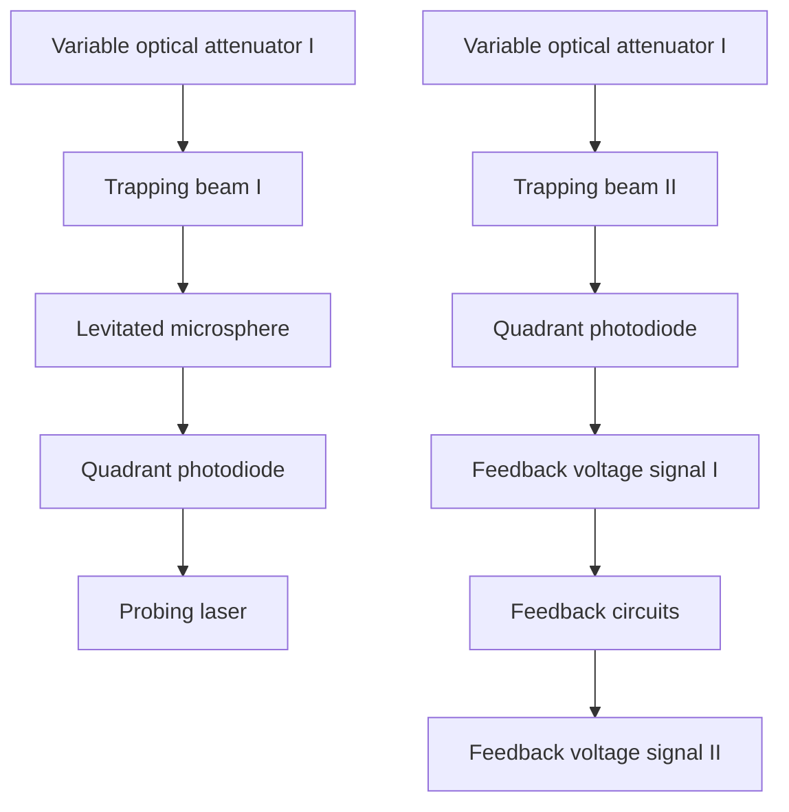
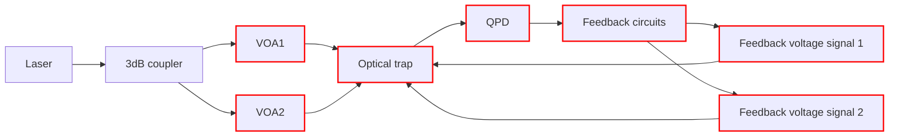
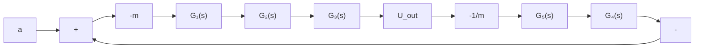

# Feedback-Control Acceleration Sensing: Toward a Practical Small-Scale Levitated Optomechanical Accelerometer

Xiang Han $^{ID}$ , Wei Xiong $^{ID}$ , Xinlin Chen, Zhongming Huang, Chen Su, Tengfang Kuang $^{ID}$ , Zhongqi Tan, Guangzong Xiao $^{ID}$ , and Hui Luo

Abstract—Levitated optomechanical accelerometers (LOMAs) are expected to achieve ultrahigh precision as the optical levitation of the inertial mass will essentially isolate external thermal effects from the mechanical support. However, most designs of the accelerometers currently remain in the proof-of-principle stage in the laboratory. Here a practical accelerometer header in centimeter-scale is presented with the feedback control. An inertial mass of about 10 ng silica sphere is levitated in a dual-beam counterpropagating optical trap. The sensitivity is achieved in air as $232 \pm 120 \mu g/Hz^{1/2}$ at 1–10 Hz, and $25.5 \pm 8.2 \mu g/Hz^{1/2}$ at about 55 Hz. The bias stability is evaluated as 418.1 $\mu g$ at 0 g input by the Allan variance. At last, acceleration sensing of the header is tested on the city roads, and the output differences from a commercial reference accelerometer are mostly within 21 mg ( $1\sigma$ ) in periods of about 480 s. It is the first demonstration of a practical small-scale LOMA, which future.


<details>
<summary>flowchart</summary>


</details>

Index Terms—Feedback control, levitated optomechanical accelerometer (LOMA), optical sensors, thermal noises.

# I. INTRODUCTION

ACCELEROMETERS are sensors used to measure the acceleration of moving carriers in inertial space, and have wide applications in inertial navigation [1], resource exploration [2], consumer electronics [3], and seismic warnings [4], [5]. Among the accelerometers, levitated optomechanical accelerometers (LOMAs) are based on the optical levitation of the sensing mass. Different from the mechanical supports in most of the current accelerometers [6], [7], [8], the optical levitation essentially isolates the external thermal effects from the mechanical support. It can achieve easily engineered stiffness and shot-noise-limited measurement [9]. By virtue

Manuscript received 30 September 2023; accepted 16 October 2023. Date of publication 9 November 2023; date of current version 14 December 2023. This work was supported in part by the National Natural Science Foundation of China under Grant 61975237 and in part by the Natural Science Foundation of Hunan Province under Grant 2021JJ40679. The associate editor coordinating the review of this article and approving it for publication was Prof. Kai Wu. (Corresponding authors: Wei Xiong; Guangzong Xiao.)

The authors are with the College of Advanced Interdisciplinary Studies, National University of Defense Technology, Changsha 410073, China (e-mail: xiongwei08@nudt.edu.cn; xiaoguangzong@nudt.edu.cn).

Digital Object Identifier 10.1109/JSEN.2023.3327877

of the features, the LOMAs are demonstrated to be capable of ultrahigh precision [9], [10], [11], [12].

Recently, the levitated particles in the optomechanical systems are continually cooled into the quantum ground states $[13]$ , $[14]$ , $[15]$ , $[16]$ , and the sensing performance is expected to be enhanced due to the macroscopic quantum effects, for example, quantum entanglements $[17]$ . One scheme attracted intense attention is the optical tweezers in vacuum, which do not need cavities in most systems with relatively simpler and cheaper setup.

Optical tweezers have been successfully demonstrated and developed for ultra-sensitive acceleration sensing since the pioneering work of Ashkin and Dziedzic [18]. Butts [19] first began the acceleration testing with a table-top dual-beam counter-propagating optical trap in air, and obtained a short term sensitivity of $119\mu \mathrm{g} / \mathrm{Hz}^{1 / 2}$ under constant $1\mathrm{g}$ input. Kotru [20] has developed Butts's system, and achieved a bias stability of $318~\mu \mathrm{g}$ after $300~\mathrm{s}$ of averaging in the air. Later Li et al. [21] first introduce the momentum damping scheme to cool the center-of-mass motions of a $3 - \mu \mathrm{m}$ -diameter silica sphere in the dual-beam optical tweezers at $5.2\mathrm{mPa}$ , which will greatly improve the acceleration sensitivity [17]. Monteiro et al. [22], [23] applied the momentum damping scheme in the straight-up single-beam optical tweezers, and


<details>
<summary>flowchart</summary>


</details>


<details>
<summary>text_image</summary>

(b)
Quadrant photodiode
Beam I
Beam II
Glass Chamber
Focus lens
Probing Laser
Fiber collimator
</details>


<details>
<summary>natural_image</summary>

Close-up of a mechanical component with a 1 Yuan coin on top, showing internal components and mounting holes (no readable text or symbols)
</details>

Fig. 1. (a) Setup scheme of the light force accelerometer. (b) Illustrated scheme of the optical trap and the position detection module. The distance between the waists of the two beams is about almost 16 times the diameter of the microsphere. (c) Side-view of the small sensor header with a one-yuan coin. The header is in the centimeter scale.

obtained a sensitivity of $95 \, ng/Hz^{1/2}$ at frequencies near $50 \, Hz$ for a 12-ng silica sphere at about $10 \, \mu Pa$ . Pu et al. [24] presented an open-loop optical force accelerometer using optical cage systems in air, which has achieved a short-term zero-bias stability of $4.4 \, mg$ at minimum and a dynamic range smaller than $0.2 \, g$ . In most of the above systems for acceleration sensing, high vacuum and optical feedback cooling are used to greatly decrease the noise-equivalent acceleration (NEA, in units of $g/Hz^{1/2}$ , $1 \, g = 9.8 \, m/s^{2}$ ) and improve the sensitivity. The high-vacuum keeping systems and the spatial optical devices have always made the table-top optical tweezers bulk systems in meter-scales.

In this manuscript, we utilize a $10-\mu m$ -diameter silica sphere in a dual-beam counter-propagating optical trap as the sensing mass for acceleration, and test the performance of an assembled centimeter-scale header with the feedback control in air. The tests are implemented both in the laboratory and on the city roads. The whole manuscript is organized into three main parts. The first part is to introduce the working principles, the second part is to present the tested performance in the laboratory and on the roads, and the last part is to show the prospect and some discussions for future possible improvement.

# II. THEORY AND PRINCIPLE

# A. Setup of the LOMA

The scheme of the acceleration sensor is described in Fig. 1(a). A 976 nm laser propagates through a HI1060 fiber, and is equally divided by a 3 dB coupler into two arms. The laser power in each arm is modulated by a variable optical attenuator (VOA) based on the micro-electromechanical system (MEMS). The laser beams propagate out from the fiber end-faces to form a dual-beam counter-propagating optical trap in a sample glass chamber, as shown in Fig. 1(b). The two


<details>
<summary>text_image</summary>

Linear Spring Sensing Mass
</details>

Fig. 2. Sensing microsphere with an equivalent optical spring.

beams are carefully aligned to avoid possible rotations induced by the misalignments $[25]$ . Single silica spheres with diameters of $10 \pm 1 \mu m$ are levitated from the substrate by the designed vibration system based on the piezo-electric transducer $[26]$ , and the levitated single silica sphere is used as the sensitive mass for the acceleration. A probe laser is illustrated onto the trapped sphere, and its power is much smaller than the trapping laser power. The forward-scattering light of the probe laser is collected onto a quadrant photodiode (QPD) for detecting the positions of the trapped sphere $[27]$ . The optical trap and the QPD are engaged into a small sensor header, as shown in Fig. 1(c), where the laser sources are not included in the header currently.

In the dual-beam counter-propagating optical trap, the distance between the waists of the trapping beams is about 15 times the diameter of the microsphere, and the trapping beams are loosely focused. In this way, the scattering forces act as the main role for the axial trapping, and the microsphere can obtain a long linear range at $10 \mu m$ levels for the axial stiffness [28]. While for the dual-beam optical tweezers [21], the waist distance is typically smaller than 2–3 times the sphere's diameter, and the linear stiffness range is much smaller than that of the optical trap here. In the linear range, the sensor is always described by an equivalent optical spring connecting a sensing mass, as shown in Fig. 2. It also makes possible for choosing the proper working equilibrium positions in relatively large ranges.

In the acceleration sensing, the dynamics of the trapped sphere along the sensitive axis (the axial direction) are described as

$$
\frac {d ^ {2} x}{d t ^ {2}} + \Gamma_ {0} \frac {d x}{d t} + \frac {\kappa}{m} x = - \frac {d ^ {2} z}{d t ^ {2}} + \frac {F _ {\text { thermal }}}{m} \tag {1}
$$

where x is the displacement of the sphere relative to the initial equilibrium position, z is the displacement of carrier relative to the inertial space, $\Gamma_{0}$ is the ambient damping, $\kappa$ is the trapping stiffness, m is the mass of the sphere, and $F_{thermal}$ is the thermal motion induced forces. For the acceleration sensing in the classical physical frame, thermal noises raised from the Brownian motions of the sphere form a theoretical limit of NEA as

$$
a _ {0} = \sqrt {\frac {4 k _ {B} T \Omega_ {0}}{m Q}} \tag {2}
$$

where $\Omega_0$ is the resonant angular frequency of the sphere, $Q$ is the quality factor, and obeys

$$
Q = 2 \pi \frac {\text { energy   stored }}{\text { energy   dissipated   per   cycle }}. \tag {3}
$$


<details>
<summary>flowchart</summary>

```mermaid
graph TD
    A["Thermal motions"] --> B["Thermal Displacements"]
    B --> C["Velocity estimation"]
    C --> D["Effective cooling"]
    D --> E["Input acceleration"]
    E --> F["Displacement output"]
    
    subgraph (a)
        G["Optical feedback cooling"] --> H["Velocity damping"]
        H --> I["Cooling laser power modulation"]
    end
    
    subgraph (b)
        J["Input acceleration"] --> K["Displacement responses"]
        K --> L{Zero displacement check}
        L -->|Yes| M["Control voltage output"]
        L -->|No| N["PID voltage control"]
        N --> O["Trapping power attenuation"]
        O --> K
    end
    
    subgraph (c)
        P["P+ΔP"] & Q["P-ΔP"]
    end
```
</details>

Fig. 3. Flowchart of the feedback cooling and the feedback control. (a) Momentum damping is commonly used for the feedback cooling in the dual-beam optical tweezers. A problem remains as how to quickly distinguish the thermal displacements and the acceleration-induced displacements. (b) Feedback control acts as a classical close-loop control with a zero-displacement check. (c) In the feedback control, if one beam power is increased by $\Delta P$ , the other will decrease with $\Delta P$ correspondingly.

# B. Role of the Feedback Control

In those optical tweezers [21], [22], [23], [24], when an external acceleration is input along the sensitive axis, the trapped sphere is displaced from its equilibrium position, and the acceleration $a_{1}$ is measured from the displacement $x_{1}$ as

$$
a _ {1} = \frac {\kappa}{m} x _ {1}. \tag {4}
$$

The sensitivity is usually represented by the NEA at certain frequency ranges, where the noises are estimated from the power spectrum density curves of the acceleration. Devices with low noises, vacuum environment, and feedback cooling of the center-of-mass motions of silica spheres are commonly used to reduce the thermal noises and achieve ultrahigh sensitivity [21], [23]. Among the reported feedback cooling regimes, momentum damping is commonly used in the dual-beam counter-propagating optical tweezers [21]. A brief scheme of the regime is shown in Fig. 3(a).

In another way, a different feedback regime is developed for the optical trap here. The scheme is illustrated in Fig. 3(b), and a featured control of the trapping power is shown in Fig. 3(c). The complementary way of the power control can keep the axial stiffness unchanged and change the equilibrium positions. The flowchart of the feedback control here is shown in Fig. 4.

Here we define the sensor header working without the feedback control as case A, and working with the feedback control as case B. The scale factor in case A is defined as the ratio between the displacement voltage changes and the input acceleration changes, and the scale factor in case B is defined as the ratio between the VOA control voltage changes and the input acceleration changes.

# III. PERFORMANCE TESTS OF THE ACCELERATION SENSING

# A. Scale Factor Calibration Using Gravity Components

The sensor header is installed on a horizontal single-axis precise turntable, and a schematic is shown in Fig. 5(a). The turntable is locked to multiple angle positions to project different gravitational acceleration components on the sensitive axis, as shown in Fig. 5(b) and (c).


<details>
<summary>flowchart</summary>


</details>

Fig. 4. Flowchart for the feedback control. $G_{1}$ is the transfer function of the external force caused by the input acceleration to the displacement of the microsphere, $G_{2}$ is the transfer function of the displacement to the signal voltage of the position detector, $G_{3}$ is the transfer function of the signal voltage to the control voltages on the VOA, $G_{4}$ is the transfer function of the control voltages to the optical power attenuation, and $G_{5}$ is the transfer function of the optical power attenuation to the optical forces. Generally, $G_{1}$ is obtained from the Laplace transform of (1), and $G_{2}$ , $G_{3}$ , $G_{4}$ , and $G_{5}$ are represented by the proportional coefficients $K_{2}$ , $K_{3}$ , $K_{4}$ , and $K_{5}$ respectively.


<details>
<summary>text_image</summary>

(a)
Turntable platform
Sensing axis
LFA
Multi-position rotations
</details>


<details>
<summary>text_image</summary>

(b)
g
θ
g
(c)
g
θ
g
</details>

Fig. 5. Scale factor calibration using a horizontal turntable in the laboratory. (a) Acceleration sensing axis is along the optical axis of the trapping laser. It's carefully aligned parallel to the platform surface and perpendicular to the rotation axis of the turntable. The minor installation errors in the calibration process are ignored. The initial position of the turntable is the $0^{\circ}$ position, where the sensitive axis is approximately horizontal. (b) Turntable is stopped at an angle position $\theta$ , and the sensing axis is facing a gravitational acceleration component as $g\sin\theta$ . (c) Turntable is stopped at the angle position $-\theta$ , where the gravitational acceleration component is $-g\sin\theta$ .

By using the multiple position algorithm $[29]$ , the scale factor in case A and case B are calibrated to be 0.56 and 2.1 g/V, respectively.

# B. Acceleration Noises

After the calibration, the turntable platform is locked to the $0^{\circ}$ position, and the sensor header is tested under 0 g input in case A and case B, respectively. The output is recorded in Fig. 6, which is used to calculate the acceleration noises and bias stability.

The power spectrum density of the acceleration output in case A and case B is shown in Fig. 7(a). Due to the complex response features of the sensing mass near the resonance frequency $f_0$ , most resonators are operated at frequencies below $f_0 / 3$ . The scale factor between the input acceleration and the output quantity is usually taken as the same. Here the resonance frequency can be measured by the power spectrum of the positions in vacuum, as shown in Fig. 7. The resonance frequency is found as $187.8\mathrm{Hz}$ using Lorenz fitting with the model as (5), where $\Omega_0 = 2\pi f_0$ , $\Omega$ is the angular frequency, and $\beta$ is the ratio between the microsphere's displacement $x$


<details>
<summary>line</summary>

| time(s) | a(mg) |
| ------- | ----- |
| 0       | 20    |
| 10      | -20   |
| 20      | 20    |
| 30      | -20   |
| 40      | 20    |
| 50      | -20   |
| 60      | 20    |
| 70      | -20   |
| 80      | 20    |
</details>


<details>
<summary>line</summary>

| time(s) | a(mg) |
| ------- | ----- |
| 0       | 0     |
| 10      | 0     |
| 20      | 0     |
| 30      | 0     |
| 40      | 0     |
| 50      | 0     |
| 60      | 0     |
| 70      | 0     |
| 80      | 0     |
</details>

Fig. 6. Acceleration output in (a) case A and (b) case B under 0 g input. The amplitudes of the acceleration fluctuations in case B are obviously smaller than those in case A.   


<details>
<summary>line</summary>

| Frequency(Hz) | Original data | Fitting curve |
| ------------- | ------------- | ------------- |
| 140           | ~10⁻⁸         | ~10⁻⁸         |
| 150           | ~10⁻⁸         | ~10⁻⁸         |
| 160           | ~10⁻⁸         | ~10⁻⁸         |
| 170           | ~10⁻⁷         | ~10⁻⁷         |
| 180           | ~10⁻⁶         | ~10⁻⁶         |
| 190           | ~10⁻⁵         | ~10⁻⁵         |
| 200           | ~10⁻⁶         | ~10⁻⁶         |
| 210           | ~10⁻⁷         | ~10⁻⁷         |
| 220           | ~10⁻⁸         | ~10⁻⁸         |
| 230           | ~10⁻⁹         | ~10⁻⁹         |
</details>

Fig. 7. Power spectrum of the position voltage response (in dark) in the open loop in case A. A Lorenz fitting is employed as the red line. The resonance frequency $f_{0}$ is about 187.8 Hz.

and the displacement voltage U of the position detector

$$
S _ {U} = \frac {2 k _ {B} T}{\beta^ {2} m} \frac {\Gamma_ {0}}{\left(\Omega_ {0} ^ {2} - \Omega^ {2}\right) ^ {2} + \Omega^ {2} \Gamma_ {0} ^ {2}}. \tag {5}
$$

The power spectrum density of the acceleration output at frequencies below $f_{0}/3$ in case A and case B is shown in Fig. 8, and the acceleration noises are estimated.

# C. Short-Term Bias Stability

For inertial navigation, bias stability in the acceleration sensing is commonly concerned and can be evaluated by the Allan variance. As shown in Fig. 9, the Allan variance of the sensor header in case A and case B is calculated from the output in Fig. 6. For further reference in the tests on the roads, a commercial accelerometer is also tested and the Allan variance is included in Fig. 9. The bias stability in case B is slightly deteriorated when compared to that in case A. This is probably due to the addition of the feedback control system. It would need better optimizing of the VOA and suppressing the laser power fluctuations from current 1%.

The performance of the LOMA with the same sensing regimes is collected in Table I. The work here is generally better than the other devices in air with a much smaller volume.

# D. Acceleration Dynamic Range

In case A, although the long linear displacement range is one of the most important features of the dual-beam optical

TABLE I
REPORTED PERFORMANCE WITH THE SAME REGIMES 

<table><tr><td>The work</td><td>Bias stability(μg)</td><td>Sensitivity (μg/Hz $^{1/2}$ )</td><td>Features</td></tr><tr><td>Kotru et al. (2011) [15]</td><td>318</td><td>119</td><td>Meter-scale systems, in air, open loop</td></tr><tr><td>Moore et al. (2020)[23]</td><td>Not given</td><td>0.095</td><td>Meter-scale systems, in ultra-high vacuum, open loop</td></tr><tr><td>Pu et al. (2021) [20]</td><td>4400</td><td>Not given</td><td>Decimeter-scale systems, in air, open loop</td></tr><tr><td>This work</td><td>309.5</td><td>232±120a25.5±8.2b</td><td>Centimeter-scale header, in air, close loop</td></tr></table>

$^{a}$ at 1\~10Hz, $^{b}$ at about 55Hz.


<details>
<summary>line</summary>

| Frequency(Hz) | case A | case B | Averaged Values |
| ------------- | ------ | ------ | --------------- |
| 0.1           | ~10^3  | ~10^3  | -               |
| 0.5           | ~10^2  | ~10^2  | -               |
| 1             | ~10^2  | ~10^2  | -               |
| 5             | ~10^2  | ~10^2  | -               |
| 10            | ~10^2  | ~10^2  | -               |
| 20            | ~10^2  | ~10^2  | -               |
| 30            | ~10^2  | ~10^2  | -               |
| 40            | ~10^2  | ~10^2  | -               |
| 50            | ~10^2  | ~10^2  | -               |
| 5060          | ~10^2  | ~10^2  | -               |
</details>

Fig. 8. Power spectrum density of the acceleration output in the case A (dark line) and those in case B (gray line) in air. Averaged values (dark triangles) for every 100 points of the gray line are calculated for better evaluation. The acceleration noises are similar for case A and case B between 0.1–10 Hz. The sensitivity for a typical acceleration frequency range as 1–10 Hz can achieve about $232 \pm 120 \mu g/Hz^{1/2}$ . For the frequency range of 10–60 Hz, the noises fall down to a minimum of about $25.5 \pm 8.2 \mu g/Hz^{1/2}$ at about 55 Hz.

trap, the acceleration dynamic range is usually restricted by the sensitive position detection method. Here the detectable position voltage range is about $\pm0.2$ V for the position detection based on the forward-scattering light [27], which corresponds to an acceleration range to be about $\pm0.1$ g. If the position detection method based on the side-scattering light is used in case A, the position dynamic range would be enlarged by at least ten times than the present method. However, the position resolution would be greatly decreased due to the relatively low signal to noise ratio [30].

In case B, the acceleration dynamics range can be enhanced by the feedback control. The current working voltages of the commercial VOAs are chosen to be around 1.6 V for a relatively wide linear power attenuation range of about $\pm0.2$ V. Generally, these commercial VOAs can be used to effectively modulate the laser power within 1.0–5.0 V, as shown in Fig. 10. With regardless of the nonlinearity between the power attenuation and the VOA control voltage, the control voltages can be stretched to be working at 2.0 V and have a minimum variable ability of $\pm1.0$ V. The nonlinearity would be further minimized by using the devices with customized or better attenuation performance, for instance, the VOA working between 0 and 15 V or the acoustic optical modulator (AOM). It could enable the header to be working with a common dynamic range of about 2 g.

# E. Acceleration Tests on the City Roads

The sensor header and the reference accelerometer are installed on a vehicle with electric power supplies. The sensitive axis of the two sensors is both aligned approximately


<details>
<summary>line</summary>

| τ(s) | LFA in open-loop state | LFA in close-loop state | Reference sensor |
|------|--------------------------|--------------------------|------------------|
| 0.1  | ~800                     | ~900                     | ~1200            |
| 1    | ~400                     | ~600                     | ~800             |
| 10   | ~500                     | ~700                     | ~300             |
| 100  | ~600                     | ~800                     | ~200             |
</details>

Fig. 9. Allan variance of the sensors. The local minimum in the curve is usually taken as the bias stability. The bias stability in case A is about $309.5 \mu g$ around 2 s, and that in case B is about $418.1 \mu g$ around 2.6 s. The bias stability of the reference sensor is about $228.4 \mu g$ around 35 s.


<details>
<summary>line</summary>

| Control voltage(V) | Power attenuation(%) |
| ------------------ | -------------------- |
| 1.5                | 0                    |
</details>

Fig. 10. Power attenuation (the dark line) of the commercial MEMS VOA. The circle is the current working voltage at about 1.6 V.


<details>
<summary>line</summary>

| time(s) | reference sensor | case B |
| ------- | ---------------- | ------ |
| 0       | 0.0              | 0.0    |
| 50      | 0.05             | 0.05   |
| 100     | 0.1              | 0.1    |
| 150     | 0.0              | 0.0    |
| 200     | 0.2              | 0.2    |
| 250     | 0.0              | 0.0    |
| 300     | 0.1              | 0.1    |
| 350     | 0.2              | 0.2    |
| 400     | 0.1              | 0.1    |
| 450     | 0.2              | 0.2    |
| 500     | 0.1              | 0.1    |
</details>

Fig. 11. Measured acceleration change of the sensor header in case B (dark triangles) and the reference sensor (gray line). Tests are employed on (a) campus roads with low traffic volume and (b) city roads at workdays with high traffic volume. The running vehicles and the red lights in the traffic will result in those sharp accelerations.

parallel to the heading direction of the vehicle. The vehicle is running on the campus roads and the city roads outside the laboratory. The measured acceleration changes are shown in Fig. 11. It is clear that the header has followed most of the acceleration changes from the reference sensor quite well, but it has missed some sharp acceleration changes around 300 s in Fig. 10(b), possibly due to the unoptimized bandwidth of the feedback control.

For more clarity, the differences between the two sensors are shown in Fig. 12 after filtering to almost the same bandwidth. The average acceleration difference on the city road is slightly larger than that on the campus road. For most times, the differences between the LOMA header and the reference sensor are within $\pm21$ mg. Because the minimum occurs at about 2.6 s for case B in Fig. 9, the LOMA sensor will need further stability improvement for working in relatively long period as 480 s in Fig. 12.


<details>
<summary>scatter</summary>

| Time(s) | campus road Differences(g) | city road Differences(g) | Probability | differences(g) |
| ------- | -------------------------- | ------------------------ | ----------- | --------------- |
| 0       | -0.05                      | 0.05                     | 0.1         | 0.1             |
| 100     | 0.02                       | 0.03                     | 0.15        | 0.08            |
| 200     | -0.03                      | 0.04                     | 0.2         | -0.05           |
| 300     | 0.01                       | 0.02                     | 0.25        | 0.06            |
| 400     | -0.02                      | 0.01                     | 0.3         | -0.07           |
| 450     | 0.03                       | 0.04                     | 0.35        | 0.1             |
| 500     | -0.01                      | 0.02                     | 0.4         | -0.1            |
</details>

Fig. 12. Acceleration differences between the header and the reference sensor in the road tests. (a) Sequences versus the time. (b) Probability histograms. The two data for the campus road (in dark triangles) and the city road (in gray circles) are filtered into almost the same bandwidth around 10 Hz. The acceleration differences for the campus and the city roads are $0.8 \, mg \pm 20.9 \, mg \, (1\sigma)$ and $6.7 \, mg \pm 19.5 \, mg \, (1\sigma)$ .

# IV. DISCUSSIONS AND PROSPECT

For the microsphere used in the LOMA, the damping coefficient is about 1.5 kHz in air. With the angular resonant frequency obtained from Fig. 7, the damping ratio, as (6), is about 0.65, which is quite close to the best ratio 0.707 for the feedback control of a typical second-order system. The NEA is achieved at the $100 \mu g / Hz^{1/2}$ level in air, which is close to the thermal noises estimated theoretically by (2)

$$
\varsigma = \frac {\Gamma_ {0}}{2 \Omega_ {0}}. \tag {6}
$$

Currently, the position fluctuations resulted from the Brownian motions are the major source of the acceleration noises in LOMA. Vacuum environment is usually used for further sensitivity improvement, because the thermal collisions from the surrounding gas molecules are decreased in most optical tweezers in vacuum $[21]$ , $[22]$ , $[23]$ . The optical levitation is no longer stable due to the correspondingly reduced damping, and feedback cooling is usually employed to stabilize the center-of-mass motions of the microsphere. In this way, an acceleration sensitivity is achieved as $95 \mu g / Hz^{1/2}$ around 50 Hz in ultrahigh vacuum $[23]$ , and it is expected to be about $1 ng/Hz^{1/2}$ at the pressure of $10^{-10} torr$ with low photon recoil heating $[31]$ . The sensitivity may be further improved when stretched into the quantum regimes by the implementation of quantum sensing protocols and novel strategies $[17]$ .

As a first demonstration of a practical LOMA in this regime, there are still many aspects to be improved for the header. Firstly, current feedback cooling has only occurred in bulk systems in meter-scale on the optical tables. It should be engaged into the small-scale systems in the header. Although the feedback cooling and the feedback control are operated in quite different frequencies, to combine them for consideration of both sensitivity and practicability is still unexplored. The damping ratio is extremely small in the ultrahigh vacuum, but the optical cooling may add equivalent damping to be beneficial for the feedback control. Secondly, about 80% power is lost due to the insertion loss between the independently

packaged fiber devices. It requires a laser source with the maximum power more than 500 mW. After a unified packaging or integrated on a chip, a laser source with much smaller power is expected to be feasible. The scale of the header is expected to be much smaller, and the heat consideration would find balances between the volume and the laser power. Thirdly, the current position signals can be further processed by the filters, such as the low-pass filter circuits and the common Kalman filters. Home-made circuits or customized circuits are needed to replace the present commercial generalized circuits. Besides, novel detection methods, including using the structure light [32], are preferred to achieve lower noise levels with integrable possibility in the future.

Our other efforts in the next step would be concentrated on solving some of the prominent engineering problems, including how to maintain the specified gas pressure of the millimeter-sized trapping rooms in the LOMAs, how to integrate laser sources with much lower power and better power stability into the header. To further integrate the whole setup on a chip and promote the stability against long-term drifts would be great challenges for practical sensors in the future.

# V. CONCLUSION

In this article, we have introduced a feedback control with complementary trapping power modulations into a dual-beam counter-propagating optical trap for acceleration sensing. The optical trap and the position detection module are integrated into a sensor header in centimeter scale. The performance of the sensor header is tested under 0 g input in the laboratory and on the roads outside the laboratory. The sensitivity of the header in air is about $232 \pm 120 \mu g/Hz^{1/2}$ at 1–10 Hz, and $25.5 \pm 8.2 \mu g/Hz^{1/2}$ at about 55 Hz. The bias stability of the sensor header with the feedback control is 418.1 $\mu g$ around 2.6 s. Furthermore, the differences between the header and the reference commercial accelerometer in the road tests are about within 21 mg ( $1\sigma$ ) at a period of about 480 s. It indicates an important achievement toward a practical small-scale LOMA. Although there are many improvement to be done for the header in the future, to the best of our knowledge, this is the first reported centimeter-scale LOMA with feedback control for practical acceleration sensing.

# REFERENCES

[1] C. W. Tan and S. Park, “Design of accelerometer-based inertial navigation systems,” IEEE Trans. Instrum. Meas., vol. 54, no. 6, pp. 2520–2530, Dec. 2005.   
[2] H. F. Liu et al., “A review of high-performance MEMS sensors for resource exploration and geophysical applications,” Petroleum Sci., vol. 19, no. 6, pp. 2631–2648, Dec. 2022.   
[3] J. R. Kwapisz, G. M. Weiss, and S. A. Moore, “Activity recognition using cell phone accelerometers,” ACM SIGKDD Explor. Newslett., vol. 12, no. 2, pp. 74–82, Mar. 2011.   
[4] A. Mustafazade et al., “A vibrating beam MEMS accelerometer for gravity and seismic measurements,” Sci. Rep., vol. 10, no. 1, p. 10415, Jun. 2020.   
[5] C. Zhao et al., “A resonant MEMS accelerometer with 56ng bias stability and 98 ng/Hz $^{1/2}$ noise floor,” J. Microelectromech. Syst., vol. 28, no. 3, pp. 324–326, Jun. 2019.   
[6] S. A. Zotov, B. R. Simon, A. A. Trusov, and A. M. Shkel, “High quality factor resonant MEMS accelerometer with continuous thermal compensation,” IEEE Sensors J., vol. 15, no. 9, pp. 5045–5052, Sep. 2015.

[7] F. Maspero, S. Delachanal, A. Berthelot, L. Joet, G. Langfelder, and S. Hentz, “Quarter-mm $^{2}$ high dynamic range silicon capacitive accelerometer with a 3D process,” IEEE Sensors J., vol. 20, no. 2, pp. 689–699, 2019.   
[8] C. R. Marra, A. Tocchio, F. Rizzini, and G. Langfelder, “Solving FSR versus offset-drift trade-offs with three-axis time-switched FM MEMS accelerometer,” J. Microelectromech. Syst., vol. 27, no. 5, pp. 790–799, Oct. 2018.   
[9] C. Gonzalez-Ballestero, M. Aspelmeyer, L. Novotny, R. Quidant, and O. Romero-Isart, “Levitodynamics: Levitation and control of microscopic objects in vacuum,” Science, vol. 374, no. 6564, p. 168, Oct. 2021.   
[10] A. G. Krause, M. Winger, T. D. Blasius, Q. Lin, and O. Painter, “A high-resolution microchip optomechanical accelerometer,” Nature Photon., vol. 6, no. 11, pp. 768–772, Nov. 2012.   
[11] S. Qvarfort, A. Serafini, P. F. Barker, and S. Bose, “Gravimetry through non-linear optomechanics,” Nature Commun., vol. 9, no. 1, p. 3690, Sep. 2018.   
[12] W. Xiong, Z. Q. Yin, X. B. Zhang, G. Z. Xiao, X. Han, and H. Luo, "Advance of optomechanical inertial sensing technology," (in Chinese), Navigat. Positioning Timing, vol. 5, no. 6, pp. 1-8, 2018.   
[13] J. Piotrowski et al., “Simultaneous ground-state cooling of two mechanical modes of a levitated nanoparticle,” Nature Phys., vol. 19, no. 7, pp. 1009–1013, Jul. 2023.   
[14] F. Tebbenjohanns, M. L. Mattana, M. Rossi, M. Frimmer, and L. Novotny, “Quantum control of a nanoparticle optically levitated in cryogenic free space,” Nature, vol. 595, no. 7867, pp. 378–382, Jul. 2021.   
[15] L. Magrini et al., “Real-time optimal quantum control of mechanical motion at room temperature,” Nature, vol. 595, no. 7867, pp. 373–377, Jul. 2021.   
[16] U. Delić et al., “Cooling of a levitated nanoparticle to the motional quantum ground state,” Science, vol. 367, no. 6480, pp. 892–895, Feb. 2020.   
[17] M. Rademacher, J. Millen, and Y. L. Li, “Quantum sensing with nanoparticles for gravimetry: When bigger is better,” Adv. Opt. Technol., vol. 9, no. 5, pp. 227–239, Nov. 2020.   
[18] A. Ashkin and J. M. Dziedzic, “Optical levitation in high vacuum,” Appl. Phys. Lett., vol. 28, no. 6, pp. 333–335, Mar. 1976.   
[19] L. G. Butts, “Development of a light force accelerometer,” M.S. thesis, Dept. Aeronaut. Astronaut., Massachusetts Inst. Technol., Cambridge, MA, USA, 2008.   
[20] K. Kotru, “Toward a demonstration of a light force accelerometer,” M.S. thesis, Dept. Aeronaut. Astronaut., Massachusetts Inst. Technol., Cambridge, MA, USA, 2010.   
[21] T. Li, S. Kheifets, and M. G. Raizen, “Millikelvin cooling of an optically trapped microsphere in vacuum,” Nature Phys., vol. 7, no. 7, pp. 527–530, Jul. 2011.   
[22] F. Monteiro, S. Ghosh, A. G. Fine, and D. C. Moore, “Optical levitation of 10-ng spheres with nano-g acceleration sensitivity,” Phys. Rev. A, Gen. Phys., vol. 96, no. 6, Dec. 2017, Art. no. 063841.   
[23] F. Monteiro, W. Li, G. Afek, C. L. Li, M. Mossman, and D. C. Moore, "Force and acceleration sensing with optically levitated nanogram masses at microkelvin temperatures," Phys. Rev. A, Gen. Phys., vol. 101, no. 5, May 2020, Art. no. 053835.   
[24] J. Pu, K. Zeng, Y. Wu, and D. Xiao, “A miniature optical force dual-axis accelerometer based on laser diodes and small particles cavities,” Micromachines, vol. 12, no. 11, p. 1375, Nov. 2021.   
[25] G. Xiao, K. Yang, H. Luo, X. Chen, and W. Xiong, “Orbital rotation of trapped particle in a transversely misaligned dual-fiber optical trap,” IEEE Photon. J., vol. 8, no. 1, pp. 1–8, Feb. 2016.   
[26] G. Xiao, T. Kuang, W. Xiong, X. Han, and H. Luo, “A PZT-assisted single particle loading method for dual-fiber optical trap in air,” Opt. Laser Technol., vol. 126, Jun. 2020, Art. no. 106115.   
[27] A. Chen et al., “Effects of detection-beam focal offset on displacement detection in optical tweezers,” doi: 10.2139/ssrn.4516643.   
[28] E. Sidick, S. D. Collins, and A. Knoesen, “Trapping forces in a multiple-beam fiber-optic trap,” Appl. Opt., vol. 36, no. 25, p. 6423, Sep. 1997.   
[29] O. Särkkä, T. Nieminen, S. Suuriniemi, and L. Kettunen, “A multi-position calibration method for consumer-grade accelerometers, gyroscopes, and magnetometers to field conditions,” IEEE Sensors J., vol. 17, no. 11, pp. 3470–3481, Jun. 2017.   
[30] W. Xiong, G. Xiao, X. Han, J. Zhou, X. Chen, and H. Luo, “Back-focal-plane displacement detection using side-scattered light in dual-beam fiber-optic traps,” Opt. Exp., vol. 25, no. 8, pp. 9449–9457, Apr. 2017.

[31] Z.-Q. Yin, A. A. Geraci, and T. Li, “Optomechanics of levitated dielectric particles,” Int. J. Mod. Phys. B, vol. 27, no. 26, Oct. 2013, Art. no. 1330018.   
[32] G. Li et al., “Structured-light displacement detection method using split-waveplate for dual-beam optical tweezers,” Opt. Exp., vol. 31, no. 21, p. 34459, Oct. 2023.

Xiang Han received the Ph.D. degree in optical engineering from the National University of Defense Technology, Changsha, China, in 2016.

He is currently an Associate Professor with the College of Advanced Interdisciplinary Studies, National University of Defense Technology. His research interests include levitated optomechanics, microrheology, and fiber optical sensing.

Wei Xiong received the Ph.D. degree in optical engineering from the National University of Defense Technology, Changsha, China, in 2019.

He has been a Research Associate with the College of Advanced Interdisciplinary Studies, National University of Defense Technology, since 2019. His current research interests include levitated optomechanics and optical inertial sensing.

Xinlin Chen received the Ph.D. degree from the National University of Defense Technology, Changsha, China, in 2018.

He is the author of more than 40 publications. His research interests include optical tweezers and optical sensors.

Zhongming Huang received the bachelor's degree from Information Engineering University, Zhengzhou, China, in 2022. He is currently pursuing the master's degree in optical engineering with the University of National Defense Technology, Changsha, China.

His research interests include applications of dual-beam optical tweezers.

Chen Su received the bachelor's degree in communication engineering from Shandong University, Jinan, China, in 2021. She is currently pursuing the master's degree in electronic information with the University of National Defense Technology, Changsha, China.

Her research interests include single-beam optical tweezers in vacuum.

Tengfang Kuang received the Ph.D. degree in optical engineering from the National University of Defense Technology, Changsha, China, in 2022.

He joined the College of Advanced Interdisciplinary Studies, National University of Defense Technology, where he is currently a Lecturer. He is the author of more than 20 publications. His research interests include optical manipulation, cavity opto-mechanics, and optically levitated sensors.

Zhongqi Tan received the B.Sc. degree in opto-electronics technology and the M.Sc. and Ph.D. degrees in optical engineering from the National University of Defense Technology, Changsha, China, in 2001, 2003, and 2009, respectively.

He joined the College of Advance Interdisciplinary Studies, National University of Defense Technology, in 2009, where he is currently a Professor of Optical Engineering. His research interests include advanced optical manufacturing and testing, new laser spectroscopy technology, and optoelectronic inertia sensing.

Guangzong Xiao received the Ph.D. degree in optical engineering from the National University of Defense Technology, Changsha, China, in 2011.

He is currently an Associate Professor of Optical Engineering with the College of Advanced Interdisciplinary Studies, National University of Defense Technology. He holds for more than 20 patents and authored more than 90 international publications. His research interests include optical manipulation, cavity opto-mechanics, phonon laser, and optically levitated sensors.

Hui Luo received the Ph.D. degree in optical engineering from the National University of Defense Technology, Changsha, China, in 1997.

He is currently a Professor of Optical Engineering with the National University of Defense Technology. He holds more than 50 patents and authored more than 150 publications. His research interests include laser gyroscope, opto-electronic signal processing, and inertial sensing.