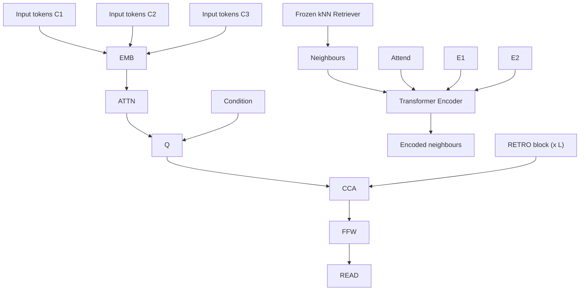
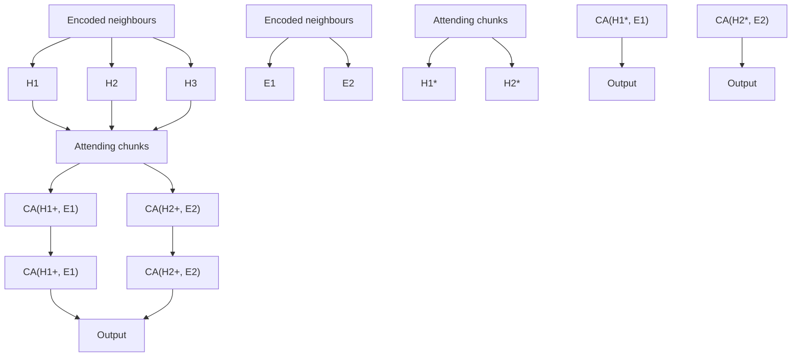

# Improving language models by retrieving from trillions of tokens

Sebastian Borgeaud $^{\dagger}$ , Arthur Mensch $^{\dagger}$ , Jordan Hoffmann $^{\dagger}$ , Trevor Cai, Eliza Rutherford, Katie Millican, George van den Driessche, Jean-Baptiste Lespiau, Bogdan Damoc, Aidan Clark, Diego de Las Casas, Aurelia Guy, Jacob Menick, Roman Ring, Tom Hennigan, Saffron Huang, Loren Maggiore, Chris Jones, Albin Cassirer, Andy Brock, Michela Paganini, Geoffrey Irving, Oriol Vinyals, Simon Osindero, Karen Simonyan, Jack W. Rae $^{\ddagger}$ , Erich Elsen $^{\ddagger}$ and Laurent Sifre $^{\dagger,\ddagger}$

All authors from DeepMind, $\dagger$ Equal contributions, $\ddagger$ Equal senior authorship

We enhance auto-regressive language models by conditioning on document chunks retrieved from a large corpus, based on local similarity with preceding tokens. With a 2 trillion token database, our Retrieval-Enhanced Transformer (RETRO) obtains comparable performance to GPT-3 and Jurassic-1 on the Pile, despite using 25× fewer parameters. After fine-tuning, RETRO performance translates to downstream knowledge-intensive tasks such as question answering. RETRO combines a frozen BERT retriever, a differentiable encoder and a chunked cross-attention mechanism to predict tokens based on an order of magnitude more data than what is typically consumed during training. We typically train RETRO from scratch, yet can also rapidly RETROfit pre-trained transformers with retrieval and still achieve good performance. Our work opens up new avenues for improving language models through explicit memory at unprecedented scale.

# 1. Introduction

Language modelling (LM) is an unsupervised task that consists of modelling the probability of text, usually by factorising it into conditional next-token predictions $p(x_{1},\ldots,x_{n})=\prod_{i}p(x_{i}|x_{<i})$ . Neural networks have proven to be powerful language models, first in the form of recurrent architectures (Graves, 2013; Jozefowicz et al., 2016; Mikolov et al., 2010) and more recently in the form of Transformers (Vaswani et al., 2017), that use attention to contextualise the past. Large performance improvements have come from increasing the amount of data, training compute, or model parameters. Transformers have been scaled from 100 million parameter models in seminal work to over hundred billion parameters (Brown et al., 2020; Radford et al., 2019) in the last two years which has led to models that do very well on a wide array of tasks in a zero or few-shot formulation. Increasing model size predictably improves performance on a wide range of downstream tasks (Kaplan et al., 2020). The benefits of increasing the number of parameters come from two factors: additional computations at training and inference time, and increased memorization of the training data.

In this work, we endeavor to decouple these, by exploring efficient means of augmenting language models with a massive-scale memory without significantly increasing computations. Specifically, we suggest retrieval from a large text database as a complementary path to scaling language models. Instead of increasing the size of the model and training on more data, we equip models with the ability to directly access a large database to perform predictions—a semi-parametric approach. At a high level, our Retrieval Transformer (RETRO) model splits the input sequence into chunks and retrieves text similar to the previous chunk to improve the predictions in the current chunk. Existing retrieval for language modelling work only considers small transformers (100 millions parameters) and databases of limited size (up to billions of tokens) (Guu et al., 2020; Khandelwal et al., 2020; Lewis et al., 2020; Yogatama et al., 2021). To our knowledge, our work is the first to show the benefits of scaling the retrieval database to trillions of tokens for large parametric language models. Our main


<details>
<summary>line</summary>

| Number of Non-Embedding Params | 172M | 425M | 1.5B |
| --- | --- | --- | --- |
| 200 | 0.83 | - | - |
| 400 | - | 0.92 | - |
| 1600 | - | - | 0.85 |
| 7500 | - | 0.65 | 0.78 |
</details>


<details>
<summary>line</summary>

| Retrieval dataset (B Tokens) | 7.5B  | Baseline | R     |
| ----------------------------- | ----- | -------- | ----- |
| 0                             | 0.8   | 0.9      | 1.0   |
| 1                             | 0.8   | 0.9      | 1.0   |
| 10                            | 0.8   | 0.9      | 1.0   |
| 100                           | 0.8   | 0.9      | 1.0   |
| 1000                          | 0.7   | 0.8      | 0.9   |
| 10000                         | 0.6   | 0.7      | 0.8   |
</details>


<details>
<summary>line</summary>

| Number of neighbors | RETRO [OFF] | RETRO [ON] |
| ------------------- | ----------- | ---------- |
| 0                   | 1.0         | 0.9        |
| 1                   | 0.85        | 0.8        |
| 3                   | 0.84        | 0.78       |
| 5                   | 0.83        | 0.77       |
| 10                  | 0.82        | 0.76       |
| 30                  | 0.83        | 0.77       |
| 50                  | 0.84        | 0.78       |
| 100                 | 0.85        | 0.79       |
</details>

Figure 1 | Scaling of RETRO. The performance gain of our retrieval models remains constant with model scale (left), and is comparable to multiplying the parametric model size by $\sim 10\times$ . The gain increases with the size of the retrieval database (middle) and the number of retrieved neighbours (right) on the C4 validation set, when using up to 40 neighbours. Past this, performance begins to degrade, perhaps due to the reduced quality. At evaluation RETRO can be used without retrieval data (RETRO[OFF]), bringing limited performance degradation compared to baseline transformers.

contributions are the following.

- We introduce RETRO, a retrieval-enhanced autoregressive language model ( $§2.2$ ). We use a chunked cross-attention module to incorporate the retrieved text ( $§2.4$ ), with time complexity linear in the amount of retrieved data. We show that retrieving based on a pre-trained frozen BERT model ( $§2.3$ ) works at scale, removing the need for training and updating a retriever network.   
- We show that our method scales well with model size and database size (Fig. 1): RETRO provides a constant gain for models ranging from 150M to 7B parameters, and RETRO can be improved at evaluation time by increasing the database size and the number of retrieved neighbours. Our largest model obtains state-of-the-art results on a range of downstream evaluation datasets including Wikitext103 (Merity et al., 2017) and the Pile (Gao et al., 2020) (§4). We show that RETRO can be fine-tuned to achieve competitive performance on downstream tasks such as question answering (§4.3).   
- We propose an evaluation aware of proximity of test documents with the training set ( $§2.6$ ), addressing the problem of test set leakage (Lee et al., 2021). This is relevant for all language models, and especially for retrieval-enhanced models since they have direct access to the training dataset during evaluation. Using this methodology, we show that the performance of RETRO comes from both explicit neighbour copying and general knowledge extraction ( $§4.4$ ).

# 2. Method

We design our retrieval-enhanced architecture to be capable of retrieving from a database with trillions of tokens. For this purpose, we retrieve at the level of contiguous token chunks instead of individual tokens which reduces storage and computation requirements by a large linear factor. Our method first constructs a key-value database, where values store raw chunks of text tokens and keys are frozen BERT embeddings (Devlin et al., 2019). We use a frozen model to avoid having to periodically re-compute embeddings over the entire database during training. Each training sequence is then split into chunks, which are augmented with their k-nearest neighbour retrieved from the database. An encoder-decoder architecture integrates retrieval chunks into the model's predictions. We summarize the RETRO architecture in Fig. 2, and detail it in this section. We end the section by introducing


<details>
<summary>flowchart</summary>


</details>


<details>
<summary>flowchart</summary>


</details>

Figure 2 | RETRO architecture. Left: simplified version where a sequence of length n = 12 is split into l = 3 chunks of size m = 4. For each chunk, we retrieve k = 2 neighbours of r = 5 tokens each. The retrieval pathway is shown on top. Right: Details of the interactions in the CCA operator. Causality is maintained as neighbours of the first chunk only affect the last token of the first chunk and tokens from the second chunk.

a new methodology to evaluate language models when an evaluation set is partially present in the training set.

# 2.1. Training dataset

We use a multi-lingual version of MassiveText (Rae et al., 2021) for both training and retrieval data. The dataset consists of text documents from multiple sources and multiple languages totalling over 5 trillion tokens (detailed in Table 1). Sequences are sampled from subsets of the training data, with sampling weights given in the right-most column of Table 1. We tokenize the dataset using SentencePiece (Kudo and Richardson, 2018) with a vocabulary of 128,000 tokens. During training (unless otherwise specified), we retrieve from 600B tokens from the training data. The training retrieval database is made of the same subsets as the training data, in proportion that matches the training sampling frequencies. During evaluation the retrieval database consists in the full union of these datasets, with the exception of books for which we use a sub-sample of $4\%$ . The evaluation retrieval database thus contains 1.75T tokens. To limit test set leakage, we compute the 13-gram Jaccard similarity between train and test documents using the MinHash scheme and remove all training documents with high similarity (0.8 or higher) to a validation or test set document. Additionally, we remove all validation and test articles from Wikitext103 (Merity et al., 2017) from our Wikipedia training data.

# 2.2. Retrieval-enhanced autoregressive token models

Our approach uses retrieval as a way to augment input examples at the granularity of small chunks of tokens. Formally, we consider sequences of integer tokens in $V = [1, \nu]$ , obtained using a text tokenizer $^{1}$ . We split each n-token-long example $X = (x_{1}, \ldots, x_{n})$ into a sequence of l chunks $(C_{1}, \ldots, C_{l})$ of size $m = \frac{n}{l}$ , i.e. $C_{1} \triangleq (x_{1}, \ldots, x_{m}), \ldots, C_{l} \triangleq (x_{n-m+1}, \ldots, x_{n}) \in \mathbb{V}^{m}$ . We use n = 2048 and m = 64. We augment each chunk $C_{u}$ with a set $\operatorname{RET}_{\mathcal{D}}(C_{u})$ of k neighbours from the database D. $RET_{D}$ (or

RET for brevity) is a non-trainable operator specified in §2.3. Token likelihoods are provided by a model, parameterized by $\theta$ , that takes as input both previous tokens and their retrieved neighbours. This defines the following retrieval-enhanced sequence log-likelihood:

$$
L (X | \theta , \mathcal {D}) \triangleq \sum_ {u = 1} ^ {l} \sum_ {i = 1} ^ {m} \ell_ {\theta} \left(x _ {(u - 1) m + i} \mid (x _ {j}) _ {j <   (u - 1) m + i}, (\mathrm{RET} _ {\mathcal {D}} (C _ {u ^ {\prime}})) _ {u ^ {\prime} <   u}\right). \tag {1}
$$

We set $\operatorname{RET}(C_{1}) = \emptyset$ , namely the likelihood of tokens from the first chunk does not depend on any retrieval data. This likelihood definition preserves autoregressivity: the probability of the i-th token of the u-th chunk, $x_{(u-1)m+i}$ , only depends on previously seen tokens $(x_{j})_{1 \leqslant j < (u-1)m+i}$ and on the data retrieved from the previous chunks $(\operatorname{RET}(C_{u'}))_{u' < u}$ . We can therefore directly sample with log-probability $\ell$ , where sampling within the chunk $C_{u}$ is conditioned on the neighbours $(\operatorname{RET}(C_{u'}))_{u' < u}$ . This makes retrieval-enhanced models directly comparable with the largest language models that are evaluated by sampling.

# 2.3. Nearest neighbour retrieval

Retrieval neighbours. Our database consists of a key-value memory. Each value consists of two contiguous chunks of tokens which we denote $[N,F]$ where N is the neighbour chunk which is used to compute the key, and F is its continuation in the original document. The corresponding key is the BERT embedding of N, averaged over time, that we denote $\mathrm{BERT}(N)$ . For each chunk C, we retrieve its approximate k-nearest neighbours from our key-value database using the $L_{2}$ distance on BERT embeddings $d(C,N)=||\mathrm{BERT}(C)-\mathrm{BERT}(N)||_{2}^{2}$ . The model receives the corresponding values $\mathrm{RET}(C)\triangleq([N^{1},F^{1}],\ldots,[N^{k},F^{k}])$ . Both neighbour chunks and their continuations provide meaningful improvements, as illustrated in our ablation study (Appendix D). We use a length 64 for both $N^{j}$ and $F^{j}$ , thus $\mathrm{RET}(C)$ has a shape of $k\times r$ with r=128. To avoid retrieving the chunk $C_{u+1}$ in the retrieval set $\mathrm{RET}(C_{u})$ , which would break causality during training, we filter out neighbours originating from the same document as the training sequence X.

For a database of T elements, we can query the approximate nearest neighbours in $O(\log T)$ time. We use the SCaNN library (Guo et al., 2020) to achieve this. This means that we can query our 2 trillion token database in 10 ms whilst evaluating or sampling from the model; this expense is amortized over a chunk length. Performing retrieval on-the-fly is too slow to keep up with the training calculations—we leverage the frozen aspect of the embedding operator BERT to precompute all approximate nearest neighbours and save the results as part of the data. In Fig. 9 in the Appendix, we show results where we only retrieve neighbours within Wikipedia. We find that neighbours tend to come from 2-3 links away from a given article whereas random articles are more than 5 links apart.

Table 1 | MassiveText. The last column indicates the sampling weight during training. The multilingual subsets include documents in 10 languages. The full breakdown is given in §A.1. 

<table><tr><td>Source</td><td>Token count (M)</td><td>Documents (M)</td><td>Multilingual</td><td>Sampling frequency</td></tr><tr><td>Web</td><td>977,563</td><td>1,208</td><td>Yes</td><td>55%</td></tr><tr><td>Books</td><td>3,423,740</td><td>20</td><td>No</td><td>25%</td></tr><tr><td>News</td><td>236,918</td><td>398</td><td>No</td><td>10%</td></tr><tr><td>Wikipedia</td><td>13,288</td><td>23</td><td>Yes</td><td>5%</td></tr><tr><td>GitHub</td><td>374,952</td><td>143</td><td>No</td><td>5%</td></tr></table>

# 2.4. RETRO model architecture

Our model relies on an encoder-decoder transformer architecture, integrating the retrieved data through a cross-attention mechanism as introduced in Vaswani et al. (2017). First, the retrieved tokens $\operatorname{RET}(C)$ are fed into an encoder Transformer, which computes the encoded neighbours set E. Denoting the intermediate activations by H, our transformer decoder then interleaves RETRO-blocks $\operatorname{RETRO}(H,E)$ and standard Transformer blocks $\operatorname{LM}(H)$ (the hyperparameter $P \subseteq [1,L]$ determines at which layers we use a RETRO-block). These blocks are built from three different residual operators with signature $R^{n \times d} \to R^{n \times d}$ : a fully-connected layer FFw, the standard sequence-level self-attention layer ATTN, and a chunked cross-attention layer $\operatorname{CCA}(\cdot,E)$ that incorporates information from the retrieval encoder:

$$
\operatorname{RETRO} (H, E) \triangleq \operatorname{FFW} \left(\operatorname{CCA} (\operatorname{ATTN} (H), E)\right), \quad \text { and } \quad \operatorname{LM} (H) \triangleq \operatorname{FFW} (\operatorname{ATTN} (H)) \tag {2}
$$

Since FFW, ATTN and CCA are all autoregressive operators whose output at position i only depends on $(h_{j})_{j\leqslant i}$ , any succession of RETRO and LM layers, followed by a token classification head defines an autoregressive log-likelihood (1). An overview of the model architecture is given in Algorithm 1 and in Fig. 2. We next describe the retrieval encoder and the chunked cross-attention layer in more detail, and explain how to sample from RETRO.

Encoding retrieval neighbours. For each chunk $C_{u}$ , the k retrieval neighbours $\operatorname{RET}(C_{u})$ are fed into a bi-directional transformer ENCODER, yielding the outputs $E_{u}^{j} \triangleq \operatorname{ENCODER}(\operatorname{RET}(C_{u})^{j}, H_{u}) \in \mathbb{R}^{r \times d'}$ , where $j \in [1, k]$ indexes each neighbour. The retrieval encoder is a non-causal transformer. It is conditioned on $H_{u}$ , the activations of chunk $C_{u}$ , through cross-attention layers; this allows the representations of the retrieval encoder to be modulated by the retrieving chunk in a differentiable way. More precisely, the encoding of the $j^{th}$ neighbour of the $u^{th}$ chunk, $\operatorname{RET}(C_{u})^{j}$ , depends on the attended activation $H_{u} \triangleq (h_{(u-1)m+i})_{i \in [1,m]} \in \mathbb{R}^{m \times d}$ of chunk $C_{u}$ at layer $\min(P)$ . All neighbours for all chunks are encoded in parallel, yielding a full encoded set $E \triangleq (E_{u}^{j})_{u \in [1,l], j \in [1,k]} \in \mathbb{R}^{l \times k \times r \times d'}$ . We denote $E_{u} \in R^{k \times r \times d'}$ as the encoded neighbours for chunk $u \in [1, l]$ .

Chunked cross-attention. To perform the CCA operation, we first split a given intermediate activation $H \in R^{n \times d}$ into l-1 attending chunks $\left(H_{u}^{+} \triangleq (h_{u m+i-1})_{i \in [1,m]} \in \mathbb{R}^{m \times d}\right)_{u \in [1,l-1]}$ , as depicted on the right of Fig. 2. $H_{u}^{+}$ holds the intermediary embeddings of the last token in chunk $C_{u}$ and of the first m-1 tokens in $C_{u+1}$ $^{2}$ . We compute the cross-attention between $H_{u}^{+}$ and $E_{u}$ —the encoded retrieval set obtained from chunk $C_{u}$ . Attention is computed across time and across neighbours simultaneously, as we merge the neighbour and time dimensions of $E_{u}$ before applying cross-attention. Since there is a notion of alignment between data chunks and retrieval neighbours, we use relative positional encodings as described in §B.1.2.

We concatenate the l-1 outputs of the per-chunk cross-attentions (each of shape $m \times d$ ) across time, and properly pad the result; we thus form the output activation $\mathrm{C}\mathsf{c}\mathsf{A}(H,E) \in \mathbb{R}^{n \times d}$ . Formally, for each chunk $C_{u}$ and for each token $i \in [1,m]$ we set

$$
\mathrm{CCA} (H, E) _ {u m + i - 1} \triangleq \mathrm{CA} (h _ {u m + i - 1}, E _ {u}), \tag {3}
$$

Algorithm 1: Overview of RETRO model architecture.

Hyperparam: P and $P_{enc}$ , indices of layers with cross-attention in the decoder and encoder respectively

Hyperparam: L and $L_{enc}$ , number of decoder layers and number of encoder layers.

Input: $X \in V^{n}$ : sequence of tokens. $(\operatorname{RET}(C_{u}))_{1 \leqslant u \leqslant l}$ : the retrieved neighbours

Output: $O \in R^{n \times |V|}$ : the output logits

def ENCODER(RET(Cu)1≤u≤l, H):
    (Hu)u∈[1,l] ← SPLIT(H)
    for j ∈ [1,k], u ∈ [1,l] do // Encoder shared across neighbours and chunks
    Eu^j = EMBenc(RET(Cu)^j) // May be shared with the decoder EMB
    for p' ∈ [1,Lenc] do
    Eu^j ← ATTNenc(Eu^j) // Bi-directional attention
    if p' ∈ Penc then
    | Eu^j ← CAenc(Eu^j, Hu)
    Eu^j ← FFWenc(Eu^j)
    return E

H ← EMB(X)
for p ∈ [1,L] do
    H ← ATTN(H) // Causal attention
    if p = min(P) then
    // The neighbour ENCODER is conditioned with the decoder activations of the last layer before the first cross-attention
    E = ENCODER(RET(Cu)1≤u≤l, H)
    if p ∈ P then
    | H ← CCA(H,E)
    H ← FFW(H)
O ← READ(H)

where CA is the cross-attention residual operator over time-concatenated encoded neighbours. We recall that this operator is defined in its simplest version by three parameter matrices $K \in R^{d \times c}$ , $Q \in R^{d \times c}$ and $V \in R^{d \times d}$ . For all $h \in R^{d}$ and $Y \in R^{T \times d}$ , we define

$$
\mathrm{CA} (h, Y) \triangleq \operatorname{softmax} \left(Y K Q ^ {T} h\right) Y V, \tag {4}
$$

where the softmax is performed on the second dimension and all products are matrix products. We use multi-head cross-attention, and add positional encodings to the softmax(see §B.1.2).

The first m-1 tokens cannot attend to any neighbour of a previous chunk; at these positions, we define $C_{CA}$ as the identity, setting $\mathrm{C}_{\mathrm{CA}}(H,E)_{j}\triangleq h_{j}$ for all tokens $j\in[1,m-1]$ . Finally, the last token $h_{lm}$ attends to the last retrieval set $E_{l}$ and we set $h_{lm}\triangleq\mathrm{C}_{\mathrm{A}}(h_{lm},E_{l})$ (not shown in Fig. 2). Listing 1 contains a simplified implementation of $C_{CA}$ . Note that chunked cross-attention is autoregressive: the output of $C_{CA}$ at position i depends on the sequence from tokens from 0 to i that is input to $C_{CA}$ .

With RETRO models, even though each CCA cross-attention attends only to the neighbours of the preceding chunk $\mathrm{RET}(C_{u-1})$ , the dependencies over previous neighbours are propagated via the self-attention operations. The activations of the $i^{th}$ token in the $u^{th}$ chunk therefore potentially depend upon the set of all previous neighbours $\mathrm{RET}(C_{u'})_{u'<u}$ , without incurring the quadratic cost of cross attending to that set.

Sampling. When sampling, at the end of a chunk $C_{u}$ , we use SCaNN to retrieve neighbours $\operatorname{RET}(C_{u})$ , based on the embedding $\operatorname{BERT}(C_{u})$ . The encoded neighbours $E_{u} = \operatorname{ENCODER}(\operatorname{RET}(C_{u}))$ are then used to condition the generation of the next chunk $C_{u+1}$ , which we do incrementally: overall the cost of sampling is thus quadratic in the size of the sampled sequence, as when sampling from regular Transformers; the added cost of retrieval is linear in the number of chunks l, and is negligible compared to the token sampling cost in practice.

# 2.5. Baseline Transformer architecture

We use a transformer (Vaswani et al., 2017) similar to the one described in (Radford et al., 2019), with some minimal changes: we replace LayerNorm with RMSNorm (Zhang and Sennrich, 2019) and use relative position encodings (Dai et al., 2019). As baselines, we train retrieval-free transformers with 132M, 368M, 1.3B and 7.0B parameters (embedding matrices are excluded from parameter counts). The hyperparameters we used are detailed in Table 2. All retrieval models use the same size encoder for the retrieval data, with $d' = 896$ and 2 layers, which roughly adds 19M parameters. The encoder uses relative positional encodings. The retrieval models contain one RETRO-block every 3 blocks, starting from layer 6. For our smallest model, CCA is applied in layers 6, 9 and 12 of the main pathway and also once for query conditioning in the encoder, which adds an additional 12M parameters. The relative number of extra parameters reduces as we increase the baseline model size. All models are implemented using JAX (Bradbury et al., 2018) and Haiku (Hennigan et al., 2020).

# 2.6. Quantifying dataset leakage exploitation

RETRO models may arguably benefit more easily from evaluation dataset leakage, i.e. the fact that we evaluate on data that were also present in the training set. To better understand how retrieval improves language modelling performance, we therefore quantify evaluation likelihood as a function of the overlap between the evaluation and training datasets.

The following approach can be used with any language model, and depends only on the frozen retriever system presented in §2.3. We split the evaluation sequences $(X_{i})_{i}$ into chunks of length $m \leq 64$ , and we see the training data as a set of chunks C. For each evaluation chunk $C \in C$ , we retrieve the 10 closest neighbours (of length up to 128) in the training data. We then compute the longest token substring common to both the evaluation chunk and its neighbours. This gives a number $s \in [0, m]$ . The value $r(C) = \frac{s}{m}$ , ranging from 0 (chunk never seen) to 1 (chunk entirely seen), gives a reliable indication of how much overlap there is between the evaluation chunk and the training data. For a given model, we then obtain the log-likelihood $\ell(C)$ of each chunk C, and the number of bytes $N(C)$ it encodes. We then consider the filtered bits-per-bytes of the model:

$$
\forall \alpha \in [ 0, 1 ], \quad C _ {\alpha} \triangleq \{C \in C, r (C) \leqslant \alpha \}, \quad \mathrm{bpb} (\alpha) \triangleq \frac {\sum_ {C \in C _ {\alpha}} \ell (C)}{\sum_ {C \in C _ {\alpha}} N (C)}, \tag {5}
$$

Table 2 | Number of parameters for our baseline and RETRO models, excluding embeddings, along with the corresponding hyperparameters. 

<table><tr><td>Baseline parameters</td><td>RETRO</td><td>d</td><td> $d_{\text{ffw}}$ </td><td># heads</td><td>Head size</td><td># layers</td></tr><tr><td>132M</td><td>172M (+30%)</td><td>896</td><td>3,584</td><td>16</td><td>64</td><td>12</td></tr><tr><td>368M</td><td>425M (+15%)</td><td>1,536</td><td>6,144</td><td>12</td><td>128</td><td>12</td></tr><tr><td>1,309M</td><td>1,451M (+11%)</td><td>2,048</td><td>8,192</td><td>16</td><td>128</td><td>24</td></tr><tr><td>6,982M</td><td>7,532M (+8%)</td><td>4,096</td><td>16,384</td><td>32</td><td>128</td><td>32</td></tr></table>

which correspond to the bits-per-bytes on the set of chunks that overlap less than $\alpha\%$ with the training chunks. Note that the full evaluation bit-per-bytes performance is recovered by bpb(1). The function bpb( $\cdot$ ) allows us to evaluate the impact of evaluation leakage over predictive performance: for low $\alpha$ , bpb( $\alpha$ ) gives an indication on how the model performs on chunks that are entirely new; the slope of bpb( $\cdot$ ) shows how much the model exploits evaluation leakage.

# 3. Related Work

We first review existing work on using retrieval for language modelling, and compare RETRO to these works (see Table 3). As we train RETRO models on a large dataset containing a substantial section of the internet, our work raises potential privacy, safety, and fairness issues that we then review.

# 3.1. Retrieval for language modelling

Brants et al. (2007) show that scaling the training data to trillions of tokens improves the machine translation performance of n-gram models. More recently, GPT-2 (Radford et al., 2019), GPT-3 (Brown et al., 2020), and Jurassic-1 (Lieber et al., 2021) show that scaling up language models leads to massive improvements on many downstream tasks. At the same time, Carlini et al. (2021) demonstrate that large-scale language models can perfectly memorise parts of their training data, suggesting that enhancing models with retrieval may lead to further improvements. However, significant leakage between train and test datasets (Lee et al., 2021; Lewis et al., 2021) makes comparing and evaluating large models trained on large datasets difficult, especially once retrieval capabilities over the training dataset are added.

Historically, information retrieval for text relies on inverted index matching such as TF-IDF and BM25 (Robertson and Zaragoza, 2009). Foundational work use latent topic modelling approaches like LDA (Blei et al., 2003) to identify relevant neighbours (Wei and Croft, 2006). Work in machine translation such as Zhang et al. (2018) and Gu et al. (2018) retrieve translation pairs based on edit distance between source sentences and guide the translation output using the closest retrieved target sentences. The retrieval database may also be structured — for example, Ahn et al. (2016) use a symbolic knowledge graph to improve an RNN language model.

With the success of deep learning, retrieving systems have partly switched to dense learned representations based on a neural network's activations. Continuous cache (Grave et al., 2017) adds probability mass to tokens for which previous activations resemble the current activation vector, extending the model's context to the local history. kNN-LM (Khandelwal et al., 2020) applies this idea to transformers and extends the retrieval database to English Wikipedia, resulting in

Table 3 | Comparison of RETRO with existing retrieval approaches. 

<table><tr><td></td><td># Retrieval tokens</td><td>Granularity</td><td>Retriever training</td><td>Retrieval integration</td></tr><tr><td>Continuous Cache</td><td> $O(10^3)$ </td><td>Token</td><td>Frozen (LSTM)</td><td>Add to probs</td></tr><tr><td>kNN-LM</td><td> $O(10^9)$ </td><td>Token</td><td>Frozen (Transformer)</td><td>Add to probs</td></tr><tr><td>SPALM</td><td> $O(10^9)$ </td><td>Token</td><td>Frozen (Transformer)</td><td>Gated logits</td></tr><tr><td>DPR</td><td> $O(10^9)$ </td><td>Prompt</td><td>Contrastive proxy</td><td>Extractive QA</td></tr><tr><td>REALM</td><td> $O(10^9)$ </td><td>Prompt</td><td>End-to-End</td><td>Prepend to prompt</td></tr><tr><td>RAG</td><td> $O(10^9)$ </td><td>Prompt</td><td>Fine-tuned DPR</td><td>Cross-attention</td></tr><tr><td>FID</td><td> $O(10^9)$ </td><td>Prompt</td><td>Frozen DPR</td><td>Cross-attention</td></tr><tr><td>EMDR2</td><td> $O(10^9)$ </td><td>Prompt</td><td>End-to-End (EM)</td><td>Cross-attention</td></tr><tr><td>RETRO (ours)</td><td> $O(10^{12})$ </td><td>Chunk</td><td>Frozen (BERT)</td><td>Chunked cross-attention</td></tr></table>

substantial improvements on Wikitext103 evaluation. Continuous cache and kNN-LM do not modify the underlying neural-network models, but interpolate at inference between the language model's output and distributions computed from retrieved tokens. These methods can therefore be plugged into any model without additional training, although this limits the model's ability to reason about the retrieved text. SPALM (Yogatama et al., 2021) addresses this limitation by adding an extra gating network to post-process the retrieved data; yet most of the network is unaffected by the retrieval during inference.

The retrieval representations may be trained directly instead of relying on a pre-trained model—retriever systems have been developed for this purpose, primarily on open-domain question answering. For example, DPR (Karpukhin et al., 2020) trains two BERT models (for queries and keys respectively) using a contrastive loss to align the representations of a question and of its answers. Lee et al. (2019) use an inverse cloze task to find semantic representations of passages for retrieval. These works differ from continuous cache and kNN-LM in that they embeds passages (or chunks) of text together, as opposed to each token individually. The retriever network is trained in isolation of the downstream task that uses the retrieval data. This potential issue is specifically addressed by REALM (Guu et al., 2020), which trains the retrieval system end-to-end to maximize the final training cross-entropy. This comes with the extra complexity of searching the database during training and periodically updating the embedding table, severely limiting the scale at which it can operate. RAG (Lewis et al., 2020) and FID (Izacard and Grave, 2021) build upon DPR to set the state of the art on question answering benchmarks by training encoder-decoder transformer models. More recently, EMDR $^{2}$ (Sachan et al., 2021) extends FID by using an expectation-maximization algorithm to train the retriever end-to-end and achieves state of the art results compared to similarly sized models.

In the open-domain dialogue setting, BlenderBot 2.0 (Komeili et al., 2021) learns to issue textual internet queries, outperforming dense retrieval methods when evaluated on a task measuring how close model responses are to those of humans. This involves collecting a dataset of human dialogues with associated search queries, which limits the scalability of this approach. Hashemi et al. (2020) introduce the Guided Transformer, a modified Transformer similar to RETRO, for document retrieval and clarifying question selection. Although effective on question answering and other tasks with strong conditioning, none of these methods are designed to model arbitrary text sequences, in contrast with RETRO.

RETRO shares components with kNN-LM and DPR in that it uses frozen retrieval representations. RETRO models longer sequences than QA examples; this requires to reason at a sub-sequence level, and to retrieve different documents for the different chunks of a sequence. Similar to FID, RETRO processes the retrieved neighbours separately in the encoder, and assemble them in the chunked cross-attention. This differs from e.g. REALM, that prepends retrieved documents to the prompt. Using chunks allows for repeated retrieval whilst generating a sequence as opposed to retrieving only once based on the prompt alone. Furthermore, retrieval is done during the whole pre-training process in RETRO, and is not simply plugged-in to solve a certain downstream task. Finally, previous methods based on dense query vectors use small models and retrieval datasets with less than 3B tokens (English Wikipedia). Table 3 summarizes the difference of RETRO with existing approaches.

# 3.2. Privacy, safety and fairness

Bender et al. (2021); Weidinger et al. (2021) highlight several dangers of large language models. Those stem from their ability to memorise training data, their high training cost, the static nature of their training data (Lazaridou et al., 2021), their tendency of amplifying inherent biases in the training data, and their ability to generate toxic language (Gehman et al., 2020). In this section we inspect these dangers, focusing on how retrieval augmented language models may exacerbate or

mitigate them.

Large language models can perfectly memorise parts of their training data (Carlini et al., 2021). When coupled with large training datasets gathered from the web or other sources, this has clear privacy and safety implications. Retrieval models such as RETRO that have access to the entire training dataset during inference exacerbate these privacy issues by being able to directly copy training data. However, retrieval systems offer a path towards mitigating these concerns via obliteration of the retrievable data at inference time. In addition, differential privacy training (Abadi et al., 2016) of retrieval models could guarantee that no private information is stored in the model weights, while individualisation on private data could be made by updating the retrieval database at inference time.

Due to their high training cost, re-training large language model regularly to incorporate new data, languages, and norms is prohibitively expensive. To keep retrieval models up-to-date, it may be sufficient to update the retrieval database, which is orders of magnitude cheaper than re-training a model from scratch. In addition to the benefits of updating models in terms of fairness and bias, simply training large language models has a significant energy cost (Schwartz et al., 2020; Strubell et al., 2019). Retrieval mechanisms offer a path to reducing the compute requirements needed to train and update language models that reach a certain performance.

Large language models are prone to generating toxic outputs, as shown in Gehman et al. (2020). Bender et al. (2021); Jo and Gebru (2020) advocate for the importance of better training data curation and documentation. Additionally, if portions of the training data are found to be eliciting biased or toxic outputs after training, retrieval allows for some correction, as the offending retrieval data can be retroactively filtered. However, it is also the case that without careful analysis and intervention, retrieval models may exacerbate biases that are present in the training data. Retrieval models can also add a further source of bias through the selection mechanism for retrieval documents. Further work in this area is required to better understand how retrieval affects the bias and toxicity of the model outputs.

Finally, samples from large models are difficult to interpret, making mitigating these issues all the more challenging (Belinkov et al., 2020; Jain and Wallace, 2019). Retrieval provides more insights in to the outputs of a model, as one can directly visualise or modify the neighbours that are being used. The examples in Table 6, 7, 20 and 21 illustrate how retrieval makes language models more factual and interpretable by providing more transparent outputs.

# 4. Results

We first report results on language modelling benchmarks. Second, we show how to RETROfit pre-trained Transformer language models into retrieval models with few additional FLOPs. Next, we report RETRO results on question answering. Finally, we report evaluation metrics with leakage filtering, to better understand the source of the gains with retrieval.

# 4.1. Language modelling

Datasets. We evaluate our models on C4 (Raffel et al., 2020), Wikitext103 (Merity et al., 2017), Curation Corpus (Curation, 2020), Lambada (Paperno et al., 2016) and the Pile (Gao et al., 2020). We also evaluate on a set of manually selected Wikipedia articles that were added or heavily edited in September 2021, months after our pre-training and retrieval dataset was collected (details are given in §A.2). We construct the dataset with articles from the “future” and manually remove new articles that strongly overlap documents in our training data. This guarantees that the evaluation documents are not leaked in our training data.

  
Figure 3 | Scaling with respect to model size. (a) LAMBADA top-1 accuracy. (b) Evaluation loss on curation corpus. (c) Perplexity on Wikitext103 valid. (d) Bits-per-byte on selected Wikipedia articles from September 2021.

For C4, Wikitext103, the Pile, and our Wikipedia dataset we evaluate the language modelling performance on entire documents and measure the bits-per-byte (bpb). We favour bits-per-byte over loss as it is tokenizer agnostic. We evaluate with a sequence length of 2048 tokens but use a stride of 1024 within documents to mitigate boundary effects. On Curation Corpus we concatenate the article, the “TL; DR:” string, and the summary, but only evaluate the bpb on the summary. For Lambada we evaluate the accuracy on the last word, using greedy generation.

Model scaling. In Fig. 1(left) and Fig. 3 we show the language modelling performance as we scale models from 150 million to 7 billion (non-embedding) parameters. We see that on all datasets, RETRO outperforms the baseline at all model sizes. Furthermore, we observe that improvements do not diminish as we scale the models. The performance is dataset dependent, with the largest gains on Wikitext103 and C4. Wikipedia articles and other web pages are similar to Wikitext103 documents, even if not exact copies ( $§4.4$ ), we thus obtain dramatic improvements on Wikitext103 as our retrieval model is able to directly exploit these overlaps. The smallest gains are for Curation Corpus, where RETRO only slightly outperforms the baseline. This is expected as Curation Corpus summaries are designed to only contain information from the source article and are not included in our retrieval database. On our “future” Wikipedia September 2021 dataset, we also observe consistent gains for all model sizes.

Data scaling. Fig. 1 (middle) shows how scaling the retrieval database at evaluation improves the language modelling performance. We observe dramatic gains as the retrieval data is increased from Wikipedia (4 billion tokens) to all of Massive text (1.7T tokens). Fig. 1(right) shows how performance scales as we increase the number of retrieved chunks. Despite being only trained with 2 neighbours, we see consistent improvements for all models when the number of neighbours is increased from 1 to 10. Furthermore, we observe that larger models are able to better utilise more neighbours: the 172M model improves with up to 10 neighbours, whereas the 7B model improves with up to 40 neighbours.

The Pile. We evaluate our 7B models on the Pile test sets $^{3}$ and compare against the 178B parameter Jurrasic-1 (Lieber et al., 2021) model and the 280B parameter Gopher (Rae et al., 2021) model. We do not compare against GPT-3 as it is outperformed by Jurassic-1 and Gopher on almost all subsets. Fig. 4 shows the relative improvements in bits-per-byte over our 7B transformer baseline for our


<details>
<summary>bar</summary>

| Dataset               | Jurassic-1 (178B) | Gopher (280B) | RETRO (7.5B) |
| --------------------- | ----------------- | ------------- | ------------ |
| dm_mathematics        | 12                | 2             | -            |
| ubuntu_ic            | 38                | 9             | -            |
| nih_exporter          | 9                 | 9             | 1            |
| arxiv                 | 7                 | 14            | 1            |
| uspto backgrounds     | 11                | 9             | 1            |
| opensubtitles        | 10                | 7             | 3            |
| philpapers            | 1                 | 9             | 6            |
| hackernews            | 10                | 7             | 12           |
| stackexchange          | 8                 | 11            | 13           |
| freelaw               | 10                | 12            | 14           |
| pubmed_abstracts      | 8                 | 9             | 17           |
| books3                | -3                | 10            | 20           |
| pile_cc               | 14                | 10            | 22           |
| pubmed_central        | -                 | 13            | 38           |
| gambenberg_pg_19      | -5                | 23            | 100          |
| github                | 21                | 18            | 105          |
</details>

Figure 4 | The Pile: Comparison of our 7B baseline against Jurassic-1, Gopher, and RETRO. We observe that the retrieval model outperforms the baseline on all test sets and outperforms Jurassic-1 on a majority of them, despite being over an order of magnitude smaller.

7.5B RETRO model, Jurassic-1 and Gopher. Jurassic-1 outperforms the baseline on all datasets except for books, likely due to the inclusion of books in our training data. Gopher and RETRO outperform the baseline on all test sets. Overall, RETRO 7.5B outperforms Jurassic-1 and Gopher on a majority of the test sets. On the dm\_mathematics and ubuntu\_irc subsets, our RETRO model does not outperform our 7B baseline and underperforms Jurassic-1. We hypothesise that the retrieved neighbours on these datasets are not helpful, due to a combination of what is in our retrieval dataset and the efficacy of the nearest-neighbour search.

Wikitext103. To validate our approach in a controlled setting, we compare our method with kNN-LM (Khandelwal et al., 2020) on the Wikitext103 dataset in Table 4. We train a baseline transformer on the training set of Wikitext103. This transformer has 24 layers, 1024 hidden units, 16 heads and a key size of 64, as in Baevski and Auli (2019). Our baseline does not have adaptive input, and our tokenizer has an open vocabulary, unlike Baevski and Auli (2019), which makes our baseline

Table 4 | Perplexities on Wikitext103. When using the Wikipedia dataset for retrieval, RETRO performs similarly to our implementation of kNN-LM. As we scale the retrieval dataset, RETRO performs much better. The perplexities for retrieving from full MassiveText are quite low, which is partly due to partial overlap with Wikitext103 not caught by our deduplication. 

<table><tr><td>Model</td><td>Retrieval Set</td><td>#Database tokens</td><td>#Database keys</td><td>Valid</td><td>Test</td></tr><tr><td>Adaptive Inputs (Baevski and Auli, 2019)</td><td>-</td><td>-</td><td>-</td><td>17.96</td><td>18.65</td></tr><tr><td>SPALM (Yogatama et al., 2021)</td><td>Wikipedia</td><td>3B</td><td>3B</td><td>17.20</td><td>17.60</td></tr><tr><td>kNN-LM (Khandelwal et al., 2020)</td><td>Wikipedia</td><td>3B</td><td>3B</td><td>16.06</td><td>16.12</td></tr><tr><td>Megatron (Shoeybi et al., 2019)</td><td>-</td><td>-</td><td>-</td><td>-</td><td>10.81</td></tr><tr><td>Baseline transformer (ours)</td><td>-</td><td>-</td><td>-</td><td>21.53</td><td>22.96</td></tr><tr><td>kNN-LM (ours)</td><td>Wikipedia</td><td>4B</td><td>4B</td><td>18.52</td><td>19.54</td></tr><tr><td>RETRO</td><td>Wikipedia</td><td>4B</td><td>0.06B</td><td>18.46</td><td>18.97</td></tr><tr><td>RETRO</td><td>C4</td><td>174B</td><td>2.9B</td><td>12.87</td><td>10.23</td></tr><tr><td>RETRO</td><td>MassiveText (1%)</td><td>18B</td><td>0.8B</td><td>18.92</td><td>20.33</td></tr><tr><td>RETRO</td><td>MassiveText (10%)</td><td>179B</td><td>4B</td><td>13.54</td><td>14.95</td></tr><tr><td>RETRO</td><td>MassiveText (100%)</td><td>1792B</td><td>28B</td><td>3.21</td><td>3.92</td></tr></table>

perplexities a bit higher. The full experiment details and hyperparameters are given in §C.2 and Table 11.

We re-implement kNN-LM with our tokenizer and baseline transformer to produce embeddings of size 1024 for every token in Wikitext103. kNN-LM has probabilities $p_{kNN-LM} = \lambda p_{kNN} + (1 - \lambda) p_{LM}$ with $p_{kNN}(n_k) \propto \exp(-\alpha d_k)$ . We tune $\lambda = 0.118$ and $\alpha = 0.00785$ on the validation set (Fig. 7) and report performance for these hyperparameters on both the validation and test set.

We fine-tune our baseline transformer into a RETRO model (Fig. 7), using the Wikitext103 training data and retrieving from Wikipedia with 2 neighbours. We only train the new weights, as explained in §4.2, and share the embedding weights between the encoder and the main pathway. This is necessary for Wikitext103 which is quite small, as training RETRO from scratch in this setting leads to over-fitting.

We evaluate the fine-tuned RETRO model with different retrieval sets. We use 10 neighbours at evaluation for both RETRO and kNN-LM. When retrieving from Wikipedia, we obtain results comparable to our kNN-LM implementation. Furthermore, scaling the retrieval database to MassiveText yields dramatic improvements, though this is partly due to leakage (see §4.4). For reproducibility, we also include results when retrieving from C4, which are close to previous state-of-the-art and comparable to using 10 % of MassiveText.

It is worth noting that kNN-LM requires 1024 floats for every token in the retrieval dataset, totalling 15 terabytes (Tb) for the 4 billion tokens in Wikipedia. kNN-LM and other token-level retrieval approaches therefore don't scale to retrieval databases with trillions of tokens such as MassiveText. In comparison, RETRO only requires 215Gb to index our Wikipedia dataset, and 93Tb for MassiveText. Inspecting the number of retrieval database entries in Table 4 makes it clear why retrieving at the chunk level is necessary when scaling to datasets with trillions of tokens.

# 4.2. RETRO-fitting baseline models

We extend baseline models into RETRO models by freezing the pre-trained weights and training only chunked cross-attention and neighbour encoder parameters (less than 10% of weights for the 7B model) in Fig. 5. This offers an efficient alternative path to enhance transformers with retrieval, requiring only 6 million sequences (3% of the pre-training sequences that we used). Additionally, by only training the new weights we ensure that when evaluated without retrieval, the original model performance is exactly maintained. RETROfitting models quickly surpasses the performance of baseline models and even achieves performance close to that of RETRO models trained from scratch. The experiment hyperparameters are given in §C.3.

# 4.3. Question answering

We fine-tune our retrieval models on the Natural Questions (Kwiatkowski et al., 2019) dataset to demonstrate that our retrieval pathway can be used to inject information from arbitrary data sources. We use the version $^{4}$ provided by Izacard and Grave (2021) which is augmented with the retrieved passages from DPR (Karpukhin et al., 2020). We fine-tune all the weights of our 7.5B pre-trained RETRO model for 25,000 steps using the top 20 retrieved passages. We format the data as “question: {question} \answer: {answer}” and left pad the data such that “answer:” coincides with the end of the first chunk of 64 tokens and thus aligns with the first retrieving chunk. The model has access to the question via the previous tokens in the sequence as well as the top 20 DPR Wikipedia passages and their titles via the chunked cross-attention mechanism.

  
Figure 5 | RETRO-fitting a baseline transformer. Any transformer can be fine-tuned into a retrieval-enhanced transformer by randomly initializing and training only the chunked cross-attention and retrieval encoder weights. Fine-tuning in this way quickly recovers and surpasses the non-retrieval performance, and almost achieves the same performance as training a retrieval model from scratch (shown by the arrow on the right hand side of each plot). We find good performance RETRO-fitting our models training on only 3% the number of tokens seen during pre-training.

The exact match scores are shown in Table 5 and the full fine-tuning details are given in §C.4. Our method is competitive with previous approaches such as REALM, RAG and DPR, but underperforms the more recent FID. In contrast with this work, we find that increasing the number of neighbours past 20 does not improve RETRO performance on this task. We hypothesise that the encoder-decoder structure of T5—the base model in FID—and the T5 pre-training objective leads to a model that relies more on the encoder output than RETRO, which is important in the QA setting. To compete with T5-finetuned models, future work should consider ways of forcing RETRO to rely further on the retrieval encoder output when producing tokens.

# 4.4. Relating retrieval performance to dataset leakage.

We report the filtered eval losses as detailed in §2.6 on C4, Curation Corpus and Wikitext103 in Fig. 6. On C4 and Wikitext103, for which there is leakage into the training set, the slope is negative for both baseline models and RETRO models. RETRO models exploit leakage more strongly than baseline models, as indicated by the more negative slope. This is due to its explicit ability to copy-paste existing training chunks to predict leaked evaluation chunks (see a qualitative example of this model behavior

Table 5 | Question answering results. Exact match accuracy on Natural Questions. 

<table><tr><td>Model</td><td>Test Accuracy</td></tr><tr><td>REALM (Guu et al., 2020)</td><td>40.4</td></tr><tr><td>DPR (Karpukhin et al., 2020)</td><td>41.5</td></tr><tr><td>RAG (Lewis et al., 2020)</td><td>44.5</td></tr><tr><td> $EMDR^2$  (Sachan et al., 2021)</td><td>52.5</td></tr><tr><td>FID (Izacard and Grave, 2021)</td><td>51.4</td></tr><tr><td>FID + Distill. (Izacard et al., 2020)</td><td>54.7</td></tr><tr><td>Baseline 7B (closed book)</td><td>30.4</td></tr><tr><td>RETRO 7.5B (DPR retrieval)</td><td>45.5</td></tr></table>

  
Figure 6 | Performance vs. longest common retrieval substring. Evaluation loss as a function of allowed longest common substring between evaluation data chunks and their nearest neighbours. Retrieval still helps when considering chunks with no more than 8 contiguous tokens overlapping with training dataset chunks.

on a Wikitext103 article in Table 19). On Curation Corpus, retrieval provides a constant offset, which is expected as there is by design no leakage between Curation Corpus and the training dataset.

On the other hand, RETRO outperforms baseline models at all leakage levels, down to $\alpha = 12.5\%$ . At this level, the loss is computed on chunks with less than 8 contiguous tokens shared with the closest matching chunk in the training dataset—this is a reasonable level of overlap at which we consider that there is no local leakage. Retrieval thus improves predictions on both chunks that are syntactically similar to chunks in the training set, and on chunks that are syntactically different from all training chunks. This points toward a non trivial RETRO capacity of generalizing based on both model parameters and retrieval database. Similar results are found on the Pile dataset (see Fig. 12, §F.3).

# 4.5. Using RETRO for sampling

We show examples of samples obtained using the 7.5B RETRO model in Table 6, Table 7 and Appendix E. For each chunk (the first one being the prompt), we juxtapose sampled chunks $C_{u}$ with retrieved neighbours $\mathrm{RET}(C_{u})$ . To give an indication of local overlap, we colour each sampled token in chunk $C_{u}$ based on the length of the longest common prefix (LCP) found in the retrieved chunks $\mathrm{RET}(C_{u-1})$ . Similarly, we colour the retrieved chunks based on the LCP in the sampled chunk. For the sample in Table 6, for which we chose the prompt, we observe that the retrieved chunks influence the sample as there are overlaps between the sampled tokens and neighbour tokens. Overall, retrieval reduces hallucinations (in line with the findings of Shuster et al. (2021)) and makes the model more knowledgeable, when comparing with samples produced with retrieval disabled. In the sample in Table 7, the model recognises that the prompt is the beginning of the first scene of Hamlet and leverages retrieval data to continue it with only a few mistakes. We provide further examples in Appendix E, including examples from the evaluation sets, as well as the detailed procedure used for colouring the tables.

# 5. Conclusion

We present Retrieval-Enhanced Transformers (RETRO), a method for modelling arbitrary text sequences whilst retrieving from databases with trillions of tokens—scaling the data available to models by an order of magnitude compared to what is typically consumed during training. RETRO models

gains do not diminish for models with up to at least 7B parameters, and correspond to non-retrieval models with 10× more parameters on certain datasets. On Wikitext103 and the Pile, RETRO outperforms previous models trained on large scale datasets. We also show that RETRO is competitive on retrieval-intensive downstream tasks such as question answering.

RETRO models are flexible and can be used without retrieval at evaluation and still achieve comparable performance to baseline models. Conversely, baseline models can be rapidly fine-tuned into RETRO models to obtain nearly the same performance as if trained from scratch. Careful analysis shows that only a modest fraction of the gains obtained by RETRO are due to test set leakage. In general, we caution for such leakage in large-scale language datasets and suggest further work in better understanding the role of test set leakage in the performance of large-scale language models.

Overall, our work demonstrates at an unprecedented scale that semi-parametric approaches can provide an orthogonal, more efficient approach than raw parameter scaling as we seek to build more powerful language models.

# Acknowledgements

We would like to thank Nikolai Grigorev, Marc'aurelio Ranzato, Cyprien de Masson d'Autume, Po-Sen Huang, Johannes Welbl, Lisa Anne Hendricks, Ethan Perez, Jeff Stanway, Eric Noland, Gregory Wayne, John Jumper, Julian Schrittwieser, Lorrayne Bennett, Devang Agrawal, Dani Yogatama, Susannah Young, Nando de Freitas, Demis Hassabis, and Koray Kavukcuoglu for their help, advice and reviews. Additionally, we would like to thank Zonglin Li, David Simcha, and the ScaNN developers for their help.

Table 6 | Sample - Beavers are interesting animals. The RETRO[OFF] sample quickly diverges to other animals while the RETRO[ON] sample tends to stay focused on the beaver topic due to neighbour conditioning. 

<table><tr><td>Prompt and sample of RETRO[OFF]</td><td>Prompt and sample of RETRO[ON] colored by LCP with RET(Cu-1)LCP = 0, 1, 2, 3,4,≥5</td><td>[Nu1,Fu1] colored by LCP with Cu+1LCP = 0, 1, 2, 3,4,≥5</td><td>[Nu2,Fu2] colored by LCP with Cu+1LCP = 0, 1, 2, 3,4,≥5</td></tr><tr><td>Beavers are interesting animals that live near rivers. They build</td><td>Beavers are interesting animals that live near rivers. They build</td><td>.Beavers build their lodges in pon ds they have created in wooded areas.Like many things in nature, there is a connection between creatures i n the wild.Beaver ponds cause tree s to drown, but the dead trees attra ct the great blue heron, which often return year after year. Over time, a beaver pond can attract more than 50 nests in a colony, called a rooke ry.An example of this can be found in the large pond off Bradford Road at Carter Fields near the Boxford l ine.Chris Leahy, an expert with th e Massachusetts Audubon Society who wrote</td><td>naw them into smaller sections and d rag them into the water.Engineers of the Pond Beavers are interesting animals because they change the hab itat in which they live. Beavers do this by blocking up streams to create ponds. Then they build their homes , called lodges, in these ponds. Bea vers&#x27; bodies make them well-suited for underwater building Special muscl es close off their noses, ears, and throats to keep the water out. Beave rs&#x27; broad tails act like rudders for steering. Their two very large, orange front teeth are used to gnaw down trees. They begin building their dam</td></tr><tr><td>dams to create ponds. Frogs are am phibians, so they can live in both l and and water. They have great camou flage to hide from predators. The G olden Retriever, or Golden, is a ver y big dog. They are very strong, and have a thick coat to help them live in</td><td>their houses called beaver dams in the riverbeds. They also live on lan d.Beavers use their strong teeth and strong jaws to cut down trees and branches to build their homes. They also use their teeth and jaws to chew up food. Beavers use their big, fl at tails to swim. They use</td><td>, then they mean that you are very busy. Beavers swim easily in streams, picking up rocks and sticks to buil d their dams. They gnaw at trees wit h their big front teeth to cut them down. Then they use parts of the tre es to build their houses.Beavers are clever builders. They know exactly what they need to build their beave r dams. They use mud from the stream to make their dams stay together. T hey use their tails to pat down the mud.Beavers put a snug room at the top of their dams for their babies. They store their food underwater. Be avers eat the bark from the</td><td>ar-like tail, and two protruding tee th that are strong enough to gnaw do wn trees. The beaver uses trees, bra nches, and mud to build dams across rivers and streams. These dams create a deep pool of water in which the beaver builds its home. A beaver home is called a lodge. A baby beaver o r &quot;kit&quot; remains in the family lodge until the age of two.Beaver fur, kn own as pelt, was once highly popular as a trim for hats and coats. How m ight the popularity of beaver fur co ntributed to the colonization of New York?wwwWw</td></tr><tr><td>cold areas. A kangaroo is an anima l that is very large. It can jump very high. They can run very fast. A meerkat is a small animal that lives in Africa. They live in colonies of up to a hundred of them. They can c limb trees very easily.</td><td>their sharp teeth to gnaw at rocks and cut trees. They use their flat tails to steer when they are swimming .In the winter, beavers have to buil d a house called a beaver lodge. Th ey build a house that is very strong .The walls are made of twigs. The ro of is made</td><td>, then they mean that you are very busy. Beavers swim easily in streams, picking up rocks and sticks to buil d their dams. They gnaw at trees wit h their big front teeth to cut them down. Then they use parts of the tre es to build their houses.Beavers are clever builders. They know exactly what they need to build their beave r dams. They use mud from the stream to make their dams stay together. T hey use their tails to pat down themud.Beavers put a snug room at the top of their dams for their babies. They store their food underwater. Be avers eat the bark from the</td><td>w at trees with their big front teet h to cut them down. Then they use pa rts of the trees to build their hous es.Beavers are clever builders. They know exactly what they need to buil d their beaver dams. They use mud f rom the stream to make their dams st ay together. They use their tails to pat down the mud.Beavers put a snug room at the top of their dams for their babies. They store their food underwater. Beavers eat the bark fro m the trees that they cut down!1. W hat is the main idea of the first paragraph?.2. What is the main idea of the second paragraph?</td></tr><tr><td>A mouse is a small mammal that lives on land. It is a very good climber and it can run very fast. Penguins are birds that live on Antarctica. T hey have a thick coat to keep them w arm. Rabbits are small animals that live in the ground. They</td><td>of branches and other tree parts. T hey also use their strong jaws to cut trees. They bring them to their ho use. They also use their sharp teeth to chew up the tree parts. They use their flat tails to swim to the top of their house. Then they use their teeth and jaws to chew up the tree</td><td></td><td></td></tr></table>

Table 7 | Sample - Hamlet, Act 1, Scene 1. The RETRO [OFF] sample has correct syntax but is hallucinated, and ends with repetition of one character (FRANCISCO Approach me not). The RETRO [ON] sample is the correct continuation of the original text, and is robust to formatting differences between our prompt and the retrieved data. 

<table><tr><td>Prompt and sample of RETRO[OFF]</td><td>Prompt and sample of RETRO[ON] colored by LCP with  $RET(C_u-1)$  $LCP = 0, 1, 2, 3,4, \geqslant 5$ </td><td> $[N_u^1, F_u^1]$  colored by LCP with  $C_{u+1}$  $LCP = 0, 1, 2, 3,4, \geqslant 5$ </td><td> $[N_u^2, F_u^2]$  colored by LCP with  $C_{u+1}$  $LCP = 0, 1, 2, 3,4, \geqslant 5$ </td></tr><tr><td>ACT I SCENE I. Elsinore. A platform before the castle. FRANCISCO at his post. Enter to himBERNARDO BERNARDO Who&#x27;s there? FRANCISCO Nay, answer me: stand, and unfold yourself. BERNARDO</td><td>ACT I SCENE I. Elsinore. A platform before the castle. FRANCISCO at his post. Enter to himBERNARDO BERNARDO Who&#x27;s there? FRANCISCO Nay, answer me: stand, and unfold yourself. BERNARDO</td><td>ACT I SCENE I. Elsinore. A platform before the castle. (FRANCISCO at his post. Enter to himBERNARDO) BERNARDO Who&#x27;s there? FRANCISCO Nay, answer me: stand, and unfold yourself. BERNARDO Long live the king! FRANCISCO Bernardo? BERNARDO He. FRANCISCO You come most carefully upon your hour. BERNARDO &#x27;Tis now struck twelve; get thee to bed, Francisco. FRANCISCO For this relief much thanks:&#x27;tis bitter cold, And I am sick at heart. BERNARDO Have you</td><td>&gt;ACT I SCENE I. Elsinore. A platform before the castle. FRANCISCO at his post. Enter to himBERNARDO BERNARDO Who&#x27;s there? FRANCISCO Nay, answer me: stand, and unfold yourself. BERNARDO Long live the king! FRANCISCO Bernardo? BERNARDO He. FRANCISCO You come most carefully upon your hour. BERNARDO Tis now struck twelve; get thee to bed, Francisco. FRANCISCO For this relief much thanks:&#x27;tis bitter cold, And I am sick at heart.</td></tr><tr><td>Who calls ? FRANCISCO I am the lord here; I, Francisco, that am sick of grief. [ Aside. BERNARDO The king ! FRANCISCO I am sick of that also. BERNARDO My lord ? FRANCISCO Do not approach me. BERNARDO</td><td>Long live the king! FRANCISCO Bernardo? BERNARDO He. FRANCISCO You come most carefully upon your hour. BERNARDO &#x27;Tis now struck twelve; get thee to bed, Francisco. FRANCISCO For this relief much thanks:&#x27;tis bitter cold, And I am sick at heart. B</td><td>Long live the king! FRANCISCO Bernardo? BERNARDO He. FRANCISCO You come most carefully upon your hour. BERNARDO &#x27;Tis now struck twelve; get thee to bed, Francisco. FRANCISCO For this relief much thanks:&#x27;tis bitter cold, And I am sick at heart.&lt;DOC&gt;romeoACT I PROLOGUE Two households, both alike in dignity, In fair Verona, where we lay our scene, From ancient grudge break to new mutiny.</td><td>live the king! FRANCISCO Bernardo? BERNARDO He. FRANCISCO You come most carefully upon your hour. BERNARDO &#x27;Tis now struck twelve: get thee to bed, Francisco. FRANCISCO For this relief much thanks:&#x27;tis bitter cold, And I am sick at heart. BERNARDO Have you had quiet guard? FRANCISCO Not a mouse stirring. BERNARDO Well, good night. If you do meet Horatio and Marcellus, The rivals2 of my watch, bid them make haste. FRANCISCO I think I hear them.— Stand, ho! who is there? EN</td></tr><tr><td>Francisco, I would speak with you. FRANCISCO Approach me not, but speak. BERNARDO Your hand, your voice FRANCISCO I will not hear thee speak. BERNARDO Francisco, your hand, I entre at thee. FRANCISCO Approach me not. BERNARDO Francisco FRANC</td><td>ERNARDO Have you had quiet guard? FRANCISCO Not a mouse stirring. BERNARDO Well, good night. If you do meet Horatio and Marcellus, The rivals of my watch, bid them make haste. FRANCISCO I think I hear them. Stand, ho! who is there? Enter</td><td>had quiet guard? FRANCISCO Not a mouse stirring. BERNARDO Well, good night. If you do meet Horatio and Marcellus, The rivals of my watch, bid them make haste. FRANCISCO I think I hear them. Stand, ho! Who&#x27;s there? (Enter HORATIO and MARCELUS) HORATIO Friends to this ground. MARCELLUS And liegement to the Dane. FRANCISCO Give you good night. MARCELLUS O, farewell, honest soldier: Who hath relieved you? FRANCISCO Bernardo has my place. Give you good night. (Exit</td><td>ARDO Have you had quiet guard? FRANCISCO Not a mouse stirring. BERNARDO Well, good night. If you do meet Horatio and Marcellus, The rivals2 of my watch, bid them make haste. FRANCISCO I think I hear them.— Stand, ho! who is there? ENTER HORATIO AND MARCELLUS, HORATIO Friends to this ground. MARCELLUS And liegement to the Dane.3 FRANCISCO Give you good night. MARCELLUS O, farewell, honest soldier: Who hath relieved you? FRANCISCO Bernardo hath my place. Give you good night</td></tr><tr><td>ISCO Approach me not. BERNARDO I have a letter FRANCISCO Approach me not. BERNARDO For the king. FRANCISCO Approach me not. BERNARDO There&#x27;s no treason in&#x27;t. FRANCISCO Approach me not. BERNARDO I will</td><td>HORATIO and MARCELLUS HORATIO Friends to this ground. MARCELLUS And liegement to the Dane. FRANCISCO Give you good night. MARCELLUS O, farewell, honest soldier: Who hath relieved you? FRANCISCO Bernardo hath my place. Give you good night.</td><td></td><td></td></tr></table>

# References

M. Abadi, A. Chu, I. Goodfellow, H. B. McMahan, I. Mironov, K. Talwar, and L. Zhang. Deep learning with differential privacy. In ACM SIGSAC Conference on Computer and Communications Security, 2016.   
S. Ahn, H. Choi, T. Pärnamaa, and Y. Bengio. A neural knowledge language model. arXiv preprint arXiv:1608.00318, 2016.   
A. Baevski and M. Auli. Adaptive input representations for neural language modeling. In International Conference on Learning Representations, 2019. URL https://openreview.net/forum?id=ByxZX20qFQ.   
Y. Belinkov, S. Gehrmann, and E. Pavlick. Interpretability and analysis in neural NLP. In Proceedings of the 58th Annual Meeting of the Association for Computational Linguistics: Tutorial Abstracts, pages 1–5, Online, July 2020. Association for Computational Linguistics. doi: 10.18653/v1/2020.acl-tutorials.1. URL https://aclanthology.org/2020.acl-tutorials.1.   
E. M. Bender, T. Gebru, A. McMillan-Major, and S. Shmitchell. On the dangers of stochastic parrots: Can language models be too big? In ACM Conference on Fairness, Accountability, and Transparency, 2021.   
D. M. Blei, A. Y. Ng, and M. I. Jordan. Latent Dirichlet Allocation. Journal of Machine Learning Research, 3(Jan):993–1022, 2003. URL https://jmlr.csail.mit.edu/papers/v3/blei03a.html.   
J. Bradbury, R. Frostig, P. Hawkins, M. J. Johnson, C. Leary, D. Maclaurin, G. Necula, A. Paszke, J. V. der Plas, S. Wanderman-Milne, and Q. Zhang. JAX: composable transformations of Python+NumPy programs, 2018. URL http://github.com/google/jax.   
T. Brants, A. C. Popat, P. Xu, F. J. Och, and J. Dean. Large Language models in machine translation. In Joint Conference on Empirical Methods in Natural Language Processing and Computational Natural Language Learning, pages 858–867, 2007.   
T. Brown, B. Mann, N. Ryder, M. Subbiah, J. D. Kaplan, P. Dhariwal, A. Neelakantan, P. Shyam, G. Sastry, A. Askell, S. Agarwal, A. Herbert-Voss, G. Krueger, T. Henighan, R. Child, A. Ramesh, D. Ziegler, J. Wu, C. Winter, C. Hesse, M. Chen, E. Sigler, M. Litwin, S. Gray, B. Chess, J. Clark, C. Berner, S. McCandlish, A. Radford, I. Sutskever, and D. Amodei. Language models are few-shot learners. In Advances in Neural Information Processing Systems, 2020. URL https://proceedings.neurips.cc/paper/2020/file/1457c0d6bfcb4967418bfb8ac142f64a-Paper.pdf.   
N. Carlini, F. Tramer, E. Wallace, M. Jagielski, A. Herbert-Voss, K. Lee, A. Roberts, T. Brown, D. Song, U. Erlingsson, A. Oprea, and C. Raffel. Extracting training data from large language models. Preprint, 2021.   
C. Consonni, D. Laniado, and A. Montresor. Wikilinkgraphs: a complete, longitudinal and multi-language dataset of the wikipedia link networks. In AAAI International Conference on Web and Social Media, volume 13, 2019.   
Curation. Curation corpus base, 2020.   
Z. Dai, Z. Yang, Y. Yang, J. Carbonell, Q. Le, and R. Salakhutdinov. Transformer-XL: Attentive language models beyond a fixed-length context. In Annual Meeting of the Association for Computational Linguistics, July 2019. URL https://aclanthology.org/P19-1285.

J. Devlin, M.-W. Chang, K. Lee, and K. Toutanova. BERT: Pre-training of deep bidirectional transformers for language understanding. In Conference of the North American Chapter of the Association for Computational Linguistics, June 2019. URL https://aclanthology.org/N19-1423.   
L. Gao, S. Biderman, S. Black, L. Golding, T. Hoppe, C. Foster, J. Phang, H. He, A. Thite, N. Nabeshima, S. Presser, and C. Leahy. The Pile: An 800GB dataset of diverse text for language modeling. arXiv preprint arXiv:2101.00027, 2020.   
S. Gehman, S. Gururangan, M. Sap, Y. Choi, and N. A. Smith. RealToxicityPrompts: Evaluating neural toxic degeneration in language models. In Conference on Empirical Methods in Natural Language Processing, Nov. 2020. URL https://aclanthology.org/2020.findings-emnlp.301.   
E. Grave, A. Joulin, and N. Usunier. Improving neural language models with a continuous cache. In International Conference on Learning Representations, 2017. URL https://openreview.net/forum?id=B184E5qee.   
A. Graves. Generating sequences with recurrent neural networks. arXiv preprint arXiv:1308.0850, 2013.   
J. Gu, Y. Wang, K. Cho, and V. O. Li. Search engine guided neural machine translation. In AAAI Conference on Artificial Intelligence, 2018.   
R. Guo, P. Sun, E. Lindgren, Q. Geng, D. Simcha, F. Chern, and S. Kumar. Accelerating large-scale inference with anisotropic vector quantization. In International Conference on Machine Learning, 2020. URL https://arxiv.org/abs/1908.10396.   
K. Guu, K. Lee, Z. Tung, P. Pasupat, and M. Chang. Retrieval augmented language model pre-training. In International Conference on Machine Learning, 2020.   
H. Hashemi, H. Zamani, and W. B. Croft. Guided transformer: Leveraging multiple external sources for representation learning in conversational search. In Proceedings of the 43rd International ACM SIGIR Conference on Research and Development in Information Retrieval, pages 1131–1140, 2020.   
T. Hennigan, T. Cai, T. Norman, and I. Babuschkin. Haiku: Sonnet for JAX, 2020. URL http://github.com/deepmind/dm-haiku.   
G. Izacard and E. Grave. Leveraging passage retrieval with generative models for open domain question answering. In Conference of the European Chapter of the Association for Computational Linguistics, Apr. 2021. URL https://aclanthology.org/2021.eacl-main.74.   
G. Izacard, F. Petroni, L. Hosseini, N. De Cao, S. Riedel, and E. Grave. A memory efficient baseline for open domain question answering. arXiv preprint arXiv:2012.15156, 2020.   
S. Jain and B. C. Wallace. Attention is not Explanation. In Proceedings of the 2019 Conference of the North American Chapter of the Association for Computational Linguistics: Human Language Technologies, Volume 1 (Long and Short Papers), pages 3543–3556, Minneapolis, Minnesota, June 2019. Association for Computational Linguistics. doi: 10.18653/v1/N19-1357. URL https://aclanthology.org/N19-1357.   
E. S. Jo and T. Gebru. Lessons from archives: Strategies for collecting sociocultural data in machine learning. In Proceedings of the 2020 Conference on Fairness, Accountability, and Transparency, pages 306–316, 2020.   
R. Jozefowicz, O. Vinyals, M. Schuster, N. Shazeer, and Y. Wu. Exploring the limits of language modeling. arXiv preprint arXiv:1602.02410, 2016.

J. Kaplan, S. McCandlish, T. Henighan, T. B. Brown, B. Chess, R. Child, S. Gray, A. Radford, J. Wu, and D. Amodei. Scaling laws for neural language models. CoRR, 2020. URL https://arxiv.org/abs/2001.08361.   
V. Karpukhin, B. Oguz, S. Min, P. Lewis, L. Wu, S. Edunov, D. Chen, and W.-t. Yih. Dense passage retrieval for open-domain question answering. In Conference on Empirical Methods in Natural Language Processing, Nov. 2020. URL https://aclanthology.org/2020.emnlp-main.550.   
U. Khandelwal, O. Levy, D. Jurafsky, L. Zettlemoyer, and M. Lewis. Generalization through memorization: Nearest neighbor language models. In International Conference on Learning Representations, 2020. URL https://openreview.net/forum?id=HklBjCEKvH.   
M. Komeili, K. Shuster, and J. Weston. Internet-augmented dialogue generation. arXiv preprint arXiv:2107.07566, 2021.   
T. Kudo and J. Richardson. Sentencepiece: A simple and language independent subword tokenizer and detokenizer for neural text processing. arXiv preprint arXiv:1808.06226, 2018.   
T. Kwiatkowski, J. Palomaki, O. Redfield, M. Collins, A. Parikh, C. Alberti, D. Epstein, I. Polosukhin, M. Kelcey, J. Devlin, K. Lee, K. N. Toutanova, L. Jones, M.-W. Chang, A. Dai, J. Uszkoreit, Q. Le, and S. Petrov. Natural Questions: a benchmark for question answering research. Transactions of the Association of Computational Linguistics, 7:452–466, Mar. 2019. URL https://aclanthology.org/Q19-1026.   
A. Lazaridou, A. Kuncoro, E. Gribovskaya, D. Agrawal, A. Liska, T. Terzi, M. Gimenez, C. de Masson d'Autume, S. Ruder, D. Yogatama, K. Cao, T. Kociský, S. Young, and P. Blunsom. Pitfalls of static language modelling. CoRR, 2021. URL https://arxiv.org/abs/2102.01951.   
K. Lee, M.-W. Chang, and K. Toutanova. Latent Retrieval for Weakly Supervised Open Domain Question Answering. In Annual Meeting of the Association for Computational Linguistic, June 2019. URL http://arxiv.org/abs/1906.00300.   
K. Lee, D. Ippolito, A. Nystrom, C. Zhang, D. Eck, C. Callison-Burch, and N. Carlini. Deduplicating training data makes language models better. arXiv preprint arXiv:2107.06499, 2021.   
P. Lewis, E. Perez, A. Piktus, F. Petroni, V. Karpukhin, N. Goyal, H. Küttler, M. Lewis, W.-t. Yih, T. Rocktäschel, S. Riedel, and D. Kiela. Retrieval-augmented generation for knowledge-intensive NLP tasks. In Advances in Neural Information Processing Systems, 2020. URL https://proceedings.neurips.cc/paper/2020/file/6b493230205f780e1bc26945df7481e5-Paper.pdf.   
P. Lewis, P. Stenetorp, and S. Riedel. Question and answer test-train overlap in open-domain question answering datasets. In Conference of the European Chapter of the Association for Computational Linguistics, Apr. 2021. URL https://aclanthology.org/2021.eacl-main.86.   
O. Lieber, O. Sharir, B. Lenz, and Y. Shoham. Jurassic-1: Technical details and evaluation. White Paper. AI21 Labs, 2021.   
I. Loshchilov and F. Hutter. Decoupled weight decay regularization. In International Conference on Learning Representations, 2019. URL https://openreview.net/forum?id=Bkg6RiCqY7.   
S. Merity, C. Xiong, J. Bradbury, and R. Socher. Pointer sentinel mixture models. In International Conference on Learning Representations, 2017. URL https://openreview.net/forum?id=Byj72udxe.

T. Mikolov, M. Karafiát, L. Burget, J. Cernocký, and S. Khudanpur. Recurrent neural network based language model. Interspeech, 2(3):1045–1048, 2010.   
D. Paperno, G. Kruszewski, A. Lazaridou, N. Q. Pham, R. Bernardi, S. Pezzelle, M. Baroni, G. Boleda, and R. Fernández. The LAMBADA dataset: Word prediction requiring a broad discourse context. In Annual Meeting of the Association for Computational Linguistics, Aug. 2016. URL https://aclanthology.org/P16-1144.   
A. Radford, J. Wu, R. Child, D. Luan, D. Amodei, and I. Sutskever. Language models are unsupervised multitask learners. Preprint, 2019.   
J. Rae, S. Borgeaud, T. Cai, K. Millican, J. Hoffmann, F. Song, J. Aslanides, S. Henderson, R. Ring, S. Young, E. Rutherford, T. Hennigan, J. Menick, A. Cassirer, R. Powell, G. van den Driessche, L. A. Hendricks, M. Rauh, P.-S. Huang, A. Glaese, J. Welbl, S. Dathathri, S. Huang, J. Uesato, J. Mellor, I. Higgins, A. Creswell, N. McAleese, A. Wu, E. Elsen, S. Jayakumar, E. Buchatskaya, D. Budden, E. Sutherland, K. Simonyan, M. Paganini, L. Sifre, L. Martens, X. L. Li, A. Kuncoro, A. Nematzadeh, E. Gribovskaya, D. Donato, A. Lazaridou, A. Mensch, J.-B. Lespiau, M. Tsimpoukelli, N. Grigorev, D. Fritz, T. Sottiaux, M. Pajarskas, T. Pohlen, Z. Gong, D. Toyama, C. de Masson d'Autume, Y. Li, T. Terzi, V. Mikulik, I. Babuschkin, A. Clark, D. de Las Casas, A. Guy, J. Bradbury, M. Johnson, B. Hechtman, L. Weidinger, I. Gabriel, W. Isaac, E. Lockhart, S. Osindero, L. Rimell, C. Dyer, O. Vinyals, K. Ayoub, J. Stanway, L. Bennett, D. Hassabis, K. Kavukcuoglu, and G. Irving. Scaling language models: Methods, analysis & insights from training Gopher. arXiv submission, 2021.   
C. Raffel, N. Shazeer, A. Roberts, K. Lee, S. Narang, M. Matena, Y. Zhou, W. Li, and P. J. Liu. Exploring the limits of transfer learning with a unified text-to-text transformer. Journal of Machine Learning Research, 21(140):1–67, 2020. URL http://jmlr.org/papers/v21/20-074.html.   
S. Rajbhandari, J. Rasley, O. Ruwase, and Y. He. Zero: Memory optimizations toward training trillion parameter models. In IEEE International Conference for High Performance Computing, Networking, Storage and Analysis, 2020.   
S. Robertson and H. Zaragoza. The probabilistic relevance framework: BM25 and beyond. Foundations and Trends in Information Retrieval, 3:333–389, Jan 2009.   
D. S. Sachan, S. Reddy, W. Hamilton, C. Dyer, and D. Yogatama. End-to-end training of multi-document reader and retriever for open-domain question answering. arXiv preprint arXiv:2106.05346, 2021.   
R. Schwartz, J. Dodge, N. A. Smith, and O. Etzioni. Green AI. Communications of the Association for Computing Machinery, 63(12):54–63, Nov. 2020.   
M. Shoeybi, M. Patwary, R. Puri, P. LeGresley, J. Casper, and B. Catanzaro. Megatron-LM: Training multi-billion parameter language models using model parallelism. CoRR, 2019. URL http://arxiv.org/abs/1909.08053.   
K. Shuster, S. Poff, M. Chen, D. Kiela, and J. Weston. Retrieval augmentation reduces hallucination in conversation. arXiv:2104.07567 [cs], Apr. 2021. URL http://arxiv.org/abs/2104.07567.   
E. Strubell, A. Ganesh, and A. McCallum. Energy and policy considerations for deep learning in NLP. In Association for Computational Linguistics, July 2019. URL https://aclanthology.org/P19-1355.   
A. Vaswani, N. Shazeer, N. Parmar, J. Uszkoreit, L. Jones, A. N. Gomez, L. u. Kaiser, and I. Polosukhin. Attention is all you need. In Advances in Neural Information Processing Systems, 2017. URL https://proceedings.neurips.cc/paper/2017/file/3f5ee243547dee91fbd053c1c4a845aa-Paper.pdf.

X. Wei and W. B. Croft. LDA-based document models for ad-hoc retrieval. In ACM SIGIR International Conference on Research and Development in Information Retrieval, 2006. URL http://portal.acm.org/citation.cfm?doid=1148170.1148204.   
L. Weidinger, I. Gabriel, C. Griffin, M. Rauh, J. Uesato, J. Mellor, W. Isaac, P.-S. Huang, L. A. Hendricks, M. Cheng, B. Balle, J. Haas, C. Biles, L. Rimell, W. Hawkins, M. Glaese, A. Kasirzadeh, Z. Kenton, S. Brown, A. Birhane, T. Stepleton, G. Irving, and S. Legassick. Ethical and social risks of harm from language models. arXiv submission, 2021.   
D. Yogatama, C. de Masson d'Autume, and L. Kong. Adaptive semiparametric language models. Transactions of the Association for Computational Linguistics, 9:362–373, 2021.   
B. Zhang and R. Sennrich. Root mean square layer normalization. In Advances in Neural Information Processing Systems, 2019. URL https://proceedings.neurips.cc/paper/2019/file/1e8a19426224ca89e83cef47f1e7f53b-Paper.pdf.   
J. Zhang, M. Utiyama, E. Sumita, G. Neubig, and S. Nakamura. Guiding neural machine translation with retrieved translation pieces. In Conference of the North American Chapter of the Association for Computational Linguistics, 2018.

# A. Datasets

We provide a full description of MassiveText and of our extract of recent Wikipedia articles.

# A.1. Full description of MassiveText

The full break down of MassiveText by source and languages is given in Table 8. For a full description and analysis of MassiveText, see Rae et al. (2021).

<table><tr><td>Source</td><td>Language</td><td>Token count (M)</td><td>Documents</td><td>Sampling weight</td></tr><tr><td rowspan="10">Web</td><td>En</td><td>483,002</td><td>604,938,816</td><td>0.314</td></tr><tr><td>Ru</td><td>103,954</td><td>93,004,882</td><td>0.033</td></tr><tr><td>Es</td><td>95,762</td><td>126,893,286</td><td>0.033</td></tr><tr><td>Zh</td><td>95,152</td><td>121,813,451</td><td>0.033</td></tr><tr><td>Fr</td><td>59,450</td><td>76,612,205</td><td>0.033</td></tr><tr><td>De</td><td>57,546</td><td>77,242,640</td><td>0.033</td></tr><tr><td>Pt</td><td>44,561</td><td>62,524,362</td><td>0.033</td></tr><tr><td>It</td><td>35,255</td><td>42,565,093</td><td>0.033</td></tr><tr><td>Sw</td><td>2,246</td><td>1,971,234</td><td>0.0044</td></tr><tr><td>Ur</td><td>631</td><td>455,429</td><td>0.0011</td></tr><tr><td>Books</td><td>En</td><td>3,423,740</td><td>20,472,632</td><td>0.25</td></tr><tr><td>News</td><td>En</td><td>236,918</td><td>397,852,713</td><td>0.1</td></tr><tr><td rowspan="10">Wikipedia</td><td>En</td><td>3,977</td><td>6,267,214</td><td>0.0285</td></tr><tr><td>De</td><td>2,155</td><td>3,307,818</td><td>0.003</td></tr><tr><td>Fr</td><td>1,783</td><td>2,310,040</td><td>0.003</td></tr><tr><td>Ru</td><td>1,411</td><td>2,767,039</td><td>0.003</td></tr><tr><td>Es</td><td>1,270</td><td>2,885,013</td><td>0.003</td></tr><tr><td>It</td><td>1,071</td><td>2,014,291</td><td>0.003</td></tr><tr><td>Zh</td><td>927</td><td>1,654,772</td><td>0.003</td></tr><tr><td>Pt</td><td>614</td><td>1,423,335</td><td>0.003</td></tr><tr><td>Ur</td><td>61</td><td>344,811</td><td>0.0001</td></tr><tr><td>Sw</td><td>15</td><td>58,090</td><td>0.0004</td></tr><tr><td>Github</td><td>-</td><td>374,952</td><td>142,881,832</td><td>0.05</td></tr><tr><td>Total</td><td>-</td><td>5,026,463</td><td>1,792,260,998</td><td>1</td></tr></table>

Table 8 | MassiveText dataset. The final column indicates the sampling weight for each dataset during training. For the retrieval database, the entire dataset is used, with the exception of books for which we use a sub-sample of 4%.

# A.2. Wikipedia September 2021

We create an evaluation dataset consisting of 23 Wikipedia articles that were added or heavily edited in September 2021, after we collected our training dataset. In addition, we filter out articles that rely too heavily on templated content, using the method detailed in §2.6 to identify articles with chunks that have a high overlap with their neighbours. Fig. 10 show that little overlap remains between our test dataset and the retrieved neighbours from the training dataset. The full list of included articles is given in Table 9.

Table 9 | Full set of articles included in our Wikipedia Sept. 2021 evaluation dataset. 

<table><tr><td>Megan Rohrer</td><td>Aakashavaani</td></tr><tr><td>Emma Raducanu</td><td>Junior Eurovision Song Contest 2021</td></tr><tr><td>Ambra Sabatini</td><td>Pavilion Bukit Jalil</td></tr><tr><td>WhyDonate</td><td>Blake Desjarlais</td></tr><tr><td>The Juggernaut (company)</td><td>2021 All-Ireland Senior Football Championship Final</td></tr><tr><td>Angela Diaz</td><td>Drift-barrier hypothesis</td></tr><tr><td>2020 Summer Paralympics</td><td>Venomics</td></tr><tr><td>2021 Afghan protests</td><td>Great Circle (novel)</td></tr><tr><td>Rexh Xhakli</td><td>Hurricane Ida</td></tr><tr><td>Julia Laskin</td><td>2021 Montenegrin episcopal enthronement protests</td></tr><tr><td>Cuijk</td><td>At War With the Silverfish</td></tr><tr><td>Ghoubet Wind Power Station</td><td></td></tr></table>

We first parse articles using mwparserfromhell $^{5}$ . We then remove sections with the following titles: “references”, “external links”, “sources”, “further reading”, “see also”, “citations”, and “note”. In the remaining sections, we remove Wikilinks and remove the following templates: “reflist”, “notelist”, “notelist-ua”, “notelist-lr”, “notelist-ur”, and “notelist-lg”. We also exclude objects with the “ref” or “table” tag and clean the remaining text with the strip\_code function. Finally, we concatenate the title and all the sections and use $\n\n$ to delimitate them.

# B. Details on the retrieval architecture

We give details on the RETRO architecture, and on the fine-tuning procedure we use for RETROfitting existing language models.

# B.1. RETRO architecture and implementation

# B.1.1. Feed-forward architecture

As mentioned in the main text, the overall encoder-decoder architecture is fully feed-forward. We start with a sequence $X \in \mathbb{V}^n = (C_u)_{1 \leqslant u \leqslant l}$ , and its pre-computed neighbours $(\text{RET}(C_u))_{1 \leqslant u \leqslant l}$ and returns logits in $\mathbb{R}^{n \times |\mathbb{V}|}$ . Along with ATTN, FFW, CCA and CA operators introduced in the main text, we define the decoder embedding layer $\text{EMB}: \mathbb{V}^n \to \mathbb{R}^{n \times d}$ , the SPLIT operator that extracts chunked intermediary embeddings $\text{SPLIT}(H) \triangleq (H_u)_{1 \leqslant u \leqslant l} \in \mathbb{R}^{l \times m \times d}$ and the read-out layer $\text{READ}: \mathbb{R}^{n \times d} \to \mathbb{R}^{n \times |\mathbb{V}|}$ . We then describe the forward pass in Algorithm 1. In addition to the usual Transformer ones, RETRO architecture hyperparameters involves the layer indices $P_{\text{enc}}$ and $P$ , at which the encoder and the decoder perform cross-attention.

# B.1.2. Relative positional encoding in the chunked cross-attention layer

The CA operator uses relative positional logits, that are computed from a specific relative distance separating data tokens from retrieval tokens. Indeed, we expect any retrieval neighbour $\mathrm{RET}(C_{u})^{j}$ and the chunk $C_{u}$ to be relatively well aligned, and assume that they start at the same position. Therefore, when computing $\mathrm{CA}(H_{u}^{+}, E_{u})$ , we set the distance between the data token $i \in [1, l]$ of chunk $C_{u}^{+}$ and

the retrieval token $i' \in [1, 2l]$ of $\operatorname{RET}(C_{u})^{j}$ to be

$$
d (i, i ^ {\prime}) \triangleq i - i ^ {\prime} + l - 1. \tag {6}
$$

When computing the encoder cross-attentions $\mathrm{CA}(\mathrm{RET}(C_{u})^{j}, H_{u})$ , we set the distance between the retrieval token $i' \in [1, 2l]$ and the data token $i \in [1, l]$ to be

$$
d _ {\text { enc }} (i ^ {\prime}, i) \triangleq i ^ {\prime} - i. \tag {7}
$$

Positional logits are obtained as a linear transform of a cosine vector computed from $(d(i,i'))_{i,i'}$ , and are added to content logits, as in a regular self-attention block.

# B.1.3. Chunked cross-attention implementation

Our implementation of the CCA operator, shown in Listing 1, is based on a vectorized application of a cross-attention layer. For simplicity, we omit the multi-head attention logic and use the simplest Q,K,V attention. We omit relative positional logits computation, described above.

# B.1.4. Optional sharing of embedding matrices

We use disjoint embeddings for the encoder and decoder by default, which allows us to use a different dimensionality for the encoder (typically kept at $d_{ENC} = 896$ ) and for the decoder (that we scale up to d = 8192). It is possible to share the embeddings, with little difference in training, as we show in the ablation section.

# B.2. Baseline to RETRO model fine-tuning

As shown in Fig. 5, we found that we were able to take a pre-trained baseline transformer and add RETRO through fine-tuning. In all cases, we froze all weights from pre-training and freshly initialised the retrieval encoder and cross-attention weights. In all cases, the cross-attention is added every third layer starting at layer six. The learning rate for the three smaller models was set to $2 \times 10^{-4}$ and half that for the larger model. We experimented with allowing the entire model to resume training during fine-tuning but consistently found that the best approach was to freeze the pre-trained model. This kept the retrieval-off performance frozen whereas when all weights were tuned the retrieval off performance would degrade.

# C. Training details and hyperparameters

We provide the hyperparameters used in the various experiments of §4.

# C.1. Language model pre-training

In Table 10, we show the hyperparameters of the different models we train. In all cases, we train for 419,430,400,000 training tokens. The three smaller models are trained with a batch size of 256 and the largest model is trained with a batch size of 1024. The minimum learning rate is set to 0.1 times the maximum learning rate, which is shown in Table 10. The learning rate is decayed using a cosine cycle length that matches the total number of training tokens. All models are trained using AdamW (Loshchilov and Hutter, 2019) with a weight decay parameter of 0.1. The learning rate linearly increases from $10^{-7}$ to the maximum learning rate over the first 750 steps of training. All models use ZeRO to shard the optimiser state (Rajbhandari et al., 2020). Additional infrastructure details can be found in Rae et al. (2021).

Listing 1 | Jax implementation of the chunked cross attention, simplified.   
```python
n = 128 # Sequence length
m = 16 # Chunk length
r = 32 # Retrieval length
k = 4 # Number of neighbours
d = 16 # Embedding size
l = n // m # Number of chunks

# Parameters
Q = jnp.zeros((d, d))
K = jnp.zeros((d, d))
V = jnp.zeros((d, d))

def relative_positional_encodings(attending_length, attended_length):
    # Classical relative positional encodings
    ...

def cross_attention(chunk, neighbour):
    m, d = chunk.shape
    r, d = neighbour.shape
    queries = chunk @ Q
    keys = neighbour @ K
    logits = queries @ keys.T
    values = neighbour @ V
    return logits, values

def multi_neighbour_cross_attention(chunk, neighbours):
    m, d = chunk.shape
    k, r, d = neighbours.shape

    logits, values = jnp.vectorize(cross_attention,
    signature=' (m, d), (r, d) -> (m, r), (r, d)')(chunk, neighbours)
    assert logits.shape == (k, m, r)
    assert values.shape == (k, r, d)
    logits += relative_positional_encodings(m, r)[None, :, :]
    logits = jnp.moveaxis(logits, 0, -1).reshape((m, r * k))
    values = jnp.moveaxis(values, 0, 1).reshape((r * k, d))
    return jax.nn.softmax(logits) @ values

def multi_chunk_cross_attention(observation, neighbours):
    attending_chunks = jnp.pad(observation[m-1:], ((0, m - 1), (0, 0)),
    mode='constant').reshape(l, m, d)
    chunked_output = jnp.vectorize(multi_neighbour_cross_attention,
    signature=' (m, d), (k, r, d) -> (m, d)')(attending_chunks, neighbours)
    assert chunked_output.shape == (l, m, d)
    output = jnp.pad(chunked_output.reshape(n, d),
    ((m - 1, 0), (0, 0)),
    mode='constant')[:n]
    return output

observation = jnp.zeros((n, d)) # Input
neighbours = jnp.zeros((l, k, r, d))

h = multi_chunk_cross_attention(observation, neighbours)

assert h.shape == (n, d) # Output 
```

Table 10 | RETRO model hyperparameters, along with the size of the decoder. 

<table><tr><td>Baseline</td><td> $d_{model}$ </td><td> $d_{ffw}$ </td><td># heads</td><td>Head size</td><td># layers</td><td>P</td><td> $P_{\text{ENC}}$ </td><td>Max LR</td></tr><tr><td>247M</td><td>896</td><td>3584</td><td>16</td><td>64</td><td>12</td><td>[6, 9, 12]</td><td>[1]</td><td> $2 \times 10^{-4}$ </td></tr><tr><td>564M</td><td>1536</td><td>6144</td><td>12</td><td>128</td><td>12</td><td>[6, 9, 12]</td><td>[1]</td><td> $2 \times 10^{-4}$ </td></tr><tr><td>1,574M</td><td>2048</td><td>8192</td><td>16</td><td>128</td><td>24</td><td>[9, 12, ..., 24]</td><td>[1]</td><td> $2 \times 10^{-4}$ </td></tr><tr><td>7,505M</td><td>4096</td><td>16384</td><td>32</td><td>128</td><td>32</td><td>[9, 12, ..., 32]</td><td>[1]</td><td> $1 \times 10^{-4}$ </td></tr></table>

Table 11 | Hyperparameters for the Wikitext103 experiments presented in Table 4. We use the same learning rate schedule for the baseline and the RETRO-fitting. For RETRO-fitting, we reset the schedule i.e. the schedule starts from step 0, not from step 35,000.

<table><tr><td rowspan="6">Model</td><td>Number of layers</td><td>18</td></tr><tr><td>d</td><td>1024</td></tr><tr><td> $d_{\text{FFW}}$ </td><td>4096</td></tr><tr><td>Key size</td><td>64</td></tr><tr><td>Value size</td><td>64</td></tr><tr><td>Number of heads</td><td>16</td></tr><tr><td rowspan="4">Training data</td><td>Dataset</td><td>Wikitext103train</td></tr><tr><td>Sequence length</td><td>3072</td></tr><tr><td>Batch size</td><td>128</td></tr><tr><td>Tokenizer vocabulary size</td><td>128,000</td></tr><tr><td rowspan="5">Optimisation</td><td>optimiser</td><td>Adam</td></tr><tr><td>Adam&#x27;s  $\beta_1$ </td><td>0.9</td></tr><tr><td>Adam&#x27;s  $\beta_2$ </td><td>0.95</td></tr><tr><td>Adam&#x27;s  $\varepsilon$ </td><td>1e-8</td></tr><tr><td>Dropout rate</td><td>0.25</td></tr><tr><td rowspan="5">Schedule</td><td>Learning rate start</td><td>1e-7</td></tr><tr><td>Learning rate max</td><td>2.5e-4</td></tr><tr><td>Learning rate min</td><td>2e-5</td></tr><tr><td>Warmup steps</td><td>4,000</td></tr><tr><td>Cosine cycle steps</td><td>100,000</td></tr><tr><td>Evaluation</td><td>Overlapping proportion</td><td>87.5 %</td></tr></table>

# C.2. Wikitext103 comparison

We provide more details on our Wikitext103 results presented in §4.1 and Table 4. We train a baseline transformer on the Wikitext103 training set with the hyperparameters presented in Table 11. The learning rate ramps linearly from $1 \times 10^{-7}$ to $2.5 \times 10^{-4}$ in the first 4,000 steps, then decays to $2 \times 10^{-5}$ at 100,000 steps using a cosine schedule. The baseline checkpoint at step 35,000 has the lowest perplexity on Wikitext103 valid, of 21.58, for overlapping proportion of $75\%$ (sliding window evaluation that only uses probabilities for tokens that have at least $75\%$ of the sequence length of context, when available). We use this checkpoint for all our baseline and kNN-LM numbers reported in Table 4, except that Table 4 reports for an overlapping proportion of $87.5\%$ , which slightly lowers the perplexity of our baseline to 21.53 on Wikitext103 valid.

We also use the 35,000 step baseline checkpoint as initialization for a RETROfit, which otherwise uses the same optimiser and schedule hyperparameters but only trains the new retrieval weights, as explained in §4.2. Our best RETROfit checkpoint has a Wikitext103 valid perplexity 18.46, when retrieving from Wikipedia. We use this RETRO checkpoint in Table 4 for all other retrieval sets. The evaluation curves for our baseline and RETROfit is shown if Fig. 7 (left). In this particular case,

because Wikitext103 is quite small, training a RETRO model from scratch led to weaker results than the baseline, at least when retrieving from Wikipedia, as we couldn't find an effective way to mitigate the increased over-fitting due to the additional weights of RETRO.

We also re-implement kNN-LM using the same tokenizer and dataset that we use for our baseline and RETROfitting experiments. kNN-LM has probabilities $p_{kNN-LM} = \lambda p_{LM} + (1 - \lambda) p_{kNN}$ with $p_{kNN}(n_k) \propto \exp(-\alpha d_k)$ . To tune $\lambda$ and $\alpha$ , we begin with $\alpha = 0.0012$ , which corresponds to the inverse of the standard deviation of the norm of the embeddings that we use as keys and queries for kNN-LM. We find the best $\lambda = 0.118$ . We then find the best $\alpha = 0.00785$ for that value of $\lambda$ . Fig. 7 center and right respectively show the perplexity of kNN-LM as a function of $\lambda$ and $\alpha$ .


<details>
<summary>line</summary>

| 1,000 steps | Wikitext103Valid perplexity |
| ----------- | --------------------------- |
| 0           | 24.0                        |
| 10          | 22.0                        |
| 20          | 22.0                        |
| 30          | 22.0                        |
| 40          | 18.5                        |
| 50          | 19.5                        |
| 60          | 22.5                        |
| 70          | 23.0                        |
| 80          | 23.5                        |
</details>


<details>
<summary>line</summary>

| lambda | RETROfit | Baseline |
| ------ | -------- | -------- |
| 0.0    | 21.7     | 18.5     |
| 0.1    | 19.2     | 18.5     |
| 0.2    | 19.1     | 18.5     |
| 0.3    | 19.6     | 18.5     |
| 0.4    | 21.0     | 18.5     |
| 0.5    | 22.5     | 18.5     |
</details>


<details>
<summary>line</summary>

| alpha   | kNN-LM |
| ------- | ------ |
| 10^-4   | 19.5   |
| 10^-3   | 19.2   |
| 10^-2   | 18.7   |
| 10^-1   | 19.4   |
</details>

Figure 7 | Wikitext103valid perplexities. Left: Baseline and RETROfit (initialized from baseline's checkpoint at 35,000 steps) perplexities as a function of training steps. Center and right: kNN-LM perplexity as a function of $\lambda$ (for $\alpha = 0.0012$ ) and $\alpha$ (for $\lambda = 0.12$ ) respectively.

# C.3. RETROfitting baseline models experiments

In Table 12, we give the hyperparameters used for RETROfitting the models on Massive Text.

Table 12 | Hyperparameters for the RETROfitting experiments 

<table><tr><td>Model</td><td>Layers with RETRO-block (P)</td><td>Learning rate</td><td>Batch size</td></tr><tr><td>172M</td><td>Every  $3^{rd}$  from 6</td><td> $2 \times 10^{-4} \rightarrow 2 \times 10^{-5}$ </td><td>256</td></tr><tr><td>425M</td><td>Every  $3^{rd}$  from 6</td><td> $2 \times 10^{-4} \rightarrow 2 \times 10^{-5}$ </td><td>256</td></tr><tr><td>1.5B</td><td>Every  $3^{rd}$  from 6</td><td> $2 \times 10^{-4} \rightarrow 2 \times 10^{-5}$ </td><td>256</td></tr><tr><td>7.5B</td><td>Every  $3^{rd}$  from 6</td><td> $1 \times 10^{-4} \rightarrow 1 \times 10^{-5}$ </td><td>256</td></tr></table>

# C.4. Question answering experiments

We fine-tune our 7.5B RETRO model for 25,000 steps, using a batch size of 128, a learning rate cosine scheduled from $10^{-6}$ to $10^{-7}$ , with a linear ramp of 750 steps. We use dropout in the decoder only, as it performs better than using dropout in both the encoder and the decoder. Each neighbour is formatted as title: {title}, source: {source}. We use the top 20 neighbours from DPR when training and evaluating.

Table 13 | Performance of RETRO for different variants. Model performance on C4 evaluation set, measured in bytes-per-bits, for a 247M parameter model trained with a 157 billion token schedule. 

<table><tr><td>Ablation group</td><td>Ablation</td><td>C4 eval bpb</td></tr><tr><td rowspan="5">Model</td><td>RETRO</td><td>0.822</td></tr><tr><td>No query conditioning</td><td>0.829</td></tr><tr><td>No CA positional encodings</td><td>0.826</td></tr><tr><td>Shared embeddings</td><td>0.823</td></tr><tr><td>6-layer encoder</td><td>0.821</td></tr><tr><td rowspan="3">Retrieval values</td><td>Neighbours N</td><td>0.950</td></tr><tr><td>Continuations F</td><td>0.895</td></tr><tr><td>No retrieval</td><td>0.987</td></tr><tr><td rowspan="2">Training neighbours</td><td>1 training neighbours</td><td>0.858</td></tr><tr><td>4 training neighbours</td><td>0.847</td></tr><tr><td rowspan="5">Cross attention position</td><td>CA top layer (1/12)</td><td>0.827</td></tr><tr><td>CA mid layer (6/12)</td><td>0.823</td></tr><tr><td>CA top layer (12/12)</td><td>0.831</td></tr><tr><td>CA all layers</td><td>0.860</td></tr><tr><td>CA every 3 from 1</td><td>0.823</td></tr></table>

# D. Model ablations

We validate important design choices by evaluating what happens when we do not include them. We use the 247M parameter model for all experiments and we train on a compressed 157 billion token schedule for all ablation experiments. We describe results relative to the default settings presented in the main text and recalled here. We report C4 evaluation loss at the end of the training process, and also compares how the evaluation loss decrease versus the training time, measured relatively to the baseline training time. Results are reported in Fig. 8 and Table 13.

Using relative encodings in cross-attention. Using relative encodings in cross-attention, as described in §B.1.2, provides a pure improvement both in the number of steps to reach a given performance and computational efficiency.

Conditioning the encoder on the previous chunk. Conditioning the encoder on the previous chunk's intermediate embeddings, as described in §B.1.1, provides a pure improvement both in term of number of steps and computational efficiency.

Sharing embeddings. Sharing embeddings across the encoder and the decoder does not affect performance. This motivates us using separate embeddings, as it allows to have a narrower encoder than decoder as we scale up the decoder size.

Attending neighbours and their continuation. RETRO models are trained by attending, for a given chunk, to both the neighbours of the preceding chunk and their continuation in time. We measure how training and evaluating RETRO models on neighbours only and their continuation only affects performance. Overall, attending to neighbours only provides 22% of the performance improvement due to retrieval in RETRO, while attending the future of the neighbours gives 56% of


<details>
<summary>line</summary>

| Step | RETRO | No CA positional encodings |
| ---- | ----- | --------------------------- |
| 1    | 0.88  | 0.88                        |
| 2    | 0.865 | 0.865                       |
| 3    | 0.855 | 0.855                       |
| 4    | 0.845 | 0.845                       |
| 5    | 0.835 | 0.835                       |
| 6    | 0.825 | 0.825                       |
| 7    | 0.82  | 0.82                        |
</details>


<details>
<summary>line</summary>

| Step | RETRO  | No query conditioning |
|------|--------|------------------------|
| 1    | 0.88   | 0.88                   |
| 2    | 0.865  | 0.87                   |
| 3    | 0.855  | 0.86                   |
| 4    | 0.845  | 0.85                   |
| 5    | 0.835  | 0.84                   |
| 6    | 0.825  | 0.83                   |
| 7    | 0.82   | 0.825                  |
</details>


<details>
<summary>line</summary>

| Training time (relative to baseline) | RETRO: 2 layer encoder | 6 layer encoder |
| ------------------------------------ | ----------------------- | --------------- |
| 0.0                                  | 0.88                    | 0.88            |
| 0.2                                  | 0.86                    | 0.87            |
| 0.4                                  | 0.85                    | 0.86            |
| 0.6                                  | 0.84                    | 0.85            |
| 0.8                                  | 0.83                    | 0.84            |
| 1.0                                  | 0.82                    | 0.83            |
| 1.2                                  | 0.82                    | 0.82            |
</details>


<details>
<summary>line</summary>

| Model | Retro: 2 training nei. | 1 training nei. | 4 training nei. |
|-------|------------------------|-----------------|-----------------|
| Value | 0.88                   | 0.88            | 0.88            |
</details>


<details>
<summary>line</summary>

| Training time (relative to baseline) | RETRO: retrieve [N,F] | Neighbours N | Continuations F | No retrieval |
| ------------------------------------ | ---------------------- | ------------ | --------------- | ------------ |
| 0.0                                  | 1.2                    | 1.2          | 1.2             | 1.2          |
| 0.2                                  | 0.9                    | 1.0          | 0.9             | 1.05         |
| 0.4                                  | 0.85                   | 0.95         | 0.9             | 1.0          |
| 0.6                                  | 0.83                   | 0.93         | 0.9             | 1.0          |
| 0.8                                  | 0.82                   | 0.92         | 0.9             | 1.0          |
| 1.0                                  | 0.81                   | 0.91         | 0.9             | 1.0          |
</details>


<details>
<summary>line</summary>

| Training time (relative to baseline) | RETRO: CA every 3 from 6 | CA top layer (1/12) | CA mid layer (6/12) | CA top layer (12/12) | CA all layers | CA every 3 from 1 |
| ------------------------------------ | ------------------------ | ------------------- | ------------------- | -------------------- | ------------- | ----------------- |
| 0.0                                  | 0.840                    | 0.840               | 0.840               | 0.840                | 0.840         | 0.840             |
| 0.6                                  | 0.835                    | 0.835               | 0.835               | 0.835                | 0.835         | 0.835             |
| 1.0                                  | 0.825                    | 0.825               | 0.825               | 0.825                | 0.825         | 0.825             |
| 1.2                                  | 0.820                    | 0.820               | 0.820               | 0.820                | 0.820         | 0.820             |
</details>

Figure 8 | Computational efficiency for different variants. We report the training curves plotting C4 evaluation bytes per bits against time, relative to the time taken to train the baseline RETRO model. Overall, our design choices are optimal in term of computational efficiency.

the performance. Attending to both neighbours and their continuation is the most efficient choice both in term of final performance and training efficiency.

Training a deeper encoder. All models in the text use a relatively small RETRO encoder. We experimented with a 3× deeper encoder. We found that this resulted in a tiny decrease in loss–0.15% at the cost of a larger training time (+20%). Overall, using a shallow encoder is the best choice in term of training efficiency.

Training with multiple neighbours. We measure the effect of training on a single retrieved neighbour, as well as training on 4 neighbours (RETRO uses 2 neighbours in training). Training on a single neighbour results in a large decrease in performance, while training on 4 neighbours does not give substantial performance improvement at the end of training, but induces a large computational overhead. Overall, we find that using 2 neighbours is the best choice in term of training efficiency. Furthermore, evaluation can be done with additional neighbours.

Frequency of cross-attention. We measure how the frequency of cross-attention in the decoder affects performance. Overall, attending only once at the top or the bottom layer is a bad choice, while attending once on a mid-depth layer is relatively sound. We choose to have cross-attention every 3 layer as this provides a good trade-off between performance and run-time.

# E. Qualitative experiments

We illustrate the usage of RETRO models by looking at the perplexity of evaluation samples and by producing samples autoregressively.

# E.1. Inspecting neighbours and perplexities on evaluation data

To build an intuition of what kind of information is leveraged by RETRO models, we suggest to have a closer look at a few evaluation documents and the corresponding retrieved data in Tables 16, 17, 18 and 19. In these tables, the 4 rows corresponds to the first 4 chunks of the documents. The left-most column shows the chunk $C_u$ from the document being evaluated, where each token is coloured by the negative cross entropy loss difference $L_{\text{RETRO[OFF]}} - L_{\text{RETRO}}$ , a positive value, coloured in yellow, indicates that RETRO performs better when it has access to neighbours data. The second columns also shows the evaluated chunk $C_u$ but where each token $i$ is coloured by the length of the longest common prefix (LCP) with the preceding neighbours, i.e. the largest integer $j$ such that the prefix $(x_{i-j-1}, \ldots, x_i)$ also appears in RET $(C_{u-1})$ . Conversely, columns three and four show the first two neighbours and their continuation, respectively $[N_u^1, F_u^1]$ and $[N_u^2, F_u^2]$ coloured by LCP with subsequent chunk $C_{u+1}$ . LCP colouring helps to visually identify where the evaluated document overlaps the retrieved data. Note that the first chunk, $C_1$ , in the second column is not coloured as it does not have any preceding neighbours to compute LCP with. Similarly, we do not show the neighbours of the fourth chunk, as these are not used to condition any of the first four chunks.

Our qualitative analysis exhibits two major behaviors.

Firstly, we observe that sometimes, specific facts in $C_{u}$ can be extracted from the preceding neighbours $\mathrm{RET}(C_{u-1})$ and that this can correspond to significant reduction in loss from the RETRO model for the corresponding tokens. Some examples of such behavior include the journal name Publishers Weekly in Table 16, the football team name Tyrone in Table 17 or the event dates 25 August to 6 September 2020 in Table 18. In these three examples, the evaluated data consists of recent Wikipedia articles written in September 2021, after we built our retrieval dataset (see section §A.2). Yet, relevant information to predict this new data was available in the pre-existing retrieval data and the RETRO model seems to be able to correctly leverage it.

On the other hand, we also observe that some of the evaluation data can partially leak in our training and retrieval data, despite the use of deduplication. RETRO can dramatically exploit such leakage. Table 19 illustrates this behavior, where the chunks $C_{2}$ and $C_{3}$ largely overlaps $\mathrm{RET}(C_{1})$ and $\mathrm{RET}(C_{2})$ respectively, up to small formatting differences, which leads to much lower RETRO loss for all the corresponding tokens. Fig. 6 shows that it is possible to quantify how much of the RETRO loss reduction is due to each of these two behaviors, by filtering out evaluation chunks that overlaps with the retrieval set.

# E.2. Inspecting samples

We can follow the same procedure as above on samples generated using RETRO models, in order to better understand where retrieval data had an influence on sampling. We show examples of samples obtained using the 7.5B RETRO model in Table 6, 7, 20 and 21.

# E.3. Neighbour quantification

To quantify a notion of distance between the source document and the retrieved chunks, we can ask the distance between source articles when retrieving only from Wikipedia. Consonni et al. (2019)


<details>
<summary>bar_stacked</summary>

| Neighbor Number | Link Distance 1 | Link Distance 2 | Link Distance 3 | Link Distance 4 | Link Distance 5 | Link Distance ≥6 |
| --------------- | --------------- | --------------- | --------------- | --------------- | --------------- | ---------------- |
| 1               | 0.1             | 0.3             | 0.3             | 0.2             | 0.1             | 0.0              |
| 2               | 0.1             | 0.3             | 0.3             | 0.2             | 0.1             | 0.0              |
| 3               | 0.1             | 0.3             | 0.3             | 0.2             | 0.1             | 0.0              |
| 4               | 0.1             | 0.3             | 0.3             | 0.2             | 0.1             | 0.0              |
| 5               | 0.1             | 0.3             | 0.3             | 0.2             | 0.1             | 0.0              |
</details>

Figure 9 | Wikipedia link-distance between retrieved articles. For each sequences, chunk combination we compute the link distance between the target and the top-5 neighbours using only Wikipedia. The rank shows the relative neighbour distance, where rank-1 is the first neighbour and rank 5 is the fifth. The different colours represent link distance. Because we do not retrieve from the same document, 1 is the smallest value. We find, on average, the distance between random articles with a path between them is over 5.0

provides a Wikipedia link dataset which, for each article, contains a list of neighbouring articles. Using this, we construct a directed graph and compute the distance from one page to another. In Fig. 9 we compute the link-distance between training sequences and the retrieved neighbours. We find that retrieved documents tend to be from articles that are quite close to the article containing the target. Furthermore, we find that on average the distance increases with rank, suggesting that our neighbours are both useful and that the order is reasonable. This provides confidence for our larger-scale experiments where document distance is less well defined.

# F. Complementary quantitative results

We report tables corresponding to quantitative figures of the main text, as well as further filtered language model results on the Pile.

# F.1. Main text datasets

We report the performance of RETRO and baseline models, measured in bits-per-bytes on evaluation set, in Table 14.

# F.2. The Pile

In Fig. 4, we compare RETRO against Jurassic-1 (Lieber et al., 2021). The full bits-per-bytes results are reported in Table 15.

# F.3. Filtered results

Distribution of leaked chunks in our main evaluation sets. We evaluate leakage between the evaluation sets and the training set by measuring the proportion of evaluation chunks with a certain

Table 14 | Full results for the main language modelling datasets. First three sets of rows correspond to Fig. 1, last set of rows to Fig. 3. 

<table><tr><td rowspan="2"></td><td colspan="4">Baseline</td><td colspan="4">RETRO [Off]</td><td colspan="4">RETRO[On]</td></tr><tr><td>172M</td><td>425M</td><td>1.5B</td><td>7.5B</td><td>172M</td><td>425M</td><td>1.5B</td><td>7.5B</td><td>172M</td><td>425M</td><td>1.5B</td><td>7.5B</td></tr><tr><td>C4 Eval bpb</td><td>0.98</td><td>0.92</td><td>0.84</td><td>0.78</td><td>0.98</td><td>0.92</td><td>0.84</td><td>0.78</td><td>0.82</td><td>0.77</td><td>0.71</td><td>0.66</td></tr><tr><td>C4 Eval bpb (900B)</td><td>-</td><td>-</td><td>-</td><td>-</td><td>-</td><td>-</td><td>-</td><td>-</td><td>0.88</td><td>0.83</td><td>0.76</td><td>0.71</td></tr><tr><td>C4 Eval bpb (360B)</td><td>-</td><td>-</td><td>-</td><td>-</td><td>-</td><td>-</td><td>-</td><td>-</td><td>0.92</td><td>0.87</td><td>0.80</td><td>0.74</td></tr><tr><td>C4 Eval bpb (180B)</td><td>-</td><td>-</td><td>-</td><td>-</td><td>-</td><td>-</td><td>-</td><td>-</td><td>0.94</td><td>0.89</td><td>0.81</td><td>0.75</td></tr><tr><td>C4 Eval bpb (90B)</td><td>-</td><td>-</td><td>-</td><td>-</td><td>-</td><td>-</td><td>-</td><td>-</td><td>0.95</td><td>0.89</td><td>0.82</td><td>0.76</td></tr><tr><td>C4 Eval bpb (36B)</td><td>-</td><td>-</td><td>-</td><td>-</td><td>-</td><td>-</td><td>-</td><td>-</td><td>0.96</td><td>0.90</td><td>0.83</td><td>0.77</td></tr><tr><td>C4 Eval bpb (18B)</td><td>-</td><td>-</td><td>-</td><td>-</td><td>-</td><td>-</td><td>-</td><td>-</td><td>0.96</td><td>0.91</td><td>0.83</td><td>0.77</td></tr><tr><td>C4 Eval bpb (9B)</td><td>-</td><td>-</td><td>-</td><td>-</td><td>-</td><td>-</td><td>-</td><td>-</td><td>0.96</td><td>0.91</td><td>0.83</td><td>0.77</td></tr><tr><td>C4 Eval bpb (4B)</td><td>-</td><td>-</td><td>-</td><td>-</td><td>-</td><td>-</td><td>-</td><td>-</td><td>0.97</td><td>0.91</td><td>0.84</td><td>0.78</td></tr><tr><td>C4 Eval bpb (2B)</td><td>-</td><td>-</td><td>-</td><td>-</td><td>-</td><td>-</td><td>-</td><td>-</td><td>0.97</td><td>0.91</td><td>0.84</td><td>0.78</td></tr><tr><td>C4 Eval bpb (k=1)</td><td>-</td><td>-</td><td>-</td><td>-</td><td>-</td><td>-</td><td>-</td><td>-</td><td>0.84</td><td>0.79</td><td>0.73</td><td>0.67</td></tr><tr><td>C4 Eval bpb (k=2)</td><td>-</td><td>-</td><td>-</td><td>-</td><td>-</td><td>-</td><td>-</td><td>-</td><td>0.83</td><td>0.78</td><td>0.72</td><td>0.67</td></tr><tr><td>C4 Eval bpb (k=3)</td><td>-</td><td>-</td><td>-</td><td>-</td><td>-</td><td>-</td><td>-</td><td>-</td><td>0.82</td><td>0.78</td><td>0.71</td><td>0.66</td></tr><tr><td>C4 Eval bpb (k=4)</td><td>-</td><td>-</td><td>-</td><td>-</td><td>-</td><td>-</td><td>-</td><td>-</td><td>0.82</td><td>0.77</td><td>0.71</td><td>0.66</td></tr><tr><td>C4 Eval bpb (k=5)</td><td>-</td><td>-</td><td>-</td><td>-</td><td>-</td><td>-</td><td>-</td><td>-</td><td>0.82</td><td>0.77</td><td>0.71</td><td>0.66</td></tr><tr><td>C4 Eval bpb (k=10)</td><td>-</td><td>-</td><td>-</td><td>-</td><td>-</td><td>-</td><td>-</td><td>-</td><td>0.82</td><td>0.77</td><td>0.71</td><td>0.66</td></tr><tr><td>C4 Eval bpb (k=20)</td><td>-</td><td>-</td><td>-</td><td>-</td><td>-</td><td>-</td><td>-</td><td>-</td><td>0.82</td><td>0.77</td><td>0.71</td><td>0.66</td></tr><tr><td>C4 Eval bpb (k=30)</td><td>-</td><td>-</td><td>-</td><td>-</td><td>-</td><td>-</td><td>-</td><td>-</td><td>0.82</td><td>0.77</td><td>0.71</td><td>0.65</td></tr><tr><td>C4 Eval bpb (k=40)</td><td>-</td><td>-</td><td>-</td><td>-</td><td>-</td><td>-</td><td>-</td><td>-</td><td>0.83</td><td>0.77</td><td>0.71</td><td>0.65</td></tr><tr><td>C4 Eval bpb (k=50)</td><td>-</td><td>-</td><td>-</td><td>-</td><td>-</td><td>-</td><td>-</td><td>-</td><td>0.83</td><td>0.78</td><td>0.71</td><td>0.66</td></tr><tr><td>C4 Eval bpb (k=60)</td><td>-</td><td>-</td><td>-</td><td>-</td><td>-</td><td>-</td><td>-</td><td>-</td><td>0.84</td><td>0.78</td><td>0.72</td><td>0.66</td></tr><tr><td>C4 Eval bpb (k=70)</td><td>-</td><td>-</td><td>-</td><td>-</td><td>-</td><td>-</td><td>-</td><td>-</td><td>0.84</td><td>0.79</td><td>0.72</td><td>0.66</td></tr><tr><td>C4 Eval bpb (k=80)</td><td>-</td><td>-</td><td>-</td><td>-</td><td>-</td><td>-</td><td>-</td><td>-</td><td>0.85</td><td>0.79</td><td>0.73</td><td>0.66</td></tr><tr><td>C4 Eval bpb (k=90)</td><td>-</td><td>-</td><td>-</td><td>-</td><td>-</td><td>-</td><td>-</td><td>-</td><td>0.85</td><td>0.79</td><td>0.73</td><td>0.66</td></tr><tr><td>C4 Eval bpb (k=100)</td><td>-</td><td>-</td><td>-</td><td>-</td><td>-</td><td>-</td><td>-</td><td>-</td><td>0.85</td><td>0.79</td><td>-</td><td>0.67</td></tr><tr><td>Lambada Accuracy</td><td>0.42</td><td>0.51</td><td>0.61</td><td>0.69</td><td>0.47</td><td>0.54</td><td>0.63</td><td>0.70</td><td>0.52</td><td>0.60</td><td>0.67</td><td>0.73</td></tr><tr><td>Curation Corpus bpb</td><td>0.69</td><td>0.63</td><td>0.56</td><td>0.52</td><td>0.68</td><td>0.64</td><td>0.57</td><td>0.51</td><td>0.66</td><td>0.61</td><td>0.55</td><td>0.50</td></tr><tr><td>Wikitext103 Perplexity</td><td>25.62</td><td>19.29</td><td>13.98</td><td>10.65</td><td>25.88</td><td>19.78</td><td>13.89</td><td>10.40</td><td>3.32</td><td>2.96</td><td>2.53</td><td>2.22</td></tr><tr><td>Wikipedia Sept. 2021 bpb</td><td>0.85</td><td>0.78</td><td>0.71</td><td>0.65</td><td>0.86</td><td>0.79</td><td>0.71</td><td>0.65</td><td>0.79</td><td>0.73</td><td>0.66</td><td>0.61</td></tr></table>

overlap $r(C)$ . We show histograms in Fig. 10. We can see that C4 has some slight overlaps between train and evaluation. Similarly, chunks of Wikitext103 appear in the training set despite having removed the actual Wikitext103 evaluation documents from the training set. On the other hand, our Wikipedia September 21 dataset shows almost no leakage (data being original documents that did not exist at training data creation), and neither does Curation Corpus.

Filtered results on the Pile. We report chunk overlap distribution and filtered performance curves on the Pile in Fig. 12 and Fig. 11, respectively. The qualitative interpretation of the filtered curves is the same: RETRO models exploit leakage more, but the performance improvement they provide remains significant even on original chunks that haven't been observed in the training set.

Table 15 | Full results on The Pile, measured in bits-per-bytes. Jurassic-1 and GPT-3 numbers are taken from Lieber et al. (2021). Gopher numbers are taken from Rae et al. (2021). 

<table><tr><td>Subset</td><td>7B Baseline (Ours)</td><td>GPT-3</td><td>Jurassic-1</td><td>Gopher</td><td>7.5B RETRO</td></tr><tr><td>arxiv</td><td>0.742</td><td>0.838</td><td>0.680</td><td>0.641</td><td>0.714</td></tr><tr><td>books3</td><td>0.792</td><td>0.802</td><td>0.835</td><td>0.706</td><td>0.653</td></tr><tr><td>dm_mathematics</td><td>1.177</td><td>1.371</td><td>1.037</td><td>1.135</td><td>1.164</td></tr><tr><td>freelaw</td><td>0.576</td><td>0.612</td><td>0.514</td><td>0.506</td><td>0.499</td></tr><tr><td>github</td><td>0.420</td><td>0.645</td><td>0.358</td><td>0.367</td><td>0.199</td></tr><tr><td>gutenberg_pg_19</td><td>0.803</td><td>1.163</td><td>0.890</td><td>0.652</td><td>0.400</td></tr><tr><td>hackernews</td><td>0.971</td><td>0.975</td><td>0.869</td><td>0.888</td><td>0.860</td></tr><tr><td>nih_exporter</td><td>0.650</td><td>0.612</td><td>0.590</td><td>0.590</td><td>0.635</td></tr><tr><td>opensubtitles</td><td>0.974</td><td>0.932</td><td>0.879</td><td>0.894</td><td>0.930</td></tr><tr><td>philpapers</td><td>0.760</td><td>0.723</td><td>0.742</td><td>0.682</td><td>0.699</td></tr><tr><td>pile_cc</td><td>0.771</td><td>0.698</td><td>0.669</td><td>0.688</td><td>0.626</td></tr><tr><td>pubmed_abstracts</td><td>0.639</td><td>0.625</td><td>0.587</td><td>0.578</td><td>0.542</td></tr><tr><td>pubmed_central</td><td>0.588</td><td>0.690</td><td>0.579</td><td>0.512</td><td>0.419</td></tr><tr><td>stackexchange</td><td>0.714</td><td>0.773</td><td>0.655</td><td>0.638</td><td>0.624</td></tr><tr><td>ubuntu_irc</td><td>1.200</td><td>0.946</td><td>0.857</td><td>1.081</td><td>1.178</td></tr><tr><td>uspto backgrounds</td><td>0.603</td><td>0.566</td><td>0.537</td><td>0.545</td><td>0.583</td></tr></table>


<details>
<summary>line</summary>

| Eval/train chunk overlap | Chunk density |
| ------------------------ | ------------- |
| 0%                       | High          |
| 50%                      | Low           |
| 100%                     | Medium        |
</details>


<details>
<summary>line</summary>

| Eval/train chunk overlap | Frequency |
| ------------------------ | --------- |
| 0%                       | High      |
| 50%                      | Low       |
| 100%                     | Very Low  |
</details>


<details>
<summary>line</summary>

| Eval/train chunk overlap | Value |
| ------------------------ | ----- |
| 0%                       | High  |
| 25%                      | Medium|
| 50%                      | High  |
| 75%                      | Medium|
| 100%                     | Low   |
</details>


<details>
<summary>line</summary>

| Eval/train chunk overlap | Value |
| ------------------------ | ----- |
| 0%                       | Peak  |
| 50%                      | Low   |
| 100%                     | Low   |
</details>

Figure 10 | Distribution of the overlap between evaluation and train chunks for C4, Curation Corpus, Wikitext103 and Wikipedia Sept. 2021.

  
172M 425M 1.5B 7.5B Baseline RETRO [ON]

Figure 11 | Filtered evaluation losses on the Pile, with baseline Transformers and RETRO.

  
Figure 12 | Distribution of the overlap between evaluation and train chunks for the Pile evaluation sets.

Table 16 | Great Circle (novel), from Wikipedia September 21. The article is about a recent novel and chunks $C_{3}$ and $C_{4}$ are specifically about its reception. The name Publishers Weekly of the journal that reviewed the novel appears both in the neighbours $[N_{3}^{1}, F_{3}^{1}]$ , $[N_{3}^{2}, F_{3}^{2}]$ of chunk $C_{3}$ and in the subsequent chunk $C_{4}$ , where the loss for those tokens is significantly reduced by RETRO. 

<table><tr><td> $C_u$  colored by loss difference $L_{\text{RETRO[OFF]}} - L_{\text{RETRO}} \leqslant 0.5, = 0, \geqslant 0.5$ </td><td> $C_u$  colored by LCP with  $\text{RET}(C_u-1)$ LCP = 0, 1, 2, 3,4,≥ 5</td><td> $[N_u^1, F_u^1]$  colored by LCP with  $C_{u+1}$ LCP = 0, 1, 2, 3,4,≥ 5</td><td> $[N_u^2, F_u^2]$  colored by LCP with  $C_{u+1}$ LCP = 0, 1, 2, 3,4,≥ 5</td></tr><tr><td>Great Circle (novel) Great Circle is a 2021 novel by Maggie Shipstead,published on May 4, 2021, by AlfredA. Knopf. The novel has been shortlisted for the 2021 Booker Prize. Synopsis The novel consists of two parallel narratives about two fictional women. One is</td><td>Great Circle (novel) Great Circle is a 2021 novel by Maggie Shipstead,published on May 4, 2021, by AlfredA. Knopf. The novel has been shortlisted for the 2021 Booker Prize. Synopsis The novel consists of two parallel narratives about two fictional women. One is</td><td>The Dutch House (novel) The Dutch House is a 2019 novel by Ann Patchett. It was published by Harper on September 24, 2019. It tells the story of a brother and sister over the course of five decades. The novel was a finalist for the 2020 Pulitzer Prize for Fiction. Plot The Dutch House is a mansion located in Elkins Park, Pennsylvania, a suburb of Philadelphia. It was built in 1922 by the VanHoebeek family, a husband and wife originally from the Netherlands who made their fortune in the tobacco industry. Cyril Conroy, a self-made real estate mogul</td><td>The Dutch House (novel) The Dutch House is a 2019 novel by Ann Patchett. It was published by Harper on September 24, 2019. It tells the story of a brother and sister over the course of five decades. [2] The novel was a finalist for the 2020 Pulitzer Prize for Fiction. [3] Plot [edit] The Dutch House is a mansion located in Elkins Park, Pennsylvania, a suburb of Philadelphia. It was built in 1922 by the VanHoebeek family, a husband and wife originally from the Netherlands who made their fortune in the tobacco industry. Cyril Conroy, a self-</td></tr><tr><td>about the disappeared 20th-centuryaviator Marian Graves, while the other is about the struggling 21st-century Hollywood actress Hadley Baxter,who is attempting to make a film about Marian. Hadley&#x27;s narrative is told in the first-person, while Marian&#x27;s sections are told in the third-person</td><td>about the disappeared 20th-centuryaviator Marian Graves, while the other is about the struggling 21st-century Hollywood actress Hadley Baxter,who is attempting to make a film about Marian. Hadley&#x27;s narrative is told in the first-person, while Marian&#x27;s sections are told in the third-person</td><td>on becoming a filmmaker. She has found a subject for her film project, an obscure African American actress credited only as &quot;the watermelon woman&quot; in old Hollywood films, and the subsequent film recounts her search for this woman even as it covers, in the manner of the earlier Dunyementaries, Dunye&#x27;s friendships and her love life. In The Watermelon Woman, Dunye makes the film she set out to make in 1990 about African American women artists, a film that both invents an artistic predecessor with whom she can identify and also &quot;finds&quot; Cheryl herself as the artist that she seeks. As Dunye identifies herself</td><td>based closely on her own youthful experiences. (She plans the film to be the first of two parts, the second dealing with the aftermath of the first&#x27;s events.) Byrne plays a young film student named Julie (Hogg&#x27;s avatar), who starts her artistic education with high hopes of making a movie about a boy named Tony, living in working-class Sunderland, who adores his mother — &quot;is almost obsessed with her,&quot; as eager Julie tells her advisers. Her idealism is evident from the start. The advisers are skeptical, and no wonder; Julie&#x27;s family is posh, with a comfortable country e state and</td></tr><tr><td>.Reception Great Circle received very favorable reviews, with a cumulative &quot;Rave&quot; rating at the review aggregator website Book Marks, based on 22 book reviews from mainstream literary critics. The novel debuted at number fourteen on The New York Times Hardcover fiction best-seller list for the week ending May</td><td>.Reception Great Circle received very favorable reviews, with a cumulative &quot;Rave&quot; rating at the review aggregator website Book Marks, based on 22 book reviews from mainstream literary critics. The novel debuted at number fourteen on The New York Times Hardcover fiction best-seller list for the week ending May</td><td>first edition hardcoverReception The novel debuted at number one on The New York Times fiction best-seller list. As of the week ending February 20, 2021, the novel has spent 38 weeks on the list. At the review aggregator website Book Marks, which assigns individual ratings to book reviews from mainstream literary critics, the novel received a cumulative &quot;Rave&quot; rating based on 38 reviews, with only one &quot;mixed&quot; review. Publishers Weekly wrote, &quot;Bennett renders her characters and their struggles with great compassion, and explores the complicated state of mind that Stella finds herself in while passing a s white.&quot; In its</td><td>The book also debuted at number two on The New York Times Hardcover No fiction best-sellers list on July 28, 2019. [5] It spent eleven weeks on the list. [6] Reception [edit] At the review aggregator website Book Marks, which assigns individual ratings to book reviews from mainstream literary critics, the book received a cumulative &quot;Positive&quot; rating based on 29 reviews: 12 &quot;Rave&quot; reviews, 6 &quot;Positive&quot; reviews, 9 &quot;Mixed&quot; reviews, and 2 &quot;Pan&quot; reviews. [7] Publishers Weekly gave the book a mixed review, writing, &quot;Unfortunately, all three</td></tr><tr><td>8, 2021. Critics praised the novel for sustaining its length and for Shipstead&#x27;s research and intricate novel structure for perfectly interweaving the parallel narratives, despite the time and circumstances separating them. In its starred review, Publishers Weekly wrote, &quot;Shipstead manages to portray both Marian&#x27;s and Hadley&#x27;s</td><td>8, 2021. Critics praised the novel for sustaining its length and for Shipstead&#x27;s research and intricate novel structure for perfectly interweaving the parallel narratives, despite the time and circumstances separating them. In its starred review, Publishers Weekly wrote, &quot;Shipstead manages to portray both Marian&#x27;s and Hadley&#x27;s</td><td></td><td></td></tr></table>

Table 17 | All-Ireland Senior Football Championship Final, from Wikipedia September 21. The name of the team Tyrone appears both in the second neighbours $[N_{1}^{2}, F_{1}^{2}]$ of chunk $C_{1}$ and in the subsequent chunk $C_{2}$ , where the loss for those tokens is significantly reduced by RETRO. 

<table><tr><td> $C_u$  colored by loss difference $L_{RETRO[OFF]} - L_{RETRO} \leqslant -0.5, = 0, > 0.5$ </td><td> $C_u$  colored by LCP with  $RET(C_u-1)$ LCP = 0, 1, 2, 3,4,≥ 5</td><td> $[N_u^1, F_u^1]$  colored by LCP with  $C_{u+1}$ LCP = 0, 1, 2, 3,4,≥ 5</td><td> $[N_u^2, F_u^2]$  colored by LCP with  $C_{u+1}$ LCP = 0, 1, 2, 3,4,≥ 5</td></tr><tr><td>2021 All-Ireland Senior Football Championship FinalThe 2021 All-Ireland Senior Football Championship Final was the 134th final of the All-Ireland and Senior Football Championship and the culmination of the 2021 All-Ireland Senior Football Championship. The match was played at Croke Park in Dublin on 11 September 2021. It was originally scheduled</td><td>2021 All-Ireland Senior Football Championship Final The 2021 All-Ireland Senior Football Championship Final was the 134th final of the All-Ireland and Senior Football Championship and the culmination of the 2021 All-Ireland Senior Football Championship. The match was played at Croke Park in Dublin on 11 September 2021. It was originally scheduled</td><td>2018 All-Ireland Senior Football Championship FinalThe 2018 All-Ireland Senior Football Championship Final was the 131st final of the All-Ireland and Senior Football Championship and the culmination of the 2018 All-Ireland Senior Football Championship in Gaelic football. The match was played at Croke Park in Dublin on 2 September 2018.[3]It was the second time the teams had met in the final; Dublin won the first encounter in 1995.The final was shown live in Ireland and on RTÉ Two as part of The Sunday Game live programme, presented by Michael Lyster from Croke Park, with studio analysis from Joe Brolly.</td><td>2018 All-Ireland Senior Football Championship FinalThe 2018 All-Ireland Senior Football Championship Final was the 131st final of the All-Ireland and Senior Football Championship and the culmination of the 2018 All-Ireland Senior Football Championship in Gaelic football. The match was played at Croke Park in Dublin on 2 September 2018.It was the second time the teams had met in the final; Dublin won the first encounter in 1995. It was the third consecutive year that at a team qualified under the system of second chances introduced in 2001; Tyrone qualified despite defeat in its provincial championship.Dublin won the final by a margin of six points</td></tr><tr><td>for 28 August but had to be postponed by two weeks when the - semi-final was postponed due to a COVID-19 outbreak. Ulster champions Tyrone took on Connacht champions Mayo, in what was their first ever meeting in a final, winning their 4th title after a 2–14 to 0–15 win. Mayo lost</td><td>for 28 August but had to be postponed by two weeks when the - semi-final was postponed due to a COVID-19 outbreak. Ulster champions Tyrone took on Connacht champions Mayo, in what was their first ever meeting in a final, winning their 4th title after a 2–14 to 0–15 win. Mayo lost</td><td>game 23–23 after extra time, however Ulster progressed under the competition rules as they scored three times in the match against Leinster&#x27;s two. The semi-finals took place in mid November and saw both the away teams win, as Ulster beat Glasgow and Edinburgh beat Connacht. The final was held on Saturday December 20 at Murrayfield Stadium and saw Ulster beat Edinburgh 21–27 to win the Celtic Cup.2004–05 seasonThe format of the competition was changed for the second edition of the competition. The competition was moved to April and May to run after the conclusion of the Celtic League competition, with only eight</td><td>with a last-ditch plan of action - play the Munster/Ulster Semi-Final on March 16th, with the winners to play Connacht in the following day&#x27;s Final.On March 16th then Munster had an easy win over Ulster (9-07 to 0-00) but thankfully for the Munster players, the pitch cut up so badly during the game, it was decided to postpone the following day&#x27;s hurling Final (until Easter Sunday) with the football Final going ahead on its own on St. Patrick&#x27;s Day.Less than a week later, on March 23rd, seven</td></tr><tr><td>their 11th consecutive final since 1989, losing 6 finals in 9 years, with this latest defeat on an identical scoreline to 2020, when Mayo lost to Dublin.Background were aiming to win their fourth title and first All-Ireland since 1951. Since then, they had lost ten finals (1989, 1996, 1997, 2004, 2006,</td><td>their 11th consecutive final since 1989, losing 6 finals in 9 years, with this latest defeat on an identical scoreline to 2020, when Mayo lost to Dublin.Background were aiming to win their fourth title and first All-Ireland since 1951. Since then, they had lost ten finals (1989, 1996, 1997, 2004, 2O6,</td><td>1-16 to 0-15 winners to qualify for their 10th league final in the past 13 years.They have won seven of their previous league finals under Cody since 2002, losing the other two to Waterford (2007 ) and Dublin (2011 ).Despite the defeat there were some distinct positives from a Galway perspective- most notably the solid displays of Daithí Burke at centre-back, Joseph Cooney at wing-back and Ronan Burke at full-back. Colm Callanan continued his excellent form in goal and also hit a stunning free from distance.Indeed it was not the Galway defence that was the problem</td><td>which Dublin won by 0-12 to 0-9.Dublin are going for an unprecedented fourth successive Championship win over Kerry. Prior to their current run, which started with the 2011 All-Ireland final, they had only managed two consecutive victories over them on two separate occasions - 1909 and &#x27;24, 1976 and &#x27;77.The longest winning sequence in the rivalry was set by Kerry between 1941 and 1975, when they won each of the six Championship meetings. Kerry went nine games unbeaten between 1978 and 2009, with four victories either side of a dramatic draw at the quarter-final stage in Thurles in 2001.Sunday will mark their 11th</td></tr><tr><td>2012, 2013, 2016, 2017, 2020). appeared in their seventh final, winning on three occasions in 2003, 2005 and 2008.This final was the fifth to be contested by county teams from Connacht and Ulster, the other finals were 1925 (Galway beat Cavan), 1943 (Roscommon beat Cavan), 1948 (Cavan beat</td><td>2012, 2013, 2016, 2017, 2020). appeared in their seventh final, winning on three occasions in 2003, 2005 and 2008.This final was the fifth to be contested by county teams from Connacht and Ulster, the other finals were 1925 (Galway beat Cavan), 1943 (Roscommon beat Cavan), 1948 (Cavan beat</td><td></td><td></td></tr></table>

Table 18 | 2020 Summer Paralympics, from Wikipedia September 21. The original dates of the event, 25 August to 6 September 2020, appears both in the neighbors $[N_1^1,F_1^1],[N_1^2,F_1^2]$ of chunk $C_1$ and in the subsequent chunk $C_2$ , where the loss for those tokens is significantly reduced by RETRO. Interestingly, in this case, the neighbors were written at a time when the event hadn't yet been postponed. 

<table><tr><td> $C_u$  colored by loss difference  $L_{\text{RETRO[OFF]}} \leq 0.5, = 0, \geq 0.5$ </td><td> $C_u$  colored by LCP with  $\text{RET}(C_u-1)$ LCP = 0, 1, 2, 3,4,≥ 5</td><td> $[N_u^1, F_u^1]$  colored by LCP with  $C_u+1$ LCP = 0, 1, 2, 3,4,≥ 5</td><td> $[N_u^2, F_u^2]$  colored by LCP with  $C_u+1$ LCP = 0, 1, 2, 3,4,≥ 5</td></tr><tr><td>2020 Summer ParalympicsThe , branded as the Tokyo 2020 Paralympic Games, was an international multi-sport parasports event held from 24 August to 5 September 2021 in Tokyo, Japan. They were the 16th Summer Paralympic Games as organized by the International Paralympic Committee (IPC).</td><td>2020 Summer Paralympics The , branded as the Tokyo 2020 Paralympic Games, was an international multi-sport parasports event held from 24 August to 5 September 2021 in Tokyo, Japan. They were the 16th Summer Paralympic Games as organized by the International Paralympic Committee (IPC).</td><td>pics Games.* The 2020 Summer Paralympics are an upcoming major international multi-sport event for athletes with disabilities governed by the International Paralympic Committee. S scheduled as the 16th Summer Paralympic Games, it is planned to be held in Tokyo, Japan from 25 August to 6 September 2020.3. 2019 BWF Para-Bad minton World Championships- The 2019 BWF Para-Badminton World Championship ships was held from 20 to 25 August 2019 in Basel, Switzerland.- Men&#x27;s event: Gold Medal: Pramod Bhagat in Singles SL3 Event and Pramod Bhagat and Manoj</td><td>2020 Summer ParalympicsThe are an upcoming major international multi-sport event for athletes with disabilities governed by the International Paralympic Committee. Scheduled as the 16th Summer Paralympic Games, they are scheduled to be held in Tokyo, Japan between 24 August and 5 September 2021. Originally due to take place between 25 August and 6 September 2020. On 24 March 2020, the IOC and the Tokyo Organizing Committee of ficially announced that the 2020 Summer Olympics and 2020 Summer Paralympics would be postponed to 2021, due to the COVID-19 pandemic, marking the first time that the Paralympics has been postponed. They will still be publicly marketed as</td></tr><tr><td>Originally scheduled to take place from 25 August to 6 September 2020, in March 2020 both the 2020 Summer Olympics and Paralympics were postponed by one year due to the COVID-19 pandemic, with the rescheduled Games still referred to as Tokyo 2020 for marketing and branding purposes. As with the Olympics, the Games were largely held behind</td><td>Originally scheduled to take place from 25 August to 6 September 2020, in March 2020 both the 2020 Summer Olympics and Paralympics were postponed by one year due to the COVID-19 pandemic, with the rescheduled Games still referred to as Tokyo 2020 for marketing and branding purposes. As with the Olympics, the Games were largely held behind</td><td>once submitted.This process was undertaken following the postponement of the Tokyo 2020 Games due to the COVID-19 pandemic, with both the Olympics and Paralympics pushed back a year.Now, the Tokyo 2020 Olympics are scheduled for July 23 to August 8 while the Paralympics are due to follow from August 24 to September 5. The refund process is separate for ticketholders outside of Japan, who purchased tickets through authorised ticket resellers (ATR).Each ATR has its own individual refund procedure.Early figures from the refund process for the Tokyo 2020 Olympics stated that around 18 per cent</td><td>Olympiad, have now been postponed and rescheduled for 23 July to 8 August 2021 in Tokyo, Japan. The Games were postponed in March 2020 as a result of the worldwide Covid-19 pandemic, although they will still keep the name Tokyo 2020 for marketing and branding purposes. This will be the first time the Olympic Games have been postponed rather than cancelled.</td></tr><tr><td>closed doors with no outside spectators due to a state of emergency in the Greater Tokyo Area and other prefectures. The Games were the second Summer Paralympics hosted by Tokyo since 1964, and the third Paralympics held in Japan overall since the 1998 Winter Paralympics in Nagano. The Games featured</td><td>closed doors with no outside spectators due to a state of emergency in the Greater Tokyo Area and other prefectures. The Games were the second Summer Paralympics hosted by Tokyo since 1964, and the third Paralympics held in Japan overall since the 1998 Winter Paralympics in Nagano. The Games featured</td><td>has been rescheduled to May 1-4 because of travel restrictions under the current state of emergency in Tokyo and other 10 prefectures across Japan.The Tokyo 2020 organizing committee announced that the first of 18 test events for the Olympic and Paralympic Games will involve wheelchair rugby, which will be held in Yoyogi National Stadium from April 3 to 4.The FINA Diving World Cup will follow from April 18 to 23 at the Tokyo Aquatics Centre, which will also serve as an Olympic qualifying event. The spread of the COVID-19 pandemic has slowed down in Tokyo three weeks after the Japanese capital entered a state of emergency on</td><td>Olympic Games, when Tokyo became the first city in Asia to host the Olympic and Paralympic Games, but unfortunately strong winds made it an impossible task this time around.Members of the Tokyo Organising Committee of the Olympic and Paralympic Games (Tokyo 2020), Tokyo Metropolitan Government officials, Tokyo 2020 Torch Relay Official Ambassadors and representatives from Miyagi Prefecture joined the arrival ceremony.FLAME OF RECOVERYThe Olympic flame will now be put on display at various locations in the Tohoku region, to highlight the message of hope in the area as worst affected by the 2011 Great East Japan Earthqu</td></tr><tr><td>539 medal events in 22 sports, with badminton and taekwondo both making their Paralympic debut to replace football 7-a-side and sailing. China topped the medal table for the fifth consecutive Paralympics, with 96 go lds and 207 total medals. Great Brit ain finished second for the ninth time,</td><td>539 medal events in 22 sports, with badminton and taekwondo both making their Paralympic debut to replace football 7-a-side and sailing. China topped the medal table for the fifth consecutive Paralympics, with 96 go lds and 207 total medals. Great Brit ain finished second for the ninth time,</td><td></td><td></td></tr></table>

Table 19 | Daniel Radcliffe, from Wikitext103Valid, retrieval data from c4. The chunks $C_{2}$ and $C_{3}$ are almost entirely retrieved from neighbours $[N_{1}, F_{1}]$ and $[N_{2}, F_{2}]$ respectively, up to formatting differences, which dramatically reduces the loss for these tokens. This example illustrates that when training data leaks into evaluation sets despite deduplication, our RETRO model can directly exploit this leakage. 

<table><tr><td> $C_u$  colored by loss difference $L_{RETRO[OFF]} - L_{RETRO} \leqslant -0.5, = 0, > 0.5$ </td><td> $C_u$  colored by LCP with  $RET(C_u-1)$ LCP = 0, 1, 2, 3,4,≥ 5</td><td> $[N_u^1,F_u^1]$  colored by LCP with  $C_u+1$ LCP = 0, 1, 2, 3,4,≥ 5</td><td> $[N_u^2,F_u^2]$  colored by LCP with  $C_u+1$ LCP = 0, 1, 2, 3,4,≥ 5</td></tr><tr><td>= Daniel Radcliffe =Daniel Jacob Radcliffe ( born 23 July 1989 ) is an English actor who rose to prominence as the title character in the Harry Potter film series. He made his acting debut at 10 years of age in BBC One&#x27;s 1999 television film David Copperfield, followed by his cinematic debut</td><td>= Daniel Radcliffe = Daniel Jacob Radcliffe ( born 23 July 1989 ) is an English actor who rose to prominence as the title character in the Harry Potter film series. He made his acting debut at 10 years of age in BBC One&#x27;s 1999 television film David Copperfield, followed by his cinematic debut</td><td>Daniel Jacob Radcliffe (born 23 July 1989 ) is an English actor who rose to prominence as the title character in the Harry Potter film series. He made his acting debut at 10 years of age in BBC One&#x27;s 1999 television film David Copperfield, followed by his cinematic debut in 2001&#x27;s The Tailor of Panama. At age 11, he was cast as Harry Potter in the first Harry Potter film, and starred in the series for 10 years until the release of the eighth and final film in 2011. Radcliffe began to branch out to stage acting in 2007, starring in the London and New York productions of Equus, and</td><td>Daniel Jacob Radcliffe (born 23 July 1989 ) is an English actor who rose to prominence as the title character in the Harry Potter film series. He made his acting debut at 10 years of age in BBC One&#x27;s 1999 television movie David Copperfield, followed by his film debut in 2001&#x27;s The Tailor of Panama. At age 11, he was cast as Harry Potter in the first Harry Potter film, and starred in the series for 10 years until the release of the eighth and final film in 2011. Radcliffe began to branch out to stage acting in 2007, starring in the London and New York productions of Equus, and in the</td></tr><tr><td>in 2001&#x27;s The Tailor of Panama. At age 11, he was cast as Harry Potter in the first Harry Potter film, and starred in the series for 10 years until the release of the eighth and final film in 2011.Radcliffe began to branch out to stage acting in 2007, starring in the London and New</td><td>in 2001&#x27;s The Tailor of Panama. At age 11, he was cast as Harry Potter in the first Harry Potter film, and starred in the series for 10 years until the release of the eighth and final film in 2011.Radcliffe began to branch out to stage acting in 2007, starring in the London and New</td><td>in 2001&#x27;s The Tailor of Panama. At age 11. he was cast as Harry Potter in the first Harry Potter film, and starred in the series for 10 years until the release of the eighth and final film in 2011.Radcliffe began to branch out to stage acting in 2007, starring in the London and New York productions of Equus, and in the 2011 Broadway revival of the musical How to Succeed in Business Without Really Trying. He starred in the 2012 horror film The Woman in Black, and played beat poet Allen Ginsberg in the 2013 independent film Kill Your Darlings.He has contributed to many charities</td><td>of Panama. At age 11, he was cast as Harry Potter in the first Harry Potter film, and starred in the series for 10 years until the release of the eighth and final film in 2011.Radcliffe began to branch out to stage acting in 2007, starring in the London and New York productions of Equus, and in the 2011 Broadway revival of the musical How to Succeed in Business Without Really Trying. He starred in the 2012 horror Film The Woman in Black, and played beat poet Allen Ginsberg in the 2013 independent film Kill Your Darlings.He has contributed to many charities, including Demelza House Children&#x27;s</td></tr><tr><td>York productions of Equus, and in the 2011 Broadway revival of the musical How to Succeed in Business Without Really Trying. He starred in the 2012 horror film The Woman in Black, and played beat poet Allen Ginsberg in the 2013 independent film Kill Your darlings.He has contributed to many charities,</td><td>York productions of Equus, and in the 2011 Broadway revival of the musical How to Succeed in Business Without Really Trying. He starred in the 2012 horror film The Woman in Black, and played beat poet Allen Ginsberg in the 2013 independent film Kill Your darlings.He has contributed to many charities, including Demelza House Children&#x27;s Hospice and The Trevor Project. He also made public service announcements for the latter. In 2011, he was awarded the Trevor Project&#x27;s &quot;Hero Award.&quot;Sources disagree about Radcliffe&#x27;s personal wealth; he was reported to have earned £1 million for the first Harry Potter</td><td>York productions of Equus, and in the 2011 Broadway revival of the musical How to Succeed in Business Without Really Trying. He starred in the 2012 horror film The Woman in Black, and played beat poet Allen Ginsberg in the 2013 independent film Kill Your Darlings.He has contributed to many charities, including Demelza House Children&#x27;s Hospice and The Trevor Project. He also made public service announcements for the latter. In 2011, he was awarded the Trevor Project&#x27;s &quot;Hero Award.&quot;</td><td>in the 2011 Broadway revival of the musical How to Succeed in Business Without Really Trying. He starred in the 2012 horror film The Woman in Black, and played beat poet Allen Ginsberg in the 2013 independent film Kill Your Darlings. He has contributed to many charities, including Demelza House Children&#x27;s Hospice and The Trevor Project. He also made public service announcements for the latter. In 2011, he was awarded the Trevor Project&#x27;s &quot;Hero Award.&quot;</td></tr><tr><td>includingHospice Care for Children, and The Trevor Project for suicide prevention among LGBTQ youth, which gave him its Hero Award in 2011.= = Early life = =Radcliffe was born in West London, England. He is the only child of Alan George Radcliffe, a literary agent, and</td><td>includingHospice Care for Children, and The Trevor Project for suicide prevention among LGBTQ youth, which gave him its Hero Award in 2011.= = Early life = =Radcliffe was born in West London, England. He is the only child of Alan George Radcliffe, a literary agent, and</td><td></td><td></td></tr></table>

Table 20 | Sample - Déclaration des droits de l'homme: Article premier. The RETRO[OFF] sample has correct syntax and is almost plausible but is hallucinated. The RETRO[ON] sample is correctly copied from neighbour data, and robustly re-formated according to our prompt. 

<table><tr><td>Prompt and sample of RETRO [OFF]</td><td>Prompt and sample of RETRO [ON] colored by LCP with RET(Cu-1)LCP = 0, 1, 2, 3,4,≥ 5</td><td>[Nu1,Fu1] colored by LCP with Cu+1LCP = 0, 1, 2, 3,4,≥ 5</td><td>[Nu2,Fu2] colored by LCP with Cu+1LCP = 0, 1, 2, 3,4,≥ 5</td></tr><tr><td>Article premier - Les hommes naissent et demeurent libres et égaux en droits. Les distinctions sociales ne peuvent être fondées que sur l&#x27;utilité commune. Article 2. - Le but de toute association politique est la conservation des droits naturels et</td><td>Article premier - Les hommes naissent et demeurent libres et égaux en droits. Les distinctions sociales ne peuvent être fondées que sur l&#x27;utilité commune. Article 2. - Le but de toute association politique est la conservation des droits naturels et</td><td>de l&#x27;homme et du citoyen. Article 1erLes hommes naissent et demeurent libres et égaux en droits. Les distinctions sociales ne peuvent être fondées que sur l&#x27;utilité commune. Article 2Le but de toute association politique est la conservation des droits naturels et imprescriptibles de l&#x27;homme. Ces droits sont la liberté, la propriété, la sûreté, et la résistance à l&#x27;oppression. Article 3Le principe de toute souveraineté réside essentiellement dans la nation. Nul corps, nul individu ne peut exercer d&#x27;autorité qui n&#x27;en</td><td>Les hommes naissent et demeurent libres et égaux en droits. Les distinctions sociales ne peuvent être fondées que sur l&#x27;utilité commune. Art. 2. - Le but de toute association politique est la conservation des droits naturels et imprescriptibles de l&#x27;Homme. Ces droits sont la liberté, la propriété, la sûreté, et la résistance à l&#x27;oppression. Art. 3. - Le principe de toute Souveraineté réside essentiellement dans la Nation. Nul corps, nul individu ne peut exercer d&#x27;autorité qui n&#x27;en émane expressément. Art</td></tr><tr><td>imprescriptibles de l&#x27;homme, et par conséquent la garantie à chacun des droits suivants : Article 3. - La propriété est un droit inviolable et sa cré. Toute personne a le droit de procéder à sa propre conservation. Article 4. - Le</td><td>imprescriptibles de l&#x27;homme. Ces droits sont la liberté, la propriété, la sûreté et la résistance à l&#x27;oppression. Article 3.- Le principe de toute souveraineté réside essentiellement dans la nation. Nul corps, nul individu ne peut exercer d&#x27;autorité qui n</td><td>criptibles del&#x27;homme. Ces droits sont la liberté, la propriété, la sûreté et la résistance à l&#x27;oppression. Article 3 - Le principe de toute souveraineté réside essentiellement dans la Nation. Nul corps, nul individu ne peut exercer d&#x27;autorité qui n&#x27;en émane expressément. Article 4 - La liberté consiste à pouvoir faire tout ce quine nuit pas à autrui : ainsi, l&#x27;exercice des droits naturels de chaque homme n&#x27;a de bornes que celles qui assurent aux autres membres de la société de ces mêmes</td><td>et imprescriptibles de l&#x27;homme. Ces droits sont la liberté, la propriété, la sûreté et la résistance à l&#x27;oppression. Article 3 - Le principe de toute souveraineté réside essentiellement dans la Nation. Nul corps, nul individu ne peut exercer d&#x27;autorité qui n&#x27;en émane expressément. Article 4 - La liberté consiste à pouvoir faire tout ce qui ne nuit pas à autrui : ainsi, l&#x27;exercice des droits naturels de chaque homme n&#x27;a de bornes que celles qui assurent aux autres membres de la société de ces mêmes droits. Ces bornes ne peuvent être déterminées que par la loi. Article 5 - La loi n&#x27;a le droit de défendre que les actions nuisibles à la société. Tout ce qui n&#x27;est pas défendu par la loi ne peut être empêché, et nul ne peut être contraint à faire ce qu&#x27;elle n</td></tr><tr><td>but de toute association est la défense des droits de l&#x27;homme et du citoyen. Tout citoyen a le droit de participer à la direction des affaires publiques. Article 5. - L&#x27;impunité n&#x27;a jamais été et ne sera jamais une fin en elle-même. L&#x27;imp</td><td>&#x27;en émane expressément. Article 4.- La liberté consiste à pouvoir faire tout ce qui ne nuit pas à autrui : ainsi, l&#x27;exercice des droits naturels de chaque homme n&#x27;a de bornes que celles qui assurent aux autres membres de la société de ces mêmes</td><td>mane expressément. Article 4 - La liberté consiste à pouvoir faire tout ce qui ne nuit pas à autrui : ainsi, l&#x27;exercice des droits naturels de chaque homme n&#x27;a de bornes que celles qui assurent aux autres membres de la société de ces mêmes droits. Ces bornes ne peuvent être déterminées que par la loi. Article 5 - La loi n&#x27;a le droit de défendre que les actions nuisibles à la société, Tout ce qui n&#x27;est pas défendu par la loi ne peut être empêché, et nul ne peut être contraint à faire ce qu&#x27;elle n</td><td>mane expressément. Article 4 - La liberté consiste à pouvoir faire tout ce qui ne nuit pas à autrui : ainsi, l&#x27;exercice des droits naturels de chaque homme n&#x27;a de bornes que celles qui assurent aux autres membres de la société de ces mêmes droits. Ces bornes ne peuvent être déterminées que par la loi. Article 5 - La loi n&#x27;a le droit de défendre que les actions nuisibles à la società. Tout ce qui n&#x27;est pas défendu par la loi ne peut être empêché, et nul ne peut être contraint à faire ce qu&#x27;elle n</td></tr><tr><td>unité, comme le despotisme, s&#x27;est toujours révélée être un instrument d&#x27;oppression. La tyrannie qui s&#x27;est élue juge suprême de la conscience des autres ne peut être jugée. La justice se trouve dans la conscience de chaque citoyen,</td><td>droits. Ces bornes ne peuvent être déterminées que par la loi. Article 5.- La loi n&#x27;a le droit de défendre que les actions nuisibles à la société. Tout ce qui n&#x27;est pas défendu par la loi ne peut être empêché, et nul ne peut être</td><td></td><td></td></tr></table>

Table 21 | Sample - Decimals of $\pi$ . The RETRO[OFF] sample quickly diverges two digits after the end of the prompt whereas RETRO[ON] correctly outputs a large number of $\pi$ digits, directly copied from the neighbours data. 

<table><tr><td>Prompt and sample of RETRO[OFF]</td><td>Prompt and sample of RETRO[ON] colored by LCP with RET(Cu-1)LCP = 0, 1, 2, 3,4,≥5</td><td>[Nu1,Fu1] colored by LCP with Cu+1LCP = 0, 1, 2, 3,4,≥5</td><td>[Nu2,Fu2] colored by LCP with Cu+1LCP = 0, 1, 2, 3,4,≥5</td></tr><tr><td>Pi = 3. 1415926535 89793238462643383279 5028841971 6939937510 5820974944 5923078164 0628620899 8628034825 3421170679</td><td>Pi = 3. 1415926535 89793238462643383279 5028841971 6939937510 5820974944 5923078164 0628620899 86280234825 3421170679</td><td>1415926535 8979323846 2643383279 5028841971 69399375105820974944 5923078164 06286208998628034825 34211706798214808651 3282306647 0938446095 5058223172 53594081284811174502 8410270193 8521105559 6446229489 54930381964428810975 6659334461 2847564823 3786783</td><td>46 2643383279 5028841971 6939937510 5820974944 59230781640628620899 8628034825 342117067982148088214808651 3282306647 0938446095 5058223172 5359408128 4811174502 8410270193 8521105559 6446229489 5493038196 44288109756659334461 2847564823 3786783165 2712019091 4564856692 3460</td></tr><tr><td>8294049602 8988496069 9858349065 9873246379 9644789435 8628730709 6540159079 5944069810 5992965913 7095378412 69378359</td><td>8214808651 3282306647 0938446095 5058223172 53594081284811174502 8410270193 8521105559 6446229489 5 446229489 54930381964428810975 6659334461 284</td><td>651 3282306647 0938446095 5058223172 5359408128 48111745028410270193 8521105559 6446229489 54930381964428810975 6659334461 2847564823 3786783165 2712019091 4564856692 3460348610 4543266482 10 4543266482 1339360726 0249141273724587006 12737245870066 0631558817 4881520920 961520920 9628292540 91715364</td><td>47 0938446095 5058223172 53594081284811174502 8410270193 8521105559 6446229489 549303819644288109756659334461 2847564823 3786783165 2712019091 4564856692 3460348610 4543266482 1339360726 02491412737245870066 0631558817 4881520920 9628292540 91715364367892590360 0113305305 4882046652 138414695194151160943305727036 5759591953 0921861173 8193261179 31051185480744623799 6274956735 1885752724 891227</td></tr><tr><td>10 6940372045 7088679512 8561230857 9046461290 9276642155 5654603269 5656128798 63664757056294954741 5886335339 57657</td><td>7564823 3786783165 27120190914564856692 3460348610 4543266482 1339360726 02491412737245870066 0631558817 4881520920 9628292540 971715</td><td>23 3786783165 2712019091 4564856692 3460348610 4543266482 1339360726 02491412737245870066 0631558818 4881520920 9628292540 971715364367892590360 0113305305 4882046652 138414695194151160943305727036 5759591953 0921861173 8193361179 31051185480744623799 6274956735 1885752724 891227</td><td>165 27120190914564856692 3460348610 4543266482 1339360726 02491412737245870066 0631558817 488152092O 9628292540 91715364367892590360 0113305305 4882046652 1384146951 94151160943305727036 5759591953 0921861173 8193261179 31051185480744623799 6274956735 1885752724 89</td></tr><tr><td>76345 5770886953 7988876910 7966169745 6493974637 63458015506663542854 6333764630 6356284271 7885339804 5672434</td><td>364367892590360 0113305305 4882046652 1384146951 94151160943305727036 5759591953 0921861173 819326179 31051185480744623799 6274</td><td></td><td></td></tr></table>