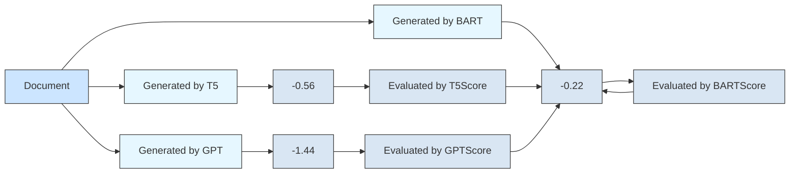

# LLMs as Narcissistic Evaluators: When Ego Inflates Evaluation Scores

Yiqi Liu $^{1}$ Nafise Sadat Moosavi $^{2}$ Chenghua Lin $^{1}$

$^{1}$ University of Manchester $^{2}$ University of Sheffield

yiqi.liu-6@postgrad.manchester.ac.uk n.s.moosavi@sheffield.ac.uk chenghua.lin@manchester.ac.uk

# Abstract

Automatic evaluation of generated textual content presents an ongoing challenge within the field of NLP. Given the impressive capabilities of modern language models (LMs) across diverse NLP tasks, there is a growing trend to employ these models in creating innovative evaluation metrics for automated assessment of generation tasks. This paper investigates a pivotal question: Do language model-driven evaluation metrics inherently exhibit bias favoring texts generated by the same underlying language model? Specifically, we assess whether prominent LM-based evaluation metrics (e.g. BARTScore, T5Score, and GPTScore) demonstrate a favorable bias toward their respective underlying LMs in the context of summarization tasks. Our findings unveil a latent bias, particularly pronounced when such evaluation metrics are used in a reference-free manner without leveraging gold summaries. These results underscore that assessments provided by generative evaluation models can be influenced by factors beyond the inherent text quality, highlighting the necessity of developing more reliable evaluation protocols in the future.

# 1 Introduction

Evaluation is a fundamental element in both tracking progress and ensuring meaningful advancements across various dimensions within the field of Natural Language Processing. Therefore, the reliability of evaluation metrics plays a critical role in this process. Evaluating generated texts is one of the challenging and open problems in NLP given that different forms can convey the same meaning. This challenge has led to the development of various evaluation metrics for tasks involving Natural Language Generation (NLG). While human evaluation by experts stands as the most reliable approach for assessing generated outputs, it is costly and time-consuming, limiting its broader use. As a result, automatic evaluation metrics have emerged as practical alternatives to keep pace with the rapid progress in NLP (van der Lee et al., 2019). Recent evaluation metrics for generation tasks, such as BERTScore (Zhang et al., 2020), BARTScore (Yuan et al., 2021), T5Score (Qin et al., 2022), GPTScore (Fu et al., 2023), and G-Eval (Liu et al., 2023), increasingly rely on pretrained language models. However, this trend poses a paradox, as the very outputs being evaluated are generated by these pretrained language models, raising concerns about inherent biases. For instance, an evaluation metric based on the BART model might yield inflated scores for outputs produced by a BART-based language model.

flowchart

Figure 1: Examining the inherent bias within generative evaluation metrics towards outputs created by their underlying model reveals a clear existence of this bias. Our analysis shows that these metrics tend to assign inflated scores to outputs generated by the very model they are based on.

In this paper, we systematically investigate this potential bias, utilizing six prominent language models, namely BART (Lewis et al., 2020), T5 (Raffel et al., 2020), GPT-2 (Radford et al., 2019), GPT-3 (Brown et al., 2020), FLAN-T5 (Chung et al., 2022), and Cohere along with their corresponding evaluation metrics (e.g. BARTScore, T5Score, and GPTScore) or conditional generative probability, for the task of summarization, which is a typical task in natural language generations and frequently employed in automatic text evaluation. Our analysis involved examining numerous variations of these six families of generative mod-

els, considering their varying sizes and finetuning settings both as generators and evaluators.

We conducted our analysis using the CNN/Daily Mail (Hermann et al., 2015) and XSUM (Narayan et al., 2018) summarization datasets. The assessment covers two settings: reference-based, using gold summaries for evaluation (a common approach in supervised summarization), and reference-free, comparing generated summaries against source documents (a common approach in both unsupervised summarization and factuality assessment).

Based on our analysis, we have derived the following findings: (1) Generative evaluators tend to assign higher scores to the content generated by the same underlying model. This bias becomes more pronounced when the fine-tuning configuration and model size match for both the generator and evaluator. (2) Inflated scores are particularly noticeable in the reference-free setting, which is concerning due to the popularity of this evaluation approach for assessing the factual correctness of generated texts (Koh et al., 2022). (3) Apart from self-bias, inflated scores are also influenced by the preference for longer summaries by certain evaluators.

Our work has implications for model selection, evaluation strategies, and the development of more reliable and unbiased evaluation metrics in the field of natural language generation.

# 2 Related Work

# Reference-based Evaluation Metrics

Reference-based metrics are commonly used to evaluate text generation tasks, including summarization, by measuring the similarity between generated and reference texts. Traditionally, metrics like BLEU (Papineni et al., 2002) and ROUGE (Lin, 2004) were employed to assess a generated text based on surface-level similarities, measured through the n-gram overlap between the generated and reference texts.

Recent trends in summarization evaluation lean towards semantic-level assessments, moving beyond direct word overlap comparisons. Notable metrics embracing this approach include BERTScore (Zhang et al., 2020), MoverScore (Zhao et al., 2019), BARTScore (Yuan et al., 2021), BLEURT (Sellam et al., 2020), and variations thereof. By leveraging pretrained language models, these metrics focus on capturing semantic content, providing a more nuanced and accurate evaluation of summarization system outputs.

Reference-free Evaluation Metrics With the widespread use of generation models across diverse domains, the need for reference-free evaluation metrics has surged. In response to this challenge, recent attention has been directed towards metrics that enable the evaluation of generated texts solely based on source documents, especially when annotated reference texts may not be available for new domains (Böhm et al., 2019; Gao et al., 2020; Wu et al., 2020; Chen et al., 2021; Scialom et al., 2021; Honovich et al., 2021; Zhong et al., 2022; Liu et al., 2023).

Representative reference-free metrics in recent years include generative evaluation models, exemplified by BARTScore (Yuan et al., 2021) and GPTScore (Fu et al., 2023), which are also used for reference-based evaluation. These metrics frame text evaluation as a natural language generation task, intuitively assigning higher probabilities to higher-quality generated texts. For instance, a recent study by Koh et al. (2022) has acknowledged BARTScore in reference-free mode as the factual consistency metric with the highest overall correlation to human factual consistency scores, particularly in the context of long document abstractive summarization. Therefore, the reliability of these metrics is important given their use for evaluating sensitive aspects such as factuality correctness.

Automatic Evaluation Metrics Pitfalls Despite their widespread use, automatic evaluation metrics have notable shortcomings. These metrics may not be robust when faced with challenges such as spurious correlations, noise, or out-of-domain texts (Sai et al., 2021; Vu et al., 2022; Durmus et al., 2022; Zhao et al., 2023; He et al., 2023). Furthermore, their effectiveness diminishes when evaluating very long documents (Amplayo et al., 2022). There is also evidence suggesting a potential bias towards ranking extractive summaries higher than abstractive ones (Amplayo et al., 2022).

Traditional reference-based evaluation metrics such as ROUGE or BLEU have been criticized for their inability to measure content quality or capture syntactic errors (Reiter and Belz, 2009). Consequently, these traditional metrics often exhibit weak correlations with human judgements, demonstrating that they cannot accurately reflect the real-world performance of generation systems (Peyrard, 2019; Mathur et al., 2020). For example, they might assign high scores to outputs that are flu-

ent but meaningless and unfaithful, as long as many of the same words are used (Gehrmann et al., 2021). Although embedding-based metrics (e.g., BERTScore) show improved performance in similarity measurement, they are still inadequate for assessing the extent of shared information between two summaries, a crucial indicator of summary information quality (Deutsch and Roth, 2021).

Reference-free metrics, on the other hand, exhibit a bias towards outputs generated by models that are more similar to their own (Deutsch et al., 2022). To the best of our knowledge, this study represents the initial attempt to perform an exploration, which has not yet been undertaken systematically. Additionally, question-answering-based reference-free metrics for summarization evaluation are prone to inheriting errors within summaries (Kamoi et al., 2023).

Metrics based on Large Language Models, which are capable of conducting both reference-based and reference-free evaluations, typically demonstrate superior correlations with human quality judgements across diverse NLG tasks and evaluation dimensions (Deutsch et al., 2022). While prior work has reported that LLM-based metrics prefer LLM-generated text, raising a concern about the shortcomings of LLMs as evaluators (Liu et al., 2023), our work conducts a systematic evaluation to address a fundamental question: Do language model-driven evaluation metrics inherently display bias favouring texts generated by the same underlying language model? We explore this question across both reference-based and reference-free evaluations and for a range of different large language models.

# 3 Methodology

To investigate the impact of the model's self-bias—determining whether a language model-based evaluator favours outputs generated by a similar language model—we conduct a comprehensive series of experiments involving both quantitative comparisons and qualitative analysis. Our quantitative comparisons involve using language models of varying sizes and finetuning configurations as both the evaluator and generator models. This structured approach enables us to systematically examine the potential bias across different LM configurations. Subsequently, we verify the results through qualitative analysis using a subset of models' summaries that are accompanied by human evaluation to further demonstrate that higher scores produced by evaluators as a result of self-bias do not necessarily correlate with higher quality generated outputs.

# 3.1 Evaluators

We describe the evaluation process as follows: given a source text s, a human written reference r, generate a hypothesis h, which can be represented as:

$$
y = f (\boldsymbol {h}, a, \mathcal {S}) \tag {1}
$$

where h denotes hypothesis, a refers to the aspect to evaluate, and S denotes supplementary text (i.e., s or r) that is employed alongside evaluations in various settings (Fu et al., 2023). For instance, it could be the source text s in a reference-free scenario which assesses the summary based on the source article directly (Fabbri et al., 2021). Whereas in the reference-based paradigm, the evaluation considers semantic overlap between the generated hypothesis h (e.g. model generated summaries) and reference summaries r (Bhandari et al., 2020).

The evaluators (i.e. based on BART, T5, GPT model variants as well as Cohere) utilised in our study all share a conditional probability paradigm, which can generally be formulated as

$$
\operatorname{Score} (\boldsymbol {h} | d, a, \mathcal {S}) = \sum_ {t = 1} ^ {m} w _ {t} \log p (h _ {t} | \boldsymbol {h} _ {<   t}, \mathcal {S}, \theta). \tag {2}
$$

Here $\theta$ is the model parameter, d refers to the task description and $w_{t}$ denotes the weight of the token at position t, where previous works normally treat each token equally (Yuan et al., 2021; Fu et al., 2023). We provide further descriptions of each type of evaluator below.

BARTScore BARTScore (Yuan et al., 2021) introduced the generative evaluation approach treating text assessment as a generation task, employing probability of the text being generated by BART-based models (Lewis et al., 2020) to assess the quality of text generated across various tasks such as machine translation, summarization, and data-to-text.

T5Score T5Score (Qin et al., 2022) was proposed providing both generative and discriminative training strategies for assessing T5-variant models as the core of this generative evaluation paradigm $^{1}$ .

The integration of dual training strategies enables more types of data to be incorporated into the metric. T5Score closely aligns with BARTScore in terms of evaluation framework. Thus, when only considering the generative training strategy, T5Score is analogous to BARTScore, but for the T5 model series.

GPTScore Leveraging generative models to conduct evaluation has been further advanced with various of more recent large language models (Fu et al., 2023), showing a great performance and covering a rich variety of aspects for comprehensive evaluations. With an understanding of natural language instructions, GPTScore (including GPT-X and FLAN-T5 models) can perform intricate and personalized assessments without additional training.

Cohere We additionally include Cohere, the more recent language model to enrich our assessments. The evaluation scores assigned by the model is calculated according to Eq. 2, aligned with BARTScore, T5Score, and GPTScore.

# 3.2 Generation Models

We analyze different variants of the BART, T5, GPT-2, GPT-3, FLAN-T5 and Cohere models, taking into account two different variables: the model size and the finetuning dataset. Regarding size, we consider small, base, medium, and large variations of each model, when available. For the finetuning dataset, we examine three distinct settings: (1) using the pretrained language model without finetuning on a summarization dataset, (2) finetuning on CNN, and (3) finetuning on XSUM. For instance, BART-Base-CNN represents a BART-base model that is finetuned on the CNN dataset. For each of the model types, we have used their corresponding standard prompts for the task of summarization. $^{2}$

To ensure the reproducibility of our analysis, we exclusively employ publicly available checkpoints for the utilized models. Apart from the GPT3-Curie model that is taken from the OpenAI API and generation model obtained from Cohere, the rest of the models are taken from the Hugging Face model hub $^{4}$ .

We use each of these generation models both for generating the summaries $^{4}$ as well as the underlying model for the LM-based evaluator. All the checkpoints used for generators and evaluators in our experiments can be found in the Appendix A (Table 4 and Table 5).

# 3.3 Datasets

We use documents from two well-established summarization datasets including CNN/DailyMail (Hermann et al., 2015; Nallapati et al., 2016) and the extreme summarization (XSUM) dataset (Narayan et al., 2018).

For quantitative comparisons, we randomly selected 500 documents from each of these datasets. We provide these documents to each of the generation models to obtain their corresponding generated summaries. For qualitative analysis, we use the SummEval benchmark (Fabbri et al., 2021) and the RoSE benchmark (Liu et al., 2022). These benchmarks include summaries from various generation models, as well as human evaluations, enabling us to assess the quality of these summaries.

The SummEval benchmark contains summaries generated by various summarization models (i.e. BART, T5 and GPT2) for 100 articles from the CNN/DM test set, with each summary supplemented by human annotations. More specifically, SummEval incorporates human annotations by both expert and crowd-sourced human annotators, targeting dimensions of coherence, consistency, fluency, and relevance. Ratings are on a scale of 0 to 5, with higher values indicating better performance.

Similarly, RoSE contains summaries generated by recent generative models based on CNN/DM documents, accompanied by their corresponding human evaluations. We use 100 summaries from each of the BART and GPT-3 models from the ROSE benchmark. The RoSE benchmark proposed an assessment protocol termed “Atomic Content Units” (ACUs) (Liu et al., 2022). ACU score gauges quality of evaluated summaries based on whether the presence of single facts (i.e., atomic facts) from reference are included in the evaluated summaries. ACU score is calculated by ACU matching:

$$
f (s, \mathcal {A}) = \frac {| \mathcal {A} _ {s} |}{| \mathcal {A} |} \tag {3}
$$

where $\mathcal{A}$ is a set of ACUs from gold summaries and $\mathcal{A}_s$ denotes the ACUs of candidate summary $s$ .

<table><tr><td></td><td>Max</td><td>Min</td><td>Mean</td><td>Median</td></tr><tr><td>RoSE-BART</td><td>1.00</td><td>0.00</td><td>0.37</td><td>0.38</td></tr><tr><td>RoSE-GPT3</td><td>0.90</td><td>0.00</td><td>0.27</td><td>0.25</td></tr><tr><td>SummEval-BART</td><td>5.00</td><td>2.67</td><td>4.57</td><td>4.67</td></tr><tr><td>SummEval-T5</td><td>5.00</td><td>2.33</td><td>4.52</td><td>4.67</td></tr><tr><td>SummEval-GPT2</td><td>5.00</td><td>1.33</td><td>3.57</td><td>3.58</td></tr></table>

Table 1: Distribution of human annotation scores on the RoSE and SummEval datasets, where in RoSE we consider the ‘ACU’ score, and in SummEval we focus on four aspects—‘Coherence’, ‘Consistency’, ‘Fluency’, and ‘Relevance’—as evaluated by expert annotators. The scores for SummEval are obtained by averaging the scores across all aspects and evaluations from all annotators.

The distribution of human scores in RoSE and SummEval are given in Table 1.

# 3.4 Quantitative Comparisons

We employ 20 language model-based evaluators for our experiments including six BARTSCORE evaluators (Yuan et al., 2021), seven T5SCORE evaluators (Qin et al., 2022), six GPTScore evaluators, and the Cohere evaluator. $^{5}$

We assess the evaluators in two settings: (a) reference-free, where the metric evaluates the likelihood of the summary being generated from the source text, and (b) reference-based, where the generated summary is evaluated based on the reference summary.

Due to the nature of log probabilities, original scores from each evaluator is be negative, and a higher score indicates better quality according to the evaluator. When weights $w_{t}$ in Eq. 2 are treated equally, the evaluation protocols of BARTScore, T5Score, and GPTScore are all conditional probability paradigms. To ensure comparability among the scores provided by 20 distinguished evaluators, a uniform normalization process is applied to the scores generated by each evaluator. The normalization procedure standardizes the scores across a scale ranging from 0 to $\alpha^{6}$ as formulated in Eq. 4, where $X_{i,j}$ indicates scores evaluated by the j-th evaluator on summaries generated by the i-th generator.

$$
X _ {i, j} ^ {\text {norm}} = \frac {\alpha (X _ {i , j} - \min _ {i} X _ {i , j})}{\max _ {i} X _ {i , j} - \min _ {i} X _ {i , j}} \tag {4}
$$

In this context, a normalized score of $\alpha$ signifies the highest quality attributed by the evaluator, while a score of 0 indicates the lowest quality.

As the length of the generated summary is a key factor influencing the evaluation results, we further analyse the impact of lengths for the content generated by the models along with the experiments. In this regard, we also compute the correlations between the length of the text and the scores assigned by evaluators to identify trends in evaluators' preferences.

# 3.5 Qualitative Analysis

For qualitative analysis, we employ Spearman Correlations (Zar, 2014) and Kendall Correlations (Freedman et al., 2007), which respectively assess monotonic relationships and order associations between human evaluations and LM evaluator scores. They are common metrics for assessing correlations with human judgements.

For the SummEval dataset, we calculate the correlations for four aspects (i.e. Coherence, Consistency, Fluency and Relevance), aligned with the reference-free input setting in the evaluation protocol as specified by Yuan et al. (2021). For the evaluations based on the RoSE benchmark, we use ACU annotations that are suited for reference-based summary salience evaluation. Therefore, we employ the correlation values obtained from the SummEval dataset for the reference-free setting and those from the RoSE benchmark for the reference-based setting.

# 4 Experimental Results

# 4.1 Quantitative Comparisons: Assessing Self-Bias in LM-Evaluators Towards Their Own Output

Figures 2 and 3 display heatmaps presenting evaluator scores for various summaries generated by different generators from CNN/DM documents in reference-free and reference-base settings, respectively. These scores are computed by averaging the individual scores of the selected 500 documents. In both heatmaps, we observe darker cells along the diagonal line, running from the top left to the bottom right. This indicates the potential evaluator bias towards their corresponding generator models i.e., self-bias. However, this bias is notably more pronounced in the reference-free setting, commonly used for factuality evaluation (Koh et al., 2022).

Furthermore, as shown in Figure 2, we note a distinct trend: T5-based generators, whether fine-tuned or not, tend to receive higher scores when assessed using different T5Score variations com-

  
Figure 2: Assessing Bias in the CNN/DM Dataset using heatmaps in the reference-free setting. Observing the darkest cells along the diagonal line, from the top left to the bottom right, indicates a distinct bias among evaluators towards their respective models. All evaluator scores are normalized to a range between 0 and 1. Additionally, the number in the bracket represents the average length of summaries (measured in words) produced by the respective model.

pared to evaluations using BARTScore, GPTScore, or Cohere. This results in a concentrated dark rectangle at the heatmap's centre. Similarly, we observe a parallel trend for BART-based generators, whether fine-tuned or not.

Meanwhile, evaluators tend to assign higher ranks to generators trained on the same dataset as themselves, rather than to those fine-tuned on different datasets (see Figure 6 in Appendix B.1). For example, when using T5 models fine-tuned on the XSUM dataset as evaluators, there is a noticeable preference for BART-XSUM generators over T5-vanilla models, even though the evaluations are performed for the CNN Daily dataset. We observe the same pattern on summaries generated based XSUM documents.

# 4.2 Bias towards Longer Summaries

Another notable pattern in Figure 2 is the high scores for the BART-based generators, indicated by both BARTScore variants and different GPTScores. To further investigate this phenomenon, we calculate the average length of summaries generated by each generator for each of the datasets. Notably, BART models and Cohere that have not been fine-tuned for summarization tend to produce the longest summaries on average. This is followed by the fine-tuned BART models on the CNN dataset. Conversely, T5-based models score the summaries generated by Cohere low, as they tend to favour shorter summaries. A similar preference for short summaries can also be observed for evaluators fine-tuned on XSUM, which one-sentence summaries.

Subsequently, we computed the Spearman correlation between the scores under the reference-free setting given by each of our examined evaluators and the length of the corresponding summary. The results are presented in Figure 5. Based on these results, with the exception of evaluators fine-tuned on XSUM, BARTScore and GPTScore variants tend to assign higher scores to longer summaries. This observation explains the darker squares positioned in the top-right corner of Figure 2 for high values of GPTScore variants, highlighting their inclination to assign higher scores to BART and BART-CNN generators that produce longer summaries. It is worth noting that this correlation with summary length is prominent within the reference-free setting. We observe a similar but less obvious pattern in the reference-based evaluations, as shown in Figure 3.

# 4.3 Qualitative Analysis: Correlation of Self-Bias with Human Evaluation

To further verify the evaluators' self-bias, we repeat the experiments from § 4.1 on summarization benchmarks that are accompanied by human eval-

  
Figure 3: Assessing Bias on CNN/DM Dataset using heatmaps in the reference-based setting. Observing darker cells along the diagonal line indicates potential self-bias. All evaluator scores are normalized to a range between 0 and 1. Additionally, the number in the bracket represents the average length of summaries (measured in words) produced by the respective model.

heatmap

| Generator | BART Base | BART-Large | BARTBase-CNN | BART-Large-CNN | BARTBase-XSUM | BARTLarge-XSUM | TS-Small | TS-Base | TS-Large | TS-Small-CNN | TS-Base-CNN | TS-Small-XSUM | TS-Large-XSUM | GPT2 | GPT2-Medium | GPT2-Large | GPT3-Cure | FLANTS Base | FLANTS-XL | Cohere-Command |
|---|---|---|---|---|---|---|---|---|---|---|---|---|---|---|---|---|---|---|---|---|
| ROSE-BART | 1.00 | 1.00 | 1.00 | 1.00 | 1.00 | 1.00 | 1.00 | 0.64 | 0.80 | 0.90 | 1.00 | 1.00 | 0.86 | 1.00 | 1.00 | 1.00 | 1.00 | 1.00 | 1.00 | 1.00 |
| ROSE-GPT3 | 0.72 | 0.61 | 0.66 | 0.59 | 0.93 | 0.80 | 0.45 | 0.22 | 0.36 | 0.14 | 0.71 | 0.69 | 0.99 | 0.59 | 0.44 | 0.38 | 0.85 | 0.39 | 0.43 | 0.83 |
| SUMMEVAL-BART | 0.45 | 0.50 | 0.57 | 0.44 | 0.57 | 0.41 | 0.94 | 0.72 | 0.90 | 1.00 | 0.93 | 0.53 | 0.45 | 0.62 | 0.41 | 0.42 | 0.48 | 0.49 | 0.59 | 0.64 |
| SUMMEVAL-T5 - SUMMEVAL-GPT2 | 0.00 | 0.00 | 0.00 | 0.00 | 0.00 | 0.00 | 0.93 | 1.00 | 1.00 | 0.29 | 0.00 | 0.00 | 0.00 | 0.00 | 0.00 | 0.00 | 0.55 | 0.07 | 0.50 | 0.71 |
| SUMMEVAL-GPT2 - SUMMEVAL-GPT2 - BART Base - BART-Large - BARTBase-CNN - BARTLarge-CNN - BARTBase-XSUM - BARTLarge-XSUM - TS-Small - TS-Large - TS-Large - TS-Small-CNN - TS-Base-CNN - TS-Small-XSUM - TS-Large-XSUM - TS-Large-XSUM - TS-Large-XSUM - TS-Large-XSUM - TS-Large-XSUM - TS-Large-XSUM - TS-Large-XSUM - TS-Large-XSUM - TS-Large-XSUM - TS-Large-XSUM - TS-Large-XSUM - TS-Large-XSUM - TS-Large-XSUM - TS-Large-XSUM - TS-Large-XSUM - TS-Large-XSUM - TS-Large-XSUM - TCSSmall - TS-Large - TS-Large - TS-Large - TS-Large - TS-Large - TS-Large - TS-Large - TS-Large - TS-Large - TS-Large - TS-Large - TS-Large - TS-Large - TS-Large - TS-Large - TS-Large - TS-Large - TS-Large - TS-Large - TS-Large - TS-Large - TS-Large - TS-Large - TS-Large - TS-Large - TS-LARGE - TS-Large - TS-Large - TS-Large - TS-Large - TS-Large - TS-Large - TS-Large - TS-Large - TS-Large - TS-Large - TS-Large - TS-Large - TS-Large - TS-Large - TS-Large - TS-Large - TS-Large - TS-Large - TS-Large - TS-Large - TS-Large - TS-Large - TS-Large - TS-Large - TS-Lauge - TS-Large - TS-Large - TS-Large - TS-Large - TS-Large - TS-Large - TS-Large - TS-Large - TS-Large - TS-Large - TS-Large - TS-Large - TS-Large - TS-Large - TS-Large - TS-Large - TS-Large - TS-Large - TS-Large - TS-Large - TS-Large - TS-Large - TS-Large - TS-Large - TS-LRange - TCSSmall - TCSSmall-CNN - TCSSmall-CNN - TCSSmall-CNN - TCSSmall-CNN - TCSSmall-CNN - TCSSmall-CNN - TCSSmall-CNN - TCSSmall-CNN - TCSSmall-CNN - TCSSmall-CNN - TCSSmall-CNN - TCSSmall-CNN - TCSSmall-CNN - TCSSmall-CNN - TCSSmall-CNN - TCSSmall-CNN- TCSSmall-CNN- TCSSmall-CNN- TCSSmall-CNN- TCSSmall-CNN- TCSSmall-CNN- TCSSmall-CNN- TCSSmall-CNN- TCSSmall-CNN- TCSSmall-CNN- TCSSmall-CNN- TCSSmall-CNN- TCSSmall-CNN- TCS Small-CNN- TCS Small-CNN- TCS Small-CNN- TCS Small-CNN- TCS Small-CNN- TCS Small-CNN- TCS Small-CNN- TCS Small-CNN- TCS Small-CNN- TCS Small-CNN- TCS Small-CNN- TCS Small-CNN- TCS Small-CNN- TCS Small-CNN- TCS Small-CNN- TCS Small-CNN- TCS Small-CNN- FUT2: FUT2: FUT2: FUT2: FUT2: FUT2: FUT2: FUT2: FUT2: FUT2: FUT2: FUT2: FUT2: FUT2: FUT2: FUT2: FUT2: FUT2: FUT2: FUT2: FUT2: FUT2: FUT2: FUT2: FUT2: FUT2 : FUT2 : FUT2 : FUT2 : FUT2 : FUT2 : FUT2 : FUT2 : FUT2 : FUT2 : FUT2 : FUT2 : FUT2 : FUT2 : FUT2 : FUT2 : FUT2 : FUT2 : FUT2 : FUT2 : FUT2 : FUT2 : FUT2 : FUT2 : FUT2 : FUT2: FUT2 : FUT2 : FUT2 : FUT2 : FUT2 : FUT2 : FUT2 : FUT2 : FUT2 : FUT2 : FUT2 : FUT2 : FUT2 : FUT2 : FUT2 : FUT2 : FUT2 : FUT2 : FUT2 : FUT2 : FUT2 : FUT2 : FUT2 : FUT2: FUT2: FUT2: FUT2: FUT2: FUT2: FUT2: FUT2: FUT2: FUT2: FUT2: FUT2: FUT2: FUT2: FUT2: FUT2: FUT2: FUT2: FUT2: FUT2: FUT2: FUT2: FUT2: FUT2: FUT2F UNT3B: UNT3B: UNT3B: UNT3B: UNT3B: UNT3B: UNT3B: UNT3B: UNT3B: UNT3B: UNT3B: UNT3B: UNT3B: UNT3B: UNT3B: UNT3B: UNT3B: UNT3B: UNT3B: UNT3B: UNT3B : UNT3B : UNT3B : UNT3B : UNT3B : UNT3B : UNT3B : UNT3B : UNT3B : UNT3B : UNT3B : UNT3B : UNT3B : UNT3B : UNT3B : UNT3B : UNT3B : UNT3B : UNT3B : UNT3B : UNT3B / COHc Command |
| ROSE-BART | 0.73 | 0.56 | 1.00 | 0.20 | 0.00 | 0.36 | 0.29 | 0.06 | 0.11 | 1.85 | 1.11 | 1.85 | 1.11 | 1.85 | 1.11 | 1.85 | 1.85 | 1.85 | 1.85 |
| ROSE-GPT3 | 0.59 | 1.85 | 1.85 | 1.85 | 1.85 | 1.85 | 1.85 | 1.85 | 1.85 | 1.85 | 1.85 | 1.85 | 1.85 | 1.85 | 1.85 | 1.85 | 1.85 | 1.85 | 1<nl>
<fcel> SUMMEVAL-BART = SUMMEVAL-T5 = SUMMEVAL-GPT2 = BART Base + BART Large-CNN + BARTBase-CNN + BARTLarge-CNN + BARTBase-XSUM + BARTBase-XSUM + BARTLarge-XSUM + BARTLarge-XSUM + BARTLarge-XSUM + BARTLarge-XSUM + BARTLarge-XSUM + BARTLarge-XSUM + BARTLarge-XSUM + BARTLarge-XSUM + BARTLarge-XSUM + BARTLarge-XSUM + BARTLarge-XSUM + BARTLarge-XSUM + BARTLarge-XSUM + BARTLarge-XSUM + BARTLarge-XSUM + BARTLarge-XSUM + BARTLarge-XSUM + CTSSmall-CNN + CTSSmall-CNN + CTSSmall-CNN + CTSSmall-CNN + CTSSmall-CNN + CTS Small-CNN + CTS Small-CNN + CTS Small-CNN + CTS Small-CNN + CTS Small-CNN + CTS Small-CNN + CTS Small-CNN + CTS Small-CNN + CTS Small-CNN + CTS Small-CNN + CTS Small-CNN + CTS Small-CNN + CTS Small-CNN + CTS Small-CNN + CTS Small-CNN + CTS Small-CNN + CTS Small-CNN + DTS Small-CNN + DTS Small-CNN + DTS Small-CNN + DTS Small-CNN + DTS Small-CNN + DTS Small-CNN + DTS Small-CNN + DTS Small-CNN + DTS Small-CNN + DTS Small-CNN + DTS Small-CNN + DTS Small-CNN + DTS Small-CNN + DTS Small-CNN + DTS Small-CNN + DTS Small-CNN + DTS Small-CMM : DTS Small-CMM = DTS Small-CMM = DTS Small-CMM = DTS Small-CMM = DTS Small-CMM = DTS Small-CMM = DTS Small-CMM = DTS Small-CMM = DTS Small-CMM = DTS Small-CMM = DTS Small-CMM = DTS Small-CMM = DTS Small-CMM = DTS Small-CMM = DTS Small-CMM = DTS Small-CMM = DTS Small-CMM = DTS Small/CMM = DTS Small/CMM = DTS Small/CMM = DTS Small/CMM = DTS Small/CMM = DTS Small/CMM = DTS Small/CMM = DTS Small/CMM = DTS Small/CMM = DTS Small/CMM = DTS Small/CMM = DTS Small/CMM = DTS Small/CMM = DTS Small/CMM = DTS Small/CMM = DTS Small/CMM = DTS Small/CMM = DTCN (DTCN) [DTCN] [DTCN] [DTCN] [DTCN] [DTCN] [DTCN] [DTCN] [DTCN] [DTCN] [DTCN] [DTCN] [DTCN] [DTCN] [DTCN] [DTCN] [DTCN] [DTCN] [DTCN] [DTCN] [DTCN] [DTCN]

Figure 4: Heatmaps of evaluation scores on the SummEval & RoSE benchmarks for the reference-free and reference-based setting. We use the reference-free setting for SummEval and the reference-based setting for RoSE, aligning with the specific aspects each benchmark emphasizes.

uations. While the number of summaries in these benchmarks is limited compared to those in § 4.1, we can use the human annotations to verify that the inflated scores are not correlated with human evaluations.

Figure 4 shows the evaluation results for the SummEval and RoSE benchmarks for the reference-free and reference-based setting, respectively. As mentioned, we use SummEval for the reference-free setting and RoSE for the reference-based setting with regard to the specific aspects of each of these benchmarks (Yuan et al., 2021). Overall, we observe a trend similar to that shown in Figure 2. For instance, the T5-base generator

bar

| Evaluator | Spearman Correlation |
| :--- | :--- |
| BART-Base | 0.50 |
| BART-Large | 0.50 |
| BART-Base-CNN | 0.42 |
| BART-Large-CNN | 0.43 |
| BART-Base-XSUM | -0.29 |
| BART-Large-XSUM | 0.19 |
| T5-Small | 0.08 |
| T5-Base | -0.02 |
| T5-Large | 0.02 |
| T5-Small-CNN | -0.16 |
| T5-Base-CNN | 0.09 |
| T5-Small-XSUM | -0.45 |
| T5-Large-XSUM | -0.51 |
| GPT2 | 0.37 |
| GPT2-Medium | 0.36 |
| GPT2-Large | 0.35 |
| GPT3-Curie | 0.38 |
| FLANT5-Base | 0.18 |
| FLANT5-XL | 0.23 |
| Cohere-Command | 0.53 |

Figure 5: Spearman Correlation between the length of generated summaries and the reference-free scores assigned by each evaluator. A higher positive score indicates that an evaluator prefers longer summaries, while a lower negative score indicates a preference for shorter summaries.

receives higher scores from T5-based evaluators. $^{7}$ Meanwhile, BART-based models receive higher scores from both BARTScore and GPTScore evaluators, instead of T5 evaluator.

Table 3 presents the Spearman and Kendall correlation values of SummEval in the reference-free setting, whereas the Spearman and Kendall correlation values of RoSE in the reference-based setting are given in Table 2.

Overall, we observe that none of the evaluators have a strong correlation with the human annotations on either of these benchmarks. Due to the limited size of the samples (i.e., 100 summaries from SummEval and 100 summaries from ROSE with human annotations, as described in §3.3) and the absence of many of our investigated generators in §4.1, we cannot draw a conclusive conclusion from the correlation values. Nevertheless, these results demonstrate that none of these evaluators highly correlate with human annotations, and as observed in §4.1, their inflated scores for their own underlying generator may contribute to this low correlation.

# 5 Conclusions

Based on experiments, we make the following conclusions: First, the popularity of generative evaluation metrics, such as BARTScore, is on the rise for evaluating the factual accuracy of generated content—a critical concern in modern generator models. However, our results reveal that this evaluation approach is susceptible to the self-bias, highlighting the need for more robust metrics to assess factual correctness reliably. Second, our analysis indicates that models fine-tuned on the XSUM dataset are not suitable for direct integration into evaluators due to their bias towards shorter summaries. The exception is their use for evaluating summaries aligned with XSUM-style content. Third, notably, similar to traditional evaluation metrics (Sun et al., 2019), contemporary evaluation metrics might also lean towards favoring longer summaries. This bias should be considered when interpreting and applying these metrics. Finally, our study uncovers the presence of the self-bias across all assessed evaluators. Consequently, we recommend avoiding the use of the same underlying model as the generator for assessment. Although the limited human evaluations for our examined models prevent definitive conclusions on selecting the best generative evaluator, our research charts a promising direction for designing more resilient and unbiased evaluation metrics.

RoSE - Reference-based 

<table><tr><td rowspan="2">Evaluator</td><td colspan="2">ACU</td></tr><tr><td>Spearman</td><td>Kendall</td></tr><tr><td>BART-Base</td><td>0.454</td><td>0.310</td></tr><tr><td>BART-Large</td><td>0.298</td><td>0.218</td></tr><tr><td>BART-Base-CNN</td><td>0.488</td><td>0.345</td></tr><tr><td>BART-Large-CNN</td><td>0.468</td><td>0.329</td></tr><tr><td>BART-Base-XSUM</td><td>0.150</td><td>0.103</td></tr><tr><td>BART-Large-XSUM</td><td>0.371</td><td>0.253</td></tr><tr><td>T5-Small</td><td>0.396</td><td>0.284</td></tr><tr><td>T5-Base</td><td>0.395</td><td>0.285</td></tr><tr><td>T5-Large</td><td>0.392</td><td>0.282</td></tr><tr><td>T5-Small-CNN</td><td>0.393</td><td>0.281</td></tr><tr><td>T5-Base-CNN</td><td>0.391</td><td>0.276</td></tr><tr><td>T5-Small-XSUM</td><td>0.379</td><td>0.269</td></tr><tr><td>T5-Large-XSUM</td><td>0.462</td><td>0.324</td></tr><tr><td>GPT2</td><td>0.375</td><td>0.255</td></tr><tr><td>GPT2-Medium</td><td>0.357</td><td>0.244</td></tr><tr><td>GPT2-Large</td><td>0.353</td><td>0.242</td></tr><tr><td>GPT3-Curie</td><td>0.310</td><td>0.214</td></tr><tr><td>FLANT5-Base</td><td>0.460</td><td>0.325</td></tr><tr><td>FLANT5-XL</td><td>0.433</td><td>0.304</td></tr><tr><td>Cohere-Command</td><td>0.384</td><td>0.267</td></tr></table>

Table 2: Spearman and Kendall correlations between reference-based evaluation scores and human annotations using annotations in RoSE. Results in bold indicate the strongest coefficient.

In summary, our study identifies a new type of bias in generative evaluators encouraging future research in this direction for designing fairer evaluation metrics.

Figure 6: Assessing Bias in the XSUM Dataset using heatmaps in the reference-free setting. Observing the darkest cells along the diagonal line, from the top left to the bottom right, indicates a distinct bias among evaluators towards their respective models. All evaluator scores are normalized to a range between 0 and 1. Additionally, the number in the bracket represents the average length of summaries (measured in words) produced by the respective model. 

<table><tr><td colspan="9">SummEval - Reference-free</td></tr><tr><td rowspan="2">Evaluator</td><td colspan="2">Coherence</td><td colspan="2">Consistency</td><td colspan="2">Fluency</td><td colspan="2">Relevance</td></tr><tr><td>Spearman</td><td>Kendall</td><td>Spearman</td><td>Kendall</td><td>Spearman</td><td>Kendall</td><td>Spearman</td><td>Kendall</td></tr><tr><td>BART-Base</td><td>-0.028</td><td>-0.021</td><td>0.107</td><td>0.078</td><td>-0.043</td><td>-0.037</td><td>0.105</td><td>0.074</td></tr><tr><td>BART-Large</td><td>0.052</td><td>0.040</td><td>0.180</td><td>0.137</td><td>0.053</td><td>0.037</td><td>0.180</td><td>0.128</td></tr><tr><td>BART-Base-CNN</td><td>0.193</td><td>0.138</td><td>0.228</td><td>0.171</td><td>0.190</td><td>0.145</td><td>0.069</td><td>0.050</td></tr><tr><td>BART-Large-CNN</td><td>0.171</td><td>0.119</td><td>0.255</td><td>0.192</td><td>0.156</td><td>0.119</td><td>0.157</td><td>0.111</td></tr><tr><td>BART-Base-XSUM</td><td>0.170</td><td>0.120</td><td>-0.103</td><td>-0.079</td><td>0.068</td><td>0.055</td><td>-0.174</td><td>-0.124</td></tr><tr><td>BART-Large-XSUM</td><td>0.055</td><td>0.040</td><td>0.060</td><td>0.046</td><td>-0.025</td><td>-0.022</td><td>0.080</td><td>0.056</td></tr><tr><td>T5-Small</td><td>0.208</td><td>0.146</td><td>0.547</td><td>0.419</td><td>0.501</td><td>0.398</td><td>0.415</td><td>0.295</td></tr><tr><td>T5-Base</td><td>0.173</td><td>0.119</td><td>0.533</td><td>0.409</td><td>0.488</td><td>0.381</td><td>0.367</td><td>0.260</td></tr><tr><td>T5-Large</td><td>0.185</td><td>0.132</td><td>0.477</td><td>0.364</td><td>0.445</td><td>0.345</td><td>0.387</td><td>0.281</td></tr><tr><td>T5-Small-CNN</td><td>0.315</td><td>0.222</td><td>0.462</td><td>0.356</td><td>0.401</td><td>0.314</td><td>0.299</td><td>0.214</td></tr><tr><td>T5-Base-CNN</td><td>0.192</td><td>0.135</td><td>0.253</td><td>0.190</td><td>0.189</td><td>0.150</td><td>0.148</td><td>0.106</td></tr><tr><td>T5-Small-XSUM</td><td>0.245</td><td>0.178</td><td>0.142</td><td>0.109</td><td>0.209</td><td>0.164</td><td>0.113</td><td>0.079</td></tr><tr><td>T5-Large-XSUM</td><td>0.213</td><td>0.152</td><td>-0.111</td><td>-0.085</td><td>0.018</td><td>0.012</td><td>-0.041</td><td>-0.029</td></tr><tr><td>GPT2</td><td>0.103</td><td>0.077</td><td>0.154</td><td>0.117</td><td>0.037</td><td>0.026</td><td>0.032</td><td>0.021</td></tr><tr><td>GPT2-Medium</td><td>0.123</td><td>0.091</td><td>0.234</td><td>0.179</td><td>0.117</td><td>0.086</td><td>0.066</td><td>0.047</td></tr><tr><td>GPT2-Large</td><td>0.119</td><td>0.089</td><td>0.184</td><td>0.140</td><td>0.107</td><td>0.080</td><td>0.024</td><td>0.017</td></tr><tr><td>GPT3-Curie</td><td>0.152</td><td>0.108</td><td>0.483</td><td>0.371</td><td>0.345</td><td>0.264</td><td>0.311</td><td>0.223</td></tr><tr><td>FLANT5-Base</td><td>0.220</td><td>0.154</td><td>0.448</td><td>0.345</td><td>0.295</td><td>0.228</td><td>0.229</td><td>0.159</td></tr><tr><td>FLANT5-XL</td><td>0.248</td><td>0.174</td><td>0.550</td><td>0.424</td><td>0.389</td><td>0.301</td><td>0.402</td><td>0.289</td></tr><tr><td>Cohere-Command</td><td>0.136</td><td>0.097</td><td>0.520</td><td>0.397</td><td>0.351</td><td>0.268</td><td>0.427</td><td>0.302</td></tr></table>

Table 3: Spearman and Kendall correlations between the reference-free evaluation scores and expert annotations provided in SummEval on four different aspects. The strongest correlation for each aspect is bolded.

# Limitations

We note that our work has the following limitations. Firstly, our experiment has been focused on the summarization task. Expanding the evaluation to encompass a broader range of generation tasks would be highly beneficial. Secondly, conducting a larger-scale human evaluation would be advantageous, as our current experiments are constrained by the limited sample sizes from SummEval and

RoSE. Finally, incorporating additional generation models and evaluators in future work would further enrich the experiment.

# Ethics Statement

This paper raises no ethical concerns. The data and supplementary materials used in this study are open-sourced and widely employed in existing works.

# References

Reinald Kim Amplayo, Peter J. Liu, Yao Zhao, and Shashi Narayan. 2022. Smart: Sentences as basic units for text evaluation. ArXiv, abs/2208.01030.   
Manik Bhandari, Pranav Narayan Gour, Atabak Ashfaq, Pengfei Liu, and Graham Neubig. 2020. Re-evaluating evaluation in text summarization. In Proceedings of the 2020 Conference on Empirical Methods in Natural Language Processing (EMNLP), pages 9347–9359, Online. Association for Computational Linguistics.   
Florian Böhm, Yang Gao, Christian M. Meyer, Ori Shapira, Ido Dagan, and Iryna Gurevych. 2019. Better rewards yield better summaries: Learning to summarise without references. In Proceedings of the 2019 Conference on Empirical Methods in Natural Language Processing and the 9th International Joint Conference on Natural Language Processing (EMNLP-IJCNLP), pages 3110–3120, Hong Kong, China. Association for Computational Linguistics.   
Tom Brown, Benjamin Mann, Nick Ryder, Melanie Subbiah, Jared D Kaplan, Prafulla Dhariwal, Arvind Neelakantan, Pranav Shyam, Girish Sastry, Amanda Askell, et al. 2020. Language models are few-shot learners. Advances in neural information processing systems, 33:1877–1901.   
Wang Chen, Piji Li, and Irwin King. 2021. A training-free and reference-free summarization evaluation metric via centrality-weighted relevance and self-referenced redundancy. In Proceedings of the 59th Annual Meeting of the Association for Computational Linguistics and the 11th International Joint Conference on Natural Language Processing (Volume 1: Long Papers), pages 404–414, Online. Association for Computational Linguistics.   
Hyung Won Chung, Le Hou, Shayne Longpre, Barret Zoph, Yi Tay, William Fedus, Yunxuan Li, Xuezhi Wang, Mostafa Dehghani, Siddhartha Brahma, Albert Webson, Shixiang Shane Gu, Zhuyun Dai, Mirac Suzgun, Xinyun Chen, Aakanksha Chowdhery, Alex Castro-Ros, Marie Pellat, Kevin Robinson, Dasha Valter, Sharan Narang, Gaurav Mishra, Adams Yu, Vincent Zhao, Yanping Huang, Andrew Dai, Hongkun Yu, Slav Petrov, Ed H. Chi, Jeff Dean, Jacob Devlin, Adam Roberts, Denny Zhou, Quoc V. Le,

and Jason Wei. 2022. Scaling instruction-finetuned language models.   
Daniel Deutsch, Rotem Dror, and Dan Roth. 2022. On the limitations of reference-free evaluations of generated text. In Proceedings of the 2022 Conference on Empirical Methods in Natural Language Processing, pages 10960–10977, Abu Dhabi, United Arab Emirates. Association for Computational Linguistics.   
Daniel Deutsch and Dan Roth. 2021. Understanding the extent to which content quality metrics measure the information quality of summaries. In Proceedings of the 25th Conference on Computational Natural Language Learning, pages 300–309, Online. Association for Computational Linguistics.   
Esin Durmus, Faisal Ladhak, and Tatsunori Hashimoto. 2022. Spurious correlations in reference-free evaluation of text generation. In Proceedings of the 60th Annual Meeting of the Association for Computational Linguistics (Volume 1: Long Papers), pages 1443–1454, Dublin, Ireland. Association for Computational Linguistics.   
Alexander R. Fabbri, Wojciech Kryściński, Bryan McCann, Caiming Xiong, Richard Socher, and Dragomir Radev. 2021. SummEval: Re-evaluating summarization evaluation. Transactions of the Association for Computational Linguistics, 9:391–409.   
D. Freedman, R. Pisani, and R. Purves. 2007. Statistics: Fourth International Student Edition. Emersion: Emergent Village Resources for Communities of Faith Series. W.W. Norton & Company.   
Jinlan Fu, See-Kiong Ng, Zhengbao Jiang, and Pengfei Liu. 2023. Gptscore: Evaluate as you desire.   
Yang Gao, Wei Zhao, and Steffen Eger. 2020. SUPERT: Towards new frontiers in unsupervised evaluation metrics for multi-document summarization. In Proceedings of the 58th Annual Meeting of the Association for Computational Linguistics, pages 1347–1354, Online. Association for Computational Linguistics.   
Sebastian Gehrmann, Tosin Adewumi, Karmanya Aggarwal, Pawan Sasanka Ammanamanchi, Anuoluwapo Aremu, Antoine Bosselut, Khyathi Raghavi Chandu, Miruna-Adriana Clinciu, Dipanjan Das, Kaustubh Dhole, Wanyu Du, Esin Durmus, Ondřej Dušek, Chris Chinenye Emezue, Varun Gangal, Cristina Garbacea, Tatsunori Hashimoto, Yufang Hou, Yacine Jernite, Harsh Jhamtani, Yangfeng Ji, Shailza Jolly, Mihir Kale, Dhruv Kumar, Faisal Ladhak, Aman Madaan, Mounica Maddela, Khyati Mahajan, Saad Mahamood, Bodhisattwa Prasad Majumder, Pedro Henrique Martins, Angelina McMillan-Major, Simon Mille, Emiel van Miltenburg, Moin Nadeem, Shashi Narayan, Vitaly Nikolaev, Andre Niyongabo Rubungo, Salomey Osei, Ankur Parikh, Laura Perez-Beltrachini, Niranjan Ramesh Rao, Vikas Raunak, Juan Diego Rodriguez, Sashank Santhanam, João Sedoc,

Thibault Sellam, Samira Shaikh, Anastasia Shimorina, Marco Antonio Sobrevilla Cabezudo, Hendrik Strobelt, Nishant Subramani, Wei Xu, Diyi Yang, Akhila Yerukola, and Jiawei Zhou. 2021. The GEM benchmark: Natural language generation, its evaluation and metrics. In Proceedings of the 1st Workshop on Natural Language Generation, Evaluation, and Metrics (GEM 2021), pages 96–120, Online. Association for Computational Linguistics.   
Tianxing He, Jingyu Zhang, Tianle Wang, Sachin Kumar, Kyunghyun Cho, James Glass, and Yulia Tsvetkov. 2023. On the blind spots of model-based evaluation metrics for text generation. In Proceedings of the 61st Annual Meeting of the Association for Computational Linguistics (Volume 1: Long Papers), pages 12067–12097, Toronto, Canada. Association for Computational Linguistics.   
Karl Moritz Hermann, Tomas Kocisky, Edward Grefenstette, Lasse Espeholt, Will Kay, Mustafa Suleyman, and Phil Blunsom. 2015. Teaching machines to read and comprehend. Advances in neural information processing systems, 28.   
Or Honovich, Leshem Choshen, Roee Aharoni, Ella Neeman, Idan Szpektor, and Omri Abend. 2021. $q^{2}$ : Evaluating factual consistency in knowledge-grounded dialogues via question generation and question answering. In Proceedings of the 2021 Conference on Empirical Methods in Natural Language Processing, pages 7856–7870, Online and Punta Cana, Dominican Republic. Association for Computational Linguistics.   
Ryo Kamoi, Tanya Goyal, and Greg Durrett. 2023. Shortcomings of question answering based factuality frameworks for error localization.   
Huan Yee Koh, Jiaxin Ju, He Zhang, Ming Liu, and Shirui Pan. 2022. How far are we from robust long abstractive summarization? In Proceedings of the 2022 Conference on Empirical Methods in Natural Language Processing, pages 2682–2698, Abu Dhabi, United Arab Emirates. Association for Computational Linguistics.   
Mike Lewis, Yinhan Liu, Naman Goyal, Marjan Ghazvininejad, Abdelrahman Mohamed, Omer Levy, Veselin Stoyanov, and Luke Zettlemoyer. 2020. BART: Denoising sequence-to-sequence pre-training for natural language generation, translation, and comprehension. In Proceedings of the 58th Annual Meeting of the Association for Computational Linguistics, pages 7871–7880, Online. Association for Computational Linguistics.   
Chin-Yew Lin. 2004. ROUGE: A package for automatic evaluation of summaries. In Text Summarization Branches Out, pages 74–81, Barcelona, Spain. Association for Computational Linguistics.   
Yang Liu, Dan Iter, Yichong Xu, Shuohang Wang, Ruochen Xu, and Chenguang Zhu. 2023. G-eval: Nlg evaluation using gpt-4 with better human alignment.

Yixin Liu, Alexander R Fabbri, Pengfei Liu, Yilun Zhao, Linyong Nan, Ruilin Han, Simeng Han, Shafiq Joty, Chien-Sheng Wu, Caiming Xiong, et al. 2022. Revisiting the gold standard: Grounding summarization evaluation with robust human evaluation. arXiv preprint arXiv:2212.07981.   
Nitika Mathur, Timothy Baldwin, and Trevor Cohn. 2020. Tangled up in BLEU: Reevaluating the evaluation of automatic machine translation evaluation metrics. In Proceedings of the 58th Annual Meeting of the Association for Computational Linguistics, pages 4984–4997, Online. Association for Computational Linguistics.   
Ramesh Nallapati, Bowen Zhou, Cicero dos Santos, Caglar Gulcehre, and Bing Xiang. 2016. Abstractive text summarization using sequence-to-sequence rnns and beyond. In Proceedings of The 20th SIGNLL Conference on Computational Natural Language Learning, page 280. Association for Computational Linguistics.   
Shashi Narayan, Shay B. Cohen, and Mirella Lapata. 2018. Don't give me the details, just the summary! topic-aware convolutional neural networks for extreme summarization. In Proceedings of the 2018 Conference on Empirical Methods in Natural Language Processing, pages 1797–1807, Brussels, Belgium. Association for Computational Linguistics.   
Kishore Papineni, Salim Roukos, Todd Ward, and Wei-Jing Zhu. 2002. Bleu: a method for automatic evaluation of machine translation. In Proceedings of the 40th Annual Meeting of the Association for Computational Linguistics, pages 311–318, Philadelphia, Pennsylvania, USA. Association for Computational Linguistics.   
Maxime Peyrard. 2019. Studying summarization evaluation metrics in the appropriate scoring range. In Proceedings of the 57th Annual Meeting of the Association for Computational Linguistics, pages 5093–5100, Florence, Italy. Association for Computational Linguistics.   
Yiwei Qin, Weizhe Yuan, Graham Neubig, and Pengfei Liu. 2022. T5score: Discriminative fine-tuning of generative evaluation metrics.   
Alec Radford, Jeffrey Wu, Rewon Child, David Luan, Dario Amodei, Ilya Sutskever, et al. 2019. Language models are unsupervised multitask learners. OpenAI blog, 1(8):9.   
Colin Raffel, Noam Shazeer, Adam Roberts, Katherine Lee, Sharan Narang, Michael Matena, Yanqi Zhou, Wei Li, and Peter J Liu. 2020. Exploring the limits of transfer learning with a unified text-to-text transformer. The Journal of Machine Learning Research, 21(1):5485–5551.   
Ehud Reiter and Anja Belz. 2009. An investigation into the validity of some metrics for automatically evaluating natural language generation systems. Computational Linguistics, 35(4):529–558.

Ananya B. Sai, Tanay Dixit, Dev Yashpal Sheth, Sreyas Mohan, and Mitesh M. Khapra. 2021. Perturbation CheckLists for evaluating NLG evaluation metrics. In Proceedings of the 2021 Conference on Empirical Methods in Natural Language Processing, pages 7219–7234, Online and Punta Cana, Dominican Republic. Association for Computational Linguistics.   
Thomas Scialom, Paul-Alexis Dray, Sylvain Lamprier, Benjamin Piwowarski, Jacopo Staiano, Alex Wang, and Patrick Gallinari. 2021. QuestEval: Summarization asks for fact-based evaluation. In Proceedings of the 2021 Conference on Empirical Methods in Natural Language Processing, pages 6594–6604, Online and Punta Cana, Dominican Republic. Association for Computational Linguistics.   
Thibault Sellam, Dipanjan Das, and Ankur Parikh. 2020. BLEURT: Learning robust metrics for text generation. In Proceedings of the 58th Annual Meeting of the Association for Computational Linguistics, pages 7881–7892, Online. Association for Computational Linguistics.   
Simeng Sun, Ori Shapira, Ido Dagan, and Ani Nenkova. 2019. How to compare summarizers without target length? pitfalls, solutions and re-examination of the neural summarization literature. In Proceedings of the Workshop on Methods for Optimizing and Evaluating Neural Language Generation, pages 21–29, Minneapolis, Minnesota. Association for Computational Linguistics.   
Chris van der Lee, Albert Gatt, Emiel van Miltenburg, Sander Wubben, and Emiel Krahmer. 2019. Best practices for the human evaluation of automatically generated text. In Proceedings of the 12th International Conference on Natural Language Generation, pages 355–368, Tokyo, Japan. Association for Computational Linguistics.   
Doan Nam Long Vu, Nafise Sadat Moosavi, and Steffen Eger. 2022. Layer or representation space: What makes BERT-based evaluation metrics robust? In Proceedings of the 29th International Conference on Computational Linguistics, pages 3401–3411, Gyeongju, Republic of Korea. International Committee on Computational Linguistics.   
Hanlu Wu, Tengfei Ma, Lingfei Wu, Tariro Manyumwa, and Shouling Ji. 2020. Unsupervised reference-free summary quality evaluation via contrastive learning. In Proceedings of the 2020 Conference on Empirical Methods in Natural Language Processing (EMNLP), pages 3612–3621, Online. Association for Computational Linguistics.   
Weizhe Yuan, Graham Neubig, and Pengfei Liu. 2021. Bartscore: Evaluating generated text as text generation. Advances in Neural Information Processing Systems, 34:27263–27277.   
Jerrold H. Zar. 2014. Spearman Rank Correlation: Overview. John Wiley & Sons, Ltd.

Tianyi Zhang, Varsha Kishore, Felix Wu, Kilian Q. Weinberger, and Yoav Artzi. 2020. Bertscore: Evaluating text generation with bert. In International Conference on Learning Representations.

Kun Zhao, Bohao Yang, Chenghua Lin, Wenge Rong, Aline Villavicencio, and Xiaohui Cui. 2023. Evaluating open-domain dialogues in latent space with next sentence prediction and mutual information. In Proceedings of the 61st Annual Meeting of the Association for Computational Linguistics (Volume 1: Long Papers), pages 562–574, Toronto, Canada.

Wei Zhao, Maxime Peyrard, Fei Liu, Yang Gao, Christian M. Meyer, and Steffen Eger. 2019. MoverScore: Text generation evaluating with contextualized embeddings and earth mover distance. In Proceedings of the 2019 Conference on Empirical Methods in Natural Language Processing and the 9th International Joint Conference on Natural Language Processing (EMNLP-IJCNLP), pages 563–578, Hong Kong, China. Association for Computational Linguistics.

Ming Zhong, Yang Liu, Da Yin, Yuning Mao, Yizhu Jiao, Pengfei Liu, Chenguang Zhu, Heng Ji, and Jiawei Han. 2022. Towards a unified multidimensional evaluator for text generation. In Proceedings of the 2022 Conference on Empirical Methods in Natural Language Processing, pages 2023–2038, Abu Dhabi, United Arab Emirates. Association for Computational Linguistics.

# A Evaluation Setting

# A.1 Generator

Full details of the models (e.g. checkpoint, prompt setting) that we employed as generators are given in Table 4.

# A.2 Evaluator

Full details of the models that we employed as our evaluators are given in Table 5 (reference-free settings) and Table 6 (reference-based settings).

# B Evaluation Results

# B.1 Reference-free Setting

Results of XSUM Dataset in Reference-free setting are presented in Figure 6. Evaluation scores for RoSE and SummEval benchmarks under the reference-free setting are shown in Figure 4.

For the meta evaluation, Spearman and Kendall correlation values in the reference-free setting for SummEval benchmark are shown in Table 3.

# B.2 Reference-based Setting

Heatmap of evaluation result on CNN/DM dataset under reference-based setting is given by Figure 3

<table><tr><td>Name of Generator</td><td>Name of Checkpoint or Model</td><td>Suffix</td><td>Prefix</td></tr><tr><td>BART-Base</td><td>facebook/bart-base</td><td>✕</td><td>Summarize:</td></tr><tr><td>BART-Large</td><td>facebook/bart-large</td><td>✕</td><td>Summarize:</td></tr><tr><td>BART-Base-CNN</td><td>ainize/bart-base-cnn</td><td>✕</td><td>✕</td></tr><tr><td>BART-Large-CNN</td><td>facebook/bart-large-cnn</td><td>✕</td><td>✕</td></tr><tr><td>BART-Base-XSUM</td><td>morenolq/bart-base-xsum</td><td>✕</td><td>✕</td></tr><tr><td>BART-Large-XSUM</td><td>facebook/bart-large-xsum</td><td>✕</td><td>✕</td></tr><tr><td>T5-Small</td><td>t5-small</td><td>✕</td><td>Summarize:</td></tr><tr><td>T5-Base</td><td>t5-base</td><td>✕</td><td>Summarize:</td></tr><tr><td>T5-Large</td><td>t5-large</td><td>✕</td><td>Summarize:</td></tr><tr><td>T5-Small-CNN</td><td>ubikpt/t5-small-finetuned-cnn</td><td>✕</td><td>✕</td></tr><tr><td>T5-Base-CNN</td><td>flax-community/t5-base-cnn-dm</td><td>✕</td><td>✕</td></tr><tr><td>T5-Small-XSUM</td><td>pki/t5-small-finetuned xsum</td><td>✕</td><td>✕</td></tr><tr><td>T5-Large-XSUM</td><td>sysresearch101/t5-large-finetuned-xsum</td><td>✕</td><td>✕</td></tr><tr><td>GPT2</td><td>openai-community/gpt2</td><td>TL;DR:</td><td>✕</td></tr><tr><td>GPT2-Medium</td><td>openai-community/gpt2-medium</td><td>TL;DR:</td><td>✕</td></tr><tr><td>GPT2-Large</td><td>openai-community/gpt2-large</td><td>TL;DR:</td><td>✕</td></tr><tr><td>GPT3-Curie</td><td>text-curie-001</td><td>TL;DR:</td><td>✕</td></tr><tr><td>FLANT5-Base</td><td>google/flan-t5-base</td><td>TL;DR:</td><td>✕</td></tr><tr><td>FLANT5-XL</td><td>google/flan-t5-xl</td><td>TL;DR:</td><td>✕</td></tr><tr><td>Cohere-Command</td><td>api.cohere.ai/v1/generate</td><td>✕</td><td>Write a concise summarization:</td></tr></table>

Table 4: Checkpoints or model utilized in our generation setting with corresponding prompt configurations, ‘text-curie-001’ is the model name provided by OpenAI API, and ‘api.cohere.ai/v1/generate’ denotes model names provided by Cohere API, alongside other checkpoints available through Hugging Face. 

<table><tr><td>Name of Evaluator</td><td>Name of Checkpoint or Model</td><td>Suffix</td><td>Prefix</td></tr><tr><td>BART-Base</td><td>facebook/bart-base</td><td>✕</td><td>Summarize:</td></tr><tr><td>BART-Large</td><td>facebook/bart-large</td><td>✕</td><td>Summarize:</td></tr><tr><td>BART-Base-CNN</td><td>ainize/bart-base-cnn</td><td>✕</td><td>✕</td></tr><tr><td>BART-Large-CNN</td><td>facebook/bart-large-cnn</td><td>✕</td><td>✕</td></tr><tr><td>BART-Base-XSUM</td><td>morenolq/bart-base-xsum</td><td>✕</td><td>✕</td></tr><tr><td>BART-Large-XSUM</td><td>facebook/bart-large-xsum</td><td>✕</td><td>✕</td></tr><tr><td>T5-Small</td><td>t5-small</td><td>✕</td><td>Summarize:</td></tr><tr><td>T5-Base</td><td>t5-base</td><td>✕</td><td>Summarize:</td></tr><tr><td>T5-Large</td><td>t5-large</td><td>✕</td><td>Summarize:</td></tr><tr><td>T5-Small-CNN</td><td>ubikpt/t5-small-finetuned-cnn</td><td>✕</td><td>✕</td></tr><tr><td>T5-Base-CNN</td><td>flax-community/t5-base-cnn-dm</td><td>✕</td><td>✕</td></tr><tr><td>T5-Small-XSUM</td><td>pki/t5-small-finetuned xsum</td><td>✕</td><td>✕</td></tr><tr><td>T5-Large-XSUM</td><td>sysresearch101/t5-large-finetuned-xsum</td><td>✕</td><td>✕</td></tr><tr><td>GPT2</td><td>openai-community/gpt2</td><td>TL;DR:</td><td>✕</td></tr><tr><td>GPT2-Medium</td><td>openai-community/gpt2-medium</td><td>TL;DR:</td><td>✕</td></tr><tr><td>GPT2-Large</td><td>openai-community/gpt2-large</td><td>TL;DR:</td><td>✕</td></tr><tr><td>GPT3-Curie</td><td>text-curie-001</td><td>TL;DR:</td><td>✕</td></tr><tr><td>FLANT5-Base</td><td>google/flan-t5-base</td><td>TL;DR:</td><td>✕</td></tr><tr><td>FLANT5-XL</td><td>google/flan-t5-xl</td><td>TL;DR:</td><td>✕</td></tr><tr><td>Cohere-Command</td><td>api.cohere.ai/v1/generate</td><td>✕</td><td>Write a concise summarization:</td></tr></table>

Table 5: Checkpoints or model utilized in our evaluation study for the reference-free setting with corresponding prompt configurations, ‘text-curie-001’ is the model name provided by OpenAI API, and ‘api.cohere.ai/v1/generate’ denotes model names provided by Cohere API, alongside other checkpoints available through Hugging Face.

Evaluation scores for RoSE and SummEval benchmarks under the reference-based setting are illustrated by Figure 4.

RoSE benchmark are shown in Table 2.

For the meta evaluation, Spearman and Kendall correlation values in the reference-based setting for

<table><tr><td>Name of Evaluator</td><td>Name of Checkpoint or Model</td><td>Suffix</td><td>Prefix</td></tr><tr><td>BART-Base</td><td>facebook/bart-base</td><td>in other words:</td><td>✕</td></tr><tr><td>BART-Large</td><td>facebook/bart-large</td><td>in other words:</td><td>✕</td></tr><tr><td>BART-Base-CNN</td><td>ainize/bart-base-cnn</td><td>✕</td><td>✕</td></tr><tr><td>BART-Large-CNN</td><td>facebook/bart-large-cnn</td><td>✕</td><td>✕</td></tr><tr><td>BART-Base-XSUM</td><td>morenolq/bart-base-xsum</td><td>✕</td><td>✕</td></tr><tr><td>BART-Large-XSUM</td><td>facebook/bart-large-xsum</td><td>✕</td><td>✕</td></tr><tr><td>T5-Small</td><td>t5-small</td><td>✕</td><td>Paraphrase:</td></tr><tr><td>T5-Base</td><td>t5-base</td><td>✕</td><td>Paraphrase:</td></tr><tr><td>T5-Large</td><td>t5-large</td><td>✕</td><td>Paraphrase:</td></tr><tr><td>T5-Small-CNN</td><td>ubikpt/t5-small-finetuned-cnn</td><td>✕</td><td>✕</td></tr><tr><td>T5-Base-CNN</td><td>flax-community/t5-base-cnn-dm</td><td>✕</td><td>✕</td></tr><tr><td>T5-Small-XSUM</td><td>pki/t5-small-finetuned xsum</td><td>✕</td><td>✕</td></tr><tr><td>T5-Large-XSUM</td><td>sysresearch101/t5-large-finetuned-xsum</td><td>✕</td><td>✕</td></tr><tr><td>GPT2</td><td>openai-community/gpt2</td><td>Paraphrase the sentence:</td><td>✕</td></tr><tr><td>GPT2-Medium</td><td>openai-community/gpt2-medium</td><td>Paraphrase the sentence:</td><td>✕</td></tr><tr><td>GPT2-Large</td><td>openai-community/gpt2-large</td><td>Paraphrase the sentence:</td><td>✕</td></tr><tr><td>GPT3-Curie</td><td>text-curie-001</td><td>Paraphrase the sentence:</td><td>✕</td></tr><tr><td>FLANT5-Base</td><td>google/flan-t5-base</td><td>Paraphrase the sentence:</td><td>✕</td></tr><tr><td>FLANT5-XL</td><td>google/flan-t5-xl</td><td>Paraphrase the sentence:</td><td>✕</td></tr><tr><td>Cohere-Command</td><td>api.cohere.ai/v1/generate</td><td>Paraphrase the sentence:</td><td>✕</td></tr></table>

Table 6: Checkpoints and models utilised in our evaluation study for the reference-based setting with corresponding prompt configurations, ‘text-curie-001’ is the model name provided by OpenAI API, and ‘api.cohere.ai/v1/generate’ denotes model names provided by Cohere API, alongside other checkpoints available through Hugging Face.