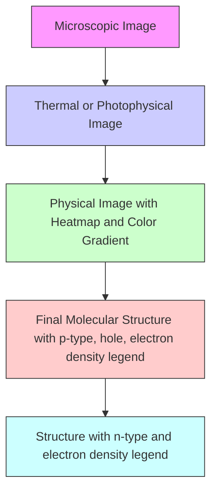
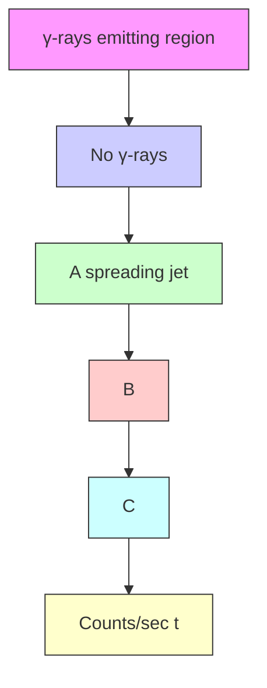
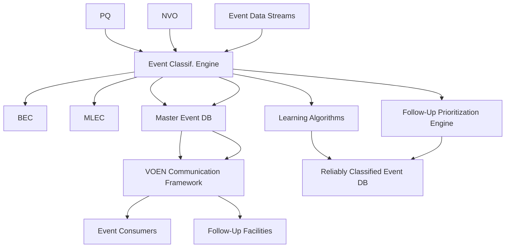
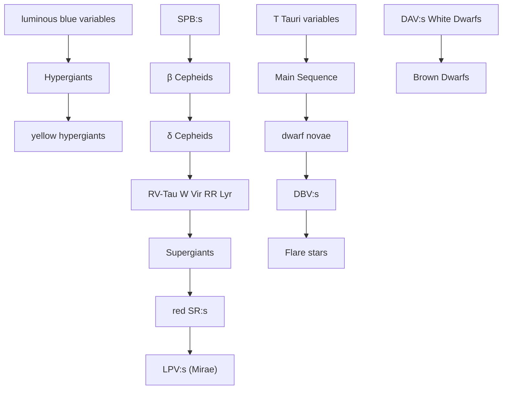

# LSST Science Book

Version 2.0

November 2009

Prepared by the LSST Science Collaborations, with contributions from the LSST Project.

This book is a living document. The most recent version can be found at http://www.lsst.org.

The front cover of the Science Book features an image of the LSST created from mechanical drawings by Todd Mason, Mason Productions, Inc., shown against an image created from Deep Lens Survey data. The back cover shows a simulated 15-second LSST exposure from one of the $4K \times 4K$ CCDs in the focal plane. Graphic design by E. Acosta (LSSTC).

For more information, contact:

J. Anthony Tyson, Director 530.752.3830 - tyson@lsst.org

Donald W. Sweeney, Project Manager 925.487.2134 - sweeney@lsst.org

Michael A. Strauss, Chair of Science Collaborations 609.258.3808 – strauss@astro.princeton.edu

LSST is a public-private partnership. Design and development activity is supported in part by the National Science Foundation. Additional funding comes from private foundation gifts, grants to universities, and in-kind support of Department of Energy laboratories and other LSST Member Institutions. The project is overseen by the LSST Corporation, a non-profit 501(c)3 corporation formed in 2003, with headquarters in Tucson, AZ.

© 2009 by the LSST Corporation

No part of this book may be reproduced or utilized in any form or by any means without the prior written permission from the LSST Corporation.

LSST Corporation

933 North Cherry Avenue

Tucson, AZ 85721-0009

520.881.2626

contact@lsst.org

http://www.lsst.org


<details>
<summary>natural_image</summary>

Logo of the NSF globe with a golden starburst border (no text or symbols beyond the emblem design)
</details>


U.S. DEPARTMENT OF ENERGY

CHARLES SIMONYI FUND

• • • FOR ARTS AND SCIENCES • • •

# Contents

# Preface 9

1 Introduction 11

1.1 Astronomy-Physics Interaction 11

1.2 What a Telescope with Enormous Étendue can Accomplish 12

1.3 The History of the Idea 12

1.4 Overview of LSST Science 13

1.5 The LSST Science Requirements 18

1.6 Defining the Telescope Design Parameters ..... 20
References ..... 24

2 LSST System Design 25

2.1 The LSST Observing Strategy ..... 25

2.2 Observatory Site 27

2.3 Optics and Telescope Design 28

2.4 Camera 32

2.5 Data Management System 37

2.6 Photometric Calibration 45

2.7 Astrometric Calibration ..... 50
References ..... 52

3 System Performance 53

3.1 Operations Simulator 53

3.2 Exposure Time Calculator 56

3.3 Image Simulator 57

3.4 Stray and Scattered Light 62

3.5 The Expected Accuracy of Photometric Measurements 65

3.6 Accuracy of Trigonometric Parallax and Proper Motion Measurements ..... 67

3.7 Expected Source Counts and Luminosity and Redshift Distributions ..... 69

3.8 Photometric Redshifts ..... 73
References ..... 85

4 Education and Public Outreach 87

4.1 Introduction 87

4.2 National Perspective on Education Reform 87

4.3 Teaching and Learning in the Classroom 88

4.4 Outside the Classroom — Engaging the Public 91

4.5 Citizen Involvement in the Scientific Enterprise 92

4.6 Diversity 94

4.7 Summary 95  
References 95

5 The Solar System 97

5.1 A Brief Overview of Solar System Small Body Populations ..... 97

5.2 Expected Counts for Solar System Populations 99

5.3 The Orbital Distributions of Small Body Populations ..... 105

5.4 The Main Belt: Collisional Families and Size Distributions ..... 110

5.5 Trans-Neptunian Families and Wide Binaries 115

5.6 The Size Distribution for Faint Objects—“Shift and Stack” 117

5.7 Lightcurves: Time Variability 120

5.8 Overlapping Populations ..... 122

5.9 Physical Properties of Comets 126

5.10 Mapping of Interplanetary Coronal Mass Ejections 127

5.11 The NEA Impact Hazard 128

5.12 NEAs as Possible Spacecraft Mission Targets ..... 132
References ..... 133

6 Stellar Populations 137

6.1 Introduction.... 137

6.2 The Magellanic Clouds and their Environs ..... 138

6.3 Stars in Nearby Galaxies 144

6.4 Improving the Variable Star Distance Ladder 146

6.5 A Systematic Survey of Star Clusters in the Southern Hemisphere ..... 150

6.6 Decoding the Star Formation History of the Milky Way 155

6.7 Discovery and Analysis of the Most Metal Poor Stars in the Galaxy 160

6.8 Cool Subdwarfs and the Local Galactic Halo Population 162

6.9 Very Low-Mass Stars and Brown Dwarfs in the Solar Neighborhood ..... 166

6.10 Eclipsing Variables 171

6.11 White Dwarfs 175

6.12 A Comparison of Gaia and LSST Surveys ..... 192
References ..... 196

7 Milky Way and Local Volume Structure 201

7.1 Introduction 201

7.2 Mapping the Galaxy - A Rosetta Stone for Galaxy Formation ..... 202

7.3 Unravelling the Secular Evolution of the Bulge and Disk 208

7.4 A Complete Stellar Census 209

7.5 Three-Dimensional Dust Map of the Milky Way ..... 211

7.6 Streams and Structure in the Stellar Halo 216

7.7 Hypervelocity Stars: The Black Hole–Dark Halo Link? 221

7.8 Proper Motions in the Galactic Halo 222

7.9 The Darkest Galaxies 224

7.10 Stellar Tracers of Low-Surface Brightness Structure in the Local Volume ..... 228

7.11 Globular Clusters throughout the Supralocal Volume ..... 235
References ..... 239

8 The Transient and Variable Universe 245

8.1 Introduction 245

8.2 Explosive Transients in the Local Universe ..... 247

8.3 Explosive Transients in the Distant Universe 254

8.4 Transients and Variable Stars in the Era of Synoptic Imaging 261

8.5 Gravitational Lensing Events 268

8.6 Identifying Variables Across the H-R Diagram ..... 274

8.7 Pulsating Variable Stars 280

8.8 Interacting Binaries 284

8.9 Magnetic Activity: Flares and Stellar Cycles 290

8.10 Non-Degenerate Eruptive Variables 296

8.11 Identifying Transiting Planets with LSST 299

8.12 EPO Opportunities 302

References 303

9 Galaxies 309

9.1 Introduction 309

9.2 Measurements 311

9.3 Demographics of Galaxy Populations 313

9.4 Distribution Functions and Scaling Relations 316

9.5 Galaxies in their Dark-Matter Context 319

9.6 Galaxies at Extremely Low Surface Brightness 330

9.7 Wide Area, Multiband Searches for High-Redshift Galaxies 334

9.8 Deep Drilling Fields 337

9.9 Galaxy Mergers and Merger Rates 338

9.10 Special Populations of Galaxies 340

9.11 Public Involvement 341

References 342

10 Active Galactic Nuclei 345

10.1 AGN Selection and Census 346

10.2 AGN Luminosity Function 354

10.3 The Clustering of Active Galactic Nuclei 357

10.4 Multi-wavelength AGN Physics 362

10.5 AGN Variability 366

10.6 Transient Fueling Events: Temporary AGNs and Cataclysmic AGN Outbursts . . . 367

10.7 Gravitationally Lensed AGNs 371

10.8 Public Involvement with Active Galaxies and Supermassive Black Holes ..... 372

References 373

11 Supernovae.... 379

11.1 Introduction 379

11.2 Simulations of SN Ia Light Curves and Event Rates 381

11.3 Simulations of Core-Collapse Supernova Light Curves and Event Rates ..... 385

11.4 SN Ia Photometric Redshifts 388

11.5 Constraining the Dark Energy Equation of State 391

11.6 Probing Isotropy and Homogeneity with SNe Ia 395

11.7 SN Ia Evolution 395

11.8 SN Ia Rates 397

11.9 SN Ia BAO 399

11.10 SN Ia Weak Lensing 401

11.11 Core-Collapse Supernovae 401

11.12 Measuring Distances to Type IIP Supernovae 403

11.13 Probing the History of SN Light using Light Echoes 404

11.14 Pair-Production SNe 405

11.15 Education and Public Outreach with Supernovae . . . . . . . . . . . . . . . . . . . . . 406
References . . . . . . . . . . . . . . . . . . . . . . . . . . . . . 409

12 Strong Lenses 413

12.1 Basic Formalism 413

12.2 Strong Gravitational Lenses in the LSST Survey 417

12.3 Massive Galaxy Structure and Evolution 427

12.4 Cosmography from Modeling of Time Delay Lenses and Their Environments . . . . 429

12.5 Statistical Approaches to Cosmography from Lens Time Delays 432

12.6 Group-scale Mass Distributions, and their Evolution 434

12.7 Dark Matter (Sub)structure in Lens Galaxies 436

12.8 Accretion Disk Structure from 4000 Microlensed AGN 441

12.9 The Dust Content of Lens Galaxies 442

12.10 Dark Matter Properties from Merging Cluster Lenses ..... 445

12.11 LSST's Giant Array of Cosmic Telescopes 448

12.12 Calibrating the LSST Cluster Mass Function using Strong and Weak Lensing . . . . 450

12.13 Education and Public Outreach ..... 455
References ..... 457

13 Large-Scale Structure 461

13.1 Introduction 461

13.2 Galaxy Power Spectra: Broadband Shape on Large Scales 462

13.3 Baryon Acoustic Oscillations 468

13.4 Primordial Fluctuations and Constraints on Inflation 476

13.5 Galaxy Bispectrum: Non-Gaussianity, Nonlinear Evolution, and Galaxy Bias ..... 479

13.6 The LSST Cluster Sample 481

13.7 Cross-Correlations with the Cosmic Microwave Background 490

13.8 Education and Public Outreach ..... 494
References ..... 494

14 Weak Lensing 499

14.1 Weak Lensing Basics 499

14.2 Galaxy-Galaxy Lensing 502

14.3 Galaxy Clusters 506

14.4 Weak Lensing by Large-scale Structure 513

14.5 Systematics and Observational Issues ..... 518
References ..... 526

15 Cosmological Physics 529

15.1 Joint Analysis of BAO and WL 530

15.2 Measurement of the Sum of the Neutrino Mass 536

15.3 Testing Gravity 540

15.4 Anisotropic Dark Energy and Other Large-scale Measurements 545

15.5 Cosmological Simulations ..... 548
References ..... 554

A Assumed Cosmology . . . . . . . . . . . . . . . . . . . . . . . . . . . . . . . . . . . . . . . . 557
References . . . . . . . . . . . . . . . . . . . . . . . . . . . . . . . . . . . . 557

B Analysis methods 559

B.1 Basic Parameter Estimation 559

B.2 Assigning and Interpreting PDFs 561

B.3 Model Selection 562   
B.4 PDF Characterization 564

References 573

C Common Abbreviations and Acronyms 575

References 588

D Authors 591

# Preface

Major advances in our understanding of the Universe over the history of astronomy have often arisen from dramatic improvements in our ability to observe the sky to greater depth, in previously unexplored wavebands, with higher precision, or with improved spatial, spectral, or temporal resolution. Aided by rapid progress in information technology, current sky surveys are again changing the way we view and study the Universe, and the next-generation instruments, and the surveys that will be made with them, will maintain this revolutionary progress. Substantial progress in the important scientific problems of the next decade (determining the nature of dark energy and dark matter, studying the evolution of galaxies and the structure of our own Milky Way, opening up the time domain to discover faint variable objects, and mapping both the inner and outer Solar System) all require wide-field repeated deep imaging of the sky in optical bands.

The wide-fast-deep science requirement leads to a single wide-field telescope and camera which can repeatedly survey the sky with deep short exposures. The Large Synoptic Survey Telescope (LSST), a dedicated telescope with an effective aperture of 6.7 meters and a field of view of 9.6 deg $^{2}$ , will make major contributions to all these scientific areas and more. It will carry out a survey of 20,000 deg $^{2}$ of the sky in six broad photometric bands, imaging each region of sky roughly 2000 times (1000 pairs of back-to-back 15-sec exposures) over a ten-year survey lifetime.

The LSST project will deliver fully calibrated survey data to the United States scientific community and the public with no proprietary period. Near real-time alerts for transients will also be provided worldwide. A goal is worldwide participation in all data products. The survey will enable comprehensive exploration of the Solar System beyond the Kuiper Belt, new understanding of the structure of our Galaxy and that of the Local Group, and vast opportunities in cosmology and galaxy evolution using data for billions of distant galaxies. Since many of these science programs will involve the use of the world's largest non-proprietary database, a key goal is maximizing the usability of the data. Experience with previous surveys is that often their most exciting scientific results were unanticipated at the time that the survey was designed; we fully expect this to be the case for the LSST as well.

The purpose of this Science Book is to examine and document in detail science goals, opportunities, and capabilities that will be provided by the LSST. The book addresses key questions that will be confronted by the LSST survey, and it poses new questions to be addressed by future study. It contains previously available material (including a number of White Papers submitted to the ASTRO2010 Decadal Survey) as well as new results from a year-long campaign of study and evaluation. This book does not attempt to be complete; there are many other scientific projects one can imagine doing with LSST that are not discussed here. Rather, this book is intended as a first step in a collaboration with the world scientific community to identify and prepare for the scientific opportunities that LSST will enable. It will also provide guidance to the optimization and

implementation of the LSST system and to the management and processing of the data produced by the LSST survey.

The ten LSST Science Collaborations, together with others in the world astronomy and physics community, have authored this Science Book; the full list of over 200 contributors may be found in Appendix D. These collaborations perform their work as semi-autonomous organizations in conjunction with the LSST Project, and provide access to the LSST and its support infrastructure for large numbers of scientists. These scientists are laying the groundwork necessary to carry out LSST science projects, defining the required data products, and developing optimal algorithms and calibration strategies for photometry, astrometry, photometric redshifts, and image analysis. Membership in the science collaborations is open to staff at the member institutions, and two US community-wide open call for applications for membership have already been issued. There will be regular future opportunities to join the science collaborations.

This Science Book is a living document. Our understanding of the scientific opportunities that LSST will enable will surely grow, and the authors anticipate future updates of the material in this book as LSST approaches first light.

November 2009

# 1 Introduction

Anthony Tyson, Michael A. Strauss, Željko Ivezić

Wide-angle surveys have been an engine for new discoveries throughout the modern history of astronomy, and have been among the most highly cited and scientifically productive observing facilities in recent years. Over the past decade, large scale sky surveys in many wavebands, such as the Sloan Digital Sky Survey (SDSS), Two-Micron All Sky Survey (2MASS), Galaxy Evolution Explorer (GALEX), Faint Images of the Radio Sky at Twenty-centimeters (FIRST), and many others have proven the power of large data sets for answering fundamental astrophysical questions. This observational progress, based on advances in telescope construction, detectors, and above all, information technology, has had a dramatic impact on nearly all fields of astronomy and many areas of fundamental physics. The hardware and computational technical challenges and the exciting science opportunities are attracting scientists from high-energy physics, statistics, and computer science. These surveys are most productive and have the greatest impact when the data from the surveys are made public in a timely manner. The LSST builds on the experience of these surveys and addresses the broad scientific goals of the coming decade.

# 1.1 Astronomy-Physics Interaction

The astronomical discovery that ordinary matter, i.e., that made of familiar atoms, comprises only 4% of the mass-energy density of the Universe is the most dramatic in cosmology in the past several decades, and it is clear that new physics will be needed to explain the non-baryonic dark matter and dark energy. At the same time, data from particle physics suggests a corresponding need for physics beyond the Standard Model. Discovering and understanding the fundamental constituents and interactions of the Universe is the common subject of particle physics and cosmology. In recent years, the frontier questions in both fields have become increasingly intertwined; in addition to the dark matter and dark energy questions, astronomical observations have provided the best evidence to date for non-zero neutrino masses, have suggested phase transitions leading to inflation in the early Universe, give the best constraints on alternative theories of gravity on large scales, and allow us to test for time variations in the fundamental physical constants.

The emerging common themes that astrophysics and particle physics are addressing have crystallized a new physics-astronomy community. The number of particle physicists taking active roles in astrophysics has increased significantly. Understanding the origin of dark matter and dark energy will require simultaneous progress in both particle physics and cosmology, in both theory and experiment. Discoveries with LSST and the Large Hadron Collider will rely on scientists covering a broader intellectual frontier, and require enhanced collaboration between theorists and experimentalists in particle physics, cosmology, and astrophysics generally.

# 1.2 What a Telescope with Enormous Étendue can Accomplish

A survey that can cover the sky in optical bands over wide fields to faint magnitudes with a fast cadence is required in order to explore many of the exciting science opportunities of the next decade. The most important characteristic that determines the speed at which a system can survey the sky to a given depth is its étendue (or grasp): the product of its primary mirror area (in square meters) and the area of its field-of-view (in square degrees). Imaging data from a large ground-based active optics telescope with sufficient étendue can address many scientific missions simultaneously rather than sequentially. By providing unprecedented sky coverage, cadence, and depth, the LSST makes it possible to attack multiple high-priority scientific questions that are far beyond the reach of any existing facility.

The effective étendue for LSST will be $319 \, m^{2} deg^{2}$ , more than an order of magnitude larger than that of any existing facility. Full simulations of LSST's capabilities have been carried out, as described below. The range of scientific investigations that will be enabled by such a dramatic improvement in survey capability is extremely broad. These new investigations will rely on the statistical precision obtainable with billions of objects. Thus hundreds of deep exposures are required in each band to gain control of low-level systematics. Hundreds of deep and short exposures are also required in order to fully explore the faint time domain on short timescales. This wide-fast-deep requirement led to the LSST design. The history of astronomy has taught us that there are unanticipated surprises whenever we view the sky in a new way. The wide-fast-deep survey capability of LSST promises significant advances in virtually all areas of astrophysics.

# 1.3 The History of the Idea

The value of wide area imaging of the sky has long been recognized: motivated by the opportunities of statistical astronomy, telescope and detector research and development (R&D) campaigns in the 1930s and 1940s at Caltech and Kodak gave rise to the Palomar Observatory Sky Survey (POSS, 1948-1957). While POSS enabled significant advances in astronomy through follow-up observations, the next revolution – very deep imaging – had to wait 25 years for digital data from a new detector technology. Early Charge-Coupled Devices (CCDs) were ten thousand times smaller in area than the POSS plates, but the promise of high quantum efficiency for astronomical applications (including the Hubble Space Telescope (HST)) kept R&D on scientific grade CCDs alive in the 1970s and 1980s. With their higher sensitivity and linearity, these early CCDs led to many astronomical advances. Eventually larger scientific CCDs were developed, leading to focal plane mosaics of these CCDs in the early 1990s. The Big Throughput Camera (Wittman et al. 1998, BTC) on the 4-meter Blanco telescope enabled the surveys that discovered high-redshift supernovae and suggested the existence of dark energy. A mosaic of these same CCDs led to the Sloan Digital Sky Survey (York et al. 2000, SDSS), which has imaged over 10,000 deg $^{2}$ of sky in five broad bands. SDSS has been hugely successful because the high étendue of the telescope/camera combination enabled a wide survey with well-calibrated digital data.

Wide surveys are very productive; the SDSS, for example, was cited as the most productive telescope in recent years (Madrid & Macchetto 2009). The discovery space could be made even larger if the survey could be made deep and with good time resolution (fast). LSST had its origin in the

realization in the late 1990s – extrapolating from the BTC on the 4-meter telescope – that a wide-fast-deep optical sky survey would be possible if the size and field of view of the camera+telescope were scaled up. The challenge was to design a very wide field telescope with state-of-the-art image quality. Originally, 4-meter designs with several square degrees field of view were studied. However, it was soon realized that larger étendue and better image performance than realizable in two-mirror+corrector designs would be required to address a broad range of science opportunities simultaneously with the same data. Indeed the three-mirror modified Paul-Baker design suggested by Roger Angel in 1998 for the “Dark Matter Telescope” (DMT) had its origin in two very different wide-fast-deep survey needs: mapping dark matter via weak gravitational lensing and detecting faint Solar System bodies (Angel et al. 2000; Tyson et al. 2001).

Plans for the “6-meter class” DMT wide field telescope and camera were presented at a workshop on gravity at SLAC National Accelerator Laboratory in August 1998 (Tyson 1998). The science case for such a telescope was submitted to the 2000 Astronomy and Astrophysics Decadal Survey in June 1999. That National Research Council (NRC) report recommended it highly as a facility to discover near-Earth asteroids as well as to study dark matter, and renamed it the Large Synoptic Survey Telescope (LSST). In order to explore the science opportunities and related instrument requirements, a Science Drivers Workshop was held at the National Optical Astronomy Observatory (NOAO) in November 2000. A summer workshop on wide field astronomy was held at the Aspen Center for Physics in July 2001, arguably the beginning of wide involvement by the scientific community in this project. Many alternative system designs were studied, but the need for short, deep, and well sampled wide-field exposures led naturally to a single large telescope and camera. At the behest of the National Science Foundation (NSF) astronomy division, NOAO set up a national committee in September 2002, with Michael Strauss as chair, to develop the LSST design reference mission (Strauss et al. 2004). Plans for a Gigapixel focal plane (Starr et al. 2002), as well as initial designs for the telescope-camera-data system (Tyson 2002), were presented in 2002. In 2002 the NSF funded development of the new imagers required for LSST, supplementing an investment already made by Bell Labs. Lynn Seppala modified Roger Angel’s original three-mirror optical design (Angel et al. 2000), creating a wider, very low distortion field. Also in 2002 the LSST Corporation was formed to manage the project. A construction proposal was submitted to the NSF in early 2007 and favorably reviewed later that year. In 2008 the LSST 8.4-m primary-tertiary mirror ( $§\ 2.3$ ) was cast, and in early 2009 the secondary mirror blank was cast as well.

# 1.4 Overview of LSST Science

Guided by community-wide input, the LSST is designed to achieve multiple goals in four main science themes: Taking an Inventory of the Solar System, Mapping the Milky Way, Exploring the Transient Optical Sky, and Probing Dark Energy and Dark Matter. These are just four of the many areas on which LSST will have enormous impact, but they span the space of technical challenges in the design of the system and the survey and have been used to focus the science requirements.

The LSST survey data will be public with no proprietary period in the United States, with a goal to make it world-public. As was the case with SDSS, we expect the scientific community will produce a rich harvest of discoveries. Through the science collaborations, the astronomical and physics communities are already involved in the scientific planning for this telescope.

Each patch of sky will be visited 1000 times (where a visit consists of two 15-second exposures back to back in a given filter) in ten years, producing a trillion line database with temporal astrometric and photometric data on 20 billion objects. The 30 terabytes of pipeline processed data (32 bit) obtained each night will open the time domain window on the deep optical universe for variability and motion. Rarely observed events will become commonplace, new and unanticipated phenomena will be discovered, and the combination of LSST with contemporary space-based near-infrared (NIR) missions will provide powerful synergies in studies of dark energy, galaxy evolution, and many other areas. The deep coverage of ten billion galaxies provides unique capabilities for cosmology. Astrometry, six-band photometry, and time domain data on 10 billion stars will enable studies of Galactic structure. All LSST data and source code will be non-proprietary, with public accessibility and usability a high priority. A goal is to have worldwide participation in all data products.

This book describes in detail many of the scientific opportunities that LSST will enable. Here we outline some of the themes developed in the chapters that follow:

# • A Comprehensive Survey of the Solar System (Chapter 5):

The small bodies of the Solar System offer a unique insight into its early stages. Their orbital elements, sizes, and color distributions encode the history of accretion, collisional grinding, and perturbations by existing and vanished giant planets. Farther out, runaway growth never occurred, and the Kuiper belt region still contains a portion of the early planet population. Understanding these distributions is a key element in testing various theories for the formation and evolution of our planetary system. LSST, with its unprecedented power for discovering moving objects, will make major advances in Solar System studies. The baseline LSST cadence will result in orbital parameters for several million moving objects; these will be dominated by main belt asteroids (MBAs), with light curves and colorimetry for a substantial fraction of detected objects. This represents an increase of factors of ten to one hundred over the numbers of objects with documented orbits, colors, and variability information.

Our current understanding of objects beyond Neptune (trans-Neptunian Objects, or TNOs) is limited by small sample sizes. Fewer than half of the $\sim$ 1000 TNOs discovered to date are drawn from surveys whose discovery biases can be quantified, and only several hundred TNOs have measured colors. The LSST will survey over half the celestial sphere for asteroids, get superb orbits, go tremendously faint, and measure precise colors, allowing measurement of light curves for thousands of TNOs, producing rotation periods and phase curves, yielding shape and spin properties, and providing clues to the early environment in the outer Solar System. Moreover, these objects fall into a wide variety of dynamical classes, which encode clues to the formation of the Solar System.

Many asteroids travel in Earth-crossing orbits, and Congress has mandated that National Aeronautics and Space Administration (NASA) catalog 90% of all potentially hazardous asteroids larger than 140 meters in diameter. The LSST is the only ground-based survey that is capable of achieving this goal (Ivezić et al. 2008).

# - Structure and Stellar Content of the Milky Way (Chapters 6 and 7):

Encoded in the structure, chemical composition and kinematics of stars in our Milky Way is a history of its formation. Surveys such as 2MASS and SDSS have demonstrated that the

halo has grown by accretion and cannibalization of companion galaxies, and it is clear that the next steps require deep wide-field photometry, parallax, proper motions, and spectra to put together the story of how our Galaxy formed. LSST will enable studies of the distribution of numerous main sequence stars beyond the presumed edge of the Galaxy's halo, their metallicity distribution throughout most of the halo, and their kinematics beyond the thick disk/halo boundary, and will obtain direct distance measurements below the hydrogen-burning limit for a representative thin-disk sample. LSST is ideally suited to answering two basic questions about the Milky Way Galaxy: What is the structure and accretion history of the Milky Way? What are the fundamental properties of all the stars within 300 pc of the Sun?

LSST will produce a massive and exquisitely accurate photometric and astrometric data set. Compared to SDSS, the best currently available optical survey, LSST will cover an area more than twice as large, using hundreds of observations of the same region in a given filter instead of one or two, and each observation will be about two magnitudes deeper. LSST will detect of the order $10^{10}$ stars, with sufficient signal-to-noise ratio to enable accurate light curves, geometric parallax, and proper motion measurements for about a billion stars. Accurate multi-color photometry can be used for source classification (1% colors are good enough to separate main sequence and giant stars, Helmi et al. 2003), and measurement of detailed stellar properties such as effective temperatures to an rms accuracy of 100 K and metallicity to 0.3 dex rms.

To study the metallicity distribution of stars in the Sgr tidal stream (Majewski et al. 2003) and other halo substructures at distances beyond the presumed boundary between the inner and outer halo ( $\sim$ 30 kpc, Carollo et al. 2007), the coadded depth in the $u$ band must reach $\sim$ 24.5. To detect RR Lyrae stars beyond the Galaxy's tidal radius at $\sim$ 300 kpc, the single-visit depth must be $r \sim$ 24.5. In order to measure the tangential velocity of stars to an accuracy of 10 km s $^{-1}$ at a distance of 10 kpc, where the halo dominates over the disk, proper motions must be measured to an accuracy of at least 0.2 mas yr $^{-1}$ . The same accuracy follows from the requirement to obtain the same proper motion accuracy as Gaia (Perryman et al. 2001) at its faint limit ( $r \sim$ 20). In order to produce a complete sample of solar neighborhood stars out to a distance of 300 pc (the thin disk scale height), with 3 $\sigma$ or better geometric distances, trigonometric parallax measurements accurate to 1 mas are required. To achieve the required proper motion and parallax accuracy with an assumed astrometric accuracy of 10 mas per observation per coordinate, approximately 1,000 observations are required. This requirement on the number of observations is close to the independent constraint implied by the difference between the total depth and the single visit depth.

# • The Variable Universe (Chapter 8):

Characterization of the variable optical sky is one of the true observational frontiers in astrophysics. No optical telescope to date has had the capability to search for transient phenomena at faint levels over enough of the sky to fully characterize the phenomena. Variable and transient phenomena have historically led to fundamental insights into subjects ranging from the structure of stars to the most energetic explosions in the Universe to cosmology. Existing surveys leave large amounts of discovery parameter space (in waveband, depth, and cadence) as yet unexplored, and LSST is designed to start filling these gaps.

LSST will survey the sky on time scales from years down to 15 seconds. Because LSST extends

time-volume space a thousand times over current surveys, the most interesting science may well be the discovery of new phenomena. With its repeated, wide-area coverage to deep limiting magnitudes, LSST will enable the discovery and analysis of rare and exotic objects, such as neutron star and black hole binaries and high-energy transients, such as optical counterparts to gamma-ray bursts and X-ray flashes (at least some of which apparently mark the deaths of massive stars). LSST will also characterize in detail active galactic nuclei (AGN) variability and new classes of transients, such as binary mergers and stellar disruptions by black holes. Perhaps even more interesting are explosive events of types yet to be discovered, such as predicted mergers among neutron stars and black holes. These may have little or no high-energy emission, and hence may be discoverable only at longer wavelengths or in coincidence with gravitational wave events.

LSST will also provide a powerful new capability for monitoring periodic variables such as RR Lyrae stars, which will be used to map the Galactic halo and intergalactic space to distances exceeding 400 kpc. The search for transients in the nearby Universe (within 200 Mpc) is interesting and urgent for two reasons. First, there exists a large gap in the luminosity of the brightest novae (-10 mag) and that of sub-luminous supernovae (-16 mag). However, theory and reasonable speculation point to several potential classes of objects in this “gap”. Such objects are best found in the Local Universe. Next, the nascent field of gravitational wave astronomy and the budding fields of ultra-high energy cosmic rays, TeV photons, and astrophysical neutrinos are likewise limited to the Local Universe due to physical effects (GZK effect, photon pair production) or instrumental sensitivity (neutrinos and gravitational waves). Unfortunately, the localization of these new telescopes is poor, precluding identification of the host galaxy (with corresponding loss of distance information and physical diagnostics). Both goals can be met with a fast wide field optical imaging survey in concert with follow-up telescopes.

# • The Evolution of Galaxies (Chapters 9 and 10):

Surveys carried out with the current generation of ten-meter-class telescopes in synergy with deep X-ray (Chandra X-ray Observatory, X-ray Multi-mirror Mission) and infrared (Spitzer Space Telescope) imaging have resulted in the outline of a picture of how galaxies evolve from redshift 7 to the present. We now have a rough estimate, for example, of the star formation history of the Universe, and we are starting to develop a picture of how the growth of supermassive black holes is coupled to, and influences, the growth of galaxy bulges. But the development of galaxy morphologies and the dependence on environment are poorly understood. In spite of the success of the concordance cosmological model and the hierarchical galaxy-formation paradigm, experts agree that our understanding of galaxy formation and evolution is incomplete. We do not understand how galaxies arrive at their present-day properties. We do not know if the various discrepancies between theory and observations represent fundamental flaws in our assumptions about dark matter, or problems in our understanding of feedback on the interstellar medium due to star formation or AGN activity. Because the process of galaxy formation is inherently stochastic, large statistical samples are important for making further progress.

The key questions in galaxy evolution over cosmic time require a deep wide-area survey to complement the more directed studies from HST, James Webb Space Telescope (JWST), and Atacama Large Millimeter Array (ALMA) and other narrow-field facilities. The essential

correlation of galaxy properties with dark matter — both on small scales in the local Universe and in gravitational lenses, and on the Gpc scales required for large-scale structure — requires a new generation wide-area survey. LSST promises to yield insights into these problems.

It is likely that AGN spend most of their lives in low-luminosity phases, outshone by their host galaxies, but recognizable by their variability. These will be revealed with great statistical accuracy by LSST in synergy with other facilities. The systematic evolution of AGN optical variability is virtually unexplored in large samples and would provide a new window into accretion physics.

\- Cosmological Models, and the Nature of Dark Energy and Dark Matter (Chapters 11-15):

Surveys of the Cosmic Microwave Background (CMB), the large-scale distribution of galaxies, the redshift-distance relation for supernovae, and other probes, have led us to the fascinating situation of having a precise cosmological model for the geometry and expansion history of the Universe, whose principal components we simply do not understand. A major challenge for the next decade will be to gain a physical understanding of dark energy and dark matter. Doing this will require wide-field surveys of gravitational lensing, of the large-scale distribution of galaxies, and of supernovae, as well as next-generation surveys of the CMB (including polarization).

Using the CMB as normalization, the combination of these LSST deep probes over wide area will yield the needed precision to distinguish between models of dark energy, with cross checks to control systematic error. LSST is unique in that its deep, wide-field, multi-color imaging survey can undertake four cosmic probes of dark matter and dark energy physics with a single data set and with much greater precision than previously: 1) Weak lensing cosmic shear of galaxies as a function of redshift; 2) Baryon acoustic oscillations (BAO) in the power spectrum of the galaxy distribution; 3) Evolution of the mass function of clusters of galaxies, as measured via peaks in the weak lensing shear field; and 4) measurements of redshifts and distances of type Ia supernovae. The synergy between these probes breaks degeneracies and allows cosmological models to be consistently tested. By simultaneously measuring the redshift-distance relation and the growth of cosmic structure, LSST data can test whether the recent acceleration is due to dark energy or modified gravity. Because of its wide area coverage, LSST will be uniquely capable of constraining more general models of dark energy. LSST's redshift coverage will bracket the epoch at which dark energy began to dominate the cosmic expansion. Much of the power of the LSST will come from the fact that all the different measurements will be obtained from the same basic set of observations, using a facility that is optimized for this purpose. The wide-deep LSST survey will allow a unique probe of the isotropy and homogeneity of dark energy by mapping it over the sky, using weak lensing, supernovae and BAO, especially when normalized by Planck observations.

Gravitational lensing provides the cleanest and farthest-reaching probe of dark matter in the Universe, which can be combined with other observations to answer the most challenging and exciting questions that will drive the subject in the next decade: What is the distribution of mass on sub-galactic scales? How do galaxy disks form and bulges grow in dark matter halos? How accurate are CDM predictions of halo structure? Can we distinguish between a need for a new substance (dark matter) and a need for new gravitational physics? What is the dark matter made of anyway? LSST's wide-field, multi-filter, multi-epoch optical imaging survey

will probe the physics of dark matter halos, based on the (stackable) weak lensing signals from all halos, the strong lensing time domain effects due to some, and the distribution of 3 billion galaxies with photometric redshifts. LSST will provide a comprehensive map of dark matter over a cosmological volume.

# 1.5 The LSST Science Requirements

The superior survey capability enabled by LSST will open new windows on the Universe and new avenues of research. It is these scientific opportunities that have driven the survey and system design. These “Science Requirements” are made in the context of what we forecast for the scientific landscape in 2015, about the time the LSST survey is planned to get underway. Indeed, LSST represents such a large leap in throughput and survey capability that in these key areas the LSST remains uniquely capable of addressing these fundamental questions about our Universe. The long-lived data archives of the LSST will have the astrometric and photometric precision needed to support entirely new research directions which will inevitably develop during the next several decades.

We have developed a detailed LSST Science Requirements Document $^{1}$ , allowing the goals of all the science programs discussed above (and many more, of course) to be accomplished. The requirements are summarized as follows:

1. The single visit depth should reach $r \sim 24.5$ ( $5\sigma$ , point source). This limit is primarily driven by need to image faint, fast-moving potentially hazardous asteroids, as well as variable and transient sources (e.g., supernovae, RR Lyrae stars, gamma-ray burst afterglows), and by proper motion and trigonometric parallax measurements for stars. Indirectly, it is also driven by the requirements on the coadded survey depth and the minimum number of exposures required by weak lensing science (Chapter 14) to average over systematics in the point-spread function.   
2. Image quality should maintain the limit set by the atmosphere (the median free-air seeing is 0.7 arcsec in the r band at the chosen site, see Figure 2.3), and not be degraded appreciably by the hardware. In addition to stringent constraints from weak lensing, the requirement for good image quality is driven by the required survey depth for point sources and by image differencing techniques.   
3. Photometric repeatability should achieve 5 millimag precision at the bright end, with zeropoint stability across the sky of 10 millimag and band-to-band calibration errors not larger than 5 millimag. These requirements are driven by the need for photometric redshift accuracy, the separation of stellar populations, detection of low-amplitude variable objects (such as eclipsing planetary systems), and the search for systematic effects in Type Ia supernova light curves.   
4. Astrometric precision should maintain the limit set by the atmosphere of about 10 mas rms per coordinate per visit at the bright end on scales below 20 arcmin. This precision is driven by the desire to achieve a proper motion uncertainty of 0.2 mas yr $^{-1}$ and parallax uncertainty of 1.0 mas over the course of a 10-year survey (see § 1.6.1).

5. The single visit exposure time (including both exposures in a visit) should be less than about a minute to prevent trailing of fast moving objects and to aid control of various systematic effects induced by the atmosphere. It should be longer than $\sim$ 20 seconds to avoid significant efficiency losses due to finite readout, slew time, and read noise ( $\S$ 1.6.2).   
6. The filter complement should include six filters in the wavelength range limited by atmospheric absorption and silicon detection efficiency (320–1050 nm), with roughly rectangular filters and no large gaps in the coverage, in order to enable robust and accurate photometric redshifts and stellar typing. An SDSS-like u band is extremely important for separating low-redshift quasars from hot stars and for estimating the metallicities of F/G main sequence stars. A bandpass with an effective wavelength of about 1 micron will enable studies of sub-stellar objects, high-redshift quasars (to redshifts of $\sim7.5$ ), and regions of the Galaxy that are obscured by interstellar dust.   
7. The revisit time distribution should enable determination of orbits of Solar System objects and sample SN light curves every few days, while accommodating constraints set by proper motion and trigonometric parallax measurements.   
8. The total number of visits of any given area of sky, when summed over all filters, should be of the order of 1,000, as mandated by weak lensing science, the asteroid survey, and proper motion and trigonometric parallax measurements. Studies of variable and transient sources of all sorts also benefit from a large number of visits.   
9. The coadded survey depth should reach $r \sim 27.5$ (5 $\sigma$ , point source), with sufficient signal-to-noise ratio in other bands to address both extragalactic and Galactic science drivers.   
10. The distribution of visits per filter should enable accurate photometric redshifts, separation of stellar populations, and sufficient depth to enable detection of faint extremely red sources (e.g., brown dwarfs and high-redshift quasars). Detailed simulations of photometric redshift estimators (see § 3.8) suggest an approximately flat distribution of visits among bandpasses (because the system throughput and atmospheric properties are wavelength-dependent, the achieved depths are different in different bands). The adopted time allocation (see Table 1.1) gives a slight preference to the r and i bands because of their dominant role in star/galaxy separation and weak lensing measurements.   
11. The distribution of visits on the sky should extend over at least $\sim20,000\ deg^{2}$ to obtain the required number of galaxies for weak lensing studies, to study the distribution of galaxies on the largest scales and to probe the structure of the Milky Way and the Solar System, with attention paid to include “special” regions such as the ecliptic, the Galactic plane, and the Large and Small Magellanic Clouds.   
12. Data processing, data products, and data access should enable efficient science analysis. To enable a fast and efficient response to transient sources, the processing latency for objects that change should be less than a minute after the close of the shutter, together with a robust and accurate preliminary classification of reported transients.

Remarkably, even with these joint requirements, none of the individual science programs is severely over-designed. That is, despite their significant scientific diversity, these programs are highly compatible in terms of desired data characteristics. Indeed, any one of the four main science drivers: the Solar System inventory, mapping the Milky Way, transients, and dark energy/dark matter, could be removed, and the remaining three would still yield very similar requirements for

most system parameters. As a result, the LSST system can adopt a highly efficient survey strategy where a single data set serves most science programs (instead of science-specific surveys executed in series). One can think of this as massively parallel astrophysics.

About 90% of the observing time will be devoted to a uniform deep-wide-fast (main) survey mode. All scientific investigations will utilize a common database constructed from an optimized observing program. The system is designed to yield high image quality as well as superb astrometric and photometric accuracy. The survey area will cover $30,000 \, deg^{2}$ with $\delta < +34.5 \, deg$ , and will be imaged many times in six bands, ugrizy, spanning the wavelength range 320–1050 nm. Of this $30,000 \, deg^{2}$ , $20,000 \, deg^{2}$ will be covered with a deep-wide-fast survey mode, with each area of sky covered with 1000 visits (summed over all six bands) during the anticipated 10 years of operations. This will result in measurements of 10 billion stars to a depth of 27.7 mag and photometry for a roughly equal number of galaxies. The remaining 10% of the observing time will be allocated to special programs such as a Very Deep + Fast time domain survey, in which a given field is observed for an hour every night.

The uniform data quality, wavelength coverage, deep 0.7 arcsec imaging over tens of thousands of square degrees together with the time-domain coverage will be unmatched. LSST data will be used by a very large fraction of the astronomical community – this is a survey for everyone.

# 1.6 Defining the Telescope Design Parameters

Given the science requirements listed in the previous section, we now discuss how they are translated into constraints on the main system design parameters: the aperture size, the survey lifetime, and the optimal exposure time. The basic parameters of the system are outlined in Table 1.1.

# 1.6.1 The Aperture Size

The product of the system's étendue and the survey lifetime, for given observing conditions, determines the sky area that can be surveyed to a given depth. The LSST field-of-view area is set to the practical limit possible with modern optical designs, $10\mathrm{deg}^2$ , determined by the requirement that the delivered image quality be dominated by atmospheric seeing at the chosen site (Cerro Pachón in Northern Chile; § 2.2). A larger field-of-view would lead to unacceptable deterioration of the image quality. This leaves the primary mirror diameter and survey lifetime as free parameters. Our adopted survey lifetime is ten years. Shorter than this would imply an excessively large and expensive mirror (15 meters for a three-year survey and 12 meters for a five-year survey), while a much smaller telescope would require much more time to complete the survey with the associated increase in operations cost and evolution of the science goals.

The primary mirror size is a function of the required survey depth and the desired sky coverage. Roughly speaking, the anticipated science outcome scales with the number of detected sources. For practically all astronomical source populations, in order to maximize the number of detected

Main System and Survey Characteristics 

<table><tr><td>Étendue</td><td>319  $m^{2}$  deg $^{2}$ </td></tr><tr><td>Area and diameter of field of view</td><td>9.6 deg $^{2}$  (3.5 deg)</td></tr><tr><td>Effective clear aperture (on-axis)</td><td>6.7 m (accounting for obscuration)</td></tr><tr><td>Wavelength coverage (full response)</td><td>320-1080 nm</td></tr><tr><td>Filter set</td><td>u, g, r, i, z, y (five concurrent in camera at a time)</td></tr><tr><td>Sky coverage</td><td>20,000 deg $^{2}$  (Main Survey)</td></tr></table>

Telescope and Site 

<table><tr><td>Configuration</td><td>three-mirror, Alt-azimuth</td></tr><tr><td>Final f/ratio; plate scale</td><td>f/1.23 50 microns/arcsec</td></tr><tr><td>Physical diameter of optics</td><td>M1: 8.4m M2: 3.4m M3: 5.02 m</td></tr><tr><td>First camera lens; focal plane diameter</td><td>Lens: 1.55 m field of view: 63 cm</td></tr><tr><td>Diameter of 80% encircled energy spot due to optics</td><td>u: 0.26&#x27;&#x27; g: 0.26&#x27;&#x27; r: 0.18&#x27;&#x27; i: 0.18&#x27;&#x27; z: 0.19&#x27;&#x27; y: 0.20&#x27;&#x27;</td></tr></table>

Camera 

<table><tr><td>Pixel size; pixel count</td><td>10 microns (0.2 arcsec); 3.2 Gpixels</td></tr><tr><td>Readout time</td><td>2 sec</td></tr><tr><td>Dynamic range</td><td>16 bits</td></tr><tr><td>Focal plane device configuration</td><td>4-side buttable, &gt;90% fill factor</td></tr><tr><td>Filter change time</td><td>120 seconds</td></tr></table>

Data Management 

<table><tr><td>Real-time alert latency</td><td>60 seconds</td></tr><tr><td>Raw pixel data/night</td><td>15 TB</td></tr><tr><td>Yearly archive rate (compressed)</td><td>Images; 5.6 PB; Catalogs: 0.6 PB</td></tr><tr><td>Computational requirements</td><td>Telescope: &lt;1 Tflop; Base facility: 30 Tflop;Archive Center: 250 Tflop by year 10</td></tr><tr><td>Bandwidth:</td><td>Telescope to base: 40 Gbits/secBase to archive: 2.5 Gbits/sec avg</td></tr></table>

System Capability 

<table><tr><td>Single-visit depths (point sources; 5σ)</td><td>u: 23.9 g: 25.0 r: 24.7 i: 24.0 z: 23.3 y: 22.1 AB mag</td></tr><tr><td>Baseline number of visits over 10 years</td><td>u: 70 g: 100 r: 230 i: 230 z: 200 y: 200</td></tr><tr><td>Coadded depths (point sources; 5σ)</td><td>u: 26.3 g: 27.5 r: 27.7 i: 27.0 z: 26.2 y: 24.9 AB mag</td></tr><tr><td>Photometry accuracy (rms mag)</td><td>repeatability: 0.005; zeropoints: 0.01</td></tr><tr><td>Astrometric accuracy at r = 24 (rms)</td><td>parallax: 3 mas; proper motion: 1 mas yr $^{-1}$ </td></tr></table>

Table 1.1: LSST System Parameters


<details>
<summary>line</summary>

| LSST Time (years) | D=12m | LSST (6.5m) | D=3.5m |
| ----------------- | ----- | ----------- | ------ |
| 0                 | 25.5  | 25.5        | 25.5   |
| 1                 | 27.0  | 26.5        | 26.0   |
| 2                 | 27.5  | 27.0        | 26.5   |
| 3                 | 27.8  | 27.3        | 26.8   |
| 4                 | 28.0  | 27.5        | 27.0   |
| 5                 | 28.1  | 27.6        | 27.1   |
| 6                 | 28.2  | 27.7        | 27.2   |
| 7                 | 28.3  | 27.8        | 27.3   |
| 8                 | 28.4  | 27.9        | 27.4   |
| 9                 | 28.45 | 27.95       | 27.5   |
| 10                | 28.5  | 28.0        | 27.6   |
| 11                | 28.55 | 28.05       | 27.7   |
| 12                | 28.6  | 28.1        | 27.8   |
| 13                | 28.65 | 28.15       | 27.9   |
</details>


<details>
<summary>line</summary>

| n (days) | r_s (single-visit 5σ depth) for D=12m | r_s (single-visit 5σ depth) for LSST (6.5m) | r_s (single-visit 5σ depth) for D=3.5m |
| -------- | ------------------------------------- | ------------------------------------------- | -------------------------------------- |
| 0        | 23.0                                  | 23.0                                        | 23.0                                   |
| 2        | 24.8                                  | 24.5                                        | 23.8                                   |
| 4        | 25.5                                  | 24.9                                        | 24.2                                   |
| 6        | 25.7                                  | 25.1                                        | 24.5                                   |
| 8        | 25.9                                  | 25.3                                        | 24.7                                   |
</details>

Figure 1.1: (a) The coadded depth in the r band (AB magnitudes) vs. the effective aperture and the survey lifetime. It is assumed that 22% of the total observing time (corrected for weather and other losses) is allocated for the r band, and that the ratio of the surveyed sky area to the field-of-view area is 2,000. (b) The single-visit depth in the r band (5σ detection for point sources, AB magnitudes) vs. revisit time, n (days), as a function of the effective aperture size. With a coverage of 10,000 deg $^{2}$ in two bands, the revisit time directly constrains the visit exposure time, $t_{vis} = 10n$ seconds; these numbers can be directly scaled to the 20,000 deg $^{2}$ and six filters of LSST. In addition to direct constraints on optimal exposure time, $t_{vis}$ is also driven by requirements on the revisit time, n, the total number of visits per sky position over the survey lifetime, $N_{visit}$ , and the survey efficiency, $\epsilon$ (see Equation 1.3). Note that these constraints result in a fairly narrow range of allowed $t_{vis}$ for the main deep-wide-fast survey. From Ivezić et al. (2008).

sources, it is more advantageous to maximize first the area and then the detection depth. $^{2}$ For this reason, the sky area for the main survey is maximized to its practical limit, 20,000 deg $^{2}$ , determined by the requirement to avoid large airmasses ( $X \equiv \sec(\text{zenith distance})$ ), which would substantially deteriorate the image quality and the survey depth. With the adopted field-of-view area, the sky coverage and the survey lifetime fixed, the primary mirror diameter is fully driven by the required survey depth. There are two depth requirements: the final (coadded) survey depth, $r \sim 27.5$ , and the depth of a single visit, $r \sim 24.5$ . The two requirements are compatible if the number of visits is several hundred per band, which is in good agreement with independent science-driven requirements on the latter. The required coadded survey depth provides a direct constraint, independent of the details of survey execution such as the exposure time per visit, on the minimum effective primary mirror diameter of 6.5 m, as illustrated in Figure 1.1. This is the effective diameter of the LSST taking into account the actual throughput of its entire optical system.

# 1.6.2 The Optimal Exposure Time

The single visit depth depends on both the primary mirror diameter and the chosen exposure time, $t_{vis}$ . In turn, the exposure time determines the time interval to revisit a given sky position and the total number of visits, and each of these quantities has its own science drivers. We summarize these simultaneous constraints in terms of the single-visit exposure time:

- The single-visit exposure time should not be longer than about a minute to prevent trailing of fast solar system moving objects, and to enable efficient control of atmospheric systematics.   
- The mean revisit time (assuming uniform cadence) for a given position on the sky, $n$ , scales as

$$
n = \left(\frac {t _ {\text {vis}}}{1 0 \sec}\right) \left(\frac {A _ {\text {sky}}}{1 0 , 0 0 0 \deg^ {2}}\right) \left(\frac {1 0 \deg^ {2}}{A _ {\text {FOV}}}\right) \text {days}, \tag {1.1}
$$

where two visits per night are assumed (this is needed to get velocity vectors for main belt and near-Earth asteroids), and the losses for realistic observing conditions have been taken into account (with the aid of the Operations Simulator described in § 3.1). Science drivers such as supernovae and moving objects in the Solar System require that n < 4 days, or equivalently $t_{vis} < 40$ seconds for the nominal values of $A_{sky}$ and $A_{FOV}$ .

\- The number of visits to a given position on the sky, $N_{visit}$ , with losses for realistic observing conditions taken into account, is given by

$$
N _ {\text { visit }} = \left(\frac {3 0 0 0}{n}\right) \left(\frac {T}{1 0 \mathrm{yr}}\right), \tag {1.2}
$$

where n is the mean time, in days, between visits to a given position. The requirement $N_{visit} > 800$ again implies that n < 4 and $t_{vis} < 40$ seconds if the survey lifetime, T is about 10 years.

\- These three requirements place a firm upper limit on the optimal visit exposure time of $t_{\mathrm{vis}} < 40$ seconds. Surveying efficiency (the ratio of open shutter time to the total time spent per visit) considerations place a lower limit on $t_{\mathrm{vis}}$ due to finite read-out and slew time. The read-out time of the camera is in fact two seconds for each exposure (§ 2.4), and the slew and settle time is set to five seconds, including the readout time for the second exposure in a visit:

$$
\epsilon = \frac {t _ {\mathrm{vis}}}{t _ {\mathrm{vis}} + 9 \sec}. \tag {1.3}
$$

To maintain efficiency losses below 30% (i.e., at least below the limit set by weather), and to minimize the read noise impact, $t_{vis}$ should be less than 20 seconds.

Taking these constraints simultaneously into account, as summarized in Figure 1.1, yields the following reference design:

- A primary mirror effective diameter of $\sim 6.5\mathrm{m}$ . With the adopted optical design, described below, this effective diameter corresponds to a geometrical diameter of $\sim 8\mathrm{m}$ . Motivated by the characteristics of the existing equipment at the Steward Mirror Laboratory, which has cast the primary mirror, the adopted geometrical diameter is set to $8.4\mathrm{m}$ .   
- A visit exposure time of 30 seconds (using two 15-second exposures to efficiently reject cosmic rays), yielding $\epsilon = 77\%$ .

\- A revisit time of three days on average per 10,000 deg $^{2}$ of sky (i.e., the area visible at any given time of the year), with two visits per night (particularly useful for establishing proper motion vectors for fast moving asteroids).

To summarize, the chosen primary mirror diameter is the minimum diameter that simultaneously satisfies the depth ( $r \sim 24.5$ for single visit and $r \sim 27.5$ for coadded depth) and cadence (revisit time of 3-4 days, with 30 seconds per visit) constraints described above.

# References

Angel, R., Lesser, M., Sarlot, R., & Dunham, E., 2000, in Astronomical Society of the Pacific Conference Series, Vol. 195, Imaging the Universe in Three Dimensions, W. van Breugel & J. Bland-Hawthorn, eds., p. 81   
Carollo, D. et al., 2007, Nature, 450, 1020   
Helmi, A. et al., 2003, ApJ, 586, 195   
Ivezić, Ž. et al., 2008, ArXiv e-prints, 0805.2366   
Madrid, J. P., & Macchetto, D., 2009, ArXiv e-prints, 0901.4552   
Majewski, S. R., Skrutskie, M. F., Weinberg, M. D., & Ostheimer, J. C., 2003, ApJ, 599, 1082   
Nemiroff, R. J., 2003, AJ, 125, 2740   
Perryman, M. A. C. et al., 2001, A&A, 369, 339   
Starr, B. M. et al., 2002, Society of Photo-Optical Instrumentation Engineers (SPIE) Conference Series, Vol. 4836, LSST Instrument Concept, J. A. Tyson & S. Wolff, eds. pp. 228–239   
Strauss, M. A. et al., 2004, Towards a Design Reference Mission for the Large Synoptic Survey Telescope. A report of the Science Working Group of the LSST prepared under the auspices of the National Optical Astronomical Observatories, http://www.noao.edu/lsst/DRM.pdf   
Tyson, J. A., 1998, in SLAC Summer Institute 1998: Gravity from the Planck Era to the Present, SLAC/DOE Pub. SLAC-R-538, http://www.slac.stanford.edu/gen/meeting/ssi/1998/man\_list.html, pp. 89–112   
—, 2002, Society of Photo-Optical Instrumentation Engineers (SPIE) Conference Series, Vol. 4836, Large Synoptic Survey Telescope: Overview, J. A. Tyson & S. Wolff, eds. pp. 10–20   
Tyson, J. A., Wittman, D. M., & Angel, J. R. P., 2001, in Astronomical Society of the Pacific Conference Series, Vol. 237, Gravitational Lensing: Recent Progress and Future Goals, T. G. Brainerd & C. S. Kochanek, eds., p. 417   
Wittman, D. M., Tyson, J. A., Bernstein, G. M., Smith, D. R., & Blouke, M. M., 1998, Society of Photo-Optical Instrumentation Engineers (SPIE) Conference Series, Vol. 3355, Big Throughput Camera: the first year, S. D'Odorico, ed. pp. 626–634   
York, D. G. et al., 2000, AJ, 120, 1579

# 2 LSST System Design

John R. Andrew, J. Roger P. Angel, Tim S. Axelrod, Jeffrey D. Barr, James G. Bartlett, Jacek Becla, James H. Burge, David L. Burke, Srinivasan Chandrasekharan, David Cinabro, Charles F. Claver, Kem H. Cook, Francisco Delgado, Gregory Dubois-Felsmann, Eduardo E. Figueroa, James S. Frank, John Geary, Kirk Gilmore, William J. Gressler, J. S. Haggerty, Edward Hileman, Željko Ivezić, R. Lynne Jones, Steven M. Kahn, Jeff Kantor, Victor L. Krabbendam, Ming Liang, R. H. Lupton, Brian T. Meadows, Michelle Miller, David Mills, David Monet, Douglas R. Neill, Martin Nordby, Paul O'Connor, John Oliver, Scot S. Olivier, Philip A. Pinto, Bogdan Popescu, Veljko Radeka, Andrew Rasmussen, Abhijit Saha, Terry Schalk, Rafe Schindler, German Schumacher, Jacques Sebag, Lynn G. Seppala, M. Sivertz, J. Allyn Smith, Christopher W. Stubbs, Donald W. Sweeney, Anthony Tyson, Richard Van Berg, Michael Warner, Oliver Wiecha, David Wittman

This chapter covers the basic elements of the LSST system design, with particular emphasis on those elements that may affect the scientific analyses discussed in subsequent chapters. We start with a description of the planned observing strategy in § 2.1, and then go on to describe the key technical aspects of system, including the choice of site (§ 2.2), the telescope and optical design (§ 2.3), and the camera including the characteristics of its sensors and filters (§ 2.4). The key elements of the data management system are described in § 2.5, followed by overviews of the procedures that will be invoked to achieve the desired photometric (§ 2.6) and astrometric (§ 2.7) calibration.

# 2.1 The LSST Observing Strategy

Željko Ivezić, Philip A. Pinto, Abhijit Saha, Kem H. Cook

The fundamental basis of the LSST concept is to scan the sky deep, wide, and fast with a single observing strategy, giving rise to a data set that simultaneously satisfies the majority of the science goals. This concept, the so-called “universal cadence,” will yield the main deep-wide-fast survey (typical single visit depth of $r \sim 24.5$ ) and use about 90% of the observing time. The remaining 10% of the observing time will be used to obtain improved coverage of parameter space such as very deep ( $r \sim 26$ ) observations, observations with very short revisit times ( $\sim 1$ minute), and observations of “special” regions such as the ecliptic, Galactic plane, and the Large and Small Magellanic Clouds. We are also considering a third type of survey, micro-surveys, that would use about 1% of the time, or about 25 nights over ten years.

The observing strategy for the main survey will be optimized for the homogeneity of depth and number of visits over 20,000 deg $^{2}$ of sky, where a “visit” is defined as a pair of 15-second exposures, performed back-to-back in a given filter, and separated by a four-second interval for readout and opening and closing of the shutter. In times of good seeing and at low airmass, preference is

given to r-band and i-band observations, as these are the bands in which the most seeing-sensitive measurements are planned. As often as possible, each field will be observed twice, with visits separated by 15-60 minutes. This strategy will provide motion vectors to link detections of moving objects, and fine-time sampling for measuring short-period variability. The ranking criteria also ensure that the visits to each field are widely distributed in position angle on the sky and rotation angle of the camera in order to minimize systematics that could affect some sensitive analyses, such as studies of cosmic shear.

The universal cadence will also provide the primary data set for the detection of near-Earth Objects (NEO), given that it naturally incorporates the southern half of the ecliptic. NEO survey completeness for the smallest bodies ( $\sim 140$ m in diameter per the Congressional NEO mandate $^{1}$ ) is greatly enhanced, however, by the addition of a crescent on the sky within $10^{\circ}$ of the northern ecliptic. Thus, the “northern Ecliptic proposal” extends the universal cadence to this region using the r and i filters only, along with more relaxed limits on airmass and seeing. Relaxed limits on airmass and seeing are also adopted for $\sim 700$ deg $^{2}$ around the South Celestial pole, allowing coverage of the Large and Small Magellanic Clouds.

Finally the universal cadence proposal excludes observations in a region of $1,000 \, deg^{2}$ around the Galactic Center, where the high stellar density leads to a confusion limit at much brighter magnitudes than those attained in the rest of the survey. Within this region, the Galactic Center proposal provides 30 observations in each of the six filters, distributed roughly logarithmically in time (it may not be necessary to use the bluest u and g filters for this heavily extincted region). The resulting sky coverage for the LSST baseline cadence, based on detailed operations simulations described in § 3.1, is shown for the r band in Figure 2.1. The anticipated total number of visits for a ten-year LSST survey is about 2.8 million ( $\sim 5.6$ million 15-second long exposures). The per-band allocation of these visits is shown in Table 1.1.

Although the uniform treatment of the sky provided by the universal cadence proposal can satisfy the majority of LSST scientific goals, roughly 10% of the time may be allocated to other strategies that significantly enhance the scientific return. These surveys aim to extend the parameter space accessible to the main survey by going deeper or by employing different time/filter sampling.

In particular, we plan to observe a set of “deep drilling fields,” whereby one hour of observing time per night is devoted to the observation of a single field to substantially greater depth in individual visits. Accounting for read-out time and filter changes, about 50 consecutive 15-second exposures could be obtained in each of four filters in an hour. This would allow us to measure light curves of objects on hour-long timescales, and detect faint supernovae and asteroids that cannot be studied with deep stacks of data taken with a more spread-out cadence. The number, location, and cadence of these deep drilling fields are the subject of active discussion amongst the LSST Science Collaborations; see for example the plan suggested by the Galaxies Science Collaboration at § 9.8. There are strong motivations, e.g., to study extremely faint galaxies, to go roughly two magnitudes deeper in the final stacked images of these fields than over the rest of the survey.

These LSST deep fields will have widespread scientific value, both as extensions on the main survey and as a constraint on systematics. Having deeper data to treat as a model will reveal critical


<details>
<summary>heatmap</summary>

| Region         | Value |
| -------------- | ----- |
| Central East   | 150   |
| Southern Ocean | 100   |
| Northern Sea   | 50    |
| Southern Ocean | 20    |
| Central West   | 100   |
| Southern Ocean | 50    |
| Northern Sea   | 20    |
| Southern Ocean | 10    |
</details>

Figure 2.1: The distribution of the r band visits on the sky for one simulated realization of the baseline main survey. The sky is shown in Aitoff projection in equatorial coordinates and the number of visits for a 10-year survey is color-coded according to the inset. The two regions with smaller number of visits than the main survey (“mini-surveys”) are the Galactic plane (arc on the left) and the so-called “northern Ecliptic region” (upper right). The region around the South Celestial Pole will also receive substantial coverage (not shown here).

systematic uncertainties in the wider LSST survey, including photometric redshifts, that impact the measurements of weak lensing, clustering, galaxy morphologies, and galaxy luminosity functions.

A vigorous and systematic research effort is underway to explore the enormously large parameter space of possible survey cadences, using the Operations Simulator tool described in § 3.1. The commissioning period will be used to test the usefulness of various observing modes and to explore alternative strategies. Proposals from the community and the Science Collaborations for specialized cadences (such as mini-surveys and micro-surveys) will also be considered.

# 2.2 Observatory Site

Charles F. Claver, Victor L. Krabbendam, Jacques Sebag, Jeffrey D. Barr, Eduardo E. Figueroa, Michael Warner

The LSST will be constructed on El Peñón Peak (Figure 2.2) of Cerro Pachón in the Northern Chilean Andes. This choice was the result of a formal site selection process following an extensive study comparing seeing conditions, cloud cover and other weather patterns, and infrastructure issues at a variety of potential candidate sites around the world. Cerro Pachón is located ten kilometers away from Cerro Tololo Inter-American Observatory (CTIO) for which over ten years of detailed weather data have been accumulated. These data show that more than 80% of the nights are usable, with excellent atmospheric conditions. Differential image motion monitoring (DIMM) measurements made on Cerro Tololo show that the expected mean delivered image quality is 0.67" in g (Figure 2.3).


<details>
<summary>natural_image</summary>

Exterior view of a large astronomical observatory on a rocky hill with snow-capped mountains in the background (no signage or text visible)
</details>

Figure 2.2: Artist's rendering of the LSST and dome enclosure on the summit of Cerro Pachón. The Auxiliary calibration telescope (§ 2.6) is also illustrated on a neighboring peak. (Image Credit: Michael Mullen Design, LSST Corporation.)

Cerro Pachón is also the home of the 8.2-m diameter Gemini-South and 4.3-m diameter Southern Astrophysical Research (SOAR) telescopes. Observations with those telescopes have confirmed the excellent image quality that can be obtained from this site. In addition, LSST will benefit from the extensive infrastructure that has been created on Cerro Pachón and La Serena to support these other facilities. The property is owned by the Association of Universities for Research in Astronomy (AURA), which also supports operation of CTIO, Gemini-South, and SOAR.

The LSST Observatory as a whole will be distributed over four sites: the Summit Facility on El Peñón, the Base Facility, the Archive Center, and the Data Centers. The Base Facility will be at the AURA compound in the town of La Serena, 57 km away from the mountain. The Archive Center will be at the National Center for Supercomputing Applications (NCSA) on the campus of the University of Illinois at Urbana-Champaign. There will be two Data Centers, one co-located with the Archive Center at NCSA, and one at the Base Facility in La Serena. Although the four facilities are distributed geographically, they are functionally connected via dedicated high-bandwidth fiber optic links.

# 2.3 Optics and Telescope Design

Victor L. Krabbendam, Charles F. Claver, Jacques Sebag, Jeffrey D. Barr, John R. Andrew, Srinivasan Chandrasekharan, Francisco Delgado, William J. Gressler, Edward Hileman, Ming Liang,


<details>
<summary>line</summary>

| Free Air Zenith Seeing (FWHM arcseconds) | Normalized Histogram (Delivered Image Quality for L₀=30m) | Normalized Histogram (Raw DIMM) |
| ---------------------------------------- | ---------------------------------------------------------- | ------------------------------- |
| 0.0                                      | 0.0                                                        | 0.0                             |
| 0.4                                      | 1.6                                                        | 0.2                             |
| 0.8                                      | 1.2                                                        | 1.3                             |
| 1.2                                      | 0.8                                                        | 1.0                             |
| 1.6                                      | 0.4                                                        | 0.6                             |
| 2.0                                      | 0.2                                                        | 0.3                             |
| 2.4                                      | 0.1                                                        | 0.1                             |
| 2.8                                      | 0.05                                                       | 0.05                            |
| 3.2                                      | 0.02                                                       | 0.02                            |
| 3.6                                      | 0.01                                                       | 0.01                            |
| 4.0                                      | 0.0                                                        | 0.0                             |
</details>

Figure 2.3: The distribution of “seeing” (FWHM of the image of a point source) at 500 nm based on ten years of measurements from CTIO (10 km from the LSST site). The red curve shows results from a Differential Image Motion Monitor (DIMM), while the blue curve shows the delivered image quality. The mean is $0.67''$ , and the median is $0.59''$ .

Michelle Miller, David Mills, Douglas R. Neill, German Schumacher, Michael Warner, Oliver Wiecha, Lynn G. Seppala, J. Roger P. Angel, James H. Burge

The LSST optical design shown in Figure 2.4 is a modified Paul-Baker three-mirror system (M1, M2, M3) with three refractive lenses (L1, L2, L3) and a color filter before the sensor at the focal plane. Conceptually, it is a generalization of the well-known Mersenne-Schmidt family of designs and produces a large field of view with excellent image quality (Wilstrop 1984; Angel et al. 2000; Seppala 2002). Spot diagrams are shown in the figure inset; these are made quantitative in Figure 2.5, which shows the encircled energy diameters at 50% and 80% in each filter as delivered by the baseline optical design. The uniformity across the field is striking.

The LSST étendue (including the effects of camera vignetting) is $319 \, m^{2} deg^{2}$ . The effective focal length of the optical system is 10.3 m, making the final f/number 1.23. The plate scale is 50 microns per arcsecond at the focal surface. This choice of effective focal length represents an optimum balance of image sampling, overall system throughput, and manufacturing feasibility. The on-axis collecting area is $35 \, m^{2}$ , equivalent to a 6.7-m diameter unobscured clear aperture.

The primary mirror (M1) is 8.4 m in diameter with a 5.1-m inner clear aperture. The tertiary mirror (M3) is 5 m in diameter. The relative positions of M1 and M3 were adjusted during the design process so that their surfaces meet with no axial discontinuity at a cusp, allowing M1 and M3 to be fabricated from a single substrate (see Figure 2.6). The 3.4-m convex secondary mirror (M2) has a 1.8-m inner opening. The LSST camera is inserted through this opening in order to access the focal surface.

The three reflecting mirrors are followed by a three-element refractive system that corrects field flatness and chromatic aberrations introduced by the filter and vacuum window. The $3.5^{\circ}$ field of


<details>
<summary>text_image</summary>

M2 3.4m f/1.00
Flat 3.5 deg. FOV
0.64m dia. @ f/1.23
L3 0.70m
Filter 0.76m
L2 1.10m
1.04m
L1 1.55m
M3 5.0m f/0.83
0.6"
1.75 deg
1.0 deg
0 deg
M1 8.4m f/1.18
</details>

Figure 2.4: The optical design configuration showing the telescope (left) and camera (right) layouts. Diffraction images in r for three field radii, 0, 1.0, and 1.75 degrees, are shown in boxes 0.6 arcseconds square (3 × 3 pixels).

view (FOV) covers a 64-cm diameter flat focal surface. Spectral filters reside between the second and third refractive lens as shown on the right side of Figure 2.4.

The image brightness is constant to a field radius of 1.2 degrees and gradually decreases afterward by about $10\%$ at the 1.75-degree field edge. The intrinsic image quality from this design is excellent. The design also has very low geometrical distortion, with the distortion in scale $\Delta l / l < 0.1\%$ over the full FOV, making the LSST an excellent system for positional astrometry.

There are five aspheric surfaces in the optical design: each of the three mirror surfaces and one surface each on two of the camera lenses. The asphericity on the two concave surfaces of M1 and M3 are well within standard fabrication methods used for astronomical mirrors. During the optimization process, the asphericity of M2 was minimized to 18.9 microns of departure from the best-fit sphere in order to reduce the technical challenge for this optic. The three fused-silica refractive elements, which have clear apertures of 1.55 m, 1.10 m, and 0.72 m, while large, do not present any particular challenge in their fabrication. The 0.75-m diameter spectral filter is located just prior to L3. The filter thickness varies from 13.5 to 26.2 mm depending on the choice of spectral band, and is used to maintain the balance of lateral chromatic aberration. The zero-power meniscus shape of the filters keeps the filter surface perpendicular to the chief ray over the full field of view. This feature minimizes shifting of the spectral band wavelength with field angle. The last refractive element, L3, is used as the vacuum barrier to the detector cryostat. The central thickness of L3 is 60 mm to ensure a comfortable safety margin in supporting the vacuum stresses.

The proposed LSST telescope is a compact, stiff structure with a powerful set of drives, making it one of the most accurate and agile large telescopes ever built. The mount is an altitude over azimuth configuration (Figure 2.7). The telescope structure is a welded and bolted steel system designed to be a stiff metering structure for the optics and a stable platform for observing (Neill 2006, 2008). The primary and tertiary mirrors are supported in a single cell below the elevation ring; the camera and secondary mirror are supported above it. The design accommodates some on-telescope servicing as well as efficient removal of the mirrors and camera, as complete assemblies, for periodic maintenance.


<details>
<summary>line</summary>

| Detector position (mm) | U 80% | G 80% | R 80% | I 80% | Z 80% | Y 80% | U 50% | G 50% | R 50% | I 50% | Z 50% | Y 50% |
| ---------------------- | ----- | ----- | ----- | ----- | ----- | ----- | ----- | ----- | ----- | ----- | ----- | ----- |
| 0                      | 0.28  | 0.27  | 0.19  | 0.18  | 0.17  | 0.19  | 0.14  | 0.13  | 0.12  | 0.11  | 0.10  | 0.10  |
| 80                     | 0.28  | 0.26  | 0.19  | 0.18  | 0.17  | 0.19  | 0.14  | 0.13  | 0.12  | 0.11  | 0.10  | 0.10  |
| 160                    | 0.27  | 0.25  | 0.19  | 0.18  | 0.17  | 0.19  | 0.14  | 0.13  | 0.12  | 0.11  | 0.10  | 0.10  |
| 240                    | 0.25  | 0.23  | 0.18  | 0.17  | 0.16  | 0.18  | 0.13  | 0.12  | 0.11  | 0.10  | 0.10  | 0.10  |
| 320                    | 0.27  | 0.26  | 0.21  | 0.20  | 0.20  | 0.21  | 0.14  | 0.13  | 0.12  | 0.11  | 0.11  | 0.11  |
</details>

Figure 2.5: The 50% (plain symbols) and 80% (symbols with lines) encircled energy diameter as a function of radius in the field of view for the LSST baseline optical design. The image scale is 50 microns per arcsec, or 180 mm per degree.   


<details>
<summary>text_image</summary>

1 PRIMARY SURFACE
216.1 mm [8.51]
(VERTEX)
Ø8405 mm [Ø330.90]
Ø5066 mm [Ø199.45]
(TERTIARY OUTER EDGE)
12 Ø1067 mm [Ø42.01]
Ø1054.7 mm + 2 mm [Ø41.52 + 0.08]
- 0 mm - 0.00
C
B
BACK SURFACE
TERTIARY SURFACE 1
C SHT 4
Ø8417 mm ± 1 mm [Ø331.38 ± 0.04]
(PRIMARY OUTER EDGE)
</details>

Figure 2.6: Design and dimensions of the primary and tertiary mirror, showing that the two are built out of a single mirror blank.

The stiffness of this innovative design is key to achieving a slew and settle time that is beyond the capability of today's large telescopes. The size and weight of the systems are a particular challenge, but the fast optical system allows the mount to be short and compact. Finite element analysis has been used to simulate the vibrational modes of the telescope system, including the concrete pier. The frequencies of the four modes with largest amplitudes are (in order):

- 8.3 Hz: Transverse telescope displacement;   
• 8.7 Hz: Elevation axis rotation;   
- 11.9 Hz: Top end assembly optical axis pumping; and   
• 12.6 Hz: Camera pivot.

As described in § 2.1, the standard visit time in a given field is only 34 seconds, quite short for most telescopes. The time required to reorient the telescope must also be short to keep the fraction of time spent in motion below $20\%$ (§ 1.6.2). The motion time for a nominal $3.5^{\circ}$ elevation move and


<details>
<summary>text_image</summary>

Upper Annular Top End Baffle
PM / TM Aperture Stop Baffle
Middle Annular Top End Baffle
Mirror Cover Annular Baffle
</details>


<details>
<summary>text_image</summary>

Scraper
Vanes on
Piers x8
Conical
SMA
Baffle
</details>

Figure 2.7: Rendering of the telescope, showing mirror support structures, top end camera assembly, and integrated baffles.

a $7^{\circ}$ azimuth move is five seconds. In two seconds, a shaped control profile will move the telescope, which will then settle down to less than $0.1''$ pointing error in three seconds. The stiffness of the support structure and drive system has been designed to limit the amplitude and damp out vibrations at these frequencies within this time. The mount uses 400 horsepower in the azimuth drive system and 50 horsepower in the elevation system. There are four motors per axis configured in two sets of opposing pairs to eliminate hysteresis in the system. Direct drive systems were judged overly complicated and too excessive, so the LSST design has each motor working through a multi-stage gear reduction, with power applied through helical gear sets. The 300-ton azimuth assembly and 151-ton elevation assembly are supported on hydrostatic bearings. Each axis uses tape encoders with $0.001''$ resolution. Encoder ripple from these tapes often dominates control system noise, so LSST will include adaptive filtering of the signal in the control loop. All-sky pointing performance will be better than $2''$ . Pointing will directly impact trailing and imaging systematics for LSST's wide field of view, so accurate pointing is key to tracking performance. Traditional closed loop guiding will achieve the final level of tracking performance.

# 2.4 Camera

Kirk Gilmore, Steven M. Kahn, John Geary, Martin Nordby, Paul O'Connor, John Oliver, Scot S. Olivier, Veljko Radeka, Andrew Rasmussen, Terry Schalk, Rafe Schindler, Anthony Tyson, Richard Van Berg

The LSST camera, shown in Figure 2.8, contains a 3.2-gigapixel focal plane array (Figure 2.9) comprised of $1894\mathrm{K}\times 4\mathrm{K}$ CCD sensors with $10~\mu \mathrm{m}$ pixels. The focal plane is $0.64\mathrm{m}$ in diameter, and covers $9.6\mathrm{deg}^2$ field-of-view with a plate scale of $0.2''\mathrm{pixel}^{-1}$ . The CCD sensors are deep depletion, back-illuminated devices with a highly segmented architecture, 16 channels each, that enable the entire array to be read out in two seconds (Figure 2.10).


<details>
<summary>text_image</summary>

Filter
Carousel
Back
Flange
Cryostat
Filter
Filter Auto
Changer
L1/L2
Assembly
Utility
Trunk
Focal Plane
Shutter
</details>

Figure 2.8: Cutaway drawing of the LSST camera. The camera body is approximately 1.6 m in diameter and 3.5 m in length. The optic, L1, is 1.57 m in diameter.


<details>
<summary>text_image</summary>

Wavefront Sensors
(4 locations)
Guide Sensors
(8 locations)
3.5 degree Field
of View (634 mm diameter)
</details>

Figure 2.9: With its 189 sensors, each a $4K \times 4K$ charge-coupled device (CCD), the focal plane of the camera images $9.6\ deg^{2}$ of the sky per exposure. Note the presence of wavefront sensors, which are fed back to the mirror support/focus system, and the guide sensors, to keep the telescope accurately tracking on a given field.


<details>
<summary>text_image</summary>

SERIAL REGISTER
500 X 2000
500 X 2000
SERIAL REGISTER
</details>

Figure 2.10: A schematic of the LSST sensor, showing the segmentation into 16 channels, each of which is read out in parallel.

The detectors are grouped into $3 \times 3$ arrays called “rafts.” All the rafts are identical; each contains its own dedicated front-end and back-end electronics boards, which fit within the footprint of its sensors, thus serving as a 144-Megapixel camera on its own. The rafts and associated electronics are mounted on a silicon carbide grid inside a vacuum cryostat, with an intricate thermal control system that maintains the CCDs at an operating temperature of $-100^{\circ}C$ . The grid also contains two guide sensors and a wavefront sensor positioned at each of the four corners at the edge of the field. The entrance window to the cryostat is the third of three refractive lenses, L3 in Figure 2.8. The other two lenses, L1 and L2, are mounted in an “optics housing” at the front of the camera body. The camera body also contains a mechanical shutter and a filter exchange system holding five large optical filters, any of which can be inserted into the camera field of view for a given exposure. The system will in fact have six filters; the sixth filter can replace any of the five via an automated procedure accomplished during daylight hours.

# 2.4.1 Filters

The LSST filter complement $(u, g, r, i, z, y)$ is modeled on the system used for the SDSS (Fukugita et al. 1996), which covers the available wavelength range with roughly logarithmic spacing while avoiding the strongest telluric emission features and sampling the Balmer break. Extension of the SDSS system to longer wavelengths (y-band) is possible because the deep-depletion CCDs have high sensitivity to $1 \mu m$ (Figure 2.11).

The current LSST baseline design has a goal of 1% relative photometric calibration ( $\S$ 1.5), which

Table 2.1: Design of Filters: Transmission Points in nanometers 

<table><tr><td>Filter</td><td>Blue Side</td><td>Red Side</td><td>Comments</td></tr><tr><td>u</td><td>320</td><td>400</td><td>Blue side cut-off depends on AR coating</td></tr><tr><td>g</td><td>400</td><td>552</td><td>Balmer break at 400 nm</td></tr><tr><td>r</td><td>552</td><td>691</td><td>Matches SDSS</td></tr><tr><td>i</td><td>691</td><td>818</td><td>Red side short of sky emission at 826 nm</td></tr><tr><td>z</td><td>818</td><td>922</td><td>Red side stop before H2O bands</td></tr><tr><td>y</td><td>950</td><td>1080</td><td>Red cut-off before detector cut-off</td></tr></table>


<details>
<summary>line</summary>

| Wavelength (nm) | Transmission (%) |
| --------------- | ---------------- |
| 300             | 100              |
| 400             | 100              |
| 500             | 100              |
| 600             | 100              |
| 700             | 100              |
| 800             | 100              |
| 900             | 100              |
| 1000            | 100              |
| 1100            | 70               |
</details>


<details>
<summary>line</summary>

| Wavelength (nm) | u   | g   | r   | i   | z   | y   |
| --------------- | --- | --- | --- | --- | --- | --- |
| 300             | 0   | 0   | 0   | 0   | 0   | 0   |
| 400             | 20  | 30  | 0   | 0   | 0   | 0   |
| 500             | 40  | 50  | 0   | 0   | 0   | 0   |
| 600             | 50  | 60  | 0   | 0   | 0   | 0   |
| 700             | 60  | 70  | 20  | 20  | 0   | 0   |
| 800             | 70  | 80  | 70  | 70  | 20  | 0   |
| 900             | 80  | 90  | 80  | 80  | 70  | 30  |
| 1000            | 90  | 100 | 90  | 90  | 80  | 35  |
| 1100            | 100 | 110 | 100 | 100 | 90  | 35  |
</details>

Figure 2.11: The left panel shows the transmission efficiency of the ugrizy filters by themselves as calculated from models of the filter performance. The total throughput, accounting for the transmission through the atmosphere at the zenith, the reflectivity of the reflective optics, the transmissivity of the refractive optics, and the quantum efficiency of the sensors is displayed in the panel on the right.

drives the requirements on the filter set. The filter set wavelength design parameters and the approximate FWHM transmission points for each filter are given in Table 2.1 and in Figure 2.11.

The filters consist of multi-layer dielectric interference coatings deposited on fused silica substrates. The baseline design has the first surface of the filters concentric about the chief ray in order to keep the angles of the light rays passing through the filters as uniform as possible over the entire range of field positions. The central thickness and the curvature of the second surface are optimized for image quality.

# 2.4.2 Sensors

The heart of the camera is the science sensor. Its key characteristics are as follows:

High quantum efficiency from 320 to 1080 nm. This is achieved using a large depletion depth (100 $\mu$ m) and implementation of the sensor in a back-illuminated configuration with a thin entrance window.

Minimal detector contribution to the point spread function. To reduce charge diffusion, the sensor is fully depleted, and a high internal field is maintained within the depletion region. This is made

possible by the use of high resistivity substrates, high applied voltages, and back-side contacts. Light spreading prior to photo-conversion at longer wavelengths is a minor contributor at the $100 \mu m$ depletion depth.

Tight flatness tolerances. The fast LSST beam $(f/1.23)$ yields a short depth of field, requiring $<10\ \mu m$ peak-to-valley focal plane flatness with piston, tip, and tilt adjustable to $\sim1\mu m$ . This is achieved through precision alignment and mounting both within the rafts, and within the focal plane grid.

High fill factor. A total of 189 4K × 4K sensors are required to cover the 3200 cm $^{2}$ focal plane. To maintain high throughput, the sensors are mounted in four-side buttable packages and are positioned in close proximity to one another with gaps of less than a few hundred μm. The resulting “fill factor,” i.e., the fraction of the focal plane covered by pixels, is 93%.

Fast readout. The camera is read out in two seconds. To reduce the read noise associated with higher readout speeds, the sensors are highly segmented. The large number of I/O connections then requires that the detector electronics be implemented within the cryostat to maintain a manageable number of vacuum penetrations.

Our reference sensor design is a CCD with a high degree of segmentation, as illustrated in Figure 2.10. A $4K \times 4K$ format was chosen because it is the largest footprint consistent with good yield. Each amplifier will read out 1,000,000 pixels (a $2000 \times 500$ sub-array), allowing a pixel readout rate of 500 kHz per amplifier. The sensors are mounted on aluminum nitride (AlN) packages. Traces are plated directly to the AlN insulator to route signals from the CCD to the connectors on the back of the package. The AlN package provides a stiff, stable structure that supports the sensor, keeps it flat, and extracts heat via a cooling strap.

# 2.4.3 Wavefront Sensing and Guiding

Four special purpose rafts, mounted at the corners of the science array, contain wavefront sensors and guide sensors (Figure 2.9). Wavefront measurements are accomplished using curvature sensing, in which the spatial intensity distribution of stars is measured at equal distances on either side of focus. Each curvature sensor is composed of two CCD detectors, with one positioned slightly above the focal plane, the other positioned slightly below the focal plane. The CCD technology for the curvature sensors is identical to that used for the science detectors in the focal plane, except that the curvature sensor detectors are half-size so they can be mounted as an in-out defocus pair. Detailed analyses have verified that this configuration can reconstruct the wavefront to the required accuracy. These four corner rafts also hold two guide sensors each. The guide sensors monitor the locations of bright stars at a frequency of $\sim 10$ Hz to provide feedback for a loop that controls and maintains the tracking of the telescope at an accurate level during an exposure. The baseline sensor for the guider is the Hybrid Visible Silicon hybrid-CMOS detector. We have carried out extensive evaluation to validate that its characteristics (including wide spectral response, high fill factor, low noise, and wide dynamic range) are consistent with guiding requirements.

# 2.5 Data Management System

Tim S. Axelrod, Jacek Becla, Gregory Dubois-Felsmann, Željko Ivezić, R. Lynne Jones, Jeff Kantor, R. H. Lupton, David Wittman

The LSST Data Management System (“DMS”) is required to generate a set of data products and to make them available to scientists and the public. To carry out this mission the DMS performs the following major functions:

- Continually processes the incoming stream of images generated by the camera system during observing to produce transient alerts and to archive the raw images.   
- Roughly once per year $^{2}$ , creates and archives a Data Release (“DR”), which is a static self-consistent collection of data products generated from all survey data taken from the date of survey initiation to the cutoff date for the Data Release. The data products include optimal measurements of the properties (shapes, positions, fluxes, motions) of all objects, including those below the single visit sensitivity limit, astrometric and photometric calibration of the full survey object catalog, and limited classification of objects based on both their static properties and time-dependent behavior. Deep coadded images of the full survey area are produced as well.   
- Periodically creates new calibration data products, such as bias frames and flat fields, that will be used by the other processing functions.   
- Makes all LSST data available publicly through an interface and databases that utilize, to the maximum possible extent, community-based standards such as those being developed by the Virtual Observatory (“VO”), and facilitates user data analysis and the production of user-defined data products at Data Access Centers and at external sites.

The geographical layout of the DMS facilities is shown in Figure 2.12; the facilities include the Mountain Summit/Base Facility at Cerro Pachón and La Serena, the central Archive Center at NCSA, the Data Access Centers at NCSA and La Serena, and a System Operations Center. The data management system begins at the data acquisition interface between the camera and telescope subsystems and flows through to the data products accessed by end users. On the way, it moves through three types of managed facilities supporting data management, as well as end user sites that may conduct science using LSST data or pipeline resources on their own computing infrastructure.

- The data will be transported over existing high-speed optical fiber links from the Mountain Summit/Base Facility in Chile to the archive center in the U.S. Data will also flow from the Mountain Summit/Base Facility and the archive center to the data access centers over existing fiber optic links. The Mountain Summit/Base Facility is composed of the mountaintop telescope site, where data acquisition must interface to the other LSST subsystems, and the Base Facility, where rapid-turnaround processing will occur for data quality assessment and near real-time alerts.   
- The Archive Center is a super-computing-class data center with high reliability and availability. This is where the data will undergo complete processing and re-processing and permanent storage. It is also the main repository feeding the distribution of LSST data to the community.


<details>
<summary>text_image</summary>

LSST Headquarters Site
System Operations Center
Location TBD
Archive Site
Archive Center
Data Access Centers*
Stand-alone
Data Access Center
in Europe, Australia, Asia...
Stand-alone
Data Access Center
in Europe, Australia, Asia...
Site Roles and their Functions
• Base Facility
Real-time Processing and Alert Generation,
Long-term storage (copy 1)
• Archive Center
Nightly Reprocessing, Data Release
Processing, Long-term Storage (copy 2)
• Data Access Centers (DACs)
Data Access and User Services
• System Operations Center (SOC)
System Supervisory Monitoring Control
& End User Support/Help Desk
* Co-located DAC shares
Infrastructure with Archive Center
** Co-located DAC shares
Infrastructure with Base Facility
Base Site
Base Facility
Data Access Centers**
LSST SITE
Cerro Fachon
</details>

Figure 2.12: A schematic map of the LSST DMS facilities. The LSST Telescope Site, located on Cerro Pachón, Chile, is connected to the Base Facility, located in La Serena, Chile by a dedicated fiber link. The Base Facility is connected to the Archive Center, located at the National Center for Supercomputing Applications in Illinois using commercial high-speed network links. The Archive Center, in turn, fans out data to Data Access Centers which serve the data to clients, and may be located anywhere in the world. The System Operations Center monitors and controls the overall operation of the DMS facilities, and provides end-user support facilities.

- Data Access Centers for broad user access are envisioned, according to a tiered access model, where the tiers define the capacity and response available especially to computationally expensive queries and analyses. There are two project-funded Data Access Centers co-located with the Base Facility and the Archive Center. These centers provide replication of all of the LSST data to ensure that disaster recovery is possible. They provide Virtual Observatory interfaces to the LSST data products. LSST is encouraging non-US/non-Chilean funding for potential partner institutions around the world to host additional Data Access Centers, which could increase end user access bandwidth, provide local high-end computation, and help amortize observatory operations costs.   
- The System Operations Center provides a control room and large-screen display for supervisory monitoring and control of the DM System. Network and facility status are available as well as the capability to “drill down” to individual facilities. The Center will also provide DM support to observatory science operations, as well as an end user help desk.

# 2.5.1 LSST Data Product Overview

# Level 1, 2, and 3 Data Products

The data products are organized into three groups, based largely on where and when they are produced.

- Level 1 products are generated by pipeline processing the stream of data from the camera system during normal observing. Level 1 data products are, therefore, continuously generated and/or updated every observing night. This process is of necessity highly automated, and must proceed with absolutely minimal human interaction. Level 1 products include alerts, i.e., announcements that the flux or position of a given object has changed significantly relative to the long-term average. The alerts will be released within 60 seconds of the closing of the shutter at the end of a visit ( $§\ 1.5$ ). In addition to science data products, a number of Level 1 science data quality assessment (“SDQA”) data products are generated to assess quality and to provide feedback to the Observatory Control System.   
- Level 2 products are generated as part of a yearly Data Release. Level 2 products use Level 1 products as input, and include data products for which extensive computation is required (such as variability information, detection, and measurement of the properties of faint objects, and so on), often because they combine information from the stack of many exposures. Although the steps that generate Level 2 products will be automated, significant human interaction may be required at key points to ensure the quality of the data.   
- Level 3 data products are derived from Level 1 and/or Level 2 data products to support particular science goals, often requiring the combination of LSST data across significant areas on the sky. The DMS will facilitate the creation of Level 3 data products, for example by providing suitable Applications Programming Interfaces (APIs) and computing infrastructure, but is not itself required to create any Level 3 data product. Instead these data products are created externally to the DMS, using software written by, for example, science collaborations. Once created, Level 3 data products may be associated with Level 1 and Level 2 data products through database federation $^{3}$ . In rare cases, the LSST Project, with the agreement of the Level 3 creators, may decide to incorporate Level 3 data products into the DMS production flow, thereby promoting them to Level 2 data products.

Level 1 and Level 2 data products that have passed quality control tests will be accessible to the public without restriction. Additionally, the source code used to generate them will be made available, and LSST will provide support for building the software system on selected platforms. The access policies for Level 3 data products will be product- and source-specific, and in some cases will be proprietary.

# Overview of Pipeline Processing

In the overall organization of the DMS pipelines and productions, “production” has a particular meaning: it is a coordinated group of pipelines that together carry out a large-scale DMS function.

Alert Production Astronomers interested in transient phenomena of many sorts (Chapter 8) need to know of objects whose flux has changed significantly as soon as possible after the data are taken. Therefore, the most visible aspect of Level 1 processing is the production of alerts, i.e., announcements of such variability. The Alert Production is directly fed by the output data stream from the camera Science Acquisition System (SDS) during observing. This data stream contains

both unprocessed (raw) camera images, and images that have been corrected for crosstalk by the SDS on the mountain. At the end of a visit, the Alert Production:

- Acquires the raw science images from the camera, and moves them to the Archive Center for permanent storage.   
- Processes the crosstalk-corrected images from the camera to detect transient events within 60 seconds of shutter closure for the second exposure in a visit. This will probably be done with a variant of the Alard & Lupton (1998) image-subtraction algorithm.   
- Packages catalog information, together with postage-stamp images of detected transients as alerts and past history of the object, and distributes them to the community as VO events.   
- Continuously assesses the data quality of the data stream.

The major steps in the processing flow are:

- Image processing of the raw exposures to remove the instrumental signature, such as bias, flat-field, bad columns, and so on.   
- Determination of the World Coordinate System (WCS), image Point-Spread Function (PSF), and rough photometric zeropoint. This produces processed exposures.   
- Subtraction of a registered template exposure (a co-addition of previous high-quality images of a given field, created in an earlier data release) from the processed exposure, producing a difference exposure.   
- Detection of sources (both positive and negative!) in the difference exposure, producing what we refer to hereafter as “DIASources.”

\- Visit processing logic, which compares the DIASources from the two exposures in the visit to discriminate against cosmic rays, and to flag very rapidly moving Solar System objects.

\- “FaintSources,” abbreviated measurements of low signal-to-noise ratio (S/N) detections, are produced for objects of particular interest, e.g., predicted positions for Solar System objects, or objects that have previously produced alerts.

\- Comparison of positive flux DIASources with predictions from the Moving Object Pipeline (MOPS; see § 2.5.3) for already known Solar System objects, as contained in the Moving Object table.

\- The Association Pipeline is run to match DIASources to already known astronomical objects, as contained in the Object table.

\- DIASources that are detected in both exposures of a visit, and are not matched to a known Solar System object, produce an alert.

\- Quality Assessment is performed at every pipeline stage, stored in database tables, and fed to the Observatory Control System as required.

\- The Moving Object Pipeline ( $§\ 2.5.3$ ) is run during the day to interpret each new detection of a moving object as a new measurement of a Solar System object already in the Moving Object table, or as a previously unknown object, which will be added to the Moving Object table. All orbits are refined based on the new measurements from the night.

The community has strongly expressed the preference that alerts not be significantly filtered prior to distribution so that science opportunities are not closed off. We have, therefore, adopted very simple criteria for issuing an alert: $5 \sigma$ DIASources seen in both exposures of a visit which are not consistent with cosmic ray events.

Note that no explicit classification of an alert is provided, but users can readily construct classifiers and filters based on information in the Science Database; indeed, this is likely to be part of Level 3 software produced by the transient, stellar populations, and supernova science collaborations. The information that could be used for this classification includes the light curve, colors, and shape information for the associated object. Additionally, database queries can readily be formulated which will identify exposures that have generated anomalously large numbers of alerts, presumably due to image artifacts or processing problems.

As the raw images arrive at the Archive Center, the same processing flow is performed there, with the consistency of the databases at the Base and Archive Centers being periodically checked. The duplication of processing is carried out to reduce the data bandwidth required between the Base and Archive Centers.

Data Release Production At yearly intervals (more often during the first year of the survey) a new Data Release (DR) is produced. A DR includes all data taken by the survey from day one to the cutoff date for the DR, and is a self-contained set of data products, all produced with the same pipeline software and processing parameters. The major steps in the processing flow are:

- As in the Alert Production, all raw exposures from the camera are processed to remove the instrumental signature, and to determine the WCS and PSF, producing processed exposures. This is done with the best available calibration products, which in general will be superior to those available when the processing was initially done.   
- The survey region is tessellated into a set of sky patches of order the size of a CCD, and several co-added exposures are produced for each patch from the processed exposures. These are a per-band template co-add used for image subtraction; a detection co-add used in the Deep Detection Pipeline (see next item), possibly per-band; and a RGB co-add used for visualization.   
- The Deep Detection Pipeline is run, populating the Object, Source, and FaintSource tables. Rather than working from the co-add, Deep Detection will use the “Multifit” algorithm ( $§\ 2.5.2;$ Tyson et al. 2008), whereby a model (e.g., a PSF for a stellar object or an exponential profile for a disk galaxy) is fit to the entire stack of exposures which contain the object. Thus each exposure is fit using its own PSF; this results in a set of optimal measurements of the object attributes over the full time span of the survey, including astrometric parameters such as proper motion and parallax.   
- The Image Subtraction Pipeline is run, as in the Alert Production, yielding DIASources and FaintSources for transient objects.   
- The Moving Object Pipeline is run on DIASources, to yield a complete set of orbits for Solar System Objects in the Moving Object table.

\- The Photometric Calibration Pipeline is run on the full set of measurements in the Source, DIASource, and FaintSource catalogs, incorporating measurements from the Auxiliary Telescope and other sources of data about the atmosphere to perform a global photometric calibration of the survey ( $\S$ 2.6). In addition to accurate photometry for every measurement, this yields an atmosphere model for every exposure.

# 2.5.2 Detection and Measurement of Objects

Here we provide more detail on the specific algorithms used to define and measure object properties that are issued with the Data Releases:

# Deep Detection Processing

The survey region is organized into overlapping sky patches of order the size of a CCD, and a deep co-added image is created for each patch. The details of the co-add algorithm are still undecided, but the current baseline is to use the Kaiser (2004) algorithm on the full stack of survey images contained within the Data Release. The Kaiser algorithm convolves each image with the reflection of its PSF, and then accumulates with weight inversely proportional to the sky variance. Care will be taken to ensure that rapidly moving objects, such as Solar System objects, do not appear in the co-add. An object detection algorithm is then run on the co-add, generating an initial Object catalog. An “Object” at this stage is nothing more than a pixel footprint on the sky, possibly with links to related Objects in a segmentation tree that has been created by segmenting (deblending) overlapping Objects. The tree will be organized so that the root node is the largest object in the hierarchy, with the leaf nodes being the smallest. The segmentation/deblending algorithm to be employed is still under investigation, with Sextractor (Bertin & Arnouts 1996) or the SDSS photometric pipeline (Stoughton et al. 2002) being examples of the kind of processing involved. The properties of the Objects that are segmented in this way are then determined with Multifit as described below.

# Difference Exposure Processing

A new object is created whenever a transient source that is detected in both difference images from a visit does not match any object already in the table. The match will take account of extendedness as well as position on the sky, so that a new point source at the location of a galaxy already in the catalog (for example, due to a supernova or variable AGN) will result in a new object.

Note that this process cannot be perfect, since measuring the extendedness of objects near the PSF size will always be uncertain. Consequently, there will be cases where flux from a supernova or AGN point source will be incorrectly added to the underlying galaxy rather than to a new point source. Between successive Data Releases, however, these errors will decrease in severity: As the survey goes deeper, and accumulates images in better seeing, extendedness will be better measured by the Multifit procedure, as discussed below.

# Measuring the Properties of Objects

The image pixels containing an object from all relevant exposures are fit to one or more object models using Multifit, generating model parameters and a covariance matrix. Our choice of models is driven by astrophysics, by characteristics of the LSST system, and by computing practicalities. The initial model types are as follows:

Slowly Moving Point Source Model. The Slowly Moving Point Source (SMPS) Model is intended to account for the time varying fluxes and motion on the sky of point sources (usually stars) with proper motions between zero and roughly $10^{\prime\prime}$ yr $^{-1}$ . The model accounts for motion with respect to the local astrometric reference frame that is generated by proper motion, parallax, and possibly orbital motion with respect to a binary companion. The object properties are measured in every exposure that contains it. If the S/N in the exposure is above a predetermined threshold, perhaps 5, the measurement generates a row in the Source table. If the S/N is lower than the threshold, a FaintSource row is generated instead. Lang et al. (2009) have successfully used a similar modeling and measurement approach to detect very faint brown dwarfs with high proper motion.

The SMPS Model will be fit only to objects that are leaf nodes in the segmentation tree.

Small Object Model. The Small Object (SO) Model is intended to provide a robust parametrization of small (diameter $< 1'$ ) galaxy images for weak lensing shear measurement and determination of photometric redshifts. The definition of the model flux profile is still undecided (Sersic profiles? Superpositions of exponential and de Vaucouleurs profiles?), but should be driven by the needs of photometric redshifts ( $\S 3.8$ ). The measurement of the elliptical shape parameters will be driven by the needs of weak lensing (Chapter 14).

The SO Model will be fit only to objects that are leaf nodes in the segmentation tree.

Large Object Model. A “large” object is one for which the 20 mag/arcsec $^{2}$ isophotal diameter is greater than 1', and less than 80% of the patch size. This includes, for example, the majority of NGC galaxies. The vast majority of the LSST science will be accomplished with measurements made using the SMPS and SO Models, but much valuable science and numerous EPO applications will be based on larger objects found in LSST images. To at least partially satisfy this need, large objects will have entries in the Object table, but will not have any model fitting performed by Multifit.

Solar System Model. The predicted ephemerides from the orbit for an object in the moving object table constitutes an object model which is used to measure the object properties in each exposure that contains the object. It is not yet decided whether the measurements of faint detections should be at a position entirely fixed by the orbit prediction, or should be allowed to compensate for prediction error by “peaking up” within some error bound around the prediction.

# The Multifit Algorithm

Objects are detected on co-added images, but their models will be fit to the full data set of exposures on which they appear ( $n \sim 400$ at the end of the survey in each filter). The motivation for doing this is two-fold (Tyson et al. 2008). First, the co-add will have a very complicated and

discontinuous PSF and depth patchiness due to detector gaps and masked moving objects. Second, although the Kaiser co-add algorithm is a sufficient statistic for the true sky under the assumptions that sky noise dominates, and is Gaussian, those assumptions do not strictly hold in real data.

An initial model will be fit to the co-add, to provide a good starting point for the fit to the full data set. Multifit will then read in all the pixels from the n exposures and perform a maximum likelihood fit for the model which, when convolved with the n PSFs, best matches the n observations. This naturally incorporates the effects of varying seeing, as the contribution of the better-seeing images to the likelihood will be sharper. This approach also facilitates proper accounting for masked areas, cosmic rays, and so on. The best-fit model parameters and their uncertainties will be recorded in an Object table row.

# Model Residuals

The measurement process will produce, in conjunction with every source, a residual image that is the difference of the associated image pixels and the pixels predicted from the model over the footprint of the model. Characterizing these residuals is important for science such as strong lensing and merging galaxies, that will identify interesting candidates for detailed analysis through their residuals. Selecting the most useful statistical measures of the residuals will be the outcome of effort during the continuing design and development phase of the project.

# 2.5.3 The Moving Object Processing System (MOPS)

Identifying moving objects and linking individual detections into orbits, at all distances and solar elongations, would be a daunting task for LSST without advanced software. Each observation from the telescope is differenced against a “template” image (built from many previous observations), allowing detection of only transient, variable, or moving objects in the result. These detections are fed into the Moving Object Processing System (MOPS), which attempts to link these individual detections into orbits.

MOPS uses a three-stage process to find new moving objects (Kubica 2005; Kubica et al. 2005, 2007). In the first stage, intra-night associations are proposed by searching for detections forming linear “tracklets.” By using loose bounds on the linear fit and the maximum rate of motion, many erroneous initial associations can be ruled out. In the current model of operations, LSST will revisit observed fields twice each night, with approximately 20–45 minutes between these observations. These two detections are what are linked into tracklets. In the second stage, internight associations are proposed by searching for sets of tracklets forming a quadratic trajectory. Again, the algorithm can efficiently filter out many incorrect associations while retaining most of the true associations. However, the use of a quadratic approximation means that a significant number of spurious associations still remains. Current LSST operations simulations ( $§\ 3.1$ ) show that LSST will image the entire visible night sky approximately every three nights - thus these inter-night associations of “tracklets” into “tracks” are likely to be separated by 3–4 nights.

In the third stage, initial orbit determination and differential corrections algorithms (Milani et al. 2008) are used to further filter out erroneous associations by rejecting associations that do not correspond for a valid orbit. Each stage of this strategy thus significantly reduces the number

of false candidate associations that the later and more expensive algorithms need to test. After orbit determination has occurred, each orbit is checked against new or previously detected (but unlinked) tracklets, to extend the orbit's observational arc.

To implement this strategy, the LSST team has developed, in a collaboration with the Pan-STARRS project (Kaiser et al. 2002), a pipeline based on multiple k-dimensional- (kd-) tree data structures (Kubica et al. 2007; Barnard et al. 2006). These data structures provide an efficient way to index and search large temporal data sets. Implementing a variable tree search we can link sources that move between a pair of observations, merge these tracklets into tracks spread out over tens of nights, accurately predict where a source will be in subsequent observations, and provide a set of candidate asteroids ordered by the likelihood that they have valid asteroid tracks. Tested on simulated data, this pipeline recovers $99\%$ of correct tracks for near-Earth and main belt asteroids, and requires less than a day of CPU time to analyze a night's worth of data. This represents a several thousand fold increase in speed over a naïve linear search. It is noteworthy that comparable amounts of CPU time are spent on the kd-tree based linking step (which is very hard to parallelize) and on posterior orbital calculations to weed out false linkages (which can be trivially parallelized).

# 2.5.4 Long-term Archive of LSST Data

The LSST will archive all observatory-generated data products during its entire 10-year survey. A single copy of the resultant data set will be in excess of 85 petabytes. Additional scientific analyses of these data have the potential to generate data sets that significantly exceed this amount.

The longer-term curation plan for the LSST data beyond the survey period is not determined, but it is recognized as a serious concern. This issue is important for all large science archives and it is impractical (perhaps impossible) for individual facilities or researchers to address this problem unilaterally.

The NSF has recognized this issue and has begun soliciting input for addressing long-term curation of scientific data sets via the DataNet and other initiatives. The LSST strongly endorses the need for this issue to be addressed at the national level, hopefully via a partnership involving government, academic, and industry leaders.

# 2.6 Photometric Calibration

David L. Burke, Tim S. Axelrod, James G. Bartlett, David Cinabro, Charles F. Claver, James S. Frank, J. S. Haggerty, Željko Ivezić, R. Lynne Jones, Brian T. Meadows, David Monet, Bogdan Popescu, Abhijit Saha, M. Sivertz, J. Allyn Smith, Christopher W. Stubbs, Anthony Tyson

# 2.6.1 Natural LSST Photometric System

A ground-based telescope with a broad-band detector will observe the integral of the source specific flux density at the top of the Earth's atmosphere, $F_{\nu}(\lambda)$ , weighted by the normalized response

function (which includes the effects of the atmosphere and all optical elements), $\phi_{b}(\lambda)$ ,

$$
F _ {b} = \int_ {0} ^ {\infty} F _ {\nu} (\lambda) \phi_ {b} (\lambda) d \lambda , \tag {2.1}
$$

where the index b corresponds to a filter bandpass $(b = ugrizy)$ . The chosen units for $F_{b}$ are Jansky $(1 \text{ Jansky} = 10^{-26} \text{ W Hz}^{-1} \text{ m}^{-2} = 10^{-23} \text{ erg cm}^{-2} \text{ s}^{-1} \text{ Hz}^{-1})$ , and by definition, $\int_{0}^{\infty} \phi_{b}(\lambda) d\lambda = 1$ . The corresponding astronomical magnitude is defined as

$$
m _ {b} \equiv - 2. 5 \log_ {1 0} \left(\frac {F _ {b}}{F _ {A B}}\right). (2. 2)
$$

The flux normalization $F_{AB} = 3631$ Jy follows the standard of Oke & Gunn (1983).

The normalized response function is defined as

$$
\phi_ {b} (\lambda) \equiv \frac {\lambda^ {- 1} T _ {b} (\lambda)}{\int_ {0} ^ {\infty} \lambda^ {- 1} T _ {b} (\lambda) d \lambda}. \tag {2.3}
$$

The $\lambda^{-1}$ term reflects the fact that the CCDs used as sensors in the camera are photon-counting devices rather than calorimeters. Here, $T_{b}(\lambda)$ is the system response function,

$$
T _ {b} (\lambda) = T _ {b} ^ {\text { instr }} (\lambda) \times T ^ {\text { atm }} (\lambda), \tag {2.4}
$$

where $T^{atm}$ is the optical transmittance from the top of the atmosphere to the input pupil of the telescope, and $T_{b}^{instr}$ is the instrumental system response (“throughput”) from the input pupil to detector (including filter b). This function is proportional to the probability that a photon starting at the top of the atmosphere will be recorded by the detector. Note that the overall normalization of both $T_{b}^{instr}$ and $T^{atm}$ cancels out in Equation 2.3.

An unavoidable feature of ground-based broad-band photometry is that the normalized response function, $\phi_{b}(\lambda)$ , varies with time and position on the sky and detector due to variations in shapes (spectral profiles) of $T^{atm}(\lambda)$ and $T_{b}^{instr}(\lambda)$ . Traditionally, these effects are calibrated out using a set of standard stars. Existing data (e.g., from SDSS) demonstrate that this method is insufficient to deliver the required photometric precision and accuracy in general observing conditions. Instead, the LSST system will measure $T^{atm}(\lambda)$ and $T_{b}^{instr}(\lambda)$ (yielding measured quantities $S^{atm}$ and $S_{b}^{instr}$ ) on the relevant wavelength, temporal, and angular scales.

In summary, the basic photometric products will be reported on a natural photometric system, which means that for each photometric measurement, $F_{b}^{meas}$ , a corresponding measured normalized response function, $\phi_{b}^{meas}(\lambda)$ , will also be available. Of course, error estimates for both $F_{b}^{meas}$ and $\phi_{b}^{meas}(\lambda)$ will also be reported. The survey will collect $\sim10^{12}$ such ( $F_{b}^{meas},\phi_{b}^{meas}$ ) pairs over a ten year period – one pair for each source detection.

# 2.6.2 Standardized Photometric System

One of the fundamental limitations of broad-band photometry is that measurements of flux, $F_{b}^{meas}$ , cannot be accurately related to $F_{\nu}(\lambda)$ unless $\phi_{b}(\lambda)$ is known. An additional limitation is that $F_{b}^{meas}$ can vary even when $F_{\nu}(\lambda)$ is constant because $\phi_{b}$ is generally a variable quantity. This variation

needs to be accounted for, for example, when searching for low-amplitude stellar variability, or construction of precise color-color and color-magnitude diagrams of stars.

Traditionally, this flux variation is calibrated out using atmospheric extinction and color terms, which works for sources with relatively smooth spectral energy distributions. However, strictly speaking this effect cannot be calibrated out unless the shape of the source spectral energy distribution,

$$
f _ {\nu} (\lambda) = F _ {\nu} (\lambda) / F _ {0}, \tag {2.5}
$$

where $F_{0}$ is an arbitrary normalization constant, is known. If $f_{\nu}(\lambda)$ is known, then for a predefined “standard” normalized response function, $\phi_{b}^{std}(\lambda)$ (obtained by appropriate averaging of an ensemble of $\phi_{b}^{meas}$ during the commissioning period), the measurements expressed on the natural photometric system can be “standardized” as

$$
m _ {b} ^ {s t d} - m _ {b} ^ {m e a s} \equiv \Delta m ^ {s t d} = 2. 5 \log \left(\frac {\int_ {0} ^ {\infty} f _ {\nu} (\lambda) \phi_ {b} ^ {m e a s} (\lambda) d \lambda}{\int_ {0} ^ {\infty} f _ {\nu} (\lambda) \phi_ {b} ^ {s t d} (\lambda) d \lambda}\right), \tag {2.6}
$$

where we have used magnitudes for convenience. While this transformation is in principle exact, $m_{b}^{std}$ inherits measurement error in $m_{b}^{meas}$ , as well as an additional error due to the difference between the true $\phi_{b}(\lambda)$ and the measured $\phi_{b}^{meas}$ which will be used in practice. Uncertainties in our knowledge of $f_{\nu}(\lambda)$ will contribute an additional error term to $m_{b}^{std}$ . Depending on the science case, users will have a choice of correcting $m_{b}^{meas}$ using pre-computed $\Delta m^{std}$ for typical spectral energy distributions (various types of galaxies, stars, and solar system objects, average quasar spectral energy distribution, etc.), or computing their own $\Delta m^{std}$ for their particular choice of $f_{\nu}(\lambda)$ .

# 2.6.3 Measurement of Instrumental System Response, $S_{b}^{sys}$

A monochromatic dome projector system will be used to provide a well-controlled source of light for measurement of the relative throughput of the full LSST instrumental system. This includes the reflectivity of the mirrors, transmission of the refractive optics and filters, the quantum efficiency of the sensors in the camera, and the gain and linearity of the sensor read-out electronics.

An array of projectors mounted in the dome of the LSST enclosure will be illuminated with both broadband (e.g., quartz lamp) and tunable monochromatic light sources. These “flat-field” projectors are designed to fill the LSST étendue with uniform illumination, and also to limit stray light emitted outside the design acceptance of the system. A set of precision diodes will be used to normalize the photon flux integrated during flat-field exposures. These photodiodes, together with their read-out electronics, will be calibrated at the U.S. National Institute of Standards (NIST) to $\sim0.1\%$ relative accuracy across wavelength from 450 nm to 950 nm. The response of these diodes varies smoothly across this range of wavelength and provides a well-behaved reference (Stubbs 2005). Adjustment of the wavelength of the light source can be as fine as one nanometer, and will allow precise monitoring of the shape of the bandpasses of the instrumental system during the course of the survey (Stubbs & Tonry 2006).

It is anticipated that the shapes of the bandpasses will vary only slowly, so detailed measurement will need be done only once per month or so. But build-up of dust on the surfaces of the optics

will occur more rapidly. The dimensions of these particles are generally large, and their shadows will be out of focus at the focal plane. So the loss of throughput due to them will be independent of wavelength – i.e., “gray”, and the pixel-to-pixel gradients of their shadows will not be large. Daily broadband and “spot-checks” at selected wavelengths with the monochromatic source will be used to measure day-to-day changes in the system passbands.

# 2.6.4 Measurement of Atmospheric Transmittance, $S^{atm}$

Many studies have shown that atmospheric transmission can be factored into the product of a frequency dependent (“non-gray”) part that varies only on spatial scales larger than the telescope field-of-view and temporal scales long compared with the interval between LSST exposures; and a frequency independent part (“gray” cloud cover) that varies on moderately short spatial scales (larger than the PSF) and temporal scales that may be shorter than the interval between exposures:

$$
S ^ {a t m} (a l t, a z, t, \lambda) = S _ {g} ^ {a t m} (a l t, a z, t) \times S _ {n g} ^ {a t m} (a l t, a z, t, \lambda). \tag {2.7}
$$

The measurement strategies to determine $S_{g}^{atm}$ and $S_{ng}^{atm}$ are quite different:

- $S_{ng}^{atm}$ is determined from repeated spectroscopic measurements of a small set of probe stars by a dedicated auxiliary telescope.   
- $S_g^{atm}$ is determined from the LSST science images themselves, first approximately as each image is processed, and later more precisely as part of a global photometric self-calibration of the survey. The precise measurement of $S_g^{atm}$ is based on the measured fluxes of a very large set of reference stars that cover the survey area and are observed over many epochs. Every exposure contains a large enough set of sufficiently stable stars that a spatial map can be made of $S_g^{atm}$ across each image.

The LSST design includes a 1.2-m auxiliary calibration telescope located on Cerro Pachón near the LSST that will be used to measure $S_{ng}^{atm}(alt,az,t,\lambda)$ . The strategy is to measure the full spatial and temporal variation in atmospheric extinction throughout each night independently of operations of the main survey telescope. This will be done by repeatedly taking spectra of a small set of probe stars as they traverse the sky each night. These stars are spaced across the sky to fully cover the area surveyed by the LSST main telescope. The calibration will use state-of-the-art atmospheric models (Stubbs et al. 2007) and readily available codes (MODTRAN4) to accurately compute the signatures of all significant atmospheric components in these spectra. This will allow the atmospheric mix present along any line of sight at any time to be interpolated from the measured data. The probe stars will be observed many times during the LSST survey, so the SED of each star can be bootstrapped from the data. The instrumental response of the spectrograph can also be bootstrapped from the data by including stars with a variety of SEDs over a broad range of airmass.

# 2.6.5 Calibration Procedure

Two levels of LSST calibration will be carried out at differing cadences and with differing performance targets. A nightly data calibration based on the best available set of prior calibrated

observations will provide “best-effort” precision and accuracy. This calibration will be used for quality assurance, generation of alerts to transients, and other quantities appropriate for Level 1 Data Products ( $\S$ 2.5.1). A more complete analysis will recalibrate the data accumulated by the survey at periodic “Data Release” dates (Level 2 in the terminology of $\S$ 2.5.1). It is this repeated calibration of the accumulated survey that will be held to the survey requirements for photometric repeatability, uniformity, and accuracy.

LSST photometric calibration is then separated into three parts that address different science requirement specifications:

- Relative calibration: normalization of internal (instrumental) measurements in a given bandpass relative to all other measurements made in the same bandpass across the sky.   
- Absolute calibration of colors: determination of the five unique differences between flux normalizations of the six bands (color zero points).   
- Absolute calibration of flux: definition of the overall physical scale of the LSST magnitude system, i.e., normalization to $F_{AB}$ in Equation 2.2.

# Relative Calibration

Precision relative calibration of LSST photometry will be accomplished by analysis of the repeated observations of order $10^{8}$ selected bright (17 < r < 20) isolated stars during science operations of the survey. The LSST image processing pipelines will extract raw ADU counts for these stars from each image, and the data release Calibration Pipeline will process data from the calibration auxiliary subsystems to determine the optical bandpass appropriate for each image. These measurements will be used to determine calibrations for all sources detected on each image.

After reduction of each image in the accumulated survey, the Calibration Pipeline will execute a global self-calibration procedure that will seek to minimize the dispersion of the errors in all observations of all reference stars. This process is based on techniques used in previous imaging surveys (Glazebrook et al. 1994; MacDonald et al. 2004), and the specific implementation used by LSST will be based on the “Übercal” procedure developed for SDSS (Padmanabhan et al. 2008). “Calibration patches” of order the size of a single CCD will be defined on the camera focal plane. The LSST survey will dither pointings from epoch to epoch to control systematic errors, so stars will fall on different patches on different epochs across the sky. The measured magnitudes of reference stars will be transformed (Equation 2.6) to the LSST standard bandpass using the accumulated estimates of the colors of each star and the corresponding measured observational bandpasses. The Calibration Pipeline will minimize the relative error $\delta_{b}(p,j)$ in the photometric zero-point for each patch, p, on each image, j, of the accumulated survey by minimizing,

$$
\chi^ {2} = \sum_ {(i, j)} \frac {\left(m _ {b} ^ {s t d , m e a s} (i , j) - \left(m _ {b} ^ {s t d , t r u e} (i) + \delta_ {b} (p , j)\right)\right) ^ {2}}{\left(\delta m _ {b} ^ {s t d , m e a s} (i , j)\right) ^ {2}}, \tag {2.8}
$$

where the magnitudes are in the standard system, and the summation is over all stars, i, in all images, j. These $\delta_{b}(p,j)$ will be used to correct the photometry for all other sources in patch, p, on image, j.

# Absolute Calibration of Colors and Flux

There are six numbers, $\Delta_{b}$ , for the entire survey that set the zeropoints of the standard bandpasses for the six filters. These six numbers can be expressed in terms of a single fiducial band, which we take to be the r band,

$$
\Delta_ {b} = \Delta_ {r} + \Delta_ {b r}. \tag {2.9}
$$

The LSST strategy to measure the observational bandpass for each source is designed to reduce errors, $\Delta_{br}$ , in the five color zero points, to meet specifications in the survey requirements. This process will be validated with the measured flux from one or more celestial sources, most likely hot white dwarfs whose simple atmospheres are reasonably well-understood.

At least one external flux standard will be required to determine $\Delta_{r}$ (one number for the whole survey!). While one celestial standard would be formally sufficient, choosing a number of such standards would provide a powerful test for $\Delta_{r}$ . Identification of such a standard, or set of standards, has not yet been done.

# 2.7 Astrometric Calibration

David Monet, David L. Burke, Tim S. Axelrod, R. Lynne Jones, Željko Ivezić

The astrometric calibration of LSST data is critical for many aspects of LSST operations (pointing, assessment of camera stability, etc.) and scientific results ranging from the measurement of stellar parallaxes and proper motions to proper performance of difference image analysis.

The core of the astrometric algorithm is the simultaneous solution for two types of unknowns, the coefficients that transform the coordinates on the focal plane measured in a given exposure into some common coordinate system (absolute astrometry), and the positions and motions of each star (relative astrometry). Whereas a direct solution exists, it involves the inversion of relatively large matrices and is rarely used. Instead, the solution is based on an iterative improvement given the prior knowledge of positions of a relatively small number of stars (from a reference catalog or similar). All observations for all stars in a small area of sky are extracted from the database. Using the catalog positions for the stars as a first guess, the transformations from each observation to the catalog system are computed, and then all measures for each star are used to compute the new values for position and motion.

# 2.7.1 Absolute Astrometry

The current realization of the International Celestial References Frame (ICRF) is defined by the stars in ESA's Hipparcos mission catalog. ESA's Gaia mission, set to launch in 2012, will improve the ICRS and ICRF by another two orders of magnitude down to the level of a few micro-arcseconds.

Absolute calibration consists of computing the positions of all the detected sources and objects in the LSST imaging with respect to the ICRF. Were no improved catalogs available between now and LSST commissioning, the reference catalogs would be the US Naval Observatory's UCAC-3 catalog for bright optical stars (down to about 16th magnitude, uncomfortably close to LSST's

saturation limit) or the NASA 2MASS catalog whose near-IR positions for optical stars have an accuracy of 70-100 milli-arcseconds (mas) for individual stars and systematic errors in the range of 10-20 mas. There are large numbers of 2MASS stars in each and every LSST field of view, so the astrometric calibration is little more than the computation of a polynomial that maps position on the focal plane into the system of right ascension and declination defined by the measured positions of catalog objects. The transformation is encapsulated in the World Coordinate System (WCS) keywords in the Flexible Image Transport System (FITS) header for each image.

One of the key astrometric challenges in generating and using these WCS solutions is the distinction between “observed” and “catalog” coordinates. When LSST takes an image, the stars and galaxies are at their observed positions. These positions include the astrometric effects of proper motion, parallax, differential refraction, differential aberration, and others. Most applications work in catalog coordinates such as the J2000 positions for objects or the equivalent for image manipulation. The astrometric calibration will provide a rigorous method for going between these coordinate systems.

# 2.7.2 Differential Astrometry

Differential astrometry is for most science the more important job to be done. The differential solution, which provides measures for the stellar parallax, proper motion, and perturbations (e.g., due to binary companions), can be substantially more accurate than the knowledge of the absolute coordinates of an object. The task is to measure centroids on images and to compute the transformation from the current frame into the mean coordinate system of other LSST data, such as the deep image stacks or the different images from the multi-epoch data set. The photon noise limit in determining the position of the centroiding of a star is roughly half the FWHM of the seeing disk, divided by the signal-to-noise ratio of the detection of the star. The expectation is that atmospheric seeing will be the dominant source of astrometric error for sources not dominated by photon statistics. Experiments with wide-field imaging on the Subaru Telescope ( $\S$ 3.6) suggest that accuracy will be better than 10 mas per exposure in the baseline LSST cadence, although it may be worse with objects with unusual SEDs such that simple differential color refraction analysis fails, or for exposures taken at extreme zenith angles.

Perhaps the biggest unknown in discussion of differential astrometry is the size of the “patch” on the sky over which the astrometric solution is taken. If the patch is small enough, the astrometric impact of the unaveraged turbulence can be mapped with a simple polynomial, and the differential astrometric accuracy approaches that set by the photon statistics. Our current understanding of atmospheric turbulence suggests that we will be able to work with patches between a few and 10 arcmin in size, small enough that the geometry can fit with low-order spatial polynomials. The current approach is to use the JPL HEALPix tessellation strategy. For each solution HEALPix(el), separate spatial transformations are computed for each CCD of each observation. These produce measures for each object in a mean coordinate system, and these measures can be fit for position, proper motion, parallax, refraction, perturbations from unseen companions, and other astrometric signals. Given the very faint limiting magnitude of LSST, there should be a sufficient number of astrometrically useful galaxies to deliver a reasonable zero-point within each HEALpix $^{4}$ . The

characterization of the zero-point errors and the astrometric utility of galaxies will be the major work area for the astrometric calibration team.

# References

Alard, C., & Lupton, R. H., 1998, ApJ, 503, 325   
Angel, R., Lesser, M., Sarlot, R., & Dunham, E., 2000, Astronomical Society of the Pacific Conference Series, Vol. 195, Design for an 8-m Telescope with a 3 Degree Field at f/1.25: The Dark Matter Telescope, W. van Breugel & J. Bland-Hawthorn, eds. p. 81   
Barnard, K. et al., 2006, Society of Photo-Optical Instrumentation Engineers (SPIE) Conference, Vol. 6270, The LSST moving object processing pipeline   
Bertin, E., & Arnouts, S., 1996, A&AS, 117, 393   
Fukugita, M., Ichikawa, T., Gunn, J. E., Doi, M., Shimasaku, K., & Schneider, D. P., 1996, AJ, 111, 1748   
Glazebrook, K., Peacock, J. A., Collins, C. A., & Miller, L., 1994, MNRAS, 266, 65   
Kaiser, N., 2004, Unpublished Pan-STARRS Document PSDC-002-011   
Kaiser, N. et al., 2002, Society of Photo-Optical Instrumentation Engineers (SPIE) Conference, Vol. 4836, Pan-STARRS: A Large Synoptic Survey Telescope Array, J. A. Tyson & S. Wolff, eds. pp. 154–164   
Kubica, J., 2005, PhD thesis, Carnegie Mellon University, United States – Pennsylvania   
Kubica, J. et al., 2005, Bulletin of the American Astronomical Society, Vol. 37, Efficiently Tracking Moving Sources in the LSST. p. 1207   
—, 2007, Icarus, 189, 151   
Lang, D., Hogg, D. W., Jester, S., & Rix, H.-W., 2009, AJ, 137, 4400   
MacDonald, E. C. et al., 2004, MNRAS, 352, 1255   
Milani, A., Gronchi, G. F., Farnocchia, D., Knežević, Z., Jedicke, R., Denneau, L., & Pierfederici, F., 2008, Icarus, 195, 474   
Neill, D. R., 2006, Society of Photo-Optical Instrumentation Engineers (SPIE) Conference Series, Vol. 6267, LSST telescope mount concept   
-, 2008, LSST Telescope Pier. LSST Docushare Document-3347   
Oke, J. B., & Gunn, J. E., 1983, ApJ, 266, 713   
Padmanabhan, N. et al., 2008, ApJ, 674, 1217   
Seppala, L. G., 2002, Society of Photo-Optical Instrumentation Engineers (SPIE) Conference Series, Vol. 4836, Improved optical design for the Large Synoptic Survey Telescope (LSST), J. A. Tyson & S. Wolff, eds. pp. 111–118   
Stoughton, C. et al., 2002, AJ, 123, 485   
Stubbs, C. W., 2005, An Overview of the Large Synoptic Survey Telescope (LSST) System, Presentation 180.02 at the $205^{th}$ Annual Meeting of the American Astronomical Society   
Stubbs, C. W. et al., 2007, PASP, 119, 1163   
Stubbs, C. W., & Tonry, J. L., 2006, ApJ, 646, 1436   
Tyson, J. A., Roat, C., Bosch, J., & Wittman, D., 2008, in Astronomical Society of the Pacific Conference Series, Vol. 394, Astronomical Data Analysis Software and Systems XVII, R. W. Argyle, P. S. Bunclark, & J. R. Lewis, eds., p. 107   
Wilstrop, R. V., 1984, MNRAS, 210, 597

# 3 LSST System Performance

Steven M. Kahn, Justin R. Bankert, Srinivasan Chandrasekharan, Charles F. Claver, A. J. Connolly, Kem H. Cook, Francisco Delgado, Perry Gee, Robert R. Gibson, Kirk Gilmore, Emily A. Grace, William J. Gressler, Željko Ivezić, M. James Jee, J. Garrett Jernigan, R. Lynne Jones, Mario Jurić, Victor L. Krabbendam, K. Simon Krughoff, Ming Liang, Suzanne Lorenz, Alan Meert, Michelle Miller, David Monet, Jeffrey A. Newman, John R. Peterson, Catherine Petry, Philip A. Pinto, James L. Pizagno, Andy Rasmussen, Abhijit Saha, Samuel Schmidt, Alex Szalay, Paul Thorman, Anthony Tyson, Jake VanderPlas, David Wittman

In this chapter, we review the essential characteristics of the LSST system performance. We begin with descriptions of the tools that have been developed to evaluate that performance: the Operations Simulator ( $\S$ 3.1), the Exposure Time Calculator ( $\S$ 3.2), the Image Simulator ( $\S$ 3.3), and raytrace calculations used to evaluate stray and scatter light ( $\S$ 3.4). We then discuss the expected photometric accuracy that will be achieved ( $\S$ 3.5), and the expected accuracy of trigonometric parallax and proper motion measurements ( $\S$ 3.6). Next, we provide estimates of discrete source counts in the main LSST survey, both for stars in the Milky Way ( $\S$ 3.7.1), and for galaxies as a function of redshift ( $\S$ 3.7.2). We conclude with a discussion of the accuracy with which redshifts of galaxies can be determined from LSST photometry ( $\S$ 3.8).

# 3.1 Operations Simulator

Philip A. Pinto, R. Lynne Jones, Kem H. Cook, Srinivasan Chandrasekharan, Francisco Delgado, Željko Ivezić, Victor L. Krabbendam, K. Simon Krughoff, Michelle Miller, Cathy Petry, Abhijit Saha

During its ten-year survey, LSST will acquire $\sim$ 5.6 million 15-second images, spread over $\sim$ 2.8 million pointings. Their distribution on the sky, over time, and among its six filters has a strong impact on how useful these data are for almost any astronomical investigation. The LSST Project has developed a detailed operations simulator (LSST OpSim: http://www.noao.edu/lsst/opsim) in order to develop algorithms for scheduling these exposures – addressing the question “what observation should be made next?” – and to quantitatively evaluate the observing strategies discussed in § 2.1. These algorithms will become a fundamental component of the LSST design, as part of the scheduler driving the largely robotic observatory. In addition, the simulator will remain an important tool allowing LSST to adapt and evaluate its observing strategy in response to the changing scientific demands of the astronomical community.

The operations simulator incorporates detailed models of the site conditions and hardware performance, as well as the algorithms for scheduling observations. It creates realizations of the set of visits (back-to-back 15 second exposures in a given filter) that the LSST will make during a

ten-year survey, this being the primary output of the OpSim. These outputs include the position on the sky, time, and filter of each visit, and the signal-to-noise ratio achieved. These outputs can be further processed to generate estimates of the depth of the final stacked images in each filter as a function of position on the sky (Figure 2.1), histograms of the airmass distribution of visits (Figure 3.3), or other figures of merit relevant to particular science goals.

The simulation of observing conditions includes a model for seeing drawn from observing records at Cerro Tololo (Figure 2.3). This model is consistent with the auto-correlation spectrum of seeing with time over intervals from minutes to seasons as measured at the site on Cerro Pachón. Weather data, including their correlations, are taken from ten years of hourly measurements made at nearby Cerro Tololo. The $5 \sigma$ PSF depth of each observation is determined using a sky background model which includes the dark sky brightness in each filter passband, the effects of seeing and atmospheric transparency, and an explicit model for scattered light from the Moon and/or twilight at each observation.

The time taken to slew the telescope from one observation to the next is given by a detailed model of the camera, telescope, and dome. It includes such effects as the acceleration/deceleration profiles employed in moving in altitude, azimuth, camera rotator, dome azimuth, and wind/stray light screen altitude, the time taken to damp vibrations excited by each slew, cable wrap, and the time taken for active optics lock and correction as a function of slew distance, filter changes, and focal plane readout. The detail of this model ensures an accurate relation between system parameters and modeled performance, making the operations simulator a valuable tool for optimizing design.

After each visit, all possible next visits are assigned a score according to a set of scientific requirements, which depend upon the current conditions and the past history of the survey. For example, if a location in the ecliptic has been observed in the r-band, the score assigned to another r-band visit to the same location will initially be quite low, but it will rise with time to peak about an hour after the first observation, and decline thereafter. This results in these observations being acquired as pairs of visits roughly an hour apart, enabling efficient association of near-Earth object (NEO) detections. To ensure uniform sky coverage, locations on the sky with fewer previous visits will be scored more highly than those observed more frequently. Observations with higher expected signal-to-noise ratio are ranked more highly, leading to a majority of visits being made near the local meridian, and a tendency for visits in redder bands to be made closer to twilight and at brighter phases of the Moon. Higher scores are given to observations in the r- and i-bands during periods of better seeing to aid in shape determination for weak lensing studies.

Once all possible next visits have been ranked for scientific priority, their scores are modified according to the cost of making the observation. Visits to locations which require more slew time are penalized, as are those which require filter changes, unwrapping cables in the camera rotator, and so on. After this modification according to cost, the highest-ranked observation is performed, and the cycle repeats. The result of a simulator run is a detailed history of which locations have been observed when, in what filter, and with what sky backgrounds, airmass, seeing, and other observing conditions. A detailed history of all telescope, dome, and camera motions is also produced for engineering studies.

Each of the two exposures in a visit requires 16 seconds to complete; while every pixel is exposed for 15 seconds, the shutters require one second to traverse the entire 63 cm of the active area in the focal plane. Two seconds are required to read out the array between exposures. After the


<details>
<summary>heatmap</summary>

| Location | Acquired Number of Visits |
| -------- | ------------------------- |
| u        | 60                        |
| g        | 80                        |
| r        | 200                       |
| i        | 200                       |
| z        | 150                       |
</details>

Figure 3.1: The number of visits in one realization of a simulated ten-year survey in all six LSST filters, shown in Equatorial coordinates. The project goals are to have 56, 80, 180, 180, 164, and 164 visits in the u, g, r, i, z, y filters, respectively, over $20,000 \, deg^{2}$ of sky. One of the deep-drilling field is apparent at $\alpha = 90^{\circ}, \delta = -32^{\circ}$ .

second exposure, a minimum of five seconds is required to slew to an adjacent location on the sky, settle, and acquire active optics lock and correction, during which time the array is read out for the second time. Thus a complete visit to an adjacent field, with no filter change, takes a minimum of 39 seconds to perform; this amounts to spending 87% of the time exposing the detector to the sky. This, of course, does not take into account the time spent in changing filters (two minutes per change) or any of the scientific requirements on scheduling. In one specific realization of the full ten-year survey, 80% of the available time (i.e., when weather permitted) was spent exposing on the sky, which is about 92% of the naïve estimate above.

Figure 3.1 shows the number of visits across the sky in this simulation, while Figure 3.2 shows the $5 \sigma$ limiting magnitude for point sources achieved in the stacked images. Figure 3.3 shows a histogram of the air-mass and seeing delivered during observations in each filter.

The current output from the OpSim assumes each visit is taken with the field centers placed onto a fixed grid on an optimally packed tessellation. This gives a variation of the effective depth across the sky, as is shown in the dashed line in Figure 3.4. To evaluate the effects of dithering on LSST performance, we simply added a small (< 0.5 times the field of view) dithering pattern to the position of each pointing, leaving other aspects of the simulation unchanged. We added a different offset in right ascension (RA) and declination (dec) for each night of the survey, following a pattern which stepped through a hexagonal grid on the field of view. This dithering makes the coverage substantially more uniform, as is shown by the solid line in Figure 3.4.

We are continuing to work on developing improved scheduling algorithms, replacing the algorithm which simply observes the field with the highest score at each step with one which looks ahead for a few hours, using a path optimization algorithm to further reduce the slew time required,


<details>
<summary>heatmap</summary>

| Coadded 5 sigma | u    | g    | r    | i    | z    |
| --------------- | ---- | ---- | ---- | ---- | ---- |
| -0.5            | 0.5  | 0.5  | 0.5  | 0.5  | 0.5  |
| -0.5            | 0.0  | 0.0  | 0.0  | 0.0  | 0.0  |
| -0.5            | -0.5 | -0.5 | -0.5 | -0.5 | -0.5 |
| -0.5            | -0.5 | -0.5 | -0.5 | -0.5 | -0.5 |
| -0.5            | -0.5 | -0.5 | -0.5 | -0.5 | -0.5 |
| -0.5            | -0.5 | -0.5 | -0.5 | -0.5 | -0.5 |
| -1.0            | 0.5  | 0.5  | 0.5  | 0.5  | 0.5  |
| -1.0            | 0.0  | 0.0  | 0.0  | 0.0  | 0.0  |
| -1.0            | -0.5 | -0.5 | -0.5 | -0.5 | -0.5 |
| -1.0            | -0.5 | -0.5 | -0.5 | -0.5 | -0.5 |
| -1.0            | -0.5 | -0.5 | -0.5 | -0.5 | -0.5 |
| -1.0            | -0.5 | -0.5 | -0.5 | -0.5 | -0.5 |
| -2.0            | 0.5  | 0.5  | 0.5  | 0.5  | 0.5  |
| -2.0            | 0.0  | 0.0  | 0.0  | 0.0  | 0.0  |
| -2.0            | -0.5 | -0.5 | -0.5 | -0.5 | -0.5 |
| -2.0            | -0.5 | -0.5 | -0.5 | -0.5 | -0.5 |
| -2.0            | -0.5 | -0.5 | -0.5 | -0.5 | -0.5 |
| -2.0            | -1.0 | 1.0  | 1.0  | 1.0  | 1.0  |
| -2.0            | 1.0  | 1.0  | 1.0  | 1.0  | 1.0  |
| -2.0            | 1.0  | 1.0  | 1.0  | 1.0  | 1.0  |
| -2.0            | 1.0  | 1.0  | 1.0  | 1.0  | 1.0  |
</details>

Figure 3.2: The $5\sigma$ stacked point-source depth of the simulated ten-year survey shown in Figure 3.1. The scale in each panel shows the depth of the stack relative to the fiducial values of 25.8, 27.0, 27.2, 27.0, 25.7, and 24.4 in u, g, r, i, z, y respectively.

and including more feedback from science metrics (on already acquired data) into the scheduling algorithms. We are also working with the LSST Science Collaborations to refine our current cadences to enhance the utility of the LSST data set for the widest possible applicability.

# 3.2 Exposure Time Calculator

Anthony Tyson, Perry Gee, Paul Thorman

In order to enable fast predictions of the signal-to-noise ratio for the detection of both point and diffuse sources, we have developed an Exposure Time Calculator (ETC; http://lsst.org/etc). The ETC incorporates models of the extinction, telescope and camera optics, detector efficiency, and filter response to calculate the throughput of the system in each band. It uses a sky brightness model based on data taken at CTIO, United Kingdom Infra-red Telescope (UKIRT), and SDSS.

An input source model is shifted to the correct redshift and normalized to a selected brightness or surface brightness. The resulting flux density is multiplied by the system response as a function of wavelength for a given filter band to produce a predicted photon count-rate within a specified aperture. The integral sky brightness is also calculated for the same aperture, so that the signal-to-noise ratio for detection can be calculated. The aperture is fully adjustable, and an option for PSF-weighted photometry is also provided.

The ETC allows the source spectral energy distribution, surface brightness profile, the extinction, and the redshift to be varied, and includes a library of stellar and extragalactic source spectra. For specified seeing, Moon and cloud conditions, and for multiple exposures of a specified time


<details>
<summary>line</summary>

| Filter | Correlation |
| ------ | ----------- |
| r      | 0.65/0.76/0.89 |
| u      | 0.70/0.83/0.98 |
| g      | 0.67/0.79/0.94 |
| i      | 0.65/0.76/0.89 |
| z      | 0.63/0.73/0.86 |
| y      | 0.62/0.72/0.84 |
</details>


<details>
<summary>line</summary>

| Airmass | r: 1.13/1.24/1.35 | u: 1.16/1.24/1.32 | g: 1.11/1.23/1.34 | i: 1.14/1.25/1.36 | z: 1.09/1.23/1.36 | y: 1.13/1.25/1.37 |
| ------- | ----------------- | ----------------- | ----------------- | ----------------- | ----------------- | ----------------- |
| 1.0     | ~8000             | ~2000             | ~4000             | ~8000             | ~18000            | ~10000            |
| 1.2     | ~9000             | ~5000             | ~3000             | ~9000             | ~10000            | ~10500            |
| 1.4     | ~8000             | ~3000             | ~2000             | ~8000             | ~9000             | ~10000            |
| 1.6     | ~5000             | ~1000             | ~500              | ~5000             | ~5000             | ~5000             |
| 1.8     | ~2000             | ~500              | ~200              | ~2000             | ~2000             | ~2000             |
| 2.0     | ~1000             | ~200              | ~100              | ~1000             | ~1000             | ~1000             |
| 2.2     | ~500              | ~100              | ~50               | ~500              | ~500              | ~500              |
</details>

Figure 3.3: Histograms of the delivered seeing and airmass distributions for all visits in the simulated survey shown in Figure 3.1. Also shown in the legend are the 25-, 50-, and 75-percentile values in each filter.

and fraction of exposure on source, the ETC estimates both the signal-to-noise ratio for a single exposure and the exposure time required to achieve a threshold signal-to-noise ratio.

In Table 3.1 we provide the predicted signal-to-noise ratios (S/N) for some canonical source types. For each object, we quote S/N based on a single visit, and on the full ten-year survey. The calculations in the table are based on z = 0 template spectra of galaxies, quasars, and stars, without evolution (although the absolute magnitudes of galaxies at each redshift are rough estimates of $M^{*}$ ). The quoted S/N includes sky subtraction and PSF-optimized filtering for galaxies of typical angular size at the given redshift, but no provision for other systematic errors (thus values of S/N more than several hundred should be taken with a grain of salt). The sky background was estimated assuming three-day-old lunar phase and solar minimum sky levels. The seeing was assumed to be $0.7''$ in r-band with clear skies. For the high-redshift quasars, no entries are given below the Lyman limit; the flux is taken to be essentially zero at shorter wavelengths.

The ETC also allows estimates of the saturation limits of the LSST camera. In 0.7" seeing under photometric skies, and for a 15 sec exposure, the detectors will saturate with a star of u, g, r, i, z, y = 14.7, 15.7, 15.8, 15.8, 15.3 and 13.9, respectively.

# 3.3 Image Simulator

John R. Peterson, J. Garrett Jernigan, Justin R. Bankert, A. J. Connolly, Robert R. Gibson, Kirk Gilmore, Emily A. Grace, M. James Jee, R. Lynne Jones, Steven M. Kahn, K. Simon Krughoff, Suzanne Lorenz, Alan Meert, James L. Pizagno, Andrew Rasmussen

The project team has developed a detailed Image Simulator (http://lsst.astro.washington.edu) to evaluate the system sensitivity for particular science analyses, and to test data analysis pipeline performance on representative mock data sets. The simulated images and catalogs that it produces extend to r = 28 (deeper than the expected ten year depth of the LSST stacked images). These have proven useful in designing and testing algorithms for image reduction, evaluating the

<table><tr><td></td><td colspan="2">n</td><td colspan="2">g</td><td colspan="2">r</td><td colspan="2">i</td><td colspan="2">z</td><td colspan="2">y</td></tr><tr><td>Objects</td><td></td><td>mag</td><td>S/N</td><td>mag</td><td>S/N</td><td>mag</td><td>S/N</td><td>mag</td><td>S/N</td><td>mag</td><td>S/N</td><td>mag</td></tr><tr><td>StartsO5V, 100 Kpc</td><td>18.6</td><td>190/1600</td><td>19.0</td><td>250/3500</td><td>19.6</td><td>240/3600</td><td>20.0</td><td>140/2200</td><td>20.2</td><td>65/930</td><td>20.5</td><td>17/250</td></tr><tr><td>AOV, 100 Kpc</td><td>21.0</td><td>46/380</td><td>20.3</td><td>170/1700</td><td>20.5</td><td>140/2100</td><td>20.7</td><td>86/1300</td><td>20.9</td><td>39/560</td><td>20.6</td><td>13/180</td></tr><tr><td>G2YV, 100 Kpc</td><td>23.5</td><td>0.8/6.6</td><td>24.7</td><td>5.6/56</td><td>24.3</td><td>6.6/100</td><td>24.1</td><td>4.6/69</td><td>24.1</td><td>2.2/31</td><td>24.0</td><td>0.7/9.9</td></tr><tr><td>K4III, 100 Kpc</td><td>23.5</td><td>6.6/55</td><td>20.6</td><td>154/1500</td><td>19.4</td><td>260/3900</td><td>19.0</td><td>270/4000</td><td>18.8</td><td>200/2800</td><td>18.3</td><td>95/1300</td></tr><tr><td>M3YV, 1 Kpc</td><td>25.6</td><td>1.1/8.9</td><td>23.0</td><td>23/230</td><td>21.8</td><td>55/830</td><td>20.6</td><td>92/1400</td><td>20.0</td><td>79/1100</td><td>19.3</td><td>42/590</td></tr><tr><td>L1 Dwart, 500 pc</td><td>-</td><td>-</td><td>-</td><td>-</td><td>27.1</td><td>0.48/7.4</td><td>24.8</td><td>2.4/37</td><td>23.2</td><td>4.8/69</td><td>22.2</td><td>4.2/59</td></tr><tr><td>Ellicipicalz = 0.5, M/B = -20.8</td><td>24.2</td><td>3.4/28</td><td>22.8</td><td>31/330</td><td>21.1</td><td>91/1400</td><td>20.2</td><td>130/1900</td><td>19.8</td><td>93/1300</td><td>19.5</td><td>47/670</td></tr><tr><td>z = 2, M/B = -21.9</td><td>25.7</td><td>0.9/7.3</td><td>25.6</td><td>2.2/23</td><td>25.6</td><td>2.0/30</td><td>25.2</td><td>1.6/24</td><td>24.5</td><td>1.4/20</td><td>23.6</td><td>1.2/17</td></tr><tr><td>Spirialz = 0.5, M/B = -20.9</td><td>22.6</td><td>14/120</td><td>22.0</td><td>59/630</td><td>20.8</td><td>110/1700</td><td>20.2</td><td>120/1800</td><td>20.2</td><td>67/950</td><td>19.5</td><td>43/610</td></tr><tr><td>z = 2, M/B = -21.9</td><td>23.6</td><td>6.9/57</td><td>24.0</td><td>9.9/110</td><td>23.9</td><td>8.8/130</td><td>23.7</td><td>6.3/95</td><td>23.5</td><td>3.7/52</td><td>23.1</td><td>1.9/27</td></tr><tr><td>z = 2, M/B = -21.9</td><td>23.7</td><td>5.7/47</td><td>23.6</td><td>15/160</td><td>23.0</td><td>19/290</td><td>22.1</td><td>26/390</td><td>21.7</td><td>18/250</td><td>21.0</td><td>12/170</td></tr><tr><td>z = 1, M/B = -21.2</td><td>23.7</td><td>5.7/47</td><td>23.6</td><td>15/160</td><td>23.0</td><td>19/290</td><td>22.1</td><td>26/390</td><td>21.7</td><td>18/250</td><td>21.0</td><td>12/170</td></tr><tr><td>z = 1, M/B = -21.2</td><td>23.7</td><td>5.7/4T</td><td>23.6</td><td>15/160</td><td>23.0</td><td>19/290</td><td>22.1</td><td>26/390</td><td>21.7</td><td>18/250</td><td>21.0</td><td>12/170</td></tr><tr><td>z = 2, M/B = -21.9</td><td>23.6</td><td>0.5, M/B = -20.9</td><td>22.6</td><td>14/120</td><td>22.8</td><td>42/45</td><td>23.7</td><td>25.0</td><td>4.2/23</td><td>25.6</td><td>0.9/7.3</td><td>25.7</td></tr><tr><td>z = 2, M/B = -21.9</td><td>23.6</td><td>0.5, M/B = -20.9</td><td>22.6</td><td>14/120</td><td>22.8</td><td>59/630</td><td>20.8</td><td>110/1700</td><td>20.2</td><td>120/1800</td><td>20.2</td><td>67/950</td></tr><tr><td>Quesarz = 1, M/B = -24.4</td><td>18.8</td><td>170/1400</td><td>18.7</td><td>430/4600</td><td>18.5</td><td>430/6500</td><td>18.5</td><td>360/5400</td><td>18.4</td><td>250/3500</td><td>18.2</td><td>140/2000</td></tr><tr><td>z = 3, M/B = -26.0</td><td>-</td><td>14/120</td><td>21.3</td><td>93/930</td><td>20.8</td><td>110/1700</td><td>20.7</td><td>84/1300</td><td>20.7</td><td>44/620</td><td>20.5</td><td>19/270</td></tr><tr><td>z = 5, M/B = -26.0</td><td>-</td><td>14/120</td><td>26.9</td><td>0.7/7.2</td><td>24.1</td><td>7.3/110</td><td>21.6</td><td>41/630</td><td>21.3</td><td>26/370</td><td>21.2</td><td>10/140</td></tr><tr><td>z = 7, M/B = -26.0</td><td>-</td><td>14/120</td><td>-</td><td>-</td><td>-</td><td>-</td><td>-</td><td>-</td><td>-</td><td>-</td><td>-</td><td>9.1/130</td></tr></table>

Table 3.1: Typical apparent magnitudes and Signal-to-Noise ratios, S/N


<details>
<summary>line</summary>

| Co-Added 5σ limiting magnitude | Non-Dithered | Dithered |
| ------------------------------ | ------------ | -------- |
| 27.4                           | 0.00         | 0.00     |
| 27.5                           | 0.02         | 0.00     |
| 27.6                           | 0.12         | 0.08     |
| 27.7                           | 0.03         | 0.14     |
| 27.8                           | 0.02         | 0.02     |
| 27.9                           | 0.03         | 0.00     |
| 28.0                           | 0.03         | 0.00     |
</details>

Figure 3.4: Histogram of the r band $5\sigma$ limiting magnitude of the ten-year stacked image depth. The histogram represents the stacked limiting magnitude evaluated over the full survey footprint on a grid with resolution of $0.6'$ , much finer than the grid of field centers. The dashed line indicates the $5\sigma$ stacked depth in the non-dithered simulation, with two discrete peaks where fields are not overlapped (peak near 27.6 mag) and where they do overlap (peak near 27.9). The solid line indicates the $5\sigma$ stacked depth evaluated in the same simulation, with dithering added to each field's central position. Dithering increases the median $5\sigma$ stacked depth by approximately 0.2 magnitudes.

capabilities and scalability of the analysis pipelines, testing and optimizing the scientific returns of the LSST survey, and providing realistic LSST data to the science collaborations. Figure 3.5 shows the flow of data through the LSST simulation framework.

The image simulator (Peterson et al. 2005) is a set of fast codes that begins with a catalog of objects (possibly lensed), and then traces photons through the atmosphere and the refractive and reflective optics, and into the detector where they photo-convert into electrons. The simulation can have extremely high fidelity in that all wavelength-dependent optics, detector, and atmospheric effects can be readily incorporated. The code is also sufficiently fast that a single 15-second 3.2 Gigapixel image from the LSST camera can be simulated in $\sim 6$ or 7 hours using a large pool of parallel machines.

The simulator constructs catalogs of objects drawn from cosmological and Galactic structure models (base catalogs), which are then used to generate a view of the sky above the atmosphere. These base catalogs include the spectral, photometric, astrometric, and morphological properties of the astronomical sources. The base catalogs are queried based on simulated observation sequences from the Operations Simulator ( $\S$ 3.1) creating a series of instance catalogs. Given the time, RA and Dec of each pointing, the appropriate airmass, sky background, and observing conditions can be determined.


<details>
<summary>flowchart</summary>

```mermaid
graph TD
    A["All Sky Database"] --> B["Base Catalog"]
    B --> C["Generate instance Catalog"]
    C --> D["Image Generation 1: To the Atmosphere"]
    D --> E["Image Generation 2: To the Detector"]
    E --> F["DM Pipelines"]
    F --> G["LSST Sample Images and Catalogs"]
    
    subgraph "Generate the seed catalog as required for simulation. Includes: Metadata Color Type Variable Size Brightness Variability Position Proper motion"
        H["Transients"] --> B
        I["Solar System"] --> B
        J["Extended Sources"] --> B
        K["Milkyway"] --> B
        L["Defects"] --> B
        M["Cosmology"] --> B
        N["Galactic Extinction"] --> B
        O["Shear Map Projections"] --> B
    
    subgraph "Generate per FOV"
        P["Operation Simulation"] --> C
        Q["DM Data base load simulation"] --> C
        R["Observing conditions"] --> C
        S["Imaging Condition"] --> D
        T["Image Generation 1: To the Atmosphere"] --> D
        U["Image Generation 2: To the Detector"] --> E
        V["Formatting"] --> E
        W["Atmosphere"] --> E
        X["Telescope"] --> E
        Y["Camera"] --> E
        Z["Defects"] --> E
        AA["Operation Simulation"] --> E
        AB["Calibration Simulation"] --> F
    end
    
    subgraph "Generate per Sensor"
        AC["Operation Simulation"] --> E
        AD["Operation Simulation"] --> F
        AE["Calibration Simulation"] --> F
    end
    
    B --> F
    C --> F
    D --> F
    E --> F
    F --> G
```
</details>

Figure 3.5: The flow of information through the image simulation. The top level describes a static view of the sky that is sampled to provide instance catalogs (based on the operations simulations, § 3.1). These catalogs are then passed into the Image Simulator resulting in a set of FITS images and catalogs.

Each object in the catalog has a sky position, magnitude at some wavelength, and spectral energy distribution (SED) file to determine the probabilities with which wavelengths are assigned to photons. Each object can either be represented by a set of parameters describing a spatial model or a hyper-resolved image to determine the probability distribution of where the photons are emitted. Additionally, objects can vary in flux during the exposure, they can move during the exposure (in the case of Solar System objects), or can be distorted due to gravitational lensing. Photons are drawn from this catalog in proportion to their magnitude and both the SED and spatial model are sampled. In this way, photons are chosen one at a time with two sky positions, a wavelength, and a time.

Galaxy positions and properties in the simulations are taken from the Millennium cosmological Simulation, with baryon physics included following Kitzbichler & White (2007). Galaxy SEDs use Bruzual & Charlot (2003) models, giving apparent magnitudes in all the LSST bands. Every galaxy is further assigned a realistic morphological profile via a disk-to-total flux ratio, position angle in the sky, inclination along the line-of-sight, bulge radius, and disk radius. More accurate galaxy


<details>
<summary>flowchart</summary>


</details>

Figure 3.6: A schematic of the key steps leading to the production of a simulated image. First, a cosmological simulation is used to produce a three-dimensional dark matter map of a limited region of sky (upper left). This is then decorated with galaxies, which, along with a set of stars generated from an associated Milky Way model, are collected into a catalog of objects in the field (upper middle). This catalog is sampled to generate Monte Carlo photons in angle and color, which are propagated through a set of turbulent atmospheric screens (upper right) that move as a function of time according to input wind velocity vectors. Photons are then reflected and refracted through the mirrors and lenses of the LSST optics with an assumed set of displacements and distortions (lower right), and propagated into the detector (lower middle) where they convert to photoelectrons detected in a pixel. Background sky counts are added to produce the final simulated image of a single 15-second exposure at the lower left.

profiles, including high-frequency spatial structure such as H II regions and spiral arms, can be simulated using FITS images as input into the Image Simulator. The use of more detailed galaxy morphological profiles in the Image Simulator will allow LSST to study how galaxy morphology varies with environment and redshift.

Currently, stars are included in the Image Simulator with full SEDs, spatial velocities, and positions. The SEDs for stars are derived from Kurucz models. The model used to generate main sequence stars is based on work done by Mario Jurić and collaborators. The model includes user-specified amounts of thick-disk, thin-disk, and halo stars. Each version of a catalog contains metadata on metallicity, temperature, luminosity-type, and surface gravity, allowing the user to search for correlations between observed LSST photometry and physical information about stars using the simulated data. The catalog will be updated to include dwarf and giant stars.

After the photons are selected from the astronomical source list, they are propagated through the atmosphere and are refracted due to atmospheric turbulence. The model of the atmosphere is constructed by generating roughly half a dozen atmospheric screens as illustrated in Figure 3.6. These model screens incorporate density fluctuations following a Kolmogorov spectrum, truncated both at an outer scale (typically known to be between 20 m and 200 m) and at an inner scale (representing the viscous limit). In practice the inner scale does not affect the results. The screens are moved during the exposure according to wind velocity vectors, but, consistent with the well-established “frozen-screen approximation,” the nature of the turbulence is assumed to stay approximately fixed during the relatively short time it takes for a turbulent cell to pass over the aperture. With these screens, we start the photons at the top of the atmosphere and then alter their trajectory according to the refractions of the screen at each layer. The part of the screen

that a given photon will hit depends on the time that photon is emitted in the simulation and the wind vector of the screen.

After passing through the atmosphere, photons enter the telescope and are appropriately reflected and refracted as they hit the mirrors and lenses. On the surface of the mirrors we introduce a spectrum of perturbations that has been obtained by inverting wavefront data from existing telescopes. We also allow the orientation of each optic to be perturbed in six degrees of freedom within expected tolerances. The raytrace uses extremely fast techniques to find the intercepts on the aspheric surface and alter the trajectory by reflection or wavelength-dependent refraction. Photons can be “destroyed” as they pass through the filter in a Monte Carlo sense with a probability related to the wavelength and angle-dependent transmission function. The raytrace for the LSST configuration is illustrated in Figure 3.6. The raytrace has been compared with commercial raytrace codes and is found to be accurate to a fraction of a micron. We also incorporate diffraction spikes appropriate for the design of the spider of the telescope.

In the last step, photons are ray-traced into the silicon in the detector. Both the wavelength and temperature dependent conversion probability and refraction at the interface of the silicon are included. The photons are then converted into photoelectrons which drift to the readout electrodes according to the modeled electric field profile. The misalignments and surface roughness of the silicon can also be included. The positions of the photoelectrons are pixelated and can include blooming, charge saturation, cross-talk, and charge transfer inefficiency to simulate the readout process. Finally, a simulated image is built as the photoelectrons reach the readout. The read noise and sky background are added in a post-processing step. The sky background is generated based on an SED for the full Moon and an SED for the dark sky, with an empirically derived angular function for the Rayleigh scattering of the Moon's light. The background is vignetted according to the results of raytrace simulations.

The simulator can generate about 22,000 photons per second on a typical workstation. For bright stars that saturate, it can simulate photons much faster since tricks can be used during the simulation to figure out if a pixel will saturate. Thus, we have a fast simulator with high fidelity. Figure 3.7 shows images of stars with various components of the simulator turned on or off. Figure 3.8 shows a simulated image from one LSST CCD.

# 3.4 Stray and Scattered Light

Charles F. Claver, Steven M. Kahn, William J. Gressler, Ming Liang

Stray and scattered light is a major concern given the extremely large field of view of LSST. There are two major categories of stray and scattered light: structured and diffuse. Structured stray light comes from diffraction, ghosts from the refractive optics, and semi-focused scattering from surfaces nearby the focal plane. Diffuse scattered light is generated from the micro-surface qualities of the mirrors, dust on the optical surfaces, and scattering from non-optical surfaces in the telescope and dome.

  
Figure 3.7: The capabilities of the simulator are demonstrated by examples of the point-spread function (PSF) for a single star $1.32^{\circ}$ off-axis seen in the $r$ filter, in which various components of the simulator are turned on or off. The images show a region $5.6''$ on a side, and the stretch is logarithmic. The panels are from top left to bottom right: only optical aberrations of the system design, adding mirror perturbation and misalignments, adding diffusion of charge in the detector, adding a static atmosphere, adding an atmosphere with wind, and a full atmosphere but a perfect telescope. Both atmosphere and the optics contribute to the ellipticity of the PSF. The FWHM of the PSF with telescope, atmosphere and wind is about $0.6''$ , with an ellipticity of $7\%$ .

# 3.4.1 Structured Stray Light

The fast optical beam and physical geometry of LSST help to minimize the impact of structured stray light at the focal plane. The relatively small cross-section ( $\sim 0.7 m^{2}$ ) of the support vanes holding the secondary and camera assemblies results in very low intensity diffraction spikes. The diffraction spike in the r band (see Figure 3.9) is down by six orders of magnitude from the peak at a radius of $4''$ .

Structured stray light from ghosting in the refractive elements is further reduced by using state-of-the-art broad band anti-reflection coatings. The relative surface brightness of the ghost images are calculated using optical ray tracing with the lens surface treated both transmissively (first pass) and reflectively (second pass); see Figure 3.10. The reflective properties of the detector are assumed to be $1 - \mathrm{QE}(\lambda)$ . This overestimates the ghost brightness at the extreme red wavelength since the QE performance is dominated by the mean free path of the photon in silicon rather than the reflection at the surface. In any case, for any reasonably bright source in the LSST's field of view, the ghost image surface brightness will be well below that of the natural night sky.

# 3.4.2 Diffuse Scattered Light

The first line of defense for unwanted diffuse scattered light is the dome enclosure. LSST's dome, like most modern domes, is well ventilated to equalize the inside temperature with the exterior ambient temperature, and is also well-baffled to reject external sources of light. A key feature in the LSST dome vent design is light-restricting blackened louvers that have been aerodynamically optimized to minimize restriction in air flow. Light passing through the vents must scatter from


<details>
<summary>natural_image</summary>

Deep space image showing numerous star fields and fainter celestial objects, resembling a starfield or nebula (no text or symbols visible)
</details>

Figure 3.8: A simulated image of a 15-second exposure of one LSST CCD (4K×4K) with 0.2" pixels, 0.4" seeing and a field of view $13.7' \times 13.7'$ , representing roughly 0.5% of the LSST focal plane. The brightest stars in the image are $\sim 12$ magnitude. An object of brightness $\sim 33$ magnitude would emit $\sim 1$ photon in a 15 second exposure. The image is a true color composite of three images, with the g, r, and i filters mapped into B, G, and R colors respectively. Each color channel is on a logarithmic intensity scale. In its ten-year survey, LSST will produce $\sim 2 \times 10^{9}$ single-band images of the same size.

at least two louver surfaces before entering the dome. Using a specialized coating (Aeroglaze Z306) these dome vents will allow $< 3\%$ of the incident light through, while having $>95\%$ air flow efficiency. The wind screen within the dome slit will provide a circular aperture to restrict unwanted light outside the LSST's field of view from entering the dome. Even with these measures some light will naturally enter the dome and illuminate objects in a way that will create unwanted light at the focal plane. A detailed analysis using non-sequential ray tracing and three-dimensional


<details>
<summary>line</summary>

| PSF Radius (arcsec) | Log Intensity |
| ------------------- | ------------- |
| -16                 | ~10⁻⁶         |
| -12                 | ~10⁻⁶         |
| -8                  | ~10⁻⁶         |
| -4                  | ~10⁻⁵         |
| 0                   | ~10⁰          |
| 4                   | ~10⁻⁶         |
| 8                   | ~10⁻⁶         |
| 12                  | ~10⁻⁶         |
| 16                  | ~10⁻⁶         |
</details>

Figure 3.9: The log intensity of the r-band point-spread function along a diffraction spike. The plot spans $32''$ .   


<details>
<summary>natural_image</summary>

Two circular thermal or heatmaps with a color scale on the right, showing intensity variations (no text or symbols)
</details>

Figure 3.10: Calculated two-surface ghost images on-axis (left panel) and $1^{\circ}$ off axis (right panel). The LSST's full field of view is represented by the yellow circle. Note that this does not yet take into account the reduction of detected surface brightness for the designed anti-reflection coating performance, and thus somewhat overestimates the effect of ghosts.

CAD models of the dome, telescope, and camera has been done to quantify the diffuse scattering contribution to the overall natural sky background. The initial analysis (Figure 3.11) computes the Point Source Transmittance (PST) for a single point source at various angles with respect to the telescope's optical axis. The PST is the integrated flux over the entire focal plane from the point source including the desired optical path and all first- and second-order scattered light. Each surface is specified with properties anticipated for the realized design, including contamination on the optical surfaces, micro-surface roughness, paint on non-optical surfaces, and so on.

The PST analysis shown in Figure 3.11 indicates that the LSST has excellent rejection of diffuse scattered light from out-of-field objects, with the PST dropping nearly three orders of magnitude beyond the imaging field of view (Ellis et al. 2009). Spreading this over the field of view of the LSST, the surface brightness contribution of a point source from diffuse scattering is at least 11 orders of magnitude below that of the direct image of the source.

# 3.5 The Expected Accuracy of Photometric Measurements

Željko Ivezić


<details>
<summary>line</summary>

| Elevation Angle (deg.) | Log10[PST]: AZI(0) | Log10[PST]: AZI(45) | Log10[PST]: AZI(90) | Log10[PST]: AZI(135) | Log10[PST]: AZI(180) |
| ---------------------- | ------------------ | ------------------- | ------------------- | -------------------- | -------------------- |
| 0                      | 2.0                | 2.0                 | 2.0                 | 2.0                  | 2.0                  |
| 5                      | -1.5               | -1.5                | -1.5                | -1.5                 | -1.5                 |
| 10                     | -2.5               | -2.5                | -2.5                | -2.5                 | -2.5                 |
| 15                     | -3.0               | -3.0                | -3.0                | -3.0                 | -3.0                 |
| 20                     | -3.5               | -3.5                | -3.5                | -3.5                 | -3.5                 |
| 25                     | -4.0               | -4.0                | -4.0                | -4.0                 | -4.0                 |
| 30                     | -4.5               | -4.5                | -4.5                | -4.5                 | -4.5                 |
| 35                     | -5.0               | -5.0                | -5.0                | -5.0                 | -5.0                 |
| 40                     | -5.5               | -5.5                | -5.5                | -5.5                 | -5.5                 |
| 45                     | -6.0               | -6.0                | -6.0                | -6.0                 | -6.0                 |
| 50                     | -6.5               | -6.5                | -6.5                | -6.5                 | -6.5                 |
| 55                     | -7.0               | -7.0                | -7.0                | -7.0                 | -7.0                 |
| 60                     | -7.5               | -7.5                | -7.5                | -7.5                 | -7.5                 |
| 65                     | -8.0               | -8.0                | -8.0                | -8.0                 | -8.0                 |
| 70                     | -8.5               | -8.5                | -8.5                | -8.5                 | -8.5                 |
| 75                     | -9.0               | -9.0                | -9.0                | -9.0                 | -9.0                 |
| 80                     | -9.5               | -9.5                | -9.5                | -9.5                 | -9.5                 |
</details>

Figure 3.11: The LSST Point Source Transmittance (PST) as a function of source angle along five selected azimuth scans. The primary sources of scattering are identified along the scans.

The expected photometric error for a point source in magnitudes (roughly the inverse of signal-to-noise ratio) for a single visit (consisting of two back-to-back 15-second exposures) can be written as

$$
\sigma_ {1} ^ {2} = \sigma_ {s y s} ^ {2} + \sigma_ {r a n d} ^ {2}, \tag {3.1}
$$

where $\sigma_{rand}$ is the random photometric error and $\sigma_{sys}$ is the systematic photometric error (which includes errors due to, for example, imperfect modeling of the point spread function, but does not include errors in the absolute photometric zeropoint). For more details, see Section 3.3.1 in the LSST overview paper, Ivezić et al. (2008b). For N stacked observations, we assume $\sigma_{rand}(N) = \sigma_{rand}/\sqrt{N}$ . This theoretically expected behavior has been demonstrated for repeated SDSS scans for N as large as 50 (Ivezić et al. 2007; Sesar et al. 2007; Bramich et al. 2008). The LSST calibration system and procedures are designed to maintain $\sigma_{sys} < 0.005$ mag and this is the value we adopt for a single LSST visit. Some effects that contribute to $\sigma_{sys}$ will be uncorrelated between observations (e.g., errors due to imperfect modeling of the point spread function) and their impact will decrease with the number of stacked observations similarly to random photometric errors. For the final irreducible errors in LSST stacked photometry, we adopt $\sigma_{sys}=0.003$ mag (which will be probably dominated by errors in the transfer of the photometric zeropoints across the sky). LSST's photometry will be limited by sky noise, and the random photometric error as a function of magnitude (per visit) can be described by

$$
\sigma_ {r a n d} ^ {2} = (0. 0 4 - \gamma) x + \gamma x ^ {2} (\mathrm{mag} ^ {2}), \tag {3.2}
$$

with $x = 10^{0.4(m - m_{5})}$ . Here $m_{5}$ is the 5 $\sigma$ depth (for point sources) in a given band, and $\gamma$ depends on the sky brightness, readout noise, and other factors. Using the LSST exposure time calculator ( $\S$ 3.2), we have obtained the values of $\gamma$ listed in Table 3.2. The 5 $\sigma$ depth for point sources is determined from

$$
\begin{array}{l} m _ {5} = C _ {m} + 0. 5 0 \left(m _ {s k y} - 2 1\right) + 2. 5 \log_ {1 0} \frac {0 . 7}{\theta} + \\ + 1. 2 5 \log_ {1 0} \frac {t _ {v i s}}{3 0} - k _ {m} (X - 1) \tag {3.3} \\ \end{array}
$$

Table 3.2: The Parameters from Equation 3.2 and Equation 3.3 

<table><tr><td></td><td>u</td><td>g</td><td>r</td><td>i</td><td>z</td><td>y</td></tr><tr><td> $m_{\text{sky}}^{a}$ </td><td>21.8</td><td>22.0</td><td>21.3</td><td>20.0</td><td>19.1</td><td>17.5</td></tr><tr><td> $\theta^{b}$ </td><td>0.77</td><td>0.73</td><td>0.70</td><td>0.67</td><td>0.65</td><td>0.63</td></tr><tr><td> $\gamma^{c}$ </td><td>0.037</td><td>0.038</td><td>0.039</td><td>0.039</td><td>0.040</td><td>0.040</td></tr><tr><td> $C_{m}^{d}$ </td><td>23.60</td><td>24.57</td><td>24.57</td><td>24.47</td><td>24.19</td><td>23.74</td></tr><tr><td> $k_{m}^{e}$ </td><td>0.48</td><td>0.21</td><td>0.10</td><td>0.07</td><td>0.06</td><td>0.06</td></tr><tr><td> $m_{5}^{f}$ </td><td>23.9</td><td>25.0</td><td>24.7</td><td>24.0</td><td>23.3</td><td>22.1</td></tr><tr><td> $\Delta m_{5}^{g}$ </td><td>0.21</td><td>0.16</td><td>0.14</td><td>0.13</td><td>0.13</td><td>0.13</td></tr></table>

$^{a}$ The expected median zenith sky brightness at Cerro Pachón, assuming mean solar cycle and three-day old Moon (mag/arcsec $^{2}$ ).

$^{b}$ The expected delivered median zenith seeing (arcsec). For larger airmass, X, seeing is proportional to $X^{0.6}$ .

$^{c}$ The band-dependent parameter from Equation 3.2.

$^{d}$ The band-dependent parameter from Equation 3.3.

$^{e}$ Adopted atmospheric extinction.

$^{f}$ The typical $5 \sigma$ depth for point sources at zenith, assuming exposure time of $2 \times 15$ sec, and observing conditions as listed. For larger airmass the $5 \sigma$ depth is brighter; see the bottom row.

$^{g}$ The loss of depth at the median airmass of X = 1.2 due to seeing degradation and increased atmospheric extinction.

where $m_{sky}$ is the sky brightness (mag/arcsec $^{2}$ ), $\theta$ is the seeing (FWHM, in arcsec), $t_{vis}$ is the exposure time (seconds), k is the atmospheric extinction coefficient, and X is airmass. The constants, $C_{m}$ , depend on the overall throughput of the instrument and are determined using the LSST exposure time calculator. The assumptions built into the calculator were tested using SDSS observations and by comparing the predicted depths to the published performance of the Subaru telescope (Kashikawa et al. 2003). The adopted values for $C_{m}$ and k are listed in Table 3.2, as well as the expected $m_{5}$ in nominal observing conditions. See also Table 3.3 for the expected photometric accuracy at higher S/N.

# 3.6 Accuracy of Trigonometric Parallax and Proper Motion Measurements

Željko Ivezić, David Monet

Given the observing sequence for each sky position in the main survey provided by the LSST Operations Simulator ( $\S$ 3.1), we generate a time sequence of mock astrometric measurements. The assumed astrometric accuracy is a function of S/N. Random astrometric errors per visit are modeled as $\theta/(S/N)$ , with $\theta = 700$ mas and S/N is determined using expected LSST 5 $\sigma$ depths for point sources. The estimated proper motion and parallax accuracy at the bright end (r < 20) is driven by systematic errors due to the atmosphere. Systematic errors of 10 mas are added in


<details>
<summary>line</summary>

| Separation (arcsec) | CCD 0 | 10sec Exposure | Astrometric error (mas) |
| ------------------- | ----- | -------------- | ----------------------- |
| 0                   | 0     | 0              | 0                       |
| 50                  | 2     | 3              | 2                       |
| 100                 | 6     | 7              | 4                       |
| 150                 | 9     | 9              | 5                       |
| 200                 | 12    | 11             | 5                       |
| 250                 | 15    | 12             | 5                       |
| 300                 | 20    | 13             | 4                       |
| 350                 | 25    | 13             | 5                       |
| 400                 | 30    | 13             | 5                       |
| 450                 | 35    | 13             | 5                       |
| 500                 | 38    | 13             | 6                       |
| 550                 | 40    | 12             | 5                       |
| 600                 | 38    | 11             | 6                       |
| 650                 | 45    | 9              | 5                       |
| 700                 | 46    | 8              | 7                       |
| 750                 | 45    | 7              | 6                       |
| 800                 | 44    | 8              | 7                       |
</details>

Figure 3.12: Differential astrometric error as a function of angular separation derived from a sequence of 10-second Subaru Suprime-Cam observations. The upper curve is computed from transformation using only offsets between frames. The middle curve includes linear transformation coefficients and the bottom curve includes cubic transformation coefficients. The improvement in astrometric accuracy suggests that low-order polynomials are a reasonable model for the geometric impact of atmospheric turbulence over spatial scales of several arcminutes. From Saha & Monet (2005), with permission.

quadrature, and are assumed to be uncorrelated between different observations of a given object. Systematic and random errors become similar at about r = 22, and there are about 100 stars per LSST sensor ( $0.05 \, deg^{2}$ ) to this depth (and fainter than the LSST saturation limit at $r \sim 16$ ) even at the Galactic poles.

Precursor data from the Subaru telescope (Figure 3.12) indicate that systematic errors of 10 mas on spatial scales of several arc-minutes are realistic. Even a drift-scanning survey such as SDSS delivers uncorrelated systematic errors (dominated by seeing effects) at the level of 20-30 mas rms per coordinate (measured from repeated scans, Pier et al. 2003), and the expected image quality for LSST will be twice as good as for SDSS. Furthermore, there are close to 1000 galaxies per sensor with r < 22, which will provide exquisite control of systematic astrometric errors as a function of magnitude, color, and other parameters, and thus enable absolute proper motion measurements.

The astrometric transformations for a given CCD and exposure, and proper motion and parallax for all the stars from a given CCD, are simultaneously solved for using an iterative algorithm ( $\S$ 2.7). The astrometric transformations from pixel to sky coordinates are modeled using low-order polynomials and standard techniques developed at the U.S. Naval Observatory (Monet et al. 2003). The expected proper motion and parallax errors for a ten-year long baseline survey, as a function of apparent magnitude, are summarized in Table 3.3. Roughly speaking, trigonometric parallax errors can be obtained by multiplying the astrometric errors by 0.039, and proper motion errors (per coordinate) can be obtained by multiplying the single-visit astrometric errors by 0.014 yr $^{-1}$ .

Blue stars (e.g., F and G stars) fainter than $r \sim 23$ will have about 50% larger proper motion and

Table 3.3: The expected proper motion, parallax, and accuracy for a ten-year long baseline survey. 

<table><tr><td>rmag</td><td> $\sigma_{xy}^{a}$ mas</td><td> $\sigma_{\pi}^{b}$ mas</td><td> $\sigma_{\mu}^{c}$ mas/yr</td><td> $\sigma_{1}^{d}$ mag</td><td> $\sigma_{C}^{e}$ mag</td></tr><tr><td>21</td><td>11</td><td>0.6</td><td>0.2</td><td>0.01</td><td>0.005</td></tr><tr><td>22</td><td>15</td><td>0.8</td><td>0.3</td><td>0.02</td><td>0.005</td></tr><tr><td>23</td><td>31</td><td>1.3</td><td>0.5</td><td>0.04</td><td>0.006</td></tr><tr><td>24</td><td>74</td><td>2.9</td><td>1.0</td><td>0.10</td><td>0.009</td></tr></table>

$^{a}$ Typical astrometric accuracy (rms per coordinate per visit).

$^{b}$ Parallax accuracy for 10-year long survey.

$^{c}$ Proper motion accuracy for 10-year long survey.

$^{d}$ Photometric error for a single visit (two 15-second exposures).

$^{e}$ Photometric error for stacked observations (see Table 1).

parallax errors than given in the table due to decreased S/N in z and y. The impact on red stars is smaller due to the relatively small number of observations in the u and g bands, but extremely red objects, such as L and T dwarfs, will definitely have larger errors, depending on details of their spectral energy distribution. After the first three years of the survey, the proper motion errors are about five times as large, and parallax errors will be about twice as large as the values given in Table 3.3; the errors scale as $t^{-3/2}$ and $t^{-1/2}$ respectively.

For comparison with Table 3.3, the SDSS-POSS proper motion measurements have an accuracy of $\sim 5$ mas/yr per coordinate at $r = 20$ (Munn et al. 2004). Gaia is expected to deliver parallax errors of 0.3 mas and proper motion errors of 0.2 mas/yr at its faint end at $r \sim 20$ . Hence, LSST will smoothly extend Gaia's error vs. magnitude curve four magnitudes fainter, as discussed in detail in § 6.12.

# 3.7 Expected Source Counts and Luminosity and Redshift Distributions

Željko Ivezić, A. J. Connolly, Mario Jurić, Jeffrey A. Newman, Anthony Tyson, Jake VanderPlas, David Wittman

The final stacked image of LSST will include about ten billion galaxies and ten billion stars, mostly on the main sequence. The data sources and assumptions used to derive these estimates are described here. Of course, LSST will also detect very large samples of many other types of objects such as asteroids, white dwarfs, and quasars (roughly ten million in each category). We defer discussion of those more specific topics to the relevant science chapters that follow.

# 3.7.1 Stellar Counts

In order to accurately predict stellar source counts for the LSST survey, both a Galactic structure model and a detailed estimate of the stellar luminosity function are required. SDSS data can be used to guide these choices. Figure 3.13 shows the stellar counts, as a function of distance and color, for stars observed with SDSS towards the North Galactic Pole. Stars are selected to have colors consistent with main sequence stars following criteria from Ivezić et al. (2008a, hereafter I08). This color selection is sufficiently complete to represent true stellar counts, and sufficiently efficient that contamination by giants, white dwarfs, quasars, and other non-main sequence objects is negligible. Distances are computed using the photometric parallax relation and its dependence on metallicity derived by I08. The displayed density variation in the horizontal direction represents the luminosity function, and the variation in the vertical direction reflects the spatial volume density profiles of disk and halo stars. Both effects need to be taken into account in order to produce reliable counts for the LSST survey.

To extrapolate stellar counts from the SDSS faint limit at r = 22.5 to the faint limit of the stacked LSST map (r = 27.5), we use the Milky Way model by Jurić et al. (2008, hereafter, J08). This model reproduces the SDSS count data to within 10% (except in regions with significant substructure) as shown in Figure 3.13, as well as the count variation as a function of position on the sky. Using photometric data for 50 million stars from SDSS Data Release 4, sampled over a distance range from 100 pc to 15 kpc, J08 showed that the stellar number density distribution, $\rho(R,Z,\phi)$ can be well described (apart from local overdensities; the J08 best-fit was refined using residual minimization algorithms) as a sum of two cylindrically symmetric components,

$$
\rho (R, Z, \phi) = \rho_ {D} (R, Z) + \rho_ {H} (R, Z). \tag {3.4}
$$

The disk component can be modeled as a sum of two exponential disks

$$
\rho_ {D} (R, Z) = \rho_ {D} (R _ {\odot}) \times
$$

$$
\left[ \mathrm{e} ^ {- | Z + Z _ {\odot} | / H _ {1} - (R - R _ {\odot}) / L _ {1}} + \epsilon_ {D} \mathrm{e} ^ {- | Z + Z _ {\odot} | / H _ {2} - (R - R _ {\odot}) / L _ {2}} \right], \tag {3.5}
$$

and the halo component requires an oblate power-law model

$$
\rho_ {H} (R, Z) = \rho_ {D} (R _ {\odot})   \epsilon_ {H} \left(\frac {R _ {\odot} ^ {2}}{R ^ {2} + (Z / q _ {H}) ^ {2}}\right) ^ {n _ {H} / 2}. \tag {3.6}
$$

The best-fit parameters are discussed in detail by J08. For LSST simulations, we have adopted parameters listed in the second column of their Table 10.

This Galaxy model gives star counts accurate only to about a factor of two, due to our incomplete knowledge of the three-dimensional dust distribution in the Galactic plane, and the uncertain location of the edge of the stellar halo. As illustrated in Figure 3.13, if this edge is at 100 kpc or closer to the Galactic center, it will be detected as a sudden drop in counts of blue faint stars beyond some color-dependent flux limit. For example, blue turn-off stars with $M_{r} < 5$ should display a sharp decrease in their differential counts for r > 25, if there is a well-defined end to the distribution of halo stars at 100 kpc. We obtain approximate estimates by extrapolating counts for r < 21 from USNO-B all-sky catalog to fainter magnitudes using models described above. There


<details>
<summary>heatmap</summary>

| g-i | DM = r - M_r(g-i,[Fe/H]) | log10(stars/kpc³/mag), NGP (b>70°) |
| --- | --- | --- |
| 0.5 | 16 | -10 |
| 1.0 | 14 | 1 |
| 1.5 | 12 | 2 |
| 2.0 | 10 | 3 |
| 2.5 | 8 | 4 |
| 3.0 | 6 | 5 |
| 3.5 | 4 | 6 |
</details>

Figure 3.13: The volume number density (stars/kpc $^{3}$ /mag, log scale according to legend) of $\sim2.8$ million SDSS stars with 14 < r < 21.5 and $b > 70^{\circ}$ , as a function of their distance modulus (distances range from 100 pc to 25 kpc) and their g - i color. The sample is dominated by color-selected main sequence stars. The absolute magnitudes are determined using the photometric parallax relation from I08. The metallicity correction is applied using photometric metallicity for stars with g - i < 0.7, and by assuming $[Fe/H] = -0.6$ for redder stars. The relationship between the MK spectral type and g - i color from Covey et al. (2007) is indicated above the g - i axis; g - i = 0.7 roughly corresponds to G5. The two vertical arrows mark the turn-off color for disk stars and the red edge of the M dwarf color distribution. The $[Fe/H]$ label shows the color range (g - i < 0.7) where the photometric metallicity estimator from I08 performs best. The two diagonal dashed lines, marked r = 14 and r = 21.5, show the apparent magnitude limits for SDSS data. At a distance of $\sim2-3$ kpc (DM = 12), halo stars begin to dominate the counts. The diagonal solid lines mark the apparent magnitude limits for Gaia (r < 20), LSST's single epoch data (r < 24, 10 $\sigma$ ), and LSST's stacked data (r < 27, 10 $\sigma$ ). The dashed line in the lower right corner marks the distance limits for obtaining 10% accurate trigonometric distances using LSST data. The two dot-dashed lines mark analogous limits for obtaining 1% and 10% accurate trigonometric distances using Gaia's data ( $\S$ 6.12).

Table 3.4: Stellar counts based on USNO-B and model-based extrapolations 

<table><tr><td></td><td> $\mathrm{N}(r < 24.5)^a$ </td><td>ratio(24.5/21)</td><td>ratio(27.8/24.5)</td><td>ratio(27.8/21)</td></tr><tr><td>Galactic center</td><td>172</td><td>6.4</td><td>3.8</td><td>24</td></tr><tr><td>anticenter</td><td>120</td><td>4.5</td><td>2.4</td><td>11</td></tr><tr><td>South Galactic Pole</td><td>4</td><td>2.6</td><td>2.0</td><td>5</td></tr></table>

$^{a}$ The number of stars with r < 24.5 in thousands per deg $^{2}$ . The entries are computed using counts based on the USNO-B catalog and extrapolated from its r = 21 limit using model-based count ratios, listed in the second column. LSST will detect $\sim$ 4 billion stars with r < 24.5 and 10 billion stars with r < 27.8.

are $10^{9}$ stars with r < 21 in the USNO-B catalog, and this count is probably accurate to better than 20%, which is a smaller uncertainty than extrapolations described below.

The ratio of stellar counts to r < 24.5 and r < 27.8 (LSST's single visit and stacked depths) to those with r < 21 varies significantly across the sky due to Galactic structure effects and the interstellar dust distribution. For the dust distribution, we assume an exponential dependence in radial and vertical directions with a scale height of 100 pc and a scale length of 5 kpc. We assume a dust opacity of 1 mag/kpc (in the r band) which produces extinction of 0.1 mag towards the North Galactic pole, 20 mag towards the Galactic center, and 5 mag towards the anticenter, in agreement with “common wisdom.” Using the stellar counts model described above, and this dust model, we evaluate the counts' ratios as a function of location on the sky and integrate over the sky to be covered by LSST's main survey. In the regions observed by SDSS, the predicted counts agree to better than 20% (the models were tuned to SDSS observations, but note that the normalization comes from USNO-B). The counts' ratios for several special directions are listed in Table 3.7.1. The predicted total number of stars is 4 billion for r < 24.5 with an uncertainty of $\sim50\%$ , and 10 billion for r < 27.8, with an uncertainty of at most a factor of 2.

# 3.7.2 Galaxy Counts

Model-independent, empirical estimates of galaxy counts with LSST can be gleaned from a number of deep multicolor photometric surveys that have been performed over the last decade. These are sufficient to predict the counts for the LSST galaxies (e.g., Ilbert et al. 2006b) with an uncertainty of about $20\%$ (most of this uncertainty comes from photometric systematics and large-scale structure). Based on the CFHTLS Deep survey (Hoekstra et al. 2006; Gwyn 2008), the cumulative galaxy counts for $20.5 < i < 25.5$ are well described by

$$
N _ {g a l} = 4 6 \times 1 0 ^ {0. 3 1 (i - 2 5)} \mathrm{galaxies} \operatorname{arcmin} ^ {- 2}. \tag {3.7}
$$

The so-called “gold” sample of LSST galaxies with a high S/N defined by i < 25.3 (corresponding to S/N > 20 for point sources assuming median observing conditions), will include four billion galaxies (or $55 \, arcmin^{-2}$ ) over $20,000 \, deg^{2}$ of sky (see Figure 3.14). The effective surface density of galaxies useful for weak lensing analysis in the “gold” sample will be about $40 \, arcmin^{-2}$ with an uncertainty of 20%. The total number of galaxies detected above the faint limit of the stacked

map $(r < 27.5, \text{corresponding to } i \sim 26 \text{ given the typical colors of galaxies})$ will be close to 10 billion over $20,000 \, deg^{2}$ .

The redshift and rest-frame color distributions of these sources are much less well understood due to the lack of any complete spectroscopic sample to the depth of the LSST. To estimate the redshift distributions for the LSST we, therefore, use both simple extrapolation of observations and more sophisticated simulations that have been designed to match available observational data sets. In Figure 3.15, we show a prediction for the redshift distribution of galaxies of the form

$$
p (z) = \frac {1}{2 z _ {0}} \left(\frac {z}{z _ {0}}\right) ^ {2} \exp (- z / z _ {0}). \tag {3.8}
$$

This functional form fits DEEP2 data well (after completeness corrections) for i < 23. We estimate $z_{0}$ for the i < 25 sample by extrapolating the tight linear relationship between $z_{0}$ and limiting i magnitude in the DEEP2 survey, $z_{0} = 0.0417i - 0.744$ (measured for 21.5 < i < 23). The mean redshift of a sample is $3z_{0}$ and the median redshift is $2.67z_{0}$ ; for the i < 25 sample, the mean redshift is 0.9 and the median is 0.8.

This prediction is compared to a model based on an empirical evolving luminosity function, and to the simulations of Kitzbichler & White (2007, hereafter KW07). Based on the Millennium simulations (Springel et al. 2005), the baryonic physics in KW07 models includes gas cooling, heating from star formation, supernovae, and radio mode feedback. Comparisons with existing imaging surveys has shown that the model for the dust used in KW07 provides a good match to the color-luminosity relation seen in deep surveys to $z \sim 1.4$ (although the simulations predict more than the K-band number counts).

# 3.8 Photometric Redshifts

# A. J. Connolly, Jeffrey A. Newman, Samuel Schmidt, Alex Szalay, Anthony Tyson

The estimation of galaxy redshifts from broad band photometry, i.e., photometric redshifts (Baum 1962; Koo 1985; Loh & Spillar 1986; Connolly et al. 1995), has become a widely used tool in observational cosmology (Collister & Lahav 2004; Wadadekar 2005; Carliles et al. 2008; Gwyn & Hartwick 1996; Lanzetta et al. 1996; Sawicki et al. 1997; Budavári et al. 2000; Ilbert et al. 2006a). These probabilistic redshift (and galaxy property) estimates are derived from characteristic changes in the observed colors of galaxies due to the redshifting of features in galaxy spectral energy distributions through a series of broad band filters. At optical and ultraviolet wavelengths, the Lyman and Balmer breaks (at 1000Å and 4000Å respectively) are the primary source of the redshift information. To first order, the accuracy to which we can determine the position of these breaks from the observed colors determines the scatter within the photometric redshift relation, and our ability to correctly distinguish between the breaks determines the amount of systematic error (or catastrophic outliers) in the relation.

The LSST reference filter system, covering the u, g, r, i, z, and y passbands, provides leverage for redshift estimation from z = 0 to z > 6 (although, as we will describe later, the redshift interval, 1.4 < z < 2.5, will be less well constrained as the Balmer break has transitioned out of the y band and the Lyman break has yet to enter the u band). We describe here the expected photometric


<details>
<summary>scatter</summary>

| i (AB scale) | N(<i) (galaxies/arcmin²) |
| ------------ | ------------------------- |
| 19           | ~0.5                      |
| 20           | ~1.0                      |
| 21           | ~3.0                      |
| 22           | ~6.0                      |
| 23           | ~12.0                     |
| 24           | ~24.0                     |
| 25           | ~48.0                     |
| 26           | ~96.0                     |
| 27           | ~192.0                    |
</details>

Figure 3.14: Cumulative galaxy counts in the SDSS i band. The triangles show SDSS counts from the so-called “stripe 82” region (Abazajian et al. 2009) and the squares show counts from the CFHTLS Deep survey (Gwyn 2008). The dashed diagonal line is based on the Millennium Simulation (Springel et al. 2005) and the solid line is a simulation based on a model with evolving luminosity function from the DEEP2 and VVDS surveys (measured at redshifts up to unity) and non-evolving SEDs. The two dashed horizontal lines are added to guide the eye. LSST will detect 4 billion galaxies with i < 25.3, which corresponds to an S/N of at least 20 for point sources in median observing conditions. The full LSST sample may include as many as 10 billion galaxies.


<details>
<summary>line</summary>

| redshift | p(z) - solid magenta | p(z) - dashed black | p(z) - dash-dot green |
| -------- | -------------------- | ------------------- | --------------------- |
| 0.0      | 0.3                  | 0.3                 | 0.3                   |
| 0.2      | 0.2                  | 0.4                 | 0.5                   |
| 0.4      | 0.4                  | 0.6                 | 0.7                   |
| 0.6      | 0.6                  | 0.8                 | 0.9                   |
| 0.8      | 0.7                  | 0.9                 | 0.9                   |
| 1.0      | 0.6                  | 0.8                 | 0.8                   |
| 1.2      | 0.5                  | 0.7                 | 0.7                   |
| 1.4      | 0.4                  | 0.6                 | 0.6                   |
| 1.6      | 0.3                  | 0.5                 | 0.5                   |
| 1.8      | 0.2                  | 0.4                 | 0.4                   |
| 2.0      | 0.1                  | 0.3                 | 0.3                   |
| 2.2      | 0.1                  | 0.2                 | 0.2                   |
| 2.4      | 0.1                  | 0.1                 | 0.1                   |
| 2.6      | 0.1                  | 0.1                 | 0.1                   |
| 2.8      | 0.1                  | 0.1                 | 0.1                   |
| 3.0      | 0.1                  | 0.1                 | 0.1                   |
</details>

Figure 3.15: The redshift probability distributions for faint galaxies. The dashed curve shows a best fit to the measured and debiased DEEP2 redshift distribution for galaxies with i < 23, and extrapolated to i < 25 (see text). The other two curves show model predictions for galaxies with i < 25 (magenta: the Millennium Simulation; green: an evolving luminosity function; see Figure 3.14).

redshift performance for LSST based on empirical studies and simulations (including scatter, bias, and the fraction of sources that are catastrophic outliers) and describe ongoing work to characterize and minimize these uncertainties.

# 3.8.1 Photometric Redshifts for the LSST

Photometric redshifts for LSST will be applied and calibrated over the redshift range 0 < z < 4 for galaxies to $r \sim 27.5$ . For the majority of science cases, such as weak lensing and BAO, a subset of galaxies with i < 25.3 will be used. For this high S/N gold standard subset ( $\S$ 3.7.2) over the redshift interval, 0 < z < 3, the photometric redshift requirements are:

- The root-mean-square scatter in photometric redshifts, $\sigma_z / (1 + z)$ , must be smaller than 0.05, with a goal of 0.02.   
- The fraction of $3\sigma$ outliers at all redshifts must be below $10\%$ .   
- The bias in $e_z = (z_{photo} - z_{spec}) / (1 + z_{spec})$ must be below 0.003 (§ 14.5.1, or 0.01 for combined analyses of weak lensing and baryon acoustic oscillations); the uncertainty in $\sigma_z / (1 + z)$ must also be known to similar accuracy.

Figure 3.16 and Figure 3.17 show the expected performance for the LSST gold sample on completion of the survey. These results are derived from simulated photometry that reproduces the distribution of galaxy colors, luminosities, and colors as a function of redshift as observed by the COSMOS (Lilly et al. 2009), DEEP2 (Newman et al. 2010, in preparation), and VVDS (Garilli et al. 2008) surveys. The simulations include the effects of evolution in the stellar populations, redshift, and type dependent luminosity functions, type dependent reddening, and of course photometric errors. The photometric redshifts are determined using a likelihood technique as outlined below.

Figure 3.17 shows the residuals, fraction of outliers, dispersion, and bias associated with the photometric redshifts as a function of i band magnitude and redshift. For this case, magnitude and surface brightness priors have been applied to the data and all sources with broad or multiply peaked redshift probability functions have been excluded (see §3.8.3). For the brighter sample, $(i < 24)$ , the photometric redshifts meet or exceed our performance goals for all except the highest redshift bin. For the gold sample, the photometric redshifts meet the science requirements on dispersion and bias at all redshifts. At redshifts z > 2, the fraction of outliers is a factor of two larger than the goal for LSST. These outliers reduce the size of the samples with usable photometric redshifts by approximately 10%. Other cuts and priors will reduce the outlier fraction further. This demonstrates that highly accurate photometric redshifts should be attainable with LSST photometry, assuming perfect knowledge of SED templates (or equivalently the span of galaxy properties). For selected subsets of objects (e.g., bright red sequence galaxies), we may be able to do much better attaining $\sigma_{z}/(1 + z)$ of 0.01 or less.

# 3.8.2 Dependence on Filter Specification and Signal-to-Noise Ratio

The accuracy of LSST photometric redshift depends on both the characteristics of the filter system and our ability to photometrically calibrate the data. For the LSST reference filters the scatter in the photometric redshifts in simulated data scales approximately linearly with S/N, with a


<details>
<summary>scatter</summary>

| Redshift | photoz |
| -------- | ------ |
| 0.0      | 0.0    |
| 0.5      | 0.5    |
| 1.0      | 1.0    |
| 1.5      | 1.5    |
| 2.0      | 2.0    |
| 2.5      | 2.5    |
| 3.0      | 3.0    |
| 3.5      | 3.5    |
| 4.0      | 4.0    |
</details>


<details>
<summary>scatter</summary>

| Redshift | photoz |
| -------- | ------ |
| 0.0      | 0.0    |
| 0.5      | 0.5    |
| 1.0      | 1.0    |
| 1.5      | 1.5    |
| 2.0      | 2.0    |
| 2.5      | 2.5    |
| 3.0      | 3.0    |
| 3.5      | 3.5    |
| 4.0      | 4.0    |
</details>

Figure 3.16: Impact of using the u filter to improve measurement and resolve degeneracies in photometrically determined redshifts. On the left is the correlation between the photometric redshifts and spectroscopic redshifts with the full complement of LSST filters. The right panel shows the photometric redshift relation for data excluding the u filter. The addition of u data reduces the scatter substantially for z < 0.5 and removes degeneracies over the full redshift range.

floor of $\sigma_{z} \sim 0.02$ (when including all galaxy types). This is consistent with the $\sigma_{z}$ obtained for photometric redshifts obtained for r < 17.77 galaxies in SDSS (e.g., Ball et al. 2008; Freeman et al. 2009), several magnitudes brighter than the depths of the photometry (and hence in some ways analogous to the gold sample).

However, it is significantly better than has been achieved to date for photometric redshift algorithms for fainter samples and to higher redshifts, likely due to the fact that such samples must handle a broader range of galaxy types over a broader redshift range, and are increasingly dominated by strongly star forming galaxies (which possess only weak 4000Å breaks) as they extend fainter and to higher redshifts. With CFHT Legacy Survey deep ugriz imaging, Ilbert et al. (2006a) achieve $\sigma_z \sim 0.03$ for $i < 21.5$ , degrading to $0.04 - 0.05$ for $22.5 < i < 24$ ; while with deep 16-band photometry, and restricting to a subset of galaxies with $z < 1.2$ and $K < 21.6$ (AB), Mobasher et al. (2007) attain $\sigma_z \sim 0.03$ for a sample with $20 < i < 24$ . Unfortunately, these numbers are difficult to compare due to the larger number of bands and the $K$ band limit (which will favor massive, lower star formation rate galaxies at higher redshifts) used by Mobasher et al. (2007). The fundamental limitation which puts a floor on $\sigma$ in these empirical tests is unclear (likely depending on poorly known template spectra, errors in photometric measurements due to blended galaxies, and variations in the emission line properties of galaxies with redshift and type). The number of catastrophic failures also depends on S/N, but the exact scaling remains unclear (Mobasher et al. 2007); in Ilbert et al. (2006a), the catastrophic failure rate is $< 1\%$ for $i < 21.5$ , $\sim 2\%$ for $21.5 < i < 22.5$ , $\sim 4\%$ for $22.5 < i < 23.5$ , and $\sim 9\%$ for $23.5 < i < 24$ . Regardless, based upon the SDSS experience, we can expect that with greater zero point uniformity, better bandpass characterization, and improved calibration LSST should yield significantly better photometric redshift results than previous optical broad-band surveys.


<details>
<summary>line</summary>

| x    | e² (red) | e² (blue) |
| ---- | -------- | --------- |
| 0.0  | -0.5     | 0.0       |
| 0.5  | -0.4     | 0.1       |
| 1.0  | -0.3     | 0.0       |
| 1.5  | -0.2     | 0.1       |
| 2.0  | -0.1     | 0.0       |
| 2.5  | -0.1     | 0.1       |
| 3.0  | -0.1     | 0.0       |
</details>

photo-z


<details>
<summary>line</summary>

| x    | Red Line | Blue Line |
| ---- | -------- | --------- |
| 0.0  | 0.005    | 0.003     |
| 0.5  | 0.012    | 0.008     |
| 1.0  | 0.009    | 0.006     |
| 1.5  | 0.017    | 0.014     |
| 2.0  | 0.011    | 0.007     |
| 2.5  | 0.029    | 0.009     |
| 3.0  | 0.039    | 0.006     |
</details>

photo-z


<details>
<summary>scatter</summary>

| x    | y     |
| ---- | ----- |
| 20   | 0.0   |
| 21   | 0.0   |
| 22   | 0.0   |
| 23   | 0.0   |
| 24   | 0.0   |
| 25   | 0.0   |
</details>

i (observed)


<details>
<summary>line</summary>

| x    | Red Line | Blue Line |
| ---- | -------- | --------- |
| 0.0  | 20       | 30        |
| 0.5  | 15       | 10        |
| 1.0  | 5        | 5         |
| 1.5  | 15       | 10        |
| 2.0  | 10       | 5         |
| 2.5  | 20       | 10        |
| 3.0  | 5        | 25        |
</details>

photo-z


<details>
<summary>line</summary>

| x  | bias   |
|----|--------|
| 20 | 0.0000 |
| 21 | 0.0000 |
| 22 | 0.0000 |
| 23 | 0.0000 |
| 24 | 0.0000 |
| 25 | 0.0000 |
</details>

i (observed)


<details>
<summary>line</summary>

| x    | bias (blue) | bias (red) |
| ---- | ----------- | ---------- |
| 0.0  | 0.0000      | 0.0000     |
| 0.5  | 0.0020      | 0.0010     |
| 1.0  | 0.0010      | 0.0005     |
| 1.5  | -0.0080     | -0.0120    |
| 2.0  | 0.0015      | 0.0008     |
| 2.5  | 0.0030      | 0.0025     |
| 3.0  | 0.0010      | -0.0020    |
</details>

photo-z   
Figure 3.17: Illustration of the photometric redshift performance as a function of apparent magnitude and redshift, for a simulation based on the LSST filter set (ugrizy). Red points and curves correspond to the gold sample defined by i < 25, and blue points and curves to a subsample with i < 24. The photometric redshift error is defined as $e_{z} = (z_{photo} - z_{spec}) / (1 + z_{spec})$ . Top left: $e_{z}$ vs. photometric redshift. The two histograms show redshift distributions of the simulated galaxies. Top right: the root-mean-square scatter (rms, determined from the interquartile range) of $e_{z}$ as a function of photometric redshift. The horizontal dashed line shows the science driven design goal. Middle left: $e_{z}$ vs. observed i band magnitude. Two histograms show the logarithmic differential counts (arbitrary normalization) of simulated galaxies. The two horizontal cyan lines show the $3\sigma$ envelope around the median $e_{z}$ (where $\sigma$ is the rms from the top right panel). Middle right: the fraction of $3\sigma$ outliers as a function of redshift. The horizontal dashed line shows the design goal. Bottom left: the median value of $e_{z}$ (bias) as a function of apparent magnitude. The two dashed lines show the design goal for limits on bias. Bottom right: the median value of $e_{z}$ (i.e., the bias in estimated redshifts) as a function of redshift. The two dashed lines show the design goal for this quantity.

In Figure 3.16 we show the impact of the u band filter for redshift estimation assuming a survey to the nominal depth of the LSST and including magnitude and surface brightness priors. At low redshift the redshifting of the Balmer break through the u filter enables the estimation of the photometric redshifts for z < 0.5 (where the break moves into the g and r bands). At higher redshift, the transition of the Lyman break into the u band filter increases the accuracy of the photometric redshifts for z > 2.5. The result of this is two-fold; the scatter in the redshift estimation is decreased at low redshift, improving studies of the properties of galaxies in the local Universe and reducing the number of catastrophic outliers (mistaking the Lyman break for the Balmer break results in a degeneracy between z = 0.2 and z = 3 galaxies) by a factor of two. Removal of the u band results in a deterioration of the photometric redshifts for z < 0.6 to such an extent that they fail to meet the required performance metrics as described above.

At redshifts 1.3 < z < 1.6, the photometric redshift constraints are most dependent upon the y filter. For z > 1.6 the Balmer break transitions out of the y band and hence the photometric redshifts are only poorly constrained until the Lyman break enters the u band at z > 2.5.

Addition of near-infrared passbands from, for example, a space-based imager yielding S/N=10 photometry in both the J and H bands at an AB magnitude of 25 results in a reduction in $\sigma_{z}$ , the fraction of outliers, and the bias by approximately a factor of two for z>1.5. At redshifts z<1.5 there is no significant improvement in photometric redshift performance from near-infrared data, in contrast to the u band data which impacts photometric redshifts below z=1 (even when the J and H bands are included already).

# 3.8.3 Priors in Redshift Estimation

In order to mitigate catastrophic failures in photometric redshifts, Bayesian approaches for redshift estimation have been developed (Benítez 2000). In this case we search for the two-dimensional posterior distribution $P(z,T|\mathbf{C},\mathbf{O})$ , where z is the redshift of the galaxy, T is the “template” or galaxy type, C is the vector of fluxes from the data, and O is a vector of galaxy observables independent of the fluxes, such as size, brightness, morphology, or environment. If we make the assumption that O and C are independent then,

$$
P (z, T | \mathbf {C}, \mathbf {O}) = \frac {P (\mathbf {C} | z , T) P (z , T | \mathbf {O})}{P (\mathbf {C})}. \tag {3.9}
$$

The posterior distribution $P(z,T|\mathbf{C},\mathbf{O})$ is given in terms of the likelihood function $P(\mathbf{C}|z,T)$ and the prior distribution $P(z,T|\mathbf{O})$ ; the prior encompasses all knowledge about galaxy morphology, evolution, environment, brightness, or other quantities.

The most common prior used in photometric redshifts has been magnitude (Benítez 2000); e.g. a prediction for the overall redshift distribution of galaxies given an apparent magnitude and type. Other priors that have been considered include morphological type and surface brightness (Stabenau et al. 2008). Surface brightness for a given galaxy scales as $(1 + z)^{4}$ , suggesting it should be a powerful constraint, but it evolves strongly with redshift, depends on spectra type, and depends on accurate measurements of the size of galaxies close to the seeing size, making it less useful. However, Stabenau et al. (2008) show that if a ground-based survey can precisely measure the angular area of galaxies, achieve a seeing of $1''$ or less, and attain a surface brightness

sensitivity below 26.5 mag/arcsec $^{2}$ , then it should be able to do almost as well as one from space in constraining photometric redshifts via surface brightness (resulting in a decrease in the photometric redshift bias of up to a factor of six).

In general even with the use of priors, photometric redshifts are typically taken to be simply the redshift corresponding to the maximum likelihood point of the redshift probability function. Template-based photometric redshift algorithms, however, can provide a full probability distribution over the entire redshift and spectral type range. Using the full redshift probability distribution function for each galaxy can significantly reduce the number of catastrophic outliers by, for example, excluding galaxies with broad or multiply peaked probability distributions.

By identifying and pre-filtering problematic regions in photometric redshift space, we can exclude the galaxies most likely to produce outliers while retaining the galaxies that have redshifts that are well-constrained. For most statistical studies, it is far more important to eliminate outliers than to maximize the total number of galaxies in the sample. Application of a simple photometric redshift space filter (for example, excluding galaxies classified as blue galaxies at 1.5 < z < 1.8, which are particularly susceptible to catastrophic failure) gives an outlier fraction for an i < 25.3 sample a factor of two smaller than those we’ve described in this section. Other priors can further reduce outliers.

Both the specific photometric redshift technique used, the appropriate selection methods, priors, and their weights will be science case specific. For high redshift galaxies or for searches for unusual objects, heavily weighting priors based on galaxy properties may suppress those sources. For science cases requiring galaxies of specific types (e.g., baryon acoustic oscillation measurements, § 13.3) or for galaxies with particular observed attributes (e.g., resolved galaxies for weak lensing studies), methods for optimizing priors must be defined.

# 3.8.4 Photometric Redshift Calibration: Training Sets

Calibration of photometric zero points, SEDs, and priors will be critical for developing photometric redshifts for the LSST. If the range of spectral types is only coarsely sampled, the uncertainty in predicted redshift will increase, as the exact SED for an individual galaxy may not be present in the training set. For example, if we use only 50% of the model galaxy templates used to generate spectra when computing photometric redshifts with the methods used for Figures 3.16 and 3.17, the scatter ( $\sigma_{z}$ ) increases by 40% and the bias by 50% overusing all of the templates. This outcome highlights the need for significant numbers of spectroscopic galaxies to train our template SEDs, and also illustrates the need for training sets to span the properties of galaxies in the samples to which we apply photometric redshifts.

It remains unclear both how small a subset of the complete data is sufficient to determine the overall redshift structure, and how we might select that subset. If the objects we seek reside only in certain regions of color space or have some specific properties, then simple sampling strategies can be used to pick an appropriate subset for spectroscopy (e.g., Bernstein & Huterer 2009). We often cannot, however, isolate a problematic population a priori. We could rely on the “standard” technique of either applying a sharp selection threshold in a particular attribute (e.g., galaxy size or magnitude) or picking a suitable random fraction of the underlying sample and then studying

this population in detail. Neither of these naïve techniques is optimal in any statistical sense; their only appeal is their apparent simplicity.

For certain well-defined parameter estimation problems there are classical stratification techniques (Neyman 1938) if we want the optimum variance estimator over a sample consisting of discrete “classes,” each with its own variance. These stratified sampling strategies lie between the limiting cases of totally randomly sampling from the full ensemble or randomly sampling each category. In astronomy, however, it is quite rare that a single estimator will suffice. More likely we seek a distribution of a derived quantity; that is, we seek the distribution of an intrinsic quantity but have only the observed quantity available (consider measurements of the luminosity function: we seek to determine the probability distribution of the true physical brightnesses of a population when only apparent magnitude can be measured).

Sampling strategies using Local Linear Embedding (LLE, Roweis & Saul 2000) can preserve the distribution of spectral types of galaxies in local spectroscopic surveys with $\sim 10,000$ galaxies (compared to an initial sample of 170,000 spectra). This is done by considering how much new information is added as we increase the number of galaxies within a sample (VanderPlas & Connolly 2009). This reduction in sample size required to encapsulate the full range of galaxy types is also consistent with the sample sizes used for Principal Component Analyses of SDSS spectra (Yip et al. 2004).

Based on this fact, one approach would be to generate a series of selected fields distributed across the sky with galaxies to $r \sim 26$ calibrated via selected deep spectroscopy. We would need sufficient numbers of galaxies per redshift bin to beat down the statistical errors to at least the level of the systematic errors. If we take the previously stated dark energy systematic targets as a goal ( $\delta_{z} = 0.003(1 + z)$ , $\Delta \sigma_{z} = 0.004(1 + z)$ ), then we need $\sim 6000$ galaxies per bin. In fact, given that we need to characterize the full distribution function, as it is non-Gaussian, it is more likely that we would need $\sim 100,000$ galaxies total if the sample were split up into ten redshift bins. The number needed can, however, be reduced by almost a factor of two by sampling the redshift distribution in an optimized manner (Ma & Bernstein 2008). This number is comparable to that needed for calibration of the templates and zero points. For the gold sample, i < 25, obtaining redshifts for 50,000 galaxies over several calibration fields is not an unreasonable goal by 2015; there are existing samples of comparable size already down to somewhat brighter magnitude limits. For instance, the DEEP2 Galaxy Redshift Survey has obtained spectra of > 50,000 galaxies down to $R_{AB} = 24.1$ (Newman et al. 2010, in preparation), while VVDS (Garilli et al. 2008) and zCOSMOS (Lilly et al. 2009) have both obtained spectra of $\gtrsim 20,000$ galaxies down to i = 22.5, and smaller samples extending to i = 24.

# 3.8.5 Photometric Redshift Calibration: Cross-correlation

An alternative method that can get around any incompleteness issues in determining redshift distributions is to employ cross-correlation information (Newman 2008). Past experience suggests we may not be successful in obtaining redshifts for all of the galaxies selected for spectroscopy; recent relatively deep ( $i < 22.5$ or $R < 24.1$ ) surveys have obtained high-confidence ( $>95\%$ certainty) redshifts for from $42\%$ (VVDS; Garilli et al. 2008) to $61\%$ (zCOSMOS; Lilly et al. 2009)

to 75% (DEEP2; Newman et al. 2010, in preparation) of targeted galaxies, and extremely high-confidence (>99.5%) redshifts for 21% (VVDS) – 61% (DEEP2). Surveys of fainter galaxies have even higher rates of failure (Abraham et al. 2004). Redshift success rate in these surveys is a strong function of both galaxy properties and redshift; i.e., the objects missed are not a fair sample.

Deep infrared spectroscopy from space has problems of its own. The field of view of JWST is quite small, resulting in large cosmic variance and small sample size, and Joint Dark Energy Mission (JDEM) or Euclid spectroscopy will be limited to emission-line objects. Even with a spectroscopic completeness as high as that of SDSS ( $\sim 99\%$ ; Strauss et al. 2002), the missed objects are not a random subsample, enough to bias redshift distributions beyond the tolerances of dark energy experiments (Banerji et al. 2008).

Even if spectroscopic follow-up systematically misses some populations, however, any well-designed spectroscopic campaign will have a large set of faint galaxies with well-determined redshifts. These can then be used to determine the actual redshift distribution for any set of galaxies selected photometrically, such as objects in some photometric redshift bin, via angular cross-correlation methods.

Because galaxies cluster together over only relatively small distances, any observed clustering between a photometric sample and galaxies at some fixed redshift, $z_{s}$ , can only arise from galaxies in the photometric sample that have redshifts near $z_{s}$ (Figure 3.18). Therefore, by measuring the angular cross-correlation function (the excess number of objects in one class near an object of another class on the sky, as a function of separation) between a photometric sample and a spectroscopic sample as a function of the known spectroscopic z, we can recover information about the redshift distribution of the photometric sample (hereafter denoted by $n_{p}(z)$ ; Newman 2008). If we only measure this cross-correlation, the redshift distribution would be degenerate with the strength of the intrinsic three-dimensional clustering between the two samples; however, the two-point autocorrelation functions of the photometric and spectroscopic samples provide sufficient information to break that degeneracy. Other cross-correlation techniques for testing photometric redshifts have been developed (Zhan & Knox 2006; Schneider et al. 2006), but they do not break the clustering-redshift distribution degeneracy.

In the limit where sample cosmic variance is negligible (e.g., because many statistically independent fields on the sky have been observed spectroscopically), and spectroscopic surveys cover $\gtrsim10\ deg^{2}$ on the sky, Monte Carlo simulations (Newman 2008) find that the errors in determining either $\langle z\rangle$ or $\sigma_{z}$ for a Gaussian $n_{p}(z)$ for a single photometric redshift bin are nearly identical, and are fit within 1% by:

$$
\sigma = 9. 1 \times 1 0 ^ {- 4} \left(\frac {\sigma_ {z}}{0 . 1}\right) ^ {1. 5} \left(\frac {\Sigma_ {p}}{1 0}\right) ^ {- 1 / 2} \left(\frac {d N _ {s} / d z}{2 5 , 0 0 0}\right) ^ {- 1 / 2} \left(\frac {4 h ^ {- 1} \mathrm{Mpc}}{r _ {0 , s p}}\right) ^ {\gamma} \left(\frac {1 0 h ^ {- 1} \mathrm{Mpc}}{r _ {m a x}}\right) ^ {2 - \gamma}, (3. 1 0)
$$

where $\sigma_{z}$ is the Gaussian sigma of the true redshift distribution, $\Sigma_{p}$ is the surface density of objects in the given photometric redshift bin in galaxies arcmin $^{-2}$ , $dN_{s}/dz$ is the number of objects with spectroscopic redshifts per unit z, $r_{0,sp}$ is the true scale length of the two-point cross-correlation function between spectroscopic and photometric galaxies (the method provides a measurement of this quantity as a free byproduct); and $r_{max}$ is the maximum radius over which cross-correlations are measured (larger radii will reduce the impact of nonlinearities, at the cost of slightly lower

A)   


<details>
<summary>scatter</summary>

| True z | Probability Density |
| ------ | ------------------- |
| 0.0    | 0.0                 |
| 0.5    | 2.5                 |
| 1.0    | 1.0                 |
| 1.5    | 0.0                 |
</details>

B)

No overlap in z: If none of the photo-z objects are at the same z as an object with known spectroscopic redshift, they will not cluster with it on the sky.


<details>
<summary>natural_image</summary>

Abstract diagram with scattered red and blue dots inside a green dashed circle (no text or symbols)
</details>

C)   


<details>
<summary>natural_image</summary>

Abstract diagram with scattered colored dots and a dashed circle, no text or symbols present
</details>

Some overlap in z: Those photo-z objects which are close in redshift to a spectroscopic object will yield a detectable clustering signal.

D)

Maximal overlap in z: The strength of the clustering signal is proportional to the fraction of the photo-z objects that have the same redshift as the spectroscopic objects under consideration.


<details>
<summary>natural_image</summary>

Abstract diagram with scattered colored circles and a dashed circle, no text or symbols present
</details>

Figure 3.18: Cartoon depiction of cross-correlation photometric redshift calibration (Newman 2008). Panel A) shows the basic situation: we have imaging for many galaxies (circles/ellipses), some of which fall in a photometric redshift bin of interest (red). Galaxies that are near each other in three dimensions cluster together on the sky. We also know the spectroscopic redshifts of a smaller sample of objects (stars). The true redshift distribution for the objects in the photometric redshift bin is here assumed to be a Gaussian with mean 0.7 (plot); the stars are color-coded according to the redshift range the galaxy in question was determined to lie in with the color-coded ranges shown on the plot. B) For spectroscopic redshift objects that do not overlap in z with the photometric redshift objects, there will be no excess of neighbors that lie in the photometric redshift sample. C) If there is some overlap with the true redshift range of the photometric redshift sample, there will be some excess of neighbors around the spectroscopic object that lie in the photometric redshift bin. D) The strength of this clustering signal will be stronger the greater the fraction of the photometric redshift sample lies at the same z as the spectroscopic object in question. Because of this, we can reconstruct the true redshift distribution of the photometric redshift sample by measuring its clustering with objects of known redshift as a function of the spectroscopic z.


<details>
<summary>line</summary>

| Surface Density (#/sq arcmin) | Error in mean z | Error in σz (0 sample var.) | Error in σz (0 sample var.) | LSST/JDEM tolerance |
| ----------------------------- | --------------- | --------------------------- | --------------------------- | --------------------- |
| 0.1                           | 0.0100          | 0.0100                      | 0.0100                      | 0.001                 |
| 1.0                           | ~0.0030         | ~0.0035                     | ~0.0040                     | 0.001                 |
| 10.0                          | ~0.0015         | ~0.0020                     | ~0.0025                     | 0.001                 |
| 100.0                         | ~0.0010         | ~0.0015                     | ~0.0020                     | 0.001                 |
</details>

Figure 3.19: Results from Monte Carlo simulations of uncertainties in cross-correlation measurements of redshift distributions. Plotted are the rms errors in the recovery of the mean and sigma of a photometric sample distributed as a Gaussian in z with $\sigma_{z}=0.1$ , as a function of the surface density of that sample (representing objects in a single photometric redshift bin) on the sky. We assume a fiducial spectroscopic survey of 25,000 galaxies per unit redshift. Current and planned spectroscopic samples are sufficient to reach the required LSST photometric redshift calibration tolerances at z<2.5, but larger sets of redshifts than currently available at z>2.5 may be required.

S/N). Typical values of $r_{0}$ and $\gamma$ for both local and $z \sim 1$ galaxy samples are 3-5 $h^{-1}$ Mpc and 1.7–1.8, respectively (Zehavi et al. 2005; Coil et al. 2006).

Errors are roughly 50% worse in typical scenarios if sample variance is significant (i.e., a small number of fields, covering relatively area, are sampled); see Figure 3.19 for an example of these scalings. Detecting non-Gaussianities such as tails in the photometric redshift distributions is straightforward in this method. The number of spectroscopic galaxies required to meet LSST photometric redshift bias and error characterization requirements is similar to the number in current and funded redshift samples for z < 2.5. More details on cross-correlation photometric redshift calibration and on potential systematics are given in Newman (2008).

We have tested these Monte Carlo simulations by applying cross-correlation techniques to mock catalogs produced by incorporating semi-analytic galaxy evolution prescriptions into the Millennium Run simulation (Croton et al. 2006; Kitzbichler & White 2007). Although these simulations do not perfectly match reality, they do present the same sorts of obstacles (e.g., clustering evolution) as we will encounter with LSST samples. As seen in Figure 3.20, cross-correlation techniques can accurately reconstruct the true redshift distribution of a sample of faint galaxies using only spectroscopy of a subset of bright ( $R < 24.1$ ) objects over $4\mathrm{deg}^2$ of sky. The dominant uncertainty in the Millennium Run reconstructions is due to the variance in the integral constraint (Bernstein 1994), which was not included in the error model of Newman (2008). This variance can be suppressed, however, by use of an optimized correlation estimator (e.g., Padmanabhan et al. 2007), and is negligible if spectroscopic surveys cover $\gtrsim 10\mathrm{deg}^2$ fields.

Cross-correlation methods can accurately determine photometric error distributions for faint galaxies even if we obtain spectra of only the brightest objects at a given redshift (there are many z = 2 galaxies with R < 24, for instance, or z = 3 galaxies with R < 25). This is in contrast to methods which calibrate photometric redshifts via spectroscopic samples, due to the differences in SEDs between bright and faint galaxies and the substantial impact of confusion/blending effects on samples


<details>
<summary>line</summary>

| z    | φ_p(z) |
| ---- | ------ |
| 0.2  | 0.0    |
| 0.3  | 0.1    |
| 0.4  | 0.3    |
| 0.5  | 0.6    |
| 0.6  | 1.0    |
| 0.7  | 1.5    |
| 0.8  | 2.1    |
| 0.9  | 2.0    |
| 1.0  | 1.5    |
| 1.1  | 1.0    |
| 1.2  | 0.5    |
| 1.3  | 0.2    |
| 1.4  | 0.0    |
</details>

Figure 3.20: A demonstration of the recovery of redshift distributions with cross-correlation techniques. Results for a single redshift bin are shown. The solid line is the true redshift distribution of a subset of those galaxies with $M_{B} - 5\log h < -17$ in $24\ 0.5 \times 2$ degree light-cone mock catalogs constructed from the Millennium Simulation semi-analytic models of Croton et al. (2006), with the probability of being included in the set given by a Gaussian in redshift, centered at z = 0.8 and with dispersion $\sigma_{z} = 0.2$ . Deviations from a Gaussian curve are due to sample (or “cosmic”) variance in the redshift distribution. Points and error bars show the median and rms variation in the cross-correlation reconstruction of this true distribution using a spectroscopic sample consisting of 60% of all galaxies down to $R_{AB} = 24.1$ in only 4 of the 24 fields. The true distribution may be reconstructed to the accuracy required by LSST using spectroscopic samples of realistic size.

of faint, high-redshift galaxies (Newman et al. 2010, in preparation). To apply cross-correlation techniques, we do not need an excessively deep sample, nor must it be uniformly complete, only well-defined. The proposed BigBOSS survey (Schlegel et al. 2009) or a proposed wide-field spectrograph on Subaru would be ideal for these purposes, providing samples of millions of galaxies, Lyman $\alpha$ absorbers, and QSOs with spectroscopic redshifts to z = 2.5, each with different clustering characteristics facilitating cross-checks. Even if BigBOSS only overlaps with LSST around the Celestial Equator, it should provide large enough numbers of redshifts to meet LSST calibration goals.

It would, of course, be preferable to obtain statistically complete spectroscopy down to a limit approaching the LSST photometric depth rather than relying on these less direct techniques. Even if spectroscopy does not prove to be sufficiently complete to test calibrations, the closer we can come to that goal, the better the photometric redshift algorithms we will be able to develop. It would be extremely difficult to tune those algorithms using cross-correlation techniques alone, without also using a set of objects with well-known redshifts and SEDs. Furthermore, as seen in Equation 3.10, the better our photometric redshifts are (i.e., the smaller $\sigma_z$ is), the more precisely we can calibrate them. Making sure we are achieving the tight calibration requirements for LSST dark energy studies will require cross-checks. Cross-correlation techniques will allow us to do this by repeating the analysis with very different spectroscopic samples; if all is working properly, the redshift distributions from each spectroscopic sample should agree. As an example, one could use one set of spectroscopy going faint in the deep LSST calibration fields, and another, shallower or sparser set, covering the main wide field LSST survey. Alternatively, one could use spectroscopic subsamples with very different clustering properties (e.g., star forming galaxies versus luminous

red galaxies) to do the test. The recovered redshift distribution for a photometric redshift bin must be consistent when applying any variety of type, redshift, and magnitude cuts to the spectroscopic sample if the reconstruction is accurate.

# References

Abazajian, K. N. et al., 2009, ApJS, 182, 543   
Abraham, R. G. et al., 2004, AJ, 127, 2455   
Ball, N. M., Brunner, R. J., Myers, A. D., Strand, N. E., Alberts, S. L., & Tcheng, D., 2008, ApJ, 683, 12   
Banerji, M., Abdalla, F. B., Lahav, O., & Lin, H., 2008, MNRAS, 386, 1219   
Baum, W. A., 1962, in IAU Symposium, Vol. 15, Problems of Extra-Galactic Research, G. C. McVittie, ed., p. 390   
Benítez, N., 2000, ApJ, 536, 571   
Bernstein, G., & Huterer, D., 2009, ArXiv e-prints, 0902.2782   
Bernstein, G. M., 1994, ApJ, 424, 569   
Bramich, D. M. et al., 2008, MNRAS, 386, 887   
Bruzual, G., & Charlot, S., 2003, MNRAS, 344, 1000   
Budavári, T., Szalay, A. S., Connolly, A. J., Csabai, I., & Dickinson, M., 2000, AJ, 120, 1588   
Carliles, S., Budavári, T., Heinis, S., Priebe, C., & Szalay, A., 2008, in Astronomical Society of the Pacific Conference Series, Vol. 394, Astronomical Data Analysis Software and Systems XVII, R. W. Argyle, P. S. Bunclark, & J. R. Lewis, eds., p. 521   
Coil, A. L., Newman, J. A., Cooper, M. C., Davis, M., Faber, S. M., Koo, D. C., & Willmer, C. N. A., 2006, ApJ, 644, 671   
Collister, A. A., & Lahav, O., 2004, PASP, 116, 345   
Connolly, A. J., Csabai, I., Szalay, A. S., Koo, D. C., Kron, R. G., & Munn, J. A., 1995, AJ, 110, 2655   
Covey, K. R. et al., 2007, AJ, 134, 2398   
Croton, D. J. et al., 2006, MNRAS, 365, 11   
Ellis, S. et al., 2009, Proceedings of the August 2009 Meeting of the SPIE, San Diego. in press   
Freeman, P. E., Newman, J. A., Lee, A. B., Richards, J. W., & Schafer, C. M., 2009, MNRAS, 1053   
Garilli, B. et al., 2008, A&A, 486, 683   
Gwyn, S. D. J., 2008, PASP, 120, 212   
Gwyn, S. D. J., & Hartwick, F. D. A., 1996, ApJL, 468, L77   
Hoekstra, H. et al., 2006, ApJ, 647, 116   
Ilbert, O. et al., 2006a, A&A, 457, 841   
—, 2006b, A&A, 453, 809   
Ivezić, Ž. et al., 2008a, ApJ, 684, 287   
—, 2007, AJ, 134, 973   
—, 2008b, ArXiv e-prints, 0805.2366   
Jurić, M. et al., 2008, ApJ, 673, 864   
Kashikawa, N. et al., 2003, AJ, 125, 53   
Kitzbichler, M. G., & White, S. D. M., 2007, MNRAS, 376, 2   
Koo, D. C., 1985, AJ, 90, 418   
Lanzetta, K. M., Yahil, A., & Fernández-Soto, A., 1996, Nature, 381, 759   
Lilly, S. J. et al., 2009, VizieR Online Data Catalog, 217, 20070   
Loh, E. D., & Spillar, E. J., 1986, ApJ, 303, 154   
Ma, Z., & Bernstein, G., 2008, ApJ, 682, 39   
Mobasher, B. et al., 2007, ApJS, 172, 117   
Monet, D. G. et al., 2003, AJ, 125, 984   
Munn, J. A. et al., 2004, AJ, 127, 3034   
Newman, J. A., 2008, ApJ, 684, 88   
Neyman, J., 1938, Lectures and Conferences on Mathematical Statistics   
Padmanabhan, N., White, M., & Eisenstein, D. J., 2007, MNRAS, 376, 1702   
Peterson, J. R. et al., 2005, Bulletin of the American Astronomical Society, Vol. 37, LSST Atmosphere and Instrument Simulation. p. 1205

Pier, J. R., Saha, A., & Kinman, T. D., 2003, Information Bulletin on Variable Stars, 5459, 1   
Roweis, S. T., & Saul, L. K., 2000, Science, 290, 2323   
Saha, A., & Monet, D., 2005, Bulletin of the American Astronomical Society, Vol. 37, LSST Astrometric Science. p. 1203   
Sawicki, M. J., Lin, H., & Yee, H. K. C., 1997, AJ, 113, 1   
Schlegel, D. J. et al., 2009, ArXiv e-prints, 0904.0468   
Schneider, M., Knox, L., Zhan, H., & Connolly, A., 2006, ApJ, 651, 14   
Sesar, B. et al., 2007, AJ, 134, 2236   
Springel, V. et al., 2005, Nature, 435, 629   
Stabenau, H. F., Connolly, A., & Jain, B., 2008, MNRAS, 387, 1215   
Strauss, M. A. et al., 2002, AJ, 124, 1810   
VanderPlas, J., & Connolly, A., 2009, AJ, submitted   
Wadadekar, Y., 2005, PASP, 117, 79   
Yip, C. W. et al., 2004, AJ, 128, 585   
Zehavi, I. et al., 2005, ApJ, 630, 1   
Zhan, H., & Knox, L., 2006, ApJ, 644, 663

# 4 Education and Public Outreach

Suzanne H. Jacoby, Kirk D. Borne, Julia K. Olsen, M. Jordan Raddick, Sidney C. Wolff

# 4.1 Introduction

Goals of the Education and Public Outreach (EPO) program include engaging a broad audience in LSST's science mission, increasing public awareness of scientific research, contributing to science, technology, engineering, and math (STEM) education, and enhancing 21st century workforce skills. LSST will contribute to the national goals of improving scientific literacy and increasing the global competitiveness of the US science and technology workforce. The open data access policy and survey operations mode of LSST facilitates the active engagement of a broad audience in many venues: in the classroom, through science centers, and in our homes, anywhere with access to the Internet. The LSST project will provide value-added products to enable both student and public participation in the process of scientific discovery. The LSST EPO program is well planned, tuned to our audience needs, aligned with national education standards, and integrated with the science mission of LSST. The program is organized around three main threads: 1) inquiry-based, scientifically authentic exploration in the classroom; 2) visualization of LSST data in science centers and on computer screens of all sizes; and 3) support of public involvement in activities that may be as simple as browsing through the data or as sophisticated as contributing to active research projects through Citizen Science opportunities.

# 4.2 National Perspective on Education Reform

Scientific literacy, defined as the “knowledge and understanding of scientific concepts and processes required for personal decision making, participating in civic and cultural affairs, and economic productivity,” is a requirement in today’s complex society (National Research Council 1996). Yet, only 28% of American adults currently qualify as scientifically literate; nearly 70% of Americans adults cannot read and understand the Science Times section of the New York Times (Miller 2007). Policy makers, scientists and educators have expressed growing concern over the fact that most people in this country lack the basic understanding of science that they need to make informed decisions about many complex issues affecting their lives (Singer et al. 2005).

The influential report “A Nation at Risk” investigated the declining state of the educational system in the US, identified specific problem areas, and offered various recommendations for improvement (Bell 1983). The report specifically documented the need for greatly improved science education in this country and galvanized the inclusion of the quality of education as a prominent element of the national political agenda. A succession of education reform efforts set forth to remedy the situation:

standards-based reform, the establishment in 1989 of National Education Goals, National Science Education Standards put forth by the National Research Council in 1996, and most recently the No Child Left Behind legislation. All have sought to standardize classroom learning goals, improve instructional methods, and enforce accountability.

Today, science education standards exist for content, teaching, and assessment, such as the National Science Education Standards (National Research Council 1996) or Project 2061 (American Association for the Advancement of Science 1994). Consistent with the “A Nation at Risk” report, expectations are defined for high school graduates, whether or not they plan additional education. These expectations include the ability to know, use, and interpret specific mathematical and scientific concepts, but also the ability to evaluate scientific evidence, understand scientific development, and participate in scientific practices and discourse. Beyond mere facts, it is these “habits of mind” that result in a scientifically literate populace, capable of participating in an increasingly complex global society.

In a changing world, new kinds of knowledge and skills are as valuable as core subjects. The 21st century worker must have strengths and attitudes dramatically different from typical workers of today, who were trained in the 20th century. In particular, three areas of proficiency must be addressed in preparing the 21st century workforce: core knowledge in science, mathematics, and other content areas; learning and thinking skills; and information and communications technology. Critical for workers of the future is the ability to incorporate high-level cognitive abilities with inventive thinking skills such as flexibility, creativity, problem solving, effective communication, and collaboration. The use of technology as a tool for research, organization, evaluation and communication of information is an integral aspect for the future workforce. It is skillfulness in both proactive learning and response to innovation that will separate students who are prepared for the work environment of the 21st century from those who are not. Scientific literacy, education reform, and workforce preparedness are all elements of the educational environment in which LSST is poised to contribute.

# 4.3 Teaching and Learning in the Classroom

LSST data can become a key part of projects emphasizing student-centered research in middle school, high school, and undergraduate settings. Taught in an exemplary fashion, using technology to its best advantage, students can participate in cutting-edge discovery with authentic classroom research opportunities developed through the LSST EPO effort. The LSST education program will design and develop a number of student research projects in conjunction with a teacher professional development program.

As described in “How People Learn” (Bransford et al. 2000), the goal of education is to help students develop needed intellectual tools and learning strategies, including how to frame and ask meaningful questions about various subject areas. This ability will help individuals to become self-sustaining, lifelong learners.

Engaging students by using real data to address scientific questions in formal education settings is known to be an effective instructional approach (Manduca & Mogk 2002). The National Science Education Standards (National Research Council 1996) emphasize that students should learn

science through inquiry (Science Content Standard A: Science as Inquiry) and should understand the concepts and processes that shape our natural world (Science Content Standard D: Earth and Space Science). Students learn best if they are not passive recipients of factual information but rather are engaged in the learning process (Wandersee et al. 1994; Hake 1998; Prather et al. 2004; Duncan 2006).

Professional development, including the preparation and retention of highly qualified teachers, plays a critical role. The importance of teachers cannot be underestimated. The most direct route to improving mathematics and science achievement for all students is better mathematics and science teaching. In fact, “…teacher effectiveness is the single biggest factor influencing gains in achievement, an influence bigger than race, poverty, parent’s education, or any of the other factors that are often thought to doom children to failure” (Carey 2004).

One goal of having teachers and their students engage in data analysis and data mining, is to help them develop a sense of the methods scientists employ, as well as a familiarity with the tools they use to “do science.” The common lecture-textbook-recitation method of teaching, still prevalent in today’s high schools, prevents students from applying important scientific, mathematical, and technological skills in a meaningful context. This model of teaching science is akin to teaching all the rules of a sport, like softball, to a child – how to bat, catch, throw, slide, and wear the uniform – but never letting the child actually play in a game (Yager 1982).

In order to support implementation of scientific inquiry in classrooms using public databases, the LSST EPO team is exploring the technological and pedagogical barriers to educational use of data mining and integrating that knowledge into planned professional development and classroom implementation modules. We refer to this effort as CSI: The Cosmos, capitalizing on public appeal of crime scene investigation television shows. We model a research question as a crime scene, with a mystery to be solved, and answers are found through clues mined from the database. Our goal is to develop a feasible plan promoting data mining as an instructional approach and successful classroom implementation, facilitating authentic research experiences using the LSST database. This approach provides an authentic experience of astronomy as a forensic (evidence-based) science. What is learned and what is known about our Universe comes entirely from evidence that is presented to us for observation through telescopes and preserved by us for exploration in databases. The CSI model of learning science resonates with the inquisitiveness of the human mind — everyone loves a good detective story.

The LSST EPO group has adopted the formal process of Understanding by Design (Wiggins & McTighe 2005) to facilitate the cohesive planning and implementation of LSST education for specific audiences. Experience shows that the most successful classroom research projects fall into two categories, both of which are natural outcomes of the LSST database:

1. projects that use the same analysis techniques with a changing data set, e.g., measuring lightcurves of a series of novae or supernovae, and   
2. the classification or organization of large samples of a particular object type, such as galaxies.

Sample Learning Experiences being explored for formal settings are all aligned with NRC content standards for Earth & Space Science, Technology, and Physical Science. Those involving large number statistics and classification are aligned with mathematical content standards. All

can be taught in an inquiry-based approach and supported with appropriate professional teacher development. These Learning Experiences include:

1. Wilderness of Rocks: Students classify asteroids (by rotation curve, light curve, and colors), make maps of their interplanetary distribution and orbital paths, and use colors to determine composition. Students also deduce the shape, orientation, and family membership (and possible binarity of the system) from LSST asteroid observations. Learning goal: to understand scientific classification and inference through synthesis of information; to understand the scientific measurement process, data calibration, and reduction; and to understand properties of primordial Solar System bodies. This broad area of investigation could be implemented at middle school, high school, or undergraduate levels.   
2. Killer Asteroids: Students measure the locations of small Solar System bodies in multiple LSST images to calculate their orbital parameters and to see if a planetary impact is possible. If an asteroid will pass near a planet, the odds of an impact are also determined. Learning goal: to understand orbits, hazards from space, detection methods, and mitigation strategies.   
3. Type Ia Supernovae in the Accelerating Universe: An analysis of Type Ia Supernovae light curves could be developed in partnership with the SDSS-II survey during the LSST construction phase. Students would monitor the images of $\sim$ several hundred nearby galaxies as measured by LSST, and try to find supernovae. This project is most appropriate for physics classes and astronomy research classes at the high school and undergraduate levels. Learning goal: to understand scientific data collection, and to understand fundamental physics as it applies to cosmology and stars.   
4. Photometric Redshifts: Using optical colors from the LSST database, students apply the photometric redshift technique to measure the distance to high-redshift galaxies and to estimate their star formation history. Learning goal: to understand the concepts of photometric redshift, star and galaxy evolution, and model-fitting.   
5. Galaxy Crash (Train Wreck): Using deep, wide surveys at many wavelengths, students track the rate of galaxy collisions as a function of redshift. While we can't watch individual galaxies collide and merge, we can use a wide survey to catch an ensemble of colliding galaxies in all stages of interaction in order to understand the processes of environment-driven galaxy-building and cosmological mass assembly. Learning goal: to understand galaxy evolution timescales and the concepts of dynamical evolution, hierarchical galaxy formation, and the development of the Hubble sequence of galaxies.   
6. Star Cluster Search: Students search for overdensities of stars, to determine if a star cluster or star stream may be contained within the data. Students plot a simple H-R diagram and estimate the age of the star cluster or star stream (from the H-R diagram). If the overdensity looks promising, students can check lists of known clusters (e.g., WEBDA $^{1}$ ) to determine other properties of the star system and to verify their age estimate. Learning goal: to understand the HR diagram, star formation in groups, stellar evolution, the difference between apparent and absolute magnitudes, gravitational clustering in astrophysical settings, and how to check online databases.

# 4.4 Outside the Classroom — Engaging the Public

The formal education system does not exist in a vacuum; students, teachers, and families are all part of the broader context in which we learn. Opportunities that exist for learning outside the classroom include Informal Science Education (ISE), Out-of-School Time (OST), and the world of Citizen Science, where non-specialist volunteers assist scientists in their research efforts by collecting, organizing, or analyzing data. More than a decade of research now shows that sustained participation in well-executed OST experiences can lead to increases in academic achievement and positive impact on a range of social and developmental outcomes (Harvard Family Research Project 2008).

Adults play a critical role in promoting children's curiosity, and persistence studies show that one of the best indicators of likely success in the educational system (i.e., matriculation all of the way to graduation) is a home environment that is supportive of education (NIU College of Education, Center for Child Welfare and Education 2009). Engagement of parents in informal education, visits to museums and planetaria, and now Citizen Science can all help to create an environment that encourages young people to pursue challenging courses in math and science. As then-candidate Barack Obama said in his speech, “What is Possible for our Children” in May 2008, “There is no program and no policy that can substitute for a parent who is involved in their child’s education from day one” (Denver Post 2008).

“Experiences in informal settings can significantly improve science learning outcomes for individuals from groups, which are historically underrepresented in science, such as women and minorities. Evaluations of museum-based and after-school programs suggest that these programs may also support academic gains for children and youth in these groups” (Bell et al. 2009).

Two concepts are under development to engage the interested public in LSST through the Internet outside of the classroom. It is expected that these public interfaces can provide a gateway to more formal activities in the classroom as described above, once interest is established.

1. Cosmic News Network (CN $^{2}$ ): A web-based news report on “changes” in the world of physics and astronomy; that is, a News, Weather, and Traffic Report of the Universe. Presented in the format of an online popular news source like cnn.com or msnbc.com, we will collect, organize, and present information on everything that could be reported as news in the Universe: phases of the Moon, eclipses, planet positions, satellite locations, the discovery of new asteroids, new Kuiper Belt objects, extra-solar planet transits, supernovae, gamma ray bursts, gravitational microlensing events, unusual optical transients, particle physics experiments, solar weather data, launches, comets, hot stories, and more. New media technologies will be used on the site, including an LSST blog and links to existing podcasts and video casts, RSS feeds and widgets of interest. Just as someone checks the morning on-line or on-paper news source to learn what happened overnight in the world, they would access the CN $^{2}$ web portal to learn about recent happenings in the Universe, including daily reports of the most significant LSST alerts and transient events.

2. LSST@HOME: A way for the general public or classrooms to adopt a piece of the celestial highway and call it their own. As in the public “Adopt-A-Highway” service along our nation’s highways, individuals and organizations would register at no cost to be identified with a patch of the Universe. “Owners” of the patch can contribute their own inputs: images, links to other

data and information resources for sources in the region, news events based in that region, tracks of asteroids that have passed or that will pass through the area, new measurements (astrometry, photometry, redshifts), links to related published papers, etc. These celestial patches may provide the starting point for robotic telescope observation requests for ancillary data on objects and/or LSST events within the region. We will develop a mechanism to collect, distribute, and archive all metadata about the adoptable, small parcels of the “LSST sky” (e.g., one square degree), including a table of historical VOEvents within the region. A user will be able to click anywhere on the LSST sky to learn about objects and discoveries within the selected stamp. Some users will be interested only in monitoring their patch of sky, while active users will be able to explore events and return their findings to the professional scientific community, for follow-up observations or publication. The gateway to the data can be provided through the World-Wide Telescope (WWT) or Google Sky interfaces. The LSST EPO Database would serve the cutouts. The VOEvent database would serve the alerts.

With survey projects like LSST (and its predecessors) on the sky, the role of amateur astronomers will shift away from discovery space into opportunities for follow-up and data mining. LSST saturates at magnitude 16, well within the reach of many well-equipped amateurs. Thousands of alerts per night will point to objects to be understood and monitored. Two windows of opportunity are particularly well suited to amateur observations: 1) following an object's brightness as its light curve rises above what LSST can observe and 2) filling in observations between LSST visits to increase time coverage of suitable objects. Working with the American Association of Variable Star Observers (AAVSO), pro-am collaborations and Citizen Science venues will be developed into partnerships that extend the scientific productivity of LSST.

# 4.5 Citizen Involvement in the Scientific Enterprise

Citizen Science is emerging as a popular approach to engaging the general public and students in authentic research experiences that contribute to the mission of a scientific research project (Raddick et al. 2009). Citizen Science specifically refers to projects in which volunteers, many of whom have little or no specific scientific training, perform or manage research-related tasks such as classification, observation, measurement, or computation. As reported at the Citizen Science Toolkit Conference held in Ithaca, NY, June 20th-23rd, 2007, successful Citizen Science projects are known to include authentic contributions to the field, not just “busy work,” as well as validation for volunteer’s effort. LSST recognizes the importance of Citizen Scientists in the astronomical endeavor and the vital contributions to research activities made by volunteers from the American Association of Variable Star Observers (AAVSO), NASA’s Lunar Impact Monitoring project, and others.

Citizen Science is one approach to informal science education, engaging the public in authentic scientific research. Figure 4.1 illustrates design considerations for Citizen Science Projects, showing three overlapping circles: projects that people want to do, projects that people can do, and projects that scientists want done. A recent and highly successful astronomy Citizen Science project, Galaxy Zoo, sits in the sweet spot of the intersection of these three circles. Galaxy Zoo has involved more than 200,000 armchair astronomers from all over the world in classifying the morphology of galaxies

Design Considerations for
Citizen Science Projects   


<details>
<summary>other</summary>

| Category | Value |
| -------- | ----- |
| Galaxy Zoo | 0 |
| Research the Public Can Do | 0 |
| Research Scientists Care About | 0 |
| Research That is Interesting to the Public | 0 |
</details>

Figure 4.1: Citizen Science offers volunteers a fun and meaningful way to contribute to science. It offers scientific researchers the means to complete projects that are otherwise impossible to do on a reasonable time scale. The most successful projects maximize volunteer contributions and scientific value. Three overlapping circles symbolize design considerations for Citizen Science projects: Research the Public Can Do, Research that is Interesting to the Public, and Research that Scientists Care About. Finding out exactly why a particular project occupies one portion of the diagram over another is a key part of the research agenda for Citizen Science. In all cases, Citizen scientists work with real data and perform duties of value to the advancement of science.

from the SDSS, resulting in four papers published in peer-reviewed journals already (Land et al. 2008; Lintott et al. 2008; Slosar et al. 2009; Bamford et al. 2009). In the 18 months prior to February 2009, 80 million classifications of galaxies were submitted on 900,000 galaxies at galaxyzoo.org.

The Stardust@home project (Mendeź Bryan 2008) where volunteers pass a test to qualify to participate in the search for grains of dust in aerosol gels from the NASA Stardust Mission, has attracted smaller numbers of Citizen Scientists (24,000), perhaps because of the more sophisticated training and analysis required by participants, or perhaps because images of galaxies are inherently more interesting to the larger public than cracks in an aerosol gel. In all cases, Citizen Scientists work with real data and perform authentic research tasks of value to the advancement of science. The human is better at pattern recognition (Galaxy Zoo) and novelty (outlier) detection (Stardust@home) tasks than a computer, making Galaxy Zoo's galaxy classification activity and others like it good candidates for successful Citizen Science projects.

Within the realm of LSST, many Citizen Science projects are possible, including these proposed by the Science Collaboration Teams:

1. Galaxy Zoo Extension: Continue the Galaxy Zoo classification project with LSST data, adding billions of candidates to the sample. Extend classification categories to include low surface brightness galaxies and mergers. Put interacting galaxies in a sequence, and understand the timescales for the collision to produce detectable distortions in the galaxies and for

the eventual merger of the two galaxies. Explore how to use a large sample to probe changes over a Hubble time (Chapter 9).

2. Light Curve Zoo: Classify light curves generated from the automatically provided photometry of variable objects. Use trained human volunteers for the initial classifications (Chapter 8). The AGN group offers several suggestions ( $\S$ 10.8): Once a gravitationally lensed AGN has been identified via the presence of multiple images, one of the key projects would be to measure the brightness of the lensed images as the magnification caustics sweep across the accretion disk. These light curves will then be used in a sophisticated statistical analysis to infer AGN accretion disk sizes. One important and attainable project would be a study of the light curves of different classes of Active Galactic Nuclei, which are then used to model the differences due to obscuration and luminosity.   
3. Lens or Not: Find new gravitational lens candidates via the Galaxy Zoo model. Human recognition of arcs, rings, and multiply-imaged sources can supplement the pattern recognition tools within the LSST image processing pipeline and aid in the discovery of rare unique objects. This investigation could be extended to the classroom by having students interactively model variables of mass, light, and placement to recreate the observed lensed candidates. (Chapter 12).   
4. Human Computing: Label and annotate LSST images, along the lines of the Google image labeler (http://images.google.com/magelabeler/) or the ESP Guessing Game (http://www.gwap.com) in which participants select words to describe and annotate each image; the most popular descriptors become part of the image header.

# 4.6 Diversity

A negative trend over the past 25 years is the increasing numbers of students – now nearly 1/3 – who do not graduate from high school (Greene & Winters 2005) and who therefore do not possess the minimum education required to be functioning Citizens and workers in a global environment. A disproportionate number of these students are from groups of ethnic and racial minorities, students from low-income families, and recent immigrants, all of whom have been ill-served by our educational system. The Greene and Winters study said: “the national graduation rate $^{2}$ for the class of 1998 was 71%. For white students the rate was 78%, while it was 56% for African-American students and 54% for Latino students.” Sixteen of the 50 largest school districts in the US failed to graduate more than half of their African-American students. All but 15 of the districts for which rates can be computed have Latino graduation rates below 50%. Minorities comprise the fastest growing segment of the US workforce, yet these are the same individuals most likely to be undereducated and consequently unqualified for positions in the science and technology fields. The statistics underscore the importance of diversity and inclusion, as aging baby boomers leave the workforce to an increasingly diverse pool of replacement workers.

LSST is well positioned to broaden participation of underrepresented groups in astronomy and physics with its open access policy and EPO plan integrating science and education. The data-intensive aspects of LSST includes research and education opportunities specifically in the contexts

of computer science, instrumentation, and the data sciences (Borne & Jacoby 2009). Thinking beyond the traditional types of students will open up a vastly larger pool of talent encompassing a diversity of disciplinary backgrounds and educational levels. LSST scientists and engineers throughout the project will partner with Faculty and Student Teams (FaST) from minority-serving institutions to develop long-term research and educational opportunities. This work builds on two years experience with NSF/DOE sponsored FaST teams at three LSST institutions: BNL (focal plane sensor development), SLAC (system calibration), and UW (variability detection sensitivity).

# 4.7 Summary

The challenge of today is not only to build excellence in students and teachers, but also to provide access to this excellence – quality education for all. To do this, we engage the entire community – students, teachers, parents, and the public – with pathways to lifelong learning. With its open data policy and data products that offer vast potential for discovery, congruence with educational standards, and relevance to problems that are inherently interesting to students, LSST offers a unique opportunity to blend research and education and to achieve the national goal of quality education for all students and enhanced scientific literacy for all citizens.

This engagement of the public in LSST-enabled formal and informal education is not entirely altruistic on our part. Full exploration of the LSST databases (to maximize specific scientific goals) is likely to require the engagement of large numbers of people outside the formal LSST project structure, and even beyond the traditional professional astronomy research community. By welcoming educators, students, and amateur astronomers to the LSST database, the doors will be opened wide to all. “And why not open the doors wide? It’s hard to imagine that this data will ever get used up – that all the good discoveries will one day be wrung out of it – so the more minds working away at it, the better” (Becker 2009).

LSST is uniquely positioned to have high impact with the interested public and K-16 educational programs. Engaging the public in LSST activities has, therefore, been part of the project design from the beginning. This involvement and active participation will allow LSST to fulfill its public responsibility and extend its scientific potential – a truly transformative idea for the 21st century telescope system.

# References

American Association for the Advancement of Science, 1994, Benchmarks for Science Literacy. Project 2061, Oxford University Press   
Bamford, S. P. et al., 2009, MNRAS, 393, 1324   
Becker, K., 2009, Old Data, Fresh Eyes. http://www.dailycamera.com/news/2009/feb/13/science-old-data-fresh-eyes/   
Bell, P., Lewenstein, B., Shouse, A., & Feder, M., 2009, Learning Science in Informal Environments: Places, People and Pursuits. National Research Council, National Academy Press.   
Bell, T. H., 1983, A Nation at Risk, The Imperative for Educational Reform. National Center for Excellence in Education   
Borne, K., & Jacoby, S., 2009, The Revolution in Astronomy Education: Data Science for the Masses. ASTRO2010 Decadal Survey Position Paper.

Bransford, J., Brown, A., & Cocking, R., 2000, How People Learn: Brain, Mind, Experience, and School. National Academy Press   
Carey, K., 2004, Thinking K-16, The Education Trust, 8, 3   
Denver Post, 2008, Full text of Obama's education speech. Denver Post.   
Duncan, D., 2006, Astronomy Education Review, 5, 70   
Greene, J. P., & Winters, M. A., 2005, Manhattan Institute Education Working Paper. Manhattan Institute, from http://www.manhattan-institute.org/html/ewp/08.htm   
Hake, R. R., 1998, Am. J. Phys., 66, 64   
Harvard Family Research Project, 2008. Harvard Family Research Project, from http://www.hfrp.org/out-of-school-time   
Land, K. et al., 2008, MNRAS, 388, 1686   
Lintott, C. J. et al., 2008, MNRAS, 389, 1179   
Manduca, C. A., & Mogk, D. W., 2002, Using Data in Undergraduate Science Classrooms. Final report of the National Science Digital Library Workshop   
Mendeź Bryan, J. H., 2008, SpaceScience@Home: Authentic Research Projects that Use Citizen Scientists; in EPO and a Changing World, ASP Conference Series, C. Garmany, M. Gibbs and J. W. Moody, (editors), 389, 219   
Miller, J., 2007, Scientific Literacy: How Do American's Stack Up? From http://www.sciencedaily.com/releases/2007/02/0702181   
National Research Council, 1996, National Science Education Standards. National Research Council, National Academy Press   
NIU College of Education, Center for Child Welfare and Education, 2009, Supporting Youth in the Middle and High School Years. From http://www.cedu.niu.edu/ccwe/publications/   
Prather, E., Slater, T., Adams, J., Bailey, J., Jones, L., & Dostal, J., 2004, Astronomy Education Review, 3, 122   
Raddick, M. J., Bracey, G., Carney, K., Gyuk, G., Borne, K., Wallin, J., & Jacoby, S., 2009, Citizen Science: Status and Research Directions for the Coming Decade. ASTRO2010 Decadal Survey Position Paper   
Singer, S. R., Hilton, M. L., & Schweingruber, H. A., 2005, America's Lab Report: Investigations in High School Science. Committee on High School Science Laboratories: Role and Vision, National Research Council   
Slosar, A. et al., 2009, MNRAS, 392, 1225   
Wandersee, J. H., Mintzes, J. J., & Novak, J. D., 1994, Research on Alternative Conceptions in Science. Handbook of Research on Science Teaching and Learning, D. L. Gabel (Editor), New York: Macmillan Publishing Company.   
Wiggins, G. P., & McTighe, J., 2005, Understanding by Design. Prentice Hall   
Yager, R. E., 1982, What Research Says to the Science Teacher, Volume 4. National Science Teachers Association, p. 117

# 5 The Solar System

R. Lynne Jones, Steven R. Chesley, Paul A. Abell, Michael E. Brown, Josef Durech, Yanga R. Fernández, Alan W. Harris, Matt J. Holman, Željko Ivezić, R. Jedicke, Mikko Kaasalainen, Nathan A. Kaib, Zoran Knežević, Andrea Milani, Alex Parker, Stephen T. Ridgway, David E. Trilling, Bojan Vršnak

LSST will provide huge advances in our knowledge of millions of astronomical objects “close to home” – the small bodies in our Solar System. Previous studies of these small bodies have led to dramatic changes in our understanding of the process of planet formation and evolution, and the relationship between our Solar System and other systems. Beyond providing asteroid targets for space missions or igniting popular interest in observing a new comet or learning about a new distant icy dwarf planet, these small bodies also serve as large populations of “test particles,” recording the dynamical history of the giant planets, revealing the nature of the Solar System impactor population over time, and illustrating the size distributions of planetesimals, which were the building blocks of planets.

In this chapter, a brief introduction to the different populations of small bodies in the Solar System ( $\S$ 5.1) is followed by a summary of the number of objects of each population that LSST is expected to find ( $\S$ 5.2). Some of the Solar System science that LSST will address is presented through the rest of the chapter, starting with the insights into planetary formation and evolution gained through the small body population orbital distributions ( $\S$ 5.3). The effects of collisional evolution in the Main Belt and Kuiper Belt are discussed in the next two sections, along with the implications for the determination of the size distribution in the Main Belt ( $\S$ 5.4) and possibilities for identifying wide binaries and understanding the environment in the early outer Solar System in $\S$ 5.5. Utilizing a “shift and stack” method for delving deeper into the faint end of the luminosity function (and thus to the smallest sizes) is discussed in $\S$ 5.6, and the likelihood of deriving physical properties of individual objects from light curves is discussed in the next section ( $\S$ 5.7). The newly evolving understanding of the overlaps between different populations (such as the relationships between Centaurs and Oort Cloud objects) and LSST’s potential contribution is discussed in the next section ( $\S$ 5.8). Investigations into the properties of comets are described in $\S$ 5.9, and using them to map the solar wind is discussed in $\S$ 5.10. The impact hazard from Near-Earth Asteroids ( $\S$ 5.11) and potential of spacecraft missions to LSST-discovered Near-Earth Asteroids ( $\S$ 5.12) concludes the chapter.

# 5.1 A Brief Overview of Solar System Small Body Populations

Steven R. Chesley, Alan W. Harris, R. Lynne Jones

A quick overview of the different populations of small objects of our Solar System, which are generally divided on the basis of their current dynamics, is:

\- Near-Earth Asteroids (NEAs) are defined as any asteroid in an orbit that comes within 1.3 astronomical unit (AU) of the Sun (well inside the orbit of Mars). Within this group, a subset in orbits that pass within 0.05 AU of the Earth's orbit are termed Potentially Hazardous Asteroids (PHAs). Objects in more distant orbits pose no hazard of Earth impact over the next century or so, thus it suffices for impact monitoring to pay special attention to this subset of all NEAs. Most NEAs have evolved into planet-crossing orbits from the Main Asteroid Belt, although some are believed to be extinct comets and some are still active comets.

\- Most of the inner Solar System small bodies are Main Belt Asteroids (MBAs), lying between the orbits of Mars and Jupiter. Much of the orbital space in this range is stable for billions of years. Thus objects larger than 200 km found there are probably primordial, left over from the formation of the Solar System. However, the zone is crossed by a number of resonances with the major planets, which can destabilize an orbit in that zone. The major resonances are clearly seen in the distribution of orbital semi-major axes in the Asteroid Belt: the resonances lead to clearing out of asteroids in such zones, called Kirkwood gaps. As the Main Belt contains most of the stable orbital space in the inner Solar System and the visual brightness of objects falls as a function of distance to the fourth power (due to reflected sunlight), the MBAs also compose the majority of observed small moving objects in the Solar System.

\- Trojans are asteroids in 1:1 mean-motion resonance with any planet. Jupiter has the largest group of Trojans, thus “Trojan” with no clarification generally means Jovian Trojan (“TR5” is also used below as an abbreviation for these). Jovian Trojan asteroids are found in two swarms around the L4 and L5 Lagrangian points of Jupiter’s orbit, librating around these resonance points with periods on the order of a hundred years. Their orbital eccentricity is typically smaller (<0.2) than those of Main Belt asteroids, but the inclinations are comparable, with a few known Trojans having inclinations larger than 30 degrees. It seems likely that each planet captured planetesimals into its Trojan resonance regions, although it is not clear at what point in the history of the Solar System this occurred or how long objects remain in Trojan orbits, as not all Trojan orbits are stable over the lifetime of the Solar System.

\- Beyond Neptune, the Trans-Neptunian Objects (TNOs) occupy a large area of stable orbital space. When these objects were first discovered, it was thought that they were truly primordial remnants of the solar nebula, both dynamically and chemically primordial. Further discoveries proved that this was not the case and that the TNOs have undergone significant dynamical processing over the age of the Solar System. Recent models also indicate that they are likely to have been formed much closer to the Sun than their current location, as well as being in high relative velocity, collisionally erosive orbits. Thus, they are likely to also have undergone chemical processing. TNOs can be further broken down into Scattered Disk Objects (SDOs), in orbits which are gravitationally interacting with Neptune (typically $e > 0.3$ , $q < 38$ AU); Detached Objects, with perihelia beyond the gravitational perturbations of the giant planets; Resonant Objects, in mean-motion resonance (MMR) with Neptune (notably the “Plutinos,” which orbit in the 3:2 MMR like Pluto); and the Classical Kuiper Belt Objects (cKBOs), which consist of the objects with $32 < a < 48$ AU on stable

orbits not strongly interacting with Neptune (see Gladman et al. 2008 for more details on classification within TNO populations). The Centaurs are dynamically similar in many ways to the SDOs, but the Centaurs cross the orbit of Neptune.

\- Jupiter-family comets (JFCs) are inner Solar System comets whose orbits are dominantly perturbed by Jupiter. They are presumed to have derived from the Kuiper Belt in much the same manner as the Centaur population. These objects are perturbed by the giant planets into orbits penetrating the inner Solar System and even evolve into Earth-crossing orbits. The Centaurs may be a key step in the transition from TNO to JFC. The JFCs tend to have orbital inclinations that are generally nearly ecliptic in nature. A second class of comets, so-called Long Period comets (LPCs), come from the Oort Cloud (OC) 10,000 or more AU distant, where they have been in “deep freeze” since the early formation of the planetary system. Related to this population are the Halley Family comets (HFCs), which may also originate from the Oort Cloud, but have shorter orbital periods (traditionally under 200 years). Evidence suggests that some of these HFCs may be connected to the Damocloids, a group of asteroids that have dynamical similarities to the HFCs, and may be inactive or extinct comets. A more or less constant flux of objects in the Oort Cloud is perturbed into the inner Solar System by the Galactic tide, passing stars, or other nearby massive bodies to become the LPCs and eventually HFCs. These comets are distinct from JFCs by having very nearly parabolic orbits and a nearly isotropic distribution of inclinations. Somewhat confusingly, HFCs and JFCs are both considered “short-period comets” (SPCs) despite the fact that they likely have different source regions.

# 5.2 Expected Counts for Solar System Populations

Željko Ivezić, Steven R. Chesley, R. Lynne Jones

In order to estimate expected LSST counts for populations of small solar system bodies, three sets of quantities are required:

1. the LSST sky coverage and flux sensitivity;   
2. the distribution of orbital elements for each population; and   
3. the absolute magnitude (size) distribution for each population.

Discovery rates as a function of absolute magnitude can be computed from a known cadence and system sensitivity without knowing the actual size distribution (the relevant parameter is the difference between the limiting magnitude and absolute magnitude). For an assumed value of absolute magnitude, or a grid of magnitudes, the detection efficiency is evaluated for each modeled population. We consider only observing nights when an object was observed at least twice, and consider an object detected if there are three such pairs of detections during a single lunation. The same criterion was used in recent NASA NEA studies.

Figure 5.1 summarizes our results, and Table 5.2 provides differential completeness (10%, 50%, 90%) values at various H magnitudes $^{1}$ . The results essentially reflect the geocentric (and for

NEAs, heliocentric), distance distribution of a given population. The details in orbital element distribution are not very important, as indicated by similar completeness curves for NEAs and PHAs, and for classical and scattered disk TNOs.

The next subsections provide detailed descriptions of the adopted quantities.

  
Figure 5.1: Cumulative counts of asteroids detected by LSST vs. size for dominant populations of Solar System bodies, as marked. The total expected numbers of objects detected by LSST are 5.5 million Main Belt asteroids, 100,000 NEAs, 280,000 Jovian Trojans, and 40,000 TNOs (marked KBO).

# 5.2.1 LSST Sky Coverage and Flux Sensitivity

A detailed discussion of the LSST flux limits for moving objects and impact of trailing losses is presented in Ivezić et al. (2008), §3.2.2. Here we follow an identical procedure, except that we extend it to other Solar System populations: Near-Earth Asteroids, Main Belt asteroids, Jovian Trojans, and TNOs.

The sky coverage considered for the cumulative number of objects in each population includes the universal cadence fields and the northern ecliptic spur, as well as the “best” pairs of exposures from the deep drilling fields. However, the increased depth in the deep drilling fields which is possible

Table 5.1: Absolute magnitude at which a given detection completeness is reached $^{a}$ 

<table><tr><td>Population</td><td>H(90%)</td><td>H(50%)</td><td>H(10%)</td><td> $N_{LSST}^{b}$ </td></tr><tr><td>PHA</td><td>18.8</td><td>22.7</td><td>25.6</td><td>—</td></tr><tr><td>NEA</td><td>18.9</td><td>22.4</td><td>24.9</td><td>100,000</td></tr><tr><td>MBA</td><td>20.0</td><td>20.7</td><td>21.9</td><td>5.5 million</td></tr><tr><td>TR5</td><td>17.5</td><td>17.8</td><td>18.1</td><td>280,000</td></tr><tr><td>TNO</td><td>7.5</td><td>8.6</td><td>9.2</td><td>40,000</td></tr><tr><td>SDO</td><td>6.8</td><td>8.3</td><td>9.1</td><td>—</td></tr></table>

$^{a}$ Table lists absolute magnitude H values at which a differential completeness of 90%, 50% or 10% is reached. This is not a cumulative detection efficiency (i.e. completeness for H > X), but a differential efficiency (i.e. completeness at H = X). $^{b}$ Approximate total number of objects detected with LSST, in various populations. PHAs and SDOs are included in the counts of NEAs and TNOs.

from co-adding the exposures using shift-and-stack methods is not considered here. Instead, the results of deep drilling are examined in § 5.6.

# 5.2.2 Assumed Orbital Elements Distributions

We utilize orbital elements distributed with the MOPS code described in § 2.5.3. The MOPS code incorporates state-of-the-art knowledge about various Solar System populations (Grav et al. 2009). The availability of MOPS synthetic orbital elements made this analysis fairly straightforward. In order to estimate the efficiency of LSST cadence for discovering various populations, we extract 1000 sets of orbital elements from MOPS for each of the model populations of NEAs, PHAs, MBAs, Jovian Trojans, TNOs and SDOs.

Using these orbital elements, we compute the positions of all objects at the time of all LSST observations listed in the default cadence simulation (see § 3.1). We use the JPL ephemeris code implemented as described in Jurić et al. (2002). We positionally match the two lists and retain all instances when a synthetic object was within the field of view. Whether an object was actually detected or not depends on its assumed absolute magnitude, drawn from the adopted absolute magnitude distribution (see § 5.2.3).

These orbital element distributions are, of course, only approximate. However, they represent the best current estimates of these populations, and are originated from a mixture of observations and theoretical modeling. This technique provides an estimate of the fraction of detectable objects in each population, at each absolute magnitude. The results of this analysis are shown in Figure 5.2.

# 5.2.3 The Absolute Magnitude Distributions

LSST's flux limit will be about five magnitudes fainter that the current completeness of various Solar System catalogs. Hence, to estimate expected counts requires substantial extrapolation of


<details>
<summary>line</summary>

| H  | % discovered (Red Solid) | % discovered (Red Dashed) | % discovered (Green Solid) | % discovered (Blue Solid) | % discovered (Green Dashed) |
|----|--------------------------|---------------------------|----------------------------|---------------------------|-----------------------------|
| 6  | 100                      | 95                        | 100                        | 95                        | 95                          |
| 8  | 100                      | 95                        | 100                        | 95                        | 95                          |
| 10 | 0                        | 0                         | 100                        | 95                        | 95                          |
| 12 | 0                        | 0                         | 100                        | 95                        | 95                          |
| 14 | 0                        | 0                         | 100                        | 95                        | 95                          |
| 16 | 0                        | 0                         | 100                        | 95                        | 95                          |
| 18 | 0                        | 0                         | 100                        | 95                        | 95                          |
| 20 | 0                        | 0                         | 100                        | 95                        | 95                          |
| 22 | 0                        | 0                         | 0                          | 85                        | 85                          |
| 24 | 0                        | 0                         | 0                          | 70                        | 70                          |
| 26 | 0                        | 0                         | 0                          | 50                        | 50                          |
| 28 | 0                        | 0                         | 0                          | 25                        | 25                          |
</details>

Figure 5.2: A comparison of LSST discovery efficiency for dominant populations of Solar System bodies. Solid lines correspond to classical TNOs (red), Jovian Trojans (magenta), Main Belt Asteroids (green), and NEAs (blue). The red dashed line corresponds to scattered disk objects, and the blue dashed line to PHAs. Note that the completeness for NEAs and PHAs does not reach 100% even for exceedingly large objects (due to finite survey lifetime).

known absolute magnitude distributions. We adopt the following cumulative distributions, which are illustrated in Figure 5.3.

For MBAs, we adopt the shape of the cumulative counts curve based on SDSS data and given by Equation 12 of Ivezić et al. (2001), including their normalization of 774,000 objects larger than D = 1 km

$$
N _ {c u m} ^ {M B A} = 2 6 7, 0 0 0 \frac {1 0 ^ {0 . 4 3 x}}{1 0 ^ {0 . 1 8 x} + 1 0 ^ {- 0 . 1 8 x}}, \tag {5.1}
$$

where x = H - 15.7 and a fiducial albedo of 0.14 is assumed (so that H = 22 corresponds to a size of 140 m, as discussed in the NEA context, see § 5.11). This normalization agrees within 10% with the (Durda & Dermott 1997) result that there are 67,000 objects with H < 15.5 (assuming a mean albedo for MBAs of 0.10), and is consistent at the same level with the latest SDSS results (Parker et al. 2008). This approach is accurate to only several tens of a percent, because the shape of the count vs. H curve varies across the belt and between families and background, as well as among individual families. At this level of accuracy, there are about a million Main Belt Asteroids larger than 1 km. We note that the MOPS normalization implies twice as many objects as given by this normalization. About half of this discrepancy could be due to faulty H values in contemporary asteroid catalogs (for more details, see Parker et al. 2008). For other populations, we adopt the cumulative counts implemented in MOPS.

For NEAs, we adopt the Bottke et al. (2002) result

$$
N _ {c u m} ^ {N E A} = 9 6 0 \times 1 0 ^ {0. 3 5 (H - 1 8)}. \tag {5.2}
$$


<details>
<summary>line</summary>

| H    | N(H)     |
|------|----------|
| 8    | 10^4     |
| 10   | 10^5     |
| 12   | 10^6     |
| 14   | 10^6     |
| 16   | 10^6     |
| 18   | 10^6     |
| 20   | 10^6     |
| 22   | 10^6     |
| 24   | 10^6     |
| 26   | 10^6     |
| 28   | 10^6     |
| 30   | 10^7     |
</details>

Figure 5.3: A comparison of cumulative count vs. absolute magnitude curves for dominant populations of Solar System bodies. The solid portion of the line for Main Belt Asteroids signifies directly constrained counts; all dashed lines are extrapolations from brighter H. The horizontal line at $N = 10^{6}$ is added to guide the eye. The object diameters marked on top correspond to an albedo of 0.14. Populations with low median albedo, such as Jovian Trojans and TNOs, have 2-3 times larger D for a given H. In particular, there are comparable numbers of Main Belt Asteroids and Jovian Trojans down to the same size limit.

For Jovian Trojans, we adopt the Szabó et al. (2007) result

$$
N _ {c u m} ^ {T r 5} = 7 9 4 \times 1 0 ^ {0. 4 4 (H - 1 2)}. \tag {5.3}
$$

This expression was constrained using SDSS data to H = 14, and implies similar counts of Jovian Trojans and Main Belt Asteroids down to the same size limit, for sizes larger than $\sim$ 10 km. Note that this does not imply similar observed number counts of Jovian Trojans and MBAs, since the Main Belt is much closer. The extrapolation of this expression to H > 14 may be unreliable. In particular, the Jovian Trojan counts become much larger than the cumulative counts of MBAs for H > 20, because the counts slope at the faint end becomes smaller for the latter. A recent study based on SDSS data by Szabó & Kiss (2008) demonstrated that existing moving object catalogs are complete to $r \sim 19.5$ , or to a size limit of about 20 km, giving a total count of the order a thousand known Jovian Trojans.

For TNOs, we adopt results obtained by Trujillo et al. (2000, 2001)

$$
N _ {c u m} ^ {T N O} = 7 1, 4 0 0 \times 1 0 ^ {0. 6 3 (H - 9. 1)}, \tag {5.4}
$$

where we assumed a normalization of 71,400 objects larger than 100 km, and an albedo of 0.04. This normalization includes classical, scattered disk and resonant TNOs, with equal numbers of classical and resonant objects and 0.8 Scattered Disk Objects per classical TNO.

# 5.2.4 Expected Cumulative Counts

Given the adopted cumulative counts ( $\S$ 5.2.3) and completeness curves ( $\S$ 5.2.2), it is straightforward to generate the expected observed counts. Table 5.2 provides the expected LSST sample size for each population.

Unsurprisingly, the largest observed sample will be MBAs, which will be probed to a size limit as small as $\sim100$ m. It is remarkable that the Jovian Trojan sample will include $\sim280,000$ objects, on the order of the number of currently known MBAs – currently there are only a few thousand known Jovian Trojans. In addition, the expected detection of 40,000 objects in the TNO sample, with accurate color and variability measurements for a substantial fraction of these objects, will enable investigation of these distant worlds with a thoroughness that is currently only possible for MBAs.

Figure 5.4 shows the median number of expected LSST observations (based on the Operations Simulator; § 3.1) for dominant populations of Solar System bodies. We do not include nights with only one detection. A significant fraction of discovered objects will have several hundred detections. For example, more than 150 observations will be available for about 500 NEAs, one million MBAs, 50,000 Jovian Trojans and 7,000 TNOs. The corresponding counts for objects with more than 100 observations are 1,400 NEAs, 1.6 million MBAs, 80,000 Jovian Trojans, and 11,000 TNOs. These large numbers of multi-color light curves will enable numerous novel research directions in studies such as light-curve inversion for a significant fraction of these Solar System populations.


<details>
<summary>line</summary>

| H  | # of observations (Red Solid) | # of observations (Red Dashed) | # of observations (Green Solid) | # of observations (Green Dashed) | # of observations (Pink Solid) |
|----|-------------------------------|--------------------------------|----------------------------------|----------------------------------|---------------------------------|
| 6  | 350                           | 330                            | 280                              | 190                              | 280                             |
| 8  | 100                           | 120                            | 280                              | 190                              | 280                             |
| 10 | 0                             | 0                              | 280                              | 190                              | 280                             |
| 12 | 0                             | 0                              | 280                              | 190                              | 280                             |
| 14 | 0                             | 0                              | 280                              | 190                              | 280                             |
| 16 | 0                             | 0                              | 260                              | 180                              | 260                             |
| 18 | 0                             | 0                              | 200                              | 150                              | 10                              |
| 20 | 0                             | 0                              | 100                              | 80                               | 20                              |
| 22 | 0                             | 0                              | 30                               | 40                               | 10                              |
| 24 | 0                             | 0                              | 10                               | 15                               | 5                               |
</details>

Figure 5.4: The median number of expected LSST detections of a given object as a function of H for dominant populations of Solar System bodies. Solid lines correspond to classical TNOs (red), Jovian Trojans (magenta), MBAs (green), and NEAs (blue). The red dashed line corresponds to Scattered Disk Objects, and the blue dashed line to PHAs. Nights with only one detection are not counted.

# 5.3 The Orbital Distributions of Small Body Populations

# R. Lynne Jones, Michael E. Brown

LSST will produce large catalogs of well-measured orbits for moving objects throughout the Solar System from NEAs to TNOs. These orbital catalogs are important for many reasons, the most obvious of which is the necessity of predicting highly accurate ephemerides (positions and magnitudes) for the study of individual objects in greater detail. Just as (or more) important, however, is the study of the ensemble of orbits (as the distribution of orbital parameters) in order to understand the current state and previous evolution of each population of small bodies, as this is inextricably linked to the evolution of the giant planets. Information about this evolution is preserved in the orbital parameters of the small bodies.

The importance of this record was first clearly realized when the discovery of large numbers of TNOs in mean-motion resonance with Neptune, together with the discovery of giant extrasolar planets at small distances from their stars, created a new vision of our Solar System. Instead of a static place, where the giant planets formed in their current locations, Malhotra (1995) proposed that a gradual outward migration in Neptune's orbit could have gathered TNOs into 2:3 mean-motion resonance (MMR) with Neptune. This migration trapped TNOs (Plutinos in this resonance) into the 2:3 MMR resonance at a density higher than in the rest of the Kuiper Belt. In this new vision of a more dynamic Solar System, the orbital distributions of large populations of small bodies serve as “test particles” and preserve an invaluable fossil record of the orbital evolution of the giant planets.

In recent years, the Nice model (Tsiganis et al. 2005) has proposed that all giant planets formed at less than 14 AU from the Sun and the solar nebula was truncated near 30 AU. The giant planets and small bodies in the Solar System subsequently evolved to their current state through planetary migration due to angular momentum exchange with planetesimals. The Nice model presents an intriguing theory which could account for many previously unexplained problems in various small body populations: the mass depletion observed in the Kuiper Belt (Levison et al. 2008b) and the Asteroid Belt (O'Brien et al. 2007), the orbital distribution of Trojans (Morbidelli et al. 2005), and the late heavy bombardment (Gomes et al. 2005). However, the Nice model has no obvious way to produce the detached TNOs with perihelion beyond 50 AU (such as 2004 XR $_{190}$ ) and also has problems reproducing the orbital distribution (particularly the inclinations) of the cold classical Kuiper Belt.

There are other older but still competitive theories: models related to the slow planetary migration first detected in the Plutino fraction (Gomes 2003; Gomes et al. 2004; Hahn & Malhotra 2005), models where a rogue planetary embryo or large planetesimal pass through or orbit briefly in the outer Solar System (Petit et al. 1999; Gladman & Chan 2006), or models of nearby stellar passages early in the history of the Solar System (Ida et al. 2000; Kenyon & Bromley 2004; Morbidelli & Levison 2004; Brasser et al. 2008; Kaib & Quinn 2008). Each of these theories has particular strengths. The stellar flyby model is able to produce objects with large semi-major axes, high perihelions, and high eccentricities such as Sedna. The rogue planetary embryo model is able to produce objects like $2004\mathrm{XR}_{190}$ with perihelion beyond the reach of Neptune's perturbation, high inclination or eccentricity, but semi-major axis just outside the classical belt, without perturbing the classical belt as strongly as the stellar flyby model would. The slow migration model can drop

objects into low eccentricity orbits, perhaps even to the level of creating the dynamically cold classical belt, while creating a distribution of inclinations. A major problem with all of these theories beyond various problems recreating specifics of the inclination and eccentricity distributions is that the mass required to build the largest objects we see in the Kuiper Belt today is much larger than the total mass detected (Stern & Colwell 1997); therefore the mass must have been depleted somehow. The amount of mass depletion required would likely have left its trace in the orbit of Neptune (Gomes et al. 2004), resulting in a different orbit than observed today (circular at 30 AU). However, none of these models has been conclusively ruled out, and it seems likely that one or more of these mechanisms has contributed to the current distribution of TNOs, in particular since migration is known to have occurred in some form, and passing stars in the solar birth environment is likely (Lada & Lada 2003).

It becomes clear from this range of models that can potentially fit the available data that the current statistical sample of TNOs (< 2,000 objects) is unable to make strong distinctions among the theories. With a vastly increased sample size, LSST will provide much stronger statistical tests. In particular, the inclination and eccentricity distributions of the classical belt will be well measured, along with obtaining griz color measurements for further understanding of the “cold” and “hot” classical belt members – this alone should provide strong constraints on the Nice model and determine whether a rogue embryo or planetesimal must have passed through the primordial Kuiper Belt. By measuring the perihelion distribution of Scattered Disk Objects to greater distances (LSST can detect objects down to 400 km in diameter as far as 100 AU assuming an albedo of 0.1) and larger amounts of sky than currently possible, LSST will provide direct tests of the stellar flyby models.

In addition, the detection of “rare” objects can provide strong leverage to distinguish among models, or even rule out theories which are unable to create such objects. As an example of a currently known rare population, there are a handful of TNOs, called “detached” TNOs (Gladman et al. 2008), which generally show the signature of some strong dynamical perturbation in the past through a current high eccentricity or inclination but without a strong indication of the cause of this perturbation. As the detached TNOs have perihelia beyond $\sim45$ AU, the perturbations cannot be due to gravitational interaction with the giant planets. For some of these detached objects, such as 2000 CR $_{105}$ (Gladman et al. 2002) or Sedna (Brown et al. 2004) (whose orbit is entirely contained beyond the outer edge of the classical Kuiper Belt, $\sim50$ AU, and inside the inner edge of the Oort Cloud, $\sim20,000$ AU), interaction with a passing star seems the most likely cause (Morbidelli & Levison 2004). For others, such as 2004 XR $_{190}$ (Allen et al. 2006) or 2008 KV $_{42}$ (Gladman et al. 2009) (the first known retrograde TNO, having an inclination of 102°), the source of the perturbation is much less clear. A complication in the interpretation of these unusual objects is knowing if the newly discovered TNO is just an unlikely outlier of an underlying distribution, or if it truly is the “first discovery of its kind.” Many of these problems in interpretation are due to observational selection biases in flux, inclination, and observational followup (Kavelaars et al. 2008) or miscalculated orbits (Jones et al. 2009). For example, retrograde TNOs are not only difficult to detect due to their apparent rarity, but in a short series of observations (a few days), the orbit can appear to be that of a much more common nearby high-eccentricity asteroid instead of a distant retrograde or high-inclination TNO. The frequent observing schedule and well-characterized in limiting magnitude and sky coverage of LSST will minimize the effect of these biases. With the total sample size of $\sim40,000$ TNOs expected by LSST, it will also be possible to characterize these rare objects, which likely compose at most a few percent of the observed population.

In general, a large sample of TNOs with well-measured orbits, detected in a well-characterized survey, will provide strong statistical tests for the current theories of Solar System evolution and strong pointers to where the models need to go for the next generation of theories.

These tests can be carried on into the inner Solar System, although in these regions the populations have been much more strongly affected by perturbations from the planets. For example, resonances in the Main Asteroid Belt were long ago cleared of primordial objects, since these resonances are unstable to gravitational perturbations from Jupiter. Asteroids which chance to drift into these zones (i.e., by Yarkovsky drift), will be promptly removed by resonant perturbations to become planet-crossing, and from there suffer collision or ejection by close encounters with major planets. Interestingly, the Main Belt itself seems to have been severely depleted of mass, beyond the expected losses due to ejection by gravitational perturbation from the planets in their current locations. The Main Belt inclination distribution also has been dynamically excited, in a manner similar to the classical Kuiper Belt. Theories to explain this mass depletion and/or dynamical excitation include similar models as used to explain the mass depletion or dynamical excitation of the Kuiper Belt – a planetary embryo (or large planetesimal) passing through the region (Petit et al. 2001), secular resonances sweeping through the Main Belt (Nagasawa et al. 2000), or gravitational perturbations resulting from the large-scale rearrangement of the Solar System occurring during the rapid evolution phase of the Nice model (O'Brien et al. 2007; Minton & Malhotra 2009). In the Asteroid Belt, the colors of objects are strongly correlated with the history of the object's formation and dynamical evolution, suggesting that obtaining griz colors as well as orbital parameters will provide further strong constraints for these models.

The orbital distribution of Jovian Trojans also provides useful constraints on the environment of the early Solar System. One hypothesis for the origin of the Trojans is that they were formed simultaneously with Jupiter and then captured and stabilized near the growing Jupiter's L4 and L5 points (Peale 1993). An alternative hypothesis suggests they were captured over a much longer period after forming elsewhere in the Solar System (Jewitt 1996). The colors of many known Trojans are similar to SDOs from the outer Solar System and others appear similar to the colors of outer MBAs, as in Figure 5.5, lending support to the second hypothesis, with implications for the importance of gas drag in the early Solar System. The Nice model suggests a more complex picture, where the present permanent Trojan population is built up by planetesimals trapped after the 1:2 mean-motion resonance crossing of Saturn and Jupiter (Morbidelli et al. 2005).

A clear picture of the orbital distribution of small bodies throughout the entire Solar System would provide the means to test each of these models and provide constraints for further model development. In particular, these orbital distributions need to be accompanied by a clear understanding of the selection biases present in the observed distributions.

# 5.3.1 Adding Colors: ugrizy Photometry

Combining the orbits with color information accurate to $\sim0.01-0.02$ magnitudes for a significant fraction of the objects allows for additional exploration of sub-populations and investigation of similarities among the different groups. This is complicated by the fact that LSST will not take simultaneous color measurements; observations in different filters will often be separated by at least 30 minutes. For slow rotators this will not be a significant problem, especially when combined with


<details>
<summary>scatter</summary>

| a (AU) | sin(i) |
| ------ | ------ |
| 1.0    | 0.000  |
| 1.5    | 0.125  |
| 2.0    | 0.250  |
| 2.5    | 0.375  |
| 3.0    | 0.500  |
| 3.5    | 0.625  |
| 4.0    | 0.750  |
| 4.5    | 0.625  |
| 5.0    | 0.500  |
| 5.5    | 0.375  |
</details>

Figure 5.5: The dots show the sine of the osculating orbital inclination vs. orbital semi-major axis (a) distribution of $\sim43,000$ unique moving objects detected by the SDSS, and matched to objects with known orbital parameters. The dots are color-coded according to their colors measured by SDSS. About 1,000 Jovian Trojans are seen at $a\sim5.2$ AU, and display a correlation between the color and orbital inclination (Szabó et al. 2007). LSST will enable the construction of such a diagram with several million objects, including about 300,000 Jovian Trojans (50,000 with more than 150 detections).

many repeat measurements over the lifetime of the survey (however, it may increase the effective error in LSST color measurements).

This color information is useful in providing insights beyond the orbital distributions as shown in studying differences between the “hot” and “cold” classical Kuiper Belt. These two populations are just barely distinguishable by looking at the statistical distribution of inclinations of classical belt objects. However, the statistical color differences between the two groups are clear (Doressoundiram et al. 2008, 2005; Elliot et al. 2005), indicating a strong likelihood of significantly different dynamical histories, rather than just a bimodal distribution of inclinations. The colors of “cold”

(low inclination, low eccentricity) classical belt members tend to be only red, while the colors of “hot” (wider range of inclination and eccentricity) classical belt members range from red to gray. These differences are hard to explain with any of the current models of the outer Solar System, thus providing an important challenge for testing these and future models of the evolution of the Solar System.

As another example of the application of color data to understanding the history of small bodies, giant planet irregular satellites with a variety of inclinations show clear “families” when their orbital parameters are combined with color information (Grav et al. 2003; see Figure 5.6). With the addition of this information, the likelihood of different methods of capture mechanisms — gas drag capture of a series of small bodies versus capture of one parent body which was then broken apart through tidal stresses or collisions — can be evaluated.

  
Figure 5.6: Distribution of irregular satellites around the giant planets. The x-axis is the component of the distance of the semi-major axis of each satellite along the axis of rotation of the planet, normalized by the planet's Hill-sphere radius; the y-axis is the component perpendicular to the axis. Irregular satellites with measured colors have been binned into “gray” or “red” color bins and are plotted according to blue for “gray” objects and red for “red.” The colored ellipses indicate the area of a - i space where each cluster could disperse, given a catastrophic fragmentation event. From Grav et al. (2003), with permission.

# 5.4 The Main Belt: Collisional Families and Size Distributions

Due to its large intrinsic and nearby (thus bright) population, the Main Asteroid Belt has historically provided the largest observational samples of small body populations. The size and color distributions of the Main Belt signal the history of individual bodies and their place within the larger population, providing clues to their history of accretion and collisional disruption. It is necessary to understand the role collisions and accretion play within each population if we are to understand planetary formation in detail.

# 5.4.1 Identifying Collisional Families in the Main Belt

# Zoran Knežević, Andrea Milani

Collisional families provide constraints on all parameters appearing in evolutionary theories of small body populations: collision frequency and mean lifetime between disruptions, material strength of the bodies, timescales of dynamical diffusion due to chaos, secular resonances and non-gravitational perturbations, space weathering of surfaces, evolution of multiple systems, and rotation states. LSST is more likely to discover statistically significant numbers of collisional families (and their members) in the Main Belt rather than in the Kuiper Belt, due to the lower ratio of velocity dispersion (among the family members) to relative velocities (compared to non-family members).

The primary requirement for identifying collisional families in the Main Belt is obtaining accurate proper orbital elements for all objects which are “regular” or at least in stable chaos. Orbital elements calculated from observations are “osculating elements” – most reported orbital elements are osculating elements. “Proper elements” can be computed, starting from the osculating elements, in different ways: a typical method is to integrate the osculating orbital elements forward over a long time scale, averaging the osculating elements to calculate proper elements. The distinctive property of proper elements is that they are nearly constant over very long time scales, thus a similarity of the orbits is preserved for the same time span.

The algorithms to compute proper orbital elements depend on the orbital region of the object. In the Main Asteroid Belt, proper elements are stable for time spans between a few times $10^{6}$ and a few times $10^{8}$ years. If a catastrophic disruption event occurred even a very long time ago, the proper elements show clustering. These clusterings can be identified because the ejection velocities of the fragments, which are of the order of the escape velocity from the parent body, are smaller than the orbital velocities by two orders of magnitude. The ratio increases as catalogs reach smaller sizes of bodies.

The processing load for the computation of proper elements is expected to be quite significant for LSST's expected rate of discovery. Sophisticated tools of parallel computing are being developed to calculate proper elements. Development is ongoing in identifying clustered groups of objects within a denser background. The main families within each orbital region can be identified, using only comparatively large objects to avoid the chaining effects which prevent the use of currently known mathematical taxonomy methods for overly dense samples. Thus “core families” with larger objects can be formed with well tested methods, such as hierarchical clustering with the nearest neighbor metric. Given these defined families, the smaller objects can be tested for classification into potential families within their same orbital region. There is unavoidably some potential for

objects being classified in more than one family, the removal of this ambiguity can be obtained, at least partially, by using multicolor photometry.

Adding information about the photometric colors can aid in identifying families, as objects coming from the same parent body might be expected to have similar colors. The most striking example of this is the Vesta family, which is too large (also as a result of non-gravitational perturbations) to be discriminated by proper elements only, but is characterized by a very distinctive spectral signature. It should be noted that this is only an aid in identifying some potential families; if the parent object was differentiated and then completely disrupted, the family members could have very different spectral signatures (and thus colors) depending on their point of origin in the parent body.

The families act as a probe of the orbital stability of their members, taking into account both conservative chaotic diffusion and non-gravitational perturbations such as the Yarkovsky effect. The instability gaps and leaks detected in the families should be investigated for their dynamical mechanism and long-term evolution. They allow one to estimate the age of the families, as with the Veritas family, and to constrain physical properties such as thermal conductivity. Combined with the sparse light curve inversion, which should allow the determination of the rotation axis, the family member leakage could be used to validate and constrain Yarkovsky effect models. Another method to estimate the family age uses the distribution of proper semi-major axis as a function of absolute magnitude and thus size.

Individual objects break up due to collisions, tidal and rotational instabilities, and possibly other causes. A goal for future work is to identify recent and small events, as opposed to the large and ancient (millions of years) disruptions documented by the families. It is necessary to use very accurate proper elements in combination with direct numeric and semi-analytic computations to find and analyze such cases. Very recent breakups could belong to two categories: disruption of a binary into a two-component family or collisional catastrophic disruption of small bodies. Very recent collisional breakups with ages of the order of a million years are already known, and their number should increase very significantly by increasing the inventory of small objects.

There is an excess of pairs of asteroids on very similar orbits that indicates a common origin between the paired objects. Given the extremely low relative velocities (down to $<1~m~s^{-1}$ ), these cases appear most likely to be generated by fission of a solitary body or separation of binary components. Mapping the frequency, size distribution, and other properties of these pairs will provide constraints on the rate and nature of the fissions induced by tides and/or non-gravitational perturbations. With the single-visit limiting magnitude r = 24.7, LSST will produce a more complete catalog down to a given size range, which should increase the number of identified asteroid pairs enormously. This applies in particular to the Hungaria region, which is the subset of asteroids best observable from Earth in the context of a very large field of view survey such as LSST. Given the expected limiting magnitude of LSST, Hungaria family members with absolute magnitudes H up to 23 should be very well observable, and their number is expected to be comparable to the total number of MBAs presently known. Pairs with a primary of less than 500 m diameter, and a secondary around 200 m diameter should be found. This in turn will constrain the rate of formation and the stability of binary asteroids although most of them will not be directly observable with LSST.

# 5.4.2 The Size Distribution of Main Belt Asteroids

Željko Ivezić, Alex Parker, R. Lynne Jones

The size distribution of asteroids is one of most significant observational constraints on their history and is considered to be the “planetary holy grail” (Jedicke & Metcalfe 1998, and references therein). It is also one of the hardest quantities to determine observationally because of strong selection effects in the extant catalogs. Based on a comparison of recent known object catalogs (the ASTORB compilation of asteroid orbits from January 2008, Bowell 2009) and the SDSS Moving Object Catalog 4 (Ivezić et al. 2001), Parker et al. (2008) concluded that the former is complete to r = 19.5. LSST will produce a moving object catalog complete to a limit 5 magnitudes fainter.

Determining the size distribution of Main Belt Asteroids requires unraveling a complex combination of the background size distribution and varying size distributions of asteroid families. Asteroid dynamical families are identified as groups of asteroids in orbital element space (Gradie et al. 1979, 1989; Valsecchi et al. 1989). This clustering was first discovered by Hirayama (Hirayama 1918, for a review see Binzel 1994), who also proposed that families may be the remnants of parent bodies that broke into fragments. About half of all known asteroids are believed to belong to families; for example, Zappala et al. (1995) applied a hierarchical clustering method to a sample of 12,487 asteroids and found over 30 families.

Asteroid families are traditionally defined as clusters of objects in orbital parameter space, but SDSS data shows that they often have distinctive optical colors (Ivezić et al. 2002). Recently, Parker et al. (2008) studied the asteroid size distribution to a sub-km limit for Main Belt families using multi-color photometry obtained by SDSS. They showed that the separation of family members from background interlopers can be significantly improved with the aid of colors as a qualifier for family membership, although this method is not generally applicable for families resulting from the breakup of a differentiated parent body whose members could have significantly different colors.

Using a data set with $\sim$ 88,000 objects, they defined 37 statistically robust asteroid families with at least 100 members (see Figure 5.7). About 50% of objects in this data set belong to families, with the fraction increasing from about 35% to 60% as asteroid size drops below $\sim$ 25 km.

According to Parker et al. (2008), the size distribution varies significantly among families, and is typically different from the size distributions for background populations. The size distributions for 15 families display a well-defined change of slope and can be modeled as a “broken” double power-law (see Figure 5.8). These complex differences between size distributions probably depend on the collisional history of individual families and offer an observational tool to study the evolution of the Solar System.

The currently available data set is limited to $H \sim 15$ , and includes several hundred thousand objects. The LSST data set will include several million objects, and will extend these studies to $H \sim 20$ (a limit ten times smaller, corresponding to about several hundred meters). In addition, over 150 detections will be available for about million objects (see § 5.2.4) enabling studies of asteroid rotation via light curve inversion, (see § 5.7) and providing exquisitely accurate colors for taxonomy. While taxonomy is not representative of composition, it can provide a first set of guidelines if spectra is not available.


<details>
<summary>scatter</summary>

| Region | Population | Label |
|--------|------------|-------|
| Inner Belt | < 2.5 AU | |
| Mid Belt | 2.5 < a < 2.82 AU | |
| Outer Belt | > 2.82 AU | |
</details>

Figure 5.7: Illustration of the decomposition of the Main Belt asteroid population into families and background objects using proper orbital elements and color (adapted from Parker et al. 2008). The top three panels show the sine of the orbital inclination vs. orbital eccentricity diagrams for three regions of the Main Asteroid Belt defined by semi-major axis range (see the top labels). Each dot represents one object, and is color-coded according to its color measured by SDSS (see also Figure 5.5 for a “zoomed-out” view). The three middle panels show objects from 37 identified families, and the bottom three panels show the background population. Examples of size distributions for several families are shown in Figure 5.8. These results are based on about 88,000 objects. The LSST data set will include several million objects and will also provide exquisite time domain information.

Previous surveys have shown that the albedo distribution of asteroids is bimodal, with one peak having a mean albedo of 0.06 while the other peak has a mean of 0.20 in g or about 0.25 in r or i. These two different albedo peaks are correlated with asteroid color, representing their taxonomic types. Low albedo MBAs are C-, D-, and P-types asteroids, while those MBAs with higher albedos are S-, R-, V-, E-, and M-type asteroids.

LSST data can be used to measure MBA taxonomies, which may be used to constrain the albedos

  
Figure 5.8: The differential absolute magnitude distributions from SDSS data for selected asteroid families (see Figure 5.7), shown as symbols with Poisson error bars (adapted from Parker et al. 2008). The green solid line in each panel shows the distribution for the whole Main Belt with amplitude fit to the data. The two dashed lines show the best-fit power-law fits for the bright (blue) and faint (red) ends separately. The two arrows show the best-fit break magnitude (left) and the adopted completeness limit (right). The current catalogs are limited to H < 15; the LSST data set will extend these studies to $H \sim 20$ .

of the MBA population. However, it is important to note that asteroids of the same taxonomic type can have a wide range of compositions and albedos. In addition, asteroids of disparate compositions may appear to belong to the same taxonomic group, but have completely different albedo values. Hence any broad generalizations about the MBA population albedo distribution with respect to taxonomy should be made with the utmost of caution. Even with this caveat, the real power of the LSST photometry will be in its large number statistics, which may help in improving the size estimates of a large portion of the MBA population, perhaps improving the uncertainty on the size estimate from 30% – 50%.

# 5.4.3 Determining the Masses of Large Main Belt Asteroids

Steven R. Chesley, Zoran Knežević, Andrea Milani

While the size distribution is estimated from the photometric observations of color and absolute magnitude, one can also attempt to measure the masses of larger asteroids directly from the perturbation of other, typically smaller, “test particle” asteroids that pass near the perturber. At present only a few dozen asteroids have mass estimates based on perturbations, but LSST will produce astrometry that is both prolific and precise, at the same time that it dramatically expands the pool of potential test particles. LSST data should allow the estimation of the mass of several hundred or so main belt asteroids with an uncertainty of $\sim30\%$ or less. These estimates will provide many more mass bulk density estimates than are currently known, constraining the internal structure and/or mineralogy of many asteroids. Moreover, asteroid mass uncertainty remains the largest source of error for precise asteroid (and planetary) ephemerides. Driving this uncertainty lower will afford more precise predictions of asteroid and planetary trajectories.

The main problem of this technique is the complexity of explicit, simultaneous computation of a large number of asteroid orbits; while the target objects for which the mass may be computed are few, the list of objects potentially having a close approach is on the order of millions. To avoid intractable computational complexity, the candidate couples need to be selected through a sequence of filters. After an elementary selection based on absolute magnitude, perihelia and aphelia, one of the filters is based on the computation of the Minimum Orbital Intersection Distance (MOID) between two asteroids; this computation can be refined by also taking into account the orbital uncertainties. If the MOID is small, the maximum amount of deflection can be computed from a two-body hyperbolic formula. Only when the result of these preliminary computations indicate the possibility of a measurable deflection, then an accurate orbit propagation for the smaller asteroid, including the larger asteroid in the dynamic model, needs to be performed. If the close approach actually occurs with an observable signal, for the given (or expected) set of observations, then actual orbit determination with mass as an additional fit parameter takes place (this both in simulated/predicted cases and in actual data processing).

# 5.5 Trans-Neptunian Families and Wide Binaries

Michael E. Brown, R. Lynne Jones, Alex Parker

Only one collisional family of objects is currently known in the outer Solar System. Haumea, the fourth largest object known beyond Neptune, orbits within a dynamical cloud of debris left over from a giant impact with a comparably-sized object (Brown et al. 2007). Such a giant impact is exceedingly improbable in the current environment, and even difficult to explain in a more dense earlier environment. Levison et al. (2008c) realized that collisions between objects being scattered by Neptune could potentially explain this family. This suggests that many collisional families should exist in the outer Solar System and their orbital distributions could trace the scattering history of the early Kuiper Belt.

The Haumea family was recognized only because each of its members shares the same distinct infrared spectrum: a surface dominated by almost pure water ice. Without the spectra, the family

could not have been recognized as no statistically significant concentration could be identified by dynamics alone (Figure 5.9). The icy surface of the family members is likely the result of the differentiation of proto-Haumea before impact, where the family members are pieces of the pure ice mantle. As there are strongly identifiable spectral features associated with only a few TNOs, other collisional families in the Kuiper Belt cannot currently be identified by their spectra, but rather will have to be identified as significant concentrations in dynamical space, as the asteroid families are identified. Such identification may be possible with LSST due to the large number of TNOs discovered with well-measured orbits, and will be aided by information on colors and perhaps other physical properties (such as rotation rate).


<details>
<summary>scatter</summary>

| Semimajor axis (AU) | Eccentricity | Inclination (degrees) |
| ------------------- | ------------ | --------------------- |
| 40                  | 0.1          | 25                    |
| 45                  | 0.2          | 28                    |
</details>

Figure 5.9: Figure from Brown et al. (2007). The open circles give the proper orbital elements of the KBOs thought to be part of a collisional family with Haumea. The widely dispersed small dots show the orbital elements possible from a collision centered on the average position of the fragments and with a dispersive velocity of 400 m s $^{-1}$ . The more tightly concentrated dots show orbital elements expected if the collision had a dispersive velocity of 140 m s $^{-1}$ . The orbital dispersion from these collisions indicates that identifying collisional families in the Kuiper Belt will require accurate orbital elements for a large number of objects and may be strongly aided by color or other physical measurements.

Along with collisional families, Kuiper Belt binaries offer a unique window into understanding the physical structure and composition of TNOs. Accurate mutual orbits allow determination of component masses and, if coupled with size measurements derived from thermal observations or direct detection, densities. The ice-to-rock fraction of objects in the Kuiper Belt is not constrained other than in the Pluto-Charon system, but is a strong indicator of the chemical environment at the time of formation (Lunine 1993). Density measurements are therefore essential in establishing the composition in the early solar nebula, similar in importance to the compositional gradient observed in the Main Belt of asteroids.

Binarity in the Kuiper Belt looks distinctly different than that in the Main Belt: known TNO binaries are likely to be widely separated and roughly equal mass. Among NEAs and small MBAs,

binaries tend to be closely bound with the primary rapidly spinning, suggesting that they have formed by fission, perhaps due to over-spinning of a single body by the YORP radiation torque as described below in § 5.7.1. Widely separated binaries of nearly equal-sized bodies suggest completely different formation mechanisms, and as a result of the different evolutionary history in the Main Belt compared to the Kuiper Belt, most resolved binary systems detected by LSST will be wide TNO binaries.

A number of theories describe the formation of TNO binaries, and to some degree offer testable predictions. In the early dense environment, satellites can be captured by the effects of dynamical friction (Goldreich et al. 2002), through two-body collisions, or exchange reactions in the presence of a third planetesimal (Weidenschilling 2002; Funato et al. 2004). Large Kuiper Belt objects appear to have tiny satellites formed as a result of giant impacts (Brown et al. 2006), which may be related to yet-unidentified collisional families. Each of these processes preserves traces of the environments of the regions where the objects formed, which are likely dramatically different from the current Kuiper Belt environment, where low interaction rates among TNOs make forming binaries extremely unlikely.

Work with the Hubble Space Telescope (HST) has shown that the cold classical Kuiper Belt has a significantly higher fraction of resolved satellites than any other TNO population: 22% rather than 5.5% (Noll et al. 2008). However, the sample of known binaries is small. LSST, in the course of detecting > 20,000 TNOs, will also find many satellites ( $\sim$ 50 – 100) separated by arcseconds, allowing detailed study of these systems. Measuring the statistical properties of the large-separation binary orbit distribution, which are most sensitive to disruption and formation mechanisms, will tell us which mechanism(s) were at work, provide constraints on the dynamical history and space densities of the Kuiper Belt, and help us understand how those objects survived until present time in the disruptive dynamical environment of the Kuiper Belt.

# 5.6 The Size Distribution for Faint Objects—"Shift and Stack"

Steven R. Chesley, R. Lynne Jones, David E. Trilling

In addition to measuring the size distribution through a near complete inventory of larger objects, LSST can extend the size distribution estimate to much smaller sizes through a special program of deep fields ( $\S$ 2.1), capitalizing on the large LSST aperture and quick CCD read-out times to search for very faint TNOs, Trojans, MBAs, and potentially even NEAs.

The strategy for such an LSST “deep drilling” project is to maintain a given pointing for successive exposures until the desired depth can be obtained in a sum, or “stack,” of all images. For routine follow up and recovery work the individual images are stacked with the known rate of motion of the target body, but for initial discovery with LSST deep fields, a family of stacks is necessary to cover the range of motion vectors for each of the target populations. The large number of stacks, in the thousands for MBAs, leads to a non-trivial computational problem, with the challenge proportional to the time duration of the stack, since more stacking rates are required to avoid trailing of a given target in at least one of the stacks. Thus single night stacks are significantly more attractive than multi-night stacks.

As an example, LSST will be able to track a single opposition field for up to eight hours in winter, during which time it could obtain about 850 “single-visit” exposures of 30 seconds each. Since the signal-to-noise ratio for N exposures follows $\sqrt{N}$ , the stack from these images will reveal detections about 3.7 magnitudes fainter than the single visit $5\sigma$ limit of r = 24.7. However, $7\sigma$ limits are generally more appropriate for detections in deep stacks, and so we estimate that a single night stack will reach $r \approx 28.0$ . This translates to diameters more than 5 times smaller than the single visit limit. To reach this limiting magnitude, stacking will have to be done with a few thousand different assumed rates, the vast majority being at main belt rates. All observations would be carried out in the same filter—probably r. Potentially, exposure times other than 30 seconds would be explored for this mode of operation to reduce the number of images required to shift and stack.

The first epoch is repeated at a later time, ideally on the next night so that more than 90% of MBAs will remain in the field, which, for opposition fields, is generally sufficient to obtain a reliable topocentric distance and hence absolute magnitude. For TNOs, the field should be repeated a few months later when it is at a significantly lower solar elongation. In that case, it may take two partial nights of staring to reach the desired limiting magnitude, since the field is not observable the entire night. However, the stacking requirements for TNOs are much less demanding (they move much more slowly!), and so multi-night stacking appears tractable. At a cost of 1-2% of survey time, this three-night deep-drilling cadence process could be repeated annually on the same field for a few years, building up a large set of MBA detections and solidifying the orbits of the TNOs in the field.

The deep TNO survey should have several unique pointings overall. In consultation with other science drivers, these should be divided between ecliptic and off-ecliptic pointings. The ecliptic pointings—at various ecliptic longitudes—would allow a longitudinal probe of the outer Solar System small body population. This is particularly important since the sky density membership of resonant objects – a key probe of outer Solar System evolution – varies as a function of ecliptic latitude and longitude. The off-ecliptic pointings would provide a three-dimensional map of the outer Solar System down to very small sizes. It is worth noting that other science drivers would profit from the same deep stack data sets.

Deep drilling fields targeting the outer Solar System could profitably also include the Trojan clouds of Jupiter and Neptune (as well as hypothesized Trojan clouds of Saturn and Uranus, though no Trojan asteroids for these planets are currently known). Jupiter and Neptune are in conjunction in mid-2022, and so their leading and trailing Trojan clouds will be respectively aligned at this time, making it a good opportunity to probe the Trojan populations of both planets—in addition to MBAs and TNOs—with a minimum of telescope time. About four years earlier, in 2018, the leading Jupiter cloud coincides with the trailing Neptune cloud, forming another good opportunity.

The deepest search for TNOs to date reached $r \sim 29$ over $0.02 \, deg^{2}$ , obtained with HST/ACS (Bernstein et al. 2004). Thus, a deep drilling experiment with even a single LSST field will increase the areal coverage by a factor of $\sim 500$ . Using the Bernstein et al. (2004) result to predict LSST results at $r \sim 28$ , we expect something like 1000 TNOs per deep drilling field on the ecliptic; off-ecliptic fields may have densities one tenth this value. For MBAs, each deep field should yields upwards of 20,000 detections.

Successfully detecting faint $(r \sim 28)$ MBAs enables science in a different size regime than the projects described in § 5.4.2. For example, the size distribution of MBAs is known to have significant structure that records the intrinsic strength of asteroids (e.g., O'Brien & Greenberg 2005), and probing to this size regime will allow studies of the global internal properties of asteroids. Additionally, small MBAs are the direct predecessors of NEAs (that is, the sizes of typical NEAs are comparable to those of “very small” MBAs that are only available through an LSST-type deep drilling project as described in § 2.1). Therefore, by measuring the properties of very small MBAs (i.e., size distribution, orbital distribution), we can probe the links and processes by which MBAs become NEAs. A study of the MBA-NEA connection is only possible with both an NEA survey and a very deep MBA survey such as described here. This link between the two is described further in § 5.8.1.

# 5.6.1 Detection of Extremely Faint Objects through Real-Time Collisions

# R. Jedicke

We will measure or set a limit on the collision rate of MBAs too small to detect directly with LSST. We will do this by searching for signatures of the transient dust clouds produced in the catastrophic collision of two objects that are otherwise too small to detect, or by detecting transient increases in the brightness of asteroids. This will allow us to

- test whether the size–frequency distribution (SFD) measured for the larger Main Belt objects can be extrapolated to smaller sizes,   
- test and refine collisional models, and   
- understand the physical structure of asteroids.

There is expected to be roughly one catastrophic disruption of a 10 m diameter main belt object every day and, given LSST's sky coverage, we expect to image about one of these disruptions every week. As the dust cloud from a catastrophic disruption expands, its apparent brightness increases as long as the optical depth $\tau > 1$ after which the clouds brightness will decrease. A 10 m diameter asteroid's disruption could create a dust cloud 1 km in diameter which would have the apparent brightness of a 1 km diameter asteroid (easily detected by LSST).

The difficulty lies in knowing the expansion rate of the dust cloud and therefore determining how long the cloud is visible. If the cloud is visible for many days to a week we might detect the expanding dust cloud on each of three nights during a lunation. The brightness of the cloud could vary dramatically from night to night, and it will be impossible to recover the object or assign a detection to a previously detected object. If the dust cloud does not last that long it is possible that we will detect bright but ‘orphaned’ tracklets that are impossible to link to other tracklets.

It may also be possible to detect the collision of small objects into larger objects that are easily detected by LSST. By continuously monitoring many objects over the LSST operational lifetime we can search for unusual and unrepeated brightening of asteroids as a signature of a recent collision.

With a sufficient number of collisions we may determine the collision rate of these objects. The rate at which the dust clouds brighten and fade will provide details on the physical structure of the asteroids. Color measurements or detailed spectroscopic followup of the dust clouds will provide

information on the dust properties. If the collisions produce enough large grains, the clouds may be observable in the infrared for much longer if followup could be obtained from space.

# 5.7 Lightcurves: Time Variability

# Stephen T. Ridgway, R. Lynne Jones

The variation in the apparent brightness of solid Solar System bodies can be a valuable source of information about their history, their surfaces and even their interiors. Cyclic variations can show the rotational period and rotational axis orientation, the shape, compositional clues, the density, and information about the surface roughness. Many objects have brightness variations on the order of only 0.2 magnitudes, and require accurate, well sampled light curves for unambiguous interpretation. LSST will provide outstanding period coverage through the method of sparse light-curve inversion.

Asteroidal rotation and the direction of its spin axis are an obvious consequence of the accretion and collision process. Photometry can provide periods, and in some cases the spin axis can be estimated by the timing of brightness extrema (Taylor & Tedesco 1983). On the order of a few thousand asteroids have reliably measured rotation rates – Harris & Pravec (2006) provide a brief overview on asteroid rotational periods, which range from 2 hours up to about a day, reflecting tensile strengths and rubble pile or monolithic structures. Kryszczyńska et al. (2007) point to an online catalog of asteroid spin states and pole positions, illustrating a non-random distribution of pole axis positions likely due to radiation pressure torques. Some fraction of the asteroids will have detectable rotational lightcurves, which will allow determination of their rotational periods.

The amplitude of a rotational light curve can give a measure of the object shape, commonly modeled as a triaxial ellipsoidal. Contact or small separation (unresolved) binaries can be inferred from characteristic brightness variations, or in some cases, eclipses. Observed brightness variations may not be due entirely to object shape, but may also depend on varying albedo associated with compositional variations across the surface. Multicolor measurements can support separation of these effects, thanks to the known colors of a number of surface compositions – mineral or carbonaceous materials, or in the outer Solar System, ices. The albedo and apparent brightness then support a reliable estimate of object size. For rapidly rotating objects, the size gives a lower limit to the mass consistent with a rubble structure. Even for unresolved binary objects, the orbital period gives a dynamical measurement of the masses. Mass and size provide a measure of the densities, which constrain the ratio of minerals to ices and the porosity of the object. Kaasalainen & Torppa (2001) and Kaasalainen et al. (2001) have shown that several hundred accurate phase data are sufficient to support optimal inversion of lightcurves to determine shape and albedo distributions (see § 5.7.1 for more information).

To date, even after painstaking work, little is known about rotations of objects in the outer Solar System (Sheppard et al. 2008). At present, to measure a rotation, each object must be individually tracked and monitored with a large telescope for hours or days. Some rotations show up easily on these time scales, some are heavily aliased or too subtle for detection and the current sample of objects with known rotation periods is small. Nonetheless, a few interesting objects stand out. The large objects Varuna and Haumea have extremely rapid rotations (six and four hours respectively),

which cause them to elongate into triaxial ellipsoids (Lacerda & Jewitt 2007). Haumea is suspected to have suffered a family-producing collision, which likely imparted the spin. No such family has yet been dynamically linked to Varuna. Observations of rotations have suggested with poor statistics that a large fraction of objects could be contact binaries (Sheppard & Jewitt 2004). Such contact binaries could be a natural consequence of the dynamical-friction induced capture in the early Solar System (Goldreich et al. 2002) if the dense-early environment persisted for long periods of time allowing orbits of captured satellites to decay.

Small bodies do not normally reflect as Lambertian surfaces owing to shadowing in the surface microstructure. Thus the asteroid magnitude system employs two numbers to represent the brightness: a mean (normalized) magnitude, H, and also a phase factor, G, that describes the observed brightness variation as a function of the scattering angle. More detailed models attempt to relate the phase effect to the surface microstructure. LSST photometry will provide a massive body of homogeneously obtained phase data for on the order of a million asteroids (see § 5.2.4). Measurements at very small phase angles ( $< 2^{\circ}$ ) are particularly valuable (Domingue & Hapke 1989), and while LSST will observe most of these asteroids near opposition as a matter of regular operations, additional follow-up targeted measurements could be scheduled at other facilities.

# 5.7.1 Sparse lightcurve inversion

# Josef Durech, Mikko Kaasalainen

LSST will provide us with accurate photometry of a large number of asteroids. As has been suggested by many simulations (Kaasalainen 2004; Durech et al. 2005, 2007), this so-called “sparse photometry” can be used the same way as standard dense lightcurves to derive basic physical parameters of observed asteroids: the global shape, the spin axis direction, and the rotation period. Simulations that have been done so far showed that, roughly speaking, once we have at least $\sim100$ sparse brightness measurements of an asteroid over $\sim5$ years calibrated with a photometric accuracy of $\sim5\%$ or better, a coarse model can be derived. This approach is much more time-efficient than the usual lightcurve photometry. The sparse data inversion gives correct results also for fast (0.2 – 2 h) and slow (>24 h) rotators, although it may give best results with large amplitude variations and moderate periods.

As can be seen in Figure 5.4 the number of observations of individual asteroids is generally sufficient for lightcurve inversion. The median number of expected LSST detections over 10 years is $\sim 190$ for NEAs with $H \leq 15$ mag and $\sim 260$ for MBAs with $H \leq 16$ mag.

An important issue is to use all available data, so we will combine LSST sparse photometry with sparse and dense data from other sources (e.g., Pan-STARRS, follow-up observations, existing databases, etc.). Photometry can be also combined with adaptive optics images (Marchis et al. 2006) and occultation profiles to obtain more detailed models with accurate dimensions.

We expect to derive about $10^{4}$ to $10^{5}$ Main Belt and Near-Earth Asteroid shape models from LSST photometry, which means that we will be able to map a substantial part of the asteroid population. This will bring new insights into its structure, history, and evolution. We will be able to detect Yarkovsky and Yarkovsky-Radzievskii-O'Keefe-Paddock (YORP) effects that can secularly change orbits and spins of asteroids. Both effects are caused by the anisotropic thermal

emission of the heated surface. While the Yarkovsky effect describes the change of the orbit caused by the net thermal force, the YORP effect describes the influence of the thermal net torque on the spin state (see Bottke et al. 2006 for a review). The distribution of spin rates and obliquities will allow us to quantify the YORP evolution. We also expect to reveal new populations in spin-orbit resonances (Vokrouhlický et al. 2003). In addition, by constraining the Yarkovsky effect, this would be potentially very important in discerning the history of genetic pairs.

For TNOs, the viewing/illumination geometry changes very slowly and the full solution of the inverse problem is not possible. However, accurate sparse photometry can be used for period determination.

Due to the stability and uniqueness properties of the inverse problem solution derived from the disk-integrated photometry, asteroids are mostly modeled as convex bodies. LSST sparse photometry can be also used for detecting (but not modeling) “non-standard” cases such as binary and tumbling asteroids. A fully synchronous binary system behaves like a single body from the photometric point of view (Durech & Kaasalainen 2003). Its binary nature can be revealed by the rectangular pole-on silhouette and/or large planar areas of the convex model. In some cases – when mutual events are deep enough – asynchronous binaries can be detected from sparse photometry. Interesting objects can then be targeted for follow-up observations.

# 5.8 Overlapping Populations

As we discover and characterize more small bodies throughout the Solar System, more surprises are uncovered. One such area is the discovery of linkages and overlaps between different populations of objects. The discovery of asteroids showing cometary activity is an example of the overlap of physical properties between different populations. Simulations demonstrating that objects can have orbits which slowly cycle between the inner Oort Cloud and the Scattered Disk or even Centaur regions, or from the MBAs into NEA orbits, imply that to fully understand each of these groups requires understanding the Solar System as a whole.

# 5.8.1 The Relationship between NEAs and MBAs

Alan W. Harris, Steven R. Chesley, Yanga R. Fernández, R. Lynne Jones

Orbits crossing the orbits of the giant planets have lifetimes of only thousands of years; those crossing the terrestrial planets have lifetimes of millions of years, which is still short enough that none of the current population of NEAs is “primordial” in their current orbits. Their dynamical lifetimes are only on the order of $10^{6}$ to $10^{8}$ years due to interactions with other objects in the inner Solar System that cause them to either impact one of the inner planets or the Sun, or be ejected from the Solar System altogether (Morbidelli & Gladman 1998). Hence the continued presence of these objects within near-Earth space requires a mechanism(s) and source region(s) to replenish and maintain the NEA population over time.

Current dynamical models and orbit integrations (Bottke et al. 2002) suggest that NEAs are delivered primarily from specific regions within the Main Belt that are particularly affected by certain secular and mean-motion resonances. However the Yarkovsky effect can push objects from

different parts of the Main Belt into orbits that make them more likely to be thrown inward. Therefore it is crucial to study the migration within the Main Belt if we are to learn where NEA material comes from.

A key to understanding the transfer of MBAs into near-Earth orbital space is to determine the population of both classes, especially in the same size range. Presently, we only know the size frequency distribution (SFD) of MBAs down to a size of several km diameter. Unfortunately, only the largest hundred or so NEAs are that large, so there is very little overlap of our measured SFD of NEAs with that of MBAs. LSST will extend that overlap down to sizes of $\sim$ 100 meters diameter in the Main Belt, providing enough overlap to examine the differences of the SFDs. This will shed light on the efficiency of migration into Earth-crossing orbits versus size, or whether close planetary encounters modify the distribution, say by tidal disruptions, and the effect that Yarkovsky and YORP have in these transfer mechanisms.

By the time LSST begins operations in 2014, nearly all of the NEAs with diameters greater than 1 km will have been cataloged by surveys such as Pan-STARRS. At smaller sizes, down to perhaps 150m, LSST, over its lifetime, will discover and catalog nearly all ( $\sim 90\%$ ) of the NEAs. In the size ranges where nearly all of the NEAs have been discovered, the orbits of each asteroid can be propagated forward to determine the probability of future impacts with the Earth and the Moon. At sizes smaller than that at which the catalog is complete, characterizing the future impact hazard will remain a statistical problem of estimating size frequency distributions and orbital distributions from a limited sample of objects. At these smaller sizes, a statistical description of the size frequency distribution and orbital distribution along with taxonomic identifications can yield insight into the source regions that resupply the NEAs and whether the resupply processes differ by size. There is also utility in characterizing the past impact flux on the Earth, the Moon, and other bodies, in comparison with the cratering record, to understand whether and how impact fluxes have changed over the history of the Solar System.

# 5.8.2 Damocloids and Main Belt Comets: Asteroids on Cometary Orbits and Comets on Asteroidal Orbits

Paul A. Abell, Yanga R. Fernández

The Main Belt asteroids have been recognized as one of the primary sources of material for the NEA population (McFadden et al. 1985), but several investigators have suggested that a non-negligible portion of the NEA population could also be replenished by cometary nuclei that have evolved dynamically into the inner Solar System from such reservoirs as the Edgeworth-Kuiper Belt and the Oort Cloud (Weissman et al. 2002). Evidence used to support the hypothesis of a cometary component to the NEA population has been based on: observations of asteroid orbits and associated meteor showers (e.g., 3200 Phaethon and the Geminid meteor shower); low activity of short-period comet nuclei, which implied nonvolatile surface crusts (e.g., 28P/Neujmin 1, 49P/Arend-Rigaux); lack of recent cometary activity in NEAs observed to have apparent transient cometary activity in the past (e.g., 4015 Wilson-Harrington); and a similarity of albedos among cometary nuclei and asteroids in comet-like orbits. Recent studies have estimated that approximately $5 - 10\%$ of the entire NEA population may be extinct comets (Fernández et al. 2005; DeMeo & Binzel 2008).

Thus several observational investigations have focused on examining low-activity short period comets or asteroids in apparent comet-like orbits. A population that has been thought to have probable connections to the Oort Cloud and the isotropic comets are the Damocloid asteroids. The Damocloid-class objects are thought to be possible dormant or extinct comets because these asteroids have high-inclinations and large semi-major axes just like those of Halley-family and long-period comets (Asher et al. 1994; Bailey & Emel'Yanenko 1996). About 50 such objects are known (as of Sept 2009), although all of the objects so far seem to have evolved orbits. That is, none of the objects is new in the Oort sense. Most observations of these objects suggest that they have similar spectral characteristics to those of Jupiter-family comets and outer Main Belt asteroids, but show no evidence of coma (Jewitt 2005). However, at least one Damocloid object (C/2001 OG $_{108}$ ) demonstrated intense coma during its perihelion passage 1 AU from the Sun after showing no coma for several months beforehand, which supports the notion that Damocloids in general could be dynamically evolved objects from the Oort Cloud (Abell et al. 2005).

In addition, it seems that the conventional dynamical and physical demarcation between asteroids and comets is becoming even less clear. Observations of a few objects located within the Main Belt asteroid population show degrees of activity that are normally a characteristic of cometary objects (Hsieh & Jewitt 2006). Dynamical modeling of the dust generated from these Main Belt objects suggests that this level of activity requires a sustained source, and is not the result of impulsive collisions. Thus it is plausible that an additional cometary reservoir exists within the Solar System among the main belt asteroids (Hsieh & Jewitt 2006). If these objects were formed in-situ, they would suggest that condensed water ice survived to the present-day much closer than traditionally believed. However there could be dynamical mechanisms that can place outer Solar System objects into low-eccentricity, outer Main Belt orbits (Levison et al. 2008a), so the origin of these objects is an important science question. Only four such main belt comets (MBCs) have been discovered to date, but given the low level of activity in these objects, many more could be present below the current detection limits of existing ground-based sensors.

During survey operations, the LSST will discover many more low albedo Damocloid objects, and have the capability to detect faint/transient activity from MBC candidates. A large statistical database of several hundred Damocloids and MBCs would be an invaluable resource for understanding volatile distribution in the Solar System and thermal evolution of small bodies. In addition, objects originating in the different cometary reservoirs (Oort Cloud, Edgeworth-Kuiper Belt, and potentially the Main Belt) may have distinct physical characteristics. LSST will not only be the optimal system for discovering a majority of these objects, but will let us use gross physical properties (e.g., lightcurve, colors, taxonomy, etc.) to make comparisons across many Solar System populations at different stages of their evolution. This will enable investigators to get a much clearer picture of these enigmatic Damocloid and MBC populations as a whole, which in turn will aid in the refinement of Solar System formation models.

# 5.8.3 The Source(s) of Centaurs

# Nathan A. Kaib

Identifying the source population for Centaurs, which are similar in dynamical properties to Scattered Disk Objects but have orbits which cross interior to Neptune and are unstable over the

lifetime of the Solar System, has proven difficult. The generally accepted source region for Centaurs is the Scattered Disk. As SDOs chaotically diffuse into Neptune-crossing orbits on Gyr timescales, they naturally produce a population of unstable planet-crossers qualitatively similar to observed Centaurs. However, due to perturbations from passing stars and the Galactic tide, the Oort Cloud also steadily injects bodies into planet-crossing orbits. Because the Oort Cloud has a much higher typical semi-major axis than the Scattered Disk, objects with an Oort Cloud origin will dominate the high-a range of Centaurs, whereas objects from the Scattered Disk will dominate the low-a population of Centaurs (Kaib et al. 2009). However, energy kicks from planetary encounters will act to smear these two a-distributions leading to an Oort Cloud contribution even for Centaurs with semi-major axes less than that of the actual Oort Cloud.

With a semi-major axis of 796 AU, 2006 SQ $_{372}$ was recently shown to have the highest probability of an Oort Cloud origin for any known Centaur (Kaib et al. 2009). Even using a conservative estimate for the total population of Oort Cloud objects, it was shown that this body is 16 times more likely to originate from the Oort Cloud compared to the Scattered Disk. Furthermore, the same analysis showed another known centaur, 2000 OO $_{67}$ is 14 times as likely to come from the Oort Cloud as from the Scattered Disk. Even more intriguingly, dynamical modeling of these objects' production shows that they almost exclusively come from the inner 10 $^{4}$ AU of the Oort Cloud. Known LPCs only provide an upper limit on the population of objects in this region and provide no constraints on the actual radial distribution of material in the Oort Cloud (Kaib & Quinn 2009), which is intimately linked to the Sun's formation environment (Fernandez 1997). Any additional constraints on this reservoir would be highly valuable. Although little information can be gleaned from only the two currently known objects of 2000 OO $_{67}$ and 2006 SQ $_{372}$ , LSST will have nearly 100 times the sky coverage of the survey that detected 2006 $_{372}$ . LSST will also be able to detect objects 4 magnitudes fainter as well. As a result, it is reasonable to expect LSST to discover a hundreds to thousands of objects analogous to 2006 SQ $_{372}$ . Studying the orbital distributions of a large sample of these types of bodies will be able to further constrain the population size and provide the first constraints on the radial distribution of objects in the Oort Cloud.

# 5.8.4 The Source(s) of Comet Families

# Yanga R. Fernández

The conventional idea is that Halley Family comets (HFC) and Long Period comets (LPC) originate from the Oort Cloud. However, dynamical modeling finds this very challenging to reconcile with current theories about the state of the Oort Cloud (see e.g., Duncan 2008). The difficulty lies in determining what structural differences there are (if any) between the inner and outer Oort Clouds, and how the physical aging and fading of HFCs and LPCs changes the population over time from what is injected into the inner Solar System to what we observe today. There is also a hypothesis that the Scattered Disk is responsible for some of the HFCs (Levison et al. 2006), which is interesting in light of recent compositional studies showing that there is more overlap in parent-molecule abundance between Jupiter Family Comets (JFCs) and LPCs than previously thought (Disanti & Mumma 2008). LSST will be able to address this situation by dramatically improving the number of HFCs and LPCs that are known. In particular, astrometry of LPCs while they are far from the Sun will make it easier to identify those that are new in the Oort sense (i.e., on their first trip in from the Oort Cloud) more quickly. The orbital elements of the HFCs and

LPCs will give us a less biased view of the current distribution of these comets in our Solar System, thereby constraining the dynamical models.

# 5.9 Physical Properties of Comets

# Yanga R. Fernández

Comets are the most pristine observable remnants left over from the era of planet formation in our Solar System. As such, their composition and structure can in principle tell us much about the chemical and thermophysical conditions of our protoplanetary disk. This can then be used to understand the place of our Solar System in the wider context of planetary disks throughout our Galaxy.

Achieving this understanding of the protoplanetary disk using comets requires determining the evolutionary processes that have affected the comets we see today. In the 4.5 Gyr since formation, and even before the comets felt significant insolation by traveling into the inner Solar System, they suffered various processes – e.g., collisions, cosmic-ray bombardment, flash heating by nearby supernovae – that changed their physical and chemical properties from the primordial. It is crucial to understand evolutionary processes of small bodies in order to interpret what they may tell us about planetary formation. While this applies to all small bodies throughout the Solar System, it is particularly interesting in the case of comets (and especially comets inbound from the Oort Cloud for the first time) because they may be closer to the primordial state.

Currently only about 350 JFCs and 50 HFCs are known. LSST will discover on the order of 10,000 comets, with 50 observations or more of each of them (Solontoi et al. 2009). This will dwarf the current roster, providing answers to many questions regarding the physical properties of today's cometary population.

The size distribution will tell us about the competing evolutionary processes that affect a comet's radius, e.g., its creation as a collisional fragment, its self-erosion from activity, and its stochastic ejection of significant fragments. The shape of the JFC size distribution is starting to be understood (for example, Meech et al. 2004), although there are still strong discovery biases in the known population, as evinced by the fact that many large JFCs (3-4 km radius) with perihelia beyond 2 AU have only been discovered in the last few years (Fernández et al. 2008). LSST will provide us with a much more complete survey of the JFC population, since it will see 400-m radius inactive nuclei at 3 to 4 AU and even 1-km radius nuclei at 6 AU (the typical JFC aphelion). Perhaps even more important will be LSST's discoveries of HFCs and LPCs. The size distributions of these groups are completely unknown, suffering from low-number statistics and the fact that these comets are discovered or recovered inbound only after they have become active.

While adequately explaining the measured color distributions of TNOs and Centaurs has proved challenging, the dichotomy between TNO/Centaur colors and cometary colors is striking (Jewitt 2002; Grundy 2009). Cometary nuclei seem to be on average less red than their outer Solar System counterparts. In the case of the JFCs, the nuclei are presumably direct descendants of Centaurs and TNOs, so understanding how a comet's surface changes as it migrates deeper into the center of the Solar System is an important question. Perhaps cometary activity rapidly changes surface properties, but if so, then there should be a correlation between colors of comets and active

Centaurs. In addition to finding TNOs and Centaurs that are closer in size to cometary nuclei, LSST will provide us with a large number of cometary colors with which to make statistically strong comparisons. In particular, LSST will let us measure the colors of HFCs and LPCs, a field that is right now almost totally unexplored. A very exciting possibility is that LSST will discover some “new-in-the-Oort-sense” LPCs that have not yet turned on, giving us an opportunity to study a cometary surface unchanged from its time in the deep freeze of the Oort Cloud.

Traditionally, comets were thought to “turn off” beyond 3 AU, but in recent years that paradigm has started to change as we observe low but definitely non-zero mass loss from comets even all the way to aphelion in the case of JFCs (e.g., Snodgrass et al. 2008; Mazzotta Epifani et al. 2008) and out beyond 25 AU in the case of Hale-Bopp (Szabó et al. 2008). LSST’s 10-year lifespan and deep magnitude limit will allow us to monitor many comets for outgassing activity over a significant interval of time (and for JFCs, over all or nearly all their orbits). The excellent spatial resolution will let us monitor even low levels of activity using point spread function comparisons, where the comet shows some coma that extends just slightly beyond the seeing disk. LSST will also be able to address how long comets stay active after perihelion and for what fraction of comets is crystallization of water ice and/or supervolatile sublimation a source of energy at high heliocentric distances.

Understanding the gas-to-dust ratio of comets and how this varies among comets of different dynamical classes and ages could let us understand the nature of the cometary activity process itself. The LSST u-band peaks near the CN violet (0-0) band at 387 nm. While CN is not the most abundant dissociation product from cometary volatiles, its violet band is second in intrinsic brightness only to the OH (0-0) band at 309 nm, which is much harder to observe. Thus CN emission can be used as a proxy for the overall gas production rate. This u-band throughput peak occurs at the longward edge of the bandpass; the rest of the bandpass will detect shorter wavelength continuum, and since a comet's continuum is reflected sunlight, it gets weaker toward the violet and near-UV. So the u-band will be particularly sensitive to a comet's gas coma. In combination with the r, i, z, and y bandpasses, which will be mostly sensitive to the continuum, a comet's colors should yield a rough estimate of the CN band strength and hence an approximate CN production rate. Thus LSST provides the very exciting opportunity to produce a large database of CN production rates for the known comets and for many of the new comets that it will discover. Existing databases (A'Hearn et al. 1995; Schleicher & Bair 2008) will not be able to match the size of an LSST-produced catalog. Trends of the gas-to-dust ratio as a function of other parameters – perihelion distance, heliocentric distance, active fraction, statistical age, dynamical group – will give clues about how pulsed insolation affects the evolution of a comet's surface.

# 5.10 Mapping of Interplanetary Coronal Mass Ejections

Bojan Vršnak, Željko Ivezić

Large-scale solar eruptions, called coronal mass ejections (CMEs), are the most powerful explosive events in the Solar System, where the total released energy can be as high as $10^{26}$ J. During the eruption, a magnetic flux of the order $10^{23}$ Weber is launched into interplanetary space at velocities of the order of 1000 km s $^{-1}$ , carrying along $10^{11}-10^{14}$ kg of coronal plasma. The Earth-directed CMEs, and the shocks they drive, are the main source of major geomagnetic storms (Gosling et al.

1990), so understanding their propagation through interplanetary space is one of central issues of Space Weather research.

The propagation of CMEs in the high corona can be traced by space-borne coronagraphs onboard spacecraft missions such as the Solar and Heliospheric Observatory (SoHO) and the Solar Terrestrial Relations Observatory (STEREO). At larger heliocentric distances, the interplanetary counterparts of CMEs (hereafter ICMEs) can be followed with very high sensitivity coronagraphs onboard STEREO and Solar Mass Ejection Imager (SMEI) missions, by mapping the interplanetary scintillation of distant radio sources (Manoharan 2006), or by employing the long-wavelength radio type II bursts excited at shocks that are driven by ICMEs (Reiner et al. 2007). The physical characteristics of ICMEs can also be directly determined by in situ measurements of various space probes that register solar wind characteristics.

LSST will offer a novel method for three dimensional mapping of ICME propagation, when combined with in situ solar wind measurements. This method has already been applied, although in a very limited form, in the 1970s (Dryer et al. 1975). The cometary plasma is affected by the passage of an ICME due to the enhanced ram and magnetic-field pressure associated with the ICME. This causes sudden changes of the cometary brightness and morphological changes of the coma and the tail $^{2}$ (Dryer et al. 1975, 1976). The comprehensive spatial and temporal LSST sky coverage will locate a sufficient number of comets that could be used as probes to detect passages of ICMEs. The three-day time resolution of the LSST deep-wide-fast survey is sufficient to track ICME-forced changes at distances larger than a few AU (Dryer et al. 1975). At closer distances the changes could be monitored by a network of large amateur telescopes, which will be provided by the comet positions from LSST, as well as by monitoring comet activity by STEREO and SMEI.

The unprecedented capabilities of LSST, in combination with comet observations by STEREO and SMEI, as well as by follow-up observations by networks of telescopes such as those anticipated for the Las Cumbres Observatory, will provide a high-quality monitoring of a large number of comets, and enable exquisite three dimensional mapping of the ICME activity in interplanetary space. The detected passages of ICMEs and their shocks will be used to:

- measure kinematic properties of the ICME propagation (position and velocity as functions of time), which will provide valuable information about forces acting on ICMEs;   
- determine the angular extent of ICMEs and their shocks;   
- estimate the distance range up to which ICMEs preserve their identity; and   
- study interaction of cometary plasma with solar wind.

# 5.11 The NEA Impact Hazard

Alan W. Harris, R. Lynne Jones

Although the possibility of a catastrophic impact of an asteroid or comet with the Earth has been recognized for decades and even centuries (Edmund Halley articulated the possibility in his publication of the orbit of the comet that now bears his name), only in the past few decades have

surveys targeted Near Earth Asteroids (NEAs) with the specific intent of cataloging all or as many objects as possible in order to understand this risk.

In 2005, Congress issued a mandate calling for the detection and tracking of 90% of all NEAs larger than 140 m in diameter by 2020. This has typically been interpreted as applying to 90% of all Potentially Hazardous Asteroids (PHAs), which are NEAs with a perihelion distance of less than 1.3 AU. The date deadline was chosen to be 15 years after signing the mandate, which at the time seemed a reasonable period to build a system (either space or Earth-based) to catalog these PHAs. The size limit (140 m in diameter) and completeness level (90%) were chosen through a careful calculation of potential risks from impactors, weighed against increasing costs to detect smaller and smaller objects, as well as a consideration for previous cataloging efforts.

Previous and on-going surveys such as Spacewatch and the Catalina Sky Survey have already come close to identifying 90% of all PHAs larger than 1 km in diameter (NASA's so-called “Spaceguard” goal), using modest sized (< 2m) telescopes with limiting magnitudes in the range of $V \sim 21$ . These 1 km PHAs would be capable of causing global catastrophe if one impacted the Earth. To date, over 800 PHAs have been detected above this size limit and while tracking must be ongoing (particularly for objects which pass particularly close to gravitational perturbation sources such as Earth), none is currently known to be on an impacting orbit.

However, smaller PHAs certainly could be on impact trajectories. This was recently brought home by the asteroid 2008 TC $_{3}$ , detected less than 24 hours before it entered the Earth's atmosphere, ultimately impacting in a remote part of Sudan (Jenniskens et al. 2009; McGaha et al. 2008; Chesley et al. 2008). While 2008 TC $_{3}$ was a small PHA and impacts of this size are actually fairly common, it does illustrate that the possibility exists for larger PHAs to hit the Earth. By cataloging all PHAs above 140 m in diameter, the congressional mandate is intended to increase our awareness of potential risk in terms of death and property damage by approximately an order of magnitude beyond that which had been posed by 1 km objects. Figure 5.10 and its caption describes more of the hazards posed by various sizes of PHAs.

Technology has improved beyond that available when the 2005 Congressional mandate was issued, although the funding available to fulfill this mandate has not materialized. A 140 m PHA has an absolute magnitude of approximately H = 22. Integrating models of the orbital distribution of PHAs to determine their positions and distances indicate that 10% of PHAs larger than 140 m never become brighter than V = 23.5 over a 10 year period. In addition, PHAs can move up to a few degrees per day, thus requiring detection during short exposure times. This short exposure time, coupled with this required limiting magnitude and the necessary sky coverage, requires a system with a large field of view and sensitive detection limit. LSST has the potential to reach the goal of detecting 90% of all PHAs larger than 140 m by 2028, as described in § 5.11.1.

# 5.11.1 The NEA Completeness Analysis

# Željko Ivezić

To assess the LSST completeness for PHAs, the PHA population is represented by a size-limited complete sample of 800 true PHAs whose orbital elements are taken from the Minor Planet Center. The simulated baseline survey is used to determine which PHAs are present in each exposure and

  
Figure 5.10: Various estimates of the size vs. impact frequency of NEAs (dashed lines). Equivalent astronomical absolute magnitude and impact in megatons are shown. The potential damage from a cosmic impact can be divided roughly into four categories. Below a diameter of $\sim30$ m, incoming bodies explode high enough in the atmosphere that no ground damage occurs in the form of a blast wave. In the next size range extending up to 100-150 m or so, most of the impact energy is released in the atmosphere resulting in ground damage more or less similar to a large nuclear blast. Over land this has the potential to create major devastation as can be seen by the scar of the Tunguska event of a century ago. Even larger events in which the incoming body would reach the ground still traveling at cosmic velocity would cause even greater damage over land, but it is expected that the larger risk in this size range is from tsunami from impacts occurring into the ocean. At some size, variously estimated between 1 and 2 km diameter, it is expected that the impact event would lead to a global climatic catastrophe (for either land or sea impact) due to dust lofted into the stratosphere, with the possibility of ending civilization, perhaps killing a quarter or more of the human population from famine, disease, and general failure of social order. An example of this mass-extinction level event is the K-T Impactor. (Alan W. Harris, modified from http://neo.jpl.nasa.gov/neo/report2007.html).

at what signal-to-noise ratio they were observed. In addition to seeing, atmospheric transparency, and sky background effects, the signal-to-noise computation takes into account losses due to non-optimal filters and object trailing. Using SDSS observations of asteroids (Ivezić et al. 2001), we adopt the following mean colors to transform limiting (AB) magnitudes in LSST bandpasses to an ‘effective’ limiting magnitude in the standard V band: $V - m = (-2.1, -0.5, 0.2, 0.4, 0.6, 0.6)$ for $m = (u, g, r, i, z, y)$ . Due to very red V - u colors, and the relatively bright limiting magnitude in the y band, the smallest objects are preferentially detected in the griz bands. The correction for


<details>
<summary>line</summary>

| H  | completeness |
|----|-------------|
| 28 | 0.1         |
| 27 | 0.2         |
| 26 | 0.3         |
| 25 | 0.4         |
| 24 | 0.5         |
| 23 | 0.6         |
| 22 | 0.9         |
| 21 | 0.9         |
| 20 | 0.9         |
| 19 | 0.9         |
</details>

Figure 5.11: Completeness of the LSST survey for PHAs brighter than a given absolute magnitude (related to the size of the object and albedo; H=22 mag is equivalent to a typical 140 m asteroid and H=24 mag is equivalent to a 50 m asteroid). Two scenarios are shown: the lower curve is the 10-year long baseline survey where 5% of the total observing time is spent on NEA-optimized observations in the Northern Ecliptic (NE) region, and it reaches a completeness of 84% after 10 years. The upper dashed curve results from spending 15% of the observing time in an NEA-optimized mode, and running the survey for 12 years. It meets the 90% completeness level for 140 m objects mandated by the U.S. Congress.

trailing is implemented by subtracting from the $5\sigma$ limiting magnitude for point sources

$$
\Delta m _ {5} ^ {\text { trailing }} = 1. 2 5 \log_ {1 0} \left(1 + 0. 0 2 6 7 \frac {v t _ {v i s}}{\theta}\right), \tag {5.5}
$$

where the object's velocity, $v$ , is expressed in deg/day. For the nominal exposure time ( $t_{vis}$ ) of 30 seconds and seeing $\theta = 0.7''$ , the loss of limiting magnitude is 0.16 mag for $v = 0.25$ deg day $^{-1}$ , typical for objects in the main asteroid belt, and 0.50 mag for $v = 1.0$ deg day $^{-1}$ , typical of NEAs passing near Earth.

The completeness of LSST in cataloging NEAs was calculated by propagating a model NEA source population (taken from the MOPS Solar System model, as in § 2.5.3), over the lifetime of the LSST survey mission, and simply counting the number of times LSST would be expected to detect the object under a variety of methods of operation (more on these observing cadences below). An object's orbit is considered to be cataloged if the object was detected on at least three nights during a single lunation, with a minimum of two visits per night. The same criterion was used in NASA studies $^{3}$ , and is confirmed as reliable by a detailed analysis of orbital linking and determination using the MOPS code (§ 2.5.3). The MOPS software system and its algorithms are significantly more advanced than anything fielded for this purpose to date. Realistic MOPS simulations show $>99\%$ linking efficiency across all classes of Solar System objects.

For the LSST baseline cadence ( $\S$ 2.1), objects counted as cataloged are observed on 20 different nights on average over ten years. A more stringent requirement that an object must be detected on at least five nights decreases the completeness by typically 3%. The completeness is also a function of the assumed size distribution of NEAs: the flatter the distribution, the higher the completeness. If the latest results for the NEA size distribution by Alan W. Harris (personal communication) are taken into account, the completeness increases by 1-2%. Due to these issues, the completeness estimates have a systematic uncertainty of at least 2%. Once the completeness rises above 60%, an increase in 10% in completeness corresponds to roughly a decrease of one magnitude in H.

The LSST baseline cadence provides orbits for $82\%$ of PHAs larger than $140\mathrm{m}$ after 10 years of operations. With a minor change of this cadence, such as requiring that all observations in the so-called North Ecliptic (NE) region, defined by $\delta >5^{\circ}$ ) are obtained in the $r$ band, the completeness for $140\mathrm{m}$ and larger PHAs is $84\%$ , with $90\%$ completeness reached for $200\mathrm{m}$ and larger objects. The completeness curve as a function of an object's size is shown in Figure 5.11 (lower curve). The observing cadence described here spends only $5\%$ of the total observing time on NEA-optimized observations in the NE region.

Various adjustments to the baseline cadence can boost the completeness for 140 m and larger PHAs to 90%. We find that such variations can have an unacceptably large impact on other science programs, if the 90% completeness is to be reached within the 10 year survey lifetime. However, with a minor adjustment of the baseline cadence, such that 15% of the time is spent in the NE region to reach fainter limiting magnitudes, this completeness level can be reached with a 12-year long survey, and with a negligible effect on other science goals. The completeness curve as a function of an object's size for such a modified cadence is shown in Figure 5.11 (upper curve).

Our analysis assumes that no NEAs are known prior to LSST. Currently known NEAs do not have a significant impact on this calculation. However, if a precursor survey, such as Pan-STARRS 4, operated for three years prior to LSST, the time to fulfill the Congressional mandate by LSST could be shortened by about a year.

# 5.12 NEAs as Possible Spacecraft Mission Targets

# Paul A. Abell

LSST has the capability of detecting and characterizing more than 90% of the NEAs equal to, or larger than 140 m in diameter in just 12 years of operation. This is not only important for characterizing the potential impact threat from these objects, but these observations will also provide a wealth of information on possible spacecraft targets for future investigation. NEAs are objects of interest from a hazard perspective given that their orbits can bring them into close proximity with the Earth. However, this makes them prime candidates for in situ investigation given that they are also some of the easiest objects to reach in the Solar System. These objects have relatively low velocities relative to Earth (5 to 7 km s $^{-1}$ ) and are good targets for possible future science and sample return missions. NASA’s NEAR Shoemaker spacecraft to (433) Eros, JAXA’s Hayabusa probe to (25143) Itokawa, and ESA’s Rosetta mission to comet 67P/Churyumov-Gerasimenko are examples of the types of missions that can be sent to NEAs. Given that a subset of the total NEA population has orbital parameters similar to that of the Earth (i.e., low inclination

and low eccentricity), new discoveries made by LSST will expand the currently known target list for future robotic and human-led spacecraft missions.

NASA's Constellation Program is developing the next generation of vehicles for human exploration, as mandated by the United States Space Exploration Policy. These vehicles are currently under development for missions to the International Space Station (ISS) and the Moon. However, these missions are not the only ones currently under consideration at NASA. Crewed voyages to NEAs are also being analyzed as possible alternative missions for NASA. The 2009 Augustine Committee review of U.S. human spaceflight plans has included NEAs as high-profile astronaut destinations in several of its exploration options. In addition, an agency-sponsored internal study has determined that the new Constellation vehicles have the capability to reach several NEAs, conduct detailed scientific and exploration operations of these objects, and return to Earth after 180 days. Using the existing NEA database, currently only about ten known targets are reachable using NASA's Constellation systems within the desired 2020 to 2035 time-frame. New data from LSST would expand this list of dynamically viable targets by more than an order of magnitude and help to refine target selection based on the observed physical characteristics (taxonomy, rotation state, etc.) of the objects discovered. LSST is uniquely qualified for this type of effort given its sensitivity for detecting and characterizing NEAs.

The next stages in the human exploration and exploitation of space will be highly dependent on the feasibility of extracting materials (primarily water and minerals) from in situ sources. In addition, to their accessibility from Earth, NEAs are potentially the most cost-efficient sources for providing propulsion and life support, and for building structures in space. It is highly probable that the success and viability of human expansion into space beyond low-Earth orbit depends on the ability to exploit these potential resources. Therefore, a detailed physical and compositional assessment of the NEA population will be required before any human missions are sent to these objects. LSST will be a key asset in NEA discovery and play a significant role in the initial reconnaissance of potential NEA resources necessary for future human exploration of the Solar System.

# References

Abell, P. A. et al., 2005, Icarus, 179, 174   
A'Hearn, M. F., Millis, R. L., Schleicher, D. G., Osip, D. J., & Birch, P. V., 1995, Icarus, 118, 223   
Allen, R. L., Gladman, B., Kavelaars, J. J., Petit, J.-M., Parker, J. W., & Nicholson, P., 2006, ApJL, 640, L83   
Asher, D. J., Bailey, M. E., Hahn, G., & Steel, D. I., 1994, MNRAS, 267, 26   
Bailey, M. E., & Emel'Yanenko, V. V., 1996, MNRAS, 278, 1087   
Bernstein, G. M., Trilling, D. E., Allen, R. L., Brown, M. E., Holman, M., & Malhotra, R., 2004, AJ, 128, 1364   
Binzel, R. P., 1994, in Astronomical Society of the Pacific Conference Series, Vol. 63, 75 Years of Hirayama Asteroid Families: The Role of Collisions in the Solar System History, Y. Kozai, R. P. Binzel, & T. Hirayama, eds., p. 251   
Bottke, W. F., Morbidelli, A., Jedicke, R., Petit, J.-M., Levison, H. F., Michel, P., & Metcalfe, T. S., 2002, Icarus, 156, 399   
Bottke, Jr., W. F., Vokrouhlický, D., Rubincam, D. P., & Nesvorný, D., 2006, Annual Review of Earth and Planetary Sciences, 34, 157   
Bowell, E., 2009, VizieR Online Data Catalog, 1, 2001   
Brasser, R., Duncan, M. J., & Levison, H. F., 2008, Icarus, 196, 274   
Brown, M. E., Barkume, K. M., Ragozzine, D., & Schaller, E. L., 2007, Nature, 446, 294   
Brown, M. E., Trujillo, C., & Rabinowitz, D., 2004, ApJ, 617, 645   
Brown, M. E. et al., 2006, ApJL, 639, L43

Chesley, S., Chodas, P., & Yeomans, D., 2008, Asteroid 2008 TC3 Strikes Earth: Predictions and Observations Agree. http://neo.jpl.nasa.gov/news/2008tc3.html   
DeMeo, F., & Binzel, R. P., 2008, Icarus, 194, 436   
Disanti, M. A., & Mumma, M. J., 2008, Space Science Reviews, 138, 127   
Domingue, D., & Hapke, B., 1989, Icarus, 78, 330   
Doressoundiram, A., Boehnhardt, H., Tegler, S. C., & Trujillo, C., 2008, Color Properties and Trends of the Transneptunian Objects, The Solar System Beyond Neptune, pp. 91–104   
Doressoundiram, A., Peixinho, N., Doucet, C., Mousis, O., Barucci, M. A., Petit, J. M., & Veillet, C., 2005, Icarus, 174, 90   
Dryer, M., Ershkovich, A. I., & Shen, W.-W., 1976, Journal of Geophysical Research, 81, 6184   
Dryer, M., Eviatar, A., Frohlich, A., Jacobs, A., Joseph, J. H., & Weber, E. J., 1975, Journal of Geophysical Research, 80, 2001   
Duncan, M. J., 2008, Space Science Reviews, 138, 109   
Durda, D. D., & Dermott, S. F., 1997, Icarus, 130, 140   
Durech, J., Grav, T., Jedicke, R., Denneau, L., & Kaasalainen, M., 2005, Earth Moon and Planets, 97, 179   
Durech, J., & Kaasalainen, M., 2003, A&A, 404, 709   
Durech, J., Scheirich, P., Kaasalainen, M., Grav, T., Jedicke, R., & Denneau, L., 2007, in IAU Symposium, Vol. 236, IAU Symposium, G. B. Valsecchi, D. Vokrouhlický, & A. Milani, eds., pp. 191–200   
Elliot, J. L. et al., 2005, AJ, 129, 1117   
Fernandez, J. A., 1997, Icarus, 129, 106   
Fernández, Y. R., Jewitt, D. C., & Sheppard, S. S., 2005, AJ, 130, 308   
Fernández, Y. R. et al., 2008, LPI Contributions, 1405, 8307   
Funato, Y., Makino, J., Hut, P., Kokubo, E., & Kinoshita, D., 2004, Nature, 427, 518   
Gladman, B., & Chan, C., 2006, ApJL, 643, L135   
Gladman, B., Holman, M., Grav, T., Kavelaars, J., Nicholson, P., Aksnes, K., & Petit, J.-M., 2002, Icarus, 157, 269   
Gladman, B. et al., 2009, ApJL, 697, L91   
Gladman, B., Marsden, B. G., & Vanlaerhoven, C., 2008, Nomenclature in the Outer Solar System, The Solar System Beyond Neptune, pp. 43–57   
Goldreich, P., Lithwick, Y., & Sari, R., 2002, Nature, 420, 643   
Gomes, R., Levison, H. F., Tsiganis, K., & Morbidelli, A., 2005, Nature, 435, 466   
Gomes, R. S., 2003, Icarus, 161, 404   
Gomes, R. S., Morbidelli, A., & Levison, H. F., 2004, Icarus, 170, 492   
Gosling, J. T., Bame, S. J., McComas, D. J., & Phillips, J. L., 1990, Geophysical Research Letters, 17, 901   
Gradie, J. C., Chapman, C. R., & Tedesco, E. F., 1989, in Asteroids II, R. P. Binzel, T. Gehrels, & M. S. Matthews, eds., pp. 316–335   
Gradie, J. C., Chapman, C. R., & Williams, J. G., 1979, Families of minor planets, T. Gehrels, ed., pp. 359–390   
Grav, T., Holman, M. J., Gladman, B. J., & Aksnes, K., 2003, Icarus, 166, 33   
Grav, T., Jedicke, R., Denneau, L., Holman, M., Spar, T. B., & Chesley, S., 2009, in preparation   
Grundy, W. M., 2009, Icarus, 199, 560   
Hahn, J. M., & Malhotra, R., 2005, AJ, 130, 2392   
Harris, A. W., & Pravec, P., 2006, in IAU Symposium, Vol. 229, Asteroids, Comets, Meteors, L. Daniela, M. Sylvio Ferraz, & F. J. Angel, eds., pp. 439–447   
Hirayama, K., 1918, AJ, 31, 185   
Hsieh, H. H., & Jewitt, D., 2006, Science, 312, 561   
Ida, S., Larwood, J., & Burkert, A., 2000, ApJ, 528, 351   
Ivezić, Ž. et al., 2008, ArXiv e-prints, 0805.2366   
Ivezić, Ž. et al., 2002, AJ, 124, 2943   
—, 2001, AJ, 122, 2749   
Jedicke, R., & Metcalfe, T. S., 1998, Icarus, 131, 245   
Jenniskens, P. et al., 2009, Nature, 458, 485   
Jewitt, D., 1996, Earth Moon and Planets, 72, 185   
—, 2005, AJ, 129, 530   
Jewitt, D. C., 2002, AJ, 123, 1039   
Jones, R. L., Parker, J. M., Bieryla, A., Marsden, B. G., Gladman, B., Kavelaars, J., & Petit, J. M., 2009, AJ, submitted   
Jurić, M. et al., 2002, AJ, 124, 1776

Kaasalainen, M., 2004, A&A, 422, L39   
Kaasalainen, M., & Torppa, J., 2001, Icarus, 153, 24   
Kaasalainen, M., Torppa, J., & Muinonen, K., 2001, Icarus, 153, 37   
Kaib, N. A. et al., 2009, ApJ, 695, 268   
Kaib, N. A., & Quinn, T., 2008, Icarus, 197, 221   
—, 2009, Science, 325, 1234   
Kavelaars, J., Jones, L., Gladman, B., Parker, J. W., & Petit, J.-M., 2008, The Orbital and Spatial Distribution of the Kuiper Belt, The Solar System Beyond Neptune, pp. 59–69   
Kenyon, S. J., & Bromley, B. C., 2004, Nature, 432, 598   
Kryszczyńska, A., La Spina, A., Paolicchi, P., Harris, A. W., Breiter, S., & Pravec, P., 2007, Icarus, 192, 223   
Lacerda, P., & Jewitt, D. C., 2007, AJ, 133, 1393   
Lada, C. J., & Lada, E. A., 2003, ARAA, 41, 57   
Levison, H. F., Bottke, W., Gounelle, M., Morbidelli, A., Nesvorny, D., & Tsiganis, K., 2008a, AAS/Division of Dynamical Astronomy Meeting, Vol. 39, Chaotic Capture of Planetesimals into Regular Regions of the Solar System. II: Embedding Comets in the Asteroid Belt. p. 12.05   
Levison, H. F., Duncan, M. J., Dones, L., & Gladman, B. J., 2006, Icarus, 184, 619   
Levison, H. F., Morbidelli, A., Vanlaerhoven, C., Gomes, R., & Tsiganis, K., 2008b, Icarus, 196, 258   
Levison, H. F., Morbidelli, A., Vokrouhlický, D., & Bottke, W. F., 2008c, AJ, 136, 1079   
Lunine, J. I., 1993, Science, 261, 697   
Malhotra, R., 1995, AJ, 110, 420   
Manoharan, P. K., 2006, Solar Physics, 235, 345   
Marchis, F., Kaasalainen, M., Hom, E. F. Y., Berthier, J., Enriquez, J., Hestroffer, D., Le Mignant, D., & de Pater, I., 2006, Icarus, 185, 39   
Mazzotta Epifani, E., Palumbo, P., Capria, M. T., Cremonese, G., Fulle, M., & Colangeli, L., 2008, MNRAS, 390, 265   
McFadden, L. A., Gaffey, M. J., & McCord, T. B., 1985, Science, 229, 160   
McGaha, J. E. et al., 2008, Minor Planet Electronic Circulars, 50   
Meech, K. J., Hainaut, O. R., & Marsden, B. G., 2004, Icarus, 170, 463   
Minton, D. A., & Malhotra, R., 2009, Nature, 457, 1109   
Morbidelli, A., & Gladman, B., 1998, Meteoritics and Planetary Science, 33, 999   
Morbidelli, A., & Levison, H. F., 2004, AJ, 128, 2564   
Morbidelli, A., Levison, H. F., Tsiganis, K., & Gomes, R., 2005, Nature, 435, 462   
Nagasawa, M., Tanaka, H., & Ida, S., 2000, AJ, 119, 1480   
Noll, K. S., Grundy, W. M., Chiang, E. I., Margot, J.-L., & Kern, S. D., 2008, Binaries in the Kuiper Belt, The Solar System Beyond Neptune, pp. 345–363   
O'Brien, D. P., & Greenberg, R., 2005, Icarus, 178, 179   
O'Brien, D. P., Morbidelli, A., & Bottke, W. F., 2007, Icarus, 191, 434   
Parker, A., Ivezić, Ž., Jurić, M., Lupton, R., Sekora, M. D., & Kowalski, A., 2008, Icarus, 198, 138   
Peale, S. J., 1993, Icarus, 106, 308   
Petit, J.-M., Morbidelli, A., & Chambers, J., 2001, Icarus, 153, 338   
Petit, J.-M., Morbidelli, A., & Valsecchi, G. B., 1999, Icarus, 141, 367   
Reiner, M. J., Kaiser, M. L., & Bougeret, J.-L., 2007, ApJ, 663, 1369   
Schleicher, D. G., & Bair, A. N., 2008, LPI Contributions, 1405, 8174   
Sheppard, S. S., & Jewitt, D., 2004, AJ, 127, 3023   
Sheppard, S. S., Lacerda, P., & Ortiz, J. L., 2008, Photometric Lightcurves of Transneptunian Objects and Centaurs: Rotations, Shapes, and Densities, The Solar System Beyond Neptune, pp. 129–142   
Snodgrass, C., Lowry, S. C., & Fitzsimmons, A., 2008, MNRAS, 385, 737   
Solontoi, M. et al., 2009, Icarus, 10.1016/j.icarus.2007.11.033   
Stern, S. A., & Colwell, J. E., 1997, AJ, 114, 841   
Szabó, G. M., Ivezić, Ž., Jurić, M., & Lupton, R., 2007, MNRAS, 377, 1393   
Szabó, G. M., & Kiss, L. L., 2008, Icarus, 196, 135   
Szabó, G. M., Kiss, L. L., & Sárneczky, K., 2008, ApJL, 677, L121   
Taylor, R. C., & Tedesco, E. F., 1983, Icarus, 54, 13   
Trujillo, C. A., Jewitt, D. C., & Luu, J. X., 2000, ApJL, 529, L103   
—, 2001, AJ, 122, 457   
Tsiganis, K., Gomes, R., Morbidelli, A., & Levison, H. F., 2005, Nature, 435, 459

Valsecchi, G. B., Carusi, A., Knezevic, Z., Kresak, L., & Williams, J. G., 1989, in Asteroids II, R. P. Binzel, T. Gehrels, & M. S. Matthews, eds., pp. 368–385   
Vokrouhlický, D., Nesvorný, D., & Bottke, W. F., 2003, Nature, 425, 147   
Weidenschilling, S. J., 2002, Icarus, 160, 212   
Weissman, P. R., Bottke, Jr., W. F., & Levison, H. F., 2002, Evolution of Comets into Asteroids. pp. 669–686   
Zappala, V., Bendjoya, P., Cellino, A., Farinella, P., & Froeschle, C., 1995, Icarus, 116, 291

# 6 Stellar Populations in the Milky Way and Nearby Galaxies

Abhijit Saha, Kevin R. Covey, Timothy C. Beers, John J. Bochanski, Pat Boeshaar, Adam J. Burgasser, Phillip A. Cargile, You-Hua Chu, Charles F. Claver, Kem H. Cook, Saurav Dhital, Laurent Eyer, Suzanne L. Hawley, Leslie Hebb, Eric J. Hilton, J. B. Holberg, Željko Ivezić, Mario Jurić, Jason Kalirai, Sébastien Lépine, Lucas M. Macri, Peregrine M. McGehee, David Monet, Knut Olsen, Edward W. Olszewski, Joshua Pepper, Andrej Prša, Ata Sarajedini, Sarah Schmidt, Keivan G. Stassun, Paul Thorman, Andrew A. West, Benjamin F. Williams

# 6.1 Introduction

Stellar populations, consisting of individual stars that share coherent spatial, kinematic, chemical, or age distributions, are powerful probes of a wide range of astrophysical phenomena. The coherent properties of stellar populations allow us to use measurements of an individual member to inform our understanding of the larger system and vice versa. As examples, globular cluster metallicities are often derived from measurements of the brightest few members, while the overall shape of the cluster color magnitude diagram (CMD) enables us to assign ages to an individual star within the system. Leveraging the wealth of information available from such analyses enables us to develop a remarkably detailed and nuanced understanding of these complex stellar systems.

By providing deep, homogeneous photometry for billions of stars in our own Galaxy and throughout the Local Group, LSST will produce major advances in our understanding of stellar populations. In the sections that follow, we describe how LSST will improve our understanding of stellar populations in external galaxies ( $\S$ 6.2 and $\S$ 6.3) and in our own Milky Way ( $\S\S$ 6.4–6.6), and will allow us to study the properties of rare stellar systems ( $\S\S$ 6.7–6.11).

Many of the science cases in this chapter are based on the rich characterization LSST will provide for stars in the solar neighborhood. This scientific landscape will be irrevocably altered by the Gaia space mission, however, which will provide an exquisitely detailed catalog of millions of solar neighborhood stars shortly after its launch (expected in 2011). To illuminate the scientific areas where LSST provides a strong complement to Gaia's superb capabilities, § 6.12 develops a quantitative comparison of the astrometric and photometric precision of the two missions; this comparison highlights LSSTs ability to smoothly extend Gaia's solar neighborhood catalog to redder targets and fainter magnitudes.

# 6.2 The Magellanic Clouds and their Environs

Abhijit Saha, Edward W. Olszewski, Knut Olsen, Kem H. Cook

The Large and Small Magellanic Clouds (LMC and SMC respectively; collectively referred to hereafter as “the Clouds”) are laboratories for studying a large assortment of topics, ranging from stellar astrophysics to cosmology. Their proximity allows the study of their individual constituent stars: LSST will permit broad band photometric “static” analysis to $M_{V} \sim +8$ mag, probing well into the M dwarfs; and variable phenomena to $M_{V} \sim +6$ , which will track main sequence stars 2 magnitudes fainter than the turn-offs for the oldest known systems.

A sense of scale on the sky is given by the estimate of “tidal debris” extending to 14 kpc from the LMC center (Weinberg & Nikolaev 2001) based on 2MASS survey data. Newer empirical data (discussed below) confirm such spatial scales. The stellar bridge between the LMC and SMC is also well established. Studies of the full spatial extent of the clouds thus require a wide area investigation of the order of $1000 \, deg^{2}$ . We show below that several science applications call for reaching “static” magnitudes to V or $g \approx 27 \, mag$ , and time domain data and proper motions reaching 24 mag or fainter. The relevance of LSST for these investigations is unquestionable.

Nominal LSST exposures will saturate on stars about a magnitude brighter than the horizontal branch luminosities of these objects, and work on such stars is not considered to be an LSST forte. Variability surveys like MACHO and SuperMACHO have already covered much ground on time-domain studies, with SkyMapper to come between now and LSST. We do not consider topics dealing with stars bright enough to saturate in nominal LSST exposures.

# 6.2.1 Stellar Astrophysics in the Magellanic Clouds

For stellar astrophysics studies, the Clouds present a sample of stars that are, to first order, at a common distance, but contain the complexity of differing ages and metallicities, and hence an assortment of objects that star clusters within the Galaxy do not have. In addition, the age-metallicity correlation in the Clouds is known to be markedly different from that in the Galaxy. This allows some of the degeneracies in stellar parameters that are present in Galactic stellar samples to be broken.

LSST's extended time sampling will reveal, among other things, eclipsing binaries on the main sequence through the turn-off. We plan to use them to calibrate the masses of stars near the old main sequence turnoff. Only a small number of such objects are known in our own Galaxy, but wide area coverage of the Clouds (and their extended structures) promises a sample of $\sim 80,000$ such objects with $22 < g < 23$ mag, based on projections from MACHO and SuperMACHO. Binaries in this brightness range track evolutionary phases from the main sequence through turn-off. The direct determination of stellar masses (using follow-up spectroscopy of eclipsing binaries identified by LSST) of a select sub-sample of eclipsing binaries in this range of evolutionary phase will confront stellar evolution models, and especially examine and refine the stellar age “clock,” which has cosmological implications.

For this question, we need to determine the number of eclipsing binaries (EB) that LSST can detect within 0.5 magnitudes of the old turn-off ( $r \sim 22.5$ ). Additionally, because the binary mass

depends on $(\sin i)^{3}$ , we need to restrict the EB sample to those with $i = 90^{\circ} \pm 10^{\circ}$ in order to determine masses to 5%. Such accuracy in mass is required for age sensitivity of $\sim 2$ Gyr at ages of 10-12 Gyr. We determined the number of LMC EBs meeting these restrictions that could be discovered by LSST by projecting from the 4631 eclipsing binaries discovered by the MACHO project (e.g. Alcock et al. 1995). Selecting only those MACHO EBs with colors placing them on the LMC main sequence, we calculated the minimum periods which these binaries would need to have in order for them to have inclinations constrained to be $90^{\circ} \pm 10^{\circ}$ , given their masses and radii on the main sequence. Of the MACHO EB sample, 551 systems (12%) had periods longer than the minimum, with the majority of the EBs being short-period binaries with possibly large inclinations. Next, we constructed a deep empirical LMC stellar luminosity function (LF) by combining the V-band luminosity function from the Magellanic Clouds Photometric Survey (Zaritsky et al. 2004, MCPS) with the HST-based LMC LF measured by Dolphin (2002a), using Smecker-Hane et al. (2002) observations of the LMC bar, where we scaled the HST LF to match the MCPS LF over the magnitude range where the LFs overlapped. We then compared this combined LF to the LF of the MACHO EBs, finding that EBs comprise $\sim 2\%$ of LMC stellar sources. Finally, we used our deep combined LF to measure the number of LMC stars with 22 < V < 23, multiplied this number by 0.0024 to account for the fraction of sufficiently long-period EBs, and found that LSST should be able to detect $\sim 80,000$ EBs near the old main sequence turnoff. Based on the MACHO sample, these EBs will have periods between $\sim 3$ and $\sim 90$ days, with an average of $\sim 8$ days.

LSST is expected to find $\sim10^{5}$ RR Lyrae stars over the full face of both Clouds (the specific ratio of RR Lyraes can vary by a factor of 100, and the above estimate, which is based on 1 RR Lyrae per $\sim10^{4}L_{\odot}$ , represents the geometric mean of that range and holds for HST discoveries of RR Lyrae stars in M31 and for SuperMACHO results in the Clouds). The physics behind the range of subtler properties of RR Lyrae stars is still being pondered: trends in their period distributions as well as possible variations in absolute magnitude with period, age, and metallicity. Our empirical knowledge of these comes from studying their properties in globular clusters, where the distance determinations may not be precise enough (at the 20% level). The range of distances within the LMC is smaller than the uncertainty in relative distances between globular clusters in our Galaxy. Ages and metallicities of the oldest stars (the parent population of the RR Lyraes) in any given location in the Clouds may be gleaned from an analysis of the local color-magnitude diagrams, as we now discuss, and trends in RR Lyrae properties with parent population will be directly mapped for the first time.

# 6.2.2 The Magellanic Clouds as “Two-off” Case Studies of Galaxy Evolution

The Clouds are the only systems larger and more complex than dwarf spheroidals outside our own Galaxy where we can reach the main sequence stars with LSST. Not only are these the most numerous, and therefore the most sensitive tracers of structure, but they proportionally represent stars of all ages and metallicities. Analyzing the ages, metallicities, and motions of these stars is the most effective and least biased way of parsing the stellar sub-systems within any galaxy, and the route to understanding the history of star formation, accretion, and chemical evolution of the galaxy as a whole. Decades of work toward this end have been carried out to define these elements within our Galaxy, but the continuing task is made difficult not only because of the vastness on the sky, but also because determining distances to individual stars is not straightforward. The Clouds

are the only sufficiently complex systems (for the purpose of understanding galaxy assembly) where the spatial perspective allows us to know where in the galaxy the stars we are examining lie, while at the same time being close enough for us to examine and parse its component stellar populations in an unbiased way through the main sequence stars. LSST will provide proper motions of individual stars to an accuracy of $\sim50km s^{-1}$ in the LMC, but local ensembles of thousands of stars on spatial scales from 0.1 to several degrees will be able to separate disk rotation from a “stationary” halo. Internal motions have been seen using proper motions measured with only 20 positional pointings with the HST’s Advanced Camera for Surveys (ACS) with only a few arc-min field of view and a 2-3 year time baseline (Piatek et al. 2008).

Color-magnitude and Hess diagrams from a composite stellar census can be decomposed effectively using stellar evolution models (e.g., Tolstoy & Saha 1996; Dolphin 2002b). While the halo of our Galaxy bears its oldest known stars, models of galaxy formation lead us to expect the oldest stars to live in the central halo and bulge. Age dating the oldest stars toward the center of the Galaxy is thwarted by distance uncertainties, complicated further by reddening and extinction. The Clouds present objects at a known distance, where color-magnitude diagrams are a sensitive tool for evaluating ages. A panoramic unbiased age distribution map from the CMD turn-off is not possible at distances larger than 100 kpc. The Clouds are a gift in this regard.

# 6.2.3 The Extended Structure of the Magellanic Clouds

Knowledge of the distribution and population characteristics in outlying regions of the LMC/SMC complex is essential for understanding the early history of these objects and their place in the ΛCDM hierarchy. In our Galaxy the most metal poor, and (plausibly) the oldest observed stars are distributed in a halo that extends beyond 25 kpc. Their spatial distribution, chemical composition and kinematics provide clues about the Milky Way's early history, as well as its continued interaction with neighboring galaxies. If the Clouds also have similar halos, the history of their formation and interactions must also be written in their stars. In general how old are the stars in the extremities of the Clouds? How are they distributed (disk or halo dominated)? How far do such stellar distributions extend? What tidal structure is revealed? Is there a continuity in the stellar distribution between the LMC and SMC? Do they share a common halo with the Galaxy? What do the kinematics of stars in outlying regions tell us about the dark matter distribution? Is there a smooth change from disk to non-disk near the extremities?

Past panoramic studies such as with 2MASS and DENIS have taught us about the LMC disk interior to 9 kpc ( $10^{\circ}$ , e.g., van der Marel 2001). Structure beyond that had not been systematically probed in an unbiased way (studies using HII regions, carbon stars, and even RR Lyrae exist, but they are heavily biased in age and metallicity) until a recent pilot study (NOAO Magellanic Outer Limits Survey) with the MOSAIC imager on the Blanco 4-m telescope at Cerro Tololo Inter-American Observatory, which uses main sequence stars as tracers of structure. Even with their very selective spatial sampling of a total of only $\sim15~deg^{2}$ spread out over a region of interest covering over $\sim1000~deg^{2}$ , the LMC disk is seen to continue out to 10 disk scale lengths, beyond which there are signs either of a spheroidal halo that finally overtakes the disk (a simple scaled model of how our own Galaxy must look when viewed face on), or a tidal pile-up. Main sequence stars clearly associated with the LMC are seen out to 15 degrees along the plane of the disk (Figure 6.1). This exceeds the tidal radius estimate of 11 kpc ( $12.6^{\circ}$ ) by Weinberg (2000), already


<details>
<summary>scatter</summary>

| C-R | Value |
|-----|-------|
| -1  | 24    |
| 0   | 22    |
| 1   | 20    |
| 2   | 18    |
| 3   | 16    |
| 4   | 14    |
| 5   | 12    |
</details>


<details>
<summary>scatter</summary>

| C-R | Value |
|-----|-------|
| -1  | 24    |
| 0   | 22    |
| 1   | 20    |
| 2   | 18    |
| 3   | 16    |
| 4   | 18    |
| 5   | 20    |
</details>

Figure 6.1: The color-magnitude diagrams in C - R vs. R for two fields, $14^{\circ}$ (left) and $19^{\circ}$ (right) due north of the LMC center. The stub-like locus of stars near $C - R \sim 0.7$ and I > 21.0 that can be seen on the left panel for the $14^{\circ}$ field corresponds to the locus of old main sequence stars from the LMC, which have a turn-off at $I \sim 21.0$ . This shows that stars associated with LMC extend past 10 disk scale lengths. The feature is absent in the $19^{\circ}$ field, which is farther out. Mapping the full extent of the region surrounding the Clouds on these angular scales is only feasible with LSST.

a challenge to existing models of how the LMC has interacted with the Galaxy. (This extended LMC structure has a surface brightness density of $\sim35$ mag per square arc-sec, which underscores the importance of the Clouds and the opportunity they present, because this technique will not work for objects beyond 100 kpc from us.) In contrast, the structure of the SMC appears to be very truncated, at least as projected on the sky. Age and metallicity of these tracer stars are also derived in straightforward manner.

Not only will LSST map the complete extended stellar distribution (where currently less than 1% of the sky region of interest has been mapped) of the Clouds using main sequence stars as tracers that are unbiased in age and metallicity, but it will also furnish proper motions. The accuracy of ensemble average values for mapping streaming motions, such as disk rotation and tidal streams, depends eventually on the availability of background quasars and galaxies, which do not move on the sky. The HST study of proper motions (Kallivayalil et al. 2006b,a; Piatek et al. 2008) was able to use quasars with a surface density of $0.7 \, deg^{-2}$ . We expect that LSST, using the hugely more numerous background galaxies as the “zero proper motion reference,” and a longer time baseline should do even better. Individual proper motions of stars at these distances can be measured to no better than $\sim 50 \, km s^{-1}$ , but the group motions of stars will be determined to much higher accuracy, depending ultimately on the positional accuracy attainable with background galaxies. Over scales of $0.1^{\circ}$ , statistical analysis of group motions can be expected to yield systemic motions with accuracies better than $10 \, km s^{-1}$ . This would not only discriminate between disk and halo components of the Clouds in their outer regions but also identify any tidally induced structures at their extremities.

# 6.2.4 The Magellanic Clouds as Interacting Systems

In addition to interacting gravitationally with each other, both Clouds are in the gravitational proximity of the Galaxy. Until recently, it was held that the Clouds are captive satellites of the Galaxy and have made several passages through the Galaxy disk. The extended stream of HI, called the Magellanic Stream, which emanates from near the SMC and wraps around much of the sky, has been believed to be either a tidal stream or stripped by ram pressure from passages through the Galaxy disk. This picture has been challenged recently by new proper motion measurements in the Clouds from HST data analyzed by two independent sets of investigators (Kallivayalil et al. 2006b,a; Piatek et al. 2008). Their results indicate significantly higher proper motions for both systems, which in turn imply higher space velocities. Specifically, the LMC and SMC may not have begun bound to one another, and both may be on their first approach to the Milky Way, not already bound to it. Attempts to model the motion of the Clouds together with a formation model for the Magellanic Stream in light of the new data (e.g., Besla et al. 2009) are very much works in progress. Even if a higher mass sufficient to bind the Clouds is assumed for the Galaxy, the orbits of the Clouds are changed radically from prior models: specifically, the last peri-galacticon could not have occurred within the last 5 Gyrs with the high eccentricity orbits that are now necessary (Besla et al. 2009), indicating that the Magellanic Stream cannot be tidal. The proper motion analyses have also determined the rotation speed of the LMC disk (Piatek et al. 2008). The new result of $120 \pm 15\mathrm{kms}^{-1}$ is more reliable than older radial velocity-based estimates for this nearly face-on galaxy, and as much as twice as large as some of the older estimates. This new scenario changes the expected tidal structures for the Clouds and argues against a tidal origin for the Magellanic Stream. These expectations are empirically testable with LSST. For instance, a tidal origin requires a corresponding stream of stars, even though the stellar stream can be spatially displaced with respect to the gas stream: to date, such a star stream, if its exists, has escaped detection. A definitive conclusion about whether such a stellar stream exists or not, awaits a deep multi-band wide area search to detect and track main sequence stars, which are the most sensitive tracers of such a stellar stream.

Aside from the specific issue of a stellar stream corresponding to the Magellanic gas stream, the full area mapping of extremities via the main sequence stars described in § 6.2.3 will reveal any tidally induced asymmetries in the stellar distributions, e.g., in the shape of the LMC disk as result of the Galactic potential as well as from interaction with the SMC. Proper motions of any tidal debris (see § 6.2.3) will contribute to determining the gravitational field, and eventually to a modeling of the halo mass of the Galaxy. How far out organized structure in the LMC persists, using kinematic measures from proper motions, will yield the mass of the LMC, and thus the size of its dark matter halo.

# 6.2.5 Recent and On-going Star Formation in the LMC

# You-Hua Chu

Studies of recent star formation rate and history are complicated by the mass dependence of the contraction timescale. For example, at $t \sim 10^{5}$ yr, even O stars are still enshrouded by circumstellar dust; at $t \sim 10^{6}$ yr, massive stars have formed but intermediate-mass stars have not reached the


<details>
<summary>scatter</summary>

| RA (J2000) | DEC (J2000) |
| ---------- | ----------- |
| 6h0m       | -65°        |
| 45m        | -66°        |
| 30m        | -67°        |
| 15m        | -68°        |
| 5h0m       | -69°        |
| 45m        | -70°        |
| 6h0m       | -71°        |
</details>

Figure 6.2: Hα image of the LMC. CO contours extracted from the NANTEN survey are plotted in blue to show the molecular clouds. Young stellar objects with 8.0 μm magnitude brighter than 8.0 are plotted in red, and the fainter ones in yellow. Roughly, the brighter objects are of high masses and the fainter ones of intermediate masses. Adapted from Gruendl & Chu (2009).

main sequence; at $t \sim 10^{7}$ yr, the massive stars have already exploded as supernovae, but the low-mass stars are still on their way to the main sequence.

The current star formation rate in the LMC has been determined by assuming a Salpeter initial mass function (IMF) and scaling it to provide the ionizing flux required by the observed Hα luminosities of HII regions (Kennicutt & Hodge 1986). Individual massive stars in OB associations and in the field have been studied photometrically and spectroscopically to determine the IMF, and it has been shown that the massive end of the IMF is flatter in OB associations than in the field (Massey et al. 1995).

The Spitzer Space Telescope has allowed the identification of high- and intermediate-mass young stellar objects (YSOs), representing ongoing (within $10^{5}$ yr) star formation, in the LMC (Caulet et al. 2008; Chen et al. 2009). Using the Spitzer Legacy program SAGE survey of the central $7^{\circ} \times 7^{\circ}$ area of the LMC with both IRAC and MIPS, YSOs with masses greater than $\sim 4 M_{\odot}$ have been identified independently by Whitney et al. (2008) and Gruendl & Chu (2009). Figure 6.2 shows the distribution of YSOs, HII regions, and molecular clouds, which represent sites of on-going, recent, and future star formation respectively. It is now possible to fully specify the formation of massive stars in the LMC.

The formation of intermediate- and low-mass stars in the LMC has begun to be studied only recently by identifying pre-main sequence (PMS) stars in $(V - I)$ vs V color-magnitude diagrams (CMDs), as illustrated in Figure 6.3. Using HST WFPC2 observations, low-mass main sequence stars in two OB associations and in the field have been analyzed to construct IMFs, and different slopes are also seen (Gouliermis et al. 2006a,b, 2007).

Using existing HST image data in LMC molecular clouds to estimate how crowding will limit


<details>
<summary>scatter</summary>

| V-I [mag] | V [mag] |
| --------- | ------- |
| 0         | 25      |
| 1         | 20      |
| 2         | 15      |
</details>


<details>
<summary>scatter</summary>

| V-I [mag] | V [mag] |
| --------- | ------- |
| -1.0      | 25.0    |
| 0.0       | 20.0    |
| 1.0       | 15.0    |
| 2.0       | 10.0    |
| 3.0       | 5.0     |
</details>


<details>
<summary>scatter</summary>

| V-I [mag] | V [mag] |
| --------- | ------- |
| -1.0      | 15.0    |
| 0.0       | 12.0    |
| 1.0       | 18.0    |
| 2.0       | 22.0    |
| 3.0       | 25.0    |
</details>

Figure 6.3: V-I vs. V color-magnitude diagram of stars detected in the OB association LH95 (left), surrounding background region (middle), and the difference between the two (right). The zero-age main sequence is plotted as a solid line, and PMS isochrones for ages 0.5, 1.5, and 10 Myr are plotted in dashed lines in the right panel. Adapted from Gouliermis et al. (2007) with permission.

photometry from LSST images, we estimate that PMS stars can be detected down to 0.7-0.8 $M_{\odot}$ ( $g \sim 24$ mag: see right hand panel of Figure 6.3). LSST will provide a mapping of intermediate- to low-mass PMS stars in the entire LMC except the bar, where crowding will prevent reliable photometry at these magnitudes. This young lower-mass stellar population, combined with the known information on massive star formation and distribution/conditions of the interstellar medium (ISM), will allow us to fully characterize the star formation process and provide critical tests to different theories of star formation.

Conventionally, star formation is thought to start with the collapse of a molecular cloud that is gravitationally unstable. Recent models of turbulent ISM predict that colliding HI clouds can also be compressed and cooled to form stars. Thus, both the neutral atomic and molecular components of the ISM need to be considered in star formation. The neutral atomic and molecular gas in the LMC have been well surveyed: the ATCA+Parkes map of HI (Kim et al. 2003), the NANTEN survey of CO (Fukui et al. 2008), and the MAGNA survey of CO (Ott et al. 2008, Hughes et al., in prep.). Figure 6.2 shows that not all molecular clouds are forming massive stars: How about intermediate- and low-mass stars? Do some molecular clouds form only low-mass stars? Do stars form in regions with high HI column density but no molecular clouds? These questions cannot be answered until LSST has made a complete mapping of intermediate- and low-mass PMS stars in the LMC.

# 6.3 Stars in Nearby Galaxies

Benjamin F. Williams, Knut Olsen, Abhijit Saha

# 6.3.1 Star Formation Histories

# General Concepts

Bright individual stars can be distinguished in nearby galaxies with ground-based observations. In galaxies with no recent star formation (within $\sim$ 1 Gyr), the brightest stars are those on the asymptotic giant branch (AGB) and/or the red giant branch (RGB). The color of the RGB depends mostly on metallicity, and only weakly on age, whereas the relative presence and luminosity distribution of the AGB stars is sensitive to the star formation history in the range 2 < t < 8 Gyrs. The brightest RGB stars are at $I \sim -4$ , and in principle are thus visible to LSST out to distances $\sim$ 10 Mpc. The presence of significant numbers of RR Lyrae stars indicates an ancient population of stars, 10 Gyrs or older. RR Lyrae, as well the brightest RGB stars, are standard candles that measure the distance of the host galaxy.

In practice, object crowding at such distances is severe for galaxies of any significant size, and resolution of individual RGB stars in galaxies with $M_{V} \sim -10$ and higher will be limited to distances of $\sim 4$ Mpc, but that includes the Sculptor Group and the Centaurus and M83 groups. Within the Local Group, the “stacked” photometry of individual stars with LSST will reach below the Horizontal Branch, and certainly allow the detection of RR Lyraes in addition to the RGB.

Galaxies that have made stars within the last 1 Gyrs or so contain luminous supergiant stars (both blue and red). The luminosity distributions of these stars reflect the history of star formation within the last 1 Gyr. The brightest stars (in the youngest systems) can reach $M_{V} \sim -8$ , but even stars at $M_{V} \sim -6$ (including Cepheids) will stand out above the crowding in LSST images of galaxies at distances of $\sim 7$ Mpc.

A great deal of work along these lines is already being done, both from space and the ground. LSST's role here will be to (1) cover extended structures, and compare, for example, how populations change with location in the galaxies – important clues to how galaxies were formed, and (2) identify the brighter variables, such as RR Lyraes, Cepheids, and the brighter eclipsing binaries wherever they are reachable.

# Methods and Techniques

Methods of deriving star formation histories (the distribution of star formation rate as a function of time and chemical composition) from Hess diagrams given photometry and star counts in two or more bands (and comparing with synthetic models) are adequately developed, e.g., Dolphin (2002b). For extragalactic systems and in the solar neighborhood, where distances are known independently, the six-band LSST data can be used to self-consistently solve for extinction and star formation history. This is more complicated if distances are not known independently, such as within the Galaxy, where other methods must be brought to bear. For nearby galaxies, distances are known at least from the bright termination of the RGB.

Analysis of a composite population, as observed in a nearby galaxy, is performed through detailed fitting of stellar evolution models to observed CMDs. An example CMD of approximately LSST depth is shown in Figure 6.4, along with an example model fit and residuals using the stellar evolution models of Girardi et al. (2002) and Marigo et al. (2008). The age and metallicity distribution

from this fit are shown in Figure 6.5. These kinds of measurements can show how star formation has progressed within a galaxy over the past Gyr (e.g. Dohm-Palmer et al. 2002; Williams 2003), and provides the possibility of looking for radial trends that provide clues about galaxy formation.

This work requires obtaining as much information as possible about the completeness and photometric errors as a function of position, color, and magnitude. The most reliable way to determine these values is through artificial star tests in which a point spread function typical of the LSST seeing at the time of the each observation is added to the LSST data, and then the photometry of the region is remeasured to determine 1) if the fake star was recovered and 2) the difference between the input and output magnitude. This action must be performed millions of times to get a good sampling of the completeness and errors over the full range in color and magnitude over reasonably small spatial scales. Furthermore, extinction in the field as a function of position must be well-characterized, which requires filters that are separated by the Balmer break. The LSST u filter fits the bill nicely.

In order to be able to perform detailed studies of the age and metallicity distribution of stars in the LSST data, we will need to add artificial stars to the data to test our completeness. We will also need a reliable model for foreground Galactic contamination, because the halos of nearby galaxies may be sparsely populated and contain stars with colors and apparent magnitudes similar to those of the Galactic disk and halo.

# 6.4 Improving the Variable Star Distance Ladder

Lucas M. Macri, Kem H. Cook, Abhijit Saha, Ata Sarajedini

Pulsating variable stars such as Cepheids and RR Lyraes have been indispensable in the quest to understand the scale of the Universe. The Cepheid Period-Luminosity-Color relation has been long established and used initially to determine the distance to the Large Magellanic Cloud, and then to our nearest spiral neighbor M31. Their shorter period and fainter cousins, the RR Lyraes, are ubiquitous in globular clusters and among the field star population; they can also be used in a relatively straightforward manner to measure distances.

# 6.4.1 Cepheids and Long Period Variables

There is a major scientific interest in the use of Cepheid variables to calibrate the absolute luminosity of type Ia supernovae (SNe) and other cosmological distance indicators like the Tully-Fisher relation, leading to improved determination of the Hubble constant $H_{0}$ . The discovery of dark energy a decade ago brought new attention to this topic because an increase in the precision of the measurement of $H_{0}$ results in a significant reduction of the uncertainty in w, the parameter that describes the equation of state of dark energy (Appendix A).

Current efforts are aimed at measuring $H_{0}$ with a precision of 5% or better, through a robust and compact distance ladder that starts with a maser distance to NGC 4258. Next comes the discovery of Cepheids in that galaxy using optical data (acquired with HST, Gemini, and LBT), which is followed up in the near-infrared with HST to establish a NIR period-luminosity relation that is accurately calibrated in terms of absolute luminosity and exhibits small scatter. Lastly,

  
Figure 6.4: Best fit to a CMD from an archival Hubble Space Telescope Advanced Camera for Surveys field in M33. Upper left: The observed CMD. Upper right: The best-fitting model CMD using stellar evolution models. Lower left: The residual CMD. Redder colors denote an overproduction of model stars. Bluer colors denote an underproduction of model stars. Lower right: The deviations shown in lower left normalized by the Poisson error in each CMD bin, i.e., the statistical significance of the residuals. Only the red clump shows statistically significant residuals.

  
Figure 6.5: The star formation history from the CMD shown in Figure 6.4. Top: The solid histogram marks the star formation rate (normalized by sky area) as a function of time for the past 14 Gyr. The dashed line marks the best-fitting constant star formation rate model. Middle: The mean metallicity and metallicity range of the population as a function of time. Heavy error bars mark the measured metallicity range, and lighter error bars mark how that range can slide because of errors in the mean metallicity. Bottom: Same as top, but showing only the results for the past 1.3 Gyr.

Cepheids are discovered in galaxies that were hosts to modern type Ia SNe to calibrate the absolute luminosity of these events and determine $H_{0}$ from observations of SNe in the Hubble flow.

In the next few years before LSST becomes operational, we anticipate using HST and the ladder described above to improve the precision in the measurement of $H_{0}$ to perhaps 3%. Any further progress will require significant improvement in several areas, and LSST will be able to contribute significantly to these goals as described below.

- We need to address the intrinsic variation of Cepheid properties from galaxy to galaxy. This can only be addressed by obtaining large, homogeneous samples of variables in many galaxies. LSST will be able to do this for all southern spirals within 8 Mpc.   
- We need to calibrate the absolute luminosity of type Ia SNe more robustly, by increasing the number of host galaxies that have reliable distances. Unfortunately HST cannot discover Cepheids (with an economical use of orbits) much further out than 40 Mpc, and its

days are numbered. Here LSST can play a unique role by accurately characterizing long-period variables (LPVs), a primary distance indicator that can be extended to much greater distances.

- LPVs are hard to characterize because of the long time scales involved (100-1000 days). Major breakthroughs were enabled by the multi-year microlensing surveys of the LMC (MACHO and OGLE) in combination with NIR data from 2MASS, DENIS and the South African/Japanese IRSF. An extension to Local Group spirals (M31, M33) is possible with existing data. LSST would be the first facility that could carry out similar surveys at greater distances and help answer the question of intrinsic variation in the absolute luminosities of the different LPV period-luminosity relations.   
- The LSST observations of these nearby (D < 8 Mpc) spirals would result in accurate Cepheid distances and the discovery of large LPV populations. This would enable us to accurately calibrate the LPV period-luminosity relations for later application to galaxies that hosted type Ia SNe or even to galaxies in the Hubble flow. This would result in further improvement in the measurement of $H_{0}$ .

# 6.4.2 RR Lyrae Stars

While the empirical properties of RR Lyrae stars have been well studied due to their utility as standard candles, theoretical models that help us understand the physics responsible for these properties are not as advanced. For example, it has been known for a long time that Galactic globular clusters divide into two groups (Oosterhoff 1939) based on the mean periods of their ab-type RR Lyrae variables - those that pulsate in the fundamental mode. As shown in Figure 6.6, Oosterhoff Type I clusters have ab-type RR Lyraes with mean periods close to $\sim 0.56$ days while type II clusters, which are more metal-poor, harbor RR Lyraes with mean periods closer to $\sim 0.66$ days (Clement et al. 2001). There have been numerous studies focusing on the Oosterhoff dichotomy trying to understand its origin (e.g. Lee et al. 1990; Sandage 1993). There is evidence to suggest that globular clusters of different Oosterhoff types have different spatial and kinematic properties, perhaps from distinct accretion events in the Galactic halo (Kinman 1959; van den Bergh 1993). There is also evidence favoring the notion that the Oosterhoff Effect is the result of stellar evolution on the horizontal branch (HB). In this scenario, RR Lyraes in type I clusters are evolving from the red HB blueward through the instability strip while those in type II clusters are evolving from the blue HB becoming redward through the instability strip (Lee & Carney 1999). Yet another explanation proposes that the Oosterhoff gap is based on the structure of the envelope in these pulsating stars. Kanbur & Fernando (2005) have suggested that understanding the physics behind the Oosterhoff Effect requires a detailed investigation of the interplay between the photosphere and the hydrogen ionization front in an RR Lyrae variable. Because these features are not co-moving in a pulsating atmosphere, their interaction with each other can affect the period-color relation of RR Lyraes, possibly accounting for the behavior of their mean periods as a function of metallicity and, therefore, helping to explain the Oosterhoff Effect. Clearly the Oosterhoff Effect is one example of a mystery in need of attention from both observers and theoreticians.

One reason there are so many open questions in our theoretical understanding of RR Lyraes and other pulsating variables is that progress requires observations that not only cover the time domain in exquisite detail but also the parameter space of possible pulsation properties in all of

their diversity. This is where the LSST will make a significant contribution. We expect to have a substantial number of complete light curves for RR Lyraes in Galactic and Large Magellanic Cloud globular clusters (see the estimate of the RR Lyrae recovery rate in § 8.6.1). In addition, the data set will contain field RR Lyraes in the Milky Way, the LMC, and the SMC, as well as a number of dwarf spheroidal galaxies in the vicinity of the Milky Way. Some of these RR Lyraes may turn out to be members of eclipsing binary systems, further adding to their utility, as described in detail in § 6.10. The depth and breadth of this variability data set will be unprecedented thus facilitating theoretical investigations that have been heretofore impossible.


<details>
<summary>scatter</summary>

| [Fe/H] | <P_ab> |
| ------ | ------ |
| -1.0   | 0.55   |
| -0.8   | 0.57   |
| -0.6   | 0.58   |
| -0.4   | 0.59   |
| -0.2   | 0.60   |
| 0.0    | 0.61   |
| 0.2    | 0.62   |
| 0.4    | 0.63   |
| 0.6    | 0.64   |
| 0.8    | 0.65   |
| 1.0    | 0.66   |
| 1.2    | 0.67   |
| 1.4    | 0.68   |
| 1.6    | 0.69   |
| 1.8    | 0.70   |
| 2.0    | 0.71   |
| 2.2    | 0.72   |
| 2.4    | 0.73   |
| 2.6    | 0.74   |
| 2.8    | 0.75   |
| 3.0    | 0.76   |
| 3.2    | 0.77   |
| 3.4    | 0.78   |
| 3.6    | 0.79   |
| 3.8    | 0.80   |
| 4.0    | 0.81   |
| 4.2    | 0.82   |
| 4.4    | 0.83   |
| 4.6    | 0.84   |
| 4.8    | 0.85   |
| 5.0    | 0.86   |
| 5.2    | 0.87   |
| 5.4    | 0.88   |
| 5.6    | 0.89   |
| 5.8    | 0.90   |
| 6.0    | 0.91   |
| 6.2    | 0.92   |
| 6.4    | 0.93   |
| 6.6    | 0.94   |
| 6.8    | 0.95   |
| 7.0    | 0.96   |
| 7.2    | 0.97   |
| 7.4    | 0.98   |
| 7.6    | 0.99   |
| 7.8    | 1.00   |
| 8.0    | 1.01   |
| 8.2    | 1.02   |
| 8.4    | 1.03   |
| 8.6    | 1.04   |
| 8.8    | 1.05   |
| 9.0    | 1.06   |
| 9.2    | 1.07   |
| 9.4    | 1.08   |
| 9.6    | 1.09   |
| 9.8    | 1.10   |
| 10.0   | 1.11   |
</details>

Figure 6.6: Plot of the mean fundamental period for RR Lyraes in Galactic globular clusters, as a function of the cluster metal abundance (from data compiled by Catelan et al. 2005). The two types of Oosterhoff clusters divide naturally on either side of the Oosterhoff gap at 0.6 days.

# 6.5 A Systematic Survey of Star Clusters in the Southern Hemisphere

Jason Kalirai, Peregrine M. McGehee

# 6.5.1 Introduction - Open and Globular Star Clusters

Nearby star clusters in the Milky Way are important laboratories for understanding stellar processes. There are two distinct classes of clusters in the Milky Way, population I open clusters, which are lower mass (tens to thousands of stars) and mostly confined to the Galactic disk, and population II globular clusters (tens of thousands to hundreds of thousands of stars), which are very massive and make frequent excursions into the Galactic halo. The systems are co-eval, co-spatial, and iso-metallic, and, therefore, represent controlled testbeds with well-established properties. The knowledge we have gained from studying these clusters grounds basic understanding of how stars evolve, and enables us to interpret light from unresolved galaxies in the Universe.

Despite their importance to stellar astrophysics, most rich star clusters have been relatively poorly surveyed, a testament to the difficulty of observing targets at large distances or with large angular sizes. The advent of wide-field CCD cameras on 4-meter class telescopes has recently provided us with a wealth of new data on these systems. Both the CFHT Open Star Cluster Survey (Kalirai et al. 2001a, see Figure 6.7) and the WIYN Open Star Cluster Survey (Mathieu 2000) have systematically imaged nearby northern hemisphere clusters in multiple filters, making possible new global studies. For example, these surveys have refined our understanding of the fundamental properties (e.g., distance, age, metallicity, reddening, binary fraction, and mass) of a large set of clusters and begun to shed light on the detailed evolution of stars in post main sequence phases (e.g., total integrated stellar mass loss) right down to the white dwarf cooling sequences (Kalirai et al. 2008).

Even the CFHT and WIYN Open Star Cluster Surveys represent pencil beam studies in comparison to LSST. The main LSST survey will provide homogeneous photometry of stars in all nearby star clusters in the southern hemisphere (where no survey of star clusters has ever been undertaken). The LSST footprint contains 419 currently known clusters; of these, 179 are within 1 kpc, and several are key benchmark clusters for testing stellar evolution models. Only 15 of the clusters in the LSST footprint, however, have more than 100 known members in the WEBDA database, demonstrating the relative paucity of information known about these objects. LSST's deep, homogeneous, wide-field photometry will greatly expand this census, discovering new, previously unknown clusters and providing a more complete characterization of the properties and membership of clusters already known to exist. Analysis of this homogeneous, complete cluster sample will enable groundbreaking advances in several fields, which we describe below.

# 6.5.2 New Insights on Stellar Evolution Theory

A century ago, Ejnar Hertzsprung and Henry Norris Russell found that stars of the same temperature and the same parallax and, therefore, at the same distance, could have very different luminosities (Hertzsprung 1905; Russell 1913, 1914). They coined the terms “giants” and “dwarfs” to describe these stars, and the initial work quickly evolved into the first Hertzsprung-Russell (H-R) Diagram in 1911.

The H-R diagram has since become one of the most widely used plots in astrophysics, and understanding stellar evolution has been one of the most important pursuits of observational astronomy. Much of our knowledge in this field, and on the ages of stars, is based on our ability to understand and model observables in this plane, often for nearby stellar populations. This knowledge represents fundamental input into our understanding of many important astrophysical processes. For example, stellar evolution aids in our understanding of the formation of the Milky Way (e.g., through age dating old stellar populations, Krauss & Chaboyer 2003), the history of star formation in other galaxies (e.g., by interpreting the light from these systems with population synthesis models), and chemical evolution and feedback processes in galaxies (e.g., by measuring the rate and timing of mass loss in evolved stars).

With the construction of sensitive wide-field imagers on 4-m and 8-m telescopes, as well as the launch of the HST, astronomers have recently been able to probe the H-R diagram to unprecedented depths and accuracy for the nearest systems (e.g., Richer et al. 2008). These studies have

  
Figure 6.7: Color-magnitude diagrams of six rich open star clusters observed as a part of the Canada-France-Hawaii Telescope Open Star Cluster Survey (Kalirai et al. 2001a). The clusters are arranged from oldest in the top-left corner (8 Gyr) to the youngest in the bottom-right corner (100 Myr). Each color-magnitude diagram presents a rich, long main sequence stretching from low mass stars with $M \lesssim 0.5 M_{\odot}$ up through the turn-off, including post-main sequence evolutionary phases. The faint blue parts of each color-magnitude diagram illustrate a rich white dwarf cooling sequence (candidates shown with larger points).

made possible detailed comparisons of not only the positions of stars in the H-R diagram with respect to the predictions of theoretical models, but also a measurement of the distribution of stars along various evolutionary phases (e.g., Kalirai & Tosi 2004). Such comparisons provide for a more accurate measurement of the properties of each system (e.g., the age), and also yield important insight into the binary fraction, initial mass function, and initial mass of the clusters. Unfortunately, these comparisons have thus far been limited to those clusters that are nearby and for which we have such photometry, thus only sampling a small fraction of age/metallicity space.

LSST will yield homogeneous photometry of star clusters in multiple bands down to well below the main sequence turn-off, out to unprecedented distances, and, therefore, will provide a wealth of observational data to test stellar evolution models. With a detection limit of 24 – 25th magnitude in the optical bandpasses in a single visit, and a co-added $5-\sigma$ depth in the r-band of 27.8, LSST will yield accurate turn-off photometry of all star clusters in its survey volume out to beyond the edge of the Galaxy. For a 12 Gyr globular cluster, this photometry will extend over three magnitudes below the main sequence turn-off.

The H-R diagrams LSST will produce for thousands of star clusters will completely fill the metallicity/age distribution from $[Fe/H] = -2$ , 12 Gyr globular clusters to super-solar open clusters with ages of a few tens of millions of years (including those in the LMC and SMC). The multi-band photometry will constrain the reddenings to each cluster independently and, therefore, allow for detailed tests of the physics involved in the construction of common sets of models, as well as atmospheric effects. For example, slope changes and kinks along the main sequence can yield valuable insights into the treatment of convection and core-overshooting, the importance of atomic diffusion and gravitational settling (Vandenberg et al. 1996; Chaboyer 2000), and the onset of rotational mixing in massive stars (e.g., younger clusters). Examples of these effects on the color-magnitude diagrams can be seen in Figure 6.7, for example, from the morphology of the hook at the main sequence turn-off in NGC 6819, NGC 7789, and NGC 2099, and the slope of the main sequence in NGC 2099 at V = 14 – 16. For the first time, these comparisons can be carried out in sets of clusters with different ages but similar metallicity, or vice versa, thus fixing a key input of the models. Taken further, the data may allow for new probes into the uncertainties in opacities, nuclear reaction rates, and the equation of state, and, therefore, lead to new understandings on both the micro- and macrophysics that guide stellar evolution theory.

# 6.5.3 The Stellar Mass Function

An important goal of stellar astrophysics in our local neighborhood is to characterize the properties of low luminosity stars on the lower main sequence; such studies will be greatly advanced by the LSST data, as described in more detail in § 7.4. Such studies feed into our knowledge of the color-magnitude relation and the initial mass function of stars, which themselves relate to the physics governing the internal and atmospheric structure of stars. In fact, knowledge of possible variations in the initial mass function has widespread consequences for many Galactic and extragalactic applications (e.g., measuring the star formation mechanisms and mass of distant galaxies). Measuring these distributions in nearby star clusters, as opposed to the field, offers key advantages as the stars are all at the same distance and of the same nature (e.g., age and metallicity).

Previous surveys such as the SDSS and 2MASS have yielded accurate photometry of faint M dwarfs out to distances of $\sim 2$ kpc. LSST, with a depth that is two and five magnitudes deeper than Pan-STARRS and Gaia respectively, will enable the first detection of such stars to beyond $10\mathrm{kpc}$ . At this distance, the color-magnitude relation of hundreds of star clusters will be established and permit the first systematic investigation of variations in the relation with age and metallicity. The present day mass functions of the youngest clusters will be dynamically unevolved and, therefore, provide for new tests of the variation in the initial mass function as a function of environment. Even for the older clusters, the present day mass function can be related back to the initial mass function through dynamical simulations (e.g., Hurley et al. 2008), enabling a comparison between these cluster mass functions and that derived from LSST detections of Milky Way field stars.

# 6.5.4 A Complete Mass Function of Stars: Linking White Dwarfs to Main Sequence Stars

The bulk of the mass in old stellar populations is now tied up in the faint remnant stars of more massive evolved progenitors. In star clusters, these white dwarfs can be uniquely mapped to their progenitors to probe the properties of the now evolved stars (see § 6.11 below). The tip of the sequence, formed from the brightest white dwarfs, is located at $M_V \sim 11$ and will be detected by LSST in thousands of clusters out to 20 kpc. For a 1 Gyr (10 Gyr) cluster, the faintest white dwarfs have cooled to $M_V = 13$ (17), and will be detected in clusters out to 8 kpc (1 kpc). These white dwarf cooling sequences not only provide direct age measurements (e.g., Hansen et al. 2007) for the clusters and, therefore, fix the primary leverage in theoretical isochrone fitting, allowing secondary effects to be measured, but also can be followed up with current Keck, Gemini, Subaru, and future (e.g., TMT and/or GMT) multi-object spectroscopic instruments to yield the mass distribution along the cooling sequence. These mass measurements represent the critical input to yield an initial-final mass relation (Kalirai et al. 2008) and, therefore, provide the progenitor mass function above the present day turn-off. The relations, as a function of metallicity, will also yield valuable insight into mass loss mechanisms in post-main sequence evolution and test for mass loss-metallicity correlations. The detection of these white dwarfs can, therefore, constrain difficult-to-model phases such as the asymptotic giant branch (AGB) and planetary nebula (PN) stages.

# 6.5.5 The Utility of Proper Motions

The temporal coverage of LSST will permit the science discussed above to be completed on a proper motion cleaned data set. To date, only a few star clusters have such data down to the limits that LSST will explore. Those large HST data sets of specific, nearby systems that we do currently possess (e.g., Richer et al. 2008) demonstrate the power of proper motion cleaning to produce exquisitely clean H-R diagrams. Tying the relative motions of these cluster members to an extragalactic reference frame provides a means to measure the space velocities of these systems and, therefore, constrain their orbits in the Galaxy. As open and globular clusters are largely confined to two different components of the Milky Way, these observations will enable each of these types of clusters to serve as a dynamical tracer of the potential of the Milky Way and help

us understand the formation processes of the disk and halo (e.g., combining the three-dimensional distance, metallicity, age, and star cluster orbit).

# 6.5.6 Transient Events and Variability in the H-R Diagram

The finer cadence of LSST's observations will also yield the first homogeneous survey of transient and variable events in a well studied sample of clusters (cataclysmic variables, chromospherically active stars, dwarf novae, etc.). For each of these systems, knowledge of their cluster environment yields important insight into the progenitors of the transients, information that is typically missing for field stars. Virtually all of the Galactic transient and variable studies outlined in this chapter and in Chapter 8 will be possible within these star clusters.

# 6.6 Decoding the Star Formation History of the Milky Way

Kevin R. Covey, Phillip A. Cargile, Saurav Dhital

Star formation histories (SFHs) are powerful tools for understanding galaxy formation. Theoretical simulations show that galaxy mergers and interactions produce sub-structures of stars sharing a single age and coherent spatial, kinematic, and chemical properties (Helmi & White 1999; Loebman et al. 2008). The nature of these sub-structures places strong constraints on models of structure formation in a $\Lambda$ CDM universe (Freeman & Bland-Hawthorn 2002).

The Milky Way is a unique laboratory for studying these Galactic sub-structures. Detailed catalogs of stars in the Milky Way provide access to low contrast substructures that cannot be detected in more distant galaxies. Photometric and spectroscopic surveys have identified numerous spatial–kinematic–chemical substructures: the Sagittarius dwarf, Palomar 5's tidal tails, the Monoceros Ring, etc. (Ibata et al. 1994; Odenkirchen et al. 2001; Yanny et al. 2003; Grillmair 2006; Belokurov et al. 2006). LSST and ESO's upcoming Gaia mission will produce an order of magnitude increase in our ability to identify such spatial–kinematic substructures (see Sections 7.1, 7.2, and 6.12).

Our ability to probe the Galactic star formation history has severely lagged these rapid advances in the identification of spatial–kinematic–chemical sub-structures. Age distributions have been constructed for halo globular clusters and open clusters in the Galactic disk (de la Fuente Marcos & de la Fuente Marcos 2004), but the vast majority of clusters dissipate soon after their formation (Lada & Lada 2003), so those that persist for more than 1 Gyr are a biased sub-sample of even the clustered component of the Galaxy's star formation history. The star formation histories of distributed populations are even more difficult to derive: in a seminal work, Twarog (1980) used theoretical isochrones and an age–metallicity relation to estimate ages for Southern F dwarfs and infer the star formation history of the Galactic disk. The star formation history of the Galactic disk has since been inferred from measurements of several secondary stellar age indicators: chromospheric activity–age relations (Barry 1988; Soderblom et al. 1991; Rocha-Pinto et al. 2000; Gizis et al. 2002; Fuchs et al. 2009); isochronal ages (Vergely et al. 2002; Cignoni et al. 2006; Reid et al. 2007); and white dwarf luminosity functions (Oswalt et al. 1996; Harris et al. 2006). Despite these significant efforts, no clear consensus has emerged as to the star formaiton history of the thin disk of the Galaxy: most derivations contain episodes of elevated or depressed star formation, but these

episodes rarely coincide from one study to the next, and their statistical significance is typically marginal ( $\sim 2\sigma$ ).

Two questions at the next frontier in stellar and Galactic archeology are: How well can we understand and calibrate stellar age indicators? What is the star formation history of the Milky Way, and what does it tell us about galaxy formation and evolution? Answering these questions requires LSST's wide-field, high-precision photometry and astrometry to measure proper motions, parallaxes, and time-variable age indicators (rotation, flares, and so on) inaccessible to Gaia. Aspects of LSST's promise in this area are described elsewhere this science book; see, for example, the discussions of LSST's promise for measuring the age distribution of Southern Galactic Star Clusters ( $§\ 6.5$ ), identifying the lowest metallicity stars ( $§\ 6.7$ ), and deriving stellar ages from white dwarf cooling curves ( $§\ 6.11$ ). Here, we describe three techniques (gyrochronology, age-activity relations, and binary star isochronal ages) that will allow LSST to provide reliable ages for individual field stars, unlocking fundamentally new approaches for understanding the SFH of the Milky Way.

# 6.6.1 Stellar Ages via Gyrochronology

Since the seminal observations by Skumanich (1972), we have known that rotation, age, and magnetic field strength are tightly coupled for solar-type stars. This relationship reflects a feedback loop related to the solar-type dynamo's sensitivity to inner rotational shear: fast rotators generate strong magnetic fields, launching stellar winds that carry away angular momentum, reducing the star's interior rotational shear and weakening the star's magnetic field. This strongly self-regulating process ultimately drives stars with the same age and mass toward a common rotation period.

Over the past decade, the mass-dependent relationship between stellar rotation and age has been calibrated for the first time (Barnes 2003; Meibom et al. 2008; Mamajek & Hillenbrand 2008). These calibrations are based on rotation periods measured for members of young clusters ( $t < 700$ Myrs) and the Sun, our singular example of an old ( $t \sim 4.5$ Gyrs), solar-type star with a precise age estimate. The Kepler satellite is now acquiring exquisite photometry for solar-type stars in NGC 6819 and NGC 6791, providing rotation periods for stars with ages of 2.5 and 8 Gyrs, respectively, and placing these gyrochronology relations on a firm footing for ages greater than 1 Gyr (Meibom 2008).

We have performed a detailed simulation to identify the domain in age–distance–stellar mass space where LSST will reliably measure stellar rotation periods, and thus apply gyrochronology relations to derive ages for individual field stars. We begin with a detailed model of a rotating, spotted star, kindly provided by Frasca et al. (private communication). Adopting appropriate synthetic spectra for the spotted and unspotted photosphere, the disk-averaged spectrum is calculated as a function of stellar rotational phase; convolving the emergent flux with the LSST bandpasses produces synthetic light curves for rotating spotted stars (see Figure 6.8). Using this model, we produced a grid of synthetic r band light curves for G2, K2, and M2 dwarf stars with ages of 0.25, 0.5, 1.0, 2.5, and 5.0 Gyrs. The rotation period and spot size were set for each model to reproduce the age-period-amplitude relations defined by Mamajek & Hillenbrand (2008) and Hartman et al. (2009). An official LSST tool (Interpolator0.9, S. Krughoff, private communication) then sampled this grid of synthetic light curves with the cadence and observational uncertainties appropriate for the main LSST survey.


<details>
<summary>line</summary>

| Phase | K2 V - 1 Gyrs (r mag) | G2 V - 5 Gyrs (r mag) |
|-------|------------------------|------------------------|
| 0.0   | ~18.845                | ~18.855                |
| 0.2   | ~18.842                | ~18.857                |
| 0.4   | ~18.841                | ~18.858                |
| 0.6   | ~18.840                | ~18.859                |
| 0.8   | ~18.839                | ~18.857                |
| 1.0   | ~18.836                | ~18.855                |
</details>

Figure 6.8: Left: Comparison of our synthetic model of a 5 Gyr solar analog (top panel; image produced by A. Frasca's star spot light curve modeling code, Macula.pro) with an actual image of the Sun (bottom panel) from Loyd Overcash, with permission. Right: Synthetic LSST light curves for the 5 Gyr Solar analog model shown above (solid line), as well as for a 1 Gyr K2 dwarf.

We identify rotation periods from these simulated LSST light curves using a Lomb-Scargle periodogram (Scargle 1982; Horne & Baliunas 1986), where we identify the most significant frequency in the Fourier transform of the simulated light curve. Folding the data at the most significant frequency then allows visual confirmation of the rotation period. Figure 6.9 shows the unfolded light curve, the periodogram, and the folded light curve for a K2 star of age 2.5 Gyr “observed” at r = 19 and 21. As the first panel of each row shows, the noise starts to swamp the signal at fainter magnitudes, making it harder to measure the period. This problem is most important for the oldest stars: with diminished stellar activity producing small starspots, these stars have light curves with small amplitudes. However, with LSST’s accuracy, we will still be able to measure periods efficiently for G, K, and early-M dwarfs with $r \leq 20$ and ages $\lesssim 2$ Gyr. All periods in these regimes were recovered, without prior knowledge of the rotation period. At older ages and fainter magnitudes, the periodogram still finds peaks at the expected values, but the power is low and the folded light curves are not convincing. Periods could potentially be recovered from lower amplitude and/or noisier light curves by searching for common periods across LSST’s multiple bandpasses; with coverage in the ugrizy bands, at least four of the bands are expected to exhibit the periodicity. This will allow us to confirm rotation periods using light curves with low amplitudes in a single band by combining the results at the various bands.

Our simulations indicate LSST will be able to measure rotation periods of 250 Myr solar analogs between 1 and 20 kpc; the inner distance limit is imposed by LSST's $r \sim 16$ saturation limit, and the outer distance limit identifies where LSST's photometric errors are sufficiently large to prevent detection of photometric variations at the expected level. Older solar analogs will have smaller photometric variations, reducing the distance to which periods can be measured: LSST will measure periods for 5 Gyr solar analogs over a distance range from 1 to 8 kpc. Lower mass M dwarfs, which are significantly fainter but also much more numerous, will have reliable rotation period measurements out to 500 pc for stars as old as 5 Gyrs. Measuring photometric rotation periods for thousands of field stars in a variety of Galactic environments, LSST will enable gyrochronology relations to map out the SFH of the Galactic disk over the past 1-2.5 Gyrs, and as far back as 5 Gyrs for brighter stars within the extended solar neighborhood.


<details>
<summary>scatter</summary>

| JD (50000+) | mag    |
| ----------- | ------ |
| 0           | 19.00  |
| 1000        | 19.00  |
| 2000        | 19.00  |
| 3000        | 19.00  |
</details>


<details>
<summary>bar</summary>

| Period (Days) | Power |
| ------------- | ----- |
| 0             | 100   |
| 10            | 30    |
| 20            | 70    |
| 30            | 95    |
| 40            | 20    |
| 50            | 15    |
| 60            | 25    |
| 70            | 10    |
| 80            | 5     |
| 90            | 3     |
| 100           | 2     |
</details>


<details>
<summary>scatter</summary>

| phase | value  |
|-------|--------|
| 0.0   | 19.00  |
| 0.5   | 19.01  |
| 1.0   | 19.00  |
| 1.5   | 19.01  |
</details>


<details>
<summary>scatter</summary>

| JD (50000+) | mag    |
| ----------- | ------ |
| 0           | 20.96  |
| 1000        | 21.00  |
| 2000        | 21.04  |
| 3000        | 21.04  |
</details>


<details>
<summary>line</summary>

| Period (Days) | Power | mag |
| ------------- | ----- | --- |
| 0             | 12    |     |
| 10            | 8     |     |
| 20            | 6     |     |
| 30            | 12    |     |
| 40            | 4     |     |
| 50            | 6     |     |
| 60            | 4     |     |
| 70            | 6     |     |
| 80            | 4     |     |
| 90            | 2     |     |
| 100           | 0     |     |
</details>


<details>
<summary>scatter</summary>

| phase | value  |
|-------|--------|
| 0.0   | 21.04  |
| 0.5   | 21.00  |
| 1.0   | 21.04  |
| 1.5   | 21.00  |
</details>

Figure 6.9: The unfolded light curve, Lomb-Scargle periodogram, and the folded light curve for a K2 dwarf of age 2.5 Gyr with r = 19 and 21 magnitudes. We were able to easily recover the period at the bright end, with the efficiency decreasing at the faint end, especially for older stars, as noise starts to dominate. Our search through parameter space shows that rotation periods can be recovered for G to early–M spectral types, for ages up to a few Gyrs, and up to r = 21 (see text for a detailed description).

LSST will also significantly improve our understanding of the gyrochronology relations that form the foundation of this analysis. One fundamental requirement of any stellar dating technique, including gyrochronology, is that it should be able to accurately predict the age of an object (or collection of objects) whose age(s) we know very well from an independent measure. Open clusters ( $\S$ 6.5) with precise age determinations are essential to this calibration process.

The LSST footprint contains several open clusters that are critical testbeds for testing of stellar evolution theory over the first 0.5 Gyrs (see Table 6.1). These clusters have precise age estimates from robust dating techniques (e.g., lithium depletion boundary ages) and, therefore, will provide the necessary calibration to accurately determine how stellar rotation evolves with age over the initial portion of each star's lifetime.

Table 6.1: Young LSST Benchmark Open Clusters 

<table><tr><td>Cluster</td><td>Age [Myr]</td><td>Distance [pcs]</td><td>[Fe/H]</td><td>Known Members</td><td>Spectral Type at LSST Limit</td><td> $M_z$  limit</td></tr><tr><td>ONC (NGC 1976)</td><td>1</td><td>414</td><td>0.00</td><td>733</td><td>L3</td><td>15.92</td></tr><tr><td>NGC 2547</td><td>35</td><td>474</td><td>-0.16</td><td>69</td><td>L1</td><td>15.65</td></tr><tr><td>IC 2602/IC 2391</td><td>50</td><td>145/149</td><td>-0.09</td><td>196/94</td><td>T5</td><td>17.93</td></tr><tr><td>Blanco 1</td><td>80</td><td>207</td><td>0.04</td><td>128</td><td>L6</td><td>16.84</td></tr><tr><td>NGC 2516</td><td>120</td><td>344</td><td>0.06</td><td>130</td><td>L2</td><td>15.79</td></tr><tr><td>NGC 3532</td><td>355</td><td>411</td><td>-0.02</td><td>357</td><td>L1</td><td>15.51</td></tr></table>

Table 6.2: Selection of Old LSST Open Clusters 

<table><tr><td>Cluster</td><td>Age [Myr]</td><td>Distance [pcs]</td><td>[Fe/H]</td><td>Known Members</td><td>Spectral Type at LSST Limit</td><td> $M_z$  limit</td></tr><tr><td>IC 4651</td><td>1140</td><td>888</td><td>0.09</td><td>16</td><td>L0</td><td>14.08</td></tr><tr><td>Ruprecht 99</td><td>1949</td><td>660</td><td>...</td><td>7</td><td>L1</td><td>14.83</td></tr><tr><td>NGC 1252</td><td>3019</td><td>640</td><td>...</td><td>22</td><td>L2</td><td>14.94</td></tr><tr><td>NGC 2243</td><td>4497</td><td>4458</td><td>-0.44</td><td>8</td><td>M5</td><td>10.68</td></tr><tr><td>Berkeley 39</td><td>7943</td><td>4780</td><td>-0.17</td><td>12</td><td>M5</td><td>10.43</td></tr><tr><td>Collinder 261</td><td>8912</td><td>2190</td><td>-0.14</td><td>43</td><td>M6</td><td>11.90</td></tr></table>

In addition, the WEBDA open cluster database lists over 400 known open clusters in the LSST footprint; many of these have poorly constrained cluster memberships (e.g., fewer than 20 known members), especially for the oldest clusters (for example, see Table 6.2). LSST's deep, homogeneous photometry and proper motions will significantly improve the census of each of these cluster's membership, providing new test cases for gyrochronology in age domains not yet investigated with this dating technique.

# 6.6.2 Stellar Ages via Age-Activity Relations

Age–activity relations tap the same physics underlying the gyrochronology relations (West et al. 2008; Mamajek & Hillenbrand 2008), and provide an opportunity to sample the star formation history of the Galactic disk at ages inaccessible to gyrochronology. Although inherently intermittent and aperiodic, stellar flares, which trace the strength of the star's magnetic field, are one photometric proxy for stellar age that will be accessible to LSST. The same cluster observations that calibrate gyrochronology relations will indicate how the frequency and intensity of stellar flares vary with stellar age and mass (see § 8.9.1), allowing the star formation history of the Galactic disk to be inferred from flares detected by LSST in field dwarfs. The primary limit on the lookback time of a star formation history derived from stellar flare rates relations is the timescale when flares become too rare or weak to serve as a useful proxy for stellar age. We do not yet have a calibration of what this lifetime is, but early explorations suggest even the latest M dwarfs become inactive after $\sim5$ Gyrs (Hawley et al. 2000; West et al. 2008).

# 6.6.3 Isochronal Ages for Eclipsing Binaries in the Milky Way Halo

Halo objects are $\sim 0.5\%$ of the stars in the local solar neighborhood, so the ages of nearby high velocity stars provide a first glimpse of the halo's star formation history. The highly substructured nature of the Galactic halo, however, argues strongly for sampling its star formation history in situ to understand the early Milky Way's full accretion history. The stellar age indicators described in the previous sections are not useful for probing the distant halo, as stellar activity indicators (rotation, flares) will be undetectable for typical halo ages.

Eclipsing binary stars (EBs; § 6.10), however, provide a new opportunity for measuring the SFH of the distributed halo population. Combined analysis of multi-band light curves and radial velocity measurements of detached, double-lined EBs yield direct and accurate measures of the masses, radii, surface gravities, temperatures, and luminosities of the two stars (Wilson & Devinney 1971; Prša & Zwitter 2005). This wealth of information enables the derivation of distance independent isochronal ages for EBs by comparing to stellar evolution models in different parameter spaces, such as the mass-radius plane. Binary components with $M > 1.2M_{\odot}$ typically appear co-eval to within $5\%$ , suggesting that the age estimates of the individual components are reliable at that level (Stassun et al. 2009). Lower mass binary components have larger errors, likely due to the suppression of convection by strong magnetic fields (López-Morales 2007); efforts to include these effects in theoretical models are ongoing, and should allow for accurate ages to be derived for lower-mass binaries as well. By identifying a large sample of EBs in the Milky Way halo, LSST will enable us to begin mapping out the star formation history of the distributed halo population.

# 6.7 Discovery and Analysis of the Most Metal Poor Stars in the Galaxy

Timothy C. Beers

Metal-poor stars are of fundamental importance to modern astronomy and astrophysics for a variety of reasons. This long and expanding list includes:

\- The Nature of the Big Bang: Standard Big Bang cosmologies predict, with increasing precision, the amount of the light element lithium that was present in the Universe after the first minutes of creation. The measured abundance of Li in very metal-poor stars is thought to provide a direct estimate of the single parameter in these models, the baryon-to-photon ratio.

\- The Nature of the First Stars: Contemporary models and observational constraints suggest that star formation began no more than a few hundred million years after the Big Bang, and was likely to have been responsible for the production of the first elements heavier than Li. The site of this first element production has been argued to be associated with the explosions of stars with characteristic masses up to several hundred solar masses. These short-lived objects may have provided the first “seeds” of the heavy elements, thereby strongly influencing the formation of subsequent generations of stars.

\- The First Mass Function: The distribution of masses with which stars have formed throughout the history of the Universe is of fundamental importance to the evolution of galaxies. Although the Initial Mass Function (IMF) today appears to be described well by simple power laws, it is almost certainly different from the First Mass Function (FMF), associated with the earliest star formation in the Universe. Detailed studies of elemental abundance patterns in low-metallicity stars provide one of the few means by which astronomers might peer back and obtain knowledge of the FMF.

\- Predictions of Element Production by Supernovae: Modern computers enable increasingly sophisticated models for the production of light and heavy elements by supernovae

explosions. Direct insight into the relevant physics of these models can be obtained from inspection of the abundances of elements in the most metal-deficient stars, which presumably have not suffered pollution from numerous previous generations of stars.

- The Nature of the Metallicity Distribution Function (MDF) of the Galactic Halo: Large samples of metal-poor stars are now making it possible to confront detailed Galactic chemical evolution models with the observed distributions of stellar metallicities. Tests for structure in the MDF at low metallicity, the constancy of the MDF as a function of distance throughout the Galactic halo, and the important question of whether we are approaching, or have already reached, the limit of low metallicity in the Galaxy can all be addressed with sufficiently large samples of very metal-poor stars.   
- The Astrophysical Site(s) of Neutron-Capture Element Production: Elements beyond the iron peak are formed primarily by captures of neutrons, in a variety of astrophysical sites. The two principal mechanisms are referred to as the slow (s)-process, in which the time scales for neutron capture by iron-peak seeds are longer than the time required for beta decay, and the rapid (r)-process, where the associated neutron capture occurs faster than beta decay. These are best explored at low metallicity, where one is examining the production of heavy elements from a limited number of sites, perhaps even a single site.

Owing to their rarity, the road to obtaining elemental abundances for metal-poor stars in the Galaxy is long and arduous. The process usually involves three major observational steps: 1) A wide-angle survey must be carried out, and candidate metal-poor stars selected; 2) Moderate-resolution spectroscopic follow-up of candidates is required to validate the genuine metal-poor stars among them; and finally, 3) High-resolution spectroscopy of the most interesting candidates emerging from step 2) must be obtained.

The accurate ugriz photometry obtained by LSST will provide for the photometric selection of metal-poor candidates from the local neighborhood out to over 100 kpc from the Galactic center. Similar techniques have been (and are being) employed during the course of SDSS-II and SDSS-III in order to identify candidate very metal-poor ([Fe/H] < -2.0) stars for subsequent follow-up with medium-resolution (R = 2000) spectroscopic study with the SDSS spectrographs. This approach has been quite successful, as indicated by the statistics shown in § 6.7, based on work reported by Beers et al. (2009). See Beers & Christlieb (2005) for more discussion of the classes of metal-poor stars.

Table 6.3: Impact of SDSS on Numbers of Metal-Poor Stars 

<table><tr><td>[Fe/H]</td><td>Pre SDSS-II</td><td>Post SDSS-II</td></tr><tr><td>&lt; -1.0</td><td>~ 15000</td><td>150000+</td></tr><tr><td>&lt; -2.0</td><td>~ 3000</td><td>30000+</td></tr><tr><td>&lt; -3.0</td><td>~ 400</td><td>1000+</td></tr><tr><td>&lt; -4.0</td><td>5</td><td>5</td></tr><tr><td>&lt; -5.0</td><td>2</td><td>2</td></tr><tr><td>&lt; -6.0</td><td>0</td><td>0</td></tr></table>

LSST photometric measurements will be more accurate than those SDSS obtains (Ivezić et al.

2008a) (Table 1.1). This has three immediate consequences: 1) Candidate metal-poor stars will be far more confidently identified, translating to much more efficient spectroscopic follow-up; 2) Accurate photometric metallicity estimates will be practical to obtain down to substantially lower metallicity (perhaps $[Fe/H] < -2.5$ ) than is feasible for SDSS photometric selection ( $[Fe/H] \simeq -2.0$ ); and 3) The much deeper LSST photometry means that low-metallicity stars will be identifiable to 100 kpc, covering a thousand times the volume that SDSS surveyed. The photometrically determined metallicities from LSST will be of great scientific interest, as they will enable studies of the changes in stellar populations as a function of distance based on a sample that includes over 99% of main sequence stars in the LSST footprint. This sample will also enable studies of the correlations between metallicity and stellar kinematics based on measured proper motions (for an SDSS-based example, see Ivezić et al. 2008a). Detailed metallicity measurements will of course require high S/N, high-resolution spectroscopic follow-up of the best candidates.

Proper motions obtained by LSST will also enable spectroscopic targeting of what are likely to be some of the most metal-poor stars known, those belonging to the so-called outer-halo population. Carollo et al. (2007) used a sample of some 10,000 “calibration stars” with available SDSS spectroscopy, and located within 4 kpc of the Sun, to argue that the halo of the Galaxy comprises (at least) two distinct populations: a slightly prograde inner halo (which dominates within 10 kpc) with an MDF that peaks around $[Fe/H] = -1.6$ and an outer halo (which dominates beyond 15-20 kpc) in net retrograde rotation with an MDF that peaks around $[Fe/H] = -2.2$ . The expectation is that the tail of the outer-halo MDF will be populated by stars of the lowest metallicities known. Indeed, all three stars recognized at present with $[Fe/H] < -4.5$ , including two stars with $[Fe/H] < -5.0$ , exhibit characteristics of membership in the outer-halo population. Stars can be selected from LSST with proper motions that increase their likelihood of being members of this population either based on large motions consistent with the high-energy outer-halo kinematics, or with proper motion components suggesting highly retrograde orbits.

# 6.8 Cool Subdwarfs and the Local Galactic Halo Population

Sébastien Lépine, Pat Boeshaar, Adam J. Burgasser

Cool subdwarfs are main sequence stars, which have both a low mass and a low abundance of metals. Locally they form the low-mass end of the stellar Population II. Cool subdwarfs have historically been identified from catalogs of stars with large proper motion, where they show up as high velocity stars. Kinematically they are associated with the local thick disk and halo populations. Because they are the surviving members of the earliest generations of stars in the Galaxy with evolutionary timescales well exceeding a Hubble time, cool subdwarfs are true fossils of the early history of star formation in the Galaxy, and hold important clues to the formation of the Galactic system. While these stars have already traveled dozens of orbits around the Galaxy and undergone some dynamical mixing, a study of their orbital characteristics and metallicity distribution can still shed light on the formation and dynamical evolution of our Galaxy. In particular, cool subdwarfs do not undergo any significant enrichment of their atmospheres, but largely retain their original elemental composition from the time of their birth. This makes them perfect tracers of the early chemical composition of the gas that formed these first generations of low-mass stars.

Cool stars of spectral type M have atmospheres that are dominated by molecular bands from metal hydrides and oxides, most notably CaH, FeH, TiO, and VO. Metallicity variations result in marked differences in the absolute and relative strengths of these bands. As a result, M dwarfs and subdwarfs also display significant variations in their broadband colors depending on their metal abundances. The significantly metal-poor subdwarfs from the Galactic halo populate a distinct locus in the g-r/r-i color-color diagram. The strong color-dependence makes the M subdwarfs easy to identify (Figure 6.10), and also potentially allows one to determine the metallicity from broadband photometry alone. The only caveat is that this part of color-color space is also populated by extragalactic sources, which may be distinguishable by their extent and their zero proper motions.

In Figure 6.11 panels, the blue line shows the mean positions of Pickles (1998) main sequence stars, the dots refer to quasars from z = 0 to 5, and the mean position of the coolest ultra-, extreme-, and M subdwarfs are noted by crosses in grizy color space. Redshifting the locally observed elliptical galaxy template (Coleman et al. 1980) over the range z = 0 - 2 clearly results in colors that occupy the same color space as the subdwarfs of all classes, and even extend into the region of the coolest subdwarfs. Estimates from the Deep Lens Survey (Boeshaar et al. 2003) indicate that at high Galactic latitudes, up to 30% of the “stellar” objects with M subdwarf colors detected at 23-25 mag in $\geq 1''$ seeing will actually be unresolved ellipticals at z = 0.25 - 1. The g - z vs. z - y plot clearly separates the high redshift quasars from the subdwarf region, but quasars should be only a minor contaminant due to their low spatial density. The net effect of including evolution into stellar population models is to shift the elliptical tracks by several tenths of a magnitude in g - r and r - i. Thus unresolved ellipticals may still fall within the overlap envelope. Additional synthetic z - y colors for stars, brown dwarfs plus quasars and unevolved galaxies as a function of redshift with color equations between the UKIRT Wide-Field Camera and SDSS can be found in Hewett et al. (2006). A proper motion detection is thus required for formal identification.

Very large uncertainties in the luminosity function and number density of such objects exist (Digby et al. 2003). It is not known whether the subdwarfs have a mass function similar to that of the disk stars. Their metallicity distribution is also poorly constrained. The main limitation in using the low-mass subdwarfs to study the Galactic halo resides in their relatively low luminosities. M subdwarfs have absolute magnitudes in the range $10 < M_{r} < 15$ . With the SDSS magnitude limit of r = 22 and proper motion data to only r = 20, M subdwarfs can thus only be detected out to a few hundred parsecs. With a local density yielding $\sim 1{,}000$ objects within 100 parsecs of the Sun (all-sky), SDSS can only formally identify a few thousand M subdwarfs.

LSST will open the way for a study of the low-mass halo stars on a much grander scale. With photometry to $r \simeq 27$ and proper motion data available to r = 24.5, the LSST survey will detect all stellar subdwarfs to 1 kiloparsec. In the Sun's vicinity, halo stars have large transverse velocities ( $v_{T} > 100$ km s $^{-1}$ ), which yield proper motions $\mu > 20$ mas yr $^{-1}$ up to 1 kpc. With the required proper motion accuracy of 0.2 mas yr $^{-1}$ for LSST, virtually all the subdwarfs will be confirmed through proper motion detection. The ability to estimate metallicity classes for the halo subdwarfs based on the LSST gri magnitudes alone will make it possible to determine the approximate metallicity distribution of the halo stars from an unprecedented sample of >500,000 objects.

Relatively accurate photometric distances can also be determined for low-mass stars, yielding distances generally accurate to better than 50%. These, combined with the proper motion data,


<details>
<summary>scatter</summary>

| Category                  | g-r  | r-i  |
| ------------------------- | ---- | ---- |
| main sequence dwarfs      | 0.5  | 0.1  |
| main sequence dwarfs      | 1.0  | 0.4  |
| main sequence dwarfs      | 1.5  | 0.7  |
| main sequence dwarfs      | 2.0  | 1.0  |
| main sequence dwarfs      | 2.5  | 1.3  |
| subdwarfs (sdM)           | 1.5  | 0.8  |
| subdwarfs (sdM)           | 2.0  | 1.2  |
| extreme subdwarfs (esdM)| 1.5  | 0.9  |
| extreme subdwarfs (esdM)| 2.0  | 1.3  |
| extreme subdwarfs (esdM)| 2.5  | 1.6  |
| ultrasubdwarfs (usdM)    | 1.5  | 0.7  |
| ultrasubdwarfs (usdM)    | 2.0  | 1.1  |
| ultrasubdwarfs (usdM)    | 2.5  | 1.4  |
</details>

Figure 6.10: Distribution of cool subdwarfs in the g-r/r-i color-color diagram. The four metallicity classes (dwarfs, subdwarfs, extreme subdwarfs, and ultrasubdwarfs) are represented in different colors. The segregation according to metallicity class allows one to identify the halo subdwarfs and estimate their metallicities (and temperatures) based on photometry alone. Photometric data and spectroscopic confirmation of the stars have been obtained from SDSS.

will make it possible to plot large numbers of stars in tangential velocity space and search for possible substructure in the tangential velocity space distribution.

Besides determining the subdwarf number density and distribution in metallicity, mass, and luminosity, the exploration of the time domain by LSST will identify eclipsing doubles, monitor rotational modulation, and search for unexpected flaring activity. The multiplicity fraction of the halo population is only weakly constrained due to the paucity of subdwarfs and their greater distances relative to their main sequence counterparts. A direct comparison with the number of eclipsing binaries also expected to be discovered among the disk stars will determine whether close double stars are more or less common in the halo population. More critically, no eclipsing system comprised of cool subdwarfs has ever been identified, but LSST's systematic monitoring has excellent prospects for finding at least several sdM+sdM eclipsing systems. Such systems would be immensely useful in determining the mass and radii of low-mass, metal-poor stars, which is now poorly constrained due to a paucity of known binary systems.

Beyond building up very large samples of M-type subdwarfs, LSST will also uncover the first substantial samples of cooler L-type subdwarfs, metal-deficient analogs to the L dwarf population of very low mass stars and brown dwarfs (Burgasser et al. 2008). L subdwarfs have masses spanning the metallicity-dependent, hydrogen-burning limit, making them critical probes of both low-mass star formation processes in the halo and thermal transport in partially degenerate stellar interiors. The subsolar metallicities of L subdwarfs are also important for testing chemistry models of low-temperature stellar and brown dwarf photospheres, in particular condensate grain and cloud formation, a process that largely defines the properties of L dwarfs but may be inhibited or absent in L subdwarfs (Burgasser et al. 2003a; Reiners & Basri 2006). Only a few L subdwarfs have been

  
Figure 6.11: Upper left: g - r/r - i color-color diagram similar to Figure 6.10 showing the location of the main sequence stars (purple line), mean position of extreme-, ultra-, and M subdwarfs (crosses), quasars (dots) and unevolved elliptical galaxies (thin colored line) as a function of redshift. Upper right: Same as previous figure with the Bruzual & Charlot (2003) single stellar population 5 Gyr evolutionary model for the elliptical galaxies. Lower left: g-r/z-y color-color diagram for objects in first figure. See also Figure 10.1 in the AGN chapter.

identified to date, largely serendipitously with 2MASS and SDSS. But with $15 \lesssim M_i \lesssim 18$ , they will be detected in substantial numbers with LSST, with volume-complete samples out to at least 200 pc. LSST should also discover specimens of the even cooler T-type subdwarfs, whose spectral properties are as yet unknown but likely to be substantially modified by metallicity effects. Collectively these low-temperature subdwarfs will facilitate the first measurement of the hydrogen-burning gap in the halo luminosity function, a population age indicator that can constrain the formation history of the low-mass halo and its subpopulations (e.g. Burrows et al. 1993).

# 6.9 Very Low-Mass Stars and Brown Dwarfs in the Solar Neighborhood

Kevin R. Covey, John J. Bochanski, Paul Thorman, Pat Boeshaar, Sarah Schmidt, Eric J. Hilton, Mario Jurić, Željko Ivezić, Keivan G. Stassun, Phillip A. Cargile, Saurav Dhital, Leslie Hebb, Andrew A. West, Suzanne L. Hawley

# 6.9.1 The Solar Neighborhood in the Next Decade

The least-massive constituents of the Galactic population are brown dwarfs, objects too small to sustain hydrogen fusion in their cores. These are divided into L dwarfs (Kirkpatrick et al. 1999), which have $T_{eff}$ between 1500K and 2200K, whose spectra show weakening of the TiO absorption bands, and T dwarfs with $T_{eff}$ between 800K and 1500K, which show the presence of $\mathrm{CH}_4$ in their atmospheres. An additional spectral type, the Y dwarf (after Kirkpatrick et al. 1999), has been reserved to describe possible dwarfs with even cooler temperatures, which are expected to show $\mathrm{NH}_3$ absorption, a weakening in the optical alkali lines, and a reversal of the blueward $J - K$ trend caused by $\mathrm{CH}_4$ absorption in T dwarfs (Kirkpatrick 2005). Although their masses are low, these brown dwarfs are relatively common in the solar neighborhood, with 600 L and 150 T dwarfs now confirmed. Most of these have been discovered by combining near-infrared imaging (e.g. 2MASS; Skrutskie et al. 2006) with optical surveys (e.g. SDSS; York et al. 2000); the faintness of these objects at optical wavelengths ( $M_z > 13$ ) and the depth of existing NIR imaging are such that these brown dwarfs are overwhelmingly located within the immediate solar neighborhood ( $d < 65~\mathrm{pc}$ ). Informing theoretical models of these objects requires measurements of precise physical parameters such as radius and mass.

A number of ongoing or near-term surveys will expand the census of brown dwarfs by 2017, when LSST will begin standard survey operations. The largest single epoch catalog of warm (i.e., L and early T) brown dwarfs will be compiled by the UKIDSS NIR survey (Hewett et al. 2006), which is currently in progress and capable of detecting L0 dwarfs in the J-band within $\sim 250$ pc. At the cool end, the upcoming WISE mid-IR space telescope (Mainzer et al. 2005) will provide [3.3]-[4.7] $\mu$ m colors for early T dwarfs within 200 pc (assuming colors and magnitudes from Patten et al. 2006) and all T9 dwarfs within 20 pc, and exquisite sensitivity to cooler Y dwarfs. Multiepoch photometric surveys enable initial measurements of a source's trigonometric parallax and potential binarity, such that brown dwarfs detected by such surveys have significantly more value for constraining theoretical models. The SkyMapper survey (SSSS Keller et al. 2007), a large-area imaging survey covering the southern sky to depths similar to SDSS, will begin within the next few

years. SkyMapper's six-year campaign will produce parallaxes for brown dwarfs within 20 pc. The Pan-STARRS PS1 survey will detect L0 dwarfs in the $i$ band out to 400 pc and measure parallaxes for those within 100 pc; the volume sampled shrinks for fainter, cooler brown dwarfs.

# 6.9.2 Simulating LSST's Yield of Solar Neighborhood MLTY Dwarfs

Unlike previous surveys, LSST will not depend on separate NIR surveys in order to distinguish L and T dwarfs from possible contaminants such as transient detections, high-redshift quasars, and red galaxies (see Figure 10.6). A narrow range of late L dwarfs may overlap with $z \simeq 6.25$ quasars in color; shortly after the start of the survey, even these brown dwarfs will be identifiable by their proper motions. The addition of the $y$ band allows color identification based on detection in only the three reddest LSST bands, allowing LSST to detect ( $5\sigma$ in full 10-year co-adds) L0 dwarfs out to 2100 pc, and T0 dwarfs to 100 pc. This L dwarf detection limit extends well into the Thick disk, enabling LSST to probe the physics of old, metal-poor substellar objects (see § 6.7), and potentially decode the star formation history of the thick and thin disks of the Milky Way from the age distribution of field brown dwarfs.

We have constructed a detailed simulation of the very-low mass (VLM) stars and brown dwarfs in the solar neighborhood; using the baseline specifications for the LSST system, we have identified the subsets of this population that LSST will characterize with varying degrees of precision. To model the stellar population in the stellar neighborhood, we have adopted ugriz absolute magnitudes for VLM stars as tabulated by Kraus & Hillenbrand (2007), synthetic z-y colors calculated from optical and infrared template spectra provided by Bochanski et al. (2007) and Cushing et al. (2005), and the mass function and space densities of low-mass stars measured by Bochanski et al. (in preparation).

The lack of a hydrogen-burning main sequence in the brown dwarf regime introduces strong degeneracies into the relationships between the masses, ages, and luminosities of substellar objects. These degeneracies are an important consideration for studies of the properties of field brown dwarfs, as the properties of brown dwarfs in the solar neighborhood are sensitive to the star formation history of the Milky Way and the shape of the stellar/substellar mass function. We are currently developing simulations that explore the brown dwarf samples LSST would observe assuming different star formation histories and mass functions; for simplicity, however, the simulations described below assume a single population of 3 Gyr brown dwarfs. In detail, this substellar population is described by:

- For $2100 > T_{eff} > 1200$ (L dwarfs and the earliest Ts) we adopt empirical SDSS $riz$ magnitudes (Schmidt et al. in preparation), supplemented by synthetic $ugy$ magnitudes from cloudy Burrows et al. (2006) models.   
- For $1200 > T_{eff} > 600$ (mid-late Ts), we adopt synthetic ugrizy magnitudes calculated from cloud-free Burrows et al. (2006) models.   
- For $T_{eff} > 600$ (as yet undiscovered Y dwarfs), we adopt synthetic ugrizy magnitudes calculated from the ultra-cool Burrows et al. (2003) models.   
- We adopt the Cruz et al. (2007) luminosity function for L dwarfs; for T and Y dwarfs, we define a luminosity function with a linear extrapolation anchored by the coolest bin of the

Table 6.4: LSST's MLTY Dwarf Sample 

<table><tr><td>Spectral Class</td><td> $N_{rizy}$ </td><td> $N_{izy}$ </td><td> $N_{zy}$ </td><td> $N_{\pi}$ </td></tr><tr><td>M</td><td>&gt;347,000</td><td>&gt;347,000</td><td>&gt;347,000</td><td>&gt;347,000</td></tr><tr><td>L</td><td>18,500</td><td>27,500</td><td>35,600</td><td>6,550</td></tr><tr><td>T</td><td>~3-4</td><td>50</td><td>2,300</td><td>~260</td></tr><tr><td>Y</td><td>0</td><td>0</td><td>~18</td><td>~5</td></tr></table>

Cruz et al. luminosity and the empirical T dwarf space density measured by Metchev & Hillenbrand (2007).

Using the above parameters as inputs, we simulated the properties of field stars and brown dwarfs within 200 pc of the Sun. Table 6.4 summarizes the number of stars and brown dwarfs LSST will likely detect in various filter combinations as a function of spectral type with reliable parallaxes, to the single-visit depth. To make this estimate, we assume the relationship between parallax uncertainty vs. r band magnitude reported in Table 3.3, but we increase these uncertainties by a factor of 1.25 to reflect that many stars and brown dwarfs will lack u and g band detections.

These results indicate that LSST will greatly expand the sample of ultra–cool objects with reliable parallax measurements. These extremely red objects are ill-suited for parallax measurements with Gaia's blue filterset, while LSST's greater depth and astrometric precision will enable it to measure parallaxes for brown dwarfs significantly beyond the parallax limit of Pan-STARRS. This sample will, therefore, provide a key set of well-characterized brown dwarfs which can confront the predictions of theoretical models of brown dwarf and planetary atmospheres.

While we focus here primarily on brown dwarfs in the Galactic field, we also note that LSST's deep photometric limits and its ability to select cluster members via high-precision proper motions will provide a high-fidelity census of the very-low-mass populations of many Southern open clusters. LSST will be able to easily identify VLM objects near or below the hydrogen-burning limit in most of the clusters listed in Tables 6.1 and 6.2, with ages ranging from 1 Myr to $\sim 10$ Gyr and to distances as far as $\sim 1.5$ kpc. LSST will provide colors and magnitudes for a large sample of L and T dwarfs with ages and metallicities derived from the morphology of each cluster's upper main sequence. This sample will define empirical brown dwarf cooling curves over a wide range of ages, providing a key calibration for understanding the properties of nearby field brown dwarfs whose ages are almost entirely undetermined.

# 6.9.3 Science Results

# Measuring Fundamental Physical Parameters of VLM stars and Brown Dwarfs

The wide areal coverage, depth, precision, and temporal coverage of LSST photometry make it an ideal instrument for the detection and characterization of low-mass $M < 0.8M_{\odot}$ eclipsing binaries within the Milky Way. Currently, only $\sim 15$ low-mass eclipsing binaries are known (Demory et al. 2009), and even fewer VLM binaries, presumably due to their intrinsic faintness $L < 0.05L_{\odot}$ for a $0.4M_{\odot}$ early M dwarf) and a stellar binary fraction that decreases with mass (Duquennoy &

Mayor 1991; Burgasser et al. 2007). The large volume probed by LSST, with typical low-mass pairs being detected at d < 200 pc, will discover a slew of these rare systems.

To quantify the expected yield of VLM star and brown dwarf EBs, we start with the expected yield of MLTY dwarfs from the $N_{zy}$ column of Table 6.4. Such objects will already have LSST light curves in the z and y bands, which can be complemented by follow-up light curves in the JHK bands. A five-band light curve analysis is sufficient for modeling the EB parameters to $\sim1\%$ (e.g. Stassun et al. 2004). Assuming that approximately 1/10 of the M dwarfs are M9 brown dwarfs, then the total brown dwarf yield from Table 6.4 is $\sim70,000$ . Recent surveys of binarity among brown dwarfs yield fractions of 10–15% for visual binaries with separations of >1 AU (e.g., Martín et al. 2003; Bouy et al. 2003). Thus a very conservative estimate for the overall binary fraction of brown dwarfs is 10%. Next, assuming a distribution of binary separations similar to that for M dwarfs (Fischer & Marcy 1992) implies that $\sim10\%$ of these will be tight, spectroscopic binaries with physical separations <0.1 AU. Finally, among these, the probability of an eclipse is of order $(R_{1}+R_{2})/a$ , where $R_{1}$ and $R_{2}$ are the component radii and a is the semi-major axis, so for two brown dwarfs each with $R\sim0.1~R_{\odot}$ and $a\sim0.1~AU$ , we have an eclipse probability of $\sim1\%$ . Thus the overall expected brown dwarf EB yield will be $0.1\times0.1\times0.01\times70,000\approx7$ . With only one brown dwarf EB currently known (Stassun et al. 2006, 2007), the LSST yield represents a critical forward advance for substellar science. The calculation above implies an overall yield of $\sim40~VLM$ eclipsing binary systems, a factor of several increase over the number currently known.

These fundamental astrophysical laboratories will redefine the empirical mass–radius relations, for which current data are sparse and derived from heterogeneous sources. For nearby eclipsing systems, native LSST parallaxes will result in model-free luminosity estimates, and can help constrain the effective temperature distribution of low-mass stars. This will be especially important at smaller masses $M < 0.1M_{\odot}$ , where only one eclipsing binary is known (Stassun et al. 2006) $^{1}$ . This regime will be well suited to LSST's survey specifications and complement the Pan-STARRS survey as LSST will be probing a different area of the sky (the Southern Hemisphere). At large distances, the currently elusive halo binaries, identified kinematically through proper motions, may serve as probes for changes in low-mass stellar structure due to metallicity. Low-mass stars inhabit an interesting regime in stellar structure. At masses $\sim 0.4M_{\odot}$ , the interiors of low-mass stars transition from a convective core surrounded by a radiative shell to a fully convective interior. Observations do not currently constrain how metallicity may affect this transition, and only the deep photometry that LSST will provide will enable an empirical investigation of this phenomenon. The eclipsing binaries discovered in LSST will enable new science and redefine the empirical understanding of stellar structure and binary properties. With the “brown dwarf desert” significantly limiting the existence of F/G/K+brown dwarf binaries $^{2}$ , VLM+brown dwarf eclipsing binaries are the only systems in which masses and radii of brown dwarfs can be measured—along with their temperatures.

High-resolution near-infrared spectroscopic follow-up on 10-m class telescopes will be critical for determining the radial velocity orbit solutions for the discovered eclipsing binaries. For example, the one known brown dwarf eclipsing binary (Stassun et al. 2006, 2007) is in the Orion Nebula

cluster at a distance of $\sim500$ pc, the outer limit for the systems included in the estimated yields calculated above. Its radial velocity curve was obtained with the Phoenix spectrograph on the Gemini South 8-m telescope operating in the H band (1.5 $\mu$ m).

# Variability of VLM Stars and Brown Dwarfs

The temporal coverage of LSST opens a window on the time variability of VLM stars, including flares, spot modulation, and rotation periods. Additionally, by discovering new eclipsing binaries, LSST will provide new laboratories for measuring fundamental stellar parameters like mass and radius.

Stellar magnetic activity has been observed and studied on M dwarfs for several decades (see § 8.9.1 for a review of this subject), but much less is known about activity on brown dwarfs. The fraction of stars with Hα in emission, an indicator of magnetic activity, peaks around M7 and decreases through mid-L (Gizis et al. 2000; West et al. 2004; Schmidt et al. 2007; West et al. 2008) although the changing continuum level with spectral type makes this an imperfect tracer of magnetic field strength. Burgasser et al. (2003b) report three T dwarfs with Hα activity, one of which has strong, sustained emission (Burgasser et al. 2002). Flares on brown dwarfs appear to be less frequent than on M dwarfs, but have been seen in both X-ray (Rutledge et al. 2000) and radio (Berger et al. 2001). Optical spectra have shown variable Hα emission in L dwarfs (Hall 2002; Liebert et al. 2003; Schmidt et al. 2007; Reiners & Basri 2008) that may be the result of flares. LSST's new observations of such a large number of brown dwarfs over dozens of epochs will provide much-needed empirical determinations of flare rates.

LSST's temporal coverage will permit precise, dense coverage of most main sequence stars with spots. This subject is modeled in detail in § 6.6, and discussed below in the context of low-mass stars and brown dwarfs. Starspots, analogous to their solar counterparts, provide a measure of the relative magnetic field strength for stars of a given spectral type (and mass), assuming that the spot coverage is not so uniform as to prevent rotational modulation of the star's observed flux. If spot variations can be detected, the ugrizy light curves of these stars can be used to estimate temperature, from relative depths due to spot modulation, and filling factors, from the absolute deviations from a pristine stellar photosphere.

Furthermore, the photometric signatures imprinted by these cooler regions provide the opportunity to measure rotation periods that are shorter than the lifetime of a typical starspot ( $\sim$ weeks to months). As demonstrated in § 6.6, LSST will be adept at measuring the rotation periods of coherently spotted, magnetically active, low-mass stars. Combining the measured rotation periods with other proxies of stellar magnetic activity will provide a fundamental test of magnetic dynamo generation theory. This is particularly interesting within the low-mass regime. At masses $\sim 0.4M_{\odot}$ , the interior of low-mass stars transition from an convective core surrounded by a radiative shell to a fully convective interior. The transition region between convective core and radiative exterior is thought to drive magnetic activity in earlier type low-mass stars (West et al. 2008).

# Substellar Subdwarfs

The deep LSST survey imaging will photometrically identify statistically significant numbers of L dwarfs at large distances from the Galactic plane. These dwarfs will allow the spatial distribution of dwarfs in the thin and thick disk populations to be determined, and allow a search for additional members of a halo population of metal-poor subdwarf brown dwarfs to be discovered (e.g., Cushing et al. 2009). The kinematics of the L dwarf and subdwarf populations will also provide an empirical test of the metallicity dependence of the hydrogen burning limit, based on the model cooling curves. The existence of a population of substellar subdwarfs may also indicate star formation due to infalling primordial gas, or be a relic of the Milky Way's recent merger history.

# 6.10 Eclipsing Variables

Andrej Prša, Keivan G. Stassun, Joshua Pepper

The importance of eclipsing binary stars (EBs) can hardly be overstated. Their analysis provides:

- Calibration-free physical properties of stars (i.e., masses, radii, surface temperatures, luminosities). Masses are measured dynamically via radial velocities with no sin i ambiguity because the eclipses provide an accurate measure of sin i. Radii are measured directly from the eclipse durations, the temperature ratio from the eclipse depths. The radii and temperatures together yield the luminosities.   
- Accurate stellar distances. With luminosities measured directly from the component radii and temperatures, the distance to the EB follows directly from the observed fluxes.   
- Precise stellar ages. By comparing the measured mass-radius relationship with stellar evolution models, precise stellar ages can be determined. The accuracy of the age determination is of course model dependent and also mass dependent, with typical accuracy of $\sim 5\%$ for $M_{\star} > 1.2 \mathrm{M}_{\odot}$ and $\sim 50\%$ for $M_{\star} < 0.8 \mathrm{M}_{\odot}$ (Stassun et al. 2009).   
- Stringent tests of stellar evolution models. With accurate, directly determined properties of the two stars in the EB, the basic predictions of stellar evolution models can be tested. For example, the two stars should lie on a single model isochrone under the assumption that they formed together as a binary, or the observed parameter relationships (mass-radius, temperature-luminosity, and so on) can be compared against the model predictions.

The products of state-of-the-art EB modeling are seminal to many areas of astrophysics:

- calibrating the cosmic distance scale;   
- mapping clusters and other stellar populations (e.g., star-forming regions, streams, tidal tails, etc) in the Milky Way;   
• determining initial mass functions and studying stellar population theory;   
- understanding stellar energy transfer mechanisms (including activity) as a function of temperature, metallicity, and evolutionary stage;   
- calibrating stellar color-temperature transformations, mass-radius-luminosity relationships, and other relations basic to a broad array of stellar astrophysics; and

Table 6.5: Distance Limits for LSST Detection of Sample EBs. 

<table><tr><td>Sample Binarya Type</td><td>Binary Absolute Magnitude</td><td>Distanceb for r = 22.0 [kpc]</td><td>Distanceb for r = 19.5 [kpc]</td></tr><tr><td>M5V + M5V</td><td>12.9</td><td>0.7</td><td>0.2</td></tr><tr><td>M2V + M2V</td><td>9.0</td><td>4.0</td><td>1.3</td></tr><tr><td>K0V + K0V</td><td>5.0</td><td>25.1</td><td>7.9</td></tr><tr><td>G2V + MxV</td><td>4.6</td><td>30.2</td><td>9.5</td></tr><tr><td>G5III + GxV</td><td>2.9</td><td>66.1</td><td>20.1</td></tr></table>

$^{a}$ Scientifically interesting EB systems. EBs with M-dwarf components are rare in the literature. Their discovery will permit detailed testing of stellar models in this important mass regime. G-dwarf/M-dwarf pairs will be particularly valuable for pinning down the properties of M-dwarfs, since the temperature scale of G-dwarfs is relatively well established. A particularly exciting prospect are Cepheids (G giants) in EB systems.   
$^{b}$ Assuming no extinction.

\- studying stellar dynamics, tidal interactions, mass transfer, accretion, chromospheric activity, etc.

LSST will be ideally suited for extensive mapping of EBs. As the simulations described below demonstrate, LSST will detect essentially all EBs with orbital periods less than 0.3 days, and 50% of those with periods up to $\sim$ 10 days (see Figure 6.13). This completeness estimate is based on analysis of a single passband; simultaneous analysis of all six LSST bands will in reality improve this completeness. With a nominal detection limit of r = 24.5, a magnitude of r = 22.0 should allow detection of targets with a S/N of 3.5, r = 19.5 will have S/N of 10 per data point. Table 6.5 shows the distance out to which certain fiducial EB types can be detected. For example, a pair of eclipsing M2 dwarfs will be detected out to 1 kpc with S/N of 10.

We can estimate the number of EBs that LSST will be able to fully characterize (our experience modeling EB light curves shows that $S/N \sim 3.5$ per data point typically suffices for the determination of physical and geometric parameters to a few percent). Gaia will observe $\sim 1$ billion stars down to $r \sim 20.5$ over the whole sky. We can expect that LSST will observe $\sim 0.5$ billion stars to this same depth in the southern hemisphere. Extrapolating the results from Hipparcos (917 EBs in the sample of 118,218 observed stars; or 0.8%), the LSST sample will contain $\sim 16$ million EBs down to $r \sim 22.0$ . The average detection rate for EBs over all periods will be around 40% ( $\sim 100\%$ for P < 0.3 days, $\sim 50\%$ for P $\sim 10$ days, $\sim 20\%$ for P < 30 days; Figure 6.13), bringing the total number to $\sim 6.4$ million EBs. Roughly 25% of those will have components of similar luminosities (double-lined systems), yielding $\sim 1.6$ million EBs with S/N $\geq 10$ for ready detailed modeling.

# 6.10.1 Simulating LSST's Harvest of Eclipsing Binary Stars

With LSST's six-band photometry and a cut-off magnitude of $r \sim 24.5$ , the limiting factor for the detection of EB stars will be the cadence of observations. To estimate LSST's EB detection efficiency, we set up a test-bed by employing PHOEBE (Prša & Zwitter 2005), a Wilson & Devinney (1971) based eclipsing binary modeling suite. We first partitioned the sky into 1558 fields, covering all right ascensions and declinations between $-90^{\circ}$ and $10^{\circ}$ . The cadence of observations of these fields was then determined from the Simulated Survey Technical Analysis Report (SSTAR) for the operations simulations described in § 3.1.


<details>
<summary>text_image</summary>

ρ₁ + ρ₂
d₂
d₁
e sin ω
i
B₂/B₁~f(T₁,T₂)
e cos ω
</details>

Figure 6.12: Schematic view of an EB light curve. Surface brightness ratio $B_{2}/B_{1}$ directly determines the ratio of depths of both eclipses, and can be roughly approximated by the temperature ratio $T_{2}/T_{1}$ . The sum of fractional radii $\rho_{1} + \rho_{2}$ determines the baseline width of the eclipses, while $e\sin\omega$ determines the ratio between the widths of each eclipse, $d_{1}$ and $d_{2}$ . The phase separation of the eclipses is governed by $e\cos\omega$ , and the overall amplitude of the light curve, as well as the shape of eclipses, are determined by $\sin i$ .

To estimate LSST detection effectiveness, we synthesized light curves for five EBs that are representative of the given morphology type: well detached, intermediate detached, close detached, close, and contact. These most notably differ in fractional radii and orbital periods, hence in the number of observed data points in eclipses. Each EB light curve is described by its ephemeris (HJD $_0$ and period $P_0$ ) and five principal parameters: $T_2/T_1$ , $\rho_1 + \rho_2$ , $e \sin \omega$ , $e \cos \omega$ and $\sin i$ (cf. Figure 6.12; for a thorough discussion about the choice of principal parameters please refer to Prša et al. 2008).

Let $N_{1}$ and $N_{2}$ be the numbers of data points observed in each eclipse. To detect and correctly classify light curves, we need as many points in both eclipses as possible. We thus selected the product $\mathcal{C} = N_{1}N_{2}$ for the cost function. This way, if all data points are observed during one eclipse but not the other, this quantity will be zero. Consecutive observations of long period EBs present another complication: although they contribute equally to the in-eclipse count, they cover essentially the same point in phase space because of the prolonged duration of eclipses. To account for that, all adjacent data points in phase space that are separated by less than some threshold value – in our simulation we used 1/1000 of the period – are counted as a single data point.

The cost function C, shaped according to these insights, was computed for all five synthesized EBs (the details of the study are presented in Prša et al. 2009). The light curves are computed in phase space, assuming that periodicity can be found correctly by a period search algorithm if the S/N of a single data point exceeds 3.5 (or, in terms of LSST, r < 22.0). Simulation steps are as follows:

1. given the $P_0$ , pick a random phase shift between 0.0 and 1.0 and convert the time array to the phase array;   
2. sort the array and eliminate all data points with adjacent phases closer than the threshold value required to resolve them;   
3. given the $\rho_{1} + \rho_{2}$ , count the number of data points in eclipses $(N_{1}, N_{2})$ ;   
4. compute the cost function value $C = N_{1}N_{2}$ ;


<details>
<summary>scatter</summary>

| log(P) | Detection rate in % | Type             |
|--------|---------------------|------------------|
| -1.0   | ~98                 | well detached    |
| -0.8   | ~95                 | well detached    |
| -0.6   | ~92                 | well detached    |
| -0.4   | ~88                 | well detached    |
| -0.2   | ~85                 | well detached    |
| 0.0    | ~70                 | well detached    |
| 0.2    | ~75                 | well detached    |
| 0.4    | ~72                 | well detached    |
| 0.6    | ~68                 | well detached    |
| 0.8    | ~65                 | well detached    |
| 1.0    | ~60                 | well detached    |
| 1.2    | ~55                 | well detached    |
| 1.4    | ~50                 | well detached    |
| 1.6    | ~45                 | well detached    |
| 1.8    | ~40                 | well detached    |
| 2.0    | ~35                 | well detached    |
| 2.2    | ~30                 | well detached    |
| 2.4    | ~25                 | well detached    |
| 2.6    | ~20                 | well detached    |
| 2.8    | ~15                 | well detached    |
| -1.0   | ~97                 | intermediate detached |
| -0.8   | ~94                 | intermediate detached |
| -0.6   | ~91                 | intermediate detached |
| -0.4   | ~87                 | intermediate detached |
| -0.2   | ~83                 | intermediate detached |
| 0.0    | ~78                 | intermediate detached |
| 0.2    | ~73                 | intermediate detached |
| 0.4    | ~69                 | intermediate detached |
| 0.6    | ~65                 | intermediate detached |
| 0.8    | ~61                 | intermediate detached |
| 1.0    | ~56                 | intermediate detached |
| 1.2    | ~51                 | intermediate detached |
| 1.4    | ~46                 | intermediate detached |
| 1.6    | ~41                 | intermediate detached |
| 1.8    | ~36                 | intermediate detached |
| 2.0    | ~31                 | intermediate detached |
| 2.2    | ~26                 | intermediate detached |
| 2.4    | ~21                 | intermediate detached |
| 2.6    | ~16                 | intermediate detached |
| 2.8    | ~11                 | intermediate detached |
| -1.0   | ~96                 | close detached    |
| -0.8   | ~93                 | close detached    |
| -0.6   | ~90                 | close detached    |
| -0.4   | ~86                 | close detached    |
| -0.2   | ~82                 | close detached    |
| 0.0    | ~77                 | close detached    |
| 0.2    | ~73                 | close detached    |
| 0.4    | ~69                 | close detached    |
| 0.6    | ~65                 | close detached    |
| 0.8    | ~61                 | close detached    |
| 1.0    | ~56                 | close detached    |
| 1.2    | ~51                 | close detached    |
| 1.4    | ~46                 | close detached    |
| 1.6    | ~41                 | close detached    |
| 1.8    | ~36                 | close detached    |
| 2.0    | ~31                 | close detached    |
| 2.2    | ~26                 | close detached    |
| 2.4    | ~21                 | close detached    |
| 2.6    | ~16                 | close detached    |
| 2.8    | ~11                 | close detached    |
| -1.0   | ~95                 | contact           |
| -0.8   | ~92                 | contact           |
| -0.6   | ~89                 | contact           |
| -0.4   | ~85                 | contact           |
| -0.2   | ~81                 | contact           |
| 0.0    | ~76                 | contact           |
| 0.2    | ~72                 | contact           |
| 0.4    | ~68                 | contact           |
| 0.6    | ~64                 | contact           |
| 0.8    | ~60                 | contact           |
| 1.0    | ~55                 | contact           |
| 1.2    | ~50                 | contact           |
| 1.4    | ~45                 | contact           |
| 1.6    | ~40                 | contact           |
| 1.8    | ~35                 | contact           |
| 2.0    | ~30                 | contact           |
| 2.2    | ~25                 | contact           |
| 2.4    | ~20                 | contact           |
| 2.6    | ~15                 | contact           |
| 2.8    | ~10                 | contact           |
</details>

Figure 6.13: The detection rate of eclipsing binary stars based on their morphology and their orbital period. Assuming that $S/N \geq 3.5$ per data point suffices for reliable recovery of orbital periods, LSST will detect almost all short period EBs, around 50% of intermediate EBs, and around 10% of long period EBs down to $r \sim 22.0$ . The simulation is based on a single passband, implying that the values quoted here correspond to the worst case scenario. Since short and intermediate period EBs are most interesting for stellar population studies, it is clear that the expected LSST harvest of EB stars will be unprecedented.

5. repeat steps 1-4 for a predefined number of times (say, 100), and find the average value of $\mathcal{C}$ ;   
6. repeat steps 1-5 for all 1588 fields $(\alpha_{i},\delta_{i})$ ; and   
7. repeat steps 1-6 for a range of periods sampled from a uniform distribution in $\log(P_0) \in [-1, 3]$ .

Figure 6.13 depicts the results of our simulation. Under the assumption that the variability analysis provides correct periods, the LSST sample of short period eclipsing binary stars will be essentially complete to $r \sim 24.5$ ; these stars have the best characteristics to serve as calibrators – both because of their physical properties and because of the feasibility for the follow-up studies.

# 6.10.2 Effectiveness of EB Parameter Determination from LSST Data

To further qualify LSST's harvest of EBs, we generated a sample of 10,000 light curves across the southern sky, using the cadence coming out of the Operations Simulations (§ 3.1). The values of principal parameters were sampled randomly, according to the following probability distribution functions:

- $T_{2} / T_{1}$ is sampled from a normal distribution $\mathcal{G}(1.0, 0.18)$ ;   
- $P_0$ is sampled from a log-uniform distribution $[-1, 4]$ ;

\- $\rho_{1} + \rho_{2}$ is sampled from a uniform distribution [0.05, $\delta_{\mathrm{max}} - 0.05$ ], where $\delta_{\mathrm{max}}$ is the morphology constraint parameter that depends exponentially on the value of $\log P_0$ :

$$
\delta_ {\max} (\log P _ {0}) = 0. 7 \exp \left(- \frac {1 + \log P _ {0}}{4}\right);
$$

\- The eccentricity $e$ is sampled from an exponential distribution $\mathcal{E}(0.0, \epsilon_{\max}/2)$ , where $\epsilon_{\max}$ is the attenuation parameter that depends exponentially on the value of $\rho_1 + \rho_2$ :

$$
\epsilon_ {\mathrm{max}} = 0. 7 \exp \left(- \frac {\rho_ {1} + \rho_ {2} - 0 . 0 5}{1 / 6}\right);
$$

- The argument of periastron $\omega$ is sampled from a uniform distribution $[0, 2\pi]$ ; the combination of the $e$ and $\omega$ distributions produces a sharp, normal-like distribution in $e\sin \omega$ and $e\cos \omega$ ;   
- The inclination $i$ is sampled from a uniform distribution $[i_{\mathrm{grazing}}, 90^{\circ}]$ , where $i_{\mathrm{grazing}}$ is the inclination of a grazing eclipse.

Once the light curve sample was created, we added random Gaussian errors with $\sigma$ ranging from 0.001 to 0.2 (simulating different distances and, hence, different S/N), and we measured best fit parameters with ebai (Eclipsing Binaries via Artificial Intelligence; Prša et al. 2008), an efficient artificial intelligence based engine for EB classification via trained neural networks. Backpropagation network training, the only computationally intensive part of ebai, needs to be performed only once for a given passband; this is done on a 24-node Beowulf cluster using OpenMPI. Once trained, the network works very fast; 10,000 light curves used in this simulation were processed in 0.5 s on a 2.0GHz laptop, where most of this time was spent on I/O operations.

Figure 6.14 depicts the results of ebai: $80\%$ of all stars passed through the engine have less than $15\%$ error in all five parameters. A $15\%$ error might seem large at first (typical error estimates of state-of-the-art EB modeling are close to $2 - 3\%$ ), but bear in mind that ebai serves to provide an initial estimate for parameter values that would subsequently be improved by model-based methods such as Differential Corrections or Nelder & Mead's Simplex, as implemented in PHOEBE.

These two simulations indicate LSST will provide a sample of short period EBs (< 1 day) essentially complete to $r \sim 22.0$ ; a sample of EBs with periods of tens of days will be $\sim 50\%$ complete; a sample of long-period EBs will be $\sim 10\%$ complete. Since short period EBs carry the most astrophysical significance, and since parameter determination is most accurate for those stars because of the large number of data points in eclipses, LSST's high detection efficiency and accurate parameter measurements promise to revolutionize EB science and the many fields that EBs influence.

# 6.11 White Dwarfs

Jason Kalirai, Charles F. Claver, David Monet, Željko Ivezić, J.B. Holberg


<details>
<summary>scatter</summary>

| Input values of parameters | Output values of parameters |
| -------------------------- | --------------------------- |
| 0.0                        | 0.0                         |
| 0.2                        | 0.5                         |
| 0.4                        | 1.0                         |
| 0.6                        | 1.5                         |
| 0.8                        | 2.0                         |
| 1.0                        | 2.5                         |
</details>


<details>
<summary>bar</summary>

| O-C differences [%] | T₂/T₁ | ρ₁+ρ₂ | e sin ω | e cos ω | sin i |
| ------------------- | ----- | ----- | ------- | ------- | ----- |
| 2.50                | 26    | 50    | 46      | 68      | 74    |
| 5.00                | 16    | 22    | 18      | 12      | 13    |
| 7.50                | 20    | 10    | 9       | 6       | 7     |
| 10.00               | 11    | 8     | 7       | 5       | 6     |
| 12.50               | 8     | 6     | 5       | 4       | 5     |
| 15.00               | 6     | 4     | 3       | 3       | 4     |
| 17.50               | 4     | 3     | 2       | 2       | 3     |
| 20.00               | 3     | 2     | 1       | 1       | 2     |
</details>

Figure 6.14: Left: comparison between input and ebai-computed values of orbital parameters in a simulation of LSST-observed eclipsing binaries. For neural network optimization purposes, parameter values were rescaled to the interval [0.1, 0.9]. Successive parameters are vertically offset by 0.5 and correlation guidelines are provided to facilitate comparison. Right: histogram of the residuals computed by ebai. Parameter $T_2 / T_1$ is most weakly determined (26% of all light curves have a corresponding error less than 2.5%) – this is due to the only approximate relationship between $T_2 / T_1$ and the surface brightness ratio $B_2 / B_1$ . Parameters sin i and e cos ω have the highest success rate (75% and 68% of all light curves have sin i and e cos ω, respectively, determined to better than 2.5%), meaning that the cadence suffices for accurate determination of orbital properties. The inset depicts the cumulative distribution of the residuals: over 80% of the sample has errors in all parameters less than 15%.

# 6.11.1 The Milky Way White Dwarf Population

Over 97% of all stars end their lives passively, shedding their outer layers and forming low mass white dwarfs. These stellar cinders are the burnt out cores of low and intermediate mass hydrogen burning stars and contain no more nuclear fuel. As time passes, white dwarfs will slowly cool and release stored thermal energy into space becoming dimmer and dimmer. Although they are difficult to study given their intrinsic faintness, successful observations of white dwarfs can shed light on a very diverse range of astrophysical problems.

The largest sample of white dwarfs studied to date comes from SDSS, which has increased the known population of these stars by over an order of magnitude to more than 10,000 stars (Eisenstein et al. 2006). This has enhanced our knowledge of stellar chemical evolution beyond the main sequence, uncovered new species of degenerate stars such as highly magnetized white dwarfs and accretion disk objects that may harbor planets, and provided a more accurate white dwarf luminosity function for the Galactic disk (Harris et al. 2006).

The luminosity function of white dwarfs rises with increasing photometric depth, such that LSST's sensitivity and wide areal coverage is expected to yield over 13 million white dwarfs with $r < 24.5$ and over 50 million to the final co-added depth (model luminosity functions are presented later). LSST will completely sample the brightest white dwarfs in our Galaxy (with $M_V \sim 11$ ) to 20 kpc and beyond. This broadband study of white dwarfs will yield important leverage on the overall baryon mass budget of the Milky Way and provide an unprecedented sample of white dwarfs, of all spectral types, to improve our understanding of a variety of astrophysical problems. For example, based on MACHO predictions, LSST will be sensitive to thousands of dark halo white dwarfs and can therefore verify or rule out whether an appreciable fraction of the Galactic dark matter is tied


<details>
<summary>scatter</summary>

| μ₁cos(b) [mas/yr] | μ_b [mas/yr] |
| ----------------- | ------------ |
| -15               | -10          |
</details>


<details>
<summary>scatter</summary>

| V-I | I   |
|-----|-----|
| 0.0 | 12.0|
| 0.5 | 14.0|
| 1.0 | 16.0|
| 1.5 | 18.0|
| 2.0 | 20.0|
| 2.5 | 22.0|
| 3.0 | 24.0|
| 3.5 | 26.0|
| 4.0 | 28.0|
</details>


<details>
<summary>scatter</summary>

| V-I | I   |
|-----|-----|
| 0.0 | 12.0|
| 0.5 | 14.0|
| 1.0 | 16.0|
| 1.5 | 18.0|
| 2.0 | 20.0|
| 2.5 | 22.0|
| 3.0 | 24.0|
| 3.5 | 26.0|
| 4.0 | 28.0|
</details>

Figure 6.15: The color-magnitude diagram of NGC 6397 from HST observations with ACS (Richer et al. 2008) based on all stars (center) and proper motion members over a fraction of the field (right). The proper motion diagram (left) illustrates the motion of the cluster with respect to the field, over a 10 year baseline. The rich white dwarf cooling sequence of the star cluster (faint-blue end) is modeled in Hansen et al. (2007) to yield an independent age for the cluster of $t = 11.5 \pm 0.5$ Gyr.

up in these stars (Alcock et al. 2000). LSST's photometry of white dwarfs will also be more than three times as precise as SDSS photometry, particularly in the $u$ band, which is often definitive for these stars. This greatly facilitates the matching of observed colors with predicted colors at the $1\%$ level making it possible to estimate white dwarf temperatures, gravities, and spectral types over a much wider range of parameter space then is now practical. Below we outline several of the key science cases that LSST will address, followed by a specific discussion of the simulated distribution of white dwarfs that LSST will be sensitive to.

# 6.11.2 White Dwarfs as Chronometers - Dating Stellar Components of the Milky Way

Although SDSS found abundant white dwarfs in the Galactic disk, the survey was too shallow to uncover large numbers of halo white dwarfs. These distant objects, which LSST will detect, will allow for the first time the construction of a luminosity function for field halo white dwarfs (see § 6.11.6 for the expected white dwarf spatial distribution). The structure in this luminosity function (and in particular, the turnover at the faint end) holds important clues about the formation time of each specific Galactic component because the white dwarfs cool predictably with time. Therefore, an older population of white dwarfs is expected to show a fainter turnover as the stars have had more time to cool. As we show in § 6.11.6, a simulation of the expected LSST white dwarf number counts indicates that over 400,000 halo white dwarfs will be measured to r < 24.5.

The faintest white dwarfs in the nearest globular star clusters have now been detected with HST (see Figure 6.15); at $M_V \gtrsim 16$ (Hansen et al. 2007), they are a full magnitude fainter than their counterparts in the Galactic disk (Harris et al. 2006). This work provides independent age measurements for nearby globular clusters and suggests that these objects formed several Gyr before the Galactic disk. By extending these studies to the remnants in the Milky Way field halo, LSST will provide us with a direct measurement of the age of the Galactic halo, a vital input into the construction of Galactic formation models. These measurements can not only help answer when

our Galaxy formed, but also constrain the formation timescales of different populations within the same component. For example, the age distribution of Milky Way globulars can be contrasted with the field halo population to shed light on the formation processes of the clusters themselves (e.g., in situ formation vs. accretion).

LSST will also improve, by several orders of magnitude, the statistics of the field Milky Way disk white dwarf luminosity function. Harris et al. (2006) comment on the lack of a precise ( $\sigma \sim 2$ Gyr) age measurement (Leggett et al. 1998; Hansen et al. 2002) given the low numbers of low-luminosity white dwarfs in the SDSS sample. LSST will not only constrain the age of the oldest stars in the Galactic disk to a much higher accuracy than currently possible, but also map out the complete star formation history of the disk. Epochs of enhanced star formation in the Galactic disk's history will leave imprints on the white dwarf luminosity function in the form of brighter peaks. The luminosity and width of these peaks can be inverted to shed light on the formation time and timescale of the star forming events. In § 6.11.6 we simulate the expected LSST white dwarf disk luminosity function.

A key component of LSST's study of Milky Way white dwarfs will be a kinematic analysis. With LSST we will look for dependencies of the white dwarf luminosity function in the disk with the population's velocity, and therefore verify the age difference between the thin and thick disks. The velocity may also be correlated with other Galactic parameters, such as metallicity, to give indirect age-metallicity estimates. Alternatively, dependencies of the luminosity function (and, therefore, age) may exist with scale height above/below the Galactic plane, improving our understanding of Galactic structure. The expected kinematic separation of these populations, based on LSST statistics, is also discussed near the end of this chapter.

# 6.11.3 White Dwarfs in Stellar Populations

The comparison of theoretical isochrones to observational color-magnitude diagrams has historically been used to infer the age of a nearby stellar population, provided that the distance is known through independent methods (e.g., main sequence fitting with the Hyades cluster, for which individual parallax measurements exist). In practice this comparison is often limited by our lack of knowledge of fundamental quantities (e.g., the distance and metallicity) and so the isochrones are used to estimate multiple parameters at once. When combined with the uncertainties in the microphysics of the models (e.g., the role of gravitational settling or the treatment of convective core overshooting), the absolute uncertainty on the age of any stellar population using the main sequence turn-off method is $\sim2$ Gyr for old stellar populations (D'Antona 2002). At higher redshifts, the theoretical isochrones are used to interpret light from distant galaxies in terms of the properties of the systems (e.g., age and metallicity). These age and metallicity measurements form a major component of our understanding of galaxy formation and evolution.

The study of white dwarfs with LSST will naturally extend to stellar populations such as nearby star clusters ( $\S$ 6.5). LSST will detect the tip of the white dwarf cooling sequence in star clusters located over 20 kpc from the Sun. It will also completely map the entire white dwarf cooling sequence in nearby globular and open clusters. For example, the faintest white dwarfs in a cluster with t = 1 Gyr have $M_{V} = 13$ , and will be seen out to 8 kpc. The white dwarf cooling sequences of these clusters provide age and distance measurements (Hansen et al. 2007). This age measurement


<details>
<summary>scatter</summary>

| Label     | MSTO age | WD age |
| --------- | -------- | ------ |
| M35       | 10^8     | 10^8   |
| Hyades    | 10^9     | 10^9   |
| Praesepe  | 10^9     | 10^9   |
| M37       | 10^9     | 10^9   |
| N2477     | 10^9     | 10^9   |
| N2420     | 10^9     | 10^9   |
| M67       | 10^9     | 10^9   |
</details>

Figure 6.16: The white dwarf cooling ages of several nearby solar metallicity open star clusters are compared with their corresponding main sequence turn-off ages based on a set of theoretical isochrones. The two independent age measurements are in good agreement with one another for the assumed models and would not agree if for example, core-overshooting was not allowed. Taken from DeGennaro et al. (2009).

is not affected by our knowledge of rotation, diffusion, overshooting, even metallicity, and is, therefore, independent of the main sequence turn-off approach. By fixing the age and distance of the stellar population using white dwarf cooling theory, we will be able to test stellar evolution models in exquisite detail and constrain many of the microphysics. These improved models will directly impact our ability to deconvolve the colors of distant galaxies using population synthesis methods.

In Figure 6.16, we compare the main sequence turn-off age with the white dwarf cooling age for the handful of open star clusters where both measurements exist (DeGennaro et al. 2009, in preparation). This work has already shown that synthetic color-magnitude diagrams, based on various sets of theoretical isochrones, that do not adopt convective core-overshooting yield ages are too low to fit the white dwarf cooling measurements (Kalirai et al. 2001b; Kalirai & Tosi 2004). LSST will increase the sample of clusters in which these measurements exist by over an order of magnitude, and thus allow these comparisons to be made over a substantial range in age and metallicity to test a broad region of parameter space in the models.

# 6.11.4 White Dwarfs as Probes of Stellar Evolution

As an intermediate or low mass star evolves off the main sequence and onto the red giant and asymptotic giant branch, it quickly sheds its outer layers into space. The mass loss mechanisms (e.g., helium flash and thermal pulses on the asymptotic giant branch) are poorly understood theoretically (Habing 1996) and observational constraints are rare given the very short lifetimes of stars in these phases ( $\sim10^{5}$ years) and heavy obscuration by dusty shells. The end products of this

stellar evolution are white dwarfs, and studying these stars in detail beyond the initial imaging observations can directly constrain the total integrated stellar mass loss.

As a follow up study to the initial imaging observations that LSST will undertake, the brightest (i.e., youngest) white dwarfs in nearby stellar populations can be spectroscopically measured with multi-object technology on 8 – 10-m ground-based telescopes (and possibly with TMT or GMT). The spectra of the DA white dwarfs are remarkably simple, showing pressure broadened Balmer lines caused by the thin hydrogen envelope in the atmosphere of the stars. These Balmer lines can be easily modeled to yield the temperature and gravity of the stars, and, therefore, the individual stellar masses (Bergeron et al. 1995). These mass measurements can be uniquely connected to the initial mass of the progenitor star for each white dwarf (e.g., the total cluster age is the sum of the white dwarf cooling age and the main sequence lifetime of the progenitor), and, therefore, an initial-to-final mass relation can be constructed as shown in Figure 6.17 (Kalirai et al. 2008).

LSST will revolutionize our study of the initial-to-final mass relation. The new relation, consisting of hundreds of data points over the full range in initial mass of stars that will form white dwarfs, will directly constrain the amount of mass loss that occurs through stellar evolution. This forms a powerful input to chemical evolution models of galaxies (including enrichment in the interstellar medium) and, therefore, enhances our understanding of star formation efficiencies in these systems (Somerville & Primack 1999). Moreover, LSST will provide new insights into how stellar evolution and mass loss rates are affected by metallicity variations. Theoretically it is expected that mass loss rates in post main sequence evolution depend on metallicity (e.g., see Kalirai et al. 2007, and references therein). These dependencies can be directly tested by constructing relations specifically for clusters of different metallicities that LSST will observe.

LSST's detection of white dwarfs in the youngest stellar systems will also provide new insights into the threshold mass that separates white dwarf production from type II SNe formation. For example, the most massive singly evolved white dwarf that can be connected to a progenitor mass in Figure 6.17 is currently the Pleiades star, which has $M_{\mathrm{initial}} = 6.5M_{\odot}$ . However, the remnant star of this progenitor is $1.0M_{\odot}$ , much smaller than the Chandrasekhar limit, suggesting that more massive singly evolving white dwarfs remain to be found in star clusters. Theoretically, this threshold mass is difficult to constrain as models do not include rotation and are very sensitive to overshooting and rotationally induced mixing. A shift in the critical mass from $9M_{\odot}$ (as suggested by an extrapolation of the present initial-final mass relation above) to $6M_{\odot}$ (as suggested by several models for the ignition of carbon in the core of the star, e.g., Girardi et al. 2000) results in a $80\%$ increase in the numbers of type II SNe based on a Salpeter mass function. This changes the amount of kinetic energy imparted into the inter-galactic medium (IGM) and would, in fact, be in better agreement with some observations of the IGM (Binney 2001) as well as the mass function of stars in the solar neighborhood (van den Bergh & Tammann 1991). Such an effect should be seen as a steepening of the initial-final mass relation at higher masses, which LSST will probe by sampling white dwarf populations in successively younger systems. For example, LSST's detection of white dwarfs in a cluster of age 50 Myr, where $8M_{\odot}$ stars are still burning hydrogen on the main sequence, would suggest that the critical mass is above $8M_{\odot}$ . Such young open clusters do exist in the southern hemisphere but lack current deep imaging data (e.g., NGC 2451 and NGC 2516).


<details>
<summary>scatter</summary>

| Galaxy       | Initial Mass (M☉) | Final Mass (M☉) |
| ------------ | ----------------- | --------------- |
| Pleiades     | ~6.5              | ~1.0            |
| NGC 2516    | ~5.8              | ~1.0            |
| Sirius B     | ~5.0              | ~0.9            |
| NGC 2168    | ~4.8              | ~0.8            |
| Praesepe     | ~3.5              | ~0.7            |
| NGC 6633    | ~3.2              | ~0.7            |
| Hyades       | ~2.8              | ~0.6            |
| NGC 7789    | ~2.5              | ~0.6            |
| NGC 6819    | ~2.2              | ~0.5            |
| NGC 6791    | ~1.8              | ~0.5            |
| Stellar Mass Loss (%) | 1.0–8.0          | 30–100          |
</details>

Figure 6.17: Top: The relation between the masses of white dwarf progenitors and their final masses from Kalirai et al. (2008), with best linear fit. The entire white dwarf population of a given cluster is represented by a single data point. For the older clusters (e.g., lower initial masses), the white dwarf cooling lifetimes are negligible relative to the age of the cluster, and, therefore, all of the stars at the top of the cooling sequence came from progenitors with the same approximate mass. For the younger clusters, this method averages over small ranges in initial and final mass within each star cluster. The relation shows a roughly linear rise in the remnant mass as a function of the initial mass (see empirical relation on the plot). Bottom: The lower panel illustrates the total integrated stellar mass lost through standard evolution, directly constrained from the initial-final mass relation. The individual data points, except at the low mass end, correspond to individual progenitor-white dwarf measurements.

# 6.11.5 Rare White Dwarf Species and the Physics of Condensed Matter

The temporal coverage of LSST observations in multiple filters will lead to exciting discoveries of exotic stellar species that are astrophysically important. These will include eclipsing short period double degenerate systems, transits of white dwarfs by planetary bodies and other accretion disk objects down to asteroidal dimensions (see also the discussion in § 8.11), and a very large number of pre-cataclysmic variable/post-common envelope systems. The synoptic nature of LSST will be critical in identifying these systems. For some classes, such as eclipses by planets, it may that the LSST cadence will be adequate only for identifying candidates requiring follow-up on smaller telescopes with a much faster cadence.

Eclipsing short period double-degenerate systems are of great interest for several reasons. Follow-up studies of such systems will yield direct determinations of white dwarf radii as well as astrometric masses, which can be used to accurately populate the degenerate mass-radius relation. The catastrophic merger of double degenerate systems is believed to be one potential source of type Ia supernova events. Identifying such systems through their eclipse signals with LSST is a real possibility. Continued monitoring of such systems could reveal the gravitational decay rate of the mutual orbit. It is even conceivable that particular systems found with LSST could be linked to specific gravitational wave signals detected by Laser Interferometer Space Antenna (LISA), since merging white dwarf systems are thought to constitute a major source of the Galactic noise background for LISA.

Some white dwarfs are now known to be orbited by dusty disks and even more show spectral features

of heavy elements (Si, Mg, Ca, Fe, and so on), which quickly settle out of the atmosphere indicating on-going accretion. In both cases the source of the dust is believed to be collisions of asteroidal bodies in tight orbits around the white dwarf. Because white dwarfs have small diameters, it is quite possible that favorable orbital plane orientations will reveal transits of substantial bodies from the size of massive Jupiters to asteroids having diameters of tens of km. The gravitational perturbations of such massive bodies are thought to play a role in promoting asteroidal collisions and in maintaining any dusty ring structures that result.

Finally, it should be possible to identify a large number of pre-cataclysmic variable and post-common envelope systems. In general, eclipses (although helpful) are not even necessary since reflection effects produced by the hot white dwarf on the low mass secondary are a frequent signature of these sources. Having a large number of such systems to study will help map out the spectrum of stellar masses and orbital separations that constitute the end states of post-common envelope evolution.

With large numbers of detected white dwarfs, LSST can select those that are variable to the limit of LSST's photometric precision ( $\sim 1\%$ ), and therefore identify new candidate pulsating white dwarfs. Follow-up time-series photometry of these candidates on other telescopes will lead to a substantial number of new white dwarf pulsators, and, therefore, provide a more accurate mapping of the boundaries of the known white dwarf instability strips for pulsation (DAV - H, DBV - He, PG1159 - C) in the HR diagram and in $\log g$ vs $T_{eff}$ , and also allow exploration to search for previously unknown instability strips along the white dwarf cooling sequence. A more detailed discussion of LSST's connection to pulsating white dwarfs is provided in § 8.7.2.

LSST will provide a new test for the internal physics of white dwarf stars. The low luminosity end of the white dwarf luminosity functions (WDLF), $\log (L / L_{\odot}) < -3$ , contains information about the equation of state of condensed (degenerate) matter. The shape of the disk WDLF at the turnover (discussed in § 6.11.1) due to the disk's finite age is affected by the release of latent heat of crystallization of the carbon-oxygen white dwarf core. The release of latent heat provides an energy source in an otherwise dead star and slows the white dwarf cooling process. This slowdown manifests itself as an increase in number density of white dwarfs over the luminosity range corresponding to the crystallization event. Even more intriguing is the possibility of having a halo WDLF that is sufficiently populated that we can fully resolve the crystallization bump. LSST's large white dwarf sample will determine if the crystallization bump is indeed present, and if so, at what luminosity (i.e., age), providing new constraints on the equation of state for carbon-oxygen white dwarfs.

# 6.11.6 The LSST White Dwarf Model Sample

In the following sections we calculate the expected distributions of white dwarfs that LSST will see. The main purpose of these simulations is to estimate the accuracy LSST will obtain in calibrating the white dwarf photometric parallax relation, kinematically separating the disk and halo populations, and measuring their luminosity functions.

In order to generate a simulated sample of disk and halo white dwarfs, five sets of quantities need to be adopted:

1. The expected astrometric and photometric measurement errors.   
2. The spatial distribution for each Galaxy component.   
3. The distributions of three velocity components.   
4. The bolometric luminosity functions.

5. The mapping from bolometric luminosity to broad-band luminosity in each LSST bandpass.

The astrometric and photometric measurement errors are computed as described in Chapter 3. We proceed with detailed descriptions of the remaining quantities.

# The Spatial Distribution

LSST will detect white dwarfs to distances much larger than the scale heights and lengths of the Galactic disk. Hence the spatial variation of volume density in the Galaxy must be taken into account. We assume that the spatial distribution of white dwarfs traces the distribution of main sequence stars, both for halo and disk populations (the impact of their different ages is handled through adopted luminosity functions). We ignore bulge white dwarfs in the simulations as they represent only a small fraction of the population. The adopted spatial distribution of main sequence stars, based on recent SDSS-based work by Jurić et al. (2008) is described in § 3.7.1.

# The Kinematic Distributions

We assume that the kinematics (distributions of three velocity components) of white dwarfs are the same as the corresponding distribution of main sequence stars, both for halo and disk populations. The adopted kinematic distribution of main sequence stars is based on recent SDSS-based work by Ivezić et al. (2008a).

# The White Dwarf Luminosity Function

For disk stars, we adopt the measured luminosity function based on SDSS data (Harris et al. 2006). Using their Figure 4, we obtained the following parameters for a power-law approximation to the measured bolometric $\Phi$ (the number of white dwarfs per cubic parsec and magnitude),

$$
\begin{array}{l} \log \Phi = - 2. 6 5 + 0. 2 6 (M _ {\mathrm{bol}} - 1 5. 3) \text { for } 7 <   M _ {\mathrm{bol}} <   1 5. 3 \\ \log \Phi = - 2. 6 5 - 1. 7 0 (M _ {\mathrm{bol}} - 1 5. 3) \text {   for   } 1 5. 3 <   M _ {\mathrm{bol}} <   1 7. 0, \tag {6.1} \\ \end{array}
$$

which agrees with the data to within 10% at the faint end. The observational knowledge of the halo white dwarf luminosity function is much poorer. Theoretical predictions (Torres et al. 2005, and references therein) indicate an overall shift of the halo luminosity distribution toward fainter absolute magnitudes due to its larger age compared to the disk. Motivated by these predictions and the desire to test the ability to distinguish different luminosity functions when analyzing the simulated sample, we simply shift the Harris et al. (2006) luminosity function by 0.7 mag toward the faint end.


<details>
<summary>line</summary>

| Mr   | Ψ(Mr) (mag⁻¹ pc⁻³) |
|------|---------------------|
| 10.0 | 0.00001             |
| 10.5 | 0.00003             |
| 11.0 | 0.00008             |
| 11.5 | 0.00012             |
| 12.0 | 0.00015             |
| 12.5 | 0.00018             |
| 13.0 | 0.00022             |
| 13.5 | 0.00025             |
| 14.0 | 0.00028             |
| 14.5 | 0.00030             |
| 15.0 | 0.00032             |
| 15.5 | 0.00031             |
| 16.0 | 0.00025             |
| 16.5 | 0.00015             |
| 17.0 | 0.00005             |
</details>

Figure 6.18: Simulated differential luminosity function for candidate hydrogen white dwarfs in the disk sample (normalized to solar neighborhood). The dots with error bars show the result obtained by binning the cumulative luminosity function computed using Lynden-Bell's $C^{-}$ method in 0.1 mag wide $M_{r}$ bins (based on $\sim200,000$ stars). The red line shows the input luminosity function in the simulation. Note the “feature” in the input luminosity function at $M_{r}=11.8$ .

We re-express the luminosity function per unit $M_{r}$ magnitude, $\Phi_{r}$ by multiplying by $dM_{bol}/dM_{r}$ , determined from the spectral energy distribution, described below. The resulting luminosity functions for disk and halo white dwarfs are shown in Figures 6.18 and 6.19, respectively. The integral of the adopted disk luminosity function is 0.0043 stars pc $^{-3}$ (about 1/10 of the integrated luminosity function for main sequence stars). The disk luminosity function reaches its maximum around $M_{r}=15.4$ , and the halo luminosity function at $M_{r}=16$ . Both luminosity functions show a $\sim0.2$ mag wide and 20-30% strong “feature” at $M_{r}\sim11.8$ which is due to the behavior of $dM_{bol}/dM_{r}$ .

We assume that 90% of all white dwarfs are hydrogen (DA) white dwarfs and the rest are helium (DB) white dwarfs, but assumed the same luminosity function for both.

# The White Dwarf Spectral Energy Distribution

We use models by Bergeron et al. (1995), which produce color tracks that agree with SDSS measurements at the $\sim 0.02$ mag level (Eisenstein et al. 2006). Using a sample of $\sim 10,000$ white dwarfs with SDSS spectroscopic data, Eisenstein et al. (2006) found a very narrow distribution (0.1 dex) of $\log g$ centered on $\log g = 7.9$ . Motivated by this result and the desire to simplify analysis of the simulated sample, we adopt a fixed value of $\log g = 8.0$ (Bergeron's models are computed with a $\log g$ step of 0.5 dex). Hence, for a given type of white dwarf atmosphere (hydrogen vs. helium), the models provide unique relationships between $M_r$ and all relevant colors (including bolometric corrections). For hydrogen white dwarfs with $\log g = 8.0$ , $M_r = 15.4$ corresponds to an effective


<details>
<summary>line</summary>

| Mr   | Ψ(Mr) (mag⁻¹ pc⁻³) |
|------|---------------------|
| 10.0 | 1.0e-8              |
| 10.5 | 2.0e-8              |
| 11.0 | 5.0e-8              |
| 11.5 | 8.0e-8              |
| 12.0 | 1.0e-7              |
| 12.5 | 1.2e-7              |
| 13.0 | 1.5e-7              |
| 13.5 | 1.8e-7              |
| 14.0 | 2.0e-7              |
| 14.5 | 2.2e-7              |
| 15.0 | 2.5e-7              |
| 15.5 | 3.0e-7              |
| 16.0 | 4.0e-7              |
| 16.5 | 2.0e-7              |
| 17.0 | 1.0e-8              |
</details>

Figure 6.19: Similar to Figure 6.18, now showing the luminosity function for the candidate halo sample.

temperature of 4500 K, mass of $0.58 \, M_{\odot}$ and age of 7.6 Gyr. For $M_{r} = 16$ , the effective temperature is 3900 K, the mass is unchanged and the age is 9.3 Gyr. A 13 Gyr old hydrogen white dwarf, according to Bergeron's models, would have $M_{r} = 17.4$ and an effective temperature of 2250 K.

# Preliminary Analysis of the Simulated White Dwarf Sample

The simulated sample includes $\sim35$ million objects with r<24.5 over the whole sky. Here we briefly describe the expected counts of white dwarfs in the main (deep-wide-fast, DWF; see § 2.1) LSST survey, discuss how objects with good trigonometric parallax measurements can be used to derive an empirical photometric parallax relation, and how this relation can be used with proper motion measurements to separate disk and halo candidates. We conclude with preliminary estimates of the accuracy of disk and halo white dwarf luminosity function measurements.

# Counts of Simulated White Dwarfs

The main DWF LSST survey is expected to deliver about 1000 visits (summed over all bands) over a $\sim 20,000\mathrm{deg}^2$ area, and without including the Galactic plane. Figure 6.20 compares cumulative white dwarf counts for several samples. The simulations predict that Gaia's all-sky survey will detect about 240,000 white dwarfs with $r < 20$ . Of those, about 1,200 will be halo white dwarfs. These counts are in fair agreement with the results of Torres et al. (2005) who simulated Gaia's performance on white dwarfs. We have also compared the simulated counts to photometrically selected white dwarf candidates from SDSS (see bottom left panel in Fig. 24 of Ivezić et al. 2007). We selected 355 white dwarf candidates over $203\mathrm{deg}^2$ defined by $330^{\circ} < \alpha < 50^{\circ}$ and $|\delta| < 1.267^{\circ}$ ;


<details>
<summary>line</summary>

| r    | N(<r) for All sky | N(<r) for LSST: all | N(<r) for All sky >10 |
| ---- | ----------------- | ------------------- | --------------------- |
| 17   | 10^4              | 10^4                | 10^4                  |
| 18   | ~10^4.5           | ~10^4.5             | ~10^4.5               |
| 19   | ~10^5             | ~10^5.5             | ~10^5                 |
| 20   | ~10^5.5           | ~10^6.5             | ~10^5                 |
| 21   | ~10^6             | ~10^7               | ~10^5                 |
| 22   | ~10^6.5           | ~10^7.5             | ~10^5                 |
| 23   | ~10^7             | ~10^8               | ~10^5                 |
| 24   | ~10^7.5           | ~10^8.5             | ~10^5                 |
| 25   | ~10^8             | ~10^9               | ~10^5                 |
</details>

Figure 6.20: A comparison of cumulative white dwarf counts for several samples. The triangles (blue curve) show the counts over the full sky in the magnitude range corresponding to Gaia survey $r < 20$ . The squares (red curve) show the counts of white dwarfs from the main LSST survey (about 1/2 of the sky) that have anticipated signal-to-noise ratio for trigonometric parallax measurements greater than 10. The circles (magenta curve) show the counts of all white dwarfs from the main LSST survey that will have proper motion measurements $r < 24.5$ . The predicted magnitudes are not corrected for the interstellar dust extinction. The dashed line shows the behavior expected for a spatially uniform distribution of sources $\log[N(< r)] \propto 0.6r$ - the impact of Galactic structure is evident in the much shallower slope for simulated counts around r = 24.

we required that the objects be non-variable (rms scatter less than 0.07 mag in g) and have 16 < g < 20, -0.3 < u - g < 0.5, -0.4 < g - r < -0.2. With the same color-magnitude criteria, the simulated sample includes 340 objects in the same sky region. Given that the observed color-selected sample might include some contamination, this is a robust verification of the model count normalization. The simulations do not include the effects of interstellar extinction, but the extinction over this area is small, and most white dwarfs are close enough to be in front of the majority of the dust.

As illustrated in Figure 6.20, there will be about 13 million white dwarfs with r < 24.5 in the DWF survey. While the number of all detected white dwarfs in LSST will be much larger (about 50 million for the r < 27.5 limit of co-added data), here we focus only on objects with r < 24.5 because they will have, in addition to highly accurate photometry, trigonometric parallax and proper motion measurements. In particular, about 375,000 simulated objects have anticipated signal-to-noise ratio for trigonometric parallax measurements greater than 5 and 104,000 greater than 10. This latter subsample (whose cumulative counts are shown in Figure 6.20) can be used to empirically constrain photometric parallax relations for hydrogen and helium white dwarfs and to train color-based classification algorithms, as described next. In the remainder of this analysis, we assume no knowledge of the input model parameters except when estimating the performance parameters such as sample completeness and contamination.


<details>
<summary>scatter</summary>

| g-r   | Mr    | Type     |
|-------|-------|----------|
| -0.5  | 10.0  | H WDs    |
| 0.0   | 12.0  | H WDs    |
| 0.5   | 14.0  | H WDs    |
| 1.0   | 16.0  | He WDs   |
| 1.5   | 17.0  | He WDs   |
| 2.0   | 18.0  | He WDs   |
</details>

Figure 6.21: The calibration of the photometric parallax relation, $M_{r}(g-r)$ , for white dwarfs. The $M_{r}$ values are based on trigonometric parallax and “measured” r band magnitudes. The dots represent $\sim100,000$ simulated objects with the signal-to-noise ratio for trigonometric parallax measurements greater than 10. The middle dashed line is the color-magnitude separator described in the text. The other two lines are the median $M_{r}$ vs. g-r photometric parallax sequences. The true relations used to generate the simulated sample are indistinguishable (rms $\sim0.01$ mag) from these empirically determined median values.

# White Dwarf Photometric Parallax Relations

The distribution of the difference between trigonometric and true distance moduli for the 104,000 white dwarfs with parallax S/N>10 is close to Gaussian, with a median value of -0.03 mag and an rms scatter of 0.15 mag. For the subset of 10,000 objects with r<18, the rms scatter is 0.10 mag and the bias is below 0.01 mag.

The absolute magnitude based on “measured” trigonometric parallax as a function of “measured” g - r color is shown in Figure 6.21. The two sequences that correspond to hydrogen and helium white dwarfs are easily discernible. A simple separator of hydrogen and helium color-magnitude sequences is obtained by shifting the median $M_{r}$ vs. g - r curve for hydrogen white dwarfs by 0.4 mag towards the bright end. A slightly better choice would be to account for the shape of the helium sequence as well. The application of this separator results in correct classification for 99.6% of the objects in the candidate hydrogen sample and for 96.3% of the objects in the candidate helium sample.

# Photometric Separation of Hydrogen and Helium White Dwarfs

The separation of hydrogen and helium white dwarfs based on the $M_{r}$ vs. g-r diagram is possible only for objects with high S/N trigonometric parallax measurements. Since such objects represent only about 1% of the full r < 24.5 LSST white dwarf sample, a color separation method is required to classify the latter sample. Although helium white dwarfs represent only 10% of all objects, the


<details>
<summary>scatter</summary>

| u-g   | g-r   |
|-------|-------|
| -0.5  | -0.5  |
| 0.0   | 0.0   |
| 0.5   | 0.5   |
| 1.0   | 0.8   |
| 1.5   | 0.9   |
| 2.0   | 1.0   |
| 2.5   | 1.0   |
</details>

Figure 6.22: The distribution of the simulated white dwarfs in the g-r vs. u-g color-color diagram. Black points show objects with r<24.5 and $b>60^{\circ}$ . Yellow points show a subsample of predominantly brighter sources that have $10\sigma$ or better “measurement” of the trigonometric parallax. The two sequences correspond to He and H white dwarfs. The distribution of low-redshift (z<2.2) quasars observed by SDSS is shown by blue contours. The blue part of the stellar locus (dominated by F and G stars), as observed by SDSS, is shown by the red contours. LSST photometry will be sufficiently accurate not only to separate white dwarfs from quasars and main sequence stars, but also to separate hydrogen from helium white dwarfs (the sequences do not overlap in the multi-dimensional color space, see text).

differences in $M_{r}$ vs. g-r relations between helium and hydrogen white dwarfs might significantly bias the luminosity function determination.

We use the two candidate samples with good trigonometric parallax measurements to quantify their multi-dimensional color tracks. Figure 6.22 shows the two-dimensional projection of these tracks. At the hot end, the tracks for hydrogen and helium objects are well separated. Although they appear to cross around g-r=0.2, they are still separated in the four-dimensional color space spanned by the u-g, g-r, r-i and i-z colors $^{3}$ .

For each sample, we compute the median $u - g$ , $r - i$ and $i - z$ color for each 0.01 mag wide bin of $g - r$ color. Using these tracks, for each star we compute the shortest distance to each locus, denoted here $D_{He}$ and $D_H$ . The difference between these two four-dimensional color distances (4DCD) can be used as a simple color-based classifier. For the training sample, which has small photometric errors due to the relatively bright flux limit imposed by requiring high trigonometric parallax signal-to-noise ratio, the separation is essentially perfect (mis-classification rate, or sample contamination, is less than 1%).

We assess the performance of color separation at the faint end by resorting to true input class, and study the completeness and contamination of candidate samples as a function of $\delta_{4DCD} =$


<details>
<summary>line</summary>

| difference in 4DCD (D_He - D_H) | completeness, contamination (solid red) | completeness, contamination (dashed red) | completeness, contamination (solid blue) |
| ------------------------------- | ---------------------------------------- | ----------------------------------------- | ----------------------------------------- |
| -0.3                            | 0.1                                      | 0.0                                       | 1.0                                       |
| -0.2                            | 0.3                                      | 0.0                                       | 1.0                                       |
| -0.1                            | 0.6                                      | 0.0                                       | 1.0                                       |
| 0.0                             | 1.0                                      | 1.0                                       | 1.0                                       |
| 0.1                             | 1.0                                      | 0.8                                       | 0.6                                       |
| 0.2                             | 1.0                                      | 0.9                                       | 0.3                                       |
| 0.3                             | 1.0                                      | 0.9                                       | 0.0                                       |
</details>

Figure 6.23: The completeness and contamination for color-selected subsamples of hydrogen and helium white dwarfs, as a function of the difference between distances to each four-dimensional color sequence $\left(\delta_{4DCD}=D_{He}-D_{H}\right)$ . The solid lines show completeness and dashed lines show contamination. The blue lines correspond to hydrogen subsample, and red lines to helium subsample. Objects are classified as helium white dwarfs if their $\delta_{4DCD}$ is smaller than the adopted cut-off value. The panel shows a flux-limited sample with r<23.5.

$D_{He} - D_{H}$ (see Figure 6.23). The optimal value of $\delta_{4DCD}$ for separating two object types is a trade-off and depends on whether a particular science case requires high completeness or low contamination. Typically the best $\delta_{4DCD}$ value is not zero because hydrogen white dwarfs are ten times as numerous as helium white dwarfs. These effects can be elegantly treated using the Bayesian formalism developed by Mortlock et al. (2008), hereafter MPI08. Here we follow a simpler approach and, informed by the results shown in Figure 6.23, adopt $\delta_{4DCD} = -0.05$ for the rest of the analysis presented here. For r < 23.5, the candidate helium sample completeness and contamination are 79% and 0.2%, respectively (see the right panel in Figure 6.23). Where r < 24.5, the completeness of 99% with a contamination of 3% for the candidate hydrogen sample, and 73% and 14%, respectively, for the candidate helium sample, the degraded but still remarkable performance being attributed to larger photometric errors.

We note that despite high completeness for the helium subsample, there are ranges of $M_{r}$ , such as $M_{r} \sim 12.5$ , where it is sufficiently small to induce large systematic errors in luminosity function. To properly treat the helium subsample, a more sophisticated method, such as that described by MPI08, is required. Nevertheless, the simplistic $\delta_{4DCD}$ method used here produces sufficiently clean samples of candidate hydrogen white dwarfs for further analysis.


<details>
<summary>heatmap</summary>

| r    | v_ton (km/s) | Density |
|------|--------------|---------|
| 18   | 0            | Low     |
| 19   | 50           | Medium  |
| 20   | 100          | High    |
| 21   | 150          | Medium  |
| 22   | 200          | High    |
| 23   | 250          | Medium  |
| 24   | 300          | Low     |
</details>

Figure 6.24: The dependence of tangential velocity on apparent magnitude for white dwarfs with $b > 60^{\circ}$ . The map shows counts of stars in each bin on logarithmic scale, increasing from blue to red. The tangential velocity is computed from each star's measured proper motion and distance estimate from the photometric parallax relation shown in Figure 6.21. At faint magnitudes ( $r > 22$ ), the sample contains a large fraction of halo white dwarfs. The horizontal line at $180\mathrm{km~s}^{-1}$ separates disk and halo stars with sample completeness and contamination of $99\%$ and $3\%$ , respectively, for disk stars, and $78\%$ and $6\%$ , respectively, for halo stars.

# Kinematic Separation of Disk and Halo White Dwarfs

The measured proper motion and distance estimate can be used to probabilistically assign disk or halo membership, if suitable kinematic models exist, for an arbitrary direction on the sky. In the general case, the observed proper motion depends on a linear combination of all three velocity components, and the probabilistic class assignment can be computed following the approach outlined in MPI08 (the standard method for separating disk and halo stars based on reduced proper motion diagram will fail at kpc distances probed by LSST, see Appendix B in Sesar et al. 2008). In this preliminary analysis, we limit our sample to the region with $b < -60^{\circ}$ , where proper motion primarily depends on radial, $v_{R}$ , and azimuthal (rotational), $v_{\phi}$ , components, while the vertical velocity component, $v_{Z}$ , is by and large absorbed into the radial (along the line of sight) velocity component.

From $\sim273,000$ simulated objects with r<24.5 and $b<-60^{\circ}$ (2,680 deg $^{2}$ ), we select $\sim250,000$ candidate hydrogen white dwarfs using the color-based classification described above. We determine their distances using a photometric parallax relation, and compute the absolute value of their tangential velocity, $v_{tan}$ . The distribution of $v_{tan}$ as a function of measured apparent r band magnitude for this sample is shown in Figure 6.24. The median difference between the “measured” and true $v_{tan}$ is 3 km s $^{-1}$ , and ranges from 1 km s $^{-1}$ at distances smaller than 400 pc, to 30 km s $^{-1}$ at a distance of 5 kpc.

The $v_{tan}$ distribution is clearly bimodal, with high $v_{tan}$ stars corresponding to the halo sample. Notably a significant fraction of halo white dwarfs is seen only at r > 22. Just as in the case of color separation of the hydrogen and helium sequences, the optimal separation of disk and halo


<details>
<summary>line</summary>

| v_tan (km/s) | completeness, contamination (solid red) | completeness, contamination (dashed blue) |
| ------------ | ---------------------------------------- | ----------------------------------------- |
| 0            | 0.0                                      | 1.0                                       |
| 50           | 0.8                                      | 0.9                                       |
| 100          | 0.95                                     | 0.7                                       |
| 150          | 0.98                                     | 0.4                                       |
| 200          | 0.99                                     | 0.1                                       |
| 250          | 0.995                                    | 0.05                                      |
| 300          | 1.0                                      | 0.02                                      |
</details>

Figure 6.25: The completeness and contamination of candidate disk and halo subsamples selected by tangential velocity. The solid lines show completeness and dashed lines show contamination. The blue lines correspond to halo subsample, and red lines to disk subsample. Objects are classified as disk candidates if their tangential velocity is smaller than the adopted cut-off value.

candidates by $v_{tan}$ includes a trade-off between completeness and contamination, as illustrated in Figure 6.25.

Informed by Figure 6.25, we select $\sim 195,000$ candidate disk members by requiring $v_{tan} < 100$ km s $^{-1}$ , and $\sim 19,000$ candidate halo members by requiring $v_{tan} > 200$ km s $^{-1}$ . These samples are optimized for low contamination: the sample contamination for halo candidates is $3.5\%$ and $0.5\%$ for disk candidates. The sample completeness is $70\%$ for the halo sample and $87\%$ for the disk sample. We proceed to determine the luminosity function for these two samples.

# Determination of Disk and Halo White Dwarf Luminosity Functions

There are many different methods for estimating a luminosity function from data (e.g., Kelly et al. 2008, and references therein). In the case of uncorrelated variables (the luminosity function is independent of position once disk and halo candidates are separated. With real data this assumption can be tested, e.g., Fan et al. 2001). One of the best methods is the $C^{-}$ method (Lynden-Bell 1971), because it requires binning in only one coordinate. We used the $C^{-}$ method to determine the luminosity functions shown in Figures 6.18 and 6.19.

Although the sample analyzed here $(b < -60^{\circ})$ includes only about 10% of the total DWF area (and $\sim2\%$ of the white dwarf counts for the entire LSST sample), the random (statistical) errors for both disk and halo luminosity functions are negligible. The dominant systematic errors (with an rms scatter of about 10%) are due to errors in the photometric parallax relation: when the true $M_{r}$ values are used, the $C^{-}$ method reproduces the input luminosity function essentially perfectly.

This nearly perfect agreement also demonstrates that the hydrogen vs. helium separation, and disk vs. halo separation algorithms have satisfactory performance. Most importantly, the faint end of the luminosity functions for both disk and halo samples is correctly reproduced to within 0.1-0.2 mag.

# 6.12 A Comparison of Gaia and LSST Surveys

Laurent Eyer, Željko Ivezić, David Monet

In this section, we compare the design predictions for the astrometric and photometric performance of the Gaia mission and the LSST system. For Gaia's performance, we have collected and parametrized predictions from various technical documents, and discussed the adopted model with Gaia key technical personnel. For LSST performance, we adopted parameters listed in Chapter 1. While the various adopted errors are probably accurate to much better than a factor of two for both Gaia and LSST, their ultimate values cannot be more precisely known before their data products are delivered.

# 6.12.1 Photometric Errors

To determine photometric errors for Gaia and LSST, we follow the discussion in § 3.5. For Gaia, we adopt $\sigma_{sys} = 0.001$ mag and $\sigma_{sys} = 0.0005$ mag for single transit and the end-of-mission values in the $G$ band, respectively. For LSST, we adopt $\sigma_{sys} = 0.003$ mag. We model random photometric errors (per transit) for Gaia as

$$
\sigma_ {r a n d} = 0. 0 2 \times 1 0 ^ {0. 2 (G - 2 0)} (\mathrm{mag}), \tag {6.2}
$$

where $G$ is the Gaia's broad-band magnitude $^4$ . We described the model for LSST's photometric errors in Equation 3.2.

The behavior of photometric errors as a function of $r$ band magnitude for Gaia, LSST and SDSS is illustrated in the top panel in Figure 6.26 (for SDSS, we used Equation 3.2 and $m_5 = 22.1$ in the $r$ band).

# 6.12.2 Trigonometric Parallax and Proper Motion Errors

Similarly to our treatment of photometric errors, we add systematic and random astrometric errors in quadrature(see Equation 3.1). For Gaia, we set a systematic trigonometric parallax error of 0.007 mas, and model the random errors as

$$
\sigma_ {r a n d} ^ {\pi} = 0. 3 0 \times 1 0 ^ {0. 2 2 (G - 2 0)} (\mathrm{mas}). \tag {6.3}
$$

We obtain proper motion errors (per coordinate) by multiplying trigonometric parallax errors by $0.66 \, yr^{-1}$ . We compute LSST trigonometric parallax and proper motion errors using identical expressions with performance parameters listed in Table 3.3.

The behavior of trigonometric parallax and proper motion errors as function of r band magnitude for Gaia and LSST is illustrated in the bottom two panels in Figure 6.26. For comparison, we also show proper motion error behavior for the current state-of-the-art large-area database constructed by Munn et al. (2004) using SDSS and Palomar Observatory Sky Survey data (a baseline of 50 years). Following Bond et al. (2009), the SDSS-POSS proper motion errors (per coordinate) are modeled as

$$
\sigma_ {\mathrm{SDSS-POSS}} ^ {\mu} = 2. 7 + 2. 0 \times 1 0 ^ {0. 4 (r - 2 0)} (\mathrm{mas/yr}). \tag {6.4}
$$

(Compare with Table 3.3 to see how much better LSST will do.) All adopted performance parameters for LSST and Gaia are summarized in Table 6.6.

# 6.12.3 Implications for Science Projects

Gaia will provide an all-sky map with exquisite trigonometric parallax, proper motion and photometric measurements to $r \sim 20$ for about billion stars. LSST will extend this map to $r \sim 27$ over half of the sky, and detect about 10 billion stars. Due to Gaia's superb astrometric and photometric measurements, and LSST's significantly deeper data, the two surveys are highly complementary: Gaia will map the Milky Way's disk with unprecedented detail, and LSST will extend this map all the way to the halo edge.

For example, stars just below the main sequence turn-off with $M_{r}=4.5$ will be detected by Gaia to a distance limit of $\sim10$ kpc (r<20), and to $\sim100$ kpc with LSST's single-epoch data (r<24.5). Ivezić et al. (2008b) estimated that LSST will obtain metallicity measurements accurate to 0.2 dex or better, with proper motion measurements accurate to $\sim0.2$ mas/yr or better, for about 200 million F/G dwarf stars within 100 kpc. For intrinsically faint stars, such as late M dwarfs, L/T dwarfs, and white dwarfs, the deeper limit of LSST will enable detection and characterization of halo populations. A star with $M_{r}=15$ will be detectable to a distance limit of 100 pc with Gaia and $\sim800$ pc with LSST, and hence LSST samples will be about 100 times larger. For a substantial fraction of red stars with r>20, LSST will provide trigonometric parallax measurements accurate to better than 10% (see Figure 3.13). In summary, LSST will represent a deep complement to Gaia.

  
Figure 6.26: A comparison of photometric, proper motion and parallax errors for SDSS, Gaia and LSST, as a function of apparent magnitude r, for a G2V star (we assumed r = G, where G is the Gaia's broad-band magnitude). In the top panel, the curve marked “SDSS” corresponds to a single SDSS observation. The red curves correspond to Gaia; the long-dashed curve shows a single transit accuracy, and the dot-dashed curve the end of mission accuracy (assuming 70 transits). The blue curves correspond to LSST; the solid curve shows a single visit accuracy, and the short-dashed curve shows accuracy for co-added data (assuming 230 visits in the r band). The curve marked “SDSS-POSS” in the middle panel shows accuracy delivered by the proper motion catalog of Munn et al. (2004). In the middle and bottom panels, the long-dashed curves correspond to Gaia, and the solid curves to LSST. Note that LSST will smoothly extend Gaia's error vs. magnitude curves four magnitudes fainter. The assumptions used in these computations are described in the text.

Table 6.6: Adopted Gaia and LSST Performance 

<table><tr><td>Quantity</td><td>Gaia</td><td>LSST</td></tr><tr><td>Sky Coverage</td><td>whole sky</td><td>half sky</td></tr><tr><td>Mean number of epochs</td><td>70 over 5 yrs</td><td>1000 over 10 yrs</td></tr><tr><td>Mean number of observations</td><td> $320^a$ over 5 yrs</td><td> $1000^b$ over 10 yrs</td></tr><tr><td>Wavelength Coverage</td><td>320–1050 nm</td><td>ugrizy</td></tr><tr><td>Depth per visit (5σ, r band)</td><td>20</td><td>24.5;  $27.5^c$ </td></tr><tr><td>Bright limit (r band)</td><td>6</td><td>16-17</td></tr><tr><td>Point Spread Function (arcsec)</td><td>0.14×0.4</td><td>0.70 FWHM</td></tr><tr><td>Pixel count (Gigapix)</td><td>1.0</td><td>3.2</td></tr><tr><td>Syst. Photometric Err. (mag)</td><td> $0.001, 0.0005^d$ </td><td>0.005,  $0.003^e$ </td></tr><tr><td>Syst. Parallax Err. (mas)</td><td> $0.007^f$ </td><td> $0.40^f$ </td></tr><tr><td>Syst. Prop. Mot. Err. (mas/yr)</td><td>0.004</td><td>0.14</td></tr></table>

$^{a}$ One transit includes the G-band photometry (data collected over 9 CCDs), BP and RP spectrophotometry, and measurements by the SkyMapper and RVS instruments.   
$^{b}$ Summed over all six bands (taken at different times).   
$^{c}$ For co-added data, assuming 230 visits.   
$^{d}$ Single transit and the end-of-mission values for the G band (from SkyMapper; integrated BP and RP photometry will be more than about 3 times less precise).   
$^{e}$ For single visit and co-added observations, respectively.   
$^{f}$ Astrometric errors depend on source color. The listed values correspond to a G2V star.

# References

Alcock, C. et al., 1995, AJ, 109, 1653—, 2000, ApJ, 542, 281

Barnes, S. A., 2003, ApJ, 586, 464

Barry, D. C., 1988, ApJ, 334, 436

Beers, T. C., & Christlieb, N., 2005, ARAA, 43, 531

Beers, T. C., Lee, Y. S., Peruta, C., Sivarani, T., Allende Prieto, C., Aoki, W., Carollo, D., & SDSS, 2009, American Astronomical Society Meeting Abstracts, Vol. 213, The Lowest Metallicity Stars from SDSS/SEGUE. p. 416

Belokurov, V. et al., 2006, ApJL, 642, L137

Berger, E. et al., 2001, Nature, 410, 338

Bergeron, P., Liebert, J., & Fulbright, M. S., 1995, ApJ, 444, 810

Besla, G., Kallivayalil, N., Hernquist, L., van der Marel, R. P., Cox, T. J., Robertson, B., & Alcock, C., 2009, in IAU Symposium, Vol. 256, The binarity of the Clouds and the formation of the Magellanic Stream, pp. 99–104

Binney, J., 2001, in Astronomical Society of the Pacific Conference Series, Vol. 240, Gas and Galaxy Evolution, J. E. Hibbard, M. Rupen, & J. H. van Gorkom, eds., p. 355

Bochanski, J. J., West, A. A., Hawley, S. L., & Covey, K. R., 2007, AJ, 133, 531

Boeshaar, P. C., Margoniner, V., & The Deep Lens Survey Team, 2003, in IAU Symposium, Vol. 211, Brown Dwarfs, E. Martín, ed., p. 203

Bond, N. A., Ivezic, Z., Sesar, B., Juric, M., & Munn, J., 2009, ArXiv e-prints, 0909.0013

Bouy, H., Brandner, W., Martín, E. L., Delfosse, X., Allard, F., & Basri, G., 2003, AJ, 126, 1526

Bruzual, G., & Charlot, S., 2003, MNRAS, 344, 1000

Burgasser, A. J. et al., 2003a, ApJ, 592, 1186

Burgasser, A. J., Kirkpatrick, J. D., Liebert, J., & Burrows, A., 2003b, ApJ, 594, 510

Burgasser, A. J., Lepine, S., Lodieu, N., Scholz, R. D., Delorme, P., Jao, W. C., Swift, B. J., & Cushing, M. C., 2008, Proc. of the 15th Cambridge Workshop on Cool Stars, Stellar Systems, and the Sun, in prep., arXiv:astro-ph/0810.0569

Burgasser, A. J., Liebert, J., Kirkpatrick, J. D., & Gizis, J. E., 2002, AJ, 123, 2744

Burgasser, A. J., Reid, I. N., Siegler, N., Close, L., Allen, P., Lowrance, P., & Gizis, J., 2007, in Protostars and Planets V, B. Reipurth, D. Jewitt, & K. Keil, eds., pp. 427–441

Burrows, A., Hubbard, W. B., Saumon, D., & Lunine, J. I., 1993, ApJ, 406, 158

Burrows, A., Sudarsky, D., & Hubeny, I., 2006, ApJ, 640, 1063

Burrows, A., Sudarsky, D., & Lunine, J. I., 2003, ApJ, 596, 587

Carollo, D. et al., 2007, Nature, 450, 1020

Catelan, M., Stephens, A. W., & Contreras, R. P., 2005, American Astronomical Society Meeting Abstracts, 207, 128.11

Caulet, A., Gruendl, R. A., & Chu, Y.-H., 2008, ApJ, 678, 200

Chaboyer, B., 2000, in Liege International Astrophysical Colloquia, Vol. 35, Liege International Astrophysical Colloquia, A. Noels, P. Magain, D. Caro, E. Jehin, G. Parmentier, & A. A. Thoul, eds., p. 451

Chen, C.-H. R., Chu, Y.-H., Gruendl, R. A., Gordon, K. D., & Heitsch, F., 2009, ApJ, 695, 511

Cignoni, M., Degl'Innocenti, S., Prada Moroni, P. G., & Shore, S. N., 2006, A&A, 459, 783

Clement, C. M. et al., 2001, AJ, 122, 2587

Coleman, G. D., Wu, C.-C., & Weedman, D. W., 1980, ApJS, 43, 393

Cruz, K. L. et al., 2007, AJ, 133, 439

Cushing, M. C., Looper, D., Burgasser, A. J., Kirkpatrick, J. D., Faherty, J., Cruz, K. L., Sweet, A., & Sanderson, R. E., 2009, ApJ, 696, 986

Cushing, M. C., Rayner, J. T., & Vacca, W. D., 2005, ApJ, 623, 1115

D'Antona, F., 2002, in IAU Symposium, Vol. 207, Extragalactic Star Clusters, D. P. Geisler, E. K. Grebel, & D. Minniti, eds., p. 599

de la Fuente Marcos, R., & de la Fuente Marcos, C., 2004, New Astronomy, 9, 475

DeGennaro, S. et al., 2009, in prep.

Demory, B. et al., 2009, ArXiv e-prints, 0906.0602

Digby, A. P., Hambly, N. C., Cooke, J. A., Reid, I. N., & Cannon, R. D., 2003, MNRAS, 344, 583

Dohm-Palmer, R. C., Skillman, E. D., Mateo, M., Saha, A., Dolphin, A., Tolstoy, E., Gallagher, J. S., & Cole, A. A., 2002, AJ, 123, 813

Dolphin, A. E., 2002a, in Astronomical Society of the Pacific Conference Series, Vol. 274, Observed HR Diagrams and Stellar Evolution, T. Lejeune & J. Fernandes, eds., p. 503   
—, 2002b, MNRAS, 332, 91   
Duquennoy, A., & Mayor, M., 1991, A&A, 248, 485   
Eisenstein, D. J. et al., 2006, ApJS, 167, 40   
Fan, X. et al., 2001, AJ, 121, 54   
Fischer, D. A., & Marcy, G. W., 1992, ApJ, 396, 178   
Freeman, K., & Bland-Hawthorn, J., 2002, ARAA, 40, 487   
Fuchs, B., Jahreiß, H., & Flynn, C., 2009, AJ, 137, 266   
Fukui, Y. et al., 2008, ApJS, 178, 56   
Girardi, L., Bertelli, G., Bressan, A., Chiosi, C., Groenewegen, M. A. T., Marigo, P., Salasnich, B., & Weiss, A., 2002, A&A, 391, 195   
Girardi, L., Bressan, A., Bertelli, G., & Chiosi, C., 2000, A&A, 141, 371   
Gizis, J. E., Monet, D. G., Reid, I. N., Kirkpatrick, J. D., Liebert, J., & Williams, R. J., 2000, AJ, 120, 1085   
Gizis, J. E., Reid, I. N., & Hawley, S. L., 2002, AJ, 123, 3356   
Gouliermis, D., Brandner, W., & Henning, T., 2006a, ApJ, 641, 838—, 2006b, ApJL, 636, L133   
Gouliermis, D. A., Henning, T., Brandner, W., Dolphin, A. E., Rosa, M., & Brandl, B., 2007, ApJL, 665, L27   
Grether, D., & Lineweaver, C. H., 2006, ApJ, 640, 1051   
Grillmair, C. J., 2006, ApJL, 645, L37   
Gruendl, R. A., & Chu, Y.-H., 2009, ArXiv e-prints, 0908.0347   
Habing, H. J., 1996, A&AS, 7, 97   
Hall, P. B., 2002, ApJL, 580, L77   
Hansen, B. M. S. et al., 2007, ApJ, 671, 380   
—, 2002, ApJL, 574, L155   
Harris, H. C. et al., 2006, AJ, 131, 571   
Hartman, J. D. et al., 2009, ApJ, 691, 342   
Hawley, S. L., Reid, I. N., & Tourtellot, J. G., 2000, in Very Low-mass Stars and Brown Dwarfs, Cambridge University Press, UK, R. Rebolo & M. R. Zapatero-Osorio, eds., p. 109   
Helmi, A., & White, S. D. M., 1999, MNRAS, 307, 495   
Hertzsprung, E., 1905, Zeitschrift für Wissenschaftliche Photographie, 3, 442   
Hewett, P. C., Warren, S. J., Leggett, S. K., & Hodgkin, S. T., 2006, MNRAS, 367, 454   
Horne, J. H., & Baliunas, S. L., 1986, ApJ, 302, 757   
Hurley, J. R. et al., 2008, AJ, 135, 2129   
Ibata, R. A., Gilmore, G., & Irwin, M. J., 1994, Nature, 370, 194   
Ivezić, Ž. et al., 2008a, ApJ, 684, 287   
—, 2007, AJ, 134, 973   
—, 2008b, ArXiv e-prints, 0805.2366   
Jurić, M. et al., 2008, ApJ, 673, 864   
Kalirai, J. S., Bergeron, P., Hansen, B. M. S., Kelson, D. D., Reitzel, D. B., Rich, R. M., & Richer, H. B., 2007, ApJ, 671, 748   
Kalirai, J. S., Hansen, B. M. S., Kelson, D. D., Reitzel, D. B., Rich, R. M., & Richer, H. B., 2008, ApJ, 676, 594   
Kalirai, J. S. et al., 2001a, AJ, 122, 257   
Kalirai, J. S., & Tosi, M., 2004, MNRAS, 351, 649   
Kalirai, J. S., Ventura, P., Richer, H. B., Fahlman, G. G., Durrell, P. R., D'Antona, F., & Marconi, G., 2001b, AJ, 122, 3239   
Kallivayalil, N., van der Marel, R. P., & Alcock, C., 2006a, ApJ, 652, 1213   
Kallivayalil, N., van der Marel, R. P., Alcock, C., Axelrod, T., Cook, K. H., Drake, A. J., & Geha, M., 2006b, ApJ, 638, 772   
Kanbur, S. M., & Fernando, I., 2005, MNRAS, 359, L15   
Keller, S. C. et al., 2007, Publications of the Astronomical Society of Australia, 24, 1   
Kelly, B. C., Fan, X., & Vestergaard, M., 2008, ApJ, 682, 874   
Kennicutt, Jr., R. C., & Hodge, P. W., 1986, ApJ, 306, 130   
Kim, S., Staveley-Smith, L., Dopita, M. A., Sault, R. J., Freeman, K. C., Lee, Y., & Chu, Y.-H., 2003, ApJS, 148, 473   
Kinman, T. D., 1959, MNRAS, 119, 559

Kirkpatrick, J. D., 2005, ARAA, 43, 195

Kirkpatrick, J. D. et al., 1999, ApJ, 519, 802

Kraus, A. L., & Hillenbrand, L. A., 2007, AJ, 134, 2340

Krauss, L. M., & Chaboyer, B., 2003, Science, 299, 65

Lada, C. J., & Lada, E. A., 2003, ARAA, 41, 57

Lee, J.-W., & Carney, B. W., 1999, AJ, 118, 1373

Lee, Y.-W., Demarque, P., & Zinn, R., 1990, ApJ, 350, 155

Leggett, S. K., Ruiz, M. T., & Bergeron, P., 1998, ApJ, 497, 294

Liebert, J., Kirkpatrick, J. D., Cruz, K. L., Reid, I. N., Burgasser, A., Tinney, C. G., & Gizis, J. E., 2003, AJ, 125, 343

Loebman, S. et al., 2008, in American Institute of Physics Conference Series, Vol. 1082, SDSS Observations of the Milky Way vs. N-body Models: A Comparison of Stellar Distributions in the Position-Velocity-Metallicity Space, pp. 238–242

López-Morales, M., 2007, ApJ, 660, 732

Lynden-Bell, D., 1971, MNRAS, 155, 95

Mainzer, A. K., Eisenhardt, P., Wright, E. L., Liu, F.-C., Irace, W., Heinrichsen, I., Cutri, R., & Duval, V., 2005, in Society of Photo-Optical Instrumentation Engineers (SPIE) Conference Series, Vol. 5899, Preliminary design of the Wide-Field Infrared Survey Explorer (WISE), H. A. MacEwen, ed., pp. 262–273

Mamajek, E. E., & Hillenbrand, L. A., 2008, ArXiv e-prints, 0807.1686

Marigo, P., Girardi, L., Bressan, A., Groenewegen, M. A. T., Silva, L., & Granato, G. L., 2008, A&A, 482, 883

Martín, E. L., Barrado y Navascués, D., Baraffe, I., Bouy, H., & Dahm, S., 2003, ApJ, 594, 525

Massey, P., Lang, C. C., Degioia-Eastwood, K., & Garmany, C. D., 1995, ApJ, 438, 188

Mathieu, R. D., 2000, in Astronomical Society of the Pacific Conference Series, Vol. 198, Stellar Clusters and Associations: Convection, Rotation, and Dynamos, R. Pallavicini, G. Micela, & S. Sciortino, eds., p. 517

Meibom, S., 2008, ArXiv e-prints, 0812.5078

Meibom, S., Mathieu, R. D., & Stassun, K. G., 2008, ArXiv e-prints, 0805.1040

Metchev, S. A., & Hillenbrand, L., 2007, in Bulletin of the American Astronomical Society, Vol. 38, The Mass Function of Brown Dwarf and Stellar Companions, p. 781

Mortlock, D. J., Peiris, H. V., & Ivezić, Ž., 2008, ArXiv e-prints, 0810.5123

Munn, J. A. et al., 2004, AJ, 127, 3034

Odenkirchen, M. et al., 2001, ApJL, 548, L165

Oosterhoff, P. T., 1939, The Observatory, 62, 104

Oswalt, T. D., Smith, J. A., Wood, M. A., & Hintzen, P., 1996, Nature, 382, 692

Ott, J. et al., 2008, Publications of the Astronomical Society of Australia, 25, 129

Patten, B. M. et al., 2006, ApJ, 651, 502

Piatek, S., Pryor, C., & Olszewski, E. W., 2008, AJ, 135, 1024

Pickles, A. J., 1998, PASP, 110, 863

Prša, A., Guinan, E. F., Devinney, E. J., DeGeorge, M., Bradstreet, D. H., Giammarco, J. M., Alcock, C. R., & Engle, S. G., 2008, ApJ, 687, 542

Prša, A., Pepper, J., & Stassun, K., 2009, PASP, in preparation

Prša, A., & Zwitter, T., 2005, ApJ, 628, 426

Reid, I. N., Turner, E. L., Turnbull, M. C., Mountain, M., & Valenti, J. A., 2007, ApJ, 665, 767

Reiners, A., & Basri, G., 2006, AJ, 131, 1806

2008, ApJ, 684, 1390

Richer, H. B. et al., 2008, AJ, 135, 2141

Rocha-Pinto, H. J., Scalo, J., Maciel, W. J., & Flynn, C., 2000, ApJL, 531, L115

Russell, H. N., 1913, The Observatory, 36, 324

—, 1914, The Observatory, 37, 165

Rutledge, R. E., Basri, G., Martín, E. L., & Bildsten, L., 2000, ApJL, 538, L141

Sandage, A., 1993, AJ, 106, 687

Scargle, J. D., 1982, ApJ, 263, 835

Schmidt, S. J., Cruz, K. L., Bongiorno, B. J., Liebert, J., & Reid, I. N., 2007, AJ, 133, 2258

Sesar, B., Ivezić, Ž., & Jurić, M., 2008, ApJ, 689, 1244

Skrutskie, M. F. et al., 2006, AJ, 131, 1163

Skumanich, A., 1972, ApJ, 171, 565

Smecker-Hane, T. A., Cole, A. A., Gallagher, III, J. S., & Stetson, P. B., 2002, ApJ, 566, 239

Soderblom, D. R., Duncan, D. K., & Johnson, D. R. H., 1991, ApJ, 375, 722   
Somerville, R. S., & Primack, J. R., 1999, MNRAS, 310, 1087   
Stassun, K. G., Hebb, L., López-Morales, M., & Prša, A., 2009, IAU Symposium, Vol. 258, Eclipsing binary stars as tests of stellar evolutionary models and stellar ages, E. E. Mamajek, D. R. Soderblom, & R. F. G. Wyse, eds. pp. 161–170   
Stassun, K. G., Mathieu, R. D., & Valenti, J. A., 2006, Nature, 440, 311   
—, 2007, ApJ, 664, 1154   
Stassun, K. G., Mathieu, R. D., Vaz, L. P. R., Stroud, N., & Vrba, F. J., 2004, ApJS, 151, 357   
Tolstoy, E., & Saha, A., 1996, ApJ, 462, 672   
Torres, S., García-Berro, E., Isern, J., & Figueras, F., 2005, MNRAS, 360, 1381   
Twarog, B. A., 1980, ApJ, 242, 242   
van den Bergh, S., 1993, MNRAS, 262, 588   
van den Bergh, S., & Tammann, G. A., 1991, ARAA, 29, 363   
van der Marel, R. P., 2001, AJ, 122, 1827   
Vandenberg, D. A., Stetson, P. B., & Bolte, M., 1996, ARAA, 34, 461   
Vergely, J.-L., Köppen, J., Egret, D., & Bienaymé, O., 2002, A&A, 390, 917   
Weinberg, M. D., 2000, ApJ, 532, 922   
Weinberg, M. D., & Nikolaev, S., 2001, ApJ, 548, 712   
West, A. A., Hawley, S. L., Bochanski, J. J., Covey, K. R., Reid, I. N., Dhital, S., Hilton, E. J., & Masuda, M., 2008, AJ, 135, 785   
West, A. A. et al., 2004, AJ, 128, 426   
Whitney, B. A. et al., 2008, AJ, 136, 18   
Williams, B. F., 2003, AJ, 126, 1312   
Wilson, R. E., & Devinney, E. J., 1971, ApJ, 166, 605   
Yanny, B. et al., 2003, ApJ, 588, 824   
York, D. G. et al., 2000, AJ, 120, 1579   
Zaritsky, D., Harris, J., Thompson, I. B., & Grebel, E. K., 2004, AJ, 128, 1606

# 7 Milky Way and Local Volume Structure

Beth Willman, John J. Bochanski, James S. Bullock, Roelof de Jong, Victor P. Debattista, Douglas Finkbeiner, Carl J. Grillmair, Todd J. Henry, Kathryn V. Johnston, Mario Jurić, Jason Kalirai, Peregrine M. McGehee, Rok Roškar, Ata Sarajedini, Joshua D. Simon, Jay Strader, Michael A. Strauss

# 7.1 Introduction

Kathryn V. Johnston, James S. Bullock, Michael A. Strauss

The last decade has seen a renaissance in the study of our own and other galaxies in the Local Volume (LV). The multi-dimensional, contiguous maps of the Milky Way (MW) provided by star-by-star surveys (e.g. HIPPARCOS, 2MASS, and SDSS) have demonstrated that the smooth fitting functions developed to describe the properties of galaxies and popularized by integrated light studies are neither accurate nor complete descriptions of galaxy structure (e.g. Belokurov et al. 2006; Jurić et al. 2008; Ivezić et al. 2008; Bell et al. 2008). The tomographic studies facilitated by the wide-field, depth, and uniformity of the SDSS data set have revolutionized the way that the structure of the Milky Way can be mapped. With only the photometric catalog of the SDSS, photometric abundances were determined for millions of Milky Way stars and proper motions were derived by comparison with earlier observations.

Vast numbers of resolved stars and the addition of new dimensions have revealed: structures in the disk due to dynamical resonances (Dehnen 2000); lumps in the halo from hierarchical structure formation (e.g. Newberg et al. 2002; Majewski et al. 2003; Belokurov et al. 2006); the shapes of tails in abundance and velocity distributions (Helmi et al. 2006; Kollmeier et al. 2008); and a new population of satellite galaxies that have challenged previous conceptions about the faint threshold of galaxy formation (Willman et al. 2005; Belokurov et al. 2007b). At the same time, simulations of structure formation in the cosmological context have for the first time resolved dark matter structure within Galactic-scale halos (Moore et al. 1999; Klypin et al. 1999) and made predictions for the contribution of substructure to the stellar halo distribution (Bullock & Johnston 2005; Johnston et al. 2008). These observational and theoretical advances have combined to launch a new discipline of “near-field cosmology.” The LSST will generate an unprecedentedly large data set of photometric measurements of use for Galactic structure studies. It will continue and dramatically accelerate this shift towards mapping studies of the Galaxy started by recent surveys such as 2MASS and SDSS.

Another triumph of the last decade was to demonstrate the broad consistency of our expectations from hierarchical models of structure formation with the discovery of substructure (both bound and unbound) in the stellar halo (Bell et al. 2008; Tollerud et al. 2008; Koposov et al. 2009). The

challenge of the next decade is to move beyond “consistency” checks to fully exploit the potential of upcoming LV data sets as probes of galaxy formation more generally. The Dark Energy + Cold Dark Matter hierarchical paradigm provides the necessary theoretical framework that allows the interpretation of local data within a larger context: the stars that make galaxies are expected to form within dark matter halos that are themselves growing through gravitational collapse and mergers. In fact, we are very fortunate to live in a hierarchical Universe where the LV galaxies contain the signatures not only of their own formation, but also of the hundreds of galaxies that they accreted and merged with. Assuming that every galaxy in the Universe is shaped by the same underlying physics, the LV can then be thought of as a laboratory for testing how stars form over a range of timescales, within a variety of masses of dark matter halos, in different environments in the early Universe, and with different interaction histories.

LSST will contribute the vital framework for this endeavor, producing the first maps of the stellar distribution in space reaching throughout the LV — maps that will define the limits of volume probed and surface brightness sensitivity feasible in this field for the next decade. In simplest terms, these maps will provide a census of LV structures. But this global view will tell us not only numbers — it will also tell us how the properties of structures (morphology, density, and extent) vary as a function of location, allowing us to make connections both to the local environment today, and to early-Universe influences. Combining this understanding with stellar populations studies to make chemo-dynamical-spatial maps of local galaxies will provide insight into their assembly histories and star formation trajectories unrivaled by any studies that rely on integrated light from the far field. Only LSST will have the volume sensitivity necessary to generalize the results from high-resolution spectroscopic studies, which will be feasible for smaller, nearby samples, to a statistical set of objects on larger scales.

This chapter outlines in more detail the maps attainable using various tracers within the Milky Way and beyond, as well as raising specific science questions that can be addressed by these data.

# 7.2 Mapping the Galaxy - A Rosetta Stone for Galaxy Formation

Mario Jurić, James S. Bullock

Historically Milky Way surveys have suffered from lack of data, and instead relied on sparse samples and analytic density laws (fitting functions often inspired by extra-galactic observations) to characterize results. But large, deep, and uniform data sets, exemplified by the SDSS, have shifted the emphasis from model fitting toward multidimensional mapping. Such model-free maps were instrumental in correctly characterizing the overall smooth distribution of stars in the Galaxy (Jurić et al. 2008), as well as revealing a number of coherent, localized substructures (Newberg et al. 2002; Rocha-Pinto et al. 2003; Jurić et al. 2008) that would have been missed or misinterpreted by pencil-beam surveys. Interestingly, some of these structures have been found in the disk, suggesting a more complex assembly history for the disk than previously suspected (Kazantzidis et al. 2008).

Moreover, only recently has the distribution of Milky Way stars in metallicity space revealed a more complete view of the Milky Way and its formation than possible with number counts alone. Ivezić et al. (2008) calibrated the relation between the position on the u - g, g - r diagram to $[Fe/H]$ using SDSS imaging (for colors) and SEGUE spectra (for Fe/H) estimates. This calibration

provides photometric metallicity estimates good to $\sim0.1$ dex. The per-star estimate uncertainty is almost entirely determined by the photometric precision in the u band. One caveat is that this calibration assumes that $[\alpha/Fe]$ does not have a large influence on the u-g, g-r- $[Fe/H]$ relation.

Using photometric metallicity indicators, one of the discovered substructures (the Monoceros stream) was revealed as having a distinct signature in metallicity space (Ivezić et al. 2008), thereby providing an important constraint on its origin. Finally, the SDSS has also mapped the distribution of metallicities of near turn-off stars to distances of D = 8 kpc, and found an intriguing lack of radial metallicity gradients at Z > 500 pc as well as a tantalizing lack of correlation between metallicity and kinematics throughout the observed disk volume (Ivezić et al. 2008). The latter discovery questions the physical meaning of traditional decomposition of the Galactic disk into two distinct and simple components (thin vs. thick) and hints at a kinematic and chemical continuum that arises from a more complex formation process.

Despite these substantial benchmarks, studies of the Milky Way based on SDSS are limited in distance and in coverage. Except for a limited number of imaging stripes, the SDSS nearly avoided the Galactic disk, where most of the stellar mass, and all of the star formation, actually occur. Thus all inferences about the disk drawn from the SDSS come from stars a few scale heights above the midplane, or a sample limited to a few hundred parsecs around the position of the Sun. LSST will have none of these limitations. Between now and 2014, several other ground-based, wide-field, multi-filter imaging surveys will take place, such as Pan-STARRS1, the Southern Sky Survey, and the Dark Energy Survey. However, none of these has the depth, width, and temporal coverage, as well as the simultaneous chemical characterization capability, needed to obtain a complete map of our Galaxy.

LSST will provide a uniform, multidimensional, star-by-star phase space map of all Milky Way components, including two orders of magnitude more stars than visible with SDSS. It will for the first time open the window to a complete picture of the spatial, kinematic, and chemical makeup of Galactic components. LSST will uniformly cover the Galactic plane, as well as provide up to one thousand epochs of time-domain information. This information holds the promise of becoming a true Rosetta Stone for galactic disk formation and structure. It will provide a powerful complement to large scale galaxy surveys, and may well be a linchpin in our efforts to build a consensus theory of cosmology and galaxy formation.

# 7.2.1 Mapping the Milky Way with LSST

Specifically, LSST's data set will enable:

- The mapping of stellar number density with observations of $\sim 10$ billion main sequence stars to (unextincted) distances of $100\mathrm{kpc}$ over $20,000\mathrm{deg}^2$ of sky.   
- The mapping of stellar metallicity over the same volume, using observations of photometric metallicity indicators in $\sim 200$ million near turn-off main sequence (F/G) stars.   
- Construction of maps of other more luminous tracers, such as RR Lyrae variables, to as far as 400 kpc – the approximate virial radius of the Milky Way.   
- High fidelity maps of tangential velocity field to at least 10 kpc (at 10 km s $^{-1}$ precision) and as far as as 25 kpc (at 60 km s $^{-1}$ precision).

LSST can achieve such a complete map of the Milky Way only because it has combined a series of unique enabling capabilities:

- The existence of the $u$ band, allowing the measurement of stellar metallicities of near turn-off stars and its mapping throughout the observed disk and halo volume.   
- The near-IR $y$ band, allowing the mapping of stellar number densities and proper motions even in regions of high extinction.   
- Well sampled time domain information, allowing for the unambiguous identification and characterization of variable stars (e.g., RR Lyrae), facilitating their use as density and kinematic tracers to large distances.   
- Proper motion measurements for stars 4 magnitudes fainter than will be obtained by Gaia (see § 3.6).   
- The depth and wide-area nature of the survey, which combined with the characteristics listed above, permits a uniquely uniform, comprehensive, and global view of all luminous Galactic components.

With these characteristics, LSST will achieve a two orders of magnitude increase in the amount of data that will be available for Milky Way science (Ivezić et al. 2008). The typical resolution of LSST Galactic maps will be on order of $\sim 10 - 15\%$ in distance and $0.2 - 0.3$ dex in metallicity. The former is fundamentally limited by unresolved multiple systems (Sesar et al. 2008), while the latter is limited by calibration and accuracy of $u$ band photometry.

# 7.2.2 The Science Enabled by LSST Maps

The science immediately enabled by LSST maps of the stellar distribution (Figures 7.1 and 7.2) can be divided into a number of headings:

- Characterization and understanding the overall smooth distribution of stars in the Milky Way (this section, § 7.4) and other nearby galaxies (§ 7.10)   
- Characterization and understanding large-scale chemical gradients in the Milky Way (this section)   
- Discovery and characterization of localized features, such as clumps and streams, in metallicity and phase space (Milky Way disk - this section; MW bulge - § 7.3; MW halo - § 7.6, § 7.9; § 7.10)   
- Inferring the distribution of mass and the potential of the Milky Way (§ 7.8)

The stellar number density and proper motion maps will allow measurements of structural parameters of all Galactic components (bulge, disk, halo) including the hitherto poorly observed ones (e.g., the disk scale length). Together with kinematic information, these will facilitate the construction of global dynamical models of the Milky Way and may break the disk/halo degeneracies still present in today's models (Binney & Tremaine 1987). This would put observational constraints on the distribution of matter in the Galactic disk and halo, and most interestingly, the distribution of dark matter in the inner Galaxy.


<details>
<summary>heatmap</summary>

| X (kpc) | Y (kpc) | Value |
|---------|---------|-------|
| 0       | 0       | 5.37  |
| 10      | 0       | 3.41  |
| 20      | 0       | 5.37  |
</details>

Figure 7.1: LSST view of the inner Galaxy. A plane-parallel slice through a simulated three-dimensional map of stellar number density (stars kpc $^{-3}$ , log scale) taken at Z = -2.1 kpc (south of the Galactic plane). The simulation includes a full SDSS-like model of realistic instrumental and methodological uncertainties, and is directly comparable to Figs. 12-14 of Jurić et al. (2008, hereafter J08). The projected positions of the Galactic center and the Sun are at X = Y = 0 and X = 8 kpc, Y = 0, respectively. The stars were distributed according to the J08 density law, with the addition of an inner triaxial halo/bulge/bar component, and a nearly plane-parallel Monoceros-like tidal stream in the outer regions. Only data at Galactic latitudes $|b| > 10$ are shown. The missing piece in the first quadrant is due to the $\delta < 34.5^{\circ}$ limit of the survey. The small dotted circle centered at the position of the Sun denotes the reach of the J08 SDSS study, and plotted within it are the actual J08 SDSS data from the $Z = +2.1$ kpc slice. Neither the outer stream nor the triaxiality of the inner halo/bulge were detected by the SDSS. LSST will easily detect and characterize both.

  
Figure 7.2: The map of median photometric metallicity for $\sim2.5$ million main sequence turn-off stars from SDSS DR6 in cylindrical Galactic coordinates R and $|Z|$ (adapted from Ivezić et al. 2008). There are $\sim40,000$ pixels (50 pc x 50 pc) contained in this map, with a minimum of 5 stars per pixel and a median of 33 stars. Note the strong vertical metallicity gradient, and a marked difference of metallicity of the region coincident with the Monoceros stream (as marked). LSST will produce equivalent three dimensional maps with $\sim200$ million stars, that will extend to 100 kpc in the halo and provide coverage of the Galactic plane (as allowed by extinction).

In addition to mapping the overall smooth distribution, the maps will facilitate the discovery and characterization of disk ( $|Z| \lesssim 2$ kpc) substructure to at least D = 12 kpc heliocentric distance (Figure 7.1) and at density contrasts of $\Delta\rho/\rho \gtrsim 20\%$ . In regions of small or well-measured extinction, detection of substructure will be possible to significantly deeper levels $^{1}$ . Furthermore, the uniform coverage of the Galactic plane will yield data for numerous star-forming regions, and the y band data will penetrate through the interstellar dust layer.

These data will provide constraints on the merger history of the Milky Way and shed light on how the thin disk formed and survived since z = 1. Structure formation in the concordance cosmology model (and the vast majority of suggested variants) is fundamentally hierarchical: galaxies and their halos are assembled from the continuous merging of smaller systems (e.g., Purcell et al. 2008; Kazantzidis et al. 2009). Meanwhile, the majority of Milky-Way size galaxies in the Universe are dominated by thin, cold disks of stars, which seem to be relatively unmolested by violent mergers. This is one of the most pressing problems of galaxy formation today, and any formulation of galaxy formation must account for this tension. Indeed there are a number of competing suggestions aimed at explaining how thin disks may survive and/or emerge from the expected bombardment. To first order, the competing theories are designed to reproduce the broad-brush statistics obtained from large galaxy surveys (e.g., the fraction of galaxies that are disks). In contrast, the rich kinematic, spatial, and chemical data set offered by the Milky Way disk itself provides an entirely disjoint testing ground for models aimed at explaining disk formation in a cosmological context. The LSST maps described here will provide such a data set.

Some of the detected disk substructure may be of secular (dynamical) and not merger origin (e.g., due to spiral arms; § 7.3). Their detection and identification as such can constrain the distribution of matter as well as the pattern speeds of non-axisymmetric features in the Galactic disk. Furthermore, recent simulations of galaxy formation in a fully cosmological context (Read et al. 2008) have reopened the discussion about the existence and distribution of disk dark matter. While its dynamical influence is (theoretically) expected to be small, it is highly uncertain and may still be detectable in global disk kinematics, or in local kinematics and morphology of phase-space substructure.

Photometric metallicity measurements will be available for about 200 million main sequence F/G stars. These will sample the disk to the extent allowable by extinction, provide three-dimensional maps of the metallicity distribution, and reveal large-scale metallicity gradients both in the disk and the halo. As well as being crucial for differentiating between various models of chemical evolution and disk assembly, this metallicity information will aid in determining the nature of detected substructures. Both have been powerfully demonstrated on a smaller sample by the SDSS (Figure 7.2). LSST will be capable of producing analogous maps that are fully three dimensional, extend up to 5 magnitudes deeper, and cover the Galactic plane.

The metallicity of the halo will be mapped to distances of 100 kpc. No other existing or planned survey will provide such a comprehensive data set to study the outer halo (including Gaia, which is flux limited at r = 20, and Pan-STARRS, which does not have the u band). Maps of RR Lyrae and classical novae will extend the observable distances to $\sim$ 400kpc and enable the exploration of the extent and structure of Galactic halo out to beyond the presumed virial radius. Thus, the LSST

will enable studies of the distribution of main sequence stars beyond the presumed edge of Galaxy's halo, of their metallicity distribution throughout most of the halo, and of their kinematics beyond the thick disk/halo boundary. It will also obtain direct distance measurements via trigonometric parallax below the hydrogen-burning limit for a representative thin-disk sample.

Taken together, these six dimensional phase-space (two angular positions, one photometric distance, two proper motions, and metallicity) maps of the Galaxy will provide a detailed accounting of the Galaxy's true makeup and have the potential to spawn a revolution in our understanding of galaxy formation in general. They will facilitate comprehensive dynamical and chemical modeling of the structure and evolution of all Galactic components, including mergers in the full cosmological context, and provide a rich data set with detailed features whose explanation will present a challenge for the decades to come.

# 7.3 Unravelling the Secular Evolution of the Bulge and Disk

Victor P. Debattista, Rok Roškar, Mario Jurić, Jay Strader

# 7.3.1 The Bulge

The Milky Way is a barred spiral galaxy of Hubble type SBbc with a triaxial bulge (Gerhard & Vietri 1986; Binney et al. 1991; Nakada et al. 1991; Weiland et al. 1994; Dwek et al. 1995; Zhao 1996; Binney et al. 1997; Stanek et al. 1997). The bar and spiral arms break the axisymmetry of the disk and lead to secular evolution as gas is transported to the central regions where it forms stars. Heating of stars in the center can also occur as disk stars scatter off a bar (Kormendy & Kennicutt 2004).

Bulges formed secularly in this manner are termed pseudobulges, as distinct from the merger-built bulges that inhabit early-type spirals. Pseudobulges have shallow, exponential light profiles (corresponding to $n \lesssim 2$ in Sersic fits) and may be flattened. The kinematics of a pseudobulge are dominated by rotation.

The Milky Way presents one of the largest challenges to the pseudobulge hypothesis. Its bulge is boxy and flattened, with cylindrical kinematics (Howard et al. 2009)—all pseudobulge characteristics. Yet the stars in the bulge are old, metal-rich, and enhanced in $\alpha$ -elements (Zoccali et al. 2006); such properties are inconsistent with gradual secular enrichment.

Observationally, it is clear that LSST will provide a unique map of the kinematic properties and metallicity distribution of the bulge. However, more theoretical work is needed to determine the most informative way to constrain bulge formation in detail. It is worth recalling that LSST bulge studies will take place in the context of other large upcoming surveys, such as SDSS-III/APOGEE, which will obtain high-resolution near-IR spectra of $10^{5}$ bulge giants to determine precise radial velocities and chemical abundances for many elements.

Let us consider the kinematic constraints available with LSST. Old main sequence turn-off stars have unextinguished magnitudes of $r \sim 19$ in the bulge. Recalling the proper motion limits of § 3.6, single stars with r = 21 will have proper motion accuracies of $\sim 8$ km s $^{-1}$ , increasing to

$\sim 40 \mathrm{~km} \mathrm{~s}^{-1}$ at $r = 24$ . These apparent magnitudes correspond to extinctions of $A_r \sim 2$ and $\sim 5$ mag respectively. Using the extinction map of Popowski et al. (2003), these mean extinctions are reached at $b = 4^{\circ}$ (550 pc—this is the latitude of Baade's Window) and $b = 1.6^{\circ}$ (220 pc) moving toward the Galactic Center. Thus the detailed kinematics of the bulge, well into the central parts, can be studied quite readily with proper motions of turn-off stars.

Estimating stellar metallicities will be more challenging, since there is a degeneracy between metallicity and extinction for main sequence stars. Red clump giants can be used as standard candles to give reddening-independent magnitudes and estimate the local extinction; these values can then be applied to turn-off stars to yield intrinsic colors and thus metallicities.

# 7.3.2 Spiral Structure

Surprisingly little is known about the spiral arms of the Milky Way, from their vertical structure to even whether there are two or four arms (Bissantz & Gerhard 2002). Spiral structure drives large-scale radial mixing of stars without heating the disk. In models of inside-out disk formation, such mixing tends to erase correlations between age and metallicity that would otherwise be present at a given radius (Sellwood & Binney 2002; Roškar et al. 2008a,b). It should be possible to use LSST data to trace the evolution of the stellar populations of the disk toward the l = 270 edge.

While there is strong theoretical motivation for LSST to study the spiral structure of the disk, more work remains to be done to make predictions specific to LSST. This work should include proper image simulations to estimate the effects of crowding, saturated bright stars, and extinction on studies of the disk.

# 7.4 A Complete Stellar Census

# John J. Bochanski, Jason Kalirai, Todd J. Henry

Hydrogen burning low–mass stars $(M < 0.8M_{\odot})$ and evolved white dwarfs are the dominant stellar constituents of the Milky Way and comprise nearly 70% of all stars. Because they dominate the Galaxy in both mass and numbers and have endured since the Galaxy's formation, these samples hold unique information about the entire chemical enrichment and dynamical history of the Galaxy. Yet until recently, their low intrinsic luminosities $(L \lesssim 0.4L_{\odot})$ have limited observational studies of these stars to distances $\sim 500$ pc. Surveys such as 2MASS and SDSS have ameliorated this situation, providing accurate, precise photometry that is sensitive to M dwarfs at distances up to $\sim 2$ kpc. The upcoming Gaia mission will provide parallaxes out to only 10 pc for the latest M dwarfs. LSST is poised to revolutionize this field, with precise photometry of M dwarfs to distances $\sim 30$ kpc and trigonometric parallaxes of stars within 300 pc (see § 3.6 and Table 3.3). The photometric sample will contain $\sim 7$ billion stars, providing a database of unprecedented magnitude. The parallactic sample will be a critical component of future investigations, including the luminosity function and corresponding mass function. Studies of white dwarfs (WDs), the most common stellar remnant, have also been limited by their diminutive luminosities. The sensitivity of LSST photometry will extend the white dwarf luminosity function by several magnitudes as discussed in detail in § 6.11. The structure and cutoff of the WD luminosity function are sensitive to

the star formation history, progenitor initial mass function, and the initial epoch of star formation. Combining the initial mass functions measured by M dwarfs and white dwarfs, along with estimates of the star formation history, will provide a unique glimpse into the evolution of the Galactic disk and halo, and provide a complete census of nearby Galactic stellar populations.

Accurate distances are essential to a complete stellar census. Distance estimates from LSST data will come in two forms: direct, trigonometric parallaxes and photometric parallaxes from color-magnitude relations (CMRs). The accuracy of LSST trigonometric parallaxes is described in § 3.6. LSST will measure accurate parallaxes for millions of low-mass hydrogen burning dwarfs, with spectral types M4 and later (compare with SDSS, for which only 10-20 stars have measured trigonometric parallax and native 2.5-m photometry). These distances will be used to construct CMRs in the native LSST system, augmented with Gaia parallaxes. These CMRs will be used to map the distribution of stars within $\sim$ 2 kpc with unprecedented resolution and place new constraints on the initial mass function above and below the hydrogen burning limit.

These vastly improved CMRs and trigonometric parallaxes will make possible a volume–complete sample of low–mass dwarfs within 300 pc. In 2009, the largest volume–complete sample extends to $\sim$ 25 pc, containing roughly 500 systems (Reid et al. 2002). With LSST parallaxes, this volume limit will grow by three orders of magnitude and contain millions of stars. Furthermore, a volume–complete, trigonometric parallax sample will obviate any systematics introduced by the assumed CMR. In order to correctly account for unresolved binaries, follow-up radial velocity studies will be necessary, although statistical corrections can be made from existing data sets. This project will yield a precise measurement of the low–luminosity LF ( $M_{r} > 16$ ), with a data set of unprecedented size.

The CMRs and parallaxes from the LSST data set will also facilitate a simultaneous mapping of the local Galaxy structure and the stellar luminosity function. This map will be made based on the stellar luminosity function technique introduced by Bochanski et al. (2008). For this technique, distances are first assigned to each star using a CMR (in this case, measured directly by LSST). Stellar density maps (similar to Jurić et al. 2008) are constructed for small slices in absolute magnitude. A Galactic density profile is fit to the maps, and the local density is recorded for each slice in absolute magnitude. An example of the stellar density profile and corresponding model for one slice in absolute magnitude is shown in Figure 7.3. These local densities plotted as a function of absolute magnitude form the luminosity function. Applying this technique, the local Galactic structure and luminosity function are thus measured simultaneously. LSST observations would extend the distance limits to $\sim 30$ kpc for the brightest M dwarfs, mapping out the thin and thick disk with unprecedented precision. This stellar census will provide an estimate of Galactic structure and the total stellar mass of the thin and thick disks. It will also be sensitive to changes in the LF and IMF as a function of position in the Galaxy. The vast numbers of low-mass and low-luminosity stars to be revealed by LSST will yield important constraints on the overall stellar mass content of the Galaxy, the stellar initial mass function and the star formation history of the Milky Way. White dwarfs trace the distribution of previous stellar generations, and their cooling curves provide a rough age estimate. Since $97\%$ of all stars exhaust their fuel and cool to become white dwarfs, these stars become powerful tracers of the Milky Way's star formation history and evolution. Given the age of the Galactic halo, most of the mass in this component is now tied up in these remnant stars, which LSST will uncover. See § 6.11 for a more detailed and nuanced discussion of the white dwarf science that will be uniquely possible with LSST.


<details>
<summary>scatter</summary>

| R (pc) | Z (pc) | Log(Density) |
|--------|--------|--------------|
| 6000   | 2000   | -5           |
| 7000   | 1500   | -4           |
| 8000   | 1000   | -3           |
| 9000   | 500    | -2           |
| 10000  | 0      | -5           |
| 11000  | -500   | -4           |
</details>


<details>
<summary>scatter</summary>

| R (pc) | Z (pc) | Log(JModel) |
|--------|--------|-------------|
| 6000   | 2000   | -5          |
| 7000   | 1000   | -4          |
| 8000   | 0      | -3          |
| 9000   | -1000  | -2          |
| 10000  | -2000  | -5          |
| 11000  | -3000  | -5          |
</details>

Figure 7.3: Left Panel: The stellar density profile of stars in a small (0.5 mag) slice in absolute magnitude, centered on $M_{r} = 9.75$ . Right Panel: The corresponding Galactic density model. The luminosity function and corresponding mass function is constructed by iterating this analysis over absolute magnitude. Figures adapted from Bochanski et al. (2008).

# 7.5 Three-Dimensional Dust Map of the Milky Way

# Peregrine M. McGehee, Douglas Finkbeiner

Interstellar dust is a significant constituent of the Galaxy. Its composition and associated extinction properties tell us about the material and environments in which stars and their planets are formed. Dust also presents an obstacle for a wide-range of astronomical observations, causing light from stars in the plane of the Milky Way to be severely dimmed and causing the apparent colors of objects observed in any direction to be shifted from their intrinsic values. These color shifts are dependent upon the dust column density along the line of sight and the radiative transport properties of the dust grains.

The wavelength dependence of the absorption due to dust is parametrized in the widely used model of Cardelli et al. (1989) by the ratio of general to selection extinction in the Johnson B and V bands, defined as $R_{V} = A_{V}/E(B - V)$ . The value of $R_{V}$ depends on the dust composition and grain size along the line of sight. In the low-density diffuse ISM, $R_{V}$ has a value $\sim 3.1$ , while in dense molecular clouds, $R_{V}$ can be higher with values $4 < R_{V} < 6$ .

The fundamental importance of a well-characterized dust map to astronomy is underscored by the $>5,000$ citations to the dust and extinction maps by Schlegel et al. (1998), henceforth SFD98. The SFD98 maps are based on far-infrared observations and predict reddening in specific bands by assuming a dust model and $R_V = 3.1$ as appropriate for sky areas away from the Galactic plane.

Despite the great contribution that the SFD98 extinction map has made to the field, these maps suffer from several issues that limit their utility in some regimes of study. 1) While the SFD98 map seems to be well calibrated at low column density, various tests using galaxy counts, star counts and colors, and stellar spectrophotometry indicate that SFD98 overpredicts dust by $\sim 30\%$ above $E(B - V)\sim 1$ mag. Because this overcorrection appears especially in cold clouds, it is likely related to the temperature correction adopted in the SFD98 model. 2) In some cases,

especially at low Galactic latitudes, $R_{V}$ variation is important and is not tracked by SFD98. 3) For study of low-redshift, large-scale structure, contamination by unresolved point sources can be important (see Yahata et al. 2007). 4) Finally, the resolution of the SFD98 map is $\sim6'$ , which is larger than the angular scales subtended by nearby, resolved, galaxies for which a carefully characterized foreground dust distribution is particularly important. For all these reasons, LSST stellar photometry, which can constrain the temperature correction, overall calibration, and point source contamination of SFD98, is valuable.

For the study of stellar populations and objects within the Galactic disk it is also important to determine both the line of sight extinction and the value of $R_{V}$ at a specific distance, neither of which is dealt with by SFD98. By analysis of the observed reddening of stellar colors, we will verify both the dust column density and $R_{V}$ values predicted by these maps and can also determine the local spatial distribution of the dust. We will do this utilizing two specific stellar populations - the M dwarfs and the F turn-off stars.

The reddening of stellar colors due to the presence of interstellar dust along the line of sight can, in principle, be used to map the three-dimensional distribution of that dust. This requires that two important parameters are determined - the amount the observed stellar color is reddened and the distance to the star. By comparison of the color excess measured in stars at varying distances we can infer the location of the extincting medium. However, given lack of an a priori knowledge of the light of sight extinction, which is the very quantity we wish to measure, it can be difficult to accurately assign intrinsic stellar colors and luminosities in order to determine the amount of color excess and the distance. This difficulty can be surmounted, however, if we utilize reddening-invariant combinations of colors whose values can be used to infer location on the stellar locus and hence intrinsic colors and luminosities. This technique is viable if we use LSST photometry of M dwarfs as the stellar locus in ugriz colors is nearly parallel to the reddening vector for all but coolest stars.

# 7.5.1 Spatial Distribution of Dust

The use of stellar samples to create three-dimensional extinction maps has an established history beginning with the work of Neckel & Klare (1980); however these, including studies based on SDSS photometry, are typically limited to heliocentric distances of 1 – 2 kpc. In the full co-added survey, LSST will be able to map dust structures out to distances exceeding 15 kpc, thus revealing a detailed picture of this component of the Milky Way Galaxy.

Mapping of the dust component of the Galactic ISM requires detection of the reddening in the colors of stars at known distances. The reddening is determined from the color excess deduced by comparison of the observed colors with those expected based on the stellar spectral type. In the absence of identifying spectra, the spectral type can be inferred by dereddening the observed colors (assuming a specific extinction law, i.e., a particular value of $R_{V}$ ) back to the unreddened stellar locus in a color-color diagram. This dereddening is equivalent to assignment of reddening-free colors along the stellar locus, which measure the location in the color-color diagram along the direction perpendicular to the reddening vector. Once the effective line of sight reddening has been computed, the distance to each star can be determined using dereddened photometry and well-calibrated color-absolute magnitude relations.

  
Figure 7.4: The relation between reddening-invariant colors $Q_{ugr}$ (upper left), $Q_{gri}$ (upper right), and $Q_{riz}$ (lower left) and intrinsic g-i color is shown here for the SDSS median stellar locus (Covey et al. 2007). These indices, as a whole, show little variation for stars earlier than M0. The vertical axis in these three plots spans three magnitudes in order to facilitate comparison of the index ranges. The lower right panel shows the selection of M0 to M5 stars based on $Q_{gri}$ and $Q_{riz}$ , where the latter cut is primarily to discard earlier and more luminous background stars.

# Reddening-invariant Indices

Reddening-free colors were defined in the SDSS ugriz system by McGehee et al. (2005) for characterization of embedded pre-main sequence stars and were subsequently used as part of the SDSS photometric quality analysis system (Abazajian et al. 2009). The general definition is

$$
Q _ {x y z} = (x - y) - (y - z) \times \frac {E (x - y)}{E (y - z)} \tag {7.1}
$$

where $(x - y)$ and $(y - z)$ are the colors used to construct the color-color diagram. This extends the definition by Johnson & Morgan (1953) whose original Q would be defined here as $Q_{UBV}$ . The reddening coefficients adopted by the SDSS (Stoughton et al. 2002) follow SFD98 and assume the “standard” dust law of $R_{V} = 3.1$ and a z = 0 elliptical galaxy spectral energy distribution.

In Figure 7.4 we compare the variation of the three reddening-invariant indices formed from the ugriz passbands ( $Q_{ugr}$ , $Q_{gri}$ , and $Q_{riz}$ ) with g-i, a proxy for stellar spectral type (Covey et al. 2007). For g-i < 1.9 (spectral type earlier than M0) there is little variation in any of these indices, indicating that the stellar locus is approximately parallel to the reddening vector in the corresponding color-color diagrams. For the M dwarfs we see that the $Q_{gri}$ has the largest range between M0 and M5, and thus is of the greatest utility for determination of spectral type.

# Selection of Reddening Probes

For determination of spectral type and intrinsic stellar colors to be accurate, the stars used as reddening probes must reside on the portion of the stellar locus that is not aligned with the reddening vector in a color-color diagram. As we have seen, this condition is fulfilled by stars of spectral types M0 and later. In the final panel of Figure 7.4 we show the criteria used to select for early and mid M dwarfs based on the $Q_{gri}$ and $Q_{riz}$ indices, where the latter is used to filter out earlier and more luminous background stars whose $Q_{gri}$ colors are similar to M0 dwarfs. The threshold at M5 is chosen to remove the later spectral type stars, which are too intrinsically faint to serve as probes for all but the nearest dust structures.

Analysis of the LSST imaging data will adapt the following procedure as used in the SDSS High Latitude Cloud Survey (McGehee 2009):

- The intrinsic $g - i$ color $((g - i)_0)$ is determined from the observed $Q_{gri}$ color based on a fifth-order polynomial fit using the median stellar locus (Covey et al. 2007) and assuming $R_V = 3.1$ .   
- The total reddening to each star is computed from the $g - i$ color excess.   
- Distances are assigned based on the color-absolute magnitude relations of Ivezić et al. (2008) using the dereddened photometry.   
- $E(B - V)$ maps are created at specific distance ranges using the adaptive technique of Cambrésy et al. (2005) in which the reddening at each pixel is the median of that computed for the $N$ nearest extinction probes.

Example maps from the SDSS project are depicted in Figure 7.5 for a $10^{\circ}$ by $10^{\circ}$ field containing the high latitude molecular cloud HRK 236+39. These maps are based on the reddening computed for stars having distance moduli of 7.0 < m - M < 8.0, 8.0 < m - M < 9.0, and 9.0 < m - M < 10.0. The reddening shown at each pixel is computed as the median of the $E(B - V)$ values obtained for the N = 5 nearest stars. The reddening associated with the HRK 236+39 cloud is discernible at m - M > 7.0 (d > 250 pc) and is obvious at m - M > 8.0 (d > 400 pc).

# Distance and $A_{V}$ Limits

It has been demonstrated that accurate three-dimensional mapping of the local ISM within a few kpc is possible using SDSS photometry of M dwarfs (McGehee 2009). Analysis of the g-i color excess in regions effectively free of interstellar reddening shows that distance modulus limits of 7.0 (at M5) to 11.2 (at M0) result in a volume-limited survey nearly free of the systematic color biases inherent in this g-band limited data set.

These limits correspond to $g \sim 20.6$ and $\sigma_{g} \sim 0.02-0.03$ for single-epoch SDSS observations. Given the relative g-band $5\sigma$ limits of SDSS and the LSST single epoch and final co-added surveys, we estimate that the co-added LSST data will reach 5 magnitudes deeper in m-M, allowing the LSST to probe dust structures across a significant portion of the Galaxy. In Figure 7.6 we depict the portion of the Galactic disk accessible by the LSST single and co-added surveys as well as the SDSS assuming the vertical and radial scale height dust model outlined in § 3.7.1.


<details>
<summary>scatter</summary>

| ΔI  | Δb  |
| --- | --- |
| -5  | 0   |
| -4  | -1  |
| -3  | -2  |
| -2  | -3  |
| -1  | -4  |
| 0   | -5  |
| 1   | -4  |
| 2   | -3  |
| 3   | -2  |
| 4   | -1  |
| 5   | 0   |
</details>


<details>
<summary>scatter</summary>

| ΔI | Δb |
| --- | --- |
| -5.0 | 0.0 |
| -4.0 | -1.0 |
| -3.0 | -2.0 |
| -2.0 | -3.0 |
| -1.0 | -4.0 |
| 0.0 | -5.0 |
| 1.0 | -4.0 |
| 2.0 | -3.0 |
| 3.0 | -2.0 |
| 4.0 | -1.0 |
| 5.0 | 0.0 |
</details>


<details>
<summary>scatter</summary>

| ΔI | Δb |
| --- | --- |
| -5.0 | 0.0 |
| -4.0 | -1.0 |
| -3.0 | -2.0 |
| -2.0 | -3.0 |
| -1.0 | -4.0 |
| 0.0 | -5.0 |
The plot displays a scatter plot with two concentric circles highlighting a cluster of data points near the center of the circle. A red dot marks the highest data point at approximately (0, 0). The x-axis is labeled ΔI, and the y-axis is labeled Δb. There is no explicit title or legend provided in the image.
</details>

Figure 7.5: Reddening maps from SDSS data for a $10^{\circ} \times 10^{\circ}$ field containing the high latitude molecular cloud HRK 236+39. The computed reddening is shown for M dwarfs having distance moduli spanning 7.0-8.0 (left), 8.0-9.0 (center), and 9.0-10.0 (right). The two circles centered on the cloud position are based on the core and envelope size as tabulated by Dutra & Bica (2002).


<details>
<summary>contour</summary>

| Category       | Value |
| -------------- | ----- |
| SDSS           | 0     |
| LSST           | 0     |
| LSST (coadd)   | 0     |
</details>


<details>
<summary>scatter</summary>

| Survey       | X (kpc) | Z (kpc) |
| ------------ | ------- | ------- |
| SDSS         | ~8      | ~0      |
| LSST         | ~10     | ~0      |
| LSST (coadd) | ~10     | ~0      |
</details>

Figure 7.6: This plane-parallel view of the Galaxy (left) taken at Z=0.0 kpc (the Galactic plane) is used to illustrate the dust mapping limit at specific Galactic latitudes for the SDSS (blue), single epoch LSST observations (red), and the full LSST survey (black, assuming 100 visits in g). The survey limits at $|b|=0, 2, 4, 6, 8$ , and $10^{\circ}$ are computed using the vertical and radial exponential scale Galactic dust model described in § 3.7.1. The projected positions of the Galactic center and the Sun are at X=Y=0 and X=8 kpc, Y=0, respectively. The shaded region indicates the portion of the Galactic plane north of $\delta=34.5^{\circ}$ limit of the survey. The survey limits are shown on the right in projection onto the X-Z plane to illustrate the ability of LSST to probe structures several kpc above the Galactic disk at significant distances within the plane.

# 7.5.2 Variation in Extinction Laws

Changes in the absorption properties of dust grains, as parametrized by $R_{V}$ , result in a shift in both the direction and length (for a specific dust column density) of the reddening vector in a color-color diagram. This is reflected in the reddening-free colors by variations in the scaling factor used when defining the linear combination of colors, e.g., in the $E(g-r)/E(r-i)$ term for $Q_{gri}$ . By analysis of the observed color shifts due to reddening it is possible to constrain the value of $R_{V}$ along the line of sight and gain insight into the nature and composition of the interstellar dust in that region of the Galaxy.

The LSST will be in a unique position to measure the changes in the observed reddening vector due to $R_{V}$ variations due to its superb photometric accuracy (see § 2.6). The specifications for LSST are a factor of two more stringent than typically achieved in previous surveys, including the SDSS (except for limited photometric conditions).

F turn-off stars $(g_{abs} \sim 4)$ reside on the blue tip of the stellar locus in ugriz color space and for g > 19 trace the total Galactic extinction along high-latitude lines of sight. This method will provide a verification of the far-infrared-based SFD98 extinction model and allow study of the variations in dust grain sizes as inferred from $R_{V}$ . The value of $R_{V}$ provides a general indicator of grain size, with the $R_{V} \sim 4.5 - 5$ values seen in star formation regions suggestive of grain growth in cold molecular clouds.

The slope of the reddening vector is sensitive to the value of $R_{V}$ as shown in Figure 7.7. For the SDSS passbands and an assumed F star source SED, the value of $E(u-g)/E(g-r)$ is larger for small $R_{V}$ and decreases with a slope of approximately -0.11 with increasing $R_{V}$ . This analysis mandates precise and well-calibrated photometry. For example, determination of $R_{V}$ to within $\sigma_{RV}=0.5$ requires the slope of the reddening vector to be measured to $\sigma_{m}=0.06$ . If $E(B-V)=1$ along the line of sight, then the required photometric accuracy is 2%. The photometric accuracy requirement becomes proportionally more stringent as the dust column density decreases due to the reduced movement of the blue tip in the color-color diagram. LSST, with better than 1% photometric accuracy in the final co-added survey, will be able to study $R_{V}$ variations in both Galactic plane and high latitude environments.

# 7.6 Streams and Structure in the Stellar Halo

# Carl J. Grillmair, Ata Sarajedini

Cosmological simulations predict that the halo of our Galaxy should be composed at least partly of tidal debris streams from disrupted dwarf galaxies (Bullock & Johnston 2005). Some fraction of the halo is also believed to be made up of debris streams from both existing and disrupted globular clusters (Grillmair et al. 1995; Gnedin & Ostriker 1997). At least 11 substantial streams have now been detected in the SDSS and 2MASS (Newberg et al. 2002; Yanny et al. 2003; Majewski et al. 2003; Odenkirchen et al. 2003; Rocha-Pinto et al. 2004; Grillmair & Dionatos 2006b; Grillmair & Johnson 2006; Belokurov et al. 2006; Grillmair & Dionatos 2006a; Belokurov et al. 2007a; Grillmair 2006b,a, 2009). The more prominent of these are shown in Figure 7.8. In this section, we focus on identifying the stellar streams around the Milky Way that can be studied with individual stars.


<details>
<summary>line</summary>

| u-g   | g-r    | Rv  |
|-------|--------|-----|
| 1.05  | 0.10   | 2.6 |
| 1.15  | 0.19   | 3.1 |
| 1.20  | 0.24   | 3.6 |
</details>


<details>
<summary>line</summary>

| R_V | E(u-g)/E(g-r) |
| --- | ------------- |
| 2   | 1.15          |
| 3   | 1.05          |
| 4   | 0.95          |
| 5   | 0.85          |
| 6   | 0.75          |
</details>

Figure 7.7: The position of the blue tip of the stellar locus, populated by F turn-off stars, can be used to constrain $R_{V}$ , the ratio of general to selective extinction. On the left panel is shown reddening vectors of length $E(B-V)=0.1$ for $R_{V}=2.6, 3.1$ , and 3.6. The slope of the reddening vector $(E(u-g)/E(g-r))$ is a monotonic function of $R_{V}$ , having a mean derivative of $\sim-0.11$ in the domain $2<R_{V}<6$ (right).

The detection and study of very low surface brightness stellar streams based on diffuse light is discussed in § 9.6. Using the proper motions of tidal stream stars to derive their orbits is discussed in § 7.8.

Tidal streams provide powerful and sensitive new probes for studies of Galactic structure and formation. For example, the mapping of the positions and motions of stars in tidal streams is the most accurate method known for determining the mass distribution of the Galactic halo (Johnston et al. 1999; Odenkirchen et al. 2000). For dwarf galaxies and globular clusters, tidal stripping is a relatively weak process, and the stripped stars are left with very small random velocities ( $\sigma \approx 1-10$ km s $^{-1}$ ). These stars therefore travel in orbits almost identical to those of their progenitors. By sampling the motions of stream stars at various points along the orbit, it becomes possible to accurately measure the exchange of potential and kinetic energies, and thus the potential field of the Galaxy (e.g. Grillmair 1998; Johnston et al. 1999). With a sample of many tidal streams, both their orbits and the shape of the Galactic potential can be determined in a self-consistent manner. Globular cluster streams are particularly useful in this respect as they will be both numerous and dynamically cold (Combes et al. 1999). They will not only help to constrain the overall shape of Galactic potential, but also to probe its lumpiness and perhaps reveal the existence of pure dark matter subhalos (Murali & Dubinski 1999; Johnston et al. 2002).

Tidal streams also provide a new window on the formation process of the Galaxy. The streams discovered to date appear to be very long-lived structures, and simply counting streams will greatly improve estimates of the number and distribution of dwarf galaxies and star clusters which, through disruption, contributed to the buildup of the Galactic halo (Bullock & Johnston 2005). Cosmological models suggest that there may be considerably more substructure at larger radii ( $R > 50\mathrm{kpc}$ ), with orbits becoming predominantly radial for the more remote objects. As photometric and kine


<details>
<summary>text_image</summary>

Styx
GD-1
Orphan Stream
Anticenter Stream
Sagittarius Streams
Acheron
Pal 5
R.A. (J2000)
EBS
Dec. (J2000)
260
240
220
200
180
160
140
120
</details>

Figure 7.8: A composite, filtered surface density map of stars in the SDSS Data Release 5. Stars in DR5 have been filtered to select stellar populations at different distances with color-magnitude sequences similar to that of the globular cluster M 13 (Grillmair 2009). Lighter shades indicate areas of enhanced surface density, and different portions of the field have been filtered for stars at different distances. Varying noise levels are a consequence of the very different levels of foreground contamination using these different filters. The distances of the streams range from 4 kpc for Acheron, to 9 kpc for GD-1 and the Anticenter Stream, to 50 kpc for Sagittarius and Styx.

matic surveys reach ever further and wider, we can look forward to a day when we will be able to lay out a precise, chronological sequence of the major events that led to the Galaxy as we see it today.

The detection of tidal streams is now reaching the limit of what is possible with the SDSS; the most recently discovered streams having been detected at the $\sim7\sigma$ level (Grillmair 2009). However, by virtue of its areal coverage and much fainter limiting magnitude, the LSST survey will be able to detect many more streams, both locally and throughout the Local Group. Current simulations predict that at least 20% of detectable dwarf galaxy debris streams reside at R>50 kpc (Johnston et al. 2008). Due to both the limiting magnitude of the SDSS and a selection bias that strongly favors long features in the plane of the sky (e.g. Grillmair 2009), the seven known globular cluster streams all lie within 10 degrees of being perpendicular to our line of sight. Assuming that the orbits should be oriented more or less isotropically, and that this selection bias can be overcome with deeper photometry (to reach the populous turn-off and main sequence) and improved search techniques, then scaling to all possible orientations one would expect another $\sim80-170$ globular cluster streams within 50 kpc waiting to be discovered in the LSST survey area. Some fraction of these will be found by SkyMapper and Pan-STARRS, but the more tenuous, inclined, and distant streams will require the extended reach of LSST. If globular cluster progenitors and their debris fall off as $R^{-3}$ , then LSST could find another 60 to 130 debris streams beyond 50 kpc. The actual number will presumably depend on the supply of relatively loosely bound clusters at these distances, and/or whether the orbits are sufficiently radial that tidal stresses can remove large numbers of stars.

The use of matched filters in color-magnitude space (Rockosi et al. 2002; Grillmair 2009) is currently the most efficient way to detect dwarf galaxies, tidal streams, and other low surface density structures ( $\S$ 7.9.3). This technique is particularly well suited to LSST-like data. By its nature, the matched filter makes optimal use of every star in a structure of interest based on its color and magnitude and how these relate to the color-magnitude distribution of contaminating foreground stars and the unresolved background galaxies. To first order, the signal-to-noise ratio of a stream detection goes as $N_{s}/\sqrt{N_{f}}$ , where $N_{s}$ refers to the number of stars in the stream and $N_{f}$ to the number of foreground stars in the same color-magnitude space. By going deeper and improving the photometry at all magnitudes, LSST will both greatly increase $N_{s}$ , and significantly reduce the relative contribution of foreground stars. For example, the globular cluster stream Lethe at 13 kpc is detected at the $7\sigma$ level in the SDSS (Grillmair 2009). Using the luminosity function of $\Omega - Cen$ (de Marchi 1999) and the Besancon model of the Galaxy (Robin et al. 2003) to estimate the stream and field star populations down to g = 25, we find that a single LSST pass would detect this stream at the $\approx 20\sigma$ significance level.

The end-of-survey photometric depth that will be achieved by LSST is important for two reasons: 1) a larger portion of the main sequence will be accessible, where the stellar luminosity function provides many more stars that can contribute directly to the signal and 2) the useful range of a main sequence matched filter can be extended much further out into the local volume. While matched filters have been used to find dwarf galaxies and tidal streams in the SDSS out to $\sim50$ kpc, the same techniques applied to end-of-survey LSST data will enable similar detections out to nearly 0.5 Mpc (where the main sequence turn-off for old populations falls below the detection limit). The volume sampled by LSST will thus be nearly three orders of magnitude larger than that of SDSS.

With a magnitude limit similar to SDSS, SkyMapper (Keller et al. 2007) is expected to find the strongest substructures within 50 kpc in the southern hemisphere. Working to a limit of $g \sim 24$ , Pan-STARRS (PS-4) is expected to find such structures out to 100 kpc in a single pass of the $3\pi$ survey, and perhaps 250 kpc at end-of-survey. Gaia is not expected to find new structures at distances greater than 20 kpc. End-of-survey LSST data will therefore sample a volume almost an order of magnitude larger than any other existing or planned survey.

At least three factors will tend to limit the value of increasing depth: 1) The lower main sequence of even very old and metal poor stars will have colors very similar to the bulk of the foreground population, and a properly constructed filter will unweight these stars to a degree where it becomes pointless to include them. Where this happens will depend critically on the photometric precision - a very narrow matched filter can be carried much further through the sea of foreground stars than a broad one. 2) For nearby streams ( $r < 40$ kpc), LSST photometry will ultimately push well beyond the peak of the stream's stellar luminosity function, to where the increase in the number of stream stars (the signal) is vastly exceeded by the increase in the number of intervening foreground stars and of unresolved galaxies (the noise). The matched filter will naturally compensate for this by unweighting the faintest stars, but it sets an upper limit on the signal-to-noise ratio that can be achieved. 3) If the number of dwarf galaxies and tidal structures surrounding the Galaxy falls off faster than $R^{-3}$ , then fewer of them will be found at the faintest magnitudes. (This of course would be an important finding in itself).

Using several colors can yield significant improvement in signal-to-noise ratio, provided that the photometric precision is similar among the wave bands. Multiple colors can help to remove some

fraction of unresolved non-stellar sources (i.e., those with power-law spectra), which at the faintest LSST magnitudes will vastly outnumber stars. More importantly, since each color represents an independent measurement, using all available colors can improve the placement of a given star within the matched filter by the square root of the number of colors used, and reduce the noise accordingly.

The end-of-survey proper motions from LSST will also be useful, both for detecting streams and substructures and for constraining their orbits (see § 7.8). Indeed, as a completely independent measurement, proper motions will enable the identification of much fainter or diffuse remnants than would be possible with color-magnitude filtering alone. Unequivocally demonstrating a physical association of stars in very large, sparse, amorphous, broken up, or widely separated structures almost certainly will require measuring similar (or at least consistent) mean proper motions among all components. While proper motion measurements for individual stars in the halo will be uncertain ( $\sigma \sim 100\mathrm{km s^{-1}}$ at $100\mathrm{kpc}$ ), the uncertainties are expected to be dominated by random measurement errors and thus be amenable to averaging. Combining proper motion measurements for many hundreds of stars selected by color-magnitude filtering will reduce the error in the mean to a level ( $< 10\mathrm{km s^{-1}}$ ) where widely spaced or fragmentary detections can be confidently related to one another, or significant constraints can be placed on the orbits of structures or on the Galactic potential (e.g. Grillmair 2009). Since the measured dispersion in the tangential velocities will be a convolution of the intrinsic tangential velocity dispersion of stars in the structure with the measurement errors, simply demonstrating that the intrinsic velocity dispersion must be nearly zero (as opposed to $\approx 100\mathrm{km s^{-1}}$ for random halo stars) will enhance the significance of otherwise marginal photometric detections. Finally, for a prescribed Galactic potential, proper motions can be used to put strong constraints on the orbit of the progenitor, even in the absence of radial velocity measurements (Eyre & Binney 2009).

Distances to streams will be estimated using both main sequence fitting techniques (Grillmair 2009) and (depending on the natures of the progenitors) RR Lyrae stars. LSST data will be particularly important in both respects, as the faint, end-of-survey magnitude limit will enable robust, age-independent, main sequence comparisons, and any RR Lyrae stars in these streams will most likely have been discovered by LSST as well. For streams detected in the SDSS, relative distances estimated via matched-filtered, main sequence fitting to two or three magnitudes below the turn-off are precise to $\sim 5 - 10\%$ (Grillmair & Dionatos 2006a; Grillmair 2009), with absolute accuracies limited both by age and metallicity mismatches between the stellar populations in the streams and those in the globular clusters used as templates, and by the RR Lyrae distance estimates to these same globular clusters. Similar methods using LSST photometry are expected to improve precision by at least factor of two simply by virtue of the greater extent of the main sequence available for fitting. Accuracy will continue to be limited by template mismatches and RR Lyrae distances to template globular clusters.

RR Lyrae stars in streams and substructures are useful for a number of other reasons. First, their presence usually suggests that the stellar population is older than $\sim10$ Gyr. The intrinsic color of the ab-type RR Lyraes, those pulsating in the fundamental mode, is constant with very little dependence on metal abundance (Sturch 1966; Guldenschuh et al. 2005), suggesting that reddenings to these RR Lyraes can be determined with an error of $\pm0.02$ mag in $E(B-V)$ . In addition, a number of investigators (Sandage 1993; Alcock et al. 2000) have found a correlation between period and metal abundance for ab-type and c-type RR Lyraes, those pulsating in the

first overtone. This relation can yield individual abundances to $\pm0.3$ dex but will do much better for populations of these stars in establishing their relative metallicity scales. This in turn will aid in the selection of an appropriate template population with which to map the stream. RR Lyrae stars, and the science that they will facilitate, are discussed in more detail in § 6.4.2.

Using debris streams as precision mass tracers will require considerable follow-up work with wide-field, multiplexing spectrographs to obtain radial velocities of individual stars. However, the single greatest hurdle in unraveling the halo remains the detection, unique identification, and tracing of these streams. With its unprecedented combination of depth, areal coverage, and wavelength sampling, LSST will provide the most extensive and detailed map of the structure of the Galactic halo yet conceived.

# 7.7 Hypervelocity Stars: The Black Hole–Dark Halo Link?

Jay Strader, James S. Bullock, Beth Willman

Hypervelocity stars (HVS) were discovered as stars in the Milky Way's halo with anomalously high velocities (Brown et al. 2005, 2006a). Their large Galactic rest frame velocities ( $v > 500\mathrm{km~s}^{-1}$ ) suggest ejection from the center of the Galaxy in a three-body interaction with the supermassive black hole. Velocities of $1000\mathrm{km~s}^{-1}$ , coupled with an estimated production rate of one HVS every $\sim 10^{5}$ years (for binary-black hole interactions; Yu & Tremaine 2003), give an estimated total population of 1000 HVS within 100 kpc. However, there will be a range of ejection velocities, and all HVS will decelerate on their way out of the Galaxy, so the actual number of observable HVSs may be higher.

The study of HVS can: 1) provide important constraints on the dynamics near the center of the Galaxy, including limits on multiple black halos or black hole binaries; 2) distinguish among triaxial models for the halo with an estimate accurate to several km s $^{-1}$ for the three-dimensional motions for two or three HVS (Gnedin et al. 2005); and 3) provide an estimate of the initial mass function in the Galactic Center, based on the relative numbers of low- and high-mass HVS (Kollmeier & Gould 2007).

Three-body ejection of stars by supermassive black holes is not a unique interpretation for the observed population of hypervelocity stars. Runaway ejections of stars from binaries can account for a fraction of the low-velocity tail of HVS. Abadi et al. (2009) have suggested that many HVS could be stars tidally stripped from accreted dwarf galaxies, though this proposal requires a high virial mass for the Galaxy $(2.5 \times 10^{12} M_{\odot})$ .

Most known HVS were discovered by radial velocity surveys of late B stars (mass $\sim2.5-4M_{\odot}$ ) in the outer halo (Brown et al. 2006b). Such stars are uncommon in the halo but have long enough main sequence lifetimes to have traveled from the Galactic Center at their high velocities (this is generally not the case for early B or O stars, while stars of spectral type A and later are common in the halo).

Because the Sun is close to the Galactic Center, the transverse velocities of distant HVS will be small compared to their radial velocities, independent of the ejection vector. The magnitude of the effect is $v_{tr} \sim (8 \text{ kpc/d}) v_{tot}$ . Known HVS lie at $\sim 50 - 100$ kpc and so will have small proper

motions. Beyond $\sim$ 20 kpc, it will be difficult to separate candidate HVS from normal halo stars on the basis of kinematics alone, although other stellar properties (such as metallicity, since HVS should be relatively metal-rich) may be used to distinguish HVS from halo dwarfs.

For this reason, an LSST search for HVS would focus on a volume within $\sim10-20$ kpc of the Sun. Gaia will obtain more accurate proper motions than LSST for stars with r<20; this magnitude limit corresponds roughly to the old main sequence turn-off at a distance of 10 kpc. For V>20, LSST will dominate, with estimated proper motion accuracy of $\sim10$ km s $^{-1}$ at a distance of 10 kpc. It follows that the HVS niche for LSST is in finding low-mass HVS. As an example, an HVS 10 kpc from the Sun with a transverse velocity of 500 km s $^{-1}$ will have a proper motion of 10 mas yr $^{-1}$ . The proper motion error at the single-visit limit of the survey (r=24) is $\sim1$ mas yr $^{-1}$ , so HVS with absolute magnitudes as faint as $M_{r}=9$ (mass $\sim0.4M_{\odot}$ ) will be identified. Such stars are too faint to be studied by Gaia, and are so rare in the solar neighborhood that they are unlikely to be selected by any radial velocity survey.

If we assume a total of $10^{3}$ HVS emitted at uniform angles, LSST alone should discover $\sim 10$ HVS within 20 kpc of the Sun. It will be the only proposed survey sensitive to low-mass HVS over a significant volume. If properties such as metallicity can be used to efficiently separate HVS from halo stars, then the yield could be higher by a factor of several, especially if coupled with a follow-up radial velocity survey.

# 7.8 Proper Motions in the Galactic Halo

# Joshua D. Simon, James S. Bullock

LSST will provide a major step forward in our understanding of the Milky Way in a cosmological context by enabling a new set of precise constraints on the total mass, shape, and density profile of its dark matter halo. The key LSST deliverable that will allow these advances is unprecedentedly accurate proper motion measurements for millions of main sequence stars and hundreds of tracer objects in the outer halo (see § 3.6 and § 7.2 for details on proper motion measurements). The orbits of the tracer populations (e.g., dwarf galaxies, globular clusters, and high-velocity stars) will also provide an important means for testing models of the formation and evolution of the tracers themselves.

Constraints on the dark matter halo of the Milky Way are motivated by at least three distinct scientific goals. First, the total dark matter mass of the Milky Way halo is an important zero-point for models of galaxy formation (e.g. Somerville et al. 2008; Maller & Bullock 2004). Second, the global shape of the Milky Way dark halo can be compared directly to $\Lambda$ CDM predictions for the shapes of dark matter halos (Allgood et al. 2006). Finally, the overall mass of the Milky Way halo is a critical normalizing constraint for the local velocity dispersion of dark matter particles, which is an important input for dark matter direct detection experiments (see review by Gaitskell 2004).

Because the Milky Way is the galaxy that we can study in the most detail, it necessarily provides the benchmark normalization for semi-analytic modeling of galaxies, which is a valuable tool for comparing a wide variety of observations of galaxy evolution to theoretical predictions. The stellar mass and cold gas mass of the Galaxy are already well-known; what remains uncertain at the factor of $\sim2-3$ level is the mass of the dark matter halo (e.g., Klypin et al. 2002; Battaglia

et al. 2005). Improved measurements of the Milky Way halo mass will also offer new possibilities for solving the missing baryon problem: the observation that the observed baryons in galaxies account for half or less of the Big Bang nucleosynthesis value of $\Omega_{b}$ (Fukugita et al. 1998; Maller & Bullock 2004). Similarly, with current halo mass estimates the observed baryon fraction of the Milky Way is $f_{b} \sim 0.05$ , well below the cosmic value of $f_{b} = 0.20$ (Komatsu et al. 2009). Since the difference between the Milky Way baryon fraction and the universal one is similar in magnitude to the uncertainty of the halo mass, nailing down the total mass of the Milky Way's dark matter halo could have important implications for the severity of the discrepancy and the location of the missing baryons.

In addition to mapping out the Galactic potential, the orbits of Milky Way satellite galaxies are a critical input to models of the formation of dwarf galaxies. HST observations of the star formation histories of Local Group dwarf galaxies reveal that each galaxy has a unique history (Orban et al. 2008). This result suggests that the individual epochs of star formation and quiescence experienced by each dwarf could be related to tidal effects from the Milky Way. If so, detailed knowledge of their orbits will allow predictions for star formation histories that can be compared directly with observations. Such measurements are particularly important for the Magellanic Clouds, where recent HST proper motions have suggested that the LMC and SMC are on their first passage around the Milky Way (Besla et al. 2007), rendering preferred explanations for the origin of the Magellanic Stream extremely problematic. More fundamentally, the discovery of the ultra-faint dwarf galaxies ( $§\ 7.9$ ) has raised a number of burning questions: how did such incredibly tiny galaxies manage to form? Are they merely the remnants of much more luminous objects — similar to the classical dSphs — that have lost most of their mass from tidal stripping? Or did they never contain more than the $10^{3} - 10^{5}$ stars that they host today? Theoretical modeling has argued against the tidal stripping hypothesis (Peñarrubia et al. 2008), but the only conclusive test will be to derive orbits for the ultra-faint dwarfs and determine whether they have been subject to strong enough tidal forces to remove nearly all of their stars.

Finally, full orbits from proper motions will offer the potential to match dwarf galaxies and globular clusters to the tidal streams they leave behind as they are assimilated into the halo. Most of the streams identified in SDSS data (see § 7.6) lack an obvious progenitor object, compromising their utility as tracers of the Galaxy's accretion history. Likewise, identifying the signatures of tidal stripping in dwarf galaxies other than Sagittarius has proven to be controversial (Muñoz et al. 2006, 2008; Sohn et al. 2007; Mateo et al. 2008; Lokas et al. 2008). Confirming kinematic associations between stripped stars and their parent objects will both clarify the impact of tidal interactions on dark matter-dominated systems and provide new insight into the buildup of the Milky Way's stellar halo by the destruction of dwarf galaxies and star clusters.

LSST observations will produce resolved proper motion measurements for individual stars in nearby dwarf galaxies and globular clusters. Coupled with pre-existing line-of-sight velocities, these data will yield three-dimensional orbital velocities for virtually all bright satellites over more than half of the sky. The orbits will substantially strengthen constraints on the mass distribution of the Galaxy, particularly at large radii. Radial velocities alone do not improve upon existing halo mass constraints, but three-dimensional velocities will enable new mass measurements out to radii beyond 200 kpc, approaching the expected virial radius of the Milky Way's dark matter halo.

As summarized in Table 3.3 and discussed in § 3.6, LSST will provide $0.2\mathrm{mas}\mathrm{yr}^{-1}$ (1 mas $\mathrm{yr}^{-1}$ ) proper motion accuracy for objects as bright as $r = 21$ (24) over its 10-year baseline. For main

sequence stars at a distance of $\sim15$ kpc (60 kpc), this proper motion accuracy corresponds to approximately $\sim15$ km s $^{-1}$ (300 km s $^{-1}$ ) velocity accuracy per star. Measurements at these levels for more than 200 million stars will enable high-precision mass models of the Milky Way halo. By the end of the survey, tangential velocities with accuracies better than 100 km s $^{-1}$ will be available for every red giant star within 100 kpc.

While some of the measurements described in this section, particularly orbital motions for the closest dwarf galaxies, may be obtained by HST by the time LSST is operational, the completely independent observations obtained by LSST will be extremely valuable. With its large field of view and deep multicolor photometry, LSST is better suited to astrometric measurements of very low surface density and very distant (but spatially extended) objects like many of the Milky Way dwarfs. Moreover, the recent controversy over and revision of the proper motions of such nearby and well-studied objects as the Magellanic Clouds demonstrate the importance of multiple independent measurements for deriving reliable proper motions.

# 7.9 The Darkest Galaxies

Beth Willman, James S. Bullock

The 11 dwarf galaxy companions to the Milky Way known prior to 2000 have been extensively studied. The properties of these shallow potential well objects are highly susceptible to ionizing radiation (reionization), tides, and supernova feedback - poorly understood processes of fundamental importance to galaxy formation on all scales. Moreover, their resolved stellar populations provide a unique picture of star formation and chemical enrichment in the early Universe, and may provide direct information on the sources that reionized the Universe. § 6.3 describes the method that can be used to derive the detailed formation histories of resolved galaxies using LSST. To use these detailed histories to disentangle the competing effects of reionization, tides, and supernovae requires a statistically significant sample of nearby resolved dwarf galaxies, over the largest possible dynamic ranges of mass and environment.

In 1999, simulations of structure formation in a cold dark matter (CDM) dominated Universe highlighted the discrepancy between the number of dark matter halos observed to be lit up by these 11 Milky Way dwarf galaxies and the number of dark matter halos predicted to orbit around the Milky Way (Klypin et al. 1999; Moore et al. 1999). As simulation resolution improved, the magnitude of this apparent discrepancy increased, with the most recent simulation containing 300,000 gravitationally bound dark matter halos within the virial radius of a galaxy with the mass of the Milky Way (Springel et al. 2008).

There are three potential explanations for this observed discrepancy: 1) The present CDM dominated cosmological model is wrong; 2) Astrophysical processes prevent the vast majority of low mass, dark matter halos from forming stars; or 3) The dwarf galaxies are there, but have not yet been found. These explanations are not mutually exclusive. The least luminous dwarf galaxies thus bear great potential to simultaneously reveal the micro- and macroscopic properties of dark matter and the effects of environment and feedback on galaxy suppression. To fully exploit this potential requires an unbiased and carefully characterized census of dwarf galaxies to the faintest

possible limits. LSST is the only planned survey with the depth, filter set, and wide-field necessary to search for the very least luminous dwarf galaxies out to the virial radius of the Milky Way.

Since 2004, 25 dwarf galaxy companions to the Milky Way and M31 have been discovered that are less luminous than any galaxy known before (e.g., Willman et al. 2005; Zucker et al. 2006; Belokurov et al. 2007b; McConnachie et al. 2008). These new discoveries underscored the role of incompleteness in past attempts to use nearby dwarf galaxies to pursue the answers to cosmological questions. These “ultra-faint” dwarfs have absolute magnitudes of only -2 mag < $M_{V}$ < -8 mag ( $L_{V} \simeq 10^{3} - 10^{5}$ $L_{\odot}$ , a range extending below the luminosity of the average globular cluster) and can be detected only as slight overdensities of resolved stars in deep, uniform imaging surveys. Follow-up spectroscopy reveals that these, the least luminous galaxies known, are also the most dark matter dominated (Martin et al. 2007; Simon & Geha 2007; Strigari et al. 2008) and most metal poor (Kirby et al. 2008) galaxies known.

# 7.9.1 The Edge of a Vast Discovery Space

Both empirical and theoretical evidence suggest that the LSST data set is likely to reveal hundreds of new galaxies with luminosities comparable to those of this new class of ultra-faint dwarfs. The recent discovery of Leo V by Belokurov et al. (2008), and the 30 statistically significant - yet previously unknown - stellar overdensities identified by Walsh et al. (2009) highlight the possibility that more ultra-faint dwarfs may yet be found in the relatively shallow SDSS data set, and that many more may be hiding beyond the edge of detectability. Unfortunately, there will still be an unavoidable luminosity bias in searches for dwarf galaxies possible with SDSS, the Southern Sky Survey, and Pan-STARRS-1. The distances of the dwarf galaxies known within 1 Mpc are plotted versus their $M_V$ in the left panel of Figure 7.9 (Figure 9 of Tollerud et al. 2008). The overplotted blue line shows that the known dwarfs fill the volume accessible by SDSS. The depth of the co-added LSST survey (purple dashed line) could reveal objects, like the very least luminous now known ( $M_V \sim -2$ ) to distances of 600 kpc - several thousand times the volume searchable by SDSS. A straightforward luminosity bias correction suggests there may be as many as 500 ultra-faint dwarf galaxies within the virial radius of the Milky Way (Tollerud et al. 2008). A survey of the depth of LSST should detect all known Milky Way satellite galaxies within 420 kpc, assuming a population of satellites similar to those known. The right panel of Figure 7.9 shows the predicted luminosity function of Milky Way dwarf satellites, overplotted with the expected number that could be discovered in an LSST-like survey.

# 7.9.2 New and Longstanding Questions

The depth and wide field of LSST will facilitate a complete census (within LSST's footprint) of the Milky Way's satellite galaxies and will reveal ultra-faint dwarf galaxies beyond the edge of the Local Group. These improvements will revolutionize knowledge of the ultra-faints in several ways that will only be possible with an LSST-like survey:

\- Taking the Temperature of Dark Matter: A census that reveals the total number of dwarf galaxies without assumptions may yield a large enough number of dwarfs to rule out dark matter models with reduced power on small scales, although numerical effects presently inhibit concrete


<details>
<summary>scatter</summary>

| M_V | R_comp | Survey        |
|-----|--------|---------------|
| -2  | 0      | Co-added LSST |
| -4  | 100    | Single LSST   |
| -6  | 200    | DES           |
| -8  | 300    | Skymapper     |
| -10 | 500    | SDSS          |
| -12 | 800    | SDSS          |
</details>


<details>
<summary>line</summary>

| M_V  | True/Actual | LSST Co-added | LSST Single | Skymapper |
|------|-------------|---------------|-------------|-----------|
| -3   | ~250        | ~250          | ~200        | ~120      |
| -4   | ~100        | ~100          | ~100        | ~70       |
| -5   | ~50         | ~50           | ~50         | ~50       |
| -6   | ~30         | ~30           | ~30         | ~30       |
| -7   | ~20         | ~20           | ~20         | ~20       |
| -8   | ~15         | ~15           | ~15         | ~15       |
| -9   | ~10         | ~10           | ~10         | ~10       |
| -10  | ~5          | ~5            | ~5          | ~5        |
</details>

Figure 7.9: Left panel: Maximum detection distance of dwarf galaxies in the SDSS Data Release 5 stellar catalogs, and projected for future surveys. The dwarf galaxies known within 1 Mpc are overplotted in red. Right panel: The predicted luminosity function of dwarf galaxies within 400 kpc of the Milky Way (blue line) over $4\pi$ steradians. Overplotted are the expected number of these dwarfs that may be discovered over the entire sky with survey data similar to the upcoming SkyMapper Southern Sky Survey (Keller et al. 2007) and LSST. The green line for LSST is hiding behind the blue line. Both figures are from Tollerud et al. (2008), with permission.

predictions of such models (Wang & White 2007). Moreover, dwarf galaxy kinematic studies will be useful in placing limits on (or measuring the existence of) a phase-space limited core in their dark matter halos. This will provide an important constraint on the nature of dark matter. The ability for dark matter to pack in phase space is limited by its intrinsic properties such as mass and formation mechanism. CDM particles have negligible velocity dispersion and very large central phase-space density, resulting in cuspy density profiles over observable scales. Warm Dark Matter (WDM), in contrast, has smaller central phase-space density, so that density profiles saturate to form constant central cores.

\- Low-luminosity Threshold of Galaxy Formation: The discovery of dark-matter dominated galaxies that are less luminous than a star cluster raises several basic questions, including the possibility of discovering a threshold luminosity for galaxy formation. LSST will enable discovering, enumerating, and characterizing these objects, and in doing so provide a testing ground for the extreme limits of galaxy formation.

\- The Underlying Spatial Distribution of the Milky Way's Dwarf Galaxy Population: The epoch of reionization and its effect on the formation of stars in low mass dark matter halos also leaves an imprint on both the spatial distribution (Willman et al. 2004; Busha et al. 2009) and mass function of MW satellites (Strigari et al. 2007; Simon & Geha 2007). Other studies have claimed that the spatial distribution of MW satellites is inconsistent with that expected in a Cold Dark Matter-dominated model (Kroupa et al. 2005; Metz et al. 2008). The interpretation of such results hinges critically on the uniformity of the MW census with direction and with distance.

\- Indirect Detection of Dark Matter: Detecting dark matter through the products of its decay or self-annihilation in an astrophysical system is an exciting prospect. It is possibly the only way we can infer or confirm the physical nature of the dark matter in the Universe. Dark matter models from theories with new physics at the weak scale generically predict high-energy annihilation products such as gamma-rays. The closest and densest dwarf galaxies are expected to be the brightest sources (Strigari et al. 2008) after the Galactic Center.

# 7.9.3 General Search Technique

The known ultra-faint dwarfs are up to ten million times less luminous than the Milky Way, and are invisible (except for Willman 1 and Leo T) in the SDSS images that led to their discoveries, even in hindsight. How can these invisible galaxies be discovered? They are found as statistically significant fluctuations in the number densities of cataloged stellar objects, not from analysis of the images themselves. Figure 7.10 illustrates the general technique that has been used to search for ultra-faint dwarfs by Koposov et al. (2008) and Walsh et al. (2009), among others. This general procedure, which can also be used to find streams in the halo ( $\S$ 7.6), will be one way to find ultra-faint dwarfs in the LSST era, although more sophisticated algorithms will also be utilized then.

To filter out as much noise from the Milky Way stars and unresolved galaxies as possible, a color-magnitude filter is applied to cataloged stars. The middle panel of Figure 7.10 shows the distribution of stellar sources brighter than r = 21.5 that remain after a color-magnitude filter designed to select old, metal-poor stars at 100 kpc has been applied to the SDSS star counts in a region around the Ursa Major I ultra-faint dwarf. A spatial smoothing filter is applied to the stars passing the color-magnitude filter to enhance the signal from stellar associations with the angular size expected for nearby dwarf galaxies. The right panel of Figure 7.10 shows the strong enhancement of the Ursa Major I dwarf that results from this spatial smoothing.

A well-defined and systematic search for ultra-faint dwarf galaxies with LSST will differ in several important ways from analogous searches performed on shallower data sets. Some of these are discussed in more detail in Willman (2009). The first difference is that unresolved galaxies will be the primary source of noise diluting the signal from dwarf galaxy stars in the LSST stellar catalog. In SDSS-based searches, Milky Way stars have been the primary noise. Another difference will be that the final LSST co-added stellar catalog will provide point source photometry as deep as can be obtained from the ground over a wide field-of-view. The strategy used to identify and study new objects thus necessarily will be different from that used with with shallower surveys, where deep, wide-field follow-up is often used to confirm the veracity of a tentative dwarf galaxy detection and then to study its detailed properties. Spectroscopic follow-up of ultra-faint dwarfs discoverable in LSST, but not in the shallower SkyMapper Southern Sky Survey, will largely be impossible until the advent of 30-m telescopes.

  
Figure 7.10: Far left: Map of all stars with r < 21.5 in the field around the Ursa Major I dwarf satellite, $M_{V} = -5.5$ , d = 100 kpc. Middle: Map of stars passing a color-magnitude filter projected m - M = 20.0 Far right: Spatially smoothed number density map of the stars in the middle panel. The galaxy has a central V-band surface brightness of only 27.5 mag arcsec $^{-2}$ (Martin et al. 2008). Figure and caption from Willman (2009) with permission. Data from SDSS Data Release 7.

# 7.10 Stellar Tracers of Low-Surface Brightness Structure in the Local Volume

Beth Willman, Jay Strader, Roelof de Jong, Rok Roškar

The unprecedented sensitivity to point sources and large sky coverage of LSST will for the first time enable the use of resolved stellar populations to uniformly trace structure in and around a complete sample of galaxies within the Local Volume. This section focuses on the science that can be done by using resolved stars observed by LSST to discover and study low-surface brightness stellar structures beyond the virial radius of the Milky Way. Chapter 6 of this Science Book focuses on the science that can be done by using resolved stars observed by LSST to study stellar populations. § 9.3 and § 9.6 of this Science Book focus on the study of low surface brightness structures using diffuse light.

# 7.10.1 The Landscape of the Local Volume

The groups, galaxies, and voids that compose the Local Volume are the landscape that resolved stars in LSST will be used to map. In this subsection, we provide an overview of this landscape. We then detail specific studies in the remainder of this Section.

Karachentsev et al. (2004) (KK04) cataloged 451 galaxies within the Local Volume (d≤10 Mpc), hereafter referred to as the KK04 catalog. In a conference proceeding, Karachentsev et al. (2007) report that the KK04 catalog has been updated to include 550 galaxies, half of which have been imaged with HST and thus have distances measured with an accuracy of $\sim8\%$ . The searchable volume reachable by LSST is expected to include over an order of magnitude more galaxies than currently known in that volume (see also § 7.9 and § 9.6).

The KK04 catalog includes 13 galaxies to be LSST's footprint brighter than $M_V = -17.5$ mag, that are beyond the Local Group and within 5 Mpc of the Milky Way. These galaxies are luminous and nearby enough for LSST to facilitate detailed studies of their stellar halos and outer stellar disks with individual stars.

The distribution of galaxies in the Local Volume is highly inhomogeneous, and includes a number of groups (e.g. M81, IC 342 - aka Maffei, Cen A/M83, Leo I, M101, NGC 6946, Sculptor filament; Karachentsev 2005) and voids - where void is defined to be a volume of space that contains no currently known galaxy. LSST will be used to trace the structure and assembly histories of these galaxy groups with individual stars. LSST will also provide the first opportunity to search these voids for the faintest dwarf galaxies.

# LSST Feasibility Limits within the Local Volume

The kind of stars that can be used to trace and investigate low surface brightness systems and features within the Local Volume has been described in § 6.3. The magnitude limits of the LSST are such that within the Local Group one can use RR Lyraes and blue horizontal branch stars to trace structures. However, beyond the Local Group these stars become too faint even for the 10-year LSST data stack, and we have to rely on old ( $\gtrsim$ 1 Gyr) RGB stars, intermediate age ( $\gtrsim$ 0.5 Gyr) AGB stars and young ( $\lesssim$ 0.5 Gyr) red and blue super giants. For populations younger than 50 Myr we can also detect main sequence stars.

Of these populations, the RGB stars have been most widely used to detect faint structures. They are very numerous, and have a well-defined upper luminosity for populations older than 3 Gyr (Salaris & Girardi 2005), providing Tip-of-the-RGB (TRGB) distance estimates. If we obtain photometry to at least 1.5 mag below the TRGB, we can measure accurate colors for the brightest (and most metallicity-sensitive) RGB stars, and can detect all the brighter stellar types mentioned above.

The TRGB is almost independent of metallicity at $M_{i} \sim -3.6$ mag and r-i colors of about 0.5–1.0 depending on metallicity. With 10-year LSST survey limits of r = 27.7, i = 27.0 (Table 1.1), the pure detection distance limit for tracing faint structures (with stars to 1.5 mag below the TRGB) is about $m - M \sim 29$ , or about 6 Mpc. However, the surface brightnesses that can be reached are not primarily limited by the point-source detection limit, but by low number statistics and contamination (mainly unresolved background galaxies) at the low surface brightness end, and by image crowding at the high surface brightness end.

The faint limit of the equivalent surface brightness LSST can reach is mainly determined by its ability to perform star-galaxy separation. About half the galaxies brighter than the detection limit of $r = 27.7$ have half light radii $< 0.2''$ , giving a potential contamination of about 100 unresolved galaxies arcmin $^{-2}$ at this depth. Careful multi-color selection may reduce the contamination of background galaxies, but many background galaxies have colors quite similar to RGB stars at low S/N. For a target galaxy at $m - M = 28$ (where most galaxies can be found in the Local Volume) and local surface brightness of $\mu = 29$ r-mag arcsec $^{-2}$ we expect about 40 stars arcmin $^{-2}$ brighter than $r = 27.7$ . This results in a S/N of $40 / \sqrt{40 + 100} = 3.3$ arcmin $^{-2}$ . Many nearby targets have extended halo structures of at least 30 arcmin diameter, so we have many arcmin $^2$ to average to push detections toward $\mu \sim 30$ r-mag arcsec $^{-2}$ . One might be able to improve the contamination

by weighting the deep stack of LSST photometry ( $\S$ 2.5.2) more to the best-seeing images, reducing depth a bit but improving star-galaxy separation.

The highest surface brightness magnitude limit we can reach is determined by image crowding, which scales directly with distance modulus and image resolution $a_{res}$ (i.e., $\mu_{\lim}\left[\operatorname{mag}\operatorname{arcsec}^{-2}\right]+(m-M)\left[\operatorname{mag}\right]+5\log(a_{\operatorname{res}}\left[\operatorname{arcsec}\right])$ is constant). The theory of image crowding or confusion limited photometry has been extensively studied (e.g., Hogg 2001; Olsen et al. 2003, and references therein), but a general rule of thumb states that photometry becomes confusion-limited when the background surface brightness equals that which would be produced if the light from the star were spread over about 30 resolution elements, depending somewhat on the steepness of the luminosity function of sources. Figure 1 of Olsen et al. (2003) shows that confusion sets in for a star 1 mag below the TRGB ( $M_{V} \sim -2$ ) at $\mu \sim 27$ V mag arcsec $^{-2}$ for a galaxy at 4 Mpc or m - M = 28 and with a 0.7" PSF. Brighter AGB and super giant stars can be resolved to $\mu \sim 25$ V mag arcsec $^{-2}$ at those distances. For nearer systems LSST can trace old populations to higher surface brightnesses; for instance, for galaxies at 1.5 Mpc TRGB stars can be resolved at $\mu \sim 25$ V mag arcsec $^{-2}$ , in the Local Group even much brighter.

# 7.10.2 Stellar Halos in External Galaxies

Stellar halos around other galaxies can be studied to very low surface brightnesses with star counts of red giants. The outstanding examples of such work are that of Ferguson et al. (2002) and Ibata et al. (2007), who used star counts to study the outer disk and halo of M31. They discovered an astounding array of features that indicate an active accretion history for M31, including a giant stream and warps or tidal features in the outer disk. Their star counts utilized only the brightest $\sim$ 1 mag of the red giant branch, with color cuts to isolate giant stars of different metallicities.

In hierarchical structure formation, stellar halos are largely built from the disruption of accreted satellites. Much of this hierarchical accretion is happening in small units at high redshift, for the foreseeable future not measurable by direct observations, but information about this process is stored in the fossil record of galactic stellar halos. And while much information about stellar halos can be gleaned from studying the Milky Way and M31 halo in detail, observations of other halos are needed to place the local, detailed information in the overall context.

RGB stars in stellar halos can be detected to about 6 Mpc using the 10-year co-added LSST stack as described in § 7.10.1. Within this distance, the two main accessible galaxy groups are the Sculptor Filament and the NGC 5128/M83 Group. The former has four galaxies with $M_B < -18$ (NGC 55, NGC 247, NGC 253, and NGC 7793); the latter group also has four galaxies above a similar luminosity limit (NGC 5128, M83, NGC 4945, and NGC 5102). NGC 5128 itself is the nearest massive early-type galaxy. There are three other galaxies of similar luminosity outside of bound groups: NGC 1313, E274-01, and the Circinus galaxy (the latter is behind the Galactic Plane and highly extinguished). In addition to these luminous galaxies, there are hundreds of fainter dwarfs, many of them still to be discovered.

The primary quantity to derive is the luminosity (or even better mass) of stellar halos as function of total galaxy luminosity/mass. Purcell et al. (2007) predict that the stellar mass fraction in diffuse, intrahalo light should rise on average from $\sim0.5\%$ to $\sim20\%$ from small galaxy halos ( $\sim10^{11}M_{\odot}$ ) to poor groups ( $\sim10^{13}M_{\odot}$ ), and increase only slowly to roughly $\sim30\%$ on massive clusters scales


<details>
<summary>line</summary>

| M_host (M☉) | IHL/(IHL+BHG+Sats) |
|-------------|---------------------|
| 1e9         | 0.001               |
| 1e10        | 0.01                |
| 5e10        | 0.1                 |
| 1e11        | 0.5                 |
| 2e11        | 1.0                 |
</details>

Figure 7.11: The diffuse light fraction as a function of host halo mass, for systems with virial mass between $10^{10.5} M_{\odot}$ and $10^{15} M_{\odot}$ . The diamonds denote the mean of the distribution of intra-halo light (IHL) fractions at fixed mass based on 1000 realizations of the analytic model. The light shaded region shows the 95% range of the distribution of IHL fractions at fixed mass and the dark shaded region contains 68% of the distribution. The solid lines show the median of the distribution. Note that the median differs markedly from the mean at small host masses, illustrating the skewness of the IHL distribution in that range. The dashed line represents the preparatory IHL fraction, without the addition of pre-processed diffuse material already in subhalos at the time of accretion. The upper axes show the corresponding central galaxy (BHG) luminosity. Figure and caption from Purcell et al. (2007), with permission.

$\left(\sim10^{15}M_{\odot}\right)$ (see Figure 7.11). The mass-dependent diffuse light fraction is governed primarily by the empirical fact that the mass-to-light ratio in galaxy halos must vary as a function of halo mass. Galaxy halos have little diffuse light because they accrete most of their mass in small subhalos that themselves have high mass-to-light ratios; stellar halos around galaxies are built primarily from disrupted dwarf-irregular-type galaxies with $M_{*}\sim10^{8.5}M_{\odot}$ . While measurements of the diffuse, accreted component at the massive end of the distribution can be measured with integrated light measurements, only LSST can provide enough statistics to nail down the halo light fraction at the low mass end.

Beyond simple luminosities, it should be possible to derive the halo density profiles with LSST—both radially and azimuthally. The halos are predicted to have Sérsic like density profiles (Abadi et al. 2006), but their scale size will depend critically on the star formation history of the satellites before they are being accreted, which will depend in turn on the epoch of reionization and the ability of supernovae to remove gas from small systems (e.g., Bekki & Chiba 2005). While halo measurements for a few massive systems can be made from the ground with targeted observations, only LSST will detect and fully map enough smaller systems ( $V_{\mathrm{rot}} < 100 \, \mathrm{km} \, \mathrm{s}^{-1}$ ) to quantify halo shapes for smaller galaxies.

In M31, substantial spectroscopic followup is necessary to study the halo density distribution (e.g., Kalirai et al. 2006; Chapman et al. 2006) because of confusion of M31 giants with Galactic dwarf stars. The other issue is that the angular size of M31 is huge, enabling the spectroscopic study of only a small portion of the halo at a time. For more distant galaxies these issues will be minimized: a single spectroscopic pointing can cover a large fraction of the galaxy, and the main contaminants

will be distant unresolved galaxies that can be efficiently rejected through multi-band imaging. The 30-m class telescopes with adaptive optics will enable this kind of followup enabling kinematic and abundance pattern analysis out to at least 3 Mpc.

The next step up in complexity in parametrizing stellar halos will be quantifying streams, minor mergers, and other such events in the halos of nearby galaxies. In hierarchical structure formation, stellar halos are largely built from the disruption of accreted satellites, and most of the mass is donated by a relatively small number of massive satellites (Bullock & Johnston 2005). This scenario gives specific predictions about (a) the typical frequency and amplitude of accretion features in stellar halos, (b) the typical orbits of satellites currently being accreted, and (c) the expected variation in these features among galaxies of a range of halo masses. Current predictions indicate that more massive accreted satellites have sunk to the center of the potential well of the main galaxy and have been completely disrupted to make a fairly smooth halo. At the present time, it is mostly smaller satellites that are being accreted and disrupted, resulting in a radial increase of the amount of substructure relative to the smooth light profile. These predictions can be directly tested with LSST observations of nearby galaxy halos. The width of the streams is partly determined by how deep the baryons have sunk into the potential well dominated by dark matter. This is still a poorly determined parameter in the galaxy models and LSST measurements of streams may help constrain this parameter.

For the nearest galaxies (within a few Mpc), we can go significantly deeper than 1 mag below the RGB tip, increasing the contrast between halo stars and background contaminants. In such galaxies, photometric metallicity estimates will be available for individual giant stars, enabling the study of abundance gradients and measurements of abundance variations due to substructure. With more massive, and hence more self-enriched, satellites sinking deeper to the center, we expect the smooth underlying stellar halo of totally disrupted satellites to have a metallicity gradient decreasing radially outward. However, satellites currently being accreted and disrupted had more time to chemically enrich themselves, and hence the substructure of streams and loops is expected to have higher abundances than the smooth underlying stellar halo component (Font et al. 2008). LSST can be expected to test these predictions for the roughly ten nearest galaxies that are massive enough to have sizable accretion features.

This is a field in which there is clear synergy between LSST and a 30-m class telescope. The combination of spatial information and rough photometric metallicities (from LSST) with kinematics and more detailed abundances (from 30-m spectroscopy) would allow a comprehensive test of models of halo formation.

# 7.10.3 Exploring Outer Disks

In addition to testing hierarchical merging predictions with detailed anatomical studies of galactic halos, observations of resolved stars can also shed light on the faint outer disks of spiral galaxies. Outer disks of spiral galaxies offer a unique window into the process of galaxy growth and, while significant strides have been made in recent years toward their understanding, new puzzles have also arisen with new data. A large number of disks, both in the local Universe (van der Kruit 1979; Pohlen et al. 2002; Trujillo & Pohlen 2005) and at higher redshifts (Pérez 2004), deviate from single-exponential surface brightness distribution in their outskirts. The largest fraction have

down-bending profiles, only a small fraction are pure-exponential disks (e.g. NGC300 Bland-Hawthorn et al. 2005), and a few have up-bending profiles. A slew of mechanisms have been proposed for down-bending profiles, including disk response to bar formation (Debattista et al. 2006), some variant of star formation suppression (Kennicutt 1989; Elmegreen & Parravano 1994; Elmegreen & Hunter 2006), and the interplay of secular evolution processes with the finite extent of star forming disks (Roškar et al. 2008b). Up-bending profiles are believed to be relics of recent interactions (Younger et al. 2007).

Resolved star data for galaxies such as NGC4244 (de Jong et al. 2007), NGC300 (Vlajić et al. 2009), and M33 (Barker et al. 2007; Williams et al. 2009) are beginning to reveal how complex these tenuous outer regions of galaxies may be, thereby providing important constraints on possible formation models. Current models are reaching sufficient complexity to formulate detailed predictions regarding stellar populations in the outer disks (e.g., Roškar et al. 2008b,a), therefore enabling the interpretation of the wealth of information contained in resolved star disk studies. Several studies have found very old stars in these outermost regions, defying the usual assumptions about inside-out disk growth (e.g., Barker et al. 2007; Vlajić et al. 2009), which stipulate that the outermost part of the disk should also be the youngest. One enticing explanation is that these old stars originated in the inner disk and migrated outwards via spiral arm scattering (Sellwood & Binney 2002; Roškar et al. 2008b; Haywood 2008). Based on truncated Hα radial profiles, outer disks were thought to be mainly devoid of star formation (Kennicutt 1989). However, recent observations appear to defy our definitions of where star formation should take place within a galaxy, as evidenced by isolated HII regions (Ferguson et al. 1998) and UV emission (Gil de Paz et al. 2005; Thilker et al. 2005, 2007) well beyond the Hα star forming disk.

The LSST imaging of the Local Volume will allow us to create a complete census of the outer disks of LV galaxies. While these galaxies have certainly been studied extensively in the past, the observational expense required to reliably detect individual stars at Mpc distances has limited the exploration to a few localized pointings. The LSST will instead yield an unbiased view of entire disks and combined with other recent and upcoming nearby galaxy surveys (e.g., THINGS, SINGS), enable for the first time a detailed multi-wavelength study of outer disks. The outer disks may, therefore, at the same time provide us with a view of disk assembly in progress as well as a glimpse of our Galactic neighborhood's history. As our theoretical understanding of disk formation and evolution within the $\Lambda$ CDM paradigm develops in the coming decade, the LSST view of the LV will become an invaluable testbed for these models.

# 7.10.4 Discovering New Galaxies

In § 7.9, we described the search for new dwarf galaxies in the Milky Way by identifying subtle statistical overdensities of stars. LSST will also allow an unbiased search for new low surface brightness galaxies throughout accessible regions of the Local Volume (see also § 9.6).

The census of dwarf galaxies within 2 Mpc is certainly not complete, and the completeness of the dwarf galaxy census in this volume substantially exceeds the completeness of the entire Local Volume galaxy census as of 2004. Assuming that the census of galaxies in their catalog is complete within 2 Mpc, KK04 estimate their catalog to be 70 - 80% complete within 8 Mpc. This estimate only accounts for the apparent magnitude limit of the Karachentsevs' galaxy surveys, but does

not account for surface brightness limitations of past surveys or the correlation between surface brightness and absolute magnitude observed in galaxies. § 9.6 demonstrates that a simple extrapolation of the galaxy luminosity function observed at brighter luminosities predicts $8 \times 10^{3}$ galaxies brighter than $M_{V} = -10$ within 10 Mpc, compared with the 550 galaxies now known within the Local Volume.

Most current and planned future strategies to find new nearby galaxies have focused on deep imaging of known galaxy groups or clusters, with a variety of subsequent detection algorithms. However, identifying low surface brightness galaxies in low-density environments is more challenging. A substantial fraction of the Local Volume is occupied by underdense regions. Tikhonov & Karachentsev (2006) used the KK04 catalog to show that a sphere of 7.5 Mpc radius is home to sixvoids of more than 30 Mpc $^{3}$ each. The six detected voids occupy 58% of the volume within 7.5 Mpc. Four of these voids lie at, or overlap with, negative declination.

LSST will be able to identify LSB galaxies through their resolved giant stars, in the same manner that stellar halos of nearby galaxies will be studied. This project will be the first large-volume survey for low surface brightness galaxies that is not strongly biased (e.g., to the presence of active star formation).

# 7.10.5 Intragroup Stars - The Local Group, NGC 5128, and Sculptor

Stars outside of individual virialized halos are a natural consequence of structure formation in a hierarchical model (Purcell et al. 2007). Simulations suggest that the fraction of “intrahalo” light ranges from below 1% for sub- $L^{*}$ spiral galaxies, to 20%-30% on the mass scale of groups and clusters. Observationally, searches for planetary nebulae in massive clusters like Virgo have found estimated intrahalo light fractions of 10-20% (e.g., Feldmeier et al. 2004) and similar values from the direct detection of diffuse light (Mihos et al. 2005). However, little or no intergalactic light has been detected in nearby groups such as Leo and the M81 Group (Castro-Rodríguez et al. 2003; Feldmeier et al. 2001), in apparent conflict with the theoretical expectations.

LSST will offer several routes to studying intergalactic stars. Imaging of the nearby ( $\sim 4$ Mpc) Sculptor and NGC 5128 groups will allow a direct search for intragroup light through the most luminous red giants. The co-added 10-year imaging will reach $\sim 1.5$ mag below the tip of the red giant branch for an old metal-poor population; the sensitivity limits are somewhat worse by $\sim 0.5 - 1.0$ mag for more metal-rich stars.

Red giants are poor choices to study intergalactic light in the Local Group, since their distances cannot be accurately estimated. However, RR Lyraes and blue horizontal branch stars are both viable alternatives, and can be identified to the edge of the Local Group (1–1.5 Mpc) in the 10-year coadd. Both tracers carry the unfortunate bias that they are most populous in metal-poor populations, and will be less effective if the intragroup stars are largely metal-rich. Nonetheless, the specific frequency of RR Lyraes in metal-poor stellar populations is very high (1 per $\sim 1.5 \times 10^{4} L_{\odot}$ ; Brown et al. 2004), and so they should be numerous.

An intriguing alternative to these tracers is planetary nebulae. Work with SDSS has indicated that planetary nebulae can be selected solely from ugr imaging with a surprising efficiency ( $>80\%$ ; Kniazev et al. 2005); they have very unusual colors due to strong emission in the g and r bands.

The specific frequency of planetary nebulae 2.5 mag fainter than the most luminous objects is one per $\sim 2\times 10^{7}L_{\odot}$ of integrated stellar luminosity; if we go only 1.0 mag fainter than the most luminous planetary nebulae, there is still one object per $\sim 2\times 10^{8}L_{\odot}$ (Feldmeier et al. 2004). The $u$ -band is the limiting factor for this work, and scaling from the M31 results of Kniazev et al. (2005), the single epoch distance limits for these two depths are $\sim 800$ kpc and $\sim 1.7$ Mpc; corresponding 10-year limits are $\sim 2.1$ and $\sim 4.2$ Mpc.

If we assume that the total stellar luminosity of the Local Group is $5 \times 10^{10} L_{\odot}$ (van den Bergh 1999) and only 1% of the stars are in intergalactic space, then there should be 50–100 intragroup planetary nebulae to LSST depth. Some fraction of these will be in the Northern sky and so unobservable by LSST. Of course, this estimate scales directly with the fraction of intergalactic light; if this is 10%, then there should be more than 500 nebulae, so a solid null result will put an important upper limit to the fraction of stars outside of virialized galaxies in the Local Group. Follow-up spectroscopy will probably be required for the success of this project, since a portion of the candidates will be emission line galaxies at moderate to high redshifts.

# 7.11 Globular Clusters throughout the Supralocal Volume

# Jay Strader

Globular star clusters (GCs) are powerful probes of the formation epochs, assembly mechanisms, and subsequent evolution of galaxies (Brodie & Strader 2006). This potency springs from the general association of GC formation with the major star-forming episodes in a galaxy's history, and from the survival of GCs through the long course of galaxy assembly as largely unaltered bright beacons—particularly in galaxy halos. As simple stellar populations, GCs are far more easily analyzed and understood than a galaxy's diffuse field starlight, which is a complicated mix of stars of different ages and abundances.

All galaxies but the faintest dwarfs have GCs. Two flavors of GCs dominate most systems: old metal-poor halo clusters and old metal-rich bulge clusters. However, the formation of GCs continues to the present day, and there are substantial numbers of young and intermediate-age GCs in star-forming disk galaxies and in recent merger remnants.

LSST will offer a complete photometric characterization of the GC systems of essentially every galaxy within $\sim$ 30 Mpc in the LSST footprint, with partial coverage extending to much larger distances (see below).

# 7.11.1 Properties of Globular Cluster Systems

The fundamental properties of GC systems that can be estimated using broadband photometry are: 1) total numbers of GCs, usually normalized to galaxy mass (“specific frequency” or $T_{N}$ ), 2) two-dimensional spatial densities, 3) mass functions (estimated from luminosity functions with a knowledge of distance), and 4) color distributions, used to infer GC ages and metallicities under certain assumptions. The following subsections discuss a subset of science questions that can be answered with such data, including ancillary topics such as intergalactic stellar populations.

# Total GC Populations

Specific frequencies vary in a systematic manner with galaxy mass. Very massive ellipticals and dwarf galaxies have more GCs per unit stellar mass than do $L^{*}$ galaxies. The characteristic U-shape of specific frequency with stellar mass is similar to that of the mass-to-light ratios for galaxies (Peng et al. 2008). The dispersion in specific frequency is highest for dwarf galaxies—some, like the Fornax dSph have surprisingly large GC populations, while other dwarfs of similar stellar mass have no GCs.

GCs can offer important conclusions from simple observations of total populations. Spirals have fewer metal-poor GCs per unit mass than ellipticals (Rhode et al. 2007); since relatively recent mergers should primarily involve enriched gas (and thus produce metal-rich GCs), the immediate conclusion is that the progenitor disk galaxies that built current ellipticals are a fundamentally different population than nearby disk galaxies.

It is not clear what physical parameters control these variations. In the Milky Way, at least, we know that the metal-poor and metal-rich GCs form in very different proportions to their associated field star populations (halo and bulge stars, respectively). The ratio of stellar to GC mass is $\sim50$ for the halo and $\sim1000$ for the bulge (Strader et al. 2005). In nearby elliptical galaxies there is also an offset in the efficiency of the formation of the two GC populations, though the exact ratio is difficult to estimate because stellar halo masses cannot be accurately determined. Upper limits on the mass of the metal-poor stellar halo can be set by (for example) optical spectroscopy at several effective radii.

If we make the assumption that the efficiency of metal-poor GC formation does not vary strongly among galaxies, the number density of GCs can be used to estimate masses of stellar halos. Despite the uncertainties, these estimates are the best available by any method that can be expected for the foreseeable future.

# Spatial Distributions

All available data suggest that metal-poor GCs are broadly accurate tracers of metal-poor stellar halos. In the Milky Way and M31, the radial distribution and mean metallicity of the metal-poor GCs matches that of the stellar halo.

Such observations inspire the use of metal-poor GCs as general tracers of stellar halos. Except in the nearest galaxies, it is not possible to study the halo on a star-by-star basis. Radial distributions of metal-poor GCs will be derived with LSST for literally thousands of galaxies, allowing statistical estimates of such distributions as a function of galaxy mass and environment.

To first order, radial distributions give collapse times. Less massive halos that collapsed earlier are more centrally concentrated. This simple prediction is consistent with existing observations: metal-poor GCs in $\sim10^{12}M_{\odot}$ halos like the Milky Way and M31 have three-dimensional radial distributions that go as $\sim r^{-3.5}$ , while those in giant elliptical galaxies are more typically $\sim r^{-2.5}$ (Bassino et al. 2006). Assumptions about the typical redshifts and halo masses of metal-poor GC formation then yield predictions of radial distributions as a function of halo mass.

Very little is known about the azimuthal distribution of GCs. There is some evidence that the halo of the Milky Way is flattened (see the review of Helmi 2008), and if non-spherical stellar halos are typical, then this should be detected with high significance by stacking the GC systems of many galaxies together. To do this project independent of LSST would require a significant investment of large telescope time for pointed observations of many nearby galaxies.

# Stellar Populations with Globular Clusters

Broadband photometry can provide the metallicity distributions of old GCs, and with the u-band there is some hope of discriminating between old and intermediate-age (1–5 Gyr) metal-rich GCs. For systems with younger star clusters—for example, in ongoing galaxy mergers or in disk galaxies, broadband photometry gives little metallicity information, but is useful in age-dating clusters.

It is well-established that the mean metallicity of the metal-poor GCs is correlated with the stellar mass of their parent galaxies (Peng et al. 2006; Strader et al. 2004). In simple terms, dwarf spheroidals have metal-poor GCs of lower metallicity than does the Milky Way or M87. To first order this indicates that the accreted dwarfs that built the stellar halo of the Milky Way are a different population from the surviving dwarfs observed today. This same point is frequently noted in discussions of the chemical abundance of the stellar halo: typical halo stars are enhanced in $\alpha$ -elements, while stars in dwarfs have solar enhancement. The resolution of this dilemma is generally considered to be star formation timescales. Extant dwarfs have had a Hubble time to enrich their stars to solar abundances, while those that formed the halo were probably accreted early before such enrichment had taken place.

The constraints from metal-poor GCs are actually much stronger. Current populations of Milky Way dwarfs cannot be representative of those that were accreted to form the halo in terms of their old stellar populations. Subsequent enrichment is irrelevant.

The science case for age-dating metal-rich GCs rests on the star formation history of bulges. Ellipticals are made by mergers, but the formation and assembly histories of the stars in ellipticals are partially decoupled; stars may have been formed in mergers at early times and only been assembled into their final galaxy in more recent “dry” mergers.

Violent star formation—the kind found in gas-rich mergers—produces prodigious populations of star clusters. If the mass functions of old and young star clusters are similar, and the dynamical destruction of massive clusters a minor factor, then one can set upper limits to the amount of star formation in the last few Gyr by searching for intermediate-age GCs down to a certain luminosity limit (younger GCs are brighter than older GCs). The distance limits are more stringent for this sort of work because u is required to identify intermediate-age GCs due to the age-metallicity degeneracy in standard optical colors.

Studying the recent GC formation history of actively star-forming galaxies will be possible given the ugrizy filter set. Here the u is also crucial because it breaks the degeneracy between extinction and age in dusty galaxies. Example science projects here would be deriving the star formation histories of galaxies like the Antennae through their star clusters (see below).

# Intergalactic Globular Clusters

A substantial fraction of the stellar mass in galaxy groups and clusters exists outside of the virial radii of individual galaxies ( $\S$ 7.10.5). This “intergalactic” or “intracluster” light makes up as much as 15-20% of the total stellar mass in the Virgo Cluster (e.g., Villaver & Stanghellini 2005). The prevailing formation model for this light is that in the galaxy mergers common in groups and proto-clusters, stars in the outer parts of galaxies are frequently sent on high-energy, radial orbits that escape the local potential. The total amount and distribution of intergalactic stars constrain models of galaxy assembly. Intergalactic GCs can be isolated with LSST by broadband imaging alone. Since stars are preferentially stripped from the outer parts of galaxies, most intergalactic GCs should be metal-poor.

The expected density of intergalactic GCs is poorly constrained, but some estimates are available. In the Virgo cluster estimates range from 0.2–0.3 GCs/arcmin $^{2}$ (Tamura et al. 2006; Williams et al. 2007). Of course, this density will not be constant across the entire cluster, but it is reasonable to expect well over $10^{4}$ intergalactic GCs in relatively low-mass galaxy clusters like Virgo and Fornax. More distant, richer clusters will have more such GCs but the detection limits will be at a higher luminosity. The theoretical expectation is that galaxy groups will have a small fraction of their light in intergalactic space; this can be directly tested by looking for intragroup GCs.

# 7.11.2 Detection Limits

The mass function of old GCs can be represented as a broken power law or an evolved Schechter function (Jordán et al. 2007). Thus, in magnitudes the GC luminosity function has a characteristic “turnover” above which $\sim50\%$ of the clusters (and 90% of the mass in the GC system) lie; this turnover is analogous to the $L^{*}$ galaxy luminosity in a traditional Schechter function fit.

In an old GC system, the turnover is located at $M_{r} \sim -7.7$ , equivalent to $\sim 2 \times 10^{5} M_{\odot}$ . Reaching $\sim 3$ mag beyond this value finds $>90\%$ of the GC system and gives essentially complete coverage of all of the GCs in a galaxy. Conversely, the brightest GCs in a galaxy are typically $\sim 3$ mag brighter than the turnover ( $\sim 3 \times 10^{6} M_{\odot}$ , although some objects are even more massive). We can then define three distance limits for LSST: galaxies with full GC system coverage, those with data to the turnover, and those “stretch” galaxies for which we barely hit the bright end of the GC sequence.

We can use the single-visit and 10-year co-added $5\sigma$ depths to estimate the $r$ -band distance limits in these three regimes. These are complete (7 and 30 Mpc), $50\%$ (30 and 115 Mpc) and stretch (120 and 450 Mpc). Of course, these distances are upper limits to the true distance limits, since for nearly all goals GCs need to be detected in multiple filters, some fraction of the GC system is projected onto its brighter host galaxy, and for the most distant GC systems, cosmological, crowding, and projection effects become important.

If we impose the requirement that GCs must be detected in all of griz, then the principal limits come from the z-band for metal-poor GCs and from g for the metal-rich GCs, especially the former. The joint constraints for GCs in the outer regions of galaxies are then: complete (5 and 17 Mpc), 50% (18 and 65 Mpc), and stretch (70 and 260 Mpc). In terms of touchstone objects, over the 10-year mission we will have complete (or nearly so) GC samples to the Virgo and Fornax

clusters and better than 50% GC coverage to the Centaurus-Hydra supercluster. Interpreted as a luminosity distance, the stretch distance of 260 Mpc corresponds roughly to $z \sim 0.06$ . However, the color information available will be limited for these objects, and only massive ellipticals will have substantial numbers of sufficiently bright clusters. As a comparison, the most distant GC system detected with HST imaging is in a massive galaxy cluster at $z \sim 0.18$ (Mieske et al. 2004).

For studying young star cluster populations in star-forming and interacting galaxies, the limiting filter is u. A solar metallicity, 100 Myr old $10^{5}M_{\odot}$ star cluster has $M_{u} \sim -9.2$ . This gives single-visit and 10-year coadd $5\sigma$ distance limits of $\sim 40$ and 125 Mpc. These distances are similar to those of the r-band alone for old globular cluster systems, even given the lower mass assumed, owing to the much larger luminosities of young clusters.

At a given distance, the actual detection limits for each galaxy will, on average, be brighter than that for isolated clusters as outlined above. This is because many of the GCs will be superimposed on their host galaxy, and even in the case of an extremely smooth background (for example, an elliptical galaxy), shot noise over the scale of a seeing disk will swamp the light from the faintest clusters.

For a quantitative example, let us consider the single-visit limits for an $L^{*}$ elliptical at 20 Mpc. r = 24.7 corresponds to $M_{r} = -6.8$ , about 1 mag fainter than the turnover of the globular cluster luminosity function, encompassing $>95\%$ of the mass of the cluster system. Such a galaxy might have a typical effective radius of $r_{e} \sim 50^{\prime\prime} = 5$ kpc, with a galaxy surface brightness of 19.6 r mag/arcsec $^{2}$ at 1 $r_{e}$ . At this isophote, the $5\sigma$ sensitivity is about 0.9 mag brighter ( $M_{r} = -7.7$ ), but by mass nearly 90% of the globular cluster system is still detected.

# Photometry in the LSST Pipeline

Extragalactic GCs present special issues for data processing in LSST. Those clusters in the outermost regions of galaxies (beyond an approximate isophote of 26 mag arcsec $^{-2}$ ) can be treated as normal sources. However, accurate photometry for those GCs superimposed on the inner regions of galaxies must be properly deblended. This problem is tractable for the case of a slowly changing background (for example, elliptical galaxies), but more challenging for GCs in spirals or star-forming dwarfs, in which there is structure on many scales. This is an example of a Level 3 science application in the language of § 2.5, which the Milky Way science collaboration plans to develop.

# References

Abadi, M. G., Navarro, J. F., & Steinmetz, M., 2006, MNRAS, 365, 747—, 2009, ApJL, 691, L63   
Abazajian, K. N. et al., 2009, ApJS, 182, 543   
Alcock, C. et al., 2000, AJ, 119, 2194   
Allgood, B., Flores, R. A., Primack, J. R., Kravtsov, A. V., Wechsler, R. H., Faltenbacher, A., & Bullock, J. S., 2006, MNRAS, 367, 1781   
Barker, M. K., Sarajedini, A., Geisler, D., Harding, P., & Schommer, R., 2007, AJ, 133, 1138   
Bassino, L. P., Faifer, F. R., Forte, J. C., Dirsch, B., Richtler, T., Geisler, D., & Schuberth, Y., 2006, A&A, 451, 789   
Battaglia, G. et al., 2005, MNRAS, 364, 433

Bekki, K., & Chiba, M., 2005, ApJL, 625, L107

Bell, E. F. et al., 2008, ApJ, 680, 295

Belokurov, V. et al., 2007a, ApJ, 658, 337

—, 2008, ApJL, 686, L83

—, 2006, ApJL, 642, L137

—, 2007b, ApJ, 654, 897

Besla, G., Kallivayalil, N., Hernquist, L., Robertson, B., Cox, T. J., van der Marel, R. P., & Alcock, C., 2007, ApJ, 668, 949

Binney, J., Gerhard, O., & Spergel, D., 1997, MNRAS, 288, 365

Binney, J., Gerhard, O. E., Stark, A. A., Bally, J., & Uchida, K. I., 1991, MNRAS, 252, 210

Binney, J., & Tremaine, S., 1987, Galactic dynamics. Princeton, NJ, Princeton University Press, 1987, 747 p.

Bissantz, N., & Gerhard, O., 2002, MNRAS, 330, 591

Bland-Hawthorn, J., Vlajić, M., Freeman, K. C., & Draine, B. T., 2005, ApJ, 629, 239

Bochanski, J. J., Hawley, S. L., Reid, I. N., Covey, K. R., West, A. A., Golimowski, D. A., & Ivezić, Ž., 2008, ArXiv e-prints, 0810.2343

Brodie, J. P., & Strader, J., 2006, ARAA, 44, 193

Brown, T. M., Ferguson, H. C., Smith, E., Kimble, R. A., Sweigart, A. V., Renzini, A., & Rich, R. M., 2004, AJ, 127, 2738

Brown, W. R., Geller, M. J., Kenyon, S. J., & Kurtz, M. J., 2005, ApJL, 622, L33

—, 2006a, ApJL, 640, L35

—, 2006b, ApJ, 647, 303

Bullock, J. S., & Johnston, K. V., 2005, ApJ, 635, 931

Busha, M. T., Alvarez, M. A., Wechsler, R. H., Abel, T., & Strigari, L. E., 2009, ArXiv e-prints, 0901.3553

Cambrésy, L., Jarrett, T. H., & Beichman, C. A., 2005, A&A, 435, 131

Cardelli, J. A., Clayton, G. C., & Mathis, J. S., 1989, ApJ, 345, 245

Castro-Rodríguez, N., Aguerri, J. A. L., Arnaboldi, M., Gerhard, O., Freeman, K. C., Napolitano, N. R., & Capaccioli, M., 2003, A&A, 405, 803

Chapman, S. C., Ibata, R., Lewis, G. F., Ferguson, A. M. N., Irwin, M., McConnachie, A., & Tanvir, N., 2006, ApJ, 653, 255

Combes, F., Leon, S., & Meylan, G., 1999, A&A, 352, 149

Covey, K. R. et al., 2007, AJ, 134, 2398

de Jong, R. S. et al., 2007, ApJL, 667, L49

de Marchi, G., 1999, AJ, 117, 303

Debattista, V. P., Mayer, L., Carollo, C. M., Moore, B., Wadsley, J., & Quinn, T., 2006, ApJ, 645, 209

Dehnen, W., 2000, AJ, 119, 800

Dutra, C. M., & Bica, E., 2002, A&A, 383, 631

Dwek, E. et al., 1995, ApJ, 445, 716

Elmegreen, B. G., & Hunter, D. A., 2006, ApJ, 636, 712

Elmegreen, B. G., & Parravano, A., 1994, ApJL, 435, L121

Eyre, A., & Binney, J., 2009, ArXiv e-prints, 0908.2081

Feldmeier, J. J., Ciardullo, R., Jacoby, G. H., & Durrell, P. R., 2004, ApJ, 615, 196

Feldmeier, J. J., Durrell, P. R., Ciardullo, R., & Jacoby, G. H., 2001, ArXiv Astrophysics e-prints, arXiv:astro-ph/0112435

Ferguson, A. M. N., Irwin, M. J., Ibata, R. A., Lewis, G. F., & Tanvir, N. R., 2002, AJ, 124, 1452

Ferguson, A. M. N., Wyse, R. F. G., Gallagher, J. S., & Hunter, D. A., 1998, ApJL, 506, L19

Font, A. S., Johnston, K. V., Ferguson, A. M. N., Bullock, J. S., Robertson, B. E., Tumlinson, J., & Guhathakurta, P., 2008, ApJ, 673, 215

Fukugita, M., Hogan, C. J., & Peebles, P. J. E., 1998, ApJ, 503, 518

Gaitskell, R. J., 2004, Annual Review of Nuclear and Particle Science, 54, 315

Gerhard, O. E., & Vietri, M., 1986, MNRAS, 223, 377

Gil de Paz, A. et al., 2005, ApJL, 627, L29

Gnedin, O. Y., Gould, A., Miralda-Escudé, J., & Zentner, A. R., 2005, ApJ, 634, 344

Gnedin, O. Y., & Ostriker, J. P., 1997, ApJ, 474, 223

Grillmair, C. J., 1998, in Astronomical Society of the Pacific Conference Series, Vol. 136, Galactic Halos, D. Zaritsky, ed., p. 45

—, 2006a, ApJL, 645, L37

—, 2006b, ApJL, 651, L29   
—, 2009, ApJ, 693, 1118   
Grillmair, C. J., & Dionatos, O., 2006a, ApJL, 641, L37   
—, 2006b, ApJL, 643, L17   
Grillmair, C. J., Freeman, K. C., Irwin, M., & Quinn, P. J., 1995, AJ, 109, 2553   
Grillmair, C. J., & Johnson, R., 2006, ApJL, 639, L17   
Guldenschuh, K. A. et al., 2005, PASP, 117, 721   
Haywood, M., 2008, MNRAS, 388, 1175   
Helmi, A., 2008, A&A, 15, 145   
Helmi, A. et al., 2006, ApJL, 651, L121   
Hogg, D. W., 2001, AJ, 121, 1207   
Howard, C. D. et al., 2009, ArXiv e-prints, 0908.1109   
Ibata, R., Martin, N. F., Irwin, M., Chapman, S., Ferguson, A. M. N., Lewis, G. F., & McConnachie, A. W., 2007, ApJ, 671, 1591   
Ivezić, Ž. et al., 2008, ApJ, 684, 287   
Johnson, H. L., & Morgan, W. W., 1953, ApJ, 117, 313   
Johnston, K. V., Bullock, J. S., Sharma, S., Font, A., Robertson, B. E., & Leitner, S. N., 2008, ApJ, 689, 936   
Johnston, K. V., Sigurdsson, S., & Hernquist, L., 1999, MNRAS, 302, 771   
Johnston, K. V., Spergel, D. N., & Haydn, C., 2002, ApJ, 570, 656   
Jordán, A. et al., 2007, ApJS, 171, 101   
Jurić, M. et al., 2008, ApJ, 673, 864   
Kalirai, J. S. et al., 2006, ApJ, 648, 389   
Karachentsev, I. D., 2005, AJ, 129, 178   
Karachentsev, I. D., Karachentseva, V., Huchtmeier, W., Makarov, D., Kaisin, S., & Sharina, M., 2007, ArXiv e-prints, 0710.0520   
Karachentsev, I. D., Karachentseva, V. E., Huchtmeier, W. K., & Makarov, D. I., 2004, AJ, 127, 2031   
Kazantzidis, S., Bullock, J. S., Zentner, A. R., Kravtsov, A. V., & Moustakas, L. A., 2008, ApJ, 688, 254   
Kazantzidis, S., Zentner, A. R., & Bullock, J. S., 2009, 254, 417   
Keller, S. C. et al., 2007, Publications of the Astronomical Society of Australia, 24, 1   
Kennicutt, R. C., 1989, ApJ, 344, 685   
Kirby, E. N., Simon, J. D., Geha, M., Guhathakurta, P., & Frebel, A., 2008, ApJL, 685, L43   
Klypin, A., Kravtsov, A. V., Valenzuela, O., & Prada, F., 1999, ApJ, 522, 82   
Klypin, A., Zhao, H., & Somerville, R. S., 2002, ApJ, 573, 597   
Kniazev, A. Y., Grebel, E. K., Zucker, D. B., Bell, E. F., Rix, H.-W., Martínez-Delgado, D., & Harris, H. C., 2005, in American Institute of Physics Conference Series, Vol. 804, Planetary Nebulae as Astronomical Tools, R. Szczerba, G. Stasińska, & S. K. Gorny, eds., pp. 15–19   
Kollmeier, J. A., & Gould, A., 2007, ApJ, 664, 343   
Kollmeier, J. A., Gould, A., Knapp, G., & Beers, T. C., 2008, ArXiv e-prints, 0810.3651   
Komatsu, E. et al., 2009, ApJS, 180, 330   
Koposov, S. et al., 2008, ApJ, 686, 279   
Koposov, S. E., Yoo, J., Rix, H.-W., Weinberg, D. H., Macciò, A. V., & Miralda-Escudé, J., 2009, ArXiv e-prints, 0901.2116   
Kormendy, J., & Kennicutt, R. C., 2004, ARAA, 42, 603   
Kroupa, P., Theis, C., & Boily, C. M., 2005, A&A, 431, 517   
Łokas, E. L., Klimentowski, J., Kazantzidis, S., & Mayer, L., 2008, MNRAS, 390, 625   
Majewski, S. R., Skrutskie, M. F., Weinberg, M. D., & Ostheimer, J. C., 2003, ApJ, 599, 1082   
Maller, A. H., & Bullock, J. S., 2004, MNRAS, 355, 694   
Martin, N. F., de Jong, J. T. A., & Rix, H.-W., 2008, ApJ, 684, 1075   
Martin, N. F., Ibata, R. A., Chapman, S. C., Irwin, M., & Lewis, G. F., 2007, MNRAS, 380, 281   
Mateo, M., Olszewski, E. W., & Walker, M. G., 2008, ApJ, 675, 201   
McConnachie, A. W. et al., 2008, ApJ, 688, 1009   
McGehee, P. M., 2009, The SDSS High Latitude Cloud Survey, The Evolving ISM in the Milky Way and Nearby Galaxies, The Fourth Spitzer Science Center Conference, Pasadena, California, Dec. 2007   
McGehee, P. M., West, A. A., Smith, J. A., Anderson, K. S. J., & Brinkmann, J., 2005, AJ, 130, 1752   
Metz, M., Kroupa, P., & Libeskind, N. I., 2008, ApJ, 680, 287   
Mieske, S. et al., 2004, AJ, 128, 1529

Mihos, J. C., Harding, P., Feldmeier, J., & Morrison, H., 2005, ApJL, 631, L41   
Moore, B., Ghigna, S., Governato, F., Lake, G., Quinn, T., Stadel, J., & Tozzi, P., 1999, ApJL, 524, L19   
Muñoz, R. R., Majewski, S. R., & Johnston, K. V., 2008, ApJ, 679, 346   
Muñoz, R. R. et al., 2006, ApJ, 649, 201   
Murali, C., & Dubinski, J., 1999, AJ, 118, 911   
Nakada, Y., Onaka, T., Yamamura, I., Deguchi, S., Hashimoto, O., Izumiura, H., & Sekiguchi, K., 1991, Nature, 353, 140   
Neckel, T., & Klare, G., 1980, A&A, 42, 251   
Newberg, H. J. et al., 2002, ApJ, 569, 245   
Odenkirchen, M. et al., 2000, Astronomische Gesellschaft Meeting Abstracts, Vol. 17, Detection of the Tidal Tail of the Globular Cluster Pal 5 with SDSS Commissioning Data, R. E. Schielicke, ed. p. 58
—, 2003, AJ, 126, 2385   
Olsen, K. A. G., Blum, R. D., & Rigaut, F., 2003, AJ, 126, 452   
Orban, C., Gnedin, O. Y., Weisz, D. R., Skillman, E. D., Dolphin, A. E., & Holtzman, J. A., 2008, ApJ, 686, 1030   
Peñarrubia, J., Navarro, J. F., & McConnachie, A. W., 2008, ApJ, 673, 226   
Peng, E. W. et al., 2006, ApJ, 639, 95   
—, 2008, ApJ, 681, 197   
Pérez, I., 2004, A&A, 427, L17   
Pohlen, M., Dettmar, R.-J., Lütticke, R., & Aronica, G., 2002, A&A, 392, 807   
Popowski, P., Cook, K. H., & Becker, A. C., 2003, AJ, 126, 2910   
Purcell, C. W., Bullock, J. S., & Zentner, A. R., 2007, ApJ, 666, 20—, 2008, MNRAS, 391, 550   
Read, J. I., Lake, G., Agertz, O., & Debattista, V. P., 2008, MNRAS, 389, 1041   
Reid, I. N., Gizis, J. E., & Hawley, S. L., 2002, AJ, 124, 2721   
Rhode, K. L., Zepf, S. E., Kundu, A., & Larner, A. N., 2007, AJ, 134, 1403   
Robin, A. C., Reylé, C., Derrière, S., & Picaud, S., 2003, A&A, 409, 523   
Rocha-Pinto, H. J., Majewski, S. R., Skrutskie, M. F., & Crane, J. D., 2003, ApJL, 594, L115   
Rocha-Pinto, H. J., Majewski, S. R., Skrutskie, M. F., Crane, J. D., & Patterson, R. J., 2004, ApJ, 615, 732   
Rockosi, C. M. et al., 2002, AJ, 124, 349   
Roškar, R., Debattista, V. P., Quinn, T. R., Stinson, G. S., & Wadsley, J., 2008a, ApJL, 684, L79   
Roškar, R., Debattista, V. P., Stinson, G. S., Quinn, T. R., Kaufmann, T., & Wadsley, J., 2008b, ApJL, 675, L65   
Salaris, M., & Girardi, L., 2005, MNRAS, 357, 669   
Sandage, A., 1993, AJ, 106, 687   
Schlegel, D. J., Finkbeiner, D. P., & Davis, M., 1998, ApJ, 500, 525   
Sellwood, J. A., & Binney, J. J., 2002, MNRAS, 336, 785   
Sesar, B., Ivezić, Ž., & Jurić, M., 2008, ApJ, 689, 1244   
Simon, J. D., & Geha, M., 2007, ApJ, 670, 313   
Sohn, S. T. et al., 2007, ApJ, 663, 960   
Somerville, R. S., Hopkins, P. F., Cox, T. J., Robertson, B. E., & Hernquist, L., 2008, MNRAS, 391, 481   
Springel, V. et al., 2008, MNRAS, 391, 1685   
Stanek, K. Z., Udalski, A., Szymanski, M., Kaluzny, J., Kubiak, M., Mateo, M., & Krzeminski, W., 1997, ApJ, 477, 163   
Stoughton, C. et al., 2002, AJ, 123, 485   
Strader, J., Brodie, J. P., Cenarro, A. J., Beasley, M. A., & Forbes, D. A., 2005, AJ, 130, 1315   
Strader, J., Brodie, J. P., & Forbes, D. A., 2004, AJ, 127, 3431   
Strigari, L. E., Bullock, J. S., Kaplinghat, M., Diemand, J., Kuhlen, M., & Madau, P., 2007, ApJ, 669, 676   
Strigari, L. E., Koushiappas, S. M., Bullock, J. S., Kaplinghat, M., Simon, J. D., Geha, M., & Willman, B., 2008, ApJ, 678, 614   
Sturch, C., 1966, ApJ, 143, 774   
Tamura, N., Sharples, R. M., Arimoto, N., Onodera, M., Ohta, K., & Yamada, Y., 2006, MNRAS, 373, 601   
Thilker, D. A. et al., 2005, ApJL, 619, L79—, 2007, ApJS, 173, 538   
Tikhonov, A. V., & Karachentsev, I. D., 2006, ApJ, 653, 969   
Tollerud, E. J., Bullock, J. S., Strigari, L. E., & Willman, B., 2008, ApJ, 688, 277   
Trujillo, I., & Pohlen, M., 2005, ApJL, 630, L17   
van den Bergh, S., 1999, in IAU Symposium, Vol. 192, The Stellar Content of Local Group Galaxies, P. Whitelock

& R. Cannon, eds., p. 3   
van der Kruit, P. C., 1979, A&AS, 38, 15   
Villaver, E., & Stanghellini, L., 2005, ApJ, 632, 854   
Vlajić, M., Bland-Hawthorn, J., & Freeman, K. C., 2009, ArXiv e-prints, 0903.1855   
Walsh, S. M., Willman, B., & Jerjen, H., 2009, AJ, 137, 450   
Wang, J., & White, S. D. M., 2007, MNRAS, 380, 93   
Weiland, J. L. et al., 1994, ApJL, 425, L81   
Williams, B. F. et al., 2007, ApJ, 654, 835   
Williams, B. F., Dalcanton, J. J., Dolphin, A. E., Holtzman, J., & Sarajedini, A., 2009, ApJL, 695, L15   
Willman, B., 2009, Submitted to Advances in Astronomy, Dwarf Cosmology issue   
Willman, B. et al., 2005, ApJL, 626, L85   
Willman, B., Governato, F., Dalcanton, J. J., Reed, D., & Quinn, T., 2004, MNRAS, 353, 639   
Yahata, K., Yonehara, A., Suto, Y., Turner, E. L., Broadhurst, T., & Finkbeiner, D. P., 2007, PASJ, 59, 205   
Yanny, B. et al., 2003, ApJ, 588, 824   
Younger, J. D., Cox, T. J., Seth, A. C., & Hernquist, L., 2007, ApJ, 670, 269   
Yu, Q., & Tremaine, S., 2003, ApJ, 599, 1129   
Zhao, H. S., 1996, MNRAS, 283, 149   
Zoccali, M. et al., 2006, A&A, 457, L1   
Zucker, D. B. et al., 2006, ApJL, 650, L41

# 8 Transients and Variable Stars

R. Lynne Jones, Lucianne M. Walkowicz, Julius Allison, Scott F. Anderson, Andrew C. Becker, Joshua S. Bloom, John J. Bochanski, W. N. Brandt, Mark W. Claire, Kem H. Cook, Christopher S. Culliton, Rosanne Di Stefano, S.G. Djorgovski, Ciro Donalek, Derek B. Fox, Muhammad Furqan, A. Gal-Yam, Robert R. Gibson, Suzanne L. Hawley, Eric J. Hilton, Keri Hoadley, Steve B. Howell, Željko Ivezić, Stylani (Stella) Kafka, Mansi M. Kasliwal, Adam Kowalski, K. Simon Krughoff, Shrinivas Kulkarni, Knox S. Long, Julie Lutz, Ashish A. Mahabal, Peregrine M. McGehee, Dante Minniti, Anjum S. Mukadam, Ehud Nakar, Hakeem Oluseyi, Joshua Pepper, Arne Rau, James E. Rhoads, Stephen T. Ridgway, Nathan Smith, Michael A. Strauss, Paula Szkody, Virginia Trimble, Andrew A. West, Przemek Wozniak

# 8.1 Introduction

Rosanne Di Stefano, Knox S. Long, Virginia Trimble, Lucianne M. Walkowicz

Transient and variable objects have played a major role in astronomy since the Chinese began to observe them more than two millennia ago. The term nova, for example, traces back to Pliny. Tycho's determination that the parallax of the supernova of 1576 was small (compared to a comet) was important in showing the Universe beyond the Solar System was not static. In 1912, Henrietta Leavitt reported that a class of pulsating stars (now known as Cepheid variables) had a regular relation of brightness to period (Leavitt & Pickering 1912). Edwin Hubble's subsequent discovery, in 1929, of Cepheids in the Andromeda nebula conclusively showed that it was a separate galaxy, and not a component of the Milky Way (Hubble 1929).

Fritz Zwicky's 18-inch Palomar Schmidt program was the first systematic study of the transient sky. He undertook a vigorous search for supernovae, and with Walter Baade promoted them as distance indicators and the source of cosmic rays (Baade & Zwicky 1934a,b). Just 10 years ago, supernovae came back into the mainstream. The first indication of a new constituent of the Universe, dark energy, was deduced from the dimming of type Ia supernovae located at cosmological distances (Perlmutter et al. 1999; Riess et al. 1998). The last decade has seen a flowering of the field of gamma ray bursts, the most relativistic explosions in nature. Meanwhile, the most accurate metrology systems ever built await the first burst of gravitational radiation to surpass their sensitivity threshold, revealing the signature of highly relativistic interactions between two massive, compact bodies.

Astronomical progress has been closely linked to technological progress. Digital sensors (CCDs and IR detectors) were invented and funded by military and commercial sectors, but their impact on

astronomy has been profound. Thanks to Moore's law $^{1}$ , astronomers are assured of exponentially more powerful sensors, computing cycles, bandwidth, and storage. Over time, such evolution becomes a revolution. This windfall is the basis of the new era of wide field optical and near-infrared (NIR) imaging. Wide-field imaging has become a main stream tool as can be witnessed by the success of the Sloan Digital Sky Survey (SDSS). The renaissance of wide field telescopes, especially telescopes with very large étendue (the product of the field of view and the light collecting area of the telescope, § 1.2), opens new opportunities to explore the variable and transient sky. LSST will add to this legacy by exploring new sky and reaching greater depth.

The types of variability LSST will observe depends on both intrinsic variability and limitations of sensitivity. From an observational perspective, transients are objects that fall below our detection threshold when they are faint and for which individual events are worthy of study, whereas by variables, we generally mean objects are always detectable, but change in brightness on various timescales. From a physical perspective, transients are objects whose character is changed by the event, usually as the result of some kind of explosion or collision, whereas variables are objects whose nature is not altered significantly by the event. Furthermore, some objects vary not because they are intrinsically variable, but because some aspect of their geometry causes them to vary. Examples of this kind of variability are objects whose light is amplified by gravitational lenses, or simply binary systems containing multiple objects, including planets, which occult other system components.

In this chapter, we discuss some of the science associated with “The Transient and Variable Universe” that will be carried out with LSST: transients, or objects that explode ( $§\ 8.2-\S\ 8.4$ ); objects whose brightness changes due to gravitational lensing ( $§\ 8.5$ ); variable stars ( $§\ 8.6-\S\ 8.10$ ); and planetary transits ( $§\ 8.11$ ). In this chapter we focus on what the variability tells us about the objects themselves; using such objects to map the structure of galaxies, characterize the intracluster medium, or study cosmology is discussed elsewhere in this book.

As discussed in § 8.2, LSST has a fundamental role in extending our knowledge of transient phenomena. Its cadence is well-suited to the evolution of certain objects in particular, such as novae and supernovae. The combination of all-sky coverage, consistent long-term monitoring, and flexible criteria for event identification will allow LSST to probe a large unexplored region of parameter space and discover new types of transients. Many types of transient events are expected on theoretical grounds to inhabit this space, but have not yet been observed. For example, depending on the initial mass of a white dwarf when it begins accreting matter, it may collapse upon achieving the Chandrasekhar mass instead of exploding. This accretion-induced collapse is expected to generate an event whose characteristics are difficult to predict, and for which we have no good candidates drawn from nature. LSST should be sensitive to accretion-induced collapse - just one of a wider range of transient phenomena than we have not yet been able to observe.

As described in § 8.5, geometrical effects can cause the amount of light we receive from a star to increase dramatically, even when the star itself has a constant luminosity. Such a transient brightening occurs when starlight is focused by an intervening mass, or gravitational lens. LSST will either discover MAssive Compact Halo Objects (MACHOs) by their microlensing signatures, or preclude them. LSST will also detect tens of thousands of lensing events generated by members

of ordinary stellar populations, from brown dwarfs to black holes, including nearby sources that have not been revealed by other measurement techniques. Microlensing can detect exoplanets in parameter ranges that are difficult or impossible to study with other methods. LSST identification of lensing events will, therefore, allow it to probe a large range of distant stellar populations at the same time as it teaches us about the nature of dark and dim objects, including black holes, neutron stars, and planets in the solar neighborhood.

LSST will make fundamental contributions to our understanding of variability in stars of many types as is described in § 8.6. It will identify large numbers of known variable types, needed both for population studies (as in the case of cataclysmic variables) and for studies of Galactic structure (as in the case of RR Lyrae stars). Photometric light curves over the ten-year lifetime of LSST of various source populations will establish patterns of variability, such as the frequency of dwarf nova outbursts in globular clusters and the time history of accretion in magnetic cataclysmic variable and VY Sculptoris stars, differing behaviors of the various types of symbiotic stars, and activity cycles across the main sequence. Huge numbers of eclipsing systems and close binary systems will be revealed, allowing detailed studies of binary frequency in various populations. The automatic generation of light curves will effectively support all detailed studies of objects in the LSST field of view during the period of LSST operations.

Finally in § 8.11, we describe another form of geometric variability: the dimming of stars as they are occulted by transiting planets. The cadence of the survey makes LSST most sensitive to large planets with short orbital periods. Much will be known about planets and planetary transits by the time LSST is operational, both from ongoing studies from the ground and from space-based missions. However, LSST has the distinct advantages of its brightness and distance limits, which will extend the extrasolar planet census to larger distances within the Galaxy. Thousands of “hot Jupiters” will be discovered, enabling detailed studies of planet frequency as a function of, for example, stellar metallicity or parent population.

# 8.2 Explosive Transients in the Local Universe

Mansi M. Kasliwal, Shrinivas Kulkarni

The types of objects that dominate the Local Universe differ from those typically found at cosmological distances, and so does the corresponding science. The following discussion of explosive transient searches with LSST reflects this distinction: we first discuss transients in the Local Universe, followed by more distant, cosmological transients.

Two different reasons make the search for transients in the nearby Universe ( $d \lesssim 200$ Mpc) interesting and urgent. First, there exists a large gap in the luminosity of the brightest novae ( $M_v \sim -10$ mag) and that of sub-luminous supernovae ( $M_v \sim -16$ mag). However, theory and reasonable speculation point to several potential classes of objects in this “gap.” Such objects are best found in the Local Universe. Second, the nascent field of Gravitational Wave (GW) astronomy and the budding fields of ultra-high energy cosmic rays, TeV photons, and astrophysical neutrinos are likewise limited to the Local Universe by physical effects (Greisen-Zatsepin-Kuzmin (GZK) effect, photon pair production), or instrumental sensitivity (in the case of neutrinos and GWs). Unfortunately, the positional information provided by the telescopes dedicated to these new fields

is poor, and precludes identification of the host galaxy (with attendant loss of distance and physical diagnostics). Both goals can be met with wide field imaging telescopes acting in concert with follow-up telescopes.

# 8.2.1 Events in the Gap


<details>
<summary>scatter</summary>

| Object       | Timescale [day] | Absolute V-Mag |
| ------------ | --------------- | -------------- |
| SN2005ap     | ~10             | ~-21           |
| SN2008es     | ~10             | ~-21           |
| SN2006gy     | ~10             | ~-21           |
| SN2007ax     | ~10             | ~-17           |
| SNe Ia       | ~10             | ~-18           |
| SNP06F6      | ~10             | ~-18           |
| SN1987A      | ~10             | ~-16           |
| Faint CC SNe | ~10             | ~-16           |
| SN1999eu     | ~10             | ~-14           |
| SN2008D      | ~10             | ~-15           |
| SN2005E      | ~10             | ~-14           |
| SN2008ha     | ~10             | ~-14           |
| SN2008S      | ~10             | ~-14           |
| SN2001dc     | ~10             | ~-14           |
| NGC300OT     | ~10             | ~-13           |
| M31N07-11d   | ~10             | ~-9            |
| NGC891OT     | ~10             | ~-9            |
| M31N07-11d   | ~10             | ~-9            |
| M85 OT       | ~10             | ~-9            |
| V838 Mon     | ~10             | ~-9            |
| M31 RV       | ~10             | ~-9            |
| Novae        | ~10             | ~-8            |
| M81OT1       | ~10             | ~-7            |
| M81OT3       | ~10             | ~-7            |
</details>

Figure 8.1: The phase space of cosmic transients: peak V-band luminosity as a function of duration, with color a measure of the true color at maximum. Shown are the known explosive (supernovae) and eruptive (novae, luminous blue variables (LBV) transients. Also shown are new types of transients (all found over the last two years): the peculiar transients M85OT2006-1, M31-RV, and V838 Mon, which possibly form a new class of “luminous red novae,” for which a variety of models have been suggested – core collapse, common envelope event, planet plunging into star, a peculiar nova, and a peculiar AGB phase; the baffling transient with a spectrum of a red-shifted carbon star, SCP06F6 (see Barbary et al. 2009; Soker et al. 2008); a possible accretion induced collapse event SN2005E (Perets et al. 2009); the extremely faint, possibly fallback, SN2008ha (Valenti et al. 2009); and peculiar eruptive events with extremely red progenitors SN2008S and NGC300-OT (Thompson et al. 2008; Smith et al. 2008; Bond et al. 2009) Figure adapted from Kulkarni et al. (2007).

A plot of the peak luminosity versus characteristic duration (based on physics or convention) is a convenient way to summarize explosive events. We first focus on novae and supernovae of type Ia (SN Ia). As can be seen from Figure 8.1, novae and SNe Ia form distinctly different loci. Brighter supernovae take a longer time to evolve (the Phillips relation; Phillips 1993) whereas the opposite is true of novae: the faster the nova decays the higher the luminosity (the “Maximum Magnitude Rate of Decline”, MMRD relation; see, for example, Della Valle & Livio 1995; Downes & Duerbeck 2000).

The primary physical parameter determining the optical light curve in SN Ia is the amount of nickel synthesized. There is almost a factor of 10 variation between the brightest (“1991T-like”) and the dimmest (“1991bg-like”) SN Ia. The Phillips relation has been quantified with high precision, and the theory is well understood. In contrast, the MMRD does not enjoy the same quantity or quality

of light curves as those of type Ia supernovae. Fortunately, dedicated ongoing nova searches in M31 and the P60-FasTING project have vastly increased the number of well-sampled light curves.

A discussion of potential new classes of events in the gap would benefit from a review of the basic physics of explosions. An important factor is the potential heat source at the center: a hot white dwarf (novae) or gradual release of radioactive energy (supernovae).

The primary physical parameters are: the mass of the ejecta $(M_{\mathrm{ej}})$ , the velocity of the ejecta $(v_{s})$ , the radius of the progenitor star $(R_{0})$ , and the total energy of the explosion $(\mathcal{E}_{0})$ . Two distinct sources of energy contribute to the explosive energy: the kinetic energy of the ejecta, $\mathcal{E}_{\mathrm{k}} \equiv (1/2) M_{\mathrm{ej}} v_{s}^{2}$ , and the energy in the photons (at the time of the explosion), $E_{ph}$ .

Assuming spherical symmetry and homogeneous density, the following equation describes the gains and losses suffered by the store of heat $(E)$ :

$$
\dot {E} = \varepsilon (t) M _ {\mathrm{ej}} - L (t) - 4 \pi R (t) ^ {2} P v (t). \tag {8.1}
$$

Here, $L(t)$ is the luminosity radiated at the surface and $\varepsilon(t)$ is the heating rate (energy per unit time) per gram from any source of energy (e.g., radioactivity or a long-lived central source). P is the total pressure and is given by the sum of gas and photon pressure.

Next, we resort to the so-called “diffusion” approximation (see Arnett 1996; Padmanabhan 2000),

$$
L = E _ {\mathrm{ph}} / t _ {\mathrm{d}}, \tag {8.2}
$$

where $E_{ph} = aT^{4}V$ is the energy in photons (V is the volume, $(4\pi/3)R^{3}$ ), and

$$
t _ {d} = B \kappa M _ {\mathrm{ej}} / c R \tag {8.3}
$$

is the timescale for a photon to diffuse from the center to the surface. The pre-factor B in Equation 8.3 depends on the geometry and, following Padmanabhan, we set B = 0.07. $\kappa$ is the mass opacity.

We will make one simplifying assumption: most of the acceleration of the ejecta takes place on the initial hydrodynamic timescale, $\tau_{h}=R_{0}/v_{s}$ , and subsequently coasts at $R(t)=R_{0}+v_{\mathrm{s}}t$ .

First, let us consider a “pure” explosion i.e., no subsequent heating $(\varepsilon(t)=0)$ . If photon pressure dominates then $P=1/3(E/V)$ and an analytical formula for $L(t)$ can be obtained (Arnett 1996):

$$
L (t) = L _ {0} \exp \left(- \frac {t \tau_ {h} + t ^ {2} / 2}{\tau_ {h} \tau_ {d}}\right); \tag {8.4}
$$

here, $\tau_{d}=B(\kappa M_{\mathrm{ej}}/cR_{0})$ is the initial diffusion timescale and $L_{0}=\mathcal{E}_{\mathrm{ph}}/\tau_{d}$ .

From Equation 8.4 one can see that the light curve is divided into 1) a plateau phase which lasts until about $\tau = \sqrt{\tau_d\tau_h}$ after which 2) the luminosity undergoes a (faster than) exponential decay. The duration of the plateau phase is

$$
\tau = \sqrt {\frac {B \kappa M _ {\mathrm{ej}}}{c v _ {s}}} (8. 5)
$$

and is independent of $R_{0}$ . The plateau luminosity is

$$
L _ {p} = \mathcal {E} _ {\mathrm{ph}} / \tau_ {d} = \frac {c v _ {s} ^ {2} R _ {0}}{2 B \kappa} \frac {\mathcal {E} _ {\mathrm{ph}}}{\mathcal {E} _ {\mathrm{k}}}. (8. 6)
$$

As can be seen from Equation 8.6 the peak luminosity is independent of the mass of the ejecta but directly proportional to $R_{0}$ . To the extent that there is rough equipartition $^{2}$ between the kinetic energy and the energy in photons, the luminosity is proportional to the square of the final coasting speed, $v_{s}^{2}$ .

Pure explosions satisfactorily account for supernovae of type IIp. Note that since $L_{p} \propto R_{0}$ the larger the star the higher the peak luminosity. SN 2006gy, one of the brightest supernovae, can be explained by invoking an explosion in a “star” which is much larger (160 AU) than any star (likely the material shed by a massive star prior to its death; see Smith & McCray 2007).

Conversely, pure explosions resulting from the deaths of compact stars (e.g., neutron stars, white dwarfs, or even stars with radius similar to that of the Sun) will be very faint. For such progenitors, visibility in the sky would require some sort of additional subsequent heat input, which is discussed next.

First we will consider “supernova”-like events, i.e., events in which the resulting debris is heated by radioactivity. One can easily imagine a continuation of the type Ia supernova sequence. We consider three possible examples for which we expect a smaller amount of radioactive yield and a rapid decay (timescales of days): coalescence of compact objects, accreting white dwarfs (O-Ne-Mg), and final He shell flash in AM CVn systems.

Following Li & Paczyński (1998), Kulkarni (2005) considers the possibility of the debris of neutron star coalescence being heated by decaying neutrons. Amazingly (despite the 10-min decay time of free neutrons) such events (dubbed as “macronovae”) are detectable in the nearby Universe over a period as long as a day, provided even a small amount ( $\gtrsim 10^{-3} M_{\odot}$ ) of free neutrons is released in such explosions. Bildsten et al. (2007) consider a helium nova (which arise in AM CVn systems). For these events (dubbed “Ia” supernovae), not only radioactive nickel but also radioactive iron is expected. Intermediate mass stars present two possible paths to sub-luminous supernovae. The O-Ne-Mg cores could either lead to a disruption (bright SN but no remnant) or a sub-luminous explosion (Kitaura et al. 2006). Separately, the issue of O-Ne-Mg white dwarfs accreting matter from a companion continues to fascinate astronomers. The likely possibility is a neutron star, but the outcome depends severely on the unknown effects of rotation and magnetic fields. One possibility is an explosion with low nickel yield (see Metzger et al. 2008 for a recent discussion and review of the literature).

An entirely different class of explosive events is expected to arise in massive or large stars: birth of black holes (which can range from very silent events to gamma-ray bursts (GRBs) and everything in between), strong shocks in supergiants (van den Heuvel 2008) and common envelope mergers. Equations 8.5 and 8.6 provide guidance to the expected appearance of such objects. Fryer et al. (2007) developed a detailed model for faint, fast supernovae due to nickel “fallback” into the black hole. For the case of the birth of a black hole with no resulting radioactive yield (the newly synthesized material could be advected into the black hole), the star will slowly fade away on a timescale of $\min(\tau_{d},\tau)$ . Modern surveys are capable of finding such wimpy events (Kochanek et al. 2008).

In the spirit of this open-ended discussion of new transients, we also consider the case where the gas pressure could dominate over photon pressure. This is the regime of weak explosions. If so, $P = 2/3(E/V)$ and Equation 8.1 can be integrated to yield:

$$
L (t) = \frac {L _ {0}}{(t / \tau_ {h} + 1)} \exp \left(- \frac {\tau_ {h} t + t ^ {2} / 2}{\tau_ {h} \tau_ {d}}\right). \tag {8.7}
$$

In this case the relevant timescale is the hydrodynamic timescale. This regime is populated by luminous blue variables and hypergiants. Some of these stars are barely bound and suffer from bouts of unstable mass loss and photometric instabilities.

As can be gathered from Figure 8.1 the pace of discoveries over the past two years gives great confidence to our expectation of filling in the phase space of explosions.

# 8.2.2 New Astronomy: Localizing LIGO Events

LSST's new window into the local transient Universe will complement four new fields in astronomy: the study of cosmic rays, very high energy (TeV and PeV) photons, neutrinos, and gravitational waves. Cosmic rays with energies exceeding $10^{20}\mathrm{eV}$ are strongly attenuated owing to the production of pions through interaction with the cosmic microwave background (CMB) photons (the famous GZK effect). Recently, the Pierre Auger Observatory (The Pierre Auger Collaboration 2007) has found evidence showing that such cosmic rays with energies above $6 \times 10^{19}\mathrm{eV}$ are correlated with the distribution of galaxies in the local 75-Mpc sphere. Similarly, very high energy (VHE) photons (TeV and PeV) have a highly restricted horizon. The TeV photons interact with CMB photons and produce electron-positron pairs. A number of facilities are now routinely detecting extra-galactic TeV photons from objects in the nearby Universe (VERITAS, MAGIC, HESS, CANGAROO). Neutrino astronomy is another budding field with an expected vast increase in sensitivity. The horizon here is primarily limited by sensitivity of the telescopes (ICECUBE). GW astronomy suffers from both poor localization (small interferometer baselines) and sensitivity. The horizon radius is 50 Mpc for enhanced LIGO (e-LIGO) and about 200 Mpc for advanced LIGO (a-LIGO) to observe neutron star coalescence. The greatest gains in these areas, especially GW astronomy, require arc-second electromagnetic localization of the event.

Table 8.1: Galaxy Characteristics in LIGO Localizations 

<table><tr><td></td><td colspan="3">E-LIGO</td><td colspan="3">A-LIGO</td></tr><tr><td></td><td>10%</td><td>50%</td><td>90%</td><td>10%</td><td>50%</td><td>90%</td></tr><tr><td>GW Localization (deg $^{2}$ )</td><td>3</td><td>41</td><td>713</td><td>0.2</td><td>12</td><td>319</td></tr><tr><td>Galaxy Area (arcmin $^{2}$ )</td><td>4.4</td><td>26</td><td>487</td><td>0.15</td><td>20.1</td><td>185</td></tr><tr><td>Galaxy Number</td><td>1</td><td>31</td><td>231</td><td>1</td><td>76</td><td>676</td></tr><tr><td>Log Galaxy Luminosity ( $M_{\odot}$ )</td><td>10.3</td><td>11.2</td><td>12.1</td><td>10.9</td><td>12.0</td><td>13.0</td></tr></table>

We simulated a hundred GW events (Kasliwal et al. 2009a, in preparation) and computed the exact localization on the sky (assuming a neutron-star neutron-star merger waveform and triple coincidence data from LIGO-Hanford, LIGO-Louisiana and Virgo). The localizations range between 3–700 deg $^{2}$ for e-LIGO and 0.2–300 deg $^{2}$ for a-LIGO (range quoted between 10th and 90th

percentile). The Universe is very dynamic and the number of false positives in a single LSST image is several tens for a median localization (see Figure 8.2). Fortunately, the sensitivity-limited,


<details>
<summary>scatter</summary>

| Label | Absolute magnitude of transient | Median Number of False Positives in a Snapshot |
|-------|----------------------------------|--------------------------------------------------|
| SNla  | -18                              | 100000                                           |
| SNIIp | -16                              | 15000                                            |
| dM flare | 8                                | 50000                                            |
| dM flare | 9                                | 30000                                            |
| dM flare | 7                                | 10000                                            |
| dM flare | 8                                | 5000                                             |
| dM flare | 7                                | 2000                                             |
| dM flare | 6                                | 1000                                             |
| dM flare | 5                                | 500                                              |
| dM flare | 4                                | 200                                              |
| dM flare | 3                                | 100                                              |
| dM flare | 2                                | 50                                               |
| dM flare | 1                                | 20                                               |
| dM flare | 0                                | 10                                               |
| dM flare | -1                               | 5                                                |
| dM flare | -2                               | 2                                                |
| dM flare | -3                               | 1                                                |
| dM flare | -4                               | 0.5                                              |
| dM flare | -5                               | 0.2                                              |
| dM flare | -6                               | 0.1                                              |
| dM flare | -7                               | 0.05                                             |
| dM flare | -8                               | 0.02                                             |
| dM flare | -9                               | 0.01                                             |
| dM flare | -10                              | 0.005                                            |
| dM flare | -11                              | 0.002                                            |
| dM flare | -12                              | 0.001                                            |
| dM flare | -13                              | 0.0005                                           |
| dM flare | -14                              | 0.0002                                           |
| dM flare | -15                              | 0.0001                                           |
| dM flare | -16                              | 0.00005                                          |
| dM flare | -17                              | 0.00002                                          |
| dM flare | -18                              | 0.00001                                          |
| dM flare | -19                              | 0.000005                                         |
| dM flare | -20                              | 0.000002                                         |
| dM flare | -21                              | 0.000001                                         |
| dM flare | -22                              | 0.0000005                                        |
| dM flare | -23                              | 0.0000002                                        |
| dM flare | -24                              | 0.0000001                                        |
| dM flare | -25                              | 0.00000005                                       |
| dM flare | -26                              | 0.00000002                                       |
| dM flare | -27                              | 0.00000001                                       |
| dM flare | -28                              | 0.000000005                                      |
| dM flare | -29                              | 0.000000002                                      |
| dM flare | -30                              | 0.000000001                                      |
| dM flare | -31                              | 0.0000000005                                     |
| dM flare | -32                              | 0.0000000002                                     |
| dM flare | -33                              | 0.0000000001                                     |
| dM flare | -34                              | 0.00000000005                                    |
| dM flare | -35                              | 0.00000000002                                    |
| dM flare | -36                              | 0.00000000001                                    |
| dM flare | -37                              | 0.000000000005                                   |
| dM flare | -38                              | 0.000000000002                                   |
| dM flare | -39                              | 0.000000000001                                   |
| dM flare | -40                              | 5                                                |
| dM flare | -41                              | 2                                                |
| dM flare | -42                              | 1                                                |
| dM flare | -43                              | 1                                                |
| dM flare | -44                              | 1                                                |
| dM flare | -45                              | 1                                                |
| dM flare | -46                              | 1                                                |
| dM flare | -47                              | 1                                                |
| dM flare | -48                              | 1                                                |
| dM flare | -49                              | 1                                                |
| dM flare | -5              | 1                                                |
| dM flare | -6                               | 1                                                |
| dM flare | -7                               | 1                                                |
| dM flare | -8                               | 1                                                |
| dM flare | -9                               | 1                                                |
| dM flare | -1               | 1                                                |
| dM flare | -2                               | 1                                                |
| dM flare | -3                               | 1                                                |
| dM flare | -4                               | 1                                                |
| dM flare | -5                               | 1                                                |
| dM flare | -6                               | 1                                                |
| dM flare | -7                               | 1                                                |
| dM flare | -8                               | 1                                                |
| dM flare | -9                               | 1                                                |
| dM flare | -1               | 1                                                |
| dM flare | -2                               | 1                                                |
| dM flare | -3                               | 1                                                |
| dM flare   | -4                               | 1                                                |
| dM flare   | -5                               | 1                                                |
| dM flare   | -6                               | 1                                                |
| dM flare   | -7                               | 1                                                |
| dM flare   | -8                               | 1                                                |
| dM flare   | -9                               | 1                                                |
| dM flare   | -1               | 1                                                |
| dM flare   | -2                               | 1                                                |
| dM flare   | -3                               | 1                                                |
| dM flare   | -4                               | 1                                                |
| dM flare   | -5                               | 1                                                |
| dM flare   | -6                               | 1                                                |
| dM flare   | -7                               | 1                                                |
| dM flare   | -8                               | 1                                                |
| dM flare   | -9                               | 1                                                |
|
| dM flare   | -1               | 1                                                |
| dM flare   | -2                               | 1                                                |
| dM flare   | -3                               | 1                                                |
| dM flare   | -4                               | 1                                                |
| dM flare   | -5                               | 1                                                |
| dM flare   | -6                               | 1                                                |
| dM flare   | -7                                | 1                                                |
| dM flare   | -8                               | 1                                                |
| dM flare   | -9                               | 1                                                |
| dM flare   | -1               | 1                                                |
| dM flare   | -2                               | 1                                                |
| dM flare   | -3                               | 1                                                |
| dM flare   | -4                               | 1                                                |
| dM fl are    , a-LIGO + PTF,41 sq deg, r <21; a-LIGO + LSST,12 sq deg, r <24; all three lines represent different statistical measures. The y-axis is logarithmic, ranging from 1 to 1 on a log scale.
</details>

Figure 8.2: Number of false positives in a single LSST image in searching for gravitational wave events. For e-LIGO (blue circles), we assume the median localization of $41 \, deg^{2}$ and follow-up depth of r < 21. For a-LIGO (red stars), we use the median localization of $12 \, deg^{2}$ and follow-up depth of r < 24. Filled symbols denote false positives in the entire error circle and open symbols show false positives that are spatially coincident with nearby galaxies. Dwarf novae and M-dwarf (dM) flares constitute the foreground fog and the error bars on numbers represent the dependence on galactic latitude. Supernovae (Ia,IIp) constitute background haze.

< 200 Mpc horizon of GW astronomy is a blessing in disguise. The opportunity cost can be substantially reduced by restricting follow-up to those transients that are spatially coincident with galaxies within 200 Mpc. Limiting the search to the area covered by galaxies within a LIGO localization reduces a square degree problem to a square arc-minute problem — a reduction in false positives by three orders of magnitude!

Given the total galaxy light in the localization, we also find that the number of false positives due to unrelated supernovae or novae within the galaxy is negligible. To be sensitive to transients with peak absolute magnitude as faint as -13 (fainter than the faintest observed short hard gamma ray burst optical afterglow), e-LIGO needs at least a 1-m class telescope for follow-up (going to m < 21, or 50 Mpc) and a-LIGO an 8-m class (m < 24, 200 Mpc). Given the large numbers of galaxies within the localization (Table 8.1), a large field of view camera (> 5 deg $^{2}$ ) will help maximize depth and cadence as compared to individual pointings. Thus in the present, the Palomar Transient Factory (PTF; Law et al. 2009; § 8.2.4) is well-positioned to follow up e-LIGO events, and in the years to come, LSST to follow up a-LIGO events.

# 8.2.3 Foreground Fog and Background Haze

Unfortunately, all sorts of foreground and background transients will be found within the several to tens of $deg^{2}$ of expected localizations. Studying each of these transients will result in significant “opportunity cost.” Ongoing projects of modest scope offer a glimpse of the pitfalls on the road

to understanding local transients. Nightly monitoring of M31 for novae (several groups) and a Palomar 60-inch program of nearby galaxies (dubbed “P60-FasTING”) designed to be sensitive to faint and fast transients already show high variance in the MMRD relation (Figure 8.3). The large scatter of the new novae suggests that in addition to the mass of the white dwarf, other physical parameters play a role (such as accretion rate, white dwarf luminosity, for example, Shara 1981).

A nightly targeted search of nearby rich clusters (Virgo, Coma, and Fornax) using the CFHT (dubbed “COVET”) and the 100-inch du Pont (Rau et al. 2008) telescopes has revealed the extensive foreground fog (asteroids, M dwarf flares, dwarf novae) and the background haze (distant, unrelated SN). However, even faint Galactic foreground objects will likely be detected in 3-4 of LSST bands. If they masquerade as transients in one band during outburst, basic classification data may be used to identify these sources and thus remove them as a source of “true” transient pollution. The pie-chart in Figure 8.4 dramatically illustrates that new discoveries require efficient elimination of foreground and background events.

  
Figure 8.3: A plot of the peak absolute magnitudes versus decay timescale of novae discovered by the Palomar P60-FasTING project (low luminosity region of Figure 8.1). The shaded gray region represents the Maximum Magnitude Rate of Decline (MMRD) relationship bounded by $\pm3\sigma$ (Della Valle & Livio 1995). The data that defined this MMRD are shown by green circles. Squares indicate novae discovered by P60-FasTING in 2007-2008. (Preliminary results from Kasliwal et al. 2009b, in preparation.)

# 8.2.4 The Era of Synoptic Imaging Facilities

There is widespread agreement that we are now on the threshold of the era of synoptic and wide field imaging at optical wavelengths. This is best illustrated by the profusion of operational (Palomar Transient Factory, Pan-STARRS1), imminent (SkyMapper, VST, ODI), and future facilities (LSST).


<details>
<summary>pie</summary>

| Category | Percentage (%) |
| :--- | :--- |
| Asteroids (Unknown) | 75 |
| Stellar Variables | 4 |
| Transients | 1 |
| Asteroids (Known) | 20 |
| Hostless (r > 24) | 18 |
| AGN | 21 |
| Supernovae | 54 |
| Novae | 7 |
</details>

Figure 8.4: 28 COVET transients were discovered during a pilot run in 2008A (7 hours) – two novae and the remainder background supernovae and AGN. Transients with no point source or galaxy host to a limiting magnitude of r > 24 are classified as hostless. Of the 2,800 candidates, the COVET pipeline automatically rejected 99% as asteroids or Galactic objects. (Preliminary version from Kasliwal et al. 2009c, in preparation.)

In Table 8.2 and Figure 8.5, we present current best estimates for the rates of various events and the “grasp” of different surveys.

Table 8.2: Properties and Rates for Optical Transients $^{4}$ 

<table><tr><td>Class</td><td> $M_v$ [mag]</td><td> $τ^b$ [days]</td><td>Universal Rate (UR)</td><td>PTF Rate [yr-1]</td><td>LSST Rate [yr-1]</td></tr><tr><td>Luminous red novae</td><td>-9..-13</td><td>20..60</td><td>(1..10) × 10-13yr-1L-1, K</td><td>0.5..8</td><td>80..3400</td></tr><tr><td>Fallback SNe</td><td>-4..-21</td><td>0.5..2</td><td>&lt; 5 × 10-6Mpc-3yr-1</td><td>&lt;3</td><td>&lt;800</td></tr><tr><td>Macronovae</td><td>-13..-15</td><td>0.3..3</td><td>10-4..-8Mpc-3yr-1</td><td>0.3..3</td><td>120..1200</td></tr><tr><td>SNe .Ia</td><td>-15..-17</td><td>2..5</td><td>(0.6..2) × 10-6Mpc-3yr-1</td><td>4..25</td><td>1400..8000</td></tr><tr><td>SNe Ia</td><td>-17..-19.5</td><td>30..70</td><td>c 3 × 10-5Mpc-3yr-1</td><td>700</td><td>200000d</td></tr><tr><td>SNe II</td><td>-15..-20</td><td>20..300</td><td>(3..8) × 10-5Mpc-3yr-1</td><td>300</td><td>100000d</td></tr></table>

$^{a}$ Table from Rau et al. (2009b); see references therein. $^{b}$ Time to decay by 2 magnitudes from peak. $^{c}$ Universal rate at z < 0.12. $^{d}$ From M. Wood-Vasey, personal communication.

The reader should be cautioned that many of these rates are very rough. Indeed, the principal goal of the Palomar Transient Factory is to accurately establish the rates of foreground and background events. Finding a handful of rare events with PTF will help LSST to define the metrics needed to identify these intriguing needles in the haystack. It is clear from Figure 8.5 that the impressive grasp of LSST is essential to uncovering and understanding the population of these rare transient events in the Local Universe.

# 8.3 Explosive Transients in the Distant Universe

Przemek Wozniak, Shrinivas Kulkarni, W. N. Brandt, Ehud Nakar, Arne Rau, A. Gal-Yam, Mansi


<details>
<summary>line</summary>

| Supernova Type | Snapshot Survey Volume (Mpc³) | Total Galaxy Light (L☉) |
| -------------- | ----------------------------- | ------------------------ |
| TSS-1DC        | ~10⁶                          | ~10¹²                    |
| La             | ~10⁶                          | ~10¹²                    |
| Skymapper-4DC  | ~10⁶                          | ~10¹²                    |
| SNLS-3DC       | ~10⁶                          | ~10¹²                    |
| SDSS-2DC       | ~10⁷                          | ~10¹⁵                    |
| PST-4DC        | ~10⁷                          | ~10¹⁵                    |
| 0.1a           | ~10⁸                          | ~10¹⁶                    |
| MNe            | ~10⁸                          | ~10¹⁷                    |
| PTF-5DC        | ~10⁹                          | ~10¹⁷                    |
| PTF-1D         | ~10¹⁰                         | ~10¹⁹                    |
| LRNe           | ~10¹¹                         | ~10¹⁹                    |
| LSST-3DC       | ~10¹¹                         | ~10¹⁹                    |
</details>

Figure 8.5: Volume probed by various surveys as a function of transient absolute magnitude. The cadence period to cover the volume is shown in days: e.g., 5DC for a five-day cadence. Red crosses represent the minimum survey volume needed to detect a single transient event (the uncertainty in the y-axis is due to uncertainty in rates). Palomar Transient Factory (PTF-5DC, blue-solid) is more sensitive than Texas Supernova Search (TSS, dotted), SkyMapper (dot-dashed), Supernova Legacy Survey (SNLS-3DC, dashed), and SDSS Supernova Search (SDSS-2DC, double-dot dashed), and is competitive with PanSTARRS-1 (PS1-4DC, long dashed). Lines for each survey represent one transient event in the specified cadence period. PTF-1D (green solid line) represents a targeted $800 \, deg^{2}$ survey probing luminosity concentrations in the local Universe, with a factor of three larger effective survey volume than a blind survey with same solid angle. PTF will discover hundreds of supernovae and possibly several rare events such as “0.Ia”, Luminous Red Novae (LRNe) and Macronovae (MNe) per year. The LSST (Deep Wide Fast Survey) will discover hundreds of rare events in the Local Universe. The corresponding plot for distant cosmological transients is shown in Figure 8.10. (Adapted from figure by Bildsten et al. 2009, in preparation.)

Kasliwal, Derek B. Fox, Joshua S. Bloom, Michael A. Strauss, James E. Rhoads

We now discuss the role of LSST in discovering and understanding cosmological transients. The phase space of transients (known and anticipated) is shown in Figure 8.6. The region marked by a big question mark is at present poorly explored and in some sense represents the greatest possible rewards from a deep wide field survey such as LSST. Here, we discuss a few example areas in which LSST will provide exciting new discoveries and insights. We leave the discussion of transient fueling events in active galactic nuclei due to tidal disruption of stars by the central black hole to § 10.6.

# 8.3.1 Orphan GRB Afterglows

Gamma-ray bursts (GRBs) are now established to be the most relativistic (known) explosions in the Universe and as such are associated with the birth of rapidly spinning stellar black holes. We believe that long duration GRBs result from the deaths of certain types of massive stars (Woosley & Bloom 2006). The explosion is deduced to be conical (“jetted”) with opening angles ranging from less than a degree to a steradian. The appearance of the explosion depends on the location of the observer (Figure 8.7). An on-axis observer sees the fastest material and thus a highly

beamed emission of gamma rays. The optical afterglow emission arises from the interaction of the relativistic debris and the circumstellar medium. Due to decreasing relativistic beaming in the decelerating flow, the light curve will show a characteristic break to a steeper decline at $t_{jet} \sim 1-10$ days after the burst (Rhoads 1999; Sari et al. 1999). An observer outside the cone of the jet misses the burst of gamma-ray emission, but can still detect the subsequent afterglow emission (Rhoads 1997). The light curve will first rise steeply and then fade by $\sim 1$ mag over a timescale of roughly $\Delta t \sim 1.5t_{jet}$ (days to weeks). We will refer to these objects as “off-axis” orphan afterglows. The “beaming fraction” (the fraction of sky lit by gamma-ray bursts) is estimated to be between 0.01 and 0.001, i.e., the true rate of GRBs is 100 to 1000 times the observed rate. Since a supernova is not relativistic and is spherical, all observers can see the supernovae that accompany GRBs. Finally, there may exist entire classes of explosive events which are not as relativistic as GRBs (e.g., the so-called “X-ray Flashes” are argued to be one such category; one can imagine “UV Flashes,” and so on). Provided the events have sufficient explosive yield, their afterglows will also exhibit the behavior shown in Figure 8.7 (case B). We will call these “on-axis” afterglows with unknown parentage.


<details>
<summary>scatter</summary>

| Type                  | Decay Time (days) | M_R (mag) |
| --------------------- | ----------------- | --------- |
| GRB afterglows        | ~0.01             | ~-26      |
| LGRB Orphan Afterglows | ~1                | ~-22      |
| Luminous Supernovae   | ~100              | ~-20      |
| SGRB Orphan Afterglows | ~10               | ~-18      |
| Fallback Supernovae   | ~1                | ~-16      |
| SNe Ia                | ~10               | ~-18      |
| Tidal Disruption Flares | ~100            | ~-16      |
| Luminous Red Novae    | ~100              | ~-10      |
| LBVs                  | ~100              | ~-8       |
| Classical Novae       | ~1                | ~-4       |
</details>

Figure 8.6: Discovery space for cosmic transients. Peak absolute r-band magnitude is plotted vs. decay timescale (typically the time to fade from peak by $\sim2$ mag) for luminous optical transients and variables. Filled boxes mark well-studied classes with a large number of known members (classical novae, SNe Ia, core-collapse supernovae, luminous blue variables (LBVs)). Vertically hatched boxes show classes for which only a few candidate members have been suggested so far (luminous red novae, tidal disruption flares, luminous supernovae). Horizontally hatched boxes are classes which are believed to exist, but have not yet been detected (orphan afterglows of short and long GRBs). The positions of theoretically predicted events (fall back supernovae, macronovae, 0.Ia supernovae (.Ia)) are indicated by empty boxes. The brightest transients (on-axis afterglows of GRBs) extend to $M_{R}\sim-37.0$ . The color of each box corresponds to the mean g-r color at peak (blue, g-r<0 mag; green, 0<g-r<1 mag; red, g-r>1 mag). LSST will be sensitive to transients with a wide range of time scales and will open for exploration new parts of the parameter space (question mark). Figure adapted from Rau (2008).

Pending SKA $^{3}$ , the most efficient way to detect all three types of events discussed above is via synoptic imaging of the optical sky. Statistics of off-axis afterglows, when compared to GRBs, will

yield the so-called “beaming fraction,” and more importantly, the true rate of GRBs. The total number of afterglows brighter than $R \sim 24$ mag visible per sky at any given instant is predicted to be $\sim 1{,}000$ , and rapidly decreases for less sensitive surveys (Totani & Panaitescu 2002). With an average afterglow spending 1–2 months above that threshold, we find that monitoring 10,000 deg $^{2}$ every $\sim 3$ days with LSST will discover 1,000 such events per year. LSST will also detect “on-axis” afterglows. The depth and cadence of LSST observations will, in many cases, allow the on- or off-axis nature of a fading afterglow to be determined by careful light curve fitting (Rhoads 2003). Continuous cross-correlation of optical light curves with detections by future all-sky high energy missions (e.g., EXIST) will help establish the broad-band properties of transients, including the orphan status of afterglows.

In Figure 8.8 we show model predictions of the forward shock emission from a GRB jet propagating into the circumstellar medium. The ability of LSST to detect GRB afterglows, and the off-axis orphan afterglows in particular, is summarized in Figure 8.9. Time dilation significantly increases the probability of detecting off-axis orphans at redshifts z > 1 and catching them before or near the peak light. The peak optical flux of the afterglow rapidly decreases as the observer moves away from the jet. At $\theta_{obs} \simeq 20^{\circ}$ only the closest events (z < 0.5) are still accessible to LSST and even fewer will have well-sampled light curves. However, the true rate of GRBs and the corresponding rate of the off-axis orphans are highly uncertain. Indeed, the discovery of orphan GRB afterglows will greatly reduce that uncertainty.

It is widely agreed that the detailed study of the associated supernovae is the next critical step in GRB astrophysics, and synoptic surveys will speed up the discovery rate by at least a factor of 10 relative to GRB missions. Finally, the discovery of afterglows with unknown parentage will open up entirely new vistas in studies of stellar deaths, as we now discuss.


<details>
<summary>flowchart</summary>


</details>

Figure 8.7: Geometry of orphan GRB afterglows. Observer A detects both the GRB and an afterglow. Observer B does not detect the GRB due to a low Lorentz factor of material in the line of sight, but detects an on-axis orphan afterglow that is similar to the one observed by A. Observer C detects an off-axis orphan afterglow with the flux rise and fall that differs from the afterglow detected by observers A and B (from Nakar & Piran 2003).


<details>
<summary>line</summary>

| t−t₀ (day) | θ_obs = 0° | θ_obs = 5° | θ_obs = 10° | θ_obs = 15° | θ_obs = 20° | θ_obs = 25° |
| ---------- | ---------- | ---------- | ----------- | ----------- | ----------- | ----------- |
| 0.1        | 16.0       | 13.5       | -           | -           | -           | -           |
| 1.0        | 14.0       | 12.0       | -           | -           | -           | -           |
| 10.0       | 10.0       | 8.0        | 18.5        | 26.0        | 25.0        | -           |
| 100.0      | 25.0       | 25.0       | 25.0        | 25.0        | 25.0        | 25.0        |
</details>

Figure 8.8: Predicted light curves of GRB afterglows. The model of the forward shock emission is from Totani & Panaitescu 2002 (code courtesy of Alin Panaitescu). The adopted global and microphysical parameters reproduce the properties of well observed GRBs: jet half opening angle $\theta_{j} = 4^{\circ}$ , the isotropic equivalent energy of $E_{\mathrm{iso}} = 5\times 10^{53}\mathrm{erg}$ , ambient medium density $n = 1\mathrm{gcm}^{-3}$ , and the slope of the electron energy distribution $\mathrm{p} = 2.1$ . The apparent $r$ -band magnitudes are on the AB scale assuming a source redshift $z = 1$ and a number of observer locations with respect to the jet axis $\theta_{\mathrm{obs}}$ .

# 8.3.2 Hybrid Gamma-Ray Bursts

The most popular explanation for the bimodal distribution of GRB durations invokes the existence of two distinct physical classes. Long GRBs typically last 2–100 seconds and tend to have softer $\gamma$ -ray spectra, while short GRBs are typically harder and have durations below $\sim$ 2 seconds, sometimes in the millisecond range (see review in Nakar & Piran 2003). Short GRBs are expected to result from compact binary mergers (NS-NS or NS-BH), and the available limits rule out any significant supernova component in optical emission (Bloom et al. 2006; Fox et al. 2005).

Recent developments suggest a richer picture. Deep imaging of GRB 060614 (Gal-Yam et al. 2006; Della Valle et al. 2006; Fynbo et al. 2006) and GRB 060505 (Ofek et al. 2007b; Fynbo et al. 2006) exclude a supernova brighter than $M_V \sim -11$ . The data for GRB 060614 rule out the presence of a supernova bump in the afterglow light curve up to a few hundred times fainter than bumps seen in other bursts. The host galaxy of this burst shows a smooth morphology and a low star formation rate that are atypical for long GRB hosts (Gal-Yam et al. 2006). A very faint (undetected) event could have been powered with a small amount of $^{56}\mathrm{Ni}$ (e.g., Fynbo et al. 2006), as in the original collapsar model with a relativistic jet, but without a non-relativistic explosion of the star (Woosley 1993). Such events would fall in the luminosity gap between novae and supernovae discussed in § 8.2. Alternatively, a new explosion mechanism could be at play.

GRB afterglows $\theta_{j} = 4^{\circ}$


<details>
<summary>line</summary>

| redshift | detection efficiency (line 1) | detection efficiency (line 2) | detection efficiency (line 3) | detection efficiency (line 4) |
| -------- | ----------------------------- | ----------------------------- | ----------------------------- | ----------------------------- |
| 0.0      | 0.58                          | 0.57                          | 0.56                          | 0.55                          |
| 0.5      | 0.33                          | 0.32                          | 0.31                          | 0.20                          |
| 1.0      | 0.22                          | 0.21                          | 0.10                          | 0.00                          |
| 1.5      | 0.15                          | 0.14                          | 0.00                          | 0.00                          |
| 2.0      | 0.13                          | 0.12                          | 0.00                          | 0.08                          |
</details>


<details>
<summary>line</summary>

| redshift | detection efficiency (line 1) | detection efficiency (line 2) | detection efficiency (line 3) | detection efficiency (line 4) |
| -------- | ----------------------------- | ----------------------------- | ----------------------------- | ----------------------------- |
| 0.0      | 0.75                          | 0.75                          | 0.75                          | 0.75                          |
| 0.5      | 0.55                          | 0.55                          | 0.55                          | 0.55                          |
| 1.0      | 0.50                          | 0.50                          | 0.30                          | 0.00                          |
| 1.5      | 0.45                          | 0.45                          | 0.00                          | 0.00                          |
| 2.0      | 0.45                          | 0.45                          | 0.00                          | 0.00                          |
</details>


<details>
<summary>line</summary>

| redshift | fraction of early detections |
| -------- | ---------------------------- |
| 0.0      | 0.3                          |
| 0.5      | 0.38                         |
| 1.0      | 0.1                          |
| 1.5      | 0.17                         |
| 2.0      | 0.23                         |
</details>


<details>
<summary>line</summary>

| redshift | fraction of early detections |
| -------- | ---------------------------- |
| 0.0      | 0.68                         |
| 0.5      | 0.75                         |
| 1.0      | 0.25                         |
| 1.5      | 0.40                         |
| 2.0      | 0.25                         |
</details>

  
Figure 8.9: Predicted efficiency of detecting GRB afterglows in LSST (upper) and the fraction of early detections (lower) using models from Figure 8.8. The main survey area (left) is compared to the seven deep drilling fields (right). The efficiency calculation assumes that a transient is detected as soon as variability by 0.1 mag with S/N > 10 from at least two $5\sigma$ detections can be established. The early detections are those that occur before the maximum light or within 1 mag of the peak on the fading branch.

# 8.3.3 Pair-Instability and Anomalous Supernovae

The first stars to have formed in the Universe were likely very massive $(M > 100M_{\odot})$ and died as a result of thermonuclear runaway explosions triggered by $e^{+}e^{-}$ pair production instability and the resulting initial collapse. The predicted light curve of a pair-instability supernova is quite sensitive to the initial mass and radius of the progenitor with the brightest events exceeding $M_{V} \sim -22$ at maximum, lasting hundreds of days and sometimes showing more than one peak (Kasen et al. 2008). The pair instability should not take place in metal-enriched stars, so the best place to look for the first stellar explosions is the distant Universe at $z \geq 5$ , where events would appear most luminous in the K band and take up to 1,000 days to fade away due to cosmological time dilation. Short of having an all-sky survey sensitive down to $K_{AB} = 25$ , the best search strategy is a deep survey in red filters on a cadence of a few days and using monthly co-added images to boost the sensitivity.

Recently, there have been random discoveries of anomalously bright (e.g., SN 2005ap; Quimby et al. 2007) and in one case also long-lived (SN 2006gy; Ofek et al. 2007a) supernovae in the Local Universe. While there is no compelling evidence that these objects are related to explosive pair instability, there is also no conclusive case that they are not. In fact, star formation and metal

enrichment are very localized processes and proceed throughout the history of the Universe in a very non-uniform fashion. Pockets of very low metallicity material are likely to exist at moderate redshifts $z \sim 1 - 2$ , and some of those are expected to survive to present times (Scannapieco et al. 2005). The anticipated discoveries of pair-instability SN and the characterization of their environments can potentially transform our understanding of the interplay between the chemical evolution and structure formation in the Universe.

# 8.3.4 The Mysterious Transient SCP 06F6

The serendipitous discovery of the peculiar transient SCP 06F6 (Barbary et al. 2009) has baffled astronomers, and its unique characteristics have inspired many wild explanations. It had a nearly symmetric light curve with an amplitude >6.5 mag over a lifetime of about 200 days with no evidence of a quiescent host galaxy or star at that position down to i > 27.5 mag. Its spectrum was dissimilar to any transient or star ever seen before, and its broad absorption features have been identified tentatively as redshifted Swan bands of molecular carbon. One of the suggested explanations (Gaensicke et al. 2008) postulates an entirely new class of supernovae – a core collapse of a carbon star at redshift z = 0.143. However, the X-ray flux being a factor of ten more than the optical flux and the very faint host (M > -13.2) appear inconsistent with this idea. Soker et al. (2008) proposed that the emission comes from a CO white dwarf being tidally ripped by an intermediate mass black hole in the presence of a strong disk wind. Another extragalactic hypothesis is that the transient originated in a thermonuclear supernova explosion with an AGB carbon star companion in a dense medium. A Galactic scenario involves an asteroid at a distance of 1.5 kpc ( $\sim$ 300 km across; mass $\sim$ $10^{19}$ kg) colliding with a white dwarf in the presence of very strong magnetic fields. The nature of this transient remains unknown.

# 8.3.5 Very Fast Transients and Unknown Unknowns

As can be seen from Figure 8.6 the discovery space of fast transients lasting from seconds to minutes is quite empty.

On general grounds there are two distinct families of fast transients: incoherent radiators (e.g., $\gamma$ -ray bursts and afterglows) and coherent radiators (e.g., pulsars, magnetar flares). It is a well-known result that incoherent synchrotron radiation is limited to a brightness temperature of $T_{b} \sim 10^{12}$ K. For such radiators to be detectable from any reasonable distance (kpc to Gpc) there must be a relativistic expansion toward the observer, so that the source appears brighter due to the Lorentz boost. Coherent radiators do not have any such limitation and can achieve very high brightness temperature (e.g., $T_{b} \sim 10^{37}$ K in pulsars).

Scanning a large fraction of the full sky on a time scale of $\sim$ 1 minute is still outside the reach of large optical telescopes. However, large telescopes with high étendue operating on a fast cadence will be the first to probe a large volume of space for low luminosity transients on very short timescales. One of the LSST mini-surveys, for example, will cover a small number of $10\ deg^{2}$ fields every $\sim$ 15 seconds for about an hour out of every night (Ivezić et al. 2008). Fast transients can also be detected by differencing the standard pair of 15-second exposures taken at each LSST visit. Given the exceptional instantaneous sensitivity of LSST and a scanning rate of $3,300\ deg^{2}$ per night, we

can expect to find contemporaneous optical counterparts to GRBs, early afterglows, giant pulses from pulsars, and flares from anomalous X-ray pulsars. But perhaps the most exciting findings will be those that cannot be named before we look. The vast unexplored space in Figure 8.6 suggests new discoveries lie in wait.


<details>
<summary>line</summary>

| Survey | Snapshot Survey Volume (Mpc³) |
| ------ | ----------------------------- |
| Orphan LSB | 10^12 |
| LSST-3DC | 10^12 |
| PTF-5DC | 10^10 |
| SDSS-2DC | 10^10 |
| PST-4DC | 10^10 |
| Bright SNe | 10^8 |
| TDF | 10^6 |
| Ia | 10^6 |
| II | 10^6 |
</details>

Figure 8.10: Volume probed by various surveys as a function of transient absolute magnitude. The cadence period to cover the volume is shown in days: e.g., 5DC for a five-day cadence. Red crosses represent the minimum survey volume needed to detect a single transient event. The uncertainties in the rates and luminosities translate to the displayed “error.” LSST will cover $10,000 \, deg^{2}$ every three days down to the limiting magnitude r = 24.7, and will have the grasp to detect rare and faint events such as orphan afterglows of Long Soft Bursts (LSB) and Short Hard Bursts (SHB) out to large distances in a single snapshot. The main LSST survey will also discover a large number of Tidal Disruption Flares (TDF). Palomar Transient Factory (PTF-5DC, blue-solid) is more sensitive than Texas Supernova Search (TSS, dotted), SkyMapper (dot-dashed), Supernova Legacy Survey (SNLS-3DC, dashed), and SDSS Supernova Search (SDSS-2DC, double-dot dashed) and competitive with PanSTARRS-1 (PS1-4DC, long dashed). Lines for each survey represent one transient event in specified cadence period. For example, TSS discovers one type Ia supernova every day - however, since type Ia supernovae have a lifetime of one month, TSS discovers the same type Ia supernova for a month. The corresponding plot for transients in the Local Universe is shown in Figure 8.5. (Original figure provided by L. Bildsten, UCSB.)

# 8.4 Transients and Variable Stars in the Era of Synoptic Imaging

Ashish A. Mahabal, Przemek Wozniak, Ciro Donalek, S.G. Djorgovski

The way we learn about the world was revolutionized when computers—a technology which had been around for more than 40 years—were linked together into a global network called the World Wide Web and real-time search engines such as Google, were first deployed. Similarly, the next generation of wide field surveys is positioned to revolutionize the study of astrophysical transients by linking heterogeneous surveys with a wide array of follow-up instruments as well as rapid dissemination of the transient events using various mechanisms on the Internet.

Table 8.3: Properties and Rates for Optical Cosmological Transients $^{4}$ 

<table><tr><td>Class</td><td> $M_v$ [mag]</td><td> $τ^b$ [days]</td><td>Universal Rate (UR)</td><td>LSST Rate [yr-1]</td></tr><tr><td>Tidal disruption flares (TDF)</td><td>-15..-19</td><td>30..350</td><td> $10^{-6} \text{Mpc}^{-3} \text{yr}^{-1}$ </td><td>6,000</td></tr><tr><td>Luminous SNe</td><td>-19..-23</td><td>50..400</td><td> $10^{-7} \text{Mpc}^{-3} \text{yr}^{-1}$ </td><td>20,000</td></tr><tr><td>Orphan afterglows (SHB)</td><td>-14..-18</td><td>5..15</td><td> $3 \times 10^{-7..-9} \text{Mpc}^{-3} \text{yr}^{-1}$ </td><td>~10-100</td></tr><tr><td>Orphan afterglows (LSB)</td><td>-22..-26</td><td>2..15</td><td> $3 \times 10^{-10..-11} \text{Mpc}^{-3} \text{yr}^{-1}$ </td><td>1,000</td></tr><tr><td>On-axis GRB afterglows</td><td>..-37</td><td>1..15</td><td> $10^{-11} \text{Mpc}^{-3} \text{yr}^{-1}$ </td><td>~50</td></tr></table>

$^{a}$ Universal rates from Rau et al. (2009a); see references therein.   
$^{b}$ Time to decay by 2 magnitudes from peak.

In Figure 8.10 we compare the ability of various surveys to detect cosmological transients. LSST will be the instrument of choice for finding very rare and faint transients, as well as probing the distant Universe $z \sim 2 - 3$ for the most luminous events. It will have data collecting power more than 10 times greater than any existing facility, and will extend the time-volume space available for systematic exploration by three orders of magnitude. In Table 8.3 we summarize the expected event rates of cosmological transients that LSST will find.

The main challenges ahead of massive time-domain surveys are timely recognition of interesting transients in the torrent of imaging data, and maximizing the utility of the follow-up observations (Tyson 2006). For every orphan afterglow present in the sky there are about 1,000 SNe Ia (Totani & Panaitescu 2002) and millions of other variable objects (quasars, flaring stars, microlensing events). LSST alone is expected to deliver tens of thousands of astrophysical transients every night. Accurate event classification can be achieved by assimilating on the fly the required context information: multi-color time-resolved photometry, galactic latitude, and possible host galaxy information from the survey itself, combined with broad-band spectral properties from external catalogs and alert feeds from other instruments—including gravitational wave and neutrino detectors. While the combined yield of transient searches in the next decade is likely to saturate the resources available for a detailed follow-up, it will also create an unprecedented opportunity for discovery. Much of what we know about rare and ephemeral objects comes from very detailed studies of the best prototype cases, the “Rosetta Stone” events. In addition to the traditional target of opportunity programs that will continue to play a vital role, over the next few years we will witness a global proliferation of dedicated rapid follow-up networks of 2-m class imagers and low resolution spectrographs (Tsapras et al. 2009; Hidas et al. 2008). But in order to apply this approach to extremely data intensive sky monitoring surveys of the next decade, a fundamental change is required in the way astronomy interacts with information technology (Borne et al. 2008).

Filtering time-critical actionable information out of $\sim$ 30 Terabytes of survey data per night (Ivezić et al. 2008) is a challenging task (Borne 2008). In this regime, the system must be capable of automatically optimizing the science potential of the reported alerts and allocating powerful but scarce follow-up instruments. In order to realize the science goals outlined in previous sections, the future sky monitoring projects must integrate state of the art information technology such as computer vision, machine learning, and networking of the autonomous hardware and software components. A major investment is required in the development of hierarchical, distributed decision engines

capable of “understanding” and refining information such as partially degenerate event classifications and time-variable constraints on follow-up assets. A particularly strong emphasis should be placed on: 1) new classification and anomaly detection algorithms for time-variable astronomical objects, 2) standards for real-time communication between heterogeneous hardware and software agents, 3) new ways of evaluating and reporting the most important science alerts to humans, and 4) fault-tolerant network topologies and system architectures that maximize the usability. The need to delegate increasingly complex tasks to machines is the main driver behind the emerging standards for remote telescope operation and event messaging such as RTML (Remote Telescope Markup Language), VOEvent and SkyAlert (Williams et al. 2009). These innovations are gradually integrated into working systems, including the GRB Coordinates Network (GCN), a pioneering effort in rapid alert dissemination in astronomy. The current trend will continue to accelerate over the next decade.

By the time LSST starts getting data, the field of time domain astronomy will be much richer in terms of availability of light curves and colors for different types of objects. Priors, in general, will be available for a good variety of objects. LSST will add to this on a completely different scale in terms of cadence, filters, number of epochs, and so on. Virtual Observatory (VO) tools that link new optical transient data with survey and archival data at other wavelengths are already proving useful. Newer features being incorporated include semantic linking as well as follow-up information in the form of a portfolio based on expert inputs, active automated follow-up in the form of new data from follow-up telescopes as well as passive automated follow-up in terms of context-based annotators such as galaxy proximity, apparent motion, and so on, which help in the classification process.

Since a transient is an object that has not been seen before (by definition), we are still in the data paucity regime, except for the possibility that similar objects are known. The approach to reliable classification involves the following steps: 1) quick initial classification, involving rejection of several classes and shortlisting a few likely classes, 2) deciding which possible follow-up resources are likely to disambiguate the possible classes best, 3) obtaining the follow-up, 4) reclassification by folding in the additional data. This schema can then be repeated if necessary. All these steps can be carried out using Bayesian formalism.

1) Quick initial classification can be done using a) a Bayesian Network, and/or b) Gaussian Process Regression. The advantage of the Bayesian Network over some other Machine Learning applications is that it can operate better when some or most of the input data are missing. The best approach is to use both the Bayesian and Machine Learning approaches playing those to their strengths. The inputs from the priors of different classes are colors, contextual information, light curves, and spectra. With a subset of these available for the transient, one can get probabilities of that object belonging to the different classes. Figure 8.11 represents such a schematic including both Bayesian and Machine Learning. There is a lot of work that still needs to be done on this topic. Currently the priors for different classes are very non-uniform in terms of number of examples in different magnitude ranges, sampling rates, length of time, and so on. Moreover, to understand transients, we will have to understand variables better. A resource such as Gaia will be exceptional in this regard.

Gaussian Process Regression, illustrated in Figure 8.12, is a technique can be used to build template average light curves if they are reasonably smooth. One can use the initial LSST epochs


<details>
<summary>flowchart</summary>


</details>

Figure 8.11: A schematic illustration of the desired functionality of the Bayesian Event Classification (BEC) engine for classifying variables and transients. The input is generally sparse discovery data, including brightness in various filters, possibly the rate of change, position, possible motion, etc., and measurements from available multi-wavelength archives; and a library of priors giving probabilities for observing these particular parameters if the event belongs to a class X. The output is an evolving set of probabilities of belonging to various classes of interest. Figure reproduced with permission from Mahabal et al. (2008a).

to determine if the transient is likely to belong to such a class and if so, at what stage of evolution/periodicity it lies.

2) Spectroscopic follow-up for all transients is not possible. Different research groups are inherently interested in different types of objects as well as different kinds of science. Some observatories are already beginning the process of evaluating optimal modes and spectroscopic instruments for maximal use of LSST transient data. A well-designed follow-up strategy must include end-to-end planning and must be in place before first light.

The very first observations of a transient may not reveal its class right away, and follow-up photometric observations will be required for a very large number of objects. Here too there will be a choice between different bands, available apertures, and sites. For example, follow-up with a specific cadence may be necessary for a suspected eclipsing binary, but with a very different cadence for a suspected nova. Follow-up resource prioritization can be done by choosing a set-up that reduces the classification uncertainty most. One way of accomplishing this is to use an information/theoretic approach (Loredo & Chernoff 2003) by quantifying the classification uncertainty using the conditional entropy of the posterior for y, given all the available data – in other words, by quantifying the remaining uncertainty in y given a set of “knowns” (the data). When an additional observation, $x+$ , is taken, the entropy (denoted here as H) decreases from $H(y|x0)$ to $H(y|x0,x+)$ . This is illustrated in Figure 8.13. where the original classification, $p(y|x0)$ , is ambiguous and may be refined in one of two ways. The refinement for particular observations, $x_{A}$ versus $x_{B}$ , is shown.

3) For fast or repeating transients, the LSST deep drilling sub-survey ( $\S$ 2.1) will yield the highest quality data with excellent sampling. Much of the transient science enabled by LSST will rely on additional observations of selected transient objects on other facilities based on early classification using the LSST data. Some of the additional observations will be in follow-up mode, while others will be in a co-observing mode in which other multi-wavelength facilities monitor the same sky during LSST operations. For relatively bright transients, smaller robotic telescopes around the

  
Figure 8.12: Illustrated here is the use of the Gaussian Process Regression (GPR) technique to determine the likelihood that a newly detected transient is a supernova. The solid line in the first panel is a model obtained using GPR. The two observed points with given change in magnitude, dm, over the corresponding time interval, dt, allow one to estimate which phase of the model they are likely to fit best. Three specific epochs are shown as dotted lines. The second panel shows the log marginal likelihood that the pair of observed points correspond to the entire model light curve. In order to make the best estimate for the class of a given transient, a similar likelihood curve has to be obtained for models of different variable types. These model curves are obtained using covariance functions, where different types of variability require the use of different covariance functions. As more observed points become available for comparison, a progressively larger number of previously competing hypotheses can be eliminated, thus strengthening the classification. The boxes below the second panel show the distinct possibilities when three observations are present: in each case, the larger box represents the two previously known data points, which are decreasing in dm/dt, while the smaller box indicates the direction of the light curve based on the new data point. For example, the first of the possibilities begins to brighten after initially decreasing in brightness, which is inconsistent with the behavior of a supernova light curve. The three other possibilities, where the object continues to dim, dims after an initial brightening, or continues to brighten, would all be consistent with different phases in a SN light curve. Figure reproduced with permission from Mahabal et al. (2008b, Figure 2).

  
Figure 8.13: A schematic illustration of follow-up observation recommendations: At left, the initial estimated per-class probabilities for eight object classes, showing high entropy resulting from ambiguity between the object classes numbered 1, 6, and 7. Follow-up observations from two telescopes are possible (center). Their resolving capacity is shown as a function of class y (left axis) and observed value (right axis parallel to green arrows). In the diagram, for telescope 1, as observed value, $x_{A}$ , moves up the green arrow, class 6 becomes increasingly preferred. For telescope 2, moderate values (near the crossbar in the arrow) indicate class 6, and other values indicate class 7. Finally, at right, are typical updated classifications. The lower-entropy classification at the top is preferred. Since the particular values used for refinement ( $x_{A}, x_{B}$ ) are unknown at decision time, appropriate averages of entropy must be used, as described in the text. Figure reproduced with permission from Mahabal et al. (2008a, Figure 3).

world can be deployed for follow-up. An example is the Las Cumbres Observatory Global Telescope Network of 2-m telescopes and photometric + IFU instruments dedicated to follow-up.

The information from these follow-up observations needs to be fed back to the LSST classification. VO tools and transient portfolios will allow LSST and non-LSST observations of the same object to be properly grouped for the next iteration of classification.

4) Together with any such new data the classification steps are repeated until a set threshold is reached (secure classification, or $\Delta t$ exceeded for best classification, or classification entropy cannot be decreased further with available follow-up resources, etc.) In addition to semantic linking mentioned earlier, iterated and interleaved citizen science and expert plus machine learning classification will be heavily used.

# 8.4.1 Prospects for Follow-up and Co-observing

LSST will probe 100 times more volume than current generation transient searches such as Pan-STARRS1 and PTF. It will also have somewhat faster cadence and superb color information in six photometric bands. Much of the science on repeating transients as well as on explosive one-time events will be accomplished largely from the LSST database, combined with other multi-wavelength

data sets. The logarithmic cadence of the primary survey and the deep drilling sub-survey are designed to optimize the time sampling for a wide range of variability patterns, both known and predicted from theory. As the number of multi-wavelength facilities continuously observing various areas of the sky continues to grow, “co-observing” is becoming an increasingly important avenue to discovery. However, in order to maximize the science return of LSST, a well designed program of detailed follow-up observations for a smaller sample of carefully selected transients will be required.

LSST is expected to deliver data on tens of thousands of transients every night. By the time of the initial alert, the survey will have collected detailed information on the presence, morphology, and photometric properties of the host galaxy, including a photometric redshift. For a majority of transients, existing catalogs will provide useful limits on the progenitor across the electromagnetic spectrum, and for some sources a positive identification can be made. A small fraction of the best candidates for follow-up will have a high energy identification and possibly a simultaneous detection by one of the next-generation all-sky monitors such as EXIST to follow the Swift and Fermi missions. With the help of expert systems based on Bayesian belief and decision networks, the long list of ongoing transients will be prioritized on science potential. Transients will naturally fall into two categories: 1) rare bright events and/or well covered transients with the most complete data and frequently found well before the peak light and 2) numerous fainter (22-24th mag) objects with less coverage, but suitable for statistical studies.

Transients in the first category will be relatively rare, and efficient follow-up would focus on one object at a time. New classes of exotic transients can usually be established based on a few exceptionally well-observed events. LSST will enable early detection of prototype cases for a number of theoretically predicted explosive transients which we've already discussed, including orphan GRB afterglows, accretion induced collapse events, fall-back and pair-instability supernovae, and the so called SN 0.Ia. Several groups are developing systems for multi-band simultaneous photometry and Integrated Field Unit (IFU) spectroscopy on rapidly deployed telescopes around the world that can continuously follow transients brighter than $\sim 22$ nd mag. An example is the Las Cumbres Observatory Global Telescope Network of 2-m telescopes and photometric/IFU instruments dedicated to follow-up.

Historically, cutting-edge instruments have not been focussed on science that can be done with bright objects. It will be important that 1–4-m telescopes be instrumented to follow brief transients to their peak brightnesses, which can get to naked-eye level (Racusin et al. 2008). The leaders in this type of follow-up are observatories that respond to new discoveries of gravitational microlensing events (e.g., Microlensing Follow-Up Network ( $\mu$ -FUN) and Robonet-II). Target-of-opportunity programs on specialized X-ray, infrared and radio observatories such as today's Chandra, XMM/Newton, Spitzer, and VLA will continue to provide broad-band spectra and imaging across the electromagnetic spectrum. With ALMA and projects such as Constellation-X, IXO, and JWST in the queue, we may expect higher resolution and more sensitive multi-wavelength follow-up resources to be available by the time LSST starts operating.

Somewhat less detailed follow-up will be obtained for significant numbers of fainter transients. For photometry, LSST itself provides sparsely time-sampled follow-up on timescales of hours to days. Spectroscopic and multi-wavelength follow-up is the key to breaking degeneracies in the classifications and unraveling the physics, and will necessarily be a world effort. The amount of large telescope time required to determine the redshift of optical afterglows accompanying GRBs localized by Swift is 0.5-2.5 hours, with a mean response time of 10 hours. The list of world's large

optical telescopes includes about half dozen instruments in each of the classes: 9–10 m, 8–9 m, and 5–8 m. As of 2009, there are $\sim$ 20 optical telescopes with diameter of 3 meters or larger which can access the Southern Hemisphere at least in part; these are the facilities which will be well-places to follow up fainter LSST transients.

Several design studies for extremely large optical telescopes are in progress (Euro50, E-ELT, MaxAT, LAMA, GMT, TMT). They will further reduce the integration time required for spectroscopic follow-up of faint sources. Major observatories around the world such as ESO and NOAO, and the astrophysics community at large are developing optimized observing modes and evaluating spectroscopic instruments that will better utilize LSST transient data. Because we expect many transients per LSST field of view, efficient spectroscopic follow-up would best be carried out with multi-slit or multi-IFU systems. BigBOSS is a newly proposed instrument for the Mayall or Blanco 4-m telescopes, capable of simultaneously measuring 4,000 redshifts over a 3° diameter field of view. Wide field follow-up would be possible with AAT/AA Omega and Magellan/IMACS instruments. Some northern facilities will partially overlap with the LSST survey: BigBOSS at the Mayall, GTC, Keck MOSFIRE and DEIMOS, MMT/Hectospec, and LAMOST. Smaller field of view spectroscopic follow-up in the south can be accomplished with Gemini/GMOS, the VLTs/FORS1, and SALT/RSS. It is reasonable to expect that new instruments will be built for these and other spectroscopic facilities by the time LSST sees first light.

# 8.5 Gravitational Lensing Events

Rosanne Di Stefano, Kem H. Cook, Przemek Wozniak, Andrew C. Becker

Gravitational lensing is simply the deflection of light from a distant source by an intervening mass. There are several regimes of lensing. In strong lensing (Chapter 12), the source is typically a quasar or very distant galaxy, and the lens is a galaxy or galaxy cluster at an intermediate distance. Lensed quasars typically have multiple images, each a distorted and magnified view of the unlensed quasar. Lensed galaxies may appear as elongated arcs or rings. Weak lensing is discussed in Chapter 14. Weak lensing is also a geometrical effect. While no single distant source may exhibit wildly distorted images, the lensing effect can be measured through subtle distortions of many distant sources spread out over a field behind the lens. In these cases, the main effects of lensing are detected in the spatial domain. In this chapter we focus on those cases in which the primary signature of lensing is in the time domain. That is, we discuss lensing events, in which the time variability arises because of the relative motion of source, lens, and observer. This is generally referred to as microlensing. When the lens is nearby, however, the Einstein ring becomes large enough that spatial effects can also be detected. Because of this and other observing opportunities made possible by the proximity of the lens, nearby lensing is referred to as mesolensing (Di Stefano 2008a,b). LSST will play a significant role in the discovery and study of both microlensing and mesolensing events.

A lensing event occurs when light from a background source is deflected by an intervening mass. Einstein (1936) published the formula for the brightening expected when the source and lens are point-like. The magnification is 34% when the angular separation between source and lens is equal

to $\theta_{E}$ , an angle now referred to as the Einstein angle.

$$
\theta_ {E} = \left[ \frac {4 G M (1 - x)}{c ^ {2} D _ {L}} \right] ^ {\frac {1}{2}} = 0. 0 1 ^ {\prime \prime} \left[ (1 - x) \left(\frac {M}{1 . 4 M _ {\odot}}\right) \left(\frac {1 0 0 \mathrm{pc}}{D _ {L}}\right) \right] ^ {\frac {1}{2}}. \tag {8.8}
$$

In this equation, M is the lens mass, $D_{L}$ is the distance to the lens, $D_{S}$ is the distance to the source, and $x = D_{L}/D_{S}$ . The time required for the source-lens separation to change by an Einstein diameter is

$$
\tau_ {E} = \frac {2 \theta_ {E}}{\omega} = 7 0 \text {days} \left[ \frac {5 0 \mathrm{km} \mathrm{s} ^ {- 1}}{v _ {T}} \right] \left[ \frac {M}{1 . 4 M _ {\odot}} \frac {D _ {L}}{1 0 0 \mathrm{pc}} (1 - x) \right] ^ {\frac {1}{2}}. \tag {8.9}
$$

Einstein did not consider the effect to be observable because of the low probability of such close passages and also because the observer would be too “dazzled” by the nearby star to detect changes in the background star. Paczynski (1986) answered both of these objections by noting that low-probability events could be detected because monitoring of large numbers of stars in dense source fields had become possible, and by suggesting lensing as a way to test for the presence of compact dark objects. The linking of the important dark matter problem to lensing, at just the time when nightly monitoring of millions of stars had become possible, sparked ambitious new observing programs designed to discover lensing events. Given the fact that episodic stellar variability of many types is 100 – 1,000 times more common than microlensing, success was not assured. To be certain that events they discovered had actually been caused by lensing, the monitoring teams adopted strict selection criteria.

In fact, these early teams and their descendants have been wildly successful. They have convincingly demonstrated that they can identify lensing events. More than 4,000 candidate events are now known, $^{4}$ , among them several “gold standard” events which exhibit effects such as parallax and lens binarity.

Perhaps the greatest influence these programs have had is in demonstrating the power afforded by frequent monitoring of large fields. In addition to discovering rare events, the “needles-in a-haystack” of other variability, they have also yielded high returns for a number of other astrophysical investigations, including stellar structure, variability, and supernova searches. One may argue that the feasibility and scientific return of wide field programs such as LSST was established by the lensing monitoring programs. Every year LSST data will contain the signature of tens of thousands of lensing events ( $§\ 8.5.2$ ). Many will remain above baseline for several months. This means that, with a sampling frequency of once every few nights, LSST will obtain dozens of measurements of the magnification as the event progresses. Meaningful fits to a point-lens/point-source light curve can be obtained with fewer than a dozen points above baseline. LSST will therefore be able to test the hypothesis that an ongoing event is caused by lensing.

In fact, LSST will also be able to discover if lensing events display deviations from the point-lens/point-source form. Such deviations will be common, because they are caused by ubiquitous astrophysical phenomena, such as source binarity, lens binarity, and parallax. The black light curve


<details>
<summary>line</summary>

| t(days) | M (arbitrary) - Top Panel | M (arbitrary) - Middle Panel | M (arbitrary) - Bottom Panel |
| ------- | ------------------------- | ---------------------------- | ---------------------------- |
| 400     | 0.0                       | 0.0                          | 0.0                          |
| 600     | 0.1                       | 0.1                          | 0.1                          |
| 800     | 0.35                      | 0.35                         | 0.35                         |
| 1000    | 0.1                       | 0.1                          | 0.1                          |
| 1200    | 0.0                       | 0.0                          | 0.0                          |
</details>

Figure 8.14: Sample lensing light curves. These particular light curves were generated by high-mass lenses (black holes with $M = 14 M_{\odot}$ , and $D_{L} = 200 pc$ ) and the deviations from baseline last long enough and evolve slowly enough that LSST can track the event and provide good model fits. Cyan curves include parallax effects due to the motion of the Earth around the Sun; black curves do not. Top: The lens is an isolated black hole. Middle and Bottom: The lens has a white dwarf companion with orbital period appropriate for the end of mass transfer. The orbital phase at the time of peak is the distinguishing feature between the middle and bottom panels. In these cases, data collected by LSST alone could identify the correct models. For short duration events or for some planet lenses, LSST could discover events and spark alerts to allow more frequent monitoring.

in the top panel of Figure 8.14 shows a point-lens/point-source light curve, and the blue light curve in the same panel shows the parallax effects expected if the lens is 200 pc away. In this case, the deviation introduced by parallax is several percent and lasts for a significant fraction of the event. The middle and bottom panels of Figure 8.14 illustrate that deviations caused by lens binarity similarly influence the magnification over extended times in ways that can be well-modeled (see Di Stefano & Perna 1997, for a mathematical treatment).

The good photometric sensitivity of LSST will allow it to detect these deviations. By pinning down the value of the magnification every few days, LSST will provide enough information to allow detailed model fits. We have demonstrated that the fits can be derived and refined, even as the event progresses (Di Stefano 2007). This allows sharp features (such as those in the bottom panel of Figure 8.14) to be predicted, so that intensive worldwide monitoring can be triggered. The LSST transient team will develop software to classify events in real time to allow it to call reliable alerts ( $§\ 8.4$ ). While there are some examples of light curves on which we will want to call alerts (some planet-lens light curves for example), many special effects will be adequately fit through LSST monitoring alone.

Figure 8.14 illustrates another point as well: many lenses discovered through LSST's wide area coverage will be nearby. That is, they will be mesolenses. The black hole in this example would create a detectable astrometric shift. The size of its Einstein angle could thereby be measured, while the distance to the lens could be determined through the parallax effects in the light curve. Equation 8.8 then allows the lens mass to be determined. Similarly, when nearby low-mass stars

serve as lenses, radiation from the lens provides information that can also break the degeneracy and measure the lens mass.

# 8.5.1 What Can Lensing Events Teach Us?

1) Dark Matter: It is still controversial whether or not the existing lensing programs have successfully established the presence or absence of MACHOs in the Galactic halo. The upper limit on the fractional component of MACHOs was found to be approximately 20% by Alcock et al. (2000). However, if the experiments on which these estimates are based are overestimating their detection efficiencies (perhaps by missing some lens events that deviate from the point-lens/point-source form, as suggested by the under-representation of binary lenses and binary source events in the data; Night et al. 2008), the true rate and perhaps the number of MACHOs, would be larger than presently thought. Additional monitoring can definitively answer the questions of whether MACHOs exist and, if they do, whether they comprise a significant component of Galactic dark matter. To achieve this, we need to develop improved event identification techniques and reliable calculations of the detection efficiencies for events of different types.   
2) Planets: The search for planets is an important ongoing enterprise ( $§\ 8.11$ ). Lensing can contribute to this search in several important ways. For example, in contrast to transit and radial velocity methods, lensing is sensitive to planets in face-on orbits. In addition, lensing is effective at discovering both low-mass planets and planets in wide orbits. Finally, it is ideally suited to discovering planets at large distances and, therefore, over vast volumes. In addition, we have recently begun to explore the opportunities of using lensing to study planets orbiting nearby (< 1 kpc) stars (Di Stefano 2007; Di Stefano & Night 2008). Fortuitously, the Einstein ring associated with a nearby M dwarf is comparable in size to the semi-major axes of orbits in the M dwarf's zone of habitability (Figure 8.15). Events caused by nearby planets can be discovered by monitoring surveys or through targeted follow-up lensing observation.   
3) Distant stellar populations: Lensing can teach us about both the star serving as the lens and the source star that was lensed. Both source and lens can be members of a distant dense source field, and binary-lens effects and/or binary-source effects should be detectable for a significant fraction of events. When the selection effects are well-understood, the fraction and characteristics of binaries in external galaxies can be derived. It is noteworthy that, unlike eclipse studies, lensing is sensitive to binaries with orbits of all orientations. In addition, finite-source effects provide information about surface features of the source star.   
4) The solar neighborhood: A significant fraction of all lensing events are generated by nearby masses, most M dwarfs. As noted, lensing is particularly sensitive to planets in the habitable zones of nearby M dwarfs. LSST will also discover lensing by white dwarfs, neutron stars, and black holes (see § 8.5.2). Particularly because few nearby neutron stars and no nearby black holes are known, all-sky monitoring has the potential to make important contributions.

# 8.5.2 What Does LSST Bring to These Studies?

LSST will sample most parts of the sky every few days. Although the telescopes will return to some regions more frequently, the cadence is not well suited to study the rapid changes that can


<details>
<summary>contour</summary>

| Distance to lens D_L (pc) | normalized separation α | Contour Level |
| ------------------------- | ------------------------ | ------------- |
| 10                        | 1.0                      | τ_E/P = 0.3   |
| 30                        | 0.5                      | τ_E/P = 0.6   |
| 100                       | 0.2                      | τ_E/P = 1.0   |
| 300                       | 0.1                      | τ_E/P = 1.592 MWh |
| 1000                      | 0.2                      | τ_E/P = 3.592 MWh |
| 3000                      | 0.3                      | τ_E/P = 3.592 MWh |
| 10                       | 0.1                      | τ_E/P = 0.6    |
| 30                        | 0.1                      | τ_E/P = 1.0    |
| 100                       | 0.1                      | τ_E/P = 1.592 MWh |
| 300                       | 0.1                      | τ_E/P = 3.592 MWh |
| 1000                      | 0.1                      | τ_E/P = 3.592 MWh |
| 3000                      | 0.1                      | τ_E/P = 3.592 MWh |
</details>

Figure 8.15: Separation between $\alpha$ vs. $D_{L}$ for the habitable zones (HZs) of low-mass stars. Each colored bar represents a star with a given mass: $M = 0.1 M_{\odot}$ on the lower left, increasing by a factor of 2.5 for each subsequent bar. The lower (upper) part of each bar corresponds to the inner (outer) edge of the HZ for a star of that mass. The upper horizontal dashed line at $\alpha = 1.6$ marks the approximate boundary between “wide” systems, in which the planet and star act as independent lenses (Di Stefano & Scalzo 1999a,b), and “close” systems in which distinctive non-linear effects, such as caustic crossings provide evidence of the planet (Mao & Paczynski 1991; Gould & Loeb 1992). All of the planets detected so far have model fits with $\alpha$ lying between 0.7 and 1.6. In this range, the effects of caustics are the most pronounced. As $\alpha$ decreases, the effect of the planet on the lensing light curve becomes more difficult to discern; the horizontal dashed line at $\alpha = 0.2$ is an estimate of a lower limit. Contours with constant values of the ratio $\tau_{E}/P$ , where P is the orbital period, are also shown. This is because the probability of detecting the planet in close systems ( $\alpha \leq 0.5$ ) is increased by the orbital motion. For $\alpha > 0.2$ , systems with large orbital motion are potentially detectable by current observations.

be associated with, for example, caustic crossings. Nevertheless, LSST will become a major player in the study of lensing. It has several important advantages:

1) All-sky coverage: LSST will be able to find lensing events across most of the sky. It will probe the Galactic halo in many directions, discovering MACHOs or placing tight limits on their existence, and exploring the stellar populations of the halo. Lensing of stars will be detected in a wide range of external galaxies, including Local Group dwarf galaxies and galaxies within several Mpc. In addition, lensing of stars in our own Galaxy will also be observed. To illustrate, we note that limited monitoring has already discovered the lensing of an A0 star just one kpc away by an unknown intervening mass (Fukui et al. 2007; Gaudi et al. 2008).   
2) Excellent photometric sensitivity: When an event deviates from the point-source/point-lens form, the deviations are typically long-lasting, even if the most dramatic effects occur during a short time interval. Sampling the light curve with good photometric sensitivity at a modest number of points can therefore identify its unique features and help determine the physical characteristics of the lens.   
3) The opportunity to develop superior selection criteria: When the lensing monitoring teams first started, they had to prove that it is possible to identify lensing events among the much larger background “noise” of intrinsic variations exhibited by stellar systems. They, therefore, used strict

Table 8.4: Nearby Microlens Event Rates 

<table><tr><td>Lens type</td><td>Pastper decadeper deg $^{2}$ </td><td>Presentper decadeper deg $^{2}$ </td><td>Futureper decadeper deg $^{2}$ </td><td>Futureper decadeover 150 deg $^{2}$ </td></tr><tr><td>M dwarfs</td><td>2.2</td><td>46</td><td>920</td><td> $1.4 \times 10^{5}$ </td></tr><tr><td>L dwarfs</td><td>0.051</td><td>1.1</td><td>22</td><td>3200</td></tr><tr><td>T dwarfs</td><td>0.36</td><td>7.6</td><td>150</td><td> $2.3 \times 10^{4}$ </td></tr><tr><td>WDs</td><td>0.4</td><td>8.6</td><td>170</td><td> $2.6 \times 10^{4}$ </td></tr><tr><td>NSs</td><td>0.3</td><td>6.1</td><td>122</td><td> $1.8 \times 10^{4}$ </td></tr><tr><td>BHs</td><td>0.018</td><td>0.38</td><td>7.7</td><td>1200</td></tr></table>

Each predicted rate is valid for the direction toward the Bulge (see Di Stefano 2008a,b, for details). Past: the observing parameters apply to the first generation of monitoring programs, including MACHO. Present: applies to the present generation, including OGLE III and MOA. Future: applies to upcoming projects such as Pan-STARRS and LSST. The effective area containing high-density source fields is $\sim 150\mathrm{deg}^2$ ; this is used in the last column. In fact, near-field source stars spread across the sky will also be lensed, adding to the rate of lensing by nearby masses; the above estimates for lensing by nearby masses are fairly conservative.

criteria designed to identify the point-lens/point-source light curves first predicted by Einstein. Despite their remarkable success, with more than 4,000 lensing candidates identified, many of the events that should be associated with common astrophysical systems (binary sources, binary lenses, etc.) have been found only rarely. The detection efficiencies are not well understood, making it difficult to draw general conclusions based on the events that have been discovered. We have the opportunity to use the years before LSST data acquisition to develop procedures to identify all lensing events with an efficiency that can be calculated.

4) The opportunity to predict mesolensing events: LSST will identify and track the motions of many nearby stars, measuring parallaxes and proper motions. This detailed look at the local sky will supplement what has been learned from SDSS and other surveys (see, e.g., Lépine 2008), and will allow us to predict when nearby stars will pass close enough to distant objects to generate detectable lensing events. The ability to predict lensing events, based on LSST data, will turn lensing into a more flexible tool for astronomical studies. While the predicted events may be detected with LSST, other telescopes can learn a good deal by providing frequent multiwavelength monitoring.

5) Studies of both the astrometric and photometric effects for mesolensing events: LSST will make sensitive astrometric as well as sensitive photometric measurements. Because lensing creates multiple images, whose positions and intensities change as the event progresses, astrometric shifts are expected (see, e.g., Dominik & Sahu 2000). For nearby lenses, the shifts can be several milli-arcseconds, potentially measurable with LSST. Indeed, a unique combination of astrometric as well as photometric monitoring is possible with LSST and can be valuable to both discover and study lensing events.

The bottom line is that LSST can advance fundamental science through the detection, identification, and correct interpretation of lensing events. In order for this to happen, we will have to

devote significant effort to laying the necessary foundation in theory, event selection, and analysis.

# 8.6 Identifying Variables Across the H-R Diagram

Steve B. Howell, Dante Minniti

The LSST will address three major science objectives related to variable stars: 1) production of very large samples of already known variable types, 2) discovery of theoretically predicted populations of variables not yet discovered, and 3) discovery of new variable types. Large samples for specific types of variable star provide enormous leverage in terms of the statistical properties attributed to or deduced from them. For example, small color deviations, unnoticeable in samples of 100-500, may illustrate metallicity effects and other evolutionary properties for the class. Theoretical models often set boundaries in $T_{eff}$ and $\log g$ space for classes of pulsators. These can be exquisitely determined from big samples. Additionally, large samples obtained in a systematic way with uniform properties and biases enable stronger conclusions from limited samples. This type of new knowledge about old, “well studied” variable star classes was very well shown by the MACHO observations of RR Lyrae and Cepheids toward the Galactic bulge.

Several classes of variable stars are shown in Figure 8.16. The figure primarily includes pulsating variables, which are likely to be the focus of many LSST research programs. Known types of periodic variables are either quite luminous, $M_{V} < +2.5$ , or are pulsating variable stars. Figure 8.16 also shows non-periodic type low-mass M dwarfs, intrinsically variable objects which produce large amplitude (>1 mag) transient flares, and the T Tauri stars. Additional periodic variable star types include eclipsing binaries and solar-like stars, which show a rotational modulation due to star spots.

Figure 8.16 shows that all known pulsating variables (with the exception of white dwarfs), have $M_{V} < +2.5$ . The major reason for this “bright limit” is observational selection effects in terms of areal coverage, limiting magnitude, observed sample size, photometric precision, and time coverage. LSST will lessen all of these biases by orders of magnitude, which will completely revolutionize the science of periodic variable stars.

A useful overview of stellar variability is presented in the recent paper by Eyer & Mowlavi (2008). Gathering summary information from the MACHO, OGLE-II and III, HAT, ASAS, SuperWASP, HIPPARCOS, and other surveys, Eyer and Mowlavi attempt to separate variables based on type (periodic or not) and subtype while providing summary statistics for each group. While time sampling and photometric precision vary among the surveys, very useful general trends and parameters are apparent. Stars are variable throughout the H-R diagram but not with the same observed frequency. For example, red giants are nearly 100% variable while the A main sequence stars only show about a 5% rate. For all periodic variables, classification work often begins with period and amplitude, the two common photometrically measured parameters, with star color being of additional importance. The majority of periodic variables are normal pulsators and cover a large range in period and amplitude. Figure 8.17 gives a schematic view of the known pulsator types shown in period-amplitude space. Each point represents a single well-studied member of the variable star class, and we can see the general trend for pulsators in that the larger the pulsation amplitude the longer the pulsation period. The smallest amplitude limit is about 0.01 mag and


<details>
<summary>flowchart</summary>


</details>

Figure 8.16: H-R Diagram showing the locations of currently known classes of variable stars, mostly comprised of pulsating variables: slowly pulsating B stars (SPBs), red semi-regular variables (red SRs), pulsating white dwarfs (DAV and DAB), and long period variables (LPVs). Also shown are cool flare stars and T Tauri stars. Note that while the absolute luminosity scale covers many orders of magnitude, the present day set of pulsators is limited to those variables that are bright. The exception to this is the pulsating white dwarfs due to their special status and targeted study. LSST will provide large uniform samples of pulsating variables and will allow the remainder of the H-R Diagram to be explored for additional variable types.

the period limits are $\sim0.1$ day to 1,000 days, values that will be greatly improved upon by the LSST, thereby likely increasing the discovery space even for normal pulsators.

Pietrukowicz et al. (2009) recently carried out a deep variability survey in a field in the Galactic plane using VLT/VIMOS, allowing an experimental quantification of the numbers and types of variable stars that the LSST survey may ultimately detect. This work is well suited for comparison with the LSST due to the large telescope aperture, similar exposure times, similar limiting magnitudes, and light curve quality. The survey lasted only four nights, but due to its depth and improved precision, the total number of variable stars found in this survey was higher than previous shallower surveys (like MACHO, OGLE, ASAS, etc.). Over this short time baseline, 0.69% of the observed stars had detectable variability.

Extrapolating from their results suggest that LSST will discover of order 135 million variable stars. Of these, 57 million will be eclipsing/ellipsoidal variables, 59 million will be pulsating variables, 2.7 million will be flaring stars, and 0.78 million will exhibit variability due to extrasolar planetary transits.

From a sample of four photometric surveys designed to discover variability, Howell (2008) discusses


<details>
<summary>scatter</summary>

| Label  | Log(Period[days]) | Log(Amplitude[Hp]) |
|--------|-------------------|--------------------|
| SXPHE  | -0.8              | -0.2               |
| RR Lyr | -0.3              | 0.1                |
| CEP    | 1.2               | -0.5               |
| M      | 2.5               | 0.8                |
| SR     | 2.4               | -0.7               |
| GDOR   | 0.1               | -1.0               |
| DSCT   | -0.9              | -1.2               |
| SPB    | 0.3               | -1.5               |
| BCEP   | -0.6              | -2.0               |
</details>

Figure 8.17: The Period-Amplitude diagram for different classes of pulsating variables as known today: $\delta$ Scutis (DSCT), SX PHe (SXPHE), $\gamma$ Dor (GDOR), $\beta$ Cepheid (BCEP), Cepheids (CEP), RR Lyraes (RRL), semi-regular variables (SR), slowly pulsating B stars (SPB), and M dwarfs (M). Light curve measurements of pulsating variables provide two fundamental parameters; the pulsation period and the light curve amplitude. These measured parameters have a scaling relationship as they are proxies to energy transport within a stellar atmosphere. The larger the amplitude of a pulsation, the longer it takes for energy to be displaced and thus the period of this action is longer as well. The LSST will extend this diagram in the regions of longer periods and smaller amplitudes as well as identify completely new members to add to the plot. (Adapted from Eyer & Mowlavi 2008).

the relationship between variable fraction and the photometric precision of the survey. The general finding, shown schematically in Figure 8.18, illustrates the exponential increase in variable fraction of the observed sources as a function of improved photometric precision of the survey. This plot is averaged over a number of observational biases, survey lengths, and other parameters and should be viewed as an approximate guideline. However, its predictions for the number of variables a survey will find at a specific photometric precision are in fair agreement with the numerical results of the HIPPARCOS, ASAS, and OGLE surveys. For the LSST baseline relative photometric precision per 15 sec exposure at r magnitude of 17-19 ( $1\sigma \sim 0.005$ mag), it is probable that several tens of percent of the observed sources will be variable in some manner. For r magnitudes of 22 to 23, the precision will be of order 0.01 mag, suggesting that $\sim 5\%$ of the sources in this magnitude range will be variable.


<details>
<summary>line</summary>

| Photometric Precision | % variable |
| :--- | :--- |
| 0.003 | 40 |
| 0.004 | 27 |
| 0.005 | 17 |
| 0.007 | 12 |
| 0.01 | 7 |
</details>

Figure 8.18: Schematic diagram relating the percentage of variable sources a given survey will detect compared with the best photometric precision of that survey. Combining the information gleaned from many surveys designed to search for variability, the figure shows the general trend observed. As the photometric precision of a survey improves, the number of sources observed to be variable goes up, steeping considerably below 0.005 mag.

# 8.6.1 Models of Variable Star Light Curves

K. Simon Krughoff, R. Lynne Jones, Andrew C. Becker, Steve B. Howell

In order to assess the output light curves that the LSST survey will produce for variable stars, we have produced model outputs based on the LSST light curve interpolation tool, which convolves template light-curves of objects with the expected cadence of observations ( $\S$ 3.1).

# The Light Curve Interpolation Tool

In brief, the light curve interpolation tool is intended to facilitate the simulation of observations of time variable objects with LSST cadences. Developed in Python by K. Simon Krughoff at the University of Washington, the tool operates in three phases. Phase one is interpolation of the input time series with optional error estimates. One of two fitting methods may be chosen. A univariate splining method may be used for smoothly varying idealized curves. If the input time series contains noise or has sharp discontinuities (as is the case with transiting exoplanets, for example), the polyfit (http://phoebe.fiz.uni-lj.si/?q=node/103) method is optimal. In phase two, the user specifies the data necessary to turn the time series into an observed light curve. These parameters include period, position, and version of the Operations Simulator output. The tool turns this information into a MySQL query and sends it to the database. Exposure time in MJD and the $5\sigma$ limiting magnitude for all pointings in the Operations Simulation ( $\S$ 3.1) that overlap the specified position (defined as the $1.75^{\circ}$ radius circular aperture) are returned to the tool. Phase three is construction of the observed “light curve” for the input time series. The time series is sampled at the times specified by the operations simulation pointings that overlap the position.

The photometric errors are calculated based on the returned $5\sigma$ limiting magnitude. Optionally, the interpolated points are randomly “jiggled” by an amount consistent with the computed error, assuming normal errors.

# Example Observations of Variable Stars

For a preliminary evaluation of LSST's ability to identify and characterize different types of variable stars, we have taken ten well known variable stars of various types, generated “template” light curves for each star, and produced “observations” of each star as would be seen by LSST using the light curve interpolation tool described above.

The template light curves were created from AAVSO V band data chosen to cover a representative two-year interval and assigned to the g band. We generated input light curves for the remaining five filters through a simple scaling of the g band light curve to brighter or fainter magnitudes based on the known colors of each type of variable star. While many variables actually change color as they vary, this is a second order effect to our goals in this preliminary effort. The set of six light curves $(u, g, r, i, z, y)$ were then scaled to represent LSST observed stars with g magnitudes of 18 to 27, in one magnitude steps, each with properly scaled uncertainties. The input light curves were smoothed a bit to reduce their sensitivity to day/night and seasonal variations and to light curve value uncertainty for a given night.

The results show that in some regions there is a good chance that a variable star could be reliably identified after some time period of data is collected. We have baselined this time period here to be two years to allow the reader to get a sense of the sampling efficiency and temporal nature. Using variability time scale, amplitude, and color information, gross categorization of variable sources from LSST observations can begin within the first few months of operations. Not surprisingly, the most complete variability information comes from the deep drilling fields ( $\S$ 2.1) with their rapid candence. Identification also depends on the average magnitude of the source itself; sometimes fields are observed when the star is below the limiting magnitude in the field, and thus no measurements were simulated with our tool (although the imaging pipeline will still report a meaningful upper limit for that position). Our preliminary study shows that matching each variable source light curve (time scale, amplitude, color) to well-observed templates can provide very good to good classification probabilities, especially as the database grows over the ten years of the survey, although further study must be done to expand the range of templates tested.

We show two examples of reasonably well observed variables in Figure 8.19. The input light curve templates for these variables are AAVSO observed light curves for the RV Tau star, Z UMa, and the cataclysmic variable, SS Cyg. These templates were assembled as described above. Z UMa changes its brightness due to pulsations where a fundamental and fist overtone period tend to operate simultaneously. SS Cyg has small amplitude variability while the larger (2 magnitude) brightenings are due to semi-regular dwarf nova outbursts. These figures show the “observations” that LSST would make for each star; with a knowledge of the typical template light curve, the difference between these variable stars is measurable.


<details>
<summary>scatter</summary>

| Panel | MJD | Magnitude |
|---|---|---|
| u | 49360 | 24.0 |
| u | 49440 | 21.0 |
| u | 49520 | 23.0 |
| u | 49600 | 22.0 |
| u | 49680 | 21.0 |
| u | 49760 | 20.0 |
| g | 49360 | 23.0 |
| g | 49440 | 22.0 |
| g | 49520 | 21.0 |
| g | 49600 | 20.0 |
| g | 49680 | 21.0 |
| g | 49760 | 20.0 |
| r | 49360 | 23.0 |
| r | 49440 | 22.0 |
| r | 49520 | 21.0 |
| r | 49600 | 20.0 |
| r | 49680 | 19.0 |
| r | 49760 | 19.0 |
| i | 49360 | 23.0 |
| i | 49440 | 22.0 |
| i | 49520 | 21.0 |
| i | 49600 | 20.0 |
| i | 49680 | 19.0 |
| i | 49760 | 19.0 |
| z | 49360 | 23.0 |
| z | 49440 | 22.0 |
| z | 49520 | 21.0 |
| z | 49600 | 20.0 |
| z | 49680 | 19.0 |
| z | 49760 | 19.0 |
| y | 49360 | 23.0 |
| y | 49440 | 22.0 |
| y | 49520 | 21.0 |
| y | 49600 | 20.0 |
| y | 49680 | 19.0 |
| y | 49760 | 19.0 |
</details>


<details>
<summary>line</summary>

| MJD | u | g | r | i | z |
|---|---|---|---|---|---|
| 49350 | 23.0 | 23.0 | 22.5 | 22.5 | 21.0 |
| 49500 | 23.5 | 22.5 | 22.0 | 21.5 | 20.5 |
| 49650 | 23.0 | 23.0 | 22.5 | 22.0 | 21.0 |
| 49800 | 23.5 | 23.5 | 22.5 | 21.5 | 20.5 |
| 49950 | 24.5 | 24.0 | 23.0 | 23.0 | 21.0 |
| 50100 | 24.0 | 24.0 | 23.0 | 23.0 | 21.0 |
</details>

Figure 8.19: In these figures we have used the light curve sampling tool to generate “observations” of two very different variable stars, SS Cyg and Z UMa (left and right respectively), as they (or stars like them) would be sampled by LSST for approximately one and two years (respectively), if the average magnitude of each variable were $\langle g\rangle = 22$ or $\langle g\rangle = 23$ (respectively). The stars were assumed to be placed in the deep drilling fields. The dashed line indicates the input variability light-curve, while the filled circles illustrate the “observations” LSST would make in each filter, u, g, r, i, z, and y. Estimated errors on each datapoint are shown, but are smaller than the circles. These figures show that template light curve fitting for LSST should be able to distinguish between variable stars of different types, as long as those templates are known. These observations come from what is potentially the best case scenario for variable stars in LSST’s observing cadence – the deep drilling (or “supernova”) fields.

# 8.6.2 A Study of RR Lyrae Period Recovery

Hakeem Oluseyi, Julius Allison, Andrew C. Becker, Christopher S. Culliton, Muhammad Furqan, Keri Hoadley

Here we explore LSST's light curve recovery capability for RR Lyrae stars as a function of stellar distance and LSST observing cadence.

Templates for input to the light curve tool (see § 8.6.1) were obtained from Marconi et al. (2006). The non-linear, non-local time-dependent convective RR Lyrae stellar models used for this study span a range of metallicity, helium content, stellar mass, and luminosity for both fundamental and first overtone pulsators.

The RR Lyrae light curves were tested against a set of many locations on the sky, distributed between universal cadence overlap regions (which receive roughly twice the number of observations as the bulk of the sky) and deep drilling fields.

The ugriz light-curves of the Marconi et al. (2006) RR Lyrae model were placed in each observation field and sampled with the LSST simulation tool, which returned realistic limiting magnitudes and photometric scatter based on historic seeing and weather data at the LSST site on Cerro Pachón, Chile. The LSST y-band data were simulated by using Marconi's z-band data. The g-band stellar magnitudes $\langle m_{g}\rangle$ ranged from $17^{th}$ to $26^{th}$ with $\Delta\langle m_{g}\rangle = 0.5$ mag, for survey lengths of 1, 2, 5 and 10 years.

The period of the unequally spaced time-sampled and noised periodic data was fit using periodograms and least squares estimation methods (Reimann 1994). The simulated data was then phased and fit, via a $\chi^{2}$ minimization, to a Fourier series of the form:

$$
m _ {i} (t) = \langle m _ {i} \rangle + \sum_ {k = 1} ^ {5} A _ {k} \cos [ 2 \pi k f (t - t _ {0}) + \phi_ {k} ], \tag {8.10}
$$

where $\langle m_{i}\rangle$ represents the mean stellar magnitude in filter i, $A_{k}$ is the amplitude of the k-component of the Fourier series, f=1/P is the frequency (where P is period of the magnitude variation), and $\phi_{k}$ is the phase of the k-component at $t-t_{0}$ . Only the first five Fourier terms were included in the series, consistent with typical fits described in the literature.

The calculated period and Fourier parameters were compared with the input values. A period was considered successfully determined if it was within $0.1\%$ of the input value. Figure 8.20 shows LSST's ability to successfully recover light curves as a function of stellar magnitude and survey length, using only $g$ band data. The ability to successfully recover the pulsational periods and light curve shapes depended on magnitude, field, and filter. Two years of data were sufficient to recover $\langle 90\%$ of the periods for RR Lyraes brighter than $g = 24$ in the deep drilling fields, while closer to six years of data were required for the overlap fields covered by the universal cadence.


<details>
<summary>surface_3d</summary>

| Magnitude | Period Recovery Efficiency |
| --------- | -------------------------- |
| 20        | 0.0                        |
| 21        | 0.2                        |
| 22        | 0.4                        |
| 23        | 0.6                        |
| 24        | 0.8                        |
| 25        | 1.0                        |
| 26        | 0.8                        |
| 27        | 0.6                        |
| 28        | 0.4                        |
| 29        | 0.2                        |
| 30        | 0.0                        |
</details>


<details>
<summary>surface_3d</summary>

| Survey Length | Magnitude | Period Recovery Efficiency |
| ------------- | --------- | -------------------------- |
| 1             | 24        | 0.0                        |
| 2             | 23        | 0.2                        |
| 3             | 22        | 0.4                        |
| 4             | 21        | 0.6                        |
| 5             | 20        | 0.8                        |
| 6             | 19        | 1.0                        |
| 7             | 18        | 0.8                        |
| 8             | 17        | 0.6                        |
| 9             | 16        | 0.4                        |
| 10            | 15        | 0.2                        |
</details>

Figure 8.20: Percentage of the time that the $g$ -band light curves of RR Lyrae stars placed in the overlap cadence overlap regions (left) or deep drilling fields (right) were successfully recovered, as a function of $\langle m_g\rangle$ and survey length. A successful recovery was defined as determination of the light curve's period to within $0.1\%$ .

# 8.7 Pulsating Variable Stars

Pulsating stars make up the vast majority of periodic variables on the H-R diagram. The period/luminosity (PL) relations of RR Lyrae, Cepheids and Miras make them useful for calibrating the cosmic distance ladder and tracing Galactic structure. The pulsations of these stars can also shed light on the fundamental physics of stellar atmospheres, e.g., by studying how metallicity variations affect the period/luminosity relationship. Because of their far-reaching utility as a population, these pulsators are discussed in a number of other sections in this book (see, for example, § 6.4.2).

We focus this section on pulsators not extensively covered elsewhere: asymptotic giant branch stars (AGB stars, also discussed briefly in Chapter 6) and pulsating white dwarfs.

# 8.7.1 AGB Stars

Stephen T. Ridgway, Kem H. Cook, Željko Ivezić

The Asymptotic Giant Branch (AGB) phase of stellar evolution occurs when core helium is exhausted but the star is not massive enough to ignite its carbon/oxygen core, so there is helium and hydrogen shell burning. The helium shell burning is exquisitely temperature sensitive and thus unstable, resulting in shell “flashes,” which can dredge up carbon. This mixes CNO products to the surface and creates carbon stars. Stars on the AGB are bright, unstable, and produce prodigious mass loss, returning a large part (up to 50-70%) of their mass, including nucleosynthetic products, to the interstellar medium. While all low and intermediate mass stars are believed to pass through the AGB stage, they are rare owing to the brief AGB lifetime. Thanks to their ubiquity and their high luminosity, they are a guide to the evolution of stellar populations. Accounting for their numbers and colors is important to modeling color evolution of galaxies (Maraston et al. 2009). There are many targets for study. Fraser et al. (2005) catalog 22,000 AGB variable stars in the Large Magellanic Cloud. Jackson et al. (2002) estimate an AGB population of 200,000 for the Milky Way. LSST will obtain good photometric time series for AGB stars throughout the Galaxy and the Local Group. Near-infrared photometry for these stars already exists in the 2MASS survey. AGB stars will be easy to identify from a combination of O/IR colors and variability patterns. The LSST colors will show an extremely red star, reddened by a circumstellar shell, with long period variability. The infrared colors will show emission from the photosphere and from the shell. The LSST sampling cadence is well matched to these slowly varying stars.

The Mira stars are AGB stars in the fundamental mode of pulsation. For the Miras, distances can be obtained to about 10% from a PL relation. With this information for a large, unbiased set of objects, it is possible to investigate questions of Galactic structure in the Milky Way (Feast & Whitelock 2000, see Chapter 7) and in other galaxies (Girardi & Marigo 2007). For example, Mira periods select for main sequence mass, and hence age, and thus periods greater or less than $\sim$ 300 days can be used to distinguish membership in the thick or thin disk (Jura 1994). By qualifying this technique in the Local Group, a powerful tool will be available for population studies far beyond the Local Goup when future larger apertures with higher spatial resolution are available.

A deep catalog will show throughout the Galaxy where AGB stars are actively returning nucleosynthesis products to the interstellar medium. From AGB distributions, one can infer past rates of star formation and the current production rates of planetary nebulae and stellar remnants. Complementary mid-infrared measurements, such as from WISE (Mainzer et al. 2005), will stringently constrain the actual mass loss rates.

Mira stars in the solar neighborhood and the Magellanic Clouds are consistent with a universal PL relationship (Whitelock et al. 2008), and have been used to extend Mira-calibrated distances beyond the local group to Cen A, with $\pm0.11$ uncertainty in distance modulus (Rejkuba 2004). Parallaxes from the coming Gaia mission, augmented with LSST astrometry for the most extincted objects (Saha & Monet 2005), can be used to strengthen the PL relation, offering the opportunity to further refine the usefulness of Miras as a distance indicator. For a single visit $5\sigma$ magnitude of y = 22, LSST will detect Mira stars at minimum brightness to a distance of 2.5 Mpc. With typical periods of several hundred days, and a y band amplitude $\sim2$ magnitudes (Alvarez et al. 1997),

Mira stars are easily recognized from their light curves, and with 100-200 measurements over a 10-year program, mean periods will be measured to $\sim 1\%$ .

AGB stars occasionally show period, amplitude, or mode shifts. Some of these simply show the complexity of pulsation with multiple resonances and mixed modes, but some must be associated with changes in the internal structure involving mixing, shell flashes, or relaxation. A very large data set will reveal or strongly bound the frequency and character of such events (Templeton et al. 2005). Mira light curve shapes may in some cases reveal the action of nucleosynthesis at the base of the convective envelope (Feast 2008).

# 8.7.2 Pulsating White Dwarfs

# Anjum S. Mukadam

Non-interacting white dwarf pulsators are found in distinct instability strips along the cooling track. Hydrogen atmosphere white dwarf pulsators (DAVs or ZZ Ceti stars) are observed to pulsate between 11,000 K and 12,000 K. Helium atmosphere white dwarf variables (DBVs) pulsate around 25,000 K, while hot white dwarf pulsators are observed in the broad range of 70,000 K to 140,000 K. All pulsating white dwarfs exhibit nonradial gravity-mode pulsations. Pulsations probe up to the inner 99% of the mass of white dwarf models; pulsating white dwarfs provide us with a unique opportunity to probe the stellar interior through seismology. Each pulsation frequency is an independent constraint on the structure of the star. A unique model fit to the observed periods of the variable white dwarf can reveal information about the stellar mass, core composition, age, rotation rate, magnetic field strength, and distance.

The observed pulsation periods of the DAVs and DBVs lie in the range of about 50-1,400 s with amplitudes in the range of 0.1% to 10% (0.001 to 0.1 mag). Hot white dwarf pulsators show pulsation periods in the range of a few hundred to a few thousand seconds. High amplitude white dwarf pulsators will exhibit a higher photometric scatter in LSST photometry than non-pulsating white dwarfs. Detection probability increases with the number of measurements irrespective of cadence. White dwarf pulsators of all amplitudes can be discovered by selecting suitable candidates from a u - g vs. g - r diagram ( $0.3 \leq u - g \leq 0.6$ ; $-0.26 \leq g - r \leq -0.16$ ; see Figure 6.22) for follow-up photometry with an expected success rate of $\sim 25\%$ (Mukadam et al. 2004). Sixty white dwarf pulsators were known in 2002; discoveries from the SDSS have increased to more than 150. Follow-up photometry of suitable candidates from LSST should increase the known population of white dwarf pulsators brighter than 20th mag to well over a thousand.

# What Can We Learn from White Dwarf Pulsators?

The core composition of a white dwarf is effectively determined by nuclear reaction rates in the red giant stage. Therefore, pulsating white dwarfs allow us the opportunity to study nuclear reaction rates ${}^{12}C(\alpha,\gamma)^{16}O$ in red giant cores (Metcalfe et al. 2001). White dwarf models with $T_{eff}\geq25,000$ K show plasmon neutrinos as a dominant form of energy loss. Measuring the cooling rates of these stars can serve as a strong test of electroweak theory (Winget et al. 2004). Montgomery (2005) fit the observed non-sinusoidal light curves of large amplitude pulsating white dwarfs to study convection, a fundamental pursuit widely applicable in several domains of physics and astronomy.


<details>
<summary>scatter</summary>

| u-g   | g-r   |
|-------|-------|
| -0.6  | -0.6  |
| -0.4  | -0.4  |
| -0.2  | -0.2  |
| 0.0   | 0.0   |
| 0.2   | 0.2   |
| 0.4   | 0.4   |
| 0.6   | 0.6   |
</details>


<details>
<summary>scatter</summary>

| u-g    | g-r    |
| ------ | ------ |
| -0.6   | -0.6   |
| -0.4   | -0.4   |
| -0.2   | -0.2   |
| 0.0    | 0.0    |
| 0.2    | 0.2    |
| 0.4    | 0.4    |
| 0.6    | 0.6    |
</details>

Figure 8.21: SDSS color–color diagram for objects near the white dwarf cooling sequence. The right panel shows the colors for all sources seen to be non-variable over many epochs, but only shows their photometric measurements from one epoch. The left panel shows the mean colors for these objects over all epochs, and resolves cooling sequences much less apparent in the single epoch photometry. Adapted from Figure 24 of Ivezić et al. (2007). A simulated color-color diagram of these two white dwarf sequences as observed in LSST is shown in Figure 6.22.

Pulsating low mass ( $\log g \leq 7.6$ ) white dwarfs are expected to be helium core white dwarfs. Their pulsations should allow us to probe their currently unknown equation of state with tremendous implications for fundamental physics. Metcalfe et al. (2004) present strong seismological evidence that the massive ( $\log g \geq 8.5$ ) cool white dwarf pulsator BPM 37093 is 90% crystallized; this directly tests the theory of crystallization in stellar plasma (Winget et al. 1997). Such a study also has implications for models of neutron stars and pulsars, which are thought to have crystalline crusts.

Measuring the cooling rates of pulsators helps in calibrating the white dwarf cooling curves, which reduces the uncertainty in using cool white dwarfs at $T_{eff} \leq 4,500$ K as Galactic chronometers. We can also use the cooling rates of ZZ Ceti pulsators to study exotic particles such as axions (Isern et al. 1992; Bischoff-Kim et al. 2008). Should stable white dwarf pulsators have an orbiting planet around them, their reflex motion around the center of mass of the system would provide a means of detecting the planet. Winget et al. (2003) describe the sensitivity of this technique and Mullally et al. (2008) find that GD 66 may harbor a 2 M $_{J}$ planet in a 4.5-yr orbit. We can use these flickering candles to measure distances that are typically more accurate than what we determine from measured parallax (e.g., Bradley 2001).

An illustrative experiment was carried out by Ivezić et al. (2007), using data from SDSS repeat observations. Figure 8.21 shows the colors of non-variable ( $\sigma_g < 0.05; \sigma_r < 0.05$ ) objects near the white dwarf cooling sequences. The rightmost panel shows single-epoch colors taken from SDSS DR5. The left panel shows the averaged colors of the objects over $\sim 10$ epochs. With the higher S/N photometry, multiple sequences are apparent, two of which correspond to the cooling curves of H and He white dwarfs (Bergeron et al. 1995). These are fundamental tests of degenerate matter that cannot be replicated in the lab. While LSST can identify the variability, followup observations in a blue filter will be needed to pin down the pulsation periods, and spectra will be needed to determine accurate temperatures.

# 8.8 Interacting Binaries

Paula Szkody, Scott F. Anderson, Julie Lutz

As the majority of stars are binaries, it is astrophysically important to understand the implications of binaries for stellar evolution. Binaries that form close enough that they will interact at sometime in their evolutionary lifetime are particularly interesting for LSST, as the interaction alters the evolution process in many ways that can result in spectacular transient and variable phenomena. In addition, the mass transfer and angular momentum losses during the interaction time have dramatic consequences on the evolution of the individual stars. For common low-mass stars, this evolution involves starting as two normal non-interacting main sequence stars, followed by the giant stage of the more massive star, which causes a common envelope resulting in angular momentum loss which brings the stars much closer together (Nelemans & Tout 2005). This stage is followed by the subsequent evolution of a normal star with a remnant white dwarf until continued angular momentum losses bring the stars close enough so the companion fills its Roche lobe and starts mass transfer (Verbunt & Zwaan 1981). Variations on this type of scenario can result in X-ray binaries and symbiotic stars (for more massive stars), cataclysmic variables (including novae, dwarf novae and novalikes) and ultimately, the AM CVn systems (Tutukov & Yungelson 1996).

The variability that is known so far for these types of systems is summarized in Table 8.5 below. The challenge for LSST lies in detecting the variability and determining that the object is one of these types. As discussed in § 8.6.1, templates of various light curves have been run through the simulators to determine detectability. Determining the type of object requires both color and variability information. Close binaries that have not yet begun mass transfer will be easy to pick out because the colors of WD+MS stars are well known from SDSS (Smolčić et al. 2004; Silvestri et al. 2006, 2007). Other objects such as novae and dwarf novae will be selected on the basis of their variability. Objects with disks have a wide range in color based on the characteristics of the disks but generally are blue in color because they contain hot sources. This means that the selection will improve as LSST completes the full color information of the survey area and as templates of light curves of various objects are available for match up. After two years of survey operations, we anticipate both of these will be in place. While individual science goals (discussed below) vary for each type of object, a common goal for all close binaries for LSST lies in determining the correct space density of objects. LSST will reach to much fainter magnitudes (hence greater distances from Earth), and be more complete in reaching binaries with lower mass companions and with lower mass transfer rates than previous surveys. The derivation of the correct numbers will be matched with population and evolution models to determine the correct scenario for close binary evolution. In all cases, followup of candidates from the ground will enhance the science output. This includes determinations of orbital period, mass, and distance from spectroscopy and time-resolved photometry. Much of this work will involve the amateur community of observers in conjunction with professional astronomers.

# 8.8.1 Cataclysmic Variables

By definition, cataclysmic variables (CVs) are close binaries with mass transfer from a late type main sequence star to a primary white dwarf. Depending on the magnetic field strength of the white dwarf, the mass transfer will result in an accretion disk around the white dwarf (fields under

a MG), an accretion ring with inner area funneled to the magnetic poles for fields of 1-10 MG (intermediate polars), or direct transfer to the magnetic poles for fields over 10 MG (polars). The orbital periods range from 67 min to 2 days, with the majority of systems having periods under 2 hrs. A comprehensive review of all CVs can be found in Warner (1995).

For systems with disks, the mass transfer can lead to a thermonuclear runaway on the white dwarf (nova). When the H-rich accreted matter reaches about $10^{-5}$ M $_{\odot}$ and 1 km depth, the pressure becomes large enough to start nuclear fusion, which becomes a runaway due to the electron degeneracy. The rapid nuclear energy release causes the large rise in luminosity (7-15 mags) and the ejection of the envelope. These novae outbursts repeat on timescales of 10 yrs (recurrent novae) to $10^{4}$ yrs. Between nova outbursts, the systems exist as dwarf novae or novalikes. The dwarf nova outbursts are due to a disk instability and can recur on timescales of days to decades, with a particular timescale and amplitude associated with the mass transfer rate. At high rates, the disk is stable with no outbursts and the systems are termed novalikes. At the lowest rates, the buildup to an outburst takes decades and the resulting outburst is very large (8 mags). For unknown reasons, the mass transfer can also stop completely for months to years, causing a drop in brightness by 4-5 mags (these times are termed low states). Since polars have no disks, they do not outburst and only show high and low states of accretion.

Table 8.5: Summary of Close Binary Timescales and Amplitudes 

<table><tr><td>Variability</td><td>Typical Timescale</td><td>Amplitude (mag)</td></tr><tr><td>Flickering</td><td>sec – min</td><td>tenths</td></tr><tr><td>WD pulsation</td><td>4–10 min</td><td>0.01–0.1</td></tr><tr><td>AM CVn orbital period</td><td>10–65 min</td><td>0.1–1</td></tr><tr><td>WD spin (intermediate polars)</td><td>20–60 min</td><td>0.02–0.4</td></tr><tr><td>CV orbital period</td><td>10 min–10hrs</td><td>0.1–4</td></tr><tr><td>Accretion Disks</td><td>2–12 hrs</td><td>0.4</td></tr><tr><td>AM CVn Outbursts</td><td>1–5 days</td><td>2–5</td></tr><tr><td>Dwarf novae Outbursts</td><td>4 days–30 yrs</td><td>2–8</td></tr><tr><td>Symbiotic Outbursts</td><td>weeks–months</td><td>1–3</td></tr><tr><td>Symbiotic orbital period</td><td>months–yrs</td><td>0.1–2</td></tr><tr><td>Novalike High-Low states</td><td>days–years</td><td>2–5</td></tr><tr><td>Recurrent Novae</td><td>10–20 yrs</td><td>6–11</td></tr><tr><td>Novae</td><td>1000–10,000 yrs</td><td>7–15</td></tr></table>

The colors of CVs are clues to their accretion rates and their types. High mass transfer rate CVs are very blue $(u-g<0.0)$ because their light is dominated by the accretion disk or column. Polars can be very red $(i-z\sim1)$ , when their emission is primarily from cyclotron harmonics. Very low mass transfer systems are both blue and red, because the accretion disk or column becomes a minor contributor to the optical light and the underlying star can be seen. Because the color range is so large, the optimum search for CVs must involve both variability and color.

In some cases, both stars have evolved to white dwarfs and the binary periods can be even shorter

(10 min) while the outbursts will be hotter due to the presence of a helium rather than a hydrogen accretion disk (AM CVns, see § 8.8.2). The orbital period can be revealed from photometry when the inclination is high enough to cause an eclipse, when there is a prominent hot spot on the disk where the mass transfer stream intersects the disk, or when the accretion area in a polar passes by the line of sight. In the latter case, the strong magnetic field locks the spin of the white dwarf to the orbit so all variation is at the orbital period. For intermediate polars, the spin of the white dwarf is seen as a periodic 10-20 min variation in the blue. If the white dwarf is in a specific temperature range (11,000–16,000K), it may have non-radial pulsations on the order of minutes.

If the mass transfer continues onto a white dwarf near the Chandrasekhar limit, a Type I SN may result (Ruiz-Lapuente et al. 2004); see the discussion in § 8.2.1.

Below we summarize two major science drivers for CVs in LSST:

# Determining the Space Density of CVs

Identification of cataclysmic variables with LSST is important primarily for understanding the long term evolution and ages of close binary systems. Population models predict almost all close binaries should have evolved to the period minimum in the lifetime of the Galaxy (see Figure 8.22 below from Howell et al. 2001). Past surveys have been skewed by selection effects, which find the brightest and most active systems with outbursts. The true numbers of systems at various orbital periods are needed to sort out the evolution for different categories of systems, which is dependent on the angular momentum losses. The CVs found in SDSS have shown (Gänsicke et al. 2009) that the evolution model predictions of Howell et al. (2001) are correct in terms of predicting percentages of systems at various orbital periods down to 21st mag and in predicting an orbital period spike near 81 min (critical for confirming the angular momentum prescription and the white dwarf history). This model predicts the majority of CVs (70%) should be past the period minimum and have magnitudes of 22–24 (Politano 2004). LSST will be the first survey to test this endpoint of evolution. While LSST will identify the faintest CVs, followup observations (either continuous photometry to detect orbital variations due to hot spots in the disk or on the magnetic white dwarf or spectroscopy with large telescopes to obtain radial velocity curves) will be needed to find the correct periods.

While no disk CVs are known with periods between two and three hours, the period distribution of magnetic systems does not show this gap. This, and the unknown effects of a strong magnetic field on angular momentum losses, suggests that the evolution of the two types should be different, which might manifest itself as different number densities of the two populations. A related question is how much time systems spend in low states as they evolve. Also, the numbers of systems that contain pulsating white dwarfs is important in order to determine the instability zones of accreting pulsating white dwarf vs. non-interacting ones (Szkody et al. 2007).

SDSS was able to probe deeper than previous surveys and determine a space density of CVs of 0.03 deg $^{-2}$ down to $r \sim 21$ (Szkody et al. 2003) and $M_{v} = 11.6 \pm 0.7$ at the period minimum (Gänsicke et al. 2009). However, SDSS observed primarily out of the Galactic plane, where the space density is lower. Estimates of the space density of these objects range from $10^{-4}$ to $10^{-6}$ pc $^{-3}$ , with a million objects expected in our Galaxy. LSST will go almost four mag deeper and closer to the


<details>
<summary>scatter</summary>

| Period (hours) | Log M (M☉/Year) | Color Value |
| -------------- | --------------- | ----------- |
| 1.0            | -10.5           | 3.0         |
| 1.5            | -10.8           | 2.5         |
| 2.0            | -11.0           | 1.5         |
| 2.5            | -10.7           | 2.0         |
| 3.0            | -9.5            | 4.0         |
| 3.5            | -8.5            | 3.5         |
| 4.0            | -8.0            | 3.0         |
| 4.5            | -7.5            | 2.5         |
| 5.0            | -7.0            | 2.0         |
| 5.5            | -6.5            | 1.5         |
| 6.0            | -6.0            | 1.0         |
| 6.5            | -5.5            | 0.5         |
| 7.0            | -5.0            | 0.0         |
</details>

Figure 8.22: Predicted present-day population of cataclysmic variables in the Milky Way (from Howell et al. 2001). The models are presented in the mass transfer $(\dot{M})$ - orbital period plane and shown as a density distribution. The scale on the right side gives the number of CVs per colored dot as a log scale and the majority of present-day systems are expected to lie at very short orbital period (less than two hours) and have very little mass transfer, and thus will be intrinsically very faint. The LSST survey will be the first survey to allow the majority of the systems modeled here to be discovered.

Galactic plane, the coverage will extend to larger distances and lower mass transfer rates (both of which contribute to fainter observed magnitudes).

# Novae as Probes of Mass, Composition, and Distance

Novae are the intrinsically brightest CVs during outburst ( $M_{v} = -6$ to -9) and can thus serve as a probe of conditions in our own Galaxy as well as other galaxies. While novae generally have fast rise times of a few days, the decline time and shape give important information as to the mass, distance, and composition. Due to the mass-radius relation of white dwarfs, there is a tight correlation of a nova peak luminosity and time to decline by 2-3 magnitudes (Shara 1981). Slow novae are more common, have absolute magnitudes fainter than -7, show FeII lines in their

spectra, and are located in the bulge of our Galaxy (Della Valle & Livio 1998). Fast novae occur on more massive white dwarfs, are brighter, show He and N in their spectra, forbidden lines of O, Ne, and Mg in their ejecta (Gehrz et al. 1986; Starrfield et al. 1992), and are generally found in the disk.

Since the two types of novae are found in different locations and are important in the production of CNO isotopes, the correct rates are needed to understand Galactic chemical evolution and star formation history (the latter since the rate is dependent on binary star formation and evolution). LSST will be able to find the fainter novae to greater distance in our Galaxy and provide improved estimates of the nova rate and type in the Milky Way to compare to those found in other galaxies. Estimates of the nova rate in the Milky Way currently are on the order of $35 \pm 10/yr$ , with rates in other galaxies scaling as the mass (Shafter 2002). While LSST will only observe a few novae from the Milky Way each year, some of these will be close enough to observe the precursor star within a few days of the actual outburst, thus providing new information on the outburst process. The numbers of recurrent novae are thought to be underestimated by a factor of 100 (Schaefer 2009) due to missed outbursts. This number is especially important to pin down because these could be Type Ia SN progenitors.

# 8.8.2 AM CVn Systems

AM CVn binaries are extremely rare relatives of cataclysmic variables with ultra-short orbital periods; the most extreme cases have orbital periods of tens of minutes, arguably encompassing the shortest orbital periods of any known class of binaries (see review by Nelemans 2005). AM CVn systems are so compact that both binary components must be degenerate (or least partially so), likely with mass-transfer driven by gravitational radiation from a helium-rich degenerate ( $\sim 0.02M_{\odot}$ ) onto a more standard white dwarf. Their optical spectra are distinct from typical CVs: membership in the AM CVn class requires a near absence of hydrogen, and helium lines are instead prominent. There are about 20 known at the present time.

The unusual nature of the prototype, AM CVn, was recognized some time ago (Smak 1967; Paczyński 1967), but the next four decades yielded less than a dozen additional discoveries. Though elusive, AM CVns have emerged as objects of renewed interest for several reasons: their evolutionary link to and possible insights about an earlier common envelope phase; as possible SN Ia progenitors (e.g., Liebert et al. 1997); and perhaps notably on the LSST timescale, as one of the most common objects likely detectable by upcoming gravitational wave experiments. For example, some formation and evolutionary models suggest that up to $\sim 10^{4}$ AM CVns and related double-degenerates may be detected/resolved in gravity waves by LISA (Nelemans et al. 2004).

Eight new AM CVn systems have been discovered in the past few years especially from SDSS (Roelofs et al. 2005; Anderson et al. 2005), including the first eclipsing AM CVn. The bulk of known AM CVns occupy a relatively small region of multicolor space (see Figure 2 in Anderson et al. 2005), and so (similar) LSST-filter imaging should provide a basis for multicolor selection. However, there are still plenty of other objects in this region of color space, such as normal white dwarfs, quasars, and ordinary CVs, and only a small fraction of randomly selected objects with such colors in SDSS (to $m \leq 20.5$ ) are subsequently verified as AM CVns. Multicolor selection alone is not efficient.

The additional time domain information available in LSST imaging will provide an important additional sieve to find these rare objects, as the variability of AM CVns will distinguish them from normal white dwarfs. Groups are currently engaged in variability-selection programs focused especially on AM CVns, and these results can guide LSST efforts. Optical variability for AM CVn's is typically $\sim0.1$ mag on orbital timescales of tens of minutes, but $\sim1$ mag for the one known eclipsing case (sharp 1-minute eclipses on a 28 min orbital period); and, often a few tenths of a mag on longer timescales (weeks, months, years). Strong variations of up to several magnitudes are seen in the substantial subset of AM CVn's that show outbursts.

The surface density of AM CVns is highly uncertain, due to survey completeness. SDSS discoveries suggest a surface density $\geq 0.001deg^{-2}$ (Anderson et al. 2005). But some AM CVn population models (Nelemans et al. 2004) predict a population of thousands of AM CVn to a modest depth of m < 22, easily accessible to LSST.

The availability of accurate LSST colors, plus LSST light curve information, should yield an excellent list of AM CVn candidates with quantifiable selection. Followup confirmation via detailed light curves and/or spectroscopy will be required in many cases. Candidate lists from LSST should, of course, also be cross-correlated with available all-sky X-ray surveys (most AM CVn are X-ray sources), and ultimately (but more speculatively) future catalogs of sources of gravitational radiation. As example science, the AM CVn orbital period distribution (usually from the optical), coupled with mass-transfer rates (often from X-ray measures), are key ingredients in testing evolutionary models for AM CVn and related double degenerates in the presence of marked gravitational radiation (e.g., Nelemans 2005).

# 8.8.3 Symbiotic Stars

Symbiotic stars (SS) show variability on a variety of timescales and magnitude ranges. The classic symbiotic system has an M-type star (often a giant, which is called the primary in these systems) in a binary system with a white dwarf (secondary) that is close, but not so close that the system exhibits the sort of chaotic phenomena present in cataclysmic variables. Some of the primaries in SS are Mira variables with periods of hundreds of days and amplitudes of several magnitudes, while others are semi-regular variables with smaller amplitudes. Some don't appear to be variable at all. Not all the primaries are red stars. There is a group of SS known as the “yellow symbiotic stars” which have F, G, or K stars as the primary. In addition, a few systems have K stars instead of white dwarf secondaries. SS show two distinct groups in the near-infrared (S-type symbiotic stars have declining flux while D-type show the signature of warm dust accretion disks, presumably around the dimmer stars). Thus, the range of colors of SS is large.

Some SS have dramatic sudden non-periodic outbursts of several magnitudes. The brighter ones are sometimes called “slow novae” because they brighten by a few magnitudes and remain bright for months. Others outburst and decline in weeks. LSST will contribute greatly to SS research by determining the number, timescales, and shapes of the outbursts. LSST alerts will enable intensive followup observations as soon as an outburst is reported. Some SS also show flickering in the u filter (caused by the accretion disk or hot spot(s)) on timescales of minutes to hours. LSST will determine if there are long-term changes or periodicities in these systems. For many SS, not enough observations have been made to know for sure whether or not they are variable. They were

identified as SS in a spectroscopic survey (M-type star plus chromospheric emission lines). This is especially true in the southern hemisphere, where there are many in the plane of the Galaxy at declinations $< -25^{\circ}$ . Thus, LSST can refine the definition of the SS class (e.g., how many SS are really variable and with what timescales and magnitudes in various wavelength bands?).

# 8.9 Magnetic Activity: Flares and Stellar Cycles

# 8.9.1 Flaring in Cool Stars

Eric J. Hilton, Adam Kowalski, Suzanne L. Hawley, Lucianne M. Walkowicz, Andrew A. West

Because low mass stars comprise nearly 70% of stars in the Galaxy, their flares represent a major source of transient variability in time domain surveys such as LSST ( $\S$ 8.2.2). These flares are manifestations of internal magnetic field production and the subsequent emergence of these fields at the stellar surface – processes which are poorly understood even in the Sun, but particularly elude physical description in late-type M dwarfs. As stars become fully convective below $\sim0.3M_{\odot}$ (Chabrier & Baraffe 1997), the nature of the magnetic dynamo changes, which may alter the relationship between quiescent magnetic activity (persistent chromospheric and coronal emission in the optical, UV, and X-ray) and the large transient increases in the continuum and line emission caused by flare activity. The flare rate may also be influenced by the effective temperature of the star, with lower temperatures inhibiting field emergence in the quiescent state, but promoting field storage and eruption of huge flares (Mohanty et al. 2002). Stellar flares also have interesting implications for astrobiology because the cumulative effect of high energy irradiation by flares may impact the evolution and eventual habitability of planets (Lammer et al. 2007). Because low mass, largely convective M dwarfs are the most numerous of potential planetary hosts, it is essential to understand how frequently and powerfully these stars flare.

LSST will obtain an unprecedented data set of M dwarf flares over a range in activity level, mass, and age. Since individual flares will only be observed once or at most twice by LSST, these sparsely sampled light curves of M dwarfs require sophisticated interpretation. Using repeat photometric observations of SDSS Stripe 82 ( $\sim 250 deg^{2}$ ) in combination with a new model of the Galaxy, we are currently developing the analysis tools needed for interpreting the LSST flare data. Our new Galactic model includes the most current mass and luminosity functions of low mass stars (Covey et al. 2008; Bochanski et al. 2007a, 2008; West et al. 2008). In this section, we present preliminary estimates of the flares that LSST will observe using this model Galaxy.

# Activity in Low Mass Stars

Previous large scale surveys have been instrumental in understanding activity in low mass stars. Observations of over 38,000 M dwarfs in the SDSS revealed that the fraction of “active” stars (those which have Hα emission with equivalent width >1Å) increases dramatically from types M0 to M6, peaking near spectral type M7-M8. The observed active fraction depends on distance; stellar activity declines with age, and stars that are further out of the plane are likely to be older than nearby stars (West et al. 2008). Although cool stars are designated as active or inactive by whether they have Hα in emission or absorption, most so-called “inactive” stars actually possess

low to moderate levels of magnetic activity. Therefore, while most flare stars will belong to the “active” population, low to moderate activity stars may also flare.

Flares have been observed throughout the M spectral class, as well as on the less massive L dwarfs (e.g., Liebert et al. 1999; Schmidt et al. 2007). It has been suggested that activity in ultra-cool dwarfs is confined primarily to large flares, with little or no “quiescent” emission (Rutledge et al. 2000; Linsky et al. 1995; Fleming et al. 2000). In contrast, UV spectra of active M7-M9 dwarfs have shown that quiescent transition region (C IV) emission is present at levels comparable to those seen in earlier active M dwarfs (Hawley & Johns-Krull 2003). Activity (in the form of persistent Hα emission) has been detected on a number of nearby T dwarfs, but to date no T dwarf flares have been observed (Burgasser et al. 2002).

Flare light curves (see Hawley & Pettersen 1991; Eason et al. 1992; Hawley et al. 2003; Martín & Ardila 2001, for examples and discussion) generally consist of a sudden increase in brightness that is most extreme in the near UV and blue optical, followed by a long tail as the star gradually returns to its quiescent state. The largest flares cause brightness enhancements of $\sim 5$ magnitudes in $u$ and persist for over an hour, although small flares of fractions of a magnitude and a few minutes' duration are much more common. The magnitude changes associated with flares are dependent on both the spectral type of the object and the observation filter. In early M dwarfs, the quiescent flux in the optical is much higher than in the ultra-cool M and L dwarfs—therefore the optical contrast between the quiescent star and the flare emission is higher in later type stars. While the flare contrast is greatest in $u$ , most flares will be visible (although with a smaller increase in brightness) in $g$ , $r$ , and to a lesser extent in $i$ .

# Preparing for LSST: Results from SDSS Repeat Photometry

The repeat photometry of SDSS Stripe 82 (Ivezić et al. 2007) provides a useful test set of observations for developing analysis tools for LSST. Although the sky area (250 deg $^{2}$ ) is much smaller, the data less deep and the cadence less frequent, the Stripe 82 data are qualitatively similar to those that LSST will produce. We here summarize the results of the flare analysis of Kowalski et al. (2009).

Considering stars of spectral types M0–M6 with $u_{quiet} < 22$ on Stripe 82, SDSS detected 270 flares with a u-band magnitude change of at least 0.7. Flares as large as $\Delta u \sim 5$ magnitudes were observed in both early and late type M stars, but flares of $\Delta u < 2$ magnitude dominate the sample. Later type stars show a higher flaring rate. Ninety-two percent of the stars that have spectra and also show flares in the SDSS photometry have Hα emission during quiescence. One of 10,000 total SDSS observations of M dwarfs show flares, but the flare fraction rises to $\sim 30$ out of 10,000 observations of active M dwarfs (i.e., those with emission lines) show flares. Clearly the stars that have quiescent magnetic activity are more likely to flare.

The observed flare rate is very strongly dependent on the line of sight through the Galaxy, since this changes both the number of stars per deg $^{2}$ , and the age and activity of the stars observed. Given the high flare rate for active stars, it is not surprising that the flaring fraction decreases sharply with Galactic Z for all spectral types: $\sim95\%$ of the flaring observations occur on stars that are within 300 pc of the plane, and the flare rate ranges from 0 to 8 flares, $hr^{-1}deg^{-2}$ depending on Galactic latitude.


<details>
<summary>scatter</summary>

| Log ν (hr⁻¹) | Log L (erg s⁻¹) | Series     |
| ------------ | --------------- | ---------- |
| -2.5         | 30.0            | Stripe 82  |
| -2.0         | 29.5            | YZ CMi     |
| -1.5         | 29.0            | YZ CMi     |
| -1.0         | 28.5            | YZ CMi     |
| -0.5         | 27.5            | YZ CMi     |
| 0.0          | 26.5            | YZ CMi     |
</details>

Figure 8.23: The flare luminosity distribution of $\sim 40$ M4-5 stars in SDSS Stripe 82 compared to extensive flare observations of the M4.5 flare star YZ CMi (from Lacy et al. 1976). We will similarly be able to compare sparsely sampled photometric observations of millions of M dwarfs in LSST to a handful of closely monitored, well-known flare stars in the solar neighborhood.

Analyzing flares at the Stripe 82 cadence (or even that of LSST) is difficult because any individual flare is only observed once. Without time resolution, it is impossible to determine when during the flare the observation occurred, and therefore know the total energy, peak luminosity, or flare duration. However, we can use the instantaneous luminosity of the flare to infer its properties. Figure 8.23 compares the distribution of flare luminosities of $\sim 40$ M4-5 dwarfs in Stripe 82 to results from the optical flare rate survey of Lacy et al. (1976) for the M4.5 dwarf YZ CMi. In the case of the YZ CMi observations, where the light curve captures the entire flare, we calculate the average flare luminosity. The close agreement between the flare luminosity distributions found from the Stripe 82 sparsely sampled light curves and the very well-sampled light curves of YZ CMi shows that we are able both to confidently identify flares in the data and to determine their average luminosity.

# Flares in LSST

In addition to being astrophysically interesting, stellar flares also represent a source of confusion for “true” transient events, as stars that are below the detection limit in quiescence may be visible during flare events ( $§\ 8.2.2$ ). The flare energy cut-off, spectral types, stellar ages, and activity status, along with the line of sight, all contribute to the flaring rate determined for an observed sample of M dwarfs.

In order to understand the rate and energy distribution of flares LSST will observe, we are developing a new model of M dwarf flares in the Galaxy. Existing observations will be combined with a new flare monitoring effort (E. Hilton, PhD thesis, in preparation) to empirically determine the rate and energy distribution of M dwarf flares. We can then use this flare frequency distribution to construct light curves for each M dwarf in our model Galaxy. Every star in the model has a

position, distance, and quiescent magnitude in each SDSS/LSST filter, and a light curve populated with flares, allowing us to “observe” stars using simulated LSST cadences.

In Figure 8.24, we demonstrate how our model may be used to interpret flare observations in LSST. The top panel shows our theoretical prediction for how often a star is observed at a given increase in brightness ( $\Delta u$ ). Since stars are in quiescence much of the time, this distribution peaks at $\Delta u = 0$ , and because large flares are much less frequent than smaller flares, the distribution has a long tail towards larger $\Delta u$ . The red and blue lines represent two flare frequency distributions, given by $\log \nu = \alpha + \beta \log E_{u}$ , where $\nu$ is the number of flares per hour, $E_{u}$ is the total flare energy in ergs/sec, $\beta = -1$ , and $\alpha$ varies from 21.5 to 22.0.

The bottom panel shows the result of sampling this theoretical distribution using the LSST operations simulation cadences ( $\S$ 3.1) for 300 identical u = 20 M dwarfs at eight different telescope pointings. Photon sky noise gives the broad peak around $\Delta u = 0$ magnitudes. For flares with $\Delta u \gtrsim 0.07$ magnitudes, the two distributions are quite distinct.


<details>
<summary>line</summary>

| Δ u | Theoretical α = 22.0 | Theoretical α = 21.5 | Observed α = 22.0 | Observed α = 21.5 |
| --- | --- | --- | --- | --- |
| 0.0 | ~100.0000 | ~100.0000 | ~10.0000 | ~10.0000 |
| 0.2 | ~0.1000 | ~0.1000 | ~0.1000 | ~0.1000 |
| 0.4 | ~0.0100 | ~0.0100 | ~0.0100 | ~0.0100 |
| 0.6 | ~0.0010 | ~0.0010 | ~0.0010 | ~0.0010 |
| 0.8 | ~0.0001 | ~0.0001 | ~0.0001 | ~0.0001 |
| 1.0 | ~0.0001 | ~0.0001 | ~0.0001 | ~0.0001 |
| 1.2 | ~0.0001 | ~0.0001 | ~0.0001 | ~0.0001 |
</details>

Figure 8.24: Top panel: Model flare frequency distributions. Bottom panel: These distributions “observed” for 300 identical stars at u = 20 using the operations simulation and simulated seeing effects.

The model can also be used to calculate the amount of time a flare will appear to be a truly transient event, i.e., how often a star not detected in quiescence will brighten above the detection limit. In Figure 8.25, we show the number of stars along a particular line of sight in our model, along with the number of stars that are invisible as a function of survey limiting magnitude. The superior depth of LSST, particularly in the deep drilling fields, means that for certain lines of sight we will likely observe all M dwarfs.

Using our model, we can thus predict the number and brightness of flares that LSST will see before data collection begins. These predictions will be useful to separate flares from other variable objects of interest. Once LSST is gathering data, we will compare our model predictions to the empirical data to refine the model and produce a better description of M dwarf flare frequency distributions as a function of spectral type.

The unique power of LSST to open the time domain will allow us to statistically determine the flare frequency distribution as a function of stellar type, age, and activity level with unprecedented


<details>
<summary>line</summary>

| Apparent z mag | Number |
| -------------- | ------ |
| 5              | 0      |
| 10             | 0      |
| 15             | 1000   |
| 20             | 2000   |
| 25             | 500    |
| 30             | 0      |
</details>


<details>
<summary>line</summary>

| Survey Limiting z mag | # of invisible stars |
| --------------------- | ------------------- |
| 15                    | 1.6×10⁴             |
| 20                    | 8.0×10³             |
| 25                    | 1.0×10³             |
| 30                    | 0                   |
</details>

Figure 8.25: The apparent z magnitude distribution of M dwarfs along a line of sight in a model representation of the Milky Way. The model includes the most current mass and luminosity functions of low mass stars (Covey et al. 2008; Bochanski et al. 2007a, 2008; West et al. 2008). The blue line is the SDSS z-band limiting magnitude. The black lines are LSST single visit, co-add, and deep drilling limits. Notice that for this sight line, SDSS is unable to detect a large fraction of the M dwarfs in the Galaxy, while LSST will detect the vast majority. Shown on the right is the number of objects not seen in quiescence as a function of survey limiting depth. As expected, it decreases monotonically. Note that it becomes completely negligible around z = 27. Flares on objects not seen in quiescence will appear as true optical transients, whereas flares on known objects will be easier to categorize.

accuracy. The flare rates will be interpreted from the data with the aid of models and tools for finding flares with sparsely sampled light curves that are already in development. At the excellent photometric accuracy of LSST, it will be possible to resolve even relatively small flares, and therefore constrain chromospheric and coronal heating mechanisms in the outer atmospheres of these stars.

# 8.9.2 Resolving the Stellar Dynamo: Activity Cycles Across the Main Sequence

# Stylani (Stella) Kafka

The Mount Wilson Observatory HK survey (Wilson 1982) produced the first comprehensive sample of long-term stellar light curves of stars with spectral types F5 to M2. These light curves indicated that while most stars have activity cycles, which are not necessarily similar to the solar cycle in amplitude and duration. Since then, studies of stellar activity have revealed fundamental properties of magnetic field generation and evolution in stars of all spectral types, but these revelations have produced a rather confusing picture. Oláh et al. (2007) report variations of the length of stellar and solar activity cycles and a connection with stellar rotation in that stars with long rotation periods have longer cycle periods (Oláh et al. 2000). The Baliunas et al. (1995) study of 111 dwarfs with spectral types between G0 and K7 from the Mount Wilson HK sample, indicate that only $1.5\%$ of the stars display cycles similar to the Sun's. According to that study, F dwarfs seem to either have non-detectable cycles or very long ones, while K dwarfs seem to have very pronounced cycles, and Maunder-minima-like activity levels are detected only in solar-like stars. Activity cycles in fast rotating, young solar-type stars seem to range from 2.1 to $\sim 10$ years (Messina & Guinan 2003). At the same time, the existing theory of magnetic field generation and stellar activity dictates that an $\alpha \Omega$ type dynamo acting in the interface between the convection zone and radiative core of stars

(the tachocline) is responsible for the large-scale, solar-like dipole field. Such a dynamo is in action for all stars with a tachocline, and it provides the means for magnetic braking which is the main angular momentum loss mechanism in stars. However, the diversity in the cycle behavior – even within the same stellar spectral types – suggests that our understanding of the stellar magnetic field generation and evolution is still not clear.

Current studies of stellar activity use snapshot observations of a large number of field stars to assess the properties of activity for stars of various spectral types. However, we still have not been able to reach a coherent picture of the properties (amplitude, duration, variability, and so on) of activity cycles for stars across the main sequence, especially when it comes to the lower mass objects (late K and M dwarfs). Although the simple model of solar-like magnetic field generation should not apply in these low mass, fully convective stars, the level and character of their activity seems to be indistinguishable from that of earlier spectral type stars. A plethora of new models have attempted to explain this phenomenon by focusing on the effects of fast rotation alone on magnetic field generation (e.g., Chabrier & Küker 2006; Baliunas et al. 2006) with no satisfactory results. The lack of evidence that activity changes character when stars become fully convective and the numerous alternative proposed mechanisms (none of which can be securely confirmed or dismissed) demonstrate the need of a large, unbiased statistical sample to study properties of activity cycles in main sequence stars.

An ideal sample would consist of a number of open star cluster members for which ages and metallicities are easily extracted. Existing data are restricted to the brighter cluster members, leaving late K and M stars out of the equation. Long-term monitoring of order thousands of K/M dwarfs would provide solid and secure results freed from small number statistic biases and serendipitous discoveries. Spot coverage during activity cycles is a ubiquitous fingerprint of the underlying dynamo action over long periods of time; therefore, long-term monitoring is desired in order to reveal the mechanism in action for stars of different spectral types and in different environments. Thus far the few existing studies of stellar cycles resulted from visual observations of bright nearby stars by amateur astronomers and/or observations with 1-m class automatic photometric telescopes (APTs) focused on specific objects and/or limited parts of the sky. Especially for late K/M dwarfs, the length and intensity of relevant activity cycles has not been systematically investigated. One of the few examples is Proxima Centauri (M5.5V), which is found to have a $\sim6$ year activity cycle (Jason et al. 2007) $^{5}$ . Prior to LSST, CoRoT and Kepler will define properties of short-term (minutes to months) secular stellar brightness variations due to starspot evolution on field stars (over a small portion of their activity cycle). However, even those observations are time and frequency limited, and address an inhomogeneous stellar population (field stars). Long-term, multi-epoch observations, covering the time and frequency domain for a large number of objects sharing common properties, are essential to reveal the characteristics of activity cycles of stars of all spectral types.

For the first time, LSST will provide the large (and faint!) sample population required to reveal properties of activity cycles in stars of different spectral types and ages. Using LSST data we will build the first long-term, multi-frequency light curves of stars past the mass limit of full convection. This will suffice to reach the end of the main sequence in a large number of open star clusters, observing stars of all ages and metallicities – parameters that are hard to obtain for field stars. With a limiting magnitude of r = 24.7 per visit, LSST will provide $\sim$ 1,000 points for each star

(in each filter) during the first 5 years of its operation. Although activity cycles can be longer (5 years is $\sim 50\%$ of the cycle for a solar twin), a five-year coverage will allow us to detect long-term modulations in the light curves of thousands of stars. In turn, these long baseline light curves will allow us to probe the character and evolution of stellar activity cycles in an unbiased way, deriving correlations between cycle duration, stellar ages, and spectral type (or depth of the convective zone) for cluster members.

The length of activity cycles will provide constraints for existing dynamo models and identify trends in various stellar cluster populations. We will be able to determine average timescales and the amplitude of variations in stellar cycles, answering fundamental questions: How does the stellar dynamo evolve over a cycle for different stellar masses? Is there a dependence of the amplitude and duration of cycles on stellar age and/or metallicity for stars of specific spectral types? Can we identify changes of the dynamo properties (in terms of activity cycle characteristics) in M stars at the mass regime where their interior becomes fully convective? Do fully convective stars have activity cycles? Do all stars have Maunder minimum-like characteristics? Furthermore, LSST will resolve how cycle-related stellar flux variations affect a star's habitable zone, providing essential information on how common the Earth's environment is in the Universe.

# 8.10 Non-Degenerate Eruptive Variables

# 8.10.1 The Death Rattle of High Mass Stars: Luminous Blue Variables and Cool Supergiants

Nathan Smith, Lucianne M. Walkowicz

The scarcity of high mass stars poses a serious challenge to our understanding of stellar evolution atop the H-R diagram. As O-type stars evolve off the main sequence, they may become Luminous Blue Variables (LBVs), red supergiants, yellow hypergiants, blue supergiants, or they may evolve through several of these phases sequentially, depending on their initial mass, metallicity, and rotation (e.g., Chiosi & Maeder 1986; Meynet et al. 1994; Langer 2004). These death throes can sometimes be characterized by extreme mass loss and explosive outbursts that in some cases are short-lived and possibly intermittent (Smith & Owocki 2006; Humphreys & Davidson 1994). There are only a handful of nearby massive stars that are caught in this phase at any given time (as in the case of $\eta$ Carinae), and as a result, they appear unique or exceptional when considered in context with other stars. They may nevertheless represent a very important phase that most massive stars pass through, but it is difficult to judge how representative they are or how best to account for their influence in models of stellar evolution. The lack of extensive data for these stars makes it very difficult to connect distant explosions (supernovae and GRBs) to their underlying stellar populations.

Although LBV outbursts can be seen up to 80 Mpc away, the best-studied LBVs are in the plane of our own Galaxy (predominantly in the southern hemisphere). Unfortunately, the Galactic LBVs are few, and so these and cooler outbursting stars have eluded meaningful statistical study to date. A small number of them have been studied in very nearby galaxies (e.g., Hubble & Sandage 1953; Tammann & Sandage 1968; Humphreys & Davidson 1994; Drissen et al. 1997; Massey et al. 2007). However, the improved breadth and sensitivity of LSST are ideally suited to the study of

these intrinsically rare objects. LSST will make these extremely luminous stars accessible in many galaxies, offering a new opportunity to improve the sample of known evolved massive stars.

Time resolved observations of variability in the new sample provided by LSST will quantify the statistical distribution of time dependent mass loss rate, luminosity, radiated energy, total ejected mass, duration of outbursts, time between outbursts, and connections to the pre-outburst stars. Outbursts last anywhere from $\sim$ 100 days to a year, so the universal cadence of LSST will revisit their evolving light curves several times in multiple passbands as the outburst progresses. In the case of red supergiants, variability provides a key discriminating factor between foreground red dwarfs and extragalactic massive stars. Time domain observations may also resolve the evolution in the amplitude and timescale of variability as these stars expand and cast off their outer layers.

New observations will inform models of massive star evolution, providing prescriptions for the time-dependent properties mentioned above so that they can be included in stellar evolution codes in a meaningful way. Stellar evolution codes that predict the fates of massive stars over a range of mass and metallicity (e.g., Heger et al. 2003) do not currently include the effects of LBV-like outbursts because an empirical assessment of their properties as functions of initial mass and metallicity does not yet exist. LBV eruptions are currently ignored in stellar evolution codes, even though they may dominate the total mass lost by a massive star in its lifetime and may, therefore, be key to the formation of Wolf-Rayet stars and GRB progenitors over a range of metallicity (Smith & Owocki 2006). Many model grids do not extend to sufficiently cool temperatures at high masses, leaving the formation of the most luminous red supergiants largely unexplained by detailed theory. Most evolution codes also do not include the effects of pulsations that drive large temperature variations in red supergiants, in some cases pushing them far cooler than the Hayashi limit for periods of time (although see Heger et al. 1997).

By providing a new sample of these stars in other galaxies, LSST will also enable studies of high mass stellar evolution as a function of metallicity. Absorption by lines of highly ionized metals plays a major role in accelerating winds in these objects (e.g., Castor et al. 1975), thereby driving mass loss and affecting the duration of late stages of evolution (Chiosi & Maeder 1986). Current theory holds that metallicity affects the relative number of blue versus red supergiants by changing the duration of these end stages (Meynet et al. 1994), but these models do not include the effects of pulsation-driven or outburst-driven mass loss. In a complementary fashion, further study of these stars will also improve our understanding of their contribution to galactic feedback and enrichment of the interstellar medium.

LSST will also bring insight to another open question: the true nature of core collapse supernova (CCSN) progenitors (e.g., Smartt et al. 2009). A large sample of evolved massive stars will propel our understanding of the diversity of CCSN progenitors. Among the large sample of luminous stars monitored in nearby galaxies, some will explode while they are being monitored. This will provide not only an estimate of the star's pre-explosion luminosity and temperature, but also its variability and potential instability in the final years of its life. For example, red supergiants that explode as Type II-P SNe may exhibit strong photometric variability, and this must be accounted for when using pre-explosion data to infer the star's initial mass and radius. Additionally, there is growing evidence that a subset of massive stars suffer violent precursor outbursts, ejecting large amounts of mass in the decades leading up to core collapse (Smith et al. 2007). The resulting SNe are called Type IIn because of the narrow H lines that arise in the dense shocked circumstellar gas (Filippenko 1997). These Type IIn SNe come in a wide range of luminosity and spectral properties and may

trace a diverse group of progenitors that suffer precursor outbursts. These pre-SN outbursts are neither predicted by nor explained by current stellar evolution theory. With an observed record of pre-SN variability, we can connect properties of these precursor outbursts and the resulting SN to determine which outbursts are pre-SN and which are not. Furthermore, the enormous outbursts of LBVs themselves may masquerade as low luminosity Type IIn SNe (e.g., Van Dyk et al. 2000). Time resolved observations of relatively large samples of potential CCSN progenitors will provide new insight into the nature of this intriguing population. With high enough imaging resolution, stellar population studies of the surrounding field stars can constrain the local star formation history, and thus constrain the delay time between star formation and core collapse.

# 8.10.2 Eruptive Variability in Pre-Main Sequence Stars

# Peregrine M. McGehee

Variability is one of the distinguishing features of pre-main sequence stars and can result from a diverse collection of physical phenomena including rotational modulation of large starspots due to kiloGauss magnetic fields, hot spots formed by the impact of accretion streams onto the stellar photosphere, variations in the mass accretion rate, thermal emission from the circumstellar disk, and changes in the line of sight extinction. These physical processes generate irregular variability across the entire LSST wavelength range (320–1040 nm) with amplitudes of tenths to several magnitudes on timescales ranging from minutes to years and will be detectable by LSST.

Due to its sensitivity and anticipated ten-year operations lifetime, LSST will also address the issue of the eruptive variability found in a rare class of young stellar objects - the FUor and EXor stars. FUor and EXor variables are named after the prototypes FU Orionis (Hartmann & Kenyon 1996) and EX Lupi (Herbig et al. 2001) respectively. These stars exhibit outburst behavior characterized by an up to 6 magnitude increase in optical brightness, with high states persisting from several years to many decades. Both classes of objects are interpreted as pre-main sequence stars undergoing significantly increased mass accretion rate possibly due to instabilities in the circumstellar accretion disk. The mass accretion rates during eruption have been observed to increase by 3 to 4 orders of magnitude over the $\sim 10^{-9}$ to $10^{-7}M_{\odot}$ per year typical of Classical T Tauri stars. Whether FUor/EXor eruptions are indeed the signature of an evolutionary phase in all young stars and whether these outbursts share common mechanisms and differ only in scale is still an open issue.

To date only about 10 FUors, whose eruptions last for decades, having been observed to transition into outburst(Aspin et al. 2009) with the last major outburst being that of V1057 Cyg (Herbig 1977). Repeat outbursts of several EXors have been studied, including those of EX Lupi (Herbig et al. 2001) and V1647 Ori (Aspin et al. 2009), the latter erupting in 1966, 2003, and 2008. The outbursts of EXors only persist for several months to roughly a year in contrast those of FUors, which may last for decades: for example, the prototype FU Ori has been in a high state for over 70 years. These eruptions can occur very early in the evolution of a protostar as shown by the detection of EXor outbursts from a deeply embedded Class I protostar in the Serpens star formation region (Hodapp et al. 1996). The observed rarity of the FUor/EXor phenomenon may be due to the combination of both the relatively brief (less than 1 Myr) duration of the pre-T Tauri stage and the high line of sight extinction to these embedded objects hampering observation at optical and near-IR wavelengths.


<details>
<summary>natural_image</summary>

Grayscale medical scan image showing a dark, diffuse lesion or abnormality in 2004 (no text or symbols present)
</details>


<details>
<summary>natural_image</summary>

Grayscale image showing a faint, indistinct dark spot on a light background with the year '2007' labeled in the corner (no other text or symbols)
</details>


<details>
<summary>natural_image</summary>

Grayscale abstract image with a dark smoky or smoky spot and a small dot, labeled '2008' at the bottom (no other text or symbols)
</details>


<details>
<summary>natural_image</summary>

Grayscale astronomical image showing a dark, diffuse object with a bright central feature, labeled '2008-2004' at bottom (no other text or symbols)
</details>

Figure 8.26: This series of images from Aspin et al. (2009) shows the region containing McNeil's Nebula and the EXor V1647 Orionis (seen at the apex of the nebula). The observations span (left) 2004 to (middle right) 2008 and include two outbursts and an intervening quiescent period. On the right is the difference image between the 2004 and 2008 outbursts.

V1647 Ori is a well-studied EXor found in the Orion star formation region $(m - M = 8)$ and thus is a suitable case study for discussion of LSST observations. Figure 8.26 shows $r'$ and R imaging of V1647 Ori (Aspin et al. 2009) demonstrating the appearance of the protostar and surrounding nebulosity during the two most recent eruptions and the intervening low state. The inferred extinction is $A_{r} \sim 11$ magnitudes which coupled with the observed r range of 23 to nearly 17 during outburst (McGehee et al. 2004) suggest that $M_{r}$ varies from 4 to -2 magnitudes.

The LSST single visit $5\sigma$ depth for point sources is $r \sim 24.7$ , thus analogs of V1647 Ori will be detectable in the r band during quiescence to $(m - M) + A_{r} = 20.5$ and at maximum light to $(m - M) + A_{r} = 26.5$ . The corresponding distance limits are 800 pc to 12 kpc assuming $A_{r} = 11$ . For objects at the distance of Orion the extinction limits for LSST r-band detections of a V1647 Ori analog are $A_{r} = 12.5$ and $A_{r} = 17.5$ . These are conservative limits as V1647 Ori was several magnitudes brighter at longer wavelengths (iz bands) during both outburst and quiescence indicating that the LSST observations in izy will be even more sensitive to embedded FUor/EXor stars.

LSST will increase the sample size for detailed follow-up observations due its ability to survey star formations at large heliocentric distances and to detect variability in embedded and highly extincted young objects that would otherwise be missed in shallower surveys. During its operations LSST will also provide statistics on the durations of high states, at least for the shorter duration EXor variables.

# 8.11 Identifying Transiting Planets with LSST

Mark W. Claire, John J. Bochanski, Joshua Pepper

Large planets in close orbits (a.k.a “hot Jupiters”) spend 1–5% of their orbital period transiting their host stars, if viewed edge-on. Thus, given optimal geometry, 10-50 of the $\sim$ 1,000 LSST observations of a given star with a transiting hot Jupiter will occur in eclipse. Preliminary results from the Operations Simulator ( $\S$ 3.1) indicate that LSST will dramatically increase the number of known hot Jupiter systems, expanding their census to greater Galactic depths.

# 8.11.1 What Will We Learn about Transiting Planets from LSST?

The primary scientific gains will lie in three areas:

Studying the hot Jupiter frequency distribution at large distances. By the conclusion of LSST's ten-year science run, the frequency of nearby hot Jupiters should be relatively well-known as a function of spectral type and metallicity due to dedicated radial velocity (eg., MARVELS, HARPS) and transit (eg., COROT, Kepler) surveys. LSST may detect thousands to tens of thousands of planetary transit candidates – numbers which should remain significant in the mid 2020s. LSST will thus enable investigation of how hot Jupiter frequencies derived for the solar neighborhood extrapolate to thick disk and halo stars. Within the thin disk, LSST will constrain radial gradients in planetary frequency, and if these are correlated, with metallicity.

Providing statistical constraints on planetary migration theory. Hot Jupiters are not thought to form in situ, and hence require migration through protoplanetary discs. Planetary migration theory is still in its infancy and cannot yet predict distributions of feasible planetary radii and distances. LSST will enable statistically significant constraints of various formation theories by revealing how planetary system architecture varies with stellar/planetary masses and metallicity.

Examining the effects of intense stellar irradiation on planetary atmospheres. The atmospheres of hot Jupiters can be heated enough to drive hydrodynamic escape. By identifying the shortest period planets, LSST will help constrain the energy absorption limit beyond which a hot Jupiter cannot maintain its atmosphere for the life of the stellar system (Koskinen et al. 2007).

Any transiting planet candidates found will require follow-up for full confirmation. Even in 2025, radial velocity studies with sufficient precision will likely be difficult at the distances of most LSST stars. Given that active follow-up on potentially tens of thousands of targets may be infeasible, results drawn from LSST may be statistical in nature (Sahu et al. 2006), and care must be taken to identify the best candidates for follow-up.

# 8.11.2 How Many Planets will LSST Detect?

# Q1) What is LSST's Chance of Detecting a Transiting Planet Around a Given Star?

A simulation pipeline is initiated by specifying values of stellar radius (Rs), planetary radius (Rp), period (P), ra ( $\alpha$ ), dec ( $\delta$ ), distance (d), and inclination (i). A normalized planetary transit light curve (Seager & Mallén-Ornelas 2003) is assigned a random initial phase ( $\phi$ ). Stellar ugriz colors are interpolated from Covey et al. (2007), and y colors are estimated by the integration of Kurucz model fluxes through LSST filter curves for warm stars and with template spectra (Cushing et al. 2005; Bochanski et al. 2007b) for cool stars. The specified distance is used to create apparent magnitude light curves in each filter, which are then realized through the Operations Simulation via the light curve simulation tool ( $\S$ 8.6.1), assuming dithering of field locations.

Points with excellent photometry from a six-filter normalized light curve are scanned for box type periodicity from 0.5 to 40 days in one second intervals. Nearly all pipelines runs return either an exact period/alias or a complete non-detection of a period, with very few (<0.1%) “false positives” in which a periodic signal is detected that was not present in the initial light curve. Of these false

positives, $\sim60\%$ are periods of $\simeq1$ day, which can be easily screened. False positives are reported as negative results in these estimates, but potentially $\sim1$ of every 1,000 planets “detected” by this method might be spurious due to inability to cull false positives. Further complicating factors such as correlated red noise and binary contamination may also increase false positives, and require future attention.

Assuming that detection probabilities ( $\Phi$ ) from changing distance, inclination, and position on the sky are independent of the parameters of the planetary systems enables computation of $\Phi = \Phi_{\text{detect}}(Rs, Rp, P, \phi) \times \Phi_{\text{detect}}(\alpha, \delta) \times \Phi_{\text{detect}}(d) \times \Phi_{\text{detect}}(i)$ . The effects of initial phase and instrument properties are averaged over as described below.

Stars of different spectral types have distance-dependent changes in their magnitude errors, given differing bright and faint limits in each filter. In addition, the transit depth signal varies as $(Rp/Rs)^{2}$ . As Rs is not independent of the other parameters under consideration, Rs is fixed and a suite of results for differing spectral types is constructed. A “best-case scenario” distance is chosen so that a star of that spectral type will be observable at 1% photometry in a maximum number of LSST filters. With Rs and d fixed (and with $i = 90^{\circ}$ ), the remaining independent variables $(Rp, P, \phi)$ are explored. $\Phi_{detect}(Rs, Rp, P, \phi)$ is reported as the number of positive detections in 50 pipeline runs of varying initial phase.

Figure 8.27 is a contour plot of $\Phi_{detect}(Rs, Rp, P, \phi)$ for hot Jupiters around a $0.7R_{\odot}$ star at 1 kpc, calculated for a star at $(248^{\circ}, -30^{\circ})$ . To test the effect of changing sky position, deviations from a case where $\Phi_{detect}(Rs, Rp, P, \phi) = 100\%$ were computed. The simulation results (not shown) show $\sim 10\%$ deviations in $\Phi_{detect}(\alpha, \delta)$ , and generally follow the pattern seen in the number of visits per field (Figure 2.1).

Figure 8.28 examines $\Phi_{detect}(d)$ as a $0.7R_{\odot}$ star with a 1.35 Jupiter radii planet in a 2.725 day period observed at $(248^{\circ}, - 30^{\circ})$ is placed at various distances from the Sun.

# Q2) How Many Transiting Hot Jupiters will LSST Detect?

To predict the number of hot Jupiters that LSST might detect requires an estimate of the number of observable stars as a function of spectral type, position, and distance on the sky, making allowances for the fractions of stars that are non-variable and non-binary, and those that might have planets in edge-on configurations. A Monte Carlo simulation over relevant planetary system parameters applied to computed detection probabilities will allow quantification of the number of detectable planets in that volume using methodology similar to Pepper & Gaudi (2005).

A simple analytic calculation predicts that LSST could observe $\sim 20,000$ transiting hot Jupiters (Gaudi 2007), but cites the need for the more detailed treatment that is underway. The calculations are too preliminary to provide an answer to Question 2 at this moment, but the project outlined above will provide predictions that are more closely tied to the actual observation conditions. LSST's planet finding capabilities will be immense, given that most of the stars in the sky have radii smaller than $0.7R_{\odot}$ , and thus will have an expanded phase space in which $\Phi_{detect} = 100\%$ .


<details>
<summary>heatmap</summary>

| Planetary Radius (R_J) | Planetary Period (days) | Value |
| ---------------------- | ----------------------- | ----- |
| 0.7                    | ~0                      | 0.1   |
| 0.8                    | ~0                      | 0.1   |
| 0.9                    | ~0                      | 0.1   |
| 1.0                    | ~0                      | 0.1   |
| 1.1                    | ~5                      | 0.1   |
| 1.2                    | ~15                     | 0.2   |
| 1.3                    | ~25                     | 0.3   |
| 1.4                    | ~35                     | 0.4   |
| 1.4                    | ~35                     | 0.5   |
| 1.4                    | ~35                     | 0.6   |
| 1.4                    | ~35                     | 0.7   |
</details>

Figure 8.27: Planetary transit detection probabilities for a $0.7 R_{\odot}$ star at 1 kpc, calculated at each grid point as the period recovery percentage for 50 runs at random initial phases. Planetary radii are in units of Jupiter radii.

# 8.12 EPO Opportunities

Paula Szkody, Steve B. Howell, Robert R. Gibson

After the first year or two of operations, LSST will have a large collection of well sampled, multicolor light curves. These can be used by the project to assign a confidence level to a new “event” such as a transient or for assignment of a sparsely sampled light curve to a specific variable type ( $§\ 8.4$ ). A useful tool for the presentation of the template observations and the additional LSST light curves would be to develop a “VO Broker” that allows a database search ability and can produce a light curve, a phased light curve, and other variable star tools. This tool would be highly useful to the project, other scientists, and the interested public.

Citizen scientists can play a role in classifying light curves in this initial archive of several hundred thousand variable stars from the early science proposal. By comparing the shape of light curves in the LSST sample against templates of known sources, initial classifications can be assigned for further weighting and analysis by researchers. This idea could be developed as part of the Light Curve Zoo Citizen Science Project described in Chapter 4.

Light curves, the graphical representation of changes in brightness with time, have educational value in several settings. Learning to read, construct, and interpret line graphs are critical skills at all levels of the National Council of Teachers of Mathematics' Standards as is the ability to use representations to model and interpret physical, social, and mathematical phenomena (National


<details>
<summary>line</summary>

| Distance (kpc) | Φ_detect(d) |
| -------------- | ----------- |
| 0.0            | 0.0         |
| 0.5            | 0.5         |
| 1.0            | 1.0         |
| 2.0            | 1.0         |
| 3.0            | 0.8         |
| 4.0            | 0.6         |
| 5.0            | 0.2         |
| 6.0            | 0.0         |
| 7.0            | 0.0         |
| 8.0            | 0.0         |
</details>

Figure 8.28: Planetary transit detection probability as a function of distance of the star. Saturation of the LSST detectors ( $\S$ 3.2) was taken into account.

Council of Teachers of Mathematics 2000). Light curves also can be converted to audio and represented by sound, letting people “listen to the light curve” and hear differences between light curves of different types of variable objects. A supernova light curve would sound different from an AGN light curve, which is different from a Cepheid light curve, and so on. This learning technique would be useful to multiple learning styles including the visually impaired, and could be explored in a web-based tutorial on variability and integrated into a training module on light curve identification.

Amateur astronomers can provide a valuable service in following up the brighter sources with their telescopes, enabling identifications in addition to those completed by professional astronomers. Tens of thousands of variable object alerts are predicted nightly, a rate beyond the capability of professional telescopes to monitor. Effective partnerships between professionals and amateurs can be developed that capitalize on the opportunities offered by LSST alerts and increasingly sophisticated capabilities of the amateur community. AAVSO (American Association of Variable Star Observers), VSNET (Variable Star Network in Japan) and CBA (Center for Backyard Astrophysics) are prime organizations with a record of CCD observations of variables and high interest in their communities.

# References

Alcock, C. et al., 2000, ApJ, 541, 270   
Alvarez, R., Mennessier, M.-O., Barthes, D., Luri, X., & Mattei, J. A., 1997, A&A, 327, 656   
Anderson, S. F. et al., 2005, AJ, 130, 2230   
Arnett, D., 1996, Supernovae and Mucleosynthesis: An Investigation of the History of Matter from the Big Bang to the Present. Princeton: Princeton University Press   
Aspin, C. et al., 2009, ApJL, 692, L67

Baade, W., & Zwicky, F., 1934a, Proceedings of the National Academy of Science, 20, 259   
—, 1934b, Proceedings of the National Academy of Science, 20, 254   
Baliunas, S., Frick, P., Moss, D., Popova, E., Sokoloff, D., & Soon, W., 2006, MNRAS, 365, 181   
Baliunas, S. L. et al., 1995, ApJ, 438, 269   
Barbary, K. et al., 2009, ApJ, 690, 1358   
Bergeron, P., Saumon, D., & Wesemael, F., 1995, ApJ, 443, 764   
Bildsten, L., Shen, K. J., Weinberg, N. N., & Nelemans, G., 2007, ApJL, 662, L95   
Bischoff-Kim, A., Montgomery, M. H., & Winget, D. E., 2008, ApJ, 675, 1512   
Bloom, J. S. et al., 2006, ApJ, 638, 354   
Bochanski, J. J., Hawley, S. L., Reid, I. N., Covey, K. R., West, A. A., Golimowski, D. A., & Ivezić, Ž., 2008, ArXiv e-prints, 0810.2343   
Bochanski, J. J., Munn, J. A., Hawley, S. L., West, A. A., Covey, K. R., & Schneider, D. P., 2007a, AJ, 134, 2418   
Bochanski, J. J., West, A. A., Hawley, S. L., & Covey, K. R., 2007b, AJ, 133, 531   
Bond, H. E., Bonanos, A. Z., Humphreys, R. M., Berto Monard, L. A. G., Prieto, J. L., & Walter, F. M., 2009, ArXiv e-prints, 0901.0198   
Borne, K., Becla, J., Davidson, I., Szalay, A., & Tyson, J. A., 2008, in American Institute of Physics Conference Series, Vol. 1082, American Institute of Physics Conference Series, C. A. L. Bailer-Jones, ed., pp. 347–351   
Borne, K. D., 2008, Astronomische Nachrichten, 329, 255   
Bradley, P. A., 2001, ApJ, 552, 326   
Burgasser, A. J., Liebert, J., Kirkpatrick, J. D., & Gizis, J. E., 2002, AJ, 123, 2744   
Castor, J. I., Abbott, D. C., & Klein, R. I., 1975, ApJ, 195, 157   
Chabrier, G., & Baraffe, I., 1997, A&A, 327, 1039   
Chabrier, G., & Küker, M., 2006, A&A, 446, 1027   
Chiosi, C., & Maeder, A., 1986, ARAA, 24, 329   
Covey, K. R. et al., 2008, AJ, 136, 1778   
—, 2007, AJ, 134, 2398   
Cushing, M. C., Rayner, J. T., & Vacca, W. D., 2005, ApJ, 623, 1115   
Della Valle, M. et al., 2006, Nature, 444, 1050   
Della Valle, M., & Livio, M., 1995, ApJ, 452, 704   
—, 1998, ApJ, 506, 818   
Di Stefano, R., 2007, Bulletin of the American Astronomical Society, Vol. 38, Microlensing, Mesolensing, and Wide Field Monitoring. p. 166   
—, 2008a, ApJ, 684, 59   
—, 2008b, ApJ, 684, 46   
Di Stefano, R., & Night, C., 2008, ArXiv e-prints, 0801.1510   
Di Stefano, R., & Perna, R., 1997, ApJ, 488, 55   
Di Stefano, R., & Scalzo, R. A., 1999a, ApJ, 512, 564   
—, 1999b, ApJ, 512, 579   
Dominik, M., & Sahu, K. C., 2000, ApJ, 534, 213   
Downes, R. A., & Duerbeck, H. W., 2000, AJ, 120, 2007   
Drissen, L., Roy, J.-R., & Robert, C., 1997, ApJL, 474, L35   
Eason, E. L. E., Giampapa, M. S., Radick, R. R., Worden, S. P., & Hege, E. K., 1992, AJ, 104, 1161   
Einstein, A., 1936, Science, 84, 506   
Eyer, L., & Mowlavi, N., 2008, Journal of Physics Conference Series, 118, 012010   
Feast, M. W., 2008, ArXiv e-prints, 0806.3019   
Feast, M. W., & Whitelock, P. A., 2000, MNRAS, 317, 460   
Filippenko, A. V., 1997, ARAA, 35, 309   
Fleming, T. A., Giampapa, M. S., & Schmitt, J. H. M. M., 2000, ApJ, 533, 372   
Fox, D. B. et al., 2005, Nature, 437, 845   
Fraser, O. J., Hawley, S. L., Cook, K. H., & Keller, S. C., 2005, AJ, 129, 768   
Fryer, C. L., Hungerford, A. L., & Young, P. A., 2007, ApJL, 662, L55   
Fukui, A. et al., 2007, ApJ, 670, 423   
Fynbo, J. P. U. et al., 2006, Nature, 444, 1047   
Gaensicke, B. T., Levan, A. J., Marsh, T. R., & Wheatley, P. J., 2008, ArXiv e-prints, 0809.2562   
Gal-Yam, A. et al., 2006, Nature, 444, 1053   
Gänsicke, B. T. et al., 2009, MNRAS, submitted

Gaudi, B. S. et al., 2008, ApJ, 677, 1268   
Gaudi, S., 2007, in Astronomical Society of the Pacific Conference Series, Vol. 366, Transiting Extrapolar Planets Workshop, C. Afonso, D. Weldrake, & T. Henning, eds., p. 273   
Gehrz, R. D., Grasdalen, G. L., & Hackwell, J. A., 1986, ApJL, 306, L49   
Girardi, L., & Marigo, P., 2007, in Astronomical Society of the Pacific Conference Series, Vol. 378, Why Galaxies Care About AGB Stars: Their Importance as Actors and Probes, F. Kerschbaum, C. Charbonnel, & R. F. Wing, eds., p. 20   
Gould, A., & Loeb, A., 1992, ApJ, 396, 104   
Hartmann, L., & Kenyon, S. J., 1996, ARAA, 34, 207   
Hawley, S. L. et al., 2003, ApJ, 597, 535   
Hawley, S. L., & Johns-Krull, C. M., 2003, ApJL, 588, L109   
Hawley, S. L., & Pettersen, B. R., 1991, ApJ, 378, 725   
Heger, A., Fryer, C. L., Woosley, S. E., Langer, N., & Hartmann, D. H., 2003, ApJ, 591, 288   
Heger, A., Jeannin, L., Langer, N., & Baraffe, I., 1997, A&A, 327, 224   
Herbig, G. H., 1977, ApJ, 217, 693   
Herbig, G. H., Aspin, C., Gilmore, A. C., Imhoff, C. L., & Jones, A. F., 2001, PASP, 113, 1547   
Hidas, M. G., Hawkins, E., Walker, Z., Brown, T. M., & Rosing, W. E., 2008, Astronomische Nachrichten, 329, 269   
Hodapp, K.-W., Hora, J. L., Rayner, J. T., Pickles, A. J., & Ladd, E. F., 1996, ApJ, 468, 861   
Howell, S. B., 2008, AN, 329, 259   
Howell, S. B., Nelson, L. A., & Rappaport, S., 2001, ApJ, 550, 897   
Hubble, E., & Sandage, A., 1953, ApJ, 118, 353   
Hubble, E. P., 1929, ApJ, 69, 103   
Humphreys, R. M., & Davidson, K., 1994, PASP, 106, 1025   
Isern, J., Hernanz, M., & Garcia-Berro, E., 1992, ApJL, 392, L23   
Ivezić, Ž. et al., 2007, AJ, 134, 973   
Ivezić, Ž. et al., 2008, ArXiv e-prints, 0805.2366   
Jackson, T., Ivezić, Ž., & Knapp, G. R., 2002, MNRAS, 337, 749   
Jason, M., Guinan, E., Engle, S., & Pojmanski, G., 2007, Bulletin of the American Astronomical Society, Vol. 38, Living With A Red Dwarf: Rotation, Starspots, Activity Cycles, Coronal X-ray Activity And X-uv Irradiances Of Proxima Centauri. p. 921   
Jura, M., 1994, Ap&SS, 217, 101   
Kasen, D., Heger, A., & Woosley, S., 2008, in American Institute of Physics Conference Series, Vol. 990, First Stars III, B. W. O'Shea & A. Heger, eds., pp. 263–267   
Kitaura, F. S., Janka, H.-T., & Hillebrandt, W., 2006, A&A, 450, 345   
Kochanek, C. S., Beacom, J. F., Kistler, M. D., Prieto, J. L., Stanek, K. Z., Thompson, T. A., & Yüksel, H., 2008, ApJ, 684, 1336   
Koskinen, T. T., Aylward, A. D., & Miller, S., 2007, Nature, 450, 845   
Kowalski, A., Hawley, S. L., Hilton, E. J., Becker, A. C., West, A. A., Bochanski, J. J., & Sesar, B., 2009, ArXiv eprint, 0906.3637   
Kulkarni, S. R., 2005, ArXiv Astrophysics e-prints, arXiv:astro-ph/0510256   
Kulkarni, S. R. et al., 2007, Nature, 447, 458   
Lacy, C. H., Moffett, T. J., & Evans, D. S., 1976, ApJS, 30, 85   
Lammer, H. et al., 2007, Astrobiology, 7, 185   
Langer, N., 2004, Rotation in core collapse progenitors: single and binary stars, P. Höflich, P. Kumar, & J. C. Wheeler, eds., p. 191   
Law, N. M. et al., 2009, ArXiv e-prints, 0906.5350   
Leavitt, H. S., & Pickering, E. C., 1912, Harvard College Observatory Circular, 173, 1   
Lépine, S., 2008, AJ, 135, 2177   
Li, L.-X., & Paczyński, B., 1998, ApJL, 507, L59   
Liebert, J., Arnett, D., & Benz, W., 1997, in Advances in Stellar Evolution, R. T. Rood & A. Renzini, eds., p. 253   
Liebert, J., Kirkpatrick, J. D., Reid, I. N., & Fisher, M. D., 1999, ApJ, 519, 345   
Linsky, J. L., Wood, B. E., Brown, A., Giampapa, M. S., & Ambruster, C., 1995, ApJ, 455, 670   
Loredo, T. J., & Chernoff, D. F., 2003, Bayesian adaptive exploration, E. D. Feigelson & G. J. Babu, eds., Springer, pp. 57–70   
Mahabal, A. et al., 2008a, Astronomische Nachrichten, 329, 288   
—, 2008b, American Institute of Physics Conference Series, Vol. 1082, Towards Real-time Classification of Astro-

nomical Transients. pp. 287–293   
Mainzer, A. K., Eisenhardt, P., Wright, E. L., Liu, F.-C., Irace, W., Heinrichsen, I., Cutri, R., & Duval, V., 2005, Society of Photo-Optical Instrumentation Engineers (SPIE) Conference Series, Vol. 5899, Preliminary design of the Wide-Field Infrared Survey Explorer (WISE), H. A. MacEwen, ed. pp. 262–273   
Mao, S., & Paczynski, B., 1991, ApJL, 374, L37   
Maraston, C., Strömbäck, G., Thomas, D., Wake, D. A., & Nichol, R. C., 2009, MNRAS, 394, L107   
Marconi, M., Cignoni, M., Di Criscienzo, M., Ripepi, V., Castelli, F., Musella, I., & Ruoppo, A., 2006, MNRAS, 371, 1503   
Martín, E. L., & Ardila, D. R., 2001, AJ, 121, 2758   
Massey, P., McNeill, R. T., Olsen, K. A. G., Hodge, P. W., Blaha, C., Jacoby, G. H., Smith, R. C., & Strong, S. B., 2007, AJ, 134, 2474   
McGehee, P. M., Smith, J. A., Henden, A. A., Richmond, M. W., Knapp, G. R., Finkbeiner, D. P., Ivezić, Ž., & Brinkmann, J., 2004, ApJ, 616, 1058   
Messina, S., & Guinan, E. F., 2003, in The Future of Cool-Star Astrophysics: 12th Cambridge Workshop on Cool Stars, Stellar Systems, and the Sun, A. Brown, G. M. Harper, & T. R. Ayres, eds., Vol. 12, pp. 941–945   
Metcalfe, T. S., Montgomery, M. H., & Kanaan, A., 2004, ApJL, 605, L133   
Metcalfe, T. S., Winget, D. E., & Charbonneau, P., 2001, ApJ, 557, 1021   
Metzger, B. D., Piro, A. L., & Quataert, E., 2008, ArXiv e-prints, 0812.3656   
Meynet, G., Maeder, A., Schaller, G., Schaerer, D., & Charbonnel, C., 1994, A&AS, 103, 97   
Mohanty, S., Basri, G., Shu, F., Allard, F., & Chabrier, G., 2002, ApJ, 571, 469   
Montgomery, M. H., 2005, ApJ, 633, 1142   
Mukadam, A. S., Winget, D. E., von Hippel, T., Montgomery, M. H., Kepler, S. O., & Costa, A. F. M., 2004, ApJ, 612, 1052   
Mullally, F., Winget, D. E., Degennaro, S., Jeffery, E., Thompson, S. E., Chandler, D., & Kepler, S. O., 2008, ApJ, 676, 573   
Nakar, E., & Piran, T., 2003, New Astronomy, 8, 141   
National Council of Teachers of Mathematics, 2000, Principles and Standards for School Mathematics. National Council of Teachers of Mathematics, p. 402   
Nelemans, G., 2005, in Astronomical Society of the Pacific Conference Series, Vol. 330, The Astrophysics of Cataclysmic Variables and Related Objects, J.-M. Hameury & J.-P. Lasota, eds., p. 27   
Nelemans, G., & Tout, C. A., 2005, MNRAS, 356, 753   
Nelemans, G., Yungelson, L. R., & Portegies Zwart, S. F., 2004, MNRAS, 349, 181   
Night, C., Di Stefano, R., & Schwamb, M., 2008, ApJ, 686, 785   
Ofek, E. O. et al., 2007a, ApJ, 659, L13   
—, 2007b, ApJ, 662, 1129   
Oláh, K., Kolláth, Z., & Strassmeier, K. G., 2000, A&A, 356, 643   
Oláh, K., Strassmeier, K. G., Granzer, T., Soon, W., & Baliunas, S. L., 2007, Astronomische Nachrichten, 328, 1072   
Paczyński, B., 1967, Acta Astronomica, 17, 287   
Paczynski, B., 1986, ApJ, 304, 1   
Padmanabhan, P., 2000, Theoretical astrophysics. Vol.1: Astrophysical processes. Cambridge, MA: Cambridge University Press   
Pepper, J., & Gaudi, B. S., 2005, ApJ, 631, 581   
Perets, H. B. et al., 2009, ArXiv e-prints, 0906.2003   
Perlmutter, S. et al., 1999, ApJ, 517, 565   
Phillips, M. M., 1993, ApJL, 413, L105   
Pietrukowicz, P. et al., 2009, ArXiv e-prints, 0905.4275   
Politano, M., 2004, ApJ, 604, 817   
Quimby, R. M., Aldering, G., Wheeler, J. C., Höflich, P., Akerlof, C. W., & Rykoff, E. S., 2007, ApJ, 668, L99   
Racusin, J. L. et al., 2008, Nature, 455, 183   
Rau, A., 2008, PASP, submitted   
Rau, A. et al., 2009a, ArXiv eprint, 0906.5350   
—, 2009b, ArXiv e-prints, 0906.5355   
Rau, A., Ofek, E. O., Kulkarni, S. R., Madore, B. F., Pevunova, O., & Ajello, M., 2008, ApJ, 682, 1205   
Reimann, J. D., 1994, PhD thesis, University of California, Berkeley   
Rejkuba, M., 2004, A&A, 413, 903   
Rhoads, J. E., 1997, ApJL, 487, L1

—, 1999, ApJ, 525, 737   
—, 2003, ApJ, 591, 1097   
Riess, A. G. et al., 1998, AJ, 116, 1009   
Roelofs, G. H. A., Groot, P. J., Marsh, T. R., Steeghs, D., Barros, S. C. C., & Nelemans, G., 2005, MNRAS, 361, 487   
Ruiz-Lapuente, P. et al., 2004, Nature, 431, 1069   
Rutledge, R. E., Basri, G., Martín, E. L., & Bildsten, L., 2000, ApJL, 538, L141   
Saha, A., & Monet, D., 2005, Bulletin of the American Astronomical Society, Vol. 37, LSST Astrometric Science. p. 1203   
Sahu, K. C. et al., 2006, Nature, 443, 534   
Sari, R., Piran, T., & Halpern, J. P., 1999, ApJL, 519, L17   
Scannapieco, E., Madau, P., Woosley, S., Heger, A., & Ferrara, A., 2005, ApJ, 633, 1031   
Schaefer, B. E., 2009, American Astronomical Society Meeting Abstracts, Vol. 213, Comprehensive Photometric Histories of All Known Galactic Recurrent Novae. p. #491.04   
Schmidt, S. J., Cruz, K. L., Bongiorno, B. J., Liebert, J., & Reid, I. N., 2007, AJ, 133, 2258   
Seager, S., & Mallén-Ornelas, G., 2003, ApJ, 585, 1038   
Shafter, A. W., 2002, in American Institute of Physics Conference Series, Vol. 637, Classical Nova Explosions, M. Hernanz & J. José, eds., pp. 462–471   
Shara, M. M., 1981, ApJ, 243, 926   
Silvestri, N. M., Hawley, S. L., Dang, L. C., Krogsrud, D. A., Smoke, K., Wolfe, M. A., & Mannikko, L., 2006, Bulletin of the American Astronomical Society, Vol. 38, New Close Binary Systems from the SDSS-I (Data Release Five) and the Orbital Periods for a Subset of Close White Dwarf + M Dwarf Systems. p. 1128   
Silvestri, N. M. et al., 2007, AJ, 134, 741   
Smak, J., 1967, Acta Astronomica, 17, 255   
Smartt, S. J., Eldridge, J. J., Crockett, R. M., & Maund, J. R., 2009, MNRAS, 395, 1409   
Smith, N., Ganeshalingam, M., Li, W., Chornock, R., Steele, T. N., Silverman, J. M., Filippenko, A. V., & Mobberley, M. P., 2008, ArXiv e-prints, 0811.3929   
Smith, N. et al., 2007, ApJ, 666, 1116   
Smith, N., & McCray, R., 2007, ApJL, 671, L17   
Smith, N., & Owocki, S. P., 2006, ApJL, 645, L45   
Smolčić, V. et al., 2004, ApJL, 615, L141   
Soker, N., Frankowski, A., & Kashi, A., 2008, ArXiv e-prints, 0812.1402   
Starrfield, S., Shore, S. N., Sparks, W. M., Sonneborn, G., Truran, J. W., & Politano, M., 1992, ApJL, 391, L71   
Szkody, P. et al., 2003, AJ, 126, 1499   
—, 2007, ApJ, 658, 1188   
Tammann, G. A., & Sandage, A., 1968, ApJ, 151, 825   
Templeton, M. R., Mattei, J. A., & Willson, L. A., 2005, AJ, 130, 776   
The Pierre Auger Collaboration, 2007, Science, 318, 938   
Thompson, T. A., Prieto, J. L., Stanek, K. Z., Kistler, M. D., Beacom, J. F., & Kochanek, C. S., 2008, ArXiv e-prints, 0809.0510   
Totani, T., & Panaitescu, A., 2002, ApJ, 576, 120   
Tsapras, Y. et al., 2009, Astronomische Nachrichten, 330, 4   
Tutukov, A., & Yungelson, L., 1996, MNRAS, 280, 1035   
Tyson, J. A., 2006, Nature, 442, 364   
Udalski, A., 2003, Acta Astronomica, 53, 291   
Valenti, S. et al., 2009, ArXiv e-prints, 0901.2074   
van den Heuvel, E. P. J., 2008, Nature, 451, 775   
Van Dyk, S. D., Peng, C. Y., King, J. Y., Filippenko, A. V., Treffers, R. R., Li, W., & Richmond, M. W., 2000, PASP, 112, 1532   
Verbunt, F., & Zwaan, C., 1981, A&A, 100, L7   
Warner, B., 1995, Cambridge Astrophysics Series   
West, A. A., Hawley, S. L., Bochanski, J. J., Covey, K. R., Reid, I. N., Dhital, S., Hilton, E. J., & Masuda, M., 2008, AJ, 135, 785   
Whitelock, P. A., Feast, M. W., & van Leeuwen, F., 2008, MNRAS, 386, 313   
Williams, R. D., Djorgovski, S. G., Drake, A. J., Graham, M. J., & Mahabal, A., 2009, ArXiv e-prints, 0906.2186   
Wilson, O. C., 1982, ApJ, 257, 179

Winget, D. E. et al., 2003, in Astronomical Society of the Pacific Conference Series, Vol. 294, Scientific Frontiers in Research on Extrasolar Planets, D. Deming & S. Seager, eds., pp. 59–64
Winget, D. E., Kepler, S. O., Kanaan, A., Montgomery, M. H., & Giovannini, O., 1997, ApJL, 487, L191
Winget, D. E., Sullivan, D. J., Metcalfe, T. S., Kawaler, S. D., & Montgomery, M. H., 2004, ApJL, 602, L109
Woosley, S. E., 1993, ApJ, 405, 273
Woosley, S. E., & Bloom, J. S., 2006, ARAA, 44, 507

# 9 Galaxies

Henry C. Ferguson, Lee Armus, L. Felipe Barrientos, James G. Bartlett, Michael R. Blanton, Kirk D. Borne, Carrie R. Bridge, Mark Dickinson, Harold Francke, Gaspar Galaz, Eric Gawiser, Kirk Gilmore, Jennifer M. Lotz, R. H. Lupton, Jeffrey A. Newman, Nelson D. Padilla, Brant E. Robertson, Rok Roškar, Adam Stanford, Risa H. Wechsler

# 9.1 Introduction

The past decade of research has given us confidence that it is possible to construct a self-consistent model of galaxy evolution and cosmology based on the paradigm that galaxies form hierarchically around peaks in the dark matter density distribution. Within this framework, astronomers have made great progress in understanding the large-scale clustering of galaxies, as biased tracers of the underlying dark matter. We have started to understand how baryonic gas within the dark matter halos cools and collapses to form stars, and how the energy from star formation can feed back into the surrounding gas and regulate subsequent star formation.

However, at a fundamental level we still lack a solid understanding of the basic physics of galaxy evolution. We do not know for certain that all galaxies form at peaks in the dark matter density distribution. There is considerable debate about cold versus hot accretion of gas onto dark matter halos, and even more debate about which feedback mechanisms regulate star formation (photo-ionization, supernova winds, AGN, massive stellar feedback, etc.). We are reasonably certain that various feedback processes depend on environment, being different in rich clusters than in the low-density field, but the mechanisms are not understood. Some environmental and feedback effects (e.g., photo-ionization) can have an influence over long distances, which can in principle affect how stars connected to dark matter halos in different environments. We have a long way to go before declaring victory in our understanding of galaxy formation.

The galaxy evolution process is stochastic. The hierarchical paradigm tells us statistically when dark matter peaks of various masses and overdensities collapse and virialize. It tells us the statistical distribution of dark matter halo angular momenta, and it tells us statistically how dark matter halos grow via successive mergers and accretion. On top of this dark matter physics, we layer our understanding of gas cooling, star formation, and feedback. We know that our current prescriptions for these processes are vastly oversimplified, but hope to learn about how these processes operate – when averaged over entire galaxies – by comparison to observations.

Because the overall process is stochastic, some of the most important tests of the models are against large statistical data sets. These data sets must be uniform, with known, well-defined selection functions. SDSS has demonstrated the power of such large-area surveys, and we can anticipate further progress from SkyMapper, PS1, DES, and other surveys before LSST comes on line. There

will also undoubtedly be progress in smaller-area deep surveys following on from the Hubble Deep Fields, GOODS, COSMOS, and the Subaru Deep Fields.

LSST will be a unique tool to study the universe of galaxies. The database will provide photometry for $10^{10}$ galaxies, from the local group to redshifts z > 6. It will provide useful shape measurements and six-band photometry for about $4 \times 10^{9}$ galaxies ( $\S$ 3.7.2). Figure 9.1 and Figure 9.2 provide indications of the grasp of LSST relative to other existing or planned surveys.


<details>
<summary>bar</summary>

| Limiting AB Magnitude | Solid angle (sq. degrees) |
| --------------------- | ------------------------- |
| 22                    | ~10^4                     |
| 23                    | ~10^4                     |
| 24                    | ~10^4                     |
| 25                    | ~10^0                     |
| 26                    | ~10^2                     |
| 27                    | ~10^1                     |
| 28                    | ~10^-2                    |
| 29                    | ~10^-3                    |
| 30                    | ~10^-3                    |
</details>

Figure 9.1: Comparison of survey depth and solid angle coverage. The height of the bar shows the solid angle covered by the survey. The color of the bar is set to indicate a combination of resolution, area, and depth with rgb values set to $r = V/V(\text{HUDF})$ , $g = (m_{\text{lim}} - 15/)/16$ , and $b = \theta/2''$ , where V is the volume within which the survey can detect a typical $L^{*}$ galaxy with a Lyman-break spectrum in the r band, $m_{lim}$ is the limiting magnitude, and $\theta$ is the resolution in arcseconds. The surveys compared in the figure are as follows: SDSS: Sloan Digital Sky Survey; MGC: Millennium Galaxy Catalog (Isaac Newton Telescope); PS1: PanSTARRS-1 wide survey, starting in 2009 in Hawaii; DES: Dark Energy Survey (Cerro-Tololo Blanco telescope starting 2009); EIS: ESO Imaging survey (complete); CADIS: Calar Alto Deep Imaging Survey; CFHTLS: Canada France Hawaii Telescope Legacy Survey; NOAODWS: NOAO Deep Wide Survey; COSMOS: HST 2 deg $^{2}$ survey with support from many other facilities; PS1MD: PanSTARRS-1 Medium-Deep Survey covering 84 deg $^{2}$ ; GOODS: Great Observatories Origins Deep Survey (HST, Spitzer, Chandra, and many other facilities); WHTDF: William Herschel Telescope Deep Field; HDF, HUDF: Hubble Deep Field and Ultra Deep Field.

A key to testing our understanding of galaxy formation and evolution will be to examine the full multi-dimensional distributions of galaxy properties. Tools in use today include the luminosity function of galaxies, the color-luminosity relation, size-luminosity relation, quantitative morphology, and the variation of these distributions with environment (local density or halo mass). As data sets and techniques evolve, models will be tested not just by their ability to reproduce the mean trends but by their ability to reproduce the full distribution in multiple dimensions. Studies of the tails of these distributions – e.g., galaxies of unusual surface brightness or morphology – give us the leverage to understand short-lived phases of galaxy evolution and to probe star formation in a wide range of environments.


<details>
<summary>bar</summary>

| Redshift | L* Volume (Mpc³) |
| -------- | ---------------- |
| 1        | 10^10            |
| 2        | 10^9             |
| 3        | 10^7             |
| 4        | 10^9             |
| 5        | 10^8             |
| 6        | 10^6             |
</details>

Figure 9.2: Co-moving volume within which each survey can detect a galaxy with a characteristic luminosity $L^{*}$ ( $M_{B} \sim -21$ ) assuming a typical Lyman-break galaxy spectrum. LSST encompasses about two orders of magnitude more volume than current or near-future surveys or the latest state-of-the-art numerical simulations. This figure shows the same surveys as the previous diagram, with the addition of the Millennium Simulation (Springel et al. 2005).

The core science of the Galaxies Science Collaboration will consist of measuring these distributions and correlations as a function of redshift and environment. This will make use of the all-sky survey and the deep fields. Accurate photometric redshifts will be needed, as well as tools to measure correlation functions, and catalogs of clusters, groups, overdensities on various scales, and voids, both from LSST and other sources.

The layout of this chapter is as follows. We begin ( $§\ 9.2$ ) by outlining the measurements and samples that will be provided by LSST. We then focus on topics that emphasize counting objects as a function of redshift, proceeding from detection and characterization of objects to quantitative measurements of evolutionary trends ( $§\ 9.3-\S\ 9.9$ ). In $§\ 9.5$ , we turn to environmental studies, beginning with an outline of the different types of environment and how they can be identified with LSST alone or in conjunction with other surveys and discussing measurements that can be carried out on the various environment-selected galaxy catalogs. We conclude in $§\ 9.11$ with a discussion of public involvement in the context of galaxy studies.

# 9.2 Measurements

Over the $\sim$ 12 billion years of lookback time accessible to LSST, we expect galaxies to evolve in luminosity, color, size, and shape. LSST will not be the deepest or highest resolution survey in existence. However, it will be by far the largest database. It will resolve scales of less than $\sim$ 3

kpc at any redshift. It is capable of detecting typical star-forming Lyman-break galaxies $L > L^{*}$ out to z > 5.5 and passively evolving $L > L^{*}$ galaxies on the red sequence out to $z \sim 2$ over $20,000 \, deg^{2}$ . For comparison, the combined area of current surveys to this depth available in 2008 is less than $2 \, deg^{2}$ . In deep drilling fields ( $\S$ 2.1), the LSST will go roughly ten times deeper over tens of square degrees. The basic data will consist of positions, fluxes, broad-band spectral energy distributions, sizes, ellipticities, position angles, and morphologies for literally billions of galaxies ( $\S$ 3.7.2). Derived quantities include photometric redshifts ( $\S$ 3.8), star-formation rates, internal extinction, and stellar masses.

# 9.2.1 Detection and Photometry

The optimal way to detect an object of a known surface brightness profile is to filter the image with that surface brightness profile, and apply a S/N threshold to that filtered image. In practice, this is complicated by the wide variety of shapes and sizes for galaxies, combined with the fact that they can overlap with each other and with foreground stars. The LSST object catalog will be a compromise, intended to enable a broad spectrum of scientific programs without returning to the original image data.

Perhaps the most challenging aspect of constructing a galaxy catalog is the issue of image segmentation, or deblending. Galaxies that are either well resolved, or blended with a physical neighbor or a chance projection on the line-of-sight can be broken into sub-components (depending on the S/N and PSF). Improperly deblending overlaps can result in objects with unphysical luminosities, colors, or shapes. Automated deblending algorithms can be quite tricky, especially when galaxies are irregular or have real substructure (think of a face-on Sc in a dense stellar field). It will be important to keep several levels of the deblending hierarchy in the catalog, as well as have an efficient way to identify close neighbors. Testing and refining deblending algorithms is an important aspect of the near-term preparations for LSST.

# 9.2.2 Morphology

The excellent image quality that LSST will deliver will allow us to obtain morphological information for all the extended objects with sufficient signal-to-noise ratio, using parametric model fitting and non-parametric estimation of various morphology indices. The parametric models, when the PSF is properly accounted for, will produce measurements of the galaxy axial ratio, position angle and size. Possible models are a general Sersic model and more classical bulge and disk decomposition. In the case of an $r^{1/4}$ -law, the size corresponds to the bulge effective radius, while for an exponential disk, it is the disk scale-length. This process naturally produces a measurement of the object surface brightness, either central or median. An example of such a fit is shown in Figure 9.3 (Barrientos et al. 2004).

The median seeing requirement of $0.7''$ corresponds to $\sim4$ kpc at z=0.5, which is smaller than a typical $L^{*}$ galaxy scale-length. Therefore, parametric models will be able to discriminate between bulge or disk dominated galaxies up to $z\sim0.5-0.6$ , and determine their sizes for the brightest ones. Non-parametric morphology indicators include concentration, asymmetry, and clumpiness


<details>
<summary>text_image</summary>

Target
Symmetrized
Bulge
residuals
Disk
residuals
Bulge+disk
residuals
Bulge only
Disk only
Bulge+disk
Bulge+disk
Bulge component
Bulge+disk
Disk component
</details>

Figure 9.3: Example of two-dimensional galaxy light profile fitting. The top left panel corresponds to the target galaxy, the next to the right is its symmetrized image, the next three show the residuals from bulge, disk, and bulge plus disk models respectively. The corresponding models are shown in the lower panel, with the bulge and disk (of the bulge plus disk model) components in the third row. This galaxy is best fit by an $r^{1/4}$ -law or a bulge plus disk model.

(CAS; Conselice 2003) as well as measures of the distribution function of galaxy pixel flux values (the Gini coefficient) and moments of the galaxy image ( $M_{20}$ ; Lotz et al. 2004).

# 9.3 Demographics of Galaxy Populations

It is useful for many purposes to divide galaxies into different classes based on morphological or physical characteristics. The boundaries between these classes are often fuzzy, and part of the challenge of interpreting data is ensuring that the classes are defined sensibly so that selection effects do not produce artificial evolutionary trends. Increasingly realistic simulations can help to define the selection criteria to avoid such problems. Here we briefly discuss the detectability of several classes of galaxies of interest for LSST. We shall discuss the science investigations in more depth later in this chapter.

Passively evolving galaxies. Early-type galaxies, with little or no star formation, represent roughly one-half of the present day stellar mass density (Bell et al. 2003). These galaxies formed their stars earlier and more rapidly than late-type galaxies. They are more strongly clustered. It is likely that mergers played an important role in their formation, contributing to their rapid star formation rates and their kinematically hot structure. It is also likely that some form of feedback or “strangulation” prevented the subsequent accretion and cooling of gas that would have led to further star formation. With good sensitivity in the i, z, and y bands, LSST will be sensitive to $L^{*}$ early-type galaxies out to redshifts $z \sim 2$ for the wide area survey, and, depending on observing


<details>
<summary>line</summary>

| Wavelength (microns) | AB Magnitude Limit (z=0.5) | AB Magnitude Limit (WISE) | AB Magnitude Limit (Spitzer) | AB Magnitude Limit (VISTA) | AB Magnitude Limit (LSST) |
|----------------------|-----------------------------|----------------------------|------------------------------|----------------------------|---------------------------|
| 0.3                  | ~26                         | ~26                        | ~26                          | ~26                        | ~26                       |
| 0.4                  | ~27                         | ~27                        | ~27                          | ~27                        | ~27                       |
| 0.5                  | ~28                         | ~28                        | ~28                          | ~28                        | ~28                       |
| 0.6                  | ~29                         | ~29                        | ~29                          | ~29                        | ~29                       |
| 0.7                  | ~30                         | ~30                        | ~30                          | ~30                        | ~30                       |
| 0.8                  | ~31                         | ~31                        | ~31                          | ~31                        | ~31                       |
| 0.9                  | ~32                         | ~32                        | ~32                          | ~32                        | ~32                       |
| 1.0                  | ~33                         | ~33                        | ~33                          | ~33                        | ~33                       |
| 1.5                  | ~35                         | ~35                        | ~35                          | ~35                        | ~35                       |
| 2.0                  | ~37                         | ~37                        | ~37                          | ~37                        | ~37                       |
| 2.5                  | ~38                         | ~38                        | ~38                          | ~38                        | ~38                       |
| 3.0                  | ~39                         | ~39                        | ~39                          | ~39                        | ~39                       |
| 3.5                  | ~40                         | ~40                        | ~40                          | ~40                        | ~40                       |
| 4.0                  | ~41                         | ~41                        | ~41                          | ~41                        | ~41                       |
</details>

Figure 9.4: The spectrum of a fiducial red-sequence galaxy as a function of redshift. The spectral energy distribution is from a Maraston (2005) model, with solar metallicity, Salpeter IMF, with a star formation timescale of 0.1 Gyr, beginning to form stars at z = 10, and normalized to an absolute $B_{AB}$ mag of -20.5 at z = 0. Magnitude limits are indicated as blue triangles in the optical for LSST, red triangles in the near-IR for VISTA and yellow triangles in the mid-IR for Spitzer and WISE. The wide top of the triangle shows the limits corresponding to surveys of roughly 20,000 deg $^{2}$ (the VISTA Hemisphere Survey, and the WISE all-sky survey). The point of the triangle corresponds to depths reached over tens of square degrees. For LSST we use a strawman for the deep drilling fields ( $§\ 2.1$ ) that corresponds to putting 1% of the time into each field (i.e., 10% if there are 10 separate fields). Apportioning the time in these fields at 9, 1, 2, 9, 40, 39% in ugrizy yields 5σ point source detection depths of 28.0, 28.0, 28.0, 28.0, 28.0, 26.8, which is what is shown. For VISTA the deep fields correspond to the VIDEO survey; for Spitzer they correspond to SWIRE.

strategy, to $z \sim 3$ for the deep-drilling fields. Figure 9.4 shows the LSST survey limits compared to a passively-evolving $L^{*}$ early type galaxy.

High-redshift star forming galaxies. In the past decade or so, deep surveys from the ground and space have yielded a wealth of data on galaxies at redshifts z > 2. Photometric sample sizes have grown to $>10^{4}$ galaxies at $z \sim 3$ and $>10^{3}$ galaxies at z > 5. (Spectroscopic samples are roughly an order of magnitude smaller.) However, we still have only a rudimentary understanding of how star formation progresses in these galaxies, we do not know how important mergers are, we and have only very rough estimates of the relations between galaxy properties and halo mass. LSST will provide data for roughly $10^{9}$ galaxies at z > 2, of which $\sim 10^{7}$ will be at z > 4.5. Detection limits for LSST compared to a fiducial evolving $L^{*}$ Lyman break galaxy are shown in Figure 9.5.

Dwarf galaxies. LSST will be very useful for studies of low luminosity galaxies in the nearby Universe. Blind H I surveys and slitless emission-line-galaxy surveys have given us reasonable constraints on the luminosity function and spatial distribution of gas-rich, star forming galaxies. However, most of the dwarfs in the local group lack H I or emission lines. Such dE or dSph galaxies tend to have low surface brightnesses ( $\S$ 9.6) and are difficult to find in shallow surveys like the


<details>
<summary>line</summary>

| Wavelength (microns) | AB Magnitude Limit (z=3.0) | AB Magnitude Limit (z=4.0) | AB Magnitude Limit (z=5.0) | AB Magnitude Limit (z=6.0) | AB Magnitude Limit (z=7.0) |
|----------------------|----------------------------|----------------------------|----------------------------|----------------------------|----------------------------|
| 0.3                  | ~29                        | ~29                        | ~29                        | ~29                        | ~29                        |
| 0.4                  | ~26                        | ~26                        | ~26                        | ~26                        | ~26                        |
| 0.5                  | ~25                        | ~25                        | ~25                        | ~25                        | ~25                        |
| 0.6                  | ~24                        | ~24                        | ~24                        | ~24                        | ~24                        |
| 0.7                  | ~24                        | ~24                        | ~24                        | ~24                        | ~24                        |
| 0.8                  | ~24                        | ~24                        | ~24                        | ~24                        | ~24                        |
| 0.9                  | ~24                        | ~24                        | ~24                        | ~24                        | ~24                        |
| 1.0                  | ~24                        | ~24                        | ~24                        | ~24                        | ~24                        |
| 1.5                  | ~24                        | ~24                        | ~24                        | ~24                        | ~24                        |
| 2.0                  | ~24                        | ~24                        | ~24                        | ~24                        | ~24                        |
| 3.0                  | ~24                        | ~24                        | ~24                        | ~24                        | ~24                        |
| 4.0                  | ~24                        | ~24                        | ~24                        | ~24                        | ~24                        |
</details>

Figure 9.5: Fiducial Lyman-break galaxy as a function of redshift. The spectral energy distribution is a Bruzual & Charlot (2003) model, with solar metallicity, a Salpeter IMF, an age of 0.2 Gyr and a constant star formation rate, viewed through a Calzetti et al. (2000) extinction screen with $E(B - V) = 0.14$ (Reddy et al. 2008). This is normalized to an absolute $AB$ mag at 1600 Å of -20.97, -20.98, -20.64, -20.24, and -19.8 at $z = 3, 4, 5, 6$ , and 7 respectively (Reddy & Steidel 2009; Bouwens et al. 2008). Magnitude limits are the same as those shown in Figure 9.4.

SDSS or 2MASS, and are also difficult targets for spectroscopy. Our census of the local Universe is highly incomplete for such galaxies. Figure 9.6 shows some typical example morphologies. Figure 9.7 shows the magnitude–radius relation for dwarf galaxies at a variety of distances. Nearby dwarf galaxies within a few Mpc and distant faint galaxies are well-separated in this space; their low photometric redshifts will further help to distinguish them. An important question will be the extent to which systematic effects in the images (scattered light, sky subtraction issues, deblending, flat-fielding) will limit our ability to select these low surface brightness galaxies.

Mergers and interactions. The evolution of the galaxy merger rate with time is poorly constrained, with conflicting results in the literature. LSST will provide an enormous data set not only for counting mergers as a function of redshift, but also for quantifying such trends as changes in color with morphology or incidence of AGN versus merger parameters. LSST is comparable to the CFHTLS-Deep survey in depth, wavelength coverage, seeing, and plate scale — but covers an area $5000\times$ larger. Scaling from CFHTLS, we expect on the order of 15 million galaxies will have detectable signs of strong tidal interactions. At low redshift, LSST will be useful for detecting large-scale, low surface brightness streams, which are remnants of disrupted dwarf galaxies ( $§\ 9.9$ ).


<details>
<summary>text_image</summary>

-6 -8 -10 -12 -14
64 Mpc
32 Mpc
16 Mpc
8 Mpc
4 Mpc
2 Mpc
</details>

Figure 9.6: Dwarf spheroidal galaxy visibility. Dwarfs of various distances and absolute magnitudes have been inserted into a simulated LSST image. The simulation is for 50 visits (1500s) each in dark time with g, r, i. The background image is from the GOODS program (Giavalisco et al. 2004), convolved with a 0.7" PSF with appropriate noise added. Sizes and colors for the dwarfs are computed from the size-magnitude and mass-metallicity relations of Woo et al. (2008) assuming a 10-Gyr old population.


<details>
<summary>scatter</summary>

| Apparent V mag | Half-light radius | Mass (Mpc) |
| -------------- | ----------------- | ---------- |
| 16             | ~15               | -10        |
| 17             | ~12               | -8         |
| 18             | ~9                | -6         |
| 19             | ~7                | -4         |
| 20             | ~5                | -2         |
| 21             | ~3.5              | 2          |
| 22             | ~2.5              | 4          |
| 23             | ~1.8              | 6          |
| 24             | ~1.2              | 8          |
| 25             | ~0.8              | 10         |
| 26             | ~0.5              | 12         |
| 27             | ~0.3              | 14         |
| 28             | ~0.2              | 16         |
| 29             | ~0.1              | 18         |
| 30             | ~0.05             | 20         |
</details>

Figure 9.7: The colored points and lines show the half-light radii in arcsec for dwarf galaxies as a function of magnitude for distances ranging from 2 to 128 Mpc computed from the scaling relation of Woo et al. (2008). The gray points show the sizes of typical background galaxies measured from the simulation in Figure 9.6. A dwarf galaxy with $M_{V} = -4$ should be visible and distinguishable from the background out to $\sim 4$ Mpc; a dwarf with $M_{V} = -14$ at 128 Mpc will be larger than most of the background galaxies of the same apparent magnitude.

# 9.4 Distribution Functions and Scaling Relations

One of the key goals of the Galaxy Science Collaboration is to measure the multivariate properties of the galaxy population including trends with redshift and environment. This includes observed galaxy properties, including luminosities, colors, sizes, and morphologies, as well as derived galaxy properties, including stellar masses, ages, and star formation rates, and how the joint distribution of these galaxy properties depends on redshift and environment as measured on a wide range of scales.

Galaxy formation is inherently stochastic, but is fundamentally governed (if our theories are correct) by the statistical properties of the underlying dark matter density field. Determining how the multivariate galaxy properties and scaling relations depend on this density field, and on the underlying distribution and evolution of dark matter halos, is the key step in connecting the results of large surveys to theoretical models of structure formation and galaxy formation. We describe this dark matter context further in the following section.

A complete theory of galaxy formation should reproduce the fundamental scaling relations of galaxies and their scatter as a function of redshift and environment, in the high dimensional space of observed galaxy properties. Unexplained scatter, or discrepancies in the scaling relations, signals missing physics or flaws in the model. We need to be able to subdivide by galaxy properties and redshift with small enough errors to quantify evolution at a level compatible with the predictive

capability of the next generation of simulations. By going both deep and wide, LSST is unique in its ability to quantify the global evolution of the multivariate distribution galaxy properties.

Indeed, the consistency of these properties (e.g., the luminosity function in different redshift slices) across the full survey may well be an important cross-check of calibration and photometric redshift accuracy. The massive statistics may reveal subtle features in these distributions, which in turn could lead to insight into the physics that governs galaxy evolution.

# 9.4.1 Luminosity and Size Evolution

The tremendous statistics available from billions of galaxies will allow the traditional measures of galaxy demographics and their evolution to be determined with unprecedented precision. The luminosity function, $N(L)$ dL, gives the number density of galaxies with luminosity in the interval $[L, L + dL]$ . It is typically parametrized by a Schechter (1976) function. LSST data will enable us to measure the luminosity functions of all galaxy types at all redshifts, with the observed bands corresponding to rest-frame ultraviolet-through-near-infrared at low redshift (z < 0.3), rest-frame ultraviolet-to-optical at moderate redshift (0.3 < z < 1.5), and rest-frame ultraviolet at high redshift (z > 1.5). We will also determine the color distribution of galaxies in various redshift bins, where color is typically measured as the difference in magnitudes in two filters e.g., g - r, and this has a direct correspondence to the effective power law index of a galaxy's spectrum in the rest-frame optical. Color reveals a combination of the age of a galaxy's stellar population and the amount of reddening caused by dust extinction, and we will use the great depth of LSST data to expand studies of the galaxy color-morphology relation to higher redshift and lower luminosity. Image quality of 0.7" in deep r-band images will allow us to measure the sizes of galaxies (typically parametrized by their half-light or effective radii) out to $z \sim 0.5$ and beyond. Size studies at higher redshift are hampered by the nearly unresolved nature of galaxies caused by the gradual decrease in galaxy sizes with redshift and the increase in angular diameter distance until its plateau at z > 1. Nevertheless, LSST will provide unique data on the incidence of large galaxies at high redshifts, which may simply be too rare to have appeared in any great quantity in existing surveys.

# 9.4.2 Relations Between Observables

Broadly speaking, galaxies fall into two populations, depending on their mass and their current star formation rate (Kauffmann et al. 2003; Bell et al. 2004). Massive galaxies generally contain old, passively evolving stellar populations, while galaxies with ongoing star formation are less massive. This bimodality is clearly expressed in color-magnitude diagrams. Luminous galaxies populate a tight red sequence, and star forming ones inhabit a wider and fainter blue cloud, a landscape that is observed at all times and in all environments from the present epoch out to at least $z \sim 1$ .

The origin of this bimodality, and particularly of the red sequence, dominates much of the present discussion of galaxy formation. The central questions include: 1) what path in the color-magnitude diagram do galaxies trace over their evolutionary history? 2) what physical mechanisms are responsible for the necessary “quenching” of star formation which may allow galaxies to move from the blue cloud to the red sequence? and 3) in what kind of environment do the relevant mechanisms operate during the passage of a typical galaxy from the field into groups and clusters? Answering

the first question would tell us whether galaxies are first quenched, and then grow in mass along the red sequence (e.g., by dry mergers, in which there are no associated bursts of star formation), or grow primarily through star formation and then quench directly onto their final position on the red sequence (see e.g., Faber et al. 2007). The latter two issues relate more specifically to galaxy clusters and dense environments in general. We know that galaxies move more quickly to the red sequence in denser environments – the red sequence is already in place in galaxy clusters by $z \sim 1.5$ when it is just starting to form in the field. So by studying the full range of environments we should be able to make significant advances in answering the central questions.

Because a small amount of star formation is enough to remove a galaxy from the red sequence, it is of great interest to quantify the distribution of galaxy colors near the red sequence, in multiple bands, and in multiple environments. This should allow us to make great progress in distinguishing bursty and episodic star formation from star formation that is being slowly quenched.

Blanton et al. (2003, 2005) have looked at the paired relations between photometric quantities in the SDSS, and such relations have provided insights into the successes and failures of the current generation of galaxy evolution models (Gonzalez et al. 2008). LSST will push these relations to lower luminosities and surface brightnesses and reveal trends as a function of redshift with high levels of statistical precision.

The physical properties of galaxies can be more tightly constrained when LSST data are used in conjunction with data from other facilities. For high-redshift galaxies, the rest-frame ultraviolet luminosity measured by LSST reveals a combination of the “instantaneous” star formation rate (averaged over the past $\sim$ 10 Myr) and the dust extinction; the degeneracy is broken by determining the dust extinction from the full rest-ultraviolet-through-near-infrared spectral energy distribution (SED) and/or by revealing the re-radiation of energy absorbed by dust at far-infrared-to-millimeter wavelengths. At lower redshifts, LSST probes the stellar mass, stellar age, and dust extinction at rest-frame optical wavelengths, and degeneracies can be mitigated using the full rest-ultraviolet-through-near-infrared SED to measure stellar mass. Luminosities in additional wavebands such as $L_{X}$ , $L_{NIR}$ , $L_{MIR}$ , $L_{FIR}$ , $L_{mm}$ , and $L_{radio}$ can be added to the distribution function, revealing additional fundamental quantities including the AGN accretion rate, dust mass, and dust temperature. Because most surveys that are deep enough to complement LSST will cover much smaller area, coordinating the locations of the LSST deep fields to maximize the overlap with other facilities will be important.

# 9.4.3 Quantifying the Biases and Uncertainties

Because much of the power of LSST for galaxies will come from the above-mentioned statistical distributions, it will be crucial to quantify the observational uncertainties, biases, and incompleteness of these distributions. This will be done through extensive simulations (such as those in Figure 9.6), analyzed with the same pipelines and algorithms that are applied to real data. The results of these simulations can be used to construct transfer functions, which simultaneously capture uncertainties, bias and incompleteness as a function of the input model properties of the galaxies. A given galaxy image will suffer from different noise and blending issues depending on where it falls in which images with which PSFs. With thousands of realizations sampling the observational parameter space of galaxies, one can build a smooth representation of the probability distribution

of recovered values with respect to the input parameters, and thus quantify errors and biases. The deep drilling fields can be used to validate these transfer functions for the wide-deep survey. These probability distributions can then be used when trying to derive true scaling relations from the LSST data or to compare LSST data to theoretical predictions.

# 9.5 Galaxies in their Dark-Matter Context

In the modern galaxy formation paradigm, set in the context of $\Lambda$ CDM, structure forms hierarchically from small to large scales. Galaxies are understood to form at the densest peaks in this hierarchical structure within bound dark matter structures (halos and subhalos). The properties of galaxies themselves are determined by the physics of gas within the very local overdensity that forms the galaxy (which depends on density, metallicity, and angular momentum), and on the interactions between that specific overdensity and the nearby overdensities (mergers, tides, and later incorporation into a larger halo). For instance, the dark matter dominates the potential well depth and hence the virial temperature of a halo, which sets the equilibrium gas temperature, determining whether infalling material can cool efficiently and form stars (Silk 1977; Rees & Ostriker 1977; Binney 1977; White & Rees 1978; Kereš et al. 2009; Dekel et al. 2009). Similarly, galaxy properties can change radically during mergers; and the merger history of a galaxy is also intimately related to the merger history of its underlying halo, which can be very different in halos of different masses (e.g., Lacey & Cole 1993, Wechsler et al. 2002).

Connecting galaxies to their underlying dark matter halos allows one to understand their cosmological context, including, in a statistical sense, their detailed merging and formation histories. These relationships are not merely theoretical; the distribution of galaxy properties changes radically from the low-mass, high star formation rate galaxies near cosmic voids, where halo masses are low, to the quiescent, massive early-type galaxies found in the richest clusters, where dark matter halo masses are very high.

# 9.5.1 Measuring Galaxy Environments with LSST

One way of exploring these relationships is to measure the variation of galaxy properties as a function of the environment in which a galaxy is found (e.g., cluster vs. void), using the local overdensity of galaxies as a proxy for the local dark matter density. However, environment measures for individual galaxies are noisy even with spectroscopic samples, due to sparse sampling and the increase of peculiar velocities in dense environments; a solution is to measure the average overdensity of galaxies as a function of their properties (Hogg et al. 2003), a formulation which minimizes errors and bin-to-bin correlations. The situation is much worse for photometric samples, as simulations demonstrate that local overdensity is very poorly determined if only photometric redshifts are available (Cooper et al. 2005). The problem is straightforward to see: the characteristic size of clusters is $\sim 1h^{-1}$ Mpc co-moving, and the characteristic clustering scale length of galaxies is $\sim 4h^{-1}$ Mpc co-moving for typical populations of interest, but even a photometric redshift error as small as 0.01 in $z$ at $z = 1$ corresponds to an $18h^{-1}$ Mpc error in co-moving distance.

As a consequence, with photometric redshifts alone it is impossible to determine whether an individual object is inside or outside a particular structure. Hence, just as with spectroscopic surveys,

it is far more robust to measure the average overdensity as a function of galaxy properties, rather than galaxy properties as a function of overdensity. This may seem like an odd thing to do - after all, we tend to think of mechanisms that affect a galaxy associated with a particular sort of environment - but in fact, a measurement of average overdensity is equivalent to a measurement of the relative large-scale structure bias of a population - a familiar way of studying the relationship between galaxies and the underlying dark matter distribution.

There are a variety of methods we will apply for this study. Simply counting the average number of neighbors a galaxy has (within some radius and $\Delta z$ ) as a function of the central galaxy's properties, will provide a straightforward measure of overdensity analogous to environment measures used for spectroscopic surveys (Hogg et al. 2003; Cooper et al. 2006). This idea is basically equivalent to measuring the cross-correlations between galaxies (as a function of their properties) and some tracer population, a technique that can yield strong constraints on the relationship between galaxies and the underlying dark matter (§ 9.5.4).

These cross-correlation techniques can even be applied to study galaxy properties as a function of environment, rather than the reverse: given samples of clusters (or voids) in LSST, we can determine their typical galaxy populations by searching for excess neighbors around them with a particular set of galaxy properties. Such techniques (analogous to stacking the galaxy populations around a set of clusters) have a long history (e.g., Oemler 1974; Dressler 1980; more recently Hansen et al. 2009), but will have unprecedented power in LSST data thanks to the accurate photometric redshifts (reducing contamination), great depth (allowing studies deep into the luminosity function), and the richness of galaxy properties to be measured.

# 9.5.2 The Galaxy–Halo Connection

Given our knowledge of the background cosmology (e.g., at the pre-LSST level, assuming that standard dark energy models are applicable, Appendix A), we can calculate the distribution of dark matter halo masses as a function of redshift (Tinker et al. 2008), the clustering of those halos (Sheth et al. 2001), and the range of assembly histories of a halo of a given mass (Wechsler et al. 2002). Both semi-analytic methods and N-body simulations can predict these quantities, with excellent agreement. Uncertainties in the processes controlling galaxy evolution are currently much greater than the uncertainties in the modeling of dark matter.

What is much less constrained now, and almost certainly will still be unknown in many details in the LSST era, is how visible matter relates to this underlying network of dark matter. It is in general impossible to do this in an object-by-object manner (except in cases of strong gravitational lensing, Chapter 12), but in recent years there has been considerable success in determining how many galaxies of given properties will be found in a halo of a given dark matter mass (e.g., Bullock et al. 2002; Zehavi et al. 2004; van den Bosch et al. 2007; Yang et al. 2008; Zheng et al. 2007; Conroy & Wechsler 2009).

The connection between a population of galaxies and dark matter halos can be specified by its halo occupation distribution (or HOD) (Berlind & Weinberg 2002), which specifies the probability distribution of the number of objects of a given type (e.g., luminosity, stellar mass, color, or star formation rate) and their radial distribution given the properties of the halo, such as its mass (and/or formation history). The HOD and the halo model have provided a powerful theoretical

framework for quantifying the connection between galaxies and dark matter halos. They represent a great advance over the linear biasing models used in the past, which assume that the clustering properties of some population of interest will simply be stronger than the clustering of dark matter by a constant factor at all scales.

In the simplest HOD model, the multiplicity function $P(N|M)$ (the probability distribution of the number of subhalos found within halos of mass M) is set by the dark matter (Kravtsov et al. 2004), and the details of galaxy star formation histories map this multiplicity function to a conditional luminosity function, $P(L|M)$ . This deceptively simply prescription appears to be an excellent description of the data (van den Bosch et al. 2003; Zheng et al. 2005; Cooray 2006; van den Bosch et al. 2007). A variety of recent studies have also found that this approach can be greatly simplified with a technique called abundance matching, in which the most massive galaxies are assigned to the most massive halos monotonically (or with a modest amount of scatter). This technique has also been shown to accurately reproduce a variety of observational results including various measures of the redshift- and scale-dependent spatial clustering of galaxies (Colín et al. 1999; Kravtsov et al. 2004; Conroy et al. 2006; Vale & Ostriker 2006).

There are several outstanding issues. In the HOD approach, it is unclear whether the galaxy distribution can be described solely by properties of the halo mass, or whether there are other relevant halo or environmental properties that determine the galaxy populations. Most studies to date have considered just one galaxy property (e.g., luminosity or stellar mass). With better observations, the HOD approach can be generalized to encompass the full range of observed properties of galaxies. Instead of the conditional luminosity function $P(L|M)$ at a single epoch, we need to be considering multi-dimensional distributions that capture the galaxy properties we would like to explain and the halo properties that we believe are relevant: $P(L,a,b,c,\ldots|M,\alpha,\beta,\gamma,\ldots)$ , where a,b,c,... are parameters such as age, star formation rate, galaxy type, etc., and $\alpha,\beta,\gamma,\ldots$ are parameters of the dark-matter density field such as overdensity on larger scales or shape.

Measuring the distributions of galaxy properties ( $\S$ 9.4) and their relationship to environment (i.e., average overdensity) and clustering ( $\S$ 9.5.4) measurements on scales ranging from tens of kiloparsecs to hundreds of Megaparsecs will allow us to place strong constraints on this function, determining the relationship between galaxy properties and dark matter, which will be key for testing theories of galaxy evolution and for placing galaxies within a cosmological context. In addition to providing an unprecedentedly large sample, yielding high precision constraints, LSST will be unique in its ability to determine the dark matter host properties for even extremely rare populations of galaxies. We describe several of the techniques we can apply to LSST data to study the relationship between galaxies and dark matter in the remainder of this section. In general, they are applicable to almost any galaxy property that can be measured for a sample of LSST galaxies, and thus together they give extremely powerful constraints on galaxy formation and structure formation models.

# 9.5.3 Clusters and Cluster Galaxy Evolution

The large area and uniform deep imaging of LSST will allow us to find an unprecedented number of galaxy clusters. These will primarily be out to $z \sim 1.3$ where the LSST optical bands are most useful, although additional information can be obtained using shear-selected peaks out to

substantially higher redshift (Abate et al. 2009). This new sample of clusters will be an excellent resource for galaxy evolution studies over a wide redshift range. LSST will allow studies of the galaxy populations within hundreds of $\sim 1 \times 10^{15} M_{\odot}$ clusters as well as hundreds of thousands of intermediate mass clusters at $z > 1$ . For a discussion of cluster-finding algorithms, the use of clusters as a cosmological probe and estimates of sample sizes, see § 13.6 and § 12.12.

Of particular interest will be the study of the red sequence populated by early type galaxies, which is present in essentially all rich clusters today. This red sequence appears to be in place in at least some individual clusters up to $z \sim 1.5$ . As an example, Figure 9.8 shows that the red sequence is already well defined in the cluster RDCS1252.9-2927 at z = 1.24. The homogeneity in the colors for this galaxy population indicates a high degree of coordination in the star formation histories for the galaxies in this cluster. In general however, the role of the galaxy cluster environment in the evolution of its member galaxies is not yet well understood. Issues include on what timescale and with what mechanism the cluster environment quenches star formation and turns galaxies red, and how this relation evolves with cosmic time.

Galaxy populations in a photometric survey can be studied using the cross-correlation of galaxies with clusters, allowing a full statistical characterization of the galaxy population as a function of cluster mass and cluster-centric radius, and avoiding many of the issues with characterizing galaxy environment from photometric redshift surveys. This has been applied with much success to the photometric sample of the SDSS (Hansen et al. 2009), where excellent statistics have allowed selecting samples, which share many common properties (e.g., by color, position, and whether central or satellite) to isolate different contributions to galaxy evolution. Although such studies will be substantially improved by pre-LSST work e.g., from DES, LSST will be unique in a few respects: 1) studies of the galaxy population for the most massive clusters above $z \sim 1$ ; 2) studies of faint galaxies in massive clusters for a well-defined sample from $z \sim 1.3$ to the present; and 3) studies of the impact of large scale environment on the galaxy population. At lower redshifts or with the aid of follow-up high-resolution imaging, LSST will also allow these studies to be extended to include galaxy morphology information, so that the morphological Butcher-Oemler effect (Goto et al. 2004) can be studied as a function of redshift for large samples over a wide luminosity range.

We are only beginning to systematically examine the outskirts of clusters and their infalling groups at moderate redshifts, and this effort will most likely be ongoing when LSST begins operations. LSST will be able to produce significant gains over the state of cluster research in the middle of the next decade by focusing on the interface regions between cluster cores, groups, and superclusters. These areas are particularly hard to study currently because the galaxy densities are too low for targeted spectroscopic follow-up, and large area spectroscopic studies do not cover enough volume at moderate redshifts to effectively sample the relatively rare supercluster type environments.

# 9.5.4 Probing Galaxy Evolution with Clustering Measurements

The parameters of halo occupation models of galaxy properties (described in § 9.5.2) may be established by measuring the clustering of the population of galaxies of interest. This may be a sample of galaxies selected from LSST alone or in concert with photometry at other wavelengths. The principal measure of clustering used is the two-point correlation function, $\xi(r)$ : the excess probability over the expectation for a random, unclustered distribution that one object of a given


<details>
<summary>scatter</summary>

| z850 (mag) | (i775 - 2850) | Symbol |
| ---------- | ------------- | ------ |
| 21.0       | 1.0           | ●      |
| 21.5       | 1.0           | ■      |
| 22.0       | 0.95          | ●      |
| 22.5       | 0.98          | ■      |
| 23.0       | 0.97          | ●      |
| 23.5       | 0.96          | ■      |
| 24.0       | 0.94          | ●      |
| 24.5       | 0.92          | ■      |
| 25.0       | 0.85          | ○      |
| 24.8       | 0.83          | □      |
| 24.6       | 0.81          | □      |
| 24.4       | 0.79          | □      |
| 24.2       | 0.77          | □      |
| 24.0       | 0.75          | □      |
| 23.8       | 0.73          | □      |
| 23.6       | 0.71          | □      |
| 23.4       | 0.69          | □      |
| 23.2       | 0.67          | □      |
| 23.0       | 0.65          | □      |
| 22.8       | 0.63          | □      |
| 22.6       | 0.61          | □      |
| 22.4       | 0.59          | □      |
| 22.2       | 0.57          | □      |
| 22.0       | 0.55          | □      |
| 21.8       | 0.53          | □      |
| 21.6       | 0.51          | □      |
| 21.4       | 0.49          | □      |
| 21.2       | 0.47          | □      |
| 21.0       | 0.45          | □      |
| 20.8       | 0.43          | □      |
| 20.6       | 0.41          | □      |
| 20.4       | 0.39          | □      |
| 20.2       | 0.37          | □      |
| 20.0       | 0.35          | □      |
| 19.8       | 0.33          | □      |
| 19.6       | 0.31          | □      |
| 19.4       | 0.29          | □      |
| 19.2       | 0.27          | □      |
| 19.0       | 0.25          | □      |
| 18.8       | 0.23          | □      |
| 18.6       | 0.21          | □      |
| 18.4       | 0.19          | □      |
| 18.2       | 0.17          | □      |
| 18.0       | 0.15          | □      |
| 17.8       | 0.13          | □      |
| 17.6       | 0.11          | □      |
| 17.4       | 0.09          | □      |
| 17.2       | 0.07          | □      |
| 17.0       | 0.05          | □      |
| 16.8       | 0.03          | □      |
| 16.6       | 0.01          | □      |
| 16.4       | -0.01         | □      |
| 16.2       | -0.03         | □      |
| 16.0       | -0.05         | □      |
| 15.8       | -0.07         | □      |
| 15.6       | -0.09         | □      |
| 15.4       | -0.11         | □      |
| 15.2       | -0.13         | □      |
| 15.0       | -0.15         | □      |
| 14.8       | -0.17         | □      |
| 14.6       | -0.19         | □      |
| 14.4       | -0.21         | □      |
| 14.2       | -0.23         | □      |
| 14.0       | -0.25         | □      |
| 13.8       | -0.27         | □      |
| 13.6       | -0.29         | □      |
| 13.4       | -0.31         | □      |
| 13.2       | -0.33         | □      |
| 13.0       | -0.35         | □      |
| 12.8       | -0.37         | □      |
| 12.6       | -0.39         | □      |
| 12.4       | -0.41         | □      |
| 12.2       | -0.43         | □      |
| 12.0       | -0.45         | □      |
| 11.8       | -0.47         | □      |
| 11.6       | -0.49         | □      |
| 11.4       | -0.51         | □      |
| 11.2       | -0.53         | □      |
| 11.0       | -0.55         | □      |
| 10.8       | -0.57         | □      |
| 10.6       | -0.59         | □      |
| 10.4       | -0.61         | □      |
| 10.2       | -0.63         | □      |
| 10.0       | -0.65         | □      |
| 9.8        | -0.67         | □      |
| 9.6        | -0.69         | □      |
| 9.4        | -0.71         | □      |
| 9.2        | -0.73         | □      |
| 9.0        | -0.75         | □      |
| 8.8        | -0.77         | □      |
| 8.6        | -0.79         | □      |
| 8.4        | -0.81         | □      |
| 8.2        | -0.83         | □      |
| 8.0        | -0.85         | □      |
| 7.8        | -0.87         | □      |
| 7.6        | -0.89         | □      |
| 7.4        | -0.91         | □      |
| 7.2        | -0.93         | □      |
| 7.0        | -0.95         | □      |
| 6.8        | -0.97         | □      |
| 6.6        | -0.99         | □      |
| 6.4        | -1.01         | □      |
| 6.2        | -1.03         | □      |
| 6.0        | -1.05         | □      |
| 5.8        | -1.07         | □      |
| 5.6        | -1.09         | □      |
| 5.4        | -1.11         | □      |
| 5.2        | -1.13         | □      |
| 5.0        | -1.15         | □      |
| 4.8        | -1.17         | □      |
| 4.6        | -1.19         | □      |
| 4.4        | -1.21         | □      |
| 4.2        | -1.23         | □      |
| 4.0        | -1.25         | □      |
| 3.8        | -1.27         | □      |
| 3.6        | -1.29         | □      |
| 3.4        | -1.31         | □      |
| 3.2        | -1.33         | □      |
| 3.0        | -1.35         | □      |
| 2.8        | -1.37         | □      |
| 2.6        | -1.39         | □      |
| 2.4        | -1.41         | □      |
| 2.2        | -1.43         | □      |
| 2.0        | -1.45         | □      |
| 1.8        | -1.47         | □      |
| 1.6        | -1.49         | □      |
| 1.4        | -1.51         | □      |
| 1.2        | -1.53         | □      |
| 1.0        | -1.55         | □      |
| 0.8        | -1.57         | □      |
| 0.6        | -1.59         | □      |
| 0.4        | -1.61         | □      |
| 0.2        | -1.63         | □      |
| 0.0        | -1.65         | □      |
| -0.2       | -1.67         | □      |
| -0.4       | -1.69         | □      |
| -0.6       | -1.71         | □      |
| -0.8       | -1.73         | □      |
| -1.0       | -1.75         | □      |
| -1.2       | -1.77         | □      |
| -1.4       | -1.79         | □      |
| -1.6       | -1.81         | □      |
| -1.8       | -1.83         | □      |
| -2.0       | -1.85         | □      |
| -2.2       | -1.87         | □      |
| -2.4       | -1.89         | □      |
| -2.6       | -1.91         | □      |
| -2.8       | -1.93         | □      |
| -3.0       | -1.95         | □      |
| -3.2       | -1.97         | □      |
| -3.4       | -1.99         | □      |
| -3.6       | -2.01         | □      |
| -3.8       | -2.03         | □      |
| -4.0       | -2.05         | □      |
| -4.2       | -2.07         | □      |
| -4.4       | -2.09         | □      |
| -4.6       | -2.11         | □      |
| -4.8       | -2.13         | □      |
| -5.0       | -2.15         | □      |
| -5   = M_B*    ]            [M_B*]    ]
</details>

Figure 9.8: Color-magnitude diagram for the cluster RDCS1252-2927 at z = 1.24 (Blakeslee et al. 2003). A color-magnitude diagram of this quality will be achieved with LSST in a single visit in two bands.

class will be a distance r away from another object in that class. This function is generally close to a power law for observed populations of galaxies, $\xi(r) = (r/r_{0})^{-\gamma}$ , for some scale length $r_{0}$ , typically $\sim 3 - 5h^{-1}$ Mpc co-moving for galaxy populations of interest, and slope $\gamma$ , typically in the range 1.6–2. However, there is generally a weak break in the correlation function corresponding to the transition between small scales (where the clustering of multiple galaxies embedded within the same dark matter halos is observed, the so-called “one-halo regime”) to large scales (where the clustering between galaxies in different dark matter halos dominates, the “two-halo regime”). The more clustering properties are measured (e.g., higher-order correlation functions or redshift-space distortions, in addition to projected two-point statistics), the more precisely the parameters of the relevant halo model may be determined (Zehavi et al. 2004; Tinker et al. 2008).

# Measuring Angular Correlations with LSST

While models predict the real-space correlation function, $\xi(r)$ , for a given sample, we are limited to photometric redshifts, and thus we will measure the angular two-point auto-correlation function $w(\theta)$ : the excess probability over random of finding a second object of some class (e.g., selected in a slice in photometric redshift) an angle $\theta$ away from the first one. Given modest assumptions, the value of $w(\theta)$ can be determined from knowledge of $\xi(r)$ through Limber's Equation (Limber 1953; Peebles 1980):

$$
w (\theta) = \frac {\int d \bar {z} \left(\frac {d N}{d \bar {z}}\right) ^ {2} \int d l   \xi (r (\theta , l) , \bar {z})}{\left(\int \frac {d N}{d z}   d z\right) ^ {2}}, \tag {9.1}
$$

where $dN / dz$ is the redshift distribution of the sample (which may have been selected, e.g., by photometric redshifts, to cover a relatively narrow range), $l$ is the co-moving separation of two objects along the line of sight, and $\bar{z}$ is their mean redshift. The quantity $r\approx (D_c^2\theta^2 +l^2)^{1 / 2}$ , where $D_{c}$ is the co-moving angular size distance. The amplitude of $w$ will increase proportionally as $\xi$


<details>
<summary>line</summary>

| r [h⁻¹Mpc] | ξ(r) - Solid Black | ξ(r) - Dashed Red | ξ(r) - Dotted Blue |
| ---------- | ------------------ | ----------------- | ------------------ |
| 0.1        | ~5000              | ~5000             | ~800               |
| 1          | ~10                | ~10               | ~5                 |
| 10         | ~0.1               | ~0.1              | ~0.1               |
</details>


<details>
<summary>line</summary>

| θ (arcsec) | ω(θ) for i<25.0 | ω(θ) for i<25.5 | ω(θ) for i<26.0 | ω(θ) for i<26.5 |
| ---------- | --------------- | --------------- | --------------- | --------------- |
| 1          | ~10^1           | ~10^1           | ~10^0           | ~10^-1          |
| 10         | ~10^0           | ~10^0           | ~10^-1          | ~10^-2          |
| 100        | ~10^-1          | ~10^-1          | ~10^-2          | ~10^-3          |
| 1000       | ~10^-2          | ~10^-2          | ~10^-3          | ~10^-4          |
</details>

Figure 9.9: Left: A prediction for the correlation function $\xi(r)$ from the halo model. The dotted line shows the two-point real-space correlation function for dark matter in a consensus cosmology (Appendix A), while the solid black curve shows the predicted correlation function for a sample of local galaxies with $r$ -band absolute magnitude $M_r < -21.7$ . This is the sum of two contributions. The first is from galaxies within the same dark matter halo (the "one-halo term"), reflecting the radial distribution of galaxies within halos, and shown by the red dashed curve. The second contribution comes from the clustering between galaxies in different dark matter halos, reflecting the clustering of the underlying halos; this "two-halo term" will be greater for populations of galaxies found in more massive (and hence more highly biased) dark matter halos. Figure provided by A. Zentner. Right: Projected correlation function for galaxies at $z \sim 4$ from the GOODS survey, compared to a model based on abundance matching with dark matter halos and subhalos. The scale of the typical halo hosting the galaxies is clearly seen even in the projected correlations. Figure from Conroy et al. (2006).

grows greater, but decrease as the redshift distribution $\frac{dN}{dz}$ grows wider, as the angular correlations are diluted by projection effects.

If we assume that $\xi(r)$ evolves only slowly with redshift, then for a sample of galaxies with redshift distribution given by a Gaussian centered at $z_{0}$ with RMS $\sigma_{z}$ (e.g., due to photometric redshift errors or other sample selection effects), the amplitude of w will be proportional to $\sigma_{z}^{-1}$ . For the sparsest LSST samples, the error in measuring $w(\theta)$ within some bin will be dominated by Poisson or “shot” noise, leading to an uncertainty $\sigma(w)=(1+w(\theta))N_{p}(\theta)^{-1/2}$ , where $N_{p}$ is the number of pairs of objects in the class whose separations would fall in that bin if they were randomly distributed across the sky. This is $N_{p}=\frac{1}{2}N_{gal}\Sigma_{gal}(2\pi\theta\Delta\theta)$ , where $N_{gal}$ is the number of objects in the class of interest, $\Sigma_{gal}$ is the surface density of that sample on the sky, and $\Delta\theta$ is the width of the bin in $\theta$ ; since $N_{p}$ scales as $\Sigma_{gal}^{2}$ , $\sigma(w)$ decreases proportional to $\Sigma_{gal}^{-1}$ .

For large samples or at large scales, the dominant contribution to errors when measuring correlations with standard techniques is associated with the variance of the integral constraint (Peebles 1980). This variance is related to the “cosmic” or sample variance due to the finite size of a field – i.e., it is a consequence of the variation of the mean density from one subvolume of the Universe to another – and is roughly equal to the integral of $w(\theta)$ as measured between all possible pairs of locations within the survey (Bernstein 1994). This error is independent of separation and is highly

covariant amongst all angular scales. However, it may be mitigated or eliminated via a suitable choice of correlation estimator (e.g., Padmanabhan et al. 2007). For a 20,000 deg $^{2}$ survey with square geometry (the most pessimistic scenario), for a sample with correlation length, $r_{0}$ , correlation slope, $\gamma = 1.8$ , and redshift distribution described by a uniform distribution about z = 1 with spread, $\Delta z$ , the amplitude of $w(\theta)$ will be

$$
w = 0. 3 5 9 \left(\frac {\theta}{1 \operatorname{arcmin}}\right) ^ {1 - \gamma} \left(\frac {r _ {0}}{4 h ^ {- 1} \mathrm{Mpc}}\right) ^ {\gamma} \left(\frac {\Delta z}{0 . 1}\right) ^ {- 1}, \tag {9.2}
$$

while the contribution to errors from the variance of the integral constraint will be approximately (Newman & Matthews, in preparation):

$$
\sigma_ {w, i c} \approx 5. 8 \times 1 0 ^ {- 4} \left(\frac {r _ {0}}{4 h ^ {- 1} \mathrm{Mpc}}\right) ^ {\gamma} \left(\frac {\Delta z}{0 . 1}\right) ^ {- 1}. \tag {9.3}
$$

For sparse samples at modest angles, where Poisson noise dominates (or equivalently if we can mitigate the integral constraint variance) if we assume the sample has a surface density of $\Sigma_{gal}$ objects $deg^{-2}$ over the whole survey, the signal-to-noise ratio for a measurement of the angular correlation function in a bin in angle with width 10% of its mean separation will be

$$
S / N = 4 7. 4 \left(\frac {r _ {0}}{4 h ^ {- 1} \mathrm{Mpc}}\right) ^ {\gamma} \left(\frac {\Delta z}{0 . 1}\right) ^ {- 1} \left(\frac {\Sigma_ {g a l}}{1 0 0 \mathrm{deg} ^ {- 2}}\right) \left(\frac {\theta}{1 \operatorname{arcmin}}\right) ^ {2 - \gamma}. \tag {9.4}
$$

In contrast, for larger samples (i.e., higher $\Sigma_{gal}$ ), for which the variance in the integral constraint dominates, the S/N in measuring w will be nearly independent of sample properties, $\sim600(\theta/1\operatorname{arcmin})^{1-\gamma}$ . Thus, even if the variance in the integral constraint is not mitigated, w should be measured with S/N of 25 or better at separations up to $\sim0.9^{\circ}$ , and with S/N of 5 or better at separations up to $\sim7^{\circ}$ . The effectiveness of LSST at measuring correlation functions changes slowly with redshift: the prefactor in Equation 9.4 is 91, 55, 50, or 71 for z=0.2, 0.5, 1.5, or 3.

As a consequence, even for samples of relatively rare objects – for instance, quasars (see § 10.3 and Figure 10.10), supernovae, or massive clusters of galaxies – LSST will be able to measure angular correlation functions with exceptional fidelity, thanks to the large area of sky covered and the precision of its photometric redshifts. This will allow detailed investigations of the relationship between dark matter halos and galaxies of all types: the one-halo-two-halo transition (cf. § 9.5.4) will cause $\sim10\%$ deviations of $w(\theta)$ from a power law at $\sim$ Mpc scales in correlation functions for samples spanning $\Delta z\sim0.1$ (Blake et al. 2008), which will be detectable at $\sim5\sigma$ even with highly selected subsamples containing $<0.1\%$ of all galaxies from LSST. The ensemble of halo models (or parameter-dependent halo models) resulting from measurements of correlation functions for subsets of the LSST sample split by all the different properties described in § 9.2 will allow us to determine the relationship between the nature of galaxies and their environments in unprecedented detail. In the next few years, we plan to develop and test techniques for measuring halo model parameters from angular correlations using simulated LSST data sets, so that we may more precisely predict what can and cannot be measured in this manner.

Measuring the spatial clustering of the dark matter halos hosting galaxies over a wide range of cosmic time will allow us to trace the evolution of galaxy populations from one epoch to another by

identifying progenitor/descendant relationships. Equation 9.5.4 shows an example of what LSST will reveal about the clustering of galaxy populations as a function of redshift. Here, “bias” refers to the average fluctuation in number density of a given type of galaxies divided by that of the dark matter particles. The redshift bins were chosen to have width of $\delta_{z}=0.05\times(1+z)$ , i.e., somewhat broader than the expected LSST photometric redshift uncertainties. In this illustrative model, high-redshift galaxies discovered by LSST are broken into 100 subsets, with three of those subsets corresponding to the bluest, median, and reddest rest-ultraviolet color plotted. Those three subsets were assumed to have a correlation length evolving as $(1+z)^{0.1}$ . Uncertainties were generated by extrapolating results from the $0.25\ deg^{2}$ field of Francke et al. (2008), assuming Poisson statistics and a constant observed galaxy number density over 1<z<4 that falls by a factor of ten by z=6 due to the combination of intrinsic luminosity evolution and the LSST imaging depths. In this particular model, the bluest galaxies at z=6 evolve into typical galaxies at $z\sim2$ , and typical galaxies at z=6 evolve into the reddest galaxies at $z\sim3$ . The breakdown into 100 galaxy subsets based on color, luminosity, size, etc. with such high precision represents a tremendous improvement over current observations; the figure illustrates the large error bars that result when breaking current samples into 2–3 bins of color (points labeled C08,A05b) or luminosity (points labelled L06,Ou04).

# Higher-order Correlation Functions

Measuring higher-order correlation statistics (such as the three-point function – the excess probability of finding three objects with specified separations from each other – or the bispectrum, its Fourier counterpart) provides additional constraints on the relationship between galaxies and dark matter not available from two-point statistics alone (e.g., Verde et al. 2002, see also § 13.5). Whereas the techniques for measuring two-point statistics (Martínez & Saar 2002) are quite mature, measuring and interpreting higher-order correlation functions is an active field which will evolve both before and during LSST observations. Therefore, although these higher-order correlation functions will be used to constrain the relationship of galaxies to dark matter for broad galaxy samples (e.g., linear, non-linear, or stochastic biasing models, or HOD-based models), we expect that most of the effort in this field in the LSST context will be in the large-scale-structure context, as described in § 13.5, rather than focused specifically on galaxy evolution. The ultimate result of this research will be a calibration of the large-scale structure bias of samples of galaxies observed by LSST, putting relative bias measurements coming from two-point functions on an absolute scale and improving all halo modeling.

# Cross-correlations

As described above, the auto-correlation function - which measures the clustering of objects in some class with other objects of the same type - can provide information about the relationship of those objects to the underlying hierarchy of large-scale structure. A related quantity, the angular two-point, cross-correlation function (the excess probability over Poisson of finding an object of one type near an object of a second type, measured as a function of separation) is a sensitive probe of the underlying relationships between any two different classes of extragalactic objects.


<details>
<summary>scatter</summary>

| Object | redshift | bias factor | label |
|--------|----------|-------------|-------|
| Rich Clusters | ~0.3 | ~5.5 | |
| C08 Red | ~0.8 | ~2.0 | 6.01* |
| A05a | ~1.7 | ~2.2 | 2.5 L* |
| A05b | ~2.2 | ~4.8 | K<20.5 |
| A05b | ~2.9 | ~3.0 | A05a |
| F08 | ~3.2 | ~3.5 | |
| L06 | ~3.3 | ~4.5 | L06 |
| L06 | ~3.4 | ~4.3 | L06 |
| Ou04 | ~4.0 | ~4.5 | Ou04 |
| Ou04 | ~4.1 | ~3.8 | Ou04 |
| Ou5b | ~2.2 | ~1.5 | K>21.5 |
| Ou5b 20.5 < K < 21.5 | ~3.2 | ~3.2 | |
| Ou5b Blue | ~3.3 | ~3.0 | |
| Ridded 1% | ~4.8 | ~5.8 | |
| Median 1% | ~4.7 | ~6.2 | |
| Reddest 1% | ~5.8 | ~8.5 | |
| Bluest 1% | ~5.0 | ~4.5 | |
</details>

Figure 9.10: Evolution of galaxy bias versus redshift for three LSST galaxy samples at $1 < z < 6$ . The three samples are selected to be the $1\%$ of all LSST galaxies at each redshift that is the bluest/median/reddest in rest-ultraviolet color. The dashed evolutionary tracks show the evolution in bias factor versus redshift based on the Sheth-Tormen conditional mass function. Points with error bars show a compilation of literature bias values for $z = 1.7$ color-selected galaxies (A05a, Adelberger et al. 2005b), $z = 2.1$ color selected galaxies (A05b, Adelberger et al. 2005a), $z \sim 3$ Lyman break galaxies (A05a; F08, Francke et al. 2008; L06, Lee et al. 2006), and $z > 4$ Lyman break galaxies (Ou04, Ouchi et al. 2004). Also shown are $z \sim 1$ galaxies separated by color (C08, Coil et al. 2008), $z \sim 0$ galaxies labeled by their optical luminosity, from Zehavi et al. (2005) and rich galaxy clusters from Bahcall et al. (2003).

As an example, the clustering of galaxies of some type (e.g., blue, star-forming galaxies) around cluster centers provides a measurement of both the fraction of those galaxies that are associated with clusters, and their average radial distribution within a cluster. Hence, even though with photometric redshifts we cannot establish whether any individual galaxy belongs to one particular cluster, we can determine with high precision the average galactic populations of clusters of a given sort (mass, richness, and so on).

Cross-correlation functions are particularly valuable for studying rare populations of objects for which they may be measured with much higher S/N than auto-correlations. The amplitude of the angular correlation function between two classes, A and B, with redshift distributions, $dN_{A}/dz$ and $dN_{B}/dz$ , is:

$$
w _ {A B} (\theta) = \frac {\int d z \frac {d N _ {A}}{d z} \int d z ^ {\prime} \xi_ {A B} (r \theta , z ^ {\prime}) \frac {d N _ {B}}{d z ^ {\prime}}}{\left(\int d z ^ {\prime} \frac {d N _ {A}}{d z ^ {\prime}}\right) \left(\int d z \frac {d N _ {B}}{d z}\right)}. \tag {9.5}
$$

In the weak-clustering regime, which will generally be applicable for LSST samples at small scales,

the error in $w_{AB}(\theta)$ will be $(1+w_{AA})^{1/2}(1+w_{BB})^{1/2}N_{AB}(\theta)^{-1/2}$ , where $w_{AA}$ is the auto-correlation of sample A, $w_{BB}$ is the auto-correlation of sample B, and $N_{AB}$ is the number of pairs of objects in each class separated by $\theta$ , if the samples were randomly distributed across the sky.

In the limit that the redshift distributions of samples A and B are identical (e.g., because photometric redshift errors are comparable for each sample), the auto-correlations and cross-correlations of samples A and B have the familiar power law scalings, the S/N for measuring $w_{AB}$ will be larger than that of $w_{AA}$ on large scales by a factor of $(r_{0,AB}/r_{0,AA})^{\gamma}(\Sigma_{B}/\Sigma_{A})^{1/2}$ , where $\Sigma_{A}$ and $\Sigma_{B}$ are the surface densities of samples A and B on the sky and $r_{0,AB}$ and $r_{0,AA}$ are the scale lengths for the cross-correlation and auto-correlation functions.

# Cross-correlations as a Tool for Studying Galaxy Environments

It would be particularly desirable to measure the clustering of galaxies of a given type with the underlying network of dark matter. One way of addressing this is measuring the lensing of background galaxies by objects in the class of interest ( $\S$ 14.2); this is not possible for rare objects, however. An alternative is to determine the cross-correlation between objects in some class of interest with all galaxies at a given redshift (“tracers”). This function, integrated to some maximum separation $r_{max}$ , will be proportional to the average overdensity of galaxies within that separation of a randomly selected object. For linear biasing, this quantity is equal to the bias of the tracer galaxy sample times the overdensity of dark matter, so it is trivial to calculate the underlying overdensity. The mapping is more complicated if biasing is not linear; however, the exquisitely sensitive correlation function measurements that LSST will provide will permit halo modeling of nonlinear bias allowing accurate reconstruction.

This measurement is essentially equivalent to the average overdensity measured from large-scale galaxy environment studies (Blanton & Berlind 2007; Blanton et al. 2005; Cooper et al. 2008); an advantage is that clustering measurements can straightforwardly probe these correlations as a function of scale. With LSST, such comparisons will be possible for even small samples, establishing the relationship between a galaxy's multivariate properties and the large-scale structure environment where it is found; see Figure 9.11 for an example of the utility of cross-correlation techniques.

The cross-correlation of two samples is related to their auto-correlation functions by factors involving both their relative bias and the stochastic term (Dekel & Lahav 1999), thus one can learn something about the extent that linear deterministic bias holds for the two samples (Swanson et al. 2008). As another example, associating blue, star forming galaxies with individual galaxy clusters will be fraught with difficulties given photometric redshift errors, but the cluster-blue galaxy cross-correlation function will determine both the fraction of blue galaxies that are associated with clusters and also their average radial distribution within their host clusters (see Coil et al. 2006 for an application with spectroscopic samples). This will allow us to explore critical questions such as what has caused the strong decrease in galaxies' star formation rates since $z \sim 1$ , what mechanism suppresses star formation in early-type galaxies, and so on.

AGN may provide one critical piece of this puzzle; feedback from AGN can influence the cooling of gas both on the scale of galaxies and within clusters (Croton et al. 2006; Hopkins et al. 2008) and the black-hole mass/bulge-mass correlation strongly suggests that black hole growth and galaxy

growth go hand-in-hand. By measuring the cross-correlation of AGN (e.g., selected by variability) with galaxies (as a function of their star formation rate, for instance) and with clusters, we can test detailed scenarios for these processes. See the discussion in § 10.3. The evolution of low-mass galaxies within larger halos could also be influenced by tides, mergers, gas heating and ionization from nearby galaxies, and other effects; mapping out the types of galaxies found as a function of cluster mass and clustocentric distance can constrain which of these phenomena is most important.

Cross-correlation against LSST samples will also boost the utility of a variety of future, complementary multi-wavelength data sets. Even unidentified classes of objects found at other wavelengths (e.g., sub-millimeter sources, sources with extreme X-ray to optical brightness ratios, etc.) may be localized in redshift and their dark matter context identified by measuring their correlation with galaxies or structures of different types and at different redshifts; cross-correlations will be strong only when objects of similar redshift and halo mass are used in the correlation. In this way, LSST data will be a vital tool for understanding data sets which may be obtained long after the survey's completion.


<details>
<summary>line</summary>

| r_p (h⁻¹ Mpc) | All Quasars (w_p(r_p) (h⁻¹ Mpc)) | DEEP2 Galaxies (w_p(r_p) (h⁻¹ Mpc)) |
| ------------- | --------------------------------- | ----------------------------------- |
| 0.1           | ~300                              | ~250                                |
| 0.3           | ~80                               | ~60                                 |
| 1.0           | ~20                               | ~40                                 |
| 3.0           | ~15                               | ~25                                 |
| 10.0          | ~10                               | ~10                                 |
</details>


<details>
<summary>line</summary>

| r_p (h⁻¹ Mpc) | All Quasars | Red Galaxies | Blue Galaxies |
| ------------- | ----------- | ------------ | ------------- |
| 0.1           | 1.2         | 1.3          | 1.0           |
| 0.3           | 1.0         | 1.6          | 0.9           |
| 1.0           | 0.5         | 1.4          | 0.9           |
| 3.0           | 0.9         | 1.3          | 0.9           |
| 10.0          | 0.9         | 1.6          | 0.9           |
</details>

Figure 9.11: A demonstration of the power of cross-correlation techniques for rare samples, from Coil et al. (2007). The left panel shows the projected two-point cross-correlation between a sample of only 52 quasars at $0.7 < z < 1.4$ identified using spectroscopy from the SDSS or the DEEP2 Galaxy Redshift Survey, and a comparison sample of $\sim 5000$ DEEP2 galaxies. The dashed curve indicates the auto-correlation of the comparison galaxy sample. From these measurements, Coil et al. determined the relative bias of quasars to the DEEP2 galaxy sample, and with similar techniques measure the relative bias of blue or red galaxies within DEEP2 to the overall sample, as shown in the right panel. See Figure 10.10 for predicted errors for LSST data.

# Cross-correlations as a Tool for Studying Galaxy Dust

Another application of cross-correlation techniques is to measure properties of the dust content of dark matter halos and the intergalactic medium. For a given redshift slice of galaxies, the light from galaxies behind the sample has to travel through the dust associated with the foreground galaxies. Ménard et al. (2009b) show that the dust halos surrounding field galaxies in the SDSS generates a detectable reddening in the colors of background quasars. By cross-correlating quasar colors (rather than the positions of quasars) with foreground galaxy density, Ménard et al. (2009b) were able to detect dust halos extending well beyond $100h^{-1}$ kpc for typical $0.5L^{*}$ galaxies. This, in

turn, leads to an opacity of the Universe which is a potential source of systematic bias for planned supernova surveys (Ménard et al. 2009a).

With LSST, we will be able to extend these measurements in a number of ways. Of particular interest is looking at the evolution of these dust halos as a function of redshift. With the relatively shallow depth of the SDSS data (and the need for high foreground and background object density on the sky to detect the signal), measurements with current data will be limited to redshifts below $z \sim 0.5$ . With the much greater depth available in LSST, these limits should be doubled at the least, perhaps even taken as high as $z \sim 2$ , depending on the efficiency of finding r and i band drop-out galaxies. Going to higher redshifts will mean a stronger signal as the rest-frame wavelength of the background sample light shifts to the ultraviolet where extinction should be stronger. More importantly, however, this shift into the UV will break a number of degeneracies in the current measurements, which are unable to distinguish between Milky Way or LMC-like extinction curves. This, in turn, would tell us if the bulk of the dust was more silica or graphite-based (Draine & Lee 1984) and offer clues as to how these extended dust halos may have formed.

# 9.6 Galaxies at Extremely Low Surface Brightness

As the deepest wide-field optical survey currently planned, LSST will push observations of galaxies to lower surface brightness than has ever been available over such a large field. This capability will allow a better understanding of the outskirts of galaxies, of the merger history of galaxies, of the role of tidal stripping in groups and clusters, and of the lowest surface brightness dwarfs and their evolution. In § 7.9, we discussed the discovery of nearby examples of extremely faint galaxies in resolved stars; here we do so in diffuse light. To push LSST data to its faintest limits will require a dedicated analysis effort; as found in SDSS, detection, deblending, and photometry at low surface brightness levels requires a different analysis than that necessary for stellar photometry. For example, while the formal signal-to-noise ratio of the data will be sufficient to detect signal at less than 1/1000 the sky level on scales of many arcseconds, clearly to really achieve that precision requires an exquisite understanding of scattered light and other systematics, to distinguish true galaxies with, for example, ghosts from bright stars, variations in the background sky, and other artifacts.

# 9.6.1 Spiral Galaxies with Low Surface Brightness Disks

Low surface brightness (LSB) spirals are diffuse galaxies with disk central surface brightness fainter than 22.5 mag arcsec $^{-2}$ in the B band. They are generally of quite low metallicity, and thus exhibit little dust or molecular gas, but have quite large neutral hydrogen content (O'Neil et al. 2000a,b, 2003; Galaz et al. 2002, 2006, 2008) and star formation rates lower than $1 M_{\odot} yr^{-1}$ (Vallenari et al. 2005). Rotation curves of LSBs extend to large radii (de Blok & Bosma 2002), and, therefore, their dynamics are dark matter dominated. Several studies have shown that LSBs dominate the volume density of galaxies in the Universe (e.g., Dalcanton et al. 1997), and thus it is of prime importance to understand them in the context of the formation of spiral galaxies.

Given the depth and scattered light control that LSST will have (§ 3.4), it should be sensitive to galaxies with central surface brightness as low as 27 mag arcsec $^{-2}$ in $r$ in the ten-year stack -

compared with SDSS, where the faintest galaxies measured have $\mu_{r} \sim 24.5$ mag arcsec $^{-2}$ (Zhong et al. 2008). Scaling from the estimates of LSB surface density from Dalcanton et al. (1997), we conservatively estimate that LSST will discover $10^{5}$ objects with $\mu_{0} > 23$ mag arcsec $^{-2}$ . Indeed, this estimate is quite uncertain given our lack of knowledge of the LSB population demographics. LSST's combination of depth and sky coverage will allow us to settle at last the contribution of very low surface brightness galaxies to the volume density of galaxies in the Universe.

LSST will also discover large numbers of giant LSB spirals, of which only a few, such as Malin 1 (Impey & Bothun 1989), are known, and tie down the population of red spiral LSBs. ALMA will be ideal for studying the molecular content and star formation of these objects.

# 9.6.2 Dwarf Galaxies

The other prominent members of the LSB world are dwarf galaxies. Low luminosity galaxies are the most numerous galaxies in the Universe, and are interesting objects for several reasons. They tend to have had the least star formation per unit mass of any systems, making them interestingly pristine tests of small-scale cosmology. For the same reason, they are important testbeds for galaxy formation: Why is their star formation so inefficient? Does the molecular cloud model of star formation break down in these systems? Do outflows get driven from such galaxies? Does reionization photo-evaporate gas in the smallest dwarfs? However, dwarf galaxies also tend to be the galaxies of lowest surface brightness. For this reason, discovery of the faintest known galaxies has been limited to the Local Group, where they can be detected in resolved stellar counts ( $§ 7.9$ ). Here we discuss the discovery of such objects in diffuse light at larger distances.

We know that for larger galaxies, the effects of environment are substantial — red galaxies are preferentially foud in dense environments. Thus, we need to study dwarfs in environments beyond the Local Group. Questions about the importance of reionization relative to ram pressure and tidal stripping hinge crucially on the field dwarf population — and extremely deep, wide-field surveys are the only way to find these galaxies, especially if reionization has removed their gas.

Based on the early-type galaxy luminosity function of Croton et al. (2005), with a faint-end slope $\alpha = -0.65$ , we can expect $\sim 2 \times 10^{5}$ early-type dwarfs brighter than $M_{V} = -14$ within 64 Mpc. Figure 9.6 and Figure 9.7 suggest that such galaxies will be relatively easy to find within this distance. Pushing to lower luminosities, the same luminosity function predicts $8 \times 10^{3}$ dwarf spheroidal galaxies at D < 10 Mpc brighter than $M_{V} = -10$ . However, we have no business extrapolating this luminosity function to such low luminosities. Using the same $M^{*}$ and $\phi^{*}$ , but changing the slope to $\alpha = -1$ , changes the prediction to $2.5 \times 10^{5}$ galaxies. Clearly, probing to such low luminosities over large areas of the sky will provide a lot of leverage for determining the true faint end slope and its dependence on environment.

Spectroscopy may not be the most efficient way to confirm that these are actually nearby dwarf galaxies (Figure 9.7). At $M_{V} = -10$ , the surface brightnesses are generally too low for most spectrographs. However, many will be well enough resolved to measure surface-brightness fluctuations (Figure 9.12). Followup observations with HST, JWST, or JDEM can resolve the nearby galaxies into individual stars, confirming their identification and measuring distances from the tip of the red-giant branch.


<details>
<summary>line</summary>

| Limiting Absolute Magnitude MV | Distance Modulus (1000 visits) | Distance Modulus (200 visits) | Distance Modulus (50 visits) | Log(Number of Galaxies) |
| ------------------------------ | ------------------------------ | ----------------------------- | ---------------------------- | ------------------------ |
| -7                             | 29.5                           | -                             | -                            | 3                        |
| -8                             | 31.5                           | -                             | -                            | 4                        |
| -9                             | 32.0                           | 31.5                          | -                            | 5                        |
| -10                            | 32.5                           | 31.5                          | -                            | 6                        |
| -11                            | 33.0                           | 32.0                          | 30.0                         | 7                        |
| -12                            | 33.5                           | 32.5                          | 31.5                         | 8                        |
| -13                            | -                              | 33.0                          | 32.0                         | 9                        |
| -14                            | -                              | 33.5                          | 32.5                         | 10                       |
| -15                            | -                              | -                             | -                            | 10                       |
</details>

Figure 9.12: LSST surface brightness fluctuations, whereby mottling of the galaxy image due to the finite number of stars in each pixel is a measure of the distance to the galaxy. The curves moving upwards to the right show distance modulus vs. absolute magnitude for distance modulus determination to a precision of 0.5 mag for 50, 200, and 1,000 r-band visits (the latter appropriate to the deep drilling fields). This is derived by scaling from the realistic image simulations of Mieske et al. (2003), which include the effects of photon statistics, resolution, and image size. The curves moving upwards to the left show the expected number of galaxies in a $20,000 \, deg^{2}$ survey (solid lines) or a $10 \, deg^{2}$ deep-drilling field with 1,000 visits (dashed line near the bottom). Numbers are based on the luminosity function of Croton et al. (2005).

# 9.6.3 Tidal Tails and Streams

One of the major recent advances in astronomy has been the discovery of ubiquitous tidal streams of disrupted dwarf galaxies surrounding the Milky Way and other nearby galaxies ( $§\ 7.6$ ). The existence of such streams fits well into the hierarchical picture of galaxy formation, and has caused a re-assessment of traditional views about the formation and evolution of the halo, bulge, and disk of our Galaxy.

The streams can be studied in detail through resolved stars, but only a few galaxies are close enough to be studied in this way. Studies of more distant galaxies in diffuse light will be important for understanding the demographics of streams in general. Such studies have a bearing on a variety of interesting issues. The streams are heated by interaction with dark matter sub-halos within the larger galaxy halo. Statistical studies of the widths of tidal streams may thus provide some constraints on the clumpiness of dark matter halos. This is important because $\Lambda$ CDM models predict hundreds of dwarf galaxy mass halos in Milky Way size galaxies, whereas we only know of a few dozen such galaxies. This could be telling us that the dark matter power spectrum cuts off at dwarf galaxy scales, or it could be signaling that star formation is suppressed in low-mass halos. The shapes of tidal streams also provide constraints on the shapes of galaxy halos. This can be studied statistically using large samples of tidal streams revealed by deep images (e.g. Figure 9.13, Figure 9.14). By the time LSST begins observing, we expect that hundreds of individual galaxies will have been targeted for deep study with other facilities. LSST, however, will allow us to create

a deep, unbiased statistical survey of thousands more galaxies.


<details>
<summary>natural_image</summary>

Black-and-white astronomical image showing a bright comet with extended tail against starry background (no text or symbols)
</details>

Figure 9.13: Low surface brightness tidal streams surrounding NGC5907. This is a > 10 hr exposure taken on a 0.5-meter telescope; the faintest features apparent have a surface brightness below 28 mag arcsec $^{-2}$ in r. From Martínez-Delgado et al. (2008).

At z = 0.1, a semi-major axis of 50 kpc corresponds to $27''$ . A dwarf galaxy of absolute magnitude $M_{R,AB} = -16$ stretched uniformly around a circular stream of radius $27''$ with a half-light width of 2 kpc will have a mean surface brightness of $\mu_{R,AB} = 29.2$ , 0.07% the mean dark-sky brightness. The ability to detect and measure the parameters of such streams depends critically on the flatness of the LSST sky background or the ability to model it.

# 9.6.4 Intracluster Light

Moving from individual galaxies to groups and clusters, we expect the tidal streams that existed during the early stages of galaxy formation to have been smoothed out into a diffuse stellar halo interspersed between the galaxies. Purcell et al. (2007) calculate that the fraction of the total stellar mass in this intra-halo population should range from $\sim8\%$ to $\sim20\%$ for halo masses ranging from $10^{13}$ to $10^{15}M_{\odot}$ ; these numbers are roughly confirmed in the deep imaging study of the Virgo cluster by Mihos et al. (2005). The uniformity of the LSST data should enable careful measurements of this diffuse light with very large samples of nearby groups and clusters, to probe both the trend with group mass and the trends with other properties of the groups. Stacking large


<details>
<summary>natural_image</summary>

Astronomical image of a bright, nebula-like celestial object against a star-filled background (no text or symbols visible)
</details>


<details>
<summary>natural_image</summary>

Astronomical image showing a bright central star surrounded by fainter stars against a dark background (no text or symbols visible)
</details>

Figure 9.14: Left: MUSYC UVR image of a z = 0.1 galaxy with red low surface brightness features revealing a recent interaction without active star formation (van Dokkum 2005). This image reaches a $1\sigma$ surface brightness limit of mag 29.5 arcsec $^{-2}$ , a good match to the expected LSST depth. Right: SDSS gri image of the same $3'\times2'$ piece of sky, showing that these features are not accessible to the current generation of full-sky surveys beyond the very local Universe.

numbers of groups after masking the galaxies will enable the mean halo light profile to be traced to very low surface brightness.

Novae will provide a unique way to probe diffuse light. Shara (2006) estimates that LSST will obtain good light curves and hence distance estimates for $\sim50$ tramp novae per year within 40 Mpc if the diffuse stellar mass is 10% of the stellar mass in galaxies. We might consider putting one of the LSST deep drilling fields ( $\S$ 2.1) on a nearby cluster of galaxies such as Fornax. If 10% of the total stellar mass of Fornax ( $\sim2.3\times10^{11}M_{\odot}$ ) in intracluster light, and we observed it 9 months of every year, we would discover roughly 170 intra-cluster novae.

# 9.7 Wide Area, Multiband Searches for High-Redshift Galaxies

Deep, narrow surveys with space-borne telescopes have identified new populations of high-redshift galaxies at redshifts z > 5 through photometric dropout techniques. While these observational efforts have revolutionized our view of the high-redshift Universe, the small fields of such surveys severely limit their constraining power for understanding the bright end of the high-redshift galaxy luminosity function and for identifying other rare objects, including the most massive, oldest, and dustiest galaxies at each epoch. By combining the power of multi-band photometry for dropout selection and the unprecedented combination of wide area and deep imaging, LSST will uncover the rarest high-redshift galaxies (Figure 9.5). The discovery and characterization of the most massive galaxies at high redshift will provide new constraints on early hierarchical structure formation and will reveal the galaxy formation process associated with high-redshift quasars ( $§\ 10.1.1$ ).

Observations of i-dropout and z-dropout galaxies in the Hubble Ultra Deep and GOODS fields have enabled a determination of the rest-UV luminosity function of $z \sim 6$ galaxies (e.g., Dickinson et al. 2004; Bunker et al. 2004; Yan & Windhorst 2004; Malhotra et al. 2005; Yan et al. 2006; Bouwens et al. 2004, 2006). There is a scatter of 1-2 orders of magnitude in determinations of the bright end of the LF. Figure 9.15 shows the galaxy source count surface densities for $5.5 \lesssim z \lesssim 7$ galaxies in the z-band calculated from a range of $z \sim 6$ rest-frame UV luminosity functions taken from the literature. LSST will increase the counts of galaxy candidates at z > 5.5 by $\sim 5$ orders of magnitude. The LSST survey will probe almost the entire luminosity range in this figure and


<details>
<summary>line</summary>

| z_850,AB | Bouwens et al. (2006) | Bouwens et al. (2004) | Dickinson et al. (2004) | Yan & Windhorst (2004) | Malhotra et al. (2005) | Bunker et al. (2004) |
| -------- | --------------------- | --------------------- | ----------------------- | ---------------------- | ---------------------- | --------------------- |
| 23       | -4                    | -4                    | -4                      | -4                     | -4                     | -4                    |
| 24       | -1                    | -1                    | -1                      | -1                     | -1                     | -1                    |
| 25       | 1                     | 1                     | 1                       | 1                      | 1                      | 1                     |
| 26       | 3                     | 3                     | 3                       | 3                      | 3                      | 3                     |
</details>

Figure 9.15: Fits to measured galaxy source count surface densities for $5.5 \lesssim z \lesssim 7$ galaxies in the $z$ -band, as measured by different surveys. Note the tremendous variation, especially at the bright end, caused by the small areas that these surveys cover.

should find hundreds of $z_{850} \sim 23 - 24$ galaxies at $z \sim 6$ . The resulting uncertainty on their abundance will be a few percent, 2–3 orders of magnitude better than currently available.

Observatories such as JWST will reach extremely deep sensitivities, but it cannot survey large areas of sky; for example, the Deep Wide Survey discussed in Gardner et al. (2006) will be only $\sim100$ arcmin $^{2}$ . For extremely rare objects such as luminous high-redshift galaxies, JWST will rely on wide-area survey telescopes such as LSST for follow-up observations. Wide-area surveys of the far infrared, submillimeter, and millimeter sky may also be capable of finding rare, massive galaxies at high-redshift through dust emission powered by star formation or AGN activity. The Herschel-ATLAS survey $^{1}$ will survey 550 deg $^{2}$ at 110 – 500 $\mu$ m down to sensitivities of < 100 mJy. The SCUBA-2 “All-Sky” Survey $^{2}$ will map the entire 850 $\mu$ m sky available to the James Clerk Maxwell Telescope to 30 mJy/beam. The South Pole Telescope (Carlstrom et al. 2009) will detect dusty galaxies over 4000 deg $^{2}$ at 90 – 270 GHz to a 1 $\sigma$ sensitivity of 1 mJy at 150 GHz. Surveys such as these will complement the LSST wide area optical survey by providing star formation rate and bolometric luminosity estimates for rare, high-redshift galaxies.

A primary goal for studying rare, high-redshift galaxies will be to understand the galaxy formation process associated with luminous quasars at z = 5 - 6 with supermassive black holes (SMBHs) of mass $>10^{9} M_{\odot}$ . This problem, first popularized by Efstathiou & Rees (1988), involves finding a robust way of growing SMBHs quickly in the limited time available before $z \sim 6$ . Recent work simulating the formation of a $z \sim 6$ quasar with a SMBH mass of $\sim 10^{9} M_{\odot}$ (Li et al. 2007) has provided a theoretical argument that high-redshift quasars can be explained naturally in the


<details>
<summary>scatter</summary>

| Survey/Instrument | AB Magnitude Limit | Fractional Sky Coverage |
| ----------------- | ------------------ | ----------------------- |
| LSST y SV         | ~22.5              | ~0.5                    |
| SDSS z'           | ~21.5              | ~0.1                    |
| SDSS i'           | ~22.0              | ~0.1                    |
| LSST z SV         | ~23.0              | ~0.5                    |
| Pan-STARRS        | ~24.0              | ~0.01                   |
| MDS Y             | ~24.5              | ~0.01                   |
| Pan-STARRS MDS z | ~24.5              | ~0.01                   |
| z_850             | ~25.0              | ~0.01                   |
| -Dropout, J_110   | ~26.0              | ~0.01                   |
| -Band, M_low =M_vir | ~26.0              | ~0.01                   |
| NDWFS Bootes J    | ~21.0              | ~0.0001                 |
| NDWFS Bootes I    | ~26.0              | ~0.0001                 |
| i_775             | ~26.5              | ~0.0001                 |
| -Dropout, z_850   | ~26.5              | ~0.0001                 |
| -Band, M_low =M_vir | ~26.5            | ~0.0001                 |
| z_850             | ~26.5              | ~0.0001                 |
| -Dropout, J_110   | ~26.5              | ~0.0001                 |
| -Band, M_low =M_vir | ~26.5            | ~0.0001                 |
| NDWFS Bootes I    | ~26.5              | ~0.0001                 |
| i_775             | ~26.5              | ~0.0001                 |
| -Dropout, z_850   | ~26.5              | ~0.0001                 |
| -Band, M_low =M_vir | ~26.5            | ~0.0001                 |
| V_606             | ~27.5              | ~0.0001                 |
| -Dropout, i_775   | ~27.5              | ~0.0001                 |
| -Band, M_low =M_vir | ~27.5            | ~0.0001                 |
| GOODS z_850       | ~27.5              | ~0.0001                 |
| GOODS i_775       | ~27.5              | ~0.0001                 |
| V_606             | ~27.5              | ~0.0001                 |
| -Dropout, i_775   | ~27.5              | ~0.0001                 |
| -Band, M_low =M_vir | ~27.5            | ~0.0001                 |
| HUDF i            | ~28.5              | ~0.0001                 |
| HUDF z            | ~29.5              | ~0.0001                 |
| HUDF i            | ~28.5              | ~0.0001                 |
| HUDF z            | ~29.5              | ~0.0001                 |
</details>

Figure 9.16: Estimated survey parameters required to find $z \gtrsim 7$ quasar progenitors and quasar descendants at redshifts $7 \gtrsim z \gtrsim 4$ . Shown is the fractional sky coverage and AB magnitude limit needed to build $V_{606}$ -dropout (purple), $i_{775}$ -dropout (blue), and $z_{850}$ -dropout (green) samples that include a galaxy more massive than the virial mass $M_{\mathrm{vir}}$ (solid line) or $0.5M_{\mathrm{vir}}$ (dashed line) of the simulated $z \sim 6$ quasar host from Li et al. (2007). As the dropout selection moves to redder bands and higher redshifts, the co-moving volume and redshift interval over which massive galaxies satisfy the selection criteria decreases. The co-moving number density of massive galaxies, calculated using the Sheth & Tormen (1999) mass function, also declines rapidly at high redshifts. The combination of these effects requires large fractional sky coverage to find starbursting quasar progenitors at $z \gtrsim 7$ . The circles show the parameters of the existing Hubble UDF ( $i_{775}$ - and $z_{850}$ -bands, open circles), GOODS ( $i_{775}$ - and $z_{850}$ -bands, triangles), SDSS ( $i$ - and $z$ -bands, squares), and NOAO Wide Deep Field Survey ( $I$ - and $J$ -bands, diamonds) observations. Future wide area surveys with red sensitivity, such as LSST ( $i$ , $z$ , and $y$ Single Visit and Final Depths, solid circles), or possibly the Pan-STARRS Medium Deep Survey ( $z$ - and $Y$ -band, hexagons), could find quasar progenitors at $z \gtrsim 6$ if their two reddest bands reach $\gtrsim 22$ AB magnitude sensitivity. Adapted from Robertson et al. (2007).

context of the formation of galaxies in rare density peaks in the $\Lambda$ CDM cosmology. A clear test of this picture is the predicted population of very rare, massive starburst galaxies at redshifts z > 5. Robertson et al. (2007) performed a detailed characterization of the observable ramifications of this scenario, the foremost being the possible detection of the starbursting progenitors of $z \sim 4 - 6$ quasars with massive stellar populations ( $M_{*} \sim 10^{11-12} M_{\odot}$ ) at higher redshifts in wide area, Lyman-break dropout samples. Such objects should be very strongly clustered, as is found for high-redshift quasars (Shen et al. 2007; see the discussion in § 10.3).

Figure 9.16 shows the area and depth required for a photometric survey to identify the high-redshift progenitors of $z \sim 4 - 6$ quasars. To find a single such galaxy in $i$ -dropout and $z$ -dropout samples at $z > 5$ and $z > 6$ , a survey must cover $> 5\%$ of the sky with a depth of $z_{AB} \sim 23 - 24$ and $y \sim 21.7 - 22.5$ , respectively. These requirements are remarkably well-matched to the single visit LSST limiting magnitudes ( $z_{AB} \sim 23.3$ , $y \sim 22.1$ , see Figure 9.5). Given that these requirements are unlikely to be realized by surveys before LSST, the identification of rare high-redshift galaxies could provide an exciting early LSST science discovery. With the substantially deeper co-added depth of the repeated LSST visits, the sample of rare, high-redshift galaxies would increase rapidly.

# 9.8 Deep Drilling Fields

The currently planned LSST cadence ( $\S$ 2.1) involves $\sim$ 10 pointings on the sky that will be observed more frequently, with a cadence and filter distribution that can be optimized for finding e.g., supernovae. Significantly enhanced science can be achieved by spending proportionally more time in uzy than gri in order to achieve more equal depth in the six filters. By switching to a fractional observing time distribution of 9, 1, 2, 9, 40, 39 % in ugrizy respectively, and 1% of total the LSST observing time on each drilling field, we would achieve 5 $\sigma$ point source detection depths of 28.0, 28.0, 28.0, 28.0, 28.0, and 26.8 respectively $^{3}$ . This is shown by the triangles in Figure 9.5. This would also avoid hitting the confusion depth at g and r of $\sim$ 29 mag.

These deep drilling fields present a number of opportunities for coordinated deep multiwavelength imaging to select targets for narrow field follow-up with JWST, ALMA, and other facilities. Deep infrared coverage is critical for photometric redshifts. Ideal field locations for extragalactic work are those at high Galactic latitude with minimal dust extinction. There are several existing fields with wide-deep multiwavelength coverage that represent likely locations for LSST Deep Fields, e.g., the Extended Chandra Deep Field-South, COSMOS/Ultravista, the equatorial complex of Subaru-XMM Deep Survey/Deep2 Field 4/VVDS 0226-0430/CFHT LS D1/XMM-LSS/NDWFS Cetus/UKIDDS UDS/SpUDS, VISTA VIDEO fields, and the Akari Deep Field-South. None of these yet covers a full LSST field of view at the desired depth for complementary wavelengths, but once the LSST Deep Field locations are declared, the international astronomy community will be encouraged to conduct wide-deep surveys with near-infrared (VISTA, NEWFIRM), mid-infrared (warm Spitzer), far-infrared (Herschel), ultraviolet (GALEX), sub-millimeter (APEX, ASTE, LMT), and radio (EVLA, SKA) telescopes on these locations.

These multiwavelength concentrations will be natural locations for extensive spectroscopic follow-up, yielding three-dimensional probes of large-scale structure and allowing the calibration of LSST-

only photometric redshifts for use elsewhere on the sky. They will enable a nearly complete census of baryonic matter out to $z \sim 7$ traced via the star formation rate density (rest-ultraviolet plus far-infrared to get the total energy from stars), stellar mass density, and gas mass density as a function of redshift. Thus LSST will move us towards a complete picture of galaxy formation and evolution.

# 9.9 Galaxy Mergers and Merger Rates

Galaxies must grow with time through both discrete galaxy mergers and smooth gas accretion. When and how this growth occurs remains an outstanding observational question. The smooth accretion of gas and dark matter onto distant galaxies is extremely challenging to observe, and complex baryonic physics makes it difficult to infer a galaxy's past assembly history. In contrast, counting galaxy mergers is relatively straightforward. By comparing the frequency of galaxy mergers to the mass growth in galaxies, one can place robust constraints on the importance of discrete galaxy mergers in galaxy assembly throughout cosmic time. The mass accretion rate via mergers is likely to be a strong function of galaxy mass, merger ratio, environment, and redshift (Stewart et al. 2009); these dependencies can test both the cosmological model and the galaxy-halo connection.

In addition to contributing to the overall buildup of galaxy mass, the violent processes associated with mergers are expected to significantly influence the star formation histories, structures, and central black hole growth of galaxies. However, other physical mechanisms may influence galaxy evolution in similar ways, so direct observations of galaxy mergers are needed to answer the following questions:

- What fraction of the global star formation density is driven by mergers and interactions? Is the frequency of galaxy mergers consistent with the “tightness” of the star formation per unit mass vs. stellar mass relation throughout cosmic time?   
- Are typical red spheroids and bulges formed by major mergers, or by secular evolution? Do $z > 1$ compact galaxies grow in size by (minor) mergers?   
- Are today's most massive ellipticals formed via dissipationless mergers? If so, when?   
- Do gas-rich mergers fuel active galactic nuclei? Which forms first, the bulge or super massive black hole?

In a $\Lambda$ CDM model, the rate at which dark matter halos merge is one of the fundamental processes in structure formation. Numerical simulations predict that this rate evolves with redshift as $(1 + z)^m$ , with $1.0 < m < 3.5$ (Gottlöber et al. 2001; Berrier et al. 2006; Fakhouri & Ma 2008; Stewart et al. 2009). It is difficult to directly compare the predicted dark matter halo merger rate with the observed galaxy merger rate due to the uncertainty in the halo occupation number. However, if this comparison is done self-consistently, measuring the merger frequency as a function of cosmic epoch can place powerful constraints on models of structure formation in the Universe.

Numerous observational studies over the past two decades have focused on measuring the galaxy merger rate, yielding highly discrepant values of m, ranging from no evolution $(m \sim 0)$ to strong evolution $(m \sim 5)$ (Zepf & Koo 1989; Carlberg et al. 1994, 2000; Patton et al. 2000, 2002; Bundy

et al. 2004; Lin et al. 2004; Bridge & Carlberg 2007; Lotz et al. 2008a). As a consequence, the importance of galaxy mergers to galaxy assembly, star formation, bulge formation, and supermassive black hole growth is strongly debated. These observational discrepancies may stem from small sample sizes, improperly accounting for the timescales over which different techniques are sensitive, and the difficulty in tying together surveys at high and low redshift with different selection biases.

The galaxy merger rate is traditionally estimated by measuring the frequency of galaxies residing in close pairs, or those with morphological distortions associated with interactions (e.g., double nuclei, tidal tails, stellar bridges). The detection of distortions is done either by visual analysis and classification (Le Fèvre et al. 2000; Bridge et al. 2009 in preparation) or through the use of quantitative measures (Abraham et al. 1996; Conselice 2003; Lotz et al. 2008b). A key uncertainty in calculating the galaxy merger rate is the timescale associated with identifying a galaxy merger. The merger of two comparable mass galaxies may take 1–2 Gyr to complete, but the appearance of the merger changes with the merger stage, thus a given merger indicator (i.e., a close companion or double nucleus) may only be apparent for a fraction of this time (Lotz et al. 2008b). Galaxies at z < 1 with clear signatures of merger activity are relatively rare (<10-15% of $\sim L^{*}$ galaxies at z < 1, <5% at z = 0), although the fraction of galaxies which could be considered to be ‘merging’ may be significantly higher.

No single study conducted so far has been able to uniformly map the galaxy merger rate from $z = 0$ to $z \geq 2$ , as current studies must trade off between depth and volume. An additional limiting factor is the observed wavelength range, as galaxy morphology and pair luminosity ratios are often a strong function of rest-frame wavelength. Very few merger studies have been done with SDSS (optimized for the $z < 0.2$ Universe). SDSS fiber collisions and low precision photometric redshifts prevent accurate pair studies, while the relatively shallow imaging and moderate ( $\sim 1.4''$ ) seeing reduce the sensitivity to morphological distortions. Deeper spectroscopic and imaging studies probe the $z \sim 0.2 - 1$ Universe, but do not have the volume to also constrain the low redshift Universe or the depth at near-infrared (rest-frame optical) wavelengths to constrain the $z > 1$ Universe. Ultra-deep Hubble Space Telescope studies (GOODS, UDF) can detect $L^*$ mergers at $z > 1$ , but have very small volumes and are subject to strong cosmic variance effects. The CFHTLS-Deep survey is well matched to the proposed LSST depths, wavelengths, and spatial resolution, but, with an area 5000 times smaller, is also subject to cosmic variance (Bridge et al., 2009, in preparation).

Unlike the current studies, LSST has the depth, volume, and wavelength coverage needed to perform a uniform study of $L^{*}$ mergers out to $z \sim 2$ , and a statistical study of bright galaxy mergers out to $z \sim 5$ . The wide area coverage of LSST will be critical for addressing the effects of cosmic variance on measures of the merger rate, which can vary by a factor of two or more even on projected scales of a square degree (Bridge et al., 2009, in preparation). A variety of approaches will be used to identify mergers in the LSST data:

\- Short-lived strong morphological disturbances, such as strong asymmetries and double nuclei, which occur during the close encounter and final merger stages and are apparent for only a few 100 Myr. These will be most easily found in $z \lesssim 0.2$ galaxies, where the LSST 0.7" spatial resolution corresponds to 1–2 kpc. Lopsidedness in galaxy surface brightness profiles can provide statistical constraints on minor mergers and requires similar spatial resolution.

- Longer-lived but lower surface brightness extended tidal tails, which occur for $\sim 0.5$ Gyr after the initial encounter and for up to 1 Gyr after the merger event. These tails are the longest-lived merger signatures for disk-galaxy major mergers, and should be easily detected at $z \leq 1$ in the full depth LSST $r\ i\ z$ images (Figure 9.17 and Figure 9.14). Scaling from the CFHTLS-Deep survey, LSST should detect on the order of 15 million galaxies undergoing a strong tidal interaction.   
- Residual fine structures (faint asymmetries, shells, and dust features) detected in smooth-model subtracted images. These post-merger residual structures are visible for both gas-rich and gas-poor merger remnants, and contribute $<1-5\%$ of the total galaxy light, with surface brightnesses $\sim28$ mag arcsec $^{-2}$ .   
- The statistical excess of galaxy pairs with projected separations small enough to give a high probability for merging within a few hundred Myr. With $\sim0.7''$ seeing, galaxies with projected separations >10 kpc will be detectable to $z\sim5$ . LSST's six-band photometry will result in photometric redshift accuracies of about $0.03(1+z)$ ( $\S3.8$ ). This is comparable to or better than those used in other studies for the identification of close galaxy pairs, and will allow for the selection of merging galaxies with a wide range in color. With LSST's high quality photometric redshifts and large number statistics, it will be possible to accurately measure the galaxy pair fraction to high precision (although the identification of any given pair will be uncertain). Current surveys detect only about 50-70 red galaxy pairs per square degree for 0.1 < z < 1.0. With LSST, we should be able to observe more than a million “dry” mergers out to $z\sim1.0$ .

One of the advantages of the LSST survey for studying the evolving merger rate is the dense sampling of parameter space. A large number of merger parameters — galaxy masses and mass ratio, gas fractions, environment — are important for understanding the complex role of mergers in galaxy evolution. For example, mergers between gas-poor, early-type galaxies in rich environments have been invoked to explain the stellar mass build-up of today's most massive ellipticals (e.g., van Dokkum 2005; Bell et al. 2007. Each of the approaches given above will yield independent estimates of the galaxy merger rate as a function of redshift, stellar mass, color, and environment. However, each technique probes different stages of the merger process, and is sensitive to different merger parameters (i.e., gas fraction, mass ratio). Therefore, the comparison of the large merger samples selected in different ways can constrain how the merger sequence and parameter spaces are populated.

Finally, the cadence of the LSST observations will open several exciting new avenues. It will be possible to identify optically variable AGN ( $§\ 10.5$ ) in mergers and constrain the SMBH growth as a function of merger stage, mass, and redshift. With millions of galaxy mergers with high star formation rates, we will detect a significant number of supernovae over the ten-year LSST survey. We will be able to determine the rate of SN I and II (Chapter 11) in mergers, and obtain independent constraints on the merger star formation rates and initial stellar mass functions.

# 9.10 Special Populations of Galaxies

There are a variety of approaches to classifying galaxies and searching for outliers. In broad terms, one attempts to define a manifold of galaxies through the multi-dimensional space of the measured


<details>
<summary>text_image</summary>

0.3 Gyr
0.6 Gyr
1.0 Gyr
1.7 Gyr
2.3 Gyr
2.8 Gyr
20 kpc = 2.5"
20 kpc = 2.5"
20 kpc = 2.5"
20 kpc = 2.5"
20 kpc = 2.5"
</details>

Figure 9.17: At full LSST depth, strong asymmetries, tidal tails, and post-merger fine structures will be observable for gas-rich major mergers at $z \gtrsim 1$ . These images show the progression of a gas-rich equal mass disk merger, as it would appear at $z = 1$ in $r - i - z$ color. These are from a hydrodynamical simulation which includes gas, star formation, and dusty radiative transfer (Lotz et al. 2008b). During the initial encounter at $t = 0.6$ Gyr and the final merger at $t = 1.7$ Gyr, strong blue distortions are visible on scales of a few arc-seconds. After the first pass at $t = 1$ Gyr, tidal tails of $\sim 5 - 10''$ are detectable at $\mu_i < 27$ mag/arcsec $^{2}$ . Faint shells, tidal features, and blue tidal dwarfs will be apparent at full LSST depth for up to a Gyr after the final merger ( $t = 2.3 - 2.8$ Gyr), and are observed in deep HST and CFHTLS images.

parameters. Scientific discoveries come both from defining this manifold — which is equivalent to measuring galaxy scaling relations, their linearity, and their scatter — and trying to understand the outliers.

Approaches to defining the manifold include training sets and neural networks, principal component analysis, decision trees, self-organizing maps, and a variety of others. Training sets of millions of objects in each redshift interval will reveal subtle variations within known astrophysical phenomena. For example, for well-resolved galaxies at $z \lesssim 0.2$ , LSST can characterize lopsidedness – as a function of color and environment – at a much higher S/N than any previous survey. Phenomena that were either overlooked or ascribed to cosmic variance in smaller samples will be revealed and quantified using the LSST images and database.

With millions of high S/N training examples to define the locus of “normal” galaxies, we can expect a wealth of scientific discoveries in the outlier population. The outlier population will include rare kinds of strong gravitational lenses (Chapter 12), which may have slipped through automated lens finders. It will include unusual galaxy interactions — e.g., ring galaxies, polar ring galaxies, or three and four-body interactions — follow-up studies of which may yield insights into the shapes of dark-matter halos (Iodice et al. 2003) or how star formation is triggered in merger events (di Matteo et al. 2008). It will include rare projections of galaxies that can be used to probe dust within spiral arms (Holwerda et al. 2007).

# 9.11 Public Involvement

We have already described in § 4.5 the very successful Galaxy Zoo project, whereby hundreds of thousands of citizen scientists have made a real contribution to scientific research by classifying the SDSS images of galaxies by eye. This motivates a new generation of “Zoos”, and one that would provide equally remarkable science value will be Merger Zoo. In fact, the SDSS Galaxy Zoo team has specifically indicated that this is needed. Galaxy Zoo-Classic provides morphological classifications of spirals and ellipticals and “mergers.” All oddball galaxies that cannot be placed into one of the other two classes are classified as mergers. When LSST generates deeper images of larger numbers of mergers, at increasing look-back times, then something must be done to classify

these mergers ( $\S$ 9.9). Over the past three decades, collision/merger modelers have succeeded in deriving reasonable (unique?) models for of order 100–200 merging systems. This is a very small number. It is exceedingly hard because there are one to two dozen input parameters to even the simplest models, there are unknown viewing angles, and there is an unknown age for each system. It is virtually impossible to train a computer model to emulate the human pattern recognition capabilities that our eyes and our brains provide. This has been tried with genetic algorithms with limited success. Fortunately, as Galaxy Zoo has demonstrated, we can enlist the aid of hundreds of thousands of pairs of eyes to look at merger models, to compare with images, and to decide which model matches a given observation. Plans for Merger Zoo are now under way, involving the original Galaxy Zoo team, plus merger scientists at George Mason University and outreach specialists at Adler Planetarium and Johns Hopkins University. It will be deployed to work with SDSS mergers, so that Merger Zoo (or more likely, its descendant) will be ready for the flood of galaxy data from LSST in the future.

# References

Abate, A., Wittman, D., Margoniner, V. E., Bridle, S. L., Gee, P., Tyson, J. A., & Dell'Antonio, I. P., 2009, ApJ, 702, 603   
Abraham, R. G., van den Bergh, S., Glazebrook, K., Ellis, R. S., Santiago, B. X., Surma, P., & Griffiths, R. E., 1996, ApJS, 107, 1   
Adelberger, K. L., Erb, D. K., Steidel, C. C., Reddy, N. A., Pettini, M., & Shapley, A. E., 2005a, ApJL, 620, L75   
Adelberger, K. L., Steidel, C. C., Pettini, M., Shapley, A. E., Reddy, N. A., & Erb, D. K., 2005b, ApJ, 619, 697   
Bahcall, N. A., Dong, F., Hao, L., Bode, P., Annis, J., Gunn, J. E., & Schneider, D. P., 2003, ApJ, 599, 814   
Barrientos, L. F., Schade, D., López-Cruz, O., & Quintana, H., 2004, ApJS, 153, 397   
Bell, E. F., McIntosh, D. H., Katz, N., & Weinberg, M. D., 2003, ApJS, 149, 289   
Bell, E. F. et al., 2004, ApJ, 608, 752   
Bell, E. F., Zheng, X. Z., Papovich, C., Borch, A., & Meisenheimer, K., 2007, ApJ, 663, 834   
Berlind, A. A., & Weinberg, D. H., 2002, ApJ, 575, 587   
Bernstein, G. M., 1994, ApJ, 424, 569   
Berrier, J. C., Bullock, J. S., Barton, E. J., Guenther, H. D., Zentner, A. R., & Wechsler, R. H., 2006, ApJ, 652, 56   
Binney, J., 1977, ApJ, 215, 483   
Blake, C., Collister, A., & Lahav, O., 2008, MNRAS, 385, 1257   
Blakeslee, J. P. et al., 2003, ApJL, 596, L143   
Blanton, M. R., & Berlind, A. A., 2007, ApJ, 664, 791   
Blanton, M. R., Eisenstein, D., Hogg, D. W., Schlegel, D. J., & Brinkmann, J., 2005, ApJ, 629, 143   
Blanton, M. R. et al., 2003, ApJ, 594, 186   
Bouwens, R. J., Illingworth, G. D., Blakeslee, J. P., & Franx, M., 2006, ApJ, 653, 53   
Bouwens, R. J., Illingworth, G. D., Franx, M., & Ford, H., 2008, ApJ, 686, 230   
Bouwens, R. J. et al., 2004, ApJL, 606, L25   
Bridge, C., & Carlberg, R., 2007, Bulletin of the American Astronomical Society, Vol. 38, The CFHTLS-Deep Catalog of Interacting Galaxies: Evolution of the Merger Fraction from $0.2 < z < 1.0$ . p. 956   
Bruzual, G., & Charlot, S., 2003, MNRAS, 344, 1000   
Bullock, J. S., Wechsler, R. H., & Somerville, R. S., 2002, MNRAS, 329, 246   
Bundy, K., Fukugita, M., Ellis, R. S., Kodama, T., & Conselice, C. J., 2004, ApJL, 601, L123   
Bunker, A. J., Stanway, E. R., Ellis, R. S., & McMahon, R. G., 2004, MNRAS, 355, 374   
Calzetti, D., Armus, L., Bohlin, R. C., Kinney, A. L., Koornneef, J., & Storchi-Bergmann, T., 2000, ApJ, 533, 682   
Carlberg, R. G. et al., 2000, ApJL, 532, L1   
Carlberg, R. G., Pritchet, C. J., & Infante, L., 1994, ApJ, 435, 540   
Carlstrom, J. E. et al., 2009, ArXiv e-prints, 0907.4445   
Coil, A. L. et al., 2006, ApJ, 638, 668   
Coil, A. L., Hennawi, J. F., Newman, J. A., Cooper, M. C., & Davis, M., 2007, ApJ, 654, 115

Coil, A. L. et al., 2008, ApJ, 672, 153   
Colín, P., Klypin, A. A., Kravtsov, A. V., & Khokhlov, A. M., 1999, ApJ, 523, 32   
Conroy, C., & Wechsler, R. H., 2009, ApJ, 696, 620   
Conroy, C., Wechsler, R. H., & Kravtsov, A. V., 2006, ApJ, 647, 201   
Conselice, C. J., 2003, ApJS, 147, 1   
Cooper, M. C. et al., 2006, MNRAS, 370, 198   
Cooper, M. C., Newman, J. A., Madgwick, D. S., Gerke, B. F., Yan, R., & Davis, M., 2005, ApJ, 634, 833   
Cooper, M. C., Tremonti, C. A., Newman, J. A., & Zabludoff, A. I., 2008, MNRAS, 390, 245   
Cooray, A., 2006, MNRAS, 365, 842   
Croton, D. J. et al., 2005, MNRAS, 356, 1155   
—, 2006, MNRAS, 365, 11   
Dalcanton, J. J., Spergel, D. N., Gunn, J. E., Schmidt, M., & Schneider, D. P., 1997, AJ, 114, 635   
de Blok, W. J. G., & Bosma, A., 2002, A&A, 385, 816   
Dekel, A. et al., 2009, Nature, 457, 451   
Dekel, A., & Lahav, O., 1999, ApJ, 520, 24   
di Matteo, P., Bournaud, F., Martig, M., Combes, F., Melchior, A.-L., & Semelin, B., 2008, A&A, 492, 31   
Dickinson, M. et al., 2004, ApJL, 600, L99   
Draine, B. T., & Lee, H. M., 1984, ApJ, 285, 89   
Dressler, A., 1980, ApJ, 236, 351   
Efstathiou, G., & Rees, M. J., 1988, MNRAS, 230, 5P   
Faber, S. M. et al., 2007, ApJ, 665, 265   
Fakhouri, O., & Ma, C.-P., 2008, MNRAS, 386, 577   
Francke, H. et al., 2008, ApJL, 673, L13   
Galaz, G., Cortés, P., Bronfman, L., & Rubio, M., 2008, ApJL, 677, L13   
Galaz, G., Dalcanton, J. J., Infante, L., & Treister, E., 2002, AJ, 124, 1360   
Galaz, G., Villalobos, A., Infante, L., & Donzelli, C., 2006, AJ, 131, 2035   
Gardner, J. P. et al., 2006, Space Science Reviews, 123, 485   
Giavalisco, M. et al., 2004, ApJL, 600, L93   
Gonzalez, J. E., Lacey, C. G., Baugh, C. M., Frenk, C. S., & Benson, A. J., 2008, ArXiv e-prints, 0812.4399   
Goto, T., Yagi, M., Tanaka, M., & Okamura, S., 2004, MNRAS, 348, 515   
Gottlöber, S., Klypin, A., & Kravtsov, A. V., 2001, ApJ, 546, 223   
Hansen, S. M., Sheldon, E. S., Wechsler, R. H., & Koester, B. P., 2009, ApJ, 699, 1333   
Hogg, D. W. et al., 2003, ApJL, 585, L5   
Holwerda, B. W., Keel, W. C., & Bolton, A., 2007, AJ, 134, 2385   
Hopkins, P. F., Hernquist, L., Cox, T. J., & Kereš, D., 2008, ApJS, 175, 356   
Impey, C., & Bothun, G., 1989, ApJ, 341, 89   
Iodice, E., Arnaboldi, M., Bournaud, F., Combes, F., Sparke, L. S., van Driel, W., & Capaccioli, M., 2003, ApJ, 585, 730   
Kauffmann, G. et al., 2003, MNRAS, 341, 33   
Kereš, D., Katz, N., Fardal, M., Davé, R., & Weinberg, D. H., 2009, MNRAS, 395, 160   
Kravtsov, A. V., Berlind, A. A., Wechsler, R. H., Klypin, A. A., Gottlöber, S., Allgood, B., & Primack, J. R., 2004, ApJ, 609, 35   
Lacey, C., & Cole, S., 1993, MNRAS, 262, 627   
Le Fèvre, O. et al., 2000, MNRAS, 311, 565   
Lee, K.-S., Giavalisco, M., Gnedin, O. Y., Somerville, R. S., Ferguson, H. C., Dickinson, M., & Ouchi, M., 2006, ApJ, 642, 63   
Li, Y. et al., 2007, ApJ, 665, 187   
Limber, D. N., 1953, ApJ, 117, 134   
Lin, L. et al., 2004, ApJL, 617, L9   
Lotz, J. M. et al., 2008a, ApJ, 672, 177   
Lotz, J. M., Jonsson, P., Cox, T. J., & Primack, J. R., 2008b, MNRAS, 391, 1137   
Lotz, J. M., Primack, J., & Madau, P., 2004, AJ, 128, 163   
Malhotra, S. et al., 2005, ApJ, 626, 666   
Maraston, C., 2005, MNRAS, 362, 799   
Martínez, V. J., & Saar, E., 2002, Statistics of the Galaxy Distribution. Published by Chapman & Hall/CRC, Boca Raton

Martínez-Delgado, D., Peñarrubia, J., Gabany, R. J., Trujillo, I., Majewski, S. R., & Pohlen, M., 2008, ApJ, 689, 184   
Ménard, B., Kilbinger, M., & Scranton, R., 2009a, ArXiv e-prints, 0903.4199   
Ménard, B., Scranton, R., Fukugita, M., & Richards, G., 2009b, ArXiv e-prints, 0902.4240   
Mieske, S., Hilker, M., & Infante, L., 2003, A&A, 403, 43   
Mihos, J. C., Harding, P., Feldmeier, J., & Morrison, H., 2005, ApJL, 631, L41   
Oemler, A. J., 1974, ApJ, 194, 1   
O'Neil, K., Hofner, P., & Schinnerer, E., 2000a, ApJL, 545, L99   
O'Neil, K., Schinnerer, E., & Hofner, P., 2003, ApJ, 588, 230   
O'Neil, K., Verheijen, M. A. W., & McGaugh, S. S., 2000b, AJ, 119, 2154   
Ouchi, M. et al., 2004, ApJ, 611, 685   
Padmanabhan, N., White, M., & Eisenstein, D. J., 2007, MNRAS, 376, 1702   
Patton, D. R., Carlberg, R. G., Marzke, R. O., Pritchet, C. J., da Costa, L. N., & Pellegrini, P. S., 2000, ApJ, 536, 153   
Patton, D. R. et al., 2002, ApJ, 565, 208   
Peebles, P. J. E., 1980, The large-scale structure of the universe. Princeton University Press   
Purcell, C. W., Bullock, J. S., & Zentner, A. R., 2007, ApJ, 666, 20   
Reddy, N. A., & Steidel, C. C., 2009, ApJ, 692, 778   
Reddy, N. A., Steidel, C. C., Pettini, M., Adelberger, K. L., Shapley, A. E., Erb, D. K., & Dickinson, M., 2008, ApJS, 175, 48   
Rees, M. J., & Ostriker, J. P., 1977, MNRAS, 179, 541   
Robertson, B., Li, Y., Cox, T. J., Hernquist, L., & Hopkins, P. F., 2007, ApJ, 667, 60   
Schechter, P., 1976, ApJ, 203, 297   
Shara, M. M., 2006, AJ, 131, 2980   
Shen, Y. et al., 2007, AJ, 133, 2222   
Sheth, R. K., Mo, H. J., & Tormen, G., 2001, MNRAS, 323, 1   
Sheth, R. K., & Tormen, G., 1999, MNRAS, 308, 119   
Silk, J., 1977, ApJ, 211, 638   
Springel, V. et al., 2005, Nature, 435, 629   
Stewart, K. R., Bullock, J. S., Barton, E. J., & Wechsler, R. H., 2009, ApJ, 702, 1005   
Swanson, M. E. C., Tegmark, M., Blanton, M., & Zehavi, I., 2008, MNRAS, 385, 1635   
Tinker, J., Kravtsov, A. V., Klypin, A., Abazajian, K., Warren, M., Yepes, G., Gottlöber, S., & Holz, D. E., 2008, ApJ, 688, 709   
Vale, A., & Ostriker, J. P., 2006, MNRAS, 371, 1173   
Vallenari, A., Schmidtobreick, L., & Bomans, D. J., 2005, A&A, 435, 821   
van den Bosch, F. C., Yang, X., & Mo, H. J., 2003, MNRAS, 340, 771   
van den Bosch, F. C. et al., 2007, MNRAS, 376, 841   
van Dokkum, P. G., 2005, AJ, 130, 2647   
Verde, L. et al., 2002, MNRAS, 335, 432   
Wechsler, R. H., Bullock, J. S., Primack, J. R., Kravtsov, A. V., & Dekel, A., 2002, ApJ, 568, 52   
White, S. D. M., & Rees, M. J., 1978, MNRAS, 183, 341   
Woo, J., Courteau, S., & Dekel, A., 2008, MNRAS, 390, 1453   
Yan, H., Dickinson, M., Giavalisco, M., Stern, D., Eisenhardt, P. R. M., & Ferguson, H. C., 2006, ApJ, 651, 24   
Yan, H., & Windhorst, R. A., 2004, ApJL, 612, L93   
Yang, X., Mo, H. J., & van den Bosch, F. C., 2008, ApJ, 676, 248   
Zehavi, I. et al., 2004, ApJ, 608, 16   
—, 2005, ApJ, 630, 1   
Zepf, S. E., & Koo, D. C., 1989, ApJ, 337, 34   
Zheng, Z. et al., 2005, ApJ, 633, 791   
Zheng, Z., Coil, A. L., & Zehavi, I., 2007, ApJ, 667, 760   
Zhong, G. H., Liang, Y. C., Liu, F. S., Hammer, F., Hu, J. Y., Chen, X. Y., Deng, L. C., & Zhang, B., 2008, MNRAS, 391, 986

# 10 Active Galactic Nuclei

W. N. Brandt, Scott F. Anderson, D. R. Ballantyne, Aaron J. Barth, Robert J. Brunner, George Chartas, Willem H. de Vries, Michael Eracleous, Xiaohui Fan, Robert R. Gibson, Richard F. Green, Mark Lacy, Paulina Lira, Jeffrey A. Newman, Gordon T. Richards, Donald P. Schneider, Ohad Shemmer, Howard A. Smith, Michael A. Strauss, Daniel Vanden Berk

Although the numbers of known quasars and active galactic nuclei (AGN) have grown considerably in the past decade, a vast amount of discovery space remains to be explored with much larger and deeper samples. LSST will revolutionize our understanding of the growth of supermassive black holes with cosmic time, AGN fueling mechanisms, the detailed physics of accretion disks, the contribution of AGN feedback to galaxy evolution, the cosmic dark ages, and gravitational lensing. The evolution of galaxies is intimately tied with the growth and energy output from the supermassive black holes which lie in the centers of galaxies. The observed correlation between black hole masses and the velocity dispersion and stellar mass of galaxy bulges seen at low redshift (Tremaine et al. 2002), and the theoretical modeling that suggests that feedback from AGN regulates star formation, tell us that AGN play a key role in galaxy evolution.

The goal of AGN statistical studies is to define the changing demographics and accretion history of supermassive black holes (SMBHs) with cosmic time, and to relate these to the formation and evolution of galaxies. These results are tightly coupled to the evolution of radiation backgrounds, particularly the ultraviolet ionizing background and extra-Galactic X-ray background, and the co-evolution of SMBHs and their host galaxies. The LSST AGN sample ( $\S$ 10.1) will be used by itself and in conjunction with surveys from other energy bands to produce a measurement of the AGN luminosity function and its evolution with cosmic time ( $\S$ 10.2) and the evolution of the bolometric accretion luminosity density. LSST will break the luminosity-redshift degeneracy inherent to most flux-limited samples and will do so over a wide area, allowing detailed explorations of the physical processes probed by the luminosity function. Indeed, the AGN sample will span a luminosity range of more than a factor of one thousand at a given redshift, and will allow detection of AGN out to redshifts of approximately seven, spanning $\sim$ 95% of the age of the Universe.

AGN clustering is a reflection of the dark matter halos in which these objects are embedded. LSST's enormous dynamic range in luminosity and redshift will place important constraints on models for the relationship between AGN and the dark matter distribution, as described in § 10.3. LSST will significantly increase the number of high-redshift quasars, where the average co-moving separation of currently known luminous quasars is as high as $150\mathrm{h}^{-1}$ Mpc (at $z \sim 4$ ) — so sparse as to severely limit the kinds of clustering analyses that be can done, hindering our ability to distinguish between different prescriptions for AGN feedback.

AGN are an inherently broad-band phenomenon with emission from the highest-energy gamma-rays to long-wavelength radio probing different aspects of the physics of the central engine. LSST will overlap surveys carried out in a broad range of wavelengths, allowing studies of a large number

of multi-wavelength phenomena (§ 10.4). LSST's multiwavelength power comes from the ability to compare with both wide-area and “pencil-beam” surveys at other wavelengths. The former are important for investigations of “rare” objects, while the latter probe intrinsically more numerous, but undersampled populations.

In all, the LSST AGN survey will produce a high-purity sample of at least ten million well-defined, optically-selected AGNs ( $\S$ 10.1). Utilizing the large sky coverage, depth, the six filters extending to $1\mu m$ , and the valuable temporal information of LSST, this AGN survey will dwarf the largest current AGN samples by more than an order of magnitude. Each region of the LSST sky will receive roughly 1000 visits over the decade-long survey, about 200 in each band, allowing variability to be explored on timescales from minutes to a decade, and enabling unique explorations of central engine physics ( $\S$ 10.5).

The enormous LSST AGN sample will enable the discovery of extremely rare events, such as transient fueling events from stars tidally disrupted in the gravitational field of the central SMBH ( $§\ 10.6$ ) and large numbers of multiply-lensed AGN ( $§\ 10.7$ ). Lastly, the giant black holes that power AGN inspire strong interest among students and the general public, providing natural avenues for education and public outreach ( $§\ 10.8$ ).

# 10.1 AGN Selection and Census

Scott F. Anderson, Xiaohui Fan, Richard F. Green, Gordon T. Richards, Donald P. Schneider, Ohad Shemmer, Michael A. Strauss, Daniel Vanden Berk

# 10.1.1 AGN Selection

There are three principal ways in which AGN will be identified in LSST data: from their colors in the LSST six-band filter system, from their variability, and from matches with data at other wavelengths.

# Color Selection

Unobscured AGN with a broad range of redshifts can be isolated in well-defined regions of optical-near-IR multicolor space (Fan 1999; Richards et al. 2001). At low redshifts ( $z \lesssim 2.5$ ), quasars are blue in $u - g$ and $g - r$ (these are the ultraviolet excess sources of Sandage 1965 and Schmidt & Green 1983), and are well-separated from stars in color-color space. At higher redshift, the Ly- $\alpha$ forest (starting at 1216Å) and the Lyman limit (at 912Å) march to ever longer wavelengths, making objects successively redder.

Figure 10.1 shows the colors of quasars and stars as convolved with the LSST filters, with data taken from the SDSS. The u-band data are crucial for selection of low-redshift $(z < 2)$ AGN; observations in this filter allow one to distinguish between AGN and stars (in particular white dwarfs and A and B stars). High-redshift AGN will be easily distinguished; as we discuss in more detail below, the y filter should allow quasars with redshifts of 7.5 to be selected (compare SDSS,

whose filter set ends with the z band; it has discovered quasars with redshift up to 6.4, Fan et al. 2006a). As with SDSS, most of the sample contamination is in the range 2.5 < z < 3, where quasar colors overlap the stellar locus in most projections. It is also difficult to select quasars at $z \sim 3.5$ , where Lyman-limit systems cause quasars to be invisible in u and g but quasars have similar colors to hot stars at longer wavelengths. However, lack of proper motion and variability will allow quasars to be efficiently separated from stars in these redshift ranges, as we describe below.

AGN color selection will proceed in much the same manner as for the SDSS; however, LSST's increased depth and novel observing strategy require consideration of the following issues:

- LSST (unlike SDSS) will not measure a given area of sky through the various filters simultaneously. Because of variability, the colors measured will, therefore, not exactly reflect the colors of the object at a given moment in time. However, the large number of epochs in each bandpass mean that the average colors of objects will be exactly what they would have been if the observations in each bandpass were simultaneous.   
- For low-luminosity systems, the colors of AGN will be contaminated by the colors of their hosts. Simulated LSST images (e.g., § 3.3) will help to characterize this effect. Variability will allow objects with appreciable host-galaxy contribution to be selected, as will photometric measurements of unresolved point sources in the centers of galaxies.   
- The majority of quasars used in Figure 10.1 are not significantly reddened. However, there is great interest in the reddened population (Richards et al. 2003; Maddox et al. 2008). While the most heavily obscured (“type 2”) quasars will not be recognized as AGNs using LSST alone, LSST will detect millions of type 2 quasars via emission from their host galaxies and narrow-line regions. These objects can be recognized as AGNs by their infrared, radio, or X-ray emission, as we describe below.

# Selection by Lack of Proper Motion

Lack of proper motion will further distinguish faint quasars from stars. The $3\sigma$ upper limit on proper motion for the full 10 years of the LSST survey is intended to be 3 milli-arcsec at $r \sim 24$ , and five times better at r = 21. The stringent upper limit on proper motions will essentially eliminate the relatively nearby L and T dwarfs as contaminants of the very high-redshift quasar candidate lists, and will also remove many of the white dwarfs and subdwarfs.

It is illustrative to consider the case of contamination of the color selection by white dwarfs, which can overlap as ultraviolet excess objects at low redshift, and (for cooler white dwarfs) as objects with similar colors to 3.2 < z < 4.0 quasars. For each quasar redshift, we use the white dwarf color-absolute magnitude diagram to estimate the white dwarf properties most closely matched to the quasar energy distribution as Holberg & Bergeron (2006). The typical distances of these objects at r = 24 place these contaminants in the thick disk population.

The width of the distribution of the thick disk component of the velocity dispersion is $\sim60~km~s^{-1}$ (Beers & Sommer-Larsen 1995). With a Gaussian form for the velocity dispersion and the $3\sigma$ upper limits for proper motion quoted above, we compute the fraction of the thick disk white dwarfs excluded.


<details>
<summary>scatter</summary>

| u-g | g-r | Color  |
|-----|-----|--------|
| 0.5 | 0.2 | Blue   |
| 1.2 | 0.8 | Green  |
| 2.1 | 1.5 | Yellow |
| 3.0 | 1.8 | Orange |
| 0.8 | -0.1| Blue   |
| 1.5 | 0.6 | Black  |
| 2.5 | 1.2 | Black  |
| 3.5 | 1.9 | Orange |
</details>


<details>
<summary>scatter</summary>

| g-r   | r-i   |
|-------|-------|
| -0.5  | 0.0   |
| 0.0   | 0.0   |
| 0.5   | 0.5   |
| 1.0   | 1.0   |
| 1.5   | 1.5   |
| 2.0   | 2.0   |
</details>


<details>
<summary>scatter</summary>

| r-i | i-z |
| --- | --- |
| 0.0 | 0.0 |
| 0.5 | 0.2 |
| 1.0 | 0.4 |
| 1.5 | 0.6 |
| 2.0 | 0.8 |
| 2.5 | 1.0 |
</details>


<details>
<summary>scatter</summary>

| i-z    | z-y    | Redshift, z |
| ------ | ------ | ----------- |
| -0.5   | -0.5   | 0           |
| 0      | 0      | 1           |
| 0.5    | 0.5    | 2           |
| 1      | 1      | 3           |
| 0.5    | 0.5    | 4           |
| 0      | 0      | 5           |
</details>

Figure 10.1: Color-color plots of known quasars from SDSS (colored dots) and stars (black dots) in the LSST photometric system. The quasars are color coded by redshift according to the color key, and for clarity, the dot size is inversely proportional to the expected surface density as a function of redshift. Since there is no y filter in the SDSS system, a random Gaussian color offset has been added to the z-y color according to the width of the stellar locus in the i-z color. The quasar colors become degenerate with those of F stars at redshifts between about 2.5 and 3. See Figure 10.5 and Figure 10.6 for redshifts above 5.

Table 10.1: Elimination of White Dwarf Contaminants 

<table><tr><td>Quasar z</td><td>WD  $M_V$  for quasars ( $V - I$ )</td><td>WD  $T_{\text{eff}}$ </td><td>Distance (pc) at r = 24</td><td>3σ limit  $v_{tan}$  km s $^{-1}$ </td><td>Fraction excluded</td></tr><tr><td>3.2</td><td>13.7</td><td>6500</td><td>1260</td><td>17.6</td><td>77%</td></tr><tr><td>3.6</td><td>15.7</td><td>4500</td><td>660</td><td>9.4</td><td>88%</td></tr><tr><td>4.0</td><td>16.5</td><td>3500</td><td>500</td><td>7.1</td><td>92%</td></tr></table>

If we consider a halo subdwarf at the main sequence turn-off detected at r = 24, the distance is some 50 kpc. Even then, the proper motion upper limit rejects half of the tangential velocity distribution of the outer halo, with its dispersion of $\sim 130$ km s $^{-1}$ .

The conclusion is, therefore, that moderate to low-temperature white dwarfs will be effectively screened. The space distributions of hotter white dwarfs and main sequence stars earlier than K spectral type place the vast majority of them in the brighter magnitude range typical of the current SDSS samples. They would, therefore, not be expected to be significant contaminants at these faint magnitudes. An increasing fraction of the halo subdwarfs will remain as contaminants as the LSST survey limits are approached. The surface density of very distant halo main sequence stars is lower, which will minimize the contamination due to the poorer proper motion measurements at the faintest survey magnitudes.

# Selection by Variability

Variability will add a powerful dimension to AGN selection by LSST, since AGN vary in brightness at optical and ultraviolet wavelengths with a red-noise power spectrum. It is expected that the efficiency of AGN selection by variability may be comparable to the color selection efficiency (Sesar et al. 2007). The amplitude of AGN variability depends upon rest-frame variability timescale, wavelength, luminosity, and possibly redshift (e.g., Vanden Berk et al. 2004). We use the parametrized description of AGN variability from the SDSS (Ivezić et al. 2004), extrapolated to fainter apparent magnitudes, to estimate the fraction of AGN in the LSST that may be detected as significantly variable. Given the depth of individual LSST exposures, we calculate the magnitude difference at which only $1\%$ of the non-variable stars will be flagged as variable candidates due to measurement uncertainty, first assuming two measurement epochs separated by a month, and also assuming 12 measurement epochs spanning a year in total.

The probability that the single-band rms magnitude difference of an AGN will exceed this value, and will, therefore, be flagged as a variable candidate, depends upon redshift (as it determines rest wavelength and rest-frame variability timescale), luminosity, observed temporal baseline, and the number of observing epochs. Here we follow the model of Ivezić et al. (2004), and show the results in Figure 10.2.

Even with only two epochs separated by 30 days, a large fraction of AGN will be detected as variable objects. The fraction of AGN detected depends strongly on absolute magnitude at each redshift; intervening Lyman series absorption shortward of the 1216Å Lyman α emission line also affects the detection probability. After 12 epochs with a total temporal baseline of 360 days, nearly


<details>
<summary>heatmap</summary>

| Redshift, z | Absolute Magnitude, M | Detection Prob. |
|-------------|------------------------|-----------------|
| 0           | -30                    | 1               |
| 2           | -25                    | 0.8             |
| 4           | -20                    | 0.6             |
| 6           | -15                    | 0.4             |
| 6           | -10                    | 0.2             |
| 6           | -5                     | 0               |
| 6           | 0                      | 0               |
| 6           | 5                      | 0.2             |
| 6           | 10                     | 0.4             |
| 6           | 15                     | 0.6             |
| 6           | 20                     | 0.8             |
| 6           | 25                     | 1               |
| 6           | 30                     | 1               |
</details>


<details>
<summary>heatmap</summary>

| Redshift, z | Absolute Magnitude, M | Detection Prob. |
|-------------|------------------------|-----------------|
| 0           | -20                    | 0               |
| 2           | -25                    | 0.2             |
| 4           | -28                    | 0.4             |
| 6           | -30                    | 0.6             |
| 6           | -30                    | 0.8             |
| 6           | -30                    | 1               |
</details>

Figure 10.2: The probability of detecting an AGN as variable as a function of redshift and absolute magnitude. Left: two epochs separated by 30 days. Right: 12 epochs spanning a total of 360 days. Nearly all of the AGN between the limiting apparent magnitudes would be detected as variable after one year.

all of the AGN to a limiting apparent magnitude of 24 will be detected as variable. The detection fraction will increase as the number of epochs increases, and the use of all six bands will improve the detection fraction even further. Ultimately, LSST will provide $\sim$ 200 epochs for each AGN candidate in each band, thus increasing the detection fraction as well as increasing the limiting magnitude.

The LSST temporal information will be especially useful for selecting low-luminosity AGN which would otherwise be swamped by their hosts, as well as radio-loud AGN, which have larger variability amplitudes and shorter variability timescales (e.g., Giveon et al. 1999). Variability will also allow selection of AGN which are confused with stars of similar color, particularly at $z \sim 2.7$ where SDSS is highly incomplete. Variability timescales, coupled with LSST's 6-band photometry will allow clean separation of AGNs from variable stars. For example, RR Lyrae stars have similar colors to AGNs but have very different variability timescales (Ivezić et al. 2003), and can thus efficiently be identified as contaminants.

# Selection by Combination with Multiwavelength Surveys

Cross-correlation of LSST imaging with multi-mission, multiwavelength surveys will also contribute to the AGN census by allowing selection of sources, such as optically obscured quasars, that cannot easily be identified as AGN by color selection, lack of proper motion, or variability. LSST's “deep-wide” nature will allow it to be combined both with shallower all-sky surveys at other wavelengths in addition to having both the areal coverage and depth to be paired with the growing number of multi-wavelength pencil beam surveys. For example, cross-correlations of LSST images with Chandra or XMM-Newton observations can reveal obscured AGN that are not easily identifiable via standard optical techniques; X-ray sources that have no LSST counterparts in any band may be


<details>
<summary>line</summary>

| Δz   | LSST (z<24) | SDSS (z<19) | SDSS (sim) |
|------|-------------|-------------|------------|
| -1.0 | 0.0000      | 0.0000      | 0.0000     |
| -0.5 | 0.0000      | 0.0000      | 0.0000     |
| 0.0  | 0.2400      | 0.1700      | 0.1300     |
| 0.5  | 0.0000      | 0.0000      | 0.0000     |
| 1.0  | 0.0000      | 0.0000      | 0.0000     |
</details>

Figure 10.3: Distribution of the difference between photometric and spectroscopic redshifts ( $\Delta z = z_{spec} - z_{phot}$ ) for UV-excess ( $z \leq 2.2$ ) quasars (at higher redshifts, the sharp discontinuity in the spectral energy distribution (SED) caused by the onset of the Lyα forest is measureable by the LSST filter set, making photometric redshifts quite accurate). Results for known SDSS quasars to i = 19.1 (dashed) are compared with expected results from LSST to $r \sim 26.5$ (solid). LSST results assume the full 10-year co-added photometry. The simulated LSST quasar colors follow Fan (1999) (see also Richards et al. 2006a), using a distribution of power-law colors modulated by broad emission line features and inter-galactic hydrogen absorption. Photometric redshifts were determined using the algorithm of Weinstein et al. (2004). The dotted line shows the results from simulated SDSS quasars; they do better than the real data because of the limitations of our simulations. LSST's deeper imaging will allow accurate photometric redshifts to much fainter magnitudes than SDSS, while the addition of the y bandpass reduces the overall scatter.

candidates of z > 7.5 quasars. Many high-redshift AGN may also be detected by matching LSST images with a growing array of future multi-wavelength surveys; see § 10.4 for further discussion.

# 10.1.2 Photometric Redshifts

As LSST is a purely photometric survey and AGN science generally requires having accurate redshifts, photometric redshift determinations are a crucial part of the project. To zeroth order, the continuum of an unobscured quasar longward of Lyα is a power-law, and thus its colors are independent of redshift. However, the broad strong emission lines of high equivalent width modulate the colors as a function of redshift, allowing photometric redshifts to be determined with surprising fidelity (Weinstein et al. 2004; Richards et al. 2009), especially once the Lyα forest enters the filter set. SDSS was able to determine photometric redshifts for quasars to $\Delta z = \pm 0.3$ for 80% of SDSS quasars ( $i \sim 19$ ; Richards et al. 2009). Even without the y-band LSST will do at least that well to $i \sim 24$ .

Figure 10.3 shows that for UV-excess quasars, LSST will produce considerably more precise photometric redshifts, with more than $80\%$ of quasars having photometric redshifts accurate to $\Delta z = \pm 0.1$ (SDSS did this well for only $60\%$ of quasars). With LSST's exquisite astrometry (§ 6.12), the subtle effects of emission lines on chromatic aberration will be measureable, allowing an independent estimate of redshift (Kaczmarczik et al. 2009). When combined with photometric

redshifts, we estimate that the fraction of quasars with redshifts correct to $\Delta z = \pm0.1$ will be of order 90%.

# 10.1.3 Expected Number of AGN

The growth in the benchmark sizes of individual quasar samples is impressive over the past several decades, starting at $N \sim 10^{0-1}$ (e.g., Schmidt 1963, 1968), but growing rapidly to $10^{2}$ (e.g., Braccesi et al. 1970; Schmidt & Green 1983), and then to $N \sim 10^{3}$ (e.g., Hewett et al. 1993) by the 1990s. The most recent decade has seen the continuation of an exponential expansion in the number of quasars identified in homogeneously selected samples, extending to moderate depth: 25,000 color-selected quasars to $b_{J} < 20.85$ are included in the final 2dF QSO Redshift Survey catalog (Croom et al. 2004), and SDSS is approaching $N \sim 10^{5}$ spectroscopic quasars (mostly with i < 19.1) (Schneider et al. 2007), and $N \sim 10^{6}$ photometrically-selected quasars to i < 21.3 (Richards et al. 2009). LSST will provide a major leap forward in quasar sample size, plausibly identifying over $10^{7}$ quasars to beyond $m \sim 24$ through the variety of selection approaches we’ve just outlined.

An estimate of LSST's coverage of the quasar redshift-magnitude plane is given in Table 10.2. The numbers of quasars in the various bins were calculated using the quasar luminosity function of Hopkins et al. (2007b), extrapolated to low luminosities. Hopkins et al. (2007b) combines the most recent measurements of the luminosity function from optical, IR, and X-ray data to provide the most robust determination available to date of the bolometric luminosity function over the redshift and luminosity ranges that LSST will survey. These results are in good agreement with those of the 2dF SDSS Luminous Red Galaxy and Quasar Survey data (Croom et al. 2009b), which is restricted to lower redshift and lower luminosity than LSST will probe. In all, LSST will detect over 10 million type 1 AGN with $M_i \leq -20$ , $i \leq 24.5$ and redshifts below 6.5; this number rises to as many as 16 million for $i \leq 26.25$ .

At very high redshift $(z > 6)$ and faint luminosities, a better estimate is provided by the Fan et al. (2006b) and Jiang et al. (2009) samples. Predictions for z > 6 quasars from these studies are shown in Figure 10.4. LSST can detect significant number of quasars up to $z \sim 7.5$ , after which quasars become y drop-outs. Indeed, one of the most important discoveries of LSST is expected to be the detection of many AGN at the end of the cosmic “Dark Ages.” Figure 10.6 shows that the y-band filter will permit selection of quasars out to $z \sim 7.5$ and down to moderate AGN luminosities ( $\approx 10^{45}$ ergs s $^{-1}$ ) in impressively high numbers due to the steepness of the luminosity function at high redshifts. Such quasars should be detected as z-band dropouts and will be followed up spectroscopically from the ground and with JWST. This will exceed the current number of the most distant SDSS quasars at 5.7 < z < 6.4 by an order of magnitude (e.g., Fan et al. 2006a). The LSST census of $z \sim 7$ quasars will place tight constraints on the cosmic environment at the end of the reionization epoch and on the SMBH accretion history in the Universe.

The Chandra Deep Fields show a surface density of order 7000 AGN per deg $^{2}$ (e.g., Bauer et al. 2004; Brandt & Hasinger 2005), which, when extrapolated to the 20,000 deg $^{2}$ of LSST, implies a total count of over $10^{8}$ AGN, an order of magnitude larger than the optical AGN luminosity function would predict. This may be thought of as a reasonable upper limit to the number of AGN that LSST might find, as it includes optically obscured objects and may include objects of intrinsically

<table><tr><td>i</td><td>0.5</td><td>1.5</td><td>2.5</td><td>3.5</td><td>4.5</td><td>5.5</td><td>6.5</td><td>Total</td></tr><tr><td>16</td><td>666</td><td>597</td><td>254</td><td>36</td><td>0</td><td>0</td><td>0</td><td>1550</td></tr><tr><td>17</td><td>4140</td><td>4630</td><td>1850</td><td>400</td><td>54</td><td>0</td><td>0</td><td>11100</td></tr><tr><td>18</td><td>19600</td><td>28600</td><td>10700</td><td>1980</td><td>321</td><td>19</td><td>0</td><td>61200</td></tr><tr><td>19</td><td>68200</td><td>131000</td><td>53600</td><td>8760</td><td>1230</td><td>115</td><td>0</td><td>263000</td></tr><tr><td>20</td><td>162000</td><td>372000</td><td>194000</td><td>35000</td><td>4290</td><td>441</td><td>1</td><td>767000</td></tr><tr><td>21</td><td>275000</td><td>693000</td><td>453000</td><td>113000</td><td>14000</td><td>1380</td><td>34</td><td>1550000</td></tr><tr><td>22</td><td>336000</td><td>1040000</td><td>756000</td><td>269000</td><td>41200</td><td>3990</td><td>157</td><td>2450000</td></tr><tr><td>23</td><td>193000</td><td>1440000</td><td>1060000</td><td>476000</td><td>103000</td><td>10900</td><td>527</td><td>3280000</td></tr><tr><td>24</td><td>0</td><td>1370000</td><td>1360000</td><td>687000</td><td>205000</td><td>27400</td><td>1520</td><td>3660000</td></tr><tr><td>25</td><td>0</td><td>314000</td><td>1540000</td><td>888000</td><td>331000</td><td>60800</td><td>4100</td><td>3140000</td></tr><tr><td>26</td><td>0</td><td>0</td><td>279000</td><td>760000</td><td>358000</td><td>86800</td><td>7460</td><td>1490000</td></tr><tr><td>Total</td><td>1060000</td><td>5390000</td><td>5720000</td><td>3240000</td><td>1060000</td><td>192000</td><td>13800</td><td>16700000</td></tr></table>

Table 10.2: Predicted Number of AGN in $20,000 \, deg^{2}$ over $15.7 < i < 26.3$ and $0.3 < z < 6.7$ with $M_{i} \leq -20$ . The ranges in each bin are $\Delta i = 1$ and $\Delta z_{em} = 1$ , except in the first and last bins where they are 0.8 and 0.7, respectively.


<details>
<summary>line</summary>

| y    | z>6.0  | z>6.5  | z>7.0  | z>7.5  |
|------|--------|--------|--------|--------|
| 20   | ~10    | ~30    | ~10    | ~1     |
| 21.3 | ~100   | ~100   | ~30    | ~1     |
| 24   | ~1000  | ~300   | ~100   | ~30    |
</details>

Figure 10.4: Number of high-redshift $(z > 6)$ quasars expected to be discovered in a 20,000 deg $^{2}$ area as a function of redshift and limiting magnitude. We use the luminosity function (LF) at $z \sim 6$ measured by Jiang et al. (2009). We assume that the density of quasars declines with redshift as measured in Fan et al. (2001, 2006a) and continues to z > 6, with the same LF shape. Two vertical dashed lines indicate the 10- $\sigma$ detection limit for LSST for a single visit and for the final coadd.


<details>
<summary>line</summary>

| y Magnitude | z-y Color | νL5100 Value |
| ----------- | --------- | ------------ |
| 18.5        | 5         | 10^47        |
| 21.5        | 3         | 10^46        |
| 24.0        | 2         | 10^45        |
| 24.5        | 2         | 10^45        |
</details>

Figure 10.5: LSST z-y vs. y color-magnitude diagram, showing the expected region in which $z \sim 7$ quasar candidates will lie. The region limits are defined by the $5 \sigma$ y-magnitude detection limits, and $2 \sigma$ z-magnitude detection limits, as a function of the number of co-added 15 s exposures. An object is considered a $z \sim 7$ candidate if it is detected at the $>5 \sigma$ level in the y-band, and does not exceed the z band $2 \sigma$ detection limit. The y-magnitudes and z-y color limits are shown for simulated z=7 quasars at three different 5100 Å continuum luminosities. The open stars show the minimum z-y color limits required for a single 15 s exposure, and the ends of the arrows show the limits for 400 exposures (the full extent of the 10-year survey). The expected z-y colors of stars (green) and z<6 quasars (blue), based on results from the SDSS, are shown for comparison.

lower luminosity than we have assumed, and may also point to errors in our extrapolation of the measured luminosity function. Indeed, this gives us motivation to measure the luminosity function, as we discuss below in § 10.2.

# 10.2 AGN Luminosity Function

Scott F. Anderson, Richard F. Green, Gordon T. Richards, Donald P. Schneider, Ohad Shemmer

The census of AGN through cosmic time, tracing the evolution of supermassive black holes, may be quantified via the AGN luminosity function (hereafter, LF), as well as closely related empirical measures such as the $\log N - \log S$ curve. The LF impacts studies of the ionizing background radiation, the X-ray background, and quasar lensing, and constrains a variety of parameters in physical models for the evolution of AGNs, including black hole masses, accretion rates and Eddington ratios, the fraction of massive galaxies (perhaps most) that undergo an AGN phase and the lifetime of this phase, and cosmic down-sizing (e.g., Kauffmann & Haehnelt 2000; Wyithe & Loeb 2002; Hopkins et al. 2007b). The variety and sensitivity of LSST-enabled, AGN-selection metrics will result in a high-quality, representative AGN sample required for detailed LF studies. In particular, the large area, depth, and dynamic range of LSST form a superb basis to study the populous faint end of the LF at moderate to high redshifts.


<details>
<summary>scatter</summary>

| i-z | z-y | Label |
| --- | --- | --- |
| ~0.8 | ~0.1 | 5.7 |
| ~1.0 | ~4.5 | 6.6 |
| ~2.3 | ~2.2 | 6.5 |
| ~1.8 | ~0.5 | 6 |
Y dwarfs
T dwarfs
</details>

Figure 10.6: Distribution of objects in i - z, z - y color space. Ordinary stars are shown as the black contours, while low-redshift quasars are the green contours; those quasars with redshift above 5 are red dots. The loci show the expected tracks of higher-redshift quasars (with redshifts labeled), and brown dwarfs of type L, T, and Y, as labelled.

While there has been exponential growth in quasar survey samples in the last few decades ( $\S$ 10.1.3), there has been far less progress at “ultrafaint” (m > 22.5) magnitudes that sample the low-luminosity end of the LF. For example, the pioneering photographic studies of Koo, Kron, and collaborators (e.g., Koo et al. 1986) which extend to B < 22.6 over 0.3 deg $^{2}$ , are still often quoted in current studies as among the handful of reliable points in LF studies of the faint AGN population. Significant expansions in areal coverage from a few $m \sim 22.5$ modern CCD-based surveys are underway (e.g., 3.9 deg $^{2}$ in the SDSS faint quasar survey of Jiang et al. 2006).

Yet there are strong motivations in LF studies to explore much fainter than the break in the number counts distribution, and this sparsely sampled ultrafaint regime is one where LSST is poised to have significant impact on LF studies. Only ultrafaint $m > 22.5$ surveys can probe the populous, faint end of the AGN LF, especially at moderate to high redshifts. For example, an AGN with absolute magnitude M = -23, i.e., a high space density object from the faint end of the luminosity function, will have apparent magnitude m > 22.5 at z > 2.1.

Figure 10.7 shows our current understanding of the optical AGN counts as a function of magnitude. Among the most reliable points well beyond m > 22.5 are those of the Wolf et al. (2003) COMBO-17 survey, although there are a handful of other smaller area optical surveys using a variety of selection criteria that give similar results at least for AGNs out to z < 2.1. This figure suggests that LSST will discover on the order of 500 photometric AGNs/ $deg^{2}$ to m < 24.5 and z < 2.1, in rough agreement with the numbers we found above. To the extent that we can identify AGNs from the co-added data below the single-visit limits, we should be able to find appreciably more objects.

Given the very large numbers of AGNs that LSST will find, a bin of a few tenths in redshift


<details>
<summary>scatter</summary>

| B    | log N (deg⁻²) | Shape  | Color  |
|------|---------------|--------|--------|
| 16.0 | -2.0          | ▲      | Red    |
| 16.5 | -1.8          | ▲      | Red    |
| 17.0 | -1.5          | ▲      | Red    |
| 17.5 | -1.0          | ▲      | Red    |
| 18.0 | -0.5          | ★      | Purple |
| 18.5 | 0.0           | ▲      | Red    |
| 19.0 | 0.5           | ★      | Purple |
| 19.5 | 1.0           | ▲      | Blue   |
| 20.0 | 1.5           | ★      | Purple |
| 20.5 | 2.0           | ▲      | Blue   |
| 21.0 | 2.5           | ★      | Purple |
| 21.5 | 3.0           | ▲      | Blue   |
| 22.0 | 3.5           | ★      | Purple |
| 22.5 | 4.0           | ▲      | Blue   |
| 23.0 | 4.5           | ★      | Purple |
| 23.5 | 5.0           | ▲      | Green  |
| 24.0 | 5.5           | ★      | Green  |
| 24.5 | 6.0           | ▲      | Green  |
| 25.0 | 6.5           | ★      | Green  |
| 25.5 | 7.0           | ▲      | Green  |
| 26.0 | 7.5           | ★      | Green  |
| 26.5 | 8.0           | ▲      | Green  |
| 27.0 | 8.5           | ★      | Green  |
| 27.5 | 9.0           | ▲      | Green  |
| 28.0 | 9.5           | ★      | Green  |
| 28.5 | 10.0          | ▲      | Green  |
| 29.0 | 10.5          | ★      | Green  |
| 29.5 | 11.0          | ▲      | Green  |
| 30.0 | 11.5          | ★      | Green  |
| 30.5 | 12.0          | ▲      | Green  |
| 31.0 | 12.5          | ★      | Green  |
| 31.5 | 13.0          | ▲      | Green  |
| 32.0 | 13.5          | ★      | Green  |
| 32.5 | 14.0          | ▲      | Green  |
| 33.0 | 14.5          | ★      | Green  |
| 33.5 | 15.0          | ▲      | Green  |
| 34.0 | 15.5          | ★      | Green  |
| 34.5 | 16.0          | ▲      | Green  |
| 35.0 | 16.5          | ★      | Green  |
| 35.5 | 17.0          | ▲      | Green  |
| 36.0 | 17.5          | ★      | Green  |
| 36.5 | 18.0          | ▲      | Green  |
| 37.0 | 18.5          | ★      | Green  |
| 37.5 | 19.0          | ▲      | Green  |
| 38.0 | 19.5          | ★      | Green  |
| 38.5 | 20.0          | ▲      | Green  |
| 39.0 | 20.5          | ★      | Green  |
| 39.5 | 21.0          | ▲      | Green  |
| 40.0 | 21.5          | ★      | Green  |
| 40.5 | 22.0          | ▲      | Green  |
| 41.0 | 22.5          | ★      | Green  |
| 41.5 | 23.0          | ▲      | Green  |
| 42.0 | 23.5          | ★      | Green  |
| 42.5 | 24.0          | ▲      | Green  |
| 43.0 | 24.5          | ★      | Green  |
| 43.5 | 25.0          | ▲      | Green  |
| 44.0 | 25.5          | ★      | Green  |
| 44.5 | 26.0          | ▲      | Green  |
| 45.0 | 26.5          | ★      | Green  |
| 45.5 | 27.0          | ▲      | Green  |
| 46.0 | 27.5          | ★      | Green  |
| 46.5 | 28.0          | ▲      | Green  |
| 47.0 | 28.5          | ★      | Green  |
| 47.5 | 29.0          | ▲      | Green  |
| 48.0 | 29.5          | ★      | Green  |
| 48.5 | 30.0          | ▲      | Green  |
| 49.0 | —             | —      | Red    |
| —    | —             | —      | Orange |
| —    | —             | —      | Blue   |
| —    | —             | —      | Purple |
| —    | —             | —      | Black (Line) |
| —    | —             | —      | Black (Line) |
| —    | —             | —      | Black (Line) |
| —    | —             | —      | Black (Line) |
| —    | —             | —      | Black (Line) |
| —    | —             | —      | Black (Line) |
| —    | —             | —      | Black (Line) |
| —    | —             | —        | Black (Line) |
| —    | —             | —        | Black (Line) |
| —    | —             | —        | Black (Line) |
| —    | —             | —        | Black (Line) |
| —    | —             | —        | Black (Line) |
| —    | —             | —        | Black (Line) |
| —    | —             | —        | Black (Line) |
| —    = ?       ?       ?       ?       ?       ?       ?       ?       ?       ?       ?       ?       ?       ?       ?       ?       ?       ?       ?       ?       ?       ?       ?       ?       ?       ?       ?       ?       ?       ?       ?       ?       ?       ?       ?       ?       ?       ?       ?       ?       ?       ?       ?       ?       ?       ?       ?       ?       ?       ?       ?     !         !         !         !         !         !         !         !         !         !         !         !         !         !         !         !         !         !         !         !         !         !         !         !         !         !         !         !         !         !         !         !         !         !         !         !         !         !         !         !         !         !         !         !         !         !         !         !         !         !         !     !         !         !         !         !         !         !         !         !         !         !         !         !         !         !         !         !         !         !         !         !         !         !         !         !         !         !         !         !         !         !         !         !         !         !         !         !         !         !         !         !         !         !         !         !         !         !         !         !         .            .           .           .           .           .           .           .           .           .           .           .           .           .           .           .           .           .           .           .           .           .           .           .           .           .           .           .           .           .           .           .           .           .           .           .           .           .           .           .           .           .           .           .           .           .           .           .           .           .           .           .            .            .            .            .            .            .            .            .            .            .            .            .            .            .            .            .            .            .            .            .            .            .            .            .            .            .            .            .            .            .            .            .            .            .            .            .            .            .            .            .            .            .            .            .            .            .            .            .            .            .
</details>

Figure 10.7: A summary of our current understanding of the numbers of AGNs per square degree of sky brighter than a given apparent magnitude, adapted from Beck-Winchatz & Anderson (2007). The ultrafaint points are from the COMBO-17 survey (purple stars; Wolf et al. 2003) and HST based surveys (pink circles and green squares; Beck-Winchatz & Anderson 2007). Shown for broad comparison are: brighter 2SLAQ points (blue, upside-down triangles; Richards et al. 2005); a simple extrapolation of 2SLAQ points to ultrafaint magnitudes (solid line); and the Hartwick & Schade (1990) compilation (small, red triangles), which incorporates many earlier quasar surveys. The data show $\sim 500$ AGNs deg $^{-2}$ to $m < 24.5$ and $z < 2.1$ . The LSST AGN surveys will extend both fainter and across a much wider redshift range, suggesting a sample of at least $\sim 10^{7}$ AGNs.

covering a decade in luminosity will include thousands of AGNs over much of the redshift range, allowing statistical errors to be negligible, and systematic errors (due to errors in photometric redshifts, bolometric corrections, or selection efficiency) will dominate our measurements. Of course the efficacy of any AGN census for establishing the LF is not measured merely by the numbers of objects sampled. Survey depth, sky coverage, dynamic range, completeness, contamination, redshift range, and wavelength selection biases/limitations, are all additional key elements. As an example, a recent survey embodying many of these as attributes is the 2SLAQ survey of 8700 AGNs over 190 deg $^{2}$ , which extends to g < 21.85 (Croom et al. 2009a). But the dynamic range, redshift range, depth, and sky coverage of the LSST AGN sample will be much more impressive.

The impact of LSST depth and dynamic range in magnitude and redshift for ultrafaint AGN LF studies may be seen in the context of current LF models. One popular form for the LF considered in many recent studies is a double power law with characteristic break at luminosity $L_{*}$ . The LF shape might evolve with redshift in either luminosity, density, or both (e.g., Schmidt & Green 1983). For several decades, studies tended to favor pure luminosity evolution models, but some recent studies from various wavebands (some extending quite deep in small areas, such as the X-ray studies of Ueda et al. 2003; Hasinger et al. 2005) have found markedly disparate evolutionary

rates, depending on their energy selection wavebands. Preliminary indications are that the slope of the AGN luminosity function varies considerably from z = 2 to z = 6 (Richards et al. 2006b; Jiang et al. 2008). In reconciling multiple survey results from various wavebands, there has been a recent resurgence in combined luminosity/density evolution models (e.g., Schmidt & Green 1983; Hasinger et al. 2005; Croom et al. 2009a), which incorporate “cosmic downsizing” (Cowie et al. 1996) scenarios for the LF. These are well represented by the bolometric LF studies of Hopkins et al. (2007b), who argue that the peak of the AGN space density occurs at increasing redshifts for more luminous AGNs (see also Croom et al. 2009b).

In the currently popular merger plus feedback model of Hopkins et al. (2006), the faint-end slope of the luminosity function is a measure of how much time quasars spend accreting at sub-Eddington rates (either before or after a maximally accreting state). The bright-end slope, on the other hand, tells us about the intrinsic properties of quasar hosts (such as merger rates). If these two slopes are fixed with cosmic time, then the space density of AGN will peak at the same redshift at all luminosities — contrary to recent results demonstrating downsizing, whereby less luminous AGNs peak at lower redshift as the average mass of accreting supermassive black holes moves to lower scales with cosmic time. Thus, understanding the evolution of the bright- and faint-end quasar LF slopes is central to understanding cosmic downsizing.

Figure 10.8 (adapted from figure 8 of Hopkins et al. 2007b) shows a realization of one of these downsizing models: it adopts the usual double power-law shape, but allows for a break luminosity $L_{*}$ that evolves with redshift, as shown by the solid line. Superposed are dotted red curves representative of the faint limits of the 2SLAQ and the SDSS photometric surveys (Richards et al. 2005, 2009). These surveys, however, don't probe significantly beyond the break luminosity for redshifts much larger than 2. The bright limit is indicated by the cyan curve, and the faint limit in a single visit probes to the break luminosity to $z = 4.5$ , and to $z = 5.5$ in the co-added images, even in this model in which the break luminosity decreases rapidly at high redshift. Thus the LSST-determined quasar LF will provide crucial insights to our understanding of AGN feedback in the early Universe and how it influences the evolution of massive galaxies.

With the large number of objects in the sample, the dominant uncertainties in LF studies will be systematics, such as the contamination of the sample by non-AGNs, completeness, and uncertainties associated with photometric redshifts. Internal comparison of LSST color-, variability-, and proper motion-selected AGN surveys will limit contamination and enhance completeness ( $\S$ 10.1.1), while comparison with deep Chandra X-ray and Spitzer mid-IR data will allow the selection effects to be quantified. There is clearly a need as well for spectroscopic follow-up of a modest subset of the full LSST sample to further quantify the contamination of the sample from non-AGN.

# 10.3 The Clustering of Active Galactic Nuclei

Michael A. Strauss, Robert J. Brunner, Jeffrey A. Newman

One way that we can get a handle on the physical nature of the galaxies that host AGN and the conditions that cause infall and growth of the black hole is to study the spatial clustering of the AGN. The relationship between AGN clustering and that of “ordinary” galaxies can give important clues about how the two are physically related.


<details>
<summary>line</summary>

| z (redshift) | M (absolute mag) - LSST bright limit | M (absolute mag) - 2SLAQ | M (absolute mag) - SDSS photometric | M (absolute mag) - LSST single-visit limit | M (absolute mag) - LSST faint limit |
| ------------ | ------------------------------------ | ------------------------ | ----------------------------------- | ------------------------------------------ | ----------------------------------- |
| 0            | -28                                  | -22                      | -28                                 | -29                                        | -29                                 |
| 2            | -24                                  | -23                      | -24                                 | -21                                        | -20                                 |
| 4            | -20                                  | -24                      | -25                                 | -21                                        | -19                                 |
| 6            | -20                                  | -25                      | -26                                 | -23                                        | -19                                 |
| 7            | -20                                  | -26                      | -26                                 | -23                                        | -19                                 |
</details>

Figure 10.8: Depth and redshift coverage of large, optical surveys, compared to a representation of the LF of Hopkins et al. (2007b). The evolution of the break luminosity $L_{*}$ with redshift is shown by the solid black curve (adapted from Hopkins et al.). The corresponding sensitivity of two current large quasar surveys is depicted by the dotted red curves (2SLAQ and SDSS photometric surveys; Richards et al. 2005, 2009). The depth of the LSST AGN survey will permit a much more sensitive measure of the break luminosity evolution at intermediate to high redshifts, encompassing (in a single sample) 0 < z < 4.5 (magenta curve reflecting LSST single-visit depth), and perhaps 0 < z < 5.5 (lower cyan curve reflecting final, stacked LSST depth). The cyan curve to the upper left reflects the bright limit of LSST (in a single visit).

The luminous parts of galaxies of course represent only a small fraction of the clustered mass density of the Universe, and there is no guarantee that the clustering apparent from the matter that we see matches that of the underlying dark matter perfectly ( $\S$ 9.5). A common hypothesis, which is predicted, e.g., in so-called threshold bias models in which galaxies form only in regions of high density contrast in the dark matter, is that the fractional density contrast $\delta(\mathbf{r}) \equiv \frac{\rho(\mathbf{r}) - \langle\rho\rangle}{\langle\rho\rangle}$ as measured for galaxies is proportional to that of the dark matter:

$$
\delta_ {g a l a x i e s} = b \delta_ {d a r k m a t t e r}.
$$

Here where the bias factor b may be a function of the smoothing scale on which $\rho$ is measured. This simple relation is often referred to as a linear bias model (as opposed to models which include higher-order terms or scatter around this simple deterministic relation; see also the discussion of halo occupation distribution models in § 9.4 and § 9.5.4).

In threshold bias models, the bias factor b is directly related to the value of the threshold. Thus one can determine the characteristic mass of the dark matter halos associated with a given sample of galaxies directly from a measurement of their clustering. The higher the halo mass associated with

the galaxy population in question, the higher the bias, and, therefore, the stronger the expected clustering.

In practice, clustering is quantified by measuring the correlation function $\xi(r)$ (or its Fourier Transform, the power spectrum) of the galaxy sample, as described in § 9.5.4, and comparing it with that of the underlying dark matter as predicted from linear theory (on large scales) or N-body simulations (on smaller, non-linear scales). The linear bias model states

$$
\xi_ {\text {galaxies}} = b ^ {2} \xi_ {\text {dark matter}}, \tag {10.1}
$$

where again b may be a function of scale. Our current cosmological model is precise enough to allow a detailed prediction for $\xi_{dark matter}$ to be made.

The galaxy correlation function at low redshift has been measured precisely, using samples of hundreds of thousands of galaxies (from the redshift survey of the SDSS; see, e.g., Zehavi et al. 2005; Eisenstein et al. 2005), allowing quite accurate determination of the bias as a function of scale for various subsets of galaxies. However, AGN are rarer, and the measurements are not as accurate (for example, the mean separation between $z \sim 3$ quasars in the SDSS is of order 150 co-moving Mpc). The enormous AGN samples selectable from LSST data (§ 10.1) will cover a very large range of luminosity at each redshift, allowing the clustering, and thus bias and host galaxy halo mass, to be determined over a large range of cosmic epoch and black hole accretion rate.

While gravitational instability causes the contrast and, therefore, the clustering of dark matter to grow monotonically with time, observations of galaxies as a function of redshift shows their clustering strength measured in co-moving units to be essentially independent of redshift (albeit with increasingly larger error bars at higher redshift). This is roughly as expected, if (for a given population of galaxies) the characteristic halo mass is independent of redshift. As one goes to higher redshift, and therefore further back in time, the amplitude of the underlying dark matter clustering decreases, meaning that this characteristic halo mass represents an ever-larger outlier from the density contrast distribution, and is therefore ever more biased. Quantifying this relation allows one to measure the characteristic halo mass of galaxies as a function of redshift (Ouchi et al. 2005).

We would like to do the same for AGN, to determine the masses of those halos that host them. The observed correlation function of luminous quasars at all redshifts below $z \sim 3$ is very similar to that of luminous red ellipticals, suggesting that they live in similar mass halos, and perhaps that these quasars are hosted by these elliptical galaxies (e.g., Ross et al. 2009, and references therein).

How does the clustering depend on AGN luminosity? The AGN luminosity depends on the mass of the central black hole, and the Eddington ratio. It has been suggested that the mass of the central black hole is correlated with that of its host halo at low redshift (Ferrarese 2002); after all, these black holes are correlated with the mass of the spheroidal components of galaxies, and the masses of these spheroids are plausibly correlated with the mass of the halo, as modern Halo Occupation Distribution (HOD) models would suggest. Thus if most AGN are accreting at close to the Eddington limit (Kollmeier et al. 2006; Shen et al. 2008a), one might imagine a fairly significant correlation of clustering strength with luminosity. If, on the other hand, luminosity is driven more by a range of Eddington ratios, such luminosity dependence becomes quite weak (Lidz et al. 2006). Models of black hole growth differ largely on questions of the duration of the accretion and the

level and constancy of the Eddington ratio, thus measurements of the luminosity dependence of the clustering strength become particularly important.

Current samples, however, simply do not have the dynamic range in luminosity at any given redshift to allow this test to be done robustly. For example, the SDSS quasar sample (Richards et al. 2006b) has a range of only about two magnitudes (a factor of less than 10 in luminosity) over most of its redshift range. Samples going deeper do exist over small areas of sky, but do not probe the large scales where the linear clustering is best measured. The current measurements of the luminosity dependence are poor: the data are consistent with no luminosity dependence at all (although there is a hint of an upturn for the highest luminosity decile, Shen et al. 2008b), but the error bars are large, the range of luminosities tested is small, and redshift and luminosity evolution are difficult to separate out.

LSST will increase the dynamic range enormously over existing samples. At most redshifts, we will be able to select AGN with absolute magnitudes ranging from -29 to -20 (Table 10.2), a factor of several thousand in luminosity, and the numbers of objects in moderate luminosity bins will certainly be large enough to measure the correlations with high significance. There must be a luminosity dependence to the clustering at some level if black hole masses are at all correlated with halo masses; this may only become apparent with samples of such large dynamic range.

At higher redshifts, Shen et al. (2007) have found that the clustering length grows with redshift: $17 \pm 2 h^{-1} Mpc$ at $z \sim 3.2$ , and $23 \pm 3 h^{-1} Mpc$ at $z \sim 4$ ; (Shen et al. 2007). This suggests both that the most luminous objects at these redshifts are accreting at close to the Eddington limit (and, therefore, their luminosities reflect their black hole masses), and the black hole masses are tightly coupled to their halo masses (White et al. 2008). Exploring these connections at lower luminosities is crucial, as has been emphasized by Hopkins et al. (2007a), where different models for AGN feeding can be distinguished by the luminosity dependence of clustering at z > 3. This is illustrated in Figure 10.9, which shows the substantial dependence of the quasar bias and co-moving clustering length on redshift and luminosity as predicted in various models. Most of the luminosity dependence, and the distinction between models, becomes apparent at z > 3, where existing data are very limited. Figure 10.10 shows both the angular quasar auto-correlation, and the quasar-galaxy cross-correlation, that we might expect for a sample of 250,000 quasars with 2.75 < z < 3.25 with g < 22.5 (i.e., easily visible in a single visit). The error bars are calculated using the formalism of Bernstein (1994). In fact, our photometric redshifts will be good enough to explore clustering in substantially finer redshift bins, strengthening the clustering signal ( $\S$ 10.1.2). Even with broad redshift bins, correlation function errors are small enough that we can divide the sample into many bins in luminosity, color, or other properties, allowing us to explore both the redshift and luminosity dependence of the clustering strength. For cross-correlation studies, errors in the clustering measurements at small scales depend only weakly on sample size (as $1/sqrtN$ ), allowing S/N > 10 measurements even for samples 10 times smaller than the one shown here.

From the measurement of quasar clustering, we get an estimate of the minimum mass of the halos hosting them. Given a cosmological model, the number density of halos of that mass can be predicted, and the ratio to the observed number density of quasars allows inference of the duty cycles of quasars. With existing data (Shen et al. 2007), this test gives uncertainties of an order of magnitude; with LSST, this can be done much more precisely and explored as a function of luminosity, thereby further constraining models of AGN growth.


Figure 10.9: The bias (top panels) and comoving clustering length (lower panels) of quasars in three models of quasar growth, for samples of various limiting magnitude. LSST will be able to probe to limiting magnitudes of $m \sim 26$ reliably. Measured data points, entirely limited to z < 2.5, are shown as colored points with error bars. Note that the models are essentially entirely degenerate, with no luminosity dependence, in this redshift range; all the action is at z > 3. Even at z > 3, one needs to go appreciably fainter than the SDSS magnitude limit to break the degeneracy. The three models are (left to right): an efficient feedback model (in which infall to the SMBH halts immediately after a quasar episode); a model in which SMBHs grow smoothly to z = 2; and a model in which black hole growth is tied to that of the dark matter halo to z = 2. Figure from Hopkins et al. (2007a), with permission.   


<details>
<summary>line</summary>

| θ (degrees) | w(θ)     |
| ----------- | -------- |
| 0.0001      | 50.000   |
| 0.001       | 25.000   |
| 0.01        | 12.500   |
| 0.1         | 6.250    |
| 1.0         | 3.125    |
| 10.0        | 1.5625   |
</details>

Figure 10.10: The predicted angular auto-correlation of quasars (black) and cross-correlation between quasars and galaxies (blue), for a sample of 250,000 quasars with g < 22.5 with redshifts between 2.75 and 3.25. The underlying three-dimensional auto- and cross-correlation functions are assumed for the purposes of the figure to be the same pure powerlaw, $\xi(r) = (r/10 h^{-1} \text{Mpc})^{-1.8}$ in co-moving coordinates. The galaxy sample extends to i < 25. The error bars are calculated using the formalism of Bernstein (1994). Even $10 \times$ smaller quasar samples will yield useful clustering measurements via cross-correlation techniques.

The small-scale clustering of AGN can be studied in great detail with LSST; the co-added photometry will go deep enough to see host clusters, for example, to at least z = 4. This gives an independent test of bias relations as a function of redshift; given that the highest-redshift quasars are so strongly biased, they live in particularly massive halos and, therefore, are likely to lie in regions in galaxy overdensity. These data will allow us to explore how quasars fit into the Halo Occupation Distribution picture as a function of luminosity and redshift ( $\S$ 9.4). Indeed, the quasar-galaxy cross-correlation function can be measured to much higher precision than the auto-correlation function, simply because there are so many more galaxies in the sample (see the discussion in $\S$ 9.5.4). As Padmanabhan et al. (2008) describe, the cross-correlation of quasars with either the general galaxy population or specific galaxy subsamples can be directly compared to the auto-correlation of that galaxy sample to place constraints on the quasar bias, its evolution with redshift and luminosity, and the quasar host halo mass at different cosmic epochs (Coil et al. 2007).

LSST will also be able to resolve close companion galaxies to quasars, allowing us explore how mergers drive quasar activity. Finally, the stacked images will go to low enough surface brightness and have enough dynamic range to separate out quasar host galaxy light; an important exercise for the future is to quantify to what extent this will be doable as a function of luminosity and redshift.

Finally, LSST will explore the nature of quasar pairs and the quasar correlation function on small (< 1 Mpc) scales. It is known that quasars show an excess of pairs over what is expected given an extrapolation of the power-law from larger scales (Djorgovski 1991; Hennawi et al. 2006; Myers et al. 2006). Is this excess due to triggering of quasar activity in dense environments? This will be explored with exquisite statistics and over a wide range of luminosity and redshift with LSST. Even projected pairs are tremendously useful; follow-up spectroscopy allows the environments (IGM, companion galaxies) and isotropy of the emission of the foreground object to be probed from their signature in the absorption spectra of the background object (Hennawi & Prochaska 2007).

# 10.4 Multi-wavelength AGN Physics

Scott F. Anderson, D.R. Ballantyne, Robert R. Gibson, Gordon T. Richards, Ohad Shemmer

AGN emit strongly across a very broad energy range, typically with prodigious luminosity spanning at least from the infrared through the X-ray, and sometimes extending to radio and/or gamma-ray energies as well. Although a power-law is often used to describe the broad underlying spectral energy distribution (SED) of AGNs, such a characterization is a marked oversimplification: quasars display a rich diversity of radiation emission and absorption features that add complexity to their SEDs, but also enable a more detailed understanding of their complicated, multi-region structure. In many cases, a specific structure — such as an accretion disk, a disk corona, a jet, or an outflowing wind — is primarily associated with emission or absorption in a particular energy band. A multi-wavelength view of AGN is needed to understand the total (bolometric) energy output of AGN, and also to study particular structures that may differ dramatically among AGN subclasses. For example, dust-obscured quasars are more readily found and studied in the infrared, and some

quasar central engines enshrouded by moderately thick columns of intrinsic absorbing gas are best studied via hard X-rays.

Observations at other wavelengths are thus essential companions to LSST optical studies to obtain a reliable physical understanding of the structure of AGN, and to count and classify the wide range of observed multi-wavelength AGN phenomena with minimal bias. Moreover, the combination of multi-epoch LSST optical photometry with overlapping contemporaneous multiwavelength observations will provide unprecedented, time-dependent coverage of the AGN SED. Because LSST is repeatedly scanning a large portion of the sky, it will be possible to match LSST optical observations to any overlapping fields or individual AGN sources targeted contemporaneously by other missions, providing a near-simultaneous, multi-wavelength “snapshot” of the SED, as well as a description of the history and evolution of the source in LSST wavebands. Such time-dependent data will, for example, expand our knowledge of the co-evolution of accretion structures (e.g. Vanden Berk et al. 2004), and provide a unique view of remarkable sources such as blazars, highly-absorbed quasars, and perhaps new types of AGN that LSST will discover. LSST AGN studies will benefit from data taken with other telescopes or observatories of sources in the LSST sky, including upcoming or ongoing wide surveys such as VISTA (Sutherland 2009), WISE (Eisenhardt et al. 2009), EXIST (Grindlay 2009), JANUS (Burrows 2009), and Fermi (Michelson 2003), and existing wide surveys such as NVSS (Condon et al. 1998), SUMSS (Bock et al. 1999), 2MASS (Skrutskie et al. 2006), COSMOS (Scoville et al. 2007), GALEX (Martin et al. 2005), ROSAT (Truemper 1982), and XMM-Newton (Jansen et al. 2001).

# 10.4.1 Multi-wavelength AGN Classification

The depth and sky coverage provided by LSST are essential for characterizing and classifying optically faint AGN that are prominent in other wavebands, but that cannot be studied with shallower optical surveys such as the SDSS (York et al. 2000). Any sky areas—whether by design or by serendipity—in which past, present, or future deep multiwavelength surveys overlap with LSST sky coverage, will be promoted by LSST investigations to “optical plus multiwavelength Selected Areas.” Figure 10.11 demonstrates that AGN SEDs are well probed across a broad range of wavelengths both in terms of depth and areal coverage. LSST AGN with multiwavelength data available will have less selection bias than AGN selected by LSST optical colors alone ( $§\ 10.1$ ), allowing large samples to be constructed that are representative of the overall AGN population. Combining multi-wavelength data sets with the LSST optical catalogs will also reveal new views of the wide range of AGN phenomena.

For example, overlapping X-ray observations will be a valuable component of source-classification algorithms for LSST AGN; X-ray-to-optical flux ratios of AGN are roughly $\sim0.1-10$ (e.g., Schmidt et al. 1998; Barger et al. 2003; Bauer et al. 2004). The ROSAT All-Sky Survey (Voges et al. 1999) and the XMM-Newton Slew Survey (Saxton et al. 2008) will overlap the LSST survey region, giving at least shallow to moderate-depth X-ray coverage to nearly all LSST AGN. There are already $\sim10^{2}$ deg $^{2}$ of sky covered with Chandra to a depth sufficient to detect $10^{2}$ AGN deg $^{-2}$ (e.g., Green et al. 2009), and of course this area will continue to expand. LSST imaging of the Chandra Deep Field South region in the “deep drilling” LSST mode ( $\S$ 2.1) will enable detailed studies of heavily obscured AGN. Although such deep Chandra data are concentrated in a few pencil-beam fields, they yield very impressive AGN surface densities of $\sim7000$ deg $^{-2}$ , and the obscured sources

  
Figure 10.11: top: Type 1 quasar SED (Richards et al. 2006a) at z = 4 compared to the overlapping depth of the COSMOS (Sanders et al. 2007) data in the mid-IR, the proposed VISTA-VIKING (Arnaboldi et al. 2007) survey in the near-IR, the LSST single epoch data in the optical, and the GALEX (Martin et al. 2005) Deep Imaging Survey (DIS) in the UV. bottom: Type 2 quasar SED (Zakamska et al. 2003) at z = 1 compared to the overlapping depth of the SERVS (Lacy & SERVS team 2009), VISTA-VIDEO (Arnaboldi et al. 2007), and multi-epoch LSST surveys.

comprise a significant fraction of the AGN population that are missed by shallower optical surveys (e.g., Brandt & Hasinger 2005). X-ray observations can also reveal important AGN characteristics that can be compared to optically-derived measures of spectral shape, luminosity, and temporal evolution. For example, the X-ray SED slope (represented by the ratio between hard and soft X-ray flux) is an indicator of X-ray absorption, and can be used to classify Type 2 AGN (e.g., Mainieri et al. 2002).

Heavily obscured LSST AGN may also be identified by combining LSST optical colors with submillimeter surveys (e.g., Alexander et al. 2005), or mid-IR photometry from Spitzer (e.g., Polletta et al. 2006). There are of order $10^{2}\mathrm{deg}^{2}$ of deep mid-IR imaging data from surveys like SWIRE (Lonsdale et al. 2003); these surveys have AGN surface densities approaching $10^{3}\mathrm{deg}^{-2}$ . Combining LSST data with these surveys and X-ray data may even be used to identify Compton thick AGNs, and mid-infrared photometry can also improve photometric redshift estimates over purely optical estimates. Cross-correlating mid-far-IR data (e.g., from Spitzer and Herschel) with LSST AGN will also improve our understanding of the starburst-AGN connection across cosmic time.

Radio survey data of LSST AGN will allow us to distinguish between radio-loud and radio-quiet AGN, test the dependence of radio power on luminosity and redshift, and probe unification models. The combination of X-ray, radio, and LSST photometry may identify new blazars from their unusual location in X-ray-radio-optical multi-band diagrams (e.g., Perlman et al. 2001). Additional gamma-ray information from the Fermi Gamma-ray Space Telescope will improve our understand-

ing of how accretion processes accelerate immense jets of material to nearly the speed of light. Although only early Fermi results are available at the time of writing, more than $\sim10^{3}$ gamma-ray blazars may be selected and monitored at high energies (e.g., Abdo et al. 2009). Moreover, LSST may contribute significantly to Fermi blazar identifications: for example, LSST may discover transient/variable optical objects coincident with radio sources and inside Fermi persistent gamma-ray error circles, or transients/variables may be caught flaring contemporaneously in both LSST and Fermi. Blazars display dramatic SED changes, which are associated with the jet acceleration mechanism. LSST will provide optical light curve information on few day (or better) timescales for $10^{2-3}$ Fermi blazars (with m>17) in the LSST sky region; Fermi's lifetime will plausibly suffice to provide extraordinary contemporaneous blazar gamma-ray lightcurves extending down to intra-day time resolution, for high-energy comparison to corresponding LSST optical lightcurves of the full ensemble.

Multiwavelength data for the LSST AGN census will produce the largest inventory of AGN SEDs over a very wide wavelength range, allowing better constraints on typical accretion and reprocessing mechanisms. A combination of multiwavelength data from optical, radio, infrared, ultraviolet, and X-ray bands is also essential to avoid missing “drop-outs” from sources that are atypically faint in some wavebands, including such interesting classes as high-redshift AGN, obscured AGN (e.g., Brandt & Hasinger 2005), “X-ray bright, optically-normal galaxies” (XBONGs; e.g., Comastri et al. 2002), or intrinsically X-ray weak AGN (e.g., Just et al. 2007; Leighly et al. 2007). LSST will likely also discover interesting AGN that cannot be straightforwardly classified based on their multiwavelength properties, highlighting the most promising subset for follow-up. Such sources may include remarkable outliers, “borderline” sources in classification schemes, as well as interesting classes of AGN that are strongly distinguished by their unusual radio, infrared, optical-UV, and/or X-ray colors.

# 10.4.2 Time-Dependent SEDs

Augmenting LSST photometry with multiwavelength data will also enable unprecedented temporal investigations. For example, AGN that flare or exhibit other unusual temporal behavior in LSST will trigger alerts for multiwavelength follow-up in other relevant energy bands. In principle, these alert criteria could be quite complex, identifying the onset of strong absorption or a “state change” in the variation properties ( $§\ 10.5$ ). In such cases, it will be particularly interesting to obtain multiwavelength observations to determine how the inner AGN regions (e.g., the jet base or disk corona) are affected.

LSST will, over its lifetime, measure optical variation amplitudes and colors for AGN over a wide range of luminosities and redshifts. Hundreds of repeat LSST observations in each band will reveal the extent to which the scatter in measured SED shapes (e.g., Steffen et al. 2006; Gibson et al. 2008a) can be attributed to emission or absorption variability over observed time scales of days to a few years. Additionally, any AGN in the LSST sky coverage targeted contemporaneously (purposefully or serendipitously) in another energy band by future ground- or space-based observations can be matched to the most recent LSST optical photometry in order to derive statistical inferences about the shape of the AGN SED and its evolution on shorter time scales.

SED variation will be particularly interesting for strongly-absorbed AGN in order to constrain the size scales, evolution, lifetimes, and large-scale impact of absorbing outflows. As one example, Broad absorption line (BAL) outflows, and their AGN hosts, have been studied in the radio, infrared, optical-UV, and X-rays (e.g., Gibson et al. 2009, and references therein). Their SEDs reveal information about the structure and evolution of UV and X-ray absorbers in the central region of an AGN. LSST will monitor the light curves and colors of the $\sim$ 5000 BAL quasars identified in current catalogs (Gibson et al. 2009), and (at least) thousands more will be identified in the LSST fields by SDSS–III and future surveys. LSST monitoring will enable other observatories to trigger follow-up observations based on dramatic changes in the absorption of these sources, and will provide detailed light curves useful for studies of absorber photoionization. Multi-wavelength follow-up observations will examine connections among the various structures that absorb radiation in the different wavebands.

In some cases, AGN have demonstrated coordinated variability across multiple wavebands that is presumably driven by physical relations among the structures responsible for emission in each waveband (e.g., Uttley & Mchardy 2004). Coordinated campaigns to monitor AGN in other wavebands could, in principle, generate multi-wavelength light curves for large numbers of AGN (or for interesting classes of AGN) sampled on rest-frame time scales of days or shorter. Because SED wavebands are associated with different physical processes, the correlations (including lead or lag times) between wavebands can reveal relationships among emitting structures such as the accretion disk and its corona.

# 10.5 AGN Variability

W. N. Brandt, Willem H. de Vries, Paulina Lira, Howard A. Smith

One of the key characteristics of AGNs is that their emission is variable over time. In addition to aiding effective AGN selection (see § 10.1), this time dependence offers a probe of the physics associated with the accretion process. While there is no model capable of explaining all aspects of AGN variability in a compelling manner, accretion-disk instabilities, changes in accretion rate, the evolution of relativistic jets, and line-of-sight absorption changes have all been invoked to model the observed variability.

The characteristics of AGN variability are frequently used to constrain the origin of AGN emission (e.g., Kawaguchi et al. 1998; Trèvese et al. 2001; Kelly et al. 2009). AGN variability is observed to depend upon luminosity, wavelength, time scale, and the presence of strong radio jets. However, despite considerable efforts over last few decades, conflicting claims about correlations with physical properties exist. This is at least in part due to the fact that many early studies included at most only 50–300 objects and had a limited number of observation epochs (see Giveon et al. 1999; Helfand et al. 2001).

Significant progress in the description of AGN variability has recently been made by employing SDSS data (de Vries et al. 2003, 2005; Vanden Berk et al. 2004; Ivezić et al. 2004; Wilhite et al. 2005, 2006; Sesar et al. 2006). Vanden Berk et al. (2004) used two-epoch photometry for 25,000 spectroscopically confirmed quasars to constrain how quasar variability in the optical/UV regime depends upon rest-frame time scale (up to $\sim$ 2 years in the observed frame), luminosity, rest

wavelength, redshift, and other properties. They found that accretion-disk instabilities are the most likely mechanism causing the majority of observed variability. de Vries et al. (2005) and Sesar et al. (2006) utilized SDSS and Palomar Observatory Sky Survey (POSS) measurements for 40,000 quasars spectroscopically confirmed by SDSS, and constrained quasar continuum variability on time scales of 10–50 yr in the observer's frame. In the context of a shot-noise light-curve model, de Vries et al. (2005) found evidence for multiple variability timescales in long-term variability measurements. Using SDSS repeat spectroscopic observations obtained more than 50 days apart for 315 quasars which showed significant variations, Wilhite et al. (2005) demonstrated that the difference spectra are bluer than the ensemble quasar spectrum for rest-frame wavelengths shorter than 2500 Å with very little emission-line variability. The difference spectra in the rest-frame wavelength range 1300–6000 Å could be fit by a standard thermal accretion-disk model with a variable accretion rate (Pereyra et al. 2006).

However, the above efforts were limited in what they could study, given that each object in their sample was observed only twice. The LSST variability survey will be unrivaled in its combination of size (millions of AGNs), number of observation epochs, range of timescales probed (rest-frame minutes-to-years), multi-color coverage, and photometric accuracy. Relations between AGN variability properties and luminosity, redshift, rest-frame wavelength, time scale, color, radio-jet emission, and other properties will be defined with overwhelming statistics over a wide range of parameter space. Degeneracies between the potential controlling parameters of variability will thereby be broken, enabling reliable determination of which parameters are truly fundamental. With appropriate spectroscopic follow-up, it will also be possible to relate AGN variability to emission-line and absorption-line properties, as well as physical parameters including black-hole mass and Eddington-normalized luminosity (e.g., O'Neill et al. 2005). Both the observed luminosity and spectral variability of the optical/UV AGN continuum will used to test accretion and jet models.

The LSST AGN variability survey will also greatly improve our categorization of the range and kinds of AGN variability. Rare but physically revealing events, for example, will be detected in sufficient numbers for useful modeling. These are expected to include transient optical/UV obscuration events due to gas and dust moving temporarily into the line of sight (e.g., Goodrich 1995; Lundgren et al. 2007; Gibson et al. 2008b), strong intranight variability events (e.g., Stalin et al. 2005; Czerny et al. 2008), and perhaps quasi-periodic oscillations. Notable events discovered by LSST will trigger rapid follow-up with other facilities, and LSST photometry will automatically synergize with many AGN monitoring efforts (e.g., wide-field X-ray and gamma-ray monitors; reverberation-mapping projects). AGN lifetimes, or at least the timescales over which they make accretion-state transitions, will also be constrained directly by looking for objects that either rise or drop strongly in flux (e.g., Martini & Schneider 2003).

# 10.6 Transient Fueling Events: Temporary AGNs and Cataclysmic AGN Outbursts

Aaron J. Barth, W. N. Brandt, Michael Eracleous, Mark Lacy

Strong transient outbursts from galactic nuclei can occur when a star, planet, or gas cloud is tidally disrupted and partially accreted by a central SMBH. The tidal field of a SMBH is sufficient to disrupt solar-type stars that approach within $\sim5M_{7}^{-2/3}$ Schwarzschild radii, where $M_{SMBH}=M_{7}\times10^{7}M_{\odot}$ (Hills 1975). An optical flare lasting several months is expected when the star disintegrates outside the event horizon, i.e., for $M_{7}<20$ . Transient variability may also arise during the inspiral and merger phases of binary SMBHs. LSST will be a premier facility for discovering and monitoring such transient SMBH phenomena, enabling and aiding studies across the electromagnetic spectrum as well as detections with gravitational waves.

# 10.6.1 Tidal Disruption Events by Supermassive Black Holes

Models of tidal disruptions predict optical emission from a hot optically thick accretion disk dominating the continuum and enhanced by line emission from unbound ejecta (Roos 1992; Ulmer 1999). The peak brightness can reach $M_{R} = -14$ to -19 mag approaching that of a supernova. The expected full sky rate of events down to a 24 mag threshold (z \~ 0.3) is $10^{4}M_{7}^{3/2} yr^{-1}$ . Multi-epoch X-ray and UV observations have discovered about eight candidates for tidal-disruption events in the form of large-amplitude nuclear outbursts (e.g., Donley et al. 2002; Komossa et al. 2004; Vaughan et al. 2004; Gezari et al. 2006, 2008). These events have large peak luminosities of $\sim 10^{43}-10^{45} erg s^{-1}$ , optical-to-X-ray spectral properties broadly consistent with those expected from tidal disruptions, and decay timescales of months. The inferred event rate per galaxy is $10^{-5}-10^{-4} yr^{-1}$ (Donley et al. 2002; Gezari et al. 2008; Luo et al. 2008), roughly consistent with the predicted rate for stellar tidal disruptions (e.g., Wang & Merritt 2004). These X-ray and UV outbursts are theoretically expected and in some cases observed (Brandt et al. 1995; Grupe et al. 1995; Gezari et al. 2008) to induce accompanying optical nuclear variability that will be detectable by LSST.

LSST will dramatically enlarge the sample of detected tidal-disruption events, thereby providing by far the best determination of their rate. Gezari et al. (2008) and Gezari et al. (2009) have used the currently known UV/optical events to estimate rates, and predict that LSST should detect at least 130 tidal disruptions per year. With such a large sample, it will be possible to measure outburst rates as a function of redshift, host-galaxy type, and level of nuclear activity. This will allow assessment of the role that tidal disruptions play in setting the luminosity function of moderate-luminosity active galaxies (e.g. Milosavljević et al. 2006).

An interesting subset of tidal-disruption events involves the disruption of a white dwarf by a black hole of mass $<10^{5}$ M $_{\odot}$ (e.g., Rosswog et al. 2008; Sesana et al. 2008). Such events are interesting for the following reasons. First, the debris released from the disruption of a white dwarf is virtually devoid of hydrogen, giving rise to a unique spectroscopic signature. Second, since white dwarfs are tightly bound objects, their tidal disruption radius is smaller than the Schwarzschild radius of a black hole for black hole masses greater than $2 \times 10^{5}$ M $_{\odot}$ . In other words, black holes more massive than this limit will swallow white dwarfs whole without disrupting them. Third, unlike main sequence stars, the strong tidal compression during the disruption of a white dwarf triggers thermonuclear reactions which release more energy than the gravitational binding energy of the white dwarf (Rosswog et al. 2008). Thus, such an event could resemble a supernova, albeit with a different light curve and a different spectral evolution. Fourth, the disruption of a white dwarf in

an initially bound orbit around a black hole is accompanied by a strong gravitational wave signal, detectable by LISA, considerably stronger than that of a main sequence star.

Detection of the prompt optical flash of such a white dwarf disruption event with the LSST would allow rapid follow-up spectroscopy to confirm the nature of the event through the composition of the debris and the shape of the light curve. Such events are of particular interest because they can reveal the presence of moderately massive black holes in the nuclei of (presumably dwarf) galaxies. Black holes in this mass range are “pristine” examples of the seeds that grow to form the most massive black holes known today (see Volonteri 2008, and references therein). As such they provide useful constraints on models of hierarchical galaxy assembly and growth of their central black holes.

The tidal disruption events that have been discovered to date were mostly identified after they were largely over. However, LSST data processing will provide near-instant identification of transient events in general and new tidal disruptions in particular ( $\S$ 2.5), so that intensive optical spectroscopic and multiwavelength follow-up studies will be possible while the events are in their early stages. Prompt and time-resolved optical spectroscopy, for example, will allow the gas motions from the tidally disrupted object to be traced and compared with computational simulations of such events (e.g., Bogdanović et al. 2004). Joint observations with LSST and X-ray missions such as the Black Hole Finder Probe (e.g., Grindlay 2005), JANUS, and eROSITA will allow the accreting gas to be studied over the broadest possible range of temperatures and will also constrain nonthermal processes such as Compton upscattering and shocks. LSST identifications of tidal disruptions will also complement LISA detections as these events are expected to create gravitational-wave outbursts (e.g., Kobayashi et al. 2004).

# 10.6.2 Inspirals of Binary Supermassive Black Holes

SMBH mergers are an expected component of models of galaxy evolution and SMBH growth. The correlation of the masses of the central SMBHs in galaxies today and the velocity dispersions of their bulges suggests a close link between the build-up of mass in galaxies and in their central SMBHs, perhaps driven by mergers, as many models suggest (e.g., Kauffmann & Haehnelt 2000; Di Matteo et al. 2008).

Several dual SMBH systems have already been found in the form of quasar pairs, but most have relatively wide ( $\sim 10$ kpc) separations (Hennawi et al. 2006, Comerford et al. 2008). At lower redshift, there are now several examples of dual AGN with $\sim$ kpc separation in merging galaxies, the best-known case being NGC 6240 (e.g., Komossa et al. 2003). True binary systems, in which the two SMBHs are tightly gravitationally bound to each other, have proved more difficult to find, and the single nearby example is a binary with 7 pc separation discovered in the radio with VLBI (Rodriguez et al. 2006). Theory indicates that dynamical friction will cause the SMBHs in galaxy merger events to sink to the bottom of the common potential well formed at the end of the merger on a timescale of $\sim 10^{7}$ yr. There they form a SMBH binary system with pc-scale separation, primarily by ejecting stars from the core of the galaxy (e.g., Begelman et al. 1980). These binary systems may be, however, resistant to further decay (Yu 2002) until the separation reaches less than about $10^{-3}$ pc, when gravitational radiation becomes an effective mechanism for angular momentum loss (the “inspiral” phase).

The solution to the stalling of the binary separation at the parsec scale probably lies in gas. In the most-likely case of an unequal mass merger, an accretion disk around the primary SMBH can exert a torque on the secondary component, reducing its angular momentum over a period of $\sim10^{7}$ yr (e.g., Armitage & Natarajan 2002). Furthermore, in this scenario, a spike in the accretion rate will occur during the inspiral phase as gas trapped between the two SMBHs is accreted (over a period of $\sim10^{3}$ yr). More detailed predictions of the accretion rate as a function of time during the binary phase were performed by Cuadra et al. (2009). They argue that the accretion rate onto both SMBHs will vary on timescales corresponding to the binary period. For example, a $\sim0.01$ pc separation of two $\sim3\times10^{6}$ $M_{\odot}$ SMBHs leads to a variability period of $\sim1$ month, well suited for detection within the enormous sample of LSST AGN with high-quality photometric monitoring.

Another prominent observational signature of sub-pc binaries can come about from the interaction of one of the two black holes with the accretion disk surrounding the other. Such an interaction (and the resulting signal) is likely to be periodic, but with periods on the order of decades to centuries. Thus, we are likely to observe individual events and perceive them to be isolated flares. Some initial theoretical work attempting to predict the observational signature of such an interaction has been carried out by Bogdanović et al. (2008). Candidates for such systems have also been found. The best known example is OJ 287 where more than a dozen pairs of outbursts have been observed with a recurrence time between pairs of 10–12 years (e.g., Valtonen 2007; Valtonen et al. 2008, and references therein). Less persuasive claims for recurring outbursts have also been made for 3C 390.3 and PKS 0735+178 (Qian & Tao 2004; Tao et al. 2008). The role of the LSST in identifying similar outbursts will be extremely important. After the initial identification, candidates can be studied further with continued long-term photometry and spectroscopy, in order to verify the nature of the system and derive its properties.

# 10.6.3 Mergers of Binary Supermassive Black Holes

The proposed gravitational wave telescope LISA will have the capability to detect gravitational waves from SMBH mergers out to $z \sim 10$ or higher. In favorable cases, LISA will be able to localize a source to within a few arc-minutes to a few degrees on the sky. Furthermore, the gravitational-wave signal from binary SMBH coalescence serves as a “standard siren” that gives the luminosity distance to the event (limited by uncertainties in gravitational lensing along the line-of-sight), so LISA can provide a three-dimensional localization for a detected event. Determination of the luminosity distance is possible because the shape of the gravitational waveform (i.e., the variation of the frequency as a function of time) depends on the chirp mass of the binary ( $M \equiv [(M_{1}M_{2})^{3}/(M_{1} + M_{2})]^{1/5}$ , where $M_{1}$ and $M_{2}$ are the masses of the two components), while the amplitude of the wave depends on the ratio of the chirp mass to the luminosity distance (Hughes 2009). Therefore, fitting the waveform yields the chirp mass, which can then be combined with the measured amplitude to yield the luminosity distance. The uncertainty in the luminosity distance is ultimately set by the signal-to-noise ratio of the gravitational-wave amplitude (see Finn & Chernoff 1993). Identification of the electromagnetic counterparts to such events will be of great importance, both for studying the physics of accretion during SMBH mergers (e.g., Milosavljević & Phinney 2005) and for measurement of the redshift. The redshift can be combined with the luminosity distance measured by LISA to provide new constraints on cosmological parameters (e.g. Holz & Hughes 2005).

The LSST data stream has the potential to be one of the most important resources for identifying the electromagnetic counterparts to SMBH mergers. During the final month before SMBH coalescence, there may be a periodic signature in the accretion luminosity due to the binary orbit, with a period of minutes to hours. The electromagnetic afterglow following the coalescence may be primarily luminous in X-rays (Milosavljević & Phinney 2005), but reprocessing or ionization of emission-line gas could make the source detectable in the optical and near-infrared. And once the coalescence takes place, LSST will be able to localize the host object (Kocsis et al. 2006). Indeed, the LISA error volume in angle and distance may be small enough to identify the object uniquely, given LSST's photometric redshifts and AGN identification.

# 10.7 Gravitationally Lensed AGNs

# W. N. Brandt, George Chartas

As discussed in the strong lens chapter ( $\S$ 12.2), we estimate that in its single-visit images, LSST will discover $\sim$ 4000 luminous AGN that are gravitationally lensed into multiple images ( $\S$ 12.8). This more than ten-fold increase in the number of known gravitationally-lensed quasar systems, combined with the high cadence of observations of these systems will allow a variety of studies of these systems. We discuss the lensing-specific issues in $\S$ 12.8, while here we focus on what we can learn about the AGN themselves.

# 10.7.1 Microlensing as a Probe of AGN Emission Regions

Resolving the emission regions of distant quasars is beyond the capabilities of present-day telescopes, and thus indirect methods have been applied to explore these regions. Such methods include reverberation mapping of the broad line region (e.g., Peterson 1993; Netzer & Peterson 1997), measurements of occultations of the central X-ray source by absorbing clouds (Risaliti et al. 2007), and microlensing of the continuum and emission-line regions (e.g., Grieger et al. 1988, 1991; Schneider et al. 1992; Gould & Gaudi 1997; Agol & Krolik 1999; Mineshige & Yonehara 1999; Yonehara et al. 1999; Chartas et al. 2002; Popović et al. 2003; Blandford et al. 2006; Kochanek et al. 2007; Pooley et al. 2006, 2007; Jovanović et al. 2008; Morgan et al. 2008).

Since LSST will be monitoring the fluxes of $\simeq$ 4000 gravitationally lensed AGN, it is ideally suited to tracking microlensing events in these systems. These events are produced by the lensing effect of a star or group of stars in the lensing galaxy. As the caustic network produced by the stars traverses the AGN accretion disk and other emission sources, regions near the caustics will be magnified. This causes uncorrelated variability in the brightnesses of the images of a lensed quasar, where the amplitude of the variability is determined by the ratio of the emission regions to the Einstein radius (e.g., Lewis et al. 1998; Popović & Chartas 2005). The largest components, such as the radio and optical emission-line regions, should show little or no microlensing variability. The thermal continuum emission from the disk should show greater variability at shorter wavelengths, corresponding to smaller disk radii and higher temperatures. This wavelength dependent variability has been observed by Anguita et al. (2008) and Poindexter et al. (2008), and LSST should enable its study for large numbers of gravitationally lensed AGN.

The timescale of a microlensing event will depend in general on the size of the source, the relative transverse velocity of the caustic with respect to the source, and the angular diameter distances $D_{os}$ and $D_{ol}$ , where the subscripts o, s, and l refer to the observer, source, and lens respectively. The caustic crossing time can be expressed as $t_{\mathrm{cross}} = (1 + z_{\mathrm{lens}})(R_{\mathrm{source}}/v)(D_{\mathrm{ol}}/D_{\mathrm{os}})$ , where $z_{lens}$ is the redshift of the lens, $R_{source}$ is the size of the emitting region, and v is the relative transverse velocity of the caustic with respect to the source. Thus, for AGNs with redshifts in the range of 1–4 we expect typical timescales for a caustic to cross the optical emission region of the disk to be of the order of a few weeks. The cadence of LSST is, therefore, well suited to map out microlensing light curves of AGNs.

# 10.7.2 LSST Microlensing Constraints on Accretion Disks

The first step in large scale LSST microlensing studies will necessarily be the identification of the lensed AGN. Good candidates for lensed AGN will be identified using photometric redshift information for objects with small angular separations. These candidates may then be confirmed either via follow-up spectroscopic observations or via LSST studies of intrinsic variability. In the latter case, one will be searching for similar light curves from the putative lensed AGN images that are temporally shifted due to the different light-travel times associated with each image. The detection in deep LSST images of a foreground galaxy or cluster that could act as the lens will also aid the identification process and allow lenses to be distinguished from binary quasars.

Once the light-travel time delay is determined via a cross-correlation analysis from a given lens light curve, the data can be searched for evidence of microlensing. The LSST cadence will be sufficient for many microlensing analyses. However, to obtain even better temporal sampling (e.g., for rare, high-magnification events that have relatively short duration), it will make sense to target identified microlensing events with additional telescopes. Ultraviolet and X-ray observations using facilities with sufficient angular resolution, such as Chandra in the X-ray band, will also be pursued as appropriate.

The large number of lensed quasars from $z \approx 1-6$ will allow a search for evolution of AGN structure across this redshift range and a large range of luminosity and Eddington ratio. For example, a change in the mode of accretion from the standard thin accretion-disk solution may be revealed by changes in the scalings between wavelength, emission radius, and SMBH mass. Microlensing analyses will help to determine whether the observed “downsizing” in the luminosity function ( $\S 10.2$ ) is accompanied by downsizing in accretion-disk size and SMBH mass.

# 10.8 Public Involvement with Active Galaxies and Supermassive Black Holes

# W. N. Brandt, Ohad Shemmer

Active galaxies and the supermassive black holes that power them are of strong interest to the public. LSST will greatly advance understanding of both the demography and physics of active galaxies, and thus there are numerous approaches that can be used to involve non-astronomers in LSST active-galaxy discoveries. Effective themes for engaging the public include understanding

the engines of the most powerful sources in the Universe, using active galaxies to trace large-scale structures, and finding the most distant cosmic objects.

Advanced high-school students, college students, and science teachers (at the elementary school through high school levels) can learn about the methods by which LSST finds active galaxies by working with multi-color and multi-epoch LSST images. These students will categorize the various types of cosmic objects LSST detects using their color and variability properties, and then isolate the ranges of these properties corresponding to active galactic nuclei (for example, strong blue emission and significant variability). This can lead to discussions of why active galaxies have the colors they do (i.e., accretion disks around supermassive black holes), the sizes and structures of their central engines, and extreme strong-gravity conditions. Special rare cases of color and variability behaviors will be used to explore remarkable objects. For example, the highest redshift quasars found by LSST that probe the cosmic dark ages will appear in only the reddest filter. Similarly, remarkable variability can be used to identify transient fueling events of supermassive black holes by stellar tidal disruptions.

We will include computer-based modules on the LSST World Wide Web site that will illustrate basic LSST active galaxy concepts to the general public. These will include a tool that shows the connection between an active galaxy's spectrum and its multi-band LSST images (with connections to photometric redshifts for advanced learners) and interactive three-dimensional movies of the Universe as traced by the LSST AGN population. These modules will also include elementary school activities such as building, with basic materials (e.g., beads and string), a patch of the Universe based on LSST active-galaxy large-scale structure data.

Dedicated amateur astronomers acting as “Citizen Scientists,” including faculty and students at small colleges and high schools, can play a valuable role by spectroscopically investigating remarkable bright LSST active galaxy phenomena. For example, amateur groups with access to telescopes of 32" or more using modern spectrographs can study the optical spectra of many $m_{r} < 19$ AGN that LSST will detect during its 10-year mission. Such studies may also include real-time spectroscopy of active-galaxy flares and spectroscopic variability monitoring aimed at revealing active-galaxy structure. This will allow the Citizen Scientists to complement the research of professional astronomers by making many instruments available at a particular moment of interest with the advantage of increased flexibility and shortening of observational response times. Citizen Scientists will also be employed to classify the morphologies of nearby active galaxies via an “Active Galaxy Zoo” (see § 4.5 and § 9.11).

# References

Abdo, A. A. et al., 2009, ApJ, 700, 597   
Agol, E., & Krolik, J., 1999, ApJ, 524, 49   
Alexander, D. M., Bauer, F. E., Chapman, S. C., Smail, I., Blain, A. W., Brandt, W. N., & Ivison, R. J., 2005, ApJ, 632, 736   
Anguita, T., Schmidt, R. W., Turner, E. L., Wambsganss, J., Webster, R. L., Loomis, K. A., Long, D., & McMillan, R., 2008, A&A, 480, 327   
Armitage, P. J., & Natarajan, P., 2002, ApJL, 567, L9   
Arnaboldi, M., Neeser, M. J., Parker, L. C., Rosati, P., Lombardi, M., Dietrich, J. P., & Hummel, W., 2007, The Messenger, 127, 28

Barger, A. J., Cowie, L. L., Capak, P., Alexander, D. M., Bauer, F. E., Brandt, W. N., Garmire, G. P., & Hornschemeier, A. E., 2003, ApJL, 584, L61   
Bauer, F. E., Alexander, D. M., Brandt, W. N., Schneider, D. P., Treister, E., Hornschemeier, A. E., & Garmire, G. P., 2004, AJ, 128, 2048   
Beck-Winchatz, B., & Anderson, S. F., 2007, MNRAS, 374, 1506   
Beers, T. C., & Sommer-Larsen, J., 1995, ApJS, 96, 175   
Begelman, M. C., Blandford, R. D., & Rees, M. J., 1980, Nature, 287, 307   
Bernstein, G. M., 1994, ApJ, 424, 569   
Blandford, R. D., Oguri, M., Marshall, P., Baltz, E. A., Bradac, M., Fassnacht, C. D., & LSST collaboration, 2006, American Astronomical Society Meeting Abstracts, 209, 86.12   
Bock, D. C.-J., Large, M. I., & Sadler, E. M., 1999, AJ, 117, 1578   
Bogdanović, T., Eracleous, M., Mahadevan, S., Sigurdsson, S., & Laguna, P., 2004, ApJ, 610, 707   
Bogdanović, T., Smith, B. D., Sigurdsson, S., & Eracleous, M., 2008, ApJS, 174, 455   
Braccesi, A., Formiggini, L., & Gandolfi, E., 1970, A&A, 5, 264   
Brandt, W. N., & Hasinger, G., 2005, ARAA, 43, 827   
Brandt, W. N., Pounds, K. A., & Fink, H., 1995, MNRAS, 273, L47   
Burrows, D. N., 2009, in Bulletin of the American Astronomical Society, Vol. 41, Bulletin of the American Astronomical Society, p. 487   
Chartas, G., Agol, E., Eracleous, M., Garmire, G., Bautz, M. W., & Morgan, N. D., 2002, ApJ, 568, 509   
Coil, A. L., Hennawi, J. F., Newman, J. A., Cooper, M. C., & Davis, M., 2007, ApJ, 654, 115   
Comastri, A. et al., 2002, ApJ, 571, 771   
Comerford, J. M. et al., 2008, ArXiv e-prints, 0810.3235   
Condon, J. J., Cotton, W. D., Greisen, E. W., Yin, Q. F., Perley, R. A., Taylor, G. B., & Broderick, J. J., 1998, AJ, 115, 1693   
Cowie, L. L., Songaila, A., Hu, E. M., & Cohen, J. G., 1996, AJ, 112, 839   
Croom, S. M. et al., 2009a, MNRAS, 392, 19   
—, 2009b, ArXiv e-prints, 0907.2727   
Croom, S. M., Smith, R. J., Boyle, B. J., Shanks, T., Miller, L., Outram, P. J., & Loaring, N. S., 2004, MNRAS, 349, 1397   
Cuadra, J., Armitage, P. J., Alexander, R. D., & Begelman, M. C., 2009, MNRAS, 393, 1423   
Czerny, B., Siemiginowska, A., Janiuk, A., & Gupta, A. C., 2008, MNRAS, 386, 1557   
de Vries, W. H., Becker, R. H., & White, R. L., 2003, AJ, 126, 1217   
de Vries, W. H., Becker, R. H., White, R. L., & Loomis, C., 2005, AJ, 129, 615   
Di Matteo, T., Colberg, J., Springel, V., Hernquist, L., & Sijacki, D., 2008, ApJ, 676, 33   
Djorgovski, S., 1991, Astronomical Society of the Pacific Conference Series, 21, 349   
Donley, J. L., Brandt, W. N., Eracleous, M., & Boller, T., 2002, AJ, 124, 1308   
Eisenhardt, P. R. et al., 2009, Bulletin of the American Astronomical Society, Vol. 41, WISE: The Wide-field Infrared Survey Explorer. p. 363   
Eisenstein, D. J. et al., 2005, ApJ, 633, 560   
Fan, X., 1999, AJ, 117, 2528   
Fan, X. et al., 2006a, AJ, 132, 117   
—, 2006b, AJ, 131, 1203   
—, 2001, AJ, 121, 54   
Ferrarese, L., 2002, ApJ, 578, 90   
Finn, L. S., & Chernoff, D. F., 1993, Phys. Rev. D, 47, 2198   
Gezari, S. et al., 2008, ApJ, 676, 944   
—, 2006, ApJL, 653, L25   
—, 2009, Astronomy, 2010, 88   
Gibson, R. R., Brandt, W. N., & Schneider, D. P., 2008a, ApJ, 685, 773   
Gibson, R. R., Brandt, W. N., Schneider, D. P., & Gallagher, S. C., 2008b, ApJ, 675, 985   
Gibson, R. R. et al., 2009, ApJ, 692, 758   
Giveon, U., Maoz, D., Kaspi, S., Netzer, H., & Smith, P. S., 1999, MNRAS, 306, 637   
Goodrich, R. W., 1995, ApJ, 440, 141   
Gould, A., & Gaudi, B. S., 1997, ApJ, 486, 687   
Green, P. J. et al., 2009, ApJ, 690, 644   
Grieger, B., Kayser, R., & Refsdal, S., 1988, A&A, 194, 54

Grieger, B., Kayser, R., & Schramm, T., 1991, A&A, 252, 508   
Grindlay, J. E., 2005, New Astronomy Review, 49, 436   
—, 2009, Bulletin of the American Astronomical Society, Vol. 41, The Energetic X-ray Imaging Survey Telescope (EXIST). p. 388   
Grupe, D., Beuermann, K., Mannheim, K., Bade, N., Thomas, H.-C., de Martino, D., & Schwope, A., 1995, A&A, 299, L5   
Hartwick, F. D. A., & Schade, D., 1990, ARAA, 28, 437   
Hasinger, G., Miyaji, T., & Schmidt, M., 2005, A&A, 441, 417   
Helfand, D. J., Stone, R. P. S., Willman, B., White, R. L., Becker, R. H., Price, T., Gregg, M. D., & McMahon, R. G., 2001, AJ, 121, 1872   
Hennawi, J. F., & Prochaska, J. X., 2007, ApJ, 655, 735   
Hennawi, J. F. et al., 2006, AJ, 131, 1   
Hewett, P. C., Foltz, C. B., & Chaffee, F. H., 1993, ApJL, 406, L43   
Hills, J. G., 1975, Nature, 254, 295   
Holberg, J. B., & Bergeron, P., 2006, AJ, 132, 1221   
Holz, D. E., & Hughes, S. A., 2005, ApJ, 629, 15   
Hopkins, P. F., Hernquist, L., Cox, T. J., Di Matteo, T., Robertson, B., & Springel, V., 2006, ApJS, 163, 1   
Hopkins, P. F., Lidz, A., Hernquist, L., Coil, A. L., Myers, A. D., Cox, T. J., & Spergel, D. N., 2007a, ApJ, 662, 110   
Hopkins, P. F., Richards, G. T., & Hernquist, L., 2007b, ApJ, 654, 731   
Hughes, S. A., 2009, ArXiv e-prints, 0903.4877   
Ivezić, Ž. et al., 2003, Memorie della Societa Astronomica Italiana, 74, 978   
Ivezić, Ž.. et al., 2004, in IAU Symposium, Vol. 222, The Interplay Among Black Holes, Stars and ISM in Galactic Nuclei, T. Storchi-Bergmann, L. C. Ho, & H. R. Schmitt, eds., pp. 525–526   
Jansen, F. et al., 2001, A&A, 365, L1   
Jiang, L. et al., 2008, AJ, 135, 1057   
—, 2009, AJ, 138, 305   
—, 2006, AJ, 131, 2788   
Jovanović, P., Zakharov, A. F., Popović, L. Č., & Petrović, T., 2008, MNRAS, 386, 397   
Just, D. W., Brandt, W. N., Shemmer, O., Steffen, A. T., Schneider, D. P., Chartas, G., & Garmire, G. P., 2007, ApJ, 665, 1004   
Kaczmarczik, M. C., Richards, G. T., Mehta, S. S., & Schlegel, D. J., 2009, AJ, 138, 19   
Kauffmann, G., & Haehnelt, M., 2000, MNRAS, 311, 576   
Kawaguchi, T., Mineshige, S., Umemura, M., & Turner, E. L., 1998, ApJ, 504, 671   
Kelly, B. C., Bechtold, J., & Siemiginowska, A., 2009, ArXiv e-prints, 0903.5315   
Kobayashi, S., Laguna, P., Phinney, E. S., & Mészáros, P., 2004, ApJ, 615, 855   
Kochanek, C. S., Dai, X., Morgan, C., Morgan, N., & Poindexter, S. C. G., 2007, Astronomical Society of the Pacific Conference Series, 371, 43   
Kocsis, B., Frei, Z., Haiman, Z., & Menou, K., 2006, ApJ, 637, 27   
Kollmeier, J. A. et al., 2006, ApJ, 648, 128   
Komossa, S., Burwitz, V., Hasinger, G., Predehl, P., Kaastra, J. S., & Ikebe, Y., 2003, ApJL, 582, L15   
Komossa, S., Halpern, J., Schartel, N., Hasinger, G., Santos-Lleo, M., & Predehl, P., 2004, ApJL, 603, L17   
Koo, D. C., Kron, R. G., & Cudworth, K. M., 1986, PASP, 98, 285   
Lacy, M., & SERVS team, 2009, Bulletin of the American Astronomical Society, Vol. 214, The Spitzer Extragalactic Representative Volume Survey (SERVS) - fields and coverages. p. 408.01   
Leighly, K. M., Halpern, J. P., Jenkins, E. B., & Casebeer, D., 2007, ApJS, 173, 1   
Lewis, G. F., Irwin, M. J., Hewett, P. C., & Foltz, C. B., 1998, MNRAS, 295, 573   
Lidz, A., Hopkins, P. F., Cox, T. J., Hernquist, L., & Robertson, B., 2006, ApJ, 641, 41   
Lonsdale, C. J. et al., 2003, PASP, 115, 897   
Lundgren, B. F., Wilhite, B. C., Brunner, R. J., Hall, P. B., Schneider, D. P., York, D. G., Vanden Berk, D. E., & Brinkmann, J., 2007, ApJ, 656, 73   
Luo, B., Brandt, W. N., Steffen, A. T., & Bauer, F. E., 2008, ApJ, 674, 122   
Maddox, N., Hewett, P. C., Warren, S. J., & Croom, S. M., 2008, MNRAS, 386, 1605   
Mainieri, V., Bergeron, J., Hasinger, G., Lehmann, I., Rosati, P., Schmidt, M., Szokoly, G., & Della Ceca, R., 2002, A&A, 393, 425   
Martin, D. C. et al., 2005, ApJL, 619, L1   
Martini, P., & Schneider, D. P., 2003, ApJL, 597, L109

Michelson, P. F., 2003, Society of Photo-Optical Instrumentation Engineers (SPIE) Conference Series, Vol. 4851, Instrumentation for the Gamma-ray Large Area Space Telescope (GLAST) mission, J. E. Truemper & H. D. Tananbaum, eds. pp. 1144–1150   
Milosavljević, M., Merritt, D., & Ho, L. C., 2006, ApJ, 652, 120   
Milosavljević, M., & Phinney, E. S., 2005, ApJL, 622, L93   
Mineshige, S., & Yonehara, A., 1999, PASJ, 51, 497   
Morgan, C. W., Eyler, M. E., Kochanek, C. S., Morgan, N. D., Falco, E. E., Vuissoz, C., Courbin, F., & Meylan, G., 2008, ApJ, 676, 80   
Myers, A. D. et al., 2006, ApJ, 638, 622   
Netzer, H., & Peterson, B. M., 1997, Astrophysics and Space Science Library, 218, 85   
O'Neill, P. M., Nandra, K., Papadakis, I. E., & Turner, T. J., 2005, MNRAS, 358, 1405   
Ouchi, M. et al., 2005, ApJL, 635, L117   
Padmanabhan, N., White, M., Norberg, P., & Porciani, C., 2008, ArXiv e-prints, 0802.2105   
Pereyra, N. A., Vanden Berk, D. E., Turnshek, D. A., Hillier, D. J., Wilhite, B. C., Kron, R. G., Schneider, D. P., & Brinkmann, J., 2006, ApJ, 642, 87   
Perlman, E. S., Padovani, P., Landt, H., Stocke, J. T., Costamante, L., Rector, T., Giommi, P., & Schachter, J. F., 2001, in Astronomical Society of the Pacific Conference Series, Vol. 227, Blazar Demographics and Physics, P. Padovani & C. M. Urry, eds., p. 200   
Peterson, B. M., 1993, PASP, 105, 247   
Poindexter, S., Morgan, N., & Kochanek, C. S., 2008, ApJ, 673, 34   
Polletta, M. d. C. et al., 2006, ApJ, 642, 673   
Pooley, D., Blackburne, J. A., Rappaport, S., & Schechter, P. L., 2007, ApJ, 661, 19   
Pooley, D., Blackburne, J. A., Rappaport, S., Schechter, P. L., & Fong, W.-f., 2006, ApJ, 648, 67   
Popović, L. Č., & Chartas, G., 2005, MNRAS, 357, 135   
Popović, L. Č., Mediavilla, E. G., Jovanović, P., & Muñoz, J. A., 2003, A&A, 398, 975   
Qian, B., & Tao, J., 2004, PASP, 116, 161   
Richards, G. T. et al., 2005, MNRAS, 360, 839   
—, 2001, AJ, 121, 2308   
—, 2003, AJ, 126, 1131   
—, 2006a, ApJS, 166, 470   
—, 2009, ApJS, 180, 67   
—, 2006b, AJ, 131, 2766   
Risaliti, G., Elvis, M., Fabbiano, G., Baldi, A., Zezas, A., & Salvati, M., 2007, ApJL, 659, L111   
Rodriguez, C., Taylor, G. B., Zavala, R. T., Peck, A. B., Pollack, L. K., & Romani, R. W., 2006, ApJ, 646, 49   
Roos, N., 1992, ApJ, 385, 108   
Ross, N. P. et al., 2009, ArXiv e-prints, 0903.3230   
Rosswog, S., Ramirez-Ruiz, E., & Hix, W. R., 2008, ApJ, 679, 1385   
Sandage, A., 1965, ApJ, 141, 1560   
Sanders, D. B. et al., 2007, ApJS, 172, 86   
Saxton, R. D., Read, A. M., Esquej, P., Freyberg, M. J., Altieri, B., & Bermejo, D., 2008, A&A, 480, 611   
Schmidt, M., 1963, Nature, 197, 1040   
-, 1968, ApJ, 151, 393   
Schmidt, M., & Green, R. F., 1983, ApJ, 269, 352   
Schmidt, M. et al., 1998, A&A, 329, 495   
Schneider, D. P. et al., 2007, AJ, 134, 102   
Schneider, P., Ehlers, J., & Falco, E. E., 1992, Gravitational Lenses, P. Schneider, J. Ehlers, & E. E. Falco, eds.   
Scoville, N. et al., 2007, ApJS, 172, 1   
Sesana, A., Vecchio, A., Eracleous, M., & Sigurdsson, S., 2008, MNRAS, 391, 718   
Sesar, B. et al., 2007, AJ, 134, 2236   
—, 2006, AJ, 131, 2801   
Shen, Y., Greene, J. E., Strauss, M. A., Richards, G. T., & Schneider, D. P., 2008a, ApJ, 680, 169   
Shen, Y. et al., 2007, AJ, 133, 2222   
—, 2008b, ArXiv e-prints, 0810.4144   
Skrutskie, M. F. et al., 2006, AJ, 131, 1163   
Stalin, C. S., Gupta, A. C., Gopal-Krishna, Wiita, P. J., & Sagar, R., 2005, MNRAS, 356, 607   
Steffen, A. T., Strateva, I., Brandt, W. N., Alexander, D. M., Koekemoer, A. M., Lehmer, B. D., Schneider, D. P.,

& Vignali, C., 2006, AJ, 131, 2826   
Sutherland, W., 2009, in Science with the VLT in the ELT Era, A. Moorwood, ed., p. 171   
Tao, J., Fan, J., Qian, B., & Liu, Y., 2008, AJ, 135, 737   
Tremaine, S. et al., 2002, ApJ, 574, 740   
Trèvese, D., Kron, R. G., & Bunone, A., 2001, ApJ, 551, 103   
Truemper, J., 1982, Advances in Space Research, 2, 241   
Ueda, Y., Akiyama, M., Ohta, K., & Miyaji, T., 2003, ApJ, 598, 886   
Ulmer, A., 1999, ApJ, 514, 180   
Uttley, P., & Mchardy, I. M., 2004, Progress of Theoretical Physics Supplement, 155, 170   
Valtonen, M. J., 2007, ApJ, 659, 1074   
Valtonen, M. J. et al., 2008, Nature, 452, 851   
Vanden Berk, D. E. et al., 2004, ApJ, 601, 692   
Vaughan, S., Edelson, R., & Warwick, R. S., 2004, MNRAS, 349, L1   
Voges, W. et al., 1999, A&A, 349, 389   
Volonteri, M., 2008, Evolution of Supermassive Black Holes, B. Aschenbach, V. Burwitz, G. Hasinger, & B. Leibundgut, eds. p. 174   
Wang, J., & Merritt, D., 2004, ApJ, 600, 149   
Weinstein, M. A. et al., 2004, ApJS, 155, 243   
White, M., Martini, P., & Cohn, J. D., 2008, MNRAS, 390, 1179   
Wilhite, B. C., Vanden Berk, D. E., Brunner, R. J., & Brinkmann, J. V., 2006, ApJ, 641, 78   
Wilhite, B. C., Vanden Berk, D. E., Kron, R. G., Schneider, D. P., Pereyra, N., Brunner, R. J., Richards, G. T., & Brinkmann, J. V., 2005, ApJ, 633, 638   
Wolf, C., Wisotzki, L., Borch, A., Dye, S., Kleinheinrich, M., & Meisenheimer, K., 2003, A&A, 408, 499   
Wyithe, J. S. B., & Loeb, A., 2002, ApJ, 581, 886   
Yonehara, A., Mineshige, S., Fukue, J., Umemura, M., & Turner, E. L., 1999, A&A, 343, 41   
York, D. G. et al., 2000, AJ, 120, 1579   
Yu, Q., 2002, MNRAS, 331, 935   
Zakamska, N. L. et al., 2003, AJ, 126, 2125   
Zehavi, I. et al., 2005, ApJ, 630, 1

# 11 Supernovae

W. Michael Wood-Vasey, David Arnett, S. J. Asztalos, Stephen Bailey, Joseph P. Bernstein, Rahul Biswas, David Cinabro, Kem H. Cook, Jeff Cooke, Willem H. de Vries, Benjamin Dilday, Brian D. Fields, Josh Frieman, Peter Garnavich, Mario Hamuy, Saurabh W. Jha, Richard Kessler, Stephen Kuhlman, Amy Lien, Sergei Nikolaev, Masamune Oguri, Scot S. Olivier, Philip A. Pinto, Jeonghee Rho, Evan Scannapieco, Benjamin D. Wandelt, Yun Wang, Patrick Young, Hu Zhan

# 11.1 Introduction

Josh Frieman, W. Michael Wood-Vasey

In 1998, measurements of the Hubble diagram of Type Ia supernovae (SNe Ia) provided the first direct evidence for cosmic acceleration (Riess et al. 1998; Perlmutter et al. 1999). This discovery rested on observations of several tens of supernovae at low and high redshift. In the intervening decade, several dedicated SN Ia surveys have together measured light curves for over a thousand SNe Ia, confirming and sharpening the evidence for accelerated expansion.

Despite these advances (or perhaps because of them), a number of concerns have arisen about the robustness of current SN Ia cosmology constraints. The SN Ia Hubble diagram is constructed from combining low- and high-redshift SN Ia samples that have been observed with a variety of telescopes, instruments, and photometric passbands. Photometric offsets between these samples are degenerate with changes in cosmological parameters. In addition, the low-redshift SN Ia measurements that are used both to anchor the Hubble diagram and to train SN Ia distance estimators were themselves compiled from combinations of several surveys using different telescopes and selection criteria. When these effects are combined with uncertainties in intrinsic SN Ia color variations and in the effects of dust extinction, the result is that the current constraints are largely dominated by systematic as opposed to statistical errors.

Roughly $10^{3}$ supernovae have been discovered in the history of astronomy. In comparison, LSST will discover over ten million supernovae during its ten-year survey, spanning a very broad range in redshift and with precise, uniform photometric calibration. This will enable a dramatic step forward in supernova studies, using the power of unprecedented large statistics to control systematic errors and thereby lead to major advances in the precision of supernova cosmology. This overwhelming compendium of stellar explosions will also allow for novel techniques and insights to be brought to bear in the study of large-scale structure, the explosion physics of supernovae of all types, and star formation and evolution. The LSST sample will include hundreds of thousands of well-measured Type Ia supernovae (SNe Ia), replicating the current generation of SN Ia cosmology experiments several hundred times over in different directions and regions across the sky, providing a stringent test of homogeneity and isotropy. Subsamples as a function of redshift, galaxy type, environment,

and supernova properties will allow for detailed investigations of supernova evolution and of the relationship between supernovae and the processing of baryons in galaxies, one of the keys to understanding galaxy formation. Such large samples of supernovae, supplemented by follow-up observations, will reveal details of supernova explosions both from the large statistics of typical supernovae and the extra leverage and perspective of the outliers of the supernova population. The skewness of the brightness distribution of SNe Ia as a function of redshift will encode the lensing structure of the massive systems traversed by the SN Ia light on the way to us on Earth. There will even be enough SNe Ia to construct a SN Ia-only baryon acoustic oscillation measurement that will provide independent checks on the more precise galaxy-based method as well as allowing for a SN Ia-only constraint on $\Omega_{m}$ . This will allow SNe Ia alone to constrain $\sigma_{8}$ and $\Omega_{m}$ , as well as the properties of dark energy over the past 10 billion years of cosmic history. Finally, millions of supernovae will allow for population investigations using supernovae that were once reserved for large galaxy surveys (Wood-Vasey et al. 2009).

Supernovae are dynamic events that occur on time scales of hours to months, but they allow us to probe billions of years into the past. From studying nearby progenitors of these violent deaths of stars, to studying early massive stellar explosions and connecting with the star formation in between, to probing properties of host galaxies, clusters and determining the arrangement of the galaxies themselves, supernovae probe the scales of the Universe from an AU to a Hubble radius.

The standard LSST cadence of revisits every several days carried out over years, in addition to specialized “deep-drilling” fields to monitor for variations on the time scale of hours ( $\S$ 2.1), offers the perfect laboratory to study supernovae. In this chapter we consider the science possible with two complementary cadences for observations with the LSST, one based on the standard cadence of 3–4 days (the “main” survey in what follows) and another survey over a smaller area of sky using a more rapid cadence, going substantially deeper in a single epoch (the “deep” survey). As described in $\S$ 2.1, the detailed plans for the deep-drilling fields are still under discussion, but they have two potential benefits: allowing us to get improved light curve coverage for supernovae at intermediate redshifts ( $z \sim 0.5$ ), and pushing photometry deep enough to allow SNe Ia to $z \sim 1$ to be observed. With this in mind, the ideal cadence would be repeat observations of a single field on a given night, totalling 10-20 minutes in any given band. We would return to the field each night with a different filter, thus cycling through the filters every five or six nights. Because the SNe Ia discovered in this mode will be in a small number of such deep fields, it is plausible to imagine carrying out a follow-up survey of their host galaxies with a wide-field, multi-object spectrograph to obtain spectroscopic redshifts.

The outline of this chapter is as follows. § 11.2 describes detailed simulations of SN Ia light curves for both the main and deep LSST fields and the resulting expected numbers of measured SNe Ia as a function of redshift for different selection criteria, while § 11.3 quantifies the contamination of the SN Ia sample by core-collapse supernovae. In § 11.4 we discuss photometric redshift estimation with SN Ia light curves, the expected precision of such redshift estimates, and their suitability for use in cosmological studies. § 11.5 describes the constraints on dark energy that will result from such a large SN Ia sample. The large sky coverage of the LSST SN Ia sample will enable a novel probe of large-scale homogeneity and isotropy, as described in § 11.6. § 11.7, presents the issue of SN Ia evolution, a potential systematic for SN Ia cosmology studies. In § 11.8 we discuss SN Ia rate models and the use of LSST to probe them. § 11.9 describes how SN Ia measurements can be used to measure the baryon acoustic oscillation feature in a manner complementary to that using

the galaxy distribution. The effects of weak lensing on the distribution of SN Ia brightness and its possible use as a cosmological probe are described in § 11.10. We then turn to core-collapse SN, discussing their rates in § 11.12 and their use for distance measurements and cosmology in § 11.12. § 11.13 discusses the prospects for measuring SN light echoes with LSST. Pair-production SNe, the hypothetical endpoints of the evolution of supermassive stars, are the subject of § 11.14. Finally, we conclude with a discussion of the opportunities for education and outreach with LSST supernovae in § 11.15.

# 11.2 Simulations of SN Ia Light Curves and Event Rates

Stephen Bailey, Joseph P. Bernstein, David Cinabro, Richard Kessler, Steve Kuhlman

We begin with estimates for the anticipated SN Ia sample that LSST will observe. We put emphasis on those objects with good enough photometry that detailed light curves can be fit to them, as these are the objects that can be used in cosmological studies as described below.

SNe Ia are simulated assuming a volumetric rate of

$$
r _ {V} (z) = 2. 6 \times 1 0 ^ {- 5} (1 + z) ^ {1. 5} \mathrm{SNe} h _ {7 0} ^ {3} \mathrm{Mpc} ^ {- 3} \mathrm{yr} ^ {- 1} \tag {11.1}
$$

based on the rate analysis in Dilday et al. (2008). See § 11.8 for how LSST can improve the measurement of SNe Ia rates. At redshifts beyond about $z \simeq 1$ , the above rate is likely an overestimate since it does not account for a correlated decrease with star formation rates at higher redshifts. We simulated one year of LSST data; thus the total numbers of SNe we present below should be multiplied by ten for the full survey.

For each observation the simulation determines the (source) flux and sky noise in photoelectrons measured by the telescope CCDs, and then estimates the total noise, assuming PSF fitting, that would be determined from an image subtraction algorithm that subtracts the host galaxy and sky background. For this initial study we have ignored additional sky noise from the deep co-added template used for the image subtraction, as well as noise from the host galaxy; we expect these effects to be small.

We use the outputs of the Operations Simulator ( $\S$ 3.1) to generate SN Ia light curves with a realistic cadence, including the effects of weather. The light curves were made by SNANA (Kessler et al. 2009b), a publicly available $^{1}$ simulation and light curve fitter. We carry out simulations separately for the universal cadence, and for seven deep drilling fields, which are visited in each filter on a five-day cadence (see the discussion in $\S$ 2.1).

We explore the contamination of the SN Ia sample by other types of SNe in § 11.3.

# 11.2.1 Light Curve Selection Criteria

A SN Ia light curve depends on a number of parameters: a stretch (shape) parameter, redshift, extinction, intrinsic color, and so on. Fitting for all these parameters requires high-quality photometric data. Here, we apply a series of cuts on the data to identify those supernovae with good enough repeat photometry of high signal-to-noise ratio (S/N) in multiple bands to allow a high-quality light curve to be fit to it. Defining $T_{rest}$ as the rest-frame epoch where $T_{rest} = 0$ at peak brightness, the selection requirements are

- at least one epoch with $T_{\mathrm{rest}} < -5$ days (no S/N cut);   
- at least one epoch with $T_{\text{rest}} > +30$ days (no S/N cut);   
- at least seven different nights with one or more observations, $-20 < T_{\mathrm{rest}} < +60$ (no S/N cut);   
- largest “near-peak” gap in the coverage (no S/N cut) is < 15 rest-frame days, where “near-peak” means that the gap overlaps the -5 to +30 day region;   
- at least $N_{\mathrm{filt}}$ passbands that have a measurement with $\mathrm{S} / \mathrm{N}_{\mathrm{max}} > \{10, 15, 20\}$ (we explore variations in $\mathrm{S} / \mathrm{N}_{\mathrm{max}}$ below).   
- All observations used in the cuts above satisfy $3000 < \bar{\lambda}_{\mathrm{obs}} / (1 + z) < 9000\AA$ , where $\bar{\lambda}_{\mathrm{obs}}$ is the mean wavelength of the observer-frame filter.

We applied no S/N requirement on the light curve sampling requirements; the S/N requirement is made only on the highest S/N value in a given number of passbands. The large temporal coverage (-5 to +30 days) is motivated by the necessity to reject non-Ia SNe based solely on photometric identification (see § 11.3).

# 11.2.2 Rate Results

Figure 11.1 compares distributions of various observables obtained from the deep drilling and main fields. As expected, the deep survey has several times more total observations per light curve than the main survey, and the deep fields probe higher redshifts. However, the number of nights with an observation (third panel down) is comparable for the deep and main surveys. The distribution of the largest time with no photometric data points is slightly narrower for the deep survey.

A total of $10^{4}$ and $1.4 \times 10^{5}$ SNe Ia were generated for the deep and main surveys, respectively in a single year. Each deep field is sampled more than 1,000 times, and each main survey field is sampled about 40 times in that year. The number of SNe Ia per season after selection requirements is shown in Figure 11.2. The SN sample size is plotted as a function of $N_{filt}$ for $S/N_{max}$ values of 10, 15, and 20. Even with the strictest requirements of four filters with $S/N_{max} > 20$ , we recover 500 SNe Ia per season in the deep fields and roughly 10,000 in the main survey.


<details>
<summary>histogram</summary>

| redshift bin | DEEP Entries | MAIN Entries |
| ------------ | ------------ | ------------ |
| 0.0 - 0.1    | 0            | 0            |
| 0.1 - 0.2    | 50           | 50           |
| 0.2 - 0.3    | 100          | 150          |
| 0.3 - 0.4    | 150          | 250          |
| 0.4 - 0.5    | 200          | 300          |
| 0.5 - 0.6    | 250          | 350          |
| 0.6 - 0.7    | 200          | 300          |
| 0.7 - 0.8    | 150          | 250          |
| 0.8 - 0.9    | 100          | 200          |
| 0.9 - 1.0    | 50           | 150          |
| 1.0 - 1.1    | 25           | 100          |
| 1.1 - 1.2    | 10           | 50           |
</details>


<details>
<summary>histogram</summary>

| redshift | DEEP Entries | MAIN Entries |
| -------- | ------------ | ------------ |
| 0.0      | 0            | 0            |
| 0.1      | 50           | 100          |
| 0.2      | 100          | 250          |
| 0.3      | 150          | 400          |
| 0.4      | 150          | 350          |
| 0.5      | 200          | 250          |
| 0.6      | 250          | 100          |
| 0.7      | 250          | 50           |
| 0.8      | 200          | 25           |
| 0.9      | 150          | 10           |
| 1.0      | 100          | 5            |
| 1.1      | 50           | 2            |
| 1.2      | 25           | 1            |
</details>


<details>
<summary>histogram</summary>

| N_obs (total) | Entries |
| ------------- | ------- |
| 0-5           | 0       |
| 5-10          | 0       |
| 10-15         | 0       |
| 15-20         | 0       |
| 20-25         | 0       |
| 25-30         | 0       |
| 30-35         | 0       |
| 35-40         | 0       |
| 40-45         | 0       |
| 45-50         | 0       |
| 50-55         | 0       |
| 55-60         | 0       |
| 60-65         | 0       |
| 65-70         | 0       |
| 70-75         | 0       |
| 75-80         | 0       |
| 80-85         | 0       |
| 85-90         | 0       |
| 90-95         | 0       |
| 95-100        | 0       |
| 100-105       | 0       |
| 105-110       | 0       |
| 110-115       | 0       |
| 115-120       | 0       |
| 120-125       | 0       |
| 125-130       | 0       |
| 130-135       | 0       |
| 135-140       | 0       |
| 140-145       | 0       |
| 145-150       | 0       |
| 150-155       | 0       |
| 155-160       | 0       |
</details>


<details>
<summary>histogram</summary>

| N_obs (total) | Entries |
| ------------- | ------- |
| 0-10          | 0       |
| 10-20         | 0       |
| 20-30         | 50      |
| 30-40         | 120     |
| 40-50         | 80      |
| 50-60         | 20      |
| 60-70         | 30      |
| 70-80         | 50      |
| 80-90         | 60      |
| 90-100        | 70      |
| 100-110       | 100     |
| 110-120       | 130     |
| 120-130       | 140     |
| 130-140       | 40      |
| 140-150       | 20      |
| 150-160       | 10      |
</details>


<details>
<summary>histogram</summary>

| N_night Range | Entries |
| ------------- | ------- |
| 0-5           | 0       |
| 5-10          | 50      |
| 10-15         | 100     |
| 15-20         | 200     |
| 20-25         | 300     |
| 25-30         | 400     |
| 30-35         | 300     |
| 35-40         | 200     |
| 40-45         | 100     |
| 45-50         | 50      |
| 50-55         | 25      |
| 55-60         | 10      |
| 60-65         | 5       |
| 65-70         | 2       |
| 70-75         | 1       |
| 75-80         | 0       |
| 80-85         | 0       |
| 85-90         | 0       |
| 90-95         | 0       |
| 95-100        | 0       |
| 100-105       | 0       |
| 105-110       | 0       |
| 110-115       | 0       |
| 115-120       | 0       |
| 120-125       | 0       |
| 125-130       | 0       |
| 130-135       | 0       |
| 135-140       | 0       |
| 140-145       | 0       |
| 145-150       | 0       |
| 150-155       | 0       |
| 155-160       | 0       |
</details>


<details>
<summary>histogram</summary>

| N_night Range | Entries |
| ------------- | ------- |
| 0-5           | 0       |
| 5-10          | 50      |
| 10-15         | 100     |
| 15-20         | 200     |
| 20-25         | 300     |
| 25-30         | 400     |
| 30-35         | 350     |
| 35-40         | 200     |
| 40-45         | 100     |
| 45-50         | 50      |
| 50-55         | 25      |
| 55-60         | 10      |
| 60-65         | 5       |
| 65-70         | 2       |
| 70-75         | 1       |
| 75-80         | 0       |
| 80-85         | 0       |
| 85-90         | 0       |
| 90-95         | 0       |
| 95-100        | 0       |
| 100-105       | 0       |
| 105-110       | 0       |
| 110-115       | 0       |
| 115-120       | 0       |
| 120-125       | 0       |
| 125-130       | 0       |
| 130-135       | 0       |
| 135-140       | 0       |
| 140-145       | 0       |
| 145-150       | 0       |
| 150-155       | 0       |
| 155-160       | 0       |
</details>


<details>
<summary>histogram</summary>

| Max Gap near peak (rest-frame days) | Entries |
| ------------------------------------ | ------- |
| 5                                    | 350     |
| 7.5                                  | 650     |
| 10                                   | 400     |
| 12.5                                 | 200     |
| 15                                   | 100     |
| 17.5                                 | 50      |
| 20                                   | 20      |
| 25                                   | 10      |
| 30                                   | 5       |
</details>


<details>
<summary>histogram</summary>

| Max Gap near peak (rest-frame days) | Entries |
| ------------------------------------ | ------- |
| 5                                    | 250     |
| 7.5                                  | 350     |
| 10                                   | 300     |
| 12.5                                 | 150     |
| 15                                   | 100     |
| 17.5                                 | 50      |
| 20                                   | 25      |
| 25                                   | 10      |
| 30                                   | 5       |
</details>

Figure 11.1: Distributions of SN Ia lightcurve characteristics for our Monte Carlo simulations of one year of the deep and main surveys, where the main field histograms have been scaled to have the same statistics as for the deep fields. The quantities shown are the redshift distribution of SN Ia (top), the total number of observations of each supernova (summed over filters, second row), the total number of nights each object has been observed (third row; thus the ratio of $N_{obs}$ to $N_{night}$ is a measure of the number of observations of the supernova per night), and the largest gap in days of the coverage of the supernova. The S/N-related cut (see text) is indicated at the top of each column. All selection requirements have been applied, except for the cut on the maximum gap in the light curve in the bottom plot. The vertical arrow at 15 days shows this nominal cut.


<details>
<summary>line</summary>

| Nfilt(SNRmax) | SNRmax>10 | SNRmax>15 | SNRmax>20 |
| ------------- | --------- | --------- | --------- |
| 1             | 2.8       | 2.3       | 1.9       |
| 2             | 2.6       | 2.0       | 1.6       |
| 3             | 2.0       | 1.6       | 1.3       |
| 4             | 0.8       | 0.5       | 0.5       |
</details>


<details>
<summary>line</summary>

| Nfilt (SNRmax) | SNRmax > 10 | SNRmax > 15 | SNRmax > 20 |
| -------------- | ----------- | ----------- | ----------- |
| 1              | 300         | 200         | 150         |
| 2              | 180         | 120         | 80          |
| 3              | 90          | 60          | 40          |
| 4              | 40          | 20          | 10          |
</details>


<details>
<summary>line</summary>

| Nfilt(SNRmax) | mean redshift (solid black) | mean redshift (dashed red) | mean redshift (dotted blue) |
| ------------- | --------------------------- | -------------------------- | --------------------------- |
| 1             | 0.7                         | 0.68                       | 0.65                        |
| 2             | 0.69                        | 0.65                       | 0.62                        |
| 3             | 0.67                        | 0.63                       | 0.59                        |
| 4             | 0.52                        | 0.44                       | 0.42                        |
</details>


<details>
<summary>line</summary>

| Nfilt(SNRmax) | mean redshift (black solid) | mean redshift (red dashed) | mean redshift (blue dotted) |
| ------------- | --------------------------- | -------------------------- | --------------------------- |
| 1             | 0.63                        | 0.57                       | 0.52                        |
| 2             | 0.55                        | 0.50                       | 0.45                        |
| 3             | 0.45                        | 0.40                       | 0.36                        |
| 4             | 0.40                        | 0.37                       | 0.34                        |
</details>

Figure 11.2: The upper panels show the number of SNe Ia detected in a single year in the deep drilling fields (left) and universal cadence fields (right) which have good enough photometry to allow fitting of a high-quality light curve, using the criteria outlined in the text, for various values of $S/N_{max}$ . The more filters in which high-quality photometry is available, the better the resulting constraint on supernova parameters; the number of filters is shown along the x-axis. The lower panel shows the mean redshift of the resulting SNe Ia samples. These simulations use the SALT-II model (Guy et al. 2007) to generate light curves; we find similar results using the MLCS method (Jha et al. 2007).

# 11.2.3 Visual Examination of SN Light Curves

Not surprisingly, the main survey light curves are considerably sparser than for the deep survey, as shown in simulated data for the two in Figure 11.3 and Figure 11.4. All light curves satisfy the requirement $N_{\mathrm{filt}}(\mathrm{S}/\mathrm{N}_{\mathrm{max}} > 15) \geq 3$ so that we have at least two well-measured colors.

For the deep fields, the excellent sampling in all passbands results in measured colors that do not require any interpolation between data points. In contrast, the main fields typically have poor sampling in any one passband, even though the combined sampling passes the selection requirements. SN 40001 (Figure 11.3, center panel), for example, has just one observation before the peak in the y-band, and hence no pre-max color measurements. SN 40004 (left panel) has a decent y-z color measured near peak, but the g,r,i measurements are so far past peak that there is essentially no second color measurement near peak. Although one can introduce more ad-hoc selection requirements to ensure visually better sampling in multiple passbands, it would be better to define cuts based on how the sampling quality is related to the precision of the cosmological parameters.

Future work should include running light curve fits on large simulated SN samples to extract both

  
Figure 11.3: Simulated SNe Ia light curves (dots), along with the best fit model (green curve), for three representative SNe Ia from the main field that satisfy the selection requirements ( $\S$ 11.2.1) with three or more passbands having a measurement with S/N>15. The redshift is shown above each panel. The dashed green curve represents the model error. The red stars are measurements excluded from the fit because $T_{rest} < -15$ days or $T_{rest} > +60$ days.

a distance modulus and redshift (i.e., a photometric redshift fit; § 11.4), and then determining the cosmological constraints, biases, and contamination. These results can then be used to optimize the light curve sampling requirements per passband.

# 11.3 Simulations of Core-Collapse Supernova Light Curves and Event Rates

Joseph P. Bernstein, David Cinabro, Richard Kessler, Stephen Kuhlman

Because the vast majority of SNe that LSST will observe have no spectroscopic follow-up, the scientific return from LSST SNe will be strongly dependent on the ability to use photometric typing to classify and determine redshifts for these events. In this section we consider the contamination rate of the cosmological sample of SNe Ia by core-collapse SNe. The simulations described here assume that we have spectroscopic redshifts for either the SNe or, more likely, the SN host galaxy. This is certainly not going to be the case for LSST, and these investigations need to be repeated in the context of photometric redshifts.

Light curves of core-collapse SNe (henceforth “SNcc”; i.e., SNe Ib/c and SNe II) are less standard and less comprehensively studied than are the detailed models of normal SNe Ia we used above. Therefore, we take a template approach to modeling SNcc. We utilized the following spectral templates constructed by Peter Nugent $^{2}$ :


<details>
<summary>line</summary>

| Observed Temperature | g     | r     | i     | z     | Y     |
| -------------------- | ----- | ----- | ----- | ----- | ----- |
| -20                  | 0     | 0     | 0     | 0     | 0     |
| 0                    | 50    | 100   | 100   | 100   | 50    |
| 20                   | 20    | 50    | 50    | 50    | 20    |
| 40                   | 10    | 20    | 20    | 20    | 10    |
| 60                   | 5     | 10    | 10    | 10    | 5     |
| 80                   | 2     | 5     | 5     | 5     | 2     |
| 100                  | 1     | 2     | 2     | 2     | 1     |
</details>


<details>
<summary>line</summary>

| T_obs - 49453.4 | r    | i    | z    | Y    |
| --------------- | ---- | ---- | ---- | ---- |
| -20             | 0    | 0    | 0    | 0    |
| 0               | 20   | 30   | 40   | 35   |
| 20              | 10   | 20   | 25   | 20   |
| 40              | 5    | 10   | 15   | 10   |
| 60              | 2    | 5    | 10   | 5    |
| 80              | 1    | 2    | 5    | 2    |
| 100             | 0    | 1    | 2    | 1    |
</details>


<details>
<summary>line</summary>

| T_obs - 49617.9 | Flux (r) | Flux (i) | Flux (z) | Flux (V) |
| --------------- | -------- | -------- | -------- | -------- |
| -20             | ~10      | ~5       | ~5       | ~5       |
| 0               | ~20      | ~30      | ~30      | ~25      |
| 20              | ~10      | ~20      | ~20      | ~15      |
| 40              | ~5       | ~10      | ~10      | ~10      |
| 60              | ~2       | ~5       | ~5       | ~5       |
| 80              | ~1       | ~2       | ~2       | ~2       |
| 100             | ~0.5     | ~1       | ~1       | ~1       |
</details>

Figure 11.4: Same as for Figure 11.3, but now for the deep drilling survey. Note how much better sampled the light curves are than for the main survey fields.

- SNe Ib/c based on SN1999ex, which lies in the middle of the range defined by the three SNe discussed in Hamuy et al. (2002);   
• SNe III from Gilliland et al. (1999);   
- SNe IIn based on SN1999el as discussed in Di Carlo et al. (2002) (note however that this supernova is almost 2 magnitudes dimmer than a typical SN IIn; we have corrected this back to “normal” luminosity, which we correct for),   
- composite SNe IIp based on Baron et al. (2004),

As discussed in Nugent et al. (2002), one should use caution when applying the above templates to for example, making K-corrections for determination of rates or cosmology.

These templates do not include intrinsic magnitude or color fluctuations. We added intrinsic magnitude fluctuations, coherent in all passbands, based on Richardson et al. (2002).

In order to simulate SNcc with SNANA, one must define the input supernova rate. Dilday et al. (2008) found the SN Ia rate from SDSS to be of the form $\alpha(1+z)^{\beta}$ with $\alpha_{Ia}=2.6\times10^{-5}$ SNe Mpc $^{-3}$ yr $^{-1}$ and $\beta_{Ia}=1.5$ . For SNcc, we take $\beta_{cc}=3.6$ to match the observed star formation rate. Various studies, the most recent being the SuperNova Legacy Survey (SNLS) (Bazin et al. 2009), have shown this assumption to be valid, albeit with low statistics and limited redshift range. We normalize the SNcc rate using the observed ratio of cc/Ia from the SNLS survey of 4.5 at z<0.4, giving $\alpha_{cc}=6.8\times10^{-5}$ SNe Mpc $^{-3}$ yr $^{-1}$ . Further discussion may be found in § 11.11. The relative numbers of different types of core-collapse supernovae are poorly known. Our guesses, which we used in the simulations, are shown in Table 11.1; they are based on Mannucci et al. (2005) and Cappellaro et al. (1999) for the Ib/c's, Cappellaro et al. (1999) for SNe IIn, and private communications from Peter Nugent for SNe III.

Given these assumptions, we simulated a population of core-collapse objects using the SNANA code described in § 11.2. We then fit the simulated photometry of each object in the combined SNe Ia


<details>
<summary>line</summary>

| log10(MLCS fit-prob) | SNe Ia | non1a SNe |
| --------------------- | ------ | --------- |
| -10                   | 1      | 500       |
| -9                    | 1      | 10        |
| -8                    | 1      | 10        |
| -7                    | 1      | 10        |
| -6                    | 1      | 10        |
| -5                    | 1      | 10        |
| -4                    | 1      | 10        |
| -3                    | 1      | 10        |
| -2                    | 1      | 10        |
| -1                    | 10     | 10        |
| 0                     | 1000   | 10        |
</details>


<details>
<summary>line</summary>

| log10(MLCS fit-prob) | Value     |
| --------------------- | --------- |
| -10                   | 10^4      |
| -9                    | 10^3      |
| -8                    | 10^3      |
| -7                    | 10^3      |
| -6                    | 10^3      |
| -5                    | 10^3      |
| -4                    | 10^3      |
| -3                    | 10^3      |
| -2                    | 10^2      |
| -1                    | 10^3      |
| 0                     | 10^5      |
</details>

Figure 11.5: Demonstrating our ability to distinguish SNe Ia and core-collapse supernovae from light curve data alone. We fit each simulated SN Ia and SNcc light curve with an SN Ia model, and from the $\chi^{2}$ of the fit, tabulated $P_{\chi^{2}}$ , the probability of getting a value of $\chi^{2}$ larger than that value. Plotted is the distribution of values (note the logarithmic y-axis) for those objects that are true core-collapse SN (dashed line) and true SN Ia (solid line), for simulations of the deep drilling fields and the main survey fields. Cutting on high $P_{\chi^{2}}$ gives a clean SN Ia sample with little contamination.

<table><tr><td>SN Type</td><td>Relative Fraction of Core-Collapse SNe</td></tr><tr><td>IIP</td><td>0.70</td></tr><tr><td>Ib/c</td><td>0.15</td></tr><tr><td>IIL</td><td>0.10</td></tr><tr><td>IIn</td><td>0.05</td></tr></table>

Table 11.1: Assumed Distribution of Different Types of Core-Collapse Supernovae

  
Figure 11.6: Left: Rates of Type Ia and Non-Ia supernovae are shown as a function of the number of filters passing S/N cuts plus $P_{\chi^{2}} >0.1$ for the deep sample. Right: Same but for the main sample. Note that both samples use an assumed host galaxy spectroscopic redshift.

and core-collapse sample to templates using the SNe Ia MLCS2k2 model of Jha et al. (2007). Our hope is that the goodness of fit (as quantified in terms of the probability of observing a value of $\chi^{2}$ greater than the measured value, $P_{\chi^{2}}$ ) would be a clean way to distinguish the two classes of objects. This was borne out, as shown in Figure 11.5. The distributions of $P_{\chi^{2}}$ peaked sharply near $P_{\chi^{2}} = 1$ for SN Ia, and are very flat, extending to low probabilities for core collapse supernovae. Figure 11.6 is analogous to Figure 11.2, now showing the number of SNe Ia with an additional cut of $P_{\chi^{2}} > 0.1$ , and the contamination rate. The main sample has 2–3 times more contamination due to the sparser light curves. Figure 11.7 shows the redshift distributions for the deep and main samples, for the SNe Ia and different types of core collapse supernovae. The contamination with our assumptions is dominated by SNe Ib/c, with the bright SNe IIn contributing at large redshift.

Improvements in our knowledge of the fraction of Type Ib/c supernovae would help us better understand the overall contamination of the LSST SN Ia sample. The LSST SN Ia supernova cosmology samples will have some level of core collapse contamination, and minimizing and understanding that contamination is important for precision cosmology.

# 11.4 SN Ia Photometric Redshifts

Scot S. Olivier, Sergei Nikolaev, Willem H. de Vries, Kem H. Cook, S. J. Asztalos

Supernova cosmology is currently based on measurements of two observable SN Ia quantities: the brightness at several epochs (light curve) observed in one or more bands and the redshift of features in the spectrum of the supernova (or the host galaxy).

Only a small fraction of the SNe Ia discovered by LSST will have spectroscopic measurements of redshift. Instead the redshift determination for most of these SNe Ia will be based on photometric measurements of the broad-band colors from either the host galaxy or the SN. Redshift determinations of galaxies, for which spectroscopy was unavailable, have been estimated based on their colors ( $§\ 3.8$ ). This type of “photometric redshift” can also be used for SNe Ia (Barris et al. 2004; Wang 2007; Wang et al. 2007).


<details>
<summary>bar_stacked</summary>

| redshift bin | Ia   | Ibc  | In   | IIP  | IIL  |
| ------------ | ---- | ---- | ---- | ---- | ---- |
| 0.0 - 0.1    | 5    | 0    | 0    | 0    | 0    |
| 0.1 - 0.2    | 10   | 0    | 0    | 0    | 0    |
| 0.2 - 0.3    | 20   | 10   | 0    | 1    | 1    |
| 0.3 - 0.4    | 30   | 15   | 0    | 2    | 2    |
| 0.4 - 0.5    | 40   | 20   | 1    | 3    | 3    |
| 0.5 - 0.6    | 50   | 25   | 2    | 4    | 4    |
| 0.6 - 0.7    | 60   | 30   | 3    | 5    | 5    |
| 0.7 - 0.8    | 70   | 35   | 4    | 6    | 6    |
| 0.8 - 0.9    | 80   | 40   | 5    | 7    | 7    |
| 0.9 - 1.0    | 90   | 45   | 6    | 8    | 8    |
| 1.0 - 1.1    | 100  | 50   | 7    | 9    | 9    |
| 1.1 - 1.2    | 110  | 55   | 8    | 10   | 10   |
</details>


<details>
<summary>bar_stacked</summary>

| redshift bin | Ia     | Ibc    | IIn    | IIP    | IIL    |
| ------------ | ------ | ------ | ------ | ------ | ------ |
| 0.0 - 0.1    | 1000   | 500    | 200    | 100    | 100    |
| 0.1 - 0.2    | 5000   | 1000   | 500    | 500    | 200    |
| 0.2 - 0.3    | 10000  | 5000   | 200    | 200    | 100    |
| 0.3 - 0.4    | 10000  | 5000   | 200    | 200    | 100    |
| 0.4 - 0.5    | 5000   | 5000   | 200    | 200    | 100    |
| 0.5 - 0.6    | 5000   | 5000   | 200    | 200    | 100    |
| 0.6 - 0.7    | 500    | 500    | 200    | 200    | 100    |
| 0.7 - 0.8    | 50     | 50     | 20     | 2      | 1      |
| 0.8 - 0.9    | 5      | 5      | 2      | 1      | 1      |
| 0.9 - 1.0    | 1      | 1      | 1      | 1      | 1      |
| 1.0 - 1.1    | 1      | 1      | 1      | 1      | 1      |
| 1.1 - 1.2    | 1      | 1      | 1      | 1      | 1      |
</details>

Figure 11.7: Left: Rates of Type Ia and Non-Ia supernovae are shown as a function of the redshift for the deep sample. Right: Same but for the main sample. Note that both samples use an assumed host galaxy spectroscopic redshift.


<details>
<summary>line</summary>

| Wavelength (Å) | Flux (arbitrary units) - Black Solid | Flux (arbitrary units) - Red Solid | Flux (arbitrary units) - Blue Dashed | Flux (arbitrary units) - Green Dash-Dot | Flux (arbitrary units) - Yellow Dash-Dot | Flux (arbitrary units) - Magenta Dash-Dot |
| -------------- | ------------------------------------ | ---------------------------------- | ------------------------------------ | -------------------------------------- | --------------------------------------- | ----------------------------------------- |
| 2×10³          | ~0.05                                | ~0.02                              | ~0.01                                | ~0.01                                  | ~0.01                                   | ~0.01                                     |
| 4×10³          | ~0.9                                 | ~0.1                               | ~0.4                                 | ~0.3                                   | ~0.3                                    | ~0.3                                      |
| 6×10³          | ~0.3                                 | ~0.8                               | ~0.6                                 | ~0.7                                   | ~0.7                                    | ~0.7                                      |
| 8×10³          | ~0.1                                 | ~0.9                               | ~0.7                                 | ~0.75                                  | ~0.75                                   | ~0.75                                     |
| 1×10⁴          | ~0.05                                | ~0.4                               | ~0.6                                 | ~0.6                                   | ~0.6                                    | ~0.6                                      |
| 1.2×10⁴        | ~0.0                                 | ~0.1                               | ~0.5                                 | ~0.5                                   | ~0.5                                    | ~0.5                                      |
</details>

Figure 11.8: High quality SN Ia spectra at z = 0 (black) and z = 0.7 (red) overlaid with the LSST filter bands. The observed relative intensity in each filter (i.e., the colors) can be used to estimate the redshift.

SN Ia spectra are characterized by broad emission and absorption features. Figure 11.8 shows a nominal SN Ia spectrum at two redshifts along with the wavelength bands for the LSST filters. If the intrinsic spectrum is known a priori, the colors have the potential to accurately determine the redshift. Errors in this redshift estimate will be introduced by noise in the photometric measurements, variability in the intrinsic spectrum, degeneracies in the redshift determination, and uncorrected extinction due to dust along the line of sight. Since SN Ia spectra evolve in time, errors in the redshift estimate are also introduced by imprecise knowledge of the epoch of observation relative to the time of the explosion. However, this time evolution also provides an opportunity to use observations at multiple epochs in order to improve the redshift estimation.

Figure 11.9 shows the evolution of SN Ia spectra as well as their variability limits as a function of stretch and rest-frame epoch. For each stretch-epoch bin, the average spectrum was derived by co-adding SN Ia “normal” spectra from the literature (e.g., Jha et al. 2006; Matheson et al. 2008; Foley et al. 2008). The spectra can be calibrated to absolute flux units by comparing to the actual measured magnitudes of Type Ia (after the latter have been corrected for reddening and standardized based on the observed stretch). Focusing on the variability of spectra derived from real supernovae allows for more realistic simulations of supernovae observed by LSST.

The LSST SN Science Team is currently studying the accuracy with which the redshifts of SNe Ia can be estimated using the broadband photometry provided by the LSST observations. The approach is based on simulating the supernovae using the methods described in § 11.2.

The redshift of the supernova is then another free parameter in a model which includes the stretch and intrinsic color of the SN light curve and the dust extinction (de Vries et al. 2009). This procedure does not use the apparent brightness as an indicator of redshift, but uses the shape and color of the light curve as it evolves over time and across different passbands. Therefore, it is sensitive to the $(1 + z)$ time dilation effect which, like a spectroscopic redshift, provides a distance-modulus independent measurement.

Fitting the light curve of each model supernova gives the estimate of the photometric redshift and stretch, which can be compared to the original values used in generating the supernova. Figure 11.10 shows the accuracy of the photometric redshift and stretch determination based on simulation of 100 SNe Ia. These SNe Ia were selected uniformly from $z = [0,1]$ , stretch $s = [0.86,1.16]$ , and randomly across the LSST sky. Each SN Ia light curve was then propagated through the results of the Operations Simulator (§ 3.1) and photometric uncertainties were applied according to the LSST exposure time calculator (§ 3.2). The light curves were then fit with the photometric redshift fitting code.

In the figure, we turned off the effects of reddening and the variability in the Type Ia spectra. Reddening in particular will have an important impact of our ability to recover photometric redshift. If $R_{V} = 3.1$ as in the Milky Way, we will be able to calibrate out the effect of reddening on redshift determination to an accuracy of a percent in $(1 + z)$ , but if the reddening law is unconstrained, one might get biases in estimated $(1 + z)$ at the few percent level.

This is explored in a bit more detail in Figure 11.11, which focuses on the deep drilling fields; the ability to recover photometric redshift, distance modulus, and reddening (again assuming a fiducial value for $R_{V}$ ) from our light curves is shown.

Although initial results quantifying the accuracy of photometric redshifts for SNe Ia are promising, more work is needed in order to fully understand the effect of photometric errors and intrinsic spectral variability, as well as inaccuracies in the spectral templates and incompleteness in the light curve sampling.

# 11.5 Constraining the Dark Energy Equation of State

Philip A. Pinto, Peter Garnavich, W. Michael Wood-Vasey, Rahul Biswas, Benjamin D. Wandelt

Type Ia supernovae (SNe Ia) are the best standard candles at large distances (Gibson et al. 2000; Parodi et al. 2000). Supernovae provided the first of the triad of observational constraints on which the now-standard dark energy-dominated model of cosmology is based (Riess et al. 1998; Perlmutter et al. 1999). The challenge of the next decade of supernova research is to explore the physics of supernovae themselves, their relationship with their environments, and the nature of the redshift-luminosity relation for SNe Ia. Massive samples of supernovae at all redshifts with superb data are required for these goals. As we have seen in § 11.2, the LSST data will produce on the order of 50,000 SNe Ia per year with photometry good enough for accurate light curve fitting. The sample will have a mean redshift of $z \sim 0.45$ , stretching up to $z \sim 0.8$ .

Supernova color statistics and good light curves, combined with a relatively small number ( $\sim 1\%$ ) of sample spectra, will reveal any dependence of the supernova standard candle relation on parameters other than light curve shape and extinction, shedding light on any systematic errors in the SN Ia technique.

The large number of supernovae detected allows for a number of different approaches. Rough models show that even $\sim10,000$ SNe Ia with intrinsic scatter in the distance indicator of 0.12 mag can constrain a constant equation of state w for a flat cosmology to better than 10% with no additional priors (Figure 11.12). Over 10 years one should thus have $\sim50$ independent measurements of w, each to 10%. This of course assumes that there is no systematic floor in the supernova distance determination. With such a large sample, we could imagine deriving w independently for subsamples of supernovae with identical properties (e.g., light curve decay times, host galaxy types, etc.), to look for such systematics. Each subclass will provide an independent estimate of w, and consistency will indicate lack of serious systematic effects such as supernova evolution ( $\S$ 11.7).

With a sample of 50,000 SNe Ia (i.e., about one tenth of the full sample LSST will gather in ten years), one can put constraints better than $5\%$ on a constant dark energy equation of state $w$ (Appendix A). With a redshift-dependent equation of state, these data will constrain $w_0$ to 0.05, and $w_a$ to accuracy of order unity (Figure 11.13).

With weak lensing (Chapter 14), constraining cosmological parameters requires a model for the growth of structure with epoch. By contrast, SN Ia luminosity distances constrain cosmology by directly measuring the redshift-distance relation, and therefore the metric itself. If dark energy is a manifestation of something radically new in space-time gravity, a comparison of the two approaches will reveal discrepancies, which will give us clues about this new physics.


<details>
<summary>line</summary>

| Epoch Bin | Stretch Bins 0.86 | Stretch Bins 0.96 | Stretch Bins 1.06 | Stretch Bins 1.16 |
|-----------|-------------------|-------------------|-------------------|-------------------|
| -9        | ~0.85             | ~0.92             | ~1.03             | ~1.14             |
| -7        | ~0.87             | ~0.93             | ~1.04             | ~1.15             |
| -5        | ~0.88             | ~0.94             | ~1.05             | ~1.16             |
| -3        | ~0.89             | ~0.95             | ~1.06             | ~1.17             |
| -1        | ~0.90             | ~0.96             | ~1.07             | ~1.18             |
| 1         | ~0.91             | ~0.97             | ~1.08             | ~1.19             |
| 3         | ~0.92             | ~0.98             | ~1.09             | ~1.20             |
| 5         | ~0.93             | ~0.99             | ~1.10             | ~1.21             |
| 7         | ~0.94             | ~1.00             | ~1.11             | ~1.22             |
| 9         | ~0.95             | ~1.01             | ~1.12             | ~1.23             |
| 11        | ~0.96             | ~1.02             | ~1.13             | ~1.24             |
| 13        | ~0.97             | ~1.03             | ~1.14             | ~1.25             |
| 15        | ~0.98             | ~1.04             | ~1.15             | ~1.26             |
| 17        | ~0.99             | ~1.05             | ~1.16             | ~1.27             |
| 19        | ~1.00             | ~1.06             | ~1.17             | ~1.28             |
| 21        | ~1.01             | ~1.07             | ~1.18             | ~1.29             |
</details>

Figure 11.9: SN Ia spectra and their variability limits in “stretch-rest frame epoch” space. Each bin shows the average rest-frame spectrum in relative units (red) and $\pm1\sigma$ limits (black). The x and y labels indicate the bin boundaries in stretch and rest-frame epoch (in days); the wavelength scale within each bin is from 1,000Å to 15,000Å. A stretch factor of unity corresponds to a supernova whose light curve drops by 1.0 mag in 15 days in the B band (Jha et al. 2006).


<details>
<summary>scatter</summary>

| Δz    | Δs     |
| ------ | ------ |
| -0.05  | 0.01   |
| -0.04  | 0.02   |
| -0.03  | 0.03   |
| -0.02  | 0.01   |
| -0.01  | 0.00   |
| 0.00   | -0.01  |
| 0.01   | 0.02   |
| 0.02   | 0.04   |
| 0.03   | 0.05   |
| 0.04   | 0.06   |
| 0.05   | 0.07   |
| 0.06   | 0.08   |
| 0.07   | 0.09   |
| 0.08   | 0.10   |
| 0.09   | 0.11   |
| 0.10   | 0.12   |
</details>

Figure 11.10: Recovery of spectroscopic redshifts and stretch using photometric information alone for 100 SNe Ia simulated from $0 < z < 1$ , randomly populated across the LSST-visible sky, and propagated through the LSST Operations Simulator cadence for those fields. Milky Way reddening (with $R_V = 3.1$ ) is assumed here; the redshift determination is likely to be worse if this assumption is not valid.


<details>
<summary>histogram</summary>

| z(true) - z(measured) | fraction |
| --------------------- | -------- |
| -0.05                 | 0.0      |
| 0.00                  | 0.3      |
| 0.05                  | 0.0      |
</details>


<details>
<summary>histogram</summary>

| μ(true) - μ(measured) | fraction |
| --------------------- | -------- |
| -0.5                  | 0.00     |
| -0.4                  | 0.01     |
| -0.3                  | 0.03     |
| -0.2                  | 0.06     |
| -0.1                  | 0.08     |
| 0.0                   | 0.10     |
| 0.1                   | 0.08     |
| 0.2                   | 0.06     |
| 0.3                   | 0.03     |
| 0.4                   | 0.01     |
| 0.5                   | 0.00     |
</details>


<details>
<summary>scatter</summary>

| z(true) - z(measured) | μ(true) - μ(measured) |
| --------------------- | --------------------- |
| -0.05                 | 0.6                   |
| 0.05                  | 0.4                   |
</details>


<details>
<summary>histogram</summary>

| A_v(true) - A_v(measured) | fraction |
| ------------------------- | -------- |
| -0.2                      | 0.0      |
| -0.1                      | 0.0      |
| 0                         | 0.3      |
| 0.1                       | 0.0      |
</details>

Figure 11.11: Simulations showing the errors in recovering z < 1 SN properties from light curves obtained in the deep-drilling mode. (clockwise from top left): 1) redshift errors; mean = -0.0004, $\sigma_{z} = 0.007$ . 2) distance modulus $\mu$ error; mean = -0.006, $\sigma_{\mu} = 0.16$ . 3) reddening error; mean = 0.002, $\sigma_{A_{V}} = 0.03$ . 4) correlation between redshift and distance modulus errors. The covariance is weak.


<details>
<summary>heatmap</summary>

| Ω_M | W     |
|-----|-------|
| 0.1 | -0.6  |
| 0.2 | -0.8  |
| 0.3 | -0.9  |
| 0.4 | -1.4  |
</details>


<details>
<summary>line</summary>

| W     | Photo-z | Spec -z |
|-------|---------|---------|
| -1.6  | 0.0     | 0.0     |
| -1.4  | 0.2     | 0.0     |
| -1.2  | 0.6     | 0.1     |
| -1.0  | 1.0     | 1.0     |
| -0.8  | 0.6     | 0.2     |
| -0.6  | 0.2     | 0.0     |
| -0.4  | 0.0     | 0.0     |
</details>

Figure 11.12: Forecasted constraints on a constant equation of state w in a flat cosmology from about 10,000 supernovae. The left panel shows the joint posterior distribution on $\Omega_{m}$ and w, assuming an intrinsic distribution in the distance indicator of 0.12 mag. The green and cyan contours show the 68% and 95% constraints when photometric redshifts are used, while the red and blue contours show the same constraints with spectroscopic redshifts. The right panel shows the constraints on w marginalized over $\Omega_{M}$ . Results are shown separately assuming that we have spectroscopic redshifts for all supernova hosts, and the more realistic case of photometric redshifts only. No other priors were used.   


<details>
<summary>contour</summary>

| w0    | wa    |
|-------|-------|
| -1.1  | 0     |
| -1.0  | 0     |
| -0.9  | 0     |
| -0.8  | 0     |
| -0.7  | 0     |
</details>

Figure 11.13: Forecast for joint posterior distribution on the parameters of a time evolving equation of state parametrized by $w(a) = w_{0} + w_{a}(1 - a)$ in a flat cosmology from 50,000 supernovae (i.e., one year of the LSST survey). The green and cyan contours show the 68% and 95% constraints including photometric errors on redshift as a Gaussian with an error $\sigma_{z} = 0.01(1 + z)$ , while the red and blue contours ignore photometric errors and only include an intrinsic dispersion of 0.12 mag in the distance indicator.

# 11.6 Probing Isotropy and Homogeneity with SNe Ia

# W. Michael Wood-Vasey

The most basic cosmological question about dark energy is whether it is constant in space, time, and local gravitational potential ( $\S$ 15.4). One of the most powerful properties of SNe Ia as cosmological probes is that even a single object provides useful constraints.

For general cosmological investigations it will be possible to minimize various systematic difficulties inherent in the analysis of SNe Ia by calibrating the LSST SN Ia sample vs. other cosmological probes. But one can then start to determine whether the dark energy is uniform across space and time.

The all-sky nature of the sample of 500,000 SNe Ia that the LSST will identify in its 10 years of operations will enable searches for an angular dependence in the redshift-distance relation, thus determining whether the dark energy equation of state as characterized by w, and possibly even $w_{a}$ , are directionally dependent. Any such signature would surely be an indication of fundamental new physics.

To investigate isotropy, one can divide up the LSST SNe Ia into 500 40 deg $^{2}$ pixels on the sky, each containing one thousand SNe Ia (Figure 11.14). Given the Hubble diagram for each pixel, one obtains 500 independent measures of w to look for variations which violate assumptions of isotropy and homogeneity: What is the rms for w over all the pixels? If there is variation in w, is it smoothly varying (i.e., correlated), and is the variance correlated with large-scale structure? These isotropy tests will be directly comparable to the large-scale structure maps that will come from galaxy photometric redshift surveys, weak lensing, and strong-lensing from clusters. Further explorations can be made by investigating shells of redshift and the correlation of SN Ia vs. local environment, both in galaxy properties and gravitational potential. See § 15.4 for further probes of the isotropy of dark energy.

# 11.7 SN Ia Evolution

# David Cinabro, Saurabh W. Jha

One reason for a focus on SNe Ia is their observational homogeneity. When a small subset of peculiar SNe Ia are removed, easily identified by unusual colors at the peak of the light curve, the dispersion of SN Ia peak luminosities at rest-frame blue bands is about 20%, corresponding to 10% dispersion in distance. This is perfectly adequate for measurements of cosmological parameters with sample sizes of a few hundred. But without understanding the physical origins of this dispersion, and whether it has systematic effects that depend on redshift, we will not be able to use the full statistical power of the tens to hundreds of thousands of SNe Ia that LSST will find. Already the latest measurements of cosmology parameters with SNe Ia (Hicken et al. 2009; Kessler et al. 2009a) have uncertainties with significant contributions from systematic effects.

With such a large sample size it becomes possible to test for the underlying causes of the intrinsic dispersion of SN Ia peak luminosity. Dependence on cosmic time, or redshift, would most likely


<details>
<summary>line</summary>

| Distance (Sbits) | Velocity (km/s) |
| ---------------- | --------------- |
| 1,000           | 45              |
| 1,000           | 40              |
| 1,000           | 35              |
| 1,000           | 30              |
</details>

Figure 11.14: Testing the isotropy of dark energy by obtaining SN Ia luminosity-redshift measurements in each of 500 pixels on the sky. Each such pixel of $40 \, deg^{2}$ will have on the order of 1000 SNe Ia, and cosmological parameters can be estimated from each of these independently. The background sky image is from the 2MASS survey, and shows the distribution of nearby galaxies.

indicate evolution of the SN Ia progenitor population. There is already good evidence for a difference in the properties of SNe Ia as a function of host galaxy type. Higher luminosity, slowly brightening, and slowly declining SNe Ia are preferentially associated with star-forming galaxies, while dimmer, fast brightening, and rapidly declining SNe Ia are preferentially in passive galaxies (Sullivan et al. 2006). At the present level of measurement, the two populations of supernovae follow the same correlation between light curve stretch and peak luminosity, but it is suggestive that more subtle effects may be associated with the SN Ia environment such as the host galaxy's historical development and properties such as metallicity. Indeed there is good evidence for a correlation between age, or metallicity, and SN Ia peak luminosities. In a study of 29 galaxy spectra that hosted SNe Ia, Gallagher et al. (2008) show that SN Ia peak luminosities are correlated with stellar population age and therefore metallicity as well. They also note a suggestive correlation between age, or metallicity, and residual on the Hubble diagram.

The effect is large, of the same order as the 20% intrinsic scatter, and validates theoretical models of the effect of population age, or metallicity, on SN Ia progenitor composition (Hoeflich et al. 1998; Umeda et al. 1999; Timmes et al. 2003). Given that stellar populations will naturally be younger in higher redshift supernovae, this could lead to a systematic effect as a function of redshift. Measurement of SN Ia evolution, or lack thereof, will provide valuable constraints on these models. LSST will allow correlations of supernovae properties with those of their host galaxies. For example, Howell et al. (2009) correlated SN Ia luminosities with host metallicities estimated from the host photometric colors, and Hicken et al. (2009) found that host morphology correlates with SN Ia extinction and scatter on the Hubble diagram. The large LSST sample would allow one to subdivide by galaxy properties, measuring cosmological parameters for each subsample separately.

Our lack of understanding of what SNe Ia progenitors really are ( $\S$ 11.8) limits our confidence in

using them for cosmology at a precision level. We would like to understand the progenitors and explosion models that lead to both the intrinsic scatter of normal SN Ia properties and give rise to the peculiar population. Understanding the physical causes of peculiar SNe Ia, such as SN 2005hk (Sahu et al. 2008; Stanishev et al. 2007; Phillips et al. 2007; Chornock et al. 2006) and 2005gj (Hughes et al. 2007; Prieto et al. 2007; Aldering et al. 2006), has the promise to constrain models for normal SNe Ia and illuminate the underlying reason for the diversity of normal SNe Ia. We now have only a handful of truly peculiar objects, i.e., objects not well described by the family of light curves with one free parameter, because they are only a few percent of all SNe Ia. The LSST sample of SNe Ia will yield a larger sample of peculiar objects that can be targeted for further study.

# 11.8 SN Ia Rates

Evan Scannapieco, Benjamin Dilday, Saurabh W. Jha

There is now broad consensus that a Type Ia supernova is the thermonuclear explosion of a carbon-oxygen white dwarf star that accretes mass from a binary companion until it approaches the Chandrasekhar mass limit (e.g., Branch et al. 1995). However, much remains to be learned about the physics of SNe Ia, and there is active debate about both the nature of the progenitor systems and the details of the explosion mechanism. For example, the binary companion may be a main sequence, giant, or sub-giant star (the single-degenerate scenario), or a second white dwarf (the double-degenerate scenario). The type of the companion star determines in part the predicted time delay between the formation of the binary system and the SN event (Greggio 2005). The time delay can be constrained observationally by comparing the SN Ia rate as a function of redshift to the star formation history (Strolger et al. 2004; Cappellaro et al. 2007; Pritchet et al. 2008).

In order to test such a model for the evolution of the SN Ia rate, improved measurements of the rate as a function of redshift and of host galaxy properties are needed. The LSST is well suited to provide improved measurements of the SN Ia rate, with unprecedented statistical precision, and over a wide range of redshifts. Rate studies are much less sensitive to photometric redshift uncertainties than SN Ia cosmology measurements (e.g., Dilday 2009), and the vast photometric LSST SN Ia sample will be directly applicable to this problem.

The insight into the nature of the progenitor systems that SN Ia rate measurements provide can also potentially strengthen the utility of SNe Ia as cosmological distance indicators ( $\S$ 11.7). Although the strong correlation between SN Ia peak luminosity and light curve decline rate was found purely empirically (Pskovskii 1977; Phillips 1993), the physics underlying this relation has been extensively studied (Höflich et al. 1995, 1996; Kasen & Woosley 2007). There is hope that improved physical understanding and modeling of SNe Ia explosions, coupled with larger high-quality observational data sets, will lead to improved distance estimates from SNe Ia. As part of this program, deeper understanding of the nature of the progenitor systems can help narrow the range of initial conditions that need to be explored in carrying out the costly simulations of SNe Ia explosions that in principle predict their photometric and spectroscopic properties.

Measurement of the SN Ia rate may also have a more direct impact on the determination of systematic errors in SN Ia distance estimates. The empirical correlation discussed in § 11.7 between

stretch parameter and stellar populations in the host (Hamuy et al. 1996; Howell 2001; van den Bergh et al. 2005; Jha et al. 2007) suggest connection between the age of the stellar population and the SN Ia rate, e.g., a “prompt” channel from progenitors found in star-forming regions and a “delayed” channel which depends perhaps only on the integrated star formation history of the host.

Mannucci et al. (2006), Scannapieco & Bildsten (2005), Neill et al. (2006), Sullivan et al. (2006), and Aubourg et al. (2008) have argued that a two-component model of the SN Ia rate, in which a prompt SN component follows the star formation rate and a second component follows the total stellar mass, is strongly favored over a single SN Ia channel. In this picture, since the cosmological star formation rate increases sharply with lookback time, the prompt component is expected to dominate the total SN Ia rate at high redshift. Mannucci et al. (2006) and Howell et al. (2007) pointed out that this evolution with redshift can be a potential source of systematic error in SN Ia distance estimates, if the two populations have different properties and are not properly disentangled.

To model the contributions of each of these two types of progenitors, Scannapieco & Bildsten (2005) write the total SN Ia rate as

$$
\operatorname{Rate} _ {\mathrm{Ia}} (t) = A M _ {\star} (t) + B \dot {M} _ {\star} (t) \tag {11.2}
$$

Here the A-component or delayed component is proportional to the total stellar mass of the host, and the B-component or prompt component is proportional to the instantaneous star formation rate (as measured from model fits to the broad-band spectra energy distribution (SED) of the host). Sullivan et al. (2006) later measured these proportionality constants to be $A = 5.3 \pm 1.1 \times 10^{-14} M_{\odot}^{-1} yr^{-1}$ and $B = 3.9 \pm 0.7 \times 10^{-4} M_{\odot}^{-1}$ , and the large sample of SNe Ia from the LSST will clearly improve these error bars. However, pinning the prompt component to the instantaneous star formation rate is theoretically unpleasing since the formation time of a white dwarf is no less than 40 Myr. It is far more likely that the “prompt” component exhibits a characteristic short delay $\tau$ , namely,

$$
\operatorname{Rate} _ {\mathrm{Ia}} (t) = A M _ {\star} (t) + B \dot {M} _ {\star} (t - \tau) \tag {11.3}
$$

Mannucci et al. (2006) proposed modeling the B-component as a Gaussian centered at 50 Myr, but the true value of this delay remains extremely uncertain. Recently, Fruchter et al. (2006) developed an observational method that constrains the properties of core-collapse SNe and gamma-ray bursts (GRBs). The method involves observing the spatial locations of SNe in their host galaxies and calculating the fraction of the total host galaxy light contained in pixels fainter than these locations. Transients associated with recent star-formation are systematically located in the brightest pixels, while transients arising from older stellar populations are anti-correlated with the brightest regions.

Raskin et al. (2008) carried out detailed modeling to interpret such data and proposed a modified pixel method that can be used to constrain the properties of SNe Ia progenitors. What is needed is a procedure that correlates SNe Ia with the properties of their immediate environment in the galaxy, rather than with the host as a whole. In a spiral host, the ideal method for constraining SNe Ia progenitors would be to measure the relative brightness of pixels within annuli. In this case, as the density wave of star formation moves around the annulus, SNe Ia would appear behind it at a characteristic surface brightness determined by the level to which a stellar population fades away before SNe Ia appear. However, observations are never ideal, and observing a single annulus

of a spiral host is subject to complications such as spurs, knots, and gaps. The solution to this problem is the doughnut method, which builds directly on the method described in Fruchter et al. (2006). The idea is to expand an annulus radially by some small but appreciable radius, so as to encompass enough of the host's morphological peculiarities to have a good representative sample, yet narrow enough to represent local variations in the host light. In Raskin et al. (2009), this method was applied to SDSS images using a sample of 50 local SNe Ia, finding clear evidence that the delay time $\tau$ associated with the B component exceeds 200 Myr. In the LSST data set with $0.7''$ resolution, the method can be applied to SNe Ia hosts out to $\sim 250$ Mpc. This will give over 1,000 SNe Ia from the main LSST survey per year, which will be sufficient to map out the short-time distribution of SNe Ia in exquisite detail, providing strong constraints on the relationship between star formation and SN Ia production.

# 11.9 SN Ia BAO

# Hu Zhan

Since SNe Ia explode in galaxies, they can, in principle, be used as the same tracer of the large-scale structure as their hosts to measure baryon acoustic oscillations (BAOs, see § 13.3 for details) in the power spectrum of their spatial distribution. Considerations for measuring BAO with SNe Ia are as follows.

- As described elsewhere in this chapter, SNe Ia have rich and time-varying spectral features, so that their photometric redshifts can be determined more accurately than galaxy photometric redshifts § 11.4, which compensates for the sparsity of the SN Ia sample for constraining dark energy. Indeed, within the same redshift range of $z < 0.8$ , measuring BAO with the LSST SN Ia sample will place slightly tighter constraints on $w_0$ and $w_{\mathrm{a}}$ than the LSST galaxy BAO.   
- The SN Ia sample has a very different selection function from conventional galaxy samples that are selected by luminosity or color. Hence, SN Ia BAO can provide a weak consistency check for galaxy BAO.   
- SNe Ia are standardizable candles. The narrow range of the standardized SN Ia intrinsic luminosity reduces the effect of Malmquist-like biases and luminosity evolution, as seen in galaxy surveys.   
- Although SN Ia BAO only places weak constraints on $w$ , it can significantly improve the constraints from SN Ia luminosity distances of the same data, leading to results comparable to those of LSST WL two-point shear tomography. In other words, the extra information from SN Ia BAO can make LSST SNe Ia more competitive with other LSST probes.

For the BAO technique to be useful, one must survey a large volume uniformly at a sufficient sampling density. Although SN Ia events are rare, the spatial density of SNe Ia accumulated by LSST over several years will be comparable to the densities targeted for future spectroscopic galaxy BAO surveys. In its wide survey mode, LSST will obtain half a million SNe Ia over 20,000 deg $^{2}$ to redshift z = 0.8 ( $\S$ 11.2). Such a sample is capable of measuring the baryon signature in the SN Ia spatial power spectrum. The significance of detection, however, depends on the assumptions about cosmology. For example, the baryon signature has been detected at the $\sim 3\sigma$ level (constraining $\omega_{m}$ to 10%) from SDSS Luminous Red Galaxies, both spectroscopically (Eisenstein et al. 2005)


<details>
<summary>scatter</summary>

| w0       | wa       | Model        |
| -------- | -------- | ------------ |
| -1.4     | 1.0      | With Planck  |
| -1.2     | 0.5      | With Planck  |
| -1.0     | 0.0      | With Planck  |
| -0.8     | -0.5     | With Planck  |
| -0.6     | -1.0     | Without Planck|
| -1.4     | 1.0      | SN BAO       |
| -1.2     | 0.5      | SN BAO       |
| -1.0     | 0.0      | SN BAO       |
| -0.8     | -0.5     | SN BAO       |
| -0.6     | -1.0     | SN BAO       |
| -1.4     | 1.0      | SN D_L       |
| -1.2     | 0.5      | SN D_L       |
| -1.0     | 0.0      | SN D_L       |
| -0.8     | -0.5     | SN D_L       |
| -0.6     | -1.0     | SN D_L       |
| -1.4     | 1.0      | BAO+D_L      |
| -1.2     | 0.5      | BAO+D_L      |
| -1.0     | 0.0      | BAO+D_L      |
| -0.8     | -0.5     | BAO+D_L      |
| -0.6     | -1.0     | BAO+D_L      |
</details>


<details>
<summary>line</summary>

| σ_z/(1 + z) | σ(w_p) × σ(w_a) for σ_p(δz)=0.05σ_z | σ(w_p) × σ(w_a) for σ_p(δz)=0.5σ_z | σ(w_p) × σ(w_a) for σ_p(σ_z) = √2σ_p(δz) |
| ----------- | ------------------------------------ | ------------------------------------ | ---------------------------------------- |
| 0.00        | 0.005                                | 0.006                                | 0.007                                    |
| 0.01        | 0.05                                 | 0.06                                 | 0.07                                     |
| 0.02        | 0.1                                  | 0.12                                 | 0.13                                     |
| 0.03        | 0.2                                  | 0.25                                 | 0.28                                     |
| 0.04        | 0.3                                  | 0.35                                 | 0.4                                      |
</details>

Figure 11.15: Left panel: Marginalized $1\sigma$ error contours of the dark energy EOS parameters $w_{0}$ and $w_{\mathrm{a}}$ from SN Ia BAO with Planck (dashed line), luminosity distances with Planck (dotted line), and the two combined with (shaded area) and without (solid line) Planck. The mean curvature parameter, $\Omega_{\mathrm{k}}$ , is allowed to float. Even though results of the SN Ia BAO and SN Ia $D_{\mathrm{L}}$ techniques are sensitive to CMB priors individually, the combined result is much less so. Right panel: The error product $\sigma(w_{\mathrm{p}})\times\sigma(w_{\mathrm{a}})$ from LSST SN Ia BAO as a function of the rms photometric redshift error $\sigma_z$ . The error $\sigma(w_{\mathrm{p}})$ equals the error on $w_{0}$ when $w_{\mathrm{a}}$ is held fixed. The priors on the photometric redshift biases are taken to be $0.5\sigma_z$ (solid lines) and $0.05\sigma_z$ (dashed lines), which correspond to calibrations with four and four hundred spectra per redshift bin, respectively, in the Gaussian case. To reduce the dimensions, we peg the prior on the photometric redshift rms to that on the photometric redshift bias: $\sigma_{\mathrm{P}}(\sigma_z)=\sqrt{2}\sigma_{\mathrm{P}}(\delta z)$ . For comparison, LSST weak lensing, galaxy BAOs, and the two combined will achieve error products of $\sim 0.01$ , 0.02, and 0.002, respectively (Zhan 2006). The behavior of the SN Ia BAO error product as a function of the photometric redshift rms is not specific to SNe Ia and is generally applicable to any photometric redshift BAO survey. Figure from Zhan et al. (2008), with permission.

and photometrically (Blake et al. 2007; Padmanabhan et al. 2007). These detections assume a flat Universe with a cosmological constant and a fixed scalar spectral index $n_{\mathrm{s}}$ . Under the same assumptions, LSST 20,000 deg $^{2}$ SN Ia BAO can constrain $\omega_{\mathrm{m}}$ to 8% and $\omega_{\mathrm{b}}$ to 15% (Zhan et al. 2008). If $\omega_{\mathrm{b}}$ is fixed as well (as in Eisenstein et al. 2005), the same SN Ia BAO data can achieve $\sigma(\ln \omega_{\mathrm{m}}) = 1.5\%$ .

Dark energy constraints from SN Ia BAOs are much weaker than those from luminosity distances of the same SNe Ia, but these two techniques are highly complementary to each other. The left panel of Figure 11.15 illustrates that the combination of the two techniques improves the dark energy constraints significantly over those of luminosity distances, and the results are no longer sensitively dependent on CMB priors. The right panel of Figure 11.15 shows the degradation to dark energy constraints from LSST SN Ia BAO as a function of the photometric redshift rms and priors on the photometric redshift parameters. The slope of the error product changes around $\sigma_z \sim 0.01(1 + z)$ , because radial BAO information becomes available when photometric redshift errors are small enough.

# 11.10 SN Ia Weak Lensing

Yun Wang

The effect of weak lensing adds an additional uncertainty to using SNe Ia as cosmological standard candles at high redshift. Fluctuations in the matter distribution in our Universe deflect the light from SNe Ia, causing either demagnification or magnification (see, e.g., Kantowski et al. 1995; Branch & Khokhlov 1995; Frieman et al. 1997; Wambsganss et al. 1997; Holz 1998; Metcalf 1999; Wang 1999; Valageas 2000; Munshi & Jain 2000; Barber 2000; Premadi et al. 2001). The weak lensing effect of SNe Ia can be analytically modeled by a universal probability distribution function (UPDF) derived from the matter power spectrum (Wang 1999; Wang et al. 2002). Wang (2005) derived the observational signatures of weak lensing by convolving the intrinsic distribution in SN Ia peak luminosity, $p(L_{SN})$ , with magnification distributions of point sources derived from the UPDF, $p(\mu)$ . Figure 11.16 shows the difference between peak brightness and that predicted by the best-fit cosmological model for 63 SNe Ia with $0.5 \leq z \leq 1.4$ (top panels) and 47 SNe Ia with $0.02 \leq z \leq 0.1$ (bottom panels), taken from the data of Riess et al. (2004). The distribution of residuals of the low- $z$ SNe Ia from current data is consistent with a Gaussian (in both flux and magnitude), while the high- $z$ SNe Ia seem to show both signatures of weak lensing (high magnification tail and demagnification shift of the peak to smaller flux).

With hundreds of thousands of low- to medium-redshift SNe Ia from the LSST, and the thousands of high-redshift SNe Ia from the Joint Dark Energy Mission (JDEM), the error bars in the measured SN Ia peak brightness distributions at low, medium, and high redshifts will shrink by 1-2 orders of magnitude compared to the current data. This will enable us to rigorously study weak lensing effects on the SN Ia peak brightness distribution and derive parameters that characterize $p(L_{SN})$ and $p(\mu)$ . Since SNe Ia are lensed by the foreground matter distribution, the large scale structure traced by galaxies in the foreground can be used to predict $p(\mu)$ directly, allowing us to cross-correlate with the $p(\mu)$ derived from the measured SN Ia brightness distributions.

The measured $p(\mu)$ is a probe of cosmology, since it is sensitive to the cosmological parameters (Figure 11.17) (Wang 1999). Thus the weak lensing of SNe Ia can be used to tighten constraints on cosmological parameters, and cross check the dark energy constraints from other LSST data (Wang 1999; Cooray & Caldwell 2006; Dodelson & Vallinotto 2006).

# 11.11 Core-Collapse Supernovae

Amy Lien, Brian D. Fields

The LSST will discover nearly as many Type II supernovae as Type Ia supernovae ( $\S$ 11.3) and will similarly obtain finely-sampled light curves in many colors. Core-collapse and Type Ia supernovae share very similar observational properties (light curve histories, maximum brightness), and thus the LSST strategies for optimizing Type Ia discovery will automatically discover an enormous number of core-collapse events. Indeed, the LSST will harvest core-collapse supernovae in numbers orders of magnitude greater than have ever been observed to date.


<details>
<summary>bar_line</summary>

| Δmag Range | 63 SNe Ia Count | 47 SNe Ia Count |
|------------|-----------------|-----------------|
| -1.5 to -1.0 | 0 | 0 |
| -1.0 to -0.5 | 0 | 0 |
| -0.5 to 0.0 | 15 | 10 |
| 0.0 to 0.5 | 5 | 2 |
</details>

Figure 11.16: The distributions of fractional differences between the peak flux and that predicted by the best-fit model (Wang & Tegmark 2004) of 63 SNe Ia with $0.5 \leq z \leq 1.4$ (top panel) and 47 SNe Ia with $0.02 \leq z \leq 0.1$ (bottom panel). The weak lensing predictions are the solid lines in the top panels (with the error bars indicating the Poisson noise of these predictions), and depend on the assumption that the SN Ia intrinsic peak brightness distribution is Gaussian in flux. Figure used with permission from Wang (2005).


<details>
<summary>line</summary>

| μ    | p(μ) for Ωₘ=1, Ωₐ=0 | p(μ) for Ωₘ=0.2, Ωₐ=0 | p(μ) for Ωₘ=0.2, Ωₐ=0.8 |
|------|----------------------|------------------------|--------------------------|
| 0.8  | ~0.00                | ~0.00                  | ~0.00                    |
| 1.0  | ~0.025               | ~0.08                  | ~0.04                    |
| 1.2  | ~0.01                | ~0.01                  | ~0.01                    |
| 1.4  | ~0.00                | ~0.00                  | ~0.00                    |
| 1.6  | ~0.00                | ~0.00                  | ~0.00                    |
</details>

Figure 11.17: Magnification distributions of point sources for three different cosmological models at z = 2. Used with permission from Wang (1999).

Most SNe II can be distinguished from other types of SN by the duration and color evolution of their light curves. The supernova rates themselves, together with photometric redshifts which the LSST will obtain of their host galaxies ( $\S$ 3.8), will be a direct measure of the star formation history of the Universe. Late-time light curves will provide a direct measure of type II supernova ${}^{56}Ni$ (and hence iron) yields. The amount of iron which is released in the supernova explosion depends sensitively on the fraction of the total produced by explosive burning in the silicon shell that falls back into the compact object at the center. The watershed mass coordinate dividing what falls back from what escapes (the so-called “mass cut”) can be measured from the ${}^{56}Ni$ yield, and is crucial for our understanding of cosmic chemical evolution of iron-group elements and the mass function of compact remnants.

The survey will map out the cosmic core-collapse supernova redshift distribution via direct counting, with very small statistical uncertainties out to a redshift depth that is a strong function of the survey limiting magnitude ( $\S$ 11.3; see also Lien & Fields 2009). Over all redshifts, the total annual harvest of core-collapse supernovae with one or more photometric points is predicted by Lien & Fields (2009) to be $\sim3\times10^{5}$ events to r=23.

The core-collapse supernova redshift history encodes rich information about cosmology, star formation, and supernova astrophysics and phenomenology; the large statistics of the supernova sample will be crucial to disentangle possible degeneracies among these issues. For example, the cosmic supernova rate can be measured to high precision out to $z \sim 0.5$ for all core-collapse types, and out to redshift $z \sim 1$ for Type IIn events if their intrinsic properties remain the same as those measured locally. Lien & Fields (2009) showed that in a single year of observation, LSST will determine the cosmic core-collapse supernova rate to an accuracy of 10% to $z \sim 0.9$ .

A precise knowledge of the cosmic supernova rate would remove the cosmological uncertainties in the study of the wealth of observable properties of the cosmic supernova populations and their evolution with environment and redshift. Because of the tight link between supernovae and star formation, synoptic sky surveys will also provide precision measurements of the normalization and $z \leq 1$ history of cosmic star-formation rate in a manner independent of, and complementary to, current data based on UV and other proxies for massive star formation.

Furthermore, Type II supernovae can serve as distance indicators and would independently cross-check Type Ia distances measured in the same surveys ( $\S$ 11.12). Arguably the largest and least-controlled uncertainty in all of these efforts comes from the poorly understood evolution of dust obscuration of supernovae in their host galaxies; Lien & Fields (2009) outline a strategy to determine empirically the obscuration properties by leveraging large supernova samples over a broad range of redshift.

# 11.12 Measuring Distances to Type IIP Supernovae

# Mario Hamuy

The subclass of Type II plateau supernovae can be used as distance indicators in a manner complementary to SNe Ia, although to smaller redshifts due their fainter intrinsic luminosities. The method is called the Expanding Photosphere Method (EPM) (Schmidt et al. 1994; Hamuy et al. 2001; Jones et al. 2009), and relies on the fact that the velocity of expansion of the photosphere (as

measured from emission lines in the supernova spectrum) determines the size, and thus luminosity, of the photosphere. This technique needs at least two photometric observations over the first 50 days since discovery, using two optical filters (optimally in the g - i range), as well as at least two spectroscopic observations contemporaneous to the photometric data in order to determine the photospheric expansion velocity as a function of time. Thus such work will require extensive access to 8-10-meter class telescopes with spectrographs. The calibration of the EPM is based on theoretical atmosphere models. Systematic differences in the two model sets available to date (Eastman et al. 1996; Dessart & Hillier 2005) lead to 50% differences in the EPM distances. However, once corrected to a common zero-point, both models produce relative distances with a 12% scatter (Jones et al. 2009), which reflects the internal precision of this technique. This is somewhat higher than the 7-10% internal precision that characterizes the techniques based on Type Ia supernovae. Since only relative distances are required for the determination of cosmological parameters, the thousands of Type II supernovae that LSST will discover will enable a completely independent determination of cosmological parameters.

Type II plateau supernovae can also be used for the determination of distances using the SCM (Standardized Candle Method), which does not require a theoretical calibration (Hamuy & Pinto 2002; Nugent et al. 2006; Olivares & Hamuy 2007; Poznanski et al. 2009). This technique, which relies on an empirical correlation between expansion velocity and peak luminosity, requires observations through two filters (e.g., $r$ and $i$ ), at least on two epochs toward the end of the plateau phase (Olivares & Hamuy 2007). Because this technique is based on an empirical luminosity-velocity relation, a minimum of one spectroscopic observation is needed (preferentially contemporaneous to the photometric data), although two spectra would be desirable. This method yields relative distances with a precision of $10 - 15\%$ (Olivares & Hamuy 2007; Poznanski et al. 2009), thus offering a independent route to cosmological parameters.

While EPM employs early-time data and SCM requires late-time observations, the two techniques are independent of one another. Thus two independent and complementary Hubble diagrams will be produced from the same data set of Type II plateau events. Since these objects are very different from SNe Ia in their explosion physics and progenitors, these data will provide a valuable assessment of the potential systematic errors that may affect the distances obtained from SNe Ia.

Optical observations covering the first 100 days of evolution of the Type II plateau events will provide information to estimate their bolometric luminosities (Bersten & Hamuy 2009), plateau lengths, and luminosity function. Through a comparison with hydrodynamic models (Litvinova & Nadezhin 1985; Utrobin 2007), these observables can be converted into physical parameters such as explosion energy and progenitor mass. This information will provide important advances in our understanding of the progenitor stars that produce these supernovae and their explosion mechanisms.

# 11.13 Probing the History of SN Light using Light Echoes

Jeonghee Rho

The light from supernovae can be visible as scattered-light echoes centuries after the explosion, whereby light from the supernova (in our own Milky Way or nearby galaxies) scatters off interstellar

dust. These are identified in wide-field difference imaging on timescales over which the supernova evolves (weeks). This has been used to identify the type of supernovae associated with supernova remnants. There are a few light echo measurements that have been carried out of LMC supernova remnants (Rest et al. 2005), and light curve constructions using light echoes have been done for a few objects in nearby galaxies (Rest et al. 2008). Searching for light echoes from historic Galactic SNe has been challenging because of the need for repeated deep wide-angle imaging. Echoes of Galactic supernova remnants were first found in the infrared in Cas A (Krause et al. 2005) with the Spitzer Space Telescope. Here the infrared “echo” is the result of dust absorbing the SN outburst light, being heated and then re-radiating at longer wavelengths. Optical follow-up observations revealed the directly scattered light echo of Cas A (Rest et al. 2008).

LSST offers excellent opportunities to find the structures and evolution of light echoes of supernova remnants both in the Milky Way and in nearby galaxies. The structures of echoes change on timescales of days, months, and years, allowing one to construct accurate light curves and to constrain the properties of the progenitors.

Constraints on the light curves and accurate masses of progenitors of young supernova remnants are important for understanding nucleosynthesis and dust formation in SNe. Many species of nucleosynthetic yields and dust emission are more easily observable in supernova remnants than in supernovae, because after the reverse shock encountered by the ejecta, both the ejecta and dust are sufficiently heated to emit in both optical and infrared wavelengths.

# 11.14 Pair-Production SNe

# Evan Scannapieco, David Arnett

Pair-production supernovae (PPSNe; § 8.3.3) are the uniquely calculable result of non-rotating stars that end their lives in the 140–260 M $_{\odot}$ mass range (Heger & Woosley 2002). Their collapse and explosion result from an instability that generally occurs whenever the central temperature and density of a star moves within a well-defined regime (Barkat et al. 1967). While this instability arises irrespective of the metallicity of the progenitor star, PPSNe are expected only in primordial environments. In the present metal-rich Universe, it appears that stars this massive are never assembled, as supported by a wide range of observations (e.g. Figer 2005; Oey & Clarke 2005). However, molecular hydrogen is a relatively inefficient coolant, so under primordial conditions the fragmentation of primordial molecular clouds was likely to have been biased towards the formation of stars with very high masses (Nakamura & Umemura 1999; Abel et al. 2000; Schneider et al. 2002; Tan & McKee 2004). Indeed, because very massive stars are only loosely bound and they exhibit large line-driven winds which scale with metallicity as $Z^{1/2}$ or faster (Vink et al. 2001; Kudritzki 2002), 140–260 M $_{\odot}$ mass stars would quickly shed a large fraction of their gas unless they were extremely metal poor.

Scannapieco et al. (2005) calculated approximate PPSNe light curves, varying parameters to blanket the range of theoretical uncertainties and possible progenitor masses. These are shown in Figure 11.18, in which they are compared with SN Ia and core-collapse SN light curves. Despite enormous kinetic energies of $\sim50\times10^{51}$ ergs, the peak optical luminosities of PPSNe are similar to those of other SNe, even falling below the luminosities of SNe Ia and SNe II in many cases. This

is because the higher ejecta mass produces a large optical depth and most of the internal energy of the gas is converted into kinetic energy by adiabatic expansion (see, e.g., Arnett 1982). The colors of the PPSN curves are also similar those to more usual SNe.

Thus distinguishing PPSNe from other SNe will require multiple observations that constrain the time evolution of these objects. In particular, there are two key features that are uniquely characteristic to PPSNe. The first is a dramatically extended intrinsic decay time, which is especially noticeable in the models with the strongest enrichment of CNO in the envelope. This is due to the long adiabatic cooling times of supergiant progenitors, whose radii are $\sim20$ AU, but whose expansion velocities are similar to, or even less than, those of other SNe. Second, PPSNe are the only objects that show an extremely late rise at times $\geq100$ days. This is due to energy released by the decay of ${}^{56}Co$ , which unlike in the SN Ia case, takes months to dominate over the internal energy imparted by the initial shock.

Such constraints will require an extremely long cadence, roughly 100 days in the rest frame, or $\sim 1$ year for SNe at theoretically interesting redshifts $\geq 1$ . While the very faintest PPSNe, such as the $150M_{\odot}$ models in Figure 11.18 cannot be meaningfully constrained by LSST, co-adding the $\sim 16$ images taken of each patch of sky each year in the $z$ band will place exquisite constraints on $200M_{\odot}$ and $250M_{\odot}$ progenitor models. Indeed observations down to $z = 26.0$ covering $16,000\mathrm{deg}^2$ will be able to detect thousands of $200 - 250M_{\odot}$ PPSN if very massive metal-free stars make up even $0.01\%$ of the stars formed at a redshift of 2, well within the range of theoretical uncertainties (Scannapieco et al. 2003; Jimenez & Haiman 2006; Tornatore et al. 2007). Even if very massive metal-free star formation does not occur below $z = 2$ , hundreds of $z = 2 - 4$ PPSNe will be detected by LSST (Figure 11.19). At the same time such long-cadence studies will turn up large numbers of long duration SNe, such as the extremely bright SN 2006gy (Smith et al. 2007), which, while not likely to be of primordial origin, nevertheless will provide unique probes into extreme events in stellar evolution (§ 8.2.1).

# 11.15 Education and Public Outreach with Supernovae

# W. Michael Wood-Vasey

Supernovae have always fascinated and engaged the public. The great wealth of supernovae that will come from a decade of LSST are an excellent opportunity to share the discoveries and science of LSST with the world. The hexa-color LSST movie of the sky leads to natural learning opportunities from elementary students through college and life-long learners. See Chapter 4 for a general discussion of EPO activities in the context of LSST. Here we focus on the unique engagement and educational opportunities related to supernova science.

Students can search for and study supernovae in the LSST data. From simple exercises in visual comparison, school children will learn that supernovae rise and fall in brightness and that they are associated with galaxies. This level of understanding is the perfect time to talk about brightness, cooling due to expansion, and radioactivity (the decay ${}^{56}Ni$ is the dominant source of energy after a week or two in a supernova). More advanced college students can learn about the image differencing, the expansion of the Universe, the life cycle of stars, and the surface brightness of

  
Figure 11.18: Comparison of light curves of a SN Ia, a SN IIp, a bright SN III, and PPSNe models with varying progenitor masses and levels of dredge-up. The models are labeled by the level of mixing from the core into the envelope (W-weak; I-Intermediate; S-Strong) and the mass of the progenitor star (150, 200, and 250 M $_{\odot}$ ). In all cases the solid lines are absolute V-band AB magnitudes, the dot-dashed lines are the absolute B-band AB magnitudes, and the dashed lines are the absolute U-band AB magnitudes. In general, less mixing leads to more $^{56}$ Ni production, which makes the SNe brighter at late times, while more mixing expands the envelope, which makes the SNe brighter at early times. Peak brightness also increases strongly with progenitor mass. Figure from Scannapieco et al. (2005), with permission.


<details>
<summary>line</summary>

| redshift | log10[SNe/dz] (y_AB=26.0) | log10[SNe/dz] (y_AB=26.4) |
| -------- | -------------------------- | -------------------------- |
| 1        | ~1.0                       | ~1.2                       |
| 2        | ~1.8                       | ~1.9                       |
| 3        | ~0.5                       | ~0.5                       |
| 4        | ~0.0                       | ~0.0                       |
</details>


<details>
<summary>line</summary>

| redshift | log10[SNe/dz] (z_AB=26.0) - Blue Solid | log10[SNe/dz] (z_AB=26.0) - Red Dashed | log10[SNe/dz] (z_AB=26.5) - Blue Solid | log10[SNe/dz] (z_AB=26.5) - Red Dashed |
| -------- | -------------------------------------- | -------------------------------------- | -------------------------------------- | -------------------------------------- |
| 1.0      | 1.0                                    | 0.4                                    | 1.0                                    | 0.5                                    |
| 1.5      | 1.7                                    | 1.4                                    | 1.7                                    | 1.5                                    |
| 2.0      | 2.0                                    | 1.8                                    | 2.0                                    | 1.8                                    |
| 2.5      | 1.5                                    | 1.3                                    | 1.5                                    | 1.3                                    |
| 3.0      | 1.0                                    | 0.8                                    | 1.0                                    | 0.8                                    |
| 3.5      | 0.5                                    | 0.4                                    | 0.5                                    | 0.4                                    |
| 4.0      | 0.0                                    | 0.0                                    | 0.0                                    | 0.0                                    |
</details>

Figure 11.19: Number of PPSNe per unit redshift observable by LSST in y (top) and z (bottom) per unit redshift in a single $9.6 \, deg^{2}$ field. Lines show models in which metal-free star formation occurs at a rate of 1% of the overall star-formation rate (red lines) or at a fixed rate of $0.001 \, M_{\odot} yr^{-1} Mpc^{-3}$ (blue lines), assuming one PPSN per $1000 \, M_{\odot}$ of metal-free stars formed.

expanding explosions. By measuring the light curve of a supernova, they will learn about measurement uncertainties and fitting data to empirical and analytic curves. Using the brightness of SNe Ia to measure the expansion of the Universe has already become a standard lab in astronomy courses. With LSST, each student could take their own patch of the Universe and compare with their classmates to learn about systematic errors, methods, techniques, and “global” measurements. More advanced opportunities to identify the type of supernovae based on their light curve properties could be effectively done either as individual labs or as a Supernova Zoo-type Citizen Science Project (c.f., the Palomar Transient Factory, http://www.astro.caltech.edu/ptf/ or Galaxy Zoo collaboration, http://www.galaxyzoo.org/) to benchmark and test the automated transient classification of LSST while teaching participants about redshift and time-dilation, color, luminosity, and every astronomer’s favorite topic, extinction due to dust.

The basic scientific investigations that will be one of the important science topics for supernova science with LSST are extremely accessible. Do supernovae come from big galaxies or small? Are they close in to the center of galaxies or are they found in intra-cluster spaces? These topics will benefit from visual inspection and will teach basic concepts of sizes, projected distance, angles, as well as more advanced topics of cosmological distances, galaxy evolution, and metallicity.

The participation of the amateur/semi-professional astronomical community has always been a key aspect of time-domain astronomy. These opportunities will multiply a thousand-fold in the LSST era, and integration with robotic and individual telescopes and observing programs around the world will both share the LSST science with the world and significantly contribute to a number of the main LSST supernova science topics. By thoroughly examining the patterns of supernovae across the sky, students and the public can learn how supernovae match the distribution of galaxies and about the structure of the cosmos. At the most basic level, the general public and students will learn how the dramatic deaths of stars throughout the cosmos tells us about the fundamental nature of our Universe and the elements that make life possible.

# References

Abel, T., Bryan, G. L., & Norman, M. L., 2000, ApJ, 540, 39   
Aldering, G. et al., 2006, ApJ, 650, 510   
Arnett, W. D., 1982, ApJ, 253, 785   
Aubourg, É., Tojeiro, R., Jimenez, R., Heavens, A., Strauss, M. A., & Spergel, D. N., 2008, A&A, 492, 631   
Barber, A. J., 2000, MNRAS, 318, 195   
Barkat, Z., Rakavy, G., & Sack, N., 1967, Phys. Rev. Lett., 18, 379   
Baron, E., Nugent, P. E., Branch, D., & Hauschildt, P. H., 2004, ApJL, 616, L91   
Barris, B. J. et al., 2004, ApJ, 602, 571   
Bazin, G. et al., 2009, A&A, 499, 653   
Bersten, M. C., & Hamuy, M., 2009, ApJ, 701, 200   
Blake, C., Collister, A., Bridle, S., & Lahav, O., 2007, MNRAS, 374, 1527   
Branch, D., & Khokhlov, A. M., 1995, Phys. Rep., 256, 53   
Branch, D., Livio, M., Yungelson, L. R., Boffi, F. R., & Baron, E., 1995, PASP, 107, 1019   
Cappellaro, E., Botticella, M. T., & Greggio, L., 2007, in American Institute of Physics Conference Series, Vol. 937, Supernova 1987A: 20 Years After: Supernovae and Gamma-Ray Bursters, S. Immler, K. Weiler, & R. McCray, eds., pp. 198–205   
Cappellaro, E., Evans, R., & Turatto, M., 1999, A&A, 351, 459   
Chornock, R., Filippenko, A. V., Branch, D., Foley, R. J., Jha, S., & Li, W., 2006, PASP, 118, 722   
Cooray, A., & Caldwell, R. R., 2006, Phys. Rev. D, 73, 103002

de Vries, W. et al., 2009, in preparation

Dessart, L., & Hillier, D. J., 2005, A&A, 439, 671

Di Carlo et al., 2002, ApJ, 573, 144

Dilday, B., 2009, in preparation

Dilday, B. et al., 2008, ApJ, 682, 262

Dodelson, S., & Vallinotto, A., 2006, Phys. Rev. D, 74, 063515

Eastman, R. G., Schmidt, B. P., & Kirshner, R., 1996, ApJ, 466, 911

Eisenstein, D. J. et al., 2005, ApJ, 633, 560

Figer, D. F., 2005, Nature, 434, 192

Foley, R. J. et al., 2008, ApJ, 684, 68

Frieman, J. A. et al., 1997, in The Evolution of the Universe: report of the Dahlem Workshop on the Evolution of the Universe, G. Borner & S. Gottlober, eds., p. 141

Fruchter, A. S. et al., 2006, Nature, 441, 463

Gallagher, J. S., Garnavich, P. M., Caldwell, N., Kirshner, R. P., Jha, S. W., Li, W., Ganeshalingam, M., & Filippenko, A. V., 2008, ApJ, 685, 752

Gibson, B. K. et al., 2000, ApJ, 529, 723

Gilliland, R. L., Nugent, P. E., & Phillips, M. M., 1999, ApJ, 521, 30

Greggio, L., 2005, A&A, 441, 1055

Guy, J. et al., 2007, ArXiv Astrophysics e-prints, astro-ph/0701828

Hamuy, M., Phillips, M. M., Suntzeff, N. B., Schommer, R. A., Maza, J., Smith, R. C., Lira, P., & Aviles, R., 1996, AJ, 112, 2438

Hamuy, M., & Pinto, P. A., 2002, ApJL, 566, L63

Hamuy, M. et al., 2001, ApJ, 558, 615

—, 2002, AJ, 124, 417

Heger, A., & Woosley, S. E., 2002, ApJ, 567, 532

Hicken, M., Wood-Vasey, W. M., Blondin, S., Challis, P., Jha, S., Kelly, P. L., Rest, A., & Kirshner, R. P., 2009, ArXiv e-prints, 0901.4804

Hoeflich, P., Wheeler, J. C., & Thielemann, F. K., 1998, ApJ, 495, 617

Höflich, P., Khokhlov, A., Wheeler, J. C., Phillips, M. M., Suntzeff, N. B., & Hamuy, M., 1996, ApJL, 472, L81

Höflich, P., Khokhlov, A. M., & Wheeler, J. C., 1995, ApJ, 444, 831

Holz, D. E., 1998, ApJL, 506, L1

Howell, D. A., 2001, ApJL, 554, L193

Howell, D. A. et al., 2009, ApJ, 691, 661

Howell, D. A., Sullivan, M., Conley, A., & Carlberg, R., 2007, ApJL, 667, L37

Hughes, J. P., Chugai, N., Chevalier, R., Lundqvist, P., & Schlegel, E., 2007, ApJ, 670, 1260

Jha, S. et al., 2006, AJ, 131, 527

Jha, S., Riess, A. G., & Kirshner, R. P., 2007, ApJ, 659, 122

Jimenez, R., & Haiman, Z., 2006, Nature, 440, 501

Jones, M. I. et al., 2009, ArXiv e-prints, 0903.1460

Kantowski, R., Vaughan, T., & Branch, D., 1995, ApJ, 447, 35

Kasen, D., & Woosley, S. E., 2007, ApJ, 656, 661

Kessler, R. et al., 2009a, ArXiv e-prints, 0908.4274 —, 2009b, PASP, 121, 1028

Krause, O. et al., 2005, Science, 308, 1604

Kudritzki, R. P., 2002, ApJ, 577, 389

Lien, A., & Fields, B. D., 2009, Journal of Cosmology and Astro-Particle Physics, 1, 47

Litvinova, I. Y., & Nadezhin, D. K., 1985, Soviet Astronomy Letters, 11, 145

Mannucci, F., Della Valle, M., & Panagia, N., 2006, MNRAS, 370, 773

Mannucci, F., Della Valle, M., Panagia, N., Cappellaro, E., Cresci, G., Maiolino, R., Petrosian, A., & Turatto, M., 2005, A&A, 433, 807

Matheson, T. et al., 2008, AJ, 135, 1598

Metcalf, R. B., 1999, MNRAS, 305, 746

Munshi, D., & Jain, B., 2000, MNRAS, 318, 109

Nakamura, F., & Umemura, M., 1999, ApJ, 515, 239

Neill, J. D. et al., 2006, AJ, 132, 1126

Nugent, P., Kim, A., & Perlmutter, S., 2002, PASP, 114, 803

Nugent, P. et al., 2006, ApJ, 645, 841   
Oey, M. S., & Clarke, C. J., 2005, in Astrophysics and Space Science Library, Vol. 327, The Initial Mass Function 50 Years Later, E. Corbelli, F. Palla, & H. Zinnecker, eds., Springer, Dordrecht, p. 187   
Olivares, F., & Hamuy, M., 2007, in VI Reunion Anual Sociedad Chilena de Astronomia (SOCHIAS), p. 40   
Padmanabhan, N. et al., 2007, MNRAS, 378, 852   
Parodi, B. R., Saha, A., Sandage, A., & Tammann, G. A., 2000, ApJ, 540, 634   
Perlmutter, S. et al., 1999, ApJ, 517, 565   
Phillips, M. M., 1993, ApJL, 413, L105   
Phillips, M. M. et al., 2007, PASP, 119, 360   
Poznanski, D. et al., 2009, American Astronomical Society Meeting Abstracts, Vol. 213, The Standard Candle Method For Type II-P Supernovae - New Sample And PTF Perspective. p. 469.09   
Premadi, P., Martel, H., Matzner, R., & Futamase, T., 2001, ApJS, 135, 7   
Prieto, J. L. et al., 2007, ArXiv e-prints, 0706.4088   
Pritchet, C. J., Howell, D. A., & Sullivan, M., 2008, ApJL, 683, L25   
Pskovskii, I. P., 1977, Soviet Astronomy, 21, 675   
Raskin, C., Scannapieco, E., Rhoads, J., & Della Valle, M., 2008, ApJ, 689, 358   
2009, ApJ, submitted   
Rest, A. et al., 2005, ApJ, 634, 1103   
—, 2008, ApJL, 681, L81   
Richardson, D., Branch, D., Casebeer, D., Millard, J., Thomas, R. C., & Baron, E., 2002, AJ, 123, 745   
Riess, A. G. et al., 1998, AJ, 116, 1009   
—, 2004, ArXiv Astrophysics e-prints, astro-ph/0402512   
Sahu, D. K. et al., 2008, ApJ, 680, 580   
Scannapieco, E., & Bildsten, L., 2005, ApJL, 629, L85   
Scannapieco, E., Madau, P., Woosley, S., Heger, A., & Ferrara, A., 2005, ApJ, 633, 1031   
Scannapieco, E., Schneider, R., & Ferrara, A., 2003, ApJ, 589, 35   
Schmidt, B. P. et al., 1994, AJ, 107, 1444   
Schneider, R., Ferrara, A., Natarajan, P., & Omukai, K., 2002, ApJ, 571, 30   
Smith, N. et al., 2007, ApJ, 666, 1116   
Stanishev, V. et al., 2007, in American Institute of Physics Conference Series, Vol. 924, The Multicolored Landscape of Compact Objects and Their Explosive Origins, T. di Salvo, G. L. Israel, L. Piersant, L. Burderi, G. Matt, A. Tornambe, & M. T. Menna, eds., pp. 336–341   
Strolger, L.-G. et al., 2004, ApJ, 613, 200   
Sullivan, M. et al., 2006, ApJ, 648, 868   
Tan, J. C., & McKee, C. F., 2004, ApJ, 603, 383   
Timmes, F. X., Brown, E. F., & Truran, J. W., 2003, ApJL, 590, L83   
Tornatore, L., Ferrara, A., & Schneider, R., 2007, MNRAS, 382, 945   
Umeda, H., Nomoto, K., Kobayashi, C., Hachisu, I., & Kato, M., 1999, ApJL, 522, L43   
Utrobin, V. P., 2007, A&A, 461, 233   
Valageas, P., 2000, A&A, 354, 767   
van den Bergh, S., Li, W., & Filippenko, A. V., 2005, PASP, 117, 773   
Vink, J. S., de Koter, A., & Lamers, H. J. G. L. M., 2001, A&A, 369, 574   
Wambsganss, J., Cen, R., Xu, G., & Ostriker, J. P., 1997, ApJL, 475, L81   
Wang, Y., 1999, ApJ, 525, 651   
—, 2005, Journal of Cosmology and Astro-Particle Physics, 3, 5   
—, 2007, ApJL, 654, L123   
Wang, Y., Holz, D. E., & Munshi, D., 2002, ApJL, 572, L15   
Wang, Y., Narayan, G., & Wood-Vasey, M., 2007, MNRAS, 382, 377  
Wang, Y., & Tegmark, M., 2004, Phys. Rev. Lett., 92, 241302   
Wood-Vasey, W. M. et al., 2009, American Astronomical Society Meeting Abstracts, Vol. 213, Cosmology, Clusters, and Chemistry: How Supernovae Trace and Shape The Universe. p. 460.16   
Zhan, H., 2006, Journal of Cosmology and Astro-Particle Physics, 8, 8   
Zhan, H., Wang, L., Pinto, P., & Tyson, J. A., 2008, ApJL, 675, L1

# 12 Strong Gravitational Lenses

Phil Marshall, Maruša Bradač, George Chartas, Gregory Dobler, Árdís Elíasdóttir, Emilio Falco, Chris Fassnacht, James Jee, Charles Keeton, Masamune Oguri, Anthony Tyson

LSST will contain more strong gravitational lensing events than any other survey preceding it, and will monitor them all at a cadence of a few days to a few weeks. Concurrent space-based optical or perhaps ground-based surveys may provide higher resolution imaging: the biggest advances in strong lensing science made with LSST will be in those areas that benefit most from the large volume and the high accuracy, multi-filter time series. In this chapter we propose an array of science projects that fit this bill.

We first provide a brief introduction to the basic physics of gravitational lensing, focusing on the formation of multiple images: the strong lensing regime. Further description of lensing phenomena will be provided as they arise throughout the chapter. We then make some predictions for the properties of samples of lenses of various kinds we can expect to discover with LSST: their numbers and distributions in redshift, image separation, and so on. This is important, since the principal step forward provided by LSST will be one of lens sample size, and the extent to which new lensing science projects will be enabled depends very much on the samples generated. From § 12.3 onwards we introduce the proposed LSST science projects. This is by no means an exhaustive list, but should serve as a good starting point for investigators looking to exploit the strong lensing phenomenon with LSST.

# 12.1 Basic Formalism

Árdís Elíasdóttir, Christopher D. Fassnacht

The phenomenon of strong gravitational lensing, whereby multiple images of a distant object are produced by a massive foreground object (hereafter the “lens”), provides a powerful tool for investigations of cosmology and galaxy structure. The 2006 Saas Fee lectures provide an excellent introduction to the physics of gravitational lenses (Schneider 2006; Kochanek 2006); we provide here a short summary of the basics. An extension of the discussion here with details more relevant to weak lensing can be found in Chapter 14.

# 12.1.1 The Lens Equation

The geometrical configuration of the lensing setup is most simply expressed in terms of angular diametric distances, which are defined so that “normal” Euclidean distance-angle relationships


<details>
<summary>text_image</summary>

I₁
α (θ₁)
S
b₁
L
θ₁
β
X
O
I₂
D₁s
D₁
Dₛ
</details>

Figure 12.1: Cartoon showing lens configuration. The light coming from the source, S, is deflected due to the potential of the lensing object, L. $D_{l}$ is the angular diameter distance from the observer to the lens, $D_{s}$ is the angular diameter distance from the observer to the source and $D_{ls}$ is the angular diameter distance from the lens to the source (note that $D_{ls} \neq D_{s} - D_{l}$ ). Due to the lensing effect, an observer O sees two images $I_{1}$ and $I_{2}$ of the original background source. The images are viewed at an angle $\theta$ which differs from the original angle $\beta$ by the reduced deflection angle $\hat{\alpha}(\theta) = (D_{\mathrm{ls}}/D_{\mathrm{s}})\alpha(\theta)$ . The magnitude of the deflection angle $\alpha$ is determined by its impact parameter (b) and the distribution of mass in the lensing object. Figure from Fassnacht (1999).

hold. From Figure 12.1 one sees that for small angles

$$
\alpha (\theta) D _ {\mathrm{ls}} + \beta D _ {\mathrm{s}} = \theta D _ {\mathrm{s}} \tag {12.1}
$$

i.e.,

$$
\beta = \theta - \hat {\alpha} (\theta) \tag {12.2}
$$

where $\hat{\alpha}\left(\theta\right)\equiv\frac{D_{\mathrm{ls}}}{D_{\mathrm{s}}}\alpha\left(\theta\right)$ is the reduced deflection angle. Equation 12.2 is referred to as the lens equation, and its solutions $\theta$ give the angular position of the source as seen by the observer. It is in general a non-linear equation and can have multiple possible solutions of $\theta$ for a given source position $\beta$ .

For a point mass M and perfect alignment between the observer, lens and source (i.e. $\beta = 0$ ), the solution to the lens equation is given by

$$
\theta_ {\mathrm{E}} = \sqrt {\frac {D _ {\mathrm{ls}}}{D _ {\mathrm{l}} D _ {\mathrm{s}}} \frac {4 G M}{c ^ {2}}}, \tag {12.3}
$$

which defines a ring centered on the lens with angular radius, $\theta_{E}$ , called the Einstein radius. The Einstein radius defines the angular scale for a lensing setup, i.e., the typical separation of multiple images for a multiply imaged background source. For an extended mass distribution that has circular symmetry in its projected surface mass density, the Einstein ring radius is given by

$$
\theta_ {\mathrm{E}} = \sqrt {\frac {D _ {\mathrm{ls}}}{D _ {\mathrm{l}} D _ {\mathrm{s}}} \frac {4 G M (\theta_ {\mathrm{E}})}{c ^ {2}}}, \tag {12.4}
$$

where $M(\theta_{\mathrm{E}})$ is the projected mass contained within a cylinder of radius $R = D_{1}\theta_{E}$ . For a galaxy, the typical Einstein radius is of the order of $1''$ , while for galaxy clusters the Einstein radii are of the order of $10''$ . This direct relationship between the Einstein ring radius and the mass of the lensing object provides a powerful method for making precise measurements of the masses of distant objects.

Various relations and quantities in lensing can be simplified by expressing them in terms of the projected gravitational potential. This potential, $\psi(\theta)$ , is just the three-dimensional Newtonian gravitational potential of the lensing object, $\Phi(r)$ , projected onto the plane of the sky and scaled:

$$
\psi (\vec {\theta}) = \frac {D _ {\mathrm{ls}}}{D _ {\mathrm{l}} D _ {\mathrm{s}}} \frac {2}{c ^ {2}} \int \Phi (D _ {\mathrm{l}} \vec {\theta}, z) d z, \tag {12.5}
$$

where z represents the coordinate along the line of sight. The scaled potential can also be written in terms of the mass surface density of the lensing object:

$$
\psi (\theta) = \frac {1}{\pi} \int \kappa (\theta^ {\prime}) \ln \left| \theta - \theta^ {\prime} \right| \mathrm{d} ^ {2} \theta^ {\prime}, \tag {12.6}
$$

where $\kappa$ is the dimensionless surface mass density (or convergence)

$$
\kappa \equiv \Sigma / \Sigma_ {\mathrm{crit}}, \tag {12.7}
$$

and $\Sigma_{crit}$ is the “critical surface mass density” defined as

$$
\Sigma_ {\mathrm{crit}} = \frac {c ^ {2}}{4 \pi G} \frac {D _ {\mathrm{s}}}{D _ {\mathrm{l}} D _ {\mathrm{ls}}}. \tag {12.8}
$$

The distortion and magnification of the lensed images is given by the magnification tensor

$$
M (\vec {\theta}) = A ^ {- 1} (\vec {\theta}), \tag {12.9}
$$

where

$$
A (\vec {\theta}) = \frac {\partial \beta}{\partial \vec {\theta}} = \left(\delta_ {i j} - \frac {\partial^ {2} \psi (\vec {\theta})}{\partial \theta_ {i} \partial \theta_ {j}}\right) = \left( \begin{array}{c c} 1 - \kappa - \gamma_ {1} & - \gamma_ {2} \\ - \gamma_ {2} & 1 - \kappa + \gamma_ {1} \end{array} \right) \tag {12.10}
$$

is the Jacobian matrix and $\gamma\equiv\gamma_{1}+\mathbf{i}\gamma_{2}$ is the shear (see also Chapter 14). The shape distortion of the lensed images is described by the shear while the magnification depends on both $\kappa$ and $\gamma$ .

# 12.1.2 The Fermat Potential and Time Delays

Another useful quantity is the Fermat potential, $\tau(\theta;\beta)$ , defined as

$$
\tau (\theta ; \beta) = \frac {1}{2} (\theta - \beta) ^ {2} - \psi (\theta), \tag {12.11}
$$

which is a function of $\theta$ with $\beta$ acting as a parameter. The lensed images form at the extrema of $\tau(\theta)$ , namely at values of $\theta$ that satisfy the lens equation, Equation 12.2, with the deflection angle $\alpha = \nabla_{\theta}\psi(\theta)$ .

The travel time of the light ray is also affected by gravitational lensing. The delay compared to a light ray traveling on a direct path in empty space is given in terms of the Fermat potential (Equation 12.11) and equals

$$
\Delta t = \frac {D _ {\mathrm{l}} D _ {\mathrm{s}}}{c D _ {\mathrm{ls}}} (1 + z _ {\mathrm{l}}) \tau (\theta ; \beta) + c o n s t a n t, \tag {12.12}
$$

where $z_{1}$ is the redshift of the lens plane and the constant arises from the integration of the potential along the travel path. The indeterminate constant term means that the time delay for a particular single image cannot be calculated. However, the difference in the travel time between two images, A and B, for a multiple imaged source can be measured, and is given by

$$
\Delta t _ {A, B} = \frac {D _ {\mathrm{l}} D _ {\mathrm{s}}}{c D _ {\mathrm{ls}}} (1 + z _ {\mathrm{l}}) (\tau (\theta_ {A}; \beta) - \tau (\theta_ {B}; \beta)). \tag {12.13}
$$

The time delay equation provides a direct link between the distribution of mass in the lens, which determines $\psi$ , and the time delay, scaled by the factor outside the brackets on the right hand side of the equation, which is inversely proportional to $H_{0}$ through the ratio of angular diameter distances:

$$
\frac {D _ {\mathrm{l}} D _ {\mathrm{s}}}{D _ {\mathrm{ls}}} = \frac {1}{H _ {0}} f (z _ {\mathrm{l}}, z _ {\mathrm{s}}, \Omega_ {\mathrm{m}}, \Omega_ {\Lambda}). \tag {12.14}
$$

The dependence of this ratio on the cosmological world model $(\Omega_{\mathrm{m}}, \Omega_{\Lambda})$ is rather weak, changing by $\sim10\%$ over a wide range of parameter choices. Thus, if $\Delta t_{A,B}$ can be measured and observations can constrain $\psi$ for a given lens, the result is a determination of $H_{0}$ modulo the choice of $(\Omega_{\mathrm{m}}, \Omega_{\Lambda})$ . Conversely, if $H_{0}$ is known independently and $\Delta t_{A,B}$ is measured, the lens data provide clear information on the mass distribution of the lensing galaxy. This simple and elegant approach, developed by Refsdal (1964) long before the discovery of the first strong lens system, relies on a time variable background object such as an active galactic nucleus. LSST opens up the time domain in a way no previous optical telescope has: many of the most exciting LSST strong lenses will have variable sources.

# 12.1.3 Effects of the Environment

Frequently galaxy-scale lenses reside in dense environments and, therefore, it is necessary to consider not only the lensing effects of the main lensing object but also that of the environment. In modeling, these are referred to as “external convergence” and “external shear.”

To first order the external convergence can often be taken to be a constant over the relevant area (approximately $1^{\prime\prime}$ radius around the main lensing object for a galaxy-scale lens) and, therefore, cannot be separated from the convergence of the main lensing object. This is due to an effect called the “mass-sheet degeneracy,” which simply states that if $\kappa(\vec{\theta})$ is a solution to the lensing constraints (image positions) then $\kappa'(\vec{\theta}) = \lambda + (1 - \lambda)\kappa(\vec{\theta})$ is also a solution (where $\lambda$ is a real number). The first term is equivalent to adding a constant convergence, hence the name “mass-sheet.” Additional information about the projected mass associated with the lens environment or density profile must be supplied in order to break this degeneracy: in practice, this can come from stellar dynamics, the image time delays plus an assumed Hubble constant, weak lensing measurements of the surrounding field, and so on. The external shear does have a non-degenerate effect on the image configuration, and is frequently needed in lens models to achieve satisfactory fits to the observational constraints.

# 12.2 Strong Gravitational Lenses in the LSST Survey

Masamune Oguri, Phil Marshall

LSST will discover an enormous number of strong gravitational lenses, allowing statistical studies and exploration of rare classes of lenses not at present possible with the small samples currently known. In 2009, when the first version of this book was published, strong lenses were still considered to be rather rare objects – in the LSST era this will no longer be the case. The large number of strong lenses expected to be found with LSST suggests that it will also be effective in locating rare, exotic strong lensing events (Figure 12.2). A big advantage of LSST will be its excellent image quality. The high spatial resolution is crucial for strong lens searches, as the typical angular scales of strong lensing are quite comparable to the seeing sizes of ground-based observations (see Figure 12.3).

In this section we give a brief overview of the samples of strong lenses we expect to find in the LSST database; these calculations are used in the individual project sections. We organize our projected inventory in order of increasing lens mass, dividing the galaxy-scale lenses by source type before moving on to groups and clusters of galaxies.

# 12.2.1 Galaxy-scale Strong Lenses

Most of the cross-section for strong gravitational lensing in the Universe is provided by massive elliptical galaxies (Turner et al. 1984). A typical object's lensing cross-section is a strong function of its mass; the cross-section of an object is (roughly) proportional to its central velocity dispersion to the fourth power. However, the mass function is steep, and galaxies are far more numerous than the more massive groups and clusters – the total lensing optical depth peaks at around 220 km s $^{-1}$ . The larger the cross-section of an object, the larger its Einstein radius; the predicted distribution of strong lens Einstein radii is shown in Figure 12.4.

A good approximation for computing the lensing rate at galaxy scales is then to focus on the massive galaxies. The observed SDSS velocity dispersion function (e.g., Choi et al. 2007) gives a measure of the number density of these objects at low redshift ( $z \sim 0.1$ or so). We must expect this mass function to have evolved since redshift 1, but perhaps not by much - attempts to use the observed numbers of lenses as a way of measuring cosmic volume (and hence, primarily, $\Omega_{\Lambda}$ ), get answers for the cosmological parameters in agreement with other cosmographic probes without having to make any such evolution corrections (e.g., see Mitchell et al. 2005; Oguri et al. 2008).

The simplest realistic model for a galaxy mass distribution is the elliptical extension of the singular isothermal sphere $\rho(r) \propto r^{-2}$ , namely the singular isothermal ellipsoid (e.g. Kormann et al. 1994):

$$
\kappa (\theta) = \frac {\theta_ {\mathrm{E}}}{2} \frac {1}{\sqrt {(1 - e) x ^ {2} + (1 - e) ^ {- 1} y ^ {2}}}, \tag {12.15}
$$

$$
\theta_ {\mathrm{E}} = 4 \pi \left(\frac {\sigma}{c}\right) ^ {2} \frac {D _ {\mathrm{ls}}}{D _ {\mathrm{s}}}. \tag {12.16}
$$

This turns out to be remarkably accurate for massive galaxies that are acting as strong lenses (see e.g., Rusin & Kochanek 2005; Koopmans et al. 2006). For our model lenses, the ellipticity of the


<details>
<summary>natural_image</summary>

Astronomical image showing numerous star clusters and nebulae against a dark space background (no text or symbols visible)
</details>

Figure 12.2: Lensed quasar SDSS J1004+4112 (Inada et al. 2003). Shown is a color-composite HST image from http://hubblesite.org/newscenter/archive/releases/2006/23/. The lens is a cluster of galaxies, giving rise to five images with a maximum separation of $15''$ . LSST will act as a finder for exotic objects such as this.


<details>
<summary>text_image</summary>

SDSS
LSST
</details>

Figure 12.3: A comparison of the images of gravitationally lensed quasars. The left panel shows the image of SDSS J1332+0347 (Morokuma et al. 2007) (a double lens with a separation of $1.14''$ ) obtained by the SDSS (median seeing of $1.4''$ ), while the right panel shows an image of the same object taken with Suprime-Cam on Subaru, with seeing of $0.7''$ , comparable to that of LSST. The drastic difference of appearance between these two images demonstrates the importance of high spatial resolution for strong lens searches.


<details>
<summary>line</summary>

| θ [arcsec] | total     | galaxy    | group     | cluster   |
| ---------- | --------- | --------- | --------- | --------- |
| 0.1        | 0.01      | 0.01      | 0.0001    | 0.00001   |
| 1          | 0.005     | 0.005     | 0.00005   | 0.000005  |
| 10         | 0.0001    | 0.0001    | 0.00001   | 0.000001  |
| 100        | 0.00001   | 0.00001   | 0.000001  | 0.0000001 |
</details>

Figure 12.4: The distribution of lens image separations (approximately twice the Einstein radius) for three different scales: galaxy, group, and cluster-scales, predicted by a halo model (figure from Oguri 2006). The total distribution is shown by the thick line.

lenses is assumed to be distributed as a Gaussian with mean of 0.3 and scatter of 0.16. We also include external shear, with median of 0.05 and scatter of 0.2 dex, which is the level expected in ray-tracing simulations (e.g., Dalal 2005). The orientation of the external shear is taken to be random.

Given the lens ellipticity and external shear distribution, together with a suitable distribution of background sources, we can now calculate the expected galaxy-scale lens abundance. We consider three types of sources: faint blue galaxies, quasars and AGN, and supernovae. Of course the latter two also have host galaxies – but these may be difficult to detect in the presence of a bright point source. As we will see, in a ground-based imaging survey, time-variable point-like sources are the easiest to detect.

# Galaxy-Galaxy Strong Lenses

We expect the galaxy-scale lens population to be dominated by massive elliptical galaxies at redshift 0.5–1.0, whose background light sources are the ubiquitous faint blue galaxies. The typical gravitational lens, therefore, looks like a bright red galaxy, with some residual blue flux around it. The detection of such systems depends on our ability to distinguish lens light from source light – this inevitably means selecting against late-type lens galaxies, whose blue disks provide considerable confusion. An exception might be edge-on spirals: the high projected masses make for efficient lenses and the resulting cusp-configuration arcs are easily recognizable.


<details>
<summary>natural_image</summary>

Astronomical image showing a bright central object surrounded by fainter, scattered light sources against a dark background (no text or symbols visible)
</details>


<details>
<summary>natural_image</summary>

Astronomical image of a spiral galaxy with bright central core and surrounding stars (no text or symbols visible)
</details>


<details>
<summary>natural_image</summary>

Astronomical image showing a star field with several bright celestial bodies against a dark background (no text or symbols visible)
</details>


<details>
<summary>natural_image</summary>

Astronomical image showing a dense field of stars with a vertical green line overlay (no text or symbols)
</details>


<details>
<summary>natural_image</summary>

Astronomical image showing a bright central object surrounded by numerous fainter stars and nebulae (no text or symbols visible)
</details>


<details>
<summary>natural_image</summary>

Deep space image showing scattered bright and blue stars against a dark background (no text or symbols)
</details>

Figure 12.5: Galaxy-scale strong lenses detected in the CFHTLS images, from the sample compiled by Gavazzi et al. (in prep.). All were confirmed by high resolution imaging with HST. Color images kindly provided by R. Cabanac and the SL2S collaboration.

The SLACS survey has provided the largest sample of galaxy-scale lenses to date, with almost 100 lenses detected and measured (Bolton et al. 2008): the sources are indeed faint blue galaxies, selected by their emission lines appearing in the (lower redshift) SDSS luminous red galaxy spectra. Due to their selection for spectroscopic observation, the lens galaxies tend to be luminous elliptical galaxies at around redshift 0.2. Extending this spectroscopic search to the SDSS-III “BOSS” survey should increase this sample by a factor of two or more (A. Bolton, private communication), to cover lens galaxies at somewhat higher redshift. Optical imaging surveys are beginning to catch up, with various HST surveys beginning to provide samples of several tens of lenses (e.g., Moustakas et al. 2007; Faure et al. 2008, Marshall et al. in preparation). From the ground, the SL2S survey is finding similar numbers of galaxy-scale lenses in the CFHTLS survey area (Cabanac et al. 2007).

Figure 12.5 shows a gallery of galaxy-galaxy lenses detected in the CFHT legacy survey images by the SL2S project team (Cabanac et al. 2007, Gavazzi et al. in preparation). This survey is very well matched to what LSST will provide: the $4 \, deg^{2}$ field is comparable in depth to the LSST 10-year stack, while the $170 \, deg^{2}$ wide survey is not much deeper than a single LSST visit. $^{1}$

The SL2S galaxy-scale lens sample contains about 15 confirmed gravitational lenses or about 0.1


<details>
<summary>line</summary>

| Surface brightness limit / mag arcsec⁻² | Seeing FWHM / arcsec |
| ---------------------------------------- | --------------------- |
| 26                                       | 0.4                   |
| 27                                       | 0.5                   |
| 28                                       | 0.6                   |
| 29                                       | 0.7                   |
| 30                                       | 0.8                   |
</details>

Figure 12.6: Number of galaxy-galaxy strong lenses expected in the $20,000\mathrm{deg}^2$ LSST survey, as a function of seeing FWHM and surface brightness limit. The dashed lines show the approximate expected surface brightness limit for one visit and the approximate seeing FWHM in the best visit's image. The dotted lines mark the median seeing for the survey and the approximate surface brightness limit of the 10-year stacked image.

deg $^{-2}$ . Higher resolution imaging (from HST) was used to confirm the lensing nature of these objects, at a success rate of about 50%. The number of cleanly detected CFHT-only lenses is rather lower, perhaps just a handful of cases in the whole 170 deg $^{2}$ survey. This is in broad agreement with a calculation like that described above, once we factor in the need to detect the lens features above the sky background. The results of this calculation are shown in Figure 12.6, which shows clearly how the detection rate of galaxy-scale strong lenses is a strong function of image quality. The right-hand dotted cross-hair shows the expected approximate image quality and surface brightness limit of the 10-year stack, or equivalently, the Deep CFHTLS fields, and suggests a lens detection rate of 0.075 per square degree. The left-hand cross-hair shows the surface brightness limit of a single LSST visit, and the best expected seeing. By optimizing the image analysis (to capitalize on both the resolution and the depth) we can expect to discover $\sim 10^{4}$ galaxy-galaxy strong lenses in the 10-year 20,000 deg $^{2}$ LSST survey. The challenge is to make the first cut efficient: fitting simple models to galaxy images for photometric and morphological studies will leave residuals that contain information allowing lensing to be detected, but these residuals will need to be both available and well-characterized. This information is also required by, for example, those searching for galaxy mergers ( $§\ 9.9$ ). Given its survey depth, the Dark Energy Survey (DES) should yield a number density of lenses somewhere in between that of the CFHTLS Wide and Deep fields, and so in its 4000 deg $^{2}$ survey area DES will discover at least a few hundred strong galaxy-galaxy lenses. Again, this number would increase with improved image quality and analysis.

In § 12.3 below we describe the properties of these lenses, and their application in galaxy evolution


<details>
<summary>line</summary>

| limiting i-band magnitude | total | double quad | cusp |
| -------------------------- | ----- | ----------- | ---- |
| 15                         | 10    | 5           | 1    |
| 20                         | 100   | 50          | 10   |
| 25                         | 1000  | 500         | 100  |
| 30                         | 10000 | 5000        | 1000 |
</details>


<details>
<summary>line</summary>

| redshift | lensed quasars | lensing galaxies |
| -------- | -------------- | ---------------- |
| 0.0      | 0              | 0                |
| 0.5      | 0              | 4800             |
| 1.0      | 1000           | 3000             |
| 1.5      | 1500           | 1500             |
| 2.0      | 2000           | 500              |
| 2.5      | 2100           | 100              |
| 3.0      | 1800           | 0                |
| 3.5      | 1200           | 0                |
| 4.0      | 600            | 0                |
| 4.5      | 300            | 0                |
| 5.0      | 100            | 0                |
</details>

Figure 12.7: The number of lensed quasars expected in LSST. Left: The number of lenses in $20,000 \, deg^{2}$ region as a function of i-band limiting magnitude. Dashed lines are numbers of lenses for each image multiplicity (double, quadruple, and three-image naked cusp lenses). The total number is indicated by the red solid line. Limiting magnitudes in SDSS and LSST are shown by vertical dotted lines. Right: The redshift distributions of lensed quasars (blue) and lensing galaxies (magenta) adopting $i_{lim} = 24$ .

science.

# Galaxy-scale Lensed Quasars

Galaxy-scale lensed quasars were the first type of strong lensing to be discovered (Walsh et al. 1979); the state of the art in lensed quasar searching is the SDSS quasar lens survey (Oguri et al. 2006), which has (so far) found 32 new lensed quasars and rediscovered 13 more. The bright and compact nature of quasars makes it relatively easy to locate and characterize such strong lens systems (see Figure 12.3 for an example). An advantage of lensed quasars is that the sources are very often variable: measurable time delays between images provide unique information on both the lens potential and cosmology (see § 12.4 and § 12.5). We expect that lensed quasars in LSST will be most readily detected using their time variability (Kochanek et al. 2006a). In § 12.8 we also discuss using strong lenses to provide a magnified view of AGN and their host galaxies.

We compute the expected number of lensed quasars in LSST as follows. We first construct a model quasar luminosity function of double-power-law form, fit to the SDSS results of Richards et al. (2006), assuming the form of the luminosity evolution proposed by Madau et al. (1999). To take LSST observable limits into account, we reject lenses with image separation $\theta < 0.5''$ , and only include those lenses whose fainter images (the third brightest images for quads) have i < 24.0. Thus these objects will be detectable in each visit, and thus recognizable by their variability. This will also allow us to measure time delays in these objects.

Figure 12.7 shows the number of lensed quasars expected in LSST as a function of limiting magnitude. We expect to find $\sim2600$ well-measured lensed quasars. Thus the LSST lensed quasar sample will be nearly two orders of magnitude larger than the current largest survey of lensed quasars. There are expected to be as many as $\sim10^{3}$ lensed quasars detectable in the PS1 $3\pi$ survey, but these will have only sparsely-sampled light curves (six epochs per filter in three years). The 4000


<details>
<summary>line</summary>

| z    | dN_tot/dz (blue solid) | dN_tot/dz (blue dashed) | dN_tot/dz (red solid) | dN_tot/dz (red dashed) |
| ---- | ---------------------- | ----------------------- | --------------------- | ---------------------- |
| 0.0  | ~10^5                  | ~10^7                   | ~1                    | ~1                     |
| 0.5  | ~10^6                  | ~10^7                   | ~10^2                 | ~10^2                  |
| 1.0  | ~10^6                  | ~10^7                   | ~10^2                 | ~10^2                  |
| 1.5  | ~10^4                  | ~10^6                   | ~1                    | ~1                     |
| 2.0  | ~1                     | ~10^4                   | ~1                    | ~1                     |
| 2.5  | ~1                     | ~10^2                   | ~1                    | ~1                     |
| 3.0  | ~1                     | ~1                      | ~1                    | ~1                     |
</details>


<details>
<summary>line</summary>

| z    | Ia     | Ib/c   | IIP    | IIL    | In     |
| ---- | ------ | ------ | ------ | ------ | ------ |
| 0.0  | 1      | 1      | 1      | 1      | 1      |
| 0.5  | 100    | 100    | 10     | 100    | 10     |
| 1.0  | 100    | 100    | 10     | 100    | 10     |
| 1.5  | 10     | 10     | 1      | 10     | 10     |
| 2.0  | 1      | 1      | 1      | 1      | 1      |
| 2.5  | 1      | 1      | 1      | 1      | 1      |
| 3.0  | 1      | 1      | 1      | 1      | 1      |
</details>

Figure 12.8: The abundance of expected lensed SNe observed with the 10-year LSST survey as a function of the redshift. The left panel shows the unlensed population in blue, for comparison. Dashed curves show core-collapse SNe, solid curves type Ia SNe. In the right panel, the contribution of each SN type to the number of lensed SNe is shown.

$deg^{2}$ DES should also contain $\sim 500$ lensed quasars, but with no time variability information to aid detection or to provide image time delay information.

The calculation above also predicts the distribution of image multiplicity. In general, the number of quadruple lenses decreases with increasing limiting magnitude, because the magnification bias becomes smaller for fainter quasars. For the LSST quasar lens sample, the fraction of quadruple lenses is predicted to be $\sim14\%$ . The lensed quasars are typically located at $z\sim2-3$ , where the space density of luminous quasars also peaks (e.g., Richards et al. 2006). The lensing galaxies are typically at $z\sim0.6$ , but a significant fraction of lensing is produced by galaxies at z>1. We discuss this in the context of galaxy evolution studies in § 12.3.

# Galaxy-scale Lensed Supernovae

Strongly lensed supernovae (SNe) will provide accurate estimates of time delays between images, because we have an a priori understanding of their light curves. Furthermore, the SNe fade, allowing us to study the structure of the lensing galaxies in great detail.

We calculate the number of lensed SNe as follows. First we adopt the star formation rate from Hopkins & Beacom (2006, assuming the initial mass function of Baldry & Glazebrook 2003). The Ia rate is then computed from the sum of “prompt” and “delay” components, following Sullivan et al. (2006, see the discussion in § 11.8). The core-collapse supernova (SN) rate is assumed to be simply proportional to the star-formation rate (Hopkins & Beacom 2006). For the relative rate of the different types of core-collapse supernovae (Ib/c, IIP, IIL, IIn), we use the compilation in Oda & Totani (2005). The luminosity functions of these SNe are assumed to be Gaussians (in magnitude) with different means and scatters, which we take from Oda & Totani (2005). For lensed SNe to be detected by LSST, we assume that the i-band peak magnitude of the fainter image must be brighter than i = 23.3, which is a conservative approximation of the $10\sigma$ point


<details>
<summary>natural_image</summary>

Astronomical image showing a bright central object surrounded by faint surrounding stars (no text or symbols visible)
</details>


<details>
<summary>natural_image</summary>

Astronomical image showing a spiral galaxy surrounded by stars and nebulae against a dark space background (no text or symbols visible)
</details>


<details>
<summary>natural_image</summary>

Astronomical image of a spiral galaxy with surrounding stars and dust lanes (no text or symbols visible)
</details>


<details>
<summary>natural_image</summary>

Deep space image showing a dense cluster of bright celestial objects against a dark starfield (no text or symbols visible)
</details>


<details>
<summary>natural_image</summary>

Astronomical image showing two bright, diffuse galaxies against a dark starfield (no text or symbols visible)
</details>


<details>
<summary>natural_image</summary>

Astronomical image showing a dense field of stars with green and yellow emission lines against a dark background (no text or symbols visible)
</details>

Figure 12.9: Group-scale strong lenses detected in the CFHTLS images, from the sample compiled by Limousin et al. (2008). Color images kindly provided by R. Cabanac and the SL2S collaboration.

source detection limit for a single visit. We insist the image separation has to be larger than 0.5" for a clean identification, arguing that the centroiding of the lens galaxy, and first image, will be good enough that the appearance of the second image will be a significantly strong trigger to justify confirmation follow-up of some sort. We return to the issues of detecting and following-up lensed SNe in § 12.5. We assume that each patch of the sky is well sampled for three months during each year; thus for a 10-year LSST survey the effective total monitoring duration of the SN search is 2.5 years. The right-hand panel of Figure 12.8 shows the expected total number of strongly lensed SNe in the 10-year LSST survey, as a function of redshift, compared to their parent SN distribution. It is predicted that 330 lensed SNe will be discovered in total, 90 of which are type Ia and 240 are core-collapse SNe. Redshifts of lensed SNe are typically $\sim 0.8$ , while the lenses will primarily be massive elliptical galaxies at $z \sim 0.2$ . Similar distributions may be expected for DES and PS1 prior to LSST – but the numbers will be far smaller due to the lower resolution and depth (PS1) or lack of cadence (DES). While we may expect the first discovery of a strongly lensed supernova to occur prior to LSST, they will be studied on an industrial scale with LSST.

# 12.2.2 Strong Lensing by Groups

Strong lensing by galaxy groups has not been studied very much to date, because finding group-scale lensing requires a very wide field survey. Galaxy groups represent the transition in mass between galaxies and clusters, and are crucial to understand the formation and evolution of massive


<details>
<summary>natural_image</summary>

Astronomical image showing a bright central galaxy surrounded by numerous fainter stars and nebulae against a dark background (no text or symbols visible)
</details>


<details>
<summary>natural_image</summary>

Astronomical image showing a cluster of bright celestial objects against a dark sky, with no visible text or symbols.
</details>

Figure 12.10: Example of giant arcs in massive clusters. Color composite Subaru Suprime-cam images of clusters Abell 1703 and SDSS J1446+3032 are shown (Oguri et al. 2009).

galaxies. Limousin et al. (2008) presented a sample of 13 group-scale strong lensing from the SL2S (see Figure 12.9), and used it to explore the distribution of mass and light in galaxy groups. By extrapolating the SL2S result (see also Figure 12.4), we can expect to discover $\sim 10^{3}$ group-scale strong lenses in the 10-year LSST survey. Strong lensing by groups is often quite complicated, and thus is a promising site to look for exotic lensing events such as higher-order catastrophes (Orban de Xivry & Marshall 2009). This is an area where DES and PS1 are more competitive, at least for the bright, easily followed-up arcs. LSST, like CFHTLS, will probe to fainter and more numerous arcs.

# 12.2.3 Cluster Strong Lenses

Since the first discovery of a giant arc in cluster Abell 370 (Lynds & Petrosian 1986; Soucail et al. 1987), many lensed arcs have been discovered in clusters (Figure 12.10). The number of lensed arcs in a cluster is a strong function of the cluster mass, such that the majority of the massive clusters ( $>10^{15}M_{\odot}$ ) exhibit strongly lensed background galaxies when observed to the depth achievable in the LSST survey (e.g., Broadhurst et al. 2005). Being able to identify systems of multiple images via their colors and morphologies, requires high resolution imaging. It is here that LSST will again have an advantage over precursor surveys like DES and PS1.

In Figure 12.11 we plot estimates for the number of multiple-image systems produced by massive clusters. As can be seen in this plot, we can expect to detect several thousand massive clusters in the stacked image set whose Einstein radii are $10^{\prime \prime}$ or greater. Not all will show strong lensing: the number of multiple image systems detectable with LSST is likely to be $\sim 1000$ , but with the more massive clusters being more likely to host many multiple image systems. Very roughly, we expect that clusters with Einstein radius greater than $\sim 30^{\prime \prime}$ should host more than one strong lens system detectable by LSST: there will be $\sim 50$ such massive systems in the cluster sample. Given the relative scarcity of these most massive clusters, we consider the sample of LSST strong lensing


<details>
<summary>line</summary>

| θ_E [arcsec] | N_clu(>θ_E) for z_s=3 | N_clu(>θ_E) for z_s=1.5 |
| ------------ | --------------------- | ----------------------- |
| 10           | ~10^4                 | ~10^3                   |
| 20           | ~10^3                 | ~10^2                   |
| 30           | ~10^2                 | ~10^1                   |
| 40           | ~10^1                 | ~1                      |
| 50           | ~1                    | ~1                      |
| 60           | ~1                    | ~1                      |
</details>


<details>
<summary>line</summary>

| θ_E [arcsec] | N_arc(>θ_E) |
| ------------ | ----------- |
| 10           | 1000        |
| 20           | 300         |
| 30           | 100         |
| 40           | 30          |
| 50           | 10          |
| 60           | 3           |
</details>

Figure 12.11: Estimated numbers of clusters with larger Einstein radii (top) and cluster multiple image systems (bottom) in the i = 27 LSST survey, based on the semi-analytic model of Oguri & Blandford (2009), which assumes smooth triaxial halos as lensing clusters. Here we consider only clusters with $M > 10^{14} M_{\odot}$ . The background galaxy number density is adopted from Zhan et al. (2009). Although our model does not include central galaxies, the effect of the baryonic concentration is not very important for our sample of lensing clusters with relatively large Einstein radius, $> 10''$ . The magnification bias is not included, which provides quite conservative estimates of multiple image systems. The number of multiple image systems available is of order $10^{3}$ , with these systems roughly evenly divided over a similar number of clusters.

clusters to number 1000 or so, with the majority displaying a single multiple image system (arcs and counter arcs). This number is quite uncertain: the detectability and identifiability of strongly lensed features is a strong function of source size, image quality, and the detailed properties of cluster mass distributions: detailed simulations will be required to understand the properties of the expected sample in more detail, and indeed to reveal the information likely to be obtained on cluster physics and cosmology based on arc statistics.

Strong lensing by clusters is enormously useful in exploring the mass distribution in clusters. For instance, merging clusters of galaxies serve as one of the best astronomical sites to explore properties of dark matter ( $§\ 12.10$ ). Strong lensing provides robust measurements of cluster core masses and, therefore, by combining them with weak lensing measurements, one can study the density profile of clusters over a wide range in radii, which provides another test of structure formation models ( $§\ 12.12$ ). Once the mass distribution is understood, we can then use strong lensing clusters to find and measure distant faint sources by making use of these high magnification and low background “cosmic telescopes” ( $§\ 12.11$ ).

# 12.3 Massive Galaxy Structure and Evolution

Phil Marshall, Christopher D. Fassnacht, Charles R. Keeton

The largest samples of strong lenses discovered and measured with LSST will be galaxy-scale objects ( $\S$ 12.2), which (among other things) will allow us to measure lens galaxy mass. In this section we describe several approaches towards measuring the gross mass structure of massive galaxies, allowing us to trace their evolution since they were formed.

# 12.3.1 Science with the LSST Data Alone

Optimal combination of the survey images should permit:

- accurate measurements of the image positions (±0.05"), fluxes, and time delays (±few days) for several thousand (§ 12.2) lensed quasars, AGN, and supernovae and   
- detection and associated modeling, of $\simeq 10^{4}$ lensed galaxies.

The multi-band imaging will yield photometric redshift estimates for the lens and source. The most robust output from all these data will be the mass of the lens galaxy enclosed within the Einstein radius. When combined with the photometry, this provides an accurate aperture mass-to-light ratio for each strong lens galaxy regardless of its redshift. Rusin & Kochanek (2005, and references therein) illustrate a method to use strong lens ensembles to probe the mean density profile and luminosity evolution of early-type galaxies. The current standard is the SLACS survey (Bolton et al. 2006, 2008, and subsequent papers): with 70 spectroscopically-selected low redshift (median 0.2), luminous lenses observed with HST, the SLACS team was able to place robust constraints on the mean logarithmic slope of the density profiles (combining the lensing image separations with the SDSS stellar velocity dispersions). However, the first thing we can do with LSST lenses is increase the ensemble size from tens to thousands, pushing out to higher redshifts and lower lens masses.

Note the distinction between ensemble studies that do not require statistical completeness and statistical studies that do. LSST will vastly expand both types of samples. Statistical studies will be more easily carried out with the lensed quasar sample, where the selection function is more readily characterized. The larger lensed galaxy sample will require more work to render its selection function.

The first thing we can do with a large, statistically complete sample from LSST is measure the mass function of lens galaxies. Since we know the weighting from the lensing cross section, we will be able to probe early-type (and, with fewer numbers, other types!) galaxy mass evolution over a wide range of redshift, up to and including the era of elliptical galaxy formation ( $z_1 \simeq 1 - 2$ ). From the mock catalogue of well-measured lensed quasars described in § 12.2.1, we expect about $25\%$ ( $\simeq 600$ ) of the lenses to lie at $z_d > 1$ , and $5\%$ ( $\simeq 140$ ) to lie at $z_d > 1.5$ , if the assumption of a non-evolving velocity function is valid to these redshifts. While it seems to be a reasonable model at lower redshifts (Oguri et al. 2008), it may not be at such high redshifts: the high- $z$ lenses are sensitive probes of the evolving mass function.

The time delays contain information about the density profiles of the lensing galaxies although it is combined with the Hubble parameter (Kochanek 2002). Kochanek et al. (2006b) fixed $H_{0}$ and then used the time delays in the lens HE 0435–1223 to infer that the lens galaxy has a density profile that is shallower than the mean, quasi-isothermal profile of lens galaxies. With the LSST ensemble we can consider simultaneously fitting for $H_{0}$ and the mass density profile parameters of the galaxy population (see § 12.4 and § 12.5 for more discussion of strong lens cosmography).

The lensed quasar sample has a further appealing property: it will be selected by the properties of the sources, not the lenses. When searching for lensed galaxies in ground-based imaging data, the confusion between blue arcs and spiral arms is severe enough that one is often forced to focus on elliptical galaxy lens candidates. In a source-selected lensed quasar, however, the lens galaxies need not be elliptical, or indeed regular in any way. This means we can aspire to compile samples of massive lens galaxies at high redshift that are to first order selected by their mass.

Understanding the distribution of galaxy density profiles out to $z \sim 1$ will strongly constrain models of galaxy formation, including both the hierarchical formation picture (what range of density profiles are expected if ellipticals form from spiral mergers?) and environmental effects such as tidal stripping (how do galaxy density profiles vary with environment?). In this way, we anticipate LSST providing the best assessment of the distribution of galaxy mass density profiles out to $z \sim 1$ .

# 12.3.2 Science Enabled by Follow-up Data

While the LSST data will provide a wealth of new lensing measurements, we summarize very briefly some of the additional opportunities provided by various follow-up campaigns:

\- Spectroscopic redshifts. While the LSST photometric redshifts will be accurate to $0.04(1+z_{1})$ for the lens galaxies ( $\S\ 3.8.4$ ), the source redshifts will be somewhat more uncertain. High accuracy mass density profiles will require spectroscopic redshifts. Some prioritization of the sample may be required: we can imagine, for example, selecting the most informative image configuration lenses in redshift bins for spectroscopic follow-up.

\- Combining lensing and stellar dynamics. Stellar velocity dispersions provide valuable additional information on galaxy mass profiles, to first order providing an additional aperture mass estimate at a different radius to the Einstein radius (see e.g., Treu & Koopmans 2004; Koopmans et al. 2006; Trott et al. 2008). More subtly the stellar dynamics probe the three-dimensional potential, while the lensing is sensitive to mass in projection, meaning that some degeneracies between bulge, disk, and halo can be broken. Again, since these measurements are expensive, we can imagine focusing on a particular well-selected subset of LSST lenses.

\- High resolution imaging. The host galaxies of lensed quasars may appear too faint in the survey images – but distorted into Einstein rings, they provide valuable information on the lens mass distribution. They are also of interest to those interested in the physical properties of quasar host galaxies, since the lensing effect magnifies the galaxy, making it much more easily studied that it otherwise would be.

\- Infrared imaging. There is an obvious synergy with concurrent near-infrared surveys such as VISTA and SASIR. Infrared photometry will enable the study of lens galaxy stellar populations; one more handle on the mass distributions of massive galaxies.

Note that the study of massive galaxies and their evolution with detailed strong lensing measurements can be done simultaneously with the cosmographic study discussed in § 12.4: there will be some considerable overlap between the cosmographic lens sample and that defined for galaxy evolution studies. The optimal redshift distribution for each ensemble is a topic for research in the coming years.

# 12.4 Cosmography from Modeling of Time Delay Lenses and Their Environments

Christopher D. Fassnacht, Phil Marshall, Charles R. Keeton, Gregory Dobler, Masamune Oguri

# 12.4.1 Introduction

Although gravitational lenses provide information on many cosmological parameters, historically the most common application has been the use of strong lens time delays to make measurements of the distance scale of the Universe, via the Hubble Constant, $H_{0}$ (Equation 12.13). The current sample of lenses with robust time delay measurements is small, $\sim 20$ systems or fewer, so that the full power of statistical analyses cannot be applied. In fact, the sample suffers from further problems in that many of the lens systems have special features (two lensing galaxies, the lens galaxy sitting in a cluster potential, and so on) that complicate the lens modeling and would conceivably lead to their being rejected from larger samples. The large sample of LSST time delay lenses will enable the selection of subsamples that avoid these problems. These subsamples may be those showing promising signs of an observable point source host galaxy distorted into an Einstein ring, those with a particularly well-understood lens environment, those with especially simple lens galaxy morphology. While all current time delay lenses have AGN sources, a significant fraction of the LSST sample will be lensed supernovae ( $§ 12.2.1$ ). These will be especially useful if the lensed supernova is a Type Ia, where it may be possible to directly determine the magnification factors of the individual images.

In § 12.2 we showed that the expected sizes of the LSST samples of well-measured lensed quasars and lensed supernovae are some 2600 and 330 respectively; 90 of the lensed SNe are expected to be type Ia. Assuming the estimated quad fraction of 14%, we can expect to have some 400 quadruply-imaged variable sources to work with. Cuts in environment complexity and lens morphology will reduce this further – a reasonable goal would be to construct a sample of 100 or more high quality time delay lenses for cosmographic study. From simple counting statistics this represents an order of magnitude increase in precision over the current sample.

We can imagine studying this cosmographic sample in some detail: with additional information on the lens mass distribution coming from the extended images observed at higher resolution (with JWST or ground-based adaptive optics imaging) and from spectroscopic velocity dispersion measurements, and with spectroscopically-measured lens and source redshifts, we can break some of the modeling degeneracies and obtain quite tight constraints on $H_{0}$ given an assumed cosmology (e.g., Koopmans et al. 2003). With a larger sample, we can imagine relaxing this assumption and

providing an independent cosmological probe competitive with those from weak lensing (Chapter 14), supernovae (Chapter 11), and BAO (Chapter 13). Note that the approach described here is complementary to the statistical method of § 12.5, which aims to use much larger numbers of individually less-informative (often double-image) lenses.

# 12.4.2 $H_{0}$ and the Practicalities of Time Delay Measurements

As shown in Equation 12.13, the measurement of $H_{0}$ using a strong lens system requires that the time delay(s) in the system be measured. In the past, this has been a challenging exercise. The measurement of time delays relies on regular monitoring of the lens system in question. Depending on the image configuration and the mass of the lens, time delays can range from hours to over a year. The monitoring should return robust estimates of the image fluxes for each epoch. This can be easily achieved in the monitoring of radio-loud lenses (e.g., Fassnacht et al. 2002), where contamination from the lensing galaxy is typically not a concern. With optical monitoring, however, the fluxes of the lensed AGN images must be cleanly disentangled from the emission from the lensing galaxy itself. The standard difference imaging pipeline may not provide accurate enough light curves, and in most cases we anticipate needing to use the high resolution exposures to inform the photometry in the poorer image quality exposures: to achieve this, fitting techniques such as those developed by Courbin et al. (1998) or Burud et al. (2001) must be employed. These techniques are straightforwardly extended to incorporate even higher-resolution follow-up imaging (e.g., from HST or adaptive optics) of the system as a basis for the deconvolution of the imaging.

Once obtained, the light curves must be evaluated to determine the best-fit time delays between the lensed components. The statistics of time delays has a rich history (e.g., Press et al. 1992a,b; Pelt et al. 1994, 1996), driven in part by the difficulty in obtaining a clean delay from Q0957+561 (the first lensed quasar discovered) until a sharp feature was finally seen in the light curves (Kundić et al. 1995, 1997). Most lens monitoring campaigns do not obtain regular sampling; dealing properly with unevenly sampled data is a crucial part of a successful light curve analysis. Two successful approaches are the “dispersion” method of Pelt et al. (1994, 1996), which does not require any data interpolation, and fitting of smooth functions to the data (e.g., Legendre polynomials; Kochanek et al. 2006b). With these approaches and others, time delays have now been successfully measured in $\sim$ 15 lens systems (e.g., Barkana 1997; Biggs et al. 1999; Lovell et al. 1998; Koopmans et al. 2000; Burud et al. 2000, 2002b,a; Fassnacht et al. 2002; Hjorth et al. 2002; Kochanek et al. 2006b; Vuissoz et al. 2007, 2008). Figure 12.12 shows an example of light curves from a monitoring program that led to time delay measurements in a four-image lens system.

It is yet to be seen what time delay precision the LSST cadence will allow: experiments with simulated image data need to be performed based on the operations simulator output. We note that the proposed main survey cadence ( $\S$ 2.1) leads to an exposure in some filter being taken every week (or less) for an observing season of three months or so. This cadence is not very different from the typical optical monitoring campaigns referred to above. However, the length of the monitoring season is significantly shorter, as lens monitoring campaigns are typically conducted for the entire period that the system is visible in the night sky, pushing to much higher airmass than the LSST will use. That being said, typical time delays for four-image galaxy-scale lens systems range from a few days to several tens of days (e.g., Fassnacht et al. 2002), so a three-month observing season will be adequate for measuring delays if the lensed AGN or supernova varies such that the leading


<details>
<summary>scatter</summary>

| MJD - 50000 | Normalized Flux Density (Blue) | Normalized Flux Density (Red) | Normalized Flux Density (Black) | Normalized Flux Density (Green) |
| ----------- | ------------------------------ | ----------------------------- | ------------------------------- | ------------------------------- |
| 500         | ~1.6                           | ~1.4                          | ~1.2                            | ~1.0                            |
| 1000        | ~1.2                           | ~1.0                          | ~0.8                            | ~0.6                            |
| 1500        | ~1.3                           | ~1.1                          | ~0.9                            | ~0.7                            |
</details>


<details>
<summary>scatter</summary>

| MJD - 50000 | Normalized Flux Density | Error |
| ----------- | ------------------------ | ----- |
| 1300        | 0.85                     | 0.05  |
| 1350        | 0.92                     | 0.06  |
| 1400        | 0.98                     | 0.04  |
| 1450        | 1.05                     | 0.07  |
| 1500        | 1.12                     | 0.08  |
| 1550        | 1.18                     | 0.09  |
| 1600        | 1.20                     | 0.10  |
</details>

Figure 12.12: Example of time-delay measurement. Left: light curves of the four lensed images of B1608+656, showing three “seasons” of monitoring. The seasons are of roughly eight months in duration and measurements were obtained on average every 3 to 3.5 days. Each light curve has been normalized by its mean flux and then shifted by an arbitrary vertical amount for clarity. Right: the B1608+656 season 3 data, where the four images’ light curves have been shifted by the appropriate time delays and relative magnifications, and then overlaid (the symbols match those in the left panel). Figures from Fassnacht et al. (2002).

image variation occurs near to the beginning of the season. Ascertaining the precise effect of the season length on the number of well-measured lens systems will require some detailed simulations. This program could also be used to assess the gain in time delay precision in the 10-20% of systems that lie in the field overlap regions, and hence get observed at double cadence.

A further systematic process that can affect optical lens monitoring programs is microlensing, whereby individual stars in the lensing galaxy can change the magnification of individual lensed images. Both gradual changes, due to slow changes in the magnification pattern as stars in the lensing galaxy move, and short-scale variability, due to caustic crossings, have been observed (e.g., Burud et al. 2002b; Colley & Schild 2003).

# 12.4.3 Moving Beyond $H_{0}$

Fundamentally a time delay in a given strong lens system measures the “time delay distance,”

$$
D \equiv \frac {D _ {\mathrm{l}} D _ {\mathrm{s}}}{D _ {\mathrm{ls}}} = \frac {\Delta t _ {\mathrm{obs}}}{f _ {\mathrm{mod}}} , \tag {12.17}
$$

where $D_{l}$ and $D_{s}$ are angular diameter distances to the lens (or deflector) and the source, $D_{ls}$ is the angular diameter distance between the lens and source, and $f_{mod}$ is a factor that must be inferred from a lens model. In individual lens systems people have used the fact that $D \propto H_{0}^{-1}$ to measure the Hubble constant. With a large ensemble, however, we can reinterpret the analysis as a measurement of distance (the time delay distance) versus redshift (actually both the lens and source redshifts), which opens the door to doing cosmography in direct analogy with supernovae, BAO, and the CMB.

In principle, strong lensing may be able to make a valuable contribution to cosmography because of its independence from and complementarity to these other probes. Figure 12.13 illustrates this point by comparing degeneracy directions of cosmological constraints from lens time delays with those from CMB, BAO, and SNe. The lensing constraints look quite different from the others, with the notable feature that the contours are approximately horizontal — and thus particularly sensitive to the dark energy equation of state parameter w — in much of the region of interest. The value of strong lensing complementarity is preserved even when generalized to a time-dependent dark energy equation of state (Linder 2004).

In practice, of course, the challenge for strong lensing cosmography is dealing with uncertainties in the $f_{mod}$ factor in Equation 12.17. In this section we discuss an approach that involves modeling individual lenses as carefully as possible, while in § 12.5 we discuss a complementary statistical approach.

One way to minimize uncertainties in $f_{mod}$ is to maximize the amount and quality of lens data. We will require not just image positions and time delays but also reliable (ideally spectroscopic) lens and source redshifts; we would like to have additional model constraints in the form of arc or ring images of the host galaxy surrounding the variable point source, or some other background galaxy; and we would make good use of dynamical data for the lens galaxy if available. All of this calls for follow-up observations, likely with JWST or laser guide star adaptive optics on 10-m class or larger telescopes. We expect to use the full sample of time delay lenses to select good sub-samples for such follow-up, as described in § 12.4.1.

There are systematic errors associated not just with the lens galaxy but also with the influence of mass close to the line of sight, either in the lens plane or otherwise (e.g., Keeton & Zabludoff 2004; Fassnacht et al. 2006; Momcheva et al. 2006). Some constraints on this “external convergence” ( $§\ 12.1.3$ ) can be placed by modeling all the galaxies in the field using the multi-filter photometry, and perhaps the weak lensing signal (e.g., Nakajima et al. 2009). This degeneracy between lens and environment can also be broken if we know the magnification factor itself, which is approximately true if the source is a type Ia supernova, whose light curves may be guessed a priori. The hundred or so multiply-imaged SNeIa (Figure 12.8) will be especially valuable for this time delay lens cosmography (Oguri & Kawano 2003), and may be expected to make up a significant proportion of the cosmographic strong lens sample.

# 12.5 Statistical Approaches to Cosmography from Lens Time Delays

Masamune Oguri, Charles R. Keeton, Phil Marshall

The large number of strong lenses discovered by LSST will permit statistical approaches to cosmography – the measurement of the distance scale of the Universe, and the fundamental parameters associated with it – that complement the detailed modeling of individual lenses. Statistical methods will be particularly powerful for two-image lenses, which often have too few lensing observables to yield strong modeling constraints, but will be so abundant in the LSST sample (see § 12.2) that we can leverage them into valuable tools for cosmography. Note that to first order we do not

  
Figure 12.13: Contours of key cosmological quantities that are constrained from CMB (upper left), BAO (upper right), lensing time delay (lower left), and Supernovae Ia (lower right), which indicate the degeneracy direction from each observation. For CMB and BAO, we plot contours of $D_A(z_{\mathrm{CMB}} = 1090)\sqrt{\Omega_M h^2}$ and $D_A(z_{\mathrm{BAO}} = 0.35)\sqrt{\Omega_M h^2}$ , respectively which are measures of the angular scale of the acoustic peak at two redshifts. For time delays, $\Delta t$ , we show contours of $D \equiv D_1D_s / D_\mathrm{ls}$ , where we adopted $z_l = 0.5$ and $z_s = 1.8$ . Contours of SNe are simply constant luminosity distance, $D_L(z_{\mathrm{SNe}} = 0.8)$ . All the contours are shown on the $\Omega_M - w$ plane, assuming a flat Universe.

need a complete sample of lenses for this measurement: we can work with any ensemble of lenses, provided we understand the form of the distributions of its members' structural parameters.

The basic idea is to construct a statistical model for the likelihood function $\Pr(\mathbf{d}|\mathbf{q},\mathbf{p})$ , where the data d concisely characterize the image configurations and time delays of all detected lenses, while q represents parameters related to the lens model (the density profile and shape, evolution, mass substructure, lens environment, and so on), and p denotes the cosmological parameters of interest. We can then use Bayesian statistics to infer posterior probability distributions for cosmological

parameters, marginalizing over the lens model parameters q (which are nuisance parameters from the standpoint of cosmography) with appropriate priors.

Here we illustrate the prospects for cosmography from statistical analysis of a few thousand time delay lenses that LSST is likely to discover. We use the statistical methods introduced by Oguri (2007), working with the “reduced time delay” between images i and j, $\Xi_{ij} \equiv 2c\Delta t_{ij}D_{ls}/[D_{l}D_{s}(1+z_{l})(r_{i}^{2}-r_{j}^{2})]$ , which allows us to explore how time delays depend on the “nuisance parameters” related to the lens model. Here $r_{i}$ and $r_{j}$ are the distances of the two images from the center of the lens galaxy. Following Oguri (2007), we conservatively model systematics associated with the lens model using a log-normal distribution for $\Xi$ with dispersion $\sigma_{log\Xi} = 0.08$ . We can then combine this statistical model for $\Xi$ with observed image positions and time delays to infer posterior probability distributions for cosmological parameters (which enter via the distances $D_{l}$ , $D_{s}$ , and $D_{ls}$ ). See Coe & Moustakas (2009) for detailed discussions of how $\Xi$ depends on various cosmological parameters.

From the mock catalog of lensed quasars in LSST (see § 12.2), we choose two-image lenses because they are particularly suitable for statistical analysis. We only use systems whose image separations are in the range $1'' < \Delta \theta < 3''$ and whose configurations are asymmetric with respect to the lens galaxy: specifically, we require that the asymmetry parameter $R_{ij} \equiv (r_i - r_j) / (r_i + r_j)$ be in the range $0.15 < R_{ij} < 0.8$ , where $\Xi$ is less sensitive to the complexity of lens potentials. This yields a sample of $\sim 2600$ lens systems. We assume positional uncertainties of $0.01''$ and time delay uncertainties of 2 days. We assume no errors associated with lens and source redshifts.

Figure 12.14 shows the corresponding constraints on the dark energy equation of state, $w_{0}$ and $w_{a}$ , from a Fisher matrix analysis ( $\S$ B.4.2) of the combination of CMB data (expected from Planck), supernovae (measured by a SNAP-like JDEM mission), and the strong lens time delays measured by LSST. In all cases, a flat Universe is assumed. This figure indicates that the constraint from time delays can be competitive with that from supernovae. By combining both constraints, we can achieve higher accuracy on the dark energy equation of state parameters.

One important source of systematics in this analysis is related to the (effective) slope of lens galaxy density profiles. While the mean slope only affects the derived Hubble constant, any evolution of the slope with redshift would affect other cosmological parameters as well. We anticipate that the distribution of density slopes (including possible evolution) may be calibrated by other strong lensing data (see § 12.3). In practice, this combination will have to be done carefully to avoid using the same data twice. Another important systematic error comes from uncertainties in the lens and source redshifts. The effect may be negligible if we measure all the redshifts spectroscopically as we assumed above, but this would require considerable amounts of spectroscopic follow-up observations. Instead we can use photometric redshifts for lenses and/or sources; in this case, errors on the redshifts will degrade the cosmological use of time delays (see Coe & Moustakas 2009).

# 12.6 Group-scale Mass Distributions, and their Evolution

# Christopher D. Fassnacht

Galaxy groups are the most common galaxy environment in the local Universe (e.g., Turner & Gott 1976; Geller & Huchra 1983; Eke et al. 2004). They may be responsible for driving much


<details>
<summary>scatter</summary>

| w₀    | wₐ    | Category   |
| ------ | ------ | ---------- |
| -1.2   | 0.4    | CMB+SN     |
| -1.1   | 0.3    | CMB+SN     |
| -1.0   | 0.2    | CMB+SN     |
| -0.9   | 0.1    | CMB+SN     |
| -0.8   | 0.0    | CMB+SN     |
| -1.2   | 0.4    | CMB+Δt     |
| -1.1   | 0.3    | CMB+Δt     |
| -1.0   | 0.2    | CMB+Δt     |
| -0.9   | 0.1    | CMB+Δt     |
| -0.8   | 0.0    | CMB+Δt     |
| -1.2   | 0.4    | all        |
| -1.1   | 0.3    | all        |
| -1.0   | 0.2    | all        |
| -0.9   | 0.1    | all        |
| -0.8   | 0.0    | all        |
</details>

Figure 12.14: Forecast constraints on cosmological parameters in the $w_{0}-w_{a}$ plane, assuming a flat Universe. The CMB prior from Planck is adopted for all cases. The SN constraint represents expected constraints from a future SNAP-like JDEM mission supernova survey. Constraints from time delays in LSST are denoted by $\Delta t$ .

of the evolution in galaxy morphologies and star formation rates between $z \sim 1$ and the present (e.g., Aarseth & Fall 1980; Barnes 1985; Merritt 1985), and their mass distributions represent a transition between the dark-matter dominated NFW profiles seen on cluster scales and galaxy-sized halos that are strongly affected by baryon cooling (e.g., Oguri 2006). LSST will excel in finding galaxy groups beyond the local Universe and measuring the evolution in the mass function.

Groups have been very well studied at low redshift (e.g., Zabludoff & Mulchaey 1998; Mulchaey & Zabludoff 1998; Osmond & Ponman 2004) but very little is known about moderate-redshift $(0.3 < z < 1)$ groups. This is because unlike clusters they are difficult to discover beyond the local Universe. At optical wavelengths, their modest galaxy overdensities make these systems difficult to pick out against the distribution of field galaxies, while their low X-ray luminosities and cosmological dimming have confounded most X-ray searches. This situation is beginning to change with the advent of sensitive X-ray observatories such as Chandra and XMM (e.g., Willis et al. 2005; Mulchaey et al. 2006; Jeltema et al. 2006, 2007). However, the long exposure times required to make high-SNR detections of the groups have kept the sample sizes small and biased detections toward the most massive groups, i.e., those that could be classified as poor clusters. Large spectroscopic surveys are also producing samples of group candidates, although many of the candidates are selected based on only 3–5 redshifts and, thus, the numbers of false positives in the samples are large. Here, too, the sample sizes are limited by the need for intensive spectroscopic followup in order to confirm the groups and to measure their properties (e.g., Wilman et al. 2005).

Both X-ray and spectroscopic data can, in principle, be used to measure group masses. However, these mass estimates are based on assumptions about, for example, the virialization of the group, and may be highly biased. Furthermore, velocity dispersions derived from only a few redshifts of member galaxies may be poor estimators of the true dispersions (e.g., Zabludoff & Mulchaey 1998; Gal et al. 2008), further biasing dynamical mass estimates. In the case of the X-ray measurements,

even deep exposures ( $\sim$ 100 ksec) may not yield high enough signal-to-noise ratios to measure spectra and, thus, determine the temperature of the intragroup gas (e.g., Fassnacht et al. 2008).

In § 12.2, we estimated that $\sim 10^{3}$ galaxy groups will be detected by their strong lensing alone. This will greatly advance the state of group investigations. The number of known groups beyond the local Universe will be increased by a factor of 10 or more. These groups should fall in a broad range of redshifts, including higher redshifts than those probed by X-ray-selected samples, which are typically limited to $z \leq 0.4$ . More importantly, however, these lens-selected groups will all have highly precise mass measurements that are not reliant on assumptions about hydrostatic equilibrium or other conditions. Strong lensing provides the most precise method of measuring object masses beyond the local Universe, with typical uncertainties of $\sim 5\%$ or less (Paczyński & Wambsganss 1989). The combination of a wide redshift range, a large sample size, and robust mass measurements will enable unprecedented explorations of the evolution of structure in this elusive mass range.

# 12.7 Dark Matter (Sub)structure in Lens Galaxies

Gregory Dobler, Charles R. Keeton, Phil Marshall

Gravitationally lensed images of distant quasars (Figure 12.15) contain a wealth of information about small-scale structure in both the foreground lens galaxy and the background source. Key scales in the lens galaxy are:

- Macrolensing ( $\sim$ 1 arcsec) by the global mass distribution sets the overall positions, flux ratios, and time delays of the images;   
- Millilensing ( $\sim$ 1 mas) by dark matter substructure perturbs the fluxes by tens of percent or more, the positions by several to tens of milli-arcseconds and the time delays by hours to days; and   
- Microlensing ( $\sim 1 \mu as$ ) by stars sweeping across the images causes the fluxes to vary on scales of months to years (Figure 12.16).

Additional scales are set by the size of the source. Broad-band optical observations measure light from the quasar accretion disk, which can be comparable in size to the Einstein radius of a star in the lens galaxy. Differences in the size of the source at different wavelengths can make microlensing chromatic (see Figure 12.17 and § 12.8).

The various phenomena have distinct observational signatures that allow them to be disentangled. Time delays cause given features in the intrinsic light curve of the source to appear in all the lensed images but offset in time; so they can be found by cross-correlating image light curves. Microlensing causes uncorrelated, chromatic variations in the images; so it is revealed by residuals in the delay-corrected light curves. Millilensing leads to image fluxes, positions, and time delays that cannot be explained by smooth lens models; it can always be identified via lens modeling, and in certain four-image configurations the detection can be made model-independent (Keeton et al. 2003, 2005).

The key to all this work is having the well-sampled, six-band light curves provided by LSST. The planned cadences should make it possible to determine the time delays of most two-image lenses,


<details>
<summary>natural_image</summary>

Astronomical image of a bright central object with surrounding fainter celestial bodies, resembling the Sun Belt (no text or symbols visible)
</details>


<details>
<summary>text_image</summary>

A
B
C
G2
G1
D
</details>

Figure 12.15: Two of the most extreme “flux ratio anomalies” in four-image lenses. Left: HST image of SDSS J0924+0219 (from Keeton et al. 2006). A quasar at redshift $z_{s} = 1.52$ is lensed by a galaxy at $z_{1} = 0.39$ into four images, which lie about $0.9''$ from the center of the galaxy. Microlensing demagnifies the image at the top left by a factor > 10, relative to a smooth mass distribution. Right: Keck adaptive optics image of B2045+265 (from McKean et al. 2007) showing the lensing galaxy (G1) and four lensed images of the background AGN (A–D). Smooth models predict that image B should be the brightest of the three close lensed images, but instead it is the faintest, suggesting the presence of a small-scale perturbing mass. The adaptive optics imaging reveals the presence of a small satellite galaxy (G2) that may be responsible for the anomaly.

and multiple time delays in many four-image lenses. The multicolor light curves will have more than enough coverage to extract microlensing light curves, which will not only enable their own science but also reveal the microlensing-corrected flux ratios that can be used to search for CDM substructure ( $\S$ 12.7.1).

In this section we discuss using milli- and microlensing to probe the distribution of dark matter in lens galaxies on sub-galactic scales. In § 12.8 and § 10.7 we discuss using microlensing to probe the structure of the accretion disks in the source AGN.

# 12.7.1 Millilensing and CDM Substructure

Standard lens models often fail to reproduce the fluxes of multiply-imaged point sources, sometimes by factors of order unity or more (see Figure 12.15). In many cases these “flux ratio anomalies” are believed to be caused by subhalos in the lens galaxy with masses in the range $\sim10^{6}-10^{10}M_{\odot}$ . CDM simulations predict that galaxy dark matter halos should contain many such subhalos that are nearly or completely dark (for some recent examples, see Diemand et al. 2008; Springel et al. 2008). Strong lensing provides a unique opportunity to detect mass clumps and thus test CDM predictions, probe galaxy formation on small scales, and obtain astrophysical evidence about the nature of dark matter (e.g., Metcalf & Madau 2001; Chiba 2002).


<details>
<summary>text_image</summary>

Aug 1991
B
C & D
A
</details>


<details>
<summary>text_image</summary>

Aug 1994
1"
</details>

Figure 12.16: Microlensing-induced variability in the “Einstein Cross” lens Q2237+0305, from Lewis, Irwin, et al., http://apod.nasa.gov/apod/ap961215.html. The relative fluxes in the four images are noticeably different in images taken three years apart.

The LSST lens sample should be large enough to allow us to probe the mass fraction contained in substructure, its evolution with redshift, the mass function and spatial distribution of subhalos within parent halos, and the internal density profiles of the subhalos. LSST monitoring of the lenses will be essential to remove flux perturbations from smaller objects in the lens galaxy, namely microlensing by stars. This will enable us to expand millilensing studies from the handful of four-image radio lenses available today to a sample of well-monitored optical lenses that is some two orders of magnitude larger.

# Flux Ratio Statistics

Millilensing by CDM substructure is detected not through variability (the time scales are too long) but rather through observations of image flux ratios, positions, and time delays that cannot be produced by any reasonable smooth mass distribution. Flux ratio anomalies consistent with CDM substructure have already been observed in a small sample of four-image lenses; they provide the only existing measurement of the amount of substructure in galaxies outside the Local Group (Dalal & Kochanek 2002).

Presently, constraints on substructure in distant galaxies are limited by sample size because the analysis has been restricted to four-image radio lenses. Four-image lenses have been the main focus for millilensing studies because they provide many more constraints than two-image lenses, and that will continue to be the case with LSST. Radio flux ratios have been required to date because optical flux ratios are too contaminated by stellar microlensing (only at radio wavelengths is the source large enough to be insensitive to stars). The breakthrough with LSST will come from exploiting the time domain information to measure microlensing well enough to remove its effects and uncover the corrected flux ratios. In this way LSST will finally make it possible to use optical

  
Figure 12.17: The maps in the top panels show examples of the lensing magnification for a very small patch of the source plane just $30R_{E}$ cm on a side, where $R_{E} \sim 5 \times 10^{16}$ cm is the Einstein radius of a single star in the lens galaxy. The panels have the same total surface mass density but a different fraction $f^{*}$ of mass in stars (the remaining mass is smoothly distributed). The magnification varies over micro-arcsecond scales due to light bending by individual stars. As the background source moves relative to the stars (as shown by the white line in the upper left panel), it feels the changing magnification leading to variability in the light curves as shown in the bottom panel. The variability amplitude depends on wavelength because AGN have different effective sizes at different wavelengths (see § 12.8). From Keeton et al. (2009).

flux ratios to study CDM substructure. The data volume will increase the sample of four-image lenses available for millilensing by some two orders of magnitude.

The statistics of flux ratio anomalies reveal the overall abundance of substructure (traditionally quoted as the fraction of the projected surface mass density bound in subhalos), followed by the internal density profile of the subhalos (Shin & Evans 2008). These lensing measurements are unique because most of the subhalos are probably too faint to image directly. With the large sample provided by LSST, it will be possible to search for evolution in CDM substructure with redshift (see below).

# Time Delay Perturbations

In addition to providing flux ratios, LSST will open the door to using time delays as a new probe of CDM substructure. Figure 12.18 shows an example of how time delays are perturbed by CDM subhalos. The perturbations could be detected either as residuals from smooth model fits (Keeton & Moustakas 2009) or as inconsistencies with broad families of smooth models (Congdon et al.


<details>
<summary>text_image</summary>

B
C
A
D
</details>


<details>
<summary>line</summary>

| Δt_AB [days] | Frequency |
| ------------ | --------- |
| 22           | Low       |
| 24           | Medium    |
| 26           | High      |
| 28           | Medium    |
| 30           | Low       |
</details>


<details>
<summary>line</summary>

| Δt_AC [days] | Value |
| ------------ | ----- |
| 22           | 0     |
| 24           | 1     |
| 26           | 5     |
| 28           | 1     |
| 30           | 0     |
</details>


<details>
<summary>histogram</summary>

| Δt_AD [days] | Frequency |
| ------------ | --------- |
| 52           | 0         |
| 53           | 1         |
| 54           | 3         |
| 55           | 8         |
| 56           | 12        |
| 57           | 8         |
| 58           | 3         |
| 59           | 1         |
| 60           | 0         |
</details>

Figure 12.18: Left: sample mass map of CDM substructure (after subtracting away the smooth halo) from semi-analytic models by Zentner & Bullock (2003). The points indicate example lensed image positions, and the critical curve is shown. Right: histograms of the time delays between the images, for $10^{4}$ Monte Carlo simulations of the substructure (random positions and masses). The dotted lines show what the time delays would be if all the mass were smoothly distributed. (Figures from Keeton 2009b)

2009). Time delays are complementary to flux ratios because they probe a different moment of the mass function of CDM subhalos, which is sensitive to the physical properties of the dark matter particle. Also, time delay perturbations are sensitive to the entire population of subhalos in a galaxy, whereas flux ratios are mainly sensitive to subhalos projected in the vicinity of the lensed images (Keeton 2009a).

The number of LSST lenses with time delays accurate enough ( $\lesssim$ 1 day) to constrain CDM substructure will depend on the cadence distribution and remains to be determined. It is clear, though, that LSST will provide the first large sample of time delays, which will enable qualitatively new substructure constraints that provide indirect but important astrophysical evidence about the nature of dark matter.

# The Evolution of CDM Substructure

The lens galaxies and source quasars LSST discovers will span a wide range of redshift, and hence cosmic time ( $§\ 12.2$ ). The sample will be large enough that we can search for any change in the amount of CDM substructure with redshift/time. Determining whether the amount of CDM substructure increases or decreases with time will reveal whether the accretion of new subhalos or the tidal disruption of old subhalos drives the abundance of substructure. Also, the cosmic evolution of substructure is a key prediction of dark matter theories that is not tested any other way.

# 12.7.2 Microlensing Densitometry

It is not surprising that the amplitude and frequency of microlensing fluctuations are sensitive to the density of stars in the vicinity of the lensed images. What may be less obvious is that microlensing is sensitive to the density of smoothly distributed (i.e., dark) matter as well. The reason is twofold: first, the global properties of the lens basically fix the total surface mass density at the image positions, so decreasing the surface density in stars must be compensated by increasing the surface density in dark matter; second, there are nonlinearities in microlensing such that the smooth matter can actually enhance the effects of the stars (Schechter & Wambsganss 2002). These effects are illustrated in Figure 12.17.

The upshot is that measuring microlensing fluctuations can reveal the relative densities of stars and dark matter at the positions of the images. This makes microlensing a unique tool for measuring local densities (as opposed to integrated masses) of dark matter in distant galaxies. The large LSST sample of microlensing light curves will make it possible to measure stellar and dark matter densities as a function of both galactic radius and redshift.

# 12.8 Accretion Disk Structure from 4000 Microlensed AGN

George Chartas, Charles R. Keeton, Gregory Dobler

Microlensing by stars in the lens galaxy creates independent variability in the different lensed images. With a long, high-precision monitoring campaign, the microlensing variations can be disentangled from intrinsic variations of the source. While light bending is intrinsically achromatic, color effects can enter if the effective source size varies with wavelength (see Figure 12.17). Chromatic variability is indeed observed in lensed AGN, indicating that the effective size of the emission region – the accretion disk – varies with wavelength. This effect can be used to probe the temperature profile of distant accretion disks on micro-arcsecond scales. The LSST sample will be two orders of magnitude larger than the lensed systems currently known, so we can study accretion disk structure as function of AGN luminosity, black hole mass, and host galaxy properties.

This is a joint project with the AGN science collaboration. § 10.7 contains the AGN science case; here we discuss very briefly the microlensing physics.

# Quasar Accretion Disks under a Gravitational Microscope

Individual stars in a lens galaxy cause the lensing magnification to vary across micro-arcsecond scales. As the quasar and stars move, the image of the accretion disk responds to the changing magnification, leading to variability that typically spans months to years but can be more rapid when the source crosses a lensing caustic. We show typical microlensing source-plane magnification maps in Figure 12.17; the caustics are the bright bands. The variability amplitude depends on the quasar size relative to the Einstein radius of a star (projected into the source plane), which is

$$
R _ {\mathrm{E}} \sim 5 \times 1 0 ^ {1 6} \mathrm{cm} \times \left(\frac {m}{M _ {\odot}}\right) ^ {1 / 2} \tag {12.18}
$$

for typical redshifts. According to thin accretion disk theory, the effective size of the thermal emission region at wavelength $\lambda$ is

$$
R _ {\lambda} \simeq 9. 7 \times 1 0 ^ {1 5} \mathrm{cm} \times \left(\frac {\lambda}{\mu \mathrm{m}}\right) ^ {4 / 3} \left(\frac {M _ {\mathrm{BH}}}{1 0 ^ {9} M _ {\odot}}\right) ^ {2 / 3} \left(\frac {L}{\eta L _ {\mathrm{Edd}}}\right) ^ {1 / 3}, \tag {12.19}
$$

where $\eta$ is the accretion efficiency. By comparing the variability amplitudes at different wavelengths, we can determine the relative source sizes and test the predicted wavelength scaling. With black hole masses estimated independently from emission line widths, we can also test the mass scaling. These methods are in use today (e.g., Kochanek et al. 2006a), but the expense of dedicated monitoring has limited sample sizes to a few.

# 12.9 The Dust Content of Lens Galaxies

# Árdís Elíasdóttir, Emilio E. Falco

The interstellar medium (ISM) in galaxies causes the extinction of light passing through it, with the dust particles scattering and absorbing the incoming light and re-radiating them as thermal emission. The resulting extinction curve, i.e., the amount of dust extinction as a function of wavelength, is dependent on the composition, amount, and grain size distribution of the interstellar dust. Therefore, extinction curves provide important insight into the dust properties of galaxies.

Probing dust extinction at high redshift is a challenging task: the traditional method of comparing lines of sight to two standard stars is not applicable, since individual stars cannot be resolved in distant galaxies. Various methods have been proposed to measure extinction at high redshift, including analysis of SNe curves (Riess et al. 1998; Perlmutter et al. 1997; Riess et al. 1996; Krisciunas et al. 2000; Wang et al. 2006), gamma-ray burst light curves (Jakobsson et al. 2004; Elíasdóttir et al. 2008), comparing reddened (i.e., dusty) quasars to standard quasars (see e.g., Pei et al. 1991; Murphy & Liske 2004; Hopkins et al. 2004; Ellison et al. 2005; York et al. 2006; Malhotra 1997), and lensed quasars.

Gravitationally lensed multiply imaged background sources provide two or four sight-lines through the deflecting galaxy (see Figure 12.1), allowing the differential extinction curve of the intervening galaxy to be deduced. This method has already been successfully applied to the current, rather small, sample of multiply imaged quasars (see e.g., Falco et al. 1999; Wucknitz et al. 2003; Muñoz et al. 2004; Wisotzki et al. 2004; Goicoechea et al. 2005; Elíasdóttir et al. 2006).

As discussed in § 12.2, it is expected that the LSST will discover several thousand gravitationally lensed quasars with lens galaxy redshifts ranging from 0–2. In addition, around 300 gravitationally lensed SNe are expected to be found. This combined sample will allow us to conduct statistical studies of the extinction properties of high redshift galaxies and the evolution of those dust distributions with redshift. Furthermore, it will be possible to determine the differences in the extinction properties as a function of galaxy type. Although lensing galaxies are predominantly early-type, we expect that 20–30% may be late-type. The study of dust extinction properties of spiral galaxies will be especially relevant for SNe studies probing dark energy, as dust correction could be one of the major sources of systematic error in the analysis. The lensing sample will provide an independent and complementary estimate of the dust extinction for use in these surveys. All these studies

will be possible as a function of radius from the center of the lensing galaxy, since the images of lensed quasars typically probe lines of sight at different radii.

One of the major strengths of the LSST survey is that it will monitor all lens systems over a long period, making it possible to correct for contamination from both microlensing and intrinsic variation in the background object. In addition, for the lensed SNe, once the background source has faded, it will be possible to do a followup study of the dust emission in the lensing galaxy. This will make it possible for the first time to do a comparative study of dust extinction and dust emission in galaxies outside the Local Group.

# 12.9.1 Lens Galaxy Differential Extinction Curves with the LSST

The LSST sample will yield extinction curves from the ultraviolet to the infrared; different regions of the extinction curve will be sampled in different redshift bins. The infrared slope of extinction curves will be best constrained by the lower-redshift systems, whereas the UV slope will be best constrained by the higher-redshift systems. One of the most prominent features of the Milky Way extinction curve, a “bump” at about 2200 Å of excess extinction, possibly due to polycyclic aromatic hydrocarbons (PAHs), will be probed by any system at a redshift of $z_{1} \gtrsim 0.4$ .

It is important to keep in mind that the derived extinction curves will be differential extinction curves and not absolute ones, except in the limit where one line of sight is negligibly extinguished compared to the other. Therefore, the derived total amount of extinction (e.g., scaled to the V-band, $A_{V}$ ), is always going to be a lower bound on the absolute extinction for the more extinguished line of sight.

The differential extinction law is of the same type for both linear (Small Magellanic Cloud, SMC) and Milky Way (MW) extinction laws. Defining $R_{V} \equiv A_{V}/E$ , where the reddening $E = E(B - V)$ between the B and V bands is given by $E \equiv A_{B} - A_{V}$ , we can write the differential extinction between images A and B for MW dust as (for details, see Elíasdóttir et al. 2006):

$$
\frac {R _ {\mathrm{V}} ^ {\text {diff}}}{R _ {\mathrm{V}} ^ {\mathrm{B}}} = \frac {E ^ {\mathrm{B}} - E ^ {\mathrm{A}} R _ {\mathrm{V}} ^ {\mathrm{A}} / R _ {\mathrm{V}} ^ {\mathrm{B}}}{E ^ {\mathrm{B}} - E ^ {\mathrm{A}}} \tag {12.20}
$$

$$
= 1 + \frac {E ^ {\mathrm{A}}}{E ^ {\mathrm{B}} - E ^ {\mathrm{A}}} \left(1 - \frac {R _ {\mathrm{V}} ^ {\mathrm{A}}}{R _ {\mathrm{V}} ^ {\mathrm{B}}}\right)
$$

$$
\equiv 1 + \eta .
$$

This says that the error due to the non-zero extinction of image A that is introduced when using $R_{V}^{diff}$ as an estimator for $R_{V}$ is

$$
\eta = \frac {E ^ {\mathrm{A}} / E ^ {\mathrm{B}}}{1 - E ^ {\mathrm{A}} / E ^ {\mathrm{B}}} \left(1 - \frac {R _ {\mathrm{V}} ^ {\mathrm{A}}}{R _ {\mathrm{V}} ^ {\mathrm{B}}}\right). \tag {12.21}
$$

A biased estimate will only arise if either the amount of extinction along the two lines of sight is very similar, or if the type of extinction along the two lines of sight is very different (see Figure 12.19). In the first case, the measured differential extinction will, however, be close to zero, so these systems can be automatically excluded from the sample. In the second case, we must consider how much


<details>
<summary>contour</summary>

| E^A/E^B | R^A/R^B | Contour Value |
|---------|---------|---------------|
| 0.0     | 3.0     | 0.1           |
| 0.1     | 2.5     | 0.2           |
| 0.2     | 2.0     | 0.4           |
| 0.3     | 1.5     | 1.0           |
| 0.4     | 1.2     | -0.1          |
| 0.5     | 1.0     | -0.2          |
| 0.6     | 0.8     | 0.1           |
| 0.7     | 0.6     | 0.2           |
| 0.8     | 0.4     | 0.4           |
| 0.9     | 0.2     | 1.0           |
</details>

Figure 12.19: A contour plot showing the bias in the derived value of $R_{\mathrm{V}}^{\mathrm{diff}}$ due to extinction along both lines of sight. The bias is negligible if the extinction along one line of sight dominates the other or if the $R_{\mathrm{V}}$ 's along the two lines of sight are similar. Figure taken from Elíasdóttir et al. (2006).

the extinction law might vary within a given galaxy. For SMC, LMC and MW dust most lines of sight have very similar values of $R_{V}$ , but outliers do exist. For example, if we take the most extreme values of the Milky Way we need $E^{\mathrm{A}}/(E^{\mathrm{B}}-E^{\mathrm{A}})\leq0.05$ for reaching a 10% accuracy in $R_{V}$ .

# 12.9.2 Dealing with Microlensing and Intrinsic Variations

While lensing is in general achromatic, microlensing can resolve color gradients in accretion disks ( $\S$ 12.8), therefore can cause a color variation which may mimic dust extinction. Microlensing typically causes changes in brightness $\lesssim$ 1 mag, and the chromatic variation is typically $\lesssim$ 10%, so for strongly extinguished systems this effect is expected to be minor (see e.g., Mosquera et al. 2008). However, as LSST will monitor the lenses over long time spans, independent estimates of the potential microlensing bias will be obtained, and a correction can be made if necessary. Likewise, the intrinsic (and chromatic) variability of the AGN can be corrected for, provided the lens time delay between images is known. The long-term monitoring will be essential for this: how well the time delayed intrinsic variations can be removed with three-month monitoring seasons is to be demonstrated.

# 12.9.3 Follow-up Observations

It would be desirable to obtain X-ray measurements for at least a subsample of the gravitationally lensed systems studied in this survey (see e.g., Dai & Kochanek 2008). In the case where dust

extinction is detected, an X-ray measurement can provide the neutral hydrogen column density along the two (or four) image sight-lines. This can be used to check the reliability that one line of sight is significantly less extinguished than the other and to estimate the dust-to-gas ratio. Also, one can get an estimate of how many of the “zero differential extinction” systems contain dust and how many of them are truly dust free. An X-ray telescope with a resolution of the order of $\sim1''$ will be required for such a followup to resolve the different lines of sight. Chandra could easily be used if still in operation, while the planned resolution for the International X-ray Observatory (IXO) would limit the study to large separation lenses.

In the case of the multiply imaged SNe, a deep study of the lensing galaxies can be obtained once the SNe have faded. The PAHs thought to give rise to the bump in the MW extinction curve have characteristic emission lines in the infrared which can be measured to give an estimate on the PAH abundance (see e.g., Draine et al. 2007). With the lensing information about the type of dust extinction, it would be possible to correlate the strength of the bump to the PAH abundance. If the bump is due to the PAHs, a strong correlation should be seen.

# 12.9.4 Technical Feasibility

LSST data are expected to have ample sensitivity and dynamic range to yield a sample of lensed quasars with measured extinction curves up to two orders of magnitude larger than the existing one. Clear requirements for extracting high-quality extinction curves are broad wavelength coverage, seeing consistently below 1 arcsec, and stable and consistent PSFs. The high resolution and broad wavelength coverage make the LSST data set ideal for such a dust study while the frequent sampling with a consistent set of filters will be crucial to address the systematic effects of microlensing and time delays. While PS1 and DES are expected to yield similar data sets, they lack the frequent sampling required to deal with these systematic effects.

A reasonably accurate redshift for the lensing galaxy is also required to calibrate the extinction curves and to reliably search for the excess extinction around 2200 Å. The photometric redshifts from the LSST should be sufficient: an uncertainty of $0.04(1 + z)$ per galaxy ( $\S$ 3.8.4) in the photometric redshift translates to an $\sim 150$ Å uncertainty in the center of the bump for a lensing galaxy at $z \sim 0.8$ , which is smaller than the typical width of the bump.

The PAH abundance study will require additional follow-up observations of selected systems in the infrared. The PAH emission features range from 3–11 $\mu$ m in the rest-frame which will correspond to a range of 7–23 $\mu$ m for redshifts of z = 1.0. The planned MIRI spectrograph on the JWST has imaging capabilities and a spectrograph capable of covering this range with a sensitivity far superior to that of current facilities.

# 12.10 Dark Matter Properties from Merging Cluster Lenses

Maruša Bradač, Phil Marshall, Anthony Tyson

Clusters of galaxies are composed of large amounts of dark matter. These clusters are unique in their power to directly probe and place limits on the self-interaction cross-section of dark matter (Clowe et al. 2006; Bradač et al. 2006, 2008a). Furthermore, in clusters we can probe the spatial


<details>
<summary>natural_image</summary>

Deep space image showing a dense nebula with colorful dust clouds and star clusters (no text or symbols)
</details>


<details>
<summary>natural_image</summary>

Deep space image showing a dense field of stars and galaxies against a starry background (no text or symbols)
</details>

Figure 12.20: The color composite of the Bullet cluster 1E0657–56 (left) and MACS J0025.4–1222 (right). Overlaid in blue shade is the surface mass density map from the weak lensing mass reconstruction. The X-ray emitting plasma is shown in red. Both images subtend ∼ 10 arcmin on the vertical axis. Credit (left): X-ray NASA/CXC/CfA Optical: NASA/STScI; Magellan/U.Arizona; Clowe et al. (2006); Bradač et al. (2006) (right) X-ray (NASA/CXC/Stanford/S.Allen); Optical/Lensing (NASA/STScI/UCSB/M.Bradac); Bradač et al. (2008b).

distribution of dark matter and its interplay with the baryonic mass component (e.g., as shown with RXJ1345–1145; Bradač et al. 2008b), and thereby study effectively the formation and evolution of clusters, one of the more robust predictions of currently favored ΛCDM cosmologies.

# 12.10.1 Merging Galaxy Clusters as Dark Matter Laboratories

The standard Cold Dark Matter model makes definite predictions for the characteristics of dark matter halos, including their inner slopes and concentrations. These predictions have not been tested accurately yet. Massive clusters are the best places we know for doing so; the dark matter distribution in clusters even has the potential of constraining the interaction cross-sections of the dark matter particles themselves.

The most striking examples of such investigations to date have been the Bullet cluster 1E0657–56 (Clowe et al. 2006; Bradač et al. 2006) and MACS J0025.4–1222 (Bradač et al. 2008a). These are examples of merging or colliding clusters, where the interaction has happened in the plane of the sky; the (almost) collisionless dark matter and galaxies have ended up with different, more widely-separated distributions than the collisional X-ray emitting gas, which remains closer to the interaction point. In these systems, the positions of the gravitational potential wells and the dominant baryonic component are well separated, leading us to infer the clear presence and domination of a dark matter mass component (see Figure 12.20). A union of the strong lensing data (information from highly distorted arcs) and weak lensing data (weakly distorted background galaxies) for the cluster mass reconstruction has been demonstrated to be very successful in providing a high-fidelity, high signal-to-noise ratio mass reconstruction over a large area (Bradač et al. 2006, 2008a). It was this gravitational lensing analysis that first allowed the presence of dark matter to be confirmed, and then limits on the self-interaction cross-section of dark matter particles to be estimated. The latter are currently at $\sigma/m < 0.7\ cm^{2}g^{-1}$ (Randall et al. 2008). LSST can act as a

finder for more massive, merging systems, and allow accurate lensing measurements of the relative positions of the stellar and dark matter distributions.

# 12.10.2 Breaking Degeneracies with Multiple Data Sets

Merging clusters are, however, not the only places where dark matter can be studied. It was first proposed by Navarro et al. (1997) that the dark matter halos on a variety of scales should follow a universal profile (the so-called Navarro Frenk and White or NFW profile) within the currently accepted $\Lambda$ CDM paradigm. The three-dimensional density distribution of dark matter should follow $\rho_{DM} \propto r^{-1}$ within a scale radius $r_{s}$ and fall off more steeply at radii beyond that ( $\rho_{DM} \propto r^{-3}$ ). In practice, however, the density profiles of simulated clusters appear to be less concentrated and often at odds with gravitational lensing observations (Limousin et al. 2007; Broadhurst et al. 2005; Sand et al. 2008). A central baryon enhancement that could explain these discrepancies is not observed, leaving us with a puzzle. However, now for the first time supercomputers and simulations have become powerful enough to give clear predictions of not only the distribution and amounts of dark matter, but also its interplay with the baryons and the effects the baryons have on the formation of dark matter halos (e.g., through adiabatic contraction, Gnedin et al. 2004; Nagai et al. 2007).

It is, therefore, high time that the predictions of simulations are paired with state-of-the-art observations of evolving clusters. A high-resolution, absolutely-calibrated mass map of galaxy clusters in various stages of evolution at all radii will allow us to measure the slopes of dark matter and baryonic profiles, which are a critical test of cosmology and a key to understanding the complicated baryonic physics in galaxy clusters. Several works have previously studied mass distributions in number of clusters using combined strong (information from highly distorted arcs) and weak (weakly distorted background galaxies) lensing reconstruction (see e.g., Bradač et al. 2006, 2008b; Natarajan & Kneib 1996; Kneib et al. 2003; Marshall et al. 2002; Diego et al. 2005; Jee et al. 2007; Limousin et al. 2007) and combined strong lensing and stellar kinematics data of the dominating central galaxy (Sand et al. 2008). These approaches offer valuable constraints for determining the mass distributions. At present, results range from consistent to inconsistent with $\Lambda$ CDM (Bradač et al. 2008b; Sand et al. 2008; Medezinski et al. 2009, see also Figure 12.23). However, these studies all lack either a sophisticated treatment of baryons or a self-consistent combination of data on either large (around the virial radius) or small scales (around the core radius). It is, therefore, crucial to use a combination of weak and strong lensing data, matched with the method allowing mass reconstruction in the full desired range, from the inner core ( $\sim$ 100 kpc) to the outskirts ( $\gtrsim$ 1000 kpc), with accuracy in total mass estimates of $\lesssim$ 10%, and proper account of baryons.

# 12.10.3 A Kilo-cluster Sample with LSST

LSST will be well-placed to support this project, since it combines multi-color high-resolution imaging over a large field of view. This will allow us to detect clusters in two different ways: by optical and photometric redshift overdensity and by weak lensing shear strength. We can expect the LSST massive cluster sample to number in the thousands ( $\S$ 12.2, $\S$ 14.3.7), with the fraction of clusters showing strong lensing effects increasing to unity at the high mass end.

Once found, the high quality cluster images will permit the identification of large numbers of strongly lensed multiple imaged systems, as well as allow us to perform weak lensing measurements all the way out to the virial radius ( $\gtrsim 1000$ kpc). One significant technical challenge will be to automate the multiple image system identification procedure: currently, each individual cluster is analyzed in great detail, with a mass model being gradually built up as more and more systems are visually identified.

The statistical uncertainties in the measured photometric redshifts of these systems will be more than adequate for this project. The “catastrophic outliers” do not pose a significant problem, since the geometry of lensing is redshift-dependent, allowing us to distinguish a low from high-redshift solution. The spectroscopic follow-up is therefore not crucial, however it eases the analysis considerably, increases the precision, and can be achieved with a moderate/high investment (300 nights on a 10-m class telescope for a total of 1000 clusters).

To study the influence of baryons, auxiliary X-ray data to study the gas distribution in the clusters will be needed. Many clusters already have such data available (typically one needs 20 ks exposures with Chandra for a $z \sim 0.3$ cluster), and we expect many more to be covered with current and future X-ray surveys. To probe dark matter properties with merging clusters, an additional requirement will be a deeper X-ray follow up. These follow-ups are currently already possible with Chandra and since the sample for this part of the study is much smaller (10-100), we expect to be able to use future X-ray missions to achieve this goal.

With a sample of $\gtrsim$ 1000 clusters capable of strong lensing paired with accurate mass reconstruction from the very center to the outskirts, LSST will be able to achieve a number of interesting science goals:

1. Clusters of galaxies are unique in their power to directly probe and place limits on the self-interaction cross-section of dark matter. With a subsample of clusters that are merging clusters (10 - 100 out of $\sim$ 1000 capable of strong lensing), these limits can be significantly improved and systematic errors inherent to studies of single clusters (1E0657-56, MACSJ0025-1222) can be reduced to negligible amounts.   
2. Studying the distribution of dark matter in $\gtrsim1000$ clusters of galaxies will allow us to follow the growth of dark matter structure through cosmic time, including its interplay with the baryonic mass component, thereby allowing us to effectively study cluster formation and evolution and test a scenario which is one of the more robust predictions of currently favored $\Lambda$ CDM cosmology. Examples of CDM-predicted quantities that can be probed are the profile concentration (and its relation to halo mass and redshift), halo ellipticity, and substructure mass function.   
3. Well-calibrated clusters can also be used as cosmic telescopes (see § 12.11), thereby enabling the study of intrinsically lower luminosity galaxies than would otherwise be observable with even the largest telescopes.

# 12.11 LSST's Giant Array of Cosmic Telescopes

Maruša Bradač, Phil Marshall

What are the sources responsible for cosmic reionization? The most efficient way to study galaxy populations shortly after the reionization epoch is to use clusters of galaxies as gravitational telescopes. With a cluster-scale gravitational lens one can gain several magnitudes of magnification, enabling the study of intrinsically lower luminosity galaxies than would otherwise be observable with even the largest telescopes (e.g., Ellis et al. 2001; Richard et al. 2006; Hu et al. 2002). With a sample of well-chosen clusters (to achieve the best efficiency and to beat the cosmic variance) the properties of these first galaxies can be determined, enabling us to address the question of whether these objects were responsible for reionizing the Universe. Furthermore, gravitational lensing is very efficient in rejecting possible interlopers (cool stars, $z \approx 2$ old galaxies) that plague such surveys in the field environment.

# 12.11.1 Galaxy Clusters as Tools to Explore Reionization

Theoretical studies suggest that the Universe underwent a transition from highly neutral to a highly ionized state in a relatively short period (“reionization”) at z > 6 (Dunkley et al. 2008). It is thought that z > 6 proto-galaxies were responsible for this process. However, the luminosity function of $z \gtrsim 7$ objects is quite uncertain (e.g., Stanway et al. 2008; Henry et al. 2007; Stark et al. 2007; Bouwens et al. 2008), as is their role in reionization. If these objects did indeed reionize the Universe, non-standard properties (such as unusually high abundance of faint sources, large stellar masses, and/or very low metallicities) may need to be invoked. These results are based on tiny samples ( $\lesssim 10$ ) and so need to be confirmed with larger samples across different patches of sky in order to beat the sample variance. Finding more sources at the highest redshifts is therefore crucial. Observations at these high redshifts are extremely challenging, not only due to the large luminosity distance to these objects, but also due to their intrinsically low luminosity (stemming from their presumably lower stellar masses compared to moderate redshifts).

# 12.11.2 Observational Issues

One can find high redshift galaxies by searching for the redshifted Lyman break using broad-band photometry ( $\S$ 9.7. $z \simeq 6$ objects will not be detected at i and blueward, and $z \simeq 7-8$ will be z-band dropouts (e.g., Henry et al. 2007; Stanway et al. 2008; Bouwens et al. 2008). The main limitations of experiments to look for such objects to date have been the small fields examined and the difficulty of spectroscopic confirmation.

Both these observational issues can, however, be addressed when using galaxy clusters as gravitational telescopes. This technique was proposed shortly after the discovery of the first arcs in galaxy clusters (Soucail 1990) and has been consistently delivering record holders in the quest for the search for high redshift galaxies (Kneib et al. 2004; Bradley et al. 2008, see also Figure 12.21a,b): the brightest objects of a given class are often, if not always lensed. This is of course also the case at “lower” ( $z \sim 3$ ) redshifts, some of the examples are the “Cosmic Eye” (Smail et al. 2007) and the bright sub-mm galaxy behind the Bullet Cluster (Gonzalez et al. 2009; Wilson et al. 2008, see also Figure 12.21c,d). The magnification effect provided by the deep gravitational potential well of a massive cluster allows detections of objects more than a magnitude fainter than the observation limit. Hence, clusters of galaxies offer the best opportunity to study the faintest, smallest and most

distant galaxies in the Universe. Due to this magnification, the solid angle of the search area effectively decreases — but since the luminosity function is practically exponential at the magnitudes one needs to probe, we can make substantial gains using the lensing magnification. In addition, these sources are observed with increased spatial resolution. As a result, we can resolve smaller physical scales than would otherwise be possible, and begin to actually measure the properties of $z \gtrsim 7$ galaxies on an individual basis.

Searches for $z \gtrsim 7$ objects in the field are plagued by the fact that, based on optical and IR colors alone, it is very difficult to distinguish between $z \gtrsim 7$ objects, old and dusty elliptical galaxies (the 4000 Åbreak at $z \approx 2$ can potentially be mistaken for a Lyman break at z > 7), and cool T and L-dwarf stars (see e.g., Stanway et al. 2008). As shown by these authors, Spitzer/IRAC data can help to exclude some, but not all, of the interlopers. Gravitational lensing alleviates all these problems if the objects observed are multiply imaged. Since the geometry of the multiple images is redshift dependent, we can not only remove stars as main contaminants, but also remove contaminant galaxies at redshifts $\lesssim 3$ by using the constrained lens model to essentially measure a “geometric redshift,” and rule out low redshift false positives. In addition, even if the sources are not multiply imaged, they will likely be highly distorted, allowing one to discriminate them from stellar objects and unlensed lower redshift galaxies.

# 12.11.3 The Need for a Well-calibrated Telescope

LSST will help us measuring the luminosity function of $z \gtrsim 7$ galaxies by using $\sim 1000$ galaxy clusters as cosmic telescopes. One will also need J and H-band follow-up imaging to a depth of at least $H_{AB} = 27.5$ , which will require future space-based missions such as JWST. The resulting sample of $\gtrsim 2000$ sources at $z \gtrsim 7$ will allow us to measure the full shape of the luminosity function at $z \gtrsim 7$ . Comparing the results with simulations (see e.g., Choudhury & Ferrara 2007) will allow us to answer the question of whether this population was responsible for reionization.

At $z \sim 3 - 4$ , LSST will study the lensed galaxy population to a depth far beyond the luminosities reached by the deepest field surveys ( $\S 9.7$ ), albeit surveying a substantially smaller solid angle. In combination, these surveys will provide a very accurate luminosity function of Lyman break galaxies (LBGs) from the bright to the faint end.

# 12.12 Calibrating the LSST Cluster Mass Function using Strong and Weak Lensing

M. James Jee, Maruša Bradač, Phil Marshall

# 12.12.1 Introduction

The cluster mass function $dn(M)/dz$ is one of the four most promising dark energy probes that the Dark Energy Task Force (DETF) recommends (Albrecht et al. 2006). Both growth and expansion rates due to the presence of dark energy sensitively affect the abundance of collapsed structures, and the sensitivity increases toward the high mass end (Figure 12.22). The cluster counting


<details>
<summary>natural_image</summary>

Astronomical image of a spiral galaxy with surrounding nebulae and star fields, highlighting two regions of interest (no text or symbols present)
</details>

(a)


<details>
<summary>natural_image</summary>

Astronomical image of a galaxy with visible star fields, overlaid with three labeled astronomical objects: Visible Light, Infrared Light, and Infrared Light Spitzer.
</details>

(b)


<details>
<summary>natural_image</summary>

Astronomical image of a spiral galaxy with a bright central core and blue arms, set against a dark space background (no text or symbols visible)
</details>

(c)


<details>
<summary>natural_image</summary>

Abstract pixelated pattern with two white arrows pointing inward, no text or symbols present
</details>

(d)   
Figure 12.21: (a) This close-up of the galaxy cluster Abell 2218 shows a $z \sim 7$ galaxy that was magnified by the cluster acting as a gravitational telescope (Kneib et al. 2004). (b) $z \sim 7.6$ galaxy behind A1689 (Bradley et al. 2008). (c) LBG J2135-0102 (also known as the "Cosmic Eye") is a typical star-forming galaxy at $z = 3.07$ . Resolved spectroscopy was made possible for this high redshift, regular star-forming galaxy because of the magnifying power of the foreground galaxy (Smail et al. 2007). (d) Bright IRAC (shown) and sub-mm source at a redshift of $z = 2.7$ , lensed by the Bullet Cluster (Gonzalez et al. 2009).


<details>
<summary>line</summary>

| M[M☉] | dN/dlnMdV [h³ Mpc⁻³] |
|-------|----------------------|
| 10¹⁰  | ~0.1                 |
| 10¹¹  | ~0.01                |
| 10¹²  | ~0.001               |
| 10¹³  | ~0.0001              |
| 10¹⁴  | ~10⁻⁶                |
| 10¹⁵  | ~10⁻⁸                |
</details>


<details>
<summary>line</summary>

| Redshift | w = -1.0 (dN/dz) | w = -0.8 (dN/dz) | w = -0.6 (dN/dz) | w = -1.0 (Δ/σ) | w = -0.8 (Δ/σ) | w = -0.6 (Δ/σ) |
| -------- | ---------------- | ---------------- | ---------------- | -------------- | -------------- | -------------- |
| 0        | ~1               | ~1               | ~1               | 0              | 0              | 0              |
| 0.5      | ~1000            | ~1000            | ~1000            | ~-2            | ~-3            | ~-4            |
| 1.0      | ~500             | ~500             | ~500             | ~+5            | ~+3            | ~+2            |
| 1.5      | ~200             | ~200             | ~200             | ~+3            | ~+2            | ~+1            |
| 2.0      | ~100             | ~100             | ~100             | ~+1            | ~+1            | ~+1            |
| 2.5      | ~50              | ~50              | ~50              | ~-1            | ~-1            | ~-1            |
| 3.0      | ~1               | ~1               | ~1               | 0              | 0              | 0              |
</details>

Figure 12.22: Left: schematic representation of the dependence of mass function on cosmological parameter $\sigma_{8}$ . The sensitivity to cosmological parameters is highest at the high-mass end. Right: the number of clusters above an observable mass threshold as a function of redshift for different values of dark energy equation-of-state parameter w (Mohr 2005). The volume effect is dominant at $z \sim 0.5$ whereas the growth rate sensitivity determines the cluster numbers at $z \sim 1.5$ .

cosmology experiment is introduced in § 13.6, which we recommend be read for context for the present discussion. In this section we discuss the contribution that strong lensing can make towards a better calibrated cluster mass function.

Most of the galaxy clusters in the high mass regime have core surface densities high enough to create conspicuous strong lensing features such as multiple images, arcs, and arclets. A critical curve, whose location depends on the source redshift, defines the aperture inside which the total projected mass becomes unity $^{2}$ . Therefore, more than one multiple image system at significantly different redshifts enables us to obtain an absolutely calibrated mass profile. The superb image resolution of LSST, as well as the deep six-band data, will facilitate the identification of multiple systems, which can be automated by robotic searches (e.g., Marshall et al. 2009). Still, not all clusters will show strong lensing features; we can expect a sub-set of all weak lensing or optically selected clusters to be suitable for strong plus weak lensing mass measurement. How this “calibration set” should be optimally combined with the larger sample is a topic for research.

An absolutely calibrated mass profile is useful for revealing systematic errors in weak lensing such as shear calibration, source redshift estimation, PSF modeling, and so on. Even when the cluster field does not reveal more than one multiple image system at different redshifts, the ellipticity of the strongly distorted galaxies can put strong constraints on the mass slope, again because there are many such arclets sampling the gravitational field at many radii. Once properly calibrated through the above method, the signal strength is often comparable to that from strong lensing. Therefore, the slope ambiguity arising from using only a single multiple image system can be effectively lifted by including the more numerous arclets, which sample the location of the critical

curves at different redshifts. Currently, one of the major obstacles in this approach is the lack of reliable redshift information for the individual sources: the well-calibrated photometric redshifts needed for LSST weak lensing studies should enable robust statistical cluster analyses as well.

The most significant merit of LSST in cluster mass estimation lies in its ability to measure shears even a few Mpcs away from the cluster center (see Chapter 14) thanks to its unprecedentedly large field of view. Because the mass-sheet degeneracy ( $\kappa \longrightarrow \lambda \kappa + (1 - \lambda)$ ) is small in the low $\kappa$ ( $\ll 1$ ) region, weak lensing cluster masses from LSST (estimated with e.g., aperture mass densitometry (Fahlman et al. 1994) or some variation Clowe et al. e.g., 1998) should be relatively free of this effect. In any case, if the weak lensing data are combined with strong lensing constraints, the mass-sheet degeneracy can be broken in the intermediate regime (where $\kappa$ is not close to zero) because the redshift distribution of the source galaxies serves as an alternative source plane different from the one defined by the strong lensing galaxies (see Figure 12.23 for an example).

Of course, the tangential shears around the cluster at a few Mpcs are non-negligibly contaminated by cosmic shear and thus without correcting the effect, it is not feasible to reduce the total halo mass uncertainty to smaller than $\sim10\%$ (Hoekstra 2003); extending the field beyond the 10 – 15 arcmin radius does not decrease the uncertainty. However, considering the ever improving photometric redshift techniques ( $\S$ 3.8) and the LSST wavelength coverage from ultraviolet to near-infrared with significant depth, we anticipate that future tomographic weak lensing analysis (Hu 2002) will provide a high quality, three-dimensional map of the target field and enable us to separate the cluster mass from the background structure. How well we will be able to do this in practice can be determined from ray tracing simulations: such a program will yield a quantified cluster detection function, essential for accurate cosmology studies.

The LSST weak lensing survey will enable the detection of tens of thousands of clusters over a wide mass range ( $\S$ 14.3.7), the number showing detectable strong lensing signatures will be lower. While the highest mass clusters will contain many arcs, clusters of all masses will be represented in the strong lens sample. LSST will detect $\gtrsim$ 1000 clusters with giant arcs ( $\S$ 12.2), and so provide efficient, unbiased probes of these cluster masses from the cluster core (10 – 100 kpc) to well beyond the virial radius ( $\gg$ 1 Mpc). This will offer a unique opportunity to study the cluster dynamics in unprecedented detail, to construct a well-calibrated mass function, and thus to quantify the effects of dark energy.

# 12.12.2 Science with LSST Data Alone

Most of the calibration methods above can be implemented without follow-up data. We can summarize the cluster mass function science program in the following steps:

- Cluster search with red-sequence and/or weak lensing analysis. This should provide a well-understood sample of clusters, selected by mass and/or richness (see § 13.6 and § 14.3.7 for discussion of these selection techniques).   
- Multiple image identification with morphology and color based on initial mass model. With current data, this step is carried out by hand: with such a large sample of clusters, we can either a) enlist many more lensing analysts to do the image identification (see § 12.13) or b) attempt to automate the process.

- Shear calibration from the comparison with the strong-lensing constraints in the non-linear regime. This requires a good strong lensing mass model, based on the identified multiple-images, which are the end-product of the previous step.   
- Mass distribution estimation. This can be done with the parametrized models built up during the image identification process, or by moving to more flexible grid-based methods. Since the shear calibration was carried out using the strong plus weak lensing data, the major remaining source of systematic error is in the choice of mass model parametrization, and thus it makes sense to use several approaches to probe this systematics.   
- Construction of cluster mass function, based on the different mass modeling methods. Accurate uncertainties on the cluster masses will be important, especially in clusters lying close to the mass threshold.   
- The mass functions obtained in the previous step at different redshifts are used to quantify dark energy via the evolution of the cluster mass function ( $\S$ 13.6). Statistical inference of the mean density profile, concentration-mass relation, and so on can be carried out simultaneously (see $\S$ 12.10 for more discussion of this project).

# 12.12.3 Science Enabled by Follow-up Observations

Although the above science can be carried out with LSST alone, follow-up observations provide important cross-checks on systematics:

- Spectroscopic observations will confirm the multiple image identification, as well as improve upon the photometric redshift obtained from the LSST photometry. Large optical telescopes with multi-object spectrographs will be required: exploring synergies with spectroscopic surveys may be worthwhile, since observing more than a few tens of clusters may be impractical.   
- X-ray analysis of the clusters detected by LSST will determine the bias factor present in the X-ray mass estimation method, and suggest an improved approach to convert the X-ray observables into cluster masses. Detailed comparison of gas density and temperature structure with the mass maps per se provides a crucial opportunity to learn about cluster physics and perhaps the properties of dark matter.   
- Near-infrared follow-up would improve the accuracy of the arc photometric redshifts, and thus enhance our ability to break the mass-sheet/slope ambiguity. Imaging at high resolution with JWST should provide better arc astrometry and morphology (to confirm the multiple image identification). More lensed features should also come into view, as small, faint, high redshift objects come into view.

# 12.12.4 Technical Feasibility

The idea of utilizing both strong and weak lensing data simultaneously in a single mass reconstruction is not new (e.g., Abdelsalam et al. 1998), and the technique has improved substantially in the past decade to the point where reconstructing cluster mass distributions on adaptive pixelized grids is now possible (Bradač et al. 2006; Jee et al. 2007). Mass distribution parameters (surface


<details>
<summary>line</summary>

| R[kpc] | Total Σ[M☉ kpc⁻²] | Dark Matter Σ[M☉ kpc⁻²] | Stars Σ[M☉ kpc⁻²] | Gas Σ[M☉ kpc⁻²] |
|--------|---------------------|--------------------------|---------------------|------------------|
| 10     | ~10⁹                | ~10⁹                     | ~10⁷                | ~10⁷             |
| 100    | ~10⁸                | ~10⁸                     | ~10⁵                | ~10⁵             |
| 1000   | ~10⁷                | ~10⁷                     | ~10³                | ~10³             |
| 10000  | ~10⁶                | ~10⁶                     | ~10¹                | ~10¹             |
</details>


<details>
<summary>scatter</summary>

| R [Mpc] | M(<R) [10^16 M☉] | Error |
| ------- | ----------------- | ----- |
| 0.05    | 0.02              | 0.01  |
| 0.10    | 0.08              | 0.02  |
| 0.15    | 0.15              | 0.03  |
| 0.20    | 0.25              | 0.04  |
| 0.25    | 0.35              | 0.05  |
| 0.30    | 0.45              | 0.06  |
| 0.35    | 0.55              | 0.07  |
| 0.40    | 0.65              | 0.08  |
| 0.45    | 0.75              | 0.09  |
| 0.50    | 0.85              | 0.10  |
| 0.55    | 0.95              | 0.11  |
| 0.60    | 1.05              | 0.12  |
| 0.65    | 1.15              | 0.13  |
| 0.70    | 1.25              | 0.14  |
| 0.75    | 1.35              | 0.15  |
</details>

Figure 12.23: Left: the projected mass density $\Sigma$ profile of RX J1347-1145 showing separately the stellar mass profile (filled triangles - green), the gas profile (stars - blue), dark matter profile (open triangles - black) and the total profile from strong and weak lensing (hexagons - red). The dark matter profile has been fitted using the generalized NFW model - shown is the best fit model (inner slope $\beta = 0$ , scale radius $r_{\mathrm{s}} = 160\mathrm{kpc}$ ), and also a best fit NFW model ( $\beta = 1$ , $r_{\mathrm{s}} = 350\mathrm{kpc}$ ). We we combine with constraints on larger scale (from weak lensing) we will be able to break these degeneracies. Right: Comparison of the projected total mass profiles for RX J1347-1145 determined from the strong-plus-weak lensing analysis (red hexagons), the Chandra X-ray data (black crosses), and strong lensing analysis where a profile slope has been assumed (blue triangles). The presence of significant non-thermal pressure support would cause the X-ray measurements to underestimate the total mass. Data from Bradač et al. 2008b.

density, or lens potential, pixel values) are inferred from the data via a joint likelihood, consisting of the product of a weak lensing term with a strong lensing term. Although the exploration and optimization of the thousands of parameters (e.g., a mass/potential $50 \times 50$ grid has 2,500 parameters to be constrained) involved is certainly a CPU-intensive operation, future parallelization of the mass reconstruction algorithm will overcome this obstacle and allow us to significantly extend the grid size limits. Automatic searches for multiple images have been implemented for galaxy-scale lenses (Marshall et al. 2009). Although a significant fraction of the machine-identified candidates will need to be individually confirmed by human eyes, it still dramatically exceeds the purely manual identification rate. Adapting this to cluster scale will require an iterative scheme, mimicking the current human approach of trial-and-error cluster modeling. The central principle will remain; however, confirmation of a lensing event requires a successful mass model.

# 12.13 Education and Public Outreach

# Phil Marshall

In this final section we give brief outlines of two possible EPO projects connected to strong lensing science. Both are based around the “Galaxy Zoo” concept described in the Galaxies and EPO chapters ( $§\ 9.11$ and $§\ 4.5$ respectively).

# 12.13.1 Finding Complex Lenses

Simple galaxy-scale lenses and giant arcs can be found using automated detection routines. However, more exotic lenses are more difficult to find. Group-scale lenses may contain a lot of confusing lens-plane structure, while arguably the most interesting lenses are the ones least likely to be found by robots trained on more typical lenses. To date, many complex lenses have been found by eyeball inspection of images – this process can be continued into the LSST era provided we increase the number of eyeballs accordingly. The Citizen Science website, Galaxy Zoo, has, at the time of writing, a community of over 200,000 people enthusiastically inspecting images of galaxies and classifying their morphology. Systematic lens-finding will be a feature of the second generation “Zoo2” site, from which we will learn much about how the process of lens detection and identification can be “crowd-sourced.” Starting from the simple tutorial and decision tree of Zoo2, we can imagine moving on from simple lens configurations and building up to the truly exotic lenses in time for LSST. Interestingly, the Galaxy Zoo forum thread, “Are these gravitational lenses,” is after a promising beginning already overflowing with low-probability lens candidates, illustrating the need for well-designed tutorials and sources of more information. This is the motivation for the second Galaxy Zoo strong lensing EPO project.

Eyeball classification works on color JPG images made from cutout “postage stamp” images. Ideally, these images will represent the optimal resolution and signal-to-noise ratio available. We might consider providing deconvolved images (where the deconvolution is performed in a stable, inferential way) as a way of increasing the resolution over the basic stacked images, but this will incur a significant image processing overhead. Even at 1 sec per cutout, deconvolving the $10^{8}$ bright, massive galaxies detected by LSST would take 3.2 CPU-years (12 days on a 100-CPU farm).

# 12.13.2 Modeling Gravitational Lenses by Hand

A key feature of the previous project is that it touches a particular nerve of the Citizen Science community: the strong desire to be the first to discover a new and exciting celestial object. Still, the bulk of the Galaxy Zoo classifications will be done (it seems) by infrequent or low attention span users, whose drive for discovery wanes after $\sim$ 100 galaxy inspections. However, there is a particular class of Zooites who actively want to spend time investigating a smaller number of systems in some detail, and spend significant amounts of time and energy learning about new things that are posted to the discussion forums (often from each other). We can think of reaching this community not just by providing more data, but better tools with which to investigate the interesting subset of data they have themselves distilled from the survey. We propose to have this team perform the necessary “expert” human classification of lens candidates generated in the first project above.

The only difference between professional gravitational lens astrophysicists and the amateur astronomers of the Galaxy Zoo community is that the former are able, through experience and physical intuition, to quickly assess a lens candidate's status: they do this by essentially modeling the system as a lens in their heads, and rejecting objects that do not fit. The Zooites will be able to do this just as well, if they are provided with a tool for modeling gravitational lenses. We can imagine a web interface where the model parameters can be dialed up and down, and the

corresponding predicted image displayed and compared with the LSST object postage stamp in real time.

This modeling process will not only yield a much purer sample of new complex lenses, it will also provide an excellent platform for teaching scientific data analysis and inference in the classroom. It will introduce the key concept of fitting a model to data in a very clear and, one hopes, satisfying way. One can imagine basing a high school lesson series or an undergraduate laboratory exercise on this tool.

# References

Aarseth, S. J., & Fall, S. M., 1980, ApJ, 236, 43   
Abdelsalam, H. M., Saha, P., & Williams, L. L. R., 1998, AJ, 116, 1541   
Albrecht, A. et al., 2006, ArXiv Astrophysics e-prints, arXiv:astro-ph/0609591   
Baldry, I. K., & Glazebrook, K., 2003, ApJ, 593, 258   
Barkana, R., 1997, ApJ, 489, 21   
Barnes, J., 1985, MNRAS, 215, 517   
Biggs, A. D., Browne, I. W. A., Helbig, P., Koopmans, L. V. E., Wilkinson, P. N., & Perley, R. A., 1999, MNRAS, 304, 349   
Bolton, A. S., Burles, S., Koopmans, L. V. E., Treu, T., Gavazzi, R., Moustakas, L. A., Wayth, R., & Schlegel, D. J., 2008, ApJ, submitted   
Bolton, A. S., Burles, S., Koopmans, L. V. E., Treu, T., & Moustakas, L. A., 2006, ApJ, 638, 703   
Bouwens, R. J., Illingworth, G. D., Franx, M., & Ford, H., 2008, ApJ, 686, 230   
Bradač, M., Allen, S. W., Treu, T., Ebeling, H., Massey, R., Morris, R. G., von der Linden, A., & Applegate, D., 2008a, ApJ, 687, 959   
Bradač, M. et al., 2006, ApJ, 652, 937   
—, 2008b, ApJ, 681, 187   
Bradley, L. D. et al., 2008, ApJ, 678, 647   
Broadhurst, T. et al., 2005, ApJ, 621, 53   
Burud, I. et al., 2002a, A&A, 383, 71   
—, 2002b, A&A, 391, 481   
—, 2000, ApJ, 544, 117   
Burud, I., Magain, P., Sohy, S., & Hjorth, J., 2001, A&A, 380, 805   
Cabanac, R. A. et al., 2007, A&A, 461, 813   
Chiba, M., 2002, ApJ, 565, 17   
Choi, Y.-Y., Park, C., & Vogeley, M. S., 2007, ApJ, 658, 884   
Choudhury, T. R., & Ferrara, A., 2007, MNRAS, 380, L6   
Clowe, D., Bradač, M., Gonzalez, A. H., Markevitch, M., Randall, S. W., Jones, C., & Zaritsky, D., 2006, ApJL, 648, L109   
Clowe, D., Luppino, G. A., Kaiser, N., Henry, J. P., & Gioia, I. M., 1998, ApJL, 497, L61   
Coe, D., & Moustakas, L., 2009, ArXiv e-prints, 0906.4108   
Colley, W. N., & Schild, R. E., 2003, ApJ, 594, 97   
Congdon, A. B., Keeton, C. R., & Nordgren, C. E., 2009, ApJ, submitted   
Courbin, F., Lidman, C., Frye, B. L., Magain, P., Broadhurst, T. J., Pahre, M. A., & Djorgovski, S. G., 1998, ApJL, 499, L119   
Dai, X., & Kochanek, C. S., 2008, ArXiv e-prints, 0803.1679   
Dalal, N., 2005, in 25 Years After the Discovery: Some Current Topics on Lensed QSOs, L. J. Goicoechea, ed.   
Dalal, N., & Kochanek, C. S., 2002, ApJ, 572, 25   
Diego, J. M., Tegmark, M., Protopapas, P., & Sandvik, H. B., 2005, ArXiv e-prints astro-ph/0509103   
Diemand, J., Kuhlen, M., Madau, P., Zemp, M., Moore, B., Potter, D., & Stadel, J., 2008, Nature, 454, 735   
Draine, B. T. et al., 2007, ApJ, 663, 866   
Dunkley, J. et al., 2008, ArXiv e-prints, 0803.0586   
Eke, V. R. et al., 2004, MNRAS, 355, 769

Elíasdóttir, Á. et al., 2008, ArXiv e-prints, 0810.2897

Elíasdóttir, Á., Hjorth, J., Toft, S., Burud, I., & Paraficz, D., 2006, ApJS, 166, 443

Ellis, R., Santos, M. R., Kneib, J.-P., & Kuijken, K., 2001, ApJL, 560, L119

Ellison, S. L., Hall, P. B., & Lira, P., 2005, AJ, 130, 1345

Fahlman, G., Kaiser, N., Squires, G., & Woods, D., 1994, ApJ, 437, 56

Falco, E. E. et al., 1999, ApJ, 523, 617

Fassnacht, C. D., 1999, PhD thesis, California Institute of Technology

Fassnacht, C. D., Kocevski, D. D., Auger, M. W., Lubin, L. M., Neureuther, J. L., Jeltema, T. E., Mulchaey, J. S., & McKean, J. P., 2008, ApJ, 681, 1017

Fassnacht, C. D. et al., 2006, ApJ, 651, 667

Fassnacht, C. D., Xanthopoulos, E., Koopmans, L. V. E., & Rusin, D., 2002, ApJ, 581, 823

Faure, C. et al., 2008, ApJS, 176, 19

Gal, R. R., Lemaux, B. C., Lubin, L. M., Kocevski, D., & Squires, G. K., 2008, ApJ, 684, 933

Geller, M. J., & Huchra, J. P., 1983, ApJS, 52, 61

Gnedin, O. Y., Kravtsov, A. V., Klypin, A. A., & Nagai, D., 2004, ApJ, 616, 16

Goicoechea, L. J., Gil-Merino, R., & Ullán, A., 2005, MNRAS, 360, L60

Gonzalez, A. H., Clowe, D., Bradač, M., Zaritsky, D., Jones, C., & Markevitch, M., 2009, ApJ, 691, 525

Henry, A. L., Malkan, M. A., Colbert, J. W., Siana, B., Teplitz, H. I., McCarthy, P., & Yan, L., 2007, ApJL, 656, L1

Hjorth, J. et al., 2002, ApJL, 572, L11

Hoekstra, H., 2003, MNRAS, 339, 1155

Hopkins, A. M., & Beacom, J. F., 2006, ApJ, 651, 142

Hopkins, P. F. et al., 2004, AJ, 128, 1112

Hu, E. M., Cowie, L. L., McMahon, R. G., Capak, P., Iwamuro, F., Kneib, J.-P., Maihara, T., & Motohara, K., 2002, ApJL, 568, L75

Hu, W., 2002, Phys. Rev. D, 66, 083515

Inada, N. et al., 2003, Nature, 426, 810

Jakobsson, P. et al., 2004, A&A, 427, 785

Jee, M. J. et al., 2007, ApJ, 661, 728

Jeltema, T. E., Mulchaey, J. S., Lubin, L. M., & Fassnacht, C. D., 2007, ApJ, 658, 865

Jeltema, T. E., Mulchaey, J. S., Lubin, L. M., Rosati, P., & Böhringer, H., 2006, ApJ, 649, 649

Keeton, C. R., 2009a, preprint arXiv:0908.3001

—, 2009b, in Identification of Dark Matter 2008, J. Edsjo, ed., Proceedings of Science

Keeton, C. R., Burles, S., Schechter, P. L., & Wambsganss, J., 2006, ApJ, 639, 1

Keeton, C. R., Gaudi, B. S., & Petters, A. O., 2003, ApJ, 598, 138

—, 2005, ApJ, 635, 35

Keeton, C. R., & Moustakas, L. A., 2009, ApJ, 699, 1720

Keeton, C. R., & Zabludoff, A. I., 2004, ApJ, 612, 660

Keeton, II, C. R., Chartas, G., Roodman, A., Dobler, G., Fassnacht, C., Marshall, P., Oguri, M., & LSST Strong Lensing Science Collaboration, 2009, Bulletin of the American Astronomical Society, Vol. 41, LSST Strong Lensing: Galaxies And Their Nuclei Under A Gravitational Microscope. p. 369

Kneib, J. et al., 2003, ApJ, 598, 804

Kneib, J.-P., Ellis, R. S., Santos, M. R., & Richard, J., 2004, ApJ, 607, 697

Kochanek, C. S., 2002, ApJ, 578, 25

—, 2006, in Gravitational Lensing: Strong, Weak & Micro, G. Meylan, P. Jetzer, & P. North, eds., Lecture Notes of the 33rd Saas-Fee Advanced Course, Springer-Verlag: Berlin

Kochanek, C. S., Mochejska, B., Morgan, N. D., & Stanek, K. Z., 2006a, ApJL, 637, L73

Kochanek, C. S., Morgan, N. D., Falco, E. E., McLeod, B. A., Winn, J. N., Dembicky, J., & Ketzeback, B., 2006b, ApJ, 640, 47

Koopmans, L. V. E., de Bruyn, A. G., Xanthopoulos, E., & Fassnacht, C. D., 2000, A&A, 356, 391

Koopmans, L. V. E., Treu, T., Bolton, A. S., Burles, S., & Moustakas, L. A., 2006, ApJ, 649, 599

Koopmans, L. V. E., Treu, T., Fassnacht, C. D., Blandford, R. D., & Surpi, G., 2003, ApJ, 599, 70

Kormann, R., Schneider, P., & Bartelmann, M., 1994, A&A, 284, 285

Krisciunas, K., Hastings, N. C., Loomis, K., McMillan, R., Rest, A., Riess, A. G., & Stubbs, C., 2000, ApJ, 539, 658

Kundić, T. et al., 1995, ApJL, 455, L5

—, 1997, ApJ, 482, 75

Limousin, M. et al., 2008, ArXiv e-prints, 0812.1033   
—, 2007, ApJ, 668, 643   
Linder, E. V., 2004, Phys. Rev. D, 70, 043534   
Lovell, J. E. J., Jauncey, D. L., Reynolds, J. E., Wieringa, M. H., King, E. A., Tzioumis, A. K., McCulloch, P. M., & Edwards, P. G., 1998, ApJL, 508, L51   
Lynds, R., & Petrosian, V., 1986, Bulletin of the American Astronomical Society, Vol. 18, Giant Luminous Arcs in Galaxy Clusters. p. 1014   
Madau, P., Haardt, F., & Rees, M. J., 1999, ApJ, 514, 648   
Malhotra, S., 1997, ApJL, 488, L101   
Marshall, P. J., Hobson, M. P., Gull, S. F., & Bridle, S. L., 2002, MNRAS, 335, 1037   
Marshall, P. J., Hogg, D. W., Moustakas, L. A., Fassnacht, C. D., Bradač, M., Schrabback, T., & Blandford, R. D., 2009, ApJ, 694, 924   
McKean, J. P. et al., 2007, MNRAS, 378, 109   
Medezinski, E., Broadhurst, T., Umetsu, K., Oguri, M., Rephaeli, Y., & Benítez, N., 2009, ArXiv e-prints, 0906.4791   
Merritt, D., 1985, ApJ, 289, 18   
Metcalf, R. B., & Madau, P., 2001, ApJ, 563, 9   
Mitchell, J. L., Keeton, C. R., Frieman, J. A., & Sheth, R. K., 2005, ApJ, 622, 81   
Mohr, J. J., 2005, in Astronomical Society of the Pacific Conference Series, Vol. 339, Observing Dark Energy, S. C. Wolff & T. R. Lauer, eds., p. 140   
Momcheva, I., Williams, K., Keeton, C., & Zabludoff, A., 2006, ApJ, 641, 169   
Morokuma, T. et al., 2007, AJ, 133, 214   
Mosquera, A. M., Muñoz, J. A., & Mediavilla, E., 2008, ArXiv e-prints, 0810.1626   
Moustakas, L. A. et al., 2007, ApJL, 660, L31   
Muñoz, J. A., Falco, E. E., Kochanek, C. S., McLeod, B. A., & Mediavilla, E., 2004, ApJ, 605, 614   
Mulchaey, J. S., Lubin, L. M., Fassnacht, C., Rosati, P., & Jeltema, T. E., 2006, ApJ, 646, 133   
Mulchaey, J. S., & Zabludoff, A. I., 1998, ApJ, 496, 73   
Murphy, M. T., & Liske, J., 2004, MNRAS, 354, L31   
Nagai, D., Kravtsov, A. V., & Vikhlinin, A., 2007, ApJ, 668, 1   
Nakajima, R., Bernstein, G. M., Fadely, R., Keeton, C. R., & Schrabback, T., 2009, ArXiv e-prints, 0903.4182   
Natarajan, P., & Kneib, J.-P., 1996, MNRAS, 283, 1031   
Navarro, J. F., Frenk, C. S., & White, S. D. M., 1997, ApJ, 490, 493   
Oda, T., & Totani, T., 2005, ApJ, 630, 59   
Oguri, M., 2006, MNRAS, 367, 1241   
—, 2007, ApJ, 660, 1   
Oguri, M., & Blandford, R. D., 2009, MNRAS, 392, 930   
Oguri, M. et al., 2009, ApJ, 699, 1038   
—, 2006, AJ, 132, 999   
Oguri, M., & Kawano, Y., 2003, MNRAS, 338, L25   
Oguri, M. et al., 2008, AJ, 135, 512   
Orban de Xivry, G., & Marshall, P., 2009, ArXiv e-prints, 0904.1454   
Osmond, J. P. F., & Ponman, T. J., 2004, MNRAS, 350, 1511   
Paczyński, B., & Wambsganss, J., 1989, ApJ, 337, 581   
Pei, Y. C., Fall, S. M., & Bechtold, J., 1991, ApJ, 378, 6   
Pelt, J., Hoff, W., Kayser, R., Refsdal, S., & Schramm, T., 1994, A&A, 286, 775   
Pelt, J., Kayser, R., Refsdal, S., & Schramm, T., 1996, A&A, 305, 97   
Perlmutter, S. et al., 1997, ApJ, 483, 565   
Press, W. H., Rybicki, G. B., & Hewitt, J. N., 1992a, ApJ, 385, 404   
—, 1992b, ApJ, 385, 416   
Randall, S. W., Markevitch, M., Clowe, D., Gonzalez, A. H., & Bradač, M., 2008, ApJ, 679, 1173   
Refsdal, S., 1964, MNRAS, 128, 307   
Richard, J., Pelló, R., Schaerer, D., Le Borgne, J.-F., & Kneib, J.-P., 2006, A&A, 456, 861   
Richards, G. T. et al., 2006, AJ, 131, 2766   
Riess, A. G. et al., 1998, AJ, 116, 1009   
Riess, A. G., Press, W. H., & Kirshner, R. P., 1996, ApJ, 473, 588   
Rusin, D., & Kochanek, C. S., 2005, ApJ, 623, 666   
Sand, D. J., Treu, T., Ellis, R. S., Smith, G. P., & Kneib, J.-P., 2008, ApJ, 674, 711

Schechter, P. L., & Wambsganss, J., 2002, ApJ, 580, 685

Schneider, P., 2006, in Gravitational Lensing: Strong, Weak & Micro, G. Meylan, P. Jetzer, & P. North, eds., Lecture Notes of the 33rd Saas-Fee Advanced Course, Springer-Verlag: Berlin

Shin, E. M., & Evans, N. W., 2008, MNRAS, 385, 2107

Smail, I. et al., 2007, ApJL, 654, L33

Soucail, G., 1990, APSS, 170, 283

Soucail, G., Fort, B., Mellier, Y., & Picat, J. P., 1987, A&A, 172, L14

Springel, V. et al., 2008, MNRAS, 391, 1685

Stanway, E. R., Bremer, M. N., Squitieri, V., Douglas, L. S., & Lehnert, M. D., 2008, MNRAS, 386, 370

Stark, D. P., Ellis, R. S., Richard, J., Kneib, J.-P., Smith, G. P., & Santos, M. R., 2007, ApJ, 663, 10

Sullivan, M. et al., 2006, ApJ, 648, 868

Treu, T., & Koopmans, L. V. E., 2004, ApJ, 611, 739

Trott, C. M., Treu, T., Koopmans, L. V. E., & Webster, R. L., 2008, ArXiv e-prints, 0812.0748

Turner, E. L., & Gott, III, J. R., 1976, ApJS, 32, 409

Turner, E. L., Ostriker, J. P., & Gott, III, J. R., 1984, ApJ, 284, 1

Vuissoz, C. et al., 2008, A&A, 488, 481

2007, A&A, 464, 845

Walsh, D., Carswell, R. F., & Weymann, R. J., 1979, Nature, 279, 381

Wang, X., Wang, L., Pain, R., Zhou, X., & Li, Z., 2006, ApJ, 645, 488

Willis, J. P. et al., 2005, MNRAS, 363, 675

Wilman, D. J., Balogh, M. L., Bower, R. G., Mulchaey, J. S., Oemler, A., Carlberg, R. G., Morris, S. L., & Whitaker, R. J., 2005, MNRAS, 358, 71

Wilson, G. W. et al., 2008, MNRAS, 390, 1061

Wisotzki, L., Becker, T., Christensen, L., Jahnke, K., Helms, A., Kelz, A., Roth, M. M., & Sánchez, S. F., 2004, Astronomische Nachrichten, 325, 135

Wucknitz, O., Wisotzki, L., Lopez, S., & Gregg, M. D., 2003, A&A, 405, 445

York, D. G. et al., 2006, MNRAS, 367, 945

Zabludoff, A. I., & Mulchaey, J. S., 1998, ApJ, 496, 39

Zentner, A. R., & Bullock, J. S., 2003, ApJ, 598, 49

Zhan, H., Knox, L., & Tyson, J. A., 2009, ApJ, 690, 923

# 13 Large-Scale Structure and Baryon Oscillations

Hu Zhan, Wayne A. Barkhouse, James G. Bartlett, Sébastien Fromenteau, Eric Gawiser, Alan F. Heavens, Leopoldo Infante, Suzanne H. Jacoby, Christopher J. Miller, Jeffrey A. Newman, Ryan Scranton, Anthony Tyson, Licia Verde

# 13.1 Introduction

The six-band (ugrizy) LSST survey will yield a sample of ten billion galaxies ( $\S$ 3.7.2) over a huge volume. It will be the largest photometric galaxy sample of its time for studies of the large-scale structure of the Universe, and will characterize the distribution and evolution of matter on extragalactic scales through observations of baryonic matter at a broad range of wavelengths. In standard cosmology, structures on scales from galaxies to superclusters grow gravitationally from primordial adiabatic fluctuations that were modified by radiation and baryons between the Big Bang and recombination. Therefore, the large-scale structure encodes crucial information about the contents of the Universe, the origin of the fluctuations, and the cosmic expansion background in which the structures evolve.

In this Chapter, we focus on the potential of LSST to constrain cosmology with a subset of techniques that utilize various galaxy spatial correlations, counts of galaxy clusters, and cross correlation between galaxy overdensities and the cosmic microwave background (CMB) as described below. Chapter 14 describes the measurement of weak lensing with LSST, and in Chapter 15, we combine these with each other and other cosmological probes to break degeneracies and put the tightest possible constraints on cosmological models.

The shape of the galaxy two-point correlation function (or power spectrum in Fourier space) depends on that of the primordial fluctuations and imprints of radiation and baryons, which are well described by a small set of cosmological parameters ( $\S$ 13.2). Hence, one can constrain these parameters with the galaxy power spectrum after accounting for the galaxy clustering bias relative to the underlying dark matter. Of particular interest is the imprint on galaxy clustering of baryon acoustic oscillations (BAOs), which reflects the phases of acoustic waves at recombination as determined by their wavelengths and the sound horizon then ( $\sim 100 h^{-1}Mpc$ ). The BAO scales are sufficiently small that it is possible to measure them precisely with a large volume survey; yet, they are large enough that nonlinear evolution does not alter the scales appreciably. The BAO features can be used as a standard ruler to measure distances and constrain dark energy ( $\S$ 13.3). One can measure not only the auto-correlation of a galaxy sample but also cross-correlations between different samples ( $\S$ 9.5.4). The latter can provide valuable information about the redshift distribution of galaxies (see also $\S$ 3.8). The matter power spectrum on very large scales has not

been modified significantly by radiation or baryons, so it is one of the few handles we have on primordial fluctuations and inflation ( $\S$ 13.4). The bispectrum will arise from nonlinear evolution even if the perturbations are Gaussian initially. It contains cosmological information and can be used to constrain the galaxy bias ( $\S$ 13.5). The abundance of clusters as a function of mass and redshift is sensitive to cosmological parameters, and the required knowledge of the mass–observable relation and its dispersion may be achieved through multi-wavelength observations ( $\S$ 13.6, see also $\S$ 12.12). Finally, CMB photons traveling through a decaying potential well, such as an overdense region in the $\Lambda$ CDM universe, will gain energy. In other words, the large-scale structure causes secondary anisotropies in the observed CMB. This effect can be measured from the correlation between galaxy overdensities and CMB temperature fluctuations, and it provides direct evidence for the existence of dark energy ( $\S$ 13.7).

# 13.2 Galaxy Power Spectra: Broadband Shape on Large Scales

# Christopher J. Miller, Hu Zhan

The overall shape of the matter power spectrum is determined by the physical matter density, $\omega_{m}$ , the physical baryon density $\omega_{b}$ , the primordial spectral index, $n_{s}$ , the running of the index, $\alpha_{s}$ , and neutrino mass, $m_{\nu}$ . For example, the prominent turnover at $k \sim 0.02 h Mpc^{-1}$ is related to the size of the particle horizon at matter–radiation equality and hence is determined by $\omega_{m}$ (and $T_{CMB}$ , which is precisely measured). The most significant component to the broadband shape of the power spectrum is this turnover, which has yet to be robustly detected in any galaxy survey. LSST provides the best opportunity to confirm this turnover and probe structure at the largest scales.

# 13.2.1 The Large Scale Structure Power Spectrum

For discrete Fourier modes, we define the three-dimensional power spectrum to be $P(k) \propto \langle |\hat{\delta}_{k}|^{2} \rangle$ , where $\hat{\delta}_{k}$ is the Fourier transform of the density perturbation field, i.e., the overdensity, in a finite volume (see also Equation B.23 – Equation B.25). The choice of the underlying basis used to estimate the spatial power spectrum can be tailored to best suit the shape of the data; however, most work is expressed in the Fourier basis where the power spectrum is the Fourier inverse of the two-point spatial correlation function (Vogeley et al. 1992; Fisher et al. 1993; Park et al. 1994; da Costa et al. 1994; Retzlaff et al. 1998; Miller & Batuski 2001; Percival et al. 2001, 2007b). In the case of the CMB, we are accustomed to measuring the two-dimensional power spectrum, $C(\ell)$ of temperature fluctuations on the sky via spherical harmonics (e.g., Bond et al. 1998). The LSST survey will be studied using two-dimensional projections of the galaxy data as well (see § 13.3), but in this section we focus on the three-dimensional Fourier power spectrum.

Theoretical models for the shape of the power spectrum, which governs structure formation, start from the primordial $P_{pr}(k)$ spectrum. These primordial fluctuations are thought to have been generated during an inflationary period where the Universe's expansion was driven by a potential-dominated scalar field (e.g., Liddle & Lyth 2000). If this scalar field has a smooth potential, then $P_{pr}(k) \propto k^{n_{\mathrm{s}}}$ with $n_{s} \sim 1$ . However, it is possible that the scalar field was based on multiple or non-smooth potentials. Thus, determining the primordial power spectrum remains one of the

most important challenges for cosmology. In the specific case of a galaxy survey we measure the spectrum of galaxy density fluctuations, and relate this to the matter density fluctuations through a bias model, as described, e.g., in § 9.4.

Over time, the shape of the primordial power spectrum is modified by the effects of self-gravitation, pressure, dissipative processes, and the physical processes that determine the expansion rate; these effects take place on scales smaller than the horizon size at any given epoch. To account for these effects, the power spectrum is usually written as: $P(k,z) = T^{2}(k,z)P_{pr}(k)$ , where $T(k,z)$ is the matter transfer function.

Calculating the transfer function involves solving the Boltzmann equation for all the constituents that play a role. For adiabatic models, the value of $T(k)$ approaches unity on large scales and decreases towards smaller scales. The degree of damping depends on the type of particles and processes. For instance, pure Cold Dark Matter (CDM) models produce less damping than Hot Dark Matter universes. Regardless of the species of matter, a turnover in the power spectrum will occur at the scale where pressure can effectively oppose gravity in the radiation-dominated era, halting the growth of perturbations on small scales. This bend in the shape of the power spectrum depends solely on the density of matter, $\omega_{m}$ , in the Universe and will be imprinted in the observed power spectrum.

Non-cosmological effects also change the shape of the observed power spectrum. The bias parameter between the dark matter and the galaxies will change the amplitude. While it is often assumed that bias is scale-independent (Scherrer & Weinberg 1998), there are observational (e.g., Percival et al. 2007b) and theoretical ( $\S$ 13.4.2) reasons to think otherwise. An unknown scale-dependent and stochastic bias will limit our ability to determine the matter power spectrum. The power spectrum of SDSS galaxies (Tegmark et al. 2004) is consistent with a bias independent of scale over $0.02 Mpc^{-1} < k < 0.1 Mpc^{-1}$ , but the data are not terribly constraining, and there is room for subtle effects, which will become more apparent with better data. Extensive studies with the halo model, weak lensing, and simulations (Hoekstra et al. 2002; Hu & Jain 2004; Weinberg et al. 2004; Seljak et al. 2005b) will help us better understand the limits of galaxy bias. In this section, we assume that the bias is known and scale independent on scales of interest; see further discussion in $\S$ 13.5.

Any interactions between dark matter particles and baryonic matter will dampen the power at small scales (Miller et al. 2002), and photometric redshift errors will even suppress power on fairly large scales. In particular, in the presence of these errors, the observed power spectrum will become $P'(k) \propto P(k) \exp[-(k_{||}\sigma_z)^2]$ , where $k_{||}$ are the modes parallel to the observer's line of sight and $\sigma_z$ are the errors on the photometric redshifts (Seo & Eisenstein 2003). This damping will be large for scales smaller than 150 Mpc.

Thus while LSST's galaxy photometric redshift survey will be both very wide and very deep, the errors on these redshifts will greatly reduce its statistical power compared to spectroscopic surveys of the same size (e.g., Blake & Glazebrook 2003). Regardless of the challenges to measuring the power spectrum described here, LSST will provide the community with the largest view of our Universe in terms of the effective survey volume (see Figure 13.1), defined as

$$
V _ {\text { eff }} (k) = \int \left[ \frac {n _ {g} (\boldsymbol {r}) P _ {g} ^ {\prime} (k)}{n _ {g} (\boldsymbol {r}) P _ {g} ^ {\prime} (k) + 1} \right] ^ {2} d ^ {3} r, \tag {13.1}
$$


<details>
<summary>line</summary>

| k (hMpc⁻¹) | LSST        | All         | 0.01 n(r)   | SDSS LRG    | SDSS MAIN   | 2dFGRS      | 2qZ         | PSCz        |
|------------|-------------|-------------|-------------|-------------|-------------|-------------|-------------|-------------|
| 0.01       | ~10¹¹       | ~10¹⁰       | ~10⁹        | ~10⁸        | ~10⁸        | ~10⁸        | ~10⁷        | ~10⁷        |
| 0.1        | ~10¹⁰       | ~10⁹        | ~10⁸        | ~10⁸        | ~10⁸        | ~10⁷        | ~10⁷        | ~10⁷        |
</details>

Figure 13.1: Effective survey volumes (see Equation 13.1). The survey data, except that of LSST, are from Eisenstein et al. (2005). LSST survey parameters are for the fiducial $20,000 \, deg^{2}$ survey. The curve labeled with $0.01n(r)$ approximates the case where subvolumes or subsamples of LSST data are selected to explore systematic effects.

where $n_{g}(\boldsymbol{r})$ is the galaxy number density, and $P_{g}^{\prime}(k)$ is the galaxy power spectrum in photometric redshift space.

# 13.2.2 Measuring the Turnover in the Power Spectrum for Photometric Redshift Surveys

In § 13.2.1, we discussed the various ways in which the observed power spectrum of galaxies differs from the true underlying dark matter power spectrum. In past and current galaxy surveys, the size and shape of the survey volume limited the largest scale for which power could be accurately measured. There is a minimum survey volume that is required to detect the turnover in the power spectrum, and LSST will be the first experiment to go well beyond that required size.

The shape and size of the survey volume affects the power spectrum by damping and smearing the power. Ideally, the survey volume would allow one to measure power in Fourier modes that are independent and uncorrelated between adjacent nodes. In practice, the size and shape of the volume puts limits on which nodes can be used in any analysis before severe window convolution and aliasing effects destroy the signal. In practice, the true underlying power spectrum, $P_{\text{true}}(k)$ , is convolved with the survey window, $W(k)$ :

$$
\langle P _ {w i n d o w e d} (k) \rangle \propto \int | \hat {W} (\mathbf {k} - \mathbf {k} ^ {\prime}) | ^ {2} P _ {t r u e} (\mathbf {k} ^ {\prime}) k ^ {\prime 2} d k ^ {\prime}. \tag {13.2}
$$

Figure 13.2 graphically describes these window effects for various modes within the LSST volume via the integrand of Equation 13.2, where we assume that the ratio of the observed power to the


<details>
<summary>line</summary>

| k' (h Mpc⁻¹) | (k')³ < ln(k-k')² > Δ(log k') ln(10) |
| ------------ | ----------------------------------- |
| 0.001        | 0.0                                 |
| 0.002        | 1.0                                 |
| 0.003        | 0.0                                 |
| 0.004        | 1.0                                 |
| 0.005        | 0.0                                 |
| 0.006        | 1.0                                 |
| 0.007        | 0.0                                 |
| 0.008        | 1.0                                 |
| 0.009        | 0.0                                 |
| 0.01         | 1.0                                 |
| 0.011        | 0.0                                 |
| 0.012        | 1.0                                 |
| 0.013        | 0.0                                 |
| 0.014        | 1.0                                 |
| 0.015        | 0.0                                 |
| 0.016        | 1.0                                 |
| 0.017        | 0.0                                 |
| 0.018        | 1.0                                 |
| 0.019        | 0.0                                 |
| 0.02         | 1.0                                 |
| 0.021        | 0.0                                 |
| 0.022        | 1.0                                 |
| 0.023        | 0.0                                 |
| 0.024        | 1.0                                 |
| 0.025        | 0.0                                 |
| 0.026        | 1.0                                 |
| 0.027        | 0.0                                 |
| 0.028        | 1.0                                 |
| 0.029        | 0.0                                 |
| 0.03         | 1.0                                 |
| 0.031        | 0.0                                 |
| 0.032        | 1.0                                 |
| 0.033        | 0.0                                 |
| 0.034        | 1.0                                 |
| 0.035        | 0.0                                 |
| 0.036        | 1.0                                 |
| 0.037        | 0.0                                 |
| 0.038        | 1.0                                 |
| 0.039        | 0.0                                 |
| 0.04         | 1.0                                 |
| 0.041        | 0.0                                 |
| 0.042        | 1.0                                 |
| 0.043        | 0.0                                 |
| 0.044        | 1.0                                 |
| 0.045        | 0.0                                 |
| 0.046        | 1.0                                 |
| 0.047        | 0.0                                 |
| 0.048        | 1.0                                 |
| 0.049        | 0.0                                 |
| 0.05         | 1.0                                 |
| 0.051        | 0.0                                 |
| 0.052        | 1.0                                 |
| 0.053        | 0.0                                 |
| 0.054        | 1.0                                 |
| 0.055        | 0.0                                 |
| 0.056        | 1.0                                 |
| 0.057        | 0.0                                 |
| 0.058        | 1.0                                 |
| 0.059        | 0.0                                 |
| 0.06         | 1.0                                 |
| 0.061        | 0.0                                 |
| 0.062        | 1.0                                 |
| 0.063        | 0.0                                 |
| 0.064        | 1.0                                 |
| 0.065        | 0.0                                 |
| 0.066        | 1.0                                 |
| 0.067        | 0.0                                 |
| 0.068        | 1.0                                 |
| 0.069        | 0.0                                 |
| 0.07         | 1.0                                 |
| 0.071        | 0.0                                 |
| 0.072        | 1.0                                 |
| 0.073        | 0.0                                 |
| 0.074        | 1.0                                 |
| 0.075        | 0.0                                 |
| 0.076        | 1.0                                 |
| 0.077        | 0.0                                 |
| 0.078        | 1.0                                 |
| 0.079        | 0.0                                 |
| 0.1          | 1.2                                 |
| 1            | ~12                                 |
| -1           | ~12                                 |
| -2           | ~12                                 |
| -3           | ~12                                 |
| -4           | ~12                                 |
| -5           | ~12                                 |
| -6           | ~12                                 |
| -7           | ~12                                 |
| -8           | ~12                                 |
| -9           | ~12                                 |
| -1          | ~12                                 |
| -2           | ~12                                 |
| -3           | ~12                                 |
| -4           | ~12                                 |
| -5           | ~12                                 |
| -6           | ~12                                 |
| -7           | ~12                                 |
| -8           | ~12                                 |
| -9           | ~12                                 |
| -1          | ~12                                 |
| -2   | ~12                                 |
| -3   | ~12                                 |
| -4   | ~12                                 |
| -5   | ~12                                 |
| -6   | ~12                                 |
| -7   | ~12                                 |
| -8   | ~12                                 |
| -9   | ~12                                 |
| -1          | ~12                                 |
| -2   | ~12                                 |
| -3   | ~12                                 |
| -4   | ~12                                 |
| -5   | ~12                                 |
| -6   | ~12                                 |
| -7   | ~12                                 |
| -8   | ~12                                 |
| -9   | ~12                                 |
| -1      | ~12                                 |
| -2   | ~12                                 |
| -3   | ~12                                 |
| -4   | ~12                                 |
| -5   | ~12                                 |
| -6   | ~12                                 |
| -7   | ~12                                 |
| -8   | ~12                                 |
| -9   | ~12                                 |
| -1      | ~12                                 |
| -2    | ~12                                 |
| -3    | ~12                                 |
| -4    | ~12                                 |
| -5    | ~12                                 |
| -6    | ~12                                 |
| -7    | ~12                                 |
| -8    | ~12                                 |
| -9    | ~12                                 |
| -1      | ~12                                 |
| -2    | ~12                                 |
| -3    | ~12                                 |
| -4    | ~12                                 |
| -5    | ~12                                 |
| -6    | ~12                                 |
| -7    | ~12                                 |
| -8    | ~12                                 |
| -9    | ~12                                 |
| -1     | ~12                                 |
| -2    | ~12                                 |
| -3    | ~12                                 |
| -4    | ~12                                 |
| -5    | ~12                                 |
| -6    | ~12                                 |
| -7    | ~12                                 |
| -8    | ~12                                 |
| -9    | ~12                                 |
|
| -1      | ~12                                 |
|
| -2    | ~12                                 |
|
| -3    | ~12                                 |
|
| -4    | ~12                                 |
|
| -5    | ~12                                 |
|
| -6    | ~12                                 |
|
| -7    | ~12                                 |
|
| -8    | ~12                                 |
|
| -9    | ~12                                 |
|
|
-1      | ~12                                 |
|
-2    | ~12                                 |
|
-3    | ~12                                 |
|
-4    | ~12                                 |
|
-5    | ~12                                 |
|
-6    | ~12                                 |
|
-7    | ~12                                 |
|
-8    | ~12                                 |
|
-9    | ~12                                 |
|
-1      | ~12                                 |
|
-2    | ~12                                 |
|
-3    | ~12                                 |
|
-4    | ~12                                 |
|
-5    | ~12                                 |
|
-6    | ~12                                 |
|
-7    | ~12                                 |
|
-8    | ~12                                 |
|
-9    | ~12                                 |
|
-1      | ~12                                 |

The chart displays the logarithmic power spectrum of the source LSST at redshift z = 3, with each wavelength (in hours) corresponding to the observed wavelength (in h). The data is presented in a single column format for each wavelength bin.
</details>

  
Figure 13.2: Measurement of the power spectrum at a given wavenumber invariably involves a window function, quantifying the range of values of k contributing (Lin et al. 1996). In a survey of infinite volume, the windows would be a series of $\delta$ functions. Shown are effective survey volume window functions for the LSST survey at z = 3 and the equivalent for the SDSS LRG sample. This is the integrand of Equation 13.2 multiplied by $k'ln10\Delta(log_{10}k')$ in this log-linear plot. The width and shape of the k-mode windows depend on the shape and size of the volume used for the Fourier analysis. The LSST windows are compact compared to the SDSS LRG windows. The LSST volume is large enough for the windows to provide uncorrelated measurements of the power spectrum to very large scales beyond the turnover (i.e., $k \sim 0.006 h Mpc^{-1}$ ). The window heights have been renormalized to emphasize the shapes and widths of adjacent windows.

true power is constant over the small k-range of each window (see Lin et al. 1996). The narrower the window, the cleaner the measurement. Indeed, the modes are essentially independent of one another and the survey volume window function biases the measurement little for $0.006 \, h \, Mpc^{-1} \leq k < 0.02 \, h \, Mpc^{-1}$ , and for $k > 0.002 \, h \, Mpc^{-1}$ , there is little or no “leakage” or aliasing of power into nearby bins. Compare with the SDSS LRG sample (Tegmark et al. 2006), where modes $k \leq 0.01 \, h \, Mpc^{-1}$ are strongly overlapping $^{1}$ .

For shallow galaxy redshift surveys at low z, measuring $P(k)$ is straightforward. First, galaxy redshifts are converted to distances using the Hubble Law. The comoving density can then be determined. The power spectrum is then directly measured in Fourier space. The most significant challenge here is dealing with the window function, which describes the angular geometry of the survey. If the geometric basis used to estimate the power spectrum is not entirely orthogonal to the survey geometry, an effective window will distort the shape of the power spectrum and can even smear out sharp features like the baryon acoustic oscillations (e.g., Miller et al. 2002). From a statistical perspective, the problem here is that the power measured in any given wave-band becomes correlated with other wave-bands. This is not a significant issue for inferring the cosmological parameters, as one simply convolves the model power spectra with the same window during the analysis (e.g., Miller & Batuski 2001; Tegmark et al. 1998). This convolution comes at the expense of lost statistical power in the determination of the inferred parameters.

For deep photometric redshift surveys at high z, measuring $P(k)$ becomes more challenging. Arguably, if the window of a photometric survey like LSST is large and contiguous, then the window effects seen in many of the shallow low-redshift data sets (e.g., SDSS, the 2dF Survey) will not be

significant. However, the Hubble Law no longer suffices as a distance estimator. In addition, the evolution of the bias parameter (how light traces mass) and its dependence on scale also become issues. Last but not least, the photometric errors and their distributions affect the shape of the measured power spectrum.

Blake & Glazebrook (2003) and Seo & Eisenstein (2003) compare the power of redshift and photometric surveys to measure the power spectrum. They find that photometric surveys require 10 – 20 times more sky coverage than redshift surveys; there are fewer useful radial Fourier modes in photometric surveys because of the large errors in the photometric redshifts. On the other hand, Blake & Bridle (2005) show how the tangential modes, which are not affected by photometric redshift errors, can be used to provide good constraints on the large-scale shape of the large-scale structure power spectrum.

However, on the largest scales (i.e., comparable to the turnover scale), all Fourier modes can be used in the analysis. As an example from Blake & Bridle (2005), for a survey with $\sigma_0 = \sigma_z / (1 + z) \sim 0.03$ (§ 3.8) with a survey volume effective depth corresponding to $z = 0.5$ , all modes with $k < 0.02h$ Mpc $^{-1}$ will survive the damping caused by the use of photometric redshifts. They find the turnover at good statistical confidence (99.5%) for a photometric survey of $10,000\mathrm{deg}^2$ to a limiting magnitude of $r = 24$ . The LSST large-scale structure galaxy survey will have a much larger effective volume (due to its larger area and deeper magnitude limit) with photometric redshift errors comparable to $\sigma_0 \sim 0.03$ as used in Blake & Bridle (2005).

# 13.2.3 Other Systematics

In addition to the major systematics caused by the photometric redshifts, the large-scale structure power spectrum is also sensitive to effects such as star/galaxy misclassifications, dust extinction fluctuations on the sky, seeing fluctuations, color errors, which bias the photometric redshifts, and so on. In this section, we discuss how large these effects might be.

On very large scales, the variance of density fluctuations in logarithmic k bins is very small, e.g., $\Delta^{2}(k) \equiv k^{3}P(k)/2\pi^{2} \sim 10^{-3}$ at $k = 0.01 Mpc^{-1}$ . An uncorrected-for varying Galactic extinction over the wide survey area can cause fluctuations in galaxy counts that may swamp the signal. If the logarithmic slope of galaxy counts $\bar{n}_{g} (< m)$ as a function of magnitude is $s = d \log \bar{n}_{g}/dm$ , then the fractional error in galaxy counts is

$$
\frac {\delta n _ {\mathrm{g}}}{n _ {\mathrm{g}}} = \ln 1 0 s \delta m = 2. 5 s \frac {\delta f}{f}, (1 3. 3)
$$

where $\delta f/f$ is the fractional error in flux caused by, e.g., extinction correction residuals. Observationally, s varies from 0.6 at blue wavelengths to 0.3 in the red (e.g., Tyson 1988; Pozzetti et al. 1998; Yasuda et al. 2001), and tends to be smaller for fainter galaxies (Metcalfe et al. 2001; Liske et al. 2003). To keep this systematic angular fluctuation well below $\Delta(k)$ , one has to reduce the flux error to 1% or better over the whole survey area (thus motivating our requirements on photometric uniformity; see § 1.5). This is a very conservative estimate, because the power spectrum receives contributions from not only angular clustering but also radial clustering of galaxies on large scales, which is much less affected by extinction or photometry errors.


<details>
<summary>line</summary>

| θ_M (°) | σ_Ng / N_g (Clustering) | σ_Ng / N_g (Poisson) | N/N_k at k ~ 0.019h Mpc⁻¹ |
| ------- | ------------------------ | --------------------- | -------------------------- |
| 1       | 0.01                     | 0.001                 | 0.15                       |
| 10      | 0.001                    | 0.0001                | 0.1                        |
</details>

Figure 13.3: Rms fluctuations of galaxy counts on the sky due to the extinction (dotted line), galaxy clustering (solid line), and Poisson noise $1 / \sqrt{N_{\mathrm{g}}}$ (dashed line) within an angular window of size $\theta_{\mathrm{M}}$ . The histogram shows the contribution to the number of independent modes, $N_{k}$ ( $k \sim 0.019\mathrm{Mpc}^{-1}$ with $\Delta k = 0.16k$ ), from each band of multipoles in the spherical harmonic analysis. The scale of the histogram is marked on the right axis. For lower wavebands, the distribution moves to lower multipoles. The multipole number, $l$ , is related to $\theta_{\mathrm{M}}$ by $l \sim 360^{\circ} / \theta_{\mathrm{M}}$ . Figure from Zhan et al. (2006), with permission.

To understand how these effects might affect our measurements of galaxy fluctuations, we introduce some formalism from Zhan et al. (2006). The average number of galaxies within an angular window $\Theta (\hat{\mathbf{r}})$ is

$$
\bar {N} _ {\mathrm{g}} = \int \bar {n} _ {\mathrm{g}} (r) \Theta (\hat {\mathbf {r}}) \mathrm{d} ^ {3} r, \tag {13.4}
$$

and the variance is

$$
\sigma_ {N _ {\mathrm{g}}} ^ {2} = \sum_ {l m} \int P (k) | n _ {l} (k) \Theta_ {l m} | ^ {2} k ^ {2} \mathrm{d} k, \tag {13.5}
$$

where $\bar{n}_{g}$ is the mean number density, $P(k)$ is the matter power spectrum at z=0,

$$
n _ {l} (k) = \sqrt {\frac {2}{\pi}} \int \bar {n} _ {\mathrm{g}} (z) b (z) g (z) j _ {l} (k r) \mathrm{d} z,
$$

$$
\Theta_ {l m} = \int \Theta (\hat {\mathbf {r}}) Y _ {l m} ^ {*} (\hat {\mathbf {r}}) \mathrm{d} \hat {\mathbf {r}},
$$

$b(z)$ is the linear galaxy bias, and $g(z)$ is the linear growth function of the large-scale structure. Since the scales of interest are very large, the linear approximation for the galaxy power spectrum is sufficient.

Zhan et al. (2006) use a Gaussian window function to demonstrate the effects:

$$
\Theta (\theta , \phi) \equiv \Theta (\theta) = e ^ {- \theta^ {2} / 2 \theta_ {\mathrm{M}} ^ {2}},
$$

where $\theta$ and $\phi$ are respectively the polar and azimuthal angles. For Galactic extinction, the Schlegel et al. (1998) map is used, and the Galactic latitude is restricted to $|b_{c}| > 20^{o} + 1.5\theta_{M}$ . The rms fluctuation of g-band galaxy counts within the window function due to reddening alone is calculated with the conversion $\delta n_{g}/n_{g} \sim \delta A_{B} = 4.3\delta E(B - V)$ .

The results are shown in Figure 13.3. The Galactic extinction (if it were not corrected for!) would dominate over galaxy clustering. However, we can 1) correct for the extinction to fairly high accuracy, using maps like that of Schlegel et al. (1998), and 2) use photometric redshifts to measure the clustering, thus greatly reducing the projection effects and increasing the true clustering signal. Analysis based on SDSS data demonstrates that the error caused by extinction (and photometry calibration) is an order of magnitude lower than the signal, the angular galaxy power spectrum, at multipoles of a few hundred (Tegmark et al. 2002). With better photometric calibrations ( $\S$ 2.6) and additional mapping of Galactic dust using the stellar locus ( $\S$ 7.5), LSST will be likely to reduce the error even further.

The rms fluctuations in projected galaxy number density due to large-scale structure is well under 1% on scales above several degrees, suggesting that the galaxy counts can be used to constrain photometric calibration drifts on these large scales. Further improvement on the relative flux error is possible by combining galaxy counts with multi-band galaxy photometry (e.g., Babbedge et al. 2005), HI and CO surveys, and stellar locus analyses ( $\S$ 7.5). An advantage of counting galaxies is that it does not rely on color information and, hence, is sensitive to gray dust. Since the Poisson noise in the galaxy counts is an order of magnitude lower than that caused by galaxy clustering, one can also divide the galaxies into groups of similar properties and compare them in one field with those in another to better determine the differential extinction.

# 13.3 Baryon Acoustic Oscillations

Hu Zhan

# 13.3.1 Introduction

Before the Universe became neutral for the first time at recombination, the cosmic plasma was tightly coupled with photons. Perturbations (acoustic waves) in the relativistic fluid propagated at the speed of sound $v_{s} \sim c/\sqrt{3}$ for a relativistic fluid) but stopped after recombination when the fluid lost pressure support by the photons. The primary CMB temperature anisotropy is a snapshot of these acoustic waves at the last scattering surface, which can be characterized by the sound horizon, $r_{s} (\sim 100h^{-1}\mathrm{Mpc}\text{ co-moving})$ , at that time (Peebles & Yu 1970; Bond & Efstathiou 1984; Holtzman 1989).

The low-redshift signature of the acoustic waves before recombination is a slight enhancement of the correlation between density fluctuations separated by a distance, $r_{s}$ , and it is named after the source of the effect – Baryon Acoustic Oscillations (BAOs). Because there is only a single scale in effect, the acoustic peak can be easily identified in the two-point correlation function in configuration space (Eisenstein et al. 2005). In Fourier space, the imprint becomes a series of oscillations in the power spectrum at $k \sim 0.1h Mpc^{-1}$ . Since galaxies trace matter fairly well on large scales, and

since there is no known astrophysical process that can produce similar oscillatory features on the same scale, the BAO features must exist in the galaxy distribution as well. Indeed, they have been detected from SDSS and 2dF galaxy surveys, both spectroscopically and photometrically (Eisenstein et al. 2005; Cole et al. 2005; Padmanabhan et al. 2006; Blake et al. 2006; Percival et al. 2007a, 2009).

The scale of the BAO features shifts only slightly after recombination due to nonlinear evolution (e.g., Seo & Eisenstein 2005; Huff et al. 2007; Crocce & Scoccimarro 2008), which can be quantified by cosmological simulations (e.g., Seo et al. 2008). Hence, the BAO scale can be used as a CMB-calibrated standard ruler for measuring the angular diameter distance and for constraining cosmological parameters (Eisenstein, Hu, & Tegmark 1998; Cooray et al. 2001; Hu & Haiman 2003; Blake & Glazebrook 2003; Linder 2003; Seo & Eisenstein 2003; Wang 2006; Zhan 2006; Zhan, Knox, & Tyson 2009). Of particular interest are the dark energy equation of state and the mean curvature of the Universe.

LSST will observe $\sim10^{10}$ galaxies over 20,000 deg $^{2}$ with redshifts estimated from its six-band photometry data. As we discussed in the previous section, the errors in the photometric redshifts (photometric redshifts) severely suppress the radial BAO information (Seo & Eisenstein 2003; Blake & Bridle 2005). Therefore, LSST will consider angular BAO only in redshift (or “tomographic”) shells. With their superior photometric redshifts, supernovae should allow a full three-dimensional analysis; see the discussion in § 11.9.

Errors in photometric redshift cause bins in redshift to overlap in reality, giving rise to correlations between fluctuations of galaxy number density in adjacent bins. Such cross-bin correlations can be fairly strong when there is a significant overlap between two galaxy distributions, and, hence, provide useful information about the photometric redshift error distribution (see § 3.8). This is a crucial advantage of jointly analyzing galaxy and shear power spectra (see § 15.1).

For the science case presented here, we assume that by the time LSST is in full operation, we will have essentially perfect knowledge of the matter power spectrum at least in the quasi-linear regime (see § 15.5), so that we can sufficiently account for the slight evolution of the BAO features to achieve percent-level measurements of distances. We also assume that practical issues such as masks and angularly varying selection functions will be handled in such a way as to give systematic effects much smaller than the statistical errors of measured quantities. Finally, even though we adopt a very simple photometric redshift error model, we expect the results to be valid for a more realistic photometric redshift error distribution if the distribution can be modeled by a small number of parameters with high fidelity.

The rest of this section is organized as follows. § 13.3.2 describes the galaxy auto- and cross-power spectra in multipole space that will be measured by LSST. It also elaborates the assumed survey data and configuration for the forecasts. Treatment of photometric redshift errors is provided in § 13.3.3. Our estimates of constraints on distance, dark energy equation of state, and curvature are given in § 13.3.4. We demonstrate the constraining power of galaxy cross power spectra on the photometric redshift error distribution in § 13.3.5. We discuss limitations of the results, further work, and computational needs in § 13.3.6.

# 13.3.2 Galaxy Angular Power Spectra

As discussed in § 13.2 and § B.4.2, the power spectrum $P(k)$ completely characterizes the statistics of a Gaussian random field, which is a reasonable approximation for the cosmic density field on large scales, if primordial non-Gaussianity is negligible. With the Limber approximation (Limber 1954; Kaiser 1992), we project the three-dimensional matter power spectrum $\Delta_{\delta}^{2}(k)$ into angular power spectra $P(\ell)$ in multipole space

$$
P _ {i j} (\ell) = \frac {2 \pi^ {2}}{c \ell^ {3}} \int_ {0} ^ {\infty} \mathrm{d} z H (z) D _ {\mathrm{A}} (z) W _ {i} (z) W _ {j} (z) \Delta_ {\delta} ^ {2} (k; z) + \delta_ {i j} ^ {\mathrm{K}} \frac {1}{\bar {n} _ {i}} \tag {13.6}
$$

$$
{W _ {i} (z)} = {b (z) n _ {i} (z) / \bar {n} _ {i},}
$$

where subscripts correspond to different photometric redshift bins, $H(z)$ is the Hubble parameter, $D_{\mathrm{A}}(z)$ is the comoving angular diameter distance, $\Delta_{\delta}(k;z)=k^{3}P(k;z)/2\pi^{2}$ , $k=\ell/D_{\mathrm{A}}(z)$ , the mean surface density $\bar{n}_{i}$ is the total number of galaxies per steradian in bin i, $\delta_{ij}^{K}$ is the Kronecker delta function, and $b(z)$ is the linear galaxy clustering bias. (See § 9.5.4 for calculations of the two-point correlation function in configuration space.) The true redshift distribution of galaxies in the ith tomographic bin, $n_{i}(z)$ , is an average of the underlying three-dimensional galaxy distribution over angles. It is sampled from an overall galaxy redshift distribution, $n(z)$ , with a given photometric redshift model, as described in the next subsection. The last term in Equation 13.6 is the shot noise due to discrete sampling of the continuous density field with galaxies. The covariance between the power spectra $P_{ij}(\ell)$ and $P_{mn}(\ell)$ per angular mode is

$$
C _ {i j, m n} (\ell) = P _ {i m} (\ell) P _ {j n} (\ell) + P _ {i n} (\ell) P _ {j m} (\ell), \tag {13.7}
$$

and the $1\sigma$ statistical error of $P_{ij}(\ell)$ is then

$$
\sigma [ P _ {i j} (\ell) ] = \left[ \frac {P _ {i i} (\ell) P _ {j j} (\ell) + P _ {i j} ^ {2} (\ell)}{f _ {\mathrm{sky}} (2 \ell + 1)} \right] ^ {1 / 2}, \tag {13.8}
$$

where $f_{sky} = 0.485$ , corresponding to the sky coverage of $20,000 \, deg^{2}$ .

For the forecasts in this section, we only include galaxy power spectra on largely linear scales, so that we can map the matter power spectrum to galaxy power spectrum with a scale-independent but time-evolving linear galaxy bias (Verde et al. 2002; Tegmark et al. 2004). Specifically, we require that the dimensionless power spectrum $\Delta_{\delta}^{2}(k;z) < 0.4$ in each tomographic bin. In addition, only multipoles in the range $40 \leq \ell \leq 3000$ are used. Very large-scale information is excluded here, but see § 13.4, § 13.7, and § 15.4 for its applications in testing non-standard models, such as primordial non-Gaussianity and dark energy clustering.

The linear galaxy bias assumes a fiducial model of $b(z) = 1 + 0.84z$ , which is estimated from the simulation results in Weinberg et al. (2004). The exact value of $b(z)$ is not important for our purpose, though a higher bias does produce stronger signals (galaxy power spectra) and hence tighter parameter constraints. The dependence of the dark energy equation of state (w) error on the power spectrum amplitude can be found in Zhan (2006). We use CMBFAST version 4.5.1 (Zaldarriaga & Seljak 2000) to calculate the matter transfer function at z = 0, and then apply the linear growth function and Peacock & Dodds (1996) fitting formula to obtain the nonlinear matter


<details>
<summary>line</summary>

| l    | z = 0.47 | z = 1.12 | 0.5P(l), z = 1.66 | 0.23P(l), z = 2.05 | 0.125P(l), z = 2.50 |
| ---- | -------- | -------- | ----------------- | ------------------ | ------------------- |
| 1    | ~10⁻⁵    | ~10⁻⁶    | ~10⁻⁶             | ~10⁻⁷              | ~10⁻⁷               |
| 10   | ~10⁻⁵    | ~10⁻⁶    | ~10⁻⁶             | ~10⁻⁷              | ~10⁻⁷               |
| 100  | ~10⁻⁵    | ~10⁻⁶    | ~10⁻⁶             | ~10⁻⁷              | ~10⁻⁷               |
| 1000 | ~10⁻⁶    | ~10⁻⁷    | ~10⁻⁷             | ~10⁻⁸              | ~10⁻⁸               |
</details>


<details>
<summary>line</summary>

| l    | z₁ = 1.66 (dotted) | z₁ = 1.66 (dash-dot) | z₁ = 1.66 (solid) | z₁ = 1.43 (dashed) | z₁ = 1.43 (dash-dot) | z₁ = 1.43 (solid) | z₁ = 1.92 (dotted) | z₁ = 1.92 (dash-dot) | z₁ = 1.92 (solid) | z₁ = 2.20 (dotted) | z₁ = 2.20 (dash-dot) |
| ---- | ------------------ | -------------------- | ----------------- | ------------------ | -------------------- | ----------------- | ------------------ | -------------------- | ----------------- | ------------------ | -------------------- |
| 1    | ~10⁻⁷              | ~10⁻⁷                | ~10⁻⁶             | ~10⁻⁷              | ~10⁻⁷               | ~10⁻⁶             | ~10⁻⁷              | ~10⁻⁷               | ~10⁻⁷             | ~10⁻⁷              | ~10⁻⁷               |
| 10   | ~10⁻⁷              | ~10⁻⁷                | ~10⁻⁵             | ~10⁻⁶              | ~10⁻⁶               | ~10⁻⁵             | ~10⁻⁶              | ~10⁻⁶               | ~10⁻⁶             | ~10⁻⁷              | ~10⁻⁷               |
| 100  | ~10⁻⁷              | ~10⁻⁷                | ~10⁻⁵             | ~10⁻⁶              | ~10⁻⁶               | ~10⁻⁵             | ~10⁻⁶              | ~10⁻⁶               | ~10⁻⁶             | ~10⁻⁷              | ~10⁻⁷               |
| 1000 | ~10⁻⁷              | ~10⁻⁷                | ~10⁻⁵             | ~10⁻⁶              | ~10⁻⁶               | ~10⁻⁵             | ~10⁻⁶              | ~10⁻⁶               | ~10⁻⁶             | ~10⁻⁷              | ~10⁻⁷               |
</details>

Figure 13.4: Left panel: Galaxy angular auto power spectra in five redshift bins (shifted for clarity). The central photometric redshift of each bin is as labeled, and the bin width is proportional to $1 + z$ , increasing from 0.07 to 0.16 for the bins shown. We assume photometric redshift errors with rms $\sigma_z = 0.05(1 + z)$ . The BAO features are prominent at multipole $\ell$ of several hundred. The gray area indicates the statistical error (cosmic variance and shot noise) per multipole for the bin centered at $z = 1.66$ . Each power spectrum is shown to a value of $\ell$ beyond which nonlinear evolution would significantly contaminate our analysis. The flattening of the power spectra at $\ell \gtrsim 1000$ , visible for the high-redshift curves, is due to shot noise. Right panel: Cross power spectra $P_{ij}(\ell)$ between bin $i$ centered at $z = 1.66$ and bin $j$ centered at $z = 1.22$ (4th neighbor, dotted line), 1.43 (2nd neighbor, dashed line), 1.66 (solid line), 1.92 (2nd neighbor, dash-dotted line), and 2.20 (4th neighbor, long-dash-dotted line). These quantify the effect of overlap between these bins, and can be used to quantify the photometric redshift error distribution.

power spectrum at any redshift. A direct application of the fitting formula to the CDM power spectrum would cause a large shift of the BAO features. In addition, it has difficulty processing power spectra that have an oscillating logarithmic slope (Zhan 2006). Thus, we calculate the multiplicative nonlinear correction to a linear matter power spectrum with no BAO features that otherwise matches the CDM power spectrum (Eisenstein & Hu 1999), and apply this ratio to the linear CDM power spectrum with BAO features (see also Eisenstein et al. 2005).

We assign LSST galaxies to 30 bins from photometric redshift of 0.15 to 3.5 with the bin width proportional to $1 + z$ in order to match the photometric redshift rms, $\sigma_z = 0.05(1 + z)$ . The left panel of Figure 13.4 shows five auto power spectra labeled with their central photometric redshift. One can clearly identify the BAO features at multipole $\ell \gtrsim 100$ despite the radial averaging over the bin width. Note that the broadband turnover in Figure 13.4 between $\ell = 10$ and 100 does not directly correspond to the broadband turnover in the three-dimensional matter power spectrum $P(k)$ . In full calculations without the Limber approximation, the angular power spectrum becomes flat on large scales (see, e.g., Loverde & Afshordi 2008). Since we exclude modes $\ell < 40$ and since smaller scale modes carry more statistical power, the errors of the Limber approximation on large scales have little impact on our results. The flattening of the $z = 2.05$ and 2.50 power spectra at $\ell \gtrsim 1000$ is due to the shot noise. However, this is not relevant, because the shot noise depends on binning (hence, $\bar{n}_i$ ); what is relevant is the amount of information that can be extracted with a particular binning scheme (see Zhan 2006).

The right panel of Figure 13.4 shows four cross power spectra between the bin centered on z = 1.66 and its neighbors. The auto spectrum at z = 1.66 is included for reference. The amplitude of the cross power spectrum is largely determined by the overlap between the two bins in true redshift

space, so it decreases rapidly with the bin separation (given our Gaussian photometric redshift model). The cross-bin power spectra can be used to self-calibrate the photometric redshift error distribution (see also § 3.8.5 and § 9.5.4).

# 13.3.3 Photometric Redshift Treatment

We assume that the photometric redshift error distribution follows a truncated Gaussian:

$$
\mathcal {P} (z _ {\mathrm{p}}; z) \propto \left\{ \begin{array}{l l} \exp \left[ - \frac {(z _ {\mathrm{p}} - z - \delta z) ^ {2}}{2 \sigma_ {z} ^ {2}} \right] & z _ {\mathrm{p}} \geq 0 \\ 0 & z _ {\mathrm{p}} <   0, \end{array} \right. \tag {13.9}
$$

where the subscript p signifies photometric redshifts, $\delta z$ is the photometric redshift bias, and $\sigma_{z}$ is the photometric redshift rms error. Since any photometric redshift bias known a priori can be taken out, one can set the fiducial value $\delta z = 0$ and allow it to float. For the rms, we adopt the fiducial model $\sigma_{z} = \sigma_{z0}(1 + z)$ with $\sigma_{z0} = 0.05$ . The truncation in Equation 13.9 implies that galaxies with negative photometric redshifts have been discarded from the sample, which is not essential to our analysis. The photometric redshift bias and rms error at an arbitrary redshift are linearly interpolated from 30 photometric redshift bias, $\delta z_{i}$ , and rms, $\sigma_{zi}$ , parameters evenly spaced between z = 0 and 4 (Ma, Hu, & Huterer 2006; Zhan 2006); they are linearly extrapolated from the last two rms and bias parameters between z = 4 and 5, beyond which we assume practically no galaxy in the sample. We describe in § 13.3.5 how we might constrain these quantities. Note that the photometric redshift parameters are assigned in true-redshift space independent of galaxy bins, which are specified in photometric redshift space.

The underlying galaxy redshift distribution can be characterized by (Wittman et al. 2000)

$$
n (z) \propto z ^ {\alpha} \exp \left[ - (z / z ^ {*}) ^ {\beta} \right] \tag {13.10}
$$

with $\alpha = 2$ , $z^{*} = 0.5$ , $\beta = 1$ , and a projected galaxy number density of $n_{\mathrm{tot}} = 50$ per square arc-minute for LSST (see § 3.7.2). This distribution peaks at $z = 1$ with approximately $10\%$ of the galaxies at $z > 2.5$ . The galaxy distribution $n_i(z)$ in the $i$ th bin is sampled from $n(z)$ by (Ma et al. 2006; Zhan 2006)

$$
n _ {i} (z) = n (z) \mathcal {P} (z _ {p, i} ^ {\mathrm{B}}, z _ {p, i} ^ {\mathrm{E}}; z), \tag {13.11}
$$

where $z_{p,i}^{B}$ and $z_{p,i}^{E}$ define the extent of bin i, and $\mathcal{P}(a,b;z)$ is the probability of assigning a galaxy that is at true redshift z to the photometric redshift bin between $z_{p}=a$ and b. With Equation 13.9, the probability becomes

$$
\begin{array}{l} \mathcal {P} (z _ {p, i} ^ {\mathrm{B}}, z _ {p, i} ^ {\mathrm{E}}; z) = I (z _ {p, i} ^ {\mathrm{B}}, z _ {p, i} ^ {\mathrm{E}}; z) / I (0, \infty ; z), \\ { I ( a , b ; z ) } { = } { \frac { 1 } { \sqrt { 2 \pi } \sigma _ { z } } \int _ { a } ^ { b } d z _ { p } \exp \left[ - \frac { ( z _ { p } - z - \delta z ) ^ { 2 } } { 2 \sigma _ { z } ^ { 2 } } \right] . } \\ \end{array}
$$

We have discarded the possibility of negative photometric redshifts here by normalizing the probability with $I(0,\infty;z)$ . It is worth mentioning that even though the probability distribution of photometric redshifts at a given true redshift is assumed Gaussian, the reverse is not true. In other words, the Gaussian assumption is flexible enough to allow for modeling of more complex galaxy distributions in tomographic bins (Ma et al. 2006).

# 13.3.4 Constraints on Distance, Dark Energy, and Curvature

We apply the Fisher matrix analysis (e.g., Tegmark 1997, see § B.4.2 for details) to estimate the precisions LSST BAO can achieve on distance, dark energy, and curvature parameters. This involves two separate calculations: 1) estimating the constraints on distance (and growth) parameters with a set of cosmological and nuisance parameters that are modified to have no effect on distance (or growth of the large-scale structure), and 2) estimating the constraints on the set of cosmological and nuisance parameters specified in Appendix A and previous subsections. The latter can be done by a projection of the results of the former. We give a brief account here; a full discussion of the subtle details is given in Zhan et al. (2009).

We assign 14 co-moving distance parameters $D_{i}$ ( $i = 1 \dots 14$ ) at redshifts evenly spaced in $\log(1+z)$ from $z_{1} = 0.14$ to $z_{14} = 5^{2}$ . For the BAO measurement, we'll need the standard angular diameter distance. But for the weak lensing analysis (Chapter 14), we will find it useful to define the more general co-moving angular diameter distance $D_{A}(z,z')$ of $z'$ as viewed from $z$ . This quantity is related to the co-moving radial distance $D(z,z')$ between $z'$ and $z$ via

$$
D _ {A} (z, z ^ {\prime}) = \left\{ \begin{array}{l l} K ^ {- 1 / 2} \sin [ D (z, z ^ {\prime}) K ^ {1 / 2} ] & K > 0 \\ D (z, z ^ {\prime}) & K = 0 \\ | K | ^ {- 1 / 2} \sinh [ D (z, z ^ {\prime}) | K | ^ {1 / 2} ] & K <   0 \end{array} , \right. \tag {13.12}
$$

where the curvature $K = -\Omega_{\mathrm{k}}^{\prime}(H_{0}/c)^{2}$ . Since the co-moving distance is interpolated from the distance parameters, the curvature parameter has no effect on distance except through Equation 13.12. Hence, we label it as $\Omega_{k}^{\prime}$ to distinguish from the real curvature parameter $\Omega_{k}$ .

Constraints on $\Omega_{k}^{\prime}$ will hold for any model that preserves the Friedmann-Robertson-Walker metric and (the form of) Equation 13.6, whereas curvature constraints from exploiting the full functional dependence of the angular diameter distance or luminosity distance on $\Omega_{k}$ (e.g., Knox, Song, & Zhan 2006; Spergel et al. 2007) are valid only for a particular cosmological model. For this reason, measurements of $\Omega_{k}^{\prime}$ are considered pure metric tests for curvature (Bernstein 2006). However, because BAO (or weak lensing) alone does not constrain $\Omega_{k}^{\prime}$ (Bernstein 2006; Zhan et al. 2009), we defer further discussion until § 15.1 where joint analyses of multiple techniques are presented.

The left panel of Figure 13.5 demonstrates that LSST BAO can achieve percent level precision on nine co-moving distances between z = 0.29 and 3.1 with WMAP five-year priors (Komatsu et al. 2009, solid line). Stronger priors from Planck will further reduce the errors to $\sim 0.5\%$ (open circles). The results include an additive noise power of $10^{-8}$ per galaxy bin. The galaxy bias and growth parameters are allowed to float freely. We have applied fairly weak priors to the photometric redshift parameters described at the beginning of the previous subsection: $\sigma_{P}(\delta z) = 2^{-1/2}\sigma_{P}(\sigma_{z}) = 0.2\sigma_{z}$ , which would take only 25 galaxy spectra for calibration around each photometric redshift bias parameter (and given the spacing of these parameters, this corresponds to 188 spectra per unit redshift) in the Gaussian case.


<details>
<summary>line</summary>

| z_i | σ(D_i)/D_i (With WMAP priors) | σ(D_i)/D_i (With Planck priors) |
| --- | --- | --- |
| 0.0 | 0.1 | 0.05 |
| 0.5 | 0.03 | 0.02 |
| 1.0 | 0.01 | 0.008 |
| 1.5 | 0.008 | 0.006 |
| 2.0 | 0.009 | 0.007 |
| 2.5 | 0.01 | 0.008 |
| 3.0 | 0.012 | 0.009 |
| 3.5 | 0.05 | 0.01 |
| 4.0 | 0.1 | 0.05 |
</details>


<details>
<summary>scatter</summary>

| w₀    | wₐ    |
| ------ | ------ |
| -1.5   | 1.0    |
| -1.0   | 0.0    |
| -0.5   | -1.0   |
</details>

Figure 13.5: Left panel: Marginalized 1- $\sigma$ errors on the co-moving distance from LSST angular BAO measurements. We have assumed that the photometric redshift bias $\delta z_{i}$ is known within $\pm0.2\sigma_{z,i}$ , or $\sigma_{P}(\delta z_{i})=0.01(1+z_{i})$ , per redshift interval of $\sim0.13$ from independent sources. For Gaussian photometric redshift errors, this prior on $\delta z_{i}$ would mean a calibration sample of 188 galaxy spectra per unit redshift. Figure from Zhan et al. (2009), with permission. Right panel: Marginalized 1- $\sigma$ error contours of the dark energy equation of state parameters $w_{0}$ and $w_{a}$ . The innermost contour assumes that the linear galaxy clustering bias $b_{i}$ is known within 15% and that $\sigma_{P}(\delta z_{i})=0.05\sigma_{z,i}$ , i.e., 3000 spectra per unit redshift for calibration in the Gaussian case. The outer contour of the green shaded area corresponds to no prior on the galaxy bias [for numerical reasons, we take $\sigma_{P}(\ln b_{i})=1000$ ] and $\sigma_{P}(\delta z_{i})=0.05\sigma_{z,i}$ . The outermost contour further relaxes $\sigma_{P}(\delta z_{i})$ to $0.4\sigma_{z,i}$ . To reduce the number of parameters that are varied, we peg the uncertainty in the photometric redshift rms to $\sigma_{P}(\sigma_{z,i})=\sqrt{2}\sigma_{P}(\delta z_{i})$ in both panels.

The right panel of Figure 13.5 shows error contours of the dark energy equation of state parameters, $w_0$ and $w_{\mathrm{a}}$ , with different priors on the galaxy bias $b$ and photometric redshift parameters. The innermost contour assumes $\sigma_P(b) / b = 15\%$ , which is aggressive but comparable to current determination for low redshift galaxies (Hoekstra et al. 2002; Verde et al. 2002; Seljak et al. 2005a), and $\sigma_P(\delta z) = 2^{-1/2}\sigma_P(\sigma_z) = 0.05\sigma_z$ , i.e., 400 spectra for calibration around each photometric redshift bias parameter in the Gaussian case. The intermediate contour allows the galaxy bias parameters to float freely while keeping the same photometric redshift priors. The outermost contour also allows $b$ to float freely but relaxes the photometric redshift priors to $\sigma_P(\delta z) = 2^{-1/2}\sigma_P(\sigma_z) = 0.4\sigma_z$ . It is not surprising that the LSST BAO constraints on $w_0$ and $w_{\mathrm{a}}$ change only mildly with wild variations in the priors, because the distances are determined from the BAO features in the galaxy angular power spectra not from the amplitudes and because the cross-bin power spectra can self-calibrate the photometric redshift error distribution.

The curvature constraint depends on the parametrization of the dark energy equation of state. With the equation of state parametrized as $w(a) = w_{0} + w_{a}(1 - a)$ , LSST BAO can achieve $\sigma(\Omega_{\mathrm{k}}) \sim 10^{-3}$ (Zhan 2006; Knox et al. 2006). This is an order of magnitude improvement over the current result with the assumption of a constant equation of state (e.g., Spergel et al. 2007).

# 13.3.5 Constraining Photometric Redshift Parameters

§ 3.8 discusses direct methods for determining galaxy photometric redshifts, including calibration of the photometric redshift error distribution using cross-correlations between the photometric redshift sample and a spatially overlapping spectroscopic sample (Newman 2008). Here we present


<details>
<summary>scatter</summary>

| z    | σ(σ_z)/(1+z) (Red Dots) | σ(σ_z)/(1+z) (Green Circles) |
| ---- | ------------------------ | ----------------------------- |
| 0.0  | ~0.02                    | ~0.02                         |
| 0.5  | ~0.001                   | ~0.01                         |
| 1.0  | ~0.0005                  | ~0.008                        |
| 1.5  | ~0.0003                  | ~0.007                        |
| 2.0  | ~0.0002                  | ~0.006                        |
| 2.5  | ~0.0004                  | ~0.007                        |
| 3.0  | ~0.001                   | ~0.01                         |
| 3.5  | ~0.01                    | ~0.015                        |
</details>

Figure 13.6: Left panel: Marginalized $1\sigma$ constraints on the photometric redshift bias parameters from the galaxy auto power spectra (open circles) and full set of galaxy auto and cross power spectra (filed circles). The thin dashed line marks the imposed weak prior $\sigma_P(\delta z_i) = 0.4\sigma_{z,i} = 0.02(1 + z_i)$ . The cross power spectra can self-calibrate the photometric redshift bias to $10^{-3}$ level, which is very useful for weak lensing. Right panel: Same as the left panel but for the photometric redshift rms parameters.

another method to calibrate the photometric redshift error distribution using cross-power spectra between photometric redshift samples themselves (Zhan 2006; Schneider et al. 2006). Even bins that don't overlap in photometric redshift will overlap in true redshift and, therefore, include galaxies that are physically correlated with one another. Figure 13.6 shows marginalized $1\sigma$ constraints on the photometric redshift bias (left panel) and $\mathrm{rms}^3$ (right panel) parameters corresponding to the outermost contour in the right panel of Figure 13.5. Results of using only the auto power spectra are shown in open circles (which are statistically incorrect because the correlations between the bins – the cross power spectra – have been neglected), and those from the full set of power spectra are in filled circles. The thin dashed line in each panel represents the priors. It is remarkable that the cross-bin power spectra can place such tight constraints on the photometric redshift parameters. This explains why the dark energy constraints in Figure 13.5 are not very sensitive to the photometric redshift priors. Moreover, as we discuss in § 15.1, the capability of self-calibrating the photometric redshift error distribution with galaxy power spectra is a crucial advantage for combining BAO with weak lensing over the same data. However, we emphasize as well that the BAO self-calibration of the photometric redshift parameters cannot replace spectroscopic calibrations, because without knowing how to faithfully parametrize the photometric redshift error distribution, the self-calibration will be less informative.

# 13.3.6 Discussion

Photometric redshift errors are one of the most critical systematics for an imaging survey, as redshift errors directly affect the interpretation of the distance–redshift and growth–redshift relations, from which constraints on dark energy and other cosmological parameters are derived. Even though the galaxy cross power spectra can self-calibrate the parameters of a Gaussian photometric redshift error model, such capability must be quantified for realistic photometric redshift errors. Another method of calibrating the photometric redshift error distribution is to cross-correlate the photometric redshift sample with a spatially overlapping spectroscopic sample (Newman 2008, see § 3.8), which does not have to be as deep as the photometric redshift sample. These indirect methods hold promise for application to future surveys, though it is also noted that lensing by foreground galaxies can produce spurious cross-correlations and contaminate the results (Loverde, Hui, & Gaztañaga 2008; Bernstein & Huterer 2009).

The Limber approximation is accurate only when the width of the redshift bin is much larger than the linear size corresponding to the angular scale of interest (Limber 1954; Kaiser 1992). In other words, the angular power spectra calculated using Equation 13.6 are not accurate on large scales (low $\ell$ s) (e.g., Loverde & Afshordi 2008). Since we do not use multipoles $\ell < 40$ , the impact on our results is small. Nevertheless, the inaccuracy of the Limber approximation is not necessarily a loss of information, but one should do the full calculation without the approximation if low multipoles are included in the parameter estimation. Similarly, one should model the correlations induced by lensing (Loverde et al. 2008) based on the foreground galaxy distribution.

The two-point correlations in configuration space are calculated by counting pairs and hence scale with $N^{2}$ , where N is the number of objects. With a hierarchical algorithm, the computational cost can be reduced to $N \log N$ . In Fourier space, the power spectrum calculation scales as $N \log N$ with Fast Fourier Transforms. The advantage of working in Fourier space is that the errors of the modes are independent of each other, but one has to deconvolve unavoidable masks and anisotropic selection function to obtain the true power spectra, which can give rise to correlations between the modes.

# 13.4 Primordial Fluctuations and Constraints on Inflation

Licia Verde, Hu Zhan

Very large-scale fluctuations in the matter distribution entered the horizon after the epoch of matter–radiation equality and grew primarily under gravity since then. Therefore, these fluctuations preserve the imprint of primordial quantum perturbations. This provides a handle on models of inflation. More specifically, the overall shape of the primordial matter power spectrum, as described by the primordial spectral index and its running, is controlled by inflationary slow-roll parameters, which also determine the shape of the inflation potential. Furthermore, any departure from the approximately featureless power law or non-Gaussianity detected on very large scales will require some detailed modeling in the context of inflation. Of course, other causes such as dark energy clustering are equally interesting to explore.


<details>
<summary>line</summary>

| k (h Mpc⁻¹) | P(k) (h⁻³Mpc³) z_max=1.0 (ΛCDM) | P(k) (h⁻³Mpc³) z_max=1.0 (Step) | P(k) (h⁻³Mpc³) z_max=1.5 (ΛCDM) | P(k) (h⁻³Mpc³) z_max=1.5 (Step) | P(k) (h⁻³Mpc³) z_max=2.5 (ΛCDM) | P(k) (h⁻³Mpc³) z_max=2.5 (Step) |
| ----------- | ------------------------------- | ------------------------------- | ------------------------------- | ------------------------------- | ------------------------------- | ------------------------------- |
| 0.001       | ~4000                           | ~4000                           | ~4000                           | ~4000                           | ~4000                           | ~4000                           |
| 0.005       | ~15000                          | ~15000                          | ~15000                          | ~15000                          | ~15000                          | ~15000                          |
| 0.01        | ~35000                          | ~35000                          | ~35000                          | ~35000                          | ~35000                          | ~35000                          |
| 0.05        | ~38000                          | ~38000                          | ~38000                          | ~38000                          | ~38000                          | ~38000                          |
| 0.1         | ~35000                          | ~35000                          | ~35000                          | ~35000                          | ~35000                          | ~35000                          |
</details>

Figure 13.7: Effect of depth $(z_{max})$ on error forecasts for measurements of the matter power spectrum with LSST (Zhan et al. 2006). A 20,000 deg $^{2}$ photometric galaxy redshift survey is assumed. The solid line is the fiducial model power spectrum, while the dotted line is the power spectrum generated by the step inflation potential (Peiris et al. 2003). The error bars are $1\sigma$ statistical errors of the power spectrum measured in non-overlapping logarithmic bins with bin width $\Delta k \sim 0.16k$ . The inner error bars are based on simple mode-counting in a cubic volume, while the outer ones count spherical harmonic modes. All the power spectra are scaled to z = 0. Figure from Zhan et al. (2006), with permission.

# 13.4.1 Features in the Inflation

Features in the inflation can generate features in the primordial spectrum of perturbations that make it deviate from a simple power law. For example, it can induce features such as a step or a bump, which should then be detectable in the CMB power spectrum and in the galaxy power spectrum. Figure 13.7 illustrates that a step inflation potential consistent with WMAP three-year data (Peiris et al. 2003) induces oscillations in $P(k)$ that can be detected by the full ten-year LSST survey (Zhan et al. 2006).

On scales larger than $k \sim 0.05 Mpc^{-1}$ , CMB data are already cosmic variance dominated. A deep and wide photometric redshift galaxy survey such as LSST can provide measurements on these scales with comparable errors. Moreover, those features should be more pronounced in the three-dimensional matter power spectrum (even with photometric redshift errors) than in the projected two-dimensional CMB temperature power spectrum. Figure 13.8 demonstrates that the estimated statistical errors of the primordial power spectrum from LSST (Zhan et al. 2006) are competitive with those from the CMB (Hu & Okamoto 2004). Hence, the addition of large-scale structure data will significantly improve our knowledge about the primordial fluctuations.


<details>
<summary>scatter</summary>

| k (h Mpc⁻¹) | σ_P(k)/P(k) | Dataset              |
| ----------- | ----------- | -------------------- |
| 0.01        | ~0.1        | CMB temp+pol (Hu & Okamoto 2004) |
| 0.1         | ~0.01       | CMB temp+pol (Hu & Okamoto 2004) |
| 0.01        | ~0.05       | LSST                 |
| 0.1         | ~0.005      | LSST                 |
| 0.01        | ~0.1        | LSST                 |
| 0.1         | ~0.01       | LSST                 |
</details>

Figure 13.8: Forecasts of sample variance errors on the primordial matter power spectrum (Zhan et al. 2006). For the LSST, we set $z_{\mathrm{max}} = 1.0$ (dotted line) and 2.5 (solid line). The forecast for the CMB (open squares) includes both temperature and polarization information, and it is taken from Hu & Okamoto (2004). Both forecasts assume a binning of $\Delta k = 0.05k$ . Figure from Zhan et al. (2006), with permission.

# 13.4.2 Non-Gaussianity from Halo Bias

Dalal et al. (2008) and Matarrese & Verde (2008) have shown that primordial non-Gaussianity affects the clustering of dark matter halos, inducing a scale-dependent bias, arising even for Gaussian initial conditions. The workhorse non-Gaussian model is the so-called local model: $\Phi = \phi + f_{NL}(\phi^2 - \langle \phi^2 \rangle)$ where $\phi$ denotes a Gaussian random field, $\Phi$ denotes the Bardeen potential (which on sub-horizon scales reduces to the negative of the gravitational potential), and $f_{NL}$ is the non-Gaussian parameter. Local non-Gaussianity arises in inflationary models where the density perturbations are created outside the horizon and can have a large $f_{NL}$ in models like the curvature or in multi-field inflation. In this case, the non-Gaussian correction $\Delta b^{F_{NL}}$ , to the standard halo bias increases as $\sim 1 / k^2$ at large scales and roughly as $(1 + z)$ as function of redshift. Galaxy surveys can be used to detect this effect, which would appear as a difference between the shape of the observed power spectrum on large scales, and that expected for the dark matter. The signature of non-Gaussianity is a smooth feature, thus photometric surveys are well suited to study this effect. Carbone et al. (2008) estimate that LSST would yield a $1 - \sigma$ error on $f_{NL} \lesssim 1$ . Figure 13.9 illustrates the effect of the large-scale non-Gaussian bias. This error could be in principle reduced further if cosmic variance could be reduced (see Seljak 2009; Slosar 2009). In any case this limit of $\sigma(f_{NL}) \lesssim 1$ is particularly interesting for two reasons: 1) it is comparable to, if not better than, the limit achievable from an ideal CMB experiment, making this approach highly complementary to the CMB approach and 2) inflationary models such as curvature or multi-fields can yield $f_{NL}$ as large as $\sim 10$ , while $f_{NL}$ from standard slow-roll inflation is expected to be $\ll 1$ ; a constraint of $\sigma(f_{NL}) \lesssim 1$ from LSST can be a useful test for these inflationary models.


<details>
<summary>line</summary>

| k [h/Mpc] | P(k) [(Mpc/h)³] (f_NL = -5) | P(k) [(Mpc/h)³] (f_NL = 5) |
| --------- | --------------------------- | --------------------------- |
| 0.001     | ~10³                        | ~10⁴                        |
| 0.010     | ~10⁴                        | ~10⁴                        |
</details>

Figure 13.9: Effect on the large scale observed galaxy power spectrum of a primordial non-Gaussianity of the local type described by an $f_{NL}$ parameter of the values $\pm5$ . Such departure from Gaussian initial conditions can be detected at the level of several $\sigma$ by LSST, while the CMB Planck experiment is expected to have an error bound of $\sigma(f_{NL}) = 5$ . While the simplest, single field, slow-roll inflation models predict $f_{NL} < 1$ , several models (multi-field models, non-slow roll models) yield much larger deviations from Gaussianity, which would be detectable with LSST. We have adopted the same conventions as in Figure 13.7.

# 13.5 Galaxy Bispectrum: Non-Gaussianity, Nonlinear Evolution, and Galaxy Bias

Licia Verde, Alan F. Heavens

The classic paper of Kaiser (1984) suggested that galaxies form at high peaks of the dark matter distribution, and are thus biased tracers of the mass distribution ( $\S$ 9.4). There are many theoretical models for galaxy bias, and observations have shown that it depends on galaxy type, redshift, and possibly scale (e.g., Swanson et al. 2008; Blanton et al. 2006; Zehavi et al. 2005; Mo et al. 1997; Cresswell & Percival 2009; Norberg et al. 2001). However to a good approximation (and ignoring the effects of primordial non-Gaussianity described above), on large scales the effect of bias can be summarized as

$$
P _ {g} = b ^ {2} P _ {D M}, \tag {13.13}
$$

where $P_{g}$ denotes the galaxy power spectrum, $P_{DM}$ denotes the underlying dark matter power spectrum, and b denotes the bias parameter. The relative bias of galaxies is relatively straightforward to measure using the power spectrum or two-point function of galaxy clustering split by type ( $\S$ 9.5.4), but the absolute bias is more difficult to establish. It can be measured from the observed galaxy power spectrum, given predictions for the underlying clustering of dark matter given our concordance cosmological model (e.g., Lahav et al. 2002). However, if we had an independent measurement of the bias factor, we could combine CMB and galaxy clustering measurements to make more precise measurements of cosmological parameters and the growth rate of large-scale structure under gravity. In linear theory one cannot use measurements of large-scale structure to distinguish between bias and the growth rate of structure. However, to second order, the degeneracy is lifted (Fry 1994). The second-order corrections depend on the gravitational clustering of dark matter, and one can determine the bias factor by measuring the shape dependence of the

  
Figure 13.10: Predicted $1\sigma$ and $2\sigma$ uncertainties on the first- and second-order bias parameter as measured from the bispectrum of galaxies in redshift shells. Only alternate redshift bins are shown to illustrate the scaling of the errors with redshift.

three-point correlation function (or its Fourier analogue, the bispectrum). Indeed, going to second order in perturbation theory suggests going to second order in the bias model, and we parametrize bias as:

$$
\delta (\mathbf {r}) _ {\text {galaxies}} = b _ {1} \delta (\mathbf {r}) _ {D M} + b _ {2} \left(\delta^ {2} (\mathbf {r}) _ {D M} - \left\langle \delta_ {D M} ^ {2} \right\rangle\right). \tag {13.14}
$$

The Fry (1994) approach allows both $b_{1}$ and $b_{2}$ to be determined. While primordial perturbations are expected to be Gaussian (§ 13.4), the observed galaxy distribution is non-Gaussian for two reasons: 1) non-linear gravitational instability introduces a skewness in the density distribution and thus non-Gaussianity and 2) the non-linear bias of Equation 13.14 also skews the distribution.

The bispectrum approach has been applied successfully to spectroscopic surveys to measure bias (e.g., Verde et al. 2002). Photometric redshift errors will not allow us to use any radial clustering information in the LSST data on the mildly nonlinear scales of relevance. Verde et al. (2000) computed the expected errors on the bias parameters for a photometric survey with the depth of APM ( $r \sim 20$ ). We scale these results to LSST as follows: 1) we can use photometric redshifts to divide the LSST sample in shells of width $\Delta z = 0.1$ yielding negligible cross-correlation between shells; 2) in each of these shells we compute how many volumes of the Verde et al. (2000) set-up will fit within the volume, and rescale the errors accordingly; 3) we assume that the shot noise level is similar to that of Verde et al. (2000); 4) we conservatively assume that in all shells perturbation theory breaks down at the same scales as it does at $z < 0.1$ ; and 5) we assume the effects of bias evolution and growth factor with redshift cancel. The resulting predicted uncertainties in $b_{1}$ and $b_{2}$ are shown in Figure 13.10 for a few redshift slices. In the figure $b_{1} = b_{linear} \times G(z)$ , where $G(z)$ is the linear growth factor.

We can do better if we assume a functional form for the evolution of bias. For example, for a one-parameter toy model where $b_{linear}(z) = b_{1}/G(z)$ , the constraint on $b_{1}$ (marginalized over $b_{2}$ ), we estimate $1\sigma$ and $2\sigma$ errors on $b_{1}$ of 0.045 and 0.1 respectively.

# 13.6 The LSST Cluster Sample

James G. Bartlett, Wayne A. Barkhouse, Sébastien Fromenteau, Licia Verde, Jeffrey A. Newman

The number density of clusters as a function of redshift depends on the rate at which cosmic structures grow; it also depends on the cosmic volume element as a function of redshift. It, therefore, probes both dynamical and geometrical aspects of the cosmological model as a function of redshift. This is a powerful combination for discovering the nature of dark energy and any deviations from standard gravity (see also § 12.12), as emphasized, for example, by the Dark Energy Task Force (Albrecht et al. 2006, 2009).

The method relies on our ability to accurately predict cluster abundance and its evolution as a function of observable cluster properties and of the cosmological parameters. The feasibility of this, in turn, rests on connecting observable cluster properties to those of the host dark matter halos. N-body simulations then robustly provide the halo abundance function, often fit by simple analytical forms (Press & Schechter 1974; Sheth et al. 2001; Jenkins et al. 2001).

The critical link is the relationship between observable quantities of clusters, and the properties of the halos in which clusters live. Fortunately, clusters obey a number of simple scaling relations

between cluster observables themselves, on the one hand, and halo mass and redshift on the other. In other words, there is a one-to-one relation (albeit with scatter) between a cluster and its host halo governed by well-defined correlations. This differs significantly from the case of a typical galaxy, which does not on average identify with an individual dark matter halo.

We can, therefore, view clusters as dark matter halos “tagged” with different observational signatures: a grouping of galaxies in physical and color space; X-ray emission from the hot intracluster medium; the Sunyaev–Zel’dovich (SZ) signal in the Cosmic Microwave Background caused by the same hot gas; and peaks in gravitational shear maps ( $§\ 14.3.8$ ). The existence of many different observational signatures plays an important role in identifying and controlling cluster modeling and corresponding systematic effects in cosmological analyses.

As we discuss in this section, LSST will produce a large catalog of clusters detected through their member galaxy population out to and beyond redshift unity. This catalog will on its own enable an important cosmological study of dark energy and gravity. Moreover, a number of wide-area cluster surveys in other wavebands will also have produced catalogs in the LSST era, including the SPT SZ survey (Ruhl et al. 2004; Staniszewski et al. 2008) over several thousand deg $^{2}$ , the Planck all-sky SZ $^{4}$ survey and an all-sky X-ray survey from eROSITA $^{5}$ .

For all of these, LSST will identify optical counterparts and provide deep optical-band imaging. The resulting host of multi-band catalogs will be highly valuable for two reasons: Firstly, the comparison of catalogs in different wavebands will allow us to ferret out systematics related to cluster detection and will tighten the modeling of survey selection functions. Secondly, the deep imaging will allow us to calibrate the cluster observables-mass distribution function through gravitational lensing measures of cluster mass ( $\S$ 12.12, where the use of clusters to constrain cosmological parameters is discussed).

# 13.6.1 The Method

In this section we describe implementation of the cluster counting method in detail. We keep the discussion general to serve as a reference not only to analysis of LSST's own cluster catalog, but also to the improvements LSST will bring in its application to catalogs at other wavebands.

We may usefully break the method down into three main steps:

1. Catalog construction   
2. Mass determination   
3. Cosmological analysis

At the heart of catalog construction is the cluster detection algorithm, which determines the catalog selection function (completeness) and contamination rate by false detections. In the case of LSST, for example, we detect clusters via the observation of their member galaxies in the six LSST bands; X-ray satellites and SZ observations, on the other hand, detect clusters through their hot intracluster medium. In the following, we refer to the completeness function as $\Pi(M,z,\Theta_N)$ and treat it as a function of halo mass $M$ , redshift $z$ and a set of parameters $\Theta_N$ . The latter depend

on the nature of the cluster detection algorithm and describe both observational effects as well as astrophysical effects tied to cluster physics.

In addition to position and redshift, we characterize our clusters with a set of measurable observables, $\vec{O}$ , such as member galaxy count (richness), X-ray flux or SZ signal. Via the cluster scaling relations, we use these to construct an estimate of cluster mass, referred to in the following as the cluster observable mass, $M_{O}$ . The key quantity then is the distribution between the observable mass and true cluster halo mass, $M: P(M_{O}|M,z,\Theta_{N})$ . Specifically, this is the probability distribution of $M_{O}$ given the true mass M and redshift; it also depends on a number of parameters, most notably astrophysical parameters describing cluster physics, which we include among the nuisance parameters, $\Theta_{N}$ .

The objective is to relate the observed cluster distribution to the theory through the cosmological parameters, $\Theta_{C}$ :

$$
\begin{array}{l} {\frac {d N}{d z d M _ {O}}} = {\frac {d V}{d z} (z, \Theta_ {C}) \int d \ln M P (M _ {O} | M, z, \Theta_ {N}) \Pi (M, z, \Theta_ {N}) \frac {d n}{d \ln M} (M, z, \Theta_ {C})} \\ + \left. \frac {d N}{d z d M _ {O}} \right| _ {\text { false }} \tag {13.15} \\ \end{array}
$$

Here, the last term accounts for catalog contamination and the quantity $dn/d\ln M$ is the mass function of dark matter halos giving their co-moving number density as a function of mass, redshift and cosmological parameters. This function can be written as

$$
\frac {d n}{d \ln M} = \frac {\bar {\rho}}{M} F (M, z, \Theta_ {C}) \tag {13.16}
$$

where $\bar{\rho}$ as the co-moving mass density and the function, F, as the multiplicity function – often simply referred to as the mass function itself. Numerical N-body simulations confirm the theoretical expectation (Jenkins et al. 2001) for a universal function, F, dependent only on the amplitude of the matter power spectrum at each redshift: $\sigma(M,z,\Theta_{C}) = g(z,\Theta_{C})\sigma(M,z = 0,\Theta_{C})$ , where g is the linear growth factor (defined so that g = 1 at z = 0). In Gaussian theories, the mass function is, in fact, an exponential function of this amplitude, giving the method strong leverage on cosmological parameters.

The cosmological parameters are constrained by fitting the above equation to the observed distribution, $dN/dzdM_{O}$ , and marginalizing over the nuisance parameters, $\Theta_{N}$ , incorporating as much prior information as possible on the latter. The nuisance parameters account for a host of systematic effects in the procedure, and their proper definition is crucial to an unbiased cosmological analysis including the selection effects of the sample. Properly defined nuisance parameters allow us to incorporate what are often strong prior constraints on their values when marginalizing in the final analysis.

Mock catalogs of a given survey and catalog construction algorithm guide the choice of parameters describing the selection function. We also empirically control cluster selection functions by comparing different kinds of surveys, e.g., optical versus X-ray versus SZ surveys, all of which will be available in the LSST era. The LSST survey will, in fact, find so many clusters that we will be able to use comparison of different catalog construction methods and different selection cuts on the survey data itself as a powerful control of the selection function.

Parameters of the observable mass-distribution are primarily related to cluster physics, a subject of great interest in its own right. Cluster masses can be determined directly through application of the virial theorem to member galaxy dynamics, through application of hydrostatic equilibrium to observations (X-ray, SZ) of the intracluster medium, and through gravitational lensing experiments. The latter two methods have been particularly powerful in the establishment of cluster scaling relations in recent years. With LSST we will use gravitational lensing to constrain the observable-mass relation; for example, by stacking objects it is possible to calibrate the mean relation down to very low masses (e.g., Johnston et al. 2007b). Furthermore, LSST lensing measurements will help calibrate observable mass relations for other wavebands, such as the X-ray and millimeter (SZ catalogs).

# 13.6.2 The LSST Cluster Catalog

Numerous methods exist and have successfully been used for finding clusters in large multi-band imaging surveys. They are distinguished by their emphasis on different aspects of the cluster galaxy population. This is a strength, because it will be important to implement a variety of cluster detection methods to best understand the selection criteria defining the final catalog. All methods provide, in the end, a list of cluster positions, photometric redshifts, and observable properties, such as richness, total luminosity, and so on. We here describe one such method, based on Voronoi tessellation of galaxies on the red sequence. Many other approaches, including matched filters, will also be considered.

# The Cluster Red Galaxy Population

Most detection methods rely on the presence of the characteristic red, early-type galaxy population in clusters, which displays a well-defined color-magnitude relation known as the “red sequence” (RS). The detectability of this population as a function of cluster mass and redshift is therefore a central issue for most detection algorithms.

To address this point, we show the estimated mass detection threshold as a function of redshift, $M_{det}(z)$ , individually for the LSST r, i, z and y bands in Figure 13.11. We consider as detected those clusters for which ten red–sequence galaxies with $L_{R} > 0.4L*$ are seen at $>10\sigma$ in the band in question. For our cluster model we use red–galaxy conditional luminosity functions from SDSS (Yang et al. 2008) evolved with passive stellar evolution to higher redshift (Fromenteau et al., in preparation). Fromenteau et al. examine the appropriateness of passive evolution by comparing the cluster red galaxy luminosity functions from this model to luminosity functions extracted from the halo occupation distribution ( $\S$ 9.4) constrained in the NOAO deep wide field by Brown et al. (2008).

That comparison supports the idea that the colors of red sequence cluster populations are well described by passive evolution out to $z \sim 1$ . Less certain is what fraction of clusters will possess a red sequence, however, and how many members that red sequence will have. A number of studies have found that the abundance of red galaxies with luminosities of $L^{*}$ and below has increased by a factor of 2-4 since $z \sim 1$ (Brown et al. 2008; Willmer et al. 2006), so we know the overall red sequence population must have grown since $z \sim 1$ . Detailed investigations of galaxy populations


<details>
<summary>line</summary>

| Redshift | M_det(z) (solar masses) - Blue Solid | M_det(z) (solar masses) - Pink Dash | M_det(z) (solar masses) - Red Dash-Dot | M_det(z) (solar masses) - Red Solid |
| -------- | ------------------------------------ | ----------------------------------- | -------------------------------------- | ----------------------------------- |
| 0.0      | 10^13                                | 10^13                               | 10^13                                  | 10^13                               |
| 0.5      | ~10^13.5                             | ~10^13.5                            | ~10^13.5                               | ~10^13.5                            |
| 1.0      | ~10^14                               | ~10^14                              | ~10^14                                 | ~10^14                              |
| 1.5      | ~10^14.5                             | ~10^14.5                            | ~10^14.5                               | ~10^14.5                            |
| 2.0      | ~10^15                               | ~10^15                              | ~10^15                                 | ~10^15                              |
</details>

Figure 13.11: Minimum detectable cluster mass as a function of redshift for r, i, z and y bands (blue to red curves). Cluster detection requires at least ten red–sequence galaxies detected in–band at $10\sigma$ and with $L_{R} > 0.4L_{*}$ (Fromenteau et al., in preparation). The dashed lines correspond to single-visit images and the solid lines to the complete ten-year survey.   


<details>
<summary>line</summary>

| Redshift | σ_z     |
| -------- | ------- |
| 0.0      | 0.0000  |
| 0.5      | 0.0000  |
| 1.0      | 0.0000  |
| 1.5      | 0.0300  |
| 2.0      | 0.2000  |
</details>

Figure 13.12: Estimated cluster photometric redshift errors for single–visit (dashed) and full ten-year (solid) survey images. They are underestimated because the model uses a single red–galaxy template, but give an idea of the expected errors and their variation with redshift.

in groups and low-mass clusters (Gerke et al. 2007) and of the dependence of galaxy color on environment (Cooper et al. 2007) to $z \sim 1.4$ have found that the fraction of red galaxies in clusters of modest mass ( $\gtrsim 10^{13} M_{\odot}$ ) is indistinguishable from the fraction in the field at $z \sim 1.35$ , but grows steadily at lower redshifts. Since it takes $\sim 1$ Gyr for a galaxy's color to turn red after star formation ends, this requires that star formation began to be strangled in clusters with a mass of $\gtrsim 10^{13} M_{\odot}$ around redshift 2, with the process ongoing to $z = 1$ or beyond. However, at least some massive systems do contain a well-defined red sequence at $z > 1$ ; e.g., the $z = 1.24$ system studied by Figure 9.8.

As expected in hierarchical structure formation models, it appears that galaxy evolution proceeds fastest in the most massive clusters, which also will host the most massive galaxies. In those systems, a red sequence may be apparent by $z \sim 1.5 - 2$ , while in lower-mass clusters or groups it may appear only after $z \sim 1$ . This is predicted in models where the near total quenching of star formation necessary to produce a red sequence galaxy requires the presence of a dark matter halo above the threshold mass where cooling becomes inefficient (e.g., Silk 1977; Rees & Ostriker 1977; Binney 1977; White & Rees 1978; Croton et al. 2006). In such a scenario, massive clusters pass that threshold mass at $z \sim 3$ , while a typical weak cluster or group will pass it at $z \sim 2$ or later, consistent with observations. Our uncertainty in the evolution of galaxies within clusters to high redshift is one reason it will be important to compare cluster samples selected via different means.

Assuming the red sequence galaxy fraction does not change with redshift, LSST will be able to detect clusters well down into the group range, in both single visit and complete survey images (Figure 13.11). The mass threshold decreases as we move redward because the RS galaxies are dominated by red light, and inflects upwards in a given band when the $4000\AA$ break moves through that band. Single visit $r,i$ and $z$ images will be comparable in depth to the Dark Energy Survey (DES) survey. The LSST $y$ band and the deeper imaging of the complete survey will allow us to go to appreciably higher redshifts at a given mass threshold than is possible for DES.

In Figure 13.12 we give an estimate of the expected photometric redshift errors for a cluster of $10^{14}M_{\odot}$ as a function of redshift (Fromenteau et al., in preparation). The errors are slightly underestimated, especially at low redshift, because we have only employed a single galaxy template for this estimate. Nevertheless, we see that cluster photometric redshifts should be very good out to redshift unity, after which they suffer some degradation for single visit images; the degradation, however, is not severe. The redshift precision remains very good out to $z = 2$ with the deeper complete survey images.

# Galaxy Cluster Finder: Red-Sequence Voronoi Tessellation and Percolation Method

The detection of galaxy clusters based on the red-sequence Voronoi tessellation and percolation method (VTP) utilizes the red-sequence property of early-type cluster galaxies. The method works by dividing the galaxy spatial plane into polyhedral cells, each containing a unique galaxy (see Figure 13.13). The cells are then grouped together using a percolation method, and galaxy clusters are detected as over densities of cells from that expected for a random distribution. In order to maximize the signal-to-noise ratio of a given cluster above the background field population, the galaxy plane is first divided into multiple overlapping red-sequence slices based on the expected color of early-type cluster galaxies for a range in redshifts (Figure 13.14). Galaxy clusters are then


<details>
<summary>scatter</summary>

| RA (degrees) | DEC (degrees) |
| ------------ | ------------- |
| 242.6        | 66.2          |
| 242.4        | 66.0          |
| 242.2        | 65.8          |
</details>

Figure 13.13: The Voronoi tessellation on the galaxy distribution (from the CTIO and KPNO 4-m telescopes) in the field of an extended X-ray source observed by Chandra. Only galaxies satisfying the r-i color cut expected for a cluster red sequence at z = 0.475 are depicted. The imaging data used here do not go as deep as a single LSST visit. Figure from Barkhouse et al. (2006), with permission.


<details>
<summary>scatter</summary>

| i'  | r' - i' |
| --- | ------- |
| 15  | 0.4     |
| 16  | 0.42    |
| 17  | 0.45    |
| 18  | 0.48    |
| 19  | 0.52    |
| 20  | 0.58    |
| 21  | 0.65    |
| 22  | 0.72    |
| 23  | 0.80    |
| 24  | 0.90    |
</details>

Figure 13.14: Selected red-sequence model color slices used to choose galaxies for a range of redshifts (indicated to the left of the lines) for the VTP cluster detection method (Barkhouse et al. 2006). The solid circles indicate positions of the brightest cluster galaxies. Figure from Barkhouse et al. (2006), with permission.

detected using individual color slices, with overlapping detections in adjacent slices merged based on the significance of the detected clusters as output by the VTP algorithm. The non-parametric VTP method employs no assumption regarding cluster shape; thus the VTP technique is sensitive to symmetric as well as irregular clusters. However, with this and other optical cluster-finding algorithms, it will be necessary to determine the relationship of the identified systems to the individual virialized halos counted in cosmological tests; e.g., these techniques will often identify the combined population of groups along the line of sight as belonging to a single cluster (e.g., Gladders et al. 2007).

Relation to Other Cluster Catalogs (X-ray, SZ, IR, Shear)

# SZ Cluster Scaling Relations

Sealfon et al. (2006) showed how to place constraints on cluster physics by stacking the weak lensing signal from multiple clusters found through the SZ effect. The next generation of SZ surveys will provide a catalog of thousands of clusters (Carlstrom et al. 2002). The SZ flux is proportional to the integral of the product of the density and the temperature of the hot gas in the cluster (Sunyaev & Zeldovich 1980), and the flux limit of the catalogs will approximately translate into a mass limit. However, the actual value of the cluster's mass for a given SZ flux depends on the details of the SZ-mass relation, which in turn is governed by cluster physics. Cluster scaling relations involving SZ have been extensively studied as a tool to investigate cluster physics (e.g., da Silva et al. 2004; Benson et al. 2002; McCarthy et al. 2003; Verde et al. 2002).

Recent work has explored the SZ-mass relation using numerical simulations (e.g., Oh & Benson 2003; da Silva et al. 2004; Motl et al. 2005; Nagai 2005) and analytical approximations (e.g., Dos Santos & Doré 2001; Reid & Spergel 2006; Roychowdhury et al. 2005; Ostriker et al. 2005). Numerical models find that the SZ-mass relation is expected to be very tight, implying that cluster masses can be directly read out from the SZ observations once the SZ-mass relation has been calibrated.

One possibility is to calibrate this relation on cosmological simulations, but this requires understanding and modeling all the relevant baryonic physics. Alternatively, we would like a robust method to estimate cluster masses directly from observations, independently of intra-cluster medium (ICM) modeling, and without relying on numerical simulations. Gravitational lensing provides the most direct way to measure the mass of clusters, and we discuss this in detail in § 12.12 and § 14.3.8.

With ground-based experiments, a direct mass determination is possible only for fairly massive clusters, $\approx 10^{15} M_{\odot}$ (e.g., Marian & Bernstein 2006). However Sealfon et al. (2006) argue that by stacking the weak lensing signals from multiple clusters with roughly the same SZ luminosity, otherwise undetectable shear signal can be amplified, allowing one to determine an average mass in bins of SZ luminosity.

While a non-parametric technique to reconstruct the average mass profile from measurements of clusters-shear correlation function has been presented in Johnston et al. (2007a,b), for this signal-to-noise ratio calculation we will take a complementary approach followed by Sealfon et al. (2006):

<table><tr><td rowspan="2"> $\Delta z = 0.2$ bin</td><td colspan="2"> $M-L_{SZ}$ </td><td colspan="2"> $M-y_0$ </td></tr><tr><td>Amplitude</td><td>Slope</td><td>Amplitude</td><td>Slope</td></tr><tr><td> $z \sim 0.1$ </td><td>2.8%</td><td>2.4%</td><td>2.4%</td><td>3.6%</td></tr><tr><td> $z \sim 0.5$ </td><td>1.6 %</td><td>1.2%</td><td>1.6%</td><td>2.4%</td></tr><tr><td> $z \sim 1$ </td><td>9 %</td><td>9%</td><td>5.3%</td><td>12%</td></tr></table>

Table 13.1: Forecasted fractional errors on the slope and amplitude of the scaling relations between mass and SZ luminosity and Compton parameter $y_{0}$ . Despite having larger scatter, the $M-y_{0}$ relation is flatter, yielding fractional errors on the amplitude comparable (or better) than those for the $M-L_{SZ}$ relation.

we assume a cluster profile (a Navarro-Frenk-White (NFW) radial cluster profile; Navarro et al. 1997) and we will recover the average mass.

Both the total SZ luminosity and the central Compton parameter $y_{0}$ are expected to depend on cluster mass approximately as power laws, with some intrinsic scatter. It is customary to parametrize these relations over a range of masses as power laws with two free parameters (an amplitude and a slope of a linear fit in log-log space) and study how these parameters are expected to change for different assumptions about cluster physics.

Table 13.1 shows the constraints on these parameters from a 5000 deg $^{2}$ SZ survey overlapping the LSST footprint. Given these errors, we will be able to distinguish at more than the 3 $\sigma$ level between:

- A self-similar model with only gravitational physics (i.e. no heating nor cooling), where the gas temperature is given solely by the dark matter virial temperature;   
- a model with a pre-heating and a cooled gas fraction of $f_{cool} = 0.42$ ;   
- a model with an accretion pressure decreased by a factor of 3.5 from self-similar spherical collapse;   
- a model with an accretion pressure increased by a factor of 3.5 from self-similar spherical collapse;   
- a purely adiabatic cluster model from one that includes cooling and a star formation model;   
- models in which the exponent of the radial entropy profile are 1.1 and 1.5, respectively; and   
- models in which the entropy profile normalization differ by a factor of 1.5.

These small error bars suggest that we may be able to constrain how the mass-SZ scaling evolves with redshift. A mass measurement from weak lensing and a SZ measurement in different redshift bins can constrain the evolution of hot gas as a function of redshift, which in turn would enable one to constrain feedback evolution.

The approach presented here can, of course, be applied also to other analytical models and to predictions from numerical work. In the cases where the two-parameter fit yields a S/N > 5, one could add parameters to the fit to test, e.g., if deviations from a power law in the scaling relation can yield additional information about cluster physics.

# 13.7 Cross-Correlations with the Cosmic Microwave Background

Ryan Scranton, Leopoldo Infante

Cross-correlations between a large galaxy survey like the LSST and a map of the cosmic microwave background radiation from either WMAP or Planck can provide a number of useful measurements of various physical processes. The most studied of these is the detection of the late Integrated Sachs-Wolfe (ISW) effect (Sachs & Wolfe 1967), a positive cross-correlation between foreground galaxies and background CMB temperature induced by dark energy. In the first year of operation, LSST should measure the ISW effect to greater precision than current efforts involving combinations of galaxy catalogs from multiple sources. Over the longer term, measuring the ISW with LSST has the potential to provide unique insight into the nature of dark energy by placing constraints on the smoothness of the dark energy potential at the $3 - 5\%$ level on scales around 1 Gpc. The richness of the LSST galaxy sample will also allow us to greatly expand upon related measurements involving galaxy-CMB cross-correlations. This will include magnification-induced ISW signal at high redshifts, ISW detection using superclusters and voids and cluster peculiar velocity measurements through the kinetic Sunyaev-Zel'dovich effect.

# 13.7.1 Dark Energy and Structure Formation

As the Universe expands, light travels from the surface of last scattering through the intervening large scale structure to observers here on Earth. In doing so, it passes through any number of local gravitational potentials (i.e., regions in which structure is forming), experiencing a gravitational blueshift as they fall into the potential and a redshift as they exit it. During the matter-dominated phase of the Universe's evolution (when $\Omega_{matter} \approx 1$ ), the rate of structure growth matches the rate of universal expansion to first order, so the extra energy lost by photons climbing out of potential wells that have been growing during the photon's traversal matches the general expansion of the Universe. Thus, the photon energy is practically identical to one that avoided the potential altogether. As the Universe transitions to a dark energy dominated phase, the universal expansion begins to accelerate, outpacing the growth of structure. Hence, photons passing through intervening potentials will not lose all the energy they gained when they entered, as the potential wells are shallower as they leave. This induces a positive correlation between the background CMB temperature and the projected matter (or galaxy) density.

The first measurements of the ISW effect were done using CMB maps from the COBE DMR mission cross-correlated with the NVSS (radio) and HEAO-1 (X-ray) galaxy surveys. With the release of higher resolution CMB maps from WMAP, a second wave of analysis was done cross-correlating the CMB against galaxy surveys from 2MASS (Afshordi et al. 2004), SDSS (Scranton et al. 2003; Fosalba et al. 2003), NVSS (Raccanelli et al. 2008), and the photometric quasar survey from the SDSS (Giannantonio et al. 2006). Each of these measurements yielded detections of the expected signal in the 2-3 $\sigma$ range. The current state of the art comes from combining the various measurements from the various surveys into a single detection (Giannantonio et al. 2008; Ho et al. 2008). This allows for a redshift coverage from $0 < z < 2$ , albeit with varying sky coverage over the course of that range. These assemblies yield detections in the 3.5-4.5 $\sigma$ range. While the ISW signal itself is not currently capable of constraining cosmological parameters to the extent of other

probes, its likelihood contours are very complementary to those from baryon acoustic oscillations, CMB, supernovae, and weak lensing.

# 13.7.2 ISW Formalism

The ISW effect dominates the cross-correlation signal at an angular scale of $\theta \gtrsim 1^{\circ}$ (at this scale, the choice of WMAP or Planck for the CMB map should be irrelevant), while at smaller angular scales, the signal is dominated by the thermal SZ effect. The cross-correlation function of fields A and B, $\omega_{AB}(\theta)$ can be written in terms of the angular power spectrum multipoles $(C_{AB}(l))$ by expanding it with Legendre polynomials,

$$
\omega_ {A B} (\theta) = \sum_ {l = 0} ^ {\infty} \frac {(2 l + 1)}{4 \pi} C _ {A B} (l) P _ {l} (\cos \theta), \tag {13.17}
$$

where $P_{l}$ is the Legendre polynomial of order l. It is possible to show that for small angles, or large l, (Afshordi et al. 2004; Cooray 2002)

$$
C _ {A B} (l) = \int_ {0} ^ {\infty} \frac {d r}{r ^ {2}} P (k) W ^ {A} (k, r) W ^ {B} (k, r), \tag {13.18}
$$

where $P(k)$ is the initial power spectrum of matter, $k = \frac{l+1/2}{r}$ , and $W^{X}(k, r)$ is the window function of the field X. This approximation holds up to a good degree of accuracy for $l \geq 2$ .

The window function of the anisotropy field in the CMB map generated by the ISW effect can be written as

$$
W ^ {I S W} (r, k) = - 3 T _ {0} \frac {\Omega_ {m}}{k ^ {2}} \frac {H _ {0} ^ {2}}{c ^ {2}} \frac {\partial G (z) (1 + z)}{\partial z}, \tag {13.19}
$$

where $T_0$ is the mean temperature of the CMB, $\Omega_m$ is the matter density of the Universe in units of the critical density, $H_0$ is Hubble's constant, $c$ is the speed of light, and $G(z)$ is the growth factor of the gravitational potential.

For the galaxy side, the window function is given by

$$
W ^ {g} = b _ {g} \frac {H (z)}{c} G (z) n (z), \tag {13.20}
$$

where $b_{g}$ is the bias factor, $H(z)$ is the Hubble parameter as a function of redshift, and $n(z)$ is the galaxy density distribution, which will depend directly on the characteristics of the observations. This model of bias is very simple, obviously, but we are only interested in the signal on large scale and, as will be seen shortly, the signal-to-noise ratio is independent of our choice.

The variance $(\sigma_{C_{gT}}^2)$ on each multipole of the angular cross-power spectrum, $(C_{gT})$ , is given by

$$
\sigma_ {c _ {g T}} ^ {2} (l) = \frac {1}{f _ {s k y} (2 l + 1)} \left\{C _ {g T} ^ {2} (l) + C _ {T T} (l) \left[ C _ {g g} (l) + \frac {1}{\bar {N}} \right] \right\}, \tag {13.21}
$$

where $C_{TT}$ and $C_{gg}$ are the CMB and galaxy angular power spectra, respectively. $\bar{N}$ is the mean number of galaxies per steradian on the survey (the “shot-noise” term in the galaxy map) and

$f_{sky}$ is the fraction of the sky used for the cross-correlation. This can be propagated to the cross-correlation function, such that

$$
\sigma_ {\omega_ {g T}} ^ {2} = \sum_ {l} \frac {(2 l + 1)}{f _ {s k y} (4 \pi) ^ {2}} P _ {l} ^ {2} (\cos \theta) \left\{C _ {g T} ^ {2} (l) + C _ {T T} (l) \left[ C _ {g g} (l) + \frac {1}{\bar {N}} \right] \right\}. (1 3. 2 2)
$$

# 13.7.3 Cross-Correlating the CMB and the Stacked LSST Galaxy Sample

With the full LSST survey, we will be able to cross-correlate the CMB fluctuations with different subsamples of galaxies selected by redshift or type. This will allow us to measure how the ISW signal changes over the course of the history of the Universe, how different populations experience multiple effects that contribute to their cross-correlation with the CMB, and how the local over-(under-)densities contribute to the correlation.

# Dark Energy Clustering

As mentioned above, the ISW constraints on the cosmological parameters for the fiducial model (Appendix A) are relatively weak. However, for more exotic models of dark energy this is not true. In particular, if the dark energy field can cluster, ISW measurements become our best means to detect this effect, which would be a key indicator for physical dark energy models.

Hu & Scranton (2004) consider a dark energy model where the clustering is parametrized by the sound speed $(c_{s})$ of the dark energy field (which we here assume to be independent of w). Given this speed, one can determine a scale $\eta$ at which perturbations in the fluid enter the horizon and begin to gravitationally collapse. At this point, dark energy would begin to fall into gravitational potentials on the largest scales, and the freezing out process that began as dark energy became the driver for the expansion of the Universe would reverse itself. Since this happens on the largest scales and proceeds inward, the effect would be first detectable in the ISW effect, as well as presenting the longest baseline for measuring dark energy clustering.

For the calculations presented in Hu & Scranton (2004), the fiducial model used has $w = -0.8$ , $c_S = 0.1c$ . The survey depth considered is 70 galaxies arcmin $^{-2}$ , which is approximately what would be possible with LSST if we only require $10\sigma$ photometry in the three deepest bands ( $\S$ 3.7.2). With these model parameters, they estimate that the smoothness of the dark energy potential could be constrained at $3\%$ on scales of 1 Gpc. While $c_s$ remains largely unconstrained by current measurements, the combined constraints from CMB, baryon oscillations, and supernovae put the value of $w$ used in those calculations outside of the $95\%$ contours for a constant $w$ model.

# Magnification

The peak in expected ISW S/N for a $\Lambda$ CDM cosmology happens for galaxies around $z \sim 0.5$ . The window function for the CMB side of the cross-correlation peaks at z = 0, but the competing volume effects push the peak in S/N to somewhat higher redshift. For z > 1, the effects of a cosmological constant are generally too small to generate a deviation from simple CDM growth

measurable via the ISW effect. However, as pointed out by Loverde et al. (2007), this ignores the effects of magnification.

For higher redshift samples, we need to include the effect of lensing by foreground structure. While the dark matter potentials will not have experienced significant decay at those redshifts, the galaxies inside those potentials will be lensed by foreground structures where the ISW effect is considerably stronger. This replaces the galaxy window function from Equation 13.20 with

$$
W ^ {\mu , i} = 3 \Omega_ {m} \frac {H _ {0} ^ {2}}{c ^ {2}} (2. 5 s _ {i} - 1) G (z) (1 + z) g (z, z _ {i}), \tag {13.23}
$$

where $s_i$ is the power-law slope of a given photometric redshift bin's galaxy number counts. $g(z, z_i)$ is the lensing weight function for that redshift bin,

$$
g (z, z _ {i}) = \chi (z) \int d z ^ {\prime} \frac {\chi (z ^ {\prime}) - \chi (z)}{\chi (z ^ {\prime})} n _ {i} (z ^ {\prime}), \tag {13.24}
$$

where $\chi$ is the comoving distance and $n_{i}(z)$ is the redshift distribution for the bin. For a given set of galaxies around $\chi$ , g will peak at roughly $\chi/2$ . This, in turn, implies that even a set of galaxies at z > 2 can experience significant cross-correlation with the CMB due to lensing by galaxies at much lower redshift. This signal is, of course, dependent on the value of s for that sample, although as pointed out by Ménard & Bartelmann (2002), one can apply an optimal estimator where each galaxy is weighted by 2.5s - 1, which only yields a null result for s = 0.4.

Using two samples which are roughly equivalent to the first year and full LSST data set, Loverde et al. (2007) show that the contribution of magnification for a given high redshift bin $z \sim 3.5$ can result in nearly an order of magnitude increase in the expected cross-correlation. This in turn leads to an increase in the S/N at those redshifts, although the aggregate S/N as a function of redshift does not improve significantly due to strong correlations between the signals in each redshift bins induced by the magnification. More importantly, including the effects of magnification improves the constraints on w at higher redshift from ISW by roughly a factor of 2, bringing them in line with the constraints at lower redshifts $\delta w \sim 0.2$ at $z \sim 1$ . With the galaxy color information available in LSST, this could be further enhanced by looking at galaxy sub-populations like luminous red galaxies or Lyman-break galaxies which have especially steep number count relations $2.5s - 1 \gtrsim 2$ .

# Superclusters and Voids

The standard detection of the ISW effect is through cross-correlation between the local large scale structure and CMB temperature fluctuations. These detections have been at levels below $3\sigma$ . In coming years through large area surveys (DES, VST, and so on), the S/N for ISW detection will be increased by perhaps $\sim50\%$ and by a factor of 4 with the early LSST 20,000 deg $^{2}$ data. A recent paper by Granett et al. (2008) claims a S/N > 4 detection of the ISW effect. To trace the highest and lowest density peaks, which presumably trace the highest and lowest mass structures, they identified 50 candidate superclusters and 50 potential supervoids at redshifts $\sim0.5$ from the SDSS data. They stacked the WMAP five-year temperature pixels corresponding to these regions, and found an increase in temperature towards the potential superclusters and a decrease towards the potential supervoids, detecting the ISW effect at above $4\sigma$ .

To carry out this experiment with LSST, we will need to clearly identify massive supercluster-scale structures on scales up to 150 Mpc. LSST will provide photometric redshifts as good as $0.02(1+z)$ for luminous red galaxies (LRGs) ( $\S$ 3.8). We will be able to identify coherent structures to $z \sim 1.5$ , where $\Delta z \sim 0.04$ corresponds to $\Delta(D_{com}) \sim 93$ Mpc or $\theta \sim 3^{\circ}$ .

Extrapolating from the Granett et al. (2008) results and scaling by the larger solid angle of the LSST analysis, we estimate that we will be able to detect the ISW effect in this way to $7\sigma$ total using perhaps half a dozen redshift shells to $z \sim 2$ .

# 13.8 Education and Public Outreach

# Eric Gawiser, Suzanne H. Jacoby

The Large-Scale Structure Science Collaboration explores “the big picture” of how the Universe is organized on a grand scale and over grand expanses of time. Characterizing the evolution of the distribution of matter on extragalactic scales is a primary science goal. The large-scale structure of the Universe encodes crucial information about its contents, how it is organized and how this organization has evolved with time. This way of viewing the Universe is well aligned with several “big ideas” in science education reform as described in Project 2061: Science for All Americans $^{6}$ and the National Science Education Standards (National Research Council 1996). These ideas, called Unifying Concepts, include concepts such as systems, order, and organization; patterns of change, evolution, and scale. Unifying Concepts can serve as a focus for instruction at any grade level; they provide a framework within which science can be learned and a context for fostering an understanding of the nature of science. The Large-Scale Structure team will support the EPO group in providing this framework of Unifying Concepts in materials developed for classroom learning experiences.

One thread of the LSST Education and Public Outreach program emphasizes visualization of LSST data in science centers and on computer screens of all sizes. Each LSST public data release can be viewed using two- and three-dimensional visualization programs (e.g., Google Sky, WWT, the Digital Universe). Large-Scale Structure Science Collaboration team members will assist informal science centers in incorporating the LSST data into their visualization platforms and conveying their meaning to the public. This will enable LSST discoveries to be featured in weekly, live planetarium shows and to actively involve our audience in LSST's mission of mapping the structure of all matter in the Universe. The use of LSST data in an informal museum or science center setting represents an ideal opportunity to expose large numbers of people to the magnificence of the vast LSST data set. Image browsers such as Google Sky, WWT, and the Digital Universe will broaden LSST's availability to everyone with a home computer or laptop (or PDA or cellphone, given the rapid growth of technology), to truly enable visualization on “computer screens of all sizes.”

# References

Afshordi, N., Loh, Y.-S., & Strauss, M. A., 2004, Phys. Rev. D, 69, 083524

Albrecht, A. et al., 2009, ArXiv e-prints, 0901.0721

—, 2006, Astrophysics e-prints, arXiv:astro-ph/0609591

Babbedge, T. S. R., Whitaker, R., & Morris, S., 2005, MNRAS, 361, 437

Barkhouse, W. A. et al., 2006, ApJ, 645, 955

Benson, A. J., Reichardt, C., & Kamionkowski, M., 2002, MNRAS, 331, 71

Bernstein, G., 2006, ApJ, 637, 598

Bernstein, G., & Huterer, D., 2009, ArXiv e-prints, 0902.2782

Binney, J., 1977, ApJ, 215, 483

Blake, C., & Bridle, S., 2005, MNRAS, 363, 1329

Blake, C., Collister, A., Bridle, S., & Lahav, O., 2006, ArXiv Astrophysics e-prints, arXiv:astro-ph/0605303

Blake, C., & Glazebrook, K., 2003, ApJ, 594, 665

Blanton, M. R., Eisenstein, D., Hogg, D. W., & Zehavi, I., 2006, ApJ, 645, 977

Bond, J. R., & Efstathiou, G., 1984, ApJL, 285, L45

Bond, J. R., Jaffe, A. H., & Knox, L., 1998, Phys. Rev. D, 57, 2117

Brown, M. J. I. et al., 2008, ApJ, 682, 937

Carbone, C., Verde, L., & Matarrese, S., 2008, ApJL, 684, L1

Carlstrom, J. E., Holder, G. P., & Reese, E. D., 2002, ARAA, 40, 643

Cole, S. et al., 2005, MNRAS, 362, 505

Cooper, M. C. et al., 2007, MNRAS, 376, 1445

Cooray, A., 2002, Phys. Rev. D, 65, 103510

Cooray, A., Hu, W., Huterer, D., & Joffre, M., 2001, ApJL, 557, L7

Cresswell, J. G., & Percival, W. J., 2009, MNRAS, 392, 682

Crocce, M., & Scoccimarro, R., 2008, Phys. Rev. D, 77, 023533

Croton, D. J. et al., 2006, MNRAS, 365, 11

da Costa, L. N., Vogeley, M. S., Geller, M. J., Huchra, J. P., & Park, C., 1994, ApJL, 437, L1

da Silva, A. C., Kay, S. T., Liddle, A. R., & Thomas, P. A., 2004, MNRAS, 348, 1401

Dalal, N., Doré, O., Huterer, D., & Shirokov, A., 2008, Phys. Rev. D, 77, 123514

Dos Santos, S., & Doré, O., 2001, Astrophysics e-prints, arXiv:astro-ph/0106456

Eisenstein, D. J., & Hu, W., 1999, ApJ, 511, 5

Eisenstein, D. J., Hu, W., & Tegmark, M., 1998, ApJL, 504, L57

Eisenstein, D. J. et al., 2005, ApJ, 633, 560

Fisher, K. B., Davis, M., Strauss, M. A., Yahil, A., & Huchra, J. P., 1993, ApJ, 402, 42

Fosalba, P., Gaztañaga, E., & Castander, F. J., 2003, ApJL, 597, L89

Fry, J. N., 1994, Phys. Rev. Lett., 73, 215

Gerke, B. F. et al., 2007, MNRAS, 376, 1425

Giannantonio, T. et al., 2006, Phys. Rev. D, 74, 063520

Giannantonio, T., Scranton, R., Crittenden, R. G., Nichol, R. C., Boughn, S. P., Myers, A. D., & Richards, G. T., 2008, Phys. Rev. D, 77, 123520

Gladders, M. D., Yee, H. K. C., Majumdar, S., Barrientos, L. F., Hoekstra, H., Hall, P. B., & Infante, L., 2007, ApJ, 655, 128

Granett, B. R., Neyrinck, M. C., & Szapudi, I., 2008, ArXiv e-prints, 0805.2974

Ho, S., Hirata, C., Padmanabhan, N., Seljak, U., & Bahcall, N., 2008, Phys. Rev. D, 78, 043519

Hoekstra, H., van Waerbeke, L., Gladders, M. D., Mellier, Y., & Yee, H. K. C., 2002, ApJ, 577, 604

Holtzman, J. A., 1989, ApJS, 71, 1

Hu, W., & Haiman, Z., 2003, Phys. Rev. D, 68, 063004

Hu, W., & Jain, B., 2004, Phys. Rev. D, 70, 043009

Hu, W., & Okamoto, T., 2004, Phys. Rev. D, 69, 043004

Hu, W., & Scranton, R., 2004, Phys. Rev. D, 70, 123002

Huff, E., Schulz, A. E., White, M., Schlegel, D. J., & Warren, M. S., 2007, Astroparticle Physics, 26, 351

Jenkins, A., Frenk, C. S., White, S. D. M., Colberg, J. M., Cole, S., Evrard, A. E., Couchman, H. M. P., & Yoshida, N., 2001, MNRAS, 321, 372

Johnston, D. E., Sheldon, E. S., Tasitsiomi, A., Frieman, J. A., Wechsler, R. H., & McKay, T. A., 2007a, ApJ, 656, 27

Johnston, D. E. et al., 2007b, ArXiv e-prints, 0709.1159

Kaiser, N., 1984, ApJL, 284, L9

—, 1992, ApJ, 388, 272

Knox, L., Song, Y.-S., & Zhan, H., 2006, ApJ, 652, 857

Komatsu, E. et al., 2009, ApJS, 180, 330

Lahav, O. et al., 2002, MNRAS, 333, 961

Liddle, A. R., & Lyth, D. H., 2000, Cosmological Inflation and Large-Scale Structure, A. R. Liddle & D. H. Lyth, eds.

Limber, D. N., 1954, ApJ, 119, 655

Lin, H., Kirshner, R. P., Sheetman, S. A., Landy, S. D., Oemler, A., Tucker, D. L., & Schechter, P. L., 1996, ApJ, 471, 617

Linder, E. V., 2003, Phys. Rev. D, 68, 083504

Liske, J., Lemon, D. J., Driver, S. P., Cross, N. J. G., & Couch, W. J., 2003, MNRAS, 344, 307

Loverde, M., & Afshordi, N., 2008, Phys. Rev. D, 78, 123506

Loverde, M., Hui, L., & Gaztañaga, E., 2007, Phys. Rev. D, 75, 043519—, 2008, Phys. Rev. D, 77, 023512

Ma, Z., Hu, W., & Huterer, D., 2006, ApJ, 636, 21

Marian, L., & Bernstein, G. M., 2006, Phys. Rev. D, 73, 123525

Matarrese, S., & Verde, L., 2008, ApJL, 677, L77

McCarthy, I. G., Babul, A., Holder, G. P., & Balogh, M. L., 2003, ApJ, 591, 515

Ménard, B., & Bartelmann, M., 2002, A&A, 386, 784

Metcalfe, N., Shanks, T., Campos, A., McCracken, H. J., & Fong, R., 2001, MNRAS, 323, 795

Miller, C. J., & Batuski, D. J., 2001, ApJ, 551, 635

Miller, C. J., Nichol, R. C., & Chen, X., 2002, ApJ, 579, 483

Mo, H. J., Jing, Y. P., & White, S. D. M., 1997, MNRAS, 284, 189

Motl, P. M., Hallman, E. J., Burns, J. O., & Norman, M. L., 2005, ApJ, 623, L63

Nagai, D., 2005, Astrophysics eprint, ArXiv:astro-ph/0512208

National Research Council, 1996, National Science Education Standards. National Academy Press, 22.

Navarro, J. F., Frenk, C. S., & White, S. D., 1997, ApJ, 490, 493

Newman, J. A., 2008, ApJ, 684, 88

Norberg, P. et al., 2001, MNRAS, 328, 64

Oh, S. P., & Benson, A. J., 2003, MNRAS, 342, 664

Ostriker, J. P., Bode, P., & Babul, A., 2005, ApJ, 634, 964

Padmanabhan, N. et al., 2006, ArXiv Astrophysics e-prints, arXiv:astro-ph/0605302

Park, C., Vogeley, M. S., Geller, M. J., & Huchra, J. P., 1994, ApJ, 431, 569

Peacock, J. A., & Dodds, S. J., 1996, MNRAS, 280, L19

Peebles, P. J. E., & Yu, J. T., 1970, ApJ, 162, 815

Peiris, H. V. et al., 2003, ApJS, 148, 213

Percival, W. J. et al., 2001, MNRAS, 327, 1297

Percival, W. J., Cole, S., Eisenstein, D. J., Nichol, R. C., Peacock, J. A., Pope, A. C., & Szalay, A. S., 2007a, MNRAS, 381, 1053

Percival, W. J. et al., 2007b, ApJ, 657, 645—, 2009, ArXiv e-prints, 0907.1660

Pozzetti, L., Madau, P., Zamorani, G., Ferguson, H. C., & Bruzual A., G., 1998, MNRAS, 298, 1133

Press, W. H., & Schechter, P., 1974, ApJ, 187, 425

Raccanelli, A., Bonaldi, A., Negrello, M., Matarrese, S., Tormen, G., & de Zotti, G., 2008, MNRAS, 386, 2161

Rees, M. J., & Ostriker, J. P., 1977, MNRAS, 179, 541

Reid, B. A., & Spergel, D. N., 2006, ApJ, 651, 643

Retzlaff, J., Borgani, S., Gottlober, S., Klypin, A., & Muller, V., 1998, New Astronomy, 3, 631

Roychowdhury, S., Ruszkowski, M., & Nath, B. B., 2005, Astrophysics e-prints, arXiv:astro-ph/0508120

Ruhl, J. et al., 2004, Society of Photo-Optical Instrumentation Engineers (SPIE) Conference Series, Vol. 5498, The South Pole Telescope, C. M. Bradford, P. A. R. Ade, J. E. Aguirre, J. J. Bock, M. Dragovan, L. Duband, L. Earle, J. Glenn, H. Matsuhara, B. J. Naylor, H. T. Nguyen, M. Yun, & J. Zmuidzinas, eds. pp. 11–29

Sachs, R. K., & Wolfe, A. M., 1967, ApJ, 147, 73

Scherrer, R. J., & Weinberg, D. H., 1998, ApJ, 504, 607

Schlegel, D. J., Finkbeiner, D. P., & Davis, M., 1998, ApJ, 500, 525

Schneider, M., Knox, L., Zhan, H., & Connolly, A., 2006, ApJ, 651, 14

Scranton, R. et al., 2003, ArXiv Astrophysics e-prints, arXiv:astro-ph/0307335

Sealfon, C., Verde, L., & Jimenez, R., 2006, ApJ, 649, 118

Seljak, U., 2009, Phys. Rev. Lett., 102, 021302

Seljak, U. et al., 2005a, Phys. Rev. D, 71, 043511

—, 2005b, Phys. Rev. D, 71, 103515

Seo, H.-J., & Eisenstein, D. J., 2003, ApJ, 598, 720

—, 2005, ApJ, 633, 575

Seo, H.-J., Siegel, E. R., Eisenstein, D. J., & White, M., 2008, ApJ, 686, 13

Sheth, R. K., Mo, H. J., & Tormen, G., 2001, MNRAS, 323, 1

Silk, J., 1977, ApJ, 211, 638

Slosar, A., 2009, Journal of Cosmology and Astro-Particle Physics, 3, 4

Spergel, D. N. et al., 2007, ApJS, 170, 377

Staniszewski, Z. et al., 2008, ArXiv e-prints, 0810.1578

Sunyaev, R. A., & Zeldovich, I. B., 1980, ARAA, 18, 537

Swanson, M. E. C., Tegmark, M., Blanton, M., & Zehavi, I., 2008, MNRAS, 385, 1635

Szalay, A. S. et al., 2003, ApJ, 591, 1

Tegmark, M., 1997, Phys. Rev. Lett., 79, 3806

Tegmark, M. et al., 2004, ApJ, 606, 702

—, 2002, ApJ, 571, 191

—, 2006, Phys. Rev. D, 74, 123507

Tegmark, M., Hamilton, A. J. S., Strauss, M. A., Vogeley, M. S., & Szalay, A. S., 1998, ApJ, 499, 555

Tyson, J. A., 1988, AJ, 96, 1

Verde, L., Haiman, Z., & Spergel, D. N., 2002, ApJ, 581, 5

Verde, L., Heavens, A. F., & Matarrese, S., 2000, MNRAS, 318, 584

Verde, L. et al., 2002, MNRAS, 335, 432

Vogeley, M. S., Park, C., Geller, M. J., & Huchra, J. P., 1992, ApJL, 391, L5

Vogeley, M. S., & Szalay, A. S., 1996, ApJ, 465, 34

Wang, Y., 2006, ApJ, 647, 1

Weinberg, D. H., Davé, R., Katz, N., & Hernquist, L., 2004, ApJ, 601, 1

White, S. D. M., & Rees, M. J., 1978, MNRAS, 183, 341

Willmer, C. N. A. et al., 2006, ApJ, 647, 853

Wittman, D. M., Tyson, J. A., Kirkman, D., Dell'Antonio, I., & Bernstein, G., 2000, Nature, 405, 143

Yang, X., Mo, H. J., & van den Bosch, F. C., 2008, ApJ, 676, 248

Yasuda, N. et al., 2001, AJ, 122, 1104

Zaldarriaga, M., & Seljak, U., 2000, ApJS, 129, 431

Zehavi, I. et al., 2005, ApJ, 630, 1

Zhan, H., 2006, Journal of Cosmology and Astro-Particle Physics, 8, 8

Zhan, H., Knox, L., & Tyson, J. A., 2009, ApJ, 690, 923

Zhan, H., Knox, L., Tyson, J. A., & Margoniner, V., 2006, ApJ, 640, 8

# 14 Weak Gravitational Lensing

David Wittman, Bhuvnesh Jain, Douglas Clowe, Ian P. Dell'Antonio, Rachel Mandelbaum, Morgan May, Masahiro Takada, Anthony Tyson, Sheng Wang, Andrew Zentner

Weak lensing (WL) is the most direct probe of the mass distribution in the Universe. It has been applied successfully on many different scales, from galaxy halos to large-scale structure. These measurements in turn allow us to constrain models of dark matter, dark energy, and cosmology. The primary limitation to date has been statistical: Lensing causes a small perturbation to the initially random orientations of background galaxies, so large numbers of background galaxies are required for high signal-to-noise ratio measurements. The LSST survey, encompassing billions of galaxies, will dramatically improve the statistical power of weak lensing observations. At large scales, cosmic variance is the limiting factor, and the extremely wide footprint of the LSST survey will bring this limit down as well. At the same time, the greatly increased statistical power means that systematic errors must be carefully examined and controlled.

The key observables to be extracted from the LSST data set are shear from galaxy shapes and source redshifts from photometric estimates. These must be derived for as many galaxies as possible, over as wide a range in redshift as possible. Subsequent analysis can be in terms of two- or three-point correlation functions, or shear profiles or mass maps depending on the specific project, but nearly all analyses rest on these two fundamental quantities. The projects are listed below in increasing order of angular scale. In combination (and especially when combined with LSST baryon acoustic oscillation data normalized by Planck data; § 15.1), these WL measurements will provide powerful constraints on dark energy and modified gravity, the mass power spectrum, and on the distribution and mass profiles of galaxy and cluster halos. Due to its precision and wide-area coverage, the LSST WL survey data will uniquely probe the physics of dark matter and cosmological issues of large-scale isotropy. Below, after reviewing weak lensing basics (§ 14.1), we discuss lensing by galaxies (§ 14.2), lensing by clusters of galaxies (§ 14.3), lensing by large scale structure (§ 14.4), and finally systematic issues which touch on all these areas (§ 14.5).

# 14.1 Weak Lensing Basics

Massive structures along the line of sight deflect photons originating from distant galaxies. Figure 12.1 shows the geometry in the general case where multiple photon paths from source to observer are possible. Outside the densest lines of sight, only one, slightly deflected, path is possible, and this is the domain of weak lensing. If the source is small compared to the scales on which the deflection angle varies, the effect is a (re)mapping of $f^{\mathrm{s}}$ , the source's surface brightness distribution (see Bartelmann & Schneider 2001 for more details):

$$
f ^ {\mathrm{obs}} (\theta_ {i}) = f ^ {\mathrm{s}} \left(\mathcal {A} _ {i j} \theta_ {j}\right), \tag {14.1}
$$

where $\mathcal{A}$ is the distortion matrix (the Jacobian of the transformation)

$$
\mathcal {A} = \frac {\partial (\delta \theta_ {i})}{\partial \theta_ {j}} = (\delta_ {i j} - \Psi_ {, i j}) = \left( \begin{array}{c c} 1 - \kappa - \gamma_ {1} & - \gamma_ {2} \\ - \gamma_ {2} & 1 - \kappa + \gamma_ {1} \end{array} \right). \tag {14.2}
$$

Here $\Psi$ is the two-dimensional lensing potential introduced in Equation 12.5, and $\Psi_{,ij} \equiv \partial^{2}\Psi/\partial\theta_{i}\partial\theta_{j}$ . The lensing convergence $\kappa$ , defined in Equation 12.7, is a scalar quantity which can also be defined as a weighted projection of the mass density fluctuation field:

$$
\kappa (\boldsymbol {\theta}) = \frac {1}{2} \nabla^ {2} \Psi (\boldsymbol {\theta}) = \int d \chi W (\chi) \delta [ \chi , \chi \boldsymbol {\theta} ], \tag {14.3}
$$

where the Laplacian operator $\nabla^{2} \equiv \partial^{2}/\partial\theta^{2}$ is defined using the flat sky approximation, $\delta$ is the fractional deviation of the density field from uniformity, and $\chi$ is the co-moving distance (we have assumed a spatially flat Universe). Note that $\chi$ is related to redshift z via the relation $d\chi = dz/H(z)$ , where $H(z)$ is the Hubble parameter at epoch z. The lensing efficiency function W is given by

$$
W (\chi) = \frac {3}{2} \Omega_ {m 0} H _ {0} ^ {2} a ^ {- 1} (\chi) \chi \int d \chi_ {s} n _ {s} (\chi_ {s}) \frac {\chi_ {s} - \chi}{\chi_ {s}}, \tag {14.4}
$$

where $n_{s}(\chi_{s})$ is the redshift selection function of source galaxies and $H_{0}$ is the Hubble constant today. If all source galaxies are at a single redshift $z_{s}$ , then $n_{s}(\chi) = \delta_{D}(\chi - \chi_{s})$ .

In Equation 14.2 we introduced the components of the complex shear $\gamma \equiv \gamma_{1} + i\gamma_{2}$ , which can also be written as $\gamma = \gamma \exp(2i\alpha)$ , where $\alpha$ is the orientation angle of the shear. The Cartesian components of the shear field are related to the lensing potential through

$$
\gamma_ {1} = \frac {1}{2} (\Psi_ {, 1 1} - \Psi_ {, 2 2}) \quad \text { and } \quad \gamma_ {2} = \Psi_ {, 1 2}. \tag {14.5}
$$

In the weak lensing regime, the convergence $\kappa$ gives the magnification (increase in size) of an image and the shear $\gamma$ gives the ellipticity induced on an initially circular image (see Figure 14.1 for an illustration). Under the assumption that galaxies are randomly oriented in the absence of lensing, the strength of the tidal gravitational field can be inferred from the measured ellipticities of an ensemble of sources (see § 14.5.3 for a discussion of intrinsic alignments). In the absence of observational distortions, the observed ellipticity, $e^{obs}$ , is related to its unlensed value, $e^{int}$ , through (Seitz & Schneider 1997; Bartelmann & Schneider 2001):

$$
e ^ {\mathrm{obs}} = \frac {e ^ {\mathrm{int}} + \gamma}{1 + \gamma^ {*} e ^ {\mathrm{int}}}, \tag {14.6}
$$

where $e \simeq [(1 - b/a)/(1 + b/a)]\exp(2i\alpha)$ for an ellipse with major and minor axes, a and b, respectively and orientation angle $\alpha$ . $\gamma^{*}$ is the complex conjugate of the lensing shear. The average value of $e^{obs} \approx \gamma$ in the weak lensing regime. To be more precise, the observable is the reduced shear $\gamma/(1-\kappa)$ . Hence, the unbiased measurement of the shapes of background galaxies (which


<details>
<summary>text_image</summary>

sheared image
α = 4GM/bc²
b
D_LS
D_S
</details>

Figure 14.1: The primary observable effect of weak lensing is to impose an apparent tangential ellipticity on background galaxies which are truly randomly aligned.

constitute the small, faint end of the galaxy sample) lies at the heart of any weak lensing analysis. Some of the difficulties inherent in this task are discussed in § 14.5.

Shear and magnification are both observable. Shear is inferred from the distribution of galaxy shapes; it is assumed that galaxy shapes are randomly distributed in the absence of lensing (but see § 14.5.3 for violations of that assumption and how they may be dealt with). More concretely, if galaxies are approximated as ellipses with ellipticity, $\epsilon_{i}$ , and position angles, $\phi_{i}$ , then the ellipticity components, $\epsilon_{1,i} \equiv \epsilon_{i} \cos(2\phi_{i})$ , and $\epsilon_{2,i} \equiv \epsilon_{i} \sin(2\phi_{i})$ are randomly distributed with zero mean. Shifts away from zero mean are proportional to the shear (about a $1\%$ effect in a typical area of sky), but the constant of proportionality depends on various factors, thus making shear calibration a potential source of systematic error (discussed in § 14.5.2). In addition, the intrinsic spread presents a source of noise, shape noise, which can only be reduced by averaging together more galaxies per unit area of sky. We can write the shear noise in a one-arcminute patch of sky as $\gamma_{\mathrm{rms}} / \sqrt{N_{\mathrm{eff}}}$ , where $\gamma_{\mathrm{rms}}$ encodes the shape noise, which we take to be $0.4 / \sqrt{2} = 0.28$ per component, and $N_{\mathrm{eff}}$ is the effective number of galaxies. The effective number of galaxies is defined to account for the fact that many galaxies are imaged at low S/N and therefore do not fully contribute to beating down the shape noise. The effective number is the number of perfectly measured galaxies which would be required to yield the same shear noise as the actual set of measured galaxies:

$$
N _ {\text { eff }} = \sum_ {i = 1} ^ {n _ {\text { gals }}} \frac {\sigma_ {S N} ^ {2}}{\sigma_ {S N} ^ {2} + \sigma_ {\text { meas } , i} ^ {2}}, \tag {14.7}
$$

are themselves imperfectly measured where $\sigma_{meas,i}$ is the measurement error on the shape of the ith galaxy and $\sigma_{SN}$ is the rms shape noise (distinct from $\gamma_{rms}$ only because this calculation is in shape rather than shear space).

Contributions to $\sigma_{meas,i}$ come from photon noise and from finite angular resolution. Photon noise determines the uncertainty in measuring the shape as observed after convolution with the PSF. This uncertainty is then amplified when extrapolating to the true pre-PSF shape, by a factor which depends on the relative sizes of the galaxy and the PSF, but which is never less than unity. Therefore, to maximize the effective number of galaxies, a survey must go deep and have good angular resolution. LSST will have both, and will maximize angular resolution by taking data in r and i (the most sensitive bands and the ones to be used for lensing) only when the seeing is better than 0.7".

How many galaxies per square arcminute will LSST effectively measure, and what shear noise level will it reach? Figure A.1 of Clowe et al. (2006b) shows the shear noise level in 45-minute and 2-hour exposures taken with the 8.2-m VLT in various seeing conditions. These data show that for LSST resolution and depth in r or i band (slightly better than $0.7''$ , maintained over 200 30-second visits) the shear noise is $0.05 \, arcmin^{-2}$ ; this corresponds to $N_{eff} = 31 \, galaxies \, arcmin^{-2}$ for our fiducial $\gamma_{rms}$ . $N_{eff}$ will be increased by combining information from multiple filters, boosting more galaxies above the useful S/N threshold. Jarvis & Jain (2008) showed that the number density scales as the square root of the number of filters, assuming the filters are roughly equally deep. Counting only r and i for LSST, this yields $N_{eff} = 44 \, arcmin^{-2}$ . The actual gain is likely to be somewhat lower because the additional galaxies will be the least well resolved and the most affected by crowding, background estimation errors, etc, and so we adopt $N_{eff} = 40 \, arcmin^{-2}$ in the sections below. We emphasize that LSST will detect many more galaxies, as estimated in § 3.7.2; this is the effective number usable for weak lensing.

We are now beginning to analyze high-fidelity simulations ( $\S$ 3.3), which will give us more concrete numbers for LSST data (including the redshift distribution, not just the overall number, of usable galaxies). The statistical errors over 20,000 deg $^{2}$ , even including cosmic variance, are very small and naturally raise the question of the systematic error floor. This is a primary concern of the weak lensing collaboration, and we devote $\S$ 14.5 to it.

Measuring magnification is more difficult than shear because the unlensed distribution of galaxy fluxes is roughly a power law, making it difficult to measure the small departures induced by lensing. It has been observed and can be used in some cases to break degeneracies involved in using shear alone, but by and large weak lensing projects focus almost exclusively on shear. Magnification will find some uses in the cluster context, but as far as large-scale statistics are concerned, magnification can only be measured as a cross-correlation with foreground galaxies (and so far with lower signal-to-noise ratio than the shear). Whether this will prove to be a useful complementary measure of lensing for LSST remains to be determined.

# 14.2 Galaxy-Galaxy Lensing

Rachel Mandelbaum

# 14.2.1 Motivation and Basic Concepts

Weak lensing around galaxies (or galaxy-galaxy lensing, hereafter, g-g lensing) provides a direct probe of the dark matter that surrounds galaxies (for a review, see Bartelmann et al. (2001); see also § 9.5 for a galaxy-based view of some of the issues examined here). Gravitational lensing induces tangential shear distortions of background galaxies around foreground galaxies, allowing direct measurement of the galaxy-mass correlation function around galaxies. The distortions induced by individual galaxies are small (on the order of $0.1\%$ ), but by averaging over all foreground galaxies within a given subsample, we obtain high signal-to-noise ratio in the shear as a function of angular separation from the galaxy. If we know the lens redshifts or some approximation thereof (e.g., photometric redshift estimates), the shear signal can be related to the projected mass density as a function of proper distance from the galaxy. Thus we can observe the averaged dark matter distribution around any given galaxy sample.

Mathematically, g-g lensing probes the connection between galaxies and matter via their cross-correlation function

$$
\xi_ {g m} (\vec {r}) = \langle \delta_ {g} (\vec {x}) \delta_ {m} (\vec {x} + \vec {r}) \rangle , \tag {14.8}
$$

where $\delta_{g}$ and $\delta_{m}$ are overdensities of galaxies and matter respectively. This cross-correlation can be related to the projected surface density,

$$
\Sigma (R) = \overline {{\rho}} \int \left[ 1 + \xi_ {g m} \left(\sqrt {R ^ {2} + \chi^ {2}}\right) \right] d \chi \tag {14.9}
$$

(for $r^{2} = R^{2} + \chi^{2}$ ), where we ignore the radial window, which is much broader than the typical extent of the lens. This surface density is then related to the observable quantity for lensing,

$$
\Delta \Sigma (R) = \gamma_ {t} (R) \Sigma_ {c} = \overline {{{\Sigma}}} (<   R) - \Sigma (R), \tag {14.10}
$$

where the second relation is true only for a matter distribution that is axisymmetric along the line of sight. This observable quantity can be expressed as the product of two factors, a tangential shear, $\gamma_{t}$ , and a geometric factor, the critical surface density

$$
\Sigma_ {c} = \frac {c ^ {2}}{4 \pi G} \frac {D _ {S}}{D _ {L} D _ {L S}}, \tag {14.11}
$$

where $D_{L}$ and $D_{S}$ are angular diameter distances to the lens and source, $D_{LS}$ is the angular diameter distance between the lens and source. Note that the $\kappa$ defined in § 14.1 is equal to $\frac{\Sigma}{\Sigma_{c}}$ .

Typical practice is to measure the g-g weak lensing signal around a stacked sample of lenses to obtain the average $\Delta\Sigma(R)$ for the whole sample, as the signal from a individual galaxy is too weak to be detected over the shape noise. For shallow surveys it may be necessary to stack tens of thousands of galaxy-mass lenses to obtain reasonable S/N (Mandelbaum et al. 2006c); clearly, for the much deeper LSST, an equal S/N can be achieved by stacking far fewer lenses, thus allowing finer divisions in galaxy properties and more information to be extracted. This stacked lensing signal can be understood in terms of what information is available on different scales. The lensing signal on $\lesssim0.3h^{-1}$ Mpc scales tells us about the dark matter halo in which the galaxy resides; the signal from $\sim0.3-1h^{-1}$ Mpc reveals the local environment (e.g., group/cluster membership) of the galaxy; and the signal on larger scales indicates the large-scale correlations of the galaxy sample, similar to the information present in the galaxy-galaxy autocorrelations.

The shear systematics requirements for g-g lensing are less rigorous than for cosmic shear because g-g lensing is a cross-correlation function. As a result, if the shape measurements of galaxies used to compute the shear have some multiplicative and additive bias, the additive bias term can be entirely removed through cross-correlation with a random lens sample, and the multiplicative bias enters only once.

# 14.2.2 Applications with LSST

Galaxy-galaxy lensing on its own can be used to explore many properties of galaxies, to relate them to the underlying host dark matter halos and, therefore, to constrain galaxy formation and evolution. Below are two examples of applications of g-g lensing.

# Galaxy Host Halo Mass as a Function of Stellar Mass

After estimating the stellar mass of galaxies (using luminosities and colors) and binning the galaxies by stellar mass, it is possible to study the lensing properties of the galaxies as a function of stellar mass. The results would provide important information about the connection between the visible (stellar) component of the galaxy, and its underlying dark matter halo. Thus, they would be very useful for constraining theories of galaxy formation and evolution.

This procedure has been done in several surveys at lower redshift, such as SDSS (see Figure 14.2, Mandelbaum et al. 2006c) and RCS (Hoekstra et al. 2005), and as high as z = 0.8 but with relatively low S/N using GEMS (Heymans et al. 2006a). LSST will have the power to vastly improve the precision of these constraints, which would be particularly interesting at the low stellar mass end, below $L \sim L_{*}$ , where these previous surveys lack the statistical power to make any interesting weak lensing constraints (and where strong lensing constraints are unlikely because lower mass galaxies are typically not strong lenses). Furthermore, LSST will enable studies to at least a lens redshift $z \sim 1$ , thus giving a measure of galaxy mass assembly and the relation between stellar and halo mass over the second half of the lifetime of the universe. Finally, LSST will be able to extend all these measurements out to much larger angular scales, up to $10h^{-1}$ Mpc, with high S/N.

# Halo Ellipticity

Dark matter halo ellipticity, a robust prediction of $\Lambda$ CDM according to N-body and hydrodynamic simulations, can in principle be detected using galaxy-galaxy weak lensing. Ellipticity of dark matter halo profiles has been predicted in CDM N-body simulations (e.g., Dubinski & Carlberg 1991), and observed with non-lensing methods on scales < 20 kpc (for a review, see Sackett 1999).

Given the need to stack multiple objects, a measurement of dark matter halo ellipticity naturally depends on alignment between the ellipticity of the light distribution and of the matter distribution. Current measurements have relatively poor signal-to-noise ratio (Hoekstra et al. 2004; Mandelbaum et al. 2006a; Parker et al. 2007) though there is a suggestion of halo ellipticity in CFHTLS data and for very luminous red galaxies in SDSS. A robust measurement of halo ellipticity would both confirm the predictions of simulations, and serve as a measurement of the alignment between the light and mass distributions in galaxies, which is in itself an important clue to environmental


<details>
<summary>scatter</summary>

| R [h⁻¹kpc] | Early types ΔΣ [hM_sun/pc²] | Late types ΔΣ [hM_sun/pc²] |
| ---------- | --------------------------- | -------------------------- |
| ~20        | ~90                         | ~95                        |
| ~40        | ~60                         | ~70                        |
| ~60        | ~40                         | ~50                        |
| ~80        | ~30                         | ~40                        |
| ~100       | ~20                         | ~30                        |
| ~150       | ~15                         | ~20                        |
| ~200       | ~10                         | ~15                        |
| ~300       | ~7                          | ~10                        |
| ~500       | ~5                          | ~7                         |
| ~800       | ~3                          | ~5                         |
| ~1000      | ~2                          | ~3                         |
| ~1500      | ~1.5                        | ~2                         |
| ~2000      | ~1                          | ~1                         |
</details>


<details>
<summary>line</summary>

| M_stellar [10^10 M☉] | Early types M_cent [10^11 h^-1 M☉] | Late types M_cent [10^11 h^-1 M☉] | Early types η | Late types η |
| --------------------- | ---------------------------------- | --------------------------------- | -------------- | -------------- |
| 0.5                   | 3.0                                | 0.2                               | 0.1            | 0.1            |
| 1.0                   | 4.0                                | 8.0                               | 0.15           | 0.1            |
| 2.0                   | 5.0                                | 7.0                               | 0.2            | 0.2            |
| 5.0                   | 12.0                               | 12.0                              | 0.15           | 0.3            |
| 10.0                  | 25.0                               | 30.0                              | 0.1            | 0.2            |
| 20.0                  | 50.0                               | 60.0                              | 0.05           | 0.1            |
| 30.0                  | 80.0                               | 120.0                             | 0.02           | 0.05           |
</details>

Figure 14.2: At left, measured lensing signal from SDSS for a stellar mass bin containing Milky Way-type galaxies, with a model shown as the smooth lines. Such fits were used as input for the figure at the right, which shows central halo mass (top) and conversion efficiency in central galaxy $\eta = (M_{*} / M_{halo}) / (\Omega_b / \Omega_m)$ (bottom) as a function of stellar mass for early-type and late-type galaxies. Constraints are extremely weak for galaxies with low stellar mass and for the relatively rare high stellar mass late-type galaxies. Figure uses data originally published in Mandelbaum et al. (2006c).

effects on galaxy shapes during their formation and evolution. Again, due to the depth of LSST, it should be possible to explore the ellipticity of dark matter halos as a function of galaxy type and of redshift to unprecedented precision relative to what is possible now. These results may also be a stringent test of the theory of gravity particularly for isolated halos (Milgrom 1983; Sanders 1986).

# 14.2.3 Combining Galaxy-Galaxy Lensing with Galaxy Clustering

Galaxy-galaxy lensing is a powerful probe of cosmological parameters when combined with measurements of the clustering of galaxies. The former measures the galaxy-mass correlations, $\xi_{gm}$ , whereas the latter measures the galaxy autocorrelations, $\xi_{gg}$ . On large scales, where the mass and galaxy fluctuations are highly correlated (though with possible multiplicative offsets in amplitude, known as “galaxy bias”), the two probes together can be used to estimate the matter correlation function, $\xi_{mm}$ . Furthermore, the galaxy bias estimated in this way is not limited by cosmic variance, because the same exact density fluctuations are used for both measurements. Because the systematics in g-g lensing are different than in cosmic shear, this measurement is a useful cross-check on the matter power spectrum reconstructed from cosmic shear.

# 14.3 Galaxy Clusters

Clusters of galaxies are the largest virialized structures in the Universe and are useful both as cosmological probes and as astrophysical laboratories in their own right. The two aspects are heavily intertwined, because we must understand the physical processes in clusters to have confidence that they can be used as accurate cosmological probes. Readers interested in the astrophysical laboratory aspect are referred to § 13.6 and § 9.5 respectively.

Clusters represent the most extreme overdensities, and thus probe the growth of structure. An accurate census of clusters by mass and redshift can thus be used to infer cosmological parameters. Weak lensing can play a critical role here because it can measure total cluster mass without regard to baryon content, star formation history, or dynamical state. Thus, even if clusters are discovered by optical, X-ray, or Sunyaev-Zel'dovich (SZ) surveys, lensing is crucial for calibrating the mass-observable relation. § 13.6 explores in more detail searches for clusters in the galaxy distribution and the synergies with future surveys at other wavelengths. Weak lensing studies of clusters also naturally complement the studies of cluster-scale strong lensing (§ 12.12). Strong lensing reconstructions of mass distributions in the cluster cores can eliminate mass sheet degeneracies in the weak lensing measurements (Broadhurst et al. 1995), allowing more accurate total masses to be calculated. At the same time, weak lensing measurements are essential to refining models for the mass distribution and substructure in cluster cores (Bradač et al. 2006).

We focus here on what weak lensing measurements of clusters of galaxies with LSST will mean for the study of the properties of clusters themselves. First, we examine mass measurements of individual clusters. Then, we briefly discuss searching for clusters with lensing, and finally we generalize this to a search for peaks in the shear field, regardless of whether they are truly clusters of galaxies. We show that the shear peak distribution revealed by LSST will provide a powerful probe of cosmology.

# 14.3.1 Cluster Mass Distributions

Douglas Clowe, Ian P. Dell'Antonio

LSST will generate the largest and most uniform sample to date of galaxy clusters with gravitational lensing measurements. This sample of clusters will be important for cosmological measurements and for the study of the assembly history of galaxy clusters.

At their most basic level, the cluster weak lensing measurements will consist of measurements of shapes, magnitudes, and colors (and hence photometric redshift estimates) for $\sim40$ galaxies arcmin $^{-2}$ behind the clusters (for low redshift clusters at least; some of these galaxies will be in front of higher redshift clusters, and so would not be distorted). These measurements can be combined many different ways to constrain the mass profiles of clusters and the mass distribution in clusters. For the regions of sky that comprise the LSST deep fields ( $\S$ 2.1), we expect almost 70% more resolved galaxies, with much more precise SED measurements for them. These deep fields will be very useful as calibrators of the contamination at the faint end of the LSST weak lensing mass distribution.

# 14.3.2 One-dimensional Cluster Lensing: Radial Cluster Profile Fitting

The mean radial density profile of clusters can be calculated from the azimuthally averaged tangential reduced shears of the background galaxies (e.g., Tyson et al. 1990). The deflection of a galaxy at an observed radius, r, from the cluster center is a function of the enclosed mass. Because the distortion of a galaxy is a function of the deflection and its gradient, the tangential shear as a function of radius encodes information about the slope of the profile.

In these one-dimensional measurements (and also in two-dimensional lensing maps), the quantity that is calculated depends on the line-of-sight surface density (the integral of the mass density along the line of sight) modulated by the changes in $\Sigma_{crit}$ with the redshift of the mass. As a result, all of these techniques are sensitive to projection effects whereby unrelated (and often quite distant) structures along the line-of-sight contribute to the signal. Some progress can be made in disentangling the signal along the line of sight using photometric redshifts, but in general there is always contamination because the redshift dependence of the lensing kernel is weak, and because large-scale structure at very similar redshift to the target clusters cannot be resolved by photometric redshifts. Nevertheless, one-dimensional techniques can provide powerful (and comparatively high S/N) measures of cluster properties.

Two complementary approaches have been introduced to recover the mass distribution from the shear profile. Fahlman et al. (1994) introduced a non-parametric technique of “aperture densitometry,” based on the realization that the difference between the mean surface mass density inside a radius, R, and the mean surface mass density out to some fiducial outer annulus or radius, $R_{m}$ , is given by an integral over the (seeing-corrected) tangential shear between R and $R_{m}$ :

$$
\zeta = \bar {\kappa} (r <   R) - \bar {\kappa} (R <   r <   R _ {m}) = \frac {2}{(1 - R ^ {2} / R _ {m} ^ {2})} \int_ {R} ^ {R _ {m}} \langle \gamma_ {T} \rangle d \ln r. \tag {14.12}
$$

The $\langle \rangle$ notation indicates an azimuthally averaged value around a chosen cluster center. A variant on this statistic which uses a fixed outer aperture instead of one which extends all the way to $R$ is:

$$
\zeta_ {c} = \bar {\kappa} (r <   R _ {1}) - \bar {\kappa} (R _ {2} <   r <   R _ {m}) = 2 \int_ {R _ {1}} ^ {R _ {2}} \langle \gamma_ {T} \rangle d \ln r + \frac {2}{(1 - R _ {2} ^ {2} / R _ {m} ^ {2})} \int_ {R _ {1}} ^ {R _ {m}} \langle \gamma_ {T} \rangle d \ln r, \tag {14.13}
$$

where $R_{1}$ is the radius inside which one is measuring the mean surface density and $R_{2}$ is the radius of the inner edge of the fixed outer aperture (Clowe et al. 2000). In the case where $R_{m} \gg R_{1}, R_{2}$ , as can be the case for LSST studies, these two statistics become identical and the error on both is simply $\sigma_{\zeta} = \sigma_{\gamma} / \sqrt{\pi R_{1}^{2} n}$ , where n is the number density of background galaxies in the survey. From this we get an estimate for LSST that $\sigma_{\zeta} = 0.028 / R_{1}$ with $R_{1}$ measured in arcseconds. As with $\kappa$ , one can convert this to a surface density by multiplying by $\Sigma_{crit}$ .

The aperture densitometry technique has the advantage of being non-parametric. However, it is limited by the extent to which the outer annulus can be measured (which has been a limiting factor up to now but will be a non-issue given LSST's sky coverage). Furthermore, a radial profile made from $\zeta$ has points that are strongly correlated, and it provides only a measurement of the integrated surface density with no way to convert to a three-dimensional mass density profile. Finally, the above analysis assumes that one is measuring the shear $\gamma$ when in fact one measures the reduced shear $g = \gamma/(1 - \kappa)$ . This latter effect leads to severe overestimation of the surface density of clusters in their cores.

A related statistic which can be used to compute $\kappa$ as a function of radius is:

$$
\kappa (R) = 1 - \frac {1}{1 - g (R)} \exp \left(- \int_ {R} ^ {R _ {m}} \frac {2 \langle g \rangle}{r (1 - \langle g \rangle)} d r - \frac {2 \langle g (R _ {m}) \rangle}{\alpha}\right), \tag {14.14}
$$

which assumes that at $r > R_{m}$ the reduced shear profile behaves as a power law, $\langle g(r) \rangle \propto r^{-\alpha}$ (Clowe & Schneider 2001). This assumption is usually the limiting factor in the accuracy of this statistic outside of the cluster core. For the LSST survey, however, $R_{m}$ can be made so large that $\langle g(R_{m}) \rangle \to 0$ and, therefore, the effect of the power-law assumption is negligible. While this statistic properly uses g instead of $\gamma$ and is, therefore, valid in massive cluster cores, it is still a measurement of the surface density, the individual radial $\kappa$ points are still strongly correlated, and one is still sensitive to superposition of unrelated structures along the line-of-sight. A final statistic in this family is the aperture mass statistic (Schneider et al. 1998), which sums up $\langle g \rangle$ convolved with a given radial kernel over a given aperture, and is mostly used to detect mass peaks and measure their significance of detection in a non-parametric method.

Alternatively, one can use parametric fitting techniques in which a parametrized radial profile family (usually as an NFW profile) is assumed, and the measured tangential reduced shear is compared to the model to fit the parameters of the model (e.g., Clowe & Schneider 2001). Although the choice of model family can affect the results (because the model is “forced” to follow the profile even in the presence of other signals such as extra substructure), this technique allows one to convert the two-dimensional lensing measurement to a three-dimensional density measurement assuming the chosen model family is valid. It also allows for an easier calculation of the significance of measurement, as one can easily compute a $\Delta\chi^{2}$ between the best fit model and a zero mass model or similar statistic. The primary uncertainties with this technique, aside from the noise in the shear measurement and the question about whether the assumed mass profile family is valid, are the triaxiality in the cluster population (the model families are usually spherically symmetric) and the presence of significant mass substructure. Despite the biases, one-dimensional measurements will provide the highest significance detections of the lowest mass systems. With LSST, we should be able to measure the masses of clusters with mass $M_{200} > 1.5 \times 10^{14} M_{\odot}$ to 10% statistical accuracy. Given the area coverage of LSST, this level of accuracy will be reached for approximately 20,000 clusters of galaxies (Hamana et al. 2004). To measure the mean properties of even less massive systems, we can combine the tangential shear around large samples of systems selected through optical, X-ray, or SZ techniques. This “stacking” (Sheldon et al. 2001, 2007; Johnston et al. 2007) of clusters sorted according to an observable will allow the precise calibration of the relationship between mass and observable ( $\S$ 12.12).

Systematic errors arise in individual clusters due to projection effects, both non-local (multiple clusters or groups widely separated along the line-of-sight) and local (clusters embedded in local large-scale structure). The availability of accurate photometric redshift information will allow the calibration of the first of the two projection effects, but the second effect will remain an irreducible source of error in the mass measurements. Other sources of error include intrinsic alignments (Mackey et al. 2002; see § 14.5.3), although these can be minimized with the photometric redshift information (Heymans et al. 2004) and effects from the triaxiality and substructure within individual clusters. Because a one-dimensional treatment necessarily averages over the actual distribution of matter, it will produce a biased measurement for systems that depart greatly from

spherical symmetry. While the stacking or shear cross-correlation methods mentioned above can remove these effects for mean measurements of large samples, they are not applicable to the study of individual systems, which will be subject to bias due to departures from spherical symmetry. To deal with this bias, two-dimensional weak lensing techniques will need to be employed. Nevertheless, because one-dimensional lensing can be used to detect lower mass systems, one-dimensional measures will be essential for constructing the cluster mass function both in a fixed redshift range and as a function of redshift (which provides an independent test of hierarchical clustering).

# 14.3.3 Two-dimensional Cluster Lensing Maps

Given a catalog of galaxy positions, sizes and reduced shears, one can construct a two-dimensional map of the convergence either directly through a convolution of the reduced shears with a window function (Kaiser & Squires 1993; Kaiser et al. 1995; Tyson & Fischer 1995) or indirectly by modeling the gravitational potential and matching the predicted shear to the observations (Seitz & Schneider 1996; Seitz et al. 1998; Bradač et al. 2005; Khiabanian & Dell'Antonio 2008). The resulting map can be used to detect samples of clusters and the cluster mass function for cosmological purposes ( $\S$ 12.12), but also to study the distribution of mass in individual clusters. In particular, LSST will be sensitive (at roughly $4\sigma$ ) to individual clusters with $\sigma > 500$ km s $^{-1}$ or $M_{200} > 0.5 \times 10^{14} M_{\odot}$ . Furthermore, the weak lensing data will lead to detection of substructures with $M/M_{cl}$ greater than 10% for approximately $10^{4}$ clusters of galaxies with 0.05 < z < 0.7. This large sample will be an extremely important comparison set to match with the gravitational clustering simulations (Springel et al. 2005) to constrain the growth of structure, and to compare with the galaxy spatial and star formation distribution to study the evolution properties of galaxies as a function of mass environment. Just as fundamentally, the LSST measurements of these clusters will determine mass centroids for these clusters accurate to better than 1 arcminute. These centroids can be compared with the optical and x-ray centroids of the cluster to determine whether there are offsets between the various components. The presence of mass offsets in merging clusters provides a sensitive test of modified gravity theories (Clowe et al. 2006a; see also $\S$ 12.7).

# 14.3.4 Magnification by Clusters

LSST will also study the magnification induced by cluster lenses. Unlike shear, magnification is not affected by the mass-sheet degeneracy ( $\S$ 12.1). This means that magnification measurements can be combined with shear measurements to calibrate the masses of clusters derived from shear lensing, even in the absence of any strong lensing features. Although there have been attempts to use magnification to determine the properties of clusters (cf. Broadhurst et al. 1995), it is difficult to measure for two reasons. First, the competing effects of the dilution of objects due to the magnification of the background area and the increase in detected objects due to the magnification means that for different classes of objects, the magnification can either enhance or decrease the number counts at a given flux level. More seriously unlike shear lensing, there is not an a priori determination of what the unmagnified population should look like. However, LSST will probe a significant fraction of the observable Universe at these redshifts, allowing the mean number density of galaxies to be measured to great accuracy. Stacking a large number of clusters, LSST will be able to measure the mean magnification for the ensemble of clusters $M_{vir} > 5 \times 10^{14} M_{\odot}$ and

0.1 < z < 0.6 (of which LSST should detect $\sim$ 3000) with a statistical error smaller than 0.2% (of course, the systematic errors in field-to-field photometric calibration will likely limit the overall mass scale calibration to $\sim$ 1%.

One of the systematic sources of uncertainty in magnification measurements is ignorance about the number counts of objects in the magnitude range immediately below the magnitude limit of the survey. Here, the LSST deep fields will prove exceptionally valuable – they will cover enough area to reach a representative sample of the faint Universe, and will allow accurate estimates of the population of galaxies up to 1 magnitude deeper than the main survey. This should reduce the contribution of the unknown slope of the number counts to the magnification calculation below the 1% level.

# 14.3.5 Three-dimensional Cluster Lensing

We can study the variation of the shear signal from clusters as a function of photometric redshift ( $\S$ 3.8), which allows fundamentally new science. First, it provides an independent technique for measuring the angular diameter distance to clusters. Wittman et al. (2003) have demonstrated that one can estimate the redshift of a galaxy cluster to an accuracy of roughly 0.1 simply based on the variation of the shear of the background galaxies with redshift. Second, the exact shape of the shear versus redshift profile is a function of the cosmological parameters. This has important consequences for cosmology. Jain & Taylor (2003) showed that for a large enough sample of clusters, one could use the variation of shear with redshift as a tomographic measurement. For a given foreground mass distribution, the measured shear at a fixed angular position ( $\theta,\phi$ ) is only a function of the angular diameter distance ratio, $D_{L}D_{LS}/D_{S}$ . Thus, the shear tomography provides a geometry-only measurement of the dark energy equation of state; a measurement that is complementary to the cosmological measurement derived from shear correlation functions.

Tomographic measurements such as these can also be used to test photometric redshift estimates for large samples of galaxies that are too faint to be measured spectroscopically. Using the ensemble of weak lensing detected clusters of galaxies, comparison of the shear vs. photometric redshift for galaxies both bright enough for spectroscopic confirmation and too faint for spectroscopy should allow the tomographic profile of the former to calibrate the redshift normalization for the latter, effectively extending the magnitude limit for verifying photometric redshift estimates by at least one magnitude.

# 14.3.6 Panoramic Mass Maps

The techniques for surface mass density reconstruction we've discussed will be applied to the entire 20,000 deg $^{2}$ LSST survey area, yielding a 2.5-dimensional atlas of “where mass is” that will simultaneously be useful to professional astronomers and fascinating for the public. Astronomers will use these maps to examine galaxy properties as a function of environment. “Environment” in this context is usually defined in terms of neighboring galaxies, but mass maps covering half the sky will enable a new way of looking at the concept of environment. With the LSST sample it will be possible to map galaxy bias (§ 14.2.3) over the sky, cross-correlate with the CMB to map

CMB lensing, and cross-correlate with supernovae to map (and possibly reduce the scatter due to) supernova lensing ( $\S$ 11.10).

Mass distributions are also important for testing alternative theories of gravity ( $\S$ 15.3). Unambiguous examples of discrepancies on large scales between the mass and galaxy distribution will not only constrain these theories, but will also derive astrophysical constraints on dark matter interaction cross sections, as was done for the visually stunning example of the Bullet Cluster (Markevitch et al. 2004, $\S$ 12.10).

At the same time, these maps are a prime opportunity to bring science to the public. Everyone understands maps, and the public will be able to explore mass (and other) maps over half the sky. The maps will also have some coarse redshift resolution, enabling them to gain a sense of cosmic time and cosmic history.

# 14.3.7 Shear-selected Clusters

The mass maps lead naturally to the idea of searching for clusters with weak lensing. Weak lensing has traditionally been used to provide mass measurements of already known clusters, but fields of view are now large enough(2–20 deg $^{2}$ ) to allow blind surveys for mass overdensities (Wittman et al. 2006; Dietrich et al. 2007; Gavazzi & Soucail 2007; Miyazaki et al. 2007; Massey et al. 2007b). Based on these surveys, a conservative estimate is that LSST will reveal two shear-selected clusters deg $^{-2}$ with good signal-to-noise ratio, or 40,000 over the full survey area. Results to date suggest that many of these will not be strong X-ray sources, and many strong X-ray sources will not be selected by shear. This is an exciting opportunity to select a large sample of clusters based on mass only, rather than emitted light, but this field is currently in its infancy. Understanding selection effects is critical for using cluster counts as a cosmological tool (see Figure 12.22 and § 13.6) because mass, not light, clustering is the predictable quantity in cosmological models; simulations of structure formation in these models (§ 15.5) will be necessary to interpret the data. Shear selection provides a unique view of these selection effects, and LSST will greatly expand this view.

Because shear selection uses background galaxies rather than cluster members, it is difficult to detect clusters beyond $z \sim 0.7$ . Hence the proposed deep LSST fields will be very useful in accumulating a higher redshift, shear-selected sample in a smaller (but still $\sim 100 deg^{2}!$ ) area. This will be critical in comparing with X-ray, optically, and SZ selected samples, which all go to higher redshift.

Shear selection has the property that it selects on projected mass density. Therefore, shear peaks may not be true three-dimensional density peaks. From a cluster expert's point of view, this results in “false positives,” which must be eliminated to get a true shear-selected cluster sample. Using source redshift information to constrain the structure along the line of sight (tomography) helps somewhat but does not eliminate these “false positives” (Hennawi & Spergel 2005), because the lensing kernel is quite broad. We will see in the next section how to turn this around and use shear peaks as a function of source redshift (rather than lens redshift) to constrain cosmological parameters.

# 14.3.8 Cosmology with Shear Peaks

Sheng Wang, Morgan May

Structure formation is a hierarchical process in which gravity is constantly drawing matter together to form increasingly larger structures. Clusters of galaxies currently sit atop this hierarchy as the most massive objects that have had time to collapse under the influence of their own gravity. Their appearance on the cosmic scene is relatively recent, but they also serve as markers for those locations of the highest density fluctuations in the early Universe (Bardeen et al. 1986), which make them unique tracers of cosmic evolution (Haiman et al. 2001). Analytic predictions exist for the mass function of these rare events per unit co-moving volume per unit cluster mass (Press & Schechter 1974; Bond et al. 1991, see also Figure 12.22 and § 13.6). Gravitational N-body simulations can produce even more precise predictions of the mass function (Sheth & Tormen 1999; Jenkins et al. 2001, see also § 15.5).

The abundance of clusters on the sky is sensitive to dark energy in two ways: first, the co-moving volume element depends on dark energy, so cluster counts depend upon the cosmological expansion history; second, the mass function itself is sensitive to the amplitude of density fluctuations (in fact it is exponentially sensitive to the growth function at fixed mass); see Figure 12.22 and § 13.6. The LSST weak lensing selected lensing sample of mass selected clusters will be ideal for dark energy diagnostics.

Common two-point statistics, such as the cosmic shear power spectra ( $\S$ 14.4), do not contain all the statistical information of the WL field, and clusters are a manifestation of the non-Gaussian nature of the field. Recent studies (Fang & Haiman 2007; Takada & Bridle 2007) have shown that by combining the power spectrum with the redshift evolution of the cluster abundance, the constraints on dark energy parameters from shear power spectra can be tightened by roughly a factor of two.

However, even with photometric redshifts, one has little radial information (White et al. 2002; Hamana et al. 2004; Hennawi & Spergel 2005). All matter along the line-of-sight to the distant source galaxies contributes to the lensing signal. Consequently false detections of overdensities arise, due mostly to this projection effect: small mass objects along the same line of sight but physically separated in redshift would be attributed to a single object. Wang et al. (2009) suggest a simple alternative observable to cluster abundance, the fractional area of high significance hot spots in WL mass maps to determine background cosmological parameters. A similar idea is to use the projected WL peaks (Jain & Van Waerbeke 2000; Marian et al. 2008) regardless of whether they correspond to real galaxy clusters.

Here we focus on the fractional area of the high convergence regions, which has the advantage that it takes into account projection effects by construction. Analogous to the Press & Schechter (1974) formalism, it is determined by the high convergence tail of the probability distribution function (PDF). Previous works have shown that the one-point PDF is a simple yet powerful tool to probe non-Gaussian features (Reblinsky et al. 1999; Jain et al. 2000; Kruse & Schneider 2000; Valageas et al. 2005). Since the non-Gaussianity in the convergence field is induced by the growth of structure, it holds cosmological information mainly from the nonlinear regime and complements the well-established statistics in the linear regime.

Wang et al. (2009) used a Fisher matrix approach to forecast LSST cosmological parameter constraints with this method, dividing the galaxies into three bins with mean redshift $z_{s}=0.6$ , 1.1, and 1.9 so that each bin contains the same number of galaxies. They took a Gaussian smoothing scale of $\theta_{G}=1$ arcmin, and considered seven different S/N thresholds, from $\nu=2.0$ to 5.0 in increments of $\Delta\nu=0.5$ , in each redshift bin to utilize the information contained in the shape of the PDF. They assumed a 20,000 deg $^{2}$ survey with an rms shear noise of 0.047 per square arcminute, just slightly lower than the 0.05 cited in the introduction to this chapter, and a fiducial $\sigma_{8}$ of 0.9 (the assumed $\sigma_{8}$ has a strong effect on peak statistics). They also examined “pessimistic” and “optimistic” scenarios for systematic errors, the former being 1% priors on additive and multiplicative shear errors, and the latter being 0.01% and 0.05% priors respectively. (Note that neither of these accounts for photometric redshift errors.) They found, for example, a $w_{0}$ precision ranging from 0.55 for the pessimistic scenario to 0.16 for the optimistic scenario for LSST alone, decreasing to 0.12 and 0.043 respectively for LSST plus Planck priors.

Further theoretical work is needed to exploit this statistic. The one-point PDF has not been tested extensively in simulation for different cosmologies. For instance, Wang et al. (2009) adopt the expression given by Das & Ostriker (2006), which has been checked for only one flat $\Lambda$ CDM cosmology with $\Omega_{m} = 0.3$ . In order not to dominate the observational errors, the theoretical prediction for the PDF has to be accurate at the $\sim 1\%$ level, a level at which it has not been tested as a function of cosmological model. However, the one-point PDF is such a simple statistic, and its derivation adds almost no extra computational cost, once WL simulations are made. One expects to obtain accurately calibrated formulas for the PDF from currently ongoing or planned large WL simulations ( $\S 15.5$ ).

# 14.4 Weak Lensing by Large-scale Structure

Lensing by large-scale structure (cosmic shear) is best characterized by two- and three-point correlation functions, or equivalently their Fourier transforms: power spectra. Much of the information contained in shear correlations measured by LSST will lie in the nonlinear regime of structure formation. Analytical models such as the halo model, N-body simulations, and hydrodynamical simulations ( $\S$ 15.5) are all required to obtain accurate predictions from arcminute to degree scales.

LSST will measure these correlation functions in source redshift shells, as well as cross-correlations between redshift shells. These correlations are sensitive to both the growth of structure and the expansion history of the Universe, making this a particularly powerful cosmological probe. The growth of structure can be separated from the expansion history in combination with expansion-history probes such as Type Ia Supernovae and baryon acoustic oscillations ( $\S$ 15.1), thus providing stringent tests of dark energy and modified gravity models.

# 14.4.1 Two-point Shear Correlations and Tomography

Bhuvnesh Jain, Anthony Tyson

To quantify the lensing signal, we measure the shear correlation functions from galaxy shape catalogs. The two-point correlation function of the shear, for source galaxies in the $i^{th}$ and $j^{th}$ redshift bin, is defined as

$$
\xi_ {\gamma_ {i} \gamma_ {j}} (\theta) = \langle \boldsymbol {\gamma} _ {i} (\boldsymbol {\theta} _ {1}) \cdot \boldsymbol {\gamma} _ {j} ^ {*} (\boldsymbol {\theta} _ {2}) \rangle , \tag {14.15}
$$

with $\theta = |\theta_{1} - \theta_{2}|$ . Note that the two-point function of the convergence is identical to that of the shear. It is useful to separate $\xi_{\gamma}$ into two separate correlation functions by using the $+/\times$ decomposition: the + component is defined parallel or perpendicular to the line connecting the two points taken, while the $\times$ component is defined along $45^{\circ}$ . This allows us to define the rotationally invariant two-point correlations of the shear field: $\xi_{+}(\theta) = \langle \gamma_{i+}(\boldsymbol{\theta}_{1}) \gamma_{j+}(\boldsymbol{\theta}_{2}) \rangle$ , and $\xi_{\times}(\theta) = \langle \gamma_{i\times}(\boldsymbol{\theta}_{1}) \gamma_{j\times}(\boldsymbol{\theta}_{2}) \rangle$ . The correlation function of Equation 14.15 is simply given by $\xi_{\gamma_{i}\gamma_{j}} = \xi_{+} + \xi_{-}$ .

There is information beyond tangential shear. The lensing signal is caused by a scalar potential in the lens and, therefore, should be curl-free. We can decompose each correlation function into one that measures the divergence (E-mode) and one that measures the curl (B mode). The measured two-point correlations can be expressed as contributions from E- and B-modes (given by linear superpositions of integrals over $\theta$ of $\xi_{+}$ and $\xi_{-}$ ). Since lensing is essentially derived from a scalar potential, it contributes (to a very good approximation) only to the E-mode. A more direct way to perform the E/B decomposition is through the mass aperture variance, $M_{\mathrm{ap}}^{2}(\theta)$ , which is a weighted second moment of the tangential shear measured in apertures. This provides a very useful test of systematics in the measurements; we will not use it here, but refer the reader to Schneider et al. (2002). All two-point statistics such as $M_{\mathrm{ap}}^{2}(\theta)$ can be expressed in terms of the shear correlation functions defined above.

The shear power spectrum at angular wavenumber $\ell$ is the Fourier transform of $\xi_{\gamma_{i}\gamma_{j}}(\theta)$ . It is identical to the power spectrum of the convergence and can be expressed as a projection of the mass density power spectrum, $P_{\delta}$ . For source galaxies in the $i^{th}$ and $j^{th}$ redshift bin, it is (Kaiser 1992; Hu 1999):

$$
C _ {\gamma_ {i} \gamma_ {j}} (\ell) = \int_ {0} ^ {\infty} d z \frac {W _ {i} (z) W _ {j} (z)}{\chi (z) ^ {2} H (z)} P _ {\delta} \left(\frac {\ell}{\chi (z)}, z\right), \tag {14.16}
$$

where the indices i and j cover all the redshift bins. The geometric factors $W_{i}$ and $W_{j}$ are defined in Equation 14.4. The redshift binning is assumed to be provided by photometric redshifts ( $\S$ 3.8). The redshift binning is key to obtaining dark energy information from weak lensing. A wealth of cosmological information can be extracted by using shear-shear correlations, galaxy-shear cross-correlations ( $\S$ 14.2) and galaxy clustering in multiple redshift bins. As discussed in $\S$ 14.5, this must be done in the presence of several systematic errors, which have the potential to degrade errors on cosmological parameters. Note that if both source galaxy bins are taken at redshift $z_{s}$ , then the integral is dominated by the mass fluctuations at a distance about half-way to the source galaxies. This is a useful guide in estimating the lens redshift best probed by a set of source galaxies.

Figure 14.3 shows the predicted power spectra from the ten-year LSST stack for galaxies split into three redshift bins: z < 0.7, 0.7 < z < 1.2, 1.2 < z < 3. The fiducial $\Lambda$ CDM model is used for the predictions and the error bars indicate experimental uncertainty due to sample variance (which dominates at low $\ell$ ) and shape noise (which dominates at high $\ell$ ). The thin curves show the predictions for a w = -0.9 model. The figure shows that for much of the range in $\ell$ and z accessible

to LSST, such a model can be distinguished using a single bin alone (based on statistical errors); by combining the information in all bins, it can be distinguished at very high significance. Note that the actual measured power spectra include contributions from systematic errors, not included here but discussed in § 14.5. We also discuss below the covariance between spectra in different wavenumber bins due to nonlinear effects which degrade the errors at high $\ell$ . We have plotted just three spectra in Figure 14.3 for illustrative purposes. With LSST we expect to use many more bins, and also utilize cross-correlations between redshifts. About ten redshift bins exhaust the available weak lensing information in principle, but in practice up to twenty bins are likely to be used to carry out tests related to photometric redshifts and intrinsic alignments and to study questions such as the relation of luminous tracers to dark matter.

Equation 14.16 shows how the observable shear-shear power spectra are sensitive both to the geometric factors given by $W_{i}(z)$ and $W_{j}(z)$ , and to the growth of structure contained in the mass density power spectrum, $P_{\delta}$ . Both are sensitive to dark energy and its possible evolution, which determine the relative amplitudes of the auto- and cross-spectra shown in Figure 14.3. $P_{\delta}$ also contains information about the primordial power spectrum and other parameters such as neutrino masses. In modified gravity theories, the shape and time evolution of the density power spectrum can differ from that of a dark energy model, even one that has the same expansion history. Lensing is a powerful means of testing for modifications of gravity as well (Knox et al. 2006; Amendola et al. 2008; Jain & Zhang 2008; Heavens et al. 2007; Huterer & Linder 2007). The complementarity with other probes of each application of lensing is critical, especially with the CMB and with measurements of the distance-redshift relation using Type Ia Supernovae and baryonic acoustic oscillations in the galaxy power spectrum.

The mass power spectrum is simply related to the linear growth factor $D(z)$ on large scales (low $\ell$ ): $P_{\delta} \propto D^{2}(z)$ . However, for source galaxies at redshifts of about 1, observable scales $\ell \gtrsim 200$ receive significant contributions from nonlinear gravitational clustering. So we must go beyond the linear regime using simulations or analytical fitting formulae to describe the nonlinear mass power spectrum (Jain & Seljak 1997; Jain et al. 2000; White 2004; Francis et al. 2007). To the extent that only gravity describes structures on scales larger than the sizes of galaxy clusters, this can be done with high accuracy. There is ongoing work to determine what this scale is precisely and how to model the effect of baryonic gas on smaller scales (Zentner et al. 2008), as discussed in more detail in § 14.5.4.

# 14.4.2 Higher-order Correlations

Masahiro Takada

# Weak Lensing Covariances

It is important to understand the statistical precision of cosmic shear observables and error propagation in the determination of cosmological parameters. Since cosmic shear probes the projected mass distribution, the statistical properties of the cosmic shear field reflect those of the mass distribution. The statistical precision of the cosmic shear power spectrum is determined by the covariance, which contains three terms: shot noise contamination due to intrinsic ellipticities,


<details>
<summary>line</summary>

| multipole: l | Angular scale [degrees] (33) | Angular scale [degrees] (22) | Angular scale [degrees] (w = -0.9) |
| ------------ | ----------------------------- | ---------------------------- | ----------------------------------- |
| 10           | ~10⁻⁶                         | ~10⁻⁶                        | ~10⁻⁶                               |
| 100          | ~10⁻⁴                         | ~10⁻⁵                        | ~10⁻⁵                               |
| 1000         | ~10⁻³                         | ~10⁻⁴                        | ~10⁻⁴                               |
</details>

Figure 14.3: The lensing power spectra constructed from galaxies split into three broad redshift bins: z < 0.7, 0.7 < z < 1.2, and 1.2 < z < 3. The solid curves are predictions for the fiducial $\Lambda$ CDM model and include nonlinear evolution. The boxes show the expected measurement error due to the sample variance and intrinsic ellipticity errors (see text for details). The thin curves are the predictions for a dark energy model with w = -0.9. Clearly such a model can be distinguished at very high significance using information from all bins in $\ell$ and z. Note that many more redshift bins are expected from LSST than shown here, leading to over a hundred measured auto- and cross-power spectra.

and Gaussian and non-Gaussian sample variance caused by imperfect sampling of the fluctuations (Scoccimarro et al. 1999; Cooray & Hu 2001; Takada & Jain 2009). The non-Gaussian sample variance arises from the projection of the mass trispectrum weighted with the lensing efficiency kernel. In fact, most of the useful cosmological information contained in the lensing power spectrum lies on small angular scales, which are affected by nonlinear clustering. Therefore, the non-Gaussian errors can be significant in weak lensing measurements, and cannot be ignored in the precision measurements delivered by LSST.

The non-Gaussian errors cause two additional uncertainties in measuring the cosmic shear power spectrum. First, they degrade accuracies in measuring band powers of the spectrum at each multipole bin via the trispectrum contribution to the power spectrum covariance. Second, nonlinearities in the mass distribution cause correlations between the band powers at different multipoles, decreasing the effective number of independent degrees of freedom of multipoles measured from LSST.

Takada & Jain (2009) investigated the impact of the non-Gaussian errors on the cosmic shear power spectrum measurement using a dark matter halo approach. In the $\Lambda$ CDM scenario, the cumulative signal-to-noise ratio for measuring the power spectrum over a range of angular scales, from degrees down to a few arcminutes scale, can be degraded by up to a factor of two compared to the Gaussian error case. Adding the tomographic redshift information slightly mitigates the degradation, but the non-Gaussian errors remain significant.

Given the LSST measurements, accuracies of estimating cosmological parameters can be obtained by propagating the statistical uncertainties of power spectrum measurements into parameter space. The marginalized errors on individual parameters would be degraded by less than 10-20% after the

proper analyses. The smaller degradation is primarily because: 1) individual parameters in a high-dimensional parameter space are degraded much less than the volume of the full Fisher ellipsoid in a multi-dimensional parameter space; 2) lensing involves projections along the line-of-sight, which reduce the non-Gaussian effect; and 3) some of the cosmological information comes from geometric factors which are not degraded at all. These are promising prospects; a large number of ray-tracing simulations will be needed to calibrate the impact of the non-Gaussian covariances on the parameter estimations, taking into account the effects of survey geometry and masking ( $\S$ 15.5).

# Three-point Correlation Functions of Cosmic Shear

The non-Gaussian signatures measured via the higher-order moments themselves carry additional information that cannot be extracted with the power spectrum. In fact, the higher-order moments are complementary to the power spectrum because they depend differently on the lensing efficiency function, which in turn is sensitive to the geometry of the Universe. Takada & Jain (2004) showed that combining the three-point correlation of cosmic shear or the Fourier transform, bispectrum, with the power spectrum can improve the cosmological constraints by up to a factor of three.

However a more realistic forecast is needed that takes into account the non-Gaussian covariances of the bispectrum, which requires knowledge to the six-point correlation functions to calculate. The preliminary result is that bispectrum tomography is more degraded by non-Gaussian errors than is the power spectrum, but combining the two- and three-point correlation information can improve the dark energy constraints. This result indicates that most of the cosmological information inherent in cosmic shear can be extracted by using the two- and three-point correlation functions in CDM-dominated structure formation (we need not go to the four-point correlation!). This is because nonlinear clustering is physically driven by the quadratures of density and velocity perturbations in the continuity and Euler equations, which derive originally from Gaussian seed fluctuations. That is, the power spectrum gives us most of the Gaussian information in the original density field. The bispectrum encodes most of the non-Gaussian signatures that arise from nonlinear mode-coupling of the Gaussian field and the quadrature fields. The most important systematic in our understanding of the non-linear part of the mass spectrum is the effect of baryons ( $\S$ 14.5.4), which will have to modeled statistically.

The complementary sensitivities of the two- and three-point correlations to cosmological parameters offer a useful way of discriminating cosmological information from systematic errors in cosmic shear (such as shape measurement, photometric redshifts). The two- and three-point correlations are affected by these systematics in different ways. If we can model the systematic errors by physically motivated models with a small number of nuisance parameters, combining the two spectra allows determination of cosmological parameters and the nuisance parameters simultaneously, protecting the cosmological information against systematic errors – the self-calibration regime (Huterer et al. 2006). This method will be a powerful tool for controlling systematics and achieving the desired accuracy for constraining dark energy parameters with LSST.

# 14.5 Systematics and Observational Issues

LSST weak lensing using a sample of several billion galaxies provides wonderful statistical precision. Realizing that potential involves significant effort using multiple cross checks to detect and then control systematic errors. Here, we address observational systematics, including photometric redshift errors ( $\S$ 14.5.1), shear calibration and additive shear errors ( $\S$ 14.5.2), and intrinsic alignments of galaxies ( $\S$ 14.5.3). We also discuss our limited theoretical understanding of the effects of baryons on the small-scale lensing signal in $\S$ 14.5.4.

# 14.5.1 Photometric Redshift Systematics

# David Wittman

Accurate inference of source galaxy redshifts is a fundamental requirement for weak lensing. The photometric redshift performance of the LSST survey is discussed in § 3.8. Here we discuss how photometric redshift errors relate to weak lensing science, and how systematics can be controlled to the required level.

Unlike some other science areas, in weak lensing and in BAO, the accuracy and precision of the photometric redshifts, $z_{p}$ , matter less than how well we know the distribution function of photometric redshift errors in any photometric redshift bin. Because the weak lensing kernel is broad in redshift, wide photometric redshift bins may be used. The science analysis proceeds by integrating over the distribution and is biased only to the extent that the assumed distribution is incorrect. In the simplified case of a Gaussian distribution, Huterer et al. (2006) found that the mean and scatter of the distribution should be known to about 0.003 in each redshift bin. Ma & Bernstein (2008) extended this to arbitrary distributions, which can be represented as a sum of Gaussians, but this more sophisticated analysis did not qualitatively change the result. Huterer et al. (2006) also investigated the effect of $z_{p}$ systematics on combined two-point and three-point statistics, and found that requirements are much reduced: with only a 20-30% dark energy constraint degradation, $z_{p}$ errors could be self-calibrated from the data ( $\S$ 14.4.2). However, this assumed a very simple $z_{p}$ error model, and so may be overly optimistic. It may not be necessary to reach a precision of 0.003 per bin for precision cosmology: combining WL and BAO data can significantly reduce the required photometric redshift precision ( $\S$ 15.1).

It is traditional to “measure” the $z_{p}$ bias and scatter by obtaining spectroscopic redshifts of a subset of galaxies. If this were true, the spectroscopic sample requirement is simply to amass a large enough sample to beat down the noise in each bin to less than 0.003. In this context, Ma & Bernstein (2008) estimate that $10^{5}-10^{6}$ spectroscopic redshifts would be sufficient for LSST. However, estimates of bias and scatter from the $z_{p}-z_{s}$ relation contain systematics because the spectroscopic sample is never completely representative of the photometric sample, especially for deep photometric surveys where spectroscopy cannot go as faint as the photometry. Even for less deep surveys ( $r\sim24$ ), the spectroscopic incompleteness rate is a function of type, magnitude, color, and redshift (e.g., Cannon et al. 2006).

We are currently modeling photometric redshifts with the LSST filter set and depth to better understand the range of possible systematic errors. We have already found one way to dramatically reduce systematic errors, namely using a full probability distribution, $p(z)$ , rather than a single

point estimate for each galaxy (Wittman 2009). Mandelbaum et al. (2008b) also found this in the context of galaxy-galaxy lensing. We plan to store a full $p(z)$ , or a compressed version of it, for each galaxy.

Systematic errors in the $z_{p}$ distribution will be a function of type, color, magnitude and redshift. We are planning a “super-photometric redshift” field observed in a large number of filters by the time of LSST commissioning to calibrate these quantities; see § 3.8.4. We are also developing a new method of calibrating redshift distributions using angular cross-correlations with a spectroscopic sample (Newman 2008); see § 3.8.5 for more details. One potential difficulty relates to lensing: magnification induces angular cross-correlations between foreground structures and background galaxy populations (Bernstein & Huterer 2009). However, the deep fields can be used to characterize the fainter population available for magnification into the gold sample, and thus correct for this effect.

# 14.5.2 Shear Systematics

# Shear Calibration

# David Wittman, Anthony Tyson

The primary systematic of concern in weak lensing is the smearing of galaxy shapes due to the telescope point-spread function (PSF). LSST delivered image quality will be good, with a nominal 0.7" FWHM cutoff for weak lensing observations, but it still will be a challenge to accurately infer the true shapes of galaxies, which are often smaller than this.

There are many contributions to the PSF: atmospheric turbulence or “seeing,” optics and perturbations on the optics, non-flatness of the focal plane and the CCDs, charge diffusion in the detector, etc. Simulations that include these effects are discussed in detail in § 3.3. Here we discuss these issues as they relate to weak lensing specifically and describe how systematics will be controlled to the required level.

If the PSF were perfectly round (isotropic), it would change galaxy shapes by making them appear more round, thus diluting the lensing signal. Recovering the true amplitude of the shear is a problem referred to as shear calibration, or reducing multiplicative errors. Real PSFs are themselves anisotropic, and thus may imprint additive shear systematics onto the galaxies, as we discuss in the next subsection. In any case, the observed galaxy shape is the true galaxy shape convolved with the PSF. Thus, for barely resolved galaxies, this effect is very large and must be removed to high precision. Huterer et al. (2006) found that for LSST to maintain precise dark energy constraints, shear must be calibrated to 0.1%. And as with photometric redshifts, they found that combining the two- and three-point functions substantially reduced this requirement.

The current state of the art is 1% calibration accuracy, based on blind analysis of simulated data (Heymans et al. 2006b; Massey et al. 2007a). The lensing community is now working with the statistics community, bringing in new ideas through blind analysis challenges (Bridle et al. 2008). Meanwhile, the LSST Weak Lensing Science Collaboration is developing LSST-specific ways to reduce this problem. Among them are:

- MultiFit as described in detail in § 2.5.2, whereby properties of each galaxy are determined not by a co-addition of all the images covering a given field, but by a simultaneous fit to each image. This uses the PSF information of each exposure in an optimal way, and thus should allow maximal control of PSF-related systematics.   
- Jain et al. (2006) suggested a method of canceling out many PSF-related errors: when computing correlation functions, cross-correlate shapes from two separate sets of images of a given field. The PSFs are independent, so the correlation functions should be free of PSF-related systematics, again barring a very global systematic. This idea can be combined with the previous idea by cross-correlating shapes produced by MultiFit from two separate sets of 100 exposures each, for example.   
- High-fidelity image simulations as described in § 3.3 are underway to test the LSST pipeline's ability to model the PSF. Subtle effects such as color dependence of the PSF from differential chromatic refraction will be included.   
- Jarvis & Jain (2004) demonstrated the effectiveness of principal component analysis (PCA) for accurately modeling PSF variations in data sets where many images were taken with the same instrument. LSST is the ultimate in this regard, with several million images to be taken by a single camera. The PCA can also be augmented with a physically motivated optical model (Jarvis et al. 2008), which takes advantage of the extensive modeling done for LSST.

Simulations including everything from all relevant cosmological effects to PSF distortions due to the atmosphere and telescope optics, will be invaluable for testing this machinery. Typically one checks for systematics by measuring the B-mode, which should be very near zero in the absence of systematics. However, multiplicative errors can change the E-mode more than they change the B-mode, by up to an order of magnitude (Guzik & Bernstein 2005). The LSST image simulator ( $§\ 3.3$ ) will allow these tests to be carried out. The LSST deep fields ( $§\ 2.1$ ) will also be valuable for assessing the accuracy of shear measurements using the faintest galaxies, by comparing shear measurements using only the main imaging data and those using the deep data.

# Additive Shear Errors

# David Wittman

Even if shear calibration were perfect, spurious shear can be added by an anisotropic PSF. In this section we highlight several tests that demonstrate that this effect can be controlled to high precision. There are three main sources of PSF anisotropy: focal plane, optics, and atmosphere.

In long-exposure astronomical images, PSF anisotropy induced by atmospheric turbulence is negligible because the turbulence flows across the aperture and averages out after several seconds. LSST's exposure time of 15 seconds is just short enough that atmospheric anisotropy must be considered. Wittman (2005) examined a set of 10 and 30 second exposures from the Subaru Telescope, which is a good match to LSST, with roughly the same aperture and a wide field camera (Suprime-Cam). These exposures contained a high density (8 arcmin $^{-2}$ ) of well-measured stars; a randomly selected subset representing typical survey densities ( $\sim$ 1 arcmin $^{-2}$ ) were used to build a PSF model and the remaining $\sim$ 7 stars arcmin $^{-2}$ used to assess residuals. On the 0.3-3 arcminute scales examined, the residual “shear” correlations were 1–2 orders of magnitude below the


<details>
<summary>line</summary>

| r (degrees) | signal for ΛCDM at z_eff=1 | residual LSST PSF |
| ----------- | -------------------------- | ----------------- |
| 0.0         | 1.0e-3                     | 1.0e-7            |
| 0.5         | 1.0e-4                     | 1.0e-8            |
| 1.0         | 1.0e-5                     | 1.0e-8            |
| 1.5         | 1.0e-6                     | 1.0e-8            |
| 2.0         | 1.0e-6                     | 1.0e-8            |
| 2.5         | 1.0e-6                     | 1.0e-8            |
| 3.0         | 1.0e-6                     | 1.0e-8            |
</details>

Figure 14.4: Absolute value of shear residuals as a function of angular separation, for a simulated exposure. As described in the text and in Jee et al. (2007), the simulated image includes atmosphere, perturbed LSST optics, and focal plane non-flatness. The simulation included zero true lensing signal, thus assessing additive errors only. About one high-S/N star arcmin $^{-2}$ (close to the density that the LSST data will have) was used to model the spatial variation of the PSF, while many additional point sources were used to assess the residuals (a luxury we will not have with the real data!). LSST statistical errors on the shear will be roughly 1% of the lensing signal for the scales shown here. Note that because the absolute value is shown, residuals are actually consistent with zero beyond 0.25°.

cosmological signal in a single exposure, and were further averaged down by multiple exposures. After five exposures, the residuals were less than the projected LSST statistical error on scales 3 arcmin and larger. On larger scales, the effects of the atmosphere falls off quite rapidly, and other systematics are more worthy of attention as described below. On smaller scales, it seems likely that this systematic will be well controlled with hundreds of LSST exposures, but large data sets or simulations will be required to prove this assertion.

Jee et al. (2007) extended this type of analysis to $3^{\circ}$ scales using simulated star fields ( $\S$ 3.3) imaged through a simulated atmosphere, a model of the LSST optics with realistic perturbations, and simulated focal plane departures from flatness, including piston errors and potato chip curvature of the sensors. Figure 14.4 shows the residual correlations in a single image full of high-S/N stars. The residuals are three orders of magnitude less than the lensing signal out to $0.25^{\circ}$ scales, beyond which they are consistent with zero (Figure 14.4 shows the absolute value of the residuals; in fact, the sign fluctuates at large scales). For comparison, LSST statistical errors are typically about two orders of magnitude smaller than the signal over the range of scales shown. Note that this discussion applies to additive errors only, as the simulations lacked input shear. More sophisticated simulations are now being assembled to assess the ability to recover a given input shear.

# The Power of Many Exposures

The large number of exposures in the LSST survey provides built-in advantages for reducing shear errors. Hundreds of dithered exposures per filter at various pupil rotations and image rotations will

help isolate and reduce systematics. In addition to the MultiFit, PCA, and cross-image correlation methods described above, the LSST data set will enable many windows into systematics which are not available today. For example, one could divide the data set into seeing bins and examine the trends of cosmic shear with seeing. Furthermore, the LSST scheduler will be able to control some important aspects such as instrument rotation, so that each field will be seen by many different rotations and dither positions. This will allow us to examine the systematics in many different subsets and use this information to further control systematics.

# 14.5.3 Intrinsic Alignments of Galaxies

# Rachel Mandelbaum

Weak lensing analyses begin with the assumption that galaxy shapes are uncorrelated in the absence of gravitational shears. Intrinsic alignments of galaxy shapes violate this assumption, and are typically due to correlations with local tidal fields and/or the larger scale cosmic web. $\Lambda$ CDM N-body simulations and analytic models show that such alignments of dark matter halos are expected on large scales (Croft & Metzler 2000; Heavens et al. 2000; Catelan et al. 2001; Crittenden et al. 2001; Jing 2002; Hopkins et al. 2005), but the question of whether observed galaxy shapes, i.e., the shapes of the baryonic components, also show such alignments cannot be answered with N-body simulations. While many observational studies have found intrinsic alignments within structures such as galaxy groups and clusters (e.g., Binggeli 1982; Fuller et al. 1999; West & Blakeslee 2000; Pereira & Kuhn 2005; Agustsson & Brainerd 2006; Faltenbacher et al. 2007), of greater concern are alignments that persist on the large scales used for cosmological lensing studies.

Although this section focuses on intrinsic alignments as a contaminant to lensing surveys, these alignments are also an interesting problem in galaxy formation. In brief, observations of intrinsic alignments can help us learn 1) how the shape of a galaxy is affected by tidal fields as it is formed; 2) how that shape evolves with time given the (also-evolving) tidal field of large-scale structure; and finally, 3) how galaxy interactions and mergers erase information about the original projected shapes of the galaxies. Because these questions depend on the galaxy formation history, we expect the intrinsic alignment signal to depend on morphology, luminosity, and possibly environment (and thus redshift).

To determine the effects of intrinsic alignments on the measured lensing signals, we express the shape of a galaxy as the sum of three shear terms,

$$
\gamma = \gamma_ {\text { rand }} + \gamma_ {I} + \gamma_ {G}. \tag {14.17}
$$

The first term is simply the random shape and orientation of the galaxy on the sky, the second is the tidal shear that causes intrinsic alignment with local or large-scale structures, and the third is the gravitational lens shear from foreground mass. In the absence of $\gamma_{I}$ , shear-shear autocorrelations (cosmic shear) simply measure $\langle\gamma_{G}\gamma_{G}\rangle$ . However, if $\gamma_{I}\neq0$ , the shear-shear autocorrelation signal acquires two additional terms, $\langle\gamma_{I}\gamma_{I}\rangle$ and $\langle\gamma_{G}\gamma_{I}\rangle$ .

The $\langle\gamma_{I}\gamma_{I}\rangle$ term (e.g., Croft & Metzler 2000), often known as the II alignment, is due to the fact that galaxies that experience the same local tidal field become aligned with that field and, therefore, with each other. Consequently, this term is important only for two galaxies at the

same redshift. The $\langle\gamma_{G}\gamma_{I}\rangle$ term (Hirata & Seljak 2004), often known as the GI alignment, arises when a tidal field at some redshift causes intrinsic alignment of a galaxy at that redshift, and also gravitationally shears a more distant galaxy, anticorrelating their shapes. Similarly, one can define intrinsic alignment terms for any other lensing statistic determined using galaxy shape measurements (e.g., three-point functions have GGI, GII, and III intrinsic alignment terms).

Because intrinsic alignments are difficult to predict theoretically, observational measurements have attempted to determine at what level these alignments will contaminate the lensing signal for surveys such as LSST. Observations of II alignments at low redshift (Mandelbaum et al. 2006b; Okumura et al. 2008) suggest that while II alignments may be present at a low level particularly for luminous red galaxies, these alignments should affect the cosmic shear signal for an LSST-like survey at the several percent level (at most) if not removed. The GI term, which has been robustly detected for red galaxies to tens of Mpc, may be more important than the II term, possibly contaminating the estimated $\sigma_{8}$ inferred from the cosmic shear signal for an $r < 24$ survey at the $-2\%$ level, or most pessimistically $-10\%$ (Mandelbaum et al. 2006b; Hirata et al. 2007). Our current understanding will likely be supplemented in the coming years with constraints for fainter and bluer galaxies, and at higher redshift. It is clear, however, that an LSST-like survey must estimate and remove this GI alignment term.

The use of photometric redshifts to avoid correlating galaxies at the same redshift can eliminate II alignments (King & Schneider 2002; Heymans & Heavens 2003; King & Schneider 2003; Takada & White 2004). Unfortunately, this scheme will actually exacerbate the GI alignments, since the GI alignment depends on the correlation with a gravitational shear that increases as the pair separation in redshift space increases. However, Joachimi & Schneider (2008, 2009) have explored a method that works perfectly in the presence of spectroscopic redshifts to remove both the II and GI terms, based on their known dependence on the redshifts of the galaxy pairs. This geometric scheme results in the loss of some statistical power that depends on the number of redshift bins, as quantified in Joachimi & Schneider (2008), but typically expands the areas of confidence regions in parameter space by several tens of percent for a large number of bins. Joachimi & Schneider (2009) show that the need to remove intrinsic alignments in this way places stringent requirements on the photometric redshift quality.

Other schemes, such as that proposed by King (2005), project out the II and GI terms using some dependence on galaxy type, redshift, transverse separation on the sky, and luminosity. In that case, observations that already have constrained these dependencies serve as model inputs, so that one can avoid losing as much information as when using the Joachimi & Schneider (2008) method. Bridle & King (2007) find that intrinsic alignments can double the number of tomographic bins required to recover 80% of the available information from the lensing analysis, while requiring three times smaller photometric redshift errors than in the case of no intrinsic alignment contamination. However, 10%-level priors on the intrinsic alignment power spectrum, which should be achievable given data that will be available at the start of LSST, are very helpful in minimizing information loss due to intrinsic alignments.

Other useful diagnostics that may help minimize the contamination of the LSST cosmic shear measurement by intrinsic alignments include the intrinsic alignments three-point functions (Semboloni et al. 2008), the galaxy-galaxy lensing signal, and the B-mode signal (Hirata & Seljak 2004; Heymans et al. 2006c; Bridle & King 2007). Since most of the weak lens source galaxies are faint

and blue, and no significant alignment for that population has yet been found, it is possible that the intrinsic alignment corrections will be small.

# 14.5.4 Theory Systematics: The Effect of Baryons

# Andrew Zentner

Utilizing shear correlations to constrain dark energy puts demands on theorists to make accurate predictions for these quantities. In particular, the matter power spectrum must be computed on scales $k \sim a$ few Mpc $^{-1}$ to better than a percent to render biases in dark energy parameters negligible (Huterer & Takada 2005). This goal may be achievable with dissipationless N-body simulations of cosmological structure growth in the near future. However, current N-body calculations amount to treating all matter as dark matter and neglecting the non-gravitational interactions of the baryonic component of the Universe during structure growth and the gravitational response of the dark matter to the redistribution of baryons ( $\S$ 15.5). The process of galaxy formation is not well understood in its detail, and this introduces a potentially important theoretical uncertainty in predictions of lensing observables. However, it is likely that this challenge can be addressed adequately and weak lensing observables from LSST used to constrain the physics of both dark energy and galaxy formation.

Following earlier analytic studies (White 2004; Zhan & Knox 2004), recent simulations have addressed the influences of baryonic processes on lensing observables. Although results differ in their details, all studies indicate that baryonic effects can modify lensing statistics relative to dissipationless N-body predictions by amounts that are large compared to the statistical limits of LSST (Jing et al. 2006; Rudd et al. 2007). If unaccounted for, these offsets translate into biases in dark energy parameters comparable to or larger than their statistical uncertainties (Zentner et al. 2008). One could apply a nulling procedure to mitigate the contamination of small-scale processes, but the cost is a factor of $\sim3$ increase in dark energy equation-of-state constraints and a corresponding factor of $\sim10$ decrease in the Dark Energy Task Force (Albrecht et al. 2006) figure of merit (Zentner et al. 2008).

It should be feasible to model such effects in the near future and salvage much of the information contained in the high-multipole range of the power spectrum. The power spectra of the Rudd et al. (2007) simulations differ from N-body results in a regular fashion. These authors showed that the bulk of the difference is due to markedly different mass distributions within dark matter halos in baryonic simulations compared to the same halos in N-body simulations. To the degree that this is valid, standard N-body-based techniques can be corrected for baryonic effects, eliminating biases on scales $\ell < 5000$ , by modifying the internal structures of halos. Scales of $\ell < 2000$ are important for cosmic shear.

It is necessary to re-assess cosmological constraints in models that contain the additional parameter freedom of a baryonic correction. Zentner et al. (2008) studied the influence of the additional parameter freedom on dark energy constraints from shear power spectra under various assumptions on the relationship between halo concentration and mass. With reliable tomographic binning, the additional freedom is not strongly degenerate with dark energy and the degradation in the constraints on $w_{0}$ and $w_{a}$ is less than 20% in one specific (and reasonable) model for the concentration. Alternatively, theoretical or observational prior knowledge of the concentrations of halos

near $M \sim 10^{14}h^{-1}M_{\odot}$ of better than 30% significantly reduce the influence of the degradation due to baryonic effects on halo structure (Zentner et al. 2008). Contemporary constraints from galaxy-galaxy lensing are already approaching this level (Mandelbaum et al. 2008a). This is also constrained by requiring consistency with galaxy-galaxy lensing. Finally, strong+weak lensing precision studies of several thousand clusters, taken together with optical and X-ray data, will constrain baryon-mass models.

A comprehensive simulation program is underway to assess baryonic effects, understand them, and account for them ( $§\ 15.5$ ). This program will result in a robust treatment of lensing observables measured with LSST and will be a boon for galaxy modelers as well. Internal calibration of halo structure in an analysis of shear spectra will translate into valuable information about galaxy formation. The program has two aspects. One is to simulate several self-consistent models of galaxy formation in cosmologically large volumes. Such simulations are limited due to computational expense. The second aspect is to treat baryonic processes with effective models that are not self-consistent, but aim to capture the large-scale dynamical influences of baryonic condensation and galaxy formation in a manner that is computationally inexpensive. This second set of simulations allows for some exploration of the parameter space of cosmology and baryonic physics.

# 14.5.5 Systematics Summary

We have examined both multiplicative and additive shear systematics. Multiplicative systematics arise from the convolution of a galaxy image with a finite PSF. These systematics are a function of galaxy size relative to the PSF and the limiting surface brightness of the image. Additive shear systematics arise from anisotropic PSFs and also depend on galaxy size. We have described above how the telescope design, survey strategy, and algorithmic advances incorporated into the LSST image analysis will enable us to control and mitigate shear systematics.

Our methods need to be thoroughly tested through simulations, such as the ones we discussed in this chapter, § 3.3, and § 15.5. One of the most challenging areas for systematics will be at large scales. Many of the tests we have cited apply mostly to small scales of a focal plane or less. The current record for largest scale cosmic shear detection is $4^{\circ}$ , which is just larger than an LSST focal plane. The cosmic shear signal is small at very large scales and experience is limited. However, large scales do have some advantages, such as the large number of PSF stars. More work must be done to assure the control of systematics on these scales including simulations of different dither patterns.

Beyond shear systematics, the three primary sources of systematics we addressed relate to photometric redshifts, intrinsic alignments, and theoretical uncertainties. While advances in methodology and modeling will help mitigate these, empirical information will provide the surest check. Thus for both photometric redshift errors and intrinsic alignments, spectroscopic data at high redshifts will enable us to calibrate and marginalize over the systematic error contributions. For the uncertainty in theoretical predictions at small scales, a powerful consistency check (within the halo model framework) will be provided by high precision measurements of the shear profiles of clusters of different masses. Thus the LSST data set will itself provide the most reliable test of the theoretical model.

# References

Agustsson, I., & Brainerd, T. G., 2006, ApJL, 644, L25   
Albrecht, A. et al., 2006, Astrophysics eprints, ArXiv:astro-ph/0609591   
Amendola, L., Kunz, M., & Sapone, D., 2008, Journal of Cosmology and Astro-Particle Physics, 4, 13   
Bardeen, J. M., Bond, J. R., Kaiser, N., & Szalay, A. S., 1986, ApJ, 304, 15   
Bartelmann, M., King, L. J., & Schneider, P., 2001, A&A, 378, 361   
Bartelmann, M., & Schneider, P., 2001, Phys. Rep., 340, 291   
Bernstein, G., & Huterer, D., 2009, ArXiv e-prints, 0902.2782   
Binggeli, B., 1982, A&A, 107, 338   
Bond, J. R., Cole, S., Efstathiou, G., & Kaiser, N., 1991, ApJ, 379, 440   
Bradač, M. et al., 2006, ApJ, 652, 937   
Bradač, M., Schneider, P., Lombardi, M., & Erben, T., 2005, A&A, 437, 39   
Bridle, S., & King, L., 2007, New Journal of Physics, 9, 444   
Bridle, S. et al., 2008, ArXiv e-prints, 0802.1214   
Broadhurst, T. J., Taylor, A. N., & Peacock, J. A., 1995, ApJ, 438, 49   
Cannon, R. et al., 2006, MNRAS, 372, 425   
Catelan, P., Kamionkowski, M., & Blandford, R. D., 2001, MNRAS, 320, L7   
Clowe, D., Bradač, M., Gonzalez, A. H., Markevitch, M., Randall, S. W., Jones, C., & Zaritsky, D., 2006a, ApJL, 648, L109   
Clowe, D., Luppino, G. A., Kaiser, N., & Gioia, I. M., 2000, ApJ, 539, 540   
Clowe, D., & Schneider, P., 2001, A&A, 379, 384   
Clowe, D. et al., 2006b, A&A, 451, 395   
Cooray, A., & Hu, W., 2001, ApJ, 554, 56   
Crittenden, R. G., Natarajan, P., Pen, U.-L., & Theuns, T., 2001, ApJ, 559, 552   
Croft, R. A. C., & Metzler, C. A., 2000, ApJ, 545, 561   
Das, S., & Ostriker, J. P., 2006, ApJ, 645, 1   
Dietrich, J. P., Erben, T., Lamer, G., Schneider, P., Schwope, A., Hartlap, J., & Maturi, M., 2007, A&A, 470, 821   
Dubinski, J., & Carlberg, R. G., 1991, ApJ, 378, 496   
Fahlman, G., Kaiser, N., Squires, G., & Woods, D., 1994, ApJ, 437, 56   
Faltenbacher, A., Li, C., Mao, S., van den Bosch, F. C., Yang, X., Jing, Y. P., Pasquali, A., & Mo, H. J., 2007, ApJL, 662, L71   
Fang, W., & Haiman, Z., 2007, Phys. Rev. D, 75, 043010   
Francis, M. J., Lewis, G. F., & Linder, E. V., 2007, MNRAS, 380, 1079   
Fuller, T. M., West, M. J., & Bridges, T. J., 1999, ApJ, 519, 22   
Gavazzi, R., & Soucail, G., 2007, A&A, 462, 459   
Guzik, J., & Bernstein, G., 2005, Phys. Rev. D, 72, 043503   
Haiman, Z., Mohr, J. J., & Holder, G. P., 2001, ApJ, 553, 545   
Hamana, T., Takada, M., & Yoshida, N., 2004, MNRAS, 350, 893   
Heavens, A., Refregier, A., & Heymans, C., 2000, MNRAS, 319, 649   
Heavens, A. F., Kitching, T. D., & Verde, L., 2007, MNRAS, 380, 1029   
Hennawi, J. F., & Spergel, D. N., 2005, ApJ, 624, 59   
Heymans, C. et al., 2006a, MNRAS, 371, L60   
Heymans, C., Brown, M., Heavens, A., Meisenheimer, K., Taylor, A., & Wolf, C., 2004, MNRAS, 347, 895   
Heymans, C., & Heavens, A., 2003, MNRAS, 339, 711   
Heymans, C. et al., 2006b, MNRAS, 368, 1323   
Heymans, C., White, M., Heavens, A., Vale, C., & van Waerbeke, L., 2006c, MNRAS, 371, 750   
Hirata, C. M., Mandelbaum, R., Ishak, M., Seljak, U., Nichol, R., Pimbblet, K. A., Ross, N. P., & Wake, D., 2007, MNRAS, 381, 1197   
Hirata, C. M., & Seljak, U., 2004, Phys. Rev. D, 70, 063526   
Hoekstra, H., Hsieh, B. C., Yee, H. K. C., Lin, H., & Gladders, M. D., 2005, ApJ, 635, 73   
Hoekstra, H., Yee, H. K. C., & Gladders, M. D., 2004, ApJ, 606, 67   
Hopkins, P. F., Bahcall, N. A., & Bode, P., 2005, ApJ, 618, 1   
Hu, W., 1999, ApJL, 522, L21   
Huterer, D., & Linder, E. V., 2007, Phys. Rev. D, 75, 023519   
Huterer, D., & Takada, M., 2005, Astroparticle Physics, 23, 369

Huterer, D., Takada, M., Bernstein, G., & Jain, B., 2006, MNRAS, 366, 101   
Jain, B., Jarvis, M., & Bernstein, G., 2006, Journal of Cosmology and Astro-Particle Physics, 2, 1   
Jain, B., & Seljak, U., 1997, ApJ, 484, 560   
Jain, B., Seljak, U., & White, S., 2000, ApJ, 530, 547   
Jain, B., & Taylor, A., 2003, Phys. Rev. Lett., 91, 141302   
Jain, B., & Van Waerbeke, L., 2000, ApJL, 530, L1   
Jain, B., & Zhang, P., 2008, Phys. Rev. D, 78, 063503   
Jarvis, M., & Jain, B., 2004, Astrophysics e-prints, arXiv:astro-ph/0412234   
—, 2008, Journal of Cosmology and Astro-Particle Physics, 1, 3   
Jarvis, M., Schechter, P., & Jain, B., 2008, Astrophysics e-prints, 0810.0027   
Jee, M. J. et al., 2007, Bulletin of the American Astronomical Society, Vol. 38, Ellipticity Correlation of the LSST PSF and Optimal Interpolation Scheme. p. 983   
Jenkins, A., Frenk, C. S., White, S. D. M., Colberg, J. M., Cole, S., Evrard, A. E., Couchman, H. M. P., & Yoshida, N., 2001, MNRAS, 321, 372   
Jing, Y. P., 2002, MNRAS, 335, L89   
Jing, Y. P., Zhang, P., Lin, W. P., Gao, L., & Springel, V., 2006, ApJL, 640, L119   
Joachimi, B., & Schneider, P., 2008, A&A, 488, 829   
2009, ArXiv e-prints, 0905.0393   
Johnston, D. E. et al., 2007, ArXiv e-prints, 0709.1159   
Kaiser, N., 1992, ApJ, 388, 272   
Kaiser, N., & Squires, G., 1993, ApJ, 404, 441   
Kaiser, N., Squires, G., & Broadhurst, T., 1995, ApJ, 449, 460   
Khiabanian, H., & Dell'Antonio, I. P., 2008, ApJ, 684, 794   
King, L., & Schneider, P., 2002, A&A, 396, 411   
King, L. J., 2005, A&A, 441, 47   
King, L. J., & Schneider, P., 2003, A&A, 398, 23   
Knox, L., Song, Y.-S., & Tyson, J. A., 2006, Phys. Rev. D, 74, 023512   
Kruse, G., & Schneider, P., 2000, MNRAS, 318, 321   
Ma, Z., & Bernstein, G., 2008, ApJ, 682, 39   
Mackey, J., White, M., & Kamionkowski, M., 2002, MNRAS, 332, 788   
Mandelbaum, R., Hirata, C. M., Broderick, T., Seljak, U., & Brinkmann, J., 2006a, MNRAS, 370, 1008   
Mandelbaum, R., Hirata, C. M., Ishak, M., Seljak, U., & Brinkmann, J., 2006b, MNRAS, 367, 611   
Mandelbaum, R., Seljak, U., & Hirata, C. M., 2008a, Journal of Cosmology and Astro-Particle Physics, 8, 6   
Mandelbaum, R. et al., 2008b, MNRAS, 386, 781   
Mandelbaum, R., Seljak, U., Kauffmann, G., Hirata, C. M., & Brinkmann, J., 2006c, MNRAS, 368, 715   
Marian, L., Smith, R. E., & Bernstein, G. M., 2008, ArXiv e-prints, 0811.1991   
Markevitch, M., Gonzalez, A. H., Clowe, D., Vikhlinin, A., Forman, W., Jones, C., Murray, S., & Tucker, W., 2004, ApJ, 606, 819   
Massey, R. et al., 2007a, MNRAS, 376, 13   
2007b, Nature, 445, 286   
Milgrom, M., 1983, ApJ, 270, 365   
Miyazaki, S., Hamana, T., Ellis, R. S., Kashikawa, N., Massey, R. J., Taylor, J., & Refregier, A., 2007, ApJ, 669, 714   
Newman, J. A., 2008, ApJ, 684, 88   
Okumura, T., Jing, Y. P., & Li, C., 2008, ArXiv e-prints, 0809.3790   
Parker, L. C., Hoekstra, H., Hudson, M. J., van Waerbeke, L., & Mellier, Y., 2007, ApJ, 669, 21   
Pereira, M. J., & Kuhn, J. R., 2005, ApJL, 627, L21   
Press, W. H., & Schechter, P., 1974, ApJ, 187, 425   
Reblinsky, K., Kruse, G., Jain, B., & Schneider, P., 1999, A&A, 351, 815   
Rudd, D. H., Zentner, A. R., & Kravtsov, A. V., 2007, ApJ, 672, 19   
Sackett, P. D., 1999, Astronomical Society of the Pacific Conference Series, 182, 393   
Sanders, R. H., 1986, MNRAS, 223, 539   
Schneider, P., van Waerbeke, L., Jain, B., & Kruse, G., 1998, MNRAS, 296, 873   
Schneider, P., van Waerbeke, L., & Mellier, Y., 2002, A&A, 389, 729   
Scoccimarro, R., Zaldarriaga, M., & Hui, L., 1999, ApJ, 527, 1   
Seitz, C., & Schneider, P., 1997, A&A, 318, 687

Seitz, S., & Schneider, P., 1996, A&A, 305, 383

Seitz, S., Schneider, P., & Bartelmann, M., 1998, A&A, 337, 325

Semboloni, E., Heymans, C., van Waerbeke, L., & Schneider, P., 2008, MNRAS, 388, 991

Sheldon, E. S. et al., 2001, ApJ, 554, 881

—, 2007, ArXiv e-prints, 0709.1153

Sheth, R. K., & Tormen, G., 1999, MNRAS, 308, 119

Springel, V. et al., 2005, Nature, 435, 629

Takada, M., & Bridle, S., 2007, New Journal of Physics, 9, 446

Takada, M., & Jain, B., 2004, MNRAS, 348, 897

—, 2009, astro-ph/0810.4170, astro-ph/0810.4170

Takada, M., & White, M., 2004, ApJL, 601, L1

Tyson, J. A., & Fischer, P., 1995, ApJL, 446, L55

Tyson, J. A., Wenk, R. A., & Valdes, F., 1990, ApJL, 349, L1

Valageas, P., Munshi, D., & Barber, A. J., 2005, MNRAS, 356, 386

Wang, S., Haiman, Z., & May, M., 2009, ApJ, 691, 547

West, M. J., & Blakeslee, J. P., 2000, ApJL, 543, L27

White, M., 2004, Astroparticle Physics, 22, 211

White, M., van Waerbeke, L., & Mackey, J., 2002, ApJ, 575, 640

Wittman, D., 2005, ApJL, 632, L5

—, 2009, ArXiv e-prints, 0905.0892

Wittman, D., Dell'Antonio, I. P., Hughes, J. P., Margoniner, V. E., Tyson, J. A., Cohen, J. G., & Norman, D., 2006, ApJ, 643, 128

Wittman, D., Margoniner, V. E., Tyson, J. A., Cohen, J. G., Becker, A. C., & Dell'Antonio, I. P., 2003, ApJ, 597, 218

Zentner, A. R., Rudd, D. H., & Hu, W., 2008, Phys. Rev. D, 77, 043507

Zhan, H., & Knox, L., 2004, ApJL, 616, L75

# 15 Cosmological Physics

Hu Zhan, Asantha Cooray, Salman Habib, Alan F. Heavens, Anthony Tyson, Licia Verde, Risa H. Wechsler

The ultimate goal of astronomical surveys is to deepen our fundamental understanding of the Universe. One specific question to be addressed is the cosmological framework within which we interpret the observations. Because it is not feasible to physically perturb the Universe for investigation, cross checks and confirmations by multiple lines of evidence are extremely important in cosmology. The acceptance of dark matter by the community nearly 50 years after the seminal proposal of Zwicky (1933, 1937) is a perfect example of how observations of galaxy rotational curves (e.g., Rubin, Thonnard, & Ford 1978), dynamics of galaxy groups and clusters (for a review, see Faber & Gallagher 1979), and galaxy X-ray emission (e.g., Fabricant, Lecar, & Gorenstein 1980) from various surveys, working in unison, eventually shifted our paradigm of the Universe.

The accelerated cosmic expansion, inferred from luminosity distances of type Ia supernovae (Riess et al. 1998; Perlmutter et al. 1999) and reinforced by large-scale structure and CMB observations (Spergel et al. 2003) has led to yet another puzzle – dark energy. It poses a challenge of such magnitude that, as stated by the Dark Energy Task Force (DETF), “nothing short of a revolution in our understanding of fundamental physics will be required to achieve a full understanding of the cosmic acceleration” (Albrecht et al. 2006).

The lack of multiple complementary precision observations is a major obstacle in developing lines of attack for dark energy theory. This lack is precisely what LSST will address via the powerful techniques of weak lensing (WL, Chapter 14) and baryon acoustic oscillations (BAO, Chapter 13) – galaxy correlations more generally – in addition to SNe (Chapter 11), cluster counts ( $\S$ 13.6), and other probes of geometry and growth of structure (such as $H_{0}$ from strong lensing time delay measurements in $\S$ 12.4). The ability to produce large, uniform data sets with high quality for multiple techniques is a crucial advantage of LSST. It enables not only cross checks of the result from each technique but also detections of unknown systematics and cross-calibrations of known systematics. Consequently, one can achieve far more robust and tighter constraints on cosmological parameters and confidently explore the physics of the Universe beyond what we know now.

Because the observables of these probes are extracted from the same cosmic volume, correlations between different techniques can be significant. New observables can also emerge, e.g., galaxy-shear correlations. A joint analysis of all the techniques with LSST must involve careful investigations of the cross-correlations between these techniques.

In this Chapter, we describe several cosmological investigations enabled by the combination of various LSST and external data sets. § 15.1 mainly demonstrates the complementarity between BAO (galaxy angular power spectra, § 13.3) and WL (shear power spectra, § 14.4) techniques in constraining the dark energy equation of state (EOS), especially in the presence of systematic

uncertainties. Results from LSST SNeIa and cluster counts are shown at the end of this section. Density fluctuations measured by BAO and WL are sensitive to the sum of the neutrino masses. We estimate in § 15.2 that LSST, in combination with Planck, can constrain the neutrino mass to $\Delta m_{\nu} < 0.1$ eV and determine the mass hierarchy. Conventional dark energy affects the growth of structure indirectly through the expansion background, i.e., the Hubble “drag,” assuming that dark energy clusters occur only on very large scales and with small amplitude. In contrast, gravity that deviates from General Relativity (“modified gravity”) can have a direct impact on clustering at all scales. Because the probes mentioned above and in previous chapters are sensitive to both the expansion history of the Universe and the growth of structures, LSST can place useful constraints on gravity theories as well. Several examples are given in § 15.3. § 15.4 shows that LSST can take the advantage of being a very wide and deep survey to test the isotropy of distance measurements across the sky and constrain anisotropic dark energy models. We finish with a discussion of requirements on the cosmological simulations needed for carrying out the analyses described in this and previous chapters. The details of the statistical analyses are given in Appendix B.

# 15.1 Joint Analysis of Baryon Oscillations and Weak Lensing $^{1}$

Hu Zhan

# 15.1.1 Introduction

BAO (galaxy power spectra, § 13.3) and WL (shear power spectra, § 14.4) techniques each have their own systematics and parameter degeneracies. When the shear and galaxy distribution are analyzed jointly, one gains from the extra information in the galaxy–shear cross power spectra, which is not captured in either technique alone. Moreover, the two techniques can mutually calibrate some of their systematics and greatly strengthen parameter constraints.

The WL technique extracts cosmological information from the distribution of minute distortions (shear) to background galaxies caused by foreground mass (see § 14.1). It has the advantage that it measures the effect of all matter, luminous or not, so that the shear statistics reflect the clustering properties of the bulk of the matter – dark matter, for which gravity alone can provide fairly robust predictions via linear theory on large scales and N-body simulations on small scales. To achieve its power, however, the WL technique requires unprecedented control of various systematic effects. One example is the photometric redshift error distribution. Because the kernel of the WL shear power spectrum peaks broadly between the observer and the source, the shear power spectrum is not very sensitive to the redshift distribution of source galaxies. For a redshift bin at z = 2, a shift of the bin by $\Delta z = 0.1$ causes very little change in the shear power spectrum. However, the inference for cosmological parameters can change more markedly with the redshift difference $\Delta z = 0.1$ . In other words, one must know the true-redshift distribution of galaxies in each photometric redshift bin accurately in order to interpret the WL data correctly.

Galaxies provide a proxy for mass. One may relate fluctuations in the galaxy number density to those in all matter by the galaxy clustering bias, which evolves with time and is assumed to be scale independent only on large scales. Although this does not severely impact the BAO technique, which utilizes the small oscillatory features in the galaxy power spectrum to measure distances (see § 13.3), knowing the galaxy bias accurately to the percent level does help improve cosmological constraints from BAO. Because the kernel of the galaxy (angular) power spectrum is determined by the true-redshift distribution of galaxies in a photometric redshift bin, galaxy power spectra can be sensitive to the photometric redshift error distribution. For instance, with the Limber approximation, the cross power spectrum between two redshift bins is given by the overlap between the two bins in true-redshift space. A small shift to one of the redshift bins can change the amplitude of the cross power spectrum significantly, suggesting that the galaxy power spectra can help calibrate the photometric redshift error distribution (§ 14.5.1).

# 15.1.2 Galaxy and Shear Power Spectra

We extend the definition of galaxy power spectrum in § 13.3 and shear power spectrum in § 14.4 to include the galaxy–shear power spectrum (Hu & Jain 2004; Zhan 2006)

$$
P _ {i j} ^ {X Y} (\ell) = \frac {2 \pi^ {2} \ell}{c} \int_ {0} ^ {\infty} \mathrm{d} z H (z) D _ {\mathrm{A}} (z) W _ {i} ^ {X} (z) W _ {j} ^ {Y} (z) \Delta_ {\phi} ^ {2} (k; z), \tag {15.1}
$$

where lower case subscripts correspond to the tomographic bins, upper case superscripts label the observables, i.e., $X = \mathrm{g}$ for galaxies or $\gamma$ for shear; $H(z)$ is the Hubble parameter, $D_{\mathrm{A}}(z)$ is the co-moving angular diameter distance, $\Delta_{\phi}^{2}(k;z)$ is the dimensionless power spectrum of the potential fluctuations of the density field, and $k = \ell /D_{\mathrm{A}}(z)$ . BAO and WL do not necessarily use the same binning. In other words, the bin number is defined for each technique separately. The window function is

$$
W _ {i} ^ {X} (z) = \left\{ \begin{array}{l l} \frac {n _ {i} (z)}{\bar {n} _ {i}} \frac {2 a b (z)}{3 \Omega_ {\mathrm{m}} H _ {0} ^ {2} D _ {\mathrm{A}} ^ {2} (z)} & X = \mathrm{g} \\ \frac {1}{c H (z) D _ {\mathrm{A}} (z)} \int_ {z} ^ {\infty} \mathrm{d} z ^ {\prime} \frac {n _ {i} (z ^ {\prime})}{\bar {n} _ {i}} \frac {D _ {\mathrm{A}} (z , z ^ {\prime})}{D _ {\mathrm{A}} (z ^ {\prime})} & X = \gamma , \end{array} \right. \tag {15.2}
$$

where $b(z)$ is the linear galaxy clustering bias, and $\Omega_{m}$ and $H_{0}$ are, respectively, the matter fraction at z=0 and Hubble constant. The galaxy redshift distribution, $n_{i}(z)$ , in the ith tomographic bin is an average of the underlying three-dimensional galaxy distribution over angles, and the mean surface density, $\bar{n}_{i}$ , is the total number of galaxies per steradian in bin i. The distribution, $n_{i}(z)$ , is broader than the nominal width of the tomographic bin (defined in photometric redshift space) because of photometric redshift errors.

We only include galaxy power spectra on largely linear scales, e.g., the scales of BAOs, in our analysis, so that we can map the matter power spectrum to galaxy power spectrum with a scale-independent but time-evolving linear galaxy bias (Verde et al. 2002; Tegmark et al. 2004). One may extend the analysis to smaller scales with a halo model to describe the scale dependency of the galaxy bias and, in fact, can still constrain the scale-dependent galaxy bias to $1\%$ level (Hu & Jain 2004).

The observed power spectra have contributions from galaxy shot (shape) noise $\bar{n}_{i}^{-1}$ ( $\gamma_{rms}^{2}\bar{n}_{i}^{-1}$ ), multiplicative errors $f_{i}^{X}$ , and additive errors $A_{i}^{X}$ :

$$
(C _ {\ell} ^ {X Y}) _ {i j} = (1 + \delta_ {X \gamma} ^ {\mathrm{K}} f _ {i} ^ {X} + \delta_ {Y \gamma} ^ {\mathrm{K}} f _ {j} ^ {Y}) P _ {i j} ^ {X Y} (\ell) + \delta_ {X Y} ^ {\mathrm{K}} \left[ \delta_ {i j} ^ {\mathrm{K}} \frac {X _ {\mathrm{rms}} ^ {2}}{\bar {n} _ {i}} + \rho_ {i j} ^ {X} A _ {i} ^ {X} A _ {j} ^ {Y} \left(\frac {\ell}{\ell_ {*} ^ {X}}\right) ^ {\eta^ {X}} \right], \tag {15.3}
$$

where $\delta_{XY}^{K}$ and $\delta_{ij}^{K}$ are Kronecker delta functions, $\rho_{ij}^{X}$ determines how strongly the additive errors of two different bins are correlated, and $\eta^{X}$ and $\ell_{*}^{X}$ account for the scale dependence of the additive errors. Again, X and Y refer to galaxies g or shear $\gamma$ . For galaxies, $g_{rms} \equiv 1$ , and, for the shear, $\gamma_{rms} \sim 0.2$ is due to the intrinsic shape of galaxies and measurement errors. Note that the multiplicative error of galaxy number density is degenerate with the galaxy clustering bias and is hence absorbed by $b_{i}$ . Below the levels of systematics future surveys aim to achieve, the most important aspect of the (shear) additive error is its amplitude (Huterer et al. 2006), so we simply fix $\rho^{X} = 1$ and $\eta^{X} = 0$ . For more comprehensive accounts of the above systematic uncertainties, see Huterer et al. (2006), Jain et al. (2006), Ma et al. (2006), and Zhan (2006).

We forecast LSST performace with a Fisher matrix analysis. See § B.4.2 for a detailed description of the Fisher matrix calculation. The BAO aspect of the calculations, which includes the galaxy binning, galaxy bias, and photometric redshift treatment, is the same as that in § 13.3. WL results in this section are based on the two-point shear tomography described in § 14.4, and the joint BAO and WL results include the galaxy–shear power spectra (Equation 15.3) as well. We use 10 shear bins evenly spaced between z = 0.001 and 3.5.

# 15.1.3 Complementarity Between BAO and WL

BAO and WL have their unique strengths and are very complementary to each other. A joint analysis benefits from the strength of each technique: BAO can help self-calibrate the photometric redshift error distribution, while WL can help constrain the galaxy bias as the different power spectra have different dependence on the galaxy bias.

Photometric redshift errors are one of the most critical systematics for WL tomography. Redshift errors directly affect the interpretation of the distance–redshift and growth–redshift relations. Because of its broad lensing kernel, WL cannot self-calibrate the photometric redshift error distribution, but, as shown in § 13.3, the cross-bin galaxy power spectra can calibrate the photometric redshift rms and bias parameters to $\sim10^{-3}(1+z)$ , which is sufficient for WL (Ma et al. 2006; Zhan 2006).

Figure 15.1 demonstrates that while the WL constraints on the dark energy EOS parameters, $w_{0}$ and $w_{a}$ , are sensitive to systematic uncertainties in the photometric redshift error distribution, the joint BAO and WL results remain fairly immune to these systematics. The dramatic improvement of the BAO+WL results over the WL-alone results is due to the cross-calibration of galaxy bias and photometric redshift uncertainties and is independent of the dark energy EOS parametrization.

The statistics-only results in Figure 15.1 are marginalized over the other nine cosmological parameters listed in Table A.1 and 30 galaxy clustering bias parameters. We impose no prior on the galaxy bias (for numerical reasons, we take $\sigma_{P}(\ln b_{i}) = 1000$ ). The photometric redshift parameters are fixed, and the power spectra errors in Equation 15.3 are not included.


<details>
<summary>scatter</summary>

| w0    | wa    | Category             |
|-------|-------|----------------------|
| -1.2  | 0.4   | With anticipated sys.|
| -0.8  | -0.3  | With larger sys.     |
| -1.0  | 0.2   | No systematics       |
</details>


<details>
<summary>scatter</summary>

| w0       | w = w0 + wa(1 - a) |
| -------- | ------------------ |
| -1.4     | -1.2               |
| -1.2     | -1.0               |
| -1.0     | -0.8               |
| -0.8     | -0.6               |
</details>

Figure 15.1: $1-\sigma$ error contours of the dark energy EOS parameters $w_{0}$ and $w_{a}$ from LSST WL shear power spectra (left panel) and joint LSST WL and BAO (right panel). The shaded areas represent the results with statistical errors only. The solid contours correspond to those with the anticipated level of systematic errors, which include the uncertainty in the photometric redshift error distribution and additive and multiplicative errors in the power spectra (see, e.g., § 3.8 and § 14.5). The assumed photometric redshift systematics would require a redshift calibration sample of 3000 spectra per unit redshift interval if the photometric redshift error distribution were Gaussian. The dotted contours relax the requirement to 188 spectra per unit redshift. A much larger sample will be needed for realistic photometric redshifts. The joint WL and BAO results are less affected by the systematics because of the ability to self-calibrate the systematics. See text for details of the calculations.

For anticipated systematics, we assume that $\sigma_P(\delta z_i) = 2^{-1/2}\sigma_P(\sigma_{z,i}) = 0.05\sigma_{z,i} = 0.0025(1 + z)$ , $\sigma_P(f_i) = 0.005$ , $A_i^{\mathrm{g}} = 10^{-4}$ , and $A_i^\gamma = 10^{-5}$ . For larger systematics, we relax the photometric redshift priors to $\sigma_P(\delta z_i) = 2^{-1/2}\sigma_P(\sigma_{z,i}) = 0.2\sigma_{z,i} = 0.01(1 + z)$ and $A_i^\gamma = 10^{-4.5}$ . See § 3.8 and § 14.5 for discussions about the systematics.

The linear galaxy clustering bias, b, is degenerate with the linear growth function, G, for the angular BAO technique. Therefore, one cannot extract much useful information from the growth of the large-scale structure with photometric redshift BAO. One can break this degeneracy by jointly analyzing the galaxy and shear power spectra, because the galaxy–galaxy, galaxy–shear, and shear–shear power spectra depend on different powers of the linear galaxy bias ( $b^{2}$ , $b^{1}$ , and $b^{0}$ respectively). CMB data help as well by providing an accurate normalization of the matter power spectrum. The resulting constraints on the linear galaxy bias parameters can reach the percent level (Hu & Jain 2004; Zhan 2006; Zhan, Knox, & Tyson 2009), so that growth information can be recovered from galaxy power spectra as well.

# 15.1.4 Precision Measurements of Distance and Growth Factor

Dark energy properties are derived from variants of the distance–redshift and growth–redshift relations. Different dark energy models feature different parameters, and various phenomenological parametrizations may be used for the same quantity such as the EOS. In contrast, distance and growth measurements are model-independent, as long as dark energy does not alter the matter power spectrum directly. Hence, it is desirable for future surveys to provide results of the distance


<details>
<summary>scatter</summary>

| z_i | Fractional Errors (σ(ln Gi)) | Fractional Errors (σ(ln Di)) |
| --- | --- | --- |
| 0.0 | 0.15 | 0.1 |
| 0.2 | 0.03 | 0.01 |
| 0.4 | 0.02 | 0.008 |
| 0.6 | 0.015 | 0.006 |
| 0.8 | 0.012 | 0.005 |
| 1.0 | 0.01 | 0.004 |
| 1.2 | 0.012 | 0.004 |
| 1.4 | 0.015 | 0.005 |
| 1.6 | 0.018 | 0.006 |
| 1.8 | 0.02 | 0.007 |
| 2.0 | 0.025 | 0.008 |
| 2.2 | 0.03 | 0.009 |
| 2.4 | 0.035 | 0.01 |
| 2.6 | 0.04 | 0.012 |
| 2.8 | 0.045 | 0.015 |
| 3.0 | 0.05 | 0.018 |
| 3.2 | 0.055 | 0.02 |
| 3.4 | 0.06 | 0.025 |
</details>

Figure 15.2: Marginalized $1\sigma$ errors on the co-moving distance (open triangles) and growth factor (open circles) parameters from the joint analysis of LSST BAO and WL (galaxy-galaxy, galaxy-shear, and shear-shear power spectra) with a conservative level of systematic uncertainties in the photometric redshift error distribution and additive and multiplicative errors in the shear and galaxy power spectra. The maximum multiple used for WL is 2000, and that for BAO is 3000 (with the additional requirement $\Delta_{\delta}^{2}(\ell /D_{A};z) < 0.4$ ). The growth parameters, $G_0\dots D_{14}$ , are evenly spaced in $\log (1 + z)$ between $z = 0$ and 5, and the distance parameters, $D_{1}\ldots D_{14}$ , start at $z_{1} = 0.14$ (see text for details). The error of each distance (growth) parameter is marginalized over all the other parameters including growth (distance) parameters and other distance (growth) parameters. The joint constraints on distance are relatively insensitive to the assumed systematics. Figure from Zhan et al. (2009), with permission.

and growth of structure, so that different theoretical models can be easily and uniformly confronted with the data.

Figure 15.2 demonstrates that joint LSST BAO and WL can achieve $\sim 0.5\%$ precision on the distance and $\sim 2\%$ on the growth factor from $z = 0.5$ to 3 in each interval of $\Delta z \sim 0.3$ (Zhan et al. 2009). Such measurements can test the consistency of dark energy or modified gravity models (e.g., Knox 2006; Heavens et al. 2007).

# 15.1.5 Constraining the Mean Curvature

The mean curvature of the Universe has a significant impact on dark energy measurements. For example, the curvature parameter $\Omega_{k}$ is completely degenerate with a w = -1/3 dark energy if dark energy clustering ( $\S$ 13.7) is neglected. In the concordance $\Lambda$ CDM model (w = -1), allowing $\Omega_{k}$ to float greatly weakens the ability of supernovae at z < 1.7 to constrain $w_{a}$ (Linder 2005b; Knox 2006). LSST BAO and WL can determine $\Omega_{k}$ to $\sim 10^{-3}$ separately and $< 10^{-3}$ jointly, and their results on $w_{0}$ and $w_{a}$ are not affected in practice by the freedom of $\Omega_{k}$ (Zhan 2006; Knox 2006). The reason is that low-redshift growth factors, which can be measured well by WL, and high-redshift distances, which can be measured well by BAO, are very effective for measuring $\Omega_{k}$ and, hence, lifting the degeneracy between $\Omega_{k}$ and $w_{a}$ (Zhan & Knox 2006). Given its large area, LSST can place a tight upper limit on curvature fluctuations, which are expected to be small ( $\sim 10^{-5}$ ) at the horizon scale in standard inflation models.


<details>
<summary>scatter</summary>

| Category   | w0     | wa     |
| ---------- | ------ | ------ |
| WL         | -1.2   | 0.5    |
| BAO        | -0.8   | 0.0    |
| Cluster    | -1.0   | 0.0    |
| SN         | -1.4   | 1.0    |
| WL+BAO     | -1.0   | 0.0    |
| All        | -1.0   | 0.0    |
</details>

Figure 15.3: Joint $w_{0}-w_{a}$ constraints from LSST BAO (dashed line), cluster counting (dash-dotted line), supernovae (dotted line), WL (solid line), joint BAO and WL (green shaded area), and all combined (yellow shaded area). The BAO and WL results are based on galaxy–galaxy, galaxy–shear, and shear–shear power spectra only. Adding other probes such as strong lensing time delay ( $\S$ 12.4), ISW effect ( $\S$ 13.7), and higher-order galaxy and shear statistics ( $\S$ 13.5 and $\S$ 14.4) will further improve the constraints.

The aforementioned results are obtained either with the assumption of matter dominance at $z \gtrsim 2$ and precise independent distance measurements at $z \gtrsim 2$ and at recombination (Knox 2006) or with a specific dark energy EOS: $w(z) = w_{0} + w_{a}z(1 + z)^{-1}$ (Knox et al. 2006b; Zhan 2006). However, if one assumes only the Robertson-Walker metric without invoking the dependence of the co-moving distance on cosmology, then the pure metric constraint on curvature from a simple combination of BAO and WL becomes much weaker: $\sigma(\Omega_{k}^{\prime}) \simeq 0.04f_{\mathrm{sky}}^{-1/2}(\sigma_{z0}/0.04)^{1/2}$ (Bernstein 2006) $^{2}$ .

Our result for $\Omega_k'$ from LSST WL or BAO alone is not meaningful, in agreement with Bernstein (2006). However, because WL and BAO measure very different combinations of distances (see, e.g., Figure 6 of Zhan et al. 2009), breaking the degeneracy between $\Omega_k'$ and other parameters, the joint analysis of the two leads to $\sigma (\Omega_k') = 0.017$ , including anticipated systematics in photometric redshifts and power spectra for LSST. This result is better than the forecast derived from the shear power spectra and galaxy power spectra in Bernstein (2006) because we include in our analysis more information: the galaxy-shear power spectra.

# 15.1.6 Results of Combining BAO, Cluster Counting, Supernovae, and WL

We show in Figure 15.3 $w_0 - w_{\mathrm{a}}$ constraints combining four LSST probes of dark energy: BAO, cluster counting, supernovae, and WL. The cluster counting result is from Fang & Haiman (2007) and the supernova result is based on Zhan et al. (2008). Because each probe has its own parameter degeneracies, the combination of any two of them can improve the result significantly. As mentioned


<details>
<summary>line</summary>

| z    | σ = 0.06 | σ = 0.10 | σ = 0.18 |
| ---- | -------- | -------- | -------- |
| 0.0  | 0.0      | 0.0      | 0.0      |
| 0.5  | -0.3     | -0.2     | -0.1     |
| 1.0  | -0.4     | 0.4      | 0.3      |
| 1.5  | -0.2     | 0.2      | -0.1     |
| 2.0  | 0.0      | 0.1      | -0.2     |
| 2.5  | 0.0      | 0.0      | -0.1     |
| 3.0  | 0.0      | 0.0      | 0.0      |
</details>


<details>
<summary>scatter</summary>

| i  | Errors of DE EOS eigenvectors |
|----|-------------------------------|
| 1  | 0.05                          |
| 2  | 0.1                           |
| 3  | 0.2                           |
| 4  | 0.3                           |
| 5  | 0.4                           |
| 6  | 0.5                           |
| 7  | 0.6                           |
| 8  | 0.7                           |
| 9  | 0.8                           |
| 10 | 0.9                           |
</details>

Figure 15.4: Eigensystem analysis of joint LSST BAO and WL (galaxy–galaxy, galaxy–shear, and shear–shear power spectra) constraints on a 30-dimensional dark energy EOS model. The dark energy EOS is spline-interpolated between 30 EOS parameters evenly spaced between a = 0 and 1 with a fiducial model of w = -1. Left panel: The first three best-determined dark energy EOS eigenmodes (departure from w = -1) with LSST BAO+WL. Right panel: $1-\sigma$ errors of the EOS eigenmodes. The errors will be proportional to the square root of the dimension of the dark energy EOS for sufficiently large dimensions.

above, BAO and WL are highly complementary to each other. Much of the complementarity is actually in parameter space (such as photometric redshifts and galaxy bias) that has been marginalized over. In Figure 15.3, we see that cluster counting is quite effective in constraining $w_0$ and that it is directly complementary to WL and BAO in the $w_0 - w_a$ plane. When all the four probes are combined, the error ellipse area decreases by $\sim 30\%$ over the joint BAO and WL result.

The $w_{0}-w_{a}$ parametrization in Figure 15.3 does not capture the complexity of all dark energy models. It also significantly underestimates the full capabilities of Stage 4 surveys (Albrecht & Bernstein 2007), such as that of the LSST. More generally, one may allow the EOS to vary independently at different redshifts and let the data determine the EOS eigenmodes and their errors, which can then be used to constrain dark energy models. Figure 15.4 presents the best determined dark energy EOS eigenmodes and their errors from LSST BAO+WL for a 30-dimensional EOS model (Albrecht & Bernstein 2007; Albrecht et al. 2009). It is seen that the best determined mode is sensitive to the dark energy EOS at $z \sim 0.8$ . The eigensystem analysis gives the expected noise of the eigenmodes, and one can then project dark energy models into the orthogonal eigenmode space to constrain the models. Detailed calculations show that LSST can eliminate a large space of quintessence models (e.g., Barnard et al. 2008).

# 15.2 Measurement of the Sum of the Neutrino Mass

# Licia Verde, Alan F. Heavens

Current limits on the neutrino mass from cosmology come most robustly from the CMB, $\sum m_{\nu} < 1.3$ eV at 95% confidence (Dunkley et al. 2009), and with the addition of large-scale structure and supernova data to < 0.6 eV (Komatsu et al. 2009). With the addition of Lyman $\alpha$ data, the


<details>
<summary>line</summary>

| m_light (eV) | m_tot (eV) - Red Line | m_tot (eV) - Green Line | m_tot (eV) - Blue Horizontal Line |
| ------------ | --------------------- | ----------------------- | --------------------------------- |
| 0.001        | ~0.1                  | ~0.05                   | ~0.7                              |
| 0.01         | ~0.1                  | ~0.08                   | ~0.7                              |
| 0.1          | ~0.3                  | ~0.2                    | ~0.7                              |
| 1            | ~3                    | ~2                      | ~0.7                              |
</details>

Figure 15.5: Forecasted constraints in the context of what is known to date from neutrino oscillations experiments. The x-axis is the mass of the lightest neutrino in eV, and the y-axis is the sum of neutrino masses (also in eV). The narrow green band represents the normal hierarchy and the narrow red band the inverted one: for light neutrinos the two hierarchies are in principle distinguishable. The light blue (horizontal shaded) regions represent the $1 - \sigma$ constraints for the combination Planck+LSST three-dimensional lensing, for two fiducial models of massive and nearly massless lightest neutrino, consistent with the normal hierarchy. The lighter regions are $1 - \sigma$ constraints for a general cosmological model with massive neutrinos (see text for details). The darker horizontal band shows the forecasted $1 - \sigma$ constraint obtained in the context of a power-law $P(k)$ , $\Lambda CDM +$ massive neutrinos model. These constraints offer the possibility in principle to distinguish between the normal and inverted hierarchies. Figure courtesy of E. Fernandez-Martinez.

limits may be pushed as low as 0.17 eV (Seljak et al. 2006), with model-dependent assumptions. For a summary of experimental limits on neutrino masses, see Fogli et al. (2008). In the future, the primary robust tools for constraining massive neutrinos are the CMB combined with a large scale structure survey and measurement of the three-dimensional cosmic shear. In the three-dimensional cosmic shear technique (Heavens 2003; Castro et al. 2005; Heavens et al. 2006; Kitching et al. 2007) the full three-dimensional shear field is used without redshift binning, maximizing the information extracted. Massive neutrinos suppress the growth of the matter power spectrum in a scale-dependent way, and it is from this signature that cosmic shear measurements can constrain neutrino properties. Inevitably, there is a degeneracy with dark energy parameters, as dark energy also affects the growth of perturbations (Kiakotou et al. 2008). Following Kitching et al. (2008a) we explore the constraints on neutrino properties obtained with a Fisher matrix approach for a survey with the characteristics of LSST assuming a Planck prior. Unless otherwise stated, the reported constraints are obtained allowing for running of the spectral index of the primordial power spectrum, non-zero curvature and for a dark energy component with equation of state parametrization given by $w_{0}, w_{a}$ ; all results on individual parameters are fully marginalized over all other cosmological parameters.

By combining three-dimensional cosmic shear constraints achievable with a survey like LSST with constraints achievable with Planck's data, the massive neutrino (fiducial values $m_{\nu} = 0.66$ eV; $N_{\nu} = 3$ ) parameters could be measured with marginal errors of $\Delta m_{\nu} \sim 0.03$ eV and $\Delta N_{\nu} \sim 0.08$ , a factor of 4 improvement over Planck alone. If neutrinos are massless or have a very small mass


<details>
<summary>line</summary>

| α    | Σmν(eV) |
| ---- | ------- |
| 0.5  | 0.12    |
| 0.6  | 0.13    |
| 0.7  | 0.12    |
| 0.8  | 0.09    |
| 0.9  | 0.08    |
| 1.0  | 0.07    |
</details>

Figure 15.6: The $68\%$ and $95\%$ confidence intervals for the sum of neutrino masses and the fraction of mass in the heaviest neutrino, using Planck and LSST's WL survey. marginalized over other parameters in a 10-parameter cosmological model. Figure from De Bernardis et al. (2009), with permission.

(fiducial model $m_{\nu}=0~eV$ ; $N_{\nu}=3$ ) the marginal errors on these parameters degrade ( $\Delta m_{\nu}\sim0.07~eV$ and $\Delta N_{\nu}\sim0.1$ ), but there is still a similar improvement over Planck alone. This degradation in the marginal error occurs because the effect of massive neutrinos on the matter power spectrum and hence on three-dimensional weak lensing is non-linear. These findings are in good agreement with an independent analysis (Hannestad et al. 2006). Alternatively, the constraints could improve by as much as a factor of 2 if complementary data sets (such as direct measurements of the expansion history from BAO or supernovae) were used to lift the degeneracies between $m_{\nu}$ and the running of the spectral index, $w_{a}$ and $w_{0}$ (Kitching, private communication). As discussed in Kitching et al. (2008b) and Kitching et al. (2008a), a degradation in errors by a factor of $\sim\sqrt{2}$ is expected due to systematics.

Figure 15.5 shows these constraints in the context of what is known currently from neutrino oscillations experiments. Particle physics shows that neutrinos come in three flavors: muon, tau, and electron neutrinos and that they oscillate i.e., as they propagate they can change flavor; the neutrino flavor eigenstates are not the same as the neutrino mass eigenstates (simply called 123). In the standard model for particle physics, the existence of flavor oscillations implies a non-zero neutrino mass because the amount of mixing between the flavors depend on their mass differences. The properties of the mixing are described by a “mixing matrix” which is like a rotation matrix specified by the mixing angles $\theta_{12}$ , $\theta_{13}$ , etc. Oscillation experiments have so far determined absolute values of neutrino mass differences, one mass difference being much smaller than the other one. However neither the sign of the mass difference nor the absolute mass scale are known. There are, therefore, two possibilities: a) the “normal hierarchy,” two neutrinos are much lighter than the third or b) an “inverted hierarchy,” in which one neutrino is much lighter than the other two. Cosmology, being sensitive to the sum of the neutrino masses, can offer complementary information to particle physics experiments in two ways: a) a determination of the total neutrino mass will give an absolute mass scale and b) since in the normal hierarchy the sum of neutrino masses is lower (by up to a factor of 2, depending on the absolute mass scale) than in the inverted hierarchy, a determination of the total neutrino mass with an error $\ll 0.1$ eV may select the neutrino hierarchy.

  
Figure 15.7: The predicted evidence for the number $N_{\nu}$ of neutrinos individually for three-dimensional cosmic shear using the fiducial survey combined with a Planck prior. The solid line shows the conditional evidence assuming that the other parameter is fixed at its fiducial value, the dashed line shows the marginal expected evidence when the possible values of the hidden parameter are taken into account. The dot-dashed lines show the defining evidence limits on the Jeffreys scale where $\ln B < 1$ is “inconclusive,” $1 < \ln B < 2.5$ is “substantial” evidence in favor of a model, $2.5 < \ln B < 5$ is “strong,” and $\ln B > 5$ is “decisive.” Reprinted figure with permission from Kitching et al. (2008a), http://link.aps.org/abstract/PRD/v77/e103008.

This can be appreciated in the green and red narrow bands of Figure 15.5.

Particle physics experiments that will be completed by the time of LSST do not guarantee a determination of the neutrino mass $\Sigma m_{\nu}$ if it lies below 0.2 eV. Neutrino-less double beta decay experiments will be able to constrain neutrino masses only if the hierarchy is inverted and neutrinos are Majorana particles (i.e., their own anti-particle). On the other hand, oscillation experiments will determine the hierarchy only if the composition of electron flavor in all the neutrino mass states is large (i.e., if the mixing angle $\theta_{13}$ is large). Cosmological observations are principally sensitive to the sum of neutrino masses. However, there is some sensitivity to individual masses, due to features in the power spectrum arising from the different redshifts when the neutrinos become non-relativistic. The effects are weak (Slosar 2006), but a large, deep weak lensing survey in combination with Planck, could exploit this signal and tighten the above constraints further. Thus, the LSST survey, together with CMB observations, could offer valuable constraints on neutrino properties highly complementary to particle physics parameters.

De Bernardis et al. (2009) parametrized neutrino masses using $\alpha$ , where $m_{3} \equiv \alpha \sum m_{\nu}$ under the weak assumption that $m_{1} = m_{2}$ . $\alpha \sim 1$ represents the normal hierarchy for very low mass of the lightest neutrino, and $\alpha \simeq 0$ represents the inverted hierarchy. They compute the expected marginal error on $\alpha$ for a fiducial model consistent with the direct hierarchy: this is shown in Figure 15.6: distinguishing the hierarchy is within reach of a large-scale weak lensing survey such as could be undertaken with LSST, with an expected marginal error on $\alpha$ of 0.22 (for normal hierarchy). De Bernardis et al. (2009) also point out that assumption of the wrong hierarchy can bias other cosmological estimates by as much as $1 - 2\sigma$ .

These constraints have also been considered in the framework of Bayesian evidence (Kitching et al.

2008a). The Bayes factor is a tool for model selection, and can be used to quantify an experiment's ability to distinguish one model from another (§ B.3). The standard model predicts three neutrino species; corrections to account for quantum electrodynamics (QED) effects and for neutrinos being not completely decoupled during electron-positron annihilation imply $N_{eff} = 3.04$ . Any light particle that does not couple to electrons, ions, and photons will act as an additional relativistic species. Departures from the standard model, which are described by a deviation $N_{eff} \neq 3.04$ , can arise from the decay of dark matter particles, quintessence, exotic models, and additional hypothetical relativistic particles such as a light majoron or a sterile neutrino. Such hypothetical particles are constrained from standard big bang nucleosynthesis (BBN), where the allowed extra relativistic degrees of freedom are $N_{eff}^{BBN} = 3.1_{-1.2}^{+1.4}$ (see e.g., Mangano et al. 2007). BBN constraints rely on different physics and the energy density in relativistic species may easily change from the time of BBN to the later Universe.

Figure 15.7 shows the predicted evidence for the number $N_{\nu}$ of neutrinos from the analysis described above. The solid line shows the conditional evidence assuming that the other parameter is fixed at its fiducial value, the dashed line shows the marginal expected evidence when the possible values of the hidden parameter are taken into account. We see that only if $N_{eff} > 3.4$ will the evidence against the standard model be decisive.

To summarize: the errors on the sum of the neutrino masses from a weak lensing analysis of a fiducial LSST survey are impressively small, and there is some sensitivity to individual neutrino masses, enough in principle to distinguish between the normal and inverted hierarchies. Improvement in constraints on the effective number of neutrinos is also possible, but the constraints are not expected to be particularly tight.

# 15.3 Testing Gravity

Alan F. Heavens, Licia Verde

# 15.3.1 Introduction

The acceleration of the Universe is such an unexpected feature that it has spawned a number of explanations, many of which are very far-reaching in their consequences. The simplest solution is found in Einstein's General Theory of Relativity (GR), in the form of the infamous cosmological constant. In a more modern guise, this term is placed on the opposite side of Einstein's field equation, as a source term, and is interpreted as a vacuum energy density. This opens up a wealth of more general possibilities that the source is not actually vacuum, but a slowly rolling dark energy field, which may evolve. Since this field would need to account for about $75\%$ of the Universe's energy budget, determining its properties and nature is essential for a full understanding of the Universe. In addition to this possibility, there is an even more radical solution. As a cosmological constant, Einstein's term represents a modification of the gravity law itself, rather than an unusual source of gravity. Thus it is compelling to raise the question of whether the acceleration is driven by a new, beyond-Einstein theory of gravity. Although no compelling theory currently exists, suggestions include modifications to GR arising from extra dimensions, as might be expected from string theory braneworld models. There are potentially measurable effects of such exotic gravity

models that LSST could probe (e.g., Lue et al. 2004; Song 2005; Ishak et al. 2006; Knox et al. 2006a; Zhang et al. 2007), and finding evidence for extra dimensions would of course signal a radical departure from our conventional view of the Universe.

In this section we focus on measurements that might be made to distinguish GR from modified gravity models. We will restrict the discussion to scalar perturbations, and how they are related to observation. The interval in the conformal Newtonian gauge may be written in terms of two scalar perturbations, $\psi$ being the potential fluctuation and $\phi$ the curvature perturbation, as follows

$$
d s ^ {2} = a ^ {2} (\eta) \left[ (1 + 2 \psi) d \eta^ {2} - (1 - 2 \phi) d \vec {x} ^ {2} \right], \tag {15.4}
$$

where we assume a flat background Universe for simplicity. This assumption is easily relaxed. $a(\eta)$ is the scale factor as a function of conformal time.

In GR, and in the absence of anisotropic stresses (a good approximation for epochs when photon and neutrino streaming are unimportant), $\phi = \psi$ . In essence, the information is all contained in these potentials and how they evolve, and these will depend on the gravity model. In modified gravity, one expects that the Poisson law is modified, changing the laws for $\psi$ and $\phi$ . WL and spectroscopic galaxy surveys together can provide consistency tests for the metric perturbations, density fluctuations, and velocity field in the GR framework (e.g., Zhang et al. 2007; Song & Doré 2008). Furthermore, (Zhang et al. 2007) show that the ratio of the Laplacian of the Newtonian potentials to the peculiar velocity divergence can be a clean probe of modified gravity – independent of galaxy-mass bias and the scale of mass perturbations.

The difference between $\phi$ and $\psi$ can be characterized (Daniel et al. 2009) by the slip, $\varpi$ . Since this may be scale- and time-dependent, we define in Fourier space

$$
\psi (k, a) = [ 1 + \varpi (k, a) ]   \phi (k, a), \tag {15.5}
$$

where $\varpi \equiv 0$ in GR. We may also write the modified Poisson equation in terms of the matter perturbation $\delta_{m}$ and density $\rho_{m}$ as (Amendola et al. 2008)

$$
- k ^ {2} \phi = 4 \pi G a ^ {2} \rho_ {m} \delta_ {m} Q (k, a), \tag {15.6}
$$

which defines $Q$ as an effective change in the Gravitational Constant $G$ .

Different observables are sensitive to $\psi$ and $\phi$ in different ways (Jain & Zhang 2008). For example, the ISW effect depends on $\dot{\psi} + \dot{\phi}$ , but the effect is confined to large scales, and cosmic variance precludes accurate use for testing modified gravity. Peculiar velocities are sourced by $\psi$ , and LSST may be a useful source catalog for later spectroscopic surveys to probe this. Lensing is sensitive to $\psi + \phi$ , and this is the most promising route for LSST to probe beyond-Einstein gravity. The Poisson-like equation for $\psi + \phi$ is

$$
- k ^ {2} (\psi + \phi) = 2 \Sigma \frac {3 H _ {0} ^ {2} \Omega_ {m}}{2 a} \delta_ {m}, \tag {15.7}
$$

where $\Sigma\equiv Q(1+\varpi/2)$ . For GR, Q=1, $\Sigma=1$ , and $\varpi=0$ . The Dvali-Gabadadze-Porrati (DGP) braneworld model (Dvali et al. 2000) has $\Sigma=1$ , so mass perturbations deflect light in the same way as GR, but the growth rate of the fluctuations differs. Thus we have a number of possible

observational tests of these models, including probing the expansion history, the growth rate of fluctuations, and the mass density-light bending relation.

Some methods, such as study of the luminosity distance of Type Ia supernovae (SNe; e.g., Riess et al. 1998), baryonic acoustic oscillations (BAO; e.g., Eisenstein & Hu 1998), or geometric weak lensing methods (e.g., Taylor et al. 2007) probe only the expansion history, whereas others such as three-dimensional cosmic shear weak lensing or cluster counts can probe both. Models with modified gravity laws predict Universe expansion histories which can also be explained with standard GR and dark energy with a suitable equation of state parameter $w(z)$ . In general, however, the growth history of cosmological structures will be different in the two cases, allowing the degeneracy to be broken (e.g., Knox et al. 2006a; Huterer & Linder 2007; but see Kunz & Sapone 2007).

# 15.3.2 Growth Rate

The growth rate of perturbations in the matter density $\rho_{m}$ , $\delta_{m} \equiv \delta \rho_{m} / \rho_{m}$ , is parametrized as a function of scale factor $a(t)$ by

$$
\frac {\delta_ {m}}{a} \equiv g (a) = \exp \left\{\int_ {0} ^ {a} \frac {d a ^ {\prime}}{a ^ {\prime}} \left[ \Omega_ {m} (a ^ {\prime}) ^ {\gamma} - 1 \right] \right\}, \tag {15.8}
$$

where $\Omega_{m}(a)$ is the density parameter of the matter. In the standard GR cosmological model, $\gamma\simeq0.55$ , whereas in modified gravity theories it deviates from this value (Linder 2005a). As a strawman example, the flat DGP braneworld model (Dvali et al. 2000) has $\gamma\simeq0.68$ on scales much smaller than those where cosmological acceleration is apparent (Linder & Cahn 2007). While this is not the most general model (in principle $\gamma$ might, for example, depend on scale) this offers a convenient Minimal Modified Gravity parametrization (Linder & Cahn 2007; Huterer & Linder 2007).

Measurements of the growth factor can be used to determine the growth index $\gamma$ . It becomes a very interesting question to ask whether a given method or observational set up could distinguish between the dark energy and modified gravity scenarios. In contrast to parameter estimation, this is an issue of model selection, which has been the subject of recent attention in cosmology. That is, one might compare a dark energy model that has a fixed GR value for $\gamma$ with a modified gravity model whose $\gamma$ is determined by the data and ask “do the data require the additional parameter and therefore signal the presence of new physics?” This question may be answered with the Bayesian evidence, B, which is proportional to the ratio of probabilities of two or more models, given some data (see § B.3 for more details). To quantify how LSST will help in addressing the issue of testing gravity using the growth of structures, we follow Heavens et al. (2007).

Figure 15.8 shows how the Bayesian evidence for GR changes with increasing true deviation of $\gamma$ from its GR value for a combination of a Stage 4 WL survey (comparable to our fiducial LSST survey) and Planck (Heavens et al. 2007). The expected evidence ratio changes with progressively greater differences from the GR growth rate. The combination of WL and Planck could strongly distinguish between GR and minimally-modified gravity models whose growth index deviates from the GR value by as little as $\delta \gamma = 0.048$ . Even with the WL data alone, one should be able to decisively distinguish GR from the DGP model at $\ln B \simeq 11.8$ , or, in the frequentist view, $5.4\sigma$ (Heavens et al. 2007). The combination of WL+Planck+BAO+SN should be able to distinguish

  
Figure 15.8: Bayesian evidence B for GR as a function of the true deviation of the growth index from GR, $\delta\gamma = \gamma - 0.55$ , for a Stage 4 WL survey comparable to our fiducial survey in combination with Planck. The larger the B value, the greater the statistical power of this survey to distinguish the models. If modified gravity is the true model, GR will be favored by the data to the left of the cusp (B > 1), and increasingly disfavored to the right (B < 1). The Jeffreys scale of evidence (Jeffreys 1961) is as labeled. Joint BAO and WL will place stronger constraints. Figure from Heavens et al. (2007), with permission.

$\delta\gamma = 0.041$ at $3.41\sigma$ . A vacuum energy General Relativity model will be distinguishable from a DGP modified-gravity model with log evidence ratio $\ln B \simeq 50$ with LSST + Planck; the three-dimensional lensing data alone should still yield a “decisive” $\ln B \simeq 11.8$ . An alternative approach is to explore whether the expansion history and growth rate are consistent assuming GR (Lue et al. 2004; Song 2005; Ishak et al. 2006; Knox et al. 2006a).

Next we turn to constraints on the slip. Considering a simplified model (Daniel et al. 2009), where $\varpi = \varpi_{0}(1 + z)^{-3}$ is a specific function of scale factor only, the expected errors on $\varpi_{0}$ , after marginalizing over other cosmological parameters, are shown in Figure 15.9. We see that LSST could improve vastly on what is currently possible.

An alternative approach is to look for inconsistencies in the w derived from the growth rate and that derived from the distance-redshift relation. Given a dark energy parameter, such as the energy density $\Omega_{\Lambda}$ or equation of state w, we split it into two parameters with one controlling geometrical distances, and the other controlling the growth of structure. Observational data are then fitted without requiring the two parameters to be equal. Recently, Wang et al. (2007) applied this parameter-splitting technique (Simpson & Bridle 2005; Zhang et al. 2005; Zhan et al. 2009) to the current data sets, and Figure 15.10 shows the main result. It reveals no evidence of a discrepancy between the two split meta-parameters. The difference is consistent with zero at the $2\sigma$ level for the quintessence(Q)-CDM model. The existing data sets already pose tight constraints on w derived from geometry. However, the constraint is much weaker for w derived from growth, because currently galaxy data are limited by the uncertainty of the bias factor and WL data are restricted by both the width and depth of the survey. LSST will open these windows dramatically.

The parameter-splitting technique can also check for internal inconsistency within any one data set, such as shear tomography, that is sensitive to both geometry and growth. It can be thought of as a crude way to parametrize the space of these theories. As such, the constraints can be viewed


<details>
<summary>contour</summary>

| ω₀ | Ωₘ (Lower Bound) | Ωₘ (Upper Bound) |
|----|------------------|------------------|
| -2 | 0.18             | 0.35             |
| 0  | 0.25             | 0.30             |
| 2  | 0.22             | 0.28             |
| 4  | 0.20             | 0.26             |
| 6  | 0.19             | 0.25             |
| 8  | 0.17             | 0.24             |
</details>

Figure 15.9: Projected $68\%$ and $95\%$ likelihood contours of the matter fraction $\Omega_{\mathrm{m}}$ and gravitational slip $\varpi_0$ for WMAP 5-year data (blue), adding current weak lensing and ISW data (red). Yellow is mock Planck CMB data, and green adds weak lensing from a $20,000\mathrm{deg}^2$ survey. Figure from Daniel et al. (2009), with permission.


<details>
<summary>scatter</summary>

| w(grow) | w_(geom) |
| ------- | -------- |
| -0.8    | -0.8     |
</details>

Figure 15.10: Joint constraints on $w(\mathrm{geom})$ and $w(\mathrm{grow})$ in a model in which the two EOS parameters are allowed to be different. The contours show the $68\%$ confidence limits from the marginalized distributions. The thick gray line shows $w(\mathrm{geom}) = w(\mathrm{grow})$ . Different contours and curves represent constraints from different combinations of the current data sets (CMB, SNe, galaxies and WL). The smallest contour and the most narrow curve (black solid line) represent constraints from all the data. No significant difference is found and deviations are constrained to $w(\mathrm{geom}) - w(\mathrm{grow}) = 0.37_{-0.36 - 0.53}^{+0.37 + 1.09}$ ( $68\%$ and $95\%$ C.L.). The star-shaped symbol corresponds to the effective $w(\mathrm{geom})$ and $w(\mathrm{grow})$ , which approximately match the expansion history and the growth history, respectively, of a flat DGP model with our best-fit $\Omega_m$ . Adapted from Wang et al. (2007).


<details>
<summary>contour</summary>

| γ     | ξ̃      |
|-------|--------|
| 0.52  | -0.02  |
| 0.54  | -0.01  |
| 0.56  | 0.01   |
| 0.58  | 0.02   |
| 0.60  | 0.03   |
| 0.62  | 0.04   |
</details>

Figure 15.11: Projected 68% likelihood contours of $\Sigma$ , the parameter describing the effective modification to the lensing potential, and the growth index $\gamma$ for weak lensing surveys from a full sky survey with median z = 0.9, and surface densities of sources of 35, 50, and 75 galaxies per arcminute. LSST is likely to achieve a surface density near the bottom of this range. Errors scale inversely with the square root of the sky fraction. Figure from Amendola et al. (2008), with permission.

as putting restrictions on modified gravity theories, with the caveat that the precise constraints on any particular theory must be worked out on a case by case basis.

Finally, we show in Figure 15.11 how accurately LSST could measure evolution of $\Sigma$ , which describes the modification to the lensing potential (Equation 15.7). Assuming $\Sigma = 1 + \Sigma_0a$ , $\Sigma_0$ may be determined to an accuracy of a few hundredths (Amendola et al. 2008). One caveat on all of these conclusions is that WL requires knowledge of the nonlinear regime of galaxy clustering, and this is reasonably well-understood for GR, but for other models, further theoretical work is required. This has already started (Schmidt et al. 2008).

# 15.4 Anisotropic Dark Energy and Other Large-scale Measurements

Anthony Tyson, Hu Zhan

By providing measurements of WL shear, BAO, and other observables in different directions on the sky covering $\sim100^{\circ}$ scales, LSST will address specific questions related to clustering on the largest scales. These range from the clustering of dark energy to exotic models that require horizon scale tests (see also § 13.4 and § 13.7). Because of its wide and deep coverage, the 20,000 deg $^{2}$ LSST survey of billions of galaxies has the power to test isotropy to percent level precision.

There is compelling evidence that the mean expansion of the Universe is accelerating. At this time there are no plausible theoretical models for the dark energy. We are far from understanding

the nature of this phenomenon. In some respects this is similar to the earliest days of the CMB observations. We should, therefore, examine the consequences of an anisotropic dark energy in cosmological models and estimate their observability.

While there are even fewer plausible theories of anisotropic dark energy, there are several logical possibilities that can be checked through direct observation. It is in principle possible to have anisotropy in an otherwise homogeneous Universe described by a cosmological constant. If dark energy is something other than a cosmological constant, it will in general have anisotropic stresses at some level. This is also a generic prediction of modified gravity theories. Because covariance implies that a time-varying field is equivalently spatially-varying, dynamical dark energy is necessarily inhomogeneous. Inhomogeneities in the surrounding radiation and matter fields can drive fluctuations in dynamical dark energy. Spatial variations in the expansion rate should accompany fluctuations in dark energy. Distortions of the expansion rate and luminosity distance may also arise if the observed cosmic acceleration is due to gravitational effects in a strongly inhomogeneous Universe.

In some models the small Jeans scale of the effective dark energy forms small wavelength perturbations which can be probed via weak lensing (Amendola et al. 2008). In general, it may be possible to distinguish between cosmological constant, dynamical dark energy, and modified gravity. Jiménez & Maroto (2007) studied the consequences of a homogeneous dark energy fluid having a non-vanishing velocity with respect to the matter and radiation large-scale rest frames. They found that in scaling models, the contributions to the quadrupole can be non-negligible for a wide range of initial conditions. Anisotropies have been considered as potentially observable consequences of vector theories of dark energy (Armendáriz-Picón 2004).

# 15.4.1 Possible Relation to CMB Large Scale Anisotropy

The CMB exhibits less power on large scales than predicted (Spergel et al. 2003). Perhaps this is a statistical fluke, due to cosmic variance in an ensemble of possible universes. However, we should also explore alternative explanations. Perturbations whose wavelengths enter the horizon concurrent with dark energy domination distort the CMB during the late time acceleration. Is the cosmological principle more fundamental than general relativity? It is worthwhile to observationally study this assumption of perfect homogeneity on large scales. We know that large inhomogeneities exist on smaller scales. Large scale CMB anisotropies develop for off-center observers in a spherically symmetric inhomogeneous universe (Alnes & Amarzguioui 2006; Enqvist & Mattsson 2007). Koivisto & Mota (2008) investigated cosmologies where the accelerated expansion of the Universe is driven by a field with an anisotropic pressure. In the case of an anisotropic cosmological constant, they find that in the current data the tightest bounds are set by the CMB quadrupole.

# 15.4.2 Matter Inhomogeneities

One might ask if we can tell the difference between anisotropic matter cosmic variance and dark energy cosmic variance. Depending on the redshift, that could be settled by looking at the galaxy number count quadrupole, etc. over a cosmological volume. What effects might be present in


<details>
<summary>line</summary>

| Area of each patch (deg²) | Detectable deviation between patches (σ(wₚ)) | Detectable deviation between patches (σ(wₐ) × σ(wₚ)) | Number of patches (20000 deg² total) |
| ------------------------- | --------------------------------------------- | -------------------------------------------------- | ------------------------------------- |
| 10⁴                       | ~0.01                                         | ~0.003                                             | ~1                                    |
| 10⁵                       | ~0.02                                         | ~0.005                                             | ~10                                   |
| 10⁶                       | ~0.03                                         | ~0.007                                             | ~100                                  |
| 10⁷                       | ~0.04                                         | ~0.01                                              | ~1000                                 |
LSST WL+BAO + Planck
</details>

Figure 15.12: Detectable deviation between LSST measurements of dark energy parameter, $w_{p}$ , and error product as a function of the number of patches. The constraints are derived from the joint BAO and WL (galaxy–galaxy, galaxy–shear, and shear–shear power spectra) analysis in § 15.1. Note that there is little degradation in sensitivity as one goes from quadrupole to higher moments if the other marginalized cosmological parameters are shared: a 16 patch survey degrades the error product per patch by less than a factor of two. The red curves labeled “single” are for independent determination of all parameters for each patch. Estimated LSST systematics are included.

LSST data if there were an anisotropic distribution of matter on Gpc scales (viz. Caldwell & Stebbins 2008)? Our current framework for cosmology will be violated if the anisotropy is at a level well above the cosmic variance. If the cosmological principle does not hold, we cannot assume that physics here applies to other places in the Universe. Hence, there is a logical inconsistency in predicting observables for a truly anisotropic Universe (i.e., more anisotropic than allowed by cosmic variance) based on the Friedman-Robertson-Walker (FRW) model. Anisotropic matter is in some sense worse than anisotropic dark energy, only because we know more about matter fluctuations and hence their cosmic variance. Our ignorance about the appropriate cosmic variance for dark energy gives us some room for anisotropy.

# 15.4.3 Observations Enabled by LSST

Anisotropic dark energy can be probed via distance and growth measurements over the sky with all the dark energy probes. LSST is particularly suited for testing the anisotropy of dark energy. Its wide survey area enables one to measure dark energy properties in many patches and to potentially detect their variations across the sky; its deep imaging not only results in more usable galaxies for more accurate measurements of the distances and growth function, but also allows one to probe the differences in the evolution of dark energy properties across the patches.

The results of dark energy anisotropy tests using the joint LSST BAO (galaxy power spectra) and WL (shear power spectra) analysis are shown in Figure 15.12. See § 15.1 for details of the calculation such as the anticipated systematics and priors. The only difference from § 15.1 is that

we let each patch of sky have its own $w_{0}$ and $w_{a}$ in this section. The rest of the parameters are assumed not to vary from patch to patch and, thus, are shared among the patches.

In Figure 15.12 we find only a small degradation in sensitivity to the dark energy EOS parameters that are allowed to vary independently in up to $\sim10$ different patches of the LSST survey area, if the other marginalized cosmological parameters are shared between patches. Each patch achieves nearly the same precision of measurement of the dark energy parameters as the full $20,000\ deg^{2}$ survey. For comparison, the red curves labeled “single” are for independent determination of all parameters for each patch. The single patch $\sigma(w_{p})$ line (and the single patch error product) is what one would get from just doing the LSST survey over that smaller patch area.

In the single patch case, the Fisher matrix (see § B.4.2) is proportional to the area of the survey $^{3}$ , so that the estimated error on a single parameter scales as square root of the number of patches, $N_{pat}$ , and the error product $w_{p} \times w_{a} \propto N_{pat}$ . Because $w_{0}$ and $w_{p}$ consist only a small subset of many cosmological and nuisance parameters that BAO and WL can constrain, increasing the degrees of freedom of the dark energy EOS to $2N_{pat}$ does not inflate individual parameter errors by a factor of $N_{pat}^{1/2}$ . Therefore, the “all” results in Figure 15.12 degrades more slowly than the “single” results.

Adding SNeIa would have little impact in Figure 15.12, just as they do over the whole sky (see Figure 15.3). A SN-only survey will behave very much like the single patches in Figure 15.12, because the only shared parameter among all patches on which SNeIa have some marginal constraint is curvature; in particular, the evolution parameters are not constrained. In other words, the gain of the “all” results over the “single” results is due to sharing these parameters across the sky.

A separate investigation using the angular power spectrum of SNeIa luminosity by Cooray et al. (2008) finds that an LSST-like survey of one million SNeIa at $z \lesssim 1$ can limit rms dark energy fluctuations at the horizon scale down to a fractional energy density of $\sim 10^{-4}$ . This limit is much higher than the $1.92 \times 10^{-5}$ horizon-scale matter fluctuations measured from COBE (Bunn & White 1997), but as we have demonstrated above with the dark energy EOS, one can combine more LSST probes as well as external data sets to improve the constraints on dark energy density fluctuations.

# 15.5 Cosmological Simulations

# Salman Habib, Risa H. Wechsler

An enormous amount of science can be extracted from a synoptic survey as deep, wide, and rich as LSST. In order to maximize the quantity and quality of the science, the underlying theory must be developed – as far as possible – to a point where analysis and interpretation of the data are not systematics-limited. In contrast to the analysis of the CMB temperature anisotropy, where, for the most part, only linear physics need be considered, predictions for LSST observations and analysis of the data will overwhelmingly involve nonlinear aspects of structure and galaxy formation. The nonlinear aspects include gravity, hydrodynamics, and a variety of astrophysical feedback mechanisms. Cosmological numerical simulations thus play a critical role in combining

these into a precision theoretical framework. Meeting the demands of LSST requires a numerical simulation campaign at the cutting edge of present and future computational astrophysics and cosmology.

# 15.5.1 The Simulation Context

In the context of a deep, wide survey such as LSST, which is exploring new regimes in parameter space, there are four general uses for cosmological simulations. The first is an accurate calculation of the underlying dark matter framework for a given cosmological model. Because dark matter outweighs baryons by roughly a factor of five, gravity-only N-body simulations provide the bedrock on which all other techniques rest. The second use is a detailed prediction of the observed galaxy population and other observables in the survey, including all relevant baryonic effects. Third, simulation based mock-catalogs provide an essential tool for the planning of the LSST survey strategy and for testing its technical aspects. The final critical use of simulations is to provide a framework for interpreting the LSST data in the context of models, both cosmological models and models of baryonic physics.

These different uses require a wide range of input physics into the simulation. Ideally, we would like to be able to simulate the full structure formation problem, including galaxy and star formation, in a box the size of the LSST survey volume. However, it will not be possible now, or in the foreseeable future, to develop an accurate first principles simulation capability that can address the needs of all of the observational probes enabled by LSST; the dynamic range is too vast and the underlying physics too complex. On the largest scales where gravity from dark matter dominates, gravity-only simulations are sufficient for predictions of structure. However, on scales smaller than a few Mpc, complex baryonic physics also enters requiring the modeling of (magneto-)hydrodynamic, thermal, chemical, and radiative processes. The computational challenges are immense, even in the dark matter only case, and become prohibitive when solving the full baryonic problem.

To overcome the computational hurdle, several strategies exist. To begin with, we will need to produce a large, LSST-volume simulation of the dark matter distribution at modest resolution with as many simulation particles as possible. This will provide the backbone of the simulation analysis. What is required is a collection of robust phenomenological approaches for combining the observations with simulation results, appropriately tuned for each of the observational probes. We will refer to these approaches collectively as examples of “self-calibration.” One technique is to incorporate results from hydrodynamic simulations done over small yet representative volumes by developing semi-analytic models that can be used in large-volume, gravity-only simulations. Statistical methods can also be used to add galaxies to the N-body simulation. These should reproduce the observed distribution of galaxies with as much fidelity as possible based on existing data, including upcoming stage III experiments such as DES and PanSTARRS as well as the results from deeper smaller volume surveys from the ground and from space.

A more computationally intensive approach is the use of large-scale hydrodynamical simulations with sub-grid models developed using smaller runs. As simulation capabilities continue their explosive growth (supercomputer performance has increased by a factor of 10,000 over the last 15 years), we can expect a major improvement in the sophistication of self-calibration techniques over what is available now. Indeed, many of the phenomenological modeling ideas currently in use will

be obsolete by the time the LSST data stream is in full flow. The LSST simulation campaign must have the flexibility to change as this situation evolves.

Finally, LSST is developing a detailed image simulation pipeline, described in § 3.3, which uses the properties of galaxies in cosmological simulations as a key input. These simulations are essential for developing the data reduction, management, and analysis pipelines and also provide critical input to the various science teams in planning and running their analysis.

It is also important to keep in mind that, because LSST will exist on the same timescale as other important large scale structure probes (JDEM, eROSITA, SKA), there will be substantial overlap in the simulation requirements. The power of combining various data sets will significantly lower the systematics floor and impose additional demands on simulations. For example, the simple dark energy parametrizations currently in use may have to be abandoned in favor of a non-parametric approach embedded within the simulation framework. Additionally, an advanced framework of simulations will be necessary in guiding how we combine the multiple data sets from different surveys. This will become easier as computer power grows enabling “end-to-end” style modeling.

# 15.5.2 LSST Simulations I: Main Requirements

The large-scale distribution of matter (on scales greater than several Mpc) is determined primarily by gravity. Therefore, the first set of simulation desiderata are determined by what is required of N-body simulations. For LSST, the largest scales of interest cover studies of Baryon Acoustic Oscillations (BAO), which occur on scales of $150\ h^{-1}Mpc$ . LSST BAO studies will require 0.1% accuracy for the matter power spectrum to scales $k \sim 0.3\ hMpc^{-1}$ over a range of redshifts 0.1 < z < 5 (for a recent discussion of BAO simulation errors, see Nishimichi et al. 2008). In the high redshift range, perturbation theory may suffice, but for z < 1, perturbative results rapidly lose accuracy in ways that are difficult to predict (Carlson et al. 2009). In any case, the mock catalogs required to develop BAO analysis as well as to understand the dependence on galaxy properties can only be carried out with simulations.

Additionally, the cluster-scale halo mass distribution and its dependence on cosmology can be calibrated with N-body simulations. It is already known to be non-universal in a way that can influence precision cosmological analyses (Reed et al. 2007; Lukić et al. 2007; Tinker et al. 2008; Lukić et al. 2009; Bhattacharya et al. 2009). Because significant constraints come from the high end of the mass function, where the number density drops exponentially, simulation of large volumes are also needed to more accurately characterize the mass function in this range.

In general, the N-body simulation task for galaxy clustering and cluster counts is targeted at precision studies of the dark matter halo and subhalo distribution, construction of sufficiently fine-grained merger trees for improved empirical and semi-analytic modeling of the galaxy distribution, and running a large number of simulations to understand errors and their covariances. The fundamental science requirements are: 1) sufficient mass resolution to resolve dark matter halos and subhalos hosting the target galaxies, 2) sufficient volume to control sample variance uncertainties, and 3) enough information to model galaxy bias. For LSST, this translates into simulations with multi-Gpc box-sizes and particle counts in the $10^{11-12}$ range (for mass resolutions of order $10^9 M_\odot$ ), all with $\sim$ kpc force resolution. These simulations will probe the scales of superclusters, voids, and

large-scale velocity fields, and are well-matched to petascale computing resources (Habib et al. 2009).

Full-up simulations of this kind cannot be performed with petascale resources but require going to the exascale: resolving subhalos in a Hubble volume demands $10^{13-14}$ particles, in turn requiring $10^{24}$ flop of computation. By 2015, assuming current trends hold, computing performance will be at the 100 Petaflop level. Therefore, provided that N-body code development keeps pace with architecture developments, simulations at the scale demanded by LSST will be available by the time the data makes its appearance.

While such simulations will provide a significant amount of power for understanding the LSST data, they need additional refinement. In particular, we will need targeted simulations which investigate higher resolution to calibrate the impact of the smaller scale clustering and simulations including gas physics to understand the impact of baryons on the dark matter distribution. Finally, we will need models for putting LSST observables into the N-body simulations. These models can take the form of direct hydrodynamical simulations of small scales, semi-analytic modeling of high-resolution merger trees that incorporate sub-grid physics calibrated to the higher resolution simulations, and empirically constrained statistical models for incorporating the observational galaxy distribution into the simulation.

Simulations with smaller box sizes (linear scales of Gpc and less) are needed to deal with further challenges posed by LSST weak lensing observations, requiring absolute error control at the subpercent/percent level up to scales of $k \sim 10 \, hMpc^{-1}$ (Huterer & Takada 2005). Currently, the best demonstrated N-body error control is at the 1% level out to $k \sim 1 \, hMpc^{-1}$ (Heitmann et al. 2008), and this can be extended and improved to $k \sim 10 \, hMpc^{-1}$ with a petascale computing campaign.

Recent studies have shown that the evolution of the baryonic component of the Universe imprints itself even on the largest scales, including a roughly 5% impact on the cluster mass function and the BAO peak (Stanek et al. 2009). This is also true on larger scales than may have been expected for the weak lensing power spectrum; baryonic effects become important beyond scales of $k \sim 1 \, hMpc^{-1}$ (White 2004; Zhan & Knox 2004; Jing et al. 2006; Rudd et al. 2008). This creates a systematic error present in any attempt to extract cosmological parameters calibrated using N-body only simulations. Unfortunately, the computational power necessary for even a rough treatment of the baryons on the LSST scales is not present. It will, therefore, be necessary to complement our above large volume simulations with a series of much smaller, higher-resolution simulations that include accurate treatment of the gas physics. Although a full treatment will require AMR and SPH simulations with absolute error controls and physics treatments beyond the current state of the art, there are encouraging signs that self-calibration approaches can be used successfully. In particular, Zentner et al. (2008, see also § 14.5.4) showed that the impact of baryonic physics on the weak lensing power spectrum can be measured from hydrodynamic simulations and added as a correction to dark matter only simulations with high accuracy.

Similar self-calibration approaches can be applied to modeling cluster counts, which for LSST will be in the hundreds of thousands. The critical requirement for simulations is to properly model the form of various mass–observable relations; the parameters specifying this form can them be self-calibrated with the data itself (e.g., Rozo et al. 2009). Still, it is essential to determine the sensitivity of these relations to baryonic treatment and the full range cosmological parameter space.

Although this is a very large computational task, petascale capabilities are sufficient to accomplish it within the next few years.

The associated simulations are an order of magnitude more expensive than the underlying pure N-body runs, and extensive numerical exploration is required to understand the effects of parametric variations in sub-grid models. Additionally, it must be kept in mind that modeling of various sources of systematic error, such as intrinsic galaxy alignments ( $\S$ 14.5.3) and the photometric redshift distribution, is actually a bigger concern for weak lensing measurements, and will require substantial observational input.

Finally, resolving the smallest length scales using a series of nested boxes will be necessary for investigating the physics and dark matter and baryonic structure of individual galaxies and galaxy clusters. These simulations will be useful for providing an additional source of sub-grid inputs into the large-scale codes and will also be essential for weak and strong lensing studies of cluster masses especially the influence of substructure. Detailed simulations for investigations of the properties of dark matter-dominated dwarf satellite galaxies of the Milky Way are needed, incorporating modifications of CDM (e.g., warm and interacting dark matter). Detecting these galaxies is a prime target for LSST as described in Chapters 7 and 9.

Given the computational challenges of hydrodynamical simulations, as well as the fact that they still involve significant unresolved sub-grid physics that impacts the observations, it is essential to develop in parallel empirical and semi-analytic models for connecting the well-modeled dark matter distribution with the observed galaxy distribution. Current approaches range from those which require resolved substructure (Conroy et al. 2006), to halo occupation approaches (Berlind & Weinberg 2002) that only require resolving central halos, to algorithms which are designed specifically for modeling larger volumes with poor resolution (ADDGALS; Wechsler et al. 2009). Generically, these models use available data to constrain a statistical relation between the observed galaxy and properties of the dark matter distributions. Such models let us build mock galaxy catalogs that are designed to reproduce particular observed galaxy properties, such as clustering, bias, and mass-richness relations. These models can be run on top of the lightcone outputs of N-body simulations to create mock catalogs that will help us bridge this gap between dark matter simulations and observable properties. Indeed, with the level of precision that modern cosmology has reached, understanding of the dark matter-observable relation will likely be a dominant source of error when extracting cosmological information from LSST data.

The requirements of such mock catalogs for LSST are quite stringent. In order to test the full analysis pipeline, these catalogs should produce galaxies with realistic photometric and morphological properties down to r = 28 and cover as much volume as possible, and must be produced for a range of cosmological models (described more fully in the following section). Additionally, mocks should include the correlation between galaxy properties and, for example, AGN properties and supernovae, and should include the full range of source light curves is needed to model the types of variability that will be seen by LSST.

# 15.5.3 LSST Simulations II: New Directions

Aside from investigating the role of dark energy as a background phenomenon, LSST observations can put constraints on dark energy anisotropy and clustering, enable tests of gravity on cosmological

and astrophysical scales, investigate the primordial density fluctuation power spectrum including the existence of features and running of the spectral index, and study primordial non-Gaussianities ( $\S$ 13.4.2). A suite of simulations must be developed to address all of these questions. Most of the simulation capability would be based around that discussed above, but several new directions will be explored.

Fully self-consistent simulations for dynamical dark energy models, with initial conditions set by transfer functions incorporating dark energy fluctuations, will be necessary to make realistic predictions for LSST observations. Because dark energy clustering occurs on very large scales, the basic simulation requirements are not too different from those for galaxy clustering. The added wrinkle will be the need for a PDE-solver for the quintessence field, but the dynamic range for this is limited and will not be a significant overhead.

Investigations of the primordial power spectrum essentially involve running the standard simulations but with a modified initial condition. Although large scales may be in the linear or quasi-linear regime, simulations are important in understanding systematics issues, such as the role of scale-dependent bias and modeling of galaxy evolution. Explorations outside the simple assumptions underlying current approaches (adiabatic Gaussian fluctuations, power-law primordial spectra) are essential to establish the robustness of inferences made from the observations, especially since – the inflationary paradigm notwithstanding – there is no firmly established theory of initial conditions. An example of this sort of exploration is scale-dependent halo bias induced by non-Gaussianity (Dalal et al. 2008; Matarrese & Verde 2008, see also § 13.4.2) in the initial conditions. Primordial non-Gaussianity has been traditionally parametrized by the parameter, $f_{NL}$ , which LSST can constrain extremely tightly (to $f_{NL} \sim 1$ , Carbone et al. 2008), however, this is only a particular case, and other aspects of non-Gaussianity should be investigated (for example, by using the Edgeworth expansion to set up initial conditions).

Simulations aiming to study the effects of modified gravity are based either on the use of specific models or on the so-called parametrized post-Friedmann approach, which uses one post-Newtonian parameter, $\gamma$ , to signify departures from general relativity (e.g., Bertschinger & Zukin 2008). Simulations such as Stabenau & Jain (2006), Laszlo & Bean (2008), Oyaizu (2008), and others that include long-range dark matter interactions (Nusser et al. 2005), will be useful foils for the main line of the numerical effort, important to clarify the precise nature of LSST observational results (in terms of acceptance or rejection of alternative models).

# 15.5.4 Calibration Frameworks

The simulation requirements for next-generation cosmological surveys such as LSST are very demanding and cover not only scanning over cosmological and physical modeling parameters, but in the case of end-to-end modeling, a slew of observational and instrumental variables. The final number of parameters can range from tens to thousands, depending on the particular application. While post-processing results from expensive simulations can sometimes be used to incorporate more parameters, this approach is far from being universal. The basic difficulty that must be faced is that the number of complex simulations that can be performed will always be finite – based on this finite set of results, one has to effectively interpolate across a high-dimensional space of parameters.

The most direct way to approach this problem is through a brute-force comparison of simulated output with the most recent observational data. A number of upcoming surveys are expected to be in the final stages of taking data by the time LSST comes online in 2015. In particular, the Dark Energy Survey (DES) and Pan-STARRS are expected to map out thousands of square degrees down to 24th magnitude, roughly the depth of a single LSST exposure.

Incorporating observational information such as color distributions and clustering from these surveys into, for example, galaxy halo occupation distribution (HOD) modeling, as well as comparing with predictions from hydro simulations and semi-analytic modeling, will be necessary to begin immediate analysis of the LSST data as it becomes available. In particular, this will allow us to create a stronger understanding of our mass-observable relations, and, with the help of a realistic transfer function for creating mock sky images, can help in getting an initial handle on systematics. However, these comparisons will only help to understand how to accurately represent the galaxy distribution of a given (simulated) cosmology and set of model parameters, making it very difficult to scan across a wide range of cosmological models, not all of which will have been directly simulated.

Recent advances in applications of Bayesian and other statistical techniques to modeling simulation results has resulted in the development of the cosmic calibration framework (Heitmann et al. 2006; Habib et al. 2007; Schneider et al. 2008), an approach targeted precisely to the problem identified above. Given a smooth enough response surface in the high-dimensional parameter space, this methodology has been shown to give excellent results, in particular, percent level predictions for the nonlinear matter power spectrum (Heitmann et al. 2009). The procedure consists of four interlocking steps: 1) defining the simulation design, which determines at what parameter settings to generate the training sets, 2) generation of the emulator – using PCA-based Gaussian process models – which replaces the simulator as a predictor of results away from the points that were used to generate the training set, 3) an uncertainty and sensitivity analysis associated with the emulator, and 4) the (self-) calibration against data via MCMC methods to determine parameter constraints. The calibration methodology can be adapted to multiple tasks within the LSST science campaign and, significantly, can be used similarly for cosmological parameters, the parameters specifying the empirical or semi-analytic models, as well as uncertainties in the instrumental response. In each case unknown parameters can be determined in the final MCMC calibration against observational results.

# References

Albrecht, A. et al., 2009, ArXiv e-prints, 0901.0721

Albrecht, A., & Bernstein, G., 2007, Phys. Rev. D, 75, 103003

Albrecht, A. et al., 2006, ArXiv Astrophysics e-prints, astro-ph/0609591

Alnes, H., & Amarzguioui, M., 2006, Phys. Rev. D, 74, 103520

Amendola, L., Kunz, M., & Sapone, D., 2008, Journal of Cosmology and Astro-Particle Physics, 4, 13

Armendáriz-Picón, C., 2004, Journal of Cosmology and Astro-Particle Physics, 7, 7

Barnard, M., Abrahamse, A., Albrecht, A., Bozek, B., & Yashar, M., 2008, Phys. Rev. D, 78, 043528

Berlind, A. A., & Weinberg, D. H., 2002, ApJ, 575, 587

Bernstein, G., 2006, ApJ, 637, 598

Bertschinger, E., & Zukin, P., 2008, Phys. Rev. D, 78, 024015

Bhattacharya, D. et al., 2009, in prep.

Bunn, E. F., & White, M., 1997, ApJ, 480, 6   
Caldwell, R. R., & Stebbins, A., 2008, Phys. Rev. Lett., 100, 191302   
Carbone, C., Verde, L., & Matarrese, S., 2008, ApJL, 684, L1   
Carlson, J., White, M., & Padmanabhan, N., 2009, Astrophysics eprint, 0905.0479   
Castro, P. G., Heavens, A. F., & Kitching, T. D., 2005, Phys. Rev. D, 72, 023516   
Conroy, C., Wechsler, R. H., & Kravtsov, A. V., 2006, ApJ, 647, 201   
Cooray, A., Holz, D. E., & Caldwell, R., 2008, ArXiv e-prints, 0812.0376   
Dalal, N., Doré, O., Huterer, D., & Shirokov, A., 2008, Phys. Rev. D, 77, 123514   
Daniel, S. F., Caldwell, R. R., Cooray, A., Serra, P., & Melchiorri, A., 2009, ArXiv e-prints, 0901.0919   
De Bernardis, F., Kitching, T. D., Heavens, A., & Melchiorri, A., 2009, ArXiv e-prints, 0907.1917   
Dunkley, J. et al., 2009, ApJS, 180, 306   
Dvali, G., Gabadadze, G., & Porrati, M., 2000, Phys. Lett. B, 485, 208   
Eisenstein, D. J., & Hu, W., 1998, ApJ, 496, 605   
Enqvist, K., & Mattsson, T., 2007, Journal of Cosmology and Astro-Particle Physics, 2, 19   
Faber, S. M., & Gallagher, J. S., 1979, ARAA, 17, 135   
Fabricant, D., Lecar, M., & Gorenstein, P., 1980, ApJ, 241, 552   
Fang, W., & Haiman, Z., 2007, Phys. Rev. D, 75, 043010   
Fogli, G. L. et al., 2008, Phys. Rev. D, 78, 033010   
Habib, S. et al., 2009, in prep.   
Habib, S., Heitmann, K., Higdon, D., Nakhleh, C., & Williams, B., 2007, Phys. Rev. D, 76, 083503   
Hannestad, S., Tu, H., & Wong, Y. Y., 2006, Journal of Cosmology and Astro-Particle Physics, 6, 25   
Heavens, A., 2003, MNRAS, 343, 1327   
Heavens, A. F., Kitching, T. D., & Taylor, A. N., 2006, MNRAS, 373, 105   
Heavens, A. F., Kitching, T. D., & Verde, L., 2007, MNRAS, 380, 1029   
Heitmann, K., Higdon, D., Nakhleh, C., & Habib, S., 2006, ApJL, 646, L1   
Heitmann, K., Higdon, D., White, M., Habib, S., Williams, B. J., & Wagner, C., 2009, ArXiv e-prints, 0902.0429   
Heitmann, K., White, M., Wagner, C., Habib, S., & Higdon, D., 2008, ArXiv e-prints, 0812.1052   
Hu, W., & Jain, B., 2004, Phys. Rev. D, 70, 043009   
Huterer, D., & Linder, E. V., 2007, Phys. Rev. D, 75, 023519   
Huterer, D., & Takada, M., 2005, Astroparticle Physics, 23, 369   
Huterer, D., Takada, M., Bernstein, G., & Jain, B., 2006, MNRAS, 366, 101   
Ishak, M., Upadhye, A., & Spergel, D. N., 2006, Phys. Rev. D, 74, 043513   
Jain, B., Jarvis, M., & Bernstein, G., 2006, Journal of Cosmology and Astro-Particle Physics, 2, 1   
Jain, B., & Zhang, P., 2008, Phys. Rev. D, 78, 063503   
Jeffreys, H., 1961, Theory of Probability. Oxford University Press   
Jiménez, J. B., & Maroto, A. L., 2007, Phys. Rev. D, 76, 023003   
Jing, Y. P., Zhang, P., Lin, W. P., Gao, L., & Springel, V., 2006, ApJL, 640, L119   
Kiakotou, A., Elgarøy, ∅., & Lahav, O., 2008, Phys. Rev. D, 77, 063005   
Kitching, T. D., Heavens, A. F., Taylor, A. N., Brown, M. L., Meisenheimer, K., Wolf, C., Gray, M. E., & Bacon, D. J., 2007, MNRAS, 376, 771   
Kitching, T. D., Heavens, A. F., Verde, L., Serra, P., & Melchiorri, A., 2008a, Phys. Rev. D, 77, 103008   
Kitching, T. D., Taylor, A. N., & Heavens, A. F., 2008b, MNRAS, 389, 173   
Knox, L., 2006, Phys. Rev. D, 73, 023503   
Knox, L., Song, Y.-S., & Tyson, J. A., 2006a, Phys. Rev. D, 74, 023512   
Knox, L., Song, Y.-S., & Zhan, H., 2006b, ApJ, 652, 857   
Koivisto, T., & Mota, D. F., 2008, Journal of Cosmology and Astro-Particle Physics, 6, 18   
Komatsu, E. et al., 2009, ApJS, 180, 330   
Kunz, M., & Sapone, D., 2007, Phys. Rev. Lett., 98, 121301   
Laszlo, I., & Bean, R., 2008, Phys. Rev. D, 77, 024048   
Linder, E. V., 2005a, Phys. Rev. D, 72, 043529   
—, 2005b, Astroparticle Physics, 24, 391   
Linder, E. V., & Cahn, R. N., 2007, Astroparticle Physics, 28, 481   
Lue, A., Scoccimarro, R., & Starkman, G., 2004, Phys. Rev. D, 69, 044005   
Lukić, Z., Heitmann, K., Habib, S., Bashinsky, S., & Ricker, P. M., 2007, ApJ, 671, 1160   
Lukić, Z., Reed, D., Habib, S., & Heitmann, K., 2009, ApJ, 692, 217   
Ma, Z., Hu, W., & Huterer, D., 2006, ApJ, 636, 21

Mangano, G., Melchiorri, A., Mena, O., Miele, G., & Slosar, A., 2007, Journal of Cosmology and Astro-Particle Physics, 3, 6   
Matarrese, S., & Verde, L., 2008, ApJL, 677, L77   
Nishimichi, T. et al., 2008, ArXiv e-prints, 0810.0813   
Nusser, A., Gubser, S. S., & Peebles, P. J., 2005, Phys. Rev. D, 71, 083505   
Oyaizu, H., 2008, Phys. Rev. D, 78, 123523   
Perlmutter, S. et al., 1999, ApJ, 517, 565   
Reed, D. S., Bower, R., Frenk, C. S., Jenkins, A., & Theuns, T., 2007, MNRAS, 374, 2   
Riess, A. G. et al., 1998, AJ, 116, 1009   
Rozo, E. et al., 2009, Astrophysics eprint, 0902.3702   
Rubin, V. C., Thonnard, N., & Ford, Jr., W. K., 1978, ApJL, 225, L107   
Rudd, D. H., Zentner, A. R., & Kravtsov, A. V., 2008, ApJ, 672, 19   
Schmidt, F., Lima, M., Oyaizu, H., & Hu, W., 2008, ArXiv e-prints, 0812.0545   
Schneider, M. D., Knox, L., Habib, S., Heitmann, K., Higdon, D., & Nakhleh, C., 2008, Phys. Rev. D, 78, 063529   
Seljak, U., Slosar, A., & McDonald, P., 2006, Journal of Cosmology and Astro-Particle Physics, 10, 14   
Simpson, F., & Bridle, S., 2005, Phys. Rev. D, 71, 083501   
Slosar, A., 2006, Phys. Rev. D, 73, 123501   
Song, Y.-S., 2005, Phys. Rev. D, 71, 024026   
Song, Y.-S., & Doré, O., 2008, ArXiv e-prints, 0812.0002   
Spergel, D. N. et al., 2003, ApJS, 148, 175   
Stabenau, H. F., & Jain, B., 2006, Phys. Rev. D, 74, 084007   
Stanek, R., Rudd, D., & Evrard, A. E., 2009, MNRAS, 394, L11   
Taylor, A. N., Kitching, T. D., Bacon, D. J., & Heavens, A. F., 2007, MNRAS, 374, 1377   
Tegmark, M. et al., 2004, ApJ, 606, 702   
Tinker, J., Kravtsov, A. V., Klypin, A., Abazajian, K., Warren, M., Yepes, G., Gottlöber, S., & Holz, D. E., 2008, ApJ, 688, 709   
Verde, L. et al., 2002, MNRAS, 335, 432   
Wang, S., Hui, L., May, M., & Haiman, Z., 2007, Phys. Rev. D, 76, 063503   
Wechsler, R. et al., 2009, in prep.   
White, M., 2004, Astroparticle Physics, 22, 211   
Zentner, A. R., Rudd, D. H., & Hu, W., 2008, Phys. Rev. D, 77, 043507   
Zhan, H., 2006, Journal of Cosmology and Astro-Particle Physics, 8, 8   
Zhan, H., & Knox, L., 2004, ApJL, 616, L75   
—, 2006, ArXiv Astrophysics e-prints, astro-ph/0611159   
Zhan, H., Knox, L., & Tyson, J. A., 2009, ApJ, 690, 923   
Zhan, H., Wang, L., Pinto, P., & Tyson, J. A., 2008, ApJL, 675, L1   
Zhang, J., Hui, L., & Stebbins, A., 2005, ApJ, 635, 806   
Zhang, P., Liguori, M., Bean, R., & Dodelson, S., 2007, Physical Review Letters, 99, 141302   
Zwicky, F., 1933, Helvetica Physica Acta, 6, 110   
—, 1937, ApJ, 86, 217

# A Assumed Cosmology

Hu Zhan

One of the most important scientific goals of the LSST is to refine and rigorously test our current “standard model” of cosmology. In predictions of LSST’s performance, however, we must agree on a fiducial cosmology, which we describe here. This book will describe our predictions for LSST’s ability to tighten our constraints on these parameters, test for consistency among a variety of cosmological probes, and test some of the basic assumptions of the model, from the Cosmological Principle, to the clustering and isotropy of dark energy.

Our fiducial model is a cold dark matter (CDM) universe with a large fraction of its energy density in the form of dark energy that has an equation of state $w = p/\rho$ (wCDM). This model is characterized by the 11 parameters listed in Table A.1, which are taken from the WMAP five-year data analysis (Dunkley et al. 2009). We use the WMAP-only results to avoid dealing with the complex correlations between LSST probes and other probes incorporated in Dunkley et al. (2009). Slight changes to the fiducial model do not affect our assessment of the LSST performance. Since the cosmic microwave background (CMB) alone cannot constrain all 11 parameters, we center the fiducial model on the concordance $\Lambda$ CDM model (i.e., $w_{0} = -1$ , $w_{a} = 0$ , and $\Omega_{k} = 0$ ) and allow all the 11 parameters to float in the forecasts.

We adopt a phenomenological parametrization for the dark energy equation of state used by the report of the Dark Energy Task Force (Albrecht et al. 2006): $w(a) = w_{0} + w_{\mathrm{a}}(1 - a)$ , where a is the expansion factor. The rest of the parameters are chosen to be convenient for techniques such as baryon acoustic oscillations (BAO) and weak lensing and for combining LSST constraints with CMB results. For example, the lensing potential scales with the physical matter density $\omega_{m}$ , not by the matter fraction $\Omega_{m}$ alone ( $\omega_{m} = \Omega_{m} h^{2}$ and h is the reduced Hubble constant). Likewise, the BAO features are determined by $\omega_{m}$ and the physical baryon density $\omega_{b} = \Omega_{b} h^{2}$ , where $\Omega_{b}$ is the baryon fraction.

In addition to Table A.1, we also make standard assumptions about other parameters and processes, e.g., adiabatic initial condition, standard recombination history, three effective number of neutrino species, etc. We fix the neutrino mass to zero in all but § 15.2 where we estimate the upper limit that can be placed by LSST shear and galaxy clustering data. The actual values of the neutrino masses have little impact on most forecasts, as long as they are held fixed.

# References

Albrecht, A. et al., 2006, ArXiv Astrophysics e-prints, astro-ph/0609591

Dunkley, J. et al., 2009, ApJS, 180, 306

Table A.1: Cosmological parameters from WMAP five-year results $^{†}$ 

<table><tr><td>Symbol</td><td>Value</td><td>Remarks</td></tr><tr><td> $w_0$ </td><td>-1</td><td>dark energy equation of state at z=0</td></tr><tr><td> $w_a$ </td><td>0</td><td>rate-of-change of the dark energy EOS as in  $w(a)=w_0+w_a(1-a)$ </td></tr><tr><td> $ω_m$ </td><td>0.133</td><td>physical matter density  $ω_m=\Omega_m h^2$ ,  $Ω_m=0.258$ </td></tr><tr><td> $ω_b$ </td><td>0.0227</td><td>physical baryon density  $ω_b=\Omega_b h^2$ ,  $Ω_b=0.0441$ </td></tr><tr><td> $θ_s$ </td><td>0.596°</td><td>angular size of the sound horizon at the last scattering surface</td></tr><tr><td> $Ω_k$ </td><td>0</td><td>curvature parameter</td></tr><tr><td>τ</td><td>0.087</td><td>optical depth to scattering by electrons in the reionized intergalactic medium</td></tr><tr><td> $Y_p$ </td><td>0.24</td><td>primordial helium mass fraction</td></tr><tr><td> $n_s$ </td><td>0.963</td><td>spectral index of the primordial scalar perturbation power spectrum</td></tr><tr><td> $α_s$ </td><td>0</td><td>running of the primordial scalar perturbation power spectrum</td></tr><tr><td> $Δ_R^2$ </td><td>2.13 × 10-9</td><td>normalization of the primordial curvature power spectrum at  $k^*=0.05\text{Mpc}^{-1}$  ( $σ_8=0.796$  or  $Δ_R^2=2.41×10^{-9}$  at  $k^*=0.002\text{Mpc}^{-1}$ )</td></tr></table>

$^{\dagger}$ The reduced Hubble constant h = 0.719 and the present equivalent matter fraction of dark energy $\Omega_{X} = 0.742$ are implicit in this parametrization, meaning that either one of them can replace $\theta_{s}$ or any parameter that affects $\theta_{s}$ .

# B Analysis Methods

Phil Marshall, Licia Verde, Hu Zhan

This chapter describes the statistical analysis methods that are used in previous chapters either to forecast LSST performance or as suggested to analyze LSST data. We start with an introductory review before moving on to some practical examples.

# B.1 Basic Parameter Estimation

Very readable introductions to probabilistic data analysis are given by Sivia (1996), MacKay (2003) and Jaynes (2003); an introduction to the basics is given in this section. A single piece of experimental data is often presented in the form $x = x_{0} \pm \sigma_{0}$ , with $x_{0}$ being the result of the measurement and $\sigma_{0}$ the estimate of its uncertainty. This is shorthand for something like the statement “I believe that the quantity I am trying to measure, x, is most likely from my experiments to be $x_{0}$ , but I could also believe that it was actually less than or greater than this by roughly $\sigma_{0}$ .” That is, the relation $x = x_{0} \pm \sigma_{0}$ is a compressed version of the probability distribution (or probability density function, PDF) $\Pr(x_{0}|x,H)$ , to be read as the probability of getting $x_{0}$ given assumptions about x and H. When written as a function of the model parameters, this PDF is referred to as the likelihood. Since our observed data come in probability distribution form, any conclusions we draw from them will necessarily be probabilistic in nature as well.

Traditionally there are two interpretations of probability: “Frequentist” and “Bayesian.” For frequentists, probabilities are just frequencies of occurrence: $P = n/N$ where n denotes the number of successes and N the total number of trials. Probability is then defined as the limit for the number of independent trials going to infinity. In the example above if one were to repeat the experiment an infinite number of times, then x will fall in the range $[x_{0} - \sigma_{0}, x_{0} + \sigma_{0}]$ , say, 68% of the time. Bayesians instead interpret probability as a degree of belief in a hypothesis – a quantified version of the original statement above.

In cosmology, statistical analysis tends to be carried out in the Bayesian framework. It is easy to understand why: cosmic variance makes cosmologists only too aware of the limited information available to them. Only one realization of the CMB anisotropy and the large scale structure is accessible to our telescopes, and so while this is not a technical barrier to our happily simulating large numbers of fictitious universes in order to either compute or interpret our uncertainties, it is perhaps something of a psychological one, promoting the acceptance of the Bayesian notion of probability.

Bayesian cosmologists, seeking a steady point for their lever, assume that the observable universe is just one particular realization of a true underlying stochastic model of the Universe: the cosmological parameters of this model can be inferred from this one realization via the rules of probability.

Only if we could average all possible (unobservable) realizations of the underlying model could we recover the true values of the parameters with certainty - but since we can only observe one of the infinite possible realizations of it, we have to settle for probability distributions for the parameters of the underlying model instead.

This mental approach has the distinct advantage that it keeps cosmologists honest about the assumptions they are making, not only about the underlying world model, but also every other aspect of the data set they are attempting to model: systematic errors should, in principle, be already at the forefront of her mind! The catch is that to interpret probability as a degree of belief in an hypothesis, Bayesian cosmologists have to assume a probability distribution for the hypothesis itself. This step can be somewhat arbitrary and thus subjective: this is the age-old point of friction between frequentists and Bayesians. In this appendix we will use the Bayesian framework, in keeping with the tradition of cosmology. We will nevertheless try to point out where the “subjectivity” of being Bayesian is introduced (and where it is not).

After this aside, let us return to practicalities. The precise functional form of the likelihood is always unknown, and so an assumption must be made about it before any interpretation of the data can occur. This assumption forms part of a model for the data, which we denote by H, whilst x is a variable parameter of this model. More often than not, the physical nature of the object being studied is best understood in terms of some different parameter, $\theta$ , rather than x: in this case the model still allows the datum $x_{0}$ to be predicted, and describes how its probability is distributed through $\Pr(x_{0}|\theta,H)$ . If more than one datum is available, and they came from independent attempted measurements of x, we can write the joint likelihood as

$$
\operatorname * {P r} \left(x _ {0}, x _ {1}, x _ {2}, \dots | \theta , H\right) = \operatorname * {P r} \left(x _ {0} | \theta , H\right) \operatorname * {P r} \left(x _ {1} | \theta , H\right) \operatorname * {P r} \left(x _ {2} | \theta , H\right) \dots , \tag {B.1}
$$

the product rule for combining independent probabilities. This makes clearer the distinction between the parameter $\theta$ and the data (which can be conveniently packaged into the vector d having components $x_{i}$ ). Indeed, a more complicated model for the data would make use of more than one parameter when predicting the data; these can be described by the parameter vector $\theta$ . The generalization of Equation B.1 to $N_{d}$ independent data sets, $\{d_{j}\}$ , is then:

$$
\operatorname * {P r} \left(\mathbf {d} | \boldsymbol {\theta}, H\right) = \prod_ {j = 1} ^ {N _ {d}} \operatorname * {P r} \left(\mathbf {d} _ {j} | \boldsymbol {\theta}, H\right). \tag {B.2}
$$

Within a given model then, the likelihood $\Pr\left(\mathbf{d}|\boldsymbol{\theta},H\right)$ can be calculated for any values of the model parameters $\theta$ . However, as outlined above, cosmologists want statistical inferences, i.e., we want to learn more about our model and its parameters from the data, by calculating the posterior distribution $\Pr\left(\boldsymbol{\theta}|\mathbf{d},H\right)$ . This distribution contains all the information about the model supplied by the data, as well as all the information we had about the model other than that provided by the data: this can be seen by applying the product rule of conditional probability to give Bayes' theorem,

$$
\operatorname * {P r} (\boldsymbol {\theta} | \mathbf {d}, H) = \frac {\operatorname* {P r} (\mathbf {d} | \boldsymbol {\theta} , H) \operatorname* {P r} (\boldsymbol {\theta} | H)}{\operatorname* {P r} (\mathbf {d} | H)}. \tag {B.3}
$$

The prior $\Pr(\boldsymbol{\theta}|H)$ encodes the additional information (this is where the subjectivity of the Bayesian approach comes in), and is a PDF normalized over the parameter space. The likelihood is also a frequentist quantity (without dependence on the prior) while the posterior is a

Bayesian construct. In practical applications of Bayesian parameter inference it is good practice therefore to check how much the reported result depend on the choice of prior: reliable results depend very weakly on the prior chosen. This is in fact a form of model comparison: for Bayesians, a complete data model consists of a parameter set and the prior PDF for those parameters: some priors are more appropriate than others. We discuss quantitative model comparison below: in this context it provides a way of recovering some objectivity in Bayesian analysis.

# B.2 Assigning and Interpreting PDFs

As Equation B.3 shows, computing the probability distribution for a parameter (and hence measuring it) necessarily involves the assignment of a prior PDF for that parameter. There are two types of prior we can assign:

- Uninformative priors, such as uniform distributions in the parameter or its logarithm (the Jeffreys prior) are often assumed. Sometimes we genuinely know very little, and so minimizing the average information content of a prior PDF (or maximizing its entropy) makes sense. In other situations we do know something about a model parameter, but choose to assign an uninformative prior in order to investigate cleanly the information content of the data. Sometimes the reason given is to “give an unbiased result.” This makes less sense, given that Bayesian inferences are biased by design – biased towards what is already known about the system.   
- Informative priors: it is very rare to know nothing about a model and its parameters. An experiment has usually been carried out before, with different data! The best kind of prior PDF is the posterior PDF of a previous experiment – this is exactly equivalent to combining data sets in a joint analysis (Equation B.2 above).

Given suitably assigned priors and likelihoods then, the posterior distribution gives the probability of the parameter vector lying between $\theta$ and $(\theta + d\theta)$ . This is the answer to the problem, the complete inference within the framework of the model. However, we typically need to present some compressed version of the posterior PDF: what should we do?

The probability distribution for a single parameter $\theta_{N}$ is given by marginalization over the other parameters,

$$
\operatorname * {P r} \left(\theta_ {N} | \mathbf {d}, H\right) = \int \operatorname * {P r} (\boldsymbol {\theta} | \mathbf {d}, H) d ^ {N - 1} \boldsymbol {\theta}. \tag {B.4}
$$

This is the addition rule for probabilities, extended to the continuous variable case $^{1}$ . This single parameter, one-dimensional marginalized posterior is most useful when the parameter is the only one of interest. In other cases we need to represent the posterior PDF and the parameter constraints that it describes in higher dimensions – although beyond two dimensions the posterior PDF becomes very difficult to plot.

The one-dimensional marginalized posterior PDFs can be further compressed into their means, or medians, or confidence intervals containing some fraction of the total probability - confidence

intervals need to be defined carefully as the integrals can be performed a number of different ways. However, note that the set of one-dimensional marginalized posterior means (or medians, etc.) need not itself represent a model that is a good fit to the data. The “best-fit” point is the position in parameter space where the likelihood function has a global maximum. This point is of most interest when the prior PDF is uninformative: in the case of uniform prior PDFs on all parameters, the peak of the likelihood coincides with the peak of the posterior PDF, but in general it does not. Moreover, the maximum likelihood model is necessarily the model most affected by the noise in the data – if any model “over-fits” the data, it is that one! Graphical displays of marginalized posterior PDFs remain the most complete way to present inferences; propagating the full posterior PDF provides the most robust estimates of individual parameters.

One class of parameters that are invariably marginalized over in the final analysis are the so-called nuisance parameters. The model H is a model for the data, not just the physical system of interest: often there are aspects of the experimental setup that are poorly understood, and so best included in the model as functions with free parameters with estimated prior PDFs. This procedure allows the uncertainty to be propagated into the posterior PDF for the interesting parameters. Examples of nuisance parameters might include: calibration factors, unknown noise or background levels, point spread function widths, window function shapes, supernova dust extinctions, weak lensing mean source redshifts, and so on. If a systematic error in an experiment is identified, parametrized and then that nuisance parameter marginalized over, then it can be said to have been translated into a statistical error (seen as a posterior PDF width): a not unreasonable goal is to translate all systematic errors into statistical ones.

# B.3 Model Selection

While the goal of parameter estimation is to determine the posterior PDF for a model's parameters, perhaps characterized simply by the most probable or best-fit values and their errors, model selection seeks to distinguish between different models, which in general will have different sets of parameters. Simplest is the case of nested models, where the more complicated model has additional parameters, in addition to those in the simpler model. The simpler model may be interpreted as a particular case for the more complex model, where the additional parameters are kept fixed at some fiducial values. The additional parameters may be an indication of new physics, thus the question one may ask is: “would the experiment provide data with enough statistical power to require additional parameters and therefore to signal the presence of new physics if the new physics is actually the true underlying model?” Examples of this type of question are: “do the observations require a modification to general relativity as well as a universe dominated by dark energy?” (§ 15.3), or, “do the observations require a new species of neutrino?” (§ 15.2). However, completely disparate models, with entirely different parameter sets can also be compared using the Evidence ratio. In this case, in is even more important to assign realistic and meaningful prior PDFs to all parameters.

These questions may be answered in a Bayesian context by considering the Bayesian Evidence ratio, or Bayes factor, B:

$$
B = \frac {\operatorname* {P r} (\mathbf {d} | H _ {1})}{\operatorname* {P r} (\mathbf {d} | H _ {2})}, \tag {B.5}
$$

where $H_{1}$ and $H_{2}$ represent the two models being compared. The Bayes factor is related to the perhaps more desirable posterior ratio

$$
\frac {\operatorname* {P r} \left(H _ {1} | \mathbf {d}\right)}{\operatorname* {P r} \left(H _ {2} | \mathbf {d}\right)} = \frac {\operatorname* {P r} \left(\mathbf {d} \mid H _ {1}\right)}{\operatorname* {P r} \left(\mathbf {d} \mid H _ {2}\right)} \frac {\operatorname* {P r} \left(H _ {1}\right)}{\operatorname* {P r} \left(H _ {2}\right)}. \tag {B.6}
$$

by the ratio of model prior probabilities. The latter is not, in general straightforward to assign with differences of opinion between analysts common. However, the Bayes factor itself can be calculated objectively once $H_{1}$ and $H_{2}$ have been defined, and so is the more useful quantity to present.

If there is no reason to prefer one hypothesis over another other than that provided by the data, the ratio of the probabilities of each of the two models being true is just given by the ratio of evidences. Another way of interpreting a value of B greater than unity is as follows: if models $H_{1}$ and $H_{2}$ are still to be presented as equally probable after the experiment has been performed, then proponents of the lower-evidence model $H_{2}$ must be willing to offer odds of B to one against $H_{1}$ . In practice, the Bayesian Evidence ratio can be used simply to say that “the probability of getting the data would be B times higher if model $H_{2}$ were true than if $H_{2}$ were.” Indeed, Jeffreys (1961) proposed that $1 < \ln B < 2.5$ be considered as “substantial” evidence in favor of a model, $2.5 < \ln B < 5$ as “strong,” and $\ln B > 5$ as “decisive.” Other authors have introduced different terminology (e.g., Trotta 2007a).

The evidence $\Pr(\mathbf{d}|H)$ is the normalization of the posterior PDF for the parameters, and so is given by integrating the product of the likelihood and the prior over all N parameters:

$$
\operatorname * {P r} (\mathbf {d} | H) = \int \operatorname * {P r} (\mathbf {d} | \boldsymbol {\theta}, H) \operatorname * {P r} (\boldsymbol {\theta} | H) d ^ {N} \boldsymbol {\theta}. \tag {B.7}
$$

There is ample literature on applications of Bayesian Evidence ratios in cosmology (e.g. Jaffe 1996; Hobson et al. 2002; Saini et al. 2004; Liddle et al. 2006; Marshall et al. 2006; Parkinson et al. 2006; Mukherjee et al. 2006a; Pahud et al. 2006; Szydlowski & Godlowski 2006b,a; Trotta 2007b; Pahud et al. 2007). The evidence calculation typically involves computationally expensive integration Skilling (2004); Trotta (2007a); Beltrán et al. (2005); Mukherjee et al. (2006a,b); Parkinson et al. (2006); however, it can often be approximated just as the model parameter posterior PDF can. For example, Heavens et al. (2007) shows how, by making simplifying assumptions in the same spirit of Fisher's analysis (Fisher 1935), one can compute the expected evidence for a given experiment, in advance of taking any data, and forecast the extent to which an experiment may be able to distinguish between different models. We implement this in § 15.2 and § 15.3. In § 15.2 we consider the issue of deviations from the standard number of three neutrino species. The simplest model has three neutrino species, but effectively this number can be changed by the existence of a light particle that does not couple to electrons, ions or photons, or by the decay of dark matter particles, or indeed any additional relativistic particle. Given the observables and errors achievable from a survey with given specifications, we use the evidence in order to address the issue of how much different from the standard value the number of neutrino species should be such that the alternative model should be favored over the reference model.

In § 15.3 we also employ the Bayesian evidence: this time the reference model is a cold dark matter + dark energy model, where gravity is described by General Relativity (GR). In the alternative model, GR is modified so that the growth of cosmological structure is different. Again, given the

observables and errors achievable from a survey with given specifications, we use the evidence to quantify how different from the GR prediction the growth of structure would have to be such that the alternative model should be preferred.

# B.4 PDF Characterization

The conceptually most straightforward way to carry out parameter inference (and model selection) is to tabulate the posterior PDF $\Pr(\boldsymbol{\theta}|\mathbf{d}, H)$ on a suitable grid, and normalize it via simple numerical integration. This approach is unlikely to be practical unless the number of parameters is very small and the PDF is very smooth. The number of function evaluations required increases exponentially with the dimensionality of the parameter space; moreover, the following marginalization integrals will all be correspondingly time-consuming. In this section we consider two more convenient ways to characterize the posterior PDF — the multivariate Gaussian (or Laplace) approximation, and Markov Chain Monte Carlo sampling.

# B.4.1 The Laplace Approximation

By the central limit theorem, the product of a set of convex functions tends to the Gaussian functional form in the limit of large set size (Jaynes 2003); the posterior probability distribution of Equation B.3 often fits this bill, suggesting that the Gaussian distribution is likely to be a good approximation to the posterior density. Approximating probability distributions with Gaussians is often referred to as the Laplace approximation (see e.g. Sivia 1996; MacKay 2003).

In one dimension, a suitable Gaussian can be found by Taylor expansion about the peak position $\theta_{0}$ of the logarithm of the posterior PDF $P(\theta)$ (where the conditioning on the data and the model have been dropped for clarity):

$$
\log P (\theta) \approx \log P (\theta_ {0}) + \frac {1}{2} (\theta - \theta_ {0}) ^ {2} \frac {d ^ {2} P}{d \theta^ {2}} \bigg | _ {\theta_ {0}}. \tag {B.8}
$$

Exponentiating this expression gives the Gaussian approximation to the function,

$$
g (\theta) \approx P (\theta_ {0}) \exp \left[ - \frac {(\theta - \theta_ {0}) ^ {2}}{2 \sigma^ {2}} \right]. \tag {B.9}
$$

The width $\sigma$ of this Gaussian satisfies the following relation:

$$
\left. \frac {d ^ {2} \log P}{d \theta^ {2}} \right| _ {\theta_ {0}} = - \frac {1}{\sigma^ {2}}. \tag {B.10}
$$

The extension of this procedure to multivariate distributions is straightforward: instead of a single variance $\sigma^{2}$ , an $N \times N$ covariance matrix C is required, such that the posterior approximation is

$$
g (\pmb {\theta}) = P (\pmb {\theta} _ {0}) \exp \left[ - \frac {1}{2} (\pmb {\theta} - \pmb {\theta} _ {0}) ^ {\mathrm{T}} \mathsf {C} ^ {- 1} (\pmb {\theta} - \pmb {\theta} _ {0}) \right], \tag {B.11}
$$

and the covariance matrix has components

$$
\left(\mathsf {C} ^ {- 1}\right) _ {i j} = - \frac {\partial^ {2} \log P}{\partial \theta_ {i} \partial \theta_ {j}} \bigg | _ {\boldsymbol {\theta} _ {0}}. \tag {B.12}
$$

(This matrix is very unlikely to be diagonal – correlations, or degeneracies, between parameters are encoded in its off-diagonal elements.) The problem is now reduced to finding (numerically) the peak of the log-posterior, and its second derivatives at that point. When the data quality is good, one may expect the individual datum likelihoods to be already quite convex, giving a very peaky unimodal posterior: in this case the Gaussian approximation is likely to be both accurate, and more quickly and easily located. More commonly, techniques such as simulated annealing may be necessary when finding the maximum of complex functions of many parameters; in this case a Gaussian may not be such a good approximation anyway.

# B.4.2 Fisher Matrices

The Fisher information matrix (Fisher 1935) is widely used for forecasting survey performance and for identifying dominant systematic effects (see e.g., Albrecht et al. 2009). The Fisher matrix formalism is very closely related to the Laplace approximation to the parameter posterior described above. The discussion that follows may seem unconventional to those more familiar with its frequentist origins and presentation: our aim is to show how the formalism has been adapted to modern Bayesian cosmology.

The Fisher matrix was originally defined to be

$$
F _ {\alpha \beta} = - \left\langle \frac {\partial^ {2} \ln P (\boldsymbol {x} | \boldsymbol {q})}{\partial q _ {\alpha} \partial q _ {\beta}} \right\rangle , \tag {B.13}
$$

where x is a data vector, q is the vector of model parameters, and $\langle\ldots\rangle$ denotes an ensemble average. If the prior PDFs are non-uniform, we must replace the likelihood $P(\boldsymbol{x}|\boldsymbol{q})$ by the posterior $P(\boldsymbol{q}|\boldsymbol{x})$ . In any case, we recognize the Laplace approximation and identify (by comparison with Equation B.12) the ensemble average covariance matrix of the inferred parameters as $F^{-1}$ .

This estimate of the forecast parameter uncertainties really corresponds to the best case scenario, as dictated by the Cramer-Rao theorem. More specifically, the estimated error of the parameter $q_{\alpha}$ is $\sigma(q_{\alpha}) \geq (F_{\alpha\alpha})^{-1/2}$ if all other parameters are known precisely, or $\sigma(q_{\alpha}) \geq [(\boldsymbol{F}^{-1})_{\alpha\alpha}]^{1/2}$ if all the parameters are estimated from the data.

Cosmological applications of the Fisher matrix were introduced by Jungman et al. (1996); Vogeley & Szalay (1996); Tegmark et al. (1997); Tegmark (1997). The key is to identify the correct likelihood function $P(\boldsymbol{x}|\boldsymbol{q})$ (which is anyway crucial for all inference techniques). However, the Fisher matrix analysis has a further limitation due to the Gaussian approximation of $P(\boldsymbol{q}|\boldsymbol{x})$ with respect to q: the likelihood, priors and indeed choice of parametrization need to be such that this approximation is a good one. Usual practice is to approximate the likelihood function as Gaussian, and assert either Gaussian or uniform priors (both of which guarantee the Gaussianity of the posterior PDF).

If we approximate the likelihood function by a Gaussian distribution then,

$$
P (\boldsymbol {x} | \boldsymbol {q}) = \frac {1}{(2 \pi) ^ {N / 2} \det [ \boldsymbol {C} (\boldsymbol {q}) ]} \exp \left\{\left[ \boldsymbol {x} - \bar {\boldsymbol {x}} (\boldsymbol {q}) \right] ^ {\mathrm{T}} \frac {\boldsymbol {C} ^ {- 1} (\boldsymbol {q})}{2} \left[ \boldsymbol {x} - \bar {\boldsymbol {x}} (\boldsymbol {q}) \right] \right\}, \tag {B.14}
$$

where N is the dimension of the observables x, $\bar{x}(q)$ is the ensemble average of x, $\boldsymbol{C}(\boldsymbol{q}) = \langle (\boldsymbol{x} - \bar{\boldsymbol{x}})(\boldsymbol{x} - \bar{\boldsymbol{x}})^{\mathrm{T}} \rangle$ is the covariance of x. The Fisher matrix is then (Tegmark et al. 1997)

$$
F _ {\alpha \beta} = \frac {1}{2} \mathrm{Tr} \left(\boldsymbol {C} ^ {- 1} \frac {\partial \boldsymbol {C}}{\partial q _ {\alpha}} \boldsymbol {C} ^ {- 1} \frac {\partial \boldsymbol {C}}{\partial q _ {\beta}}\right) + \frac {\partial \bar {\boldsymbol {x}}}{\partial q _ {\alpha}} \boldsymbol {C} ^ {- 1} \frac {\partial \bar {\boldsymbol {x}}}{\partial q _ {\beta}}, \tag {B.15}
$$

where we have dropped the variables q in C and $\bar{x}$ for clarity. To avoid confusion, we note that C is the covariance matrix of the data x, whereas $F^{-1}$ is the covariance matrix of the parameters q.

In the Gaussian approximation, marginalization, and moment-calculating integrals are analytic. Independent Fisher matrices are additive; a Gaussian prior on $q_{\alpha}$ , $\sigma_{\mathrm{P}}(q_{\alpha})$ , can be introduced via $F_{\alpha\alpha}^{\mathrm{new}} = F_{\alpha\alpha} + \sigma_{\mathrm{P}}^{-2}(q_{\alpha})$ . A Fisher matrix of the parameters q can be projected onto a new set of parameters p via

$$
F _ {\mu \nu} ^ {\text { new }} = \sum_ {\alpha , \beta} \frac {\partial q _ {\alpha}}{\partial p _ {\mu}} F _ {\alpha \beta} \frac {\partial q _ {\beta}}{\partial p _ {\nu}}. \tag {B.16}
$$

Fixing a parameter is equivalent to striking out its corresponding row and column in the Fisher matrix. To obtain a new Fisher matrix after marginalizing over a parameter, one can strike out the parameter's corresponding row and column in the original covariance matrix (i.e., the inverse of the original Fisher matrix) and then invert the resulting covariance matrix $^{2}$ .

# B.4.3 Examples

At this point, we give two worked examples from observational cosmology, describing the data model and Fisher matrix forecasts of parameter uncertainties.

# Example 1: Type Ia Supernovae

For SNe, the observables are their peak magnitudes in a certain band

$$
m _ {i} = \bar {m} (\boldsymbol {q}, z _ {i}) + n _ {i}, \tag {B.17}
$$

where the subscript i labels each SN, $\bar{m}$ is the mean value of the SN peak magnitude at redshift $z_{i}$ , the parameters q include both cosmological and nuisance parameters, and $n_{i}$ represents the observational noise and intrinsic scatter of the peak magnitude. The mean peak magnitude is given by

$$
\bar {m} _ {i} = M + 5 \log \left[ D _ {\mathrm{L}} (w _ {0}, w _ {\mathrm{a}}, \Omega_ {\mathrm{m}}, \Omega_ {\mathrm{k}}, h, \ldots , z) \right] + \text { evolution   terms } + \text { const }, \tag {B.18}
$$

where $M^{3}$ is the mean absolute peak magnitude at z = 0, $D_{L}$ is the luminosity distance, and the evolution terms account for a possible drift of the mean absolute peak magnitude with time. In a number of forecasts, the evolution terms are simply model with a quadratic function $az + bz^{2}$ (e.g., Albrecht et al. 2006; Knox et al. 2006; Zhan et al. 2008).

We assume that the scatter $n_{i}$ 1) does not depend on cosmology or redshift, 2) is uncorrelated with each other, and 3) is normally distributed, i.e.,

$$
\langle (m _ {i} - \bar {m} _ {i}) (m _ {j} - \bar {m} _ {j}) \rangle = \sigma_ {m} ^ {2} \delta_ {i j} ^ {\mathrm{K}}, \tag {B.19}
$$

$$
P (\boldsymbol {m} | \boldsymbol {q}) = \Pi_ {i} P (m _ {i} | \boldsymbol {q}, \sigma_ {m}) = \Pi_ {i} \frac {1}{\sqrt {2 \pi} \sigma_ {m}} \exp \left[ - \frac {(m _ {i} - \bar {m} _ {i}) ^ {2}}{2 \sigma_ {m} ^ {2}} \right], \tag {B.20}
$$

where $\delta_{ij}^{\mathrm{K}}$ is the Kronecker delta function, and $\sigma_{m}\sim 0.15$ , then Fisher matrix reduces to

$$
F _ {\alpha \beta} = \Sigma_ {i} \frac {\partial \bar {m} _ {i}}{\partial q _ {\alpha}} \frac {1}{\sigma_ {m} ^ {2}} \frac {\partial \bar {m} _ {i}}{\partial q _ {\beta}}. \tag {B.21}
$$

With a photometric redshift SN sample, the Fisher matrix has to be integrated over the photometric redshift error distribution (Zhan et al. 2008):

$$
F _ {\alpha \beta} = \frac {1}{\sigma_ {\mathrm{m}} ^ {2}} \int n _ {\mathrm{p}} (z _ {\mathrm{p}}) \frac {\partial \bar {m} _ {\mathrm{p}} (z _ {\mathrm{p}})}{\partial q _ {\alpha}} \frac {\partial \bar {m} _ {\mathrm{p}} (z _ {\mathrm{p}})}{\partial q _ {\beta}} d z _ {\mathrm{p}} \tag {B.22}
$$

$$
\bar {m} _ {\mathrm{p}} = \int [ 5 \log D _ {\mathrm{L}} (w _ {0}, w _ {\mathrm{a}}, \Omega_ {\mathrm{m}}, \Omega_ {\mathrm{k}}, h, \dots , z) + M + \mathrm{evol.terms} + \mathrm{const.} ] p (z | z _ {\mathrm{p}}) d z,
$$

the subscript p signifies photometric redshift space, $n_{\mathrm{p}}(z_{\mathrm{p}})$ is the SN distribution in photometric redshift space, and $p(z|z_{\mathrm{p}})$ is the probability density of a SN at z given its photometric redshift $z_{p}$ .

# Example 2: Gaussian Random Fields

The power spectrum is the covariance of the Fourier modes of the field. For an isotropic field, the modes are uncorrelated, i.e.,

$$
\langle \hat {\delta} (\boldsymbol {k}) \hat {\delta} ^ {*} (\boldsymbol {k} ^ {\prime}) \rangle = P (k) (2 \pi) ^ {3} \delta^ {\mathrm{D}} (\boldsymbol {k} - \boldsymbol {k} ^ {\prime}), \tag {B.23}
$$

where $P(k)$ is the power spectrum, and $\delta^{\mathrm{D}}(\boldsymbol{k}-\boldsymbol{k}^{\prime})$ is the Dirac delta function. By definition, the modes $\hat{\delta}(\boldsymbol{k})$ have zero mean. Since surveys are limited by volume, the wavenumbers must be discrete. For a cubic survey of volume $V=L^{3}$ , we have

$$
\langle \hat {\delta} (\boldsymbol {k}) \hat {\delta} ^ {*} (\boldsymbol {k} ^ {\prime}) \rangle = P (k) V \delta_ {\boldsymbol {n}, \boldsymbol {n} ^ {\prime}} ^ {\mathrm{K}}, \tag {B.24}
$$

where $\boldsymbol{k}=2\pi\boldsymbol{n}/L$ , and $\boldsymbol{n}=(n_{1},n_{2},n_{3})$ with integer $n_{i}$ s running from $-\infty$ to $\infty$ . If the density field is discretized, e.g., on a grid, then $n_{i}$ s are limited by the Nyquist frequency. For convenience, we use k and n interchangeably, with the understanding that k is discrete. If the power spectrum is calculated based on discrete objects, e.g., galaxies, then we have

$$
P _ {\mathrm{g}} (k) = P (k) + n _ {\mathrm{g}} ^ {- 1}, \tag {B.25}
$$

where $n_{\mathrm{g}}$ is the galaxy number density.

For a Gaussian random field sampled by galaxies, the modes are normally distributed and are completely characterized by the power spectrum $P_{\mathrm{g}}(k)$ . Using the Fourier modes (rather than the power spectrum) as observables, we obtain the Fisher matrix using Equation B.15 and Equation B.24

$$
F _ {\alpha \beta} = \frac {1}{2} \Sigma \boldsymbol {n} \frac {\partial \ln P _ {\mathrm{g}} (n)}{\partial q _ {\alpha}} \frac {\partial \ln P _ {\mathrm{g}} (n)}{\partial q _ {\beta}}, \tag {B.26}
$$

where the summation runs over all available modes. When the survey volume is sufficiently large, one can replace the summation in Equation B.26 with an integral (Tegmark 1997)

$$
F _ {\alpha \beta} = \frac {V}{2} \int \frac {\partial \ln P _ {\mathrm{g}} (k)}{\partial q _ {\alpha}} \frac {\partial \ln P _ {\mathrm{g}} (k)}{\partial q _ {\beta}} \frac {k ^ {2} d k}{4 \pi^ {2}}. \tag {B.27}
$$

In terms of angular power spectra, the Fisher matrix becomes

$$
F _ {\alpha \beta} = f _ {\mathrm{sky}} \sum_ {\ell} \frac {2 \ell + 1}{2} \mathrm{Tr} \left[ \pmb {P} ^ {- 1} (\ell) \frac {\partial \pmb {P} (\ell)}{\partial q _ {\alpha}} \pmb {P} ^ {- 1} (\ell) \frac {\partial \pmb {P} (\ell)}{\partial q _ {\beta}} \right], \tag {B.28}
$$

where $f_{sky}$ is the fraction of sky covered by the survey, and for each multipole $\ell$ , $\boldsymbol{P}(\ell)$ is a matrix of power spectra between pairs of redshift bins (see e.g., Equation 13.6 and Equation 15.3).

# B.4.4 Sampling Methods

Probability distributions calculated on high-dimensional regular grids are rather unwieldy. A Gaussian approximation allows integrals over the posterior to be performed analytically – but may not provide sufficient accuracy especially if the PDF is not unimodal.

A far more useful characterization of the posterior PDF is a list of samples drawn from the distribution. By definition, the number density of these samples is proportional to the probability density, such that (given enough samples) a smoothed histogram is a good representation of the probability density function. Each histogram bin value is an integral over this PDF, as are all other inferences. By sampling from the distribution, these integrals are calculated by Monte Carlo integration (as opposed to the simple summation of a gridding algorithm). Marginal distributions are trivial to calculate – the histogram needs only to be constructed in the required dimensions, usually just one or two. Samples are also useful for the simple reason that they represent acceptable fits: visualization of the model corresponding to each sample can provide much insight into the information content of the data.

The problem is now how to draw samples from a general PDF $P(\boldsymbol{\theta})$ . The Metropolis-Hastings algorithm (and various derivatives) provides a flexible solution to this problem: see the books by e.g. Gilks et al. (1996); Ó Ruanaidh & Fitzgerald (1996); Neal (1993); MacKay (2003) for good introductions. This is the basic Markov chain Monte Carlo method, and works as follows. A Markov chain is a series of random variables (specifically representing points in a parameter space) whose values are each determined only by the previous point in the series. Generation of a Markov chain proceeds as follows: a candidate sample point is drawn from a suitably chosen “proposal density” $S(\boldsymbol{\theta}', \boldsymbol{\theta})$ , and then accepted with probability $A(\boldsymbol{\theta}', \boldsymbol{\theta})$ – if not accepted, the current sample is repeated to preserve the invariance of the target distribution. In the Metropolis-Hastings algorithm, the acceptance probability is given by

$$
A (\pmb {\theta} ^ {\prime}, \pmb {\theta}) = \min \left[ 1, \frac {P (\pmb {\theta})}{P (\pmb {\theta} ^ {\prime})} \right], \tag {B.29}
$$

provided the proposal distribution S is symmetric about the previous sample point.

In other words, we accept the new sample if the probability density at that point is higher, and otherwise accept it with probability equal to the ratio of new to old probability densities. Note

that since the sampling procedure depends only on a probability ratio; the normalization of the PDF need not be known: this is just the situation we find ourselves in when analyzing data, able only to calculate the unnormalized product of likelihood and prior.

As seen in the previous paragraphs, the basic MCMC algorithm is very simple; whilst it guarantees that the output list of sample points will have been drawn from the target density P, that is not the same as fully sampling the distribution in a finite time. Consequently, the computational challenge lies in the choice of proposal density S. If S is too compact, the chains take too long to explore the parameter space; too broad, and the sample rejection rate becomes very high as too much time is spent testing regions of low likelihood.

Lewis & Bridle (2002) provide a useful primer to the use of MCMC in cosmological parameter estimation, and in particular CMB analysis. In the next sections we show some example sampled PDFs, and then outline some common problems encountered when sampling.

# Example: WMAP5

The WMAP team provide their cosmological parameter inferences in Markov Chain form, downloadable from their website $^{4}$ (see the papers by Dunkley et al. 2009; Komatsu et al. 2009, for details). In Figure B.1 we display posterior PDFs in a 4-dimensional cosmological parameter space by plotting the WMAP team's MCMC samples, marginalizing by projecting the samples onto two different planes, and color-coding them by the samples' Hubble constant values in order to visualize this third dimension. In the top row, the likelihood function is for the WMAP 5th year data set alone, while in the second row the likelihood for the “SN all” combined supernova type Ia data set has been multiplied in.

# MCMC Sampling Issues

MCMC sampling is often the preferred way to approximate a posterior PDF: the CPU time taken scales (in principle) only linearly with the number of parameter space dimensions (as opposed to exponentially in the case of brute-force gridding), it provides (in principle) accurate statistical uncertainties that take into account the various (often non-linear) parameter degeneracies, and avoids (in principle) the false maxima in the PDF that can cause Laplace approximation maximizers either to need restarting in multiple locations, or worse, to give misleading results.

However, MCMC sampling can be affected by a number of problems. We give a very brief overview here and refer the reader to the cited textbooks for more information. As the number of dimensions increases, finding isolated sharp peaks in the very large volumes involved is a particularly difficult problem. “Cooling” the process (starting by sampling from the prior, and gradually increasing the weight of the likelihood during a “burn-in” phase) can help alleviate this – this also allows evidence estimation via “thermodynamic integration” (Ó Ruanaidh & Fitzgerald 1996). These burn-in samples are to be discarded.

It also gets progressively more difficult to move away from a false maximum: proposal distributions that are too broad can lead to very high sample rejection rates and low chain mobility. Similarly


<details>
<summary>scatter</summary>

| Ω_m | Ω_x | H_c |
| --- | --- | --- |
| 0.0 | 1.0 | 100 |
| 0.5 | 0.5 | 80 |
| 1.0 | 0.0 | 60 |
| 0.2 | 0.7 | 40 |
| 0.8 | 0.3 | 20 |
| 0.3 | 0.6 | 10 |
</details>


<details>
<summary>scatter</summary>

| Ω_m | w_0 | H_c |
| --- | --- | --- |
| 0.0 | -2.0 | 40 |
| 0.5 | -1.0 | 60 |
| 1.0 | 0.0 | 100 |
</details>


<details>
<summary>heatmap</summary>

| Ω_m | Ω_x | H_c |
| --- | --- | --- |
| 0.0 | 1.0 | 100 |
| 0.5 | 0.5 | 80 |
| 1.0 | 0.0 | 60 |
| 0.5 | 0.5 | 40 |
| 0.0 | 1.0 | 40 |
</details>


<details>
<summary>scatter</summary>

| Ω_m | w_0 | H_n |
| --- | --- | --- |
| 0.2 | -0.8 | 95 |
| 0.3 | -1.2 | 88 |
| 0.4 | -1.5 | 75 |
| 0.5 | -1.8 | 60 |
| 0.6 | -2.0 | 45 |
| 0.7 | -2.1 | 35 |
| 0.8 | -2.2 | 30 |
| 0.9 | -2.3 | 25 |
| 1.0 | -2.4 | 20 |
</details>

Figure B.1: Marginalized posterior PDFs for cosmological parameters given the WMAP 5 year data set, represented by MCMC sample density. Top: $\Pr (\Omega_{\mathrm{m}},\Omega_X|\mathrm{WMAP5}$ only) (left) and $\Pr (\Omega_{\mathrm{m}},w_0|\mathrm{WMAP5}$ only) (right). Bottom: $\Pr (\Omega_{\mathrm{m}},\Omega_X|\mathrm{WMAP5} + \mathrm{SNe})$ (left) and $\Pr (\Omega_{\mathrm{m}},w_0|\mathrm{WMAP5} + \mathrm{SNe})$ (right). In each row, uniform priors were assumed for $\Omega_{\mathrm{m}}$ , $\Omega_X$ (the dark energy density parameter), $w_{0}$ (the non-evolving dark energy equation of state) and $H_0$ . Samples are color-coded by $H_0$ to allow a third dimension to be visualized. The dashed lines are loci representing universes with flat geometry and a cosmological constant. The Markov chains in the two rows contain different numbers of samples.

very narrow degeneracies also lead to high sample rejection rates. In these cases, the design of the proposal distribution is key! One partial solution is to re-parametrize such that the degeneracies are not so pronounced: a simple example is in CMB analysis, where working with $\omega_{b} = \Omega_{b} h^{2}$ instead of $\Omega_{b}$ removes a particularly pronounced “banana” degeneracy. However, the prior PDFs need especially careful attention in this case, since a uniform prior in A is never a uniform prior in B(A).

To increase efficiency, updating the covariance matrix of the proposal distribution as sampling proceeds has some considerable appeal (arising from the intuition that the best proposal distribution must be close to the target PDF itself), but the updating must be done carefully to preserve detailed balance in the chains. Finally, how do you know when you are finished? Various conver-

gence tests on the chains have been proposed (e.g., Gelman & Rubin 1992); Dunkley et al. look at the chain power spectrum to check for unwanted correlations. In general, it is usually found that running multiple parallel Markov chains allow more tests and provide greater confidence.

# Importance Sampling

We can incorporate new information into an MCMC inference by importance-sampling the posterior distribution (see e.g., Lewis & Bridle 2002, for an introduction). This procedure allows us to calculate integrals (such as means and confidence limits) over the updated posterior PDF, $P_{2}$ , by re-weighting the samples drawn from the original PDF, $P_{1}$ . For example, the posterior mean value of a parameter x:

$$
\begin{array}{l} \langle x \rangle_ {2} = \int x \cdot P _ {2} (x) d x, \\ = \int x \frac {P _ {2} (x)}{P _ {1} (x)} \cdot P _ {1} (x) d x. \tag {B.30} \\ \end{array}
$$

By weighting the samples from $P_{1}$ by the ratio $P_{2}(x)/P_{1}(x)$ , we can emulate a set of samples drawn directly from $P_{2}$ . It works most efficiently when $P_{1}$ and $P_{2}$ are quite similar, and fails if $P_{1}$ is zero-valued over some of the range of $P_{2}$ or if the sampling of $P_{1}$ is too sparse. In many cases though, it provides an efficient way to explore the effects of both additional likelihoods and alternative priors.

As an example, Figure B.2 shows the same marginalized posterior PDF from the WMAP 5-year data set as in Figure B.1, but after importance sampling using the Hubble constant measurement of $H_0 = 74.2 \pm 3.6\mathrm{kms}^{-1}\mathrm{Mpc}^{-1}$ by Riess et al. (2009). To make this plot, we interpret the Riess et al. measurement as the Gaussian PDF $\Pr(H_0|\mathrm{Riess})$ , and then write the updated posterior PDF arising from a joint analysis of the WMAP 5-year data and the Riess et al. data as follows:

$$
\operatorname * {P r} (H _ {0}, \boldsymbol {q} | \text { WMAP5 }, \text { Riess }) \propto \operatorname * {P r} (\text { WMAP5 } | H _ {0}, \boldsymbol {q}) \cdot \operatorname * {P r} (H _ {0} | \text { Riess }) \operatorname * {P r} (\boldsymbol {q}) \tag {B.31}
$$

$$
= \operatorname * {P r} (H _ {0}, \boldsymbol {q} | \text { WMAP5   only }) \cdot \frac {\operatorname* {P r} (H _ {0} | \text { Riess })}{\operatorname* {P r} (H _ {0})}. \tag {B.32}
$$

Here, for clarity, the cosmological parameters other than $H_{0}$ are denoted by the “vector” $q = \{Om, \Omega_{X}, w_{0}, \ldots\}$ .

In the second line, we have substituted the original posterior PDF, $\Pr(H_{0},\boldsymbol{q}|WMAP5\text{ only})$ : from this equation it is clear that the weight, $P_{2}(x)/P_{1}(x)$ , from Equation B.30 is just given by the value of the PDF, $\Pr(H_{0}|Riess)$ , if (as was the case) the original prior on $H_{0}$ was uniform. To make the plots, each sample was added to a two-dimensional histogram according to its weight; the histogram was then minimally smoothed and contours computed.


<details>
<summary>scatter</summary>

| Ω_m | Ω_X |
| --- | --- |
| 0.1 | 0.8 |
| 0.2 | 0.75 |
| 0.3 | 0.7 |
| 0.4 | 0.65 |
| 0.5 | 0.6 |
| 0.6 | 0.55 |
| 0.7 | 0.5 |
| 0.8 | 0.45 |
| 0.9 | 0.4 |
| 1.0 | 0.35 |
</details>


<details>
<summary>contour</summary>

| Ω_m | w0     |
|-----|--------|
| 0.0 | -2.0   |
| 0.1 | -1.8   |
| 0.2 | -1.5   |
| 0.3 | -1.2   |
| 0.4 | -0.9   |
| 0.5 | -0.6   |
| 0.6 | -0.3   |
| 0.7 | 0.0    |
| 0.8 | 0.3    |
| 0.9 | 0.6    |
| 1.0 | 0.9    |
</details>

Figure B.2: Marginalized posterior PDFs for cosmological parameters given the WMAP 5 year data set and the Riess et al. (2009) Hubble constant measurement, obtained by importance-sampling (red curves). Left: $\Pr(\Omega_{\mathrm{m}},\Omega_{X}|\mathrm{WMAP5},\mathrm{Riess})$ and right: $\Pr(\Omega_{\mathrm{m}},w_{0}|\mathrm{WMAP5},\mathrm{Riess})$ . The contours shown contain 68% and 95% of the integrated posterior probability: the gray contours in the background show the PDFs without the Riess et al. Hubble constant constraint.

# References

Albrecht, A. et al., 2009, ArXiv e-prints, 0901.0721

2006, ArXiv Astrophysics e-prints, astro-ph/0609591

Beltrán, M., García-Bellido, J., Lesgourgues, J., Liddle, A. R., & Slosar, A., 2005, Phys. Rev. D, 71, 063532

Dunkley, J. et al., 2009, ApJS, 180, 306

Fisher, R. A., 1935, J. Roy. Stat. Soc., 98, 39

Gelman, A., & Rubin, D. B., 1992, Statistical Science, 7, 457

Gilks, W. R., Richardson, S., & Spiegelhalter, D. J., 1996, Markov-Chain Monte-Carlo In Practice. Cambridge: Chapman and Hall

Heavens, A. F., Kitching, T. D., & Verde, L., 2007, MNRAS, 380, 1029

Hobson, M. P., Bridle, S. L., & Lahav, O., 2002, MNRAS, 335, 377

Jaffe, A., 1996, ApJ, 471, 24

Jaynes, E., 2003, Probability Theory: The Logic of Science. Cambridge: CUP

Jeffreys, H., 1961, Theory of Probability. Oxford University Press

Jungman, G., Kamionkowski, M., Kosowsky, A., & Spergel, D. N., 1996, Phys. Rev. D, 54, 1332

Knox, L., Song, Y.-S., & Zhan, H., 2006, ApJ, 652, 857

Komatsu, E. et al., 2009, ApJS, 180, 330

Lewis, A., & Bridle, S., 2002, Phys. Rev. D, 66, 103511

Liddle, A. R., Mukherjee, P., Parkinson, D., & Wang, Y., 2006, Phys. Rev. D, 74, 123506

MacKay, D., 2003, Information Theory, Inference and Learning Algorithms. Cambridge: CUP

Marshall, P., Rajguru, N., & Slosar, A., 2006, Phys. Rev. D, 73, 067302

Mukherjee, P., Parkinson, D., Corasaniti, P. S., Liddle, A. R., & Kunz, M., 2006a, MNRAS, 369, 1725

Mukherjee, P., Parkinson, D., & Liddle, A. R., 2006b, ApJL, 638, L51

Neal, R., 1993, Probabilistic inference using markov chain monte carlo methods. Tech. Rep. CRG-TR-93-1, Department of Computer Science, University of Toronto

Ó Ruanaidh, J., & Fitzgerald, W., 1996, Numerical Bayesian Methods Applied to Signal Processing. New York: Springer-Verlag

Pahud, C., Liddle, A. R., Mukherjee, P., & Parkinson, D., 2006, Phys. Rev. D, 73, 123524

2007, MNRAS, 381, 489

Parkinson, D., Mukherjee, P., & Liddle, A. R., 2006, Phys. Rev. D, 73, 123523

Riess, A. G. et al., 2009, ApJ, 699, 539

Saini, T. D., Weller, J., & Bridle, S. L., 2004, MNRAS, 348, 603

Sivia, D., 1996, Data Analysis: A Bayesian Tutorial. Oxford: OUP

Skilling, J., 2004, Available at. http://www.inference.phy.cam.ac.uk/bayesys

Szydlowski, M., & Godlowski, W., 2006a, Phys. Lett. B, 639, 5

—, 2006b, Phys. Lett. B, 633, 427

Tegmark, M., 1997, Phys. Rev. Lett., 79, 3806

Tegmark, M., Taylor, A. N., & Heavens, A. F., 1997, ApJ, 480, 22

Trotta, R., 2007a, MNRAS, 378, 72

—, 2007b, MNRAS, 378, 819

Vogeley, M. S., & Szalay, A. S., 1996, ApJ, 465, 34

Zhan, H., Wang, L., Pinto, P., & Tyson, J. A., 2008, ApJL, 675, L1

# C Common Abbreviations and Acronyms

Michael A. Strauss

This glossary of abbreviations used in this book is not complete, but includes most of the more common terms, especially if they are used multiple times in the book. We split the list into general astrophysics terms and the names of various telescopic facilities and surveys.

# General Astrophysical and Scientific Terms

- ΛCDM: The current “standard” model of cosmology, in which Cold Dark Matter (CDM) and a cosmological constant (designated “Λ”), together with a small amount of ordinary baryonic matter, together give a mass-energy density sufficient to make space flat. Sometimes written as “LCDM”.   
• AAAS: American Association for the Advancement of Science.   
- AAVSO: American Association of Variable Star Observers (http://www.aavso.org).   
- ADDGALS: An algorithm for assigning observable properties to simulated galaxies in an N-body simulation.   
- AGB: Asymptotic Giant Branch, referring to red giant stars with helium burning to carbon and oxygen in a shell.   
• AGN: Active Galactic Nucleus.   
- AM CVn: An AM Canum Venaticorum star, a cataclysmic variable star with a particularly short period.   
- AMR: Adaptive Mesh Refinement, referring to a method of gaining dynamic range in the resolution of an N-body simulation.   
- APT: Automatic Photometric Telescope, referring to small telescopes appropriate for photometric follow-up of unusual variables discovered by LSST.   
- BAL: Broad Absorption Line, a feature seen in quasar spectra.   
- BAO: Baryon Acoustic Oscillation, a feature seen in the power spectra of the galaxy distribution and in the fluctuations of the Cosmic Microwave Background.   
- BBN: Big-Bang Nucleosynthesis, whereby deuterium, helium, and trace amounts of lithium were synthesized in the first minutes after the Big Bang.   
• BD: Brown Dwarf star.   
- BH: Black Hole.   
- CCD: Charge-Coupled Device, the sensors to be used in the LSST camera.

- CCSN: Core-Collapse Supernovae, due to the implosion of a massive star. As opposed to Type Ia supernovae, in which a white dwarf exceeds the Chandrasekhar limit.   
- CDM: Cold Dark Matter. See $\Lambda$ CDM.   
• CMB: Cosmic Microwave Background.   
- CMD: Color-Magnitude Diagram, relating the brightnesses and colors of stars or galaxies.   
• CME: Coronal Mass Ejection, from the Sun.   
- CMR: Color-Magnitude Relation; see CMD.   
- CPU: Central Processing Unit, referring to processing power in a computer.   
- CV: Cataclysmic Variable, a close binary star consisting of a white dwarf with mass transfer from a secondary.   
- DAV: Pulsating white dwarf stars with hydrogen atmospheres.   
- DBV: Pulsating white dwarf stars with helium atmospheres.   
- DETF: Dark Energy Task Force, which produced an influential report (Albrecht et al. 2006) outlining future experimental probes of dark energy.   
- DWF: “Deep-Wide-Fast”, characterizing LSST’s ability to survey the sky.   
- EOS: Equation of State, referring to the relationship between density and pressure of dark energy.   
- EPM: Expanding Photosphere Method, a method of measuring distances to Type II supernovae.   
• EPO: Education and Public Outreach.   
- ETC: Exposure Time Calculator, which returns estimates of survey depth and S/N under different assumptions.   
- EXors: EX Lupi-type stars, a type of T Tauri star that undergoes irregular outbursts. See also FUOr.   
- FMF: First Mass Function, referring to the mass distribution of the first generation of stars.   
• FOV: Field of View (of a telescope).   
- FUOr: FU Orionis Stars, which differ from EXors in that their outbursts last for a longer time.   
- FWHM: Full Width at Half Maximum.   
• GCVS: General Catalogue of Variable Stars.   
• GRB: Gamma-Ray Burst.   
- GZK: Greisen-Zatsepin-Kuzmin effect, whereby photons and cosmic rays with energies above $\sim 10^{19}$ eV scatter off CMB photons inelastically to produce pions. This causes the Universe to be opaque to such high-energy particles at distances above roughly 100 Mpc.   
- HOD: Halo Occupation Distribution, referring to the distribution of galaxies within dark matter halos.   
• HFC: Halley Family Comet.

- HR or H-R diagram: The Hertzsprung-Russell diagram, plotting the luminosity (or absolute magnitude) of stars versus their surface temperature (or color).   
- HVS: Hypervelocity stars, i.e., stars in the Milky Way travelling above the escape speed of the Galaxy.   
- ICM: Intercluster Medium, i.e., the hot gas within clusters of galaxies.   
- ICME: Interplanetary Coronal Mass Ejections, i.e., the gas associated with the CME at large heliocentric distances.   
- ICRF: International Celestial Reference Frame, with respect to which astrometric calibration will be done.   
- ISM: Interstellar Medium, the gas and dust between the stars.   
- ISW: Integrated Sachs-Wolfe Effect, an imprint in the CMB fluctuations due to the propagation of photons through the potential field of matter in an $\Omega_{m} \neq 1$ Universe.   
- IFU: Integrated Field Unit, an instrument which can obtain spatially resolved spectra of objects.   
• JFC: Jupiter Family Comet.   
- KBO: Kuiper Belt Object, an asteroid with an orbit beyond that of Neptune.   
• LBV: Luminous Blue Variable star.   
• LGRB: Long duration Gamma-Ray Burst   
- LGSAO: Laser Guide Star Adaptive Optics, a technique to correct for atmospheric turbulence in imaging from ground-based telescopes.   
- LMC: Large Magellanic Cloud, a companion galaxy to the Milky Way.   
• LPC: Long Period Comet.   
• LPV: Long Period Variable star.   
• LRG: Luminous Red Galaxy.   
• LRN: Luminous Red Novae.   
- LSB: Long Soft gamma-ray Burst, or Low Surface Brightness galaxy.   
- LV: Local Volume, referring to the galaxies with 10-20 Mpc of the Milky Way.   
- MBA: Main Belt Asteroid, i.e., with an orbit between that of Mars and Jupiter.   
- MBC: Main Belt Comet, i.e., with an orbit between that of Mars and Jupiter.   
- MCMC: Markov-Chain Monte-Carlo, a technique for exploring likelihood surfaces in multiparameter space.   
- MDF: Metallicity Distribution Function of stars.   
- ML: Machine Learning   
- MMR: Mean-Motion Resonance, referring to resonance between orbits of different Solar System bodies.   
- MMRD: Maximum Magnitude Rate of Decline, referring to the rate at which transient objects, such as novae, decline in brightness.

- MN: Macronova, a subrelativistic stellar explosion with sub-supernova energies and emission powered by radioactive decay.   
- MOID: Minimum Orbital Intersection Distance of asteroids.   
- MOPS: The Moving Object Processing System, the software package LSST will use to determine orbits of asteroids.   
- MS: Main Sequence (of stars on the Hertzsprung-Russell Diagram).   
- MySQL: My Structured Query Language, a relational database management system.   
• NAS: National Academy of Sciences.   
• NASA: National Aeronautics and Space Administration.   
- NEA: Near-Earth Asteroid, i.e., an asteroid whose orbit takes it within 1.3 AU of the Sun.   
- NEO: Near-Earth Object, including Near-Earth Asteroids and Near-Earth Comets.   
- NFW: Navarro-Frenk-White, referring to a standard density profile for dark matter halos (Navarro et al. 1997).   
- NIR: Near Infrared, typically referring to the wavelength range from 1 to 2.5 microns (although some will call wavelengths as short as 0.7 microns, and as long as 8 microns, as part of the NIR range).   
• NRC: National Research Council.   
- NS Neutron Star.   
- OC: Oort Cloud, where most long-period comets are thought to reside.   
- PAH: Polycyclic Aromatic Hydrocarbon, complex organic molecules that are found in the interstellar medium.   
• PDE: Partial Differential Equation.   
- PDF: Probability Distribution Function (also UPDF, the Universal Probability Distribution Function).   
- PHA: Potentially Hazardous Asteroid, the subset of NEAs that pass within 0.05 AU of the Earth's orbit.   
- PMS: Pre-Main Sequence star, i.e., one which is still gravitationally collapsing before coming into hydrostatic equilibrium on the main sequence.   
- PPSN: Pair-Production Supernova (sometimes called Pair Instability Supernova), the result of collapse of stars in the 140-260 $M_{\odot}$ mass range, where the energy density in the center is large enough to create electron-positron pairs. This reduces the internal thermal pressure, leading to contraction, further heating, and catastrophic collapse.   
- PSF: Point Spread Function, referring to the response of the telescope plus camera to a point source of light, such as a star.   
• QED: Quantum Electrodynamics.   
• QSO: Quasi-Stellar Object, synonymous with Quasar.   
- RGB: Red Giant Branch. See also TRGB.

- RS: The Red Sequence, a narrow locus of red elliptical galaxies on a color-magnitude diagram.   
- RTML: Remote Telescope Markup Language.   
- SBF: Surface Brightness Fluctuation, the mottling of the images of nearby elliptical galaxies due to the finite number of stars in each pixel.   
- SCM: Standardized Candle Method, a method of determining the distances to core-collapse supernovae.   
- SDO: Scattering Disk Objects, a subclass of Trans-Neptunian Objects in orbits that gravitationally interact with Neptune.   
- SED: Spectral Energy Distribution, i.e., the spectrum of an astronomical object over a broad range of wavelengths.   
- SETI: Search for Extraterrestrial Intelligence.   
- SFD: The Size-Frequency Distribution of asteroids. The acronym can also refer to the paper by Schlegel et al. (1998) giving Galactic extinction maps.   
• SFH: Star Formation History.   
- SFR: Star Formation Rate.   
- SGRB: Short duration Gamma-Ray Burst.   
• SHB: Short Hard gamma-ray Burst.   
• SMBH: Super-Massive Black Hole.   
- SMC: Small Magellanic Cloud, a companion galaxy to the Milky Way.   
- SNIa: Type Ia Supernova, i.e., one caused by the collapse of a white dwarf star pushed over the Chandrasekhar limit.   
• SNR: Signal-to-Noise Ratio, or Supernova Remnant  
- SPC: Short-Period Comet.   
- SPH: Smooth-Particle Hydrodynamics, a computational technique for including hydrodynamical effects into N-body simulations.   
- SZ: Sunyaev-Zel'dovich effect, whereby Cosmic Microwave Background photons are Compton-scattered to higher energy in interactions with electrons in the hot gas in clusters of galaxies.   
- TDF: Tidal Disruption Flare, the disruption of a star by a super-massive Black Hole.   
- TNO: Trans-Neptunian Object, an asteroid with orbit beyond that of Neptune.   
- TO: Turn-off (of stars from the main sequence on the Hertzsprung-Russell Diagram).   
- TRGB: Tip of the Red Giant Branch, referring to the fact that red giant branch stars in a given stellar population have a well-defined upper limit of luminosity, making this a useful distance indicator.   
• VHE: Very High Energy Photon, i.e., one with energies of at least TeV.   
• VLM: Very Low Mass (stars), i.e., M stars and later.   
- VLBI: Very Long Baseline Interferometry, a technique for high resolution imaging at radio wavelengths.

• VO: Virtual Observatory.   
- VOEvent: A National Virtual Observatory standard for exchanging information on astronomical transients.   
- VTP: Voronoi Tessellation and Percolation method, a way to look for clusters in point data.   
- WCS: World Coordinate System, a transformation between coordinates on the focal plane and those on the sky (such as right ascension and declination).   
- WD: White Dwarf star.   
- WDLF: White Dwarf Luminosity Function.   
- WL: Weak (gravitational) Lensing, the subtle distortion of galaxy images by the gravitational field of foreground overdensities.   
- YORP: The Yarkovsky-Radzievskii-O'Keefe-Paddock effect, whereby the spin state of an asteroid is systematically changed by anisotropic thermal emission of its surface.   
• YSO: Young Stellar Object.

# Past, Present, and Future Astronomical Facilities, Surveys, and Organizations

- 2dF: Two-Degree Field, referring to a wide-field multi-object spectrograph on the Anglo-Australian Telescope.   
- 2dFGRS: The Two-Degree Field Galaxy Redshift Survey, which obtained redshifts for almost 250,000 galaxies. http://www2.aao.gov.au/2dFGRS/.   
- 2MASS: Two-Micron All-Sky Survey, which surveyed the entire sky in $J$ , $H$ , and $K$ . http://www.ipac.caltech.edu/2mass/.   
- 2QZ: The 2dF Quasar Redshift Survey, which obtained redshifts of over 23,000 quasars. http://www.2dfquasar.org/.   
- 2SLAQ: The 2dF-SDSS LRG and QSO survey, which obtained spectra of LRGs (op.cit.) and QSOs from catalogs selected from SDSS imaging data. http://www.2slaq.info/.   
- AAOmega: A multiobject/integral-field spectrograph at the Anglo-Australian Telescope. http://www.aao.gov.au/local/www/aaomega/.   
- AAT: The Anglo-Australian Telescope, 3.9 m in diameter. http://www.aao.gov.au/.   
- AGES: The AGN and Galaxy Evolution Survey, a redshift survey in the NOAO Deep Wide Field. http://cmb.as.arizona.edu/\~eisenste/AGES/.   
- AKARI: A Japanese satellite that mapped the sky at infrared wavelengths. http://www.ir.isas.jaxa.jp/ASTRO-F/Outreach/index\_e.html.   
- ALMA: Atacama Large Millimeter Array, operating between 0.3 and 9.6 mm. http://www.alma.nrao.edu.   
- A-LIGO: Advanced LIGO; the proposed next generation of the Laser Interferometer Wave Observatory, http://www.ligo.caltech.edu/advLIGO/scripts/summary.shtml.

- APEX: The Atacama Pathfinder Experiment, a 12-meter sub-millimeter telescope placed in the Chilean Andes. http://www.mpifr-bonn.mpg.de/div/mm/apex.html.   
- APM: Automated Plate Measuring facility, which digitized photographic sky survey plates to make one of the premier galaxy catalogs in the 1990s. Maddox et al. (1990).   
- ASAS: All-Sky Automated Survey, which repeatedly images the entire sky to about 14th magnitude to look for variable stars. http://www.astrouw.edu.pl/asas/   
- ASTE: The Atacama Submillimeter Telescope Experiment, a 10-meter sub-millimeter telescope placed in the Chilean Andes. http://www.ioa.s.u-tokyo.ac.jp/\~kkohno/ASTE/.   
- ATCA: The Australia Telescope Compact Array is a six-dish radio interferometer. http://www.narrabri.atnf.csiro.au/.   
- AURA: Association of Universities for Research in Astronomy, the parent organization that operates the Gemini Observatory and NOAO, among others. http://www.aura-astronomy.org/.   
- BigBOSS: A proposed multi-object spectrograph to study baryon acoustic oscillations. http://bigboss.lbl.gov/.   
- Black Hole Finder Probe: A proposed NASA satellite to study accretion onto black holes, as part of their “Beyond Einstein” mission concept. EXIST (see below) is one possible implementation of this concept.   
- BOSS: The Baryon Oscillation Spectroscopic Survey, a redshift survey over 10,000 deg $^{2}$ of galaxies to $z = 0.7$ and quasars to $z \sim 3$ to study baryon oscillations. One of the components of the SDSS-III. http://www.sdss3.org.   
- BTC: Big Throughput Camera, a wide-field imaging camera on the 4-meter Blanco Telescope at CTIO.   
- CADIS: Calar Alto Deep Imaging Survey, covering 0.3 deg $^{2}$ in three broad bands and 13 medium bands, Meisenheimer et al. (1998).   
- CANGAROO: Collaboration of Australia and Nippon for a GAmma Ray Observatory in the Outback, an array of imaging Cherenkov telescopes to search for very high-energy gamma-rays. http://icrhp9.icrr.u-tokyo.ac.jp/.   
- Catalina Sky Survey: Uses telescopes in the US and Australia to look for asteroids and comets. http://www.lpl.arizona.edu/css/.   
- CBA: Center for Backyard Astrophysics, a global network of small telescopes dedicated to the photometry of cataclysmic variables. http://cbastro.org/.   
- CFHT: The Canada-France-Hawaii Telescope, a 3.6-meter optical telescope on Mauna Kea in Hawaii. http://www.cfht.hawaii.edu/.   
- CFHTLS: The Canada France Hawaii Telescope Legacy Survey, which is surveying up to 400 deg $^{2}$ in optical bands. http://www.cfht.hawaii.edu/Science/CFHLS/.   
- Chandra X-ray Observatory: One of NASA's Great Observatories. http://chandra.harvard.edu/.   
- COBE: Cosmic Background Explorer, which made the first detection of fluctuations in the CMB in an all-sky map. http://lambda.gsfc.nasa.gov/product/cobe/.

- COMBO-17: Classifying Objects by Medium-Band Observations, an imaging survey carried out on the Calar Alto 3.5m telescope of one deg $^{2}$ through 17 medium bands.
http://www.mpiа-hd.mpg.de/COMBO/combo\_index.html.   
- COROT: COnvection, ROtation, and planetary Transits, a European space mission to look for transiting planets. http://smsc.cnes.fr/COROT/.   
- COSMOS: Cosmological Evolution Survey over 2 deg $^{2}$ with the Hubble Space Telescope, together with follow-up with many other facilities.
http://cosmos.astro.caltech.edu/index.html.   
- COVET: A repeat imaging survey of nearby clusters of galaxies to search for transients.   
- CTIO: Cerro Tololo Inter-American Observatory. Cerro Tololo is adjacent to Cerro Pachón, where LSST will be sited.   
- DEEP and DEEP2: The Deimos Extragalactic Probe, a redshift survey of roughly 50,000 galaxies with redshifts of order unity, carried out on the Keck Telescopes. http://deep.berkeley.edu/.   
- DEIMOS: DEep Imaging Multi-Object Spectrograph on the Keck-II telescope.   
- DENIS: The Deep Near Infrared Survey of the Southern Sky, similar in scope to 2MASS. http://www-denis.iap.fr/denis.html.   
- DES: Dark Energy Survey, a wide-angle survey to be carried out on the 4-meter Blanco Telescope at CTIO. https://www.darkenergysurvey.org/.   
- DLS: The Deep Lens Survey, a deep four-band survey of 20 deg $^{2}$ carried out with on the CTIO 4-meter Blanco Telescope. http://dls.physics.ucdavis.edu.   
- DMT: Dark Matter Telescope, an early incarnation of the LSST concept.   
- E-ELT: The European Extremely Large Telescope, a proposed telescope with a mirror 42 meters in diameter. http://www.eso.org/sci/facilities/eelt/.   
- E-LIGO: Enhanced LIGO; intermediate between LIGO and A-LIGO.   
- EIS: The ESO Imaging survey, covering several deg $^{2}$ in optical and near-IR bands. http://www.eso.org/sci/activities/projects/eis/.   
- eROSITA: The extended ROentgen Survey with an Imaging Telescope Array, a planned medium-energy X-ray survey of the sky. http://www.mpe.mpg.de/projects.html#erosita.   
- Euro50: A proposed 50-meter optical and infrared telescope http://www.astro.lu.se/\~torben/euro50/.   
• ESA: The European Space Agency.   
- ESO: The European Southern Observatory, which operates telescopes at La Silla and Cerro Paranal in the Chilean Andes.   
- ESSENCE: “Equation of State: SupErNovae trace Cosmic Expansion”, an imaging survey to find supernovae on the CTIO 4-meter Blanco Telescope.
http://www.ctio.noao.edu/essence/.   
- EUCLID:, Proposed European near-infrared wide-angle sky survey from space to explore dark energy. http://sci.esa.int/science-e/www/area/index.cfm?fareaid=102.

- EVLA: The Expanded Very Large Array, an extension of the premier radio interferometer facility in the world. http://www.aoc.nrao.edu/evla/.   
- EXIST: Energetic X-ray Imaging Survey Telescope, a proposed hard X-ray survey of the sky. http://exist.gsfc.nasa.gov/   
- FASTSOUND: Fiber Multi-Object Spectrograph Ankoku Shindō Tansa Subaru Observation Understanding Nature of Dark Energy, a proposed spectroscopic survey on the Subaru Telescope to study baryon oscillations.   
- Fermi Gamma-Ray Space Telescope: Formerly known as GLAST, this is surveying the sky at 10 keV to 300 GeV. http://fermi.gsfc.nasa.gov/.   
- FIRST: Faint Images of the Radio Sky at Twenty Centimeters, a VLA survey at 1.4 GHz. http://sundog.stsci.edu.   
- FORS: Visual and near UV FOcal Reducer and low dispersion Spectrograph for the Very Large Telescope. http://www.eso.org/instruments/fors1/.   
- Gaia: A planned European satellite for precision astrometry. http://www.rssd.esa.int/Gaia.   
- Galaxy Zoo: A project to visually classify over a million galaxies from the Sloan Digital Sky Survey. http://www.galaxyzoo.org/   
- GALEX: The Galaxy Evolution Explorer, which is surveying the sky in the ultraviolet. http://www.galex.caltech.edu/.   
• GCN: Gamma-Ray Burst (GRB) Coordinates Network.   
- GTC: The Gran Telescopio Canarias, a 10.4-meter telescope on the Canary Islands. http://www.gtc.iac.es/en/.   
- Gemini: A pair of 8-meter telescopes, one on Mauna Kea (Hawaii), and the other on Cerro Pachón (Chile). http://www.gemini.edu.   
- GEMS: Galaxy Evolution From Morphology and SEDs, a wide-field imaging survey with the Hubble Space Telescope. http://www.mpiа-hd.mpg.de/GEMS/home0.htm.   
- GMOS: Gemini Multi-Object Spectrographs (one one each of the two telescopes). http://www.gemini.edu/node/10625.   
- GMT: The Giant Magellan Telescope, a proposed telescope with an effective aperture of 24.5 meters. http://www.gmto.org/   
- GOODS: The Great Observatories Origins Deep Survey, a wide-field imaging survey with the Hubble Space Telescope and other facilities. http://www.stsci.edu/science/goods/.   
- Google Sky: A display of wide-field imaging data for the public. http://www.google.com/sky/.   
- GSMT: The Giant Segmented Mirror Telescope, a generic name for a future US 20-30 meter telescope.   
- HAT: The Hungarian-made Automated Telescope, a network of small wide-field telescopes to survey the sky. http://www.cfa.harvard.edu/\~gbakos/HAT/.   
- HDF, HUDF: Hubble Deep Field and Ultra Deep Field, extremely deep exposures of the sky with the Hubble Space Telescope.

- HEAO-1: The High-Energy Astrophysics Observatory, one of the first X-ray surveys of the sky in the 1970s. http://heasarc.gsfc.nasa.gov/docs/hea01/hea01.html.   
- Hectospec: A moderate-resolution, multi-object optical spectrograph fed by 300 optical fibers, on the Multiple Mirror Telescope. http://www.cfa.harvard.edu/mmti/.   
- HESS: The High Energy Stereoscopic System, a system of Imaging Atmospheric Cherenkov Telescopes that investigates cosmic gamma rays in the 100 GeV to 100 TeV energy range. http://www.mpi-hd.mpg.de/hfm/HESS/.   
- HIPPARCOS: High Precision Parallax Collecting Satellite, which did accurate astrometry of bright stars over the entire sky.
http://www.rssd.esa.int/index.php?project=HIPPARCOS.   
- HSC: Hyper-SuprimeCam, a planned wide-field imager for the Subaru Telescope.   
• HST: The Hubble Space Telescope.   
- IceCube: A telescope in Antartica which uses Cherenkov light in deep ice from secondary particles due to collisions from high-energy neutrinos. http://icecube.lbl.gov/.   
- IMF: Initial Mass Function, the distribution of masses of stars when they are first born.   
- IMACS: The Inamori Magellan Areal Camera and Spectrograph, for the Magellan Telescope at Las Campanas, Chile.   
- IRAC: The Infrared Array Camera on the Spitzer Space Telescope, with filters at 3.6, 4.5, 5.8, and 8 microns. http://ssc.spitzer.caltech.edu/irac/.   
- ISO: Infrared Space Observatory, a European space-based mission of the 1990s. http://iso.esac.esa.int/.   
- IXO: International X-ray Observatory, a proposed facility with superior collecting area and spectral resolution. http://ixo.gsfc.nasa.gov/.   
- JANUS: A proposed near-infrared low-resolution spectroscopic survey of the sky, designed to find high-redshift quasars and gamma-ray bursts.   
- JDEM: The Joint Dark Energy Mission, the generic name for the proposed NASA satellite mission to study dark energy.   
- JWST: James Webb Space Telescope, a 6.4-meter telescope sensitive from 0.6 to $25\mu \mathrm{m}$ , which NASA will launch in 2014. http://www.jwst.nasa.gov/.   
- KAIT: The Katzman Automatic Imaging Telescope, which is surveying nearby galaxies to search for supernovae. http://astro.berkeley.edu/\~bait/kait.html.   
- Kepler: A NASA mission doing photometry of stars to look for transiting planets. http://kepler.nasa.gov.   
- KPNO: Kitt Peak National Observatory. http://www.noao.edu/kpno.   
- LAMA: Large-Aperture Mirror Array, a proposed array of 10-meter liquid-mirror telescopes. http://www.astro.ubc.ca/lmt/lama/.   
- LAMOST: Large Sky Area Multi-Object Fibre Spectroscopic Telescope, a Chinese 4-meter telescope devoted to spectroscopic surveys. http://www.lamost.org/en/.   
- LBT: The Large Binocular Telescope, a pair of 8.4-meter telescopes on a common mount. http://medusa.as.arizona.edu/lbto/.

- LCOGTN: Las Cumbres Observatory Global Telescope Network, dedicated to study of transient and variable objects. http://lcogt.net/.   
- LIGO: The Laser Interferometer Gravitational Wave Observatory, now in operation. http://www.ligo.caltech.edu/.   
- LISA: The Laser Interferometer Space Antenna, a proposed space-based gravitational-wave detector. http://lisa.nasa.gov   
- MACHO: Massive Compact Halo Object, which can cause gravitational microlensing of background objects. Also, a survey carried out with the Anglo-Australian Telescope to find such objects, Alcock et al. (1997).   
- MAGIC: Major Atmospheric Gamma Imaging Cherenkov. A pair of telescopes looking for Cherenkov radiation from high-energy cosmic rays. http://magic.mppmu.mpg.de/.   
- MaxAT: the Maximum Aperture Telescope, a generic name for a future 30-50 meter telescope. See also GSMT.   
- MGC: Millennium Galaxy Catalog, a 37.5 deg $^{2}$ imaging survey carried out on the Isaac Newton Telescope to a depth of $B \sim 24$ . http://www.eso.org/\~jliske/mgc/.   
- Micro-FUN: Microlensing Follow-Up Network, which uses small telescopes to get high time resolution on microlensing stars. http://www.astronomy.ohio-state.edu/\~microfun/.   
- MIPS: The Multiband Imaging Photometer for SIRTF, on the Spitzer Space Telescope, with filters at 24, 70, and 160 microns. http://ssc.spitzer.caltech.edu/mips/.   
- MIRI: Mid-Infrared Instrument, for the JWST. http://ircamera.as.arizona.edu/MIRI/.   
- MMT: Multiple Mirror Telescope, a 6.5-meter single-mirror telescope, despite its name. http://www.mmto.org/.   
- MOA: Microlensing Observations in Astrophysics, a 0.6-meter telescope in New Zealand used for studies of gravitational microlensing. http://www.phys.canterbury.ac.nz/moa/.   
- MOSAIC: A wide-field imaging camera used on the 4-meter telescopes at CTIO and KPNO.   
- MOSFIRE: Multi-Object Spectrometer for Infra-Red Exploration, being built for the Keck Telescopes. http://irlab.astro.ucla.edu/mosfire/.   
- NANTEN: A 4-meter submillimeter telescope in Chile. http://www.astro.uni-koeln.de/nanten2/.   
- NCSA: National Center for Supercomputing Applications at the University of Illinois. bhttp://www.ncsa.illinois.edu/.   
- NDWFS: NOAO Deep Wide-Field Survey, an optical/near-IR imaging survey of 9 deg $^{2}$ . http://www.noao.edu/noao/noaodeep/.   
- NEWFIRM: The NOAO Extremely Wide-Field Infrared Imager, a imaging camera with a field of view of 1/4 deg $^{2}$ for the KPNO 4-meter Mayall Telescope. http://www.noao.edu/ets/newfirm/.   
- NOAO: National Optical Astronomical Observatory, the parent organization of CTIO and KPNO. http://www.noao.edu.   
- NVSS: The NRAO VLA Sky Survey, which covered the entire Northern sky at 1.4 GHz. http://www.cv.nrao.edu/nvss/.

- ODI: One Degree Imager on the WIYN 3.5-m telescope at Kitt Peak. http://www.noao.edu/wiyn/ODI/.   
- OGLE: Optical Gravitational Lensing Experiment, which carries out repeat imaging of the sky. http://www.astrouw.edu.pl/\~ftp/ogle/.   
- P60-FasTING: Palomar 60-inch Fast Transients in Nearby Galaxies carries out repeat imaging of nearby galaxies. http://www.astro.caltech.edu/ptf/.   
- Pan-STARRS: Panoramic Survey Telescope and Rapid Response System. A dedicated survey telescope based at the University of Hawaii. Pan-STARRS1 consists of a single 1.8-meter telescope with a $3^{\circ}$ field of view, and has seen first light. Pan-STARRS4 will consist of four such telescopes on a common mount. http://pan-starrs.ifa.hawaii.edu/public/.   
- Planck: A recently launched satellite which is mapping fluctuations in the Cosmic Microwave Background. http://www.rssd.esa.int/index.php?project=planck.   
- POSS: Palomar Observatory Sky Survey, a photographic survey of the sky started in the 1950s. http://www.astro.caltech.edu/\~wws/poss2.html.   
- PS1, PS4: Abbreviations for Pan-STARRS1, Pan-STARRS4. See above.   
- PSCz: Point-Source Catalog Redshift Survey, of galaxies detected by the Infrared Astronomical Satellite at 60 microns, Saunders et al. (2000).   
- PTF: Palomar Transit Survey. See P60-FasTING above.   
- ROSAT: The Röntgen Satellite, which carried out an X-ray survey of the sky. http://www.mpe.mpg.de/xray/wave/rosat/.   
- RSS: The Robert Stobie Spectrograph on the SALT telescope. http://www.salt.ac.za/telescope/instrumentation/rss/.   
- SAGE: Surveying the Agents of Galaxy Evolution, a Spitzer imaging study of the Magellanic Clouds. http://sage.stsci.edu.   
- SALT: Southern African Large Telescope, with a primary mirror 11 meters across. http://www.salt.ac.za/.   
- SASIR: The Synoptic All-Sky Infrared Survey, a dedicated 6.5-meter telescope which will go appreciably deeper than 2MASS. http://sasir.org.   
- SDSS: The Sloan Digital Sky Survey, an imaging and spectroscopic survey of the Northern Sky. http://www.sdss.org.   
- SEGUE: Sloan Extension for Galactic Understanding and Exploration, a component of the SDSS focussed on the structure of the Milky Way. http://ww.sdss.org/segue.   
- SERVS:, The Spitzer Extragalactic Representative Volume Survey, an imaging survey of 18 deg $^{2}$ of high-latitude sky at 3.6 and 4.5 microns.
http://www.its.caltech.edu/\~mlacy/servs.html.   
- SINGS: Spitzer Infrared Nearby Galaxies Survey, a comprehensive survey of 75 nearby galaxies in the infrared. http://sings.stsci.edu.   
- SKA: The Square Kilometre Array, a proposed enormous radio survey telescope. http://www.skatelescope.org/

- SkyMapper: A 1.3-meter telescope at Siding Spring Observatory, which is imaging the Southern skies. It will produce the SkyMapper Southern Sky Survey (SSSS). http://msowww.anu.edu.au/skymapper/.   
- SMEI: Solar Mass Ejection Imager, which is flying on the US Air Force's Coriolis spacecraft. http://smei.ucsd.edu/.   
- SNLS: The SuperNova Legacy Survey, which was carried out as part of the CFHTLS (see above). http://cfht.hawaii.edu/SNLS/.   
- SOAR: Southern Astrophysical Research Telescope, a 4.1-m telescope located on Cerro Pachón in Chile. http://www.soartelescope.org/.   
- SOFIA: The Stratospheric Observatory for Infrared Astronomy, a mid-infrared 2.5-meter telescope in development, which flies on a specially modified airplane.
http://www.sofia.usra.edu/.   
- SkyAlert: A website that collects and distributes astronomical events (such as transients) over the Internet in near-real time. http://www.skyalert.org/.   
- Spacewatch: This project uses telescopes at Kitt Peak to search for asteroids. http://spacewatch.lpl.arizona.edu/.   
- Spitzer Space Telescope: One of NASA's Great Observatories, it is sensitive from 3 to 160 microns. http://www.spitzer.caltech.edu/.   
- SPT: South Pole Telescope, a 10-meter millimeter telescope designed to measure fluctuations in the CMB. http://pole.uchicago.edu.   
- STEREO: The Solar Terrestrial Relations Observatory, a pair of spacecraft which monitor the Sun. http://stereo.gsfc.nasa.gov/.   
- Subaru Telescope: A 8.2-meter wide-field optical telescope operated by the Japanese astronomical community. http://www.naoj.org.   
- SUMSS: The Sydney University Molonglo Sky Survey, which covered the Southern sky at 843 MHz. http://www.physics.usyd.edu.au/sifa/Main/SUMSS.   
- SuperCOSMOS: Digitized scans of photographic survey plates. http://www-wfau.roe.ac.uk/sss/.   
- SUPERMACHO: A survey for gravitational microlenses and supernovae using the MO-SAIC imager on the CTIO 4-meter Blanco Telescope. http://www.ctio.noao.edu/supermacho/.   
- SuperWASP: Wide-Angle Search for Planets, which consists of two imaging telescopes looking for planetary transit events. http://www.superwasp.org.   
- Swift: A gamma-ray burst satellite. http://swift.gsfc.nasa.gov/.   
- SWIRE: The Spitzer Wide-area InfraRed Extragalactic survey, a legacy mapping program covering 50 deg $^{2}$ with the Spitzer Space Telescope.
http://swire.ipac.caltech.edu/swire/swire.html.   
- THINGS: The HI Nearby Galaxy Survey of 34 galaxies observed with the Very Large Array at 21 cm. Walter et al. (2008).   
- TMT: Thirty Meter Telescope, a proposed telescope whose name says it all. http://www.tmt.org.

- TSS: The Texas Supernova Search, carried out with a telescope from the ROTSE collaboration. http://grad40.as.utexas.edu/\~quimby/tss/index.html.   
- UKIDSS: The UKIRT (United Kingdom InfraRed Telescope) Infrared Deep Sky Survey, covering 7500 deg $^{2}$ . http://www.ukidss.org/.   
- USNO-B: The United States Naval Observatory astrometric calibration and catalog of the POSS plates. http://www.nofs.navy.mil/data/fchpix/.   
- Veritas: Very Energy Radiation Imaging Telescope System, an array of atmospheric Cherenkov telescopes at Mount Hopkins. http://veritas.sao.arizona.edu/.   
- VISTA: The Visible and Infrared Survey Telescope for Astronomy, a dedicated 4-meter survey telescope operated by the European Southern Observatory. http://www.vista.ac.uk/.   
- VLT: The Very Large Telescope, a set of four 8-meter telescopes at Cerro Paranal in Chile, operated by the European Southern Observatory. http://www.eso.org/projects/vlt/.   
- VST: The VLT Survey Telescope, a 2.6-meter telescope with a 1 deg $^{2}$ Field of View at Cerro Paranal in Chile. http://vstportal.oacn.inaf.it/.   
- VVDS: The VIRMOS-VLT Deep Survey, a spectroscopic redshift survey of 150,000 faint galaxies over 16 deg $^{2}$ . http://www.oamp.fr/virmos/vvds.htm.   
- WEBDA: A database of open star clusters, http://www.univie.ac.at/webda/.   
- WHTDF: William Herschel Telescope Deep Field, a 7' × 7' survey imaged to close to LSST co-added depths. http://astro.dur.ac.uk/\~nm/pubhtml/herschel/herschel.php.   
- Wigglez: A spectroscopic survey of galaxies to $z \sim 1$ on the Anglo-Australian Telescope to study baryon acoustic oscillations. http://wigglez.swin.edu.au/.   
- WISE: Wide-field Infrared Survey Explorer, a NASA satellite that will survey the sky from 3.3 to 23 microns. http://www.astro.ucla.edu/\~wright/WISE/.   
- WMAP: The Wilkinson Microwave Anisotropy Probe, a satellite that has made full-sky maps of fluctuations in the Cosmic Microwave Background. http://map.gsfc.nasa.gov/.   
- WWT: The WorldWide Telescope, a web resource for exploring images of the sky. http://www.worldwidetelescope.org/Home.aspx.   
- XMM-Newton: The X-ray Multi-Mirror Mission is an X-ray telescope with particularly high throughput. http://xmm.esac.esa.int/.   
- zCOSMOS: A spectroscopic follow-up survey of the COSMOS field. http://cosmos.astro.caltech.edu/index.html.

# References

Albrecht, A. et al., 2006, ArXiv e-prints, arXiv:astro-ph/0609591

Alcock, C. et al., 1997, ApJ, 486, 697

Maddox, S. J., Efstathiou, G., Sutherland, W. J., & Loveday, J., 1990, MNRAS, 243, 692

Meisenheimer, K. et al., 1998, in Astronomical Society of the Pacific Conference Series, Vol. 146, The Young Universe: Galaxy Formation and Evolution at Intermediate and High Redshift, S. D'Odorico, A. Fontana, & E. Giallongo, eds., p. 134

Navarro, J. F., Frenk, C. S., & White, S. D., 1997, ApJ, 490, 493

Saunders, W. et al., 2000, MNRAS, 317, 55

Schlegel, D. J., Finkbeiner, D. P., & Davis, M., 1998, ApJ, 500, 525

Walter, F., Brinks, E., de Blok, W. J. G., Bigiel, F., Kennicutt, R. C., Thornley, M. D., & Leroy, A., 2008, AJ, 136, 2563

# D List of Contributing Authors

An asterisk indicates those responsible for the overall editing of this book.

<table><tr><td>Paul A. Abell</td><td>Planetary Science Institute/NASA Johnson Space Center</td></tr><tr><td>Julius Allison</td><td>Alabama A&amp;M University</td></tr><tr><td>Scott F. Anderson</td><td>University of Washington</td></tr><tr><td>John R. Andrew</td><td>National Optical Astronomy Observatory (NOAO)</td></tr><tr><td>J. Roger P. Angel</td><td>University of Arizona</td></tr><tr><td>Lee Armus</td><td>Spitzer Science Center</td></tr><tr><td>David Arnett</td><td>University of Arizona</td></tr><tr><td>S. J. Asztalos</td><td>Lawrence Berkeley National Laboratory</td></tr><tr><td>Tim S. Axelrod</td><td>LSST Corporation</td></tr><tr><td>Stephen Bailey</td><td>Laboratoire de Physique Nucleaire et des Hautes Energies, CNRS/IN2P3</td></tr><tr><td>D. R. Ballantyne</td><td>Georgia Institute of Technology</td></tr><tr><td>Justin R. Bankert</td><td>Purdue University</td></tr><tr><td>Wayne A. Barkhouse</td><td>University of North Dakota</td></tr><tr><td>Jeffrey D. Barr</td><td>National Optical Astronomy Observatory</td></tr><tr><td>L. Felipe Barrientos</td><td>Universidad Católica de Chile</td></tr><tr><td>Aaron J. Barth</td><td>University of California, Irvine</td></tr><tr><td>James G. Bartlett</td><td>Université Paris Diderot</td></tr><tr><td>Andrew C. Becker</td><td>University of Washington</td></tr><tr><td>Jacek Becla</td><td>SLAC National Accelerator Laboratory</td></tr><tr><td>Timothy C. Beers</td><td>Michigan State University</td></tr><tr><td>Joseph P. Bernstein</td><td>Argonne National Laboratory</td></tr><tr><td>Rahul Biswas</td><td>University of Illinois at Urbana-Champaign</td></tr><tr><td>Michael R. Blanton</td><td>New York University</td></tr><tr><td>Joshua S. Bloom</td><td>University of California, Berkeley</td></tr><tr><td>John J. Bochanski</td><td>Massachusetts Institute of Technology</td></tr><tr><td>Pat Boeshaar</td><td>University of California, Davis</td></tr><tr><td>Kirk D. Borne</td><td>George Mason University</td></tr><tr><td>Maruša Bradač</td><td>University of California, Davis</td></tr><tr><td>W. N. Brandt</td><td>Pennsylvania State University</td></tr><tr><td>Carrie R. Bridge</td><td>California Institute of Technology</td></tr><tr><td>Michael E. Brown</td><td>California Institute of Technology</td></tr><tr><td>Robert J. Brunner</td><td>University of Illinois at Urbana-Champaign</td></tr><tr><td>James S. Bullock</td><td>University of California, Irvine</td></tr><tr><td>Adam J. Burgasser</td><td>University of California, San Diego</td></tr><tr><td>James H. Burge</td><td>University of Arizona</td></tr><tr><td>David L. Burke</td><td>SLAC National Accelerator Laboratory</td></tr></table>

<table><tr><td>Phillip A. Cargile</td><td>Vanderbilt University</td></tr><tr><td>Srinivasan Chandrasekharan</td><td>National Optical Astronomy Observatory</td></tr><tr><td>George Chartas</td><td>Pennsylvania State University</td></tr><tr><td>Steven R. Chesley</td><td>Jet Propulsion Laboratory</td></tr><tr><td>You-Hua Chu</td><td>University of Illinois at Urbana-Champaign</td></tr><tr><td>David Cinabro</td><td>Wayne State University</td></tr><tr><td>Mark W. Claire</td><td>University of Washington</td></tr><tr><td>Charles F. Claver</td><td>National Optical Astronomy Observatory</td></tr><tr><td>Douglas Clowe</td><td>Ohio University</td></tr><tr><td>A. J. Connolly</td><td>University of Washington</td></tr><tr><td>Kem H. Cook</td><td>Lawrence Livermore National Laboratory</td></tr><tr><td>Jeff Cooke</td><td>University of California, Irvine</td></tr><tr><td>Asantha Cooray</td><td>University of California, Irvine</td></tr><tr><td>Kevin R. Covey</td><td>Cornell University</td></tr><tr><td>Christopher S. Culliton</td><td>Florida Institute of Technology</td></tr><tr><td>Roelof de Jong</td><td>Astrophysikalisches Institut Potsdam</td></tr><tr><td>Willem H. de Vries</td><td>Lawrence Livermore National Laboratory</td></tr><tr><td>Victor P. Debattista</td><td>University of Central Lancashire</td></tr><tr><td>Francisco Delgado</td><td>NOAO/Cerro Tololo Inter-American Observatory</td></tr><tr><td>Ian P. Dell’Antonio</td><td>Brown University</td></tr><tr><td>Saurav Dhital</td><td>Vanderbilt University</td></tr><tr><td>Rosanne Di Stefano</td><td>Harvard Smithsonian Center for Astrophysics</td></tr><tr><td>Mark Dickinson</td><td>National Optical Astronomy Observatory</td></tr><tr><td>Benjamin Dilday</td><td>Rutgers, The State University of New Jersey</td></tr><tr><td>S.G. Djorgovski</td><td>California Institute of Technology</td></tr><tr><td>Gregory Dobler</td><td>Harvard Smithsonian Center for Astrophysics</td></tr><tr><td>Ciro Donalek</td><td>California Institute of Technology</td></tr><tr><td>Gregory Dubois-Felsmann</td><td>SLAC National Accelerator Laboratory</td></tr><tr><td>Josef Durech</td><td>Charles University, Czech Republic</td></tr><tr><td>Árdís Elíasdóttir</td><td>Princeton University</td></tr><tr><td>Michael Eracleous</td><td>Pennsylvania State University</td></tr><tr><td>Laurent Eyer</td><td>Observatoire de Genéve</td></tr><tr><td>Emilio E. Falco</td><td>Harvard Smithsonian Center for Astrophysics</td></tr><tr><td>Xiaohui Fan</td><td>University of Arizona</td></tr><tr><td>Christopher D. Fassnacht</td><td>University of California, Davis</td></tr><tr><td>Harry C. Ferguson</td><td>Space Telescope Science Institute</td></tr><tr><td>Yanga R. Fernández</td><td>University of Central Florida</td></tr><tr><td>Brian D. Fields</td><td>University of Illinois at Urbana-Champaign</td></tr><tr><td>Douglas Finkbeiner</td><td>Harvard Smithsonian Center for Astrophysics</td></tr><tr><td>Eduardo E. Figueroa</td><td>NOAO/Cerro Tololo Inter-American Observatory</td></tr><tr><td>Derek B. Fox</td><td>Pennsylvania State University</td></tr><tr><td>Harold Francke</td><td>Universidad Católica de Chile</td></tr><tr><td>James S. Frank</td><td>Brookhaven National Laboratory</td></tr><tr><td>Josh Frieman</td><td>University of Chicago/Fermilab</td></tr><tr><td>Sébastien Fromenteau</td><td>Université Paris Diderot</td></tr></table>

Muhammad Furqan

Gaspar Galaz

A. Gal-Yam

Peter Garnavich

Eric Gawiser

John Geary

Perry Gee

Robert R. Gibson

Kirk Gilmore

Emily A. Grace

Richard F. Green

William J. Gressler

Carl J. Grillmair

Salman Habib

J. S. Haggerty

Mario Hamuy

Alan W. Harris

Suzanne L. Hawley

Alan F. Heavens

Leslie Hebb

Todd J. Henry

Edward Hileman

Eric J. Hilton

Keri Hoadley

J. B. Holberg

Matt J. Holman

Steve B. Howell

Leopoldo Infante

Željko Ivezić\*

Suzanne H. Jacoby\*

Bhuvnesh Jain

R, Jedicke

M. James Jee

J. Garrett Jernigan

Saurabh W. Jha

Kathryn V. Johnston

R. Lynne Jones

Mario Jurić

Mikko Kaasalainen

Styliani (Stella) Kafka

Steven M. Kahn

Nathan A. Kaib

Jason Kalirai

Jeff Kantor

Mansi M. Kasliwal

Charles R. Keeton

Florida Institute of Technology

Pontifica Universidad Católica de Chile

Weizmann Institute of Science

University of Notre Dame

Rutgers, The State University of New Jersey

Harvard Smithsonian Center for Astrophysics

University of California, Davis

University of Washington

SLAC National Accelerator Laboratory

Purdue University

Large Binocular Telescope Observatory

National Optical Astronomy Observatory

Infrared Processing and Analysis Center

Los Alamos National Laboratory

Brookhaven National Laboratory

Universidad de Chile

Space Science Institute

University of Washington

University of Edinburgh

Vanderbilt University

Georgia State University

National Optical Astronomy Observatory

University of Washington

Florida Institute of Technology

University of Arizona

Harvard Smithsonian Center for Astrophysics

National Optical Astronomy Observatory

Universidad Católica de Chile

University of Washington

LSST Corporation

University of Pennsylvania

Institute for Astronomy, Hawaii

University of California, Davis

University of California, Berkeley

Rutgers, The State University of New Jersey

Columbia University

University of Washington

Institute for Advanced Study, Princeton

University of Helsinki

Spitzer Science Center

SLAC National Accelerator Laboratory

University of Washington

Space Telescope Science Institute

LSST Corporation

California Institute of Technology

Rutgers, The State University of New Jersey

<table><tr><td>Richard Kessler</td><td>University of Chicago</td></tr><tr><td>Zoran Knežević</td><td>Astronomical Observatory, Belgrade</td></tr><tr><td>Adam Kowalski</td><td>University of Washington</td></tr><tr><td>Victor L. Krabbendam</td><td>National Optical Astronomy Observatory</td></tr><tr><td>K. Simon Krughoff</td><td>University of Washington</td></tr><tr><td>Shrinivas Kulkarni</td><td>California Institute of Technology</td></tr><tr><td>Stephen Kuhlman</td><td>Argonne National Laboratory</td></tr><tr><td>Mark Lacy</td><td>Spitzer Science Center</td></tr><tr><td>Sébastien Lépine</td><td>American Museum of Natural History</td></tr><tr><td>Ming Liang</td><td>National Optical Astronomy Observatory</td></tr><tr><td>Amy Lien</td><td>University of Illinois at Urbana-Champaign</td></tr><tr><td>Paulina Lira</td><td>Universidad de Chile</td></tr><tr><td>Knox S. Long</td><td>Space Telescope Science Institute</td></tr><tr><td>Suzanne Lorenz</td><td>Purdue University</td></tr><tr><td>Jennifer M. Lotz</td><td>National Optical Astronomy Observatory</td></tr><tr><td>R. H. Lupton</td><td>Princeton University</td></tr><tr><td>Julie Lutz</td><td>University of Washington</td></tr><tr><td>Lucas M. Macri</td><td>Texas A&amp;M University</td></tr><tr><td>Ashish A. Mahabal</td><td>California Institute of Technology</td></tr><tr><td>Rachel Mandelbaum</td><td>Institute for Advanced Study, Princeton</td></tr><tr><td>Phil Marshall*</td><td>University of California, Santa Barbara</td></tr><tr><td>Morgan May</td><td>Brookhaven National Laboratory</td></tr><tr><td>Peregrine M. McGehee</td><td>Infrared Processing and Analysis Center</td></tr><tr><td>Brian T. Meadows</td><td>University of Cincinnati</td></tr><tr><td>Alan Meert</td><td>Purdue University</td></tr><tr><td>Andrea Milani</td><td>University of Pisa</td></tr><tr><td>Christopher J. Miller</td><td>National Optical Astronomy Observatory</td></tr><tr><td>Michelle Miller</td><td>National Optical Astronomy Observatory</td></tr><tr><td>David Mills</td><td>National Optical Astronomy Observatory</td></tr><tr><td>Dante Minniti</td><td>Universidad Católica de Chile</td></tr><tr><td>David Monet</td><td>U.S. Naval Observatory</td></tr><tr><td>Anjum S. Mukadam</td><td>University of Washington</td></tr><tr><td>Ehud Nakar</td><td>Tel Aviv University</td></tr><tr><td>Douglas R. Neill</td><td>National Optical Astronomy Observatory</td></tr><tr><td>Jeffrey A. Newman</td><td>University of Pittsburgh</td></tr><tr><td>Sergei Nikolaev</td><td>Lawrence Livermore National Laboratory</td></tr><tr><td>Martin Nordby</td><td>SLAC National Accelerator Laboratory</td></tr><tr><td>Paul O&#x27;Connor</td><td>Brookhaven National Laboratory</td></tr><tr><td>Masamune Oguri</td><td>Stanford University</td></tr><tr><td>John Oliver</td><td>Harvard University</td></tr><tr><td>Scot S. Olivier</td><td>Lawrence Livermore National Laboratory</td></tr><tr><td>Julia K. Olsen</td><td>University of Arizona</td></tr><tr><td>Knut Olsen</td><td>National Optical Astronomy Observatory</td></tr><tr><td>Edward W. Olszewski</td><td>University of Arizona</td></tr><tr><td>Hakeem Oluseyi</td><td>Florida Institute of Technology</td></tr><tr><td>Nelson D. Padilla</td><td>Universidad Católica de Chile</td></tr></table>

Alex Parker

Joshua Pepper

John R. Peterson

Catherine Petry

Philip A. Pinto

James L. Pizagno

Bogdan Popescu

Andrej Prša

Veljko Radcka

M. Jordan Raddick

Andrew Rasmussen

Arne Rau

Jeonghee Rho

James E. Rhoads

Gordon T. Richards

Stephen T. Ridgway

Brant E. Robertson

Rok Roškar

Abhijit Saha

Ata Sarajedini

Evan Scannapieco

Terry Schalk

Rafe Schindler

Samuel Schmidt

Sarah Schmidt

Donald P. Schneider

German Schumacher

Ryan Scranton

Jacques Sebag

Lynn G. Seppala

Ohad Shemmer

Joshua D. Simon

M. Sivertz\*

Howard A. Smith

J. Allyn Smith

Nathan Smith

Anna H. Spitz\*

Adam Stanford

Keivan G. Stassun

Jay Strader

Michael A. Strauss\*

Christopher W. Stubbs

Donald W. Sweeney

Alex Szalay

Paula Szkody

Masahiro Takada

University of Victoria

Vanderbilt University

Purdue University

University of Arizona

University of Arizona

University of Washington

University of Cincinnati

Villanova University

Brookhaven National Laboratory

Johns Hopkins University

SLAC National Accelerator Laboratory

MPE, Germany

Infrared Processing and Analysis Center

Arizona State University

Drexel University

National Optical Astronomy Observatory

University of Chicago

University of Washington

National Optical Astronomy Observatory

University of Florida

Arizona State University

University of California, Santa Cruz

SLAC National Accelerator Laboratory

University of California, Davis

University of Washington

Pennsylvania State University

NOAO/Cerro Tololo Inter-American Observatory

University of California, Davis

National Optical Astronomy Observatory

Lawrence Livermore National Laboratory

University of North Texas

Observatories of the Carnegie Institute of Washington

Brookhaven National Laboratory

Harvard Smithsonian Center for Astrophysics

Austin Peay State University

University of California, Berkeley

LSST Corporation

University of California, Davis

Vanderbilt University

Harvard Smithsonian Center for Astrophysics

Princeton University

Harvard Smithsonian Center for Astrophysics

LSST Corporation

Johns Hopkins University

University of Washington

The Institute for the Physics and Mathematics of the Universe (IPMU)

<table><tr><td>Paul Thorman</td><td>University of California, Davis</td></tr><tr><td>David E. Trilling</td><td>Northern Arizona University</td></tr><tr><td>Virginia Trimble</td><td>University of California, Irvine</td></tr><tr><td>Anthony Tyson*</td><td>University of California, Davis</td></tr><tr><td>Richard Van Berg</td><td>University of Pennsylvania</td></tr><tr><td>Daniel Vanden Berk</td><td>St. Vincent College</td></tr><tr><td>Jake VanderPlas</td><td>University of Washington</td></tr><tr><td>Licia Verde</td><td>ICREA, Barcelona, Spain</td></tr><tr><td>Bojan Vršnak</td><td>Hvar Observatory, Zagreb, Croatia</td></tr><tr><td>Lucianne M. Walkowicz</td><td>University of California, Berkeley</td></tr><tr><td>Benjamin D. Wandelt</td><td>University of Illinois at Urbana-Champaign</td></tr><tr><td>Sheng Wang</td><td>University of Chicago</td></tr><tr><td>Yun Wang</td><td>University of Oklahoma</td></tr><tr><td>Michael Warner</td><td>NOAO/Cerro Tololo Inter-American Observatory</td></tr><tr><td>Risa H. Wechsler</td><td>Stanford University</td></tr><tr><td>Andrew A. West</td><td>Boston University</td></tr><tr><td>Oliver Wiecha</td><td>National Optical Astronomy Observatory</td></tr><tr><td>Benjamin F. Williams</td><td>University of Washington</td></tr><tr><td>Beth Willman</td><td>Haverford College</td></tr><tr><td>David Wittman</td><td>University of California, Davis</td></tr><tr><td>Sidney C. Wolff*</td><td>LSST Corporation</td></tr><tr><td>W. Michael Wood-Vasey</td><td>University of Pittsburgh</td></tr><tr><td>Przemek Wozniak</td><td>Los Alamos National Laboratory</td></tr><tr><td>Patrick Young</td><td>University of Arizona</td></tr><tr><td>Andrew Zentner</td><td>University of Pittsburgh</td></tr><tr><td>Hu Zhan</td><td>National Astronomical Observatories of China</td></tr></table>