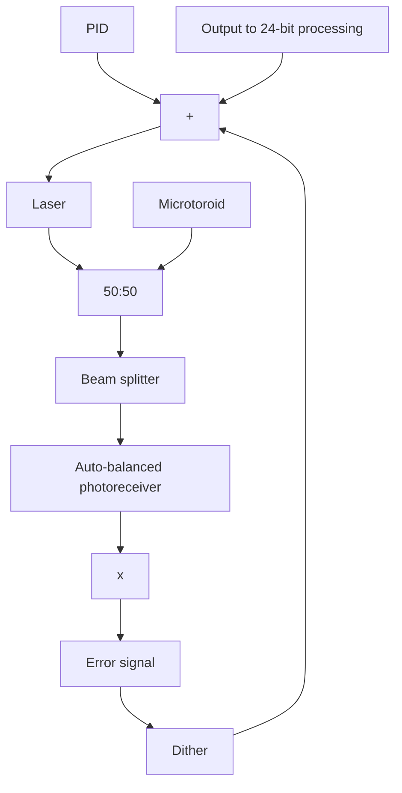

# ORIGINAL ARTICLE

# Label-free detection of single nanoparticles and biological molecules using microtoroid optical resonators

Judith Su $^{1}$ , Alexander FG Goldberg $^{2}$ and Brian M Stoltz $^{2}$

Single-molecule detection is one of the fundamental challenges of modern biology. Such experiments often use labels that can be expensive, difficult to produce, and for small analytes, might perturb the molecular events being studied. Analyte size plays an important role in determining detectability. Here we use laser-frequency locking in the context of sensing to improve the signal-to-noise ratio of microtoroid optical resonators to the extent that single nanoparticles 2.5 nm in radius, and 15.5 kDa molecules are detected in aqueous solution, thereby bringing these detectors to the size limits needed for detecting the key macromolecules of the cell. Our results, covering several orders of magnitude of particle radius (100 nm to 2 nm), agree with the 'reactive' model prediction for the frequency shift of the resonator upon particle binding. This confirms that the main contribution of the frequency shift for the resonator upon particle binding is an increase in the effective path length due to part of the evanescent field coupling into the adsorbed particle. We anticipate that our results will enable many applications, including more sensitive medical diagnostics and fundamental studies of single receptor–ligand and protein–protein interactions in real time.

Light: Science & Applications (2016) 5, e16001; doi:10.1038/lsa.2016.1; published online 1 January 2016

Keywords: biosensing; frequency locking; label-free; microtoroid; single molecule

# INTRODUCTION

Highly sensitive biodetection is important for many applications such as high throughput drug discovery studies, as it can dramatically reduce the amount of analyte needed and speed the assays $^{1,2}$ . A variety of applications in medical diagnostics (e.g. detecting trace amounts of tumor-specific antigens to monitor the re-occurrence of cancer $^{3}$ ) and public health (e.g. detecting bacteria or viruses $^{4}$ ) would benefit from improved speed and sensitivity. Methods such as fluorescent tagging $^{5}$ and enzyme-linked immunosorbent assays (ELISA) $^{6}$ are capable of highly sensitive biodetection down to the single-molecule level; however, the labels can be expensive, difficult to produce, and might perturb the molecular events being studied. By pushing the sensitivity of label-free biosensing techniques to the single-molecule level, fundamental studies become more direct and decisive, permitting, for example, studies of molecular conformations and biosensing in general without the need for the fabrication of specific tags for each molecule of interest $^{1,2,7}$ . Frequency locking feedback control has been used in applications such as in scanning tunneling microscopy to maintain tip-surface separation $^{8}$ ; however, to the best of our knowledge has only been applied once before in the realm of nanoparticle detection, and only to relatively large nanoparticles (39 nm × 10 nm nanorods), and not biological molecules $^{9}$ . We apply frequency locking to resonant biodetection using optical resonators and achieve a sensitivity that enables us to detect a wide range of nanoscale objects ranging from nanoparticles with radii from 100 to 2.5 nm to exosomes, ribosomes, and single protein molecules (160 and 15.5 kDa).

Optical resonators such as microtoroids work on the principle of total internal reflection $^{10}$ . Light continuously circulates within these (often glass) devices generating an evanescent field that interacts multiple times with analytes that bind to the surface of the resonator $^{11}$ . The long photon confinement time (on order of tens of nanoseconds) of the microtoroid makes it an extremely sensitive detector with a theoretical limit of detection down to single molecules $^{12}$ . This enables us to obtain the statistics of unitary events as opposed to having to look at an ensemble average $^{13}$ . Optical resonators have the further advantage that because their surface can be functionalized, they do not require fluorescent tags $^{2}$ , thus eliminating artifacts due to bleaching, blinking, and tag interference. Because optical resonators can obtain data in the microsecond time regime continuously over several seconds or more they have the potential to bridge a variety of time and length scales. In addition, optical resonators have a large ( $\sim300\ \mu m^{2}$ ) capture area thus making particle detection events more likely to occur than with nano-devices such as nanowires or nano-electrical–mechanical cantilevers. Almost a decade ago, the use of microtoroid resonators for single-molecule biosensing based on the thermo-optic effect was investigated $^{14}$ . However, it has since been difficult to apply this approach in new studies, perhaps because the thermo-optic effect has been found to be weaker than originally assumed $^{15,16}$ . Recently, due to

signal-to-noise limitations, the smallest particle radius that a bare optical resonator has been shown to detect is $12.5 \, nm^{17}$ in aqueous solution, and $10 \, nm$ in air $^{18}$ .

In terms of single-particle biological detection, optical resonators such as microspheres $^{19}$ and microtoroids $^{18,20}$ have been used to detect individual virus particles ( $\sim$ 100 nm) without the use of labels. Recently microspheres have been coupled to 70 nm radius gold nanoshells to form a hybrid system capable of detecting single BSA (66 kDa) molecules $^{21}$ . The advance described here, frequency locked optical whispering evanescent resonator (FLOWER) (Figure 1), would improve the detection capabilities of optical resonators in general, including hybrid systems.

Both theory (Supplementary Information) and finite element electromagnetic computations using COMSOL indicate that for a microtoroid to detect particles of comparable size to single protein molecules (2.5 nm radius, $M \sim 36$ kDa), one must be able to resolve a wavelength shift less than 0.006 fm. This is $\sim 80$ times smaller than the approximate wavelength shift seen for detecting particles with a radius of 12.5 nm in an aqueous solution $^{17}$ . In order to detect such small wavelength shifts, we use frequency locking (Figure 1) in combination with filtering techniques to reduce our noise level to $9.6 \times 10^{-4}$ fm over one-millisecond intervals (Figure 2) $^{22}$ . An iterative chi-squared minimization step-finding algorithm is used to locate and tabulate binding events $^{23}$ . This step-finding algorithm does not take explicit step size thresholds as inputs, and can thus find steps of varying size. Previous studies have shown this step-finding algorithm to generally out-perform other existing algorithms $^{24}$ .

Our frequency locking approach is an improvement over prior scanning systems that continually sweep back and forth over a large frequency range $(3.1 \times 10^{4} \text{ fm})$ , only occasionally matching resonance $^{10}$ . In contrast, our work directly tracks the resonant wavelength location within a narrow and adaptively varied frequency range with a fixed length of 19 fm. Thus, we track discrete fluctuations in signal more accurately and quickly, permitting slight and transient events to be detected. To isolate our signal we computationally filter out known sources of noise such as 60 Hz electronic line noise and apply a median filter to our data. Previously, frequency locking has been used in conjunction with microtoroid optical resonators, although for the detection of larger nanoparticles (39 nm × 10 nm nanorods). Here we are able to detect significantly smaller particles ( $r \sim 2$ nm) via a number of advances, including the use of balanced photodetectors, direct laser frequency modulation instead of external phase modulation, a lower dither frequency of 2 kHz vs. 200 MHz, the use of 24-bit data acquisition cards, as well as nonlinear post-processing filtering routines.

# MATERIALS AND METHODS

Particle detection experiments were performed with a TLB-6300 tunable diode laser (controller number: TLB-6300-LN) from Newport in combination with a DigiLock 110 from Toptica Photonics. Top-of-peak locking was performed in auto-lock mode using a dither frequency of 2 kHz. The proportional-integral-derivative (PID) controller was set by Ziegler–Nichols tuning rules. The rise time of the system was determined to be 0.5 ms and the settling time 1.5 ms. Signals were detected using a Nirvana auto-balanced receiver (Model 2007) from Newport. Polarization was adjusted using an in-line polarization controller from General Photonics (Product Number: PLC-003-S-90).

Recombinant human interleukin-2 was purchased from Pierce Biotechnology (Product Number: R201520). Mouse IgG was purchased from Jackson ImmunoResearch (Code Number: 015-000-003). The microtoroid containing chip was affixed to stainless steel sample holder using double sided tape. A sample chamber was constructed on top of the sample holder by cantilevering a custom cut coverslip over a microscope slide spacer and gluing it in place with super glue. Anti-CD81 used for the exosome experiments was purchased from Santa Cruz Biotechnology. Prior to injection, particle

a   

text_image

Nanoparticles
Optical fiber
Microtoroid

b

We measure the amount the laser shifts to stay on resonance ( $\Delta\lambda$ )   

line

| Wavelength (λ) | Toroid response |
| -------------- | --------------- |
| Δλ             | Peak (dotted line) |
| New location   | Peak (dotted line) |

flowchart

Figure 1 Overview of frequency locked optical whispering evanescent resonator (FLOWER). (a) Rendering of a microtoroid coupled to an optical fiber (not to scale). In our system, a frequency-tuned laser beam is evanescently coupled to a microtoroid (\~90 microns in diameter) using an optical fiber (red). At resonance, light (red curved arrow) coming out of the microtoroid destructively interferes with light going straight through the optical fiber (red arrow), causing a dip in the transmission (peak in absorption) vs. light wavelength. (b) Conceptual basis for particle detection. The laser frequency (red solid line) is locked to the resonance frequency of the microtoroid (blue line). As particles bind, the resonant frequency of the microtoroid shifts to a new location (green dotted line). We measure the control signal needed to keep the laser locked to the microtoroid's new resonance frequency (red dashed line). (c) Block diagram of the sensing control system. A small high-frequency dither is used to modulate the driving laser frequency. When multiplied by the toroid output and time-averaged, this dither signal generates an error signal whose amplitude is proportional to the difference between the current laser frequency and resonant frequency. This error signal is sent to a PID controller whose output is used to set the laser frequency, thus completing the feedback loop. A computer records the observed frequency shifts.

line

| Time (s) | Resonance shift (pm) |
| -------- | -------------------- |
| 0        | 0.0                  |
| 10       | -0.5                 |
| 20       | -0.8                 |
| 30       | -1.2                 |
| 40       | -1.5                 |
| 50       | -1.8                 |
| 60       | -2.0                 |

line

| Time (s) | Resonance shift (fm) |
| -------- | -------------------- |
| 0        | 0.0                  |
| 2        | ~1.5                 |
| 4        | ~2.5                 |
| 6        | ~3.5                 |
| 8        | ~4.0                 |
| 10       | ~4.8                 |

line

| Frequency (Hz) | Power spectral density (fm²·s) |
| -------------- | ------------------------------ |
| 10^0           | ~10^-5                         |
| 10^2           | ~10^-10                        |
| 10^4           | ~10^-15                        |

line

| Frequency (Hz) | Power spectral density (fm² s) |
| -------------- | ------------------------------ |
| 0.01           | ~10⁶                           |
| 0.1            | ~10⁶                           |
| 1              | ~10⁶                           |

line

| Frequency (Hz) | Power spectral density (fm²·s) |
| -------------- | ------------------------------ |
| 10^0           | ~10^-5                         |
| 10^2           | ~10^-5                         |
| 10^4           | ~10^-5                         |

line

| Frequency (Hz) | Before frequency locking | After frequency locking |
| -------------- | ------------------------ | ----------------------- |
| 0              | ~10^5                    | ~10^-1                  |
| 0.5            | ~10^5                    | ~10^-2                  |
| 1              | ~10^5                    | ~10^-3                  |
| 1.5            | ~10^5                    | ~10^-4                  |
| 2              | ~10^5                    | ~10^-5                  |

Figure 2 The combination of frequency locking feedback control and computational filtering reduces the noise level to $9.6 \times 10^{-4}$ fm over one-millisecond intervals. (a) Toroid response to a buffer (no suspended particles) solution before the implementation of frequency locking. The blue curves (n = 3) show how the resonance wavelength of the toroid changes over time when immersed in a buffer solution. The microtoroid response shows large ( $\sim 1$ pm) fluctuations associated principally with scan-tracking, and an overall drift due to slight temperature changes which alter the microtoroid's index of refraction and radius ( $d\lambda/dT \sim several picometers \, ^{\circ}C^{-1}$ ) $^{22}$ . The noise level (the root-mean-squared value) of the blue curve fluctuations is $\sim 1$ pm. Before computing the noise level, we computationally remove the large thermal drift from the data by subtracting an exponential fit (not shown). (b) Toroid response to a buffer solution after the implementation of frequency locking and computational filtering. The noise level of the blue traces is $9.6 \times 10^{-4}$ fm over one-millisecond intervals and is much smaller than the noise level calculated from a before the addition of frequency locking feedback control. We sample over a shorter time period in b (10 s vs. 60 s) as frequency locking allows us to sample with a much greater frequency (20 kHz vs. 100 Hz). (c) Power spectrum of a data set in b after filtering. (d) The power spectrum of a typical buffer data set before the addition of frequency locking feedback control. The magnitude of the y-axis provides a measure of the noise level of our system which is the limiting factor in our sensitivity. (e) The power spectrum of a typical buffer data set after the addition of feedback control, but before computational filters have been applied (i.e., the intrinsic noise of the system). The tallest peaks correspond to known noise sources and their harmonics. The mean noise level ( $10^{-4} \, fm^{2} \, s$ ) is significantly less than the mean noise level ( $10^{5} \, fm^{2} \, s$ ) seen in c. (f) The power spectra in b and c plotted on the same axes. The difference in mean noise levels is clearly apparent, indicating the role of the feedback controller in quenching various noise mechanisms.

containing solutions were thermally equilibrated for >1 hr in a 1 L room-temperature water bath. Solutions were then briefly ( $\sim$ 2 s) vortexed and injected using a syringe pump (Harvard Apparatus) and a 1 mL syringe fitted with a 23 gauge luer stub, tubing (ID 0.02 OD 0.06 WALL 0.02, VWR) and a small metal tube (Corp. 23 TW 0.025/0.0255 OD $\times$ 0.0165/0.018 ID, New England Small Tubes). After injection, there was a 30-s delay before data recording. Data were recorded at 20 kHz using a 24-bit data acquisition card (NI-PCI-4461) from National Instruments. Following data acquisition, Fourier filtering was performed to remove 60 Hz and its harmonics (electronic line noise), 100 Hz (laser noise), and 2 kHz (dither frequency). A median filter of window size 1001 was then applied.

# RESULTS AND DISCUSSION

To characterize our system, we detect polystyrene latex nanoparticles over a range of radii, and 2.5 nm silica nanoparticles at picomolar concentrations (Figure 3a). We perform the detection in water using microtoroids approximately 80–100 $\mu$ m in diameter, with selected resonant peaks having loaded quality factors (Q) of $\sim1\times10^{5}-5\times10^{6}$ in water with an input power of 9.3–100 $\mu$ W at 633 nm. These moderate Q-factors are chiefly a result of the optical fiber being positioned in direct contact with the microtoroid in the over-coupled regime $^{25}$ . This procedure was chosen to minimize noise due to the optical fiber fluctuating against the toroid during the experiment. Furthermore, we perform these experiments under conditions where we inject fluid toward the toroid with enough sample volume to completely exchange the liquid in our sample chamber three times, before stopping, waiting 30 s, and then recording our data. This approach mitigates noise from the optical fiber fluctuating against the toroid that occurs when a continuous injection is used $^{19}$ .

Our results show that after implementing frequency locking, individual detection events appear much more cleanly (a before-and-after example of this result is shown in Supplementary Fig. S3d) and that the change in resonant wavelength of the microtoroid upon particle binding is proportional to particle volume (Figure 4a). The theoretical basis for this result is presented in the Supplementary Information. Figure 4c shows a standard detection result for 10 nm radius nanoparticles. Individual traces of additional nanoparticle detection experiments are shown in Supplementary Fig. S3a–S3c.

line

| Time (s) | Resonance shift (fm) at 0.2 pM | Resonance shift (fm) at 5 pM | Resonance shift (fm) at 1 pM |
| -------- | ------------------------------ | ---------------------------- | ---------------------------- |
| 0.0      | ~0.0                           | ~0.0                         | ~0.0                         |
| 0.2      | ~0.08                          | ~0.1                         | ~0.2                         |
| 0.4      | ~0.1                           | ~0.15                        | ~0.3                         |
| 0.6      | ~0.15                          | ~0.2                         | ~0.3                         |

histogram

| Step amplitude (am) | Counts |
| ------------------- | ------ |
| -5 to -4            | 0      |
| -4 to -3            | 10     |
| -3 to -2            | 20     |
| -2 to -1            | 30     |
| -1 to 0             | 50     |
| 0 to 1              | 40     |
| 1 to 2              | 60     |
| 2 to 3              | 50     |
| 3 to 4              | 30     |
| 4 to 5              | 10     |

histogram

| Step amplitude (am) | Counts |
| ------------------- | ------ |
| -5 to -4            | 5      |
| -4 to -3            | 10     |
| -3 to -2            | 20     |
| -2 to -1            | 30     |
| -1 to 0             | 60     |
| 0 to 1              | 70     |
| 1 to 2              | 50     |
| 2 to 3              | 30     |
| 3 to 4              | 10     |
| 4 to 5              | 5      |

histogram

| Step amplitude (am) | Counts |
| ------------------- | ------ |
| -5 to -4            | 0      |
| -4 to -3            | 5      |
| -3 to -2            | 20     |
| -2 to -1            | 60     |
| -1 to 0             | 130    |
| 0 to 1              | 150    |
| 1 to 2              | 120    |
| 2 to 3              | 60     |
| 3 to 4              | 20     |
| 4 to 5              | 5      |

bar

| Dwell time (ms) | Probability density func. |
| --------------- | ------------------------- |
| 0               | 1000                      |
| 1               | ~200                      |
| 2               | ~50                       |
| 3               | ~10                       |

bar

| Dwell time (ms) | Probability density func. |
| --------------- | ------------------------- |
| 0               | 1000                      |
| 1               | 200                       |
| 2               | 50                        |
| 3               | 10                        |

bar

| Dwell time (ms) | Probability density func. |
| --------------- | ------------------------- |
| 0               | 1000                      |
| 1               | 100                       |
| 2               | 10                        |
| 3               | 1                         |

Figure 3 Individual 2.5 nm radius bead detection. (a) Detection of 2.5 nm radius glass nanoparticles at different concentrations (shown in different colors). Step down events represent the unbinding of particles. A zoom-in of the 0.2 pM case (blue) is shown in the inset. The data were filtered using a median filter and steps were fit (red dashed line) using the step-fitting algorithm of Kerssemakers et al. $^{23}$ (b) As expected, the mean step amplitude remains constant because the mean particle size does not change. (c) The time in-between binding events (step duration) follows an exponential distribution (red line, fit), indicating that the binding of particles follows a Poisson process. As expected, this exponential distribution shifts to shorter times in a linear fashion with concentration, illustrated here in the log-linear plots as an increase in slope ( $r^{2}$ indicates goodness of fit). In the histograms presented, dwell times faster than the digital low pass filter applied to our data (1 ms) were considered unreliable and were not included in the exponential fit. These results are consistent with single particle binding.

To further establish that we detect single 2.5 nm silica particles, we perform the experiment under three different concentrations (0.2, 1, and 5 pM) and record the step amplitude and dwell time (time between steps) distributions. As expected, as the particle concentration increases, the mean step amplitude remains constant, as the mean particle diameter does not change (Figure 3b). Furthermore, the amplitude of the steps we obtain, as shown in Figure 4a, are in agreement with that predicted by theory $^{12}$ (Supplementary Information).

We note that in contrast to the experiments with 10–100 nm nanoparticles that show few down-steps, in the 2.5 nm experiments, a significant number of down-steps are observed, although there are still more up-steps than down-steps overall. This is consistent with other reported particle detection work using the microtoroid, where, as the particle diameter decreases, particle desorption becomes more frequent $^{18}$ . This is expected both from the decreased surface area of interaction (Supplementary Fig. S11) and also because optical trapping forces (in this case from the resonator field) decrease with particle size $^{26}$ .

The dwell times associated with the 2.5 nm detection experiments clearly decrease with increasing concentration. Assuming that the adsorption of particles follows a Poisson process, the dwell times should follow an exponential distribution, which is indeed true. In Figure 3c, we perform exponential fits to the function, and recover the

line

| Effective particle radius (nm) | Wavelength shift amplitude (fm) |
| ------------------------------ | ------------------------------- |
| 2                              | ~0.01                           |
| 5                              | ~0.1                            |
| 10                             | ~1                              |
| 20                             | ~10                             |
| 100                            | ~100                            |

line

| Time (s) | Resonance shift (fm) |
| -------- | -------------------- |
| 1.0      | 1.0                  |
| 1.5      | 2.0                  |
| 2.0      | 3.0                  |
| 2.5      | 4.0                  |
| 3.0      | 5.0                  |

Figure 4 Summary of particle detection data. (a) A wide range of particle sizes with radii from 2 to $100\mathrm{nm}$ were detected. For human interleukin-2 and mouse IgG, an effective particle radius was calculated based on spheres having the same molecular weights as the individual molecules. The solid lines are theoretical predictions based on the reactive sensing principle. Errors bars represent the known polydispersity of our samples. (b) The resonance wavelength shift (blue trace) over time of the microtoroid as polystyrene latex nanoparticles $10\mathrm{nm}$ radius bind to the microtoroid's surface. As a nanoparticle binds, the resonance frequency of the toroid changes. This change appears as a 'step' in the plot of resonance frequency shift over time. The step-fit is shown as a red dashed line (inset). Zoom-out of the toroid response over the full recording range of $10\mathrm{s}$ . Remaining data sets are shown in Supplementary Figs. S3 and S4.

rate parameter to be 1500, 2400, 2700 steps s $^{-1}$ for the 0.2, 1, and 5 pM cases, respectively, demonstrating that our dwell times scale with concentration. These values indicate an offset at 0 pM, suggesting impurities in the background solution. Such impurities cause shifts as any particle that enters the evanescent field and is above our detection threshold causes a change in signal. These fluctuations are present for different buffer solutions as well. As with many nano- or microsensors, our dwell times are shorter than would be expected from diffusion alone $^{27-29}$ . Recent work by Arnold et al. has shown that microspherical optical resonators generate optical trapping forces that cause significantly enhanced (100×) nanoparticle transport velocities $^{29}$ . We anticipate this effect to be even greater in our frequency-locked system as we are always on resonance as opposed to sweeping past resonance, thus increasing the amount of circulating power our devices experience. Optical trapping forces may also attract particles to the region of the microtoroid where the electric field is the greatest, thus resulting in more uniform step amplitudes. However, for smaller nanoscale particles optical forces tend to be rather weak compared to thermal (diffusion) forces. In addition, with the configuration of our microtoroid setup and with injection directly toward the toroid, convection plays a significant role in the flow around the toroid. This significantly increases the particle encounter rate, particularly for smaller particle sizes and is consistent with the binding rates from nanowire experiments which report saturation from the binding of thousands of molecules within seconds at similar concentrations $^{30}$ . Convection could create complicated flows around the toroid, although we have not modeled these effects in detail. Here, we view convection as a driving force for increased mixing and transport, which helps to bring particles in contact with the toroid. Once landed, particles would most likely stay as van der Waals forces would dominate. A scaling argument (Supplementary Information) attempts to elucidate some of the convection phenomena. To demonstrate the use of FLOWER for biological applications, we detected bioparticles ranging in equivalent radii from 25 nm to <2.5 nm (molecular weight, 15.5 kDa). In particular, we detected exosomes from human mesenchymal stem cells, yeast ribosomes, mouse immunoglobulin G, and human interleukin-2. For the specific detection of particles in complex solutions, as was the case for the experiments involving exosomes and human interleukin-2, antibodies were attached to the toroid's surface using a silane linker (Supplementary Information). Experiments involving yeast ribosomes and mouse immunoglobulin G were performed in purified solutions without antibody functionalization of the toroid's surface.

Our results (Figure 5 and Supplementary Figs. S4, S5, S7, and S8), over a range of sizes, show discrete, step-like, binding events with a step amplitude that corresponds well with the 'reactive' model prediction, suggesting that we are detecting single particles and not clusters. These steps, although visually appearing of uniform height, have a distribution of sizes (Figure 5 and Supplementary Figs. S4, S5, and S7) ranging from close to zero to a step amplitude corresponding with theory. This distribution may be largely attributed to the fact that the amount of wavelength shift depends on where on the resonator the particle binds (Supplementary Fig. S9). As with the nanoparticle detection data, the time delay between bioparticle binding events

a   

line

| Time (s) | Resonance shift (fm) |
| -------- | -------------------- |
| 5.2      | 17.0                 |
| 5.4      | 18.0                 |
| 5.6      | 19.0                 |
| 5.8      | 20.0                 |
| 10.0     | 20.0                 |

b   

histogram

| Step amplitude (fm) | Counts |
| ------------------- | ------ |
| -2.0 to -1.5        | 0      |
| -1.5 to -1.0        | 0      |
| -1.0 to -0.5        | 0      |
| -0.5 to 0.0         | 2      |
| 0.0 to 0.5          | 7      |
| 0.5 to 1.0          | 14     |
| 1.0 to 1.5          | 3      |
| 1.5 to 2.0          | 0      |

C   

bar

| Dwell time (s) | Counts |
| -------------- | ------ |
| 0.05           | 11     |
| 0.06           | 19     |
| 0.07           | 17     |
| 0.08           | 25     |
| 0.09           | 11     |
| 0.10           | 8      |
| 0.11           | 5      |
| 0.12           | 8      |
| 0.13           | 5      |
| 0.14           | 2      |
| 0.15           | 1      |
| 0.16           | 1      |
| 0.17           | 1      |
| 0.18           | 0      |
| 0.19           | 0      |
| 0.20           | 0      |
| 0.21           | 0      |
| 0.22           | 0      |
| 0.23           | 0      |
| 0.24           | 0      |
| 0.25           | 0      |

d   

line

| Time (s) | Resonance shift (fm) |
| -------- | -------------------- |
| 0.872    | -2.35                |
| 0.876    | -2.32                |
| 0.88     | -2.32                |

e   

histogram

| Step amplitude (am) | Counts |
| ------------------- | ------ |
| -6.0                | 0      |
| -5.5                | 0      |
| -5.0                | 0      |
| -4.5                | 0      |
| -4.0                | 0      |
| -3.5                | 0      |
| -3.0                | 0      |
| -2.5                | 0      |
| -2.0                | 0      |
| -1.5                | 0      |
| -1.0                | 0      |
| -0.5                | 0      |
| 0.0                 | 0      |
| 0.5                 | 0      |
| 1.0                 | 0      |
| 1.5                 | 0      |
| 2.0                 | 0      |
| 2.5                 | 0      |
| 3.0                 | 0      |
| 3.5                 | 0      |
| 4.0                 | 0      |
| 4.5                 | 0      |
| 5.0                 | 0      |
| 5.5                 | 0      |
| 6.0                 | 0      |
| 6.5                 | 0      |
| 7.0                 | 0      |
| 7.5                 | 0      |
| 8.0                 | 0      |
| 8.5                 | 0      |
| 9.0                 | 0      |
| 9.5                 | 0      |
| 10.0                | 0      |

f   

bar

| Dwell time (ms) | Probability density function |
| --------------- | ----------------------------- |
| 1.0             | 300                           |
| 1.1             | 200                           |
| 1.2             | 180                           |
| 1.3             | 150                           |
| 1.4             | 100                           |
| 1.5             | 80                            |
| 1.6             | 50                            |
| 1.7             | 100                           |
| 1.8             | 40                            |
| 1.9             | 30                            |
| 2.0             | 20                            |
| 2.1             | 15                            |
| 2.2             | 10                            |
| 2.3             | 8                             |
| 2.4             | 5                             |
| 2.5             | 3                             |
| 2.6             | 2                             |
| 2.7             | 1                             |
| 2.8             | 1                             |
| 2.9             | 1                             |
| 3.0             | 30                            |

Figure 5 Individual yeast ribosome (12.5 nm radius) and human interleukin-2 (2 nm radius) detection. (a) The resonant wavelength shift (blue trace) over time of the microtoroid as ribosomes bind to the microtoroid's surface. The step-fit is shown in red (inset). Zoom-out of the toroid response over the full recording range of 10 s. (b) Histogram of step amplitudes. The maximum step amplitude of 0.8 fm corresponds to a size of 25.6 nm as predicted by our nanoparticle detection data thus suggesting that the binding of individual ribosomes is being observed. Negative step amplitudes correspond to unbinding events. (c) Histogram of the time in between steps (dwell times). As expected for single-particle binding, the dwell time distribution follows an exponential fit (green). (d)–(f) follow the same organization as a–c but with interleukin-2 as opposed to ribosomes.

follows an exponential distribution (e.g., Figure 5c and 5f). We note unbinding steps in the interleukin-2 experiment are likely due to non-specific adsorption associated with the interleukin-2 binding to non-functionalized regions of the toroid; X-ray photoelectron spectroscopy revealed that the linker only covered $\sim 3\%$ of the available surface. From looking at an image of fluorescent Fc fragments (Supplementary Fig. S10) bound to the linker molecule on the toroid's surface, it appears that the $3\%$ is homogeneously spread around the circumference of the toroid. In future experiments, we aim to verify and improve the specificity and sensitivity of this approach through more complete antibody/linker coverage and experiments with complex solutions, which are critical for practical application as a biosensor.

# CONCLUSION

In conclusion, we have detected nanoparticles over a large range of sizes and have validated the applicability of our system to bio-detection using exosomes, ribosomes, mouse immunoglobulin G, and human interleukin-2. Our results support the 'reactive' model that suggests that the main contribution of the frequency shift upon particle binding is caused by the energy required for the reactive (evanescent) field to polarize the particle. With theory and experiment in good agreement, FLOWER provides a means for detecting single molecules in solution thus paving the way for optically estimating the mass of single molecules in solution, fundamental studies in biophysics, and applications such as high throughput drug discovery and early detection of diseases.

# ACKNOWLEDGEMENTS

We thank Raymond Deshaies for the ribosomes, Carver Mead for the frequency locking suggestion, Richard Murray for discussions on feedback control, Andrew Raubitschek for the exosomes, Stephen Holler and Mark Oxborrow for COMSOL assistance, and Scott Fraser, Rob Phillips, and Kerry Vahala for comments and discussion of the manuscript.

1 Luchansky MS, Bailey RC. High-Q optical sensors for chemical and biological analysis. Anal Chem 2011; 84: 793–821.   
2 Vollmer F, Arnold S. Whispering-gallery-mode biosensing: label-free detection down to single molecules. Nat Methods 2008; 5: 591–596.   
3 Rodríguez-Lorenzo L, de la Rica R, Álvarez-Puebla RA, Liz-Marzán LM, Stevens MM. Plasmonic nanosensors with inverse sensitivity by means of enzyme-guided crystal growth. Nat Mater 2012; 11: 604–607.   
4 Dantham VR, Holler S, Kolchenko V, Wan Z, Arnold S. Taking whispering gallery-mode single virus detection and sizing to the limit. Appl Phys Lett 2012; 101: 043704.   
5 Dickson RM, Cubitt AB, Tsien RY, Moerner WE. On/off blinking and switching behaviour of single molecules of green fluorescent protein. Nature 1997; 388:355–358.

6 Rissin DM, Kan CW, Campbell TG, Howes SC, Fournier DR et al. Single-molecule enzyme-linked immunosorbent assay detects serum proteins at subfemtomolar concentrations. Nat Biotechnol 2010; 28: 595–599.   
7 Zijlstra P, Paulo PM, Orrit M. Optical detection of single non-absorbing molecules using the surface plasmon resonance of a gold nanorod. Nat Nanotechnol 2012; 7:379–382.   
8 Wiesendanger R. Scanning Probe Microscopy and Spectroscopy: Methods and Applications. Cambridge: Cambridge University Press; 1994; 244.   
9 Swaim JD, Knittel J, Bowen WP. Detection of nanoparticles with a frequency locked whispering gallery mode microresonator. Appl Phys Lett 2013; 102: 183106.   
10 Armani DK, Kippenberg TJ, Spillane SM, Vahala KJ. Ultra-high-Q toroid microcavity on a chip. Nature 2003; 421: 925–928.   
11 Vahala KJ. Optical microcavities. Nature 2003; 424: 839–846.   
12 Arnold S, Khoshsima M, Teraoka I, Holler S, Vollmer F. Shift of whispering-gallery modes in microspheres by protein adsorption. Opt Lett 2003; 28: 272–274.   
13 Knight AE. Single Molecule Biology. London: Elsevier/Academic Press; 2009; xix.   
14 Armani AM, Kulkarni RP, Fraser SE, Flagan RC, Vahala KJ. Label-free, single-molecule detection with optical microcavities. Science 2007; 317: 783–787.   
15 Armani AM. Corrections and clarifications. Science 2011; 334: 1496.   
16 Arnold S, Shopova SI, Holler S. Whispering gallery mode bio-sensor for label-free detection of single molecules: thermo-optic vs. reactive mechanism. Opt Express 2010; 18: 281–287.   
17 Lu T, Lee H, Chen T, Herchak S, Kim JH et al. High sensitivity nanoparticle detection using optical microcavities. Proc Natl Acad Sci USA 2011; 108: 5976–5979.   
18 He LN, Özdemir ŞK, Zhu JG, Kim W, Yang L. Detecting single viruses and nanoparticles using whispering gallery microlasers. Nat Nanotechnol 2011; 6: 428–432.   
19 Vollmer F, Arnold S, Keng D. Single virus detection from the reactive shift of a whispering-gallery mode. Proc Natl Acad Sci USA 2008; 105: 20701–20704.   
20 Zhu JG, Özdemir ŞK, He LN, Chen DR, Yang L. Single virus and nanoparticle size spectrometry by whispering-gallery-mode microcavities. Opt Express 2011; 19:16195–16206.   
21 Dantham VR, Holler S, Barbre C, Keng D, Kolchenko V et al. Label-free detection of single protein using a nanoplasmonic-photonic hybrid microcavity. Nano Lett 2013;13:3347–3351.   
22 Teng J, Dumon P, Bogaerts W, Zhang HB, Jian X et al. Athermal silicon-on-insulator ring resonators by overlaying a polymer cladding on narrowed waveguides. Opt Express 2009; 17: 14627–14633.   
23 Kerssemakers JWJ, Munteanu EL, Laan L, Noetzel TL, Janson ME et al. Assembly dynamics of microtubules at molecular resolution. Nature 2006; 442: 709–712.   
24 Carter BC, Vershinin M, Gross SP. A comparison of step-detection methods: how well can you do? Biophys J 2008; 94: 306–319.   
25 Gamba JM. The role of transport phenomena in whispering gallery mode optical biosensor performance. PhD thesis, California Institute of Technology, Pasadena, CA, 2012.   
26 Ashkin A, Dziedzic JM, Bjorkholm JE, Chu S. Observation of a single-beam gradient force optical trap for dielectric particles. Opt Lett 1986; 11: 288–290.   
27 Squires TM, Messinger RJ, Manalis SR. Making it stick: convection, reaction and diffusion in surface-based biosensors. Nat Biotechnol 2008; 26: 417–426.   
28 Gamba JM, Flagan RC. Flow-enhanced transient response in whispering gallery mode biosensors. Appl Phys Lett 2011; 99: 253705.   
29 Arnold S, Keng D, Shopova SI, Holler S, Zurawsky W et al. Whispering gallery mode carousel – a photonic mechanism for enhanced nanoparticle detection in biosensing. Opt Express 2009; 17: 6230–6238.   
30 Stern E, Klemic JF, Routenberg DA, Wyrembak PN, Turner-Evans DB et al. Label-free immunodetection with CMOS-compatible semiconducting nanowires. Nature 2007;445:519–522.

This work is licensed under a Creative Commons Attribution-NonCommercial-ShareAlike 4.0 Unported License. The images or other third

party material in this article are included in the article's Creative Commons license, unless indicated otherwise in the credit line; if the material is not included under the Creative Commons license, users will need to obtain permission from the license holder to reproduce the material. To view a copy of this license, visit http://creativecommons.org/licenses/by-nc-sa/4.0/

Supplementary information for this article can be found on the Light: Science & Applications' website (http://www.nature.com/lsa/)