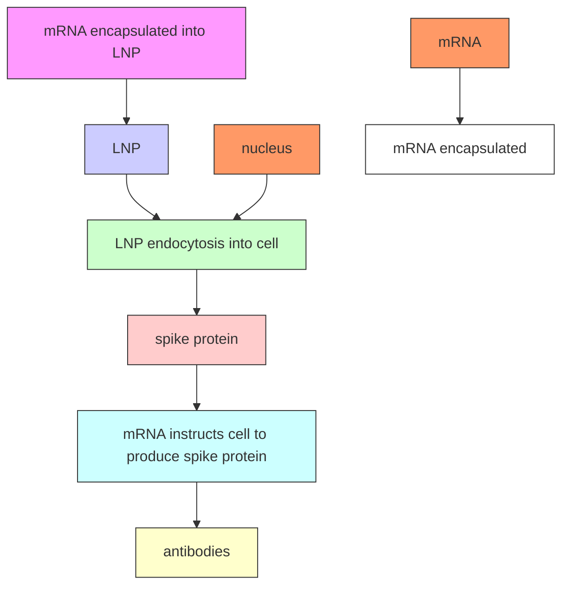

# Supporting Information

Lipid Nanoparticles – From Liposomes to mRNA Vaccine Delivery, a Landscape of Research Diversity and Advancement

Rumiana Tenchov, Robert Bird, Allison E. Curtze, Qiongqiong Zhou\*

CAS, a division of the American Chemical Society, Columbus OH 43210, USA

\*Corresponding author:

Qiongqiong Zhou qzhou@cas.org

Table S1. Clinically approved LNP formulations $^{1-8,*}$ 

<table><tr><td>Trade Name</td><td>Approval</td><td>Administration</td><td>Active ingredient</td><td>Composition</td><td>LNP carrier</td><td>Indication for use</td><td>Manufacturing company</td></tr><tr><td>Abelcet</td><td>1995</td><td>IV</td><td>Amphotericin B</td><td>DMPC:DMPG</td><td>liposomes</td><td>Severe fungal infections</td><td>Sigma-Tau Pharmaceuticals</td></tr><tr><td>Ambisome</td><td>1997</td><td>IV</td><td>Amphotericin B</td><td>HSPC:DSPG:Chol</td><td>liposomes</td><td>Fungal infections</td><td>Astellas Pharma</td></tr><tr><td>Amphotec</td><td>1996</td><td>IV</td><td>Amphotericin B</td><td>Cholesteryl sulfate</td><td>liposomes</td><td>Severe fungal infections</td><td>Ben Venue Laboratories Inc.</td></tr><tr><td>Caelyx</td><td>1996</td><td>IV</td><td>Doxorubicin</td><td>PEG 2000-DSPE:HSPC:Chol (5:56:39)</td><td>PEGylated liposomes</td><td>Ovarian cancer, Kaposi's sarcoma, breast cancer</td><td>Sequus (formerly Liposome Technology Inc.)</td></tr><tr><td>Curosurf</td><td>1999</td><td>Intra-tracheal</td><td>Poractant alfa</td><td>pulmonary surfactant (mainly DPPC)</td><td>suspension</td><td>Respiratory distress syndrome</td><td>Chiesi Farmaceutici</td></tr><tr><td>DaunoXome</td><td>1996</td><td>IV</td><td>Daunorubicin</td><td>DSPC:Chol (2:1)</td><td>liposomes</td><td>AIDS-related Kaposi's sarcoma</td><td>NeXstar Pharmaceuticals</td></tr><tr><td>Depocyt</td><td>1999</td><td>Spinal</td><td>Cytarabine/Ara-C</td><td>DOPC, DPPG, Chol, triolein</td><td>liposomes</td><td>Neoplastic meningitis</td><td>SkyPharma Inc.</td></tr><tr><td>DepoDur</td><td>2004</td><td>Epidural</td><td>Morphine sulfate</td><td>DOPC, DPPG, Chol, triolein</td><td>liposomes</td><td>Pain management</td><td>SkyPharma Inc.</td></tr><tr><td>Diprivan</td><td>1989</td><td>IV</td><td>propofol</td><td>Soybean oil, egg lecithin</td><td>liposomes</td><td>Sedation or anesthesia</td><td>Fresenius Kabi</td></tr><tr><td>Doxil</td><td>1995</td><td>IV</td><td>Doxorubicin</td><td>HSPC:Chol:PEG2 000-DSPE (56:39:5)</td><td>PEGylated liposomes</td><td>Ovarian, breast cancer, Kaposi's sarcoma</td><td>Sequus Pharmaceuticals</td></tr><tr><td>Epaxal</td><td>1993</td><td>IM</td><td>Inactivated hepatitis A virus (strain RGSB)</td><td>DOPC:DOPE (75:25)</td><td>liposomes</td><td>Hepatitis A</td><td>Crucell, Berna Biotech</td></tr><tr><td>Estrasorb</td><td>2003</td><td>Transdermal</td><td>Estradiol</td><td>Soybean oil</td><td>micelles</td><td>Menopause therapy</td><td>Novavax</td></tr><tr><td>Exparel</td><td>2011</td><td>IV</td><td>Bupivacaine</td><td>DEPC, DPPG, Chol, tricaprylin</td><td>liposomes</td><td>Pain management</td><td>Pacira Pharmaceuticals, Inc.</td></tr><tr><td>Fungizone</td><td>1997</td><td>IV</td><td>Amphotericin B</td><td>DMPC:DMPG</td><td>liposomes</td><td>Systemic fungal infections</td><td>Bristol-Myers Squibb</td></tr><tr><td>Ikervis</td><td>2014</td><td>Ocular (eye drops)</td><td>Cyclosporine A</td><td>Medium-chain triglycerides</td><td>emulsion</td><td>Keratitis in patients with dry eye disease</td><td>Santen Pharmaceutical Co.</td></tr><tr><td>Inflexal V</td><td>1997</td><td>IM</td><td>Inactivated hemagglutinin of influenza virus strains A and B</td><td>DOPC:DOPE (75:25)</td><td>liposomes</td><td>Influenza</td><td>Crucell, Berna Biotech</td></tr><tr><td>Lipusu</td><td>2020</td><td>IV</td><td>Paclitaxel</td><td>N/A</td><td>liposomes</td><td>Squamous non-small-cell lung cancer, esophageal cancer</td><td>Luye Pharmaceuticals</td></tr><tr><td>Marqibo</td><td>2012</td><td>IV</td><td>Vincristine</td><td>SM:Chol (60:40)</td><td>liposomes</td><td>Acute lymphoblastic leukemia</td><td>Talon Therapeutics, Inc.</td></tr><tr><td>Mepact</td><td>2004</td><td>IV</td><td>Mifamurtide</td><td>DOPS:POPC (3:7)</td><td>liposomes</td><td>High-grade, resectable, nonmetastatic osteosarcoma</td><td>Takeda Pharmaceutical Limited</td></tr><tr><td>Myocet</td><td>2000</td><td>IV</td><td>Doxorubicin</td><td>EPC:Chol (55:45)</td><td>liposomes</td><td>Combination therapy with cyclophosphamide in metastatic breast cancer</td><td>Elan Pharmaceuticals</td></tr><tr><td>Octocog alfa (Advate)</td><td>2009</td><td>IV</td><td>Factor VIII</td><td>PEG lipid</td><td>PEGylated liposomes</td><td>haemophilia A, uncontrolledbleeding</td><td>Bayer Pharma AG</td></tr><tr><td>Onivyde</td><td>2015</td><td>IV</td><td>Irinotecan</td><td>DSPC:MPEG-2000:DSPE (3:2:0.015)</td><td>liposomes</td><td>Combination therapy with fluorouracil and leucovorin in metastatic pancreatic adenocarcinoma</td><td>Merrimack Pharmaceuticals Inc.</td></tr><tr><td>Onpattro (patisiran)</td><td>2018</td><td>IV</td><td>RNAi therapeutic, transthyretin-directed siRNA</td><td>DLin-MC3-DMA, PEG2000-C-DMG, DSPC, Chol</td><td>lipid nanoparticle</td><td>Polyneuropathy caused by hereditary transthyretin-mediatedamyloidosis (hATTR amyloidosis)</td><td>Alnylam Pharmaceuticals</td></tr><tr><td>Rapamune</td><td>2002</td><td>Oral</td><td>Rapamycin (sirolimus)</td><td>PC, propylene glycol, glycerides, ethanol, soy fatty acids, ascorbyl palmitate</td><td>liposomes</td><td>Immuno-suppressant</td><td>Pfizer</td></tr><tr><td>ThermoDox</td><td>2014</td><td>IV</td><td>Doxorubicin</td><td>DPPC, MSPC, PEG 2000-DSPE</td><td>PEGylated liposomes</td><td>Hepatocellular carcinoma</td><td>Celsion Corporation</td></tr><tr><td>Visudyne</td><td>2000</td><td>IV</td><td>Verteporphin</td><td>DMPC, EPG</td><td>liposomes</td><td>Choroidal neovascularization</td><td>Novartis</td></tr><tr><td>Vyxeos</td><td>2017</td><td>IV</td><td>Daunorubicin / Cytarabine (1:5)</td><td>DSPC:DSPG:Chol (7:2:1)</td><td>liposomes</td><td>Acute myeloid leukemia</td><td>Jazz Pharmaceuticals</td></tr></table>

\* The LNP-based mRNA COVID-19 vaccines BNT162b2 and mRNA-1273 are not included in the table, because they have received only Emergency Use Authorization (EUA) in 2020.

Abbreviations: Chol, cholesterol; PC, phosphatidylcholine; PG, phosphatidylglycerol; PE, phosphatidylethanolamine; PS, phosphatidylserine; DEPC, Dierucoyl PC; DMPC, dimyristoyl PC; DMPG, dimyristoyl PG; DOPC, dioleoyl PC; DOPE, dioleoyl PE; DOPS, dioleoyl PS; DPPG, dipalmitoyl PG; DSPC, distearoyl PC; DSPE, distearoyl PE; DSPG, distearoyl PG; EPC, egg PC; HSPC, hydrogenated soy PC; MSPC, monostearoyl PC; IM, intramuscular; IV, intravenous; PEG, polyethylene glycol; MPEG, methoxy PEG; POPC, palmitoyloleoyl PC; SM, sphingomyelin.

Table S2. Marketed LNP cosmetic preparations 9-12 

<table><tr><td>Type of Delivery system</td><td>Product Name</td><td>Producer</td><td>Activity</td></tr><tr><td rowspan="15">SLN</td><td>Cutanova Cream Nano Repair Q10</td><td>Dr. Rimpler</td><td>Antiaging and skin repair</td></tr><tr><td>Intensive Serum NanoRepair Q10</td><td>Dr. Rimpler</td><td>Skin repair</td></tr><tr><td>Cutanova Cream NanoVital Q10</td><td>Dr. Rimpler</td><td>Antiaging and skin repair</td></tr><tr><td>Lipopearl</td><td>Adina</td><td>Skin emollient (pearlescent beads, oils and vitamins)</td></tr><tr><td>Swiss Cellular White Illuminating Eye Essence</td><td>La Prairie</td><td>Brightening skin care</td></tr><tr><td>Olivenöl Anti Falten Pflege</td><td>Medipharma Cosmetics</td><td>Anti-wrinkle</td></tr><tr><td>Super Vital Cream</td><td>IOPE</td><td>Antiaging cream</td></tr><tr><td>SURMER Creme Legere</td><td>Isabelle Lancray</td><td>Face moisturizer</td></tr><tr><td>Eusolex 4360</td><td>Merck</td><td>Sunscreen</td></tr><tr><td></td><td></td><td></td></tr><tr><td>Allure Body Cream</td><td>Chanel</td><td>Body moisturizer</td></tr><tr><td>Allure Parfum Bottle</td><td>Chanel</td><td>Perfume</td></tr><tr><td>Allure Eau Parfum Spray</td><td>Chanel</td><td>Perfume</td></tr><tr><td>Soosion Facial Lifting Cream</td><td>Soosion</td><td>Anti-wrinkle cream</td></tr><tr><td>Phyto NLC Active Cell Repair</td><td>Sireh Emas</td><td>Skin rejuvenation, moisturizing &amp; skin firming</td></tr><tr><td>NLC</td><td>Nanopearl</td><td>PharmaSol</td><td>Cosmetic creams, gels, lotions</td></tr><tr><td rowspan="4">Ethosomes</td><td>Nanominox</td><td>Sinere, Germay</td><td>Hair growth stimulant</td></tr><tr><td>Supravir Cream</td><td>Trima Israel</td><td>Antiaging and skin repair</td></tr><tr><td>Cellulite EF</td><td>Hampden Health, USA</td><td>Anti-cellulite</td></tr><tr><td>Decorin Cream</td><td>Genome Cosmetics, U.S.</td><td>Antiaging and skin repair</td></tr><tr><td rowspan="3"></td><td>Noicellex</td><td>Novel Therapeutic Technologies, Israel</td><td>Anti-cellulite cream</td></tr><tr><td>Skin Genuity</td><td>Physonics, Nottingham, UK</td><td>Anti-cellulite</td></tr><tr><td>Lipoduction</td><td>Osmotics, Israel</td><td>Anti-cellulite</td></tr><tr><td rowspan="18">Liposomes</td><td>Celadrin</td><td>Pharmaceutical Grade (USP)</td><td>Topical liposome lotion</td></tr><tr><td>Capture Totale</td><td>Christian Dior</td><td>Antiaging and skin repair</td></tr><tr><td>Efect du Soleil</td><td>L’Oréal</td><td>Tanning agents</td></tr><tr><td>Future Perfect Skin Gel</td><td>Estée Lauder</td><td>Anti-wrinkle cream</td></tr><tr><td>Aquasome LA</td><td>Nikko Chemical Co</td><td>Skin humectant</td></tr><tr><td>Eye Perfector</td><td>Avon</td><td>Soothing cream for eye irritation</td></tr><tr><td>Flawless Finish</td><td>Elisabeth Arden</td><td>Liquid make-up</td></tr><tr><td>Revitalift</td><td>L’Oréal</td><td>Anti-wrinkle, skin firming</td></tr><tr><td>Lyphazome</td><td>Kara Vita</td><td>Skin emollient</td></tr><tr><td>Celazome</td><td>Celazome</td><td>Skin moisturizer</td></tr><tr><td>Psorinel Lotion</td><td>DERMAVIDUALS</td><td>Skin lotion</td></tr><tr><td>Hydra Zen</td><td>Lancôme</td><td>Skin moisturizer</td></tr><tr><td>Dermosome</td><td>Microfluidics</td><td>Skin moisturizer</td></tr><tr><td>Decorte Moisture Liposome Face Cream</td><td>Decorte</td><td>Skin moisturizer</td></tr><tr><td>Decorte Moisture Liposome Eye Cream</td><td>Decorte</td><td>Skin moisturizer, conditioner</td></tr><tr><td>Natural Progesterone Liposomal Skin Cream</td><td>NOW Solutions</td><td>Skin conditioner</td></tr><tr><td>C-Vit Liposomal Serum</td><td>Sesderma</td><td>Skin moisturizer, conditioner</td></tr><tr><td>Advanced Night Repair Protective Recovery Complex</td><td>Estée Lauder</td><td>Skin repair</td></tr><tr><td rowspan="5"></td><td>Fillderma Lips Lip Volumizer</td><td>Sesderma</td><td>Lip volumizer, wrinkles repair, skin moisturizer</td></tr><tr><td>Lumessence Eye Cream</td><td>Aubrey Organics</td><td>Anti-wrinkle &amp; firming</td></tr><tr><td>Russell Organics Liposome Concentrate</td><td>Russell Organics</td><td>Skin moisturizer &amp; rejuvenator</td></tr><tr><td>Clinicians Complex Liposome Face &amp; Neck Lotion</td><td>Clinicians Complex</td><td>Skin conditioner, sunscreen</td></tr><tr><td>Kerstin Florian Rehydrating Liposome Day Crème</td><td>Kerstin Florian</td><td>Skin moisturizer</td></tr></table>

Figure S1. Classification of liposomes according to their size and lamellarity: small unilamellar vesicles (SUV); large unilamellar vesicles (LUV); giant unilamellar vesicles (GUV); multilamellar vesicles (MLV); multivesicular vesicles (MVV).   

flowchart

Figure S2. Mechanism of action of mRNA mediated vaccination.

# References

1. Manchanda, S.; Das, N.; Chandra, A.; Bandyopadhyay, S. and Chaurasia, S., Chapter 2 - Fabrication of Advanced Parenteral Drug-Delivery Systems. In Drug Delivery Systems, Tekade, R. K., Ed. Academic Press: London, 2020; pp 47-84.   
2. Lian, T. and Ho, R. J. Y. Trends and Developments in Liposome Drug Delivery Systems. J. Pharm. Sci. 2001, 90, 667-680   
3. Chaubet, F.; Rodriguez-Ruiz, V.; Boissière, M. and Velasquez, D., Pharmacology: Drug Delivery. In Encyclopedia of Biomedical Engineering, Narayan, R., Ed. Elsevier: Oxford, 2019; pp 440-453.   
4. Bobo, D.; Robinson, K. J.; Islam, J.; Thurecht, K. J. and Corrie, S. R. Nanoparticle-Based Medicines: A Review of FDA-Approved Materials and Clinical Trials to Date. Pharm. Res. 2016, 33, 2373-2387   
5. Jiang, W.; von Roemeling, C. A.; Chen, Y.; Qie, Y.; Liu, X.; Chen, J. and Kim, B. Y. S. Designing Nanomedicine for Immuno-Oncology. Nature Biomedical Engineering 2017, 1, 0029   
6. Sainz, V.; Conniot, J.; Matos, A. I.; Peres, C.; Zupancic, E.; Moura, L.; Silva, L. C.; Florindo, H. F. and Gaspar, R. S. Regulatory Aspects on Nanomedicines. Biochem. Biophys. Res. Commun. 2015, 468, 504-510   
7. Weissig, V.; Pettinger, T. K. and Murdock, N. Nanopharmaceuticals (Part I): Products on the Market. International Journal of Nanomedicine 2014, 9, 4357-4373   
8. Anselmo, A. C. and Mitragotri, S. Nanoparticles in the Clinic: An Update. Bioengineering & Translational Medicine 2019, 4, e10143   
9. Saraf, S.; Kaur, C. D.; Gupta, A. and Verma, N. Skin Targeting Approaches in Cosmetics. Indian J. Pharm. Educ. Res. 2019, 53, 577-594   
10. Laouini, A.; Jaafar-Maalej, C.; Limayem-Blouza, I.; Sfar, S.; Charcosset, C. and Fessi, H. Preparation, Characterization and Applications of Liposomes: State of the Art. Journal of Colloid Science and Biotechnology 2012, 1, 147-168   
11. Mihranyan, A.; Ferraz, N. and Stromme, M. Current Status and Future Prospects of Nanotechnology in Cosmetics. Prog. Mater Sci. 2012, 57, 875-910   
12. Kaul, S.; Gulati, N.; Verma, D.; Mukherjee, S. and Nagaich, U. Role of Nanotechnology in Cosmeceuticals: A Review of Recent Advances. J Pharm (Cairo) 2018, 2018, 3420204-3420204