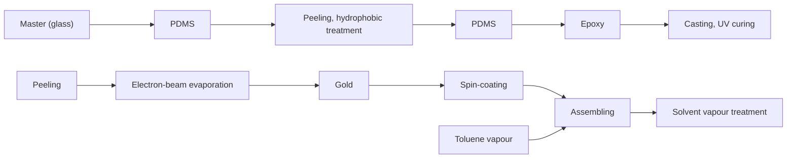

# Luminescent surfaces with tailored angular emission for compact dark-field imaging devices

Cécile A. C. Chazot $^{1}$ , Sara Nagelberg $^{1}$ , Christopher J. Rowlands $^{2}$ , Maik R. J. Scherer $^{3}$ , Igor Coropceanu $^{4}$ , Kurt Broderick $^{5}$ , Yunjo Kim $^{1}$ , Moungi G. Bawendi $^{4}$ , Peter T. C. So $^{1}$ and Mathias Kolle $^{1}$

Dark-field microscopy is a standard imaging technique widely employed in biology that provides high image contrast for a broad range of unstained specimens $^{1}$ . Unlike bright-field microscopy, it accentuates high spatial frequencies and can therefore be used to emphasize and resolve small features. However, the use of dark-field microscopy for reliable analysis of blood cells, bacteria, algae and other marine organisms often requires specialized, bulky microscope systems, as well as expensive additional components, such as dark-field-compatible objectives or condensers $^{2,3}$ . Here, we propose to simplify and downsize dark-field microscopy equipment by generating the high-angle illumination cone required for dark-field microscopy directly within the sample substrate. We introduce a luminescent photonic substrate with a controlled angular emission profile and demonstrate its ability to generate high-contrast dark-field images of micrometre-sized living organisms using standard optical microscopy equipment. This new type of substrate forms the basis for miniaturized lab-on-chip dark-field imaging devices that are compatible with simple and compact light microscopes.

In contrast to bright-field microscopy, which primarily relies on variations in optical absorption within the specimen to create image contrast, dark-field microscopy exploits the scattering of incident light from localized variations in the refractive index $^{2-5}$ . For weakly scattering materials, this approach provides a significant improvement in signal-to-noise ratio. This is particularly useful for specimens that display little or no absorption and allows for imaging of weakly scattering biological samples $^{6-9}$ and metallic nanoparticles $^{10-12}$ . Because dark-field microscopy is based on the rejection of incident and reflected unscattered light, only light that is scattered by the sample's features contributes to the image. In essence, dark-field microscopy emphasizes the high-spatial-frequency components associated with small features in the specimen morphology and in some imaging scenarios can provide resolution beyond the diffraction limit $^{13-15}$ .

In a typical dark-field microscope, light is incident on the sample at oblique polar angles (measured with respect to the sample surface normal) that are larger than the objective's maximum light collection angle $\theta_{max}$ , given by the objective's numerical aperture $NA = n \sin \theta_{max}$ , where n is the refractive index of the imaging medium $^{4,5,16}$ . Consequently, only light that is scattered by the sample into a cone of apex angle $2\theta_{max}$ centred around the microscope's optical axis is collected. A typical dark-field microscope requires a specialized filter cube and dedicated objectives or condensers, which permit shaping of the incident light cone $^{2,3,16}$ . Dark-field objectives usually have a smaller numerical aperture than comparable bright-field objectives. to ensure that specularly reflected light is not collected $^{2,3}$ . However, a smaller numerical aperture results in a reduced spatial resolution.

In the last few years, newly developed plasmonic-based approaches $^{17-20}$ have opened up new paths to overcoming the equipment complexity and size limitations of conventional dark-field microscopy. In these methods, evanescent surface plasmon waves are not captured in the far field, which results in a dark background, but can be scattered into propagating far-field modes by objects within the surface plasmon field, which consequently appear bright. These techniques have clear advantages compared to classic dark-field imaging devices, but they are not free of limitations. First, they rely on elaborate data analysis for the reconstruction of an image from scans of the sample surface $^{17}$ , including deconvolution and noise reduction algorithms $^{20}$ . Second, they involve additional complex optical components $^{17-19}$ , which significantly increase the size of the whole imaging system and limit widespread implementation.

Here, we propose to simplify and miniaturize dark-field microscopy instrumentation by integrating the dark-field light source into the sample substrate. We introduce a luminescent micropatterned photonic surface with a controlled angular emission profile. This novel type of substrate forms the basis for miniaturized lab-on-chip dark-field microscopy devices that are compatible with simple and compact light microscopes. The light emitted by the substrate is confined to high polar angle ranges due to the interplay between three different structural components: (1) a flat Bragg mirror that, by its spectrally selective and angle-dependent transmission characteristics, determines the angular emission profile of the surface; (2) a light-emitting layer beneath the Bragg reflector, which in our system is composed of light-emitting cadmium selenide/cadmium sulfide (CdSe/CdS) core-shell quantum dots (QDs) $^{21}$ dispersed in a poly(methyl methacrylate) (PMMA) matrix; (3) a micropatterned bottom reflector under the light-emitting layer to recycle light into propagation angle ranges that are transmitted by the Bragg reflector (Fig. 1a). The design is inspired by colour mixing structures found in the wing scales of Papilio butterflies $^{22,23}$ and builds on recent findings on how to enhance the underlying optical effects in bio-inspired materials $^{24}$ . We call this dark-field imaging technique, which relies on the unique light-emission characteristics of the substrate, 'substrate luminescence-enabled dark-field' imaging (SLED).

To evaluate the potential of this substrate design for integrated dark-field microscopy devices, we first investigated the surface's optical performance theoretically. A custom-made optical modelling environment developed in MATLAB allowed us to study the optical behaviour and interplay of individual structural components.

a   

text_image

Hollow cone of light emission
Bragg mirror
Emitting layer
Concave reflectors

b   

heatmap

| Incident angle, θ (deg) | Wavelength (nm) | Reflectivity |
| ----------------------- | --------------- | ------------ |
| 0                       | 900             | 0.0          |
| 20                      | 800             | 0.2          |
| 40                      | 700             | 0.4          |
| 60                      | 600             | 0.6          |
| 80                      | 500             | 0.8          |
| 100                     | 400             | 1.0          |

c   

line

| Wavelength (nm) | Reflectivity (θ = 0°) | Intensity (a.u.) (θ = 0°) | Reflectivity (θ = 28°) | Intensity (a.u.) (θ = 28°) | Reflectivity (θ = 37°) | Intensity (a.u.) (θ = 37°) |
| --------------- | --------------------- | ------------------------- | ---------------------- | -------------------------- | ---------------------- | -------------------------- |
| 300             | ~0.5                  | ~0.5                      | ~0.5                   | ~0.5                       | ~0.5                   | ~0.5                       |
| 600             | ~1.0                  | ~1.0                      | ~1.0                   | ~1.0                       | ~1.0                   | ~1.0                       |
| 900             | ~0.5                  | ~0.5                      | ~0.5                   | ~0.5                       | ~0.5                   | ~0.5                       |

d   

text_image

d
θc
θ1
θ2

e   

text_image

θc
θ2
θ1

f   

radar

| Angle | Intensity (a.u.) |
|-------|------------------|
| 0°    | 0                |
| 30°   | 60               |
| 60°   | 60               |
| 90°   | 0                |
| 120°  | 60               |
| 150°  | 60               |
| 180°  | 60               |
| 210°  | 60               |
| 240°  | 60               |
| 270°  | 60               |
| 300°  | 60               |
| 330°  | 60               |
| 360°  | 60               |
| 390°  | 60               |
| 420°  | 60               |
| 450°  | 60               |
| 480°  | 60               |
| 510°  | 60               |
| 540°  | 60               |
| 570°  | 60               |
| 600°  | 60               |
| 630°  | 60               |
| 660°  | 60               |
| 690°  | 60               |
| 720°  | 60               |
| 750°  | 60               |
| 780°  | 60               |
| 810°  | 60               |
| 840°  | 60               |
| 870°  | 60               |
| 900°  | 60               |

g   

text_image

g
Air
sinθ
Water
Oil

Fig. 1 | The concept of SLED. a, Three-dimensional (3D) schematic of the device design. b, Grey-scale encoded reflectivity of a Bragg mirror with a reflection band centred at 585 nm, as a function of light incidence angle and wavelength. Solid white vertical lines mark the critical angles $\theta_{a}$ and $\theta_{w}$ beyond which total internal reflection occurs if the upper medium is air or water. The spectral emission range of the QDs is marked with horizontal dashed white lines and the red overlay represents the angle range at which emitted light can escape from the Bragg reflector. c, Selected spectra from b (numbered 1-3) at incidence angles $\theta=0^{\circ}$ , $\theta_{c}=28^{\circ}$ (where the Bragg reflector exhibits a reflectivity of 50% for the QD's spectral emission range) and $\theta=37^{\circ}$ , marked by dotted lines in b. The QD emission spectrum is represented as the red-hatched area. d, Schematic depicting a possible optical path of a light beam emitted by a QD in the case of a flat-bottomed reflector. If the light is emitted at an angle $\theta_{1}$ , with which it is reflected by the Bragg mirror, the beam will keep bouncing between the two reflective surfaces, until it escapes at the sample edge. For a higher incidence angle $\theta_{2}$ , light can couple out. e, In the case of a bottom reflector patterned with semi-spherical cavities, the light emitted at an angle $\theta_{1}$ can—through scattering from the patterned bottom surface—reach an incident angle $\theta_{2}$ large enough to transmit through the Bragg reflector. f, Simulated angular emission profiles comparing the angle-dependent intensity of light emitted by a substrate with a flat-bottomed reflector (black) and a substrate with a micropatterned bottom reflector (red). The insets show visualizations of the emitted light intensity and colour as a function of the angle of incidence onto the Bragg reflector, which increases from $0^{\circ}$ at the centre of the images to $90^{\circ}$ at the edges. g, Emission profiles in air, water and oil. The dashed line corresponds to an output angle of $90^{\circ}$ in air, and the solid line corresponds to $90^{\circ}$ in water.

The system's Bragg reflector was modelled with 13 layers of titanium dioxide (TiO $_2$ , refractive index $n_{\text{TiO}_2} = 2.2$ ) and silicon dioxide (SiO $_2$ , $n_{\text{SiO}_2} = 1.49$ ) to match the structure and parameters that were subsequently realized experimentally, while its reflection characteristics were found using Rouard's technique $^{25}$ . By tuning the layer thicknesses in the Bragg reflector, the spectral position of its reflection band was matched to the experimentally determined emission spectrum of the QDs, which only permits light to escape at large polar angles. In other words, the light emitted by the QDs is reflected back into the polymer matrix, unless its propagation angle (with respect to the Bragg reflector's surface normal) is larger than a critical angle $\theta_c$ and smaller than the critical angles of total internal reflection $\theta_a$ for air or $\theta_w$ for water as the imaging medium (Fig. 1b,c). This angle is determined by the design of the Bragg reflector and the emission wavelength of the QDs. The luminescent substrate thus channels all light into a hollow emission cone with minimum and maximum apex angle defined by the Bragg mirror's reflection band.

We used a custom 3D ray-tracing code to model the light propagation within the QD-doped polymer medium between the Bragg reflector and the concave reflectors forming the gold-coated micropatterned bottom surface, taking into account the spectrally varying refractive index and the absorption coefficient of gold $^{26}$ . We made the assumption that the concentration of QDs was small enough to not affect the refractive index of the PMMA layer. Combining wave optics-based modelling (Rouard's technique $^{25}$ ) to establish the interactions of light with the Bragg reflector and geometrical optics-based approaches (ray tracing) to approximate light propagation within the semi-spherical cavities, we obtained an estimate of the optical response of the complete structure composed of Bragg reflector, light-emitting QDs and micropatterned metallic bottom surface. A comparison of the theoretical emission characteristics of two different designs, one with a patterned and one with a flat gold bottom surface, indicates that the micropatterns drastically amplify the intensity of light emitted at high angles. In a structure with a flat reflecting bottom surface, most of the emitted light is coupled out from the substrate's side edges (Fig. 1d). In contrast, substrates featuring concave, hemispherical cavities recycle the majority of light reflected by the Bragg mirror, until it impinges

flowchart

text_image

Bragg reflector
QD/PMMA layer
Metallized concavities

text_image

c
Single concavity

Fig. 2 | The fabricated SLED surface. a, Schematic of the manufacturing procedure. The patterned epoxy substrate was obtained by a three-step replica moulding procedure, consisting of casting polydimethylsiloxane (PDMS) on a glass master, PDMS casting on PDMS, and epoxy casting on the PDMS replica. The SLED surface was then assembled by adding the metal reflector, QDs and Bragg reflector on top of the patterned epoxy. b, Cross-sectional SEM view of the SLED device showing the patterned bottom surface, the QD-doped PMMA layer and the Bragg reflector. Scale bar, 1μm. c, Top view of the complete device obtained by fluorescence microscopy with the microscope's focus plane on the bottom reflector. Scale bar (main panel), 10μm. Inset: a macroscopic top view of the assembled SLED surface. Scale bar (inset), 1mm.

on the Bragg reflector at an angle larger than $\theta_{c}$ , at which point the light escapes (Fig. 1e). Therefore, light can exit from the top of the surface after multiple reflections from the micropatterned surface. This redistribution of light into incidence angle ranges for which the Bragg reflector is transmissive enables a much more intense wide-angle illumination compared to a flat gold bottom surface for identical QD excitation strength (Fig. 1f). Finally, optical modelling helped us to design the Bragg filter's reflection band so that the substrate's angular emission profile forms a hollow emission cone located in any desired polar angle range. To use the substrates for dark-field microscopy with common bright-field objectives, the emission angle range should be located outside of the objective's numerical aperture. As expected, the emission profile depends on the medium above the device. We based our design on three media common in optical microscopy—air, water and oil—as well as on the numerical aperture of the high-NA objectives commonly available to validate this proposed concept experimentally (Fig. 1g).

To experimentally demonstrate the proposed substrate luminescence-enabled dark-field imaging technique, we developed a repeatable fabrication technique to create surfaces with various controlled light emission profiles (Fig. 2a). The structure's optical properties can be altered by modifying the design parameters. First, changing the QD type or mixing different QDs together allows for adjustment of the emission spectrum. Second, the thickness of individual oxide layers in the Bragg reflector can be varied to modify the angular emission profile associated with a specific spectral emission range. Finally, the geometry of the micropatterned bottom reflector can also be modified to change the angular distribution of the emitted light intensity within the angle range for which the Bragg reflector allows light to transmit.

A cross-section of a representative sample obtained by scanning electron microscopy (SEM) shows the microscale concavities filled with the QD-containing polymer matrix topped off by the Bragg reflector (Fig. 2b). Based on our theoretical investigations, the Bragg reflector was designed to have a bandgap centred at $585\mathrm{nm}$ to achieve a hollow emission cone with the large apex angle needed for dark-field imaging, while still allowing us to characterize the surface's optical properties using high-NA objectives. A laser diode with an emission wavelength of $\lambda = 405\mathrm{nm}$ (continuous-wave output power $5\mathrm{mW}$ ) was used to excite the QDs in the sample, resulting in light emission in the red spectral range (Fig. 2c).

We evaluated our concept of enhancing the surface's emission characteristics using micropatterned bottom structures by comparing the emission resulting from a device with a flat gold reflector at the bottom with the emission from a design with a micropatterned reflective bottom surface. Both samples were excited with the laser diode at an incident power of $< 5\mathrm{mW}$ at the surface of the sample. The sample with the patterned bottom surface shows a significantly higher emission intensity and signal-to-noise ratio than the substrate with a flat-bottomed reflector (Fig. 3a-c), in excellent agreement with the optical modelling (Fig. 1f). Furthermore, the surfaces' emission profiles in air and in immersion oil match the predicted optical response in these media (Fig. 3d-i). The experimental data are truncated at higher angles due to the limited numerical aperture of the microscope objectives (white ring, Fig. 3d,e,g,h). We also note that the experimentally obtained angular emission profile in air deviates from the predictions at lower angles (Fig. 3f). We speculate that this escape of light from the Bragg reflector at lower angles is indicative of scattering defects in the Bragg reflector layers.

a   

heatmap

| Intensity (a.u.) | Value |
| ---------------- | ----- |
| 1                | 1     |
| 0                | 0     |

b   

natural_image

Circular object with red rim and gray center, resembling a star or lens (no text or symbols)

d   

natural_image

Circular red gradient image with white border, no text or symbols present

e   

natural_image

Circular red ring on black background with white outline (no text or symbols)

g   

natural_image

Circular gradient design with red center fading to black edges (no text or symbols)

h   

natural_image

Circular red gradient ring pattern on black background (no text or symbols)

c   

line

| Angle (°) | Intensity (a.u.) |
| --------- | ---------------- |
| 0         | 0                |
| 30        | 0                |
| 60        | 0                |
| 90        | 0                |
| 120       | 0                |

f   

radar

| Angle (°) | Intensity (a.u.) - Red Line | Intensity (a.u.) - Black Dashed Line |
| --------- | --------------------------- | ------------------------------------ |
| 0         | ~0                          | ~0                                   |
| 30        | ~25                         | ~15                                  |
| 60        | ~50                         | ~30                                  |
| 90        | ~75                         | ~45                                  |
| 120       | ~50                         | ~30                                  |
| 150       | ~25                         | ~15                                  |
| 180       | ~0                          | ~0                                   |

i   

radar

| Angle (°) | Intensity (a.u.) |
| --------- | ---------------- |
| 0         | 0                |
| 30        | 60               |
| 60        | 30               |
| 90        | 0                |
| 120       | -60              |
| 150       | -30              |
| 180       | 0                |
| 210       | 60               |
| 240       | 30               |
| 270       | 0                |
| 300       | -60              |
| 330       | -30              |
| 360       | 0                |
| 390       | 60               |
| 420       | 30               |
| 450       | 0                |
| 480       | -60              |
| 510       | -30              |
| 540       | 0                |
| 570       | 60               |
| 600       | 30               |
| 630       | 0                |
| 660       | -60              |
| 690       | -30              |
| 720       | 0                |
| 750       | 60               |
| 780       | 30               |
| 810       | 0                |
| 840       | -60              |
| 870       | -30              |
| 900       | 0                |
| 930       | 60               |
| 960       | 30               |
| 990       | 0                |
| 1020      | -60              |
| 1050      | -30              |
| 1080      | 0                |
| 1110      | 60               |
| 1140      | 30               |
| 1170      | 0                |
| 1200      | -60              |
| 1230      | -30              |
| 1260      | 0                |
| 1290      | 60               |
| 1320      | 30               |
| 1350      | 0                |
| 1380      | -60              |
| 1410      | -30              |
| 1440      | 0                |
| 1470      | 60               |
| 1500      | 30               |
| 1530      | 0                |
| 1560      | -60              |
| 1590      | -30              |
| 1620      | 0                |
| 1650      | 60               |
| 1680      | 30               |
| 1710      | 0                |
| 1740      | -60              |
| 1770      | -30              |
| 1800      | 0                |
| 1830      | 60               |
| 1860      | 30               |
| 1890      | 0                |
| 1920      | -60              |
| 1950      | -30              |
| 1980      | 0                |
| 2010      | 60               |
| 2040      | 30               |
| 2070      | 0                |
| 2100      | -60              |
| 2130      | -30              |
| 2160      | 0                |
| 2190      | 60               |
| 2220      | 30               |
| 2250      | 0                |
| 2280      | -60              |
| 2310      | -30              |
| 2340      | 0                |
| 2370      | 60               |
| 2400      | 30               |
| 2430      | 0                |
| 2460      | -60              |
| 2490      | -30              |
| 2520      | 0                |
| 2550      | 60               |
| 2580      | 30               |
| 2610      | 0                |
| 2640      | -60              |
| 2670      | -30              |
| 2700      | 0                |
| 2730      | 60               |
| 2760      | 30               |
| 2790      | 0                |
| 2820      | -60              |
| 2850      | -30              |
| 2880      | 0                |
| 2910      | 60               |
| 2940      | 30               |
| 2970      | 0                |
| 3000      | -60              |
| Note: The data for 'Intensity (a.u.)' is estimated based on the provided code snippet in the original text. The 'θ' values are calculated based on the formula 'θ'. There is no additional data series in this case.

Fig. 3 | Optical characteristics of the light-emitting surfaces. a,b, Comparison of the emission profile of substrates with a flat bottom reflector (a) and micropatterned reflecting bottom surface (b). c, Polar plot comparing the two specimens' angular emission profiles extracted as an average of radial emission patterns from a and b. Red and black curves represent data from samples with patterned and flat-bottomed reflectors, respectively. d, Experimentally determined emission profile for a sample with patterned bottom reflector in air imaged with a ×100 objective (NA 0.95). The objective's numerical aperture is marked with a white circle. e, Corresponding modelling results for a Bragg reflector centred at 585 nm. f, Polar plot extracted from d (red) and e (black). g, Experimentally determined emission profile for a sample with a patterned bottom reflector in immersion oil imaged with a ×100 objective (NA 1.3). h, Corresponding modelling results for a Bragg reflector centred at 585 nm. i, Polar plot extracted from g (red) and h (black).

a   

text_image

Laser diode
405 nm
Collimating
lens
Short-pass
filter
Camera
Tube lens
Long-pass filter
Dichroic mirror
×100 air or ×60 water
immersion objective

h   

natural_image

Solid orange background with a faint diagonal dashed line and a small scale bar at the bottom right (no text or symbols)

k   

natural_image

Solid orange background with a faint diagonal dashed line and small red specks (no text or symbols)

b   

C   

e   

f   

i   

natural_image

Microscopic view of a red-stained biological sample with a white dashed line indicating a specific region (no text or symbols present)

|   

natural_image

Microscopic image of a red-stained biological structure with a white dashed line indicating a specific region (no text or symbols present)

d   

line

| Distance (μm) | Normalized Intensity (Black Line) | Normalized Intensity (Red Line) |
| ------------- | ---------------------------------- | ------------------------------- |
| 0             | 1.0                                | 0.2                             |
| 1             | 0.9                                | 0.4                             |
| 2             | 0.8                                | 0.9                             |
| 3             | 0.7                                | 0.4                             |
| 4             | 1.0                                | 0.2                             |

g   

line

| Distance (μm) | Normalized intensity (black line) | Normalized intensity (red line) |
| ------------- | ---------------------------------- | ------------------------------- |
| 0             | 1.0                                | 0.2                             |
| 2             | 0.9                                | 0.3                             |
| 4             | 0.8                                | 0.9                             |
| 6             | 0.9                                | 0.8                             |
| 8             | 1.0                                | 0.3                             |
| 10            | 1.0                                | 0.2                             |

j   

line

| Distance (μm) | Normalized intensity |
| ------------- | -------------------- |
| 0             | 0.8                  |
| 1             | 0.95                 |
| 2             | 0.85                 |
| 3             | 0.8                  |
| 4             | 0.75                 |
| 5             | 0.65                 |
| 6             | 0.4                  |
| 7             | 0.3                  |
| 8             | 0.25                 |

m   

line

| Distance (μm) | Normalized intensity |
| ------------- | -------------------- |
| 0             | 0.2                  |
| 2             | 0.2                  |
| 4             | 0.9                  |
| 6             | 0.5                  |
| 8             | 0.9                  |
| 10            | 0.2                  |
| 12            | 0.2                  |

Fig. 4 | Application of the SLED surfaces to image colloids and marine microorganisms. a, Schematic of the optical set-up used for imaging. In the case of biological samples, a drop of water containing the microorganisms is deposited on the SLED surface and imaged using an immersion lens. SLED measurements rely on exposure of the substrate with blue light from a laser diode. b-m, Bright-field images (b,e,h,k) and SLED images (c,f,i,l) together with the corresponding intensity profiles (d,g,j,m) (black lines, bright-field; red lines, SLED) extracted along the white dashed lines are shown for a single colloid (b-d), a colloid cluster (e-g), a colony of E. coli bacteria in water (h-j) and micro-algae in sea water (k-m). Scale bars, 1μm (b,c,e,f), 5μm (h,i), 10μm (k,l). The dashed black lines in d, g, j and m indicate the levels used to determine the image contrasts specified in the main text. These levels are chosen based on image dimensions so that 5% of the intensity values lie above and below for the images of colloids and 15% for the images of bacteria and micro-algae, which generously accounts for camera noise levels. Based on these thresholds, standard deviations of the bright-field and SLED contrast values stated in the main text result from at least five (single colloid) and more than 15 (bacteria and micro-algae) discrete values above and below the upper and lower intensity thresholds.

a   

text_image

a
Optical axis z
This distance is practically zero and is just exaggerated to fit the graphs below
SLED surface producing wide-angle illumination
Phase object
Imaging system
Image plane

f   

line

| Distance (μm) | Amplitude |
| ------------- | --------- |
| -1            | 0.96      |
| 0             | 0.98      |
| 1             | 0.96      |

b   

line

| Spatial frequency (1 µm⁻¹) | Magnitude |
| -------------------------- | --------- |
| -2                         | 0.5       |
| 0                          | 1.0       |
| 2                          | 0.5       |

line

| x₂ - x₁ (μm) @ y₂ - y₁ = 0 | Amplitude |
| -------------------------- | --------- |
| -1.5                       | 0         |
| -1.0                       | 0         |
| -0.5                       | 0         |
| 0.0                        | 1.0       |
| 0.5                        | 0         |
| 1.0                        | 0         |
| 1.5                        | 0         |

d   

heatmap

| Distance (μm) | Magnitude | Phase / 2π |
| ------------- | --------- | ---------- |
| -1            | 0.0       | 0.0        |
| 0             | 1.0       | 0.06       |
| 1             | 0.5       | 0.04       |
| 1             | 0.0       | 0.0        |

line

| Distance (μm) | Amplitude |
| ------------- | --------- |
| -1            | 0         |
| 0             | 1.0       |
| 1             | 0         |

g   

scatter

| Δn   | Contrast ratio |
|------|----------------|
| 0.0  | 5.5            |
| 0.1  | 3.5            |
| 0.2  | 2.8            |
| 0.3  | 1.5            |
| 0.4  | 1.0            |
| 0.5  | 0.8            |

Fig. 5 | Modelling to compare image formation with SLED illumination and bright-field illumination. a, Schematic showing the sequence of optical elements in the imaging experiments. From left to right: SLED surface, phase object, 4f imaging system (schematically represented by two lenses), image plane (where the camera is positioned). b, The angular spectrum $\mathcal{J}_{\mathrm{s}}(u,v)$ , where $u$ and $v$ are the spatial frequencies. The plots on the top show $\mathcal{J}_{\mathrm{s}}$ for the SLED surface (left) and for bright-field illumination through a water immersion objective with numerical aperture 1.0 (right). Scale bars, $1\mu \mathrm{m}$ . The bottom panel displays normalized magnitudes of $\mathcal{J}_{\mathrm{s}}$ for the SLED surface (red) and bright-field illumination (black) acquired along the dashed lines in the top plots. c, The complex degree of mutual spatial coherence $j_{\mathrm{s}}(x_{2} - x_{1},y_{2} - y_{1})$ for the SLED surface (left) and the bright-field illumination (right). The bottom plot displays normalized magnitudes of $j_{\mathrm{s}}(x_{2} - x_{1},0)$ for the SLED surface (red) and bright-field illumination (black) acquired along the dashed lines in the top plots. d, Top: phase map of the complex amplitude transmission function $A(x,y)$ of a transparent spherical particle with refractive index 1.37 for light of $630~\mathrm{nm}$ wavelength. Bottom: graph showing the phase profile along the dashed line in the top plot. The black line represents the absolute value of the object's amplitude transmission function. e, Top: amplitude spread function of the imaging system as a 2D map. Bottom: a profile taken along the white dashed line in the top plot. f, SLED image (top left) and bright-field image (top right) of the phase object with corresponding profiles shown below. Scale bars ( $\mathbf{c - f}$ ), $1\mu \mathrm{m}$ . g, Contrast ratio used as a metric to compare image contrast obtained with SLED light and with bright-field illumination as a function of refractive index difference $\Delta n$ between the phase object and surrounding medium. For $\Delta n \leq 0.3$ (data points in red), SLED illumination provides better contrast then bright-field light.

To demonstrate the utility of the proposed luminescent surfaces for dark-field microscopy, we imaged colloids and biological samples with low refractive index contrast (Fig. 4). The Bragg reflector was designed to obtain optimal optical performances for use with a ×100 air objective (NA 0.9) and a ×60 water immersion objective (NA 1.0) (Fig. 4a). Images obtained with standard bright-field microscopy and with the SLED approach were compared to demonstrate the ability of our substrates to provide high-contrast images for specimens with little absorption and low refractive index contrast (Fig. 4). First, using the ×100 air objective, 1 μm polystyrene colloids were imaged in both bright-field and with SLED (Fig. 4b–g). Images obtained by SLED and bright-field microscopy were used to extract the reciprocal intensity profiles, demonstrating the dark-field character of our approach. The image contrast, calculated as the difference between the maximum and minimum image intensity values divided by their sum, was significantly improved when the colloids were imaged with SLED (Fig. 4d,g). Although bright-field illumination resulted in a contrast of 0.20 ± 0.01 (mean ± s.d.), SLED illumination provided a contrast of 0.60 ± 0.02.

Second, a drop of water containing marine microorganisms or Escherichia coli (E. coli) was positioned on top of the light-emitting surface and imaged with the water immersion lens (Fig. 4h,i,k,l). In the case of biological samples, which due to weak absorption and low refractive index contrast in water are difficult to image with bright-field illumination, the contrast improvement obtained with SLED is even more striking. For the E. coli sample (Fig. 4h–j), bright-field illumination only provided a contrast of $0.021 \pm 0.003$ , while SLED light enabled an image contrast of $0.57 \pm 0.02$ . The contrast enhancement when imaging marine microorganisms (Fig. 4k–m) was similarly high; SLED illumination resulted in a contrast of $0.76 \pm 0.03$ , while for bright-field light it was only $0.040 \pm 0.004$ . Hence, SLED illumination permits the visualization of submicrometre features in weakly or non-absorbing specimens with low refractive index difference to the surrounding medium, which cannot be easily imaged using bright-field microscopy and standard numerical contrast enhancement techniques (see Supplementary Information and Fig. 4).

The imaging characteristics of the SLED substrate in combination with a standard light microscope can be modelled in the theoretical framework of imaging with partially coherent, quasi-monochromatic light pioneered by Hopkins $^{27}$ and educationalized elegantly by Born and Wolf $^{28}$ and Goodman $^{29}$ . We describe the microscope setup as consisting of the SLED light source transilluminating a pure phase object, which is imaged by the objective and tube lens onto a charge-coupled device array (Fig. 5a). Focusing on the capacity to achieve image contrast, we neglect the imaging system's magnification and regard it as a simple space-invariant 4f system, which simplifies the problem's mathematical complexity without compromising any contrast comparison. The source's coherence properties can be quantified through the mutual intensity that is incident on the object. For quasi-monochromatic illumination originating from a large uniform spatially incoherent source, such as the SLED surfaces, the source's mutual intensity spectrum $\mathcal{J}_{\mathrm{s}}(u,v)$ is proportional to its angular emission profile (Fig. 5b) $^{27,28}$ . Here, the spatial frequencies are $u=\frac{n}{\lambda_{0}}\sin\theta\cos\varphi$ and $v=\frac{n}{\lambda_{0}}\sin\theta\sin\varphi$ , where n is the refractive index of the surrounding medium and $\theta$ and $\varphi$ are the polar and azimuthal angles marked in Fig. 1a. Furthermore, the normalized mutual intensity $j_{s}$ in the object plane (Fig. 5c) is proportional to the Fourier transform of $\mathcal{J}_{\mathrm{s}}(u,v)$ and only depends

on the space coordinate differences of any two object points $(x_{1},x_{1})$ and $(x_{2},x_{2})$ , that is $j_{\mathrm{s}}(x_{1},x_{2},y_{1},y_{2})=j_{\mathrm{s}}(x_{1}-x_{2},y_{1}-y_{2})$ . Finally, the normalized spatial intensity distribution $I(x_{\mathrm{im}},y_{\mathrm{im}})$ in the image of a pure phase object with complex amplitude transmission function $A(x,y)$ (Fig. 5d) imaged through a space-invariant 4f system with amplitude transfer function h (Fig. 5e) is given by

$$
I (x _ {\text { im }}, y _ {\text { im }}) = \underset {\text { Illuminated   area }} {\iiint} j _ {s} (x - x ^ {\prime}, y - y ^ {\prime}) A (x, y) A ^ {\star} (x ^ {\prime}, y ^ {\prime})
$$

$$
h (x _ {\mathrm{im}} - x, y _ {\mathrm{im}} - y) h ^ {\star} (x _ {\mathrm{im}} - x ^ {\prime}, y _ {\mathrm{im}} - y ^ {\prime}) \mathrm{d} x \mathrm{d} y \mathrm{d} x ^ {\prime} \mathrm{d} y ^ {\prime}
$$

The 4D integration in the object coordinates x, y and $x'$ , $y'$ runs over the whole illuminated area (for a detailed derivation see Supplementary Information). Images of a spherical pure phase object akin to the experimentally imaged colloids but with significantly smaller refractive index contrast (diameter, 1 $\mu$ m; refractive index, 1.37) for SLED illumination and for bright-field light are shown in Fig. 5f. These modelling results show that the partially coherent light field emitted by the SLED surfaces enables imaging of phase objects analogous to dark-field illumination by translating phase disturbances at the object plane into intensity contrast at the image plane. Especially for transparent objects with weak refractive index difference to the surrounding medium, such as bacteria, cells or marine microorganisms, this technique enables enhanced contrast compared to standard bright-field imaging (Fig. 5g). The emission characteristics of SLED surfaces are akin to the light fields achieved with a dark-field condenser in Köhler's illumination, for which it can be shown that the illumination does not cause image aberrations $^{28}$ . Consequently, only the microscope objective and tube lens contribute to aberrations. The resolution obtained with SLED illumination is comparable to the resolution in bright-field light.

In conclusion, we have shown that luminescent surfaces with tailored angular emission profiles can be generated by using processes that allow for control of the structures' composition and micro-morphology. The theoretical modelling of the surface's optical characteristics, complemented and confirmed by our experimental work, demonstrates the potential of the proposed substrate design to enable a novel type of dark-field microscopy, which we have termed 'substrate luminescence-enabled dark-field' imaging (SLED). This approach facilitates dark-field imaging with simple and compact light microscopes that are not equipped with dark-field components. Preliminary experiments suggest that a surface with an area of $25 \times 25 \, mm^2$ can be designed to exhibit up to 10 different spectrally and angularly distinct emission profiles. Such multi-spectral emitter surfaces could be used with a wide variety of light collection equipment available on the market. Randomly rough surfaces such as the bottom reflector could be a viable alternative to the concave microstructures presented here, provided their roughness is well controlled (see Supplementary Information and Fig. 3). In this study, light emission from the QDs was achieved using a low-budget laser diode; however, electrical excitation of the QDs could greatly enhance this approach and could be implemented with minor design changes to the device $^{30,31}$ . Combining electrical excitation with the use of a mixture of QDs for spectral multiplexing could open new avenues towards the design of a fully integrated on-chip simultaneous dark-field and multi-spectral imaging device $^{32}$ .

# Online content

Any methods, additional references, Nature Research reporting summaries, source data, extended data, supplementary information, acknowledgements, peer review information; details of author contributions and competing interests; and statements of data and code availability are available at https://doi.org/10.1038/s41566-020-0593-1.

Received: 19 November 2019; Accepted: 21 January 2020; Published online: 24 February 2020

# References

1. Gage, S. H. Modern dark-field microscopy and history of its development. Trans. Am. Microsc. Soc. 39, 95–141 (1920).   
2. Hecht, E. Optics 3rd edn (Addison-Wesley, 1998).   
3. Murphy, D. B. & Davidson, M. W. Fundamentals of Light Microscopy and Electronic Imaging 2nd edn (Wiley-Blackwell, 2013).   
4. Noda, N. & Kamimura, S. A new microscope optics for laser dark-field illumination applied to high precision two-dimensional measurement of specimen displacement. Rev. Sci. Instrum. 79, 023704 (2008).   
5. Ueno, H. et al. Simple dark-field microscopy with nanometer spatial precision and microsecond temporal resolution. Biophys. J. 98, 2014–2023 (2010).   
6. Kudo, S., Magariyama, Y. & Aizawa, S. Abrupt changes in flagellar rotation observed by laser dark-field microscopy. Nature 346, 677–680 (1990).   
7. Dunn, A. R. & Spudich, J. A. Dynamics of the unbound head during myosin V processive translocation. Nat. Struct. Mol. Biol. 14, 246–248 (2007).   
8. Nishiyama, M., Muto, E., Inoue, Y., Yanagida, T. & Higuchi, H. Substeps within the 8 nm step of ATPase cycle of single kinesin molecules. Nat. Cell Biol. 3, 425–428 (2001).   
9. Yasuda, R., Noji, H., Yoshida, M., Kinosita, K. Jr & Itoh, H. Resolution of distinct rotational substeps by submillisecond kinetic analysis of F1-ATPase. Nature 410, 898–904 (2001).   
10. Sönnichsen, C., Franzl, T., Wilk, T., von Plessen, G. & Feldmann, J. Plasmon resonances in large noble-metal clusters. New J. Phys. 4, 93 (2002).   
11. Rosman, C. et al. A new approach to assess gold nanoparticle uptake by mammalian cells: combining optical dark-field and transmission electron microscopy. Small 23, 3683–3690 (2012).   
12. Ma, J., Liu, Y., Gao, P. F., Zou, H. Y. & Huang, C. Z. Precision improvement in dark-field microscopy imaging by using gold nanoparticles as an internal reference: a combined theoretical and experimental study. Nanoscale 8, 8729–8736 (2016).   
13. Von Olshausen, P. & Rohrbach, A. Coherent total internal reflection dark-field microscopy: label-free imaging beyond the diffraction limit. Opt. Lett. 38, 4066–4069 (2013).   
14. Braslavsky, I. et al. Objective-type dark-field illumination for scattering from microbeads. Appl. Opt. 40, 5650–5657 (2001).   
15. Kim, S., Blainey, P. C., Schroeder, C. M. & Xie, X. S. Multiplexed single-molecule assay for enzymatic activity on flow-stretched DNA. Nat. Methods 4, 397–399 (2007).   
16. Taylor, M. A. & Bowen, W. P. Enhanced sensitivity in dark-field microscopy by optimizing the illumination angle. Appl. Opt. 52, 5718-5723 (2013).   
17. Zheng, G., Cui, X. & Yang, C. Surface-wave-enabled darkfield aperture for background suppression during weak signal detection. Proc. Natl Acad. Sci. USA 107, 9043–9048 (2010).   
18. Zhang, J., Pitter, M. C., Liu, S., See, C. & Somekh, M. G. Surface-plasmon microscopy with a two-piece solid immersion lens: bright and dark fields. Appl. Opt. 45, 7977–7986 (2006).   
19. Balci, S., Karademir, E., Kocabas, C. & Aydinli, A. Direct imaging of localized surface plasmon polaritons. Opt. Lett. 36, 3401–3403 (2011).   
20. Wei, F., O, Y. W., Li, G., Cheah, K. W. & Liu, Z. Organic light-emitting-diode-based plasmonic dark-field microscopy. Opt. Lett. 37, 4359–4361 (2012).   
21. Coropceanu, I. & Bawendi, M. G. Core/shell quantum dot based luminescent solar concentrators with reduced reabsorption and enhanced efficiency. Nano Lett. 14, 4097-4101 (2014).   
22. Vukusic, P., Sambles, J. R. & Lawrence, C. R. Structural colour: colour mixing in wing scales of a butterfly. Nature 404, 457–457 (2000).   
23. Vukusic, P., Sambles, J. R., Lawrence, C. R. & Wakely, G. Sculpted-multilayer optical effects in two species of Papilio butterfly. Appl. Opt. 40, 1116–1125 (2001).   
24. Kolle, M. et al. Mimicking the colourful wing scale structure of the Papilio blumei butterfly. Nat. Nanotechnol. 5, 511–515 (2010).   
25. Heavens, O. S. Optical Properties of Thin Solid Films (Dover Publications, 1965).   
26. Johnson, P. B. & Christy, R. W. Optical constants of the noble metals. Phys. Rev. B 6, 4370-4379 (1972).   
27. Hopkins, H. H. On the diffraction theory of optical images. Proc. R. Soc. A. 217, 408–432 (1953).   
28. Born, M. et al. Principles of Optics: Electromagnetic Theory of Propagation, Interference and Diffraction of Light (Cambridge Univ. Press, 1999).   
29. Goodman, J. W. Statistical Optics (Wiley, 2015).   
30. Shirasaki, Y., Supran, G., Bawendi, M. G. & Bulović, V. Emergence of colloidal quantum-dot light-emitting technologies. Nat. Photon. 7, 13–23 (2012).   
31. Mashford, B. S. et al. High-efficiency quantum-dot light-emitting devices with enhanced charge injection. Nat. Photon. 7, 407–412 (2013).   
32. Anikeeva, P. O., Halpert, J. E., Bawendi, M. G. & Bulović, V. Electroluminescence from a mixed red-green-blue colloidal quantum dot monolayer. Nano Lett. 7, 2196–2200 (2007).

Publisher's note Springer Nature remains neutral with regard to jurisdictional claims in published maps and institutional affiliations.

© The Author(s), under exclusive licence to Springer Nature Limited 2020

# Methods

Fabrication of micropatterned bottom reflectors. A glass master covered with convex hexagonally packed semispheres with a diameter of 4.6 $\mu$ m was fabricated by Papierfabrik Louisenthal. A first moulding step was performed by casting PDMS Sylgard 184 from Dow Corning after mixing the elastomer base and the curing agent in a weight ratio of 10:1. After curing for 3 h at 70°C, the PDMS was carefully peeled off from the master, revealing the inverted structure (hexagonally packed semispherical concavities). To perform PDMS double-casting, the elastomer master was plasma-etched with oxygen for 10 s before being left for a minimum of 3 h in a desiccator with a few drops of Aquapel Glass Treatment on a glass slide. This commercial fluorinated compound increases the hydrophobicity of the PDMS elastomer to enable PDMS double-casting. Then, a new mixture of Sylgard 184 was cast on the treated PDMS master and cured for 3 h at 70°C. This could be easily peeled off from the initial PDMS master and preserved the geometry of the structure, creating an imprint as on the initial glass master. Finally, high-temperature-resistant optical epoxy OG142-87 from Epotek was cast on the final PDMS mould cured under ultraviolet light for 3 h and easily peeled off to obtain a hard micropatterned sample covered with hexagonally packed semispherical concavities. The temperature resistance of the epoxy is an important factor for the next fabrication step of electron-beam evaporation of a gold coating, which involves working at high temperature ( $\sim$ 100°C); other common polymers expand, affecting the quality of the thin film deposited on it. The PDMS masters were reused up to eight times without any noticeable degradation of the microstructure. The Aquapel-fluorinated PDMS master could be reused without any further treatment for PDMS double-casting, even a month after its first replication.

Electron-beam evaporation of gold on the patterned epoxy. Patterned epoxy samples were coated with a 15 nm-thick seed layer of titanium and 200 nm of gold by electron-beam evaporation. All deposition materials were purchased from Kurt J. Lesker. The deposition was performed with an electron-beam evaporator (AJA ATC) in the clean room of the Exploratory Materials Laboratory (EML) of the Microsystems Technology Laboratories (MTL) at MIT. The deposited thickness was determined with a Dektak 150 mechanical surface profilometer and through SEM cross-section imaging.

Spin-coating of the QD polymer matrix. PMMA (average molecular weight of $15,000 \, g mol^{-1}$ determined by gel permeation chromatography) and toluene (anhydrous 99.8%) were purchased from Sigma-Aldrich and used without further purification. The QDs were synthesized by the Bawendi group at the MIT Department of Chemistry following the recipe reported in ref. $^{[21]}$ . The photoluminescence emission peak of the QDs in solution was located at a wavelength of 630 nm. PMMA powder was mixed at 25 wt% in toluene and stirred until fully dissolved. The solution was then filtered and added to a vial containing dry QDs to obtain 5 wt% of QDs in the PMMA-toluene solution. The mixture was stirred for a few minutes until the QDs were fully dispersed. Using a spin coater (Laurell Technologies WS-650MZ-23NPP), 200 $\mu$ l of the final solution was spin-coated on the gold patterned surface at 2,000 r.p.m., until the solvent fully evaporated and the colour of the film did not change anymore.

Bragg reflector fabrication by electron-beam evaporation and assembly. The titania (TiO $_2$ ) and silica (SiO $_2$ ) used for the deposition were purchased from Kurt J. Lesker. Electron-beam evaporation was performed on the same equipment used for the deposition of gold on the patterned surface. Bragg reflectors were obtained by alternating 13 layers of TiO $_2$ and SiO $_2$ , always starting and finishing with a TiO $_2$ layer, as it is the higher-refractive-index material. The Bragg reflectors can be deposited directly on top of the PMMA/QD-covered metal bottom reflectors. Alternatively, they can be formed on thin glass coverslips. The coverslips can then be cut and assembled with the QD/PMMA-coated bottom reflectors by putting them in physical contact with the Bragg reflector side on the PMMA film and fusing them in a toluene environment for $\sim$ 1 h. The thicknesses and refractive indices of the constituent layers in the multilayer reflectors were measured using a custom-made ellipsometer. In addition, the thicknesses were confirmed by profilometry performed with a Dektak 150 mechanical surface profilometer and through SEM cross-sectional imaging. For our samples, the refractive indices were 2.2 $\pm$ 0.02 for TiO $_2$ and 1.49 $\pm$ 0.01 for SiO $_2$ .

Optical characterization set-up. All optical measurements were performed on an Olympus BX51 optical microscope. Images were acquired with a RGB Allied Vision Technologies Prosilica GT camera mounted on the microscope's imaging port. A high-NA oil immersion lens (Olympus UPlanFL ×100/NA 1.30) and a regular air objective (UMPlanFl ×100/NA 0.95) in conjunction with a Bertrand lens were used to image the samples' angular emission profiles. The excitation source was a Sony SLD3236VF laser diode, used with a Thorlabs ITC4005 laser controller. The beam created by the laser diode was collimated through a lens with 30 mm focal length and its position and angle were controlled with two adjustable $45^{\circ}$ mirrors before coupling it into the optical microscope. A customized microscope filter cube consisting of a short-pass filter (<450 nm, Thorlabs FESH0450), a long-pass dichroic mirror (>425 nm, Thorlabs DMLP425R) and a long-pass filter (>570 nm, Thorlabs FGL570) was also used. The standard excitation power used to excite the QDs was <5 mW to avoid heating and intensity variation of the laser diode. In addition, some tests were run with an excitation power of up to 20 mW without witnessing any photobleaching of the QDs. A ×60 water immersion lens (Olympus LUMPlanFl N ×60/NA 1.00) was used for the imaging of marine microorganisms and bacteria.

Optical modelling. Modelling of the emission characteristics of the sample geometries with spherical concavities, flat surfaces and randomly rough surfaces with a Gaussian height distribution was performed using a custom MATLAB code. This code allows to calculate the reflection and transmission characteristics of the top Bragg reflector based on Rouard's method $^{25}$ , while employing ray tracing to model light propagation within the structures and reflection of the bottom gold surface (taking into account the wavelength-dependent refractive indices and absorption coefficients of gold $^{26}$ ). To assess the emission characteristics of the different geometries we generated 100,000 rays with random position and direction within the volume enclosed by the Bragg filter and the bottom gold reflectors. We assumed incoherent superposition of different rays emitted from the surface in the same angular direction (that is, adding their intensities), because we expect no phase relation between light that is emitted fluorescently from different points within the cavity structures. The number of 100,000 rays was chosen after testing for selected geometries that the resulting emission profiles had converged to the same result as for modelling runs with 150,000 and 200,000 rays. The theoretical modelling of image formation with partially coherent light is described in detail in the Supplementary Information.

Reporting Summary. Further information on research design is available in the Nature Research Reporting Summary linked to this article.

# Data availability

The data that support the plots within this paper and other findings of this study are available from the corresponding author upon reasonable request.

# Code availability

The MATLAB codes used to model the surfaces' emission properties and partially coherent imaging are available for download from https://github.com/mathiaskolle/substrate-luminescence-enabled-darkfield-imaging.

# Acknowledgements

We thank E. Shirman and T. Shirman for their guidance in designing the multiple-step moulding process used for fabricating the micropatterned bottom reflectors. C.A.C.C. and M.K. acknowledge support from the National Science Foundation through the 'Designing Materials to Revolutionize and Engineer our Future' programme (DMREF-1922321) and from the US Army Research Office through the Institute for Soldier Nanotechnologies at MIT under contract no. W911NF-13-D-0001. P.T.C.S. and C.J.R. acknowledge support from NIH 9P41EB015871.

# Author contributions

M.K. and C.A.C.C. conceived the research. C.A.C.C. designed and built the dark-field devices from the master that M.R.J.S. created. K.B. and Y.K. provided advice to optimize the microfabrication process. M.K. and C.A.C.C. wrote the MATLAB code for optical modelling. C.J.R. and P.T.C.S. provided advice to build the optical characterization set-up that C.A.C.C., C.J.R. and S.N. implemented onto a microscope for emission characterization of the SLED devices. I.C. and M.G.B. synthesized the QDs that were used in the SLED devices. C.A.C.C. and M.K. wrote the manuscript. All authors commented on the manuscript.

# Competing interests

The authors declare no competing interests.

# Additional information

Supplementary information is available for this paper at https://doi.org/10.1038/s41566-020-0593-1.

Correspondence and requests for materials should be addressed to M.K.

Reprints and permissions information is available at www.nature.com/reprints.

# Reporting Summary

Nature Research wishes to improve the reproducibility of the work that we publish. This form provides structure for consistency and transparency in reporting. For further information on Nature Research policies, see Authors & Referees and the Editorial Policy Checklist.

# Statistics

For all statistical analyses, confirm that the following items are present in the figure legend, table legend, main text, or Methods section.

n/a Confirmed

☐ The exact sample size (n) for each experimental group/condition, given as a discrete number and unit of measurement   
☒☐ A statement on whether measurements were taken from distinct samples or whether the same sample was measured repeatedly   
The statistical test(s) used AND whether they are one- or two-sided Only common tests should be described solely by name; describe more complex techniques in the Methods section.   
☒ | □ A description of all covariates tested   
☒ A description of any assumptions or corrections, such as tests of normality and adjustment for multiple comparisons   
A full description of the statistical parameters including central tendency (e.g. means) or other basic estimates (e.g. regression coefficient) AND variation (e.g. standard deviation) or associated estimates of uncertainty (e.g. confidence intervals)   
For null hypothesis testing, the test statistic (e.g. $F, t, r$ ) with confidence intervals, effect sizes, degrees of freedom and $P$ value noted Give $P$ values as exact values whenever suitable.   
For Bayesian analysis, information on the choice of priors and Markov chain Monte Carlo settings   
For hierarchical and complex designs, identification of the appropriate level for tests and full reporting of outcomes   
☒ | □ Estimates of effect sizes (e.g. Cohen's d, Pearson's r), indicating how they were calculated

Our web collection on statistics for biologists contains articles on many of the points above.

# Software and code

Policy information about availability of computer code 

<table><tr><td>Data collection</td><td>VimbaViewer from Allied Vision was used to acquire images with a ProSilica GT camera. Optical spectra were acquired using an Ocean Optics Maya Pro spectrometer controlled via custom software developed in Igor Pro 7.</td></tr><tr><td>Data analysis</td><td>Customized MATLAB code was developed to quantify image contrast, to model the optical properties of the SLED surfaces and to model partially coherent image formation with bright-field and SLED illumination. The code is available in a Github repository under: https://github.com/mathiaskolle/substrate-luminescence-enabled-darkfield-imaging</td></tr></table>

For manuscripts utilizing custom algorithms or software that are central to the research but not yet described in published literature, software must be made available to editors/reviewers. We strongly encourage code deposition in a community repository (e.g. GitHub). See the Nature Research guidelines for submitting code & software for further information.

# Data

Policy information about availability of data

All manuscripts must include a data availability statement. This statement should provide the following information, where applicable:

- Accession codes, unique identifiers, or web links for publicly available datasets   
- A list of figures that have associated raw data   
- A description of any restrictions on data availability

The data that support the plots within this paper and other findings of this study are available from the corresponding author upon reasonable request.

# Field-specific reporting

Please select the one below that is the best fit for your research. If you are not sure, read the appropriate sections before making your selection.

Life sciences

□ Behavioural & social sciences

☐ Ecological, evolutionary & environmental sciences

For a reference copy of the document with all sections, see nature.com/documents/nr-reporting-summary-flat.pdf

# Life sciences study design

All studies must disclose on these points even when the disclosure is negative.

<table><tr><td>Sample size</td><td>A collection of images of colloids, colloid assemblies, E. coli bacteria and unidentified marine micro-organisms was taken and representative images were further analyzed.</td></tr><tr><td>Data exclusions</td><td>No data were excluded.</td></tr><tr><td>Replication</td><td>SLED surfaces were used to image different types of specimen (colloids, bacteria, marine micro-organism) and for each type of sample multiple images were acquired from different areas on the samples.</td></tr><tr><td>Randomization</td><td>n/a</td></tr><tr><td>Blinding</td><td>n/a</td></tr></table>

# Reporting for specific materials, systems and methods

We require information from authors about some types of materials, experimental systems and methods used in many studies. Here, indicate whether each material, system or method listed is relevant to your study. If you are not sure if a list item applies to your research, read the appropriate section before selecting a response.

Materials & experimental systems 

<table><tr><td>n/a</td><td>Involved in the study</td><td>n/a</td><td>Involved in the study</td></tr><tr><td>☒</td><td>Antibodies</td><td>☒</td><td>ChIP-seq</td></tr><tr><td>☒</td><td>Eukaryotic cell lines</td><td>☒</td><td>Flow cytometry</td></tr><tr><td>☒</td><td>Palaeontology</td><td>☒</td><td>MRI-based neuroimaging</td></tr><tr><td>☐</td><td>Animals and other organisms</td><td></td><td></td></tr><tr><td>☒</td><td>Human research participants</td><td></td><td></td></tr><tr><td>☒</td><td>Clinical data</td><td></td><td></td></tr></table>

Methods

# Animals and other organisms

Policy information about studies involving animals; ARRIVE guidelines recommended for reporting animal research

<table><tr><td>Laboratory animals</td><td>The study did not involve laboratory animals.</td></tr><tr><td>Wild animals</td><td>The study did not involve wild animals.</td></tr><tr><td>Field-collected samples</td><td>The study involved the collection of marine micro-organisms of undetermined specification that were present in a 100ml sample of seawater collected in Boston harbor. Such marine micro-organisms represented an ideal study object to determine the utility of SLED surfaces for dark-field imaging. The sample was acquired on the day of the experiments. It was refrigerated to 4°C until imaging.</td></tr><tr><td>Ethics oversight</td><td>No ethical approval was required for the work with marine micro-organisms and non-pathogenic E. coli strains.</td></tr></table>

Note that full information on the approval of the study protocol must also be provided in the manuscript.