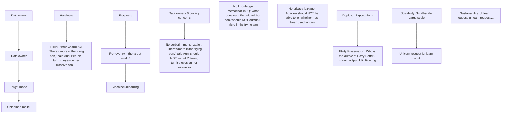

Weijia Shi $^{*1}$ Jaechan Lee $^{*1}$ Yangsibo Huang $^{*2}$

Sadhika Malladi $^{2}$ Jieyu Zhao $^{3}$ Ari Holtzman $^{4}$ Daogao Liu $^{1}$

Luke Zettlemoyer $^{1}$ Noah A. Smith $^{1}$ Chiyuan Zhang $^{5}$

$^{1}$ University of Washington $^{2}$ Princeton University

$^{3}$ University of Southern California $^{4}$ University of Chicago $^{5}$ Google Research

https://muse-bench.github.io

# Abstract

Language models (LMs) are trained on vast amounts of text data, which may include private and copyrighted content, and data owners may request the removal of their data from a trained model due to privacy or copyright concerns. However, exactly unlearning only these datapoints (i.e., retraining with the data removed) is intractable in modern-day models, leading to the development of many approximate unlearning algorithms. Evaluation of the efficacy of these algorithms has traditionally been narrow in scope, failing to precisely quantify the success and practicality of the algorithm from the perspectives of both the model deployers and the data owners. We address this issue by proposing MUSE, a comprehensive machine unlearning evaluation benchmark that enumerates six diverse desirable properties for unlearned models: (1) no verbatim memorization, (2) no knowledge memorization, (3) no privacy leakage, (4) utility preservation on data not intended for removal, (5) scalability with respect to the size of removal requests, and (6) sustainability over sequential unlearning requests. Using these criteria, we benchmark how effectively eight popular unlearning algorithms on 7B-parameter LMs can unlearn Harry Potter books and news articles. Our results demonstrate that most algorithms can prevent verbatim memorization and knowledge memorization to varying degrees, but only one algorithm does not lead to severe privacy leakage. Furthermore, existing algorithms fail to meet deployer's expectations, because they often degrade general model utility and also cannot sustainably accommodate successive unlearning requests or large-scale content removal. Our findings identify key issues with the practicality of existing unlearning algorithms on language models, and we release our benchmark to facilitate further evaluations. $^{1}$

# 1 Introduction

Training language models (LMs) often involves using vast amounts of text data, which may inadvertently contain private and copyrighted content (Carlini et al., 2021; Henderson et al., 2023; Min et al., 2023; He et al., 2024). In real-world applications, data owners may demand that their data be removed from a trained language model due to privacy or copyright concerns, as mandated for example by the General Data Protection Regulation (GDPR, European Parliament & Council of the European Union). Moreover, recent copyright lawsuits (DOE 1 v. GitHub, Inc., N.D. Cal. 2022; Tremblay v. OpenAI, Inc., 2023) emphasize the need for removing copyrighted data from the model.

flowchart

Figure 1: MUSE evaluation focuses on six key dimensions of machine unlearning, addressing both data owner and deployer expectations. For example, when an author (data owner) requests the unlearning of the Harry Potter books, they may expect the unlearned model to: (1) avoid generating verbatim copies of the text to protect copyright, (2) eliminate retention of factual knowledge from the books, and (3) not reveal whether the books were previously used in training to protect privacy. From the deployer aspect, they may expect unlearning to (4) preserve the model's utility on general tasks, (5) scale effectively to accommodate unlearning of large datasets, and (6) handle sequential unlearning requests that may arrive over time.

These recent developments have intensified research interest in designing, evaluating, and improving machine unlearning algorithms, which aim to transform an existing trained model into one that behaves as though it had never been trained on certain data (Ginart et al., 2019; Liu et al., 2020; Wu et al., 2020; Bourtoule et al., 2021; Izzo et al., 2021; Gupta et al., 2021; Sekhari et al., 2021; Ye et al., 2022b; Ghazi et al., 2023). Exact unlearning in LMs requires removing the undesired data (the forget set) and retraining the model from scratch on the remaining data (the retain set), which is too costly to be practical, especially for frequent unlearning operations. As such, several efficient approximate unlearning algorithms have been proposed (Eldan & Russinovich, 2023; Zhang et al., 2024b), but existing evaluations of LM unlearning on question answering (Eldan & Russinovich, 2023; Maini et al., 2024) cannot provide a holistic view of how practical and effective a particular unlearning algorithm is. In this work, we propose a systematic, multi-faceted framework called MUSE (Machine Unlearning Six-Way Evaluation; §3) to evaluate six desired properties for unlearning algorithms (Figure 1). Our criteria cover both the data owner's and the model deployer's desiderata for a practical unlearning algorithm. Data owners require the LM to unlearn the precise tokens (verbatim memorization), general knowledge encoded in the tokens (knowledge memorization), and any indication that their data was included in the training set to begin with (privacy leakage). On the other hand, model deployers want to effectively accommodate many successive unlearning requests (sustainability) on various sizes of forget sets (scalability) without degrading the general model capabilities (utility preservation).

We apply MUSE to evaluate eight representative machine unlearning algorithms ( $\S4$ ) on two datasets ( $\S3.2$ ), focusing on the specific cases of unlearning Harry Potter books and news articles. Our findings indicate that most unlearning algorithms remove verbatim memorization and knowledge memorization with varying degrees of efficacy but operate at the cost of utility preservation and do not effectively prevent privacy leakage ( $\S5.2$ ). In particular, negative preference optimization (NPO; Zhang et al., 2024b) and task vectors (Ilharco et al., 2023) are especially effective in removing these types of memorization, but we find that NPO often permits privacy leakage and both methods induce a sharp drop in the utility of the model. Furthermore, testing their scalability and sustainability reveals that they both algorithms struggle with large forget sets and successive unlearning requests ( $\S5.3$ ).

Our results highlight that unlearning algorithms generally fail to meet data owner expectations in preventing privacy leakage, which is one of the primary motivations for unlearning. Additionally,

Table 1: Comparison with a previous benchmark: Unlike the previous benchmark TOFU (Maini et al., 2024), which evaluates unlearning on synthetic Q&A datasets, MUSE tackles real-world unlearning challenges: unlearning real-world large-scale corpus (22× larger) while taking into account six desiderata that are important to both data owners and deployers. More related works are discussed in Appendix 6. 

<table><tr><td colspan="2"></td><td>MUSE (ours)</td><td>TOFU (Maini et al., 2024)</td></tr><tr><td rowspan="6">Evaluation criteria</td><td>C1. No verbatim memorization</td><td>√</td><td></td></tr><tr><td>C2. No knowledge memorization</td><td>√</td><td>√</td></tr><tr><td>C3. No privacy leakage</td><td>√</td><td></td></tr><tr><td>C4. Utility preservation</td><td>√</td><td>√</td></tr><tr><td>C5. Scalability</td><td>√</td><td></td></tr><tr><td>C6. Sustainability</td><td>√</td><td></td></tr><tr><td rowspan="3">Evaluation corpora</td><td>Domains</td><td>NEWS and BOOKS</td><td>Synthetic autobiographies</td></tr><tr><td>Data Constitution</td><td>Verbatim text and knowledge set (Q &amp; A)</td><td>Q &amp; A</td></tr><tr><td>Scale (# tokens in forget set)</td><td>0.8M for NEWS, 3.3M for BOOKS</td><td>0.15M</td></tr></table>

they struggle to meet all three of the aforementioned deployer expectations. Therefore, although it is increasingly desirable to find an efficient and effective unlearning algorithm amid rising concerns around privacy regulations and copyright litigations, our evaluation suggests that currently feasible unlearning methods are not yet ready for meaningful usage or deployment in real-world scenarios. These findings underscore the pressing need for further research in this area. We also release our benchmark to facilitate further evaluations and welcome extensions to other modalities.

# 2 Machine Unlearning: Preliminaries and Notations

Machine unlearning (Ginart et al., 2019; Liu et al., 2020; Izzo et al., 2021; Sekhari et al., 2021; Gupta et al., 2021; Ye et al., 2022b; Liu et al., 2024) has emerged as an important capability to accommodate data removal requirements that arise from scenarios with privacy or copyright concerns.

We briefly describe the machine unlearning setting. Consider a dataset $D_{train}$ and a model $f_{target}$ trained on $D_{train}$ . Suppose we design an algorithm U to unlearn a specific subset (i.e., the forget set) $D_{forget} \subset D_{train}$ from $f_{target}$ . We want to preserve performance on a retain set $D_{retain} = D_{train} \setminus D_{forget}$ , and we also evaluate the model on an in-distribution but disjoint hold-out set $D_{holdout}$ which the model has never been trained on. So, the unlearning algorithm U takes $f_{target}$ , $D_{forget}$ , and, optionally, $D_{retain}$ and outputs an unlearned model $f_{unlearn}$ . Exact unlearning ensures $f_{unlearn}$ is behaviorally identical to the model resulting from retraining from scratch, denoted $f_{target}$ , but such retraining is usually too costly in real world deployment, so we focus on evaluating approximate unlearning algorithms.

# 3 The MUSE Evaluation Benchmark

MUSE evaluates a comprehensive set of desirable properties of machine unlearning across six facets. We detail the evaluation metrics in §3.1 and describe the evaluation corpus in §3.2.

# 3.1 Evaluation Metrics

Ideally, an unlearned model should behave as if it had never seen the forget set, exhibiting similar behavior to a retrained model on any corpus D such that $m(f_{\text{unlearn}}, \mathcal{D}) \approx m(f_{\text{retrain}}, \mathcal{D})$ , where m represents any evaluation metric. Prior evaluations on LM unlearning focus on performance of specific tasks like question answering (e.g., Eldan & Russinovich, 2023; Maini et al., 2024). However, these metrics do not faithfully reflect data owner expectations and real-world deployment considerations when performing unlearning. To address this, we propose comprehensive evaluation metrics that consider both data owner and deployer expectations. A comparison between MUSE and the prior benchmark is shown in Table 3.

Data owner expectations. When removing a forget set from a model, data owners typically have three main expectations regarding the unlearned model: (C1) No verbatim memorization: The model should not exactly replicate any details from the forget set. (C2) No knowledge memorization: The model should be incapable of responding to questions about the forget set. (C3) No privacy leakage: It should be impossible to detect that the model was ever trained on the forget set. For example, if a patient's records are unlearned from a medical diagnosis model, in addition to verbatim

  
(a) Before Unlearning

  
(b) Perfect Unlearning

line

| MIA metric | retain | forget | holdout |
| ---------- | ------ | ------ | ------- |
| Low        | Low    | Low    | Low     |
| Mid        | Peak   | Peak   | Peak    |
| High       | Low    | Low    | High    |

(c) Under Unlearning

line

| MIA metric | retain | holdout | forget |
| ---------- | ------ | ------- | ------ |
| 0          | 0      | 0       | 0      |
| 1          | 1      | 0       | 0      |
| 2          | 0      | 1       | 0      |
| 3          | 0      | 0       | 1      |
| 4          | 0      | 0       | 0      |
| 5          | 0      | 0       | 0      |
| 6          | 0      | 0       | 0      |
| 7          | 0      | 0       | 0      |
| 8          | 0      | 0       | 0      |
| 9          | 0      | 0       | 0      |
| 10         | 0      | 0       | 0      |
| 11         | 0      | 0       | 0      |
| 12         | 0      | 0       | 0      |
| 13         | 0      | 0       | 0      |
| 14         | 0      | 0       | 0      |
| 15         | 0      | 0       | 0      |
| 16         | 0      | 0       | 0      |
| 17         | 0      | 0       | 0      |
| 18         | 0      | 0       | 0      |
| 19         | 0      | 0       | 0      |
| 20         | 0      | 0       | 0      |
| 21         | 0      | 0       | 0      |
| 22         | 0      | 0       | 0      |
| 23         | 0      | 0       | 0      |
| 24         | 0      | 0       | 0      |
| 25         | 0      | 0       | 0      |
| 26         | 0      | 0       | 0      |
| 27         | 0      | 0       | 0      |
| 28         | 0      | 0       | 0      |
| 29         | 0      | 0       | 0      |
| 30         | 0      | 0       | 0      |
| 31         | 0      | 0       | 0      |
| 32         | 0      | 0       | 0      |
| 33         | 0      | 0       | 0      |
| 34         | 0      | 0       | 0      |
| 35         | 0      | 0       | 0      |
| 36         | 0      | 0       | 0      |
| 37         | 0      | 0       | 0      |
| 38         | 0      | 0       | 0      |
| 39         | 0      | 0       | 0      |
| 40         | 0      | 0       | 0      |
| 41         | 0      | 0       | 0      |
| 42         | 0      | 0       | 0      |
| 43         | 0      | 0       | 0      |
| 44         | 0      | 0       | 0      |
| 45         | 0      | 0       | 0      |
| 46         | 0      | 0       | 0      |
| 47         | 0      | 0       | 0      |
| 48         | 0      | 0       | 0      |
| 49         | 0      | 0       | 0      |
| Note: The data is extracted from the code and not explicitly provided in the image. The code does not output any data points for the series.

(d) Over Unlearning   
Figure 2: Distribution of the MIA metric (see C3) for $D_{forget}$ , $D_{holdout}$ , and $D_{retain}$ . Differences in the metric between forget and holdout sets indicate various unlearning outcomes of $D_{forget}$ , potentially leaking privacy. A perfectly unlearned model (b) should show similar MIA metrics distribution for $D_{forget}$ and $D_{holdout}$ . Unlearning methods may fail by under-unlearning $D_{forget}$ , making it similar to $D_{retain}$ (c), or over-unlearning it, causing divergence from $D_{holdout}$ (d).

and knowledge memorization checks, it is also important that the patient's privacy is preserved – we follow established practice in quantifying privacy using the membership inference test, which detects if a specific datapoint was used to train the model (member), distinguishing it from non-training data (non-member) (Shokri et al., 2017). In this case of unlearning a record from a diagnostic model, it is undesirable for the model to leak membership information, because it would be used to associate the patient with the disease. We quantify these data owner expectations with three evaluation metrics:

C1. No verbatim memorization When a model has unlearned a medical record, it should not output its contents verbatim. We quantify the verbatim memorization VerbMem by prompting the model with the first l tokens from a sequence $x_{[:l]} \in D_{forget}$ and comparing the continuation outputted by the model f to the true continuation $x_{[l+1:]} \in D_{forget}$ using the ROUGE-L F1 score (Lin, 2004).

$$
\operatorname{VerbMem} (f, \mathcal {D}) := \frac {1}{| \mathcal {D} _ {\text { forget }} |} \sum_ {x \in \mathcal {D} _ {\text { forget }}} \operatorname{ROUGE} (f (x _ {[: l ]}), x _ {[ l + 1: ]})
$$

C2. No knowledge memorization When a model has unlearned a medical record, it should no longer be able to answer questions about that record. We measure a model $f$ 's memorization of knowledge from the forget set $\mathcal{D}_{\text{forget}}$ as follows: for each example $x \in \mathcal{D}_{\text{forget}}$ associated with a question-answer pair $(q, a),^2$ we gather the model's answer to the question $q$ , denoted $f(q)$ . We then average the ROUGE scores for all question-answer pairs in $\mathcal{D}_{\text{forget}}$ to compute the knowledge memorization score KnowMem:

$$
\operatorname{KnowMem} (f, \mathcal {D} _ {\text { forget }}) := \frac {1}{| \mathcal {D} _ {\text { forget }} |} \sum_ {(q, a) \in \mathcal {D} _ {\text { forget }}} \operatorname{ROUGE} (f (q), a)
$$

C3. No privacy leakage As discussed previously, it is desirable that the unlearned model does not leak membership information indicating that $D_{forget}$ was part of $D_{train}$ . To determine if a given example was used during training, membership inference attack (MIA) exploits distributional differences in certain statistics (e.g., loss) between training (member) and non-training (non-member) data: if the loss on the example is low, then it was likely used for training. As shown in Figure 2, unlearning typically increases the loss on the example, but there are two possible ways that unlearning can fail to prevent privacy leakage: (1) under-unlearning, when the loss is not made large enough; and (2) over-unlearning, when the loss is made abnormally large. To accurately measure the privacy leakage, we employ Min-K% Prob (Shi et al., 2024a), a state-of-the-art MIA method for LMs based on the loss, and compute the standard AUC-ROC score (Murakonda et al., 2021; Ye et al., 2022a) of discriminating $D_{forget}$ (members) and $D_{holdout}$ (non-members). $^{3}$ By comparing the AUC score with that of the retrained model, we define $^{4}$

$$
\text { PrivLeak } := \frac {\text { AUC } (f _ {\text { unlearn }} ; \mathcal {D} _ {\text { forget }} , \mathcal {D} _ {\text { holdout }}) - \text { AUC } (f _ {\text { retrain }} ; \mathcal {D} _ {\text { forget }} , \mathcal {D} _ {\text { holdout }})}{\text { AUC } (f _ {\text { retrain }} ; \mathcal {D} _ {\text { forget }} , \mathcal {D} _ {\text { holdout }})},
$$

The PrivLeak metric for a good unlearning algorithm should be close to zero, whereas an over/under-unlearning algorithm will get a large positive/negative metric.

Table 2: Examples of MUSE. Each corpus has Verbatim text and Knowledge sets (QA pairs derived from the original text) for evaluating verbatim and knowledge memorization. In NEWS, $D_{forget}$ and $D_{retain}$ are two disjoint sets of news articles. In BOOKS, $D_{forget}$ is the Harry Potter book series while $D_{retain}$ consists of wiki articles about the series. The sizes of the forget and retain sets are reported in tokens in (). 

<table><tr><td>Corpus</td><td>Forget Set</td><td>Retain Set</td></tr><tr><td></td><td>NEWS ARTICLE (0.8 M tokens)</td><td>NEWS ARTICLE (1.6 M tokens)</td></tr><tr><td rowspan="2">NEWS</td><td>MP Stuart McDonald has been appointed as the SNP&#x27;s new treasurer</td><td>A father whose 12-year-old son was killed by an IRA bomb 30 years ago</td></tr><tr><td>Q: What position has Stuart McDonald MP been appointed to?A: The SNP&#x27;s new treasurer</td><td>Q: Who was affected by the IRA bomb 30 years ago?A: A father whose 12-year-old son</td></tr><tr><td rowspan="3">BOOKS</td><td>HARRY POTTER BOOKS (1.1 M tokens)</td><td>HARRY POTTER FANWIKI (0.5 M tokens)</td></tr><tr><td>“There&#x27;s more in the frying pan,” said Aunt Petunia, turning eyes on her massive son.</td><td>This page contains a list of spells:Portuguese for ‘open’.</td></tr><tr><td>Q: What does Aunt Petunia tell her son?A: There&#x27;s more in the frying pan.</td><td>Q: What is the spell used to open things?A: Portuguese</td></tr></table>

Deployer expectations. Model deployers have their own considerations for using unlearning algorithms in the real world. Unlearning specific datapoints can unpredictably degrade model capabilities in ways that are difficult to recover. Moreover, deployers are expected to effectively accommodate somewhat large-scale forget sets and successive unlearning requests from data owners. As such, we consider three key metrics: (C4) utility preservation on the retain set, (C5) scalability to handle large-scale content removal, and (C6) sustainability to maintain performance over sequential unlearning requests.

C4. Utility preservation. Model capabilities are often hard-won through expensive training procedures, so deployers would want an unlearning algorithm that preserves performance on the retain set. To quantify this, we evaluate the unlearned model's performance on the retain set using the knowledge memorization metric $\mathrm{KnowMem}(f_{\mathrm{unlearn}},\mathcal{D}_{\mathrm{retain}})$ .   
C5. Scalability. We assess the scalability of unlearning methods by examining their performance on forget sets of varying sizes. Let $D_{u}^{c}$ denote a forget set of size c, and $f_{u}^{c}$ be the corresponding unlearned model. For any data owner-valued metric such as utility preservation, we measure scalability by analyzing the trend of this metric as c increases from small to large values.   
C6. Sustainability. Machine unlearning operations often need to be applied sequentially, as data removal requests may arrive at different times. $^{5}$ We denote the unlearned model after processing the k-th request as $f_{u,k}$ . To measure sustainability, we analyze the trend of any data owner-valued metric as the number of sequential unlearning requests k increases.

# 3.2 Evaluation Corpus

MUSE considers two representative types of textual data that may frequently involve unlearning requests: news articles (Tremblay v. OpenAI, Inc., 2023) and books (Eldan & Russinovich, 2023). These datasets are detailed as follows:

- NEWS consists of BBC news articles (Li et al., 2023b) collected after August 2023. All articles are randomly divided into (disjoint) forget, retain, and holdout sets.   
- BOOKS consists of the Harry Potter book series. To simulate a real-world setting for testing utility preservation (C4), we include different types of materials in the forget and retain sets. The forget set contains the original books, while the retain set contains related content from the Harry Potter FanWiki, $^{6}$ representing domain knowledge that should be retained after unlearning.

For each corpus, we construct: 1) Verbatim text: the original text to assess the unlearning methods to remove verbatim memorization (C1), and 2) Knowledge set: a set of derived (question, answer) pairs based on the original texts to evaluate the unlearning method's effectiveness in purging learned

knowledge and preventing knowledge memorization (C2). To create the Knowledge set, we partition the Verbatim text into excerpts and use GPT-4 (OpenAI, 2023) to generate (question, answer) pairs for each excerpt. For more details about the dataset generation pipeline, see Appendix D.

Table 7 provides examples from the news and books corpora. The details of the dataset splits and dataset sizes are provided in Appendix D.

# 4 Unlearning Methods

We evaluate eight efficient approximate unlearning methods belonging to four families of algorithms.

Four families of unlearning methods. We first introduce four families of unlearning methods, which serve as the basis for the eight methods we evaluate.

- Gradient Ascent (GA) minimizes the likelihood of correct predictions on $\mathcal{D}_{\mathrm{forget}}$ by performing gradient ascent on the cross-entropy loss (the opposite of conventional learning with gradient descent). GA has achieved mixed results: while Jang et al. (2023) found it effective for unlearning examples from the Enron email dataset (Klimt & Yang, 2004) with minimal performance degradation, Ilharco et al. (2023) reported that GA significantly harms general model utility when unlearning a high-toxicity subset of the Civil Comments dataset (Borkan et al., 2019).   
- Negative Preference Optimization (NPO; Zhang et al., 2024b) treats the forget set as negative preference data and adapts the offline DPO objective (Rafailov et al., 2023) to tune the model to assign low likelihood to the forget set without straying too far from the original model $f_{\text{target}}$ .

$$
\mathcal {L} _ {\mathrm{NPO}} (\theta) = - \frac {2}{\beta} \mathbb {E} _ {x \sim \mathcal {D} _ {\text { forget }}} \left[ \log \sigma \left(- \beta \log \frac {f _ {\theta} (x)}{f _ {\text { target }} (x)}\right) \right],
$$

where $f_{\theta}$ refers to the model that undergoes unlearning, $\sigma$ is the sigmoid function, and $\beta$ is a hyperparameter that controls the allowed divergence of $f_{\theta}$ from its initialization $f_{target}$ . Following Rafailov et al. (2023); Zhang et al. (2024b), we fix $\beta = 0.1$ in our experiments.

- Task Vectors (Ilharco et al., 2023) derived from straightforward arithmetic on the model weights can effectively steer neural network behavior. We adapt task vectors to perform unlearning in two stages. First, we train $f_{\text{target}}$ on $\mathcal{D}_{\text{forget}}$ until the model overfits, yielding a reinforced model $f_{\text{reinforce}}$ . We then obtain a task vector related to $\mathcal{D}_{\text{forget}}$ by calculating the weight difference between $f_{\text{target}}$ and $f_{\text{reinforce}}$ . To achieve unlearning, we subtract this task vector from $f_{\text{target}}$ 's weights, intuitively moving the model away from the direction it used to adapt to $\mathcal{D}_{\text{forget}} - \text{i.e.}$ , $f_{\text{unlearn}} = f_{\text{target}} - (f_{\text{reinforce}} - f_{\text{target}})$ .   
- Who's Harry Potter (WHP; Eldan & Russinovich, 2023) defines the unlearned model $f_{\text{unlearn}}$ as the interpolation between the target model $f_{\text{target}}$ and the reinforced model $f_{\text{reinforce}}$ . Let $p_f(\cdot|x)$ denote the token distribution parametrized by the model $f$ when given a prompt $x$ as input. Then, concretely, for any input $x$ , WHP samples the next token from

$$
p _ {f _ {\text {   unlearn   }}} (\cdot | x) = p _ {f _ {\text {   target   }}} (\cdot | x) - \alpha (p _ {f _ {\text {   reinforce   }}} (\cdot | x) - p _ {f _ {\text {   target   }}} (\cdot | x))
$$

where $\alpha$ is a hyperparameter that controls the interpolation between the two models.

Two regularizers for utility preservation. GA and NPO are not explicitly designed for utility preservation, so we discuss several regularization strategies that either improve the performance on the retain set or ensure the unlearned model remains close to the target model during unlearning.

- Gradient Descent on the Retain Set (GDR; Liu et al., 2022; Maini et al., 2024; Zhang et al., 2024b) augments the unlearning objective with a standard gradient descent learning objective on the cross-entropy of the retain set $\mathcal{D}_{\mathrm{retain}}$ to more directly train the model to maintain its performance on $\mathcal{D}_{\mathrm{retain}}$ .   
- KL Divergence Minimization on the Retain Set (KLR; Maini et al., 2024; Zhang et al., 2024b) encourages the unlearned model's probability distribution $p_{f_{\text{unlearn}}}(\cdot|x)$ to be close to the target model's distribution $p_{f_{\text{target}}}(\cdot|x)$ on inputs from the retain set $x \in \mathcal{D}_{\text{retain}}$ .

List of methods. We combine GA and NPO with the two regularizers GDR and KLR, $^{7}$ which yields four new combinations. Hence, we end up with a total of 8 candidate unlearning methods: GA,

Table 3: Most unlearning methods effectively remove verbatim and knowledge memorization but significantly impact utility and privacy. We evaluate the 8 algorithms described in §4 on 4 of the criteria in MUSE. We include the results of $f_{\text{retrain}}$ for reference. We highlight results in blue if the unlearning algorithm satisfies the criterion and highlight it in orange otherwise. For privacy leakage, large positive values suggest over-unlearning, while large negative values suggest under-unlearning (see §3.1). This table covers the results for C1 to C4, while results for C5 and C6 are shown in Figure 6. 

<table><tr><td></td><td colspan="2">C1. No Verbatim Mem. VerbMem on  $\mathcal{D}_{\text{forget}}(\downarrow)$ </td><td colspan="2">C2. No Knowledge Mem. KnowMem on  $\mathcal{D}_{\text{forget}}(\downarrow)$ </td><td colspan="2">C3. No Privacy Leak. PrivLeak ( $\in [-5\%, 5\%]$ )</td><td colspan="2">C4. Utility Preserv. KnowMem on  $\mathcal{D}_{\text{retain}}(\uparrow)$ </td></tr><tr><td colspan="9">NEWS</td></tr><tr><td>Target  $f_{\text{target}}$ </td><td>58.4</td><td></td><td>63.9</td><td></td><td>-99.8</td><td></td><td>55.2</td><td></td></tr><tr><td>Retrain  $f_{\text{retrain}}$ </td><td>20.8</td><td></td><td>33.1</td><td></td><td>0.0</td><td></td><td>55.0</td><td></td></tr><tr><td>GA</td><td>0.0</td><td> $\downarrow 100\%$ </td><td>0.0</td><td> $\downarrow 100\%$ </td><td>5.2</td><td>over-unlearn</td><td>0.0</td><td> $\downarrow 100\%$ </td></tr><tr><td> $GA_{GDR}$ </td><td>4.9</td><td> $\downarrow 76.5\%$ </td><td>31.0</td><td> $\downarrow 6.3\%$ </td><td>108.1</td><td>over-unlearn</td><td>27.3</td><td> $\downarrow 50.3\%$ </td></tr><tr><td> $GAKLR$ </td><td>27.4</td><td> $\uparrow 31.4\%$ </td><td>50.2</td><td> $\uparrow 51.5\%$ </td><td>-96.1</td><td>under-unlearn</td><td>44.8</td><td> $\downarrow 18.5\%$ </td></tr><tr><td>NPO</td><td>0.0</td><td> $\downarrow 100\%$ </td><td>0.0</td><td> $\downarrow 100\%$ </td><td>24.4</td><td>over-unlearn</td><td>0.0</td><td> $\downarrow 100.0\%$ </td></tr><tr><td> $NPO_{GDR}$ </td><td>1.2</td><td> $\downarrow 94.4\%$ </td><td>54.6</td><td> $\uparrow 64.8\%$ </td><td>105.8</td><td>over-unlearn</td><td>40.5</td><td> $\downarrow 26.3\%$ </td></tr><tr><td> $NPO_{KLR}$ </td><td>26.9</td><td> $\uparrow 29.0\%$ </td><td>49.0</td><td> $\uparrow 48.1\%$ </td><td>-95.8</td><td>under-unlearn</td><td>45.4</td><td> $\downarrow 17.4\%$ </td></tr><tr><td>Task Vector</td><td>57.2</td><td> $\uparrow 174.7\%$ </td><td>66.2</td><td> $\uparrow 100.0\%$ </td><td>-99.8</td><td>under-unlearn</td><td>55.8</td><td> $\uparrow 1.5\%$ </td></tr><tr><td>WHP</td><td>19.7</td><td> $\downarrow 5.6\%$ </td><td>21.2</td><td> $\downarrow 35.9\%$ </td><td>109.6</td><td>under-unlearn</td><td>28.3</td><td> $\downarrow 48.5\%$ </td></tr><tr><td colspan="9">BOOKS</td></tr><tr><td>Target  $f_{\text{target}}$ </td><td>99.8</td><td></td><td>59.4</td><td></td><td>-57.5</td><td></td><td>66.9</td><td></td></tr><tr><td>Retrain  $f_{\text{retrain}}$ </td><td>14.3</td><td></td><td>28.9</td><td></td><td>0.0</td><td></td><td>74.5</td><td></td></tr><tr><td>GA</td><td>0.0</td><td> $\downarrow 100\%$ </td><td>0.0</td><td> $\downarrow 100\%$ </td><td>-25.0</td><td>under-unlearn</td><td>0.0</td><td> $\downarrow 100\%$ </td></tr><tr><td> $GA_{GDR}$ </td><td>0.0</td><td> $\downarrow 100\%$ </td><td>0.0</td><td> $\downarrow 100\%$ </td><td>-26.5</td><td>under-unlearn</td><td>10.7</td><td> $\downarrow 85.6\%$ </td></tr><tr><td> $GA_{KLR}$ </td><td>16.0</td><td> $\uparrow 11.4\%$ </td><td>21.9</td><td> $\downarrow 24.4\%$ </td><td>-40.2</td><td>under-unlearn</td><td>37.2</td><td> $\downarrow 50.0\%$ </td></tr><tr><td>NPO</td><td>0.0</td><td> $\downarrow 100\%$ </td><td>0.0</td><td> $\downarrow 100\%$ </td><td>-24.3</td><td>under-unlearn</td><td>0.0</td><td> $\downarrow 100\%$ </td></tr><tr><td> $NPO_{GDR}$ </td><td>0.0</td><td> $\downarrow 100\%$ </td><td>0.0</td><td> $\downarrow 100\%$ </td><td>-30.8</td><td>under-unlearn</td><td>22.8</td><td> $\downarrow 69.4\%$ </td></tr><tr><td> $NPO_{KLR}$ </td><td>17.0</td><td> $\uparrow 18.2\%$ </td><td>25.0</td><td> $\downarrow 13.4\%$ </td><td>-43.5</td><td>under-unlearn</td><td>44.6</td><td> $\downarrow 40.1\%$ </td></tr><tr><td>Task Vector</td><td>99.7</td><td> $\uparrow 595.0\%$ </td><td>52.4</td><td> $\uparrow 81.2\%$ </td><td>-57.5</td><td>under-unlearn</td><td>64.7</td><td> $\downarrow 13.1\%$ </td></tr><tr><td>WHP</td><td>18.0</td><td> $\uparrow 25.2\%$ </td><td>55.7</td><td> $\uparrow 92.9\%$ </td><td>56.5</td><td>over-unlearn</td><td>63.6</td><td> $\downarrow 14.6\%$ </td></tr></table>

GA $_{GDR}$ , GA $_{KLR}$ , NPO, NPO $_{GDR}$ , NPO $_{KLR}$ , Task Vector, and WHP. In general, the cost of the approximate unlearning method is negligible compared to retraining. Details about the efficiency of these methods are reported in Appendix B.3.

# 5 Experiments

We evaluate the eight representative unlearning methods using the experimental setup described in §5.1. We present the results for data owner expectations in §5.2 and for deployer expectations in §5.3.

# 5.1 Experimental Setup

Retrained and target models. We start with a general pretrained base model $f_{0}$ , and finetune two models: $f_{target}$ on $D_{forget} \cup D_{retain}$ , and $f_{retrain}$ on $D_{retain}$ only. See Appendix B.2 for details about finetuning. For each unlearning algorithm U, we further generate the unlearned model $f_{\text{unlearn}} = \mathcal{U}(f_{\text{target}}, \mathcal{D}_{\text{forget}}, \mathcal{D}_{\text{retain}})$ . We ensure that $f_{0}$ has no access to $D_{forget}, D_{retain}, D_{holdout}$ . Therefore, for NEWS, we use $f_{0} = LLaMA-27B$ (Touvron et al., 2023), which was released before the BBC news articles we use to construct our benchmarks; and for BOOKS, we use $f_{0} = ICLM-7B$ (Shi et al., 2024b), which does not contain the Harry Potter books in its pretraining data.

Unlearning experimental configuration. Following prior work (Maini et al., 2024), we run GA, NPO, and their regularized variants using the AdamW optimizer (Loshchilov & Hutter, 2017) with a constant learning rate of $10^{-5}$ and a batch size of 32. We employ the stopping criteria as follows: if the utility (i.e., KnowMem on $\mathcal{D}_{\mathrm{retain}}$ ) of a model undergoing unlearning drops below that of $f_{\mathrm{retrain}}$ within 10 epochs of unlearning, we stop at the first epoch where this condition holds; otherwise, we take a checkpoint from the 10th epoch. For Task Vector and WHP, to obtain the reinforced model for unlearning, we fine-tune the target model for 10 epochs using the same learning rate and batch size. Further details on the model fine-tuning and unlearning can be found in Appendix B.2.

# 5.2 Results: Data Owner Expectations

We first analyze how eight unlearning methods meet data owner expectations (C1, C2 & C3 in §3.1).

line

| Min-K% Prob | Forget | Retain | Holdout |
| ----------- | ------ | ------ | ------- |
| 1           | 0.8    | 0.6    | 0.2     |
| 2           | 0.7    | 0.5    | 0.3     |
| 3           | 0.6    | 0.4    | 0.5     |
| 4           | 0.5    | 0.3    | 0.8     |
| 5           | 0.4    | 0.2    | 0.6     |

line

| Min-K% Prob | Forget | Retain | Holdout |
| ----------- | ------ | ------ | ------- |
| 1           | 0.0    | 0.0    | 0.0     |
| 2           | 0.0    | 0.0    | 0.0     |
| 3           | 0.0    | 0.0    | 0.0     |
| 4           | 0.0    | 0.0    | 0.0     |
| 5           | 0.0    | 0.0    | 0.0     |

line

| Min-K% Prob | Forget | Retain | Holdout |
| ----------- | ------ | ------ | ------- |
| 2           | 0.5    | 0.3    | 0.2     |
| 4           | 0.8    | 0.6    | 0.7     |
| 6           | 0.6    | 0.9    | 1.2     |
| 8           | 0.4    | 0.7    | 1.5     |
| 10          | 0.2    | 0.5    | 1.0     |

line

| Min-K% Prob | Forget | Retain | Holdout |
| ----------- | ------ | ------ | ------- |
| 0           | 0      | 0      | 1       |
| 80          | 1      | 0      | 0       |

Figure 3: Distribution of Min-K% Prob, an MIA metric, for $D_{forget}$ , $D_{holdout}$ , and $D_{retain}$ . Consistent with the expected pattern in Figure 2, $f_{retrain}$ shows perfect unlearning, with the overlapping distributions for $D_{forget}$ and $D_{holdout}$ . Existing approximate unlearning methods typically either under-unlearn or over-unlearn. For example, $GA_{KLR}$ shows slight under-unlearning, while $GA_{GDR}$ over-unlearns, pushing the Min-K% Prob of $D_{forget}$ to an extreme level.

line

| Method     | AUC  |
| ---------- | ---- |
| Retrain    | 0.48 |
| Target     | 0.00 |
| GA         | 0.50 |
| GA_GDR     | 0.99 |
| GA_KLR     | 0.02 |
| NPO        | 0.59 |
| NPO_GDR    | 0.98 |
| NPO_KLR    | 0.02 |
| WHP        | 1.00 |
| TV         | 0.00 |

Figure 4: ROC curves for $D_{forget}$ vs. $D_{holdout}$ on NEWS using Min-K% Prob, with AUC scores in parentheses. AUC≈0.5 (i.e., $f_{retrain}$ ) means no significant distribution difference between two sets (i.e., no membership leakage). Most unlearning methods show under-unlearn (AUC≪0.5) or over-unlearn (AUC≫0.5).

scatter

| Method     | Knowledge Memorization (D_forget) | Utility Preservation (D_retain) |
|------------|------------------------------------|----------------------------------|
| Retrain    | 0.3                                | 0.55                             |
| Target     | 0.6                                | 0.5                              |
| GA         | 0.5                                | 0.45                             |
| GA_GDR     | 0.3                                | 0.25                             |
| GA_KLR     | 0.5                                | 0.45                             |
| NPO        | 0.0                                | 0.0                              |
| NPO_GDR    | 0.5                                | 0.4                              |
| NPO_KLR    | 0.5                                | 0.45                             |
| WHP        | 0.2                                | 0.3                              |
| TV         | 0.6                                | 0.55                             |

Figure 5: Utility preservation vs. knowledge memorization on BBC. $f_{retrain}$ maintains high utility on $D_{retain}$ while showing low knowledge memorization on $D_{forget}$ . GA and NPO without regularizers show significant utility loss, collapsing to the origin. Every other unlearning method unlearns the knowledge on $D_{forget}$ at the cost of utility.

C1&C2. Most methods are effective for unlearning memorization. As shown in Table 3, most unlearning methods perform exceptionally well in [C1. No verbatim memorization] and [C2. No knowledge memorization], often reducing VerbMem and KnowMem even beyond the levels achieved by the retrained model. Notably, some methods, such as GA and NPO, achieve a score of 0 for both VerbMem and KnowMem, meaning that these methods completely prevent the unlearned models from producing any text related to the forget set. However, as we will see later, these reductions often come at the cost of significant utility loss on the retain set.

C3. Unlearning leads to privacy leakage. Most unlearning methods reveal the membership of $D_{forget}$ in $D_{train}$ through under-unlearning (PrivLeak $\ll 0$ ) or over-unlearning (PrivLeak $\gg 0$ ), as shown in Table 3. We further examine the effectiveness of membership inference by plotting ROC curves in Figure 4. The deviation from the diagonal line indicates the attacker's advantage over random guessing. We observe that the Min-K% Prob based attack achieves AUC $\approx 0$ on $f_{target}$ , confirming its effectiveness. Meanwhile, the ROC curve for $f_{retrain}$ closely follows the diagonal line (AUC = 0.47), suggesting that perfect unlearning ensures MIA is no more effective than random guessing. Among the approximate unlearning methods, GA and NPO $_{GDR}$ without regularizers consistently over-unlearn (AUC > 0.7), whereas KLR-regularized methods (NPO $_{KLR}$ and GA $_{KLR}$ ) tend to under-unlearn and barely improve privacy leakage over $f_{target}$ . WHP also deviates from the diagonal significantly.

In Figure 3, we further visualize the distribution of Min-K% Prob, the MIA metric computed across $D_{forget}$ , $D_{retain}$ , and $D_{holdout}$ . The behavior of $f_{target}$ and $f_{retrain}$ mirrors the patterns sketched in Figure 2, where $D_{forget}$ and $D_{retain}$ are distinguishable in $f_{target}$ but overlap in $f_{retrain}$ . Existing approximate unlearning methods typically either under-unlearn or over-unlearn. For example, $GA_{KLR}$ does not sufficiently increase the Min-K% Prob metric for $D_{forget}$ to align with the distribution of $D_{holdout}$ , indicating under-unlearning. On the other hand, $NPO_{GDR}$ over-unlearns, significantly raising the MIA metric across all datasets and especially for $D_{forget}$ .

# 5.3 Results: Deployment Considerations

C4. Unlearning significantly degrades model utility. Table 3 [C4 Utility Preserv.] shows that all unlearning methods compromise the model's utility by $24.2\% \sim 100\%$ . Notably, several methods (GA, $\mathrm{GA}_{\mathrm{GDR}}$ , $\mathrm{NPO}_{\mathrm{GDR}}$ ) lead to complete utility loss, rendering the unlearned models practically unusable. Figure 5 illustrates the trade-offs between utility preservation on $\mathcal{D}_{\mathrm{retain}}$ and knowledge memorization on $\mathcal{D}_{\mathrm{forget}}$ . An ideal unlearned model should mimic the behavior of $f_{\mathrm{retrain}}$ (desired region) by achieving a low level of memorization on $\mathcal{D}_{\mathrm{forget}}$ while maintaining its utility. However, most methods, such as $\mathrm{GA}_{\mathrm{KLR}}$ , $\mathrm{NPO}_{\mathrm{KLR}}$ , and WHP, unlearn the knowledge on $\mathcal{D}_U$ at the cost of utility.

C5. Unlearning methods scale poorly with forget set sizes. To evaluate the robustness of the unlearning methods to larger forget sets, we collect additional news articles from the same distribution to scale our NEWS corpus from 0.8M tokens to 3.3M tokens and observe the utility preservation at four different forget set sizes. As shown in Figure 6 (a), the model utility decrease with the size of the forget set and achieves a minimum at the largest size.

# C6. Unlearning methods cannot sustainably accommodate sequential unlearning requests.

To evaluate the robustness of these unlearning methods to more than one unlearning requests, we sequentially apply k unlearning processes, each with respect to a different forget set. To simulate sequential unlearning, we partition the

line

| Forget Set Size | Scalability (a) - GA | Scalability (a) - GA_KLR | Scalability (a) - NPO_GDR | Scalability (a) - NPO_KLR | Unlearning Request - GA | Unlearning Request - GA_KLR | Unlearning Request - NPO_GDR | Unlearning Request - NPO_KLR | Unlearning Request - GAGDR | Unlearning Request - NPO |
| --------------- | --------------------- | ------------------------ | ------------------------- | ------------------------- | ----------------------- | -------------------------- | --------------------------- | --------------------------- | -------------------------- | ------------------------ |
| 0.0M            | 0.5                   | 0.5                      | 0.5                       | 0.5                       | 0.5                     | 0.5                        | 0.5                         | 0.5                         | 0.5                      | 0.5                      |
| 0.8M            | 0.4                   | 0.4                      | 0.4                       | 0.4                       | 0.4                     | 0.4                        | 0.4                         | 0.4                         | 0.3                      | 0.3                      |
| 1.7M            | 0.4                   | 0.4                      | 0.4                       | 0.4                       | 0.4                     | 0.4                        | 0.4                         | 0.4                         | 0.3                      | 0.3                      |
| 2.5M            | 0.4                   | 0.4                      | 0.4                       | 0.4                       | 0.4                     | 0.4                        | 0.4                         | 0.4                         | 0.2                      | 0.2                      |
| 3.3M            | 0.4                   | 0.4                      | 0.4                       | 0.4                       | 0.4                     | 0.4                        | 0.4                         | 0.4                         | 0.1                      | 0.1                      |
| Unlearning Request (1st) | ~0.5                  | ~0.5                     | ~0.5                      | ~0.5                      | ~0.5                    | ~0.5                       | ~0.5                        | ~0.5                        | ~0.3                     | ~0.3                     |
| Unlearning Request (2nd) | ~0.5                  | ~0.5                     | ~0.5                      | ~0.5                      | ~0.5                    | ~0.5                       | ~0.5                        | ~0.5                        | ~0.1                     | ~0.1                     |
| Unlearning Request (3rd) | ~0.5                  | ~0.5                     | ~0.5                      | ~0.5                      | ~0.5                    | ~0.5                       | ~0.5                        | ~0.5                        | ~0.3                     | ~0.3                     |
| Unlearning Request (4th) | ~0.5                  | ~0.5                     | ~0.5                      | ~0.5                      | ~0.5                    | ~0.5                       | ~0.5                        | ~0.5                        | ~0.4                     | ~0.4                     |
The chart is divided into two sections: (a) Scalability (a) and (b) Sustainability (b). The y-axis represents Utility Preservation, and the x-axis represents the Unlearning Request with labels for each scenario.

Figure 6: The performance of GA, NPO, and their regularized variants, measured by utility preservation, degrades with larger forget set sizes (a) and sequential unlearning requests (b).

extended NEWS forget set (comprised of 3.3M tokens) into four disjoint folds (each containing 0.8M tokens) and apply the unlearning methods to each fold in a sequential manner.

We again select utility preservation as the target metric for comparison. As shown in Figure 6 (b), the performance of an unlearned model tends to decrease significantly with respect to the number of unlearning requests, indicating that current unlearning methods are not yet ready to handle sequential unlearning in a sustainable manner.

# 6 Related Work

Machine unlearning for non-language model applications. Machine unlearning is a long-running, well-studied topic. Several studies have explored exact unlearning, aiming to make the unlearned model ( $f_{unlearn}$ ) exactly identical to the reference model ( $f_{retrain}$ ). As expected, this can only be accomplished in simple models like SVMs (Cauwenberghs & Poggio, 2000; Tveit et al., 2003; Romero et al., 2007; Karasuyama & Takeuchi, 2010) or naive Bayes models (Cao & Yang, 2015). Another approach is to ensure that the unlearned model $f_{unlearn}$ is probabilistically indistinguishable from $f_{retrain}$ (Ginart et al., 2019; Guo et al., 2020), and this view of certifiable unlearning is closely related to differential privacy (Dwork et al., 2006b,a). This rigorous definition of unlearning has inspired several theoretical works that characterize the feasibility of unlearning in convex and non-convex models, but those proposed algorithms are too computationally costly to operate on modern-day LMs (Izzo et al., 2021; Neel et al., 2021; Ullah et al., 2021; Sekhari et al., 2021; Gupta et al., 2021). Several more tractable unlearning algorithms have been proposed (Borkan et al., 2019; Ginart et al., 2019; Thudi et al., 2022; Chourasia & Shah, 2023) with broader applications such as image classification (Ginart et al., 2019; Golatkar et al., 2020a), text-to-image generation (Gandikota et al., 2023; Zhang et al., 2023; Fan et al., 2023), Federated Learning (Liu et al., 2020; Che et al., 2023; Halimi et al., 2022; Huang et al., 2022) and Recommender Systems (Li et al., 2024b).

Machine unlearning for language models: methods and applications. Machine unlearning has recently found its way into language model applications. In §4, we discuss some standard unlearning methods based on parameter optimization, like the Gradient Ascent and its variance. Other notable non-training-based unlearning methods include localization-informed unlearning (Meng et al., 2022; Wu et al., 2023; Wei et al., 2024a), which involves identifying model units (e.g., layers, neurons) closely related to the unlearning data or tasks and then locally editing and modifying the units.

In-context unlearning (Pawelczyk et al., 2023) offers another approach, treating the model as a black box and modifying its output results using external knowledge.

Machine unlearning has also been applied to various downstream language model tasks, though the unit of machine unlearning may differ from what we study in this work. Our evaluation focuses on unlearning specific examples or datasets, aiming to make LMs forget either the phrasing or the content knowledge of targeted data, while preserving their utility for data not targeted for removal. This is crucial for ensuring privacy and copyright compliance. In addition to this specific unlearning, there's also a broader application similar to model editing, where outdated information is replaced with new knowledge (Pawelczyk et al., 2023; Yu et al., 2023; Belrose et al., 2024). Moreover, efforts have been made to eliminate harmful behaviors in language models by creating toxicity benchmarks and enhancing safety measures (Lu et al., 2022; Yao et al., 2023; Li et al., 2024a; Zhang et al., 2024b). Despite these varied approaches to unlearning at different operational and knowledge levels, the evaluation principles we propose such as preserving utility, ensuring scalability, and maintaining sustainability—are relevant across these contexts.

Machine unlearning for language models: evaluation. Evaluating machine unlearning methods for language model applications is also critical. Most previous studies have focused this evaluation on specific tasks such as question answering or sentence completion. For example, Eldan & Russinovich (2023) experiment with unlearning to forget Harry Potter books and demonstrate the effectiveness of their methods by showing that familiarity scores, measured through completion-based, token-probability-based, and question-answering evaluations, significantly decline post-unlearning. Lynch et al. (2024) further suggest comparing unlearned models with perfectly retrained models. Their evaluation finds that while familiarity scores with the forget set may drop post-unlearning, they still remain higher than those of the retrained model. Wei et al. (2024b) evaluate the feasibility of using unlearning techniques to prevent language models from generating copyrighted content. The closest work to ours is TOFU (Maini et al., 2024), a benchmark featuring 200 synthetic author profiles, each with 20 question-answer pairs, divided into forget and retain sets. However, TOFU is relatively small-scale (0.15M tokens) and focuses on the evaluation of question answering. Additionally, current evaluations focus on limited aspects of data owner expectations and do not adequately reflect real-world deployment considerations, such as scalability and potential sequential unlearning requests. In contrast, MUSE formally defines different unlearning scopes and corresponding metrics, resulting in a systematic six-way evaluation featuring both data owners' and deployers' expectations. The evaluation uses a large-scale corpus of over 6 million tokens, separated into verbatim text and knowledge sets. We also note that some of our findings align with previous evaluations. For example, our observation that over- or under-unlearn can exacerbate privacy leakage ( $§5.2$ ) is consistent with the recent work by Hayes et al. (2024). Our findings align with the concurrent study by Shumailov et al. (2024) showing that unlearning gives a false sense of security as unlearned knowledge can resurface through in-context learning.

Survey papers. We direct readers to several insightful survey papers for further reading. For non-LLM applications, notable surveys include Shintre et al. (2019); Nguyen et al. (2022); Thudi et al. (2022); Xu et al. (2023). Additionally, the NeurIPS 2023 machine unlearning competition for image classification $^{8}$ is a valuable source of empirical methods tailored for this specific application (Triantafillou et al., 2023). For language model applications, Si et al. (2023) categorize unlearning methods into different families and summarize datasets for evaluating unlearning. Liu et al. (2024) review LM unlearning algorithms by targets and methods, discuss the effectiveness and efficiency of existing approaches and emphasize the importance of clearly defining the unlearning scope.

# 7 Conclusion

In this work, we propose MUSE, a comprehensive machine unlearning evaluation benchmark that highlights six desirable properties from the perspectives of both data owners and model deployers. We find that current unlearning methods successfully prevent the model's memorization of content at a significant cost to utility on data not intended for removal. They also lead to severe privacy leakage and cannot sustainably accommodate successive unlearning requests or large-scale content removal. These findings highlight the need for future research into more robust unlearning methods.

Limitations. While MUSE provides a systematic benchmark for evaluating unlearning algorithms, it does not consider all possible considerations. For example, data owners may have additional expectations, such as ensuring their information cannot be probed from intermediate activations (Song & Raghunathan, 2020) or receiving formal guarantees of unlearning success (Sekhari et al., 2021; Gupta et al., 2021; Ghazi et al., 2023). Similarly, deployers may expect other capabilities, like fine-tuning and in-context learning, to be preserved, and may prefer unlearning algorithms that are both computationally efficient and storage-wise cheap (e.g. does not need to keep a copy of the retain set). MUSE currently evaluates unlearning for language models using books and news articles, but it could be extended to other corpora, such as medical notes (Johnson et al., 2016, 2020) and emails (Klimt & Yang, 2004), which often involve privacy concerns (Li et al., 2023a; Huang et al., 2023). We also plan to evaluate different-sized LMs in the future. Finally, our approach can be generalized to construct multi-faceted benchmarks for multimodal models (Golatkar et al., 2020b; Cheng & Amiri, 2023; Zhang et al., 2024c). Further discussion on broader impact are in Appendix A.

# 8 Acknowledgements

We thank Eric Wallace, Robin Jia, Howard Chen, and anonymous reviewers of the GenLaw workshop for the valuable feedback and discussions.

# References

Nora Belrose, David Schneider-Joseph, Shauli Ravfogel, Ryan Cotterell, Edward Raff, and Stella Biderman. Leace: Perfect linear concept erasure in closed form. Advances in Neural Information Processing Systems, 36, 2024.   
Daniel Borkan, Lucas Dixon, Jeffrey Sorensen, Nithum Thain, and Lucy Vasserman. Nuanced metrics for measuring unintended bias with real data for text classification, 2019.   
Lucas Bourtoule, Varun Chandrasekaran, Christopher A Choquette-Choo, Hengrui Jia, Adelin Travers, Baiwu Zhang, David Lie, and Nicolas Papernot. Machine unlearning. In 2021 IEEE Symposium on Security and Privacy (SP), pp. 141–159. IEEE, 2021.   
Yinzhi Cao and Junfeng Yang. Towards making systems forget with machine unlearning. In 2015 IEEE symposium on security and privacy, pp. 463–480. IEEE, 2015.   
Nicholas Carlini, Florian Tramer, Eric Wallace, Matthew Jagielski, Ariel Herbert-Voss, Katherine Lee, Adam Roberts, Tom Brown, Dawn Song, Ulfar Erlingsson, et al. Extracting training data from large language models. In 30th USENIX Security Symposium (USENIX Security 21), pp. 2633–2650, 2021.   
Gert Cauwenberghs and Tomaso Poggio. Incremental and decremental support vector machine learning. Advances in neural information processing systems, 13, 2000.   
Tianshi Che, Yang Zhou, Zijie Zhang, Lingjuan Lyu, Ji Liu, Da Yan, Dejing Dou, and Jun Huan. Fast federated machine unlearning with nonlinear functional theory. In International conference on machine learning, pp. 4241–4268. PMLR, 2023.   
Jiali Cheng and Hadi Amiri. Multimodal machine unlearning, 2023.   
Rishav Chourasia and Neil Shah. Forget unlearning: Towards true data-deletion in machine learning. In International Conference on Machine Learning, pp. 6028–6073. PMLR, 2023.   
Cynthia Dwork, Krishnaram Kenthapadi, Frank McSherry, Ilya Mironov, and Moni Naor. Our data, ourselves: Privacy via distributed noise generation. In Advances in Cryptology-EUROCRYPT 2006: 24th Annual International Conference on the Theory and Applications of Cryptographic Techniques, St. Petersburg, Russia, May 28-June 1, 2006. Proceedings 25, pp. 486–503. Springer, 2006a.   
Cynthia Dwork, Frank McSherry, Kobbi Nissim, and Adam Smith. Calibrating noise to sensitivity in private data analysis. In Theory of Cryptography: Third Theory of Cryptography Conference, TCC 2006, New York, NY, USA, March 4-7, 2006. Proceedings 3, pp. 265–284. Springer, 2006b.   
Ronen Eldan and Mark Russinovich. Who's Harry Potter? Approximate Unlearning in LLMs. arXiv preprint arXiv:2310.02238, 2023.   
DOE 1 v. GitHub, Inc. 4:22-cv-06823, N.D. Cal. 2022.   
Tremblay v. OpenAI, Inc., 23-cv-03416-AMO, (N.D. Cal.), 2023.   
European Parliament and Council of the European Union. Regulation (EU) 2016/679 of the European Parliament and of the Council. URL https://data.europa.eu/eli/reg/2016/679/oj.   
Chongyu Fan, Jiancheng Liu, Yihua Zhang, Dennis Wei, Eric Wong, and Sijia Liu. Salun: Empowering machine unlearning via gradient-based weight saliency in both image classification and generation. arXiv preprint arXiv:2310.12508, 2023.   
Rohit Gandikota, Joanna Materzynska, Jaden Fiotto-Kaufman, and David Bau. Erasing concepts from diffusion models. In Proceedings of the IEEE/CVF International Conference on Computer Vision (ICCV), pp. 2426–2436, October 2023.   
Badih Ghazi, Pritish Kamath, Ravi Kumar, Pasin Manurangsi, Ayush Sekhari, and Chiyuan Zhang. Ticketed learning–unlearning schemes. In The Thirty Sixth Annual Conference on Learning Theory, pp. 5110–5139. PMLR, 2023.

Antonio Ginart, Melody Guan, Gregory Valiant, and James Y Zou. Making ai forget you: Data deletion in machine learning. Advances in neural information processing systems, 32, 2019.   
Aditya Golatkar, Alessandro Achille, and Stefano Soatto. Eternal sunshine of the spotless net: Selective forgetting in deep networks. In Proceedings of the IEEE/CVF Conference on Computer Vision and Pattern Recognition, pp. 9304–9312, 2020a.   
Aditya Golatkar, Alessandro Achille, and Stefano Soatto. Forgetting outside the box: Scrubbing deep networks of information accessible from input-output observations. In Computer Vision–ECCV 2020: 16th European Conference, Glasgow, UK, August 23–28, 2020, Proceedings, Part XXIX 16, pp. 383–398. Springer, 2020b.   
Chuan Guo, Tom Goldstein, Awni Hannun, and Laurens Van Der Maaten. Certified data removal from machine learning models. In International Conference on Machine Learning, pp. 3832–3842. PMLR, 2020.   
Varun Gupta, Christopher Jung, Seth Neel, Aaron Roth, Saeed Sharifi-Malvajerdi, and Chris Waites. Adaptive machine unlearning. In M. Ranzato, A. Beygelzimer, Y. Dauphin, P.S. Liang, and J. Wortman Vaughan (eds.), Advances in Neural Information Processing Systems, volume 34, pp. 16319–16330. Curran Associates, Inc., 2021. URL https://proceedings.neurips.cc/paper\_files/paper/2021/file/87f7ee4fdb57bdfd52179947211b7ebb-Paper.pdf.   
Anisa Halimi, Swanand Kadhe, Ambrish Rawat, and Nathalie Baracaldo. Federated unlearning: How to efficiently erase a client in fl? arXiv preprint arXiv:2207.05521, 2022.   
Jamie Hayes, Ilia Shumailov, Eleni Triantafillou, Amr Khalifa, and Nicolas Papernot. Inexact unlearning needs more careful evaluations to avoid a false sense of privacy. arXiv preprint arXiv:2403.01218, 2024.   
Luxi He, Yangsibo Huang, Weijia Shi, Tinghao Xie, Haotian Liu, Yue Wang, Luke Zettlemoyer, Chiyuan Zhang, Danqi Chen, and Peter Henderson. Fantastic copyrighted beasts and how (not) to generate them. arXiv preprint arXiv:2406.14526, 2024.   
Peter Henderson, Xuechen Li, Dan Jurafsky, Tatsunori Hashimoto, Mark A Lemley, and Percy Liang. Foundation models and fair use. arXiv preprint arXiv:2303.15715, 2023.   
Yangsibo Huang, Chun-Yin Huang, Xiaoxiao Li, and Kai Li. A dataset auditing method for collaboratively trained machine learning models. IEEE Transactions on Medical Imaging, 42(7):2081–2090, 2022.   
Yangsibo Huang, Samyak Gupta, Zexuan Zhong, Kai Li, and Danqi Chen. Privacy implications of retrieval-based language models. arXiv preprint arXiv:2305.14888, 2023.   
Gabriel Ilharco, Marco Tulio Ribeiro, Mitchell Wortsman, Suchin Gururangan, Ludwig Schmidt, Hannaneh Hajishirzi, and Ali Farhadi. Editing models with task arithmetic, 2023.   
Zachary Izzo, Mary Anne Smart, Kamalika Chaudhuri, and James Zou. Approximate data deletion from machine learning models. In International Conference on Artificial Intelligence and Statistics, pp. 2008–2016. PMLR, 2021.   
Joel Jang, Dongkeun Yoon, Sohee Yang, Sungmin Cha, Moontae Lee, Lajanugen Logeswaran, and Minjoon Seo. Knowledge unlearning for mitigating privacy risks in language models. In Anna Rogers, Jordan Boyd-Graber, and Naoaki Okazaki (eds.), Proceedings of the 61st Annual Meeting of the Association for Computational Linguistics (Volume 1: Long Papers), pp. 14389–14408, Toronto, Canada, July 2023. Association for Computational Linguistics. doi: 10.18653/v1/2023.acl-long.805. URL https://aclanthology.org/2023.acl-long.805.   
Alistair Johnson, Lucas Bulgarelli, Tom Pollard, Steven Horng, Leo Anthony Celi, and Roger Mark. Mimic-iv. PhysioNet. Available online at: https://physionet.org/content/mimiciv/1.0/(accessed August 23, 2021), pp. 49–55, 2020.   
Alistair EW Johnson, Tom J Pollard, Lu Shen, Li-wei H Lehman, Mengling Feng, Mohammad Ghassemi, Benjamin Moody, Peter Szolovits, Leo Anthony Celi, and Roger G Mark. Mimic-iii, a freely accessible critical care database. Scientific data, 3(1):1–9, 2016.

Masayuki Karasuyama and Ichiro Takeuchi. Multiple incremental decremental learning of support vector machines. IEEE Transactions on Neural Networks, 21(7):1048–1059, 2010.   
Bryan Klimt and Yiming Yang. The enron corpus: A new dataset for email classification research. In European conference on machine learning, pp. 217–226. Springer, 2004.   
Haoran Li, Dadi Guo, Wei Fan, Mingshi Xu, Jie Huang, Fanpu Meng, and Yangqiu Song. Multi-step jailbreaking privacy attacks on chatgpt. arXiv preprint arXiv:2304.05197, 2023a.   
Nathaniel Li, Alexander Pan, Anjali Gopal, Summer Yue, Daniel Berrios, Alice Gatti, Justin D Li, Ann-Kathrin Dombrowski, Shashwat Goel, Long Phan, et al. The wmdp benchmark: Measuring and reducing malicious use with unlearning. arXiv preprint arXiv:2403.03218, 2024a.   
Yucheng Li, Frank Guerin, and Chenghua Lin. Avoiding data contamination in language model evaluation: Dynamic test construction with latest materials, 2023b.   
Yuyuan Li, Chaochao Chen, Xiaolin Zheng, Junlin Liu, and Jun Wang. Making recommender systems forget: Learning and unlearning for erasable recommendation. Knowledge-Based Systems, 283:111124, 2024b.   
Chin-Yew Lin. Rouge: A package for automatic evaluation of summaries. In Text summarization branches out, pp. 74–81, 2004.   
Bo Liu, Qiang Liu, and Peter Stone. Continual learning and private unlearning, 2022.   
Gaoyang Liu, Xiaoqiang Ma, Yang Yang, Chen Wang, and Jiangchuan Liu. Federated unlearning. arXiv preprint arXiv:2012.13891, 2020.   
Sijia Liu, Yuanshun Yao, Jinghan Jia, Stephen Casper, Nathalie Baracaldo, Peter Hase, Xiaojun Xu, Yuguang Yao, Hang Li, Kush R Varshney, et al. Rethinking machine unlearning for large language models. arXiv preprint arXiv:2402.08787, 2024.   
Ilya Loshchilov and Frank Hutter. Decoupled weight decay regularization. arXiv preprint arXiv:1711.05101, 2017.   
Ximing Lu, Sean Welleck, Jack Hessel, Liwei Jiang, Lianhui Qin, Peter West, Prithviraj Ammanabrolu, and Yejin Choi. Quark: Controllable text generation with reinforced unlearning. Advances in neural information processing systems, 35:27591–27609, 2022.   
Aengus Lynch, Phillip Guo, Aidan Ewart, Stephen Casper, and Dylan Hadfield-Menell. Eight methods to evaluate robust unlearning in llms. arXiv preprint arXiv:2402.16835, 2024.   
Pratyush Maini, Zhili Feng, Avi Schwarzschild, Zachary Chase Lipton, and J. Zico Kolter. Tofu: A task of fictitious unlearning for llms. ArXiv, abs/2401.06121, 2024. URL https://api.semanticscholar.org/CorpusID:266933371.   
Kevin Meng, David Bau, Alex Andonian, and Yonatan Belinkov. Locating and editing factual associations in gpt. Advances in Neural Information Processing Systems, 35:17359–17372, 2022.   
Sewon Min, Suchin Gururangan, Eric Wallace, Weijia Shi, Hannaneh Hajishirzi, Noah A Smith, and Luke Zettlemoyer. Silo language models: Isolating legal risk in a nonparametric datastore. arXiv preprint arXiv:2308.04430, 2023.   
Sasi Kumar Murakonda, Reza Shokri, and George Theodorakopoulos. Quantifying the privacy risks of learning high-dimensional graphical models. In International Conference on Artificial Intelligence and Statistics, pp. 2287–2295. PMLR, 2021.   
Seth Neel, Aaron Roth, and Saeed Sharifi-Malvajerdi. Descent-to-delete: Gradient-based methods for machine unlearning. In Algorithmic Learning Theory, pp. 931–962. PMLR, 2021.   
Thanh Tam Nguyen, Thanh Trung Huynh, Phi Le Nguyen, Alan Wee-Chung Liew, Hongzhi Yin, and Quoc Viet Hung Nguyen. A survey of machine unlearning. arXiv preprint arXiv:2209.02299, 2022.

Alex Oesterling, Jiaqi Ma, Flavio Calmon, and Himabindu Lakkaraju. Fair machine unlearning: Data removal while mitigating disparities. In International Conference on Artificial Intelligence and Statistics, pp. 3736–3744. PMLR, 2024.   
OpenAI. Gpt-4 technical report, 2023.   
Martin Pawelczyk, Seth Neel, and Himabindu Lakkaraju. In-context unlearning: Language models as few shot unlearners. arXiv preprint arXiv:2310.07579, 2023.   
Rafael Rafailov, Archit Sharma, Eric Mitchell, Stefano Ermon, Christopher D. Manning, and Chelsea Finn. Direct preference optimization: Your language model is secretly a reward model, 2023.   
Enrique Romero, Ignacio Barrio, and Lluís Belanche. Incremental and decremental learning for linear support vector machines. In International Conference on Artificial Neural Networks, pp. 209–218. Springer, 2007.   
Ayush Sekhari, Jayadev Acharya, Gautam Kamath, and Ananda Theertha Suresh. Remember what you want to forget: Algorithms for machine unlearning. Advances in Neural Information Processing Systems, 34:18075–18086, 2021.   
Weijia Shi, Anirudh Ajith, Mengzhou Xia, Yangsibo Huang, Daogao Liu, Terra Blevins, Danqi Chen, and Luke Zettlemoyer. Detecting pretraining data from large language models. In The Twelfth International Conference on Learning Representations, 2024a. URL https://openreview.net/forum?id=zWqr3MQuNs.   
Weijia Shi, Sewon Min, Maria Lomeli, Chunting Zhou, Margaret Li, Xi Victoria Lin, Noah A. Smith, Luke Zettlemoyer, Wen tau Yih, and Mike Lewis. In-context pretraining: Language modeling beyond document boundaries. In The Twelfth International Conference on Learning Representations, 2024b. URL https://openreview.net/forum?id=LXVswInH0o.   
Saurabh Shintre, Kevin A Roundy, and Jasjeet Dhaliwal. Making machine learning forget. In Privacy Technologies and Policy: 7th Annual Privacy Forum, APF 2019, Rome, Italy, June 13–14, 2019, Proceedings 7, pp. 72–83. Springer, 2019.   
Reza Shokri, Marco Stronati, Congzheng Song, and Vitaly Shmatikov. Membership inference attacks against machine learning models. In 2017 IEEE symposium on security and privacy (SP), pp. 3–18. IEEE, 2017.   
Ilia Shumailov, Jamie Hayes, Eleni Triantafillou, Guillermo Ortiz-Jimenez, Nicolas Papernot, Matthew Jagielski, Itay Yona, Heidi Howard, and Eugene Bagdasaryan. Ununlearning: Unlearning is not sufficient for content regulation in advanced generative ai. arXiv preprint arXiv:2407.00106, 2024.   
Nianwen Si, Hao Zhang, Heyu Chang, Wenlin Zhang, Dan Qu, and Weiqiang Zhang. Knowledge unlearning for llms: Tasks, methods, and challenges. arXiv preprint arXiv:2311.15766, 2023.   
Congzheng Song and Ananth Raghunathan. Information leakage in embedding models. In Proceedings of the 2020 ACM SIGSAC conference on computer and communications security, pp. 377–390, 2020.   
Anvith Thudi, Gabriel Deza, Varun Chandrasekaran, and Nicolas Papernot. Unrolling sgd: Understanding factors influencing machine unlearning. In 2022 IEEE 7th European Symposium on Security and Privacy (EuroS&P), pp. 303–319. IEEE, 2022.   
Hugo Touvron, Louis Martin, Kevin Stone, Peter Albert, Amjad Almahairi, Yasmine Babaei, Nikolay Bashlykov, Soumya Batra, Prajjwal Bhargava, Shruti Bhosale, Dan Bikel, Lukas Blecher, Cristian Canton Ferrer, Moya Chen, Guillem Cucurull, David Esiobu, Jude Fernandes, Jeremy Fu, Wenyin Fu, Brian Fuller, Cynthia Gao, Vedanuj Goswami, Naman Goyal, Anthony Hartshorn, Saghar Hosseini, Rui Hou, Hakan Inan, Marcin Kardas, Viktor Kerkez, Madian Khabsa, Isabel Kloumann, Artem Korenev, Punit Singh Koura, Marie-Anne Lachaux, Thibaut Lavril, Jenya Lee, Diana Liskovich, Yinghai Lu, Yuning Mao, Xavier Martinet, Todor Mihaylov, Pushkar Mishra, Igor Molybog, Yixin Nie, Andrew Poulton, Jeremy Reizenstein, Rashi Rungta, Kalyan Saladi, Alan Schelten, Ruan Silva, Eric Michael Smith, Ranjan Subramanian, Xiaoqing Ellen Tan, Binh

Tang, Ross Taylor, Adina Williams, Jian Xiang Kuan, Puxin Xu, Zheng Yan, Iliyan Zarov, Yuchen Zhang, Angela Fan, Melanie Kambadur, Sharan Narang, Aurelien Rodriguez, Robert Stojnic, Sergey Edunov, and Thomas Scialom. Llama 2: Open foundation and fine-tuned chat models, 2023.   
Eleni Triantafillou, Fabian Pedregosa, Jamie Hayes, Peter Kairouz, Isabelle Guyon, Meghdad Kurmanji, Gintare Karolina Dziugaite, Peter Triantafillou, Kairan Zhao, Lisheng Sun Hosoya, Julio C. S. Jacques Junior, Vincent Dumoulin, Ioannis Mitliagkas, Sergio Escalera, Jun Wan, Sohier Dane, Maggie Demkin, and Walter Reade. Neurips 2023 machine unlearning challenge, 2023. URL https://kaggle.com/competitions/neurips-2023-machine-unlearning.   
Amund Tveit, Magnus Lie Hetland, and Håavard Engum. Incremental and decremental proximal support vector classification using decay coefficients. In International Conference on Data Warehousing and Knowledge Discovery, pp. 422–429. Springer, 2003.   
Enayat Ullah, Tung Mai, Anup Rao, Ryan A Rossi, and Raman Arora. Machine unlearning via algorithmic stability. In Conference on Learning Theory, pp. 4126–4142. PMLR, 2021.   
Boyi Wei, Kaixuan Huang, Yangsibo Huang, Tinghao Xie, Xiangyu Qi, Mengzhou Xia, Prateek Mittal, Mengdi Wang, and Peter Henderson. Assessing the brittleness of safety alignment via pruning and low-rank modifications. arXiv preprint arXiv:2402.05162, 2024a.   
Boyi Wei, Weijia Shi, Yangsibo Huang, Noah A Smith, Chiyuan Zhang, Luke Zettlemoyer, Kai Li, and Peter Henderson. Evaluating copyright takedown methods for language models. arXiv preprint arXiv:2406.18664, 2024b.   
Xinwei Wu, Junzhuo Li, Minghui Xu, Weilong Dong, Shuangzhi Wu, Chao Bian, and Deyi Xiong. Depn: Detecting and editing privacy neurons in pretrained language models. arXiv preprint arXiv:2310.20138, 2023.   
Yinjun Wu, Edgar Dobriban, and Susan Davidson. Deltagrad: Rapid retraining of machine learning models. In International Conference on Machine Learning, pp. 10355–10366. PMLR, 2020.   
Heng Xu, Tianqing Zhu, Lefeng Zhang, Wanlei Zhou, and Yu Philip. Machine unlearning: A survey. ACM Computing Surveys, 2023.   
Yuanshun Yao, Xiaojun Xu, and Yang Liu. Large language model unlearning. arXiv preprint arXiv:2310.10683, 2023.   
Jiayuan Ye, Aadyaa Maddi, Sasi Kumar Murakonda, Vincent Bindschaedler, and Reza Shokri. Enhanced membership inference attacks against machine learning models. In Proceedings of the 2022 ACM SIGSAC Conference on Computer and Communications Security, pp. 3093–3106, 2022a.   
Jingwen Ye, Yifang Fu, Jie Song, Xingyi Yang, Songhua Liu, Xin Jin, Mingli Song, and Xinchao Wang. Learning with recoverable forgetting. In European Conference on Computer Vision, pp. 87–103. Springer, 2022b.   
Charles Yu, Sullam Jeoung, Anish Kasi, Pengfei Yu, and Heng Ji. Unlearning bias in language models by partitioning gradients. In Findings of the Association for Computational Linguistics: ACL 2023, pp. 6032–6048, 2023.   
Dawen Zhang, Shidong Pan, Thong Hoang, Zhenchang Xing, Mark Staples, Xiwei Xu, Lina Yao, Qinghua Lu, and Liming Zhu. To be forgotten or to be fair: Unveiling fairness implications of machine unlearning methods. AI and Ethics, pp. 1–11, 2024a.   
Eric Zhang, Kai Wang, Xingqian Xu, Zhangyang Wang, and Humphrey Shi. Forget-me-not: Learning to forget in text-to-image diffusion models. arXiv preprint arXiv:2303.17591, 2023.   
Ruiqi Zhang, Licong Lin, Yu Bai, and Song Mei. Negative preference optimization: From catastrophic collapse to effective unlearning, 2024b.   
Yihua Zhang, Yimeng Zhang, Yuguang Yao, Jinghan Jia, Jiancheng Liu, Xiaoming Liu, and Sijia Liu. Unlearncanvas: A stylized image dataset to benchmark machine unlearning for diffusion models. arXiv preprint arXiv:2402.11846, 2024c.

# Appendices

A Broader Impact 18   
B Experimental Details 19

B.1 Compute Configurations 19   
B.2 Experimental Setup 19   
B.3 Efficiency of Unlearning Methods 19

C More Experimental Results 20

C.1 Confidence Intervals for C1, C2 and C4 in Table 3 ..... 20

D Dataset Details 21

# A Broader Impact

As LMs are deployed broadly and publicly, there is mounting legal and social pressure on deployers to release models that permit effective unlearning when requested by data owners (European Parliament & Council of the European Union; DOE 1 v. GitHub, Inc., N.D. Cal. 2022; Tremblay v. OpenAI, Inc., 2023). These incentives have prompted a flurry of new unlearning algorithms stemming from different technical perspectives. As such, systematic evaluation of the strengths and weaknesses of these methods when executing realistic unlearning requests on popular models is essential. MUSE disentangles several desirable properties of unlearning algorithms and finds that no existing algorithm is able to satisfy all of the data owner and deployer considerations. We hope that our fine-grained, multi-faceted framework facilitates the improvement of unlearning algorithms. Moreover, we expect that the general approach of designing metrics to balance the considerations of various stakeholders is flexible and can adapt to the rapidly shifting legal, social, and economic landscape.

We also acknowledge the potential negative impacts of our study. One limitation of our evaluation benchmark is that we do not have comprehensive study of how unlearning would impact the model performance for different user bases, especially underrepresented groups. However, we note proper handling and evaluation of fairness issues in unlearning is still an active ongoing research area (Zhang et al., 2024a; Oesterling et al., 2024), therefore we leave it as future work. Additionally, our work may be misinterpreted towards skepticism regarding the broader use of machine unlearning, as our current evaluation reveals that existing unlearning methods are not yet ready for effective real-world deployment. However, machine unlearning, especially for large language models, is a young and active research area and new algorithms are constantly being proposed. We emphasize that our results is not a criticism of the paradigm of machine unlearning, but a study of the potential downsides of existing methods and a call for better algorithms. We believe our benchmark is an important step towards guiding future algorithm design of machine unlearning research towards more realistic deployment scenarios.

# B Experimental Details

# B.1 Compute Configurations

All experiments are conducted on 8 NVIDIA A40 GPU cards in a single node.

# B.2 Experimental Setup

Finetuning details. As described in §5.1, for NEWS, we start from $f_{0} = LLaMA-2$ 7B (Touvron et al., 2023) and finetune the model on the BBC news articles for 5 epochs with a constant learning rate of $10^{-5}$ and a batch size of 32. For BOOKS, we start from $f_{0} = ICLM$ 7B (Touvron et al., 2023) and finetune the model on the Harry Potter books with same set of hyperparameters.

Unlearning details. For all the unlearning methods in Table 3, we use a constant learning rate of $10^{-5}$ and a batch size of 32. For $f_{reinforced}$ used in WHP and Task Vector, we fine-tune $f_{target}$ for 10 epochs.

Before evaluation, for each unlearning method, we select its optimal epoch or $\alpha$ (both of which are parameters that control a degree of unlearning) by using our unlearning stopping criteria based on the unlearned model's utility on $\mathcal{D}_{\mathrm{retain}}$ compared to that of $f_{\mathrm{retrain}}$ . The chosen epochs or $\alpha$ 's for each method are listed below.

Table 4: Optimal epochs or $\alpha$ 's for each unlearning method. 

<table><tr><td>Unlearning Method</td><td>NEWS</td><td>BOOKS</td></tr><tr><td>GA</td><td>epoch 1</td><td>epoch 1</td></tr><tr><td> $\text{GA}_{\text{GDR}}$ </td><td>epoch 7</td><td>epoch 1</td></tr><tr><td> $\text{GA}_{\text{KLR}}$ </td><td>epoch 10</td><td>epoch 5</td></tr><tr><td>NPO</td><td>epoch 1</td><td>epoch 1</td></tr><tr><td> $\text{NPO}_{\text{GDR}}$ </td><td>epoch10</td><td>epoch 1</td></tr><tr><td> $\text{NPO}_{\text{KLR}}$ </td><td>epoch 10</td><td>epoch 4</td></tr><tr><td>Task Vector</td><td> $\alpha = 2^{9}$ </td><td> $\alpha = 2^{9}$ </td></tr><tr><td>WHP</td><td> $\alpha = 2^{2}$ </td><td> $\alpha = 2^{8}$ </td></tr></table>

# B.3 Efficiency of Unlearning Methods

We report the efficiency of unlearning methods in Table 5, measured by the wall-clock time for a single gradient update step of unlearning. The time measurements were conducted using 8 NVIDIA A40 GPUs on a single node, with a batch size of 32 and an input length of 2048 tokens. Each step corresponds to one gradient update processing a total of 65,536 tokens ( $32 \times 2048$ tokens). For Task Vector and WHP, each step represents one iteration of fine-tuning to create the reinforced model.

Table 5: Wall-clock time required for each unlearning method, measured in seconds per step. 

<table><tr><td>Unlearning Method</td><td>Time (Seconds/Step)</td></tr><tr><td>GA</td><td>4.14</td></tr><tr><td> $\text{GA}_{\text{GDR}}$ </td><td>6.05</td></tr><tr><td> $\text{GA}_{\text{KLR}}$ </td><td>7.58</td></tr><tr><td>NPO</td><td>5.68</td></tr><tr><td> $\text{NPO}_{\text{GDR}}$ </td><td>7.59</td></tr><tr><td> $\text{NPO}_{\text{KLR}}$ </td><td>9.11</td></tr><tr><td>Task Vector</td><td>4.14</td></tr><tr><td>WHP</td><td>4.14</td></tr></table>

# C More Experimental Results

# C.1 Confidence Intervals for C1, C2 and C4 in Table 3

We compute confidence intervals for C1, C2, and C4 (Mean ROUGE-L F1) using bootstrapping $^{9}$ . For each mean ROUGE-L score reported in Table 3, we draw 9,999 bootstrap resamples and calculate a two-tailed 95% confidence interval using the “percentage” method.

Table 6: 95% confidence intervals computed for mean Rouge-L scores used in C1, C2, and C4. 

<table><tr><td></td><td colspan="2">C1. No Verbatim Mem. VerbMem on  $D_{forget}$ (↓)</td><td colspan="2">C2. No Knowledge Mem. KnowMem on  $D_{forget}$ (↓)</td><td colspan="2">C4. Utiltiy Preserv. KnowMem on  $D_{retain}$ (↑)</td></tr><tr><td colspan="7">NEWS</td></tr><tr><td>Target  $f_{target}$ </td><td>58.4</td><td>[54.1, 62.9]</td><td>63.9</td><td>[58.7, 69.0]</td><td>55.2</td><td>[50.7, 59.9]</td></tr><tr><td>Retrain  $f_{\text{retrain}}$ </td><td>20.8</td><td>[18.5, 23.7]</td><td>33.1</td><td>[26.8, 39.5]</td><td>55.0</td><td>[50.3, 59.8]</td></tr><tr><td>GA</td><td>0.0</td><td>[0.0, 0.0]</td><td>0.0</td><td>[0.0, 0.0]</td><td>0.0</td><td>[0.0, 0.0]</td></tr><tr><td> $GAGDR$ </td><td>4.9</td><td>[4.5, 5.2]</td><td>31.0</td><td>[24.2, 38.0]</td><td>27.3</td><td>[21.9, 33.0]</td></tr><tr><td> $GAKLR$ </td><td>27.4</td><td>[25.1, 29.9]</td><td>50.2</td><td>[43.1, 56.9]</td><td>44.8</td><td>[39.2, 50.5]</td></tr><tr><td>NPO</td><td>0.0</td><td>[0.0, 0.0]</td><td>0.0</td><td>[0.0, 0.0]</td><td>0.0</td><td>[0.0, 0.0]</td></tr><tr><td> $NPO_{GDR}$ </td><td>1.2</td><td>[0.3, 2.3]</td><td>54.6</td><td>[47.5, 61.5]</td><td>40.5</td><td>[34.7, 46.2]</td></tr><tr><td> $NPO_{KLR}$ </td><td>26.9</td><td>[24.7, 29.3]</td><td>49.0</td><td>[41.8, 61.5]</td><td>45.4</td><td>[39.8, 51.1]</td></tr><tr><td>Task Vector</td><td>57.2</td><td>[52.6, 62.0]</td><td>66.2</td><td>[61.3, 71.2]</td><td>55.8</td><td>[51.0, 60.6]</td></tr><tr><td>WHP</td><td>19.7</td><td>[17.8, 21.6]</td><td>21.2</td><td>[16.0, 26.7]</td><td>28.3</td><td>[23.3, 33.4]</td></tr><tr><td colspan="7">BOOKS</td></tr><tr><td>Target  $f_{target}$ </td><td>99.8</td><td>[99.8, 99.9]</td><td>59.4</td><td>[52.7, 66.0]</td><td>66.9</td><td>[59.6, 73.8]</td></tr><tr><td>Retrain  $f_{\text{retrain}}$ </td><td>14.3</td><td>[13.6, 15.1]</td><td>28.9</td><td>[22.1, 35.7]</td><td>74.5</td><td>[68.4, 80.0]</td></tr><tr><td>GA</td><td>0.0</td><td>[0.0, 0.0]</td><td>0.0</td><td>[0.0, 0.0]</td><td>0.0</td><td>[0.0, 0.0]</td></tr><tr><td> $GAGDR$ </td><td>0.0</td><td>[0.0, 0.0]</td><td>0.0</td><td>[0.0, 0.0]</td><td>10.7</td><td>[6.2, 15.7]</td></tr><tr><td> $GAKLR$ </td><td>16.0</td><td>[14.8, 17.2]</td><td>21.9</td><td>[16.4, 27.7]</td><td>37.2</td><td>[29.5, 45.0]</td></tr><tr><td>NPO</td><td>0.0</td><td>[0.0, 0.0]</td><td>0.0</td><td>[0.0, 0.0]</td><td>0.0</td><td>[0.0, 0.0]</td></tr><tr><td> $NPO_{GDR}$ </td><td>0.0</td><td>[0.0, 0.0]</td><td>0.0</td><td>[0.0, 0.0]</td><td>22.8</td><td>[16.1, 30.1]</td></tr><tr><td> $NPO_{KLR}$ </td><td>17.0</td><td>[15.7, 18.2]</td><td>25.0</td><td>[19.0, 31.5]</td><td>44.6</td><td>[36.5, 52.8]</td></tr><tr><td>Task Vector</td><td>99.7</td><td>[99.6, 99.8]</td><td>52.4</td><td>[45.0, 59.7]</td><td>64.7</td><td>[57.1, 71.8]</td></tr><tr><td>WHP</td><td>18.0</td><td>[16.4, 19.7]</td><td>55.7</td><td>[48.6, 62.8]</td><td>63.6</td><td>[56.3, 70.9]</td></tr></table>

# D Dataset Details

GPT-generated QA pairs. We begin the generation by partitioning the Verbatim text of each corpus into a set of 2048-token excerpts using LLaMA-2's tokenizer. For each QA pair to generate, we randomly sample an excerpt from this set and prompt GPT-4 (gpt-4o-2024-05-13) to create a JSON object with two fields: "question" (a question that can only be answered using specific information from the excerpt) and "answer" (an answer to the "question" extracted verbatim from the excerpt). We validate and exclude any pairs whose answers cannot be found verbatim in their corresponding excerpts. This verbatim requirement ensures that our Knowledge set is used precisely to evaluate the model's ability to correctly associate questions with relevant portions of the training data.

For each QA pair to generate, we initiate a new conversation with GPT-4 with its corresponding excerpt. The instruction begins with a system prompt that specifies the desired format of generated QA pairs as follows:

# System Prompt for Generating QAs with GPT-4

You will be provided with an excerpt of text. Your goal is to create a question-answer pair that assesses reading comprehension and memorization, ensuring that the question can only be answered using details from the excerpt.

Please submit your response in a JSON format with the following fields:

\- “question”: A single question related to the excerpt. The question should be specific enough that it does not allow for an answer other than the one you provide. In particular, it should not be answerable based on common knowledge alone. Also, a few words extracted from the excerpt must suffice in answering this question.

\- “answer”: A precise answer extracted verbatim, character-by-character from the excerpt. The answer to this question must be short, phrase-level at most. The length of the extraction should be minimal, providing the smallest span of the excerpt that completely and efficiently answers the question.

We then present the excerpt as a user prompt to the model and collect the generated QA pairs. Here are two example generated QA pairs from the Knowledge set of NEWS:

# QA Pair Generated by GPT-4: Example #1

Excerpt (User prompt): ...According to the Stockholm International Peace Research Institute (SIPRI), the US accounted for 69% of Israel's arms imports between 2019 and 2023...

Question: According to the Stockholm International Peace Research Institute (SIPRI), what percentage of Israel's arms imports between 2019 and 2023 came from the US?

Answer: 69%

# QA Pair Generated by GPT-4: Example #2

Excerpt (User prompt): ...Wednesday's event will be moderated by tech entrepreneur David Sacks, a close ally of the Tesla founder and a supporter of Mr DeSantis...

Question: Who will moderate Wednesday's Twitter Spaces event featuring Mr DeSantis?

Answer: tech entrepreneur David Sacks

Dataset segmentation. Table 7 shows examples from MUSE and Table 8 presents detailed statistics for MUSE. For both the NEWS and BOOKS datasets, we include the type of documents along with the number of tokens in each dataset. Additionally, MUSE incorporates $\mathcal{D}_{\mathrm{retain}}^{(\mathrm{reg})}$ , a distinct retain set which is seen by $f_{target}$ but not included in $D_{forget}$ . This set is used exclusively with the GDR and KLR regularizers discussed. To ensure that regularized methods do not directly optimize towards the evaluation set $D_{retain}$ , $\mathcal{D}_{\mathrm{retain}}^{(\mathrm{reg})}$ is kept disjoint from $D_{retain}$ .

Table 7: Examples of MUSE. Each corpus has Verbatim text and Knowledge sets (QA pairs derived from the original text) for evaluating verbatim and knowledge memorization. In NEWS, $D_{forget}$ and $D_{retain}$ are two disjoint sets of news articles. In BOOKS, $D_{forget}$ is the Harry Potter book series while $D_{retain}$ consists of wiki articles about the series. The sizes of the forget and retain sets are reported in tokens in (). 

<table><tr><td>Corpus</td><td>Forget Set</td><td>Retain Set</td></tr><tr><td></td><td>NEWS ARTICLE (0.8 M tokens)</td><td>NEWS ARTICLE (1.6 M tokens)</td></tr><tr><td rowspan="2">NEWS</td><td>MP Stuart McDonald has been appointed as the SNP&#x27;s new treasurer</td><td>A father whose 12-year-old son was killed by an IRA bomb 30 years ago</td></tr><tr><td>Q: What position has Stuart McDonald MP been appointed to?A: The SNP&#x27;s new treasurer</td><td>Q: Who was affected by the IRA bomb 30 years ago?A: A father whose 12-year-old son</td></tr><tr><td rowspan="3">BOOKS</td><td>HARRY POTTER BOOKS (1.1 M tokens)</td><td>HARRY POTTER FANWIKI (0.5 M tokens)</td></tr><tr><td>“There&#x27;s more in the frying pan,” said Aunt Petunia, turning eyes on her massive son.</td><td>This page contains a list of spells:Portuguese for ‘open’.</td></tr><tr><td>Q: What does Aunt Petunia tell her son?A: There&#x27;s more in the frying pan.</td><td>Q: What is the spell used to open things?A: Portuguese</td></tr></table>

Table 8: Statistics of the MUSE dataset. Corpus sizes are reported in tokens, shown in (). Retain Set $_{reg}$ . is disjoint from the standard Retain Set used in evaluation and is employed in unlearning training to preserve utility through regularizers. 

<table><tr><td colspan="2">Corpus Forget Set</td><td>Retain Set</td><td> $\text{Retain Set}_{\text{reg.}}$ </td><td>Holdout Set</td></tr><tr><td>NEWS</td><td>News Articles (3.3M)</td><td>News Articles (1.6M)</td><td>News Articles (1.6M)</td><td>News Articles (2.0M)</td></tr><tr><td>BOOKS</td><td>Harry Potter Books (1.1M)</td><td>Harry Potter FanWiki (0.5M)</td><td>Harry Potter FanWiki (0.2M)</td><td>Harry Potter Books (0.6M)</td></tr></table>