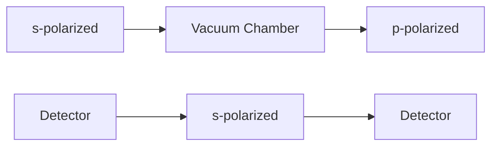

This copy is for your personal, non-commercial use only.

If you wish to distribute this article to others, you can order high-quality copies for your colleagues, clients, or customers by clicking here.

Permission to republish or repurpose articles or portions of articles can be obtained by following the guidelines here.

The following resources related to this article are available online at www.sciencemag.org (this information is current as of January 22, 2013):

Updated information and services, including high-resolution figures, can be found in the online version of this article at:

http://www.sciencemag.org/content/328/5986/1673.full.html

Supporting Online Material can be found at:

http://www.sciencemag.org/content/suppl/2010/05/19/science.1189403.DC1.html

http://www.sciencemag.org/content/suppl/2010/05/20/science.1189403.DC2.html

This article cites 22 articles, 3 of which can be accessed free:

http://www.sciencemag.org/content/328/5986/1673.full.html#ref-list-1

This article has been cited by 4 articles hosted by HighWire Press; see:

http://www.sciencemag.org/content/328/5986/1673.full.html#related-urls

This article appears in the following subject collections:

Physics

http://www.sciencemag.org/cgi/collection/physics

27. F. Banhart, J. Mater. Sci. 41, 4505 (2006).   
28. V. H. Crespi, N. G. Chopra, M. L. Cohen, A. Zettl, S. G. Louie, Phys. Rev. B 54, 5927 (1996).   
29. The extent of displacement may vary depending on the tilt angle, because the local thickness of the specimen along the axis of the excitation may change. However, the skin depth of the MWNT ring specimen for the 532-nm light is deduced to be 2 $\mu$ m [absorption coefficient $\alpha = 1.0 \times 10^{4}$ cm $^{-1}$ (35)], which exceeds the largest local thickness along the ring specimen at a tilt angle of 35°. In addition, the absorption cross section of MWNTs is reported to be weakly dependent on the polarization of the incident beam for thick tubes (36). To further suppress any polarization dependence, we set the polarization of the optical excitation beam so that it was not along the long axis of the tube.

Consequently, the heat gradient and thermal stress are uniform for the tilt angles recorded in this study.   
30. P. Poncharal, Z. L. Wang, D. Ugarte, W. A. de Heer, Science 283, 1513 (1999).   
31. L. Meirovich, Elements of Vibration Analysis (McGraw-Hill, New York, ed. 2, 1986).   
32. X.-L. Wei, Y. Liu, Q. Chen, M.-S. Wang, L.-M. Peng, Adv. Funct. Mater. 18, 1555 (2008).   
33. M. M. J. Treacy, T. W. Ebbesen, J. M. Gibson, Nature 381, 678 (1996).   
34. G. V. Hartland, Annu. Rev. Phys. Chem. 57, 403 (2006).   
35. T. Nakamiya et al., Thin Solid Films 517, 3854 (2009).   
36. C. Ni, P. R. Bandaru, Carbon 47, 2898 (2009).

37. S. Jonic, C. Vénien-Bryan, Curr. Opin. Pharmacol. 9, 636 (2009).   
38. Supported by NSF (grant DMR-0964886) and Air Force Office of Scientific Research (grant FA9550-07-1-0484) in the Physical Biology Center for Ultrafast Science and Technology supported by Gordon and Betty Moore Foundation at Caltech. A patent application has been filed by Caltech based on the methodology presented herein.

# Supporting Online Material

www.sciencemag.org/cgi/content/full/328/5986/1668/DC1

Movies S1 to S3

5 April 2010; accepted 19 May 2010

10.1126/science.1190470

# Measurement of the Instantaneous Velocity of a Brownian Particle

Tongcang Li, Simon Kheifets, David Medellin, Mark G. Raizen\*

Brownian motion of particles affects many branches of science. We report on the Brownian motion of micrometer-sized beads of glass held in air by an optical tweezer, over a wide range of pressures, and we measured the instantaneous velocity of a Brownian particle. Our results provide direct verification of the energy equipartition theorem for a Brownian particle. For short times, the ballistic regime of Brownian motion was observed, in contrast to the usual diffusive regime. We discuss the applications of these methods toward cooling the center-of-mass motion of a bead in vacuum to the quantum ground motional state.

In 1907, Albert Einstein published a paper in which he considered the instantaneous velocity of a Brownian particle (1, 2). By measuring this quantity, one could prove that “the kinetic energy of the motion of the centre of gravity of a particle is independent of the size and nature of the particle and independent of the nature of its environment.” This is one of the basic tenets of statistical mechanics, known as the equipartition theorem. However, because of the very rapid randomization of the motion, Einstein concluded that the instantaneous velocity of a Brownian particle would be impossible to measure in practice.

We report here on the measurement of the instantaneous velocity of a Brownian particle in a system consisting of a single, micrometer-sized $SiO_{2}$ bead held in a dual-beam optical tweezer in air, over a wide range of pressures. The velocity data were used to verify the Maxwell-Boltzmann velocity distribution and the equipartition theorem for a Brownian particle. The ability to measure instantaneous velocity enables new fundamental tests of statistical mechanics of Brownian particles and is also a necessary step toward the cooling of a particle to the quantum ground motional state in vacuum.

The earliest quantitative studies of Brownian motion were focused on measuring velocities, and they generated enormous controversy (3, 4). The measured velocities of Brownian particles (3) were almost 1000-fold smaller than what was predicted by the energy equipartition theorem. Recent experiments with fast detectors that studied Brownian motion in liquid (5–7) and gaseous (8–10) environments observed nondiffusive motion of a Brownian particle.

Einstein's theory predicts that $\langle [\Delta x(t)]^2\rangle = 2Dt$ , where $\langle [\Delta x(t)]^2\rangle$ is the mean square displacement (MSD) in one dimension of a free Brownian particle during time $t$ , and $D$ is the diffusion constant (11). The diffusion constant can be calculated by $D = k_{\mathrm{B}}T / \gamma$ , where $k_{\mathrm{B}}$ is Boltzmann's constant, $T$ is the temperature, and $\gamma$ is the Stokes friction coefficient. The mean velocity measured over an interval of time $t$ is $\bar{\nu} \equiv \sqrt{\langle[\Delta x(t)]^2\rangle / t = \sqrt{2D} / \sqrt{t}}$ . This diverges as $t$ ap proaches 0 and therefore does not represent the real velocity of the particle (1, 2).

The equation $\langle[\Delta x(t)]^{2}\rangle=2Dt$ , however, is valid only when $t>>\tau_{p}$ ; that is, in the diffusive regime. Here, $\tau_{p}=m/\gamma$ is the momentum relaxation time of a particle with mass m. At very short time scales ( $t<<\tau_{p}$ ), the dynamics of a particle are dominated by its inertia, and the motion is ballistic. The dynamics of a Brownian particle over all time scales can be described by a Langevin equation (12). The MSD of a Brownian particle at very short time scales is predicted to be $\langle[\Delta x(t)]^{2}\rangle=(k_{\mathrm{B}}T/m)t^{2}$ , and its instantaneous velocity can be measured as $v=\Delta x(t)/t$ , when $t<<\tau_{p}$ (13).

For a 1- $\mu$ m-diameter silica (SiO $_{2}$ ) sphere in water, $\tau_{p}$ is about 0.1 $\mu$ s and the root mean square (rms) velocity is about 2 mm/s in one dimension. To measure the instantaneous velocity with 10% uncertainty, one would require 2-pm spatial resolution in 10 ns, far beyond what is experimentally achievable today (7). Because of the lower viscosity of gas, compared with liquid, the $\tau_{p}$ of a particle in air is much larger. This lowers the technical demand for both temporal and spatial resolution. The main difficulty of performing high-precision measurements of a Brownian particle in air, however, is that the particle will fall under the influence of gravity. We overcome this problem by using optical tweezers to simultaneously trap and monitor a silica bead in air and vacuum, allowing long-duration, ultra–high-resolution measurements of its motion.

Fig. 1. Simplified schematic showing the counterpropagating dual-beam optical tweezers, and a novel detection system that has a 75-MHz bandwidth and ultralow noise. The s-polarized beam is reflected by a polarizing beam-splitter cube after it passes through a trapped bead inside a vacuum chamber. For detection, it is split by a mirror with a sharp edge. The p-polarized beam passes through the cube.   

flowchart

For small displacements, the effect of optical tweezers on the bead's motion can be approximated by a harmonic potential. The MSD of a Brownian particle in an underdamped harmonic trap in air can be obtained by solving the Langevin equation (14)

$$
\langle [ \Delta x (t) ] ^ {2} \rangle =
$$

$$
\frac {2 k _ {\mathrm{B}} T}{m \omega_ {0} ^ {2}} \left[ 1 - e ^ {- t / 2 \tau_ {\mathrm{p}}} \left(\cos \omega_ {1} t + \frac {\sin \omega_ {1} t}{2 \omega_ {1} \tau_ {\mathrm{p}}}\right) \right] \tag {1}
$$

where $\omega_{0}$ is the resonant frequency of the trap and $\omega_{1} \equiv \sqrt{\omega_{0}^{2} - 1/(2\tau_{p})^{2}}$ . The normalized velocity autocorrelation function (VACF) of the particle is (14)

$$
\psi (t) = e ^ {- t / 2 \tau_ {\mathrm{p}}} \left(\cos \omega_ {1} t - \frac {\sin \omega_ {1} t}{2 \omega_ {1} \tau_ {\mathrm{p}}}\right) \tag {2}
$$

In the simplified scheme of our optical trap and vacuum chamber (Fig. 1), the trap is formed inside a vacuum chamber by two counterpropagating laser beams focused to the same point by two identical aspheric lenses with focal lengths of 3.1 mm and numerical apertures of 0.68 (15). The two 1064-nm-wavelength laser beams are orthogonally polarized, and their frequencies differ by 160 MHz to avoid interference. The scattering forces exerted on the bead by the two beams cancel, and the gradient forces near the center of the focus create a three-dimensional harmonic potential for the bead. When the bead deviates from the center of the trap, it deflects both trapping beams. The position of the bead is monitored by measuring the deflection of one of the beams, which is split by a mirror with a sharp edge. The difference between the two halves is measured by a fast balanced detector (7, 16).

line

| Time (ms) | Position (nm) | Velocity (mm/s) |
| --------- | ------------- | --------------- |
| 0         | ~0            | ~0              |
| 0.5       | ~-40          | ~-0.5           |
| 1.0       | ~40           | ~1.0            |
| 1.5       | ~-60          | ~-0.5           |
| 2.0       | ~70           | ~0.5            |

line

| Time (ms) | B (kPa) | D (kPa) |
| --------- | ------- | ------- |
| 0         | ~0      | ~0      |
| 1         | ~70     | ~1      |
| 2         | ~30     | ~0      |

Fig. 2. One-dimensional trajectories of a 3- $\mu$ m-diameter silica bead trapped in air at 99.8 kPa (A) and 2.75 kPa (B). The instantaneous velocities of the bead corresponding to these trajectories are shown in (C) and (D).

The lifetime of a bead in our trap in air is much longer than our measurement times over a wide range of pressures and trap strengths. We have tested it by trapping a 4.7- $\mu$ m bead in air continuously for 46 hours, during which the power of both laser beams was repeatedly changed from 5 mW to 2.0 W. The trap becomes less stable in vacuum. The lowest pressure at which we have trapped a bead without extra stabilization is about 0.1 Pa.

For studying the Brownian motion of a trapped bead, unless otherwise stated, the powers of the two laser beams were 10.7 and 14.1 mW (15), the diameter of the bead was 3 $\mu$ m, the temperature of the system was 297 K, and the air pressure was 99.8 or 2.75 kPa. The trapping was stable and the heating due to laser absorption was negligible under these conditions. In typical samples of position and velocity traces of a trapped bead (Fig. 2), the position traces of the bead at these two pressures appear to be very similar. On the other hand, the velocity traces are clearly different. The instantaneous velocity of the bead at 99.8 kPa changes more frequently than that at 2.75 kPa, because the momentum relaxation time is shorter at higher pressure.

Figure 3 shows the MSDs of a 3- $\mu$ m silica bead as a function of time. The measured MSDs fit with Eq. 1 over three decades of time for both pressures. The calibration factor $\alpha = position/voltage$ of the detection system is the only fitting parameter of Eq. 1 for each pressure. $\tau_{p}$ and $\omega_{0}$ are obtained from the measured normalized VACF. The two values of $\alpha$ obtained for these two pressures differ by 10.8%. This is because the vacuum chamber is distorted slightly when the pressure is decreased from 99.8 to 2.75 kPa. The measured MSDs are completely different from those predicted by Einstein's theory of Brownian motion in a diffusive regime. The

Fig. 3. (A) The MSDs of a 3- $\mu$ m silica bead trapped in air at 99.8 kPa (red square) and 2.75 kPa (black circle). They are calculated from 40 million position measurements for each pressure. The "noise" signal (blue triangle) is recorded when there is no particle in the optical trap. The solid lines are theoretical predictions of Eq. 1. The prediction of Einstein's theory of free Brownian motion in the diffusive regime is shown in dashed lines for comparison. (B) MSDs at short   

line

| Time (s) | MSD (nm²) - 99.8 kPa | MSD (nm²) - 2.75 kPa | MSD (nm²) - noise |
| -------- | --------------------- | --------------------- | ----------------- |
| 10⁻⁶     | ~0.1                  | ~0.1                  | ~0.1              |
| 10⁻⁵     | ~10                   | ~10                   | ~0.1              |
| 10⁻⁴     | ~100                  | ~100                  | ~0.1              |
| 10⁻³     | ~1000                 | ~1000                 | ~0.1              |

line

| Time (μs) | MSD (nm²) - 99.8 kPa | MSD (nm²) - 2.75 kPa |
| --------- | -------------------- | -------------------- |
| 0         | 0                    | 0                    |
| 5         | ~10                  | ~10                  |
| 10        | ~30                  | ~30                  |
| 15        | ~60                  | ~60                  |
| 20        | ~90                  | ~90                  |
| 25        | ~120                 | ~120                 |
| 30        | ~140                 | ~140                 |

time scales are shown in detail. The dash-dotted line indicates ballistic Brownian motion of a free particle.

Fig. 4. (A) The distribution of the measured instantaneous velocities of a 3- $\mu$ m silica bead. The statistics at each pressure is calculated from 4 million instantaneous velocities. The solid lines are Maxwell-Boltzmann distributions. We obtained $v_{rms} = 0.422$ mm/s at 99.8 kPa (red square) and $v_{rms} = 0.425$ mm/s at 2.75 kPa (black circle) from the measurements. The rms value of the noise (blue triangle) is 0.021 mm/s. (B) The normalized   

line

| Velocity (mm/s) | 99.8 kPa | 2.75 kPa | noise |
| --------------- | -------- | -------- | ----- |
| -2.0            | 1e-4     | 1e-4     | 1e-4  |
| -1.5            | 1e-3     | 1e-3     | 1e-3  |
| -1.0            | 1e-2     | 1e-2     | 1e-2  |
| -0.5            | 1e-1     | 1e-1     | 1e-1  |
| 0.0             | 1        | 1        | 1     |
| 0.5             | 1e-1     | 1e-1     | 1     |
| 1.0             | 1e-2     | 1e-2     | 1     |
| 1.5             | 1e-3     | 1e-3     | 1     |
| 2.0             | 1e-4     | 1e-4     | 1     |

line

| Time (ms) | 99.8 kPa | 2.75 kPa |
| --------- | -------- | -------- |
| 0.0       | 1.0      | 1.0      |
| 0.1       | -0.3     | -0.6     |
| 0.2       | -0.1     | -0.4     |
| 0.3       | 0.0      | 0.3      |
| 0.4       | 0.0      | 0.1      |
| 0.5       | 0.0      | -0.1     |
| 0.6       | 0.0      | 0.0      |
| 0.7       | 0.0      | 0.0      |
| 0.8       | 0.0      | 0.0      |
| 0.9       | 0.0      | 0.0      |
| 1.0       | 0.0      | 0.0      |

velocity autocorrelation functions of the 3- $\mu$ m bead at two different pressures. The solid lines are fittings with Eq. 2.

slopes of measured MSD curves at short time scales are double those of the MSD curves of diffusive Brownian motion in the log-log plot (Fig. 3A). This is because the MSD is proportional to $t^2$ for ballistic Brownian motion, whereas it is proportional to $t$ for diffusive Brownian motion. In addition, the MSD curves are independent of air pressure at short time scales, which is predicted by $\langle [\Delta x(t)]^2\rangle = (k_{\mathrm{B}}T / m)t^2$ for ballistic Brownian motion, whereas the MSD in the diffusive regime does depend on the air pressure. At long time scales, the MSD saturates at a constant value because of the optical trap. Figure 3B displays more detail of the Brownian motion at short time scales. It clearly demonstrates that we have observed ballistic Brownian motion.

The distributions of the measured instantaneous velocities (Fig. 4A) agree very well with the Maxwell-Boltzmann distribution. The measured rms velocities are $v_{\mathrm{rms}} = 0.422 \, \mathrm{mm/s}$ at $99.8 \, \mathrm{kPa}$ and $v_{\mathrm{rms}} = 0.425 \, \mathrm{mm/s}$ at $2.75 \, \mathrm{kPa}$ . These values are very close to the prediction of the energy equipartition theorem, $v_{\mathrm{rms}} = \sqrt{k_{\mathrm{B}} T/m}$ , which is $0.429 \, \mathrm{mm/s}$ . As expected, the velocity distribution is independent of pressure. The rms value of the noise signal is $0.021 \, \mathrm{mm/s}$ , which means we have $1.0 \, \text{\AA}$ spatial resolution in $5 \, \mu\text{s}$ . This measurement noise is about $4.8\%$ of the rms velocity. Figure 4A represents direct verification of the Maxwell-Boltzmann distribution of velocities and the equipartition theorem of energy for Brownian motion. For a Brownian particle in liquid, the inertial effects of the liquid become important. The measured rms velocity of the particle will be $v_{\mathrm{rms}} = \sqrt{k_{\mathrm{B}} T/m^*}$ in the ballistic regime, where the effective mass $m^*$ is the sum of the mass of the particle and half of the mass of the displaced fluid (17). This is different from the equipartition theorem. To measure the true instantaneous velocity in liquid as predicted by the equipartition theorem, the temporal resolution must be much shorter than the time scale of acoustic damping, which is about 1 ns for a $1-\mu\text{m}$ particle in liquid (17).

Figure 4B shows the normalized VACF of the bead at two different pressures. At 2.75 kPa, one can see the oscillations due to the optical trap. Equation 2 is independent of the calibration factor $\alpha$ of the detection system. The only independent variable is time $t$ , which we can measure with high precision. Thus the normalized VACF provides an accurate method to measure $\tau_{\mathrm{p}}$ and $\omega_0$ . By fitting the normalized VACF with Eq. 2, we obtained $\tau_{\mathrm{p}} = 48.5 \pm 0.1 \mu \mathrm{s}$ , $\omega_0 = 2\pi \cdot (3064 \pm 4) \mathrm{~Hz}$ at $99.8 \mathrm{kPa}$ and $\tau_{\mathrm{p}} = 147.3 \pm 0.1 \mu \mathrm{s}$ , $\omega_0 = 2\pi \cdot (3168 \pm 0.5) \mathrm{~Hz}$ at $2.75 \mathrm{kPa}$ . The trapping frequency changed by $3\%$ because of the distortion of the vacuum chamber at different pressures. For a particle at a certain pressure and temperature, $\tau_{\mathrm{p}}$ should be independent of the trapping frequency. We verified this by changing the total power of the two laser beams from 25 to $220 \mathrm{mW}$ . The measured $\tau_{\mathrm{p}}$ changed less than $1.3\%$ for both pressures, thus proving that the fitting method is accurate, and the heating due to the laser beams (which would change the viscosity and affect $\tau_{\mathrm{p}}$ ) is negligible. We can also calculate the diameter of the silica bead from the $\tau_{\mathrm{p}}$ value at $99.8 \mathrm{kPa}$ (18). The obtained diameter is $2.79 \mu \mathrm{m}$ . This is within the uncertainty range given by the supplier of the $3.0-\mu \mathrm{m}$ silica beads. We used this value in the calculation of MSD and normalized VACF.

The ability to measure the instantaneous velocity of a Brownian particle will be invaluable in studying nonequilibrium statistical mechanics (19, 20) and can be used to cool Brownian motion by applying a feedback force with a direction opposite to the velocity (21, 22). In a vacuum, our optically trapped particle should be an ideal system for investigating quantum effects in a mechanical system (16, 23–25) because of its near-perfect isolation from the thermal environment. Combining feedback cooling and cavity cooling, we expect to cool the Brownian motion of a bead starting from room temperature to the quantum regime, as predicted by recent theoretical calculations (24, 25). We have directly verified the energy equipartition theorem of Brownian motion. However, we also expect to observe deviation from this theorem when the bead is cooled to the quantum regime. The kinetic energy of the bead will not approach zero even at 0 K because of its zero-point energy. The rotational energy of the bead should also become quantized.

# References and Notes

1. A. Einstein, Zeit. f. Elektrochemie 13, 41 (1907).   
2. A. Einstein, Investigations on the Theory of the Brownian Movement, R. Fürth, Ed., A. D. Cowper, Transl. (Methuen, London, 1926), pp. 63–67.   
3. F. M. Exner, Ann. Phys. 2, 843 (1900).   
4. M. Kerker, J. Chem. Educ. 51, 764 (1974).   
5. B. Lukić et al., Phys. Rev. Lett. 95, 160601 (2005).   
6. Y. Han et al., Science 314, 626 (2006).   
7. I. Chavez, R. Huang, K. Henderson, E.-L. Florin, M. G. Raizen, Rev. Sci. Instrum. 79, 105104 (2008).   
8. P. D. Fedele, Y. W. Kim, Phys. Rev. Lett. 44, 691 (1980).   
9. J. Blum et al., Phys. Rev. Lett. 97, 230601 (2006).   
10. D. R. Burnham, P. J. Reece, D. McGloin, Brownian dynamics of optically trapped liquid aerosols. In press; preprint available at http://arxiv.org/abs/0907.4582.   
11. A. Einstein, Ann. Phys. 17, 549 (1905).   
12. P. Langevin, C. R. Acad. Sci. (Paris) 146, 530 (1908).   
13. G. E. Uhlenbeck, L. S. Ornstein, Phys. Rev. 36, 823 (1930).   
14. M. C. Wang, G. E. Uhlenbeck, Rev. Mod. Phys. 17, 323 (1945).   
15. Materials and methods are available as supporting material on Science online.   
16. K. G. Libbrecht, E. D. Black, Phys. Lett. A 321, 99 (2004).   
17. R. Zwanzig, M. Bixon, J. Fluid Mech. 69, 21 (1975).   
18. A. Moshfegh, M. Shams, G. Ahmadi, R. Ebrahimi, Colloids Surf. A Physicochem. Eng. Asp. 345, 112 (2009).   
19. R. Kubo, Science 233, 330 (1986).   
20. G. M. Wang, E. M. Sevick, E. Mittag, D. J. Searles, D. J. Evans, Phys. Rev. Lett. 89, 050601 (2002).   
21. A. Hopkins, K. Jacobs, S. Habib, K. Schwab, Phys. Rev. B 68, 235328 (2003).   
22. D. Kleckner, D. Bouwmeester, Nature 444, 75 (2006).   
23. A. Ashkin, J. M. Dziedzic, Appl. Phys. Lett. 28, 333 (1976).   
24. D. E. Chang et al., Proc. Natl. Acad. Sci. U.S.A. 107, 1005 (2010).   
25. O. Romero-Isart, M. L. Juan, R. Quidant, J. Ignacio Cirac, N. J. Phys. 12, 033015 (2010).   
26. M.G.R. acknowledges support from the Sid W. Richardson Foundation and the R. A. Welch Foundation grant number F-1258. D.M. acknowledges support from El Consejo Nacional de Ciencia y Tecnología (CONACYT) for his graduate fellowship (206429). The authors would also like to thank E.-L. Florin and Z. Yin for helpful discussions and I. Popov for his help with the experiment.

# Supporting Online Material

www.sciencemag.org/cgi/content/full/science.1189403/DC1

Materials and Methods

10 March 2010; accepted 10 May 2010

Published online 20 May 2010;

10.1126/science.1189403

Include this information when citing this paper.