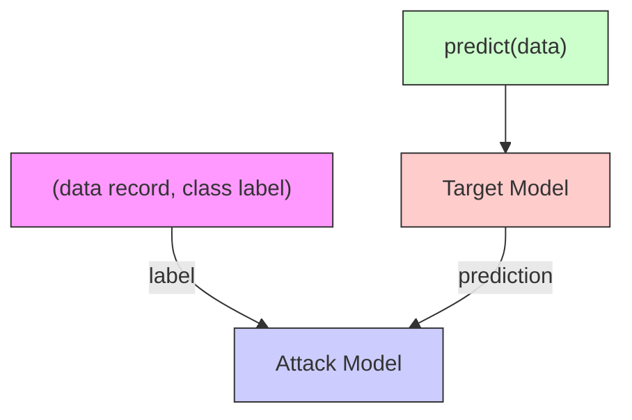
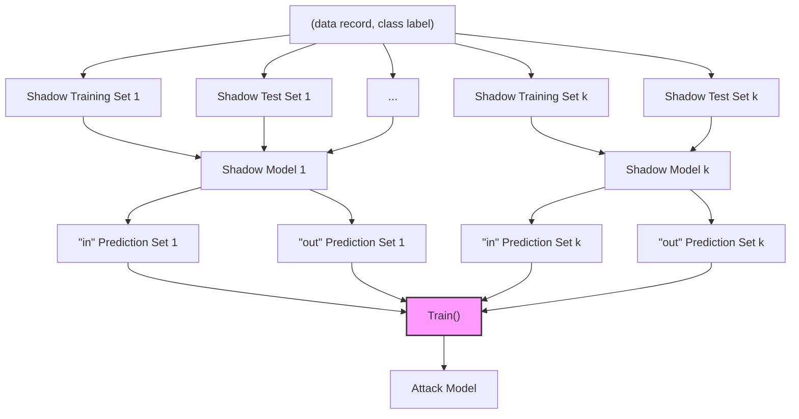

# Membership Inference Attacks Against Machine Learning Models

Reza Shokri

Cornell Tech

shokri@cornell.edu

Marco Stronati\*

INRIA

marco@stronati.org

Congzheng Song

Cornell

cs2296@cornell.edu

Vitaly Shmatikov

Cornell Tech

shmat@cs.cornell.edu

Abstract—We quantitatively investigate how machine learning models leak information about the individual data records on which they were trained. We focus on the basic membership inference attack: given a data record and black-box access to a model, determine if the record was in the model's training dataset. To perform membership inference against a target model, we make adversarial use of machine learning and train our own inference model to recognize differences in the target model's predictions on the inputs that it trained on versus the inputs that it did not train on.

We empirically evaluate our inference techniques on classification models trained by commercial “machine learning as a service” providers such as Google and Amazon. Using realistic datasets and classification tasks, including a hospital discharge dataset whose membership is sensitive from the privacy perspective, we show that these models can be vulnerable to membership inference attacks. We then investigate the factors that influence this leakage and evaluate mitigation strategies.

# I. INTRODUCTION

Machine learning is the foundation of popular Internet services such as image and speech recognition and natural language translation. Many companies also use machine learning internally, to improve marketing and advertising, recommend products and services to users, or better understand the data generated by their operations. In all of these scenarios, activities of individual users—their purchases and preferences, health data, online and offline transactions, photos they take, commands they speak into their mobile phones, locations they travel to—are used as the training data.

Internet giants such as Google and Amazon are already offering “machine learning as a service.” Any customer in possession of a dataset and a data classification task can upload this dataset to the service and pay it to construct a model. The service then makes the model available to the customer, typically as a black-box API. For example, a mobile-app maker can use such a service to analyze users’ activities and query the resulting model inside the app to promote in-app purchases to users when they are most likely to respond. Some machine-learning services also let data owners expose their models to external users for querying or even sell them.

Our contributions. We focus on the fundamental question known as membership inference: given a machine learning model and a record, determine whether this record was used as \*This research was performed while the author was at Cornell Tech.

part of the model's training dataset or not. We investigate this question in the most difficult setting, where the adversary's access to the model is limited to black-box queries that return the model's output on a given input. In summary, we quantify membership information leakage through the prediction outputs of machine learning models.

To answer the membership inference question, we turn machine learning against itself and train an attack model whose purpose is to distinguish the target model's behavior on the training inputs from its behavior on the inputs that it did not encounter during training. In other words, we turn the membership inference problem into a classification problem.

Attacking black-box models such as those built by commercial “machine learning as a service” providers requires more sophistication than attacking white-box models whose structure and parameters are known to the adversary. To construct our attack models, we invented a shadow training technique. First, we create multiple “shadow models” that imitate the behavior of the target model, but for which we know the training datasets and thus the ground truth about membership in these datasets. We then train the attack model on the labeled inputs and outputs of the shadow models.

We developed several effective methods to generate training data for the shadow models. The first method uses black-box access to the target model to synthesize this data. The second method uses statistics about the population from which the target's training dataset was drawn. The third method assumes that the adversary has access to a potentially noisy version of the target's training dataset. The first method does not assume any prior knowledge about the distribution of the target model's training data, while the second and third methods allow the attacker to query the target model only once before inferring whether a given record was in its training dataset.

Our inference techniques are generic and not based on any particular dataset or model type. We evaluate them against neural networks, as well as black-box models trained using Amazon ML and Google Prediction API. All of our experiments on Amazon's and Google's platforms were done without knowing the learning algorithms used by these services, nor the architecture of the resulting models, since Amazon and Google don't reveal this information to the customers. For our evaluation, we use realistic classification tasks and standard model-training procedures on concrete datasets of images, retail purchases, location traces, and hospital inpatient stays. In

addition to demonstrating that membership inference attacks are successful, we quantify how their success relates to the classification tasks and the standard metrics of overfitting.

Inferring information about the model's training dataset should not be confused with techniques such as model inversion that use a model's output on a hidden input to infer something about this input [17] or to extract features that characterize one of the model's classes [16]. As explained in [27] and Section IX, model inversion does not produce an actual member of the model's training dataset, nor, given a record, does it infer whether this record was in the training dataset. By contrast, the membership inference problem we study in this paper is essentially the same as the well-known problem of identifying the presence of an individual's data in a mixed pool given some statistics about the pool [3], [15], [21], [29]. In our case, however, the goal is to infer membership given a black-box API to a model of unknown structure, as opposed to explicit statistics.

Our experimental results show that models created using machine-learning-as-a-service platforms can leak a lot of information about their training datasets. For multi-class classification models trained on 10,000-record retail transaction datasets using Google's and Amazon's services in default configurations, our membership inference achieves median accuracy of $94\%$ and $74\%$ , respectively. Even if we make no prior assumptions about the distribution of the target model's training data and use fully synthetic data for our shadow models, the accuracy of membership inference against Google-trained models is $90\%$ . Our results for the Texas hospital discharge dataset (over $70\%$ accuracy) indicate that membership inference can present a risk to health-care datasets if these datasets are used to train machine learning models and access to the resulting models is open to the public. Membership in such datasets is highly sensitive.

We discuss the root causes that make these attacks possible and quantitatively compare mitigation strategies such as limiting the model's predictions to top $k$ classes, decreasing the precision of the prediction vector, increasing its entropy, or using regularization while training the model.

In summary, this paper demonstrates and quantifies the problem of machine learning models leaking information about their training datasets. To create our attack models, we developed a new shadow learning technique that works with minimal knowledge about the target model and its training dataset. Finally, we quantify how the leakage of membership information is related to model overfitting.

# II. MACHINE LEARNING BACKGROUND

Machine learning algorithms help us better understand and analyze complex data. When the model is created using unsupervised training, the objective is to extract useful features from the unlabeled data and build a model that explains its hidden structure. When the model is created using supervised training, which is the focus of this paper, the training records (as inputs of the model) are assigned labels or scores (as outputs of the model). The goal is to learn the relationship between the data and the labels and construct a model that can generalize to data records beyond the training set [19]. Model-training algorithms aim to minimize the model's prediction error on the training dataset and thus may overfit to this dataset, producing models that perform better on the training inputs than on the inputs drawn from the same population but not used during the training. Many regularization techniques have been proposed to prevent models from becoming overfitted to their training datasets while minimizing their prediction error [19].

Supervised training is often used for classification and other prediction tasks. For example, a retailer may train a model that predicts a customer's shopping style in order to offer her suitable incentives, while a medical researcher may train a model to predict which treatment is most likely to succeed given a patient's clinical symptoms or genetic makeup.

Machine learning as a service. Major Internet companies now offer machine learning as a service on their cloud platforms. Examples include Google Prediction API, $^{1}$ Amazon Machine Learning (Amazon ML), $^{2}$ Microsoft Azure Machine Learning (Azure ML), $^{3}$ and BigML. $^{4}$

These platforms provide simple APIs for uploading the data and for training and querying models, thus making machine learning technologies available to any customer. For example, a developer may create an app that gathers data from users, uploads it into the cloud platform to train a model (or update an existing model with new data), and then uses the model's predictions inside the app to improve its features or better interact with the users. Some platforms even envision data holders training a model and then sharing it with others through the platform's API for profit. $^{5}$

The details of the models and the training algorithms are hidden from the data owners. The type of the model may be chosen by the service adaptively, depending on the data and perhaps accuracy on validation subsets. Service providers do not warn customers about the consequences of overfitting and provide little or no control over regularization. For example, Google Prediction API hides all details, while Amazon ML provides only a very limited set of pre-defined options (L1- or L2-norm regularization). The models cannot be downloaded and are accessed only through the service's API. Service providers derive revenue mainly by charging customers for queries through this API. Therefore, we treat “machine learning as a service” as a black box. All inference attacks we demonstrate in this paper are performed entirely through the services’ standard APIs.

# III. PRIVACY IN MACHINE LEARNING

Before dealing with inference attacks, we need to define what privacy means in the context of machine learning or,

$^{1}$ https://cloud.google.com/prediction   
$^{2}$ https://aws.amazon.com/machine-learning   
$^{3}$ https://studio.azureml.net   
$^{4}$ https://bigml.com   
$^{5}$ https://cloud.google.com/prediction/docs/gallery

alternatively, what it means for a machine learning model to breach privacy.

# A. Inference about members of the population

A plausible notion of privacy, known in statistical disclosure control as the “Dalenius desideratum,” states that the model should reveal no more about the input to which it is applied than would have been known about this input without applying the model. This cannot be achieved by any useful model $[14]$ .

A related notion of privacy appears in prior work on model inversion [17]: a privacy breach occurs if an adversary can use the model's output to infer the values of unintended (sensitive) attributes used as input to the model. As observed in [27], it may not be possible to prevent this “breach” if the model is based on statistical facts about the population. For example, suppose that training the model has uncovered a high correlation between a person's externally observable phenotype features and their genetic predisposition to a certain disease. This correlation is now a publicly known scientific fact that allows anyone to infer information about the person's genome after observing that person.

Critically, this correlation applies to all members of a given population. Therefore, the model breaches “privacy” not just of the people whose data was used to create the model, but also of other people from the same population, even those whose data was not used and whose identities may not even be known to the model’s creator (i.e., this is “spooky action at a distance”). Valid models generalize, i.e., they make accurate predictions on inputs that were not part of their training datasets. This means that the creator of a generalizable model cannot do anything to protect “privacy” as defined above because the correlations on which the model is based—and the inferences that these correlations enable—hold for the entire population, regardless of how the training sample was chosen or how the model was created from this sample.

# B. Inference about members of the training dataset

To bypass the difficulties inherent in defining and protecting privacy of the entire population, we focus on protecting privacy of the individuals whose data was used to train the model. This motivation is closely related to the original goals of differential privacy $[13]$ .

Of course, members of the training dataset are members of the population, too. We investigate what the model reveals about them beyond what it reveals about an arbitrary member of the population. Our ultimate goal is to measure the membership risk that a person incurs if they allow their data to be used to train a model.

The basic attack in this setting is membership inference, i.e., determining whether a given data record was part of the model's training dataset or not. When a record is fully known to the adversary, learning that it was used to train a particular model is an indication of information leakage through the model. In some cases, it can directly lead to a privacy breach. For example, knowing that a certain patient's clinical record was used to train a model associated with a disease (e.g., to determine the appropriate medicine dosage or to discover the genetic basis of the disease) can reveal that the patient has this disease.

We investigate the membership inference problem in the black-box scenario where the adversary can only supply inputs to the model and receive the model's output(s). In some situations, the model is available to the adversary indirectly. For example, an app developer may use a machine-learning service to construct a model from the data collected by the app and have the app make API calls to the resulting model. In this case, the adversary would supply inputs to the app (rather than directly to the model) and receive the app's outputs (which are based on the model's outputs). The details of internal model usage vary significantly from app to app. For simplicity and generality, we will assume that the adversary directly supplies inputs to and receives outputs from the black-box model.

# IV. PROBLEM STATEMENT

Consider a set of labeled data records sampled from some population and partitioned into classes. We assume that a machine learning algorithm is used to train a classification model that captures the relationship between the content of the data records and their labels.

For any input data record, the model outputs the prediction vector of probabilities, one per class, that the record belongs to a certain class. We will also refer to these probabilities as confidence values. The class with the highest confidence value is selected as the predicted label for the data record. The accuracy of the model is evaluated by measuring how it generalizes beyond its training set and predicts the labels of other data records from the same population.

We assume that the attacker has query access to the model and can obtain the model's prediction vector on any data record. The attacker knows the format of the inputs and outputs of the model, including their number and the range of values they can take. We also assume that the attacker either (1) knows the type and architecture of the machine learning model, as well as the training algorithm, or (2) has black-box access to a machine learning oracle (e.g., a “machine learning as a service” platform) that was used to train the model. In the latter case, the attacker does not know a priori the model’s structure or meta-parameters.

The attacker may have some background knowledge about the population from which the target model's training dataset was drawn. For example, he may have independently drawn samples from the population, disjoint from the target model's training dataset. Alternatively, the attacker may know some general statistics about the population, for example, the marginal distribution of feature values.

The setting for our inference attack is as follows. The attacker is given a data record and black-box query access to the target model. The attack succeeds if the attacker can correctly determine whether this data record was part of the model's training dataset or not. The standard metrics for attack accuracy are precision (what fraction of records inferred as members are indeed members of the training dataset) and


<details>
<summary>flowchart</summary>


</details>

Fig. 1: Membership inference attack in the black-box setting. The attacker queries the target model with a data record and obtains the model's prediction on that record. The prediction is a vector of probabilities, one per class, that the record belongs to a certain class. This prediction vector, along with the label of the target record, is passed to the attack model, which infers whether the record was in or out of the target model's training dataset.


<details>
<summary>flowchart</summary>

```mermaid
graph TD
    A["Private Training Set"] -->|train()| B["Target Model"]
    C["Shadow Training Set 1"] -->|train()| D["Shadow Model 1"]
    E["Shadow Training Set 2"] -->|train()| F["Shadow Model 2"]
    G["..."]
    H["Shadow Training Set k"] -->|train()| I["Shadow Model k"]
    style A fill:#f9f,stroke:#333
    style C fill:#f9f,stroke:#333
    style E fill:#f9f,stroke:#333
    style H fill:#f9f,stroke:#333
    style B fill:#ccf,stroke:#333
    style D fill:#ccf,stroke:#333
    style F fill:#ccf,stroke:#333
    style I fill:#ccf,stroke:#333
```
</details>

Fig. 2: Training shadow models using the same machine learning platform as was used to train the target model. The training datasets of the target and shadow models have the same format but are disjoint. The training datasets of the shadow models may overlap. All models' internal parameters are trained independently.

recall (what fraction of the training dataset's members are correctly inferred as members by the attacker).

# V. MEMBERSHIP INFERENCE

# A. Overview of the attack

Our membership inference attack exploits the observation that machine learning models often behave differently on the data that they were trained on versus the data that they “see” for the first time. Overfitting is a common reason but not the only one (see Section VII). The objective of the attacker is to construct an attack model that can recognize such differences in the target model’s behavior and use them to distinguish members from non-members of the target model’s training dataset based solely on the target model’s output.

Our attack model is a collection of models, one for each output class of the target model. This increases accuracy of the attack because the target model produces different distributions over its output classes depending on the input's true class.

To train our attack model, we build multiple “shadow” models intended to behave similarly to the target model. In contrast to the target model, we know the ground truth for each shadow model, i.e., whether a given record was in its training dataset or not. Therefore, we can use supervised training on the inputs and the corresponding outputs (each labeled “in” or “out”) of the shadow models to teach the attack model how to distinguish the shadow models’ outputs on members of their training datasets from their outputs on non-members.

Formally, let $f_{\text{target}}()$ be the target model, and let $D_{target}^{train}$ be its private training dataset which contains labeled data records $(\mathbf{x}^{\{i\}}, y^{\{i\}})_{\text{target}}$ . A data record $x_{target}^{\{i\}}$ is the input to the model, and $y_{target}^{\{i\}}$ is the true label that can take values from a set of classes of size $c_{target}$ . The output of the target model is a probability vector of size $c_{target}$ . The elements of this vector are in [0,1] and sum up to 1.

Let $f_{attack}()$ be the attack model. Its input $x_{attack}$ is composed of a correctly labeled record and a prediction vector of size $c_{target}$ . Since the goal of the attack is decisional membership inference, the attack model is a binary classifier with two output classes, “in” and “out.”

Figure 1 illustrates our end-to-end attack process. For a labeled record $(\mathbf{x}, y)$ , we use the target model to compute the prediction vector $\mathbf{y} = f_{\text{target}}(\mathbf{x})$ . The distribution of y (classification confidence values) depends heavily on the true class of x. This is why we pass the true label y of x in addition to the model's prediction vector y to the attack model. Given how the probabilities in y are distributed around y, the attack model computes the membership probability $\Pr\{(\mathbf{x}, y) \in D_{\text{target}}^{\text{train}}\}$ , i.e., the probability that $((\mathbf{x}, y), \mathbf{y})$ belongs to the “in” class or, equivalently, that x is in the training dataset of $f_{\text{target}}()$ .

The main challenge is how to train the attack model to distinguish members from non-members of the target model's training dataset when the attacker has no information about the internal parameters of the target model and only limited query access to it through the public API. To solve this conundrum, we developed a shadow training technique that lets us train the attack model on proxy targets for which we do know the training dataset and can thus perform supervised training.

# B. Shadow models

The attacker creates $k$ shadow models $f_{\text{shadow}}^i()$ . Each shadow model $i$ is trained on a dataset $D_{\text{shadow}^i}^{\text{train}}$ of the same format as and distributed similarly to the target model's training dataset. These shadow training datasets can be generated using one of methods described in Section V-C. We assume that the datasets used for training the shadow models are disjoint from the private dataset used to train the target model ( $\forall i, D_{\text{shadow}^i}^{\text{train}} \cap D_{\text{target}}^{\text{train}} = \emptyset$ ). This is the worst case for the attacker; the attack will perform even better if the training datasets happen to overlap.

The shadow models must be trained in a similar way to the target model. This is easy if the target's training algorithm

Algorithm 1 Data synthesis using the target model   
1: procedure SYNTHESIZE(class : c)
2:    x ← RANDRECORD() ▷ initialize a record randomly
3:    y_c^* ← 0
4:    j ← 0
5:    k ← k_max
6:    for iteration = 1 ⋯ iter_max do
7:    y ← f_target(x) ▷ query the target model
8:    if y_c ≥ y_c^* then ▷ accept the record
9:    if y_c > conf_min and c = arg max(y) then
10:    if rand() < y_c then ▷ sample
11:    return x ▷ synthetic data
12:    end if
13:    end if
14:    x^* ← x
15:    y_c^* ← y_c
16:    j ← 0
17:    else
18:    j ← j + 1
19:    if j > rej_max then ▷ many consecutive rejects
20:    k ← max(k_min, [k/2])
21:    j ← 0
22:    end if
23:    end if
24:    x ← RANDRECORD(x^*, k) ▷ randomize k features
25: end for
26: return ⊥ ▷ failed to synthesize
27: end procedure

(e.g., neural networks, SVM, logistic regression) and model structure (e.g., the wiring of a neural network) are known. Machine learning as a service is more challenging. Here the type and structure of the target model are not known, but the attacker can use exactly the same service (e.g., Google Prediction API) to train the shadow model as was used to train the target model—see Figure 2.

The more shadow models, the more accurate the attack model will be. As described in Section V-D, the attack model is trained to recognize differences in shadow models' behavior when these models operate on inputs from their own training datasets versus inputs they did not encounter during training. Therefore, more shadow models provide more training fodder for the attack model.

# C. Generating training data for shadow models

To train shadow models, the attacker needs training data that is distributed similarly to the target model's training data. We developed several methods for generating such data.

Model-based synthesis. If the attacker does not have real training data nor any statistics about its distribution, he can generate synthetic training data for the shadow models using the target model itself. The intuition is that records that are classified by the target model with high confidence should be statistically similar to the target's training dataset and thus provide good fodder for shadow models.

The synthesis process runs in two phases: (1) search, using a hill-climbing algorithm, the space of possible data records to find inputs that are classified by the target model with high confidence; (2) sample synthetic data from these records. After this process synthesizes a record, the attacker can repeat it until the training dataset for shadow models is full.

See Algorithm 1 for the pseudocode of our synthesis procedure. First, fix class c for which the attacker wants to generate synthetic data. The first phase is an iterative process. Start by randomly initializing a data record x. Assuming that the attacker knows only the syntactic format of data records, sample the value for each feature uniformly at random from among all possible values of that feature. In each iteration, propose a new record. A proposed record is accepted only if it increases the hill-climbing objective: the probability of being classified by the target model as class c.

Each iteration involves proposing a new candidate record by changing k randomly selected features of the latest accepted record $x^{*}$ . This is done by flipping binary features or resampling new values for features of other types. We initialize k to $k_{max}$ and divide it by 2 when $rej_{max}$ subsequent proposals are rejected. This controls the diameter of search around the accepted record in order to propose a new record. We set the minimum value of k to $k_{min}$ . This controls the speed of the search for new records with a potentially higher classification probability $y_{c}$ .

The second, sampling phase starts when the target model's probability $y_{c}$ that the proposed data record is classified as belonging to class $c$ is larger than the probabilities for all other classes and also larger than a threshold $\mathrm{conf}_{min}$ . This ensures that the predicted label for the record is $c$ , and that the target model is sufficiently confident in its label prediction. We select such record for the synthetic dataset with probability $y_{c}^{*}$ and, if selection fails, repeat until a record is selected.

This synthesis procedure works only if the adversary can efficiently explore the space of possible inputs and discover inputs that are classified by the target model with high confidence. For example, it may not work if the inputs are high-resolution images and the target model performs a complex image classification task.

Statistics-based synthesis. The attacker may have some statistical information about the population from which the target model's training data was drawn. For example, the attacker may have prior knowledge of the marginal distributions of different features. In our experiments, we generate synthetic training records for the shadow models by independently sampling the value of each feature from its own marginal distribution. The resulting attack models are very effective.

Noisy real data. The attacker may have access to some data that is similar to the target model's training data and can be considered as a “noisy” version thereof. In our experiments with location datasets, we simulate this by flipping the (binary) values of 10% or 20% randomly selected features, then


<details>
<summary>flowchart</summary>


</details>

Fig. 3: Training the attack model on the inputs and outputs of the shadow models. For all records in the training dataset of a shadow model, we query the model and obtain the output. These output vectors are labeled “in” and added to the attack model’s training dataset. We also query the shadow model with a test dataset disjoint from its training dataset. The outputs on this set are labeled “out” and also added to the attack model’s training dataset. Having constructed a dataset that reflects the black-box behavior of the shadow models on their training and test datasets, we train a collection of $c_{target}$ attack models, one per each output class of the target model.

training our shadow models on the resulting noisy dataset. This scenario models the case where the training data for the target and shadow models are not sampled from exactly the same population, or else sampled in a non-uniform way.

# D. Training the attack model

The main idea behind our shadow training technique is that similar models trained on relatively similar data records using the same service behave in a similar way. This observation is empirically borne out by our experiments in the rest of this paper. Our results show that learning how to infer membership in shadow models' training datasets (for which we know the ground truth and can easily compute the cost function during supervised training) produces an attack model that successfully infers membership in the target model's training dataset, too.

We query each shadow model with its own training dataset and with a disjoint test set of the same size. The outputs on the training dataset are labeled “in,” the rest are labeled “out.” Now, the attacker has a dataset of records, the corresponding outputs of the shadow models, and the in/out labels. The objective of the attack model is to infer the labels from the records and corresponding outputs.

Figure 3 shows how to train the attack model. For all $(\mathbf{x},y)\in D_{\text{shadow}^i}^{\text{train}}$ , compute the prediction vector $\mathbf{y} = f_{\text{shadow}}^i (\mathbf{x})$ and add the record $(y,\mathbf{y},\text{in})$ to the attack training set $D_{\text{attack}}^{\text{train}}$ . Let $D_{\text{shadow}^i}^{\text{test}}$ be a set of records disjoint from the training set of the $i$ th shadow model. Then, $\forall (\mathbf{x},y)\in D_{\text{shadow}^i}^{\text{test}}$ compute the prediction vector $\mathbf{y} = f_{\text{shadow}}^i (\mathbf{x})$ and add the record $(y,\mathbf{y},\text{out})$ to the attack training set $D_{\text{attack}}^{\text{train}}$ . Finally, split $D_{\text{attack}}^{\text{train}}$ into $c_{target}$ partitions, each associated with a different class label. For each label $y$ , train a separate model that, given $\mathbf{y}$ , predicts the in or out membership status for $\mathbf{x}$ .

If we use model-based synthesis from Section V-C, all of the raw training data for the attack model is drawn from the records that are classified by the target model with high confidence. This is true, however, both for the records used in the shadow models' training datasets and for the test records left out of these datasets. Therefore, it is not the case that the attack model simply learns to recognize inputs that are classified with high confidence. Instead, it learns to perform a much subtler task: how to distinguish between the training inputs classified with high confidence and other, non-training inputs that are also classified with high confidence.

In effect, we convert the problem of recognizing the complex relationship between members of the training dataset and the model's output into a binary classification problem. Binary classification is a standard machine learning task, thus we can use any state-of-the-art machine learning framework or service to build the attack model. Our approach is independent of the specific method used for attack model training. For example, in Section VI we construct the attack model using neural networks and also using the same black-box Google Prediction API that we are attacking, in which case we have no control over the model structure, model parameters, or training meta-parameters—but still obtain a working attack model.

# VI. EVALUATION

We first describe the datasets that we use for evaluation, followed by the description of the target models and our experimental setup. We then present the results of our membership inference attacks in several settings and study in detail how and why the attacks work against different datasets and machine learning platforms.

# A. Data

CIFAR. CIFAR-10 and CIFAR-100 are benchmark datasets used to evaluate image recognition algorithms $[24]$ . CIFAR-10 is composed of $32 \times 32$ color images in 10 classes, with 6,000 images per class. In total, there are 50,000 training images and 10,000 test images. CIFAR-100 has the same format as CIFAR-10, but it has 100 classes containing 600 images each. There are 500 training images and 100 testing images per class. We use different fractions of this dataset in our attack experiments to show the effect of the training dataset size on the accuracy of the attack.

Purchases. Our purchase dataset is based on Kaggle's “acquire valued shoppers” challenge dataset that contains shopping histories for several thousand individuals. $^{6}$ The purpose of the challenge is to design accurate coupon promotion strategies. Each user record contains his or her transactions over a year. The transactions include many fields such as product name, store chain, quantity, and date of purchase.

For our experiments, we derived a simplified purchase dataset (with 197,324 records), where each record consists of 600 binary features. Each feature corresponds to a product and represents whether the user has purchased it or not. To design our classification tasks, we first cluster the records into multiple classes, each representing a different purchase style. In our experiments, we use 5 different classification tasks with a different number of classes $\{2,10,20,50,100\}$ . The classification task is to predict the purchase style of a user given the 600-feature vector. We use 10,000 randomly selected records from the purchase dataset to train the target model. The rest of the dataset contributes to the test set and (if necessary) the training sets of the shadow models.

Locations. We created a location dataset from the publicly available set of mobile users' location "check-ins" in the Foursquare social network, restricted to the Bangkok area and collected from April 2012 to September 2013 [36]. $^{7}$ The check-in dataset contains 11,592 users and 119,744 locations, for a total of 1,136,481 check-ins. We filtered out users with fewer than 25 check-ins and venues with fewer than 100 visits, which left us with 5,010 user profiles. For each location venue, we have the geographical position as well as its location type (e.g., Indian restaurant, fast food, etc.). The total number of location types is 128. We partition the Bangkok map into areas of size 0.5km × 0.5km, yielding 318 regions for which we have at least one user check-in.

Each record in the resulting dataset has 446 binary features, representing whether the user visited a certain region or location type, i.e., the user's semantic and geographical profile. The classification task is similar to the purchase dataset. We cluster the location dataset into 30 classes, each representing a different geosocial type. The classification task is to predict the user's geosocial type given his or her record. We use 1,600 randomly selected records to train the target model. The rest of the dataset contributes to the test set and (if necessary) the training sets of the shadow models.

Texas hospital stays. This dataset is based on the Hospital Discharge Data public use files with information about inpatients stays in several health facilities, $^{8}$ released by the Texas Department of State Health Services from 2006 to 2009. Each record contains four main groups of attributes: the external causes of injury (e.g., suicide, drug misuse), the diagnosis (e.g., schizophrenia, illegal abortion), the procedures the patient underwent (e.g., surgery) and some generic information such as the gender, age, race, hospital id, and length of stay.

Our classification task is to predict the patient's main procedure based on the attributes other than secondary procedures. We focus on the 100 most frequent procedures. The resulting dataset has 67,330 records and 6,170 binary features. We use 10,000 randomly selected records to train the target model.

Note that our experiments do not involve re-identification of known individuals and fully comply with the data use agreement for the original Public Use Data File.

MNIST. This is a dataset of 70,000 handwritten digits formatted as $32 \times 32$ images and normalized so that the digits are located at the center of the image. $^{9}$ We use 10,000 randomly selected images to train the target model.

UCI Adult (Census Income). This dataset includes 48,842 records with 14 attributes such as age, gender, education, marital status, occupation, working hours, and native country. The (binary) classification task is to predict if a person makes over \$50K a year based on the census attributes. $^{10}$ We use 10,000 randomly selected records to train the target model.

# B. Target models

We evaluated our inference attacks on three types of target models: two constructed by cloud-based “machine learning as a service” platforms and one we implemented locally. In all cases, our attacks treat the models as black boxes. For the cloud services, we do not know the type or structure of the models they create, nor the values of the hyper-parameters used during the training process.

Machine learning as a service. The first cloud-based machine learning service in our study is Google Prediction API. With this service, the user uploads a dataset and obtains an API for querying the resulting model. There are no configuration parameters that can be changed by the user.

The other cloud service is Amazon ML. The user cannot choose the type of the model but can control a few meta-parameters. In our experiments, we varied the maximum number of passes over the training data and L2 regularization amount. The former determines the number of training epochs and controls the convergence of model training; its default value is 10. The latter tunes how much regularization is performed on the model parameters in order to avoid overfitting.


<details>
<summary>line</summary>

| Classes | 2500  | 5000  | 10000 | 15000 |
| ------- | ----- | ----- | ----- | ----- |
| 1       | 0.78  | 0.73  | 0.74  | 0.71  |
| 2       | 0.76  | 0.68  | 0.67  | 0.65  |
| 3       | 0.88  | 0.85  | 0.83  | 0.81  |
| 4       | 0.91  | 0.87  | 0.86  | 0.85  |
| 5       | 0.83  | 0.82  | 0.81  | 0.80  |
| 6       | 0.82  | 0.84  | 0.83  | 0.82  |
| 7       | 0.78  | 0.75  | 0.73  | 0.71  |
| 8       | 0.76  | 0.74  | 0.72  | 0.70  |
| 9       | 0.78  | 0.75  | 0.73  | 0.71  |
| 10      | 0.85  | 0.73  | 0.72  | 0.71  |
</details>


<details>
<summary>line</summary>

| Training Set Size | Precision |
| ----------------- | --------- |
| 2000              | 0.78      |
| 4000              | 0.75      |
| 6000              | 0.73      |
| 10000             | 0.72      |
| 14000             | 0.71      |
</details>


<details>
<summary>scatter</summary>

| Training Set Size | Precision |
| ----------------- | --------- |
| 5000              | 1.0       |
| 10000             | 1.0       |
| 20000             | 1.0       |
| 30000             | 1.0       |
</details>

Fig. 4: Precision of the membership inference attack against neural networks trained on CIFAR datasets. The graphs show precision for different classes while varying the size of the training datasets. The median values are connected across different training set sizes. The median precision (from the smallest dataset size to largest) is 0.78, 0.74, 0.72, 0.71 for CIFAR-10 and 1, 1, 0.98, 0.97 for CIFAR-100. Recall is almost 1 for both datasets. The figure on the left shows the per-class precision (for CIFAR-10). Random guessing accuracy is 0.5.


<details>
<summary>line</summary>

| Accuracy | Precision | Recall |
| -------- | --------- | ------ |
| 0.6      | 0.0       | 0.0    |
| 0.7      | 0.2       | 0.1    |
| 0.8      | 0.7       | 0.4    |
| 0.9      | 0.9       | 0.7    |
| 1.0      | 1.0       | 1.0    |
</details>


<details>
<summary>line</summary>

| Accuracy | Precision | Recall |
| -------- | --------- | ------ |
| 0.6      | 0.0       | 0.0    |
| 0.7      | 0.1       | 0.0    |
| 0.8      | 0.3       | 0.0    |
| 0.9      | 0.7       | 0.1    |
| 1.0      | 1.0       | 0.5    |
</details>


<details>
<summary>line</summary>

| Accuracy | Precision | Recall |
| -------- | --------- | ------ |
| 0.2      | 0.0       | 0.0    |
| 0.4      | 0.0       | 0.0    |
| 0.6      | 0.0       | 0.0    |
| 0.8      | 0.1       | 0.1    |
| 0.9      | 0.3       | 0.3    |
| 0.95     | 0.6       | 0.6    |
| 1.0      | 1.0       | 1.0    |
</details>

Fig. 5: Empirical CDF of the precision and recall of the membership inference attack against different classes of the models trained using Amazon ML (in two different configurations) and Google Prediction API on 10,000 purchase records. 50, 75, 90-percentile of precision is 0.74, 0.79, 0.84 on Amazon $(10, 1e-6)$ , 0.84, 0.88, 0.91 on Amazon $(100, 1e-4)$ , and 0.94, 0.97, 1 on Google, respectively. Recall is close to 1.

We used the platform in two configurations: the default setting $(10, 1e-6)$ and $(100, 1e-4)$ .

Neural networks. Neural networks have become a very popular approach to large-scale machine learning. We use Torch7 and its nn packages, $^{11}$ a deep-learning library that has been used and extended by major Internet companies such as Facebook. $^{12}$

On CIFAR datasets, we train a standard convolutional neural network (CNN) with two convolution and max pooling layers plus a fully connected layer of size 128 and a SoftMax layer. We use Tanh as the activation function. We set the learning rate to 0.001, the learning rate decay to $1e - 07$ , and the maximum epochs of training to 100.

On the purchase dataset (see Section VI-A), we train a fully connected neural network with one hidden layer of size 128 and a SoftMax layer. We use Tanh as the activation function. We set the learning rate to 0.001, the learning rate decay to $1e - 07$ , and the maximum epochs of training to 200.

# C. Experimental setup

The training set and the test set of each target and shadow model are randomly selected from the respective datasets, have the same size, and are disjoint. There is no overlap between the datasets of the target model and those of the shadow models, but the datasets used for different shadow models can overlap with each other.

We set the training set size to 10,000 for the purchase dataset as well as the Texas hospital-stay dataset, Adult dataset and the MNIST dataset. We set it to 1,200 for the location dataset. We vary the size of the training set for the CIFAR datasets, to measure the difference in the attack accuracy. For the CIFAR-10 dataset, we choose 2,500; 5,000; 10,000; and 15,000. For the CIFAR-100 dataset, we choose 4,600; 10,520; 19,920; and 29,540.

The experiments on the CIFAR datasets were run locally, against our own models, so we can vary the model's configuration and measure the impact on the attack accuracy. The experiments on the other datasets (purchases with $\{2, 10, 20, 50, 100\}$ classes, Texas hospital stays, locations, Adult, and MNIST) were run against models trained using either Google or Amazon services, where we have no visibility

Texas Dataset, Google, Membership Inference Attack   


<details>
<summary>line</summary>

| Accuracy | Precision | Recall |
| -------- | --------- | ------ |
| 0.2      | 0.0       | 0.0    |
| 0.4      | 0.0       | 0.1    |
| 0.6      | 0.3       | 0.2    |
| 0.8      | 0.7       | 0.6    |
| 1.0      | 1.0       | 1.0    |
</details>

Fig. 6: Precision and recall of the membership inference attack against the classification model trained using Google Prediction API on the Texas hospital-stay dataset.

into their choice of the model type and structure and little control over the training process (see Section VI-B).

For the purchase dataset, we built target models on all platforms (Google, Amazon, local neural networks) employing the same training dataset, thus enabling us to compare the leakage from different models. We used similar training architectures for the attack models across different platforms: either a fully connected neural network with one hidden layer of size 64 with ReLU (rectifier linear units) activation functions and a SoftMax layer, or a Google-trained black-box model.

We set the number of shadow models to 100 for the CIFAR datasets, 20 for the purchase dataset, 10 for the Texas hospital-stay dataset, 60 for the location dataset, 50 for the MNIST dataset, and 20 for the Adult dataset. Increasing the number of shadow models would increase the accuracy of the attack but also its cost.

# D. Accuracy of the attack

The attacker's goal is to determine whether a given record was part of the target model's training dataset. We evaluate this attack by executing it on randomly reshuffled records from the target's training and test datasets. In our attack evaluation, we use sets of the same size (i.e., equal number of members and non-members) in order to maximize the uncertainty of inference, thus the baseline accuracy is 0.5.

We evaluate the attack using the standard precision and recall metrics. Precision is the fraction of the records inferred as members of the training dataset that are indeed members. Recall measures coverage of the attack, i.e., the fraction of the training records that the attacker can correctly infer as members. Most measurements are reported per class because the accuracy of the attack can vary considerably for different classes. This is due to the difference in size and composition of the training data belonging to each class and highly depends on the dataset.

The test accuracy of our target neural-network models with the largest training datasets (15,000 and 29,540 records, respectively) is 0.6 and 0.2 for CIFAR-10 and CIFAR-100, respectively. The accuracy is low, indicating that the models are heavily overfitted on their training sets. Figure 4 shows the results of the membership inference attack against the CIFAR models. For both CIFAR-10 and CIFAR-100, the attack performs much better than the baseline, with CIFAR-100 especially vulnerable.


<details>
<summary>line</summary>

| Accuracy | Google | Amazon (100,1e-4) | Amazon (10,1e-6) | Neural Network |
| -------- | ------ | ----------------- | ---------------- | -------------- |
| 0.5      | 0.0    | 0.0               | 0.0              | 0.0            |
| 0.6      | 0.0    | 0.0               | 0.0              | 0.0            |
| 0.7      | 0.0    | 0.0               | 0.0              | 0.0            |
| 0.8      | 0.1    | 0.3               | 0.5              | 0.5            |
| 0.9      | 0.5    | 0.7               | 0.8              | 0.8            |
| 1.0      | 1.0    | 1.0               | 1.0              | 1.0            |
</details>

Fig. 7: Precision of the membership inference attack against models trained on the same datasets but using different platforms. The attack model is a neural network.

Table I shows the training and test accuracy of the models constructed using different machine learning platforms for the purchase dataset with 100 classes. Large gaps between training and test accuracy indicate overfitting. Larger test accuracy indicates better generalizability and higher predictive power.

Figure 5 shows the results of the membership inference attack against the black-box models trained by Google's and Amazon's machine learning platforms. Figure 7 compares precision of the attacks against these models with the attacks against a neural-network model trained on the same data. Models trained using Google Prediction API exhibit the biggest leakage.

For the Texas hospital-stay dataset, we evaluated our attack against a Google-trained model. The training accuracy of the target model is 0.66 and its test accuracy is 0.51. Figure 6 shows the accuracy of membership inference. Precision is mostly above 0.6, and for half of the classes, it is above 0.7. Precision is above 0.85 for more than 20 classes.

For the location dataset, we evaluated our attacks against a Google-trained model. The training accuracy of the target model is 1 and its test accuracy is 0.66. Figure 8 shows the accuracy of membership inference. Precision is between 0.6 and 0.8, with an almost constant recall of 1.

# E. Effect of the shadow training data

Figure 8 reports precision of the attacks trained on the shadow models whose training datasets are noisy versions of the real data (disjoint from the target model's training dataset but sampled from the same population). Precision drops as the amount of noise increases, but the attack still outperforms the

<table><tr><td>ML Platform</td><td>Training</td><td>Test</td></tr><tr><td>Google</td><td>0.999</td><td>0.656</td></tr><tr><td>Amazon (10,1e-6)</td><td>0.941</td><td>0.468</td></tr><tr><td>Amazon (100,1e-4)</td><td>1.00</td><td>0.504</td></tr><tr><td>Neural network</td><td>0.830</td><td>0.670</td></tr></table>

TABLE I: Training and test accuracy of the models constructed using different ML-as-a-service platforms on the purchase dataset (with 100 classes).


<details>
<summary>line</summary>

| Precision | Real Data | Noisy Data 10% | Noisy Data 20% |
| --------- | --------- | -------------- | -------------- |
| 0.5       | 0.0       | 0.0            | 0.0            |
| 0.6       | 0.1       | 0.1            | 0.1            |
| 0.7       | 0.7       | 0.7            | 0.7            |
| 0.8       | 0.9       | 0.9            | 0.9            |
| 0.9       | 1.0       | 1.0            | 1.0            |
</details>

Fig. 8: Empirical CDF of the precision of the membership inference attack against the Google-trained model for the location dataset. Results are shown for the shadow models trained on real data and for the shadow models trained on noisy data with 10% and 20% noise (i.e., x% of features are replaced with random values). Precision of the attack over all classes is 0.678 (real data), 0.666 (data with 10% noise), and 0.613 (data with 20% noise). The corresponding recall of the attack is 0.98, 0.99, and 1.00, respectively.

baseline and, even with 10% of the features in the shadows' training data replaced by random values, matches the original attack. This demonstrates that our attacks are robust even if the attacker's assumptions about the distribution of the target model's training data are not very accurate.

Figure 9 reports precision of the attacks when the attacker has no real data (not even noisy) for training his shadow models. Instead, we used the marginal distributions of individual features to generate 187,300 synthetic purchase records, then trained 20 shadow models on these records.

We also generated 30,000 synthetic records using the model-based approach presented in Algorithm 1. In our experiments with the purchase dataset where records have 600 binary features, we initialize k to $k_{max} = 128$ and divide it by 2 when $rej_{max} = 10$ subsequent proposals are rejected. We set its minimum value $k_{min} = 4$ . In the sampling phase, we set the minimum confidence threshold $conf_{min}$ to 0.2.

For our final set of sampled records, the target model's confidence in classifying the records is 0.24 on average (just a bit over our threshold $conf_{min} = 0.2$ ). On average, each synthetic record needed 156 queries (of proposed records) during our hill-climbing two-phase process (see Section V-C). We trained 8 shadow models on this data.

Figure 9 compares precision of the attacks when shadow models are trained on real data versus shadow models trained on synthetic data. The overall precision is 0.935 on real data compared to 0.795 for marginal-based synthetics and 0.895 for model-based synthetics. The accuracy of the attack using marginal-based synthetic data is noticeably reduced versus real data, but is nevertheless very high for most classes. The attack using model-based synthetic data exhibits dual behavior. For most classes its precision is high and close to the attacks that use real data for shadow training, but for a few classes precision is very low (less than 0.1).


<details>
<summary>line</summary>

| Precision | Real Data | Marginal-Based Synthetic | Model-Based Synthetic |
| --------- | --------- | ------------------------ | --------------------- |
| 0.0       | 0.0       | 0.0                      | 0.0                   |
| 0.2       | 0.0       | 0.0                      | 0.0                   |
| 0.4       | 0.0       | 0.0                      | 0.0                   |
| 0.6       | 0.0       | 0.0                      | 0.0                   |
| 0.8       | 0.1       | 0.3                      | 0.2                   |
| 1.0       | 1.0       | 1.0                      | 1.0                   |
</details>

Fig. 9: Empirical CDF of the precision of the membership inference attack against the Google-trained model for the purchase dataset. Results are shown for different ways of generating training data for the shadow models (real, synthetic generated from the target model, synthetic generated from marginal statistics). Precision of the attack over all classes is 0.935 (real data), 0.795 (marginal-based synthetic data), and 0.896 (model-based synthetic data). The corresponding recall of the attack is 0.994, 0.991, and 0.526, respectively.

The reason for the attack's low precision on some classes is that the target classifier cannot confidently model the distribution of data records belonging to these classes—because it has not seen enough examples. These classes are underrepresented in the target model's training dataset. For example, each of the classes where the attack has less than 0.1 precision contributes under $0.6\%$ of the target model's training dataset. Some of these classes have fewer than 30 training records (out of 10,000). This makes it very difficult for our algorithm to synthesize representatives of these classes when searching the high-dimensional space of possible records.

For the majority of the target model's classes, our attack achieves high precision. This demonstrates that a membership inference attack can be trained with only black-box access to the target model, without any prior knowledge about the distribution of the target model's training data if the attacker can efficiently generate inputs that are classified by the target model with high confidence.

# F. Effect of the number of classes and training data per class

The number of output classes of the target model contributes to how much the model leaks. The more classes, the more signals about the internal state of the model are available to the attacker. This is one of the reasons why the results in Fig. 4

Purchase Dataset, Google, Membership Inference Attack   


<details>
<summary>boxplot</summary>

| Number of Classes | Attack Precision |
| ----------------- | ---------------- |
| 2                 | 0.5              |
| 10                | 0.55             |
| 20                | 0.6              |
| 50                | 0.9              |
| 100               | 0.95             |
</details>

Fig. 10: Precision of the membership inference attack against different purchase classification models trained on the Google platform. The boxplots show the distribution of precision over different classification tasks (with a different number of classes).

are better for CIFAR-100 than for CIFAR-10. The CIFAR-100 model is also more overfitted to its training dataset. For the same number of training records per class, the attack performs better against CIFAR-100 than against CIFAR-10. For example, compare CIFAR-10 when the size of the training dataset is 2,000 with CIFAR-100 when the size of the training dataset is 20,000. The average number of data records per class is 200 in both cases, but the attack accuracy is much better (close to 1) for CIFAR-100.

To quantify the effect that the number of classes has on the accuracy of the attack, we trained target models using Google Prediction API on the purchase dataset with $\{2, 10, 20, 50, 100\}$ classes. Figure 10 shows the distribution of attack precision for each model. Models with fewer classes leak less information about their training inputs. As the number of classes increases, the model needs to extract more distinctive features from the data to be able to classify inputs with high accuracy. Informally, models with more output classes need to remember more about their training data, thus they leak more information.

Figure 11 shows the relationship between the amount of training data per class and the accuracy of membership inference. This relationship is more complex, but, in general, the more data in the training dataset is associated with a given class, the lower the attack precision for that class.

Table II shows the precision of membership inference against Google-trained models. For the MNIST dataset, the training accuracy of the target model is 0.984 and its test accuracy is 0.928. The overall precision of the membership inference attack is 0.517, which is just slightly above random guessing. The lack of randomness in the training data for each class and the small number of classes contribute to the failure of the attack.

For the Adult dataset, the training accuracy of the target model is 0.848 and its test accuracy is 0.842. The overall precision of the attack is 0.503, which is equivalent to random guessing. There could be two reasons for why membership inference fails against this model. First, the model is not overfitted (its test and train accuracies are almost the same). Second, the model is a binary classifier, which means that the attacker has to distinguish members from non-members by observing the behavior of the model on essentially 1 signal, since the two outputs are complements of each other. This is not enough for our attack to extract useful membership information from the model.

<table><tr><td>Dataset</td><td>Training Accuracy</td><td>Testing Accuracy</td><td>Attack Precision</td></tr><tr><td>Adult</td><td>0.848</td><td>0.842</td><td>0.503</td></tr><tr><td>MNIST</td><td>0.984</td><td>0.928</td><td>0.517</td></tr><tr><td>Location</td><td>1.000</td><td>0.673</td><td>0.678</td></tr><tr><td>Purchase (2)</td><td>0.999</td><td>0.984</td><td>0.505</td></tr><tr><td>Purchase (10)</td><td>0.999</td><td>0.866</td><td>0.550</td></tr><tr><td>Purchase (20)</td><td>1.000</td><td>0.781</td><td>0.590</td></tr><tr><td>Purchase (50)</td><td>1.000</td><td>0.693</td><td>0.860</td></tr><tr><td>Purchase (100)</td><td>0.999</td><td>0.659</td><td>0.935</td></tr><tr><td>TX hospital stays</td><td>0.668</td><td>0.517</td><td>0.657</td></tr></table>

TABLE II: Accuracy of the Google-trained models and the corresponding attack precision.

# G. Effect of overfitting

The more overfitted a model, the more it leaks—but only for models of the same type. For example, the Amazon-trained $(100, 1e-4)$ model that, according to Table I, is more overfitted leaks more than the Amazon-trained $(10, 1e-6)$ model. However, they both leak less than the Google-trained model, even though the Google model is less overfitted than one of the Amazon models and has a much better predictive power (and thus generalizability) than both Amazon models. Therefore, overfitting is not the only factor that causes a model to be vulnerable to membership inference. The structure and type of the model also contribute to the problem.

In Figure 11, we look deeper into the factors that contribute to attack accuracy per class, including how overfitted the model is and what fraction of the training data belongs to each class. The (train-test) accuracy gap is the difference between the accuracy of the target model on its training and test data. Similar metrics are used in the literature to measure how overfitted a model is [18]. We compute this metric for each class. Bigger gaps indicate that the model is overfitted on its training data for that class. The plots show that, as expected, bigger (train-test) accuracy gaps are associated with higher precision of membership inference.

# VII. WHY OUR ATTACKS WORK

Table II shows the relationship between the accuracy of our membership inference attack and the (train-test) gap of the target models. Figure 12 also illustrates how the target models' outputs distinguish members of their training datasets from the non-members. This is the information that our attack exploits.

Specifically, we look at how accurately the model predicts the correct label as well as its prediction uncertainty. The accuracy for class i is the probability that the model classifies an


<details>
<summary>scatter</summary>

| Fraction of the Training Set for a Class | Attack Precision | Class Count |
| ---------------------------------------- | ---------------- | ----------- |
| 0.00                                     | 1.0              | 100 Classes |
| 0.00                                     | 0.95             | 100 Classes |
| 0.00                                     | 0.9              | 100 Classes |
| 0.00                                     | 0.85             | 100 Classes |
| 0.00                                     | 0.8              | 100 Classes |
| 0.00                                     | 0.75             | 100 Classes |
| 0.01                                     | 1.0              | 100 Classes |
| 0.01                                     | 0.95             | 100 Classes |
| 0.01                                     | 0.9              | 100 Classes |
| 0.01                                     | 0.85             | 100 Classes |
| 0.01                                     | 0.8              | 100 Classes |
| 0.01                                     | 0.75             | 100 Classes |
| 0.02                                     | 1.0              | 100 Classes |
| 0.02                                     | 0.95             | 100 Classes |
| 0.02                                     | 0.9              | 100 Classes |
| 0.02                                     | 0.85             | 100 Classes |
| 0.02                                     | 0.8              | 100 Classes |
| 0.02                                     | 0.75             | 100 Classes |
| 0.03                                     | 1.0              | 100 Classes |
| 0.03                                     | 0.95             | 100 Classes |
| 0.03                                     | 0.9              | 100 Classes |
| 0.03                                     | 0.85             | 100 Classes |
| 0.03                                     | 0.8              | 100 Classes |
| 0.03                                     | 0.75             | 100 Classes |
| 0.04                                     | 1.0              | 100 Classes |
| 0.04                                     | 0.95             | 100 Classes |
| 0.04                                     | 0.9              | 100 Classes |
| 0.04                                     | 0.85             | 100 Classes |
| 0.04                                     | 0.8              | 100 Classes |
| 0.04                                     | 0.75             | 100 Classes |
| 0.05                                     | 1.0              | 100 Classes |
| 0.05                                     | 0.95             | 100 Classes |
| 0.05                                     | 0.9              | 100 Classes |
| 0.05                                     | 0.85             | 100 Classes |
| 0.05                                     | 0.8              | 100 Classes |
| 0.05                                     | 0.75             | 100 Classes |
| 0.06                                     | 1.0              | 100 Classes |
| 0.06                                     | 0.95             | 100 Classes |
| 0.06                                     | 0.9              | 100 Classes |
| 0.06                                     | 0.85             | 100 Classes |
| 0.06                                     | 0.8              | 100 Classes |
| 0.06                                     | 0.75             | 100 Classes |
| 0.07                                     | 1.0              | 100 Classes |
| 0.07                                     | 0.95             | 100 Classes |
| 0.07                                     | 0.9              | 100 Classes |
| 0.07                                     | 0.85             | 100 Classes |
| 0.07                                     | 0.8              | 100 Classes |
| 0.07                                     | 0.75             | 100 Classes |
| 0.08                                     | 1.0              | 1O classes |
| 0.1                                      | ~5%              | ~2          |
| ~5%                                      | ~6%              | ~3          |
| ~7%                                      | ~6%              | ~4          |
| ~8%                                      | ~6%              | ~5          |
| ~9%                                      | ~6%              | ~6          |
| ~9%                                      | ~6%              | ~7          |
| ~9%                                      | ~6%              | ~8          |
| ~9%                                      | ~6%              | ~9          |
| ~9%                                      | ~6%              | ~1O classes: ~7, ~8, ~9, ~12, ~14, ~16, ~2E, ~24, ~26, ~28, ~3E, ~32, ~34, ~36, ~38, ~4E, ~42, ~44, ~46, ~48, ~5E, ~52, ~54, ~56, ~58, ~6E, ~62, ~64, ~66, ~68, ~7E, ~72, ~74, ~76, ~78, ~8E, ~82, ~84, ~86, ~88, ~9E, ~92, ~94, ~96, ~98, ~1E
</details>


<details>
<summary>scatter</summary>

| Target Model (Train-Test) Accuracy Gap | Attack Precision | Class Count |
| -------------------------------------- | ---------------- | ----------- |
| 0.05                                   | 0.5              | 10          |
| 0.1                                    | 0.6              | 20          |
| 0.15                                   | 0.7              | 50          |
| 0.2                                    | 0.8              | 100         |
| 0.25                                   | 0.9              | 100         |
| 0.3                                    | 0.95             | 20          |
| 0.35                                   | 0.98             | 50          |
| 0.4                                    | 0.99             | 100         |
| 0.45                                   | 0.995            | 100         |
| 0.5                                    | 1.0              | 100         |
| 0.55                                   | 1.0              | 20          |
| 0.6                                    | 1.0              | 50          |
| 0.65                                   | 1.0              | 100         |
| 0.7                                    | 1.0              | 100         |
</details>


<details>
<summary>scatter</summary>

| Fraction of the Training Set For a Class | Target Model (Train-Test) Accuracy Gap | Class Count |
| ---------------------------------------- | --------------------------------------- | ----------- |
| 0.00                                     | 0.6                                     | 100         |
| 0.00                                     | 0.5                                     | 100         |
| 0.00                                     | 0.4                                     | 100         |
| 0.00                                     | 0.3                                     | 100         |
| 0.00                                     | 0.2                                     | 100         |
| 0.00                                     | 0.1                                     | 100         |
| 0.00                                     | 0.0                                     | 100         |
| 0.01                                     | 0.6                                     | 100         |
| 0.01                                     | 0.5                                     | 100         |
| 0.01                                     | 0.4                                     | 100         |
| 0.01                                     | 0.3                                     | 100         |
| 0.01                                     | 0.2                                     | 100         |
| 0.01                                     | 0.1                                     | 100         |
| 0.01                                     | 0.0                                     | 100         |
| 0.02                                     | 0.6                                     | 100         |
| 0.02                                     | 0.5                                     | 100         |
| 0.02                                     | 0.4                                     | 100         |
| 0.02                                     | 0.3                                     | 100         |
| 0.02                                     | 0.2                                     | 100         |
| 0.02                                     | 0.1                                     | 100         |
| 0.02                                     | 0.0                                     | 100         |
| 0.03                                     | 0.6                                     | 100         |
| 0.03                                     | 0.5                                     | 100         |
| 0.03                                     | 0.4                                     | 100         |
| 0.03                                     | 0.3                                     | 100         |
| 0.03                                     | 0.2                                     | 100         |
| 0.03                                     | 0.1                                     | 100         |
| 0.03                                     | 0.0                                     | 100         |
| 0.04                                     | 0.6                                     | 100         |
| 0.04                                     | 0.5                                     | 100         |
| 0.04                                     | 0.4                                     | 100         |
| 0.04                                     | 0.3                                     | 100         |
| 0.04                                     | 0.2                                     | 100         |
| 0.04                                     | 0.1                                     | 100         |
| 0.04                                     | 0.0                                     | 100         |
| 0.05                                     | 0.6                                     | 100         |
| 0.05                                     | 0.5                                     | 100         |
| 0.05                                     | 0.4                                     | 100         |
| 0.05                                     | 0.3                                     | 100         |
| 0.05                                     | 0.2                                     | 100         |
| 0.05                                     | 0.1                                     | 100         |
| 0.05                                     | 0.0                                     | 100         |
| 0.06                                     | 0.6                                     | 100         |
| 0.06                                     | 0.5                                     | 100         |
| 0.06                                     | 0.4                                     | 100         |
| 0.06                                     | 0.3                                     | 100         |
| 0.06                                     | 0.2                                     | 100         |
| 0.06                                     | 0.1                                     | 100         |
| 0.06                                     | 0.0                                     | 100         |
| 0.07                                     | 0.6                                     | 1O          |
| 0.07                                     | 0.5                                     | 1O          |
| 0.07                                     | 0.4                                     | 1O          |
| 0.07                                     | 0.3                                     | 1O          |
| 0.07                                     | 0.2                                     | 1O          |
| 0.07                                     | 0.1                                     | 1O          |
| 0.07                                     | 0.99                                    | No          |
| 0.1                                      | -                                       | No          |
| -                                        | -                                       | No          |
| -                                        | -                                       | No          |
| -                                        | -                                       | No          |
| -                                        | -                                       | No          |
| -                                        | -                                       | No          |
| -                                        | -                                       | No          |
| -                                        | -                                       | No          |
| -                                        | -                                       | No          |
| -                                        | -                                       | No          |
| -                                        | -                                       | No          |
| -                                         | -                                       | No          |
| -                                        | -                                       | No          |
| -                                        | -                                       | No          |
| -                                        | -                                       | No          |
| -                                        | -                                       | No          |
| -                                        | -                                       | No          |
| -                                        | -                                       | No          |
| -                                        | -                                       | No          |
| -                                        | -                                       | No          |
| -                                        | -                                       | No          |
| -                                          | -                                       | No          |
| -                                          | -                                       | No          |
| -                                          | -                                       | No          |
| -                                          | -                                       | No          |
| -                                          | -                                       | No          |
| -                                          | -                                       | No          |
| -                                          | -                                       | No          |
| -                                          | -                                       | No          |
| -                                          | -                                       | No          |
| -                                          | -                                       | No          |
| -                                         | -                                       | No          |
| -                                          | -                                       | No          |
| -                                          | -                                       | No          |
| -                                          | -                                       | No          |
| -                                          | -                                       | No          |
| -                                          | -                                       | No          |
| -                                          | -                                       | No          |
| -                                          | -                                       | No          |
| -                                          | -                                       | No          |
| -                                          | -                                       | No          |
| -                                                                                  | -                                       | No          |
| -                                                                                  | -                                       | No          |
| -                                                                                  | -                                       | No          |
| -                                                                                  | -                                       | No          |
| -                                                                                  | -                                       | No          |
| -                                                                                  | -                                       | No          |
| -                                                                                  | -                                       | No          |
| -                                                                                  | -                                       | No          |
| -                                                                                  | -                                       | No          |
| -                                                                                  ]<fcel>-                                      <fcel>No          |
| -                                        [Not labeled]                : The actual values may vary based on the code provided in the code.
</details>

Fig. 11: Relationship between the precision of the membership inference attack on a class and the (train-test) accuracy gap of the target model, as well as the fraction of the training dataset that belongs to this class. Each point represent the values for one class. The (train-test) accuracy gap is a metric for generalization error [18] and an indicator of how overfitted the target model is.


<details>
<summary>bar</summary>

| Prediction Uncertainty | Members | Non-members |
| ---------------------- | ------- | ----------- |
| 0.0                    | 0.83    | 0.70        |
| 0.1                    | 0.18    | 0.12        |
| 0.2                    | 0.09    | 0.08        |
| 0.3                    | 0.05    | 0.04        |
| 0.4                    | 0.02    | 0.01        |
| 0.5                    | 0.01    | 0.01        |
| 0.6                    | 0.01    | 0.01        |
| 0.7                    | 0.01    | 0.01        |
| 0.8                    | 0.01    | 0.01        |
| 0.9                    | 0.01    | 0.01        |
| 1.0                    | 0.01    | 0.01        |
</details>


<details>
<summary>bar</summary>

| Prediction Uncertainty | Members | Non-members |
|---|---|---|
| 0.0 | 0.23 | 0.11 |
| 0.1 | 0.64 | 0.11 |
| 0.2 | 0.14 | 0.12 |
| 0.3 | 0.14 | 0.14 |
| 0.4 | 0.14 | 0.14 |
| 0.5 | 0.13 | 0.13 |
| 0.6 | 0.13 | 0.13 |
| 0.7 | 0.12 | 0.12 |
| 0.8 | 0.11 | 0.05 |
| 0.9 | 0.05 | 0.01 |
The chart is a grouped bar chart comparing the probability of prediction uncertainty between 'Members' and 'Non-members'. The x-axis represents 'Prediction Uncertainty' ranging from 0 to 1, and the y-axis represents the probability (probability). The legend distinguishes between 'Members' (red) and 'Non-members' (blue). The data is extracted from the 'Purchase Dataset', '20 Classes', 'Google', and 'Membership Inference Attack' datasets.
</details>


<details>
<summary>bar</summary>

| Prediction Accuracy | Members | Non-members |
|---|---|---|
| 0.1 | 0.04 | 0.04 |
| 0.2 | 0.03 | 0.03 |
| 0.3 | 0.03 | 0.03 |
| 0.4 | 0.03 | 0.03 |
| 0.5 | 0.03 | 0.03 |
| 0.6 | 0.03 | 0.03 |
| 0.7 | 0.04 | 0.04 |
| 0.8 | 0.14 | 0.06 |
| 0.9 | 0.85 | 0.56 |
The chart displays a single bar for 'Members' at the peak of the x-axis (Prediction Accuracy) and a separate bar for 'Non-members' at the same x-axis (Prediction Accuracy). The title 'Purchase Dataset, 10 Classes, Google, Membership Inference Attack' is displayed in the top left corner.
</details>


<details>
<summary>bar</summary>

| Prediction Accuracy | Members | Non-members |
|---|---|---|
| 0.1 | 0.0 | 0.41 |
| 0.2 | 0.0 | 0.33 |
| 0.3 | 0.0 | 0.14 |
| 0.4 | 0.0 | 0.06 |
| 0.5 | 0.0 | 0.03 |
| 0.6 | 0.38 | 0.01 |
| 0.7 | 0.52 | 0.0 |
| 0.8 | 0.08 | 0.0 |
| 0.9 | 0.0 | 0.0 |
The chart is a grouped bar chart comparing the predicted accuracy of Members and Non-members for each prediction accuracy level. The title of the chart is 'Purchase Dataset, 100 Classes, Google, Membership Inference Attack'.
</details>

Fig. 12: Classification uncertainty (top row) and prediction accuracy (bottom row) of the target model for the members of its training dataset vs. non-members, visualized for several sample classes. The difference between the member and non-member output distributions is among the factors that our attack exploits to infer membership. The accuracy of our attack is higher for the models where the two distributions are more distinguishable (See Table II).

input with label $i$ as $i$ . Prediction uncertainty is the normalized entropy of the model's prediction vector: $\frac{-1}{\log(n)} \sum_{i} p_{i} \log(p_{i})$ , where $p_{i}$ is the probability that the input belongs to class $i$ , and $n$ is the number of classes. The plots show that there is an observable difference between the output (both accuracy and uncertainty) of the model on the member inputs versus the non-member inputs in the cases where our attack is successful.

Success of membership inference is directly related to the (1) generalizability of the target model and (2) diversity of its training data. If the model overfits and does not generalize well to inputs beyond its training data, or if the training data is not representative, the model leaks information about its training inputs. We quantify this relationship in Fig. 11. From the machine learning perspective, overfitting is harmful because it produces models that lack predictive power. In this paper, we show another harm of overfitting: the leakage of sensitive information about the training data.

As we explained in Section VI, overfitting is not the only reason why our inference attacks work. Different machine learning models, due to their different structures, “remember” different amounts of information about their training datasets. This leads to different amounts of information leakage even if the models are overfitted to the same degree (see Table I).

# VIII. MITIGATION

As explained in Section VII, overfitting is an important (but not the only) reason why machine learning models leak information about their training datasets. Of course, overfitting is a canonical problem in machine learning because it limits the predictive power and generalizability of models. This means that instead of the usual tradeoff between utility and privacy, machine learning research and privacy research have similar objectives in this case. Regularization techniques such as dropout $[31]$ can help defeat overfitting and also strengthen

privacy guarantees in neural networks [23]. Regularization is also used for objective perturbation in differentially private machine learning [9].

(Ideal) well-regularized models should not leak much information about their training data, and our attack can serve as a metric to quantify this. Also, models with a trivial structure (e.g., XOR of some input features) generalize to the entire universe and do not leak information.

If the training process is differentially private [12], the probability of producing a given model from a training dataset that includes a particular record is close to the probability of producing the same model when this record is not included. Differentially private models are, by construction, secure against membership inference attacks of the kind developed in this paper because our attacks operate solely on the outputs of the model, without any auxiliary information. One obstacle is that differentially private models may significantly reduce the model's prediction accuracy for small $\epsilon$ values. In Section IX, we survey some of the related work in this area.

In the case of machine learning as a service, platform operators such as Google and Amazon have significant responsibility to the users of their services. In their current form, these services simply accept the data, produce a model of unknown type and structure, and return an opaque API to this model that data owners use as they see fit, without any understanding that by doing so, they may be leaking out their data. Machine learning services do not inform their customers about the risks of overfitting or the harm that may result from models trained on inadequate datasets (for example, with unrepresentative records or too few representatives for certain classes).

Instead, when adaptively choosing a model for a customer-supplied dataset, services such as Google Prediction API and Amazon ML should take into account not only the accuracy of the model but also the risk that it will leak information about its training data. Furthermore, they need to explicitly warn customers about this risk and provide more visibility into the model and the methods that can be used to reduce this leakage. Our inference attacks can be used as metrics to quantify leakage from a specific model, and also to measure the effectiveness of future privacy protection techniques deployed by machine-learning services.

# A. Mitigation strategies

We quantitatively evaluate several defenses against membership inference.

Restrict the prediction vector to top k classes. When the number of classes is large, many classes may have very small probabilities in the model's prediction vector. The model will still be useful if it only outputs the probabilities of the most likely k classes. To implement this, we add a filter to the last layer of the model. The smaller k is, the less information the model leaks. In the extreme case, the model returns only the label of the most likely class without reporting its probability.

Coarsen precision of the prediction vector. To implement this, we round the classification probabilities in the prediction vector down to d floating point digits. The smaller d is, the less information the model leaks.

<table><tr><td>Purchase dataset</td><td>Testing Accuracy</td><td>Attack Total Accuracy</td><td>Attack Precision</td><td>Attack Recall</td></tr><tr><td>No Mitigation</td><td>0.66</td><td>0.92</td><td>0.87</td><td>1.00</td></tr><tr><td>Top  $k = 3$ </td><td>0.66</td><td>0.92</td><td>0.87</td><td>0.99</td></tr><tr><td>Top  $k = 1$ </td><td>0.66</td><td>0.89</td><td>0.83</td><td>1.00</td></tr><tr><td>Top  $k = 1$  label</td><td>0.66</td><td>0.66</td><td>0.60</td><td>0.99</td></tr><tr><td>Rounding  $d = 3$ </td><td>0.66</td><td>0.92</td><td>0.87</td><td>0.99</td></tr><tr><td>Rounding  $d = 1$ </td><td>0.66</td><td>0.89</td><td>0.83</td><td>1.00</td></tr><tr><td>Temperature  $t = 5$ </td><td>0.66</td><td>0.88</td><td>0.86</td><td>0.93</td></tr><tr><td>Temperature  $t = 20$ </td><td>0.66</td><td>0.84</td><td>0.83</td><td>0.86</td></tr><tr><td>L2  $\lambda = 1e-4$ </td><td>0.68</td><td>0.87</td><td>0.81</td><td>0.96</td></tr><tr><td>L2  $\lambda = 1e-3$ </td><td>0.72</td><td>0.77</td><td>0.73</td><td>0.86</td></tr><tr><td>L2  $\lambda = 1e-2$ </td><td>0.63</td><td>0.53</td><td>0.54</td><td>0.52</td></tr></table>

<table><tr><td>Hospital dataset</td><td>Testing Accuracy</td><td>Attack Total Accuracy</td><td>Attack Precision</td><td>Attack Recall</td></tr><tr><td>No Mitigation</td><td>0.55</td><td>0.83</td><td>0.77</td><td>0.95</td></tr><tr><td>Top  $k = 3$ </td><td>0.55</td><td>0.83</td><td>0.77</td><td>0.95</td></tr><tr><td>Top  $k = 1$ </td><td>0.55</td><td>0.82</td><td>0.76</td><td>0.95</td></tr><tr><td>Top  $k = 1$  label</td><td>0.55</td><td>0.73</td><td>0.67</td><td>0.93</td></tr><tr><td>Rounding  $d = 3$ </td><td>0.55</td><td>0.83</td><td>0.77</td><td>0.95</td></tr><tr><td>Rounding  $d = 1$ </td><td>0.55</td><td>0.81</td><td>0.75</td><td>0.96</td></tr><tr><td>Temperature  $t = 5$ </td><td>0.55</td><td>0.79</td><td>0.77</td><td>0.83</td></tr><tr><td>Temperature  $t = 20$ </td><td>0.55</td><td>0.76</td><td>0.76</td><td>0.76</td></tr><tr><td>L2  $\lambda = 1e-4$ </td><td>0.56</td><td>0.80</td><td>0.74</td><td>0.92</td></tr><tr><td>L2  $\lambda = 5e-4$ </td><td>0.57</td><td>0.73</td><td>0.69</td><td>0.86</td></tr><tr><td>L2  $\lambda = 1e-3$ </td><td>0.56</td><td>0.66</td><td>0.64</td><td>0.73</td></tr><tr><td>L2  $\lambda = 5e-3$ </td><td>0.35</td><td>0.52</td><td>0.52</td><td>0.53</td></tr></table>

TABLE III: The accuracy of the target models with different mitigation techniques on the purchase and Texas hospital-stay datasets (both with 100 classes), as well as total accuracy, precision, and recall of the membership inference attack. The relative reduction in the metrics for the attack shows the effectiveness of the mitigation strategy.

Increase entropy of the prediction vector. One of the signals that membership inference exploits is the difference between the prediction entropy of the target model on its training inputs versus other inputs. As a mitigation technique for neural-network models, we can modify (or add) the softmax layer and increase its normalizing temperature t > 0. The softmax layer converts the logits computed for each class into probabilities. For the logits vector z, the $i^{th}$ output of the softmax function with temperature t is $\frac{e^{z_{i}/t}}{\sum_{j} e^{z_{j}/t}}$ . This technique, also used in knowledge distillation and information transfer between models [20], would increase the entropy of the prediction vector. Note that for a very large temperature, the output becomes almost uniform and independent of its input, thus leaking no information.

Use regularization. Regularization techniques are used to overcome overfitting in machine learning. We use $L_{2}$ -norm standard regularization that penalizes large parameters by adding $\lambda\sum_{i}\theta_{i}^{2}$ to the model's loss function, where $\theta_{i}$ s are model's parameters. We implement this technique with various values for the regularization factor $\lambda$ . The larger $\lambda$ is, the stronger the effect of regularization during the training.

# B. Evaluation of mitigation strategies

To evaluate the effectiveness of different mitigation strategies, we implemented all of them in locally trained mod-

els over which we have full control. The inference attack, however, still assumes only black-box access to the resulting models. The baseline model for these experiments is a neural network with one hidden layer with 256 units (for the purchase dataset) and 1,000 units (for the Texas hospital-stay dataset). We use Tanh as the activation function.

Table III shows the results of our evaluation. It compares different mitigation strategies based on how they degrade the accuracy of our attack relative to the attack on a model that does not use any mitigation. The mitigation strategies that we implemented did not impose any cost on the target model's prediction accuracy, and in the case of regularization, the target model's prediction accuracy increased as expected. Note that more regularization (by increasing $\lambda$ even further) would potentially result in a significant reduction of the target model's test accuracy, even if it foils membership inference. This is shown in the table for $\lambda = 1e - 2$ on the purchase dataset, and for $\lambda = 5e - 3$ on the Texas hospital stay dataset.

Overall, our attack is robust against these mitigation strategies. Filtering out low-probability classes from the prediction vector and limiting the vector to the top 1 or 3 most likely classes does not foil the attack. Even restricting the prediction vector to a single label (most likely class), which is the absolute minimum a model must output to remain useful, is not enough to fully prevent membership inference. Our attack can still exploit the mislabeling behavior of the target model because members and non-members of the training dataset are mislabeled differently (assigned to different wrong classes). If the prediction vector contains probabilities in addition to the labels, the model leaks even more information that can be used for membership inference.

Some of the mitigation methods are not suitable for machine-learning-as-service APIs used by general applications and services. Regularization, however, appears to be necessary and useful. As mentioned above, it (1) generalizes the model and improves its predictive power and (2) decreases the model's information leakage about its training dataset. However, regularization needs to be deployed carefully to avoid damaging the model's performance on the test datasets.

# IX. RELATED WORK

Attacks on statistical and machine learning models. In [2], knowledge of the parameters of SVM and HMM models is used to infer general statistical information about the training dataset, for example, whether records of a particular race were used during training. By contrast, our inference attacks work in a black-box setting, without any knowledge of the model's parameters, and infer information about specific records in the training dataset, as opposed to general statistics.

Homer et al. [21] developed a technique, which was further studied in [3], [15], for inferring the presence of a particular genome in a dataset, based on comparing the published statistics about this dataset (in particular, minor allele frequencies) to the distribution of these statistics in the general population. By contrast, our inference attacks target trained machine learning models, not explicit statistics.

  
Fig. 13: Images produced by model inversion on a trained CIFAR-10 model. Top: airplane, automobile, bird, cat, deer. Bottom: dog, frog, horse, ship, truck. The images do not correspond to any specific image from the training dataset, are not human-recognizable, and at best (e.g., the truck class image) are vaguely similar to the average image of all objects in a given class.

Other attacks on machine learning include $[7]$ , where the adversary exploits changes in the outputs of a collaborative recommender system to infer inputs that caused these changes. These attacks exploit temporal behavior specific to the recommender systems based on collaborative filtering.

Model inversion. Model inversion [16], [17] uses the output of a model applied to a hidden input to infer certain features of this input. See [27] for a detailed analysis of this attack and an explanation of why it does not necessarily entail a privacy breach. For example, in the specific case of pharmacogenetics analyzed in [17], the model captures the correlation between the patient's genotype and the dosage of a certain medicine. This correlation is a valid scientific fact that holds for all patients, regardless of whether they were included in the model's training dataset or not. It is not possible to prevent disclosure due to population statistics [14].

In general, model inversion cannot tell whether a particular record was used as part of the model's training dataset. Given a record and a model, model inversion works exactly the same way when the record was used to train the model and when it was not used. In the case of pharmacogenetics [17], model inversion produces almost identical results for members and non-members. Due to the overfitting of the model, the results are a little (4%) more accurate for the members, but this accuracy can only be measured in retrospect, if the adversary already knows the ground truth (i.e., which records are indeed members of the model's training dataset). By contrast, our goal is to construct a decision procedure that distinguishes members from non-members.

Model inversion has also been applied to face recognition models [16]. In this scenario, the model's output is set to 1 for class i and 0 for the rest, and model inversion is used to construct an input that produces these outputs. This input is not an actual member of the training dataset but simply an average of the features that “characterize” the class.

In the face recognition scenario—and only in this specific scenario—each output class of the model is associated with a single person. All training images for this class are different photos of that person, thus model inversion constructs an artificial image that is an average of these photos. Because they all depict the same person, this average is recognizable

(by a human) as that person. Critically, model inversion does not produce any specific image from the training dataset, which is the definition of membership inference.

If the images in a class are diverse (e.g., if the class contains multiple individuals or many different objects), the results of model inversion as used in $[16]$ are semantically meaningless and not recognizable as any specific image from the training dataset. To illustrate this, we ran model inversion against a convolutional neural network $^{13}$ trained on the CIFAR-10 dataset, which is a standard benchmark for object recognition models. Each class includes different images of a single type of object (e.g., an airplane). Figure 13 shows the images “reconstructed” by model inversion. As expected, they do not depict any recognizable object, let alone an image from the training dataset. We expect similar results for other models, too. For the pharmacogenetics model mentioned above, this form of model inversion produces an average of different patients’ genomes. For the model that classifies location traces into geosocial profiles (see Section VI-A), it produces an average of the location traces of different people. In both cases, the results of model inversion are not associated with any specific individual or specific training input.

In summary, model inversion produces the average of the features that at best can characterize an entire output class. It does not (1) construct a specific member of the training dataset, nor (2) given an input and a model, determines if this specific input was used to train the model.

Model extraction. Model extraction attacks [32] aim to extract the parameters of a model trained on private data. The attacker's goal is to construct a model whose predictive performance on validation data is similar to the target model.

Model extraction can be a stepping stone for inferring information about the model's training dataset. In [32], this is illustrated for a specific type of models called kernel logistic regression (KLR) [38]. In KLR models, the kernel function includes a tiny fraction of the training data (so called “import points”) directly into the model. Since import points are parameters of the model, extracting them results in the leakage of that particular part of the data. This result is very specific to KLR and does not extend to other types of models since they do not explicitly store training data in their parameters.

Even for KLR models, leakage is not quantified other than via visual similarity of a few chosen import points and “the closest (in L1 norm) extracted representers” on the MNIST dataset of handwritten digits. In MNIST, all members of a class are very similar (e.g., all members of the first class are different ways of writing digit “1”). Thus, any extracted digit must be similar to all images in its class, whether this digit was in the training set or not.

Privacy-preserving machine learning. Existing literature on privacy protection in machine learning focuses mostly on how to learn without direct access to the training data. Secure multiparty computation (SMC) has been used for learning decision trees $[26]$ , linear regression functions $[11]$ , Naive

$^{13}$ https://github.com/Lasagne/Recipes/blob/master/modelzoo/cifar10\_nin.py Bayes classifiers [33], and k-means clustering [22]. The goal is to limit information leakage during training. The training algorithm is the same as in the non-privacy-preserving case, thus the resulting models are as vulnerable to inference attacks as any conventionally trained model. This also holds for the models trained by computing on encrypted data [4], [6], [35].

Differential privacy [12] has been applied to linear and logistic regression [8], [37], support vector machines [28], risk minimization [5], [9], [34], deep learning [1], [30], learning an unknown probability distribution over a discrete population from random samples [10], and releasing hyper-parameters and classifier accuracy [25]. By definition, differentially private models limit the success probability of membership inference attacks based solely on the model, which includes the attacks described in this paper.

# X. CONCLUSIONS

We have designed, implemented, and evaluated the first membership inference attack against machine learning models, notably black-box models trained in the cloud using Google Prediction API and Amazon ML. Our attack is a general, quantitative approach to understanding how machine learning models leak information about their training datasets. When choosing the type of the model to train or a machine learning service to use, our attack can be used as one of the selection metrics.

Our key technical innovation is the shadow training technique that trains an attack model to distinguish the target model's outputs on members versus non-members of its training dataset. We demonstrate that shadow models used in this attack can be effectively created using synthetic or noisy data. In the case of synthetic data generated from the target model itself, the attack does not require any prior knowledge about the distribution of the target model's training data.

Membership in hospital-stay and other health-care datasets is sensitive from the privacy perspective. Therefore, our results have substantial practical privacy implications.

Acknowledgments. Thanks to Adam Smith for explaining differential privacy and the state of the art in membership inference attacks based on explicit statistics.

This work was supported by the NSF grant 1409442 and a Google Research Award.

# REFERENCES

[1] M. Abadi, A. Chu, I. Goodfellow, H. B. McMahan, I. Mironov, K. Talwar, and L. Zhang, “Deep learning with differential privacy,” in CCS, 2016.   
[2] G. Ateniese, L. V. Mancini, A. Spognardi, A. Villani, D. Vitali, and G. Felici, “Hacking smart machines with smarter ones: How to extract meaningful data from machine learning classifiers,” International Journal of Security and Networks, vol. 10, no. 3, pp. 137–150, 2015.   
[3] M. Backes, P. Berrang, M. Humbert, and P. Manoharan, “Membership privacy in MicroRNA-based studies,” in CCS, 2016.   
[4] M. Barni, P. Failla, R. Lazzeretti, A. Sadeghi, and T. Schneider, “Privacy-preserving ECG classification with branching programs and neural networks,” Trans. Info. Forensics and Security, vol. 6, no. 2, pp. 452–468, 2011.   
[5] R. Bassily, A. Smith, and A. Thakurta, “Private empirical risk minimization: Efficient algorithms and tight error bounds,” in FOCS, 2014.

[6] J. Bos, K. Lauter, and M. Naehrig, “Private predictive analysis on encrypted medical data,” J. Biomed. Informatics, vol. 50, pp. 234–243, 2014.   
[7] J. Calandrino, A. Kilzer, A. Narayanan, E. Felten, and V. Shmatikov, “‘You might also like:’ Privacy risks of collaborative filtering,” in S&P, 2011.   
[8] K. Chaudhuri and C. Monteleoni, “Privacy-preserving logistic regression,” in NIPS, 2009.   
[9] K. Chaudhuri, C. Monteleoni, and A. Sarwate, “Differentially private empirical risk minimization,” JMLR, vol. 12, pp. 1069–1109, 2011.   
[10] I. Diakonikolas, M. Hardt, and L. Schmidt, “Differentially private learning of structured discrete distributions,” in NIPS, 2015.   
[11] W. Du, Y. Han, and S. Chen, “Privacy-preserving multivariate statistical analysis: Linear regression and classification.” in SDM, 2004.   
[12] C. Dwork, “Differential privacy,” in Encyclopedia of Cryptography and Security. Springer, 2011, pp. 338–340.   
[13] C. Dwork, F. McSherry, K. Nissim, and A. Smith, “Calibrating noise to sensitivity in private data analysis,” in TCC, 2006.   
[14] C. Dwork and M. Naor, “On the difficulties of disclosure prevention in statistical databases or the case for differential privacy,” J. Privacy and Confidentiality, vol. 2, no. 1, pp. 93–107, 2010.   
[15] C. Dwork, A. Smith, T. Steinke, J. Ullman, and S. Vadhan, “Robust traceability from trace amounts,” in FOCS, 2015.   
[16] M. Fredrikson, S. Jha, and T. Ristenpart, “Model inversion attacks that exploit confidence information and basic countermeasures,” in CCS, 2015.   
[17] M. Fredrikson, E. Lantz, S. Jha, S. Lin, D. Page, and T. Ristenpart, "Privacy in pharmacogenetics: An end-to-end case study of personalized Warfarin dosing," in USENIX Security, 2014.   
[18] M. Hardt, B. Recht, and Y. Singer, “Train faster, generalize better: Stability of stochastic gradient descent,” in ICML, 2016.   
[19] T. Hastie, R. Tibshirani, J. Friedman, and J. Franklin, “The elements of statistical learning: Data mining, inference and prediction,” The Mathematical Intelligencer, vol. 27, no. 2, pp. 83–85, 2005.   
[20] G. Hinton, O. Vinyals, and J. Dean, “Distilling the knowledge in a neural network,” arXiv:1503.02531, 2015.   
[21] N. Homer, S. Szelinger, M. Redman, D. Duggan, W. Tembe, J. Muehling, J. V. Pearson, D. A. Stephan, S. F. Nelson, and D. W. Craig, "Resolving individuals contributing trace amounts of DNA to highly complex mixtures using high-density SNP genotyping microarrays," PLoS Genetics, vol. 4, no. 8, 2008.   
[22] G. Jagannathan and R. Wright, “Privacy-preserving distributed k-means clustering over arbitrarily partitioned data,” in KDD, 2005.

[23] P. Jain, V. Kulkarni, A. Thakurta, and O. Williams, “To drop or not to drop: Robustness, consistency and differential privacy properties of dropout,” arXiv:1503.02031, 2015.   
[24] A. Krizhevsky, “Learning multiple layers of features from tiny images,” Master’s thesis, University of Toronto, 2009.   
[25] M. J. Kusner, J. R. Gardner, R. Garnett, and K. Q. Weinberger, "Differentially private Bayesian optimization," in ICML, 2015.   
[26] Y. Lindell and B. Pinkas, “Privacy preserving data mining,” in CRYPTO, 2000.   
[27] F. McSherry, “Statistical inference considered harmful,” https://github.com/frankmcsherry/blog/blob/master/posts/2016-06-14.md, 2016.   
[28] B. Rubinstein, P. Bartlett, L. Huang, and N. Taft, “Learning in a large function space: Privacy-preserving mechanisms for SVM learning,” J. Privacy and Confidentiality, vol. 4, no. 1, p. 4, 2012.   
[29] S. Sankararaman, G. Obozinski, M. I. Jordan, and E. Halperin, “Genomic privacy and limits of individual detection in a pool,” Nature Genetics, vol. 41, no. 9, pp. 965–967, 2009.   
[30] R. Shokri and V. Shmatikov, “Privacy-preserving deep learning,” in CCS, 2015.   
[31] N. Srivastava, G. Hinton, A. Krizhevsky, I. Sutskever, and R. Salakhutdinov, “Dropout: A simple way to prevent neural networks from overfitting,” JMLR, vol. 15, no. 1, pp. 1929–1958, 2014.   
[32] F. Tramèr, F. Zhang, A. Juels, M. K. Reiter, and T. Ristenpart, “Stealing machine learning models via prediction APIs,” in USENIX Security, 2016.   
[33] J. Vaidya, M. Kantarcıoğlu, and C. Clifton, “Privacy-preserving Naive Bayes classification,” VLDB, vol. 17, no. 4, pp. 879–898, 2008.   
[34] M. Wainwright, M. Jordan, and J. Duchi, “Privacy aware learning,” in NIPS, 2012.   
[35] P. Xie, M. Bilenko, T. Finley, R. Gilad-Bachrach, K. Lauter, and M. Naehrig, “Crypto-nets: Neural networks over encrypted data,” arXiv:1412.6181, 2014.   
[36] D. Yang, D. Zhang, and B. Qu, “Participatory cultural mapping based on collective behavior data in location-based social networks,” ACM TIST, vol. 7, no. 3, p. 30, 2016.   
[37] J. Zhang, Z. Zhang, X. Xiao, Y. Yang, and M. Winslett, “Functional mechanism: Regression analysis under differential privacy,” VLDB, vol. 5, no. 11, pp. 1364–1375, 2012.   
[38] J. Zhu and T. Hastie, “Kernel logistic regression and the import vector machine,” in NIPS, 2001.