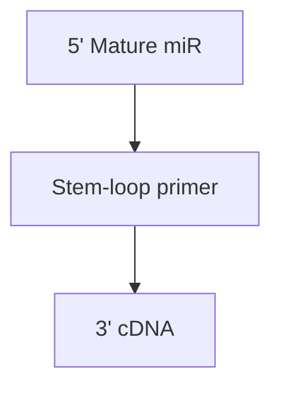
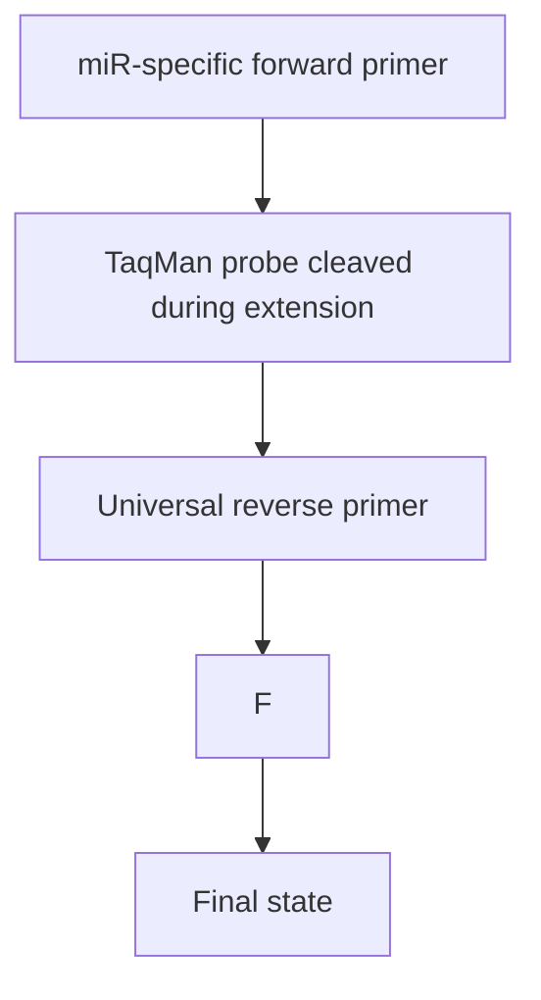
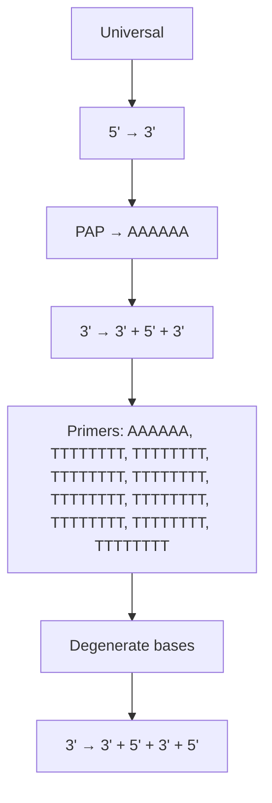
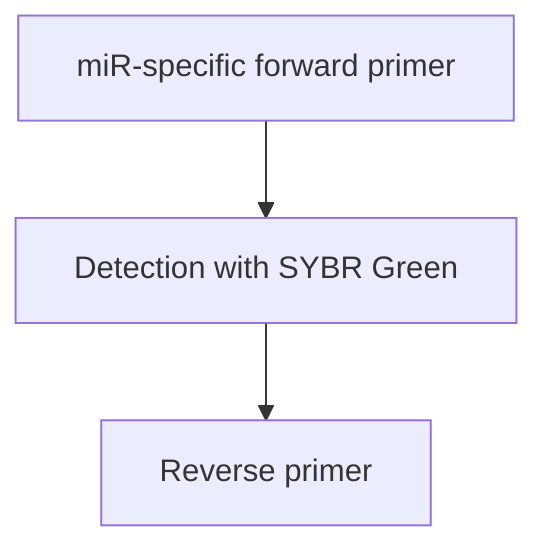
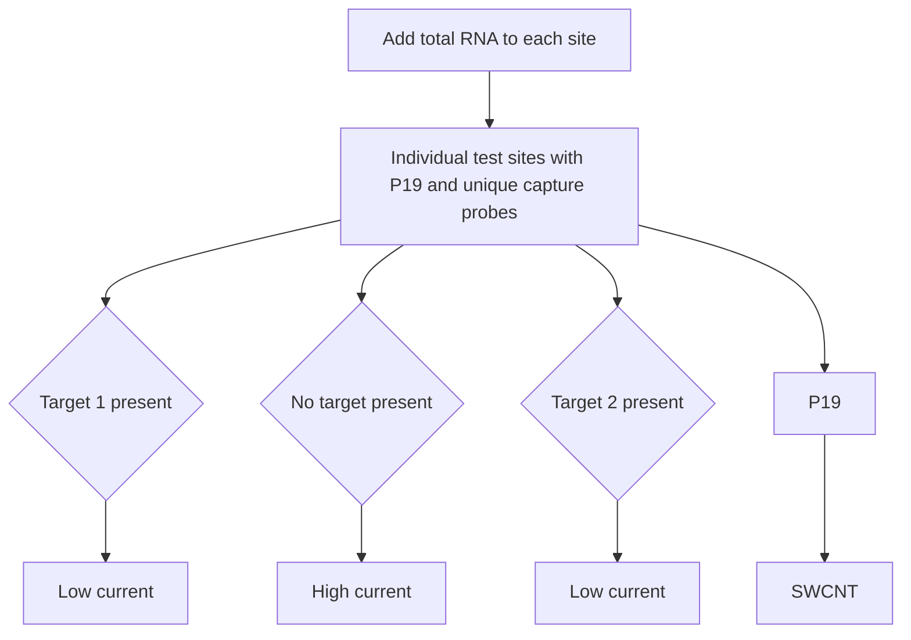
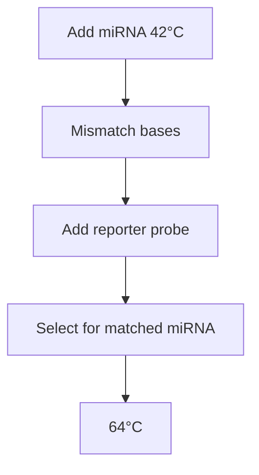

text_image

REVIEWS
IN ADVANCE

Review in Advance first posted online on May 6, 2015. (Changes may still occur before final publication online and in print.)

# MicroRNA Detection: Current Technology and Research Strategies

Eric A. Hunt, David Broyles, Trajen Head, and Sapna K. Deo

Department of Biochemistry and Molecular Biology, University of Miami, Miami, Florida 33136; email: sdeo@med.miami.edu

Annu. Rev. Anal. Chem. 2015. 8:3.1–3.21

The Annual Review of Analytical Chemistry is online at anchem.annualreviews.org

This article's doi: 10.1146/annurev-anchem-071114-040343

Copyright © 2015 by Annual Reviews. All rights reserved

# Keywords

ncRNA, Northern blot, microarray, RT-qPCR, RNA-seq, biosensors

# Abstract

The relatively new field of microRNA (miR) has experienced rapid growth in methodology associated with its detection and bioanalysis as well as with its role in -omics research, clinical diagnostics, and new therapeutic strategies. The breadth of this area of research and the seemingly exponential increase in number of publications on the subject can present scientists new to the field with a daunting amount of information to evaluate. This review aims to provide a collective overview of miR detection methods by relating conventional, established techniques [such as quantitative reverse transcription polymerase chain reaction (RT-qPCR), microarray, and Northern blotting (NB)] and relatively recent advancements [such as next-generation sequencing (NGS), highly sensitive biosensors, and computational prediction of microRNA/targets] to common miR research strategies. This should guide interested readers toward a more focused study of miR research and the surrounding technology.

# 1. INTRODUCTION

It has been slightly more than two decades since the first microRNA (miR) was discovered (1) and slightly more than one decade since the widespread regulatory power of miR was realized (2). In this short amount of time, the young field has experienced rapid growth in methodology associated with miR detection and bioanalysis as well as the role of miR in -omics research, clinical diagnostics, and new therapeutic strategies. The breadth of this area of research and the seemingly exponential increase in number of publications on the subject can present scientists new to the field with a daunting amount of information to review; indeed, even for scientists working in the field it can be a formidable task just to remain well informed. This review aims to provide a collective overview of miR detection methods by relating conventional, established techniques and relatively recent advancements (within the past few years) to common miR research strategies.

# 1.1. What is MicroRNA?

miR is a class of small, noncoding RNAs that post-transcriptionally regulate gene expression by acting on mRNA through association with an RNA-induced silencing complex to suppress its translation or effect its degradation. This review does not go into great detail on the biogenesis of miR and assumes a previous knowledge on the topic. Readers interested in a more in-depth review of the biogenesis and cellular function of miR are encouraged to consult some of the excellent reviews already published on these topics (3–8). The biogenesis of miR presents particular challenges, which this review references as they pertain to different detection methods. In particular, the presence of primary (pri-) and precursor (pre-) miRs and the potential for different sequence isoforms (isomiRs) derived from slight differences in upstream processing can be problematic for many detection techniques. Additionally, miRs of the same family may differ by only one base, making specificity a critical challenge in methods attempting to distinguish individual members. Most miRs are approximately 22 nucleotides in length, which is approximately the length of a standard PCR primer, and comprise only approximately 0.01% of the total RNA typically extracted from a sample (9). This means that miR detection techniques not only need to be specific, but also sensitive. Finally, because of their small size, miRs exhibit a wide range of $T_{ms}$ , making it difficult to optimize parallel reactions involved in their detection.

# 1.2. MicroRNA in Disease

As the function of miR was elucidated, it became clear that these small RNAs were capable of great things on the cellular level. To date, there is a large (and constantly growing) number of publications highlighting different mRNA targets under the control of miR. The expansive set of published miR sequences is housed in a searchable repository known as miRBase (http://mirbase.org), which is available for free online. It has been shown that a single miR can regulate hundreds of mRNAs and thereby control an entire expression network (10). Due to its immense regulatory power, aberrant miR expression levels have been implicated as a biomarker in several different forms of disease including neurodegenerative diseases (and CNS injury), diabetes, cardiovascular disease, kidney disease, liver disease, and even immune dysfunction (11–14). This biomarker trait is not only tissue specific, as miRs have also been isolated from extracellular, less invasive samples such as serum, saliva, and urine (15, 16). Of special interest is the involvement of miR in cancer, where it has been shown to be a biomarker for metastasis, chemoresistance, diagnosis, and prognosis and implicated in potential oncogenic moieties (16–19). The utilization of miR is also being explored as a potential form of therapy or treatment (17, 20). Using miR as a biomarker for disease is one of the many prominent trends driving the field of personalized medicine into fruition (21).

3.2 Hunt et al.

text_image

REVIEWS
IN ADVANCE
3.2

# 1.3. Common MicroRNA Research Strategies

The field of miR is at a crucial turning point. Although there is still much that is unknown about the mechanisms underlying miR function on the cellular level, researchers have answered many questions pertaining to how miR exerts its regulatory control over posttranscriptional processes, heralding a new era of miR research. In terms of miR detection, the nature of the research goal is the driving motive force behind selection of the appropriate method(s) of detection. Each set of methods has its own strengths and weaknesses and as such, these requirements should be carefully weighed to develop a successful miR research strategy.

# 2. CURRENT MICRORNA DETECTION TECHNIQUES

# 2.1. Conventional Techniques

2.1.1. Northern blotting. Northern blotting (NB) has been the method used in miR research since the initial discovery of lin-4 as a negative regulator of lin-14 in 1993 (1). The technique combines an electrophoretic separation—typically by denaturing urea-polyacrylamide gel—followed by transfer to a membrane, usually a positively charged nylon membrane by semidry capillary transfer. The miR is then hybridized with labeled probes and imaged. Traditionally ${}^{32}$ P-labeled DNA probes are used to visualize the blotted RNA. NB is the only technique that allows for the quantitative visualization of miR. The size separation step of NB enables the technique to be used for quantitative expression analysis of mature and pri-/pre-miR as well as for analysis of size variation of isomiRs from imprecision of Drosha and Dicer cleavage in upstream biogenesis of the mature miR (22–24). In comparison to other conventional techniques, NB suffers from low sensitivity (nM–pM) (25), low throughput, and high input RNA requirements (typically on the order of 5–50 $\mu$ g total RNA per sample) (26–30).

Radioisotopes ( $^{32}$ P) are the most commonly used labeling system for NB detection, but the use of radioisotopes poses several safety concerns for the researchers using them and the environment where they are disposed. Strict constraints pertaining to the use of radioisotopes often makes their use impractical or impossible, especially when an institution prohibits their usage (28, 30). In addition to these safety concerns, the use of radioisotopes greatly increases the amount of time required to perform the NB technique, and in some cases ${}^{32}$ P labels must be exposed for days to detect weak signals. To improve safety for researchers and reduce impact on the environment, the introduction of hapten-labeled probes coupled with enzymatic detection methods has been established (28). By labeling DNA probes with a 3'-digoxigenin (DIG) hapten, the authors were able to reduce exposure time to minutes or hours using a DIG-antibody conjugated alkaline phosphatase and a chemiluminescent substrate. Although this approach reduces exposure time, the use of hapten labels is not as sensitive as radioisotopic labeling. To compensate for this drop in sensitivity, other modifications have been made to the traditional NB method.

The use of locked nucleic acid (LNA) in NB probes yielded a tenfold increase in sensitivity as compared to traditional DNA probes and improved mismatch specificity $(29)$ . Another method reported an approximately 20-fold increase in sensitivity by cross-linking the RNA to the membrane using 1-ethyl-3-(3-dimethylaminopropyl) carbodiimide (EDC) $(27)$ . Typically, RNA is cross-linked to the membrane by UV irradiation, which likely proceeds through the uridine of the RNA. It is possible that this mechanism of linkage disrupts the subsequent hybridization of labeled probes and thereby reduces sensitivity. The EDC linkages should occur through the 5'-phosphate of the RNA, thereby linking the RNA to the membrane in a fashion more amenable to the subsequent hybridization step. A more recent method of NB for miR analysis utilizes

www.annualreviews.org • MicroRNA Detection

text_image

REVIEWS
IN ADVANCE
3-3

text_image

Bridge oligonucleotide
3' 5'
5' OH PO₄ 3'
T4 ligase
5' 5' DIG 3'

Figure 1   
DSLE [digoxigenin (DIG)-labeled, splinted-ligation, and EDC cross-linking] method for Northern blot analysis of miR. 5'-Phosphate of DIG-labeled probe (green) and 3'-hydroxyl of miR target (purple) are brought into proximity by adjacent hybridization to the bridge oligonucleotide (blue). T4 ligase repairs the nick, thereby generating labeled miR.

these improvements in conjunction with DIG-labeling in a technique termed LED (for LNA-modified probes, EDC cross-linking, and DIG-labeled). Kim et al. (26) reported an approximately 1,000-fold decrease in exposure time and could detect as low as 0.05 fmol of target RNA from approximately 3 $\mu$ g of total RNA. One of the major drawbacks of this method, however, is that LNA is proprietary technology and can increase the cost of hybridization probes by approximately 50-fold over traditional DNA probes. To help alleviate cost, another method termed DSLE (for DIG-labeled, splinted-ligation, and EDC cross-linking) was introduced (31). In this method, the miR target is attached to a universal DIG-labeled probe by splinted ligation—using an unlabeled bridge oligonucleotide to bring the two into proximity and T4 DNA ligase to join the 3'-OH of the miR with the 5'-phosphate of the universal DIG-labeled probe (32) (Figure 1). The method could be completed in 6–8 h and could detect 2 fmol of the RNA target using as little as 4 $\mu$ g of total RNA per sample. Although the authors acknowledge that their method was 200 times less sensitive than another method utilizing the same splinted-ligation procedure incorporating ${}^{32}$ P-labeled probes—presenting the same aforementioned safety concerns—DSLE at least demonstrated comparable results to methods utilizing LNA-modified probes (33). Although radioisotopic labeling is still the most sensitive method and LNA probes provide superior hybridization of labeled probes, these additional modifications to the traditional NB procedure provide important advancements that make it a viable method for miR detection in any laboratory setting.

2.1.2. Microarray. Similar to NB, microarray analysis of miR relies on the sensitive, specific hybridization of the target miR to a complementary DNA probe, the major difference being that it is the miR that is labeled in the microarray technique (note, however, some methods discussed below that do not require labeling of the miR target). Microarrays depend on the spatial organization of complementary capture probes on a solid phase. This limits hybridization of a specific target to a localized spot that is easily visualized with fluorescence/imaging instrumentation. It is this principle of design that has allowed microarrays to be among the first technologies capable of massively parallel analysis of hundreds of miRs simultaneously from one sample (9, 10). There are some inherent drawbacks to the microarray method. First, it is only semiquantitative and is most readily suited to compare relative expression levels of miR between different cellular states (e.g., diseased versus healthy). Therefore, the method requires some other form of validation, such as quantitative reverse transcription polymerase chain reaction (RT-qPCR), to quantify expression. Second, microarrays have a smaller dynamic range than other methods of detection such as RT-qPCR or next-generation sequencing (NGS), often causing a fold change compression that underestimates relative changes in miR abundance (9, 10, 34). Finally, as microarray is a

Hunt et al.

text_image

REVIEWS
IN ADVANCE
3.4

hybridization-based method, specificity can be an issue between closely related sequences. Several advancements and modifications have been made to address these issues related to microarrays.

Because all target sequences are analyzed in parallel on a microarray, it follows that the entire chip must undergo the same set of hybridization conditions. Because miRs exhibit a wide range of $T_{m}$ s (in the range of 45–74°C) (35) it is has been historically problematic to obtain $T_{m}$ -matched probe sets for full expression profiling using DNA oligonucleotides. The introduction of LNA into the microarray probe sets allowed for $T_{m}$ normalization and simultaneously improved specificity and mismatch discrimination using 2.5–5 $\mu$ g of total RNA (36). An additional benefit to the use of this platform is that it required no preamplification or fractionation steps to enrich the miR content. In a similar fashion, oligonucleotides modified with 2'-O-(2-methoxyethyl) nucleic acid analogs—which exhibit enhanced hybridization affinity/specificity to RNA—have been employed to normalize the $T_{m}$ of microarray capture probe sets (37).

The most common method of miR labeling is by enzymatic attachment of the label. There are two main approaches used. In one approach, T4 ligase is used to attach a fluorescently labeled nucleotide or short oligonucleotide to the 3'-OH of the RNA. However, because miRs have a 5'-phosphate, there is the possibility of circularization by intramolecular ligation instead of labeling (9, 10, 38). This complication can be avoided by adding another enzymatic step to dephosphorylate the miR before the labeling step. In the second approach, a 3'-polyA tail is added to the miR using polyadenylate polymerase (PAP). Once the tail is in place, a bridge oligonucleotide with complementary polyT region aligns the 3'-OH of the miR with the 5'-phosphate of another labeled oligonucleotide for splinted ligation (as previously outlined for NB). Although this method avoids potential circularization, the polyadenylation is not controlled and a variable number of adenosine ribonucleotides may be added to the tail of the miR, thereby possibly affecting subsequent hybridizations (9, 10). Enzymatic labeling methods are convenient for miR analysis; however, the enzymes used often exhibit a bias toward certain substrates or sequences and introduce artifacts into the apparent abundance of affected miRs. Additionally, the presence of pri-/pre-miR can also introduce artifacts into the microarray results. The addition of 5' hairpins to the capture probes has been used to distinguish the mature miR from its pri-/pre-miR forms (39) (Figure 2a). Li & Ruan (38) highlight a more expansive overview of miR labeling methods.

Although technical replicates for microarrays typically show good reproducibility, several studies have indicated a lack of interplatform agreement in expression profile data (34, 40–43). Much of this inherent variability arises from the labeling step and selection of controls. For commercially available microarrays, each company goes about treatment of the RNA sample differently and thereby introduces different artifacts and biases into the data as a result of the imperfections inherent in each labeling method (35, 44). Because of the bias introduced by labeling, some methods aim to replace or remove the traditional miR labeling step with alternative approaches—as Lee et al. (45) describe using a biotin-labeled structure-specific RNA binding protein (PAZ-dsRBD derived from Argonaute proteins) to recognize array captured miR targets (Figure 2c). A hybridization mechanism dependent on base stacking (termed stacking-hybridized universal tag or SHUT) allowed for the use of a universal reporter probe for all miR sequences on the array (46, 47). The capture probes are designed such that the universal reporter probe requires base-stacking stabilization provided by the target miR to remain bound (Figure 2b). Without the presence of the target miR, the universal reporter probe dissociates and is washed away, resulting in no signal generation. Another method that replaced the miR labeling step is the RNA-primed array-based Klenow enzyme assay, which performs a posthybridization labeling of the capture probe using the annealed miR target as a primer (48). The capture probes are covalently attached via their 5' end to the microarray solid phase. Moving out from the solid phase, the probes consist of a common spacer, three thymidine residues, and an antisense sequence to

www.annualreviews.org • MicroRNA Detection

text_image

Universal tag
5' hairpin
3'
PAZ
dsRBD
Ligation
3'
5'
5'
a
b
c
d
Labeled probe

Figure 2   
Various methods for microarray-based miR detection. (a) 5' hairpins help select for mature miR form only. (b) SHUT assay: universal tag hybridization dependent on base-stacking stabilization provided by adjacently hybridized miR. (c) Label-free method utilizes PAZ-dsRBD fusion which recognizes 3' overhang and dsRNA structure of hybridized miR. (d) LASH assay: label-free method uses adjacent binding of capture probe and labeled hairpin probe to facilitate ligation. Abbreviations: LASH; ligase-assisted sandwich hybridization; PAZ, Piwi/Argonaute/Zwille; SHUT, stacking-hybridized universal tag.

the miR of interest. Following hybridization of the target miR, remaining single-stranded probes are digested away from the solid-phase with exonuclease I, and the Klenow fragment of DNA polymerase I is used to add biotinylated adenosine residues, priming from the bound miR. These biotins are then used to generate a signal using fluorophore-conjugated streptavidin. A recent publication outlined a method termed ligase-assisted sandwich hybridization, which utilized both base-stacking stabilized hybridization and a process similar to the previously discussed splinted-ligation method. This method was able to detect a synthetic miR target down to 30 fM (10 amol) and closely matched results from RT-qPCR using 1 $\mu$ g of total RNA extracted from blood (49). This was also considered a label-free method, as a labeled, miR-specific hairpin probe was ligated to the target miR and capture probe to yield a signal (Figure 2d). Currently, most available, established commercial microarrays are label based and require on the order of tens to hundreds of nanograms of total RNA, exhibiting nanomolar to picomolar detection limits (9, 25).

2.1.3. Quantitative reverse transcription polymerase chain reaction. If any method could be considered a single gold standard among miR detection techniques, it would be RT-qPCR as it offers a good balance between cost, precision, and sample size along with a large functional dynamic range. It is used to validate results from whole-genome screening methods, such as microarrays and NGS, and in the screening of clinically relevant subsets of miRs (50). The goal of many research strategies is to obtain a full miR profile of a specific tissue or patient-derived sample, and in that regard, as a trusted method of miR detection, RT-qPCR has been advanced to achieve these goals. However, given the breadth of miR research strategies, application of RT-qPCR to all of these realms presents significant challenges, especially when considering the wide range of miR sources and the host of methods used to extract RNA from them (see sidebar, The Importance Of Sample Preparation and RNA Extraction). Although it stands true for every method, it is especially true for RT-qPCR that the quality and reliability of the result is dependent on the quality of the input RNA, as any degradation can introduce errors that will be amplified further during the reverse

Hunt et al.

text_image

REVIEWS
IN ADVANCE
3.6

flowchart

flowchart

flowchart

flowchart

Figure 3   
RT-qPCR: methods for cDNA synthesis by reverse transcription using miR-specific (a) or universal (b) primers. Two fluorescent methods are used for monitoring miR qPCR: TaqMan (c) polymerase exonuclease activity releases fluorophore during PCR extension; SYBR Green (d) fluorescent dye intercalates into dsDNA produced by PCR amplification. Abbreviations: PAP, polyadenylate polymerase; PCR, polymerase chain reaction; RT-qPCR, reverse transcription quantitative polymerase chain reaction.

transcription (RT) and real-time/quantitative (qPCR) steps. It is important to have good quality control and to check the integrity of the RNA before beginning the actual detection portion of the protocol.

The first step in RT-qPCR is to convert the extracted RNA from the sample to cDNA by RT. There are two main approaches typically used to do this: (a) using miR-specific RT primers and (b) extending all miRs with a common sequence so that RT may be performed using a universal primer (Figure 3). Each method has its benefits and disadvantages. Some laboratories may prefer to perform a fractionation of the RNA extract to remove the pri-miR sequences and to lower unwanted background in the qPCR; the pre-miR sequences are smaller and not always removed

www.annualreviews.org • MicroRNA Detection

in this step. However, newer methods of cDNA synthesis, specifically the use of miR-specific stem-loop primers, avoid the need for precedent fractionation and can distinguish between different miR forms (54). The miR-specific primers may also possess a linear segment in place of a stem-loop structure at their 5'-end, although both of these variants contain an miR antisense portion of approximately 6–8 nucleotides on their 3'-end. Independent of structure, the 5'-end contains a common sequence for priming qPCR (9, 10, 50). Although the linear primers are easier to design, the stem-loop primers are better at specifically targeting the mature miR form, and thus provide enhanced specificity and reduced qPCR background. Although this is beneficial for getting more accurate quantitation of mature miR, it does hinder the RT of isomiR sequences (9). In both cases, RT primers should be designed such that annealing can be done at lower temperatures (usually 16°C), as this helps preserve pri-/pre-miR secondary structures (thus keeping the template sequence sequestered) and thereby reduce RT of those longer, potentially unwanted miR forms (50). In contrast to using miR-specific primers, the second method uses a universal RT primer to synthesize cDNA. This is done in one of two ways. In the first, PAP is used to extend the miR population with a polyA tail. An RT primer containing a universal qPCR primer sequence followed by a polyT segment then binds to the extended miR for cDNA synthesis—the number of thymine residues incorporated in the cDNA is selected for by aligning the RT primer to the 3'-end of the miR using degenerate bases (usually three) that can base pair with more than one base. A downside to this method is that PAP extends all RNAs in the sample, including pri-/pre-miR sequences, and it does not allow for optimized primers for miR sets with widely varying $T_{m}$ s (50). In the second universal method, T4 ligase is used to ligate a common sequence to all miRs in the sample and then cDNA is synthesized with a universal RT primer. The use of these common sequence RT methods shifts the selection process for mature forms of miR to the qPCR step, which we discuss below. Another novel method of cDNA synthesis worth mentioning is the RT method used in miR-ID. In this method, miR in the sample is circularized through intermolecular ligation and reverse transcribed to produce tandem repeats of the cDNA sequence. This approach allows for great control over qPCR primer placement to distinguish between miR forms (55).

Once the cDNA is synthesized, qPCR can begin. This proceeds in a straightforward fashion using a miR-specific and universal qPCR primer set. The two fluorescent systems used for monitoring qPCR of miR are SYBR Green and TaqMan probes (Figure 3). The major challenge in the qPCR step arises again from the broad range of $T_{m}$ s exhibited by miR, which makes running an array of simultaneous reactions difficult. This problem can be alleviated by using LNA-containing primers to tune all reactions to an optimal set of conditions. Indeed, the added specificity of hybridization brought about by using LNA-modified primers for qPCR (such as the miRCURY LNA qPCR platform offered by Exiqon) enables discrimination between mature and pri-/pre-miR forms independent of the cDNA synthesis method used (9, 10, 44, 50). It is important to perform internal tests such as a ten-fold dilution (which should correlate to 3.32 cycles) to determine amplification efficiency and to perform a melting curve experiment to determine amplification specificity. The latter is especially important for the SYBR Green method in which the dye intercalates into any dsDNA product (12). Perhaps the most difficult part of RT-qPCR is analyzing the data after it is generated. As miR represents only \~0.01% of total RNA extracted from a sample, the effective amount present can experience wide variability depending on the sample preparation and extraction yield and integrity (see sidebar, The Importance Of Sample Preparation and RNA Extraction). As such, the normalization of miR profile data is of utmost importance, not only in RT-qPCR, but in all profiling techniques (56). The variety of sample types profiled—i.e., cells, tissues, and extracellular fluids such as blood, urine, and saliva—make the use of common values in other analyses such as cell count invalid as normalization factors. Similarly, miR enrichment procedures often remove other RNAs that may serve as normalization factors, such as rRNA.

text_image

IN ADVANCE
3.8

Hunt et al.

# THE IMPORTANCE OF SAMPLE PREPARATION AND RNA EXTRACTION

Given the evidence that miR profiles could potentially become predictive biomarkers for disease states, researchers are endeavoring to develop powerful bioinformatics approaches by analyzing routinely preserved samples such as formalin-fixed paraffin-embedded (FFPE) and laser-capture microdissected samples (50–52). Although mRNA is not stable in such sample preparations, miR has been demonstrated to be quite resilient. The performance of RT-qPCR in profiling such samples has been shown to be largely dependent on the quality, i.e., purity and integrity, of input RNA. Purity is typically measured by spectrophotometric methods, and most modern instruments can monitor integrity using automated capillary electrophoresis to determine the 28S/18S rRNA ratio. Low integrity RNA contains small RNA fragmentation that can cause overestimation of the miR contribution (53). Additionally, large RNAs usually exhibit a carrier effect and therefore the amount of miR present is dependent on the amount of total RNA (50).

Most groups currently use a so-called housekeeping or reference gene such as snRNA U6, or a geometric mean of multiple reference genes to normalize their data (12, 56–58). In addition to these types of normalization, it is also important to include the proper internal and external controls to account for plate or slide variation and potential human error such as pipetting error (35, 56).

# 2.2. Biosensor Techniques

Often simple advances in methodology can be applied to several different systems with drastic improvement to sensitivity and/or selectivity (e.g., two temperature hybridization protocols for solid-phase and surface-modified capture systems) (59, 60). This has been increasingly evident as traditional detection systems have been gradually adapted to conductive surfaces for electrochemical detection schemes. Generally, the most significant advances for uniplex or small-scale multiplex platforms have been those that increase assay sensitivity for a specific subset of miR targets, whereas array-type profiling systems have seen the greatest benefit from more capable discrimination of isomiRs and familial variation for enhanced interassay (or even intra-assay) agreement. Although these characteristics are in no way divergent, the end-user of a particular platform or methodology has often been required to balance sensitivity and selectivity to maximize assay utility toward their unique application. This becomes most apparent as the number of miR targets increases, when $T_{m}$ diversity and expression variants begin to exert more influence on overall signal quality (10). Thus, many recent attempts at platform development (both uniplex and multiplex) have capitalized on adapting high-sensitivity transducers to novel, selectivity-enhanced recognition elements. As many excellent reviews (25, 61–65) have provided in-depth background on the various biosensor platforms and techniques, we limit our discussion to recent examples of this trend that utilize direct (unlabeled) miR detection methods.

2.2.1. Electrochemical-based detection. A recent development in hybridization-based miR assays is the incorporation of electrochemical impedance spectroscopy (EIS), a technique frequently associated with electrode surface characterization during sensor construction, as a means of detecting specific hybridization events (66). This rather complex technique has been adapted to detect impedance changes associated with variable charge transfer at the surface of an electrode, with measurements typically obtained using coordinated metal ion redox probes. One strategy involves the selective deposition of a charge-transfer resistant (insulating) layer

www.annualreviews.org • MicroRNA Detection

text_image

REVIEWS
IN ADVANCE
3.9

(67, 68) that accumulates on a capture probe-functionalized electrode surface in the presence of surface-targeted anionic species (miR). Immobilization of this layer can be performed via catalytic polymerization using horseradish peroxidase or, in the case of Reference 67, G-quadruplex hemin in conjunction with $H_{2}O_{2}$ . To minimize background, these systems can also incorporate a charge-neutral capture sequence composed of peptide nucleic acids or Morpholinos (69), although Ren et al. (70) managed approximately the same detection limit using standard DNA antimiR capture probes. Additionally, they found that the capture probe monolayer could double as the insulating layer and were able to leverage signal amplification by combining detection and target recycling via removal of target-hybridized capture probes using duplex-specific nuclease.

Selective removal of capture probes can also be applied to other electrochemical techniques, as clearing the electrode surface often enhances charge-transfer events. Gao & Peng (71) applied this concept to the amperometric detection of three miRs differing in length by up to 10 nucleotides. By combining Surveyor® mismatch-selective nuclease and exonuclease I single-strand-specific nuclease with an electrode-bound monolayer of miR-specific capture probes, only perfectly bound target miR could prevent capture probe digestion. When combined with glucose oxidase-functionalized reporter probes, this platform provided a detection limit of approximately 10 fM with extremely high mismatch selectivity (Table 1).

Table 1 Recent advances in electrochemical miR detection 

<table><tr><td>Principle</td><td>Reporter</td><td>Detection</td><td>LOD</td><td>Sample</td><td>Reference</td></tr><tr><td>PNA-decorated Au nanobead</td><td>G-quadruplex hemin,  $H_2O_2$ -initiated polyaniline deposition</td><td>EIS</td><td>0.50 fM</td><td>Total RNA extract</td><td>67</td></tr><tr><td>Carbon nanotube-bridged field-effect transistor decorated with p19</td><td>None</td><td>Resistance</td><td>1 aM</td><td>Total yeast RNA</td><td>76</td></tr><tr><td>Capillary electrophoresis, p19</td><td>Fluorescent dye</td><td>Laser-induced fluorescence</td><td>0.5 fM</td><td>Serum</td><td>80</td></tr><tr><td>DNA capture probe-functionalized Au electrode</td><td>Glucose oxidase, Os(bpy) $_2$ (API)Cl</td><td>Amperometry</td><td>10 fM</td><td>Total RNA extract</td><td>71</td></tr><tr><td>Target-assisted EXPAR on Au electrode</td><td>Streptavidin-alkaline phosphatase, α-naphthol</td><td>Differential pulse voltammetry</td><td>98.9 fM</td><td>None</td><td>81</td></tr><tr><td>Graphene/Au nanoparticle-decorated Au electrode with LNA stem-loop and bio-barcode</td><td>Streptavidin-horseradish peroxidase,  $H_2O_2$ , hydroquinone</td><td>Chronoamperometry</td><td>6 fM</td><td>Total RNA extract</td><td>84</td></tr><tr><td>DNA tetrahedral scaffold on Au electrode</td><td>Avidin-horseradish peroxidase,  $H_2O_2$ , TMB</td><td>Amperometry</td><td>10 aM</td><td>Total RNA extract</td><td>74</td></tr><tr><td>Hybridization chain reaction on graphene/Au nanoparticle substrate</td><td>Methylene blue</td><td>Differential pulse voltammetry</td><td>3.3 fM</td><td>Serum</td><td>83</td></tr><tr><td>PNA-decorated Si nanowire</td><td>None</td><td>Resistance</td><td>1 fM</td><td>Total RNA extract</td><td>99</td></tr><tr><td>Nanopore diffusion using PEG barcode</td><td>None</td><td>Ionic current</td><td>100 fM</td><td>None</td><td>101</td></tr></table>

Abbreviations: EIS, electrochemical impedance spectroscopy; EXPAR, exponential amplification reaction; LNA, locked nucleic acid; LOD, limit of detection; PEG, poly(ethylene glycol); PNA, peptide nucleic acid; TMB, tetramethylbenzidine.

For many electrochemical techniques, however, inaccessibility to or loss of the selective capture region on the electrode surface is detrimental to overall assay sensitivity. In these cases, it often becomes a sensitivity compromise between the density of surface-immobilized capture probes and the diffusion of electroactive species. A recent advancement involves the use of DNA-based scaffolds (72–74) that form a tetrahedral platform for capture probe immobilization. In addition to providing reproducible capture probe orientation, this scaffold provides a rigid, isolated pedestal that abrogates nonspecific interaction of the capture moiety with the surface while providing reduced surface density for better mass transport characteristics. These enhancements serve to increase the signal-to-noise ratio and allow detection limits as low as 10 aM (72, 74).

Increasingly, electrochemistry has proven highly amenable to incorporation of the Carnation Italian ringspot virus (CIRV) protein p19 as a selectivity agent for mature miR transcripts (75). This molecular caliper can sequester dsRNAs ranging from approximately 21 to 23 nucleotides with no interference from ssRNAs or heteroduplexes (76) and has shown utility for discriminating miR/probe duplexes using various techniques including differential guanine oxidation (77), resistance changes (76), and square-wave voltammetry/EIS (78). Given the difficulty of applying electrochemical techniques to complex matrices, p19 also offers an attractive secondary benefit of purifying miR from total RNA extracts (79) or even from high-background matrices such as serum (80) for a broader repertoire of direct analyses.

Other methods to increase analytical sensitivity have focused on alternative signal amplification techniques in an attempt to provide direct detection without requiring external enrichment of endogenous targets. One strategy relies on internal target enrichment via the isothermal exponential amplification reaction (EXPAR). Although specific methodologies are diverse (81, 82), the amplification of a dual-domain probe containing a central, antisense recognition site for a nicking enzyme is the basic requirement for target enrichment. The 5' domain will always correspond to the target sequence, whereas the 3' domain can recognize either target or primer. Capture at the 3' domain allows polymerase to extend this sequence along the entire capture probe for duplication of the target and incorporation of the nicking site. A nicking endonuclease subsequently regenerates the intact target sequence for detection or entry into the amplification cycle as either primer or primer generator. Alternatively, the signaling moiety can be amplified, and authors have explored the use of hybridization chain reaction (72, 83) in which a hybridization cascade is initiated upon target capture; triple signal amplification (84) that allows a barcoded, branched structure containing 3 distinct signaling moieties to be captured by target in a bridged format; and poly-HRP80 (74) containing hundreds of individual HRP molecules.

2.2.2. Optical-based detection. A significant benefit to optical detection lies in platform flexibility, as surface immobilization is not required for signal transduction. Additionally, optical methods are often less susceptible to interference from matrix components, as signal attenuation becomes most apparent only at high concentrations of absorbing species. As a result, optical methods are ideally suited to direct detection with minimal purification requirements. A diverse set of optical techniques are available, and as these are thoroughly reviewed elsewhere (25, 85), our discussion is limited to recent enhancements that offer potential for increased sensitivity and selectivity using fairly standard techniques.

The microarray has been the workhorse of miR profiling for more than a decade, but a significant drawback to this technology is the requirement for end-labeling miR sequences prior to analysis. As previously mentioned, the SHUT assay (46) makes use of the energy-minimizing arrangement of bases that occurs upon sequence annealing to utilize a universal signaling probe that will reliably hybridize to an immobilized capture probe only when a target sequence completely complementary to the capture probe is present. This arrangement allows mismatch selectivity at

www.annualreviews.org • MicroRNA Detection

either terminus and reasonable sensitivity (low femtomolar LOD) on an array-style platform that has been exploited in traditional fluorescence-based detection schemes (46, 86) as well as a unique (although preliminary) electrochemiluminescence (ECL) platform (87).

As with electrochemistry, ECL benefits from signal amplification techniques arising from variations of hybridization chain reaction. Enhancement results from the dramatic increase in double-stranded reporter construct as the hybridization cascade proceeds, given that various coreactants in the ECL reaction can be intercalated within the reporter (88, 89). Although the potential for false positives in a format already designed around competitive target displacement seems rather substantial, sensitivities fell within the femtomolar range, indicating that target recycling was likely increasing the signal-to-noise ratio. This effect was demonstrated in a solution-phase molecular beacon assay that relied on signal enhancement from double-stranded nuclease-induced target recycling (90). Upon commencement of the target recycling phase, the detection limit decreased from 0.16 nM to 0.6 fM, whereas the dynamic range increased from 2 to 5 orders of magnitude. A similar technique described previously for electrochemical-based biosensors (EXPAR) can also be adapted for optical systems (91). Although this approach yields detection limits moderately higher than those demonstrated on electrochemical systems, the method itself provides important benefits, such as occurring in the solution-phase, being self-contained, and possibly being adaptable to in situ or in vivo techniques using a tethered double-stranded nuclease.

For methods that normally are label-free such as surface plasmon resonance and silicon photonic microring resonators, the addition of semiselective labels that recognize only the duplex formed upon target capture allows signal amplification analogous to target recycling. This approach can take the form of antibodies that recognize heteroduplexes (92) or the target-bridged capture of streptavidin functionalized with biotinylated antisense probes (93). In both cases, the labels enhance the target signal by a reproducible value that permits quantification.

In many instances, time-to-result (TTR) is a critical aspect of biosensor application, and there is significant diversity of platform design that enables rapid detection. One advancement in this area involved the CIRV protein p19, mentioned previously for electrochemical applications. In this work, p19 has been paired with fluorescence polarization to provide selective detection of miR-122 at low picomolar levels within 3 min (94). Likewise, Arata et al. (95) designed a microfluidic device based on laminar flow-assisted dendritic target amplification that generated a 0.5 pM detection limit within 20 min without a requirement for external power. A familiar point-of-care packaging was used to house a lateral-flow assay for the presence of miR-215, and a 75 pM aliquot could be visually observed and quantitatively detected within 20 min due to the effects of Au nanoparticle aggregation (96). As these techniques continue to evolve and advance, increased detection efficiency concurrent with decreased TTR will remain important benchmarks for biosensor quality assessment.

2.2.3. Application of nanotechnology. The merging of nanotechnology with commonly implemented assay design has sought to improve the efficiency of charge transfer for increased sensitivity detection as well as to increase the surface area available for probe immobilization. At the forefront of both goals, carbon nanotubes have practically revolutionized electrode design. High susceptibility to changes in conductivity coupled with a three-dimensional structure have allowed 1 aM detection limits in the previously described p19/field-effect transistor assay (Figure 4), and Tran et al. (97) were still able to maintain a dynamic range of 10 fM-1 nM using multi-wall carbon nanotubes decorated simply with DNA capture probes. Carbon nanotubes also possess the capability to integrate photonic and electrochemical techniques, as demonstrated by a signal-off assay incorporating a quantum dot-labeled capture probe that is noncovalently associated with single-wall carbon nanotubes (SWCNTs) immobilized on an indium tin oxide chip (98).

Hunt et al.

text_image

REVIEWS
3.12
ADVANCE

flowchart

Figure 4   
Example of an ideal electrochemical miR detection platform (Ramnani 2013). Total RNA (ideally in a bodily fluid matrix) is transferred to the wells of an electrochemical array. Each well contains Carnation Italian ringspot virus (CIRV) p19 covalently immobilized to single-wall carbon nanotubes (SWCNTs) that bridge a gap between two Au electrodes. Unique capture probes are then added to each well, and any mature, antisense target miR will be captured selectively by the combined actions of the capture probe and the dsRNA-specific p19. Target immobilization will be evident in a dose-dependent increase in resistance across the SWCNT.

In the absence of the target, the capture probe remained associated with the SWCNTs and converted photonic quantum dot emission to a high photovoltaic current. However, upon target hybridization, dissociation of the capture probe from the SWCNT surface resulted in signal quenching, whereas DNase I digested the DNA portion of the heteroduplex for amplification via target recycling. A similar system of signal amplification designed for solution-phase detection relied on the formation of a three-way junction consisting of the target sequence, an assistant probe, and a $Hg^{2+}$ -intercalated molecular beacon (90). Upon complex formation, the intercalated $Hg^{2+}$ is liberated, being made available to quench Ag nanocluster reporters, while a nicking endonuclease cleaves the molecular beacon probe and liberates the target for recycling.

www.annualreviews.org • MicroRNA Detection

3.13

-2

text_image

A
R

S

E

${A}_{D}{V}^{A}$

flowchart

Figure 5   
Example of a recent optical-based miR detection scheme (Kang 2014). Peptide nucleic acid capture probes are covalently immobilized on Au nanowires. Upon introduction of target at $42^{\circ}$ C, some tolerance for mismatches exists, but only single mismatches will be allowed. After initial hybridization, the temperature is ramped to $64^{\circ}$ C in the presence of reporter-functionalized probes, and only perfectly matched target sequences retain the reporter strand and remain immobilized on the nanowire. Detection results from surface-enhanced Raman scattering, as only probes that remain proximal to the nanowire are detected.

Operating on essentially the same principle as carbon nanotubes, nanowires have the potential to reduce systemic complexity by replacing the traditional electrode while still providing greatly enhanced surface area. Zhang et al. (99) realized a detection limit of 1 fM with excellent single-mismatch selectivity using a network of silicon nanowires decorated with peptide nucleic acid capture probes, whereas capture-probe-decorated Au nanowires operating in a target-bridged reporter format were able to achieve a 100 aM LOD using surface-enhanced Raman scattering (59) (Figure 5).

In addition to the moderately well-established miR detection techniques utilizing nanotubes and nanowires, progress has been made recently through the application of nanopores for miR detection. Although not nearly as well developed as these other nanotechnologies, nanopores have the opportunity to rival the capabilities of this diverse set of platforms owing to their extreme selectivity, label-free operation, and (in the case of synthetic nanopores) flexibility in design for extreme analyte specificity in complex matrices (100). A drawback to this approach is that the regularity of miR structure (especially size) makes it currently impossible to distinguish individual

Hunt et al.

text_image

REVIEWS
IN ADVANCE
3.14

miRs based on nanopore transit (101). A fairly recent report demonstrated divergent signals for similarly sized duplex DNA and RNA as well as for tRNA on a silicon nitride membrane containing synthetic nanopores (79), but no attempt was made to discriminate divergent miR sequences. Zhang et al. (101) addressed this limitation by generating a clicked polyethylene glycol barcode of variable length that could be appended to a selective capture strand. The size of the barcode determined the blocking efficiency of ionic current through the nanopore and served as a specific marker for positive capture of a unique miR sequence. This design allowed them to discriminate four unique miR signatures, and while the estimated detection limit was acceptable ( $\sim$ 100 fM), no data concerning mismatch selectivity was presented.

# 2.3. Other Techniques

Another method that may interest readers is size-coded ligation-mediated PCR in which miR sequences act as a guide for the adjacent hybridization of two size-coded DNA probes that are subsequently ligated together. Probes of different, unique lengths are designed to use a target miR to guide ligation, and each probe contains a universal primer sequence for PCR amplification. Upon successful amplification, the products can be separated by gel electrophoresis and identified by their size, which directly correlates to the miR used to initiate ligation (102). Another hybridization-based platform with similar application to microarrays or RT-qPCR is the fully automated, digital-count profiling NanoString nCounter® system (103). In this method, miR sequences act as a guide for adjacent hybridization of a sequence-specific capture probe labeled with biotin and a reporter probe labeled with a unique four-color, seven-position barcode. The hybridized constructs are purified and bound to a streptavidin-coated slide where a voltage is applied to elongate the molecules. The elongation allows for the digital imaging and counting of the uniquely barcoded miR targets.

2.3.1. Next-generation sequencing. Although each of the aforementioned techniques and platforms present beneficial approaches to miR detection with promising avenues for advancement, we anticipate NGS technology becoming the leading methodology in miR research. This does not mean other methodologies such as microarrays will disappear; on the contrary, validation of results will always be a requirement in miR research (44). Some of the primary reasons that NGS has not been considered leading in miR bioanalysis are its cost and the relative complexity involved in analyzing the large amounts of data it produces. These issues are being resolved, however, as the technology itself matures and bioinformatics infrastructures capable of handling and processing large amounts of data are becoming more commonplace (10, 12, 104). NGS of RNA (also called deep sequencing or RNA-seq) is perhaps the only technique that exposes the immense variation inherent in miR processing. The heterogeneity of miR (e.g., isomiR or single-nucleotide changes) can be problematic for other techniques that lack the ability to identify these other miR forms, which could potentially exert similar regulatory pressures as the related known miR targets. However, one should keep in mind that the NGS method is not constrained to previously reported miR sequences logged in miRBase (as is the case with microarrays or RT-qPCR), and although this means novel miR sequences may be discovered, not every small RNA read obtained will be a functional miR. This is part of the issue keeping NGS technology from being widely adapted in the clinical setting—it takes considerable computational and validation effort to distinguish meaningful data from the noise.

Currently, the two leading NGS technologies are Illumina HiSeq 2500 and SOLiD, especially in the realm of miR analysis. 454 is also a leading NGS technology but by 2016 will no longer be supported by Roche (105); it is therefore not discussed here. For an excellent overview of NGS technology, readers should consult the previous review (106) on this topic. Although the relatively

www.annualreviews.org • MicroRNA Detection

short maximum read length of SOLiD could be considered a disadvantage in other applications, this characteristic in miR applications is not a problem. In fact, it is well suited for miR analysis as it is the second highest throughput system (second to the Illumina HiSeq 2500 system) and offers the lowest error rate in reads as each sequence is read both forward and backward (105). A recent publication demonstrated the viability of NGS in miR profiling by comparing it to microarray and NanoString nCounter® methods, along with validating results with RT-qPCR, analyzing cell line and xenograft samples, as well as flash-frozen and FFPE samples (34). Results demonstrated that, as with RT-qPCR, NGS exhibits a wide dynamic range and does not suffer from the same fold-change compression as the microarray or NanoString nCounter® methods. It was also demonstrated that NGS shows good correlation between flash-frozen and FFPE samples in global miR profiling and could therefore be applicable for the analysis of clinical samples. Although NGS certainly still has a long way to go before it is as readily adopted as conventional techniques such as microarray or RT-qPCR, it definitely shows promise in being a powerful tool for miR detection and discovery.

# 3. BIOINFORMATICS AND MICRORNA TARGET PREDICTION

The difficulty in correlating miR expression with mRNA targets for clinical applications is multifaceted but stems most directly from the inherent uncertainty with which we identify miR target sequences. As opposed to siRNA, miR does not require a perfect antisense match against a potential mRNA target, nor is the target region as clearly defined as it was when the local search area was confined to the 3' untranslated region (UTR). Currently, bioinformatics approaches still rely on 3' UTR matches to the seed region at the 5' end of putative miR, although newer approaches are integrating the coding region into search parameters (107, 108). These dual-region searches can also take advantage of the higher conservation of coding regions (108) to increase search accuracy across species. For in-depth descriptions of current identification algorithms, several excellent reviews have recently become available (21, 109–111).

Target validation presents an additional challenge in that disruption of a pathway is rarely dependent on a single miR, so it becomes difficult to conclude with certainty that an observed in vivo effect can be correlated to manipulation of one pathway interactor. Moreover, the lack of in vivo validation means that consensus-derived target prediction suffers from an incomplete set of identification parameters; as such, prediction becomes more of an educated guess, having to sort through massive databases for a short list of potentially therapeutic miRs. It is, therefore, imperative that collaborative inquiry bridges the gap that develops between the clinical and molecular methods with a strong biostatistical foundation to provide only the most relevant information for integration into translational therapies. As the technologies discussed in this review continue to be developed and applied, this foundation will continue to expand as the function and mechanism of miR are elucidated, ultimately narrowing this gap.

# DISCLOSURE STATEMENT

The authors are not aware of any affiliations, memberships, funding, or financial holdings that might be perceived as affecting the objectivity of this review.

# LITERATURE CITED

1. Lee RC, Feinbaum RL, Ambros V. 1993. The C. elegans heterochronic gene lin-4 encodes small RNAs with antisense complementarity to lin-14. Cell 75:843–54   
2. Ambros V. 2001. microRNAs: tiny regulators with great potential. Cell 107:823–26

Hunt et al.

text_image

REVIEWS
IN ADVANCE
3.16

3. Ha M, Kim VN. 2014. Regulation of microRNA biogenesis. Nat. Rev. Mol. Cell Biol. 15:509–24   
4. Finnegan EF, Pasquinelli AE. 2013. MicroRNA biogenesis: regulating the regulators. Crit. Rev. Biochem. Mol. Biol. 48:51–68   
5. Winter J, Jung S, Keller S, Gregory RI, Diederichs S. 2009. Many roads to maturity: microRNA biogenesis pathways and their regulation. Nat. Cell Biol. 11:228–34   
6. Carthew RW, Sontheimer EJ. 2009. Origins and mechanisms of miRNAs and siRNAs. Cell 136:642–55   
7. Kim VN, Han J, Siomi MC. 2009. Biogenesis of small RNAs in animals. Nat. Rev. Mol. Cell Biol. 10:126–39   
8. Jinek M, Doudna JA. 2009. A three-dimensional view of the molecular machinery of RNA interference. Nature 457:405–12   
9. Dong H, Lei J, Ding L, Wen Y, Ju H, Zhang X. 2013. MicroRNA: function, detection, and bioanalysis. Chem. Rev. 113:6207–33   
10. Pritchard CC, Cheng HH, Tewari M. 2012. MicroRNA profiling: approaches and considerations. Nat. Rev. Genet. 13:358–69   
11. de Planell-Saguer M, Rodicio MC. 2013. Detection methods for microRNAs in clinic practice. Clin. Biochem. 46:869–78   
12. Bernardo BC, Charchar FJ, Lin RCY, McMullen JR. 2012. A microRNA guide for clinicians and basic scientists: background and experimental techniques. Heart Lung Circ. 21:131–42   
13. Kato M, Castro NE, Natarajan R. 2013. MicroRNAs: potential mediators and biomarkers of diabetic complications. Free Radic. Biol. Med. 64:85–94   
14. Nalejska E, Mączyńska E, Lewandowska MA. 2014. Prognostic and predictive biomarkers: tools in personalized oncology. Mol. Diagn. Ther. 18:273–84   
15. Gilad S, Meiri E, Yogev Y, Benjamin S, Lebanon D, et al. 2008. Serum microRNAs are promising novel biomarkers. PLoS ONE 3:e3148   
16. Wang J, Zhang K-Y, Liu S-M, Sen S. 2014. Tumor-associated circulating microRNAs as biomarkers of cancer. \*Molecules\* 19:1912–38   
17. Seven M, Karatas OF, Duz MB, Ozen M. 2014. The role of miRNAs in cancer: from pathogenesis to therapeutic implications. Future Oncol. 10:1027–48   
18. Bartels CL, Tsongalis GJ. 2009. MicroRNAs: novel biomarkers for human cancer. Clin. Chem. 55:623–31   
19. Price C, Chen J. 2014. MicroRNAs in cancer biology and therapy: current status and perspectives. Genes Dis. 1:1–11   
20. Hogan DJ, Vincent TM, Fish S, Marcusson EG, Bhat B, et al. 2014. Anti-miRs competitively inhibit microRNAs in Argonaute complexes. PLoS ONE 9:e100951   
21. Rossi S, Calin GA. 2013. Bioinformatics, non-coding RNAs and its possible application in personalized medicine. Adv. Exp. Med. Biol. 774:21–37   
22. Ebhardt HA, Fedynak A, Fahlman RP. 2010. Naturally occurring variations in sequence length creates microRNA isoforms that differ in argonaute effector complex specificity. Silence 1:12   
23. Starega-Roslan J, Krol J, Koscianska E, Kozlowski P, Szlachcic WJ, et al. 2011. Structural basis of microRNA length variety. \*Nucleic Acids Res.\* 39:257–68   
24. Koscianska E, Starega-Roslan J, Sznajder LJ, Olejniczak M, Galka-Marciniak P, Krzyzosiak WJ. 2011. Northern blotting analysis of microRNAs, their precursors and RNA interference triggers. BMC Mol. Biol. 12:14   
25. Johnson BN, Mutharasan R. 2014. Biosensor-based microRNA detection: techniques, design, performance, and challenges. Analyst 139:1576–88   
26. Kim SW, Li Z, Moore PS, Monaghan AP, Chang Y, et al. 2010. A sensitive non-radioactive northern blot method to detect small RNAs. \*Nucleic Acids Res.\* 38:e98   
27. Pall GS, Codony-Servat C, Byrne J, Ritchie L, Hamilton A. 2007. Carbodiimide-mediated cross-linking of RNA to nylon membranes improves the detection of siRNA, miRNA and piRNA by northern blot. Nucleic Acids Res. 35:e60–e60   
28. Ramkissoon SH, Mainwaring LA, Sloand EM, Young NS, Kajigaya S. 2006. Nonisotopic detection of microRNA using digoxigenin labeled RNA probes. Mol. Cell. Probes 20:1–4

www.annualreviews.org • MicroRNA Detection

29. Válóczí A, Hornyik C, Varga N, Burgyán J, Kauppinen S, Havelda Z. 2004. Sensitive and specific detection of microRNAs by northern blot analysis using LNA-modified oligonucleotide probes. \*Nucleic Acids Res.\* 32:e175   
30. Wang DZ, Yang DB. 2010. Northern blotting and its variants for detecting expression and analyzing tissue distribution of miRNAs BT—microRNA expression detection methods. In MicroRNA Expression Detection Methods, pp. 83–100. Berlin, Heidelberg: Springer   
31. Wu W, Gong P, Li J, Yang J, Zhang G, et al. 2014. Simple and nonradioactive detection of microRNAs using digoxigenin (DIG)-labeled probes with high sensitivity. RNA 20:580–84   
32. Nilsen TW. 2014. Splinted ligation method to detect small RNAs. Cold Spring Harb. Protoc. 2014:793–97   
33. Maroney PA, Chamnongpol S, Souret F, Nilsen TW. 2007. A rapid, quantitative assay for direct detection of microRNAs and other small RNAs using splinted ligation. RNA 13:930–36   
34. Tam S, de Borja R, Tsao M-S, McPherson JD. 2014. Robust global microRNA expression profiling using next-generation sequencing technologies. Lab. Investig. 94:350–58   
35. Yin JQ, Zhao RC, Morris KV. 2008. Profiling microRNA expression with microarrays. Trends Biotechnol. 26:67–76   
36. Castoldi M, Schmidt S, Benes V, Noerholm M, Kulozik AE, et al. 2006. A sensitive array for microRNA expression profiling (miChip) based on locked nucleic acids (LNA). RNA 12:913–20   
37. Beuvink I, Kolb FA, Budach W, Garnier A, Lange J, et al. 2007. A novel microarray approach reveals new tissue-specific signatures of known and predicted mammalian microRNAs. Nucleic Acids Res. 35:e52   
38. Li W, Ruan K. 2009. MicroRNA detection by microarray. Anal. Bioanal. Chem. 394:1117–24   
39. Wang H, Ach RA, Curry B. 2007. Direct and sensitive miRNA profiling from low-input total RNA. RNA 13:151–59   
40. Ach RA, Wang H, Curry B. 2008. Measuring microRNAs: comparisons of microarray and quantitative PCR measurements, and of different total RNA prep methods. BMC Biotechnol. 8:69   
41. Git A, Dvinge H, Salmon-Divon M, Osborne M, Kutter C, et al. 2010. Systematic comparison of microarray profiling, real-time PCR, and next-generation sequencing technologies for measuring differential microRNA expression. RNA 16:991–1006   
42. Pradervand S, Weber J, Lemoine F, Consales F, Paillusson A, et al. 2010. Concordance among digital gene expression, microarrays, and qPCR when measuring differential expression of microRNAs. Biotechniques 48:219–22   
43. Sato F, Tsuchiya S, Terasawa K, Tsujimoto G. 2009. Intra-platform repeatability and inter-platform comparability of microRNA microarray technology. PLoS ONE 4:e5540   
44. Baker M. 2010. MicroRNA profiling: separating signal from noise. Nat. Methods 7:687–92   
45. Lee JM, Cho H, Jung Y. 2010. Fabrication of a structure-specific RNA binder for array detection of label-free microRNA. Angew. Chem. Int. Ed. Engl. 49:8662–65   
46. Duan D, Zheng KX, Shen Y, Cao R, Jiang L, et al. 2011. Label-free high-throughput microRNA expression profiling from total RNA. Nucleic Acids Res. 39:e154   
47. Shen Y, Zheng KX, Duan D, Jiang L, Li J. 2012. Label-free microRNA profiling not biased by 3' end 2'-O-methylation. Anal. Chem. 84:6361–65   
48. Nelson PT, Baldwin DA, Scearce LM, Oberholtzer JC, Tobias JW, Mourelatos Z. 2004. Microarray-based, high-throughput gene expression profiling of microRNAs. Nat. Methods 1:155–61   
49. Ueno T, Funatsu T. 2014. Label-free quantification of microRNAs using ligase-assisted sandwich hybridization on a DNA microarray. PLoS ONE 9:e90920   
50. Castoldi M, Collier P, Nolan T, Benes V. 2013. Expression profiling of microRNAs by quantitative real-time PCR: the good, the bad, and the ugly. In PCR Technology, pp. 307–22. Boca Raton, FL: CRC Press   
51. Goswami RS, Waldron L, Machado J, Cervigne NK, Xu W, et al. 2010. Optimization and analysis of a quantitative real-time PCR-based technique to determine microRNA expression in formalin-fixed paraffin-embedded samples. BMC Biotechnol. 10:47   
52. Meng W, McElroy JP, Volinia S, Palatini J, Warner S, et al. 2013. Comparison of microRNA deep sequencing of matched formalin-fixed paraffin-embedded and fresh frozen cancer tissues. PLoS ONE 8:e64393

3.18 Hunt et al.

text_image

REVIEWS
IN ADVANCE
3.18

53. Becker C, Hammerle-Fickinger A, Riedmaier I, Pfaffl MW. 2010. mRNA and microRNA quality control for RT-qPCR analysis. Methods 50:237–43   
54. Chen C, Ridzon DA, Broomer AJ, Zhou Z, Lee DH, et al. 2005. Real-time quantification of microRNAs by stem-loop RT-PCR. \*Nucleic Acids Res.\* 33:e179   
55. Kumar P, Johnston BH, Kazakov SA. 2011. miR-ID: a novel, circularization-based platform for detection of microRNAs. RNA 17:365–80   
56. Chugh P, Dittmer DP. 2012. Potential pitfalls in microRNA profiling. Wiley Interdiscip. Rev. RNA 3:601–16   
57. Benes V, Castoldi M. 2010. Expression profiling of microRNA using real-time quantitative PCR, how to use it and what is available. Methods 50:244–49   
58. Meyer SU, Kaiser S, Wagner C, Thirion C, Pfaffl MW. 2012. Profound effect of profiling platform and normalization strategy on detection of differentially expressed microRNAs—a comparative study. PLoS ONE 7:e38946   
59. Kang T, Kim H, Lee JM, Lee H, Choi YS, et al. 2014. Ultra-specific zeptomole microRNA detection by plasmonic nanowire interstice sensor with bi-temperature hybridization. Small 10:4200–6   
60. Lee JM, Jung Y. 2011. Two-temperature hybridization for microarray detection of label-free microRNAs with attomole detection and superior specificity. Angew. Chem. Int. Ed. Engl. 50:12487–90   
61. Degliangeli F, Pompa PP, Fiammengo R. 2014. Nanotechnology-based strategies for the detection and quantification of microRNA. Chemistry 20:9476–92   
62. Hamidi-Asl E, Palchetti I, Hasheminejad E, Mascini M. 2013. A review on the electrochemical biosensors for determination of microRNAs. Talanta 115:74–83   
63. Jamali AA, Pourhassan-Moghaddam M, Dolatabadi JEN, Omidi Y. 2014. Nanomaterials on the road to microRNA detection with optical and electrochemical nanobiosensors. TrAC-Trends Anal. Chem. 55:24–42   
64. Zhang L, Lv D, Su W, Liu Y, Chen Y, Xiang R. 2013. Detection of cancer biomarkers with nanotechnology. Am. J. Biochem. Biotechnol. 9:71–89   
65. Lautner G, Gyurcsányi RE. 2014. Electrochemical detection of microRNAs. Electroanalysis 26:1224–35   
66. Park JY, Park SM. 2009. DNA hybridization sensors based on electrochemical impedance spectroscopy as a detection tool. Sensors 9:9513–32   
67. Deng H, Shen W, Ren Y, Gao Z. 2014. A highly sensitive microRNA biosensor based on hybridized microRNA-guided deposition of polyaniline. Biosens. Bioelectron. 60:195–200   
68. Gao Z, Deng H, Shen W, Ren Y. 2013. A label-free biosensor for electrochemical detection of femtomolar microRNAs. Anal. Chem. 85:1624–30   
69. Karkare S, Bhatnagar D. 2006. Promising nucleic acid analogs and mimics: characteristic features and applications of PNA, LNA, and morpholino. Appl. Microbiol. Biotechnol. 71(5):575–86   
70. Ren Y, Deng H, Shen W, Gao Z. 2013. A highly sensitive and selective electrochemical biosensor for direct detection of microRNAs in serum. Anal. Chem. 85:4784–89   
71. Gao Z, Peng Y. 2011. A highly sensitive and specific biosensor for ligation- and PCR-free detection of MicroRNAs. Biosens. Bioelectron. 26:3768–73   
72. Ge Z, Lin M, Wang P, Pei H, Yan J, et al. 2014. Hybridization chain reaction amplification of microRNA detection with a tetrahedral DNA nanostructure-based electrochemical biosensor. Anal. Chem. 86:2124–30   
73. Lin M, Wen Y, Li L, Pei H, Liu G, et al. 2014. Target-responsive, DNA nanostructure-based E-DNA sensor for microRNA analysis. Anal. Chem. 86:2285–88   
74. Wen Y, Pei H, Shen Y, Xi J, Lin M, et al. 2012. DNA nanostructure-based interfacial engineering for PCR-free ultrasensitive electrochemical analysis of microRNA. Sci. Rep. 2:867   
75. Chapman EJ, Prokhnevsky AI, Gopinath K, Dolja VV, Carrington JC. 2004. Viral RNA silencing suppressors inhibit the microRNA pathway at an intermediate step. Genes Dev. 18:1179–86   
76. Ramnani P, Gao Y, Ozsoz M, Mulchandani A. 2013. Electronic detection of microRNA at attomolar level with high specificity. Anal. Chem. 85:8061–4   
77. Kilic T, Nur Topkaya S, Ozsoz M. 2013. A new insight into electrochemical microRNA detection: a molecular caliper, p19 protein. Biosens. Bioelectron. 48:165–71

www.annualreviews.org • MicroRNA Detection

78. Labib M, Khan N, Ghobadloo SM, Cheng J, Pezacki JP, Berezovski MV. 2013. Three-mode electrochemical sensing of ultralow microRNA levels. $\textit{J. Am. Chem. Soc.}$ 135:3027–38   
79. Wanunu M, Dadosh T, Ray V, Jin J, McReynolds L, Drndic M. 2010. Rapid electronic detection of probe-specific microRNAs using thin nanopore sensors. Nat. Nanotechnol. 5:807–14   
80. Khan N, Cheng J, Pezacki JP, Berezovski MV. 2011. Quantitative analysis of microRNA in blood serum with protein-facilitated affinity capillary electrophoresis. Anal. Chem. 83:6196–201   
81. Yan Y, Zhao D, Yuan T, Hu J, Zhang D, et al. 2013. A simple and highly sensitive electrochemical biosensor for microRNA detection using target-assisted isothermal exponential amplification reaction. Electroanalysis 25:2354–59   
82. Yu Y, Chen Z, Shi L, Yang F, Pan J, et al. 2014. Ultrasensitive electrochemical detection of microRNA based on an arched probe mediated isothermal exponential amplification. Anal. Chem. 86:8200–5   
83. Wu X, Chai Y, Yuan R, Zhuo Y, Chen Y. 2014. Dual signal amplification strategy for enzyme-free electrochemical detection of microRNAs. Sens. Actuators B 203:296–302   
84. Yin H, Zhou Y, Chen C, Zhu L, Ai S. 2012. An electrochemical signal “off-on” sensing platform for microRNA detection. Analyst 137:1389–95   
85. Zhang J, Cui D. 2013. Nanoparticle-based optical detection of microRNA. Nano Biomed. Eng. 5:1–10   
86. Jiang L, Shen Y, Zheng K, Li J. 2014. Rapid and multiplex microRNA detection on graphically encoded silica suspension array. Biosens. Bioelectron. 61:222–26   
87. Liu W, Zhou X, Xing D. 2014. Rapid and reliable microRNA detection by stacking hybridization on electrochemiluminescent chip system. Biosens. Bioelectron. 58:388–94   
88. Liu T, Chen X, Hong CY, Xu XP, Yang HH. 2014. Label-free and ultrasensitive electrochemiluminescence detection of microRNA based on long-range self-assembled DNA nanostructures. Microchim. Acta 181:731–36   
89. Zhang P, Wu X, Chai Y, Yuan R. 2014. An electrochemiluminescent microRNA biosensor based on hybridization chain reaction coupled with hemin as the signal enhancer. Analyst 139:2748–53   
90. Dong H, Hao K, Tian Y, Jin S, Lu H, et al. 2014. Label-free and ultrasensitive microRNA detection based on novel molecular beacon binding readout and target recycling amplification. Biosens. Bioelectron. 53:377–83   
91. Degliangeli F, Kshirsagar P, Brunetti V, Pompa PP, Fiammengo R. 2014. Absolute and direct microRNA quantification using DNA-gold nanoparticle probes. J. Am. Chem. Soc. 136:2264–67   
92. Qavi AJ, Kindt JT, Gleeson MA, Bailey RC. 2011. Anti-DNA:RNA antibodies and silicon photonic microring resonators: increased sensitivity for multiplexed microRNA detection. Anal. Chem. 83:5949–56   
93. Zhang D, Yan Y, Cheng W, Zhang W, Li Y, Ju H. 2013. Streptavidin-enhanced surface plasmon resonance biosensor for highly sensitive and specific detection of microRNA. Microchim. Acta 180:397–403   
94. He YC, Yin BC, Jiang L, Ye BC. 2014. The rapid detection of microRNA based on p19-enhanced fluorescence polarization. Chem. Commun. 50:6236–39   
95. Arata H, Komatsu H, Hosokawa K, Maeda M. 2012. Rapid and sensitive microRNA detection with laminar flow-assisted dendritic amplification on power-free microfluidic chip. PLoS ONE 7:e48329   
96. Gao X, Xu H, Baloda M, Gurung AS, Xu LP, et al. 2014. Visual detection of microRNA with lateral flow nucleic acid biosensor. Biosens. Bioelectron. 54:578–84   
97. Tran HV, Piro B, Reisberg S, Huy Nguyen L, Dung Nguyen T, et al. 2014. An electrochemical ELISA-like immunosensor for miRNAs detection based on screen-printed gold electrodes modified with reduced graphene oxide and carbon nanotubes. Biosens. Bioelectron. 62:25–30   
98. Cao H, Liu S, Tu W, Bao J, Dai Z. 2014. A carbon nanotube/quantum dot based photoelectrochemical biosensing platform for the direct detection of microRNAs. Chem. Commun.   
99. Zhang GJ, Chua JH, Chee RE, Agarwal A, Wong SM. 2009. Label-free direct detection of MiRNAs with silicon nanowire biosensors. Biosens. Bioelectron. 24:2504–8   
00. Haque F, Li J, Wu HC, Liang XJ, Guo P. 2013. Solid-state and biological nanopore for real-time sensing of single chemical and sequencing of DNA. Nano Today 8:56–74   
01. Zhang X, Wang Y, Fricke BL, Gu LQ. 2014. Programming nanopore ion flow for encoded multiplex microRNA detection. ACS Nano 8:3444–50

3.20 Hunt et al.

text_image

REVIEWS
IN ADVANCE
3.20

102. Arefian E, Kiani J, Soleimani M, Shariati SA, Aghaee-Bakhtiari SH, et al. 2011. Analysis of microRNA signatures using size-coded ligation-mediated PCR. Nucleic Acids Res. 39:e80   
103. Geiss GK, Bumgarner RE, Birditt B, Dahl T, Dowidar N, et al. 2008. Direct multiplexed measurement of gene expression with color-coded probe pairs. Nat. Biotechnol. 26:317–25   
104. van Rooij E. 2011. The art of microRNA research. Circ. Res. 108:219–34   
105. van Dijk EL, Auger H, Jaszczyszyn Y, Thermes C. 2014. Ten years of next-generation sequencing technology. Trends Genet. 30:418–26   
106. Metzker ML. 2010. Sequencing technologies—the next generation. Nat. Rev. Genet. 11:31–46   
107. Marin RM, Sulc M, Vanicek J. 2013. Searching the coding region for microRNA targets. RNA 19:467–74   
108. Reczko M, Maragkakis M, Alexiou P, Grosse I, Hatzigeorgiou AG. 2012. Functional microRNA targets in protein coding sequences. Bioinformatics 28:771–76   
109. Peterson SM, Thompson JA, Ufkin ML, Sathyanarayana P, Liaw L, Congdon CB. 2014. Common features of microRNA target prediction tools. Front. Genet. 5:23   
110. Ritchie W, Rasko JE, Flamant S. 2013. MicroRNA target prediction and validation. Adv. Exp. Med. Biol. 774:39–53   
111. Tarang S, Weston MD. 2014. Macros in microRNA target identification: a comparative analysis of in silico, in vitro, and in vivo approaches to microRNA target identification. RNA Biol. 11:324–33

www.annualreviews.org • MicroRNA Detection

3.21

-2

AR

${W}_{S}$

${A}_{D}{V}^{A}$