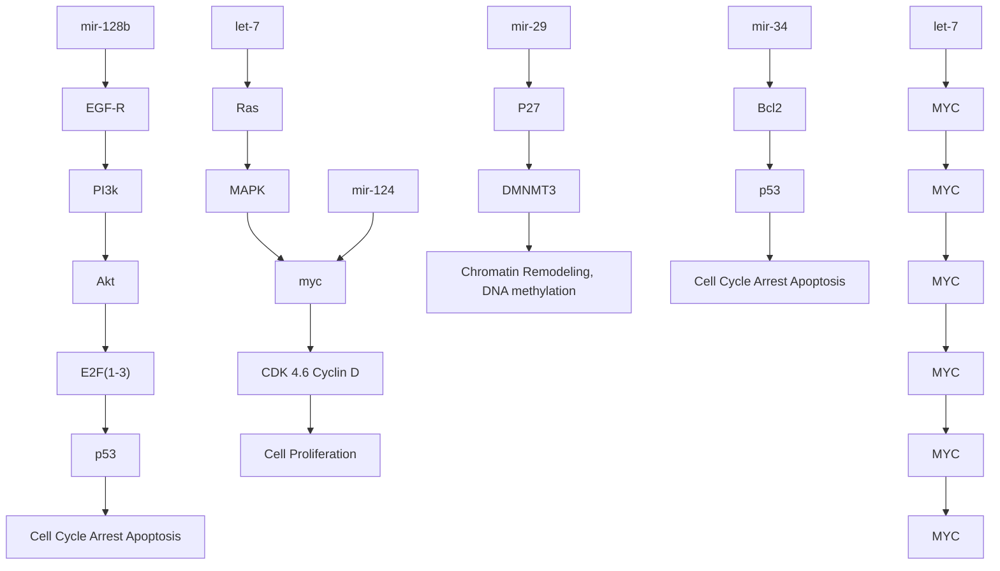
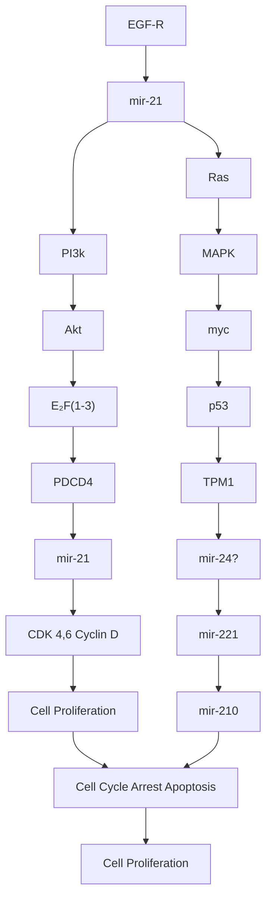

# MicroRNAs and Lung Cancer: New Oncogenes and Tumor Suppressors, New Prognostic Factors and Potential Therapeutic Targets

Cécile Ortholan $^{1,2}$ , Marie-Pierre Puissegur $^{3,4}$ , Marius Ilie $^{1,4,5}$ , Pascal Barbry $^{3,4}$ , Bernard Mari $^{\#},3,4$ and Paul Hofman $^{*,\#,1,4,5,6}$

$^{1}$ Laboratory of Clinical and Experimental Pathology, Pasteur Hospital, 06002 Nice, France; $^{2}$ CNRS UMR 6543, Centre Antoine Lacassagne, 06000, Nice; $^{3}$ CNRS UMR 6097, IPMC, Sophia Antipolis, France; $^{4}$ University of Nice-Sophia Antipolis; $^{5}$ INSERM ERI-21/EA 4319, Faculty of Medicine, 06107, Nice and $^{6}$ Human Tissue Biobank/CRB Inserm, Pasteur Hospital, Nice, France

Abstract: MicroRNAs (miRNAs) are small non-protein-coding RNA that negatively control mRNA expression at a post-transcriptional level. They regulate various cellular functions and bioinformatic data suggest that they collectively control about 30% of human mRNAs. MiRNAs have been recently implicated in several carcinogenic processes, where they can act either as oncogenes or as tumor suppressors. This is the case in lung cancer, i.e. the leading cause of cancer deaths in Western countries, in which about 40-45 miRNAs have been found to be aberrantly expressed, thereby constituting a specific miRNA signature. Some of these miRNAs can play an important role in lung carcinogenesis. Indeed, some transcripts of the let-7 family that are significantly down-regulated in lung tumors have been identified as tumor suppressors through their ability to control several oncogenic pathways, including the RAS pathway. Identification of a growing number of other potential oncogenic or tumor suppressor miRNAs in lung cancers is in constant progress. Recent evidence supports the use of specific miRNA signatures to predict clinical outcome. This review aims to report the current knowledge about the role of miRNAs in lung cancer carcinogenesis, their potential for improving diagnosis and prognosis and their impact on future therapeutic strategies.

Keywords: Lung, cancer, microRNA, prognosis, diagnosis, therapeutic target.

# INTRODUCTION

MicroRNAs (miRNAs) constitute a family of small RNAs conserved from plants to animals $[1, 2]$ . They have recently become a major focus of interest and research in cancer biology. As post-transcriptional regulators of protein synthesis, they can regulate mRNA translation or stability in the cytoplasm $[3, 4]$ . MiRNAs are derived from a primary transcript called pri-miRNAs. The current model of maturation (Fig. 1) includes primary nuclear cleavage of pri-miRNAs by the RNase III endonuclease Drosha, which liberates pre-miRNA hairpins. Hairpins are exported from the nucleus to the cytoplasm, where they are cleaved by Dicer, another RNase III endonuclease. Dicer generates short RNA sequences of about 22-nucleotides $[5-7]$ . MiRNAs are then assembled with proteins of the Argonaute family into a ribonucleoprotein complex: miRNP $[8]$ , which exhibits binding complementary with sequences usually located in the 3'UTR of the target transcript. The miRNA biological function does not require a perfect match between target mRNA and miRNAs. The association within the complex follows a set of rules that have been recently determined by experimental and bioinformatic analyses $[9-11]$ . Several molecular mechanisms have been evocated for miRNA-mediated post-transcriptional gene repression: deadenylation, repression of initiation of translation, inhibition of elongation or mRNA cleavage. In some cases, miRNA can also relocalize target mRNA to cytoplasmic foci called P-bodies for storage or degradation $[12]$ . Regardless of the underlying molecular mechanisms, it results in repression of protein synthesis. Because the interaction between the miRNA and its targets stems from a short stretch of 6-8 nucleotides located 5' of the miRNA, one miRNA can theoretically target hundreds of mRNAs. Because several miRNAs can also target the same transcript, a miRNA regulatory network can be highly complex. Overall, bioinformatic predictions suggest that miRNAs could regulate 30% of the human genome [13]. About 700 miRNAs have been identified so far in the human genome (they can be accessed via miRBase, the main miRNA online resource available at http://microrna.sanger.ac.uk/sequences/index) [14] but their exact number is still controversial. Moreover, a small number of validated miRNAs targets have been reported and the exact function of most of miRNAs remains to be elucidated.

The understanding of the importance of miRNAs is just starting to emerge. They are implicated in the regulation of diverse cellular functions (proliferation, differentiation, apoptosis, metabolism...). After the seminal observation by Calin et al. that mir-15 and mir-16 are frequently deleted in chronic lymphocytic leukemia [15], a large number of studies have demonstrated that miRNAs are strongly related to cancer development and progression [15, 16]. Indeed, their expression correlates with various cancers and some of them have been identified as potential tumor suppressors or oncogenes.

Lung cancer is the leading cause of cancer deaths in Western countries [17]. Despite therapeutic improvements, prognosis of lung cancer is poor [17]. To date, clinical and pathological staging is suboptimal in assessing prognosis and in selecting therapy [18, 19]. Recent technical developments have focused on identifying specific gene expression signatures associated with tumor staging and patient prognosis. Interestingly, miRNAs tumor expression appears to be more accurate for the classification of cancer subtypes than classi-

```mermaid
graph TD
    A["miRNA genes"] -->|1| B["nucleus"]
    A -->|2| C["miRNA regulated genes"]
    C -->|transcription| D["Transcription"]
    D -->|2| E["Transcription"]
    E -->|processing| F["22nt pre-miRNA"]
    F --> G["Processing"]
    G --> H["Microprocessor"]
    H --> I["Transcription"]
    I --> J["Transcription"]
    J --> K["Transcription"]
    K --> L["Transcription"]
    L --> M["Transcription"]
    M --> N["Transcription"]
    N --> O["Transcription"]
    O --> P["Transcription"]
    P --> Q["Transcription"]
    Q --> R["Transcription"]
    R --> S["Transcription"]
    S --> T["Transcription"]
    T --> U["Transcription"]
    U --> V["Transcription"]
    V --> W["Transcription"]
    W --> X["Transcription"]
    X --> Y["Transcription"]
    Y --> Z["Transcription"]
    Z --> AA["Transcription"]
    AA --> AB["Transcription"]
    AB --> AC["Transcription"]
    AC --> AD["Transcription"]
    AD --> AE["Transcription"]
    AE --> AF["Transcription"]
    AF --> AG["Transcription"]
    AG --> AH["Transcription"]
    AH --> AI["Transcription"]
    AI --> AJ["Transcription"]
    AJ --> AK["Transcription"]
    AK --> AL["Transcription"]
    AL --> AM["Transcription"]
    AM --> AN["Transcription"]
    AN --> AO["Transcription"]
    AO --> AP["Transcription"]
    AP --> AQ["Transcription"]
    AQ --> AR["Transcription"]
    AR --> AS["Transcription"]
    AS --> AT["Transcription"]
    AT --> AU["Transcription"]
    AU --> AV["Transcription"]
    AV --> AW["Transcription"]
    AW --> AX["Transcription"]
    AX --> AY["Transcription"]
    AY --> AZ["Transcription"]
    AZ --> BA["Transcription"]
    BA --> BB["Transcription"]
    BB --> BC["Transcription"]
    BC --> BD["Transcription"]
    BD --> BE["Transcription"]
    BE --> BF["Transcription"]
    BF --> BG["Transcription"]
    BG --> BH["Transcription"]
    BH --> BI["Transcription"]
    BI --> BJ["Transcription"]
    BJ --> BK["Transcription"]
    BK --> BL["Transcription"]
    BL --> BM["Transcription"]
    BM --> BN["Transcription"]
    BN --> BO["Transcription"]
    BO --> BP["Transcription"]
    BP --> BQ["Transcription"]
    BQ --> BR["Transcription"]
    BR --> BS["Transcription"]
    BS --> BT["Transcription"]
    BT --> BU["Transcription"]
    BU --> BV["Transcription"]
    BV --> BW["Transcription"]
    BW --> BX["Transcription"]
    BX --> BY["Transcription"]
    BY --> BZ["Transcription"]
    BZ --> CA["Transcription"]
    CA --> CB["Transcription"]
    CB --> CC["Transcription"]
    CC --> CD["Transcription"]
    CD --> CE["Transcription"]
    CE --> CF["Transcription"]
    CF --> CG["Transcription"]
    CG --> CH["Transcription"]
    CH --> CI["Transcription"]
    CI --> CJ["Transcription"]
    CJ --> CK["Transcription"]
    CK --> CR["Transcription"]
    CR --> CS["Transcription"]
    CS --> CT["Transcription"]
    CT --> CU["Transcription"]
    CU --> CV["Transcription"]
    CV --> CW["Transcription"]
    CW --> CX["Transcription"]
    CX --> CY["Transcription"]
    CY --> CZ["Transcription"]
    CZ --> DA["Transcription"]
    DA --> DB["Transcription"]
    DB --> DC["Transcription"]
    DC --> DD["Transcription"]
    DD --> DE["Transcription"]
    DE --> DF["Transcription"]
    DF --> DG["Transcription"]
    DG --> DH["Transcription"]
    DH --> DI["Transcription"]
    DI --> DJ["Transcription"]
    DJ --> DK["Transcription"]
    DK --> DL["Dicer TRBP complex processing complex"]
    DL --> DV["mature miRNA processing complex with Dicer TRBP"]
    DV --> DW["mature miRNA processing complex with Dicer TRBP and Ago2 expression in TRBP/AGO2 complex formation and translation inhibition in mRNA destabilization..."]
    AE --> X["microprocessor: DGC R, Drosha, AAA, AAA, 70nt pre-miRNA, 22nt transmembrane, 3D mioRNA, 4.4mRNA, 5.6mRNA, 6.8mRNA, 7.0mRNA, 7.2mRNA, 7.4mRNA, 7.6mRNA, 7.8mRNA, 8.0mRNA, 8.2mRNA, 8.4mRNA, 8.6mRNA, 8.8mRNA, 9.0mRNA, 9.2mRNA, 9.4mRNA, 9.6mRNA, 9.8mRNA, 10.0mRNA, 10.2mRNA, 10.4mRNA, 10.6mRNA, 10.8mRNA, 11.0mRNA, 11.2mRNA, 11.4mRNA, 11.6mRNA, 11.8mRNA, 12.0mRNA, 12.2mRNA, 12.4mRNA, 12.6mRNA, 12.8mRNA, 13.0mRNA, 13.2mRNA, 13.4mRNA, 13.6mRNA, 13.8mRNA, 14.0mRNA, 14.2mRNA, 14.4mRNA, 14.6mRNA, 14.8mRNA, 15.0mRNA, 15.2mRNA, 15.4mRNA, 15.6mRNA, 15.8mRNA, 16.0mRNA, 16.2mRNA, 16.4mRNA, 16.6mRNA, 16.8mRNA, 17.0mRNA, 17.2mRNA, 17.4mRNA, 17.6mRNA, 17.8mRNA, 18.0mRNA, 18.2mRNA, 18.4mRNA, 18.6mRNA, 18.8mRNA, 19.0mRNA, 19.2mRNA, 19.4mRNA, 19.6mRNA, 19.8mRNA, 20.0mRNA, 20.2mRNA, 20.4mRNA, 20.6mRNA, 20.8mRNA, 21.0mRNA, 21.2mRNA, 21.4mRNA, 21.6mRNA, 21.8mRNA, 22.0mRNA, 22.2mRNA, 22.4mRNA, 22.6mRNA, 22.8mRNA, 23.0mRNA, 23.2mRNA, 23.4mRNA, 23.6mRNA, 23.8mRNA, 24.0mRNA, 24.2mRNA, 24.4mRNA, 24.6mRNA, 24.8mRNA, 25.0mRNA, 25.2mRNA, 25.4mRNA, 25.6mRNA, 25.8mRNA, 26.0mRNA, 26.2mRNA, 26.4mRNA, 26.6mRNA, 26.8mRNA, 27.0mRNA, 27.2mRNA, 27.4mRNA, 27.6mRNA, 27.8mRNA, 28.0mRNA, 28.2mRNA, 28.4mRNA, 28.6mRNA, 28.8mRNA, 29.0mRNA, 29.2mRNA, 29.4mRNA, 29.6mRNA, 29.8mRNA, 30.0mRNA, 30.2mRNA, 30.4mRNA, 30.6mRNA, 30.8mRNA, 31.0mRNA, 31.2mRNA, 31.4mRNA, 31.6mRNA, 31.8mRNA, 32.0mRNA, 32.2mRNA, 32.4mRNA, 32.6mRNA, 32.8mRNA, 33.0mRNA, 33.2mRNA, 33.4mRNA, 33.6mRNA, 33.8mRNA, 34.0mRNA, 34.2mRNA, 34.4mRNA, 34.6mRNA, 34.8nC (DNA strand selection & separation)"]
```

flowchart

1 Chromosomal rearrangements : miRNAs are frequently located at FRA

2 Aberrant epigenetic modifications / altered regulation by TFs

3 Altered expression of the effectors of the miR machinery (Dicer, Drosha, Pasha,...)

4 Mutations / deletions of the binding site between miRNA and target 3'-UTRs

Fig. (1). Overview of miRNA biogenesis and origin of miRNA dysregulation in cancer. miRNA genes are transcribed by RNA polymerase II into pri-miRNAs. These pri-miRNAs can be either a protein-coding RNA or a non-coding RNA and are processed by the microprocessor complex, containing the RNase III Drosha and DiGeorge syndrome critical region 8 (DGCR8), into \~70 nt miRNA pre-miRNAs. Following export via exportin-5, pre-miRNAs are cleaved by another RNase III Dicer acting in concert with the transactivating response RNA-binding protein (TRBP) within the pre-miRNA processing complex. After strand selection, the mature miRNA is loaded into the effector complex RISC that will recognize and mediated translational repression or degradation of the target mRNA. Different steps in this pathway of biogenesis can be affected in cancer cells and are indicated (1-4). FRA: fragile sites; TF: transcription factor.

cal mRNA expression profiles [20]. Integrating miRNAs profiling in staging and in management of lung cancers might thus improve diagnosis, prognosis and provide new therapeutic targets. This review aims to report the current knowledge in the field of miRNAs and lung cancer.

# METHODS FOR miRNA DETECTION AND TARGET IDENTIFICATION

# miRNA Detection

The abundance of miRNA ranges from a few copies to 50 000 copies per cell. Distinct technologies have been used to detect the presence and the abundance of miRNAs.

Mature miRNAs and their precursors can be easily analyzed by Northern blotting or quantitative real time-PCR (qRT-PCR) [21]. Gene expression microarray analysis has been adapted for miRNAs profiling using several strategies and represents the most commonly used high-throughput technique for the analysis of miRNA expression levels [22-29]. Other miRNAs detection systems have been recently developed based on flow cytometric assays [20] or padlock probes and rolling circle amplification [30]. Finally, deepsequencing technologies now offer profiling of both known and novel miRNAs at unprecedented sensitivity [31].

To understand the biological role of miRNAs and miRNA-associated gene regulatory networks it is essential to clarify the exact localization of miRNAs. This is especially important in solid tumors such as lung carcinomas that are in most cases highly infiltrated by an inflammatory stroma. Two approaches for detection of miRNAs by in situ hybridization (ISH) have been developed recently [32]. The first method is based on locked nucleic acid (LNA) oligonucleotide probes, and has been successfully used to detect mature miRNAs in whole mounts of zebrafish and mouse embryos [33, 34]. LNA based ISH has been applied to whole-mount embryos from a variety of vertebral species [35] and for the analysis of human brain tissue sections [36] as well as mouse tissue sections [37]. With this protocol we have also detected the accumulation of mir-21 in human cancerous lung tissues (Fig. 2). The second method, developed by Thompson et al. uses RNA oligonucleotide probes for detection of mature miRNAs in tissue sections from different animals and humans [32, 38]. Both approaches generate similar results and appear to detect primarily mature miRNAs. Interestingly, it

natural_image

Microscopic tissue section labeled 'A' showing cellular structures with no visible text or symbols

natural_image

Microscopic tissue sample with scattered purple-stained cells and a blue circle marker (no text or symbols)

natural_image

Microscopic view of stained biological cells (no visible text or labels)

natural_image

Fluorescence microscopy image showing blue-stained cell nuclei and red punctate signals (no text or symbols)

Fig. (2). Detection of tumor-specific accumulation of mir-21 in human lung biopsies. (A) A normal human lung tissue section not showing in situ staining for mir-21 (x10). (B-D) Distinct mir-21 in situ staining: NBT BCIP blue precipitates in B (x10) and C (x40) was observed in the tumor cells within the cancerous tissues of a human lung tumor section. The use of Cyanine 5 (red) with DAPI counter-staining in D and a larger magnification (x63) allows the visualization of cytoplasmic signals likely corresponding to P-bodies or stress granule structures.

has been demonstrated using ISH that the mature form of miR-138 was spatially restricted to distinct cell types (brain, CNS, fetal liver) while the pattern of expression of its precursor, pre-mir-138-2, was ubiquitous in murine embryos [39]. This was the first evidence indicating that the expression of mammalian miRNAs can be regulated at a post-transcriptional level.

# Identification of Predictive Targets

The problem of the identification of genes regulated by miRNAs in a specific cellular context can be addressed jointly by in silico and experimental approaches. Several computational algorithms have been developed to predict transcripts targeted by miRNAs $[9, 10, 40-44]$ . They generally require that the 5' end of the miRNA, known as the "seed" region, forms perfect base pairing with the target sites and that this seed pairing is conserved across species $[45]$ . Because the list of predicted targets could reach several hundred genes, several experimental approaches may be performed to select functionally relevant genes. Of note, it has been demonstrated that ectopic miRNA expression can induce enrichment of predicted targets among the set of down-regulated genes, suggesting that some miRNA can induce degradation of their mRNA targets $[46]$ . This is consistent with other experiments performed on knock-out models, which have shown significant up-regulation of predicted miRNA targets $[47, 48]$ . Thus, paired expression profiles of miRNAs and mRNAs can be used to identify functional miRNA-target relationships and provides a complement to computational predictions $[49]$ . Very recently, biochemical approaches combining RNA-induced silencing complex (RISC) purification with microarray analysis (Rip-Chip) have also been proposed $[50-52]$ . Proteomic approaches have indicated that a single miRNA can repress the production of hundreds of proteins, but that this repression is usually relatively mild $[53, 54]$ . Finally, an important step concerns the validation of these predictive targets. Independent biochemical assays, based on Western blot analyses and/or a reporter plasmid assays with constructs containing the 3'UTR of the predicted target mRNA are obligatory to confirm any interaction $[42, 55]$ .

# miRNA EXPRESSION PROFILING IN LUNG CANCERS

Numerous publications have reported aberrant expression of miRNAs in cancers [16]. In solid cancers, one of the largest studies of miRNAs expression was performed by Volinia

et al. [56]. The authors analyzed the “microRNome” of 363 tumors (breast, lung, pancreas, stomach, colon and prostate) versus 177 healthy tissues and identified a solid cancer miRNA signature composed by a large portion of overexpressed miRNAs, such as mir-21, mir-191 and mir-17-5p. Comparison of 123 lung cancers and 123 corresponding normal lungs led to detection of 38 miRNAs with abnormal expression (some members of the let-7 family, mir-16-2, mir-21, mir-191, mir-17-5p and mir-155). A specific miRNAs signature in lung cancers was confirmed in the study of Yanaihara et al. [57]. The authors performed a microarray analysis in 104 non squamous cell lung carcinoma (NSCLC) and corresponding non-cancerous lung tissues and identified 43 differentially expressed miRNAs: 15 up-regulated (including mir-21, mir-191, mir-155, mir-17-3p) and 28 down-regulated (including let-7-a2 and mir-125a). These findings have supported the concept of a specific miRNAs signature in solid cancers, opening a large field of research.

# miRNAs AND LUNG CANCER CARCINOGENESIS

A growing number of miRNAs have been demonstrated to target genes that play an important role in lung cells carcinogenesis (for example let-7 and the cluster mir-17-92). The potential function of other deregulated miRNAs in lung cancer can also be anticipated from studies into other malignancies.

# The Let-7 Family: Tumor Suppressors Involved in Lung Cancer Carcinogenesis

Let-7 (lethal 7) is one of the founding members of the miRNAs family. It was first identified in C. elegans, [58], in which it plays a crucial role in the late larval development and has been further shown to be highly conserved during evolution [59]. The let-7 family encompasses 12 genes with distinct and diverse functions, with mir-48, mir-84, mir-241 sharing a high sequence identity with let-7.

The lung is one of the tissues with the most abundant expression of let-7. Takamizawa et al. [60] were the first to report reduced expression of let-7 in a fraction of human NSCLC. Heterogeneity in let-7 expression has been also reported for NCI-60 cell lines and loss of let-7 expression may represent a marker for less differentiated cancers [61], suggesting a potential prognostic value of let-7 expression in lung cancer (please see the paragraph “miRNAs signature in lung cancer: prognostic value”).

In addition, renewed expression of let-7 in lung cancer cell lines inhibited cell growth suggesting that let-7 could be considered as a tumor suppressor [60]. Another study in C. elegans, [62] revealed that the let-60/RAS mRNA had multiple complementary sites for the let-7 family, indicating it was one of let-7 direct targets. Let-60/RAS is the C. elegans ortholog of the human oncogene RAS, which acts as a molecular switch in signal transduction pathways and is involved in both cellular proliferation and differentiation. The authors compared the let-7 expression of healthy tissues and tissues of lung, colon and breast cancers. Interestingly, let-7 was expressed at lower levels in lung cancers and a high correlation between reduced let-7 expression and increased RAS protein expression was observed. They concluded that one or more member(s) of the let-7 family might control the cell cycle by regulating RAS expression in vivo [62]. RAS isoforms (HRAS, KRAS and NRAS) are commonly mutated in lung cancer, promoting carcinogenesis. Interestingly, a study conducted by Inamura et al. indicated that let-7 downregulation occurred early during lung carcinogenesis and that there was no correlation between KRAS mutation and the level of let-7 expression [63]. Additional work demonstrated that let-7 targeted several other genes, such as the oncogene myc [64]. Moreover, overexpression of let-7 miRNA in two cell lines expressing low levels of endogenous let-7 (lung adenocarcinoma A549 and liver HepG2a) led to repression of cell cycle progression [65]. Microarray analysis revealed that the expression of more than 600 genes, mainly linked to cell cycle regulation, was altered. Only 25 genes contained a let-7 complementary site in their 3'UTR, including cell cycle regulators and transcription factors, strongly suggesting that the other genes were likely to be downstream targets of the transcriptions factors directly targeted by let-7 [65]. Among these 25 genes, HMGA2, which codes for a high-mobility group of proteins was further found to represent a major pro-oncogenic target of let-7 [66-68].

Taken together, these results highlighted let-7 as a master regulator of cell proliferation pathways (Fig. 3A) and a promising therapeutic target to treat lung cancers. In agreement with this concept, the first in vivo study performed on several mice models of lung cancer demonstrated a significant reduction in lung tumors after let-7 overexpression using a lentiviral vector [69].

# Cluster Mir-17-92: A Strong Oncogenic Cluster Promoting Lung Carcinogenesis

In contrast to let-7, which is a tumor suppressor, the polycistronic cluster mir-17-92 is likely to represent one of the major oncogenic miRNAs. It is located within intron 3 of the C13orf25 gene at 13q31.3 and controls the expression of seven miRNAs. Mir-17-92 was first described as a potential oncogene in mouse models of lymphoma [70].

The cluster mir-17-92 is up-regulated is many solid cancers, including lung cancers $[56]$ . Hayashita et al. reported that it was overexpressed in lung cancer cell lines, especially in small-cell lung cancer cells lines in which it enhanced cell proliferation $[71]$ . The oncogenic role of mir-17-92 in lung cancer carcinogenesis is complex and might involve several oncogenic pathways. Indeed, bioinformatic analysis suggested that mir19a and mir20b could have more than 600 predictable targets $[41]$ . Several important tumor suppressors, such as PTEN could be targeted by mir-17-5p $[42]$ . The tumor-suppressor phosphatase with tensin homology (PTEN) is the most important negative regulator of the highly oncogenic cell-survival PI3K/AKT signaling pathway and has been identified as lost or mutated in several sporadic and heritable tumor types including lung cancer $[72, 73]$ .

The function of the mir-17-92 cluster is under investigation. A recent study by Ventura et al. demonstrated that mice deficient for mir-17-92 die shortly after birth with lung hypoplasia and a ventricular septal defect, and that the mir-17-92 cluster is also essential for B cell development $[74]$ . Another study has shown that overexpressing the cluster in embryonic lung epithelium led to transgenic lungs with an

abnormal lethal phenotype that contains numerous proliferative progenitors of epithelial cells. The authors proposed that mir-17-92 promotes the highly proliferative and undifferentiated phenotype of lung epithelial progenitor cells via the regulation of the tumor suppressor Rbl2, a member of the Rb family, by miR-17-5p [75]. Rbl2 belongs to the pocket family of proteins, which are required for restricting neuroendocrine cell fate. Interestingly, small-cell lung cancers, with the highest level of mir-17-92, are thought to arise from neuroendocrine cells and to have reduced expression of Rbl2

[76]. Thus, overexpression of mir-17-5p might promote neuroendocrine differentiation of lung cells, through inhibition of the pocket family.

O'Donnel et al. independently identified through chromatin immunoprecipitation experiments that myc binds within the first intron of C13orf25, demonstrating that it directly up-regulates the mir-17-92 cluster [77]. The myc oncogene family encodes basic helix-loop-helix leucine zipper transcription factors. It is often mutated or amplified

flowchart

flowchart

Fig. (3). Function of potential tumor suppressor (A) and oncogenic (B) miRNAs on cell survival and proliferation pathways in lung cancer. Loss or overexpression of miRNAs previously reported in lung cancer is shown in green or red, respectively. Abbreviations: EGFR, epidermal growth factor receptor; MAPK, mitogen-activated protein kinase; PtdIns-3K, phosphoinositide-3 kinase; PTEN, phosphatase and tensin homolog; Bcl2, B-cell CLL/lymphoma 2, PDCD4, programmed cell death 4; TPM1, Tropomyosin 1.

in human cancers. C-myc is known to induce the tumor suppressor transcription factor $E_{2}F1$ which also induces c-myc expression in a positive feedback circuit [78]. Mir-17-5p and mir-20a down-regulate $E_{2}F1$ expression directly. Therefore, C-myc could simultaneously activate $E_{2}F1$ transcription and limits its translation in order to control proliferative signaling [77, 79, 80]. In lung cancer cell lines that overexpress cluster mir-17-92, silencing of mir-17-5p and mir-20a expression by anti-sense nucleotides induced apoptosis [81]. Thus, the overexpression of cluster mir-17-92 is likely to deregulate the complex balance between myc and $E_{2}F1$ , and then to promote carcinogenesis (Fig. 3B). Moreover, myc-mediated up-regulation of mir-17-92 is likely to play a role in angiogenesis through the down-regulation of anti-angiogenic thrombospondin-1 (Tsp1) and related proteins, such as connective tissue growth factor (CTGF) [82].

# Mir-155: Also Involved in Non-Haematological Malignancies

Mir-155 appears to be a major oncogenic miRNA in haematological malignancies and has also been linked to myc overexpression. Mir-155, encoded by a highly conserved region of the non-protein coding BIC locus (B-Cell Interaction Cluster), was first reported to be overexpressed in B-cell lymphomas such as Burkitt lymphoma, primary mediastinal diffuse B-cell lymphomas, and Hodgkin lymphomas $[83-87]$ . In these cells, mir-155 can function as an oncogene in cooperation with myc while it normally plays a critical role in B-cells for normal production of isotype-switched, high-affinity antibodies as well as for the memory response and in T helper cell differentiation $[47, 48, 88]$ . In non-haematological cells, the function of mir-155 still needs to be elucidated. Several studies have indicated that its expression was aberrant in some epithelial malignancies including breast, pancreas, lung and thyroid carcinomas $[56, 57, 66, 89-91]$ . It has been shown that at least some epithelial tumor cells lines can express mir-155 $[90]$ . However, the elevated expression of this miRNA in TNFα-activated macrophages $[92, 93]$ , normal or fibrotic pulmonary fibroblasts $[94, 95]$ as well as in activated lymphocytes $[96]$ suggests that mir-155 overexpression in these carcinomas could be linked to the presence of an inflammatory stroma.

# Mir-21: An Oncogenic miRNA in Multiple Malignancies

Mir-21 is overexpressed in lung cancers $[56, 57]$ , but also in most epithelial malignancies (glioblastomas, breast, prostate, stomach, head and neck, pancreatic cancers, hepatocellular, oesophageal and colon cancers) $[66, 89, 97-103]$ . Several oncogenic pathways have been demonstrated to be regulated by mir-21 in diverse cancer cell lines. In glioblastoma cancer cell lines, knock-down of mir-21 activated caspases and led to increased apoptosis $[97]$ . In breast cancer cell lines and in xenograft mouse models, Si et al. reported that anti-mir-21 inhibited cell growth and decreased the level of Bcl2, an oncogene with anti-apoptotic function $[104]$ . In the same cell lines, Zhu et al. demonstrated that the tumor suppressor tropomyosin 1 represented a direct target of mir-21 $[105]$ . In hepatocellular cancer cell lines, Meng et al. revealed that mir-21 targeted another tumor suppressor PTEN, decreasing tumor proliferation, migration and invasion $[106]$ . Finally, in several tumor models, mir-21 can post-transcriptionally down-regulate pdcd4, a tumor suppressor, resulting in inhibition of transformation and invasion, [107-110] Taken together, these results provide evidence that mir-21 can act as a direct or indirect regulator of many oncogenic or tumor suppressor pathways in most solid cancers, including lung cancers (Fig. 3B).

# Other miRNAs Potentially Involved in Lung Carcinogenesis

Several other miRNA could cooperate to promote carcinogenesis in lung cancers and their oncogenicity has been established in diverse tumor models.

In lung cancer cell lines, Fabbri et al. demonstrated that the mir-29 family (mir-29a, mir-29b, mir-29c) directly targets two DNA-methyltransferases and is frequently associated with poor prognosis in lung cancer. The enforced expression of mir-29 in lung cancers restored the normal pattern of DNA methylation and induced renewed expression of methylation-silenced tumor suppressor genes $[111]$ . Thus, loosing the expression of mir-29 in lung cancer could induce aberrant methylation, deregulating some oncogenic pathways.

Mir-125-b2, is induced during differentiation of embryonic stem cells [112], suggesting that its inactivation could induce a loss in differentiation of lung epithelial cells.

Mir-126 could be implicated in the metastatic process, in particular via the control of expression of adhesion molecules in endothelial cells $[113]$ and could be considered as a metastatic suppressor in breast cancers $[114]$ . In agreement with this hypothesis, renewed expression of mir-126 in a lung cancer cell line resulted in a decrease in the Crk protein, a member of a family of adaptor proteins that are involved in intracellular signal pathways altering cell adhesion, proliferation, and migration $[115]$ .

In lung, prostate and thyroid papillary carcinomas as well as in glioblastomas, mir-221 directly targets the tumor suppressor p27Kip1, a cell cycle regulator $[116-119]$ . In some lung cancer cell lines, overexpression of mir-221 and mir-222 is thus able to induce resistance to the tumor necrosis factor (TNF)-related apoptosis ligand (TRAIL) by interfering with TRAIL signaling through p27kip1 $[116]$ .

Several recent studies have identified a conserved miRNA family, mir-34 (mir-34abc) as a direct transcriptional target of p53 [120, 121]. Mir-34 overexpression leads to cell cycle arrest, apoptosis or cellular senescence, whereas loss of mir-34 impairs p53-mediated cell death [122-128]. Importantly, Bommer et al. recently found that the level of mir-34b and mir-34c is dramatically reduced in six out of 14 (43%) NSCLCs with no significant correlation with the p53 mutational status, suggesting that the loss of mir-34 isoforms in some NSCLCs might serve to mimic the consequences of p53 loss-of-function on cell cycle checkpoints and cell survival [122]. These findings demonstrate that miRNAs can play a central function in well-known tumor suppressor pathways. Accordingly, the expression of p16(INK4a), a tumor suppressor frequently deleted in lung cancer has been shown to be regulated by mir-24 [129]. The potential expression and function of this miRNA during lung cancer progression should be further clarified.

# ORIGINS OF miRNA DYSREGULATION

If both miRNA down- and up-regulation have been described in human cancers, the absolute expression level of many miRNAs is usually reduced in tumor cells [20]. This widespread reduction in miRNA levels might indicate the reduced differentiation status of these cells. These changes could have several different origins (Fig. 1).

# Chromosomal Rearrangements

MiRNAs are frequently located at fragile chromosomal sites and genomic regions involved in cancer: loss of heterozygosity (LOH), minimal region of amplification or a common break point $[130]$ . Chromosomal deletions are often observed in lung cancers. The study of Nagayama et al. scanned the genome of 43 lung cancer cell lines and reported 51 genomic regions with homozygous deletions $[131]$ . In two cell lines, three miRNAs genes (let-7c, mir-99a, mir-125b-2) were mapped to a region with a homozygous deletion. Yanaihara et al. demonstrated that out of the 43 miRNAs deregulated in lung cancers, three were located at fragile sites (mir-21, mir-27b and mir-32), 15 were located in regions frequently deleted in several malignancies, and four were located in regions frequently amplified in several malignancies $[57]$ . Very recently, Weiss et al. correlated the allelic loss in chromosome 3p of mir-128b with increased expression of one of its putative targets, the epidermal growth factor receptor (EGFR) $[132]$ . Indeed LOH in chromosome 3p is one of the most frequent and earliest genetic events in lung carcinogenesis. The authors determined that mir-128b directly regulated EGFR and that mir-128b LOH correlated significantly with the clinical response to targeted EGFR inhibition by gefitinib.

Another example of miRNA deregulation due to chromosomal rearrangement is the disruption between let-7 and HMGA2 in several benign human tumors. As indicated earlier, HMGA2 expression is down-regulated by let-7 trough seven 3'UTR target sites [9]. Disruption of HMGA2 regulation by let-7 induced renewed HMGA2 expression, enhancing oncogenic transformation [67, 133]. Mayr et al. demonstrated that one of the mechanisms leading to renewed expression of HMGA2 was a chromosomal break shortening the 3'UTR of HMGA2. Such a deletion prevents let-7 binding to HMGA2 mRNA [67].

In contrast, oncogenic miRNAs overexpression could be mediated by genomic amplification. For example, Hayashita et al. reported that the overexpression of cluster mir-17-92 was occasionally linked to gene amplification in lung cancer cell lines $[71]$ , resulting in overexpression of the gene products.

# Sequence Variation in miRNAs and mRNA 3'untranslated Regions

In 91 cancer cell lines, Diederichs et al. investigated sequence variations in 15 miRNAs implicated in carcinogenesis [134]. They identified sequence variants for one premiRNA and for 15 pri-miRNAs, and they correlated these modifications with dramatic changes in their putative secondary structure. However, neither processing nor maturation was affected in vivo. In lung cancer, a recent study demonstrated that a recessive genetic variation in hsa-mir-196a2 was associated with a significant increase in expression of mature hsa-mir-196a2, in the absence of any change in the level of the precursor [135]. These data suggest that this mutation enhanced the processing of the pre-miRNA to its mature form. Furthermore, binding assays revealed that this polymorphism can affect binding of mature hsa-mir-196a2-3p to target mRNA.

Interestingly, a large proportion of mammalian genes use alternative cleavage and polyadenylation to generate multiple mRNAs isoforms differing in their 3'UTR. A recent study indicates that proliferating cells express mRNAs with a shortened 3'UTR sequence. This leads to a decreased number of miRNAs target sites, and suggests existence of a new way for tumor cells to evade miRNA-dependent regulation that restricts cell cycle progression [136].

# Aberrant Epigenetic Modifications

The presence of CpG island promoter methylation could lead to transcriptional repression of tumor suppressor genes. For example, the mir-124 gene is down-regulated in lung cancers by hypermethylation $[137]$ . Interestingly, the epigenetic silencing of mir-124a led to the up-regulation of CDK6 and to the down-regulation of the tumor suppressor Rb.

Brueckner et al. demonstrated that the let-7a-3 locus contains an epigenitically regulated region and that its hypomethylation facilitates renewed expression of the gene. The authors revealed that let-7a-3 is often hypomethylated in lung cancers compared with normal tissues $[138]$ .

# miRNA Biogenesis Dysfunction

Pri-miRNA transcription and miRNA processing need to be tightly regulated. Thomson et al. showed that a large fraction of miRNAs-containing transcripts are regulated post-transcriptionally, and that an alteration at any step during the maturation process affects miRNAs production $[139]$ . Evidence points to post-transcriptional control of some miRNAs involved in lung cancer carcinogenesis; in Burkitt lymphoma cell lines the expression level of mature miR-155 is repressed at the processing level $[140]$ . In embryonic cells, the processing of let-7 pri-miRNA is selectively blocked by Lin28, a developmentally regulated RNA binding protein $[141]$ . Lin28 selectively binds the terminal loop region of let-7 precursors, mediating miRNA processing inhibition $[142]$ . Lin28 could thus be considered as a negative regulator of miRNA biogenesis and may play a central role in blocking miRNA-mediated differentiation in stem cells and in certain cancers.

Normal function and expression levels of both Dicer and Drosha are required for adequate maturation. Indeed, conditional deletion of Dicer in the embryonic lung epithelium leads to inhibition of branching and to increased apoptosis $[143]$ . Reduced expression of Dicer was demonstrated to be associated with poor prognosis in a series of 67 NSCLCs. Furthermore, there was a significant relationship between reduced expression of Dicer and that of let-7 $[144]$ . Interestingly, another study indicates that the expression of Dicer and of other genes coding for members of the miRNA machinery depends on the histological subtype of the lung car-

cinoma, and varies with progression of the disease, which might explain in part the observed abnormal miRNA profile in lung cancer [145].

Thomson et al. [139] also suggested that the reduction in the expression of many miRNAs, such as let-7, could be a consequence of a block in Drosha processing. In contrast, it has been shown that specific miRNAs were up-regulated in some acute leukemias triggered by All1 fusions with partner genes able to recruit Drosha to loci encoding these miRNAs [146].

# Transcription Factor Deregulation

MiRNAs transcription is in most cases driven by RNA polymerase II [147, 148]. Although miRNA genes can be found as clusters forming their own transcriptional units, around $40\%$ are transcribed from the intronic sequence of protein-encoding genes [149]. Thus their expression is classically regulated by transcription factors through specific sequences in selected sites and or in cis-regulatory motifs.

The oncogene myc controls the expression of many protein-coding genes. However, there is growing evidence to suggest that myc reprograms microRNA expression, thereby contributing significantly to its oncogenic activity. Two main studies describe this extensive reprogramming through the overexpression of the mir-17-92 cluster (detailed earlier) [77] and the repression of a dozen miRNAs with known tumor suppressor activity [150]. Data from chromatin immunoprecipitation experiments have revealed that much of the repression is likely to be a direct result of myc binding to miRNAs promoters [150]. While there is evidence to suggest that a post-transcriptional block in miRNA processing contributes to a reduced miRNA level in cancer, the demonstration that activation of myc, a common event in many cancers, induces miRNA down-regulation indicates that transcriptional repression also contributes to this phenomenon [151].

The induction of mir-210 under hypoxic conditions, a situation observed in cancerous lesions as a consequence of tumor growth is another important example of transcription factor deregulation $[152, 153]$ . The authors of this work provided evidence for the involvement of the hypoxic-inducible factor (HIF) signaling pathway in mir-210 regulation.

# miRNAs SIGNATURE IN LUNG CANCER: PROG-NOSTIC VALUE

The prognostic value of the miRNAs lung cancer signature is currently under investigation. To date, a number of studies provide contradictory results.

# Reduction in Let-7 Expression could be a Prognostic Factor in Invasive Lung Cancers

Takamizawa et al. reported for the first time in 2004 the prognostic impact of aberrent miRNA expression in tumors [60]. The authors focused on miRNA let-7 and its isoforms (let-7a-1, let-7a-2, let-7-a3, let-7f-1 and let-7f-2). The population studied included 143 NSCLCs (105 adenocarcinomas, 25 squamous cell carcinomas, 9 large cell carcinomas and 4 adenosquamous cell carcinoma, 75 stage I, 19 stage II and 49 stage III) treated with surgery with a curative intent, and with a follow-up of over five years. The authors performed unsupervised hierarchical clustering and classified tumors into two classes based on similarities in let-7 isoform expression: cluster 1 for low let-7 expression and cluster 2 for high let-7 expression. Cluster 1 was significantly related to advanced disease stages, but not to other clinicopathological features such as age, sex, histology, grade, and primary tumor status. Classification into cluster 1 with characteristically low let-7 expression was associated with poorer overall survival in the whole population and in the subgroup of adenocarcinomas (p<0.0003 and p=0.03, respectively). Multivariate analysis identified two independent prognostic factors: stage (II/III vs I), hazard ratio (HR) = 3.49, 95% confident interval (CI) [1.89-6.42] and let-7 expression (cluster 1 vs 2), HR = 2.17, 95% CI [1.21-3.89].

Inamura et al. investigated the prognostic value of reduced expression of let-7 isoforms in 15 bronchioloalvelolar carcinomas (a subtype of non-invasive carcinoma), 26 well-differentiated invasive adenocarcinomas and 25 less-differentiated invasive adenocarcinomas [63]. Compared to normal tissue, let-7 expression was reduced in 87% of bronchio-alveolar carcinomas and in 79% of invasive carcinomas. The authors performed hierarchical clustering to classify the tumors into two groups according to let-7 expression. In contrast to the previous report of Takamizawa et al. [60], no prognostic difference related to patients survival was observed between the two groups [63].

A third study by Yanaihara et al. performed a microarray analysis on lung cancers and corresponding non-cancerous lung tissue $[57]$ . The population study included 104 NSCLCs (65 adenocarcinoma and 39 squamous cell carcinoma, 65 stage I, 17 stage II and 22 stage III-IV) treated with surgery. No precision in pre- or postoperative treatment of tumors was provided. In the subgroup of adenocarcinomas, high expression of hsa-mir-155, hsa-mir-17-3p, hsa-mir-106a, hsa-mir-93 and hsa-mir-21 combined with low expression of hsa-let-7a-2, hsa-mir-145, hsa-let-7b was associated with a bad prognosis. In particular, high hsa-mir-155 expression or reduced hsa-let-7a-2 expression were significantly related to overall survival (p = 0.006 and p = 0.033, respectively). To further validate these results, expression levels of hsa-mir-155 and hsa-let-7a-2 were analysed using RT-PCR in an additional independent set of 32 adenocarcinomas, providing consistent results. Taken together, these two sets suggest that hsa-mir-155 and hsa-let-7a-2 appear as independent prognostic factors. The authors conclude that low let-7 expression combined with high mir-155 expression is useful in diagnosis and prognosis of lung adenocarcinomas.

# Lung Cancer Prognosis could be Linked to a Complex miRNA Signature

A recent study by Yu et al. [154] investigated a potential prognostic miRNA signature in various subtypes of NSLCC. The series included 112 NSCLCs from stage I to III. All patients underwent curative resection, with no adjuvant chemotherapy. The smoking history was not reported. The 112 specimens were randomly assigned to a training set for microarray analysis or to a testing set for RT-PCR validation.

The training set consisted in 15 adenocarcinomas, 10 squamous cell carcinoma and 3 others subtypes (5 stage I, 8 stage II and 15 stage III). In this set, five miRNAs were significantly associated with patient survival. Increased expression of two miRNAs was associated with good clinical outcome: hsa-mir-221 and hsa-let-7a, whereas increased expression of three miRNAs was associated with poor clinical outcome: hsa-mir-137, hsa-mir-372 and hsa-mir-182. The authors calculated a risk score based on the five-miRNA signature and divided patients into high-risk or low-risk groups according to their risk score. Overall survival and relapse free survival were significantly decreased in the high-risk group (median 20 months versus median not reached, p<0.001 and 10 months versus median not reached, p=0.002, respectively). Despite a difference in stage repartition between the training and testing sets, similar results were reported in an independent testing set and when both sets were combined. Furthermore, these results were confirmed in an independent cohort of 62 NSCLCs. Multivariate analysis of the test set data demonstrated that overall survival was controlled by three independent factors that included miRNA signature, stage and age. To investigate the prognostic value of the five-miRNA signature in the subgroup of patients, the authors combined the testing set and the independent cohort. The miRNA signature was significantly associated with overall survival in stage III (p=0.0095), but not in stages I and II (p=0.033 and p=0.148 respectively, one sided log rank test), whereas it predicted survival in each lung histology subtype. Interestingly, all five miRNA were required in the signature to predict survival. To further investigate the role of these five miRNAs, the authors transfected each precursor of high-risk miRNAs into low invasive lung cancer cell lines. Transfected cells exhibited increased invasive properties. When they transfected each precursor of protective miRNAs in highly invasive lung cancer cells, only mir-221 decreased invasion, whereas let-7 had no effect. The authors conclude that the five-miRNA signature is a potent predictor of outcome in lung adenocarcinomas and in lung squamous cell carcinomas.

# Could the miRNA Signature Predict Clinical Outcome?

The understanding of the correlation between miRNAs expression and cancer prognosis is just starting to emerge. Results of the previous studies suggest that aberrant expression of miRNAs could play an important role in prognosis. However, the exact miRNA profile associated with clinical outcome remains to be elucidated. Three out of four studies revealed that decreased expression of let-7 was associated with poor prognosis. In a multivariate analysis, Takamizawa et al. [60] and Yahainara et al. [57] demonstrated that let-7 was independently related to overall survival, whereas Yu et al. [154] showed that a five-miRNA signature including let-7 is necessary for prognostic value. Mir-155 was reported to be an independent prognostic factor in the study by Yahainara et al. [57] but was not included in the miRNA signature of Yu et al. [154]. Differences in the population studied, in the pattern of treatment and in statistical analysis could explain these differences.

In the future, a non-clinical prognostic factor could help physicians to adapt the pattern of treatment to the risk of recurrence. In lung cancer, gene-expression profiling has been widely used to classify tumors and in formulating a prognosis $[155-160]$ . The relative importance of a miRNA signature should be compared with other well identified prognostic molecular factors, such as the “five-gene signature” associated with survival of patients with NSCLCs, as recently proposed by Chen et al. $[157]$ . Prospective analysis, for example based on populations included in randomized trials, are mandatory to assess the true prognostic value of miRNA profiling.

# Lung Cancer Prognosis could be Linked to Genetic Variation in miRNAs Sequences

Hu et al. [135] hypothesized that single nucleotide polymorphism (SNP) in pre-miRNAs could alter miRNA processing and expression and therefore contribute to cancer prognosis and survival. The authors selected four premiRNAs genetic variants (hsa-mir-146a rs2910164 C→G, hsa-mir-196a2 rs11614913 C→T, hsa-mir-499 rs3746444 G→A, and hsa-mir-149 rs2292832G→T) and evaluated their association with overall survival in a Chinese cohort of 663 NSCLCs (390 adenocarcinomas, 233 squamous cell carcinomas, 40 large cell or undifferentiated carcinomas, 250 stage I-II and 413 stage III-IV). Thirty-seven percent of patients were non smokers, which is far higher than the rate reported in a non-Asian population. Genotyping analysis was performed on venous blood. Survival analyses for all patients showed significant differences in overall survival between carriers of hsa-mir-196a2 rs11614913CC and TT/CT and between hsa-mir-149 rs2292832 TT and GG/GT (p = 0.004 and p = 0.023, respectively). Multivariate Cox proportional hazard regression analysis showed that rs11614913 CC and rs2292832 TT were independent unfavorable prognostic factors. The authors took the two loci into consideration together, and found that patients carrying 1–2 unfavorable loci had a significantly higher risk of death than those without unfavorable loci (adjusted HR, 1.62 [95% CI, 1.26–2.09]; p = 0.0006), and that increased risk of lung cancer death associated with the 1–2 unfavorable loci was greater among patients with early-stage carcinoma, having a smoking history and without chemotherapy or radiotherapy. As detailed earlier, the authors demonstrated in 23 lung cancer tissue samples that rs11614913 CC was associated with an increase in mature hsa-mir-196a expression [135]. These promising findings should be confirmed in others study and in a non-Asian cohort.

# miRNAS AND RESPONSE TO CYTOTOXIC AGENTS

In lung cancers, response to therapy is one of the major predictors of clinical outcome $[161]$ . Recent pre-clinical reports suggested that expression of some miRNAs could alter the response to cytotoxic agents. Weidhass et al. demonstrated both in vitro and in vivo that the overexpression of let-7 induced cell death after irradiation of lung cancer cell lines $[162]$ . In contrast, decreasing the level of let-7 caused radio resistance. The authors revealed that let-7 modulated the response to radiation though altering the level of pro-survival and DNA damage response pathways. Blower et al. investigated the pharmacologic role of miRNAs in response to chemotherapy $[163]$ . In a panel of 60 cell lines, they modified the expression of let-7i, mir-16, or mir-21 and evaluated

the cytotoxic effect of 14 anti-cancer drugs (including paclitaxel, delivered in advanced stage lung cancer). In the lung cancer cell line A549, the drug potencies were affected up to 4-fold when manipulating the level of miRNAs. Out of the three miRNAs tested, mir-21 had a significant influence on potency for the largest number of compounds. For example, inhibition of mir-21 led to an almost 1.2-fold increase in A549 sensitivity to paclitaxel and forced expression resulted in about a 3-fold decrease.

Another important question concerns patient selection for EGFR tyrosine kinase inhibitors such as gefitinib and erlotinib. It is thought that these drugs should be most effective in patients selected on the basis of target expression. As described earlier, the observation that frequent LOH in chromosome 3p contains indeed a miRNA (mir-128b) targeting EFGR [132] is likely to help improve the identification of patients responsive to these agents.

# PERSPECTIVES FOR THERAPY

MiRNAs represent potential therapeutic targets or potential targeted drugs. Years of research into gene therapy have paved the way to manipulating miRNA expression.

# Inhibition of Oncogenic miRNAs by Anti-Sense Oligonucleotides

Oncogenic miRNAs can be inhibited by anti-sense oligonucleotides complementary to mature oncogenic miRNAs (termed AMOs for anti-miRNA oligonucleotides). Chemical modifications can improve their biological functions $[164-166]$ . While this approach has not yet been evaluated with miRNAs in a human context, therapies based on an antisense strategy have been clinically tested in diverse diseases. For instance, Rudin et al. have recently evaluated in lung cancer the benefit of a Bcl2 anti-sense oligonucleotide in combination with chemotherapy $[167]$ .

Preclinical models support the use of this technology to inhibit oncogenic miRNA function $[166]$ . In a xenograft carcinoma model, Si et al. $[104]$ demonstrated that transfection with an anti-sense against mir-21 resulted in a decrease in tumor growth. Intravenous infusion of antagomirs (AMOs conjugated with cholesterol) targeting mir-16, mir-122, mir-192 and mir-194 resulted in specific, efficient and long-lasting silencing of the corresponding miRNA in diverse tissues $[168]$ . Esau et al. $[169]$ successfully inhibited mir-122 (a regulator of lipid metabolism) by using antagomir in a disease model of diet-induced obese mice, resulting in decreased plasma levels of cholesterol and in a significant improvement of liver steatosis. This strategy has also been used in cancer models, in particular to confirm the key role of miR-221-222 in regulating the progression of human melanoma $[170]$ . Taken together, these results point to the feasibility and potential of inhibiting miRNAs with antisense nucleotides.

# RNA Interference Technology

A rich RNAi toolbox is already available that includes siRNAs (short interfering RNAs) and shRNAs (short hairpin RNAs). ShRNA can lead to more stable and long-term biological effects and tissue specific or inducible promoters can be used to control their location and timing of expression $[171]$ . However, using a retrovirus to deliver shRNAs may raise many safety concerns and the immune response can limit the effectiveness of the therapy $[172]$ .

The work of Tazawa et al. [128] has shown that exogenous introduction of down-regulated miRNAs might have implication in cancer therapy. The authors have observed that mir-34 inhibited cell proliferation of colon cancer cell lines. They developed a xenograft carcinoma model of colon cancer. Injection of mir-34a around the tumor significantly reduced tumor growth. Furthermore, introduction of mir-34 down-regulated the E2F pathway and up-regulated the p53 pathway.

The principle of RNAi therapy is close to anti-sense therapy, which has been recently questioned $[173]$ . An important recent contribution was provided by Kleinman et al, who investigated siRNA therapy in the context of wet age-related macular degeneration (AMD) $[174]$ . There are at least three ongoing RNAi clinical trials for AMD (1. bevasiranib, an unmodified siRNA against VEGF; 2. a chemically modified siRNA against VEGF-R1, developed by Allergan/Sirna Therapeutics; 3. an “AtuRNAi” developed by Pfizer/Quark Biotech targeting a novel, non-VEGF pathway gene). Kleinman et al. showed that siRNAs were able to suppress laser-induced choroidal neovascularisation in mice, i.e. a commonly used model for AMD. Surprisingly, this result was obtained even when the sequences were not specific to an angiogenic gene. The authors showed nicely that such anti-angiogenic effects were mediated rather by a dsRNA binding to TLR3 receptors located at the cell surface of endothelial cells. Such binding induced IL-12 and interferon gamma production, i.e. two known effectors of CNV suppression. TLR7 and TLR8 can also interact with dsRNA, but signaling can be abrogated by 2’O-methyl modifications of their ligands $[175]$ . Different chemical modifications, such as addition of cholesterol groups to siRNAs, can restore the specific knock-down of the target gene, even in mice lacking TLR3, suggesting that despite controversial observations, a careful RNAi strategy still holds great promise $[176]$ .

# CONCLUSION

In the past decades, despite much progress in diagnosis and therapy, the prognosis of lung cancer has been improved minimally. Researchers, physicians and patients have attempted a lot of new therapies. The recent numerous investigations into miRNA impact on carcinogenesis have raised new expectations. Because miRNA interrogates specifically a well-defined number of targets, a careful comparison with genes identified in previous screens will help narrow down the network of genetic interactions that play crucial roles in the development of lung cancer. From this perspective, one can anticipate the identification of relevant and highly specific pharmacological targets. After the initial enthusiasm, it is likely that some miRNAs will also become useful diagnostic or prognostic markers. Keeping in mind that miRNAs can interact with many targets, their direct alteration for therapeutic benefit is less likely, although a combination of several miRNAs can probably improve sensitivity and specificity. While the move from the laboratory bench to the bedside

is likely to happen within the next years, it is clear that much work is still mandatory in order to transform new biological concepts into medical practice.

# ACKNOWLEDGMENTS

Our work is currently supported by INSERM, CNRS, and University of Nice Sophia Antipolis. We acknowledge supports from a National PHRC 2003 Grant from the CHU of Nice (to PH, PB and BM), the Canceropole PACA (to PB, BM and PH) the INCa (PL0079 to PB and Master 2 grant to MI), the TVN Poumon and the PNES Poumon and the commission of the European Community (MICROENVIMET, FP7-HEALTH-2007, Grant Agreement Number 201279 to PB and BM). Authors thank Franck Aguila for the artwork and Christiane Brahimi-Horn for helpful editing.

# REFERENCES

[1] Lee, R.; Feinbaum, R.; Ambros, V. A short history of a short RNA. Cell, 2004, 116, S89-92, 1 p following S96.   
[2] Bartel, D. P. MicroRNAs: genomics, biogenesis, mechanism, and function. Cell, 2004, 116, 281-97.   
[3] Valencia-Sanchez, M. A.; Liu, J.; Hannon, G. J.; Parker, R. Control of translation and mRNA degradation by miRNAs and siRNAs. Genes Dev., 2006, 20, 515-24.   
[4] Pillai, R. S.; Bhattacharyya, S. N.; Filipowicz, W. Repression of protein synthesis by miRNAs: how many mechanisms? Trends Cell Biol., 2007, 17, 118-26.   
[5] Lee, Y.; Jeon, K.; Lee, J. T.; Kim, S.; Kim, V. N. MicroRNA maturation: stepwise processing and subcellular localization. EMBO J., 2002, 21, 4663-70.   
[6] Gregory, R. I.; Yan, K. P.; Amuthan, G.; Chendrimada, T.; Doratotaj, B.; Cooch, N.; Shiekhattar, R. The Microprocessor complex mediates the genesis of microRNAs. Nature, 2004, 432, 235-40.   
[7] Denli, A. M.; Tops, B. B.; Plasterk, R. H.; Ketting, R. F.; Hannon, G. J. Processing of primary microRNAs by the Microprocessor complex. Nature, 2004, 432, 231-5.   
[8] Peters, L.; Meister, G. Argonaute proteins: mediators of RNA silencing. Mol. Cell, 2007, 26, 611-23.   
[9] Lewis, B. P.; Burge, C. B.; Bartel, D. P. Conserved seed pairing, often flanked by adenosines, indicates that thousands of human genes are microRNA targets. Cell, 2005, 120, 15-20.   
[10] Brennecke, J.; Stark, A.; Russell, R. B.; Cohen, S. M. Principles of MicroRNA-Target Recognition. PLoS Biol., 2005, 3, e85.   
[11] Doench, J. G.; Sharp, P. A. Specificity of microRNA target selection in translational repression. Genes Dev., 2004, 18, 504-11.   
[12] Filipowicz, W.; Bhattacharyya, S. N.; Sonenberg, N. Mechanisms of post-transcriptional regulation by microRNAs: are the answers in sight? Nat. Rev. Genet., 2008, 9, 102-14.   
[13] Xie, X.; Lu, J.; Kulbokas, E. J.; Golub, T. R.; Mootha, V.; Lindblad-Toh, K.; Lander, E. S.; Kellis, M. Systematic discovery of regulatory motifs in human promoters and 3' UTRs by comparison of several mammals. Nature, 2005, 434, 338-45.   
[14] Griffiths-Jones, S.; Grocock, R. J.; van Dongen, S.; Bateman, A.; Enright, A. J. miRBase: microRNA sequences, targets and gene nomenclature. Nucleic Acids Res., 2006, 34, D140-4.   
[15] Calin, G. A.; Dumitru, C. D.; Shimizu, M.; Bichi, R.; Zupo, S.; Noch, E.; Aldler, H.; Rattan, S.; Keating, M.; Rai, K.; Rassenti, L.; Kipps, T.; Negrini, M.; Bullrich, F.; Croce, C. M. Frequent deletions and down-regulation of micro- RNA genes miR15 and miR16 at 13q14 in chronic lymphocytic leukemia. Proc. Natl. Acad. Sci. USA, 2002, 99, 15524-9.   
[16] Esquela-Kerscher, A.; Slack, F. J. Oncomirs - microRNAs with a role in cancer. Nat. Rev. Cancer, 2006, 6, 259-69.   
[17] Jemal, A.; Siegel, R.; Ward, E.; Hao, Y.; Xu, J.; Murray, T.; Thun, M. J. Cancer statistics, 2008. CA Cancer J. Clin., 2008, 58, 71-96.  
[18] D'Amico, T. A. Molecular biologic staging of lung cancer. Ann. Thorac. Surg., 2008, 85, S737-42.

[19] Harpole, D. H., Jr. Prognostic modeling in early stage lung cancer: an evolving process from histopathology to genomics. Thorac. Surg. Clin., 2007, 17, 167-73, viii.   
[20] Lu, J.; Getz, G.; Miska, E. A.; Alvarez-Saavedra, E.; Lamb, J.; Peck, D.; Sweet-Cordero, A.; Ebert, B. L.; Mak, R. H.; Ferrando, A. A.; Downing, J. R.; Jacks, T.; Horvitz, H. R.; Golub, T. R. MicroRNA expression profiles classify human cancers. Nature, 2005, 435, 834-8.   
[21] Shi, R.; Chiang, V. L. Facile means for quantifying microRNA expression by real-time PCR. Biotechniques, 2005, 39, 519-25.   
[22] Liu, C. G.; Calin, G. A.; Meloon, B.; Gamliel, N.; Sevignani, C.; Ferracin, M.; Dumitru, C. D.; Shimizu, M.; Zupo, S.; Dono, M.; Alder, H.; Bullrich, F.; Negrini, M.; Croce, C. M. An oligonucleotide microchip for genome-wide microRNA profiling in human and mouse tissues. Proc. Natl. Acad. Sci. USA, 2004, 101, 9740-4.   
[23] Liu, C. G.; Calin, G. A.; Volinia, S.; Croce, C. M. MicroRNA expression profiling using microarrays. Nat. Protoc., 2008, 3, 563-78.   
[24] Shingara, J.; Keiger, K.; Shelton, J.; Laosinchai-Wolf, W.; Powers, P.; Conrad, R.; Brown, D.; Labourier, E. An optimized isolation and labeling platform for accurate microRNA expression profiling. RNA, 2005, 11, 1461-70.   
[25] Sun, Y.; Koo, S.; White, N.; Peralta, E.; Esau, C.; Dean, N. M.; Perera, R. J. Development of a micro-array to detect human and mouse microRNAs and characterization of expression in human organs. \*Nucleic Acids Res.\*, 2004, 32, e188.   
[26] Wang, H.; Ach, R. A.; Curry, B. Direct and sensitive miRNA profiling from low-input total RNA. RNA, 2007, 13, 151-9.   
[27] Triboulet, R.; Mari, B.; Lin, Y. L.; Chable-Bessia, C.; Bennasser, Y.; Lebrigand, K.; Cardinaud, B.; Maurin, T.; Barbry, P.; Baillat, V.; Reynes, J.; Corbeau, P.; Jeang, K. T.; Benkirane, M. Suppression of microRNA-silencing pathway by HIV-1 during virus replication. Science, 2007, 315, 1579-82.   
[28] Castoldi, M.; Schmidt, S.; Benes, V.; Noerholm, M.; Kulozik, A. E.; Hentze, M. W.; Muckenthaler, M. U. A sensitive array for microRNA expression profiling (miChip) based on locked nucleic acids (LNA). RNA, 2006, 12, 913-20.   
[29] Nelson, P. T.; Baldwin, D. A.; Scearce, L. M.; Oberholtzer, J. C.; Tobias, J. W.; Mourelatos, Z. Microarray-based, high-throughput gene expression profiling of microRNAs. Nat. Methods, 2004, 1, 155-61.   
[30] Jonstrup, S. P.; Koch, J.; Kjems, J. A microRNA detection system based on padlock probes and rolling circle amplification. RNA, 2006, 12, 1747-52.   
[31] Friedlander, M. R.; Chen, W.; Adamidi, C.; Maaskola, J.; Einspanier, R.; Knespel, S.; Rajewsky, N. Discovering microRNAs from deep sequencing data using miRDeep. Nat. Biotechnol., 2008, 26, 407-15.   
[32] Thompson, R. C.; Deo, M.; Turner, D. L. Analysis of microRNA expression by in situ hybridization with RNA oligonucleotide probes. Methods, 2007, 43, 153-61.   
[33] Wienholds, E.; Kloosterman, W. P.; Miska, E.; Alvarez-Saavedra, E.; Berezikov, E.; de Bruijn, E.; Horvitz, H. R.; Kauppinen, S.; Plasterk, R. H. MicroRNA expression in zebrafish embryonic development. Science, 2005, 309, 310-1.   
[34] Kloosterman, W. P.; Wienholds, E.; de Bruijn, E.; Kauppinen, S.; Plasterk, R. H. In situ detection of miRNAs in animal embryos using LNA-modified oligonucleotide probes. Nat. Methods, 2006, 3, 27-9.   
[35] Darnell, D. K.; Kaur, S.; Stanislaw, S.; Konieczka, J. H.; Yatskievych, T. A.; Antin, P. B. MicroRNA expression during chick embryo development. Dev. Dyn., 2006, 235, 3156-65.   
[36] Nelson, P. T.; Baldwin, D. A.; Kloosterman, W. P.; Kauppinen, S.; Plasterk, R. H.; Mourelatos, Z. RAKE and LNA-ISH reveal microRNA expression and localization in archival human brain. RNA, 2006, 12, 187-91.   
[37] Wulczyn, F. G.; Smirnova, L.; Rybak, A.; Brandt, C.; Kwidzinski, E.; Ninnemann, O.; Strehle, M.; Seiler, A.; Schumacher, S.; Nitsch, R. Post-transcriptional regulation of the let-7 microRNA during neural cell specification. FASEB J., 2007, 21, 415-26.   
[38] Deo, M.; Yu, J. Y.; Chung, K. H.; Tippens, M.; Turner, D. L. Detection of mammalian microRNA expression by in situ hybridization with RNA oligonucleotides. Dev. Dyn., 2006, 235, 2538-48.   
[39] Obernosterer, G.; Leuschner, P. J.; Alenius, M.; Martinez, J. Post-transcriptional regulation of microRNA expression. RNA, 2006, 12, 1161-7.

[40] Kiriakidou, M.; Nelson, P. T.; Kouranov, A.; Fitziev, P.; Bouyioukos, C.; Mourelatos, Z.; Hatzigeorgiou, A. A combined computational-experimental approach predicts human microRNA targets. Genes Dev., 2004, 18, 1165-78.   
[41] Krek, A.; Grun, D.; Poy, M. N.; Wolf, R.; Rosenberg, L.; Epstein, E. J.; MacMenamin, P.; da Piedade, I.; Gunsalus, K. C.; Stoffel, M.; Rajewsky, N. Combinatorial microRNA target predictions. Nat. Genet., 2005, 37, 495-500.   
[42] Lewis, B. P.; Shih, I. H.; Jones-Rhoades, M. W.; Bartel, D. P.; Burge, C. B. Prediction of mammalian microRNA targets. Cell, 2003, 115, 787-98.   
[43] Miranda, K. C.; Huynh, T.; Tay, Y.; Ang, Y. S.; Tam, W. L.; Thomson, A. M.; Lim, B.; Rigoutsos, I. A pattern-based method for the identification of MicroRNA binding sites and their corresponding heteroduplexes. Cell, 2006, 126, 1203-17.   
[44] Rajewsky, N.; Socci, N. D. Computational identification of microRNA targets. Dev. Biol., 2004, 267, 529-35.   
[45] Rajewsky, N. microRNA target predictions in animals. Nat. Genet., 2006, 38 Suppl, S8-13.   
[46] Lim, L. P.; Lau, N. C.; Garrett-Engele, P.; Grimson, A.; Schelter, J. M.; Castle, J.; Bartel, D. P.; Linsley, P. S.; Johnson, J. M. Microarray analysis shows that some microRNAs downregulate large numbers of target mRNAs. Nature, 2005, 433, 769-73.   
[47] Rodriguez, A.; Vigorito, E.; Clare, S.; Warren, M. V.; Couttet, P.; Soond, D. R.; van Dongen, S.; Grocock, R. J.; Das, P. P.; Miska, E. A.; Vetrie, D.; Okkenhaug, K.; Enright, A. J.; Dougan, G.; Turner, M.; Bradley, A. Requirement of bic/microRNA-155 for normal immune function. Science, 2007, 316, 608-11.   
[48] Vigorito, E.; Perks, K. L.; Abreu-Goodger, C.; Bunting, S.; Xiang, Z.; Kohlhaas, S.; Das, P. P.; Miska, E. A.; Rodriguez, A.; Bradley, A.; Smith, K. G.; Rada, C.; Enright, A. J.; Toellner, K. M.; Maclennan, I. C.; Turner, M. microRNA-155 regulates the generation of immunoglobulin class-switched plasma cells. Immunity, 2007, 27, 847-59.   
[49] Huang, J.; Liang, Z.; Yang, B.; Tian, H.; Ma, J.; Zhang, H. Derepression of microRNA-mediated protein translation inhibition by apolipoprotein B mRNA-editing enzyme catalytic polypeptide-like 3G (APOBEC3G) and its family members. J. Biol. Chem., 2007, 282, 33632-40.   
[50] Karginov, F. V.; Conaco, C.; Xuan, Z.; Schmidt, B. H.; Parker, J. S.; Mandel, G.; Hannon, G. J. A biochemical approach to identifying microRNA targets. Proc. Natl. Acad. Sci. USA, 2007, 104, 19291-6.   
[51] Keene, J. D.; Komisarow, J. M.; Friedersdorf, M. B. RIP-Chip: the isolation and identification of mRNAs, microRNAs and protein components of ribonucleoprotein complexes from cell extracts. Nat. Protoc., 2006, 1, 302-7.   
[52] Hendrickson, D. G.; Hogan, D. J.; Herschlag, D.; Ferrell, J. E.; Brown, P. O. Systematic identification of mRNAs recruited to argonaute 2 by specific microRNAs and corresponding changes in transcript abundance. PLoS ONE, 2008, 3, e2126.   
[53] Selbach, M.; Schwanhausser, B.; Thierfelder, N.; Fang, Z.; Khanin, R.; Rajewsky, N. Widespread changes in protein synthesis induced by microRNAs. Nature, 2008, 455, 58-63.   
[54] Baek, D.; Villen, J.; Shin, C.; Camargo, F. D.; Gygi, S. P.; Bartel, D. P. The impact of microRNAs on protein output. Nature, 2008, 455, 64-71.   
[55] Cimmino, A.; Calin, G. A.; Fabbri, M.; Iorio, M. V.; Ferracin, M.; Shimizu, M.; Wojcik, S. E.; Aqueilan, R. I.; Zupo, S.; Dono, M.; Rassenti, L.; Alder, H.; Volinia, S.; Liu, C. G.; Kipps, T. J.; Negrini, M.; Croce, C. M. miR-15 and miR-16 induce apoptosis by targeting BCL2. Proc. Natl. Acad. Sci. USA, 2005, 102, 13944-9.   
[56] Volinia, S.; Calin, G. A.; Liu, C. G.; Ambs, S.; Cimmino, A.; Petrocca, F.; Visone, R.; Iorio, M.; Roldo, C.; Ferracin, M.; Prueitt, R. L.; Yanaihara, N.; Lanza, G.; Scarpa, A.; Vecchione, A.; Negrini, M.; Harris, C. C.; Croce, C. M. A microRNA expression signature of human solid tumors defines cancer gene targets. Proc. Natl. Acad. Sci. USA, 2006, 103, 2257-61.   
[57] Yanaihara, N.; Caplen, N.; Bowman, E.; Seike, M.; Kumamoto, K.; Yi, M.; Stephens, R. M.; Okamoto, A.; Yokota, J.; Tanaka, T.; Calin, G. A.; Liu, C. G.; Croce, C. M.; Harris, C. C. Unique microRNA molecular profiles in lung cancer diagnosis and prognosis. Cancer Cell, 2006, 9, 189-98.   
[58] Reinhart, B. J.; Slack, F. J.; Basson, M.; Pasquinelli, A. E.; Bettinger, J. C.; Rougvie, A. E.; Horvitz, H. R.; Ruvkun, G. The 21-

nucleotide let-7 RNA regulates developmental timing in Caenorhabditis elegans. Nature, 2000, 403, 901-6.   
[59] Pasquinelli, A. E.; Reinhart, B. J.; Slack, F.; Martindale, M. Q.; Kuroda, M. I.; Maller, B.; Hayward, D. C.; Ball, E. E.; Degnan, B.; Muller, P.; Spring, J.; Srinivasan, A.; Fishman, M.; Finnerty, J.; Corbo, J.; Levine, M.; Leahy, P.; Davidson, E.; Ruvkun, G. Conservation of the sequence and temporal expression of let-7 heterochronic regulatory RNA. Nature, 2000, 408, 86-9.   
[60] Takamizawa, J.; Konishi, H.; Yanagisawa, K.; Tomida, S.; Osada, H.; Endoh, H.; Harano, T.; Yatabe, Y.; Nagino, M.; Nimura, Y.; Mitsudomi, T.; Takahashi, T. Reduced expression of the let-7 microRNAs in human lung cancers in association with shortened postoperative survival. Cancer Res., 2004, 64, 3753-6.   
[61] Shell, S.; Park, S. M.; Radjabi, A. R.; Schickel, R.; Kistner, E. O.; Jewell, D. A.; Feig, C.; Lengyel, E.; Peter, M. E. Let-7 expression defines two differentiation stages of cancer. Proc. Natl. Acad. Sci. USA, 2007, 104, 11400-5.   
[62] Johnson, S. M.; Grosshans, H.; Shingara, J.; Byrom, M.; Jarvis, R.; Cheng, A.; Labourier, E.; Reinert, K. L.; Brown, D.; Slack, F. J. RAS is regulated by the let-7 microRNA family. Cell, 2005, 120, 635-47.   
[63] Inamura, K.; Togashi, Y.; Nomura, K.; Ninomiya, H.; Hiramatsu, M.; Satoh, Y.; Okumura, S.; Nakagawa, K.; Ishikawa, Y. let-7 microRNA expression is reduced in bronchioloalveolar carcinoma, a non-invasive carcinoma, and is not correlated with prognosis. Lung Cancer, 2007, 58, 392-6.   
[64] Sampson, V. B.; Rong, N. H.; Han, J.; Yang, Q.; Aris, V.; Soteropoulos, P.; Petrelli, N. J.; Dunn, S. P.; Krueger, L. J. MicroRNA let-7a down-regulates MYC and reverts MYC-induced growth in Burkitt lymphoma cells. Cancer Res., 2007, 67, 9762-70.   
[65] Johnson, C. D.; Esquela-Kerscher, A.; Stefani, G.; Byrom, M.; Kelnar, K.; Ovcharenko, D.; Wilson, M.; Wang, X.; Shelton, J.; Shingara, J.; Chin, L.; Brown, D.; Slack, F. J. The let-7 microRNA represses cell proliferation pathways in human cells. Cancer Res., 2007, 67, 7713-22.   
[66] Lee, E. J.; Gusev, Y.; Jiang, J.; Nuovo, G. J.; Lerner, M. R.; Frankel, W. L.; Morgan, D. L.; Postier, R. G.; Brackett, D. J.; Schmittgen, T. D. Expression profiling identifies microRNA signature in pancreatic cancer. Int. J. Cancer, 2007, 120, 1046-54.   
[67] Mayr, C.; Hemann, M. T.; Bartel, D. P. Disrupting the pairing between let-7 and Hmga2 enhances oncogenic transformation. Science, 2007, 315, 1576-9.   
[68] Park, S. M.; Shell, S.; Radjabi, A. R.; Schickel, R.; Feig, C.; Boyerinas, B.; Dinulescu, D. M.; Lengyel, E.; Peter, M. E. Let-7 prevents early cancer progression by suppressing expression of the embryonic gene HMGA2. Cell Cycle, 2007, 6, 2585-90.   
[69] Kumar, M. S.; Erkeland, S. J.; Pester, R. E.; Chen, C. Y.; Ebert, M. S.; Sharp, P. A.; Jacks, T. Suppression of non-small cell lung tumor development by the let-7 microRNA family. Proc. Natl. Acad. Sci. USA, 2008, 105, 3903-8.   
[70] He, L.; Thomson, J. M.; Hemann, M. T.; Hernando-Monge, E.; Mu, D.; Goodson, S.; Powers, S.; Cordon-Cardo, C.; Lowe, S. W.; Hannon, G. J.; Hammond, S. M. A microRNA polycistron as a potential human oncogene. Nature, 2005, 435, 828-33.   
[71] Hayashita, Y.; Osada, H.; Tatematsu, Y.; Yamada, H.; Yanagisawa, K.; Tomida, S.; Yatabe, Y.; Kawahara, K.; Sekido, Y.; Takahashi, T. A polycistronic microRNA cluster, miR-17-92, is overexpressed in human lung cancers and enhances cell proliferation. Cancer Res., 2005, 65, 9628-32.   
[72] Cully, M.; You, H.; Levine, A. J.; Mak, T. W. Beyond PTEN mutations: the PI3K pathway as an integrator of multiple inputs during tumorigenesis. Nat. Rev. Cancer, 2006, 6, 184-92.   
[73] Salmena, L.; Carracedo, A.; Pandolfi, P. P. Tenets of PTEN tumor suppression. Cell, 2008, 133, 403-14.   
[74] Ventura, A.; Young, A. G.; Winslow, M. M.; Lintault, L.; Meissner, A.; Erkeland, S. J.; Newman, J.; Bronson, R. T.; Crowley, D.; Stone, J. R.; Jaenisch, R.; Sharp, P. A.; Jacks, T. Targeted deletion reveals essential and overlapping functions of the miR-17 through 92 family of miRNA clusters. Cell, 2008, 132, 875-86.   
[75] Wikenheiser-Brokamp, K. A. Rb family proteins differentially regulate distinct cell lineages during epithelial development. Development, 2004, 131, 4299-310.   
[76] Xue Jun, H.; Gemma, A.; Hosoya, Y.; Matsuda, K.; Nara, M.; Hosomi, Y.; Okano, T.; Kurimoto, F.; Seike, M.; Takenaka, K.; Yoshimura, A.; Toyota, M.; Kudoh, S. Reduced transcription of the

RB2/p130 gene in human lung cancer. Mol. Carcinog., 2003, 38, 124-9.   
[77] O'Donnell, K. A.; Wentzel, E. A.; Zeller, K. I.; Dang, C. V.; Mendell, J. T. c-Myc-regulated microRNAs modulate E2F1 expression. Nature, 2005, 435, 839-43.   
[78] Matsumura, I.; Tanaka, H.; Kanakura, Y. E2F1 and c-Myc in cell growth and death. Cell Cycle, 2003, 2, 333-8.   
[79] Sylvestre, Y.; De Guire, V.; Querido, E.; Mukhopadhyay, U. K.; Bourdeau, V.; Major, F.; Ferbeyre, G.; Chartrand, P. An E2F/miR-20a autoregulatory feedback loop. J. Biol. Chem., 2007, 282, 2135-43.   
[80] Woods, K.; Thomson, J. M.; Hammond, S. M. Direct regulation of an oncogenic micro-RNA cluster by E2F transcription factors. J. Biol. Chem., 2007, 282, 2130-4.   
[81] Matsubara, H.; Takeuchi, T.; Nishikawa, E.; Yanagisawa, K.; Hayashita, Y.; Ebi, H.; Yamada, H.; Suzuki, M.; Nagino, M.; Nimura, Y.; Osada, H.; Takahashi, T. Apoptosis induction by antisense oligonucleotides against miR-17-5p and miR-20a in lung cancers overexpressing miR-17-92. Oncogene, 2007, 26, 6099-105.   
[82] Dews, M.; Homayouni, A.; Yu, D.; Murphy, D.; Sevignani, C.; Wentzel, E.; Furth, E. E.; Lee, W. M.; Enders, G. H.; Mendell, J. T.; Thomas-Tikhonenko, A. Augmentation of tumor angiogenesis by a Myc-activated microRNA cluster. Nat. Genet., 2006, 38, 1060-5.   
[83] Kluiver, J.; Poppema, S.; de Jong, D.; Blokzijl, T.; Harms, G.; Jacobs, S.; Kroesen, B. J.; van den Berg, A. BIC and miR-155 are highly expressed in Hodgkin, primary mediastinal and diffuse large B cell lymphomas. J. Pathol., 2005, 207, 243-9.   
[84] Eis, P. S.; Tam, W.; Sun, L.; Chadburn, A.; Li, Z.; Gomez, M. F.; Lund, E.; Dahlberg, J. E. Accumulation of miR-155 and BIC RNA in human B cell lymphomas. Proc. Natl. Acad. Sci. USA, 2005, 102, 3627-32.   
[85] Kluiver, J.; Haralambieva, E.; de Jong, D.; Blokzijl, T.; Jacobs, S.; Kroesen, B. J.; Poppema, S.; van den Berg, A. Lack of BIC and microRNA miR-155 expression in primary cases of Burkitt lymphoma. Genes Chromosomes Cancer, 2006, 45, 147-53.   
[86] Metzler, M.; Wilda, M.; Busch, K.; Viehmann, S.; Borkhardt, A. High expression of precursor microRNA-155/BIC RNA in children with Burkitt lymphoma. Genes Chromosomes Cancer, 2004, 39, 167-9.   
[87] Rai, D.; Karanti, S.; Jung, I.; Dahia, P. L.; Aguiar, R. C. Coordinated expression of microRNA-155 and predicted target genes in diffuse large B-cell lymphoma. Cancer Genet. Cytogenet., 2008, 181, 8-15.   
[88] Thai, T. H.; Calado, D. P.; Casola, S.; Ansel, K. M.; Xiao, C.; Xue, Y.; Murphy, A.; Frendewey, D.; Valenzuela, D.; Kutok, J. L.; Schmidt-Supprian, M.; Rajewsky, N.; Yancopoulos, G.; Rao, A.; Rajewsky, K. Regulation of the germinal center response by microRNA-155. Science, 2007, 316, 604-8.   
[89] Iorio, M. V.; Ferracin, M.; Liu, C. G.; Veronese, A.; Spizzo, R.; Sabbioni, S.; Magri, E.; Pedriali, M.; Fabbri, M.; Campiglio, M.; Menard, S.; Palazzo, J. P.; Rosenberg, A.; Musiani, P.; Volinia, S.; Nenci, I.; Calin, G. A.; Querzoli, P.; Negrini, M.; Croce, C. M. MicroRNA gene expression deregulation in human breast cancer. Cancer Res., 2005, 65, 7065-70.   
[90] Gironella, M.; Seux, M.; Xie, M. J.; Cano, C.; Tomasini, R.; Gommeaux, J.; Garcia, S.; Nowak, J.; Yeung, M. L.; Jeang, K. T.; Chaix, A.; Fazli, L.; Motoo, Y.; Wang, Q.; Rocchi, P.; Russo, A.; Gleave, M.; Dagorn, J. C.; Iovanna, J. L.; Carrier, A.; Pebusque, M. J.; Dusetti, N. J. Tumor protein 53-induced nuclear protein 1 expression is repressed by miR-155, and its restoration inhibits pancreatic tumor development. Proc. Natl. Acad. Sci. USA, 2007, 104, 16170-5.   
[91] Nikiforova, M. N.; Tseng, G. C.; Steward, D.; Diorio, D.; Nikiforov, Y. E. MicroRNA expression profiling of thyroid tumors: biological significance and diagnostic utility. J. Clin. Endocrinol. Metab., 2008.   
[92] O'Connell, R. M.; Taganov, K. D.; Boldin, M. P.; Cheng, G.; Baltimore, D. MicroRNA-155 is induced during the macrophage inflammatory response. Proc. Natl. Acad. Sci. USA, 2007, 104, 1604-9.   
[93] Tili, E.; Michaille, J. J.; Cimino, A.; Costinean, S.; Dumitru, C. D.; Adair, B.; Fabbri, M.; Alder, H.; Liu, C. G.; Calin, G. A.; Croce, C. M. Modulation of miR-155 and miR-125b levels following lipopolysaccharide/TNF-alpha stimulation and their possible roles

in regulating the response to endotoxin shock. J. Immunol., 2007, 179, 5082-9.   
[94] Martin, M. M.; Lee, E. J.; Buckenberger, J. A.; Schmittgen, T. D.; Elton, T. S. MicroRNA-155 regulates human angiotensin II type 1 receptor expression in fibroblasts. J. Biol. Chem., 2006, 281, 18277-84.   
[95] Stanczyk, J.; Pedrioli, D. M.; Brentano, F.; Sanchez-Pernaute, O.; Kolling, C.; Gay, R. E.; Detmar, M.; Gay, S.; Kyburz, D. Altered expression of MicroRNA in synovial fibroblasts and synovial tissue in rheumatoid arthritis. Arthritis Rheum., 2008, 58, 1001-1009.   
[96] Haasch, D.; Chen, Y. W.; Reilly, R. M.; Chiou, X. G.; Koterski, S.; Smith, M. L.; Kroeger, P.; McWeeny, K.; Halbert, D. N.; Mollison, K. W.; Djuric, S. W.; Trevillyan, J. M. T cell activation induces a noncoding RNA transcript sensitive to inhibition by immunosuppressant drugs and encoded by the proto-oncogene, BIC. Cell Immunol., 2002, 217, 78-86.   
[97] Chan, J. A.; Krichevsky, A. M.; Kosik, K. S. MicroRNA-21 is an antiapoptotic factor in human glioblastoma cells. Cancer Res., 2005, 65, 6029-33.   
[98] Roldo, C.; Missiaglia, E.; Hagan, J. P.; Falconi, M.; Capelli, P.; Bersani, S.; Calin, G. A.; Volinia, S.; Liu, C. G.; Scarpa, A.; Croce, C. M. MicroRNA expression abnormalities in pancreatic endocrine and acinar tumors are associated with distinctive pathologic features and clinical behavior. J. Clin. Oncol., 2006, 24, 4677-84.   
[99] Feber, A.; Xi, L.; Luketich, J. D.; Pennathur, A.; Landreneau, R. J.; Wu, M.; Swanson, S. J.; Godfrey, T. E.; Litle, V. R. MicroRNA expression profiles of esophageal cancer. J. Thorac. Cardiovasc. Surg., 2008, 135, 255-60.   
[100] Schetter, A. J.; Leung, S. Y.; Sohn, J. J.; Zanetti, K. A.; Bowman, E. D.; Yanaihara, N.; Yuen, S. T.; Chan, T. L.; Kwong, D. L.; Au, G. K.; Liu, C. G.; Calin, G. A.; Croce, C. M.; Harris, C. C. MicroRNA expression profiles associated with prognosis and therapeutic outcome in colon adenocarcinoma. JAMA, 2008, 299, 425-36.   
[101] Slaby, O.; Svoboda, M.; Fabian, P.; Smerdova, T.; Knoflickova, D.; Bednarikova, M.; Nenutil, R.; Vyzula, R. Altered expression of miR-21, miR-31, miR-143 and miR-145 is related to clinicopathologic features of colorectal cancer. Oncology, 2007, 72, 397-402.   
[102] Tran, N.; McLean, T.; Zhang, X.; Zhao, C. J.; Thomson, J. M.; O'Brien, C.; Rose, B. MicroRNA expression profiles in head and neck cancer cell lines. Biochem. Biophys. Res. Commun., 2007, 358, 12-7.   
[103] Jiang, J.; Gusev, Y.; Aderca, I.; Mettler, T. A.; Nagorney, D. M.; Brackett, D. J.; Roberts, L. R.; Schmittgen, T. D. Association of MicroRNA expression in hepatocellular carcinomas with hepatitis infection, cirrhosis, and patient survival. Clin. Cancer Res., 2008, 14, 419-27.   
[104] Si, M. L.; Zhu, S.; Wu, H.; Lu, Z.; Wu, F.; Mo, Y. Y. miR-21-mediated tumor growth. Oncogene, 2007, 26, 2799-803.   
[105] Zhu, S.; Si, M. L.; Wu, H.; Mo, Y. Y. MicroRNA-21 targets the tumor suppressor gene tropomyosin 1 (TPM1). J. Biol. Chem., 2007, 282, 14328-36.   
[106] Meng, F.; Henson, R.; Wehbe-Janek, H.; Ghoshal, K.; Jacob, S. T.; Patel, T. MicroRNA-21 regulates expression of the PTEN tumor suppressor gene in human hepatocellular cancer. Gastroenterology. 2007, 133, 647-58.   
[107] Asangani, I. A.; Rasheed, S. A.; Nikolova, D. A.; Leupold, J. H.; Colburn, N. H.; Post, S.; Allgayer, H. MicroRNA-21 (miR-21) post-transcriptionally downregulates tumor suppressor Pdcd4 and stimulates invasion, intravasation and metastasis in colorectal cancer. Oncogene, 2008, 27, 2128-36.   
[108] Frankel, L. B.; Christoffersen, N. R.; Jacobsen, A.; Lindow, M.; Krogh, A.; Lund, A. H. Programmed cell death 4 (PDCD4) is an important functional target of the microRNA miR-21 in breast cancer cells. J. Biol. Chem., 2008, 283, 1026-33.   
[109] Lu, Z.; Liu, M.; Stribinskis, V.; Klinge, C. M.; Ramos, K. S.; Colburn, N. H.; Li, Y. MicroRNA-21 promotes cell transformation by targeting the programmed cell death 4 gene. Oncogene, 2008.   
[110] Zhu, S.; Wu, H.; Wu, F.; Nie, D.; Sheng, S.; Mo, Y. Y. MicroRNA-21 targets tumor suppressor genes in invasion and metastasis. Cell Res., 2008, 18, 350-9.   
[111] Fabbri, M.; Garzon, R.; Cimmino, A.; Liu, Z.; Zanesi, N.; Callegari, E.; Liu, S.; Alder, H.; Costinean, S.; Fernandez-Cymering, C.; Volinia, S.; Guler, G.; Morrison, C. D.; Chan, K. K.; Marcucci, G.; Calin, G. A.; Huebner, K.; Croce, C. M. MicroRNA-29 family re-

verts aberrant methylation in lung cancer by targeting DNA methyltransferases 3A and 3B. Proc. Natl. Acad. Sci. USA, 2007, 104, 15805-10.   
[112] Lee, Y. S.; Kim, H. K.; Chung, S.; Kim, K. S.; Dutta, A. Depletion of human microRNA miR-125b reveals that it is critical for the proliferation of differentiated cells but not for the down-regulation of putative targets during differentiation. J. Biol. Chem., 2005, 18, 18.   
[113] Harris, T. A.; Yamakuchi, M.; Ferlito, M.; Mendell, J. T.; Lowenstein, C. J. MicroRNA-126 regulates endothelial expression of vascular cell adhesion molecule 1. Proc. Natl. Acad. Sci. USA, 2008, 105, 1516-21.   
[114] Tavazoie, S. F.; Alarcon, C.; Oskarsson, T.; Padua, D.; Wang, Q.; Bos, P. D.; Gerald, W. L.; Massague, J. Endogenous human microRNAs that suppress breast cancer metastasis. Nature, 2008, 451, 147-52.   
[115] Crawford, M.; Brawner, E.; Batte, K.; Yu, L.; Hunter, M. G.; Otterson, G. A.; Nuovo, G.; Marsh, C. B.; Nana-Sinkam, S. P. MicroRNA-126 inhibits invasion in non-small cell lung carcinoma cell lines. Biochem. Biophys. Res. Commun., 2008, 373, 607-12.   
[116] Garofalo, M.; Quintavalle, C.; Di Leva, G.; Zanca, C.; Romano, G.; Taccioli, C.; Liu, C. G.; Croce, C. M.; Condorelli, G. MicroRNA signatures of TRAIL resistance in human non-small cell lung cancer. Oncogene, 2008.   
[117] Visone, R.; Russo, L.; Pallante, P.; De Martino, I.; Ferraro, A.; Leone, V.; Borbone, E.; Petrocca, F.; Alder, H.; Croce, C. M.; Fusco, A. MicroRNAs (miR)-221 and miR-222, both overexpressed in human thyroid papillary carcinomas, regulate p27Kip1 protein levels and cell cycle. Endocr. Relat. Cancer, 2007, 14, 791-8.   
[118] Galardi, S.; Mercatelli, N.; Giorda, E.; Massalini, S.; Frajese, G. V.; Ciafre, S. A.; Farace, M. G. miR-221 and miR-222 expression affects the proliferation potential of human prostate carcinoma cell lines by targeting p27Kip1. J. Biol. Chem., 2007, 282, 23716-24.   
[119] le Sage, C.; Nagel, R.; Egan, D. A.; Schrier, M.; Mesman, E.; Mangiola, A.; Anile, C.; Maira, G.; Mercatelli, N.; Ciafre, S. A.; Farace, M. G.; Agami, R. Regulation of the p27(Kip1) tumor suppressor by miR-221 and miR-222 promotes cancer cell proliferation. EMBO J, 2007, 26, 3699-708.   
[120] He, X.; He, L.; Hannon, G. J. The guardian's little helper: microRNAs in the p53 tumor suppressor network. Cancer Res., 2007, 67, 11099-101.   
[121] Hermeking, H. p53 enters the microRNA world. Cancer Cell, 2007, 12, 414-8.   
[122] Bommer, G. T.; Gerin, I.; Feng, Y.; Kaczorowski, A. J.; Kuick, R.; Love, R. E.; Zhai, Y.; Giordano, T. J.; Qin, Z. S.; Moore, B. B.; MacDougald, O. A.; Cho, K. R.; Fearon, E. R. p53-mediated activation of miRNA34 candidate tumor-suppressor genes. Curr. Biol., 2007, 17, 1298-307.   
[123] Chang, T. C.; Wentzel, E. A.; Kent, O. A.; Ramachandran, K.; Mullendore, M.; Lee, K. H.; Feldmann, G.; Yamakuchi, M.; Ferlito, M.; Lowenstein, C. J.; Arking, D. E.; Beer, M. A.; Maitra, A.; Mendell, J. T. Transactivation of miR-34a by p53 broadly influences gene expression and promotes apoptosis. Mol. Cell, 2007, 26, 745-52.   
[124] Corney, D. C.; Flesken-Nikitin, A.; Godwin, A. K.; Wang, W.; Nikitin, A. Y. MicroRNA-34b and MicroRNA-34c are targets of p53 and cooperate in control of cell proliferation and adhesion-independent growth. Cancer Res., 2007, 67, 8433-8.   
[125] He, L.; He, X.; Lim, L. P.; de Stanchina, E.; Xuan, Z.; Liang, Y.; Xue, W.; Zender, L.; Magnus, J.; Ridzon, D.; Jackson, A. L.; Linsley, P. S.; Chen, C.; Lowe, S. W.; Cleary, M. A.; Hannon, G. J. A microRNA component of the p53 tumour suppressor network. Nature, 2007, 447, 1130-4.   
[126] Raver-Shapira, N.; Marciano, E.; Meiri, E.; Spector, Y.; Rosenfeld, N.; Moskovits, N.; Bentwich, Z.; Oren, M. Transcriptional activation of miR-34a contributes to p53-mediated apoptosis. Mol. Cell, 2007, 26, 731-43.   
[127] Tarasov, V.; Jung, P.; Verdoodt, B.; Lodygin, D.; Epanchintsev, A.; Menssen, A.; Meister, G.; Hermeking, H. Differential regulation of microRNAs by p53 revealed by massively parallel sequencing: miR-34a is a p53 target that induces apoptosis and G1-arrest. Cell Cycle, 2007, 6, 1586-93.   
[128] Tazawa, H.; Tsuchiya, N.; Izumiya, M.; Nakagama, H. Tumor-suppressive miR-34a induces senescence-like growth arrest through

modulation of the E2F pathway in human colon cancer cells. Proc. Natl. Acad. Sci. USA, 2007, 104, 15472-7.   
[129] Lal, A.; Kim, H. H.; Abdelmohsen, K.; Kuwano, Y.; Pullmann, R., Jr.; Srikantan, S.; Subrahmanyam, R.; Martindale, J. L.; Yang, X.; Ahmed, F.; Navarro, F.; Dykxhoorn, D.; Lieberman, J.; Gorospe, M. p16(INK4a) translation suppressed by miR-24. PLoS ONE, 2008, 3, e1864.   
[130] Calin, G. A.; Sevignani, C.; Dumitru, C. D.; Hyslop, T.; Noch, E.; Yendamuri, S.; Shimizu, M.; Rattan, S.; Bullrich, F.; Negrini, M.; Croce, C. M. Human microRNA genes are frequently located at fragile sites and genomic regions involved in cancers. Proc. Natl. Acad. Sci. USA, 2004, 101, 2999-3004.   
[131] Nagayama, K.; Kohno, T.; Sato, M.; Arai, Y.; Minna, J. D.; Yokota, J. Homozygous deletion scanning of the lung cancer genome at a 100-kb resolution. Genes Chromosomes Cancer, 2007, 46, 1000-10.   
[132] Weiss, G. J.; Bemis, L. T.; Nakajima, E.; Sugita, M.; Birks, D. K.; Robinson, W. A.; Varella-Garcia, M.; Bunn, P. A., Jr.; Haney, J.; Helfrich, B. A.; Kato, H.; Hirsch, F. R.; Franklin, W. A. EGFR regulation by microRNA in lung cancer: correlation with clinical response and survival to gefitinib and EGFR expression in cell lines. Ann. Oncol., 2008, 19, 1053-9.   
[133] Lee, Y. S.; Dutta, A. The tumor suppressor microRNA let-7 represses the HMGA2 oncogene. Genes Dev., 2007, 21, 1025-30.   
[134] Diederichs, S.; Haber, D. A. Sequence variations of microRNAs in human cancer: alterations in predicted secondary structure do not affect processing. Cancer Res., 2006, 66, 6097-104.   
[135] Hu, Z.; Chen, J.; Tian, T.; Zhou, X.; Gu, H.; Xu, L.; Zeng, Y.; Miao, R.; Jin, G.; Ma, H.; Chen, Y.; Shen, H. Genetic variants of miRNA sequences and non-small cell lung cancer survival. J. Clin. Invest., 2008, 118, 2600-8.   
[136] Sandberg, R.; Neilson, J. R.; Sarma, A.; Sharp, P. A.; Burge, C. B. Proliferating cells express mRNAs with shortened 3' untranslated regions and fewer microRNA target sites. Science, 2008, 320, 1643-7.   
[137] Lujambio, A.; Ropero, S.; Ballestar, E.; Fraga, M. F.; Cerrato, C.; Setien, F.; Casado, S.; Suarez-Gauthier, A.; Sanchez-Cespedes, M.; Git, A.; Spiteri, I.; Das, P. P.; Caldas, C.; Miska, E.; Esteller, M. Genetic unmasking of an epigenetically silenced microRNA in human cancer cells. Cancer Res., 2007, 67, 1424-9.   
[138] Brueckner, B.; Stresemann, C.; Kuner, R.; Mund, C.; Musch, T.; Meister, M.; Sultmann, H.; Lyko, F. The human let-7a-3 locus contains an epigenetically regulated microRNA gene with oncogenic function. Cancer Res., 2007, 67, 1419-23.   
[139] Thomson, J. M.; Newman, M.; Parker, J. S.; Morin-Kensicki, E. M.; Wright, T.; Hammond, S. M. Extensive post-transcriptional regulation of microRNAs and its implications for cancer. Genes Dev., 2006, 20, 2202-7.   
[140] Kluiver, J.; van den Berg, A.; de Jong, D.; Blokzijl, T.; Harms, G.; Bouwman, E.; Jacobs, S.; Poppema, S.; Kroesen, B. J. Regulation of pri-microRNA BIC transcription and processing in Burkitt lymphoma. Oncogene, 2007, 26, 3769-76.   
[141] Viswanathan, S. R.; Daley, G. Q.; Gregory, R. I. Selective blockade of microRNA processing by Lin28. Science, 2008, 320, 97-100.   
[142] Piskounova, E.; Viswanathan, S. R.; Janas, M.; LaPierre, R. J.; Daley, G. Q.; Sliz, P.; Gregory, R. I. Determinants of microRNA processing inhibition by the developmentally regulated RNA-binding protein Lin28. J. Biol. Chem., 2008, 283, 21310-4.   
[143] Harris, K. S.; Zhang, Z.; McManus, M. T.; Harfe, B. D.; Sun, X. Dicer function is essential for lung epithelium morphogenesis. Proc. Natl. Acad. Sci. USA, 2006, 103, 2208-13.   
[144] Karube, Y.; Tanaka, H.; Osada, H.; Tomida, S.; Tatematsu, Y.; Yanagisawa, K.; Yatabe, Y.; Takamizawa, J.; Miyoshi, S.; Mitsudomi, T.; Takahashi, T. Reduced expression of Dicer associated with poor prognosis in lung cancer patients. Cancer Sci., 2005, 96, 111-5.   
[145] Chiosea, S.; Jelezcova, E.; Chandran, U.; Luo, J.; Mantha, G.; Sobol, R. W.; Dacic, S. Overexpression of Dicer in precursor lesions of lung adenocarcinoma. Cancer Res., 2007, 67, 2345-50.   
[146] Nakamura, T.; Canaani, E.; Croce, C. M. Oncogenic All1 fusion proteins target Drosha-mediated microRNA processing. Proc. Natl. Acad. Sci. USA, 2007, 104, 10980-5.   
[147] Lee, Y.; Kim, M.; Han, J.; Yeom, K. H.; Lee, S.; Baek, S. H.; Kim, V. N. MicroRNA genes are transcribed by RNA polymerase II. EMBO J., 2004, 23, 4051-60.

[148] Cai, X.; Hagedorn, C. H.; Cullen, B. R. Human microRNAs are processed from capped, polyadenylated transcripts that can also function as mRNAs. RNA, 2004, 10, 1957-66.   
[149] Rodriguez, A.; Griffiths-Jones, S.; Ashurst, J. L.; Bradley, A. Identification of mammalian microRNA host genes and transcription units. Genome Res., 2004, 14, 1902-10.   
[150] Chang, T. C.; Yu, D.; Lee, Y. S.; Wentzel, E. A.; Arking, D. E.; West, K. M.; Dang, C. V.; Thomas-Tikhonenko, A.; Mendell, J. T. Widespread microRNA repression by Myc contributes to tumorigenesis. Nat. Genet., 2008, 40, 43-50.   
[151] Lotterman, C. D.; Kent, O. A.; Mendell, J. T. Functional integration of microRNAs into oncogenic and tumor suppressor pathways. Cell Cycle, 2008, 7, 2493-9.   
[152] Camps, C.; Buffa, F. M.; Colella, S.; Moore, J.; Sotiriou, C.; Sheldon, H.; Harris, A. L.; Gleadle, J. M.; Ragoussis, J. hsa-miR-210 Is induced by hypoxia and is an independent prognostic factor in breast cancer. Clin. Cancer Res., 2008, 14, 1340-8.   
[153] Giannakakis, A.; Sandaltzopoulos, R.; Greshock, J.; Liang, S.; Huang, J.; Hasegawa, K.; Li, C.; O'Brien-Jenkins, A.; Katsaros, D.; Weber, B. L.; Simon, C.; Coukos, G.; Zhang, L. miR-210 links hypoxia with cell cycle regulation and is deleted in human epithelial ovarian cancer. Cancer Biol. Ther., 2007, 7, 255-64.   
[154] Yu, S. L.; Chen, H. Y.; Chang, G. C.; Chen, C. Y.; Chen, H. W.; Singh, S.; Cheng, C. L.; Yu, C. J.; Lee, Y. C.; Chen, H. S.; Su, T. J.; Chiang, C. C.; Li, H. N.; Hong, Q. S.; Su, H. Y.; Chen, C. C.; Chen, W. J.; Liu, C. C.; Chan, W. K.; Li, K. C.; Chen, J. J.; Yang, P. C. MicroRNA signature predicts survival and relapse in lung cancer. Cancer Cell, 2008, 13, 48-57.   
[155] Beer, D. G.; Kardia, S. L.; Huang, C. C.; Giordano, T. J.; Levin, A. M.; Misek, D. E.; Lin, L.; Chen, G.; Gharib, T. G.; Thomas, D. G.; Lizyness, M. L.; Kuick, R.; Hayasaka, S.; Taylor, J. M.; Iannettoni, M. D.; Orringer, M. B.; Hanash, S. Gene-expression profiles predict survival of patients with lung adenocarcinoma. Nat. Med., 2002, 8, 816-24.   
[156] Bhattacharjee, A.; Richards, W. G.; Staunton, J.; Li, C.; Monti, S.; Vasa, P.; Ladd, C.; Beheshti, J.; Bueno, R.; Gillette, M.; Loda, M.; Weber, G.; Mark, E. J.; Lander, E. S.; Wong, W.; Johnson, B. E.; Golub, T. R.; Sugarbaker, D. J.; Meyerson, M. Classification of human lung carcinomas by mRNA expression profiling reveals distinct adenocarcinoma subclasses. Proc. Natl. Acad. Sci. USA, 2001, 98, 13790-5.   
[157] Chen, H. Y.; Yu, S. L.; Chen, C. H.; Chang, G. C.; Chen, C. Y.; Yuan, A.; Cheng, C. L.; Wang, C. H.; Terng, H. J.; Kao, S. F.; Chan, W. K.; Li, H. N.; Liu, C. C.; Singh, S.; Chen, W. J.; Chen, J. J.; Yang, P. C. A five-gene signature and clinical outcome in non-small-cell lung cancer. N. Engl. J. Med., 2007, 356, 11-20.   
[158] Garber, M. E.; Troyanskaya, O. G.; Schluens, K.; Petersen, S.; Thaesler, Z.; Pacyna-Gengelbach, M.; van de Rijn, M.; Rosen, G. D.; Perou, C. M.; Whyte, R. I.; Altman, R. B.; Brown, P. O.; Botstein, D.; Petersen, I. Diversity of gene expression in adenocarcinoma of the lung. Proc. Natl. Acad. Sci. USA, 2001, 98, 13784-9.   
[159] Granville, C. A.; Dennis, P. A. An overview of lung cancer genomics and proteomics. Am. J. Respir. Cell. Mol. Biol., 2005, 32, 169-76.   
[160] Wigle, D. A.; Jurisica, I.; Radulovich, N.; Pintilie, M.; Rossant, J.; Liu, N.; Lu, C.; Woodgett, J.; Seiden, I.; Johnston, M.; Keshavjee, S.; Darling, G.; Winton, T.; Breitkreutz, B. J.; Jorgenson, P.; Tyers, M.; Shepherd, F. A.; Tsao, M. S. Molecular profiling of non-small cell lung cancer and correlation with disease-free survival. Cancer Res., 2002, 62, 3005-8.   
[161] Lara, P. N., Jr.; Redman, M. W.; Kelly, K.; Edelman, M. J.; Williamson, S. K.; Crowley, J. J.; Gandara, D. R. Disease control rate at 8 weeks predicts clinical benefit in advanced non-small-cell lung cancer: results from Southwest Oncology Group randomized trials. J. Clin. Oncol., 2008, 26, 463-7.   
[162] Weidhaas, J. B.; Babar, I.; Nallur, S. M.; Trang, P.; Roush, S.; Boehm, M.; Gillespie, E.; Slack, F. J. MicroRNAs as potential

agents to alter resistance to cytotoxic anticancer therapy. Cancer Res., 2007, 67, 11111-6.   
[163] Blower, P. E.; Verducci, J. S.; Lin, S.; Zhou, J.; Chung, J. H.; Dai, Z.; Liu, C. G.; Reinhold, W.; Lorenzi, P. L.; Kaldjian, E. P.; Croce, C. M.; Weinstein, J. N.; Sadee, W. MicroRNA expression profiles for the NCI-60 cancer cell panel. Mol. Cancer Ther., 2007, 6, 1483-91.   
[164] Marquez, R. T.; McCaffrey, A. P. Advances in microRNAs: implications for gene therapists. Hum. Gene Ther., 2008, 19, 27-38.   
[165] Ebert, M. S.; Neilson, J. R.; Sharp, P. A. MicroRNA sponges: competitive inhibitors of small RNAs in mammalian cells. Nat. Methods, 2007, 4, 721-6.   
[166] Meister, G.; Landthaler, M.; Dorsett, Y.; Tuschl, T. Sequence-specific inhibition of microRNA- and siRNA-induced RNA silencing. RNA, 2004, 10, 544-50.   
[167] Rudin, C. M.; Salgia, R.; Wang, X.; Hodgson, L. D.; Masters, G. A.; Green, M.; Vokes, E. E. Randomized phase II Study of carboplatin and etoposide with or without the bcl-2 antisense oligonucleotide oblimersen for extensive-stage small-cell lung cancer: CALGB 30103. J. Clin. Oncol., 2008, 26, 870-6.   
[168] Krutzfeldt, J.; Rajewsky, N.; Braich, R.; Rajeev, K. G.; Tuschl, T.; Manoharan, M.; Stoffel, M. Silencing of microRNAs in vivo with 'antagomirs'. Nature, 2005, 438, 685-9.   
[169] Esau, C.; Davis, S.; Murray, S. F.; Yu, X. X.; Pandey, S. K.; Pear, M.; Watts, L.; Booten, S. L.; Graham, M.; McKay, R.; Subramaniam, A.; Propp, S.; Lollo, B. A.; Freier, S.; Bennett, C. F.; Bhanot, S.; Monia, B. P. miR-122 regulation of lipid metabolism revealed by in vivo antisense targeting. Cell Metab., 2006, 3, 87-98.   
[170] Felicetti, F.; Errico, M. C.; Bottero, L.; Segnalini, P.; Stoppacciaro, A.; Biffoni, M.; Felli, N.; Mattia, G.; Petrini, M.; Colombo, M. P.; Peschle, C.; Care, A. The promyelocytic leukemia zinc finger-microRNA-221/-222 pathway controls melanoma progression through multiple oncogenic mechanisms. Cancer Res., 2008, 68, 2745-54.   
[171] Dickins, R. A.; McJunkin, K.; Hernando, E.; Premsrirut, P. K.; Krizhanovsky, V.; Burgess, D. J.; Kim, S. Y.; Cordon-Cardo, C.; Zender, L.; Hannon, G. J.; Lowe, S. W. Tissue-specific and reversible RNA interference in transgenic mice. Nat. Genet., 2007, 39, 914-21.   
[172] Izquierdo, M. Short interfering RNAs as a tool for cancer gene therapy. Cancer Gene Ther., 2005, 12, 217-27.   
[173] Bedikian, A. Y.; Millward, M.; Pehamberger, H.; Conry, R.; Gore, M.; Trefzer, U.; Pavlick, A. C.; DeConti, R.; Hersh, E. M.; Hersey, P.; Kirkwood, J. M.; Haluska, F. G. Bcl-2 antisense (oblimersen sodium) plus dacarbazine in patients with advanced melanoma: the Oblimersen Melanoma Study Group. J. Clin. Oncol., 2006, 24, 4738-45.   
[174] Kleinman, M. E.; Yamada, K.; Takeda, A.; Chandrasekaran, V.; Nozaki, M.; Baffi, J. Z.; Albuquerque, R. J.; Yamasaki, S.; Itaya, M.; Pan, Y.; Appukuttan, B.; Gibbs, D.; Yang, Z.; Kariko, K.; Ambati, B. K.; Wilgus, T. A.; DiPietro, L. A.; Sakurai, E.; Zhang, K.; Smith, J. R.; Taylor, E. W.; Ambati, J. Sequence- and target-independent angiogenesis suppression by siRNA via TLR3. Nature, 2008, 452, 591-7.   
[175] Robbins, M.; Judge, A.; Liang, L.; McClintock, K.; Yaworski, E.; MacLachlan, I. 2[prime]-O-methyl-modified RNAs Act as TLR7 Antagonists. Mol. Ther., 2007, 15, 1663-1669.   
[176] Akinc, A.; Zumbuehl, A.; Goldberg, M.; Leshchiner, E. S.; Busini, V.; Hossain, N.; Bacallado, S. A.; Nguyen, D. N.; Fuller, J.; Alvarez, R.; Borodovsky, A.; Borland, T.; Constien, R.; de Fougerolles, A.; Dorkin, J. R.; Narayanannair Jayaprakash, K.; Jayaraman, M.; John, M.; Koteliansky, V.; Manoharan, M.; Nechev, L.; Qin, J.; Racie, T.; Raitcheva, D.; Rajeev, K. G.; Sah, D. W. Y.; Soutschek, J.; Toudjarska, I.; Vornlocher, H.-P.; Zimmermann, T. S.; Langer, R.; Anderson, D. G. A combinatorial library of lipid-like materials for delivery of RNAi therapeutics. Nat. Biotech., 2008, 26, 561-569.