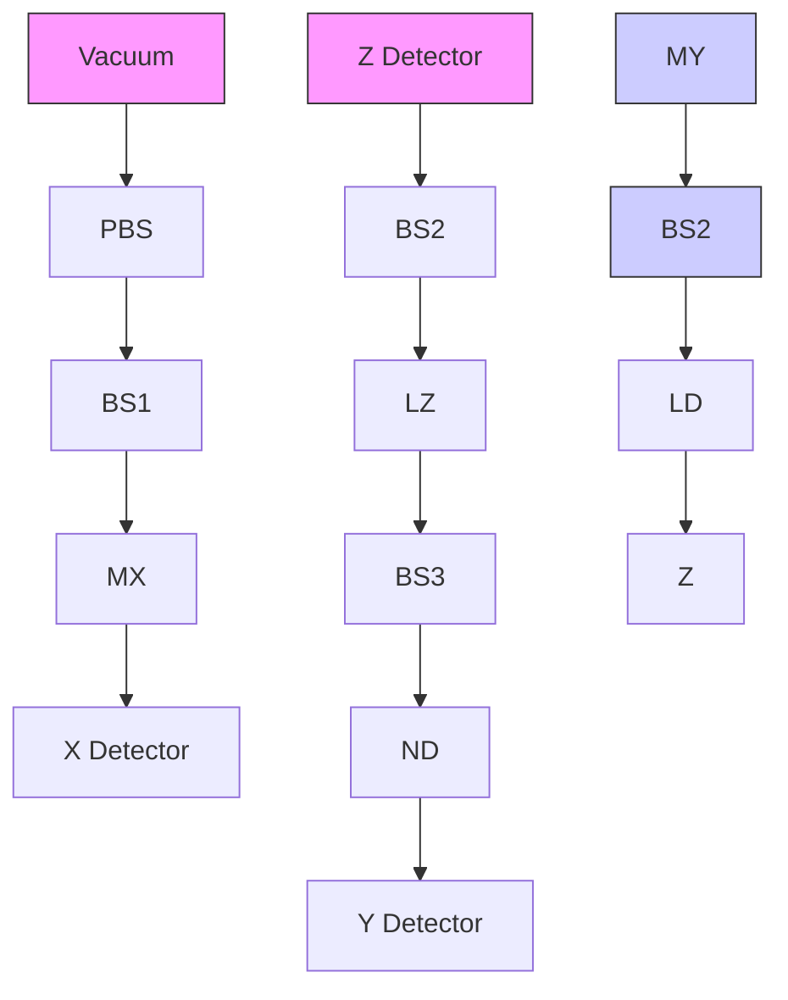
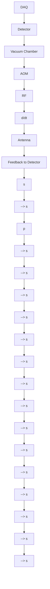
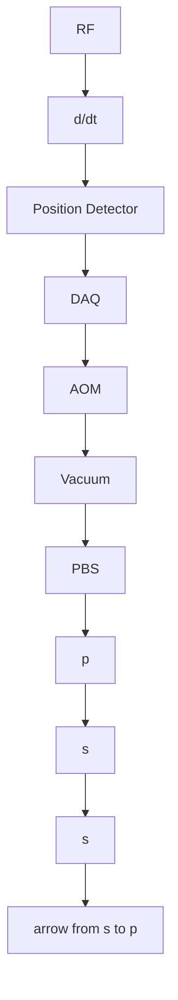

# Chapter 6 Millikelvin Cooling of an Optically Trapped Microsphere in Vacuum

# 6.1 Background

Optical cooling and trapping of atoms $[1-3]$ has led to dramatic breakthroughs in atomic, molecular and optical physics, including a new generation of atomic clocks, and realization of Bose–Einstein condensation and degenerate Fermi gas. Applying similar techniques to cool the mechanical motion of macroscopic objects towards the quantum ground state will benefit ultrahigh precision measurements and fundamental tests of macroscopic quantum physics $[4-6]$ . A major obstacle to achieving ground-state cooling of most mechanical oscillators $[7-13]$ is the thermal contact between oscillators and their environment. Recently, it was proposed that optical trapping of dielectric objects in vacuum would greatly reduce the thermal contact, and could even allow ground-state cooling from room temperature $[14-22]$ . Besides providing ideal isolation from the environment, the optical trap can be switched off for time-of-flight measurements to perform full tomography of the mechanical state $[21, 23]$ . Here we report optical trapping of $SiO_{2}$ microspheres in vacuum with high oscillation frequencies, and cooling of the center-of-mass motion to millikelvin temperatures with active feedback.

Feedback control has been used widely in industry and scientific experiments. The most commonly used feedback controller is a proportional-integral-derivative (PID) controller. A typical application of a PID controller is to stabilize the temperature of a system. In our lab, we routinely use PID controllers to stabilize the intensity of lasers.

A simple pendulum in air will oscillate if it is initially moved away from the equilibrium position. After oscillating for some time, the pendulum will decay to rest. In reality, however, the pendulum always vibrates with a small amplitude, due to external forces from seismic motion, and more fundamentally, due to the thermal Brownian stochastic force. Even at absolute zero temperature, the pendulum still oscillates because of the quantum zero-point energy. We can use feedback control to reduce the vibration amplitude. If the final vibration amplitude is smaller than the Brownian motion amplitude at thermal equilibrium, the feedback control is called

“feedback cooling” unless the reduction in amplitude corresponds to an increase in frequency. In order to do feedback cooling, the detection system must at least be able to resolve the Brownian motion of the system at thermal equilibrium.

According to the equipartition theorem, the root mean square (rms) amplitude of the Brownian motion of a trapped microsphere at thermal equilibrium is $x_{rms} = \sqrt{k_B T_0 / (M\omega^2)}$ , where $T_0$ is the environmental (air) temperature, $M$ is the mass of the microsphere, and $\omega$ is the angular trapping frequency. The characteristic size of the quantum ground-state wavefunction is $x_{ground} = \sqrt{\hbar / (M\omega)}$ , where $\hbar$ is Planck's constant/2 $\pi$ .

Previous experiments have demonstrated optical levitation of a $20 - \mu \mathrm{m}$ diameter sphere in vacuum with a trapping frequency of about $20\mathrm{Hz}$ [24], as well as feedback control of a trapped sphere which was used to increase the trapping frequency to several hundred hertz and stabilize its position to within a fraction of one micrometer [25]. However, the resolution of its detection system [25] was not sufficient to enable feedback cooling. For a $20 - \mu \mathrm{m}$ diameter sphere trapped at $100\mathrm{Hz}$ , the rms amplitude is about $0.04\mu \mathrm{m}$ at $300\mathrm{K}$ , and will be much smaller at lower temperature. The size of the quantum ground-state wavefunction is $x_{ground} = 0.14\mathrm{pm}$ . Both values are far smaller than the resolution of the detection system of the previous experiment [25]. It is also important that the trapping frequency be much higher than the frequencies of seismic vibration in order to achieve significant cooling.

This chapter describes our efforts on feedback cooling of an optically trapped microsphere in vacuum. We use a dual-beam optical tweezer to trap a $3.0 - \mu \mathrm{m}$ diameter sphere in vacuum with much higher oscillation frequencies (about $10\mathrm{kHz}$ ) to minimize the effects of instrumental vibration. We also demonstrate a detection system to monitor the motion of a trapped microsphere with a sensitivity of about $39\mathrm{fm} / \sqrt{\mathrm{Hz}}$ over a wide frequency range. Using active feedback, we simultaneously cool the three center-of-mass (COM) vibration modes of a microsphere from room temperature to a minimum mode temperature of $1.5\mathrm{mK}$ , which corresponds to the reduction of the rms amplitude of the microsphere from $6.7\mathrm{nm}$ to $15\mathrm{pm}$ for that mode.

# 6.2 Principle of Feedback Cooling

An optically trapped microsphere in non-perfect vacuum will exhibit Brownian motion due to collisions between the microsphere and residual air molecules. When there is no feedback cooling, the equation of the Brownian motion of an optically trapped microsphere is:

$$
\frac {d ^ {2} x _ {j}}{d t ^ {2}} + \Gamma_ {0} \frac {d x _ {j}}{d t} + \Omega_ {j} ^ {2} x = F _ {j} ^ {t h}, \tag {6.1}
$$

where $\Gamma_0$ is the viscous damping factor due to air molecules, $\Omega_j / 2\pi$ ( $j = 1, 2, 3$ ) are the resonant frequencies of the optical trap along the three fundamental axes (x, y, and z axes), and $F_j^{th} = \zeta_j(t)\sqrt{2k_BT\Gamma_0 / M}$ is the Brownian stochastic force.

The damping term $\Gamma_{0}\frac{dx}{dt}$ tends to stop any vibration, while the $F_{j}^{th}$ term drives the motion. It is very interesting that $\Gamma_{0}$ is also contained in $F_{j}^{th}$ . When the mechanical energy (sum of the kinetic energy and the potential energy) of the microsphere is larger than $k_{B}T$ in one direction, the $\Gamma_{0}\frac{dx}{dt}$ term will dominate and the mechanical energy of the microsphere will be reduced. On the other hand, the $F_{j}^{th}$ term will dominate and increase the mechanical energy of the microsphere if its mechanical energy is smaller than $k_{B}T$ . Thus the average mechanical energy of the microsphere will be $k_{B}T$ in each direction at thermal equilibrium.

At thermal equilibrium, the power spectrum of COM motion of a trapped microsphere along each of the three fundamental mode axes is [7, 12]:

$$
S _ {j} (\omega) = \frac {2 k _ {B} T _ {0}}{M} \frac {\Gamma_ {0}}{(\Omega_ {j} ^ {2} - \omega^ {2}) ^ {2} + \omega^ {2} \Gamma_ {0} ^ {2}}, \tag {6.2}
$$

where $\omega / 2\pi$ is the observation frequency.

# 6.2.1 Feedback Cooling

To implement feedback cooling, we apply an external force on the trapped microsphere:

$$
F _ {j} ^ {\text { cool }} = - \Gamma_ {j} ^ {\text { cool }} \frac {d x _ {j}}{d t}. \tag {6.3}
$$

The force is proportional to the velocity of the microsphere but with opposite direction. Thus it will slow down the motion of the microsphere. With feedback cooling, the equation of the Brownian motion of an optically trapped microsphere is:

$$
\frac {d ^ {2} x _ {j}}{d t ^ {2}} + (\Gamma_ {0} + \Gamma_ {j} ^ {\text { cool }}) \frac {d x _ {j}}{d t} + \Omega_ {j} ^ {2} x = \zeta_ {j} (t) \sqrt {\frac {2 k _ {B} T \Gamma_ {0}}{M}}. \tag {6.4}
$$

In contrast to the $\Gamma_{0}$ due to air molecules, $\Gamma_{j}^{cool}$ is only contained in the damping term but not in the heating term. So “feedback cooling” is also called “cold damping”.

With feedback cooling, the power spectrum of the COM motion of a trapped microsphere along each of the three fundamental mode axes is:

$$
S _ {j} ^ {\text { cool }} (\omega) = \frac {2 k _ {B} T _ {0}}{M} \frac {\Gamma_ {0}}{(\Omega_ {j} ^ {2} - \omega^ {2}) ^ {2} + \omega^ {2} (\Gamma_ {0} + \Gamma_ {j} ^ {\text { cool }}) ^ {2}}. \tag {6.5}
$$

Let $\Gamma_j^{tot} = \Gamma_0 + \Gamma_j^{cool}$ be the total damping factor, and $T_{j}^{cool} = T_{0}\Gamma_{0} / \Gamma_{j}^{tot}$ be the effective temperature of the motion with feedback cooling, the power spectrum can be rewritten as:

$$
S _ {j} ^ {\text { cool }} (\omega) = \frac {2 k _ {B} T _ {j} ^ {\text { cool }}}{M} \frac {\Gamma_ {j} ^ {\text { tot }}}{(\Omega_ {j} ^ {2} - \omega^ {2}) ^ {2} + \omega^ {2} (\Gamma_ {j} ^ {\text { tot }}) ^ {2}}, \tag {6.6}
$$

which has the same form as Eq. 6.2. The effective temperature along each axis may be different because $\Gamma_j^{cool}$ can be different along different directions. The motion can be cooled significantly by applying a feedback damping $\Gamma_j^{cool} \gg \Gamma_0$ . The lowest temperature will be limited by the noise in the detection system and feedback circuits, as well as coupling between different directions.

# 6.2.2 Feedback Amplification

Besides cooling, feedback control can also be used to amplify the motion. We can apply a force in the same direction as the velocity of the microsphere to amplify the motion:

$$
F _ {j} ^ {\text { amp }} = + \Gamma_ {j} ^ {\text { amp }} \frac {d x _ {j}}{d t}. \tag {6.7}
$$

With feedback amplification, the equation of the Brownian motion of an optically trapped microsphere is:

$$
\frac {d ^ {2} x _ {j}}{d t ^ {2}} + (\Gamma_ {0} - \Gamma_ {j} ^ {a m p}) \frac {d x _ {j}}{d t} + \Omega_ {j} ^ {2} x = \zeta_ {j} (t) \sqrt {\frac {2 k _ {B} T \Gamma_ {0}}{M}}. \tag {6.8}
$$

The power spectrum of COM motion of the microsphere is:

$$
S _ {j} ^ {a m p} (\omega) = \frac {2 k _ {B} T _ {0}}{M} \frac {\Gamma_ {0}}{(\Omega_ {j} ^ {2} - \omega^ {2}) ^ {2} + \omega^ {2} (\Gamma_ {0} - \Gamma_ {j} ^ {a m p}) ^ {2}}. \tag {6.9}
$$

When $\Gamma_j^{amp} < \Gamma_0$ , the system is stable. The effect of $\Gamma_j^{amp}$ is to amplify the motion and decrease the linewidth of the vibration from $\Gamma_0$ to $\Gamma_0 - \Gamma_j^{amp}$ . When $\Gamma_j^{amp} > \Gamma_0$ , the system is not stable and the microsphere will be lost. We have observed both feedback cooling and feedback amplification in our experiment by inverting the velocity signal.

# 6.2.3 Heating Due to Light Scattering

For a microsphere trapped by an optical tweezer, there are also heating effects due to the light scattered by the microsphere. The heating effects of light scattering can be separated to two parts. The first part is because of the shot noise of the laser. This effect is very small and has been calculated in Refs. [14, 15].

The second part is because the scattering force is not conservative. The scattering force can do net work on the microsphere when the microsphere moves over a closed loop under certain conditions $[26]$ . If the two counter-propagating beams of our dual-beam optical trap is slightly misaligned along x axis (Fig. 3.10), the scattering force on the microsphere is along the axial direction (z axis), and is proportional to the displacement of the microsphere along x axis. We have $\vec{F}_{scat} \propto x\hat{z}$ . For a microsphere moving in a loop in the x-z plane, the net work done by the scattering force over a loop is

$$
W = \oint \vec {F} _ {s c a t} d l \propto \sqrt {\langle x ^ {2} \rangle} \sqrt {\langle z ^ {2} \rangle}. \tag {6.10}
$$

The period of a harmonic oscillator is independent of the energy of the oscillator. The mechanical energy of the microsphere will increase due to the work done by the scattering force at a rate:

$$
\frac {d}{d t} (E _ {x} + E _ {z}) \propto \sqrt {\langle x ^ {2} \rangle} \sqrt {\langle z ^ {2} \rangle} \propto \sqrt {E _ {x} E _ {z}}, \tag {6.11}
$$

where $E_{x}$ and $E_{z}$ are mechanical energies of the microsphere. From this equation, it is clear that the scattering force couples the motion along different directions and can make the dynamics of the system very complex. Here we will try to obtain some qualitative properties of this heating effect. For simplicity, we assume that $E_{x}$ is proportional to $E_{z}$ , then $dE_{x}/dt \propto E_{x}$ . So the scattering force will cause a heating that is proportional to the mechanical energy of the microsphere. This effect can be minimized by better alignment of the two counter-propagating laser beams.

A phenomenological description of the feedback cooling process with this heating effect can be written in an equation about the average mechanical energy of the microsphere along each axis:

$$
\frac {d E _ {j}}{d t} = - \Gamma_ {0} E _ {j} - \Gamma_ {j} ^ {\text { cool }} E _ {j} + \Gamma_ {0} (k _ {B} T) + \alpha_ {j} E _ {j}. \tag {6.12}
$$

The first term $(- \Gamma_0 E_j)$ describes the damping due to the air, the second term is due to feedback cooling, the third term describes the heating effect due to the air, and the last term describes the heating effect due to the scattering force. The final effective temperature of motion of the microsphere in each direction is

$$
T _ {j} ^ {\text { cool }} = E _ {j} / k _ {B} = \frac {\Gamma_ {0} T}{\Gamma_ {0} + \Gamma_ {j} ^ {\text { cool }} - \alpha_ {j}}. \tag {6.13}
$$

The system will be stable when $\Gamma_0 + \Gamma_j^{cool} > \alpha_j$ and unstable when $\Gamma_0 + \Gamma_j^{cool} < \alpha_j$ . This provides a method to estimate $\alpha_j$ experimentally. To estimate the $\alpha_j$ , we turn off the feedback cooling forces to let $\Gamma_j^{cool} = 0$ . We first trap a microsphere at a high pressure. At high pressures, we have $\Gamma_0 > \alpha_j$ , and the system is stable. We then reduce the air pressure to reduce $\Gamma_0$ . At a certain pressure, the system becomes

unstable and microsphere is lost. Then we have $\alpha_{j} \approx \Gamma_{0}^{esc}$ , where $\Gamma_{0}^{esc}$ is the air damping factor at the moment when the microsphere is lost.

The heating rate due to the nonconservative force is proportional to the energy of the microsphere. As the energy of the microsphere is reduced by cooling, this heating effect becomes negligible and will not prevent ground state cooling. For cooling, we usually have $\Gamma_{j}^{cool} \gg \alpha_{j}$ , thus the effect of $\alpha_{j}$ on the final temperature is very small (Eq. 6.13). The heating effect of the scattering force will be much smaller for a single-beam optical tweezer.

The above discussions are based on classical mechanics, which is sufficient for understanding our current experiment. Quantum mechanical description of feedback cooling will be necessary if the motion of the microsphere is cooled to near the quantum ground state $[27–29]$ .

# 6.2.4 Damping Due to the Residual Gas in Vacuum

The viscous damping factor due to air can be calculated by kinetic theory. Assuming the reflection of air molecules from the surface of a microsphere is diffusive, and the molecules thermalize with the surface during collisions, we have $[30]$

$$
\Gamma_ {0} = \frac {6 \pi \eta R}{M} \frac {0 . 6 1 9}{0 . 6 1 9 + K n} (1 + c _ {K}), \tag {6.14}
$$

where $\eta$ is the viscosity coefficient of the air, $R$ is the radius of the microsphere, $M$ is the mass of the microsphere, and $Kn = l / R$ is the Knudsen number. Here $l$ is the mean free path of the air molecules. $c_{K} = (0.31Kn) / (0.785 + 1.152Kn + Kn^{2})$ is a small positive function of $Kn$ [30]. At low pressures where $Kn \gg 1$ , the viscous damping factor is proportional to the pressure. At high pressures where $Kn \ll 1$ , the viscous damping factor is $\Gamma_0 = 6\pi \eta R / M$ , which is the same as the prediction of Stoke's law.

Figure 6.1 shows the measured linewidth, $\Gamma_0 / 2\pi$ , of the oscillation of a trapped $3-\mu \mathrm{m}$ microsphere at different pressures without feedback cooling. The powers of the two trapping beams are 120 and $100\mathrm{mW}$ , respectively. The linewidths are obtained by fitting the measured power spectra with Eq. 6.2. The measured linewidths agree very well with the prediction of kinetic theory (Eq. 6.14) from $10^{5}\mathrm{Pa}$ down to 1 Pa. At pressures below 1 Pa, the measured linewidths are larger than the theoretical prediction. This linewidth broadening is due to power fluctuations of the trapping laser. The inset of Fig. 6.1 shows a power spectrum at $0.13\mathrm{Pa}$ . A more detailed power spectrum at $0.13\mathrm{Pa}$ (1 mtorr) is shown in Fig. 6.2. The trapping frequency $\omega_{1} / 2\pi$ is $9756.4\pm 0.3\mathrm{Hz}$ , and the linewidth is $0.46\pm 0.06\mathrm{Hz}$ , giving a quality factor ( $Q_{j} = \omega_{j} / \Gamma_{0}$ ) of $2.1\times 10^{4}$ . This implies the power fluctuation of the trapping laser is smaller than $0.01\%$ during the measurement. An optically trapped microsphere provides a method to directly convert laser power to a frequency signal, which can be measured precisely. Stabilization of laser power to a trapped bead can find applications in laser

line

| Pressure (Pa) | Γ₀ / 2π (Hz) |
| ------------- | ------------ |
| 0.1           | 0.5          |
| 1             | 1            |
| 10            | 10           |
| 100           | 100          |
| 1000          | 1000         |
| 10000         | 1000         |
| 100000        | 1000         |

Fig. 6.1 Measured linewidths of the oscillation of an optically trapped 3- $\mu$ m diameter microsphere at different pressures. The blue curve is the prediction of a kinetic theory (Eq. 6.14). The inset is the measured power spectrum at 0.13 Pa. By fitting the spectrum with Eq. 6.2 (red curve), we obtain $\omega_{1}=2\pi\cdot(9756.4\pm0.3)$ Hz and $\Gamma_{0}=2\pi\cdot(0.46\pm0.06)$ Hz for this example. The same method is used to obtain linewidths for other pressures

physics, and can enable a more precise measurement of the Q for a second trapped bead in vacuum.

Before feedback cooling, we observe a sharp transition in the trap lifetime as a function of pressure. Above the transition pressure, the microsphere can be trapped stably for many hours. Below the transition pressure, the microsphere is lost within a few seconds. This is because of the heating effect due to the light scattering, which has been discussed in the previous section. The transition pressure depends critically

line

| Frequency (kHz) | Power spectrum (nm²/Hz) |
| --------------- | ------------------------ |
| 0               | ~10⁻⁶                    |
| 5               | ~10⁻⁴                    |
| 10              | ~10²                     |
| 15              | ~10⁻⁶                    |
| 20              | ~10⁻⁸                    |

Fig. 6.2 The power spectrum of a trapped 3.0- $\mu$ m diameter microsphere at 1 mtorr

on the alignment of the two counter-propagating trapping beams. We can reduce it to less than 0.1 Pa by aligning the two laser beams. Thus $\alpha_{j}$ in Eq. 6.12 can be smaller than $2\pi \times 0.5$ Hz. We also observed limit cycles (vortices) in the motion of a trapped microsphere when the trapping beams are intentionally misaligned. A 3D simulation of the system is required in order to fully understand these phenomena.

# 6.3 A 3D Split Detection System

In order to monitor the motion of a trapped microsphere with ultrahigh precision in all three dimensions, we built a 3D split detection system. As shown in Fig. 6.3, the X, Y, and Z detectors are fast balanced photo-detectors with bandwidth of 75 MHz. They have two matched photodiodes to cancel the common mode noise in the laser beams, allowing ultra-high precision measurements of the position of a trapped microsphere. When a trapped microsphere moves in the horizontal (vertical) direction, it deflects the trapping beam in the horizontal (vertical) direction. This changes the relative power between the two beams after the MX (MY) mirror, which is measured by the X (Y) detector. The motion of a trapped bead along the trap axis changes the divergence angle of the output beam, which changes the waists of incident beams

flowchart

Fig. 6.3 Simplified schematic showing the detection system that can monitor the real-time position of a trapped microsphere with ultra-high precision in all three dimensions. One of the trapping beams (the other trapping beam is not shown) passes through a trapped microsphere inside a vacuum chamber and is reflected by a polarizing beam splitter cube (PBS). It is then split to three beams by two beam splitters (BS1 and BS2) for 3D detection. MX is a mirror with a sharp edge that splits the beam into two parts horizontally. MY is a mirror with a sharp edge that splits the beam into two parts vertically. BS3 is a beam splitter, ND is a neutral density filter, and LZ is a lens. The X, Y, and Z detectors are balanced detectors that have two matched photodiodes to cancel the common mode noise in the laser beams

on the Z detector. One photodiode of the Z detector is smaller than the waist of the incident beam. It measures only part of the power of the incident beam. Thus its output voltage depends on the waist of the incident beam, which is a function of the position of the microsphere in Z axis. The other photodiode of the Z detector is much larger than the waist of the incident beam. It measures the total power of the incident beam. Thus its output voltage does not depend on the waist of the incident beam, and can serve as a reference signal $[31]$ . A photo of our 3D detection system is shown in Fig. 6.4.

For small displacements of a trapped microsphere near the trap center, the voltage output $(U_{i})$ of each detector is proportional to the displacement $(x_{i}^{D})$ of the microsphere along the detection direction, i.e. $U_{i} = \beta_{i} x_{i}^{D}$ , where i = 1, 2, 3 denotes X, Y, and Z detectors, and $\beta_{i}$ is the calibration factor of the detector. We align the detection system carefully to make the detection direction of each detector be parallel to one of the trap's fundamental mode axes. In reality, however, there is always slight difference between the detection directions and the fundamental mode axes. Thus the voltage output from each detector is a combination of signals from each mode, i.e. $U_{i} = \beta_{i} (\alpha_{i1} x_{1}^{M} + \alpha_{i2} x_{2}^{M} + \alpha_{i3} x_{3}^{M})$ , where $x_{j}^{M} (j = 1, 2, 3)$ is the displacement of the microsphere along the fundamental mode axis $\hat{x}_{j}^{M}$ , and $\alpha_{ij}$ is the projection coefficient of $\hat{x}_{j}^{M}$ to the detection direction $\hat{x}_{i}^{D}$ . Usually only one term dominates as the detection directions are almost parallel to the mode axes.

The expected value of the power spectrum of the voltage output from each detector is [32]:

$$
S _ {i} ^ {U} (\Omega) \equiv \langle | \widetilde {U} _ {i} | ^ {2} / T _ {m s r} \rangle = \beta_ {i} ^ {2} \langle | \alpha_ {i 1} \widetilde {x} _ {1} ^ {M} + \alpha_ {i 2} \widetilde {x} _ {2} ^ {M} + \alpha_ {i 3} \widetilde {x} _ {3} ^ {M} | ^ {2} / T _ {m s r} \rangle , \tag {6.15}
$$

where $T_{msr}$ is the measurement time, $\widetilde{U}_{i}$ and $\widetilde{x}_{j}^{M}$ are Fourier transforms of $U_{i}$ and $x_{j}^{M}$ , respectively. The expansion of $S_{i}^{U}(\Omega)$ has 9 terms, but the expected values of the

natural_image

Close-up of an optical experimental setup with mechanical components and a labeled camera (no readable text or symbols beyond label)

Fig. 6.4 A photo of our 3D detection system and a camera for imaging a trapped microsphere with the scattered light. Red lines are drawn on the photo to show the light paths of the detection system

cross correlation terms $\langle\widetilde{x}_{i}^{M}\widetilde{x}_{j}^{M}\rangle(i\neq j)$ are 0 when there is no feedback, because the three components of the motion of a microsphere in a harmonic trap are uncorrelated. With active feedback, there can be small correlations between different directions if the feedback loops are coupled. In real experiments, the coupling is small and the trapping frequencies are different along different directions, thus we assume that the average values of the cross correlations are negligible. Then

$$
S _ {i} ^ {U} (\omega) = \beta_ {i} ^ {2} [ \alpha_ {i 1} ^ {2} S _ {1} (\omega) + \alpha_ {i 2} ^ {2} S _ {2} (\omega) + \alpha_ {i 3} ^ {2} S _ {3} (\omega) ], \tag {6.16}
$$

where $S_{j}(\omega)$ is the power spectrum of COM motion along each fundamental mode axis. $S_{j}(\omega)$ is described by Eq.6.2 without feedback cooling, and by Eq. 6.5 with feedback cooling.

The detection system can be calibrated by fitting the measured power spectra at room temperature with the expected power spectra $S_{i}^{U}(\omega)$ to obtain calibration factor $\beta_{i}^{2}\alpha_{ij}^{2}$ for each mode that is distinguishable in the power spectra. We can also obtain $\beta_{i}^{2}$ directly by the energy equipartition theorem, which says $\langle Mv_{i/2}^{2}\rangle = k_{B}T_{0}/2$ , where $v_{i}$ is the instantaneous velocity of the microsphere projected onto any axis. Since $U_{i} = \beta_{i}x_{i}^{D}$ , we have $\beta_{i}^{2} = \frac{M}{k_{B}T_{0}}\langle\left(\frac{dU_{i}}{dt}\right)^{2}\rangle$ . With $\beta_{i}^{2}\alpha_{ij}^{2}$ and $\beta_{i}^{2}$ , we can easily obtain $\alpha_{ij}^{2}$ to check the alignment of our detection system. In the experiment, each detector is used to monitor only one mode, so only three calibration factors ( $\beta_{1}^{2}\alpha_{11}^{2}$ , $\beta_{2}^{2}\alpha_{22}^{2}$ , and $\beta_{3}^{2}\alpha_{33}^{2}$ ) are required for measuring the mode temperatures with feedback cooling.

The mass of the microsphere is required to obtain the calibration factors. The pure silica $\left(\mathrm{SiO}_{2}\right)$ microspheres used in this experiment are from Bangs Laboratories, Inc. Their mean diameter is $3.0\mu m$ , corresponding to a mean mass of $2.8\times10^{-14}kg$ for each microsphere. The standard deviation of the size given by the supplier is 14%. The exact diameter of the microsphere is not important for feedback cooling. The temperatures of the feedback-cooled motion are obtained by comparing the power spectra of the same microsphere with and without feedback cooling, a measurement which is independent of the exact size of the microsphere. The viscous damping factor $\left(\Gamma_{0}\right)$ of a microsphere in air, however, depends on the size of the microsphere. Using the measured damping factor shown in Fig. 6.1, we obtain the diameter of a microsphere by kinetic theory (Eq. 6.14) to be $2.7\mu m$ , which is within the uncertainty range given by the supplier.

# 6.4 1D Optical Feedback Cooling

Figure 6.5 shows the first feedback cooling scheme that we used in our experiment. The position signal of a trapped microsphere is sent through a preamplifier that has a bandpass filter, and a derivative circuit (d/dt) to provide a signal proportional to the velocity of the microsphere. This velocity signal is used to control the frequency

flowchart

Fig. 6.5 Diagram of a 1D feedback cooling scheme. The position of a trapped microsphere is monitored by a home-built detection system. The position signal is sent through a preamplifier which has a bandpass filter (typically 100 Hz to 300 kHz), and a derivative circuit (d/dt) to provide a signal proportional to velocity. This velocity signal is used to control the frequency of a radio frequency (RF) AOM driver which modulates the direction of the laser beam. The data is digitized and stored on a computer by a data acquisition card (DAQ)

of the output signal of a radio frequency (RF) deflector driver (IntraAction, Model: DE-802M26). The output of the driver is a single frequency signal in the range of 60–100 MHz. The driver has an analog input to modulate the frequency of the signal. An analog input signal from 0 to 1 V will change the frequency of the output signal by 40 MHz. The RF signal drives an acousto-optic modulator (AOM) which controls the p-polarized trapping beam. The frequency of the RF signal determines the direction of the laser beam, and the power of the RF signal determines the power of the laser beam. Here we do feedback cooling by changing the direction of one of the trapping beams in the horizontal direction. The laser beam will exert a force on the microsphere as a function of its velocity in the horizontal direction, which cools the motion of the microsphere.

The preamplifier (SR560, Stanford Research Systems) has a very low input noise (about $4 \, nV/\sqrt{Hz}$ ), and a variable gain from 1 to $5 \times 10^{4}$ . In this experiment, we only need the gain to be about 2 or 5 because the output signal from the detector is pretty big already. The preamplifier contains two first-order RC filters that can be set to -3 dB cutoff frequencies chosen from a 1–3–10 sequence, from 0.03 Hz to 1 MHz. We typically set the low cutoff frequency to be 100 Hz and the high cutoff frequency to be 300 kHz. The preamplifier also has a function to invert the signal, which is very useful. The derivative circuit is simply the 'derivative' branch of an analog PID controller. We first used a commercial PID controller (SIM 960, Stanford Research Systems). It has a lot of powerful functions, including digital control of the P, I, D, and Offset. However, it picks up some external electronic noise through its power

text_image

C2
R2
Vin —— R1 —— C1 —— 2 —— 6 —— R3 —— Vout
          |        |
          +        |
          3        |
          —        |
          —        |
          —        |
          —        |
          —        |
          —        |
          —        |
          —        |
          —        |
          —        |
          —        |
          —        |
          —        |
          —        |
          —        |
          —        |
          —        |
          —        |
          —        |
          —        |
          —        |
          —        |
          —        |
          —        |
          —        |
          3        |
          —        |
          —        |
          —        |
          —        |
          —        |
          —        |
          —        |
          —        |
          —        |
          —        |
          —        |
          —        |
          —        |
          —        |
          —        |
          —        |
          —        |
          —        |
          —        |
          —        |
          —        |
          —        |
          —        |
      OPA227

Fig. 6.6 A derivative circuit for calculating the real-time velocity of a microshpere from its position signal

cord. We eventually decided to use our home-built derivative circuit for feedback cooling.

A detailed description of our home-built PID controllers can be found in Appendix C.1 of the Ph.D dissertation of Todd Meyrath [33]. The 'derivative' part of the circuit is shown in Fig. 6.6. The main component of the circuit is the low-noise operational amplifier, the capacitor C1 and the tunable resistor R2. The operational amplifier is OPA227 from Texas Instruments. It has a low noise level of $3\mathrm{nV} / \sqrt{\mathrm{Hz}}$ and a wide bandwidth of $8\mathrm{MHz}$ . The differentiation time of the derivative circuit is $\mathrm{C1} \times \mathrm{R2}$ . It is important that the OPA227 is unity-gain stable. We have tried to use an OPA228 amplifier which is faster than the OPA227, but the circuit is not as stable for low gain. The resistor R1 is much smaller than R2, and the capacitor C2 is much smaller than C1. R1 limits the differential gain, and C2 gives high frequency roll-off. R1 and C2 are necessary because the derivative circuit has a very large gain at high frequencies. For a pure derivative circuit, if the input signal is $V_{in} = \sin (\omega t)$ , then the output will be $V_{out} = \omega \cos (\omega t)$ , which will be infinite if $\omega$ is infinite. Thus a derivative circuit amplifies high frequency noise. So we use R1 to limit the gain, and C2 to serve as a low-pass filter to reduce the gain of high frequency noise. R3 is used to isolate the derivative circuit from other parts of the circuit so that they do not interfere with each other. Typical values of the resistors and capacitors are $\mathrm{R1} = 50\Omega$ , $\mathrm{C1} = 2.2\mathrm{nF}$ , $\mathrm{R2} = 0 - 50\mathrm{k}\Omega$ , $\mathrm{C2} = 0.1\mathrm{nF}$ , and $\mathrm{R3} = 1\mathrm{k}\Omega$ .

Figure 6.7 shows some results of the 1D feedback cooling. In Fig. 6.7a, the rms velocity of the microsphere is reduced from 0.43 mm/s to 0.090 mm/s by 1D feedback cooling. The temperature of the Brownian motion is reduced from room temperature (297 K) to 13 K. Figure 6.7b shows the power spectra of the microsphere with (blue curve) and without (red curve) feedback cooling at 208 mtorr. With 1D feedback cooling, the peak near 10 kHz is reduced by 2 orders, while the peaks near 800 Hz and 3 kHz do not change very much. Thus the 1D feedback cooling only cools the motion along one direction efficiently.

In the red curve of Fig. 6.7b, the peak at $10\mathrm{kHz}$ corresponds to the mode along the X axis, the tiny peak at $9\mathrm{kHz}$ corresponds to the mode along the Y axis. These

line

| Velocity (mm/s) | no feedback, 26 torr | with feedback, 4 mtorr |
| --------------- | -------------------- | ---------------------- |
| -1.5            | 0.0                  | 0.0                    |
| -1.0            | 0.1                  | 0.0                    |
| -0.5            | 0.5                  | 0.0                    |
| 0.0             | 1.0                  | 1.0                    |
| 0.5             | 0.5                  | 0.0                    |
| 1.0             | 0.1                  | 0.0                    |
| 1.5             | 0.0                  | 0.0                    |

line

| Frequency (Hz) | no feedback | with feedback |
| -------------- | ----------- | ------------- |
| 100            | ~0.01       | ~0.01         |
| 1000           | ~10         | ~10           |
| 10000          | ~1000       | ~10           |

Fig. 6.7 a The normalized velocity distributions of a trapped 3.0- $\mu$ m diameter microsphere without feedback cooling at 26 torr (red curve), and with feedback cooling at 4 mtorr (blue curve). b The power spectra of the microsphere with (blue curve) and without (red curve) feedback cooling at 208 mtorr

two modes have almost the same frequency because the laser beam is only slightly elliptical. The peak at 3 kHz corresponds to the Z mode. We initially thought the peak at 800 Hz corresponds to the Z mode. After an extensive study, we believe that the 800 Hz peak is because of the frequency difference between the X and Y mode. This became clear when we do 3D feedback cooling. The Z cooling beam reduced the 3 kHz mode efficiently, but did not reduce the 800 Hz peak efficiently. The frequency (800 Hz) equals the frequency difference between the X and Y mode. We are also able to make the 800 Hz peak disappear by better alignment.

scatter

| Horizontal position (a.u.) | Vertical position (a.u.) |
| -------------------------- | ------------------------ |
| 0.00                       | 0.05                     |
| 0.05                       | 0.04                     |
| 0.10                       | 0.03                     |
| 0.15                       | 0.02                     |
| 0.20                       | 0.01                     |
| 0.25                       | 0.00                     |
| 0.30                       | -0.01                    |

scatter

| Horizontal position (a.u.) | Vertical position (a.u.) |
| -------------------------- | ------------------------ |
| 0.05                       | -0.10                    |
| 0.10                       | -0.05                    |
| 0.15                       | 0.00                     |
| 0.20                       | 0.05                     |
| 0.25                       | 0.10                     |
| 0.30                       | 0.15                     |
| 0.35                       | 0.20                     |

Fig. 6.8 a Modulation of the direction of beam No. 2 (the p-polarized beam) with an AOM in the horizontal direction. b Modulation of the direction of beam No. 2 with an AOM in the vertical direction

We later installed another AOM to control the direction of beam No. 2 (the p-polarized beam) in the vertical direction. Thus we can do 3D feedback cooling by modulating the intensity of beam No. 2, and the directions of beam No. 2 in horizontal and vertical directions. The beam No. 1 (the s-polarized beam) is not modulated because it is used for detection. We have tried such 3D feedback cooling method, but we were only able to cool the motion from 297 K to about 10 K.

We finally found out the problem after struggling for several months. In order to find out the problem, we use a quadrant detector to monitor the motion of a laser beam when we modulate its direction by an AOM. Figure 6.8 shows the motion of the center of beam No. 2 when we modulate its directions with an AOM (IntraAction, model: ATM-801A2) in the horizontal direction (a) and an AOM in the vertical direction (b). We use a sine signal with peak-to-peak voltage of $2\mathrm{mV}$ at $10\mathrm{kHz}$ to drive the analog input of the RF driver. This modulates the frequency of the RF signal (centered at about $80\mathrm{MHz}$ ) by $80\mathrm{kHz}$ . Thus the frequency of the RF signal is $80\mathrm{MHz} + 40\mathrm{kHz}\cdot \sin (2\pi 10^{4}t)$ , where $t$ is time. Ideally, the data points should be a straight horizontal line in Fig. 6.8a and a straight vertical line in Fig. 6.8b. However, the experimental points are not in a straight line, especially in Fig. 6.8b. This means that when we use an AOM to control the laser along the vertical direction, the laser beam also moves along the horizontal direction in a very complex way. Thus when we cool the motion vertically, we also heat the motion horizontally. This limits the final temperature of the feedback cooling with this method.

Figure 6.9 shows the motion of the center of beam No. 1 (the s-polarized beam) when we modulate its direction with an AOM (Isomet, model: 1205C-2-804) in the horizontal direction. We want it to be a straight line in the horizontal direction. However, the real motion of the laser beam is very complex.

Fig. 6.9 Modulation of the direction of beam No. 1 with an AOM in the horizontal direction   

scatter

| Horizontal position (a.u.) | Vertical position (a.u.) |
| -------------------------- | ------------------------ |
| -1.5                       | -0.5                     |
| -1.0                       | -0.8                     |
| -0.5                       | -0.3                     |
| 0.0                        | -1.0                     |
| 0.5                        | -0.7                     |

# 6.5 Electrostatic Forces

After we found the problem of modulating the direction of a laser beam with an AOM, we decided to try to perform feedback cooling using electrostatic forces. The natural charge of a microsphere is negligible. It is necessary to charge the microsphere first in order to apply sufficient electrostatic forces for feedback cooling.

Figure 6.10 shows our setup for air discharge and feedback cooling with an electrostatic force. The stainless steel mounts of the two aspheric lenses and the whole vacuum chamber are grounded. A thin stainless steel sheet is inserted half way between the two lenses. It is connected to a high-voltage amplifier that can deliver a

text_image

Vacuum Chamber
V

Fig. 6.10 Setup for air discharge and feedback cooling with an electrostatic force. The stainless steel holders of the two aspheric lenses and the whole vacuum chamber are grounded. The smallest separation between the two holders is about 4 mm. A thin stainless steel sheet is inserted at the center of the two lenses as an electrode. The edge of the steel sheet is about 1 mm away from where the microsphere is trapped. The steel sheet is connected to a high-voltage amplifier that can deliver 0–1 kV voltage output

0–1 kV voltage output. There will be a strong electric field between the steel sheet and the steel holders when a high voltage is applied to the steel sheet. At high voltage, the air breaks down and becomes conductive. This can damage the high-voltage amplifier. We connect a 1 MΩ resistor in series with the steel sheet and the high-voltage amplifier to limit the peak current.

We first trapped a microsphere with the dual-beam optical trap at about 100 torr. We then reduced the pressure to about 0.5 torr. With the microsphere trapped, we applied an AC voltage in the form of $V(t) = V_{0}[\sin (2\pi ft) + 1] / 2$ to the steel sheet. The frequency of the AC voltage was typically about $1\mathrm{kHz}$ . We increased the peak voltage slowly from a few volts to several hundred volts until air discharge occurred. A spectrum of the motion of a trapped microsphere at 461 mtorr driven by a $1.5\mathrm{kHz}$ , $V_{0} = 340\mathrm{V}$ signal is shown in Fig. 6.11a. The peak at $1.5\mathrm{kHz}$ due to the AC signal is very small, because the natural charge of the microsphere is very small. When the peak voltage was increased to $680\mathrm{V}$ , air discharge occurred. The microsphere moved violently during the air discharge. Thus there are a lot of peaks in Fig. 6.11b. It is surprising to us that the optical tweezer is stable enough to trap a microsphere during air discharge. We reduced the peak voltage in a few seconds after air discharge occurred to avoid the loss of the microsphere. The microsphere gained charge during air discharge. Figure 6.11c shows a spectrum of the motion of the microsphere driven by a $1.5\mathrm{kHz}$ , $V_{0} = 340\mathrm{V}$ signal after air discharge. The peak at $1.5\mathrm{kHz}$ after discharge is about 4 orders higher than the peak before discharge.

After air discharge, the microsphere maintains its charge, even at high pressures. Figure 6.12 shows a spectrum of the motion of a trapped microsphere at 205 torr after air discharge. The microsphere is driven by a 400 Hz, $V_{0} = 510$ V AC voltage. The height of the peak at 400 Hz is proportional to the square of the charge of the microsphere. By measuring the height of the peak, we can monitor the charge of the microsphere as a function of time. Figure 6.13 displays the charge of the microsphere as a function of time over a period of 2 h. The charge fluctuates because there is a weak air discharge near the microsphere. So the microsphere gains and losses charges over time. The shape of the curve depends on the driving voltage and the air pressure. We have not been able to observe individual steps in the curve when the microsphere gains or loses one electron.

According to Coulomb's law, the force between two point charges $q_{1}$ and $q_{2}$ is:

$$
F = k _ {e} \frac {q _ {1} q _ {2}}{r ^ {2}} \tag {6.17}
$$

where $k_{e} = 8.99 \times 10^{9} ~N \cdot m^{2} ~C^{-2}$ is the Coulomb constant, and r is the distance between the two point charges. The force between two electrons separated by 1 mm and 1 $\mu$ m is $2.3 \times 10^{-22} ~N$ and $2.3 \times 10^{-16} ~N$ , respectively.

When N electrons e are distributed homogeneously on the surface of a microsphere with radius R, the energy required to add another electron is about:

$$
E = k _ {e} \frac {N e ^ {2}}{R} \tag {6.18}
$$

  
Fig. 6.11 Spectra of the motion of a trapped microsphere before (a), during (b) and after (c) air discharge. The pressure is 461 mtorr. The frequency of the AC voltage is 1.5 kHz, and the air discharge happens when the peak voltage is about 680 V. We reduce the peak voltage in several seconds after air discharge occurs to avoid the loss of the microsphere

line

| Frequency [Hz] | Amplitude (dB) |
| -------------- | -------------- |
| 1              | -40.0          |
| 10             | -60.0          |
| 100            | -80.0          |
| 1k             | -100.0         |
| 10k            | -120.0         |
| 100k           | -130.0         |
| 1M             | -130.0         |
| 2M             | -130.0         |

Fig. 6.12 Spectrum of the motion of a trapped microsphere at 205 torr after air discharge. The microposphere is driven by a 400 Hz, $V_{0} = 510$ V AC voltage. After air discharge, the microsphere maintains its charge even at high pressure

For a $R = 1.5 \mu m$ microsphere, the required energy is $k_{B} T/2$ at room temperature when N = 13. Thus the natural charge of a 3- $\mu m$ diameter microsphere is in the order of 13 e. We do not know the exact charge of the microsphere after air discharge, but estimate it to be on the order of 1000 e from the power spectrum (Fig. 6.11), which corresponds to E = 1 eV. The maximum electric field at the trap center is about 10 V/mm. Thus the maximum electrostatic force on the microsphere is in the

line

| Time (minute) | Charge (a.u.) |
| ------------- | ------------- |
| 0             | 0.17          |
| 20            | 0.20          |
| 40            | 0.19          |
| 60            | 0.18          |
| 80            | 0.17          |
| 100           | 0.19          |
| 120           | 0.18          |

Fig. 6.13 Fluctuation of the charge of a 3- $\mu$ m-diameter microsphere trapped at 205 torr, driven by a 400 Hz, $V_{0} = 680$ V signal. a.u. arbitrary unit

order of 1.6pN. This is consistent with the observed shift of the trap center when we apply a DC voltage.

The air discharge is not very controllable. This makes the current setup (Fig. 6.10) not suitable for feedback cooling. We have tried to implement feedback cooling with electrostatic forces and were able to cool the motion from room temperature to about $10\mathrm{K}$ . The final temperature is limited by the fact that the charge of the microsphere fluctuates, and we do not know the real direction of the electrostatic force. These problems can be solved by a better design of the electrodes and a better charging method. The electrodes of a quadrupole ion trap [34] should be ideal for 3D feedback cooling with electrostatic forces. The microsphere can be charged by photoelectric charging with a ultraviolet lamp [34, 35], by using electrospray [36] or an electron gun. Combining an optical trap with an ion trap in the same location should be helpful in trapping and studying particles at ultrahigh vacuum.

# 6.6 Millikelvin Cooling with 3D Optical Feedback

Since significant efforts were required to improve feedback cooling with electrostatic forces, we decided to try feedback cooling with optical forces again. This time, we used AOM's to modulate the intensities of laser beams rather than the directions of laser beams to do 3D feedback cooling. This method turned out to work very well. It enables us to cool the center-of-mass motion of a trapped microsphere from room temperature to millikelvin temperatures in all three dimensions, with a minimum mode temperature of $1.5\mathrm{mK}$ [37].

# 6.6.1 Experimental Setup

A simplified scheme of our optical trap and cooling beams is shown in Fig. 6.14. The dual-beam optical trap is the same as described before. It is created inside a vacuum chamber by two counter-propagating laser beams focused to the same point by two identical aspheric lenses with a focal length of $3.1\mathrm{mm}$ and numerical aperture of 0.68. The wavelength of both trapping beams is $1064\mathrm{nm}$ . They are orthogonally polarized, and are shifted in frequency to avoid interference. The beams are slightly elliptical and approximately form a harmonic trap with three fundamental vibration modes along the horizontal, vertical and axial directions, denoted X, Y, and Z in Fig. 6.14. The motion of a trapped bead causes deflection of both trapping beams. We monitor the position of the bead by measuring the deflection of one of the trapping beams with ultrahigh spatial and temporal resolution in all three dimensions (Fig. 6.3).

Using the position signal, we can calculate the instantaneous velocity of the bead, and implement feedback cooling by applying a force with a direction opposing the velocity (Fig. 6.15). The feedback is generated by scattering forces from three orthogonal $532\mathrm{nm}$ laser beams along the axes as shown in Fig. 6.3. The average intensity

text_image

Y cooling beam
s-polarized trap beam
Z cooling beam
X cooling beam
p-polarized trap beam

Fig. 6.14 Simplified schematic showing a glass microsphere trapped at the focus of a counterpropagating dual-beam optical tweezer, and three laser beams along the axes for cooling. The wavelengths of the trapping beams and the cooling beams are 1064 and 532 nm, respectively

flowchart

Fig. 6.15 Diagram of the feedback mechanism for the X axis: The position of a trapped microsphere is monitored by a home-built detecting system. The position signal is sent through a bandpass filter (typically 100 Hz to 300 kHz) and a derivative circuit (d/dt) to provide a signal proportional to velocity. This velocity signal is used to control the output power of a radio frequency (RF) AOM driver which modulates the power of the X cooling beam. The data is digitized and stored on a computer by a data acquisition card (DAQ)

natural_image

Interior view of a high-tech optical experimental setup with green laser beams and mechanical components (no visible text or symbols)

Fig. 6.16 A photo of the 3D optical feedback cooling system

of the cooling beams is about 1% that of the trapping beams. The optical power of each cooling beam is controlled by an acousto-optic modulator (AOM). Each beam is modulated with a time-varying signal proportional to the instantaneous velocity of the bead, added to an offset. The proportional component generates the required cooling force, while the offset slightly shifts the trap center. A photo of the optics of our 3D optical feedback cooling system is displayed in Fig. 6.16. The green color in the photo is due to the scattered light from the cooling beams. The trapping beams are infrared and cannot be seen in this photo.

Figure 6.17 shows the power of the first order of a laser beam exiting the AOM as a function of the input voltage of the RF driver (IntraAction, model: ME-802) and the reading of the manual offset knob of the RF AOM driver. In general, the laser power is a nonlinear function of the input voltage. When the knob reading is at 5, the laser power depends on the input voltage linearly around 0. This is good for feedback cooling because we want the laser power to be proportional to the velocity of the microsphere. Thus we set the knob reading at 5, and use the velocity signal as the input voltage to control the laser power for feedback cooling.

The behavior of the system with three dimensional (3D) feedback cooling is straightforward to understand if we assume that there is no coupling between feedback forces and velocities in different directions. In this case, the feedback force in each direction adds an effective cold damping factor $\Gamma_{j}^{fb}$ , and the total damping becomes $\Gamma_{j}^{tot} = \Gamma_{0} + \Gamma_{j}^{fb}$ . The power spectrum of the motion of a trapped microsphere with feedback cooling can be described by Eq. 6.5. The temperature of the motion with feedback cooling will be $T_{j}^{fb} = T_{0}\Gamma_{0}/\Gamma_{j}^{tot}$ . Thus the motion can be cooled significantly by applying feedback damping $\Gamma_{j}^{fb} \gg \Gamma_{0}$ . The lowest temperature will be limited by the noise in the detection system and feedback circuits, as well as coupling between different directions.

line

| V_in or 0.1* Carrier Level | Knob | CL=1 | CL=2 | CL=5 |
| -------------------------- | ---- | ---- | ---- | ---- |
| -0.9                       | 1150 | 1170 | 1160 | 980  |
| -0.8                       | 1100 | 1130 | 1120 | 780  |
| -0.7                       | 1050 | 1080 | 1060 | 550  |
| -0.6                       | 950  | 980  | 940  | 350  |
| -0.5                       | 850  | 920  | 860  | 200  |
| -0.4                       | 750  | 850  | 760  | 100  |
| -0.3                       | 650  | 780  | 680  | 50   |
| -0.2                       | 550  | 700  | 600  | 25   |
| -0.1                       | 450  | 620  | 520  | 15   |
| 0.0                        | 350  | 540  | 440  | 10   |
| 0.1                        | 450  | 620  | 520  | 25   |
| 0.2                        | 650  | 780  | 680  | 45   |
| 0.3                        | 850  | 920  | 860  | 65   |
| 0.4                        | 1050 | 1130 | 1120 | 85   |
| 0.5                        | 1150 | 1170 | 1160 | 105   |
| 0.6                        | 1180 | 1190 | 1180 | 115   |
| 0.7                        | 1150 | 1170 | 1160 | 110   |
| 0.8                        | 1100 | 1130 | 1120 | 98   |
| 0.9                        | 1050 | 1100 | 1100 | 85   |
| >0.9                       | ~980 | ~970 | ~960 | ~78   |

Fig. 6.17 Control of the laser power with an AOM. The AOM is driven by a RF driver which uses an analog input to control the RF power electronically and a knob to tune the RF power manually. The analog input accepts a voltage from 0 to 1 V, and the knob has a reading (carrier level) from 0 to 10. For the black curve, the analog voltage input is zero, and the manual knob is tuned from 0 to 10. The other curves are the power of the laser as a function of the analog input when the knob is set at different readings (red knob reading at 1; green knob reading at 2; blue knob reading at 5)

# 6.6.2 Results of 3D Optical Feedback Cooling

Figures 6.18, 6.19 and 6.20 show experimental results of feedback cooling. Before feedback is turned on, the resonant frequencies ( $\omega_{j}/2\pi$ ) are $8066 \pm 5$ Hz, $9095 \pm 4$ Hz, and $2072 \pm 6$ Hz for the fundamental modes at 637 Pa along the X, Y, and Z axes, respectively. At this pressure, the peaks in the power spectrum due to the three fundamental modes are distinguishable, and heating effects due to the laser are negligible. We can therefore use the measured power spectra at 637 Pa to calibrate the position detectors for the fundamental modes at room temperature. After we turn on feedback cooling, the temperature of the Y mode changes from 297 to 24 K at 637 Pa. The mode temperature is obtained by fitting the measured power spectrum with Eq.6.6.

After switching on the feedback circuits, we reduce the air pressure while keeping the feedback gain almost constant, thus the heating rate due to collisions from air molecules decreases, while the cooling rate remains constant. As a result, the temperature of the motion drops. At 5.2 mPa, the mode temperatures are $150 \pm 8$ mK, $1.5 \pm 0.2$ mK, and $68 \pm 5$ mK for the x, y and z modes. The mean thermal occupation number $\langle n \rangle = k_{B} T_{j}^{fb} / \hbar \omega_{j}$ of the y mode is reduced from about $6.8 \times 10^{8}$ at 297 K to about 3400 at 1.5 mK. Figure 6.21 shows the temperature of the three fundamental modes as a function of pressure. At low pressure and when the feedback gain is constant, the mode temperature should be proportional to the pressure, which is shown

line

| Frequency (kHz) | 297 K       | 42 K        | 150 mK      | noise       |
| --------------- | ----------- | ----------- | ----------- | ----------- |
| 1               | ~10⁻³       | ~10⁻³       | ~10⁻⁷       | ~10⁻⁹       |
| 10              | ~10⁻¹       | ~10⁻³       | ~10⁻⁷       | ~10⁻⁹       |
| 100             | ~10⁻⁵       | ~10⁻⁵       | ~10⁻⁸       | ~10⁻⁹       |

Fig. 6.18 Power spectra of a trapped 3- $\mu$ m diameter microsphere along the X axis as it is cooled. The red curve is the intrinsic spectrum at 637Pa without feedback cooling, the blue curve is the spectrum at 637Pa with feedback cooling, the green curve is the spectrum at 5.2mPa with feedback cooling, and the orange curve is the noise signal when there is no particle in the optical trap. The black curve is the fit of a thermal model (see text for details). We obtain mode temperatures from these fits

as a straight line with slope 1 in the figure. The temperature of the y mode agrees with this prediction very well at pressures above 1 Pa.

At our lowest temperatures, the power spectra are still much larger than the noise level, and the minimum temperature is achieved at pressures above the minimum pressure we can obtain, thus the electronic noise (in detection and feedback circuits) and the pressure are not the limiting factor of the current experiment. The dominant

Fig. 6.19 Power spectra of a trapped 3- $\mu$ m diameter microsphere along the Y axis as it is cooled. The meanings of the curves are the same as in Fig. 6.18   

line

| Frequency (kHz) | 297 K       | 24 K        | 1.5 mK      |
| --------------- | ----------- | ----------- | ----------- |
| 1               | ~10⁻⁵       | ~10⁻⁵       | ~10⁻⁷       |
| 10              | ~10⁻¹       | ~10⁻⁵       | ~10⁻⁷       |
| 100             | ~10⁻⁹       | ~10⁻⁹       | ~10⁻⁹       |

line

| Frequency (kHz) | 297 K       | 66 K        | 68 mK      | Other       |
| --------------- | ----------- | ----------- | ---------- | ----------- |
| 1               | ~10⁻²       | ~10⁻²       | ~10⁻⁶      | ~10⁻⁷       |
| 10              | ~10⁻³       | ~10⁻³       | ~10⁻⁵      | ~10⁻⁷       |
| 100             | ~10⁻⁸       | ~10⁻⁸       | ~10⁻⁸      | ~10⁻⁸       |

Fig. 6.20 Power spectra of a trapped 3- $\mu$ m diameter microsphere along the Z axis as it is cooled. The meanings of the curves are the same as in Fig. 6.18

limiting factor is most likely residual coupling between the intensities and directions of the cooling beams. When we change the intensity of a cooling beam using an AOM, the direction and profile of the beam is also changed slightly. This causes heating of the motion of a microsphere perpendicular to the beam while cooling it parallel. This problem should be solved by replacing the AOM's with electro-optic modulators (EOM's). The final temperature limited by the present detection system will be about

line

| Pressure (Pa) | X     | Y     | Z     |
| ------------- | ----- | ----- | ----- |
| 0.001         | 0.1   | 0.001 | 0.1   |
| 0.01          | 0.1   | 0.001 | 0.1   |
| 0.1           | 0.1   | 0.01  | 0.1   |
| 1             | 0.1   | 0.1   | 1     |
| 10            | 1     | 1     | 10    |
| 100           | 10    | 10    | 10    |
| 1000          | 100   | 100   | 100   |

Fig. 6.21 Temperatures of the three fundamental oscillation modes along X (black squares), Y (blue circles), and Z (red triangles) axes as a function of the air pressure. The dashed line is a straight line with slope 1 for comparison

0.1 mK. Currently, the laser beam is attenuated before entering the detectors because the laser power is larger than the damage threshold of the detectors. If we can utilize all of the signal contained in the laser beam for feedback cooling, the final temperature can be smaller than 0.01 mK, corresponding to a thermal occupation number in the order of 10 or less.

Our result is an important step toward quantum ground-state cooling of a trapped macroscopic object in vacuum by either cavity cooling $[14, 15, 22]$ or feedback cooling with an improved detection and feedback scheme $[27, 29]$ . Our three-dimensional cooling enables future work on quantum superposition and entanglement of the motion between different directions. For cavity cooling of a trapped object in vacuum, it is also important to use feedback cooling to pre-cool and stabilize the object, in order to have enough time to tune the cavity cooling laser to the correct frequency for efficient cooling.

# 6.7 Loss of Microspheres in Vacuum

With feedback cooling, we have been able to trap a microsphere for more than one hour at pressure below $10^{-4}$ torr at optimal conditions. Ashkin et al. [24] had observed similar lifetimes when they levitated a 20- $\mu$ m diameter sphere in vacuum (The laser intensity of the levitation trap is much smaller than the laser intensity of our dual-beam trap, and the size of the microsphere is much larger than ours). Table 6.1 shows some examples of measured lifetimes of a trapped microsphere in vacuum under different conditions. These lifetimes should be long enough to perform cavity cooling [14, 15, 22] and many other interesting experiments. Ideally, however, we would like the lifetime of the optical trap to be infinite even in vacuum.

Several things can affect the lifetime of a trapped microsphere in vacuum. For example, the alignment of the trapping beams and the gains of the feedback circuits can significantly affect the lifetime. We usually turn on feedback circuits at about 20 torr. At this pressure, the damping due to air is still large enough to keep the optical trap stable even if the feedback circuits are not tuned correctly. If the amplitude of the bead's motion increases when the feedback is turned on, the sign (polarity) of the velocity signal is incorrect, and must be inverted for the feedback loop to cool the motion. After tuning the feedback circuits correctly at 20 torr, we reduce the pressure slowly. The motion of the trapped microsphere usually becomes unstable when the pressure is reduced below 50 mtorr. We need to fine tune the horizontal and vertical directions of beam No. 2 with the two AOM's to restabilize the motion of the microsphere. After this step, we can reduce the pressure to below $10^{-5}$ torr. Because we need to fine tune the laser beams and the feedback circuits for each individual microsphere, the process is not very reproducible. Thus the lifetimes can be very different for different microspheres (Table 6.1).

We also found evidence that the ion pump intermittently undergoes electrical arcing $[38]$ which kicks out a trapped microsphere. We observed spikes in the motion of trapped microspheres when we turned on the ion pump (an old ion pump that had

Table 6.1 Examples of the lifetimes of a trapped 3.0- $\mu$ m diameter microsphere in vacuum under different conditions 

<table><tr><td>No.</td><td>Total power of trapping beams (mW)</td><td>Total power of cooling  $beams^+$ (mW)</td><td>Lifetime with ion pump on $^a$ (min)</td><td>Loss pressure (torr)</td></tr><tr><td>1</td><td>160</td><td>~60</td><td>7</td><td> $3.8 × 10^{-5}$ </td></tr><tr><td>2</td><td>160</td><td>~60</td><td> $21^b$ </td><td> $2.4 × 10^{-4}$ </td></tr><tr><td>3</td><td>130</td><td>~60</td><td>5</td><td> $3.9 × 10^{-5}$ </td></tr><tr><td>4</td><td>130</td><td>~60</td><td> $11^b$ </td><td> $2.6 × 10^{-4}$ </td></tr><tr><td>5</td><td>130</td><td>3.6</td><td>26</td><td> $9.4 × 10^{-6}$ </td></tr><tr><td>6</td><td>130</td><td>6.5</td><td>22</td><td> $7.7 × 10^{-6}$ </td></tr><tr><td>7</td><td>113</td><td>39</td><td>88</td><td> $2.4 × 10^{-6}$ </td></tr><tr><td>8</td><td>82</td><td>19</td><td>69</td><td> $2.5 × 10^{-6}$ </td></tr></table>

$^{+}$ The waists of the cooling beams are about $9\mu m$ , so only parts of cooling beams pass through the trapped microsphere ${}^{a}$ The ion pump was turned on at about 1 mtorr; and the pressure dropped below $1.0 \times 10^{-4}$ torr within about 1 min after the ion pump was on ${}^{b}$ The ion pump was not turned on; the lifetime was the trapping time at pressures below 1 mtorr

not been used for several years). Sometimes the microsphere was lost immediately after we turned on the ion pump. We moved the ion pump further away from the optical trap to alleviate this problem. This problem disappeared after the ion pump was used for a few months. However, the lifetime of the optical trap in vacuum was still only on the order of 10 min. Then we stopped using the ion pump for a while, and used two sorption pumps in sequence to achieve lowest pressures of about $10^{-5}$ torr. However, we still observed the loss of microspheres after trapping for about 15 min at low pressures. Then we considered the possibility that the sudden loss of trapped microspheres might be caused by floating dust in the air. A dust particle can cause fluctuations in the laser power and profile when it passes though the focus of a laser beam. So we used plastic sheets to seal the space between two lenses where a laser was focused in between. This method did not notably increase the lifetime of the trap in vacuum.

The final loss of a trapped microsphere is most likely caused by the heating due to light absorption. It seems that there is some dependence of the trap lifetime on the laser powers. The longest lifetime, 88 min, was observed when the total power of the trapping beams (1064 nm) was 113 mW and the total power of the cooling beams (532 nm) was 39 mW. Because the waists of cooling beams were much larger than the size of the microsphere, only a part of cooling beams passed through the microsphere. However, silica has much larger absorption at 532 than 1064 nm. So the heating effect of the cooling beams may be comparable to that of the trapping beams.

At pressures below 1 mtorr, the internal temperature of a trapped microsphere is mostly cooled by blackbody radiation [14, 24]. The wavelength of a photon with energy of $k_B T$ is $48\mu \mathrm{m}(\lambda = \frac{hc}{k_BT}$ , where $h$ is the Planck constant) at room temperature. This wavelength is much larger than the size of our microspheres. Thus we can treat the microsphere as a dipole in calculating the blackbody radiation when

the internal temperature of the microsphere is not much higher than room temperature. If we assume that the microsphere has a constant and temperature-independent permittivity $\epsilon(\omega) \approx \epsilon_{bb}$ across the blackbody radiation spectrum, the microsphere radiates blackbody energy at a rate [14]:

$$
\frac {d E}{d t} \simeq - \frac {7 5}{\pi^ {2}} \frac {V}{c ^ {3} \hbar^ {4}} \mathrm{Im} \frac {\epsilon_ {b b} - 1}{\epsilon_ {b b} + 2} (k _ {B} T _ {\mathrm{int}}) ^ {5} \tag {6.19}
$$

where V is the volume of the microsphere, and $T_{int}$ is the internal temperature of the microsphere. Similarly, the microsphere absorbs blackbody radiation from the environment at a rate:

$$
\frac {d E}{d t} \simeq \frac {7 5}{\pi^ {2}} \frac {V}{c ^ {3} \hbar^ {4}} \mathrm{Im} \frac {\epsilon_ {b b} - 1}{\epsilon_ {b b} + 2} (k _ {B} T _ {\mathrm{env}}) ^ {5} \tag {6.20}
$$

where $T_{env}$ is the temperature of the environment.

In high vacuum, we can neglect the effect of background gas. The equilibrium internal temperature will be established when the sum of Eqs. 6.19 and 6.20 is equal to the heating rate due to light absorption of the laser beams. The absorbed energy of the microsphere from the laser beams is proportional to the power of lasers passing through the microsphere, and the optical absorption rate of the microsphere. Figure 6.22 shows the calculated internal temperature of a trapped $3.0 - \mu \mathrm{m}$ diameter microsphere as a function of the environmental temperature, power of laser beams that pass through the microsphere, and the absorption rate of the microsphere.

line

| Absorption coefficient (dB/km) | Internal Temperature (K) - T_env = 300K | Internal Temperature (K) - T_env = 4.2K |
| ------------------------------ | -------------------------------------- | -------------------------------------- |
| 0.1                            | 300                                    | 80                                     |
| 1                              | 300                                    | 120                                    |
| 10                             | 300                                    | 180                                    |
| 100                            | 300                                    | 250                                    |
| 1000                           | 550                                    | 350                                    |

Fig. 6.22 The equilibrium internal temperature of a trapped 3.0- $\mu$ m diameter microsphere irradiated by 10 and 100 mW of 1064 nm laser power in ultrahigh vacuum as a function of the absorption coefficient of the microsphere

When the environment is at room temperature and the power of the laser passing through the microsphere is 100 mW, the internal temperature of the microsphere stays almost constant when the absorption coefficient is smaller than 10 dB/km (Fig. 6.22). However, the internal temperature increases significantly if the absorption coefficient is 1000 dB/km or higher. The microsphere will be lost when the internal temperature is above a certain threshold temperature. The silica microsphere is initially amorphous. It may undergo phase transition and become crystalline at high temperatures. Silica has many crystalline forms. The $\alpha$ -quartz converts to $\beta$ -quartz at 846 K. At higher temperatures in vacuum, the silica microsphere will sublimate or melt and evaporate. The lifetime of the optical trap should be longer for a lower laser power.

Pure silica core optical fiber with loss of 0.148 dB/km at 1570 nm, 0.265 dB/km at 1310 nm, and 0.6 dB/km at 1064 nm have been reported [39]. Whispering-gallery modes in fused-silica microspheres with quality factor of $Q = 0.8 \times 10^{10}$ at 633 nm have been demonstrated experimentally [40]. This is close to the ultimate level determined by the fundamental material attenuation as measured in optical fibers (0.7 dB/km at 633 nm). The loss increases significantly if the silica contains OH [41]. Commercial monodisperse silica microspheres are produced by the chemical reaction of tetraalkoxysilanes (TEOS, $\mathrm{Si(OC_{2}H_{5})_{4}}$ ) in alcoholic solutions of water and ammonia [42, 43]. Thus they are expected to contain OH, C, and N which will increase their absorption coefficient.

In the future, we should directly measure the internal temperature of an optically trapped microsphere using Raman spectroscopy $[44]$ . This should give us a better insight of the final loss mechanism of a trapped microsphere in vacuum. We may also be able to purify a trapped microsphere in situ at high pressures by heating it with a $CO_{2}$ laser $[45]$ . Heating a trapped microsphere by a $CO_{2}$ laser can melt the microsphere and reduce the size of the microsphere by evaporation. This also provides a novel method to produce and trap a nanosphere in air and vacuum.

# References

1. T. Hänsch, A. Schawlow, Cooling of gases by laser radiation. Opt. Commun. 13, 68 (1975)   
2. A. Ashkin, Trapping of atoms by resonance radiation pressure. Phys. Rev. Lett. 40, 729 (1978)   
3. D.J. Wineland, R.E. Drullinger, F.L. Walls, Radiation-pressure cooling of bound resonant absorbers. Phys. Rev. Lett. 40, 1639 (1978)   
4. T.J. Kippenberg, K.J. Vahala, Cavity optomechanics: back-action at the mesoscale. Science 321, 1172 (2008)   
5. A.D. O'Connell et al., Quantum ground state and single-phonon control of a mechanical resonator. Nature 464, 697 (2010)   
6. M. Aspelmeyer, S. Gröblacher, K. Hammerer, N. Kiesel, Quantum optomechanics-throwing a glance. J. Opt. Soc. Am. B 27, A189 (2010)   
7. P.F. Cohadon, A. Heidmann, M. Pinard, Cooling of a mirror by radiation pressure. Phys. Rev. Lett. 83, 3174 (1999)   
8. C.H. Metzger, K. Karrai, Cavity cooling of a microlever. Nature 432, 1002 (2004)   
9. A. Naik, O. Buu, M.D. LaHaye, A.D. Armour, A.A. Clerk, M.P. Blencowe, K.C. Schwab, Cooling a nanomechanical resonator with quantum back-action. Nature 443, 193 (2006)   
10. S. Gigan et al., Self-cooling of a micromirror by radiation pressure. Nature 444, 67 (2006)

11. O. Arcizet, P.-F. Cohadon, T. Briant, M. Pinard, A. Heidmann, Radiation-pressure cooling and optomechanical instability of a micromirror. Nature 444, 71 (2006)   
12. D. Kleckner, D. Bouwmeester, Sub-kelvin optical cooling of a micromechanical resonator. Nature 444, 75 (2006)   
13. J.D. Thompson, B.M. Zwickl, A.M. Jayich, F. Marquardt, S.M. Girvin, J.G.E. Harris, Strong dispersive coupling of a high-finesse cavity to a micromechanical membrane. Nature 452, 72 (2008)   
14. D.E. Chang et al., Cavity opto-mechanics using an optically levitated nanosphere. Proc. Natl. Acad. Sci. USA 107, 1005 (2010)   
15. O. Romero-Isart, M.L. Juan, R. Quidant, J. Ignacio Cirac, Toward quantum superposition of living organisms. New J. Phys. 12, 033015 (2010)   
16. T. Li, S. Kheifets, D. Medellin, M.G. Raizen, Measurement of the instantaneous velocity of a Brownian particle. Science 328, 1673 (2010)   
17. P.F. Barker, M.N. Shneider, Cavity cooling of an optically trapped nanoparticle. Phys. Rev. A 81, 023826 (2010)   
18. S. Singh, G.A. Phelps, D.S. Goldbaum, E.M. Wright, P. Meystre, All-optical optomechanics: an optical spring mirror. Phys. Rev. Lett. 105, 213602 (2010)   
19. R.J. Schulze, C. Genes, H. Ritsch, Optomechanical approach to cooling of small polarizable particles in a strongly pumped ring cavity. Phys. Rev. A 81, 063820 (2010)   
20. P.F. Barker, Doppler cooling a microsphere. Phys. Rev. Lett. 105, 073002 (2010)   
21. O. Romero-Isart, A.C. Pflanzer, M.L. Juan, R. Quidant, N. Kiesel, M. Aspelmeyer, J.I. Cirac, Optically levitating dielectrics in the quantum regime: theory and protocols. Phys. Rev. A 83, 013803 (2011)   
22. Z.-Q. Yin, T. Li, M. Feng, Three dimensional cooling and detection of a nanosphere with a single cavity. Phys. Rev. A 83, 013816 (2011)   
23. O. Romero-Isart, A.C. Pflanzer, F. Blaser, R. Kaltenbaek, N. Kiesel, M. Aspelmeyer, J.I. Cirac. Large quantum superpositions and interference of massive nano-objects. http://arxiv.org/abs/1103.4081 (2011)   
24. A. Ashkin, J.M. Dziedzic, Optical levitation in high vacuum. Appl. Phys. Lett. 28, 333 (1976)   
25. A. Ashkin, J.M. Dziedzic, Feedback stabilization of optically levitated particles. Appl. Phys. Lett. 30, 202 (1977)   
26. Y. Roichman, B. Sun, A. Stolarski, D.G. Grier, Influence of nonconservative optical forces on the dynamics of optically trapped colloidal spheres: the fountain of probability. Phys. Rev. Lett. 101, 128301 (2008)   
27. S. Mancini, D. Vitali, P. Tombesi, Optomechanical cooling of a macroscopic oscillator by homodyne feedback. Phys. Rev. Lett. 80, 688 (1998)   
28. A. Hopkins, K. Jacobs, S. Habib, K. Schwab, Feedback cooling of a nanomechanical resonator. Phys. Rev. B 68, 235328 (2003)   
29. C. Genes, D. Vitali, P. Tombesi, S. Gigan, M. Aspelmeyer, Ground-state cooling of a micromechanical oscillator: comparing cold damping and cavity-assisted cooling schemes. Phys. Rev. A 77, 033804 (2008)   
30. S.A. Beresnev, V.G. Chernyak, G.A. Fomyagin, Motion of a spherical particle in a rarefied gas. Part 2. Drag and thermal polarization. J. Fluid Mech. 219, 405 (1990)   
31. L. Friedrich, A. Rohrbach, Improved interferometric tracking of trapped particles using two frequency-detuned beams. Opt. Lett. 35, 1920 (2010)   
32. K. Berg-Sørensen, H. Flyvbjerg, Power spectrum analysis for optical tweezers. Rev. Sci. Instrum. 75, 594 (2004)   
33. T.P. Meyrath, Experiments with Bose-Einstein condensation in an optical box (The University of Texas at Austin, Ph. D dissertation, 2005)   
34. A.J. Trevitt, P.J. Wearne, E.J. Bieske, Calibration of a quadrupole ion trap for particle mass spectrometry. Int. J. Mass Spectrom. 262, 241 (2007)   
35. A.A. Sickafoose, J.E. Colwell, M. Horányi, S. Robertson, Photoelectric changring of dust particles in vacuum. Phys. Rev. Lett. 84, 6034 (2000)

36. R.J. Clark, T. Lin, K.R. Brown, I.L. Chuang, A two-dimensional lattice ion trap for quantum simulation. J. Appl. Phys. 105, 013114 (2009)   
37. T. Li, S. Kheifets, M.G. Raizen. Millikelvin cooling of an optically trapped microsphere in vacuum. Nature Phys. (2011). doi:10.1038/nphys1952   
38. D.M. Hoffman, B. Singh, J.H. Thomas III., Handbook of Vacuum Science and Technology (Academic Press, London, 1998), p. 237   
39. K. Nagayama et al., Ultra low loss (0.1484 dB/km) pure silica core fiber. Sei Tech. Rev. 57, 3 (2004)   
40. M.L. Gorodetsky, A.A. Savchenkov, V.S. Ilchenko, Ultimate Q of optical microsphere resonators. Opt. Lett. 21, 453 (1996)   
41. B.J. Skutnik, B. Foley, K.B. Moran, High numerical aperture silica core fibers Prog (SPIE, Biomed Opt. Imaging, 2004)   
42. A. van Blaaderen, J. van Geest, A. Vrij, Monodisperse colloidal silica spheres from tetraalkoxysilanes: particle formation and growth mechanism. J. Col. Inter. Sci. 154, 481 (1992)   
43. G. De, B. Karmakar, D. Ganguli, Hydrolysis-condensation reactions of TEOS in the presence of acetic acid leading to the generation of glass-like silica microspheres in solution at room temperature. J. Mater. Chem. 10, 2289–2293 (2000)   
44. J.F. Lübben, C. Mund, B. Schrader, R. Zellner, Uncertainties in temperature measurements of optically levitated single aerosol particles by Raman spectroscopy. J. Mol. Structure 480–481, 311–316 (1999)   
45. A.D. McLachlan, F.P. Meyer, Temperature dependence of the extinction coefficient of fused silica for $\mathrm{CO}_{2}$ laser wavelengths. Appl. Opt. 26, 1728 (1987)