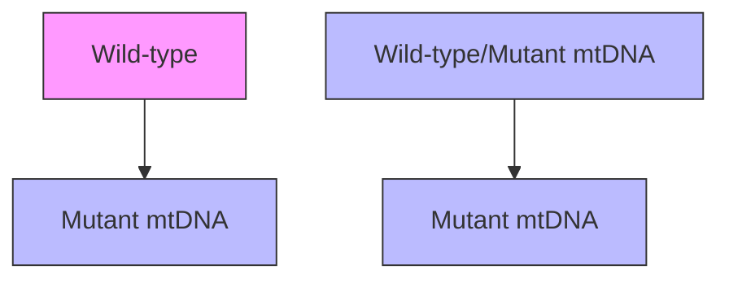

# Mitochondria: Dynamic Organelles in Disease, Aging, and Development

David C. Chan $^{1,*}$

$^{1}$ Division of Biology, California Institute of Technology, Pasadena, CA 91125, USA

\*Contact: dchan@caltech.edu

DOI 10.1016/j.cell.2006.06.010

Mitochondria are the primary energy-generating system in most eukaryotic cells. Additionally, they participate in intermediary metabolism, calcium signaling, and apoptosis. Given these well-established functions, it might be expected that mitochondrial dysfunction would give rise to a simple and predictable set of defects in all tissues. However, mitochondrial dysfunction has pleiotropic effects in multicellular organisms. Clearly, much about the basic biology of mitochondria remains to be understood. Here we discuss recent work that suggests that the dynamics (fusion and fission) of these organelles is important in development and disease.

Mitochondria evolved from a symbiotic relationship between aerobic bacteria and primordial eukaryotic cells (Wallace, 2005). As the site of oxidative phosphorylation, these double-membrane organelles provide a highly efficient route for eukaryotic cells to generate ATP from energy-rich molecules. Electrons from oxidative substrates are transferred to oxygen, via a series of redox reactions, to generate water. In the process, protons are pumped from the matrix across the mitochondrial inner membrane through respiratory complexes I, III, and IV. When protons return to the mitochondrial matrix down their electrochemical gradient, ATP is synthesized via complex V (ATP synthase).

Although the vast majority of mitochondrial proteins (about 900) are encoded by the nuclear genome and imported into the mitochondria, mitochondria nevertheless maintain a genome that is essential for their respiratory function (Wallace, 2005). The 16 kilobase circular mitochondrial DNA (mtDNA) genome contains 37 genes. Thirteen of these genes encode protein subunits of respiratory complexes I, III, IV, and V; only complex II is solely composed of proteins encoded by nuclear genes. The mtDNA genome also encodes 22 mitochondrial tRNAs and 2 rRNAs that are essential for translation of mtDNA transcripts. In spite of this simple genetic organization, key aspects of mtDNA mutations are poorly understood and, as argued here, will likely require a better understanding of the dynamic behavior (fusion and fission) of mitochondria.

# Classic Mitochondrial Disorders

Classic mitochondrial disorders result from mutations in mtDNA or nuclear genes that disrupt mitochondrial respiratory function (Dimauro and Davidzon, 2005; DiMauro and Schon, 2003; Wallace, 2005). These diseases typically have brain and skeletal muscle manifestations, and therefore they are often referred to as mitochondrial encephalomyopathies. mtDNA mutations leading to such diseases were first discovered in 1988 (Holt et al., 1988; Wallace et al., 1988), and now there are hundreds of point mutations, deletions, or rearrangements in mtDNA associated with disease (http://www.mitomap.org). MERRF syndrome (myoclonic epilepsy associated with ragged-red fibers) is a well-studied mitochondrial encephalomyopathy and illustrates some of the salient features observed in mtDNA diseases. Patients with MERRF present with a mix of neurological and myopathic symptoms, including myoclonic seizures, ataxia, and muscle weakness. In skeletal muscle biopsies, ragged-red fibers are prominently detected (when stained with Gomori's modified trichrome stain). Such ragged-red fibers are a hallmark of many mitochondrial diseases and reflect the massive subsarcolemmal proliferation of mitochondria that often accompanies mitochondrial dysfunction in skeletal muscle. Lactic acidosis is also commonly observed in MERRF and many other mtDNA diseases and results from the poor ability of muscles lacking efficient respiration to use pyruvate produced by glycolysis. Excess pyruvate is converted to lactic acid, which enters the bloodstream.

Given that all mtDNA diseases lead to respiratory defects, it might be expected that their clinical phenotypes would be similar. In fact, there is great clinical variability among these diseases, with many diseases characterized by highly tissue-specific defects. For example, in MELAS syndrome (mitochondrial encephalomyopathy, lactic acidosis, and stroke-like episodes), the neurological symptoms are quite different, marked by stroke-like episodes that can be severely debilitating and are often associated with infarctions within the brain. For both MERRF and MELAS, several distinct mtDNA mutations can give rise to the same clinical syndrome.

natural_image

Microscopic view of fibrous structures with 10 μm scale bar and 0 Sec time label (no text or symbols beyond scale indicators)

natural_image

Microscopic view of fibrous structures with a blue line overlay, labeled '3 Sec' at bottom right (no other text or symbols)

natural_image

Microscopic view of fibrous structures with a blue highlighted region, labeled '6 Sec' in the corner (no other text or symbols)

natural_image

Microscopic image showing fibrous structures with a blue highlighted region, labeled '81 Sec' at bottom right (no other text or symbols)

natural_image

Microscopic view of elongated cellular structures with a blue-stained end, labeled '84 Sec' at bottom right (no other text or symbols)

natural_image

Microscopic view of a material surface with visible cracks and a blue droplet, labeled '87 Sec' (no other text or symbols)

Figure 1. Mitochondrial Fusion and Fission Still frames from timelapse fluorescence movie (see Movie S1 for video) of YFP-labeled mitochondria in a living mouse embryonic fibroblast. Selected mitochondria are highlighted. In the first three frames, two pairs of mitochondria contact end-to-end and immediately fuse. In the last three frames, the lower fusion product undergoes fission, and the daughter mitochondria move apart. Figure modified from the Journal of Cell Biology, 2003, vol. 160, p. 193 by copyright permission of the Rockefeller University Press (Chen et al., 2003).

Diseases caused by mtDNA mutations have unique characteristics related to the biology of mitochondria (Dimauro and Davidzon, 2005; DiMauro and Schon, 2003; Wallace, 2005). First, they are maternally inherited, due to the transmission of mitochondria from the egg to the zygote. Paternal mitochondria from the sperm are selectively marked with ubiquitin and degraded. Second, the clinical symptoms progress with age. This feature is due to the accumulation of pathogenic mtDNA in specific tissues. In inherited mtDNA myopathies, the zygote inherits a mixture of pathogenic and wild-type mtDNA genomes, a state termed heteroplasmy. As heteroplasmic cells divide, the ratio of pathogenic to wild-type mtDNA genomes can vary among different tissues and among individual cells within tissues. This variation in mtDNA populations is probably due to the random distribution of mtDNA during cell division. As pathogenic mtDNA loads increase, there is a threshold beyond which cellular dysfunction becomes apparent. In extreme cases, some tissues or cells may inherit a mitochondrial population containing only pathogenic mtDNA genomes, a state known as homoplasmy. Some mtDNA diseases are associated with homoplasmic mutations, and it is unclear why such diseases are also progressive.

Based on the tissues typically affected in mtDNA diseases, it is generally thought that tissues such as brain, skeletal muscle, heart muscle, and endocrine glands are particularly dependent on respiratory function and have a lower bioenergetic threshold. Cells do not lose respiratory function until high loads of pathogenic mtDNA are present, ranging from 60% to 90% depending on the specific mutation (Hayashi et al., 1991; Nakada et al., 2001; Yoneda et al., 1994). This compensation likely depends at least partially on the ability of mitochondria to fuse and divide within cells (see Figure 1 and Movie S1 available with this article online), thereby allowing complementation of mtDNA gene products.

During most cell divisions, the mitochondrial population within cells is evenly divided between the daughter cells. However, in special circumstances, such as during early oogenesis, there can be a drastic reduction in the total copy number of mtDNA that results in a genetic bottleneck (Shoubridge, 2000). Such bottlenecks dramatically affect the ratio of mutant to wild-type mtDNA and can result in rapid segregation of mutant mtDNA to some offspring. Because of the random nature of mitochondrial segregation, mtDNA diseases can have variable outcomes and an unpredictable course. An additional complication is that some mutant mtDNA may actually have a replicative advantage over wild-type mtDNA. For example, transfer of mitochondria containing a mixture of wild-type and mutant mtDNA (conferring MELAS encephalopathy) to cells lacking mtDNA rapidly leads to homoplasmy or near-homoplasmy in most cell transformants. The mechanism for this preferential replication of mutant mtDNA is not clear, though selective stimulation of mtDNA replication in mitochondria with deficient respiration has been proposed (Yoneda et al., 1994).

In addition to the clinical diversity among different mtDNA diseases, it is perplexing that identical mtDNA mutations can give rise to distinct clinical disorders (DiMauro and Schon, 2003). In some cases, differences in mutational load may explain some of these features. In addition, the nuclear genome can clearly influence the outcome of mtDNA mutations. However, these explanations are not entirely satisfactory, suggesting that more needs to be learned about the natural history of mtDNA mutations.

# Mitochondrial Dynamics and mtDNA Mutations

The symptoms of mtDNA diseases often progressively worsen with age. This has usually been explained by the unique characteristics of mitochondrial inheritance (Dimauro and Davidzon, 2005; DiMauro and Schon, 2003; Wallace, 2005). Mammalian cells can have hundreds to thousands of mitochondria, and each mitochondrion contains several mtDNA genomes. Many mtDNA diseases, such as MERRF and MELAS, exist in a heteroplasmic state. Because of the stochastic nature of mitochondrial inheritance during cell division, a daughter cell can occasionally inherit a population of mitochondria whose ratio of mutant to wild-type mtDNA

differs significantly from that of the parental cell (Figure 2, left panel). Cells with high levels of mutant mtDNA will have lower respiratory capacity, and eventually a bioenergetic threshold is breached that results in mitochondrial dysfunction. Depending on the natural history of such stochastic events, entire tissues can be severely affected if skewing of mtDNA inheritance occurs early in the development of the tissue. In extreme cases of this genetic drift, a particular cell can become homoplasmic for the mutant mtDNA. Such a state is irreversible for the cell, and all its progeny will remain homoplasmic. In fact, some mtDNA diseases, such as LHON (Leber's hereditary optic neuropathy), are often homoplasmic.

This simplistic view of mtDNA inheritance—where mitochondria are distinct particles passively awaiting segregation by the cytokinesis machinery—ignores the potential role of mitochondrial dynamics, a prominent feature of these organelles (Figure 2, right panel). Any given mitochondrion is not a discrete, autonomous organelle. In fact, the identity of an individual mitochondrion is short-lived, because it will fuse with a neighboring mitochondrion in the near future. Therefore, the entire mitochondrial population is in constant flux, driven by continual fusion and division of mitochondria (Figure 1). If two or more cultured mammalian cells are artificially fused to form a cell hybrid, the mitochondrial populations are completely fused within 8 hr (Chen et al., 2003; Legros et al., 2002; Mattenberger et al., 2003). For reasons that are not clear, functional complementation of mtDNA gene products does not appear to happen until several days later (Ono et al., 2001).

Mitochondrial fusion results in mixing of not only the outer and inner mitochondrial membranes but also the contents of the mitochondrial matrix. The effects of these processes on the natural history of mtDNA mutations have yet to be studied, and important issues remain to be resolved. For example, mtDNA is organized into discrete units termed nucleoids that contain several mtDNA genomes. A given mitochondrion can contain multiple nucleoids, and mitochondrial fusion results in cohabitation of nucleoids within the same mitochondrion. It is not clear to what extent fusion of mitochondria results in mixing of mtDNA nucleoids and, as a corollary, the mixing of mtDNA genomes. mtDNA nucleoids are highly dynamic (Garrido et al., 2003; Iborra et al., 2004; Legros et al., 2004) and have been observed to merge and divide (Garrido et al., 2003). Given the evidence of human mitochondrial DNA recombination after fusion (D'Aurelio et al., 2004; Kraytsberg et al., 2004), some mixing of mtDNA nucleoids must occur. However, mtDNA recombination in human cells seems to occur at only modest levels (D'Aurelio et al., 2004; Kraytsberg et al., 2004), and though mtDNA nucleoids are certainly mobile after mitochondrial fusion, their movement is somewhat restricted compared to matrix proteins (Legros et al., 2004).

Although these important issues await clarification, several potential consequences of mitochondrial dynam-(Left panel) Traditional view of mtDNA inheritance. Mitochondria are considered as discrete particles that contain either wild-type (gray) or mutant (red) mtDNA. Segregation is random and can occasionally give rise to a daughter cell with high mutational load. After many divisions (indicated by dashed line), such genetic drift can eventually result in a homoplasmic cell (bottom).

flowchart

Figure 2. Mitochondrial Dynamics May Dampen Fluctuations in mtDNA Inheritance

(Right panel) View incorporating mitochondrial dynamics. Because of mitochondrial fusion, mitochondria (purple) in heteroplasmic cells are highly intermixed and contain both wild-type and mutant mtDNA. As a result, genetic drift in daughter cells is minimized. For simplicity, the organization of mtDNA into nucleoids is not depicted.

ics on mtDNA mutations should be considered. First, because cells continually fuse and divide mitochondria, any given mitochondrion within a heteroplasmic cell will likely contain both mutant and wild-type mtDNA. Individual mitochondria within a heteroplasmic cell cannot be considered as containing either solely mutant or solely wild-type mtDNA (Figure 2, right panel). Therefore, before the segregation of the mitochondrial population by cytokinesis, the individual mitochondria have already been “pre-homogenized.” A consequence of this premixing is that fluctuations in mutant/wild-type mtDNA ratios in the daughter cells are dampened, and the likelihood of producing homoplasmic cells is reduced. Given that homoplasmy does occur in some mtDNA diseases, mitochondrial fusion and fission are clearly not a foolproof mechanism to ensure heteroplasmy, but the extent of their protective effect should be assessed. Indeed, it is possible that certain tissues have lower levels of these processes and are more prone to drifts in levels of mutant mtDNA. Second, as mentioned above, it is possible that mitochondrial fusion results in mixing of mutant and wild-type mtDNA within nucleoids. This will be an important issue to resolve because mixing of mutant and wild-type mtDNA within nucleoids would further help to reduce large fluctuations in mutant mtDNA levels in daughter cells. Finally, regardless of whether nucleoids mix, mitochondrial fusion allows mutant and wild-type mtDNA gene products to mix within mitochondria. Such mixing allows maintenance of full mitochondrial function in cells containing significant levels of mtDNA mutations (Nakada et al., 2001).

# Mitochondrial Fusion and Fission

Mitochondrial fusion involves the coordinated fusion of both the outer and inner mitochondrial membranes. Genetic studies in yeast have been instrumental in identifying the molecular players in mitochondrial dynamics (Bleazard et al., 1999; Hermann et al., 1998; Mozdy et al., 2000; Okamoto and Shaw, 2005; Sesaki and Jensen, 1999; Tieu et al., 2002), and orthologs of many of these genes play similar functions in mammalian cells. Mitofusins are GTPases localized to the outer mitochondrial membrane. Mammals have two mitofusin genes, Mfn1 and Mfn2 (Chen et al., 2003). These are the only mammalian outer membrane proteins known to be essential for mitochondrial fusion, and therefore are prime candidates for directly mediating the fusion process (Koshiba et al., 2004). In addition to Mfn1 and Mfn2, the dynamin family GTPase OPA1 is essential for mitochondrial fusion (Chen et al., 2005; Cipolat et al., 2004). This mitochondrial intermembrane space protein is associated with the inner membrane and may also play a role in control of inner membrane structure (Griparic et al., 2004). Both Mfn2 and OPA1 are associated with neurodegenerative diseases (Alexander et al., 2000; Delettre et al., 2000; Zuchner et al., 2004).

The opposing process of mitochondrial fission depends on the dynamin-related protein Drp1 (Smirnova et al., 2001). This GTPase localizes to discrete spots on mitochondria, and a subset of such spots mark sites of future fission. The classical dynamin protein is capable of assembling onto lipid membranes, resulting in their constriction, tubulation, or vesiculation depending on experimental conditions. Given these properties, dynamins have been proposed to be mechanochemical enzymes that use GTP hydrolysis to drive membrane scission (Praefcke and McMahon, 2004). Like dynamin, the yeast Drp1 ortholog, Dnm1, also assembles into multimeric complexes that constricts lipid membranes (Ingerman et al., 2005). Therefore, it is likely that Drp1 plays a role in membrane constriction during the process of mitochondrial fission. Much of Drp1 exists in the cytosol, and how a subpopulation is recruited to discrete spots on mitochondria remains unclear. The mechanisms recruiting fission complexes to mitochondria are best understood in yeast, where Dnm1 localization to mitochondria clearly relies on the outer mitochondrial protein Fis1 and two adaptor proteins (Griffin et al., 2005; Mozdy et al., 2000; Okamoto and Shaw, 2005; Tieu et al., 2002). Surprisingly, knockdown of Fis1 in mammalian cells by RNA interference does not disrupt the mitochondrial localization of Drp1 (Lee et al., 2004).

# Mitochondrial Fusion and Division during Development

As might be expected for such a fundamental cellular process, mitochondrial fusion is essential for embryonic development (Chen et al., 2003). Loss of either Mfn1 or Mfn2 results in a large reduction in mitochondrial fusion and in midgestational lethality. In the case of Mfn2 null mice, this lethality is due to improper development of the placenta (Chen et al., 2003). The midgestational placenta has a trilaminar structure, in which trophoblast giant cells form the outermost layer that is juxtaposed against the maternal decidua. Trophoblast giant cells are special polyploid cells that undergo DNA replication but not cytokinesis. Polyploidy is often associated with a commensurate increase in the cytoplasmic compartment, and in this case, the trophoblast cells grow into enormous cells that play important roles in invasion of the placenta into the uterine lining, secretion of hormones that support pregnancy, and promotion of maternal-fetal blood exchange. In Mfn2 mutant mice, the trophoblast giant cell layer is sparse and incomplete, resulting in placental insufficiency that fails to maintain viability of the embryo. Trophoblast cells from Mfn2 mutant mice show fragmentation of the mitochondrial population. Likewise, mouse embryonic fibroblasts lacking either Mfn1 or Mfn2 also show severe fragmentation of mitochondria. This fragmentation is due to ongoing fission in the face of drastically reduced fusion. Mitochondrial tubules can be restored to such mutant cells by concomitantly blocking the fission pathway with a dominant-negative version of Drp1.

Based on these results and related experiments in yeast (Bleazard et al., 1999; Okamoto and Shaw, 2005; Sesaki and Jensen, 1999), it is clear that mitochondrial morphology is a highly dynamic parameter that can be regulated by adjusting the balance between the opposing processes of fusion and fission. Reducing the relative rate of fusion results in mitochondrial fragmentation due to unopposed fission (Chen et al., 2003; Hermann et al., 1998); conversely, reducing the relative rate of fission results in excessive elongation and interconnectivity of the mitochondrial network (Bleazard et al., 1999; Labrousse et al., 1999; Sesaki and Jensen, 1999; Smirnova et al., 2001). Such changes in the balance of fusion and fission may underlie the range of mitochondrial morphologies—from small spheres to tubular networks—observed in various cell types.

Mitochondria of a particular morphological class may have functional advantages depending on the cellular environment. For example, it has been proposed that highly elongated mitochondria may enable the rapid transmission of membrane potential across significant distances within a cell (Skulachev, 2001). In some cases, highly active mitochondria are associated with elongation of tubules, such as in yeast forced to respire by growth in glycerol, a nonfermentable carbon source. In other cases, fragmentation of the mitochondrial network may facilitate recruitment of mitochondria to cellular compartments in need of ATP. For example, fragmentation of mitochondria in hippocampal neurons appears to facilitate recruitment of mitochondria into neuronal protrusions, which tend to retract unless mitochondria are recruited to their vicinity (Li et al., 2004).

But are mitochondrial fusion and fission required only for control of mitochondrial morphology and distribu-

tion? If that were the case, loss of fusion would result in mitochondrial fragmentation, but the small mitochondrial spheres would otherwise be able to carry out normal mitochondrial functions. Recent results argue against this scenario. Cells lacking all mitochondrial fusion—due to deletion of both Mfn1 and Mfn2 or loss of OPA1—show severe cellular defects (Chen et al., 2005). Such cells grow very slowly and have reduced activity for all respiratory complexes. The respiratory deficiency is associated with extensive interorganellar heterogeneity, such that many of the mitochondria in mutant cells have reduced membrane potential. Thus mitochondrial fusion appears to be important not only for control of mitochondrial shape but also for maintenance of mitochondrial function. The functional deficits suggest that mitochondria need to cooperate with each other through fusion (Chen et al., 2003, 2005).

Mitochondrial fission also appears to play important roles in mitochondrial function. RNA interference against Drp1 in Caenorhabditis elegans leads to early embryonic lethality, before embryos reach 100 cells (Labrousse et al., 1999). Disruption of Drp1 causes loss of proper mitochondrial localization and probably improper segregation of mitochondria in dividing cells. Moreover, mitochondrial fission is necessary for proper recruitment of mitochondria to nerve terminals (Verstreken et al., 2005), a topic discussed in detail below.

Finally, recent studies indicate that mitochondrial fission is involved in the induction of programmed cell death, an important area that has been reviewed extensively (Perfettini et al., 2005; Youle and Karbowski, 2005). During apoptosis, Bcl2 family members Bax and Bak coalesce on the mitochondrial surface and cause outer membrane permeabilization, which allows cytochrome c sequestered in the mitochondrial intermembrane space to be released into the cytosol. Cytochrome c release is a key event leading to activation of caspases, cysteine proteases necessary for cell death. In many cases of cells undergoing apoptosis, mitochondrial fragmentation is an early event that precedes caspase activation (Frank et al., 2001). This fragmentation occurs close in time to two other important events: the coalescence of Bax and Bak on the mitochondrial surface and cytochrome c release (Youle and Karbowski, 2005). Mitochondrial fragmentation during apoptosis is dependent on the normal mitochondrial fission machinery, and inhibition of Drp1 or Fis1 prevents mitochondrial fragmentation, inhibits cytochrome c release, and can delay or reduce the extent of cell death (Breckenridge et al., 2003; Frank et al., 2001; Lee et al., 2004). In C. elegans, specific cells destined to undergo developmentally regulated cell death show mitochondrial fragmentation, and likewise, prevention of such fragmentation leads to the survival of some of these cells (Jagasia et al., 2005). These results suggest an intriguing link between mitochondrial fission and permeabilization of the mitochondrial outer membrane, but the molecular mechanism remains to be explored. In contrast, mitochondrial fusion may play a protective role in apoptosis. Inhibition of mitochondrial fusion facilitates cell death in response to some apoptotic signals (Olichon et al., 2003; Sugioka et al., 2004).

# Mitochondrial Dynamics and Neurodegeneration

Mutations in Mfn2 cause Charcot-Marie-Tooth (CMT) subtype 2A (Zuchner et al., 2004). CMT is a group of diseases characterized by pathology in the longest motor and sensory nerves, which enervate the hands and feet (Zuchner and Vance, 2005). The most common forms of CMT result from defects in Schwann cell function, resulting in demyelination of peripheral nerves. CMT2A is an axonal form, thought to be caused by defects in the neurons themselves.

CMT2A has an autosomal-dominant pattern of inheritance and has been associated with over 20 mutations in Mfn2 (Zuchner et al., 2004; Zuchner and Vance, 2005). Most of the mutations lie within or near the GTPase domain, although a few occur in the carboxy-terminal region. Because these alleles remained to be characterized functionally, it is unknown how they affect mitochondrial dynamics and consequently neuronal function. Because of the dominant inheritance pattern and the known requirement of the GTPase domain in mitofusin function, it has been suggested that CMT2A is due to haploinsufficiency of Mfn2 (Zuchner et al., 2004). However, mice heterozygous for an Mfn2 null mutation show no functional deficits (Chen et al., 2003). Another possibility is that CMT2A mutations are dominantly acting alleles of Mfn2 that affect the wild-type Mfn2 still expressed from the normal allele. In addition, because Mfn2 can associate with itself and with Mfn1 (Chen et al., 2003), it is possible that CMT2A alleles of Mfn2 also affect Mfn1 function. Resulting changes in the morphology, movement, or distribution of mitochondria may hinder the recruitment of these organelles to the nerve terminal.

Due to the extraordinary length of motor and sensory neurons that enervate the distal limbs, it is plausible that quite subtle perturbations in mitochondrial dynamics can, over time, lead to severe physiological defects. Timelapse imaging of mitochondrial transport in neurons indicates a transport rate of 0.1 to 1 $\mu$ m per second (Morris and Hollenbeck, 1995). Furthermore, such movements are saltatory and therefore net rates over long distances are probably significantly slower. Even with the generous assumption of 1 $\mu$ m/s, it would take a mitochondrion located within a motor neuron cell body about 2 weeks to travel to the nerve periphery located in the distal limbs. Therefore, small changes in mitochondrial dynamics could have severe consequences for neurons, and to address these issues, investigations of mitochondrial dynamics may have to shift from more familiar cell types such as fibroblasts to culture systems that better represent the unique cell biological features of neurons.

Mfn2 is not the only mitochondrial morphology gene involved in Charcot-Marie-Tooth disease. Ganglioside-

induced differentiation associated protein 1 (GDAP1), a mitochondrial outer membrane protein with tandem glutathione transferase domains, is mutated in CMT4A (Zuchner and Vance, 2005). CMT4A is a recessive disease with clinical heterogeneity; patients can have features of myelin or axonal defects, or a combination of both. This mixed clinical presentation may be due to the fact that both neurons and Schwann cells express GDAP1. GDAP1 has been proposed to function in mitochondrial fission, based on the observation that overexpression leads to mitochondrial fragmentation (Niemann et al., 2005). In addition, knockdown of GDAP1 leads to increased tubulation of the mitochondrial population. Currently, it is unknown how GDAP1 affects the mitochondrial fusion or fission machinery, although mitochondrial fragmentation caused by GDAP1 overexpression can be alleviated by Mfn1 or Mfn2 overexpression and depends on Drp1 function. Mutants of GDAP1 associated with CMT4A have either loss of mitochondrial targeting or reduced mitochondrial fragmentation activity. These results further emphasize the sensitivity of long peripheral nerves to perturbations in mitochondrial dynamics.

Autosomal dominant optic atrophy (DOA), also termed Kjer's disease, results in loss of visual acuity and is caused by degeneration of retinal ganglion cells (Delettre et al., 2002). The major form of DOA is caused by mutations in OPA1, a mitochondrial intermembrane space protein that is essential for mitochondrial fusion. Almost 100 OPA1 mutations (http://lbbma.univ-angers.fr/eOPA1/) have been identified, and a few of these result in extreme truncation of OPA1. In such cases, the phenotypic effects are likely due to haploinsufficiency. However, many mutations occur in the GTPase domain or the central region of OPA1, and about half the mutations are truncations. Given the tendency of dynamin family members to form oligomers, it is quite possible that many of the OPA1 mutations are dominant-negative alleles that reduce the activity of the remaining wild-type allele, leading to the autosomal-dominant pattern of inheritance. In addition, it is also possible that some of these alleles have dominant gain-of-function activities, although this has yet to be experimentally demonstrated.

It remains unclear how OPA1 mutations lead to degeneration of retinal ganglion cells. Monocytes from patients show clumped mitochondria (Delettre et al., 2000). OPA1 is expressed throughout the retina, and knockdown of OPA1 results in the formation of mitochondrial aggregates (Kamei et al., 2005). Clinical analysis of some patients have indicated reduced copies of mtDNA and reduced oxidative phosphorylation in skeletal muscle (Kim et al., 2005; Lodi et al., 2004). Such defects may be related to the severe reduction of mitochondrial membrane potential and respiration that occur in OPA1-deficient cells (Chen et al., 2005). Loss of OPA1 also leads to apoptosis (Olichon et al., 2003) and severe defects of cristae within mitochondria (Griparic et al., 2004).

There are hints that diseases caused by Mfn2 and OPA1 mutations may have additional parallels to phenotypes seen in classic mtDNA diseases. In addition to CMT2A, a form of CMT with optic atrophy is also caused by Mfn2 mutations, implying that perturbations in mitochondrial dynamics may have broader involvement of neurons (Zuchner et al., 2006). With DOA, some families have associated neurosensory hearing loss, and one family has been reported to have ptosis and ophthalmoplegia (Payne et al., 2004). It remains to be determined whether the latter defects result from skeletal muscle dysfunction, a common feature of many mtDNA diseases. Finally, LHON, one of the most common mtDNA diseases, results in optic nerve atrophy and has clinical features similar to DOA (Carelli et al., 2004). These parallels suggest that perturbations in mitochondrial dynamics can affect some of the same tissues as mtDNA diseases. In yeast, loss of mitochondrial fusion results in subsequent loss of mtDNA (Hermann et al., 1998). In mammalian cells, loss of mitochondrial fusion does not result in complete loss of mtDNA (Chen et al., 2003, 2005), but it remains to be determined whether more subtle mtDNA defects are present. Studies on the mechanism of the disease alleles in CMT2A and DOA will be necessary to evaluate whether changes in mtDNA play a role in disease pathogenesis.

# Transport of Mitochondria to the Nerve Terminal

The diseases discussed indicate that neurons are particularly vulnerable to mitochondrial dysfunction. Do mitochondria have unique roles in neurons? Indeed, the synaptic regions of axons are well known to contain abundant mitochondria, ever since their initial ultrastructural characterization by electron microscopy in the early days of cell biology. This highly localized abundance of mitochondria probably reflects the intense ATP demands of an active neuron engaged in synaptic transmission, including ATP-dependent fusion and recycling of synaptic vesicles and ATP-driven pumps to control the ionic environment at the synaptic membrane. In addition, uptake of calcium by mitochondria may be important in buffering calcium levels. A series of studies in Drosophila has provided genetic evidence for the functional importance of these synaptic mitochondria. Disruption of Milton, Drp1, or Miro leads to a severe loss of mitochondria in the terminals of specific classes of neurons (Guo et al., 2005; Stowers et al., 2002; Verstreken et al., 2005). Milton is a large coiled-coil-containing protein that localizes to mitochondria (Stowers et al., 2002). It binds to kinesin heavy chain and has been proposed to mediate the transport of mitochondria to the nerve terminal along the microtubule cytoskeleton. Loss of Milton in photoreceptor cells results in complete loss of mitochondria from the photoreceptor cell terminals and loss of synaptic transmission, but the structure of the synapse is largely intact.

Miro (mitochondrial Rho-GTPase) is a mitochondrial outer membrane proteins with two GTPase domains and two $Ca^{2+}$ binding EF hand motifs (Fransson et al., 2003).

text_image

Cell body
Axon
Dendritic process
Spine
Axon terminal
Ca++
Bouton

Figure 3. Unique Challenges for Mitochondria in Neurons   
Shown on the left is a neuron, with mitochondria (brown ovals). Note that only a relatively short neuron is depicted; the axons of some neurons are much longer. Mitochondria travel long distances from the cell body to dendritic (top right) and axonal processes (bottom right). In the dendritic arbor, mitochondrial recruitment to protrusions (spines) is associated with neuronal activation. In boutons at the nerve terminal, mitochondria are important for calcium buffering and cycling of reserve pool synaptic vesicles (the subset of green vesicles highlighted by dashed oval). In addition, they are necessary for proper bouton structure and organization.

Overexpression of an activated Miro in cultured cells causes mitochondria to aggregate perinuclearly and sensitizes cells to apoptosis. The yeast Miro ortholog, Gem1, has been shown to be essential for normal mitochondrial morphology, although it does not appear to be directly involved in either mitochondrial fusion or fission (Frederick et al., 2004). Loss of Miro in flies results in accumulation of mitochondria within the neuronal cell bodies, absence of mitochondria from the neuromuscular junction, and impaired larval movement (Guo et al., 2005). Interestingly, mutant flies have structural alterations in the neuromuscular junction. There is an increase in the number of synaptic boutons (swellings at the nerve terminal that form synapses), and such boutons are smaller and tend to cluster more closely together. Neuromuscular junctions lacking Drp1 similarly lack mitochondria but did not appear to have such structural defects (Verstreken et al., 2005). In both cases, resting $Ca^{2+}$ levels at the nerve terminal were elevated, but $Ca^{2+}$ buffering following nerve stimulation is not significantly impaired unless the stimulation is maintained at high intensity for extended time periods. Filling Drp1 mutant neurons with ATP partially rescues their ability to maintain neurotransmission during high-frequency stimulation. Exocytosis of synaptic vesicles and their recycling by endocytosis, both ATP-dependent processes, appear to be unaltered. However, a subpopulation of synaptic vesicles, the reserve pool, appears to be dysfunctional in Drp1 mutant animals. Taken together, these studies indicate a role for mitochondria in regulating calcium levels at the nerve terminal, but these effects appear modest and only become significant with sustained high-level nerve activity. The main requirement for mitochondria appears to be in providing ATP (Figure 3).

Just as mitochondria need to be recruited into axonal processes, they are also recruited into dendritic spines. There is a correlation between dendritic spine morphogenesis and recruitment of nearby mitochondria (Li et al., 2004). Activation of hippocampal neurons leads to increased recruitment of mitochondria into dendritic spines. Molecules involved in mitochondrial dynamics, including OPA1 and Drp1, affect this recruitment.

# mtDNA Mutations and Aging

Although the role of mitochondrial fission and fusion proteins has not been examined in the association between mtDNA mutations and aging or metabolic disorders, it is tempting to speculate that these proteins may be involved given their importance in development and certain diseases. In this section and the next, we describe studies linking mitochondrial dysfunction to aging and metabolic disorders.

The mitochondrial respiratory chain is exquisitely tuned to transfer electrons from NADH or FADH to a series of electron acceptors, until the final transfer to oxygen leads to production of water. However, these biochemical reactions have an inherent danger because electron leakage can lead to the production of reactive oxygen species (ROS). A low level of ROS production is an unavoidable byproduct of respiratory chain function, and therefore mitochondria are a major source of ROS in a eukaryotic cell. Because mtDNA is spatially close to the source of ROS production, it is thought to be particularly vulnerable to ROS-mediated mutations. Levels of oxidized guanosine are much higher in mtDNA than in nuclear DNA (Richter et al., 1988). Several DNA repair mechanisms operate within mitochondria, but nucleotide excision repair is notably absent and likely leaves mtDNA vulnerable to a number of DNA lesions inflicted by exogenous mutagens (Larsen et al., 2005). In addition to impairment of respiration, mutations in mtDNA can have a second, more insidious consequence. Mitochondrial DNA mutations that reduce the accuracy of electron transfer increase the likelihood of ROS production and further mtDNA lesions, leading to a so-called

“vicious cycle.” This scenario is the basis for the hypothesis that mitochondrial dysfunction plays a critical role in the aging process (Harman, 1956, 1972; Linnane et al., 1989). In this view, aging is caused by the ROS-accelerated accumulation of mtDNA damage, leading to a progressive decline in respiratory function over time.

In support of this hypothesis, many tissues from aged individuals have lower respiratory function compared to those from younger individuals (Boffoli et al., 1994; Cooper et al., 1992; Trounce et al., 1989). Both mtDNA point mutations and deletions are indeed more prevalent in aged tissues and cells. Numerous studies have documented the presence of large mtDNA deletions from muscle and brain from old individuals, at levels ranging from 1%–10%. Muscles from old individuals also have a higher incidence of fibers defective for cytochrome c oxidase, a mitochondrial enzyme with subunits encoded by mtDNA. Thus it appears that occasional cells from old individuals can have high levels of mtDNA containing deletions, leading to heterogeneity in respiratory function between individual cells (Chomyn and Attardi, 2003). Strikingly, aging is associated with clonal mtDNA deletions and respiratory incompetence in single neurons in the substantia nigra. Such defects accumulate during normal aging and may be involved in loss of substantia nigra cells in Parkinson's disease (Bender et al., 2006; Kraytsberg et al., 2006). Furthermore, there is evidence that hallmarks of ROS-mediated nucleotide damage, such as 8-hydroxy-2-deoxyguanosine, are more prevalent in aged tissues. Finally, point mutations in mtDNA also appear at a higher frequency in tissues of old individuals. Whereas some point mutations are found at very low levels, others accumulate to very high abundance, from 20%–50% of the total mtDNA (Michikawa et al., 1999).

Although these studies show that aging is associated with declining respiratory function, accumulation of variable levels of mtDNA deletions and point mutations, and accumulation of oxidative damage to mtDNA, there remain substantial concerns about whether these changes are causal in the aging process. First, some studies suggest that the respiratory decline in old individuals is largely due to physical inactivity, rather than chronological age (Brierley et al., 1997). Second, the functional significance of the mtDNA alterations is unclear. The levels of mtDNA mutations (a few percent) found in most studies are too low to affect respiratory function. In cell culture and animal model systems, no defect in respiration is found until pathogenic mtDNA genomes reach very high levels (Hayashi et al., 1991; Nakada et al., 2001; Yoneda et al., 1994). It should be noted, though, that the low levels of mtDNA mutations found in bulk tissue samples may sometimes reflect cellular heterogeneity within the tissue; individual cells within the tissue can carry high loads that lead to mitochondrial dysfunction. Finally, although specific point mutations in mtDNA mutations can reach high levels in aged individuals (Michikawa et al., 1999), the effect of these mutations on mitochondrial function remains to be determined.

Recent mouse models have further implicated mtDNA mutations in the aging process. Two groups have constructed mice containing a point mutation in the proofreading domain of DNA polymerase- $\gamma$ (POLG), the catalytic subunit of mtDNA polymerase (Kujoth et al., 2005; Trifunovic et al., 2004). The mutant DNA polymerase- $\gamma$ has normal DNA polymerase activity but lacks the exonuclease activity necessary for proofreading. Mice carrying homozygous mutations show a substantial increase (3- to 8-fold) in mtDNA point mutations in several tissues. Remarkably, such “mutator” mice have reduced life spans and additional features that could be interpreted as accelerated aging. They show an early onset of a number of age-associated features, including weight loss, reduction in subcutaneous fat, hair loss, curvature of the spine, and osteoporosis. It should be noted, however, that not all mice harboring increased mtDNA mutations have such an aging phenotype (Tyynismaa et al., 2005).

At first glance, these remarkable phenotypes would seem to support the hypothesis for the mitochondrial basis of aging. However, one of the key features of this hypothesis is that mtDNA mutations lead to increased ROS production, which leads to further mtDNA damage and cellular damage. Remarkably, in spite of the widespread mtDNA mutations, these mice do not appear to have any change in the levels of hydrogen peroxide. Furthermore, there is no evidence for increased oxidative damage to proteins, lipids, or DNA (Kujoth et al., 2005). In contrast, mice overexpressing mitochondriaally targeted catalase, an antioxidant, have extended life spans, so the debate on the role of ROS will likely continue (Schriner et al., 2005).

One group found that many tissues in error-prone POLG mice contain increased levels of caspase-3, a downstream protease activated during many apoptotic pathways (Kujoth et al., 2005). This increase in caspase-3 activation is also observed in tissues from normally aged mice. Furthermore, the mutant mice also show increased TUNEL staining, an indication of the DNA fragmentation that is a hallmark of apoptosis. It is suggested that the diverse signs of aging in these mice may be due to widespread induction of apoptosis, a phenomenon that could rapidly deplete dividing tissues of critical stem cells (Kujoth et al., 2005). This induction of apoptosis may be related to the observation that patients carrying very high loads of certain mtDNA mutations show a high degree of TUNEL-positive muscle fibers (Mirabella et al., 2000). Widespread apoptosis is also found in mouse embryos lacking mitochondrial transcription factor A (Tfam), which is necessary for mtDNA expression and maintenance (Larsson et al., 1998). However, increased apoptosis is not a universal feature of mitochondrial myopathies (Chomyn and Attardi, 2003).

Certainly, these results provide strong evidence that accumulation of mtDNA mutations can induce the pre-

mature emergence of features often associated with the aging process. However, the life span of animals is limited by multiple factors (Kirkwood, 2005), and the gross exaggeration of a single factor can, in principle, shorten life span. If error-prone POLG mice indeed have accelerated aging, it is nevertheless a pathological form of aging. Therefore, more work will be needed to determine to what extent mtDNA mutations play a role in the normal aging process, compared to other factors. To address this issue, it will be interesting to test if animals engineered with a higher fidelity mtDNA polymerase have an increase in life span. In addition, it remains to be determined whether the widespread apoptosis identified in these animals as the cellular basis for the aging phenotypes is indeed relevant to normal aging.

Apart from their aging phenotype, these mice hold great promise in the construction of mouse models of mtDNA disease. Homozygous mutant females are fertile, and their offspring should carry an increased load of mtDNA mutations that will be inherited maternally. Female offspring that have mtDNA disease phenotypes and associated mtDNA mutations will be founders for mouse models of mtDNA disease. This approach has the potential to generate multiple lines of mice carrying diverse mtDNA mutations. Such models will complement mtDNA disease models generated by other methods, such as TFAM-deficient mice (Larsson et al., 1998) or mice generated from embryos (Inoue et al., 2000) or embryonic stem cells artificially fused with cytoplasmic vesicles carrying mutant mtDNAs (Kasahara et al., 2006; Sligh et al., 2000).

# Mitochondria and Metabolic Disorders

Given the critical role that mitochondria play in the citric acid cycle, the electron transport chain, oxidative phosphorylation, fatty-acid oxidation, and amino acid catabolism, it is not surprising that mitochondrial diseases often have an associated metabolic component. The most common metabolic sign is lactic acidosis. In addition, some mitochondrial encephalomyopathies have unique metabolic perturbations. The clearest example of this phenomenon is maternally inherited diabetes and deafness (MIDD), often referred to as simply mitochondrial diabetes (Maassen et al., 2004). This disease is characterized by maternal inheritance, hearing impairment, and an age-dependent progression of diabetes due to pancreatic $\beta$ cell dysfunction. The disease is caused by the A3243G mtDNA mutation, which lies within the tRNA $^{\text{Leu}}$ gene. Remarkably, the identical mtDNA point mutation even in the same family can cause an entirely different disease, MELAS.

In MIDD, the primary defect related to diabetes is thought to be the inappropriate response of pancreatic $\beta$ cells to glucose stimulation. In normal individuals, mitochondrial function is a key component of the glucose sensor that drives insulin secretion (Lowell and Shulman, 2005; Maechler and Wollheim, 2001). In response to high blood glucose, pancreatic $\beta$ cells increase glycolysis and oxidative phosphorylation. The resulting increase in ATP concentration leads to calcium signals that trigger exocytosis of secretory vesicles containing insulin. The mitochondrial defect in MIDD patients therefore impairs the pancreatic secretion of insulin. Consistent with this hypothesis, carriers of the A3243G mutation appear to secrete less insulin in response to a glucose bolus (Maassen et al., 2004). Moreover, engineered mice with severe depletion of mtDNA in pancreatic $\beta$ cells develop diabetes with high blood glucose and low insulin (Silva et al., 2000). With age, such mice show loss of $\beta$ cells.

In addition to its role in $\beta$ cell pathology, mitochondrial dysfunction may be involved in another key aspect of the pathogenesis of diabetes. The hallmark of type 2 diabetes—the most common type of diabetes—is insulin resistance, a condition of unresponsiveness to the glucose-lowering property of insulin. In patients with type 2 diabetes, insulin-stimulated glucose transport into muscle is severely reduced. Normally, binding of insulin to receptors on skeletal muscle and liver leads to a signaling cascade that activates glucose transporters, resulting in removal of glucose from the bloodstream. This signaling cascade is inhibited by fatty-acid metabolites. It has been proposed that defective mitochondrial function in muscle can lead to reduced fatty-acid oxidation and inhibition of glucose transport (Lowell and Shulman, 2005).

Mitochondrial dysfunction is also the cause of a syndrome of metabolic defects that includes hypomagnesemia, hypertension, and hypercholesterolemia (Wilson et al., 2004). This maternally inherited disease is associated with a mitochondrial tRNA $^{Ile}$ gene mutation (T4291C), which is thought to impair proper positioning of the tRNA anti-codon. These patients also show some classical signs of mitochondrial disease, such as accumulation of ragged-red fibers in skeletal muscle and impaired ATP production. Whether these findings are relevant for other metabolic disorders with overlapping symptoms remains to been seen.

# Prospects

Different cells and tissues have distinct sensitivities and responses to mitochondrial dysfunction. These differences are probably due to the cell-type specializations that rely on particular functions of mitochondria. Most studies of mitochondrial dysfunction have naturally focused on the organelles' bioenergetic and metabolic functions, but mitochondria also control cytosolic calcium levels, regulate apoptosis, and assemble iron-sulfur cluster-containing proteins. The ability of mitochondria to effectively carry out such functions is likely to be influenced by their dynamic behavior. Neurons appear particularly vulnerable to mitochondrial dysfunction, and many diseases of mitochondria result in neurodegeneration. In part, this vulnerability may be due to their extreme physical dimensions and the need to actively recruit mitochondria to nerve terminals.

Several prominent clinical features of mtDNA encephalomyopathies remain mysterious, suggesting that much remains to be understood about how mtDNA mutations lead to disease. The resolution to some of these issues will likely require additional insight into the morphology, dynamics, and segregation of these organelles. These processes likely influence the natural history of mtDNA mutations and therefore disease progression. For example, does mitochondrial fusion play a protective role in dampening fluctuations in the amounts of mutant mtDNA in mitochondrial disease and aging? If so, agents that affect mitochondrial dynamics may have promise in ameliorating disease progression. With recent animal models for mtDNA mutations and mitochondrial fusion, these issues can be addressed directly. Insights arising from such studies will extend beyond mitochondrial encephalomyopathies and impact our understanding of aging and neurodegeneration.

# Supplemental Data

Supplemental Data include one movie and can be found with this article online at http://www.cell.com/cgi/content/full/125/7/1243/DC1/.

# ACKNOWLEDGMENTS

I am grateful to Hsiuchen Chen for helpful discussions.

# REFERENCES

Alexander, C., Votruba, M., Pesch, U.E., Thiselton, D.L., Mayer, S., Moore, A., Rodriguez, M., Kellner, U., Leo-Kottler, B., Auburger, G., et al. (2000). OPA1, encoding a dynamin-related GTPase, is mutated in autosomal dominant optic atrophy linked to chromosome 3q28. Nat. Genet. 26, 211–215.   
Bender, A., Krishnan, K.J., Morris, C.M., Taylor, G.A., Reeve, A.K., Perry, R.H., Jaros, E., Hersheson, J.S., Betts, J., Klopstock, T., et al. (2006). High levels of mitochondrial DNA deletions in substantia nigra neurons in aging and Parkinson disease. Nat. Genet. 38, 515–517.   
Bleazard, W., McCaffery, J.M., King, E.J., Bale, S., Mozdy, A., Tieu, Q., Nunnari, J., and Shaw, J.M. (1999). The dynamin-related GTPase Dnm1 regulates mitochondrial fission in yeast. Nat. Cell Biol. 1, 298–304.   
Boffoli, D., Scacco, S.C., Vergari, R., Solarino, G., Santacroce, G., and Papa, S. (1994). Decline with age of the respiratory chain activity in human skeletal muscle. Biochim. Biophys. Acta 1226, 73–82.   
Breckenridge, D.G., Stojanovic, M., Marcellus, R.C., and Shore, G.C. (2003). Caspase cleavage product of BAP31 induces mitochondrial fission through endoplasmic reticulum calcium signals, enhancing cytochrome c release to the cytosol. J. Cell Biol. 160, 1115–1127.   
Brierley, E.J., Johnson, M.A., James, O.F., and Turnbull, D.M. (1997). Mitochondrial involvement in the ageing process. Facts and controversies. Mol. Cell. Biochem. 174, 325–328.   
Carelli, V., Ross-Cisneros, F.N., and Sadun, A.A. (2004). Mitochondrial dysfunction as a cause of optic neuropathies. Prog. Retin. Eye Res. 23, 53–89.   
Chen, H., Detmer, S.A., Ewald, A.J., Griffin, E.E., Fraser, S.E., and Chan, D.C. (2003). Mitofusins Mfn1 and Mfn2 coordinately regulate mitochondrial fusion and are essential for embryonic development. J. Cell Biol. 160, 189–200.   
Chen, H., Chomyn, A., and Chan, D.C. (2005). Disruption of fusion results in mitochondrial heterogeneity and dysfunction. J. Biol. Chem. 280, 26185–26192.

Chomyn, A., and Attardi, G. (2003). MtDNA mutations in aging and apoptosis. Biochem. Biophys. Res. Commun. 304, 519–529.   
Cipolat, S., Martins de Brito, O., Dal Zilio, B., and Scorrano, L. (2004). OPA1 requires mitofusin 1 to promote mitochondrial fusion. Proc. Natl. Acad. Sci. USA 101, 15927–15932.   
Cooper, J.M., Mann, V.M., and Schapira, A.H. (1992). Analyses of mitochondrial respiratory chain function and mitochondrial DNA deletion in human skeletal muscle: effect of ageing. J. Neurol. Sci. 113, 91–98.   
D'Aurelio, M., Gajewski, C.D., Lin, M.T., Mauck, W.M., Shao, L.Z., Lenaz, G., Moraes, C.T., and Manfredi, G. (2004). Heterologous mitochondrial DNA recombination in human cells. Hum. Mol. Genet. 13, 3171–3179.   
Delettre, C., Lenaers, G., Griffoin, J.M., Gigarel, N., Lorenzo, C., Belenguer, P., Pelloquin, L., Grosgeorge, J., Turc-Carel, C., Perret, E., et al. (2000). Nuclear gene OPA1, encoding a mitochondrial dynamin-related protein, is mutated in dominant optic atrophy. Nat. Genet. 26, 207–210.   
Delettre, C., Lenaers, G., Pelloquin, L., Belenguer, P., and Hamel, C.P. (2002). OPA1 (Kjer type) dominant optic atrophy: a novel mitochondrial disease. Mol. Genet. Metab. 75, 97–107.   
DiMauro, S., and Schon, E.A. (2003). Mitochondrial respiratory-chain diseases. N. Engl. J. Med. 348, 2656–2668.   
Dimauro, S., and Davidzon, G. (2005). Mitochondrial DNA and disease. Ann. Med. 37, 222–232.   
Frank, S., Gaume, B., Bergmann-Leitner, E.S., Leitner, W.W., Robert, E.G., Catez, F., Smith, C.L., and Youle, R.J. (2001). The role of dynamin-related protein 1, a mediator of mitochondrial fission, in apoptosis. Dev. Cell 1, 515–525.   
Fransson, A., Ruusala, A., and Aspenstrom, P. (2003). Atypical Rho GTPases have roles in mitochondrial homeostasis and apoptosis. J. Biol. Chem. 278, 6495–6502.   
Frederick, R.L., McCaffery, J.M., Cunningham, K.W., Okamoto, K., and Shaw, J.M. (2004). Yeast Miro GTPase, Gem1p, regulates mitochondrial morphology via a novel pathway. J. Cell Biol. 167, 87–98.   
Garrido, N., Griparic, L., Jokitalo, E., Wartiovaara, J., van der Bliek, A.M., and Spelbrink, J.N. (2003). Composition and dynamics of human mitochondrial nucleoids. Mol. Biol. Cell 14, 1583–1596.   
Griffin, E.E., Graumann, J., and Chan, D.C. (2005). The WD40 protein Caf4p is a component of the mitochondrial fission machinery and recruits Dnm1p to mitochondria. J. Cell Biol. 170, 237–248.   
Griparic, L., van der Wel, N.N., Orozco, I.J., Peters, P.J., and van der Bliek, A.M. (2004). Loss of the intermembrane space protein Mgm1/OPA1 induces swelling and localized constrictions along the lengths of mitochondria. J. Biol. Chem. 279, 18792–18798.   
Guo, X., Macleod, G.T., Wellington, A., Hu, F., Panchumarthi, S., Schoenfield, M., Marin, L., Charlton, M.P., Atwood, H.L., and Zinsmaier, K.E. (2005). The GTPase dMiro is required for axonal transport of mitochondria to Drosophila synapses. Neuron 47, 379–393.   
Harman, D. (1956). Aging: a theory based on free radical and radiation chemistry. J. Gerontol. 11, 298–300.   
Harman, D. (1972). The biologic clock: the mitochondria? J. Am. Geriatr. Soc. 20, 145–147.   
Hayashi, J., Ohta, S., Kikuchi, A., Takemitsu, M., Goto, Y., and Nonaka, I. (1991). Introduction of disease-related mitochondrial DNA deletions into HeLa cells lacking mitochondrial DNA results in mitochondrial dysfunction. Proc. Natl. Acad. Sci. USA 88, 10614–10618.   
Hermann, G.J., Thatcher, J.W., Mills, J.P., Hales, K.G., Fuller, M.T., Nunnari, J., and Shaw, J.M. (1998). Mitochondrial fusion in yeast requires the transmembrane GTPase Fzo1p. J. Cell Biol. 143, 359–373.

Holt, I.J., Harding, A.E., and Morgan-Hughes, J.A. (1988). Deletions of muscle mitochondrial DNA in patients with mitochondrial myopathies. Nature 331, 717–719.   
Iborra, F.J., Kimura, H., and Cook, P.R. (2004). The functional organization of mitochondrial genomes in human cells. BMC Biol. 2, 9.   
Ingerman, E., Perkins, E.M., Marino, M., Mears, J.A., McCaffery, J.M., Hinshaw, J.E., and Nunnari, J. (2005). Dnm1 forms spirals that are structurally tailored to fit mitochondria. J. Cell Biol. 170, 1021–1027.   
Inoue, K., Nakada, K., Ogura, A., Isobe, K., Goto, Y., Nonaka, I., and Hayashi, J.I. (2000). Generation of mice with mitochondrial dysfunction by introducing mouse mtDNA carrying a deletion into zygotes. Nat. Genet. 26, 176–181.   
Jagasia, R., Grote, P., Westermann, B., and Conradt, B. (2005). DRP-1-mediated mitochondrial fragmentation during EGL-1-induced cell death in C. elegans. Nature 433, 754–760.   
Kamei, S., Chen-Kuo-Chang, M., Cazevieille, C., Lenaers, G., Olichon, A., Belenguer, P., Roussignol, G., Renard, N., Eybalin, M., Michelin, A., et al. (2005). Expression of the Opa1 mitochondrial protein in retinal ganglion cells: its downregulation causes aggregation of the mitochondrial network. Invest. Ophthalmol. Vis. Sci. 46, 4288–4294.   
Kasahara, A., Ishikawa, K., Yamaoka, M., Ito, M., Watanabe, N., Aki-moto, M., Sato, A., Nakada, K., Endo, H., Suda, Y., et al. (2006). Generation of trans-mitochondrial mice carrying homoplasmic mtDNAs with a missense mutation in a structural gene using ES cells. Hum. Mol. Genet. 15, 871–881.   
Kim, J.Y., Hwang, J.M., Ko, H.S., Seong, M.W., Park, B.J., and Park, S.S. (2005). Mitochondrial DNA content is decreased in autosomal dominant optic atrophy. Neurology 64, 966–972.   
Kirkwood, T.B. (2005). Understanding the odd science of aging. Cell 120, 437–447.   
Koshiba, T., Detmer, S.A., Kaiser, J.T., Chen, H., McCaffery, J.M., and Chan, D.C. (2004). Structural basis of mitochondrial tethering by mitofusin complexes. Science 305, 858–862.   
Kraytsberg, Y., Schwartz, M., Brown, T.A., Ebralidse, K., Kunz, W.S., Clayton, D.A., Vissing, J., and Khrapko, K. (2004). Recombination of human mitochondrial DNA. Science 304, 981.   
Kraytsberg, Y., Kudryavtseva, E., McKee, A.C., Geula, C., Kowall, N.W., and Khrapko, K. (2006). Mitochondrial DNA deletions are abundant and cause functional impairment in aged human substantia nigra neurons. Nat. Genet. 38, 518–520.   
Kujoth, G.C., Hiona, A., Pugh, T.D., Someya, S., Panzer, K., Wohlgemuth, S.E., Hofer, T., Seo, A.Y., Sullivan, R., Jobling, W.A., et al. (2005). Mitochondrial DNA mutations, oxidative stress, and apoptosis in mammalian aging. Science 309, 481–484.   
Labrousse, A.M., Zappaterra, M.D., Rube, D.A., and van der Bliek, A.M. (1999). C. elegans dynamin-related protein DRP-1 controls severing of the mitochondrial outer membrane. Mol. Cell 4, 815–826.   
Larsen, N.B., Rasmussen, M., and Rasmussen, L.J. (2005). Nuclear and mitochondrial DNA repair: similar pathways? Mitochondrion 5, 89–108.   
Larsson, N.G., Wang, J., Wilhelmsson, H., Oldfors, A., Rustin, P., Lewandoski, M., Barsh, G.S., and Clayton, D.A. (1998). Mitochondrial transcription factor A is necessary for mtDNA maintenance and embryogenesis in mice. Nat. Genet. 18, 231–236.   
Lee, Y.J., Jeong, S.Y., Karbowski, M., Smith, C.L., and Youle, R.J. (2004). Roles of the mammalian mitochondrial fission and fusion mediators Fis1, Drp1, and Opa1 in apoptosis. Mol. Biol. Cell 15, 5001–5011.   
Legros, F., Lombes, A., Frachon, P., and Rojo, M. (2002). Mitochondrial fusion in human cells is efficient, requires the inner membrane potential, and is mediated by mitofusins. Mol. Biol. Cell 13, 4343–4354.

Legros, F., Malka, F., Frachon, P., Lombes, A., and Rojo, M. (2004). Organization and dynamics of human mitochondrial DNA. J. Cell Sci. 117, 2653–2662.   
Li, Z., Okamoto, K., Hayashi, Y., and Sheng, M. (2004). The importance of dendritic mitochondria in the morphogenesis and plasticity of spines and synapses. Cell 119, 873–887.   
Linnane, A.W., Marzuki, S., Ozawa, T., and Tanaka, M. (1989). Mitochondrial DNA mutations as an important contributor to ageing and degenerative diseases. Lancet 1, 642–645.   
Lodi, R., Tonon, C., Valentino, M.L., Iotti, S., Clementi, V., Malucelli, E., Barboni, P., Longanesi, L., Schimpf, S., Wissinger, B., et al. (2004). Deficit of in vivo mitochondrial ATP production in OPA1-related dominant optic atrophy. Ann. Neurol. 56, 719–723.   
Lowell, B.B., and Shulman, G.I. (2005). Mitochondrial dysfunction and type 2 diabetes. Science 307, 384–387.   
Maassen, J.A., Hart, L.M., Essen, E., Heine, R.J., Nijpels, G., Tafrechi, R., Raap, A.K., Janssen, G., and Lemkes, H. (2004). Mitochondrial diabetes: molecular mechanisms and clinical presentation. Diabetes 53, S103–S109.   
Maechler, P., and Wollheim, C.B. (2001). Mitochondrial function in normal and diabetic beta-cells. Nature 414, 807–812.   
Mattenberger, Y., James, D.I., and Martinou, J.C. (2003). Fusion of mitochondria in mammalian cells is dependent on the mitochondrial inner membrane potential and independent of microtubules or actin. FEBS Lett. 538, 53–59.   
Michikawa, Y., Mazzucchelli, F., Bresolin, N., Scarlato, G., and Attardi, G. (1999). Aging-dependent large accumulation of point mutations in the human mtDNA control region for replication. Science 286, 774–779.   
Mirabella, M., Di Giovanni, S., Silvestri, G., Tonali, P., and Servidei, S. (2000). Apoptosis in mitochondrial encephalomyopathies with mitochondrial DNA mutations: a potential pathogenic mechanism. Brain 123, 93–104.   
Morris, R.L., and Hollenbeck, P.J. (1995). Axonal transport of mitochondria along microtubules and F-actin in living vertebrate neurons. J. Cell Biol. 131, 1315–1326.   
Mozdy, A.D., McCaffery, J.M., and Shaw, J.M. (2000). Dnm1p GT-Pase-mediated mitochondrial fission is a multi-step process requiring the novel integral membrane component Fis1p. J. Cell Biol. 151, 367–380.   
Nakada, K., Inoue, K., Ono, T., Isobe, K., Ogura, A., Goto, Y.I., Nonaka, I., and Hayashi, J.I. (2001). Inter-mitochondrial complementation: Mitochondria-specific system preventing mice from expression of disease phenotypes by mutant mtDNA. Nat. Med. 7, 934–940.   
Niemann, A., Ruegg, M., La Padula, V., Schenone, A., and Suter, U. (2005). Ganglioside-induced differentiation associated protein 1 is a regulator of the mitochondrial network: new implications for Charcot-Marie-Tooth disease. J. Cell Biol. 170, 1067–1078.   
Okamoto, K., and Shaw, J.M. (2005). Mitochondrial morphology and dynamics in yeast and multicellular eukaryotes. Annu. Rev. Genet. 39, 503–536.   
Olichon, A., Baricault, L., Gas, N., Guillou, E., Valette, A., Belenguer, P., and Lenaers, G. (2003). Loss of OPA1 perturbates the mitochondrial inner membrane structure and integrity, leading to cytochrome c release and apoptosis. J. Biol. Chem. 278, 7743–7746.   
Ono, T., Isobe, K., Nakada, K., and Hayashi, J.I. (2001). Human cells are protected from mitochondrial dysfunction by complementation of DNA products in fused mitochondria. Nat. Genet. 28, 272–275.   
Payne, M., Yang, Z., Katz, B.J., Warner, J.E., Weight, C.J., Zhao, Y., Pearson, E.D., Treft, R.L., Hillman, T., Kennedy, R.J., et al. (2004). Dominant optic atrophy, sensorineural hearing loss, ptosis, and oph-

thalmoplegia: a syndrome caused by a missense mutation in OPA1. Am. J. Ophthalmol. 138, 749–755.

Perfettini, J.L., Roumier, T., and Kroemer, G. (2005). Mitochondrial fusion and fission in the control of apoptosis. Trends Cell Biol. 15, 179–183.

Praefcke, G.J., and McMahon, H.T. (2004). The dynamin superfamily: universal membrane tubulation and fission molecules? Nat. Rev. Mol. Cell Biol. 5, 133–147.

Richter, C., Park, J.W., and Ames, B.N. (1988). Normal oxidative damage to mitochondrial and nuclear DNA is extensive. Proc. Natl. Acad. Sci. USA 85, 6465–6467.

Schriner, S.E., Linford, N.J., Martin, G.M., Treuting, P., Ogburn, C.E., Emond, M., Coskun, P.E., Ladiges, W., Wolf, N., Van Remmen, H., et al. (2005). Extension of murine life span by overexpression of catalase targeted to mitochondria. Science 308, 1909–1911.

Sesaki, H., and Jensen, R.E. (1999). Division versus fusion: Dnm1p and Fzo1p antagonistically regulate mitochondrial shape. J. Cell Biol. 147, 699–706.

Shoubridge, E.A. (2000). Mitochondrial DNA segregation in the developing embryo. Hum. Reprod. 15 (Suppl 2), 229–234.

Silva, J.P., Kohler, M., Graff, C., Oldfors, A., Magnuson, M.A., Berggren, P.O., and Larsson, N.G. (2000). Impaired insulin secretion and beta-cell loss in tissue-specific knockout mice with mitochondrial diabetes. Nat. Genet. 26, 336–340.

Skulachev, V.P. (2001). Mitochondrial filaments and clusters as intracellular power-transmitting cables. Trends Biochem. Sci. 26, 23–29.

Sligh, J.E., Levy, S.E., Waymire, K.G., Allard, P., Dillehay, D.L., Nusinowitz, S., Heckenlively, J.R., MacGregor, G.R., and Wallace, D.C. (2000). Maternal germ-line transmission of mutant mtDNAs from embryonic stem cell-derived chimeric mice. Proc. Natl. Acad. Sci. USA 97, 14461–14466.

Smirnova, E., Griparic, L., Shurland, D.L., and van der Bliek, A.M. (2001). Dynamin-related protein Drp1 is required for mitochondrial division in mammalian cells. Mol. Biol. Cell 12, 2245–2256.

Stowers, R.S., Megeath, L.J., Gorska-Andrzejak, J., Meinertzhagen, I.A., and Schwarz, T.L. (2002). Axonal transport of mitochondria to synapses depends on milton, a novel Drosophila protein. Neuron 36, 1063–1077.

Sugioka, R., Shimizu, S., and Tsujimoto, Y. (2004). Fzo1, a protein involved in mitochondrial fusion, inhibits apoptosis. J. Biol. Chem. 279, 52726–52734.

Tieu, Q., Okreglak, V., Naylor, K., and Nunnari, J. (2002). The WD repeat protein, Mdv1p, functions as a molecular adaptor by interacting with Dnm1p and Fis1p during mitochondrial fission. J. Cell Biol. 158, 445–452.

Trifunovic, A., Wredenberg, A., Falkenberg, M., Spelbrink, J.N., Rovio, A.T., Bruder, C.E., Bohlooly, Y.M., Gidlof, S., Oldfors, A., Wiborn, R., et al. (2004). Premature ageing in mice expressing defective mitochondrial DNA polymerase. Nature 429, 417–423.

Trounce, I., Byrne, E., and Marzuki, S. (1989). Decline in skeletal muscle mitochondrial respiratory chain function: possible factor in ageing. Lancet 1, 637–639.

Tyynismaa, H., Mjosund, K.P., Wanrooij, S., Lappalainen, I., Ylikallio, E., Jalanko, A., Spelbrink, J.N., Paetau, A., and Suomalainen, A. (2005). Mutant mitochondrial helicase Twinkle causes multiple mtDNA deletions and a late-onset mitochondrial disease in mice. Proc. Natl. Acad. Sci. USA 102, 17687–17692.

Verstreken, P., Ly, C.V., Venken, K.J., Koh, T.W., Zhou, Y., and Bel- len, H.J. (2005). Synaptic mitochondria are critical for mobilization of reserve pool vesicles at Drosophila neuromuscular junctions. Neuron 47, 365–378.

Wallace, D.C. (2005). A mitochondrial paradigm of metabolic and degenerative diseases, aging, and cancer: A dawn for evolutionary medicine. Annu Rev Genet. 39, 359–407.

Wallace, D.C., Singh, G., Lott, M.T., Hodge, J.A., Schurr, T.G., Lezza, A.M., Elsas, L.J., 2nd, and Nikoskelainen, E.K. (1988). Mitochondrial DNA mutation associated with Leber's hereditary optic neuropathy. Science 242, 1427–1430.

Wilson, F.H., Hariri, A., Farhi, A., Zhao, H., Petersen, K.F., Toka, H.R., Nelson-Williams, C., Raja, K.M., Kashgarian, M., Shulman, G.I., et al. (2004). A cluster of metabolic defects caused by mutation in a mitochondrial tRNA. Science 306, 1190–1194.

Yoneda, M., Miyatake, T., and Attardi, G. (1994). Complementation of mutant and wild-type human mitochondrial DNAs coexisting since the mutation event and lack of complementation of DNAs introduced separately into a cell within distinct organelles. Mol. Cell. Biol. 14, 2699–2712.

Youle, R.J., and Karbowski, M. (2005). Mitochondrial fission in apoptosis. Nat. Rev. Mol. Cell Biol. 6, 657–663.

Zuchner, S., and Vance, J.M. (2005). Emerging pathways for hereditary axonopathies. J. Mol. Med. 83, 935–943.

Zuchner, S., Mersiyanova, I.V., Muglia, M., Bissar-Tadmouri, N., Rochelle, J., Dadali, E.L., Zappia, M., Nelis, E., Patitucci, A., Senderek, J., et al. (2004). Mutations in the mitochondrial GTPase mitofusin 2 cause Charcot-Marie-Tooth neuropathy type 2A. Nat. Genet. 36, 449–451.

Zuchner, S., De Jonghe, P., Jordanova, A., Claeys, K.G., Guergueltcheva, V., Cherninkova, S., Hamilton, S.R., Van Stavern, G., Krajewski, K.M., Stajich, J., et al. (2006). Axonal neuropathy with optic atrophy is caused by mutations in mitofusin 2. Ann. Neurol. 59, 276–281.