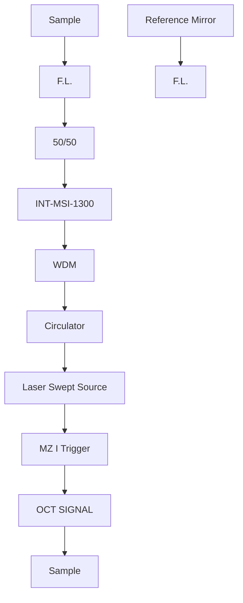

# New speckle analysis method for optical coherence tomography signal based on autocorrelation

Lucas R. De Pretto, Gesse E. C. Nogueira, Anderson Z. Freitas

Nuclear and Energy Research Institute, IPEN–CNEN/SP, Av. Prof. Lineu Prestes 2242, São Paulo, SP, Brasil 05508-000;

# ABSTRACT

Optical Coherence Tomography (OCT) is a noninvasive imaging technique with high resolution widely used for in vivo applications. Nonetheless, OCT is prone to speckle, a granular noise that degrades the OCT signal. Speckle statistics may, nevertheless, reveal information regarding the scatterers from which it originates. This fact is exploited by techniques such as Speckle Variance-OCT (SVOCT). SVOCT, however, doesn't provide quantitative information, which is a major drawback for the use of speckle based techniques on OCT. In the present work we attack this problem, proposing a new method for analysis of speckle in OCT signal, based on autocorrelation. We associate the changes in decorrelation time of the signal with the changes in flow velocity. It is expected that greater velocities result in lower decorrelation times. To verify that, milk was pumped through a microchannel at different velocities, and the decorrelation time was computed for a single point in the center of the microchannel, sampled at 8 kHz rate. Our results suggest that for flows rates greater than 1 $\mu$ l/min it is possible to associate decorrelation time with flow velocity, while velocities below that value are not distinguishable, supposedly due to the Brownian motion. For flow rates above 50 $\mu$ l/min our acquisition rate doesn't get enough sampling information, as the decorrelation time gets too low. These results indicate that Speckle based techniques may be used to get quantitative information of flow in OCT samples, which can be used to assist in many diagnostics modalities, as well as map such flow regions.

Keywords: OCT, optical coherence tomography, speckle, autocorrelation, microflow, decorrelation time.

# 1. INTRODUCTION

Optical Coherence Tomography (OCT)[1] is a noninvasive, no contact, high resolution imaging modality that produces cross-sectional images of scattering media. The penetration of OCT in a sample is dependent of the wavelength used and the absorption of the sample, being, typically, in the order of a couple of millimeters for biological samples[2]. Having its roots in white light interferometry, OCT is usually mounted in a Michelson Interferometer setup, and is based on the occurrence of interference between the optic radiation from its two arms. However, this coherent nature which OCT relies on also enables the presence of speckle.

Speckle presents itself as a high contrast granular noise. Usually related to surface roughness in laser experiments, in OCT speckle arises not only from the surface, but also from inside the sample, the main sources being multiple backscattering and forwarding scattering delays[3] caused by internal scattering structures. Both phenomena alter the shape of the wavefront returning to the detector. So, speckle ends up degrading OCT images quality. However, it carries a relation with the scatterers inside the sample from which it originates, and the speckle pattern presents different behavior through time whether those scatterers are moving or static. The pattern presents more fluctuations of intensity over time when it is produced by moving scatterers than when it comes from a static region, and is known as time-varying speckle. It is possible, then, to discern between the two scenarios.

As the OCT technique gains interest in a broad range of fields of research, many adaptations and improvements are developed. One such field is microfluidics, which uses OCT adaptations to study microflow. Of those adaptations, Doppler OCT[4, 5] is well established and widely used. Doppler OCT is capable of providing quantitative information regarding internal flow in a sample, including flow velocity and direction. A limitation to the technique, though, is the lack of sensitivity to flows perpendicular to the imaging beam, a serious drawback to many applications.

Another approach for the microfluidics field is based on the speckle in OCT, exploiting the time-varying speckle. One such method is known as Speckle Variance OCT (SV-OCT)[6], and it is capable of mapping the flow inside a sample[7, 8]. However, SV-OCT is only a qualitative technique[9], meaning that it does not offer any

quantitative information regarding the flow. Nevertheless, the time-varying speckle in OCT is being actively researched[10, 11] and new ways to examine it are being developed, aiming to extract more data about the flow being imaged. Thus, in this work we examine speckle through the signal autocorrelation approach. As the time-varying speckle presents larger intensity fluctuations over time, it is expected that it decorrelates faster, and the decorrelation time can be related to flow rate. An observation parameter is, then, defined, in order to evaluate the results. The response of the system is analyzed under different flow rates, using OCT A-Scans as input.

# 2. MATERIALS AND METHODS

# Experimental Setup

As the fluctuations of intensity occur rapidly over time, a high acquisition rate is necessary in order to correctly sample the signal, otherwise each individual sample would be decorrelated, and the desired data would be lost. Therefore a custom OCT system was built to achieve better sampling rate. For the system, the light source used was a frequency swept laser source SL1325-P16 (Thorlabs, Newton, New Jersey, USA), with center wavelength of 1325 nm, tuning range of 120 nm and repetition rate of 16 kHz. A Michelson type interferometer INT-MSI-1300 (Thorlabs) operable at wavelengths of 1250 to 1350 nm, was also used. The output was coupled to an acquisition board NI PCI 5122 (National Instruments, Austin, Texas, USA). The system setup is demonstrated in Figure 1.

flowchart

Figure 1. OCT System Setup. F.L. = Focusing Lens; WDM = Wavelength-division multiplexer.

Along with the OCT system, a software dedicated to the acquisition of signals was also developed in LabView (National Instruments) programming environment. Such software enabled the interference signal acquisition at 8 kHz rate, limited only by the laser scan, at 16 kHz, as we only acquired one direction of the sweep. This software controls the PCI 5122 acquisition board through the available drivers for LabView platform. The program manages three board inputs: the laser trigger, the signal from the Mach-Zehnder interferometer (MZI) built-in to the laser - used for calibration -, and the OCT signal. Therefore, the MZI and OCT signals are triggered by the laser source.

The interferometric signals are processed into A-Scans only after all acquisitions have been completed, so that the sampling rate is not affected. The system does not automatically obtain B-Scans, however, since there is no lateral scanning of the beam. For this work, only A-Scans were analyzed.

For control of microflow, an ExiGo syringe pump (Cellix, Dublin, Leinster, Ireland) with flow rate capability ranging from 10 nL/min up to 20 mL/min was used. As microfluidic devices, Vena8 Fluoro+ (Cellix, Dublin, Leinster, Ireland) were used. The device has 8 microchannels, and each microchannel has width of 400 $\mu$ m, height of 100 $\mu$ m and length of 2.8 cm. And whole milk (3% fat) was used as scattering media for the flow.

The Vena8 Fluoro+ was positioned so that the milk flow in the microchannels would be perpendicular to the imaging beam.

# Data Analysis

The analysis consists in verifying the intensity fluctuations of speckle at a specific point in very short time intervals, so that this intensity is still correlated in sequential samples, and is not an independent sample in time (originating from a completely different scatterer, for example). These fluctuations are analyzed by autocorrelation of the A-Scans.

Via user input, a single point p in the A-Scan in selected and studied, assuming that the A-scans are of the same region of the sample, i.e., no beam scanning or sample translation took place during acquisition. The normalized autocorrelation can, then, be written as:

$$
A u t o c o r r _ {p, \tau} = \frac {\sum_ {t = 0} ^ {N - 1} I _ {p , t} I _ {p , t + \tau}}{\sum_ {t = 0} ^ {N - 1} I _ {p} ^ {2}} \tag {1}
$$

with $I_{p,t}$ the intensity of point p at time t; $\tau$ is a lag interval and N the number of consecutive A-Scans acquired. For each intensity value, its temporal average $\langle I_{p}\rangle$ is subtracted, in order to consider only the intensity fluctuations, and it becomes:

$$
\operatorname{Autocorr} _ {p, \tau} = \frac {\sum_ {t = 0} ^ {N - 1} \left(\mathrm{I} _ {\mathrm{p} , t} - \langle \mathrm{I} _ {\mathrm{p}} \rangle\right) \left(\mathrm{I} _ {\mathrm{p} , t + \tau} - \langle \mathrm{I} _ {\mathrm{p}} \rangle\right)}{\sum_ {t = 0} ^ {N - 1} \left(\mathrm{I} _ {\mathrm{p} , t} - \langle \mathrm{I} _ {\mathrm{p}} \rangle\right) ^ {2}} \tag {2}
$$

Therefore, through equation (2) it is possible to calculate the autocorrelation for a point p at a lag $\tau$ . By varying this lag, it is feasible to mount a vector of autocorrelation values. Making $Autocorr_{p,\tau} = g(p,\tau)$ , one may write:

$$
W = [ g (p, 0), g (p, 1), \dots , g (p, N - 1) ] \tag {3}
$$

and W is the vector of autocorrelations of increasing lags. This is the result computed by the algorithm proposed in this work. It is expected that, for a $\tau$ of 0, there is total correlation, and the resultant value is 1. However, by increasing the lag, the signal begins to decorrelate, and the values computed will decrease to 0, at which point in time the signal is no longer correlated with itself.

It is argued here that the fluctuations in intensity from the time-varying speckle are related to the transit time of scatterers through the volume of interest in the sample. Therefore, it is expected that those fluctuations hold relation to the velocity of the scatterers. As the fluctuations have direct impact on the autocorrelation, an analysis of the W vector may reveal further information regarding the flow being sampled.

# 3. RESULTS AND DISCUSSION

For the tests, the milk was subjected to different flow rates through the microchannel. For each flow rate, A-Scans were acquired with 8 kHz of acquisition rate, and the W vector calculated over 1024 consecutive points in time. That procedure was repeated five times, and averaged. That average vector, along with the standard deviations, is plotted as a function of lag, as shown in Figure 2, for the flow rate of 5 $\mu$ l/min.

5 μl/min

line

| Time (s) | Autocorrelation Value (a.u.) |
| -------- | ---------------------------- |
| 0.0      | 1.0                          |
| 0.05     | 0.8                          |
| 0.1      | 0.6                          |
| 0.15     | 0.4                          |
| 0.2      | 0.2                          |
| 0.25     | 0.1                          |
| 0.3      | 0.05                         |
| 0.35     | 0.0                          |

Figure 2. Autocorrelation vector calculated for the flow of 5 $\mu$ l/min.

It is noteworthy, in first instance, that the graph shows the autocorrelation vector only up to the time delay of $\tau = 3.11 \times 10^{-2}$ seconds (250 A-scans). This is due to the fact, after that, the autocorrelation value drop to zero (in about $3.63 \times 10^{-3}$ seconds or 30 A-Scans), and stays around this value with only minor fluctuations. That is, the samples are not correlated anymore. Thus, to improve the graph display, presented here is only the part of the vector which contains relevant information.

The behavior of the autocorrelation values followed the expected decreasing with the increase of lag, until becoming uncorrelated. It can be seen through the error bars, that variation between the five vectors calculated was low, which is a good indication for the reliability of the technique. With that verification, it is now possible to evaluate the W vectors for different flow rates. The graph plotted in Figure 3 shows the behavior of the autocorrelation for four different flow rates.

As can be seen, the curves have different decays between the different flows. This aspect was desired, and indicates that the autocorrelation signal is behaving differently according to the flow, decorrelating faster (steeper curve) for higher flows. For smaller flow rates, this decorrelation happens slower.

Thus, it is possible to distinguish between the different flow rates through the autocorrelation vector analysis. Once again, however, the curves begin with complete correlation and, after some lag, decorrelates and go to zero. This occurs for all scenarios, which causes the curves overlap after long lags.

line

| Time (s) | 1 µl/min | 2 µl/min | 5 µl/min | 10 µl/min |
| -------- | -------- | -------- | -------- | --------- |
| 0.0      | 1.0      | 1.0      | 1.0      | 1.0       |
| 0.01     | ~0.1     | ~0.05    | ~0.03    | ~0.02     |
| 0.02     | ~0.01    | ~0.01    | ~0.01    | ~0.01     |
| 0.03     | ~0.01    | ~0.01    | ~0.01    | ~0.01     |

Figure 3. Autocorrelation vectors for the flow rates of 1 $\mu$ l/min, 2 $\mu$ l/min, 5 $\mu$ l/min and 10 $\mu$ l/min.

It is easier to note the effect of flow over the calculated vector if one defines an observation parameter, which also enables a quantitative analysis. Thus, it is defined a decorrelation time, which indicates the time lag from which the samples are no longer correlated. This decorrelation time is defined herein as the time it takes for the autocorrelation value to fall to 1/e of its initial value. This parameter is plotted as a function of flow rate, for the various flows sampled, in Figure 4.

It is possible, in this new analysis, to clearly observe the decreasing trend for the decorrelation time, as the flow gets higher, highlighting the ability of this approach to differentiate flows. Despite the lack of statistical difference between near flow regimens, especially for higher flows (such as 10 $\mu$ l/min and 12 $\mu$ l/min), it is still possible to differentiate them at longer intervals (7 $\mu$ l/min and 12 $\mu$ l/min, for example). The decreasing trend of decorrelation values has a behavior close to an exponential decay, however it is not possible to claim that this is an appropriate model.

The decorrelation value for the flow rate of $2 \mu l/min$ does not follow the same trend of other values, which can be related to a change of regimen prevailing in the sample, going from Brownian to laminar flow.

bar

| Flow Rate (μl/min) | Time (s)     |
| ------------------ | ------------ |
| 1                  | 2.8x10⁻³     |
| 2                  | 1.8x10⁻³     |
| 3                  | 1.8x10⁻³     |
| 4                  | 1.4x10⁻³     |
| 5                  | 1.2x10⁻³     |
| 7                  | 0.9x10⁻³     |
| 10                 | 0.8x10⁻³     |
| 12                 | 0.6x10⁻³     |

Figure 4. Decorrelation time as a function of flow rate, for various flow rates tested.

Another analysis made on the obtained data was checking its power spectrum. The power spectrum can be calculated through the Fourier transform of the autocorrelation vector, and indicates the intensity with which each frequency present in the sampled signal contributes to the signal as a whole. It is therefore possible to verify if the frequencies with higher contribution were sampled correctly, or if there are frequencies with significant intensity being lost. Thus, one can assess whether the sampling rate is sufficient for the studied signal. The power spectrum for the flow rate of 12 $\mu$ l/min, the highest one in Figure 4, is shown in Figure 5.

line

| Frequency (Hz) | Power Spectrum Density (a.u.) |
| -------------- | ----------------------------- |
| 0              | 12.5                          |
| 100            | 8.0                           |
| 200            | 6.0                           |
| 300            | 4.5                           |
| 400            | 3.5                           |
| 500            | 2.5                           |
| 600            | 2.0                           |
| 700            | 1.5                           |
| 800            | 1.2                           |
| 900            | 1.0                           |
| 1000           | 0.8                           |
| 1500           | 0.5                           |
| 2000           | 0.3                           |
| 2500           | 0.2                           |
| 3000           | 0.1                           |
| 3500           | 0.1                           |
| 4000           | 0.1                           |

Figure 5. Power Spectrum calculated for the flow of 12 $\mu$ l/min.

It can be noted that the frequency range in the horizontal axis reaches up to 4 kHz, in Figure 5. This follows from the Nyquist theorem, since the acquisition rate used was 8 kHz. Observing now the decay displayed, one can see

that the curve drops to values very close to zero even before 2.5 kHz and, from there, the frequencies no longer contribute significantly to the sampled signal. As 2.5 kHz is within the range of frequencies properly sampled by the system, it is argued that the acquisition rate is sufficient for this regimen.

However, by continually increasing the flow rate, it is possible to check the limitations of the sampling rate. Figure 6 shows the decorrelation time for the flow rates of 30 $\mu$ l/min and 50 $\mu$ l/min.

bar

| Flow Rate (μl/min) | Time (s)     |
| ------------------ | ------------ |
| 30                 | 3.75e-4      |
| 50                 | 2.5e-4       |

Figure 6. Decorrelation time for the flows of 30 $\mu$ l/min and 50 $\mu$ l/min.

The absence of error bars in Figure 6 is due to the fact that, for the five measurements of both $50~\mu \mathrm{l / min}$ and 30 $\mu \mathrm{l / min}$ , the calculated decorrelation times were the same, and the deviation from the mean was zero. As expected, however, the decorrelation values are lower than the ones obtained for previously studied flows, proving the inverse relationship between flow and decorrelation time. Even in those scenarios, it is still possible to tell them apart. However, flows have a difference of $20~\mu \mathrm{l / min}$ , while the difference between the decorrelation time calculated is only $1.25\times 10^{-4}$ seconds which, with the sampling rate used, is the temporal resolution of the system, i.e. the smallest difference in time that the system is able to detect. This means that any flow regimes between these two values cannot be discriminated.

Similar fact is perceived when one takes into account 12 $\mu$ l/min and 30 $\mu$ l/min. The difference in the observation parameter for them is only $2.8 \times 10^{-4}$ seconds, just over twice the temporal resolution of the system, even with the flow difference between them being 18 /min. This difference in decorrelation time is close to the one calculated between 5 $\mu$ l/min and 7 $\mu$ l/min ( $2.63 \times 10^{-4}$ seconds) flows separated by only 2 $\mu$ l/min.

As was done before, the power spectrum for 50 $\mu$ l/min was calculated and is shown in FIGXXX.

Notably, the contribution of frequencies below 500 Hz becomes less significant compared to the case of 12 $\mu$ l/min. The curve has a slow decay along the frequencies, which did not occur in the previous test. Even more relevant is the fact that the value of the curve no more decreases to zero. The curve stabilizes after 3 kHz, and even at higher frequencies, such as 4 kHz, the intensity remains significant. This indicates that there may be higher frequency components to the signal that the system is not capable of sampling and thus the acquisition rate used is no longer appropriate.

line

| Frequency (Hz) | Power Spectrum Density (a.u.) |
| -------------- | ----------------------------- |
| 0              | 2.6                           |
| 500            | 2.0                           |
| 1000           | 1.5                           |
| 1500           | 1.0                           |
| 2000           | 0.7                           |
| 2500           | 0.5                           |
| 3000           | 0.4                           |
| 3500           | 0.3                           |
| 4000           | 0.3                           |

Figure 7. Power Spectrum calculated for the flow of 50 $\mu$ l/min.

Both of those findings indicate that the approach is greatly dependent in the sampling rate. The one used in this work makes it suitable for smaller flows regimens, especially below 10 $\mu$ l/min. The system is also able to differentiate higher flows, but with lower resolution.

# 4. CONCLUSIONS

Through the tests performed in this work, it was possible to demonstrate and evaluate an approach to obtain quantitative information of flow in OCT signal, based on speckle.

The analysis, based on autocorrelation, shows reliable results and is inversely proportional to flow, due to the intensity fluctuations that occur in time-varying speckle, caused by the moving scatterers inside the sample. We've shown the applicability of this approach to the case of milk flow inside a rectangular microchannel, under a variety of flow rates.

The system behaved well for flows up to 12 $\mu$ l/min, with the sampling rate used being appropriate and the decorrelation time, parameter defined for quantification, varying as expected in relation to flow rate. However, as these flow rates increase, the temporal resolution of the system becomes a limiting factor, and, with 8 kHz sampling rate, makes the approach unsuitable for high flow regimens. And, at 50 $\mu$ l/min, the acquisition rate is no longer appropriate.

Therefore, the analysis depends greatly on sampling rate. However, even at 8 kHz sampling, is still a good approach to low flows, and does offer a way to differentiate between those flow in OCT, without angle dependence and requiring no previous preparation of the sample.

# 5. ACKNOWLEDGEMENTS

To FAPESP (Fundação de Amparo à Pesquisa do Estado de São Paulo, Project # 2013/05492-9 & # 2013/09311-9) for financial support.

# REFERENCES

[1] Huang, D., Swanson, E. A., Lin, C. P., Schuman, J. S., Stinson, W. G., Chang, W., Hee, M. R., Flotte, T., Gregory, K., Puliafito, C. A., and Fujimoto, J. G., "OPTICAL COHERENCE TOMOGRAPHY," Science 254, 1178-1181 (1991).   
[2] Kodach, V. M., Kalkman, J., Faber, D. J., and van Leeuwen, T. G., "Quantitative comparison of the OCT imaging depth at 1300 nm and 1600 nm," Biomedical Optics Express 1, 176-185 (2010).

[3] Schmitt, J. M., Xiang, S. H., and Yung, K. M., "Speckle in optical coherence tomography," Journal of Biomedical Optics 4, 95-105 (1999).   
[4] Izatt, J. A., Kulkarni, M. D., Yazdanfar, S., Barton, J. K., and Welch, A. J., "In vivo bidirectional color Doppler flow imaging of picoliter blood volumes using optical coherence tomography," Optics Letters 22, 1439-1441 (1997).   
[5] Yazdanfar, S., Kulkarni, M., and Izatt, J., "High resolution imaging of in vivo cardiac dynamics using color Doppler optical coherence tomography," Optics Express 1, 424-431 (1997).   
[6] Mariampillai, A., Standish, B. A., Moriyama, E. H., Khurana, M., Munce, N. R., Leung, M. K. K., Jiang, J., Cable, A., Wilson, B. C., Vitkin, I. A., and Yang, V. X. D., "Speckle variance detection of microvasculature using swept-source optical coherence tomography," Optics Letters 33, 1530-1532 (2008).   
[7] Cua, M., Lee, A. M. D., Lane, P. M., McWilliams, A., Shaipanich, T., MacAulay, C. E., Yang, V. X. D., and Lam, S., "Lung vasculature imaging using speckle variance optical coherence tomography," Proc. SPIE 8207, 82073P1-82073P7 (2012).   
[8] Sudheendran, N., Syed, S. H., Dickinson, M. E., Larina, I. V., and Larin, K. V., "Speckle variance OCT imaging of the vasculature in live mammalian embryos," Laser Physics Letters 8, 247-252 (2011).   
[9] Mariampillai, A., Leung, M. K. K., Jarvi, M., Standish, B. A., Lee, K., Wilson, B. C., Vitkin, A., and Yang, V. X. D., "Optimized speckle variance OCT imaging of microvasculature," Optics Letters 35, 1257-1259 (2010).   
[10] Weiss, N., van Leeuwen, T. G., and Kalkman, J., "Localized measurement of longitudinal and transverse flow velocities in colloidal suspensions using optical coherence tomography," Physical Review E 88, 7 (2013).   
[11] Wang, Y., and Wang, R., "Autocorrelation optical coherence tomography for mapping transverse particle-flow velocity," Optics Letters 35, 4 (2010).