# Non-classical microwave-optical photon pair generation with a chip-scale transducer

Received: 22 May 2023

Accepted: 20 January 2024

Published online: 23 February 2024

Check for updates

Srujan Meesala $^{1,2,7}$ , Steven Wood $^{1,2,7}$ , David Lake $^{1,2,7}$ , Piero Chiappina $^{1,2}$ , Changchun Zhong $^{3,6}$ , Andrew D. Beyer $^{4}$ , Matthew D. Shaw $^{4}$ , Liang Jiang $^{3}$ & Oskar Painter $^{1,2,5}$

Modern computing and communication technologies such as supercomputers and the Internet are based on optically connected networks of microwave-frequency information processors. An analogous architecture has been proposed for quantum networks, using optical photons to distribute entanglement between remote superconducting quantum processors. Here we report a step towards such a network by observing non-classical correlations between photons in an optical link and a superconducting quantum device. We generate these states of light through a spontaneous parametric down-conversion process in a chip-scale piezo-optomechanical transducer, and we measure a microwave-optical cross-correlation exceeding the Cauchy-Schwarz classical bound for thermal states. As further evidence of the non-classical character of the microwave-optical photon pairs, we observe antibunching in the microwave state conditioned on detection of an optical photon. Such a transducer can be readily connected to an independent superconducting qubit module and serve as a key building block for optical quantum networks of microwave-frequency qubits.

Networks of remotely situated qubits $^{1,2}$ are essential for harnessing quantum correlations for long-distance secure communication $^{3,4}$ , distributed quantum computation $^{5,6}$ and precision measurements $^{7,8}$ . Optical photons are naturally suited to act as flying qubits over room temperature links and distribute entanglement in such networks $^{9}$ . Quantum optical networks with few nodes have been realized with systems such as atoms $^{10,11}$ , quantum dots $^{12,13}$ , trapped ions $^{14}$ and colour centres $^{15}$ , which naturally possess optical frequency transitions between their internal energy levels. In parallel developments, superconducting circuits based on Josephson junctions have emerged as a leading platform for quantum information processing with the ability to realize entangled states of many qubits in microwave-frequency circuits $^{16-18}$ . However, superconducting qubits do not possess a natural, coherent interface with optical photons. This limitation has motivated recent efforts to develop transducers capable of generating quantum correlations between optical photons and microwave-frequency qubits. Although schemes to produce such states are fundamentally well understood, preserving fragile quantum correlations during the transduction process has not been possible so far in a wide variety of physical platforms owing to technical challenges $^{19-26}$ . For example, due to the vast difference between optical and microwave energy scales, parasitic absorption of even a small fraction of pump light can generate a substantial amount of noise and destroy the quantum nature of the transduced states.

Here we demonstrate non-classical microwave-optical photon pairs from a transducer. We use a piezo-optomechanical device in which

$^{1}$ Kavli Nanoscience Institute and Thomas J. Watson, Sr., Laboratory of Applied Physics, California Institute of Technology, Pasadena, CA, USA. $^{2}$ Institute for Quantum Information and Matter, California Institute of Technology, Pasadena, CA, USA. $^{3}$ Pritzker School of Molecular Engineering, The University of Chicago, Chicago, IL, USA. $^{4}$ Jet Propulsion Laboratory, California Institute of Technology, Pasadena, CA, USA. $^{5}$ Center for Quantum Computing, Amazon Web Services, Pasadena, CA, USA. $^{6}$ Present address: Department of Physics, Xi'an Jiaotong University, Xi'an, China. $^{7}$ These authors contributed equally: Srujan Meesala, Steven Wood, David Lake. e-mail: opainter@caltech.edu

an acoustic mode acts as an intermediary between microwave and optical fields $^{26,27}$ . First, a pump laser pulse generates photon–phonon pairs in an optomechanical cavity by means of a spontaneous parametric down-conversion (SPDC) process. Subsequently, a strong piezoelectric interaction converts the phonon into a microwave photon. To characterize the photon pairs emitted by the transducer, we simultaneously perform single photon detection of the optical component and heterodyne detection of the microwave component. We verify non-classical statistics by measuring two distinct correlation functions. First, for experimental trials in which single optical photons are detected, we observe that the microwave output intensity is nearly four times higher than that in the unconditional case. This yields a cross-correlation function violating the Cauchy–Schwarz classical bound $^{28-30}$ in our experimental setting, where the pump is expected to induce noise with thermal statistics in the transducer output ports. Second, we measure a higher-order correlation by means of the normalized second-order intensity correlation function of the microwave state conditioned on optical detection, hereafter referred to as the conditional $g^{(2)}$ . Observation of a conditional $g^{(2)} < 1$ signifies the preparation of a non-Gaussian state. Violation of both of the above inequalities cannot be explained by a classical probability distribution in the phase space of the two modes and constitutes an unambiguous demonstration of quantum or non-classical states from the transducer. Compared with a recent demonstration of microwave–optical two-mode squeezing $^{31}$ , our experiment demonstrates the requisite techniques for implementing the well-known Duan–Lukin–Cirac–Zoller protocol $^{4}$ , which uses detection of optical photons to herald entanglement between distant nodes in quantum networks.

Our result is primarily enabled by fabricating nearly all circuit components of a chip-scale piezo-optomechanical transducer from niobium nitride (NbN)—a superconductor in which quasiparticles generated by optical absorption relax on the timescale of a few nanoseconds $^{32}$ . Compared with our previous work in which we directly coupled such a transducer to a transmon qubit on the same chip $^{26}$ , using a circuit with fast quasiparticle relaxation allows us to mitigate the effects of parasitic absorption of stray optical pump light by superconducting components of the transducer. A similar material choice was recently implemented in a transducer SPDC experiment in which optical detection was used to herald a conditional increase in pump-induced microwave noise intensity $^{25}$ . However, the large number of noise quanta precludes such states from entanglement distribution. Substantial device improvements are required to generate quantum states using such a transducer. Here, through single-chip integration of an optimized transducer and a light-robust superconducting resonator, we achieve the necessary leap in microwave readout efficiency and noise performance, which enables us to generate and unambiguously detect microwave–optical photon pairs with non-classical correlations. Such correlations are a key prerequisite for distributing entanglement in microwave quantum networks using optical channels.

Figure 1a shows a conceptual schematic highlighting the resonator modes involved in our transduction experiment. Interaction between an optical mode, $\hat{a}$ and a microwave-frequency acoustic mode, $\hat{b}$ is mediated by a pump laser driving an optomechanical cavity in the resolved sideband regime. Simultaneously, the acoustic mode is resonantly coupled to a microwave-frequency electrical mode, $\hat{c}$ by means of the piezoelectric effect. We can write the Hamiltonian for this system as

$$
\hat {H} / \hbar = - \varDelta_ {a} \hat {a} ^ {\dagger} \hat {a} + \omega_ {b} \hat {b} ^ {\dagger} \hat {b} + \omega_ {c} \hat {c} ^ {\dagger} \hat {c} + \hat {H} _ {\mathrm{om}} / \hbar + \hat {H} _ {\mathrm{pe}} / \hbar (1)
$$

Here $\omega_{b}, \omega_{c}$ are the frequencies of the modes $\hat{b}, \hat{c}$ , respectively, and $\hat{H}_{om}, \hat{H}_{pe}$ are the optomechanical and piezoelectric interaction Hamiltonians described in more detail below. $\Delta_{a} = \omega_{p} - \omega_{a}$ is the difference between the frequency of the optical pump, $\omega_{p}$ and that of the optical mode, $\omega_{a}$ . Setting the frequency of the pump laser to be red ( $\Delta_{a} < 0$ ) or blue detuned ( $\Delta_{a}>0$ ) with respect to the optical cavity resonance allows us to select either beam-splitter or two-mode squeezing interactions, respectively $^{33}$ . The first setting can be used to transfer states between the acoustic mode and the optical mode when the transducer is operated as a frequency converter $^{26,34,35}$ . In this work, we use the latter setting to generate non-classical pairs of optical photons and acoustic phonons in an SPDC process. This choice is motivated by recent proposals for heralded remote entanglement generation which indicate that operation in SPDC mode relaxes the efficiency requirements for piezo-optomechanical transducers $^{27,36,37}$ . In this setting, we have $\hat{H}_{\mathrm{om}}/\hbar=-G_{\mathrm{om}}(t)(\hat{a}^{\dagger}\hat{b}^{\dagger}+\hat{a}\hat{b})$ . The time-dependent optomechanical coupling rate $G_{\mathrm{om}}(t)=\sqrt{n_{a}(t)}g_{\mathrm{om}}$ is controlled parametrically by means of the intracavity photon population $n_{a}(t)$ due to the detuned pump laser. Here, $g_{om}$ denotes the optomechanical coupling rate at the single optical photon and acoustic phonon level. The piezoelectric interaction is described by the beam-splitter Hamiltonian $\hat{H}_{\mathrm{pe}}/\hbar=-g_{\mathrm{pe}}(\hat{b}^{\dagger}\hat{c}+\hat{b}\hat{c}^{\dagger})$ . Here $g_{pe}$ denotes the piezoelectric coupling rate at the single microwave photon and acoustic phonon level. This interaction can be used to map the acoustic component of the

```mermaid
graph LR
    A["â_in"] -->|κ_e,a| B["â"]
    C["â_out"] <--|↔| B
    B --> D["G_om"]
    D --> E["â"]
    E --> F["â̂"]
    F --> G["g_pe"]
    G --> H["â̂"]
    H --> I["â̂"]
    I --> J["â̂"]
    J --> K["â̂"]
    K --> L["â̂"]
    L --> M["â̂"]
    M --> N["â̂"]
    N --> O["â̂"]
    O --> P["â̂"]
    P --> Q["â̂"]
    Q --> R["â̂"]
    R --> S["â̂"]
    S --> T["â̂"]
    T --> U["â̂"]
    U --> V["â̂"]
    V --> W["â̂"]
    W --> X["â̂"]
    X --> Y["â̂"]
    Y --> Z["â̂"]
    Z --> AA["â̂"]
    AA --> AB["â̂"]
    AB --> AC["â̂"]
    AC --> AD["â̂"]
    AD --> AE["â̂"]
    AE --> AF["â̂"]
    AF --> AG["â̂"]
    AG --> AH["â̂"]
    AH --> AI["â̂"]
    AI --> AJ["â̂"]
    AJ --> AK["â̂"]
    AK --> AL["â̂"]
    AL --> AM["â̂"]
    AM --> AN["â̂"]
    AN --> AO["â̂"]
    AO --> AP["â̂"]
    AP --> AQ["â̂"]
    AQ --> AR["â̂"]
    AR --> AS["â̂"]
    AS --> AT["â̂"]
    AT --> AU["â̂"]
    AU --> AV["â̂"]
    AV --> AW["â̂"]
    AW --> AX["â̂"]
    AX --> AY["â̂"]
```

flowchart

text_image

b
âin
âout
50 Ω transmission line
y
x
1 mm
ˆCout
ˆCin

text_image

Optical coupler
Optical waveguide
x25
To lensed fibre
x5
Kinetic inductance resonator
Microwave coupler
To transmission line
y x
20 µm

text_image

d
Optical coupler
5 µm
Transducer
OMC
2 µm
Piezo
Electrodes
500 nm
2 µm
Piezo-acoustic cavity
Superconducting loops

Fig. 1 | Quantum transducer. a, Transducer mode schematic indicating optical ( $\hat{a}$ ), acoustic ( $\hat{b}$ ) and microwave ( $\hat{c}$ ) modes along with interaction rates for optomechanical coupling ( $G_{om}$ ) and piezoelectric coupling ( $g_{pe}$ ), respectively. The optical and microwave modes are coupled to waveguides with external coupling rates, $\kappa_{e,a}$ and $\kappa_{e,c}$ , respectively. The input and output modes in the optical and microwave waveguides are denoted by $\hat{a}_{in}$ , $\hat{a}_{out}$ , $\hat{c}_{in}$ , $\hat{c}_{out}$ , respectively. b, Micrograph of transducer device showing optical access by means of lensed fibre on the left and microwave access by means of 50 $\Omega$ transmission line on the right. c, Device schematic. From left to right, suspended optical waveguide (orange) leading to the piezo-optomechanical transducer (purple) whose electrical terminals (red) are connected to a microwave kinetic inductance resonator (blue). d, Micrographs of various components of the transducer. From left to right, optical micrograph of the coupler section at the end of the optical waveguide; scanning electron micrograph of the transducer indicating the silicon optomechanical crystal cavity in purple; close-up of the piezo-acoustic cavity highlighting the piezoelectric material in green and electrodes in red; scanning electron micrograph of the superconducting loops in the meandering ladder trace of the kinetic inductance resonator.

optomechanical two-mode squeezed state onto the microwave electrical mode. In the absence of any added noise, the joint state of the modes, $\hat{a}, \hat{c}$ can be described in the photon number basis by the wavefunction $|\psi\rangle = |00\rangle + \sqrt{p} |11\rangle + p |22\rangle + O(p^{3/2})$ . For a weak pump field, the higher-order terms with more than one excitation may be neglected. Detection of a single optical photon with probability, $p \ll 1$ can then be used to discard the vacuum component of this state and show that single optical and microwave photons are produced strictly in pairs. Further, the optical measurement heralds a single microwave photon, which is a non-Gaussian state with a vanishing $g^{(2)}$ .

Figure 1b shows the physical schematic of our chip-scale device, which consists of a half-wavelength superconducting kinetic inductance resonator $^{38}$ coupled to a piezo-optomechanical transducer. The transducer itself comprises a half-wavelength aluminium nitride piezo-acoustic cavity attached to a silicon optomechanical crystal (OMC) resonator by means of an acoustic waveguide $^{26}$ . We achieve piezoelectric coupling in our system by using the two end terminals of the microwave resonator as electrical leads over the aluminium nitride section of the transducer. The microwave resonator is patterned in a disordered, thin film of NbN in a meandering ladder geometry. The inclusion of closed loops in the thin superconducting film, as shown in Fig. 1c, allows tuning of kinetic inductance, and hence tuning of the frequency of the microwave resonator by means of an external magnetic field $^{39}$ . Using narrow superconducting wires in a meandering geometry results in high impedance, which helps us to achieve strong piezoelectric coupling, $g_{pe}$ , with a small acoustic mode volume (Supplementary Information Sections 3 and 4). This design strategy maximizes the fraction of acoustic energy in silicon, which has the lowest acoustic loss in our material stack. The NbN resonator is capacitively coupled to a 50 Ω transmission line (not shown in schematic) to facilitate microwave spectroscopy of the transducer. Likewise, the optical cavity is coupled to a waveguide, which terminates in a tapered coupler at the edge of the chip and enables efficient coupling to a lensed optical fibre. The layout of our device is chosen to reduce optical flux from stray pump light at the microwave resonator. We use an \~1-mm-long optical waveguide to physically separate the circuit section of the transducer from the optical coupler, where there is substantial scattering of pump light. Adiabatically tapered tethers, designed for low scattering loss, are used to anchor this suspended waveguide to the bulk of the device layer (Supplementary Information Section 4). Additionally, we use extended electrical terminals to physically separate the optically sensitive current antinode of the kinetic inductance resonator from the OMC and reduce the impact of local pump scattering.

Our experiments are carried out by mounting the transducer chip on the mixing plate of a dilution refrigerator. We initially perform optical and microwave spectroscopy to identify the frequencies of the internal transducer modes as well as the optomechanical and piezoelectric coupling rates. For the device used in the experiments that follow, we found an optical resonance at a wavelength $\lambda = 1,561.3\mathrm{nm}$ with critical coupling to the external waveguide, $\kappa_{\mathrm{e},a} / 2\pi = \kappa_{\mathrm{i},a} / 2\pi = 650\mathrm{MHz}$ . The subscripts i and e refer to linewidths due to coupling to internal and external baths, respectively. We identify the hybridized microwave-frequency electrical and acoustic modes supported by the integrated transducer-resonator system in Fig. 2a. In this measurement, we use a vector network analyser (VNA) to electrically excite the microwave resonator through the microwave input port while optically pumping the optomechanical cavity of the transducer with a laser tuned to the blue side of the optical resonance. The optical pump reflected from the OMC and an optical sideband generated due to transduction of the input microwave signal are together sent to a high-speed photodetector whose output is connected to the detection port of the VNA. The magnitude of signal generated in this VNA spectrum by each of the hybridized microwave-frequency modes of the transducer-resonator system is proportional to the transduction efficiency of the corresponding mode. For the mode at a frequency of

heatmap

| Detuning (MHz) | Magnetic field, B (mT) |
| -------------- | ---------------------- |
| -9             | 0                      |
| -3             | 1                      |
| 3              | 0                      |
| 9              | 5                      |
| 15             | 0                      |

Fig. 2 | Optical and microwave spectroscopy. a, Continuous wave transduction spectrum measured using a VNA at zero magnetic field. The microwave resonator is excited through the input mode, $\hat{c}_{\mathrm{in}}$ , and the optical output mode, $\hat{a}_{\mathrm{out}}$ , is electrically detected by means of its microwave-frequency beat note with the optical pump on a high-speed photodetector. Two modes of interest in the hybridized transducer-resonator system are highlighted in the grey shaded window. b, Microwave reflection spectrum of the highlighted modes in panel a probed as a function of external magnetic field. The horizontal axis refers to detuning from the acoustic mode at zero magnetic field. Inset shows a close-up of the anticrossing between the tunable microwave-frequency electrical and stationary acoustic modes revealing a minimum mode splitting, $2g_{\mathrm{pe}} / 2\pi = 1.6\mathrm{MHz}$ .

5.001 GHz with the highest transduction efficiency and narrowest linewidth, we perform pump power dependent optomechanical spectroscopy and measure an optomechanical coupling rate, $g_{om}/2\pi = 270$ kHz. We then investigate this mode and its closest neighbouring resonance at 5.011 GHz with the second highest transduction efficiency. Over the frequency range shown by the grey shaded window in Fig. 2a, we perform microwave reflection spectroscopy of the transducer–resonator system as we sweep a magnetic field applied perpendicular to the sample. Figure 2b shows the measurement result with an anticrossing between the high transduction efficiency mode and its closest neighbouring resonance, which we identify as the microwave electrical resonator mode through its characteristic quadratic tuning response in a magnetic field (Supplementary Information Section 3). The minimum frequency splitting between these two modes allows us to estimate the piezoelectric coupling rate, $g_{pe}/2\pi = 800$ kHz. The independent linewidths of the modes are measured far from the anticrossing and are found to be $\kappa_{i,b}/2\pi = 150$ kHz for the microwave acoustic mode and $\kappa_{e,c}/2\pi = 1.2$ MHz, $\kappa_{i,c}/2\pi = 550$ kHz for the microwave electrical resonator mode. For the experiments that follow, we set the external magnetic field at the value corresponding to the minimum mode splitting of $2g_{pe}/2\pi = 1.6$ MHz where both modes are maximally hybridized. This corresponds to the condition, $\omega_{b} = \omega_{c}$ in equation (1). In this setting, we define the hybridized electromechanical modes, $\hat{c}_{\pm} = (\hat{b} \pm \hat{c})/\sqrt{2}$ with frequencies, $\omega_{\pm} = \omega_{c} \pm g_{pe}$ , respectively. Even though the transducer supports other microwave-frequency acoustic modes, as shown in Fig. 2a, these are far detuned from the modes of

a   

flowchart

b   

line

| τ (μs) | C̅₁(τ) |
| ------ | ----- |
| 0.0    | 0.03  |
| 0.5    | 0.16  |
| 1.0    | 0.10  |
| 2.0    | 0.07  |
| 3.0    | 0.06  |
| 4.0    | 0.05  |
| 5.0    | 0.05  |

line

| na | C11 peak |
| --- | -------- |
| 1   | 0.1      |
| 2   | 0.3      |
| 5   | 0.6      |
| 10  | 0.9      |
| 20  | 1.2      |

d

line

| Tr (μs) | C1 before pump |
| ------- | -------------- |
| 25      | 0.04           |
| 50      | 0.02           |
| 75      | 0.01           |
| 200     | 0              |

Fig. 3 | Transducer noise characterization. a, Mode schematic for measurements of pump-induced transducer noise. Optical emission is directed to a single photon detector and microwave emission is directed to a heterodyne set-up with gain, G and added noise, $\hat{h}^{\dagger}$ . b, Time trace of transducer microwave output noise quanta, $\tilde{C}_{11}$ under pulsed optical pumping with pump conditions indicated on the plot. Shaded region about the trace indicates a confidence interval spanning two standard deviations about the mean. The triangle marker denotes peak noise quanta and the circle marker denotes noise quanta before the optical pump pulse. c, Peak microwave output noise quanta versus peak optical power (top axis), also shown in units of peak intracavity optical photon occupation, $n_{a}$ (bottom axis). The solid line is a power law fit revealing an exponent, $0.58 \pm 0.03$ . The grey horizontal line indicates $\eta_{mw} = 0.56$ , the microwave output quanta expected from a single phonon created by noiseless SPDC. The dashed red box shows the power used for the data in panel b. d, Microwave output noise quanta before the pump pulse versus repetition period, $T_{r}$ of the pulse sequence. Error bars indicate +/- one standard deviation determined from $2 \times 10^{6} (2 \times 10^{5})$ voltage samples of the modes $\hat{S}(\hat{H})$ , as defined in the main text. The solid line is an exponential fit revealing a decay time, $T_{slow} = 33 \pm 6 \mu s$ . The dashed red box shows the repetition period used for the data in panel b.

interest, $\hat{c}_{\pm}$ , relative to the coupling rates, $g_{pe}$ and $G_{om}$ . As a result, we expect the Hamiltonian in equation (1) to provide a sufficiently accurate description of our system. Based on a master equation simulation of our system (Supplementary Information Section 14) with the coupling rates measured above, we expect a microwave conversion efficiency, $\eta_{mw} = 0.56$ into the microwave output port for a single phonon created by an SPDC event.

We operate the transducer in SPDC mode by exciting it with optical pump pulses at the blue optomechanical sideband of the optical cavity $(\Delta_{a} = (\omega_{+} + \omega_{-})/2)$ . Each pulse represents an experimental trial with a finite probability of generating a microwave–optical photon pair. To determine pump conditions suitable for non-classical pair generation, we performed a detailed investigation of pump-induced noise in the transducer. Our system allows efficient microwave detection of transducer noise at levels well below a single quantum owing to high microwave conversion efficiency and the use of a near-quantum-limited Josephson travelling-wave parametric amplifier in the readout chain. Figure 3a shows a schematic of this measurement wherein microwave emission from the transducer in the output mode, $\hat{c}_{\mathrm{out}}$ is sent to a heterodyne detection set-up. Using the input-output formalism for a phase-insensitive amplifier[40,41] in the limit of large amplifier gain, $G \gg 1$ , we write the output of this set-up as $\hat{s}_{\mathrm{out}} \approx \sqrt{G} (\hat{c}_{\mathrm{out}} + \hat{h}^{\dagger})$ , where $\hat{h}^{\dagger}$ is the noise mode added by the amplifier. Emission from the transducer modes $\hat{c}_{\pm}$ is concentrated in a small bandwidth about the frequencies $\omega_{\pm}$ within $\hat{s}_{\mathrm{out}}$ . We isolate this signal by integrating the recorded heterodyne voltage signal with a matched emission envelope function $f(t)$ , as detailed in Supplementary Information Section 9. This corresponds to a measurement of the quadratures of the temporal mode $\hat{S}(t) := \int \hat{s}_{\mathrm{out}}(t + t') f^*(t') \mathrm{d}t'$ at the output of the heterodyne detection set-up. Similarly, we define $\hat{C}(t) := \int \hat{c}_{\mathrm{out}}(t + t') f^*(t') \mathrm{d}t'$ and $\hat{H}(t) := \int \hat{h}(t + t') f^*(t') \mathrm{d}t'$ to be temporal modes corresponding to emission referred to the output port of the transducer device and amplifier noise. The envelope function, $f(t)$ is constructed to capture emission from both hybridized modes $\hat{c}_{\pm}$ and, consequently, the temporal mode $\hat{C}(t)$ has large spectral overlap with both of them. By measuring the heterodyne voltage signal in the presence (absence) of optical pump pulses, we collect complex-valued voltage samples of $\hat{S} (\hat{H}^{\dagger})$ . These voltage samples are then used to calculate the moments of the microwave field, $\bar{C}_{mn} = \langle \hat{C}^{\dagger m} \hat{C}^{n} \rangle$ , where $m$ and $n$ are non-negative integers, by taking an ensemble average over the experimental trials and inverting the amplifier input-output equations (Supplementary Information Section 8 and ref. 42).

For m = n = 1, this procedure amounts to subtraction of amplifier-added noise of $\sim2.5$ quanta, primarily determined by the travelling-wave parametric amplifier, to obtain the transducer microwave output intensity. Figure 3b shows an experimentally measured time trace of $\bar{C}_{11}$ versus delay $\tau$ from the peak of the optical pump pulse. For this measurement, we used Gaussian pump pulses of two sigma duration, $T_{p} = 160$ ns, peak power of 83 nW corresponding to peak intracavity optical photon occupation $n_{a} = 0.8$ and a repetition rate of 50 kHz. Under these pump conditions, the SPDC scattering probability, $p = \int 4g_{om}^{2} n_{a}(t) dt / \kappa_{a} = 1.8 \times 10^{-4}$ , is far below unity. As a result, the microwave output intensity recorded is nearly entirely due to pump-induced noise in the transducer. We complement this microwave measurement of pump-induced noise with an optomechanical sideband asymmetry measurement $^{43}$ , which reveals an average acoustic mode occupation of $0.097 \pm 0.012$ over the duration of the pump pulse. Both noise measurements are found to be consistent with a heating model incorporating two pump-induced hot baths coupled to the acoustic mode $\hat{b}$ and the electrical circuit mode $\hat{c}$ , respectively (Supplementary Information Section 14). Our model indicates that the temporal shape of the noise in Fig. 3b is primarily determined by delayed heating of the acoustic bath after the optical pump pulse $^{30,44}$ . By varying pump power as shown in Fig. 3c, we identify an operating regime where the maximum noise added by the transducer is well below the signal expected from a single phonon created by noiseless SPDC. This ideal signal level is set by the microwave conversion efficiency, shown by the grey horizontal line. From a power law fit, we find that the scaling of noise with pump power is sublinear with an exponent of $0.58 \pm 0.03$ . Further, from Fig. 3b, we observe that although most of the noise decays on the timescale of a few microseconds, a small component persists as steady state heating and contributes to a finite noise level before the arrival of the pump pulse. We characterize this slow noise component by varying the repetition rate of the optical pulses. The data in Fig. 3d confirms decay of this slow component with an exponential timescale, $T_{slow} = 33 \pm 6$ $\mu s$ .

For the pump conditions in Fig. 3b chosen hereafter for low-noise operation, optical emission in the mode $\hat{a}_{\mathrm{out}}$ of the transducer is directed to a superconducting nanowire single photon detector (SNSPD) after passing through a Fabry-Perot filter set-up to suppress

b   

line

| τ (μs) | Microwave quanta (C̅₁₁) | Microwave quanta (C̅₁₁I Ścik) |
| ------ | ------------------------ | ----------------------------- |
| -0.5   | ~0.0                     | ~0.0                          |
| 0.0    | ~0.1                     | ~0.3                          |
| 0.5    | ~0.15                    | ~0.6                          |
| 1.0    | ~0.1                     | ~0.1                          |
| 1.5    | ~0.05                    | ~0.05                         |
| 2.0    | ~0.0                     | ~0.0                          |

C   

bar

| Microwave-optical intensity cross-correlation function | Value |
| ------------------------------------------------------ | ----- |
| g^2_AC(τ_-)                                          | 1.0   |
| g^2_AC(τ_0)                                          | 4.0   |
| g^2_AC(τ_+)                                          | 1.0   |

d   
  
Fig. 4 | Microwave–optical cross-correlations. a, Time-binned histogram of optical detection events shown in the form of a time trace of optical photon count rate registered on the single photon detector. The shaded vertical window indicates the gating window used for heralding. Parameters for pulsed optical pumping are also indicated on the plot. b, Microwave quanta in the temporal mode: $\hat{C}$ at the transducer output port as a function of delay, $\tau$ the from the centre of the optical gating window. The red trace corresponds to unconditional microwave readout and the purple trace corresponds to microwave readout conditioned on an optical click. The shaded region about the trace indicates a confidence interval spanning two standard deviations about the mean. The conditional trace is an average over $9.1 \times 10^{4}$ heralding events. The unconditional trace, acquired in an interleaved manner with the conditional data, is an average over $1.4 \times 10^{7}$ optical pulse repetition periods. c, Normalized microwave–optical intensity cross-correlation function, $g_{AC}^{(2)}$ at delays $\tau_{0}, \tau_{\pm}$ indicated in panel b. The height of the coloured bars on the plot indicates the mean value and the error bars on the data points indicate +/- one standard deviation determined by means of a bootstrapping procedure (Supplementary Information Section 14). These values are obtained from $9.1 \times 10^{4}$ conditional microwave voltage samples and $1.4 \times 10^{7}$ unconditional microwave voltage samples. The dashed line indicates the expected classical upper bound for thermal states. d, Normalized second-order intensity correlation function of the unconditional microwave state (red) and the microwave state conditioned on an optical click (purple). The height of the coloured bars on the plot indicates the mean value and the error bars on the data points indicate +/- one standard deviation determined by means of a bootstrapping procedure (Supplementary Information Section 14). The dashed line indicates the classical lower bound. These values are obtained from $9.1 \times 10^{4}$ conditional microwave voltage samples and $3.2 \times 10^{7}$ unconditional microwave voltage samples.

the pump pulses reflected by the transducer. In Fig. 4a, we show the optical photon flux at the SNSPD obtained by histogramming detection times of single photon 'clicks' over multiple trials of the experiment. By gating optical clicks received in a time window of duration $2T_{\mathrm{p}} = 320$ ns, as shown by the grey shaded region, we obtain a heralding probability, $p_{\mathrm{click}} = 2.7 \times 10^{-6}$ , which leads to an optical heralding rate, $R_{click} = 0.14 \, s^{-1}$ . The heralding probability is in reasonable agreement with the product of the SPDC scattering probability, $p = 1.8 \times 10^{-4}$ and the independently calibrated collection efficiency of our optical set-up, $\eta_{opt} = 1.7 \times 10^{-2}$ . Contributions of various components in the optical path to $\eta_{opt}$ are tabulated in Supplementary Information Table 4 and those of finite stray counts to $p_{click}$ are tabulated in Supplementary Information Table 5. To measure microwave–optical cross-correlations, we perform conditional microwave readout by triggering the heterodyne measurement based on the occurrence of an optical click in an experimental trial. Following the same inversion process used for the unconditional microwave field in our noise spectroscopy measurements, we can obtain the moments of the microwave field conditioned on optical detection, $\bar{C}_{mn}|_{click} = \langle \hat{A}^{\dagger} \hat{C}^{\dagger m} \hat{C}^{n} \hat{A} \rangle / \langle \hat{A}^{\dagger} \hat{A} \rangle$ . Here, $\hat{A}$ refers to the temporal mode defined by gating the optical waveguide mode, $\hat{a}_{out}$ , in the time window indicated by the grey shaded region in Fig. 4a. The result for m = n = 1 is shown by the purple time trace in Fig. 4b. We observe that detection of an optical photon is correlated with substantially higher microwave intensity than that of the unconditional state, shown by the red trace in the same plot. The conditional signal is in good agreement with the result of a numerical simulation of our system (Supplementary Information Section 14). Dividing the conditional and unconditional microwave intensity traces recorded in Fig. 4a, we obtain the normalized microwave–optical intensity cross-correlation function,

$$
g _ {A C} ^ {(2)} (\tau) = \frac {\left\langle \hat {A} ^ {\dagger} \hat {C} ^ {\dagger} (\tau) \hat {C} (\tau) \hat {A} \right\rangle}{\left\langle \hat {A} ^ {\dagger} \hat {A} \right\rangle \left\langle \hat {C} ^ {\dagger} (\tau) \hat {C} (\tau) \right\rangle} \tag {2}
$$

In Fig. 4b, we plot this function sampled at three representative time delays, as indicated by vertical dashed lines in Fig. 4a. $\tau_{\mathrm{o}}$ is the delay corresponding to the maximum conditional microwave intensity, $\bar{C}_{11}|_{\mathrm{click}}$ and $\tau_{\pm} = \tau_{\mathrm{o}} \pm 800$ ns are offset from $\tau_{\mathrm{o}}$ in opposite directions by five times the full-width at half-maximum duration of the optical pump pulse. We measure $g_{AC}^{(2)}(\tau_{o}) = 3.90_{-0.093}^{+0.093}$ , which indicates strongly correlated microwave and optical emission at this time delay. The error bars for this observation and subsequent correlation functions referred to in the text are determined by means of a bootstrapping procedure over the dataset of heterodyne voltage samples (Supplementary Information Section 15) and represent a confidence interval spanning two standard deviations about the mean. We observe that the microwave-optical correlations disappear at times well before and after the optical pump pulse as evinced by the near-unity values of $g_{AC}^{(2)}(\tau_{+}) = 1.00_{-0.08}^{+0.08}$ and $g_{AC}^{(2)}(\tau_{-}) = 0.94_{-0.27}^{+0.27}$ .

For classical microwave-optical states, $g_{AC}^{(2)}$ is bounded by a Cauchy-Schwarz inequality, $g_{AC}^{(2)} \leq \sqrt{g_{AA}^{(2)}g_{CC}^{(2)}}$ (refs. 28-30). Here, $g_{AA}^{(2)}$ and $g_{CC}^{(2)}$ are the normalized intensity autocorrelation functions of the unconditional optical and microwave temporal modes, $\hat{A}$ and $\hat{C}$ , respectively, and are defined in a manner similar to equation (2). Using the moment inversion procedure with the unconditional microwave voltage samples, we measured $g_{CC}^{(2)} = \bar{C}_{22}/(\bar{C}_{11})^2 = 1.91_{-0.14}^{+0.14}$ at $\tau = \tau_o$ . This is consistent with the theoretically expected value of 2 for a thermal state. An explicit measurement of $g_{AA}^{(2)}$ with our current device is impractical given the low coincidence rate expected in a Hanbury-Brown-Twiss measurement. In principle, since optomechanical scattering from an acoustic mode in a thermal state is expected to produce $g_{AA}^{(2)} = 2$ , we expect the classical upper bound, $g_{AC}^{(2)} \leq 2$ . Our observation that $g_{AC}^{(2)}(\tau_o)$ exceeds this classical bound for thermal states by over twenty standard deviations serves as a promising signature of non-classical statistics of the microwave-optical states. In our experiment, the extent of violation of the Cauchy-Schwarz bound is primarily limited by pump-induced noise. By performing the cross-correlation experiment with increasing pump power, which is accompanied by increasing

noise, we observe that $g_{AC}^{(2)}(\tau_{0})$ monotonically decreases towards the classical bound (Supplementary Information Section 17).

As further evidence for the non-classical nature of the microwave-optical photon pairs, we measure the conditional microwave $g^{(2)}$ in trials with an optical click, $g_{CC}^{(2)}|_{\mathrm{click}} = \bar{C}_{22}|_{\mathrm{click}} / (\bar{C}_{11}|_{\mathrm{click}})^2$ . For noiseless SPDC, at low scattering probability, we expect $g_{CC}^{(2)}|_{\mathrm{click}} = 0$ with the detection of an optical photon heralding a pure single photon in the microwave mode. In our experiment, although the value of $g_{CC}^{(2)}|_{\mathrm{click}}$ will be higher owing to pump-induced noise, a violation of the inequality $g_{CC}^{(2)}|_{\mathrm{click}} \geq 1$ marks a clear threshold for a non-Gaussian conditional microwave state. This violation can also be seen as a consequence of a non-classical phase space distribution for microwave and optical fields (Supplementary Information Section 16). With the conditional heterodyne voltage samples collected in our experiment, we observe $g_{CC}^{(2)}(\tau_{\mathrm{o}})|_{\mathrm{click}} = 0.42_{-0.28}^{+0.27}$ . As shown in Fig. 4c, this observation is below the classical bound of unity by 2.1 standard deviations. This corresponds to a probability of $1.7\%$ for the null hypothesis of conditional preparation of a classical microwave state. The $P$ value is primarily limited by the sample size of our dataset with $9.1 \times 10^{4}$ heralding events acquired over one month. Further details of the dataset and the posterior probability distribution of $g_{CC}^{(2)}(\tau_{\mathrm{o}})|_{\mathrm{click}}$ are provided in Supplementary Information Section 15. With feasible improvements to transducer performance, which we discuss further below, more precise measurements of the conditional $g^{(2)}$ are within reach. In summary, the violation of the Cauchy-Schwarz bound by the cross-correlation function together with the observation of a non-Gaussian conditional microwave state constitute strong evidence for non-classical microwave-optical photon pairs.

Towards entanglement of remote quantum processors, the microwave emission from such a transducer can be efficiently absorbed in a superconducting qubit $^{45}$ in a separate processor module $^{20}$ . Following the Duan–Lukin–Cirac–Zoller protocol $^{4}$ , interference of optical emission from two transducers and single photon detection can herald entanglement between remote superconducting qubits $^{46}$ . In this work, we demonstrate both a capable transducer and key experimental techniques for such a remote entanglement scheme. In the near future, for two nodes separated by tens of metres in a single facility, propagation delays for optical photons will be much shorter than decoherence times of state-of-the-art transmon qubits $^{16}$ . Thus, the fidelity of the Bell state heralded between remote qubits will be primarily determined by the fidelity of a single microwave photon heralded with an individual transducer. With our current pair source, a simulation of the conditional microwave state estimates this fidelity at $\sim40\%$ (Supplementary Information Section 14). With a modest increase in piezoelectric coupling, $g_{pe}$ , by a factor of a few, the main source of infidelity, microwave loss during piezoelectric conversion, can be substantially reduced to increase the fidelity to $\sim80\%$ . The heralding rate of $0.14~s^{-1}$ in the present work can be increased by nearly an order of magnitude if the optomechanical coupling, $g_{om}$ , and fibre-to-waveguide coupling efficiency can each be improved by a factor of two. These improvements to fidelity and heralding rate are well within reach of our current design (Supplementary Information Section 4) with better fabrication yield. In addition to these transducer performance improvements, dual-rail encoding of microwave and optical photons in time bin $^{36}$ or frequency bin $^{27}$ degrees of freedom allows the detection of photon-loss errors by means of a parity check. Because this approach involves generation of microwave–optical Bell pairs in a single node, it also provides a natural setting for explicitly verifying microwave–optical entanglement. The sublinear scaling of noise with pump power indicates that long-term improvements to fidelity and heralding rate will need to be driven by mitigation of pump-induced noise. In agreement with our previous work $^{26}$ , we find that the noise for a given scattering probability in piezo-optomechanical transducers is substantially higher than that in pure silicon OMCs $^{30,43}$ . Understanding this large gap will require more detailed studies of pump-induced heating, which could be performed by means of efficient microwave readout, as shown in this work. From the standpoint of engineering improved chip-scale optomechanical transducers, higher acoustic energy participation in silicon $^{47}$ with a stronger piezoelectric material $^{25,34}$ , electrostatic approaches $^{48}$ and OMCs with better thermalization of the acoustic mode $^{49}$ are promising avenues towards low noise at higher heralding rates.

# Online content

Any methods, additional references, Nature Portfolio reporting summaries, source data, extended data, supplementary information, acknowledgements, peer review information; details of author contributions and competing interests; and statements of data and code availability are available at https://doi.org/10.1038/s41567-024-02409-z.

# References

1. Cirac, J. I., Zoller, P., Kimble, H. J. & Mabuchi, H. Quantum state transfer and entanglement distribution among distant nodes in a quantum network. Phys. Rev. Lett. 78, 3221 (1997).   
2. Kimble, H. The quantum internet. Nature 453, 1023 (2008).   
3. Briegel, H. J., Dür, W., Cirac, J. I. & Zoller, P. Quantum repeaters: the role of imperfect local operations in quantum communication. Phys. Rev. Lett. 81, 5932 (1998).   
4. Duan, L.-M., Lukin, M. D., Cirac, J. I. & Zoller, P. Long-distance quantum communication with atomic ensembles and linear optics. Nature 414, 413 EP (2001).   
5. Cirac, J. I., Ekert, A. K., Huelga, S. F. & Macchiavello, C. Distributed quantum computation over noisy channels. Phys. Rev. A 59, 4249 (1999).   
6. Monroe, C. et al. Large-scale modular quantum-computer architecture with atomic memory and photonic interconnects. Phys. Rev. A 89, 022317 (2014).   
7. Kómár, P. et al. A quantum network of clocks. Nat. Phys. 10, 582 (2014).   
8. Khabiboulline, E. T., Borregaard, J., De Greve, K. & Lukin, M. D. Optical interferometry with quantum networks. Phys. Rev. Lett. 123, 070504 (2019).   
9. Chen, J.-P. et al. Twin-field quantum key distribution over a 511 km optical fibre linking two distant metropolitan areas. Nat. Photon. 15, 570 (2021).   
10. Welte, S. et al. A nondestructive Bell-state measurement on two distant atomic qubits. Nat. Photon. 15, 504 (2021).   
11. Yu, Y. et al. Entanglement of two quantum memories via fibres over dozens of kilometres. Nature 578, 240 (2020).   
12. Stockill, R. et al. Phase-tuned entangled state generation between distant spin qubits. Phys. Rev. Lett. 119, 010503 (2017).   
13. Delteil, A. et al. Generation of heralded entanglement between distant hole spins. Nat. Phys. 12, 218 (2016).   
14. Hucul, D. et al. Modular entanglement of atomic qubits using photons and phonons. Nat. Phys. 11, 37 (2015).   
15. Bernien, H. et al. Heralded entanglement between solid-state qubits separated by three metres. Nature 497, 86 (2013).   
16. Kjaergaard, M. et al. Superconducting qubits: current state of play. Annu. Rev. Condens. Matter Phys. 11, 369 (2020).   
17. Arute, F. et al. Quantum supremacy using a programmable superconducting processor. Nature 574, 505 (2019).   
18. Wu, Y. et al. Strong quantum computational advantage using a superconducting quantum processor. Phys. Rev. Lett. 127, 180501 (2021).   
19. Han, X., Fu, W., Zou, C.-L., Jiang, L. & Tang, H. X. Microwave-optical quantum frequency conversion. Optica 8, 1050 (2021).   
20. Delaney, R. D. et al. Superconducting-qubit readout via low-backaction electro-optic transduction. Nature 606, 489 (2022).

21. Fu, W. et al. Cavity electro-optic circuit for microwave-to-optical conversion in the quantum ground state. Phys. Rev. A 103, 053504 (2021).   
22. Xu, Y. et al. Bidirectional interconversion of microwave and light with thin-film lithium niobate. Nat. Commun. 12, 4453 (2021).   
23. Hisatomi, R. et al. Bidirectional conversion between microwave and light via ferromagnetic magnons. Phys. Rev. B 93, 174427 (2016).   
24. Bartholomew, J. G. et al. On-chip coherent microwave-to-optical transduction mediated by ytterbium in YVO4. Nat. Commun. 11, 3266 (2020).   
25. Jiang, W. et al. Optically heralded microwave photon addition. Nat. Phys. 19, 1423–1428 (2023).   
26. Mirhosseini, M., Sipahigil, A., Kalaee, M. & Painter, O. J. Superconducting qubit to optical photon transduction. Nature 588, 599–603 (2020).   
27. Zhong, C., Han, X., Tang, H. X. & Jiang, L. Entanglement of microwave-optical modes in a strongly coupled electro-optomechanical system. Phys. Rev. A 101, 032345 (2020).   
28. Clauser, J. F. Experimental distinction between the quantum and classical field-theoretic predictions for the photoelectric effect. Phys. Rev. D. 9, 853 (1974).   
29. Kuzmich, A. et al. Generation of nonclassical photon pairs for scalable quantum communication with atomic ensembles. Nature 423, 731 (2003).   
30. Riedinger, R. et al. Non-classical correlations between single photons and phonons from a mechanical oscillator. Nature 530, 313 (2016).   
31. Sahu, R. et al. Entangling microwaves with light. Science 380, 718 (2023).   
32. Lobo, R. P. S. M. et al. Photoinduced time-resolved electrodynamics of superconducting metals and alloys. Phys. Rev. B 72, 024510 (2005).   
33. Aspelmeyer, M., Kippenberg, T. J. & Marquardt, F. Cavity optomechanics. Rev. Mod. Phys. 86, 1391 (2014).   
34. Weaver, M. J. et al. An integrated microwave-to-optics interface for scalable quantum computing, Nat. Nanotechnol. https://doi.org/10.1038/s41565-023-01515-y (2023).   
35. Jiang, W. et al. Efficient bidirectional piezo-optomechanical transduction between microwave and optical frequency. Nat. Commun. 11, 1166 (2020).   
36. Zhong, C. et al. Proposal for heralded generation and detection of entangled microwave-optical-photon pairs. Phys. Rev. Lett. 124, 010511 (2020).

37. Zhong, C., Han, X. & Jiang, L. Microwave and optical entanglement for quantum transduction with electro-optomechanics. Phys. Rev. Appl. 18, 054061 (2022).   
38. Zmuidzinas, J. Superconducting microresonators: physics and applications. Annu. Rev. Condens. Matter Phys. 3, 169 (2012).   
39. Xu, M., Han, X., Fu, W., Zou, C.-L. & Tang, H. X. Frequency-tunable high-Q superconducting resonators via wireless control of nonlinear kinetic inductance. Appl. Phys. Lett. 114, 192601 (2019).   
40. Clerk, A. A., Devoret, M. H., Girvin, S. M., Marquardt, F. & Schoelkopf, R. J. Introduction to quantum noise, measurement, and amplification. Rev. Mod. Phys. 82, 1155 (2010).   
41. Caves, C. M. Quantum limits on noise in linear amplifiers. Phys. Rev. D. 26, 1817 (1982).   
42. Eichler, C. et al. Experimental state tomography of itinerant single microwave photons. Phys. Rev. Lett. 106, 220503 (2011).   
43. Meenehan, S. M. et al. Pulsed excitation dynamics of an optomechanical crystal resonator near its quantum ground state of motion. Phys. Rev. X 5, 041002 (2015).   
44. MacCabe, G. S. et al. Nano-acoustic resonator with ultralong phonon lifetime. Science 370, 840–843 (2020).   
45. Kurpiers, P. et al. Deterministic quantum state transfer and remote entanglement using microwave photons. Nature 558, 264 (2018).   
46. Krastanov, S. et al. Optically heralded entanglement of superconducting systems in quantum networks. Phys. Rev. Lett. 127, 040503 (2021).   
47. Chiappina, P. et al. Design of an ultra-low mode volume piezo-optomechanical quantum transducer. Opt. Express 31, 22914 (2023).   
48. Zhao, H., Bozkurt, A. & Mirhosseini, M. Electro-optic transduction in silicon via gigahertz-frequency nanomechanics. Optica 10, 790 (2023).   
49. Ren, H. et al. Two-dimensional optomechanical crystal cavity with high quantum cooperativity. Nat. Commun. 11, 3373 (2020).

Publisher's note Springer Nature remains neutral with regard to jurisdictional claims in published maps and institutional affiliations.

Springer Nature or its licensor (e.g. a society or other partner) holds exclusive rights to this article under a publishing agreement with the author(s) or other rightsholder(s); author self-archiving of the accepted manuscript version of this article is solely governed by the terms of such publishing agreement and applicable law.

© The Author(s), under exclusive licence to Springer Nature Limited 2024

# Methods

All methods can be found in the Supplementary Information.

# Data availability

Data shown in the main text and Supplementary Information are available on Zenodo $^{50}$ . Source data are provided with this paper.

# References

50. Meesala, S. et al. Publication date: Feb 12th, 2024Data for 'Non-classical microwave-optical photon pair generation with a chip-scale transducer'. Zenodo https://doi.org/10.5281/zenodo.10456905 (2024).

# Acknowledgements

We thank M. Mirhosseini, M. Kalaee, A. Sipahigil and J. Banker for contributions in the early stages of this work, E. Kim, A. Butler, G. Kim, S. Sonar, U. Hatipoglu and J. Rochman for helpful discussions and B. Baker and M. McCoy for experimental support. We thank MIT Lincoln Laboratories for providing the travelling-wave parametric amplifier used in the microwave readout chain in our experimental set-up. NbN deposition during the fabrication process was performed at the Jet Propulsion Laboratory. This work was supported by the ARO/LPS Cross Quantum Technology Systems program (grant W911NF-18-1-0103), the US Department of Energy Office of Science National Quantum Information Science Research Centers (Q-NEXT, award DE-AC02-06CH11357), the Institute for Quantum Information and Matter (IQIM) and the NSF Physics Frontiers Center (grant PHY-1125565) with support from the Gordon and Betty Moore Foundation, the Kavli Nanoscience Institute at Caltech and the AWS Center for Quantum Computing. L.J. acknowledges support from the AFRL (FA8649-21-P-0781), NSF (ERC-1941583, OMA-2137642) and the

Packard Foundation (2020-71479). S.M. acknowledges support from the IQIM Postdoctoral Fellowship.

# Author contributions

S.M., S.W., D.L. and O.P. came up with the concept, S.M., S.W. and D.L. planned the experiment. S.M., S.W., D.L. and P.C. designed the device. S.M. and S.W. performed device fabrication with help from A.D.B. and M.D.S. for NbN deposition. M.D.S. provided the single photon detector used in the experiments. S.M., S.W. and D.L. performed the measurements and analysed the data. S.M., D.L., C.Z. and L.J. developed the theoretical model. O.P. supervised the project. All authors contributed to the writing of the manuscript.

# Competing interests

O.P. is currently employed by Amazon Web Services (AWS) as Director of their quantum hardware program. AWS provided partial funding support for this work through a sponsored research grant.

# Additional information

Supplementary information The online version contains supplementary material available at https://doi.org/10.1038/s41567-024-02409-z.

Correspondence and requests for materials should be addressed to Oskar Painter.

Peer review information Nature Physics thanks Rishabh Sahu and the other, anonymous, reviewer(s) for their contribution to the peer review of this work.

Reprints and permissions information is available at www.nature.com/reprints.