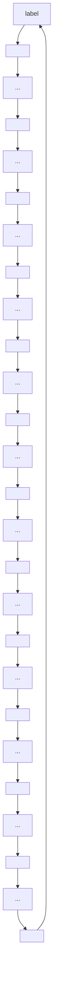
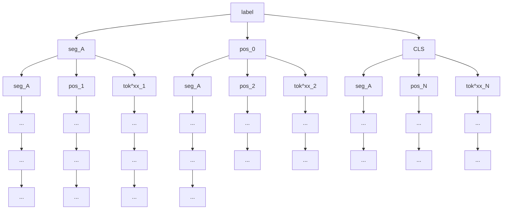

# On the Cross-lingual Transferability of Monolingual Representations

Mikel Artetxe $^{\dagger*}$ , Sebastian Ruder $^{\ddagger}$ , Dani Yogatama $^{\ddagger}$ $^{\dagger}$ HiTZ Center, University of the Basque Country (UPV/EHU) $^{\ddagger}$ DeepMind

mikel.artetxe@ehu.eus

{ruder, dyogatama}@google.com

# Abstract

State-of-the-art unsupervised multilingual models (e.g., multilingual BERT) have been shown to generalize in a zero-shot cross-lingual setting. This generalization ability has been attributed to the use of a shared subword vocabulary and joint training across multiple languages giving rise to deep multilingual abstractions. We evaluate this hypothesis by designing an alternative approach that transfers a monolingual model to new languages at the lexical level. More concretely, we first train a transformer-based masked language model on one language, and transfer it to a new language by learning a new embedding matrix with the same masked language modeling objective—freezing parameters of all other layers. This approach does not rely on a shared vocabulary or joint training. However, we show that it is competitive with multilingual BERT on standard cross-lingual classification benchmarks and on a new Cross-lingual Question Answering Dataset (XQuAD). Our results contradict common beliefs of the basis of the generalization ability of multilingual models and suggest that deep monolingual models learn some abstractions that generalize across languages. We also release XQuAD as a more comprehensive cross-lingual benchmark, which comprises 240 paragraphs and 1190 question-answer pairs from SQuAD v1.1 translated into ten languages by professional translators.

# 1 Introduction

Multilingual pre-training methods such as multilingual BERT (mBERT, Devlin et al., 2019) have been successfully used for zero-shot cross-lingual transfer (Pires et al., 2019; Conneau and Lample, 2019). These methods work by jointly training a transformer model (Vaswani et al., 2017) to perform masked language modeling (MLM) in multiple languages, which is then fine-tuned on a downstream task using labeled data in a single language—typically English. As a result of the multilingual pre-training, the model is able to generalize to other languages, even if it has never seen labeled data in those languages. Such a cross-lingual generalization ability is surprising, as there is no explicit cross-lingual term in the underlying training objective. In relation to this, Pires et al. (2019) hypothesized that:

… having word pieces used in all languages (numbers, URLs, etc), which have to be mapped to a shared space forces the co-occurring pieces to also be mapped to a shared space, thus spreading the effect to other word pieces, until different languages are close to a shared space.
… mBERT's ability to generalize cannot be attributed solely to vocabulary memorization, and that it must be learning a deeper multilingual representation.

Cao et al. (2020) echoed this sentiment, and Wu and Dredze (2019) further observed that mBERT performs better in languages that share many subwords. As such, the current consensus of the cross-lingual generalization ability of mBERT is based on a combination of three factors: (i) shared vocabulary items that act as anchor points; (ii) joint training across multiple languages that spreads this effect; which ultimately yields (iii) deep cross-lingual representations that generalize across languages and tasks.

In this paper, we empirically test this hypothesis by designing an alternative approach that violates all of these assumptions. As illustrated in Figure 1, our method starts with a monolingual transformer trained with MLM, which we transfer to a new language by learning a new embedding matrix through MLM in the new language while freezing parameters of all other layers. This approach only learns new lexical parameters and does not rely on shared

```mermaid
graph TD
    A["seg_A"] --> B["pos_0"]
    A --> C["pos_1"]
    A --> D["tok^EN"]
    E["seg_B"] --> F["pos_N"]
    G["seg_C"] --> H["tok^EN"]
    I["seg_A"] --> J["pos_2"]
    K["seg_B"] --> L["pos_N"]
    M["seg_C"] --> N["tok^EN"]
    O["seg_A"] --> P["pos_1"]
    Q["seg_B"] --> R["tok^EN"]
    S["seg_C"] --> T["TOK"]
    U["seg_A"] --> V["POS"]
    W["seg_B"] --> X["POS"]
    Y["seg_C"] --> Z["POS"]
    AA["seg_A"] --> AB["POS"]
    AC["seg_B"] --> AD["POS"]
    AE["seg_C"] --> AF["POS"]
    AG["seg_A"] --> AH["POS"]
    AI["seg_B"] --> AJ["POS"]
    AK["seg_C"] --> AL["POS"]
    AM["seg_A"] --> AN["POS"]
    AO["seg_B"] --> AP["POS"]
    AQ["seg_C"] --> AR["POS"]
    AS["seg_A"] --> AT["POS"]
    AU["seg_B"] --> AV["POS"]
    AW["seg_C"] --> AX["POS"]
    AY["seg_A"] --> AZ["POS"]
    BA["seg_B"] --> BB["POS"]
    BC["seg_C"] --> BD["TOK"]
    BE["seg_A"] --> BF["POS"]
    BG["seg_B"] --> BH["POS"]
    BI["seg_C"] --> BJ["TOK"]
    BK["seg_A"] --> BL["TOK"]
    BM["seg_B"] --> BN["TOK"]
    BO["seg_C"] --> BP["TOK"]
```

flowchart

(a) English pre-training

```mermaid
graph TD
    A["seg_A"] --> B["seg_B"]
    C["pos_0"] --> D["pos_N"]
    E["CLS"] --> F["tok_n^xx"]
    G["seg_A"] --> H["tok_n^xx"]
    I["pos_1"] --> J["tok_n^xx"]
    K["seg_A"] --> L["tok_n^xx"]
    M["pos_2"] --> N["tok_n^xx"]
    O["seg_B"] --> P["tok_n^xx"]
    Q["seg_A"] --> R["tok_n^xx"]
    S["seg_B"] --> T["tok_n^xx"]
    U["seg_A"] --> V["tok_n^xx"]
    W["seg_B"] --> X["tok_n^xx"]
    Y["seg_A"] --> Z["tok_n^xx"]
    AA["seg_B"] --> AB["tok_n^xx"]
    AC["seg_A"] --> AD["tok_n^xx"]
    AE["seg_B"] --> AF["tok_n^xx"]
    AG["seg_A"] --> AH["tok_n^xx"]
    AI["seg_B"] --> AJ["tok_n^xx"]
```

flowchart

(b) $L_{2}$ embedding learning

flowchart

(c) English fine-tuning

flowchart

(d) Zero-shot transfer to $L_{2}$   
Figure 1: Four steps for zero-shot cross-lingual transfer: (i) pre-train a monolingual transformer model in English akin to BERT; (ii) freeze the transformer body and learn new token embeddings from scratch for a second language using the same training objective over its monolingual corpus; (iii) fine-tune the model on English while keeping the embeddings frozen; and (iv) zero-shot transfer it to the new language by swapping the token embeddings.

vocabulary items nor joint learning. However, we show that it is competitive with joint multilingual pre-training across standard zero-shot cross-lingual transfer benchmarks (XNLI, MLDoc, and PAWS-X).

We also experiment with a new Cross-lingual Question Answering Dataset (XQuAD), which consists of 240 paragraphs and 1190 question-answer pairs from SQuAD v1.1 (Rajpurkar et al., 2016) translated into ten languages by professional translators. Question answering as a task is a classic probe for language understanding. It has also been found to be less susceptible to annotation artifacts commonly found in other benchmarks (Kaushik and Lipton, 2018; Gururangan et al., 2018). We believe that XQuAD can serve as a more comprehensive cross-lingual benchmark and make it publicly available at https://github.com/deepmind/xquad. Our results on XQuAD show that the monolingual transfer approach can be made competitive with mBERT by learning second language-specific transformations via adapter modules (Rebuffi et al., 2017).

Our contributions in this paper are as follows: (i) we propose a method to transfer monolingual representations to new languages in an unsupervised fashion ( $§2$ ) $^{1}$ ; (ii) we show that neither a shared subword vocabulary nor joint multilingual training is necessary for zero-shot transfer and find that the effective vocabulary size per language is an important factor for learning multilingual models ( $§3$ and $§4$ ); (iii) we show that monolingual models learn abstractions that generalize across languages ( $§5$ ); and (iv) we present a new cross-lingual question answering dataset ( $§4$ ).

# 2 Cross-lingual Transfer of Monolingual Representations

In this section, we propose an approach to transfer a pre-trained monolingual model in one language $L_{1}$ (for which both task supervision and a monolingual corpus are available) to a second language $L_{2}$ (for which only a monolingual corpus is available). The method serves as a counterpoint to existing joint multilingual models, as it works by aligning new lexical parameters to a monolingually trained deep model.

As illustrated in Figure 1, our proposed method consists of four steps:

1. Pre-train a monolingual BERT (i.e. a transformer) in $L_{1}$ with masked language modeling (MLM) and next sentence prediction (NSP) objectives on an unlabeled $L_{1}$ corpus.   
2. Transfer the model to a new language by learning new token embeddings while freezing the transformer body with the same training objectives (MLM and NSP) on an unlabeled $L_{2}$ corpus.   
3. Fine-tune the transformer for a downstream task using labeled data in $L_{1}$ , while keeping the $L_{1}$ token embeddings frozen.   
4. Zero-shot transfer the resulting model to $L_{2}$ by swapping the $L_{1}$ token embeddings with the $L_{2}$ embeddings learned in Step 2.

We note that, unlike mBERT, we use a separate subword vocabulary for each language, which is trained on its respective monolingual corpus, so the model has no notion of shared subwords. However, the special [CLS], [SEP], [MASK],

[PAD], and [UNK] symbols are shared across languages, and fine-tuned in Step 3. $^{2}$ We observe further improvements on several downstream tasks using the following extensions to the above method.

Language-specific position embeddings. The basic approach does not take into account different word orders commonly found in different languages, as it reuses the position embeddings in $L_{1}$ for $L_{2}$ . We relax this restriction by learning a separate set of position embeddings for $L_{2}$ in Step 2 (along with $L_{2}$ token embeddings). $^{3}$ We treat the [CLS] symbol as a special case. In the original implementation, BERT treats [CLS] as a regular word with its own position and segment embeddings, even if it always appears in the first position. However, this does not provide any extra capacity to the model, as the same position and segment embeddings are always added up to the [CLS] embedding. Following this observation, we do not use any position and segment embeddings for the [CLS] symbol.

Noised fine-tuning. The transformer body in our proposed method is only trained with $L_{1}$ embeddings as its input layer, but is used with $L_{2}$ embeddings at test time. To make the model more robust to this mismatch, we add Gaussian noises sampled from the standard normal distribution to the word, position, and segment embeddings during the fine-tuning step (Step 3).

Adapters. We also investigate the possibility of allowing the model to learn better deep representations of $L_{2}$ , while retaining the alignment with $L_{1}$ using residual adapters (Rebuffi et al., 2017). Adapters are small task-specific bottleneck layers that are added between layers of a pre-trained model. During fine-tuning, the original model parameters are frozen, and only parameters of the adapter modules are learned. In Step 2, when we transfer the $L_{1}$ transformer to $L_{2}$ , we add a feedforward adapter module after the projection following multi-headed attention and after the two feedforward layers in each transformer layer, similar to Houlsby et al. (2019). Note that the original transformer body is still frozen, and only parameters of the adapter modules are trainable (in addition to the embedding matrix in $L_{2}$ ).

# 3 Experiments

Our goal is to evaluate the performance of different multilingual models in the zero-shot cross-lingual setting to better understand the source of their generalization ability. We describe the models that we compare (§3.1), the experimental setting (§3.2), and the results on three classification datasets: XNLI (§3.3), MLDoc (§3.4) and PAWS-X (§3.5). We discuss experiments on our new XQuAD dataset in §4. In all experiments, we fine-tune a pre-trained model using labeled training examples in English, and evaluate on test examples in other languages via zero-shot transfer.

# 3.1 Models

We compare four main models in our experiments:

Joint multilingual models (JOINTMULTI). A multilingual BERT model trained jointly on 15 languages $^{4}$ . This model is analogous to mBERT and closely related to other variants like XLM.

Joint pairwise bilingual models (JOINTPAIR). A multilingual BERT model trained jointly on two languages (English and another language). This serves to control the effect of having multiple languages in joint training. At the same time, it provides a joint system that is directly comparable to the monolingual transfer approach in §2, which also operates on two languages.

Cross-lingual word embedding mappings (CLWE). The method we described in §2 operates at the lexical level, and can be seen as a form of learning cross-lingual word embeddings that are aligned to a monolingual transformer body. In contrast to this approach, standard cross-lingual word embedding mappings first align monolingual lexical spaces and then learn a multilingual deep model on top of this space. We also include a method based on this alternative approach where we train skip-gram embeddings for each language, and map them to a shared space using VecMap (Artetxe et al., 2018). $^{5}$ We then train an English BERT model using MLM and NSP on top of the frozen mapped embeddings. The model is

then fine-tuned using English labeled data while keeping the embeddings frozen. We zero-shot transfer to a new language by plugging in its respective mapped embeddings.

Cross-lingual transfer of monolingual models (MONOTRANS). Our method described in §2. We use English as $L_{1}$ and try multiple variants with different extensions.

# 3.2 Setting

Vocabulary. We perform subword tokenization using the unigram model in SentencePiece (Kudo and Richardson, 2018). In order to understand the effect of sharing subwords across languages and the size of the vocabulary, we train each model with various settings. We train 4 different JOINTMULTI models with a vocabulary of 32k, 64k, 100k, and 200k subwords. For JOINTPAIR, we train one model with a joint vocabulary of 32k subwords, learned separately for each language pair, and another one with a disjoint vocabulary of 32k subwords per language, learned on its respective monolingual corpus. The latter is directly comparable to MONO-TRANS in terms of vocabulary, in that it is restricted to two languages and uses the exact same disjoint vocabulary with 32k subwords per language. For CLWE, we use the same subword vocabulary and investigate two choices: (i) the number of embedding dimensions—300d (the standard in the cross-lingual embedding literature) and 768d (equivalent to the rest of the models); and (ii) the self-learning initialization—weakly supervised (based on identically spelled words, Søgaard et al., 2018) and unsupervised (based on the intralingual similarity distribution, Artetxe et al., 2018).

Pre-training data. We use Wikipedia as our training corpus, similar to mBERT and XLM (Conneau and Lample, 2019), which we extract using the WikiExtractor tool. $^{6}$ We do not perform any lowercasing or normalization. When working with languages of different corpus sizes, we use the same upsampling strategy as Conneau and Lample (2019) for both the subword vocabulary learning and the pre-training.

Training details. Our implementation is based on the BERT code from Devlin et al. (2019). For adapters, we build on the code by Houlsby et al. (2019). We use the model architecture of BERT $_{BASE}$ , similar to mBERT. We use the LAMB optimizer (You et al., 2020) and train on 64 TPUv3 chips for 250,000 steps using the same hyperparameters as You et al. (2020). We describe other training details in Appendix A. Our hyperparameter configuration is based on preliminary experiments on the development set of the XNLI dataset. We do not perform any exhaustive hyperparameter search, and use the exact same settings for all model variants, languages, and tasks.

Evaluation setting. We perform a single training and evaluation run for each model, and report results in the corresponding test set for each downstream task. For MONOTRANS, we observe stability issues when learning language-specific position embeddings for Greek, Thai and Swahili. The second step would occasionally fail to converge to a good solution. For these three languages, we run Step 2 of our proposed method ( $§2$ ) three times and pick the best model on the XNLI development set.

# 3.3 XNLI: Natural Language Inference

In natural language inference (NLI), given two sentences (a premise and a hypothesis), the goal is to decide whether there is an entailment, contradiction, or neutral relationship between them (Bowman et al., 2015). We train all models on the MultiNLI dataset (Williams et al., 2018) in English and evaluate on XNLI (Conneau et al., 2018b)—a cross-lingual NLI dataset consisting of 2,500 development and 5,000 test instances translated from English into 14 languages.

We report our results on XNLI in Table 1 together with the previous results from mBERT and XLM. $^{7}$ We summarize our main findings below.

JOINTMULTI is comparable with the literature. Our best JOINTMULTI model is substantially better than mBERT, and only one point worse (on average) than the unsupervised XLM model, which is larger in size.

A larger vocabulary is beneficial. JOINTMULTI variants with a larger vocabulary perform better.

More languages do not improve performance. JOINTPAIR models with a joint vocabulary perform comparably with JOINTMULTI.

<table><tr><td colspan="2"></td><td>en</td><td>fr</td><td>es</td><td>de</td><td>el</td><td>bg</td><td>ru</td><td>tr</td><td>ar</td><td>vi</td><td>th</td><td>zh</td><td>hi</td><td>sw</td><td>ur</td><td>avg</td></tr><tr><td rowspan="2">Prev work</td><td>mBERT</td><td>81.4</td><td>-</td><td>74.3</td><td>70.5</td><td>-</td><td>-</td><td>-</td><td>-</td><td>62.1</td><td>-</td><td>-</td><td>63.8</td><td>-</td><td>-</td><td>58.3</td><td>-</td></tr><tr><td>XLM (MLM)</td><td>83.2</td><td>76.5</td><td>76.3</td><td>74.2</td><td>73.1</td><td>74.0</td><td>73.1</td><td>67.8</td><td>68.5</td><td>71.2</td><td>69.2</td><td>71.9</td><td>65.7</td><td>64.6</td><td>63.4</td><td>71.5</td></tr><tr><td rowspan="4">CLWE</td><td>300d ident</td><td>82.1</td><td>67.6</td><td>69.0</td><td>65.0</td><td>60.9</td><td>59.1</td><td>59.5</td><td>51.2</td><td>55.3</td><td>46.6</td><td>54.0</td><td>58.5</td><td>48.4</td><td>35.3</td><td>43.0</td><td>57.0</td></tr><tr><td>300d unsup</td><td>82.1</td><td>67.4</td><td>69.3</td><td>64.5</td><td>60.2</td><td>58.4</td><td>59.2</td><td>51.5</td><td>56.2</td><td>36.4</td><td>54.7</td><td>57.7</td><td>48.2</td><td>36.2</td><td>33.8</td><td>55.7</td></tr><tr><td>768d ident</td><td>82.4</td><td>70.7</td><td>71.1</td><td>67.6</td><td>64.2</td><td>61.4</td><td>63.3</td><td>55.0</td><td>58.6</td><td>50.7</td><td>58.0</td><td>60.2</td><td>54.8</td><td>34.8</td><td>48.1</td><td>60.1</td></tr><tr><td>768d unsup</td><td>82.4</td><td>70.4</td><td>71.2</td><td>67.4</td><td>63.9</td><td>62.8</td><td>63.3</td><td>54.8</td><td>58.3</td><td>49.1</td><td>57.2</td><td>55.7</td><td>54.9</td><td>35.0</td><td>33.9</td><td>58.7</td></tr><tr><td rowspan="4">JOINT MULTI</td><td>32k voc</td><td>79.0</td><td>71.5</td><td>72.2</td><td>68.5</td><td>66.7</td><td>66.9</td><td>66.5</td><td>58.4</td><td>64.4</td><td>66.0</td><td>62.3</td><td>66.4</td><td>59.1</td><td>50.4</td><td>56.9</td><td>65.0</td></tr><tr><td>64k voc</td><td>80.7</td><td>72.8</td><td>73.0</td><td>69.8</td><td>69.6</td><td>69.5</td><td>68.8</td><td>63.6</td><td>66.1</td><td>67.2</td><td>64.7</td><td>66.7</td><td>63.2</td><td>52.0</td><td>59.0</td><td>67.1</td></tr><tr><td>100k voc</td><td>81.2</td><td>74.5</td><td>74.4</td><td>72.0</td><td>72.3</td><td>71.2</td><td>70.0</td><td>65.1</td><td>69.7</td><td>68.9</td><td>66.4</td><td>68.0</td><td>64.2</td><td>55.6</td><td>62.2</td><td>69.0</td></tr><tr><td>200k voc</td><td>82.2</td><td>75.8</td><td>75.7</td><td>73.4</td><td>74.0</td><td>73.1</td><td>71.8</td><td>67.3</td><td>69.8</td><td>69.8</td><td>67.7</td><td>67.8</td><td>65.8</td><td>60.9</td><td>62.3</td><td>70.5</td></tr><tr><td rowspan="2">JOINT PAIR</td><td>Joint voc</td><td>82.2</td><td>74.8</td><td>76.4</td><td>73.1</td><td>72.0</td><td>71.8</td><td>70.2</td><td>67.9</td><td>68.5</td><td>71.4</td><td>67.7</td><td>70.8</td><td>64.5</td><td>64.2</td><td>60.6</td><td>70.4</td></tr><tr><td>Disjoint voc</td><td>83.0</td><td>76.2</td><td>77.1</td><td>74.4</td><td>74.4</td><td>73.7</td><td>72.1</td><td>68.8</td><td>71.3</td><td>70.9</td><td>66.2</td><td>72.5</td><td>66.0</td><td>62.3</td><td>58.0</td><td>71.1</td></tr><tr><td rowspan="4">MONO TRANS</td><td>Token emb</td><td>83.1</td><td>73.3</td><td>73.9</td><td>71.0</td><td>70.3</td><td>71.5</td><td>66.7</td><td>64.5</td><td>66.6</td><td>68.2</td><td>63.9</td><td>66.9</td><td>61.3</td><td>58.1</td><td>57.3</td><td>67.8</td></tr><tr><td>+ pos emb</td><td>83.8</td><td>74.3</td><td>75.1</td><td>71.7</td><td>72.6</td><td>72.8</td><td>68.8</td><td>66.0</td><td>68.6</td><td>69.8</td><td>65.7</td><td>69.7</td><td>61.1</td><td>58.8</td><td>58.3</td><td>69.1</td></tr><tr><td>+ noising</td><td>81.7</td><td>74.1</td><td>75.2</td><td>72.6</td><td>72.9</td><td>73.1</td><td>70.2</td><td>68.1</td><td>70.2</td><td>69.1</td><td>67.7</td><td>70.6</td><td>62.5</td><td>62.5</td><td>60.2</td><td>70.0</td></tr><tr><td>+ adapters</td><td>81.7</td><td>74.7</td><td>75.4</td><td>73.0</td><td>72.0</td><td>73.7</td><td>70.4</td><td>69.9</td><td>70.6</td><td>69.5</td><td>65.1</td><td>70.3</td><td>65.2</td><td>59.6</td><td>51.7</td><td>69.5</td></tr></table>

Table 1: XNLI results (accuracy). mBERT results are taken from the official BERT repository, while XLM results are taken from Conneau and Lample (2019). We bold the best result in each section and underline the overall best.

A shared subword vocabulary is not necessary for joint multilingual pre-training. The equivalent JOINTPAIR models with a disjoint vocabulary for each language perform better.

CLWE performs poorly. Even if it is competitive in English, it does not transfer as well to other languages. Larger dimensionalities and weak supervision improve CLWE, but its performance is still below other models.

MONOTRANS is competitive with joint learning. The basic version of MONOTRANS is 3.3 points worse on average than its equivalent JOINTPAIR model. Language-specific position embeddings and noised fine-tuning reduce the gap to only 1.1 points. Adapters mostly improve performance, except for low-resource languages such as Urdu, Swahili, Thai, and Greek. In subsequent experiments, we include results for all variants of MONOTRANS and JOINTPAIR, the best CLWE variant (768d ident), and JOINTMULTI with 32k and 200k voc.

# 3.4 MLDoc: Document Classification

In MLDoc (Schwenk and Li, 2018), the task is to classify documents into one of four different genres: corporate/industrial, economics, government/social, and markets. The dataset is an improved version of the Reuters benchmark (Klementiev et al., 2012), and consists of 1,000 training and 4,000 test documents in 7 languages.

We show the results of our MLDoc experiments in Table 2. In this task, we observe that simpler models tend to perform better, and the best overall results are from CLWE. We believe that this can be attributed to: (i) the superficial nature of the task itself, as a model can rely on a few keywords to identify the genre of an input document without requiring any high-level understanding and (ii) the small size of the training set. Nonetheless, all of the four model families obtain generally similar results, corroborating our previous findings that joint multilingual pre-training and a shared vocabulary are not needed to achieve good performance.

# 3.5 PAWS-X: Paraphrase Identification

PAWS is a dataset that contains pairs of sentences with a high lexical overlap (Zhang et al., 2019). The task is to predict whether each pair is a paraphrase or not. While the original dataset is only in English, PAWS-X (Yang et al., 2019) provides human translations into six languages.

We evaluate our models on this dataset and show our results in Table 2. Similar to experiments on other datasets, MONOTRANS is competitive with the best joint variant, with a difference of only 0.6 points when we learn language-specific position embeddings.

# 4 XQuAD: Cross-lingual Question Answering Dataset

Our classification experiments demonstrate that MONOTRANS is competitive with JOINTMULTI and JOINTPAIR, despite being multilingual at the embedding layer only (i.e. the transformer body is trained

<table><tr><td rowspan="2" colspan="2"></td><td colspan="7">MLDoc</td><td colspan="6">PAWS-X</td></tr><tr><td>en</td><td>fr</td><td>es</td><td>de</td><td>ru</td><td>zh</td><td>avg</td><td>en</td><td>fr</td><td>es</td><td>de</td><td>zh</td><td>avg</td></tr><tr><td>Prev work</td><td>mBERT</td><td>-</td><td>83.0</td><td>75.0</td><td>82.4</td><td>71.6</td><td>66.2</td><td>-</td><td>93.5</td><td>85.2</td><td>86.0</td><td>82.2</td><td>75.8</td><td>84.5</td></tr><tr><td>CLWE</td><td>768d ident</td><td>94.7</td><td>87.3</td><td>77.0</td><td>88.7</td><td>67.6</td><td>78.3</td><td>82.3</td><td>92.8</td><td>85.2</td><td>85.5</td><td>81.6</td><td>72.5</td><td>83.5</td></tr><tr><td>JOINT</td><td>32k voc</td><td>92.6</td><td>81.7</td><td>75.8</td><td>85.4</td><td>71.5</td><td>66.6</td><td>78.9</td><td>91.9</td><td>83.8</td><td>83.3</td><td>82.6</td><td>75.8</td><td>83.5</td></tr><tr><td>MULTI</td><td>200k voc</td><td>91.9</td><td>82.1</td><td>80.9</td><td>89.3</td><td>71.8</td><td>66.2</td><td>80.4</td><td>93.8</td><td>87.7</td><td>87.5</td><td>87.3</td><td>78.8</td><td>87.0</td></tr><tr><td>JOINT</td><td>Joint voc</td><td>93.1</td><td>81.3</td><td>74.7</td><td>87.7</td><td>71.5</td><td>80.7</td><td>81.5</td><td>93.3</td><td>86.1</td><td>87.2</td><td>86.0</td><td>79.9</td><td>86.5</td></tr><tr><td>PAIR</td><td>Disjoint voc</td><td>93.5</td><td>83.1</td><td>78.0</td><td>86.6</td><td>65.5</td><td>78.1</td><td>80.8</td><td>94.0</td><td>88.4</td><td>88.6</td><td>87.5</td><td>79.3</td><td>87.5</td></tr><tr><td rowspan="4">MONO TRANS</td><td>Token emb</td><td>93.5</td><td>84.0</td><td>76.9</td><td>88.7</td><td>60.6</td><td>83.6</td><td>81.2</td><td>93.6</td><td>87.0</td><td>87.1</td><td>84.2</td><td>78.2</td><td>86.0</td></tr><tr><td>+ pos emb</td><td>93.6</td><td>79.7</td><td>75.7</td><td>86.6</td><td>61.6</td><td>83.0</td><td>80.0</td><td>94.3</td><td>87.3</td><td>87.6</td><td>86.3</td><td>79.0</td><td>86.9</td></tr><tr><td>+ noising</td><td>88.2</td><td>81.3</td><td>72.2</td><td>89.4</td><td>63.9</td><td>65.1</td><td>76.7</td><td>88.0</td><td>83.3</td><td>83.2</td><td>81.8</td><td>77.5</td><td>82.7</td></tr><tr><td>+ adapters</td><td>88.2</td><td>81.4</td><td>76.4</td><td>89.6</td><td>63.1</td><td>77.3</td><td>79.3</td><td>88.0</td><td>84.1</td><td>83.0</td><td>81.5</td><td>73.5</td><td>82.0</td></tr></table>

Table 2: MLDoc and PAWS-X results (accuracy). mBERT results are from Eisenschlos et al. (2019) for MLDoc and from Yang et al. (2019) for PAWS-X, respectively. We bold the best result in each section with more than two models and underline the overall best result.

exclusively on English). One possible explanation for this behaviour is that existing cross-lingual benchmarks are flawed and solvable at the lexical level. For example, previous work has shown that models trained on MultiNLI—from which XNLI was derived—learn to exploit superficial cues in the data (Gururangan et al., 2018).

To better understand the cross-lingual generalization ability of these models, we create a new Cross-lingual Question Answering Dataset (XQuAD). Question answering is a classic probe for natural language understanding (Hermann et al., 2015) and has been shown to be less susceptible to annotation artifacts than other popular tasks (Kaushik and Lipton, 2018). In contrast to existing classification benchmarks, extractive question answering requires identifying relevant answer spans in longer context paragraphs, thus requiring some degree of structural transfer across languages.

XQuAD consists of a subset of 240 paragraphs and 1190 question-answer pairs from the development set of SQuAD v1.1 $^{8}$ together with their translations into ten languages: Spanish, German, Greek, Russian, Turkish, Arabic, Vietnamese, Thai, Chinese, and Hindi. Both the context paragraphs and the questions are translated by professional human translators from Gengo $^{9}$ . In order to facilitate easy annotations of answer spans, we choose the most frequent answer for each question and mark its beginning and end in the context paragraph using special symbols, instructing translators to keep these symbols in the relevant positions in their translations. Appendix B discusses the dataset in more details.

We show $F_{1}$ scores on XQuAD in Table 3 (we include exact match scores in Appendix C). Similar to our findings in the XNLI experiment, the vocabulary size has a large impact on JOINTMULTI, and JOINTPAIR models with disjoint vocabularies perform the best. The gap between MONOTRANS and joint models is larger, but MONOTRANS still performs surprisingly well given the nature of the task. We observe that learning language-specific position embeddings is helpful in most cases, but completely fails for Turkish and Hindi. Interestingly, the exact same pre-trained models (after Steps 1 and 2) do obtain competitive results in XNLI ( $§3.3$ ). In contrast to results on previous tasks, adding adapters to allow a transferred monolingual model to learn higher level abstractions in the new language significantly improves performance, resulting in a MONOTRANS model that is comparable to the best joint system.

# 5 Discussion

Joint multilingual training. We demonstrate that sharing subwords across languages is not necessary for mBERT to work, contrary to a previous hypothesis by Pires et al. (2019). We also do not observe clear improvements by scaling the joint training to a large number of languages.

Rather than having a joint vs. disjoint vocabulary or two vs. multiple languages, we find that an important factor is the effective vocabulary size per language. When using a joint vocabulary, only a subset of the tokens is effectively shared, while the

<table><tr><td colspan="2"></td><td>en</td><td>es</td><td>de</td><td>el</td><td>ru</td><td>tr</td><td>ar</td><td>vi</td><td>th</td><td>zh</td><td>hi</td><td>avg</td></tr><tr><td></td><td>mBERT</td><td>88.9</td><td>75.5</td><td>70.6</td><td>62.6</td><td>71.3</td><td>55.4</td><td>61.5</td><td>69.5</td><td>42.7</td><td>58.0</td><td>59.2</td><td>65.0</td></tr><tr><td>CLWE</td><td>768d ident</td><td>84.2</td><td>58.0</td><td>51.2</td><td>41.1</td><td>48.3</td><td>24.2</td><td>32.8</td><td>29.7</td><td>23.8</td><td>19.9</td><td>21.7</td><td>39.5</td></tr><tr><td>JOINT</td><td>32k voc</td><td>79.3</td><td>59.5</td><td>60.3</td><td>49.6</td><td>59.7</td><td>42.9</td><td>52.3</td><td>53.6</td><td>49.3</td><td>50.2</td><td>42.3</td><td>54.5</td></tr><tr><td>MULTI</td><td>200k voc</td><td>82.7</td><td>74.3</td><td>71.3</td><td>67.1</td><td>70.2</td><td>56.6</td><td>64.8</td><td>67.6</td><td>58.6</td><td>51.5</td><td>58.3</td><td>65.7</td></tr><tr><td>JOINT</td><td>Joint voc</td><td>82.8</td><td>68.3</td><td>73.6</td><td>58.8</td><td>69.8</td><td>53.8</td><td>65.3</td><td>69.5</td><td>56.3</td><td>58.8</td><td>57.4</td><td>64.9</td></tr><tr><td>PAIR</td><td>Disjoint voc</td><td>83.3</td><td>72.5</td><td>72.8</td><td>67.3</td><td>71.7</td><td>60.5</td><td>66.5</td><td>68.9</td><td>56.1</td><td>60.4</td><td>56.7</td><td>67.0</td></tr><tr><td></td><td>Token emb</td><td>83.9</td><td>67.9</td><td>62.1</td><td>63.0</td><td>64.2</td><td>51.2</td><td>61.0</td><td>64.1</td><td>52.6</td><td>51.4</td><td>50.9</td><td>61.1</td></tr><tr><td>MONO</td><td>+ pos emb</td><td>84.7</td><td>73.1</td><td>65.9</td><td>66.5</td><td>66.2</td><td>16.2</td><td>59.5</td><td>65.8</td><td>51.5</td><td>56.4</td><td>19.3</td><td>56.8</td></tr><tr><td>TRANS</td><td>+ noising</td><td>82.1</td><td>68.4</td><td>68.2</td><td>67.3</td><td>67.5</td><td>17.5</td><td>61.2</td><td>65.9</td><td>57.5</td><td>58.5</td><td>21.5</td><td>57.8</td></tr><tr><td></td><td>+ adapters</td><td>82.1</td><td>70.8</td><td>70.6</td><td>67.9</td><td>69.1</td><td>61.3</td><td>66.0</td><td>67.0</td><td>57.5</td><td>60.5</td><td>61.9</td><td>66.8</td></tr></table>

Table 3: XQuAD results (F1). We bold the best result in each section and underline the overall best result. 

<table><tr><td rowspan="2" colspan="2"></td><td>mono</td><td colspan="12">xx→en aligned</td></tr><tr><td>en</td><td>en</td><td>fr</td><td>es</td><td>de</td><td>el</td><td>bg</td><td>ru</td><td>tr</td><td>ar</td><td>vi</td><td>zh</td><td>avg</td></tr><tr><td rowspan="2">Semantic</td><td>WiC</td><td>59.1</td><td>58.2</td><td>62.5</td><td>59.6</td><td>58.0</td><td>59.9</td><td>56.9</td><td>57.7</td><td>58.5</td><td>59.7</td><td>57.8</td><td>56.7</td><td>58.7</td></tr><tr><td>SCWS</td><td>45.9</td><td>44.3</td><td>39.7</td><td>34.1</td><td>39.1</td><td>38.2</td><td>28.9</td><td>32.6</td><td>42.1</td><td>45.5</td><td>35.3</td><td>31.8</td><td>37.4</td></tr><tr><td rowspan="2">Syntactic</td><td>Subject-verb agreement</td><td>86.5</td><td>58.2</td><td>64.0</td><td>65.7</td><td>57.6</td><td>67.6</td><td>58.4</td><td>73.6</td><td>59.6</td><td>61.2</td><td>62.1</td><td>61.1</td><td>62.7</td></tr><tr><td>Reflexive anaphora</td><td>79.2</td><td>60.2</td><td>60.7</td><td>66.6</td><td>53.3</td><td>63.6</td><td>56.0</td><td>75.4</td><td>69.4</td><td>81.6</td><td>58.4</td><td>55.2</td><td>63.7</td></tr></table>

Table 4: Semantic and syntactic probing results of a monolingual model and monolingual models transferred to English. Results are on the Word-in-Context (WiC) dev set, the Stanford Contextual Word Similarity (SCWS) test set, and the syntactic evaluation (syn) test set (Marvin and Linzen, 2018). Metrics are accuracy (WiC), Spearman's r (SCWS), and macro-averaged accuracy (syn).

rest tends to occur in only one language. As a result, multiple languages compete for allocations in the shared vocabulary. We observe that multilingual models with larger vocabulary sizes obtain consistently better results. It is also interesting that our best results are generally obtained by the JOINTPAIR systems with a disjoint vocabulary, which guarantees that each language is allocated 32k subwords. As such, we believe that future work should treat the effective vocabulary size as an important factor.

Transfer of monolingual representations. MONOTRANS is competitive even in the most challenging scenarios. This indicates that joint multilingual pre-training is not essential for cross-lingual generalization, suggesting that monolingual models learn linguistic abstractions that generalize across languages.

To get a better understanding of this phenomenon, we probe the representations of MONO-TRANS. As existing probing datasets are only available in English, we train monolingual representations in non-English languages and transfer them to English. We probe representations from the resulting English models with the Word in Context (WiC; Pilehvar and Camacho-Collados, 2019), Stanford Contextual Word Similarity (SCWS; Huang et al., 2012), and the syntactic evaluation (Marvin and Linzen, 2018) datasets.

We provide details of our experimental setup in Appendix D and show a summary of our results in Table 4. The results indicate that monolingual semantic representations learned from non-English languages transfer to English to a degree. On WiC, models transferred from non-English languages are comparable with models trained on English. On SCWS, while there are more variations, models trained on other languages still perform surprisingly well. In contrast, we observe larger gaps in the syntactic evaluation dataset. This suggests that transferring syntactic abstractions is more challenging than semantic abstractions. We leave a more thorough investigation of whether joint multilingual pre-training reduces to learning a lexical-level alignment for future work.

CLWE. CLWE models—although similar in spirit to MONOTRANS—are only competitive on the easiest and smallest task (MLDoc), and perform poorly on the more challenging ones (XNLI and XQuAD). While previous work has questioned evaluation methods in this research area (Glavaš et al., 2019;

Artetxe et al., 2019), our results provide evidence that existing methods are not competitive in challenging downstream tasks and that mapping between two fixed embedding spaces may be overly restrictive. For that reason, we think that designing better integration techniques of CLWE to downstream models is an important future direction.

Lifelong learning. Humans learn continuously and accumulate knowledge throughout their lifetime. In contrast, existing multilingual models focus on the scenario where all training data for all languages is available in advance. The setting to transfer a monolingual model to other languages is suitable for the scenario where one needs to incorporate new languages into an existing model, while no longer having access to the original data. Such a scenario is of significant practical interest, since models are often released without the data they are trained on. In that regard, our work provides a baseline for multilingual lifelong learning.

# 6 Related Work

Unsupervised lexical multilingual representations. A common approach to learn multilingual representations is based on cross-lingual word embedding mappings. These methods learn a set of monolingual word embeddings for each language and map them to a shared space through a linear transformation. Recent approaches perform this mapping with an unsupervised initialization based on heuristics (Artetxe et al., 2018) or adversarial training (Zhang et al., 2017; Conneau et al., 2018a), which is further improved through self-learning (Artetxe et al., 2017). The same approach has also been adapted for contextual representations (Schuster et al., 2019).

Unsupervised deep multilingual representations. In contrast to the previous approach, which learns a shared multilingual space at the lexical level, state-of-the-art methods learn deep representations with a transformer. Most of these methods are based on mBERT. Extensions to mBERT include scaling it up and incorporating parallel data (Conneau and Lample, 2019), adding auxiliary pre-training tasks (Huang et al., 2019), and encouraging representations of translations to be similar (Cao et al., 2020).

Concurrent to this work, Tran (2020) propose a more complex approach to transfer a monolingual BERT to other languages that achieves results similar to ours. However, they find that post-hoc embedding learning from a random initialization does not work well. In contrast, we show that monolingual representations generalize well to other languages and that we can transfer to a new language by learning new subword embeddings. Contemporaneous work also shows that a shared vocabulary is not important for learning multilingual representations (K et al., 2020; Wu et al., 2019), while Lewis et al. (2019) propose a question answering dataset that is similar in spirit to ours but covers fewer languages and is not parallel across all of them.

# 7 Conclusions

We compared state-of-the-art multilingual representation learning models and a monolingual model that is transferred to new languages at the lexical level. We demonstrated that these models perform comparably on standard zero-shot cross-lingual transfer benchmarks, indicating that neither a shared vocabulary nor joint pre-training are necessary in multilingual models. We also showed that a monolingual model trained on a particular language learns some semantic abstractions that are generalizable to other languages in a series of probing experiments. Our results and analysis contradict previous theories and provide new insights into the basis of the generalization abilities of multilingual models. To provide a more comprehensive benchmark to evaluate cross-lingual models, we also released the Cross-lingual Question Answering Dataset (XQuAD).

# Acknowledgements

We thank Chris Dyer and Phil Blunsom for helpful comments on an earlier draft of this paper and Tyler Liechty for assistance with datasets.

# References

Mikel Artetxe, Gorka Labaka, and Eneko Agirre. 2017. Learning bilingual word embeddings with (almost) no bilingual data. In Proceedings of the 55th Annual Meeting of the Association for Computational Linguistics (Volume 1: Long Papers), pages 451–462, Vancouver, Canada. Association for Computational Linguistics.   
Mikel Artetxe, Gorka Labaka, and Eneko Agirre. 2018. A robust self-learning method for fully unsupervised cross-lingual mappings of word embeddings. In Proceedings of the 56th Annual Meeting of the Association for Computational Linguistics (Volume 1: Long

Papers), pages 789–798, Melbourne, Australia. Association for Computational Linguistics.   
Mikel Artetxe, Gorka Labaka, and Eneko Agirre. 2019. Bilingual lexicon induction through unsupervised machine translation. In Proceedings of the 57th Annual Meeting of the Association for Computational Linguistics, pages 5002–5007, Florence, Italy. Association for Computational Linguistics.   
Samuel R. Bowman, Gabor Angeli, Christopher Potts, and Christopher D. Manning. 2015. A large annotated corpus for learning natural language inference. In Proceedings of the 2015 Conference on Empirical Methods in Natural Language Processing, pages 632–642, Lisbon, Portugal. Association for Computational Linguistics.   
Steven Cao, Nikita Kitaev, and Dan Klein. 2020. Multilingual Alignment of Contextual Word Representations. In Proceedings of the 8th International Conference on Learning Representations (ICLR 2020).   
Alexis Conneau and Guillaume Lample. 2019. Cross-lingual language model pretraining. In Advances in Neural Information Processing Systems 32, pages 7059–7069.   
Alexis Conneau, Guillaume Lample, Marc'Aurelio Ranzato, Ludovic Denoyer, and Hervé Jégou. 2018a. Word Translation Without Parallel Data. In Proceedings of the 6th International Conference on Learning Representations (ICLR 2018).   
Alexis Conneau, Ruty Rinott, Guillaume Lample, Adina Williams, Samuel Bowman, Holger Schwenk, and Veselin Stoyanov. 2018b. XNLI: Evaluating cross-lingual sentence representations. In Proceedings of the 2018 Conference on Empirical Methods in Natural Language Processing, pages 2475–2485, Brussels, Belgium. Association for Computational Linguistics.   
Jacob Devlin, Ming-Wei Chang, Kenton Lee, and Kristina Toutanova. 2019. BERT: Pre-training of deep bidirectional transformers for language understanding. In Proceedings of the 2019 Conference of the North American Chapter of the Association for Computational Linguistics: Human Language Technologies, Volume 1 (Long and Short Papers), pages 4171–4186, Minneapolis, Minnesota. Association for Computational Linguistics.   
Julian Eisenschlos, Sebastian Ruder, Piotr Czapla, Marcin Kadras, Sylvain Gugger, and Jeremy Howard. 2019. MultiFiT: Efficient Multi-lingual Language Model Fine-tuning. In Proceedings of the 2019 Conference on Empirical Methods in Natural Language Processing and the 9th International Joint Conference on Natural Language Processing (EMNLP-IJCNLP), pages 5702–5707, Hong Kong, China. Association for Computational Linguistics.   
Goran Glavaš, Robert Litschko, Sebastian Ruder, and Ivan Vulić. 2019. How to (properly) evaluate cross-

lingual word embeddings: On strong baselines, comparative analyses, and some misconceptions. In Proceedings of the 57th Annual Meeting of the Association for Computational Linguistics, pages 710–721, Florence, Italy. Association for Computational Linguistics.   
Yoav Goldberg. 2019. Assessing BERT's Syntactic Abilities. CoRR, abs/1901.05287.   
Suchin Gururangan, Swabha Swayamdipta, Omer Levy, Roy Schwartz, Samuel Bowman, and Noah A. Smith. 2018. Annotation artifacts in natural language inference data. In Proceedings of the 2018 Conference of the North American Chapter of the Association for Computational Linguistics: Human Language Technologies, Volume 2 (Short Papers), pages 107–112, New Orleans, Louisiana. Association for Computational Linguistics.   
Karl Moritz Hermann, Tomas Kocisky, Edward Grefenstette, Lasse Espeholt, Will Kay, Mustafa Suleyman, and Phil Blunsom. 2015. Teaching machines to read and comprehend. In Advances in Neural Information Processing Systems 28, pages 1693–1701.   
Neil Houlsby, Andrei Giurgiu, Stanislaw Jastrzebski, Bruna Morrone, Quentin De Laroussilhe, Andrea Gesmundo, Mona Attariyan, and Sylvain Gelly. 2019. Parameter-efficient transfer learning for NLP. In Proceedings of the 36th International Conference on Machine Learning, volume 97 of Proceedings of Machine Learning Research, pages 2790–2799, Long Beach, California, USA. PMLR.   
Eric Huang, Richard Socher, Christopher Manning, and Andrew Ng. 2012. Improving word representations via global context and multiple word prototypes. In Proceedings of the 50th Annual Meeting of the Association for Computational Linguistics (Volume 1: Long Papers), pages 873–882, Jeju Island, Korea. Association for Computational Linguistics.   
Haoyang Huang, Yaobo Liang, Nan Duan, Ming Gong, Linjun Shou, Daxin Jiang, and Ming Zhou. 2019. Unicoder: A universal language encoder by pretraining with multiple cross-lingual tasks. In Proceedings of the 2019 Conference on Empirical Methods in Natural Language Processing and the 9th International Joint Conference on Natural Language Processing (EMNLP-IJCNLP), pages 2485–2494, Hong Kong, China. Association for Computational Linguistics.   
Karthikeyan K, Zihan Wang, Stephen Mayhew, and Dan Roth. 2020. Cross-Lingual Ability of Multilingual BERT: An Empirical Study. In Proceedings of the 8th International Conference on Learning Representations (ICLR 2020).   
Divyansh Kaushik and Zachary C. Lipton. 2018. How much reading does reading comprehension require? A critical investigation of popular benchmarks. In Proceedings of the 2018 Conference on Empirical Methods in Natural Language Processing, pages

5010–5015, Brussels, Belgium. Association for Computational Linguistics.   
Alexandre Klementiev, Ivan Titov, and Binod Bhattarai. 2012. Inducing crosslingual distributed representations of words. In Proceedings of the 24th International Conference on Computational Linguistics, pages 1459–1474, Mumbai, India. The COLING 2012 Organizing Committee.   
Taku Kudo and John Richardson. 2018. SentencePiece: A simple and language independent subword tokenizer and detokenizer for neural text processing. In Proceedings of the 2018 Conference on Empirical Methods in Natural Language Processing: System Demonstrations, pages 66–71, Brussels, Belgium. Association for Computational Linguistics.   
Patrick Lewis, Barlas Oğuz, Ruty Rinott, Sebastian Riedel, and Holger Schwenk. 2019. MLQA: Evaluating Cross-lingual Extractive Question Answering. arXiv preprint arXiv:1910.07475.   
Rebecca Marvin and Tal Linzen. 2018. Targeted syntactic evaluation of language models. In Proceedings of the 2018 Conference on Empirical Methods in Natural Language Processing, pages 1192–1202, Brussels, Belgium. Association for Computational Linguistics.   
Mohammad Taher Pilehvar and Jose Camacho-Collados. 2019. WiC: the word-in-context dataset for evaluating context-sensitive meaning representations. In Proceedings of the 2019 Conference of the North American Chapter of the Association for Computational Linguistics: Human Language Technologies, Volume 1 (Long and Short Papers), pages 1267–1273, Minneapolis, Minnesota. Association for Computational Linguistics.   
Telmo Pires, Eva Schlinger, and Dan Garrette. 2019. How multilingual is multilingual BERT? In Proceedings of the 57th Annual Meeting of the Association for Computational Linguistics, pages 4996–5001, Florence, Italy. Association for Computational Linguistics.   
Pranav Rajpurkar, Jian Zhang, Konstantin Lopyrev, and Percy Liang. 2016. SQuAD: 100,000+ questions for machine comprehension of text. In Proceedings of the 2016 Conference on Empirical Methods in Natural Language Processing, pages 2383–2392, Austin, Texas. Association for Computational Linguistics.   
Sylvestre-Alvise Rebuffi, Hakan Bilen, and Andrea Vedaldi. 2017. Learning multiple visual domains with residual adapters. In Advances in Neural Information Processing Systems 30, pages 506–516.   
Tal Schuster, Ori Ram, Regina Barzilay, and Amir Globerson. 2019. Cross-lingual alignment of contextual word embeddings, with applications to zero-shot dependency parsing. In Proceedings of the 2019 Conference of the North American Chapter of the Association for Computational Linguistics: Human Language Technologies, Volume 1 (Long and

Short Papers), pages 1599–1613, Minneapolis, Minnesota. Association for Computational Linguistics.   
Holger Schwenk and Xian Li. 2018. A corpus for multilingual document classification in eight languages. In Proceedings of the Eleventh International Conference on Language Resources and Evaluation (LREC-2018), Miyazaki, Japan. European Languages Resources Association (ELRA).   
Anders Søgaard, Sebastian Ruder, and Ivan Vulić. 2018. On the limitations of unsupervised bilingual dictionary induction. In Proceedings of the 56th Annual Meeting of the Association for Computational Linguistics (Volume 1: Long Papers), pages 778–788, Melbourne, Australia. Association for Computational Linguistics.   
Ke Tran. 2020. From English to Foreign Languages: Transferring Pre-trained Language Models. arXiv preprint arXiv:2002.07306.   
Ashish Vaswani, Noam Shazeer, Niki Parmar, Jakob Uszkoreit, Llion Jones, Aidan N. Gomez, Łukasz Kaiser, and Illia Polosukhin. 2017. Attention is all you need. In Advances in Neural Information Processing Systems 30, pages 5998–6008.   
Adina Williams, Nikita Nangia, and Samuel Bowman. 2018. A broad-coverage challenge corpus for sentence understanding through inference. In Proceedings of the 2018 Conference of the North American Chapter of the Association for Computational Linguistics: Human Language Technologies, Volume 1 (Long Papers), pages 1112–1122, New Orleans, Louisiana. Association for Computational Linguistics.   
Shijie Wu, Alexis Conneau, Haoran Li, Luke Zettlemoyer, and Veselin Stoyanov. 2019. Emerging cross-lingual structure in pretrained language models. arXiv preprint arXiv:1911.01464.   
Shijie Wu and Mark Dredze. 2019. Beto, bentz, becas: The surprising cross-lingual effectiveness of BERT. In Proceedings of the 2019 Conference on Empirical Methods in Natural Language Processing and the 9th International Joint Conference on Natural Language Processing (EMNLP-IJCNLP), pages 833–844, Hong Kong, China. Association for Computational Linguistics.   
Yinfei Yang, Yuan Zhang, Chris Tar, and Jason Baldridge. 2019. PAWS-x: A cross-lingual adversarial dataset for paraphrase identification. In Proceedings of the 2019 Conference on Empirical Methods in Natural Language Processing and the 9th International Joint Conference on Natural Language Processing (EMNLP-IJCNLP), pages 3687–3692, Hong Kong, China. Association for Computational Linguistics.   
Yang You, Jing Li, Sashank Reddi, Jonathan Hseu, Sanjiv Kumar, Srinadh Bhojanapalli, Xiaodan Song, James Demmel, Kurt Keutzer, and Cho-Jui Hsieh.

2020. Large Batch Optimization for Deep Learning: Training BERT in 76 minutes. In Proceedings of the 8th International Conference on Learning Representations (ICLR 2020).

Meng Zhang, Yang Liu, Huanbo Luan, and Maosong Sun. 2017. Adversarial training for unsupervised bilingual lexicon induction. In Proceedings of the 55th Annual Meeting of the Association for Computational Linguistics (Volume 1: Long Papers), pages 1959–1970, Vancouver, Canada. Association for Computational Linguistics.

Yuan Zhang, Jason Baldridge, and Luheng He. 2019. PAWS: Paraphrase adversaries from word scrambling. In Proceedings of the 2019 Conference of the North American Chapter of the Association for Computational Linguistics: Human Language Technologies, Volume I (Long and Short Papers), pages 1298–1308, Minneapolis, Minnesota. Association for Computational Linguistics.

# A Training details

In contrast to You et al. (2020), we train with a sequence length of 512 from the beginning, instead of dividing training into two stages. For our proposed approach, we pre-train a single English model for 250k steps, and perform another 250k steps to transfer it to every other language.

For the fine-tuning, we use Adam with a learning rate of 2e-5, a batch size of 32, and train for 2 epochs. The rest of the hyperparameters follow Devlin et al. (2019). For adapters, we follow the hyperparameters employed by Houlsby et al. (2019). For our proposed model using noised fine-tuning, we set the standard deviation of the Gaussian noise to 0.075 and the mean to 0.

# B XQuAD dataset details

XQuAD consists of a subset of 240 context paragraphs and 1190 question-answer pairs from the development set of SQuAD v1.1 (Rajpurkar et al., 2016) together with their translations into 10 other languages: Spanish, German, Greek, Russian, Turkish, Arabic, Vietnamese, Thai, Chinese, and Hindi. Table 5 comprises some statistics of the dataset, while Table 6 shows one example from it.

So as to guarantee the diversity of the dataset, we selected 5 context paragraphs at random from each of the 48 documents in the SQuAD 1.1 development set, and translate both the context paragraphs themselves as well as all their corresponding questions. The translations were done by professional human translators through the Gengo $^{10}$ service. The translation workload was divided into 10 batches for each language, which were submitted separately to Gengo. As a consequence, different parts of the dataset might have been translated by different translators. However, we did guarantee that all paragraphs and questions from the same document were submitted in the same batch to make sure that their translations were consistent. Translators were specifically instructed to transliterate all named entities to the target language following the same conventions used in Wikipedia, from which the English context paragraphs in SQuAD originally come.

In order to facilitate easy annotations of answer spans, we chose the most frequent answer for each question and marked its beginning and end in the context paragraph through placeholder symbols (e.g. “this is \*0\* an example span #0# delimited by placeholders”). Translators were instructed to keep the placeholders in the relevant position in their translations, and had access to an online validator to automatically verify that the format of their output was correct.

# C Additional results

We show the complete results for cross-lingual word embedding mappings and joint multilingual training on MLDoc and PAWS-X in Table 7. Table 8 reports exact match results on XQuAD, while Table 9 reports results for all cross-lingual word embedding mappings and joint multilingual training variants.

# D Probing experiments

As probing tasks are only available in English, we train monolingual models in each $L_{2}$ of XNLI and then align them to English. To control for the amount of data, we use 3M sentences both for pre-training and alignment in every language. $^{11}$

Semantic probing We evaluate the representations on two semantic probing tasks, the Word in Context (WiC; Pilehvar and Camacho-Collados, 2019) and Stanford Contextual Word Similarity (SCWS; Huang et al., 2012) datasets. WiC is a binary classification task, which requires the model to determine if the occurrences of a word in two contexts refer to the same or different meanings. SCWS requires estimating the semantic similarity of word pairs that occur in context. For WiC, we train a linear classifier on top of the fixed sentence pair representation. For SCWS, we obtain the contextual representations of the target word in each sentence by averaging its constituent word pieces, and calculate their cosine similarity.

Syntactic probing We evaluate the same models in the syntactic probing dataset of Marvin and Linzen (2018) following the same setup as Goldberg (2019). Given minimally different pairs of English sentences, the task is to identify which of them is grammatical. Following Goldberg (2019), we feed each sentence into the model masking the word in which it differs from its pair, and pick the one to which the masked language model assigns the highest probability mass. Similar to Goldberg

<table><tr><td></td><td>en</td><td>es</td><td>de</td><td>el</td><td>ru</td><td>tr</td><td>ar</td><td>vi</td><td>th</td><td>zh</td><td>hi</td></tr><tr><td>Paragraph</td><td>142.4</td><td>160.7</td><td>139.5</td><td>149.6</td><td>133.9</td><td>126.5</td><td>128.2</td><td>191.2</td><td>158.7</td><td>147.6</td><td>232.4</td></tr><tr><td>Question</td><td>11.5</td><td>13.4</td><td>11.0</td><td>11.7</td><td>10.0</td><td>9.8</td><td>10.7</td><td>14.8</td><td>11.5</td><td>10.5</td><td>18.7</td></tr><tr><td>Answer</td><td>3.1</td><td>3.6</td><td>3.0</td><td>3.3</td><td>3.1</td><td>3.1</td><td>3.1</td><td>4.5</td><td>4.1</td><td>3.5</td><td>5.6</td></tr></table>

Table 5: Average number of tokens for each language in XQuAD. The statistics were obtained using Jieba for Chinese and the Moses tokenizer for the rest of the languages. 

<table><tr><td>Lang</td><td>Context paragraph w/ answer spans</td><td>Questions</td></tr><tr><td>en</td><td>The heat required for boiling the water and supplying the steam can be derived from various sources, most commonly from [burning combustible materials]1 with an appropriate supply of air in a closed space (called variously [combustion chamber]2, firebox). In some cases the heat source is a nuclear reactor, geothermal energy, [solar]3 energy or waste heat from an internal combustion engine or industrial process. In the case of model or toy steam engines, the heat source can be an [electric]4 heating element.</td><td>What is the usual source of heat for boiling water in the steam engine?Aside from firebox, what is another name for the space in which combustible material is burned in the engine?Along with nuclear, geothermal and internal combustion engine waste heat, what sort of energy might supply the heat for a steam engine?What type of heating element is often used in toy steam engines?</td></tr><tr><td>es</td><td>El calor necesario para hervir el agua y suministrar el vapor puede derivarse de varias fuentes, generalmente de [la quema de materiales combustibles]1 con un suministro adecuado de aire en un espacio cerrado (llamado de varias maneras: [cámara de combustión]2, chime-nea...). En algunos casos la fuente de calor es un reactor nuclear, energía geotérmica, [energía solar]3 o calor residual de un motor de combustión interna o proceso industrial. En el caso de modelos o motores de vapor de juguete, la fuente de calor puede ser un calentador [eléctrico]4.</td><td>¿Cuál es la fuente de calor habitual para hacer hervir el agua en la máquina de vapor?Aparte de cámara de combustión, ¿qué otro nombre que se le da al espacio en el que se quema el material combustible en el motor?Junto con el calor residual de la energía nuclear, geotérmica y de los motores de combustión interna, ¿qué tipo de energía podría suministrar el calor para una máquina de vapor?¿Qué tipo de elemento calefactor se utiliza a menudo en las máquinas de vapor de juguete?</td></tr><tr><td>zh</td><td>让水沸腾以提供蒸汽所需热量有多种来源,最常见的是在封闭空间(别称有 [燃烧室]2、火箱)中供应适量空气来 [燃烧可燃材料]1。在某些情况下,热源是核反应堆、地热能、 [太阳能]3或来自内燃机或工业过程的废气。如果是模型或玩具蒸汽发动机,还可以将 [电]4加热元件作为热源。</td><td>蒸汽机中让水沸腾的常用热源是什么?除了火箱之外,发动机内燃烧可燃材料的空间的别名是什么?除了核能、地热能和内燃机废气以外,还有什么热源可以为蒸汽机供能?玩具蒸汽机通常使用什么类型的加热元件?</td></tr></table>

Table 6: An example from XQuAD. The full dataset consists of 240 such parallel instances in 11 languages.

(2019), we discard all sentence pairs from the Marvin and Linzen (2018) dataset that differ in more than one subword token. Table 10 reports the resulting coverage split into different categories, and we show the full results in Table 11.

<table><tr><td rowspan="2" colspan="2"></td><td colspan="7">MLDoc</td><td colspan="6">PAWS-X</td></tr><tr><td>en</td><td>fr</td><td>es</td><td>de</td><td>ru</td><td>zh</td><td>avg</td><td>en</td><td>fr</td><td>es</td><td>de</td><td>zh</td><td>avg</td></tr><tr><td rowspan="4">CLWE</td><td>300d ident</td><td>93.1</td><td>85.2</td><td>74.8</td><td>86.5</td><td>67.4</td><td>72.7</td><td>79.9</td><td>92.8</td><td>83.9</td><td>84.7</td><td>81.1</td><td>72.9</td><td>83.1</td></tr><tr><td>300d unsup</td><td>93.1</td><td>85.0</td><td>75.0</td><td>86.1</td><td>68.8</td><td>76.0</td><td>80.7</td><td>92.8</td><td>83.9</td><td>84.2</td><td>81.3</td><td>73.5</td><td>83.1</td></tr><tr><td>768d ident</td><td>94.7</td><td>87.3</td><td>77.0</td><td>88.7</td><td>67.6</td><td>78.3</td><td>82.3</td><td>92.8</td><td>85.2</td><td>85.5</td><td>81.6</td><td>72.5</td><td>83.5</td></tr><tr><td>768d unsup</td><td>94.7</td><td>87.5</td><td>76.9</td><td>88.1</td><td>67.6</td><td>72.7</td><td>81.2</td><td>92.8</td><td>84.3</td><td>85.5</td><td>81.8</td><td>72.1</td><td>83.3</td></tr><tr><td rowspan="4">JOINT MULTI</td><td>32k voc</td><td>92.6</td><td>81.7</td><td>75.8</td><td>85.4</td><td>71.5</td><td>66.6</td><td>78.9</td><td>91.9</td><td>83.8</td><td>83.3</td><td>82.6</td><td>75.8</td><td>83.5</td></tr><tr><td>64k voc</td><td>92.8</td><td>80.8</td><td>75.9</td><td>84.4</td><td>67.4</td><td>64.8</td><td>77.7</td><td>93.7</td><td>86.9</td><td>87.8</td><td>85.8</td><td>80.1</td><td>86.8</td></tr><tr><td>100k voc</td><td>92.2</td><td>74.0</td><td>77.2</td><td>86.1</td><td>66.8</td><td>63.8</td><td>76.7</td><td>93.1</td><td>85.9</td><td>86.5</td><td>84.1</td><td>76.3</td><td>85.2</td></tr><tr><td>200k voc</td><td>91.9</td><td>82.1</td><td>80.9</td><td>89.3</td><td>71.8</td><td>66.2</td><td>80.4</td><td>93.8</td><td>87.7</td><td>87.5</td><td>87.3</td><td>78.8</td><td>87.0</td></tr></table>

Table 7: MLDoc and PAWS-X results (accuracy) for all CLWE and JOINTMULTI variants.

<table><tr><td colspan="2"></td><td>en</td><td>es</td><td>de</td><td>el</td><td>ru</td><td>tr</td><td>ar</td><td>vi</td><td>th</td><td>zh</td><td>hi</td><td>avg</td></tr><tr><td rowspan="4">CLWE</td><td>300d ident</td><td>72.5</td><td>39.7</td><td>33.6</td><td>23.5</td><td>29.9</td><td>11.8</td><td>18.5</td><td>16.1</td><td>16.5</td><td>17.9</td><td>10.0</td><td>26.4</td></tr><tr><td>300d unsup</td><td>72.5</td><td>39.2</td><td>34.5</td><td>24.8</td><td>30.4</td><td>12.2</td><td>14.7</td><td>6.5</td><td>16.0</td><td>16.1</td><td>10.4</td><td>25.2</td></tr><tr><td>768d ident</td><td>73.1</td><td>40.6</td><td>32.9</td><td>20.1</td><td>30.7</td><td>10.8</td><td>14.2</td><td>11.8</td><td>12.3</td><td>14.0</td><td>9.1</td><td>24.5</td></tr><tr><td>768d unsup</td><td>73.1</td><td>41.5</td><td>31.8</td><td>21.0</td><td>31.0</td><td>12.1</td><td>14.1</td><td>10.5</td><td>10.0</td><td>13.2</td><td>10.2</td><td>24.4</td></tr><tr><td rowspan="4">JOINT MULTI</td><td>32k voc</td><td>68.3</td><td>41.3</td><td>44.3</td><td>31.8</td><td>45.0</td><td>28.5</td><td>36.2</td><td>36.9</td><td>39.2</td><td>40.1</td><td>27.5</td><td>39.9</td></tr><tr><td>64k voc</td><td>71.3</td><td>48.2</td><td>49.9</td><td>40.2</td><td>50.9</td><td>33.7</td><td>41.5</td><td>45.0</td><td>43.7</td><td>36.9</td><td>36.8</td><td>45.3</td></tr><tr><td>100k voc</td><td>71.5</td><td>49.8</td><td>51.2</td><td>41.1</td><td>51.8</td><td>33.0</td><td>43.7</td><td>45.3</td><td>44.5</td><td>40.8</td><td>36.6</td><td>46.3</td></tr><tr><td>200k voc</td><td>72.1</td><td>55.3</td><td>55.2</td><td>48.0</td><td>52.7</td><td>40.1</td><td>46.6</td><td>47.6</td><td>45.8</td><td>38.5</td><td>42.3</td><td>49.5</td></tr><tr><td rowspan="2">JOINT PAIR</td><td>Joint voc</td><td>71.7</td><td>47.8</td><td>57.6</td><td>38.2</td><td>53.4</td><td>35.0</td><td>47.4</td><td>49.7</td><td>44.3</td><td>47.1</td><td>38.8</td><td>48.3</td></tr><tr><td>Disjoint voc</td><td>72.2</td><td>52.5</td><td>56.5</td><td>47.8</td><td>55.0</td><td>43.7</td><td>49.0</td><td>49.2</td><td>43.9</td><td>50.0</td><td>39.1</td><td>50.8</td></tr><tr><td rowspan="4">MONO TRANS</td><td>Subword emb</td><td>72.3</td><td>47.4</td><td>42.4</td><td>43.3</td><td>46.4</td><td>30.1</td><td>42.6</td><td>45.1</td><td>39.0</td><td>39.0</td><td>32.4</td><td>43.6</td></tr><tr><td>+ pos emb</td><td>72.9</td><td>54.3</td><td>48.4</td><td>47.3</td><td>47.6</td><td>6.1</td><td>41.1</td><td>47.6</td><td>38.6</td><td>45.0</td><td>9.0</td><td>41.6</td></tr><tr><td>+ noising</td><td>69.6</td><td>51.2</td><td>52.4</td><td>50.2</td><td>51.0</td><td>6.9</td><td>43.0</td><td>46.3</td><td>46.4</td><td>48.1</td><td>10.7</td><td>43.2</td></tr><tr><td>+ adapters</td><td>69.6</td><td>51.4</td><td>51.4</td><td>50.2</td><td>51.4</td><td>44.5</td><td>48.8</td><td>47.7</td><td>45.6</td><td>49.2</td><td>45.1</td><td>50.5</td></tr></table>

Table 8: XQuAD results (exact match).

<table><tr><td colspan="2"></td><td>en</td><td>es</td><td>de</td><td>el</td><td>ru</td><td>tr</td><td>ar</td><td>vi</td><td>th</td><td>zh</td><td>hi</td><td>avg</td></tr><tr><td rowspan="4">CLWE</td><td>300d ident</td><td>84.1</td><td>56.8</td><td>51.3</td><td>43.4</td><td>47.4</td><td>25.5</td><td>35.5</td><td>34.5</td><td>28.7</td><td>25.3</td><td>22.1</td><td>41.3</td></tr><tr><td>300d unsup</td><td>84.1</td><td>56.8</td><td>51.8</td><td>42.7</td><td>48.5</td><td>24.4</td><td>31.5</td><td>20.5</td><td>29.8</td><td>26.6</td><td>23.1</td><td>40.0</td></tr><tr><td>768d ident</td><td>84.2</td><td>58.0</td><td>51.2</td><td>41.1</td><td>48.3</td><td>24.2</td><td>32.8</td><td>29.7</td><td>23.8</td><td>19.9</td><td>21.7</td><td>39.5</td></tr><tr><td>768d unsup</td><td>84.2</td><td>58.9</td><td>50.3</td><td>41.0</td><td>48.5</td><td>25.8</td><td>31.3</td><td>27.3</td><td>24.4</td><td>20.9</td><td>21.6</td><td>39.5</td></tr><tr><td rowspan="4">JOINT MULTI</td><td>32k voc</td><td>79.3</td><td>59.5</td><td>60.3</td><td>49.6</td><td>59.7</td><td>42.9</td><td>52.3</td><td>53.6</td><td>49.3</td><td>50.2</td><td>42.3</td><td>54.5</td></tr><tr><td>64k voc</td><td>82.3</td><td>66.5</td><td>67.1</td><td>60.9</td><td>67.0</td><td>50.3</td><td>59.4</td><td>62.9</td><td>55.1</td><td>49.2</td><td>52.2</td><td>61.2</td></tr><tr><td>100k voc</td><td>82.6</td><td>68.9</td><td>68.9</td><td>61.0</td><td>67.8</td><td>48.1</td><td>62.1</td><td>65.6</td><td>57.0</td><td>52.3</td><td>53.5</td><td>62.5</td></tr><tr><td>200k voc</td><td>82.7</td><td>74.3</td><td>71.3</td><td>67.1</td><td>70.2</td><td>56.6</td><td>64.8</td><td>67.6</td><td>58.6</td><td>51.5</td><td>58.3</td><td>65.7</td></tr></table>

Table 9: XQuAD results (F1) for all CLWE and JOINTMULTI variants.

<table><tr><td></td><td>coverage</td></tr><tr><td colspan="2">Subject-verb agreement</td></tr><tr><td>Simple</td><td>80 / 140 (57.1%)</td></tr><tr><td>In a sentential complement</td><td>960 / 1680 (57.1%)</td></tr><tr><td>Short VP coordination</td><td>480 / 840 (57.1%)</td></tr><tr><td>Long VP coordination</td><td>320 / 400 (80.0%)</td></tr><tr><td>Across a prepositional phrase</td><td>15200 / 22400 (67.9%)</td></tr><tr><td>Across a subject relative clause</td><td>6400 / 11200 (57.1%)</td></tr><tr><td>Across an object relative clause</td><td>17600 / 22400 (78.6%)</td></tr><tr><td>Across an object relative (no that)</td><td>17600 / 22400 (78.6%)</td></tr><tr><td>In an object relative clause</td><td>5600 / 22400 (25.0%)</td></tr><tr><td>In an object relative (no that)</td><td>5600 / 22400 (25.0%)</td></tr><tr><td colspan="2">Reflexive anaphora</td></tr><tr><td>Simple</td><td>280 / 280 (100.0%)</td></tr><tr><td>In a sentential complement</td><td>3360 / 3360 (100.0%)</td></tr><tr><td>Across a relative clause</td><td>22400 / 22400 (100.0%)</td></tr></table>

Table 10: Coverage of our systems for the syntactic probing dataset. We report the number of pairs in the original dataset by Marvin and Linzen (2018), those covered by the vocabulary of our systems and thus used in our experiments, and the corresponding percentage.

<table><tr><td rowspan="2"></td><td>mono</td><td colspan="12">xx→en aligned</td></tr><tr><td>en</td><td>en</td><td>fr</td><td>es</td><td>de</td><td>el</td><td>bg</td><td>ru</td><td>tr</td><td>ar</td><td>vi</td><td>zh</td><td>avg</td></tr><tr><td colspan="14">Subject-verb agreement</td></tr><tr><td>Simple</td><td>91.2</td><td>76.2</td><td>90.0</td><td>93.8</td><td>56.2</td><td>97.5</td><td>56.2</td><td>78.8</td><td>72.5</td><td>67.5</td><td>81.2</td><td>71.2</td><td>76.5</td></tr><tr><td>In a sentential complement</td><td>99.0</td><td>65.7</td><td>94.0</td><td>92.1</td><td>62.7</td><td>98.3</td><td>80.7</td><td>74.1</td><td>89.7</td><td>71.5</td><td>78.9</td><td>79.6</td><td>80.7</td></tr><tr><td>Short VP coordination</td><td>100.0</td><td>64.8</td><td>66.9</td><td>69.8</td><td>64.4</td><td>77.9</td><td>60.2</td><td>88.8</td><td>76.7</td><td>73.3</td><td>62.7</td><td>64.4</td><td>70.0</td></tr><tr><td>Long VP coordination</td><td>96.2</td><td>58.8</td><td>53.4</td><td>60.0</td><td>67.5</td><td>62.5</td><td>59.4</td><td>92.8</td><td>62.8</td><td>75.3</td><td>62.5</td><td>64.4</td><td>65.4</td></tr><tr><td>Across a prepositional phrase</td><td>89.7</td><td>56.9</td><td>54.6</td><td>52.8</td><td>53.4</td><td>53.4</td><td>54.6</td><td>79.6</td><td>54.3</td><td>59.9</td><td>57.9</td><td>56.5</td><td>57.6</td></tr><tr><td>Across a subject relative clause</td><td>91.6</td><td>49.9</td><td>51.9</td><td>48.3</td><td>52.0</td><td>53.2</td><td>56.2</td><td>78.1</td><td>48.6</td><td>58.9</td><td>55.4</td><td>52.3</td><td>55.0</td></tr><tr><td>Across an object relative clause</td><td>79.2</td><td>52.9</td><td>56.2</td><td>53.3</td><td>52.4</td><td>56.6</td><td>57.0</td><td>63.1</td><td>52.3</td><td>59.0</td><td>54.9</td><td>54.5</td><td>55.7</td></tr><tr><td>Across an object relative (no that)</td><td>77.1</td><td>54.1</td><td>55.9</td><td>55.9</td><td>53.1</td><td>56.2</td><td>59.7</td><td>63.3</td><td>53.1</td><td>54.9</td><td>55.9</td><td>56.8</td><td>56.3</td></tr><tr><td>In an object relative clause</td><td>74.6</td><td>50.6</td><td>59.9</td><td>66.4</td><td>59.4</td><td>61.1</td><td>49.8</td><td>60.4</td><td>42.6</td><td>45.3</td><td>56.9</td><td>56.3</td><td>55.3</td></tr><tr><td>In an object relative (no that)</td><td>66.6</td><td>51.7</td><td>57.1</td><td>64.9</td><td>54.9</td><td>59.4</td><td>49.9</td><td>57.0</td><td>43.7</td><td>46.6</td><td>54.9</td><td>55.4</td><td>54.1</td></tr><tr><td>Macro-average</td><td>86.5</td><td>58.2</td><td>64.0</td><td>65.7</td><td>57.6</td><td>67.6</td><td>58.4</td><td>73.6</td><td>59.6</td><td>61.2</td><td>62.1</td><td>61.1</td><td>62.7</td></tr><tr><td colspan="14">Reflexive anaphora</td></tr><tr><td>Simple</td><td>90.0</td><td>69.3</td><td>63.6</td><td>67.9</td><td>55.0</td><td>69.3</td><td>56.4</td><td>89.3</td><td>75.0</td><td>87.1</td><td>58.6</td><td>60.7</td><td>68.4</td></tr><tr><td>In a sentential complement</td><td>82.0</td><td>56.3</td><td>63.9</td><td>73.2</td><td>52.7</td><td>65.7</td><td>59.1</td><td>70.8</td><td>71.7</td><td>84.5</td><td>59.8</td><td>53.9</td><td>64.7</td></tr><tr><td>Across a relative clause</td><td>65.6</td><td>55.0</td><td>54.5</td><td>58.6</td><td>52.3</td><td>55.8</td><td>52.5</td><td>66.1</td><td>61.4</td><td>73.3</td><td>56.9</td><td>50.9</td><td>57.9</td></tr><tr><td>Macro-average</td><td>79.2</td><td>60.2</td><td>60.7</td><td>66.6</td><td>53.3</td><td>63.6</td><td>56.0</td><td>75.4</td><td>69.4</td><td>81.6</td><td>58.4</td><td>55.2</td><td>63.7</td></tr></table>

Table 11: Complete syntactic probing results (accuracy) of a monolingual model and monolingual models transferred to English on the syntactic evaluation test set (Marvin and Linzen, 2018).