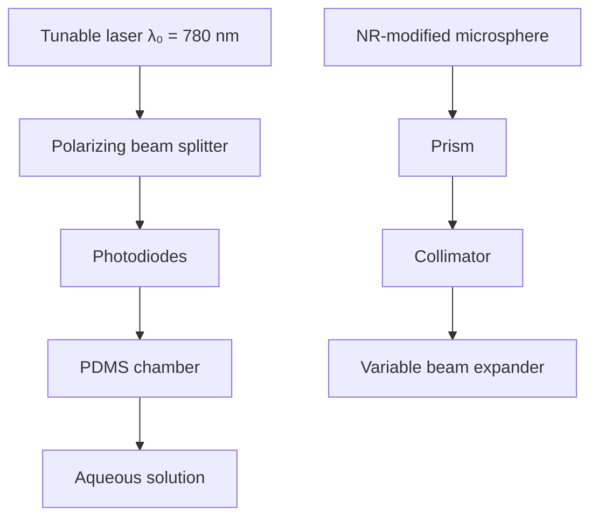

# Optical observation of single atomic ions interacting with plasmonic nanorods in aqueous solution

Martin D. Baaske $^{*}$ and Frank Vollmer $^{*}$

Plasmonic nanoparticles provide the basis for a multitude of applications in chemistry, health care and optics because of their unique properties. Nanoparticle-based techniques have evolved into powerful tools for studying molecular interactions with single-molecule resolution. Here we show that this sensing capability can be used to detect single atomic ions in aqueous medium. We monitored interactions of single zinc and mercury ions with plasmonic gold nanorods (NRs) resonantly coupled to our whispering gallery mode sensor. Our system's ability to discern permanent binding and transient interaction allows us to study the different interaction kinetics of both ion species. The detection of transient interactions enables us to confirm statistically that the sensor signals originate from single ions. Furthermore, we reveal how the ion-NR interactions evolve with respect to the medium's ionic strength as mercury ions amalgamate with gold and zinc ions eventually turn into probes of highly localized surface potentials.

Plasmonic nanoparticles (NPs) have been used for a wide range of applications, such as spectroscopy $^{1,2}$ , high-resolution imaging $^{3}$ , medical therapy $^{4-6}$ , nonlinear optics $^{7}$ and photocatalysis $^{8,9}$ . Such widespread utility is attributable to the diverse range of NP shapes and sizes available and the corresponding tunability of their optical properties $^{10-14}$ . The highly localized fields near the surface of such particles, in addition to their small mode volumes, make them especially suitable for sensing $^{15,16}$ or even capable of label-free single-molecule detection $^{17-19}$ . The NPs' small surface area, however, imposes a severe restriction on these sensor systems because, on binding, each individual molecule occupies an additional fraction of the NP's surface, which finally renders it insensitive once full coverage is reached. Systems that operate in the binding regime thus usually require the use of multiple NPs to obtain statistically significant datasets. Recently, we introduced a technique capable of mitigating this disadvantage by detecting single analyte molecules in the transient regime whereby no depletion via the permanent binding of analyte occurs $^{20}$ . We achieved single-molecule sensitivity by resonantly coupling nanorods (NRs) to whispering gallery mode (WGM) microresonators, which by themselves are sensitive sensors $^{21,22}$ capable of detecting single nanoparticles and viruses $^{23-26}$ , and the bulk recognition of small molecules $^{27-29}$ and heavy metal ions $^{30,31}$ . In this work we employ our platform to detect the interaction of single mercury and zinc ions with gold NRs in an aqueous medium. Performing the experiment under conditions that only allow for transient ion–NR interactions enables us to confirm statistically the single-ion nature of the observed signals independently from the total number of available sensing sites. Furthermore, we elaborate on the effects that arise from the presence of additional electrolytes because they can give rise to mercury binding or changes in the transient behaviour of zinc ions. This establishes our sensor platform as a tool to monitor ion–NR reactions on an atomic level, as well as opening up a new way to study processes in the electric double layer on a single-ion basis.

# Method to monitor ion-NR interactions

The single-ion-detection experiments were carried out using our robust prism-coupling platform $^{20}$ . We excite the WGMs of NR-modified fused silica microspheres by the frustrated total internal reflection of a laser beam focused onto a prism's surface (Fig. 1a). Resonantly excited high Q modes are observed as dips of Lorentzian shape in the transmission spectrum (Fig. 1c), which is obtained by sweeping (sweep duration 19 ms) the wavelength of a tunable external cavity laser (centre wavelength 780 nm). The resonance positions are determined from each normalized spectrum (Supplementary Section 1A) via an algorithm based on the fixed threshold centroid method (first moment) $^{32}$ . The WGM's evanescent field resonantly excites the NR's localized surface plasmon and thus couples the microresonator with the sensing sites on the NR's surface. These sensing sites are related to local intensity hot spots and thus they are mostly at the tips of the NRs. When a zinc or mercury ion enters the sensitive sites and interacts with the NR (Fig. 1b), the coupling between the NR and microcavity transduces (Supplementary Section 5) this interaction into a red shift ( $\Delta\lambda$ ) of the WGM's resonance position (Fig. 1c, left). For a permanent interaction, such as the formation of a strong covalent bond, the resonance will remain in this shifted position; however, when an ion interacts with a NR in a way such that it only remains confined in a sensing site for a certain period of time $\tau$ , the resonance position is shifted back towards its original position after the ion leaves the sensing site (Fig. 1c, right). As we trace the WGM position over time, permanent interactions manifest as a step pattern (see Fig. 4a), whereas transient interactions appear as fast changes that exhibit a spike pattern (Fig. 1d). We have developed an algorithm (Supplementary Section 1B) that determines spike positions by comparing the local variance in short windows with the global variance of the whole trace and thus allows for the extraction of these spikes in contrast with the slow drift of the resonance position caused by changes in ambient conditions, such as temperature or pressure. The removal of these background drifts from the original traces allows us to determine the values of the maximum, $\Delta\lambda_{\text{max}}$ , and mean, $\overline{\Delta\lambda}$ , resonance shifts as well as the length $\tau$ of individual spike events. Events are identified based on deviations from the drift-free trace with a magnitude greater than $3\sigma$ , where $\sigma$ is the standard deviation of the noise of the drift-free trace (Fig. 1d). In the following we use these transient interaction characteristics to prove statistically that the spikes are caused by single interactions, as well as to compare Hg ion-NR and Zn ion-NR interactions.

a   

flowchart

b   

text_image

Ion
NR
WGM

c   

line

| Wavelength (λ₀) | Transmission (Red Line) | Transmission (Blue Line) |
| --------------- | ------------------------ | ------------------------- |
| 0               | 1.0                      | 1.0                       |
| ~0.2            | ~0.95                    | ~0.95                     |
| >0.2            | 1.0                      | 1.0                       |
| 0               | 1.0                      | 1.0                       |
| ~0.2            | ~0.95                    | ~0.95                     |
| >0.2            | 1.0                      | 1.0                       |

d   

line

| Time (s) | Resonance shift (fm) | Annotation     |
|----------|----------------------|----------------|
| ~0.5     | ~25                  | Δλ             |
| ~0.7     | ~-5                  | Δλ             |
| ~1.0     | ~28                  | τ              |
| ~1.2     | ~-5                  | Δλ_max         |
| ~1.5     | ~-5                  | Δλ             |
| ~1.8     | ~28                  | τ              |
| ~2.0     | ~-5                  | +3σ            |
| ~2.5     | ~-5                  | -3σ            |
| ~3.0     | ~-5                  | Δλ_max         |
| ~3.5     | ~-5                  | Δλ_max         |
| ~4.0     | ~-5                  | -Δλ            |
| ~4.5     | ~-5                  | -Δλ            |
| ~5.0     | ~-5                  | -Δλ            |
| ~6.0     | ~-5                  | -Δλ            |
| ~7.0     | ~-5                  | -Δλ            |
| ~8.0     | ~-5                  | -Δλ            |
| ~9.0     | ~-5                  | -Δλ            |
| ~10.0    | ~-5                  | -Δλ            |
| ~11.0    | ~-5                  | -Δλ            |
| ~11.4    | ~-5                  | -Δλ            |

Figure 1 | Experimental method and extraction of transient events. a, Layout of the WGM sensing set-up. Light from a wavelength tunable laser is evanescently coupled into a NR-modified microsphere via frustrated total internal reflection at a prism's surface. b,c, Transient interactions of single zinc and mercury ions with the NRs (b), excited at their plasmon resonance, are detected as a red shift of the WGM resonance (c, left) when an ion enters a sensing site on a NR's surface, and a subsequent blue shift (c, right) when the ion leaves the sensing site. d, Transient ion-NR interactions are observed as distinct spikes in traces of the resonance positions. The trace is processed via the algorithm described in Supplementary Section 1B to determine the maximum $(\Delta \lambda_{\mathrm{max}})$ and mean shift $(\overline{\Delta\lambda})$ values as well as the length $(\tau)$ of each spike (here the result of Hg ion-NR interactions) and exceeds the noise level $\sigma$ by at least three times.

# Statistical properties of transient single-ion interactions

Our system's capability to detect single ions relies on sensing sites found on the NRs coupled to the cavity, the number of which is unknown and differs between individual experiments. The limited number of sensing sites, and hence the potential of saturation and loss of sensitivity, can be mitigated by operating the sensor in conditions that only allow for transient analyte ion-NR interactions and thus maintain a constant number of sensing sites. Sensor operation in this depletion-free regime enables us to perform and compare a series of experiments in which we vary the parameters, for example, the solution's pH, the concentration of analyte ions or the concentration of additional electrolytes, with a single NR-modified microsphere. We exploit this advantage to confirm statistically the single-interaction nature of the detected spike events. Under the assumption that our system is not able to discern whether a spike is caused by one or more interactions, and that our detection process is governed by an underlying Poisson process, we derived a scaling law for the concentration-dependent spike rate (Supplementary Section 3). From this we can make the approximation:

$$
\frac {R (m c _ {0})}{R (c _ {0})} \approx m ^ {N} \tag {1}
$$

where $R(c)$ is the concentration-dependent spike rate, $c_{0}$ is a reference concentration, N denotes the minimum number of interactions necessary to cause a spike event and m is the ratio of the actual and reference concentrations. Thus, we expect the rate of events to depend linearly on the analyte-ion concentration if the spikes originate from single interactions $(N=1)$ . As evident from Fig. 2a, our experimentally obtained rates match this expectation for both Zn and Hg ions. Specifically, all the observed rates match the theoretical curve for N=1 within the associated errors with one exception, which nevertheless still lies above the curve for N=2. Furthermore, the experimentally obtained probability distributions are in good agreement with the corresponding Poisson distributions (Supplementary Fig. 7) and the rates obtained by fitting these distributions show good agreement with the respective directly extracted rates, that is, the ratio of the total event count over the time between the first and the last event, within the respective errors (Supplementary Table 2). This, therefore, confirms the assumption that our detection is based on a Poisson process. Moreover, this observation, together with the linear dependence of the rate on the concentration, demonstrates that the observed spike events originate from only a single interaction.

The detection of these spike events at a pH of $\sim 7$ , however, is only possible in solutions with an ionic strength of at least $\sim 1$ mM. The latter was controlled by the addition of magnesium perchlorate in the case of mercury, and by sodium chloride in the case of zinc. These additional electrolyte ions in the absence of zinc and mercury ions, however, did not cause identifiable spike or step events during our control experiments (Supplementary Section 4), and neither did they increase the noise level with increasing concentration (Supplementary Fig. 8). Furthermore, the spike rates as measured for constant mercury and zinc concentrations but varying concentrations of the additional electrolytes (Fig. 2d), in contrast with those obtained for varying zinc and mercury concentrations (Fig. 2b,c), did not exhibit a

a   

scatter

| Normalized concentration | Mercury (Normalized spike rate) | Zinc (Normalized spike rate) |
| ------------------------ | -------------------------------- | ---------------------------- |
| 0.0                      | ~0.1                             | ~0.05                        |
| 0.2                      | ~0.3                             | ~0.2                         |
| 0.4                      | ~0.5                             | ~0.4                         |
| 0.6                      | ~0.7                             | ~0.6                         |
| 0.8                      | ~0.9                             | ~0.8                         |
| 1.0                      | 1.0                              | 1.0                          |

b   

line

| [Hg²⁺] (μM) | Spike rate (s⁻¹) |
|-------------|------------------|
| 0.0         | 0.0              |
| 1.2         | 0.3              |

c   

scatter

| [Zn²⁺] (μM) | Spike rate (s⁻¹) |
|-------------|------------------|
| 0           | 0.0              |
| 220         | 0.2              |

d   

scatter

| Concentration [Mg(ClO₄)₂] (mM) | Spike rate (s⁻¹) |
| ------------------------------ | ----------------- |
| 0.0                            | ~0.2              |
| 0.5                            | ~0.1              |
| 1.0                            | ~0.3              |
| 1.5                            | ~0.2              |
| 2.0                            | ~0.1              |
| 2.3                            | ~0.1              |

e   

line

| Concentration [Zn²⁺] (μM) | Spike rate (s⁻¹) |
| ------------------------- | ---------------- |
| 0                         | 0.0              |
| 65                        | 0.3              |

Figure 2 | Dependence of spike rates on the analyte-ion concentration, additional electrolyte concentration and the presence of EDTA.

a, Comparison of experimentally obtained concentration-dependent spike detection rates (symbols) for zinc and mercury ions (normalized to the respective maximum values) with the dependence expected if a minimum number (N) of one, two or four interactions are necessary to detect one spike event (lines). b,c, Absolute values of these rates and concentrations (symbols) and corresponding linear fits (lines) for mercury (b) and zinc (c) ions. d, Spike detection rates as obtained for constant mercury (blue) and zinc (green) ion concentrations at different electrolyte concentrations. The dashed lines represent the corresponding linear fits. e, Decrease in the spike detection rate (symbols) caused by the chelation of zinc with EDTA. The green line represents the linear fit to the concentration-dependent spike rates obtained before EDTA injection (green symbols). The grey point is the rate in the presence of EDTA (red) projected onto the concentration difference [Zn] - [EDTA]. Error bars for the rates represent their standard deviation based on Poissonian statistics. The presence and concentrations of analyte ions and additional electrolytes are indicated by the corresponding elemental symbols in square brackets.

direct scaling behaviour. Thus, we can exclude magnesium, perchlorate, sodium and chloride ions as sources for the detected events.

We also recognize a significant decrease in the observed spike rate on the addition of ethylenediaminetetraacetic acid (EDTA) to the sample solution (Fig. 2e). Comparison of this reduced rate with the previously obtained concentration dependence (Fig. 2e, green line) shows good agreement with the rate that would be expected if the concentration of zinc (58.5 $\mu$ M) was reduced by the concentration of EDTA (28.3 $\mu$ M). EDTA forms chelate complexes with zinc ions, which are not detected as they carry a negative charge and are thus repelled from the negatively charged tips of the NR (see Fig. 6). Therefore, the EDTA-induced reduction of the spike rate further confirms the zinc ions as the source of the observed resonance shifts. Although both Hg and Zn ions exhibited similar behaviour with regards to their normalized rate, inspection of the absolute values of the concentration-dependent rates (Fig. 2b,c,e) reveals a significant difference. Specifically, the detection rate constants (slopes) differ and are found to be $(0.53 \pm 0.05) \times 10^{3} \, (\mathrm{Ms})^{-1}$ (Fig. 2c) and $(3.8 \pm 0.5) \times 10^{3} \, (\mathrm{Ms})^{-1}$ (Fig. 2e) for zinc ions, and $(175 \pm 7) \times 10^{3} \, (\mathrm{Ms})^{-1}$ for mercury ions. The disparity of these values is either because of a difference in the number of sensing sites $(N_{\mathrm{s}})$ available in each measurement series or to an intrinsic difference in the ions' association rates, $k_{on}$ . This assumption is further supported by the fact that we also find different NR-modified resonators exhibit a significant difference in the number of overall mercury-binding sites (see Fig. 4b,c). The detection rate, therefore, can be described as the sum of the detection rates of each individual sensing site $(R_{i})$ , which may deviate from the average rate per sensing site $(\overline{R})$ :

$$
R _ {\mathrm{det}} = \sum_ {i = 1} ^ {N _ {\mathrm{s}}} R _ {i} \approx N _ {\mathrm{s}} \overline {{R}} \tag {2}
$$

where $\overline{R}$ can be used to determine $k_{on} = \overline{R}/c_{A}$ for a given analyte ion concentration ( $c_{A}$ ). Despite the variance in the number of sensing sites the similarity of the spike magnitude and length distributions found for both types of ions indicates similar levels of sensitivity for mercury and zinc (Fig. 3a). In general, the recorded wavelength shifts are well in excess of $3\sigma$ , where $\sigma$ typically ranges from 0.5 to 0.7 fm. The overall average measured $\overline{\Delta\lambda}$ , $\Delta\lambda_{max}$ and $\tau$ values were 4.9 fm, 9.6 fm and 0.27 s for mercury ions and 4.4 fm, 6.6 fm and 0.36 s for zinc ions. A significant fraction of the observed spikes, namely 28.4% of all the mercury and 38.8% of all the zinc events, had a length, $\tau$ , of 19 ms, the time it takes to perform a complete wavelength sweep (up- and downscan) of the exciting laser (Supplementary Fig. 9). These events require further investigation so as to determine whether it is necessary for an interaction to be as long as one scanning period to be recognized or whether our system is capable of resolving shorter interactions. To estimate the actual lower limits of the experimental time resolution we have performed mode-distortion simulations based on our average experimental parameters, namely a WGM linewidth of 224 fm, which corresponds to a cavity Q-factor of $4.4 \times 10^{6}$ , a noise floor with a standard deviation of $\sigma = 0.6$ fm and a laser scanning range of 9.75 pm. The details of the simulations are given in Supplementary Section 2. Based on these simulations we can provide an estimate for $P_{det}$ , the probability of detecting a resonance shift with a certain magnitude and duration, as a single-point spike in excess of $3\sigma$ . The resulting estimates for the detection probabilities are displayed in Fig. 3c in the form of lines of constant probability. We find that even events with durations up to 100 times shorter than the scanning period can be detected, albeit with a rather low probability. Detection occurs when a short event coincides with the excitation period of a WGM, which accounts for only a short interval, here $\sim0.4$ ms, of a complete scanning period (Fig. 3b). It is important that the resulting time resolution ( $\sim0.1$ ms) is not sufficient for the detection of freely diffusing ions in water as they have diffusion constants of $7.03 \times 10^{-6}$ $cm^{2} s^{-1}$ $(Zn^{2+})$ and $9.13 \times 10^{-6}$ $cm^{2} s^{-1}$ $(Hg^{2+})$ (ref. 33), and therefore their root mean squared displacements for periods of 0.1 ms are in the range 0.6–0.8 $\mu$ m, which greatly exceeds the dimensions of the NRs. This also implies that an attractive force between the ions and NRs is required to confine the analyte ions inside the sensing sites long enough to allow for their detection. Further, the necessity of additional electrolyte for the detection suggests that this force is electrostatic.

# Evolution of ion-NR interaction with ionic strength

Below an ionic strength of 14.6 mM in the case of mercury and 18 mM in the case of zinc, we observed spike events exclusively,

a   

histogram

| Bin Range | Counts |
| --------- | ------ |
| 0 - 10    | 100    |
| 10 - 20   | 50     |
| 20 - 30   | 25     |
| 30 - 40   | 15     |
| 40 - 50   | 5      |
| 50 - 60   | 2      |
| 60 - 70   | 1      |

histogram

| Bin Range | Frequency |
|---|---|
| 0-1 | 120 |
| 1-2 | 85 |
| 2-3 | 60 |
| 3-4 | 45 |
| 4-5 | 35 |
| 5-6 | 30 |
| 6-7 | 25 |
| 7-8 | 20 |
| 8-9 | 15 |
| 9-10 | 10 |
| 10-11 | 8 |
| 11-12 | 5 |
| 12-13 | 3 |
| 13-14 | 2 |
| 14-15 | 1 |
| 15-16 | 1 |
| 16-17 | 0 |
| 17-18 | 0 |
| 18-19 | 0 |
| 19-20 | 0 |
| 20-21 | 0 |
| 21-22 | 0 |
| 22-23 | 0 |
| 23-24 | 0 |
| 24-25 | 0 |
| 25-26 | 0 |
| 26-27 | 0 |
| 27-28 | 0 |
| 28-29 | 0 |
| 29-30 | 0 |
| 30-31 | 0 |
| 31-32 | 0 |
| 32-33 | 0 |
| 33-34 | 0 |
| 34-35 | 0 |
| 35-36 | 0 |
| 36-37 | 0 |
| 37-38 | 0 |
| 38-39 | 0 |
| 39-40 | 0 |
| 40-41 | 0 |
| 41-42 | 0 |
| 42-43 | 0 |
| 43-44 | 0 |
| 44-45 | 0 |
| 45-46 | 0 |
| 46-47 | 0 |
| 47-48 | 0 |
| 48-49 | 0 |
| 49-50 | 0 |
| 50-51 | 0 |
| 51-52 | 0 |
| 52-53 | 0 |
| 53-54 | 0 |
| 54-55 | 0 |
| 55-56 | 0 |
| 56-57 | 0 |
| 57-58 | 0 |
| 58-59 | 0 |
| 59-60 | 0 |
| 60-61 | 0 |
| 61-62 | 0 |
| 62-63 | 0 |
| 63-64 | 0 |
| 64-65 | 0 |
| 65-66 | 0 |
| 66-67 | 0 |
| 67-68 | 0 |
| 68-69 | 0 |
| 69-70 | 0 |
| 70-71 | 0 |
| 71-72 | 0 |
| 72-73 | 0 |
| 73-74 | 0 |
| 74-75 | 0 |
| 75-76 | 0 |
| 76-77 | 0 |
| 77-78 | 0 |
| 78-79 | 0 |
| 79-80 | 0 |
| 80-81 | 0 |
| 81-82 | 0 |
| 82-83 | 0 |
| 83-84 | 0 |
| 84-85 | 0 |
| 85-86 | 0 |
| 86-87 | 0 |
| 87-88 | 0 |
| 88-89 | 0 |
| 89-90 | 0 |
| 90-91 | 0 |
| 91-92 | 0 |
| 92-93 | 0 |
| 93-94 | 0 |
| 94-95 | 0 |
| 95-96 | 0 |
| 96-97 | 0 |
| 97-98 | 0 |
| 98-99 | 0 |
| >100 | <10 |

histogram

| Category | Value     |
| -------- | --------- |
| [Hg²⁺]   | 1.0 µM    |
| [Mg(ClO₄)₂] | 2.3 mM   |

histogram

| Δλ (fm) | Counts |
| ------- | ------ |
| 0       | 100    |
| 1       | 90     |
| 2       | 80     |
| 3       | 60     |
| 4       | 40     |
| 5       | 20     |
| 6       | 10     |
| 7       | 5      |
| 8       | 3      |
| 9       | 2      |
| 10      | 1      |
| 11      | 0      |
| 12      | 0      |
| 13      | 0      |
| 14      | 0      |
| 15      | 0      |
| 16      | 0      |
| 17      | 0      |
| 18      | 0      |
| 19      | 0      |
| 20      | 1      |

histogram

| Δλ_max (fm) | Frequency |
|-------------|---------|
| 0           | 100     |
| 5           | 60      |
| 10          | 40      |
| 15          | 20      |
| 20          | 15      |
| 25          | 10      |
| 30          | 8       |
| 35          | 5       |
| 40          | 3       |
| 45          | 2       |
| 50          | 1       |

histogram

| T (s) | Frequency |
|-------|---------|
| 0     | 100     |
| 1     | 60      |
| 2     | 30      |
| 3     | 20      |
| 4     | 15      |
| 5     | 10      |

b   

text_image

Not detected
Event duration
Detected with full magnitude
Time (ms)
Detected with fraction of magnitude
0.0
9.5

c   

line

| Event duration (ms) | Δλ (fm) for 1% | Δλ (fm) for 2% | Δλ (fm) for 5% | Δλ (fm) for 10% |
| ------------------- | -------------- | -------------- | -------------- | --------------- |
| 0.0                 | ~10            | ~10            | ~10            | ~10             |
| 0.2                 | ~5             | ~6             | ~8             | ~10             |
| 0.4                 | ~3             | ~4             | ~5             | ~8              |
| 0.6                 | ~2             | ~3             | ~3             | ~6              |
| 0.8                 | ~1.5           | ~2.5           | ~2             | ~4              |
| 1.0                 | ~1             | ~2             | ~1.5           | ~3              |
| 1.2                 | ~0.8           | ~1.8           | ~1.2           | ~2.5            |
| 1.4                 | ~0.6           | ~1.6           | ~1.0           | ~2              |
| 1.6                 | ~0.5           | ~1.5           | ~0.8           | ~1.8            |
| 1.8                 | ~0.4           | ~1.4           | ~0.6           | ~1.5            |
| 2.0                 | ~0.3           | ~1.3           | ~0.5           | ~1.2            |
| 2.2                 | ~0.2           | ~1.2           | ~0.4           | ~1              |
| 2.4                 | ~0.1           | ~1             | ~0.3           | ~0.8            |

Figure 3 | Statistics of spike properties and theoretical detection probabilities for short interactions. a, Example distributions of average and maximum spike shifts and spike durations obtained during \~30 minutes. b, Detection principle for interactions shorter than one scanning period (19 ms, up- and downscan). Events that overlap fully (turquoise) or partially (pink) with the interval (during the 9.5 ms upscan) in which a WGM is excited (dip) are recognized, whereas events that do not coincide with the mode's excitation (yellow) are not recognized. c, Curves of constant-detection probabilities of 1, 2, 5 and 10% simulated for interactions shorter than one scanning period, depending on shift size and event duration. The shoulder-like features are artefacts caused by the centroid method used to determine the resonance positions.

and the rates (Fig. 2d), magnitudes and durations (Supplementary Fig. 8) with which these events occur do not show a direct dependence on the ionic strength. By increasing the ionic strength beyond these values, however, we find a fundamental difference in the way both species of analyte ions interact with the gold NRs. In what follows, we therefore discuss both ion species separately, initially focusing on the evolution of the interaction of Hg. As shown in the traces in Fig. 4a, both spike and step transitions in the resonance position are observed for an ionic strength of 14.6 mM, whereas at an even higher ionic strength of 60 mM the step-type transitions occur predominantly. These abrupt but permanent shifts in resonance position indicate the formation of stable bonds between the mercury ions and the NRs. As we did not observe any step transitions towards shorter wavelengths, as would be expected on the breaking of these bonds, the formation of these bonds can be assumed to be an irreversible process. It has been reported that mercury ions can be detected in aqueous solution with the use of gold NRs through the amalgamization of gold with mercury in the presence of the reducing agent, sodium borohydride $^{34}$ . With no such reducing agent present in our experiments, the binding process we observed might result from the reduction of mercury ions by light-induced hot carriers created in the NRs themselves followed by the amalgamization, given that a similar light-induced process has been reported previously to account for the efficient reduction of silver ions $^{35}$ . Apart from this interesting finding, which possibly implies the optical observation of a single atom as it forms a chemical bond with the atoms of a nanoparticle, we can gain further information about the sensing sites on the NRs by studying the interactions in the ionic strength regime by which both events, spike and step, are recognized. In Fig. 4b we show the number of spikes observed during intervals with a constant length of four minutes and the cumulative count of steps recognized during the course of the same experiment. The graph shows a clear decrease in the rate of spike recognition as the number of observed steps increases. This indicates that once a sensing site is occupied by the binding of an ion, it is

  
Figure 4 | Ionic-strength dependence of the mercury ion-NR interaction.

a, WGM resonance wavelength traces that display the transition from only spike events at 0.6 mM ionic strength (top) to step events at 60 mM ionic strength (bottom). Both types of event can be observed in the middle trace obtained at an ionic strength of 14.6 mM.

b, Comparison between the number of spikes in constant intervals of four minutes (blue) and the cumulative step count (red), starting with the first observed step (events during the inject and mixing procedure cannot be recognized), obtained simultaneously at an ionic strength of 14.6 mM.

c, Histogram showing the distribution of step magnitudes as obtained at 60 mM ionic strength and $Hg^{2+} = 0.8 \mu M$ . The inset shows cumulative step counts (symbols) and fitted saturation curves (lines) obtained under identical conditions.

either blocked or loses its sensitivity to further transient interactions. Nonetheless, we can conclude that the sites on the NRs that are sensitive to transient interactions are identical to those sensitive to binding-type interactions. The similarity of the step magnitude (Fig. 4c) and the maximum shift distributions (Fig. 3a) further supports this conclusion. We earlier suggested that the difference in the detection rate constants obtained for zinc is likely to arise from a varying number of sensing sites; in fact, we observe a similar difference for mercury as we find values of $N_{\mathrm{s}}$ that range from less than ten (Fig. 4b) to over 100 (Fig. 4c). We attribute this to the randomness of our NR-deposition process. Nonetheless, we can extract the association rate for mercury by fitting saturation curves $N(t) = N_{\mathrm{s}}(1 - e^{-\overline{R} t})$ to the time-dependent cumulative step counts (Fig. 4c, inset). In this way we obtained similar $k_{\mathrm{on}}^{\mathrm{Hg}}$ values of $6.0\times 10^{3}(\mathrm{Ms})^{-1}$ (red) and $6.2\times 10^{3}(\mathrm{Ms})^{-1}$ (blue), which in turn allow us to determine $N_{\mathrm{s}}$ for the transient interaction measurements shown in Fig. 2b ( $N_{\mathrm{s}} = 29\pm 1$ ) and Fig. 2d ( $N_{\mathrm{s}} = 26\pm 8$ ). Furthermore, given the lowest measured detection rate constant for zinc ( $0.53\times 10^{3}(\mathrm{Ms})^{-1}$ ), we can conclude, even without knowledge of $N_{\mathrm{s}}$ , that $k_{\mathrm{on}}^{\mathrm{Zn}} < 0.1k_{\mathrm{on}}^{\mathrm{Hg}}$ .

The determination of $k_{on}$ via saturation curves, however, is not feasible for zinc ions as the recorded WGM traces do not indicate that irreversible bonds form between zinc ions and NRs. Instead, we find the transient interaction evolves through different states as we increase the ionic strength. Example traces recorded with a single NR-modified microsphere that demonstrate these different states are shown in Fig. 5a alongside their respective normalized resonance position distributions (nRPDs) in Fig. 5b. Starting at an ionic strength of 16 mM, as set with sodium chloride, we observed spike events exclusively, and thus the nRPD shows a Gaussian peak that represents the noise floor of the unperturbed WGM with a few outliers caused by the spikes. On increasing the ionic strength to

  
Figure 5 | Ionic-strength dependence of the zinc ion-NR interaction. a, Example wavelength traces, with the slow varying background (for example, from thermal drift and bulk refractive index changes caused by the addition of electrolytes) removed, obtained at increasing ionic strength and a constant zinc concentration of $8\mu \mathrm{M}$ . b, The corresponding nRPD distributions (black) of the wavelength positions extracted from the whole traces together with the fitted Gaussian distributions (blue and red). The $30~\mathrm{mM}$ nRPD was offset by $7.6\mathrm{fm}$ with respect to the corresponding trace, as the 0 shift level of this trace corresponds to the occupied state of the sensing site. c, Zoomed views that show an outlier spike (left) and blue shift spikes (right). The green and purple lines in a-c indicate the maximum observed separation (7.6 fm) of the two Gaussian distributions ([NaCl] = 28 mM).

a   

text_image

Debye length
>20 nm
Analyte
ion
Ionic strength
-0.1 mM
CTAB
bilayer
Epot
x
y
z
Δλ (fm)
Zn and Hg
Time (s)

b   

text_image

Debye
length
<10 nm
10 nm
3.2 nm
2+
2+
Ionic strength
-1 mM
E_pot
x
Δλ (fm)
Zn and Hg
Time (s)

C   

text_image

Debye length <3 nm
+ y
Ionic strength
~20 mM
E_pot
ΔE
x
Δλ (fm)
Zn
Time (s)
Δλ (fm)
Hg
0
100
0
10
20
Time (s)

Figure 6 | Model of three interaction regimes. The system at the scale of the corresponding Debye length (left), sketches of the analyte ions $E_{pot}$ (top right) and example experimental wavelength traces (bottom right).   
a, At a low ionic strength, the repulsive potential caused by the positively charged CTAB prevents ion-NR interactions and no spikes or steps are observed. b, Above a 1 mM ionic strength, Debye screening of the CTAB layer allows the analyte ions to be confined temporarily by the attractive potential created by the NR's negative surface charge and spikes are observed. c, At high ionic strengths, the Zn ions remain confined for longer in the local minima of $E_{pot}$ found along the NR's surface and the Hg ions bond permanently to the NRs. Step transitions towards the red and the blue side of the spectrum are observed for Zn, and towards the red for Hg.

18 mM, however, we observed an additional type of transient event, which can be described as extended intervals during which the resonance trace exhibits an increased noise amplitude. These intervals have abrupt beginnings and ends and can last for periods in excess of 30 seconds. In the nRPDs, these bursts show up as an asymmetric extension of the Gaussian peak towards the longer wavelength side. As the ionic strength reaches values between 26 and 28 mM the temporal characteristic of the ion–NR interaction transforms again to what can be described as sudden jumps between two states interspersed by intervals of different length. The corresponding nRPDs for these cases show two clearly separated Gaussian distributions. This discrete behaviour indicates a relatively long and stable, but reversible, adsorption of a zinc ion to a NR sensing site. As we observed only two distinct levels in the nRPDs, this type of interaction was most probably limited to a single sensing site. Although this does not imply the existence of only one sensing site, as we observe additional spikes superimposed on the two-level trace (Fig. 5c, left), it does imply that different sensing sites on the NRs might support interactions on different timescales. From this we conclude that the duration of transient zinc ion interactions is strongly influenced by the local environment of each sensing site. As we increased the ionic strength even further to 30 mM, we again observed spike- and burst-type events, but of opposite sign because the shifts in the resonance position occur towards the shorter wavelength (Fig. 5c, right) side of the spectra. The ions therefore remain mostly confined inside the sensing site under these conditions, although they are still prone to local environmental fluctuations that can cause relatively small transient changes in their position with respect to the NR's surface.

# Model of the interaction and discussion

We have so far reported on how the ionic strength of the surrounding medium influences the ion–NR interaction. To understand further the physical origin of the different types of observed interactions, in the following we outline a possible model for the underlying potential that governs the interaction. Illustrations that represent the different states of the model system are shown in Fig. 6 (left), along with sketches of the potential energy ( $E_{\text{pot}}$ ) that governs the interaction and representative measured traces (right) for each case. The NRs used are capped with bilayers of cetyltrimethylammonium bromide (CTAB), which allows the particles to obtain the rod shape during their growth as it covers the cylindrical surface more densely than the spherical surface at both ends of the NR $^{13}$ . As this surface layer carries a positive charge it creates a repulsive potential for the positively charged zinc and mercury ions, which effectively prevents them from reaching the sensing sites located at both ends of the NR (Fig. 6a). On the introduction of additional electrolyte into the system, the negatively charged ions (chloride or perchlorate) start to form a layer around the positively charged end groups of the CTAB bilayer. The resulting Debye screening reduces the repulsive force seen by the analyte ions, consequently allowing them to get closer to the tips of the NRs, which are less densely covered with CTAB. We assume that the tips of the NRs carry a negative surface charge because the solution's pH is above the isoelectric point of gold $^{36,37}$ . This surface charge, although also screened by counterions, provides for a short-ranged attractive potential, which is sufficiently deep to allow for trapping the mercury and zinc ions long enough to be detected before they thermally obtain the kinetic energy required to escape (Fig. 6b). These assumptions are supported by our experiments as we start seeing spike-type events at an ionic strength of about 1 mM, which corresponds to a Debye length of approximately 9.5 nm, a value slightly smaller than the minimum distance between the CTAB end groups on the cylindrical surface of the NR and the tip of the NR (11 nm). For an ionic strength in the range 15–20 mM, we observed the onset of burst-type and binding-type interactions for zinc and mercury ions, respectively (Fig. 6c). At these values the Debye length is shorter than 2.5 nm, and thus the influence of the charges carried by the end groups of the 3.2 nm thick CTAB bilayer $^{38,39}$ on ions localized at the NR's surface is negligible. At this ionic strength, zinc ions might therefore act as probes of the local charge density on the NR surface as they are eventually confined in areas with higher charge densities, which originate from edge-like surface features or impurities on an atomic scale, as sketched in Fig. 6c.

# Conclusions

We have demonstrated experimentally and confirmed statistically the optical detection of single mercury and zinc ions on their interaction with gold NRs. Although our sensor is not applicable as a screening method because of its concentration requirements and the missing ability to discern directly between signals from zinc

and mercury ions (or other ions not studied here), it still allows us to gain valuable information on ion–NR interactions under controlled conditions. We studied the influence of the solution's ionic strength on the ion–NR interaction for both kinds of ions and found a clear difference in their behaviour. Mercury ions are found to form permanent bonds with the gold NRs, whereas zinc ions are confined by local attractive surface potentials on the NRs. Based on our experimental results, we derived a simple electrostatic model to explain the different types of transient interactions. Furthermore, we demonstrate that the ability of our sensor system to operate under conditions that only allow for transient ion–NR interactions and thus, free of depletion effects, makes our system a powerful tool for statistical analysis even, and especially, when only a few sensing sites are available. This study therefore lays the foundation for the optical investigation of atomic processes on the surface of plasmonic particles. Our method holds not only the prospect of gaining further insight into processes that occur inside the electric double layer or the atom-by-atom observation of nanoparticle growth, but might also be applicable for studying biological systems, such as ion channels or metalloenzymes, or catalytic effects of metal surfaces in chemical reactions on an atomic level.

# Methods

Methods and any associated references are available in the online version of the paper.

Received 13 April 2016; accepted 9 August 2016; published online 19 September 2016

# References

1. Jackson, J. B. & Halas, N. J. Surface-enhanced Raman scattering on tunable plasmonic nanoparticle substrates. Proc. Natl Acad. Sci. USA 101, 17930–17935 (2004).   
2. Zamarion, V. M., Timm, R. A., Araki, K. & Toma, H. E. Ultrasensitive SERS nanoprobes for hazardous metal ions based on trimercaptotriazine-modified gold nanoparticles. Inorg. Chem. 47, 2934–2936 (2008).   
3. Sonnefraud, Y. et al. Experimental proof of concept of nanoparticle assisted STED. Nano Lett. 14, 4449–4453 (2014).   
4. Huang, X., El-Sayed, I. H., Qian, W. & El-Sayed, M. A. Cancer cell imaging and photothermal therapy in the near-infrared region by using gold nanorods. J. Am. Chem. Soc. 128, 2115–2120 (2006).   
5. El-Sayed, I. H., Huang, X. & El-Sayed, M. A. Selective laser photo-thermal therapy of epithelial carcinoma using anti-EGFR antibody conjugated gold nanoparticles. Cancer Lett. 239, 129–135 (2006).   
6. Han, G., Ghosh, P. & Rotello, V. M. Functionalized gold nanoparticles for drug delivery. Nanomedicine 2, 113–123 (2007).   
7. Kauranen, M. & Zayats, A. V. Nonlinear plasmonics. Nat. Photon. 6, 737–748 (2012).   
8. Mukherjee, S. et al. Hot electrons do the impossible: plasmon-induced dissociation of $H_{2}$ on Au. Nano Lett. 13, 240–247 (2012).   
9. Wang, F. et al. Plasmonic harvesting of light energy for Suzuki coupling reactions. J. Am. Chem. Soc. 135, 5588–5601 (2013).   
10. Frens, G. Controlled nucleation for the regulation of the particle size in monodisperse gold suspensions. Nat. Phys. Sci. 241, 20–22 (1973).   
11. Ha, T. H., Koo, H.-J. & Chung, B. H. Shape controlled syntheses of gold nanoprism and nanorod influenced by specific adsorption of halide ions. J. Phys. Chem. C 111, 1123–1130 (2007).   
12. Busbee, B. D., Obare, S. O. & Murphy, C. J. An improved synthesis of high-aspect-ratio gold nanorods. Adv. Mater. 15, 414–416 (2003).   
13. Nikoobakht, B. & El-Sayed, M. A. Preparation and growth mechanism of gold nanorods (NRs) using seed-mediated growth method. Chem. Mater. 15, 1957–1962 (2003).   
14. Kumar, P. S., Pastoriza-Santos, I., Rodriguez-Gonzalez, B., Javier Garcia de Abajo, F. & Liz-Marzan, L. M. High-yield synthesis and optical response of gold nanostars. Nanotechnology 19, 015606 (2008).   
15. Haes, A. J., Chang, L., Klein, W. L. & Van Duyne, R. P. Detection of a biomarker for Alzheimer's disease from synthetic and clinical samples using a nanoscale optical biosensor. J. Am. Chem. Soc. 127, 2264–2271 (2005).   
16. Anker, J. N. et al. Biosensing with plasmonic nanosensors. Nat. Mater. 7, 442–453 (2008).

17. Ament, I., Prasad, J., Henkel, A., Schmachtel, S. & Sönnichsen, C. Single unlabeled protein detection on individual plasmonic nanoparticles. Nano Lett. 12, 1092–1095 (2012).   
18. Zijlstra, P., Paulo, P. M. R. & Orrit, M. Optical detection of single non-absorbing molecules using the surface plasmon resonance of a gold nanorod. Nat. Nanotechnol. 7, 379–382 (2012).   
19. Beuwer, M. A., Prins, M. W. J. & Zijlstra, P. Stochastic protein interactions monitored by hundreds of single-molecule plasmonic biosensors. Nano Lett. 15, 3507–3511 (2015).   
20. Baaske, M. D., Foreman, M. R. & Vollmer, F. Single-molecule nucleic acid interactions monitored on a label-free microcavity biosensor platform. Nat. Nanotechnol. 9, 933–939 (2014).   
21. Baaske, M. & Vollmer, F. Optical resonator biosensors: molecular diagnostic and nanoparticle detection on an integrated platform. ChemPhysChem 13, 427–436 (2012).   
22. Foreman, M., Swaim, J. & Vollmer, F. Whispering gallery mode sensors. Adv. Opt. Photon. 7, 168–168 (2015).   
23. Vollmer, F., Arnold, S. & Keng, D. Single virus detection from the reactive shift of a whispering-gallery mode. Proc. Natl Acad. Sci. USA 105, 20701–20704 (2008).   
24. He, L., Ozdemir, S. K., Zhu, J., Kim, W. & Yang, L. Detecting single viruses and nanoparticles using whispering gallery microlasers. Nat. Nanotechnol. 6, 428–432 (2011).   
25. Lu, T. et al. High sensitivity nanoparticle detection using optical microcavities. Proc. Natl Acad. Sci. USA 108, 5976–5979 (2011).   
26. Foreman, M. R., Jin, W.-L. & Vollmer, F. Optimizing detection limits in whispering gallery mode biosensing. Opt. Express 22, 5491–5511 (2014).   
27. Vollmer, F. et al. Protein detection by optical shift of a resonant microcavity. Appl. Phys. Lett. 80, 4057-4059 (2002).   
28. Washburn, A. L., Gunn, L. C. & Bailey, R. C. Label-free quantitation of a cancer biomarker in complex media using silicon photonic microring resonators. Anal. Chem. 81, 9499–9506 (2009).   
29. Wu, Y., Zhang, D. Y., Yin, P. & Vollmer, F. Ultraspecific and highly sensitive nucleic acid detection by integrating a DNA catalytic network with a label-free microcavity. Small 10, 2067–2076 (2014).   
30. Hanumegowda, N. M., White, I. M. & Fan, X. Aqueous mercuric ion detection with microsphere optical ring resonator sensors. Sens. Actuat. B 120, 207–212 (2006).   
31. Panich, S. et al. Label-free Pb(II) whispering gallery mode sensing using self-assembled glutathione-modified gold nanoparticles on an optical microcavity. Anal. Chem. 86, 6299–6306 (2014).   
32. Kukanskis, K. et al. Detection of DNA hybridization using the TISPR-1 surface plasmon resonance biosensor. Anal. Biochem. 274, 7–17 (1999).   
33. Haynes, W. M. CRC Handbook of Chemistry and Physics, 96th edn (Taylor & Francis, 2015).   
34. Rex, M., Hernandez, F. E. & Campiglia, A. D. Pushing the limits of mercury sensors with gold nanorods. Anal. Chem. 78, 445–451 (2006).   
35. Lee, S. J., Piorek, B. D., Meinhart, C. D. & Moskovits, M. Photoreduction at a distance: facile, nonlocal photoreduction of Ag ions in solution by plasmon-mediated photoemitted electrons. Nano Lett. 10, 1329–1334 (2010).   
36. Duval, J. F. L., Huijs, G. K., Threels, W. F., Lyklema, J. & Van Leeuwen, H. P. Faradaic depolarization in the electrokinetics of the metal–electrolyte solution interface. J. Colloid Interface Sci. 260, 95–106 (2003).   
37. Barten, D. et al. Double layer of a gold electrode probed by AFM force measurements. Langmuir 19, 1133-1139 (2003).   
38. Pashley, R. M. & Israelachvili, J. N. A comparison of surface forces and interfacial properties of mica in purified surfactant solutions. Colloids Surf. 2, 169–187 (1981).   
39. Pashley, R. M., McGuiggan, P. M., Horn, R. G. & Ninham, B. W. Forces between bilayers of cetyltrimethylammonium bromide in micellar solutions. J. Colloid Interface Sci. 126, 569–578 (1988).

# Acknowledgements

The authors acknowledge financial support for this work from the Max Planck Society. M.D.B. thanks M. R. Foreman and E. Kim for their feedback on the manuscript.

# Author contributions

M.D.B. developed the experimental set-up, performed the experiments and data analysis, and wrote the manuscript. F.V. commented on the manuscript and supervised the project.

# Additional information

Supplementary information is available in the online version of the paper. Reprints and permissions information is available online at www.nature.com/reprints. Correspondence and requests for materials should be addressed to M.B.D. or F.V.

# Competing financial interests

The authors declare no competing financial interests.

# Methods

Chemicals were obtained from Sigma-Aldrich and Carl Roth. All the solutions were made with ultrapure water obtained from VWR. Solutions that contained zinc and mercury ions were made with zinc nitrate and mercury nitrate. All the solutions except those that contained NRs were filtered with 0.1 $\mu$ m membrane filters (Merck Millipore) prior to the measurements. Fused silica microspheres with diameters between 70 and 90 $\mu$ m were fabricated from SMF-28 standard telecommunication fibres (Dow Corning) by melting using a CO $_{2}$ laser. They were inserted into ceramic fibre ferrules (Thorlabs CF126-10) prior to the melting process. The ferrules were inserted into a mechanic adapter, which in turn was mounted on a three-axis translation stage that allowed for the immersion of the sphere into the liquid and its positioning with respect to the prism (Supplementary Fig. 10). The solutions were injected into interchangeable U-shaped polydimethylsiloxane (PDMS) chambers

that are pressed against the prism and capable of holding volumes in the range 0.5–0.7 ml. The CTAB-capped gold NRs (diameter, 10 nm; length, 42 nm (Nanopartz)), with a surface plasmon resonance at a wavelength of 780 nm, were immobilized onto the microresonator in an aqueous solution that contained perchloric acid with a concentration of 24 mM. During this deposition process the binding of NRs to the resonator surface was recognized as distinct changes in resonance position $\lambda$ and linewidth $\gamma$ . The deposition process was stopped by evacuating the chamber after the observation of at least one NR binding event that causes the linewidth to broaden by $\Delta\gamma \geq 20$ fm to a total of not more than $\gamma = 200$ fm and thus maintain a resonance quality factor in excess of $4 \times 10^{6}$ . The chamber was subsequently rinsed with water before ion-detection experiments were performed. The wavelength-tunable laser was a Toptica Dl pro with a centre wavelength of 780 nm; the prism material was N-SF 11.