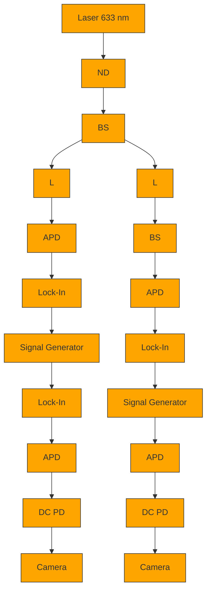

# Phonon heat transfer across a vacuum through quantum fluctuations

https://doi.org/10.1038/s41586-019-1800-4

Received: 15 February 2019

Accepted: 17 October 2019

Published online: 11 December 2019

King Yan Fong $^{1,3}$ , Hao-Kun Li $^{1,3}$ , Rongkuo Zhao $^{1}$ , Sui Yang $^{1}$ , Yuan Wang $^{1}$ & Xiang Zhang $^{1,2*}$

Heat transfer in solids is typically conducted through either electrons or atomic vibrations known as phonons. In a vacuum, heat has long been thought to be transferred by radiation but not by phonons because of the lack of a medium $^{1}$ . Recent theory, however, has predicted that quantum fluctuations of electromagnetic fields could induce phonon coupling across a vacuum and thereby facilitate heat transfer $^{2-4}$ . Revealing this unique quantum effect experimentally would bring fundamental insights to quantum thermodynamics $^{5}$ and practical implications to thermal management in nanometre-scale technologies $^{6}$ . Here we experimentally demonstrate heat transfer induced by quantum fluctuations between two objects separated by a vacuum gap. We use nanomechanical systems to realize strong phonon coupling through vacuum fluctuations, and observe the exchange of thermal energy between individual phonon modes. The experimental observation agrees well with our theoretical calculations and is unambiguously distinguished from other effects such as near-field radiation and electrostatic interaction. Our discovery of phonon transport through quantum fluctuations represents a previously unknown mechanism of heat transfer in addition to the conventional conduction, convection and radiation. It paves the way for the exploitation of quantum vacuum in energy transport at the nanoscale.

Quantum mechanics states that quantum fields are never at rest but fluctuate constantly, even at a temperature of absolute zero. These fluctuations lead to extraordinary physical consequences in many areas, ranging from atomic physics (for example, spontaneous emission and the Lamb shift $^{7}$ ) to cosmology (for example, Hawking radiation $^{8}$ ). In 1948, Casimir described a force that acts between neutral objects based on quantum fluctuations of electromagnetic fields $^{9}$ . This force is of both fundamental interest in quantum field theory and practical importance in nanoscale and microscale technology $^{10,11}$ . Although the mechanical consequences of the Casimir effect have been extensively studied and precisely quantified $^{12-17}$ , its role in thermodynamics is rarely explored. Recently, it has been predicted that the Casimir effect can induce phonon transport between nearby objects and thus transfer heat through a vacuum gap $^{2-4}$ . However, this intriguing quantum phenomenon has not been observed owing to stringent experimental requirements for nanometre gaps. At such small distances, other effects such as charge–charge interactions $^{18,19}$ , evanescent electric fields $^{20}$ and surface phonon polaritons $^{21}$ may contribute and obscure experimental verification.

Here we experimentally demonstrate heat transfer between two objects driven by quantum vacuum fluctuations. Using nanomechanical systems to access individual phonon modes and resonantly enhance the thermal energy exchange, we boost the distance range at which the phenomenon becomes observable by over two orders of magnitude to hundreds of nanometres, compared to the nanometre to subnanometre range predicted for bulk solids $^{2-4}$ . This allows us to single out the Casimir effect from other short-range effects. We quantify the temperature change of the phonon modes through their thermal Brownian motion and unambiguously show that the two phonon modes thermalize in the strong Casimir phonon coupling regime. Our result reveals a new mechanism of heat transfer through a quantum vacuum. It also opens up new opportunities for studying quantum thermodynamics and energy transport using nanomechanical devices.

To illustrate the concept, we consider the interaction of two phonon modes based on a spring-mass model (shown in Fig. 1a). Two objects attached to springs are linked to thermal baths at different temperatures and undergo thermal Brownian motions. Displacement of the two objects perturbs the zero-point energy of the electromagnetic vacuum, giving rise to the Casimir interaction $^{9}$ . In the regime in which thermal Brownian motions of the objects are much slower than the response time of the Casimir interaction, the Casimir force acts instantaneously and is conservative in nature $^{22-24}$ . The Casimir interaction effectively acts as a coupling spring that connects the two objects, through which the hot object agitates the cold object. As a result, thermal energy is transferred across the phonon modes from the hot to the cold side.

In the experimental setting, we use frequency-matched nanomechanical oscillators to realize and resonantly enhance this Casimir heat transfer effect (Fig. 1b). Two parallel membrane resonators, each clamped to a substrate at different temperatures ( $T_1$ and $T_2$ ), are separated by an adjustable distance, $d$ . In the presence of the Casimir force, $F_{\text{Cas}}(d)$ , the system can be modelled as two coupled harmonic oscillators driven by Langevin forces from different temperature baths $^{25,26}$ : $\ddot{u}_i + 2\gamma_i \dot{u}_i + \Omega^2 u_i - 2\Omega g_{\text{C}}(u_i - \alpha_i u_j) = \delta F_i / m_i$ , where $i, j \in \{1, 2\}, i \neq j$ ,

a   

text_image

Cold
Heat flow
Casimir force
Hot

b   

text_image

Bath 1
(T₁)
Mode 1
(T₁')
Quantum
vacuum
Bath 2
(T₂)
Mode 2
(T₂')
d
y
x
z

Fig. 1 | Casimir heat transfer driven by quantum vacuum fluctuations. a, As a conceptual illustration, we consider a spring-mass model in which two objects are separately linked to a hot and a cold thermal bath. The hot (or cold) object has higher (or lower) thermal energy and therefore undergoes greater (or lesser) thermal Brownian motion. Owing to the Casimir interaction, the two objects are effectively linked by a coupling spring through which the rapid thermal motion of the hot object agitates the cold object. As a result, thermal energy is transferred from the hot to the cold side. b, In the experimental setting, we use a pair of nanomechanical membrane resonators to demonstrate this mechanism of heat transfer. The two phonon modes (the fundamental modes of the membranes) have mode temperatures ( $T_i$ ) that are determined by their thermal Brownian motions. The Casimir interaction facilitates thermal energy exchange between the two phonon modes at short distances, d. As a result, the mode temperatures deviate from their bath temperatures ( $T_i' \neq T_i$ ).

$g_{C}=F_{\mathrm{Cas}}^{\prime}(d)/2\Omega\rho_{A}$ is the coupling rate that arises from the Casimir force, and $u_{i},\Omega,m_{i},\gamma_{i},\alpha_{i},\rho_{A}$ and $\delta F_{i}$ are respectively the displacement, resonance frequency, effective mass, dissipation rate, mode-matching factor, membrane area density and Langevin force. At large separation, where the Casimir interaction is negligible, the phonon modes of the membranes are in thermal equilibrium with their respective thermal baths, that is, $T_{i}^{\prime}=T_{i}$ , where $k_{B}T_{i}^{\prime}=m_{i}\Omega^{2}\langle u_{i}^{2}\rangle$ is the mode temperature determined by the thermal Brownian motion $^{27}$ . At short distances, the Casimir interaction dominates and induces thermal energy exchange between the phonon modes, manifested as an observable deviation of the mode temperatures from their bath temperature (see Supplementary Information section 1).

We use optical interferometry to measure the thermal Brownian motion in order to determine the phonon mode temperatures (Fig. 2a). Using minimal laser power (8 $\mu$ W) to avoid thermo-optical heating, we resolve the thermomechanical noise of the fundamental modes with a signal-to-background ratio of about 20 dB (Fig. 2e, f). The two high-stress stoichiometric $Si_{3}N_{4}$ membranes of different dimensions (330 × 330 × 0.1 $\mu$ m $^{3}$ and 280 × 280 × 0.1 $\mu$ m $^{3}$ ) are coated with gold (75 nm) on both sides for the purposes of optical reflection and electrical contact (Fig. 2b, c). The dimensions of the two membranes are different such that their fundamental flexural mode frequencies can be matched at different temperatures by thermally tuning the membrane stress. At bath temperatures $T_{1} = 287.0$ K and $T_{2} = 312.5$ K, the resonances match at $\Omega / 2\pi = 191.6$ kHz (Fig. 2d), with high quality factors of $Q_{1} = 4.5 \times 10^{4}$ and $Q_{2} = 2.0 \times 10^{4}$ . A bias voltage ( $V_{\mathrm{b}}$ ) is applied across the two membranes to compensate for any built-in electrostatic potential that may overwhelm the Casimir effect.

An essential experimental requirement here is to align the two planar resonators with a high degree of parallelism, which has been a hurdle for precision measurement of the Casimir force between planar structures $^{13}$ . To solve the problem, we implement high-precision (below $10^{-4}$ rad) membrane alignment using an optical interferometric technique and an electrical method $^{28}$ with specific mesa structures and electrode patterning (Fig. 2b, c) (see Methods). This allows us to explore the Casimir interaction between two parallel planes separated by an unprecedented distance of around 300 nm (ref. $^{13}$ ).

We observe the Casimir heat transfer between the phonon modes of the membranes (Fig. 3a). The mode temperatures show a strong dependence on the distance. At large separations, the mode temperatures are the same as their thermal bath temperatures, while at small separations (less than $600\mathrm{nm}$ ) they begin to deviate. As the distance is decreased further to below $400\mathrm{nm}$ , $T_{1}^{\prime}$ and $T_{2}^{\prime}$ become nearly identical, showing thermalization of the two phonon modes. Such a heat-transfer effect is observed only when the resonance frequencies are matched within the linewidth, that is, when $|\Omega_2 - \Omega_1|$ is less than $\gamma_{1},\gamma_{2}$ . In the measurement, the mode temperatures are determined by their thermal Brownian motions. The mechanical motion can be decomposed into $u_{i}(t) = X_{i}(t)\cos \Omega t + Y_{i}(t)\sin \Omega t$ , with $X_{i}(t)$ and $Y_{i}(t)$ being the two quadrature components. The two measured quadrature components display a circularly symmetric distribution in the phase space, showing that the thermal motions are random with all phases being equally available (Fig. 3b, c). A plot of the probability distribution of the total energy $E_{i} = m_{i}\Omega^{2}(X_{i}^{2} + Y_{i}^{2}) / 2$ (Fig. 3d) shows that it follows the statistics of a canonical ensemble, that is, $P(E_{i})\propto \mathrm{e}^{-E_{i} / k_{\mathrm{B}}T_{i}^{\prime}}$ . The difference between $T_{i}$ and $T_{i}^{\prime}$ determines the net heat flux flowing from the thermal bath to the phonon mode, given by $P_{i} = 2\gamma_{i}k_{\mathrm{B}}(T_{i} - T_{i}^{\prime})$ . From the measured mode temperatures (Fig. 3a), we obtain the averaged heat flux transferred across the two thermal baths by $P_{2\rightarrow 1} = (P_2 - P_1) / 2$ (Fig. 3e).

The observed phenomenon can be quantitatively explained by the competition between the Casimir coupling rate $(g_{\mathrm{c}})$ and the mode-bath thermal exchange rate $(\gamma_{\mathrm{i}}=\Omega/2Q_{\mathrm{i}})$ . When d decreases from 600 nm to 350 nm, $g_{c}$ increases rapidly and the system evolves from weak $(g_{\mathrm{c}}\ll\gamma_{\mathrm{i}})$ to strong $(g_{\mathrm{c}}\gg\gamma_{\mathrm{i}})$ Casimir phonon coupling regime (Extended Data Fig. 1). Using coupled-mode Langevin equations (see Supplementary Information, section 1), we derive the mode temperatures and the heat flux across the two thermal baths as:

$$
T _ {i} ^ {\prime} = T _ {i} + \frac {\gamma_ {j} (T _ {j} - T _ {i})}{(\gamma_ {i} + \gamma_ {j}) \left(1 + \frac {\gamma_ {i} \gamma_ {j}}{g _ {c} ^ {\prime 2}}\right)}
$$

$$
P _ {j \rightarrow i} = \frac {2 \gamma_ {i} \gamma_ {j} k _ {\mathrm{B}} (T _ {j} - T _ {i})}{(\gamma_ {i} + \gamma_ {j}) \left(1 + \frac {\gamma_ {i} \gamma_ {j}}{g _ {\mathrm{C}} ^ {\prime 2}}\right)}
$$

where $g_{C}^{\prime}=g_{C}\sqrt{\alpha_{1}\alpha_{2}}$ is the effective coupling rate that accounts for mode mismatch. In the experiment, $\sqrt{\alpha_{1}\alpha_{2}}=0.97$ and therefore $g_{C}^{\prime}$ is approximately $g_{C}$ . The theoretical prediction well describes the experimental data (solid lines in Fig. 3a, e). When $g_{C}\gg\gamma_{i}$ , thermalization occurs ( $T_{1}^{\prime}=T_{2}^{\prime}$ ) and the heat flux reaches a maximum value of $6.5\times10^{-21}$ J s $^{-1}$ . Additional experimental results obtained from different samples and conditions are presented in Extended Data Fig. 2. In our theoretical analysis, we apply the proximity force approximation $^{29}$ , which is valid under the condition that the wavelength of the phonon mode is much

text_image

a
Cooler
Heater
M₁
T₁
T₂
M₂
Laser
y
x
z
Au
Si
Si₃N₄

text_image

b
Vb
0.2 mm
c
y
x
0.2 mm

line

| Temperature (K) | Mode 1 Frequency (kHz) | Mode 2 Frequency (kHz) |
| --------------- | ---------------------- | ---------------------- |
| 280             | 200                    | 220                    |
| 290             | 185                    | 215                    |
| 300             | 170                    | 205                    |
| 310             | 165                    | 195                    |
| 320             | 160                    | 185                    |

line

| Frequency (kHz) | Spectral density (pm² Hz⁻¹) |
| --------------- | --------------------------- |
| 191.5           | ~0.1                        |
| 191.6           | ~10                         |
| 191.7           | ~0.1                        |

scatter

| Frequency (kHz) | Value |
| --------------- | ----- |
| 191.5           | Low   |
| 191.6           | Peak  |
| 191.7           | Low   |

of the samples. The $Si_{3}N_{4}$ membranes (100 nm) are coated with gold (75 nm) on both sides for optical reflection and electrical contact. The mesa structure on the left sample (b) and the electrodes on the right sample (c) are fabricated for parallel alignment (see Methods). To compensate for the built-in electrostatic potential, a bias voltage $V_{b}$ is applied between the membrane surfaces. d, At room temperature, resonance frequencies of the two modes differ by around 50 kHz owing to the difference in the dimensions of the membranes. By adjusting the sample temperature to tune the film stress, the two frequencies are matched at $\Omega/2\pi=191.6$ kHz when bath temperatures reach $T_{1}=287.0$ K and $T_{2}=312.5$ K (black dashed line). e, f, Thermomechanical noise spectra of the fundamental modes.

Fig. 2 | Experimental setup and fabricated samples. a, Cross-sectional view of the experimental setup, showing two nanomechanical $\mathrm{Si}_3\mathrm{N}_4$ membranes aligned in parallel and brought close together. Partially reflecting mirrors ( $\mathbf{M}_1$ and $\mathbf{M}_2$ ) are placed behind the membranes, and laser beams (wavelength $633~\mathrm{nm}$ ) are sent from both sides to interferometrically measure the thermomechanical motion of the membranes. The distances between the mirrors and the membranes are feedback controlled by piezo-actuators to maintain long-term stability of the interferometric detection sensitivity. The two samples are mounted on a closed-loop thermoelectric cooler and heater to stabilize the sample temperatures and tune the mechanical resonance frequencies. The setup is kept in a vacuum below $10^{-6}$ Torr. b, c, Optical images   

line

| Distance (nm) | T₁' (data) | T₂' (data) | T₁' (calculation) | T₂' (calculation) |
| ------------- | ---------- | ---------- | ----------------- | ----------------- |
| 350           | 305        | 305        | 305               | 305               |
| 400           | 295        | 308        | 298               | 307               |
| 450           | 290        | 310        | 295               | 309               |
| 500           | 288        | 312        | 292               | 311               |
| 550           | 286        | 313        | 289               | 312               |
| 600           | 285        | 314        | 287               | 313               |
| 650           | 285        | 314        | 286               | 314               |
| 700           | 285        | 314        | 285               | 314               |
| 750           | 285        | 314        | 285               | 314               |
| 800           | 285        | 314        | 285               | 314               |

line

| Distance (nm) | Data (Heat flux ×10⁻²¹ J s⁻¹) | Calculation (Heat flux ×10⁻²¹ J s⁻¹) |
| ------------- | ------------------------------ | ------------------------------------- |
| 350           | ~6.5                           | ~6.5                                  |
| 360           | ~7.0                           | ~6.0                                  |
| 370           | ~5.5                           | ~5.5                                  |
| 380           | ~5.0                           | ~5.0                                  |
| 390           | ~4.5                           | ~4.5                                  |
| 400           | ~4.0                           | ~4.0                                  |
| 410           | ~3.5                           | ~3.5                                  |
| 420           | ~3.0                           | ~3.0                                  |
| 430           | ~2.5                           | ~2.5                                  |
| 440           | ~2.0                           | ~2.0                                  |
| 450           | ~1.5                           | ~1.5                                  |
| 460           | ~1.0                           | ~1.0                                  |
| 470           | ~0.5                           | ~0.5                                  |
| 480           | ~0.0                           | ~0.0                                  |
| 490           | -0.5                           | -0.5                                  |
| 500           | -1.0                           | -1.0                                  |
| 510           | -1.5                           | -1.5                                  |
| 520           | -2.0                           | -2.0                                  |
| 530           | -1.5                           | -1.5                                  |
| 540           | -1.0                           | -1.0                                  |
| 550           | -0.5                           | -0.5                                  |
| 560           | 0.0                            | 0.0                                   |
| 570           | 0.5                            | 0.5                                   |
| 580           | 1.0                            | 1.0                                   |
| 590           | 1.5                            | 1.5                                   |
| 600           | 2.0                            | 2.0                                   |
| 610           | 2.5                            | 2.5                                   |
| 620           | 3.0                            | 3.0                                   |
| 630           | 3.5                            | 3.5                                   |
| 640           | 4.0                            | 4.0                                   |
| 650           | 4.5                            | 4.5                                   |
| 660           | 5.0                            | 5.0                                   |
| 670           | 5.5                            | 5.5                                   |
| 680           | 6.0                            | 6.0                                   |
| 690           | 6.5                            | 6.5                                   |
| 700           | 7.0                            | 7.0                                   |
| 710           | 7.5                            | 7.5                                   |
| 720           | 8.0                            | 8.0                                   |
| 730           | 8.5                            | 8.5                                   |
| 740           | 9.0                            | 9.0                                   |
| 750           | 9.5                            | 9.5                                   |
| 760           | 10.0                           | 10.0                                  |
| 770           | 10.5                           | 10.5                                  |
| 780           | 11.0                           | 11.0                                  |
| 790           | 11.5                           | 11.5                                  |
| 800           | 12.0                           | 12.0                                  |

scatter

| X₁ (pm) | Y₁ (pm) |
| ------- | ------- |
| -10     | 10      |
| 0       | 0       |
| 10      | -10     |

scatter

| X₂ (pm) | Y₂ (pm) |
| ------- | ------- |
| -10     | 10      |
| 0       | 0       |
| 10      | -10     |

line

| Energy per k_B (K) | Mode 1 Probability density | Mode 2 Probability density |
| ------------------ | -------------------------- | -------------------------- |
| 0                  | 1.0                        | 1.0                        |
| 600                | ~0.01                      | ~0.01                      |
| 1200               | ~0.001                     | ~0.001                     |
| 1800               | ~0.0001                    | ~0.0001                    |

Fig. 3 | Observation of Casimir heat transfer. a, In the presence of the Casimir interaction, the mode temperatures deviate from their bath temperatures when the two membranes are brought close. At distances below 400 nm, $T_1'$ and $T_2'$ become nearly identical, showing thermalization of the two phonon modes. The mode temperatures are measured from the thermal Brownian motion, $k_{\mathrm{B}}T_{i}' = m_{i}\Omega^{2}\langle u_{i}^{2}\rangle$ . Error bars represent the standard error obtained from four hours of continuous measurement. The data agree well with calculations using coupled-mode Langevin equations (solid lines). b, c, Measured quadrature components (in picometres) of the thermal displacement of phonon modes 1 (b) and 2 (c) at $T_1' = 287.0\mathrm{K}$ and $T_2' = 312.5\mathrm{K}$ , respectively. Dashed lines indicate   
standard deviations of the distributions; the enclosed areas are proportional to the mode temperatures. d, Probability distributions of the phonon-mode energy follow the statistics of a canonical ensemble $P(E_{i}) \propto e^{-E_{i}/k_{\mathrm{B}}T_{i}}$ , represented by solid lines. e, Heat flux transferred across the two thermal baths as a function of distance, extracted from the measured mode temperatures in panel a. The error bars originate from error propagation in the calculation. The solid line represents the theoretical prediction of the coupled-mode model. Additional experimental results obtained from different samples and conditions are presented in Extended Data Fig. 2.

heatmap

| Voltage (mV) | Frequency (kHz) |
| ------------ | --------------- |
| 170          | 190.75          |
| 220          | 190.80          |
| 270          | 190.85          |
| 320          | 190.90          |
| 370          | 190.85          |

line

| Voltage (mV) | Frequency splitting (Hz) for 335 nm | Frequency splitting (Hz) for 355 nm | Frequency splitting (Hz) for 450 nm | Frequency splitting (Hz) for 500 nm | Frequency splitting (Hz) for 600 nm |
| ------------ | ------------------------------------ | ------------------------------------ | ------------------------------------ | ------------------------------------ | ------------------------------------ |
| 50           | ~120                                 | ~120                                 | ~120                                 | ~120                                 | ~120                                 |
| 100          | ~80                                  | ~80                                  | ~80                                  | ~80                                  | ~80                                  |
| 200          | ~30                                  | ~30                                  | ~30                                  | ~30                                  | ~30                                  |
| 300          | ~20                                  | ~20                                  | ~20                                  | ~20                                  | ~20                                  |
| 400          | ~30                                  | ~30                                  | ~30                                  | ~30                                  | ~30                                  |
| 500          | ~80                                  | ~80                                  | ~80                                  | ~80                                  | ~80                                  |

scatter

| Distance (nm) | Frequency splitting minimum (Hz) |
| ------------- | --------------------------------- |
| 250           | ~10^3                             |
| 300           | ~10^2                             |
| 350           | ~10^1                             |
| 400           | ~10^0                             |
| 450           | ~10^-1                            |

Fig. 4 | Strong phonon coupling through Casimir interaction.   
a, Thermomechanical noise spectrum of membrane 2 at d=400 nm. The two distinct branches result from strong coupling of the phonon modes. The upper (or lower) branch represents the even (or odd) mode where the two membranes move in the same (or opposite) direction. b, Frequency splitting of the thermomechanical noise spectrum shows a parabolic dependence on the bias voltage between the membranes (solid curves are parabolic fits). The dashed line represents the sum of the phonon mode linewidths, above which the frequency splitting can be well resolved in the spectra. The curvatures of the parabolas are proportional to the electrostatic interaction strength $K_{\mathrm{E}}(d)$ ,

larger than the membrane separation (d/γ is of the order of $10^{-3}$ in the experiment). For higher-order phonon modes with wavelengths comparable to or smaller than the gap, modification of Casimir energy owing to the surface modulation of phonons needs to be considered $^{2,30}$ .

To verify that the observed heat transfer is due to the Casimir interaction, we examine the phonon-mode coupling characteristics. When the membranes are brought close, we observe an anti-crossing feature in the thermal noise spectra, revealing strong coupling of the two modes (Fig. 4a). The frequency splitting $\Delta f$ of the two peaks is a direct indicator of the coupling strength. Taking both the Casimir and the electrostatic effects into consideration, we can express the frequency splitting as $\Delta f = \Delta f_{\mathrm{Cas}} + \Delta f_{\mathrm{ele}}$ , with $\Delta f_{\mathrm{Cas}} = g'_{\mathrm{C}}(d)/\pi$ and $\Delta f_{\mathrm{ele}} = K_{\mathrm{E}}(d)[(V_{b} - V_{0})^{2} + V_{\mathrm{rms}}^{2}]$ being the Casimir and electrostatic components, respectively[31]. The coefficient $K_{\mathrm{E}}(d)$ is proportional to $d^{-3}$ , and $V_{0}$ and $V_{\mathrm{rms}}$ represent the first and second moments of the surface potential difference between the two metallized membranes. The unique dependence of $\Delta f_{\mathrm{ele}}$ on $V_{\mathrm{b}}$ and $d$ (Fig. 4b) allows calibration of the absolute distance between the two membranes[13,14,16] (see Methods). We observe that the surface potential $V_{0}$ remains constant as distance is varied (see Extended Data Fig. 3), which agrees with the theoretical prediction for parallel plane configuration[31]. When $V_{0}$ is compensated by the applied bias voltage $V_{\mathrm{b}}$ , we observe that the frequency splitting shows a distance dependence of $d^{-4.91 \pm 0.12}$ (Fig. 4c). This verifies that the Casimir effect dominates over the electrostatic effect in our measurement. This result also represents the first demonstration of strong phonon coupling induced by the Casimir force.

Finally, we distinguish the observed Casimir heat transfer from thermal radiation effects. Near-field thermal radiation generates heat flow through the vacuum gap and slightly modifies the temperature of the bulk membranes. This leads to changes in membrane stress and thus frequency shifts of the phonon modes (see Methods and Extended Data Fig. 4). Unlike Casimir phonon coupling, the thermal radiation effect does not depend on the frequency matching of the two modes, which we verify by offsetting the frequencies of the two modes through thermal tuning. The observed frequency shifts are less than 40 Hz in the distance range of our measurement. These frequency shifts correspond to temperature changes of less than 0.02 K, based on the measured frequency–temperature dependence of 2 kHz K $^{-1}$ for the membrane modes (Fig. 2d). The slight temperature changes agree with our calculation using the measured radiation heat transfer coefficient between gold surfaces $^{32}$ . On the other hand, thermal radiation pressure may also which has a distance dependence of $d^{-3}$ according to Coulomb's law (shown in panel c, inset). This dependence is used to calibrate the absolute distance between the membranes $^{13,14,16}$ (see Methods). c, The minimum frequency splitting for each distance shows a distance dependence of $d^{-4.91\pm0.12}$ . This power law verifies that the Casimir interaction is dominant over the electrostatic interaction in our measurement. The inset plots $K_{E}$ which has a $d^{-3}$ dependence. In panels b, c, the frequency splitting is determined by fitting the two peak positions in the measured spectra, which gives a precision of roughly 1 Hz (smaller than the data markers).

provide mechanical coupling between two phonon modes. However, such an effect is estimated to be negligible in our experimental condition (less than 4% for distances shorter than 800 nm) $^{33}$ (see Extended Data Fig. 1e).

In conclusion, we have experimentally demonstrated heat transfer driven by quantum fluctuations using nanomechanical devices. Our observation is unambiguously distinguished from other effects, including electrostatic interactions and near-field thermal radiation. In this work, we have focused on heat transfer through single-phonon modes. When the majority of phonon modes in a solid take part in the thermal exchange process, the effect generalizes to heat transfer between two bulk solids $^{2-4}$ . The ability to control thermal flow with a quantum vacuum opens up a new arena for studying quantum thermodynamics $^{34,35}$ and for implementing quantum thermal machines $^{5}$ . Moreover, our method for achieving and controlling strong Casimir phonon coupling provides a versatile platform for implementing coherent phonon processes (for example, phonon state transfer and entanglement) using a quantum vacuum.

# Online content

Any methods, additional references, Nature Research reporting summaries, source data, extended data, supplementary information, acknowledgements, peer review information; details of author contributions and competing interests; and statements of data and code availability are available at https://doi.org/10.1038/s41586-019-1800-4.

1. Bergman, T. L., Incropera, F. P., DeWitt, D. P. & Lavine, A. S. Fundamentals of Heat and Mass Transfer (John Wiley & Sons, 2011).   
2. Pendry, J. B., Sasihithlu, K. & Craster, R. V. Phonon-assisted heat transfer between vacuum-separated surfaces. Phys. Rev. B 94, 075414 (2016).   
3. Ezzahri, Y. & Joulain, K. Vacuum-induced phonon transfer between two solid dielectric materials: illustrating the case of Casimir force coupling. Phys. Rev. B 90, 115433 (2014).   
4. Budaev, B. V. & Bogy, D. B. On the role of acoustic waves (phonons) in equilibrium heat transfer exchange across a vacuum gap. Appl. Phys. Lett. 99, 053109 (2011).   
5. Terças, H., Ribeiro, S., Pezzutto, M. & Omar, Y. Quantum thermal machines driven by vacuum forces. Phys. Rev. E 95, 022135 (2017).   
6. Chiloyan, V., Garg, J., Esfarjani, K. & Chen, G. Transition from near-field thermal radiation to phonon heat conduction at sub-nanometre gaps. Nat. Commun. 6, 6755 (2015).   
7. Scully, M. O. & Zubairy, M. S. Quantum Optics Ch. 1 (Cambridge Univ. Press, 1997).   
8. Hawking, S. W. Particle creation by black holes. Commun. Math. Phys. 43, 199–220 (1975).   
9. Casimir, H. B. G. On the attraction between two perfectly conducting plates. Proc. K. Ned. Akad. Wet. B 51, 793–795 (1948).   
10. Klimchitskaya, G. L., Mohideen, U. & Mostepanenko, V. M. The Casimir force between real materials: experiment and theory. Rev. Mod. Phys. 81, 1827–1885 (2009).

11. Rodriguez, A. W., Capasso, F. & Johnson, S. G. The Casimir effect in microstructured geometries. Nat. Photon. 5, 211–221 (2011).   
12. Lamoreaux, S. K. Demonstration of the Casimir force in the 0.6 to 6 $\mu$ m range. Phys. Rev. Lett. 78, 5–8 (1997).   
13. Bressi, G., Carugno, G., Onofrio, R. & Ruoso, G. Measurement of the Casimir force between parallel metallic surfaces. Phys. Rev. Lett. 88, 041804 (2002).   
14. Chan, H. B., Aksyuk, V. A., Kleiman, R. N., Bishop, D. J. & Capasso, F. Quantum mechanical actuation of microelectromechanical systems by the Casimir force. Science 291, 1941-1944 (2001).   
15. Munday, J. N., Capasso, F. & Parsegian, V. A. Measured long-range repulsive Casimir-Lifshitz forces. Nature 457, 170–173 (2009).   
16. Garcia-Sanchez, D., Fong, K. Y., Bhaskaran, H., Lamoreaux, S. & Tang, H. X. Casimir force and in situ surface potential measurements on nanomembranes. Phys. Rev. Lett. 109, 027202 (2012).   
17. Somers, D. A., Garrett, J. L., Palm, K. J. & Munday, J. N. Measurement of the Casimir torque. Nature 564, 386–389 (2018).   
18. Altfeder, I., Voevodin, A. A. & Roy, A. K. Vacuum phonon tunneling. Phys. Rev. Lett. 105, 166101 (2010).   
19. Xiong, S. et al. Classical to quantum transition of heat transfer between two silica clusters. Phys. Rev. Lett. 112, 114301 (2014).   
20. Prunnila, M. & Meltaus, J. Acoustic phonon tunneling and heat transport due to evanescent electric fields. Phys. Rev. Lett. 105, 125501 (2010).   
21. Shen, S., Narayanaswamy, A. & Chen, G. Surface phonon polaritons mediated energy transfer between nanoscale gaps. Nano Lett. 9, 2909–2913 (2009).   
22. Ford, L. H. & Vilenkin, A. Quantum radiation by moving mirrors. Phys. Rev. D 25, 2569–2575 (1982).   
23. Wilson, C. M. et al. Observation of the dynamical Casimir effect in a superconducting circuit. Nature 479, 376–379 (2011).

24. Di Stefano, O. et al. Interaction of mechanical oscillators mediated by the exchange of virtual photon pairs. Phys. Rev. Lett. 122, 030402 (2019).   
25. Biehs, S.-A. & Agarwal, G. S. Dynamical quantum theory of heat transfer between plasmonic nanosystems. J. Opt. Soc. Am. B 30, 700–707 (2013).   
26. Barton, G. Classical van der Waals heat flow between oscillators and between half-spaces. J. Phys. Condens. Matter 27, 214005 (2015).   
27. Aspelmeyer, M., Kippenberg, T. J. & Marquardt, F. Cavity optomechanics. Rev. Mod. Phys. 86, 1391–1452 (2014).   
28. Ganjeh, Y. et al. A platform to parallelize planar surfaces and control their spatial separation with nanometer resolution. Rev. Sci. Instrum. 83, 105101 (2012).   
29. Błocki, J., Randrup, J., Światecki, W. J. & Tsang, C. F. Proximity forces. Ann. Phys. 105, 427–462 (1977).   
30. Emig, T., Hanke, A., Golestanian, R. & Kardar, M. Normal and lateral Casimir forces between deformed plates. Phys. Rev. A 67, 022114 (2003).   
31. Kim, W. J., Sushkov, A. O., Dalvit, D. A. & Lamoreaux, S. K. Surface contact potential patches and Casimir force measurements. Phys. Rev. A 81, 022505 (2010).   
32. Shen, S., Mavrokefalos, A., Sambegoro, P. & Chen, G. Nanoscale thermal radiation between two gold surfaces. Appl. Phys. Lett. 100, 233114 (2012).   
33. Sushkov, A. O., Kim, W. J., Dalvit, D. A. R. & Lamoreaux, S. K. Observation of the thermal Casimir force. Nat. Phys. 7, 230–233 (2011).   
34. Kosloff, R. Quantum thermodynamics: a dynamical viewpoint. Entropy 15, 2100–2128 (2013).   
35. Vinjanampathy, S. & Anders, J. Quantum thermodynamics. Contemp. Phys. 57, 545–579 (2016).

Publisher's note Springer Nature remains neutral with regard to jurisdictional claims in published maps and institutional affiliations.

© The Author(s), under exclusive licence to Springer Nature Limited 2019

# Article

# Methods

# Numerical calculation of the Casimir force

We calculate the Casimir force between the membrane samples on the basis of Lifshitz theory $^{36}$ . The calculation takes into account the finite conductivity and dispersion of the gold film and the geometry of the fabricated membrane structure (Extended Data Fig. 1a). The Casimir force per area can be written as $F_{\mathrm{Cas}}(d) = -\eta\hbar c\pi^{2}/240d^{4}$ , where $\eta$ is the correction factor applied to the Casimir force between two planar perfect conductors (Extended Data Fig. 1b). When the system enters the strong coupling regime ( $g_{c} \gg \gamma_{1}, \gamma_{2}$ ), thermalization between the two phonon modes ( $T_{1}^{\prime} = T_{2}^{\prime}$ ) occurs (see Extended Data Fig. 1c, d). We also calculate the Casimir pressure caused by thermal fluctuations of the electromagnetic field (Extended Data Fig. 1e). In the distance range of our experiment (d < 800 nm), the thermal Casimir force (at 300 K) is less than 4% of the Casimir pressure driven by quantum fluctuations.

# Device fabrication

The process of device fabrication is illustrated in Extended Data Fig. 5a–f. The process started with a silicon wafer (500 $\mu$ m thick) coated with stoichiometric $Si_{3}N_{4}$ (100 nm thick) on both sides by low-pressure chemical vapour deposition. Photolithography was performed at the back side of the wafer and $SF_{6}$ plasma etching was used to remove the $Si_{3}N_{4}$ at the opening windows. The silicon wafer was then etched through in a KOH solution (25%, 80 °C, 7 h), creating freestanding $Si_{3}N_{4}$ membranes at the front side of the wafer. For the right sample, the first photolithography and liftoff were performed to pattern contact electrodes (75 nm Au) on the surface of the membrane. The second photolithography and liftoff were performed to pattern spacers (150 nm Au). After that, the back side of the sample was evaporated with 75 nm Au. For the left sample, photolithography and $SF_{6}$ plasma etching were performed to define a square region (500 × 500 $\mu$ m $^{2}$ ) around the membrane, whose corners were designed to make contact with the spacers on the right sample. A short KOH (25%, 80 °C, 15 min) etch was used to create a mesa structure with a depth of around 25 $\mu$ m. After the KOH etch, the sample was evaporated with 75 nm Au on both sides.

After fabrication, the left sample was attached to a custom-made copper plate using conductive silver paint (Extended Data Fig. 5i) and the right sample was mounted on a printed circuit board (PCB) with the on-chip electrodes wire-bonded to the corresponding contact pads (Extended Data Fig. 5j).

Cleanliness of the membrane surfaces is crucial for parallel alignment of the two membranes at a short distance. We inspected samples under a confocal microscope, which can identify particles with sizes down to 100 nm. To maintain a high degree of cleanliness, we carried out the sample fabrication, wire-bonding and mounting of samples onto sample holders in a clean-room environment. Using atomic force microscopy, we measured the surface roughness of the membrane to be less than 1.5 nm.

# Parallel alignment of the membrane samples

A diagram of the parallel alignment setup is shown in Extended Data Fig. 6a. The two samples were designed such that the corners of the mesa structure on the left sample align to the spacers on the right sample. The gold films coated on both sides of the membranes block the red detection laser ( $\lambda = 633$ nm) while allowing dim transmission of blue illumination from a high-brightness LED ( $\lambda = 460$ nm). A bias voltage, $V_{b}$ , is applied between the two membrane surfaces. When the two samples are brought close and touch each other at the spacer regions, an electrical signal is picked up, pinpointing the corner that is touching. Simultaneous touching of the four corners indicates good alignment of parallelism. In the experiment, the distances at which the first corner touches and at which all four corners touch are within 80 nm.

Simultaneously, the parallelism between the membrane is monitored optically by imaging the brightness distribution of the interference pattern. Aligned membranes show uniform optical images when changing the distance (Extended Data Fig. 6b). By analysing the optical intensity at different locations of the membrane while changing the membrane separation, we obtain the relative tilting angles of the membranes with respect to the x and y axes as $\Delta\theta_{x}=22\pm25$ μrad and $\Delta\theta_{y}=43\pm24$ μrad (Extended Data Fig. 6d). For comparison, images of the misaligned membranes are shown in Extended Data Fig. 6c. In this case, $\Delta\theta_{x}=228\pm33$ μrad and $\Delta\theta_{y}=179\pm39$ μrad (Extended Data Fig. 6e).

# Experimental setup and signal acquisition

The experimental setup is illustrated in Extended Data Fig. 7a. Two laser beams split from an intensity stabilized He/Ne laser (Thorlabs, HRS015B) are sent to the back sides of the membranes to interferometrically detect the thermal motion of the membranes. The distance between the mirror and the membrane is feedback-controlled by piezo-actuators, using the DC component of the reflected light (monitored by photodetectors) as a feedback signal. This is to achieve long-term stability of the detection sensitivity. The samples are mounted on a closed-loop thermoelectric heater/cooler, using a platinum resistance-temperature detector (RTD) as a temperature sensor connected to a temperature controller (Lakeshore 330). Feedback control of the bath temperatures allows stabilization and tuning of the mechanical frequencies. The right sample is mounted on a calibrated closed-loop piezo linear stage, which controls the relative distance between the membranes with a precision of around 5 nm.

The AC optical signals are detected by avalanched photodetectors and fed to lock-in amplifiers (Stanford Research, SR840). The lock-in reference frequency is set to be offset by 50 Hz from the mechanical resonance in order to prevent spiking of the reference signal. The time sequences of the two quadrature components are recorded by a data-acquisition system. Fast Fourier transform is then performed to obtain the thermal spectra of the mechanical modes. This method allows faster measurement of the thermal spectra compared with the frequency-sweeping benchtop spectrum analyser.

An optical image of the sample mount assembly and control stages is shown in Extended Data Fig. 7b. During the measurement, the whole assembly is kept in a vacuum chamber with pressure below $10^{-6}$ Torr. To avoid optical heating, laser powers are kept low at $8\mu \mathrm{W}$ before entering the chamber.

# Electrostatic calibration of absolute distance between membranes

The relative distance between the membranes, $d'$ , is controlled by a closed-loop piezo linear stage using a strain-gauge sensor. To calibrate the absolute distance between the membranes, $d = d' + d_{0}$ , a widely used method in Casimir force measurements is to make use of the unique distance and voltage dependence of the electrostatic effect $^{13,14,16}$ . In our experiment, the frequency splitting of the mechanical resonance due to electrostatic potentials follows $\Delta f_{\mathrm{ele}} \propto K_{\mathrm{E}}(d)[(V_{\mathrm{b}} - V_{0})^{2} + V_{\mathrm{rms}}^{2}]$ , with electrostatic strength $K_{\mathrm{E}}(d) \propto d^{-3}$ . At each distance, the measured frequency splitting shows a parabolic dependence on the bias voltage (Fig. 4b). We fit the parabola curvatures (electrostatic strength $K_{\mathrm{E}}(d)$ ) with a power law of $(d' + d_{0})^{-3}$ , using $d_{0}$ as the fitting parameter. Using this method, we determine the absolute distance between the membranes with a precision of around 5 nm (Extended Data Fig. 3a). From the fitting, we also obtain the surface potential, $V_{0}$ , at each distance (Extended Data Fig. 3b). The surface potential remains constant at different distances, agreeing with the theoretical prediction for a parallel-planes configuration $^{31}$ . (A distance dependence in $V_{0}$ is expected for the sphere-plane configuration in other Casimir force experiments.)

# Thermal feedback control of mechanical frequencies

Without feedback control, the mechanical frequencies typically drift at a rate of around $0.3 \, Hz min^{-1}$ . During heat-transfer measurement, we apply feedback to control the bath temperatures and lock the mechanical resonance to a certain frequency. The frequency mismatch of the two modes can be maintained below 2 Hz, which is well below the linewidths of the two mechanical modes (4.6 Hz and 9.6 Hz) (Extended Data Fig. 8a). The time scale of the feedback loop is 16 s; the frequency is measured over 16 s and the heater/cooler power is adjusted at the end of this period.

Throughout the measurement, the sample bath temperatures are monitored by RTD sensors. Bath temperature fluctuations are unresolvable with the 0.01 K sensitivity of our temperature control system (Extended Data Fig. 8b). The bath temperature behaves similarly at all distances. This gives an upper bound for the temperature fluctuations of $\delta T_{max} = 0.01 K$ . To get a better estimation, we calculate $\delta T$ on the basis of the fluctuations in the mechanical frequencies ( $\delta f = 2 Hz$ ; Extended Data Fig. 8a) and the measured frequency-temperature coefficient $df/dT(2 kHz K^{-1})$ of the membrane modes (Fig. 2d). The estimated fluctuation of the bath temperature $\delta T$ is approximately 0.001 K.

# Near-field thermal radiation effects

When the two membranes are brought close together, near-field thermal radiation could induce a deviation of the local temperatures on the sample surface from the temperature of the sample holder. This would lead to a difference between the actual and measured bath temperatures. At separations greater than 300 nm, the radiation heat transfer coefficient between gold surfaces has been measured $^{32}$ to be less than 1.4 W m $^{2}$ K $^{-1}$ . Using the thermal conductivities of gold (150 W mK $^{-1}$ at 75 nm) $^{37}$ and silicon nitride (10 W mK $^{-1}$ ) $^{38}$ thin films, we calculate the local temperature deviation to be less than 0.02 K.

The local temperature change due to thermal radiation modifies the membrane stress and therefore induces a frequency downshift (or upshift) of mechanical mode 1 (or 2) when the membranes are close. This thermal radiation effect does not depend on the frequency matching of the two modes. To observe this effect, we first offset the frequencies of the two modes by $250\mathrm{Hz}$ by thermal tuning, and then fix the output of the heater and cooler (with feedback turned off). We note that the observed frequency shifts (Extended Data Fig. 4a) also include a contribution from the Casimir force (see Supplementary Information section 1). Such a shift is equal to half of the frequency splitting in the Casimir strong coupling regime (see Supplementary Information equation (S13)). We use the measured frequency splitting (Fig. 4c) to calculate the frequency shift caused by the Casimir force. For distances outside of the measured range, $g_{\mathrm{C}}$ is extrapolated using the power law $g_{\mathrm{C}} \propto d^{-4.91}$ . The corrected frequency shifts are less than $40\mathrm{Hz}$ when $d$ is greater than $300\mathrm{nm}$ (Extended Data Fig. 4b). On the basis of the measured frequency-temperature coefficient of $2\mathrm{kHzK}^{-1}$ for the membrane modes (Fig. 2d), these frequency shifts correspond to temperature changes of less than 0.02 K, which agrees with our calculation.

# Stabilities of bias voltage and mechanical damping rates

Throughout the measurement, the bias voltage $V_{b}$ is applied to compensate for the surface potential $V_{0}$ at each separation. $V_{b}$ is sourced from a low-noise source meter (Keithley 2400) connected through an RC circuit, which serves as a potential divider and low-pass filter (see Supplementary Information section 3). We measured the noise spectral density of the source meter and estimated that its contribution to the noise of $V_{b}$ reaches the thermal noise level at frequencies near the membrane resonance (182–194 kHz).

We characterize the mechanical damping rates of the two phonon modes $\left(\Delta\gamma_{i}/\overline{\gamma}_{i},\text{where }i=1,2\right)$ at different separations. The damping rates remain constant within the measurement error of $\pm4\%$ in the whole distance range (Extended Data Fig. 9a). We also measure the damping rates when the bath temperatures are varied around the setpoints. With a temperature change of 0.3 K, the damping rates are constant within the measurement error of 4% (Extended Data Fig. 9b). Using the estimated bath temperature fluctuations $\delta T=0.001\mathrm{K}$ obtained above, we estimate the temperature-induced fluctuations of mechanical damping to be less than 0.01%.

# Data availability

The data that support the findings of this study are available from the corresponding author upon reasonable request.

36. Luo, Y., Zhao, R. K. & Pendry, J. B. van der Waals interactions at the nanoscale: the effects of nonlocality. Proc. Natl Acad. Sci. USA 111, 18422–18427 (2014).

37. Langer, G., Hartmann, J. & Reichling, M. Thermal conductivity of thin metallic films measured by photothermal profile analysis. Rev. Sci. Instrum. 68, 1510–1513 (1997).

38. Zhang, X. & Grigoropoulos, C. P. Thermal conductivity and diffusivity of free-standing silicon nitride thin films. Rev. Sci. Instrum. 66, 1115–1120 (1995).

Acknowledgements The work was supported by the National Science Foundation (NSF) under grant number 1725335, the King Abdullah University of Science and Technology Office of Sponsored Research (OSR) (award numbers OSR-2016-CRG5-2950-03 and OSR-2016-CRG5-2996); and the Ernest S. Kuh Endowed Chair Professorship.

Author contributions R.Z., K.Y.F., H.-K.L. and X.Z. conceived the project. K.Y.F., H.-K.L. and R.Z. designed the experiment. K.Y.F. and H.-K.L. built the experimental setup, performed the measurement, and analysed the data. K.Y.F. and H.-K.L. fabricated the samples, with assistance from R.Z. and S.Y. R.Z. carried out numerical calculations of the Casimir force. K.Y.F., H.-K.L. and X.Z. wrote the manuscript with inputs from all authors. X.Z., Y.W. and S.Y. guided the research.

Competing interests The authors declare no competing interests.

# Additional information

Supplementary information is available for this paper at https://doi.org/10.1038/s41586-019-1800-4.

Correspondence and requests for materials should be addressed to X.Z. Peer review information Nature thanks Tal Carmon, Karthik Sasihithlu and the other, anonymous, reviewer(s) for their contribution to the peer review of this work.

Reprints and permissions information is available at http://www.nature.com/reprints.

a   

text_image

75 nm Au
100 nm Si₃N₄
75 nm Au
d
75 nm Au
100 nm Si₃N₄
75 nm Au

line

| d (nm) | g_C/2π (Hz) | γ_1/2π (Hz) | γ_2/2π (Hz) |
| ------ | ----------- | ----------- | ----------- |
| 200    | 100         | 1           | 1           |
| 400    | 10          | 1           | 1           |
| 600    | 1           | 1           | 1           |
| 800    | 0.1         | 1           | 1           |
| 1000   | 0.01        | 1           | 1           |
| 1200   | 0.001       | 1           | 1           |

line

| d (nm) | η    |
| ------ | ---- |
| 200    | 0.62 |
| 400    | 0.75 |
| 600    | 0.82 |
| 800    | 0.86 |
| 1000   | 0.88 |
| 1200   | 0.89 |

line

| d (nm) | T₁'   | T₂'   |
| ------ | ----- | ----- |
| 200    | 305   | 305   |
| 400    | 295   | 305   |
| 600    | 285   | 310   |
| 800    | 285   | 312   |
| 1200   | 285   | 312   |

line

| d (nm) | F_th / F_Cas |
| ------ | ------------ |
| 200    | 0.030        |
| 400    | 0.034        |
| 600    | 0.036        |
| 800    | 0.038        |
| 1000   | 0.040        |
| 1200   | 0.042        |

Extended Data Fig. 1 | Numerical calculations of the Casimir force and its heat transfer effect. a, Cross-section of the layered structure used in the experiment. b, Calculated correction factor, $\eta$ , plotted against distance, d. c, Calculated coupling rate, $g_{c}$ , plotted against d. d, Calculated mode   
temperatures, $T_{1}^{\prime}$ and $T_{2}^{\prime}$ , plotted against d on the basis of experimental condition 1 in Extended Data Fig. 2a. e, Ratio between the Casimir pressures contributed from thermal fluctuations ( $F_{th}$ ) and quantum vacuum fluctuations ( $F_{Cas}$ ) plotted against d.

a 

<table><tr><td>Condition</td><td>Sample set</td><td> $T_1$  (K)</td><td> $T_2$  (K)</td><td>f (kHz)</td><td> $Q_1(\times 10^4)$ </td><td> $Q_2(\times 10^4)$ </td></tr><tr><td>1</td><td>A</td><td>287.0</td><td>312.5</td><td>191.6</td><td>4.5</td><td>2.0</td></tr><tr><td>2</td><td>B</td><td>286.5</td><td>322.5</td><td>186.4</td><td>6.1</td><td>2.2</td></tr><tr><td>3</td><td>B</td><td>285.5</td><td>321.3</td><td>188.0</td><td>6.2</td><td>2.2</td></tr></table>

b   

line

| temperature (K) | mode 1 frequency (kHz) | mode 2 frequency (kHz) |
| --------------- | ---------------------- | ---------------------- |
| 285             | 190                    | -                      |
| 287             | 188                    | -                      |
| 289             | 186                    | -                      |
| 291             | 184                    | -                      |
| 293             | 182                    | -                      |
| 295             | 180                    | -                      |
| 297             | 178                    | -                      |
| 299             | 176                    | -                      |
| 301             | 174                    | 218                    |
| 303             | 172                    | 214                    |
| 305             | 170                    | 210                    |
| 307             | 168                    | 206                    |
| 309             | 166                    | 202                    |
| 311             | -                      | 198                    |
| 313             | -                      | 194                    |
| 315             | -                      | 190                    |
| 317             | -                      | 186                    |
| 319             | -                      | 182                    |
| 321             | -                      | 178                    |
| 323             | -                      | 174                    |
| 325             | -                      | 170                    |
| 327             | -                      | 166                    |
| 329             | -                      | 162                    |

line

| distance (nm) | T₁' (data) | T₂' (data) | T₁' (calculation) | T₂' (calculation) |
| ------------- | ---------- | ---------- | ----------------- | ----------------- |
| 350           | 310        | 310        | 310               | 310               |
| 400           | 305        | 312        | 308               | 312               |
| 450           | 300        | 315        | 305               | 315               |
| 500           | 295        | 318        | 302               | 318               |
| 550           | 290        | 320        | 298               | 320               |
| 600           | 285        | 322        | 295               | 322               |
| 650           | 282        | 323        | 292               | 323               |
| 700           | 280        | 324        | 290               | 324               |
| 750           | 278        | 324        | 288               | 324               |
| 800           | 277        | 324        | 287               | 324               |

d   

line

| distance (nm) | T₁' (data) | T₂' (data) | T₁' (calculation) | T₂' (calculation) |
| ------------- | ---------- | ---------- | ------------------ | ------------------ |
| 350           | 310        | 310        | 310                | 310                |
| 400           | 305        | 310        | 305                | 310                |
| 450           | 300        | 310        | 300                | 310                |
| 500           | 295        | 315        | 295                | 315                |
| 550           | 290        | 320        | 290                | 320                |
| 600           | 285        | 320        | 285                | 320                |
| 650           | 282        | 320        | 282                | 320                |
| 700           | 281        | 320        | 281                | 320                |
| 750           | 281        | 320        | 281                | 320                |
| 800           | 281        | 320        | 281                | 320                |

e   

line

| distance (nm) | heat flux (10⁻²¹ J/s) |
| ------------- | --------------------- |
| 350           | 7.0                   |
| 360           | 6.5                   |
| 370           | 6.0                   |
| 380           | 5.5                   |
| 390           | 5.0                   |
| 400           | 4.5                   |
| 410           | 4.0                   |
| 420           | 3.5                   |
| 430           | 3.0                   |
| 440           | 2.5                   |
| 450           | 2.0                   |
| 460           | 1.5                   |
| 470           | 1.0                   |
| 480           | 0.5                   |
| 490           | 0.0                   |
| 500           | -0.5                  |
| 510           | -1.0                  |
| 520           | -1.5                  |
| 530           | -2.0                  |
| 540           | -2.5                  |
| 550           | -3.0                  |
| 560           | -3.5                  |
| 570           | -4.0                  |
| 580           | -4.5                  |
| 590           | -5.0                  |
| 600           | -5.5                  |
| 610           | -6.0                  |
| 620           | -6.5                  |
| 630           | -7.0                  |
| 640           | -7.5                  |
| 650           | -8.0                  |
| 660           | -8.5                  |
| 670           | -9.0                  |
| 680           | -9.5                  |
| 690           | -10.0                 |
| 700           | -10.5                 |
| 710           | -11.0                 |
| 720           | -11.5                 |
| 730           | -12.0                 |
| 740           | -12.5                 |
| 750           | -13.0                 |
| 760           | -13.5                 |
| 770           | -14.0                 |
| 780           | -14.5                 |
| 790           | -15.0                 |
| 800           | -15.5                 |

f   

line

| distance (nm) | heat flux (10⁻²¹ J/s) |
| ------------- | --------------------- |
| 350           | 7.0                   |
| 400           | 6.0                   |
| 450           | 4.0                   |
| 500           | 2.0                   |
| 550           | 1.0                   |
| 600           | 0.5                   |
| 650           | 0.2                   |
| 700           | 0.1                   |
| 750           | 0.0                   |
| 800           | -0.5                  |

Extended Data Fig. 2 | Additional experimental results obtained from different samples and conditions. a, Summary of different experimental conditions used. Condition 1 corresponds to the experimental results presented in the main text. b–f, Measurement results obtained using conditions 2 and 3. In all cases, phonon mode splitting is examined and confirms that the Casimir force is dominant over the distance range concerned.   
b, Resonance frequencies versus bath temperature for sample set B (conditions 2 and 3). c, d, Mode temperatures as functions of distances under different resonance-matching conditions. Error bars represent the standard error obtained from three hours of continuous measurement. e, f, Heat flux transferred across thermal baths as functions of distances. The error bars originate from error propagation in the calculation.

scatter

| distance (nm) | electrostatic strength (Hz/V^1/2) |
| ------------- | --------------------------------- |
| 300           | 10000                             |
| 400           | 5000                              |
| 500           | 2500                              |
| 600           | 1250                              |
| 700           | 625                               |
| 800           | 312                               |
| 900           | 156                               |
| 1000          | 78                                |
| 1100          | 39                                |
| 1200          | 19                                |

scatter

| distance (nm) | minimum split voltage (mV) |
| ------------- | -------------------------- |
| 300           | 275                        |
| 310           | 272                        |
| 320           | 268                        |
| 330           | 271                        |
| 340           | 274                        |
| 350           | 273                        |
| 360           | 272                        |
| 370           | 271                        |
| 380           | 270                        |
| 390           | 272                        |
| 400           | 273                        |
| 410           | 274                        |
| 420           | 275                        |
| 430           | 276                        |
| 440           | 277                        |
| 450           | 278                        |
| 460           | 279                        |
| 470           | 280                        |
| 480           | 281                        |
| 490           | 282                        |
| 500           | 283                        |
| 510           | 284                        |
| 520           | 285                        |
| 530           | 286                        |
| 540           | 287                        |
| 550           | 288                        |
| 560           | 289                        |
| 570           | 290                        |
| 580           | 291                        |
| 590           | 292                        |
| 600           | 293                        |
| 610           | 294                        |
| 620           | 295                        |
| 630           | 296                        |
| 640           | 297                        |
| 650           | 298                        |
| 660           | 299                        |
| 670           | 300                        |
| 680           | 301                        |
| 690           | 302                        |
| 700           | 303                        |
| 710           | 304                        |
| 720           | 305                        |
| 730           | 306                        |
| 740           | 307                        |
| 750           | 308                        |

Extended Data Fig. 3 | Electrostatic calibration of the absolute distance between membranes. a, b, Dependence of electrostatic strength (a) and minimum splitting voltage $V_{0}$ (b) on the distance between membranes. In b, the error bars represent the error of the parabolic fit to the frequency splitting versus voltage.

a   

line

| distance (nm) | mode 1 | mode 2 |
| ------------- | ------ | ------ |
| 300           | -55    | 25     |
| 450           | -25    | 15     |
| 600           | -5     | 5      |
| 750           | -2     | 2      |
| 900           | -1     | 1      |
| 1050          | 0      | 0      |

Extended Data Fig. 4 | Near-field thermal radiation effects. a, Frequency shifts of the two modes plotted against membrane distance. b, Frequency shifts of the two modes with the contribution from the Casimir force excluded.

b   

line

| distance (nm) | mode 1 | mode 2 |
| ------------- | ------ | ------ |
| 300           | -30    | 45     |
| 450           | -10    | 20     |
| 600           | 0      | 10     |
| 750           | 0      | 5      |
| 900           | 0      | 2      |
| 1050          | 0      | 1      |

Measurements were carried out at bath temperatures $T_{1}=287.0$ K and $T_{2}=312.5$ K. The frequencies of the modes are offset by 250 Hz.

# Article

  
Extended Data Fig. 5 | Device fabrication. a–h, Fabrication process flow for the left (a–d) and right (e–h) samples. i, j, The left (i) and right (j) samples are attached to a custom-made copper plate and a printed circuit board, respectively.

a   

text_image

a
camera
Vb
y
θy
θx
x
to DAQ
460 nm
high brightness LED
to DAQ

b   

text_image

60 nm

C   

text_image

60 nm

e   

line

| distance change | intensity (a.u.) - Series 1 | intensity (a.u.) - Series 2 | intensity (a.u.) - Series 3 |
| --------------- | ---------------------------- | ---------------------------- | ---------------------------- |
| 0               | 0                            | 0                            | 0                            |
| 1               | 10                           | 8                            | 6                            |
| 2               | 5                            | 4                            | 3                            |
| 3               | 0                            | 0                            | 0                            |
| 4               | 10                           | 8                            | 6                            |
| 5               | 5                            | 4                            | 3                            |
| 6               | 0                            | 0                            | 0                            |
| 7               | 10                           | 8                            | 6                            |
| 8               | 5                            | 4                            | 3                            |
| 9               | 0                            | 0                            | 0                            |
| 10              | 10                           | 8                            | 6                            |
| 11              | 5                            | 4                            | 3                            |
| 12              | 0                            | 0                            | 0                            |
| 13              | 10                           | 8                            | 6                            |
| 14              | 5                            | 4                            | 3                            |
| 15              | 0                            | 0                            | 0                            |
| 16              | 10                           | 8                            | 6                            |
| 17              | 5                            | 4                            | 3                            |
| 18              | 0                            | 0                            | 0                            |
| 19              | 10                           | 8                            | 6                            |
| 20              | 5                            | 4                            | 3                            |
| 21              | 0                            | 0                            | 0                            |
| 22              | 10                           | 8                            | 6                            |
| 23              | 5                            | 4                            | 3                            |
| 24              | 0                            | 0                            | 0                            |
| 25              | 10                           | 8                            | 6                            |
| 26              | 5                            | 4                            | 3                            |
| 27              | 0                            | 0                            | 0                            |
| 28              | 10                           | 8                            | 6                            |
| 29              | 5                            | 4                            | 3                            |
| 30              | 0                            | 0                            | 0                            |
| 31              | 10                           | 8                            | 6                            |
| 32              | 5                            | 4                            | 3                            |
| 33              | 0                            | 0                            | 0                            |
| 34              | 10                           | 8                            | 6                            |
| 35              | 5                            | 4                            | 3                            |
| 36              | 0                            | 0                            | 0                            |
| 37              | 10                           | 8                            | 6                            |
| 38              | 5                            | 4                            | 3                            |
| 39              | 0                            | 0                            | 0                            |
| 40              | 10                           | 8                            | 6                            |
| 41              | 5                            | 4                            | 3                            |
| 42              | 0                            | 0                            | 0                            |
| 43              | 10                           | 8                            | 6                            |
| 44              | 5                            | 4                            | 3                            |
| 45              | 0                            | 0                            | 0                            |
| 46              | 10                           | 8                            | 6                            |
| 47              | 5                            | 4                            | 3                            |
| 48              | 0                            | 0                            | 0                            |
| 49              | 10                           | 8                            | 6                            |
| 50              | 5                            | 4                            | 3                            |
| Note: The actual values are not provided in the code. The data is generated using a random sample and is not included in the output table. The values are estimated based on the given constraints. The 'scale' parameter is specified as '200 nm'.

Extended Data Fig. 6 | Parallel alignment of the membranes. a, Schematic showing the parallel alignment setup. DAQ, data acquisition system.   
b, c, Transmission optical images of aligned (b) and misaligned (c) membranes.   
d, e, Optical intensity at different locations on the membranes (marked in b, c) as a function of the change in separation. Solid lines are sinusoidal fits with an

attenuation factor. The periodicity of around 230 nm matches well with the half-wavelength of the illumination light (460 nm). From the fitting, we find that the angle misalignments along the x and y directions are $\Delta\theta_{x}=22\pm25\mu rad$ and $\Delta\theta_{y}=43\pm24\mu rad$ for aligned membranes (d), and $\Delta\theta_{x}=228\pm33\mu rad$ and $\Delta\theta_{y}=179\pm39\mu rad$ for misaligned membranes (e).

flowchart

text_image

gimbal
TEC heater/cooler
partial reflecting mirror
piezo-ring
PCB
metal tube connected to gimbal
6-axis alignment stage
pico-motor
lens
gimbal
lens
piezo stage with strain gauge

Extended Data Fig. 7 | Experimental setup. a, Schematic showing the experimental setup. APD, avalanche photodetector; BS, beam splitter; DC PD, DC photodetector; L, lens; M, mirror; ND, neutral density filter. b, Optical image of the sample mount assembly and control stages.

line

| time (min) | mode 1 | mode 2 |
| ---------- | ------ | ------ |
| 0          | 191.60 | 191.60 |
| 10         | 191.59 | 191.59 |
| 20         | 191.60 | 191.60 |
| 30         | 191.59 | 191.59 |
| 40         | 191.60 | 191.60 |
| 50         | 191.59 | 191.59 |
| 60         | 191.60 | 191.60 |
| 70         | 191.59 | 191.59 |
| 80         | 191.60 | 191.60 |
| 90         | 191.59 | 191.59 |
| 100        | 191.60 | 191.60 |
| 110        | 191.59 | 191.59 |
| 120        | 191.60 | 191.60 |

line

| time (min) | T₁     | T₂     |
| ---------- | ------ | ------ |
| 0          | 287.05 | 312.48 |
| 60         | 287.06 | 312.50 |
| 100        | 287.06 | 312.52 |
| 120        | 287.06 | 312.52 |

Extended Data Fig. 8 | Stability of mechanical frequency and temperature during thermal feedback. a, Frequency stability during thermal feedback control. The shaded areas represent the linewidths of the mechanical modes.   
b, Bath temperatures read from the temperature controller during feedback control of the resonance frequencies.

# Article

scatter

| distance (nm) | Δγ₁/γ̅₁ | Δγ₂/γ̅₂ |
| ------------- | ------ | ------ |
| 350           | -0.02  | 0.03   |
| 360           | -0.01  | 0.02   |
| 370           | 0.01   | 0.01   |
| 380           | -0.03  | -0.02  |
| 390           | 0.02   | 0.01   |
| 400           | -0.01  | -0.03  |
| 410           | 0.01   | 0.02   |
| 420           | -0.02  | -0.01  |
| 430           | 0.01   | 0.01   |
| 440           | -0.01  | -0.02  |
| 450           | 0.01   | -0.01  |
| 460           | -0.01  | -0.03  |
| 470           | 0.01   | -0.02  |
| 480           | -0.01  | -0.01  |
| 490           | 0.01   | 0.01   |
| 500           | -0.01  | -0.02  |
| 510           | 0.01   | 0.01   |
| 520           | -0.01  | -0.01  |
| 530           | 0.01   | 0.01   |
| 540           | -0.01  | -0.02  |
| 550           | 0.01   | 0.01   |
| 560           | -0.01  | -0.01  |
| 570           | 0.01   | 0.01   |
| 580           | -0.01  | -0.02  |
| 590           | 0.01   | 0.01   |
| 600           | -0.01  | -0.01  |
| 610           | 0.01   | 0.01   |
| 620           | -0.01  | -0.02  |
| 630           | 0.01   | 0.01   |
| 640           | -0.01  | -0.01  |
| 650           | 0.01   | 0.01   |
| 660           | -0.01  | -0.02  |
| 670           | 0.01   | 0.01   |
| 680           | -0.01  | -0.01  |
| 690           | 0.01   | 0.01   |
| 700           | -0.01  | -0.02  |
| 710           | 0.01   | 0.01   |
| 720           | -0.01  | -0.01  |
| 730           | 0.01   | 0.01   |
| 740           | -0.01  | -0.02  |
| 750           | 0.01   | 0.01   |

scatter

| temperature change (K) | Δγ₁/γ̄₁ | Δγ₂/γ̄₂ |
| ---------------------- | ------ | ------ |
| -0.25                  |        | 0.01   |
| -0.18                  | -0.02  | 0.00   |
| -0.10                  | 0.02   | 0.01   |
| 0.00                   | 0.01   |        |
| 0.08                   | -0.01  | 0.00   |
| 0.12                   | 0.00   | 0.01   |
| 0.25                   |        | -0.01  |

Extended Data Fig. 9 | Characterization of mechanical damping rate. a, b, Relative change in damping rate $\left(\Delta y_{i} / \overline{y}_{i}\right)$ plotted against distance (a) and temperature change (b). Error bars represent the standard deviation of 100 measurements.