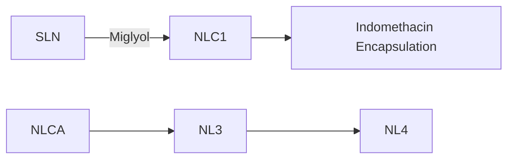

# Polymeric Versus Lipid Nanoparticles: Comparative Study of Nanoparticulate Systems as Indomethacin Carriers

Ana Carvalho $^{1,\#}$ , Ivo Lopes $^{2,\#}$ , Odete Gonçalves $^{1,2,\#}$ , Eduarda Bárbara $^{1,\#}$ , M. Elisabete C.D. Real Oliveira $^{1,2}$ and Marlene Lúcio $^{1,*}$

$^{1}$ CFUM - Centre of Physics of University of Minho, Campus of Gualtar, 4710-057 Braga, Portugal   
$^{2}$ Nanodelivery – I&D em Bionanotechnologia, Lda., Department of Biology, University of Minho, Campus of Gualtar, 4710-057 Braga, Portugal

Abstract: Encapsulation of nonsteroidal or non-steroidal anti-inflammatory drugs (NSAID) in nanocarrier systems aims to enhance bioavailability and to decrease toxicity of these drugs and thus improve the efficacy of treatments. With this aim two types of nanoparticles were prepared and compared: lipid nanoparticles, made of cetyl palmitate and Miglyol 812 which were uncoated or coated with chitosan; or polymeric nanoparticles, made of poly (DL-lactic-co-glycolic acid) (PLGA) for which different emulsion stabilizers were also tested (poly (vinyl alcohol) (PVA), and Pluronic F68). Nanoparticles were characterized for drug content and for particle size, charge and morphology. The lipid matrix was analyzed regarding its crystallinity by differential scanning calorimetry (DSC). The size of the nanoparticles was measured by dynamic light scattering (DLS) which indicated a unimodal particle size distribution in all systems. Nanoparticles' stability was confirmed by their highly negative surface charge in the case of polymeric and uncoated lipid nanoparticles, as analyzed by zeta potential measurements using electrophoretic light scattering (ELS). Lipid chitosan coated nanoparticles have also shown to be stable presenting highly positive surface charge. Results have further demonstrated that indomethacin is highly encapsulated regardless the type of particles. Morphological analysis by scanning electron microscopy has shown that the nanoparticles were smooth and spherical.

The results gathered within the current study point to the conclusion that the proposed formulations provide nanoparticles of satisfactory quality to encapsulate indomethacin, which might be used to improve bioavailability of other NSAID in the treatment of inflammation.

Keywords: NSAID, PLGA nanoparticles, nanostructured lipid carriers (NLC), encapsulation efficiency, dynamic and electrophoretic light scattering (DLS and ELS), differential scanning calorimetry (DSC), electron scanning microscopy (SEM).

# INTRODUCTION

Biocompatible, biodegradable colloidal systems for drug delivery are generally composed of either lipids or polymers $[1]$ as both materials have several advantages. Polymeric colloids such as polymeric nanoparticles (NP) are easier to produce, are capable of delivering both hydrophilic and lipophilic drugs, and have monodisperse size distribution and morphology $[1]$ . Lipid colloids are inherently more efficient systems for encapsulation of the highly lipophilic compounds (which is the case of the majority of drugs), and are less prone to cause toxicity or immune responses $[1]$ . Moreover the encapsulation of drugs in lipid colloidal systems will favor drug solubilization and will further enhance the oral absorption of drugs $[2, 3]$ due to the fact that lipids and pharmaceutical drugs are co-absorbed in the gut to the lymphatic circulation $[2]$ and this simultaneous absorption increases the drug bioavailability by avoiding the first-pass metabolism. In comparison to the most successful lipid colloidal nanocarrier systems – liposomes; lipid nanoparticles are lipid colloidal systems that demonstrate similar efficiency regarding the increase of therapeutic benefits with comparable minimization of the toxic and harmful effects to the patient [1]. Additionally, both lipid and polymeric nanoparticles present advantages relatively to liposomes, such as stability, both in biological fluids and during storage phase; lower price of production; and increasing possibility of developing scale-up preparation procedures [2, 4, 5].

Non-steroidal anti-inflammatory drugs (NSAID) emerged as a highly effective class of drugs against various arthritic conditions and post-operative inflammation and constitute one of the most prescribed groups of therapeutics worldwide due to their anti-inflammatory, anti-stroke, antipyretic and analgesic actions $[6-9]$ . However, several patients that were medicated with these drugs have been hospitalized due to severe gastrointestinal (GI) lesions $[9, 10]$ . These adverse side effects greatly restrain the amount of the pharmaceutical drug administered and therefore limit the therapeutic usage of NSAID $[9]$ . The mechanisms of gastric toxicity of NSAID are complex

and mucosal damage can also be related to a local acid effect of the dissolved drug in the gastric membrane $[11]$ . Hence, there is a great potential in the incorporation of NSAID into controlled release dosage forms which may minimize local GI aggressive side effects for the patient $[9]$ . Indomethacin is one of the most potent NSAID, although nowadays its use is almost restricted to dermal formulations since the oral formulations present great gastric toxicity.

Despite of numerous studies attempting the encapsulation of indomethacin $[1, 12-34]$ there is no clear evidence regarding the choice of the nanoparticles matrix and/or stabilizers for attaining the best nanocarriers. Regardless of the great potentiality of lipid nanoparticles for the encapsulation of indomethacin fewer studies exist, to our knowledge, addressing the use of lipid nanoparticles as carriers of this NSAID (Table 1). Among the reported polymeric NP, Poly (DL-lactic-co-glycolic acid) (PLGA) stabilized with polyvinyl alcohol (PVA) is a widely chosen composition that presented variable encapsulation potential for indomethacin and different range of particle sizes (Table 2).

Taking in consideration the previous studies of indomethacin encapsulation (Tables 1 and 2) we propose herein the encapsulation of indomethacin into two types of nanodelivery systems: polymeric nanoparticles of Poly (DL-lactic-co-glycolic acid) (PLGA-NP) and nanostructured lipid carriers (NLC). The aim is to make use of the above mentioned advantages of polymeric and lipid nanoparticles as nanocarriers for hydrophobic drugs, as these nanocarriers may be a promising strategy to reduce the contact of the drug within the GI mucosa [5, 35-38]. The chosen PLGA matrix was based on the physical and chemical properties of this bioabsorbable polymer, which is non-toxic and biodegradable and therefore useful in several biomedical applications [39-42]. Two stabilizers (PVA and Pluronic 68) will be studied regarding their effect in the final polymeric nanoparticles physical-chemical properties, as this aspect has been mainly underestimated in the previous reported studies of Table 2. Besides aiming the improvement of indomethacin absorption and protection against topical gastric irritancy, NLC were also chosen for indomethacin encapsulation for being composed of spatially very different lipids, with an increased number of imperfections that leads to an increased loading capacity for pharmaceutical drugs [43], comparing to other lipid nanoparticles, such as solid lipid nanoparticles (SLN) [2, 4, 44]. Only two studies have been proposed for the encapsulation of indomethacin in NLC (Table 1) and one was neither successful in the encapsulation nor in the size of the NP achieved. Therefore there is still room for improvement in the preparation of NLC for indomethacin encapsulation. The monoester cetyl palmitate and the medium chain triglyceride Miglyol 812 were chosen to be part of the lipid matrix due to their biocompatibility and biodegradability and excellent physical properties [44, 45]. NLC were further coated with chitosan (CS) for its biocompatibility, biodegradability and ability to modify reversibly the tight

Table 1: Reported Lipid Nanoparticles Used to Encapsulate Indomethacin 

<table><tr><td>COMPOSITION</td><td>% ENCAPSULATION %DRUG LOADING</td><td>SIZE</td><td>ZETA POTENTIAL</td><td>ADMINISTRATION ROUTE</td><td>REFERENCE</td></tr><tr><td>SLN: Compritol 888 ATONLC: Compritol 888 ATO+ Miglyol 812SURFACTANT: Lutrol F68</td><td>EE=76% (SLN)DL=1% w/wEE=83% (NLC)DL = 1.12% w/w</td><td>80-270 nm (NLC)102-215 nm (SLN)</td><td>ND</td><td>ND</td><td>[14]</td></tr><tr><td>NLC: Precirol+Miglyol 812SURFACTANT: Polysorbate 80</td><td>Not successful</td><td>0.5-20 μm</td><td>ND</td><td>parenteral iv</td><td>[22]</td></tr><tr><td>SLN: tripalmitin, tristearin or Gelucire 50/13SURFACTANT:soy lecithin</td><td>EE=80–90%DL =10-15% w/w</td><td>20-60 nm; 200 nm</td><td>ND</td><td>pulmonary</td><td>[28]</td></tr><tr><td>SLM: Phospholipon 90H + Softisan 154SURFACTANT: Tween 80</td><td>EE=50-96%DL=3-5 % w/w</td><td>0.58-21 μm</td><td>ND</td><td>oral</td><td>[29]</td></tr></table>

Abbreviations: SLN=solid lipid nanoparticles; NLC=nanostructured lipid carriers; SLM=solid lipid microparticles. EE=Encapsulation efficiency; DL=Drug loading; ND=Not defined.

Table 2: Reported Polymeric PLGA Nanoparticles (PLGA-NP) Containing PVA as Stabilizer Used to Encapsulate Indomethacin 

<table><tr><td>COMPOSITION</td><td>% ENCAPSULATION %DRUG LOADING</td><td>SIZE</td><td>ZETA POTENTIAL</td><td>ADMINISTRATION ROUTE</td><td>REFERENCE</td></tr><tr><td>POLYMER: PLGA (50/50)STABILIZER: PEG+PVA</td><td>EE=95 %DL= ND</td><td>46.6±3.5 μm</td><td>ND</td><td>parenteral</td><td>[30]</td></tr><tr><td>POLYMER:PLGA (50/50)STABILIZER:PVA</td><td>EE=14%DL=2.8% w/w</td><td>1.65 -2.35 μm</td><td>ND</td><td>ND</td><td>[31]</td></tr><tr><td>POLYMER:PLGA (50/50)STABILIZER:PVA</td><td>EE=62-100%DL=ND</td><td>6-87 μm</td><td>ND</td><td>ND</td><td>[15]</td></tr><tr><td>POLYMER:PLGA (50/50)STABILIZER:PVA</td><td>EE=65.2 %DL=6.52% w/w</td><td>0.68-1 μm</td><td>ND</td><td>ND</td><td>[32]</td></tr><tr><td>POLYMER:PLGA (75/25)STABILIZER:PVA</td><td>EE=NDDL=3.93% w/w</td><td>102 ± 2.59 nm</td><td>-2.12±0.31 mV</td><td>transdermal</td><td>[33]</td></tr><tr><td>POLYMER:PLGA (50/50)STABILIZER:CAPTEX+PVA</td><td>EE=33%DL=3% w/w</td><td>189±4.7 nm</td><td>-17.4±2.2 mV</td><td>ND</td><td>[1]</td></tr><tr><td>POLYMER:PLGA (75/25)STABILIZER:PVA</td><td>EE=36.4%DL=4.25% w/w</td><td>102 ±1.4 nm</td><td>-0.15±0.05 mV</td><td>ND</td><td>[34]</td></tr></table>

Abbreviations: PLGA= Poly (DL-lactic-co-glycolic acid); PVA= polyvinyl alcohol; EE=Encapsulation efficiency; DL=Drug loading, ND=Not defined.

junctions between the cells, which makes this intestinal mucoadhesive hydrophilic polysaccharide a frequent component in nanocarriers for drugs intended to be orally administrated [46-48]. CS hydrophilic coating of nanoparticles was intended to improve the stability of the colloidal systems in contact with the mucosa environment and to favor the interaction with epithelia in a similar way as other colloidal systems with CS that have already been developed [48–52,63]. Additionally, none of the previous studies reported on Table 1 has used chitosan coating, despite its potentiality for oral delivery.

In summary, with this study we aim unveiling the preparation, characterization and comparison (size, morphology, surface potential and encapsulation efficiency/drug loading efficiency) of four biocompatible nanoparticles (polymeric PLGA nanoparticles stabilized with PVA or Pluronic and lipidic NLC uncoated or coated with CS) with the final goal of providing the best options to encapsulate indomethacin and other NSAID, hence allowing the future development of more tolerable drugs, diminishing the undesirable GI side-effects.

# 2. MATERIALS AND METHODS

# 2.1. Materials

Poly (DL-lactic-co-glycolic acid) (PLGA) with an average molecular weight of 66-107 kDa and a copolymer ratio of DL-lactide to glycolide ratio of 75:25; indomethacin; the solvent dichloromethane; the emulsion stabilizers: polyvinyl alcohol (PVA) with an average molecular weight of 30-70 kDa and hydrolyzation degree of 98–99%, pluronic F68 and chitosan of low molecular weight (Mw = 50 kDa) were all obtained from Sigma Aldrich (St Louis, MO). Cetyl palmitate was purchased to Sigma Aldrich (St Louis, MO) and Miglyol-812 was purchased from Acofarma (Spain). Polysorbate 60 (Tween 60) was obtained from Merck (Germany).

All chemicals and solvents were of analytical grade, and were used without further purification. Aqueous solutions were prepared with double-deionized water (conductivity less than $0.1 \mu S cm^{-1}$ ).

# 2.2. Methods

# 2.2.1. Optimization of Preparation Methods

The process of ultra-homogenization subjects the sample to high shear forces that cause repeated cavitations in the polymeric/lipid matrix resulting in a reduction of vesicle size. Sonication provides a rearrangement of the initial multilamellar organization into smaller nanoparticles. The ultra-homogenization and sonication times were optimized and combined on the basis of the vesicle size obtained by dynamic light scattering measurements (Malvern Mastersizer, Malvern Co., Worcestershire, UK). The times were

Table 3: Composition of the Developed Polymeric PLGA Nanoparticles (PLGA-NP) and Nanostructured Lipid Carriers (NLC) 

<table><tr><td>Formulations</td><td>Drug: Polymeric matrix (mg/g)</td><td>PLGA (mg)</td><td>PVA (mL)</td><td>Pluronic F-68 (mL)</td></tr><tr><td>PLGA-NP1</td><td>0</td><td>50</td><td>15</td><td>0</td></tr><tr><td>PLGA-NP2</td><td>35</td><td>50</td><td>15</td><td>0</td></tr><tr><td>PLGA-NP3</td><td>0</td><td>50</td><td>0</td><td>15</td></tr><tr><td>PLGA-NP4</td><td>35</td><td>50</td><td>0</td><td>15</td></tr><tr><td>Formulations</td><td>Drug: Lipid matrix (mg/g)</td><td>Cetyl palmitate (mg)</td><td>Miglyol-812 (mg)</td><td>Polysorbate 60 (mg)</td></tr><tr><td>NLC1 and 3</td><td>0</td><td>225</td><td>25</td><td>100</td></tr><tr><td>NLC2 and 4</td><td>35</td><td>213.75</td><td>23.75</td><td>100</td></tr></table>

selected according to the production of nanoparticles of optimal size with low polydispersity index (PDI).

# 2.2.2. Preparation of Polymeric Nanoparticles

PLGA-NP were prepared according to a modified emulsion-solvent diffusion technique. Briefly, 50 mg of PLGA polymer and suitable quantity of indomethacin were accurately weighed and dissolved in 5 mL of dichloromethane. The organic phase was added dropwise into 15 mL of the aqueous phase (double-deionized water) containing the emulsion stabilizer (Pluronic F68 25% (w/v) or PVA 0.5% (w/v)) while stirring in vortex (see in Table 3 the composition of the nanoparticles).

The resulting mixture (organic phase containing PLGA and indomethacin + aqueous phase containing the stabilizer) turned milky instantaneously due to immediate polymer precipitation. The homogeneity of the emulsion obtained was further improved by two cycles of 40 seconds in an ultra-homogeneitor (POLYTRON $^{®}$ , PT 2500 E), followed by 3 minutes of sonication (Qsonica Misonix S-4000) operating at 70% amplitude intensity. After this procedure, nanoemulsions were stirred magnetically at room temperature during 3 hours which allowed a complete evaporation of the organic solvent. Drug free nanoparticles were prepared according to the same procedure, but without adding indomethacin (Table 3).

The nanoparticles obtained dispersed in an aqueous media were passed through 0.8 $\mu$ m filter (Millex-syringe filter unit, Millipore) to remove aggregates and were stored in hermetically sealed containers at 25 °C before posterior analyses. The schematic structure of the PLGA-NP prepared is presented in Figure 1.

# 2.2.3. Preparation of Chitosan Coated and Uncoated Lipid Nanoparticles

Lipid nanoparticles were prepared according to a sonication based method. Cetyl palmitate, miglyol-812, polysorbate 60 and drug were weighed in appropriate quantities and warmed up to 70 °C (see in Table 3 the composition of the nanoparticles). Double-deionized water was warmed up to the same temperature and added to the lipid mixture (added up to 5 g). The resultant lipid-water emulsion was homogenized in Ultra-homogeneitor during 40 seconds in order to obtain a microemulsion by ultrasonic waves. Then, the emulsion was sonicated during 3 minutes and the resultant nanoemulsion was cooled down to room temperature. For the preparation of chitosan (CS) coated lipid nanoparticles, 2.5 mL of CS solution 1% (w/v) (in 1% of acetic acid) was slowly added to 2.5 g of the previously prepared nanoformulation (Table 3) under magnetic stirring. The mixture was stirred during 1 hour. The obtained lipid nanoparticles uncoated (NLC1 and NLC2) and CS coated (NLC3 and NLC4) were stored in hermetically sealed containers at 25 °C before posterior analyses. The schematic structure of the PLGA-NP prepared is presented in Figure 2.

# 2.2.4. Nanoparticles Characterization

# 2.2.4.1. Determination of Encapsulation Efficiency and Loading Efficiency

The formulations were centrifuged (Eppendorf, Centrifuge 5418R) through centrifugal filter units (Amicon Ultra-4, 10 kDa, Millipore) at 4300 rpm (3300×g) at 25 °C for 5 minutes or until complete separation between the nanoparticles (pellet retained in the filter unit) and the aqueous phase (supernatant). The supernatant containing the dissolved free drug was analyzed in a Shimadzu UV-3101PC UV/VIS

text_image

PLGA
Nanoparticle
Nanoparticle
Coating
Indomethacin
Encapsulation
PLGA-NP1
PLGA-NP2
PLGA-NP3
PLGA-NP4
Pluronic F68
Legend:
PLGA
PVA
Pluronic F68
Indomethacin

Figure 1: Schematic illustration of the Poly (DL-lactic-co-glycolic acid) (PLGA) nanoparticles with different emulsion stabilizers: polyvinyl alcohol (PVA) (PLGA-NP1 and PLGA-NP2) and Pluronic F68 (PLGA-NP3 and PLGA-NP4) unloaded (PLGA-NP1 and PLGA-NP3) or loaded with indomethacin (PLGA-NP2 and PLGA-NP4).

flowchart

Figure 2: Schematic illustration of nanostructured lipid carriers (NLC) composed of a core of solid lipid (cetyl palmitate) and liquid lipid (Miglyol-812) with a surfactant stabilizer (Polysorbate 60) naked (NLC1 and NLC2) or covered with chitosan (NLC3 and NLC4) unloaded (NLC1 and NLC3) or loaded with indomethacin (NLC2 and NLC4). Comparison with solid lipid nanoparticles (SLN) composed only by solid lipids and surfactant stabilizer.

Spectrometer. Spectra were taken in the range of 230-350 nm. UV spectra of the nanoparticles without the drug incorporated were also analyzed to establish the absorbance interference. Considering the initial concentration of drug used in the formulation and subtracting the free drug concentration present in the

supernatant, it is possible to obtain the concentration of drug that was incorporated in the PLGA-NP and in the NLC. The encapsulation efficiency (EE) and loading efficiency was calculated by the equations:

$$
\text { Encapsulation   Efficiency } (\%) = \frac {[ \text { Drug   incorporated   in   NP } ]}{[ \text { Drug   used   in   formulation } ]} \times 100 \tag{1}
$$

$$
\text { Loading   Efficiency } (\%) = \frac {\text { Amount   of   Drug   incorporated   in   NP }}{\text { Amount   of   lipid   or   polymer   in   formulation }} \times 100 \tag{2}
$$

# 2.2.4.2. Nanoparticles Size and Surface Charge

Nanoparticles size distribution and surface charge of the nanoparticles were determined at 25 °C by dynamic light scattering (DLS) and electrophoretic light scattering (ELS), using a Zetasizer Nano ZS laser scattering device (Malvern Instruments Ltd., Malvern, UK). The nanoparticles' size distribution allows monitoring the nanoparticle preparation method and verifying its time dependent stability regarding the tendency for aggregation and sedimentation. For each sample, the mean diameter ± standard deviation of at least three determinations was calculated applying multimodal analysis to the Nanoparticles' size distribution by intensity. Surface charge of the nanoparticles is presented as zeta potential values from at least three independent determinations.

# 2.2.4.3. Nanoparticles Morphology

Morphological evaluation of the nanoparticles was performed using Scanning Electron Microscopy (SEM). For SEM analysis, the samples were mounted on conductive carbon adhesive attached to aluminum stubs. The samples were then coated with platinum under vacuum in a sputter coater and analyzed with a FEI Quanta 400 FEG scanning electron microscope.

# 2.2.4.4. Physical State and Polymorphism of Lipid Nanoparticles

Thermal behavior of lipids and its compatibility with other formulation ingredients was estimated using differential scanning calorimeter (NETZSCH DSC 200F3-240-20-427-L, USA). The samples were hermetically sealed in aluminum pans and heated at a constant rate of 5°C/min over a temperature range of 25-85°C. An inert atmosphere was maintained by purging with nitrogen at a flow rate of 60 mL/min. DSC analyses were performed on bulk lipids and NLC. The degree of crystallinity or recrystallization index (RI) was determined by the following equation (3):

$$
R I (\%) = \frac {\text {Enthalpy NLC} (\mathrm{J} / \mathrm{g})}{\text {Enthalpy bulk material} (\mathrm{J} / \mathrm{g}) \times \text {lipid phase} (\%)} \times 100 \tag{3}
$$

# 2.2.4.5. Drug Release Studies

The release studies were carried out using the vertical dialysis bags of cellulose membrane (Frilabo, Portugal) with a cut off value of 12-14 kDa. Prior to use, the membrane was hydrated in purified water for 12 h. The final concentration of the drug was always lower than 10% (w/w) of its solubility in the receptor medium, so that sink conditions could be assumed. 5 g of formulations was placed in the donor compartment after the receptor compartment was filled with 300 mL of receptor medium (pH 7.45). The temperature was kept as 37°C and the receptor medium was stirred with the help of magnetic stirrer at 100 rpm. Samples of 2 mL were withdrawn periodically until 24 hrs, replacing the samples with the same amount of volume of receptor medium kept at the same temperature. The amount of released drug was measured by UV analysis at 320 nm.

# 3. RESULTS AND DISCUSSION

# 3.1. Size and Surface Charge of the Nanoparticles

The mean particle sizes; the polydispersity and zeta potential values of PLGA-NP and NLC loaded with indomethacin are shown in Figures 3 and 4 respectively.

Since PLGA-NP are formed from the emulsion droplets after organic solvent diffusion, their size is dependent on the stability of the emulsion droplets, which collide and coalesce. Ultimately, the size of the nanoparticles is dependent upon the type of emulsion stabilizer used. When the stabilizer remains at the liquid–liquid interface during the diffusion process, and if its protective effect is adequate, nanoparticles will form $[54]$ . The PLGA-NP produced within this work contained non-ionic stabilizer systems (PVA and Pluronic F68), where particles are stabilized by steric hindrance. Small particle sizes obtained for both types of stabilizer systems (sizes ranged between 94-135 nm, see Figure 3) can be attributed to both the adequacy of the stabilizer's protection against coalescence, and the low interfacial tension between aqueous and organic phases, resulting from their partially water-soluble nature $[55]$ . Furthermore, comparing samples where the drug is absent and does not influence the size of the nanoparticles (Table 3; samples PLGA-NP1 and PLGA-NP3); the only factor

bar

| Group     | SIZE (nm) | POLYDISPERSITY |
| --------- | --------- | -------------- |
| PLGA-NP1  | 130       | 0.1            |
| PLGA-NP2  | 135       | 0.15           |
| PLGA-NP3  | 95        | 0.4            |
| PLGA-NP4  | 90        | 0.25           |
| NLC1      | 75        | 0.3            |
| NLC2      | 85        | 0.25           |
| NLC3      | 85        | 0.3            |
| NLC4      | 90        | 0.25           |

Figure 3: Average size (nm) represented as bars and polydispersity index represented as scatter points of the nanoparticles: PLGA-NP1 (PLGA nanoparticles containing PVA and unloaded); PLGA-NP2 (PLGA nanoparticles containing PVA and loaded with indomethacin); PLGA-NP3 (PLGA nanoparticles containing Pluronic F68 and unloaded); PLGA-NP4 (PLGA nanoparticles containing Pluronic F68 and loaded with indomethacin); NLC1 (nanostructured lipid carriers unloaded); NLC2 (nanostructured lipid carriers loaded with indomethacin); NLC3 (chitosan coated nanostructured lipid carriers unloaded); NLC4 (chitosan coated nanostructured lipid carriers loaded with indomethacin). Patterned bars represent formulations loaded with indomethacin. Values are means ± standard deviations (n=4).

bar

| Group     | ZETA-POTENTIAL |
| --------- | -------------- |
| PLGA-NP1  | -15            |
| PLGA-NP2  | -18            |
| PLGA-NP3  | -25            |
| PLGA-NP4  | -28            |
| NLC1      | -15            |
| NLC2      | -25            |
| NLC3      | 35             |
| NLC4      | 60             |

Figure 4: Average zeta-potential (mV) represented as bars of the nanoparticles: PLGA-NP1 (PLGA nanoparticles containing PVA and unloaded); PLGA-NP2 (PLGA nanoparticles containing PVA and loaded with indomethacin); PLGA-NP3 (PLGA nanoparticles containing Pluronic F68 and unloaded); PLGA-NP2 (PLGA nanoparticles containing Pluronic F68 and loaded with indomethacin); NLC1 (nanostructured lipid carriers unloaded); NLC2 (nanostructured lipid carriers loaded with indomethacin); NLC3 (chitosan coated nanostructured lipid carriers unloaded); NLC4 (chitosan coated nanostructured lipid carriers loaded with indomethacin). Patterned bars represent formulations loaded with indomethacin. Values are means ± standard deviations (n=4).

that justifies the difference in the obtained size is the type of stabilizer used. Hence, it is evident that when Pluronic F-68 was used, the nanoparticles obtained where significantly smaller ( $\approx$ 98 nm) than the nanoparticles obtained with PVA ( $\approx$ 129 nm). This indicates that Pluronic F68 is more adequate as a stabilizer of PLGA-NP conferring higher protection against coalescence of the particles.

Besides the analysis of the size of the nanoparticles it is also important to analyze the polydispersity. The polydispersity values obtained for all the PLGA formulations were reasonably small (0.08-0.29) suggesting a fairly narrow and monomodal particle size distribution.

Regarding the effect of the NSAID tested on the size of PLGA-NP, it is possible to conclude that the nanoparticles did not suffer large variations after the encapsulation of drug (Figure 3; samples PLGA-NP2 and PLGA-NP4). This indicates that indomethacin is possibly homogeneously distributed and incorporated in the matrix of the nanoparticles, and thus, does not have a great influence on the size of the particles. Probably if the distribution of the drug was by adsorption at the surface of the nanoparticles, the effect on the size would be more evident. In close agreement to these results, other reported studies indicated that indomethacin was dissolved within the PLGA matrix and that no clear relationship could be established between particle size and the amount of drug loaded in the PLGA nanoparticles [12, 15, 55].

The zeta-potential of PLGA nanoparticles was negative because of the carboxyl end groups on PLGA and ranged between -15 to -24 mV (Figure 4). At a first approach one would think that the values obtained were not indicative of stable formulations, since it is generally assumed that, the most stable nanoparticles are the ones that present greater absolute values of zeta potential ( $\approx$ 30 mV), which are correspondent to charged nanoparticles that will be stabilized by the multiple repulsion effects. However, this rule cannot be strictly applied to systems containing steric stabilizers, since their adsorption decreases the absolute value of zeta potential due to a shift in the shear plane of the particle [56]. Indeed, steric stabilizer polymers such as PVA and Pluronic F-68 may reduce the surface charge of the nanoparticles, but still keep the formulation stable by creating a shield between the nanoparticle surface and the surrounding medium, thereby protecting the nanoparticles from aggregation [57]. Moreover, it has been reported that highly negative zeta potential values in the range of -15 to -30 mV maintains nanoparticles stability [58]. Hence, the

developed formulations have good stability since the presented zeta potential values are within the same highly negative range.

Comparing the effect of the two stabilizers used, the zeta potential of PLGA-Pluronic nanoparticles (-24.20 ± 0.35) is higher in absolute values relatively to PLGA-PVA nanoparticles (-14.54 ± 0.63). Despite of being considered a non-ionic polymer, PVA macromolecule contains some acetate groups that result from incomplete hydrolyses of polyvinyl acetate in the production process of PVA. The ionization of these acetate groups in the PVA macromolecule confers them negative charge [59], which explains the negative zeta-potential values obtained for PLGA-PVA nanoparticles. Pluronic F68 is also a non-ionic polymer but due to its lower molecular weight, only a partial screening of PLGA charges is caused by its adsorption to the nanoparticles surface, resulting in a nanoparticle with negative charge [60]. The lower absolute values of PLGA-PVA nanoparticles are the outcome of PVAs higher molecular weight which results in a higher screening of PLGA charges [60]. The higher absolute values of zeta potential observed for PLGA-Pluronic nanoparticles can be once more an indication of the greater stability of the nanoparticles with Pluronic F-68 as emulsion stabilizer, which is in agreement to what has been said regarding the size of the nanoparticles.

Regardless the type of stabilizer used (Pluronic F-68 or PVA), indomethacin had also a stabilizing effect upon encapsulation into the nanoparticles, and although this effect was not very much pronounced (Figure 4; samples PLGA-NP2 and PLGA-NP4) it can be attributed to the fact of this drug being negatively charged at the pH of the studies (pKa of indomethacin = 4.5 [61]).

In the case of the NLC, the average size order determined was higher for the formulations containing CS (Figure 3, samples NLC3 and NLC4). Indeed, it has been reported that CS coated nanoparticles present increased particle sizes which can be attributed to the amount of adsorbed CS on the surface of the nanoparticles [62, 63]. Besides the size of the nanoparticles, the adsorption of CS was further supported by the zeta-potential determinations (Figure 4, samples NLC3 and NLC4). In fact, the positive zeta-potential of CS coated NLC confirmed the presence of CS adsorbed to the nanoparticles surface, since that upon dissolution, the amine groups of CS are protonated and the resultant polymer is positively charged [64]. Despite the stabilizer used polysorbate 60 being non-ionic the zeta potentials of NLC formulations without CS are negative (Figure 4, samples NLC1 and NLC2). Reported studies with nonionic ethoxylated surfactants show that they are negatively charged at pH > 3. The negative charge increases upon pH (that is, upon increasing bulk HO $^{-}$ concentration) [65, 66].

Regardless the type of NLC prepared (uncoated or coated with CS) indomethacin had also a stabilizing effect upon encapsulation into the nanoparticles. Indeed, in the case of uncoated NLC, the zeta potential values were more negative in the nanoparticles where the drug was added (Figure 4, sample NLC2). Similarly to PLGA-NP, the effect of indomethacin reducing the zeta potential, and thus the surface charge of the NLC must be related with the fact of this NSAID being negatively charged at the pH of the studies [61]. The adsorption of negatively charged indomethacin to the NLC surface might be also responsible for a higher amount of adsorbed CS that forms stable NLC with highly positive zeta potential values (Figure 4, sample NLC4).

# 3.2. Encapsulation efficiency and loading efficiency of drug

The encapsulation efficiencies (EE) and loading efficiencies (LE) of indomethacin were high either in PLGA-NP or NLC. EE and LE narrowly ranged between 87.58 ± 2.55 % - 98.87 ± 0.15 % and 3.38 ± 0.18 % - 3.53 ± 0.12 % respectively (Figure 5).

bar

| Group     | Encapsulation Efficiency (%) | Drug Loading (%) |
| --------- | ---------------------------- | ---------------- |
| PLGA-NP2  | 87                           | 3.4              |
| PLGA-NP4  | 88                           | 3.5              |
| NLC2      | 98                           | 3.6              |
| NLC4      | 97                           | 3.5              |

Figure 5: Average encapsulation efficiency (%) represented as bars and drug loading efficiency (%) represented as scatter points of indomethacin into the nanoparticles: PLGA-NP2 (PLGA nanoparticles containing PVA and loaded with indomethacin); PLGA-NP4 (PLGA nanoparticles containing Pluronic F68 and loaded with indomethacin); NLC2 (nanostructured lipid carriers loaded with indomethacin); NLC4 (chitosan coated nanostructured lipid carriers loaded with indomethacin). Values are means ± standard deviations (n=3).

In the case of PLGA-NP the encapsulation efficiency of indomethacin, did not improve much with the change of emulsion stabilizer. Indeed, for (PLGA+PVA) nanoparticles (PLGA-NP2) the EE was found to be $87.58 \pm 2.55\%$ , whereas for (PLGA+Pluronic F-68) nanoparticles (PLGA-NP4) the EE was determined to be $88.67 \pm 1.21\%$ . The percentages of indomethacin loaded into PLGA nanoparticles were above 85%, which means that, a large quantity of drug was incorporated, regardless the emulsion stabilizer used. Hence, the emulsion stabilizer does not seem relevant for the amount of drug loaded into the nanoparticles. This may happen because the drug is initially co-dissolved with PLGA and thus the amount of drug incorporated into the nanoparticles is more dependent on the core polymer than on the surface stabilizers. Moreover, it has been reported that hydrophilic drugs demonstrate lower affinity to the PLGA polymer, and tend to diffuse from the organic phase (where the polymer is dissolved) to the external aqueous medium during the spontaneous emulsification process of the polymer, leading to an unsatisfactory loading efficiency [12]. This must not be the case of indomethacin. In fact, the higher lipophilic character of indomethacin has been proved by means of partition coefficient determination between water and lipid media [67]. As a consequence, the higher lipophilic behavior of indomethacin assures that the interactions with the polymer are high in the organic phase and thus more drug remains encapsulated during the emulsification process.

The values obtained for indomethacin incorporation efficiency in the NLC were even higher (about 99%) than in the PLGA nanoparticles, which confirms that a very large percentage of the drug is effectively distributed into the lipids that take part of the NLC composition, whether the particles are uncoated or coated with CS. The encapsulation of indomethacin was also not affected by the CS coating surface added to the NLC (Figure 5). In fact, NLC without CS (NLC2) have shown an EE of $98.87 \pm 0.15 \%$ , whereas CS coated NLC (NLC4) present an EE of $97.69 \pm 0.08 \%$ . In agreement, other studies have reported unaltered incorporation efficiency of drugs in NLC coated with CS or CS derivatives [43, 63].

# 3.3. Morphology of the Nanoparticles

SEM microphotographs of PLGA-NP and NLC are shown in Figure 6 as typical examples.

SEM analysis of the formulations allows the evaluation of the morphology of the nanoparticles. All PLGA-NP unloaded (Figure 6 PLGA-NP1 and PLGA-NP3) or loaded with indomethacin (data not shown) exhibit a spherical shape and a smooth surface independently of their composition. The sizes of the nanoparticles observed by SEM have shown to be larger than the analyzed by DLS, however in agreement to DLS results; considering PLGA-NP (Figure 6), bigger sizes were obtained when PVA was used as emulsion stabilizer (Figure 6 PLGA-NP1) and the sizes are more homogeneous (around 200 nm). Contrastingly the PLGA nanoparticles obtained with Pluronic F68 (Figure 6 PLGA-NP3) are smaller and reveal a wider size distribution (sizes range between 85 nm till 200 nm) which is in agreement with the larger polydispersity values found in the measurements of DLS. In agreement with DLS, SEM images of uncoated NLC (Figure 6 NLC1) show the smallest sizes (between 85 till 100 nm) however these nanoparticles are not perfectly spherical but more deformed and elongated. The shape changes were even more evident in CS coated NLC for which 'platelet-like' or

text_image

PLGA-NP1
C
C
C
C
C
C
C
250 nm

text_image

PLGA-NP3
A
B
A
C
B
A
B
C
B
A
C
A
B
A
250 nm

text_image

NLC1
B
A
B A
B
B
A
A
B
250 nm

natural_image

Microscopic image of NLC3 material surface showing wavy, ridged structures with 2500 nm scale bar (no text or symbols beyond label)

Figure 6: SEM microphotographs of unloaded nanoparticles: (PLGA-NP1) PLGA nanoparticles prepared with PVA as stabilizer; (PLGA-NP3) PLGA nanoparticles prepared with Pluronic F68 as stabilizer; (NLC1) Lipid nanoparticles without chitosan; (NLC3) Lipid nanoparticles coated with chitosan. A = 85 nm; B = 100 nm; C = 200 nm.

'needle'-like structures are observed (Figure 6 NLC3). A probable explanation to this is related to the fact that SEM analysis was not performed immediately after nanoparticles production, but after one month of storage. During storage the NLC coated with CS might have suffered a transition from the less stable crystalline modifications ( $\alpha$ state) towards the more stable $\beta$ form occurs [68, 69]. This leads to formation of more ordered and stable crystalline structures in the lipids. Moreover, the transformation to more ordered crystalline structures causes a shape change from spherical to platelet-like or needle-like. The shape transformation results in increase in the overall surface area. These assumptions are further supported by DSC analysis of the lipid NP where CS coated NLC have shown higher interferences with lipid crystallization.

The difference of sizes of the nanoparticles according to the measurement technique (DLS and SEM) can be due to the inherent differences of both techniques and also to the possible sample deformation caused by the drying process of the aqueous media and/or by the effect of the highly energetic electron beam. This latter effect may also contribute for the non-spherical shapes observed. Future Cryo-SEM and cryo-TEM measurements, more adequate for lipid nanoparticles evaluation will improve the characterization of the nanoparticles. Nevertheless, SEM already confirmed no disruptions of PLGA-NP spherical structure and integrity, even after application of various mechanical stresses such as sonication and ultra-homogenization.

# 3.4. Physical State and Polymorphism of Lipid Nanoparticles

The required final physical state of the NLC after production is the solid state. Though, a crystalline lipid (cetyl palmitate) was used in the production of NLC dispersions; the final physical state of the nanoparticles can be other than solid, due to the presence of the liquid lipid and to the well known supercooling effect. Supercooled melts (emulsions) are produced instead of nanoparticles dispersions when the melting point of the formulation is well below to the room temperature (e.g. trimyristin based lipid nanocarriers) [70, 71]. For that reason, determining the physical state of the lipid matrix is essential for the development of nanoparticles based on solid lipids. In the current study, solid state state of NLC was confirmed for both body (37 °C) and room temperatures (25 °C) since the melting peaks were well above these temperatures. The DSC results obtained for each type of NLC are depicted in Table 4.

Thermal transitions in the DSC heating curve revealed that the NLC developed in this study were particles with crystalline lipids and revealed two distinct polymorphic modifications with two separate melting point peaks. The first peak with lower melting point was attributed to the $\alpha$ -polymorphic form (metastable), whereas the second peak was attributed to the $\beta$ -polymorphic form (stable form). Overall, the NLC's melting points were lower than those obtained for the bulk materials, which can be attributed to the presence of surfactant and to the colloidal low dimensions of the particles, in particular to their high surface area to volume ratio. All these factors imply the creation of lattice defects onto the lipid matrices, following a decrease in their crystallinity in comparison to their bulk counterparts [71]. Indeed, the melting enthalpy in unloaded NLC decreased from $186 \pm 0.110$ J/g (bulk mixture) to $7.2 \pm 0.83$ J/g for the unloaded NLC without chitosan (NLC1) and to $2.9 \pm 0.45$ J/g for the unloaded NLC with chitosan (NLC3) (Table 4), indicating a slower recrystallization and a crystal order disturbance. Also, enthalpy of bulk mixtures decreased relatively to the corresponding solid lipid (Cetyl palmitate). This was expected to happen, since Miglyol-812 (liquid lipid)

Table 4: Experimental Data Obtained from DSC Analysis of the NLC Formulations. Values Reported are the Mean Diameter ± Standard Deviation for at least 3 Determinations 

<table><tr><td>Formulations</td><td> $\Delta H (J/g)^*$ </td><td>Lower melting point (°C) $\alpha$ - form</td><td>Higher melting point (°C) $\beta$ - form</td><td>RI (%)</td></tr><tr><td>NLC1</td><td>7.2 ± 0.83</td><td>46.0 ± 0.380</td><td>50.5 ± 0.580</td><td>77.0</td></tr><tr><td>NLC2</td><td>6.5 ± 0.92</td><td>43.0 ± 0.395</td><td>50.1 ± 0.581</td><td>70.1</td></tr><tr><td>NLC3</td><td>2.9 ± 0.45</td><td>-</td><td>50.0 ± 0.622</td><td>61.7</td></tr><tr><td>NLC4</td><td>2.6 ± 0.11</td><td>-</td><td>49.6 ± 0.743</td><td>56.3</td></tr><tr><td>Bulk lipids</td><td>186 ± 0.110</td><td>46.3 ± 0.580</td><td>54.9± 0.610</td><td>100</td></tr><tr><td>Cetyl palmitate</td><td>267 ± 0.180</td><td>47.5 ± 0.420</td><td>56.9± 0.324</td><td>-</td></tr></table>

\*Obtained from the higher melting point.

incorporation induces the formation of lower energy lipid forms and thus lowers the crystallization and melting temperatures of the particle matrix and accelerates the transition of the solid lipid into the stable β-polymorph after crystallization. Additionally, CS and surfactants distributed in the melted lipid phase can interfere with lipid crystallization, resulting in a lower melting enthalpy (Table 4). According to that, the RI was lower in the presence of CS (56 % – 62 %) than in its absence (70 % - 77 %). Furthermore, the presence of guest molecules in the lipid matrix normally influences its crystallization degree, decreasing the lipid layer organization. Thus, it is understandable that the melting point and enthalpy values were slightly lower in drug-loaded NLC (NLC2 and NLC4) which translates in lower RI values (Table 4). This indicates that the drug reduces the cooperativity of the phase transition reducing also the lipid packing. All NLC loaded formulations presented a single maximum peak (higher melting point) which constitutes an indication that indomethacin was not in crystalline state but rather completely entrapped within the nanoparticles due to the rapid ordering of drug within the lipid matrix upon nanoparticles preparation. Similar results were reported stating that rapid ordering of the microemulsion does not allow the drug to crystallize [72]. Despite the enthalpy obtained for the bulk lipids being much higher than that of NLCs, meaning that there is a loss of crystallinity of the lipids after their incorporation into NLCs, the lipids in these formulations still possess a high degree of crystallinity, as observed by the presence of β-form melting point and by the fact that the recrystallization index (RI) range of the NLC was always above 50 % (56 - 77%) (Table 4). The thermogram parameters of the NLC uncoated and coated with CS (Table 4) were quite similar and revealed a β-endotherm at 49.6-50.5 °C. This similarity is due to the fact that both the melting and crystallization properties of the NLC were mainly governed by the hard fat component [73]. However being similar, uncoated NLC show a shoulder corresponding to the α-form, meaning that some of the lipid matrix is crystallized in a lower energy lipid form. The α-form was not visible in the CS coated NLC suggesting that polymorphic transitions can occur more rapidly in coated NLC than in uncoated ones. As a general rule the stable modifications of the lipids usually exhibit lower EE. For that reason, drug expulsion may occur after transitions of the lipid crystalline structure in the CS coated NLC, possibly by the dislocation of the drug from the lipid core to the polymeric shell.

# 3.5. Drug Release Studies

The percentage of drug released was calculated by dividing the cumulative amount of drug released at a given time by the amount of total drug present in 5.0 g of nanoparticles. Release studies at 24 h indicated higher indomethacin release from CS coated NLC (75.61% ± 12.25) followed by indomethacin release from uncoated NLC (64.38% ± 8.50) and the slower release was observed for PLGA-NP with very similar release (60.00 ± 8.10 for PLGA-NP2 and 58.20 ± 9.10 for PLGA-NP4).

The release rates from lipid nanoparticles can be considered as mediated by several partition mechanisms between the aqueous medium surrounding the nanoparticles, the surfactant employed and the lipid phases $[14]$ . One has to also consider that according to DSC analysis both chitosan and indomethacin significantly change the NLC lipid order, promoting more fluid systems from which the release of contents is facilitated.

The polymeric nanospheres produced within this work have been described to present a spherical matrix structure in which the pharmaceutical drug can be absorbed on the surface, or physically and uniformly dispersed within the matrix [74]. Furthermore, the release of drugs from PLGA matrix was shown to be biphasic, initially mainly by drug diffusion through the polymer matrix and later through both diffusion of the therapeutic agent and the degradation of the polymer matrix itself [75]. Finally, it has been reported that the drug(s) having amino functional groups such as amines (which is the case of indomethacin) have the potential to interact with polymer pendant groups, accelerating the polymer degradation rates and the release rates of the drugs incorporated in the polyester matrix [76]. These 3 aspects combined justify the initial burst of approximately $60\%$ release of drug in 24 h even though the polymeric matrix has been described to promote much more prolonged releases. Nevertheless, indomethacin used in classical formulations (commercial pharmaceutical formulations) is released from formulation reaching plasma peak concentrations in 2 h [77] which is a fast release of $100\%$ of drug administrated and not comparable with the $60\%$ release that we have reached with polymeric nanoparticles in 24 h. Furthermore, gastric digestion takes about 4 hours, and the presence of NSAIDs during this period in stomach has several deleterious consequences. The nanoparticles presented in this study released negligible quantities of drug in the time

length of gastric digestion (4 h) and released 60% of drug in 24h. Therefore this is a good indication for less gastric toxicity.

# CONCLUSIONS

PLGA and lipid nanoparticles encapsulating indomethacin were successfully prepared and characterized. This study confirms that both polymeric and lipid nanoparticles are suitable for the preparation of NSAID containing carriers with high encapsulation efficiency and drug releasing rates. Accordingly, both types of formulations can be used to improve the therapeutic efficacy of the tested drug and reduce their GI effects by the protection conferred by either the polymeric or the lipidic matrix.

In the case of PLGA-NP, both nanoparticle size and stability were affected by changing the type of stabilizer used. In this context, Pluronic F-68 has been responsible for smaller and more stable nanoparticles. Contrastingly drug loading into the nanoparticles revealed to be independent from the type of stabilizer and dependent of the lipophilicity of the drug. Indomethacin, is highly lipophilic, and as such, does not suffer from the problems of leakage of drug to the external medium, resulting in improved drug content in the nanoparticles. In any case, no clear relationship has been established between particle size and the amount of drug loaded in the PLGA nanoparticles.

In the case of NLC, both nanoparticle size and stability were affected by coating the nanoparticles with CS. In this context, CS coating has been responsible for bigger but still more stable nanoparticles, since the highly positive charge density of the nanoparticles' surface, conferred by adsorbed CS, will keep the repulsions between the NLC and avoid aggregation. Similarly, drug loading into the nanoparticles revealed to be improved by the CS coating. Hence, the NLC coated with CS revealed to be very promising causing improved stability and high drug release and besides that, the CS coated nanoparticles might also favor the interaction with mucosa epithelia and favor adhesion in vivo.

Before concluding about the real potentiality of these nanoformulations and the possibility of actually using these nanoparticles in therapy, several experiments still need to be performed, like for example drug release studies from the nanoparticles at inflammatory pH and cellular uptake of the drug. Nevertheless, this study contributed to confirm that the nanoparticles tested, particularly nanoparticles coated with CS are a progress beyond the state-of-art showing high drug loading efficiency and drug formulation stability advantages and thus showing potentiality to be applied as NSAID nanocarriers improving the use of these drugs in inflammation treatments.

# ACKNOWLEDGEMENTS

This work was supported by FEDER through POFC – COMPETE and by national funds from FCT through the projects PEst-C/FIS/UI0607/2013 (CFUM). Marlene Lucio holds a position of Researcher FCT with the reference IF/00498/2012. We acknowledge NanoDelivery-I&D em Bionanotecnologia, Lda for access to their equipment.

# REFERENCES

[1] Narvekar M, Xue HY, Wong HL. A novel hybrid delivery system: polymer-oil nanostructured carrier for controlled delivery of highly lipophilic drug all-trans-retinoic acid (ATRA). Int J Pharm 2012; 436: 721-31.
http://dx.doi.org/10.1016/j.ijpharm.2012.07.042   
[2] Muchow M, Maincent P, Müller RH. Lipid nanoparticles with a solid matrix (SLN®, NLC®, LDC®) for oral drug delivery. Drug Dev Ind Pharm 2008; 34: 1394-405. http://dx.doi.org/10.1080/03639040802130061   
[3] Zhou X, Zhang X, Ye Y, et al. Nanostructured lipid carriers used for oral delivery of oridonin: An effect of ligand modification on absorption. Int J Pharm 2014; 479: 391-8. http://dx.doi.org/10.1016/j.ijpharm.2014.12.068   
[4] Iqbal MA, Md S, Sahni JK, Baboota S, Dang S, Ali J. Nanostructured lipid carriers system: recent advances in drug delivery. J. Drug Target 2012; 20: 813-30. http://dx.doi.org/10.3109/1061186X.2012.716845   
[5] Soppimath KS, Aminabhavi TM, Kulkarni AR, Rudzinski WE. Biodegradable polymeric nanoparticles as drug delivery devices. J Control Release 2001; 70: 1-20. http://dx.doi.org/10.1016/S0168-3659(00)00339-4   
[6] Brune K, Patrignani P. New insights into the use of currently available non-steroidal anti-inflammatory drugs. J Pain Res 2015; 8: 105-18.
http://dx.doi.org/10.2147/JPR.S75160   
[7] Lúcio M, Nunes C, Lima JLFC, Reis S. A biophysical approach to the study of the therapeutic and toxic effects of non-steroidal anti-inflammatory drugs, in: Jurado AS, Pedroso de Lima MC, Almeida L, edditor. A toxicological/pharmacological approach to chemico-biological interactions at a membrane level. Research Signpost, Transworld Research Network, Kerala, India, 2012; p. 41–71M.   
[8] Pereira-Leite C, Nunes C, Reis S. Interaction of nonsteroidal anti-inflammatory drugs with membranes: in vitro assessment and relevance for their biological actions. Prog Lipid Res 2013; 52: 571-84.
http://dx.doi.org/10.1016/j.plipres.2013.08.003   
[9] Sam MT, Gayathri DS, Prasanth V, Vinod B. NSAIDs as microspheres. J Pharmacol 2008; 6: 1-8.   
[10] Lanas Á, Carrera P, Arguedas Y, et al. Risk of upper and lower gastrointestinal bleeding in patients taking nonsteroidal anti-inflammatory drugs, antiplatelet agents, or anticoagulants. Clin Gastroenterol Hepatol 2015; 13: 906-12. http://dx.doi.org/10.1016/j.cgh.2014.11.007

[11] Lúcio M, Lima JLFC, Reis S. Ideas in chemistry and molecular sciences, in: Pignaro B, edditor. WILEY-VCH verlag GmbH & Co. KGaA, 2010.   
[12] Barichello JM, Morishita M, Takayama K, Nagai T. Encapsulation of hydrophilic and lipophilic drugs in PLGA nanoparticles by the nanoprecipitation method. Drug Dev Ind Pharm 1999; 25: 471-6.
http://dx.doi.org/10.1081/DDC-100102197   
[13] Bernardi A, Braganhol E, Jager E, et al. Indomethacin-loaded nanocapsules treatment reduces in vivo glioblastoma growth in a rat glioma model. Cancer Lett 2009; 281: 53-63. http://dx.doi.org/10.1016/j.canlet.2009.02.018   
[14] Castelli F, Puglia C, Sarpietro MG, Rizza L, Bonina F. Characterization of indomethacin-loaded lipid nanoparticles by differential scanning calorimetry. Int J Pharm 2005; 304: 231-8.
http://dx.doi.org/10.1016/j.ijpharm.2005.08.011   
[15] Graves RA, Poole D, Moiseyev R, Bostanian LA, Mandal TK. Encapsulation of indomethacin using coaxial ultrasonic atomization followed by solvent evaporation. Drug Dev Ind Pharm 2008; 34: 419-26.
http://dx.doi.org/10.1080/03639040701662636   
[16] Gursoy A, Akbuga J, Eroglu L, Ulutin S. The inhibitory effect of liposome-encapsulated indomethacin on inflammation and platelet aggregation. J Pharm Pharmacol 1988; 40: 53-4. http://dx.doi.org/10.1111/j.2042-7158.1988.tb05150.x   
[17] Kim SY, Lee YM, Shin HJ, Kang JS. Indomethacin-loaded methoxy poly(ethylene glycol)/poly(epsilon-caprolactone) diblock copolymeric nanosphere: pharmacokinetic characteristics of indomethacin in the normal Sprague-Dawley rats. Biomaterials 2001; 22: 2049-56. http://dx.doi.org/10.1016/S0142-9612(00)00393-8   
[18] Liu H, Chen J. Indomethacin-loaded Poly(butylcyanoacrylate) Nanoparticles: Preparation and Characterization. PDA J Pharm Sci Technol 2009; 63: 207-16.   
[19] Malaiya A, Vyas SP. Preparation and characterization of indomethacin magnetic nanoparticles. J Microencapsul 1988;5:243-53.
http://dx.doi.org/10.3109/02652048809064169   
[20] Michailova V, Berlinova I, Iliev P, et al. Nanoparticles formed from PNIPAM-g-PEO copolymers in the presence of indomethacin. Int J Pharm [Internet] 2009/09/29 ed. 2009;384:154-64.
http://dx.doi.org/10.1016/j.ijpharm.2009.09.034   
[21] Onischuk AA, Tolstikova TG, Sorokina IV, et al. Anti-inflammatory effect from indomethacin nanoparticles inhaled by male mice. J Aerosol Med Pulm Drug Deliv 2008; 21: 231-43.
http://dx.doi.org/10.1089/jamp.2007.0672   
[22] Pietkiewicz J, Sznitowska M, Placzek M. The expulsion of lipophilic drugs from the cores of solid lipid microspheres in diluted suspensions and in concentrates. Int J Pharm 2006;310:64-71.
http://dx.doi.org/10.1016/j.ijpharm.2005.11.038   
[23] Ricci M, Puglia C, Bonina F, Di Giovanni C, Giovagnoli S, Rossi C. Evaluation of indomethacin percutaneous absorption from nanostructured lipid carriers (NLC): in vitro and in vivo studies. J Pharm Sci 2005; 94: 1149-59. http://dx.doi.org/10.1002/jps.20335   
[24] Vyas SP, Malaiya A. In vivo characterization of indomethacin magnetic polymethyl methacrylate nanoparticles. J Microencapsul 1989; 6: 493-9.
http://dx.doi.org/10.3109/02652048909031169   
[25] Watanabe T, Hasegawa S, Wakiyama N, Kusai A, Senna M. Comparison between polyvinylpyrrolidone and silica nanoparticles as carriers for indomethacin in a solid state dispersion. Int J Pharm 2003; 250: 283-6.
http://dx.doi.org/10.1016/S0378-5173(02)00549-5   
[26] Zhang JX, Li XJ, Qiu LY, et al. Indomethacin-loaded

polymeric nanocarriers based on amphiphilic polyphosphazenes with poly (N-isopropylacrylamide) and ethyl tryptophan as side groups: Preparation, in vitro and in vivo evaluation. J Control Release 2006; 116: 322-9.
http://dx.doi.org/10.1016/j.jconrel.2006.09.013   
[27] Dupeyrón D, Kawakami M, Ferreira AM, et al. Design of indomethacin-loaded nanoparticles: effect of polymer matrix and surfactant. Int J Nanomedicine 2013; 8: 3467-77. http://dx.doi.org/10.2147/IJN.S47621   
[28] Chattopadhyay P, Shekunov BY, Yim D, Cipolla D, Boyd B, Farr S. Production of solid lipid nanoparticle suspensions using supercritical fluid extraction of emulsions (SFEE) for pulmonary delivery using the AERx system. Adv Drug Deliv Rev 2007; 59: 444-53.
http://dx.doi.org/10.1016/j.addr.2007.04.010   
[29] Chime SA, Attama AA, Onunkwo GC. Sustained release indomethacin-loaded solid lipid microparticles based on solidified reverse micellar solution (SRMS): in vitro and in vivo evaluation. J Drug Deliv Sci Technol 2012; 22: 485-92. http://dx.doi.org/10.1016/S1773-2247(12)50085-7   
[30] Fernández-Carballido A, Puebla P, Herrero-Vanrell R, Pastoriza P. Radiosterilisation of indomethacin PLGA/PEG-derivative microspheres: protective effects of low temperature during gamma-irradiation. Int J Pharm 2006;313:129-35.
http://dx.doi.org/10.1016/j.ijpharm.2006.01.034   
[31] Kang Y, Wu J, Yin G, et al. Preparation, characterization and in vitro cytotoxicity of indomethacin-loaded PLLA/PLGA microparticles using supercritical CO2 technique. Eur J Pharm Biopharm 2008; 70: 85-97.
http://dx.doi.org/10.1016/j.ejpb.2008.03.011   
[32] Corrigan OI, Li X. Quantifying drug release from PLGA nanoparticulates. Eur J Pharm Sci 2009; 37: 477-85. http://dx.doi.org/10.1016/j.ejps.2009.04.004   
[33] Tomoda K, Terashima H, Suzuki K, Inagi T, Terada H, Makino K. Enhanced transdermal delivery of indomethacin-loaded PLGA nanoparticles by iontophoresis. Colloids Surf B Biointerfaces 2011; 88: 706-10.
http://dx.doi.org/10.1016/j.colsurfb.2011.08.004   
[34] Tomoda K, Yabuki N, Terada H, Makino K. Surfactant free preparation of PLGA nanoparticles: The combination of antisolvent diffusion with preferential solvation. Colloids Surfaces A Physicochem Eng Asp 2014; 457: 88-93. http://dx.doi.org/10.1016/j.colsurfa.2014.05.010   
[35] Neves AR, Lúcio M, Martins S, Luís J, Lima C. Novel resveratrol nanodelivery systems based on lipid nanoparticles to enhance its oral bioavailability. Int J Nanomedicine 2013; 8: 177-87.   
[36] Patel T, Zhou J, Piepmeier JM, Saltzman WM. Polymeric nanoparticles for drug delivery to the central nervous system. Adv Drug Deliv Rev 2012; 64: 701-5.
http://dx.doi.org/10.1016/j.addr.2011.12.006   
[37] Martins S, Sarmento B, Ferreira DC, Souto EB. Lipid-based colloidal carriers for peptide and protein delivery-liposomes versus lipid nanoparticles. Int J Nanomedicine 2007; 2: 595-607.   
[38] Martins S, Silva AC, Ferreira DC, Souto EB. Improving Oral Absorption of Samon Calcitonin by Trimyristin Lipid Nanoparticles. J Biomed Nanotechnol 2009; 5: 76-83. http://dx.doi.org/10.1166/jbn.2009.443   
[39] Quintanar-Guerrero D, Allémann E, Fessi H, Doelker E. Preparation techniques and mechanisms of formation of biodegradable nanoparticles from preformed polymers. Drug Dev Ind Pharm 1998; 24: 1113-28.
http://dx.doi.org/10.3109/03639049809108571   
[40] Lassalle V, Ferreira ML. PLA nano- and microparticles for drug delivery: an overview of the methods of preparation. Macromol Biosci 2007; 7: 767-83. http://dx.doi.org/10.1002/mabi.200700022

[41] Kumari A, Yadav SK, Yadav SC. Biodegradable polymeric nanoparticles based drug delivery systems. Colloids Surfaces B 2010; 75: 1-18.
http://dx.doi.org/10.1016/j.colsurfb.2009.09.001   
[42] Sadat F, Mirakabad T, Nejati-koshki K, et al. PLGA-based nanoparticles as cancer drug delivery systems. Asian Pac J Cancer Prev 2014; 15: 517-35.
http://dx.doi.org/10.7314/APJCP.2014.15.2.517   
[43] Ustündağ-Okur N, Gökçe EH, Bozbıyık Dİ, Eğrilmez S, Ozer O, Ertan G. Preparation and in vitro-in vivo evaluation of ofloxacin loaded ophthalmic nano structured lipid carriers modified with chitosan oligosaccharide lactate for the treatment of bacterial keratitis. Eur J Pharm Sci 2014; 63: 204-15.
http://dx.doi.org/10.1016/j.ejps.2014.07.013   
[44] Muller RH, Radtke M, Wissing SA. Solid lipid nanoparticles (SLN) and nanostructured lipid carriers (NLC) in cosmetic and dermatological preparations. Adv Drug Deliv Rev 2002;54(Suppl 1): S131-55.
http://dx.doi.org/10.1016/S0169-409X(02)00118-7   
[45] Seetapan N, Bejrapha P, Srinuanchai W, Puttipipatkhachorn S, Ruktanonchai U. Nondestructive rheological measurement of aqueous dispersions of solid lipid nanoparticles: effects of lipid types and concentrations on dispersion consistency. Drug Dev Ind Pharm 2010; 36: 1005-15. http://dx.doi.org/10.3109/03639040903586273   
[46] Bernkop-Schnürch A, Dünnhaupt S. Chitosan-based drug delivery systems. Eur J Pharm Biopharm 2012; 81: 463-9. http://dx.doi.org/10.1016/j.ejpb.2012.04.007   
[47] Dharmala K, Yoo JW, Lee CH. Development of chitosan-SLN microparticles for chemotherapy: in vitro approach through efflux-transporter modulation. J Control Release 2008; 131: 190-7.
http://dx.doi.org/10.1016/j.jconrel.2008.07.034   
[48] Prego C, García M, Torres D, Alonso MJ. Transmucosal macromolecular drug delivery. J Control Release 2005; 101: 151-62.
http://dx.doi.org/10.1016/j.jconrel.2004.07.030   
[49] Fonte P, Nogueira T, Gehm C, Ferreira D, Sarmento B. Chitosan-coated solid lipid nanoparticles enhance the oral absorption of insulin. Drug Deliv Transl Res 2011; 1: 299-308.
http://dx.doi.org/10.1007/s13346-011-0023-5   
[50] Luo Y, Teng Z, Li Y, Wang Q. Solid lipid nanoparticles for oral drug delivery: Chitosan coating improves stability, controlled delivery, mucoadhesion and cellular uptake. Carbohydr Polym 2015; 122: 221-9.
http://dx.doi.org/10.1016/j.carbpol.2014.12.084   
[51] Malhotra M, Kulamarva A, Sebak S, et al. Ultrafine chitosan nanoparticles as an efficient nucleic acid delivery system targeting neuronal cells. Drug Dev Ind Pharm 2009; 35: 719-26.
http://dx.doi.org/10.1080/03639040802526789   
[52] Arias JL, Lopez-Viota M, Gallardo V, Adolfina Ruiz M. Chitosan nanoparticles as a new delivery system for the chemotherapy agent tegafur. Drug Dev Ind Pharm 2010; 36:744-50.
http://dx.doi.org/10.3109/03639040903517914   
[53] Garcia-Fuentes M, Prego C, Torres D, Alonso MJ. A comparative study of the potential of solid triglyceride nanostructures coated with chitosan or poly(ethylene glycol) as carriers for oral calcitonin delivery. Eur J Pharm Sci 2005;25:133-43.
http://dx.doi.org/10.1016/j.ejps.2005.02.008   
[54] Quintanar-Guerrero D, Fessi H, All6mann E. Influence of stabilizing agents and preparative variables on the formation of poly(D,L-lactic acid) nanoparticles by an emulsification-diffusion technique. Int J Pharm 1996; 143: 133-41. http://dx.doi.org/10.1016/S0378-5173(96)04697-2

[55] Song KC, Lee HS, Choung IY. The effect of type of organic phase solvents on the particle size of poly(d,l-lactide-co-glycolide) nanoparticles. Colloids Surfaces A 2006; 276: 162-7.
http://dx.doi.org/10.1016/j.colsurfa.2005.10.064   
[56] Heurtault B, Saulnier P, Pech B, Proust JE, Benoit JP. Physico-chemical stability of colloidal lipid particles. Biomaterials 2003; 24: 4283-300. http://dx.doi.org/10.1016/S0142-9612(03)00331-4   
[57] Konan YN, Cerny R, Favet J, Berton M, Gurny R, Allemann E. Preparation and characterization of sterile sub-200 nm meso-tetra(4-hydroxylphenyl)porphyrin-loaded nanoparticles for photodynamic therapy. Eur J Pharm Biopharm 2003; 55:115-24.
http://dx.doi.org/10.1016/S0939-6411(02)00128-5   
[58] Kesisoglou F, Panmai S, Wu Y. Nanosizing-oral formulation development and biopharmaceutical evaluation. Adv Drug Deliv Rev 2007; 59: 631-44.
http://dx.doi.org/10.1016/j.addr.2007.05.003   
[59] Wiśniewska M. The temperature effect on electrokinetic properties of the silica-polyvinyl alcohol (PVA) system. Colloid Polym Sci 2011; 289: 341-4.
http://dx.doi.org/10.1007/s00396-010-2341-4   
[60] Mura S, Hillaireau H, Nicolas J, et al. Influence of surface charge on the potential toxicity of PLGA nanoparticles towards Calu-3 cells. Int J Nanomedicine 2011; 6: 2591-605.   
[61] Osterberg T, Svensson M, Lundahl P. Chromatographic retention of drug molecules on immobilised liposomes prepared from egg phospholipids and from chemically pure phospholipids. Eur J Pharm Sci 2001; 12: 427-39. http://dx.doi.org/10.1016/S0928-0987(00)00183-4   
[62] Guo C, Gemeinhart RA. Understanding the adsorption mechanism of chitosan onto poly(lactide-co-glycolide) particles. Eur J Pharm Biopharm 2008; 70: 597-604. http://dx.doi.org/10.1016/j.ejpb.2008.06.008   
[63] Luo Q, Zhao J, Zhang X, Pan W. Nanostructured lipid carrier (NLC) coated with Chitosan Oligosaccharides and its potential use in ocular drug delivery system. Int J Pharm 2011; 403: 185-91.
http://dx.doi.org/10.1016/j.ijpharm.2010.10.013   
[64] Alkhamis KA, Obeidat WM, Najib NM. Adsorption of allopurinol and ketotifen by chitosan. AAPS Pharm Sci Tech 2001; 2: E3.
http://dx.doi.org/10.1208/pt020103   
[65] Anarjan N, Tan CP. Effects of selected polysorbate and sucrose ester emulsifiers on the physicochemical properties of astaxanthin nanodispersions. Molecules 2013; 18: 768-77. http://dx.doi.org/10.3390/molecules18010768   
[66] Manev ED, Pugh J. Diffuse layer electrostatic potential and stability of thin aqueous films containing a nonionic surfactant. Langmuir 1991; 7: 2253-60. http://dx.doi.org/10.1021/la00058a046   
[67] Lucio M, Ferreira H, Lima JLFC. Interactions between oxicams and membrane bilayers: an explanation for their different COX selectivity. Med Chem 2006; 2: 447-56. http://dx.doi.org/10.2174/157340606778250199   
[68] Esposito E, Drechsler M, Cortesi R. Microscopy characterisation of micro- and nanosystems for pharmaceutical use. OA Drug Des Deliv 2013; 1: 1-7. http://dx.doi.org/10.13172/2054-4057-1-1-620   
[69] Gehrer S, Schmiele M, Westermann M, Steiniger F, Unruh T. Liquid crystalline phase formation in suspensions of solid trimyristin nanoparticles. J Phys Chem B 2014; 118: 11387-96. http://dx.doi.org/10.1021/jp506787v   
[70] Kuntsche J, Bunjes H. Influence of preparation conditions and heat treatment on the properties of supercooled smectic cholesteryl myristate nanoparticles. Eur J Pharm Biopharm 2007; 67: 612-20.

http://dx.doi.org/10.1016/j.ejpb.2007.04.019   
[71] Bunjes H, Koch MHJ, Westesen K. Influence of emulsifiers on the crystallization of solid lipid nanoparticles. J Pharm Sci 2003; 92: 1509-20.
http://dx.doi.org/10.1002/jps.10413   
[72] Zimmermann E, Souto EB, Muller RH. Physicochemical investigations on the structure of drug-free and drug-loaded solid lipid nanoparticles (SLN $^{TM}$ ) by means of DSC and 1 H NMR. Pharmazie 2005; 60: 1-6.   
[73] Bunjes H, Unruh T. Characterization of lipid nanoparticles by differential scanning calorimetry, X-ray and neutron scattering. Adv Drug Deliv Rev 2007; 59: 379-402. http://dx.doi.org/10.1016/j.addr.2007.04.013   
[74] Pinto Reis C, Neufeld RJ, Ribeiro AJ, Veiga F. Nanoencapsulation II. Biomedical applications and current status of peptide and protein nanoparticulate delivery

systems. Nanomedicine 2006; 2: 53-65. http://dx.doi.org/10.1016/j.nano.2006.04.009   
[75] Panyam J, Dali MM, Sahoo SK, et al. Polymer degradation and in vitro release of a model protein from poly (D, L-lactide-co-glycolide) nano- and microparticles. J Control Release 2003; 92: 173-87.
http://dx.doi.org/10.1016/S0168-3659(03)00328-6   
[76] Bala I, Hariharan S, Kumar MNVR. PLGA Nanoparticles in Drug Delivery: The State of the Art Crit Rev Ther Drug Carr Syst 2004; 21: 387-422.
http://dx.doi.org/10.1615/CritRevTherDrugCarrierSyst.v21.i5.20   
[77] Helleberg L. Clinical Pharmacokinetics of Indomethacin. Clinical Pharmacokinetics 1981; 6: 245-58. http://dx.doi.org/10.2165/00003088-198106040-00001