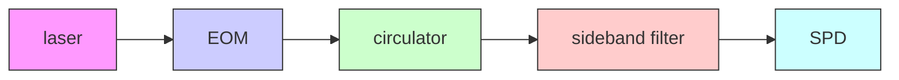

# Pulsed Excitation Dynamics of an Optomechanical Crystal Resonator near Its Quantum Ground State of Motion

Seán M. Meenehan, $^{1,2}$ Justin D. Cohen, $^{1,2}$ Gregory S. MacCabe, $^{1,2}$ Francesco Marsili, $^{3}$ Matthew D. Shaw, $^{3}$ and Oskar Painter $^{1,2,*}$

$^{1}$ Kavli Nanoscience Institute and Thomas J. Watson, Sr., Laboratory of Applied Physics, California Institute of Technology, Pasadena, California 91125, USA

$^{2}$ Institute for Quantum Information and Matter, California Institute of Technology, Pasadena, California 91125, USA

$^{3}$ Jet Propulsion Laboratory, California Institute of Technology, Pasadena, California 91109, USA (Received 6 April 2015; published 6 October 2015)

Using pulsed optical excitation and read-out along with single-phonon-counting techniques, we measure the transient backaction, heating, and damping dynamics of a nanoscale silicon optomechanical crystal cavity mounted in a dilution refrigerator at a base temperature of $T_{f} \approx 11$ mK. In addition to observing a slow (approximately 740-ns) turn-on time for the optical-absorption-induced hot-phonon bath, we measure for the 5.6-GHz “breathing” acoustic mode of the cavity an initial phonon occupancy as low as $\langle n \rangle = 0.021 \pm 0.007$ (mode temperature $T_{min} \approx 70$ mK) and an intrinsic mechanical decay rate of $\gamma_{0} = 328 \pm 14$ Hz ( $Q_{m} \approx 1.7 \times 10^{7}$ ). These measurements demonstrate the feasibility of using short pulsed measurements for a variety of quantum optomechanical applications despite the presence of steady-state optical heating.

DOI: 10.1103/PhysRevX.5.041002

Subject Areas: Optics, Quantum Physics

The recent cooling of nanomechanical resonators to their motional quantum ground state $[1-3]$ opens the possibility of utilizing engineered mechanical systems strongly coupled to optical or microwave fields for a variety of quantum metrology and information-processing applications $[4]$ , among them the preparation of highly nonclassical mechanical states $[5-7]$ and coherent frequency conversion between microwave and optical signals $[8-12]$ . A particularly interesting device architecture for realizing large radiation pressure coupling between light and mechanics is the thin-film optomechanical crystal (OMC) $[13,14]$ , in which optical and acoustic waves can be guided and colocalized via patterning of the surface layer of a microchip. Based largely upon the OMC concept, new ideas for phononic quantum networks $[15]$ and optomechanical metamaterials $[16]$ have been proposed, in which arrays of cavity-optomechanical resonators are coupled together via optical or acoustic degrees of freedom, and in which laser light is used to parametrically control the emergent network or material properties.

For many of the applications mentioned above, it is essential to obtain both a low mechanical occupation and a large ratio between the optomechanical interaction rate and the thermal decoherence rate of the mechanical oscillator.

Operation at cryogenic temperatures is desirable as it offers a simple route to obtaining low thermal occupations and long mechanical coherence times. Recent measurements at millikelvin (mK) bath temperatures of an OMC resonator formed from single-crystal silicon $[13,17]$ , however, have shown substantial mechanical mode heating and damping due to weak sub-band-gap optical absorption $[18]$ . Although optical Q factors in excess of $10^{6}$ are realized in these highly optimized structures $[17]$ , the large impact of even very weak optical absorption can be attributed to a combination of the relatively large energy per photon and the sharp drop in thermal (phonon) conductance with temperature in the low-temperature limit. Further complications arise from the seemingly contradictory requirements of isolating the mechanical resonator from its environment to obtain a high mechanical Q factor and that of providing large thermal anchoring to a low-temperature bath for cooling of the mechanical resonator.

In this work, we utilize pulsed optical excitation and single-phonon counting $[19]$ to study the transient dynamics of optical backaction, heating, and damping of the 5.6-GHz mechanical mode of a silicon optomechanical crystal resonator at mK bath temperatures. Phonon counting, realized by photon counting of the optically filtered motional sidebands of the reflected optical excitation pulse, yields simultaneously a high time resolution (approximately 25 ns) and mechanical mode occupancy sensitivity ( $<10^{-2}$ ). Measurement of both Stokes and anti-Stokes sidebands also yields an absolute calibration of the

flowchart

text_image

(b)
2 µm
optomechanical cavity
optical waveguide	back mirror	acoustic radiation shield

text_image

(c)
(i) γOM
l c
(ii) γp
γ0
(iii)

line

| n_c     | phonon number (T_f = 70 mK) | phonon number (T_f = 10 mK) |
| ------- | --------------------------- | --------------------------- |
| 10^-6   | ~0.01                       | ~0.01                       |
| 10^-4   | ~0.01                       | ~0.01                       |
| 10^-2   | ~1.0                        | ~1.0                        |
| 10^0    | ~1.0                        | ~1.0                        |
| 10^2    | ~1.0                        | ~0.01                       |

FIG. 1. (a) Pulsed pump light at frequency $\omega_{l}$ (red arrows) is directed to an OMC cavity inside a dilution fridge via an optical circulator. The cavity reflection is then filtered at the cavity frequency $\omega_{c}$ (black arrows) and directed to a SPD. (b) SEM image of the silicon OMC cavity studied in this work. (c) Finite-element-method simulation of the localized acoustic resonance at $5.6\mathrm{GHz}$ of the OMC cavity. Deformation of the beam structure is exaggerated to highlight the mechanical motion, with color indicating the regions of high (red) and low (blue) displacement magnitude. The inset shows the three processes affecting the mode occupancy: (i) detuned pump light at $\omega_{l}$ (red arrow) exchanges energy with the acoustic mode at rate $\gamma_{\mathrm{OM}}$ , generating scattered photons at $\omega_{c}$ (black arrow) in the process; (ii) pump light drives excitation of electronic defect states in the silicon device layer, subsequently exciting a hot-phonon bath that heats the localized acoustic resonance at rate $\gamma_{p}$ ; and (iii) phonons escape the cavity volume via the acoustic shield at intrinsic decay rate $\gamma_{0}$ , coupling the localized resonance to the fridge bath. (d) Noise-equivalent phonon number $n_{\mathrm{NEP}}$ (gray squares) and phonon occupancy $\langle n\rangle$ (red circles) for red-detuned ( $\Delta = \omega_{m}$ ) CW pumping versus intracavity photon number $n_{c}$ . The dashed red line indicates the expected $n_{\mathrm{NEP}}$ contribution from SPD dark counts. The vertical dashed line at $n_c \approx 45$ ( $4.5 \times 10^{-5}$ ) indicates the photon number during the on state (off state) of the pulse. Solid green and purple lines show fits to the CW heating model for fridge bath temperatures of $T_{f} = 70$ and $10\mathrm{mK}$ , respectively.

occupancy of the resonator mode in terms of mechanical vacuum noise [20–22], allowing accurate measurement of ultralow initial phonon-mode occupancies of $\langle n\rangle = 0.021 \pm 0.007$ and mechanical decay times as long as $\tau = 475 \pm 21 \mu s$ . Additionally, we observe a slow (approximately 750-ns) turn-on time for the optical-absorption-induced phonon bath that both heats and damps the mechanical resonator mode. Taken together, these measurements demonstrate the feasibility of using short pulsed measurements for quantum optical state engineering of the mechanics in silicon optomechanical crystals, despite the presence of large steady-state optical heating.

The device studied in this work consists of a patterned nanobeam, formed from the top silicon device layer of a silicon-on-insulator wafer. The etched hole pattern in the silicon nanobeam forms an optomechanical crystal, in which photonic and phononic band gaps at the ends of the beam colocalize optical and acoustic resonances with frequencies of $\omega_{c}/2\pi\approx196$ THz (free-space wavelength $\lambda_{c}\approx1530$ nm) and $\omega_{m}/2\pi\approx5.6$ GHz, respectively. A scanning electron micrograph (SEM) of the device is shown in Fig. 1(a), and a finite-element-method simulation of the acoustic resonance is displayed in Fig. 1(b). Coupling to the optical resonance is accomplished via an end-fire coupling scheme, using a lensed optical fiber inside of a dilution refrigerator to couple to the central waveguide shown in the SEM, as described in Ref. [18]. Surrounding the cavity is a 2D cross pattern [14] that possesses a complete acoustic band gap in the 5–6-GHz range, providing an additional acoustic shield for the mechanical resonator mode while allowing phonons above and below the phononic band gap to carry heat from the nanobeam structure.

The experimental setup is shown schematically in Fig. 1(a). Modulation of a laser-probe beam using an electro-optic modulator (EOM) generates optical pulses with frequency and duty cycle controlled by a variable-delay electrical pulse generator. The red arrows indicate a coherent pump at frequency $\omega_{l}$ , which is red detuned from the optical resonance frequency $\omega_{c}$ by $\Delta \equiv \omega_{c} - \omega_{l} = \omega_{m}$ . In this case, absorption of a single phonon from the nanomechanical resonator results in up-conversion of a pump photon to the anti-Stokes sideband at $\omega_{c}$ , represented by the black arrows. The cavity reflection is filtered to reject the pump frequency and subsequently directed to a high-efficiency single-photon detector (SPD) and a time-correlated single-photon-counting system synchronized to the pulse generator. This measurement repeats each pulse period, building up a histogram with respect to photon arrival time relative to the synchronization pulse during a certain integration time. As the generation of an anti-Stokes photon is one-to-one correlated with the annihilation of a phonon in the mechanical resonator, the counting of sideband photons is equivalent to the detection of phonon-annihilation events, such that photon counting in this case is equivalent to phonon counting. In particular, the anti-Stokes photon-count

rate is equal to $\gamma_{\mathrm{OM}}\langle n\rangle$ , where $\gamma_{OM} \equiv 4g_{0}^{2}n_{c}/\kappa$ is the sideband-scattering rate. ( $g_{0}$ is the optomechanical coupling rate, $n_{c}$ is the intracavity photon number, and $\kappa$ is the optical decay rate.) The photon-count rate in each time bin then portrays the time evolution of $\langle n\rangle(t)$ during the pulse on state. Similarly, a coherent pump blue detuned from the optical cavity ( $\Delta = -\omega_{m}$ ) results in a one-to-one correspondence between the generation of Stokes sideband photons and phonon creation, with a total sideband-count rate equal to $\gamma_{\mathrm{OM}}(\langle n\rangle + 1)$ . All measurements presented herein are performed at a fridge-mixing-chamber base temperature of $T_{f} = 11$ mK. Further details about device fabrication and the experimental setup, and further explanation of the phonon-counting technique, can be found in Refs. [17,19,23].

The signal-to-noise ratio of this phonon-counting method is determined by the sideband-scattering rate $\gamma_{OM}$ , the total system detection efficiency ( $\eta$ ), the dark-count rate of the SPD ( $\Gamma_{dark}$ ), and the residual transmission of the filters at the pump frequency relative to the peak transmission (A). A useful parametrization of the sensitivity to low $\langle n\rangle$ is the noise-equivalent phonon occupancy $n_{NEP}$ , defined as [19]

$$
n _ {\mathrm{NEP}} = \frac {\Gamma_ {\mathrm{dark}}}{\eta \gamma_ {\mathrm{OM}}} + A \left(\frac {\kappa \omega_ {m}}{2 \kappa_ {e} g _ {0}}\right) ^ {2}, \tag {1}
$$

where $\kappa_{e}$ is the optical decay rate into the detection channel. For the device under test, we have $\kappa/2\pi = 443$ MHz, $\kappa_{e}/2\pi = 221$ MHz, and $g_{0}/2\pi = 710$ kHz. A typical measured $n_{NEP}$ for our setup, taken using a comparable device at room temperature, is shown in Fig. 1(d) as gray squares. Here, to obtain the lowest $n_{NEP}$ , optical prefiltering is used to remove phase noise around the laser line and broadband spontaneous emission from the optical probe beam, details of which are given in Ref. [23]. For sufficiently high probe power ( $n_{c} > 40$ ), $n_{NEP}$ falls below $10^{-2}$ , enabling sensitive detection of the mechanical resonator deep in its quantum ground state. However, at subkelvin temperatures, optical absorption heating produces a steady state $\langle n\rangle > 1$ for $n_{c} > 0.01$ [red circles in Fig. 1(d)] during continuous-wave (CW) optical excitation. In order to maintain the OMC in the mechanical ground state, the duty cycle of the pulse train must be kept sufficiently low, and the modulation depth sufficiently high, such that the mechanical mode thermalizes to the dilution-refrigerator ambient bath between successive pulses.

The CW behavior fits well to a thermal model consisting of the three processes illustrated in Fig. 1(c): (i) the radiation pressure coupling at rate $\gamma_{OM}$ between the mechanical mode and the effective zero-temperature probe laser, (ii) coupling to an optical-absorption-induced hot-phonon bath above the phononic shield band gap, and (iii) coupling to the ambient fridge bath at an intrinsic rate $\gamma_{0}$ through the acoustic radiation shield. At the low intracavity photon numbers of these measurements, we believe the optical absorption heating is a result of excitation of electronic defect states at the silicon surfaces [24,25] and subsequent phonon-assisted relaxation of these states. As detailed in Ref. [18], the resulting local hot-phonon bath occupancy $(n_p)$ is found to scale as $n_c^{1/4}$ in steady state, consistent with linear optical absorption and a cubic drop in the thermal conductance with temperature [26]. The corresponding coupling rate of the mechanical resonance to the high-frequency hot-phonon bath $(\gamma_p)$ is measured to scale as $T_p \exp(-\hbar \omega_c / k_B T_p)$ for low bath temperature ( $T_p < 4$ K), corresponding to inelastic phonon scattering with a quasiequilibrium hot-phonon bath above a cutoff phonon frequency of $\omega_c / 2\pi \approx 35$ GHz. As shown in Fig. 1(d), extrapolation of this steady-state model for a fridge base temperature of $T_f = 10$ mK reveals a relevant pulse-off-state regime of $n_c < 10^{-4}$ in which absorption heating effects should be negligible.

Figure 2(a) shows the measured sideband photon-count rate versus time with pulsed optical excitation, for both red- $(\Delta=\omega_{m})$ and blue-detuned $(\Delta=-\omega_{m})$ pumping. The on-state pulse amplitude in these measurements is $n_{c,on}=45$ , corresponding to an optomechanical coupling rate of $\gamma_{OM}/2\pi=205$ kHz. For the achievable pulse-extinction ratio of 60–70 dB, this results in a residual off-state photon number of $n_{c,off}<4.5\times10^{-5}$ . Vertical dashed lines indicate the time bins corresponding to the start and stop of the pulse, determined from observing the rising and falling edges of the pulse when bypassing the cavity. The start and stop times are taken to be the time bins for which the pulse reaches 90% of its maximum value. The variable t refers to the time relative to the start of the optical pulse, which occurs around approximately 1 $\mu$ s after the synchronization signal generated by the pulse generator due to the time delay of propagation through the fridge. The pulse period in these measurements is fixed at $T_{per}=5$ ms. The count rates immediately after switching off the pulse are elevated relative to the dark counts preceding the pulse due to the finite turn-off time of the electro-optic switches used to generate the high-extinction optical pulses, as discussed further in Ref. [23]. This turn-off time is much smaller than the pulse periods used in this work and provides a negligible correction to the heating and cooling dynamics of the mechanical resonator.

Throughout the pulse, a pronounced asymmetry is observed between count rates for red-detuned versus blue-detuned pumping, which can be quantified by the asymmetry parameter $\xi = \Gamma_{-}/\Gamma_{+} - 1$ , where $\Gamma_{\pm}$ is the sideband photon-count rate for a pump detuning $\Delta = \pm\omega_{m}$ . This asymmetry, shown versus t in Fig. 2(b), initially decreases with time before leveling off and beginning to increase for sufficiently long pulse times. The increase at later times can be ascribed to the effect of optomechanical backaction, which results in cooling or heating of the mechanical resonator for red- or blue-detuned pumps,

scatter

| t (μs) | count rate (kHz) - t_on | count rate (kHz) - t_off,red |
| ------ | ------------------------ | ----------------------------- |
| -1.0   | ~0.01                    | ~0.01                         |
| 0.0    | ~1.0                     | ~0.1                          |
| 1.0    | ~10.0                    | ~1.0                          |
| 2.0    | ~10.0                    | ~1.0                          |
| 3.0    | ~10.0                    | ~1.0                          |

line

| t (μs) | ωs     |
| ------ | ------ |
| 0.0    | 100.0  |
| 0.1    | 20.0   |
| 0.2    | 10.0   |
| 0.3    | 5.0    |
| 0.4    | 3.0    |
| 0.5    | 2.0    |
| 0.6    | 1.5    |
| 0.7    | 1.2    |
| 0.8    | 1.1    |
| 0.9    | 1.05   |
| 1.0    | 1.0    |

line

| t (μs) | ⟨n⟩ (blue squares) | ⟨n⟩ (red circles) |
| ------ | ------------------ | ----------------- |
| 0.0    | ~0.01              | ~0.01             |
| 0.2    | ~0.1               | ~0.05             |
| 0.4    | ~0.5               | ~0.2              |
| 0.6    | ~1.0               | ~0.5              |
| 0.8    | ~2.0               | ~0.8              |
| 1.0    | ~3.0               | ~1.0              |
| 1.5    | ~5.0               | ~1.2              |
| 2.0    | ~7.0               | ~1.3              |
| 2.5    | ~8.0               | ~1.4              |
| 3.0    | ~9.0               | ~1.5              |

FIG. 2. (a) Total photon-count rate versus time t for a red-detuned (red circles, $\Delta = \omega_{m}$ ) and blue-detuned (blue squares, $\Delta = -\omega_{m}$ ) probe. For both data sets, $n_{c,on} \approx 45$ and $T_{per} = 5$ ms. Vertical dashed lines indicate the start and stop times of the pulses. (b) Asymmetry $\xi$ versus time within the pulse t. The dashed green line shows the theoretically expected $\xi(t)$ when backaction effects are neglected and a single time-dependent phonon occupancy is assumed for both detunings. The dash-dotted orange line shows $\xi(t)$ , including the effects of backaction, neglecting optical heating and assuming $\xi(0) = 0$ . Error bars show one standard deviation (s.d.) determined from the measured count rates, assuming Poissonian counting statistics. (c) Calibrated phonon occupancy $\langle n \rangle$ versus t for $\Delta = \omega_{m}$ (red circles) and $\Delta = -\omega_{m}$ (blue squares). The solid black lines show fits to a model including a slow exponential turn-on of the hot-phonon bath. The inset shows detail for 0 < t < 750 ns on a linear scale for $\Delta = \omega_{m}$ . Error bars show one s.d. determined from the measured count rates, assuming Poissonian counting statistics. For the blue-detuned data, the error bars are smaller than the data markers.

respectively [27]. However, for $t \ll \gamma_{OM}^{-1} \approx 750$ ns, the effects of backaction are negligible and the phonon occupancy $\langle n \rangle$ may be assumed equal for both pump detunings. In this case, the asymmetry is simply related to the occupancy by $\xi = \langle n \rangle^{-1}$ and arises from the fundamental asymmetry between phonon-absorption ( $\Gamma_{+} \propto \langle n \rangle$ ) and emission ( $\Gamma_{-} \propto \langle n \rangle + 1$ ) processes [20,28]. While this fundamental motional sideband asymmetry has previously been measured in a variety of opto- and electromechanical systems using linear (e.g., heterodyne) detection schemes $[20–22,29]$ , detailed theoretical treatments have demonstrated that the observed asymmetry is naturally traced back to the zero-point fluctuations of either the optical field or the mechanical resonator, depending on the particular detection scheme utilized $[22,30]$ . In contrast to linear detection, the use of phonon-counting techniques in this work allows the observed asymmetry to be directly and unambiguously attributed to quantum fluctuations of the mechanical oscillator. A third potential source of sideband asymmetry is technical laser noise, such as phase noise, which can result in substantial sideband asymmetry even for large phonon occupations. A quantitative analysis of such systematic errors in our system is provided in Ref. $[23]$ , where we conclude that technical laser noise has a negligible impact on the sideband asymmetry observed here.

To illustrate the two regimes of asymmetry, theoretical plots of the two contributions to $\xi(t)$ are shown in Fig. 2(b). The dashed green line shows the expected $\xi(t)$ when backaction is neglected. In this case, the mechanical occupancy will be equal for both detunings and the decrease in $\xi(t)=\langle n\rangle^{-1}(t)$ arises solely from the time-dependent heating of the mechanical resonator due to optical absorption, calculated using the heating model described below. On the other hand, the dash-dotted orange line shows $\xi(t)$ when the effects of backaction are included, assuming no optical heating and a high bath temperature such that the total mechanical bath occupancy is a constant $n_{b}\gg1$ . In this case, $\xi(0)=n_{b}^{-1}\approx0$ , and asymmetry arises at later times due solely to backaction effects. From the asymmetry measured in the first 25-ns time bin, we extract a minimum phonon occupancy of $\langle n\rangle_{\min}=0.021\pm0.007$ (minimum mode temperature of $T_{min}\approx70~mK$ ). Extrapolation to zero time yields a mode temperature closer to 40 mK but still above the 11 mK of the mixing plate of the fridge, likely indicating a higher local chip temperature. This measured occupancy is lower than previous results in both cavity-optomechanical [3] and electromechanical [2] systems by more than an order of magnitude.

While the sideband asymmetry does not accurately reflect the phonon occupancy for long times due to the effects of backaction, the initial sideband asymmetry provides a convenient method of calibrating the occupancy at all times within the duration of the pulse. Once the asymmetry is used to determine $\langle n\rangle$ in the initial time bin, we may immediately determine the conversion factor between phonon occupancy and sideband photon-count rate for either detuning. As this factor is constant during the on state of the pulse, this allows us to convert measured count rates to phonon occupancies throughout the pulse without a direct calibration of either the overall detection efficiency or the sideband-scattering rate. The resulting calibrated occupancy versus t is shown in Fig. 2(c). A simple model of the heating dynamics would suggest an exponential increase toward the steady-state

phonon occupancy with total rate $\gamma = \gamma_{0} + \gamma_{p} + \gamma_{OM}$ . However, as can be seen in the inset to Fig. 2(c), the curvature of the occupancy curve is positive for short times. This fact is inconsistent with the simple model described above and is likely due to a finite equilibration time of the hot-phonon bath. The data can be fit well for both detunings by using a simple model that assumes that a small fraction of the hot-phonon bath turns on effectively instantaneously (i.e., very fast relative to the length of a single time bin) while the remainder has a slow exponential increase to its steady-state value. Thus, the effective rate equation for the phonon occupancy during the pulse is given by

$$
\langle \dot {n} \rangle = - \gamma \langle n \rangle + \gamma_ {p} n _ {p} (1 - \delta_ {b} e ^ {- \gamma_ {S} t}), \tag {2}
$$

where $\delta_{b}$ and $\gamma_{S}$ are the slow-growing fraction of the hot-phonon bath and the corresponding turn-on rate, respectively, and the steady-state hot-phonon bath parameters $\gamma_{p}$ and $n_{p}$ can be determined by fitting the CW $\langle n\rangle$ versus $n_{c}$ data shown in Fig. 1(c). Fitting the pulsed occupancy curve yields $\delta_{b}=0.79\pm0.08$ and $\gamma_{S}/2\pi=215\pm29$ kHz, indicating that the heating occurs slowly enough as to be manageable during coherent quantum operations, as determined in the remaining discussion.

During the off state of the pulse, optical heating of the mechanical resonator should be negligible and the phonon occupancy should cool at the intrinsic damping rate $\gamma_{0}$ . Thus, the initial and final occupancies during the pulse ( $\langle n\rangle_{i}$ and $\langle n\rangle_{f}$ , respectively) should obey the relation $\langle n\rangle_{i}=e^{-\gamma_{0}T_{per}}\langle n\rangle_{tf}$ , assuming the pulse period $T_{per}$ is much larger than the pulse width $T_{pulse}$ . The ratio $\langle n\rangle_{i}/\langle n\rangle_{f}$ , shown in Fig. 3(a) versus $T_{per}$ , displays the expected exponential decay with $\gamma_{0}/2\pi=328\pm14$ Hz and a corresponding intrinsic mechanical quality factor of $Q_{m}\approx1.7\times10^{7}$ . This decay rate corresponds well with the value inferred from previous CW measurements of occupancy at mK temperatures [18]. From our measurement of $\gamma_{0}$ and $\langle n\rangle_{min}$ , we estimate a thermal decoherence time of $\tau_{\mathrm{th}}=[\gamma_{0}(1+\langle n\rangle_{\mathrm{min}})]^{-1}=475\pm21\mu s$ .

While the low thermal occupancy and long coherence time measured here are promising, the utility of cavity-optomechanical systems for performing coherent quantum operations between the optical and mechanical degrees of freedom is ultimately predicated upon the ability to simultaneously achieve $\langle n\rangle\ll1$ and large cooperativity $C\equiv\gamma_{OM}/\gamma_{b}$ , where $\gamma_{b}=\gamma_{0}+\gamma_{p}$ is the total coupling rate between the mechanical resonator and its thermal bath. In the specific example of optomechanically mediated coherent transfer of photons between optical and superconducting microwave resonators [8,9], the relevant figure of merit is the effective cooperativity $C_{eff}\equiv C/n_{b}$ , where $n_{b}$ is the effective bath occupancy defined such that $\gamma_{b}n_{b}=\gamma_{0}n_{0}+\gamma_{p}n_{p}$ , which must be much larger than unity in order to achieve low-noise photon conversion at the single quantum level [10,12]. Using the measured values of $\gamma_{0}$ and $\gamma_{S}$ , we can calculate the maximum phonon occupancy achieved during the pulse $\langle n\rangle_{max}$ for a given $T_{pulse}$ and $T_{per}$ and $\Delta = \omega_{m}$ [Fig. 4(a)], as well as $C_{eff}$ as a function of t [Fig. 4(b)]. Although optical heating of our devices prevents us from reaching the $C_{eff} > 1$ regime using a CW pump, due to the slow turn-on of the hot-phonon bath observed in this work, we find that $\langle n\rangle < 1$ and $C_{eff} > 1$ can be maintained throughout the entire pulse period for $T_{pulse} \lesssim 300$ ns at pulse rates approaching 1 MHz. Furthermore, we find $C_{eff} \gg 1$ during the initial 100 ns of the pulse and reaches values as large as $C_{eff} \approx 40$ . However, at these high repetition rates, such a pulsed wavelength-conversion scheme is still unsuitable for

line

| T_per (ms) | ⟨n_i⟩ / ⟨n_f⟩ |
| ---------- | ------------- |
| 0.0        | 1.0           |
| 0.5        | 0.4           |
| 1.0        | 0.2           |
| 1.5        | 0.1           |
| 2.0        | 0.05          |
| 2.5        | 0.02          |
| 3.0        | 0.01          |

FIG. 3. Ratio of initial to final phonon number $\langle n\rangle_{i}/\langle n\rangle_{f}$ versus pulse period $T_{per}$ . The solid red curve shows a fit to exponential decay. Error bars show one s.d. determined from the measured count rates, assuming Poissonian counting statistics. The inset shows $\langle n\rangle$ versus t for the different values of $T_{per}$ .

line

| T_per (ms) | T_pulse (μs) | ⟨n⟩_max |
| ---------- | ------------ | ------- |
| 10^-2      | ~0.3         | ~0.6    |
| 10^-1      | ~0.5         | ~0.8    |
| 10^0       | ~0.7         | ~1.0    |

line

| t (μs) | C_eff |
| ------ | ----- |
| 0.01   | 20.0  |
| 0.1    | 10.0  |
| 1.0    | 1.0   |

FIG. 4. (a) Maximum phonon occupancy during a pulse $\langle n\rangle_{max}$ versus pulse period $T_{per}$ and pulse width $T_{pulse}$ . The white contour delineates the region where the effective cooperativity $C_{eff} \geq 1$ throughout the pulse. (b) $C_{eff}$ versus time t within the pulse for $T_{per} = 5$ ms and $T_{pulse} = 3$ $\mu$ s.

line

| T_pulse (ns) | F     |
| ------------ | ------- |
| 1            | 0.99    |
| 10           | 0.97    |
| 100          | 0.80    |

line

| T_pulse (ns) | T_Fock (s) - Solid Line | T_Fock (s) - Dashed Line |
| ------------ | ------------------------ | ------------------------- |
| 1            | 500                      | 10                        |
| 10           | 200                      | 3                         |
| 100          | 50                       | 1                         |

FIG. 5. (a) Fidelity $F$ of the generation of a single-phonon Fock state versus pulse width $T_{\mathrm{pulse}}$ (pulse period $T_{\mathrm{per}} = 1 \, \mathrm{ms}$ ). (b) Average time required to herald a Fock state $T_{\mathrm{Fock}}$ versus pulse width $T_{\mathrm{pulse}}$ . The solid line is calculated using the total detection efficiency measured in this work, while the dashed line uses the estimated ideal detection efficiency.

high-fidelity transfer of quantum information due to the necessity of using sufficiently short pulses with bandwidths larger than that of the wavelength-conversion process. The requirement of minimal distortion of the signal necessitates the use of longer pulses ( $T_{pulse} \gtrsim \gamma_{OM}^{-1}$ ), with correspondingly lower repetition rates of 1 kHz or less.

Another relevant application for optomechanical systems in the quantum regime is the generation of arbitrary non-Gaussian mechanical states via phonon addition and subtraction utilizing appropriate sequences of red- and blue-detuned optical pulses [5]. In particular, recent proposals have explicitly shown how to herald single-phonon Fock states [7] and entangled mechanical states [6] via application of a short blue-detuned pulse to an optomechanical system in its motional quantum ground state and subsequent detection of an emitted Stokes sideband photon. While the pulsed excitation, single-sideband photon detection, and low initial phonon occupancy demonstrated in this work provide the basic tools for realizing such proposals, the fidelity of the generated states can be significantly degraded by the effects of optical heating during the pulse. A detailed analysis of heralded phonon addition and subtraction is presented in Ref. [23], wherein we compute the conditional density matrix for the mechanical system including the effects of time-dependent heating to lowest order. We may then compute the fidelity of generation of a single-phonon Fock state according to the proposal of Ref. [7], assuming an initial thermal state of the mechanics with average phonon occupancy $\langle n\rangle_{i}$ . Considering a range of pulse widths $0 < T_{\mathrm{pulse}} \leq 100$ ns, sufficient to guarantee the necessary condition $\gamma_{\mathrm{OM}}T_{\mathrm{pulse}} \ll 1$ , we find that for $T_{\mathrm{per}} \geq 1$ ms, there is no appreciable loss in fidelity due to any increase in $\langle n\rangle_{i}$ , and fidelity is degraded primarily due to transient heating during the pulse. Thus, we set $T_{\mathrm{per}} = 1$ ms and calculate the fidelity of Fock-state generation as a function of pulse width, displayed in Fig. 5(a). For short ( $T_{\text{pulse}} < 10$ ns) pulse widths, the fidelity approaches $98.5\%$ and remains above $80\%$ for pulse widths approaching 100 ns. However, it is equally important to quantify the expected time to herald such a state (i.e., the expected time before detection of a sideband photon), which in this case is given by $T_{\text{Fock}} = T_{\text{per}} / (\eta \gamma_{\text{OM}} T_{\text{pulse}} \langle n \rangle_i)$ , where $\eta$ is the total detection efficiency of the phonon-counting measurement. This is shown versus $T_{\text{pulse}}$ in Fig. 5(b) for two cases. The solid line is calculated using the actual measured detection efficiency of $\eta \approx 0.3\%$ , while the dashed line is calculated using a realistic estimate of the ideal efficiency of our current measurement setup $\eta \approx 5.5\%$ . The latter figure is calculated using the measured efficiency of the SPD ( $68\%$ ), the fiber-to-waveguide coupling efficiency ( $68\%$ ), and the waveguide-cavity coupling efficiency ( $50\%$ ), adding an additional 2-dB insertion loss per filter and $0.5$ dB for the insertion loss of the optical circulator, which correspond to the highest efficiencies measured for these components in our lab. As shown in Fig. 5, even in this idealized case, the expected time for the generation of a Fock state is $\gtrsim 100$ ms, which is much longer than the measured lifetime of the mechanical state. Thus, while it is feasible to use our current systems for the heralded, high-fidelity generation of nonclassical mechanical states, it is still necessary to reduce heating effects (and thus allow for shorter pulse periods) in order to utilize this procedure for useful quantum information-processing tasks (e.g., scalable entanglement distribution via the DLCZ protocol [31,32]).

The deep ground-state cooling and long mechanical coherence times demonstrated in this work highlight the suitability of Si nanobeam OMC cavities for a variety of quantum engineering tasks. While the prospects for high-rate

quantum state transfer and heralded state preparation will be vastly improved by increasing the thermal conductance of our structures; for example, by utilizing quasi-2D OMC devices $[33]$ , the pulsed heating measurements performed in this work demonstrate that such optomechanical applications in the quantum regime are feasible with our current structure for reasonable pulse parameters without any further mitigation of optical heating effects.

The authors would like to thank V.B. Verma, R.P. Miriam, and S.W. Nam for their help with the single-photon detectors used in this work. This work was supported by the DARPA ORCHID and MESO programs, the Institute for Quantum Information and Matter, an NSF Physics Frontiers Center with support of the Gordon and Betty Moore Foundation, the AFOSR through the “Wiring Quantum Networks with Mechanical Transducers” MURI program, and the Kavli Nanoscience Institute at Caltech. Part of the research was carried out at the Jet Propulsion Laboratory, California Institute of Technology, under a contract with the National Aeronautics and Space Administration.

[1] A. D. O'Connell, M. Hofheinz, M. Ansmann, R. C. Bialczak, M. Lenander, E. Lucero, M. Neeley, D. Sank, H. Wang, M. Weides, J. Wenner, John M. Martinis, and A. N. Cleland, Quantum Ground State and Single-Phonon Control of a Mechanical Resonator, Nature (London) 464, 697 (2010).   
[2] J. D. Teufel, T. Donner, D. Li, J. W. Harlow, M. S. Allman, K. Cicak, A. J. Sirois, J. D. Whittaker, K. W. Lehnert, and R. W. Simmonds, Sideband Cooling of Micromechanical Motion to the Quantum Ground State, Nature (London) 475, 359 (2011).   
[3] J. Chan, T. P. Mayer Alegre, A. H. Safavi-Naeini, J. T. Hill, A. Krause, S. Gröblacher, M. Aspelmeyer, and O. Painter, Laser Cooling of a Nanomechanical Oscillator into Its Quantum Ground State, Nature (London) 478, 89 (2011).   
[4] M. Aspelmeyer, T. J. Kippenberg, and F. Marquardt, Cavity Optomechanics, Rev. Mod. Phys. 86, 1391 (2014).   
[5] M. R. Vanner, M. Aspelmeyer, and M. S. Kim, Quantum State Orthogonalization and a Toolset for Quantum Optomechanical Phonon Control, Phys. Rev. Lett. 110, 010504 (2013).   
[6] K. Børkje, A. Nunnenkamp, and S. M. Girvin, Proposal for Entangling Remote Micromechanical Oscillators via Optical Measurements, Phys. Rev. Lett. 107, 123601 (2011).   
[7] C. Galland, N. Sangouard, N. Piro, N. Gisin, and T. J. Kippenberg, Heralded Single Phonon Preparation, Storage and Readout in Cavity Optomechanics, Phys. Rev. Lett. 112, 143602 (2014).   
[8] K. Stannigel, P. Rabl, A. S. Sørensen, P. Zoller, and M. D. Lukin, Optomechanical Transducers for Long-Distance Quantum Communication, Phys. Rev. Lett. 105, 220501 (2010).   
[9] A. H. Safavi-Naeini and O. Painter, Proposal for an Optomechanical Traveling Wave Phonon-Photon Translator, New J. Phys. 13, 013017 (2011).

[10] J. T. Hill, A. H. Safavi-Naeini, J. Chan, and O. Painter, Coherent Optical Wavelength Conversion via Cavity Optomechanics, Nat. Commun. 3, 1196 (2012).   
[11] J. Bochmann, A. Vainsencher, D. D. Awschalom, and A. N. Cleland, Nanomechanical Coupling between Microwave and Optical Photons, Nat. Phys. 9, 712 (2013).   
[12] R. W. Andrews, R. W. Peterson, T. P. Purdy, K. Cicak, R. W. Simmonds, C. A. Regal, and K. W. Lehnert, Bidirectional and Efficient Conversion between Microwave and Optical Light, Nat. Phys. 10, 321 (2014).   
[13] M. Eichenfield, J. Chan, R. M. Camacho, K. J. Vahala, and O. Painter, Optomechanical Crystals, Nature (London) 462, 78 (2009).   
[14] A. H. Safavi-Naeini and O. Painter, Design of Optomechanical Cavities and Waveguides on a Simultaneous Bandgap Phononic-Photonic Crystal Slab, Opt. Express 18, 14926 (2010).   
[15] S. J. M. Habraken, K. Stannigel, M. D. Lukin, P. Zoller, and P. Rabl, Continuous Mode Cooling and Phonon Routers for Phononic Quantum Networks, New J. Phys. 14, 115004 (2012).   
[16] M. Schmidt, V. Peano, and F. Marquardt, Optomechanical Metamaterials: Dirac Polaritons, Gauge Fields, and Instabilities, arXiv:1311.7095.   
[17] J. Chan, A. H. Safavi-Naeini, J. T. Hill, S. Meenehan, and O. Painter, Optimized Optomechanical Crystal Cavity with Acoustic Radiation Shield, Appl. Phys. Lett. 101, 081115 (2012).   
[18] S. M. Meenehan, J. D. Cohen, S. Gröblacher, J. T. Hill, A. H. Safavi-Naeini, M. Aspelmeyer, and O. Painter, Silicon Optomechanical Crystal Resonator at Millikelvin Temperatures, Phys. Rev. A 90, 011803 (2014).   
[19] J. D. Cohen, S. M. Meenehan, G. S. MacCabe, S. Gröblacher, A. H. Safavi-Naeini, F. Marsili, M. D. Shaw, and O. Painter, Phonon Counting and Intensity Interferometry of a Nanomechanical Resonator, Nature (London) 520, 522 (2015).   
[20] A. H. Safavi-Naeini, J. Chan, J. T. Hill, T. P. M. Alegre, A. Krause, and O. Painter, Observation of Quantum Motion of a Nanomechanical Resonator, Phys. Rev. Lett. 108, 033602 (2012).   
[21] T. P. Purdy, P.-L. Yu, N. S. Kampel, R. W. Peterson, K. Cicak, R. W. Simmonds, and C. A. Regal, Optomechanical Raman-Ratio Thermometry, Phys. Rev. A 92, 031802 (2015).   
[22] A. J. Weinstein, C. U. Lei, E. E. Wollman, J. Suh, A. Metelmann, A. A. Clerk, and K. C. Schwab, Observation and Interpretation of Motional Sideband Asymmetry in a Quantum Electromechanical Device, Phys. Rev. X 4, 041003 (2014).   
[23] See Supplemental Material at http://link.aps.org/supplemental/10.1103/PhysRevX.5.041002 for details of device design and fabrication, as well as further details of the experimental setup and methods.   
[24] A. Stesmans, Passivation of $P_{bo}$ and $P_{b1}$ Interface Defects in Thermal (100) Si/SiO $_{2}$ with Molecular Hydrogen, Appl. Phys. Lett. 68, 2076 (1996).   
[25] M. Borselli, T. J. Johnson, and O. Painter, Measuring the Role of Surface Chemistry in Silicon Microphotonics, Appl. Phys. Lett. 88, 131114 (2006).

[26] M. G. Holland, Analysis of Lattice Thermal Conductivity, Phys. Rev. 132, 2461 (1963).   
[27] T. J. Kippenberg and K. J. Vahala, Cavity Opto-mechanics, Opt. Express 15, 17172 (2007).   
[28] F. Diedrich, J. C. Bergquist, W. M. Itano, and D. J. Wineland, Laser Cooling to the Zero-Point Energy of Motion, Phys. Rev. Lett. 62, 403 (1989).   
[29] D. Lee, M. Underwood, D. Mason, A. B. Shkarin, K. Børkje, S. M. Girvin, and J. G. E. Harris, Observation of Quantum Motion in a Nanogram-Scale Object, arXiv:1406.7254.   
[30] F. Y. Khalili, H. Miao, H. Yang, A. H. Safavi-Naeini, O. Painter, and Y. Chen, Quantum Back-action in Measurements

of Zero-Point Mechanical Oscillations, Phys. Rev. A 86, 033840 (2012).   
[31] L. M. Duan, M. D. Lukin, J. I. Cirac, and P. Zoller, Long-Distance Quantum Communication with Atomic Ensembles and Linear Optics, Nature (London) 414, 413 (2001).   
[32] N. Sangouard, C. Simon, H. de Riedmatten, and N. Gisin, Quantum Repeaters Based on Atomic Ensembles and Linear Optics, Rev. Mod. Phys. 83, 33 (2011).   
[33] A. H. Safavi-Naeini and O. Painter, in Cavity Optomechanics, Quantum Science and Technology, edited by M. Aspelmeyer, T. J. Kippenberg, and F. Marquardt (Springer, Berlin, 2014), p. 195–231.