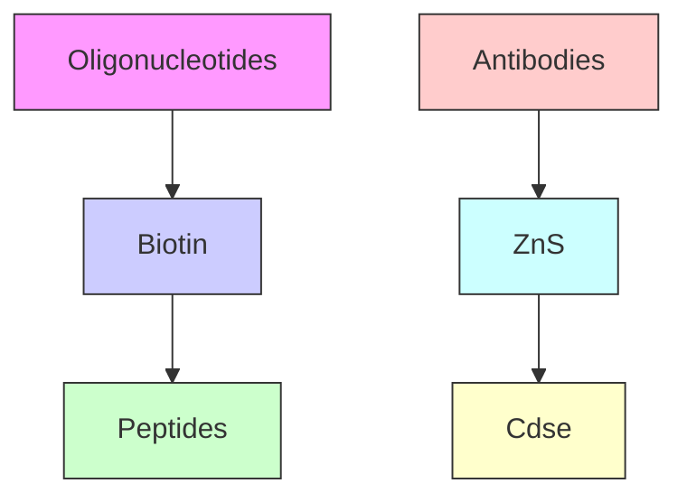
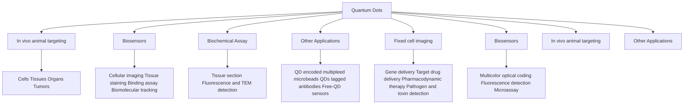
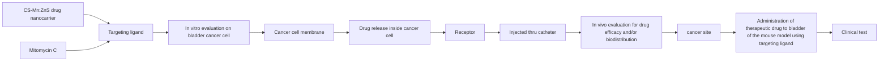
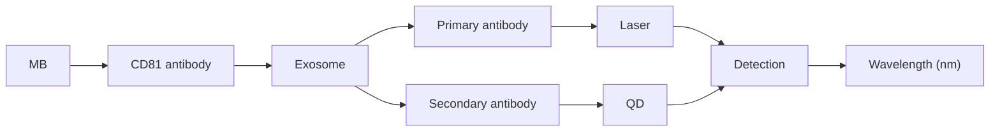

# Quantum Dots: An Emerging Approach for Cancer Therapy

Sheetal Devi $^{1}$ , Manish Kumar $^{2*}$ , Abhishek Tiwari $^{3}$ , Varsha Tiwari $^{4}$ , Deepak Kaushik $^{5}$ , Ravinder Verma $^{6}$ , Shailendra Bhatt $^{6}$ , Biswa Mohan Sahoo $^{7}$ , Tanima Bhattacharya $^{8,9}$ , Sultan Alshehri $^{10}$ , Mohammed M. Ghoneim $^{11}$ , Ahmad O. Babalghith $^{12}$ and Gaber El-Saber Batiha $^{13*}$

$^{1}$ Global Research Institute of Pharmacy, Nachraun, Radaur, Yamuna Nagar, India, $^{2}$ M.M. College of Pharmacy, Maharishi Markandeshwar (Deemed to Be University), Mullana-Ambala, India, $^{3}$ Department of Pharmaceutical Chemistry, Pharmacy Academy, IFTM University, Moradabad, India, $^{4}$ Department of Pharmacognosy, Pharmacy Academy, IFTM University, Moradabad, India, $^{5}$ Department of Pharmaceutical Sciences, Maharshi Dayanand University, Rohtak, India, $^{6}$ Department of Pharmacy, School of Medical and Allied Sciences, G.D. Goenka University, Gurugram, India, $^{7}$ Roland Institute of Pharmaceutical Sciences, Brahmapur, India, $^{8}$ Innovation, Incubation and Industry (I Cube) Laboratory, Techno India NJR Institute of Technology, Udaipur, India, $^{9}$ Department of Science and Engineering NGCEF, Sydney, NSW, Australia, $^{10}$ Department of Pharmaceutics, College of Pharmacy, King Saud University, Riyadh, Saudi Arabia, $^{11}$ Department of Pharmacy Practice, College of Pharmacy, AlMaarefa University, Ad Diriyah, Saudi Arabia, $^{12}$ Medical Genetics Department, Faculty of Medicine, Umm Al-Qura University, Umm Al-Qura, Saudi Arabia, $^{13}$ Department of Pharmacology and Therapeutics, Faculty of Veterinary Medicine, Damanhour University, Damanhour, Egypt

# OPEN ACCESS

# Edited by:

Sayan Ganguly,

Bar-Ilan University, Israel

# Reviewed by:

Poushali Das,

Bar-Ilan University, Israel

Andreas Rosenkranz,

University of Chile, Chile

# \*Correspondence:

Manish Kumar

manish\_singh17@rediffmail.com

Gaber El-Saber Batiha

gaberbatiha@gmail.com

# Specialty section:

This article was submitted to

Biomaterials,

a section of the journal

Frontiers in Materials

Received: 20 October 2021

Accepted: 06 December 2021

Published: 10 January 2022

# Citation:

Devi S, Kumar M, Tiwari A, Tiwari V,

Kaushik D, Verma R, Bhatt S,

Sahoo BM, Bhattacharya T, Alshehri S,

Ghoneim MM, Babalghith AO and

Batiha GE-S (2022) Quantum Dots: An

Emerging Approach for

Cancer Therapy.

Front. Mater. 8:798440.

doi: 10.3389/fmats.2021.798440

Nanotechnology is indisputably a scientific technique that offers the prospect of new therapies, and hope, for the treatment of malignant illnesses. It is a novel technology that offers new approaches for the diagnosis and management of diverse diseases. Although the discovery of Quantum dots (QD) nano-transporters has already led to a few positive developments, QD nano-transporters are still at their initial stage, though have yet proven valuable to society. The excertion of QD indicates conversion in natural imaging along with photograph have established incredible suitability in bio-imaging, new drug development, targeted gene deliverance, biosensing, photodynamic treatment as well as diagnosis. The present review aimed to confer the significance of QD in diagnosis as well as in management of cancer. This review aims to impart fundamental insight as well as conception of QD its merits, properties, utilization as well as mode of action. This review highlight of different designing schemes of QD like hydrothermal, drop-casting, ultrasonic, solvothermal, spin-coating, atomic layer desorption, layer by layer, polymethylmethacrylate aided-transfer, electrochemical, ion beam sputtering deposition. Moreover, we have elaborated on the diverse researches related to cytotoxic examination to reveal that QDs are harmless. Concisely, the present review summarizes the fabrication schemes, current research and utilization of QD in cancer treatment.

Keywords: quantum dots, drug resistance, nano carriers, cancer, chemotherapy, diagnostic

# INTRODUCTION

The nanoparticle is a fast-growing sector of nanotechnology that offers new possibilities for disease detection and therapy. In the diagnosis of malignancy, fluorescent nanoparticles can be utilized to create diverse profiles of tumor biomarkers, and the availability of several genes and RNA segments by using fluorescent in situ hybridization (Kumar et al., 2009). QD nanoparticles act as semiconductors and are useful for depicting cells and live creatures in fluorescent form (Gao

et al., 2005). Depending on their composition and size, they can be a good source of light spanning from UV to IR. In the crystal core of a QD, there are around 100–100,000 atoms (Chen and Liang, 2020). The typical size of a QD is between 2 and -10 nm in diameter. The substance employed to manufacture Quantum dots, on the other hand, is responsible for the dimensions of the QD (Chen et al., 2020; Das et al., 2020).

The Bohr range is dependent on the substance (for example, 36 nm for InAs, 0.7 nm for CuCl), and hence there is no logical line to draw when deciding whether a nanoparticle is a Quantum Dot or not based only on its size. Quantum dots can be made out of metals or semiconductor materials (Ni, Co., Pt, and Au) (Rajamani et al., 2010; Tope et al., 2014). Aside from that, some research with metalloid Quantum dots, such as silicon, has been carried out (Ronak et al., 2011; Ye et al., 2014; Midha et al., 2015). Due to their tiny size, quantum dots behave differently than bulk solids due to quantum-control phenomena that are accountable for their very appealing characteristics. Quantization effects in semiconductor structures can be split into three classes based on whether charge transporters are limited in one, many, or all measurements. Due to one-way confinement, two-dimensional (2-D) structures are also known as quantum films/wells. Transporter confinement in two ways generates one-dimensional (1D) quantum wires and confinement in three measures provides quantum dots or quantum boxes, which are zero-dimensional (0D) objects where electrons are commonly held.

The use of QDs heralds a shift in natural bioimaging; their photographic qualities broaden their scope, and they have shown to be extremely useful in bio-imaging, drug research, and diagnostics (Rajamani et al., 2010). The electrochemical position of DNA or proteins is commonly referred to as quantum dots (Tope et al., 2014).

QDs fabricated with various legends or anticancer agents/genes to simultaneously image tumor cells, malignant growth therapy via specific authoritative to receptors over-communicated on tumor cells and tissue surface can vastly enlarge fluorescence bioimaging and target deliverance proficiency (Ronak et al., 2011; Ye et al., 2014).

There is a great significance of QDs in the treatment and diagnosis of many malignancies: Apart from the benefits, this study discusses the features, mechanism of action, different schemes of QDs, function of QDs in early diagnosis, tumor imaging (in vitro and in vivo), targeted drug administration, photodynamic therapy, and so on. In addition, cytotoxicity studies of QDs in cancer therapy are being pursued.

In this review, we aim to discuss the significance of Quantum dots for the treatment and diagnosis of cancer. This review intends to provide basic insight and understanding of Quantum dots with their advantages, properties, mechanism of action, and design strategies. Later, we elaborate on applications of QDs such as early cancer diagnosis, in vitro and in vivo tumor imaging, targeted gene delivery, photodynamic therapy, diagnostics and imaging, and many others. Cytotoxicity experiments related to QDs utility for the treatment of cancer are highlighted in this review.

# Properties of Quantum Dots

Quantum dots are made from an extremely small metal particle that is about a thousand times smaller than a hair. These are shaped into a variety of forms and covered in a variety of biomaterials. In UV light, these dots glow, and the shade of Quantum dots is limited by their size. For example, QD (2 nm) fluoresced clearly in green, whereas had redfluorescence. Fluorescent quantum dots are mostly made up of chemicals ranging from group II to VI and III to V, such as Cd, Hg, Se, Ag, Ln, P, Pb, Te, and Zn. When the size of quantum dots shrinks, the frequency they create becomes more restricted. They have a precise discharge frequency, thus their spectra do not reveal a variety of fluorescence radiations (Bentolila et al., 2009; Midha et al., 2015; Zhao and Zhu, 2016).

Furthermore, as molecular network and community analysis indicates, among 499 compounds, 212 possess PEG, benzene, glucose-linked structures. Photo-induced OH $^{-}$ and alkyl radicals are important for Carbon QD(CQDs) degeneration may be affected through temperature, wavelength, and pH, as well as light intensity. Marketed CQDs reveal analogous photodegradation and cytotoxicity profiles, representing that photodegradation-influenced cytotoxicity is probably characteristic of CQDs irrespective of their chemical composition. Research findings highlighted the vital function of light in CD cytocompatibility (Li et al., 2021).

CQDs are essentially non-cytotoxic, making them suitable for various therapeutic applications. However, most cytotoxicity investigations performed to date have been carried out in dark. CQDs may also be used in bioimaging, photovoltaic cells, photocatalysis, light-emitting diodes, etc in presence of light. Moreover, CQDs are photosensitive; research findings reveal that CQDs create nascent oxygen radicals, injurious to bacteria, yeasts, etc. Despite its photoactivity, it is unclear whether CQDs split up in presence of light and result in the degradation of human cells (Midha et al., 2015).

# Advantages of Quantum Dots

QDs have a higher potential to degrade than conventional optical imaging tests, allowing them to track cell measurements for a longer time and give fresh information on subatomic collaborations (Ganguly et al., 2020; Shou et al., 2021). Because QDs are nanoclusters, they provide excellent contrast when imaging with an electron magnifying lens when dispersion improves. Size-tunable discharge is demonstrated by QD (from UV to IR). When compared to traditional hues, fluorescence lasts a long time. With several paths in biotechnology and biological sciences, QD has increased ocular mobility. Because of their small size, quantum dots may be infused into a variety of situations, including fluid combinations, textures, and polymer frameworks (Madani et al., 2016).

The purpose of QD-based fluorescence testing is to avoid the various drawbacks of natural color-based fluorophores, and they have specific preferences, for example:

Photostability — When QD is exposed to light for more than 1 h, it produces constant excitation that is more stable than traditional colors.

flowchart

FIGURE 1 | Schematic representation of simple Quantum dot assembly.

Ratio of signal-to-noise—QDs can be easily energized using excitation sources that are many nanometers away from outflow frequency, which improves the sign-to-sound ratio in a variety of applications (Kang et al., 2020).

Restricted emission - Multiplexing tests are made possible by very tight, symmetric discharges. At lower frequencies, they produce strong fluorescence with a larger excitation co-proficient.

Fluorescence lifetimes - With significantly longer fluorescence lifetimes, they are extremely photo-graph safe (Iravani and Varma, 2020).

A single excitation source is possible - Almost every quantum point may be stimulated with the same source. For stimulation, more restricted frequency light sources, especially blue or UV, can be used.

Effectively sensitive - QDs have broad excitation spectra, allowing them to be used with existing excitation sources and making image shaping easier. The size of the quantum dots has a big impact on the recurrence of QD discharges. It is available in various wavelengths such as $520\mathrm{nm}$ (Adirondack green), $600\mathrm{nm}$ (Fort orange), $620\mathrm{nm}$ (Maple red-orange), and $680\mathrm{nm}$ (Maple red-orange) (Mukherjee and Das, 2011).

# Fabrication of Functional Quantum Dots

QDs should be combined with particles that can help differentiate the goal. Surface changes can also help to lessen unfocused binding, reduce buildup and aggregation, and make it easier to obtain a clear objective picture and delivery (Aswathy et al., 2010; Jin et al., 2011; Madani et al., 2016).

Diverse limits should be considered, and a few built-up techniques may be selected in designing the primary QD for malignant growth analysis and concentrate on conveyance (disease therapy) (Figure 1). The main boundaries for their fabrication are following:

1) Toxicology   
2) Fluorescence qualities, such as quantum yield, ingestion cross-section, lifespan, and opposition   
3) The ability to change surface science of QDs fluorescence   
4) The specific aim and targets.

The poisonousness of QDs is mostly determined by their organization and surface science.

# STRATEGIES FOR QUANTUM DOTS PREPARATION

# Hydrothermal Approach

The hydrothermal approach is an important method of material. This approach is for accessible species that can be recrystallized or split at high air pressure. A few of the interesting points of this technique are: (I) it may utilize exceptional substances at lukewarm temperature. (II) The material response rate is faster in an aqueous cycle eg. warming temp. (80–240°C) for Barium Carbonate powders in water, in contrast to conventional courses approx. temp. (1000–1200°C) (Ciftci et al., 2001). Ferric oxide QD/GR complex (Tong et al., 2017), CdTe QD'S–Titanium oxide–GR complex (Liu et al., 2014), requires low energy requirements and basic provisions, SnO₂ Quantum dots@GO composite (Zhao et al., 2015), SnO₂ Quantum dots/GR composite (Bera et al., 2010), and so on, have lately been orchestrated by the aqueous strategy. It is mostly employed to synthesize QDs from green sources because of its simplicity, it is less time consuming,

requires only mild reaction conditions, and is capable of pilot-scale production (Wang et al., 2019).

# Solvothermal Approach

This method utilizes dissolvable substances comparative to water. It is a simple and fast method for QD production. Water-exquisite complexes cannot be incorporated because these exploit an aqueous approach, normal solvents can be employed with water, which is a cautious course for preparing the constantly scattered QDs at the outer surface of graphene through nucleation (Wang et al., 2020). This is a simple and rapid method for the preparation of QDs.

# Atomic Layer Desorption (ALD) Approach

This is a significant technique for a unique nuclear film with no restricting reactions. The surface reaction of ALD consequences self-assembling characteristics belongs to major ALD improvement. Shao et al., 2013 mixed ZnO QDs/GR mixture through the ALD method (Shao et al., 2013). The reaction involved is:

$$
\mathrm{ZnOH} ^ {*} + \mathrm{Zn} \left(\mathrm{CH} _ {2} \mathrm{CH} _ {3}\right) _ {2} / \mathrm{ZnOZn} \left(\mathrm{CH} _ {2} \mathrm{CH} _ {3}\right) ^ {*} + \mathrm{CH} _ {3} \mathrm{CH} _ {3} (1)
$$

$$
\mathrm{Zn} \left(\mathrm{CH} _ {2} \mathrm{CH} _ {3}\right) ^ {*} + \mathrm{H} _ {2} \mathrm{O} / \mathrm{ZnOH} ^ {*} + \mathrm{CH} _ {3} \mathrm{CH} _ {3} \tag {2}
$$

In the above reactions, $^{*}$ species showed the surface properties. The zinc oxide nanoparticles were related to expanding the imperfections and irregulations on a graphene surface of size approximately 9 nm.

Zinc oxide QDs/GR mixture was used as a photodetector and is a sandwiched arrangement obtained through turn covering in conductive polymers. The generated dynamic Quantum dots/GR composite material achieved high photoresponsivity, inferable from the synergistic effects brought about by the profoundly photosensitive ZnO Quantum dots and the higher transporter flexibility of graphene.

# Ion Beam Sputtering Deposition (IBSD) Approach

Recently, one group used a unique approach to create Ge Quantum dots directly on graphene, $SiO_{2}$ , or Si substrates using the particle bar faltering testimony (IBSD) method, paving way for low-cost and broad industrialization of Ge Quantum dots or GR hybrids (Zhang et al., 2013). Ge particles were maintained on graphene sheets using this genuine self-gathering mechanism without the use of natural or inorganic legends, which is unusual for a synthetic technique. The entire procedure was carried out in a vacuum. At room temperature, Ge particles were placed on graphene, $SiO_{2}$ , or Si substrates for 60, 180, and 300 s at room temperature. In contrast, the fourth specimen was fabricated at 500°C for 180 s. The interplay of advancement reveals that Ge particles nucleate on the exterior part of graphene first, and then collect into Ge islands without exterior aid. The XPS results showed that the Ge–Ge and Ge–C bonds had pinnacles of 29.2 and 30.7 eV, respectively, indicating the interfacial contact between Ge Quantum dots and graphene.

The photoluminescence (PL) spectra from Si-based Ge Quantum dots showed a wide range of radiance top conditions, which was related to the scarcity of Si–Ge intermixing and the influence of surface in Ge QDs. The IBSD technique is seen as beneficial to designing QDs/GR composites due to the benefits of minimum work and high skill in preparing outstanding Quantum dots. It is important to note that this method needs costly professional instruments and has a danger of being affected by radiation, so this method is not been widely employed (Zhao et al., 2020).

# Drop-Casting Approach

This approach is widely used for planning film/sheets. A few arrangements are dropped onto the substrate without being transformed, then heated to remove the water. Using this technique, a few groups have successfully constructed Quantum dots/GR composites, such as Carbon dots/ZnS Quantum dots/GR composite (Zhao et al., 2015), colloidal ZnO Quantum dots/GR composite (Son et al., 2015), PbS Quantum dots/GR composite (Liu et al., 2014; Turyanska et al., 2015), and monster nanocrystal Quantum dots/GR composite (Auchter et al., 2017), utilizing this technique. Doping also can improve the quantum yield of the QDs. Various dopants such as N, S, and P have been widely employed for evaluating QDs characteristic features towards applications (Yi et al., 2019).

# Spin-Coating Approach

The spin coating process can also be used for drop-casting. The distinction is that for turn covering, this interaction needs the employment of a turning substrate. The pivoting rate and running duration can effectively restrict the thickness of the film. Bright (UV) photodetectors based on colloidal ZnO Quantum dots/GR have been manufactured using the wet turn covering method (Ick Son et al., 2013). Colloidal ZnO QDs were combined and put onto graphene fakes, after which composites were reinforced for a few seconds to ensure that they would stay dissolvable. The distribution of ZnO QDs on graphene sheets was uniform. The most recent UV photodetector produced exhibited a strong photocurrent to dull current ratio $(1.1 \times 104)$ .

# Layer Through Layer Approach

Many crossbreeds have lately been employed for field impact phototransistors, and the layer-by-layer approach is a strong mechanism for producing multilayer QDs/GR half-and-half designs (FEpTs). The light intake layer was quantum dots, and the charge transfer layer was graphene, resulting in ultrahigh photoresponsivity. Zhang et al., used a sodden compound procedure for the PbSe Quantum dots and a CVD method for the graphene, which was subsequently transported to the substrate, to create a PbSe Quantum dots or GR hybrid (Zhang and Zhang, 2016).

# Ultrasonic Approach

This is another effective method for arranging Quantum dots or GR complex materials. The major objective of ultrasonication is to develop graphene interlayer splitting and provide more strong

stacking locations for $SnO_{2}$ Quantum dots on the graphene plane. Furthermore, ultrasonication might prevent graphene stacking. In the mixing cycle, sonication can be used to provide energy to disintegration (Peng et al., 2012). Because the long reaction time of the hydrothermal technique is a typical issue, microwave technology has evolved into a quick heating method that is extensively employed in the fabrication of nanomaterials. It not only reduces reaction time but also boosts the yield of the final product.

Chen et al., used $SnCl_{2}$ and $2H_{2}O$ as precursors to make a $SnO_{2}$ Quantum dots or GR composite using a simple one-venture ultrasonic advance (Huang et al., 2015). The $SnO_{2}$ Quantum dots had a diameter of 4–6 nm, and the integrated Quantum dots were evenly distributed on both sides of graphene. First, $Sn^{2+}$ particles of the $SnCl_{2}$ arrangement were electrostatically attracted to carbonyl and carboxyl groups on GO. Then, ultrasonic vibrations were employed to create interlayer space that allowed $Sn^{2+}$ to move into the augmented layer, resulting in GO stacks being excluded and the $Sn^{2+}$ stacking number being upgraded. Finally, $SnO_{2}$ Quantum dots or GR composites were attained after calcination. The grid boundaries are visible, demonstrating that $SnO_{2}$ was cemented completely around the rutile stage face. The exposed graphene sheets had a solid diffraction top and the closeness of the $SnO_{2}$ QDs/GR mixture. $SnO_{2}$ nanoparticles diffraction pinnacles revealed that the $SnO_{2}$ QDs had solidified all nearby crossings.

# Polymethylmethacrylate Aided-Transfer Strategy

A typical graphene transport medium is polymethylmethacrylate. The methods may be divided into three steps: (I) production of polymethylmethacrylate, GR, or substrate in sandwich-form, (II) removal of scratching arrangement or natural dissolvable from the substrate, (III) breakage of polymethylmethacrylate in $\mathrm{CH}_3)_2\mathrm{CO}$ and elimination of natural dissolvable from the substrate (Chen et al., 2014).

# Electrochemical Strategy

For mixing nano-scale materials with functionalized composites, electrochemical synthesis has shown to be an effective process. When compared to other designed tactics, the electrochemical strategy offers a number of advantages, including mild response conditions, environmental friendliness, speed, cost viability, and basic activity. Recently, the electrochemical method has been widely employed in the combination of Quantum dots and nanoparticle-loaded graphene. For example, G-Quantum dots (Tan et al., 2015), N-doped G Quantum dots (Tian et al., 2016), and N-doped CQDs (Hasan et al., 2019) are designed successfully with the cell imaging method. They deliver a variety of benefits, including high yield, minimal biotoxicity, and a large amalgamation scope. On the other hand, G Quantum dots are electrochemically choreographed (Deng et al., 2015). P-doped G-Quantum dots (Li et al., 2017) indicated high movement for glucose recognition and free revolutionary searching. They deliver a variety of benefits, including high quantum yield, minimal biotoxicity, and a large amalgamation scope. G-Quantum dots, on the other hand, are electrochemically choreographed (Madhu et al., 2015).

Without the need for complicated and dangerous oxidizing or reducing chemicals, electrochemical synthesis may be carried out at ambient temperature. It is a pretty straightforward setup for effective QD synthesis on a pilot scale. The electrochemical oxidation approach produces QD solutions with high levels of stability, but it has the drawback of taking a long time to pre-treat raw materials and purify QDs products. Furthermore, due to the low yield of the product, mass manufacturing of QDs is problematic.

# Integrated Functionalities of Quantum Dots

1) Treatment and imaging: QDs can be used as an underlying platform and a tumor imaging specialist. Small atom anti-tumor drugs can also be fused into the core of Quantum dots for targeted therapy of malignant growing tumors.   
2) Label for other medication transporters: Due to the lack of imaging of drug transportation, medication transporters built of poly(lactic-co-glycolic corrosive) and polyethyleneimine polymers are ineffective. The use of Quantum dots to label these transporters can aid in seeing and keeping track of the drugs delivered via transporters.   
3) Protection: Drug transporters are more vulnerable to biochemical alterations, rendering them useless, and therefore the tagging of these drug transporters with QDs renders them photobleaching resistant since the QDs themselves are photobleaching resistant (Ali et al., 2016).

# APPLICATIONS OF QUANTUM DOTS IN CANCER TREATMENT

# Early Diagnosis of Cancer by Quantum Dots

QDs can serve a crucial part in the diagnosis of tumors. The detection of phase I disorders is associated with a 5-years endurance rate of more than 90% in the vast majority of instances due to remedial therapy. Fluorescence naming or fluorescence imaging technologies are important tools in the clinical resolution armory. Because of their photochemical stability and strong fluorescence output, quantum dots are mostly used to improve fluorescence imaging (Figure 2) (Dongxiu et al., 2015). QDs are widely employed in biomedical applications such as studying transport mechanisms in cells, functional heterogeneity of cells, diffusion movements of membrane transport proteins, non-specific labeling for imaging and detection, the contrast of blood and lymph vessels (including microvessels), diagnosis of hepatoma in vivo, intracellular delivery, internalization of QDs by live cells, probes in other bioassays, and many more (Zhao et al., 2021).

Chung et al., used microwave irradiation to create fluorescent iron oxide and carbon dots-based nanoparticles for cancer cell fluorescence imaging and treatment. The use of these QDs as fluorescent probes in cancer cell lines revealed that they were less hazardous and allowed for quick and quantitative imaging (Chung and Zhang, 2021).

flowchart

FIGURE 2 | Various applications of Quantum dots in bioimaging and diagnosis.

Ma et al., designed a fluorescent probe for detecting protein tyrosine kinase 7 in the peripheral circulation using multi-carbon dots and an aptamer-based signal amplification ratiometric. As a result, its presence in the peripheral circulation might help in cancer diagnosis (Ma et al., 2021a).

# In Vitro Tumor Imaging

Several studies used Quantum dots to develop in vitro fluorescent images of human malignant cells from melanoma, ovarian, breast, pancreatic, glioblastoma, ovarian epidermoid, lung, hepatocellular, and adenocarcinoma cancers.

According to Zhang et al., anti-type-1 insulin-like growth factor receptor (IGF1R) quantum dots are a viable alternative for focusing and imaging breast cancer cells. The discovery of upregulated IGF1R in MCF-7 breast cancer cells using Quantum dots-hostile to IGFR1 form was crucial in that research. The epidermal growth factor receptor (EGFR), also known as human epidermal receptor factor 2 (HER2), is a trans-membrane gp that belongs to the erbB family of tyrosine kinase receptors. It can bind to epidermal growth factor (EGF). The Quantum dots-EGF form may be applied for various malignancy cells fluorescence imaging since EGFR is over-communicated in many diseases (Zhang et al., 2009; Kawashima et al., 2010).

For controlling apoptosis and autophagy in B16F10 melanoma malignant cells and in vitro imaging, Bajpai et al., employed a single-step heat treatment to synthesize nitrogen-phosphorous-doped carbon dots. Researchers assessed various parameters like cell viability, morphology, fluorescent live-dead cell test, mitochondrial potential assay, siRNA transfection cellular bioimaging, and many others to validate its anticancer potential (Bajpai et al., 2020).

# In Vivo Tumor Imaging

One of the most significant ways for in vivo focusing and imaging is to examine the bio-distribution and pharmacology of the beneficial Quantum dots. The type and composition of natural or bioorganic shells of Quantum dots determine their biocompatibility. Tumor biomarkers are crucial in detecting and diagnosing cancer at an early stage. If a number of tumor markers can be found and appropriately differentiated between carcinogenic and non-carcinogenic cells, biomarker testing might be useful for cancer screening and analysis (Yang et al., 2011).

Angiogenesis is required for the growth and mobility of tumor cells. Integrin v3, which binds to RGD-included interstitial lattice segments, shows a vital function in tumor angiogenesis and metastasis. Quantum dots provide a fantastic tool for tumor vascular imaging and multimodal atomic imaging of angiogenesis.

Quantum dots are new illumination nanoparticles with unique visual qualities and well-off plane science, making them ideal as representation tests or transporters for distinguished conveyance and treatment applications. As a consequence, realistic Quantum dots that can execute imaging and drug conveyance duties without the utilization of external colors have been produced (Chen et al., 2012).

Drug-formed QDs may be transported to targets and therefore drug particles discharge from the surface of QDs due to alteration in pH or the presence of catalysts by direct non-covalence and many others. Several experts have described how to focus on medicine conveyance in vitro and in vivo by combining medication particles with produced Quantum dots and focusing on moieties (Cheki et al., 2013).

Yakavets et al., used ternary copper indium selenide/zinc sulfide-based QDs emitting in the near-infrared (750 nm) coupled to A20FMDV2 (peptide) to target v6 integrin-rich head and neck squamous malignant cells. Nanoprobes for imaging-guided surgery and NIR bioimaging can be made with produced QDs (Yakavets et al., 2020).

Due to a high demand in biomedical imaging, Kwon et al., designed iron selenide (FeSe) QDs for in vivo multiphoton imaging (Kwon et al., 2019).

text_image

QD
Hoechst 33342
Bright field
Overlay

FIGURE 3 | Confocal photographs of various cells treated with CdSe/ZnS@L-Cys-MPPDA (200 $\mu$ g/ml) for 6 h at 37 $^{\circ}$ C. Reproduced from Zhang et al. (2020) under creative commons CC BY license. Copyright © 2020 Zhang et al.

Each of these studies has contributed to the advancement of Quantum dots as testing and transporters for target medication conveyance research and applications.

# Targeted Gene Delivery

Quantum dots have also been shown to have a potential for delivering attributes greater in number, complexity, or both, such as small interfering RNA, in addition to small atom medications (siRNA). The therapeutic siRNA, which is small and two-fold abandoned, acts by preventing the outflow of unwanted, infection-causing properties. Free versions of them, on the other hand, have a large negative charge and are easy to debase in body milieu. As a result, they should be delivered in a blend with cationic nanocarriers to achieve optimal capacity under physiological settings. Nanocomposites like Quantum dots are appropriate candidates for siRNA transporters as they give physiological dependability and target specificity, as well as the ability to visually monitor the whole nanocomposites. SiRNA protection, cell ingress, endosomal release, transporter unloading, intracellular vehicle, and quality quieting were considered by nanocomposites covered with Quantum dots. According to Li et al., QDs could efficiently transport siRNA into HeLa cells while maintaining objective quality, and nanocomposites stacked with QDs could be used as fluorescence materials, allowing for tracking and drawback of QDs amid deliverance and transfection (Chen et al., 2005).

Zheng et al., cast off a one-step hydrothermal process to form manganese-doped molybdenum disulfide (Mn-MoS $_{2}$ ) QDs. On Mn-MoS $_{2}$ QDs, the AS1411 aptamer was tweaked to increase renal cell carcinoma selectivity. The developed QDs showed potential in MR imaging and fluorescent labeling for renal cancerous cells (Zheng et al., 2019).

Cas9 and gRNA were transferred into CFT073, a UPEC strain, using CQDs by Gupta et al. To make nanocomplex CRISPR-dots, the CQDs were chemically coupled to Cas9 and papG-targeted guide RNA (gRNA). Targeting the virulence factor Fimbrial Adhesion (papG gene) and a bacterial adhesion molecule are their major potential (Gupta et al., 2021).

Zhang et al., created a lysosome-targetable fluorescent probe using L-cysteine-polyamine-morpholine-modified QDs in the 4–5 nm size range. Modified QDs fluoresced brightly in HeLa cells and targeted the cells' lysosomes, according to the findings (Figure 3) (Zhang et al., 2020).

Manan et al., synthesized, characterized, and evaluated Mn:ZnS QDs conjugated chitosan-based nanocarrier systems that were encapsulated with Mitomycin C. The developed formulations of QDs synergistically predicted effective deliverance of anti-cancer drugs to their target sites and have the potential to sustain it for a longer duration (Figure 4) (Manan et al., 2021).

Huang et al., designed CKAP4 antibody-conjugated Si quantum dot micelles for targeted imaging of lung cancer. In vivo fluorescence-imaging investigation revealed that the Si QDs micelles-CKAP4 were metabolized by the liver and eliminated by the kidney. Moreover, they precisely targeted lung cancer tissue in vivo compared with healthy lung tissue (Huang et al., 2021). Cytotoxicity and hematoxylin and eosin

flowchart

FIGURE 4 | Schematic representation of mitomycin C encapsulated quantum dots–chitosan nanocarrier system for treatment of non-muscle invasive bladder cancer. Reproduced from Manan et al. (2021) under creative commons CC BY license. Copyright © 2021 Manan et al.

text_image

Heart
Liver
Spleen
Lung
Kidney
Saline
Si Qd micelles
Si Qd micelles-CKAP4

FIGURE 5 | H&E staining images of the heart, liver, spleen, lungs, and kidneys in tumor-bearing mice injected with saline, Si QD micelles (Si: 4 mg/kg), and Si QD micelles-CKAP4 (Si: 4 mg/kg) for 24 h (magnification: ×200). Reproduced from Huang et al. (2021) under creative commons CC BY license. Copyright © 2021 Huang et al.

staining investigations demonstrated that their high biosafety (Figure 5).

# Photodynamic Therapy With Quantum Dots

PDT has been established to be effective in the cure of lung and gastrointestinal cancers. In the field of ophthalmology, this operation is a well-known therapy option. PDT uses a simple and controlled light-enacted approach to produce singlet oxygen in the elaborate cells. This photosensitizer is designed to engross light of an acceptable frequency and use that energy to enliven oxygen to its singlet state, which causes malignancy cells to apoptosis. The cytotoxic reactions are only impacted by cells that are in touch with the photosensitizer, light, and oxygen at the same time. CQDs have coupled to a silicon phthalocyanine (Pc4) photosensitizer via an alkyl group. This was used as a vital energy benefactor in Samia et al.'s research. Reactive oxygen species (ROS) were fabricated for PDT using the fluorescence reverberation energy transfer device from Quantum dots to the silicon Pc4 photosensitizer (Chen et al., 2005; Tan et al., 2007).

Song et al., developed polyvinylpyrrolidone-modified zinc oxide QDs with high photoluminescence and a strong inhibitory effect on SW480 tumor cells (Song et al., 2021).

text_image

6 h
12 h
18 h
24 h
DOX loaded
CQD-Glu-β-CD
A
B
C
D
5-ALA-
CQD-Glu-β-CD
E
F
G
H
DOX loaded
5-ALA-
CQD-Glu-β-CD
without laser
I
J
K
L
DOX loaded
5-ALA-
CQD-Glu-β-CD
with laser
M
N
O
P

FIGURE 6 | Breast cancer (MCF-7) cells treated with DOX/CQD-Glu-b-CD after [(a) 6 h, (b) 12 h, (c) 18 h, (d) 24 h], 5-ALA-CQD-Glu-b-CD after [(e) 6 h, (f) 12 h, (g) 18 h, (h) 24 h], DOX/5-ALA-CQD-Glu-b-CD nanocarrier with irradiation [(i) 6 h, (j) 12 h, (k) 18 h, (l) 24 h] and DOX/5-ALA-CQD-Glu-b-CD nanocarrier without irradiation [(m) 6 h, (n) 12 h, (o) 18 h, (p) 24 h] and IC50 concentration of 60 lg/mL underwent in vitro morphology. Reproduced froLi et al. (2020) under creative commons CC BY license. Copyright © 2020 The Author(s).

Menilli et al., created new cationic porphyrin PDT medicines for bladder cancer using graphene quantum dots (Menilli et al., 2021).

# Quantum Dots: Unique Carrier for Drug Delivery

Long blood dissemination, ensuring freight corruption, huge medication loading capacity, controlled discharge profile of drugs, and the inclusion of numerous focusing ligands on their surface are the benefits of nanoparticle drug transporters for efficient focused conveyance (Tan et al., 2007). Similarly, Quantum dots assays offer a novel approach to assessing drug administration, since fluorescence may be used to track the biodistribution of transporters and intracellular take-up (Srinivasan et al., 2006; Jia et al., 2007). The popularity of quantum dot-based medicine delivery applications has lately risen (Jain et al., 2005). Chen et al., developed cotransfected Quantum dots and siRNA using Lipofectamine 2000 and assessed transfection efficiency with Quantum Dots fluorescence. To build a relationship among QDs signal force and the degree of quality silencing, they were combined 1:1 with transfection reagent. The quantum dots core may be used as a base for stacking different kinds of medicinal atoms. The adaptability of the shell design facilitates the construction of drug transporters with a wide range of physical characteristics (for example size, charge, biodegradability, and so on). The attachment of the hypertension pharmaceutical captopril to QDs surface increased therapeutic potential similar to that of the free medication (Qi and Gao, 2008), while also allowing for 96-h monitoring of Quantum Dots-drug biodistribution (Manabe et al., 2006).

Li et al., designed a CQD-based doxorubicin nanocarrier system. The 5-ALA-CQD-Glu—CD system was loaded with doxorubicin after CQD and 5-aminolevulinic acid (5-ALA) was linked with a mono-(5-BOC-protected-glutamine-6-deoxy)-cyclodextrin (CQD-Glu—CD) moiety. In vitro (breast MCF-7 cancer cells) investigation revealed that the produced system had substantial cytotoxicity and morphological abnormalities against cancer cells, as shown in Figure 6 (Li et al., 2020).

# Diagnostics and Imaging

HER2 (shaggy related 2) was discovered on SK-BR-3 breast cancer cells using a modified enemy of HER2 antibody, a biotinylated goat antihuman IgG, and streptavidin-covered Quantum dots (Wang and Chen, 2011). When Quantum dots are used in the immunofluorescence naming of mortalin, different staining patterns emerge between normal and malignant cells (Tholouli et al., 2008). Using streptavidin-formed Quantum dots, the ovarian cancer marker CA 125 was detected in several cases (Byers and Hitchman, 2011). Using streptavidin-covered Quantum dots, a fluoroimmunoassay for identifying prostate-explicit antigen was developed (True and Gao, 2007). In fixed human sperm cells, quantum dots-based FISH naming was used to identify explicit rehashes in the Y

flowchart

B   

natural_image

Microscopic grayscale image showing scattered particles or defects on a dark background, with no visible text or symbols.

line

| Wavelength (nm) | Absorbance (a.u.) |
| --------------- | ----------------- |
| 200             | 1.0               |
| 300             | 0.1               |
| 400             | 0.05              |
| 500             | 0.02              |
| 600             | 0.01              |
| 700             | 0.005             |
| 800             | 0.002             |

line

| Wavelength (nm) | Intensity (a.u.) |
| --------------- | ---------------- |
| 600             | 0                |
| 620             | ~30              |
| 640             | ~100             |
| 660             | ~160             |
| 680             | ~50              |
| 700             | 0                |

E   

line

| Size (nm) | Intensity (a.u.) |
| --------- | ---------------- |
| 1         | 0                |
| 10        | 4                |
| 100       | 0                |
| 1000      | 33               |

FIGURE 7 | Schematic representation of the (A) QD-based EXO assay, (B) characterization of EXOs via SEM image of plasma from a BC patient, and characterization of QDs (C–E) via (C) absorption spectrum (D) emission spectrum of IgG-QD655 and (E) DLS characterization of the hydrodynamic size of IgG-QD655 and MB. Reproduced from Vinduska et al. (2021) under creative commons CC BY license. Copyright © 2021 Vinduska et al.

chromosome (He et al., 2010). In animals moved with human prostate disease cells, antibody-formed Quantum dots were used to detect the prostate malignant growth cell marker PSA, and the Quantum dots forms differentiate the tumor location (Medarova et al., 2007). Infusing water-dissolvable Quantum dots into the skin and fat tissues of mice allows researchers to image their skin and fat tissues (McCarthy et al., 2007). Sentinel lymph hubs are being mapped at $1\mathrm{cm}$ tissue depth using oligomeric phosphine-covered Quantum dots that transmit in the near-infrared range (Harisinghani et al., 2003). Quantum dots were used to track the dispersion components of glycine receptors (Rhyner et al., 2006).

Fluorescent CdSe/ZnS QDs were created by Li et al. By absorbing negatively charged siRNAs to the surface of QDs, QD-PEG/siRNA nanoplexes were created. In SK-N-SH cells, QDs-siRNA nanoplexes help in targeting -secretase gene silencing and intracellular imaging (Li et al., 2012).

Vinduska et al., captured exosomes by magnetic beads based on CD81 protein expression. The clinical potential was validated with pilot plasma samples using HER2-positive breast cancer as the disease model. The outcomes indicated that exosomes from HER2-positive breast cancer (BC) patients showed a 5-folds higher level of HER2 expression than healthy controls (Figure 7) (Vinduska et al., 2021).

# Drug Delivery and Therapeutics

To maintain drug particles and synapses inside a mesoporous silica nanosphere-based framework, surface-adjusted CQDs were used as synthetically detachable coverings (Xing et al., 2007). Quantum dots have shown promise as photosensitizers or as a source of energy for other photosensitizers in photodynamic therapy (Wu et al., 2003; Kim et al., 2004). Quantum Dot-siRNA forms were used to screen siRNA groups and evaluate RNAi delivery (Bruchez et al., 1998; Frangioni, 2008). Figure 8 depicts the manufacturing of quantum dots bioconjugates as well as their active targeting of tumor cells. Figure 9 depicts a mouse receiving Quantum Dot bioconjugates by intravenous injection and their impact on the carcinogenic cells.

Mendes et al., applied a carbodiimide crosslinking process to imatinib-loaded graphene QDs (GQDs@imatinb) for leukemia therapy. GQDs@imatinb shown the ability to efficiently internalize and destroy cancer cells by inducing apoptosis (Mendes et al., 2021).

# MECHANISM OF ACTIONS OF QUANTUM DOTS

Consider the design, in vivo investigations using fluorescence imaging, and the life pattern of microorganisms as one of the energizing approaches (microbes, parasites, and infections). Aside from the recently developed antibacterial nano-carriers, graphene CQDs and quantum dots have shown increased utility for biosensing of organisms and may therefore be used as an optional clinical conclusion approach (Joo et al., 2008; Ma et al., 2016). The use of quantum dabs for designating the infectious envelope was demonstrated in 2008, followed by an analysis of the take-up process (Ahamed et al., 2020). For detecting organisms/biomolecules, carbon quantum specks are now

chemical

Diagram illustrating the molecular interaction between Affinity Ligand, PEGs, and amphibphilic polymer coating with antibodies against cancer markers

FIGURE 8 | Bioconjugates of quantum dots.

text_image

Blood stream
QD Bioconjugates
Tumor cells

FIGURE 9 | Schematic representation for the role of QDs-bioconjugates in cancer diagnosis.

undergoing imaging tests (chemosensors and biosensors). CQDs in combination with an ultrasensitive horizontal stream immunoassay framework have been found to effectively detect influenza. Infection subtypes with excellent specificity were compared to traditional diagnostic techniques (Ashiba et al., 2017).

Similarly, chiral zirconium QDs with blue fluorescence emission were used to biosense irresistible bronchitis infection (Ma et al., 2017). Quantum dabs fluorescent markers were made by Ashiba et al., improved the affectability of surface plasmon reverberation in fluoroimmuno examination that successfully recognized norovirus infection-like particles (Liu et al., 2017). Furthermore, live-cell imaging using quantum specks in combination with record activator-like effectors has been used to differentiate HIV-1 single-quality loci in human chromosomes (Liu et al., 2020). Liu et al., fabricated carbon dots from the powdered young grain leaves that display a variety of fluorescent tones, including blue (b-Carbon dots) and cyanine (c-Carbon dots) that are particularly employed for imaging of cells. Though the c-Carbon dots are dispersed throughout the cell and in the nucleus, the b-Carbon dots can selectively penetrate the cytoplasm of PK-15 cells (Jha et al., 2008). Furthermore, the b-Carbon dots were found to have antiviral properties against pseudorabies infection. At present, COVID-19 sickness is quickly spreading and the onset of indications differs from person to person. There is a genuine need to identify new suggestive tactics in this way. By distinguishing or adding unique fluorescent-based QDs may be able to construct successful COVID-19 analysis methods (Prajapat et al., 2020).

Analysts may be interested in the decisive invention relating to using Quantum dots to cancel SARS-CoV-2 contaminations. The primary motivation for using Quantum dots may be traced back to their ability to be discerned at a certain frequency of light (Ting et al., 2018). Furthermore, quantum dots with a size range between 60 and -140 nm can be adjustable to the optimal size (1–10 nm) and shape for effectively targeting/entering SARS-CoV-2 (Dong et al., 2017; Chen et al., 2020). Quantum dots made of carbon with a positive surface charge might be utilized to sequester/handicap the protein of SARS-S CoV-2 (Du et al., 2016). Furthermore, the cationic surface charges presented by Quantum dots interact with the negative RNA strand of the infection, causing the production of reactive oxygen species within SARS-CoV-2 (Barras et al., 2016). Furthermore, the cationic surface charges presented by Quantum dots interact with the infection's negative RNA strand, causing the creation of ROS within SARS-CoV-2 (Zhang et al., 2013). Carbon dots activate interferon-stimulated properties, particularly the production of interferon that stifles viral propagation. Furthermore, using Quantum dots to consolidate desired practical gatherings might effectively interact with SARS-CoV-2 passage receptors and impact genomic replication (Yang et al., 2014). Carbon dots derived from 4-aminophenyl boronic

TABLE 1 | Recently employed Quantum dots for cancer targeting. 

<table><tr><td>S.No</td><td>Quantum dots</td><td>Activity</td><td>Inference</td><td>Reference</td></tr><tr><td>1.</td><td> $MnO_{2}$  quantum dots stabilized by cysteine</td><td>Dopamine detection</td><td>The Cys- $MnO_{2}$  QD and PDA NPs were utilized to develop a selective and sensitive nanoplatform for DA via a self-catalyzed surface reaction-induced FRET mechanism.</td><td>Ma et al. (2021b)</td></tr><tr><td>2.</td><td>Nitrogen-doped graphene quantum dots</td><td>Spread of cancer cells</td><td>Chemotherapeutic effectiveness was improved thanks to the use of a biocompatible N-GQD platform.</td><td>Frieler et al. (2021)</td></tr><tr><td>3.</td><td>Duplex metal co-doped CQDs</td><td>Synergistic cancer treatment</td><td>With few side effects, tumor development and metastasis were significantly slowed.</td><td>Han et al. (2001)</td></tr><tr><td>4.</td><td>pH-responsive black phosphorus QDs</td><td>Photodynamic treatment for tumors</td><td>The anti-tumor effectiveness of BPQDs@PEI + RGD-EG + DMMA can be improved.In vivo,BPQDs@PEI + RGD- EG + DMMA were stable.</td><td>Liu et al. (2021)</td></tr><tr><td>5.</td><td>Graphitic carbon nitride QDs</td><td>Combination chemo-photodynamic treatment for tumors</td><td>In comparison to chemotherapy or PDT alone, g-CPF has high physiological stability, intense blue fluorescence, favorable biocompatibility, FR-specific targeting, and visible light driven ROS-generating capabilities, resulting in increased suppression of cancer cell development.</td><td>Zhang et al. (2021)</td></tr><tr><td>6.</td><td>Peptidoglycan-targeting CQDs</td><td>Live Gram-positive bacteria tracking and quick discriminating</td><td>T-SCQDs can precisely target peptidoglycan, giving them the ability to identify and track Gram-positive bacteria quickly, reliably, and easily. T-SCQDs have also been helpful in identifying colony kinds.</td><td>Yan et al. (2021)</td></tr><tr><td>7.</td><td>CQDs - quinic acid</td><td>Gemcitabine to breast cancer cells</td><td>The N-CQD-Quinic acid-Gem combination displayed increased cellular cytotoxicity and inhibited cancer cells more effectively than free Gem. The biocompatibility of the N-CQDs was excellent.</td><td>Samimi et al. (2021)</td></tr><tr><td>8.</td><td>Black phosphorus QDs</td><td>Synergistic chemo-phototherapy and dual-modality cancer imaging</td><td>In the end, the dual-modality imaging-assisted cooperative therapy technique enhanced cancer therapeutic efficacy and patient survival rates. Enhanced PDT effectiveness in a synchronized manner.</td><td>Yang et al. (2020)</td></tr></table>

corrosive hydrochloride (4-AB/C-spots) were shown to have antiviral capabilities against herpes simplex virus type 1, with Carbon dots specifically targeting early stages of viral infection. Recently, Oczechin et al., revealed that different Carbon dots prepared by aqueous carbonization and production with boronic corrosive (CQDs 3) exhibit antiviral characteristics in a fraction subordinate way against the extraordinarily pathogenic human Covid (Loczechin et al., 2019). Furthermore, the practical collection of Carbon dots cooperates with the S protein of human Covid 229E, avoiding infection and collaboration with the host cell layer. Carbon dots with a benzoxazine monomer are immediately connected to the surface of virions (Japanese encephalitis, Zika, and dengue infections, porcine parvovirus, and adenovirus-related illness) and so inhibit infection and have cell contact (Huang, 2008). Similarly, Gly-Carbon dots derived from glycyrrhizic corrosive exhibited excellent antiviral activities, suffocating the spread of porcine conceptive and respiratory virus (Tong et al., 2020) (Table 1).

# Quantum Dots Mechanism for Specific Drug Delivery

Quantum dots demonstrate a specific technique for managing and delivering drugs. Nano-transporters for drugs can significantly increase the influence of the drug at confined concentration, transport at shorter distances and lower doses, and reduce patient outcomes and enduring. Antibodies, aptamers, folic acid, and other natural particle drug-encapsulated nano-carriers focused on delivering drugs to specified organs were tweaked (Zhao and Zhu, 2016). Because quantum dots have a bonding property and a small molecular size, it is possible to raise the medication's impact, increase drug

contact criteria, and improve drug bioavailability and absorption in the body (Singh and Lillard, 2009). Nanoparticle transporters improve drug security and utilization by anticipating the rapid breakdown of pharmaceuticals by stomach-related proteins in the body (Rosenthal et al., 2011). The usage of quantum dots-polypeptide nanogels in drug delivery proliferates the opportunity of therapy in the detection, imaging, and treatment of malignant growth (Yang et al., 2014). Because they can modify the systems of layer transport and increase the penetrability of medications in bio-films, medication stacking nano-carriers improve medication absorption in cells (Shahbazi and Santos, 2013). Because of their ability to overcome obstacles like drug resistance, lack of selectivity, and solubility, quantum dots (nanorobots) are truly perfect combatants for target-based actions (Baudrit et al., 2017).

# CYTOTOXICITY OF QUANTUM DOTS: LIMITATIONS

Because of specific elements, such as significant metals (Cd and Hg) in quantum dots, their toxicity is increased (Lim et al., 2003). We discovered Quantum dot is hazardous in previous in vitro studies. This danger arises as a result of several factors including size, covering bioactivity tone, Quantum dot portion, covering materials, shading, surface science, and handling limits (Gao et al., 2002; Jaiswal et al., 2003; Gao et al., 2004). Linkage of quantum dots with intracellular components, desorption of free CQDs, free excessive arrangement, and investigation of QDs toxicity in a hepatocyte culture model revealed that openness of center CQDs causes deterioration and desorption of Cd particles in an oxidative environment (Bakalova et al., 2004;

Chen and Gerion, 2004; Lidke et al., 2004). The oxidation of the center/shell material of the nanoparticles, resulting in the appearance of free cadmium, causes quantum dots to be toxic (Chan and Nie, 1998; Han et al., 2001; Dubertret et al., 2002). This is the main reason why they cannot be used in the human body (Derfus et al., 2004; Shiohara et al., 2004; Oberdorster et al., 2005). The presence of debasement items generate invulnerable interactions in the blood, quantum dots might be harmful to various cells, including illness cells, in natural applications (malignancy imaging, focusing, and PDT therapy) (Lo et al., 2003; Gole et al., 2004; Oberdorster et al., 2004; Pietropaoli et al., 2004; Iannazzo et al., 2018).

# CUTTING-EDGE TECHNOLOGIES IN QDS

Owing to their interesting features and diverse uses in sensors, diagnostics, and medication therapy, 2-D QDs have gotten a lot of attention recently (James Singh et al., 2021). The following are some of the most cutting-edge approaches in the realm of Quantum dots:

# Metal Oxide QDs

Photocatalysts and co-catalysts for $CO_{2}$ reduction have been explored using metal oxides semiconductor materials such as MgO, $ZrO_{2}$ , ZnO, $WO_{3}$ , and $TiO_{2}$ . 0D metal oxide QDs (MOQDs) have been investigated for their bulk counterparts to increase photocatalytic $CO_{2}$ reduction (Park et al., 2021).

To manufacture crystalline ZnO-QDs, Wahab et al., employed a solution approach. On C2C12 myoblast cancer cells, they utilized altered doses of ZnO-QDs for altered incubation periods such as 24, 48, 72, and 96 h. According to the results of reverse transcription-polymerase chain reaction (RT-PCR), the caspase 3/7 genes were increased in cells when treated with ZnO-QDs at low and high dosages, (Wahab et al., 2016).

For identifying proteins and cancer cells, Wang et al. developed a fluorescent sensor array based on nanoparticles and quantum dots. They employed conjugated CuO, ZnO, $Eu_{2}O_{3}$ , AuNPs, AgNPs, Au-Ag core-shell with CdSe QDs to make the array multi-sensors (QDs) (Wang et al., 2017).

# MXene QDs

MXenes are 2-D transition metal carbides, nitrides, and carbonitrides that have shown various applications. These are designed by chemically selectively etching "A" layers from their sandwich-like parent MAX phase precursors, which are built up of stacked MXene nanosheets separated by A group element layers (Park et al., 2021; Wyatt et al., 2021).

By adding $Ti_{3}C_{2}$ MQDs onto $Cu_{2}O$ nanowires (NWs)/Cu mesh ( $Ti_{3}C_{2}$ MQDs/ $Cu_{2}O$ /Cu heterostructure), a simple self-assembly strategy was recently proved to improve $CO_{2}R$ . (Zeng et al., 2019). The grafting of MQDs boosted the stability of $Cu_{2}O$ NWs and led to a significant improvement in $CO_{2}R$ performance by increasing light assimilation and minimizing charge recombination.

In another research, Rosenkranz et al., investigated the light-conversion capabilities of single-layer (FX) and multi-layer (MX) Ti3C2Tx nanosheets for photothermal antibacterial therapy. Because of MXenes' reversible bacterium trapping, they determined that whereas FX has better cytocompatibility and light-to-heat conversion, MX has a stronger efficiency in preventing the development of S. aureus and E. coli (Rosenkranz et al., 2021).

# MBenes QDs

MXenes (2-D transition metal borides) have emerged as intriguing post-MXene materials with applications in various biological areas. Despite the fact that they have potential bioactive capabilities due to the presence of boron in their structure, MXenes have shown that gaining a thorough knowledge of their biological recognition and response, as well as exploring their biological applications, is extremely difficult. The biological impact of MBenes on living organisms is likely to be either beneficial or harmful (Jakubczak et al., 2021). The nucleus of QDs cancer treatment coated with urea or an acetate group may stain.

Zhu et al., investigated the catalytic potential of three 2-D metal borides (MBenes), $Mo_{2}B_{2}$ , $Ti_{2}B_{2}$ , and $Cr_{2}B_{2}$ , to produce urea in ambient conditions. They observed that these three MBenes not only have a greater inherent baseline capacity for urea synthesis, but they can also outperform the competitive $N_{2}$ reduction process (NRR) to $NH_{3}$ . Under electrochemical reaction circumstances, $Mo_{2}B_{2}$ and $Cr_{2}B_{2}$ have better ability to control surface oxidation and self-corrosion, making them potentially attractive electrocatalysts for urea synthesis (Zhu et al., 2021).

Yang et al., investigated 10 different MBenes for NRR electrocatalysis. They discovered that MBenes exhibit good water stability and great selectivity for the NRR over the hydrogen evolution process. Furthermore, by designing the work function of these 2D borides, the activity of these borides may be changed (Yang et al., 2021).

# Graphene QDs

Furthermore, graphene quantum dots (GQDs) with a transverse size of less than 100 nm and remarkable chemical, physical, and biological capabilities have recently appeared as 2-D graphene. Only one atomic layer of carbon atoms makes up a perfect GQD. The size of GQDs may be adjusted to give superior stability qualities by allowing for more surface area, higher solubility, and flexibility in doping with other nanomaterials (Yan et al., 2019). GQDs have a greater chance in biological applications than graphene or graphene oxide because of their modest size (GO). GQDs demonstrated high biocompatibility and minimal biotoxicity in studies (Zhao et al., 2020).

Xie et al., investigated cytotoxicity and autophagy induction of cGQDs (HOOC-GQDs), hGQDs (HO-GQDs), and aGQDs (H2N-GQDs) using lung cancer A549 cells. hGQDs were the most hazardous, whereas cGQDs and aGQDs had no cytotoxicity (Xie et al., 2019).

Peptide-influenced GQDs/iron oxide nanoparticles with a diameter of 105 nm were developed and manufactured by Nafujjaman et al., for bioimaging. They discovered that GQDs retained their spectroscopic and functional capabilities for fluorescence bioimaging. The iron oxide nanoparticles

provided MRI potential, while iRGD moiety assisted in cancer cell targeting (Nafiujjaman et al., 2017).

GQDs were created by Qi et al. to prevent tumor development by specifically destroying cancer cell DNA. TAT peptides (TAT-NGs) that target the nucleus were incorporated to amine-functionalized GQDs, which were subsequently grafted with cancer-cell-targeting folic acid (FA) modified PEG through disulfide linkage (FAPEG-TNGs). The resulting FAPEG-TNGs demonstrated excellent biocompatibility, nucleus uptake, and cancer cell targeting abilities (Qi et al., 2021).

# Carbon QDs

Han et al., used L-arginine as a precursor to generate duplex metal co-doped (Ag and Cu) CQDs-based drug delivery for doxorubicin (Han et al., 2021). Quinic acid carbon quantum dots were produced by Samimi et al., for the deliverance of gemcitabine. Quinic acid conjugated N-CQDs showed interesting features like tumor accumulation and luminescence, indicating that they might be useful as multifunctional theranostic agents (Samimi et al., 2021).

Graphitic carbon nitride QDs (g-CNQDs) was produced by Zhang et al., 2020, for bioimaging, medication delivery, and photodynamic therapy (Zhang et al., 2020).

# OPPORTUNITIES AND FUTURE SCENARIO

Even though the statistics that QDs have enormous applications for bioimaging and discovery, toxicological and pharmacological problems are limiting advances in cancer detection and therapy, owing to significant metal and colloidal insecurity. These problems may not stymie application development in vitro, but they pose considerable obstacles to human usage of in vivo malignant growth imaging. For future in vivo uses, efforts to develop more durable and less toxic nanomaterials for in vivo theranostic use (therapy and diagnostics) are crucial. The field is still progressing quickly, with considerable advancements predicted in the foreseeable future. However, issues such as debasement of the covering shell as a result of changing Quantum dots should be taken into account. The general collecting of the RES, which includes the liver, spleen, and lymphatic system, should be noticed as well.

Various attempts should be made to design unique QDs depending on their composition, sizes, surface coatings, and

# REFERENCES

Ahamed, H. A., Mohamed, M. J., Arunachalam, K. D., Raiyaan, G. I. D., Musthafa, M. S., Begum, S. S., et al. (2020). Effects of Azomite Enriched Diet on Gonadal Steroid Hormone Levels and Milt Quality Indices in Oreochromis mossambicus. Aquac. Rep. 17, 100341. doi:10.1016/j.aqrep.2020.100341
Ali, J., Raza, A., Hassan, A., Ullah, S., and Nadeem, U. (2016). Applications of Quantum Dots in Cancer Treatment. J. Agric. Sci. 2 (2), 1–4.
Ashiba, H., Sugiyama, Y., Wang, X., Shirato, H., Higo-Moriguchi, K., Taniguchi, K., et al. (2017). Detection of Norovirus Virus-like Particles Using a Surface Plasmon Resonance-Assisted Fluoroimmunosensor Optimized for Quantum Dot Fluorescent Labels. Biosens. Bioelectron. 93, 260–266. doi:10.1016/j.bios.2016.08.099

valences in order to minimize toxicity and maximize detection performance. However, issues such as coating shell deterioration caused by QD should be taken into account.

# CONCLUSION

The benefits, mechanism of action, and cytotoxic experimental research work of QDs are briefly discussed in this study, as well as the application prospects of QDs in the antitumor sector. Nanotechnology is a clinical benefit for cancer diagnosis, treatment, and prevention. Despite the fact that the research of quantum dot nano-transporters for pharmaceuticals has resulted in a few twists and turns, the usage of quantum dot nano-transporters for medication is still in its early stages; yet, quantum dots have shown to be useful to mankind thus far. With greater efforts and research into these quantum dots, another inflow of full and perfect cancer annihilation is expected shortly.

The primary uses of QDs in cancer therapy include early detection and diagnosis of tumors, bioimaging, targeted gene-drug delivery, phototherapy, and drug delivery. QDs are also the top choice for drug administration due to their great biocompatibility, low cytotoxicity, and strong cell uptake capacity. Quantum dots are widely applicable including detection, diagnosis, and treatment of cancer.

Despite the fact that QDs have made substantial contributions to tumor detection, diagnosis, and therapy, numerous problems need to be addressed. The size control of most QDs necessitates the use of time-consuming synthesis techniques. The widespread use of QDs will be aided by the development of an unpretentious, cost-effective, size-controlled, and highly effective synthesis technique.

# AUTHOR CONTRIBUTIONS

SD and MK designed the work. The manuscript was written by AT, VT, RV, and DK. The literature search, data gathering, and data analysis were carried out by SB, BS, TB, SA, MG, AB, and GE-B. The manuscript's content has been read and approved by all authors.

Aswathy, R. G., Yoshida, Y., Maekawa, T., and Kumar, D. S. (2010). Near-infrared Quantum Dots for Deep Tissue Imaging. Anal. Bioanal. Chem. 397 (4), 1417–1435. doi:10.1007/s00216-010-3643-6   
Auchter, E., Marquez, J., Yarbro, S. L., and Dervishi, E. (2017). A Facile Alternative Technique for Large-Area Graphene Transfer via Sacrificial Polymer. AIP Adv. 7 (12), 125306. doi:10.1063/1.4986780   
Bajpai, V. K., Khan, I., Shukla, S., Kang, S.-M., Aziz, F., Tripathi, K. M., et al. (2020). Multifunctional N-P-Doped Carbon Dots for Regulation of Apoptosis and Autophagy in B16F10 Melanoma Cancer Cells and In Vitro Imaging Applications. Theranostics 10 (17), 7841–7856. doi:10.7150/thno.42291   
Bakalova, R., Ohba, H., Zhelev, Z., Ishikawa, M., and Baba, Y. (2004). Quantum Dots as Photosensitizers? Nat. Biotechnol. 22, 1360–1361. doi:10.1038/nbt1104-1360

Barras, A., Pagneux, Q., Sane, F., Wang, Q., Boukherroub, R., Hober, D., et al. (2016). High Efficiency of Functional Carbon Nanodots as Entry Inhibitors of Herpes Simplex Virus Type 1. ACS Appl. Mater. Inter. 8 (14), 9004–9013. doi:10.1021/acsami.6b01681   
Bentolila, L. A., Ebenstein, Y., and Weiss, S. (2009). Quantum Dots for In Vivo Small-Animal Imaging. J. Nucl. Med. 50, 493–496. doi:10.2967/jnumed.108.053561   
Bera, D., Qian, L., Tseng, T.-K., and Holloway, P. H. (2010). Quantum Dots and Their Multimodal Applications: A Review. Materials 3, 2260–2345. doi:10.3390/ma3042260   
Bruchez, M., Moronne, M., Gin, P., Weiss, S., and Alivisatos, A. P. (1998). Semiconductor Nanocrystals as Fluorescent Biological Labels. Science 281, 2013–2016. doi:10.1126/science.281.5385.2013   
Byers, R. J., and Hitchman, E. R. (2011). Quantum Dots Brighten Biological Imaging. Prog. Histochem. Cytochem. 45, 201–237. doi:10.1016/j.proghi.2010.11.001   
Chan, W. C. W., and Nie, S. (1998). Quantum Dot Bioconjugates for Ultrasensitive Nonisotopic Detection. Science 281, 2016–2018. doi:10.1126/science.281.5385.2016   
Cheki, M., Moslehi, M., and Assadi, M. (2013). Marvelous Applications of Quantum Dots. Eur. Rev. Med. Pharmacol. Sci. 17, 1141–1148.   
Chen, A. A., Derfus, A. M., Khetani, S. R., and Bhatia, S. N. (2005). Quantum Dots to Monitor RNAi Delivery and Improve Gene Silencing. \*Nucleic Acids Res.\* 33, e190. doi:10.1093/nar/gni188   
Chen, F., and Gerion, D. (2004). Fluorescent CdSe/ZnS Nanocrystal–Peptide Conjugates for Long-Term, Nontoxic Imaging and Nuclear Targeting in Living Cells. Nano Lett. 4, 1827–1832. doi:10.1021/nl049170q   
Chen, H., Cui, S., Tu, Z., Gu, Y., and Chi, X. (2012). In Vivo Monitoring of Organ-Selective Distribution of CdHgTe/SiO2 Nanoparticles in Mouse Model. J. Fluoresc. 22, 699–706. doi:10.1117/12.87335010.1007/s10895-011-1005-1   
Chen, H., Liu, Z., Wei, B., Huang, J., You, X., Zhang, J., et al. (2021). Redox Responsive Nanoparticle Encapsulating Black Phosphorus Quantum Dots for Cancer Theranostics. Bioactive Mater. 6 (3), 655–665. doi:10.1016/j.bioactmat.2020.08.034   
Chen, L., and Liang, J. (2020). An Overview of Functional Nanoparticles as Novel Emerging Antiviral Therapeutic Agents. Mater. Sci. Eng. C 112, 110924. doi:10.1016/j.msec.2020.110924   
Chen, Y. L., Ma, Y. J., Chen, D. D., Wang, W. Q., Ding, K., Wu, Q., et al. (2014). Effect of Graphene on Photoluminescence Properties of graphene/GeSi Quantum Dot Hybrid Structures. Appl. Phys. Lett. 105 (2), 021104. doi:10.1063/1.4889890   
Chung, S., and Zhang, M. (2021). Microwave-assisted Synthesis of Carbon Dot - Iron Oxide Nanoparticles for Fluorescence Imaging and Therapy. Front. Bioeng. Biotechnol. 9, 711534. doi:10.3389/fbioe.2021.711534   
Ciftci, E., Rahaman, M. N., and Shumsky, M. (2001). Hydrothermal Precipitation and Characterization of Nanocrystalline BaTiO3 Particles. J. Mater. Sci. 36 (20), 4875–4882. doi:10.1023/A:1011828018247   
D, H., Danxia, W., Wenjie, Q., and Cui-yun, Y. (2015). Functional Quantum Dots for Promising Cancer Diagnosis and Therapy. Int. J. Nanomed Nanosurg 1 (1), 1. doi:10.16966/2470-3206.103   
Das, P., Maruthapandi, M., Saravanan, A., Natan, M., Jacobi, G., Banin, E., et al. (2020). Carbon Dots for Heavy-Metal Sensing, pH-Sensitive Cargo Delivery, and Antibacterial Applications. ACS Appl. Nano Mater. 3 (12), 11777–11790. doi:10.1021/acsanm.0c02305   
Deng, J., Lu, Q., Li, H., Zhang, Y., and Yao, S. (2015). Large Scale Preparation of Graphene Quantum Dots from Graphite Oxide in Pure Water via One-step Electrochemical Tailoring. RSC Adv. 5 (38), 29704–29707. doi:10.1039/C4RA16805D   
Derfus, A. M., Chan, W. C. W., and Bhatia, S. N. (2004). Probing the Cytotoxicity of Semiconductor Quantum Dots. Nano Lett. 4, 11–18. doi:10.1021/nl0347334   
Dong, X., Moyer, M. M., Yang, F., Sun, Y.-P., and Yang, L. (2017). Carbon Dots' Antiviral Functions against Noroviruses. Sci. Rep. 7, 519. doi:10.1038/s41598-017-00675-x   
Du, T., Liang, J., Dong, N., Liu, L., Fang, L., Xiao, S., et al. (2016). Carbon Dots as Inhibitors of Virus by Activation of Type I Interferon Response. Carbon 110, 278–285. doi:10.1016/j.carbon.2016.09.032   
Dubertret, B., Skourides, P., Norris, D. J., Noireaux, V., Brivanlou, A. H., and Libchaber, A. (2002). In Vivo Imaging of Quantum Dots Encapsulated in Phospholipid Micelles. Science 298, 1759–1762. doi:10.1126/science.1077194

Frangioni, J. V. (2008). New Technologies for Human Cancer Imaging. Jco 26, 4012–4021. doi:10.1200/JCO.2007.14.3065   
Frieler, M., Pho, C., Lee, B. H., Dobrovolny, H., Akkaraju, G. R., and Naumov, A. V. (2021). Effects of Doxorubicin Delivery by Nitrogen-Doped Graphene Quantum Dots on Cancer Cell Growth: Experimental Study and Mathematical Modeling. Nanomaterials 11, 140. doi:10.3390/nano11010140   
Ganguly, S., Das, P., Itzhaki, E., Hadad, E., Gedanken, A., and Margel, S. (2020). Microwave-Synthesized Polysaccharide-Derived Carbon Dots as Therapeutic Cargoes and Toughening Agents for Elastomeric Gels. ACS Appl. Mater. Inter. 12 (46), 51940–51951. doi:10.1021/acsami.0c14527   
Gao, X., Chan, W. C. W., and Nie, S. (2002). Quantum-dot Nanocrystals for Ultrasensitive Biological Labeling and Multicolor Optical Encoding. J. Biomed. Opt. 7, 532–537. doi:10.1117/1.1506706   
Gao, X., Cui, Y., Levenson, R. M., Chung, L. W. K., and Nie, S. (2004). In Vivo cancer Targeting and Imaging with Semiconductor Quantum Dots. Nat. Biotechnol. 22, 969–976. doi:10.1038/nbt994   
Gao, X., Yang, L., Petros, J. A., Marshall, F. F., Simons, J. W., and Nie, S. (2005). In Vivo molecular and Cellular Imaging with Quantum Dots. Curr. Opin. Biotechnol. 16, 63–72. doi:10.1016/j.copbio.2004.11.003   
Gole, J. L., Stout, J. D., Burda, C., Lou, Y., and Chen, X. (2004). Highly Efficient Formation of Visible Light Tunable TiO2-xNx Photocatalysts and Their Transformation at the Nanoscale. J. Phys. Chem. B 108 (4), 1230–1240. doi:10.1021/jp030843n   
Gupta, S., Kumar, P., Rathi, B., Verma, V., Dhanda, R. S., Devi, P., et al. (2021). Targeting of Uropathogenic Escherichia coli papG Gene Using CRISPR-Dot Nanocomplex Reduced Virulence of UPEC. Sci. Rep. 11 (1), 17801. doi:10.1038/s41598-021-97224-4   
Han, C., Zhang, X., Wang, F., Yu, Q., Chen, F., Shen, D., et al. (2021). Duplex Metal Co-Doped Carbon Quantum Dots-Based Drug Delivery System with Intelligent Adjustable Size as Adjuvant for Synergistic Cancer Therapy. Carbon 183, 789–808.   
Han, M., Gao, X., Su, J. Z., and Nie, S. (2001). Quantum-dot-tagged Microbeads for Multiplexed Optical Coding of Biomolecules. Nat. Biotechnol. 19, 631–635. doi:10.1038/90228   
Harisinghani, M. G., Barentsz, J., Hahn, P. F., Deserno, W. M., Tabatabaei, S., van de Kaa, C. H., et al. (2003). Noninvasive Detection of Clinically Occult Lymph-Node Metastases in Prostate Cancer. N. Engl. J. Med. 348, 2491–2499. doi:10.1016/j.ymthe.2006.03.01010.1056/nejmoa022749   
Hasan, M. T., Gonzalez-Rodriguez, R., Ryan, C., Pota, K., Green, K., Coffer, J. L., et al. (2019). Nitrogen-doped Graphene Quantum Dots: Optical Properties Modification and Photovoltaic Applications. Nano Res. 12, 1041–1047. doi:10.1007/s12274-019-2337-4   
He, X., Gao, J., Gambhir, S. S., and Cheng, Z. (2010). Near-infrared Fluorescent Nanoprobes for Cancer Molecular Imaging: Status and Challenges. Trends Mol. Med. 16, 574–583. doi:10.1016/j.molmed.2010.08.006   
Huang, R., Wang, L., Zhang, Q., Chen, Z., Li, Z., Pan, D., et al. (2015). Irradiated Graphene Loaded with SnO2 Quantum Dots for Energy Storage. ACS Nano 9(11), 11351–11361. doi:10.1021/acsnano.5b05146   
Huang, S.-L. (2008). Liposomes in Ultrasonic Drug and Gene Delivery. Adv. Drug Deliv. Rev. 60 (10), 1167–1176. doi:10.1016/j.addr.2008.03.003   
Huang, X., Chen, Q., Li, X., Lin, C., Wang, K., Luo, C., et al. (2021). CKAP4 Antibody-Conjugated Si Quantum Dot Micelles for Targeted Imaging of Lung Cancer. Nanoscale Res. Lett. 16 (1), 124. doi:10.1186/s11671-021-03575-2   
Iannazzo, D., Pistone, A., Ferro, S., De Luca, L., Monforte, A. M., Romeo, R., et al. (2018). Graphene Quantum Dots Based Systems as HIV Inhibitors. Bioconjug. Chem. 29 (9), 3084–3093. doi:10.1021/acs.bioconjchem.8b00448   
Ick Son, D., Yeon Yang, H., Whan Kim, T., and Il Park, W. (2013). Photoresponse Mechanisms of Ultraviolet Photodetectors Based on Colloidal ZnO Quantum Dot-Graphene Nanocomposites. Appl. Phys. Lett. 102 (2), 021105. doi:10.1063/1.4776651   
Iravani, S., and Varma, R. S. (2020). Green Synthesis, Biomedical and Biotechnological Applications of Carbon and Graphene Quantum Dots. A Review. Environ. Chem. Lett. 18, 703–727. doi:10.1007/s10311-020-00984-0   
Jain, T. K., Morales, M. A., Sahoo, S. K., Leslie-Pelecky, D. L., and Labhasetwar, V. (2005). Iron Oxide Nanoparticles for Sustained Delivery of Anticancer Agents. Mol. Pharmaceutics 2, 194–205. doi:10.1021/mp0500014

Jaiswal, J. K., Mattoussi, H., Mauro, J. M., and Simon, S. M. (2003). Long-term Multiple Color Imaging of Live Cells Using Quantum Dot Bioconjugates. Nat. Biotechnol. 21, 47–51. doi:10.1038/nbt767   
Jakubczak, M., Szuplewska, A., Rozmysłowska-Wojciechowska, A., Rosenkranz, A., and Jastrzębska, A. M. (2021). Novel 2D MBenes-Synthesis, Structure, and Biotechnological Potential. Adv. Funct. Mater. 31, 38, 2103048. doi:10.1002/adfm.202103048   
James Singh, K., Ahmed, T., Gautam, P., Sadhu, A. S., Lien, D.-H., Chen, S.-C., et al. (2021). Recent Advances in Two-Dimensional Quantum Dots and Their Applications. Nanomaterials 11 (6), 1549. doi:10.3390/nano11061549   
Jha, S., Mathur, P., Ramteke, S., and Jain, N. K. (2018). Pharmaceutical Potential of Quantum Dots. Artif. Cell Nanomedicine, Biotechnol. 46 (1), 57–65. doi:10.1080/21691401.2017.1411932   
Jia, N., Lian, Q., Shen, H., Wang, C., Li, X., and Yang, Z. (2007). Intracellular Delivery of Quantum Dots Tagged Antisense Oligodeoxynucleotides by Functionalized Multiwalled Carbon Nanotubes. Nano Lett. 7, 2976–2980. doi:10.1021/nl071114c   
Jin, S., Hu, Y., Gu, Z., Liu, L., and Wu, H.-C. (2011). Application of Quantum Dots in Biological Imaging. J. Nanomater. 2011, 1–13. doi:10.1155/2011/834139   
Joo, K.-I., Lei, Y., Lee, C.-L., Lo, J., Xie, J., Hamm-Alvarez, S. F., et al. (2008). Site-Specific Labeling of Enveloped Viruses with Quantum Dots for Single Virus Tracking. ACS Nano 2, 1553–1562. doi:10.1021/nn8002136   
Kang, C., Huang, Y., Yang, H., Yan, X. F., and Chen, Z. P. (2020). A Review of Carbon Dots Produced from Biomass Wastes. Nanomaterials 10 (11), 2316. doi:10.3390/nano10112316   
Kawashima, N., Nakayama, K., Itoh, K., Itoh, T., Ishikawa, M., and Biju, V. (2010). Reversible Dimerization of EGFR Revealed by Single-Molecule Fluorescence Imaging Using Quantum Dots. Chem. Eur. J. 16, 1186–1192. doi:10.1002/chem.200902963   
Kim, S., Lim, Y. T., Soltesz, E. G., De Grand, A. M., Lee, J., Nakayama, A., et al. (2004). Near-infrared Fluorescent Type II Quantum Dots for sentinel Lymph Node Mapping. Nat. Biotechnol. 22, 93–97. doi:10.1038/nbt920   
Kumar, B., Yadav, P. R., Goel, H. C., Moshahid, M., and Rizvi, A. (2009). Recent Developments in Cancer Therapy by the Use of Nanotechnology. Dig. J. Nanomater. Biostr. 4 (1), 1–12.   
Kwon, J., Jun, S. W., Choi, S. I., Mao, X., Kim, J., Koh, E. K., et al. (2019). FeSe Quantum Dots for In Vivo Multiphoton Biomedical Imaging. Sci. Adv. 5 (12), eaay0044. doi:10.1126/sciadv.aay0044   
Li, S., Liu, Z., Ji, F., Xiao, Z., Wang, M., Peng, Y., et al. (2012). Delivery of Quantum Dot-siRNA Nanoplexes in SK-N-SH Cells for BACE1 Gene Silencing and Intracellular Imaging. Mol. Ther. - Nucleic Acids 1 (4), e20. doi:10.1038/mtna.2012.11   
Li, W., Zhang, G., and Liu, L. (2021). Near-Infrared Inorganic Nanomaterials for Precise Diagnosis and Therapy. Front. Bioeng. Biotech. 9, 768927. doi:10.3389/fbioe.2021.768927   
Li, X., Vinothini, K., Ramesh, T., Rajan, M., and Ramu, A. (2020). Combined Photodynamic-Chemotherapy Investigation of Cancer Cells Using Carbon Quantum Dot-Based Drug Carrier System. Drug Deliv. 27 (1), 791–804. doi:10.1080/10717544.2020.1765431   
Li, Y., Li, S., Wang, Y., Wang, J., Liu, H., Liu, X., et al. (2017). Electrochemical Synthesis of Phosphorus-Doped Graphene Quantum Dots for Free Radical Scavenging. Phys. Chem. Chem. Phys. 19 (18), 11631–11638. doi:10.1039/C6CP06377B   
Lidke, D. S., Nagy, P., Heintzmann, R., Arndt-Jovin, D. J., Post, J. N., Grecco, H. E., et al. (2004). Quantum Dot Ligands Provide New Insights into erbB/HER Receptor-Mediated Signal Transduction. Nat. Biotechnol. 22, 198–203. doi:10.1038/nbt929   
Lim, Y. T., Kim, S., Nakayama, A., Stott, N. E., Bawendi, M. G., and Frangioni, J. V. (2003). Selection of Quantum Dot Wavelengths for Biomedical Assays and Imaging. Mol. Imag. 2, 50–64. doi:10.1162/153535003765276282   
Liu, F., Zhu, J., Wei, J., Li, Y., Lv, M., Yang, S., et al. (2014). Numerical Simulation: Toward the Design of High-Efficiency Planar Perovskite Solar Cells. Appl. Phys. Lett. 104 (25), 253508. doi:10.1063/1.4885367   
Liu, H., Bai, Y., Zhou, Y., Feng, C., Liu, L., Fang, L., et al. (2017). Blue and Cyan Fluorescent Carbon Dots: One-Pot Synthesis, Selective Cell Imaging and Their Antiviral Activity. RSC Adv. 7, 28016–28023. doi:10.1039/C7RA03167J

Liu, S.-L., Wang, Z.-G., Xie, H.-Y., Liu, A.-A., Lamb, D. C., and Pang, D.-W. (2020). Single-virus Tracking: From Imaging Methodologies to Virological Applications. Chem. Rev. 120, 1936–1979. doi:10.1021/acs.chemrev.9b00692   
Liu, Y.-Y., Yu, N.-Y., Fang, W.-D., Tan, Q.-G., Ji, R., Yang, L.-Y., et al. (2021). Photodegradation of Carbon Dots Cause Cytotoxicity. Nat. Commun. 12 (1), 812. doi:10.1038/s41467-021-21080-z   
Loczechin, A., Séron, K., Barras, A., Giovanelli, E., Belouzard, S., Chen, Y.-T., et al. (2019). Functional Carbon Quantum Dots as Medical Countermeasures to Human Coronavirus. ACS Appl. Mater. Inter. 11 (46), 42964–42974. doi:10.1021/acsami.9b15032   
Lou, Y., Samia, A. C. S., Cowen, J., Banger, K., Chen, X., Lee, H., et al. (2003). Evaluation of the Photoinduced Electron Relaxation Dynamics of Cu1.8S Quantum Dots. Phys. Chem. Chem. Phys. 5, 1091–1095. doi:10.1039/B211104G   
Ma, L., Mao, M., Liu, Q., Shi, L., et al. (2016). Ultra Sensitive Detection of Influenza A Virus Based on Cdse/Zns Quantum Dots Immunoassay. Sojb 2 (3), 1–6. doi:10.15226/2376-4589/2/3/00119   
Ma, Y., Wang, M., Li, W., Zhang, Z., Zhang, X., Tan, T., et al. (2017). Live Cell Imaging of Single Genomic Loci with Quantum Dot-Labeled TALEs. Nat. Commun. 8, 15318. doi:10.1038/ncomms15318   
Ma, Y., Wang, Y., Liu, Y., Shi, L., and Yang, D. (2021a). Multi-carbon Dots and Aptamer Based Signal Amplification Ratiometric Fluorescence Probe for Protein Tyrosine Kinase 7 Detection. J. Nanobiotechnol 19 (1), 47. doi:10.1186/s12951-021-00787-7   
Ma, Z., Xu, Y., Li, P., Cheng, D., Zhu, X., Liu, M., et al. (2021b). Self-Catalyzed Surface Reaction-Induced Fluorescence Resonance Energy Transfer on Cysteine-Stabilized $MnO_{2}$ Quantum Dots for Selective Detection of Dopamine. Anal. Chem. 93 (7), 3586–3593. doi:10.1021/acs.analchem.0c05102   
Madhu, R., Dinesh, B., Chen, S.-M., Saraswathi, R., and Mani, V. (2015). An Electrochemical Synthesis Strategy for Composite Based ZnO Microspheres-Au Nanoparticles on Reduced Graphene Oxide for the Sensitive Detection of Hydrazine in Water Samples. RSC Adv. 5 (67), 54379–54386. doi:10.1039/c5ra05612h   
Manabe, N., Hoshino, A., Liang, Y.-q., Goto, T., Kato, N., and Yamamoto, K. (2006). Quantum Dot as a Drug Tracer In Vivo. IEEE Trans. on Nanobioscience 5, 263–267. doi:10.1109/tnb.2006.886569   
Manan, F. A. A., Yusof, N. A., Abdullah, J., Mohammad, F., Nurdin, A., Yazan, L. S., et al. (2021). Drug Release Profiles of Mitomycin C Encapsulated Quantum Dots-Chitosan Nanocarrier System for the Possible Treatment of Non-muscle Invasive Bladder Cancer. Pharmaceutics 13 (9), 1379. doi:10.3390/pharmaceutics13091379   
McCarthy, J. R., Kelly, K. A., Sun, E. Y., and Weissleder, R. (2007). Targeted Delivery of Multifunctional Magnetic Nanoparticles. Nanomedicine (Lond) 2, 153–167. doi:10.2217/17435889.2.2.153   
Medarova, Z., Pham, W., Farrar, C., Petkova, V., and Moore, A. (2007). In Vivo imaging of siRNA Delivery and Silencing in Tumors. Nat. Med. 13, 372–377. doi:10.1038/nm1486   
Medhi, B., Prajapat, M., Sarma, P., Shekhar, N., Avti, P., Sinha, S., et al. (2020). Drug for corona Virus: A Systematic Review. Indian J. Pharmacol. 52 (1), 56–65. doi:10.4103/ijp.IJP\_115\_20   
Mendes, D. M., Rebelo Alencar, L. M., Duarte de Menezes, F., Midlej, V. d. V. P., Aguiar, L., Gemini Piperni, S., et al. (2021). Graphene Quantum Dots Decorated with Imatinib for Leukemia Treatment. J. Drug Deliv. Sci. Tech. 61, 102117. doi:10.1016/j.jddst.2020.102117   
Menilli, L., Monteiro, A. R., Lazzarotto, S., Morais, F. M. P., Gomes, A. T. P. C., Moura, N. M. M., et al. (2021). Graphene Oxide and Graphene Quantum Dots as Delivery Systems of Cationic Porphyrins: Photo-Antiproliferative Activity Evaluation towards T24 Human Bladder Cancer Cells. Pharmaceutics 13 (9), 1512. doi:10.3390/pharmaceutics13091512   
Midha, K., Kalra, S., and Nagpal, M. (2015). Quantum Dots in Cancer Therapy. Int. J. Curr. Sci. Tech. 3 (10), 84–89.   
Mukherjee, S., and Das, U. (2011). Quantum Dots: An Optimistic Approach to Novel Therapeutics. Int. J. Pharm. Sci. Rev. Res. 7 (2), 59–64.   
Nafiujjaman, M., Khan, H. A., and Yong-kyu, L. (2017). Peptide-influenced Graphene Quantum Dots on Iron Oxide Nanoparticles for Dual Imaging of Lung Cancer Cells. J Nanosci. Nanotechnol. 17 (3), 1704–1711. doi:10.1166/jnn.2017.12825

Oberdörster, G., Oberdörster, E., and Oberdörster, J. (2005). Nanotoxicology: an Emerging Discipline Evolving from Studies of Ultrafine Particles. Environ. Health Perspect. 113 (7), 823–839. doi:10.1289/ehp.7339   
Oberdörster, G., Sharp, Z., Atudorei, V., Elder, A., Gelein, R., Kreyling, W., et al. (2004). Translocation of Inhaled Ultrafine Particles to the Brain. Inhalation Toxicol. 16, 437–445. doi:10.1080/08958370490439597   
Park, Y. H., Murali, G., Modigunta, J., In, I., and In, S. I. (2021). Recent Advances in Quantum Dots for Photocatalytic $Co_{2}$ Reduction: A Mini-Review. Front. Chem. 9, 734108. doi:10.3389/fchem.2021.734108   
Peng, C., Chen, B., Qin, Y., Yang, S., Li, C., Zuo, Y., et al. (2012). Facile Ultrasonic Synthesis of CoO Quantum Dot/graphene Nanosheet Composites with High Lithium Storage Capacity. ACS Nano 6 (2), 1074–1081. doi:10.1021/nn202888d   
Pietropaoli, A. P., Frampton, M. W., Hyde, R. W., Morrow, P. E., Oberdörster, G., Cox, C., et al. (2004). Pulmonary Function, Diffusing Capacity, and Inflammation in Healthy and Asthmatic Subjects Exposed to Ultrafine Particles. Inhalation Toxicol. 16, 59–72. doi:10.1080/08958370490443079   
Qi, L., and Gao, X. (2008). Emerging Application of Quantum Dots for Drug Delivery and Therapy. Expert Opin. Drug Deliv. 5, 263–267. doi:10.1517/17425247.5.3.263   
Qi, L., Pan, T., Ou, L., Ye, Z., Yu, C., Bao, B., et al. (2021). Biocompatible Nucleus-Targeted Graphene Quantum Dots for Selective Killing of Cancer Cells via DNA Damage. Commun. Biol. 4, 214. doi:10.1038/s42003-021-01713-1   
Rajamani, R., Mani, P., John-Bastin, T. M. M., Kumar, A. R., and Jenifer, S. (2010). Biological Applications of Quantum Dots: A Review. Int. J. Pharm. Tech. 2 (4), 504–511.   
Rhyner, M. N., Smith, A. M., Gao, X., Mao, H., Yang, L., and Nie, S. (2006). Quantum Dots and Multifunctional Nanoparticles: New Contrast Agents for Tumor Imaging. Nanomedicine 1, 209–217. doi:10.2217/17435889.1.2.209   
Rosenkranz, A., Perini, G., Aguilar-Hurtado, J. Y., Zambrano, D. F., Wang, B., Niccolini, B., et al. (2021). Laser-mediated Antibacterial Effects of Few- and Multi-Layer Ti3C2Tx MXenes. Appl. Surf. Sci. 567, 150795. doi:10.1016/j.apsusc.2021.150795   
Rosenthal, S. J., Chang, J. C., Kovtun, O., McBride, J. R., and Tomlinson, I. D. (2011). Biocompatible Quantum Dots for Biological Applications. Chem. Biol. 18 (1), 10–24. doi:10.1016/j.chembiol.2010.11.013   
Samimi, S., Ardestani, M. S., and Dorkoosh, F. A. (2021). Preparation of Carbon Quantum Dots-Quinic Acid for Drug Delivery of Gemcitabine to Breast Cancer Cells. J. Drug Deliv. Sci. Tech. 61, 102287. doi:10.1016/j.jddst.2020.102287   
Savla, R., Taratula, O., Garbuzenko, O., and Minko, T. (2011). Tumor Targeted Quantum Dot-Mucin 1 Aptamer-Doxorubicin Conjugate for Imaging and Treatment of Cancer. J. Controlled Release 153 (1), 16–22. doi:10.1016/j.jconrel.2011.02.015   
Seifalian, A., Madani, F., Shabani, M. V., and Dwek, M. (2016). Conjugation of Quantum Dots on Carbon Nanotubes for Medical Diagnosis and Treatment. Ijn 8, 941–950. doi:10.2147/IJN.S36416   
Shahbazi, M.-A., and A. Santos, H. (2013). Improving Oral Absorption via Drug-Loaded Nanocarriers: Absorption Mechanisms, Intestinal Models and Rational Fabrication. Curr. Drug Metab. 14 (1), 28–56. doi:10.2174/138920021130901002810.2174/138920013804545133   
Shao, D., Sun, X., Xie, M., Sun, H., Lu, F., George, S. M., et al. (2013). ZnO Quantum Dots-Graphene Composite for Efficient Ultraviolet Sensing. Mater. Lett. 112, 165–168. doi:10.1016/j.matlet.2013.09.031   
Shiohara, A., Hoshino, A., Hanaki, K.-i., Suzuki, K., and Yamamoto, K. (2004). On the Cyto-Toxicity Caused by Quantum Dots. Microbiol. Immunol. 48, 669–675. doi:10.1111/j.1348-0421.2004.tb03478.x   
Shou, X., Liu, Y., Wu, D., Zhang, H., Zhao, Y., Sun, W., et al. (2021). Black Phosphorus Quantum Dots Doped Multifunctional Hydrogel Particles for Cancer Immunotherapy. Chem. Eng. J. 408, 127349. doi:10.1016/j.cej.2020.127349   
Singh, R., and Lillard, J. W. (2009). Nanoparticle-based Targeted Drug Delivery. Exp. Mol. Pathol. 86 (3), 215–223. doi:10.1016/j.yexmp.2008.12.004   
Son, D. I., Yang, H. Y., Kim, T. W., and Park, W. I. (2015). Transparent and Flexible Ultraviolet Photodetectors Based on Colloidal ZnO Quantum Dot/graphene Nanocomposites Formed on Poly(ethylene Terephthalate) Substrates. Composites B: Eng. 69, 154–158. doi:10.1016/j.compositesb.2014.09.026

Song, T., Qu, Y., Ren, Z., Yu, S., Sun, M., Yu, X., et al. (2021). Synthesis and Characterization of Polyvinylpyrrolidone-Modified ZnO Quantum Dots and Their In Vitro Photodynamic Tumor Suppressive Action. Ijms 22 (15), 8106. doi:10.3390/ijms22158106   
Srinivasan, C., Lee, J., Papadimitrakopoulos, F., Silbart, L. K., Zhao, M., and Burgess, D. J. (2006). Labeling and Intracellular Tracking of Functionally Active Plasmid DNA with Semiconductor Quantum Dots. Mol. Ther. 14, 192–201. doi:10.1016/j.ymthe.2006.03.010   
Tan, W. B., Jiang, S., and Zhang, Y. (2007). Quantum-dot Based Nanoparticles for Targeted Silencing of HER2/neu Gene via RNA Interference. Biomaterials 28, 1565–1571. doi:10.1016/j.biomaterials.2006.11.018   
Tan, X., Li, Y., Li, X., Zhou, S., Fan, L., and Yang, S. (2015). Electrochemical Synthesis of Small-Sized Red Fluorescent Graphene Quantum Dots as a Bioimaging Platform. Chem. Commun. 51 (13), 2544–2546. doi:10.1039/C4CC09332A   
Tholouli, E., Sweeney, E., Barrow, E., Clay, V., Hoyland, J., and Byers, R. (2008). Quantum Dots Light up Pathology. J. Pathol. 216 (216), 275–285. doi:10.1002/path.2421   
Tian, L., Yang, S., Yang, Y., Li, J., Deng, Y., Tian, S., et al. (2016). Green, Simple and Large Scale Synthesis of N-Doped Graphene Quantum Dots with Uniform Edge Groups by Electrochemical Bottom-Up Synthesis. RSC Adv. 6 (86), 82648–82653. doi:10.1039/c6ra18695e   
Ting, D., Dong, N., Fang, L., Lu, J., Bi, J., Xiao, S., et al. (2018). Multisite Inhibitors for Enteric Coronavirus: Antiviral Cationic Carbon Dots Based on Curcumin. ACS Appl. Nano Mater. 1 (10), 5451–5459. doi:10.1021/acsanm.8b00779   
Tong, L., Qiu, F., Zeng, T., Long, J., Yang, J., Wang, R., et al. (2017). Recent Progress in the Preparation and Application of Quantum Dots/graphene Composite Materials. RSC Adv. 7 (76), 47999–48018. doi:10.1039/C7RA08755A   
Tong, T., Hu, H., Zhou, J., Deng, S., Zhang, X., Tang, W., et al. (2020). Glycyrrhizic-Acid-Based Carbon Dots with High Antiviral Activity by Multisite Inhibition Mechanisms. Small 16 (13), 1906206. doi:10.1002/smll.201906206   
Tope, S., Saudagar, S., Kale, N., Khambayat, S., and Bhise, K. (2014). Review: Therapeutic Application of Quantum Dots (QD). Pharm. Innovat. 2 (12), 86–105.   
True, L. D., and Gao, X. (2007). Quantum Dots for Molecular Pathology. J. Mol. Diagn. 9, 7–11. doi:10.2353/jmoldx.2007.060186   
Turyanska, L., Makarovsky, O., Svatek, S. A., Beton, P. H., Mellor, C. J., Patanè, A., et al. (2015). Ligand-Induced Control of Photoconductive Gain and Doping in a Hybrid Graphene-Quantum Dot Transistor. Adv. Electron. Mater. 1 (7), 1500062. doi:10.1002/aelm.201500062   
Vega Baudrit, J. R., Gutierrez, B., Bermudez, C. V., Urena, Y. R. C., and Chacon, S. V. (2017). Nanobots: Development and Future. Ijbsbe 2 (5), 146–151. doi:10.15406/ijbsbe.2017.02.00037   
Vinduska, V., Gallops, C. E., O'Connor, R., Wang, Y., and Huang, X. (2021). Exosomal Surface Protein Detection with Quantum Dots and Immunomagnetic Capture for Cancer Detection. Nanomaterials 11 (7), 1853. doi:10.3390/nano11071853   
Wahab, R., Khan, R., Yang, Y. B., Hwang, I. H., Shin, H., Ahmad, J., et al. (2016). Zinc Oxide Quantum Dots: Multifunctional Candidates for Arresting C2C12 Cancer Cells and Their Role towards Caspase 3 and 7 Genes. RSC Adv. 6, 26111–26120. doi:10.1039/c5ra25668b   
Wang, K., Dong, Y., Li, B., Li, D., Zhang, S., and Wu, Y. (2017). Differentiation of Proteins and Cancer Cells Using Metal Oxide and Metal Nanoparticles-Quantum Dots Sensor Array. Sensors Actuators B: Chem. 250, 69–75. doi:10.1016/j.snb.2017.04.152   
Wang, R., Guo, M., Hu, Y., Zhou, J., Wu, R., and Yang, X. (2020). A Molecularly Imprinted Fluorescence Sensor Based on the ZnO Quantum Dot Core-Shell Structure for High Selectivity and Photolysis Function of Methylene Blue. ACS OMEGA 5 (32), 20664–20673. doi:10.1021/acsomega.0c03095   
Wang, X., Feng, Y., Dong, P., and Huang, J. (2019). A Mini Review on Carbon Quantum Dots: Preparation, Properties, and Electrocatalytic Application. Front. Chem. 7, 671. doi:10.3389/fchem.2019.00671   
Wang, Y., and Chen, L. (2011). Quantum Dots, Lighting up the Research and Development of Nanomedicine. Nanomedicine: Nanotechnology, Biol. Med. 7, 385–402. doi:10.1016/j.nano.2010.12.006   
Wu, F., Mao, M., Liu, Q., Shi, L., Cen, Y., Qin, Z., Ma, L., et al. (2016). Ultrasensitive detection of influenza a virus based on Cdse/Zns quantum dots immunoassay. SOJ Biochem. 2(3), 6. doi:10.15226/2376-4589/2/3/00119

Wu, X., Liu, H., Liu, J., Haley, K. N., Treadway, J. A., Larson, J. P., et al. (2003). Immunofluorescent Labeling of Cancer Marker Her2 and Other Cellular Targets with Semiconductor Quantum Dots. Nat. Biotechnol. 21, 41–46. doi:10.1038/nbt764   
Wyatt, B. C., Rosenkranz, A., and Anasori, B. (2021). 2D MXenes: Tunable Mechanical and Tribological Properties. Adv. Mater. 33 (17), 2007973. doi:10.1002/adma.202007973   
Xie, Y., Wan, B., Yang, Y., Cui, X., Xin, Y., and Guo, L.-H. (2019). Cytotoxicity and Autophagy Induction by Graphene Quantum Dots with Different Functional Groups. J. Environ. Sci. 77, 198–209. doi:10.1016/j.jes.2018.07.014   
Xing, Y., Chaudry, Q., Shen, C., Kong, K. Y., Zhau, H. E., Chung, L. W., et al. (2007). Bioconjugated Quantum Dots for Multiplexed and Quantitative Immunohistochemistry. Nat. Protoc. 2, 1152–1165. doi:10.1038/nprot.2007.107   
Yakavets, I., Francois, A., Guiot, M., Lequeux, N., Fragola, A., Pons, T., et al. (2020). NIR Imaging of the Integrin-Rich Head and Neck Squamous Cell Carcinoma Using Ternary Copper Indium Selenide/zinc Sulfide-Based Quantum Dots. Cancers 12 (12), 3727. doi:10.3390/cancers12123727   
Yan, C., Wang, C., Hou, T., Guan, P., Qiao, Y., Guo, L., Teng, Y., Hu, X., and Wu, H. (2021). Lasting tracking and rapid discrimination of live gram-positive bacteria by peptidoglycan-targeting carbon quantum dots. ACS Appl Materials Interfaces. 13(1), 1277–1287. doi:10.1021/acsami.0c19651   
Yan, Y., Gong, J., Chen, J., Zeng, Z., Huang, W., Pu, K., et al. (2019). Recent Advances on Graphene Quantum Dots: From Chemistry and Physics to Applications. Adv. Mater. 31, e1808283. doi:10.1002/adma.201808283   
Yang, H., and Chu, L. (2021). MBenes: Two-dimensional transition-metal borides with ordered metal vacancies. Chinese Chemical Letters. doi:10.1016/j.cclet.2021.10.078   
Yang, J., Yao, M.-H., Wen, L., Song, J.-T., Zhang, M.-Z., Zhao, Y.-D., et al. (2014). Multifunctional Quantum Dot-Polypeptide Hybrid Nanogel for Targeted Imaging and Drug Delivery. Nanoscale 6 (19), 11282–11292. doi:10.1039/C4NR03058C   
Yang, K., Zhang, F. J., Tang, H., Zhao, C., and Cao, Y. A. (2011). In-vivo Imaging of Oral Squamous Cell Carcinoma by EGFR Monoclonal Antibody Conjugated Near-Infrared Quantum Dots in Mice. Ijn 6, 1739–1745. doi:10.2147/IJN.S23348   
Yang, X., Shang, C., Zhou, S., and Zhao, J. (2020). MBenes: Emerging 2D Materials as Efficient Electrocatalysts for the Nitrogen Reduction Reaction. Nanoscale Horiz. 5 (7), 1106–1115. doi:10.1039/d0nh00242a   
Ye, F., Barrefelt, A., Asem, H., Abedi-Valugerdi, M., El-Serafi, I., Saghafian, M., et al. (2014). Biodegradable Polymeric Vesicles Containing Magnetic Nanoparticles, Quantum Dots and Anticancer Drugs for Drug Delivery and Imaging. Biomaterials 35, 3885–3894. doi:10.1016/j.biomaterials.2014.01.041   
Yi, C., Pan, Y., and Fang, Y. (2019). “Surface Engineering of Carbon Nanodots (C-Dots) for Biomedical Applications,” in Novel Nanomaterials for Biomedical, Environmental Energy Applications (Amsterdam: Elsevier), 137–188. doi:10.1016/B978-0-12-814497-8.00005-9   
Zeng, Z., Yan, Y., Chen, J., Zan, P., Tian, Q., and Chen, P. (2019). Boosting the Photocatalytic Ability of Cu2O Nanowires for CO2Conversion by MXene Quantum Dots. Adv. Funct. Mater. 29, 1806500. doi:10.1002/adfm.201806500   
Zhang, H., Sachdev, D., Wang, C., Hubel, A., Gaillard-Kelly, M., and Yee, D. (2009). Detection and Downregulation of Type I IGF Receptor Expression by Antibody-Conjugated Quantum Dots in Breast Cancer Cells. Breast Cancer Res. Treat. 114, 277–285. doi:10.1007/s10549-008-0014-5

Zhang, H., and Zhang, Y. T. (2016). Field-effect Phototransistors Based on Graphene-Quantum Dot Hybrids. MATEC Web of Conferences 44, 01033. doi:10.1051/mateconf/20164401033   
Zhang, W., Dang, G., Dong, J., Li, Y., Jiao, P., Yang, M., et al. (2021). A Multifunctional Nanoplatform Based on Graphitic Carbon Nitride Quantum Dots for Imaging-Guided and Tumor-Targeted Chemo-Photodynamic Combination Therapy. Colloids Surf. B: Biointerfaces 199, 111549. doi:10.1016/j.colsurfb.2020.111549   
Zhang, Z.-Q., Yao, W.-J., Qiao, L.-L., Yang, X., Shi, J., and Zhao, M.-X. (2020). A Lysosome-Targetable Fluorescence Probe Based on L-Cysteine-Polyamine-Morpholine-Modified Quantum Dots for Imaging in Living Cells. Ijn 15, 1611–1622. doi:10.2147/IJN.S234927   
Zhang, Z., Wang, R. F., Zhang, J., Li, H. S., Zhang, J., Qiu, F., et al. (2016). Direct Growth of Ge Quantum Dots on a graphene/SiO2/Si Structure Using Ion Beam Sputtering Deposition. Nanotechnology 27 (30), 305601. doi:10.1088/0957-4484/27/30/305601   
Zhao, C., Song, X., Liu, Y., Fu, Y., Ye, L., Wang, N., et al. (2020). Synthesis of Graphene Quantum Dots and Their Applications in Drug Delivery. J. Nanobiotechnol 18 (1), 142. doi:10.1186/s12951-020-00698-z   
Zhao, K., Zhang, L., Xia, R., Dong, Y., Xu, W., Niu, C., et al. (2015). SnO2Quantum Dots@Graphene Oxide as a High-Rate and Long-Life Anode Material for Lithium-Ion Batteries. Small 12 (5), 588–594. doi:10.1002/smll.201502183   
Zhao, M.-X., and Zhu, B.-J. (2016). The Research and Applications of Quantum Dots as Nano-Carriers for Targeted Drug Delivery and Cancer Therapy. Nanoscale Res. Lett. 11, 207. doi:10.1186/s11671-016-1394-9   
Zhao, Y., Liu, Y., Wang, Y., Xu, B., Zhang, S., Liu, J., et al. (2021). Rapidly Clearable MnCo2O4@PAA as Novel Nanotheranostic Agents for T1/T2 Bimodal MRI Imaging-Guided Photothermal Therapy. Nanoscale 13, 16251–16257. doi:10.1039/D1NR04067G   
Zheng, S., Zhang, M., Bai, H., He, M., Dong, L., Cai, L., et al. (2019). Preparation of AS1411 Aptamer Modified Mn-MoS2 QDs for Targeted MR Imaging and Fluorescence Labelling of Renal Cell Carcinoma. Ijn 14, 9513–9524. doi:10.2147/IJN.S215883   
Zhu, X., Zhou, X., Jing, Y., and Li, Y. (2021). Electrochemical Synthesis of Urea on MBenes. Nat. Commun. 12 (1), 4080. doi:10.1038/s41467-021-24400-5

Conflicts of Interest: The authors declare that the research was conducted in the absence of any commercial or financial relationships that could be construed as a potential conflict of interest.

Publisher's Note: All claims expressed in this article are solely those of the authors and do not necessarily represent those of their affiliated organizations, or those of the publisher, the editors and the reviewers. Any product that may be evaluated in this article, or claim that may be made by its manufacturer, is not guaranteed or endorsed by the publisher.

Copyright © 2022 Devi, Kumar, Tiwari, Tiwari, Kaushik, Verma, Bhatt, Sahoo, Bhattacharya, Alshehri, Ghoneim, Babalghith and Batiha. This is an open-access article distributed under the terms of the Creative Commons Attribution License (CC BY). The use, distribution or reproduction in other forums is permitted, provided the original author(s) and the copyright owner(s) are credited and that the original publication in this journal is cited, in accordance with accepted academic practice. No use, distribution or reproduction is permitted which does not comply with these terms.