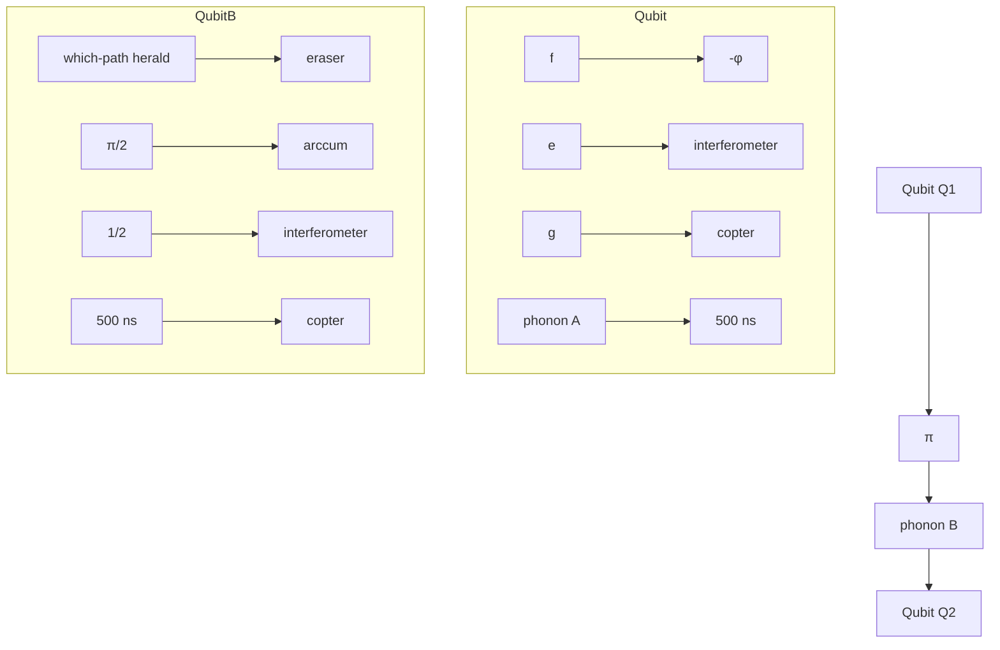

# Quantum Erasure Using Entangled Surface Acoustic Phonons

A. Bienfait $^{1,\dagger}$ Y. P. Zhong $^{1}$ , H.-S. Chang $^{1}$ , M.-H. Chou $^{1,2}$ , C. R. Conner $^{1}$ , É. Dumur $^{1,3,\ddagger}$ , J. Grebel $^{1}$ , G. A. Peairs $^{4,1}$ , R. G. Povey $^{1,2}$ , K. J. Satzinger $^{4,1,\S}$ and A. N. Cleland $^{1,3,*}$

$^{1}$ Pritzker School of Molecular Engineering, University of Chicago, Chicago, Illinois 60637, USA

$^{2}$ Department of Physics, University of Chicago, Chicago, Illinois 60637, USA

$^{3}$ Argonne National Laboratory, Argonne, Illinois 60439, USA

$^{4}$ Department of Physics, University of California, Santa Barbara, California 93106, USA

(Received 30 January 2020; accepted 20 May 2020; published 12 June 2020)

Using the deterministic, on-demand generation of two entangled phonons, we demonstrate a quantum eraser protocol in a phononic interferometer where the which-path information can be heralded during the interference process. Omitting the heralding step yields a clear interference pattern in the interfering half-quanta pathways; including the heralding step suppresses this pattern. If we erase the heralded information after the interference has been measured, the interference pattern is recovered, thereby implementing a delayed-choice quantum erasure. The test is implemented using a closed surface acoustic wave communication channel into which one superconducting qubit can emit itinerant phonons that the same or a second qubit can later recapture. If the first qubit releases only half of a phonon, the system follows a superposition of paths during the phonon propagation: either an itinerant phonon is in the channel or the first qubit remains in its excited state. These two paths are made to constructively or destructively interfere by changing the relative phase of the two intermediate states, resulting in a phase-dependent modulation of the first qubit's final state, following interaction with the half-phonon. A heralding mechanism is added to this construct, entangling a heralding phonon with the signaling phonon. The first qubit emits a phonon herald conditioned on the qubit being in its excited state, with no signaling phonon, and the second qubit catches this heralding phonon, storing which-path information which can either be read out, destroying the signaling phonon's self-interference, or erased.

DOI: 10.1103/PhysRevX.10.021055

Subject Areas: Mechanics, Quantum Physics, Quantum Information

# I. INTRODUCTION

Quantum mechanics famously uses dual descriptions for quantum objects, representing these as waves or as particles depending on the situation. This is a manifestation of complementarity, and is central to understanding many interferometric experiments. The prototypical example is Young's two-slit experiment [1]: A wave description

Published by the American Physical Society under the terms of the Creative Commons Attribution 4.0 International license. Further distribution of this work must maintain attribution to the author(s) and the published article's title, journal citation, and DOI.

predicts an interference pattern, while a classical particle-based description, in which the path followed by the particle is known, shows no pattern. For a quantum object passing through a two-path interferometer, an interference pattern is expected, but detecting which path the quantum follows changes this to a noninterfering particlelike description. Since the early days of quantum mechanics, many thought experiments (see, e.g., Refs. [2,3]) and their experimental realizations have tested the validity and domain of application of these orthogonal representations. These have led to the currently accepted understanding that the wave or particle nature of a quantum remains undetermined until a measurement occurs.

Among these experiments, a quantum eraser scheme, as proposed by Scully and Drühl [4], investigates whether it is possible to undo the act of determining which path the quantum followed: is it possible to recover an interference pattern that was suppressed by acquisition of which-path information by “erasing” that information? This can be investigated using a three-step process: (1) observing an interference pattern in a two-path interferometer, (2) acquiring which-path information and observing the corresponding

suppression of the interference, and (3) erasing the which-path information and recovering the interference pattern. This test can further be combined with a version of Wheeler's delayed-choice test $[3,5]$ , where the act of recombining the paths of an interferometer occurs after the quantum has entered the interferometer, thereby preventing the quantum from “choosing” a wave or particle nature before the superposition has been created. For a quantum eraser, in fact, the results should remain unchanged even if the acquisition and erasure of the which-path information occurs after the registration of the interferometric effect.

Realizations of quantum erasers have so far used photons, in both the optical and microwave bands. The first experimental realization used optical photons and marked the photon's propagation through a specific path by creating a path-specific polarization [6]. The first delayed-choice eraser test [7] triggered the emission of entangled photon pairs on each path of the interferometer, using one set of photons to complete the propagation through the interferometer and the other set to mark and erase the which-path information. Further tests used setups where the marking of the which-path information and the interference detection took place at spatially distant locations, making the test robust to locality loopholes [8]. More recently, a quantum eraser test using superconducting qubits and microwave photons was realized using a Ramsey interferometer, where the which-path information was acquired by coupling to an ancillary cavity [9].

Here, we propose and implement a quantum eraser scheme using surface acoustic wave (SAW) phonons $[10]$ . Building on a previously demonstrated interferometer $[11]$ , we implement the quantum erasure process by constructing a two-phonon entangled state, with the second phonon marking the which-path information. The slow propagation of this “herald” phonon is exploited to delay the which-path information detection after detection of the result of the interferometric process, allowing for a delayed-choice quantum erasure.

# II. PROPOSAL FOR QUANTUM ERASURE VIA PHONONS

Surface acoustic waves have now been proposed and used with a range of quantum systems $[12]$ , including the manipulation of electronic spins $[13,14]$ , microwave-to-optical photon transduction $[15–17]$ , and ferrying electrons between distant quantum dots $[18,19]$ . Superconducting qubits combined with standing-wave SAW devices $[20–28]$ have allowed synthesis of arbitrary acoustic quantum states $[25]$ in the resonant coupling regime $[11,21–26,28]$ as well as phonon-number resolved state detection in the dispersive regime $[26]$ . Traveling-wave implementations have been used to emit and detect single-phonon SAWs $[20]$ , route single phonons $[28]$ , observe electromagnetically induced transparency $[29]$ , as well as realize phonon-mediated quantum state transfer and remote entanglement $[11]$ . The interferometry scheme we use for the quantum eraser protocol is described in Ref. [11]. The experimental layout of the device is shown in Fig. 1(a). Two nominally identical superconducting qubits [30,31], $Q_{1}$ and $Q_{2}$ , are coupled via two tunable inductive couplers [32] to a phonon channel comprising a central interdigitated transducer (IDT) located between two reflective mirror gratings. Each qubit can relax into this channel at a rate $\kappa(t)$ , controlled by its tunable coupler, emitting counterpropagating itinerant surface acoustic wave phonons via the IDT when the qubit is tuned near the IDT operating frequency of $\sim4$ GHz. The two SAW mirrors, made of thin metallic gratings on either side of the IDT, ensure reflection of the phonons back toward the IDT when the phonons are in the mirrors' 125-MHz-wide operating bandwidth. Either qubit can efficiently reabsorb the itinerant phonons after the phonons complete a $\sim500$ -ns-long round-trip: The tunable couplers' dynamic tuning is used to shape each emitted phonon wave packet as well as to control their absorption [33], enabling in theory their complete recapture by either of the qubits [34]. Experimentally, the qubit-to-qubit transfer efficiency is measured to be $\eta \sim65\%$ , limited by acoustic losses in the SAW device [11].

Here, we make use of the three lowest-energy qubit states, $|g\rangle$ , $|e\rangle$ , and $|f\rangle$ . The qubits' anharmonicities $\chi/2\pi = (\omega_{ef} - \omega_{ge})/2\pi$ are, respectively, -179 and -188 MHz. The qubit intrinsic lifetimes are $T_{1} = 18 \mu s$ for both qubits, while the g-e transition has a Ramsey $T_{2,ge,R} = 1.2 \mu s (0.8 \mu s)$ for $Q_{1}(Q_{2})$ , and $T_{2,ef,R} = 0.4 \mu s$ for both qubits' e-f transition. More details on the device and the phonon emission-capture protocol are available in Ref. [11].

A two-path interferometer can be realized in this device, shown in Fig. 1(c), by initializing one of the qubits (here $Q_{1}$ ) in its excited state and using its coupler to emit a half-phonon (A) with a symmetric wave packet into the SAW channel. This results in the superposition state,

$$
\left| \psi_ {1} \right\rangle = \left(\left| e 0 \right\rangle + \left| g 1 \right\rangle\right) / \sqrt {2}, \tag {1}
$$

writing $Q_{1}$ 's state first and the phonon state second. Applying a detuning pulse on $Q_{1}$ of varying length introduces a relative phase $\varphi$ between the states $|e0\rangle$ and $|g1\rangle$ (defined here to be the phase accumulated by the phonon with respect to the qubit), yielding oscillations in the qubit occupancy after $Q_{1}$ recaptures the phonon [11]. The origin of the interference can be understood by considering the outgoing acoustic field. This field has two contributions: the reflection of the incoming field combined with the field emitted by the qubit, whose population is also affected by the incoming field. External control of the qubit coupling rate $\kappa(t)$ ensures that the two contributions are equal in amplitude. The energy in the outgoing acoustic field thus depends only on the relative phase factor $e^{i\varphi}$ . When $\varphi = 0$ , absorption is the

(a)   

text_image

a)
Qubit Q₁
tunable
coupler
phonon channel
(b)
Qubit Q₂

natural_image

Close-up of a small electronic component with visible circuitry and mounting holes, scale bar indicates 1 mm (no text or symbols on the component itself)

flowchart

FIG. 1. Experimental setup and quantum eraser scheme. (a) Two transmon superconducting qubits (blue) are coupled to a surface acoustic wave phononic channel (gray) via a central interdigitated transducer (IDT, green), using which both qubits can emit and capture itinerant phonons. The IDT is placed between two reflective mirror gratings (orange) that define a Fabry-Perot cavity and reflect phonons within the mirrors' bandwidth back toward the IDT. Two tunable couplers (red) are used to dynamically control the coupling between the qubits and the IDT, allowing shaping the wave packets of emitted phonons, and ensuring their efficient reabsorption after completing the 500 ns acoustic round-trip. The couplers also enable the controlled partial release of phonons. (b) Optical micrograph of the device, showing (top) the acoustic Fabry-Perot structure on a lithium niobate chip, (bottom) the two superconducting qubits and associated superconducting wiring on a separate sapphire chip, and (middle) a side view of the flip-chip assembled device. (c) When one of the qubits ( $Q_1$ ) swaps a half-phonon ( $A$ ) into the acoustic channel, an interferometer can be implemented (green box): once $A$ completes a round-trip within the acoustic cavity, its reabsorption probability by $Q_1$ depends on the relative phase accumulated by $Q_1$ and $A$ , and leads to interference in $Q_1$ 's final excitation probability. To implement a quantum eraser, we generate an entangled phonon herald marking the which-path information by generating a second, entangled phonon ( $B$ ) conditionally on $Q_1$ being in $\left|e\right\rangle$ (blue box): this suppresses the interference. Capture and detection of the entangled herald $B$ by $Q_2$ acquires the which-path information after the interference of $Q_1$ and $A$ is complete, making this a time-delayed herald. Subsequently applying a $\pi/2$ pulse to $Q_2$ equalizes its $\left|g\right\rangle$ and $\left|e\right\rangle$ populations, erasing the which-path information and restoring the interference, thereby completing a delayed quantum eraser measurement.

time-reversed emission process so that the qubit goes back to $|e\rangle$ . The interference can be seen as destructive since the acoustic field reflected from the qubit acquires a $\pi$ phase shift and cancels out the acoustic field reemitted by the qubit and thus no phonon is reemitted. When $\varphi = \pi$ , the interference is constructive, and the qubit energy is transferred to the acoustic channel, leaving the qubit in $|g\rangle$ ; the reemitted phonon eventually decays in the acoustic channel. The final state of the system can thus be written as a function of $\varphi$ ,

$$
\left| \psi_ {f} \right\rangle = \frac {1 + e ^ {i \varphi}}{2} | e 0 \rangle + \frac {1 - e ^ {i \varphi}}{2} | g 1 \rangle , \tag {2}
$$

resulting in the observation of an interference pattern in $Q_{1}$ 's final excited state probability $P_{e}(t_{f})$ when sweeping the phase $\varphi$ , with a period of $2\pi$ .

Two steps are required to realize a quantum eraser in this interferometer configuration. The first is to create which-path information, i.e., a herald indicating whether the qubit remained excited or instead phonon A was emitted in the acoustic channel. Obtaining this information should result in the disappearance of the interference pattern, because this entangles the system under observation—the qubit and traveling phonon A—with the measurement apparatus. The second step is to erase this knowledge and look for a recovery of the interferometric pattern. Here, we use a protocol similar to that used in the original quantum eraser proposal $[4]$ as shown in Fig. 1(c). This protocol requires the on-demand generation of a second, entangled phonon to serve as a herald of the first, signaling phonon. Following the signaling half-phonon emission, we apply a transition-selective $\pi$ pulse on the e-f transition of the qubit $Q_{1}$ , then turn on the coupler, inducing $Q_{1}$ to emit a second phonon B if initially in $|e\rangle$ . This phonon thereby heralds that the qubit is in its excited state (and that there is no A phonon in the channel). Including the herald, the system state before reabsorption of phonon A is then

$$
\left| \psi_ {2} \right\rangle = \frac {1}{\sqrt {2}} | e 0 \rangle | 1 \rangle_ {B} + \frac {e ^ {i \varphi}}{\sqrt {2}} | g 1 \rangle | 0 \rangle_ {B}, \tag {3}
$$

displaying the entanglement of phonons $A$ and $B$ . The entanglement of $Q_{1}$ with phonon $B$ makes the two states of the interferometer orthogonal, even after recapture of phonon $A$ , and prevents any interference. Phonon $B$ is then captured by qubit $Q_{2}$ , putting $Q_{2}$ in $|e\rangle$ if $Q_{1}$ was in $|e\rangle$ , transferring phonon $B$ 's entanglement to $Q_{2}$ and thus placing the which-path information in $Q_{2}$ [this occurs after the interference has taken place, due to phonon $B$ 's long (0.5 $\mu$ s) transit time].

The which-path information can be erased by subsequently applying a $\pi /2$ pulse to $Q_{2}$ , mapping $Q_{2}$ 's state to a superposition of $|e\rangle$ and $|g\rangle$ . For a particular phase

choice for this $\pi/2$ erasure pulse, the final state of the system can be written as

$$
\begin{array}{l} | \psi_ {f} \rangle = \frac {1 + e ^ {i \varphi}}{\sqrt {8}} [ | e 0 \rangle | e \rangle - | g 1 \rangle | g \rangle ] \\ + \frac {1 - e ^ {i \varphi}}{\sqrt {8}} [ | g 1 \rangle | e \rangle - | e 0 \rangle | g \rangle ], \tag {4} \\ \end{array}
$$

where qubit $Q_{2}$ 's state is written last.

This expression shows that $Q_{2}$ 's state remains entangled with the interferometer, but a measurement along its quantization axis no longer yields which-path information. The interference is therefore not directly recoverable by only measuring $Q_{1}$ , but can be restored with a joint measurement of $Q_{1}$ and $Q_{2}$ . This is similar to photon-based realizations of quantum eraser tests [6-9] and the original quantum eraser proposal [4].

# III. WHICH-PATH HERALD

Implementing the quantum eraser scheme hinges on our ability to emit a heralding phonon (phonon B) on $Q_{1}$ 's e-f transition, while preserving $Q_{1}$ 's excited and ground-state populations. For a superconducting qubit coupled to a microwave environment, this can be achieved by either engineering the qubit's environment [35–37] or manipulating the qubit's coupling to the environment [38]. In our experiment, we make use of the former and harness the frequency-dependent response of the IDT [10,25,26,29,39]. For a nonreflective uniform IDT of the type used here, the power conversion between microwave electrical and acoustic signals is proportional to the IDT conductance $G_{a}(\omega)$ :

$$
G _ {a} (\omega) / G _ {a} (\omega_ {c}) = [ \sin (X) / X ] ^ {2}, \tag {5}
$$

where $X = \pi N(\omega - \omega_{c}) / \omega_{c}$ , N = 20 is the number of IDT finger pairs, $\omega_{c} = 2\pi v / p$ the IDT central radial frequency, $p = 0.985 \mu m$ the IDT pitch, and v the SAW velocity within the IDT. The uniform profile of the IDT implies that $G_{a} = 0$ for $X = \pm \pi$ . At the corresponding frequencies $\omega_{\pm\pi}$ , the qubit relaxation by phonon emission should be suppressed.

For this device, the qubit anharmonicity $\alpha$ is quite close to the difference between the IDT conductance minima at $\omega_{\pm\pi}$ and the IDT central frequency $\omega_{c}$ . By tuning the qubit's g-e emission frequency to $\omega_{ge} \sim \omega_{\pi}$ , the e-f transition is brought close to the IDT main emission peak, $\omega_{ef} \sim \omega_{c}$ . Phonon emission on the e-f transition is thus close to its maximum, while emission on the g-e transition is heavily suppressed, making the proposed quantum eraser scheme possible. This is shown in Fig. 2.

The $\kappa_{ge}(\omega_{ge})$ emission rate displays close to the expected behavior, as shown in Fig. 2. Similarly, $\kappa_{ef}(\omega_{ge})$ also displays roughly the expected behavior: a shift in frequency by $\alpha$ compared to $\kappa_{ge}(\omega_{ge})$ and a factor of 2 increase in the rate ( $\times2.1$ comparing the $\kappa_{ge}$ to the $\kappa_{ef}$ maxima), as expected for a weakly anharmonic qubit. The expected behavior, plotted as solid gray lines for both emissions in Fig. 2(b), is calculated from the qubit coupling to the IDT and the internal IDT frequency reflections, using an electrical model for the circuit and a coupling-of-modes model for the IDT [10]. These account for the nonlinearity of the qubit using “black-box quantization” [32,41]. The resulting modeled rates only account partially for the experimental results: while the agreement is satisfactory for the e-g decay rates, we find a 50 MHz misalignment in the modeled maximum of the f-e decay compared to measurements. The modeling is explained in detail in Ref. [40].

line

| Frequency | Conductance |
| --------- | ----------- |
| ω_ef      | α           |
| e         |       |
| g         |       |
| on        |       |
| off       |       |
| ω_π       |       |
| ω_c       |       |
| ω_π       |       |

line

| Qubit Q₁ frequency ωge/2π (GHz) | K_ge (MHz) | K_ef (MHz) |
| ------------------------------ | ---------- | ---------- |
| 3.7                            | ~0         | ~0         |
| 4.0                            | ~50        | ~50        |
| 4.3                            | ~0         | ~0         |

FIG. 2. Single-qubit frequency- and state-dependent energy decay. (a) We monitor the decay of $Q_{1}$ 's state after excitation respectively to $|e\rangle$ and $|f\rangle$ [pulse sequence is in inset of (b)], dominated by emission of phonons into the IDT. $Q_{1}$ 's coupler is set to maximum coupling and $Q_{2}$ 's coupler is turned off. (b) Fitting the population evolution (see Ref. [40]) enables us to extract the transition rate $\kappa_{ge}$ of transition $g - e$ (blue) and the transition rate $\kappa_{ef}$ of transition $e - f$ (red) as a function of $Q_{1}$ frequency. The frequency dependence of each transition rate is seen to follow the frequency dependence of the IDT conductance (c). We identify two operating points $\omega_{A}$ and $\omega_{B}$ . At frequency $\omega_{ge} = \omega_{A}$ , phonon emission on the $g - e$ transition dominates, resulting in phonon emission at $\omega_{ge} / 2\pi = 3.95 \mathrm{GHz}$ within the mirror bandwidth (orange), while decay on the $e - f$ transition is suppressed. Similarly, at frequency $\omega_{ge} = \omega_{B} = 2\pi \times 4.15 \mathrm{GHz}$ , phonon emission on the $e - f$ transition dominates, resulting in phonon emission at $\omega_{ef} = \omega_{ge} - |\alpha| = 2\pi \times 3.97 \mathrm{GHz}$ (gray dashed line), also within the mirror bandwidth, while decay on the $g - e$ transition is suppressed.

We extract two operating points, both within the IDT mirror bandwidth (3.91–4.03 GHz). At $\omega_{ge} = \omega_{A} = 2\pi \times 3.95$ GHz, the g-e emission time is $1/\kappa_{ge} = 9.3 \pm 0.1$ ns while the e-f decay is suppressed by a relative factor $\kappa_{ge}/\kappa_{ef} = 5.9 \pm 0.1$ , strongly favoring the emission of phonons on the g-e transition. When $\omega_{ge} = \omega_{B} = 2\pi \times 4.15$ GHz, the emission time is $1/\kappa_{ef} = 4.8 \pm 0.1$ ns, with the phonon emitted at $\omega_{ef} = \omega_{B} - |\alpha| = 2\pi \times 3.97$ GHz while the decay on g-e is suppressed by a factor

$\kappa_{ef} / \kappa_{ge} = 84 \pm 3$ : this is the operating point for emitting the which-path herald.

Operating at frequency $\omega_{A}$ , we use the tunable couplers to efficiently shape the emitted and absorbed wave packets; see Refs. [11,33,34,40,42–44]. The couplers are controlled so the emitted wave packets have a cosecant shape with characteristic time $1/\kappa_{c}=15$ ns [40]. In Fig. 3(a), we measure the transfer efficiency by emitting one phonon using $Q_{1}$ 's g-e transition and capturing it later using $Q_{2}$ 's g-e transition, with an efficiency $\eta_{A}=P_{2e}(t_{f})/P_{1e}(0)=0.66\pm0.01$ , limited by acoustic losses [11,40]. The same operation realized using $Q_{1}$ 's e-f transition [Fig. 3(b)] while operating at frequency $\omega_{B}$ yields the same efficiency, $\eta_{B}=P_{2e}(t_{f})/P_{1f}(0)=0.64\pm0.02$ . Because of the imperfectly suppressed $1/\kappa_{ge}=0.4\mu s$ decay, a small population is transferred from $|e\rangle$ to $|g\rangle$ during this process, leading to $P_{1g}(t_{f})=0.06\pm0.02$ . As a consequence, exciting and then emitting a phonon on the e-f transition to herald the which-path information will have at most a $\eta_{h}=94\pm2\%$ efficiency due to this spurious decay. The probability of actually detecting this information is limited to $\eta_{B}$ .

line

| Time t (μs) | Pe(Q1) | Pe(Q2) |
|-------------|--------|--------|
| 0.0         | 1.0    | 1.0    |
| 0.1         | 0.1    | 0.1    |
| 0.5         | 0.0    | 0.0    |
| 0.6         | 0.5    | 0.5    |

line

| Time t (μs) | Pg(Q1) | Pe(Q1) | Pf(Q1) |
|-------------|--------|--------|--------|
| 0.0         | 1.0    | 0.0    | 1.0    |
| 0.1         | 0.0    | 0.8    | 0.3    |
| 0.5         | 0.0    | 0.9    | 0.0    |
| 0.6         | 0.0    | 0.95   | 0.0    |

FIG. 3. Which-path heralding. (a) After exciting $Q_{1}$ to $|e\rangle$ with $\omega_{ge} = 2\pi \times 3.95 \mathrm{GHz}$ , $Q_{1}$ 's tunable coupling $\kappa_{1}$ is modulated dynamically to release a symmetric phonon wave packet with characteristic time $1 / \kappa = 15 \mathrm{ns}$ on $Q_{1}$ 's $g - e$ transition. The emitted phonon is later captured by $Q_{2}$ on its $g - e$ transition. (b) Inset pulse sequence: We initialize $Q_{1}$ to $|f\rangle$ using two sequential pulses at the $g - e$ and $e - f$ transition, with $\omega_{ef} = \omega_{ge} - |\alpha| = 2\pi \times 3.97 \mathrm{GHz}$ . We then modulate $\kappa_{1}$ to emit a phonon on $Q_{1}$ 's $e - f$ transition. The emitted phonon is later captured by $Q_{2}$ on its $g - e$ transition. During this process, $Q_{1}$ 's $|g\rangle$ population increases from 0 to 0.06 due to spurious relaxation from $|e\rangle$ to $|g\rangle$ . Insets show the pulse sequences and schematics of the expected transfers. Open symbols represent the qubits' populations measured at time $t$ , dashed lines correspond to a numerical model taking into account the qubits' decoherence and phonon losses.

# IV. QUANTUM ERASURE IMPLEMENTATION

We implement the full quantum eraser scheme as shown in Fig. 4. First, we demonstrate single-phonon interferometry without heralding: Qubit $Q_{1}$ , initialized in $|e\rangle$ , emits, and later recaptures, a half-phonon on its $g-e$ transition at $\omega_{A}$ . Following release, a detuning pulse applied to $Q_{1}$ accumulates a phase $\varphi$ between the traveling half-phonon and $Q_{1}$ [pulse sequence in Fig. 4(a), intermediate measurements in Fig. 4(b)]. This results in an interference pattern in the final excitation probability $P_{e1}(t_1 = 650~\mathrm{ns})$ of $Q_{1}$ as a function of $\varphi$ [Fig. 4(c)]. The oscillations have an average occupation of 0.41 with peak-to-peak amplitude 0.49. These are reduced from the ideal values of 1/2 and 1 due to acoustic losses, $Q_{1}$ decoherence, and the finite readout visibility. Taking these effects into account, a numerical model (see Ref. [40]) provides similar results [Fig. 4(c)].

A which-path herald is generated by inserting an intermediate $\pi$ pulse on $Q_{1}$ 's e-f transition followed by emission of a phonon at $\omega_{B}$ on $Q_{1}$ 's e-f transition, returning $Q_{1}$ to $|e\rangle$ [see Figs. 4(a) and 4(b)]. Generating the herald destroys the interference pattern, as expected. The amplitude in the heralded $P_{e1}$ displays small fluctuations with amplitude $\sim0.01$ . This could be attributed to the imperfect information acquisition discussed in Fig. 3(b), with our model shown by the dashed line in inset of Fig. 4(d), but is below the noise threshold. We note that even if the heralding phonon is not captured and detected via $Q_{2}$ , the interference is not recovered, as $Q_{1}$ 's state is now irremediably coupled to the herald and thus to the environment.

The final step of the quantum eraser test is to erase the heralded information, and thereby recover the interference pattern. As the heralding phonon marks whether $Q_{1}$ was in $|e\rangle$ , its capture using $Q_{2}$ followed by a $\pi/2$ pulse on $Q_{2}$ 's $g-e$ transition erases the information that could distinguish the two paths. This erasure can be performed in a time-delayed manner by capturing the herald and measuring $Q_{2}$ after the measurement of $Q_{1}$ . We thus implement the measurement of $Q_{1}$ immediately following its interaction with the returning half-phonon, completing the interferometry, and before absorbing and detecting the herald using $Q_{2}$ . This requirement limits $Q_{1}$ 's readout time to 200 ns, decreasing its readout visibility from 96% to 81%.

As $Q_{2}$ is still entangled with the interferometer, simply tracing out $Q_{2}$ 's state (equivalently, not measuring $Q_{2}$ ) will not recover the interference pattern; instead, we must condition the measurements of $Q_{1}$ on measurements of $Q_{2}$ , even though measuring $Q_{2}$ does not yield any heralded information [see Eq. (4)]. In Fig. 4(d), we plot all joint qubit probabilities as a function of $\varphi$ : all have an oscillation pattern of amplitude 0.12, while the excitation probabilities $P_{e1}, P_{e2}$ for each qubit evaluated separately display only

line

| Coupler | Phase | Time (ns) |
|---------|-------|-----------|
| Q1      | half release | - |
| Q1      | φ     | - |
| Q1      | emission on e-f | - |
| Q2      | half catch | - |
| Q2      | capture on e-g | - |
| Coupler 1 | - | - |
| Coupler 2 | - | - |
| Coupler 2 | A     | 1/2       |
| Coupler 2 | B     | 1/2       |

line

| Time t (μs) | P_e1 (no herald, φ=0) | P_e1 (with herald) | P_e1 (no herald, φ=π) | P_e1 (with herald) | P_f1 (with herald) |
|-------------|------------------------|--------------------|------------------------|--------------------|--------------------|
| 0.0         | 1.0                    | 1.0                | 1.0                    | 1.0                | 1.0                |
| 0.2         | 0.5                    | 0.5                | 0.5                    | 0.5                | 0.5                |
| 0.4         | 0.5                    | 0.5                | 0.5                    | 0.5                | 0.5                |
| 0.6         | 0.7                    | 0.7                | 0.3                    | 0.3                | 0.3                |
| t₁          | ~0.8                   | ~0.8               | ~0.1                   | ~0.1               | ~0.1               |

line

| Time t (μs) | P_e2(t) for Q2 |
|-------------|----------------|
| 0.9         | 0.0            |
| 1.0         | 0.3            |

line

| Phase φ | P_e2(t2) | P_gg + P_eg | P_ge × Pee | δP_e1(t1) | δP_e2(t2) |
| ------- | -------- | ----------- | ---------- | --------- | --------- |
| 0       | 0.5      | 0.5         | 0.5        | 0.01      | 0.01      |
| π/4     | 0.5      | 0.5         | 0.5        | 0.01      | 0.01      |
| π       | 0.5      | 0.5         | 0.5        | 0.01      | 0.01      |
| 3π/4    | 0.5      | 0.5         | 0.5        | 0.01      | 0.01      |
| 2π      | 0.5      | 0.5         | 0.5        | 0.01      | 0.01      |

FIG. 4. Quantum eraser. (a) Pulse sequence: With $Q_{1}$ in $|e\rangle$ , its coupler is used to half-release a phonon at $\omega_{A}$ (blue). $Q_{1}$ 's frequency is then detuned, accumulating a phase $\varphi$ between the half-phonon and $Q_{1}$ 's $|e\rangle$ state. An optional $\pi$ pulse on $Q_{1}$ 's $e-f$ transition (red) is followed by the coupler-controlled emission of a phonon at $\omega_{B}$ (orange), heralding that $Q_{1}$ is in $|e\rangle$ and returning $Q_{1}$ to $|e\rangle$ . Following the optional heralding, $Q_{1}$ catches the half-phonon (blue) and is measured, completing the interferometry. Following $Q_{1}$ 's measurement, $Q_{2}$ catches the optional heralding phonon (orange) and is measured at time $t_{2} = 1.1~\mu \mathrm{s}$ . (b) Left: $Q_{1}$ 's $|e\rangle$ and $|f\rangle$ state populations as a function of time $t$ , showing the unheralded $P_{e}(t)$ for $\varphi = 0$ and $\varphi = \pi$ , which at time $t_{1}$ displays the interference maximum and minimum, and for the heralded $P_{e}$ , which at time $t_{1}$ does not have a $\varphi$ dependence. Also shown is $Q_{1}$ 's $|f\rangle$ state population when the herald is generated. Right: $Q_{2}$ 's excited state $P_{e}(t)$ when the herald is generated, which ideally would reach the value $1/2$ but is limited by acoustic losses to $\eta_b\times 0.5\approx 0.32$ . (c) Interference fringes $P_{e}(\varphi)$ are visible when the herald is absent, but disappear when the herald reports which-path information ( $Q_{1}$ in $|e\rangle$ ). If the herald is generated but the information in $Q_{2}$ is erased, by applying a $\pi /2$ pulse on $Q_{2}$ 's $g - e$ transition, the fringes reappear when $Q_{1}$ 's measurement is conditioned on measuring $Q_{2}$ in $|e\rangle$ . This occurs even though $Q_{1}$ 's measurement was already complete by the time the information in $Q_{2}$ is erased. (d) Probability of measuring $Q_{2}$ in $|e\rangle$ , showing lack of dependence on $\varphi$ . Also shown are variations in two-qubit probabilities $P_{gg},P_{ge},P_{eg}$ , and $P_{ee}$ . Inset shows the lack of variation of both qubits' $|e\rangle$ -state probabilities $P_{e1}$ and $P_{e2}$ as a function of $\varphi$ when applying the $\pi_{ef}$ pulse. Dashed lines in all panels correspond to a numerical model taking into account the qubits' decoherence and phonon losses; see Ref. [40].

very weak oscillations, below 1%. To make a fair comparison with the original interference pattern, we next consider the conditional measurement $P_{e1|e2} = P_{ee}/(P_{ge} + P_{ee})$ , the probability of measuring $Q_{1}$ in $|e\rangle$ conditioned on $Q_{2}$ being measured in $|e\rangle$ . This probability has a mean identical to that measured without a herald, but the amplitude of the oscillations is reduced by 48%, due to the inefficient capture of the second phonon and thus an incomplete erasure of information, as well as the additional decoherence in $Q_{2}$ .

A model taking into account these losses and $Q_{2}$ 's finite coherence time partially accounts for the amplitude reduction, as shown by the dashed line in Fig. 4(c). We attribute the remaining discrepancy to decoherence occurring during the measurement, which we have not taken into account.

In conclusion, we have successfully completed a quantum eraser protocol, using an acoustic Fabry-Perot interferometer. We realized three distinct steps in this process: first observing an interferogram, next, marking the which-path information which makes the interference fringes disappear, and third, erasing the which-path information which leads to the recovery of an interference signal. The erasure of the which-path information occurs after registering the result of the interference, making this a delayed-choice quantum eraser. The which-path detection was implemented by signaling using a heralding phonon.

This construct enabled us to demonstrate and exploit a two-phonon entanglement, opening the door to two-phonon interferometry, acoustic Bell tests $[45]$ , and phonon coherence length measurements $[46]$ . Phonon heralding as demonstrated here could also be used to mitigate propagation losses in future acoustic experiments and implement, for example, high-fidelity acoustic quantum state transfer and remote entanglement, using schemes analogous to Refs. $[47,48]$ .

The datasets supporting this work are available from the authors on request.

# ACKNOWLEDGMENTS

The authors thank P. J. Duda and K. Mølmer for helpful discussions and thank W. D. Oliver and G. Calusine at Lincoln Laboratories for the provision of a traveling-wave parametric amplifier. Devices and experiments were supported by the Air Force Office of Scientific Research and the Army Research Laboratory. K. J. S. was supported by NSF GRFP (NSF DGE-1144085), É. D. was supported by LDRD funds from Argonne National Laboratory, and

A. N. C. was supported by the DOE, Office of Basic Energy Sciences. This work was partially supported by the UChicago Materials Research Science and Engineering Center (MRSEC) (NSF DMR-1420709) and made use of the Pritzker Nanofabrication Facility, which receives support from SHyNE, a node of the National Science Foundation's National Nanotechnology Coordinated Infrastructure (NSF NNCI-1542205).

The authors declare no competing financial interests.

[1] T. Young, A Course of Lectures on Natural Philosophy and the Mechanical Art (J. Johnson, London, 1807).   
[2] N. Bohr, in Albert Einstein: Philosopher Scientist, Library of Living Philosophers, edited by P. A. Schilpp (Open Court Publishing Company, Evanston, 1949), pp. 200–241; reprinted in, , Discussion with Einstein on Epistemological Problems in Atomic Physics, in Quantum Theory and Measurement, edited by J. A. Wheeler and W. H. Zurek (Princeton University Press, Princeton, NJ, 1983), pp. 9–49.   
[3] J. A. Wheeler, in The Past and the Delayed-Choice Double-Slit Experiment, Mathematical Foundations of Quantum Theory, edited by A. R. Marlow (Academic Press, New York, 1978), pp. 9–48.   
[4] M. O. Scully and K. Drühl, Quantum Eraser: A Proposed Photon Correlation Experiment Concerning Observation and “Delayed Choice” in Quantum Mechanics, Phys. Rev. A 25, 2208 (1982).   
[5] J. A. Wheeler, in Law without Law, Quantum Theory and Measurement, edited by J. A. Wheeler and W. H. Zurek (Princeton University Press, Princeton, NJ, 1983), pp. 182–213.   
[6] P. G. Kwiat, A. M. Steinberg, and R. Y. Chiao, Observation of a “Quantum Eraser”: A Revival of Coherence in a Two-Photon Interference Experiment, Phys. Rev. A 45, 7729 (1992).   
[7] Y.-H. Kim, R. Yu, S. P. Kulik, Y. Shih, and M. O. Scully, Delayed “Choice” Quantum Eraser, Phys. Rev. Lett. 84, 1 (2000).   
[8] X.-S. Ma, J. Kofler, A. Qarry, N. Tetik, T. Scheidl, R. Ursin, S. Ramelow, T. Herbst, L. Ratschbacher, A. Fedrizzi, T. Jennewein, and A. Zeilinger, Quantum Erasure with Causally Disconnected Choice, Proc. Natl. Acad. Sci. U.S.A. 110, 1221 (2013).   
[9] K. Liu, Y. Xu, W. Wang, S.-B. Zheng, T. Roy, S. Kundu, M. Chand, A. Ranadive, R. Vijay, Y. Song, L. Duan, and L. Sun, A Twofold Quantum Delayed-Choice Experiment in a Superconducting Circuit, Sci. Adv. 3, e1603159 (2017).   
[10] D. Morgan, Surface Acoustic Wave Filters (Elsevier, New York, 2007).   
[11] A. Bienfait, K. J. Satzinger, Y. P. Zhong, H.-S. Chang, M.-H. Chou, C. R. Conner, É Dumur, J. Grebel, G. A. Peairs, R. G. Povey, and A. N. Cleland, Phonon-Mediated Quantum State Transfer and Remote Qubit Entanglement, Science 364, 368 (2019).   
[12] P. Delsing et al., The 2019 Surface Acoustic Waves Roadmap, J. Phys. D 52, 353001 (2019).

[13] D. A. Golter, T. Oo, M. Amezcua, I. Lekavicius, K. A. Stewart, and H. Wang, Coupling a Surface Acoustic Wave to an Electron Spin in Diamond via a Dark State, Phys. Rev. X 6, 041060 (2016).   
[14] S. J. Whiteley, G. Wolfowicz, C. P. Anderson, A. Bourassa, H. Ma, M. Ye, G. Koolstra, K. J. Satzinger, M. V. Holt, F. J. Heremans, A. N. Cleland, D. I. Schuster, G. Galli, and D. D. Awschalom, Spin–Phonon Interactions in Silicon Carbide Addressed by Gaussian Acoustics, Nat. Phys. 15, 490 (2019).   
[15] J. Bochmann, A. Vainsencher, D. D. Awschalom, and A. N. Cleland, Nanomechanical Coupling between Microwave and Optical Photons, Nat. Phys. 9, 712 (2013).   
[16] A. Vainsencher, K. J. Satzinger, G. A. Peairs, and A. N. Cleland, Bi-Directional Conversion between Microwave and Optical Frequencies in a Piezoelectric Optomechanical Device, Appl. Phys. Lett. 109, 033107 (2016).   
[17] V. S. Shumeiko, Quantum Acousto-optic Transducer for Superconducting Qubits, Phys. Rev. A 93, 023838 (2016).   
[18] R. P. G. McNeil, M. Kataoka, C. J. B. Ford, C. H. W. Barnes, D. Anderson, G. A. C. Jones, I. Farrer, and D. A. Ritchie, On-Demand Single-Electron Transfer between Distant Quantum Dots, Nature (London) 477, 439 (2011).   
[19] S. Hermelin, S. Takada, M. Yamamoto, S. Tarucha, A. D. Wieck, L. Saminadayar, C. Bäuerle, and T. Meunier, Electrons Surfing on a Sound Wave as a Platform for Quantum Optics with Flying Electrons, Nature (London) 477, 435 (2011).   
[20] M. V. Gustafsson, T. Aref, A. F. Kockum, M. K. Ekström, G. Johansson, and P. Delsing, Propagating Phonons Coupled to an Artificial Atom, Science 346, 207 (2014).   
[21] R. Manenti, A.F. Kockum, A. Patterson, T. Behrle, J. Rahamim, G. Tancredi, F. Nori, and P.J. Leek, Circuit Quantum Acoustodynamics with Surface Acoustic Waves, Nat. Commun. 8, 975 (2017).   
[22] B. A. Moores, L. R. Sletten, J. J. Viennot, and K. W. Lehnert, Cavity Quantum Acoustic Device in the Multimode Strong Coupling Regime, Phys. Rev. Lett. 120, 227701 (2018).   
[23] A. N. Bolgar, J. I. Zotova, D. D. Kirichenko, I. S. Besedin, A. V. Semenov, R. S. Shaikhaidarov, and O. V. Astafiev, Quantum Regime of a Two-Dimensional Phonon Cavity, Phys. Rev. Lett. 120, 223603 (2018).   
[24] A. Noguchi, R. Yamazaki, Y. Tabuchi, and Y. Nakamura, Qubit-Assisted Transduction for a Detection of Surface Acoustic Waves Near the Quantum Limit, Phys. Rev. Lett. 119, 180505 (2017).   
[25] K. J. Satzinger, Y. P. Zhong, H.-S. Chang, G. A. Peairs, A. Bienfait, M.-H. Chou, A. Y. Cleland, C. R. Conner, É. Dumur, J. Grebel, I. Gutierrez, B. H. November, R. G. Povey, S. J. Whiteley, D. D. Awschalom, D. I. Schuster, and A. N. Cleland, Quantum Control of Surface Acoustic-Wave Phonons, Nature (London) 563, 661 (2018).   
[26] L. R. Sletten, B. A. Moores, J. J. Viennot, and K. W. Lehnert, Resolving Phonon Fock States in a Multimode Cavity with a Double-Slit Qubit, Phys. Rev. X 9, 021056 (2019).   
[27] G. Andersson, B. Suri, L. Guo, T. Aref, and P. Delsing, Non-Exponential Decay of a Giant Artificial Atom, Nat. Phys. 15, 1123 (2019).

[28] M. K. Ekström, T. Aref, A. Ask, G. Andersson, B. Suri, H. Sanada, G. Johansson, and P. Delsing, Towards Phonon Routing: Controlling Propagating Acoustic Waves in the Quantum Regime, New J. Phys. 21, 123013 (2019).   
[29] G. Andersson, M. K. Ekström, and P. Delsing, Electromagnetically Induced Transparency in a Propagating Mechanical Mode, arXiv:1912.00777.   
[30] J. Koch, T. M. Yu, J. Gambetta, A. A. Houck, D. I. Schuster, J. Majer, A. Blais, M. H. Devoret, S. M. Girvin, and R. J. Schoelkopf, Charge-Insensitive Qubit Design Derived from the Cooper Pair Box, Phys. Rev. A 76, 042319 (2007).   
[31] R. Barends, J. Kelly, A. Megrant, D. Sank, E. Jeffrey, Y. Chen, Y. Yin, B. Chiaro, J. Mutus, C. Neill, P. O'Malley, P. Roushan, J. Wenner, T. C. White, A. N. Cleland, and J. M. Martinis, Coherent Josephson Qubit Suitable for Scalable Quantum Integrated Circuits, Phys. Rev. Lett. 111, 080502 (2013).   
[32] Yu. Chen et al., Qubit Architecture with High Coherence and Fast Tunable Coupling, Phys. Rev. Lett. 113, 220502 (2014).   
[33] Y. P. Zhong, H.-S. Chang, K. J. Satzinger, M.-H. Chou, A. Bienfait, C. R. Conner, É. Dumur, J. Grebel, G. A. Peairs, R. G. Povey, D. I. Schuster, and A. N. Cleland, Violating Bell's Inequality with Remotely Connected Superconducting Qubits, Nat. Phys. 15, 741 (2019).   
[34] A. N. Korotkov, Flying Microwave Qubits with Nearly Perfect Transfer Efficiency, Phys. Rev. B 84, 014510 (2011).   
[35] J. M. Gambetta, A. A. Houck, and A. Blais, Superconducting Qubit with Purcell Protection and Tunable Coupling, Phys. Rev. Lett. 106, 030502 (2011).   
[36] E. Jeffrey, D. Sank, J. Y. Mutus, T. C. White, J. Kelly, R. Barends, Y. Chen, Z. Chen, B. Chiaro, A. Dunsworth, A. Megrant, P. J. J. O'Malley, C. Neill, P. Roushan, A. Vainsencher, J. Wenner, A. N. Cleland, and J. M. Martinis, Fast Accurate State Measurement with Superconducting Qubits, Phys. Rev. Lett. 112, 190504 (2014).   
[37] I.-C. Hoi, A. F. Kockum, L. Tornberg, A. Pourkabirian, G. Johansson, P. Delsing, and C. M. Wilson, Probing the Quantum Vacuum with an Artificial Atom in Front of a Mirror, Nat. Phys. 11, 1045 (2015).   
[38] W. Pfaff, C. J. Axline, L. D. Burkhart, U. Vool, P. Reinhold, L. Frunzio, L. Jiang, M. H. Devoret, and R. J. Schoelkopf,

Controlled Release of Multiphoton Quantum States from a Microwave Cavity Memory, Nat. Phys. 13, 882 (2017).   
[39] A. F. Kockum, P. Delsing, and G. Johansson, Designing Frequency-Dependent Relaxation Rates and Lamb Shifts for a Giant Artificial Atom, Phys. Rev. A 90, 013837 (2014).   
[40] See Supplemental Material at http://link.aps.org/supplemental/10.1103/PhysRevX.10.021055 for details on the setup, techniques and numerical models.   
[41] S. E. Nigg, H. Paik, B. Vlastakis, G. Kirchmair, S. Shankar, L. Frunzio, M. H. Devoret, R. J. Schoelkopf, and S. M. Girvin, Black-Box Superconducting Circuit Quantization, Phys. Rev. Lett. 108, 240502 (2012).   
[42] P. Campagne-Ibarcq, E. Zalys-Geller, A. Narla, S. Shankar, P. Reinhold, L. Burkhart, C. Axline, W. Pfaff, L. Frunzio, R. J. Schoelkopf, and M. H. Devoret, Deterministic Remote Entanglement of Superconducting Circuits through Microwave Two-Photon Transitions, Phys. Rev. Lett. 120, 200501 (2018).   
[43] P. Kurpiers, P. Magnard, T. Walter, B. Royer, M. Pechal, J. Heinsoo, Y. Salathé, A. Akin, S. Storz, J.-C. Besse, S. Gasparinetti, A. Blais, and A. Wallraff, Deterministic Quantum State Transfer and Remote Entanglement Using Microwave Photons, Nature (London) 558, 264 (2018).   
[44] C. J. Axline, L. D. Burkhart, W. Pfaff, M. Zhang, K. Chou, P. Campagne-Ibarcq, P. Reinhold, L. Frunzio, S. M. Girvin, L. Jiang, M. H. Devoret, and R. J. Schoelkopf, On-Demand Quantum State Transfer and Entanglement between Remote Microwave Cavity Memories, Nat. Phys. 14, 705 (2018).   
[45] J. D. Franson, Bell Inequality for Position and Time, Phys. Rev. Lett. 62, 2205 (1989).   
[46] J. G. Rarity, P. R. Tapster, E. Jakeman, T. Larchuk, R. A. Campos, M. C. Teich, and B. E. A. Saleh, Two-Photon Interference in a Mach-Zehnder Interferometer, Phys. Rev. Lett. 65, 1348 (1990).   
[47] H. Bernien, B. Hensen, W. Pfaff, G. Koolstra, M. S. Blok, L. Robledo, T. H. Taminiau, M. Markham, D. J. Twitchen, and R. Hanson, \*Heralded Entanglement between Solid-State Qubits Separated by Three Metres\*, Nature (London) 497, 86 (2013).   
[48] P. Kurpiers, M. Pechal, B. Royer, P. Magnard, T. Walter, J. Heinsoo, Y. Salathé, A. Akin, S. Storz, J.-C. Besse, S. Gasparinetti, A. Blais, and A. Wallraff, Quantum Communication with Time-Bin Encoded Microwave Photons, Phys. Rev. Applied 12, 044067 (2019).