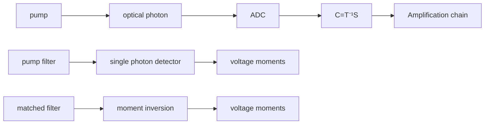
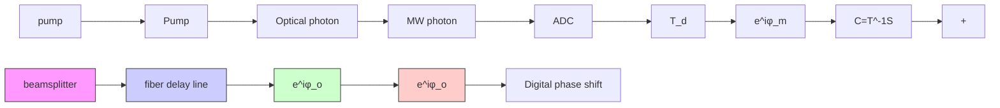
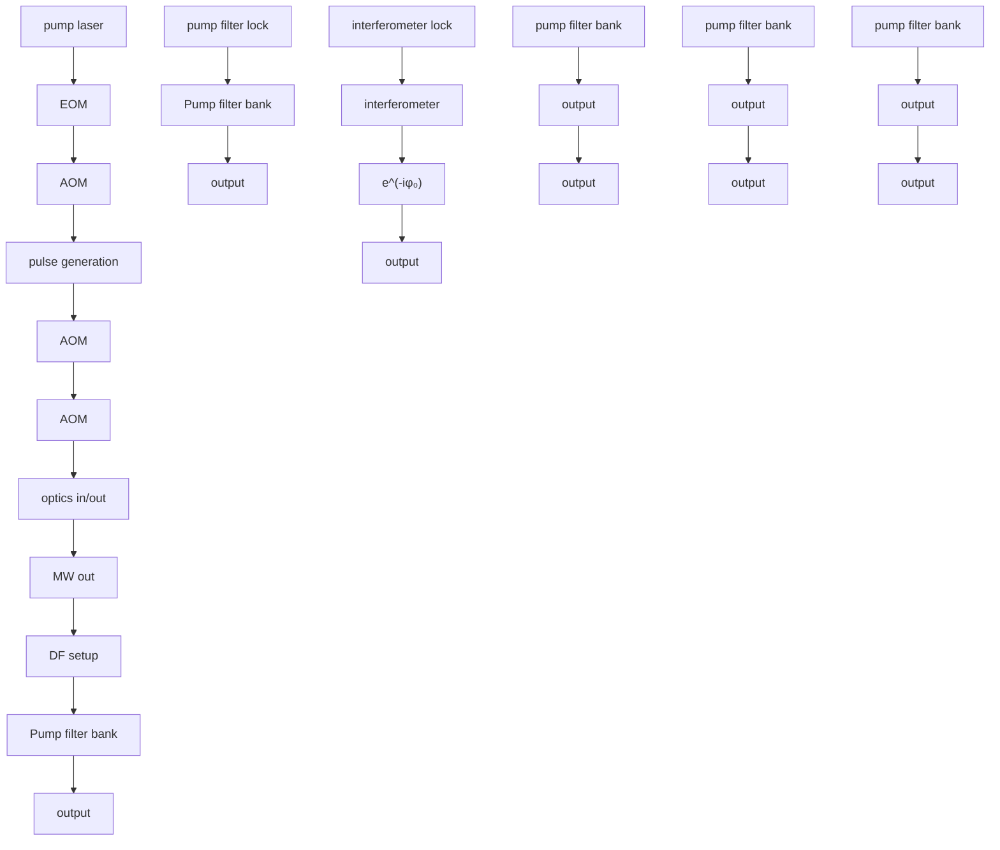
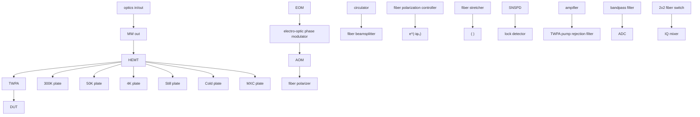

# Quantum Entanglement between Optical and Microwave Photonic Qubits

Srujan Meesala, $^{1,2,3,*}$ David Lake $^{\textcircled{iD}}$ , $^{1,2,3,*}$ Steven Wood, $^{1,2,3,*}$ Piero Chiappina, $^{1,2,3}$ Changchun Zhong $^{\textcircled{iD}}$ , $^{4,\dagger}$ Andrew D. Beyer, $^{5}$ Matthew D. Shaw, $^{5}$ Liang Jiang $^{\textcircled{iD}}$ , $^{4}$ and Oskar Painter $^{1,2,3,6,\ddagger}$

$^{1}$ Thomas J. Watson, Sr., Laboratory of Applied Physics, California Institute of Technology, Pasadena, California 91125, USA

$^{2}$ Kavli Nanoscience Institute, California Institute of Technology, Pasadena, California 91125, USA $^{3}$ Institute for Quantum Information and Matter, California Institute of Technology, Pasadena, California 91125, USA

$^{4}$ Pritzker School of Molecular Engineering, The University of Chicago, Chicago, Illinois 60637, USA $^{5}$ Jet Propulsion Laboratory, California Institute of Technology, 4800 Oak Grove Drive, Pasadena, California 91109, USA

$^{6}$ AWS Center for Quantum Computing, Pasadena, California 91125, USA

(Received 28 February 2024; revised 24 May 2024; accepted 5 August 2024; published 30 September 2024)

Entanglement is an extraordinary feature of quantum mechanics. Sources of entangled optical photons were essential to test the foundations of quantum physics through violations of Bell's inequalities. More recently, entangled many-body states have been realized via strong nonlinear interactions in microwave circuits with superconducting qubits. Here, we demonstrate a chip-scale source of entangled optical and microwave photonic qubits. Our device platform integrates a piezo-optomechanical transducer with a superconducting resonator which is robust under optical illumination. We drive a photon-pair generation process and employ a dual-rail encoding intrinsic to our system to prepare entangled states of microwave and optical photons. We place a lower bound on the fidelity of the entangled state by measuring microwave and optical photons in two orthogonal bases. This entanglement source can directly interface telecom wavelength time-bin qubits and gigahertz frequency superconducting qubits, two well-established platforms for quantum communication and computation, respectively.

DOI: 10.1103/PhysRevX.14.031055

Subject Areas: Quantum Physics, Quantum Information

# I. INTRODUCTION

The growing size and complexity of superconducting quantum processors $[1]$ suggests that future, large-scale quantum computers based on superconducting qubits will likely be modular systems with interconnected processors $[2]$ . Toward this long-term goal, a quantum network architecture has been envisioned with optical channels as low-loss, room-temperature communication links between superconducting processors cooled in separate dilution refrigerator nodes. Such a network would leverage the complementary strengths

of optical photons and superconducting microwave circuits to reliably communicate and process quantum information, respectively, and may also be used to realize quantum communication protocols relevant for long-distance secure communication and distributed sensing. An integral building block in this architecture is a transducer that enables quantum-coherent interactions between microwave and optical photons. An ideal microwave-optical quantum transducer would perform bidirectional frequency conversion of quantum states without any added noise or loss. While such an ideal converter is not fundamentally forbidden, recent experimental efforts $[3–9]$ have revealed various challenges including low efficiency due to relatively weak optical nonlinearities and technical noise due to parasitic optical absorption. Moreover, external losses in photon collection, transmission, and routing are expected to limit the feasibility of operations between remote qubits by means of direct quantum state transfer along optical links. The demanding requirements for near-ideal transducers and communication channels can be relaxed through the use of heralded schemes such as the Duan-Lukin-Cirac-Zoller (DLCZ) protocol $[10]$ and its variants, which have been realized previously with a variety of optical emitters $[11–15]$ . In these schemes, quantum interference and measurement are used to generate entanglement

between remote qubits, heralded by specific measurement outcomes. The remote entangled states can then be used as a resource for high-fidelity operations between qubits in separate nodes by means of quantum teleportation [16].

A simple adaptation of the DLCZ protocol for microwave-optical quantum transduction requires the use of a transducer to generate quantum states of single microwave and optical photons in pairs, with some finite probability $[17,18]$ . By interfering the optical emission from transducers in two separate nodes and performing optical single-photon detection measurements, one can herald remote entangled microwave states with a fidelity insensitive to both the internal efficiency of the transducer and external optical losses. Toward this goal, we recently integrated piezo-optomechanical transducers with light-robust superconducting circuits, enabling measurement of nonclassical correlations between microwave and optical photons generated via spontaneous parametric down-conversion (SPDC) $[19]$ . However, an observation of non-classical statistics is insufficient to prove entanglement or inseparability of the joint optical-microwave state $[20]$ . While nonclassical statistics can be verified through a measurement of intensity correlations, entanglement verification additionally demands a measurement of phase coherence on the correlated photon pairs. Here, we upgrade our platform to operate with dual-rail encoded photonic qubits and perform measurements in complementary bases to extract the requisite intensity correlations and phase coherence, allowing an unambiguous observation of discrete-variable entanglement with a quantum transducer. Recently, a bulk electro-optic transducer was used to infer continuous variable entanglement though a measurement of two-mode squeezing between microwave and optical fields referred to the output ports of the device $[21]$ . However, the continuous-variable entanglement in such states is susceptible to photon loss $[22]$ and is challenging to distribute in an optical quantum network given current experimental capabilities. In contrast, we prepare Bell states of dual-rail optical and microwave photonic qubits, each containing exactly one photon. Such Bell states intrinsically allow for detection of loss errors and entanglement purification and are fundamental building blocks in well-established discrete variable quantum communication protocols $[23,24]$ . For the optical photonic qubit, we use a time-bin encoding, the preferred choice in optical quantum communication due to its robustness to fluctuations in optical path length $[25]$ . For the microwave photonic qubit, we use a modified time-bin encoding involving two orthogonal modes which naturally arise from hybridized acoustic and electrical resonances in our device. We verify entanglement by correlating microwave quantum state tomography results with detection of a single optical photon in a chosen time bin or of a coherent superposition of time bins achieved by passing the optical emission through a fiber optic time-delay interferometer.

# II. MICROWAVE-OPTICAL ENTANGLED PAIR SOURCE

Figure 1(a) shows a simplified schematic of our microwave-optical entanglement source, which we operate in a dilution refrigerator setup at a temperature of approximately 20 mK. Details of the device geometry and fabrication process have been provided in previous work [19]. Pump laser pulses are used to excite a piezo-optomechanical transducer containing a silicon optomechanical crystal resonator which supports optical and acoustic resonances

flowchart

text_image

(b)
transducer
ω₀ ωₚ ωₘ + ...
Gₒₘ gₚₑ
KI resonator
Eᵧ(aᵤ) 1
-1 Disp. (aᵤ) 0 1

line

| t (μs) | early intensity (a.u.) | late intensity (a.u.) |
|--------|------------------------|-----------------------|
| 0.0    | 1.0                    | 1.0                   |
| 0.2    | 0.0                    | 0.0                   |
| 0.4    | 1.0                    | 0.0                   |
| 0.6    | 0.0                    | 0.0                   |
| 0.8    | 0.0                    | 0.0                   |
| 1.0    | 0.0                    | 0.0                   |
| 1.2    | 0.0                    | 0.0                   |
| 1.4    | 0.0                    | 0.0                   |
| 1.6    | 0.0                    | 0.0                   |
| 1.8    | 0.0                    | 0.0                   |
| 2.0    | 0.0                    | 0.0                   |

FIG. 1. Microwave-optical entanglement source. (a) Simplified schematic of various components of the chip-scale microwave-optical entanglement source, not shown to scale to aid presentation. The terminals of the superconducting kinetic inductance resonator are galvanically connected to the electrical terminals of the piezo-optomechanical transducer, shown in detail in (b). The optical cavity in the transducer is coupled to an optical waveguide, which terminates on the left edge of the chip, where a lensed optical fiber is used to launch pump pulses into the device and to collect emitted optical photons in the reverse direction. Microwave (MW) photons emitted by the device are capacitively coupled from the superconducting resonator to an on-chip transmission line and eventually collected in a 50 Ω coax cable. (b) Illustration of the SPDC process in the transducer where a pump photon at frequency $\omega_{p}$ decays into optical and microwave excitations at frequencies $\omega_{o}$ and $\omega_{m}$ , respectively, due to the parametric optomechanical interaction at a rate $G_{om}$ . The microwave excitation is shared between the transducer acoustic mode and the electrical mode of a superconducting kinetic inductance (KI) resonator, which are strongly hybridized with the piezoelectric interaction strength $g_{pe}$ . Simulated profiles of the optical electric field (left) and microwave acoustic displacement field (right) in the transducer are shown. (c) Schematic for generation of Bell states between dual-rail optical and MW photonic qubits. Two consecutive Gaussian pump pulses induce emission of single optical and MW photons into early and late modes centered at their respective frequencies. Theoretically calculated intensity envelopes of these modes are shown when the device is excited with two Gaussian pump pulses separated by a time delay $T_{d} = 279$ ns, which ensures orthogonality of early and late modes used for the dual-rail encoding.

at frequencies $\omega_{\mathrm{o}} \approx 2\pi \times 200$ THz and $\omega_{\mathrm{m}} \approx 2\pi \times 5$ GHz, respectively. Colocalized telecom photons and microwave phonons in this wavelength-scale resonator can interact via radiation pressure and the photoelastic effect [26]. By tuning the pump laser frequency to the blue-detuned mechanical sideband of the optical cavity with $\omega_{\mathrm{p}} = \omega_{\mathrm{o}} + \omega_{\mathrm{m}}$ , we drive a two-mode squeezing interaction described by the Hamiltonian $\hat{H} = G_{\mathrm{om}}(\hat{a}^{\dagger}\hat{b}^{\dagger} + \hat{a}\hat{b})$ , where $\hat{a}$ and $\hat{b}$ are the annihilation operators for the internal optical and acoustic modes, respectively, of the transducer [27]. Here, $G_{\mathrm{om}} = \sqrt{n_{\mathrm{p}}} g_{\mathrm{om}}$ is the strength of the parametric optomechanical interaction, where $n_{\mathrm{p}}$ is the number of intracavity pump photons and $g_{\mathrm{om}} / 2\pi = 270$ kHz is the optomechanical coupling rate at the single-photon and -phonon level in the device under study. In this setting, we can induce SPDC of a pump photon into a photon-phonon pair at frequencies $\omega_{\mathrm{o}}$ and $\omega_{\mathrm{m}}$ , as illustrated in Fig. 1(b). Single phonons from the SPDC process are converted into single microwave photons in a niobium nitride superconducting kinetic inductance resonator tuned into resonance with the transducer acoustic mode via an external magnetic field perpendicular to the device. This conversion process is mediated by a compact aluminum nitride piezoelectric component in the transducer and occurs at a coherent rate $g_{\mathrm{pe}} / 2\pi = 1.2$ MHz, which exceeds the intrinsic damping rates of the acoustic and electrical modes in the device under study (see Appendix A). Finally, as shown in Fig. 1(a), both optical and microwave photons emitted from the device decay into on-chip waveguides and are routed into a lensed optical fiber and a $50~\Omega$ microwave coaxial cable, respectively.

To prepare entangled microwave-optical states, we excite the device with two consecutive pump pulses. Each pump pulse can produce a microwave-optical photon pair in well-defined temporal modes, separated in time and centered at frequencies $\omega_{m}$ and $\omega_{o}$ in the microwave and optical outputs, respectively. While the envelopes of the microwave and optical emission are not identical, they are expected to be correlated, since the SPDC process produces single phonons and optical photons in pairs. Based on the theoretically expected intensity envelopes of “early” and “late” modes in the output ports of the device shown in Fig. 1(c), we adopt a modified time-bin encoding to define dual-rail photonic qubits. The optical early and late mode envelopes adiabatically follow the pump pulses, since the optomechanical interaction strength $G_{om}$ is much smaller than the decay rate of the optical cavity, $\kappa_{o}$ . We use two Gaussian pump pulses with two sigma width $T_{p} = 96$ ns to define time-bin modes for the optical photonic qubit. On the other hand, the microwave early and late mode envelopes are determined by the time evolution of a single phonon scattered into the hybridized microwave electroacoustic resonator system. Given the piezoelectric coupling strength and the decay rates of the microwave and acoustic modes in the device under study, such a phonon preferentially decays into the microwave output waveguide with a damped oscillatory envelope. To satisfy orthogonality between the early and late modes used to encode the microwave photonic qubit, we space the pump pulses by $T_{d} = 279$ ns, matching the electroacoustic oscillation period which is independently measured by microwave electrical spectroscopy (see Appendix D). Under this condition, if a phonon were scattered by the early pump pulse, it would be swapped into the electrical resonator after the time $T_{d}$ , leaving the acoustic mode in the vacuum state for the action of the late pump pulse.

In this setting, the joint wave function of early and late modes in the optical and microwave output ports of the device can be written as

$$
\begin{array}{l} | \Psi \rangle \approx | 0 0 \rangle_ {\mathrm{o}} | 0 0 \rangle_ {\mathrm{m}} \\ + \sqrt {p} (| 1 0 \rangle_ {\mathrm{o}} | 1 0 \rangle_ {\mathrm{m}} + e ^ {i \phi_ {\mathrm{p}}} | 0 1 \rangle_ {\mathrm{o}} | 0 1 \rangle_ {\mathrm{m}}) + \mathcal {O} (p), \tag {1} \\ \end{array}
$$

where $|kl\rangle_{o}$ ( $|kl\rangle_{m}$ ) denotes the direct product of a k-photon state in the early mode and an l-photon state in the late mode on the optical (microwave) output port. The phase $\phi_{p}$ is set by the relative phase between early and late pump pulses. When the scattering probability $p \ll 1$ , the $\mathcal{O}(p)$ terms may be neglected and detection of a single optical photon can be used to postselect an entangled state between an optical photonic qubit in the $\{|10\rangle_{o}, |01\rangle_{o}\}$ manifold and a microwave photonic qubit in the $\{|10\rangle_{m}, |01\rangle_{m}\}$ manifold. The state vectors within curly brackets define the native measurement basis of the photonic qubits, which we call the Z basis in reference to the north and south poles of the Bloch sphere. We refer to a rotated measurement basis on the equator of this Bloch sphere as the X basis. To verify entanglement, we characterize correlations between the photonic qubits in these two orthogonal bases. In our experiments, we operate with Gaussian optical pulses with a peak power of 83 nW corresponding to an intracavity optical photon number $n_{p} = 0.8$ and two sigma width $T_{p} = 96$ ns, which leads to $p = \int 4|G_{\mathrm{om}}(t)|^{2}dt/\kappa_{\mathrm{o}} = 1.0 \times 10^{-4}$ . In comparison with previous work on measuring nonclassical correlations [19], we operate with pump pulses of shorter duration by a factor of 2 to define well-resolved optical time bins and reduce transducer noise from pump-induced heating. This change in transducer operation conditions is primarily enabled by an increase in the bandwidth of the pump filters in our optical measurement chain and the improved external optical collection efficiency $\eta_{opt} = 5.5 \times 10^{-2}$ (see Appendix B). With a pulse repetition rate R = 50 kHz, we detect heralding events at a rate $R_{click} = 0.26 s^{-1}$ . Microwave phonon to photon conversion is expected to occur with efficiency $\eta_{mw} = 0.59$ based on the piezoelectric coupling rate and microwave damping rates in our device.

# III. MICROWAVE-OPTICAL INTENSITY CORRELATIONS

We first measure the time-resolved microwave output intensity from the device conditioned on the detection time

of single optical photons. This allows us to characterize microwave-optical intensity correlations in the Z basis. In this measurement, depicted schematically in Fig. 2(a), optical emission from the device is detected on a superconducting nanowire single-photon detector (SNSPD) after transmission through a filter setup to reject pump photons. Figure 2(b) shows a histogram of single optical photon detection times revealing two nearly Gaussian envelopes associated with the SPDC signal. We use gating windows of width $2T_{p} = 192$ ns centered around each pulse to define the early and late optical modes $\hat{A}_{e}$ and $\hat{A}_{l}$ , respectively. Simultaneously, as shown in Fig. 2(a), microwave emission from the device is directed to an amplification chain with a near-quantum-limited Josephson traveling wave parametric amplifier (TWPA) as the first stage. The amplified microwave signal is down-converted in a room-temperature heterodyne receiver, and the resulting voltage quadratures are sent to an ADC card, allowing us to record a digitized, complex-valued voltage trace for each experimental trial. We capture emission at the microwave resonance frequency $\omega_{m}$ using a digital filter matched to the theoretically expected microwave emission envelope $f(t-\tau)$ , where $\tau$ is a variable readout delay (see Appendix D). We then subtract independently calibrated amplifier-added thermal noise of approximately 2.6 quanta via a moment inversion procedure [28]. Upon postselecting measurement records from trials which produce optical clicks, we observe that the microwave intensity conditioned on a late click is delayed with respect to that conditioned on an early click as shown by the solid traces in Fig. 2(c). These conditional signals contain a finite amount of pump-induced thermal noise from the transducer. Since $p \ll 1$ , such noise is simply given by the unconditional microwave output intensity, shown with the dashed time trace in Fig. 2(c). The ratio of the conditional and unconditional microwave intensities yields the normalized microwave-optical cross-correlation function $g_{AC}^{(2)}$ , which reaches a maximum value of 6.8 for early optical clicks and 5.0 for late optical clicks. Both values exceed the Cauchy-Schwarz bound of 2 for thermal states and signify nonclassical microwave-optical correlations [29–31]. By performing the matched filter operation at optimal microwave readout delays $T_{e}$ and $T_{l}=T_{e}+T_{d}$ , shown by the dotted vertical lines in Fig. 2(c), which maximize the cross-correlation, we define microwave early and late modes $\hat{C}_{e}$ and $\hat{C}_{l}$ , respectively. Figure 2(d) shows conditional occupations of these modes with the symbol $n_{ij}$ for the occupation of microwave mode j conditioned on an optical click detected in mode i. Using these four conditional microwave mode occupations, we define the Z-basis visibility $V_{z}=(n_{ee}-n_{el}-n_{le}+n_{ll})/(n_{ee}+n_{el}+n_{le}+n_{ll})$ . For a Bell state without additional noise or microwave loss, we expect $n_{ee}=n_{ll}=1$ and $n_{el}=n_{le}=0$ , resulting in $V_{z}=1$ . On the contrary, when the microwave and optical intensities are fully uncorrelated, we expect $V_{z}=0$ . From the data in Fig. 2(d), we find $V_{z}=0.633\pm0.014$ , indicating significant intensity correlations between early and late modes in the microwave and optical outputs.

flowchart

line

| t (μs) | Optical count rate (s⁻¹) |
| ------ | ------------------------- |
| -0.2   | 0                         |
| 0.0    | 45                        |
| 0.2    | 45                        |
| 0.4    | 0                         |

line

| τ (μs) | early optical click | late optical click | transducer noise |
| ------ | ------------------- | ------------------ | ---------------- |
| 0.0    | 0.0                 | 0.0                | 0.0              |
| 0.2    | 0.5                 | 0.1                | 0.0              |
| 0.4    | 0.1                 | 0.6                | 0.0              |
| 0.6    | 0.1                 | 0.1                | 0.0              |
| 1.0    | 0.1                 | 0.1                | 0.0              |
| 1.5    | 0.1                 | 0.1                | 0.0              |
| 2.0    | 0.1                 | 0.1                | 0.0              |

bar

| Category | Microwave quanta |
| -------- | ---------------- |
| n_ee     | 0.5              |
| n_el     | 0.15             |
| n_le     | 0.08             |
| n_II     | 0.6              |

FIG. 2. Z-basis intensity correlations. (a) Simplified schematic of experimental setup used to detect correlations between MW and optical emission in the Z basis of the dual-rail qubits. Shaded green box on the MW detection path indicates postprocessing on voltage traces from the heterodyne setup after analog-to-digital conversion (ADC). (b) Histogram of single optical photon detection times plotted as a time trace of optical count rate. Shaded vertical regions indicate gating windows used to define early and late optical time-bin modes $\hat{A}_{e}$ and $\hat{A}_{1}$ , respectively. (c) Quanta in the transducer microwave output mode defined by a filter function matched to the theoretically expected emission envelope, $f(t-\tau)$ centered at the MW resonance frequency $\omega_{m}$ (see Appendix D). The variable readout delay $\tau$ is shown on the x axis, and the occupation of the mode for a given $\tau$ is shown on the y axis. Blue and yellow traces show MW output quanta conditioned on early and late optical clicks, respectively, and the dashed gray trace shows unconditional MW output quanta, which correspond to transducer-added noise. Dotted vertical lines indicate readout delays $T_{e}$ and $T_{1}$ used to define early and late MW modes $\hat{C}_{e}$ and $\hat{C}_{1}$ , respectively. The conditional traces are an average over approximately $3\times10^{5}$ heralding events. Shaded regions around traces span a confidence interval of two standard deviations about the mean. (d) Output quanta $n_{ij}$ in MW mode j conditioned on an optical click in mode i, where i and j run over the early and late modes denoted by e and l, respectively. Data in this panel correspond to approximately $3\times10^{5}$ heralding events. Error bars indicate ± one standard deviation.

This observation of Z-basis correlations is also compatible with a statistical mixture of early and late microwave-optical photon pairs. To rule out this scenario, we characterize intensity correlations in the X basis, which are indicative of the phase coherence of the entangled microwave-optical state. On the optics side, the measurement basis rotation is performed with a time-delay interferometer inserted into the detection path as shown in Fig. 3(a). The interferometer is built with a fiber delay line in one arm to achieve the time delay $T_{d} = 279$ ns required to interfere early and late optical time bins. Additionally, the setup imprints a relative phase between the time bins, $\phi_{o}$ , which is

flowchart

line

| φ_p/π | φ_m = 0 | φ_m = π |
|-------|---------|---------|
| -0.5  | 0.5     | 0.25    |
| 0.0   | 0.4     | 0.3     |
| 0.5   | 0.2     | 0.6     |
| 1.0   | 0.4     | 0.3     |
| 1.5   | 0.5     | 0.2     |
| 2.0   | 0.4     | 0.2     |

bar

| State | Microwave quanta |
|-------|------------------|
| n++   | 0.5              |
| n+-   | 0.1              |
| n-+   | 0.1              |
| n-    | 0.45             |

FIG. 3. X-basis intensity correlations. (a) Simplified schematic of experimental setup used to detect correlations between MW and optical emission in the X basis of the dual-rail qubits. A time-delay interferometer in the optical path is used to interfere early and late optical time bins with a relative phase $\phi_{o}$ . The interference operation in MW detection with a relative phase $\phi_{m}$ is performed in digital postprocessing as shown in the shaded green box. (b) Output quanta in the MW mode $(\hat{C}_{e} + e^{i\phi_{\mathrm{m}}}\hat{C}_{l})/\sqrt{2}$ , for two phase settings $\phi_{m} = 0$ (open circles) and $\phi_{m} = \pi$ (filled squares), conditioned on an optical click in the mode $(\hat{A}_{e} + e^{i(\phi_{\mathrm{p}}+\phi_{\mathrm{o}})}\hat{A}_{l})/\sqrt{2}$ at the output of the time-delay interferometer. The relative phase between the pump pulses, $\phi_{p}$ , is varied along the horizontal axis, while $\phi_{o}$ is kept constant at $0.31\pi$ . The uncertainty in the calibrated optical phase over the duration of the measurement is $\pm0.03\pi$ . Solid and dashed lines are cosine fits. Data in this plot are acquired at 3 times the pump power used for the main dataset and represent an average over approximately $1 \times 10^{4}$ heralding events per optical phase setting. All error bars indicate $\pm$ one standard deviation. (c) Output quanta $n_{ij}$ in MW mode j conditioned on an optical click in mode i, where i and j run over the X-basis MW and optical measurement modes denoted by + and - and corresponding to phase settings $\phi_{m} = 0.56\pi$ , $1.56\pi$ and $\phi_{p} + \phi_{o} = 0.56\pi$ , $1.56\pi$ , respectively, where $\phi_{o}$ is kept constant at $0.28\pi$ . The uncertainty in the calibrated optical phase over the duration of the measurement is $\pm0.04\pi$ . Data in this panel correspond to an average over approximately $7 \times 10^{4}$ heralding events for + and - optical outcomes. All error bars indicate $\pm$ one standard deviation.

actively stabilized through feedback on a piezoelectric fiber stretcher in one of the arms. The relative phase between the pump pulses used to excite the transducer, $\phi_{p}$ , is controlled using an electro-optic phase modulator [32]. With one output port of the interferometer connected to the single-photon detection path, clicks registered on the SNSPD correspond to measurement of a single photon in the mode $(\hat{A}_{\mathrm{e}} + e^{i(\phi_{\mathrm{p}} + \phi_{\mathrm{o}})}\hat{A}_{\mathrm{l}})/\sqrt{2}$ . The measurement phase $\phi_{p} + \phi_{o}$ can be independently calibrated by transmitting coherent optical pulses through the interferometer (see Appendix C). To perform a basis rotation on the microwave side, we add the early and late complex voltage quadratures with a relative phase $\phi_{\mathrm{m}}$ in postprocessing as shown in Fig. 3(a). After subtracting amplifier-added noise in a manner similar to the $Z$ -basis measurement, we measure the moments of the microwave mode $(\hat{C}_{\mathrm{e}} + e^{i\phi_{\mathrm{m}}}\hat{C}_{1}) / \sqrt{2}$ , averaged over experimental trials. In Fig. 3(b), we show conditional microwave output quanta measured in the $X$ basis by fixing $\phi_{\mathrm{m}} = 0, \pi$ . As the optical phase is swept by tuning $\phi_{\mathrm{p}}$ between the pump pulses, we observe correlation fringes in the conditional microwave intensity, a clear signature of coherence of the entangled microwave-optical state. Because of the need for data at multiple optical phase settings for this measurement, we use 3 times higher pump power ( $n_{\mathrm{p}} = 2.4$ ) compared to the main dataset to speed up acquisition. We then lower the pump power back to $n_{\mathrm{p}} = 0.8$ , the setting used in the $Z$ -basis measurements, and repeat the $X$ -basis measurement for two optical phase settings $\phi_{\mathrm{p}} + \phi_{\mathrm{o}} = 0.56\pi$ , $1.56\pi$ at which we define the optical modes $\hat{A}_{\pm}$ , respectively. We measure conditional microwave output quanta in the modes $\hat{C}_{\pm}$ for $\phi_{\mathrm{m}} = 0.56\pi$ , $1.56\pi$ , respectively, and obtain the results shown in Fig. 3(c) for the four combinations of the $X$ -basis modes. In a manner similar to the $Z$ -basis correlation measurement, we define the $X$ -basis visibility $V_{\mathrm{x}}$ , expected to equal 1 for Bell states and 0 for an equal statistical mixture of early and late microwave-optical photon pairs. With the data in Fig. 3(c), we observe $V_{\mathrm{x}} = 0.611 \pm 0.034$ . As an additional consistency check, we sweep the microwave readout phase $\phi_{\mathrm{m}}$ in postprocessing and find that the maximum in $V_{\mathrm{x}}$ occurs for the phase settings $\phi_{\mathrm{m}} = 0.62\pi$ , $1.62\pi$ , offset by $0.06\pi$ from the theoretically expected modes $\hat{C}_{\pm}$ . This can be attributed to a systematic offset in the calibrated optical phase arising from small differences in optical frequency and polarization between calibration and data acquisition (see Appendix C).

# IV. QUANTUM STATE TOMOGRAPHY

The microwave and optical emission from the device exhibit intensity correlations in both Z and X bases which are characteristic of a Bell pair prepared from the pure state in Eq. (1) via optical detection. However, since the experimentally prepared states have finite transducer-added noise and microwave loss, the conditional microwave intensities have contributions from outside the computational subspace where the dual-rail photonic qubits are defined. In order to characterize entanglement more precisely, we must measure both optical and microwave outputs in the single-photon subspace. Since we operate in an experimental regime where the scattering probability $p \ll 1$ , we fulfill the condition that nearly all optical detection events arise from within the single optical photon subspace. On the microwave side, we use statistical moments of conditional heterodyne voltages to perform maximum likelihood state tomography in the joint Fock basis of the early and late modes [28,33] and project onto

the single-photon subspace. This postselection operation is strictly local and cannot generate microwave-optical entanglement. It can be implemented in practice by performing a parity check $[17]$ , a well-established capability in circuit quantum electrodynamics.

Figure 4(a) shows conditional density matrices $\rho^{(e)}, \rho^{(l)}$ , $\rho^{(+)}$ , and $\rho^{(-)}$ of the microwave output state corresponding to an optical click in the early, late, +, and - modes, respectively. For a pure Bell state, the entries highlighted with colored bars in $\rho^{(e)}$ and $\rho^{(l)}$ are expected to have the values $\rho_{10,10}^{(e)} = \rho_{01,01}^{(l)} = 1$ and $\rho_{01,01}^{(e)} = \rho_{10,10}^{(l)} = 0$ ; likewise, the entries highlighted with colored bars in $\rho^{(+)}$ and $\rho^{(-)}$ are expected to have a magnitude of 0.5. The main deviation in the measured conditional microwave states is due to the nonzero vacuum component, primarily from finite conversion efficiency $\eta_{\mathrm{mw}} = 0.59$ of a single phonon into the microwave waveguide. Using the entries highlighted with colored bars in Fig. 4(a), which denote the computational subspace of the dual-rail photonic qubit, we obtain the conditional probability $p_{ij}$ of a single microwave photon in mode j conditioned on receipt of an optical click in mode i (see Appendix F). Here, i and j run over early and late (+ and −) modes for Z- (X-) basis measurements, and the results are shown in Fig. 4(b). Error bars on the probabilities account for statistical error obtained by bootstrapping with replacement over the microwave dataset. These conditional probabilities allow us to establish a lower bound on the Bell state fidelity given by [17,34]

  
FIG. 4. Quantum state tomography of conditional microwave states. (a) Conditional density matrices $\rho^{(e)}, \rho^{(1)}, \rho^{(+)}$ , and $\rho^{(-)}$ of the microwave output state corresponding to early, late, +, and - optical clicks, respectively, plotted in the joint Fock basis of early and late microwave modes. The matrices are obtained from a maximum likelihood reconstruction procedure performed over a joint Fock space of up to six photons in each mode but are plotted in a truncated space of up to two photons in each mode for better visualization. Entries which are expected to be nonzero for a pure microwave-optical Bell state are highlighted in color. (b) Conditional probability $p_{ij}$ of a single photon in microwave mode $j$ conditioned on receipt of an optical click in mode $i$ , calculated from the density matrices in (a) after postselecting the single-photon subspace. Error bars denote uncertainties of $\pm$ one standard deviation.

$$
\begin{array}{l} F _ {\mathrm{lb}} = \frac {1}{2} (p _ {\mathrm{ee}} + p _ {\mathrm{ll}} - p _ {\mathrm{el}} - p _ {\mathrm{le}} \\ + p _ {+ +} + p _ {- -} - 2 \sqrt {p _ {+ -} p _ {- +}}). \tag {2} \\ \end{array}
$$

We find that $F_{lb} = 0.794_{-0.071}^{+0.048}$ , which exceeds the classical limit of 0.5 by over four standard deviations, indicating the preparation of entangled microwave-optical states. A simple model accounting for pump-induced thermal noise in the transducer (see Appendix H) predicts Bell state fidelity exceeding 0.83, which agrees with the measured lower bound, and suggests pump-induced heating as the primary source of infidelity. In addition to the reduction in the fidelity due to pump-induced noise, we expect smaller contributions due to dark counts and imperfections in optical time-bin interference and microwave mode matching. From these conditional probabilities, we calculate a lower bound for the logarithmic negativity of the microwave-optical state, $E_{lb} = 0.65$ (see Appendix F). Together with the microwave collection efficiency and optical heralding rate, we find a lower bound on the ebit rate, $\eta_{mw} R_{click} E_{lb} = 0.10$ ebit/s.

# V. CONCLUSION

The microwave photonic qubit emitted by our entanglement source can be directly received by a dual-rail superconducting qubit $[17]$ or a superconducting qutrit $[35]$ , both of which can be realized with standard transmons. Following this state mapping operation, local operations on the transmons can then be used to detect microwave photon loss events, as demonstrated with current technology $[35]$ , and herald Bell states between a superconducting qubit and a time-bin optical photonic qubit. Our entanglement generation approach, thus, comes with intrinsic robustness against loss errors in contrast with recent work on continuous variable entanglement between microwave and optical fields $[21]$ . Additionally, Bell pair preparation is the first step in well-established protocols for entanglement purification $[23,24]$ , a key requirement for high-fidelity operations in a practical quantum network. From a device engineering standpoint, a transmon module can be connected to our transducer chip with minimal impact of optical pump light on qubit coherence $[4,36–38]$ . In the near term, piezo-optomechanical transducers with improved thermalization with the substrate through the use

of two-dimensional optomechanical crystals [39] and greater acoustic participation in silicon [40,41] can improve transducer noise performance, enabling microwave-optical entanglement generation rates of the order of $10^{3}/s$ . Transducer operation in this performance regime can facilitate the integration of superconducting qubit nodes into optical quantum networks for applications in secure communication [42–44] and distributed sensing [45–47].

# ACKNOWLEDGMENTS

The authors thank A. Butler, G. Kim, M. Mirhosseini, and A. Sipahigil for helpful discussions and B. Baker and M. McCoy for experimental support. We appreciate MIT Lincoln Laboratories for providing the traveling-wave parametric amplifier used in the microwave readout chain in our experimental setup. NbN deposition during the fabrication process was performed at the Jet Propulsion Laboratory. This work was supported by the U.S. Army Research Office (ARO)/Laboratory for Physical Sciences (LPS) Cross Quantum Technology Systems program (Grant No. W911NF-18-1-0103), the ARO/LPS Modular Quantum Gates (ModQ) program (Grant No. W911NF-23-1-0254), the U.S. Department of Energy Office of Science National Quantum Information Science Research Centers (Q-NEXT, Grant No. DE-AC02-06CH11357), the Institute for Quantum Information and Matter (IQIM), an NSF Physics Frontiers Center (Grant No. PHY-1125565) with support from the Gordon and Betty Moore Foundation, the Kavli Nanoscience Institute at Caltech, and the AWS Center for Quantum Computing. L. J. acknowledges support from the AFRL (FA8649-21-P-0781), NSF (ERC-1941583 and OMA-2137642), and the Packard Foundation (2020-71479). S. M. acknowledges support from the IQIM Postdoctoral Fellowship.

# APPENDIX A: DEVICE AND EXPERIMENT PARAMETERS

TABLE I. Independently calibrated losses of components along optical detection path for Z-basis measurements. In X-basis measurements, the time-delay interferometer setup adds extra transmission loss of 0.89. 

<table><tr><td>Parameter</td><td>Value</td></tr><tr><td>Optical cavity to on-chip waveguide</td><td>0.50</td></tr><tr><td>Waveguide to lensed fiber</td><td>0.27</td></tr><tr><td>Circulator between excitation and detection</td><td>0.90</td></tr><tr><td>Total filter bank loss</td><td>0.55</td></tr><tr><td>(individual components below)</td><td></td></tr><tr><td>2 × 2 switches</td><td>0.79</td></tr><tr><td>Filters (2 × cascaded)</td><td>0.79</td></tr><tr><td>Circulator in filter setup</td><td>0.88</td></tr><tr><td>SNSPD setup</td><td>0.83</td></tr><tr><td>Optical collection efficiency ( $\eta_{\text{opt}}$ )</td><td> $5.5 \times 10^{-2}$ </td></tr></table>

TABLE II. Frequencies and coupling rates of transducer internal modes. 

<table><tr><td>Symbol</td><td>Description</td><td>Value</td></tr><tr><td> $\omega_o/2\pi$ </td><td>Optical mode frequency</td><td>192.02 THz</td></tr><tr><td> $\omega_m/2\pi$ </td><td>Microwave mode frequency</td><td>5.004 GHz</td></tr><tr><td> $g_{om}/2\pi$ </td><td>Optomechanical coupling rate</td><td>270 kHz</td></tr><tr><td> $g_{pe}/2\pi$ </td><td>Piezoelectric coupling rate</td><td>1.2 MHz</td></tr><tr><td> $\kappa_{e,o}/2\pi$ </td><td>External optical coupling rate</td><td>650 MHz</td></tr><tr><td> $\kappa_{i,o}/2\pi$ </td><td>Intrinsic optical loss rate</td><td>650 MHz</td></tr><tr><td> $\kappa_m/2\pi$ </td><td>Acoustic loss rate</td><td>150 kHz</td></tr><tr><td> $\kappa_{e,mw}/2\pi$ </td><td>External coupling rate of superconducting resonator</td><td>1.2 MHz</td></tr><tr><td> $\kappa_{i,mw}/2\pi$ </td><td>Intrinsic loss rate of superconducting resonator</td><td>550 kHz</td></tr><tr><td> $\kappa_{mw}/2\pi$ </td><td>Total damping rate of superconducting resonator</td><td>1.75 MHz</td></tr></table>

TABLE III. Microwave-optical photon pair generation parameters. 

<table><tr><td>Symbol</td><td>Description</td><td>Value</td></tr><tr><td> $T_p$ </td><td>Two sigma duration of pump pulse</td><td>96 ns</td></tr><tr><td> $T_r$ </td><td>Repetition period of experiment</td><td>20 μs</td></tr><tr><td> $T_d$ </td><td>Delay between pump pulses</td><td>279 ns</td></tr><tr><td>...</td><td>Peak power of pump pulse</td><td>83 nW</td></tr><tr><td> $n_a$ </td><td>Peak intracavity photon number</td><td>0.78</td></tr><tr><td> $p_{click}$ </td><td>Optical heralding probability (single pulse)</td><td> $5.2 \times 10^{-6}$ </td></tr><tr><td> $R_{click}$ </td><td>Optical heralding rate ( $=p_{click}/T_r$ )</td><td> $0.26 \text{ s}^{-1}$ </td></tr><tr><td> $p$ </td><td>SPDC scattering probability</td><td> $1.0 \times 10^{-4}$ </td></tr><tr><td> $η_{opt}$ </td><td>Optical collection efficiency</td><td> $5.5 \times 10^{-2}$ </td></tr><tr><td> $η_{mw}$ </td><td>Microwave conversion efficiency</td><td>0.59</td></tr></table>

# APPENDIX B: EXPERIMENTAL SETUP

The experimental setup used in this work is an upgraded version of the one used in our recent demonstration of nonclassical microwave-optical photon pairs $[19]$ . Figure 5(a) shows relevant upgrades to the optical setup that enabled us to generate and characterize microwave-optical Bell states. The microwave measurement chain shown in Fig. 5(b) and the heralding setup are identical to the one used in Ref. $[19]$ . Pump pulses used to excite the transducer are generated via amplitude and phase modulation of a continuous-wave external cavity diode laser. Our pulse generation setup uses two acousto-optic modulators (AOMs) in series for amplitude modulation and an electro-optic modulator (EOM) for phase modulation. By applying a rectangular voltage pulse of amplitude $V_{eom}$ to the phase modulator over the duration of the late pump pulse, we control the relative phase between the pump pulses, $\phi_{p}$ introduced in the main text. Polarization of pump light sent to the device is controlled using an electronic fiber polarization controller (FPC). During long data acquisition runs, we mitigate the impact of long-term

flowchart

flowchart

FIG. 5. Schematic of experimental setup. (a) Schematic of optical setup highlighting essential components for the microwave-optical Bell state experiment. A more detailed schematic is provided in previous work [19]. Dotted rectangular blocks encompass the pump pulse generation module, the dilution fridge (DF) setup, interferometer used for $X$ -basis optical measurements, and the pump filter bank. Individual components are labeled in the key below the schematic. (b) Schematic of DF setup and the microwave amplification chain with Josephson TWPA mounted on the mixing chamber (MXC) plate and high electron mobility transistor (HEMT) amplifier mounted on the $4\mathrm{K}$ plate.

polarization drifts along the excitation path through active polarization control.

Pump pulses are sent to the transducer in the dilution fridge (DF) setup through a circulator, which allows us to direct optical emission along with reflected pump pulses to the detection setup. At the beginning of the detection path, a $2 \times 2$ switch allows us to route the signal to a home-built time-delay interferometer for X-basis measurements or to bypass it for Z-basis measurements. Prior to optical detection on a SNSPD, the signal is passed through a pump filter bank comprising two tunable Fabry-Perot cavities. These cavities are locked on resonance with the transducer optical resonance frequency $\omega_{o}$ using a reference tone derived from the pump laser ["pump filter lock" path colored in purple in Fig. 5(a)]. Details of the locking procedure, which is performed once every 4 min during data acquisition, have been described previously [19]. Compared with previous work, we upgrade to higher-bandwidth filters (individual cavity bandwidth of 6 MHz compared with 3.6 MHz in the old setup). Including a circulator and two $2 \times 2$ fiber-optic switches, the filter bank has a total on-resonance insertion loss of 2.6 dB at the signal frequency while providing 105 dB extinction at the pump frequency. This upgrade allows us to work with pump pulses of shorter duration by a factor of 2 and ensure that the optical time bins at the signal frequency are well resolved after the dispersive effect of the pump filters. We also obtain a significant increase in filter transmission for the signal pulses and an overall improvement in the external optical collection efficiency $\eta_{opt}$ by a factor of 3. A detailed budget of all losses in the optical detection chain is given on Table I.

Optical time-bin interference for X-basis measurements is realized in an asymmetric Mach-Zehnder interferometer placed inside a thermally insulated enclosure. A relative path difference of 53 m is achieved via a fiber spool of fixed length in one of the arms of the interferometer. This path difference is precalculated and, upon insertion of the fiber spool into the setup, is experimentally verified to achieve the desired time delay $T_{d} = 279$ ns between the optical time bins. Optical emission from the transducer is directed into one of the two input ports of the interferometer, while the single-photon detection path is connected to one of the two output ports. The other input and output of the

interferometer are used to transmit a lock tone ["interferometer lock" path colored in blue in Fig. 5(a)] and actively stabilize the relative phase between the arms. Phase stabilization is achieved by measuring the power of the lock tone at the interferometer output on a photodetector and controlling a piezoelectric fiber stretcher (Optiphase PZ1, 20 kHz bandwidth) in the longer arm. Proportional-integral-derivative (PID) feedback on the fiber stretcher is implemented using a Toptica Digilock 110 module. The interferometer lock tone is picked off from the pump laser via a beam splitter upstream of the pulse generation module in the excitation path. Since the lock tone has the same center frequency as the pump pulses, it is largely extinguished by the pump filter bank on the single-photon detection path. However, for the lock tone power of 400 nW used in our experiment, we find significant bleedthrough of 500 counts/s on the SNSPD. To prevent false heralding events from this bleedthrough, an AOM is used to shut off the lock tone in a 2 μs window centered in time around the pump pulses used to excite transducer. This off duration is much shorter than the drift timescale of the setup. A sample-and-hold setup on the electrical output of the lock photodetector is triggered in sync with the pulses applied to the lock tone. This ensures that the input to the PID controller does not drop to zero during the brief period for which the lock tone is turned off.

Before commencing X-basis measurements, polarization alignment for light incident on the output beam splitter of the interferometer is performed by adjusting paddle FPCs shown in Fig. 5(a) through the following procedure. First, a fiber polarizer inserted into the lock input arm allows us to define a fixed reference input polarization into the interferometer. The variable beam splitters in the interferometer, which have a weak (few percent) polarization dependence, are balanced for this reference polarization in the lock input arm. Following this step, the FPC inside the interferometer enclosure is adjusted to maximize interference visibility for the lock tone. Finally, polarization of light from the transducer arriving in the signal input arm is aligned to our fixed reference polarization in the lock arm. This is achieved by adjusting the FPC in the signal input arm to maximize the intensity of the rf beat note between signal and lock frequencies as observed on the lock photodetector.

During X-basis data acquisition, the interference visibility for optical pulses emitted by the transducer is periodically monitored via a calibration procedure Appendix C. We find that the passive stability of the interferometer setup is sufficient to maintain an average visibility of 94% for signal pulses over the measurement duration of the X-basis dataset. Approximately 4% reduction in visibility is due to finite overlap of the optical time bins. The remaining 2% reduction in visibility can be attributed to slow fluctuations of polarization along the signal collection path and of temperature inside the interferometer enclosure.

# APPENDIX C: PHASE CALIBRATION FOR OPTICAL X-BASIS MEASUREMENT

During X-basis measurements, the fiber stretcher is actively stabilized to lock the interferometer at the halfway point on interference fringes generated by the lock tone on the output detector. This corresponds to a relative phase $\phi_{lock} = 3\pi/2$ between the interferometer arms at the lock tone frequency. Since the optical signal from the transducer has a different center frequency than the lock tone, a different but fixed relative phase $\phi_{o}$ is imprinted between the two time bins in the signal. To calibrate $\phi_{o}$ , the transducer is optically

line

| t (μs) | SPD count rate (kHz) |
| ------ | -------------------- |
| 0.00   | 0.0                  |
| 0.05   | 1.0                  |
| 0.10   | 14.0                 |
| 0.15   | 12.0                 |
| 0.20   | 8.0                  |
| 0.25   | 3.0                  |
| 0.30   | 16.0                 |
| 0.35   | 29.0                 |
| 0.40   | 49.0                 |
| 0.45   | 20.0                 |
| 0.50   | 4.0                  |
| 0.55   | 14.0                 |
| 0.60   | 12.0                 |
| 0.65   | 8.0                  |
| 0.70   | 4.0                  |
| 0.75   | 2.0                  |
| 0.80   | 1.0                  |
| 0.85   | 0.0                  |
| 0.90   | 0.0                  |

line

| V_eom (V) | φ_lock = 3π/2 | φ_lock = π/2 |
| --------- | ------------- | ------------ |
| -∞        | 0.6           | 0.3          |
| -2        | 0.8           | 0.1          |
| 0         | 1.0           | 0.0          |
| 2         | 0.6           | 0.5          |
| 4         | 0.2           | 1.0          |
| 6         | 0.0           | 0.6          |
| 8         | 0.6           | 0.2          |
| 10        | 1.0           | 0.0          |
| 12        | 0.6           | 0.2          |

histogram

| (φ_p + φ_o)/π | Probability density (+) | Probability density (-) |
| ------------- | ------------------------ | ------------------------ |
| 0.5           | 0.12                     | 0.01                     |
| 1.5           | 0.01                     | 0.14                     |

FIG. 6. Optical phase calibration. (a) Time-binned histogram of optical detection events obtained from transmitting strong, coherent pulses generated by the transducer through the phase-stabilized interferometer setup. The gray shaded region indicates the gating window used for interference detection. (b) Typical phase calibration curve. Variation of gated optical counts in (a) with the EOM voltage $V_{eom}$ applied to the late pump pulse. Blue (green) data points correspond to calibration measurement with the interferometer locked to $\phi_{lock} = 3\pi/2 (\pi/2)$ at the frequency of the lock tone. Solid lines show cosine fits. Diamond markers indicate EOM voltages corresponding to the two phase settings $\phi_{p} + \phi_{o} = 0.56\pi, 1.56\pi$ used for X-basis measurements of the Bell state. (c) Histograms of calibrated phase $\phi_{p} + \phi_{o}$ between the optical time bins for the two phase settings used in the X-basis measurement (denoted by + and − in the legend). The histograms are generated from 268 calibration routines interleaved with data acquisition over the course of the measurement.

pumped with the double Gaussian pulse sequence used in the entanglement experiment. At the same time, the microwave port of the transducer is excited with a cw electrical tone at the microwave resonance frequency $\omega_{m}$ . Under simultaneous optical and microwave excitation in this manner, the transducer generates two large-amplitude coherent states in the optical early and late modes expected in the SPDC signal. After passing these coherent optical pulses through the phase-stabilized interferometer and the pump filter bank, we measure a time trace of the resulting optical intensity on the SNSPD by histogramming photon arrival times as shown in Fig. 6(a). Figure 6(b) shows a typical phase calibration curve where gated counts in the interference window are measured as the phase between the pump pulses, $\phi_{p}$ , is swept by controlling $V_{eom}$ , the amplitude of the voltage pulse applied to the EOM in the pulse generation module. A cosine fit to such an interference curve with the expression $A\cos(kV_{\mathrm{eom}}+\phi_{\mathrm{o}})+B$ allows us to calibrate both $\phi_{p}=kV_{eom}$ and $\phi_{o}$ . Sweeping $\phi_{p}$ via $V_{eom}$ produces an effect equivalent to sweeping $\phi_{o}$ via the interferometer lock set point $\phi_{lock}$ . This is shown by the two interference curves in Fig. 6(b), which are taken for two lock settings of the interferometer where $\phi_{lock}$ and, hence, $\phi_{o}$ are changed by $\pi$ . From an experimental standpoint, controlling $\phi_{p}$ and fixing $\phi_{o}$ ensures identical locking stability for the interferometer for the optical measurement phases of interest in our X-basis measurements. During a long X-basis data acquisition run, we periodically verify our calibration for the optical phase by performing this routine every 2 h. Figure 6(c) shows a histogram of the total optical phase $\phi_{p}+\phi_{o}$ from calibration runs performed over the month-long duration of the measurement, indicating nearly normal distributions with a standard deviation of $0.04\pi$ .

# APPENDIX D: MICROWAVE MODE ENVELOPE

In our experiments, the superconducting electrical resonator is tuned into resonance with the transducer acoustic mode such that the electro-acoustic coupled mode system is at its maximal hybridization point. The piezoelectric coupling rate $g_{pe}$ and the damping rates of both modes are determined via microwave reflection spectroscopy of the device [19] and tabulated in Table II. The complex eigenvalues of the electro-acoustic coupled mode system are given by [48]

$$
\lambda_ {\pm} = i \omega_ {\mathrm{m}} - \frac {\kappa_ {\mathrm{m}} + \kappa_ {\mathrm{mw}}}{4} \pm \sqrt {\left(\frac {\kappa_ {\mathrm{m}} - \kappa_ {\mathrm{mw}}}{4}\right) ^ {2} - g _ {\mathrm{pe}} ^ {2}}. \tag {D1}
$$

A single phonon generated by SPDC at t = 0 is emitted with efficiency $\eta_{mw} = 0.59$ into a temporal mode in the microwave waveguide defined by the envelope function

$$
f (t) = c \Theta (t) (e ^ {\lambda_ {+} t} - e ^ {\lambda_ {-} t}), \tag {D2}
$$

where $\Theta(t)$ is a Heaviside step function and $c$ is a normalization constant satisfying $\int |f(t)|^2 dt = 1$ . In our device, since $2g_{\mathrm{pe}} > \kappa_{\mathrm{mw}}, \kappa_{\mathrm{m}}$ , the exponentially decaying envelope $f(t)$ exhibits oscillations with a period $2\pi / |\lambda_+ - \lambda_-|$ . When two optical pump pulses excite the device at $t = 0$ , $T_{\mathrm{d}}$ , the corresponding microwave emission envelopes $f(t), f(t - T_{\mathrm{d}})$ are exactly orthogonal when $T_{\mathrm{d}} = \pi / |\lambda_+ - \lambda_-| = 279$ ns. In Fig. 1(c) in the main text, we plot $|f(t)|^2$ and $|f(t - T_{\mathrm{d}})|^2$ as the intensity envelopes of the theoretically expected early and late microwave modes. For $Z$ -basis intensity measurements, we convolve the digitized, down-converted microwave voltage signal $V(t)$ with $f$ and estimate the microwave quanta $|\int f^{*}(t - \tau)V(t)dt|^{2} / (2Z_{\mathrm{o}}G\hbar \omega_{\mathrm{m}})$ , where $\tau$ is a variable readout delay, $Z_{\mathrm{o}} = 50~\Omega$ , and $G = 107.4$ dB, the gain of the amplification chain referred to the output of the transducer chip, is calibrated via optomechanical sideband asymmetry and microwave spectroscopy [19]. After subtracting independently measured amplifier-added noise in the same mode as described in Appendix E, the microwave output quanta from the transducer are plotted in Fig. 2(c) in the main text with varying $\tau$ . We determine optimal readout delays $T_{\mathrm{e}}$ and $T_{1} = T_{\mathrm{e}} + T_{\mathrm{d}}$ , which maximize the microwave-optical cross-correlation function, and define microwave early and late modes with the envelope functions $f(t - T_{\mathrm{e}})$ and $f(t - T_{1})$ , respectively. These values are tabulated on Table III.

The complex-valued voltages for the Z-basis microwave modes detected at the output of the heterodyne setup are given by

$$
S _ {\mathrm{e}} = \int f ^ {*} (t - T _ {\mathrm{e}}) V (t) d t, \tag {D3a}
$$

$$
S _ {1} = \int f ^ {*} (t - T _ {1}) V (t) d t. \tag {D3b}
$$

For the X-basis microwave modes, the complex voltage is given by $S_{e} + e^{i\phi_{m}}S_{l}$ , where the measurement phase $\phi_{m}$ can be chosen in postprocessing.

# APPENDIX E: MICROWAVE DATA PROCESSING

Our microwave data processing approach follows techniques originally developed in Refs. [28,49] for quantum state tomography of itinerant microwave photons. These techniques have been used in recent demonstrations of entangled microwave photons [33,50,51]. With the goal of subtracting amplifier-added noise, modes at the output of the heterodyne setup are related to the modes exiting the transducer via the input-output relation of a phase-insensitive bosonic amplifier [49,52]:

$$
\hat {S} _ {\mathrm{e}} = \sqrt {G} \hat {C} _ {\mathrm{e}} + \sqrt {G - 1} \hat {H} _ {\mathrm{e}} ^ {\dagger}, \tag {E1a}
$$

$$
\hat {S} _ {1} = \sqrt {G} \hat {C} _ {1} + \sqrt {G - 1} \hat {H} _ {1} ^ {\dagger}. \tag {E1b}
$$

Here, G is the gain of the amplification chain referred to the output of the transducer chip. $\hat{H}_{\mathrm{e}}\left(\hat{H}_{1}\right)$ represents amplifier noise added to the early (late) modes, respectively. We define complex tensors $\bar{C}$ and $\bar{S}$ containing the normal ordered moments of the microwave modes at the output of the device and the output of the heterodyne setup, respectively, given by

$$
\bar {C} _ {w x y z} := \left\langle \hat {C} _ {\mathrm{e}} ^ {\dagger w} \hat {C} _ {\mathrm{e}} ^ {x} \hat {C} _ {1} ^ {\dagger y} \hat {C} _ {1} ^ {z} \right\rangle , \tag {E2}
$$

$$
\bar {S} _ {k l m n} := \langle \hat {S} _ {\mathrm{e}} ^ {\dagger k} \hat {S} _ {\mathrm{e}} ^ {l} \hat {S} _ {1} ^ {\dagger m} \hat {S} _ {1} ^ {n} \rangle . \tag {E3}
$$

We also define the tensor $\bar{H}$ containing the antinormal ordered moments of the amplifier noise:

$$
\bar {H} _ {k l m n} := \left\langle \hat {H} _ {\mathrm{e}} ^ {k} \hat {H} _ {\mathrm{e}} ^ {\dagger l} \hat {H} _ {1} ^ {m} \hat {H} _ {1} ^ {\dagger n} \right\rangle , \tag {E4}
$$

which is expected to be a product of thermal states in the early and late modes.

Using Eqs. (E1)-(E4) in the limit $G \gg 1$ and adopting the multi-index notation $\alpha = (k, l, m, n)$ and $\beta = (w, x, y, z)$ , we relate the moment tensors through the multinomial expansion

$$
\bar {S} _ {\alpha} = \sum_ {\beta \leq \alpha} \bar {T} _ {\alpha \beta} \bar {C} _ {\beta}, \tag {E5}
$$

where

$$
\bar {T} _ {\alpha \beta} = G ^ {| \alpha | / 2} \binom {\alpha} {\beta} \bar {H} _ {\alpha - \beta}. \tag {E6}
$$

As described in Appendix D, we apply a matched filter to the heterodyne data in our experiments and obtain a dataset of complex voltage samples $\{S_{e}, S_{l}\}$ for each optical detection outcome. We estimate the elements of the moment tensor $\bar{S}$ by taking the sample mean:

$$
\bar {S} _ {\alpha} = \frac {1}{N} \sum (S _ {\mathrm{e}} ^ {*}) ^ {k} S _ {\mathrm{e}} ^ {l} (S _ {1} ^ {*}) ^ {m} S _ {1} ^ {n}, \tag {E7}
$$

where N is the number of voltage records in a given dataset. We interleave every 15 min of conditional microwave data acquisition with calibration measurements where the transducer is (i) not pumped optically and (ii) excited on the microwave port with a weak coherent state of fixed amplitude. (i) yields voltage samples of the amplifier noise and is used to construct $\bar{H}$ ; (ii) is used to track small fluctuations in the amplifier noise and gain which occur over the timescale of several hours. With this knowledge, we invert the moments at the output of the heterodyne setup $\bar{S}_{\alpha}$ via the linear relation in Eq. (E5) to recover the moment tensor at the device output, $\bar{C}_{\beta}$ . We estimate the statistical uncertainty $\sigma_{\beta}$ on each moment using the sample variance. We then reconstruct the density matrix of the conditional microwave state $\rho^{(i)}$ prepared by a single-photon detection event in the optical mode $i\in \{\mathrm{e},1, + , - \}$

For each optical outcome i, the conditional density matrix is obtained by minimizing the log likelihood function

$$
- \log \mathcal {L} (\rho^ {(i)}) = \sum_ {\beta} \frac {| \bar {C} _ {\beta} - P _ {\beta} | ^ {2}}{\sigma_ {\beta} ^ {2}}. \tag {E8}
$$

Here, $P_{\beta} = \operatorname{Tr}\{\hat{C}_{\mathrm{e}}^{\dagger w}\hat{C}_{\mathrm{e}}^{x}\hat{C}_{1}^{\dagger y}\hat{C}_{1}^{z}\rho^{(i)}\}$ is the expectation value for the moment and $\bar{C}_{j}$ predicted by the underlying density matrix. We solve the constrained optimization problem

$$
\min _ {\rho} - \log \mathcal {L} (\rho^ {(i)})
$$

such that $\mathrm{Tr}\{\rho^{(i)}\} = 1$

$$
\rho^ {(i)} \succeq 0 \tag {E9}
$$

using CVX, a package for solving convex programs [53,54]. The results for the maximum likelihood (ML) estimates for $\rho^{(i)}$ shown in the main text are obtained from a $Z$ -basis ( $X$ -basis) dataset consisting of microwave voltage records associated with approximately $3 \times 10^{5}$ (approximately $7 \times 10^{4}$ ) heralding events in each of the early and late (+ and −) optical modes acquired over one month. We reconstruct each $\rho^{(i)}$ in a truncated $6 \times 6$ Fock space of early and late modes which we find to be sufficient to achieve convergence in the single-photon probabilities. In Fig. 4(a) in the main text, we plot $\rho^{(i)}$ in a truncated space of up to two photons in each mode for easy visualization.

To determine the statistical uncertainty on the ML density matrices, we employ a parametric bootstrapping procedure [55] with $10^{3}$ resampling iterations over the datasets with conditional heterodyne voltage samples. In each bootstrapping iteration, a sample of $\rho^{(i)}$ is generated by executing the optimization routine in Eq. (E9) with moments randomly sampled from a multivariate normal distribution with the experimentally measured mean $\bar{C}_{\beta}$ and variance $\sigma_{\beta}^{2}$ . From the ensemble of conditional density matrices generated with this procedure, we estimate marginal distributions associated with the conditional probabilities $p_{ij}$ of a single microwave photon in mode $j$ given a single optical photon detection event in mode $i$ as defined in Appendix F. Here, $i, j \in \{\mathrm{e}, 1\}$ for Z-basis measurements and $\{+, -\}$ for X-basis measurements. These marginal distributions are shown in Fig. 7. It is well established that there can be slight bias between the mean of the distribution generated from bootstrapping and the ML estimate of the density matrix due to a combination of nonlinearities in the estimator and physical constraints on the density matrix [56]. In our case, we calculate a mean value for the Bell state fidelity lower bound $F_{\mathrm{lb}} = 0.83$ using the mean values of the conditional probabilities from the

  
FIG. 7. Error analysis for conditional probabilities. Marginal distributions for each conditional single microwave photon probability calculated by parametric bootstrapping and displayed as a histogram. The mean of the distribution is indicated by the red dashed line, and the result from maximum likelihood estimation over the datasets is shown by the black dashed line.

bootstrapping procedure (red vertical lines in Fig. 7), which is slightly higher than the value of 0.79 from the ML estimates for the same probabilities (black vertical lines in Fig. 7). To take such systematic bias into account, we generate conservative confidence intervals for each $p_{ij}$ as $[\min\{\mu_{ij}, p_{ij}^{\mathrm{ML}}\} - \sigma_{ij}, \max\{\mu_{ij}, p_{ij}^{\mathrm{ML}}\} + \sigma_{ij}]$ , where $\mu_{ij}$ and $\sigma_{ij}$ are the mean and standard deviation of the distributions, respectively, and $p_{ij}^{\mathrm{ML}}$ is the ML estimate from the dataset. Using these conservative confidence intervals, shown with the error bars in Fig. 4(b) in the main text, we estimate $F_{\mathrm{lb}} = 0.794_{-0.071}^{+0.048}$ , which is above 0.5 by over four standard deviations.

# APPENDIX F: BELL STATE FIDELITY LOWER BOUND

To obtain the probability of a single photon in microwave mode j, we define projectors $\{\Pi^{(j)}\}$ in the microwave subspace:

$$
\Pi^ {(e)} = | 1 0 \rangle \langle 1 0 |, \tag {F1a}
$$

$$
\Pi^ {(1)} = | 0 1 \rangle \langle 0 1 |, \tag {F1b}
$$

$$
\Pi^ {(+)} = \frac {1}{2} (| 1 0 \rangle + e ^ {- i \phi_ {\mathrm{m}}} | 0 1 \rangle) (\langle 1 0 | + e ^ {i \phi_ {\mathrm{m}}} \langle 0 1 |), \quad (\text { F1c })
$$

$$
\Pi^ {(-)} = \frac {1}{2} (| 1 0 \rangle - e ^ {- i \phi_ {\mathrm{m}}} | 0 1 \rangle) (\langle 1 0 | - e ^ {i \phi_ {\mathrm{m}}} \langle 0 1 |). \tag {F1d}
$$

The conditional single-photon probabilities $p_{ij}$ associated with a single optical photon detection event in mode i are then calculated as

$$
p _ {i j} = \frac {\mathrm{Tr} \{\Pi^ {(j)} \rho^ {(i)} \}}{\Sigma_ {i , j} \mathrm{Tr} \{\Pi^ {(j)} \rho^ {(i)} \}}, \tag {F2}
$$

where $i, j \in \{e, l\}$ for Z-basis measurements and $\{+, -\}$ for X-basis measurements. The normalization term in the denominator corresponds to postselection of the single microwave photon subspace. These conditional single-photon probabilities enable us to bound the Bell state fidelity using Eq. (2) in the main text [17,34].

The logarithmic negativity of the joint microwave-optical density matrix in the single-photon subspace $\rho$ is defined as [57]

$$
E (\rho) = \mathrm{Tr} | \rho^ {T _ {\mathrm{o}}} |, \tag {F3}
$$

where $\rho^{T_{\circ}}$ denotes the partial transpose with respect to the optical subspace. While our measurements do not allow complete tomography of the joint state, they directly yield the diagonal entries of $\rho$ and bounds on specific off-diagonal elements [34,58]. We then find the lower bound of the logarithmic negativity by minimizing $E(\rho)$ under appropriate constraints:

$$
\min _ {\rho} E (\rho)
$$

such that $\mathrm{diag}\{\rho\} = [p_{\mathrm{ee}}, p_{\mathrm{el}}, p_{\mathrm{le}}, p_{\mathrm{ll}}]$ ,

$$
\operatorname{Re} \left\{\rho_ {\mathrm{ee}, \mathrm{ll}} \right\} \geq \frac {p _ {\mathrm{ee}} - p _ {\mathrm{el}} - p _ {\mathrm{le}} + p _ {\mathrm{ll}}}{2} - \sqrt {p _ {+ -} p _ {- +}},
$$

$$
\rho \succeq 0, \tag {F4}
$$

which is solved using the CVX software package.

# APPENDIX G: CONTRIBUTION OF TWO PHOTON EVENTS TO THE HERALDING SIGNAL

Our analysis for the Bell state fidelity uses the condition that the optical heralding events used for conditional microwave readout are due to detection of single photons. In our experiments, the fraction of optical heralding events due to terms with more than one optical photon is expected to be of the order of $p = 1 \times 10^{-4}$ , a negligible fraction of the dataset. These events do not have a statistically significant impact on the lower bound for the Bell state fidelity.

# APPENDIX H: MODEL FOR THE ENTANGLED STATE

Here, we present a numerical model for the microwave-optical entangled state by incorporating the level of

pump-induced noise in the transducer. This is an extension of a simple model presented in our previous work on microwave-optical photon-pair generation [19]. The conditional microwave state $\rho^{(i)}$ corresponding to a single optical photon detection event in mode $\hat{A}_i$ , where $i \in \{\mathrm{e}, 1, +, -\}$ , is generated in two steps from an initial thermal state $\rho_{\mathrm{th}}$ with occupation $\bar{n}_{\mathrm{i,e}}$ ( $\bar{n}_{\mathrm{i,l}}$ ) in the early (late) microwave mode prior to the corresponding pump pulse.

(1) Detection of a single optical photon in mode $\hat{A}_i$ signifies successful pair generation and conditionally adds a single excitation to the microwave mode $\hat{C}_i$ . The microwave state undergoes a quantum jump into a photon-added thermal state: $\rho_{\mathrm{th}} \rightarrow \hat{C}_i^\dagger \rho_{\mathrm{th}} \hat{C}_i / \mathrm{Tr}\{\hat{C}_i^\dagger \rho_{\mathrm{th}} \hat{C}_i\}$ .   
(2) This photon-added thermal state is extracted with finite efficiency $\eta_{\mathrm{ext}}$ and additional thermal noise quanta $\bar{n}_{\mathrm{d,e}}$ ( $\bar{n}_{\mathrm{d,l}}$ ) added to the early (late) microwave mode due to delayed heating of the transducer after the pump pulse. These effects are together modeled as an imperfect beam splitter transformation on both early and late modes. We have $\hat{C}_e \to \sqrt{\eta_{\mathrm{ext}}} \hat{C}_e + \sqrt{1 - \eta_{\mathrm{ext}}} \hat{d}_\mathrm{e}$ , where $\hat{d}_\mathrm{e}$ is a phenomenological thermal noise operator such that $(1 - \eta_{\mathrm{ext}}) \langle \hat{d}_{\mathrm{e}}^{\dagger} \hat{d}_{\mathrm{e}} \rangle = \bar{n}_{\mathrm{d,e}}$ , and similarly for the late mode. Upon applying unitary operators for these beam splitter transformations on the photon-added thermal state, we obtain the conditional microwave state $\rho^{(i)}$ .

The occupation of microwave mode $j$ correlated with a single-photon click in optical mode $i$ is then given by $n_{ij} = \mathrm{Tr}\{\hat{C}_j^\dagger \hat{C}_j\rho^{(i)}\}$ . Conditional single-photon probabilities $p_{ij}$ are calculated from the modeled $\rho^{(i)}$ using Eqs. (F1) and (F2). The model is implemented in QUTIP [59] in the joint Fock space of early and late microwave modes truncated to a Fock size of 6 for each mode, which is determined to be sufficient for convergence of $n_{ij}$ and $p_{ij}$ . We use noise parameters tabulated in

TABLE IV. Parameters for the conditional microwave state model. Thermal noise parameters are independently determined from the unconditional microwave signal shown by the dashed time trace in Fig. 2(c) in the main text. Microwave extraction efficiency $\eta_{ext}$ is determined from an independent measurement of the conditional microwave intensity when the transducer is excited with a single pump pulse. $\eta_{ext}$ is less than the theoretical microwave conversion efficiency $\eta_{mw} = 0.59$ due to imperfections in mode matching with the matched filter. 

<table><tr><td>Parameter</td><td>Value</td></tr><tr><td> $\eta_{\text{ext}}$ </td><td>0.42</td></tr><tr><td> $\bar{n}_{\text{i,e}}$ </td><td> $0.05/\eta_{\text{ext}}$ </td></tr><tr><td> $\bar{n}_{\text{i,l}}$ </td><td> $0.10/\eta_{\text{ext}}$ </td></tr><tr><td> $\bar{n}_{\text{d,e}}$ </td><td> $0.029/(1-\eta_{\text{ext}})$ </td></tr><tr><td> $\bar{n}_{\text{d,l}}$ </td><td> $0.029/(1-\eta_{\text{ext}})$ </td></tr></table>

bar

| Group | Microwave quanta |
| :--- | :--- |
| n_ee | 0.53 |
| n_el | 0.15 |
| n_le | 0.09 |
| n_II | 0.60 |
| n_++ | 0.52 |
| n_+- | 0.11 |
| n_+ | 0.10 |
| n_-- | 0.44 |

bar

| Group | Normalized probability |
|-------|------------------------|
| p_ee  | 0.45                   |
| p_el  | 0.10                   |
| p_le  | 0.03                   |
| p_II  | 0.43                   |

| Group | Normalized probability |
|-------|------------------------|
| p_++  | 0.52                   |
| p_+   | 0.07                   |
| p_-   | 0.38                   |

FIG. 8. Model for the entangled state. In both panels, predictions from the model are given by the white bars, while measured values and associated uncertainty are given by the colored bars. (a) Conditional microwave intensity $n_{ij}$ in the microwave mode j conditioned on receipt of an optical click in mode i. (b) Conditional probability $p_{ij}$ of a single photon in microwave mode j conditioned on receipt of an optical click in mode i.

Table IV determined from independent measurements. The results from the model plotted with white rectangles in Fig. 8 allow us to predict visibilities $V_{z} = V_{x} = 0.70$ for the conditional microwave intensities and a fidelity lower bound $F_{lb} = 0.83$ after postselecting the single microwave photon subspace. These predicted values from the model are slightly higher than the experimentally measured values which are impacted by dark counts and imperfections in optical time-bin interference.

[1] M. Kjaergaard, M. E. Schwartz, J. Braumüller, P. Krantz, J. I.-J. Wang, S. Gustavsson, and W. D. Oliver, Superconducting qubits: Current state of play, Annu. Rev. Condens. Matter Phys. 11, 369 (2020).   
[2] S. Bravyi, O. Dial, J. M. Gambetta, D. Gil, and Z. Nazario, The future of quantum computing with superconducting qubits, J. Appl. Phys. 132, 160902 (2022).   
[3] X. Han, W. Fu, C.-L. Zou, L. Jiang, and H. X. Tang, Microwave-optical quantum frequency conversion, Optica 8, 1050 (2021).   
[4] R. D. Delaney, M. D. Urmey, S. Mittal, B. M. Brubaker, J. M. Kindem, P. S. Burns, C. A. Regal, and K. W. Lehnert, Superconducting-qubit readout via low-backaction electro-optic transduction, Nature (London) 606, 489 (2022).   
[5] W. Fu, M. Xu, X. Liu, C.-L. Zou, C. Zhong, X. Han, M. Shen, Y. Xu, R. Cheng, S. Wang, L. Jiang, and H. X. Tang, Cavity electro-optic circuit for microwave-to-optical conversion in the quantum ground state, Phys. Rev. A 103, 053504 (2021).   
[6] Y. Xu, A. A. Sayem, L. Fan, C.-L. Zou, S. Wang, R. Cheng, W. Fu, L. Yang, M. Xu, and H. X. Tang, Bidirectional

interconversion of microwave and light with thin-film lithium niobate, Nat. Commun. 12, 4453 (2021).   
[7] R. Hisatomi, A. Osada, Y. Tabuchi, T. Ishikawa, A. Noguchi, R. Yamazaki, K. Usami, and Y. Nakamura, Bidirectional conversion between microwave and light via ferromagnetic magnons, Phys. Rev. B 93, 174427 (2016).   
[8] J. G. Bartholomew, J. Rochman, T. Xie, J. M. Kindem, A. Ruskuc, I. Craiciu, M. Lei, and A. Faraon, On-chip coherent microwave-to-optical transduction mediated by ytterbium in yvo4, Nat. Commun. 11, 3266 (2020).   
[9] W. Jiang, F.M. Mayor, S. Malik, R. Van Laer, T.P. McKenna, R.N. Patel, J.D. Witmer, and A.H. Safavi-Naeini, Optically heralded microwave photon addition, Nat. Phys. 19, 1423 (2023).   
[10] L.-M. Duan, M. D. Lukin, J. I. Cirac, and P. Zoller, Long-distance quantum communication with atomic ensembles and linear optics, Nature (London) 414, 413 EP (2001).   
[11] D. L. Moehring, P. Maunz, S. Olmschenk, K. C. Younge, D. N. Matsukevich, L.-M. Duan, and C. Monroe, Entanglement of single-atom quantum bits at a distance, Nature (London) 449, 68 (2007).   
[12] J. Hofmann, M. Krug, N. Ortegel, L. Gérard, M. Weber, W. Rosenfeld, and H. Weinfurter, \*Heralded entanglement between widely separated atoms\*, Science 337, 72 (2012).   
[13] H. Bernien, B. Hensen, W. Pfaff, G. Koolstra, M. Blok, L. Robledo, T. H. Taminiau, M. Markham, D. J. Twitchen, L. Childress, and R. Hanson, \*Heralded entanglement between solid-state qubits separated by three metres\*, Nature (London) 497, 86 (2013).   
[14] A. Delteil, Z. Sun, W.-b. Gao, E. Togan, S. Faelt, and A. Imamoğlu, Generation of heralded entanglement between distant hole spins, Nat. Phys. 12, 218 (2016).   
[15] R. Riedinger, A. Wallucks, I. Marinković, C. Löschnauer, M. Aspelmeyer, S. Hong, and S. Gröblacher, Remote quantum entanglement between two micromechanical oscillators, Nature (London) 556, 473 (2018).   
[16] C. H. Bennett, G. Brassard, C. Crépeau, R. Jozsa, A. Peres, and W. K. Wootters, Teleporting an unknown quantum state via dual classical and Einstein-Podolsky-Rosen channels, Phys. Rev. Lett. 70, 1895 (1993).   
[17] C. Zhong, Z. Wang, C. Zou, M. Zhang, X. Han, W. Fu, M. Xu, S. Shankar, M. H. Devoret, H. X. Tang, and L. Jiang, Proposal for heralded generation and detection of entangled microwave–optical-photon pairs, Phys. Rev. Lett. 124, 010511 (2020).   
[18] S. Krastanov, H. Raniwala, J. Holzgrafe, K. Jacobs, M. Lončar, M. J. Reagor, and D. R. Englund, Optically heralded entanglement of superconducting systems in quantum networks, Phys. Rev. Lett. 127, 040503 (2021).   
[19] S. Meesala, S. Wood, D. P. Lake, P. Chiappina, C. Zhong, A. D. Beyer, M. D. Shaw, L. Jiang, and O. Painter, Non-classical microwave-optical photon pair generation with a chip-scale transducer, Nat. Phys. 20, 871 (2024).   
[20] H. Ollivier and W. H. Zurek, Quantum discord: A measure of the quantumness of correlations, Phys. Rev. Lett. 88, 017901 (2001).   
[21] R. Sahu, L. Qiu, W. Hease, G. Arnold, Y. Minoguchi, P. Rabl, and J. M. Fink, Entangling microwaves with light, Science 380, 718 (2023).

[22] L.-M. Duan, G. Giedke, J. I. Cirac, and P. Zoller, Inseparability criterion for continuous variable systems, Phys. Rev. Lett. 84, 2722 (2000).   
[23] C. H. Bennett, D. P. DiVincenzo, J. A. Smolin, and W. K. Wootters, Mixed-state entanglement and quantum error correction, Phys. Rev. A 54, 3824 (1996).   
[24] E. T. Campbell and S. C. Benjamin, Measurement-based entanglement under conditions of extreme photon loss, Phys. Rev. Lett. 101, 130502 (2008).   
[25] I. Marcikic, H. de Riedmatten, W. Tittel, H. Zbinden, M. Legré, and N. Gisin, Distribution of time-bin entangled qubits over 50 km of optical fiber, Phys. Rev. Lett. 93, 180502 (2004).   
[26] S. M. Meenehan, J. D. Cohen, G. S. MacCabe, F. Marsili, M. D. Shaw, and O. Painter, Pulsed excitation dynamics of an optomechanical crystal resonator near its quantum ground state of motion, Phys. Rev. X 5, 041002 (2015).   
[27] M. Aspelmeyer, T. J. Kippenberg, and F. Marquardt, Cavity optomechanics, Rev. Mod. Phys. 86, 1391 (2014).   
[28] C. Eichler, D. Bozyigit, C. Lang, L. Steffen, J. Fink, and A. Wallraff, Experimental state tomography of itinerant single microwave photons, Phys. Rev. Lett. 106, 220503 (2011).   
[29] R. Riedinger, S. Hong, R. A. Norte, J. A. Slater, J. Shang, A. G. Krause, V. Anant, M. Aspelmeyer, and S. Gröblacher, Non-classical correlations between single photons and phonons from a mechanical oscillator, Nature (London) 530, 313 (2016).   
[30] A. Kuzmich, W. P. Bowen, A. D. Boozer, A. Boca, C. W. Chou, L.-M. Duan, and H. J. Kimble, Generation of non-classical photon pairs for scalable quantum communication with atomic ensembles, Nature (London) 423, 731 (2003).   
[31] J. F. Clauser, Experimental distinction between the quantum and classical field-theoretic predictions for the photoelectric effect, Phys. Rev. D 9, 853 (1974).   
[32] A. Zivari, N. Fiaschi, R. Burgwal, E. Verhagen, R. Stockill, and S. Gröblacher, On-chip distribution of quantum information using traveling phonons, Sci. Adv. 8, eadd2811 (2022).   
[33] V. S. Ferreira, G. Kim, A. Butler, H. Pichler, and O. Painter, Deterministic generation of multidimensional photonic cluster states with a single quantum emitter, Nat. Phys. 20, 865 (2024).   
[34] B. B. Blinov, D. L. Moehring, L.-M. Duan, and C. Monroe, Observation of entanglement between a single trapped atom and a single photon, Nature (London) 428, 153 (2004).   
[35] P. Kurpiers, M. Pechal, B. Royer, P. Magnard, T. Walter, J. Heinsoo, Y. Salathé, A. Akin, S. Storz, J.-C. Besse, S. Gasparinetti, A. Blais, and A. Wallraff, Quantum communication with time-bin encoded microwave photons, Phys. Rev. Appl. 12, 044067 (2019).   
[36] G. Arnold and T. Werner, All-optical single-shot readout of a superconducting qubit, arXiv:2310.16817.   
[37] H. K. Warner, J. Holzgrafe, B. Yankelevich, D. Barton, S. Poletto, C. J. Xin, N. Sinclair, D. Zhu, E. Sete, B. Langley, E. Batson, M. Colangelo, A. Shams-Ansari, G. Joe, K. K. Berggren, L. Jiang, M. Reagor, and M. Loncar, Coherent control of a superconducting qubit using light, arXiv:2310.16155.   
[38] T. C. van Thiel, M. J. Weaver, F. Berto, P. Duivestein, M. Lemang, K. Schuurman, M. Žemlička, F. Hijazi,

A. C. Bernasconi, E. Lachman, M. Field, Y. Mohan, F. de Vries, N. Bultink, J. van Oven, J. Y. Mutus, R. Stockill, and S. Gröblacher, High-fidelity optical readout of a superconducting qubit using a scalable piezo-optomechanical transducer, arXiv:2310.06026.   
[39] H. Ren, M. H. Matheny, G. S. MacCabe, J. Luo, H. Pfeifer, M. Mirhosseini, and O. J. Painter, Two-dimensional optomechanical crystal cavity with high quantum cooperativity, Nat. Commun. 11, 3373 (2020).   
[40] P. Chiappina, J. Banker, S. Meesala, D. Lake, S. Wood, and O. Painter, Design of an ultra-low mode volume piezo-optomechanical quantum transducer, Opt. Express 31, 22914 (2023).   
[41] H. Zhao, A. Bozkurt, and M. Mirhosseini, Electro-optic transduction in silicon via gigahertz-frequency nanomechanics, Optica 10, 790 (2023).   
[42] M. K. Bhaskar, R. Riedinger, B. Machielse, D. S. Levonian, C. T. Nguyen, E. N. Knall, H. Park, D. Englund, M. Lončar, D. D. Sukachev, and M. D. Lukin, Experimental demonstration of memory-enhanced quantum communication, Nature (London) 580, 60 (2020).   
[43] J.-P. Chen, C. Zhang, Y. Liu, C. Jiang, W.-J. Zhang, Z.-Y. Han, S.-Z. Ma, X.-L. Hu, Y.-H. Li, H. Liu, F. Zhou, H.-F. Jiang, T.-Y. Chen, H. Li, L.-X. You, Z. Wang, X.-B. Wang, Q. Zhang, and J.-W. Pan, Twin-field quantum key distribution over a 511 km optical fibre linking two distant metropolitan areas, Nat. Photonics 15, 570 (2021).   
[44] M. Pompili, C. Delle Donne, I. te Raa, B. van der Vecht, M. Skrzypczyk, G. Ferreira, L. de Kluijver, A. J. Stolk, S. L. N. Hermans, P. Pawełczak, W. Kozlowski, R. Hanson, and S. Wehner, Experimental demonstration of entanglement delivery using a quantum network stack, npj Quantum Inf. 8, 121 (2022).   
[45] D. Gottesman, T. Jennewein, and S. Croke, Longer-baseline telescopes using quantum repeaters, Phys. Rev. Lett. 109, 070503 (2012).   
[46] E. T. Khabiboulline, J. Borregaard, K. De Greve, and M. D. Lukin, Optical interferometry with quantum networks, Phys. Rev. Lett. 123, 070504 (2019).   
[47] B. C. Nichol, R. Srinivas, D. P. Nadlinger, P. Drmota, D. Main, G. Araneda, C. J. Ballance, and D. M. Lucas, An elementary quantum network of entangled optical atomic clocks, Nature (London) 609, 689 (2022).   
[48] C. Zhong, X. Han, H. X. Tang, and L. Jiang, Entanglement of microwave-optical modes in a strongly coupled electro-optomechanical system, Phys. Rev. A 101, 032345 (2020).

[49] M. P. da Silva, D. Bozyigit, A. Wallraff, and A. Blais, Schemes for the observation of photon correlation functions in circuit QED with linear detectors, Phys. Rev. A 82, 043804 (2010).   
[50] B. Kannan, D. L. Campbell, F. Vasconcelos, R. Winik, D. K. Kim, M. Kjaergaard, P. Krantz, A. Melville, B. M. Niedzielski, J. L. Yoder, T. P. Orlando, S. Gustavsson, and W. D. Oliver, Generating spatially entangled itinerant photons with waveguide quantum electrodynamics, Sci. Adv. 6, eabb8780 (2020).   
[51] J.-C. Besse, K. Reuer, M. C. Collodo, A. Wulff, L. Wernli, A. Copetudo, D. Malz, P. Magnard, A. Akin, M. Gabureac, G. J. Norris, J. I. Cirac, A. Wallraff, and C. Eichler, Realizing a deterministic source of multipartite-entangled photonic qubits, Nat. Commun. 11, 4877 (2020).   
[52] C. M. Caves, Quantum limits on noise in linear amplifiers, Phys. Rev. D 26, 1817 (1982).   
[53] I. CVX Research, CVX: Matlab software for disciplined convex programming, version 2.0, http://cvxr.com/cvx (2012).   
[54] M. Grant and S. Boyd, Graph implementations for non-smooth convex programs, in Recent Advances in Learning and Control, Lecture Notes in Control and Information Sciences, edited by V. Blondel, S. Boyd, and H. Kimura (Springer-Verlag, Berlin, 2008), pp. 95–110, 10.1007/978-1-84800-155-8\_7.   
[55] J. M. Chow, J. M. Gambetta, A. D. Córcoles, S. T. Merkel, J. A. Smolin, C. Rigetti, S. Poletto, G. A. Keefe, M. B. Rothwell, J. R. Rozen, M. B. Ketchen, and M. Steffen, Universal quantum gate set approaching fault-tolerant thresholds with superconducting qubits, Phys. Rev. Lett. 109, 060501 (2012).   
[56] A. C. Keith, C. H. Baldwin, S. Glancy, and E. Knill, Joint quantum-state and measurement tomography with incomplete measurements, Phys. Rev. A 98, 042318 (2018).   
[57] M. B. Plenio, Logarithmic negativity: A full entanglement monotone that is not convex, Phys. Rev. Lett. 95, 090503 (2005).   
[58] C. A. Sackett, D. Kielpinski, B. E. King, C. Langer, V. Meyer, C. J. Myatt, M. Rowe, Q. A. Turchette, W. M. Itano, D. J. Wineland, and C. Monroe, Experimental entanglement of four particles, Nature (London) 404, 256 (2000).   
[59] J. Johansson, P. Nation, and F. Nori, QUTIP2: A python framework for the dynamics of open quantum systems, Comput. Phys. Commun. 184, 1234 (2013).