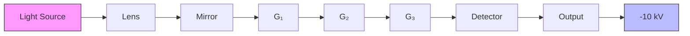

# Quantum superposition of molecules beyond 25 kDa

Yaakov Y. Fein $^{1}$ , Philipp Geyer $^{1}$ , Patrick Zwick $^{2}$ , Filip Kiałka $^{1}$ , Sebastian Pedalino $^{1}$ , Marcel Mayor $^{2,3,4}$ , Stefan Gerlich $^{1}$ and Markus Arndt $^{1*}$

Matter-wave interference experiments provide a direct confirmation of the quantum superposition principle, a hallmark of quantum theory, and thereby constrain possible modifications to quantum mechanics $^{1}$ . By increasing the mass of the interfering particles and the macroscopicity of the superposition $^{2}$ , more stringent bounds can be placed on modified quantum theories such as objective collapse models $^{3}$ . Here, we report interference of a molecular library of functionalized oligoporphyrins $^{4}$ with masses beyond 25,000 Da and consisting of up to 2,000 atoms, by far the heaviest objects shown to exhibit matter-wave interference to date. We demonstrate quantum superposition of these massive particles by measuring interference fringes in a new 2-m-long Talbot-Lau interferometer that permits access to a wide range of particle masses with a large variety of internal states. The molecules in our study have de Broglie wavelengths down to 53 fm, five orders of magnitude smaller than the diameter of the molecules themselves. Our results show excellent agreement with quantum theory and cannot be explained classically. The interference fringes reach more than 90% of the expected visibility and the resulting macroscopicity value of 14.1 represents an order of magnitude increase over previous experiments $^{2}$ .

In recent years there has been a growing experimental effort to create highly macroscopic quantum states in a range of systems, including superconducting quantum interference devices $^{5}$ , Bose–Einstein condensates (BECs) $^{6}$ , optomechanical systems $^{7}$ and matter-wave interferometers $^{8,9}$ . Such systems probe the universality of quantum mechanics by showing that their dynamics cannot be understood without quantum theory.

To demonstrate the wave nature of a new class of massive particles we built the Long-Baseline Universal Matter-Wave Interferometer (LUMI), a three-grating Talbot–Lau interferometer with a baseline of 2 m, the longest macromolecular interferometer to date. LUMI can be operated with either three mechanical gratings or two mechanical grating and one optical grating. The latter scheme, which is the one used in these experiments, is known as a Kapitza–Dirac–Talbot–Lau interferometer (KDTLI) $^{10}$ , and relies on diffraction at a thin optical grating via the optical dipole force $^{11}$ . The essential physics is similar in both schemes: the first grating acts as an array of narrow collimation slits to prepare a coherent illumination of the second grating, resulting in a near-field self-imaging phenomenon known as the Talbot–Lau effect. A third grating further downstream is transversely scanned to detect the presence of the interference fringes, which are collected by an integrating detector.

In the case of a KDTLI, coherent self-imaging of a monochromatic molecular beam occurs when the gratings are spaced by half-integer multiples of the Talbot length, $L_{T} = d^{2}/\lambda_{dB}$ . Here, d is the grating period (266 nm) and $\lambda_{dB} = h/mv$ is the de Broglie wavelength, with m and v being the molecular mass and velocity. Observing coherent imaging with large masses therefore requires a long interferometer baseline and/or a small longitudinal beam velocity. The 2 m length of LUMI thus allows us to access de Broglie wavelengths as small as 35 fm with readily available molecular beam techniques. It should also be noted that the Talbot condition does not have to be exactly satisfied to maintain high interference visibility in the KDTLI scheme, nor does the molecular beam require a high degree of initial spatial coherence $^{12}$ .

A schematic of the experiment is shown in Fig. 1. A molecular beam is formed by pulsed laser desorption from a coated glass slide. The beam is collimated by slits (500 $\mu$ m horizontal, 400 $\mu$ m vertical) and modulated by a chopper disc with a pseudorandom sequence of openings for time-of-flight (TOF) measurements $^{13}$ . The molecules we use are tailored derivatives of oligo-tetraphenylporphyrins enriched by a library of up to 60 fluoroalkylsulfanyl chains $^{4}$ (see Methods for details). A differential pumping stage separates the source chamber from the interferometer chamber, which houses the three gratings and their translation and rotation stages. After traversing the interferometer, the molecules are ionized by electron impact, mass-selected in a quadrupole and counted. Interference fringes are then detected by shifting the final mechanical grating transversely in small steps while monitoring the transmitted molecular flux.

The long baseline of LUMI renders it sensitive to global external forces, such as gravity and rotation, smaller than $10^{-26}$ N. The intrinsic sensitivity of molecular interferometry has shown its utility in measuring properties such as polarizabilities, dipole moments and absorption cross-sections $^{14-17}$ , but the enhanced sensitivity of LUMI also introduces challenges. In particular, vibration isolation, compensation of the Coriolis effect, and beam intensity and stability become significant hurdles.

The interferometer is built on a 160kg Invar bar for high thermal and mechanical stability. It is suspended by a pendulum and damped with magnetic eddy-current brakes for vibration isolation. The stability of the interferometer was thoroughly characterized using accelerometers and optical interferometers, as discussed in the Methods.

The effect of the Earth's rotation plays a significant role in our experiment, since the Coriolis force is velocity-dependent and our molecular beam contains a broad spread of velocities. Given the

flowchart

chemical

Complex zinc porphyrin complex with R = F or C₁₀H₄F₁₇S ligand

line

| Mass (Da) | Norm. counts |
| --------- | ------------ |
| 20,000    | 0.0          |
| 21,000    | 0.1          |
| 22,000    | 0.2          |
| 23,000    | 0.1          |
| 24,000    | 0.1          |
| 25,000    | 0.4          |
| 26,000    | 0.7          |
| 27,000    | 1.0          |
| 28,000    | 0.6          |
| 29,000    | 0.3          |

Fig. 1 | Experimental schematic and molecule details. a, The molecular beam is created via nanosecond laser desorption (532 nm, 1 kHz, $I \approx 1 \times 10^{8}$ W cm $^{-2}$ ), followed by collimation and TOF encoding via a pseudo-random chopper. The beam then enters the interferometer chamber, passing two SiN gratings G $_{1}$ and G $_{3}$ (266 nm period, 43% open fraction, 160 nm thick) and the optical grating G $_{2}$ ( $\lambda = 532$ nm, vertical beam waist 690 $\mu$ m), spaced by L = 0.98 m. The third grating shifts transversely across the molecular beam to detect the presence of quantum interference fringes that manifest as a molecular density pattern of period d. The molecules are then ionized by electron impact and are mass-selected and counted in a customized quadrupole mass spectrometer that can resolve masses beyond 1 MDa. b, The molecules in this study consist of a tetraphenylmethane core with four zinc-coordinated porphyrin branches. Each branch contains up to 15 fluoroalkylsulfanyl chains. c, The MALDI-TOF spectrum of the molecular library after matrix-free desorption. The mass resolution in LUMI during interference experiments was lower to maximize transmission, as discussed in the Methods.

Earth's angular velocity $\Omega_{\mathrm{E}}$ , each velocity class is transversely shifted by an amount proportional to $\Omega_{\mathrm{E}}L^{2}/\nu$ , resulting in blurred interference fringes. Owing to the $1\mathrm{m}$ grating separation $L$ , the Coriolis shift is significant compared to the grating period. We compensate this shift with the velocity-dependent phase shift caused by gravity. The gravitational shift is proportional to $g\sin(\theta)L^{2}/\nu^{2}$ , where $\theta$ is a common roll of the grating bars relative to gravity. Time-resolved measurements of fullerene interference confirm that the Coriolis effect was more than $95\%$ compensated for the parameters of the interference measurements described here (see Methods for details).

An intense neutral beam of intact molecules is a prerequisite for our experiments, but soft neutral volatilization and post-ionization of complex molecules is an outstanding technical challenge. While matrix-assisted laser desorption and electrospray ionization are useful tools for molecular analysis, the charged beams they produce are incompatible with the stringent dephasing requirements of interferometry. Continuous effusive thermal beams, on the other hand, suffer from thermal fragmentation for masses beyond a few kilodaltons. This can be overcome via fluoroalkyl-functionalization of the molecules, which adds mass, reduces the polarizability-to-mass ratio and increases volatility $^{4}$ .

Here we use matrix-free nanosecond pulsed laser desorption of a tailor-made library of functionalized oligoporphyrins (see Fig. 1 and Methods). The molecules are coated on a glass slide that is continuously translated to expose a fresh molecular layer to the high-repetition-rate desorption laser beam. Instability of the molecular flux, probably due to inhomogeneity of the molecular coating, is compensated by mechanically chopping the optical grating during an interference scan. The data are then divided into laser-on and laser-off bins, where the laser-off bins constitute control measurements in which interference cannot occur. This technique is highly robust to the varying source intensity, as discussed in the Methods.

We verify the quantum nature of the observed fringes by measuring their sinusoidal visibility as a function of the diffraction laser power. This enables us to rule out classical phase-space trajectories as the mechanism behind the observed fringes. The theoretical expectation of such a measurement is calculated by propagating the Wigner function through the interferometer, yielding the sinusoidal visibility V of the interference curves

$$
V = 2 \left| \operatorname{sinc} \left(\pi f _ {1}\right) \operatorname{sinc} \left(\pi f _ {3}\right) B _ {\mathrm{qm}, \mathrm{cl}} \left(\frac {L}{L _ {\mathrm{T}}}\right) \right| \tag {1}
$$

The exact form of the Talbot coefficients $B_{qm,cl}$ can be found in the literature $^{12}$ . The effect of the first and third mechanical gratings are described by the sinc terms, which depend on the respective grating open fractions of the mechanical gratings, $f_{1,3}$ . The optical grating is described by the B coefficients, which can be modelled using the complete quantum mechanical treatment ( $B_{qm}$ ) or using classical dynamics ( $B_{cl}$ ) in which classical phase-space trajectories can also create sinusoidal fringes under certain conditions. The B coefficients contain the combined effects of photon absorption and phase modulation of the matter wave and depend on the laser power of the optical grating. The different dependence of $B_{qm}$ and $B_{cl}$ on laser power allows us to clearly differentiate quantum from classical dynamics.

Figure 2 shows a typical interference scan, as well as the observed visibilities of such scans as a function of laser power along with the classical and quantum predictions. A number of parameters enter the calculation of visibility, including the molecules' polarizability and absorption cross-section, as well as the open fractions of the mechanical gratings (see Methods). We also take into account the experimental Gaussian velocity distribution ( $v_{o}=261\pm9\,\text{m s}^{-1}$ , $\sigma=52\pm7\,\text{m s}^{-1}$ ) and the mass distribution of the molecular library.

line

| Transverse displacement (nm) | Norm. counts |
| ---------------------------- | ------------ |
| 0                            | 1.0          |
| 100                          | 0.7          |
| 200                          | 1.2          |
| 300                          | 0.6          |
| 400                          | 1.2          |
| 500                          | 0.9          |
| 600                          | 1.4          |
| 700                          | 1.1          |
| 800                          | 0.6          |
| 900                          | 1.2          |
| 1000                         | 0.7          |

line

| Power (W) | Visibility (%) - Red Line | Visibility (%) - Blue Line | Visibility (%) - Dotted Line |
| --------- | ------------------------- | -------------------------- | ---------------------------- |
| 0.2       | 6.0                       | 3.0                        | 35.0                         |
| 0.4       | 13.0                      | 15.0                       | 30.0                         |
| 0.6       | 20.0                      | 20.0                       | 25.0                         |
| 0.8       | 25.0                      | 27.0                       | 28.0                         |
| 1.0       | 30.0                      | 29.0                       | 27.0                         |
| 1.2       | 22.0                      | 25.0                       | 24.0                         |
| 1.4       | 17.0                      | 20.0                       | 18.0                         |
| 1.6       | 10.0                      | 15.0                       | 12.0                         |
| 1.8       | 5.0                       | 8.0                        | 6.0                          |
| 2.0       | 2.0                       | 3.0                        | 2.0                          |
| 2.2       | 1.0                       | 1.0                        | 1.0                          |
| 2.4       | 0.5                       | 0.5                        | 0.5                          |
| 2.6       | 0.3                       | 0.3                        | 0.3                          |
| 2.8       | 0.2                       | 0.2                        | 0.2                          |
| 3.0       | 0.1                       | 0.1                        | 0.1                          |
| 3.2       | 0.05                      | 0.05                       | 0.05                         |
| 3.4       | 0.02                      | 0.02                       | 0.02                         |
| 3.6       | 0.01                      | 0.01                       | 0.01                         |

Fig. 2 | Interference data. a, Counts as a function of the transverse position of the third grating with a sine-fit (solid black line) yielding a visibility of $25 \pm 3\%$ . The optical grating power was 1.2 W for this single scan. Counts are dark-rate-corrected and normalized to the control measurements. b, Visibility as a function of diffraction laser power. The solid blue line indicates the quantum mechanical model and the dashed red line is a classical model, both scaled vertically by a factor of 0.93. The shaded areas on the curves represent uncertainty in the model parameters, and the dotted lines indicate unscaled theory curves. Each data point includes two or more individual sine curves, and error bars are 68% confidence intervals of the sine fit amplitudes added in quadrature. The grey shaded area is the noise floor of the measurements.

The latter plays a role because during typical operation the quadrupole in LUMI transmits the entire mass library shown in Fig. 1, as discussed in the Methods.

The measurement uncertainty of the velocity distribution yields a spread in the calculated visibility for a given power, which is represented by the shaded area of the theory curves. The data show good agreement with the quantum prediction, yielding up to 30% visibility in a power range where negligible visibility is expected from purely classical dynamics. We thus find that classical dynamics are strongly ruled out. A vertical scale factor for the theory curves of 0.93 gives the best agreement with the data, which may be attributed to slight grating misalignment due to grating drift and residual visibility loss due to the Coriolis effect and the effective open fractions of the mechanical gratings (see Methods). The last two effects are estimated to each contribute less than 5% visibility reduction, but combined with a roll misalignment of order 100 $\mu$ rad around the longitudinal axis could readily explain the observed 7% visibility reduction. Estimates show that collisional and thermal decoherence do not yet play a major role in reducing the observed visibility, given a typical vacuum pressure of $2 \times 10^{-8}$ mbar and molecular temperatures below 1,000 K (ref. $^{18}$ ).

Our experiment tests quantum mechanics in a new regime and it is interesting to put this into a wider perspective. Various measures of macroscopicity have been proposed as a means of comparing matter-wave interference experiments $^{19,20}$ . Here we use the macroscopicity measure $\mu$ introduced by Nimmrichter and Hornberger in 2013 $^{2}$ , which quantifies the extent to which minimal nonlinear modifications to quantum mechanics are ruled out by a given experiment. The macroscopicity value of our superposition by this measure is given by

$$
\mu = \log_ {1 0} \left(\frac {1}{\ln (\eta)} \left(\frac {m}{m _ {\mathrm{e}}}\right) ^ {2} \frac {\tau}{1 \mathrm{s}}\right) = 1 4. 1 \tag {2}
$$

with the coherence time $\tau=7.5$ ms and $m_{e}$ being the electron mass. We have used the lower bound of the fitted scale factor $(0.93\pm0.06)$ as the fidelity $\eta$ , and 26,777 Da for the mass m, the most abundant mass in the molecular library. This value of $\mu$ represents an order of magnitude improvement over previous interferometric experiments, as shown by the circled red diamond in Fig. 3.

scatter

| Year | Macroscopicity | Shape     |
|------|----------------|-----------|
| 1980 | 6.5            | Blue X    |
| 1990 | 7.0            | Purple Square |
| 1990 | 9.0            | Purple Square |
| 1995 | 8.5            | Red Plus   |
| 2000 | 10.5           | Green Circle |
| 2010 | 11.0           | Green Circle |
| 2015 | 12.5           | Purple Square |
| 2020 | 14.0           | Red Diamond |

line

| r_c (m) | λ (s⁻¹) |
| ------- | ------- |
| 10⁻⁷    | 10⁻⁶    |
| 10⁻⁶    | 10⁻⁴    |
| 10⁻⁵    | 10⁻²    |

Fig. 3 | Macroscopicity and CSL bounds. a, Selected macroscopicity values of matter-wave interference experiments as a function of year of publication $^{2,8,9}$ . The circled red diamond is for our current work, and the other symbols are for experiments with atoms (purple squares), neutrons (blue cross), BECs (red plus) and molecules (green circles). b, Bounds on the CSL model for the relevant parameters of correlation length $r_{c}$ and rate $\lambda$ , assuming a 50% reduction in visibility is ruled out in the shaded regions. The upper bound (blue, dashed) is the previous interferometric bound in this region of parameter space $^{31}$ , and the green lower bound is from the current experiment. Note that the bound is an approximation that breaks down for $r_{c} < r_{molec}$ (ref. 23); that is, outside the range displayed here. The error bars correspond to values proposed by Adler $^{21}$ .

As an example of a modified quantum theory, we consider the well-studied continuous spontaneous localization (CSL) model $^{3}$ . CSL adds a stochastic nonlinear term to the Schrödinger equation that effectively destroys macroscopic superpositions over time. The rate $\lambda$ and the correlation length $r_{c}$ determine the frequency and length scale of the wavefunction collapse. By experimentally demonstrating macroscopic superposition states, we exclude regions of the CSL parameter space. In Fig. 3 we show the bounds we place on CSL with the current experiments. The interference experiments presented here begin to significantly restrict the CSL parameters proposed by Adler $^{21}$ . Although stronger bounds are imposed by non-interferometric methods that exclude spontaneous heating effects $^{22}$ , interferometric bounds are more robust to a wider range of modified collapse models, such as CSL with coloured noise and dissipation $^{23}$ . The next generation of matter-wave experiments that will push the mass by an order of magnitude $^{24}$ will directly test the remainder of the Adler values and become competitive with non-interferometric bounds.

The delocalized molecules in our experiment are each roughly the mass of the green fluorescent protein $^{25}$ (27 kDa) or a small BEC, while exceeding the temperature of a BEC by more than nine orders of magnitude. High-contrast quantum interference persists despite the thousands of excited vibrational levels and billions of structural and conformational isomers present in the molecular beam. This is because we probe the centre-of-mass motion, and can thus discount internal degrees of freedom as long as the internal temperature is kept at a level where thermal radiation does not provide which-path information $^{18}$ . With advances in beam sources for biomolecules and metal clusters $^{26,27}$ , techniques to cool the particles below 80 K (refs. $^{28,29}$ ), and refined grating $^{26}$ and imaging technologies $^{30}$ , our experiment is scalable and will push matter-wave interference and macroscopicity tests by another order of magnitude $^{24}$ .

# Online content

Any methods, additional references, Nature Research reporting summaries, source data, statements of code and data availability and associated accession codes are available at https://doi.org/10.1038/s41567-019-0663-9.

Received: 10 May 2019; Accepted: 9 August 2019;

Published online: 23 September 2019

# References

1. Arndt, M. & Hornberger, K. Testing the limits of quantum mechanical superpositions. Nat. Phys. 10, 271–277 (2014).   
2. Nimmrichter, S. & Hornberger, K. Macroscopicity of mechanical quantum superposition states. Phys. Rev. Lett. 110, 160403 (2013).   
3. Bassi, A., Lochan, K., Satin, S., Singh, T. P. & Ulbricht, H. Models of wave-function collapse, underlying theories, and experimental tests. Rev. Mod. Phys. 85, 471–527 (2013).   
4. Sezer, U., Schmid, P., Felix, L., Mayor, M. & Arndt, M. Stability of high-mass molecular libraries: the role of the oligoporphyrin core. J. Mass Spectrom. 50, 235–239 (2015).   
5. Friedman, J. R., Patel, V., Chen, W., Tolpygo, S. K. & Lukens, J. E. Quantum superposition of distinct macroscopic states. Nature 406, 43–46 (2000).   
6. Andrews, M. R. et al. Observation of interference between two Bose condensates. Science 275, 637–641 (1997).   
7. Marinković, I. et al. Optomechanical Bell test. Phys. Rev. Lett. 121, 220404 (2018).   
8. Kovachy, T. et al. Quantum superposition at the half-metre scale. Nature 528, 530–533 (2015).   
9. Eibenberger, S., Gerlich, S., Arndt, M., Mayor, M. & Tüxen, J. Matter-wave interference of particles selected from a molecular library with masses exceeding 10,000 amu. Phys. Chem. Chem. Phys. 15, 14696–14700 (2013).   
10. Gerlich, S. et al. A Kapitza–Dirac–Talbot–Lau interferometer for highly polarizable molecules. Nat. Phys. 3, 711–715 (2007).   
11. Nairz, O., Brezger, B., Arndt, M. & Zeilinger, A. Diffraction of complex molecules by structures made of light. Phys. Rev. Lett. 87, 160401 (2001).   
12. Hornberger, K. et al. Theory and experimental verification of Kapitza–Dirac-Talbot–Lau interferometry. New J. Phys. 11, 043032 (2009).   
13. Koleske, D. D. & Sibener, S. J. Generation of pseudorandom sequences for use in cross-correlation modulation. Rev. Sci. Instrum. 63, 3852-3855 (1992).

14. Hackermüller, L. et al. Optical polarizabilities of large molecules measured in near-field interferometry. Appl. Phys. B 89, 469–473 (2007).   
15. Mairhofer, L. et al. Quantum-assisted metrology of neutral vitamins in the gas phase. Angew. Chem. Int. Ed. 56, 10947–10951 (2017).   
16. Eibenberger, S., Cheng, X., Cotter, J. P. & Arndt, M. Absolute absorption cross sections from photon recoil in a matter-wave interferometer. Phys. Rev. Lett. 112, 250402 (2014).   
17. Eibenberger, S., Gerlich, S., Arndt, M., Tüxen, J. & Mayor, M. Electric moments in molecule interferometry. New J. Phys. 13, 043033 (2011).   
18. Hornberger, K., Sipe, J. E. & Arndt, M. Theory of decoherence in a matter wave Talbot–Lau interferometer. Phys. Rev. A 70, 053608 (2004).   
19. Fröwis, F., Sekatski, P., Dür, W., Gisin, N. & Sangouard, N. Macroscopic quantum states: measures, fragility, and implementations. Rev. Mod. Phys. 90, 025004 (2018).   
20. Schrinski, B., Nimmrichter, S., Stickler, B. A. & Hornberger, K. Macroscopicity of quantum mechanical superposition tests via hypothesis falsification. Preprint at https://arXiv.org/abs/1902.11092v1 (2019).   
21. Adler, S. L. Lower and upper bounds on CSL parameters from latent image formation and IGM heating. J. Phys. A 40, 2935–2957 (2007).   
22. Carlesso, M., Bassi, A., Falferi, P. & Vinante, A. Experimental bounds on collapse models from gravitational wave detectors. Phys. Rev. D 94, 124036 (2016).   
23. Toroš, M., Gasbarri, G. & Bassi, A. Colored and dissipative continuous spontaneous localization model and bounds from matter-wave interferometry. Phys. Lett. A 381, 3921–3927 (2017).   
24. Kialka, F. et al. Concepts for long-baseline high-mass matter-wave interferometry. Phys. Scr. 94, 034001 (2019).   
25. Chalfie, M. GFP: lighting up life. Proc. Natl Acad. Sci. USA 106, 10073–10080 (2009).   
26. Debiossac, M. et al. Tailored photocleavable peptides: fragmentation and neutralization pathways in high vacuum. Phys. Chem. Chem. Phys. 20, 11412–11417 (2018).   
27. Haberland, H., Karrais, M. & Mall, M. A new type of cluster and cluster ion source. Z. Phys. D 20, 413–415 (1991).   
28. Hutzler, N. R., Lu, H. I. & Doyle, J. M. The buffer gas beam: an intense, cold, and slow source for atoms and molecules. Chem. Rev. 112, 4803–4827 (2012).   
29. Barry, J. F. & DeMille, D. Low-temperature physics: a chilling effect for molecules. Nature 491, 539–540 (2012).   
30. Piliarik, M. & Sandoghdar, V. Direct optical sensing of single unlabelled proteins and super-resolution imaging of their binding sites. Nat. Commun. 5, 4495 (2014).   
31. Nimmrichter, S., Hornberger, K., Haslinger, P. & Arndt, M. Testing spontaneous localization theories with matter-wave interferometry. Phys. Rev. A 83, 043621 (2011).

# Acknowledgements

We thank L. Mairhofer and M. Debiossac for early contributions to the experiment, A. Shayeghi for computational and experimental support, and B. Stickler and K. Hornberger for discussions and support on macroscopicity and near-field interference theory. This project has received funding from the European Research Council under the European Union's Horizon 2020 research and innovation program (grant no. 320694) and the Austrian Science Fund (FWF) within programme W1210-N25 (COQUS) and P-30176 (COLMI). Financial support by the Swiss National Science Foundation (grant number 200020-178808) is acknowledged. M.M. acknowledges support by the 111 project (90002-18011002). We acknowledge support from the Vienna Doctoral School.

# Author contributions

M.A. conceived the experiment. Y.Y.F., S.G. and P.G. designed and constructed the experiment. P.Z. and M.M. synthesized the molecules used in the experiment. Y.Y.F, S.G., S.P. and P.G. carried out the experiments described here. Y.Y.F., F.K. and S.G. analysed the data, and Y.Y.F., S.G. and M.A. prepared the manuscript.

# Competing interests

The authors declare no competing interests.

# Additional information

Supplementary information is available for this paper at https://doi.org/10.1038/s41567-019-0663-9.

Reprints and permissions information is available at www.nature.com/reprints.

Correspondence and requests for materials should be addressed to M.A.

Peer review information Nature Physics thanks Stephen Adler and the other, anonymous, reviewer(s) for their contribution to the peer review of this work.

Publisher's note Springer Nature remains neutral with regard to jurisdictional claims in published maps and institutional affiliations.

© The Author(s), under exclusive licence to Springer Nature Limited 2019

# Methods

Molecule synthesis and characterization. The molecules used in the interference experiments are members of a library based on a tetrahedral arrangement of four zinc-coordinated porphyrins around a tetraphenylmethane core. The target library of perfluorothioalkyl-substituted porphyrin tetramers was synthesized in two steps as illustrated in Supplementary Fig. 1. A fourfold Suzuki–Miyaura cross-coupling reaction of [5-bromo-10,15,20-tris(perfluorophenyl)porphyrinato] zinc(II) (ref. $^{32}$ ) and (methanetetrayltetrakis(benzene-4,1-diyl))tetraboronic acid $^{33}$ in a four-to-one ratio yielded the tetrameric porphyrin intermediate with an 87% yield. Treatment of a mixture of this compound and dry $Cs_{2}CO_{3}$ in dry and degassed N,N-dimethylformamide with commercially available 1H,1H,2H,2H-perfluorodecanethiol gave access to the target library. The resulting library was characterized using matrix-assisted-laser desorption/ionization (MALDI) and TOF mass spectrometry, as shown in Fig. 1. See Supplementary Information for further synthesis details.

Beam formation and detection. The fragility and high mass of the oligoporphyrin library necessitated a specialized source and detector for compatibility with LUMI. The molecules were dissolved in Fluorinert FC-72, coated on a $50 \times 50 \, mm^2$ glass slide and then desorbed in high vacuum using sub-10 ns, 532 nm laser pulses at a 1 kHz repetition rate. The pulse energy was measured as 1.8 mJ and focused to about $0.15 \, mm^2$ . The coated plate was scanned in a raster pattern, but counts were always collected in the same direction of travel.

After traversing the interferometer, the molecules were ionized by electron impact ionization at 35 eV, focused by electrostatic lenses through a quadrupole mass filter (QMF200, Oxford Applied Research) and accelerated to a conversion dynode held at -10 kV to ground. The resulting electrons were counted by a continuous secondary electron multiplier (Detech 402 A-H). This system can detect molecules beyond 25 kDa with 2% mass resolution. In practice, the resolution was reduced to $\Delta m/m = 30\%$ to increase the transmission of the mass filter. This resolution transmitted the entire mass library shown in Fig. 1, which was reflected in the theory visibility curves of Fig. 2.

The centre of the transmitted mass distribution shifts to lower masses as the resolution of the quadrupole mass filter is decreased (by decreasing the ratio of d.c. to radiofrequency voltage at a fixed radiofrequency), such that the maximal counts were detected below 25 kDa for the 30% resolution used in the experiments. We verified that the detected molecules represent the expected high-mass molecular library in two ways. First, we collected mass spectra as a function of resolution, which shows that the true distribution is shifted to higher mass as the resolution is improved (Supplementary Fig. 2). Second, we compared MALDI-TOF spectra of the original synthesized molecules with desorbed and recollected material (Supplementary Fig. 3) to confirm that the masses of the detected library of molecules remained largely the same after volatilization in the LUMI laser desorption source. The secondary mass peak visible at 15 kDa at higher resolutions of the LUMI mass spectrometer is probably due to electron-impact-induced fragmentation, as shown in Supplementary Fig. 2.

Parameters of the visibility calculation. The visibility calculation in equation (1) is key to interpreting the data in Fig. 2 and to our claim that the quantum model is confirmed while the classical one is ruled out. The Talbot coefficients, $B_{\mathrm{qm,cl}}$ , depend on the accumulated phase of the matter wave in the optical grating and the number of absorbed photons. These depend on the molecular absorption $\sigma_{\mathrm{abs}}$ and optical polarizability at the grating wavelength $\alpha_{532\mathrm{nm}}$ , as well as on the molecular beam velocity and the laser beam waist. Furthermore, the sinc functions contain a dependence on the open fractions (the ratio of the grating opening width to the period) of the first and third gratings. Below we discuss the measurement/estimation of each of these parameters.

The molecular velocity distribution is measured by modulating the beam in a pseudo-random sequence with a customized chopper disc and then deconvolving the measured TOF signal with that same sequence as measured by a photodiode $^{13}$ . The uncertainty is estimated by the standard deviation of seven velocity measurements taken over the course of the experiments.

The optical grating beam waist is measured using a beam profiler (Coherent BeamMaster) and is cross-checked by calibrating the set-up with $C_{60}$ . Since the $C_{60}$ optical polarizability and absorption cross-section at 532 nm are well known, the only free parameter in the visibility is the laser beam waist. This calibration revealed a slightly larger $1/e^{2}$ beam waist than the profilometry (690 $\mu$ m versus 570 $\mu$ m), which is consistent with the assumption that the effective power of the optical grating is less than the value we measure outside the vacuum chamber. We attribute this to two effects: a measured systematic offset of about 200 $\mu$ m in the vertical positioning of the optical grating with respect to the molecular beam (which accounts for nearly half of the beam waist discrepancy), along with some power loss due to in-vacuum optics.

The absorption cross-section of the molecule at 532 nm is estimated as $\sigma_{abs}=1.6\times10^{-20}m^{2}$ . This was determined by scaling the UV/visible spectrum of the oligoporphyrins in solution to agree with four times the zinc tetraphenylporphyrin value $^{34}$ at the Soret band, as shown in Supplementary Fig. 4. The UV/VIS spectrum of the oligoporphyrins in solution was compared to a spectrum of dry material to confirm that there was no significant solvent-induced line shift.

The optical polarizability at 532 nm can be estimated by summing the contributions of the static polarizability of the four porphyrin branches with their respective fluoroalkylsulfanyl chains. The static polarizability was calculated in Gaussian16 for several conformations, yielding an average of $\alpha = 4\pi\varepsilon_{0} \times 1, 321 \pm 18^{3}$ . The static and optical polarizabilities should be in reasonable agreement since the UV/VIS spectrum confirms that the molecule is not near a resonance at 532 nm.

The final open parameters in the visibility are the open fractions of the mechanical gratings. The geometric open fraction of the mechanical gratings was measured as 43% after their fabrication. However, this value can be effectively reduced in two ways: first, by coating the first grating with molecules; and second, via van der Waals interactions that deflect molecules near the grating walls out of the beam $^{35}$ . By again comparing to $C_{60}$ reference measurements and taking into account the relative polarizability-to-mass ratios, the visibility of the functionalized oligoporphyrins should still reach about 95% of the theoretical contrast expected for a purely geometric open fraction $^{24,36}$ . Due to the smallness of the effect and uncertainty in the model parameters, this 5% factor is not included in the scaling of the visibility, although its inclusion would boost the fidelity $\eta$ and the macroscopicity value.

Coriolis compensation. Compensation of the Coriolis effect is critical to obtaining high-visibility interference fringes in LUMI. By tilting the gratings, we introduce a gravitational deflection that opposes the Coriolis shift

$$
\frac {g \sin (\theta_ {\mathrm{roll}}) L ^ {2}}{\nu_ {\mathrm{p}} ^ {2}} \approx - \frac {2 \Omega_ {\mathrm{E}} L ^ {2}}{\nu_ {\mathrm{p}}}
$$

where $L$ is the interferometer length and $\Omega_{\mathrm{E}}$ is the angular velocity of the Earth at the position of the interferometer. Choosing the appropriate roll angle $\theta_{\mathrm{roll}}$ allows us to compensate at a desired velocity, $\nu_{\mathrm{p}}$ .

The level of Coriolis compensation can be determined experimentally by taking a time-resolved measurement of the interference pattern and extracting the phase as a function of velocity. The system was calibrated with $C_{60}$ immediately after the series of experiments with the functionalized oligoporphyrins. A small uncertainty remains due to a realignment of the gratings on the level of 300 $\mu$ rad that was necessary for the $C_{60}$ calibration, but we estimate greater than 95% compensation during the interference experiments with the high-mass particles. As with the effective open-fraction estimate, we do not include this small factor in the scaling of the data in Fig. 2 in an effort to keep the fidelity estimate conservative.

Vibrational isolation. Vibrations present another concern for long-baseline interferometry. We consider three grating motions: independent, common and torsional. Independent, or phase-uncorrelated motion of the gratings, should not exceed an amplitude of 5 nm at all frequencies to retain 98% of full interference visibility. Common-mode motion of the gratings is less critical; a sinusoidal motion of 10 nm amplitude at 50 Hz still allows for 97% visibility. Torsional motion around the centre grating has similar bounds as common-mode motion. The formulae used are adapted from those in Stibor et al. $^{37}$ , and all numbers are calculated for the empirical velocity distribution of the oligoporphyrins.

Experimentally we took care to mechanically isolate and characterize our system. The interferometer is suspended inside the vacuum chamber by a 28 cm pendulum with magnetic eddy current brakes to provide damping. Metal springs are used both at the pendulum pivot point and at the support points of the interferometer bar. The vibrational spectrum of the system was characterized using accelerometers inside and outside the vacuum chamber (PCB 356M98 and 393B12 respectively), Michelson interferometers (SmarAct PicoScale) reflecting off the grating mounts, and an optical Mach–Zehnder interferometer mounted in parallel with the gratings. The last of these was particularly useful for characterizing independent motion of the gratings. The observed vibrational levels were sufficient for full interference visibility, which was experimentally confirmed by obtaining full visibility in the set-up with fullerenes.

Reference measurement procedure. The instability of the source occasionally modulated the count rate with periodic fluctuations correlated to the scanning motion of the plate rather than real interference effects. This motivated us to introduce a mechanical chopper to modulate the diffraction laser at 2 Hz, such that over the typical integration time of 10 s per scan position, there were 5 s with laser exposure and 5 s without. By properly binning the counts, any source-related count modulation is readily compensated, as shown in Supplementary Fig. 5.

# Data availability

The data that support the plots within this paper and other findings of this study are available from the corresponding author on request.

# References

32. Frost, J. R. et al. H oxygenation catalyzed by a supramolecular ruthenium complex. Angew. Chem. Int. Ed. 54, 691–695 (2015).

33. Fournier, J.-H., Maris, T., Wuest, J. D., Guo, W. & Galoppini, E. Molecular tectonics. Use of the hydrogen bonding of boronic acids to direct supramolecular construction. J. Am. Chem. Soc. 125, 1002–1006 (2003).   
34. Dixon, J. M., Taniguchi, M. & Lindsey, J. S. PhotochemCAD 2. A refined program with accompanying spectral databases for photochemical calculations. Photochem. Photobiol. 81, 212–213 (2005).

35. Juffmann, T., Nimmrichter, S., Arndt, M., Gleiter, H. & Hornberger, K. New prospects for de Broglie interferometry. Found. Phys. 42, 98–110 (2010).   
36. Nimmrichter, S. & Hornberger, K. Theory of Talbot–Lau interference beyond the eikonal approximation. Phys. Rev. A 78, 023612 (2008).   
37. Stibor, A., Hornberger, K., Hackermüller, L., Zeilinger, A. & Arndt, M. Talbot–Lau interferometry with fullerenes: sensitivity to inertial forces and vibrational dephasing. Laser Phys. 15, 10–17 (2005).