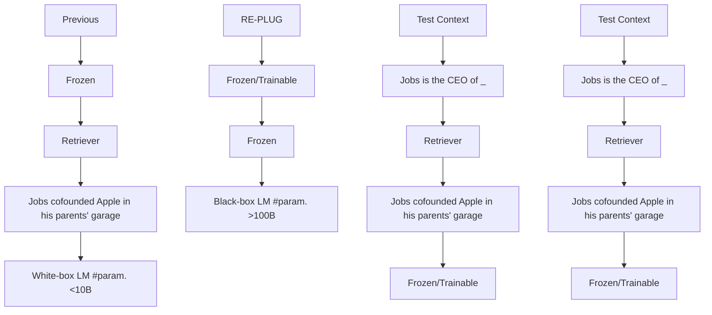
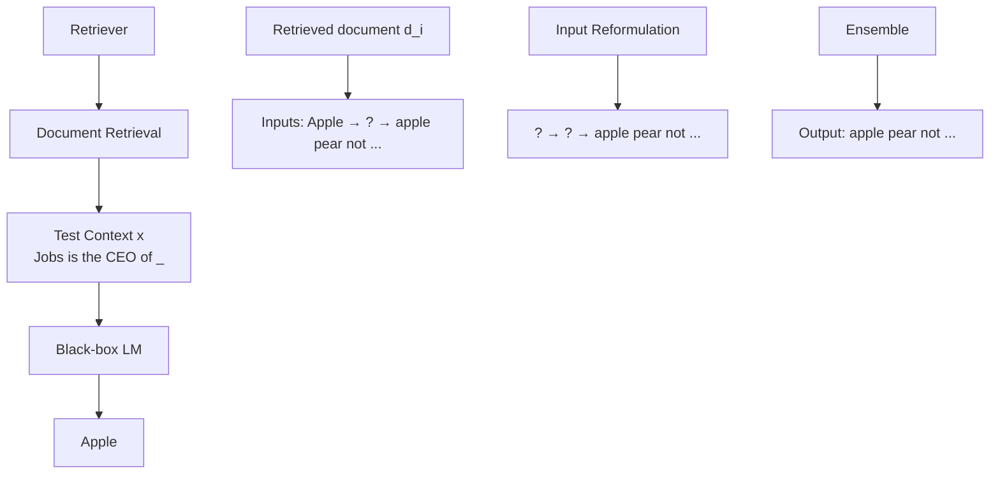
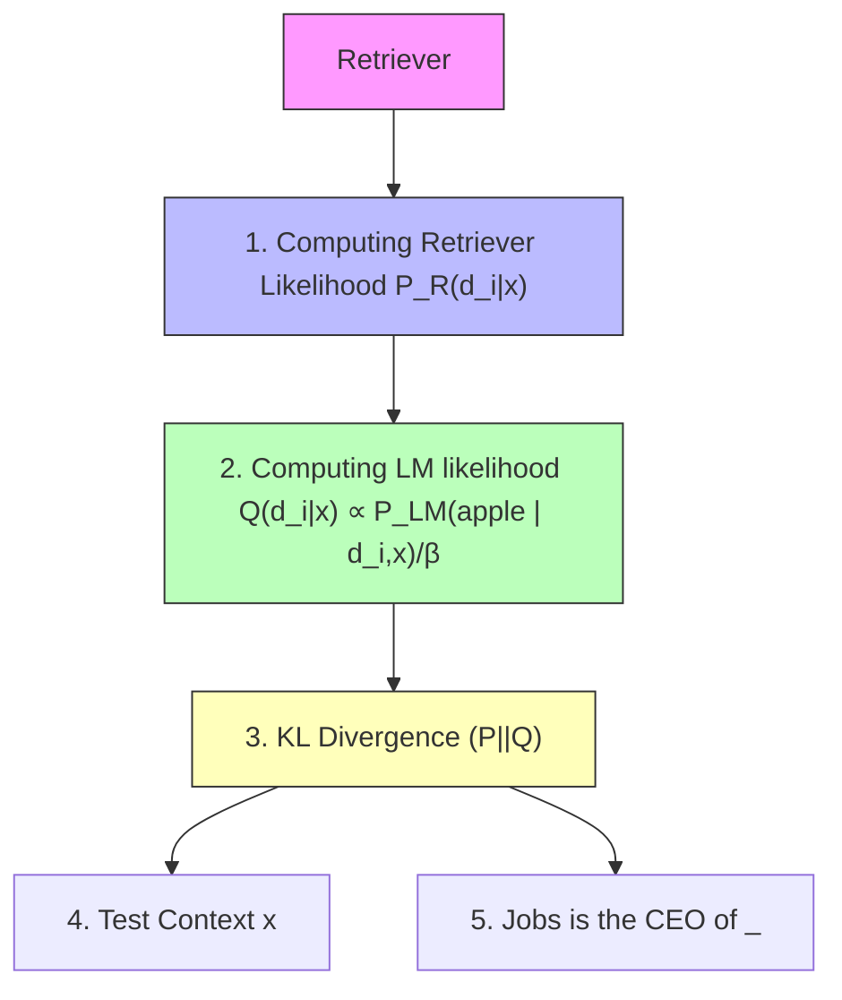

# REPLUG: Retrieval-Augmented Black-Box Language Models

Weijia Shi $^{1,2}$

Rich James $^{2}$

Sewon Min $^{1}$

Mike Lewis $^{2}$

Michihiro Yasunaga $^{3}$

Luke Zettlemoyer $^{1,2}$

Minjoon Seo $^{4}$

Wen-tau Yih $^{2}$

$^{1}$ University of Washington, Seattle, WA, $^{2}$ FAIR, Meta

$^{3}$ Stanford University $^{4}$ KAIST

swj0419@uw.edu

# Abstract

We introduce REPLUG, a retrieval-augmented language modeling framework that treats the language model (LM) as a black box and augments it with a tuneable retrieval model. Unlike prior retrieval-augmented LMs that train language models with special cross attention mechanisms to encode the retrieved text, REPLUG simply prepends retrieved documents to the input for the frozen black-box LM. This simple design can be easily applied to any existing language models. Furthermore, we show that the LM can be used to supervise the retrieval model, which can then find documents that help the LM make better predictions. Our experiments demonstrate that REPLUG with the tuned retriever significantly improves the performance of GPT-3 (175B) on language modeling by 6.3%, as well as the performance of Codex on five-shot MMLU by 5.1%. Code is publicly released at github.com/swj0419/REPLUG.

# 1 Introduction

Large language models (LMs) such as GPT-3 (Brown et al., 2020) and Codex (Chen et al., 2021), have demonstrated impressive performance on a wide range of language tasks. These models are typically trained on very large datasets and store a substantial amount of world or domain knowledge implicitly in their parameters. However, they are also prone to hallucination and cannot represent the full long tail of knowledge from the training corpus. Retrieval-augmented language models (Khandelwal et al., 2020; Borgeaud et al., 2022; Izacard et al., 2022b; Yasunaga et al., 2023), in contrast, can retrieve knowledge from an external datastore when needed, potentially reducing hallucination and increasing coverage. Previous approaches of retrieval-augmented language models require access to the internal LM representations (e.g., to train the model (Borgeaud et al., 2022; Izacard et al., 2022b) or to index the datastore (Khandelwal et al., 2020)), and are thus difficult to be applied to very large LMs. In addition, many best-in-class LLMs can only be accessed through APIs. Internal representations of such models are not exposed and fine-tuning is not supported.

flowchart

Figure 1: Different from previous retrieval-augmented approaches (Borgeaud et al., 2022) that enhance a language model with retrieval by updating the LM's parameters, REPLUG treats the LM as a black box and augments it with a frozen or tunable retriever. This black-box assumption makes REPLUG applicable to large LMs, which are often served via APIs.

In this work, we introduce REPLUG (Retrieve and Plug), a new retrieval-augmented LM framework where the language model is viewed as a black box and the retrieval component is added as a tuneable plug-and-play module. Given an input context, REPLUG first retrieves relevant documents from an external corpus using an off-the-shelf retrieval model. The retrieved documents are prepended to the input context and fed into the black-box LM to make the final prediction. Because the LM context length limits the number of documents that can be prepended, we also adopt an ensemble scheme that encodes the retrieved documents in parallel with the same black-box LM, allowing us to easily trade compute for accuracy.

As shown in Figure 1, REPLUG is extremely flexible and can be used with any existing black-box LM and retrieval model.

We also introduce REPLUG LSR (REPLUG with LM-Supervised Retrieval), a training scheme that can further improve the initial retrieval model in REPLUG with supervision signals from a black-box language model. The key idea is to adapt the retriever to the LM, which is in contrast to prior work (Borgeaud et al., 2022) that adapts language models to the retriever. We use a training objective which prefers retrieving documents that improve language model perplexity, while treating the LM as a frozen, black-box scoring function.

Our experiments show that REPLUG can improve the performance of diverse black-box LMs on both language modeling and downstream tasks, including MMLU (Hendrycks et al., 2021) and open-domain QA (Kwiatkowski et al., 2019; Joshi et al., 2017). For instance, REPLUG can improve Codex (175B) performance on MMLU by 4.5%, achieving comparable results to the 540B, instruction-finetuned Flan-PaLM. Furthermore, tuning the retriever with our training scheme (i.e., REPLUG LSR) outperforms various off-the-shelf retrievers and leads to additional improvements, including up to 6.3% increase in GPT-3 175B language modeling. To the best of our knowledge, our work is the first to show the benefits of retrieval to large LMs (>100B model parameters), for both reducing LM perplexity and improving in-context learning performance. We summarize our contributions as follows:

\- We introduce REPLUG (§3), the first retrieval-augmented language modeling framework for enhancing black-box LMs with retrieval. Unlike previous methods that require updating the LM's parameters, REPLUG could be easily plugged into any existing LM without additional finetuning.

\- We propose a training scheme (§4) to further adapt an off-the-shelf retrieval model to the LM, using the language modeling scores as supervision signals, resulting in improved retrieval quality.

\- We are the first to demonstrate that retrieval can benefit large-scale, state-of-the-art LMs on language modeling (§6) and in-context learning tasks. Evaluations show that RE-PLUG can improve the performance of var-

ious language models such as GPT, OPT and BLOOM, including very large models with up to 175B parameters.

# 2 Background and Related Work

Black-box Language Models Large language models, such as GPT-3 (Brown et al., 2020), Codex (Chen et al., 2021), are not open-sourced due to commercial considerations and are only available as black-box APIs, through which users can send queries and receive responses. On the other hand, even open sourced language models such as BLOOM-176B (Scao et al., 2022) require significant computational resources to run and fine-tune locally. For example, finetuning BLOOM-176B requires 72 A100 GPUs (Younes Belkda, 2022), making them inaccessible to researchers and developers with limited resources. Traditionally, retrieval-augmented model frameworks (Khandelwal et al., 2020; Borgeaud et al., 2022; Yu, 2022; Izacard et al., 2022b; Goyal et al., 2022) have focused on the white-box setting, where language models are fine-tuned to incorporate retrieved documents. However, the increasing scale and black-box nature of LLMs makes this approach infeasible. To address these challenges, we investigate retrieval-augmentation in the black-box setting, where users only have access to the model predictions and cannot access or modify its parameters.

Retrieval-augmented Models Augmenting language models with relevant information retrieved from knowledge stores has shown to be effective in improving performance on various NLP tasks, including language modeling (Min et al., 2022; Borgeaud et al., 2022; Khandelwal et al., 2020) and open-domain question answering (Lewis et al., 2020; Izacard et al., 2022b; Hu et al., 2022). Specifically, using the input as query, (1) a retriever first retrieves a set of documents from a corpus and then (2) a language model incorporates the retrieved documents as additional information to make a final prediction. Previous retrieval-augmented LMs require updating the model parameters, which cannot be applied to black-box LMs, which cannot be applied to black-box LMs. For example, Atlas (Izacard et al., 2022b) finetunes an encoder-decoder model jointly with the retriever by modeling documents as latent variables, while RETRO (Borgeaud et al., 2022) changes the decoder-only architecture to incorporate retrieved texts and pretrains the language model from scratch. Another line of

flowchart

Figure 2: REPLUG at inference ( $\S3$ ). Given an input context, REPLUG first retrieves a small set of relevant documents from an external corpus using a retriever ( $\S3.1 Document Retrieval$ ). Then it prepends each document separately to the input context and ensembles output probabilities from different passes ( $\S3.2 Input Reformulation$ ).

retrieval-augmented LMs such as kNN-LM (Khandelwal et al., 2020; Zhong et al., 2022) retrieves a set of tokens and interpolates between the LM's next token distribution and kNN distributions computed from the retrieved tokens at inference. kNN-LM requires access to internal LM representations to compute the kNN distribution, which are not available for black-box LMs such as GPT-3. In this work, we investigate ways to improve large black-box language models with retrieval. While concurrent work (Mallen et al., 2022; Si et al., 2023) has demonstrated that using a frozen retriever can improve GPT-3 performance on open-domain question answering, we approach the problem in a more general setting, including language modeling and understanding tasks. We additionally adopt an ensemble method to incorporate more documents and a training scheme to further adapt the retriever to large LMs.

# 3 REPLUG

We introduce REPLUG (Retrieve and Plug), a new retrieval-augmented LM paradigm where the LM is treated as black box and the retrieval component is added as a potentially tuneable module.

As shown in Figure 2, given an input context, REPLUG first retrieves a small set of relevant documents from an external corpus using a retriever ( $\S3.1$ ). Then we pass the concatenation of each retrieved document with the input context through the LM in parallel, and ensemble the predicted probabilities ( $\S3.2$ ).

# 3.1 Document Retrieval

Given an input context x, the retriever aims to retrieve a small set of documents from a corpus $D = \{d_{1}...d_{m}\}$ that are relevant to x. Following prior work (Qu et al., 2021; Izacard and Grave, 2021; Ni et al., 2022), we use a dense retriever based on the dual encoder architecture, where an encoder is used to encode both the input context x and the document d. Specifically, the encoder maps each document $d \in D$ to an embedding $\mathbf{E}(d)$ by taking the mean pooling of the last hidden representation over the tokens in d. At query time, the same encoder is applied to the input context x to obtain a query embedding $\mathbf{E}(x)$ . The similarity between the query embedding and the document embedding is computed by their cosine similarity:

$$
s (d, x) = \cos (\mathbf {E} (d), \mathbf {E} (x)) \tag {1}
$$

The top-k documents that have the highest similarity scores when compared with the input x are retrieved in this step. For efficient retrieval, we precompute the embedding of each document $d \in D$ and construct FAISS index (Johnson et al., 2019) over these embeddings.

# 3.2 Input Reformulation

The retrieved top-k documents provide rich information about the original input context x and can potentially help the LM to make a better prediction. One simple way to incorporate the retrieved documents as part of the input to the LM is to prepend x with all k documents. However, this simple scheme is fundamentally restricted by the number of documents (i.e., k) we can include, given the language

model's context window size. To address this limitation, we adopt an ensemble strategy described as follows. Assume $\mathcal{D}' \subset \mathcal{D}$ consists of $k$ most relevant documents to $x$ , according to the scoring function in Eq. (1). We prepend each document $d \in \mathcal{D}'$ to $x$ , pass this concatenation to the LM separately, and then ensemble output probabilities from all $k$ passes. Formally, given the input context $x$ and its top- $k$ relevant documents $\mathcal{D}'$ , the output probability of the next token $y$ is computed as a weighted average ensemble:

$$
p (y \mid x, \mathcal {D} ^ {\prime}) = \sum_ {d \in \mathcal {D} ^ {\prime}} p (y \mid d \circ x) \cdot \lambda (d, x),
$$

where $\circ$ denotes the concatenation of two sequences and the weight $\lambda(d, x)$ is based on the similarity score between the document $d$ and the input context $x$ :

$$
\lambda (d, x) = \frac {e ^ {s (d , x)}}{\sum_ {d \in \mathcal {D} ^ {\prime}} e ^ {s (d , x)}}
$$

# 4 REPLUG LSR: Training the Dense Retriever

Instead of relying only on existing neural dense retrieval models (Karpukhin et al., 2020; Izacard et al., 2022a; Su et al., 2023), we further propose REPLUG LSR (REPLUG with LM-Supervised Retrieval), which adapts the retriever in REPLUG by using the LM itself to provide supervision about which documents should be retrieved.

Inspired by Sachan et al. (2023), our approach can be seen as adjusting the probabilities of the retrieved documents to match the probabilities of the output sequence perplexities of the language model. In other words, we would like the retriever to find documents that result in lower perplexity scores. As shown in Figure 3, our training algorithm consists of the four steps: (1) retrieving documents and computing the retrieval likelihood ( $\S4.1$ ), (2) scoring the retrieved documents by the language model ( $\S4.2$ ), (3) updating the retrieval model parameters by minimizing the KL divergence between the retrieval likelihood and the LM's score distribution ( $\S4.3$ ), and (4) asynchronous update of the datastore index ( $\S4.4$ ).

# 4.1 Computing Retrieval Likelihood

We retrieve k documents $D' \subset D$ with the highest similarity scores from a corpus D given an input context x, as described in §3.1. We then compute the retrieval likelihood of each retrieved document d:

$$
P _ {R} (d \mid x) = \frac {e ^ {s (d , x) / \gamma}}{\sum_ {d \in \mathcal {D} ^ {\prime}} e ^ {s (d , x) / \gamma}}
$$

where $\gamma$ is a hyperparameter that controls the temperature of the softmax. Ideally, the retrieval likelihood is computed by marginalizing over all the documents in the corpus D, which is intractable in practice. Therefore, we approximate the retrieval likelihood by only marginalizing over the retrieved documents $D'$ .

# 4.2 Computing LM likelihood

We use the LM as a scoring function to measure how much each document could improve the LM perplexity. Specifically, we first compute $P_{LM}(y \mid d, x)$ , the LM probability of the ground truth output $y$ given the input context $x$ and a document $d$ . The higher the probability, the better the document $d_i$ is at improving the LM's perplexity. We then compute the LM likelihood of each document $d$ as follows:

$$
Q (d \mid x, y) = \frac {e ^ {P _ {L M} (y | d , x) / \beta}}{\sum_ {d \in \mathcal {D} ^ {\prime}} e ^ {P _ {L M} (y | d , x) / \beta}}
$$

where $\beta$ is another hyperparameter.

# 4.3 Loss Function

Given the input context x and the corresponding ground truth continuation y, we compute the retrieval likelihood and the language model likelihood. The dense retriever is trained by minimizing the KL divergence between these two distributions:

$$
\mathcal {L} = \frac {1}{| \mathcal {B} |} \sum_ {x \in \mathcal {B}} K L \left(Q _ {\mathrm{LM}} (d \mid x, y) \| P _ {R} (d \mid x)\right),
$$

where B is a set of input contexts. When minimizing the loss, we can only update the retrieval model parameters. The LM parameters are fixed due to our black-box assumption.

# 4.4 Asynchronous Update of the Datastore Index

Because the parameters in the retriever are updated during the training process, the previously computed document embeddings are no longer up to date. Therefore, following Guu et al. (2020), we recompute the document embeddings and rebuild the efficient search index using the new embeddings every T training steps. Then we use the new document embeddings and index for retrieval, and repeat the training procedure.

flowchart

Figure 3: REPLUG LSR training process ( $§4$ ). The retriever is trained using the output of a frozen language model as supervision signals.

# 5 Training Setup

In this section, we describe the details of our training procedure. We first describe the model setting in REPLUG ( $§5.1$ ) and then describe the procedure for training the retriever in REPLUG LSR ( $§5.2$ ).

# 5.1 REPLUG

In theory, any type of retriever, either dense (Karpukhin et al., 2020; Ni et al., 2022) or sparse (Robertson et al., 2009), could be used for REPLUG. Following prior work (Izacard et al., 2022b), we use the Contriever (Izacard et al., 2022a) as the retrieval model for REPLUG, as it has demonstrated strong performance.

# 5.2 REPLUG LSR

For REPLUG LSR, we initialize the retriever with the Contriever model (Izacard et al., 2022a). We use GPT-3 Curie (Brown et al., 2020) as the supervision LM to compute the LM likelihood.

Training data We use 800K sequences of 256 tokens each, sampled from the Pile training data (Gao et al., 2021), as our training queries. Each query is split into two parts: the first 128 tokens are used as the input context x, and the last 128 tokens are used as the ground truth continuation y. For the external corpus D, we sample 36M documents of 128 tokens from the Pile training data. To avoid trivial retrieval, we ensure that the external corpus documents do not overlap with the documents from which the training queries are sampled.

Training details To make the training process more efficient, we pre-compute the document embeddings of the external corpus D and create a FAISS index (Johnson et al., 2019) for fast similarity search. Given a query x, we retrieve the top 20 documents from the FAISS index and compute the retrieval likelihood and the LM likelihood with a temperature of 0.1. We train the retriever using the Adam optimizer (Kingma and Ba, 2015) with a learning rate of 2e-5, a batch size of 64, and a warmup ratio of 0.1. We re-compute the document embeddings every 3k steps and fine-tune the retriever for a total of 25k steps.

# 6 Experiments

We perform evaluations on both language modeling ( $§6.1$ ) and downstream tasks such as MMLU ( $§6.2$ ) and open-domain QA ( $§6.3$ ). In all settings, RE-PLUG improve the performance of various black-box language models, showing the effectiveness and generality of our approach.

# 6.1 Language Modeling

Datasets The Pile (Gao et al., 2021) is a language modeling benchmark that consists of text sources from diverse domains such as web pages, code and academic papers. Following prior work, we report bits per UTF-8 encoded byte (BPB) as the metric on each subset domain.

Baselines We consider GPT-3 and GPT-2 family LMs as the baselines. The four models from GPT-3 (Davinci, Curie, Baddage and Ada) are black-box models that are only accessible through API.

Our model We add REPLUG and REPLUG LSR to the baselines. We randomly subsampled Pile training data (36M documents of 128 tokens) and use them as the retrieval corpus for all models. As

<table><tr><td>Model</td><td></td><td># Parameters</td><td>Original</td><td>+ REPLUG</td><td>Gain %</td><td>+ REPLUG LSR</td><td>Gain %</td></tr><tr><td rowspan="4">GPT-2</td><td>Small</td><td>117M</td><td>1.33</td><td>1.26</td><td>5.3</td><td>1.21</td><td>9.0</td></tr><tr><td>Medium</td><td>345M</td><td>1.20</td><td>1.14</td><td>5.0</td><td>1.11</td><td>7.5</td></tr><tr><td>Large</td><td>774M</td><td>1.19</td><td>1.15</td><td>3.4</td><td>1.09</td><td>8.4</td></tr><tr><td>XL</td><td>1.5B</td><td>1.16</td><td>1.09</td><td>6.0</td><td>1.07</td><td>7.8</td></tr><tr><td rowspan="4">GPT-3 (black-box)</td><td>Ada</td><td>350M</td><td>1.05</td><td>0.98</td><td>6.7</td><td>0.96</td><td>8.6</td></tr><tr><td>Babbage</td><td>1.3B</td><td>0.95</td><td>0.90</td><td>5.3</td><td>0.88</td><td>7.4</td></tr><tr><td>Curie</td><td>6.7B</td><td>0.88</td><td>0.85</td><td>3.4</td><td>0.82</td><td>6.8</td></tr><tr><td>Davinci</td><td>175B</td><td>0.80</td><td>0.77</td><td>3.8</td><td>0.75</td><td>6.3</td></tr></table>

Table 1: Both REPLUG and REPLUG LSR consistently enhanced the performance of different language models. Bits per byte (BPB) of the Pile using GPT-3 and GPT-2 family models (Original) and their retrieval-augmented versions (+REPLUG and +REPLUG LSR. The gain % shows the relative improvement of our models compared to the original language model.

the Pile dataset has made efforts to deduplicate documents across train, validation and test splits (Gao et al., 2021), we did not do additional filtering. For both REPLUG and REPLUG LSR, we use a length of 128-token context to do retrieval and adopt the ensemble method (Section 3.2) to incorporate top 10 retrieved documents during inference.

Results Table 1 reports the results of the original baselines, baselines augmented with the REPLUG, and baselines augmented with the REPLUG LSR. We observe that both REPLUG and REPLUG LSR significantly outperform the baselines. This demonstrates that simply adding a retrieval module to a frozen language model (i.e., the black-box setting) is effective at improving the performance of different sized language models on language modeling tasks. Furthermore, REPLUG LSR consistently performs better than REPLUG by a large margin. Specifically, REPLUG LSR results in 7.7% improvement over baselines compared to 4.7% improvement of REPLUG averaged over the 8 models. This indicates that further adapting the retriever to the target LM is beneficial.

# 6.2 MMLU

Datasets MMLU (Hendrycks et al., 2021) is a multiple choice QA dataset that covers exam questions from 57 tasks including mathematics, US history and etc. The 57 tasks are grouped into 4 categories: humanities, STEM, social sciences and other. Following Chung et al. (2022a), we evaluate REPLUG in the 5-shot in-context learning setting.

Baselines We consider two groups of strong previous models as baselines for comparisons. The first group of baselines is the state-of-the-art LLMs including Codex $^{1}$ (Chen et al., 2021), PaLM (Chowdhery et al., 2022), and Flan-PaLM (Chung et al., 2022b). According to Chung et al. (2022b), these three models rank top-3 in the leaderboard of MMLU. Additionally, we include strong open-source LMs such as LLaMA (Touvron et al., 2023). The second group of baselines consists of retrieval-augmented language models. We only include Atlas (Izacard et al., 2022b) in this group, as no other retrieval-augmented LMs have been evaluated on the MMLU dataset. Atlas trains both the retriever and the language model, which we consider a white-box retrieval LM setting.

Our model We add REPLUG and REPLUG LSR to Codex and LLaMA because other models such as PaLM and Flan-PaLM are not accessible to the public. We use the test question as the query to retrieve 10 relevant documents from Wikipedia (2018, December) and prepend each retrieved document to the test question, resulting in 10 separate inputs. These inputs are then separately fed into the language models, and the output probabilities are ensemble together. The retriever interacts with Codex and LLaMA through black-box access.

Results Table 2 presents the results from the baselines, REPLUG, and REPLUG LSR on the MMLU dataset. We observe that both the REPLUG and REPLUG LSR improve the original Codex model by 4.5% and 5.1%, respectively. In addition, REPLUG LSR largely outperforms the previous retrieval-augmented language model, Atlas, demonstrating the effectiveness of our black-box retrieval language model setting. Although our models slightly underperform Flan-PaLM, this is still a strong result because Flan-PaLM has three times more parameters. We would expect that the REPLUG LSR could further improve Flan-PaLM, if we had access to the model.

<table><tr><td>Model</td><td># Parameters</td><td>Humanities</td><td>Social.</td><td>STEM</td><td>Other</td><td>All</td></tr><tr><td>Codex</td><td>175B</td><td>74.2</td><td>76.9</td><td>57.8</td><td>70.1</td><td>68.3</td></tr><tr><td>PaLM</td><td>540B</td><td>77.0</td><td>81.0</td><td>55.6</td><td>69.6</td><td>69.3</td></tr><tr><td>Flan-PaLM</td><td>540B</td><td>-</td><td>-</td><td>-</td><td>-</td><td>72.2</td></tr><tr><td>LLaMA</td><td>13B</td><td>-</td><td>-</td><td>-</td><td>-</td><td>55.6</td></tr><tr><td>Atlas</td><td>11B</td><td>46.1</td><td>54.6</td><td>38.8</td><td>52.8</td><td>47.9</td></tr><tr><td>Codex + REPLUG</td><td>175B</td><td>76.0</td><td>79.7</td><td>58.8</td><td>72.1</td><td>71.4</td></tr><tr><td>Codex + REPLUG LSR</td><td>175B</td><td>76.5</td><td>79.9</td><td>58.9</td><td>73.2</td><td>71.8</td></tr><tr><td>LLaMA + REPLUG</td><td>13B</td><td>-</td><td>-</td><td>-</td><td>-</td><td>58.8</td></tr><tr><td>LLaMA + REPLUG LSR</td><td>13B</td><td>-</td><td>-</td><td>-</td><td>-</td><td>59.3</td></tr></table>

Table 2: REPLUG and REPLUG LSR improves Codex by 4.5% and 5.1% respectively. Performance on MMLU broken down into 4 categories. The last column averages the performance over these categories. All models are evaluated based on 5-shot in-context learning with direct prompting.

Another interesting observation is that the RE-PLUG LSR outperforms the original model by $1.9\%$ even in the STEM category. This suggests that retrieval may improve a language model's problem-solving abilities.

# 6.3 Open Domain QA

Lastly, we conduct evaluation on two open-domain QA datasets: Natural Questions (NQ) (Kwiatkowski et al., 2019) and TriviaQA (Joshi et al., 2017).

<table><tr><td rowspan="2">Model</td><td colspan="2">NQ</td><td colspan="2">TQA</td></tr><tr><td>k-shot</td><td>Full</td><td>k-shot</td><td>Full</td></tr><tr><td>Chinchilla</td><td>35.5</td><td>-</td><td>64.6</td><td>-</td></tr><tr><td>PaLM</td><td>39.6</td><td>-</td><td>-</td><td>-</td></tr><tr><td>Codex</td><td>40.6</td><td>-</td><td>73.6</td><td>-</td></tr><tr><td>LLaMA</td><td>29.0</td><td>-</td><td>69.6</td><td></td></tr><tr><td> $RETRO^†$ </td><td>-</td><td>45.5</td><td>-</td><td>-</td></tr><tr><td> $R2-D2^†$ </td><td>-</td><td>55.9</td><td>-</td><td>69.9</td></tr><tr><td> $Atlas^†$ </td><td>30.9</td><td>60.4</td><td>74.5</td><td>79.8</td></tr><tr><td>Codex + REPLUG</td><td>44.7</td><td>-</td><td>76.8</td><td>-</td></tr><tr><td>Codex + REPLUG LSR</td><td>45.5</td><td>-</td><td>77.3</td><td>-</td></tr><tr><td>LLaMA + REPLUG</td><td>36.1</td><td>-</td><td>73.3</td><td>-</td></tr><tr><td>LLaMA + REPLUG LSR</td><td>37.2</td><td>-</td><td>74.1</td><td>-</td></tr></table>

Table 3: Performance on NQ and TQA. We report results for both k-shot (64 shots for Chinchilla, PaLM, and Atlas; 16 shots for Codex-based models) and full data settings. Note that models with $\dagger$ are finetuned using training examples, while others use in-context learning.

Datasets NQ and TriviaQA are two open-domain QA datasets. Following prior work (Izacard and Grave, 2021; Si et al., 2023), we report Exact Match for the filtered set of TriviaQA. We consider the k-shot setting where the model is only given a few training examples and full data setting where the model is given all the training examples.

Baselines We compare our model with several state-of-the-art baselines, both in a few-shot setting and with full training data. The first group of models consists of powerful large language models, including Chinchilla (Hoffmann et al., 2022), PaLM (Chowdhery et al., 2022), Codex and LLaMA 13B (Touvron et al., 2023). These models are all evaluated using in-context learning under the few-shot setting, with Chinchilla and PaLM evaluated using 64 shots, and Codex using 16 shots. The second group of models for comparison includes retrieval-augmented language models such as RETRO (Borgeaud et al., 2022), R2-D2 (Fajcik et al., 2021), and Atlas (Izacard et al., 2022b). All of these retrieval-augmented models are finetuned on the training data, either in a few-shot setting or with full training data. Specifically, Atlas is finetuned on 64 examples in the few-shot setting.

Our model We add REPLUG and REPLUG LSR to Codex and LLaMA 13B with Wikipedia as the retrieval corpus and evaluate them in a 16-shot in context learning. We incorporate top-10 retrieved documents using our proposed ensemble method.

Results As shown in Table 3, REPLUG LSR significantly improves the performance of the original Codex by 12.0% on NQ and 5.0% on TQA. It outperforms the previous best model, Atlas, which was fine-tuned with 64 training examples, achieving a new state-of-the-art in the few-shot setting. However, this result still lags behind the performance of retrieval-augmented language models fine-tuned on the full training data. This is likely due to the presence of near-duplicate test questions in the training set (e.g., Lewis et al. (2021) found that 32.5% of test questions overlap with the training sets in NQ).

# 7 Analysis

# 7.1 REPLUG is applicable to diverse models

Here we further study whether REPLUG could enhance diverse language model families that have

line

| Parameters (Million) | Original | + RE-PLUG |
| --------------------- | -------- | --------- |
| 100                   | 27.00    | 24.50     |
| 475                   | 19.20    | 18.50     |
| 850                   | 16.80    | 16.00     |
| 1600                  | 15.50    | 14.80     |

line

| Parameters (Million) | Original | + RE-PLUG |
| -------------------- | -------- | --------- |
| 100                  | 24.00    | 21.50     |
| 2075                 | 16.20    | 15.80     |
| 4050                 | 13.60    | 13.40     |
| 6025                 | 12.00    | 11.80     |
| 8000                 | 11.50    | 11.20     |

line

| Parameters (Million) | Original | + RE-PLUG |
| --------------------- | -------- | --------- |
| 100                   | 28.5     | 26.0      |
| 1000                  | 23.0     | 21.0      |
| 10000                 | 13.5     | 13.0      |
| 100000                | 10.5     | 10.0      |
| 1000000               | 9.5      | 9.5       |

Figure 4: GPT-2, BLOOM and OPT models of varying sizes consistently benefit from REPLUG. The x-axis indicates the size of the language model and the y-axis is its perplexity on Wikitext-103.

been pre-trained using different data and methods. Specifically, we focus on three groups of language models with varying sizes: GPT-2 (117M, 345M, 774M, 1.5B parameters) (Brown et al., 2020), OPT (125M, 350M, 1.3B, 2.7B, 6.7B, 13B, 30B, 66B) (Zhang et al., 2022) and BLOOM (560M, 1.1B, 1.7B, 3B and 7B) (Scao et al., 2022). We evaluate each model on Wikitext-103 (Merity et al., 2017) test data and report its perplexity. For comparison, we augment each model with RE-PLUG that adopts the ensemble method to incorporate top 10 retrieved documents. Following prior work (Khandelwal et al., 2020), we use Wikitext-103 training data as the retrieval corpus.

Figure 4 shows the performance of different-sized LMs with and without REPLUG. We observe that the performance gain brought by REPLUG stays consistent with model size. For example, OPT-125M achieves 6.9% perplexity improvement, while OPT-66B achieves 5.6% perplexity improvement. Additionally, REPLUG improves the perplexity of all the model families, which indicates that REPLUG is applicable to diverse language models with different sizes.

# 7.2 REPLUG performance gain does not simply come from the ensembling effect

The core of our method design is the use of an ensemble method that combines output probabilities of different passes, in which each retrieved document is prepended separately to the input and fed into a language model. To study whether the gains come solely from the ensemble method, we compare our method to ensembling random documents. For this, we randomly sample several documents, concatenated each random document with the input, and ensemble the outputs of different runs (referred to as "random"). As shown in Figure 5, we evaluated the performance of GPT-3 Curie on Pile when augmented with random documents, documents retrieved by REPLUG, and documents retrieved by REPLUG LSR. We observed that ensembling random documents leads to worse performance, indicating that the performance gains of REPLUG do not come from the ensembling effect. Instead, ensembling the relevant documents is crucial for the success of REPLUG. Additionally, as more documents were ensembled, the performance of REPLUG and REPLUG LSR improved monotonically. However, a small number of documents (e.g., 10) was sufficient to achieve large performance gains.

# 7.3 LSR retriever outperforms other off-the-shelf retrievers

We investigate the effectiveness of tunable retriever (LSR) compared with off-the-shelf retrievers. Specifically, we compare LM-supervised contriever (LSR) with other dense retrievers such as BERT-base (Borgeaud et al., 2022), DPR (Karpukhin et al., 2020) and a sparse retriever BM25 (Robertson et al., 2009). Figure 6 shows Wikitext-103 perplexity of GPT-2 XL (1.5B) and GPT-2 Large (774M) augmented with different retrievers. Among all off-the-shelf retrievers, the sparse retriever BM25 performs best. However, it still lags behind our LM supervised retriever (Contriever LSR), demonstrating the effectiveness of our training scheme that adapts the retriever to LMs.

# 8 Conclusion

We introduce REPLUG, a retrieval-augmented LM paradigm that augments black-box LMs with a tuneable retriever. This work opens up new possibilities for integrating retrieval into large black-box

line

| Number of documents (k) | Random | REPLUG | REPLUG LSE |
| ----------------------- | ------ | ------ | ---------- |
| 0                       | 0.89   | 0.89   | 0.89       |
| 5                       | 0.87   | 0.86   | 0.84       |
| 10                      | 0.87   | 0.85   | 0.82       |
| 15                      | 0.88   | 0.84   | 0.81       |
| 20                      | 0.88   | 0.83   | 0.81       |
| 25                      | 0.89   | 0.83   | 0.80       |
| 30                      | 0.88   | 0.83   | 0.80       |

Figure 5: Ensembling random documents does not result in improved performance. BPB of Curie augmented with different methods (random, REPLUG and REPLUG LSR) when varying the number of documents.

LMs and is the first to demonstrate even the state-of-the-art LLMs could benefit from retrieval.

# 9 Limitations

Interpretability REPLUG exhibits limitations in interpretability. It’s unclear when the model relies on retrieved knowledge or on knowledge encoded within its own parameters. Future research could work towards the development of more interpretable retrieval-augmented language models. Such models could trace the source of the generated answers, whether it’s from retrieved data or internal parameters, thus providing a clear knowledge provenance.

On-demand retrieval REPLUG always perform retrieval no matter if the external information is needed. This approach runs the risk of presenting irrelevant documents, which can potentially distract the models, while also incurring additional computational overheads. Future studies could explore methods that allow the language model to determine when external knowledge is required.

Database size In line with prior research, RE-PLUG uses Wikipedia and Pile as the targeted search databases. However, these resources might only encompass a minor fraction of the external knowledge needed by LMs. Future research should explore methods to efficiently expand these databases and examine how an LM's performance scales with the size of the database.

# References

Sebastian Borgeaud, Arthur Mensch, Jordan Hoffmann, Trevor Cai, Eliza Rutherford, Katie Millican, George van den Driessche, Jean-Baptiste Lespiau, Bogdan Damoc, Aidan Clark, Diego de Las Casas, Aurelia

bar

| Model | No retrieval | BERT | DPR | BM25 | contriever | contriever LSR |
|---|---|---|---|---|---|---|
| GPT-2 large | 17.8 | 17.8 | 16.7 | 16.3 | 16.7 | 16.2 |
| GPT-2 XL | 15.6 | 16.2 | 15.1 | 14.6 | 15.0 | 14.5 |

Figure 6: LM-supervised retriever (Contriever LSR) outperforms other off-the-shelf retrievers.

Guy, Jacob Menick, Roman Ring, Tom Hennigan, Saffron Huang, Loren Maggiore, Chris Jones, Albin Cassirer, Andy Brock, Michela Paganini, Geoffrey Irving, Oriol Vinyals, Simon Osindero, Karen Simonyan, Jack W. Rae, Erich Elsen, and Laurent Sifre. 2022. Improving language models by retrieving from trillions of tokens. In International Conference on Machine Learning, ICML 2022, 17-23 July 2022, Baltimore, Maryland, USA, volume 162 of Proceedings of Machine Learning Research, pages 2206–2240. PMLR.

Tom B. Brown, Benjamin Mann, Nick Ryder, Melanie Subbiah, Jared Kaplan, Prafulla Dhariwal, Arvind Neelakantan, Pranav Shyam, Girish Sastry, Amanda Askell, Sandhini Agarwal, Ariel Herbert-Voss, Gretchen Krueger, Tom Henighan, Rewon Child, Aditya Ramesh, Daniel M. Ziegler, Jeffrey Wu, Clemens Winter, Christopher Hesse, Mark Chen, Eric Sigler, Mateusz Litwin, Scott Gray, Benjamin Chess, Jack Clark, Christopher Berner, Sam McCandlish, Alec Radford, Ilya Sutskever, and Dario Amodei. 2020. Language models are few-shot learners. In Advances in Neural Information Processing Systems 33: Annual Conference on Neural Information Processing Systems 2020, NeurIPS 2020, December 6-12, 2020, virtual.

Mark Chen, Jerry Tworek, Heewoo Jun, Qiming Yuan, Henrique Ponde de Oliveira Pinto, Jared Kaplan, Harrison Edwards, Yuri Burda, Nicholas Joseph, Greg Brockman, Alex Ray, Raul Puri, Gretchen Krueger, Michael Petrov, Heidy Khlaaf, Girish Sastry, Pamela Mishkin, Brooke Chan, Scott Gray, Nick Ryder, Mikhail Pavlov, Alethea Power, Lukasz Kaiser, Mohammad Bavarian, Clemens Winter, Philippe Tillet, Felipe Petroski Such, Dave Cummings, Matthias Plappert, Fotios Chantzis, Elizabeth Barnes, Ariel Herbert-Voss, William Hebgen Guss, Alex Nichol, Alex Paino, Nikolas Tezak, Jie Tang, Igor Babuschkin, Suchir Balaji, Shantanu Jain, William Saunders, Christopher Hesse, Andrew N. Carr, Jan Leike, Joshua Achiam, Vedant Misra, Evan Morikawa, Alec Radford, Matthew Knight, Miles Brundage, Mira Murati, Katie Mayer, Peter Welinder, Bob McGrew, Dario Amodei, Sam McCandlish, Ilya

Sutskever, and Wojciech Zaremba. 2021. Evaluating large language models trained on code. ArXiv preprint, abs/2107.03374.   
Aakanksha Chowdhery, Sharan Narang, Jacob Devlin, Maarten Bosma, Gaurav Mishra, Adam Roberts, Paul Barham, Hyung Won Chung, Charles Sutton, Sebastian Gehrmann, et al. 2022. Palm: Scaling language modeling with pathways. ArXiv preprint, abs/2204.02311.   
Hyung Won Chung, Le Hou, Shayne Longpre, Barret Zoph, Yi Tay, William Fedus, Eric Li, Xuezhi Wang, Mostafa Dehghani, Siddhartha Brahma, et al. 2022a. Scaling instruction-finetuned language models. ArXiv preprint, abs/2210.11416.   
Hyung Won Chung, Le Hou, Shayne Longpre, Barret Zoph, Yi Tay, William Fedus, Eric Li, Xuezhi Wang, Mostafa Dehghani, Siddhartha Brahma, et al. 2022b. Scaling instruction-finetuned language models. ArXiv preprint, abs/2210.11416.   
Martin Fajcik, Martin Docekal, Karel Ondrej, and Pavel Smrz. 2021. R2-D2: A modular baseline for open-domain question answering. In Findings of the Association for Computational Linguistics: EMNLP 2021, pages 854–870, Punta Cana, Dominican Republic. Association for Computational Linguistics.   
Leo Gao, Stella Biderman, Sid Black, Laurence Golding, Travis Hoppe, Charles Foster, Jason Phang, Horace He, Anish Thite, Noa Nabeshima, Shawn Presser, and Connor Leahy. 2021. The Pile: An 800gb dataset of diverse text for language modeling. ArXiv preprint, abs/2101.00027.   
Anirudh Goyal, Abram L. Friesen, Andrea Banino, Theophane Weber, Nan Rosemary Ke, Adrià Puigdomènech Badia, Arthur Guez, Mehdi Mirza, Peter C. Humphreys, Ksenia Konyushkova, Michal Valko, Simon Osindero, Timothy P. Lillicrap, Nicolas Heess, and Charles Blundell. 2022. Retrieval-augmented reinforcement learning. In International Conference on Machine Learning, ICML 2022, 17-23 July 2022, Baltimore, Maryland, USA, volume 162 of Proceedings of Machine Learning Research, pages 7740–7765. PMLR.   
Kelvin Guu, Kenton Lee, Zora Tung, Panupong Pasupat, and Ming-Wei Chang. 2020. Retrieval augmented language model pre-training. In Proceedings of the 37th International Conference on Machine Learning, ICML 2020, 13-18 July 2020, Virtual Event, volume 119 of Proceedings of Machine Learning Research, pages 3929–3938. PMLR.   
Dan Hendrycks, Collin Burns, Steven Basart, Andy Zou, Mantas Mazeika, Dawn Song, and Jacob Steinhardt. 2021. Measuring massive multitask language understanding. In 9th International Conference on Learning Representations, ICLR 2021, Virtual Event, Austria, May 3-7, 2021. OpenReview.net.

Jordan Hoffmann, Sebastian Borgeaud, Arthur Mensch, Elena Buchatskaya, Trevor Cai, Eliza Rutherford, Diego de Las Casas, Lisa Anne Hendricks, Johannes Welbl, Aidan Clark, et al. 2022. Training compute-optimal large language models. ArXiv preprint, abs/2203.15556.   
Yushi Hu, Hang Hua, Zhengyuan Yang, Weijia Shi, Noah A Smith, and Jiebo Luo. 2022. Promptcap: Prompt-guided task-aware image captioning. ArXiv preprint, abs/2211.09699.   
Gautier Izacard, Mathilde Caron, Lucas Hosseini, Sebastian Riedel, Piotr Bojanowski, Armand Joulin, and Edouard Grave. 2022a. Unsupervised dense information retrieval with contrastive learning. Transactions on Machine Learning Research.   
Gautier Izacard and Edouard Grave. 2021. Leveraging passage retrieval with generative models for open domain question answering. In Proceedings of the 16th Conference of the European Chapter of the Association for Computational Linguistics: Main Volume, pages 874–880, Online. Association for Computational Linguistics.   
Gautier Izacard, Patrick Lewis, Maria Lomeli, Lucas Hosseini, Fabio Petroni, Timo Schick, Jane Dwivedi-Yu, Armand Joulin, Sebastian Riedel, and Edouard Grave. 2022b. Few-shot learning with retrieval augmented language models. ArXiv preprint, abs/2208.03299.   
Jeff Johnson, Matthijs Douze, and Hervé Jégou. 2019. Billion-scale similarity search with gpus. IEEE Transactions on Big Data, 7(3):535–547.   
Mandar Joshi, Eunsol Choi, Daniel Weld, and Luke Zettlemoyer. 2017. TriviaQA: A large scale distantly supervised challenge dataset for reading comprehension. In Proceedings of the 55th Annual Meeting of the Association for Computational Linguistics (Volume 1: Long Papers), pages 1601–1611, Vancouver, Canada. Association for Computational Linguistics.   
Vladimir Karpukhin, Barlas Oguz, Sewon Min, Patrick Lewis, Ledell Wu, Sergey Edunov, Danqi Chen, and Wen-tau Yih. 2020. Dense passage retrieval for open-domain question answering. In Proceedings of the 2020 Conference on Empirical Methods in Natural Language Processing (EMNLP), pages 6769–6781, Online. Association for Computational Linguistics.   
Urvashi Khandelwal, Omer Levy, Dan Jurafsky, Luke Zettlemoyer, and Mike Lewis. 2020. Generalization through memorization: Nearest neighbor language models. In 8th International Conference on Learning Representations, ICLR 2020, Addis Ababa, Ethiopia, April 26-30, 2020. OpenReview.net.   
Diederik P. Kingma and Jimmy Ba. 2015. Adam: A method for stochastic optimization. In 3rd International Conference on Learning Representations, ICLR 2015, San Diego, CA, USA, May 7-9, 2015, Conference Track Proceedings.

Tom Kwiatkowski, Jennimaria Palomaki, Olivia Redfield, Michael Collins, Ankur Parikh, Chris Alberti, Danielle Epstein, Illia Polosukhin, Jacob Devlin, Kenton Lee, Kristina Toutanova, Llion Jones, Matthew Kelcey, Ming-Wei Chang, Andrew M. Dai, Jakob Uszkoreit, Quoc Le, and Slav Petrov. 2019. Natural questions: A benchmark for question answering research. Transactions of the Association for Computational Linguistics, 7:452–466.   
Patrick Lewis, Pontus Stenetorp, and Sebastian Riedel. 2021. Question and answer test-train overlap in open-domain question answering datasets. In Proceedings of the 16th Conference of the European Chapter of the Association for Computational Linguistics: Main Volume, pages 1000–1008, Online. Association for Computational Linguistics.   
Patrick S. H. Lewis, Ethan Perez, Aleksandra Piktus, Fabio Petroni, Vladimir Karpukhin, Naman Goyal, Heinrich Küttler, Mike Lewis, Wen-tau Yih, Tim Rocktäschel, Sebastian Riedel, and Douwe Kiela. 2020. Retrieval-augmented generation for knowledge-intensive NLP tasks. In Advances in Neural Information Processing Systems 33: Annual Conference on Neural Information Processing Systems 2020, NeurIPS 2020, December 6-12, 2020, virtual.   
Alex Mallen, Akari Asai, Victor Zhong, Rajarshi Das, Hannaneh Hajishirzi, and Daniel Khashabi. 2022. When not to trust language models: Investigating effectiveness and limitations of parametric and non-parametric memories. ArXiv preprint, abs/2212.10511.   
Stephen Merity, Caiming Xiong, James Bradbury, and Richard Socher. 2017. Pointer sentinel mixture models. In 5th International Conference on Learning Representations, ICLR 2017, Toulon, France, April 24-26, 2017, Conference Track Proceedings. OpenReview.net.   
Sewon Min, Weijia Shi, Mike Lewis, Xilun Chen, Wentau Yih, Hannaneh Hajishirzi, and Luke Zettlemoyer. 2022. Nonparametric masked language modeling. ArXiv preprint, abs/2212.01349.   
Jianmo Ni, Chen Qu, Jing Lu, Zhuyun Dai, Gustavo Hernandez Abrego, Ji Ma, Vincent Zhao, Yi Luan, Keith Hall, Ming-Wei Chang, and Yinfei Yang. 2022. Large dual encoders are generalizable retrievers. In Proceedings of the 2022 Conference on Empirical Methods in Natural Language Processing, pages 9844–9855, Abu Dhabi, United Arab Emirates. Association for Computational Linguistics.   
Yingqi Qu, Yuchen Ding, Jing Liu, Kai Liu, Ruiyang Ren, Wayne Xin Zhao, Daxiang Dong, Hua Wu, and Haifeng Wang. 2021. RocketQA: An optimized training approach to dense passage retrieval for open-domain question answering. In Proceedings of the 2021 Conference of the North American Chapter of the Association for Computational Linguistics: Human Language Technologies, pages 5835–5847, Online. Association for Computational Linguistics.

Stephen Robertson, Hugo Zaragoza, et al. 2009. The probabilistic relevance framework: BM25 and beyond. Foundations and Trends® in Information Retrieval, 3(4):333–389.   
Devendra Singh Sachan, Mike Lewis, Dani Yogatama, Luke Zettlemoyer, Joelle Pineau, and Manzil Zaheer. 2023. Questions are all you need to train a dense passage retriever. Transactions of the Association for Computational Linguistics, 11:600–616.   
Teven Le Scao, Angela Fan, Christopher Akiki, Ellie Pavlick, Suzana Ilić, Daniel Hesslow, Roman Castagné, Alexandra Sasha Luccioni, François Yvon, Matthias Gallé, et al. 2022. Bloom: A 176b-parameter open-access multilingual language model. ArXiv preprint, abs/2211.05100.   
Chenglei Si, Zhe Gan, Zhengyuan Yang, Shuohang Wang, Jianfeng Wang, Jordan Boyd-Graber, and Lijuan Wang. 2023. Prompting GPT-3 to be reliable. In Proc. of ICLR.   
Hongjin Su, Weijia Shi, Jungo Kasai, Yizhong Wang, Yushi Hu, Mari Ostendorf, Wen-tau Yih, Noah A. Smith, Luke Zettlemoyer, and Tao Yu. 2023. One embedder, any task: Instruction-finetuned text embeddings. In Findings of the Association for Computational Linguistics: ACL 2023, pages 1102–1121, Toronto, Canada. Association for Computational Linguistics.   
Hugo Touvron, Louis Martin, Kevin Stone, Peter Albert, Amjad Almahairi, Yasmine Babaei, Nikolay Bashlykov, Soumya Batra, Prajjwal Bhargava, Shruti Bhosale, Dan Bikel, Lukas Blecher, Cristian Canton Ferrer, Moya Chen, Guillem Cucurull, David Esiobu, Jude Fernandes, Jeremy Fu, Wenyin Fu, Brian Fuller, Cynthia Gao, Vedanuj Goswami, Naman Goyal, Anthony Hartshorn, Saghar Hosseini, Rui Hou, Hakan Inan, Marcin Kardas, Viktor Kerkez, Madian Khabsa, Isabel Kloumann, Artem Korenev, Punit Singh Koura, Marie-Anne Lachaux, Thibaut Lavril, Jenya Lee, Diana Liskovich, Yinghai Lu, Yuning Mao, Xavier Martinet, Todor Mihaylov, Pushkar Mishra, Igor Molybog, Yixin Nie, Andrew Poulton, Jeremy Reizenstein, Rashi Rungta, Kalyan Saladi, Alan Schelten, Ruan Silva, Eric Michael Smith, Ranjan Subramanian, Xiaoqing Ellen Tan, Binh Tang, Ross Taylor, Adina Williams, Jian Xiang Kuan, Puxin Xu, Zheng Yan, Iliyan Zarov, Yuchen Zhang, Angela Fan, Melanie Kambadur, Sharan Narang, Aurelien Rodriguez, Robert Stojnic, Sergey Edunov, and Thomas Scialom. 2023. Llama 2: Open foundation and fine-tuned chat models.   
Michihiro Yasunaga, Armen Aghajanyan, Weijia Shi, Richard James, Jure Leskovec, Percy Liang, Mike Lewis, Luke Zettlemoyer, and Wen-Tau Yih. 2023. Retrieval-augmented multimodal language modeling. In Proceedings of the 40th International Conference on Machine Learning, volume 202 of Proceedings of Machine Learning Research, pages 39755–39769. PMLR.

Tim Dettmers Younes Belkda. 2022. A gentle introduction to 8-bit matrix multiplication.   
Wenhao Yu. 2022. Retrieval-augmented generation across heterogeneous knowledge. In Proceedings of the 2022 Conference of the North American Chapter of the Association for Computational Linguistics: Human Language Technologies: Student Research Workshop, pages 52–58, Hybrid: Seattle, Washington + Online. Association for Computational Linguistics.   
Susan Zhang, Stephen Roller, Naman Goyal, Mikel Artetxe, Moya Chen, Shuohui Chen, Christopher Dewan, Mona Diab, Xian Li, Xi Victoria Lin, et al. 2022. Opt: Open pre-trained transformer language models. ArXiv preprint, abs/2205.01068.   
Zexuan Zhong, Tao Lei, and Danqi Chen. 2022. Training language models with memory augmentation. In Proceedings of the 2022 Conference on Empirical Methods in Natural Language Processing, pages 5657–5673, Abu Dhabi, United Arab Emirates. Association for Computational Linguistics.

# A Qualitative Analysis: Rare Entities Benefit from Retrieval

To understand why the REPLUG improves language modeling performance, we conducted manual analysis of examples in which the REPLUG results in a decrease in perplexity. We find that REPLUG is more helpful when texts contain rare entities. Figure 7 shows a test context and its continuation from the Wikitext-103 test set. For REPLUG, we use the test context as a query to retrieve a relevant document from Wikitext-103 training data. We then compute the perplexity of the continuation using the original GPT-2 1.5B and its REPLUG enhanced version. After incorporating the retrieved document, the perplexity of the continuation improves by 11%. Among all tokens in the continuation, we found that REPLUG is most helpful for the rare entity name "Li Bai". This is likely because the original LM does not have sufficient information about this rare entity name. However, by incorporating the retrieved document, REPLUG was able to match the name with the relevant information in the retrieved document, resulting in better performance.

text_image

Retrieved document
Chinese culture flourished and further matured during the Tang era; it is considered the greatest age for Chinese poetry. Two of China's most famous poets, Li Bai and Du Fu, belonged to this age

Test Context
Du Fu (Chinese: 杜甫; Wade–Giles: Tu Fu; 712–770) was a Tang dynasty poet and politician.

Continuation
ppl 15%↓
Along with Li Bai, he is frequently called the greatest of the Chinese poets.
ppl 5%↓

Figure 7: Rare entities benefit from retrieval. After incorporating the retrieved document during inference, the entity "Li Bai" and the token "greatest" in the continuation show the most improvement in perplexity (15% for "Li Bai" and 5% for "greatest"). Other tokens' perplexity changes are within 5%.

# B Dense Retriever vs. Sparse Retriever

The proposed model uses Contriever, a dense retriever, as its retriever backbone. Additionally, we investigate the performance of a sparse retriever in comparison to the dense retriever. For our sparse model, we employ BM25. As depicted in Figure 8, we observe that BM25 consistently outperforms Contriever but falls short when compared to LM-supervised Contriever, thus highlighting the effec-

line

| Parameters (Million) | Original | REPLUG | REPLUG LSE | BM25 |
|----------------------|----------|--------|------------|------|
| 100                  | 26.0     | 25.0   | 24.5       | 24.8 |
| 300                  | 20.0     | 18.5   | 18.0       | 18.2 |
| 700                  | 17.5     | 16.5   | 16.2       | 16.3 |

Figure 8: PPL of GPT-2 models on Witext-103 with no retrieval (Origin), Contriever (REPLUG), LM-supervised Contriever (REPLUG LSR) and BM25.

tiveness of our proposed training scheme.

# C Prompts used for MMLU and open-domain QA

Please see Table 4 and Table 5.

Knowledge: Arctic Ocean. Although over half of Europe's original forests disappeared through the centuries of deforestation, Europe still has over one quarter of its land area as forest, such as the broadleaf and mixed forests, taiga of Scandinavia and Russia, mixed rainforests of the Caucasus and the Cork oak forests in the western Mediterranean. During recent times, deforestation has been slowed and many trees have been planted. However, in many cases monoculture plantations of conifers have replaced the original mixed natural forest, because these grow quicker. The plantations now cover vast areas of land, but offer poorer habitats for many European

Question: As of 2015, since 1990 forests have \_\_\_\_ in Europe and have \_\_\_\_ in Africa and the Americas.

A. "increased, increased" B. "increased, decreased" C. "decreased, increased" D. "decreased, decreased"

Answer: B

Knowledge: Over the past decades, the political outlook of Americans has become more progressive, with those below the age of thirty being considerably more liberal than the overall population. According to recent polls, 56% of those age 18 to 29 favor gay marriage, 68% state environmental protection to be as important as job creation, 52% "think immigrants strengthen the country with their hard work and talents," 62% favor a "tax financed, government-administrated universal health care" program and 74% "say peoples will should have more influence on U.S. laws than the Bible, compared to 37%, 49%, 38%, 47% and 58% among the

Question: As of 2019, about what percentage of Americans agree that the state is run for the benefit of all the people?

A. 31% B. 46% C. 61% D. 76%

Answer: B

Knowledge: last week at a United Nations climate meeting in Germany, China and India should easily exceed the targets they set for themselves in the 2015 Paris Agreement... India is now expected to obtain 40 percent of its electricity from non-fossil fuel sources by 2022, eight years ahead of schedule." Solar power in Japan has been expanding since the late 1990s. By the end of 2017, cumulative installed PV capacity reached over 50 GW with nearly 8 GW installed in the year 2017. The country is a leading manufacturer of solar panels and is in the top 4 ranking for countries

Question: Which of the following countries generated the most total energy from solar sources in 2019?

A. China B. United States C. Germany D. Japan

Table 4: Prompt for MMLU

Knowledge: received 122,000 buys (excluding WWE Network views), down from the previous years 199,000 buys. The event is named after the Money In The Bank ladder match, in which multiple wrestlers use ladders to retrieve a briefcase hanging above the ring. The winner is guaranteed a match for the WWE World Heavyweight Championship at a time of their choosing within the next year. On the June 2 episode of "Raw", Alberto Del Rio qualified for the match by defeating Dolph Ziggler. The following week, following Daniel Bryan being stripped of his WWE World Championship due to injury, Stephanie McMahon changed the

Question: Who won the mens money in the bank match?

Answer: Braun Strowman

Knowledge: in 3D on March 17, 2017. The first official presentation of the film took place at Disney's three-day D23 Expo in August 2015. The world premiere of "Beauty and the Beast" took place at Spencer House in London, England on February 23, 2017; and the film later premiered at the El Capitan Theatre in Hollywood, California, on March 2, 2017. The stream was broadcast onto YouTube. A sing along version of the film released in over 1,200 US theaters nationwide on April 7, 2017. The United Kingdom received the same version on April 21, 2017. The film was re-released in

Question: When does beaty and the beast take place

Answer: Rococo-era

Knowledge: Love Yourself "Love Yourself" is a song recorded by Canadian singer Justin Bieber for his fourth studio album "Purpose" (2015). The song was released first as a promotional single on November 8, 2015, and later was released as the album's third single. It was written by Ed Sheeran, Benny Blanco and Bieber, and produced by Blanco. An acoustic pop song, "Love Yourself" features an electric guitar and a brief flurry of trumpets as its main instrumentation. During the song, Bieber uses a husky tone in the lower registers. Lyrically, the song is a kiss-off to a narcissistic ex-lover who did

Question: love yourself by justin bieber is about who

Table 5: Prompt for open-domain QA