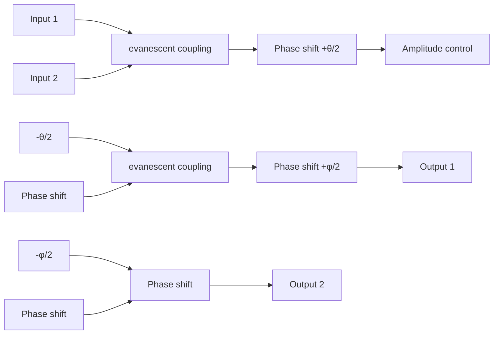
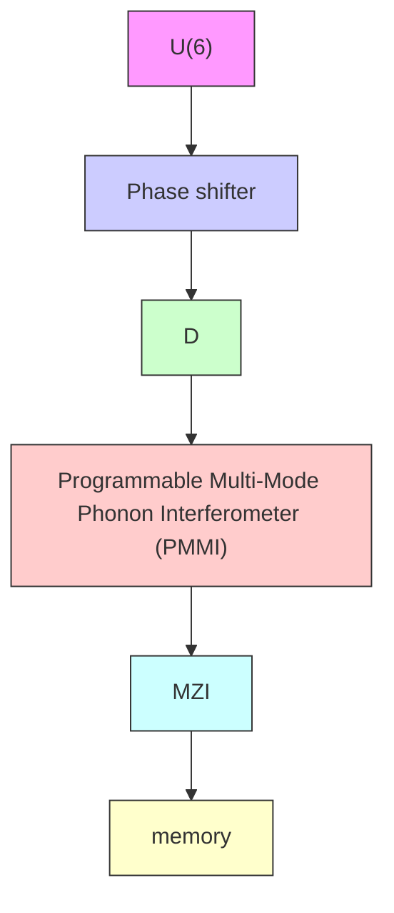

# ARTICLE OPEN

Check for updates

# Reconfigurable quantum phononic circuits via piezo-acoustomechanical interactions

Jeffrey C. Taylor $^{1,3}$ , Eric Chatterjee $^{2,3}$ , William F. Kindel $^{1}$ , Daniel Soh $^{2}$ and Matt Eichenfield $^{1}$

We show that piezoelectric strain actuation of acoustomechanical interactions can produce large phase velocity changes in an existing quantum phononic platform: aluminum nitride on suspended silicon. Using finite element analysis, we demonstrate a piezo-acoustomechanical phase shifter waveguide capable of producing $\pm\pi$ phase shifts for GHz frequency phonons in 10s of $\mu$ m with 10s of volts applied. Then, using the phase shifter as a building block, we demonstrate several phononic integrated circuit elements useful for quantum information processing. In particular, we show how to construct programmable multi-mode interferometers for linear phononic processing and a dynamically reconfigurable phononic memory that can switch between an ultra-long-lifetime state and a state strongly coupled to its bus waveguide. From the master equation for the full open quantum system of the reconfigurable phononic memory, we show that it is possible to perform read and write operations with over 90% quantum state transfer fidelity for an exponentially decaying pulse.

npj Quantum Information (2022)8:19; https://doi.org/10.1038/s41534-022-00526-2

# INTRODUCTION

Phonons are becoming increasingly attractive for the processing and transduction of quantum information. They provide direct coupling to spins $^{1-13}$ , mediate photon-spin interactions $^{14}$ , and couple to microwave frequency circuit QED systems via piezoelectric $^{15-30}$ and electromechanical $^{31-42}$ interactions. Thus phonons can connect many different quantum modalities over a quantum network $^{43}$ since they act as universal quantum transducers $^{9}$ . In particular, when simultaneously localized with photons in optomechanical crystals $^{44,45}$ , phonons interact strongly enough to have their quantum states teleported over optical fiber via optomechanical interactions $^{17,18,46,47}$ , thus presenting a route to optical distribution and networking of microwave frequency quantum information $^{17,18,24-26,28-30,43}$ . In addition, phonons yield long decoherence times when operated at cryogenic temperatures. For example, lithographically patterned single crystal suspended silicon membranes cooled to cryogenic temperatures have been shown to have phononic lifetimes that are more than 4 orders of magnitude larger than those of superconducting circuit qubits at the same frequency $^{48,49}$ .

However, the promise of phononics for quantum information applications hinges upon the enhanced functionality that could be achieved with active $^{50}$ , as opposed to passive $^{18,51,52}$ , phononic components. By dynamically reconfiguring phononic circuits, i.e., through deterministic tuning of the speed of sound, enhanced functionalities arise that are not possible with static couplings and static phase velocities. For example, a high-Q phononic cavity fed by a waveguide can serve as a memory when the waveguide-cavity coupling is dynamically switchable from weak to strong. Phonons can be loaded into the cavity when the coupling is strong, but long-duration storage with low decoherence necessitates switching back to the weak coupling regime once they are loaded. At present, the highest-Q cavities suitable for such quantum information storage have been demonstrated in suspended Si phononic crystal (PnC) membranes $^{48,49}$ , and although electrical control of surface acoustic waves has been demonstrated in $LiNbO_{3}$ $^{50}$ , the loss channels affecting $LiNbO_{3}$ PnC resonators at cryogenic temperature $^{53}$ have yet to be overcome to match the performance of Si resonators.

Here we consider how silicon, a non-piezoelectric material, can be mated with piezoelectric actuators to provide control over phonon phase velocity to yield useful devices for quantum information processing. This is analogous to the recent developments in piezoelectrically strain-tuned photonic integrated circuits $^{54-57}$ . Instead of employing the electro-acoustic effect of piezoelectric materials $^{50}$ , we show that acoustomechanical interactions—the interactions of phonons with the materials that guide them as those materials deform and strain—provide the necessary tunability and reconfigurability to enable such phononic circuits. Two principal acoustomechanical effects afford control of the phase velocity of phonons: a moving boundary effect and an acoustoelastic effect. These effects are analogous to the optomechanical moving boundary $^{44,58-61}$ and photoelastic $^{62-64}$ effects, which can be used to control the phase velocity of photons. We employ an exemplary architecture, $Sc_{x}Al_{1-x}N$ piezoelectric actuators integrated with silicon PnC circuits, to study how piezoelectrically actuated strain can be used to produce these acoustomechanical effects on demand. There are already existing systems in which low-loss phonons are coupled to piezoelectric actuators $^{15,16,18,25}$ . We provide a complete design and finite element method (FEM) analysis of an achievable phase shifting device architecture that employs a materials system that has been effectively demonstrated in prior research $^{18,65-68}$ . We use the phase-shifting waveguide as a building block to describe several phononic integrated circuit components useful for quantum information processing, including programmable multi-mode interferometers (PMMIs), reconfigurable quantum memory qubits, and addressable quantum memory registers. For the quantum memory, we use the so-called Scattering–Lindblad–Hamiltonian (SLH) quantum network formalism $^{69}$ to describe quantum information transfer between a flying phononic qubit in a waveguide and a tunable ultra-high-Q phononic cavity. The SLH


<details>
<summary>text_image</summary>

a
Moving boundary effect
k →
Path length dilation
ΔL ∝ sL
Change in density
|∂ri/∂Rj| = ρ0/ρ
h
w
Change in cross-
sectional geometry
Δk ∝ ∂k/∂w δw + ∂k/∂h δh
</details>


<details>
<summary>text_image</summary>

b Acoustoelastic effect
phonoelastic
tensor
\vec{c}(\vec{s}) = \vec{c}^{(0)} + \vec{c}^{(1)}(\vec{s})
c
strained
(v_g)
Δω
(k_f, ω_0)
Δk
(k_i, ω_0)
unstrained
ω
k
Δk ≈ Δω/v_g
</details>

Fig. 1 Acoustomechanical impact of strain on a waveguide. a The moving boundary effect describes the change in propagation constant with a modified cross-sectional geometry and density. The Poisson effect leads to an additional phase shift accumulated from the change in path length. b Single-crystal silicon behaves acoustoelastically at high strain, resulting in a nonlinear elasticity tensor. c Schematic of band perturbation under an applied strain. When the operating point shifts from $(k_{i}, \omega_{0})$ to $(k_{f}, \omega_{0})$ a phase shift will accrue over the length of the strained waveguide.

formalism yields a master equation for the full open quantum system that we use to optimize the classical control fields and achieve 90% fidelity in the quantum information transfer.

# RESULTS AND DISCUSSION

# Principles of an acoustomechanical phase shifter

To develop a strain-actuated phononic phase shifting device, we must account for how mechanical deformations impact the phase accumulated when a signal travels in a waveguide. In general, the phase $\phi$ accumulated by a phonon propagating a distance L is given by the product of L and the propagation constant k. By straining the waveguide, both k and L are altered, and the first-order difference in the acquired phase is

$$
\Delta \phi = \Delta k \cdot L + k \cdot \Delta L. \tag {1}
$$

Figure 1 outlines how the acoustomechanical effects contribute to the perturbations $\Delta k$ and $\Delta L$ . The moving boundary effect (Fig. 1(a)) arises because the modal dispersion is a function of waveguide geometry. In a continuously periodic waveguide, the moving boundary effect is captured by the cross-sectional deformation and the change in path length, but in a discretely periodic structure the changing length of the unit cell is also pertinent. The moving boundary effect is intrinsically coupled to the change of density within the body, and both are captured by the Jacobian $J$ of the deformation, which is equal to the determinant of the deformation gradient tensor and the inverse relative change in density: $J = |\partial r_i / \partial R_j| = \rho_0 / \rho$ , where $\mathbf{r}$ and $\mathbf{R}$ represent the coordinates of a material particle in the strained and unstrained states respectively $^{70}$ . The acoustoelastic effect (Fig. 1(b)) results from strain dependence in the elasticity tensor. Its scale is determined by intrinsic material properties which are captured by extending the constitutive relation for the elastic strain energy density $W$ to third order. Details regarding this hyperelastic constitutive model are included in Supplementary Methods 1 and 2. Acoustomechanical effects are analogous to optomechanical interactions in photonics $^{71}$ , which also have both a material and geometric component: the photoelastic and optical moving boundary effects, respectively.

Figure 1 (c) outlines the influence of a static perturbation on the band structure of a phononic waveguide such that a point identified with an operating frequency $(k_{i}, \omega_{0})$ becomes $(k_{i}, \omega_{0} + \Delta\omega)$ . The propagation constant for a wave traveling in the perturbed structure at $\omega_{0}$ must change by $|\Delta k| = |k_{f} - k_{i}| = (d\omega/dk)^{-1}\Delta\omega = \Delta\omega/v_{g}$ , where $v_{g} = (d\omega/dk)$ is the local group velocity. Therefore, the bandstructure—and in particular the group velocity—of the guided mode mediates the responsiveness of the waveguide to the acoustomechanical effects, a fact that we will exploit here.

In the FEM modeling that follows, we calculate $\Delta k$ by considering a unit cell of a discretely periodic waveguide being quasi-statically strained. With Floquet boundary conditions, we use FEM to solve for the phonon dispersion as a function of k across the first Brillouin zone and evaluate $v_{g}$ as a function of k. Placing bias on the piezoelectric actuators in our simulation leads to a solution for $\Delta\omega$ relative to the unstrained state of the system. Floquet periodicity isolates the moving boundary effect within a single waveguide period from the overall change in path length since it provides a solution for the dispersion when the unit cell deforms both longitudinally and cross-sectionally in response to strain.

The additional path length modulation $\Delta L$ not captured by the discretely periodic system depends on the boundary conditions, the geometry of the piezoelectric loading, and the overall length of the waveguide. We calculate $\Delta L$ by specifying a complete device geometry and finding the stationary state of the system when bias is applied to the piezoelectric actuators. We will show that the overall change in path length $\Delta L$ is small and, at least in the specific example we model, leads to an offset in $\Delta\phi$ that is on the order of 1% relative to the change in phase associated with $\Delta k$ .


<details>
<summary>text_image</summary>

Suspended membrane
Al/Sc0.32Al0.68N
PnC
[110]
device Si
SiO2
5 µm
Phonon flux
handle Si
</details>


<details>
<summary>text_image</summary>

C
x
y ← z
r_d
0.4h
3a
</details>


<details>
<summary>text_image</summary>

b
r₁
X
h
Γ
M
a
w
r₂
Band Gap
frequency (GHz)
9
8
7
6
5
4
3
2
1
Γ
M
X
Y
</details>


<details>
<summary>line</summary>

| k_x (a/π) | y=0 (Hz) | y=0.6897π/a (Hz) |
| --------- | -------- | ----------------- |
| 0.0       | 4.9      | 4.8               |
| 0.2       | 5.0      | 5.4               |
| 0.4       | 5.1      | 5.3               |
| 0.6       | 5.2      | 5.2               |
| 0.8       | 5.3      | 5.4               |
| 1.0       | 5.4      | 5.5               |
</details>

Fig. 2 Structure of the phase shifter. a Three-dimensional rendered view of a phase shifting waveguide that is 20 periods long. The waveguide and 5 $\mu$ m of actuator adjacent to it on either side are suspended. b Geometrical definition of the plan view structure of the PnC alongside the computed bandstructure. c Plan view geometry of the waveguide. d Bandstructure for the waveguide showing that there is a fully symmetric mode (blue points) that is isolated in frequency and which is monotonically increasing as a function of $k_{x}$ . The bands are colored according to their symmetry properties. The overbars in the legend denote inversion symmetry. The insets show the displacement profiles of the mode at the center of the Brillouin zone and at $k_{x}=0.6897\pi/a$ .

# Piezoelectrically actuated phononic phase shifter

To realize a phononic phase shifting device, we must specify a system geometry and assess the voltage dependence of the phase shift that is induced for signals in a waveguide. Two steps, corresponding to the two terms in Eq. (1), are required to estimate the effectiveness that our phononic waveguide system provides for inducing a phase shift. First, we consider a single period computational structure with infinitely periodic Floquet boundary conditions to estimate the phase shift induced by the acoustomechanical effects. This periodic system yields an estimate of $\Delta k \cdot L$ . Then we construct a finite structure and solve for its stationary state when bias is applied to the piezoelectric actuators so that we can obtain a measure of $k \cdot \Delta L$ . Since both terms in Eq. (1) depend on the operating point in the guided band, the capacity for shifting the phase depends on this choice of $(k_{0}, \omega_{0})$ .

Figure 2 presents our exemplary phase shifter system geometry. As in ref. $^{18}$ , this structure could be fabricated on silicon on insulator (SOI) wafers such that the functional portion of the device is situated on a suspended Si membrane where the intermediate oxide layer has been etched away, for example in a vapor HF process. We assume that the top device layer of the SOI is 250 nm thick. To ensure ultra-low propagation losses $^{48,72}$ , five periods of PnC cladding surround the waveguide defect, which spans 3 periods. The PnC structure is modeled after the acoustic shielding used in ref. $^{48}$ , except for the difference in the thickness of the SOI wafer's device layer. The PnC lattice has a pitch a = 530 nm and is defined by holes with geometrical parameters (expressed in units of a) of width w = 0.31, height h = 0.925, inner radius of curvature $r_{1} = 0.1067$ , and outer radius of curvature $r_{2} = 0.1022$ . The infinitely periodic two-dimensional structure yields a bandgap that extends for nearly 1 GHz both below and above our targeted operating regime near 5 GHz. The waveguide is oriented along the [110] direction in the Si lattice. Its geometrical structure is defined by a central elliptical hole with a major axis of size h and a minor axis of 0.4h. In addition, the PnC holes adjacent to the ellipse have outer radii of curvature increased to a maximal value of $r_{d}=(h-w)/2-r_{1}$ . The resulting guided band is isolated in frequency at approximately 5 GHz, has a symmetric displacement profile with respect to its y and z mirror planes, and has normal dispersion across the entire Brillouin zone. $Sc_{0.32}Al_{0.68}N$ piezoelectric actuators are made adjacent to the waveguide to provide strain tuning, and the actuators are assumed to be suspended for 5 $\mu$ m on either side of the PnC. A spacing of 1 $\mu$ m exists between the PnC and the actuators. The actuators operate under the influence of a vertical field and require electrodes above and below the piezoelectric material, which is 250 nm thick. The bottom electrode of the actuators is assumed to be constructed in the Si device layer using high doping that yields metallic electronic conduction $^{68}$ while the top electrode is constructed from 75 nm of Al.

Figure 3 shows the strain induced by biases of -50 V and +50 V across the piezoelectric actuator. The mechanical response of the system is shown in Fig. 3(a, c), with a 10× augmentation in the displacement and the transverse strain field $s_{yy}$ . Bowing in the membrane arises due to the asymmetric loading caused by the top-only placement of the piezoelectric film, which is consistent with the limitations of multilayer microfabrication techniques. In Fig. 3(b), the variation in the frequency shift $\Delta f = \Delta \omega / 2\pi$ across the Brillouin zone is plotted for both the -50 and +50 V biases, showing that the band frequencies shift by over a MHz at these biases. In addition, the 50 V transfer function for the displacement of a representative point in the center of the waveguide is shown in Fig. 3(d). The first resonance is found at 14 MHz, yielding a minimum switching time of 71 ns.

To analyze the acoustomechanical phase shift $\Delta k \cdot L$ we focus on a particular operating point at 5.1406 GHz with $k_{x} = 0.6897\pi/a$ and $v_{g} = 312$ m/s. This operating point is designated with a double arrow in Fig. 4(a), which shows the group velocity $v_{g}$ plotted alongside a magnified plot of the guided modal frequencies. Biasing the actuators will cause a shift in frequency from which we can calculate $\Delta k$ , as described in the previous section. To incorporate the acoustoelastic effect, we employ a hyperelastic

a   


<details>
<summary>text_image</summary>

-50 V
× 10⁻³
-6
4
2
0
-2
-4
-6
z
x
y
</details>

b   


<details>
<summary>line</summary>

| kx*(a/π) | Δf (MHz) -50V | Δf (MHz) +50V |
| -------- | ------------- | ------------- |
| 0.0      | -7.9          | -7.85         |
| 0.2      | -7.8          | -7.95         |
| 0.4      | -7.75         | -8.05         |
| 0.6      | -7.8          | -8.0          |
| 0.8      | -7.9          | -7.9          |
| 1.0      | -8.1          | -7.8          |
</details>

C   


<details>
<summary>text_image</summary>

+50 V
×10⁻³
6
4
2
0
-2
-4
-6
z
x
y
</details>

d   


<details>
<summary>line</summary>

| Frequency (Hz) | Displacement (nm) |
| -------------- | ----------------- |
| 10^5           | 10^2              |
| 10^6           | 10^2              |
| 10^7           | 10^4              |
| 10^8           | 10^0              |
</details>

Fig. 3 Effect of bias. a, c Displacement at -50 V and +50 V with a 10× enhancement. The transverse normal component of strain field $s_{yy}$ is plotted according to the color scale. b Frequency shift $\Delta f$ evaluated across the entire Brillouin zone at both -50 V and +50 V. d The frequency response of the system where the total displacement for a representative point in the center of the waveguide is plotted versus frequency.

material model with a constitutive relation for the elastic strain energy density W that includes the effect of the third-order elastic moduli $^{73}$ . In a hyperelastic material, W exists such that $T_{ij} \equiv \partial W / \partial s_{ij}$ $^{74}$ . When only the second-order elastic strain energy is included and $W = W_{2}$ , the hyperelastic constitutive relation is equivalent to the conventional definition of the elasticity tensor via the stress-strain relation $T_{ij} = c_{ijkl}s_{kl}$ . Including the third-order term $W_{3}$ in the elastic strain energy models the acoustoelastic effect and yields a strain-dependent correction to the stress tensor which we call the 'phonoelastic' tensor, the components of which are derived in Supplementary Note 1 for the case of diamond cubic Si. The variation of $\Delta f$ with V, both including $(W = W_{2} + W_{3})$ and excluding $(W = W_{2})$ the third order strain energy term is shown in Fig. 4(b). The acoustoelastic effect reverses the polarity and alters the magnitude of $\Delta f$ , showing that optimization of phase shifts in these systems requires a careful design that takes into account both the acoustoelastic and moving boundary effects. A similar calculation for an alternative waveguide geometry with $a = 2.07 \mu m$ , and which operates near 1.5 GHz, is presented in Supplementary Note 2 and shows only a marginal contribution from $W_{3}$ . In both cases, there is a significant nonlinearity in $\Delta f$ that arises due to the broken symmetry in the placement of the piezoelectric actuators. If the piezo load could be exclusively applied in the plane of the PnC membrane, the variation of $\Delta f$ with V would be linear (Supplementary Note 3).

The total phase shift accumulated over a length L of strained waveguide is given by the product of $L \cdot \Delta k$ . If we assume that the desired phase shift ranges from $-\pi$ to $+\pi$ , we can express the device length needed as a function of the actuator bias,

$$
L (k, V) = \frac {v _ {\mathrm{g}} (k)}{2 \cdot | \Delta f (k , V) |} \tag {2}
$$

where the sign of $\Delta f$ determines whether the phase velocity increases or decreases. For the device described in Figs. 2 and 3, a negative (positive) bias with tensile (compressive) $s_{yy}$ strain yields a forward (backward) phase shift because the frequency shift is negative (positive). Since the frequency shift is nonlinear, voltages of differing magnitudes are required for positive and negative phase shifts if the length is held constant, as illustrated in Fig. 4(c). In a linear system in which the piezo load could be exclusively applied in the plane of the PnC membrane, the figure of merit for a phase shifter would be the product $(V\cdot L)_\pi$ but this quantity does not yield a linear relation due to the underlying nonlinearity in $\Delta f$ , as shown in Fig. 4(d). Despite this bowing-induced nonlinearity, the 5 GHz system described here is stiff enough to achieve compressive stress at positive bias, although the phase shifting response in compression is muted. As the extent of the piezoelectric transducer's overhang increases, the tensile phase shift at negative bias improves at the expense of the compressive phase shift at positive bias and the switching time. These effects are demonstrated by the 1.5 GHz system described in Supplementary Note 2, which we present with a membrane overhang that extends for more than $5\times$ longer than we have specified in the 5 GHz system.

In order to use these phase shifters for quantum or classical information processing, the propagation loss incurred over the length of the phase shifting waveguide must be small. We consider two loss mechanisms: intrinsic losses from phonon-phonon scattering and two-level systems $^{48}$ and Anderson localization like defects from fabrication imperfections. Regarding intrinsic mechanisms, refs. $^{48,49}$ provide experimental demonstrations of PnC resonators in suspended Si that yield qubit lifetimes in excess of 1 s in a 10's of mK cryogenic environment. The suspended Si membrane waveguide we have described above has


<details>
<summary>bar_line</summary>

| kx*(a/π) | Vg (m/s) | waveguide frequency (GHz) |
| -------- | -------- | -------------------------- |
| 0.0      | 50       | 4.85                       |
| 0.1      | 150      | 4.90                       |
| 0.2      | 300      | 4.95                       |
| 0.3      | 400      | 5.00                       |
| 0.4      | 480      | 5.05                       |
| 0.5      | 470      | 5.10                       |
| 0.6      | 400      | 5.15                       |
| 0.7      | 300      | 5.18                       |
| 0.8      | 200      | 5.20                       |
| 0.9      | 100      | 5.21                       |
| 1.0      | 50       | 5.22                       |
</details>


<details>
<summary>line</summary>

| Voltage (V) | W = W₂ + W₃ (Δf MHz) | W = W₂ (Δf MHz) |
|-------------|----------------------|-----------------|
| -120        | -25                  | 20              |
| -100        | -20                  | 15              |
| -80         | -15                  | 10              |
| -60         | -10                  | 7               |
| -40         | -5                   | 4               |
| -20         | 0                    | 1               |
| 0           | 0                    | 0               |
| 20          | 2                    | -2              |
| 40          | 4                    | -4              |
| 60          | 5                    | -5              |
| 80          | 6                    | -6              |
| 100         | 6                    | -6              |
| 120         | 6                    | -6              |
</details>


<details>
<summary>line</summary>

| Voltage (V) | +π phase shift (L (μm)) | -π phase shift (L (μm)) |
|-------------|--------------------------|--------------------------|
| -120        | 5                        | -                        |
| -100        | 10                       | -                        |
| -80         | 20                       | -                        |
| -60         | 40                       | -                        |
| -40         | 80                       | -                        |
| -20         | 150                      | -                        |
| 0           | 300                      | 300                      |
| 20          | 150                      | 150                      |
| 40          | 80                       | 80                       |
| 60          | 40                       | 40                       |
| 80          | 20                       | 20                       |
| 100         | 10                       | 10                       |
| 120         | 5                        | 5                        |
</details>


<details>
<summary>line</summary>

| Voltage (V) | V·Lπ (μm-V) |
| ----------- | ----------- |
| -120        | 850         |
| -100        | 900         |
| -80         | 950         |
| -60         | 1000        |
| -40         | 1100        |
| -20         | 1200        |
| 0           | 1300        |
| 20          | 1500        |
| 40          | 1700        |
| 60          | 2000        |
| 80          | 2400        |
| 100         | 2800        |
| 120         | 3500        |
</details>

Fig. 4 Phase shifter performance. a The group velocity and frequency of the waveguide band, with an arrow designating the operating point at $k_{x}=0.6897\pi/a$ . b Voltage dependence of $\Delta f$ computed using two different constitutive relations. c Waveguide length $L_{\pm\pi}$ versus applied bias, showing the conditions required to achieve a $\pm\pi$ phase shift. d The figure of merit $(V\cdot L)_{\pi}$ plotted versus V, emphasizing the effect of the bowing deformation on the phase shift.

similar critical dimensions, requires identical fabrication techniques, and operates in the same cryogenic conditions. Therefore, we expect that the energy decay length in our waveguide should be of commensurate order to the product of the lifetime of the previously demonstrated resonators ( $\gtrsim1$ s) and the speed of sound (phase velocity) for the waveguide, which at the operating point we have described is approximately 7900 m/s. Thus the 1/e energy decay length is greater than 1 km, whereas the necessary length to achieve a $\pm\pi$ phase shift in our devices is on the order of 10's of $\mu$ m. The waveguide transmission expected over a 10 $\mu$ m phase shifter is $\exp(1-10^{-8})$ , so there is essentially no intrinsic waveguide loss at the relevant length scale. With respect to Anderson localization, as is true for slow light photonic waveguides $^{75}$ , defects in the fabrication of our phononic system will yield localized resonances (cavities) along the waveguide. This additional source of loss also does not appear to be an issue at the relevant length scales and frequencies. In particular, ref. $^{76}$ demonstrates a phononic cavity fabrication precision of $\pm0.3\%$ relative to a center frequency of 6 GHz, with a phonon transmission of 89% between two cavities spaced 43 $\mu$ m apart for waveguides with a similarly low group velocity to those we are proposing. The loss of 11% along that waveguide was measured at room temperature and is due to loss mechanisms that vanish at cryogenic temperature, leading to the ultra-long decoherence times measured in refs. $^{48,49}$ .

To assess the purely mechanical phase shift arising from the change in path length, we construct a finite structure in which the piezoelectric actuator extends for the central 20-periods of a waveguide that is 220 periods long. The details of this calculation are provided in Supplementary Note 4. For the operating point at $k = 0.6897\pi /a$ and a voltage of $-50\mathrm{V}$ , this finite structure yields a phase shift due to the mechanical change in path length $k\cdot \Delta L$ that is approximately $0.1^{\circ}$ . Since $\Delta k\cdot L\approx 97^{\circ}$ over 20 periods of the periodic phase shifter structure at $-50\mathrm{V}$ , we conclude that the phase shift captured by the periodic computational system will be dominant in our phase-shifting device structure.

# Quantum information processing devices

In the following sections, we describe how our phononic phase shifting device platform can be applied to store, route and process quantum information. Storage is accomplished by implementing a phononic cavity with tunable coupling. Information can be routed and processed with Mach–Zehnder interferometers (MZI). In addition, our waveguide geometry lends itself to fine tuning of dispersion (Supplementary Note 5) and suggests the construction of mirrors with tunable reflectivity (Supplementary Note 6). When


<details>
<summary>flowchart</summary>

```mermaid
graph TD
    A["Intrinsic loss"] --> B["cavity"]
    B --> C["k_e"]
    B --> D["k_e"]
    C --> E["waveguide"]
    D --> E
    E --> F["Phase shift"]
    F --> G["-θ/2"]
    G --> H["Phonon wave input"]
    H --> I["Principal subsystem"]
    I --> J["Phonon cavity"]
    J --> K["+θ/2"]
    K --> L["Mirror"]
    style A fill:#f9f,stroke:#333
    style B fill:#ccf,stroke:#333
    style C fill:#cfc,stroke:#333
    style D fill:#fcc,stroke:#333
    style E fill:#ffc,stroke:#333
    style F fill:#cff,stroke:#333
    style G fill:#ffc,stroke:#333
    style H fill:#cfc,stroke:#333
    style I fill:#cfc,stroke:#333
    style J fill:#cfc,stroke:#333
    style K fill:#cfc,stroke:#333
    style L fill:#cfc,stroke:#333
    subgraph 'Principal' phase shift (tensile)
        M["‘Principal’ phase shifter"] --> N["'prime' phase shifter (compressive)"]
        O["‘IO’ phase shifter"] --> P["‘prime' phase shifter (compressive)"]
        Q["Si/Al₀.₆₈Sc₀.₃₂N/Al"] --> R["Si"]
        S["e⁻¹θ(t)/2"] --> T["e⁺¹θ(t)/2"]
        U["e⁻¹θ(t)/2"] --> V["e⁺¹θ(t)/2"]
        W["waveguide"] --> X["‘IO’ phase shifter"]
        Y["‘micron’ phase shifter"] --> Z["‘micron’ phase shifter"]
    end
```
</details>

Fig. 5 Phononic memory architecture. a Phononic cavity with an isolated resonance at 5.14 GHz. The cavity has an intrinsic loss rate $\kappa_{i} \sim 1Hz$ and an extrinsic loss rate $\kappa_{e}$ which can be tuned by adjusting the spacing between the cavity and the waveguide. b Block diagram showing the essential components of the system. c Schematic structure of the phononic quantum memory device.

these elemental phononic devices are coupled to superconducting circuits via piezoelectric interactions $^{18}$ , more advanced quantum information processing operations result. For example, we later describe how an addressable quantum memory arises from using MZI as unitary transformation operators on waveguide spatial modes. The interferometers can direct signals into qubit memories comprised of cavities with tunable coupling. In addition, since the SOI fabrication process is scalable, our device platform could be used to yield large networks of MZI for universal linear phononics, as has been shown with photonics $^{77}$ .

# Phononic cavity with tunable coupling

To construct a phononic cavity with tunable coupling suitable for a quantum memory device, we combine a pair of the phononic phase shifters described above with a cavity of high intrinsic Q, following an analogous photonic device experimentally demonstrated in ref. $^{78}$ . In this scheme, a high-Q cavity serves as a storage medium where the cavity's coupling to a bus waveguide can be controlled via interferometrically combining the leakage channels in two different directions. Consider the cavity evanescently coupled to a phononic waveguide shown in Fig. 5(a). This cavity has an isolated resonance at 5.14 GHz with a fully symmetric displacement profile (Supplementary Note 7). Thus it can couple with the previously described operating point in the guided band of our phase shifting waveguide. Based on recent results $^{48,49}$ , we assume that the cavity is at cryogenic temperatures and has intrinsic Q in excess of $10^{10}$ so that its intrinsic loss rate $\kappa_{i}$ is on the order of $2\pi\times1$ Hz. The evanescent coupling is characterized by a raw output coupling rate $\kappa_{e}$ in each direction along the waveguide. To capture a flying phonon incident on the cavity from the waveguide, $\kappa_{e}$ must be greater than bandwidth of that flying phonon. This can be achieved by adjusting the proximity of the cavity and waveguide through the phononic lattice or by modifying the geometry of the lattice between them.

A block diagram of the essential components for the memory architecture is shown in Fig. 5(b) and a schematic of a possible realization is shown in Fig. 5(c). There are two-phase shifters involved, but the essential operating components for the memory are constituted by the subsystem that is demarcated with a dashed line in Fig. 5(b). Along with the mirror, this subsystem consists of the cavity and the principal phase shifter to the right of the cavity. Quantum information traveling along the waveguide interacts with the phonon cavity twice, once traveling to the right and a second time traveling from the left after reflecting from the mirror. The system dynamics result from an interference of three waves at the left output port of the cavity: (1) the input wave that is transmitted past the cavity, (2) the raw rightward-traveling output from the phonon cavity, and (3) the raw leftward-traveling output. Waves (1) and (2) have a round trip propagation phase that is dependent on the state of the principal phase shifter, allowing for the interference between each of these waves and wave (3) to be controlled. The system functions as a memory when the phase shift induced by the principal phase shifter during the round trip is tuned so that the net leftward-traveling output from the cavity is nulled and the net coupling is minimized. The larger input-output (IO) phase shifter on the left side of the schematic functions in opposition to the principal phase shifter and ensures that the output from the overall system is in phase with the input.

In the context of this phononic memory scheme, reliably capturing a signal requires tailoring the coupling dynamics between

the waveguide and cavity to the signal's pulse shape. To define the pulse shape, we consider the example of a flying phononic input signal in the waveguide that originates from the decay of a 5.14 GHz superconducting qubit that is coupled to the waveguide via the piezoelectric effect $^{18}$ . We assume that the superconducting output resonator and the phononic waveguide are coupled with a fixed rate $r$ , yielding an exponentially decaying acoustic pulse shape with power decay rate $r$ . The total transfer time between the superconducting output resonator and the phononic cavity, including the intermediate decay process into the phononic waveguide, must happen faster than the qubit's coherence time $T_2^*$ . To meet this requirement, we choose a decay rate $r = 2\pi \times 100$ kHz that is greater than an order of magnitude faster than state-of-the-art transmon qubit decoherence rates ${}^{79-81}$ . Finally, we can choose a nominal value for the extrinsic waveguide-to-cavity coupling rate of $\kappa_{\mathrm{e}} = 3r$ that will enable effective capture of our signal prototype by ensuring that the waveguide-to-cavity coupling is faster than the resonator-to-waveguide coupling.

Since the cavity acts as an open quantum system (coupled with the environment), it is important to go beyond the traditional Hamiltonian formalism that governs a closed Hilbert space. Instead, we adopt the quantum input-output theory in the Markovian limit $^{82}$ and apply the SLH formalism $^{69}$ . This is justified by the fact that the input acoustic wave carries a single quantum of mechanical vibration, which is either lost to the large environment or transferred to the cavity as stored information. Since the loss rate from the cavity is much less than the oscillation frequency, it can be modeled as a nearly closed Hilbert space with only a perturbative coupling to the environment. Propagation losses that occur continuously in the waveguides would typically be modeled as discrete losses, implemented by including a beam splitter in the path of the waveguide with a beam splitter ratio that corresponds to the waveguide loss. As discussed above, the propagation losses that occur over the 10's of $\mu$ m lengths needed to construct our quantum memory device are of the order $10^{-8}$ . As we will show, the infidelity of our system is of order $10^{-1}$ to $10^{-2}$ ; thus, we can safely ignore the contribution to the infidelity resulting from propagation losses.

In the Heisenberg picture, the master equation governing the time-evolution of the annihilation operator $a_{c}$ for the bosonic quantized field in the phononic cavity for this system is (Supplementary Note 8):

$$
\dot {a} _ {c} = - \frac {1}{2} \left(4 \kappa_ {e} \cos^ {2} \left(\frac {\theta (t)}{2}\right) + \kappa_ {i}\right) a _ {c} - 2 \sqrt {\kappa_ {e}} \cos \left(\frac {\theta (t)}{2}\right) a _ {\text { in }} - \sqrt {\kappa_ {i}} f _ {i}, \tag {3}
$$

where $\theta(t)$ represents the temporal profile of the phase shift induced by the principal phase shifter upon the rightward-traveling output, $-\theta(t)/2$ represents the profile of the phase shift induced by the IO phase shifter upon the overall (rightward-traveling) input and overall (leftward-traveling) output each, $a_{in}$ is the input field, and $f_{i}$ is the vacuum input through the intrinsic loss channel. We also obtain the following input-output relation:

$$
a _ {\text { out }} (t) = a _ {\text { in }} (t) + 2 \sqrt {\kappa_ {e}} \cos \left(\frac {\theta (t)}{2}\right) a _ {c}. \tag {4}
$$

The system behaves as a single conventional resonant cavity with no scattering from input to output, and also possesses a real-valued raw output amplitude rate of $2\kappa_{e}(1 + \cos(\theta(t)))$ .

The fidelity is maximized by optimizing the phase profile $\theta(t)$ that is applied to the phase shifters. See Supplementary Note 9 for a derivation of this optimal profile, which we calculate as the following:

$$
\theta (\eta) = \left\{ \begin{array}{l l} 0, & 0 <   \eta <   \eta_ {c} \\ \cos^ {- 1} \left(\frac {r}{2 \kappa_ {e}} e ^ {- \frac {r}{\kappa_ {e}} \eta} \left(A _ {1} - A _ {2} e ^ {- \frac {r}{\kappa_ {e}} \eta}\right) ^ {- 1} - 1\right), & \eta > \eta_ {c} \end{array} , \right. \tag {5}
$$

a   


<details>
<summary>line</summary>

| r / κe | F    |
| ------ | ---- |
| 0      | 1.00 |
| 1      | 0.92 |
| 2      | 0.85 |
| 3      | 0.79 |
| 4      | 0.73 |
</details>

b   


<details>
<summary>line</summary>

| κ_e t | θ    |
| ----- | ---- |
| 0     | 0.0  |
| 5     | 2.8  |
| 10    | 3.0  |
| 15    | 3.1  |
| 20    | 3.15 |
| 25    | 3.18 |
| 30    | 3.2  |
</details>

C   


<details>
<summary>line</summary>

| δ_M (ns) | F_max   | δ_C (ns) |
| -------- | ------- | -------- |
| 0        | 0.8884  | -85      |
| 7.4      | 0.8892  | -51      |
| 14.8     | 0.8896  | -34      |
| 22.2     | 0.8896  | -17      |
| 29.6     | 0.8892  | -34      |
| 37       | 0.8884  | 0        |
</details>

Fig. 6 Simulation result of the phononic cavity with tunable coupling. The simulation parameters can be found in the main text. a Fidelity as a function of $r / \kappa_{e}$ . b $\theta(t)$ , with time in units of $1 / \kappa_{e}$ , given $r = \kappa_{e} / 3$ . c Maximum fidelity as a function of $\delta_{M}$ , and the corresponding $\delta_{C}$ .


<details>
<summary>flowchart</summary>


</details>


<details>
<summary>line</summary>

| Voltage (V) | L·Δk (rad) |
|-------------|------------|
| -20         | -π         |
| -10         | -π/2       |
| 0           | 0          |
| 10          | π/2        |
| 20          | π          |
| 25          | π          |
</details>


<details>
<summary>line</summary>

| Lower phase shifter bias (V) | Output 1 | Output 2 |
| ---------------------------- | -------- | -------- |
| -20                          | 0.5      | 0.5      |
| -10                          | 0.0      | 1.0      |
| 0                            | 0.5      | 0.5      |
| 10                           | 1.0      | 0.0      |
| 20                           | 0.5      | 0.5      |
</details>

Fig. 7 SU(2) phononic Mach–Zehnder interferometer switch. a Schematic diagram. b Phase shift $L \cdot \Delta k$ versus voltage V for a 100 period phase shifter operated at 5.1406 GHz with $k_{x} = 0.6897\pi/a$ . c Output power as a function of phase shifter bias for the Mach–Zehnder interferometer.

where $\eta = \kappa_{e}t$ denotes time in dimensionless phase units, and the constants $A_{1}, A_{2}$ , and $\eta_{c}$ are defined in the following manner:

$$
A _ {1} = \frac {1 6}{\left(4 \sqrt {\frac {K _ {e}}{r}} + \sqrt {\frac {r}{K _ {e}}}\right) ^ {2}} \left(\frac {8}{4 + \frac {r}{K _ {e}}}\right) ^ {- \frac {8}{4 - \frac {r}{K _ {e}}}} + \left(\frac {8}{4 + \frac {r}{K _ {e}}}\right) ^ {- \frac {2}{4 \frac {K _ {e}}{r} - 1}}, \tag {6}
$$

$$
A _ {2} = 1, \tag {7}
$$

$$
\eta_ {c} = \frac {2}{4 - \frac {r}{\kappa_ {e}}} \ln \left(\frac {8}{4 + \frac {r}{\kappa_ {e}}}\right). \tag {8}
$$

Note that in time units, $t_{c} = \eta_{c}/\kappa_{e}$ represents the threshold time at which the cavity is sufficiently populated such that the net output coupling profile (a function of the phase $\theta$ ) can thereafter be dynamically tuned so as to zero out the net input-output loss through destructive interference between the reflected rightward-traveling input and the raw leftward-traveling output of the cavity-mirror system. The fidelity as a function of $r/\kappa_{e}$ is shown in Fig. 6(a). Given the ratio $r/\kappa_{e} = 1/3$ , the optimal phase profile (Fig. 6(b)) yields a fidelity of 96.9%. The rate of increase of the phase profile sets the scale for the necessary switching time of the phase shifter, while the lengths of the phase shifters dictate the voltage scale required on each one following Fig. 4(c). The maximum rate of increase for the phase is limited by the 14 MHz resonance in the transfer function (Fig. 3(d)), which corresponds to a rate of change $d\theta / d(\kappa_{\mathrm{e}}t) \approx 23$ for $\kappa_{\mathrm{e}} = 2\pi \times 300\mathrm{kHz}$ . We satisfy this condition by setting the time interval between consecutive discrete phase values such that the slope never exceeds the above value. In particular, the rise is sharpest immediately after the critical time $t_c$ is passed. Here, we find that setting the next point in time as $1.1\kappa_{\mathrm{e}}t_{\mathrm{c}}$ keeps the slope within the physically achievable range. This corresponds to a time interval of $0.1\kappa_{\mathrm{e}}t_{\mathrm{c}}$ . A full-quantum simulation on QuTiP (Quantum Toolbox in Python) $^{83}$ reveals that the fidelity remains at $96.9\%$ (equivalent to the value calculated for continuous time) even with this interval, implying that the time steps are sufficiently Riemann-like. However, this idealized fidelity calculation does not account for the finite time that it takes for a signal to propagate through the principal phase shifter and return to the cavity. During this interim, the population of the cavity changes, thereby disturbing the carefully designed destructive interference between the leftward-traveling input and the leftward-traveling raw output and resulting in increased loss. See Supplementary Note 10 for a detailed derivation of the time-evolution of the cavity operator in the presence of delay. For a given round trip time $\delta_{\mathrm{F}}$ from the cavity to the mirror and back, a time lag can be introduced to the phase profile of the mirror as

well as to the temporal profile of the cavity detuning. We label these time delays as $\delta_{M}$ and $\delta_{C}$ , respectively. For $\delta_{F} \approx 60$ ns, Fig. 6(c) depicts the results of a numerical simulation calculating the maximum fidelity as a function of $\delta_{M}$ , along with the corresponding value of $\delta_{C}$ . The maximum fidelity approximately equals 89.0%, attained when $\delta_{M} = 21$ ns and $\delta_{C} = -34$ ns.

Because the signal must pass by the cavity and reflect back to the cavity before the interference effect can take hold, we must minimize the time cost associated with instantiating the interference in order to maximize the fidelity of the transfer. Therefore, in our suggested device realization shown in Fig. 5(c) the more capable tensile operating sense is employed for the principal phase shifter, which extends for only ten periods. The cladding surrounding the cavity extends for seven periods, and there is an additional one period separating the phase shifter and the cladding, so the total path length in the waveguide between the cavity and the mirror is 18 periods, or $9.54\mu \mathrm{m}$ . Since $\nu_{\mathrm{g}} = 312$ m/s, the time delay $\delta_{\mathrm{F}}$ associated with a signal passing from the cavity, through the principal phase shifter, reflecting at the mirror, and returning to the cavity is 61 ns. The voltage required to achieve a $+\pi$ phase shift in the principal phase shifter is approximately $-85\mathrm{V}$ . On the other hand, since the time it takes for the signal to pass through the IO phase shifter does not affect the transfer fidelity of the memory, we relax the length requirement on it to 40 periods. Consequently, the bias required for a $-\pi$ phase shift upon passing twice through the input phase shifter is $+35\mathrm{V}$ .

Improving the fidelity of the device specified in Fig. 5(c) above 90% is immediately possible by shortening the length of the principal phase shifter, necessitating an increased bias on its piezoelectric actuators. Since $\delta_{F}$ determines the fidelity limit, additional improvements could be made by identifying a waveguide geometry that yields a larger phase shift at a higher group velocity to decrease the time cost associated with trapping the qubit in the cavity. Decreasing the operating voltage would improve the compatibility with the cryogenic environment in which the system will exist. We hypothesize that further study of the scaling of the acoustoelastic effect with decreasing feature size could yield an augmented frequency shift. Smaller feature sizes would likely increase the operating frequency and also place more stringent the demands on the electron beam lithography process required to fabricate the PnC and waveguide.

# Programmable multi-mode phonon interferometers

In photonic information processing, MZI are critical building blocks for both classical and quantum applications because they can be multiplexed together to provide an SU(N) transformation from N input spatial modes to N output modes $^{84}$ . The same is true for phononic processors. Figure 7(a) shows an SU(2) transformation

$$
U (2) = i \left( \begin{array}{c c} e ^ {i \phi / 2} \sin \theta / 2 & e ^ {i \phi / 2} \cos \theta / 2 \\ e ^ {- i \phi / 2} \cos \theta / 2 & - e ^ {- i \phi / 2} \sin \theta / 2 \end{array} \right) \tag {9}
$$

that would be achieved by arranging the previous section's phase shifters in differentially biased pairs both between $(\theta)$ and after $(\phi)$ a pair of 50:50 beam splitters and combiners. The mode-combining and mode-splitting directional couplers convert input modes $a_{1}$ and $a_{2}$ into output modes $b_{1,2} = (1/\sqrt{2})(a_{1,2} + ia_{2,1})$ and can be realized by evanescently coupling the PnC waveguides $^{85}$ .

For specificity, we assume that the phase shifters in this structure are 100 periods long, and that the same 5.1406 GHz operating frequency is employed as was used in the above sections. Figure 7(b) shows the relationship between voltage and phase for a single phase shifter, using the data from Fig. 4. As an example of how the 2-mode interferometer operates, consider the case where an incoming signal is present in only one of the input channels of the interferometer. The power in the two interferometer outputs is a function of the phase difference $\theta$ between the two paths and is proportional to $(1 \pm \sin \theta)/2$ . The bias levels on the phase shifters are specified on the abscissas in Fig. 7(c), showing that the complete range of interference between the channels is accessible at less than $\pm25$ V.

Cascading networks of these SU(2) transformations enable PMMIs to be created that implement SU(N) transformations between N inputs and N outputs $^{84}$ . These piezoelectrically actuated, acoustomechanically tuned phononic PMMIs would be highly analogous to recently demonstrated piezoelectrically actuated, optomechanically tuned photonic PMMIs $^{55}$ . Combining these PMMI-enabled SU(N) transformations with non-classical phononic sources such as Fock states or squeezed states would enable universal linear phononic quantum processing, analogous to universal linear quantum optical processors $^{77}$ . Finally, by combining these PMMI-enabled SU(N) transformations with the quantum phononic memory elements described above, an addressable quantum memory register can be created. In this way, M phononic modes can be coupled with arbitrary amplitudes and phases to N quantum phononic memory qubits, where $M \leq N$ . We sketch one possible network structure in Fig. 8, where six phononic qubit input modes can be routed into any one of six memories through a six-mode PMMI using the decomposition algorithm from ref. $^{86}$ . The phase screening element D preceding the PMMI consists of phase shifters on each of the input ports and is required to realize any arbitrary transformation in $U(N)^{84}$ . An alternative formulation of the phase screen is possible such that it follows the PMMI transformation $^{86,87}$ .

As discussed previously, propagation losses in cryogenic suspended Si PnC waveguides are negligible at the length scales necessary to produce the MZI arrays in question. Therefore, the performance of the MZI arrays will be mainly determined by the quality of the splitting and combining elements. Like their photonic crystal waveguide counterparts, such splitting and combining elements rely on the simple physics of the overlap of the phononic exponential tails in regions where the waveguides are evanescent. The feasibility of constructing such systems has been shown in recent experiments $^{88,89}$ , and thus high-fidelity PMMI-enabled SU(N) transformations should be viable.

We have proposed harnessing piezo-acoustomechanical interactions in non-piezoelectric materials induced by strain actuators to engineer a promising class of phononic phase-shifting devices. Quantum information processing elements such as PMMIs, reconfigurable quantum memories, switches, and tunable mirrors can be constructed by integrating phase-shifting elements into PnC waveguide circuits. Although we have focused on a particular set of materials, $Sc_{x}Al_{1-x}N$ films deposited on SOI wafers, the


<details>
<summary>flowchart</summary>


</details>

Fig. 8 Schematic of an addressable phononic memory constructed from a PMMI terminated with an array of cavities that can store quantum phononic information. The phase screening elements in D, shown as gray boxes, represent single-mode phase shifters (Fig. 2) while the blue boxes represent the $U(2)$ MZI elements (Fig. 7) that make up the PMMI, and the green boxes represent cavities with tunable coupling (Fig. 5).

design concepts we have presented are also applicable to $LiNbO_{3}$ , diamond, GaAs, and other low loss acoustic materials that are amenable to phononic information processing $^{25}$ . For example, incorporating the nonlinear piezoelectric effect $^{90}$ could aid in the design of quantum phononic components in $LiNO_{3}$ and GaAs, both of which benefit from prior studies regarding of higher order constitutive properties $^{91,92}$ . The $\overline{43}m$ point group of GaAs also shares the same symmetry reduction in the third order elastic moduli as the $m\overline{3}m$ point group of $Si^{93}$ , so the elastic constitutive model applied here is directly transferable to GaAs. While this paper has focused on using quasi-static strain with piezoelectric transducers to produce the requisite modulation of phonon phase velocity, it may also be possible to use microwave frequency control fields and intrinsic acoustic nonlinearities (analogous to $\chi^{(2)}$ and $\chi^{(3)}$ optical nonlinearities) to dynamically modulate cavity coupling rates and reconfigure circuits $^{94,95}$ . We anticipate that further exploration of acoustomechanical interactions in these material platforms will yield a rich variety of quantum information processing devices that have the potential to form the building blocks of a generation of quantum hardware where quantum information processing and storage takes place in the phononic domain.

# METHODS

Finite element modeling was performed using COMSOL Multiphysics $^{96}$ . Silicon was modeled as a hyperelastic material with a user-defined elastic strain energy density. Additional information regarding COMSOL implementation and computational methodology is provided in Supplementary Methods 3 and 4. We analytically solve for the optimal phase shift temporal profile and input-to-resonator fidelity from the SLH equations by following the procedure from ref. ${}^{97}$ . The associated numerical simulations were performed using Matlab $^{98}$ .

# DATA AVAILABILITY

The datasets generated during and/or analyzed during the current study are available from the corresponding author on reasonable request.

Received: 8 June 2021; Accepted: 11 January 2022;

Published online: 17 February 2022

# REFERENCES

1. Ovartchaiyapong, P., Lee, K. W., Myers, B. A. & Jayich, A. C. B. Dynamic strain-mediated coupling of a single diamond spin to a mechanical resonator. Nat. Commun. 5, 4429 (2014).   
2. Jahnke, K. D. et al. Electron-phonon processes of the silicon-vacancy centre in diamond. N. J. Phys. 17, 043011 (2015).   
3. Lemonde, M.-A. et al. Phonon networks with silicon-vacancy centers in diamond waveguides. Phys. Rev. Lett. 120, 213603 (2018).   
4. Wang, H. & Lekavicius, I. Coupling spins to nanomechanical resonators: toward quantum spin-mechanics. Appl. Phys. Lett. 117, 230501 (2020).   
5. Lee, D., Lee, K. W., Cady, J. V., Ovartchaiyapong, P. & Jayich, A. C. B. Topical review: spins and mechanics in diamond. J. Opt. 19, 033001 (2017).   
6. MacQuarrie, E. R., Gosavi, T. A., Jungwirth, N. R., Bhave, S. A. & Fuchs, G. D. Mechanical spin control of nitrogen-vacancy centers in diamond. Phys. Rev. Lett. 111, 227602 (2013).   
7. Golter, D. A. et al. Coupling a surface acoustic wave to an electron spin in diamond via a dark state. Phys. Rev. X 6, 041060 (2016).   
8. Whiteley, S. J. et al. Spin-phonon interactions in silicon carbide addressed by Gaussian acoustics. Nat. Phys. 15, 490–495 (2019).   
9. Maity, S. et al. Coherent acoustic control of a single silicon vacancy spin in diamond. Nat. Commun. 11, 193 (2020).   
10. Meesala, S. et al. Enhanced strain coupling of nitrogen-vacancy spins to nanoscale diamond cantilevers. Phys. Rev. Appl. 5, 034010 (2016).   
11. Barfuss, A., Teissier, J., Neu, E., Nunnenkamp, A. & Maletinsky, P. Strong mechanical driving of a single electron spin. Nat. Phys. 11, 820–824 (2015).   
12. Arcizet, O. et al. A single nitrogen-vacancy defect coupled to a nanomechanical oscillator. Nat. Phys. 7, 879–883 (2011).

13. Pigeau, B. et al. Observation of a phononic Mollow triplet in a multimode hybrid spin-nanomechanical system. Nat. Commun. 6, 8603 (2015).   
14. Shandilya, P. K., Lake, D. P., Mitchell, M. J., Sukachev, D. D. & Barclay, P. E. Optomechanical interface between telecom photons and spin quantum memory. Nat. Phys. 17, 1420–1425 (2021).   
15. Arrangoiz-Arriola, P. et al. Resolving the energy levels of a nanomechanical oscillator. Nature 571, 537–540 (2019).   
16. Arrangoiz-Arriola, P. et al. Coupling a superconducting quantum circuit to a phononic crystal defect cavity. Phys. Rev. X 8, 031007 (2018).   
17. Jiang, W. et al. Efficient bidirectional piezo-optomechanical transduction between microwave and optical frequency. Nat. Commun. 11, 1166 (2020).   
18. Mirhosseini, M., Sipahigil, A., Kalaee, M. & Painter, O. Superconducting qubit to optical photon transduction. Nature 588, 599–603 (2020).   
19. Fink, J. M., Kalaee, M., Norte, R., Pitanti, A. & Painter, O. Efficient microwave frequency conversion mediated by a photonics compatible silicon nitride nanobeam oscillator. Quantum Sci. Technol. 5, 034011 (2020).   
20. Sletten, L., Moores, B., Viennot, J. & Lehnert, K. Resolving phonon fock states in a multimode cavity with a double-slit qubit. Phys. Rev. X 9, 021056 (2019).   
21. O'Connell, A. D. et al. Quantum ground state and single-phonon control of a mechanical resonator. Nature 464, 697–703 (2010).   
22. Chu, Y. et al. Quantum acoustics with superconducting qubits. Science 358, 199–202 (2017).   
23. Moores, B. A., Sletten, L. R., Viennot, J. J. & Lehnert, K. Cavity quantum acoustic device in the multimode strong coupling regime. Phys. Rev. Lett. 120, 227701 (2018).   
24. Ramp, H. et al. Wavelength transduction from a 3D microwave cavity to telecom using piezoelectric optomechanical crystals. Appl. Phys. Lett. 116, 174005 (2020).   
25. Wu, M., Zeuthen, E., Balram, K. C. & Srinivasan, K. Microwave-to-optical transduction using a mechanical supermode for coupling piezoelectric and optomechanical resonators. Phys. Rev. Appl. 13, 014027 (2020).   
26. Forsch, M. et al. Microwave-to-optics conversion using a mechanical oscillator in its quantum ground state. Nat. Phys. 16, 69–74 (2020).   
27. Stannigel, K., Rabl, P., Sørensen, A. S., Zoller, P. & Lukin, M. D. Optomechanical transducers for long-distance quantum communication. Phys. Rev. Lett. 105, 220501 (2010).   
28. Bochmann, J., Vainsencher, A., Awschalom, D. D. & Cleland, A. N. Nanomechanical coupling between microwave and optical photons. Nat. Phys. 9, 712–716 (2013).   
29. Vainsencher, A., Satzinger, K. J., Peairs, G. A. & Cleland, A. N. Bi-directional conversion between microwave and optical frequencies in a piezoelectric optomechanical device. Appl. Phys. Lett. 109, 033107 (2016).   
30. Balram, K. C., Davanço, M. I., Song, J. D. & Srinivasan, K. Coherent coupling between radiofrequency, optical and acoustic waves in piezo-optomechanical circuits. Nat. Photonics 10, 346–352 (2016).   
31. Palomaki, T. A., Teufel, J. D., Simmonds, R. W. & Lehnert, K. W. Entangling mechanical motion with microwave fields. Science 342, 710–713 (2013).   
32. Palomaki, T. A., Harlow, J. W., Teufel, J. D., Simmonds, R. W. & Lehnert, K. W. Coherent state transfer between itinerant microwave fields and a mechanical oscillator. Nature 495, 210–214 (2013).   
33. McGee, S. A., Meiser, D., Regal, C. A., Lehnert, K. W. & Holland, M. J. Mechanical resonators for storage and transfer of electrical and optical quantum states. Phys. Rev. A 87, 053818 (2013).   
34. Kerckhoff, J. et al. Tunable coupling to a mechanical oscillator circuit using a coherent feedback network. Phys. Rev. X 3, 021013 (2013).   
35. Bagci, T. et al. Optical detection of radio waves through a nanomechanical transducer. Nature 507, 81–85 (2014).   
36. Andrews, R. W. et al. Bidirectional and efficient conversion between microwave and optical light. Nat. Phys. 10, 321–326 (2014).   
37. Suchoi, O., Ella, L., Shtempluk, O. & Buks, E. Intermittency in an optomechanical cavity near a subcritical Hopf bifurcation. Phys. Rev. A 90, 033818 (2014).   
38. Fink, J. M. et al. Quantum electromechanics on silicon nitride nanomembranes. Nat. Commun. 7, 12396 (2016).   
39. Viennot, J., Ma, X. & Lehnert, K. Phonon-number-sensitive electromechanics. Phys. Rev. Lett. 121, 183601 (2018).   
40. Higginbotham, A. P. et al. Harnessing electro-optic correlations in an efficient mechanical converter. Nat. Phys. 14, 1038–1042 (2018).   
41. Van Laer, R., Patel, R. N., McKenna, T. P., Witmer, J. D. & Safavi-Naeini, A. H. Electrical driving of X-band mechanical waves in a silicon photonic circuit. APL Photonics 3, 086102 (2018).   
42. Moaddel Haghighi, I., Malossi, N., Natali, R., Di Giuseppe, G. & Vitali, D. Sensitivity-bandwidth limit in a multimode optoelectromechanical transducer. Phys. Rev. Appl. 9, 034031 (2018).   
43. Neuman, T. et al. A phononic interface between a superconducting quantum processor and quantum networked spin memories. npj Quantum Inf. 7, 121 (2021).   
44. Eichenfield, M., Chan, J., Camacho, R. M., Vahala, K. J. & Painter, O. Optomechanical crystals. Nature 462, 78–82 (2009).

45. Chan, J., Safavi-Naeini, A. H., Hill, J. T., Meenehan, S. & Painter, O. Optimized optomechanical crystal cavity with acoustic radiation shield. Appl. Phys. Lett. 101, 081115 (2012).   
46. Cohen, J. D., Meenehan, S. M. & Painter, O. Optical coupling to nanoscale optomechanical cavities for near quantum-limited motion transduction. Opt. Express 21, 11227–11236 (2013).   
47. Riedinger, R. et al. Remote quantum entanglement between two micromechanical oscillators. Nature 556, 473–477 (2018).   
48. MacCabe, G. S. et al. Nano-acoustic resonator with ultralong phonon lifetime. Science 370, 840–843 (2020).   
49. Ren, H. et al. Two-dimensional optomechanical crystal cavity with high quantum cooperativity. Nat. Commun. 11, 3373 (2020).   
50. Shao, L. et al. Electrical control of surface acoustic waves. Preprint at http://arxiv.org/abs/2101.01626 (2021).   
51. Pechal, M., Arrangoiz-Arriola, P. & Safavi-Naeini, A. H. Superconducting circuit quantum computing with nanomechanical resonators as storage. Quantum Sci. Technol. 4, 015006 (2018).   
52. Hann, C. T. et al. Hardware-efficient quantum random access memory with hybrid quantum acoustic systems. Phys. Rev. Lett. 123, 250501 (2019).   
53. Wollack, E. A. et al. Loss channels affecting lithium niobate phononic crystal resonators at cryogenic temperature. Appl. Phys. Lett. 118, 123501 (2021).   
54. Stanfield, P. R., Leenheer, A. J., Michael, C. P., Sims, R. & Eichenfield, M. CMOS-compatible, piezo-optomechanically tunable photonics for visible wavelengths and cryogenic temperatures. Opt. Express 27, 28588–28605 (2019).   
55. Dong, M. et al. High-speed programmable photonic circuits in a cryogenically compatible, visible–near-infrared 200 mm CMOS architecture. Nat. Photonics 16, 59–65 (2021). https://doi.org/10.1038/s41566-021-00903-x.   
56. Tian, H. et al. Hybrid integrated photonics using bulk acoustic resonators. Nat. Commun. 11, 3073 (2020).   
57. Jin, W., Polcawich, R. G., Morton, P. A. & Bowers, J. E. Piezoelectrically tuned silicon nitride ring resonator. Opt. Express 26, 3174–3187 (2018).   
58. Balram, K. C., Davanço, M., Lim, J. Y., Song, J. D. & Srinivasan, K. Moving boundary and photoelastic coupling in GaAs optomechanical resonators. Optica 1, 414–420 (2014).   
59. Eichenfield, M., Chan, J., Safavi-Naeini, A. H., Vahala, K. J. & Painter, O. Modeling dispersive coupling and losses of localized optical and mechanical modes in optomechanical crystals. Opt. Express 17, 20078–20098 (2009).   
60. Johnson, S. G. et al. Perturbation theory for Maxwell's equations with shifting material boundaries. Phys. Rev. E 65, 066611 (2002).   
61. Hossein-Zadeh, M. & Vahala, K. J. Observation of optical spring effect in a microtoroidal optomechanical resonator. Opt. Lett. 32, 1611–1613 (2007).   
62. Rakich, P. T., Davids, P. & Wang, Z. Tailoring optical forces in waveguides through radiation pressure and electrostrictive forces. Opt. Express 18, 14439–14453 (2010).   
63. Otterstrom, N. T., Behunin, R. O., Kittlaus, E. A. & Rakich, P. T. Optomechanical cooling in a continuous system. Phys. Rev. X 8, 041034 (2018).   
64. Gyger, F. et al. Observation of stimulated Brillouin scattering in silicon nitride integrated waveguides. Phys. Rev. Lett. 124, 013902 (2020).   
65. Ward, D. R. et al. All-optical lithography process for contacting nanometer precision donor devices. Appl. Phys. Lett. 111, 193101 (2017).   
66. Ghatge, M., Felmetsger, V. & Tabrizian, R. High $k_{t}^{2} \cdot Q$ waveguide-based ScAIN-on-Si UHF and SHF resonators. In Proc IEEE International Frequency Control Symposium & European Frequency, 1–4 (IEEE, 2018).   
67. Kittlaus, E. A. et al. Electrically driven acousto-optics and broadband non-reciprocity in silicon photonics. Nat. Photonics 15, 43–52 (2021).   
68. Pan, W. & Ayazi, F. Thin-film piezoelectric-on-substrate resonators with Q enhancement and TCF reduction. In Proc. IEEE International Conference on MEMS, 727–730 (IEEE, 2010).   
69. Combes, J., Kerckhoff, J. & Sarovar, M. The SLH framework for modeling quantum input-output networks. Adv. Phys.: X 2, 784–888 (2017).   
70. Thurston, R. N. & Brugger, K. Third-order elastic constants and the velocity of small amplitude elastic waves in homogeneously stressed media. Phys. Rev. 133, A1604–A1610 (1964).   
71. Aspelmeyer, M., Kippenberg, T. J. & Marquardt, F. Cavity optomechanics. Rev. Mod. Phys. 86, 1391–1452 (2014).   
72. Alegre, T. P. M., Safavi-Naeini, A., Winger, M. & Painter, O. Quasi-two-dimensional optomechanical crystals with a complete phononic bandgap. Opt. Express 19, 5658–5669 (2011).   
73. Brugger, K. Thermodynamic definition of higher order elastic coefficients. Phys. Rev. 133, A1611–A1612 (1964).   
74. Ogden, R. Non-Linear Elastic Deformations (Dover Publications, 1997).   
75. Hughes, S., Ramunno, L., Young, J. F. & Sipe, J. E. Extrinsic optical scattering loss in photonic crystal waveguides: role of fabrication disorder and photon group velocity. Phys. Rev. Lett. 94, 033903 (2005).

76. Fang, K., Matheny, M. H., Luan, X. & Painter, O. Optical transduction and routing of microwave phonons in cavity-optomechanical circuits. Nat. Photonics 10, 489–496 (2016).   
77. Carolan, J. et al. Universal linear optics. Science 349, 711–716 (2015).   
78. Tanaka, Y. et al. Dynamic control of the Q factor in a photonic crystal nanocavity. Nat. Mater. 6, 862–865 (2007).   
79. Girvin, S. M. Circuit QED: superconducting qubits coupled to microwave photons. In Quantum Machines: Measurement and Control of Engineered Quantum Systems, Lecture Notes of the Les Houches Summer School (Oxford University Press, 2016).   
80. Pfaff, W. et al. Controlled release of multiphoton quantum states from a microwave cavity memory. Nat. Phys. 13, 882–887 (2017).   
81. Keller, A. J. et al. Al transmon qubits on silicon-on-insulator for quantum device integration. Appl. Phys. Lett. 111, 042603 (2017).   
82. Gardiner, C. W. & Collett, M. J. Input and output in damped quantum systems: Quantum stochastic differential equations and the master equation. Phys. Rev. A 31, 3761 (1985).   
83. Johansson, J. R., Nation, P. D. & Nori, F. Qutip: an open-source python framework for the dynamics of open quantum systems. Comput. Phys. Commun. 183, 1760–1772 (2012).   
84. Harris, N. C. et al. Linear programmable nanophotonic processors. Optica 5, 1623–1631 (2018).   
85. Olsson III, R. H. & El-Kady, I. Microfabricated phononic crystal devices and applications. Meas. Sci. Technol. 20, 012002 (2008).   
86. Reck, M., Zeilinger, A., Bernstein, H. J. & Bertani, P. Experimental realization of any discrete unitary operator. Phys. Rev. Lett. 73, 58–61 (1994).   
87. Clements, W. R., Humphreys, P. C., Metcalf, B. J., Kolthammer, W. S. & Walmsley, I. A. Optimal design for universal multiport interferometers. Optica 3, 1460–1465 (2016).   
88. Hatanaka, D. & Yamaguchi, H. Real-space characterization of cavity-coupled waveguide systems in hypersonic phononic crystals. Phys. Rev. Appl. 13, 024005 (2020).   
89. Wang, T.-T. et al. Collective resonances of a chain of coupled phononic microresonators. Phys. Rev. Appl. 13, 014022 (2020).   
90. Branch, D. W. et al. Investigation of a solid-state tuning behavior in lithium niobate. IEEE Trans. Ultrason. Ferroelectr Freq Control. 67, 365–373 (2020).   
91. Cho, Y. & Yamanouchi, K. Nonlinear, elastic, piezoelectric, electrostrictive, and dielectric constants of lithium niobate. J. Appl. Phys. 61, 875–887 (1987).   
92. McSkimin, H. J. & Andreatch, P. Third-order elastic moduli of gallium arsenide. J. Appl. Phys. 38, 2610–2611 (1967).   
93. Hearmon, R. F. S. 'Third-order' elastic coefficients. Acta Crystallogr. 6, 331–340 (1953).   
94. Heuck, M., Jacobs, K. & Englund, D. R. Controlled-phase gate using dynamically coupled cavities and optical nonlinearities. Phys. Rev. Lett. 124, 160501 (2020).   
95. Heuck, M., Jacobs, K. & Englund, D. R. Photon-photon interactions in dynamically coupled cavities. Phys. Rev. A 101, 042322 (2020).   
96. COMSOL Multiphysics® v. 5.5. (COMSOL AB, Stockholm, Sweden, 2019). www.comsol.com.   
97. Chatterjee, E., Soh, D. & Eichenfield, M. Optimal quantum transfer from input flying qubit to lossy quantum memory. J. Phys. A–Math. Theor. (2022). https://doi.org/10.1088/1751-8121/ac4fa6.   
98. MATLAB R2019b (The MathWorks Inc., Natick, Massachusetts, United States, 2020). www.mathworks.com.

# ACKNOWLEDGEMENTS

This material is based upon work supported by the U.S. Department of Energy, Office of Science, National Quantum Information Science Research Centers, Quantum Systems Accelerator. Partial funding was also provided by the U.S. Department of Energy, Office of Science, Advanced Scientific Computing Research (ASCR) under FWP 19-022266 'Quantum Transduction and Buffering Between Microwave Quantum Information Systems and Flying Optical Photons in Fibers'. M.E. performed this work, in part, at the Center for Integrated Nanotechnologies, an Office of Science User Facility operated for the U.S. Department of Energy (DOE) Office of Science. Support was also provided by the Laboratory Directed Research and Development program at Sandia National Laboratories, a multimission laboratory managed and operated by National Technology and Engineering Solutions of Sandia, LLC., a wholly owned subsidiary of Honeywell International, Inc., for the U.S. Department of Energy's National Nuclear Security Administration under Contract No. DE-NA-003525. This paper describes objective technical results and analysis. Any subjective views or opinions that might be expressed in the paper do not necessarily represent the views of the U.S. Department of Energy or the United States Government.

# AUTHOR CONTRIBUTIONS

M.E. conceived of the devices and underlying mechanisms. M.E. and J.C.T. designed the devices. J.C.T. performed all finite element method simulations and developed the implementation of the acoustoelastic effect into the Multiphysics modeling. E.C., D.S., and M.E. developed the master equation formulation of the quantum memory; W.K. provided analysis of the associated coupling parameters. E.C. and D.S. performed all simulations of quantum state transfer and fidelity for the quantum memory. J.C.T. and E.C. contributed equally to the work as co-first authors. All authors contributed to the writing of the manuscript.

# COMPETING INTERESTS

The authors declare no competing interests.

# ADDITIONAL INFORMATION

Supplementary information The online version contains supplementary material available at https://doi.org/10.1038/s41534-022-00526-2.

Correspondence and requests for materials should be addressed to Matt Eichenfield.

Reprints and permission information is available at http://www.nature.com/reprints

Publisher's note Springer Nature remains neutral with regard to jurisdictional claims in published maps and institutional affiliations.


Open Access This article is licensed under a Creative Commons Attribution 4.0 International License, which permits use, sharing,

adaptation, distribution and reproduction in any medium or format, as long as you give appropriate credit to the original author(s) and the source, provide a link to the Creative Commons license, and indicate if changes were made. The images or other third party material in this article are included in the article's Creative Commons license, unless indicated otherwise in a credit line to the material. If material is not included in the article's Creative Commons license and your intended use is not permitted by statutory regulation or exceeds the permitted use, you will need to obtain permission directly from the copyright holder. To view a copy of this license, visit http://creativecommons.org/licenses/by/4.0/.

© The Author(s) 2022