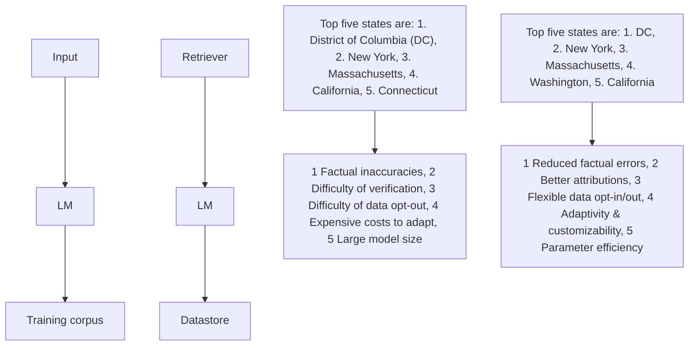

# Reliable, Adaptable, and Attributable Language Models with Retrieval

Akari Asai $^{12}$ Zexuan Zhong $^{3}$ Danqi Chen $^{3}$ Pang Wei Koh $^{1}$ Luke Zettlemoyer $^{12}$ Hannaneh Hajishirzi $^{14}$ Wen-tau Yih $^{2}$

# Abstract

Parametric language models (LMs), which are trained on vast amounts of web data, exhibit remarkable flexibility and capability. However, they still face practical challenges such as hallucinations, difficulty in adapting to new data distributions, and a lack of verifiability. In this position paper, we advocate for retrieval-augmented LMs to replace parametric LMs as the next generation of LMs. By incorporating large-scale datastores during inference, retrieval-augmented LMs can be more reliable, adaptable, and attributable. Despite their potential, retrieval-augmented LMs have yet to be widely adopted due to several obstacles: specifically, current retrieval-augmented LMs struggle to leverage helpful text beyond knowledge-intensive tasks such as question answering, have limited interaction between retrieval and LM components, and lack the infrastructure for scaling. To address these, we propose a roadmap for developing general-purpose retrieval-augmented LMs. This involves a reconsideration of datastores and retrievers, the exploration of pipelines with improved retriever-LM interaction, and significant investment in infrastructure for efficient training and inference.

# 1. Introduction

Large language models (LMs) such as GPT-4 (Black et al., 2022) have shown impressive abilities in a range of natural language processing (NLP) tasks. Such parametric LMs encapsulate rich natural language understanding abilities and a wealth of world knowledge in their parameters, acquired via massive pre-training on large-scale web corpora (Figure 1, top). However, they still suffer from several fundamental weaknesses including W1: the prevalence of factual errors (Min et al., 2023a; Mishra et al., 2024), W2: the dif

Input: List the top five US states with the highest per-capita GDP, in order.

flowchart

Figure 1. Parametric LMs (top) internalize large-scale text data in their parameters via massive pre-training, while retrieval-augmented LMs (bottom) incorporate text retrieved from a massive datastore at test time.

ficulty of verification (Bohnet et al., 2022), W3: difficulty of opting out certain sequences with concerns (Henderson et al., 2023), W4: computationally expensive costs for adaptations (Longpre et al., 2023), and W5: prohibitively large model size (Kandpal et al., 2022a). Moreover, merely scaling up the model has been insufficient to overcome such limitations (Mallen et al., 2023) or even exacerbates the challenges (Carlini et al., 2021).

This position paper advocates for retrieval-augmented LMs to supersede parametric LMs as the next generation of LMs (Figure 1, bottom), addressing many of the aforementioned weaknesses. Unlike parametric LMs—which use large-scale text data only during training—retrieval-augmented LMs leverage an external large-scale collection of documents (datastore) at inference by selecting relevant documents from the datastore (Asai et al., 2023a). Retrieval-augmented LMs can W1: largely reduce factual errors (Mallen et al., 2023), W2: provide better attributions (Gao et al., 2023a), W3: enabling flexible opt-in and out of sequences (Min et al., 2024). By adding or removing data from their datastores, retrieval-augmented LMs can W4: easily adapt to new distributions (Khandelwal et al., 2020). Lifting the burden of memorizing everything in parameters makes them W5:

more parameter-efficient (Izacard et al., 2023).

Despite their considerable potential to significantly improve reliability, adaptability, and attributability, their broader adoption beyond specific knowledge-intensive tasks (e.g., question answering or QA; Chen et al. 2017) is currently limited. We argue that through fundamental advancements in architecture, training methodologies, and infrastructure for retrieval-augmented LMs, they can demonstrate substantial efficacy across diverse domains. We urge the research community to intensify efforts aimed at overcoming those inherent limitations for their widespread adoption. To facilitate future research, we identify several significant challenges. First, existing approaches primarily leverage context with high semantic or lexical similarity to the input (C1), struggling when helpful text is absent in common datastores or does not align with conventional relevance definitions (BehnamGhader et al., 2023; Asai et al., 2023b). Second, prepending the retrieved text to the input of off-the-shelf LMs, which has been widely used recently, leads to shallow interactions between the retrieval and LM components (C2). This often results in unsupported generations (Gao et al., 2023a), susceptibility to irrelevant text (Yoran et al., 2024), and challenges in handling information from multiple pieces of text (Borgeaud et al., 2022). Furthermore, unlike rapid progress for efficient training and inference of parametric LMs (Zhao et al., 2023b; Dao et al., 2022), there are limited studies and open-sourced efforts to enhance the training and inference efficiency of retrieval-augmented LMs at scale (C3).

We conclude this paper with a roadmap to advance retrieval-augmented LMs to foster wider adoption. First, addressing the challenge of finding helpful text for diverse tasks (C1), it is important to reconsider the notion of relevance and advance our understanding of what constitutes an effective datastore—specifically, exploring the types of information that should be retrieved from various datastores to enhance the performance in broader tasks. Then, we suggest approaches to ensure deeper interactions between the two components, including architecture, pre-training, and post-training adaptations (C2), rather than focusing on supplementary enhancement of existing parametric LMs. For challenges of scaling (C3), we call for more open-sourced and interdisciplinary efforts across hardware, systems, and algorithms to develop infrastructures for training and inference (e.g., scaling datastore to trillion tokens). By pursuing these avenues, we anticipate unlocking the full capabilities of retrieval-augmented LMs and expanding their applications across a spectrum of tasks and domains.

# 2. How Far Can We Go with Parametric LMs?

We first assess the limitations of parametric LMs. Despite rapid progress in this area, we argue that parametric LMs have many practical limitations, which in turn pose significant challenges to building reliable intelligent systems.

Definition. A parametric LM (Figure 1, top) consists of a set of parameters $\theta$ . Given input sequences from a large-scale text dataset $D_{train}$ , learnable parameters $\theta$ are trained to predict the probabilities of future or masked tokens. During test time, for an input sequence x, the trained $\theta$ predicts the outputs: $y = f_{\theta}(x)$ , without accessing any external data beyond that of the task at hand.

# 2.1. Weaknesses of Parametric LMs

Mounting evidence highlights significant limitations in parametric LMs. Many such challenges arise from the strategy of attempting to store all knowledge within the parameters, which scaling alone may not adequately address.

W1: Factual inaccuracies. Attempting to memorize all the learned knowledge within the parameters can lead to factual inaccuracies, which are often called hallucinations. Several recent papers report that even state-of-the-art LMs such as ChatGPT exhibit hallucinations in the majority of their outputs (Min et al., 2023a; Mishra et al., 2024). Mallen et al. (2023); Kandpal et al. (2022a) show that they particularly struggle with long-tail knowledge—factual knowledge that is less represented during pre-training—and that scaling only yields minor improvements. Gudibande et al. (2024) find that increasing synthetic labeled data during instruction tuning may not improve the factuality of model outputs.

W2: Difficulty of verifications. Not only have LMs shown a propensity for hallucinations in their generations, but it is also difficult for practitioners to fact-check their outputs due to a lack of clear attributions or provenance. The outputs of powerful LMs are often lengthy, assertive, and plausible (Min et al., 2023a), which makes post-hoc attributions or factual verification to be challenging and largely unsolved tasks (Mishra et al., 2024; Yue et al., 2023).

W3: Difficulty of opting out certain sequences from the datasets. Managing the vast volume of pre-training data poses a considerable challenge in identifying and filtering out training instances with potential privacy (Brown et al., 2022) or copyright-protected data (Lee et al., 2024). Recent work studies intensive red teaming and safety tuning efforts (Touvron et al., 2023b; Perez et al., 2022), unlearning (Jang et al., 2023) or iterative pre-training of models on corpora after removing certain data (Kandpal et al., 2022b). Yet, the absence of proper attributions further complicates these endeavors, as tracing back to and eliminating specific training instances becomes non-trivial (Grosse et al., 2023).

W4: Computationally expensive costs to adapt. Adapting parametric LMs trained on static unlabeled text (i.e.,

text collected at a certain timestamp from the web) requires continuous training or computationally expensive post-adaptation to new data distributions. For instance, their parametric knowledge can quickly become obsolete (Long-pre et al., 2023). While several approaches propose to locate and edit certain outdated knowledge (De Cao et al., 2021) or conduct efficient continued training (Jin et al., 2022) to keep up with the world, these approaches require additional computationally expensive learning processes. LMs trained on widely adopted pre-training corpora often perform well on general-purpose domains such as news articles (Dodge et al., 2021), but struggle on expert domains (Taylor et al., 2022). Prior work demonstrates the effectiveness of continued pre-training (Azerbayev et al., 2024; Chen et al., 2023b) or instruction tuning (Singhal et al., 2023), albeit at a considerable computational cost and possibilities of catastrophic forgetting (Li et al., 2022).

W5: Prohibitively large model size. Numerous studies showcase the positive impact of model scaling on task performance (Chowdhery et al., 2022; Wei et al., 2022), and the ability to recall factual knowledge memorized from the training data (Carlini et al., 2023; Mallen et al., 2023; Kandpal et al., 2022a). This trend has prompted the community to focus on boosting the model size in pursuit of better performance, at the cost of significant computational challenges and environmental concerns (Strubell et al., 2019; Weidinger et al., 2022). Despite efforts to enhance efficiency, hosting these massive models, which often exceed a hundred billion parameters, remains impractical for many industry or academic groups (Schwartz et al., 2019).

# 3. How Can Retrieval-Augmented LMs Address These Issues?

In this section, we discuss how retrieval-augmented LMs can alleviate the aforementioned issues in parametric LMs.

Definition. A retrieval-augmented LM (Figure 1, bottom; detailed in Figure 2) typically consists of two key components: a retriever R and a parametric LM $\theta$ . The retriever builds a search index $I^{1}$ based on documents in the datastore D. During inference time, given an input sequence x, the retriever finds relevant text $z^{2}$ from the inference datastore, leveraging an index I: $z = f_{\mathcal{R},\mathcal{I}}(x)$ . Subsequently, the LM $\theta$ uses both the original prompt and the retrieved text to predict the output y: $y = f_{\theta}(x, z)$ .

$^{1}$ In term-based retrieval systems such as BM25 (Robertson & Zaragoza, 2009) that count the occurrences of words in documents in the datastore, the index I is a weighted bag-of-words vector, while in more recent trainable neural retrieval systems such as DPR (Karpukhin et al., 2020), the index is a collection of float embeddings encoded by an encoder LM.

$^{2}$ There are different granularities for relevant text z (e.g., text chunks, tokens, phrases). See Section 4.1.1 for more details.

Origins, progress, and recent shift. The concept of retrieval augmentation has been extensively explored across various machine learning domains (Tian et al., 2019). In NLP, earlier efforts have been applied to specific tasks such as QA and machine translation. Chen et al. (2017) introduce DrQA, which combines a term-based information retrieval (IR) system with a neural QA model to answer knowledge-intensive questions. While IR and such task LMs were initially studied separately, several work explores more organic combinations of retrieval and LM by pre-training the two components jointly or sequentially, including REALM (Guu et al., 2020), RAG (Lewis et al., 2020a), RETRO (Borgeaud et al., 2022), etc.

Such earlier work designed special architectures and training objectives for the retrieval-augmented LM. Most recently, there has been a shift of view of retrieval-augmented LMs—instead of training retrieval-augmented LMs from scratch, some work supplementary integrate retrieval on top of existing powerful parametric LMs (e.g., GPT-3; Black et al. 2022) without any additional training. Such methods—often referred to simply as Retrieval-Augmented Generation or RAG—concatenate the original input sequence x with retrieved text z when prompting, yielding significant improvements over the base parametric LMs on certain knowledge-intensive tasks (Ram et al., 2023; Shi et al., 2023c). Many recent studies explore advanced prompting methods with retrieval components (Yao et al., 2023; Press et al., 2023) or develop pipelines for further improvements (Gao et al., 2023b). RAG has been integrated into real-world applications such as LLM search systems. $^{3}$

# 3.1. Effectiveness of Retrieval-Augmented LMs

We now review some empirical findings from prior studies suggesting their effectiveness in addressing the weaknesses of parametric LMs discussed in Section 2.1.

W1: Reduced factual errors in long-tail knowledge. Recent studies show that retrieval-augmented LMs can alleviate the shortcomings of parametric memorization by explicitly capturing long-tail knowledge (Mallen et al., 2023). As a result, retrieval-augmented LMs can minimize hallucinations and improve the factuality of generated outputs (Lewis et al., 2020b; Izacard et al., 2023; Ram et al., 2023; Shi et al., 2023c; Asai et al., 2024; Min et al., 2023b).

W2: Better attributions. Retrieval-augmented LMs provide retrieved results z used during inference, which can help practitioners inspect the correctness of model outputs manually (Liu et al., 2023) or automatically (Mishra et al., 2024). Another way for verification is post-hoc attribution—given the model output y, retrieving documents that support y. Yet, prior work finds that retrieval-augmented LMs using

flowchart

Figure 2. Taxonomy of architectures of retrieval-augmented LMs.

evidence during inference provide more accurate attributions than such post-hoc attributions (Gao et al., 2023a; Malaviya et al., 2023)

W3: Enabling flexible opt-in of sequences. Retrieval-augmented LMs offer some effective solutions to concerns related to massive training data through improved attributions and adaptable datastore updates. Enhanced attributions enable practitioners to exclude specific sequences from the datastore, mitigating the risk of generating them verbatim (Carlini et al., 2021). Additionally, integrating datastores during inference only still allows retrieval-augmented LMs to maintain performance across domains not included in their training data (Min et al., 2024).

W4: Adaptability and customizability. The separation and the interchangeability of knowledge sources for the datastore enables better customization to specific domains, applications, and time stamps, without the need for additional training (Khandelwal et al., 2020; Min et al., 2024). Recent work has shown that retrieval augmentation can even outperform LMs fine-tuned on the downstream domain data on QA (Ovadia et al., 2023; Gupta et al., 2024). Such effectiveness for domain adaptation has also been reported in non-knowledge-intensive tasks, including machine translation (Shi et al., 2022; Min et al., 2024; Khandelwal et al., 2021; Zhong et al., 2022). Updating the datastore with up-to-date knowledge also bypasses the issue of data obsoleteness of parametric LMs (Izacard et al., 2023; Zhong et al., 2023; Mitchell et al., 2022; Kasai et al., 2023).

W5: Parameter efficiency. By lifting the burden of memorizing all knowledge in the model parameters, retrieval-augmented LMs often show strong parameter efficiency—retrieval-augmented LMs with much fewer LM parameters can outperform larger, more powerful parametric LMs.

For example, on knowledge-intensive tasks such as QA, retrieval-augmented LMs surpass parametric LMs with orders of magnitude more parameters by a large margin (Izacard et al., 2023; Min et al., 2023b; Mallen et al., 2023).

# 4. Why Haven't Retrieval-Augmented LMs Been Widely Adopted?

Despite showing some empirical promise, the adoption of retrieval-augmented LMs remains limited compared to parametric LMs. To understand the obstacles hindering the widespread adoption, we provide a brief review of existing retrieval-augmented LMs under our unified taxonomy for architectures (Figure 2), training, and datastores, as summarized in Table 1.

# 4.1. Current State of Retrieval-Augmented LMs

# 4.1.1. ARCHITECTURE

Retrieval-augmented LMs have diverse architectures. Our taxonomy defines architecture based on three axes (Table 1 left): what the unit of retrieved text z is (granularity of z), how z is incorporated (incorporation of z), and how often z is retrieved (frequency of retrieval).

Here, we classify approaches based on how they incorporate the retrieved text z (the Incorporation column in Table 1), Essentially, retrieval-augmented LMs' architectures can be classified into the following three groups: 1) input augmentation, 2) intermediate fusion, and 3) output interpolation. Refer to Figure 2 for a taxonomy of these architectures. For a more comprehensive review of the architecture, including aspects such as the granularity of retrieval and retrieval frequency, refer to Appendix B.1. In essence, input augmentation and intermediate fusion typically involve retrieving text chunks and processing them with parametric LMs. On

Table 1. Diverse retrieval-augmented LMs based on our architecture and training taxonomies. Full references of the papers are as follows: DrQA (Chen et al., 2017), REALM (Guu et al., 2020), RAG (Lewis et al., 2020b), ATLAS (Izacard et al., 2023), RALM (Ram et al., 2023), REPLUG (Shi et al., 2023c), Active Retriever (Jiang et al., 2023), Self-RAG (Asai et al., 2024), RETRO (Borgeaud et al., 2022), InstructRetro (Wang et al., 2023a), kNN LM (Khandelwal et al., 2020), TRIME (Zhong et al., 2022), NPM (Min et al., 2023b), CopyGenerator (Lan et al., 2023), SPALM (Yogatama et al., 2021), Adaptive kNN (Drozdov et al., 2022). \* indicates that approaches combining off-the-shelf models without any task-specific training. 

<table><tr><td></td><td>Granularity</td><td>Incorporation</td><td>Frequency</td><td>Training</td><td>Data order</td></tr><tr><td>DrQA</td><td>Chunks</td><td>Input</td><td>One-time</td><td>Independent</td><td> $O(10^9)$ </td></tr><tr><td>REALM, RAG, ATLAS</td><td>Chunks</td><td>Input</td><td>One-time</td><td>Joint</td><td> $O(10^9)$ </td></tr><tr><td>RALM, REPLUG</td><td>Chunks</td><td>Input</td><td>Every k tokens, One-time</td><td>Independent*</td><td> $O(10^9)$ </td></tr><tr><td>Active-Retriever, Self-RAG</td><td>Chunks</td><td>Input</td><td>Adaptive</td><td>Independent*, Sequential</td><td> $O(10^9)$ </td></tr><tr><td>RETRO, InstructRetro</td><td>Chunks</td><td>Intermediate</td><td>Every k tokens</td><td>Sequential</td><td> $O(10^{12})$ </td></tr><tr><td>kNN LM, TRIME</td><td>Tokens</td><td>Output</td><td>Every token</td><td>Independent*, Joint</td><td> $O(10^9)$ </td></tr><tr><td>NPM, Copy Generator</td><td>Phrases</td><td>Output</td><td>Every phrase</td><td>Joint</td><td> $O(10^9)$ </td></tr><tr><td>SPALM, Adaptive kNN</td><td>Tokens</td><td>Output</td><td>Adaptive</td><td>Independent*, Joint</td><td> $O(10^9)$ </td></tr></table>

the other hand, output interpolation directly retrieves successive tokens or phrases, resulting in a much larger index. Unlike traditional approaches, which involve retrieving only once (One-time) such as DRQA, recent studies have highlighted the effectiveness of retrieval over specific token intervals (Every k tokens; Ram et al. 2023) or adaptively (Asai et al., 2024; Jiang et al., 2023; Drozdov et al., 2022).

Input augmentation. Input augmentation augments the original input x with retrieved results z in the input space of the LM $\theta$ and runs a standard LM inference. As in the pioneering work from Chen et al. (2017), input augmentation enables flexible plug-ins of different models for retrieval and LM components. Many widely adopted models, including those that augment powerful LMs with off-the-shelf retrievers, mostly belong in this category (Yao et al., 2023; Shi et al., 2024). One notable bottleneck to this approach is redundancy and inefficiency; encoding many documents together in the input space leads to context length window limitations and increases inference costs exponentially (Xu et al., 2024). While some work such as FiD (Izacard et al., 2023) explores parallel encoding to overcome such inefficiencies, it still encodes repeatedly for each input x.

Intermediate fusion. To integrate retrieved results in a more scalable manner, RETRO (Borgeaud et al., 2022) introduces a new attention mechanism, which takes many pre-encoded text chunks independent of query x and simultaneously incorporates them in intermediate spaces. RETRO++ (Wang et al., 2023b) and InstructRetro (Wang et al., 2023a) demonstrate the effectiveness of this method on top of larger, decoder-only LMs. However, a drawback of intermediate fusion is the need for extensive architecture modification and pre-training of LMs for the new encoding blocks, potentially limiting widespread adoption.

Output interpolation. Both input augmentation and intermediate fusion require the LM to generate continuations from their vocabularies. In contrast, kNN LM (Khandelwal et al., 2020) interpolates a parametric LM token distribution with a retrieved token distribution, without the need for additional training. Some work extends this direction by designing new training objectives (Zhong et al., 2022) or completely replacing parametric distributions with a non-parametric distribution over each phrase in the datastore (Min et al., 2023b; Lan et al., 2023).b While these approaches frequently demonstrate their efficacy compared to input augmentation in language modeling (Min et al., 2024), they require a considerably larger index than the other two architectures. This is due to the necessity of generating embeddings for all tokens in the datastore, presenting scalability challenges.

# 4.1.2. TRAINING

Retrieval-augmented LMs consist of three main components: the index I, the retriever R (i.e., a model that generates encoding of input and documents), and the LM $\theta$ . How to efficiently and simultaneously update them to optimize the whole pipeline remains a challenging question. Currently, there are two paradigms: independent or sequential training and joint training (Table 1 Training).

Independent or sequential training. Independent training involves the separate development of a retriever and LM with no direct interactions during training. This includes methods such as kNN LM, or recently, RAG applied to off-the-shelf LMs and retrieval systems. This allows practitioners to leverage existing training pipelines and objectives to enhance the individual components. There has been rich literature in the area of IR on how to build reliable and efficient IR systems. Classical term-based retrieval systems, such as TF-IDF or BM25 (Robertson & Zaragoza, 2009), have been widely used. More recently, neural retrieval systems, such as DPR (Karpukhin et al., 2020) or ColBERT (Khattab & Zaharia, 2020), have shown superior performance.

Extensive pre-training of retrieval models further improved such models (Izacard et al., 2022; Ni et al., 2022; Lin et al., 2023). For a comprehensive review of retrieval systems, we direct readers to prior surveys (Zhao et al., 2023a).

Yet, independent training is often sub-optimal for the whole retrieval-augmented LM pipeline; for instance, LMs trained without retrieval could become easily distracted by irrelevant preceding context (Shi et al., 2023a). To alleviate this issue, sequential training trains either the retriever or LM first, and then trains the other subsequently using signals from the first trained component. Many studies train the LM component with a powerful pre-trained retriever e.g., DPR, search engines, or frozen pre-trained encoders (Izacard & Grave, 2021a; Nakano et al., 2021; Borgeaud et al., 2022), or conversely, train the retriever with signals from the LM (Shi et al., 2023c; Izacard & Grave, 2021b).

Joint training. Joint training simultaneously trains the LM and retrieval components to further optimize their interactions and the end-to-end retrieval-augmented LM pipeline. A notable challenge in joint training is the substantial computational overhead incurred by updating both the retriever model and the resulting index during training. It is impractical to repeatedly generate embeddings for millions or billions of documents in the datastore at each time step. There are two approaches to achieve this under reasonable resource requirements: updating the datastore with updated parameters asynchronously or using an in-batch approximation to a full datastore. Asynchronous updating is a technique that allows the index to grow stale over a fixed number of training steps before the update, aiming to use the full corpus during training (Izacard et al., 2023), as in inference time. There is a tradeoff between the update frequency and computational overhead (Guu et al., 2020): to obtain better performance, the index should be updated more frequently. In-batch approximation builds a temporary index on the fly using training samples from the same mini-batch, which serves as an approximation to the full index during training (Zhong et al., 2022; de Jong et al., 2022; Min et al., 2023b; Lan et al., 2023). Designing training batches that can provide strong training signals requires careful consideration.

# 4.1.3. APPLICATIONS AND DATASTORES

Applications. Retrieval-augmented LMs have proven effective in various NLP tasks. Notably, their impact is more pronounced on knowledge-intensive tasks (Guu et al., 2020; Lewis et al., 2020a; Izacard et al., 2023). Several studies showcase their efficacy in machine translation (Khandelwal et al., 2020; Gu et al., 2018) as well as broader language understanding tasks (Min et al., 2023b; Shi et al., 2022). There are also decoding methods that leverage post-hoc retrieval augmentations to produce more efficient or factual generations (He et al., 2023; Shi et al., 2023b), or knowledge editing capabilities (Zhong et al., 2023). A further overview of applications with details of adaptation methodologies is in Appendix B.2.

Datastores. Designing and building a reliable datastore is a key challenge of retrieval-augmented LMs. The inference datastore D may not be necessarily equivalent to the training datastore and is task-dependent. Some works, such as NPM (Min et al., 2023b), leverage the same corpus as the training data $D = D_{train}$ on more general tasks, while for certain downstream tasks, a smaller and general-domain corpus is often used (e.g., Wikipedia). Conversely, curating high-quality, domain-focused corpora is important for some tasks, e.g., code generation (Hayati et al., 2018; Zhou et al., 2023). As Table 1 shows, most prior work use a datastore that is on the order of $O(10^{9})$ tokens, with examples such as Wikipedia containing roughly a few billion tokens. Notably, Wang et al. (2023a); Borgeaud et al. (2022) scale the datastore to over one trillion tokens, showcasing a large perplexity reduction.

# 4.2. Limitations of Current Retrieval-Augmented LMs

We next identify several core challenges inherent to existing retrieval-augmented LMs, as summarized in Table 2.

C1: Limitations of retrievers and datastores. Despite the success of retrieval-augmented LMs on knowledge-intensive tasks, their broader applications often result in restricted success. For example, retrieval-augmented LMs only yield marginal gains on reasoning tasks, which can be attributed to weaknesses in both the retrieval and LM components (BehnamGhader et al., 2023; Lin et al., 2024). We hypothesize that this stems from a misalignment between conventional retrieval and LM training objectives, as well as the used datastore. Consider answering a factual knowledge-based question: a retriever can efficiently search documents akin to a query in Wikipedia, and an LM can subsequently copy or paraphrase the retrieved information. However, the types of beneficial text vary significantly based on the task. Existing retrieval systems evaluate the relevance of documents primarily by assessing their high lexical or semantic similarities to the input. Yet, such “relevant” documents often do not help tasks in reasoning or general language understanding (Rubin et al., 2022). It is still unclear what makes certain retrieved contexts more effective than others. The heavy dependence on Wikipedia as a datastore (Section 4.1.3) could also limit its effectiveness, as real-world applications frequently encounter queries that may not find direct answers in Wikipedia (Asai & Choi, 2021).

C2: Limited interactions between retrievers and LMs. Common approaches, such as RAG, often straightforwardly entail appending retrieved results to the input of pre-trained

Table 2. Current status of retrieval-augmented LMs and future directions. 

<table><tr><td></td><td>Current State of Retrieval-Augmented LMs (§4)</td><td>Roadmap to Advance Retrieval-Augmented LMs (§5)</td></tr><tr><td>C1: Usage of R and D</td><td>✗ Semantic and lexical similarity only ✗ Single and general-domain corpora</td><td>√ Beyond semantic and lexical similarity √ Datastores for wider applications</td></tr><tr><td>C2: Interaction of R and θ</td><td>✗ Limited interactions beyond input augmentations ✗ Lack of joint optimization from the end use</td><td>√ Architectures with deep LM-retriever interactions √ Large-scale joint training techniques</td></tr><tr><td>C3: Infrastructures for scaling &amp; adoptions</td><td>✗ Lack of standardized libraries beyond RAG ✗ Difficulty in large-scale training and inference</td><td>√ Standardized and open-sourced library for retrieval-based LMs √ Infrastructure for large-scale training and inference</td></tr></table>

parametric LMs and adopting input augmentation (Section 4.1.1), due to its simplicity and effectiveness by leveraging state-of-the-art parametric LMs. However, these methods lack close interactions between the retrieval and LM components throughout both training and inference. This deficiency amplifies issues such as unsupported generations (Gao et al., 2023a) or susceptibility to irrelevant context, as noted in Yoran et al. (2024); Shi et al. (2023a). Moreover, input augmentation increases the context length of LMs, leading to an exponential increase in inference costs (Xu et al., 2024). This becomes particularly problematic when downstream applications require systems to assimilate information from multiple documents (Fan et al., 2019). Extended context can also induce LMs to overlook significant portions of the input (Liu et al., 2023).

C3: Lack of infrastructure specialized for retrieval-based LMs. Relative to parametric LMs, the optimization of retrieval-augmented LM training procedures has been comparatively under-studied, from both methodological and infrastructural standpoints. For instance, open-sourced software such as PyTorch FSDP $^{4}$ or DeepSpeed $^{5}$ enable resource-efficient parametric LM pre-training via techniques such as Fully Sharded Data Parallelism (Zhao et al., 2023b) or Zero Redundancy Optimizers (Rasley et al., 2020), respectively. While retrieval-augmented LMs can certainly leverage improvements made to their parametric components, what remains lacking are focused efforts that address challenges unique to retrieval-augmented LMs. Synchronously updating large-scale indexes during training introduces significant computational overhead, and how to efficiently update the index under normal computational environments remains challenging (Section 4.1.2).

Inference in retrieval-augmented LMs can also be significantly more expensive than in standard parametric LMs (Mallen et al., 2023), especially if the datastore is large (e.g., over one trillion tokens). As scaling pre-training data leads to better parametric LMs, some studies empirically show that scaling the datastoresis promising (Borgeaud et al., 2022). Yet, nearest neighbor searches over billions of embeddings without extensive tricks can consume hundreds of GPUs or prohibitively high RAM usage. Scaling costs thus hinder prior efforts to use larger datastores (Section 4.1.3).

# 5. How Can We Further Advance Retrieval-Augmented LMs?

We believe that the community needs to develop robust intelligent systems based on retrieval-augmented LMs that surpass fully parametric LMs. Here, we present a roadmap to overcome the technical constraints associated with retrieval-augmented LMs discussed in Section 4.2.

# 5.1. Rethinking Retrieval and the Datastore (C1)

Beyond semantic and lexical similarity. Extending the use of retrieval-augmented LMs beyond conventional knowledge-centric tasks necessitates the formulation of a new definition for “relevance” of the input query and documents in the datastore. This is essential for excelling in tasks as in those tasks informative text may not exhibit semantic or lexical similarity to the input query. Recent works show that few-shot in-context learning demonstrations (Su et al., 2023a) or even unlabeled text (Lyu et al., 2023) could boost model performance on reasoning or language understanding tasks. Yet, what makes certain documents helpful (e.g., underlying reasoning patterns, or writing style) remains an open question. Acquiring a better understanding of the characteristics of helpful documents could unlock the potential of retrieval-augmented LMs. Furthermore, built upon such understanding, we should build retrieval systems capable of contextualized retrieval, rather than building task-specific retrieval pipelines: developing a versatile retriever that adjusts its search behavior based on diverse notions of similarity with additional input. For instance, instruction-tuned retrievers (Asai et al., 2023b; Su et al., 2023b) exemplify this direction.

Reconsidering and improving the datastore. When it comes to wider, general downstream applications, or conversely more expert-domain tasks, over-reliance on a single,

general-domain corpus such as Wikipedia may hinder the capability of retrieval-augmented LMs. As discussed in Section 4.1.3, the curation and composition of the datastore significantly impact the final performance. Yet, many open questions exist regarding how to build and ensure high-quality and effective datastores. For instance, should we introduce a quality filter to the documents in the datastore, as common practice in pre-training data processing (Black et al., 2022)? How should we balance multiple domains in a datastore (Shao et al., 2023)? Despite the abundance of literature on what constitutes good LM pre-training data (Long-pre et al., 2023), there have been limited explorations so far on what data ought to go into the datastore.

# 5.2. Enhancing Retriever-LM Interactions (C2)

New architectures beyond input augmentation. As discussed, the input augmentation of powerful LMs (e.g., RAG) comes with several limitations that could be addressed by more specialized, integrated architectures, such as output interpolation or intermediate fusion. While recent work shows the success of new architectures (Wang et al., 2023b; Min et al., 2023b; Lan et al., 2023), compared to massively pre-trained parametric LMs, their training and model size are often smaller, due to high computational costs for pre-training. Furthermore, approaches that employ a smaller granularity of retrieval (e.g., token level in Section 4.1.1) pose significant challenges for scaling. We urge collaborative efforts for scalable, effective architecture designs and pre-training—While pre-training retrieval-augmented LMs is computationally expensive, we hope that we can address that challenge through collaborative multi-institution efforts, as in several successful parametric LM pre-training (Workshop et al., 2022; Groeneveld et al., 2024). Recently, Muennighoff et al. (2024) have introduced generative representational instruction tuning to train a single model for both retrieval and generative tasks, which allows for significantly reducing the latency of RAG by caching representations.

Incorporating retrieval during LM pre-training. Off-the-shelf parametric LMs trained without retrieval components often struggle with leveraging additional context (Shi et al., 2023a). Pre-training LMs with retrieval has proven to be effective (Guu et al., 2020; Lewis et al., 2020a; Izacard et al., 2023), but often requires significant additional training costs, or non-trivial modifications to the standard LM architecture. Recently, Shi et al. (2024) shows that retrieving similar text chunks and reordering pre-training corpora can enhance LMs' abilities to reason over long sequences or perform retrieval augmentation for diverse tasks. These improvements do not require the modification of pre-training pipelines or model architectures. As such, the exploration of methods to induce LMs to leverage retrieved context with minimal or no additional costs remains promising.

Further adaptation after pre-training. Significant architecture modification or pre-training are efforts that require massive computing. One promising avenue under resource-constrained environments is to explore adaptations of retrieval-augmented LMs after pre-training. For instance, despite the rapid developments of versatile instruction-following parametric LMs, the exploration of instruction-following retrieval-augmented LMs (Lin et al., 2024; Luo et al., 2023; Asai et al., 2024) or RLHF for retrieval-augmented LMs (Nakano et al., 2021; Bohnet et al., 2022) remains comparatively scarce. Augmenting existing instruction-tuned LMs trained without retrieval can often cause suboptimal performance as the LMs are not explicitly trained to use the retrieved context. Further investigation for better post-hoc adaptation recipes (e.g., instruction-tuning, RLHF) for retrieval-augmented LMs may unleash their effectiveness across diverse downstream adaptations. Recent studies demonstrate the promise of incorporating additional components to filter out irrelevant context (Xu et al., 2024; Yoran et al., 2024) or instructing an LM to learn to distinguish (Asai et al., 2024). Exploring enhanced pipelines or inference-time algorithms could further improve reliability.

Efficient end-to-end training of retrieval-augmented LMs. Retrieval errors often stand out as prominent issues in retrieval-augmented LMs (Asai & Choi, 2021; Yoran et al., 2024). Rather than focusing on optimizing the LM component in isolation, it is crucial to jointly optimize the retriever component. Some tasks have demonstrated success in updating only the input encoding component without modifying the index after pre-training (Izacard et al., 2023; Lin et al., 2024). Another alternative strategy involves introducing additional components, such as reranking models, and training them in an end-to-end fashion with LMs. In many downstream tasks, no supervised labels are available to train retrieval systems. Studying effective training strategies without supervision on the latent variable for positively retrieved context (Lee et al., 2019; Singh et al., 2021) is essential for enabling the training of retrieval-augmented LMs for a broader range of applications.

# 5.3. Building Better Systems and Infrastructures for Scaling and Adaptation (C3)

Scalable search for massive-scale datastores. We believe significant efforts and expertise from interdisciplinary areas, including systems and algorithms, will enable practitioners to leverage large-scale datasets. For instance, exploring compression and quantization algorithms for billions of text embeddings is an important area (Douze et al., 2024), as well as faster nearest neighbor search algorithms (Wang et al., 2021). Open-sourced toolkits such as FAISS (Johnson et al., 2017) could accelerate such progress. Another bottleneck of datastore-scaling is the storage requirements for millions or billions of encoded documents, and how to

efficiently load them during inference. Some recent works propose to significantly reduce the index size by storing the index as binary vectors (Yamada et al., 2021; Cao et al., 2024). Besides algorithmic improvements and system development, another promising avenue is the development of specialized hardware for retrieval-augmented LMs. Compared to parametric LMs, retrieval-augmented LMs may require fewer GPUs, while it is often CPU-heavy and requires fast access to the datastore. Collaborative efforts from hardware, systems, and algorithms to LM applications could help us tackle these challenging problems.

Standardization and open-source developments. There are several repositories such as LangChain, $^{6}$ LlamaIndex, $^{7}$ and DSPy (Khattab et al., 2024) $^{8}$ that enable practitioners to build RAG on top of existing retrievers, parametric LMs, and user-provided datastores. Yet, we still lack a standardized implementation of retrieval-augmented LM pipelines and evaluation benchmarks that can flexibly accommodate a range of architectures and training configurations (Sections 4.1.1 and 4.1.2) beyond RAG. As open-sourced efforts have facilitated the rapid progress of parametric LMs, we urge the community to similarly build a standardized open-source implementation for retrieval-augmented LMs.

# 6. Conclusion

This paper advocates for retrieval-augmented LMs as the next generation of LMs to build more reliable, adaptable, and attributable intelligent systems. Despite their notable advantages over parametric LMs, their adoption remains limited. This limitation may be attributed to the focus on a narrow form of retrieval augmentation, which simply combines exiting retrieval models and LMs in post-hoc manners to supplement parametric LMs. We outline a roadmap for fundamentally advancing retrieval-augmented LMs in terms of architectures, training methodologies, and infrastructure. We emphasize the importance of collaborative interdisciplinary efforts to achieve these advancements.

# Impact Statements

We believe the adoption of retrieval-augmented LMs could address those fundamental limitations inherent to parametric LMs. We hope that this position paper will inspire further exploration in these areas, and collaboratively foster the advancement of retrieval-augmented LMs. However, concerns may arise. The effectiveness of retrieval-augmented LMs in tasks beyond knowledge-intensive domains remains an open question, necessitating thorough assessments. Further-

$^{6}$ https://python.langchain.com/docs/get\_started/introduction   
$^{7}$ https://www.llamaindex.ai/   
$^{8}$ https://github.com/stanfordnlp/dspy

more, retrieval-augmented LMs may not completely address issues such as hallucinations.

# Acknowledgements

We express our gratitude to Jacqueline He for her meticulous proofreading and for providing many writing suggestions for the drafts. We thank Rulin Shao, Weijia Shi, Dan Friedman, Tanya Goyal, Howard Yen, Dhruba Ghosh, Jiacheng Liu, and Niklas Muennighoff for their insightful feedback on our draft, and Sewon Min for fruitful discussions in the early stages. This work was funded in part by NSF IIS-2044660 and IIS-2239290 and gifts from AI2.

# References

Asai, A. and Choi, E. Challenges in information-seeking QA: Unanswerable questions and paragraph retrieval. In Proceedings of the 59th Annual Meeting of the Association for Computational Linguistics and the 11th International Joint Conference on Natural Language Processing, 2021. URL https://aclanthology.org/2021.acl-long.118.

Asai, A., Yu, X., Kasai, J., and Hajishirzi, H. One question answering model for many languages with cross-lingual dense passage retrieval. In Advances in Neural Information Processing Systems, 2021. URL https://proceedings.neurips.cc/paper\_files/paper/2021/file/3df07fdae1ab273a967aaa1d355b8bb6-Paper.pdf.

Asai, A., Min, S., Zhong, Z., and Chen, D. Retrieval-based language models and applications. In Proceedings of the 61st Annual Meeting of the Association for Computational Linguistics (Tutorial), 2023a. URL https://aclanthology.org/2023.acl-tutorials.6.

Asai, A., Schick, T., Lewis, P., Chen, X., Izacard, G., Riedel, S., Hajishirzi, H., and Yih, W.-t. Task-aware retrieval with instructions. In Findings of the Association for Computational Linguistics: ACL 2023, 2023b. URL https://aclanthology.org/2023.findings-acl.225.

Asai, A., Wu, Z., Wang, Y., Sil, A., and Hajishirzi, H. Self-RAG: Learning to retrieve, generate, and critique through self-reflection. In The Twelfth International Conference on Learning Representations, 2024. URL https://openreview.net/forum?id=hSyW5go0v8.

Azerbayev, Z., Schoelkopf, H., Paster, K., Santos, M. D., McAleer, S., Jiang, A. Q., Deng, J., Biderman, S., and Welleck, S. Llemma: An open language model

for mathematics. In The Twelfth International Conference on Learning Representations, 2024. URL https://openreview.net/forum?id=4WnqRR915j.   
BehnamGhader, P., Miret, S., and Reddy, S. Can retriever-augmented language models reason? the blame game between the retriever and the language model. In Bouamor, H., Pino, J., and Bali, K. (eds.), Findings of the Association for Computational Linguistics: EMNLP 2023. Association for Computational Linguistics, 2023. URL https://aclanthology.org/2023.findings-emnlp.1036.   
Black, S., Biderman, S., Hallahan, E., Anthony, Q., Gao, L., Golding, L., He, H., Leahy, C., McDonell, K., Phang, J., Pieler, M., Prashanth, U. S., Purohit, S., Reynolds, L., Tow, J., Wang, B., and Weinbach, S. GPT-NeoX-20B: An open-source autoregressive language model. In Fan, A., Ilic, S., Wolf, T., and Gallé, M. (eds.), Proceedings of BigScience Episode #5 – Workshop on Challenges & Perspectives in Creating Large Language Models, 2022. URL https://aclanthology.org/2022.bigscience-1.9.   
Bohnet, B., Tran, V. Q., Verga, P., Aharoni, R., Andor, D., Soares, L. B., Eisenstein, J., Ganchev, K., Herzig, J., Hui, K., et al. Attributed question answering: Evaluation and modeling for attributed large language models. arXiv preprint arXiv:2212.08037, 2022. URL https://arxiv.org/abs/2212.08037.   
Borgeaud, S., Mensch, A., Hoffmann, J., Cai, T., Rutherford, E., Millican, K., Van Den Driessche, G. B., Lespiau, J.-B., Damoc, B., Clark, A., De Las Casas, D., Guy, A., Menick, J., Ring, R., Hennigan, T., Huang, S., Maggiore, L., Jones, C., Cassirer, A., Brock, A., Paganini, M., Irving, G., Vinyals, O., Osindero, S., Simonyan, K., Rae, J., Elsen, E., and Sifre, L. Improving language models by retrieving from trillions of tokens. In Proceedings of the 39th International Conference on Machine Learning, 2022. URL https://proceedings.mlr.press/v162/borgeaud22a.html.   
Brown, H., Lee, K., Mireshghallah, F., Shokri, R., and Tramèr, F. What does it mean for a language model to preserve privacy? In Proceedings of the 2022 ACM Conference on Fairness, Accountability, and Transparency, 2022. URL https://dl.acm.org/doi/fullHtml/10.1145/3531146.3534642.   
Brown, T., Mann, B., Ryder, N., Subbiah, M., Kaplan, J. D., Dhariwal, P., Neelakantan, A., Shyam, P., Sastry, G., Askell, A., Agarwal, S., Herbert-Voss, A., Krueger, G., Henighan, T., Child, R., Ramesh, A., Ziegler, D., Wu, J., Winter, C., Hesse, C., Chen, M., Sigler, E., Litwin, M., Gray, S., Chess, B., Clark, J., Berner,

C., McCandlish, S., Radford, A., Sutskever, I., and Amodei, D. Language models are few-shot learners. In Advances in Neural Information Processing Systems, 2020. URL https://proceedings.neurips.cc/paper\_files/paper/2020/file/1457c0d6bfcb4967418bfb8ac142f64a-Paper.pdf.   
Cao, Q., Min, S., Wang, Y., and Hajishirzi, H. BTR: Binary token representations for efficient retrieval augmented language models. In The Twelfth International Conference on Learning Representations, 2024. URL https://openreview.net/forum?id=3TO3TtnOF1.   
Carlini, N., Tramer, F., Wallace, E., Jagielski, M., Herbert-Voss, A., Lee, K., Roberts, A., Brown, T., Song, D., Erlingsson, U., et al. Extracting training data from large language models. In 30th USENIX Security Symposium, 2021. URL https://arxiv.org/abs/2012.07805.   
Carlini, N., Ippolito, D., Jagielski, M., Lee, K., Tramer, F., and Zhang, C. Quantifying memorization across neural language models. In The Eleventh International Conference on Learning Representations, 2023. URL https://openreview.net/forum?id=TatRHT\_1cK.   
Chen, D., Fisch, A., Weston, J., and Bordes, A. Reading Wikipedia to answer open-domain questions. In Proceedings of the 55th Annual Meeting of the Association for Computational Linguistics, 2017. URL https://aclanthology.org/P17-1171.   
Chen, T., Wang, H., Chen, S., Yu, W., Ma, K., Zhao, X., Yu, D., and Zhang, H. Dense X Retrieval: What retrieval granularity should we use? arXiv preprint arXiv:2312.06648, 2023a. URL https://arxiv.org/abs/2312.06648.   
Chen, W., Hu, H., Chen, X., Verga, P., and Cohen, W. MuRAG: Multimodal retrieval-augmented generator for open question answering over images and text. In Goldberg, Y., Kozareva, Z., and Zhang, Y. (eds.), Proceedings of the 2022 Conference on Empirical Methods in Natural Language Processing, 2022. URL https://aclanthology.org/2022.emnlp-main.375.   
Chen, Z., Cano, A. H., Romanou, A., Bonnet, A., Matoba, K., Salvi, F., Pagliardini, M., Fan, S., Köpf, A., Mohtashami, A., et al. MEDITRON-70B: Scaling medical pretraining for large language models. arXiv preprint arXiv:2311.16079, 2023b. URL https://arxiv.org/abs/2311.16079.   
Chowdhery, A., Narang, S., Devlin, J., Bosma, M., Mishra, G., Roberts, A., Barham, P., Chung, H. W., Sutton, C., Gehrmann, S., et al. PaLM: Scaling language modeling

with pathways. arXiv preprint arXiv:2204.02311, 2022.
URL https://arxiv.org/abs/2204.02311.   
Dao, T., Fu, D., Ermon, S., Rudra, A., and Ré, C. Flashattention: Fast and memory-efficient exact attention with io-awareness. In Advances in Neural Information Processing Systems, 2022. URL https://openreview.net/forum?id=H4DqfPSibmx.   
De Cao, N., Aziz, W., and Titov, I. Editing factual knowledge in language models. In Moens, M.-F., Huang, X., Specia, L., and Yih, S. W.-t. (eds.), Proceedings of the 2021 Conference on Empirical Methods in Natural Language Processing, 2021. URL https://aclanthology.org/2021.emnlp-main.522/.   
de Jong, M., Zemlyanskiy, Y., FitzGerald, N., Sha, F., and Cohen, W. W. Mention memory: incorporating textual knowledge into transformers through entity mention attention. In International Conference on Learning Representations, 2022. URL https://openreview.net/forum?id=OY1A8ejQgEX.   
Devlin, J., Chang, M.-W., Lee, K., and Toutanova, K. BERT: Pre-training of deep bidirectional transformers for language understanding. In Proceedings of the 2019 Conference of the North American Chapter of the Association for Computational Linguistics: Human Language Technologies, Minneapolis, Minnesota, June 2019. Association for Computational Linguistics. URL https://aclanthology.org/N19-1423.   
Dodge, J., Sap, M., Marasović, A., Agnew, W., Ilharco, G., Groeneveld, D., Mitchell, M., and Gardner, M. Documenting large webtext corpora: A case study on the colossal clean crawled corpus. In Moens, M.-F., Huang, X., Specia, L., and Yih, S. W.-t. (eds.), Proceedings of the 2021 Conference on Empirical Methods in Natural Language Processing, 2021. doi: 10.18653/v1/2021.emnlp-main.98. URL https://aclanthology.org/2021.emnlp-main.98.   
Douze, M., Guzhva, A., Deng, C., Johnson, J., Szilvasy, G., Mazaré, P.-E., Lomeli, M., Hosseini, L., and Jégou, H. The faiss library. arXiv preprint arXiv:2401.08281, 2024. URL https://arxiv.org/abs/1702.08734.   
Drozdov, A., Wang, S., Rahimi, R., McCallum, A., Zamani, H., and Iyyer, M. You can't pick your neighbors, or can you? when and how to rely on retrieval in the kNN-LM. In Findings of the Association for Computational Linguistics: EMNLP 2022, 2022. URL https://aclanthology.org/2022.findings-emnlp.218.

Dubois, Y., Li, X., Taori, R., Zhang, T., Gulrajani, I., Ba, J., Guestrin, C., Liang, P., and Hashimoto, T. B. Alpacafarm: A simulation framework for methods that learn from human feedback. arXiv preprint arXiv:2305.14387, 2023. URL https://arxiv.org/abs/2305.14387.   
Fan, A., Jernite, Y., Perez, E., Grangier, D., Weston, J., and Auli, M. ELI5: Long form question answering. In Proceedings of the 57th Annual Meeting of the Association for Computational Linguistics, 2019. URL https://aclanthology.org/P19-1346.   
Gao, L., Biderman, S., Black, S., Golding, L., Hoppe, T., Foster, C., Phang, J., He, H., Thite, A., Nabeshima, N., et al. The pile: An 800gb dataset of diverse text for language modeling. arXiv preprint arXiv:2101.00027, 2020. URL https://arxiv.org/abs/2101.00027.   
Gao, T., Yen, H., Yu, J., and Chen, D. Enabling large language models to generate text with citations. In Proceedings of the 2023 Conference on Empirical Methods in Natural Language Processing, 2023a. URL https://aclanthology.org/2023.emnlp-main.398.   
Gao, Y., Xiong, Y., Gao, X., Jia, K., Pan, J., Bi, Y., Dai, Y., Sun, J., and Wang, H. Retrieval-augmented generation for large language models: A survey. arXiv preprint arXiv:2312.10997, 2023b. URL https://arxiv.org/abs/2312.10997.   
Groeneveld, D., Beltagy, I., Walsh, P., Bhagia, A., Kinney, R., Tafjord, O., Jha, A. H., Ivison, H., Magnusson, I., Wang, Y., et al. Olmo: Accelerating the science of language models. arXiv preprint arXiv:2402.00838, 2024. URL https://arxiv.org/abs/2402.00838.   
Grosse, R., Bae, J., Anil, C., Elhage, N., Tamkin, A., Tajdini, A., Steiner, B., Li, D., Durmus, E., Perez, E., et al. Studying large language model generalization with influence functions. arXiv preprint arXiv:2308.03296, 2023. URL https://arxiv.org/abs/2308.03296.   
Gu, J., Wang, Y., Cho, K., and Li, V. O. K. Search engine guided neural machine translation. In AAAI Conference on Artificial Intelligence, 2018. URL https://api.semanticscholar.org/CorpusID:19206366.   
Gudibande, A., Wallace, E., Snell, C., Geng, X., Liu, H., Abbeel, P., Levine, S., and Song, D. The false promise of imitating proprietary language models. In The Twelfth International Conference on Learning Representations, 2024. URL https://openreview.net/forum?id=Kz3yckpCN5.   
Gupta, A., Shirgaonkar, A., Balaguer, A. d. L., Silva, B., Holstein, D., Li, D., Marsman, J., Nunes, L. O., Rouzbahman, M., Sharp, M., et al. Rag vs fine-tuning:

Pipelines, tradeoffs, and a case study on agriculture. arXiv preprint arXiv:2401.08406, 2024. URL https://arxiv.org/abs/2401.08406.   
Guu, K., Lee, K., Tung, Z., Pasupat, P., and Chang, M. Retrieval augmented language model pre-training. In International Conference on Machine Learning, 2020. URL https://dl.acm.org/doi/pdf/10.5555/3524938.3525306.   
Hayati, S. A., Olivier, R., Avvaru, P., Yin, P., Tomasic, A., and Neubig, G. Retrieval-based neural code generation. In Proceedings of the 2018 Conference on Empirical Methods in Natural Language Processing, 2018. URL https://aclanthology.org/D18-1111.   
He, Z., Zhong, Z., Cai, T., Lee, J. D., and He, D. Rest: Retrieval-based speculative decoding. arXiv preprint arXiv:2311.08252, 2023. URL https://arxiv.org/abs/2311.08252.   
Henderson, P., Li, X., Jurafsky, D., Hashimoto, T., Lemley, M. A., and Liang, P. Foundation models and fair use. arXiv preprint arXiv:2303.15715, 2023. URL https://arxiv.org/abs/2303.15715.   
Izacard, G. and Grave, E. Leveraging passage retrieval with generative models for open domain question answering. In Proceedings of the 16th Conference of the European Chapter of the Association for Computational Linguistics, 2021a. URL https://aclanthology.org/2021.eacl-main.74.   
Izacard, G. and Grave, E. Distilling knowledge from reader to retriever for question answering. In International Conference on Learning Representations, 2021b. URL https://openreview.net/forum?id=NTEz-6wysdb.   
Izacard, G., Caron, M., Hosseini, L., Riedel, S., Bojanowski, P., Joulin, A., and Grave, E. Unsupervised dense information retrieval with contrastive learning. Transactions on Machine Learning Research, 2022. URL https://openreview.net/forum?id=jKN1pXi7b0.   
Izacard, G., Lewis, P., Lomeli, M., Hosseini, L., Petroni, F., Schick, T., Dwivedi-Yu, J., Joulin, A., Riedel, S., and Grave, E. Atlas: Few-shot learning with retrieval augmented language models. Journal of Machine Learning Research, 2023. URL http://jmlr.org/papers/v24/23-0037.html.   
Jang, J., Yoon, D., Yang, S., Cha, S., Lee, M., Logeswaran, L., and Seo, M. Knowledge unlearning for mitigating privacy risks in language models. In Proceedings of the 61st Annual Meeting of the Association for Computational Linguistics, 2023. URL https://aclanthology.org/2023.acl-long.805.

Jiang, Z., Xu, F., Gao, L., Sun, Z., Liu, Q., Dwivedi-Yu, J., Yang, Y., Callan, J., and Neubig, G. Active retrieval augmented generation. In Proceedings of the 2023 Conference on Empirical Methods in Natural Language Processing, 2023. URL https://aclanthology.org/2023.emnlp-main.495.   
Jin, X., Zhang, D., Zhu, H., Xiao, W., Li, S.-W., Wei, X., Arnold, A., and Ren, X. Lifelong pretraining: Continually adapting language models to emerging corpora. In Proceedings of the 2022 Conference of the North American Chapter of the Association for Computational Linguistics: Human Language Technologies, 2022. URL https://aclanthology.org/2022.naacl-main.351.   
Johnson, J., Douze, M., and Jégou, H. Billion-scale similarity search with gpus. arXiv preprint arXiv:1702.08734, 2017. URL https://arxiv.org/abs/1702.08734.   
Kandpal, N., Deng, H., Roberts, A., Wallace, E., and Raffel, C. Large language models struggle to learn long-tail knowledge. In International Conference on Machine Learning, 2022a. URL https://proceedings.mlr.press/v202/kandpal23a/kandpal23a.pdf.   
Kandpal, N., Wallace, E., and Raffel, C. Deduplicating training data mitigates privacy risks in language models. In International Conference on Machine Learning, 2022b.   
Karpukhin, V., Oguz, B., Min, S., Lewis, P., Wu, L., Edunov, S., Chen, D., and Yih, W.-t. Dense passage retrieval for open-domain question answering. In Proceedings of the 2020 Conference on Empirical Methods in Natural Language Processing, 2020. URL https://aclanthology.org/2020.emnlp-main.550.   
Kasai, J., Sakaguchi, K., Takahashi, Y., Bras, R. L., Asai, A., Yu, X., Radev, D., Smith, N. A., Choi, Y., and Inui, K. Realtime qa: What's the answer right now? In Thirty-seventh Conference on Neural Information Processing Systems Datasets and Benchmarks Track, 2023. URL https://arxiv.org/abs/2207.13332.   
Khandelwal, U., Levy, O., Jurafsky, D., Zettlemoyer, L., and Lewis, M. Generalization through memorization: Nearest neighbor language models. In International Conference on Learning Representations, 2020. URL https://openreview.net/forum?id=HklBjCEKvH.   
Khandelwal, U., Fan, A., Jurafsky, D., Zettlemoyer, L., and Lewis, M. Nearest neighbor machine translation. In International Conference on Learning Representations, 2021. URL https://arxiv.org/abs/2010.00710.

Khattab, O. and Zaharia, M. Colbert: Efficient and effective passage search via contextualized late interaction over bert. In Proceedings of the 43rd International ACM SIGIR conference on research and development in Information Retrieval, 2020. URL https://doi.org/10.1145/3397271.3401075.   
Khattab, O., Singhvi, A., Maheshwari, P., Zhang, Z., Santhanam, K., Vardhamanan, S., Haq, S., Sharma, A., Joshi, T. T., Moazam, H., et al. DSPy: Compiling declarative language model calls into state-of-the-art pipelines. In The Twelfth International Conference on Learning Representations, 2024. URL https://openreview.net/forum?id=sY5N0zY50d.   
Kwiatkowski, T., Palomaki, J., Redfield, O., Collins, M., Parikh, A., Alberti, C., Epstein, D., Polosukhin, I., Devlin, J., Lee, K., Toutanova, K., Jones, L., Kelcey, M., Chang, M.-W., Dai, A. M., Uszkoreit, J., Le, Q., and Petrov, S. Natural questions: A benchmark for question answering research. Transactions of the Association for Computational Linguistics, 2019. URL https://aclanthology.org/Q19-1026.   
Kwon, W., Li, Z., Zhuang, S., Sheng, Y., Zheng, L., Yu, C. H., Gonzalez, J. E., Zhang, H., and Stoica, I. Efficient memory management for large language model serving with pagedattention. In Proceedings of the ACM SIGOPS 29th Symposium on Operating Systems Principles, 2023. URL https://arxiv.org/abs/2309.06180.   
Lan, T., Cai, D., Wang, Y., Huang, H., and Mao, X.-L. Copy is all you need. In The Eleventh International Conference on Learning Representations, 2023. URL https://openreview.net/forum?id=CRO1OA9Nd8C.   
Lee, K., Chang, M.-W., and Toutanova, K. Latent retrieval for weakly supervised open domain question answering. In Proceedings of the 57th Annual Meeting of the Association for Computational Linguistics, 2019. URL https://aclanthology.org/P19-1612.   
Lee, K., Cooper, A. F., and Grimmelmann, J. Talkin"bout ai generation: Copyright and the generative-ai supply chain. Forthcoming, Journal of the Copyright Societ, 2024. URL https://papers.ssrn.com/sol3/papers.cfm?abstract\_id=4523551.   
Lewis, M., Liu, Y., Goyal, N., Ghazvininejad, M., Mohamed, A., Levy, O., Stoyanov, V., and Zettlemoyer, L. BART: Denoising sequence-to-sequence pre-training for natural language generation, translation, and comprehension. 2020a. URL https://aclanthology.org/2020.acl-main.703.   
Lewis, P., Perez, E., Piktus, A., Petroni, F., Karpukhin, V., Goyal, N., Küttler, H., Lewis, M., Yih, W.-t.,

Rocktäschel, T., Riedel, S., and Kiela, D. Retrieval-augmented generation for knowledge-intensive nlp tasks. In Advances in Neural Information Processing Systems, 2020b. URL https://proceedings.neurips.cc/paper/2020/file/6b493230205f780e1bc26945df7481e5-Paper.pdf.   
Li, D., Chen, Z., Cho, E., Hao, J., Liu, X., Xing, F., Guo, C., and Liu, Y. Overcoming catastrophic forgetting during domain adaptation of seq2seq language generation. In Proceedings of the 2022 Conference of the North American Chapter of the Association for Computational Linguistics: Human Language Technologies, 2022. URL https://aclanthology.org/2022.naacl-main.398.   
Lin, S.-C., Asai, A., Li, M., Oguz, B., Lin, J., Mehdad, Y., Yih, W.-t., and Chen, X. How to train your dragon: Diverse augmentation towards generalizable dense retrieval. In Bouamor, H., Pino, J., and Bali, K. (eds.), Findings of the Association for Computational Linguistics: EMNLP 2023, pp. 6385–6400, Singapore, December 2023. Association for Computational Linguistics. doi: 10.18653/v1/2023.findings-emnlp.423. URL https://aclanthology.org/2023.findings-emnlp.423.   
Lin, X. V., Chen, X., Chen, M., Shi, W., Lomeli, M., James, R., Rodriguez, P., Kahn, J., Szilvasy, G., Lewis, M., Zettlemoyer, L., and Yih, S. RA-DIT: Retrieval-augmented dual instruction tuning. In The Twelfth International Conference on Learning Representations, 2024. URL https://openreview.net/forum?id=220Tbutug9.   
Liu, N. F., Lin, K., Hewitt, J., Paranjape, A., Bevilacqua, M., Petroni, F., and Liang, P. Lost in the middle: How language models use long contexts. Transactions of the Association for Computational Linguistics, 2023. URL https://arxiv.org/abs/2307.03172.   
Liu, Y., Ott, M., Goyal, N., Du, J., Joshi, M., Chen, D., Levy, O., Lewis, M., Zettlemoyer, L., and Stoyanov, V. RoBERTa: A robustly optimized BERT pretraining approach, 2020. URL https://openreview.net/forum?id=SyxS0T4tvS.   
Longpre, S., Yauney, G., Reif, E., Lee, K., Roberts, A., Zoph, B., Zhou, D., Wei, J., Robinson, K., Mimno, D., et al. A pretrainer's guide to training data: Measuring the effects of data age, domain coverage, quality, & toxicity. arXiv preprint arXiv:2305.13169, 2023. URL https://arxiv.org/abs/2305.13169.   
Luo, H., Chuang, Y.-S., Gong, Y., Zhang, T., Kim, Y., Wu, X., Fox, D., Meng, H., and Glass, J. Sail: Search-augmented instruction learning. In Findings of the As-

sociation for Computational Linguistics: EMNLP 2023, 2023. URL https://aclanthology.org/2023.findings-emnlp.242.   
Lyu, X., Min, S., Beltagy, I., Zettlemoyer, L., and Hajishirzi, H. Z-ICL: Zero-shot in-context learning with pseudodemonstrations. In Proceedings of the 61st Annual Meeting of the Association for Computational Linguistics, 2023. URL https://aclanthology.org/2023.acl-long.129.   
Malaviya, C., Lee, S., Chen, S., Sieber, E., Yatskar, M., and Roth, D. Expertqa: Expert-curated questions and attributed answers. ArXiv, abs/2309.07852, 2023. URL https://api.semanticscholar.org/CorpusID:261823130.   
Mallen, A., Asai, A., Zhong, V., Das, R., Khashabi, D., and Hajishirzi, H. When not to trust language models: Investigating effectiveness of parametric and nonparametric memories. In Proceedings of the 61st Annual Meeting of the Association for Computational Linguistics, 2023. URL https://aclanthology.org/2023.acl-long.546.   
Min, S., Krishna, K., Lyu, X., Lewis, M., Yih, W.-t., Koh, P. W., Iyyer, M., Zettlemoyer, L., and Hajishirzi, H. Factscore: Fine-grained atomic evaluation of factual precision in long form text generation. arXiv preprint arXiv:2305.14251, 2023a. URL https://arxiv.org/abs/2305.14251.   
Min, S., Shi, W., Lewis, M., Chen, X., Yih, W.-t., Hajishirzi, H., and Zettlemoyer, L. Nonparametric masked language modeling. In Findings of the Association for Computational Linguistics: ACL 2023, Toronto, Canada, 2023b. Association for Computational Linguistics. URL https://aclanthology.org/2023.findings-acl.132.   
Min, S., Gururangan, S., Wallace, E., Hajishirzi, H., Smith, N. A., and Zettlemoyer, L. SILO language models: Isolating legal risk in a nonparametric datastore. In The Twelfth International Conference on Learning Representations, 2024. URL https://openreview.net/forum?id=ruk0nyQPec.   
Mishra, A., Asai, A., Wang, Y., Balachandran, V., Neubig, G., Tsvetkov, Y., and Hajishirzi, H. Fine-grained hallucinations detections. arXiv preprint, 2024. URL https://arxiv.org/abs/2401.06855.   
Mitchell, E., Lin, C., Bosselut, A., Manning, C. D., and Finn, C. Memory-based model editing at scale. In Proceedings of the 39th International Conference on Machine Learning, 2022. URL https://proceedings.mlr.press/v162/mitchell22a.html.

Muennighoff, N., Su, H., Wang, L., Yang, N., Wei, F., Yu, T., Singh, A., and Kiela, D. Generative representational instruction tuning. arXiv preprint arXiv:2402.09906, 2024. URL https://arxiv.org/abs/2402.09906.   
Nakano, R., Hilton, J., Balaji, S., Wu, J., Ouyang, L., Kim, C., Hesse, C., Jain, S., Kosaraju, V., Saunders, W., et al. Webgpt: Browser-assisted question-answering with human feedback. arXiv preprint arXiv:2112.09332, 2021. URL https://arxiv.org/abs/2112.09332.   
Ni, J., Qu, C., Lu, J., Dai, Z., Hernandez Abrego, G., Ma, J., Zhao, V., Luan, Y., Hall, K., Chang, M.-W., and Yang, Y. Large dual encoders are generalizable retrievers. In Proceedings of the 2022 Conference on Empirical Methods in Natural Language Processing, 2022. URL https://aclanthology.org/2022.emnlp-main.669.   
Nie, E., Liang, S., Schmid, H., and Schütze, H. Cross-lingual retrieval augmented prompt for low-resource languages. In Findings of the Association for Computational Linguistics: ACL 2023, 2023. URL https://aclanthology.org/2023.findings-acl.528.   
OpenAI. Gpt-4 technical report. arXiv preprint arXiv:2303.08774, 2023. URL https://arxiv.org/abs/2303.08774.   
Ouyang, L., Wu, J., Jiang, X., Almeida, D., Wainwright, C., Mishkin, P., Zhang, C., Agarwal, S., Slama, K., Gray, A., Schulman, J., Hilton, J., Kelton, F., Miller, L., Simens, M., Askell, A., Welinder, P., Christiano, P., Leike, J., and Lowe, R. Training language models to follow instructions with human feedback. In Advances in Neural Information Processing Systems, 2022. URL https://openreview.net/forum?id=TG8KACxEON.   
Ovadia, O., Brief, M., Mishaeli, M., and Elisha, O. Fine-tuning or retrieval? comparing knowledge injection in llms. arXiv preprint arXiv:2312.05934, 2023. URL https://arxiv.org/abs/2312.05934.   
Perez, E., Huang, S., Song, F., Cai, T., Ring, R., Aslanides, J., Glaese, A., McAleese, N., and Irving, G. Red teaming language models with language models. arXiv preprint arXiv:2202.03286, 2022. URL https://arxiv.org/abs/2202.03286.   
Peters, M. E., Neumann, M., Iyyer, M., Gardner, M., Clark, C., Lee, K., and Zettlemoyer, L. Deep contextualized word representations. In Proceedings of the 2018 Conference of the North American Chapter of the Association for Computational Linguistics: Human Language Technologies, 2018. URL https://aclanthology.org/N18-1202.

Press, O., Zhang, M., Min, S., Schmidt, L., Smith, N., and Lewis, M. Measuring and narrowing the compositionality gap in language models. In Findings of the Association for Computational Linguistics: EMNLP 2023, 2023. URL https://aclanthology.org/2023.findings-emnlp.378.   
Radford, A., Narasimhan, K., Salimans, T., Sutskever, I., et al. Improving language understanding by generative pre-training. 2018. URL https://openai.com/research/language-unsupervised.   
Radford, A., Wu, J., Child, R., Luan, D., Amodei, D., and Sutskever, I. Language models are unsupervised multitask learners, 2019. URL https://openai.com/research/better-language-models.   
Rae, J. W., Borgeaud, S., Cai, T., Millican, K., Hoffmann, J., Song, F., Aslanides, J., Henderson, S., Ring, R., Young, S., Rutherford, E., Hennigan, T., Menick, J., Cassirer, A., Powell, R., van den Driessche, G., Hendricks, L. A., Rauh, M., Huang, P.-S., Glaese, A., Welbl, J., Dathathri, S., Huang, S., Uesato, J., Mellor, J. F. J., Higgins, I., Creswell, A., McAleese, N., Wu, A., Elsen, E., Jayakumar, S. M., Buchatskaya, E., Budden, D., Sutherland, E., Simonyan, K., Paganini, M., Sifre, L., Martens, L., Li, X. L., Kuncoro, A., Nematzadeh, A., Gribovskaya, E., Donato, D., Lazaridou, A., Mensch, A., Lespiau, J.-B., Tsimpoukelli, M., Grigorev, N. K., Fritz, D., Sottiaux, T., Pajarskas, M., Pohlen, T., Gong, Z., Toyama, D., de Masson d'Autume, C., Li, Y., Terzi, T., Mikulik, V., Babuschkin, I., Clark, A., de Las Casas, D., Guy, A., Jones, C., Bradbury, J., Johnson, M. G., Hechtman, B. A., Weidinger, L., Gabriel, I., Isaac, W. S., Lockhart, E., Osindero, S., Rimell, L., Dyer, C., Vinyals, O., Ayoub, K. W., Stanway, J., Bennett, L. L., Hassabis, D., Kavukcuoglu, K., and Irving, G. Scaling language models: Methods, analysis & insights from training gopher. ArXiv, abs/2112.11446, 2021. URL https://api.semanticscholar.org/CorpusID:245353475.   
Raffel, C., Shazeer, N., Roberts, A., Lee, K., Narang, S., Matena, M., Zhou, Y., Li, W., and Liu, P. J. Exploring the limits of transfer learning with a unified text-to-text transformer. Journal of Machine Learning Research, 2020. URL http://jmlr.org/papers/v21/20-074.html.   
Ram, O., Levine, Y., Dalmedigos, I., Muhlgay, D., Shashua, A., Leyton-Brown, K., and Shoham, Y. In-context retrieval-augmented language models. Transactions of the Association for Computational Linguistics, 2023. URL https://arxiv.org/abs/2302.00083.   
Rasley, J., Rajbhandari, S., Ruwase, O., and He, Y. Deepspeed: System optimizations enable training deep

learning models with over 100 billion parameters. In Proceedings of the 26th ACM SIGKDD International Conference on Knowledge Discovery & Data Mining, 2020. URL https://doi.org/10.1145/3394486.3406703.   
Robertson, S. E. and Zaragoza, H. The probabilistic relevance framework: Bm25 and beyond. Foundations and Trends in Information Retrieval, 2009. URL https://api.semanticscholar.org/CorpusID:207178704.   
Rubin, O. and Berant, J. Long-range language modeling with self-retrieval. arXiv preprint arXiv:2306.13421, 2023. URL https://arxiv.org/abs/2306.13421.   
Rubin, O., Herzig, J., and Berant, J. Learning to retrieve prompts for in-context learning. In Carpuat, M., de Marneffe, M.-C., and Meza Ruiz, I. V. (eds.), Proceedings of the 2022 Conference of the North American Chapter of the Association for Computational Linguistics: Human Language Technologies, 2022. URL https://aclanthology.org/2022.naacl-main.191.   
Schwartz, R., Dodge, J., Smith, N. A., and Etzioni, O. Green ai; 2019. arXiv preprint arXiv:1907.10597, 2019. URL https://arxiv.org/abs/1907.10597.   
Shao, R., Min, S., Zettlemoyer, L., and Koh, P. W. Retrieval-based language models using a multi-domain datastore. In NeurIPS 2023 Workshop on Distribution Shifts: New Frontiers with Foundation Models, 2023. URL https://openreview.net/forum?id=5ck1WQ4yW4.   
Shi, F., Chen, X., Misra, K., Scales, N., Dohan, D., Chi, E. H., Schärli, N., and Zhou, D. Large language models can be easily distracted by irrelevant context. In Proceedings of the 40th International Conference on Machine Learning, 2023a. URL https://proceedings.mlr.press/v202/shi23a.html.   
Shi, W., Michael, J., Gururangan, S., and Zettlemoyer, L. Nearest neighbor zero-shot inference. In Proceedings of the 2021 Conference on Empirical Methods in Natural Language Processing, 2022. URL https://arxiv.org/abs/2205.13792.   
Shi, W., Han, X., Lewis, M., Tsvetkov, Y., Zettlemoyer, L., and Yih, S. W.-t. Trusting your evidence: Hallucinate less with context-aware decoding. arXiv preprint arXiv:2305.14739, 2023b. URL https://arxiv.org/abs/2305.14739.   
Shi, W., Min, S., Yasunaga, M., Seo, M., James, R., Lewis, M., Zettlemoyer, L., and Yih, W.-t. REPLUG: Retrieval-augmented black-box language models. arXiv preprint

arXiv:2301.12652, 2023c. URL https://arxiv.org/abs/2301.12652.   
Shi, W., Min, S., Lomeli, M., Zhou, C., Li, M., Lin, V., Smith, N. A., Zettlemoyer, L., Yih, S., and Lewis, M. In-context pretraining: Language modeling beyond document boundaries. In The Twelfth International Conference on Learning Representations, 2024. URL https://openreview.net/forum?id=LXVswInHOO.   
Shuster, K., Poff, S., Chen, M., Kiela, D., and Weston, J. Retrieval augmentation reduces hallucination in conversation. In Findings of the Association for Computational Linguistics: EMNLP 2021, 2021. URL https://aclanthology.org/2021.findings-emnlp.320.pdf.   
Singh, D., Reddy, S., Hamilton, W., Dyer, C., and Yogatama, D. End-to-end training of multi-document reader and retriever for open-domain question answering. In Advances in Neural Information Processing Systems, 2021. URL https://proceedings.neurips.cc/paper\_files/paper/2021/file/da3fde159d754a2555eaa198d2d105b2-Paper.pdf.   
Singhal, K., Azizi, S., Tu, T., Mahdavi, S. S., Wei, J., Chung, H. W., Scales, N., Tanwani, A., Cole-Lewis, H., Pfohl, S., et al. Large language models encode clinical knowledge. Nature, 2023. URL https://www.nature.com/articles/s41586-023-06291-2.   
Strubell, E., Ganesh, A., and McCallum, A. Energy and policy considerations for deep learning in NLP. In Proceedings of the 57th Annual Meeting of the Association for Computational Linguistics, Florence, Italy, 2019. Association for Computational Linguistics. URL https://aclanthology.org/P19-1355.   
Su, H., Kasai, J., Wu, C. H., Shi, W., Wang, T., Xin, J., Zhang, R., Ostendorf, M., Zettlemoyer, L., Smith, N. A., and Yu, T. Selective annotation makes language models better few-shot learners. In The Eleventh International Conference on Learning Representations, 2023a. URL https://openreview.net/forum?id=qY1hlv7gwg.   
Su, H., Shi, W., Kasai, J., Wang, Y., Hu, Y., Ostendorf, M., Yih, W.-t., Smith, N. A., Zettlemoyer, L., and Yu, T. One embedder, any task: Instruction-finetuned text embeddings. In Findings of the Association for Computational Linguistics: ACL 2023, Toronto, Canada, 2023b. Association for Computational Linguistics. URL https://aclanthology.org/2023.findings-acl.71.

Taylor, R., Kardas, M., Cucurull, G., Scialom, T., Hartshorn, A., Saravia, E., Poulton, A., Kerkez, V., and Stojnic, R. Galactica: A large language model for science. arXiv preprint arXiv:2211.09085, 2022. URL https://arxiv.org/abs/2211.09085.   
Thorne, J., Vlachos, A., Christodoulopoulos, C., and Mittal, A. FEVER: a large-scale dataset for fact extraction and VERification. In Proceedings of the 2018 Conference of the North American Chapter of the Association for Computational Linguistics: Human Language Technologies, Volume 1 (Long Papers), 2018. URL https://aclanthology.org/N18-1074.   
Tian, Y., Luo, A., Sun, X., Ellis, K., Freeman, W. T., Tenenbaum, J. B., and Wu, J. Learning to infer and execute 3d shape programs. In International Conference on Learning Representations, 2019. URL https://openreview.net/forum?id=rylNH20qFQ.   
Touvron, H., Lavril, T., Izacard, G., Martinet, X., Lachaux, M.-A., Lacroix, T., Rozière, B., Goyal, N., Hambro, E., Azhar, F., et al. Llama: Open and efficient foundation language models. arXiv preprint arXiv:2302.13971, 2023a. URL https://arxiv.org/abs/2302.13971.   
Touvron, H., Martin, L., Stone, K., Albert, P., Almahairi, A., Babaei, Y., Bashlykov, N., Batra, S., Bhargava, P., Bhosale, S., et al. Llama 2: Open foundation and fine-tuned chat models. arXiv preprint arXiv:2307.09288, 2023b. URL https://arxiv.org/abs/2307.09288.   
Vaswani, A., Shazeer, N., Parmar, N., Uszkoreit, J., Jones, L., Gomez, A. N., Kaiser, L. u., and Polosukhin, I. Attention is all you need. In Advances in Neural Information Processing Systems, 2017. URL https://proceedings.neurips.cc/paper\_files/paper/2017/file/3f5ee243547dee91fbd053c1c4a845aa-Paper.pdf.   
Wang, B., Ping, W., McAfee, L., Xu, P., Li, B., Shoeybi, M., and Catanzaro, B. Instructretro: Instruction tuning post retrieval-augmented pretraining. arXiv preprint arXiv:2310.07713, 2023a. URL https://arxiv.org/abs/2310.07713.   
Wang, B., Ping, W., Xu, P., McAfee, L., Liu, Z., Shoeybi, M., Dong, Y., Kuchaiev, O., Li, B., Xiao, C., Anandkumar, A., and Catanzaro, B. Shall we pretrain autoregressive language models with retrieval? a comprehensive study. In Proceedings of the 2023 Conference on Empirical Methods in Natural Language Processing, 2023b. URL https://aclanthology.org/2023.emnlp-main.482.

Wang, M., Xu, X., Yue, Q., and Wang, Y. A comprehensive survey and experimental comparison of graph-based approximate nearest neighbor search. Proceedings of the VLDB Endowment, 2021. URL https://doi.org/10.14778/3476249.3476255.   
Wang, Y., Ivison, H., Dasigi, P., Hessel, J., Khot, T., Chandu, K., Wadden, D., MacMillan, K., Smith, N. A., Beltagy, I., and Hajishirzi, H. How far can camels go? exploring the state of instruction tuning on open resources. In Thirty-seventh Conference on Neural Information Processing Systems Datasets and Benchmarks Track, 2023c. URL https://openreview.net/forum?id=w4zZNC4ZaV.   
Wang, Z., Nie, W., Qiao, Z., Xiao, C., Baraniuk, R., and Anandkumar, A. Retrieval-based controllable molecule generation. In The Eleventh International Conference on Learning Representations, 2023d. URL https://openreview.net/forum?id=vDFA1tpuLvk.   
Wei, J., Tay, Y., Bommasani, R., Raffel, C., Zoph, B., Borgeaud, S., Yogatama, D., Bosma, M., Zhou, D., Metzler, D., Chi, E. H., Hashimoto, T., Vinyals, O., Liang, P., Dean, J., and Fedus, W. Emergent abilities of large language models. Transactions on Machine Learning Research, 2022. ISSN 2835-8856. URL https://openreview.net/forum?id=yzkSU5zdwD. Survey Certification.   
Weidinger, L., Uesato, J., Rauh, M., Griffin, C., Huang, P.-S., Mellor, J., Glaese, A., Cheng, M., Balle, B., Kasirzadeh, A., et al. Taxonomy of risks posed by language models. In Proceedings of the 2022 ACM Conference on Fairness, Accountability, and Transparency, 2022. URL https://dl.acm.org/doi/10.1145/3531146.3533088.   
Welleck, S., Liu, J., Lu, X., Hajishirzi, H., and Choi, Y. Naturalprover: Grounded mathematical proof generation with language models. Advances in Neural Information Processing Systems, 35:4913–4927, 2022.   
Workshop, B., Scao, T. L., Fan, A., Akiki, C., Pavlick, E., Ilić, S., Hesslow, D., Castagné, R., Luccioni, A. S., Yvon, F., et al. Bloom: A 176b-parameter open-access multilingual language model. arXiv preprint arXiv:2211.05100, 2022. URL https://arxiv.org/abs/2211.05100.   
Wu, Y., Rabe, M. N., Hutchins, D., and Szegedy, C. Memorizing transformers. In International Conference on Learning Representations, 2022. URL https://openreview.net/forum?id=TrjbxzRcnf-.   
Xu, F., Shi, W., and Choi, E. RECOMP: Improving retrieval-augmented LMs with context compression and selective

augmentation. In The Twelfth International Conference on Learning Representations, 2024. URL https://openreview.net/forum?id=mlJLVigNHp.   
Yamada, I., Asai, A., and Hajishirzi, H. Efficient passage retrieval with hashing for open-domain question answering. In Proceedings of the 59th Annual Meeting of the Association for Computational Linguistics and the 11th International Joint Conference on Natural Language Processing, Online, 2021. Association for Computational Linguistics. URL https://aclanthology.org/2021.acl-short.123.   
Yang, K., Swope, A. M., Gu, A., Chalamala, R., Song, P., Yu, S., Godil, S., Prenger, R., and Anandkumar, A. Leandojo: Theorem proving with retrieval-augmented language models. In Advances in neural information processing systems, 2023. URL https://arxiv.org/abs/2306.15626.   
Yao, S., Zhao, J., Yu, D., Du, N., Shafran, I., Narasimhan, K. R., and Cao, Y. ReAct: Synergizing reasoning and acting in language models. In The Eleventh International Conference on Learning Representations, 2023. URL https://openreview.net/forum?id=WE\_vluYUL-X.   
Yasunaga, M., Aghajanyan, A., Shi, W., James, R., Leskovec, J., Liang, P., Lewis, M., Zettlemoyer, L., and Yih, W.-t. Retrieval-augmented multimodal language modeling. arXiv preprint arXiv:2211.12561, 2022. URL https://arxiv.org/abs/2211.12561.   
Yogatama, D., de Masson d'Autume, C., and Kong, L. Adaptive Semiparametric Language Models. Transactions of the Association for Computational Linguistics, 2021. URL https://doi.org/10.1162/tacl\_a\_00371.   
Yoran, O., Wolfson, T., Ram, O., and Berant, J. Making retrieval-augmented language models robust to irrelevant context. In The Twelfth International Conference on Learning Representations, 2024. URL https://openreview.net/forum?id=ZS4m74kZpH.   
Yu, W., Zhu, C., Zhang, Z., Wang, S., Zhang, Z., Fang, Y., and Jiang, M. Retrieval augmentation for commonsense reasoning: A unified approach. In Proceedings of the 2022 Conference on Empirical Methods in Natural Language Processing, 2022. URL https://aclanthology.org/2022.emnlp-main.294.   
Yue, X., Wang, B., Chen, Z., Zhang, K., Su, Y., and Sun, H. Automatic evaluation of attribution by large language models. In Findings of the Association for Computational Linguistics: EMNLP 2023, 2023. URL https://aclanthology.org/2023.findings-emnlp.307.

Zha, L., Cui, Y., Lin, L.-H., Kwon, M., Arenas, M. G., Zeng, A., Xia, F., and Sadigh, D. Distilling and retrieving generalizable knowledge for robot manipulation via language corrections. arXiv preprint arXiv:2311.10678, 2023. URL https://arxiv.org/abs/2311.10678.   
Zhao, W. X., Liu, J., Ren, R., and Wen, J.-R. Dense text retrieval based on pretrained language models: A survey. 2023a. URL https://doi.org/10.1145/3637870.   
Zhao, Y., Gu, A., Varma, R., Luo, L., Huang, C.-C., Xu, M., Wright, L., Shojanazeri, H., Ott, M., Shleifer, S., Desmaison, A., Balioglu, C., Damania, P., Nguyen, B., Chauhan, G., Hao, Y., Mathews, A., and Li, S. Pytorch fsdp: Experiences on scaling fully sharded data parallel. Proc. VLDB Endow., 2023b. URL https://doi.org/10.14778/3611540.3611569.   
Zhong, Z., Lei, T., and Chen, D. Training language models with memory augmentation. In Proceedings of the 2021 Conference on Empirical Methods in Natural Language Processing, 2022. URL https://arxiv.org/abs/2205.12674.   
Zhong, Z., Wu, Z., Manning, C., Potts, C., and Chen, D. MQuAKE: Assessing knowledge editing in language models via multi-hop questions. In Proceedings of the 2023 Conference on Empirical Methods in Natural Language Processing, 2023. URL https://aclanthology.org/2023.emnlp-main.971.   
Zhou, S., Alon, U., Xu, F. F., Jiang, Z., and Neubig, G. Docprompting: Generating code by retrieving the docs. In The Eleventh International Conference on Learning Representations, 2023. URL https://openreview.net/forum?id=ZTCxT2t2Ru.

# A. Progress of Parametric LMs

The rise of parametric LMs. Pre-training to develop better parametric representations of text has been recently extensively studied. BERT (Devlin et al., 2019) is considered to be the first pre-trained LM trained on large-scale text, built upon prior great success on pre-trained contextualized representations (ELMo; Peters et al. 2018). BERT is an encoder-only, masked LM that is trained to fill in blanks (masked tokens) during pre-training, similar to several widely used pre-trained models such as RoBERTa (Liu et al., 2020). BART (Lewis et al., 2020a) or T5 (Raffel et al., 2020), on the other hand, are encoder-decoder models that are trained in both masked and autoregressive manners. GPT (Radford et al., 2018) and GPT-2 (Radford et al., 2019) are decoder-only, autoregressive LMs that predict continuations of input tokens. Recent research highlights the advantages of expanding both the parameter count of models and the scale of pre-training datasets (Rae et al., 2021). Many proprietary LLMs such as 175B GPT-3 (Black et al., 2022), GPT-4 (OpenAI, 2023) or publicly released checkpoints such as Llama 1 (Touvron et al., 2023a) and Llama 2 (Touvron et al., 2023b), which training a smaller number of parameters on trillions of tokens, have shown strong performance across various tasks.

Versatile, instruction-following systems. Starting with GPT-3 (Brown et al., 2020), large parametric LMs have demonstrated an emergent ability known as in-context learning—the ability to adapt to new tasks through few-shot prompting without needing any updates to its parameters. Further studies demonstrate the impact of large-scale supervised training across varied input-output pairs, as well as subsequent refinements using reinforcement learning with human feedback (RLHF), resulting in powerful instruction-following models (Ouyang et al., 2022; Wang et al., 2023c; Dubois et al., 2023).

Infrastructure for scalability and efficiency. The necessity of training and hosting massive parametric LMs has motivated active interdisciplinary research and open-source developments to reduce the computational costs and time of training and inference. For instance, open-sourced software such as PyTorch FSDP $^{9}$ or DeepSpeed $^{10}$ enable more resource-efficient parametric LM pre-training via techniques such as Fully Sharded Data Parallelism (Zhao et al., 2023b) or Zero Redundancy Optimizers (Rasley et al., 2020), respectively. FlashAttention (Dao et al., 2022) accelerates training and long-context processing. Intensive ongoing research addresses the challenges of high inference costs of massive parametric LMs; memory-efficient inference algorithms such as PagedAttnetion (Kwon et al., 2023) used in vllm $^{11}$ are proposed to speed up the inference of billion-scale parametric LMs.

# B. Detailed Taxonomy of Retrieval-augmented LMs

# B.1. Architectures

We introduce a taxonomy of architectures of retrieval-based LMs. Our taxonomy (Figure 2) is based on three axes: (1) the granularity of retrieval (what to retrieve), (2) the incorporation method (how to use retrieval), and the (3) frequency of retrieval (when to retrieve). This taxonomy extends the summarized taxonomy in Section 4.1.1.

# B.1.1. GRANULARITY OF RETRIEVAL

We specify the retrieval granularity as follows: text chunks or smaller granularity such as tokens, phrases, or entities. While it has shown to be effective, text chunks often contain more information than necessary, resulting in redundancy.

Text chunks. The retrieval of text chunks, such as 100-word paragraphs, is a prevalent strategy in widely used retrieval-augmented LMs such as REALM, RAG, and RETRO. To implement this, a large-scale corpus D is segmented into text chunks based on the number of tokens or predefined structures like section headers or paragraphs. Retrieved chunks are typically integrated into input space or intermediate layers, which we discuss in detail in the following section, while recent work shows that the choice of length significantly affects performance (Chen et al., 2023a). LMs are expected to predict output token probability distributions by jointly leveraging their original knowledge in parameters and retrieved text chunks.

Tokens and phrases. Several work explores much smaller units such as tokens (Khandelwal et al., 2020) or phrases (Min et al., 2023b). Given the input prompt x, such token or phrase retrieval-augmented LMs directly search possible next tokens from the datastore by matching the input prompt and similar prefixes in the datastore, instead of making the LM read and generate from the vocabulary. Token or phrase retrieval can often result in a much larger index size compared to text chunk

retrieval given the same size of datastore (i.e., the number of embeddings is by default equal to the number of tokens in the datastore).

# B.1.2. INCORPORATION METHOD

Another important axis is how the retrieved information. Essentially, retrieval-augmented LMs' architectures can be classified into the following three groups: 1) input augmentation, 2) intermediate fusion, and ) output interpolation.

Input augmentation. Input augmentation simply augments the original input x with retrieved results z in the input space of the LM $\theta$ and runs a standard LM inference. As in the pioneering work by Chen et al. (2017), input augmentation enables flexible plug-ins of different models for retrieval and LM components. For instance, ATLAS (Izacard et al., 2023) and REALM pre-trains LMs jointly with the retriever, while some recent work leverage off-the-shelf pre-trained LMs and retrievers (Ram et al., 2023; Shi et al., 2023c). One notable bottleneck is its redundancy and inefficiency; encoding many documents together in input space faces context length window limitations and increases inference costs exponentially (Xu et al., 2024). While some work such as FiD (Izacard et al., 2023) explores parallel encoding to overcome such inefficiencies, still the same documents need to be encoded repeatedly for each input x.

Intermediate fusion. To integrate retrieved results in a more scalable manner, RETRO (Borgeaud et al., 2022) introduces a new attention mechanism called chunked cross attention (CCA). CCA takes many pre-encoded text chunks, which are independent of query x unlike input augmentation, simultaneously in intermediate spaces by adding a new block between standard cross attention and feed-forward network in Transformer (Vaswani et al., 2017). Recently, RETRO++ (Wang et al., 2023b) and InstructRetro (Wang et al., 2023a) incorporated CCA into powerful autoregressive LMs. However, a drawback of intermediate fusion is the need for architecture modification and pre-training of LMs for the new encoding blocks, potentially limiting widespread adoption. Several studies focus on similar architectures for retrieving information from long-context input (Wu et al., 2022; Rubin & Berant, 2023).

Output interpolation. The two incorporation methods described above still let LMs generate continuations from their vocabularies, which often results in unsupported or unattributed generations (Liu et al., 2023; Gao et al., 2023a; Bohnet et al., 2022). Instead, some models directly manipulate output token distributions. kNN LM interpolates the original LM's softmax token distributions with retrieved token distribution without additional training. Some work extends this direction by designing new training objectives (Zhong et al., 2022) or completely replacing a nonparametric distribution over every phrase in a reference corpus (Min et al., 2023b; Lan et al., 2023).

# B.1.3. FREQUENCY OF RETRIEVAL

Another significant design choice in retrieval-augmented LMs is the frequency of retrieval. In essence, opting for more frequent retrieval tends to enhance performance, but comes at the expense of increased computational overhead. Retrieving once before generating given input x has been widely used such as REALM or DrQA, often in input space incorporation architectures. kNN LM, on the other hand, retrieves at every token, or some work retrieves every k token to maintain the relevance between the target sequence and retrieved context (Ram et al., 2023). Several recent papers introduce methods that make LMs adaptively decide when to retrieve (Jiang et al., 2023; Asai et al., 2024).

# B.2. Applications and Datastore

This section briefly reviews the applications of retrieval-augmented LMs and used datastores.

Applications. Retrieval-augmented LMs are shown to be effective across a range of NLP tasks, including discriminative and generative tasks. The majority of prior work is often evaluated on knowledge-intensive tasks, such as open-domain QA (Kwiatkowski et al., 2019), fact verification (Thorne et al., 2018) and knowledge-grounding dialogue (Shuster et al., 2021). For such tasks, Wikipedia is often used as the sole knowledge source, while some recent work directly combines LMs with commercial search engine APIs. For non-knowledge-intensive tasks, the usage of training instances (labeled data) as the datastore has been widely explored, demonstrating effectiveness on tasks like machine translation (Khandelwal et al., 2021; Zhong et al., 2022). Some recent works such as kNN-Prompt (Shi et al., 2022) or NPM (Min et al., 2023b) leverage larger pre-training corpora (e.g., the Pile; Gao et al. 2020) for more general language understanding tasks (e.g., sentiment analysis) or entity translations. Yu et al. (2022) build a new large-scale corpus consisting of 20 million commonsense documents collection from both open-domain knowledge sources. Several works on code generations use similar codes (Hayati et al., 2018) or documentation (Zhou et al., 2023) of APIs. Designing and building a reliable datastore is a key challenge

in retrieval-augmented LMs. Across those papers, retrieval-augmented LMs have shown significant improvements over parametric LMs.

Furthermore, retrieval-augmented LMs have been applied beyond general-domain, English text data. Several works explore retrieving from multilingual data (Asai et al., 2021; Nie et al., 2023) or multiple modalities (Yasunaga et al., 2022; Chen et al., 2022)—which includes underexplored modalities such as robot controls (Zha et al., 2023). While prior work often explores retrieving from general-domain datastore such as Wikipedia, some recent work shows that retrieving from a targeted datastore is largely helpful to solve more challenging expert domain tasks, such as theorem proving (Welleck et al., 2022; Yang et al., 2023) or molecule generation (Wang et al., 2023d).